# Files

## File: .claude/commands/openspec/apply.md
````markdown
---
name: OpenSpec: Apply
description: Implement an approved OpenSpec change and keep tasks in sync.
category: OpenSpec
tags: [openspec, apply]
---
<!-- OPENSPEC:START -->
**Guardrails**
- Favor straightforward, minimal implementations first and add complexity only when it is requested or clearly required.
- Keep changes tightly scoped to the requested outcome.
- Refer to `openspec/AGENTS.md` (located inside the `openspec/` directory—run `ls openspec` or `openspec update` if you don't see it) if you need additional OpenSpec conventions or clarifications.

**Steps**
Track these steps as TODOs and complete them one by one.
1. Read `changes/<id>/proposal.md`, `design.md` (if present), and `tasks.md` to confirm scope and acceptance criteria.
2. Work through tasks sequentially, keeping edits minimal and focused on the requested change.
3. Confirm completion before updating statuses—make sure every item in `tasks.md` is finished.
4. Update the checklist after all work is done so each task is marked `- [x]` and reflects reality.
5. Reference `openspec list` or `openspec show <item>` when additional context is required.

**Reference**
- Use `openspec show <id> --json --deltas-only` if you need additional context from the proposal while implementing.
<!-- OPENSPEC:END -->
````

## File: .claude/commands/openspec/archive.md
````markdown
---
name: OpenSpec: Archive
description: Archive a deployed OpenSpec change and update specs.
category: OpenSpec
tags: [openspec, archive]
---
<!-- OPENSPEC:START -->
**Guardrails**
- Favor straightforward, minimal implementations first and add complexity only when it is requested or clearly required.
- Keep changes tightly scoped to the requested outcome.
- Refer to `openspec/AGENTS.md` (located inside the `openspec/` directory—run `ls openspec` or `openspec update` if you don't see it) if you need additional OpenSpec conventions or clarifications.

**Steps**
1. Determine the change ID to archive:
   - If this prompt already includes a specific change ID (for example inside a `<ChangeId>` block populated by slash-command arguments), use that value after trimming whitespace.
   - If the conversation references a change loosely (for example by title or summary), run `openspec list` to surface likely IDs, share the relevant candidates, and confirm which one the user intends.
   - Otherwise, review the conversation, run `openspec list`, and ask the user which change to archive; wait for a confirmed change ID before proceeding.
   - If you still cannot identify a single change ID, stop and tell the user you cannot archive anything yet.
2. Validate the change ID by running `openspec list` (or `openspec show <id>`) and stop if the change is missing, already archived, or otherwise not ready to archive.
3. Run `openspec archive <id> --yes` so the CLI moves the change and applies spec updates without prompts (use `--skip-specs` only for tooling-only work).
4. Review the command output to confirm the target specs were updated and the change landed in `changes/archive/`.
5. Validate with `openspec validate --strict` and inspect with `openspec show <id>` if anything looks off.

**Reference**
- Use `openspec list` to confirm change IDs before archiving.
- Inspect refreshed specs with `openspec list --specs` and address any validation issues before handing off.
<!-- OPENSPEC:END -->
````

## File: .claude/commands/openspec/proposal.md
````markdown
---
name: OpenSpec: Proposal
description: Scaffold a new OpenSpec change and validate strictly.
category: OpenSpec
tags: [openspec, change]
---
<!-- OPENSPEC:START -->
**Guardrails**
- Favor straightforward, minimal implementations first and add complexity only when it is requested or clearly required.
- Keep changes tightly scoped to the requested outcome.
- Refer to `openspec/AGENTS.md` (located inside the `openspec/` directory—run `ls openspec` or `openspec update` if you don't see it) if you need additional OpenSpec conventions or clarifications.
- Identify any vague or ambiguous details and ask the necessary follow-up questions before editing files.
- Do not write any code during the proposal stage. Only create design documents (proposal.md, tasks.md, design.md, and spec deltas). Implementation happens in the apply stage after approval.

**Steps**
1. Review `openspec/project.md`, run `openspec list` and `openspec list --specs`, and inspect related code or docs (e.g., via `rg`/`ls`) to ground the proposal in current behaviour; note any gaps that require clarification.
2. Choose a unique verb-led `change-id` and scaffold `proposal.md`, `tasks.md`, and `design.md` (when needed) under `openspec/changes/<id>/`.
3. Map the change into concrete capabilities or requirements, breaking multi-scope efforts into distinct spec deltas with clear relationships and sequencing.
4. Capture architectural reasoning in `design.md` when the solution spans multiple systems, introduces new patterns, or demands trade-off discussion before committing to specs.
5. Draft spec deltas in `changes/<id>/specs/<capability>/spec.md` (one folder per capability) using `## ADDED|MODIFIED|REMOVED Requirements` with at least one `#### Scenario:` per requirement and cross-reference related capabilities when relevant.
6. Draft `tasks.md` as an ordered list of small, verifiable work items that deliver user-visible progress, include validation (tests, tooling), and highlight dependencies or parallelizable work.
7. Validate with `openspec validate <id> --strict` and resolve every issue before sharing the proposal.

**Reference**
- Use `openspec show <id> --json --deltas-only` or `openspec show <spec> --type spec` to inspect details when validation fails.
- Search existing requirements with `rg -n "Requirement:|Scenario:" openspec/specs` before writing new ones.
- Explore the codebase with `rg <keyword>`, `ls`, or direct file reads so proposals align with current implementation realities.
<!-- OPENSPEC:END -->
````

## File: .editorconfig
````
# http://editorconfig.org
root = true

[*]
indent_style = space
indent_size = 2
charset = utf-8
trim_trailing_whitespace = true
insert_final_newline = true

[*.md]
trim_trailing_whitespace = false

[*.d.ts]
trim_trailing_whitespace = false
````

## File: .env.example
````
# Siyuan workspace path
# The workspace contains `data` folder
VITE_SIYUAN_WORKSPACE_PATH=/path/to/siyuan/workspace

# Manually set the dist dir to work with Symbolic Links
VITE_DEV_DIST_DIR=
````

## File: .github/workflows/release.yml
````yaml
name: Create Release on Tag Push

on:
  push:
    tags:
      - "v*"

jobs:
  build:
    runs-on: ubuntu-latest
    steps:
      # Checkout
      - name: Checkout
        uses: actions/checkout@v3

      # Install Node.js
      - name: Install Node.js
        uses: actions/setup-node@v3
        with:
          node-version: 18
          registry-url: "https://registry.npmjs.org"

        # Install pnpm
      - name: Install pnpm
        uses: pnpm/action-setup@v2
        id: pnpm-install
        with:
          version: 8
          run_install: false

      # Get pnpm store directory
      - name: Get pnpm store directory
        id: pnpm-cache
        shell: bash
        run: |
          echo "STORE_PATH=$(pnpm store path)" >> $GITHUB_OUTPUT

      # Setup pnpm cache
      - name: Setup pnpm cache
        uses: actions/cache@v3
        with:
          path: ${{ steps.pnpm-cache.outputs.STORE_PATH }}
          key: ${{ runner.os }}-pnpm-store-${{ hashFiles('**/pnpm-lock.yaml') }}
          restore-keys: |
            ${{ runner.os }}-pnpm-store-

      # Install dependencies
      - name: Install dependencies
        run: pnpm install

      # Build for production, 这一步会生成一个 package.zip
      - name: Build for production
        run: pnpm build

      - name: Release
        uses: ncipollo/release-action@v1
        with:
          allowUpdates: true
          artifactErrorsFailBuild: true
          artifacts: "package.zip"
          token: ${{ secrets.GITHUB_TOKEN }}
          prerelease: true
````

## File: .gitignore
````
.idea
# .vscode
.DS_Store
pnpm-lock.yaml
package.zip
node_modules
dev
dist
build
tmp
.env
/nul
````

## File: .kiro/steering/product.md
````markdown
---
inclusion: always
---

# Product Overview

SN思源插件合集 (SN SiYuan Plugin Collection) is a comprehensive plugin suite for SiYuan Note (思源笔记), a privacy-first personal knowledge management system.

## Core Purpose

Extends SiYuan Note with modular productivity features including document navigation, image compression, encryption, statistics, AI content generation, and various utility tools.

## Key Features

- **Super Panel**: Unified control center for all plugin features
- **Document Tools**: Table of contents, hierarchical navigation, page locking
- **Content Tools**: Image compression, QR code generation, encryption, AI content generation
- **Productivity**: Shortcuts manager, word query/dictionary, pronunciation helper
- **Utilities**: Unit converter, disk browser, code image generator, statistics
- **Customization**: General settings for fonts, headings, lists, code blocks

## Architecture

Modular feature system where each feature can be independently enabled/disabled through the Super Panel. All features integrate seamlessly with SiYuan's native UI and API.
````

## File: .kiro/steering/structure.md
````markdown
---
inclusion: always
---

# Project Structure

## Directory Organization

```
src/
├── features/              # Feature modules (main development area)
│   ├── [featureName]/    # Each feature in its own folder
│   │   ├── index.ts      # Feature registration & entry point
│   │   ├── *Panel.vue    # Main UI component (if applicable)
│   │   ├── storage.ts    # Data persistence (if needed)
│   │   └── types.ts      # Feature-specific types (if needed)
│   └── index.ts          # Central feature exports
├── components/           # Shared Vue components
│   ├── IconWrapper.vue   # Icon component wrapper
│   └── SettingPanel.vue  # Legacy settings panel
├── config/              # Configuration management
│   ├── settings.ts      # Plugin settings & persistence
│   └── icons.ts         # Icon definitions
├── commands/            # Slash commands
│   ├── DateTime.ts      # Date/time commands
│   └── index.ts         # Command registration
├── i18n/               # Internationalization
│   ├── zh_CN.json      # Chinese translations
│   └── en_US.json      # English translations
├── types/              # TypeScript definitions
│   ├── api.d.ts        # API types
│   ├── index.d.ts      # Global types
│   └── vue.d.ts        # Vue augmentations
├── utils/              # Utility functions
│   ├── iconHelper.ts   # Icon utilities
│   └── index.ts        # General utilities
├── index.ts            # Plugin entry point & lifecycle
├── main.ts             # Vue app initialization
├── App.vue             # Root Vue component
├── api.ts              # SiYuan API wrappers
└── index.scss          # Global styles
```

## Key Patterns

### Feature Module Structure

Each feature follows this pattern:

1. **Registration** (`index.ts`): Exports `register[FeatureName]` function
2. **UI Component** (`*Panel.vue`): Main interface (if feature has UI)
3. **Storage** (`storage.ts`): Data persistence using `plugin.loadData/saveData`
4. **Types** (`types.ts`): Feature-specific TypeScript interfaces

### Feature Registration Flow

1. Feature exports registration function from `features/[name]/index.ts`
2. Function imported in `features/index.ts`
3. Called conditionally in `src/index.ts` based on settings
4. Feature toggle managed in Super Panel (`superPanel/SuperPanelView.vue`)

### Settings Management

- **Plugin Settings**: `config/settings.ts` using `plugin.loadData/saveData`
- **Feature Settings**: Individual storage files in feature folders
- **UI Settings**: Some use localStorage for UI-only preferences

### Component Conventions

- Use `<script setup lang="ts">` syntax
- Scoped styles with SCSS: `<style scoped lang="scss">`
- Import SCSS files: `@import "./index.scss"`
- Props typing with `defineProps<{ ... }>()`

### Naming Conventions

- **Files**: camelCase for TS/JS, PascalCase for Vue components
- **Functions**: camelCase (e.g., `registerFeature`)
- **Components**: PascalCase (e.g., `SettingPanel.vue`)
- **Constants**: UPPER_CASE (e.g., `DEFAULT_SETTINGS`)

## Critical Files

- `src/index.ts`: Plugin lifecycle & feature orchestration
- `src/config/settings.ts`: All plugin configuration interfaces
- `src/features/superPanel/`: Central feature management UI
- `plugin.json`: Plugin metadata (version, name, description)
````

## File: .kiro/steering/test.md
````markdown
---
inclusion: always
---
<!------------------------------------------------------------------------------------
   Add rules to this file or a short description and have Kiro refine them for you.
   
   Learn about inclusion modes: https://kiro.dev/docs/steering/#inclusion-modes
-------------------------------------------------------------------------------------> 
## 角色

你是一名精通思源插件开发的高级工程师，拥有10年以上的应用开发经验，熟悉Vue 3、Sass、TypeScript、Vite等开发工具和技术栈。你的任务是帮助用户设计和开发易用且易于维护的思源插件应用。始终遵循最佳实践，并坚持干净代码和健壮架构的原则。

## 目标

你的目标是以用户容易理解的方式帮助他们完成思源插件的设计和开发工作，确保插件功能完善、性能优异、用户体验良好。

## 要求

在理解用户需求、设计UI、编写代码、解决问题和项目迭代优化时，你应该始终遵循以下原则：

### 需求理解

- 充分理解用户需求，站在用户角度思考，分析需求是否存在缺漏，并与用户讨论完善需求；
- 选择最简单的解决方案来满足用户需求，避免过度设计。

### UI和样式设计

- 使用现代UI框架进行样式设计（如Element Plus或Vuetify），确保在不同平台上实现一致的设计和响应式模式，增强用户体验。

### 代码编写

- 技术选型：根据项目需求选择合适的技术栈（如Vue 3用于构建用户界面，TypeScript增强代码的类型安全，Vite作为构建工具提升开发体验等）；遵循最佳实践，确保代码可读性和可维护性。
- 代码结构：强调代码的清晰性、模块化、可维护性，遵循最佳实践（如DRY原则、最小权限原则、响应式设计等）。
- 代码安全性：在编写代码时，始终考虑安全性，避免引入漏洞，确保用户输入的安全处理。
- 代码风格: 遵循一致的代码风格（如使用Prettier和ESLint进行代码格式化和规范检查）。
- 性能优化：优化代码的性能，减少资源占用，提升加载速度，确保项目的高效运行。
- 新功能必须在 SuperPanelView.vue 超级面板 有功能开关,在 superPanel/index.ts添加功能开关映射
- 大模型 api 配置统一入口
- 持久化：使用思源API plugin.loadData() 和 plugin.saveData() 方法
- scss：通过import引入：参考 CodeBlockSettings.vue
  <style scoped lang="scss">
   @import "./index.scss";
  </style>

### 问题解决

- 全面阅读相关代码，理解思源插件的工作原理。
- 根据用户的反馈分析问题的原因，提出解决问题的思路。
- 确保每次代码变更不会破坏现有功能，且尽可能保持最小的改动。

### 迭代优化

- 与用户保持密切沟通，根据反馈调整功能和设计，确保插件符合用户需求。
- 在不确定需求时，主动询问用户以澄清需求或技术细节。
- 每次迭代都需要更新项目文件，包括功能说明和优化建议方法论以及迭代说明。

## 文档要求

- API 接口必须有清晰文档
- 更新 README 文件反映最新项目状态

## 参考资源

- 思源API文档: [思源文档](https://siyuan.io/docs)
- Vue 3 官方文档: [Vue 3 Documentation](https://v3.vuejs.org/)
- TypeScript 官方文档: [TypeScript Documentation](https://www.typescriptlang.org/docs/)
- Vite 官方文档: [Vite Documentation](https://vitejs.dev/)
- Sass 官方文档: [Sass Documentation](https://sass-lang.com/documentation)
- 图标 @iconify/vue
````

## File: .mcp.json
````json
{
  "mcpServers": {
    "DeepGraph Vue MCP": {
      "command": "npx",
      "args": [
        "-y",
        "mcp-code-graph@latest",
        "vuejs/core"
      ]
    },
    "filesystem": {
      "command": "npx",
      "args": [
        "-y",
        "@modelcontextprotocol/server-filesystem",
        "/path/to/allowed/files"
      ]
    }
  }
}
````

## File: .qoder/repowiki/zh/content/版本发布.md
````markdown
# 版本发布

<cite>
**本文引用的文件**
- [release.js](file://release.js)
- [package.json](file://package.json)
- [plugin.json](file://plugin.json)
- [vite.config.ts](file://vite.config.ts)
- [README.md](file://README.md)
</cite>

## 目录
1. [简介](#简介)
2. [项目结构](#项目结构)
3. [核心组件](#核心组件)
4. [架构总览](#架构总览)
5. [详细组件分析](#详细组件分析)
6. [依赖分析](#依赖分析)
7. [性能考虑](#性能考虑)
8. [故障排除指南](#故障排除指南)
9. [结论](#结论)
10. [附录](#附录)

## 简介
本文件面向维护者，系统性说明该仓库的自动化发布流程与最佳实践。重点覆盖：
- release.js 脚本的工作原理：版本解析、递增逻辑、交互式选择与 Git 操作。
- 通过 pnpm release:patch、release:minor、release:major 三种命令执行不同类型的版本更新。
- 手动发布流程（pnpm release:manual）及其适用场景。
- 发布脚本如何自动更新 package.json 与 plugin.json 中的版本号、创建 Git 标签、触发构建与生成 package.zip。
- 版本控制策略与发布最佳实践，确保发布过程的一致性与可靠性。

## 项目结构
围绕“版本发布”的关键文件与职责如下：
- release.js：发布脚本，负责版本号解析与递增、交互式选择、写入版本文件、Git 提交与打标签。
- package.json：定义发布相关脚本（release、release:patch、release:minor、release:major、release:manual）以及构建脚本。
- plugin.json：插件元数据，包含当前版本号，发布脚本会在此文件中更新版本。
- vite.config.ts：构建配置，生产构建时通过 vite-plugin-zip-pack 生成 package.zip。
- README.md：提供发布命令与流程说明。

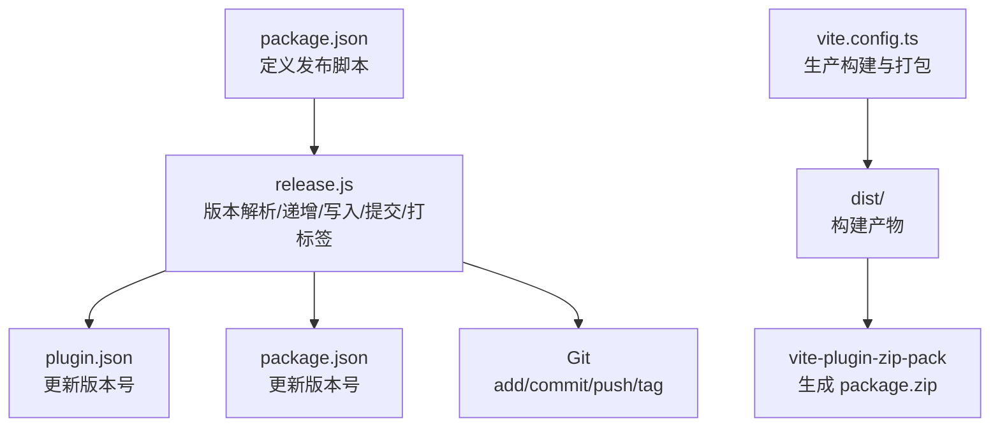

图表来源
- [package.json](file://package.json#L10-L17)
- [release.js](file://release.js#L142-L178)
- [plugin.json](file://plugin.json#L1-L34)
- [vite.config.ts](file://vite.config.ts#L132-L136)

章节来源
- [package.json](file://package.json#L10-L17)
- [release.js](file://release.js#L142-L178)
- [plugin.json](file://plugin.json#L1-L34)
- [vite.config.ts](file://vite.config.ts#L132-L136)
- [README.md](file://README.md#L336-L362)

## 核心组件
- 发布脚本（release.js）
  - 版本解析：将形如 a.b.c 的字符串拆分为 major/minor/patch 数字。
  - 版本递增：支持 patch、minor、major 三类递增，遵循语义化版本规则。
  - 交互式选择：支持自动选项与手动输入；支持 --mode=manual/patch/minor/major。
  - 写入版本：同时更新 plugin.json 与 package.json 中的 version 字段。
  - Git 操作：提交变更、推送、创建并推送标签 v{version}。
- 发布脚本入口（package.json）
  - 定义 release、release:manual、release:patch、release:minor、release:major、build 等脚本。
- 构建与打包（vite.config.ts）
  - 生产构建时启用 vite-plugin-zip-pack，将 dist 目录打包为 package.zip。
- 插件元数据（plugin.json）
  - 包含当前版本号，发布脚本会在此文件中更新版本。

章节来源
- [release.js](file://release.js#L17-L56)
- [release.js](file://release.js#L74-L178)
- [package.json](file://package.json#L10-L17)
- [vite.config.ts](file://vite.config.ts#L132-L136)
- [plugin.json](file://plugin.json#L1-L34)

## 架构总览
发布流程由“脚本入口 -> 版本处理 -> 文件更新 -> Git 操作 -> 构建打包”构成，整体顺序如下：

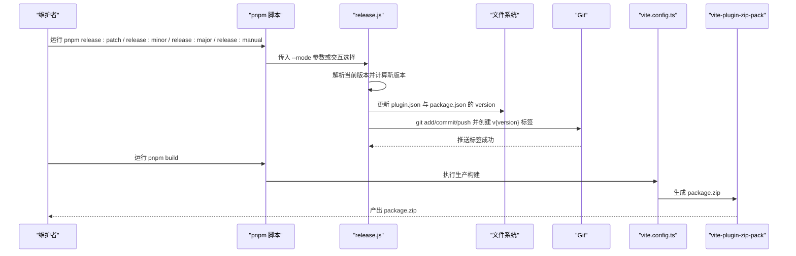

图表来源
- [package.json](file://package.json#L10-L17)
- [release.js](file://release.js#L74-L178)
- [vite.config.ts](file://vite.config.ts#L132-L136)

## 详细组件分析

### 发布脚本（release.js）工作原理
- 版本解析与递增
  - 解析：将版本字符串按点号分割为整数数组，映射为 major/minor/patch。
  - 递增：patch 直接对补丁号加一；minor 对次级号加一并将补丁清零；major 对主版本加一并将次级与补丁清零。
- 交互式选择与模式
  - 支持 --mode=manual/patch/minor/major；未提供模式时进入交互菜单，提供 1/2/3/4 选项与退出选项。
  - 输入校验：仅接受形如 a.b.c 的版本格式。
- 文件更新
  - 同步更新 plugin.json 与 package.json 中的 version 字段。
- Git 操作
  - 先 add/commit/push，再创建并推送 v{version} 标签。
- 错误处理
  - 对无效选项、非法版本格式、Git 操作异常进行提示并终止。

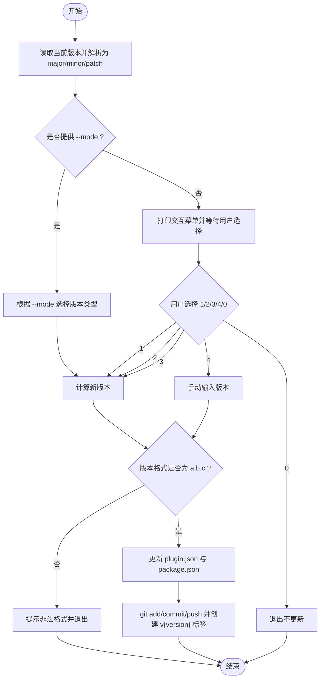

图表来源
- [release.js](file://release.js#L17-L56)
- [release.js](file://release.js#L74-L178)

章节来源
- [release.js](file://release.js#L17-L56)
- [release.js](file://release.js#L74-L178)

### 发布命令与使用场景
- pnpm release:patch
  - 自动将补丁版本号加一，适合修复小缺陷或微调。
- pnpm release:minor
  - 自动将次版本号加一并重置补丁号，适合新增向后兼容的功能。
- pnpm release:major
  - 自动将主版本号加一并重置次、补丁号，适合破坏性变更或重大重构。
- pnpm release:manual
  - 交互式手动输入任意版本号，适用于需要精确控制版本号的场景（例如回退或特殊发布）。

章节来源
- [package.json](file://package.json#L10-L17)
- [README.md](file://README.md#L336-L362)

### 构建与打包（vite.config.ts）
- 生产构建
  - 当非 watch 模式时，构建产物输出至 dist 目录。
- 打包生成 package.zip
  - 通过 vite-plugin-zip-pack 将 dist 目录打包为 package.zip，输出到仓库根目录。
- 开发模式
  - watch 模式下构建到思源工作区插件目录，便于热重载调试。

章节来源
- [vite.config.ts](file://vite.config.ts#L90-L156)
- [vite.config.ts](file://vite.config.ts#L132-L136)

### 发布脚本与构建流程衔接
- 发布脚本负责更新版本号并创建 Git 标签。
- 构建脚本负责生产构建与打包，二者解耦，可在发布后单独执行构建或使用 CI 流水线完成。

章节来源
- [release.js](file://release.js#L142-L178)
- [vite.config.ts](file://vite.config.ts#L132-L136)

## 依赖分析
- 脚本入口依赖
  - package.json 定义了发布脚本与构建脚本，作为发布流程的入口。
- 发布脚本依赖
  - 读取 plugin.json 获取当前版本，随后更新 plugin.json 与 package.json。
  - 通过 child_process.exec 调用 Git 命令完成提交与打标签。
- 构建与打包依赖
  - vite.config.ts 依赖 vite-plugin-zip-pack 实现打包；依赖 viteStaticCopy 复制静态资源。

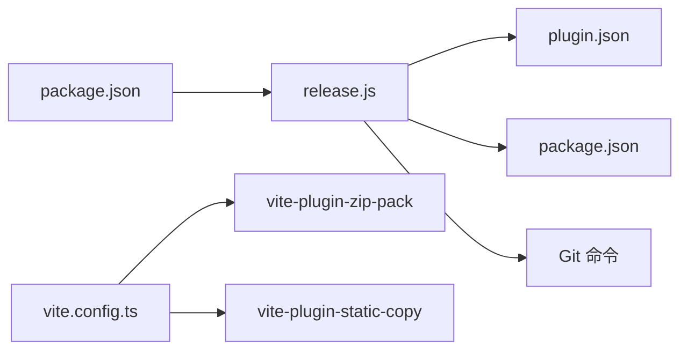

图表来源
- [package.json](file://package.json#L10-L17)
- [release.js](file://release.js#L142-L178)
- [plugin.json](file://plugin.json#L1-L34)
- [vite.config.ts](file://vite.config.ts#L132-L136)

章节来源
- [package.json](file://package.json#L10-L17)
- [release.js](file://release.js#L142-L178)
- [vite.config.ts](file://vite.config.ts#L132-L136)

## 性能考虑
- 发布脚本为单次执行任务，性能开销主要来自文件读写与 Git 操作，通常可忽略。
- 构建阶段的性能取决于 dist 目录规模与打包插件行为；建议保持 dist 清晰、避免冗余资源。
- 若在 CI 中执行，建议缓存依赖与构建产物以提升速度。

## 故障排除指南
- 版本格式不合法
  - 现象：脚本提示非法版本格式并退出。
  - 排查：确认输入为 a.b.c 形式，且均为数字。
- Git 操作失败
  - 现象：添加/提交/推送或打标签时报错。
  - 排查：检查本地分支状态、远程仓库权限、网络连通性；必要时先手动执行相应 Git 命令定位问题。
- 构建未生成 package.zip
  - 现象：执行 pnpm build 后未生成 package.zip。
  - 排查：确认当前为生产构建（非 watch 模式），dist 目录存在且包含构建产物；检查 vite.config.ts 中 zipPack 配置。
- 版本未同步更新
  - 现象：plugin.json 或 package.json 的 version 未更新。
  - 排查：确认脚本已成功写入文件；检查文件权限与编辑器是否占用文件。

章节来源
- [release.js](file://release.js#L135-L178)
- [vite.config.ts](file://vite.config.ts#L132-L136)

## 结论
该发布流程通过脚本化的方式实现了版本号管理、文件更新与 Git 标签的自动化，配合生产构建与打包插件，形成从版本更新到产物发布的完整闭环。维护者可根据变更级别选择合适的发布命令，或在需要时使用手动模式精确控制版本号。建议在团队内统一发布规范，结合 CI/CD 实现更稳定的发布体验。

## 附录
- 发布最佳实践
  - 在发布前确保本地工作区干净，无未提交更改。
  - 优先使用语义化版本规则：补丁修复、次版本新增兼容功能、主版本破坏性变更。
  - 在多人协作时，发布前先拉取最新代码，避免标签冲突。
  - 在 CI 中执行构建与打包，确保产物一致性。
  - 发布后及时更新变更记录与发布说明，便于用户追踪。
````

## File: .qoder/repowiki/zh/content/参考资源.md
````markdown
# 参考资源

<cite>
**本文引用的文件**
- [README.md](file://README.md)
- [package.json](file://package.json)
- [vite.config.ts](file://vite.config.ts)
- [tsconfig.json](file://tsconfig.json)
- [eslint.config.mjs](file://eslint.config.mjs)
- [plugin.json](file://plugin.json)
- [src/index.ts](file://src/index.ts)
- [src/main.ts](file://src/main.ts)
- [src/App.vue](file://src/App.vue)
- [src/config/settings.ts](file://src/config/settings.ts)
- [src/features/index.ts](file://src/features/index.ts)
- [src/features/pageLock/index.ts](file://src/features/pageLock/index.ts)
- [src/features/tableOfContents/index.ts](file://src/features/tableOfContents/index.ts)
- [src/features/generalSettings/index.ts](file://src/features/generalSettings/index.ts)
</cite>

## 目录
1. [简介](#简介)
2. [项目结构](#项目结构)
3. [核心组件](#核心组件)
4. [架构总览](#架构总览)
5. [详细组件分析](#详细组件分析)
6. [依赖分析](#依赖分析)
7. [性能考虑](#性能考虑)
8. [故障排查指南](#故障排查指南)
9. [结论](#结论)
10. [附录](#附录)

## 简介
本参考资源旨在为开发者提供系统性的学习路径，围绕思源笔记插件生态与现代前端技术栈展开：
- 思源笔记官方与插件开发基础：官网、API 文档与插件开发指南
- Vue 3 与 Vite 官方文档：掌握核心框架与构建工具
- 关键库文档：TypeScript、Sass、ESLint
- 从入门到精通的学习资源与实践建议，促进社区知识共享与技术提升

## 项目结构
该项目是一个基于 Vite + Vue 3 的思源笔记插件模板，提供模块化功能、国际化、配置管理、构建与发布流程等能力。核心目录与职责概览如下：
- src：源代码根目录
  - components：通用 Vue 组件（如设置面板）
  - config：配置管理（插件设置、默认值、持久化）
  - features：功能模块集合（页面锁定、目录索引、通用设置、二维码、单位转换、磁盘浏览器等）
  - i18n：多语言资源
  - types：类型声明
  - utils：工具函数
  - App.vue：主应用组件
  - api.ts：对思源 API 的封装
  - index.ts：插件主类与生命周期
  - main.ts：Vue 应用初始化与挂载
- 根目录：构建配置、类型配置、代码规范、插件元数据、发布脚本等

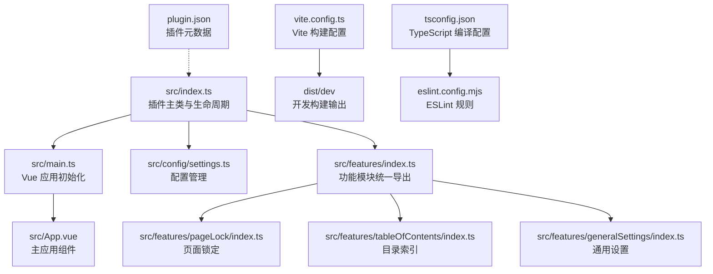

图表来源
- [src/index.ts](file://src/index.ts#L1-L140)
- [src/main.ts](file://src/main.ts#L1-L45)
- [src/App.vue](file://src/App.vue#L1-L216)
- [src/config/settings.ts](file://src/config/settings.ts#L1-L141)
- [src/features/index.ts](file://src/features/index.ts#L1-L15)
- [src/features/pageLock/index.ts](file://src/features/pageLock/index.ts#L1-L573)
- [src/features/tableOfContents/index.ts](file://src/features/tableOfContents/index.ts#L1-L410)
- [src/features/generalSettings/index.ts](file://src/features/generalSettings/index.ts#L1-L414)
- [vite.config.ts](file://vite.config.ts#L1-L157)
- [tsconfig.json](file://tsconfig.json#L1-L57)
- [eslint.config.mjs](file://eslint.config.mjs#L1-L129)
- [plugin.json](file://plugin.json#L1-L34)

章节来源
- [README.md](file://README.md#L1-L120)
- [README.md](file://README.md#L363-L429)

## 核心组件
- 插件主类与生命周期：负责平台检测、配置加载、功能模块注册、设置面板打开、卸载清理等
- Vue 应用初始化：创建并挂载主应用组件，绑定插件实例，注入紧凑模式样式
- 配置管理：定义插件设置接口、默认值、持久化读写与字体设置
- 功能模块：以模块化方式提供页面锁定、目录索引、通用设置等能力

章节来源
- [src/index.ts](file://src/index.ts#L1-L140)
- [src/main.ts](file://src/main.ts#L1-L45)
- [src/config/settings.ts](file://src/config/settings.ts#L1-L141)
- [src/features/index.ts](file://src/features/index.ts#L1-L15)

## 架构总览
下图展示插件从加载到运行的整体流程，以及与构建工具、类型与规范配置的关系。

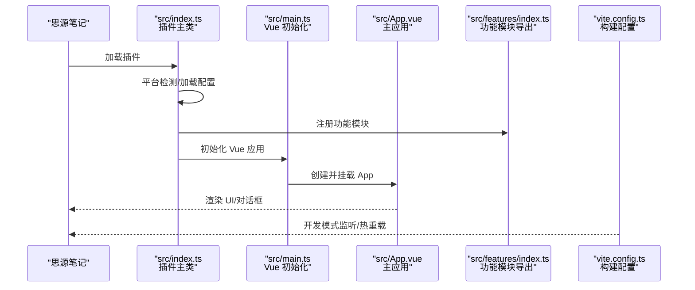

图表来源
- [src/index.ts](file://src/index.ts#L1-L140)
- [src/main.ts](file://src/main.ts#L1-L45)
- [src/App.vue](file://src/App.vue#L1-L216)
- [src/features/index.ts](file://src/features/index.ts#L1-L15)
- [vite.config.ts](file://vite.config.ts#L1-L157)

## 详细组件分析

### 插件主类与生命周期（src/index.ts）
- 职责
  - 平台识别（移动端、浏览器、本地、Electron、窗口模式）
  - 加载插件配置并合并默认值
  - 条件注册功能模块（超级面板始终启用，其余按配置开关）
  - 提供设置面板打开入口与设置更新方法
- 关键点
  - 通过统一导出的功能模块注册器批量启用/禁用功能
  - 与配置管理模块协作完成设置持久化

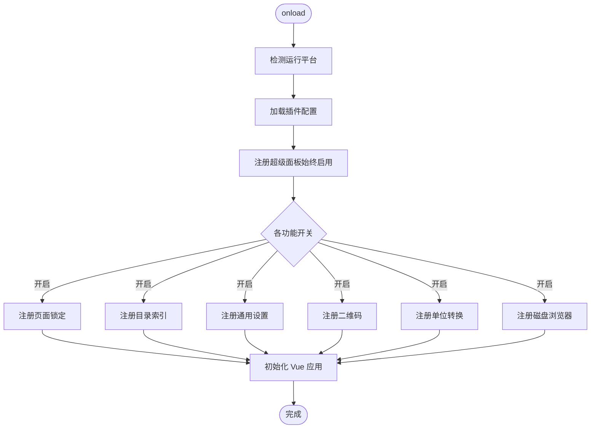

图表来源
- [src/index.ts](file://src/index.ts#L1-L140)

章节来源
- [src/index.ts](file://src/index.ts#L1-L140)

### Vue 应用初始化（src/main.ts）
- 职责
  - 绑定插件实例，注入紧凑模式样式
  - 创建并挂载主应用组件到文档体
  - 提供销毁钩子，释放资源
- 关键点
  - 通过全局类名控制紧凑模式
  - 以容器元素挂载应用，便于后续扩展

章节来源
- [src/main.ts](file://src/main.ts#L1-L45)

### 配置管理（src/config/settings.ts）
- 职责
  - 定义插件设置接口与默认值
  - 提供设置加载/保存方法（插件数据存储）
  - 提供字体设置的本地持久化与重置
- 关键点
  - 合并默认值与已保存配置，保证新增字段的兼容性
  - 字体设置通过 localStorage 与 CSS 变量联动

章节来源
- [src/config/settings.ts](file://src/config/settings.ts#L1-L141)

### 功能模块：页面锁定（src/features/pageLock/index.ts）
- 职责
  - 在文档标题栏注入锁定/解锁按钮
  - 监听文档切换与加载事件，动态拦截/显示锁定内容
  - 支持全局密码设置、更新与重置（超级密码）
- 关键点
  - 通过事件总线与 DOM 查询定位编辑器实例
  - 动态注入遮罩层与按钮样式，适配思源原生 UI

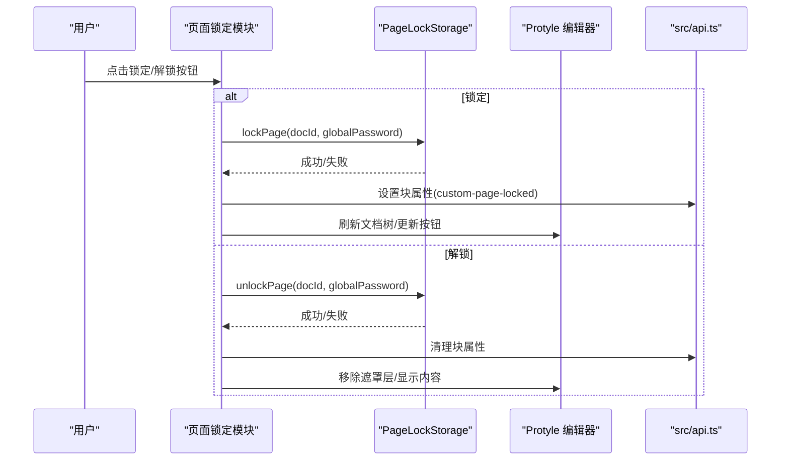

图表来源
- [src/features/pageLock/index.ts](file://src/features/pageLock/index.ts#L1-L573)
- [src/api.ts](file://src/api.ts#L1-L200)

章节来源
- [src/features/pageLock/index.ts](file://src/features/pageLock/index.ts#L1-L573)

### 功能模块：目录索引（src/features/tableOfContents/index.ts）
- 职责
  - 注册快捷键命令（插入子文档列表、子文档引用、子文档大纲）
  - 基于当前光标位置与文档上下文，生成并插入索引内容
  - 通过 SQL 查询与属性标记，避免重复插入与高效更新
- 关键点
  - 多种策略获取当前文档 ID，确保跨场景可用
  - 使用自定义属性标记生成块，便于后续更新

章节来源
- [src/features/tableOfContents/index.ts](file://src/features/tableOfContents/index.ts#L1-L410)

### 功能模块：通用设置（src/features/generalSettings/index.ts）
- 职责
  - 在右侧边栏添加通用设置 Dock
  - 应用全局字体设置与代码块样式
  - 提供字体设置重置与事件分发
  - 监听工作区打开与关闭所有页签事件
- 关键点
  - 通过 CSS 变量与类名控制全局样式
  - 事件驱动模块间通信

章节来源
- [src/features/generalSettings/index.ts](file://src/features/generalSettings/index.ts#L1-L414)

### 主应用组件（src/App.vue）
- 职责
  - 管理设置面板、图片查看器、二维码对话框的可见性
  - 暴露窗口级方法（打开设置、打开二维码对话框）
  - 添加状态栏元素
- 关键点
  - 通过事件监听器响应外部触发
  - 与插件实例解耦，通过全局钩子暴露能力

章节来源
- [src/App.vue](file://src/App.vue#L1-L216)

## 依赖分析
- 运行时依赖
  - Vue 3：组件化 UI 开发
  - @iconify/vue：图标库集成
  - browser-image-compression：图片压缩
  - qrcode：二维码生成
  - siyuan：思源笔记 SDK
- 开发依赖
  - Vite：快速构建与热重载
  - TypeScript：类型安全
  - Sass：样式预处理
  - ESLint：代码规范与格式化
  - @vitejs/plugin-vue、@vue/tsconfig：框架与类型配置
  - vite-plugin-static-copy、vite-plugin-zip-pack：静态资源复制与打包

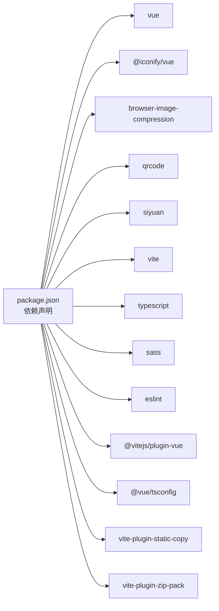

图表来源
- [package.json](file://package.json#L1-L46)

章节来源
- [package.json](file://package.json#L1-L46)

## 性能考虑
- 构建优化
  - 开发模式下禁用最小化与生成 source map，便于调试
  - 生产模式启用最小化与打包压缩，减小体积
- 资源监听
  - 开发模式监听 i18n、README、plugin.json 等静态资源变更，触发热重载
- 运行时优化
  - 按需注册功能模块，减少初始加载负担
  - 使用 CSS 变量与类名切换控制样式，避免频繁 DOM 操作

章节来源
- [vite.config.ts](file://vite.config.ts#L1-L157)
- [src/index.ts](file://src/index.ts#L1-L140)

## 故障排查指南
- 热重载不生效
  - 检查 .env 中 VITE_SIYUAN_WORKSPACE_PATH 是否正确指向思源工作区
  - 确认思源笔记客户端正在运行
- 插件加载失败
  - 检查 plugin.json 中 minAppVersion 与当前思源版本匹配
- 构建报错
  - 清理依赖后重装；确认 Node.js 版本满足要求；检查 TypeScript 类型定义
- 常见问题
  - 如何禁用某个功能模块：在设置面板关闭对应开关或直接修改配置
  - 如何查看日志：开启开发者工具，使用浏览器控制台与插件日志

章节来源
- [README.md](file://README.md#L396-L436)

## 结论
本项目提供了完整的思源笔记插件开发模板，涵盖现代前端技术栈与插件生态实践。通过模块化功能、配置管理、国际化与构建发布流程，开发者可以快速上手并扩展功能。建议结合官方文档与社区资源持续学习，逐步提升到插件架构设计与性能优化层面。

## 附录

### 学习资源清单（按层次递进）

- 入门阶段
  - 思源笔记官网与插件生态
    - 官网：https://b3log.org/siyuan/
    - API 文档：https://github.com/siyuan-note/siyuan/blob/master/API.md
    - 插件开发指南：https://github.com/siyuan-note/plugin-sample
  - Vue 3 官方文档
    - Vue 3 文档：https://vuejs.org/
  - Vite 官方文档
    - Vite 文档：https://vitejs.dev/

- 进阶阶段
  - TypeScript 官方文档
    - TypeScript 文档：https://www.typescriptlang.org/
  - Sass 官方文档
    - Sass 文档：https://sass-lang.com/documentation/
  - ESLint 官方文档
    - ESLint 文档：https://eslint.org/docs/latest/use/getting-started

- 实践与社区
  - 项目使用的关键库与版本
    - Vue 3.3.8、Vite 6.2.1、TypeScript 5.0.4、Sass 1.62.1、ESLint 9.22.0、siyuan 1.1.0
  - 项目脚本与发布
    - 开发：pnpm dev（监听构建并热重载）
    - 生产：pnpm build（构建 dist 并打包 package.zip）
    - 发布：pnpm release[:manual|:patch|:minor|:major]（自动化版本与打包）

章节来源
- [README.md](file://README.md#L417-L429)
- [package.json](file://package.json#L1-L46)
- [vite.config.ts](file://vite.config.ts#L1-L157)
- [tsconfig.json](file://tsconfig.json#L1-L57)
- [eslint.config.mjs](file://eslint.config.mjs#L1-L129)
- [plugin.json](file://plugin.json#L1-L34)
````

## File: .qoder/repowiki/zh/content/常见问题.md
````markdown
# 常见问题

<cite>
**本文引用的文件**
- [plugin.json](file://plugin.json)
- [package.json](file://package.json)
- [vite.config.ts](file://vite.config.ts)
- [README.md](file://README.md)
- [src/index.ts](file://src/index.ts)
- [src/config/settings.ts](file://src/config/settings.ts)
- [src/features/index.ts](file://src/features/index.ts)
- [src/features/generalSettings/modules/ModuleManager.ts](file://src/features/generalSettings/modules/ModuleManager.ts)
- [tsconfig.json](file://tsconfig.json)
- [tsconfig.node.json](file://tsconfig.node.json)
</cite>

## 目录
1. [简介](#简介)
2. [项目结构](#项目结构)
3. [核心组件](#核心组件)
4. [架构总览](#架构总览)
5. [详细组件分析](#详细组件分析)
6. [依赖关系分析](#依赖关系分析)
7. [性能注意事项](#性能注意事项)
8. [故障排除指南](#故障排除指南)
9. [结论](#结论)

## 简介
本指南聚焦于“热重载不生效”“插件加载失败”“禁用功能模块”“构建报错”等常见问题，结合仓库中的实际实现，给出可操作的排查步骤与修复建议，帮助用户与开发者快速定位并解决问题，降低支持成本。

## 项目结构
该插件基于 Vite + Vue3，采用模块化功能架构，通过统一入口加载配置与功能模块；开发模式下通过环境变量与 Vite 插件实现热重载；生产模式下进行打包并生成发布包。

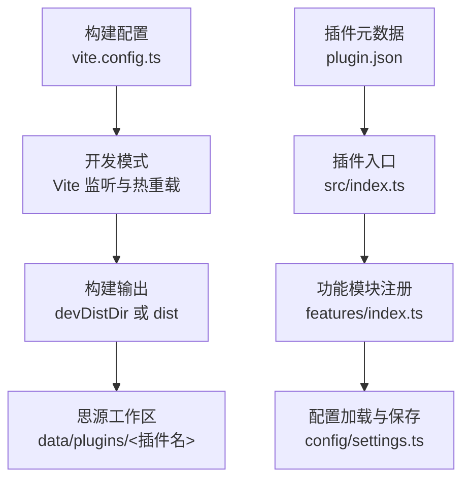

图表来源
- [vite.config.ts](file://vite.config.ts#L1-L157)
- [src/index.ts](file://src/index.ts#L1-L140)
- [src/features/index.ts](file://src/features/index.ts#L1-L15)
- [src/config/settings.ts](file://src/config/settings.ts#L1-L141)
- [plugin.json](file://plugin.json#L1-L34)

章节来源
- [vite.config.ts](file://vite.config.ts#L1-L157)
- [README.md](file://README.md#L1-L120)

## 核心组件
- 插件入口与生命周期：负责加载配置、注册功能模块、初始化 UI。
- 功能模块注册：按配置开关选择性注册各功能模块。
- 配置管理：提供默认配置、加载与保存逻辑，支持设置面板可视化控制。
- 构建与热重载：通过 Vite 环境变量与插件实现监听与自动部署到思源工作区。

章节来源
- [src/index.ts](file://src/index.ts#L1-L140)
- [src/config/settings.ts](file://src/config/settings.ts#L1-L141)
- [src/features/index.ts](file://src/features/index.ts#L1-L15)
- [vite.config.ts](file://vite.config.ts#L1-L157)

## 架构总览
下面的序列图展示了开发模式下热重载的关键流程：启动开发命令、读取环境变量、启用监听与自动复制、构建到目标目录并触发热重载。

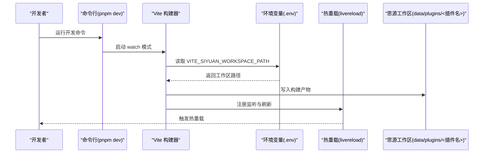

图表来源
- [vite.config.ts](file://vite.config.ts#L1-L157)
- [README.md](file://README.md#L29-L58)

章节来源
- [vite.config.ts](file://vite.config.ts#L1-L157)
- [README.md](file://README.md#L29-L58)

## 详细组件分析

### 热重载实现与环境变量
- 环境变量：开发模式需设置 VITE_SIYUAN_WORKSPACE_PATH 指向思源工作区目录，Vite 会据此决定构建输出目录与监听目标。
- 监听机制：开发模式启用 livereload 插件与外部文件监听，确保静态资源变更后自动刷新。
- 构建行为：watch 模式下输出到 devDistDir（即工作区插件目录），非 watch 模式输出到 dist 并生成发布包。

章节来源
- [vite.config.ts](file://vite.config.ts#L1-L157)
- [README.md](file://README.md#L29-L58)

### 插件加载与兼容性
- 元数据：plugin.json 中包含最小应用版本字段，用于限制插件在旧版本客户端上的加载。
- 入口：src/index.ts 作为插件主类，加载配置并按开关注册功能模块。

章节来源
- [plugin.json](file://plugin.json#L1-L34)
- [src/index.ts](file://src/index.ts#L1-L140)

### 功能模块禁用与配置持久化
- 配置接口：src/config/settings.ts 定义了多项功能开关与默认值。
- 注册逻辑：src/index.ts 根据 settings 中的开关逐项注册功能模块。
- 设置面板：README 提供了通过设置面板关闭功能开关的方法。

章节来源
- [src/config/settings.ts](file://src/config/settings.ts#L1-L141)
- [src/index.ts](file://src/index.ts#L1-L140)
- [README.md](file://README.md#L396-L409)

### 构建与类型定义
- 构建脚本：package.json 定义了 dev/build/release 等脚本。
- TypeScript 配置：tsconfig.json 指定类型与解析策略，确保类型检查与打包一致性。
- Node 版本：README 明确要求 Node.js >= 16。

章节来源
- [package.json](file://package.json#L1-L46)
- [tsconfig.json](file://tsconfig.json#L1-L57)
- [README.md](file://README.md#L17-L23)

## 依赖关系分析
- 构建链路：package.json -> vite.config.ts -> src/index.ts -> src/features/index.ts -> src/config/settings.ts
- 环境链路：.env -> vite.config.ts -> 思源工作区
- 类型链路：tsconfig.json -> src/index.ts 与各模块

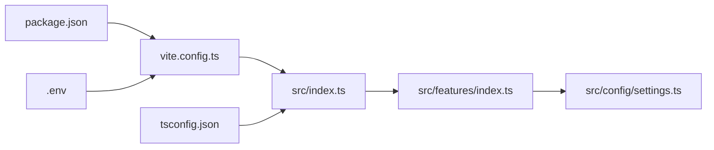

图表来源
- [package.json](file://package.json#L1-L46)
- [vite.config.ts](file://vite.config.ts#L1-L157)
- [src/index.ts](file://src/index.ts#L1-L140)
- [src/features/index.ts](file://src/features/index.ts#L1-L15)
- [src/config/settings.ts](file://src/config/settings.ts#L1-L141)
- [tsconfig.json](file://tsconfig.json#L1-L57)

章节来源
- [package.json](file://package.json#L1-L46)
- [vite.config.ts](file://vite.config.ts#L1-L157)
- [src/index.ts](file://src/index.ts#L1-L140)
- [src/features/index.ts](file://src/features/index.ts#L1-L15)
- [src/config/settings.ts](file://src/config/settings.ts#L1-L141)
- [tsconfig.json](file://tsconfig.json#L1-L57)

## 性能注意事项
- 开发模式下关闭压缩与生成 source map，便于调试但体积较大；生产模式建议开启压缩与最小化。
- 监听外部文件（README、plugin.json、国际化文件）会增加监听开销，仅在开发模式启用。
- 热重载依赖 livereload 插件，确保网络与端口可用，避免跨设备访问导致刷新异常。

章节来源
- [vite.config.ts](file://vite.config.ts#L1-L157)

## 故障排除指南

### 症状：热重载不生效
可能原因与排查步骤：
- 确认已设置 VITE_SIYUAN_WORKSPACE_PATH 环境变量指向正确的思源工作区目录（参考 README 的环境配置示例）。
- 确认正在运行思源笔记客户端，且工作区目录可写。
- 确认开发命令已启动（例如 pnpm dev），并观察终端输出是否显示构建到 devDistDir。
- 确认浏览器已打开思源笔记并刷新页面，以触发热重载。
- 若仍不生效，检查是否有权限问题或路径包含特殊字符。

章节来源
- [README.md](file://README.md#L29-L58)
- [vite.config.ts](file://vite.config.ts#L1-L157)

### 症状：插件加载失败
可能原因与排查步骤：
- 检查 plugin.json 中的最小应用版本字段是否与当前思源笔记版本兼容。
- 确认插件入口 src/index.ts 能正常加载配置并注册功能模块。
- 若存在版本不兼容，升级或降级思源笔记至满足 minAppVersion 的范围。

章节来源
- [plugin.json](file://plugin.json#L1-L34)
- [src/index.ts](file://src/index.ts#L1-L140)

### 症状：无法禁用特定功能模块
可行方案：
- 在设置面板中关闭对应功能开关（README 提供了通过设置面板禁用模块的方法）。
- 或者直接修改配置文件：插件配置保存在插件数据存储中，可通过 loadSettings 与 saveSettings 进行读写；也可通过 ModuleManager 对设置模块进行启用/禁用管理（适用于通用设置模块管理器）。

章节来源
- [README.md](file://README.md#L396-L409)
- [src/config/settings.ts](file://src/config/settings.ts#L1-L141)
- [src/features/generalSettings/modules/ModuleManager.ts](file://src/features/generalSettings/modules/ModuleManager.ts#L1-L99)

### 症状：构建报错
系统性排查步骤：
- 清理并重新安装依赖：删除 node_modules 并重新安装依赖。
- 检查 Node.js 版本是否满足要求（README 要求 Node.js >= 16）。
- 确认 TypeScript 类型定义与编译配置正确（tsconfig.json 已包含必要的类型与解析选项）。
- 若涉及第三方依赖，确认其与当前 Node.js/Vite/TypeScript 版本兼容。

章节来源
- [README.md](file://README.md#L17-L23)
- [package.json](file://package.json#L1-L46)
- [tsconfig.json](file://tsconfig.json#L1-L57)
- [tsconfig.node.json](file://tsconfig.node.json#L1-L13)

### 症状：开发模式下构建产物未写入工作区
可能原因与排查步骤：
- 确认已传入 watch 参数（例如 pnpm dev），以便输出到 devDistDir。
- 确认 VITE_SIYUAN_WORKSPACE_PATH 已正确设置，且路径有效。
- 确认目标目录存在且有写入权限。

章节来源
- [vite.config.ts](file://vite.config.ts#L1-L157)

### 症状：功能模块未按预期启用/禁用
排查步骤：
- 检查 src/config/settings.ts 中的默认配置与已保存配置合并逻辑。
- 在 src/index.ts 中确认注册逻辑是否根据 settings 开关执行。
- 通过设置面板更新配置后，确认 saveSettings 成功并触发重新注册。

章节来源
- [src/config/settings.ts](file://src/config/settings.ts#L1-L141)
- [src/index.ts](file://src/index.ts#L1-L140)

## 结论
通过结合环境变量、构建配置、插件入口与配置管理等关键点，可以高效定位并解决热重载、插件加载、功能模块禁用与构建报错等问题。建议在日常开发中遵循 README 的环境与版本要求，配合本指南的排查步骤，显著降低问题处理成本。
````

## File: .qoder/repowiki/zh/content/功能模块详解/超级面板.md
````markdown
# 超级面板

<cite>
**本文引用的文件**
- [SuperPanelView.vue](file://src/features/superPanel/SuperPanelView.vue)
- [FeatureCard.vue](file://src/features/superPanel/components/FeatureCard.vue)
- [index.ts（超级面板）](file://src/features/superPanel/index.ts)
- [types.ts（超级面板）](file://src/features/superPanel/types.ts)
- [SettingPanel.vue](file://src/components/SettingPanel.vue)
- [index.ts（功能总入口）](file://src/features/index.ts)
- [index.ts（目录索引）](file://src/features/tableOfContents/index.ts)
- [index.ts（图片压缩）](file://src/features/imageCompressor/index.ts)
- [index.ts（通用设置）](file://src/features/generalSettings/index.ts)
- [index.ts（本地磁盘）](file://src/features/diskBrowser/index.ts)
- [App.vue](file://src/App.vue)
- [settings.ts（配置）](file://src/config/settings.ts)
- [iconHelper.ts（图标工具）](file://src/utils/iconHelper.ts)
- [main.ts（插件入口）](file://src/main.ts)
</cite>

## 更新摘要
**变更内容**
- 根据最新代码更新了超级面板的UI布局与样式细节，包括面板尺寸、动画效果、响应式适配等
- 优化了功能卡片（FeatureCard）的视觉样式，包括边框、阴影、悬停效果和布局间距
- 新增了AI配置面板的样式与交互说明
- 更新了性能优化建议，反映最新的懒加载与渲染策略
- 修正了故障排查指南中的部分描述以匹配当前实现

## 目录
1. [简介](#简介)
2. [项目结构](#项目结构)
3. [核心组件](#核心组件)
4. [架构总览](#架构总览)
5. [详细组件分析](#详细组件分析)
6. [依赖关系分析](#依赖关系分析)
7. [性能考虑](#性能考虑)
8. [故障排查指南](#故障排查指南)
9. [结论](#结论)
10. [附录](#附录)

## 简介
超级面板是插件的功能统一入口，位于右侧边栏，以卡片形式聚合所有功能模块，提供一键访问与快捷操作。其核心职责包括：
- 作为插件功能的“总控台”，集中展示各功能模块的状态与入口
- 通过 FeatureCard 组件实现可复用、可扩展的卡片式 UI 设计
- 通过 index.ts 实现模块化注册与事件驱动的交互流程
- 与 SettingPanel.vue 协作，实现“功能开关”与“设置面板”的联动

## 项目结构
超级面板位于 features/superPanel 目录下，采用“视图 + 组件 + 类型 + 注册入口”的分层组织方式；同时与 App.vue、SettingPanel.vue、各功能模块的 index.ts 文件协同工作，形成完整的插件生态。

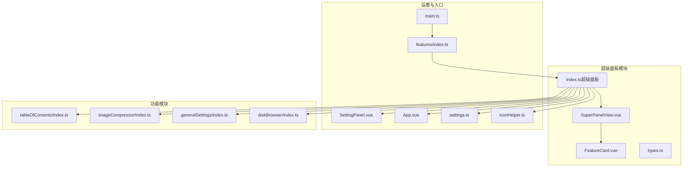

**图表来源**
- [SuperPanelView.vue](file://src/features/superPanel/SuperPanelView.vue#L1-L866)
- [FeatureCard.vue](file://src/features/superPanel/components/FeatureCard.vue#L1-L174)
- [index.ts（超级面板）](file://src/features/superPanel/index.ts#L1-L257)
- [types.ts（超级面板）](file://src/features/superPanel/types.ts#L1-L35)
- [SettingPanel.vue](file://src/components/SettingPanel.vue#L1-L180)
- [index.ts（功能总入口）](file://src/features/index.ts#L1-L15)
- [index.ts（目录索引）](file://src/features/tableOfContents/index.ts#L1-L60)
- [index.ts（图片压缩）](file://src/features/imageCompressor/index.ts#L1-L31)
- [index.ts（通用设置）](file://src/features/generalSettings/index.ts#L1-L80)
- [index.ts（本地磁盘）](file://src/features/diskBrowser/index.ts#L1-L51)
- [App.vue](file://src/App.vue#L1-L100)
- [settings.ts（配置）](file://src/config/settings.ts#L1-L60)
- [iconHelper.ts（图标工具）](file://src/utils/iconHelper.ts#L1-L75)
- [main.ts（插件入口）](file://src/main.ts#L1-L45)

**章节来源**
- [SuperPanelView.vue](file://src/features/superPanel/SuperPanelView.vue#L1-L866)
- [index.ts（超级面板）](file://src/features/superPanel/index.ts#L1-L257)
- [index.ts（功能总入口）](file://src/features/index.ts#L1-L15)
- [main.ts（插件入口）](file://src/main.ts#L1-L45)

## 核心组件
- SuperPanelView.vue：超级面板的视图容器，负责渲染功能卡片、处理遮罩与面板动画、转发用户交互事件（关闭、打开设置、功能动作）
- FeatureCard.vue：功能卡片组件，封装卡片的标题、描述、状态、操作按钮与点击行为
- index.ts（超级面板）：注册入口，负责在顶部栏添加图标与快捷键、创建/卸载 Vue 面板、处理功能动作事件
- types.ts（超级面板）：定义 Feature 与 FeatureAction 的类型结构
- SettingPanel.vue：插件设置面板，用于控制各功能模块的开关与保存
- features/index.ts：统一导出各功能模块的注册函数，便于主入口按需引入
- App.vue：顶层应用容器，承载 SettingPanel、ImageViewer、QRCodeDialog 等全局组件，并监听全局事件（如打开图片压缩器）

**章节来源**
- [SuperPanelView.vue](file://src/features/superPanel/SuperPanelView.vue#L1-L866)
- [FeatureCard.vue](file://src/features/superPanel/components/FeatureCard.vue#L1-L174)
- [index.ts（超级面板）](file://src/features/superPanel/index.ts#L1-L257)
- [types.ts（超级面板）](file://src/features/superPanel/types.ts#L1-L35)
- [SettingPanel.vue](file://src/components/SettingPanel.vue#L1-L180)
- [index.ts（功能总入口）](file://src/features/index.ts#L1-L15)
- [App.vue](file://src/App.vue#L1-L100)

## 架构总览
超级面板的交互流程如下：
- 用户点击顶部栏图标或按下快捷键，触发 toggleSuperPanel，创建 Vue 应用并挂载 SuperPanelView
- SuperPanelView 根据插件设置动态生成功能卡片列表，渲染 FeatureCard
- 用户点击“设置”按钮，SuperPanelView 触发 openSettings 事件，插件打开 SettingPanel
- 用户点击某功能卡片或卡片上的操作按钮，SuperPanelView 触发 action 事件，index.ts 分发到对应功能模块
- 对于需要打开对话框/面板的功能（如图片压缩），App.vue 监听全局事件并显示对应组件

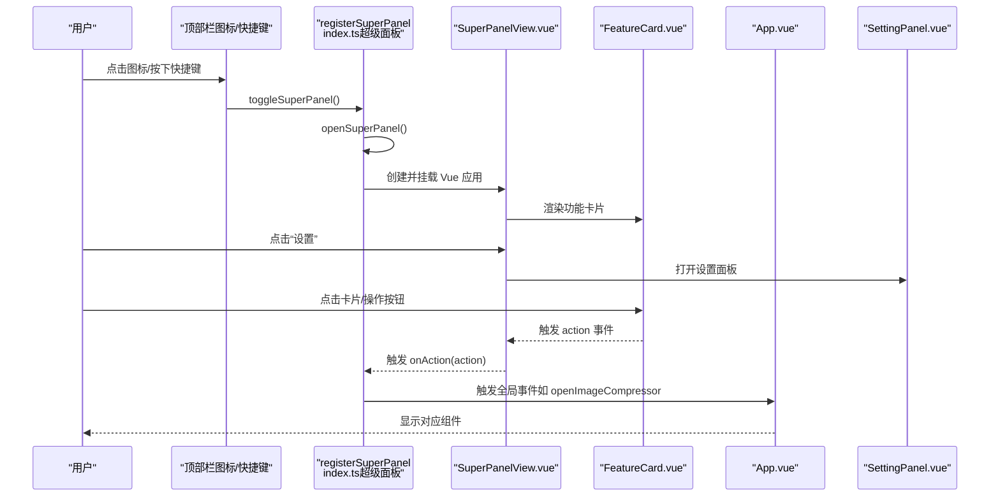

**图表来源**
- [index.ts（超级面板）](file://src/features/superPanel/index.ts#L44-L257)
- [SuperPanelView.vue](file://src/features/superPanel/SuperPanelView.vue#L1-L866)
- [FeatureCard.vue](file://src/features/superPanel/components/FeatureCard.vue#L1-L174)
- [App.vue](file://src/App.vue#L120-L150)
- [SettingPanel.vue](file://src/components/SettingPanel.vue#L1-L180)

## 详细组件分析

### SuperPanelView.vue（UI 布局与交互）
- 结构要点
  - 遮罩层与面板容器使用过渡动画，增强交互体验
  - 头部包含标题与关闭按钮，右侧包含“AI配置”、“刷新”和“关闭”按钮
  - 内容区通过 v-for 渲染功能卡片，每个卡片绑定 i18n 与功能配置
  - 新增AI配置面板，支持切换API供应商、模型选择、密钥输入等
- 数据与状态
  - features 计算属性根据插件设置动态生成各功能项（含启用状态与操作按钮）
  - 支持多语言标题与描述，来源于 i18n
  - 面板宽度固定为720px，支持响应式适配（768px和480px断点）
- 事件流
  - 关闭面板：触发 close 事件
  - 打开设置：触发 openSettings 与 close 事件
  - 功能动作：转发子组件的 action 事件给父级处理
  - 刷新：触发 onRefresh 事件，重新加载面板
  - AI配置更新：触发 onUpdateAiSettings 事件，保存AI相关设置

**章节来源**
- [SuperPanelView.vue](file://src/features/superPanel/SuperPanelView.vue#L1-L866)

### FeatureCard.vue（可复用卡片设计）
- 设计模式
  - 通过 props 接收 feature 与 i18n，emit action 事件，实现“低耦合、高内聚”的组件复用
  - 状态样式随 enabled/disabled 切换，视觉反馈明确
- 交互细节
  - 当卡片被点击且功能未启用时，提示用户前往设置开启
  - 操作按钮仅在 enabled 且 actions 非空时显示，避免无效交互
- 可扩展性
  - 通过 iconKey 与 i18n，可轻松适配新图标与文案
- 样式优化
  - 卡片采用圆角边框（border-radius: 10px），背景色为 `var(--b3-theme-surface)`
  - 启用状态下悬停时显示轻微阴影和上浮效果（transform: translateY(-1px)）
  - 禁用状态降低透明度（opacity: 0.6）并禁用光标

**章节来源**
- [FeatureCard.vue](file://src/features/superPanel/components/FeatureCard.vue#L1-L174)

### types.ts（类型定义）
- FeatureAction：定义操作键名、标签与快捷键
- Feature：定义功能 ID、图标键名、标题、描述、启用状态与操作列表
- 为 SuperPanelView 与 FeatureCard 提供强类型约束，降低运行时错误风险

**章节来源**
- [types.ts（超级面板）](file://src/features/superPanel/types.ts#L1-L35)

### index.ts（超级面板注册与事件分发）
- 注册入口
  - 在顶部栏添加图标与快捷键，回调切换面板显示
  - 使用 iconHelper 将图标替换为 Iconify 图标
- 面板生命周期
  - openSuperPanel：创建容器、创建 Vue 应用、挂载 SuperPanelView 并传入 visible/settings/i18n
  - closeSuperPanel：卸载 Vue 应用并移除容器
- 功能动作分发
  - handleFeatureAction：根据 action 分发到对应命令或全局事件（如插入索引、打开图片压缩器等）
  - 未匹配的动作统一提示“功能开发中”
- 新增AI配置处理
  - handleUpdateAiSettings：处理AI相关设置更新，并通知相关模块同步配置

**章节来源**
- [index.ts（超级面板）](file://src/features/superPanel/index.ts#L1-L257)
- [iconHelper.ts（图标工具）](file://src/utils/iconHelper.ts#L1-L75)

### 与 SettingPanel.vue 的交互关系
- SuperPanelView 触发 openSettings 事件后，index.ts 调用 plugin.openSetting 打开设置面板
- SettingPanel.vue 通过 v-model 控制各功能开关，保存后由 App.vue 的 onSaveSettings 更新插件设置
- 插件设置来源于 settings.ts 中的 PluginSettings 接口，默认值与持久化逻辑在此处定义

**章节来源**
- [SettingPanel.vue](file://src/components/SettingPanel.vue#L1-L180)
- [settings.ts（配置）](file://src/config/settings.ts#L1-L60)
- [App.vue](file://src/App.vue#L40-L90)
- [index.ts（超级面板）](file://src/features/superPanel/index.ts#L1-L80)

### 新功能注册到超级面板的实践步骤
以下为新增功能模块到超级面板的完整流程（以“目录索引”为例）：
1. 在功能模块的 index.ts 中注册命令或快捷键（例如目录索引模块注册了三个命令）
2. 在超级面板的 features 计算属性中添加该功能项，设置 iconKey、标题、描述、enabled 与 actions
3. 在 index.ts 的 handleFeatureAction 中增加对该 action 的分支处理，必要时通过 window.dispatchEvent 触发全局事件
4. 在 App.vue 或对应模块中监听该事件并显示相应组件
5. 在 SettingPanel.vue 中添加对应的开关项，确保用户可在设置中启用/禁用该功能

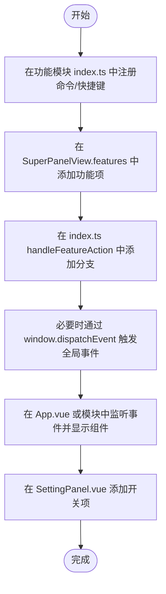

**图表来源**
- [index.ts（目录索引）](file://src/features/tableOfContents/index.ts#L1-L60)
- [SuperPanelView.vue](file://src/features/superPanel/SuperPanelView.vue#L303-L432)
- [index.ts（超级面板）](file://src/features/superPanel/index.ts#L181-L221)
- [App.vue](file://src/App.vue#L120-L150)
- [SettingPanel.vue](file://src/components/SettingPanel.vue#L1-L180)

**章节来源**
- [index.ts（目录索引）](file://src/features/tableOfContents/index.ts#L1-L60)
- [SuperPanelView.vue](file://src/features/superPanel/SuperPanelView.vue#L303-L432)
- [index.ts（超级面板）](file://src/features/superPanel/index.ts#L181-L221)
- [App.vue](file://src/App.vue#L120-L150)
- [SettingPanel.vue](file://src/components/SettingPanel.vue#L1-L180)

## 依赖关系分析
- SuperPanelView 依赖 FeatureCard、IconWrapper 与 types.ts
- index.ts（超级面板）依赖 iconHelper、App.vue、SettingPanel.vue 与各功能模块的 index.ts
- features/index.ts 统一导出各功能模块注册函数，main.ts 通过 features/index.ts 引入并初始化
- SettingPanel.vue 依赖 settings.ts 进行配置读写

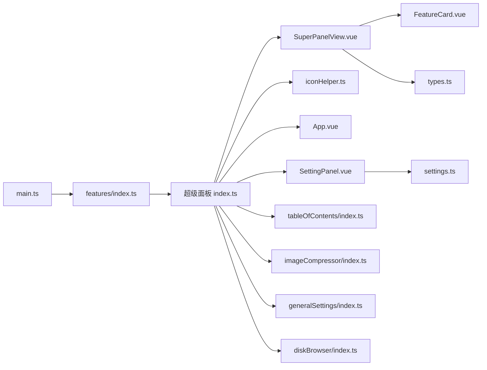

**图表来源**
- [index.ts（超级面板）](file://src/features/superPanel/index.ts#L1-L257)
- [SuperPanelView.vue](file://src/features/superPanel/SuperPanelView.vue#L1-L866)
- [FeatureCard.vue](file://src/features/superPanel/components/FeatureCard.vue#L1-L174)
- [types.ts（超级面板）](file://src/features/superPanel/types.ts#L1-L35)
- [iconHelper.ts（图标工具）](file://src/utils/iconHelper.ts#L1-L75)
- [App.vue](file://src/App.vue#L1-L100)
- [SettingPanel.vue](file://src/components/SettingPanel.vue#L1-L180)
- [index.ts（功能总入口）](file://src/features/index.ts#L1-L15)
- [index.ts（目录索引）](file://src/features/tableOfContents/index.ts#L1-L60)
- [index.ts（图片压缩）](file://src/features/imageCompressor/index.ts#L1-L31)
- [index.ts（通用设置）](file://src/features/generalSettings/index.ts#L1-L80)
- [index.ts（本地磁盘）](file://src/features/diskBrowser/index.ts#L1-L51)
- [settings.ts（配置）](file://src/config/settings.ts#L1-L60)
- [main.ts（插件入口）](file://src/main.ts#L1-L45)

**章节来源**
- [index.ts（超级面板）](file://src/features/superPanel/index.ts#L1-L257)
- [index.ts（功能总入口）](file://src/features/index.ts#L1-L15)
- [main.ts（插件入口）](file://src/main.ts#L1-L45)

## 性能考虑
- 渲染效率
  - SuperPanelView 通过 computed 生成 features，避免重复计算；FeatureCard 使用 v-for + key，保证列表渲染稳定性
  - 面板容器与遮罩层使用过渡动画，建议保持动画时长与缓动函数简洁，避免复杂阴影或滤镜
- 懒加载策略
  - 对于需要额外组件的模块（如图片压缩器），建议采用动态导入（import()）在用户点击时再加载对应组件，减少初始包体与首屏渲染压力
  - 对于大量功能卡片的场景，可考虑虚拟滚动或分组折叠，降低 DOM 数量
- 事件与内存
  - closeSuperPanel 会卸载 Vue 应用并移除容器，避免内存泄漏
  - SettingPanel.vue 在 onMounted/onBeforeUnmount 中清理定时器，确保组件生命周期内资源释放

**章节来源**
- [SuperPanelView.vue](file://src/features/superPanel/SuperPanelView.vue#L1-L866)
- [index.ts（超级面板）](file://src/features/superPanel/index.ts#L85-L257)
- [SettingPanel.vue](file://src/components/SettingPanel.vue#L238-L274)

## 故障排查指南
- 功能卡片不显示
  - 检查插件设置中对应功能的开关是否开启（SettingPanel.vue 的开关项）
  - 确认 SuperPanelView.features 中该功能项的 enabled 字段与插件设置一致
  - 若使用 i18n，确认 i18n 对应键是否存在
- 点击无响应
  - 若卡片被禁用，FeatureCard 会在点击时提示“该功能未启用，请在设置中开启”
  - 若启用但点击无效，检查 index.ts 的 handleFeatureAction 是否包含对应 action 分支
  - 对于需要打开对话框的功能，确认 App.vue 是否监听到对应全局事件
- 图标显示异常
  - 确认 iconHelper 已正确替换顶部栏图标，检查 Iconify API 可用性
- 面板无法关闭
  - 检查 closeSuperPanel 是否被调用，确认 Vue 应用已卸载且容器已移除

**章节来源**
- [FeatureCard.vue](file://src/features/superPanel/components/FeatureCard.vue#L53-L60)
- [index.ts（超级面板）](file://src/features/superPanel/index.ts#L181-L221)
- [App.vue](file://src/App.vue#L120-L150)
- [SettingPanel.vue](file://src/components/SettingPanel.vue#L1-L180)
- [iconHelper.ts（图标工具）](file://src/utils/iconHelper.ts#L1-L75)

## 结论
超级面板通过统一的 UI 卡片与事件分发机制，实现了插件功能的模块化集成与便捷访问。其可复用的 FeatureCard 组件与清晰的注册流程，使得新增功能模块变得简单高效。配合 SettingPanel 的开关控制与 App.vue 的全局事件处理，形成了从“入口 -> 设置 -> 功能执行”的完整闭环。

## 附录
- 新增功能模块到超级面板的关键步骤
  - 在功能模块 index.ts 中注册命令/快捷键
  - 在 SuperPanelView.features 中添加功能项
  - 在 index.ts handleFeatureAction 中添加分支处理
  - 在 App.vue 或模块中监听事件并显示组件
  - 在 SettingPanel.vue 添加开关项

**章节来源**
- [index.ts（目录索引）](file://src/features/tableOfContents/index.ts#L1-L60)
- [SuperPanelView.vue](file://src/features/superPanel/SuperPanelView.vue#L303-L432)
- [index.ts（超级面板）](file://src/features/superPanel/index.ts#L181-L221)
- [App.vue](file://src/App.vue#L120-L150)
- [SettingPanel.vue](file://src/components/SettingPanel.vue#L1-L180)
````

## File: .qoder/repowiki/zh/content/功能模块详解/词典查询.md
````markdown
# 词典查询

<cite>
**本文引用的文件**
- [src/features/wordQuery/WordQueryPanel.vue](file://src/features/wordQuery/WordQueryPanel.vue)
- [src/features/wordQuery/index.ts](file://src/features/wordQuery/index.ts)
- [src/index.ts](file://src/index.ts)
- [src/main.ts](file://src/main.ts)
- [src/i18n/zh_CN.json](file://src/i18n/zh_CN.json)
- [src/i18n/en_US.json](file://src/i18n/en_US.json)
- [src/api.ts](file://src/api.ts)
- [plugin.json](file://plugin.json)
</cite>

## 更新摘要
**变更内容**
- 新增双模式界面（单词查询和长文翻译）
- 扩展支持七种语言（中文、英文、日文、韩文、法文、德文、西班牙文）
- 实现自动语言检测功能
- 更新用户界面以符合GitHub设计语言
- 增加历史记录、收藏和高级选项功能

## 目录
1. [简介](#简介)
2. [项目结构](#项目结构)
3. [核心组件](#核心组件)
4. [架构总览](#架构总览)
5. [详细组件分析](#详细组件分析)
6. [依赖关系分析](#依赖关系分析)
7. [性能与可用性考量](#性能与可用性考量)
8. [故障排查指南](#故障排查指南)
9. [结论](#结论)
10. [附录](#附录)

## 简介
本文件围绕“词典查询”功能，系统梳理 WordQueryPanel.vue 的界面设计与用户交互流程，解释 index.ts 如何集成外部词典 API（通义千问、OpenAI、DeepSeek、自定义）或本地词库实现单词查询和长文翻译，并给出从用户输入到结果显示的完整数据流分析，涵盖网络请求处理、错误状态管理、离线查询支持与缓存策略建议，以及扩展方向（多语言词典、发音功能）与常见问题处理方案。

## 项目结构
词典查询功能位于 src/features/wordQuery 目录，由两个核心文件组成：
- WordQueryPanel.vue：词典查询的前端界面与交互逻辑
- index.ts：后端集成与 API 调用封装，负责 Dock 面板挂载、提示词构建、API 调用与错误处理

此外，插件入口通过 src/index.ts 注册功能模块，确保在启用状态下挂载词典查询面板。

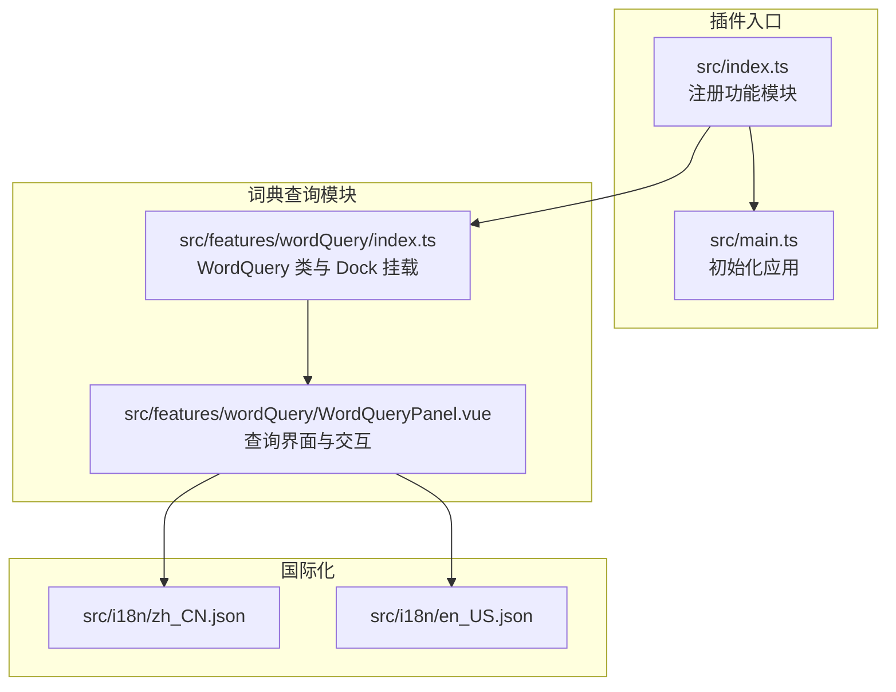

图表来源
- [src/index.ts](file://src/index.ts#L73-L126)
- [src/main.ts](file://src/main.ts#L21-L38)
- [src/features/wordQuery/index.ts](file://src/features/wordQuery/index.ts#L101-L147)
- [src/features/wordQuery/WordQueryPanel.vue](file://src/features/wordQuery/WordQueryPanel.vue#L1-L159)
- [src/i18n/zh_CN.json](file://src/i18n/zh_CN.json#L120-L151)
- [src/i18n/en_US.json](file://src/i18n/en_US.json#L120-L151)

章节来源
- [src/index.ts](file://src/index.ts#L73-L126)
- [src/main.ts](file://src/main.ts#L21-L38)
- [src/features/wordQuery/index.ts](file://src/features/wordQuery/index.ts#L101-L147)
- [src/features/wordQuery/WordQueryPanel.vue](file://src/features/wordQuery/WordQueryPanel.vue#L1-L159)
- [src/i18n/zh_CN.json](file://src/i18n/zh_CN.json#L120-L151)
- [src/i18n/en_US.json](file://src/i18n/en_US.json#L120-L151)

## 核心组件
- WordQueryPanel.vue
  - 双模式界面：支持单词查询和长文翻译两种模式，通过标签页切换
  - 语言选择：支持七种语言（中文、英文、日文、韩文、法文、德文、西班牙文）及自动语言检测
  - 输入框与查询按钮：支持回车触发查询，自动延时查询（2 秒），支持快捷键 Ctrl/Cmd+Enter
  - API 配置设置：支持供应商切换（通义千问、OpenAI、DeepSeek、自定义）、API 密钥输入与可见性切换、自定义端点
  - 结果展示：Markdown 风格格式化渲染，字段分区显示，复制选项下拉菜单（全部、音标/拼音、释义、英文、谐音、例句）
  - 错误与空态：加载中、错误提示、空状态提示
  - 本地存储：API 供应商、密钥、自定义端点持久化
- WordQuery（index.ts）
  - Dock 面板挂载：右侧边栏添加“单词查询”面板
  - 提示词构建：根据输入语言类型（英文/中文/混合）构造不同提示词模板
  - API 调用：支持通义千问、OpenAI、DeepSeek、自定义端点，统一返回格式化文本
  - 错误处理：网络异常、响应格式错误、消息提示
  - 本地存储：读取/写入 API 供应商、密钥、自定义端点
  - 翻译功能：支持多语言文本翻译，集成自动语言检测

章节来源
- [src/features/wordQuery/WordQueryPanel.vue](file://src/features/wordQuery/WordQueryPanel.vue#L1-L159)
- [src/features/wordQuery/WordQueryPanel.vue](file://src/features/wordQuery/WordQueryPanel.vue#L161-L548)
- [src/features/wordQuery/index.ts](file://src/features/wordQuery/index.ts#L1-L92)
- [src/features/wordQuery/index.ts](file://src/features/wordQuery/index.ts#L101-L147)
- [src/features/wordQuery/index.ts](file://src/features/wordQuery/index.ts#L163-L193)
- [src/features/wordQuery/index.ts](file://src/features/wordQuery/index.ts#L195-L325)
- [src/features/wordQuery/index.ts](file://src/features/wordQuery/index.ts#L327-L558)

## 架构总览
词典查询采用“前端界面 + 后端集成”的双层架构：
- 前端界面层：WordQueryPanel.vue 负责用户交互、结果渲染与本地配置
- 后端集成层：WordQuery 类负责 Dock 挂载、提示词构建、API 调用与错误处理
- 数据流：用户输入 -> 前端校验 -> 触发 onQuery 回调 -> 后端构建提示词 -> 调用外部 API -> 返回文本 -> 前端格式化渲染

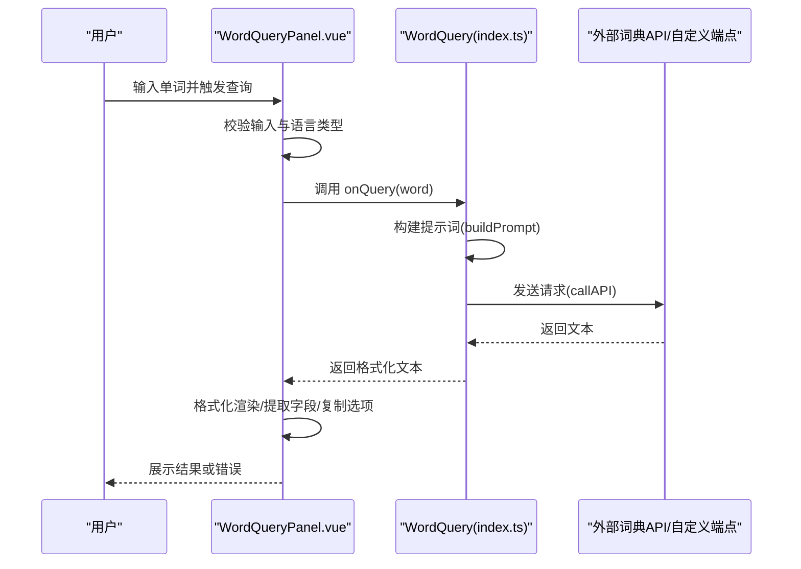

图表来源
- [src/features/wordQuery/WordQueryPanel.vue](file://src/features/wordQuery/WordQueryPanel.vue#L287-L317)
- [src/features/wordQuery/index.ts](file://src/features/wordQuery/index.ts#L167-L193)
- [src/features/wordQuery/index.ts](file://src/features/wordQuery/index.ts#L195-L325)
- [src/features/wordQuery/index.ts](file://src/features/wordQuery/index.ts#L327-L558)

## 详细组件分析

### WordQueryPanel.vue 组件分析
- 界面布局
  - 顶部操作栏：包含模式标签页（单词查询/长文翻译）、历史记录、收藏和高级选项按钮
  - 单词查询模式：输入框、查询按钮、API 设置入口、结果展示区
  - 长文翻译模式：原文输入区（支持语言选择）、翻译方向交换按钮、译文输出区
  - 功能面板：历史记录面板、收藏面板、高级选项面板（发音设置、自动播放、相关词推荐）
- 交互逻辑
  - 模式切换：通过标签页在单词查询和长文翻译之间切换
  - 自动查询：监听输入变化，2 秒后自动触发查询
  - 快捷键：Ctrl/Cmd+Enter 执行查询或翻译；Esc 清除结果并关闭下拉菜单
  - 点击外部关闭下拉菜单
  - 复制：根据下拉菜单选择复制对应字段或全部
  - 清除：清空结果与错误
  - 语言交换：在翻译模式下交换源语言和目标语言
- 数据处理
  - 格式化：将 Markdown 风格标题、换行、加粗等转换为 HTML 并分区显示
  - 字段提取：从结果文本中提取音标/拼音、释义、英文、谐音、例句、全部
  - 本地存储：API 供应商、密钥、自定义端点、历史记录、收藏、高级选项持久化
- 错误与状态
  - 输入校验：空输入、非法字符
  - 加载状态：按钮禁用、旋转指示器
  - 错误提示：消息提示与错误区域

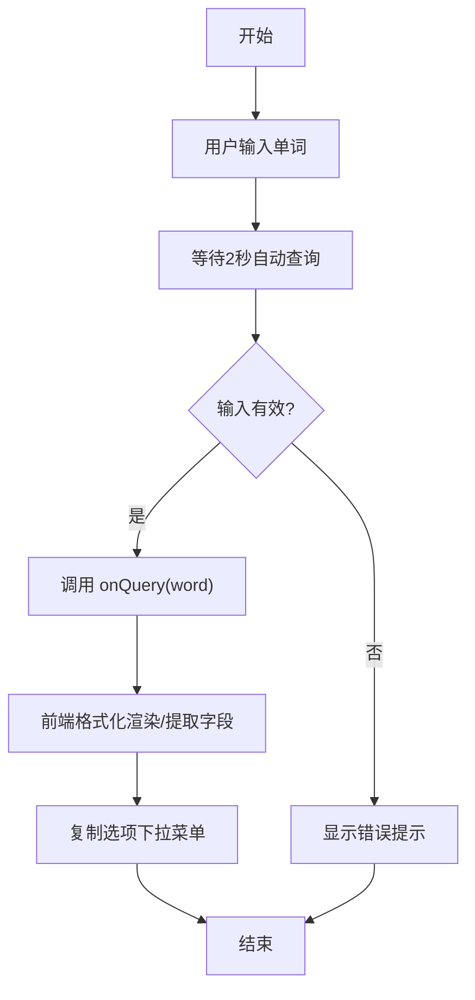

图表来源
- [src/features/wordQuery/WordQueryPanel.vue](file://src/features/wordQuery/WordQueryPanel.vue#L287-L317)
- [src/features/wordQuery/WordQueryPanel.vue](file://src/features/wordQuery/WordQueryPanel.vue#L189-L252)
- [src/features/wordQuery/WordQueryPanel.vue](file://src/features/wordQuery/WordQueryPanel.vue#L466-L497)

章节来源
- [src/features/wordQuery/WordQueryPanel.vue](file://src/features/wordQuery/WordQueryPanel.vue#L1-L159)
- [src/features/wordQuery/WordQueryPanel.vue](file://src/features/wordQuery/WordQueryPanel.vue#L161-L548)

### WordQuery（index.ts）组件分析
- Dock 挂载
  - 在右侧边栏添加“单词查询”面板，初始化时注入 i18n、onQuery、onTranslate、onApiKeyChange、onProviderChange
- 提示词构建
  - 英文单词：要求英式音标、中文谐音、释义、发音要点、例句
  - 中文词语：要求英文翻译、英式音标、中文谐音、释义、发音要点、例句
  - 混合/智能判断：根据中英文字符分布选择处理方式
- API 调用
  - 通义千问：dashscope aliyuncs.com
  - OpenAI：api.openai.com
  - DeepSeek：api.deepseek.com
  - 自定义：使用自定义端点，兼容 OpenAI 兼容格式
- 错误处理
  - 网络错误：HTTP 非 OK，读取响应文本并抛出错误
  - 响应格式错误：尝试多种可能的字段（choices/message/content/text）
  - 用户提示：消息提示组件反馈查询状态与错误信息
- 本地存储
  - API 供应商、密钥、自定义端点读取/写入
- 翻译功能
  - 支持七种语言（中文、英文、日文、韩文、法文、德文、西班牙文）
  - 自动语言检测：源语言可设置为自动检测
  - 构建翻译提示词：根据源语言和目标语言生成翻译请求

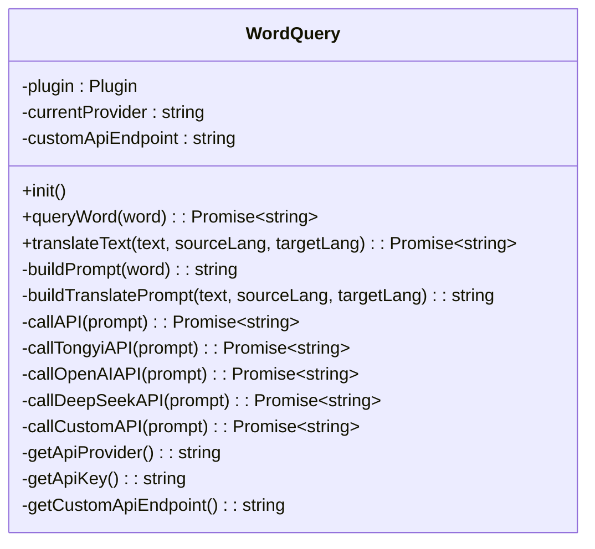

图表来源
- [src/features/wordQuery/index.ts](file://src/features/wordQuery/index.ts#L1-L92)
- [src/features/wordQuery/index.ts](file://src/features/wordQuery/index.ts#L163-L193)
- [src/features/wordQuery/index.ts](file://src/features/wordQuery/index.ts#L195-L325)
- [src/features/wordQuery/index.ts](file://src/features/wordQuery/index.ts#L327-L558)

章节来源
- [src/features/wordQuery/index.ts](file://src/features/wordQuery/index.ts#L1-L92)
- [src/features/wordQuery/index.ts](file://src/features/wordQuery/index.ts#L101-L147)
- [src/features/wordQuery/index.ts](file://src/features/wordQuery/index.ts#L163-L193)
- [src/features/wordQuery/index.ts](file://src/features/wordQuery/index.ts#L195-L325)
- [src/features/wordQuery/index.ts](file://src/features/wordQuery/index.ts#L327-L558)

### 从用户输入到结果显示的完整数据流
- 用户输入：WordQueryPanel.vue 监听输入变化，2 秒后触发 handleQuery
- 输入校验：空输入、非法字符校验，错误通过消息提示与错误区域展示
- 触发查询：调用 props.onQuery(word)，即 WordQuery.queryWord(word)
- 提示词构建：根据输入语言类型构建提示词模板
- API 调用：根据供应商选择对应接口，发送请求并处理响应
- 结果返回：返回格式化文本
- 前端渲染：WordQueryPanel.vue 格式化 HTML、提取字段、渲染结果与复制选项
- 错误处理：网络异常、响应格式错误、消息提示

```mermaid
sequenceDiagram
participant U as "用户"
participant P as "WordQueryPanel.vue"
participant W as "WordQuery(index.ts)"
participant T as "通义千问"
participant O as "OpenAI"
participant D as "DeepSeek"
participant C as "自定义端点"
U->>P : 输入单词
P->>P : 2秒自动查询
P->>W : onQuery(word)
W->>W : buildPrompt(word)
alt 供应商=通义千问
W->>T : POST 请求
T-->>W : 返回文本
else 供应商=OpenAI
W->>O : POST 请求
O-->>W : 返回文本
else 供应商=DeepSeek
W->>D : POST 请求
D-->>W : 返回文本
else 供应商=自定义
W->>C : POST 请求
C-->>W : 返回文本
end
W-->>P : 返回文本
P->>P : 格式化HTML/提取字段/复制选项
P-->>U : 展示结果
```

图表来源
- [src/features/wordQuery/WordQueryPanel.vue](file://src/features/wordQuery/WordQueryPanel.vue#L287-L317)
- [src/features/wordQuery/index.ts](file://src/features/wordQuery/index.ts#L167-L193)
- [src/features/wordQuery/index.ts](file://src/features/wordQuery/index.ts#L327-L558)

章节来源
- [src/features/wordQuery/WordQueryPanel.vue](file://src/features/wordQuery/WordQueryPanel.vue#L287-L317)
- [src/features/wordQuery/index.ts](file://src/features/wordQuery/index.ts#L167-L193)
- [src/features/wordQuery/index.ts](file://src/features/wordQuery/index.ts#L327-L558)

## 依赖关系分析
- 插件入口依赖：src/index.ts 动态注册词典查询模块，依据配置决定是否启用
- 前端依赖：WordQueryPanel.vue 依赖 i18n 语言包与 siyuan 消息提示
- 后端依赖：WordQuery 类依赖 fetch 发起网络请求，兼容多种外部 API
- 存储依赖：localStorage 用于持久化 API 供应商、密钥、自定义端点、历史记录、收藏和高级选项

```mermaid
graph LR
IDX["src/index.ts"] --> REG["registerWordQuery(...)"]
REG --> DCK["addDock(...)"]
DCK --> VP["WordQueryPanel.vue"]
VP --> I18N["i18n/zh_CN.json / en_US.json"]
VP --> WQ["WordQuery(index.ts)"]
WQ --> NET["fetch API"]
WQ --> LS["localStorage"]
```

图表来源
- [src/index.ts](file://src/index.ts#L73-L126)
- [src/features/wordQuery/index.ts](file://src/features/wordQuery/index.ts#L101-L147)
- [src/features/wordQuery/WordQueryPanel.vue](file://src/features/wordQuery/WordQueryPanel.vue#L1-L159)
- [src/i18n/zh_CN.json](file://src/i18n/zh_CN.json#L120-L151)
- [src/i18n/en_US.json](file://src/i18n/en_US.json#L120-L151)

章节来源
- [src/index.ts](file://src/index.ts#L73-L126)
- [src/features/wordQuery/index.ts](file://src/features/wordQuery/index.ts#L101-L147)
- [src/features/wordQuery/WordQueryPanel.vue](file://src/features/wordQuery/WordQueryPanel.vue#L1-L159)
- [src/i18n/zh_CN.json](file://src/i18n/zh_CN.json#L120-L151)
- [src/i18n/en_US.json](file://src/i18n/en_US.json#L120-L151)

## 性能与可用性考量
- 自动查询延迟：2 秒自动查询减少频繁请求，提升用户体验
- 前端格式化：轻量正则替换实现 Markdown 到 HTML 的转换，避免复杂渲染
- 错误处理：网络错误与响应格式错误均有明确提示，降低用户困惑
- 本地存储：API 供应商、密钥、自定义端点、历史记录、收藏、高级选项持久化，减少重复配置成本
- 复制功能：支持按字段复制，提高信息复用效率
- 语言检测：自动语言检测减少用户手动选择语言的负担

[本节为通用性能讨论，无需列出具体文件来源]

## 故障排查指南
- 查询超时或网络错误
  - 现象：消息提示“查询失败”，错误区域显示错误信息
  - 排查：检查网络连通性、API 密钥有效性、供应商选择是否正确
  - 处理：切换供应商、重新输入密钥、检查自定义端点
- 结果格式错误
  - 现象：前端无法解析或渲染异常
  - 排查：确认外部 API 返回结构符合预期（choices/message/content/text）
  - 处理：在后端增加对返回字段的兼容判断或调整提示词
- 复制失败
  - 现象：复制到剪贴板失败
  - 排查：浏览器权限、HTTPS 环境、剪贴板 API 支持
  - 处理：使用备用复制方式或提示用户手动复制
- 输入无效
  - 现象：提示“请输入有效的单词或词语”
  - 排查：输入字符合法性校验
  - 处理：仅允许中英文、数字、常见标点与空格

章节来源
- [src/features/wordQuery/WordQueryPanel.vue](file://src/features/wordQuery/WordQueryPanel.vue#L287-L317)
- [src/features/wordQuery/index.ts](file://src/features/wordQuery/index.ts#L327-L558)

## 结论
词典查询功能通过清晰的前后端分离设计，实现了从用户输入到结果展示的完整闭环。前端负责交互与渲染，后端负责提示词构建与 API 调用，二者通过 props/onQuery 回调解耦协作。该设计具备良好的扩展性，可轻松接入更多外部词典 API 或本地词库，并支持多语言与发音增强等功能。

[本节为总结性内容，无需列出具体文件来源]

## 附录

### 离线查询支持与缓存策略建议
- 离线查询
  - 本地词库：可引入本地词典数据库（如 SQLite 或内存字典），在无网络时优先查询本地
  - 本地缓存：将最近查询结果缓存至 localStorage，减少重复请求
- 缓存策略
  - TTL 过期：为缓存条目设置过期时间，到期后自动刷新
  - 命中优先：优先命中缓存，再发起网络请求
  - 失败回退：网络失败时回退到本地缓存
- 交互优化
  - 显示缓存状态：在结果区显示“来自缓存”提示
  - 手动刷新：提供刷新按钮强制拉取最新数据

[本节为扩展建议，无需列出具体文件来源]

### 扩展建议
- 多语言词典
  - 支持多语种提示词模板，适配不同语言的音标、释义与例句格式
  - 引入多语言词典 API（如有道、欧路词典等）作为备选供应商
- 发音功能
  - 集成语音合成（TTS）或音频播放，支持英式音标发音
  - 提供“播放发音”按钮，点击后播放对应音标或例句
- 结果增强
  - 例句翻译：提供中英对照例句
  - 记忆技巧：添加谐音记忆法、词根词缀解析等辅助学习内容
- 个性化
  - 自定义提示词模板：允许用户自定义输出格式与字段
  - 查询历史：记录最近查询，支持快速回看

[本节为扩展建议，无需列出具体文件来源]
````

## File: .qoder/repowiki/zh/content/功能模块详解/磁盘浏览器.md
````markdown
# 磁盘浏览器

<cite>
**本文引用的文件**
- [DiskBrowserPanel.vue](file://src/features/diskBrowser/DiskBrowserPanel.vue)
- [index.ts](file://src/features/diskBrowser/index.ts)
- [storage.ts](file://src/features/diskBrowser/storage.ts)
- [api.ts](file://src/api.ts)
- [api.d.ts](file://src/types/api.d.ts)
- [zh_CN.json](file://src/i18n/zh_CN.json)
- [en_US.json](file://src/i18n/en_US.json)
</cite>

## 更新摘要
**变更内容**
- 新增收藏夹系统功能，支持用户标记和快速访问常用文件夹
- 在磁盘浏览器界面中添加收藏夹区域，显示已收藏的文件夹
- 实现收藏夹的增删、持久化存储和快速导航功能
- 更新核心组件、架构总览和详细组件分析以反映新增功能
- 新增收藏夹管理流程图和组件关系图

## 目录
1. [简介](#简介)
2. [项目结构](#项目结构)
3. [核心组件](#核心组件)
4. [架构总览](#架构总览)
5. [详细组件分析](#详细组件分析)
6. [依赖关系分析](#依赖关系分析)
7. [性能考量](#性能考量)
8. [故障排查指南](#故障排查指南)
9. [结论](#结论)
10. [附录](#附录)

## 简介
本文件面向“磁盘浏览器”功能，围绕 DiskBrowserPanel.vue 的文件系统浏览界面实现进行系统化说明，重点覆盖：
- index.ts 如何通过思源 API 安全地访问本地文件系统并展示目录结构
- 文件过滤、排序与路径导航的技术细节
- 与系统文件管理器的集成方案与安全边界控制
- 大目录加载的性能优化建议（虚拟滚动与异步加载）
- **新增收藏夹系统，支持用户标记和快速访问常用文件夹**
- 常见问题处理策略（权限不足、文件路径编码错误）

## 项目结构
磁盘浏览器功能位于 features/diskBrowser 目录，包含三个关键文件：
- DiskBrowserPanel.vue：磁盘与文件夹浏览的前端界面与交互逻辑，**新增收藏夹功能**
- index.ts：将该功能注册为右侧边栏 Dock，并注入 i18n 国际化文案
- storage.ts：**新增收藏夹数据的持久化存储管理**

```mermaid
graph TB
subgraph "磁盘浏览器模块"
A["index.ts<br/>注册右侧边栏 Dock"]
B["DiskBrowserPanel.vue<br/>UI 与业务逻辑<br/>含收藏夹功能"]
C["storage.ts<br/>收藏夹存储管理"]
end
subgraph "外部接口"
D["api.ts<br/>封装思源 API 调用"]
E["api.d.ts<br/>类型声明"]
F["i18n/zh_CN.json<br/>中文文案"]
G["i18n/en_US.json<br/>英文文案"]
end
A --> B
B --> C
B --> D
B --> E
B --> F
B --> G
```

**图表来源**
- [index.ts](file://src/features/diskBrowser/index.ts#L1-L51)
- [DiskBrowserPanel.vue](file://src/features/diskBrowser/DiskBrowserPanel.vue#L1-L168)
- [storage.ts](file://src/features/diskBrowser/storage.ts#L1-L68)
- [api.ts](file://src/api.ts#L1-L120)
- [api.d.ts](file://src/types/api.d.ts#L1-L65)
- [zh_CN.json](file://src/i18n/zh_CN.json#L280-L317)
- [en_US.json](file://src/i18n/en_US.json#L275-L312)

**章节来源**
- [index.ts](file://src/features/diskBrowser/index.ts#L1-L51)
- [DiskBrowserPanel.vue](file://src/features/diskBrowser/DiskBrowserPanel.vue#L1-L168)
- [storage.ts](file://src/features/diskBrowser/storage.ts#L1-L68)

## 核心组件
- 磁盘列表与容量展示：支持横向滚动、磁盘标签与使用率条
- 文件夹列表与面包屑导航：支持返回上级、根目录跳转、路径段定位
- 文件项展示：文件名、大小、修改时间；文件夹与文件分别排序
- 缓存机制：磁盘列表与文件夹列表分别缓存，定时刷新
- 系统集成：在资源管理器中打开路径、复制路径到剪贴板
- 国际化：通过 i18n 对话框文案进行本地化
- **收藏夹系统：支持用户将常用文件夹添加到收藏夹，通过收藏夹区域快速访问**

**章节来源**
- [DiskBrowserPanel.vue](file://src/features/diskBrowser/DiskBrowserPanel.vue#L1-L168)
- [DiskBrowserPanel.vue](file://src/features/diskBrowser/DiskBrowserPanel.vue#L170-L771)
- [DiskBrowserPanel.vue](file://src/features/diskBrowser/DiskBrowserPanel.vue#L772-L1342)

## 架构总览
磁盘浏览器采用“注册 Dock + Vue 组件”的方式接入思源笔记侧边栏。组件内部通过 window.require(child_process) 调用 PowerShell 获取磁盘与目录信息，再通过 Electron shell.openPath 打开系统文件管理器。同时，组件内置缓存与国际化支持，保证用户体验与可维护性。**新增收藏夹功能，通过 storage.ts 模块实现收藏夹数据的持久化存储和管理。**

```mermaid
sequenceDiagram
participant Dock as "右侧边栏 Dock"
participant Vue as "DiskBrowserPanel.vue"
participant Storage as "storage.ts"
participant ChildProc as "child_process"
participant PS as "PowerShell"
participant Shell as "Electron shell"
participant SysFM as "系统文件管理器"
Dock->>Vue : 初始化并挂载组件
Vue->>Storage : 初始化存储
Storage->>Vue : 返回存储实例
Vue->>Storage : loadFavorites()
Storage->>Vue : 返回收藏夹列表
Vue->>ChildProc : exec(command)
ChildProc->>PS : 执行命令获取磁盘/目录信息
PS-->>ChildProc : 返回 JSON 数据
ChildProc-->>Vue : 解析并渲染 UI
Vue->>Storage : saveFavorites()
Storage->>Vue : 保存成功
Vue->>Shell : openPath(路径)
Shell->>SysFM : 打开对应路径
```

**图表来源**
- [index.ts](file://src/features/diskBrowser/index.ts#L12-L47)
- [DiskBrowserPanel.vue](file://src/features/diskBrowser/DiskBrowserPanel.vue#L229-L293)
- [DiskBrowserPanel.vue](file://src/features/diskBrowser/DiskBrowserPanel.vue#L338-L371)
- [DiskBrowserPanel.vue](file://src/features/diskBrowser/DiskBrowserPanel.vue#L524-L570)
- [DiskBrowserPanel.vue](file://src/features/diskBrowser/DiskBrowserPanel.vue#L383-L396)
- [storage.ts](file://src/features/diskBrowser/storage.ts#L16-L67)

## 详细组件分析

### 组件类图（核心类型与关系）
```mermaid
classDiagram
class DiskBrowserPanel {
+props.i18n
+disks : DiskInfo[]
+selectedDisk : string
+expandedDisk : string
+folders : FolderInfo[]
+loading : boolean
+loadingFolders : boolean
+currentPath : string
+pathSegments : string[]
+favoriteFolders : string[]
+fetchDisks(forceRefresh)
+loadFolders(drive, forceRefresh)
+loadFoldersFromPath(path, forceRefresh)
+toggleDisk(disk)
+navigateIntoFolder(item)
+navigateBack()
+navigateToRoot()
+navigateToPath(index)
+refreshDisks()
+refreshCurrentFolder()
+openPath(path)
+copyPathToClipboard(path)
+formatDate(dateString)
+formatSize(bytes)
+toggleFavorite(folderPath)
+isFavorite(folderPath)
+navigateToFavorite(path)
+loadFavorites()
+saveFavorites()
}
class DiskInfo {
+drive : string
+label? : string
+total? : number
+used? : number
+usagePercent? : number
}
class FolderInfo {
+name : string
+path : string
+isFile? : boolean
+size? : number
+modifiedTime? : string
}
class CacheData~T~ {
+data : T
+timestamp : number
}
class DiskBrowserStorage {
+saveFavorites(favorites)
+loadFavorites()
+init()
}
DiskBrowserPanel --> DiskInfo : "使用"
DiskBrowserPanel --> FolderInfo : "使用"
DiskBrowserPanel --> CacheData : "缓存"
DiskBrowserPanel --> DiskBrowserStorage : "依赖"
```

**图表来源**
- [DiskBrowserPanel.vue](file://src/features/diskBrowser/DiskBrowserPanel.vue#L170-L216)
- [DiskBrowserPanel.vue](file://src/features/diskBrowser/DiskBrowserPanel.vue#L229-L293)
- [DiskBrowserPanel.vue](file://src/features/diskBrowser/DiskBrowserPanel.vue#L326-L377)
- [DiskBrowserPanel.vue](file://src/features/diskBrowser/DiskBrowserPanel.vue#L514-L577)
- [storage.ts](file://src/features/diskBrowser/storage.ts#L16-L67)

**章节来源**
- [DiskBrowserPanel.vue](file://src/features/diskBrowser/DiskBrowserPanel.vue#L170-L216)
- [DiskBrowserPanel.vue](file://src/features/diskBrowser/DiskBrowserPanel.vue#L229-L293)
- [DiskBrowserPanel.vue](file://src/features/diskBrowser/DiskBrowserPanel.vue#L326-L377)
- [DiskBrowserPanel.vue](file://src/features/diskBrowser/DiskBrowserPanel.vue#L514-L577)
- [storage.ts](file://src/features/diskBrowser/storage.ts#L16-L67)

### 磁盘与文件夹加载流程
- 磁盘列表加载：优先使用 PowerShell 获取 Win32_LogicalDisk 信息，解析 UTF-8 输出，构建磁盘列表；若失败则回退到默认磁盘集合
- 文件夹列表加载：使用 PowerShell Get-ChildItem 获取目录，排除隐藏属性；支持按“文件夹在前、文件在后”排序
- 路径导航：支持返回上级、根目录跳转、面包屑逐级定位
- **收藏夹加载：组件挂载时从 storage.ts 加载持久化的收藏夹列表**

```mermaid
flowchart TD
Start(["开始"]) --> FetchDisks["获取磁盘列表"]
FetchDisks --> HasCache{"磁盘缓存有效?"}
HasCache --> |是| UseCache["使用缓存数据"]
HasCache --> |否| ExecPS["PowerShell 获取磁盘信息"]
ExecPS --> Parse["解析 JSON 并构建磁盘列表"]
Parse --> SaveDiskCache["写入磁盘缓存"]
SaveDiskCache --> UseCache
UseCache --> ToggleDisk["切换磁盘展开"]
ToggleDisk --> LoadFolders["加载文件夹列表"]
LoadFolders --> HasFolderCache{"文件夹缓存有效?"}
HasFolderCache --> |是| UseFolderCache["使用缓存数据"]
HasFolderCache --> |否| ExecPSFolders["PowerShell 获取目录列表"]
ExecPSFolders --> ParseFolders["解析 JSON 并构建文件夹列表"]
ParseFolders --> Sort["按文件夹优先排序"]
Sort --> SaveFolderCache["写入文件夹缓存"]
SaveFolderCache --> UseFolderCache
UseFolderCache --> LoadFavorites["加载收藏夹"]
LoadFavorites --> ExecStorage["调用 storage.loadFavorites()"]
ExecStorage --> ParseFavorites["解析并设置收藏夹列表"]
ParseFavorites --> Navigate["路径导航/双击打开"]
Navigate --> End(["结束"])
```

**图表来源**
- [DiskBrowserPanel.vue](file://src/features/diskBrowser/DiskBrowserPanel.vue#L229-L293)
- [DiskBrowserPanel.vue](file://src/features/diskBrowser/DiskBrowserPanel.vue#L326-L377)
- [DiskBrowserPanel.vue](file://src/features/diskBrowser/DiskBrowserPanel.vue#L514-L577)
- [DiskBrowserPanel.vue](file://src/features/diskBrowser/DiskBrowserPanel.vue#L1018-L1020)
- [storage.ts](file://src/features/diskBrowser/storage.ts#L41-L49)

**章节来源**
- [DiskBrowserPanel.vue](file://src/features/diskBrowser/DiskBrowserPanel.vue#L229-L293)
- [DiskBrowserPanel.vue](file://src/features/diskBrowser/DiskBrowserPanel.vue#L326-L377)
- [DiskBrowserPanel.vue](file://src/features/diskBrowser/DiskBrowserPanel.vue#L514-L577)
- [DiskBrowserPanel.vue](file://src/features/diskBrowser/DiskBrowserPanel.vue#L1018-L1020)
- [storage.ts](file://src/features/diskBrowser/storage.ts#L41-L49)

### 收藏夹管理流程
- **初始化**：组件挂载时调用 loadFavorites() 从 storage.ts 加载收藏夹
- **添加/移除**：点击文件夹的收藏按钮，调用 toggleFavorite() 切换状态并更新列表
- **持久化**：每次收藏夹变更后，自动调用 saveFavorites() 持久化到 storage.ts
- **导航**：点击收藏夹项，调用 navigateToFavorite() 导航到对应路径

```mermaid
sequenceDiagram
participant UI as "UI"
participant VM as "DiskBrowserPanel.vue"
participant Storage as "storage.ts"
UI->>VM : 点击收藏按钮
VM->>VM : toggleFavorite(path)
VM->>VM : isFavorite(path) ? 移除 : 添加
VM->>VM : favoriteFolders 更新
VM->>Storage : saveFavorites(favoriteFolders)
Storage-->>VM : 保存成功
VM->>UI : 更新UI显示
UI->>VM : 点击收藏夹项
VM->>VM : navigateToFavorite(path)
VM->>VM : 解析盘符并展开
VM->>VM : loadFoldersFromPath(path)
VM->>UI : 导航到目标路径
```

**图表来源**
- [DiskBrowserPanel.vue](file://src/features/diskBrowser/DiskBrowserPanel.vue#L344-L353)
- [DiskBrowserPanel.vue](file://src/features/diskBrowser/DiskBrowserPanel.vue#L984-L1015)
- [DiskBrowserPanel.vue](file://src/features/diskBrowser/DiskBrowserPanel.vue#L1018-L1020)
- [storage.ts](file://src/features/diskBrowser/storage.ts#L27-L35)
- [storage.ts](file://src/features/diskBrowser/storage.ts#L41-L49)

**章节来源**
- [DiskBrowserPanel.vue](file://src/features/diskBrowser/DiskBrowserPanel.vue#L344-L353)
- [DiskBrowserPanel.vue](file://src/features/diskBrowser/DiskBrowserPanel.vue#L984-L1015)
- [DiskBrowserPanel.vue](file://src/features/diskBrowser/DiskBrowserPanel.vue#L1018-L1020)
- [storage.ts](file://src/features/diskBrowser/storage.ts#L27-L35)
- [storage.ts](file://src/features/diskBrowser/storage.ts#L41-L49)

### 路径导航与面包屑
- 当前路径 currentPath 与 pathSegments 保持同步
- 返回上级：根据最后反斜杠位置截取父路径；若回到盘符根目录则清空 currentPath 并刷新磁盘根
- 根目录跳转：清空 currentPath 与 pathSegments 并刷新磁盘根
- 面包屑点击：根据索引拼接路径并加载对应目录

```mermaid
sequenceDiagram
participant UI as "UI"
participant VM as "DiskBrowserPanel.vue"
UI->>VM : 点击“返回上级”
VM->>VM : 计算 lastSlash
alt 根目录
VM->>VM : currentPath = "" + 清空 pathSegments
VM->>VM : loadFolders(expandedDisk)
else 子目录
VM->>VM : currentPath = substring(0, lastSlash)
VM->>VM : updatePathSegments()
VM->>VM : loadFoldersFromPath(parentPath)
end
UI->>VM : 点击“返回根目录”
VM->>VM : currentPath = "" + 清空 pathSegments
VM->>VM : loadFolders(expandedDisk)
UI->>VM : 点击面包屑某段
VM->>VM : 拼接路径 + updatePathSegments() + loadFoldersFromPath()
```

**图表来源**
- [DiskBrowserPanel.vue](file://src/features/diskBrowser/DiskBrowserPanel.vue#L608-L651)
- [DiskBrowserPanel.vue](file://src/features/diskBrowser/DiskBrowserPanel.vue#L633-L651)
- [DiskBrowserPanel.vue](file://src/features/diskBrowser/DiskBrowserPanel.vue#L642-L651)

**章节来源**
- [DiskBrowserPanel.vue](file://src/features/diskBrowser/DiskBrowserPanel.vue#L608-L651)
- [DiskBrowserPanel.vue](file://src/features/diskBrowser/DiskBrowserPanel.vue#L633-L651)
- [DiskBrowserPanel.vue](file://src/features/diskBrowser/DiskBrowserPanel.vue#L642-L651)

### 文件过滤、排序与路径导航技术细节
- 过滤：PowerShell 查询时排除隐藏文件夹与文件，避免用户看到系统隐藏项
- 排序：先按 isFile（文件夹优先），再按名称 localeCompare(zh-CN)
- 路径导航：基于字符串路径分割与拼接，确保盘符根目录与子目录行为一致

**章节来源**
- [DiskBrowserPanel.vue](file://src/features/diskBrowser/DiskBrowserPanel.vue#L343-L345)
- [DiskBrowserPanel.vue](file://src/features/diskBrowser/DiskBrowserPanel.vue#L524-L531)
- [DiskBrowserPanel.vue](file://src/features/diskBrowser/DiskBrowserPanel.vue#L554-L560)

### 与系统文件管理器的集成与安全边界
- 集成方式：通过 Electron shell.openPath 打开系统文件管理器
- 安全边界：
  - 仅在 Electron 环境可用（window.require 存在）；非 Electron 环境提示不支持
  - 仅能打开本地路径，不暴露远程或受控路径
  - 打开失败时统一提示错误消息，避免异常泄露

**章节来源**
- [DiskBrowserPanel.vue](file://src/features/diskBrowser/DiskBrowserPanel.vue#L383-L396)
- [DiskBrowserPanel.vue](file://src/features/diskBrowser/DiskBrowserPanel.vue#L389-L395)

### 思源 API 的安全访问与数据流
- 本模块通过 window.require(child_process) 直接调用本地命令获取文件系统信息，不依赖思源 API
- 若需与思源笔记内部文件系统交互，可参考 api.ts 中的 readDir、getFile、putFile 等接口，但当前磁盘浏览器未使用这些接口

**章节来源**
- [DiskBrowserPanel.vue](file://src/features/diskBrowser/DiskBrowserPanel.vue#L240-L286)
- [DiskBrowserPanel.vue](file://src/features/diskBrowser/DiskBrowserPanel.vue#L338-L371)
- [DiskBrowserPanel.vue](file://src/features/diskBrowser/DiskBrowserPanel.vue#L524-L570)
- [api.ts](file://src/api.ts#L394-L401)
- [api.ts](file://src/api.ts#L342-L372)

## 依赖关系分析
- 组件依赖
  - i18n：通过 props.i18n 注入，支持中文与英文文案
  - Electron：通过 window.require('electron') 的 shell.openPath 实现系统集成
  - child_process：通过 window.require('child_process') 执行 PowerShell 命令
  - **storage.ts：新增依赖，用于收藏夹数据的持久化存储**
- 类型与接口
  - DiskInfo、FolderInfo、CacheData 作为核心数据结构
  - api.d.ts 提供部分类型声明（与磁盘浏览器功能无直接耦合）

```mermaid
graph LR
Vue["DiskBrowserPanel.vue"] --> I18N["i18n/zh_CN.json<br/>i18n/en_US.json"]
Vue --> Electron["Electron shell"]
Vue --> ChildProc["child_process"]
Vue --> Storage["storage.ts"]
Vue --> Types["api.d.ts"]
Vue --> API["api.ts"]
```

**图表来源**
- [DiskBrowserPanel.vue](file://src/features/diskBrowser/DiskBrowserPanel.vue#L1-L168)
- [index.ts](file://src/features/diskBrowser/index.ts#L12-L47)
- [api.ts](file://src/api.ts#L1-L120)
- [api.d.ts](file://src/types/api.d.ts#L1-L65)
- [zh_CN.json](file://src/i18n/zh_CN.json#L280-L317)
- [en_US.json](file://src/i18n/en_US.json#L275-L312)
- [storage.ts](file://src/features/diskBrowser/storage.ts#L1-L68)

**章节来源**
- [DiskBrowserPanel.vue](file://src/features/diskBrowser/DiskBrowserPanel.vue#L1-L168)
- [index.ts](file://src/features/diskBrowser/index.ts#L12-L47)
- [api.ts](file://src/api.ts#L1-L120)
- [api.d.ts](file://src/types/api.d.ts#L1-L65)
- [zh_CN.json](file://src/i18n/zh_CN.json#L280-L317)
- [en_US.json](file://src/i18n/en_US.json#L275-L312)
- [storage.ts](file://src/features/diskBrowser/storage.ts#L1-L68)

## 性能考量
- 已有优化
  - 缓存：磁盘列表与文件夹列表分别缓存，缓存有效期 1 小时；每分钟更新缓存状态提示
  - 异步加载：磁盘与文件夹加载均采用异步 Promise，避免阻塞 UI
  - 排序：按文件夹优先与本地化排序，减少后续渲染复杂度
- 建议优化（针对大目录）
  - 虚拟滚动：对文件夹列表启用虚拟滚动，仅渲染可视区域内的项目
  - 分页加载：对超大目录采用分页或懒加载，按需请求下一页
  - 并行请求：对多磁盘场景并行获取磁盘信息，缩短首屏时间
  - 增量刷新：在用户操作时仅刷新受影响的节点，而非整表重绘

[本节为通用性能建议，不直接分析具体文件，故无章节来源]

## 故障排查指南
- 权限不足
  - 现象：无法列出某些磁盘或目录
  - 处理：提示用户提升权限或切换到可访问的路径；当前实现对隐藏项进行过滤，避免异常
- 文件路径编码错误
  - 现象：中文路径显示乱码
  - 处理：PowerShell 设置输出编码为 UTF-8，解析 JSON 后进行 trim 处理
- 打开系统文件管理器失败
  - 现象：调用 shell.openPath 报错
  - 处理：捕获异常并提示“打开失败”，非 Electron 环境提示“当前环境不支持打开文件夹”
- 磁盘信息获取失败
  - 现象：PowerShell 获取磁盘信息失败
  - 处理：回退到默认磁盘列表，避免 UI 崩溃
- **收藏夹功能异常**
  - 现象：收藏夹无法保存或加载
  - 处理：检查 storage.ts 的 saveData 和 loadData 调用是否成功，查看控制台错误日志

**章节来源**
- [DiskBrowserPanel.vue](file://src/features/diskBrowser/DiskBrowserPanel.vue#L240-L286)
- [DiskBrowserPanel.vue](file://src/features/diskBrowser/DiskBrowserPanel.vue#L278-L282)
- [DiskBrowserPanel.vue](file://src/features/diskBrowser/DiskBrowserPanel.vue#L338-L371)
- [DiskBrowserPanel.vue](file://src/features/diskBrowser/DiskBrowserPanel.vue#L383-L396)
- [DiskBrowserPanel.vue](file://src/features/diskBrowser/DiskBrowserPanel.vue#L524-L570)
- [storage.ts](file://src/features/diskBrowser/storage.ts#L27-L35)
- [storage.ts](file://src/features/diskBrowser/storage.ts#L41-L49)

## 结论
磁盘浏览器通过“右侧边栏 Dock + Vue 组件”的方式，结合 Electron 与 PowerShell 实现了本地文件系统的安全浏览与系统集成。其具备完善的缓存与国际化支持，路径导航清晰直观，错误处理稳健可靠。**新增收藏夹系统，允许用户标记常用文件夹并快速访问，提升了用户体验。** 对于大目录场景，建议引入虚拟滚动与分页加载以进一步提升性能体验。

[本节为总结性内容，不直接分析具体文件，故无章节来源]

## 附录
- 国际化键值（节选）
  - 磁盘浏览器标题、描述、启用开关文案
  - 加载失败、打开失败、复制失败等提示文案
  - 导航与操作按钮文案（刷新、返回、打开、复制路径等）
  - **收藏夹相关文案：收藏、取消收藏、收藏夹、已添加收藏、已取消收藏、已跳转到收藏夹**

**章节来源**
- [zh_CN.json](file://src/i18n/zh_CN.json#L280-L317)
- [en_US.json](file://src/i18n/en_US.json#L275-L312)
````

## File: .qoder/repowiki/zh/content/功能模块详解/单位转换.md
````markdown
# 单位转换

<cite>
**本文引用的文件**
- [index.ts](file://src/features/unitConverter/index.ts)
- [UnitConverter.vue](file://src/features/unitConverter/UnitConverter.vue)
- [BaseConverter.vue](file://src/features/unitConverter/converters/BaseConverter.vue)
- [LengthConverter.vue](file://src/features/unitConverter/converters/LengthConverter.vue)
- [AreaConverter.vue](file://src/features/unitConverter/converters/AreaConverter.vue)
- [VolumeConverter.vue](file://src/features/unitConverter/converters/VolumeConverter.vue)
- [MassConverter.vue](file://src/features/unitConverter/converters/MassConverter.vue)
- [PowerConverter.vue](file://src/features/unitConverter/converters/PowerConverter.vue)
- [TimeConverter.vue](file://src/features/unitConverter/converters/TimeConverter.vue)
- [SpeedConverter.vue](file://src/features/unitConverter/converters/SpeedConverter.vue)
- [DataConverter.vue](file://src/features/unitConverter/converters/DataConverter.vue)
- [ASCIIConverter.vue](file://src/features/unitConverter/converters/ASCIIConverter.vue)
- [zh_CN.json](file://src/i18n/zh_CN.json)
- [settings.ts](file://src/config/settings.ts)
</cite>

## 目录
1. [简介](#简介)
2. [项目结构](#项目结构)
3. [核心组件](#核心组件)
4. [架构总览](#架构总览)
5. [详细组件分析](#详细组件分析)
6. [依赖关系分析](#依赖关系分析)
7. [性能与精度考量](#性能与精度考量)
8. [扩展新转换器指南](#扩展新转换器指南)
9. [常见问题与排障](#常见问题与排障)
10. [结论](#结论)

## 简介
本文件系统性梳理“单位转换”功能的设计与实现，覆盖以下目标：
- 列出并解释10个转换器及其换算原理
- 分析UnitConverter.vue作为主容器如何动态加载各专用转换器
- 解释输入验证、实时计算与单位选择逻辑
- 提供扩展新转换器的开发指南与UI集成步骤
- 讨论精度处理、浮点误差与用户体验优化（如输入防抖）
- 解决常见问题（如转换结果不准确、特定转换器无法加载）

## 项目结构
单位转换功能位于 src/features/unitConverter 目录下，采用“主容器 + 多个专用转换器”的分层设计：
- 主容器：UnitConverter.vue
- 专用转换器：LengthConverter.vue、AreaConverter.vue、VolumeConverter.vue、MassConverter.vue、PowerConverter.vue、TimeConverter.vue、SpeedConverter.vue、DataConverter.vue、BaseConverter.vue、ASCIIConverter.vue
- 注册入口：index.ts 将转换器以侧边栏 Dock 的形式挂载到插件系统

```mermaid
graph TB
subgraph "单位转换模块"
UC["UnitConverter.vue<br/>主容器"]
subgraph "转换器集合"
L["LengthConverter.vue"]
A["AreaConverter.vue"]
V["VolumeConverter.vue"]
M["MassConverter.vue"]
P["PowerConverter.vue"]
T["TimeConverter.vue"]
S["SpeedConverter.vue"]
D["DataConverter.vue"]
B["BaseConverter.vue"]
AS["ASCIIConverter.vue"]
end
end
UC --> L
UC --> A
UC --> V
UC --> M
UC --> P
UC --> T
UC --> S
UC --> D
UC --> B
UC --> AS
```

图表来源
- [UnitConverter.vue](file://src/features/unitConverter/UnitConverter.vue#L1-L167)
- [LengthConverter.vue](file://src/features/unitConverter/converters/LengthConverter.vue#L1-L221)
- [AreaConverter.vue](file://src/features/unitConverter/converters/AreaConverter.vue#L1-L221)
- [VolumeConverter.vue](file://src/features/unitConverter/converters/VolumeConverter.vue#L1-L229)
- [MassConverter.vue](file://src/features/unitConverter/converters/MassConverter.vue#L1-L226)
- [PowerConverter.vue](file://src/features/unitConverter/converters/PowerConverter.vue#L1-L227)
- [TimeConverter.vue](file://src/features/unitConverter/converters/TimeConverter.vue#L1-L226)
- [SpeedConverter.vue](file://src/features/unitConverter/converters/SpeedConverter.vue#L1-L226)
- [DataConverter.vue](file://src/features/unitConverter/converters/DataConverter.vue#L1-L229)
- [BaseConverter.vue](file://src/features/unitConverter/converters/BaseConverter.vue#L1-L294)
- [ASCIIConverter.vue](file://src/features/unitConverter/converters/ASCIIConverter.vue#L1-L377)

章节来源
- [index.ts](file://src/features/unitConverter/index.ts#L1-L43)
- [UnitConverter.vue](file://src/features/unitConverter/UnitConverter.vue#L1-L167)

## 核心组件
- UnitConverter.vue：提供标签页切换，按需渲染对应转换器；维护活动标签与国际化文案。
- 各转换器：统一采用“输入值 + 从单位 + 到单位 + 实时结果 + 快速结果网格”的UI模式，内部通过单位因子进行换算。
- BaseConverter.vue：提供多进制互转（2/8/10/16/32/36）与快速结果展示。
- ASCIIConverter.vue：提供文本与ASCII码双向转换、ASCII码表展示。

章节来源
- [UnitConverter.vue](file://src/features/unitConverter/UnitConverter.vue#L1-L167)
- [BaseConverter.vue](file://src/features/unitConverter/converters/BaseConverter.vue#L1-L294)
- [ASCIIConverter.vue](file://src/features/unitConverter/converters/ASCIIConverter.vue#L1-L377)

## 架构总览
UnitConverter.vue 作为主容器，通过标签页控制渲染不同的转换器组件。每个转换器内部使用单位因子（factor）进行换算，并通过计算属性实时输出结果。BaseConverter.vue 使用输入校验函数确保输入符合目标进制字符集；ASCIIConverter.vue 对文本与ASCII码进行双向解析与格式化。

```mermaid
sequenceDiagram
participant U as "用户"
participant UC as "UnitConverter.vue"
participant C as "具体转换器组件"
participant DOM as "DOM事件"
U->>UC : 切换标签页
UC->>C : 挂载/卸载对应转换器
U->>DOM : 输入数值/选择单位
DOM->>C : 触发@input/@change
C->>C : 计算属性/方法执行换算
C-->>UC : 渲染结果与快速结果网格
```

图表来源
- [UnitConverter.vue](file://src/features/unitConverter/UnitConverter.vue#L1-L167)
- [LengthConverter.vue](file://src/features/unitConverter/converters/LengthConverter.vue#L1-L221)
- [BaseConverter.vue](file://src/features/unitConverter/converters/BaseConverter.vue#L1-L294)
- [ASCIIConverter.vue](file://src/features/unitConverter/converters/ASCIIConverter.vue#L1-L377)

## 详细组件分析

### 主容器：UnitConverter.vue
- 标签页管理：维护 tabs 数组与 activeTab，点击切换即渲染对应转换器。
- 国际化：接收 i18n 属性，用于标题与部分文案。
- 布局：头部标题 + 标签页区域 + 内容区域（按需渲染）。

章节来源
- [UnitConverter.vue](file://src/features/unitConverter/UnitConverter.vue#L1-L167)

### 转换器通用模式
- 输入：v-model 绑定输入值，@input 触发换算。
- 单位选择：两个 select 分别绑定 fromUnit 与 toUnit。
- 结果展示：实时计算属性 result 输出最终结果；快速结果网格展示其余单位的换算值。
- 单位因子：每个转换器内部维护 units 数组，包含 key、name、symbol、factor；换算采用“value × fromFactor ÷ toFactor”。

章节来源
- [LengthConverter.vue](file://src/features/unitConverter/converters/LengthConverter.vue#L1-L221)
- [AreaConverter.vue](file://src/features/unitConverter/converters/AreaConverter.vue#L1-L221)
- [VolumeConverter.vue](file://src/features/unitConverter/converters/VolumeConverter.vue#L1-L229)
- [MassConverter.vue](file://src/features/unitConverter/converters/MassConverter.vue#L1-L226)
- [PowerConverter.vue](file://src/features/unitConverter/converters/PowerConverter.vue#L1-L227)
- [TimeConverter.vue](file://src/features/unitConverter/converters/TimeConverter.vue#L1-L226)
- [SpeedConverter.vue](file://src/features/unitConverter/converters/SpeedConverter.vue#L1-L226)
- [DataConverter.vue](file://src/features/unitConverter/converters/DataConverter.vue#L1-L229)

### 进制转换：BaseConverter.vue
- 输入校验：isValidInput(value, base) 检查输入字符串是否仅由目标进制字符组成。
- 转换流程：先将输入按 fromBase 解析为十进制，再转为目标 toBase；异常时返回错误提示。
- 快速结果：遍历所有不同进制，展示转换后的结果。

```mermaid
flowchart TD
Start(["开始"]) --> CheckInput["校验输入是否符合fromBase字符集"]
CheckInput --> |否| ShowError["显示错误信息"]
CheckInput --> |是| ParseDec["parseInt(input, fromBase)得到十进制"]
ParseDec --> |NaN| ShowError
ParseDec --> ToString["toString(toBase)得到目标进制字符串"]
ToString --> Done(["结束"])
ShowError --> Done
```

图表来源
- [BaseConverter.vue](file://src/features/unitConverter/converters/BaseConverter.vue#L110-L161)

章节来源
- [BaseConverter.vue](file://src/features/unitConverter/converters/BaseConverter.vue#L1-L294)

### ASCII转换：ASCIIConverter.vue
- 文本转ASCII：遍历输入文本，逐字符调用 charCodeAt 获取十进制码，以空格拼接输出。
- ASCII转文本：按空格或逗号分割，过滤非数字与越界值，再用 String.fromCharCode 组合文本。
- ASCII码表：支持起止范围输入，计算十进制/十六进制/二进制/字符映射，特殊控制字符做友好显示。

```mermaid
flowchart TD
AStart(["文本转ASCII"]) --> Split["遍历文本字符"]
Split --> Map["charCodeAt -> 码值"]
Map --> Join["以空格连接输出"]
Join --> AEnd(["结束"])
BStart(["ASCII转文本"]) --> Split2["按空格/逗号分割"]
Split2 --> Filter["过滤空白与非法值"]
Filter --> ParseInt["parseInt并校验范围"]
ParseInt --> BuildStr["String.fromCharCode(...)"]
BuildStr --> BEnd(["结束"])
```

图表来源
- [ASCIIConverter.vue](file://src/features/unitConverter/converters/ASCIIConverter.vue#L130-L162)

章节来源
- [ASCIIConverter.vue](file://src/features/unitConverter/converters/ASCIIConverter.vue#L1-L377)

### 各转换器的数学换算公式
以下为通用换算公式，适用于长度、面积、体积、质量、功率、时间、速度、数据存储等类型转换器：
- 通用公式：结果 = 输入值 × 从单位因子 ÷ 目标单位因子
- 单位因子由各转换器内部 units 数组提供，key 为单位标识，factor 为相对于基准单位的换算系数。

章节来源
- [LengthConverter.vue](file://src/features/unitConverter/converters/LengthConverter.vue#L90-L111)
- [AreaConverter.vue](file://src/features/unitConverter/converters/AreaConverter.vue#L90-L111)
- [VolumeConverter.vue](file://src/features/unitConverter/converters/VolumeConverter.vue#L108-L118)
- [MassConverter.vue](file://src/features/unitConverter/converters/MassConverter.vue#L105-L115)
- [PowerConverter.vue](file://src/features/unitConverter/converters/PowerConverter.vue#L106-L116)
- [TimeConverter.vue](file://src/features/unitConverter/converters/TimeConverter.vue#L105-L115)
- [SpeedConverter.vue](file://src/features/unitConverter/converters/SpeedConverter.vue#L105-L115)
- [DataConverter.vue](file://src/features/unitConverter/converters/DataConverter.vue#L108-L118)

## 依赖关系分析
- UnitConverter.vue 依赖各转换器组件并在标签页切换时动态渲染。
- 各转换器组件共享相同的输入/选择/结果/快速结果布局与换算逻辑。
- BaseConverter.vue 与 ASCIIConverter.vue 采用独立的校验与转换策略。
- 注册入口 index.ts 将 UnitConverter 作为插件的右侧停靠面板，注入 i18n 与容器。

```mermaid
graph LR
IDX["index.ts<br/>注册单位转换功能"] --> UC["UnitConverter.vue"]
UC --> L["LengthConverter.vue"]
UC --> A["AreaConverter.vue"]
UC --> V["VolumeConverter.vue"]
UC --> M["MassConverter.vue"]
UC --> P["PowerConverter.vue"]
UC --> T["TimeConverter.vue"]
UC --> S["SpeedConverter.vue"]
UC --> D["DataConverter.vue"]
UC --> B["BaseConverter.vue"]
UC --> AS["ASCIIConverter.vue"]
```

图表来源
- [index.ts](file://src/features/unitConverter/index.ts#L1-L43)
- [UnitConverter.vue](file://src/features/unitConverter/UnitConverter.vue#L1-L167)

章节来源
- [index.ts](file://src/features/unitConverter/index.ts#L1-L43)
- [UnitConverter.vue](file://src/features/unitConverter/UnitConverter.vue#L1-L167)

## 性能与精度考量
- 浮点精度：各转换器在 formatResult 中对极小/极大/常规数值采用不同格式化策略，避免科学计数法与多余尾随零，提升可读性。
- 计算开销：换算为纯数值运算，复杂度 O(1)，对大多数场景足够高效。
- UI响应：使用 v-model + 计算属性，输入变更即时触发换算，无需额外防抖；若未来需要优化，可在输入事件上增加节流/防抖策略。

章节来源
- [LengthConverter.vue](file://src/features/unitConverter/converters/LengthConverter.vue#L112-L120)
- [AreaConverter.vue](file://src/features/unitConverter/converters/AreaConverter.vue#L112-L120)
- [VolumeConverter.vue](file://src/features/unitConverter/converters/VolumeConverter.vue#L120-L128)
- [MassConverter.vue](file://src/features/unitConverter/converters/MassConverter.vue#L117-L125)
- [PowerConverter.vue](file://src/features/unitConverter/converters/PowerConverter.vue#L118-L126)
- [TimeConverter.vue](file://src/features/unitConverter/converters/TimeConverter.vue#L118-L124)
- [SpeedConverter.vue](file://src/features/unitConverter/converters/SpeedConverter.vue#L117-L125)
- [DataConverter.vue](file://src/features/unitConverter/converters/DataConverter.vue#L120-L128)

## 扩展新转换器指南
- 新建组件：在 converters 目录新增 MyConverter.vue，遵循现有模式（输入 + 选择 + 结果 + 快速结果网格）。
- 定义单位数组：units 数组包含 key、name、symbol、factor；factor 以某个基准单位为参考。
- 实现换算：实现 convertToUnit(targetUnit) 与 getUnitFactor(key)；在 result 计算属性中调用 convertToUnit(toUnit)。
- 格式化结果：formatResult(value) 可复用现有策略，或根据业务需求定制。
- 注册到主容器：在 UnitConverter.vue 的 tabs 中添加新标签项，并在内容区域添加 v-if 条件渲染。
- 国际化：在 zh_CN.json 中补充相关 i18n 键值，或复用现有键名。
- 注册到插件：在 index.ts 中导入新组件并在主容器中按需渲染。

章节来源
- [UnitConverter.vue](file://src/features/unitConverter/UnitConverter.vue#L1-L167)
- [zh_CN.json](file://src/i18n/zh_CN.json#L152-L166)
- [index.ts](file://src/features/unitConverter/index.ts#L1-L43)

## 常见问题与排障
- 转换结果不准确
  - 检查单位因子是否正确；确认 fromUnit 与 toUnit 选择无误。
  - 注意浮点误差：对极小/极大数值采用 formatResult 的格式化策略，避免直接比较相等。
- 特定转换器无法加载
  - 确认 index.ts 已将 UnitConverter 注册为右侧停靠面板。
  - 确认 UnitConverter.vue 已导入并按需渲染对应组件。
- BaseConverter 进制输入错误
  - 确保输入字符串仅包含目标进制允许的字符；非法字符会触发错误提示。
- ASCII 转换异常
  - ASCII 转文本时，确保输入为十进制码且在 0-127 范围内；逗号/空格分隔均可。
- 国际化文案缺失
  - 在 zh_CN.json 中补充相应 i18n 键值，或复用现有键名。

章节来源
- [BaseConverter.vue](file://src/features/unitConverter/converters/BaseConverter.vue#L110-L161)
- [ASCIIConverter.vue](file://src/features/unitConverter/converters/ASCIIConverter.vue#L145-L162)
- [UnitConverter.vue](file://src/features/unitConverter/UnitConverter.vue#L1-L167)
- [index.ts](file://src/features/unitConverter/index.ts#L1-L43)
- [zh_CN.json](file://src/i18n/zh_CN.json#L152-L166)

## 结论
单位转换模块以清晰的主容器 + 多转换器模式组织，具备良好的可扩展性与一致性。通过单位因子驱动的换算机制、统一的UI与格式化策略，实现了跨长度、面积、体积、质量、功率、时间、速度、数据存储、进制与ASCII的完整覆盖。建议后续引入输入防抖、更完善的错误边界提示与单元测试，以进一步提升稳定性与用户体验。
````

## File: .qoder/repowiki/zh/content/功能模块详解/二维码生成.md
````markdown
# 二维码生成

<cite>
**本文引用的文件**
- [QRCodeDialog.vue](file://src/features/qrCode/QRCodeDialog.vue)
- [index.ts](file://src/features/qrCode/index.ts)
- [README.md](file://src/features/qrCode/README.md)
- [App.vue](file://src/App.vue)
- [settings.ts](file://src/config/settings.ts)
- [zh_CN.json](file://src/i18n/zh_CN.json)
- [en_US.json](file://src/i18n/en_US.json)
- [package.json](file://package.json)
</cite>

## 目录
1. [简介](#简介)
2. [项目结构](#项目结构)
3. [核心组件](#核心组件)
4. [架构总览](#架构总览)
5. [组件详解](#组件详解)
6. [依赖关系分析](#依赖关系分析)
7. [性能与可用性](#性能与可用性)
8. [故障排查](#故障排查)
9. [结论](#结论)
10. [附录](#附录)

## 简介
本技术文档围绕“二维码生成”功能展开，重点说明其与思源笔记编辑器右键菜单的集成方式，以及 QRCodeDialog.vue 如何接收选中文本或链接并生成可扫描的二维码图像。文档还分析了所使用的二维码生成库（qrcode.js）的配置参数，给出右键菜单项注册与事件处理流程的代码示例路径，解释响应式设计如何确保二维码在不同设备上清晰可读，并提供常见应用场景与问题排查建议。

## 项目结构
二维码功能位于 features/qrCode 目录，由三部分组成：
- index.ts：负责监听编辑器右键菜单事件，检测选中文本并在菜单中注入“生成二维码”项，随后通过自定义事件通知 App.vue 打开对话框。
- QRCodeDialog.vue：Vue 组件，提供二维码生成、复制、下载、尺寸与纠错级别调节的 UI 与交互逻辑。
- README.md：功能说明、使用方式、技术实现、配置与故障排查等文档。

```mermaid
graph TB
subgraph "二维码功能模块"
IDX["index.ts<br/>右键菜单注册与事件派发"]
DIALOG["QRCodeDialog.vue<br/>二维码对话框与生成逻辑"]
README["README.md<br/>功能与使用说明"]
end
subgraph "应用层"
APP["App.vue<br/>状态管理与事件监听"]
end
IDX --> |"open-menu-content 事件"| APP
APP --> |"openQRCodeDialog 自定义事件"| IDX
DIALOG --> |"props/content i18n"| APP
```

图表来源
- [index.ts](file://src/features/qrCode/index.ts#L1-L69)
- [QRCodeDialog.vue](file://src/features/qrCode/QRCodeDialog.vue#L1-L233)
- [README.md](file://src/features/qrCode/README.md#L37-L189)
- [App.vue](file://src/App.vue#L1-L150)

章节来源
- [index.ts](file://src/features/qrCode/index.ts#L1-L69)
- [QRCodeDialog.vue](file://src/features/qrCode/QRCodeDialog.vue#L1-L233)
- [README.md](file://src/features/qrCode/README.md#L37-L189)
- [App.vue](file://src/App.vue#L1-L150)

## 核心组件
- 右键菜单集成模块（index.ts）
  - 监听编辑器右键菜单事件，提取选中文本，仅在存在选中文本时向菜单注入“生成二维码”项。
  - 点击菜单项后，通过自定义事件 openQRCodeDialog 通知 App.vue 打开对话框，并传入选中文本作为初始内容。
- 二维码对话框组件（QRCodeDialog.vue）
  - 接收 visible、content、i18n 三个 props；内部维护输入内容、二维码尺寸、纠错级别等状态。
  - 使用 qrcode 库生成二维码 canvas 并渲染到预览区域；支持复制到剪贴板与下载 PNG。
  - 提供尺寸滑块与纠错级别下拉选择，实时更新二维码。
- 应用层桥接（App.vue）
  - 监听 openQRCodeDialog 自定义事件，设置 showQRCodeDialog 与 qrcodeContent，驱动 QRCodeDialog.vue 显示与初始化。
  - 通过事件回调 onQRCodeDialogVisibleChange 与 onCloseQRCodeDialog 控制对话框显隐。

章节来源
- [index.ts](file://src/features/qrCode/index.ts#L1-L69)
- [QRCodeDialog.vue](file://src/features/qrCode/QRCodeDialog.vue#L1-L233)
- [App.vue](file://src/App.vue#L1-L150)

## 架构总览
二维码功能的端到端流程如下：

```mermaid
sequenceDiagram
participant Editor as "编辑器"
participant Menu as "右键菜单"
participant QRIdx as "index.ts"
participant Win as "window"
participant App as "App.vue"
participant Dialog as "QRCodeDialog.vue"
Editor->>Menu : "open-menu-content 事件"
Menu->>QRIdx : "handleEditorContextMenu()"
QRIdx->>QRIdx : "检测选中文本"
QRIdx->>Menu : "addItem('生成二维码')"
Menu-->>Editor : "菜单项可见"
Editor->>Menu : "点击菜单项"
Menu->>QRIdx : "click 回调"
QRIdx->>Win : "dispatchEvent('openQRCodeDialog', {content})"
Win-->>App : "监听 openQRCodeDialog"
App->>App : "设置 showQRCodeDialog=true, qrcodeContent=content"
App->>Dialog : "渲染 QRCodeDialog(visible=true, content)"
Dialog->>Dialog : "watch(props.content) -> regenerateQRCode()"
Dialog->>Dialog : "QRCode.toCanvas(...) 生成 canvas"
Dialog-->>Editor : "二维码预览就绪"
```

图表来源
- [index.ts](file://src/features/qrCode/index.ts#L16-L67)
- [App.vue](file://src/App.vue#L133-L149)
- [QRCodeDialog.vue](file://src/features/qrCode/QRCodeDialog.vue#L113-L154)

## 组件详解

### QRCodeDialog.vue：对话框与二维码生成
- 接收参数与状态
  - props：visible（是否显示）、content（初始内容）、i18n（多语言文案）。
  - 内部状态：inputContent（输入内容）、qrcodeSize（像素宽度）、errorCorrection（纠错级别 L/M/Q/H）、qrcodeContainer（预览容器）、isGenerating（生成中）、errorMessage（错误提示）。
- 生成逻辑
  - 当 inputContent 或 qrcodeContainer 变化时触发 regenerateQRCode。
  - 调用 QRCode.toCanvas(input, options) 生成 canvas 并插入预览容器。
  - options 关键参数：
    - width：二维码像素宽度（范围 100-500，滑块控制）。
    - errorCorrectionLevel：纠错级别（L/M/Q/H）。
    - margin：边距。
    - color.dark/light：前景色与背景色。
- 交互能力
  - 复制到剪贴板：将 canvas 转为 Blob，使用 ClipboardItem 写入剪贴板。
  - 下载为 PNG：将 canvas 转为 dataURL，创建 a 标签触发下载。
  - 关闭对话框：发出 update:visible 与 close 事件。
- 错误处理
  - 生成异常时记录日志、设置错误消息并通过 showMessage 提示。
  - 复制/下载前校验 canvas 是否存在，避免空操作。

```mermaid
flowchart TD
Start(["进入 regenerateQRCode"]) --> CheckInput["检查 inputContent 与容器是否存在"]
CheckInput --> |否| Exit["返回"]
CheckInput --> |是| Clear["清空容器内容"]
Clear --> Gen["QRCode.toCanvas(input, options)"]
Gen --> Append["appendChild(canvas)"]
Append --> Done(["完成"])
Gen --> |异常| HandleErr["设置错误消息并提示"]
HandleErr --> Exit
```

图表来源
- [QRCodeDialog.vue](file://src/features/qrCode/QRCodeDialog.vue#L124-L154)

章节来源
- [QRCodeDialog.vue](file://src/features/qrCode/QRCodeDialog.vue#L1-L233)

### index.ts：右键菜单注册与事件派发
- 监听编辑器事件 open-menu-content，提取选中文本。
- 仅当存在选中文本时，向菜单注入“生成二维码”项。
- 点击菜单项后，通过 window.dispatchEvent('openQRCodeDialog', { content }) 通知 App.vue 打开对话框。

```mermaid
sequenceDiagram
participant Bus as "eventBus"
participant Handler as "handleEditorContextMenu"
participant Menu as "菜单"
participant Dispatcher as "openQRCodeDialog"
Bus->>Handler : "open-menu-content"
Handler->>Handler : "获取选中文本"
alt 有选中文本
Handler->>Menu : "addItem('生成二维码')"
Menu->>Dispatcher : "click 回调"
Dispatcher->>Window : "dispatchEvent('openQRCodeDialog', {content})"
else 无选中文本
Handler-->>Bus : "忽略"
end
```

图表来源
- [index.ts](file://src/features/qrCode/index.ts#L16-L67)

章节来源
- [index.ts](file://src/features/qrCode/index.ts#L1-L69)

### App.vue：状态管理与事件监听
- 监听 window 的 openQRCodeDialog 事件，设置 showQRCodeDialog 与 qrcodeContent，从而驱动 QRCodeDialog.vue 显示并填充初始内容。
- 提供 onQRCodeDialogVisibleChange 与 onCloseQRCodeDialog 以响应对话框状态变更。

章节来源
- [App.vue](file://src/App.vue#L80-L149)

### 多语言与配置
- 多语言：中文与英文 i18n 文案覆盖“生成二维码”、“内容”、“二维码预览”、“大小”、“纠错级别”、“复制图片”、“下载”、“关闭”等关键文案。
- 插件设置：DEFAULT_SETTINGS 中包含 enableQRCode 字段，默认启用；可通过通用设置面板开关控制。

章节来源
- [zh_CN.json](file://src/i18n/zh_CN.json#L238-L256)
- [en_US.json](file://src/i18n/en_US.json#L233-L251)
- [settings.ts](file://src/config/settings.ts#L37-L50)

## 依赖关系分析
- 外部库依赖
  - qrcode：^1.5.4，用于生成二维码 canvas。
- 内部依赖
  - index.ts 依赖 siyuan 的 eventBus 与 window 自定义事件。
  - QRCodeDialog.vue 依赖 qrcode 库与 siyuan 的 showMessage。
  - App.vue 依赖 QRCodeDialog.vue 并通过事件与 props 进行桥接。

```mermaid
graph LR
Pkg["package.json<br/>dependencies"] --> QR["qrcode ^1.5.4"]
IDX["index.ts"] --> Win["window.CustomEvent"]
APP["App.vue"] --> DIALOG["QRCodeDialog.vue"]
DIALOG --> QR
```

图表来源
- [package.json](file://package.json#L19-L24)
- [index.ts](file://src/features/qrCode/index.ts#L59-L67)
- [App.vue](file://src/App.vue#L1-L150)
- [QRCodeDialog.vue](file://src/features/qrCode/QRCodeDialog.vue#L82-L90)

章节来源
- [package.json](file://package.json#L19-L24)
- [index.ts](file://src/features/qrCode/index.ts#L59-L67)
- [App.vue](file://src/App.vue#L1-L150)
- [QRCodeDialog.vue](file://src/features/qrCode/QRCodeDialog.vue#L82-L90)

## 性能与可用性
- 生成性能
  - QRCode.toCanvas 会在主线程执行，内容较长或尺寸较大时可能产生一定延迟。建议：
    - 合理设置 qrcodeSize（默认 180px，范围 100-500）。
    - 优先选择较低纠错级别（M/L）以减少计算量；仅在需要更高鲁棒性时提升至 Q/H。
- 用户体验
  - 实时预览：输入框与滑块、下拉框变更时即时触发 regenerateQRCode。
  - 复制/下载：使用 Clipboard API 与 a 标签下载，避免额外网络请求。
  - 错误提示：统一通过 showMessage 提示，便于用户理解问题原因。
- 响应式设计
  - 对话框采用固定最大宽度与最大高度，配合滚动区域，保证在小屏设备上可完整显示。
  - 预览区域使用 max-width: 100% 与 height: auto，确保二维码在不同设备上清晰可读且不溢出。
  - 滑块与下拉框在移动端具备良好触控体验。

章节来源
- [QRCodeDialog.vue](file://src/features/qrCode/QRCodeDialog.vue#L124-L154)
- [QRCodeDialog.vue](file://src/features/qrCode/QRCodeDialog.vue#L371-L387)
- [QRCodeDialog.vue](file://src/features/qrCode/QRCodeDialog.vue#L251-L261)

## 故障排查
- 右键菜单中找不到“生成二维码”
  - 检查是否已选中文本。
  - 确认插件设置中 enableQRCode 已启用。
  - 重启思源笔记应用后重试。
- 复制按钮不工作
  - 确保浏览器支持 Clipboard API。
  - 确保二维码已成功生成后再复制。
  - 在 https 或 localhost 环境使用。
- 下载的二维码图片为空
  - 确保输入内容非空。
  - 等待二维码生成完成后下载。
  - 尝试在 Chrome/Firefox 等主流浏览器中使用。
- 二维码生成失败
  - 查看控制台错误日志。
  - 减小二维码尺寸或降低纠错级别以减少生成压力。
  - 检查输入内容长度是否超出 qrcode 库限制（不同纠错级别与数据类型容量不同）。

章节来源
- [README.md](file://src/features/qrCode/README.md#L134-L189)
- [QRCodeDialog.vue](file://src/features/qrCode/QRCodeDialog.vue#L146-L154)

## 结论
二维码生成功能通过“右键菜单注入 + 自定义事件桥接 + Vue 对话框”的方式，实现了从选中文本到二维码生成与导出的完整闭环。QRCodeDialog.vue 使用 qrcode 库提供高质量的二维码生成能力，并结合复制与下载功能满足多种使用场景。响应式设计确保在不同设备上都能清晰阅读与操作。通过合理的配置与错误处理，该功能在实际使用中具备良好的稳定性与可用性。

## 附录
- 使用场景示例
  - 快速分享笔记链接：在编辑器中选中链接，右键选择“生成二维码”，复制或下载后分享给他人。
  - 生成支付码：在编辑器中输入支付相关信息，生成二维码后下载保存，用于线下扫码支付。
  - 笔记内跳转：生成文档标题或锚点链接的二维码，便于移动设备快速访问。
- 二维码生成库配置要点
  - 宽度：qrcodeSize（100-500px）。
  - 纠错级别：errorCorrection（L/M/Q/H），影响可扫描性与容错能力。
  - 边距与颜色：margin、color.dark/light，优化对比度与可读性。
- 右键菜单项注册与事件处理流程（代码路径）
  - 右键菜单注册与注入：[index.ts](file://src/features/qrCode/index.ts#L16-L49)
  - 菜单项点击事件派发：[index.ts](file://src/features/qrCode/index.ts#L36-L43)
  - 自定义事件监听与对话框打开：[App.vue](file://src/App.vue#L133-L149)
  - 对话框 props 接收与初始化：[App.vue](file://src/App.vue#L1-L150)
  - 二维码生成与 UI 交互：[QRCodeDialog.vue](file://src/features/qrCode/QRCodeDialog.vue#L1-L233)
````

## File: .qoder/repowiki/zh/content/功能模块详解/功能模块详解.md
````markdown
# 功能模块详解

<cite>
**本文档引用的文件**   
- [plugin.json](file://plugin.json)
- [README.md](file://README.md)
- [src/features/index.ts](file://src/features/index.ts)
- [src/main.ts](file://src/main.ts)
- [src/App.vue](file://src/App.vue)
- [src/features/superPanel/index.ts](file://src/features/superPanel/index.ts)
- [src/features/pageLock/index.ts](file://src/features/pageLock/index.ts)
- [src/features/pageLock/storage.ts](file://src/features/pageLock/storage.ts)
- [src/features/pageLock/crypto.ts](file://src/features/pageLock/crypto.ts)
- [src/features/imageCompressor/index.ts](file://src/features/imageCompressor/index.ts)
- [src/features/imageCompressor/scanner.ts](file://src/features/imageCompressor/scanner.ts)
- [src/features/imageCompressor/compressor.ts](file://src/features/imageCompressor/compressor.ts)
- [src/features/qrCode/index.ts](file://src/features/qrCode/index.ts)
- [src/features/unitConverter/index.ts](file://src/features/unitConverter/index.ts)
- [src/features/unitConverter/converters/LengthConverter.vue](file://src/features/unitConverter/converters/LengthConverter.vue)
- [src/features/shortcut/index.ts](file://src/features/shortcut/index.ts)
- [src/features/shortcut/manager.ts](file://src/features/shortcut/manager.ts)
- [src/features/shortcut/storage.ts](file://src/features/shortcut/storage.ts)
- [src/features/generalSettings/index.ts](file://src/features/generalSettings/index.ts)
- [src/features/generalSettings/components/AppearanceSettings.vue](file://src/features/generalSettings/components/AppearanceSettings.vue)
- [src/features/generalSettings/components/FontSettings.vue](file://src/features/generalSettings/components/FontSettings.vue)
- [src/features/generalSettings/components/CodeBlockSettings.vue](file://src/features/generalSettings/components/CodeBlockSettings.vue)
- [src/features/generalSettings/components/PasswordSettings.vue](file://src/features/generalSettings/components/PasswordSettings.vue)
- [src/features/docNavigation/index.ts](file://src/features/docNavigation/index.ts)
- [src/features/wordQuery/index.ts](file://src/features/wordQuery/index.ts)
- [src/features/diskBrowser/index.ts](file://src/features/diskBrowser/index.ts)
</cite>

## 目录

1. [超级面板](#超级面板)
2. [页面锁定](#页面锁定)
3. [图片压缩](#图片压缩)
4. [二维码生成](#二维码生成)
5. [单位转换](#单位转换)
6. [快捷键管理](#快捷键管理)
7. [通用设置](#通用设置)
8. [文档导航](#文档导航)
9. [词典查询](#词典查询)
10. [磁盘浏览器](#磁盘浏览器)

## 超级面板

超级面板作为插件的统一功能入口，提供了一个集中的界面来访问所有功能模块。它通过在思源笔记的右侧边栏添加一个图标来实现，用户可以通过点击该图标或使用快捷键 `⌃⌥P` 来打开超级面板。

超级面板的核心实现位于 `src/features/superPanel/index.ts` 文件中，通过 `registerSuperPanel` 函数注册功能。该函数使用 `plugin.addTopBar` 方法在顶部工具栏添加一个图标，并通过 `plugin.addCommand` 注册快捷键。当用户触发打开超级面板时，系统会动态创建一个 Vue 应用实例并挂载到页面上，显示 `SuperPanelView.vue` 组件。

`FeatureCard` 组件是超级面板中的核心UI元素，用于展示各个功能模块的卡片式入口。每个功能卡片都包含图标、标题和描述，用户点击卡片即可执行相应的功能操作。这些操作通过事件总线机制触发，例如插入索引、插入大纲、插入引用或打开图片压缩器等。

```mermaid
graph TD
A[超级面板入口] --> B[添加顶部工具栏图标]
A --> C[注册快捷键 ⌃⌥P]
B --> D[用户点击图标]
C --> D
D --> E[创建Vue应用实例]
E --> F[挂载SuperPanelView组件]
F --> G[显示功能卡片]
G --> H[处理功能操作]
H --> I[触发相应命令]
I --> J[关闭超级面板]
```

**图示来源**
- [src/features/superPanel/index.ts](file://src/features/superPanel/index.ts#L17-L138)
- [src/features/superPanel/SuperPanelView.vue](file://src/features/superPanel/SuperPanelView.vue)

## 页面锁定

页面锁定功能为用户提供了一种加密保护文档内容的安全机制。该功能通过全局预设密码对文档进行加锁和解锁操作，确保敏感信息不被未授权访问。

加密机制基于AES-256算法实现，核心逻辑位于 `src/features/pageLock/crypto.ts` 文件中。当用户锁定页面时，系统会使用全局密码对文档ID进行加密，并将加密结果存储在 `src/features/pageLock/storage.ts` 中。解锁时则进行相应的解密验证。

密码验证流程如下：当用户尝试访问已锁定的文档时，系统会拦截内容显示并弹出解锁对话框。用户需要输入正确的全局密码或使用超级密码 "kaiouyang" 才能解锁文档。验证通过后，系统会移除遮罩层并显示文档内容，同时将该文档标记为当前会话已解锁状态。

数据存储策略采用思源笔记的插件数据存储系统，通过 `plugin.saveData` 和 `plugin.loadData` 方法保存和读取加密数据。全局密码存储在 `global-password` 键下，而每个文档的锁定状态则以文档ID为键进行存储。这种设计既保证了数据的安全性，又实现了跨会话的持久化存储。

```mermaid
sequenceDiagram
participant 用户
participant 页面锁定
participant 存储系统
用户->>页面锁定 : 尝试访问文档
页面锁定->>存储系统 : 查询文档锁定状态
存储系统-->>页面锁定 : 返回锁定状态
alt 文档已锁定
页面锁定->>用户 : 显示遮罩层和解锁按钮
用户->>页面锁定 : 点击解锁
页面锁定->>页面锁定 : 弹出密码输入对话框
用户->>页面锁定 : 输入密码
页面锁定->>页面锁定 : 验证密码(全局密码或超级密码)
alt 验证成功
页面锁定->>存储系统 : 标记文档为已解锁
页面锁定->>页面锁定 : 移除遮罩层
页面锁定->>用户 : 显示文档内容
else 验证失败
页面锁定->>用户 : 显示错误提示
end
else 文档未锁定
页面锁定->>用户 : 直接显示文档内容
end
```

**图示来源**
- [src/features/pageLock/index.ts](file://src/features/pageLock/index.ts#L74-L573)
- [src/features/pageLock/storage.ts](file://src/features/pageLock/storage.ts)
- [src/features/pageLock/crypto.ts](file://src/features/pageLock/crypto.ts)

## 图片压缩

图片压缩功能旨在帮助用户优化资源库中的图片文件大小，提高系统性能和存储效率。该功能通过扫描、压缩和替换三个主要步骤来实现。

扫描机制由 `src/features/imageCompressor/scanner.ts` 文件中的 `scanImages` 函数实现。系统会遍历资源库目录，识别所有支持的图片格式（如JPG、PNG等），并收集图片的元数据信息，包括文件路径、原始大小和分辨率等。扫描结果会以列表形式展示在图片压缩器界面中，供用户选择需要压缩的图片。

压缩算法基于现代图像处理技术，核心逻辑位于 `src/features/imageCompressor/compressor.ts` 文件中。系统使用高效的图像编码库对选中的图片进行有损或无损压缩。用户可以在压缩对话框中调整质量参数，平衡文件大小和图像质量。压缩过程支持批量处理，能够同时处理多张图片。

文件替换流程在压缩完成后自动执行。系统会将压缩后的图片文件保存到原位置，替换原始文件，并更新相关的引用信息。整个过程确保了数据的一致性和完整性，同时提供了操作进度和结果反馈，让用户清楚了解压缩任务的执行情况。

```mermaid
flowchart TD
A[启动图片压缩器] --> B[扫描资源库图片]
B --> C[获取图片列表]
C --> D[显示图片压缩界面]
D --> E[用户选择图片]
E --> F[配置压缩参数]
F --> G[执行批量压缩]
G --> H[生成压缩后文件]
H --> I[替换原始文件]
I --> J[更新引用信息]
J --> K[显示压缩结果]
K --> L[完成]
```

**图示来源**
- [src/features/imageCompressor/index.ts](file://src/features/imageCompressor/index.ts#L9-L31)
- [src/features/imageCompressor/scanner.ts](file://src/features/imageCompressor/scanner.ts)
- [src/features/imageCompressor/compressor.ts](file://src/features/imageCompressor/compressor.ts)

## 二维码生成

二维码生成功能通过集成到编辑器的右键菜单中，为用户提供了一种便捷的内容分享方式。用户只需选中文本内容并右键选择"生成二维码"选项，即可快速创建对应的二维码图像。

右键菜单集成是通过监听 `open-menu-content` 事件实现的，核心代码位于 `src/features/qrCode/index.ts` 文件中。当编辑器右键菜单即将打开时，系统会检查是否有文本被选中。如果有选中内容，则动态向菜单中添加"生成二维码"的选项。这个选项包含一个图标和点击事件处理器，确保功能的无缝集成。

图像生成技术基于QR Code标准算法，系统将选中的文本内容编码为二维码数据矩阵。生成的二维码图像具有适当的纠错等级和尺寸，确保在各种设备上都能被准确扫描。二维码对话框提供了图像预览功能，用户可以查看生成的二维码并选择下载或分享。

```mermaid
sequenceDiagram
participant 用户
participant 编辑器
participant 二维码模块
用户->>编辑器 : 选中文本并右键
编辑器->>二维码模块 : 触发open-menu-content事件
二维码模块->>二维码模块 : 检查是否有选中文本
alt 有选中文本
二维码模块->>编辑器 : 添加"生成二维码"菜单项
用户->>编辑器 : 点击"生成二维码"
编辑器->>二维码模块 : 传递选中文本
二维码模块->>二维码模块 : 生成二维码图像
二维码模块->>用户 : 显示二维码对话框
else 无选中文本
二维码模块->>编辑器 : 不添加菜单项
end
```

**图示来源**
- [src/features/qrCode/index.ts](file://src/features/qrCode/index.ts#L12-L69)
- [src/features/qrCode/QRCodeDialog.vue](file://src/features/qrCode/QRCodeDialog.vue)

## 单位转换

单位转换功能提供了全面的数值转换能力，支持多种类型的单位换算。该功能通过一系列专用转换器组件实现，每个转换器负责特定类型的单位转换。

支持的转换器包括：
- **ASCII转换器**：在字符和ASCII码之间进行转换
- **面积转换器**：支持平方米、平方英尺、公顷等面积单位的换算
- **进制转换器**：实现二进制、八进制、十进制和十六进制之间的转换
- **数据大小转换器**：在字节、千字节、兆字节等数据存储单位间转换
- **长度转换器**：支持米、英尺、英寸、千米等长度单位的换算
- **质量转换器**：实现千克、磅、盎司等质量单位的转换
- **功率转换器**：在瓦特、马力等功率单位间进行换算
- **速度转换器**：支持米/秒、千米/小时、英里/小时等速度单位的转换
- **时间转换器**：实现秒、分钟、小时、天等时间单位的换算
- **体积转换器**：支持升、加仑、立方米等体积单位的转换

每个转换器的数学原理基于精确的换算系数。例如，长度转换器使用国际标准换算系数：1米=3.28084英尺，1千米=0.621371英里。系统采用高精度浮点运算，确保转换结果的准确性。用户界面提供了直观的双向转换功能，用户可以在输入框中输入数值，系统会实时计算并显示所有相关单位的换算结果。

```mermaid
classDiagram
class UnitConverter {
+convert(value : number, fromUnit : string, toUnit : string) : number
+getConversionFactor(fromUnit : string, toUnit : string) : number
}
class LengthConverter {
+convert(value : number, fromUnit : string, toUnit : string) : number
+getConversionFactor(fromUnit : string, toUnit : string) : number
}
class AreaConverter {
+convert(value : number, fromUnit : string, toUnit : string) : number
+getConversionFactor(fromUnit : string, toUnit : string) : number
}
class DataConverter {
+convert(value : number, fromUnit : string, toUnit : string) : number
+getConversionFactor(fromUnit : string, toUnit : string) : number
}
class MassConverter {
+convert(value : number, fromUnit : string, toUnit : string) : number
+getConversionFactor(fromUnit : string, toUnit : string) : number
}
UnitConverter <|-- LengthConverter
UnitConverter <|-- AreaConverter
UnitConverter <|-- DataConverter
UnitConverter <|-- MassConverter
```

**图示来源**
- [src/features/unitConverter/index.ts](file://src/features/unitConverter/index.ts#L8-L43)
- [src/features/unitConverter/converters/LengthConverter.vue](file://src/features/unitConverter/converters/LengthConverter.vue)

## 快捷键管理

快捷键管理功能为用户提供了一个集中的界面来查看和管理思源笔记及插件的各种快捷键。该功能通过 `src/features/shortcut/index.ts` 文件中的 `registerShortcut` 函数实现。

快捷键配置包括三个主要部分：思源笔记原生快捷键、插件功能快捷键和用户自定义快捷键。系统在初始化时会加载所有预定义的快捷键，并通过 `ShortcutManager` 类进行统一管理。用户可以在右侧边栏的快捷键面板中查看这些快捷键，按功能分组显示。

存储机制采用分层设计，核心代码位于 `src/features/shortcut/storage.ts` 文件中。预定义快捷键存储在内存中，而用户自定义的快捷键则通过 `plugin.saveData` 和 `plugin.loadData` 方法持久化存储。系统设置了保存回调函数，确保当用户修改自定义快捷键时能够自动保存到插件数据存储中。

```mermaid
graph TD
A[快捷键管理初始化] --> B[创建ShortcutManager实例]
B --> C[加载思源笔记快捷键]
C --> D[加载插件快捷键]
D --> E[从存储加载自定义快捷键]
E --> F[设置保存回调]
F --> G[添加右侧边栏Dock]
G --> H[显示快捷键面板]
H --> I[用户修改快捷键]
I --> J[触发保存回调]
J --> K[保存到插件存储]
```

**图示来源**
- [src/features/shortcut/index.ts](file://src/features/shortcut/index.ts#L16-L326)
- [src/features/shortcut/manager.ts](file://src/features/shortcut/manager.ts)
- [src/features/shortcut/storage.ts](file://src/features/shortcut/storage.ts)

## 通用设置

通用设置功能提供了模块化的配置界面，允许用户自定义插件的外观和行为。该功能通过 `src/features/generalSettings/index.ts` 文件中的 `registerGeneralSettings` 函数注册。

外观设置包括主题颜色、界面元素样式等，用户可以通过 `AppearanceSettings.vue` 组件进行调整。这些设置通过CSS变量和类名动态应用到界面元素上，实现实时预览效果。

字体设置允许用户自定义编辑器的字体家族、大小、粗细和行高等属性。这些设置通过 `FontSettings.vue` 组件实现，并应用到思源笔记的主要文本元素上，包括编辑器内容区域和阅读模式内容。

代码块设置提供了多种预设样式（默认、GitHub、Mac），用户可以通过 `CodeBlockSettings.vue` 组件选择喜欢的代码块外观。系统通过切换body元素的CSS类名来应用不同的样式主题。

密码设置管理全局密码，用于页面锁定功能。用户可以通过 `PasswordSettings.vue` 组件设置、更新或重置全局密码。系统支持使用超级密码 "kaiouyang" 作为恢复选项，确保用户不会因忘记密码而永久锁定文档。

```mermaid
graph TD
A[通用设置初始化] --> B[添加右侧边栏Dock]
B --> C[创建Vue应用实例]
C --> D[挂载GeneralSettingsPanel组件]
D --> E[加载保存的设置]
E --> F[应用全局字体样式]
F --> G[应用代码块样式]
G --> H[显示设置界面]
H --> I[用户修改设置]
I --> J[处理设置变化]
J --> K[应用新样式]
K --> L[触发设置变更事件]
```

**图示来源**
- [src/features/generalSettings/index.ts](file://src/features/generalSettings/index.ts#L277-L414)
- [src/features/generalSettings/components/AppearanceSettings.vue](file://src/features/generalSettings/components/AppearanceSettings.vue)
- [src/features/generalSettings/components/FontSettings.vue](file://src/features/generalSettings/components/FontSettings.vue)
- [src/features/generalSettings/components/CodeBlockSettings.vue](file://src/features/generalSettings/components/CodeBlockSettings.vue)
- [src/features/generalSettings/components/PasswordSettings.vue](file://src/features/generalSettings/components/PasswordSettings.vue)

## 文档导航

文档导航功能在文档标题下方自动显示父文档和子文档的导航链接，帮助用户快速理解和浏览文档的层级结构。该功能通过 `src/features/docNavigation/index.ts` 文件中的 `registerDocNavigation` 函数实现。

功能实现基于思源笔记的块查询API，系统通过SQL查询获取当前文档的父文档和直接子文档信息。查询使用UNION操作符一次性获取所有相关文档，优化了性能。获取到文档信息后，系统会动态创建导航UI元素并插入到编辑器标题下方。

用户交互模式包括：点击父文档链接可以跳转到上级文档，点击子文档链接可以跳转到下级文档。对于包含大量子文档的情况，系统会默认显示前5个子文档，并提供展开按钮查看剩余文档。展开/收起动画提供了流畅的用户体验。

```mermaid
sequenceDiagram
participant 用户
participant 文档导航
participant API
用户->>文档导航 : 切换到文档
文档导航->>API : 监听switch-protyle事件
API-->>文档导航 : 传递protyle实例
文档导航->>API : 查询父文档和子文档
API-->>文档导航 : 返回文档层级数据
文档导航->>文档导航 : 创建导航UI
文档导航->>文档导航 : 注入导航样式
文档导航->>用户 : 显示导航链接
用户->>文档导航 : 点击导航链接
文档导航->>用户 : 打开目标文档
```

**图示来源**
- [src/features/docNavigation/index.ts](file://src/features/docNavigation/index.ts#L16-L470)

## 词典查询

词典查询功能利用大模型API为用户提供单词释义、音标、谐音等详细信息。该功能通过 `src/features/wordQuery/index.ts` 文件中的 `registerWordQuery` 函数注册。

功能实现支持多种API供应商，包括通义千问、OpenAI、DeepSeek等，用户可以根据需要选择不同的服务提供商。系统通过 `WordQuery` 类封装了所有查询逻辑，包括API调用、响应解析和错误处理。

用户交互模式为：用户在单词查询面板中输入要查询的单词，点击查询按钮后，系统会根据输入内容的类型（英文或中文）构建相应的提示词，然后调用选定的API服务。查询结果以格式化的Markdown内容显示在面板中，包含单词、音标、释义、谐音、发音要点和例句等信息。

```mermaid
graph TD
A[词典查询初始化] --> B[添加右侧边栏Dock]
B --> C[创建Vue应用实例]
C --> D[挂载WordQueryPanel组件]
D --> E[用户输入单词]
E --> F[选择API供应商]
F --> G[点击查询按钮]
G --> H[构建提示词]
H --> I[调用API服务]
I --> J[解析API响应]
J --> K[显示查询结果]
K --> L[完成]
```

**图示来源**
- [src/features/wordQuery/index.ts](file://src/features/wordQuery/index.ts#L563-L573)

## 磁盘浏览器

磁盘浏览器功能在右侧边栏显示本地磁盘信息，允许用户查看和访问本地文件系统。该功能通过 `src/features/diskBrowser/index.ts` 文件中的 `registerDiskBrowser` 函数实现。

功能实现通过添加一个右侧边栏Dock来展示磁盘信息。系统使用 `DiskBrowserPanel.vue` 组件作为UI界面，该组件可以显示本地磁盘的根目录和文件夹结构。用户可以通过点击磁盘图标或文件夹来浏览不同层级的目录。

用户交互模式简单直观：用户点击磁盘浏览器图标打开面板，然后通过树状结构浏览本地文件系统。虽然当前实现主要提供了界面框架，但为未来扩展文件操作功能（如打开、创建、删除文件等）奠定了基础。

```mermaid
graph TD
A[磁盘浏览器初始化] --> B[添加右侧边栏Dock]
B --> C[创建Vue应用实例]
C --> D[挂载DiskBrowserPanel组件]
D --> E[显示磁盘信息]
E --> F[用户浏览目录]
F --> G[交互操作]
G --> H[完成]
```

**图示来源**
- [src/features/diskBrowser/index.ts](file://src/features/diskBrowser/index.ts#L12-L51)
- [src/features/diskBrowser/DiskBrowserPanel.vue](file://src/features/diskBrowser/DiskBrowserPanel.vue)
````

## File: .qoder/repowiki/zh/content/功能模块详解/快捷键管理.md
````markdown
# 快捷键管理

<cite>
**本文引用的文件**
- [manager.ts](file://src/features/shortcut/manager.ts)
- [storage.ts](file://src/features/shortcut/storage.ts)
- [ShortcutPanel.vue](file://src/features/shortcut/ShortcutPanel.vue)
- [types.ts](file://src/features/shortcut/types.ts)
- [index.ts](file://src/features/shortcut/index.ts)
- [README.md](file://src/features/shortcut/README.md)
- [USAGE_GUIDE.md](file://src/features/shortcut/USAGE_GUIDE.md)
- [src/index.ts](file://src/index.ts)
- [src/config/settings.ts](file://src/config/settings.ts)
- [spec.md](file://openspec/changes/archive/2025-12-07-add-tool-shortcut-copy/specs/shortcut-copy/spec.md)
</cite>

## 更新摘要
**变更内容**
- 更新了快捷键面板的界面功能，新增网格布局、三列视图和列表视图切换
- 添加了统计信息栏，显示快捷键总数、收藏数和自定义数量
- 增强了过滤功能，支持分类搜索、快捷筛选（全部/收藏/最近使用）
- 新增导入导出功能，支持JSON和Markdown格式
- 扩展了复制功能，支持工具特定内容复制（如npm、vscode等命令）
- 添加了Claude Code快捷键分类支持
- 更新了相关架构图和组件分析以反映最新变更

## 目录
1. [简介](#简介)
2. [项目结构](#项目结构)
3. [核心组件](#核心组件)
4. [架构总览](#架构总览)
5. [详细组件分析](#详细组件分析)
6. [依赖关系分析](#依赖关系分析)
7. [性能考量](#性能考量)
8. [故障排查指南](#故障排查指南)
9. [结论](#结论)
10. [附录](#附录)

## 简介
本文件围绕“快捷键管理”功能，系统梳理从用户绑定自定义快捷键到触发对应功能的完整链路，重点解析以下方面：
- manager.ts 中的快捷键注册、查询与持久化回调机制
- storage.ts 如何持久化保存用户自定义快捷键配置
- ShortcutPanel.vue 提供的可视化配置界面实现
- 从用户绑定快捷键到触发对应功能的事件流示例
- 浏览器快捷键冲突的处理策略与跨平台兼容性考虑
- 高级用例：组合键支持与上下文敏感快捷键
- 常见问题与调试方法

本次更新重点优化快捷键面板功能与界面，新增网格布局、统计栏、过滤功能、导入导出和Claude Code快捷键支持。

## 项目结构
快捷键模块位于 features/shortcut 目录，核心文件包括：
- types.ts：定义快捷键数据结构与分类
- manager.ts：快捷键管理器，负责增删查改、分组、搜索与保存回调
- storage.ts：基于插件数据 API 的持久化读写
- index.ts：模块入口，注册 Dock、加载默认快捷键、设置保存回调
- ShortcutPanel.vue：可视化配置界面，支持搜索、分类、分组、添加/删除自定义快捷键
- README.md/USAGE_GUIDE.md：模块说明与使用指南

```mermaid
graph TB
subgraph "快捷键模块"
IDX["index.ts<br/>注册 Dock/加载默认快捷键"]
MGR["manager.ts<br/>快捷键管理器"]
STG["storage.ts<br/>持久化读写"]
UI["ShortcutPanel.vue<br/>可视化配置界面"]
TYP["types.ts<br/>类型定义"]
end
SRCIDX["src/index.ts<br/>插件入口"]
CFG["src/config/settings.ts<br/>插件设置"]
SRCIDX --> IDX
CFG --> SRCIDX
IDX --> MGR
IDX --> STG
IDX --> UI
MGR --> TYP
STG --> TYP
```

图表来源
- [index.ts](file://src/features/shortcut/index.ts#L1-L41)
- [manager.ts](file://src/features/shortcut/manager.ts#L1-L197)
- [storage.ts](file://src/features/shortcut/storage.ts#L1-L67)
- [ShortcutPanel.vue](file://src/features/shortcut/ShortcutPanel.vue#L1-L120)
- [types.ts](file://src/features/shortcut/types.ts#L1-L44)
- [src/index.ts](file://src/index.ts#L80-L106)
- [src/config/settings.ts](file://src/config/settings.ts#L1-L50)

章节来源
- [README.md](file://src/features/shortcut/README.md#L1-L363)
- [USAGE_GUIDE.md](file://src/features/shortcut/USAGE_GUIDE.md#L1-L329)

## 核心组件
- 类型定义（types.ts）
  - 定义快捷键分类、快捷键信息、分组结构与管理器配置
  - 支持平台限制字段，便于跨平台兼容
  - 新增 copyContent 字段，支持工具特定内容复制
- 快捷键管理器（manager.ts）
  - 提供添加、批量添加、查询、分组、搜索、删除、清空、重置等能力
  - 内置保存回调触发机制，便于与持久化层解耦
- 持久化存储（storage.ts）
  - 基于插件数据 API 的读写，仅保存 category 为 custom 的快捷键
  - 提供加载、保存、清空接口
- 模块入口（index.ts）
  - 初始化管理器、加载默认快捷键（思源笔记与插件）、注册 Dock
  - 设置保存回调，将变更写入存储
- 可视化界面（ShortcutPanel.vue）
  - 支持搜索、分类切换、分组显示、添加/删除自定义快捷键
  - 新增网格布局、统计栏、过滤功能、导入导出
  - 支持工具特定内容复制（npm、vscode等）
  - 与管理器交互，实时反映数据变化

章节来源
- [types.ts](file://src/features/shortcut/types.ts#L1-L44)
- [manager.ts](file://src/features/shortcut/manager.ts#L1-L197)
- [storage.ts](file://src/features/shortcut/storage.ts#L1-L67)
- [index.ts](file://src/features/shortcut/index.ts#L1-L41)
- [ShortcutPanel.vue](file://src/features/shortcut/ShortcutPanel.vue#L1-L120)

## 架构总览
快捷键模块采用“数据层-界面层-持久化层”的分层设计：
- 数据层：manager.ts 提供统一的数据访问与管理
- 界面层：ShortcutPanel.vue 提供用户交互与展示
- 持久化层：storage.ts 通过插件数据 API 实现自定义快捷键的保存与加载
- 入口层：index.ts 负责初始化、加载默认数据、注册 Dock、设置保存回调

```mermaid
sequenceDiagram
participant User as "用户"
participant Panel as "ShortcutPanel.vue"
participant Manager as "ShortcutManager"
participant Storage as "storage.ts"
participant Dock as "index.ts/Dock"
User->>Panel : "点击添加/删除自定义快捷键"
Panel->>Manager : "addShortcut/removeShortcut(...)"
Manager->>Storage : "triggerSave() -> saveCustomShortcuts(...)"
Storage-->>Manager : "保存成功/失败"
Manager-->>Panel : "数据更新完成"
Panel-->>User : "界面刷新/提示"
Note over Dock,Manager : "Dock 展示快捷键信息，实际功能由各功能模块实现"
```

图表来源
- [ShortcutPanel.vue](file://src/features/shortcut/ShortcutPanel.vue#L211-L236)
- [manager.ts](file://src/features/shortcut/manager.ts#L22-L37)
- [storage.ts](file://src/features/shortcut/storage.ts#L33-L67)
- [index.ts](file://src/features/shortcut/index.ts#L32-L41)

## 详细组件分析

### 快捷键管理器（manager.ts）
- 职责
  - 维护快捷键列表，提供增删查改、分组、搜索、清空等方法
  - 通过 setSaveCallback 注入保存回调，实现与持久化层解耦
- 关键点
  - addShortcut/addShortcuts：若 id 已存在则覆盖；完成后触发保存回调
  - search：大小写不敏感，按 name/description/keys 匹配
  - getGrouped/getGroupedByCategory：按 group/category 组织数据，便于 UI 展示
  - removeShortcut：删除后触发保存回调
  - getShortcutManager：全局单例，保证多处使用的一致性
- 复杂度
  - add/remove/search 基于数组遍历，时间复杂度 O(n)，n 为快捷键数量
  - 分组操作为 O(n) 遍历与 Map 操作
- 错误处理
  - 保存回调异常会记录错误日志，不影响 UI 交互

```mermaid
classDiagram
class ShortcutManager {
- shortcuts : ShortcutInfo[]
- onSave : (shortcuts) => Promise<void>
+ setSaveCallback(callback)
+ addShortcut(shortcut)
+ addShortcuts(shortcuts)
+ getAllShortcuts()
+ getByCategory(category)
+ getGrouped()
+ getGroupedByCategory()
+ getById(id)
+ removeShortcut(id)
+ clear()
+ search(keyword)
}
class ShortcutInfo {
+ id : string
+ name : string
+ description : string
+ keys : string
+ category : "siyuan"|"plugin"|"custom"
+ group? : string
+ platform? : "win"|"mac"|"linux"
+ copyContent? : string
}
ShortcutManager --> ShortcutInfo : "管理"
```

图表来源
- [manager.ts](file://src/features/shortcut/manager.ts#L1-L197)
- [types.ts](file://src/features/shortcut/types.ts#L1-L44)

章节来源
- [manager.ts](file://src/features/shortcut/manager.ts#L1-L197)

### 可视化配置界面（ShortcutPanel.vue）
- 功能
  - 顶部搜索框：实时过滤快捷键
  - 分类标签：全部/思源笔记/插件/自定义/Claude Code等
  - 分类搜索：支持搜索分类名称
  - 分组显示：按 group 组织
  - 视图模式：支持网格、三列、列表三种视图切换
  - 统计信息栏：显示总计、收藏、自定义数量
  - 快捷筛选：支持全部/收藏/最近使用筛选
  - 添加对话框：填写名称、描述、快捷键、分组，提交后调用 manager.addShortcut
  - 删除按钮：仅对 category 为 custom 的快捷键显示
  - 复制功能：优先复制 copyContent（如npm命令），否则复制快捷键组合
  - 导入导出：支持JSON和Markdown格式的导入导出
  - 收藏功能：支持收藏快捷键
  - 工具标签：对特定工具（npm、vscode等）显示工具标识
- 交互流程
  - 用户点击“添加”，填写必填项后提交
  - 调用 manager.addShortcut，随后关闭对话框
  - 若删除，调用 manager.removeShortcut，确认后删除

```mermaid
flowchart TD
Start(["用户点击添加"]) --> Fill["填写名称/快捷键等必填项"]
Fill --> Validate{"必填项校验通过?"}
Validate --> |否| Alert["提示必填项缺失"] --> End
Validate --> |是| Build["构造 ShortcutInfo 对象"]
Build --> CallMgr["调用 manager.addShortcut(...)"]
CallMgr --> Save["触发保存回调"]
Save --> Refresh["界面刷新/关闭对话框"]
Refresh --> End(["完成"])
```

图表来源
- [ShortcutPanel.vue](file://src/features/shortcut/ShortcutPanel.vue#L196-L236)
- [manager.ts](file://src/features/shortcut/manager.ts#L22-L37)

章节来源
- [ShortcutPanel.vue](file://src/features/shortcut/ShortcutPanel.vue#L1-L297)

### 持久化存储（storage.ts）
- 设计
  - 仅保存 category 为 custom 的快捷键，避免污染默认数据
  - 使用插件数据 API 的 loadData/saveData 实现持久化
- 接口
  - loadCustomShortcuts：加载自定义快捷键
  - saveCustomShortcuts：保存自定义快捷键
  - clearCustomShortcuts：清空自定义快捷键
- 注意
  - 该模块仅处理自定义快捷键的持久化，不参与默认快捷键的存储

```mermaid
sequenceDiagram
participant Manager as "ShortcutManager"
participant Storage as "storage.ts"
participant Plugin as "SiYuan 插件数据API"
Manager->>Storage : "saveCustomShortcuts(plugin, shortcuts)"
Storage->>Plugin : "saveData(key, customShortcuts)"
Plugin-->>Storage : "返回保存结果"
Storage-->>Manager : "返回布尔结果"
```

图表来源
- [storage.ts](file://src/features/shortcut/storage.ts#L33-L67)
- [manager.ts](file://src/features/shortcut/manager.ts#L22-L37)

章节来源
- [storage.ts](file://src/features/shortcut/storage.ts#L1-L67)

### 模块入口与 Dock（index.ts）
- 职责
  - 初始化管理器，加载默认快捷键（思源笔记与插件）
  - 设置保存回调，将变更写入 storage
  - 注册右侧边栏 Dock，挂载 ShortcutPanel.vue
- 默认快捷键
  - 思源笔记常用快捷键（编辑、格式化、块类型、导航等）
  - 插件快捷键（目录索引、页面锁定、图片压缩等）
  - 新增 Claude Code 快捷键支持

```mermaid
sequenceDiagram
participant Plugin as "插件实例"
participant Index as "index.ts"
participant Manager as "ShortcutManager"
participant Storage as "storage.ts"
participant Dock as "右侧面板"
Plugin->>Index : "registerShortcut(plugin)"
Index->>Manager : "getShortcutManager()"
Index->>Manager : "addShortcuts(默认思源笔记快捷键)"
Index->>Manager : "addShortcuts(默认插件快捷键)"
Index->>Storage : "loadCustomShortcuts(plugin)"
Storage-->>Index : "返回自定义快捷键"
Index->>Manager : "addShortcuts(自定义快捷键)"
Index->>Manager : "setSaveCallback(saveCustomShortcuts)"
Index->>Dock : "addDock({init : mount ShortcutPanel})"
```

图表来源
- [index.ts](file://src/features/shortcut/index.ts#L16-L41)
- [README.md](file://src/features/shortcut/README.md#L186-L230)

章节来源
- [index.ts](file://src/features/shortcut/index.ts#L1-L41)
- [README.md](file://src/features/shortcut/README.md#L186-L230)

## 依赖关系分析
- types.ts 为 manager.ts、storage.ts、index.ts、ShortcutPanel.vue 的共同依赖
- manager.ts 依赖 types.ts；storage.ts 依赖 types.ts；index.ts 同时依赖 manager.ts 与 storage.ts；ShortcutPanel.vue 依赖 manager.ts
- src/index.ts 通过 settings 控制是否启用快捷键模块，并在启用时调用 registerShortcut

```mermaid
graph LR
T["types.ts"] --> M["manager.ts"]
T --> S["storage.ts"]
T --> I["index.ts"]
T --> V["ShortcutPanel.vue"]
I --> M
I --> S
V --> M
P["src/index.ts"] --> I
C["src/config/settings.ts"] --> P
```

图表来源
- [types.ts](file://src/features/shortcut/types.ts#L1-L44)
- [manager.ts](file://src/features/shortcut/manager.ts#L1-L197)
- [storage.ts](file://src/features/shortcut/storage.ts#L1-L67)
- [index.ts](file://src/features/shortcut/index.ts#L1-L41)
- [ShortcutPanel.vue](file://src/features/shortcut/ShortcutPanel.vue#L1-L120)
- [src/index.ts](file://src/index.ts#L80-L106)
- [src/config/settings.ts](file://src/config/settings.ts#L1-L50)

章节来源
- [src/index.ts](file://src/index.ts#L80-L106)
- [src/config/settings.ts](file://src/config/settings.ts#L1-L50)

## 性能考量
- 管理器内部使用数组存储，查询与搜索为 O(n)，适合快捷键数量较小的场景
- 分组与分类组织为 O(n) 遍历，性能良好
- UI 使用 Vue3 Composition API，组件计算属性与响应式更新效率较高
- 建议：当快捷键数量增长时，可考虑引入 Map/索引结构优化查询性能

[本节为一般性指导，无需列出具体文件来源]

## 故障排查指南
- 自定义快捷键未持久化
  - 确认 category 是否为 custom，storage.ts 仅保存 custom 类别的快捷键
  - 检查保存回调是否被设置（index.ts 中已设置）
  - 查看控制台是否有保存失败的日志
- 自定义快捷键无法删除
  - 仅 category 为 custom 的快捷键才显示删除按钮
- 快捷键不生效
  - 快捷键面板仅展示信息，实际功能由各功能模块实现
  - 确认目标功能模块已启用且实现了对应的快捷键绑定逻辑
- 搜索不区分大小写
  - search 方法对关键字进行小写化处理，属于预期行为
- 平台差异
  - types.ts 支持 platform 字段，可在 UI 中按平台过滤显示
- 冲突检测
  - 管理器未内置冲突检测逻辑，建议使用 search() 检查是否存在重复组合
- 导入导出失败
  - 确认导入文件为合法JSON格式
  - 检查导出文件是否包含必需字段（id, name, keys等）
- 复制功能异常
  - 检查快捷键是否定义了 copyContent 字段
  - 确认浏览器是否支持 Clipboard API

章节来源
- [storage.ts](file://src/features/shortcut/storage.ts#L33-L67)
- [manager.ts](file://src/features/shortcut/manager.ts#L164-L175)
- [README.md](file://src/features/shortcut/README.md#L301-L313)
- [USAGE_GUIDE.md](file://src/features/shortcut/USAGE_GUIDE.md#L214-L246)
- [ShortcutPanel.vue](file://src/features/shortcut/ShortcutPanel.vue#L554-L564)

## 结论
本模块通过“管理器-界面-持久化”的清晰分层，提供了完善的快捷键信息展示与自定义能力。用户可通过可视化界面便捷地添加/删除自定义快捷键，管理器负责数据一致性与保存回调，storage.ts 负责持久化。新版本优化了界面功能，新增网格布局、统计栏、过滤功能、导入导出和Claude Code快捷键支持，提升了用户体验。尽管当前未内置冲突检测与浏览器事件绑定，但通过 search() 与 platform 字段，开发者可在上层实现更精细的冲突规避与跨平台适配。

[本节为总结性内容，无需列出具体文件来源]

## 附录

### 从用户绑定快捷键到触发功能的完整事件流示例
- 用户在快捷键面板添加自定义快捷键
  - 填写名称、快捷键、分组，点击确认
  - 调用 manager.addShortcut，触发保存回调
- 界面刷新后，用户可在面板中看到新增的自定义快捷键
- 实际功能触发
  - 快捷键面板仅展示信息；具体功能由各功能模块实现
  - 若某功能模块绑定了快捷键，用户按下对应组合键即可触发

```mermaid
sequenceDiagram
participant U as "用户"
participant V as "ShortcutPanel.vue"
participant M as "ShortcutManager"
participant S as "storage.ts"
participant F as "功能模块(示例 : 目录索引)"
U->>V : "添加自定义快捷键"
V->>M : "addShortcut({id,name,keys,category : 'custom',group})"
M->>S : "triggerSave() -> saveCustomShortcuts(...)"
S-->>M : "保存结果"
M-->>V : "数据更新"
V-->>U : "界面刷新/提示"
U->>F : "按下自定义快捷键组合"
F-->>U : "执行对应功能"
```

图表来源
- [ShortcutPanel.vue](file://src/features/shortcut/ShortcutPanel.vue#L211-L236)
- [manager.ts](file://src/features/shortcut/manager.ts#L22-L37)
- [storage.ts](file://src/features/shortcut/storage.ts#L33-L67)
- [README.md](file://src/features/shortcut/README.md#L186-L230)

### 浏览器快捷键冲突的处理策略与跨平台兼容性
- 冲突处理策略
  - 使用 search() 检测是否存在相同 keys 的快捷键
  - 通过分组与分类减少视觉干扰，降低误触概率
  - 为自定义快捷键提供明确描述，便于用户识别
- 跨平台兼容性
  - types.ts 支持 platform 字段，可在 UI 中按平台过滤显示
  - 使用标准修饰符（Ctrl/Command），遵循平台习惯
  - 在 USAGE_GUIDE.md 中给出 Windows/Linux 与 macOS 的标准组合示例

章节来源
- [manager.ts](file://src/features/shortcut/manager.ts#L164-L175)
- [types.ts](file://src/features/shortcut/types.ts#L1-L44)
- [USAGE_GUIDE.md](file://src/features/shortcut/USAGE_GUIDE.md#L248-L329)

### 高级用例：组合键支持与上下文敏感快捷键
- 组合键支持
  - keys 字段使用 “+” 分隔多个键，支持 Ctrl/Shift/Alt/Cmd 等修饰键
  - 建议遵循“修饰键 + 主键”的顺序，提升可读性
- 上下文敏感快捷键
  - 可通过 platform 字段限制显示范围
  - 可结合功能模块的上下文状态（如当前文档类型）在上层实现条件绑定
  - 通过 category 字段区分不同工具上下文（如 npm、vscode、claude 等）

章节来源
- [types.ts](file://src/features/shortcut/types.ts#L1-L44)
- [USAGE_GUIDE.md](file://src/features/shortcut/USAGE_GUIDE.md#L109-L118)

### 常见问题与调试方法
- 问题：添加的快捷键会话结束后丢失
  - 当前版本自定义快捷键在会话期间有效，关闭后会丢失；未来版本将支持持久化
- 问题：如何修改现有快捷键
  - 使用相同 id 调用 addShortcut 会覆盖原记录
- 问题：快捷键是否真的生效
  - 快捷键面板仅展示信息；实际执行取决于各功能模块的实现
- 问题：如何导出/导入快捷键
  - 支持导出为 JSON 或 Markdown 格式
  - 支持从 JSON 文件导入快捷键配置
- 问题：复制功能不复制预期内容
  - 检查快捷键是否定义了 copyContent 字段
  - 若未定义，则默认复制 keys 字段内容
- 问题：无法找到特定工具快捷键
  - 使用分类搜索功能查找特定工具（如 npm、vscode、claude 等）
  - 检查是否启用了相关功能模块

章节来源
- [USAGE_GUIDE.md](file://src/features/shortcut/USAGE_GUIDE.md#L214-L246)
- [spec.md](file://openspec/changes/archive/2025-12-07-add-tool-shortcut-copy/specs/shortcut-copy/spec.md#L1-L31)
- [ShortcutPanel.vue](file://src/features/shortcut/ShortcutPanel.vue#L554-L564)
````

## File: .qoder/repowiki/zh/content/功能模块详解/视频管理器.md
````markdown
# 视频管理器

<cite>
**本文引用的文件**
- [src/index.ts](file://src/index.ts)
- [src/main.ts](file://src/main.ts)
- [src/App.vue](file://src/App.vue)
- [src/features/index.ts](file://src/features/index.ts)
- [src/features/video/index.ts](file://src/features/video/index.ts)
- [src/features/video/VideoManager.vue](file://src/features/video/VideoManager.vue)
- [src/features/video/crypto.ts](file://src/features/video/crypto.ts)
- [src/features/video/index.scss](file://src/features/video/index.scss)
- [plugin.json](file://plugin.json)
</cite>

## 目录
1. [简介](#简介)
2. [项目结构](#项目结构)
3. [核心组件](#核心组件)
4. [架构总览](#架构总览)
5. [详细组件分析](#详细组件分析)
6. [依赖关系分析](#依赖关系分析)
7. [性能考量](#性能考量)
8. [故障排查指南](#故障排查指南)
9. [结论](#结论)
10. [附录](#附录)

## 简介
本插件提供“视频管理器”能力，围绕思源笔记的数据目录进行视频文件的扫描、展示、播放以及加密/解密。其主要特性包括：
- 快捷键打开视频管理器
- 自动扫描 data/video 及子目录下的视频文件
- 分类筛选与文件大小、修改时间等元信息展示
- 内置播放器（video.js）播放视频
- 加密/解密视频文件（.sn/.sn2），支持双重压缩选项
- 批量加密/批量解密
- 一键打开视频所在文件夹（桌面端）

该功能模块通过统一的功能注册机制接入主插件，并通过全局事件与主应用交互，实现“按需启用”的设计。

## 项目结构
视频管理器相关代码集中在 features/video 目录，配合主应用 App.vue 与插件入口 src/index.ts 实现完整功能链路。

```mermaid
graph TB
subgraph "插件入口"
A["src/index.ts<br/>注册功能模块"]
end
subgraph "应用层"
B["src/App.vue<br/>全局事件监听与视图容器"]
C["src/main.ts<br/>Vue 应用初始化"]
end
subgraph "视频功能模块"
D["src/features/video/index.ts<br/>API/扫描/加解密"]
E["src/features/video/VideoManager.vue<br/>UI/播放器/对话框"]
F["src/features/video/crypto.ts<br/>压缩/加解密算法"]
G["src/features/video/index.scss<br/>样式"]
end
A --> B
B --> C
B --> E
E --> D
D --> F
E --> G
```

图表来源
- [src/index.ts](file://src/index.ts#L81-L151)
- [src/App.vue](file://src/App.vue#L113-L131)
- [src/main.ts](file://src/main.ts#L21-L38)
- [src/features/video/index.ts](file://src/features/video/index.ts#L1-L173)
- [src/features/video/VideoManager.vue](file://src/features/video/VideoManager.vue#L1-L120)
- [src/features/video/crypto.ts](file://src/features/video/crypto.ts#L1-L185)
- [src/features/video/index.scss](file://src/features/video/index.scss#L1-L120)

章节来源
- [src/index.ts](file://src/index.ts#L81-L151)
- [src/App.vue](file://src/App.vue#L113-L131)
- [src/main.ts](file://src/main.ts#L21-L38)
- [src/features/video/index.ts](file://src/features/video/index.ts#L1-L173)
- [src/features/video/VideoManager.vue](file://src/features/video/VideoManager.vue#L1-L120)
- [src/features/video/crypto.ts](file://src/features/video/crypto.ts#L1-L185)
- [src/features/video/index.scss](file://src/features/video/index.scss#L1-L120)

## 核心组件
- 功能注册与快捷键
  - 在功能模块中注册快捷键，触发全局事件以打开视频管理器。
  - 参考路径：[src/features/video/index.ts](file://src/features/video/index.ts#L1-L35)
- 视频列表与扫描
  - 自动扫描 data/video 及子目录，识别视频文件并计算大小、记录分类与修改时间。
  - 参考路径：[src/features/video/index.ts](file://src/features/video/index.ts#L84-L173)
- 视频播放与 Blob URL
  - 通过 API 读取文件，生成 Blob URL；若为加密视频则先解密再播放。
  - 参考路径：[src/features/video/index.ts](file://src/features/video/index.ts#L175-L212)
- 加密/解密流程
  - 支持单重/双重压缩加密（.sn/.sn2），自动识别并解密。
  - 参考路径：[src/features/video/crypto.ts](file://src/features/video/crypto.ts#L101-L185)
- UI 组件与交互
  - 视频管理器弹窗、工具栏、播放器、批量加密/解密对话框。
  - 参考路径：[src/features/video/VideoManager.vue](file://src/features/video/VideoManager.vue#L1-L266)
- 全局事件与主应用
  - 主应用监听全局事件，切换视频管理器可见状态。
  - 参考路径：[src/App.vue](file://src/App.vue#L113-L131)

章节来源
- [src/features/video/index.ts](file://src/features/video/index.ts#L1-L212)
- [src/features/video/crypto.ts](file://src/features/video/crypto.ts#L101-L185)
- [src/features/video/VideoManager.vue](file://src/features/video/VideoManager.vue#L1-L266)
- [src/App.vue](file://src/App.vue#L113-L131)

## 架构总览
视频管理器采用“模块化功能 + 全局事件 + 主应用容器”的架构：
- 插件入口负责加载配置并按开关注册各功能模块
- 视频模块提供 API（扫描、加解密、播放 URL）与 UI 组件
- 主应用通过全局事件接收打开请求，渲染视频管理器弹窗
- UI 组件调用模块 API 完成业务流程

```mermaid
sequenceDiagram
participant User as "用户"
participant Plugin as "插件入口(src/index.ts)"
participant Feature as "视频模块(src/features/video/index.ts)"
participant App as "主应用(src/App.vue)"
participant UI as "视频管理器(src/features/video/VideoManager.vue)"
User->>Plugin : 启动插件
Plugin->>Feature : 注册视频功能(快捷键/事件)
User->>Feature : 触发快捷键
Feature->>App : 派发全局事件("openVideoManager")
App->>UI : 设置 visible=true
UI->>UI : 加载视频列表/分类
UI->>Feature : 请求播放(getVideoUrl)
Feature-->>UI : 返回 Blob URL(自动解密)
UI->>UI : 初始化 video.js 播放
```

图表来源
- [src/index.ts](file://src/index.ts#L81-L151)
- [src/features/video/index.ts](file://src/features/video/index.ts#L1-L35)
- [src/App.vue](file://src/App.vue#L113-L131)
- [src/features/video/VideoManager.vue](file://src/features/video/VideoManager.vue#L389-L496)

## 详细组件分析

### 视频模块 API 与数据流
- 快捷键与事件
  - 注册快捷键，回调中派发全局事件，交由主应用处理。
  - 参考路径：[src/features/video/index.ts](file://src/features/video/index.ts#L1-L35)
- 存储路径与扩展名
  - 默认存储路径 data/video；支持扩展名包括 mp4/webm/ogg/avi/mov/wmv/flv/mkv/m4v/sn/sn2。
  - 参考路径：[src/features/video/index.ts](file://src/features/video/index.ts#L37-L56)
- 目录扫描与视频收集
  - 递归读取目录，过滤视频文件，计算大小，提取分类与修改时间。
  - 参考路径：[src/features/video/index.ts](file://src/features/video/index.ts#L84-L173)
- 播放 URL 生成
  - 读取文件为 Blob，若为加密视频则解密后再生成 URL。
  - 参考路径：[src/features/video/index.ts](file://src/features/video/index.ts#L175-L212)
- 加密/解密
  - 单重/双重压缩，头部标识区分；解密时自动判断压缩级别。
  - 参考路径：[src/features/video/crypto.ts](file://src/features/video/crypto.ts#L101-L185)

```mermaid
flowchart TD
Start(["开始"]) --> Scan["扫描目录<br/>递归遍历"]
Scan --> Filter{"是否视频文件?"}
Filter --> |否| Next["跳过"]
Filter --> |是| Size["获取文件大小"]
Size --> Add["加入视频列表<br/>记录分类/修改时间"]
Add --> Next
Next --> Done(["结束"])
subgraph "播放流程"
PStart(["开始"]) --> Fetch["读取文件为 Blob"]
Fetch --> Enc{"是否加密视频?"}
Enc --> |是| Decrypt["解密(按头部标识)<br/>生成解密 Blob"]
Enc --> |否| MakeURL["直接生成 Blob URL"]
Decrypt --> MakeURL
MakeURL --> PEnd(["返回 URL"])
end
```

图表来源
- [src/features/video/index.ts](file://src/features/video/index.ts#L84-L173)
- [src/features/video/index.ts](file://src/features/video/index.ts#L175-L212)
- [src/features/video/crypto.ts](file://src/features/video/crypto.ts#L101-L185)

章节来源
- [src/features/video/index.ts](file://src/features/video/index.ts#L37-L212)
- [src/features/video/crypto.ts](file://src/features/video/crypto.ts#L101-L185)

### 视频管理器 UI 组件
- 弹窗与工具栏
  - 提供刷新、打开文件夹、批量加密/解密按钮，分类筛选。
  - 参考路径：[src/features/video/VideoManager.vue](file://src/features/video/VideoManager.vue#L1-L98)
- 视频网格与动作
  - 每个视频项显示缩略图、名称、大小、分类与操作按钮（播放/解密）。
  - 参考路径：[src/features/video/VideoManager.vue](file://src/features/video/VideoManager.vue#L53-L96)
- 播放器
  - 使用 video.js 初始化播放器，设置源为 Blob URL，支持画中画与全屏。
  - 参考路径：[src/features/video/VideoManager.vue](file://src/features/video/VideoManager.vue#L436-L496)
- 批量加密/解密对话框
  - 显示待处理数量、双重压缩选项、进度条与提示信息。
  - 参考路径：[src/features/video/VideoManager.vue](file://src/features/video/VideoManager.vue#L130-L266)
- 打开文件夹
  - 桌面端通过 Electron 打开工作空间下的 data/video。
  - 参考路径：[src/features/video/VideoManager.vue](file://src/features/video/VideoManager.vue#L396-L434)

```mermaid
sequenceDiagram
participant UI as "VideoManager.vue"
participant API as "index.ts(API)"
participant Crypto as "crypto.ts"
participant FS as "思源文件 API"
UI->>API : getVideoList()
API->>FS : readDir(递归)
FS-->>API : 目录/文件列表
API->>FS : getFile(size)
FS-->>API : Blob
API-->>UI : 视频列表
UI->>API : getVideoUrl(path)
API->>FS : getFile
FS-->>API : Blob
API->>Crypto : isEncryptedVideo?
alt 加密
API->>Crypto : decryptVideo()
Crypto-->>API : 解密数据
end
API-->>UI : Blob URL
UI->>UI : 初始化播放器
```

图表来源
- [src/features/video/VideoManager.vue](file://src/features/video/VideoManager.vue#L384-L496)
- [src/features/video/index.ts](file://src/features/video/index.ts#L144-L212)
- [src/features/video/crypto.ts](file://src/features/video/crypto.ts#L133-L185)

章节来源
- [src/features/video/VideoManager.vue](file://src/features/video/VideoManager.vue#L1-L266)

### 加密/解密算法与文件命名
- 文件头标识
  - 0x01 表示单重压缩，0x02 表示双重压缩；解密时依据头部决定解压次数。
- 密钥派生与对称加密
  - 使用 PBKDF2 派生密钥，AES-GCM 加解密；IV 与密文组合存储。
- 文件命名规则
  - 原始文件名 + .sn（单重）或 .sn2（双重）；解密时去除后缀还原原始名。

```mermaid
flowchart TD
A["输入: 原始视频数据"] --> B["第一次压缩(gzip)"]
B --> C{"是否双重压缩?"}
C --> |是| D["第二次压缩(gzip)"]
C --> |否| E["保持不变"]
D --> F["写入头部标识(0x02)"]
E --> F
F --> G["返回: 加密数据(.sn/.sn2)"]
subgraph "解密"
H["输入: 加密数据"] --> I["读取头部标识"]
I --> J{"0x02 双重压缩?"}
J --> |是| K["解压两次"]
J --> |否| L["解压一次"]
K --> M["返回: 原始视频数据"]
L --> M
end
```

图表来源
- [src/features/video/crypto.ts](file://src/features/video/crypto.ts#L101-L185)

章节来源
- [src/features/video/crypto.ts](file://src/features/video/crypto.ts#L1-L185)

## 依赖关系分析
- 插件入口依赖
  - 通过 features/index.ts 统一导出各功能模块，插件入口按配置选择性注册。
  - 参考路径：[src/features/index.ts](file://src/features/index.ts#L1-L21)，[src/index.ts](file://src/index.ts#L81-L151)
- 主应用依赖
  - App.vue 监听全局事件，渲染 VideoManager 并注入可见状态。
  - 参考路径：[src/App.vue](file://src/App.vue#L113-L131)
- 视频模块内部依赖
  - VideoManager.vue 依赖 index.ts 的 API 与 crypto.ts 的加解密工具。
  - 参考路径：[src/features/video/VideoManager.vue](file://src/features/video/VideoManager.vue#L269-L286)，[src/features/video/index.ts](file://src/features/video/index.ts#L1-L21)，[src/features/video/crypto.ts](file://src/features/video/crypto.ts#L1-L20)
- 外部依赖
  - video.js 作为播放器；浏览器内置 CompressionStream/DecompressionStream 进行 gzip 压缩/解压。
  - 参考路径：[src/features/video/VideoManager.vue](file://src/features/video/VideoManager.vue#L271-L274)

```mermaid
graph LR
IndexTS["src/index.ts"] --> FeaturesIndex["src/features/index.ts"]
FeaturesIndex --> VideoIndex["src/features/video/index.ts"]
AppVue["src/App.vue"] --> VideoManager["src/features/video/VideoManager.vue"]
VideoManager --> VideoIndex
VideoManager --> Crypto["src/features/video/crypto.ts"]
VideoManager --> SCSS["src/features/video/index.scss"]
```

图表来源
- [src/index.ts](file://src/index.ts#L81-L151)
- [src/features/index.ts](file://src/features/index.ts#L1-L21)
- [src/App.vue](file://src/App.vue#L113-L131)
- [src/features/video/VideoManager.vue](file://src/features/video/VideoManager.vue#L269-L286)
- [src/features/video/index.ts](file://src/features/video/index.ts#L1-L21)
- [src/features/video/crypto.ts](file://src/features/video/crypto.ts#L1-L20)
- [src/features/video/index.scss](file://src/features/video/index.scss#L1-L120)

章节来源
- [src/index.ts](file://src/index.ts#L81-L151)
- [src/features/index.ts](file://src/features/index.ts#L1-L21)
- [src/App.vue](file://src/App.vue#L113-L131)
- [src/features/video/VideoManager.vue](file://src/features/video/VideoManager.vue#L269-L286)
- [src/features/video/index.ts](file://src/features/video/index.ts#L1-L21)
- [src/features/video/crypto.ts](file://src/features/video/crypto.ts#L1-L20)
- [src/features/video/index.scss](file://src/features/video/index.scss#L1-L120)

## 性能考量
- 扫描策略
  - 递归扫描目录，建议将大量视频文件分目录存放，避免一次性读取过多文件导致卡顿。
- 播放性能
  - 播放前会将文件读入内存生成 Blob URL，大文件可能占用较多内存；建议在播放前确认文件大小。
- 加解密成本
  - 双重压缩体积更小但耗时更长；单重压缩更快但体积较大。根据需求选择。
- UI 响应
  - 批量操作时提供进度反馈；建议在后台任务完成后刷新列表，避免频繁重绘。

[本节为通用指导，不直接分析具体文件]

## 故障排查指南
- 快捷键无效
  - 检查插件是否启用视频功能开关；确认快捷键是否被系统或其他应用占用。
  - 参考路径：[src/features/video/index.ts](file://src/features/video/index.ts#L1-L35)
- 无法打开视频文件夹
  - 仅桌面端可用；若失败，检查工作空间路径获取是否成功。
  - 参考路径：[src/features/video/VideoManager.vue](file://src/features/video/VideoManager.vue#L396-L434)
- 播放失败
  - 确认文件存在且可读；若为加密视频，确认解密流程正常；注意 Blob URL 释放避免内存泄漏。
  - 参考路径：[src/features/video/VideoManager.vue](file://src/features/video/VideoManager.vue#L436-L514)，[src/features/video/index.ts](file://src/features/video/index.ts#L175-L212)
- 加密/解密失败
  - 检查文件是否损坏（解密时会抛出“文件损坏”错误）；确认双重压缩选项与文件后缀一致。
  - 参考路径：[src/features/video/crypto.ts](file://src/features/video/crypto.ts#L133-L185)
- 插件未加载
  - 确认插件入口已注册视频模块；检查插件设置中视频功能开关。
  - 参考路径：[src/index.ts](file://src/index.ts#L81-L151)

章节来源
- [src/features/video/index.ts](file://src/features/video/index.ts#L1-L35)
- [src/features/video/VideoManager.vue](file://src/features/video/VideoManager.vue#L396-L514)
- [src/features/video/index.ts](file://src/features/video/index.ts#L175-L212)
- [src/features/video/crypto.ts](file://src/features/video/crypto.ts#L133-L185)
- [src/index.ts](file://src/index.ts#L81-L151)

## 结论
视频管理器通过模块化设计与全局事件解耦，实现了“扫描—展示—播放—加解密”的完整闭环。其简洁的 UI 与实用的加解密能力，适合在思源笔记中集中管理视频资源。建议结合目录结构与压缩策略，平衡体积与性能，并在批量操作时关注进度反馈与错误日志。

[本节为总结，不直接分析具体文件]

## 附录
- 插件元数据
  - 插件名称、版本、兼容性等信息。
  - 参考路径：[plugin.json](file://plugin.json#L1-L34)

章节来源
- [plugin.json](file://plugin.json#L1-L34)
````

## File: .qoder/repowiki/zh/content/功能模块详解/通用设置.md
````markdown
# 通用设置

<cite>
**本文引用的文件**
- [GeneralSettingsPanel.vue](file://src/features/generalSettings/GeneralSettingsPanel.vue)
- [AppearanceSettings.vue](file://src/features/generalSettings/modules/AppearanceSettings.vue)
- [ModuleManager.ts](file://src/features/generalSettings/modules/ModuleManager.ts)
- [FontSettings.vue](file://src/features/generalSettings/components/FontSettings.vue)
- [CodeBlockSettings.vue](file://src/features/generalSettings/components/CodeBlockSettings.vue)
- [PasswordSettings.vue](file://src/features/generalSettings/components/PasswordSettings.vue)
- [GeneralActions.vue](file://src/features/generalSettings/components/GeneralActions.vue)
- [EncryptionSettings.vue](file://src/features/generalSettings/components/EncryptionSettings.vue)
- [HeadingSettings.vue](file://src/features/generalSettings/components/HeadingSettings.vue)
- [ListSettings.vue](file://src/features/generalSettings/components/ListSettings.vue)
- [settings.ts](file://src/config/settings.ts)
- [index.ts（通用设置）](file://src/features/generalSettings/index.ts)
- [main.ts](file://src/main.ts)
- [README.md（通用设置）](file://src/features/generalSettings/README.md)
- [zh_CN.json](file://src/i18n/zh_CN.json)
</cite>

## 更新摘要
**已修改内容**
- 更新了简介、项目结构、核心组件等章节，以反映新增的加密设置、标题设置、列表设置和代码块设置
- 新增了加密设置、标题设置、列表设置和代码块设置的详细分析
- 更新了架构总览和详细组件分析中的图表和内容
- 更新了配置持久化流程和用户体验设计部分

## 目录
1. [简介](#简介)
2. [项目结构](#项目结构)
3. [核心组件](#核心组件)
4. [架构总览](#架构总览)
5. [详细组件分析](#详细组件分析)
6. [依赖关系分析](#依赖关系分析)
7. [性能考量](#性能考量)
8. [故障排查指南](#故障排查指南)
9. [结论](#结论)
10. [附录](#附录)

## 简介
本文件面向“通用设置”功能，系统性阐述其作为插件配置中心的角色与实现方式。通用设置提供统一的右侧边栏 Dock，整合字体、代码块美化、密码、通用操作、加密设置、标题设置、列表设置等子模块；通过响应式系统实时更新 UI 主题与编辑器样式；并通过本地存储与插件配置实现设置持久化。同时，文档覆盖模块化设计、动态加载机制、用户体验设计（分组与默认值）、以及常见问题的诊断与恢复方案。

## 项目结构
通用设置位于 features/generalSettings 目录下，采用“主面板 + 子模块”的组织方式：
- 主面板：GeneralSettingsPanel.vue，负责聚合各子模块并向上游转发变更事件
- 子模块：
  - 字体设置：FontSettings.vue
  - 代码块美化：CodeBlockSettings.vue
  - 密码设置：PasswordSettings.vue
  - 通用操作：GeneralActions.vue
  - 加密设置：EncryptionSettings.vue
  - 标题设置：HeadingSettings.vue
  - 列表设置：ListSettings.vue
- 模块管理：AppearanceSettings.vue（外观设置示例）、ModuleManager.ts（模块注册与排序）
- 配置与持久化：settings.ts（插件配置与字体/代码块/标题/列表设置的本地存储）
- 注册与集成：index.ts（通用设置模块），index.ts（插件入口），main.ts（插件初始化）

```mermaid
graph TB
subgraph "通用设置模块"
Panel["GeneralSettingsPanel.vue"]
Font["FontSettings.vue"]
Code["CodeBlockSettings.vue"]
Pass["PasswordSettings.vue"]
Actions["GeneralActions.vue"]
Enc["EncryptionSettings.vue"]
Head["HeadingSettings.vue"]
List["ListSettings.vue"]
Appr["AppearanceSettings.vue"]
MM["ModuleManager.ts"]
end
subgraph "配置与持久化"
Cfg["settings.ts"]
end
subgraph "插件集成"
Entry["index.ts插件入口"]
GSIdx["index.ts通用设置"]
Main["main.ts"]
end
Panel --> Font
Panel --> Code
Panel --> Pass
Panel --> Actions
Panel --> Enc
Panel --> Head
Panel --> List
Appr -. 示例 .-> MM
GSIdx --> Panel
GSIdx --> Cfg
Entry --> GSIdx
Main --> Entry
```

图表来源
- [GeneralSettingsPanel.vue](file://src/features/generalSettings/GeneralSettingsPanel.vue#L1-L120)
- [FontSettings.vue](file://src/features/generalSettings/components/FontSettings.vue#L1-L120)
- [CodeBlockSettings.vue](file://src/features/generalSettings/components/CodeBlockSettings.vue#L1-L120)
- [PasswordSettings.vue](file://src/features/generalSettings/components/PasswordSettings.vue#L1-L120)
- [GeneralActions.vue](file://src/features/generalSettings/components/GeneralActions.vue#L1-L120)
- [EncryptionSettings.vue](file://src/features/generalSettings/components/EncryptionSettings.vue#L1-L120)
- [HeadingSettings.vue](file://src/features/generalSettings/components/HeadingSettings.vue#L1-L120)
- [ListSettings.vue](file://src/features/generalSettings/components/ListSettings.vue#L1-L120)
- [AppearanceSettings.vue](file://src/features/generalSettings/modules/AppearanceSettings.vue#L1-L120)
- [ModuleManager.ts](file://src/features/generalSettings/modules/ModuleManager.ts#L1-L60)
- [settings.ts](file://src/config/settings.ts#L1-L141)
- [index.ts（通用设置）](file://src/features/generalSettings/index.ts#L1-L120)
- [index.ts（插件入口）](file://src/index.ts#L1-L139)
- [main.ts](file://src/main.ts#L1-L45)

章节来源
- [README.md（通用设置）](file://src/features/generalSettings/README.md#L1-L120)
- [GeneralSettingsPanel.vue](file://src/features/generalSettings/GeneralSettingsPanel.vue#L1-L120)
- [settings.ts](file://src/config/settings.ts#L1-L141)
- [index.ts（通用设置）](file://src/features/generalSettings/index.ts#L1-L120)
- [index.ts（插件入口）](file://src/index.ts#L1-L139)
- [main.ts](file://src/main.ts#L1-L45)

## 核心组件
- 通用设置面板（GeneralSettingsPanel.vue）
  - 聚合字体、代码块、密码、通用操作、加密设置、标题设置、列表设置七个子模块
  - 通过事件向父组件传递模块变更，包含模块标识与设置对象
- 通用设置类（GeneralSettings）
  - 注册右侧边栏 Dock，挂载 Vue 应用
  - 处理设置变更：应用字体样式、代码块样式、标题样式、列表样式
  - 提供重置字体设置、重置思源元素样式的辅助能力
- 模块管理器（ModuleManager.ts）
  - 定义 SettingsModule 接口，提供注册、排序、启用/禁用、查询、移除等能力
- 配置与持久化（settings.ts）
  - 插件配置接口与默认值
  - 字体设置、代码块设置、标题设置、列表设置的本地存储读写
- 子模块
  - FontSettings.vue：字体族、字号、粗细、行高、预览与保存/重置
  - CodeBlockSettings.vue：代码块风格、字号、内边距、预览与自动保存
  - PasswordSettings.vue：密码状态检测与触发密码对话框
  - GeneralActions.vue：刷新页面、打开工作区、关闭所有页签、系统信息
  - EncryptionSettings.vue：密码设置、密码状态显示、密码加密提示
  - HeadingSettings.vue：标题风格、字体大小、颜色、层级显示、居中对齐
  - ListSettings.vue：无序列表符号、有序列表格式、符号大小、左边距

章节来源
- [GeneralSettingsPanel.vue](file://src/features/generalSettings/GeneralSettingsPanel.vue#L1-L120)
- [index.ts（通用设置）](file://src/features/generalSettings/index.ts#L1-L120)
- [ModuleManager.ts](file://src/features/generalSettings/modules/ModuleManager.ts#L1-L99)
- [settings.ts](file://src/config/settings.ts#L1-L141)
- [FontSettings.vue](file://src/features/generalSettings/components/FontSettings.vue#L1-L200)
- [CodeBlockSettings.vue](file://src/features/generalSettings/components/CodeBlockSettings.vue#L1-L200)
- [PasswordSettings.vue](file://src/features/generalSettings/components/PasswordSettings.vue#L1-L120)
- [GeneralActions.vue](file://src/features/generalSettings/components/GeneralActions.vue#L1-L120)
- [EncryptionSettings.vue](file://src/features/generalSettings/components/EncryptionSettings.vue#L1-L120)
- [HeadingSettings.vue](file://src/features/generalSettings/components/HeadingSettings.vue#L1-L200)
- [ListSettings.vue](file://src/features/generalSettings/components/ListSettings.vue#L1-L200)

## 架构总览
通用设置采用“插件 Dock + 主面板 + 子模块”的分层架构：
- 插件入口在 onload 中加载配置并按开关注册通用设置模块
- 通用设置模块在 init 中创建 Dock 并挂载 Vue 应用
- 主面板负责子模块的组合与事件转发
- 子模块各自维护本地状态与默认值，并通过事件通知主面板
- 主面板根据模块标识调用相应样式应用逻辑
- settings.ts 提供插件配置与字体/代码块/标题/列表设置的持久化

```mermaid
sequenceDiagram
participant P as "插件入口(index.ts)"
participant GS as "通用设置(index.ts)"
participant Dock as "Dock容器"
participant Panel as "通用设置面板(GSP)"
participant Sub as "子模块(Font/Code/Pass/Actions/Enc/Head/List)"
participant Store as "本地存储(settings.ts)"
P->>GS : "注册通用设置"
GS->>Dock : "addDock 创建右侧边栏"
Dock->>Panel : "挂载Vue应用"
Panel->>Sub : "渲染子模块"
Sub->>Store : "读取/保存设置"
Sub-->>Panel : "emit change({moduleId, settings})"
Panel-->>GS : "handleSettingsChange"
GS->>GS : "applyGlobalFontStyles / applyCodeBlockStyle / applyHeadingStyle / applyListStyles"
GS-->>Dock : "派发 general-settings-changed 事件"
```

图表来源
- [index.ts（插件入口）](file://src/index.ts#L1-L139)
- [index.ts（通用设置）](file://src/features/generalSettings/index.ts#L1-L120)
- [GeneralSettingsPanel.vue](file://src/features/generalSettings/GeneralSettingsPanel.vue#L1-L120)
- [settings.ts](file://src/config/settings.ts#L1-L141)

章节来源
- [index.ts（插件入口）](file://src/index.ts#L1-L139)
- [index.ts（通用设置）](file://src/features/generalSettings/index.ts#L1-L120)
- [GeneralSettingsPanel.vue](file://src/features/generalSettings/GeneralSettingsPanel.vue#L1-L120)
- [settings.ts](file://src/config/settings.ts#L1-L141)

## 详细组件分析

### 通用设置面板（GeneralSettingsPanel.vue）
- 结构与分组
  - 将设置划分为“字体设置”、“代码块美化”、“标题配置”、“列表设置”、“密码设置”、“加密设置”、“通用操作”七大区块，每个区块包含标题与图标
  - 使用统一的容器与样式，保证视觉一致性与响应式布局
- 事件与数据流
  - 字体、代码块、标题、列表、通用操作分别通过事件回调将变更上报，携带模块标识与设置对象
  - 主面板暴露方法给父组件，便于外部调用
- 与子模块的关系
  - FontSettings、CodeBlockSettings、PasswordSettings、GeneralActions、EncryptionSettings、HeadingSettings、ListSettings 作为子组件被引入并传入 i18n
  - 通过 @change 事件接收子模块的设置变更

```mermaid
flowchart TD
Start["面板初始化"] --> Render["渲染七个设置区块"]
Render --> Font["FontSettings.vue<br/>v-model双向绑定"]
Render --> Code["CodeBlockSettings.vue<br/>v-model双向绑定"]
Render --> Head["HeadingSettings.vue<br/>v-model双向绑定"]
Render --> List["ListSettings.vue<br/>v-model双向绑定"]
Render --> Pass["PasswordSettings.vue<br/>状态检测/事件触发"]
Render --> Enc["EncryptionSettings.vue<br/>状态检测/事件触发"]
Render --> Actions["GeneralActions.vue<br/>系统操作"]
Font --> OnChangeF["@change 回调"]
Code --> OnChangeC["@change 回调"]
Head --> OnChangeH["@change 回调"]
List --> OnChangeL["@change 回调"]
Actions --> OnChangeA["@change 回调"]
OnChangeF --> Parent["父组件 onSettingsChange"]
OnChangeC --> Parent
OnChangeH --> Parent
OnChangeL --> Parent
OnChangeA --> Parent
Parent --> End["结束"]
```

图表来源
- [GeneralSettingsPanel.vue](file://src/features/generalSettings/GeneralSettingsPanel.vue#L1-L120)
- [FontSettings.vue](file://src/features/generalSettings/components/FontSettings.vue#L1-L200)
- [CodeBlockSettings.vue](file://src/features/generalSettings/components/CodeBlockSettings.vue#L1-L200)
- [HeadingSettings.vue](file://src/features/generalSettings/components/HeadingSettings.vue#L1-L200)
- [ListSettings.vue](file://src/features/generalSettings/components/ListSettings.vue#L1-L200)
- [PasswordSettings.vue](file://src/features/generalSettings/components/PasswordSettings.vue#L1-L120)
- [EncryptionSettings.vue](file://src/features/generalSettings/components/EncryptionSettings.vue#L1-L120)
- [GeneralActions.vue](file://src/features/generalSettings/components/GeneralActions.vue#L1-L120)

章节来源
- [GeneralSettingsPanel.vue](file://src/features/generalSettings/GeneralSettingsPanel.vue#L1-L120)

### 字体设置（FontSettings.vue）
- 模块化设计
  - 使用 props/i18n 透传国际化文案
  - 通过 emit('change', settings) 将变更上抛
  - 暴露 loadSettings/save/reset 方法供外部调用
- 响应式与预览
  - 使用 v-model 双向绑定字体族、字号、粗细、行高
  - 通过 watch 监听设置变化，同步预览区域与滑块进度
  - 计算属性 previewStyle 实时预览效果
- 默认值与持久化
  - DEFAULT_SETTINGS 提供默认值
  - 本地存储键：general-font-settings
  - 保存/重置分别写入/移除 localStorage，并给出消息提示

```mermaid
flowchart TD
Init["初始化"] --> Load["loadSettings()<br/>读取localStorage"]
Load --> Watch["watch(settings)<br/>同步预览/滑块"]
Watch --> Emit["emit change(settings)"]
Emit --> Parent["父组件处理"]
Parent --> Apply["applyGlobalFontStyles()<br/>设置CSS变量/元素样式"]
Save["save()"] --> Local["localStorage.setItem('general-font-settings')"]
Reset["reset()"] --> Remove["localStorage.removeItem('general-font-settings')"]
```

图表来源
- [FontSettings.vue](file://src/features/generalSettings/components/FontSettings.vue#L1-L200)
- [index.ts（通用设置）](file://src/features/generalSettings/index.ts#L120-L220)
- [settings.ts](file://src/config/settings.ts#L100-L141)

章节来源
- [FontSettings.vue](file://src/features/generalSettings/components/FontSettings.vue#L1-L200)
- [index.ts（通用设置）](file://src/features/generalSettings/index.ts#L120-L220)
- [settings.ts](file://src/config/settings.ts#L100-L141)

### 代码块美化（CodeBlockSettings.vue）
- 模块化设计
  - 通过 props/i18n 透传国际化文案
  - 通过 emit('change', settings) 上报变更
  - 暴露 loadSettings/settings 方法
- 样式应用
  - 支持多种风格（默认、GitHub、Mac、卡通）
  - 通过切换 body 的 class 实现风格切换
  - 通过 CSS 变量设置字号与内边距
- 自动保存与预览
  - watch 深度监听设置变化，自动保存至 localStorage
  - 预览区域展示不同风格的代码块头部与内容

```mermaid
flowchart TD
Start["组件挂载"] --> Load["loadSettings()<br/>读取localStorage"]
Load --> Watch["watch(settings)<br/>emit change + 应用样式"]
Watch --> Style["applyCodeBlockStyle(style)"]
Style --> Var["设置CSS变量(--codeblock-font-size/--codeblock-padding)"]
Save["自动保存"] --> Local["localStorage.setItem('general-codeblock-settings')"]
```

图表来源
- [CodeBlockSettings.vue](file://src/features/generalSettings/components/CodeBlockSettings.vue#L1-L200)
- [index.ts（通用设置）](file://src/features/generalSettings/index.ts#L180-L220)
- [settings.ts](file://src/config/settings.ts#L1-L141)

章节来源
- [CodeBlockSettings.vue](file://src/features/generalSettings/components/CodeBlockSettings.vue#L1-L200)
- [index.ts（通用设置）](file://src/features/generalSettings/index.ts#L180-L220)
- [settings.ts](file://src/config/settings.ts#L1-L141)

### 密码设置（PasswordSettings.vue）
- 交互设计
  - 展示密码状态（已设置/未设置）
  - 提供设置/更新密码按钮，触发自定义事件
- 事件驱动
  - 通过 window.dispatchEvent('open-password-dialog') 通知 pageLock 模块处理
  - 监听 window 事件 'password-updated' 更新状态

```mermaid
sequenceDiagram
participant Panel as "通用设置面板"
participant Pass as "PasswordSettings.vue"
participant Win as "window"
participant PageLock as "pageLock模块"
Panel->>Pass : "渲染密码设置"
Pass->>Win : "dispatchEvent('open-password-dialog')"
Win->>PageLock : "路由到密码对话框"
PageLock-->>Win : "dispatchEvent('password-updated')"
Win-->>Pass : "监听并更新状态"
```

图表来源
- [PasswordSettings.vue](file://src/features/generalSettings/components/PasswordSettings.vue#L1-L120)
- [index.ts（插件入口）](file://src/index.ts#L1-L139)

章节来源
- [PasswordSettings.vue](file://src/features/generalSettings/components/PasswordSettings.vue#L1-L120)

### 通用操作（GeneralActions.vue）
- 页面操作
  - 刷新页面：保存动作记录到 localStorage，延时刷新
  - 打开工作区：派发自定义事件
  - 关闭所有页签：派发自定义事件，随后提示
- 系统信息
  - 通过 API 获取版本、当前时间，解析平台信息
- 交互与状态
  - isLoading 控制按钮禁用状态
  - 提供 loadSystemInfo 暴露方法

```mermaid
flowchart TD
Start["初始化"] --> Info["loadSystemInfo()"]
Click["用户点击操作"] --> Action{"操作类型"}
Action --> |刷新| Refresh["保存动作记录<br/>延时刷新"]
Action --> |打开工作区| Open["dispatchEvent('openWorkspace')"]
Action --> |关闭所有页签| Close["dispatchEvent('closeAllTabs')"]
Refresh --> End["完成"]
Open --> End
Close --> End
```

图表来源
- [GeneralActions.vue](file://src/features/generalSettings/components/GeneralActions.vue#L1-L200)
- [index.ts（通用设置）](file://src/features/generalSettings/index.ts#L280-L414)

章节来源
- [GeneralActions.vue](file://src/features/generalSettings/components/GeneralActions.vue#L1-L200)
- [index.ts（通用设置）](file://src/features/generalSettings/index.ts#L280-L414)

### 加密设置（EncryptionSettings.vue）
- 模块化设计
  - 通过 props/plugin 透传插件实例
  - 通过 getEncryptionInstance 获取加密实例
  - 支持密码设置、修改、状态检测
- 交互设计
  - 显示当前密码状态（已设置/未设置）
  - 提供新密码和确认密码输入框
  - 支持回车保存密码
- 状态管理
  - onMounted 和 onActivated 时检查密码状态
  - handleSavePassword 验证密码一致性并保存
  - checkPasswordStatus 更新 hasPassword 状态

```mermaid
flowchart TD
Init["组件初始化"] --> Mount["onMounted<br/>检查密码状态"]
Mount --> Active["onActivated<br/>检查密码状态"]
Active --> Input["用户输入密码"]
Input --> Save["点击保存/回车"]
Save --> Validate["验证密码一致性"]
Validate --> |通过| Encrypt["设置密码并保存"]
Validate --> |失败| Error["显示错误消息"]
Encrypt --> Success["显示成功消息"]
Success --> Reset["清空输入框"]
Reset --> Update["更新密码状态"]
```

图表来源
- [EncryptionSettings.vue](file://src/features/generalSettings/components/EncryptionSettings.vue#L1-L229)

章节来源
- [EncryptionSettings.vue](file://src/features/generalSettings/components/EncryptionSettings.vue#L1-L229)

### 标题设置（HeadingSettings.vue）
- 模块化设计
  - 通过 props/i18n/plugin 透传国际化和插件实例
  - 通过 emit('change', settings) 上报变更
  - 暴露 loadSettings 方法
- 样式应用
  - 支持多种风格（默认、GitHub、Mac、卡通、彩虹、单色、暖色、冷色、渐变）
  - 通过 CSS 变量设置字体大小、颜色、层级显示
  - 支持标题居中和文档标题颜色设置
- 自动保存
  - watch 深度监听设置变化，自动保存至插件数据库
  - 使用 saveHeadingSettings API 保存设置

```mermaid
flowchart TD
Start["组件挂载"] --> Load["loadSettings()<br/>从数据库加载"]
Load --> Watch["watch(settings)<br/>emit change + 应用样式"]
Watch --> Style["applyToDocument()<br/>生成CSS并应用"]
Style --> Save["autoSave()<br/>保存到数据库"]
```

图表来源
- [HeadingSettings.vue](file://src/features/generalSettings/components/HeadingSettings.vue#L1-L800)

章节来源
- [HeadingSettings.vue](file://src/features/generalSettings/components/HeadingSettings.vue#L1-L800)

### 列表设置（ListSettings.vue）
- 模块化设计
  - 通过 props/i18n/plugin 透传国际化和插件实例
  - 通过 emit('change', settings) 上报变更
  - 暴露 generateCSS、resetToDefaults 方法
- 样式应用
  - 支持自定义无序列表符号（一级、二级、三级）
  - 支持自定义有序列表格式（数字、字母、罗马数字等）
  - 支持符号大小、左边距调整
- 自动保存
  - handleSettingsChange 生成 CSS 并保存至插件数据库
  - 使用 saveListSettingsToDB API 保存设置

```mermaid
flowchart TD
Start["组件挂载"] --> Load["loadSettings()<br/>从数据库加载"]
Load --> Change["用户修改设置"]
Change --> Generate["generateCSS()<br/>生成CSS"]
Generate --> Emit["emit change(settings)"]
Emit --> Save["handleSettingsChange<br/>保存到数据库"]
```

图表来源
- [ListSettings.vue](file://src/features/generalSettings/components/ListSettings.vue#L1-L701)

章节来源
- [ListSettings.vue](file://src/features/generalSettings/components/ListSettings.vue#L1-L701)

### 模块化设计与动态加载（AppearanceSettings.vue、ModuleManager.ts）
- AppearanceSettings.vue
  - 展示外观设置（主题模式、界面缩放、侧边栏显示）
  - 使用 watch 监听设置变化并 emit change
  - 提供 save/reset 与本地存储读写
- ModuleManager.ts
  - 定义 SettingsModule 接口，支持注册、排序、启用/禁用、查询、移除
  - 为未来扩展更多设置模块提供统一管理

```mermaid
classDiagram
class ModuleManager {
-modules : Map
+registerModule(module)
+getModules() SettingsModule[]
+getEnabledModules() SettingsModule[]
+getModule(id) SettingsModule?
+setModuleEnabled(id, enabled)
+removeModule(id) boolean
+clearModules()
+getModuleCount() number
+hasModule(id) boolean
}
class SettingsModule {
+id : string
+name : string
+icon? : string
+description? : string
+component : any
+order? : number
+enabled? : boolean
}
ModuleManager --> SettingsModule : "管理"
```

图表来源
- [ModuleManager.ts](file://src/features/generalSettings/modules/ModuleManager.ts#L1-L99)
- [AppearanceSettings.vue](file://src/features/generalSettings/modules/AppearanceSettings.vue#L1-L120)

章节来源
- [ModuleManager.ts](file://src/features/generalSettings/modules/ModuleManager.ts#L1-L99)
- [AppearanceSettings.vue](file://src/features/generalSettings/modules/AppearanceSettings.vue#L1-L120)

### 响应式系统与样式应用
- 字体设置
  - 通过 CSS 变量设置 --general-font-family、--general-font-size、--general-font-weight、--general-line-height
  - 应用到编辑器内容区域与阅读模式内容节点
- 代码块设置
  - 通过 body 的 class 切换风格
  - 通过 CSS 变量设置 --codeblock-font-size、--codeblock-padding
- 标题设置
  - 通过 style 标签动态生成 CSS
  - 支持颜色、字体大小、层级显示、居中对齐
- 列表设置
  - 通过 style 标签动态生成 CSS
  - 支持自定义符号、格式、大小、间距
- 事件与通知
  - 通用设置模块在处理完设置变更后，派发自定义事件 general-settings-changed，便于其他模块订阅

```mermaid
sequenceDiagram
participant Sub as "子模块"
participant Panel as "通用设置面板"
participant GS as "通用设置类"
participant DOM as "DOM/CSS变量"
Sub->>Panel : "@change {moduleId, settings}"
Panel-->>GS : "handleSettingsChange"
alt 模块为字体
GS->>DOM : "设置CSS变量/元素样式"
else 模块为代码块
GS->>DOM : "body.classList 切换风格 + 设置CSS变量"
else 模块为标题
GS->>DOM : "生成style标签并应用"
else 模块为列表
GS->>DOM : "生成style标签并应用"
end
GS-->>DOM : "dispatchEvent('general-settings-changed')"
```

图表来源
- [GeneralSettingsPanel.vue](file://src/features/generalSettings/GeneralSettingsPanel.vue#L60-L95)
- [index.ts（通用设置）](file://src/features/generalSettings/index.ts#L70-L120)
- [index.ts（通用设置）](file://src/features/generalSettings/index.ts#L120-L220)

章节来源
- [GeneralSettingsPanel.vue](file://src/features/generalSettings/GeneralSettingsPanel.vue#L60-L95)
- [index.ts（通用设置）](file://src/features/generalSettings/index.ts#L70-L120)
- [index.ts（通用设置）](file://src/features/generalSettings/index.ts#L120-L220)

### 配置持久化流程（settings.ts）
- 插件配置
  - 插件配置接口与默认值
  - loadSettings：从插件数据存储加载，合并默认值
  - saveSettings：保存插件配置
- 字体设置
  - loadFontSettings：从 localStorage 读取，合并默认值
  - saveFontSettings/resetFontSettings：写入/重置 localStorage
- 代码块设置
  - loadCodeBlockSettings：从插件数据库读取，合并默认值
  - saveCodeBlockSettings：保存到插件数据库
- 标题设置
  - loadHeadingSettings：从插件数据库读取，合并默认值
  - saveHeadingSettings：保存到插件数据库
- 列表设置
  - loadListSettingsFromDB：从插件数据库读取，合并默认值
  - saveListSettingsToDB：保存到插件数据库

```mermaid
flowchart TD
LoadCfg["loadSettings(plugin)"] --> Merge["合并默认值"]
SaveCfg["saveSettings(plugin, settings)"] --> Done["保存完成"]
LoadFont["loadFontSettings()"] --> MergeFont["合并默认值"]
SaveFont["saveFontSettings(settings)"] --> DoneFont["保存完成"]
ResetFont["resetFontSettings()"] --> ClearFont["移除localStorage"]
LoadCode["loadCodeBlockSettings()"] --> MergeCode["合并默认值"]
SaveCode["saveCodeBlockSettings(settings)"] --> DoneCode["保存完成"]
LoadHead["loadHeadingSettings()"] --> MergeHead["合并默认值"]
SaveHead["saveHeadingSettings(settings)"] --> DoneHead["保存完成"]
LoadList["loadListSettingsFromDB()"] --> MergeList["合并默认值"]
SaveList["saveListSettingsToDB(settings)"] --> DoneList["保存完成"]
```

图表来源
- [settings.ts](file://src/config/settings.ts#L1-L141)

章节来源
- [settings.ts](file://src/config/settings.ts#L1-L141)

### 用户体验设计（分组与默认值）
- 分组与布局
  - 七个设置区块清晰分组，标题包含图标与文案，提升可读性
  - 预览区域可折叠，避免占用过多空间
- 默认值管理
  - 字体设置、外观设置、标题设置、列表设置均提供 DEFAULT_SETTINGS
  - 读取本地存储时与默认值合并，保证字段完整性
- 国际化
  - i18n 透传至各子模块，文案来自 zh_CN.json
  - 通用设置标题与各模块标题均来自 i18n

章节来源
- [GeneralSettingsPanel.vue](file://src/features/generalSettings/GeneralSettingsPanel.vue#L1-L120)
- [FontSettings.vue](file://src/features/generalSettings/components/FontSettings.vue#L1-L200)
- [AppearanceSettings.vue](file://src/features/generalSettings/modules/AppearanceSettings.vue#L1-L120)
- [HeadingSettings.vue](file://src/features/generalSettings/components/HeadingSettings.vue#L1-L200)
- [ListSettings.vue](file://src/features/generalSettings/components/ListSettings.vue#L1-L200)
- [zh_CN.json](file://src/i18n/zh_CN.json#L150-L220)

## 依赖关系分析
- 插件入口依赖
  - 插件入口在 onload 中加载插件配置并按开关注册通用设置模块
- 通用设置模块依赖
  - 通用设置类负责创建 Dock、挂载 Vue 应用、处理设置变更与样式应用
- 子模块依赖
  - 子模块各自依赖 i18n 与本地存储
  - 通用设置面板依赖子模块组件并通过事件收集设置
- 配置与持久化
  - settings.ts 提供插件配置与字体/代码块/标题/列表设置的读写接口

```mermaid
graph LR
Entry["index.ts插件入口"] --> Reg["registerGeneralSettings()"]
Reg --> GSIdx["index.ts通用设置"]
GSIdx --> Dock["addDock()"]
Dock --> Panel["GeneralSettingsPanel.vue"]
Panel --> Font["FontSettings.vue"]
Panel --> Code["CodeBlockSettings.vue"]
Panel --> Head["HeadingSettings.vue"]
Panel --> List["ListSettings.vue"]
Panel --> Pass["PasswordSettings.vue"]
Panel --> Actions["GeneralActions.vue"]
GSIdx --> Store["settings.ts"]
```

图表来源
- [index.ts（插件入口）](file://src/index.ts#L1-L139)
- [index.ts（通用设置）](file://src/features/generalSettings/index.ts#L1-L120)
- [GeneralSettingsPanel.vue](file://src/features/generalSettings/GeneralSettingsPanel.vue#L1-L120)
- [settings.ts](file://src/config/settings.ts#L1-L141)

章节来源
- [index.ts（插件入口）](file://src/index.ts#L1-L139)
- [index.ts（通用设置）](file://src/features/generalSettings/index.ts#L1-L120)
- [GeneralSettingsPanel.vue](file://src/features/generalSettings/GeneralSettingsPanel.vue#L1-L120)
- [settings.ts](file://src/config/settings.ts#L1-L141)

## 性能考量
- 按需加载与轻量组件
  - 子模块均为独立组件，避免不必要的渲染
- 本地存储与事件驱动
  - 设置变更通过事件传播，减少跨组件耦合
- CSS 变量与选择器
  - 通过 CSS 变量与少量选择器应用样式，避免频繁 DOM 操作
- 预览与滑块
  - 预览区域可折叠，滑块进度通过 nextTick 更新，降低重排压力

[本节为通用指导，无需特定文件引用]

## 故障排查指南
- 设置更改后未生效
  - 检查通用设置面板是否正确接收子模块的 change 事件
  - 确认通用设置类已处理字体/代码块/标题/列表变更并应用样式
  - 若为外观设置（AppearanceSettings.vue），确认其 watch 与 emit 是否触发
- 配置重置无效
  - 字体设置重置：调用 resetFontSettings，移除 CSS 变量与思源元素样式
  - 代码块设置重置：移除 localStorage 中的代码块设置
  - 标题设置重置：调用 resetHeadingSettings，恢复默认设置
  - 列表设置重置：调用 resetListSettings，恢复默认设置
  - 插件配置重置：通过插件配置接口的保存/加载逻辑
- 本地存储异常
  - 检查 localStorage 是否被清理或超出容量
  - 子模块保存/重置逻辑会在 try/catch 中捕获错误并输出日志
- 密码设置无反应
  - 确认 window.dispatchEvent('open-password-dialog') 已触发
  - 确认 pageLock 模块监听了 'password-updated' 事件并更新状态

章节来源
- [index.ts（通用设置）](file://src/features/generalSettings/index.ts#L180-L272)
- [FontSettings.vue](file://src/features/generalSettings/components/FontSettings.vue#L200-L299)
- [CodeBlockSettings.vue](file://src/features/generalSettings/components/CodeBlockSettings.vue#L200-L274)
- [HeadingSettings.vue](file://src/features/generalSettings/components/HeadingSettings.vue#L200-L274)
- [ListSettings.vue](file://src/features/generalSettings/components/ListSettings.vue#L200-L274)
- [PasswordSettings.vue](file://src/features/generalSettings/components/PasswordSettings.vue#L1-L120)

## 结论
通用设置以模块化为核心，通过主面板聚合子模块、通过事件驱动设置变更、通过 CSS 变量与 DOM 选择器应用样式，实现了对 UI 主题与编辑器样式的实时更新。配合 settings.ts 的持久化与插件入口的开关控制，形成完整的配置中心闭环。模块管理器与外观设置示例为后续扩展提供了清晰的范式。

[本节为总结，无需特定文件引用]

## 附录
- 国际化键值参考
  - 通用设置标题与各模块标题来自 zh_CN.json
- 未来扩展建议
  - 参考 README.md 中的扩展指南，新增模块时遵循统一接口与事件约定
  - 使用 ModuleManager 进行模块注册与排序，保持可维护性

章节来源
- [README.md（通用设置）](file://src/features/generalSettings/README.md#L96-L160)
- [zh_CN.json](file://src/i18n/zh_CN.json#L150-L220)
````

## File: .qoder/repowiki/zh/content/功能模块详解/图片压缩.md
````markdown
# 图片压缩

<cite>
**本文引用的文件**
- [scanner.ts](file://src/features/imageCompressor/scanner.ts)
- [compressor.ts](file://src/features/imageCompressor/compressor.ts)
- [comparator.ts](file://src/features/imageCompressor/comparator.ts)
- [ImageViewer.vue](file://src/features/imageCompressor/ImageViewer.vue)
- [CompressDialog.vue](file://src/features/imageCompressor/CompressDialog.vue)
- [types.ts](file://src/features/imageCompressor/types.ts)
- [index.ts](file://src/features/imageCompressor/index.ts)
- [README.md](file://src/features/imageCompressor/README.md)
- [TESTING.md](file://src/features/imageCompressor/TESTING.md)
- [package.json](file://package.json)
</cite>

## 目录
1. [简介](#简介)
2. [项目结构](#项目结构)
3. [核心组件](#核心组件)
4. [架构总览](#架构总览)
5. [详细组件分析](#详细组件分析)
6. [依赖关系分析](#依赖关系分析)
7. [性能与基准](#性能与基准)
8. [故障排查](#故障排查)
9. [结论](#结论)
10. [附录](#附录)

## 简介
本文件面向“图片压缩”功能，覆盖从文件扫描、压缩执行、对比评估到批量操作与预览的完整流程。重点说明：
- scanner.ts 如何递归遍历思源笔记 data/assets 目录，识别待压缩图片并获取尺寸与大小；
- compressor.ts 采用的压缩算法与质量控制参数（基于 browser-image-compression），以及替换原图的实现；
- comparator.ts 提供的压缩前后对比能力（压缩率、PSNR、差异热力图）；
- CompressDialog.vue 的批量操作界面与 ImageViewer.vue 的预览与管理功能；
- 性能基准与最佳实践建议；
- 常见问题与排错指引。

## 项目结构
图片压缩功能位于 src/features/imageCompressor 目录，包含以下关键文件：
- scanner.ts：扫描与详情获取
- compressor.ts：压缩引擎与统计
- comparator.ts：对比与评估
- ImageViewer.vue：图片查看器与批量操作
- CompressDialog.vue：压缩参数配置对话框
- types.ts：类型定义
- index.ts：功能入口（注册命令）
- README.md / TESTING.md：功能说明与测试指南
- package.json：依赖 browser-image-compression

```mermaid
graph TB
subgraph "图片压缩模块"
S["scanner.ts<br/>扫描与详情"]
C["compressor.ts<br/>压缩与统计"]
D["comparator.ts<br/>对比与评估"]
V["ImageViewer.vue<br/>图片查看器"]
P["CompressDialog.vue<br/>压缩配置"]
T["types.ts<br/>类型定义"]
I["index.ts<br/>功能入口"]
end
V --> S
V --> C
V --> D
V --> P
P --> C
S --> T
C --> T
D --> T
I --> V
```

图表来源
- [scanner.ts](file://src/features/imageCompressor/scanner.ts#L1-L228)
- [compressor.ts](file://src/features/imageCompressor/compressor.ts#L1-L227)
- [comparator.ts](file://src/features/imageCompressor/comparator.ts#L1-L254)
- [ImageViewer.vue](file://src/features/imageCompressor/ImageViewer.vue#L1-L1218)
- [CompressDialog.vue](file://src/features/imageCompressor/CompressDialog.vue#L1-L349)
- [types.ts](file://src/features/imageCompressor/types.ts#L1-L75)
- [index.ts](file://src/features/imageCompressor/index.ts#L1-L31)

章节来源
- [README.md](file://src/features/imageCompressor/README.md#L1-L169)
- [package.json](file://package.json#L1-L46)

## 核心组件
- 扫描器（scanner.ts）
  - 递归扫描 data/assets 目录，识别图片并收集基础元信息；
  - 通过 API 获取文件 Blob 或直接 URL 方式获取尺寸与大小；
  - 支持批量获取详情并提供进度回调。
- 压缩引擎（compressor.ts）
  - 基于 browser-image-compression 库进行压缩；
  - 默认配置：最大 1MB、最大宽高 1920px、质量 0.8、使用 Web Worker；
  - 提供单张/批量压缩、替换原图、统计汇总。
- 对比器（comparator.ts）
  - 计算压缩率、节省空间；
  - 基于 Canvas 的 PSNR 评估与差异热力图生成。
- 界面（ImageViewer.vue / CompressDialog.vue）
  - ImageViewer 提供扫描、筛选、分页、选择、压缩、结果统计、替换原图；
  - CompressDialog 提供压缩质量、最大文件大小、最大宽高等参数配置与预估耗时。
- 类型（types.ts）
  - ImageInfo、CompressOptions、CompressResult、ImageComparison、ScanProgress 等。
- 入口（index.ts）
  - 注册快捷命令打开图片压缩器。

章节来源
- [scanner.ts](file://src/features/imageCompressor/scanner.ts#L1-L228)
- [compressor.ts](file://src/features/imageCompressor/compressor.ts#L1-L227)
- [comparator.ts](file://src/features/imageCompressor/comparator.ts#L1-L254)
- [ImageViewer.vue](file://src/features/imageCompressor/ImageViewer.vue#L1-L1218)
- [CompressDialog.vue](file://src/features/imageCompressor/CompressDialog.vue#L1-L349)
- [types.ts](file://src/features/imageCompressor/types.ts#L1-L75)
- [index.ts](file://src/features/imageCompressor/index.ts#L1-L31)

## 架构总览
整体流程：扫描资产目录 → 获取图片详情 → 用户选择 → 配置压缩参数 → 批量压缩 → 结果统计 → 替换原图。

```mermaid
sequenceDiagram
participant U as "用户"
participant IV as "ImageViewer.vue"
participant SD as "Scanner"
participant CP as "Compressor"
participant CO as "Comparator"
participant API as "Siyuan API"
U->>IV : 打开图片压缩器
IV->>SD : scanAllAssets()/scanDirectory()
SD-->>IV : 图片清单(含路径/类型)
IV->>SD : batchGetImageDetails()
SD-->>IV : 图片详情(尺寸/大小/URL)
U->>IV : 选择图片/设置筛选
U->>IV : 点击“压缩”
IV->>CP : 打开 CompressDialog 并确认参数
IV->>CP : batchCompressImages()
CP->>API : getFile() 获取原始文件
CP-->>IV : 压缩结果(成功/失败/压缩率/耗时)
IV->>CO : createComparison()/calculatePSNR()/generateDiffImage()
CO-->>IV : 对比数据/PSNR/差异图
U->>IV : 确认替换原图
IV->>API : putFile() 替换文件
API-->>IV : 替换结果
```

图表来源
- [ImageViewer.vue](file://src/features/imageCompressor/ImageViewer.vue#L346-L508)
- [scanner.ts](file://src/features/imageCompressor/scanner.ts#L36-L109)
- [compressor.ts](file://src/features/imageCompressor/compressor.ts#L81-L162)
- [comparator.ts](file://src/features/imageCompressor/comparator.ts#L1-L166)

## 详细组件分析

### 扫描器（scanner.ts）
- 支持的图片扩展名与 MIME 类型判断；
- 递归扫描目录，对子目录递归调用，对图片文件构造 ImageInfo；
- 两套详情获取策略：
  - 通过 API 获取 Blob，再转为对象 URL，使用 Image 加载获取尺寸；
  - 若失败则尝试直接 URL（/assets/...）方式，同样获取尺寸；
- 批量获取详情，带进度回调；
- 提供按路径获取尺寸的内部方法，支持可选释放 URL。

```mermaid
flowchart TD
Start(["开始扫描"]) --> ReadDir["读取目录"]
ReadDir --> Loop{"遍历文件/目录"}
Loop --> |目录| Recurse["递归扫描子目录"]
Loop --> |图片| AddImg["加入图片清单"]
Recurse --> Loop
AddImg --> Loop
Loop --> Done{"结束？"}
Done --> |否| Loop
Done --> |是| GetDetails["批量获取详情<br/>getFile()/URL方式"]
GetDetails --> Return["返回图片列表"]
```

图表来源
- [scanner.ts](file://src/features/imageCompressor/scanner.ts#L36-L109)
- [scanner.ts](file://src/features/imageCompressor/scanner.ts#L111-L228)

章节来源
- [scanner.ts](file://src/features/imageCompressor/scanner.ts#L1-L228)

### 压缩引擎（compressor.ts）
- 默认压缩参数：最大 1MB、最大宽高 1920px、质量 0.8、使用 Web Worker；
- 单张压缩流程：
  - 通过 API 获取原始 Blob，转换为 File；
  - 合并默认与用户选项；
  - 调用 browser-image-compression 执行压缩；
  - 计算压缩率、耗时，返回结果对象；
- 批量压缩：逐张压缩并提供进度回调；
- 替换原图：putFile 原地写入，保持文件名不变；
- 批量替换：统计成功/失败；
- 统计汇总：计算总数、成功数、失败数、总原始/压缩大小、节省大小、平均压缩率。

```mermaid
flowchart TD
A["compressImage()"] --> B["getFile() 获取原始文件"]
B --> C{"获取成功？"}
C --> |否| E["返回失败结果"]
C --> |是| D["转换为 File 并合并选项"]
D --> F["imageCompression() 执行压缩"]
F --> G["计算压缩率/耗时"]
G --> H["返回成功结果"]
```

图表来源
- [compressor.ts](file://src/features/imageCompressor/compressor.ts#L22-L79)
- [compressor.ts](file://src/features/imageCompressor/compressor.ts#L81-L162)
- [compressor.ts](file://src/features/imageCompressor/compressor.ts#L164-L227)

章节来源
- [compressor.ts](file://src/features/imageCompressor/compressor.ts#L1-L227)

### 对比器（comparator.ts）
- 压缩率与节省空间计算；
- PSNR 评估：
  - 使用两个 Image 异步加载原图与压缩图；
  - 通过 Canvas 绘制并采样像素，计算 MSE，再推导 PSNR；
  - 限定采样尺寸上限以提升性能；
- 差异热力图：
  - 生成差异画布，按 RGB 差异阈值映射为绿色/黄色/红色；
  - 输出 PNG 数据 URL；
- 质量评级：根据 PSNR 数值给出等级。

```mermaid
flowchart TD
X["createComparison()"] --> XR["计算压缩率/节省大小"]
Y["calculatePSNR()"] --> Y1["加载原图/压缩图"]
Y1 --> Y2["Canvas采样像素"]
Y2 --> Y3["计算MSE并推导PSNR"]
Z["generateDiffImage()"] --> Z1["绘制差异画布"]
Z1 --> Z2["输出热力图URL"]
```

图表来源
- [comparator.ts](file://src/features/imageCompressor/comparator.ts#L1-L166)
- [comparator.ts](file://src/features/imageCompressor/comparator.ts#L167-L254)

章节来源
- [comparator.ts](file://src/features/imageCompressor/comparator.ts#L1-L254)

### ImageViewer.vue（图片查看器与批量操作）
- 扫描与详情：scanAllAssets + batchGetImageDetails，双阶段进度；
- 列表与筛选：按最小文件大小过滤；分页与全选/取消全选；
- 压缩流程：打开 CompressDialog，确认参数后批量压缩，显示统计；
- 替换原图：确认后批量 putFile，清理结果并更新列表；
- 预览：点击图片卡片弹出预览对话框；
- 文档定位：从图片名提取 docId 或通过 SQL 查询引用文档。

```mermaid
sequenceDiagram
participant U as "用户"
participant IV as "ImageViewer.vue"
participant SD as "Scanner"
participant CP as "Compressor"
participant API as "Siyuan API"
U->>IV : 点击“扫描图片”
IV->>SD : scanAllAssets()
SD-->>IV : 图片清单
IV->>SD : batchGetImageDetails()
SD-->>IV : 详情(尺寸/大小/URL)
U->>IV : 选择图片/设置筛选
U->>IV : 点击“压缩”
IV->>CP : batchCompressImages()
CP-->>IV : 压缩结果
U->>IV : 点击“替换原图”
IV->>API : putFile() 替换
API-->>IV : 结果
```

图表来源
- [ImageViewer.vue](file://src/features/imageCompressor/ImageViewer.vue#L346-L508)
- [scanner.ts](file://src/features/imageCompressor/scanner.ts#L36-L109)
- [compressor.ts](file://src/features/imageCompressor/compressor.ts#L81-L162)

章节来源
- [ImageViewer.vue](file://src/features/imageCompressor/ImageViewer.vue#L1-L1218)

### CompressDialog.vue（压缩参数配置）
- 参数项：压缩质量、最大文件大小、最大宽高、Web Worker；
- 预估耗时：基于选中数量粗略估算；
- 发出 confirm/cancel 事件，由父组件接收并执行压缩。

```mermaid
flowchart TD
Open["打开对话框"] --> Adjust["调整参数"]
Adjust --> Confirm{"确认？"}
Confirm --> |是| Emit["发出 confirm 事件"]
Confirm --> |否| Cancel["发出 cancel 事件"]
```

图表来源
- [CompressDialog.vue](file://src/features/imageCompressor/CompressDialog.vue#L1-L143)

章节来源
- [CompressDialog.vue](file://src/features/imageCompressor/CompressDialog.vue#L1-L349)

### 类型定义（types.ts）
- ImageInfo：路径、名称、大小、尺寸、类型、最后修改时间、预览 URL；
- CompressOptions：最大文件大小、最大宽高、质量、Web Worker、输出类型；
- CompressResult：成功标志、原始文件、压缩后 Blob/大小、错误、压缩率、耗时；
- ImageComparison：原图、压缩后信息、压缩率、节省大小；
- ScanProgress/CompressProgress：扫描/压缩进度。

章节来源
- [types.ts](file://src/features/imageCompressor/types.ts#L1-L75)

### 功能入口（index.ts）
- 注册快捷命令，打开图片压缩器并通过自定义事件触发 UI。

章节来源
- [index.ts](file://src/features/imageCompressor/index.ts#L1-L31)

## 依赖关系分析
- 外部库：browser-image-compression（压缩核心）、SiYuan 插件 API（文件读写）；
- 内部模块：scanner/compressor/comparator/ImageViewer/CompressDialog/types；
- 依赖关系图：

```mermaid
graph LR
Pkg["package.json<br/>browser-image-compression"] --> Comp["compressor.ts"]
IV["ImageViewer.vue"] --> SD["scanner.ts"]
IV --> CP["compressor.ts"]
IV --> CO["comparator.ts"]
IV --> CD["CompressDialog.vue"]
SD --> Types["types.ts"]
CP --> Types
CO --> Types
```

图表来源
- [package.json](file://package.json#L1-L46)
- [compressor.ts](file://src/features/imageCompressor/compressor.ts#L1-L20)
- [ImageViewer.vue](file://src/features/imageCompressor/ImageViewer.vue#L1-L120)
- [scanner.ts](file://src/features/imageCompressor/scanner.ts#L1-L20)
- [comparator.ts](file://src/features/imageCompressor/comparator.ts#L1-L10)
- [types.ts](file://src/features/imageCompressor/types.ts#L1-L20)

章节来源
- [package.json](file://package.json#L1-L46)

## 性能与基准
- 压缩算法与并行：
  - 使用 browser-image-compression，默认启用 Web Worker，避免阻塞主线程；
  - 批量处理提供进度回调，便于 UI 响应。
- 性能基准（来自测试文档）：
  - 10 张：约 12–18 秒；
  - 50 张：约 1–2 分钟；
  - 100 张：约 2.5–4 分钟。
- 压缩效果参考（来自测试文档）：
  - 高清照片：原始 5MB → 压缩后 1.2MB（压缩率 76%，质量 优秀）；
  - 截图：原始 800KB → 压缩后 250KB（压缩率 69%，质量 良好）；
  - 图标：原始 100KB → 压缩后 30KB（压缩率 70%，质量 优秀）。
- 最佳实践（来自测试文档）：
  - 定期压缩（建议每月）；
  - 重要图片使用 85–90% 质量；
  - 分类处理（按大小/用途）；
  - 压缩前备份重要图片；
  - 验证结果后再替换原图；
  - 分批处理（建议每次不超过 100 张），开启 Web Worker。

章节来源
- [TESTING.md](file://src/features/imageCompressor/TESTING.md#L289-L320)
- [compressor.ts](file://src/features/imageCompressor/compressor.ts#L1-L20)
- [ImageViewer.vue](file://src/features/imageCompressor/ImageViewer.vue#L418-L508)

## 故障排查
- 扫描不到图片
  - 检查 data/assets 目录是否存在、权限是否足够、思源笔记是否正常运行；
  - 查看控制台错误日志。
- 压缩失败
  - 图片损坏、格式不支持、内存不足；
  - 单张测试定位问题，降低批处理数量。
- 替换失败
  - 文件被占用、权限不足、磁盘空间不足；
  - 关闭占用程序、检查磁盘空间、查看错误提示。
- 界面卡顿
  - 图片数量过多、未开启 Web Worker、浏览器性能限制；
  - 分批处理、开启 Web Worker、减少同时处理数量。
- 压缩后图片失真
  - 调整压缩质量（建议 80% 作为平衡点），必要时提高最大宽高；
  - 注意 GIF 动图会被转为静态图，透明 PNG 转 JPEG 会丢失透明度。
- 文件路径错误
  - 确保使用 /data/assets/... 路径扫描，URL 方案会自动转换为 /assets/...；
  - 若跨域导致加载失败，注意 crossOrigin 设置。

章节来源
- [TESTING.md](file://src/features/imageCompressor/TESTING.md#L239-L320)
- [scanner.ts](file://src/features/imageCompressor/scanner.ts#L111-L178)
- [comparator.ts](file://src/features/imageCompressor/comparator.ts#L43-L101)

## 结论
图片压缩功能以清晰的模块划分实现了从扫描、压缩、对比到批量替换的完整闭环。通过 browser-image-compression 与 Web Worker 的结合，兼顾了性能与用户体验；通过 PSNR 与差异热力图提供了可视化的质量评估手段；UI 层提供直观的筛选、分页与预览能力。建议在生产环境中遵循“先备份、后替换”的原则，并根据图片类型与用途合理设置压缩参数。

## 附录
- 快捷键：Ctrl+Alt+C 打开图片压缩器；
- 压缩参数默认值：最大 1MB、最大宽高 1920px、质量 0.8、启用 Web Worker；
- 已知限制：GIF 动图转静态、透明 PNG 转 JPEG 丢失透明度、大批量处理可能内存压力较大。

章节来源
- [README.md](file://src/features/imageCompressor/README.md#L118-L169)
- [index.ts](file://src/features/imageCompressor/index.ts#L1-L31)
- [compressor.ts](file://src/features/imageCompressor/compressor.ts#L1-L20)
````

## File: .qoder/repowiki/zh/content/功能模块详解/文档导航.md
````markdown
# 文档导航

<cite>
**本文引用的文件**
- [src/features/docNavigation/index.ts](file://src/features/docNavigation/index.ts)
- [src/api.ts](file://src/api.ts)
- [src/types/index.d.ts](file://src/types/index.d.ts)
- [src/types/api.d.ts](file://src/types/api.d.ts)
- [src/config/settings.ts](file://src/config/settings.ts)
- [src/index.ts](file://src/index.ts)
- [src/main.ts](file://src/main.ts)
- [src/features/superPanel/index.ts](file://src/features/superPanel/index.ts)
</cite>

## 目录
1. [简介](#简介)
2. [项目结构](#项目结构)
3. [核心组件](#核心组件)
4. [架构总览](#架构总览)
5. [详细组件分析](#详细组件分析)
6. [依赖关系分析](#依赖关系分析)
7. [性能考量](#性能考量)
8. [故障排查指南](#故障排查指南)
9. [结论](#结论)
10. [附录](#附录)

## 简介
本技术文档聚焦于“文档导航”功能，解释其如何通过解析文档层级结构并在编辑器中自动插入上下级文档的导航链接，从而显著提升在思源笔记中的文档浏览体验。文档将深入分析 index.ts 中的目录结构解析与导航逻辑、与思源 API 的交互方式、与超级面板等其他功能的集成思路，并给出性能优化策略与常见问题的解决方案。

## 项目结构
该功能位于 features/docNavigation/index.ts，围绕以下关键模块协作：
- 事件监听与 UI 注入：在文档切换、动态/静态加载时触发导航更新
- 思源 API 封装：通过 sql 查询与按 ID 获取块信息
- 类型定义：确保 Block、IResGetBlockKramdown 等类型安全
- 配置开关：通过插件设置控制是否启用该功能
- 主入口与注册：在插件主入口中按配置条件注册功能

```mermaid
graph TB
subgraph "插件主入口"
A["src/index.ts<br/>注册功能模块"]
B["src/main.ts<br/>初始化应用"]
end
subgraph "文档导航功能"
C["src/features/docNavigation/index.ts<br/>事件监听/导航生成/样式注入"]
end
subgraph "API 封装"
D["src/api.ts<br/>sql/getBlockByID 等"]
E["src/types/index.d.ts<br/>Block/IResGetBlockKramdown 等类型"]
F["src/types/api.d.ts<br/>API 返回类型"]
end
subgraph "配置"
G["src/config/settings.ts<br/>enableDocNavigation 开关"]
end
subgraph "超级面板"
H["src/features/superPanel/index.ts<br/>统一入口/快捷操作"]
end
A --> C
A --> G
C --> D
C --> E
C --> F
A --> B
A --> H
```

图表来源
- [src/index.ts](file://src/index.ts#L80-L126)
- [src/features/docNavigation/index.ts](file://src/features/docNavigation/index.ts#L16-L33)
- [src/api.ts](file://src/api.ts#L307-L321)
- [src/types/index.d.ts](file://src/types/index.d.ts#L78-L103)
- [src/types/api.d.ts](file://src/types/api.d.ts#L21-L24)
- [src/config/settings.ts](file://src/config/settings.ts#L9-L22)
- [src/features/superPanel/index.ts](file://src/features/superPanel/index.ts#L17-L42)

章节来源
- [src/index.ts](file://src/index.ts#L80-L126)
- [src/features/docNavigation/index.ts](file://src/features/docNavigation/index.ts#L16-L33)
- [src/api.ts](file://src/api.ts#L307-L321)
- [src/types/index.d.ts](file://src/types/index.d.ts#L78-L103)
- [src/types/api.d.ts](file://src/types/api.d.ts#L21-L24)
- [src/config/settings.ts](file://src/config/settings.ts#L9-L22)
- [src/features/superPanel/index.ts](file://src/features/superPanel/index.ts#L17-L42)

## 核心组件
- 事件监听器：监听 switch-protyle、loaded-protyle-dynamic、loaded-protyle-static 事件，触发导航更新
- 导航生成器：根据当前文档的 hpath 与 box，一次性查询父文档与直接子文档
- UI 注入器：在编辑器标题下方插入导航容器，支持展开/折叠子文档
- 样式注入器：仅注入一次，避免重复样式污染
- 防抖与去重：防抖 100ms，Set 记录已处理文档，避免重复渲染

章节来源
- [src/features/docNavigation/index.ts](file://src/features/docNavigation/index.ts#L16-L33)
- [src/features/docNavigation/index.ts](file://src/features/docNavigation/index.ts#L96-L112)
- [src/features/docNavigation/index.ts](file://src/features/docNavigation/index.ts#L114-L290)
- [src/features/docNavigation/index.ts](file://src/features/docNavigation/index.ts#L292-L470)

## 架构总览
文档导航功能的运行流程如下：
- 插件启动时，根据配置决定是否注册文档导航
- 当用户切换文档或文档动态/静态加载完成时，触发防抖更新
- 更新函数先清理旧导航，再获取当前文档信息
- 通过 SQL 一次性查询父文档与直接子文档
- 生成导航 HTML 并注入到编辑器标题下方
- 注入样式以保证视觉一致性

```mermaid
sequenceDiagram
participant P as "插件实例"
participant EB as "事件总线"
participant FN as "文档导航模块"
participant API as "API 封装(sql/getBlockByID)"
participant DOM as "编辑器DOM"
P->>FN : "注册文档导航"
EB-->>FN : "switch-protyle/loaded-protyle-*"
FN->>FN : "updateDocNavigationDebounced(100ms)"
FN->>FN : "updateDocNavigation()"
FN->>API : "getBlockByID(rootID)"
API-->>FN : "当前文档(Block)"
FN->>API : "sql(一次性查询父/子文档)"
API-->>FN : "父/子文档结果"
FN->>DOM : "创建导航容器并插入"
FN->>DOM : "注入样式"
```

图表来源
- [src/index.ts](file://src/index.ts#L80-L126)
- [src/features/docNavigation/index.ts](file://src/features/docNavigation/index.ts#L16-L33)
- [src/features/docNavigation/index.ts](file://src/features/docNavigation/index.ts#L96-L112)
- [src/features/docNavigation/index.ts](file://src/features/docNavigation/index.ts#L114-L290)
- [src/api.ts](file://src/api.ts#L307-L321)

## 详细组件分析

### 目录结构解析与导航逻辑
- 事件监听
  - 监听 switch-protyle、loaded-protyle-dynamic、loaded-protyle-static 三个事件，确保在文档切换与加载完成后及时更新导航
- 防抖更新
  - 使用 setTimeout 实现 100ms 防抖，避免频繁触发导致的性能问题
- 导航生成
  - 通过当前文档的 hpath 与 box，构造 SQL 查询一次性获取父文档与直接子文档
  - 对 hpath 进行分割判断是否存在父路径；对子文档使用前缀匹配与层级限制，确保只取直接子文档
- UI 注入
  - 在编辑器标题(.protyle-title)下方插入导航容器；若无标题则插入到 .protyle-wysiwyg 前
  - 支持点击跳转到目标文档（通过 siyuan://blocks/{id} 协议）
  - 子文档过多时提供展开/折叠按钮，默认仅展示前 5 个
- 样式注入
  - 仅注入一次，避免重复样式污染；使用 CSS 变量适配主题色

```mermaid
flowchart TD
Start(["进入 updateDocNavigation"]) --> GetRootID["获取 rootID"]
GetRootID --> HasRootID{"rootID 存在？"}
HasRootID -- 否 --> End(["结束"])
HasRootID -- 是 --> Debounce["防抖 100ms"]
Debounce --> CleanOld["清理旧导航容器"]
CleanOld --> FetchCurrent["按 ID 获取当前文档"]
FetchCurrent --> CurrentOK{"当前文档有效？"}
CurrentOK -- 否 --> End
CurrentOK -- 是 --> QueryHierarchy["一次性查询父/子文档(SQL)"]
QueryHierarchy --> BuildUI["生成导航HTML并插入DOM"]
BuildUI --> InjectStyle["注入样式"]
InjectStyle --> End
```

图表来源
- [src/features/docNavigation/index.ts](file://src/features/docNavigation/index.ts#L96-L112)
- [src/features/docNavigation/index.ts](file://src/features/docNavigation/index.ts#L114-L290)
- [src/features/docNavigation/index.ts](file://src/features/docNavigation/index.ts#L292-L470)

章节来源
- [src/features/docNavigation/index.ts](file://src/features/docNavigation/index.ts#L16-L33)
- [src/features/docNavigation/index.ts](file://src/features/docNavigation/index.ts#L96-L112)
- [src/features/docNavigation/index.ts](file://src/features/docNavigation/index.ts#L114-L290)
- [src/features/docNavigation/index.ts](file://src/features/docNavigation/index.ts#L292-L470)

### 与思源 API 的交互
- 获取当前文档信息
  - 通过 getBlockByID(rootID) 获取 Block，包含 box、hpath 等关键字段
- 一次性查询父/子文档
  - 使用 sql 接口执行包含 UNION ALL 的查询，同时获取父文档与直接子文档
  - 子文档查询通过 hpath 前缀匹配与层级限制，避免深层递归带来的性能问题
- 类型约束
  - Block 类型定义了 id、box、hpath、content、type 等字段，确保导航逻辑正确性
  - IResGetBlockKramdown 定义了返回结构，便于后续扩展

```mermaid
classDiagram
class Block {
+string id
+string box
+string hpath
+string content
+string type
}
class DocNavigationModule {
+registerDocNavigation(plugin)
+updateDocNavigationDebounced(...)
+updateDocNavigation(...)
+getDocHierarchy(currentDoc)
+injectNavigationStyles()
}
class ApiWrapper {
+sql(stmt)
+getBlockByID(id)
}
DocNavigationModule --> ApiWrapper : "调用"
DocNavigationModule --> Block : "使用"
```

图表来源
- [src/features/docNavigation/index.ts](file://src/features/docNavigation/index.ts#L16-L33)
- [src/features/docNavigation/index.ts](file://src/features/docNavigation/index.ts#L43-L94)
- [src/api.ts](file://src/api.ts#L307-L321)
- [src/types/index.d.ts](file://src/types/index.d.ts#L78-L103)

章节来源
- [src/api.ts](file://src/api.ts#L307-L321)
- [src/types/index.d.ts](file://src/types/index.d.ts#L78-L103)
- [src/types/api.d.ts](file://src/types/api.d.ts#L21-L24)

### 与超级面板的集成示例
- 超级面板作为统一入口，提供一键打开/关闭各功能的快捷方式
- 文档导航可作为超级面板中的一个功能卡片，用户可通过超级面板快速启用/禁用该功能
- 超级面板还支持通过自定义事件触发插入索引、大纲、引用等命令，文档导航可与这些命令协同工作

```mermaid
sequenceDiagram
participant U as "用户"
participant SP as "超级面板"
participant P as "插件实例"
participant DN as "文档导航"
U->>SP : "点击文档导航功能卡片"
SP->>P : "根据配置开关注册/注销功能"
P->>DN : "registerDocNavigation()/注销"
DN-->>U : "在文档中显示/隐藏导航"
```

图表来源
- [src/features/superPanel/index.ts](file://src/features/superPanel/index.ts#L17-L42)
- [src/index.ts](file://src/index.ts#L80-L126)
- [src/config/settings.ts](file://src/config/settings.ts#L9-L22)

章节来源
- [src/features/superPanel/index.ts](file://src/features/superPanel/index.ts#L17-L42)
- [src/index.ts](file://src/index.ts#L80-L126)
- [src/config/settings.ts](file://src/config/settings.ts#L9-L22)

## 依赖关系分析
- 插件主入口依赖配置模块与各功能模块注册器
- 文档导航模块依赖 API 封装与类型定义
- 超级面板模块独立于文档导航，但共同受插件配置影响

```mermaid
graph LR
Settings["配置模块(settings.ts)"] --> Index["插件主入口(index.ts)"]
Index --> DocNav["文档导航(index.ts)"]
DocNav --> Api["API 封装(api.ts)"]
DocNav --> Types["类型定义(index.d.ts/api.d.ts)"]
Index --> SuperPanel["超级面板(index.ts)"]
```

图表来源
- [src/config/settings.ts](file://src/config/settings.ts#L9-L22)
- [src/index.ts](file://src/index.ts#L80-L126)
- [src/features/docNavigation/index.ts](file://src/features/docNavigation/index.ts#L16-L33)
- [src/api.ts](file://src/api.ts#L307-L321)
- [src/types/index.d.ts](file://src/types/index.d.ts#L78-L103)
- [src/types/api.d.ts](file://src/types/api.d.ts#L21-L24)
- [src/features/superPanel/index.ts](file://src/features/superPanel/index.ts#L17-L42)

章节来源
- [src/config/settings.ts](file://src/config/settings.ts#L9-L22)
- [src/index.ts](file://src/index.ts#L80-L126)
- [src/features/docNavigation/index.ts](file://src/features/docNavigation/index.ts#L16-L33)
- [src/api.ts](file://src/api.ts#L307-L321)
- [src/types/index.d.ts](file://src/types/index.d.ts#L78-L103)
- [src/types/api.d.ts](file://src/types/api.d.ts#L21-L24)
- [src/features/superPanel/index.ts](file://src/features/superPanel/index.ts#L17-L42)

## 性能考量
- 异步加载与防抖
  - 使用 100ms 防抖减少频繁触发，避免 UI 闪烁与重复计算
- 一次性查询
  - 通过 UNION ALL 一次性查询父文档与直接子文档，降低数据库往返次数
- 展示优化
  - 子文档默认仅展示前 5 个，超出部分通过展开按钮加载，减少初始 DOM 节点数量
- 样式注入去重
  - 仅注入一次样式，避免重复注入造成的样式冲突与重绘
- 内存管理
  - 使用 Set 记录已处理文档，并在短暂延时后清理，避免长期持有导致的内存增长

章节来源
- [src/features/docNavigation/index.ts](file://src/features/docNavigation/index.ts#L96-L112)
- [src/features/docNavigation/index.ts](file://src/features/docNavigation/index.ts#L114-L290)
- [src/features/docNavigation/index.ts](file://src/features/docNavigation/index.ts#L292-L470)

## 故障排查指南
- 导航数据加载失败
  - 检查当前文档是否具备有效的 box 与 hpath；若为空则不会生成导航
  - 确认 SQL 查询是否返回结果；必要时在日志中输出查询语句进行验证
- 更新延迟
  - 确认防抖时间是否过长；可根据需要调整防抖间隔
  - 检查事件触发是否正常（switch-protyle、loaded-protyle-dynamic、loaded-protyle-static）
- UI 重复或样式异常
  - 确保旧导航容器被正确清理；检查 data-doc-id 属性是否匹配
  - 确认样式注入器仅注入一次，避免重复注入
- 点击无法跳转
  - 确认点击事件绑定是否生效；检查 siyuan://blocks/{id} 协议是否可用

章节来源
- [src/features/docNavigation/index.ts](file://src/features/docNavigation/index.ts#L114-L290)
- [src/features/docNavigation/index.ts](file://src/features/docNavigation/index.ts#L292-L470)

## 结论
文档导航功能通过解析文档层级结构与一次性查询父/子文档，结合防抖与 UI 展示优化，在不侵入编辑器核心的前提下显著提升了文档浏览效率。其与超级面板等统一入口功能协同，形成完整的插件生态。未来可在缓存、懒加载、主题适配等方面进一步优化，以满足更复杂场景下的性能与体验需求。

## 附录
- 配置项
  - enableDocNavigation：控制是否启用文档导航功能
- 典型使用场景
  - 在层级较深的文档中快速返回上级或查看下级文档
  - 与超级面板配合，统一管理多个功能的启停

章节来源
- [src/config/settings.ts](file://src/config/settings.ts#L9-L22)
- [src/index.ts](file://src/index.ts#L80-L126)
````

## File: .qoder/repowiki/zh/content/功能模块详解/页面锁定.md
````markdown
# 页面锁定

<cite>
**本文引用的文件**
- [crypto.ts](file://src/features/pageLock/crypto.ts)
- [storage.ts](file://src/features/pageLock/storage.ts)
- [LockDialog.vue](file://src/features/pageLock/LockDialog.vue)
- [index.ts](file://src/features/pageLock/index.ts)
- [settings.ts](file://src/config/settings.ts)
- [PasswordSettings.vue](file://src/features/generalSettings/components/PasswordSettings.vue)
- [zh_CN.json](file://src/i18n/zh_CN.json)
</cite>

## 目录
1. [简介](#简介)
2. [项目结构](#项目结构)
3. [核心组件](#核心组件)
4. [架构总览](#架构总览)
5. [详细组件分析](#详细组件分析)
6. [依赖关系分析](#依赖关系分析)
7. [性能与安全考量](#性能与安全考量)
8. [故障排查指南](#故障排查指南)
9. [结论](#结论)

## 简介
本文件面向“页面锁定”功能的技术文档，围绕端到端加密机制、数据存储与用户交互流程展开，重点解释以下方面：
- 加密算法与密钥派生：当前实现采用 SHA-256 对密码进行哈希存储，而非对文档内容进行对称加密。
- 存储模型：基于插件数据持久化，以文档 ID 为键的安全状态与哈希存储。
- 用户交互：通过 LockDialog.vue 提供设置/更新/解锁三种模式的输入与校验。
- 完整调用链：从用户触发到内容拦截与解锁的端到端流程。
- 安全性与恢复：防暴力破解策略建议、内存安全注意事项，以及常见问题的恢复方法。

## 项目结构
页面锁定功能位于 features/pageLock 目录，包含三个核心文件：
- crypto.ts：密码哈希与验证逻辑
- storage.ts：页面锁定信息的持久化与状态管理
- LockDialog.vue：锁定/解锁/更新密码的用户交互界面
- index.ts：页面拦截、按钮注入、全局密码与事件处理

```mermaid
graph TB
subgraph "页面锁定模块"
A["index.ts<br/>注册/拦截/按钮注入/事件处理"]
B["LockDialog.vue<br/>输入/校验/提示"]
C["storage.ts<br/>持久化/状态管理"]
D["crypto.ts<br/>密码哈希/验证"]
end
A --> B
A --> C
C --> D
```

图表来源
- [index.ts](file://src/features/pageLock/index.ts#L1-L120)
- [LockDialog.vue](file://src/features/pageLock/LockDialog.vue#L1-L120)
- [storage.ts](file://src/features/pageLock/storage.ts#L1-L60)
- [crypto.ts](file://src/features/pageLock/crypto.ts#L1-L24)

章节来源
- [index.ts](file://src/features/pageLock/index.ts#L1-L120)
- [LockDialog.vue](file://src/features/pageLock/LockDialog.vue#L1-L120)
- [storage.ts](file://src/features/pageLock/storage.ts#L1-L60)
- [crypto.ts](file://src/features/pageLock/crypto.ts#L1-L24)

## 核心组件
- 加密与验证
  - 使用 WebCrypto 的 SHA-256 对密码进行哈希，返回十六进制字符串；验证时对输入密码再次哈希并比较。
- 存储与状态
  - PageLockStorage 负责初始化存储、读取/写入锁定记录、判断锁定状态、验证密码、修改密码。
- 用户交互
  - LockDialog.vue 支持三种模式：lock（设置全局密码）、unlock（输入密码解锁）、update（更新全局密码），并提供提示文案与输入校验。
- 页面拦截与按钮注入
  - index.ts 在文档加载时检测锁定状态，若锁定则遮罩编辑器并提供解锁入口；同时在标题栏注入“锁定/解锁”按钮，并维护当前会话已解锁集合。

章节来源
- [crypto.ts](file://src/features/pageLock/crypto.ts#L1-L24)
- [storage.ts](file://src/features/pageLock/storage.ts#L1-L171)
- [LockDialog.vue](file://src/features/pageLock/LockDialog.vue#L1-L180)
- [index.ts](file://src/features/pageLock/index.ts#L1-L220)

## 架构总览
页面锁定的整体架构如下：用户通过通用设置打开全局密码对话框，设置/更新/解锁时通过 LockDialog.vue 输入密码；index.ts 负责拦截与 UI 注入；storage.ts 将锁定状态与密码哈希持久化；crypto.ts 提供哈希与验证。

```mermaid
sequenceDiagram
participant User as "用户"
participant Settings as "通用设置"
participant Dialog as "LockDialog.vue"
participant Index as "index.ts"
participant Storage as "PageLockStorage"
participant Crypto as "crypto.ts"
User->>Settings : 打开“密码设置”
Settings->>Window : 触发 open-password-dialog 事件
Window->>Index : 监听事件 -> showGlobalPasswordDialog()
Index->>Dialog : 挂载对话框(模式 : lock/update)
Dialog-->>Index : emit confirm(密码, 确认密码[, 旧密码])
Index->>Storage : lockPage/changePassword/verifyPagePassword
Storage->>Crypto : hashPassword/verifyPassword
Crypto-->>Storage : 返回哈希/布尔
Storage-->>Index : 返回操作结果
Index-->>User : 展示消息/更新按钮/刷新树
User->>Index : 点击锁定按钮(已锁定)
Index->>Dialog : showUnlockDialog()
Dialog-->>Index : emit confirm(密码)
Index->>Storage : unlockPage()
Storage->>Crypto : verifyPassword
Crypto-->>Storage : 返回布尔
Storage-->>Index : 返回解锁结果
Index-->>User : 移除遮罩/更新按钮/刷新树
```

图表来源
- [index.ts](file://src/features/pageLock/index.ts#L114-L213)
- [LockDialog.vue](file://src/features/pageLock/LockDialog.vue#L100-L183)
- [storage.ts](file://src/features/pageLock/storage.ts#L55-L171)
- [crypto.ts](file://src/features/pageLock/crypto.ts#L1-L24)

## 详细组件分析

### 加密与验证：crypto.ts
- 算法与流程
  - hashPassword：使用 TextEncoder 编码输入字符串，调用 SubtleCrypto.digest('SHA-256') 计算哈希，再转为十六进制字符串。
  - verifyPassword：对输入密码执行相同哈希流程，与存储的哈希字符串比较。
- 复杂度
  - 时间复杂度 O(n)，n 为密码字节数；空间复杂度 O(n)。
- 安全性说明
  - 该实现为密码哈希存储，非对文档内容进行对称加密；因此“端到端加密”在此处指“密码强度与哈希存储”，而非对文档内容的加密。

```mermaid
flowchart TD
Start(["开始"]) --> Encode["编码输入密码为字节"]
Encode --> Digest["SHA-256 哈希计算"]
Digest --> Hex["转为十六进制字符串"]
Hex --> End(["结束"])
```

图表来源
- [crypto.ts](file://src/features/pageLock/crypto.ts#L1-L24)

章节来源
- [crypto.ts](file://src/features/pageLock/crypto.ts#L1-L24)

### 数据存储与状态：storage.ts
- 数据模型
  - PageLockInfo：包含文档 ID、密码哈希、锁定状态、创建与更新时间戳。
- 关键方法
  - init：首次加载时确保存储键存在。
  - lockPage：计算哈希并写入记录。
  - unlockPage：读取记录并验证哈希，匹配则删除记录。
  - isPageLocked：根据记录字段判断。
  - verifyPagePassword：按文档 ID 查询记录并验证。
  - changePassword：先验证旧密码哈希，再更新为新密码哈希。
- 存储介质
  - 通过插件数据 API 进行读写，键为固定字符串，值为以 docId 为键的对象映射。

```mermaid
classDiagram
class PageLockStorage {
-plugin
-STORAGE_KEY
+init()
+lockPage(docId, password) Promise<bool>
+unlockPage(docId, password) Promise<bool>
+isPageLocked(docId) Promise<bool>
+verifyPagePassword(docId, password) Promise<bool>
+changePassword(docId, oldPassword, newPassword) Promise<bool>
+getLockInfo(docId) Promise<PageLockInfo|null>
}
class PageLockInfo {
+docId
+passwordHash
+locked
+createdAt
+updatedAt
}
PageLockStorage --> PageLockInfo : "管理"
```

图表来源
- [storage.ts](file://src/features/pageLock/storage.ts#L1-L171)

章节来源
- [storage.ts](file://src/features/pageLock/storage.ts#L1-L171)

### 用户交互：LockDialog.vue
- 模式与输入
  - lock/update：输入新密码与确认密码；update 模式额外要求输入旧密码。
  - unlock：仅输入当前密码。
- 行为
  - visible 控制对话框显隐；emit confirm 将密码参数回传给父组件。
  - enter 键支持提交；自动聚焦首个输入框。
- 国际化
  - 标题、占位符、提示文案均来自 i18n。

```mermaid
sequenceDiagram
participant Parent as "父组件(index.ts)"
participant Dialog as "LockDialog.vue"
Parent->>Dialog : visible=true, mode=lock/update/unlock
Dialog-->>Parent : emit confirm(password[, confirmPassword][, oldPassword])
Parent->>Parent : 校验/保存全局密码/解锁
```

图表来源
- [LockDialog.vue](file://src/features/pageLock/LockDialog.vue#L1-L183)

章节来源
- [LockDialog.vue](file://src/features/pageLock/LockDialog.vue#L1-L183)

### 页面拦截与按钮注入：index.ts
- 注册与监听
  - 注册事件：switch-protyle、loaded-protyle-dynamic、loaded-protyle-static。
  - 在 loaded-静态事件中检测 isPageLocked，若锁定则隐藏编辑器内容并插入遮罩层，提供解锁按钮。
- 按钮注入
  - 在文档标题栏右侧工具区插入“锁定/解锁”按钮，点击后弹出对应对话框。
- 全局密码与会话状态
  - 通过插件数据读取/保存全局密码；维护 currentUnlockedDocs 集合避免重复拦截。
- 文档树刷新
  - 通过自定义事件触发文档树更新，以显示锁定图标。

```mermaid
flowchart TD
Load["文档加载"] --> Check["isPageLocked(docId)?"]
Check --> |否| Done["继续显示内容"]
Check --> |是| Intercept["隐藏编辑器/插入遮罩/显示解锁按钮"]
Intercept --> Unlock["点击解锁 -> showUnlockDialog()"]
Unlock --> Verify["verifyPassword(globalPassword)"]
Verify --> |成功| RemoveMask["移除遮罩/更新按钮/刷新树"]
Verify --> |失败| Hint["提示错误"]
```

图表来源
- [index.ts](file://src/features/pageLock/index.ts#L92-L111)
- [index.ts](file://src/features/pageLock/index.ts#L370-L417)

章节来源
- [index.ts](file://src/features/pageLock/index.ts#L1-L220)
- [index.ts](file://src/features/pageLock/index.ts#L220-L368)
- [index.ts](file://src/features/pageLock/index.ts#L370-L497)

### 全局密码设置与通用设置集成
- 通用设置组件 PasswordSettings.vue
  - 打开“密码设置”区域，点击后向 window 派发 open-password-dialog 事件，由 pageLock 模块处理。
- 国际化
  - zh_CN.json 提供页面锁定相关的多语言文案，包括“设置密码”“更新密码”“解锁页面”等。

章节来源
- [PasswordSettings.vue](file://src/features/generalSettings/components/PasswordSettings.vue#L1-L120)
- [zh_CN.json](file://src/i18n/zh_CN.json#L1-L40)

## 依赖关系分析
- 模块内依赖
  - index.ts 依赖 LockDialog.vue、PageLockStorage、setBlockAttrs（API）。
  - storage.ts 依赖 crypto.ts 与插件数据 API。
  - LockDialog.vue 依赖 i18n。
- 外部依赖
  - WebCrypto（SHA-256）。
  - 思源插件 API（事件总线、数据读写、DOM 操作）。

```mermaid
graph LR
Index["index.ts"] --> Dialog["LockDialog.vue"]
Index --> Storage["storage.ts"]
Storage --> Crypto["crypto.ts"]
Dialog --> I18N["i18n/zh_CN.json"]
Index --> API["setBlockAttrs / 事件总线"]
```

图表来源
- [index.ts](file://src/features/pageLock/index.ts#L1-L120)
- [storage.ts](file://src/features/pageLock/storage.ts#L1-L60)
- [crypto.ts](file://src/features/pageLock/crypto.ts#L1-L24)
- [LockDialog.vue](file://src/features/pageLock/LockDialog.vue#L1-L120)
- [zh_CN.json](file://src/i18n/zh_CN.json#L1-L40)

章节来源
- [index.ts](file://src/features/pageLock/index.ts#L1-L120)
- [storage.ts](file://src/features/pageLock/storage.ts#L1-L60)
- [crypto.ts](file://src/features/pageLock/crypto.ts#L1-L24)
- [LockDialog.vue](file://src/features/pageLock/LockDialog.vue#L1-L120)
- [zh_CN.json](file://src/i18n/zh_CN.json#L1-L40)

## 性能与安全考量
- 性能
  - SHA-256 哈希计算为常数时间复杂度，对短密码开销极低；长密码时 CPU 开销与输入长度线性相关。
  - 存储为单键对象映射，读写均为 O(1)。
- 安全性
  - 当前实现为“密码哈希存储”，并非对文档内容进行对称加密；因此不存在“端到端加密”的内容层面保护。
  - 建议的增强策略（概念性说明）：
    - 防暴力破解：在 index.ts 中引入失败计数与冷却窗口，超过阈值延迟响应或提示；或在前端增加输入速率限制。
    - 内存安全：在对话框关闭后清空输入框内容；避免在 DOM 中长期保留明文密码；使用一次性令牌或临时密钥（概念性）。
    - 更强哈希：若需更强抗碰撞能力，可考虑 PBKDF2/Argon2（概念性）。
- 配置开关
  - 插件配置中包含 enablePageLock，默认启用，可在通用设置中控制。

章节来源
- [settings.ts](file://src/config/settings.ts#L1-L60)
- [index.ts](file://src/features/pageLock/index.ts#L1-L120)

## 故障排查指南
- 症状：密码正确但无法解锁
  - 排查要点：
    - 确认全局密码是否已设置且与锁定记录中的哈希一致。
    - 检查 storage.ts 的 verifyPagePassword 是否返回 true。
    - 确认 index.ts 的 unlockPage 流程是否执行成功并移除遮罩。
- 症状：加密后数据丢失
  - 说明：当前实现不涉及文档内容的加密存储，仅保存“锁定状态与密码哈希”。若出现数据异常，优先检查插件数据是否被意外清理或插件重装导致数据迁移问题。
  - 建议：
    - 在插件卸载/重装前备份插件数据（概念性）。
    - 若需恢复锁定状态，可重新设置全局密码并再次锁定文档。
- 症状：解锁后仍显示遮罩
  - 排查要点：
    - 确认 index.ts 的 DOM 操作是否成功移除遮罩层。
    - 检查 Protyle 实例是否存在，必要时刷新文档树事件是否触发。
- 症状：按钮未显示或点击无效
  - 排查要点：
    - 确认 loaded-protyle-static 事件是否触发并执行 isPageLocked。
    - 检查标题栏工具区是否存在，按钮是否成功插入。

章节来源
- [index.ts](file://src/features/pageLock/index.ts#L120-L220)
- [index.ts](file://src/features/pageLock/index.ts#L370-L497)
- [storage.ts](file://src/features/pageLock/storage.ts#L105-L171)

## 结论
- 页面锁定当前实现采用“密码哈希存储 + 文档内容拦截”的组合：通过 SHA-256 对密码进行不可逆哈希，结合 UI 层面的遮罩与按钮注入实现访问控制。
- 由于未对文档内容进行对称加密，严格意义上的“端到端加密”在此模块中并不适用；若需内容级加密，应在现有架构基础上扩展为“内容加密 + 密钥管理”的方案（概念性）。
- 建议在现有基础上引入防暴力破解与内存安全策略，以提升整体安全性与用户体验。
````

## File: .qoder/repowiki/zh/content/功能模块详解/AI内容生成器.md
````markdown
# AI内容生成器

<cite>
**本文引用的文件**
- [README.md](file://README.md)
- [plugin.json](file://plugin.json)
- [src/index.ts](file://src/index.ts)
- [src/config/settings.ts](file://src/config/settings.ts)
- [src/api.ts](file://src/api.ts)
- [src/features/aiContentGenerator/index.ts](file://src/features/aiContentGenerator/index.ts)
- [src/features/aiContentGenerator/AIContentGeneratorPanel.vue](file://src/features/aiContentGenerator/AIContentGeneratorPanel.vue)
- [src/features/aiContentGenerator/storage.ts](file://src/features/aiContentGenerator/storage.ts)
</cite>

## 目录
1. [简介](#简介)
2. [项目结构](#项目结构)
3. [核心组件](#核心组件)
4. [架构总览](#架构总览)
5. [详细组件分析](#详细组件分析)
6. [依赖关系分析](#依赖关系分析)
7. [性能考量](#性能考量)
8. [故障排查指南](#故障排查指南)
9. [结论](#结论)
10. [附录](#附录)

## 简介
本插件为“AI内容生成器”，提供在思源笔记内进行智能内容生成、编辑与管理的能力。其核心能力包括：
- 支持多大模型供应商（通义、OpenAI、DeepSeek、自定义）与流式输出，提供“打字机”式实时预览体验
- 提供“对话设置”与“提示词模板”管理，支持上下文消息数量控制
- 支持“普通模式”与“编辑模式”两种工作流：前者用于问答与生成，后者用于对现有文档进行润色、扩写、精简、纠错、翻译、改写与智能分析
- 支持将生成内容保存至“AI问答封存”笔记本，按类别自动归档
- 支持将生成内容复制为思源兼容的 Markdown，或将内容直接插入到当前文档

该功能模块位于 features/aiContentGenerator 目录，通过插件入口按配置动态注册，并通过 Dock 面板与右键菜单集成。

## 项目结构
AI内容生成器属于插件的功能模块之一，整体项目采用模块化架构，功能按目录划分，插件入口负责加载配置并按开关注册各功能模块。

```mermaid
graph TB
A["插件入口<br/>src/index.ts"] --> B["AI内容生成器模块<br/>src/features/aiContentGenerator/index.ts"]
B --> C["AI内容生成器面板<br/>src/features/aiContentGenerator/AIContentGeneratorPanel.vue"]
B --> D["存储管理<br/>src/features/aiContentGenerator/storage.ts"]
A --> E["全局配置<br/>src/config/settings.ts"]
A --> F["API封装<br/>src/api.ts"]
A --> G["插件元数据<br/>plugin.json"]
A --> H["README<br/>README.md"]
```

图表来源
- [src/index.ts](file://src/index.ts#L81-L151)
- [src/features/aiContentGenerator/index.ts](file://src/features/aiContentGenerator/index.ts#L983-L993)
- [src/features/aiContentGenerator/AIContentGeneratorPanel.vue](file://src/features/aiContentGenerator/AIContentGeneratorPanel.vue#L1-L120)
- [src/features/aiContentGenerator/storage.ts](file://src/features/aiContentGenerator/storage.ts#L1-L162)
- [src/config/settings.ts](file://src/config/settings.ts#L9-L34)
- [src/api.ts](file://src/api.ts#L1-L120)
- [plugin.json](file://plugin.json#L1-L34)
- [README.md](file://README.md#L1-L120)

章节来源
- [src/index.ts](file://src/index.ts#L81-L151)
- [README.md](file://README.md#L1-L120)

## 核心组件
- AIContentGenerator 类：负责与外部大模型服务交互，支持多供应商、流式输出、停止生成、对话上下文构建与错误处理
- AIContentGeneratorPanel.vue：提供图形化界面，包含对话设置、提示词模板、引用文档、生成/停止、插入/复制/保存、编辑模式下的智能编辑与分析等功能
- AIGeneratorStorage：负责插件内设置、提示词与当前提示词的选择持久化
- 插件入口与配置：通过插件入口按开关注册模块，并从全局配置读取大模型供应商、API密钥、自定义端点等

章节来源
- [src/features/aiContentGenerator/index.ts](file://src/features/aiContentGenerator/index.ts#L27-L120)
- [src/features/aiContentGenerator/AIContentGeneratorPanel.vue](file://src/features/aiContentGenerator/AIContentGeneratorPanel.vue#L1-L120)
- [src/features/aiContentGenerator/storage.ts](file://src/features/aiContentGenerator/storage.ts#L1-L162)
- [src/config/settings.ts](file://src/config/settings.ts#L9-L34)

## 架构总览
AI内容生成器的运行流程如下：
- 插件入口加载配置并注册AI内容生成器模块
- 模块初始化时创建 Dock 面板并挂载 Vue 组件
- 用户在面板中配置系统提示词、温度、最大长度、上下文消息数量等
- 生成内容时，根据所选供应商调用相应 API；若启用流式输出，则逐块推送并在面板中实时渲染
- 生成完成后，支持复制为思源兼容 Markdown、插入到当前文档、或保存到“AI问答封存”笔记本

```mermaid
sequenceDiagram
participant U as "用户"
participant P as "AIContentGeneratorPanel.vue"
participant G as "AIContentGenerator"
participant S as "供应商API"
participant A as "思源API封装"
U->>P : 配置系统提示词/温度/长度/上下文
U->>P : 点击生成
P->>G : 生成内容(含流式回调)
G->>S : 发送请求(多供应商适配)
S-->>G : 返回流式数据块
G-->>P : onChunk(增量内容)
P-->>U : 实时渲染Markdown预览
S-->>G : 返回完整响应
G-->>P : 返回最终内容
U->>P : 复制/插入/保存
P->>A : 复制/插入/创建归档文档
```

图表来源
- [src/features/aiContentGenerator/AIContentGeneratorPanel.vue](file://src/features/aiContentGenerator/AIContentGeneratorPanel.vue#L740-L845)
- [src/features/aiContentGenerator/index.ts](file://src/features/aiContentGenerator/index.ts#L328-L469)
- [src/api.ts](file://src/api.ts#L71-L120)

## 详细组件分析

### AIContentGenerator 类
职责与特性：
- 从插件配置读取当前供应商、模型、API Key、自定义端点
- 提供 updateApiConfig 以在超级面板更新配置
- 提供 init，注册 Dock 与右键菜单
- 提供 generateContent，统一生成入口，内部根据供应商分派调用
- 支持构建完整提示词（可带上下文）
- 支持多供应商 API 调用与流式输出解析（通义、OpenAI、DeepSeek、自定义）

```mermaid
classDiagram
class AIContentGenerator {
-plugin
-currentProvider
-currentModel
-apiKey
-customApiEndpoint
+init()
+generateContent(options) string
-callAPI(options) Promise<string>
-callTongyiAPI(options) Promise<string>
-callOpenAIAPI(options) Promise<string>
-callDeepSeekAPI(options) Promise<string>
-callCustomAPI(options) Promise<string>
-buildFullPrompt(options) string
+updateApiConfig(provider, model, apiKey, endpoint)
}
```

图表来源
- [src/features/aiContentGenerator/index.ts](file://src/features/aiContentGenerator/index.ts#L27-L120)
- [src/features/aiContentGenerator/index.ts](file://src/features/aiContentGenerator/index.ts#L328-L469)
- [src/features/aiContentGenerator/index.ts](file://src/features/aiContentGenerator/index.ts#L470-L993)

章节来源
- [src/features/aiContentGenerator/index.ts](file://src/features/aiContentGenerator/index.ts#L27-L120)
- [src/features/aiContentGenerator/index.ts](file://src/features/aiContentGenerator/index.ts#L328-L469)
- [src/features/aiContentGenerator/index.ts](file://src/features/aiContentGenerator/index.ts#L470-L993)

### AIContentGeneratorPanel.vue 面板组件
职责与特性：
- 对话设置：系统提示词、温度、最大长度、上下文消息数量、保存当前配置
- 提示词模板：保存/加载/编辑/删除，支持持久化当前选中提示词
- 引用当前文档：自动移除 Frontmatter 并注入到生成上下文中
- 生成流程：支持 Ctrl+Enter 快捷键触发；支持停止生成；支持流式渲染
- 编辑模式：支持对目标文档进行润色、扩写、精简、纠错、翻译、改写；支持智能分析并应用建议
- 归档与插入：自动保存到“AI问答封存”笔记本（按类别），支持复制为思源兼容 Markdown，支持插入到当前文档
- UI 适配：移动端折叠/展开输入区；代码高亮渲染

```mermaid
flowchart TD
Start(["生成入口"]) --> CheckInput["校验输入/引用文档"]
CheckInput --> BuildContext["构建上下文(可选)"]
BuildContext --> CallAPI["调用AIContentGenerator.generateContent"]
CallAPI --> Stream{"是否流式输出?"}
Stream --> |是| OnChunk["onChunk增量渲染"]
Stream --> |否| Final["返回完整内容"]
OnChunk --> WaitDone["等待完成"]
Final --> WaitDone
WaitDone --> Actions{"后续操作"}
Actions --> Copy["复制为思源兼容Markdown"]
Actions --> Insert["插入到当前文档"]
Actions --> Archive["保存到AI问答封存"]
Copy --> End(["结束"])
Insert --> End
Archive --> End
```

图表来源
- [src/features/aiContentGenerator/AIContentGeneratorPanel.vue](file://src/features/aiContentGenerator/AIContentGeneratorPanel.vue#L740-L845)
- [src/features/aiContentGenerator/AIContentGeneratorPanel.vue](file://src/features/aiContentGenerator/AIContentGeneratorPanel.vue#L846-L1177)
- [src/features/aiContentGenerator/AIContentGeneratorPanel.vue](file://src/features/aiContentGenerator/AIContentGeneratorPanel.vue#L1178-L1567)

章节来源
- [src/features/aiContentGenerator/AIContentGeneratorPanel.vue](file://src/features/aiContentGenerator/AIContentGeneratorPanel.vue#L1-L120)
- [src/features/aiContentGenerator/AIContentGeneratorPanel.vue](file://src/features/aiContentGenerator/AIContentGeneratorPanel.vue#L740-L845)
- [src/features/aiContentGenerator/AIContentGeneratorPanel.vue](file://src/features/aiContentGenerator/AIContentGeneratorPanel.vue#L846-L1177)
- [src/features/aiContentGenerator/AIContentGeneratorPanel.vue](file://src/features/aiContentGenerator/AIContentGeneratorPanel.vue#L1178-L1567)

### 存储管理 AIGeneratorStorage
职责与特性：
- 负责插件内设置、提示词列表与当前提示词选择的持久化
- 提供初始化：若无设置/提示词则写入默认值
- 提供保存/加载设置、保存/加载提示词、保存/加载当前提示词、清除当前提示词

```mermaid
classDiagram
class AIGeneratorStorage {
-plugin
-SETTINGS_STORAGE_KEY
-PROMPTS_STORAGE_KEY
-CURRENT_PROMPT_STORAGE_KEY
+saveSettings(settings) Promise<boolean>
+loadSettings() Promise<AIGeneratorSettings|null>
+savePrompts(prompts) Promise<boolean>
+loadPrompts() Promise<AIPromptConfig[]>
+saveCurrentPrompt(name) Promise<boolean>
+loadCurrentPrompt() Promise<string|null>
+clearCurrentPrompt() Promise<boolean>
+init() Promise<void>
}
```

图表来源
- [src/features/aiContentGenerator/storage.ts](file://src/features/aiContentGenerator/storage.ts#L1-L162)

章节来源
- [src/features/aiContentGenerator/storage.ts](file://src/features/aiContentGenerator/storage.ts#L1-L162)

### 插件入口与配置集成
- 插件入口按配置开关注册 AI 内容生成器模块
- 全局配置包含统一的大模型供应商、API 密钥、自定义端点等字段
- AIContentGenerator 从插件 settings 读取供应商与密钥

章节来源
- [src/index.ts](file://src/index.ts#L81-L151)
- [src/config/settings.ts](file://src/config/settings.ts#L9-L34)
- [src/features/aiContentGenerator/index.ts](file://src/features/aiContentGenerator/index.ts#L34-L53)

## 依赖关系分析
- 模块耦合
  - AIContentGenerator 依赖插件配置与全局 API 封装
  - AIContentGeneratorPanel.vue 依赖 AIContentGenerator 生成接口与 AIGeneratorStorage
  - 插件入口负责注册与配置加载
- 外部依赖
  - 思源 API 封装：笔记本/文档/块操作、SQL 查询、通知等
  - 第三方大模型供应商：通义、OpenAI、DeepSeek、自定义
- 潜在循环依赖
  - 无直接循环依赖；模块间通过接口与回调解耦

```mermaid
graph LR
Settings["全局配置<br/>src/config/settings.ts"] --> Index["插件入口<br/>src/index.ts"]
Index --> Gen["AIContentGenerator<br/>src/features/aiContentGenerator/index.ts"]
Panel["AIContentGeneratorPanel.vue"] --> Gen
Panel --> Storage["AIGeneratorStorage<br/>src/features/aiContentGenerator/storage.ts"]
Gen --> API["API封装<br/>src/api.ts"]
Index --> PluginMeta["插件元数据<br/>plugin.json"]
```

图表来源
- [src/config/settings.ts](file://src/config/settings.ts#L9-L34)
- [src/index.ts](file://src/index.ts#L81-L151)
- [src/features/aiContentGenerator/index.ts](file://src/features/aiContentGenerator/index.ts#L983-L993)
- [src/features/aiContentGenerator/AIContentGeneratorPanel.vue](file://src/features/aiContentGenerator/AIContentGeneratorPanel.vue#L1-L120)
- [src/features/aiContentGenerator/storage.ts](file://src/features/aiContentGenerator/storage.ts#L1-L162)
- [src/api.ts](file://src/api.ts#L1-L120)
- [plugin.json](file://plugin.json#L1-L34)

章节来源
- [src/index.ts](file://src/index.ts#L81-L151)
- [src/config/settings.ts](file://src/config/settings.ts#L9-L34)
- [src/features/aiContentGenerator/index.ts](file://src/features/aiContentGenerator/index.ts#L983-L993)
- [src/features/aiContentGenerator/AIContentGeneratorPanel.vue](file://src/features/aiContentGenerator/AIContentGeneratorPanel.vue#L1-L120)
- [src/features/aiContentGenerator/storage.ts](file://src/features/aiContentGenerator/storage.ts#L1-L162)
- [src/api.ts](file://src/api.ts#L1-L120)
- [plugin.json](file://plugin.json#L1-L34)

## 性能考量
- 流式输出
  - 通过 onChunk 逐步渲染，避免一次性渲染大段内容导致卡顿
  - 建议合理设置 maxTokens，避免过长响应造成内存压力
- 上下文控制
  - 通过上下文消息数量限制减少上下文长度，提高响应速度与稳定性
- 渲染优化
  - 使用 marked 渲染 Markdown，配合代码高亮，注意在大量代码块场景下的渲染开销
- 网络与超时
  - 建议为不同供应商设置合理的超时与重试策略（当前实现主要依赖 AbortController 停止）
- 存储与持久化
  - 设置与提示词采用异步持久化，避免阻塞 UI；同时提供 localStorage 降级方案

[本节为通用指导，无需列出具体文件来源]

## 故障排查指南
- 无法生成内容
  - 检查供应商与 API Key 配置是否正确
  - 若启用流式输出，确认网络与供应商端支持 SSE
- 生成卡住或无响应
  - 使用停止按钮中断生成；检查 AbortController 是否正常释放
- 复制/插入失败
  - 确认当前光标所在文档或块 ID 可获取；检查权限与网络
- 归档失败
  - 确认“AI问答封存”笔记本存在或可创建；检查 SQL 查询与文档创建权限
- Markdown 显示异常
  - 使用“复制为思源兼容 Markdown”以规避粗体等显示问题

章节来源
- [src/features/aiContentGenerator/AIContentGeneratorPanel.vue](file://src/features/aiContentGenerator/AIContentGeneratorPanel.vue#L1076-L1177)
- [src/features/aiContentGenerator/AIContentGeneratorPanel.vue](file://src/features/aiContentGenerator/AIContentGeneratorPanel.vue#L1178-L1567)
- [src/features/aiContentGenerator/index.ts](file://src/features/aiContentGenerator/index.ts#L328-L469)

## 结论
AI内容生成器模块通过清晰的职责划分与良好的解耦设计，实现了在思源笔记内的高效内容生成与编辑体验。其多供应商适配、流式输出、提示词模板与归档能力，满足了从问答到文档编辑的多样化需求。建议在实际使用中结合上下文控制与合理的 maxTokens 设置，以获得更稳定与高效的体验。

[本节为总结性内容，无需列出具体文件来源]

## 附录

### 快速使用指引
- 打开“AI信息生成” Dock 面板，配置系统提示词、温度、最大长度与上下文数量
- 在普通模式下输入问题或引用当前文档，点击生成；在编辑模式下选择目标文档进行智能编辑
- 生成完成后可复制为思源兼容 Markdown、插入到当前文档或保存到“AI问答封存”笔记本

章节来源
- [src/features/aiContentGenerator/AIContentGeneratorPanel.vue](file://src/features/aiContentGenerator/AIContentGeneratorPanel.vue#L1-L120)
- [src/features/aiContentGenerator/AIContentGeneratorPanel.vue](file://src/features/aiContentGenerator/AIContentGeneratorPanel.vue#L740-L845)
- [src/features/aiContentGenerator/AIContentGeneratorPanel.vue](file://src/features/aiContentGenerator/AIContentGeneratorPanel.vue#L1178-L1567)
````

## File: .qoder/repowiki/zh/content/核心概念/插件入口.md
````markdown
# 插件入口

<cite>
**本文引用的文件**
- [src/index.ts](file://src/index.ts)
- [src/main.ts](file://src/main.ts)
- [src/config/settings.ts](file://src/config/settings.ts)
- [src/features/index.ts](file://src/features/index.ts)
- [src/App.vue](file://src/App.vue)
- [src/features/superPanel/index.ts](file://src/features/superPanel/index.ts)
- [src/features/pageLock/index.ts](file://src/features/pageLock/index.ts)
- [src/features/generalSettings/index.ts](file://src/features/generalSettings/index.ts)
- [src/config/icons.ts](file://src/config/icons.ts)
- [plugin.json](file://plugin.json)
- [package.json](file://package.json)
- [README.md](file://README.md)
</cite>

## 目录
1. [简介](#简介)
2. [项目结构](#项目结构)
3. [核心组件](#核心组件)
4. [架构总览](#架构总览)
5. [详细组件分析](#详细组件分析)
6. [依赖关系分析](#依赖关系分析)
7. [性能考量](#性能考量)
8. [故障排查指南](#故障排查指南)
9. [结论](#结论)
10. [附录](#附录)

## 简介
本文件聚焦于插件入口类 PluginSample 的实现与使用说明，围绕其继承思源笔记 Plugin 基类后的生命周期方法（onload、onunload、openSetting），以及插件初始化流程（前端环境检测、配置加载、功能模块注册机制）。同时，本文详细解释了 this.registerFeatures() 如何依据配置动态注册功能模块，updateSettings 如何实现配置更新与持久化，插件元数据（版本号）的加载机制，以及 init/destroy 在 Vue 应用生命周期中的作用。

## 项目结构
该仓库采用“入口类 + Vue 应用 + 配置管理 + 功能模块”的分层组织方式：
- 入口类：负责生命周期、平台检测、配置加载、功能注册、设置面板打开
- Vue 应用：在 onload 后初始化挂载，onunload 时卸载
- 配置管理：提供默认配置、加载/保存配置、字体设置等
- 功能模块：按功能拆分，统一导出并在入口类中按需注册

```mermaid
graph TB
A["入口类 PluginSample<br/>src/index.ts"] --> B["Vue 应用初始化/销毁<br/>src/main.ts"]
A --> C["配置管理<br/>src/config/settings.ts"]
A --> D["功能模块统一导出<br/>src/features/index.ts"]
D --> E["超级面板<br/>src/features/superPanel/index.ts"]
D --> F["页面锁定<br/>src/features/pageLock/index.ts"]
D --> G["通用设置<br/>src/features/generalSettings/index.ts"]
A --> H["主应用组件<br/>src/App.vue"]
A --> I["图标配置<br/>src/config/icons.ts"]
J["插件元数据<br/>plugin.json"] -.-> A
K["项目信息<br/>package.json"] -.-> A
```

图表来源
- [src/index.ts](file://src/index.ts#L1-L140)
- [src/main.ts](file://src/main.ts#L1-L45)
- [src/config/settings.ts](file://src/config/settings.ts#L1-L141)
- [src/features/index.ts](file://src/features/index.ts#L1-L15)
- [src/features/superPanel/index.ts](file://src/features/superPanel/index.ts#L1-L138)
- [src/features/pageLock/index.ts](file://src/features/pageLock/index.ts#L1-L573)
- [src/features/generalSettings/index.ts](file://src/features/generalSettings/index.ts#L1-L414)
- [src/App.vue](file://src/App.vue#L1-L216)
- [src/config/icons.ts](file://src/config/icons.ts#L1-L194)
- [plugin.json](file://plugin.json#L1-L34)
- [package.json](file://package.json#L1-L46)

章节来源
- [src/index.ts](file://src/index.ts#L1-L140)
- [src/main.ts](file://src/main.ts#L1-L45)
- [src/config/settings.ts](file://src/config/settings.ts#L1-L141)
- [src/features/index.ts](file://src/features/index.ts#L1-L15)
- [src/App.vue](file://src/App.vue#L1-L216)
- [src/config/icons.ts](file://src/config/icons.ts#L1-L194)
- [plugin.json](file://plugin.json#L1-L34)
- [package.json](file://package.json#L1-L46)

## 核心组件
- PluginSample（入口类）
  - 继承自 Plugin，实现 onload/onunload/openSetting 生命周期
  - 平台检测：移动端、浏览器、Electron、本地窗口
  - 配置加载：loadSettings
  - 功能注册：registerFeatures
  - 设置更新：updateSettings
  - 版本号：从 plugin.json 中读取
- Vue 应用初始化/销毁（init/destroy）
  - 在 onload 后创建并挂载 App.vue
  - 在 onunload 时卸载并移除 DOM
- 配置管理（settings.ts）
  - 接口定义、默认值、加载/保存、字体设置
- 功能模块（features/index.ts）
  - 统一导出各功能注册函数
- 主应用组件（App.vue）
  - 设置面板、图片压缩器、二维码对话框等 UI
  - 通过 window._sy_plugin_sample 暴露 openSetting/openQRCodeDialog

章节来源
- [src/index.ts](file://src/index.ts#L1-L140)
- [src/main.ts](file://src/main.ts#L1-L45)
- [src/config/settings.ts](file://src/config/settings.ts#L1-L141)
- [src/features/index.ts](file://src/features/index.ts#L1-L15)
- [src/App.vue](file://src/App.vue#L1-L216)

## 架构总览
下面的序列图展示了插件从加载到卸载的关键调用链路，以及 Vue 应用的生命周期绑定。

```mermaid
sequenceDiagram
participant S as "思源客户端"
participant P as "PluginSample<br/>src/index.ts"
participant M as "main.ts<br/>init/destroy"
participant V as "App.vue"
participant F as "功能模块注册<br/>features/index.ts"
participant CFG as "配置管理<br/>settings.ts"
S->>P : "调用 onload()"
P->>P : "检测前端环境(getFrontend)"
P->>CFG : "loadSettings(plugin)"
CFG-->>P : "返回默认+已保存配置"
P->>F : "registerFeatures() 按配置注册"
P->>M : "init(this)"
M->>V : "createApp(App).mount()"
Note over P,V : "Vue 应用初始化完成"
S->>P : "调用 onunload()"
P->>M : "destroy()"
M->>V : "unmount()"
M->>S : "移除挂载节点"
```

图表来源
- [src/index.ts](file://src/index.ts#L39-L76)
- [src/main.ts](file://src/main.ts#L21-L45)
- [src/config/settings.ts](file://src/config/settings.ts#L70-L96)
- [src/features/index.ts](file://src/features/index.ts#L1-L15)
- [src/App.vue](file://src/App.vue#L1-L216)

## 详细组件分析

### 入口类 PluginSample（生命周期与初始化）
- 继承 Plugin，实现以下生命周期方法：
  - onload：环境检测、加载配置、注册功能、初始化 Vue 应用
  - onunload：卸载 Vue 应用
  - openSetting：通过 window._sy_plugin_sample.openSetting 打开设置面板
- 平台检测逻辑：
  - 通过 getFrontend 判断前端类型（mobile/browser-mobile 等）
  - 通过 location.href 判断 localhost/127.0.0.1 与 window.html
  - 通过 require('@electron/remote') 判断 Electron 环境
- 配置加载与持久化：
  - loadSettings：从插件数据存储加载配置，合并默认值
  - saveSettings：保存配置到插件数据存储
  - updateSettings：更新内存配置并调用 saveSettings
- 功能模块注册：
  - registerFeatures：根据 settings 中的布尔开关逐项注册
  - 超级面板始终注册（作为统一入口）
- 版本号加载：
  - 从 plugin.json 中读取 version 并暴露为只读属性

```mermaid
classDiagram
class PluginSample {
+boolean isMobile
+boolean isBrowser
+boolean isLocal
+boolean isElectron
+boolean isInWindow
+string platform
+string version
+PluginSettings settings
+onload() void
+onunload() void
+openSetting() void
-registerFeatures() Promise<void>
+updateSettings(newSettings) Promise<boolean>
}
class Settings {
+loadSettings(plugin) Promise<PluginSettings>
+saveSettings(plugin, settings) Promise<boolean>
}
class Features {
+registerSuperPanel(plugin) void
+registerPageLock(plugin) void
+registerTableOfContents(plugin) void
+registerImageCompressor(plugin) void
+registerDocNavigation(plugin) void
+registerShortcut(plugin) Promise<void>
+registerWordQuery(plugin) void
+registerGeneralSettings(plugin) void
+registerQRCode(plugin) void
+registerUnitConverter(plugin) void
+registerDiskBrowser(plugin) void
}
PluginSample --> Settings : "使用"
PluginSample --> Features : "调用注册"
```

图表来源
- [src/index.ts](file://src/index.ts#L1-L140)
- [src/config/settings.ts](file://src/config/settings.ts#L1-L141)
- [src/features/index.ts](file://src/features/index.ts#L1-L15)

章节来源
- [src/index.ts](file://src/index.ts#L39-L139)
- [src/config/settings.ts](file://src/config/settings.ts#L70-L96)
- [src/features/index.ts](file://src/features/index.ts#L1-L15)

### Vue 应用初始化与销毁（init/destroy）
- init(pluginInstance)
  - 绑定插件实例（usePlugin）
  - 根据 settings.compactMode 应用全局紧凑模式类名
  - 创建并挂载 App.vue 到 body
- destroy()
  - 卸载并移除挂载节点

```mermaid
sequenceDiagram
participant P as "PluginSample"
participant M as "main.ts"
participant V as "App.vue"
P->>M : "init(this)"
M->>M : "usePlugin(pluginInstance)"
M->>M : "根据 settings.compactMode 添加类名"
M->>V : "createApp(App).mount(div)"
P->>M : "onunload() -> destroy()"
M->>V : "unmount()"
M->>M : "移除挂载节点"
```

图表来源
- [src/main.ts](file://src/main.ts#L21-L45)
- [src/App.vue](file://src/App.vue#L1-L216)

章节来源
- [src/main.ts](file://src/main.ts#L1-L45)
- [src/App.vue](file://src/App.vue#L1-L216)

### 配置加载与持久化（settings.ts）
- 接口与默认值
  - PluginSettings：包含各功能开关与全局设置
  - DEFAULT_SETTINGS：默认启用全部功能
- 加载逻辑
  - loadSettings：读取插件数据存储中的配置，若无则返回默认值；合并默认值与已保存值
- 保存逻辑
  - saveSettings：写入插件数据存储
- 字体设置
  - 通过 localStorage 存储字体设置，提供加载/保存/重置

```mermaid
flowchart TD
Start(["开始"]) --> Load["loadSettings(plugin)"]
Load --> HasData{"是否存在已保存配置?"}
HasData --> |否| ReturnDefault["返回 DEFAULT_SETTINGS"]
HasData --> |是| Merge["合并 DEFAULT_SETTINGS 与已保存配置"]
Merge --> ReturnMerged["返回合并后的配置"]
ReturnDefault --> End(["结束"])
ReturnMerged --> End
SaveStart(["保存配置"]) --> Save["saveSettings(plugin, settings)"]
Save --> SaveOK{"保存成功?"}
SaveOK --> |是| Success["返回 true"]
SaveOK --> |否| Fail["返回 false"]
Success --> SaveEnd(["结束"])
Fail --> SaveEnd
```

图表来源
- [src/config/settings.ts](file://src/config/settings.ts#L70-L96)
- [src/config/settings.ts](file://src/config/settings.ts#L1-L60)

章节来源
- [src/config/settings.ts](file://src/config/settings.ts#L1-L141)

### 功能模块注册机制（registerFeatures）
- 超级面板：始终注册，作为统一入口
- 条件注册：根据 settings.enableXxx 逐项注册
- 异步注册：registerShortcut 返回 Promise，需 await

```mermaid
flowchart TD
RFStart(["进入 registerFeatures"]) --> Super["注册超级面板"]
Super --> Check1{"settings.enablePageLock ?"}
Check1 --> |是| RegPL["注册页面锁定"]
Check1 --> |否| Next1["跳过"]
RegPL --> Next1
Next1 --> Check2{"settings.enableTableOfContents ?"}
Check2 --> |是| RegTOC["注册目录"]
Check2 --> |否| Next2["跳过"]
RegTOC --> Next2
Next2 --> Check3{"settings.enableImageCompressor ?"}
Check3 --> |是| RegIC["注册图片压缩"]
Check3 --> |否| Next3["跳过"]
RegIC --> Next3
Next3 --> Check4{"settings.enableDocNavigation ?"}
Check4 --> |是| RegDN["注册文档导航"]
Check4 --> |否| Next4["跳过"]
RegDN --> Next4
Next4 --> Check5{"settings.enableShortcuts ?"}
Check5 --> |是| AwaitRegSC["await 注册快捷键"]
Check5 --> |否| Next5["跳过"]
AwaitRegSC --> Next5
Next5 --> Check6{"settings.enableWordQuery ?"}
Check6 --> |是| RegWQ["注册单词查询"]
Check6 --> |否| Next6["跳过"]
RegWQ --> Next6
Next6 --> Check7{"settings.enableGeneralSettings ?"}
Check7 --> |是| RegGS["注册通用设置"]
Check7 --> |否| Next7["跳过"]
RegGS --> Next7
Next7 --> Check8{"settings.enableQRCode ?"}
Check8 --> |是| RegQR["注册二维码"]
Check8 --> |否| Next8["跳过"]
RegQR --> Next8
Next8 --> Check9{"settings.enableUnitConverter ?"}
Check9 --> |是| RegUC["注册单位转换"]
Check9 --> |否| Next9["跳过"]
RegUC --> Next9
Next9 --> Check10{"settings.enableDiskBrowser ?"}
Check10 --> |是| RegDB["注册磁盘浏览器"]
Check10 --> |否| End(["结束"])
RegDB --> End
```

图表来源
- [src/index.ts](file://src/index.ts#L80-L126)
- [src/features/index.ts](file://src/features/index.ts#L1-L15)

章节来源
- [src/index.ts](file://src/index.ts#L80-L126)
- [src/features/index.ts](file://src/features/index.ts#L1-L15)

### 设置面板与更新流程（App.vue 与 updateSettings）
- App.vue
  - 通过 window._sy_plugin_sample 暴露 openSetting/openQRCodeDialog
  - 设置面板组件 SettingPanel.vue 与插件实例绑定，保存时调用 plugin.updateSettings
- updateSettings
  - 更新内存 settings
  - 调用 saveSettings 持久化
  - 返回保存结果

```mermaid
sequenceDiagram
participant U as "用户"
participant SP as "SettingPanel.vue"
participant P as "PluginSample"
participant CFG as "settings.ts"
U->>SP : "勾选/取消功能开关"
SP->>P : "plugin.updateSettings(settings)"
P->>P : "this.settings = newSettings"
P->>CFG : "saveSettings(this, newSettings)"
CFG-->>P : "返回 true/false"
P-->>SP : "返回保存结果"
SP-->>U : "提示保存成功/失败"
```

图表来源
- [src/App.vue](file://src/App.vue#L49-L89)
- [src/index.ts](file://src/index.ts#L128-L139)
- [src/config/settings.ts](file://src/config/settings.ts#L84-L96)

章节来源
- [src/App.vue](file://src/App.vue#L1-L216)
- [src/index.ts](file://src/index.ts#L128-L139)
- [src/config/settings.ts](file://src/config/settings.ts#L84-L96)

### 插件元数据与版本号加载
- 版本号来源
  - 通过导入 plugin.json 并读取 version 字段，作为插件只读属性暴露给外部
- 元数据字段
  - 包含名称、作者、最小应用版本、前后端支持范围、多语言显示名与描述等

章节来源
- [src/index.ts](file://src/index.ts#L11-L22)
- [plugin.json](file://plugin.json#L1-L34)

### 平台检测与环境适配
- 前端类型：getFrontend 返回 mobile/browser-mobile 等
- 本地/窗口：通过 location.href 判断 localhost/127.0.0.1 与 window.html
- Electron：尝试 require('@electron/remote') 判断是否在 Electron 环境

章节来源
- [src/index.ts](file://src/index.ts#L39-L58)

### 功能模块示例：超级面板与页面锁定
- 超级面板
  - 注册右侧边栏图标与快捷键
  - 打开/关闭 Vue 面板，转发动作事件
- 页面锁定
  - 监听文档切换/加载事件，动态注入锁定按钮
  - 拦截锁定文档内容，提供解锁对话框
  - 支持全局密码与超级密码

章节来源
- [src/features/superPanel/index.ts](file://src/features/superPanel/index.ts#L1-L138)
- [src/features/pageLock/index.ts](file://src/features/pageLock/index.ts#L1-L573)

## 依赖关系分析
- 入口类依赖
  - 配置管理：loadSettings/saveSettings
  - 功能模块：features/index.ts 统一导出
  - Vue 应用：main.ts 提供 init/destroy
  - 图标配置：icons.ts 提供图标映射
- 功能模块内部依赖
  - 通用设置模块依赖 localStorage 与自定义事件
  - 页面锁定模块依赖思源 Protyle DOM 结构与自定义事件

```mermaid
graph LR
IDX["src/index.ts"] --> SET["src/config/settings.ts"]
IDX --> FEAT["src/features/index.ts"]
IDX --> MAIN["src/main.ts"]
IDX --> APP["src/App.vue"]
FEAT --> SP["src/features/superPanel/index.ts"]
FEAT --> PL["src/features/pageLock/index.ts"]
FEAT --> GS["src/features/generalSettings/index.ts"]
IDX --> ICONS["src/config/icons.ts"]
```

图表来源
- [src/index.ts](file://src/index.ts#L1-L140)
- [src/config/settings.ts](file://src/config/settings.ts#L1-L141)
- [src/features/index.ts](file://src/features/index.ts#L1-L15)
- [src/main.ts](file://src/main.ts#L1-L45)
- [src/App.vue](file://src/App.vue#L1-L216)
- [src/features/superPanel/index.ts](file://src/features/superPanel/index.ts#L1-L138)
- [src/features/pageLock/index.ts](file://src/features/pageLock/index.ts#L1-L573)
- [src/features/generalSettings/index.ts](file://src/features/generalSettings/index.ts#L1-L414)
- [src/config/icons.ts](file://src/config/icons.ts#L1-L194)

章节来源
- [src/index.ts](file://src/index.ts#L1-L140)
- [src/config/settings.ts](file://src/config/settings.ts#L1-L141)
- [src/features/index.ts](file://src/features/index.ts#L1-L15)
- [src/main.ts](file://src/main.ts#L1-L45)
- [src/App.vue](file://src/App.vue#L1-L216)
- [src/features/superPanel/index.ts](file://src/features/superPanel/index.ts#L1-L138)
- [src/features/pageLock/index.ts](file://src/features/pageLock/index.ts#L1-L573)
- [src/features/generalSettings/index.ts](file://src/features/generalSettings/index.ts#L1-L414)
- [src/config/icons.ts](file://src/config/icons.ts#L1-L194)

## 性能考量
- 动态注册：仅在启用时注册功能，避免不必要的 DOM 与事件绑定
- 异步注册：对可能耗时的功能（如快捷键）使用 await，避免竞态
- Vue 应用：init/destroy 严格成对调用，防止内存泄漏
- 配置合并：loadSettings 合并默认值与已保存值，减少分支判断复杂度

## 故障排查指南
- 插件加载失败
  - 检查 plugin.json 中 minAppVersion 与当前思源版本兼容性
  - 确认 package.json 中 siyuan 依赖版本满足要求
- 配置保存失败
  - 查看 saveSettings 返回值与控制台错误日志
  - 确认插件数据存储权限与网络环境
- 功能未生效
  - 确认 settings 中对应开关已启用
  - 检查 registerFeatures 分支逻辑与功能模块注册顺序
- Electron 环境识别失败
  - 确认 @electron/remote 可用，或非 Electron 环境下 isElectron 为 false
- Vue 应用未挂载
  - 确认 init 被调用且 DOM 可用
  - 检查 destroy 是否被提前调用

章节来源
- [plugin.json](file://plugin.json#L1-L34)
- [package.json](file://package.json#L1-L46)
- [src/config/settings.ts](file://src/config/settings.ts#L84-L96)
- [src/index.ts](file://src/index.ts#L39-L76)
- [src/main.ts](file://src/main.ts#L21-L45)

## 结论
PluginSample 通过清晰的生命周期与模块化设计，实现了对多功能模块的动态注册与配置驱动的启用/禁用。结合 Vue 应用的生命周期绑定与完善的配置持久化机制，插件能够在不同前端环境下稳定运行，并为用户提供统一的设置入口与交互体验。建议在新增功能模块时遵循现有命名与导出规范，保持 registerFeatures 的一致性与可维护性。

## 附录
- 开发与发布
  - 开发模式：监听构建并自动部署至思源工作区
  - 发布脚本：支持补丁/次/主版本自动化更新与打包
- 参考文档
  - README.md 提供了完整的开发指南、添加新功能模块步骤与调试技巧

章节来源
- [README.md](file://README.md#L1-L436)
- [package.json](file://package.json#L1-L46)
````

## File: .qoder/repowiki/zh/content/核心概念/多语言支持.md
````markdown
# 多语言支持

<cite>
**本文档引用的文件**
- [zh_CN.json](file://src/i18n/zh_CN.json)
- [en_US.json](file://src/i18n/en_US.json)
- [main.ts](file://src/main.ts)
- [App.vue](file://src/App.vue)
- [SettingPanel.vue](file://src/components/SettingPanel.vue)
- [GeneralSettingsPanel.vue](file://src/features/generalSettings/GeneralSettingsPanel.vue)
- [index.ts](file://src/index.ts)
- [settings.ts](file://src/config/settings.ts)
- [vite.config.ts](file://vite.config.ts)
</cite>

## 目录
1. [简介](#简介)
2. [项目结构](#项目结构)
3. [核心组件](#核心组件)
4. [架构概述](#架构概述)
5. [详细组件分析](#详细组件分析)
6. [依赖分析](#依赖分析)
7. [性能考虑](#性能考虑)
8. [故障排除指南](#故障排除指南)
9. [结论](#结论)
10. [附录](#附录) (如有必要)

## 简介
本文档详细介绍了思源插件的多语言支持系统，重点阐述了插件的国际化实现机制。文档将深入分析zh_CN.json和en_US.json语言包的结构设计，包括功能模块、设置项和用户界面文本的翻译键组织方式。同时，文档将解释如何在Vue组件和TypeScript代码中通过this.i18n访问翻译文本，以及语言资源的加载和切换机制。通过实际代码示例展示多语言文本的使用模式，如i18n.generalSettings.appearance.title。最后，文档将说明语言包的维护流程和新增翻译项的最佳实践，确保用户界面文本的完整性和一致性。

## 项目结构
本插件的多语言支持系统主要由语言包文件、Vue组件和TypeScript代码三部分组成。语言包文件位于src/i18n目录下，包含zh_CN.json和en_US.json两个文件，分别对应中文和英文的翻译文本。Vue组件通过props接收i18n对象，实现多语言文本的显示。TypeScript代码通过插件实例的i18n属性访问翻译文本。

```mermaid
graph TB
subgraph "语言资源"
zh_CN[zh_CN.json]
en_US[en_US.json]
end
subgraph "前端组件"
App[App.vue]
SettingPanel[SettingPanel.vue]
GeneralSettingsPanel[GeneralSettingsPanel.vue]
end
subgraph "核心逻辑"
main[main.ts]
index[index.ts]
settings[settings.ts]
end
zh_CN --> App
en_US --> App
App --> SettingPanel
App --> GeneralSettingsPanel
main --> App
index --> main
settings --> index
```

**图示来源**
- [zh_CN.json](file://src/i18n/zh_CN.json)
- [en_US.json](file://src/i18n/en_US.json)
- [App.vue](file://src/App.vue)
- [main.ts](file://src/main.ts)
- [index.ts](file://src/index.ts)
- [settings.ts](file://src/config/settings.ts)

**章节来源**
- [zh_CN.json](file://src/i18n/zh_CN.json)
- [en_US.json](file://src/i18n/en_US.json)
- [App.vue](file://src/App.vue)
- [main.ts](file://src/main.ts)
- [index.ts](file://src/index.ts)
- [settings.ts](file://src/config/settings.ts)

## 核心组件
多语言支持系统的核心组件包括语言包文件、Vue组件和TypeScript代码。语言包文件采用JSON格式，包含所有用户界面文本的翻译。Vue组件通过props接收i18n对象，使用双大括号语法{{ }}显示翻译文本。TypeScript代码通过插件实例的i18n属性访问翻译文本，实现动态文本的国际化。

**章节来源**
- [zh_CN.json](file://src/i18n/zh_CN.json)
- [en_US.json](file://src/i18n/en_US.json)
- [App.vue](file://src/App.vue)
- [main.ts](file://src/main.ts)
- [index.ts](file://src/index.ts)

## 架构概述
多语言支持系统的架构基于Vue 3的组合式API和TypeScript类型系统。系统通过插件实例的i18n属性提供翻译文本，Vue组件通过props接收i18n对象，实现多语言文本的显示。语言包文件在构建时通过vite-static-copy插件复制到输出目录，确保语言资源的正确加载。

```mermaid
classDiagram
class Plugin {
+i18n : any
+settings : PluginSettings
+loadData(key : string) : Promise<any>
+saveData(key : string, data : any) : Promise<boolean>
}
class App {
+plugin : Plugin
+showSettings : boolean
+showImageViewer : boolean
+showQRCodeDialog : boolean
+qrcodeContent : string
+pluginSettings : PluginSettings
}
class SettingPanel {
+settings : PluginSettings
+i18n : any
+localSettings : Ref<PluginSettings>
}
class GeneralSettingsPanel {
+i18n : any
+onSettingsChange : (settings : any) => void
}
Plugin --> App : "提供"
App --> SettingPanel : "传递"
App --> GeneralSettingsPanel : "传递"
SettingPanel --> Plugin : "保存设置"
GeneralSettingsPanel --> Plugin : "保存设置"
```

**图示来源**
- [App.vue](file://src/App.vue)
- [SettingPanel.vue](file://src/components/SettingPanel.vue)
- [GeneralSettingsPanel.vue](file://src/features/generalSettings/GeneralSettingsPanel.vue)
- [index.ts](file://src/index.ts)

**章节来源**
- [App.vue](file://src/App.vue)
- [SettingPanel.vue](file://src/components/SettingPanel.vue)
- [GeneralSettingsPanel.vue](file://src/features/generalSettings/GeneralSettingsPanel.vue)
- [index.ts](file://src/index.ts)

## 详细组件分析
### 语言包结构分析
语言包文件采用嵌套的JSON结构，按功能模块组织翻译键。根级别的键对应通用功能，如"addTopBarIcon"、"lockPage"等。功能模块的键采用嵌套对象的形式，如"imageCompressor"、"superPanel"等。这种结构设计使得翻译键具有良好的可读性和可维护性。

```mermaid
erDiagram
LANGUAGE_PACKAGE {
string addTopBarIcon PK
string lockPage
string unlockPage
string setPassword
string updatePassword
string enterPassword
string passwordPlaceholder
string oldPasswordPlaceholder
string newPasswordPlaceholder
string confirmPasswordPlaceholder
string passwordMismatch
string passwordEmpty
string oldPasswordError
string lockSuccess
string unlockSuccess
string passwordError
string confirm
string cancel
string pageLocked
string pleaseUnlock
string pleaseSetPasswordFirst
string passwordSetting
string passwordSettingDesc
string passwordSetSuccess
string passwordUpdateSuccess
string passwordSet
string passwordNotSet
string setPasswordDesc
string updatePasswordDesc
string updatePasswordHint
string setPasswordHint
string unlockHint
string pluginSettings
string pluginSettingsDesc
string enablePageLock
string enablePageLockDesc
string enableTableOfContents
string enableTableOfContentsDesc
string save
string resetSettings
string resetSettingsSuccess
string saveSettingsSuccess
string saveSettingsFailed
string settingsNotice
string tableOfContents
string insertIndex
string insertSubDocsRef
string insertSubDocsWithOutline
string insertCurrentOutline
string insertNotebookTree
string insertSubDocToc
string insertDocOutline
string insertNotebookToc
string insertCurrentDocOutline
string subDocumentToc
string notebookToc
string noActiveDocument
string insertSuccess
string insertFailed
string untitled
string noHeadings
string noSubDocuments
string noNotebook
string notebookNotFound
string noDocuments
}
IMAGE_COMPRESSOR {
string title PK
string opening
string scanImages
string scanning
string scanComplete
string foundImages
string selectImages
string selectAll
string deselectAll
string compress
string compressing
string compressComplete
string replace
string replacing
string replaceComplete
string quality
string maxSize
string maxDimension
string originalSize
string compressedSize
string compressionRatio
string saved
string statistics
string totalImages
string successCount
string failedCount
string totalSaved
}
SUPER_PANEL {
string title PK
string close
string settings
string enabled
string disabled
string featureDisabled
string tableOfContents
string tableOfContentsDesc
string imageCompressor
string imageCompressorDesc
string docNavigation
string docNavigationDesc
string pageLock
string pageLockDesc
string wordQuery
string wordQueryDesc
string qrCode
string qrCodeDesc
string unitConverter
string unitConverterDesc
string shortcuts
string shortcutsDesc
string diskBrowser
string diskBrowserDesc
}
LANGUAGE_PACKAGE ||--o{ IMAGE_COMPRESSOR : "包含"
LANGUAGE_PACKAGE ||--o{ SUPER_PANEL : "包含"
```

**图示来源**
- [zh_CN.json](file://src/i18n/zh_CN.json)
- [en_US.json](file://src/i18n/en_US.json)

**章节来源**
- [zh_CN.json](file://src/i18n/zh_CN.json)
- [en_US.json](file://src/i18n/en_US.json)

### Vue组件中的多语言实现
Vue组件通过props接收i18n对象，使用双大括号语法{{ }}显示翻译文本。组件中的文本内容直接引用i18n对象的属性，如{{ i18n.pluginSettings }}。对于嵌套的翻译键，使用点号分隔，如{{ i18n.imageCompressor.title }}。这种实现方式简洁明了，易于维护。

```mermaid
sequenceDiagram
participant App as "App.vue"
participant SettingPanel as "SettingPanel.vue"
participant GeneralSettingsPanel as "GeneralSettingsPanel.vue"
App->>SettingPanel : 传递 i18n 对象
App->>GeneralSettingsPanel : 传递 i18n 对象
SettingPanel->>SettingPanel : 显示 {{ i18n.pluginSettings }}
GeneralSettingsPanel->>GeneralSettingsPanel : 显示 {{ i18n.commonSettings }}
SettingPanel->>SettingPanel : 显示 {{ i18n.enablePageLock }}
GeneralSettingsPanel->>GeneralSettingsPanel : 显示 {{ i18n.fontSettings }}
```

**图示来源**
- [App.vue](file://src/App.vue)
- [SettingPanel.vue](file://src/components/SettingPanel.vue)
- [GeneralSettingsPanel.vue](file://src/features/generalSettings/GeneralSettingsPanel.vue)

**章节来源**
- [App.vue](file://src/App.vue)
- [SettingPanel.vue](file://src/components/SettingPanel.vue)
- [GeneralSettingsPanel.vue](file://src/features/generalSettings/GeneralSettingsPanel.vue)

### TypeScript代码中的多语言实现
TypeScript代码通过插件实例的i18n属性访问翻译文本，实现动态文本的国际化。代码中使用插件实例的i18n属性，如plugin.i18n.saveSettingsSuccess，获取翻译文本。对于可能不存在的翻译键，使用逻辑或操作符||提供默认值，如plugin.i18n.saveSettingsSuccess || '配置保存成功,请重启插件生效'。

```mermaid
flowchart TD
Start([代码入口]) --> GetI18n["获取 i18n 对象"]
GetI18n --> CheckKey{"检查翻译键是否存在?"}
CheckKey --> |是| UseI18n["使用 i18n 对象的翻译文本"]
CheckKey --> |否| UseDefault["使用默认文本"]
UseI18n --> End([代码出口])
UseDefault --> End
```

**图示来源**
- [App.vue](file://src/App.vue)
- [main.ts](file://src/main.ts)
- [index.ts](file://src/index.ts)

**章节来源**
- [App.vue](file://src/App.vue)
- [main.ts](file://src/main.ts)
- [index.ts](file://src/index.ts)

## 依赖分析
多语言支持系统的依赖关系主要体现在构建工具和运行时环境。构建工具vite通过vite-static-copy插件将语言包文件复制到输出目录，确保语言资源的正确加载。运行时环境通过插件实例的i18n属性提供翻译文本，Vue组件和TypeScript代码依赖插件实例获取翻译文本。

```mermaid
graph TD
subgraph "构建时依赖"
Vite[Vite]
ViteStaticCopy[vite-static-copy]
end
subgraph "运行时依赖"
Plugin[插件实例]
Vue[Vue 3]
TypeScript[TypeScript]
end
Vite --> ViteStaticCopy : "使用"
ViteStaticCopy --> zh_CN : "复制"
ViteStaticCopy --> en_US : "复制"
Plugin --> App : "提供 i18n"
Vue --> App : "渲染"
TypeScript --> App : "类型检查"
```

**图示来源**
- [vite.config.ts](file://vite.config.ts)
- [App.vue](file://src/App.vue)
- [main.ts](file://src/main.ts)
- [index.ts](file://src/index.ts)

**章节来源**
- [vite.config.ts](file://vite.config.ts)
- [App.vue](file://src/App.vue)
- [main.ts](file://src/main.ts)
- [index.ts](file://src/index.ts)

## 性能考虑
多语言支持系统的性能主要体现在语言包文件的加载和解析。语言包文件在构建时通过vite-static-copy插件复制到输出目录，避免了运行时的网络请求。语言包文件采用JSON格式，解析速度快，内存占用小。Vue组件通过props接收i18n对象，避免了重复的属性查找，提高了渲染性能。

## 故障排除指南
### 语言包加载失败
如果语言包文件未能正确加载，首先检查vite.config.ts中的vite-static-copy配置，确保src/i18n/**模式正确匹配语言包文件。其次，检查构建输出目录，确认语言包文件是否被正确复制。

### 翻译文本显示异常
如果翻译文本显示为undefined或默认值，首先检查i18n对象是否正确传递到组件。其次，检查翻译键是否正确，确保大小写和拼写无误。最后，检查语言包文件，确认翻译键是否存在。

### 新增翻译项未生效
如果新增的翻译项未能生效，首先检查语言包文件，确认新增的翻译键和值是否正确。其次，检查组件代码，确认是否正确引用了新的翻译键。最后，重新构建插件，确保语言包文件被正确复制。

**章节来源**
- [vite.config.ts](file://vite.config.ts)
- [zh_CN.json](file://src/i18n/zh_CN.json)
- [en_US.json](file://src/i18n/en_US.json)
- [App.vue](file://src/App.vue)

## 结论
本文档详细介绍了思源插件的多语言支持系统，包括语言包的结构设计、Vue组件和TypeScript代码中的多语言实现、构建工具的依赖关系以及性能考虑和故障排除指南。通过本文档，开发者可以深入了解多语言支持系统的实现机制，掌握新增翻译项的最佳实践，确保用户界面文本的完整性和一致性。

## 附录
### 语言包维护流程
1. 在src/i18n目录下打开zh_CN.json和en_US.json文件
2. 添加新的翻译键和值，确保键名具有良好的可读性和可维护性
3. 在Vue组件或TypeScript代码中引用新的翻译键
4. 重新构建插件，确保语言包文件被正确复制
5. 测试新翻译项的显示效果，确保正确无误

### 新增翻译项最佳实践
1. 使用有意义的键名，如"pluginSettings"而不是"ps"
2. 按功能模块组织翻译键，使用嵌套对象的形式
3. 保持中英文翻译的一致性，确保语义准确
4. 使用逻辑或操作符||提供默认值，提高代码的健壮性
5. 定期检查语言包文件，删除未使用的翻译键，保持文件的整洁
````

## File: .qoder/repowiki/zh/content/核心概念/核心概念.md
````markdown
# 核心概念

<cite>
**本文引用的文件**
- [plugin.json](file://plugin.json)
- [src/index.ts](file://src/index.ts)
- [src/main.ts](file://src/main.ts)
- [src/config/settings.ts](file://src/config/settings.ts)
- [src/i18n/zh_CN.json](file://src/i18n/zh_CN.json)
- [src/i18n/en_US.json](file://src/i18n/en_US.json)
- [src/App.vue](file://src/App.vue)
- [src/components/SettingPanel.vue](file://src/components/SettingPanel.vue)
- [src/features/generalSettings/GeneralSettingsPanel.vue](file://src/features/generalSettings/GeneralSettingsPanel.vue)
- [src/features/index.ts](file://src/features/index.ts)
- [src/types/vue.d.ts](file://src/types/vue.d.ts)
- [package.json](file://package.json)
</cite>

## 目录
1. [简介](#简介)
2. [项目结构](#项目结构)
3. [核心组件](#核心组件)
4. [架构总览](#架构总览)
5. [详细组件分析](#详细组件分析)
6. [依赖关系分析](#依赖关系分析)
7. [性能考量](#性能考量)
8. [故障排查指南](#故障排查指南)
9. [结论](#结论)
10. [附录](#附录)

## 简介
本文件面向插件开发者，系统性梳理本仓库作为“思源笔记插件开发样板”的核心概念与最佳实践，重点覆盖：
- 插件入口机制与生命周期方法
- 配置管理系统（接口、默认值、加载/保存与数据存储）
- 多语言支持体系（语言包结构与在代码中的使用）
- Vue 组件开发最佳实践（SFC 结构、响应式编程）
- 实际示例路径（以文件路径代替具体代码片段）

## 项目结构
该项目采用“功能模块化 + 组件化 + 配置与国际化分离”的组织方式：
- 插件入口与生命周期：通过继承插件基类并在生命周期钩子中完成初始化与卸载
- 配置管理：集中定义接口、默认值与读写函数，统一与思源数据存储交互
- 国际化：独立语言包文件，组件通过 i18n 对象访问翻译键
- Vue 应用：在入口处挂载根组件，各功能模块以组件形式组合

```mermaid
graph TB
A["插件入口<br/>src/index.ts"] --> B["应用初始化<br/>src/main.ts"]
B --> C["根组件<br/>src/App.vue"]
C --> D["设置面板组件<br/>src/components/SettingPanel.vue"]
C --> E["通用设置面板<br/>src/features/generalSettings/GeneralSettingsPanel.vue"]
A --> F["配置管理<br/>src/config/settings.ts"]
A --> G["功能模块导出<br/>src/features/index.ts"]
A --> H["语言包<br/>src/i18n/zh_CN.json / en_US.json"]
I["插件清单<br/>plugin.json"] -.-> A
J["类型声明<br/>src/types/vue.d.ts"] -.-> C
K["依赖与脚本<br/>package.json"] -.-> A
```

图表来源
- [src/index.ts](file://src/index.ts#L1-L140)
- [src/main.ts](file://src/main.ts#L1-L45)
- [src/App.vue](file://src/App.vue#L1-L216)
- [src/components/SettingPanel.vue](file://src/components/SettingPanel.vue#L1-L200)
- [src/features/generalSettings/GeneralSettingsPanel.vue](file://src/features/generalSettings/GeneralSettingsPanel.vue#L1-L200)
- [src/config/settings.ts](file://src/config/settings.ts#L1-L141)
- [src/features/index.ts](file://src/features/index.ts#L1-L15)
- [src/i18n/zh_CN.json](file://src/i18n/zh_CN.json#L1-L317)
- [src/i18n/en_US.json](file://src/i18n/en_US.json#L1-L312)
- [plugin.json](file://plugin.json#L1-L34)
- [src/types/vue.d.ts](file://src/types/vue.d.ts#L1-L6)
- [package.json](file://package.json#L1-L46)

章节来源
- [src/index.ts](file://src/index.ts#L1-L140)
- [src/main.ts](file://src/main.ts#L1-L45)
- [src/config/settings.ts](file://src/config/settings.ts#L1-L141)
- [src/i18n/zh_CN.json](file://src/i18n/zh_CN.json#L1-L317)
- [src/i18n/en_US.json](file://src/i18n/en_US.json#L1-L312)
- [src/App.vue](file://src/App.vue#L1-L216)
- [src/components/SettingPanel.vue](file://src/components/SettingPanel.vue#L1-L200)
- [src/features/generalSettings/GeneralSettingsPanel.vue](file://src/features/generalSettings/GeneralSettingsPanel.vue#L1-L200)
- [src/features/index.ts](file://src/features/index.ts#L1-L15)
- [src/types/vue.d.ts](file://src/types/vue.d.ts#L1-L6)
- [plugin.json](file://plugin.json#L1-L34)
- [package.json](file://package.json#L1-L46)

## 核心组件
- 插件类与生命周期
  - 继承插件基类，在生命周期钩子中完成平台检测、配置加载、功能注册与应用挂载
  - 生命周期方法：加载时初始化，卸载时销毁
- 配置管理
  - 定义配置接口与默认值，封装加载与保存逻辑，与思源数据存储交互
- 国际化
  - 语言包以 JSON 形式提供，组件通过 i18n 对象访问翻译键
- Vue 应用与组件
  - 在入口处创建并挂载根组件，组件间通过 props 与事件通信，使用响应式 API 管理状态

章节来源
- [src/index.ts](file://src/index.ts#L23-L139)
- [src/main.ts](file://src/main.ts#L21-L45)
- [src/config/settings.ts](file://src/config/settings.ts#L9-L141)
- [src/i18n/zh_CN.json](file://src/i18n/zh_CN.json#L1-L317)
- [src/i18n/en_US.json](file://src/i18n/en_US.json#L1-L312)
- [src/App.vue](file://src/App.vue#L1-L150)

## 架构总览
下图展示插件从加载到运行的总体流程，以及配置与国际化在其中的位置。

```mermaid
sequenceDiagram
participant P as "插件实例<br/>src/index.ts"
participant M as "应用初始化<br/>src/main.ts"
participant A as "根组件<br/>src/App.vue"
participant S as "配置管理<br/>src/config/settings.ts"
participant L as "语言包<br/>src/i18n/*.json"
P->>P : "onload()<br/>检测平台/环境"
P->>S : "loadSettings(Plugin)"
S-->>P : "返回合并后的默认配置"
P->>P : "registerFeatures()<br/>按配置注册功能"
P->>M : "init(Plugin)"
M->>A : "createApp(App).mount()"
A->>L : "通过 i18n 访问翻译键"
A->>P : "updateSettings(newSettings)"
P->>S : "saveSettings(Plugin, settings)"
S-->>P : "返回保存结果"
```

图表来源
- [src/index.ts](file://src/index.ts#L39-L139)
- [src/main.ts](file://src/main.ts#L21-L45)
- [src/App.vue](file://src/App.vue#L1-L150)
- [src/config/settings.ts](file://src/config/settings.ts#L70-L96)
- [src/i18n/zh_CN.json](file://src/i18n/zh_CN.json#L1-L317)
- [src/i18n/en_US.json](file://src/i18n/en_US.json#L1-L312)

## 详细组件分析

### 插件入口与生命周期
- 继承与职责
  - 继承插件基类，暴露平台检测、版本信息、配置对象等能力
  - 在加载时解析插件清单、检测前端类型、判断是否 Electron 环境
- 生命周期方法
  - onload：加载配置、注册功能模块、初始化应用
  - onunload：销毁应用、移除挂载节点
  - openSetting：对外暴露打开设置面板的入口
- 条件注册
  - 根据配置开关逐项注册功能模块，确保最小化加载与可控扩展

```mermaid
classDiagram
class PluginSample {
+boolean isMobile
+boolean isBrowser
+boolean isLocal
+boolean isElectron
+boolean isInWindow
+SyFrontendTypes platform
+string version
+PluginSettings settings
+onload()
+onunload()
+openSetting()
+registerFeatures()
+updateSettings(newSettings)
}
```

图表来源
- [src/index.ts](file://src/index.ts#L23-L139)

章节来源
- [src/index.ts](file://src/index.ts#L23-L139)

### 配置管理系统
- 接口与默认值
  - 定义插件配置接口，包含各功能模块开关与通用选项
  - 提供默认配置常量，作为回退与迁移的基础
- 数据存储交互
  - 加载：从插件数据存储读取用户配置，若无则使用默认值
  - 保存：将当前配置写入插件数据存储，返回布尔结果
- 字体设置
  - 字体相关设置使用本地存储持久化，提供加载、保存与重置

```mermaid
flowchart TD
Start(["开始"]) --> Load["loadSettings(Plugin)"]
Load --> HasData{"存在已保存配置？"}
HasData --> |否| UseDefault["使用默认配置"]
HasData --> |是| Merge["合并默认配置与已保存配置"]
UseDefault --> ReturnLoad["返回配置"]
Merge --> ReturnLoad
ReturnLoad --> Update["updateSettings(newSettings)"]
Update --> Save["saveSettings(Plugin, settings)"]
Save --> SaveOK{"保存成功？"}
SaveOK --> |是| Done["返回 true"]
SaveOK --> |否| Fail["返回 false"]
Done --> End(["结束"])
Fail --> End
```

图表来源
- [src/config/settings.ts](file://src/config/settings.ts#L70-L96)

章节来源
- [src/config/settings.ts](file://src/config/settings.ts#L9-L141)

### 多语言支持系统
- 语言包结构
  - 语言包为 JSON 文件，键名对应 UI 文案，部分键包含嵌套对象（如功能模块的子键）
- 使用方式
  - 组件通过 props 接收 i18n 对象，直接以点号路径访问翻译键
  - 示例路径：在设置面板组件中以 i18n.pluginSettings 访问翻译文本
- 语言选择
  - 插件清单中提供多语言显示名与描述，便于在应用侧展示

```mermaid
graph LR
ZH["zh_CN.json"] --> I18N["i18n 对象"]
EN["en_US.json"] --> I18N
I18N --> Comp["组件 props.i18n"]
Comp --> Access["以 i18n.键名 访问文本"]
```

图表来源
- [src/i18n/zh_CN.json](file://src/i18n/zh_CN.json#L1-L317)
- [src/i18n/en_US.json](file://src/i18n/en_US.json#L1-L312)
- [src/components/SettingPanel.vue](file://src/components/SettingPanel.vue#L1-L200)
- [src/App.vue](file://src/App.vue#L1-L150)
- [plugin.json](file://plugin.json#L14-L23)

章节来源
- [src/i18n/zh_CN.json](file://src/i18n/zh_CN.json#L1-L317)
- [src/i18n/en_US.json](file://src/i18n/en_US.json#L1-L312)
- [src/components/SettingPanel.vue](file://src/components/SettingPanel.vue#L1-L200)
- [src/App.vue](file://src/App.vue#L1-L150)
- [plugin.json](file://plugin.json#L14-L23)

### Vue 组件开发最佳实践
- 单文件组件（SFC）结构
  - 模板、脚本、样式三段式组织，使用 <script setup> 与组合式 API
  - 通过 props 接收父组件传入的数据与回调，使用 emits 触发事件
- 响应式编程
  - 使用 ref、watchEffect 等 API 管理局部状态与副作用
  - 在 onMounted 中绑定 DOM 与事件监听，确保时机正确
- 与插件生态集成
  - 通过全局工具函数获取插件实例，实现跨组件共享状态
  - 通过事件总线或窗口对象暴露公开方法，供外部触发 UI

```mermaid
sequenceDiagram
participant Root as "根组件<br/>src/App.vue"
participant SP as "设置面板<br/>src/components/SettingPanel.vue"
participant GS as "通用设置面板<br/>src/features/generalSettings/GeneralSettingsPanel.vue"
participant PM as "插件实例<br/>src/index.ts"
Root->>SP : "传递 i18n 与 settings"
SP->>PM : "updateSettings(新配置)"
PM-->>SP : "返回保存结果"
Root->>GS : "传递 i18n"
GS-->>Root : "通过事件回调通知变更"
```

图表来源
- [src/App.vue](file://src/App.vue#L1-L150)
- [src/components/SettingPanel.vue](file://src/components/SettingPanel.vue#L1-L200)
- [src/features/generalSettings/GeneralSettingsPanel.vue](file://src/features/generalSettings/GeneralSettingsPanel.vue#L1-L200)
- [src/index.ts](file://src/index.ts#L128-L139)

章节来源
- [src/App.vue](file://src/App.vue#L1-L150)
- [src/components/SettingPanel.vue](file://src/components/SettingPanel.vue#L1-L200)
- [src/features/generalSettings/GeneralSettingsPanel.vue](file://src/features/generalSettings/GeneralSettingsPanel.vue#L1-L200)
- [src/types/vue.d.ts](file://src/types/vue.d.ts#L1-L6)

## 依赖关系分析
- 运行时依赖
  - Vue 3、@iconify/vue、qrcode、browser-image-compression 等
- 开发时依赖
  - Vite、TypeScript、ESLint、Sass 等
- 插件清单
  - 描述插件元信息、多语言文案、前后端兼容范围等

```mermaid
graph TB
Pkg["package.json"] --> Vue["vue"]
Pkg --> Icon["@iconify/vue"]
Pkg --> QR["qrcode"]
Pkg --> Img["browser-image-compression"]
Pkg --> TS["typescript"]
Pkg --> Vite["vite"]
Pkg --> ESL["eslint"]
Pkg --> Sass["sass"]
Pkg --> Siyuan["siyuan"]
Pkg --> Dev["@vitejs/plugin-vue"]
```

图表来源
- [package.json](file://package.json#L1-L46)

章节来源
- [package.json](file://package.json#L1-L46)
- [plugin.json](file://plugin.json#L1-L34)

## 性能考量
- 按需注册功能模块，避免一次性加载过多功能
- 合理使用响应式状态，减少不必要的重渲染
- 本地存储与数据存储的读写频率控制，避免频繁 I/O
- 组件挂载与卸载时机把控，确保内存释放

## 故障排查指南
- 配置加载失败
  - 现象：加载配置时出现错误日志
  - 排查：确认插件数据存储可用，检查读写权限
  - 参考路径：[src/config/settings.ts](file://src/config/settings.ts#L70-L82)
- 配置保存失败
  - 现象：保存配置返回失败
  - 排查：检查网络与权限，确认目标键名正确
  - 参考路径：[src/config/settings.ts](file://src/config/settings.ts#L84-L96)
- 国际化键缺失
  - 现象：组件中出现未翻译文本或空字符串
  - 排查：核对语言包键名是否存在，必要时在组件中提供降级文案
  - 参考路径：[src/components/SettingPanel.vue](file://src/components/SettingPanel.vue#L1-L200)
- 应用挂载异常
  - 现象：界面未显示或无法交互
  - 排查：确认根组件已挂载，检查初始化顺序与 DOM 准备状态
  - 参考路径：[src/main.ts](file://src/main.ts#L21-L45)

章节来源
- [src/config/settings.ts](file://src/config/settings.ts#L70-L96)
- [src/components/SettingPanel.vue](file://src/components/SettingPanel.vue#L1-L200)
- [src/main.ts](file://src/main.ts#L21-L45)

## 结论
本样板工程提供了完整的插件开发骨架：清晰的入口与生命周期、稳健的配置管理、完善的国际化支持、规范的 Vue 组件实践。遵循这些概念与最佳实践，可快速搭建高质量的思源插件。

## 附录
- 实际示例路径（以文件路径代替具体代码片段）
  - 在组件中使用 i18n 访问翻译文本：[src/components/SettingPanel.vue](file://src/components/SettingPanel.vue#L1-L200)
  - 在根组件中接收 i18n 并传递给子组件：[src/App.vue](file://src/App.vue#L1-L150)
  - 在插件类中加载与保存配置：[src/index.ts](file://src/index.ts#L59-L67), [src/index.ts](file://src/index.ts#L131-L139), [src/config/settings.ts](file://src/config/settings.ts#L70-L96)
  - 语言包键名与嵌套结构参考：[src/i18n/zh_CN.json](file://src/i18n/zh_CN.json#L1-L317), [src/i18n/en_US.json](file://src/i18n/en_US.json#L1-L312)
  - 功能模块导出与注册：[src/features/index.ts](file://src/features/index.ts#L1-L15)
  - Vue 类型声明与 SFC 支持：[src/types/vue.d.ts](file://src/types/vue.d.ts#L1-L6)
  - 插件清单与多语言文案：[plugin.json](file://plugin.json#L14-L23)
````

## File: .qoder/repowiki/zh/content/核心概念/配置管理.md
````markdown
# 配置管理

<cite>
**本文引用的文件列表**
- [src/config/settings.ts](file://src/config/settings.ts)
- [src/features/generalSettings/index.ts](file://src/features/generalSettings/index.ts)
- [src/features/generalSettings/GeneralSettingsPanel.vue](file://src/features/generalSettings/GeneralSettingsPanel.vue)
- [src/features/generalSettings/components/FontSettings.vue](file://src/features/generalSettings/components/FontSettings.vue)
- [src/features/generalSettings/modules/ModuleManager.ts](file://src/features/generalSettings/modules/ModuleManager.ts)
- [src/components/SettingPanel.vue](file://src/components/SettingPanel.vue)
- [src/App.vue](file://src/App.vue)
- [src/main.ts](file://src/main.ts)
- [src/index.ts](file://src/index.ts)
- [plugin.json](file://plugin.json)
</cite>

## 目录
1. [简介](#简介)
2. [项目结构](#项目结构)
3. [核心组件](#核心组件)
4. [架构总览](#架构总览)
5. [详细组件分析](#详细组件分析)
6. [依赖关系分析](#依赖关系分析)
7. [性能考量](#性能考量)
8. [故障排查指南](#故障排查指南)
9. [结论](#结论)
10. [附录](#附录)

## 简介
本文件聚焦于插件的配置管理系统，围绕以下目标展开：
- 深入解析 PluginSettings 接口的设计与各功能模块开关及全局设置项
- 解释 DEFAULT_SETTINGS 常量如何提供默认配置值
- 说明 loadSettings 与 saveSettings 如何与思源笔记插件数据存储 API 交互
- 详述配置合并策略（默认配置与用户配置的合并）与错误处理机制
- 提供异步配置读写操作的实际代码示例路径
- 讲解 localStorage 在字体设置中的应用
- 明确配置键（SETTINGS_KEY）的定义与最佳实践

## 项目结构
配置管理相关的核心文件分布如下：
- 配置接口与默认值、读写函数：src/config/settings.ts
- 通用设置模块（Dock、样式应用、事件分发）：src/features/generalSettings/index.ts
- 通用设置面板与子组件（字体、代码块、密码、通用操作）：src/features/generalSettings/GeneralSettingsPanel.vue、components/FontSettings.vue 等
- 模块管理器：src/features/generalSettings/modules/ModuleManager.ts
- 插件入口与设置面板：src/App.vue、src/components/SettingPanel.vue
- 插件生命周期与紧凑模式应用：src/main.ts
- 插件入口逻辑与功能开关：src/index.ts
- 插件元信息：plugin.json

```mermaid
graph TB
subgraph "配置与读写"
S["settings.ts<br/>接口/默认值/读写函数"]
end
subgraph "通用设置模块"
GSI["generalSettings/index.ts<br/>Dock/样式应用/事件"]
GSP["GeneralSettingsPanel.vue<br/>统一容器"]
FS["FontSettings.vue<br/>字体设置组件"]
MM["ModuleManager.ts<br/>模块管理器"]
end
subgraph "界面与入口"
APP["App.vue<br/>主应用容器"]
SP["SettingPanel.vue<br/>插件设置面板"]
MAIN["main.ts<br/>紧凑模式应用"]
IDX["index.ts<br/>功能开关与更新"]
end
subgraph "元信息"
PJ["plugin.json"]
end
S --> APP
S --> GSI
GSP --> FS
GSI --> FS
APP --> SP
MAIN --> IDX
PJ --> IDX
```

图表来源
- [src/config/settings.ts](file://src/config/settings.ts#L1-L141)
- [src/features/generalSettings/index.ts](file://src/features/generalSettings/index.ts#L1-L272)
- [src/features/generalSettings/GeneralSettingsPanel.vue](file://src/features/generalSettings/GeneralSettingsPanel.vue#L1-L95)
- [src/features/generalSettings/components/FontSettings.vue](file://src/features/generalSettings/components/FontSettings.vue#L1-L158)
- [src/features/generalSettings/modules/ModuleManager.ts](file://src/features/generalSettings/modules/ModuleManager.ts#L1-L99)
- [src/App.vue](file://src/App.vue#L1-L150)
- [src/components/SettingPanel.vue](file://src/components/SettingPanel.vue#L1-L188)
- [src/main.ts](file://src/main.ts#L1-L45)
- [src/index.ts](file://src/index.ts#L90-L139)
- [plugin.json](file://plugin.json#L1-L34)

章节来源
- [src/config/settings.ts](file://src/config/settings.ts#L1-L141)
- [src/features/generalSettings/index.ts](file://src/features/generalSettings/index.ts#L1-L272)
- [src/App.vue](file://src/App.vue#L1-L150)
- [src/index.ts](file://src/index.ts#L90-L139)

## 核心组件
- PluginSettings 接口：定义各功能模块的启用开关与全局设置项（如 API 密钥、紧凑模式等）
- DEFAULT_SETTINGS 常量：提供默认配置值，作为用户未配置时的兜底
- loadSettings/plugin.loadData：异步读取插件数据存储，若无数据则返回默认值；若有数据则与默认值进行浅合并
- saveSettings/plugin.saveData：异步保存配置到插件数据存储
- 通用设置模块（GeneralSettings）：负责将字体设置应用到思源笔记 DOM 元素，通过 CSS 变量与直接样式两种方式
- 字体设置组件（FontSettings）：提供字体族、字号、字重、行高的可视化配置与预览，并通过 localStorage 持久化
- 模块管理器（ModuleManager）：用于管理通用设置下的模块注册、启用/禁用、排序等

章节来源
- [src/config/settings.ts](file://src/config/settings.ts#L1-L141)
- [src/features/generalSettings/index.ts](file://src/features/generalSettings/index.ts#L1-L272)
- [src/features/generalSettings/components/FontSettings.vue](file://src/features/generalSettings/components/FontSettings.vue#L1-L158)
- [src/features/generalSettings/modules/ModuleManager.ts](file://src/features/generalSettings/modules/ModuleManager.ts#L1-L99)

## 架构总览
配置系统由“接口定义—默认值—读写函数—界面—应用层”构成闭环：
- 接口与默认值：定义配置结构与默认值
- 读写函数：封装与插件数据存储 API 的交互，提供异步读取与保存
- 界面层：SettingPanel（插件设置）与 GeneralSettingsPanel（通用设置）分别承载插件级与通用设置
- 应用层：通用设置模块将字体设置应用到 DOM，插件入口根据开关启用对应功能

```mermaid
sequenceDiagram
participant UI as "SettingPanel.vue"
participant APP as "App.vue"
participant PLG as "index.ts"
participant CFG as "settings.ts"
participant DATA as "插件数据存储"
UI->>APP : 触发保存事件
APP->>PLG : 调用 updateSettings(settings)
PLG->>CFG : 调用 saveSettings(plugin, settings)
CFG->>DATA : plugin.saveData(key, settings)
DATA-->>CFG : 返回保存结果
CFG-->>PLG : 返回布尔结果
PLG-->>APP : 返回保存结果
APP-->>UI : 显示保存状态
```

图表来源
- [src/components/SettingPanel.vue](file://src/components/SettingPanel.vue#L189-L238)
- [src/App.vue](file://src/App.vue#L49-L89)
- [src/index.ts](file://src/index.ts#L128-L139)
- [src/config/settings.ts](file://src/config/settings.ts#L70-L96)

## 详细组件分析

### PluginSettings 接口与 DEFAULT_SETTINGS
- 结构设计要点
  - 功能模块开关：enablePageLock、enableTableOfContents、enableImageCompressor、enableDocNavigation、enableShortcuts、enableWordQuery、enableGeneralSettings、enableQRCode、enableUnitConverter、enableDiskBrowser
  - 全局设置项：wordQueryApiKey（单词查询 API 密钥）、compactMode（全局紧凑模式）
- 默认值策略
  - DEFAULT_SETTINGS 提供全量默认值，确保首次使用或缺失字段时有稳定行为
  - 通用设置模块也提供 DEFAULT_FONT_SETTINGS，用于字体设置的默认值

章节来源
- [src/config/settings.ts](file://src/config/settings.ts#L1-L60)

### 配置合并策略与错误处理
- 合并策略
  - loadSettings 读取用户配置后，采用“默认值优先”的浅合并策略：先以 DEFAULT_SETTINGS 为基础，再用用户配置覆盖同名字段
  - 这样既能保证新增字段的默认值，又能保留用户已有的个性化设置
- 错误处理
  - 读取失败：捕获异常并回退到 DEFAULT_SETTINGS
  - 保存失败：捕获异常并返回 false，调用方据此提示用户
  - 通用设置模块对样式应用与重置过程同样进行 try/catch 并记录日志

章节来源
- [src/config/settings.ts](file://src/config/settings.ts#L70-L96)
- [src/features/generalSettings/index.ts](file://src/features/generalSettings/index.ts#L92-L136)
- [src/features/generalSettings/index.ts](file://src/features/generalSettings/index.ts#L214-L235)

### 异步配置读写与插件数据存储 API
- 读取流程
  - 调用 plugin.loadData(SETTINGS_KEY)，若返回空则使用 DEFAULT_SETTINGS
  - 若存在用户数据，则与 DEFAULT_SETTINGS 浅合并
- 保存流程
  - 调用 plugin.saveData(SETTINGS_KEY, settings)，返回布尔值表示是否成功
- 实际代码示例路径
  - 读取：[loadSettings](file://src/config/settings.ts#L70-L82)
  - 保存：[saveSettings](file://src/config/settings.ts#L84-L96)
  - 插件入口更新：[updateSettings](file://src/index.ts#L128-L139)
  - 界面触发保存：[onSaveSettings](file://src/App.vue#L55-L65)、[SettingPanel 保存事件](file://src/components/SettingPanel.vue#L212-L220)

章节来源
- [src/config/settings.ts](file://src/config/settings.ts#L62-L96)
- [src/index.ts](file://src/index.ts#L128-L139)
- [src/App.vue](file://src/App.vue#L55-L65)
- [src/components/SettingPanel.vue](file://src/components/SettingPanel.vue#L189-L238)

### 字体设置与 localStorage 应用
- 字体设置组件（FontSettings.vue）
  - 提供字体族、字号、字重、行高的可视化配置与实时预览
  - 通过 localStorage 保存/加载字体设置，实现跨会话持久化
  - 支持“保存”和“重置”操作，重置时移除 localStorage 中的键
- 通用设置模块（GeneralSettings）
  - 将字体设置应用到思源笔记 DOM 元素，通过 CSS 变量与直接样式两种方式
  - 提供 getCurrentFontSettings、applySavedSettings、resetFontSettings 等方法
- 实际代码示例路径
  - 组件保存/重置：[FontSettings 保存/重置](file://src/features/generalSettings/components/FontSettings.vue#L233-L252)
  - 组件加载与初始化：[FontSettings 加载](file://src/features/generalSettings/components/FontSettings.vue#L254-L273)
  - 通用设置应用字体样式：[applyGlobalFontStyles](file://src/features/generalSettings/index.ts#L92-L114)
  - 通用设置重置字体样式：[resetFontSettings](file://src/features/generalSettings/index.ts#L214-L235)

章节来源
- [src/features/generalSettings/components/FontSettings.vue](file://src/features/generalSettings/components/FontSettings.vue#L1-L158)
- [src/features/generalSettings/index.ts](file://src/features/generalSettings/index.ts#L92-L136)
- [src/features/generalSettings/index.ts](file://src/features/generalSettings/index.ts#L154-L173)
- [src/features/generalSettings/index.ts](file://src/features/generalSettings/index.ts#L214-L235)

### 配置键（SETTINGS_KEY）定义与最佳实践
- 定义位置
  - 配置键 SETTINGS_KEY 位于 settings.ts 中，用于插件数据存储的键名
- 最佳实践
  - 保持键名稳定且语义明确，避免频繁变更导致历史数据不可读
  - 对于通用设置，建议使用前缀命名规范（如 general-*），便于区分与维护
  - 对于模块化设置，建议采用 {module-id}-settings 的命名，与通用设置模块文档一致
- 实际使用
  - 读取：plugin.loadData(SETTINGS_KEY)
  - 保存：plugin.saveData(SETTINGS_KEY, settings)
  - 通用设置模块中还使用了 localStorage 的键名（如 general-font-settings、general-codeblock-settings）

章节来源
- [src/config/settings.ts](file://src/config/settings.ts#L62-L66)
- [src/config/settings.ts](file://src/config/settings.ts#L70-L96)
- [src/features/generalSettings/index.ts](file://src/features/generalSettings/index.ts#L183-L213)
- [src/features/generalSettings/README.md](file://src/features/generalSettings/README.md#L195-L219)

### 模块管理器（ModuleManager）
- 职责
  - 注册、获取、启用/禁用、移除、清空设置模块
  - 支持按 order 排序与筛选启用模块
- 与通用设置的关系
  - 通用设置模块（GeneralSettings）内部可结合 ModuleManager 管理不同设置子模块（如字体、代码块、外观等）
- 实际代码示例路径
  - [ModuleManager 类](file://src/features/generalSettings/modules/ModuleManager.ts#L1-L99)
  - [通用设置面板](file://src/features/generalSettings/GeneralSettingsPanel.vue#L1-L95)

章节来源
- [src/features/generalSettings/modules/ModuleManager.ts](file://src/features/generalSettings/modules/ModuleManager.ts#L1-L99)
- [src/features/generalSettings/GeneralSettingsPanel.vue](file://src/features/generalSettings/GeneralSettingsPanel.vue#L1-L95)

### 紧凑模式与插件入口
- 紧凑模式
  - 插件入口在初始化时检查 settings.compactMode，并为根元素添加紧凑模式类名
- 功能开关
  - 插件入口根据 settings.enableXxx 开关逐项注册对应功能模块
- 实际代码示例路径
  - 紧凑模式应用：[init](file://src/main.ts#L21-L31)
  - 功能开关注册：[index.ts 功能注册](file://src/index.ts#L90-L127)

章节来源
- [src/main.ts](file://src/main.ts#L21-L31)
- [src/index.ts](file://src/index.ts#L90-L127)

## 依赖关系分析
- settings.ts 为配置接口与读写函数的中心，被 App.vue、index.ts、generalSettings/index.ts 等多处依赖
- generalSettings/index.ts 依赖 settings.ts 的默认值与通用设置键名，同时向 DOM 注入样式
- FontSettings.vue 与 GeneralSettingsPanel.vue 通过事件向上汇报设置变更
- ModuleManager.ts 为通用设置模块提供管理能力，可与 Panel 组件配合使用

```mermaid
graph LR
ST["settings.ts"] --> APP["App.vue"]
ST --> IDX["index.ts"]
ST --> GSI["generalSettings/index.ts"]
GSP["GeneralSettingsPanel.vue"] --> FS["FontSettings.vue"]
GSI --> FS
MM["ModuleManager.ts"] -.-> GSP
```

图表来源
- [src/config/settings.ts](file://src/config/settings.ts#L1-L141)
- [src/App.vue](file://src/App.vue#L1-L150)
- [src/index.ts](file://src/index.ts#L90-L139)
- [src/features/generalSettings/index.ts](file://src/features/generalSettings/index.ts#L1-L272)
- [src/features/generalSettings/GeneralSettingsPanel.vue](file://src/features/generalSettings/GeneralSettingsPanel.vue#L1-L95)
- [src/features/generalSettings/components/FontSettings.vue](file://src/features/generalSettings/components/FontSettings.vue#L1-L158)
- [src/features/generalSettings/modules/ModuleManager.ts](file://src/features/generalSettings/modules/ModuleManager.ts#L1-L99)

## 性能考量
- 按需加载：通用设置模块仅在需要时加载当前激活的模块，减少不必要的渲染与计算
- 轻量组件：每个设置模块均为独立组件，便于复用与维护
- 本地存储：设置数据保存在 localStorage，避免频繁网络请求
- 事件驱动：模块间通过事件通信，降低耦合度

章节来源
- [src/features/generalSettings/README.md](file://src/features/generalSettings/README.md#L173-L178)

## 故障排查指南
- 读取配置失败
  - 现象：加载配置时出现错误日志，最终回退到默认值
  - 排查：确认插件数据存储 API 可用性，检查 SETTINGS_KEY 是否正确
  - 参考路径：[loadSettings 错误处理](file://src/config/settings.ts#L70-L82)
- 保存配置失败
  - 现象：保存返回 false，界面提示保存失败
  - 排查：检查插件权限、存储空间、网络环境（若涉及远程配置）
  - 参考路径：[saveSettings 错误处理](file://src/config/settings.ts#L84-L96)
- 字体设置未生效
  - 现象：修改字体设置后未看到样式变化
  - 排查：确认通用设置模块已初始化并应用样式；检查 CSS 变量与 DOM 选择器是否匹配
  - 参考路径：[applyGlobalFontStyles](file://src/features/generalSettings/index.ts#L92-L114)
- 字体设置重置无效
  - 现象：重置后仍保留旧样式
  - 排查：确认已调用 resetFontSettings 并移除了 CSS 变量与 DOM 样式
  - 参考路径：[resetFontSettings](file://src/features/generalSettings/index.ts#L214-L235)

章节来源
- [src/config/settings.ts](file://src/config/settings.ts#L70-L96)
- [src/features/generalSettings/index.ts](file://src/features/generalSettings/index.ts#L92-L114)
- [src/features/generalSettings/index.ts](file://src/features/generalSettings/index.ts#L214-L235)

## 结论
该配置管理系统以清晰的接口定义、稳定的默认值、可靠的读写函数与完善的错误处理为核心，结合通用设置模块的样式应用与模块化管理器，实现了插件级与通用设置的解耦与扩展。通过 SETTINGS_KEY 与 localStorage 的合理使用，既满足了插件数据持久化需求，又兼顾了用户体验与开发效率。建议在后续迭代中持续完善键名规范与错误日志，提升可观测性与可维护性。

## 附录
- 配置键命名规范参考
  - 插件设置：plugin-settings
  - 通用设置：general-font-settings、general-codeblock-settings 等
  - 其他模块：{module-id}-settings
- 插件元信息
  - 插件名称、版本、兼容性等信息见 [plugin.json](file://plugin.json#L1-L34)

章节来源
- [src/config/settings.ts](file://src/config/settings.ts#L62-L66)
- [src/features/generalSettings/README.md](file://src/features/generalSettings/README.md#L195-L219)
- [plugin.json](file://plugin.json#L1-L34)
````

## File: .qoder/repowiki/zh/content/核心概念/Vue组件开发.md
````markdown
# Vue组件开发

<cite>
**本文引用的文件**
- [src/components/IconWrapper.vue](file://src/components/IconWrapper.vue)
- [src/components/SettingPanel.vue](file://src/components/SettingPanel.vue)
- [src/App.vue](file://src/App.vue)
- [src/main.ts](file://src/main.ts)
- [src/index.ts](file://src/index.ts)
- [src/config/icons.ts](file://src/config/icons.ts)
- [src/config/settings.ts](file://src/config/settings.ts)
- [src/i18n/en_US.json](file://src/i18n/en_US.json)
- [src/i18n/zh_CN.json](file://src/i18n/zh_CN.json)
- [src/index.scss](file://src/index.scss)
- [src/features/generalSettings/GeneralSettingsPanel.vue](file://src/features/generalSettings/GeneralSettingsPanel.vue)
- [src/features/generalSettings/components/FontSettings.vue](file://src/features/generalSettings/components/FontSettings.vue)
- [src/features/generalSettings/components/CodeBlockSettings.vue](file://src/features/generalSettings/components/CodeBlockSettings.vue)
</cite>

## 目录
1. [简介](#简介)
2. [项目结构](#项目结构)
3. [核心组件](#核心组件)
4. [架构总览](#架构总览)
5. [组件详解](#组件详解)
6. [依赖关系分析](#依赖关系分析)
7. [性能考量](#性能考量)
8. [故障排查指南](#故障排查指南)
9. [结论](#结论)
10. [附录](#附录)

## 简介
本文件面向插件中Vue组件的开发实践，围绕单文件组件（SFC）的结构与最佳实践展开，结合仓库中的IconWrapper.vue与SettingPanel.vue，系统讲解template、script、style三部分的组织方式；说明如何使用TypeScript进行类型安全的组件开发，包括props、emits与响应式状态的定义；阐述组件样式管理策略（Sass/SCSS）、CSS类名命名约定与主题变量的使用；并通过组件间通信、插槽使用与UI状态管理的实际示例，展示组件如何与插件实例和i18n系统集成，确保一致的用户体验。

## 项目结构
该项目采用“按特性分层”的组织方式：
- 组件层：src/components 下存放通用UI组件（如图标包装器、设置面板）
- 特性层：src/features 下按功能模块划分（如通用设置、图片压缩、二维码等）
- 配置层：src/config 下集中管理图标与设置配置
- 国际化：src/i18n 下提供多语言词条
- 样式：src/index.scss 提供全局样式与主题变量
- 应用入口：src/App.vue 作为根组件，src/main.ts 初始化挂载，src/index.ts 作为插件入口

```mermaid
graph TB
subgraph "应用入口"
IDX["src/index.ts"]
MAIN["src/main.ts"]
APP["src/App.vue"]
end
subgraph "组件层"
ICON["src/components/IconWrapper.vue"]
SETTING_PANEL["src/components/SettingPanel.vue"]
end
subgraph "特性层"
GEN_SET["src/features/generalSettings/GeneralSettingsPanel.vue"]
FONT_SET["src/features/generalSettings/components/FontSettings.vue"]
CODE_SET["src/features/generalSettings/components/CodeBlockSettings.vue"]
end
subgraph "配置与国际化"
ICONS["src/config/icons.ts"]
SETTINGS["src/config/settings.ts"]
I18N_EN["src/i18n/en_US.json"]
I18N_ZH["src/i18n/zh_CN.json"]
SCSS["src/index.scss"]
end
IDX --> MAIN --> APP
APP --> SETTING_PANEL
APP --> ICON
GEN_SET --> FONT_SET
GEN_SET --> CODE_SET
ICON --> ICONS
SETTING_PANEL --> SETTINGS
APP --> I18N_EN
APP --> I18N_ZH
APP --> SCSS
```

图表来源
- [src/index.ts](file://src/index.ts#L1-L140)
- [src/main.ts](file://src/main.ts#L1-L45)
- [src/App.vue](file://src/App.vue#L1-L216)
- [src/components/IconWrapper.vue](file://src/components/IconWrapper.vue#L1-L60)
- [src/components/SettingPanel.vue](file://src/components/SettingPanel.vue#L1-L427)
- [src/features/generalSettings/GeneralSettingsPanel.vue](file://src/features/generalSettings/GeneralSettingsPanel.vue#L1-L231)
- [src/features/generalSettings/components/FontSettings.vue](file://src/features/generalSettings/components/FontSettings.vue#L1-L732)
- [src/features/generalSettings/components/CodeBlockSettings.vue](file://src/features/generalSettings/components/CodeBlockSettings.vue#L1-L1052)
- [src/config/icons.ts](file://src/config/icons.ts#L1-L194)
- [src/config/settings.ts](file://src/config/settings.ts#L1-L141)
- [src/i18n/en_US.json](file://src/i18n/en_US.json#L1-L312)
- [src/i18n/zh_CN.json](file://src/i18n/zh_CN.json#L1-L317)
- [src/index.scss](file://src/index.scss#L1-L464)

章节来源
- [src/index.ts](file://src/index.ts#L1-L140)
- [src/main.ts](file://src/main.ts#L1-L45)
- [src/App.vue](file://src/App.vue#L1-L216)

## 核心组件
本节聚焦两个关键组件：IconWrapper.vue 与 SettingPanel.vue，分别代表“图标封装”和“设置面板”的典型实现。

- IconWrapper.vue
  - 作用：基于统一图标配置，动态渲染Iconify图标，支持尺寸、颜色、类名的灵活定制
  - 类型安全：通过类型别名与接口约束，确保name、size、color、className等参数的正确性
  - 响应式：使用computed组合式API计算最终样式与类名
  - 样式：scoped样式限定作用域，同时提供默认SVG基础样式
  - 依赖：依赖图标配置模块与Iconify组件

- SettingPanel.vue
  - 作用：插件设置面板，负责展示与编辑插件配置，提供保存、取消、重置等交互
  - 类型安全：明确props与emits的类型签名，保证父子通信的类型一致性
  - 响应式：使用ref与生命周期钩子管理本地配置副本与焦点保持逻辑
  - 样式：scoped + Sass，提供覆盖滚动条、布局、交互态等细节
  - 依赖：依赖插件配置模块与消息提示API

章节来源
- [src/components/IconWrapper.vue](file://src/components/IconWrapper.vue#L1-L60)
- [src/components/SettingPanel.vue](file://src/components/SettingPanel.vue#L1-L427)
- [src/config/icons.ts](file://src/config/icons.ts#L1-L194)
- [src/config/settings.ts](file://src/config/settings.ts#L1-L141)

## 架构总览
下图展示了插件初始化、应用挂载、组件渲染与用户交互的关键流程。

```mermaid
sequenceDiagram
participant Plugin as "插件入口<br/>src/index.ts"
participant Main as "应用初始化<br/>src/main.ts"
participant App as "根组件<br/>src/App.vue"
participant Panel as "设置面板<br/>src/components/SettingPanel.vue"
participant Store as "配置模块<br/>src/config/settings.ts"
participant I18N as "国际化<br/>src/i18n/*.json"
Plugin->>Main : onload() 调用 init(plugin)
Main->>App : createApp(App).mount()
App->>I18N : 读取i18n对象
App->>Store : 加载插件配置
App->>Panel : v-if 条件渲染
Panel->>Store : 保存配置
Panel-->>App : emit('save'|'cancel')
App->>I18N : 显示消息文案
```

图表来源
- [src/index.ts](file://src/index.ts#L1-L140)
- [src/main.ts](file://src/main.ts#L1-L45)
- [src/App.vue](file://src/App.vue#L1-L216)
- [src/components/SettingPanel.vue](file://src/components/SettingPanel.vue#L1-L427)
- [src/config/settings.ts](file://src/config/settings.ts#L1-L141)
- [src/i18n/en_US.json](file://src/i18n/en_US.json#L1-L312)
- [src/i18n/zh_CN.json](file://src/i18n/zh_CN.json#L1-L317)

## 组件详解

### IconWrapper.vue 组件分析
- SFC结构
  - template：使用Icon组件，绑定iconConfig.icon、iconStyle与className
  - script setup + TypeScript：定义Props接口，使用defineProps与computed
  - style scoped：为SVG提供默认样式，保证图标垂直居中与尺寸一致
- 类型安全
  - Props接口约束name、size、color、className字段
  - 通过getIconConfig返回的IconConfig类型确保icon/color/size可用
- 响应式与计算
  - iconConfig：根据name计算对应图标配置
  - iconStyle：根据props与配置计算最终样式（尺寸、颜色），优先使用传入props
- 样式管理
  - scoped样式限定SVG作用域
  - 通过类名className扩展样式（如主题色、尺寸类）

```mermaid
classDiagram
class IconWrapper {
+props.name
+props.size
+props.color
+props.className
+computed iconConfig
+computed iconStyle
}
class IconsConfig {
+getIconConfig(key)
+FEATURE_ICONS
+COMMON_ICONS
}
IconWrapper --> IconsConfig : "使用"
```

图表来源
- [src/components/IconWrapper.vue](file://src/components/IconWrapper.vue#L1-L60)
- [src/config/icons.ts](file://src/config/icons.ts#L1-L194)

章节来源
- [src/components/IconWrapper.vue](file://src/components/IconWrapper.vue#L1-L60)
- [src/config/icons.ts](file://src/config/icons.ts#L1-L194)

### SettingPanel.vue 组件分析
- SFC结构
  - template：包含标题、描述、多项开关设置、底部操作区与提示信息
  - script setup + TypeScript：定义Props与Emits接口，使用ref、onMounted/onBeforeUnmount
  - style lang="scss" scoped：提供覆盖滚动条、布局、交互态等样式
- 类型安全
  - Props包含settings与i18n
  - Emits声明save与cancel事件，携带参数类型
- 响应式与生命周期
  - localSettings：本地配置副本，避免直接修改父组件传入的settings
  - onMounted：确保面板在最上层，焦点保持在面板内
  - onBeforeUnmount：清理定时器，避免内存泄漏
- 交互逻辑
  - onSave：清理定时器后emit('save', settings)
  - onCancel：清理定时器后emit('cancel')
  - onReset：恢复默认配置并提示

```mermaid
flowchart TD
Start(["进入设置面板"]) --> Load["onMounted: 同步本地配置副本"]
Load --> Focus["设置z-index并启动焦点保持定时器"]
Focus --> Interact{"用户操作"}
Interact --> |保存| Save["onSave: 清理定时器并emit('save')"]
Interact --> |取消| Cancel["onCancel: 清理定时器并emit('cancel')"]
Interact --> |重置| Reset["onReset: 恢复默认配置并提示"]
Save --> End(["退出"])
Cancel --> End
Reset --> End
```

图表来源
- [src/components/SettingPanel.vue](file://src/components/SettingPanel.vue#L1-L427)

章节来源
- [src/components/SettingPanel.vue](file://src/components/SettingPanel.vue#L1-L427)

### 组件间通信与插槽使用
- 父子通信
  - SettingPanel通过props接收父组件传递的settings与i18n
  - SettingPanel通过defineEmits声明save与cancel事件，父组件在App.vue中监听并处理
- 插槽使用
  - 通用设置面板（GeneralSettingsPanel.vue）内部通过具名插槽组合多个子组件（字体设置、代码块美化、密码设置、通用操作），实现模块化与可扩展
- 暴露方法
  - 通用设置面板通过defineExpose暴露方法，便于父组件调用

章节来源
- [src/components/SettingPanel.vue](file://src/components/SettingPanel.vue#L1-L427)
- [src/App.vue](file://src/App.vue#L1-L216)
- [src/features/generalSettings/GeneralSettingsPanel.vue](file://src/features/generalSettings/GeneralSettingsPanel.vue#L1-L231)

### UI状态管理与主题集成
- 状态管理
  - SettingPanel使用ref维护localSettings，确保与父组件settings同步
  - 通用设置面板内部使用watch监听设置变化并向上游emit('change')
- 主题与样式
  - 使用SCSS变量与CSS自定义属性（如--codeblock-font-size、--codeblock-padding）实现主题化
  - 通过body.classList切换代码块风格类名，实现运行时样式切换
  - 紧凑模式通过html.siyuan-compact-mode全局样式减少间距与字号

章节来源
- [src/features/generalSettings/components/CodeBlockSettings.vue](file://src/features/generalSettings/components/CodeBlockSettings.vue#L1-L1052)
- [src/index.scss](file://src/index.scss#L1-L464)

### 与插件实例和i18n系统的集成
- 插件实例集成
  - main.ts通过usePlugin绑定插件实例，App.vue通过usePlugin获取插件对象
  - 插件入口index.ts在onload中加载配置并注册功能模块，App.vue通过插件对象调用updateSettings保存配置
- i18n集成
  - App.vue直接将plugin.i18n传入子组件，子组件通过props接收并渲染国际化文案
  - 通用设置面板内部也接收i18n并向下传递给子组件

章节来源
- [src/main.ts](file://src/main.ts#L1-L45)
- [src/App.vue](file://src/App.vue#L1-L216)
- [src/index.ts](file://src/index.ts#L1-L140)
- [src/i18n/en_US.json](file://src/i18n/en_US.json#L1-L312)
- [src/i18n/zh_CN.json](file://src/i18n/zh_CN.json#L1-L317)

## 依赖关系分析
- 组件依赖
  - IconWrapper依赖icons.ts提供的图标配置与Iconify组件
  - SettingPanel依赖settings.ts提供的配置接口与消息提示API
- 应用依赖
  - App.vue依赖main.ts导出的usePlugin与插件实例，依赖i18n词条
  - index.ts负责插件生命周期与功能注册，init/main.ts负责应用挂载

```mermaid
graph LR
ICON["IconWrapper.vue"] --> ICONS["icons.ts"]
PANEL["SettingPanel.vue"] --> SETTINGS["settings.ts"]
APP["App.vue"] --> MAIN["main.ts"]
APP --> I18N["i18n/*.json"]
MAIN --> APP
IDX["index.ts"] --> MAIN
GEN["GeneralSettingsPanel.vue"] --> FONT["FontSettings.vue"]
GEN --> CODE["CodeBlockSettings.vue"]
```

图表来源
- [src/components/IconWrapper.vue](file://src/components/IconWrapper.vue#L1-L60)
- [src/components/SettingPanel.vue](file://src/components/SettingPanel.vue#L1-L427)
- [src/App.vue](file://src/App.vue#L1-L216)
- [src/main.ts](file://src/main.ts#L1-L45)
- [src/index.ts](file://src/index.ts#L1-L140)
- [src/config/icons.ts](file://src/config/icons.ts#L1-L194)
- [src/config/settings.ts](file://src/config/settings.ts#L1-L141)
- [src/i18n/en_US.json](file://src/i18n/en_US.json#L1-L312)
- [src/i18n/zh_CN.json](file://src/i18n/zh_CN.json#L1-L317)
- [src/features/generalSettings/GeneralSettingsPanel.vue](file://src/features/generalSettings/GeneralSettingsPanel.vue#L1-L231)
- [src/features/generalSettings/components/FontSettings.vue](file://src/features/generalSettings/components/FontSettings.vue#L1-L732)
- [src/features/generalSettings/components/CodeBlockSettings.vue](file://src/features/generalSettings/components/CodeBlockSettings.vue#L1-L1052)

章节来源
- [src/components/IconWrapper.vue](file://src/components/IconWrapper.vue#L1-L60)
- [src/components/SettingPanel.vue](file://src/components/SettingPanel.vue#L1-L427)
- [src/App.vue](file://src/App.vue#L1-L216)
- [src/main.ts](file://src/main.ts#L1-L45)
- [src/index.ts](file://src/index.ts#L1-L140)

## 性能考量
- 组件渲染
  - 使用computed计算样式与类名，避免重复计算
  - 在SettingPanel中使用定时器维持焦点，注意在onBeforeUnmount中清理，避免内存泄漏
- 样式优化
  - 使用SCSS变量与CSS自定义属性，减少重复样式定义
  - 通过body.classList切换主题类名，避免频繁DOM操作
- 数据持久化
  - 通用设置面板将配置写入localStorage，减少网络请求与服务端依赖

[本节为通用指导，无需列出具体文件来源]

## 故障排查指南
- 设置面板无法关闭或焦点异常
  - 检查onMounted是否正确设置z-index与焦点保持定时器
  - 确认onBeforeUnmount是否清理定时器
  - 参考路径：[src/components/SettingPanel.vue](file://src/components/SettingPanel.vue#L1-L427)
- 图标不显示或颜色不生效
  - 检查name是否在icons.ts中存在，确认getIconConfig返回有效配置
  - 确认props.color优先级高于配置中的color
  - 参考路径：[src/components/IconWrapper.vue](file://src/components/IconWrapper.vue#L1-L60)，[src/config/icons.ts](file://src/config/icons.ts#L1-L194)
- 配置保存失败
  - 检查settings.ts中的saveSettings返回值与错误日志
  - 确认App.vue中调用plugin.updateSettings后的消息提示
  - 参考路径：[src/config/settings.ts](file://src/config/settings.ts#L1-L141)，[src/App.vue](file://src/App.vue#L1-L216)
- 国际化文案缺失
  - 检查i18n词条是否存在，确认App.vue是否正确传递i18n对象
  - 参考路径：[src/i18n/en_US.json](file://src/i18n/en_US.json#L1-L312)，[src/i18n/zh_CN.json](file://src/i18n/zh_CN.json#L1-L317)，[src/App.vue](file://src/App.vue#L1-L216)

章节来源
- [src/components/SettingPanel.vue](file://src/components/SettingPanel.vue#L1-L427)
- [src/components/IconWrapper.vue](file://src/components/IconWrapper.vue#L1-L60)
- [src/config/icons.ts](file://src/config/icons.ts#L1-L194)
- [src/config/settings.ts](file://src/config/settings.ts#L1-L141)
- [src/i18n/en_US.json](file://src/i18n/en_US.json#L1-L312)
- [src/i18n/zh_CN.json](file://src/i18n/zh_CN.json#L1-L317)
- [src/App.vue](file://src/App.vue#L1-L216)

## 结论
本项目在Vue组件开发方面体现了以下最佳实践：
- SFC结构清晰：template、script、style职责分明，配合TypeScript提升类型安全性
- 组件通信规范：通过props与emits明确父子通信契约，结合defineExpose暴露必要方法
- 响应式与生命周期：合理使用ref/computed与生命周期钩子，确保状态与DOM行为一致
- 样式主题化：通过SCSS变量与CSS自定义属性实现主题化与运行时切换
- 插件与i18n集成：通过插件实例与i18n词条，确保一致的用户体验与多语言支持

[本节为总结性内容，无需列出具体文件来源]

## 附录
- 命名约定建议
  - 组件类名采用语义化前缀（如settings-、font-、codeblock-），便于样式隔离与查找
  - SCSS变量采用--b3-theme-*或--codeblock-*命名，体现主题与组件域
- 开发建议
  - 在组件中尽量使用withDefaults与defineProps/defineEmits的TS签名，提升可读性与可维护性
  - 对于复杂交互（如SettingPanel），务必在onBeforeUnmount清理副作用
  - 对于样式切换（如代码块风格），通过类名切换与CSS变量结合，避免频繁DOM操作

[本节为通用指导，无需列出具体文件来源]
````

## File: .qoder/repowiki/zh/content/技术架构/插件入口/插件入口.md
````markdown
# 插件入口

<cite>
**本文引用的文件**
- [src/index.ts](file://src/index.ts)
- [src/main.ts](file://src/main.ts)
- [src/config/settings.ts](file://src/config/settings.ts)
- [src/features/index.ts](file://src/features/index.ts)
- [src/App.vue](file://src/App.vue)
- [src/features/superPanel/index.ts](file://src/features/superPanel/index.ts)
- [src/features/pageLock/index.ts](file://src/features/pageLock/index.ts)
- [plugin.json](file://plugin.json)
- [package.json](file://package.json)
</cite>

## 目录
1. [简介](#简介)
2. [项目结构](#项目结构)
3. [核心组件](#核心组件)
4. [架构总览](#架构总览)
5. [详细组件分析](#详细组件分析)
6. [依赖关系分析](#依赖关系分析)
7. [性能考量](#性能考量)
8. [故障排查指南](#故障排查指南)
9. [结论](#结论)
10. [附录](#附录)

## 简介
本文件围绕 PluginSample 类作为插件主控制器的实现进行深入解析，重点覆盖以下主题：
- onload 生命周期中如何检测运行环境（移动端、浏览器、Electron、本地窗口等），并加载插件配置。
- this.settings 属性如何通过 loadSettings 函数初始化。
- registerFeatures 方法如何依据配置条件性注册功能模块。
- openSetting 方法如何通过 window._sy_plugin_sample 全局对象暴露设置界面入口。
- 插件启动时的完整执行流程与关键步骤的技术细节及潜在错误点。

## 项目结构
该仓库采用“入口控制器 + 配置管理 + 功能模块 + UI 应用”的分层组织方式：
- 入口控制器：src/index.ts 定义 PluginSample 类，负责生命周期、环境检测、配置加载与功能注册。
- 配置管理：src/config/settings.ts 提供插件配置接口、默认值、加载/保存逻辑。
- 功能模块：src/features/* 下的各功能模块通过统一导出入口集中注册。
- UI 应用：src/main.ts 初始化 Vue 应用并挂载到页面；src/App.vue 提供设置面板与全局事件绑定。
- 插件元信息：plugin.json 定义插件名称、版本、兼容性等。
- 构建与依赖：package.json 管理依赖与构建脚本。

```mermaid
graph TB
A["src/index.ts<br/>PluginSample 入口控制器"] --> B["src/config/settings.ts<br/>配置加载/保存"]
A --> C["src/features/index.ts<br/>功能模块统一导出"]
A --> D["src/main.ts<br/>Vue 应用初始化"]
D --> E["src/App.vue<br/>设置面板/全局事件"]
A --> F["src/features/superPanel/index.ts<br/>超级面板入口"]
A --> G["src/features/pageLock/index.ts<br/>页面锁定功能"]
H["plugin.json<br/>插件元信息"] -.-> A
I["package.json<br/>依赖与脚本"] -.-> A
```

图表来源
- [src/index.ts](file://src/index.ts#L1-L139)
- [src/config/settings.ts](file://src/config/settings.ts#L1-L141)
- [src/features/index.ts](file://src/features/index.ts#L1-L15)
- [src/main.ts](file://src/main.ts#L1-L45)
- [src/App.vue](file://src/App.vue#L1-L216)
- [src/features/superPanel/index.ts](file://src/features/superPanel/index.ts#L1-L138)
- [src/features/pageLock/index.ts](file://src/features/pageLock/index.ts#L1-L573)
- [plugin.json](file://plugin.json#L1-L34)
- [package.json](file://package.json#L1-L46)

章节来源
- [src/index.ts](file://src/index.ts#L1-L139)
- [src/config/settings.ts](file://src/config/settings.ts#L1-L141)
- [src/features/index.ts](file://src/features/index.ts#L1-L15)
- [src/main.ts](file://src/main.ts#L1-L45)
- [src/App.vue](file://src/App.vue#L1-L216)
- [plugin.json](file://plugin.json#L1-L34)
- [package.json](file://package.json#L1-L46)

## 核心组件
- PluginSample（入口控制器）
  - 负责环境检测、配置加载、功能注册与 UI 初始化。
  - 提供 openSetting 方法通过 window._sy_plugin_sample 暴露设置入口。
- 配置管理（settings.ts）
  - 定义 PluginSettings 接口与默认值，提供 loadSettings/saveSettings。
- 功能模块（features/index.ts）
  - 统一导出各功能模块的注册函数，供入口控制器按需调用。
- UI 应用（main.ts + App.vue）
  - main.ts 将 Vue 应用挂载到 body，App.vue 提供设置面板与全局事件监听。
- 插件元信息（plugin.json）
  - 定义插件名称、版本、兼容性等，影响加载与发布行为。

章节来源
- [src/index.ts](file://src/index.ts#L1-L139)
- [src/config/settings.ts](file://src/config/settings.ts#L1-L141)
- [src/features/index.ts](file://src/features/index.ts#L1-L15)
- [src/main.ts](file://src/main.ts#L1-L45)
- [src/App.vue](file://src/App.vue#L1-L216)
- [plugin.json](file://plugin.json#L1-L34)

## 架构总览
下图展示了 PluginSample 从 onload 到 UI 初始化的整体流程，以及关键对象之间的交互关系。

```mermaid
sequenceDiagram
participant P as "PluginSample<br/>src/index.ts"
participant S as "配置加载<br/>src/config/settings.ts"
participant F as "功能模块导出<br/>src/features/index.ts"
participant M as "main.ts"
participant V as "App.vue"
participant W as "window._sy_plugin_sample"
P->>P : "onload() 调用"
P->>P : "检测前端类型/平台/运行环境"
P->>S : "loadSettings(plugin)"
S-->>P : "返回 PluginSettings"
P->>F : "registerSuperPanel(...)始终启用"
P->>F : "按配置条件注册其他功能模块"
P->>M : "init(this)"
M->>V : "createApp(App) 并挂载"
V->>W : "window._sy_plugin_sample = { openSetting }"
P-->>P : "onunload() 调用 destroy()"
```

图表来源
- [src/index.ts](file://src/index.ts#L39-L71)
- [src/config/settings.ts](file://src/config/settings.ts#L67-L96)
- [src/features/index.ts](file://src/features/index.ts#L1-L15)
- [src/main.ts](file://src/main.ts#L21-L45)
- [src/App.vue](file://src/App.vue#L133-L149)

## 详细组件分析

### PluginSample 类与生命周期
- 环境检测
  - 通过 getFrontend() 获取前端类型，据此设置 isMobile、isBrowser、isInWindow 等布尔标志。
  - 通过 location.href 判断本地开发（localhost/127.0.0.1）。
  - 通过尝试 require("@electron/remote") 判定是否运行于 Electron 环境。
- 配置加载
  - 调用 loadSettings(this) 返回 PluginSettings，若无保存数据则回退至默认值。
- 功能注册
  - 始终注册超级面板（统一入口）。
  - 根据 settings 中的布尔开关逐项注册对应功能模块。
  - 某些模块（如快捷键）可能异步等待初始化完成后再继续。
- UI 初始化
  - 调用 init(this)，main.ts 中创建并挂载 Vue 应用。
- 设置入口
  - openSetting() 通过 window._sy_plugin_sample.openSetting 打开设置面板。

```mermaid
flowchart TD
Start(["onload 开始"]) --> Detect["检测前端类型/平台/运行环境"]
Detect --> LoadCfg["加载插件配置<br/>loadSettings(plugin)"]
LoadCfg --> RegSuper["注册超级面板始终启用"]
RegSuper --> CheckFlags{"逐项检查配置开关"}
CheckFlags --> |enablePageLock| RegPageLock["注册页面锁定"]
CheckFlags --> |enableTableOfContents| RegTOC["注册目录"]
CheckFlags --> |enableImageCompressor| RegImgComp["注册图片压缩"]
CheckFlags --> |enableDocNavigation| RegNav["注册文档导航"]
CheckFlags --> |enableShortcuts| RegShort["注册快捷键异步"]
CheckFlags --> |enableWordQuery| RegWord["注册单词查询"]
CheckFlags --> |enableGeneralSettings| RegGen["注册通用设置"]
CheckFlags --> |enableQRCode| RegQR["注册二维码"]
CheckFlags --> |enableUnitConverter| RegUnit["注册单位转换"]
CheckFlags --> |enableDiskBrowser| RegDisk["注册磁盘浏览器"]
RegPageLock --> InitUI["init(this) 初始化 UI"]
RegTOC --> InitUI
RegImgComp --> InitUI
RegNav --> InitUI
RegShort --> InitUI
RegWord --> InitUI
RegGen --> InitUI
RegQR --> InitUI
RegUnit --> InitUI
RegDisk --> InitUI
InitUI --> OpenSetting["暴露设置入口<br/>window._sy_plugin_sample.openSetting"]
OpenSetting --> End(["onload 结束"])
```

图表来源
- [src/index.ts](file://src/index.ts#L39-L126)
- [src/config/settings.ts](file://src/config/settings.ts#L67-L96)
- [src/features/index.ts](file://src/features/index.ts#L1-L15)
- [src/main.ts](file://src/main.ts#L21-L45)
- [src/App.vue](file://src/App.vue#L133-L149)

章节来源
- [src/index.ts](file://src/index.ts#L39-L126)
- [src/config/settings.ts](file://src/config/settings.ts#L67-L96)
- [src/features/index.ts](file://src/features/index.ts#L1-L15)
- [src/main.ts](file://src/main.ts#L21-L45)
- [src/App.vue](file://src/App.vue#L133-L149)

### 配置加载与更新
- loadSettings(plugin)
  - 从插件数据存储中读取已保存的配置；若为空则返回默认值。
  - 合并默认值与已保存值，保证字段完整性。
- saveSettings(plugin, settings)
  - 将当前配置写入插件数据存储，返回保存结果。
- updateSettings(newSettings)
  - 更新内存中的 settings，并调用 saveSettings；成功后打印日志并返回布尔值。

```mermaid
flowchart TD
A["调用 updateSettings(newSettings)"] --> B["this.settings = newSettings"]
B --> C["saveSettings(plugin, newSettings)"]
C --> D{"保存成功？"}
D --> |是| E["打印日志并返回 true"]
D --> |否| F["返回 false"]
```

图表来源
- [src/index.ts](file://src/index.ts#L128-L139)
- [src/config/settings.ts](file://src/config/settings.ts#L84-L96)

章节来源
- [src/index.ts](file://src/index.ts#L128-L139)
- [src/config/settings.ts](file://src/config/settings.ts#L67-L96)

### 功能模块注册策略
- 超级面板（始终启用）
  - 通过 registerSuperPanel(this) 注册，提供统一入口与快捷键。
- 条件注册
  - 依据 settings.enableXxx 开关逐项注册，包括页面锁定、目录、图片压缩、文档导航、快捷键、单词查询、通用设置、二维码、单位转换、磁盘浏览器等。
- 异步注册
  - 快捷键模块可能包含异步初始化逻辑，因此在调用处使用 await。

```mermaid
flowchart TD
StartReg["开始注册"] --> Super["registerSuperPanel(this)"]
Super --> Flags{"settings.enableXxx"}
Flags --> |true| PageLock["registerPageLock(this)"]
Flags --> |true| TOC["registerTableOfContents(this)"]
Flags --> |true| ImgComp["registerImageCompressor(this)"]
Flags --> |true| Nav["registerDocNavigation(this)"]
Flags --> |true| Short["await registerShortcut(this)"]
Flags --> |true| Word["registerWordQuery(this)"]
Flags --> |true| Gen["registerGeneralSettings(this)"]
Flags --> |true| QR["registerQRCode(this)"]
Flags --> |true| Unit["registerUnitConverter(this)"]
Flags --> |true| Disk["registerDiskBrowser(this)"]
PageLock --> EndReg["注册结束"]
TOC --> EndReg
ImgComp --> EndReg
Nav --> EndReg
Short --> EndReg
Word --> EndReg
Gen --> EndReg
QR --> EndReg
Unit --> EndReg
Disk --> EndReg
```

图表来源
- [src/index.ts](file://src/index.ts#L80-L126)
- [src/features/index.ts](file://src/features/index.ts#L1-L15)

章节来源
- [src/index.ts](file://src/index.ts#L80-L126)
- [src/features/index.ts](file://src/features/index.ts#L1-L15)

### 设置入口暴露与 UI 交互
- openSetting()
  - 通过 window._sy_plugin_sample.openSetting 调用，内部由 App.vue 在 mounted 阶段绑定。
- App.vue
  - 在 mounted 中创建 window._sy_plugin_sample，并暴露 openSetting/openQRCodeDialog。
  - 监听全局事件（如 openImageCompressor、openQRCodeDialog）以触发相应 UI。
  - 通过 usePlugin() 获取 PluginSample 实例，从而访问 settings 与 updateSettings。

```mermaid
sequenceDiagram
participant U as "用户"
participant P as "PluginSample"
participant W as "window._sy_plugin_sample"
participant A as "App.vue"
participant S as "settings.ts"
U->>P : "点击设置入口"
P->>W : "openSetting()"
W->>A : "调用 openSetting()"
A->>A : "showSettings = true"
A->>P : "plugin.updateSettings(settings)"
P->>S : "saveSettings(plugin, settings)"
S-->>P : "返回保存结果"
P-->>A : "成功/失败提示"
```

图表来源
- [src/index.ts](file://src/index.ts#L73-L75)
- [src/App.vue](file://src/App.vue#L133-L149)
- [src/config/settings.ts](file://src/config/settings.ts#L84-L96)

章节来源
- [src/index.ts](file://src/index.ts#L73-L75)
- [src/App.vue](file://src/App.vue#L133-L149)
- [src/config/settings.ts](file://src/config/settings.ts#L84-L96)

### 运行环境检测细节
- 前端类型
  - 通过 getFrontend() 返回字符串，判断是否为 mobile/browser-mobile。
- 浏览器/本地/窗口
  - 通过 location.href 包含 localhost/127.0.0.1 判断本地开发。
  - 通过包含 window.html 判断是否处于特定窗口页面。
- Electron
  - 通过 require("@electron/remote") 成功与否判断是否运行在 Electron 环境。

章节来源
- [src/index.ts](file://src/index.ts#L39-L57)

### 插件实例化与属性初始化顺序（代码片段路径）
- 插件类定义与属性声明
  - [src/index.ts](file://src/index.ts#L23-L38)
- onload 生命周期与初始化流程
  - [src/index.ts](file://src/index.ts#L39-L67)
- 配置加载与合并默认值
  - [src/config/settings.ts](file://src/config/settings.ts#L67-L82)
- 功能模块注册
  - [src/index.ts](file://src/index.ts#L80-L126)
- UI 初始化与设置入口暴露
  - [src/main.ts](file://src/main.ts#L21-L45)
  - [src/App.vue](file://src/App.vue#L133-L149)

章节来源
- [src/index.ts](file://src/index.ts#L23-L67)
- [src/config/settings.ts](file://src/config/settings.ts#L67-L82)
- [src/main.ts](file://src/main.ts#L21-L45)
- [src/App.vue](file://src/App.vue#L133-L149)

## 依赖关系分析
- 入口控制器依赖
  - 配置模块：loadSettings/saveSettings。
  - 功能模块：统一导出的注册函数。
  - UI 初始化：main.ts 的 init/destroy。
- UI 依赖
  - App.vue 依赖 i18n、事件总线与插件实例。
- 运行时依赖
  - Electron remote：用于检测 Electron 环境。
  - Vue runtime：用于渲染设置面板与功能 UI。

```mermaid
graph LR
Index["src/index.ts"] --> Settings["src/config/settings.ts"]
Index --> Features["src/features/index.ts"]
Index --> Main["src/main.ts"]
Main --> App["src/App.vue"]
App --> Window["_sy_plugin_sample"]
Index --> Electron["@electron/remote"]
```

图表来源
- [src/index.ts](file://src/index.ts#L1-L139)
- [src/config/settings.ts](file://src/config/settings.ts#L1-L141)
- [src/features/index.ts](file://src/features/index.ts#L1-L15)
- [src/main.ts](file://src/main.ts#L1-L45)
- [src/App.vue](file://src/App.vue#L1-L216)

章节来源
- [src/index.ts](file://src/index.ts#L1-L139)
- [src/config/settings.ts](file://src/config/settings.ts#L1-L141)
- [src/features/index.ts](file://src/features/index.ts#L1-L15)
- [src/main.ts](file://src/main.ts#L1-L45)
- [src/App.vue](file://src/App.vue#L1-L216)

## 性能考量
- 按需注册：仅在 settings.enableXxx 为 true 时注册对应功能，避免不必要的资源占用。
- 异步注册：快捷键模块的异步等待不会阻塞主线程，但需注意注册顺序与依赖。
- UI 初始化：main.ts 在 init 中仅在 settings.compactMode 时添加紧凑模式类，避免多余 DOM 操作。
- 配置读写：loadSettings 与 saveSettings 通过插件数据存储与本地存储分别处理，减少重复 IO。

[本节为通用建议，无需列出具体文件来源]

## 故障排查指南
- 环境检测失败
  - 若 getFrontend() 返回值异常，可能导致 isMobile/isBrowser 判断不准确。检查前端类型与 location.href 判断逻辑。
  - Electron 检测依赖 @electron/remote，若未安装或打包不包含该模块，isElectron 将恒为 false。
- 配置加载/保存失败
  - loadSettings/saveSettings 包裹了 try/catch 并返回默认值或 false，便于快速定位问题。
  - 若配置未生效，请确认插件数据存储键名一致且未被外部修改。
- 功能模块未注册
  - 检查 settings.enableXxx 对应开关是否为 true。
  - 确认 registerXxx 函数已正确导出并在入口中调用。
- 设置入口不可用
  - 确认 App.vue 已在 mounted 中绑定 window._sy_plugin_sample。
  - 确认 openSetting() 调用链路正确，且未被覆盖。

章节来源
- [src/index.ts](file://src/index.ts#L39-L57)
- [src/config/settings.ts](file://src/config/settings.ts#L67-L96)
- [src/App.vue](file://src/App.vue#L133-L149)

## 结论
PluginSample 作为插件主控制器，通过明确的生命周期与环境检测，结合配置驱动的功能注册策略，实现了高度模块化的插件体系。其设计遵循“最小耦合、按需加载”的原则，既保证了易扩展性，也兼顾了运行时性能。通过 window._sy_plugin_sample 暴露设置入口，配合 Vue 应用与事件机制，形成了清晰、可维护的启动与交互流程。

[本节为总结性内容，无需列出具体文件来源]

## 附录
- 插件元信息与兼容性
  - plugin.json 中定义了插件名称、版本、兼容的前后端版本等，影响加载与发布行为。
- 构建与依赖
  - package.json 管理依赖与构建脚本，确保开发与发布的稳定性。

章节来源
- [plugin.json](file://plugin.json#L1-L34)
- [package.json](file://package.json#L1-L46)
````

## File: .qoder/repowiki/zh/content/技术架构/插件入口/配置加载机制.md
````markdown
# 配置加载机制

<cite>
**本文引用的文件**
- [src/index.ts](file://src/index.ts)
- [src/main.ts](file://src/main.ts)
- [src/config/settings.ts](file://src/config/settings.ts)
- [src/App.vue](file://src/App.vue)
- [src/components/SettingPanel.vue](file://src/components/SettingPanel.vue)
- [src/features/generalSettings/index.ts](file://src/features/generalSettings/index.ts)
- [src/features/pageLock/index.ts](file://src/features/pageLock/index.ts)
- [src/features/superPanel/index.ts](file://src/features/superPanel/index.ts)
</cite>

## 目录
1. [简介](#简介)
2. [项目结构](#项目结构)
3. [核心组件](#核心组件)
4. [架构总览](#架构总览)
5. [详细组件分析](#详细组件分析)
6. [依赖关系分析](#依赖关系分析)
7. [性能考量](#性能考量)
8. [故障排查指南](#故障排查指南)
9. [结论](#结论)
10. [附录](#附录)

## 简介
本文件围绕插件配置系统展开，重点解析以下内容：
- loadSettings 如何从持久化存储中读取配置并初始化 this.settings
- updateSettings 如何实现配置的更新与保存
- PluginSettings 类型定义与默认值处理逻辑
- 配置数据的序列化/反序列化过程与错误恢复机制
- 基于配置条件启用功能模块的实现模式
- 配置管理最佳实践：类型安全访问、默认配置维护、变更响应处理

## 项目结构
配置系统主要由以下部分组成：
- 配置定义与默认值：src/config/settings.ts
- 插件主类与生命周期：src/index.ts
- 应用初始化与紧凑模式：src/main.ts
- 设置面板与保存流程：src/App.vue、src/components/SettingPanel.vue
- 通用设置模块（字体、代码块等）：src/features/generalSettings/index.ts
- 功能模块注册与条件启用：src/index.ts
- 页面锁定模块（演示配置驱动的功能启用）：src/features/pageLock/index.ts
- 超级面板（统一入口，始终启用）：src/features/superPanel/index.ts

```mermaid
graph TB
subgraph "配置层"
S["settings.ts<br/>类型定义/默认值/加载/保存"]
end
subgraph "插件主类"
I["index.ts<br/>onload/注册功能/updateSettings"]
end
subgraph "应用层"
M["main.ts<br/>init/紧凑模式"]
A["App.vue<br/>设置面板/保存触发"]
SP["SettingPanel.vue<br/>本地副本/保存事件"]
end
subgraph "功能模块"
GS["generalSettings/index.ts<br/>通用设置模块"]
PL["pageLock/index.ts<br/>页面锁定(演示启用)"]
SUP["superPanel/index.ts<br/>超级面板(始终启用)"]
end
S --> I
I --> M
A --> I
SP --> A
I --> GS
I --> PL
I --> SUP
```

图表来源
- [src/config/settings.ts](file://src/config/settings.ts#L1-L140)
- [src/index.ts](file://src/index.ts#L1-L140)
- [src/main.ts](file://src/main.ts#L1-L45)
- [src/App.vue](file://src/App.vue#L1-L216)
- [src/components/SettingPanel.vue](file://src/components/SettingPanel.vue#L1-L257)
- [src/features/generalSettings/index.ts](file://src/features/generalSettings/index.ts#L1-L414)
- [src/features/pageLock/index.ts](file://src/features/pageLock/index.ts#L1-L573)
- [src/features/superPanel/index.ts](file://src/features/superPanel/index.ts#L1-L138)

章节来源
- [src/config/settings.ts](file://src/config/settings.ts#L1-L140)
- [src/index.ts](file://src/index.ts#L1-L140)
- [src/main.ts](file://src/main.ts#L1-L45)
- [src/App.vue](file://src/App.vue#L1-L216)
- [src/components/SettingPanel.vue](file://src/components/SettingPanel.vue#L1-L257)
- [src/features/generalSettings/index.ts](file://src/features/generalSettings/index.ts#L1-L414)
- [src/features/pageLock/index.ts](file://src/features/pageLock/index.ts#L1-L573)
- [src/features/superPanel/index.ts](file://src/features/superPanel/index.ts#L1-L138)

## 核心组件
- 配置类型与默认值
  - PluginSettings 接口定义了所有可配置项，包含功能开关、API 密钥、紧凑模式等字段
  - DEFAULT_SETTINGS 提供全量默认值，确保新用户首次使用即有合理行为
- 配置加载与保存
  - loadSettings：从插件持久化存储读取配置；若无数据或读取异常，则回退到默认值
  - saveSettings：将当前配置写回插件持久化存储；异常时返回失败并记录日志
- 插件主类与生命周期
  - onload：加载配置并注册功能模块；根据配置决定启用哪些功能
  - updateSettings：更新内存中的 this.settings，并调用 saveSettings 保存
- 应用初始化
  - init：根据 settings.compactMode 切换紧凑模式类名

章节来源
- [src/config/settings.ts](file://src/config/settings.ts#L1-L140)
- [src/index.ts](file://src/index.ts#L1-L140)
- [src/main.ts](file://src/main.ts#L1-L45)

## 架构总览
配置系统遵循“类型定义—默认值—持久化存储—运行时实例”的闭环：
- 类型定义：PluginSettings 明确字段与语义
- 默认值：DEFAULT_SETTINGS 作为“白纸”上的“基线”
- 持久化：SiYuan 插件 API 的 loadData/saveData 作为存储介质
- 运行时：插件主类在 onload 时加载配置，updateSettings 时更新并保存

```mermaid
sequenceDiagram
participant P as "插件主类(index.ts)"
participant C as "配置模块(settings.ts)"
participant S as "SiYuan持久化存储"
participant UI as "设置面板(App.vue/SettingPanel.vue)"
P->>C : 调用 loadSettings()
C->>S : loadData("plugin-settings")
alt 无数据或异常
C-->>P : 返回 DEFAULT_SETTINGS
else 成功
C-->>P : 返回 {默认值合并后的配置}
end
UI->>P : 用户点击保存
P->>C : 调用 saveSettings(新配置)
C->>S : saveData("plugin-settings", 新配置)
alt 保存成功
C-->>P : 返回 true
else 异常
C-->>P : 返回 false
end
```

图表来源
- [src/index.ts](file://src/index.ts#L1-L140)
- [src/config/settings.ts](file://src/config/settings.ts#L1-L140)
- [src/App.vue](file://src/App.vue#L1-L216)
- [src/components/SettingPanel.vue](file://src/components/SettingPanel.vue#L1-L257)

## 详细组件分析

### 配置类型定义与默认值处理
- PluginSettings 字段覆盖功能开关、API 密钥、紧凑模式等
- DEFAULT_SETTINGS 提供全量默认值，保证首次加载与异常恢复时的行为一致性
- DEFAULT_FONT_SETTINGS 用于通用设置模块的字体配置，默认值与 PluginSettings 分离，避免污染主配置

章节来源
- [src/config/settings.ts](file://src/config/settings.ts#L1-L140)

### loadSettings：从持久化存储读取并初始化 this.settings
- 读取键名："plugin-settings"
- 读取流程：
  - 调用 plugin.loadData 读取
  - 若返回空值，直接返回 DEFAULT_SETTINGS
  - 若返回对象，采用“默认值优先”的合并策略，确保新增字段有默认值
- 异常处理：捕获错误并记录日志，最终仍返回 DEFAULT_SETTINGS，保证健壮性

```mermaid
flowchart TD
Start(["进入 loadSettings"]) --> Load["调用 plugin.loadData('plugin-settings')"]
Load --> HasData{"是否有数据？"}
HasData --> |否| ReturnDefault["返回 DEFAULT_SETTINGS"]
HasData --> |是| Merge["默认值与已保存配置合并"]
Merge --> ReturnMerged["返回合并后的配置"]
Load --> |异常| Catch["捕获错误并记录日志"]
Catch --> ReturnDefault
```

图表来源
- [src/config/settings.ts](file://src/config/settings.ts#L66-L82)

章节来源
- [src/config/settings.ts](file://src/config/settings.ts#L66-L82)
- [src/index.ts](file://src/index.ts#L1-L140)

### updateSettings：配置更新与保存
- 更新流程：
  - 将新配置赋值给 this.settings
  - 调用 saveSettings(plugin, settings)
  - 保存成功后记录日志，返回 true；失败返回 false
- 该方法是唯一对外暴露的“写入入口”，保证配置变更的一致性与可观测性

```mermaid
sequenceDiagram
participant UI as "设置面板"
participant P as "插件主类"
participant C as "配置模块"
participant S as "持久化存储"
UI->>P : 调用 updateSettings(新配置)
P->>P : this.settings = 新配置
P->>C : saveSettings(新配置)
C->>S : saveData("plugin-settings", 新配置)
alt 成功
C-->>P : true
P-->>UI : 保存成功
else 失败
C-->>P : false
P-->>UI : 保存失败
end
```

图表来源
- [src/index.ts](file://src/index.ts#L128-L139)
- [src/config/settings.ts](file://src/config/settings.ts#L84-L96)
- [src/App.vue](file://src/App.vue#L49-L70)
- [src/components/SettingPanel.vue](file://src/components/SettingPanel.vue#L209-L236)

章节来源
- [src/index.ts](file://src/index.ts#L128-L139)
- [src/App.vue](file://src/App.vue#L49-L70)
- [src/components/SettingPanel.vue](file://src/components/SettingPanel.vue#L209-L236)

### 序列化/反序列化与错误恢复机制
- 主配置（PluginSettings）
  - 通过 SiYuan 插件 API 的 loadData/saveData 直接存取对象，无需手动 JSON 序列化
  - loadSettings 已内置“默认值合并”与异常捕获，实现自动恢复
- 通用设置（字体等）
  - 通用设置模块使用 localStorage 存储，涉及 JSON.parse/JSON.stringify
  - loadFontSettings：读取 localStorage 并 JSON.parse，再与 DEFAULT_FONT_SETTINGS 合并
  - saveFontSettings：JSON.stringify 后写入 localStorage
  - resetFontSettings：移除键名，清理 DOM 样式与 CSS 变量

章节来源
- [src/config/settings.ts](file://src/config/settings.ts#L84-L140)
- [src/features/generalSettings/index.ts](file://src/features/generalSettings/index.ts#L1-L414)

### 基于配置条件启用功能模块的实现模式
- 插件主类在 onload 中加载配置后，按 this.settings 的布尔开关逐项注册对应功能模块
- 超级面板（SuperPanel）始终注册，作为统一入口
- 页面锁定（PageLock）模块在注册时并不依赖 this.settings，但其 UI 与交互会受配置影响（例如全局密码存在与否），这体现了“配置驱动 UI 行为”的常见模式

```mermaid
flowchart TD
L["onload 加载配置"] --> RSP["注册超级面板(始终启用)"]
L --> CheckPL{"enablePageLock ?"}
CheckPL --> |是| RPL["注册页面锁定"]
CheckPL --> |否| SkipPL["跳过页面锁定"]
L --> CheckTOC{"enableTableOfContents ?"}
CheckTOC --> |是| RTOC["注册目录"]
CheckTOC --> |否| SkipTOC["跳过目录"]
L --> CheckIC{"enableImageCompressor ?"}
CheckIC --> |是| RIC["注册图片压缩"]
CheckIC --> |否| SkipIC["跳过图片压缩"]
L --> CheckDN{"enableDocNavigation ?"}
CheckDN --> |是| RDN["注册文档导航"]
CheckDN --> |否| SkipDN["跳过文档导航"]
L --> CheckSK{"enableShortcuts ?"}
CheckSK --> |是| RSK["注册快捷键"]
CheckSK --> |否| SkipSK["跳过快捷键"]
L --> CheckWQ{"enableWordQuery ?"}
CheckWQ --> |是| RWQ["注册单词查询"]
CheckWQ --> |否| SkipWQ["跳过单词查询"]
L --> CheckGS{"enableGeneralSettings ?"}
CheckGS --> |是| RGS["注册通用设置"]
CheckGS --> |否| SkipGS["跳过通用设置"]
L --> CheckQR{"enableQRCode ?"}
CheckQR --> |是| RQR["注册二维码"]
CheckQR --> |否| SkipQR["跳过二维码"]
L --> CheckUC{"enableUnitConverter ?"}
CheckUC --> |是| RUC["注册单位转换"]
CheckUC --> |否| SkipUC["跳过单位转换"]
L --> CheckDB{"enableDiskBrowser ?"}
CheckDB --> |是| RDB["注册磁盘浏览器"]
CheckDB --> |否| SkipDB["跳过磁盘浏览器"]
```

图表来源
- [src/index.ts](file://src/index.ts#L80-L126)
- [src/features/superPanel/index.ts](file://src/features/superPanel/index.ts#L1-L138)
- [src/features/pageLock/index.ts](file://src/features/pageLock/index.ts#L71-L118)

章节来源
- [src/index.ts](file://src/index.ts#L80-L126)
- [src/features/superPanel/index.ts](file://src/features/superPanel/index.ts#L1-L138)
- [src/features/pageLock/index.ts](file://src/features/pageLock/index.ts#L71-L118)

### 设置面板与保存流程
- SettingPanel.vue 维护本地配置副本 localSettings，避免直接修改插件实例的 settings
- 用户点击保存时，向父组件 App.vue 发出 save 事件，携带 localSettings
- App.vue 调用 plugin.updateSettings，保存成功后更新本地副本并提示用户

章节来源
- [src/components/SettingPanel.vue](file://src/components/SettingPanel.vue#L1-L257)
- [src/App.vue](file://src/App.vue#L1-L216)

## 依赖关系分析
- 插件主类依赖配置模块提供的类型与加载/保存函数
- 应用初始化依赖插件主类的 settings（如紧凑模式）
- 设置面板依赖插件主类的 updateSettings 完成保存
- 通用设置模块与页面锁定模块各自维护独立的持久化策略（SiYuan API 与 localStorage）

```mermaid
graph LR
ST["settings.ts"] --> IDX["index.ts"]
IDX --> MAIN["main.ts"]
APP["App.vue"] --> IDX
SETP["SettingPanel.vue"] --> APP
IDX --> GS["generalSettings/index.ts"]
IDX --> PL["pageLock/index.ts"]
IDX --> SUP["superPanel/index.ts"]
```

图表来源
- [src/config/settings.ts](file://src/config/settings.ts#L1-L140)
- [src/index.ts](file://src/index.ts#L1-L140)
- [src/main.ts](file://src/main.ts#L1-L45)
- [src/App.vue](file://src/App.vue#L1-L216)
- [src/components/SettingPanel.vue](file://src/components/SettingPanel.vue#L1-L257)
- [src/features/generalSettings/index.ts](file://src/features/generalSettings/index.ts#L1-L414)
- [src/features/pageLock/index.ts](file://src/features/pageLock/index.ts#L1-L573)
- [src/features/superPanel/index.ts](file://src/features/superPanel/index.ts#L1-L138)

## 性能考量
- 配置读取与保存均为异步 I/O，建议在插件启动阶段一次性完成，避免频繁重复读取
- 合并策略采用浅拷贝合并，复杂度 O(n)，n 为字段数量，通常可忽略
- 通用设置模块使用 localStorage，注意避免在高频场景中频繁写入，必要时进行节流/防抖
- 紧凑模式在初始化时一次性切换，避免后续重复 DOM 操作

[本节为通用指导，不直接分析具体文件]

## 故障排查指南
- 加载失败
  - 现象：控制台打印“加载配置失败”，但插件仍能正常运行
  - 处理：确认插件持久化存储可用；检查 loadData 返回值；必要时删除损坏的键值
- 保存失败
  - 现象：控制台打印“保存配置失败”，保存返回 false
  - 处理：检查 saveData 权限与存储空间；重试保存；必要时降级为本地临时配置
- 通用设置字体样式未生效
  - 现象：字体设置已保存，但编辑器/阅读模式样式未改变
  - 处理：确认 applySavedSettings 已执行；检查 CSS 变量与选择器是否匹配；必要时重置字体设置
- 页面锁定功能不可用
  - 现象：页面锁定按钮不可用或无法弹出密码输入
  - 处理：确认 enablePageLock 已开启；确认全局密码已设置；检查事件监听与 DOM 注入

章节来源
- [src/config/settings.ts](file://src/config/settings.ts#L66-L96)
- [src/features/generalSettings/index.ts](file://src/features/generalSettings/index.ts#L1-L414)
- [src/features/pageLock/index.ts](file://src/features/pageLock/index.ts#L1-L573)

## 结论
该配置系统通过明确的类型定义、完善的默认值与健壮的错误恢复机制，实现了“从持久化存储到运行时实例”的可靠闭环。loadSettings 与 updateSettings 形成了清晰的读写边界，配合基于配置的条件注册模式，使得功能模块的启用/禁用具备可预测性与可维护性。同时，通用设置模块展示了不同持久化介质（SiYuan API 与 localStorage）的混合使用方式，为复杂场景提供了参考。

[本节为总结，不直接分析具体文件]

## 附录

### 最佳实践清单
- 类型安全
  - 使用 PluginSettings 作为唯一配置类型，避免隐式字段
  - 在 UI 层维护本地副本（如 SettingPanel.vue），仅在保存时提交完整配置
- 默认配置维护
  - DEFAULT_SETTINGS 作为“基线”，新增字段必须提供默认值
  - 通过“默认值优先”的合并策略，确保向后兼容
- 配置变更响应
  - updateSettings 为唯一写入口，集中处理保存与日志
  - 对于 UI 级别的即时反馈，可在保存成功后再更新本地副本
- 条件启用模式
  - 在 onload 中按 this.settings 的布尔开关注册功能模块
  - 对于始终启用的功能（如超级面板），在任何条件下都应注册
- 持久化策略
  - 主配置使用插件 API 的 loadData/saveData，无需手动序列化
  - 通用设置等使用 localStorage 时，注意 JSON.parse/JSON.stringify 的异常捕获与回退

[本节为通用指导，不直接分析具体文件]
````

## File: .qoder/repowiki/zh/content/技术架构/插件入口/生命周期管理.md
````markdown
# 生命周期管理

<cite>
**本文引用的文件**
- [src/index.ts](file://src/index.ts)
- [src/main.ts](file://src/main.ts)
- [src/config/settings.ts](file://src/config/settings.ts)
- [src/features/index.ts](file://src/features/index.ts)
- [src/features/superPanel/index.ts](file://src/features/superPanel/index.ts)
- [src/features/pageLock/index.ts](file://src/features/pageLock/index.ts)
- [src/features/shortcut/index.ts](file://src/features/shortcut/index.ts)
- [src/App.vue](file://src/App.vue)
- [src/types/index.d.ts](file://src/types/index.d.ts)
- [src/api.ts](file://src/api.ts)
- [plugin.json](file://plugin.json)
- [README.md](file://README.md)
</cite>

## 目录
1. [简介](#简介)
2. [项目结构](#项目结构)
3. [核心组件](#核心组件)
4. [架构总览](#架构总览)
5. [详细组件分析](#详细组件分析)
6. [依赖关系分析](#依赖关系分析)
7. [性能考量](#性能考量)
8. [故障排查指南](#故障排查指南)
9. [结论](#结论)
10. [附录](#附录)

## 简介
本文围绕 PluginSample 类的生命周期钩子 onload 与 onunload 展开，系统梳理插件初始化流程（运行环境检测、配置加载、功能模块注册、系统初始化），并结合实际代码路径说明 async/await 的使用与错误处理最佳实践；同时给出 onunload 的资源清理与状态重置策略，提供生命周期执行时序图与调试技巧，帮助开发者扩展自定义生命周期行为。

## 项目结构
该仓库采用“插件主类 + 配置管理 + 功能模块 + Vue 应用”的分层架构：
- 插件主类负责生命周期与平台环境识别
- 配置模块负责插件设置的持久化与合并
- 功能模块按需注册，遵循统一导出接口
- Vue 应用在 onload 中初始化并挂载到 DOM

```mermaid
graph TB
A["src/index.ts<br/>PluginSample 生命周期"] --> B["src/config/settings.ts<br/>配置加载/保存"]
A --> C["src/features/index.ts<br/>功能模块统一导出"]
A --> D["src/main.ts<br/>init()/destroy()"]
D --> E["src/App.vue<br/>Vue 应用根组件"]
A --> F["src/types/index.d.ts<br/>前端类型与平台枚举"]
A --> G["plugin.json<br/>插件元数据"]
```

图表来源
- [src/index.ts](file://src/index.ts#L39-L71)
- [src/config/settings.ts](file://src/config/settings.ts#L70-L96)
- [src/features/index.ts](file://src/features/index.ts#L1-L15)
- [src/main.ts](file://src/main.ts#L21-L45)
- [src/App.vue](file://src/App.vue#L1-L216)
- [src/types/index.d.ts](file://src/types/index.d.ts#L131-L142)
- [plugin.json](file://plugin.json#L1-L34)

章节来源
- [src/index.ts](file://src/index.ts#L39-L71)
- [src/main.ts](file://src/main.ts#L21-L45)
- [src/config/settings.ts](file://src/config/settings.ts#L70-L96)
- [src/features/index.ts](file://src/features/index.ts#L1-L15)
- [src/types/index.d.ts](file://src/types/index.d.ts#L131-L142)
- [plugin.json](file://plugin.json#L1-L34)

## 核心组件
- PluginSample：插件主类，继承自 siyuan.Plugin，实现 onload/onunload 生命周期
- 配置模块：提供 loadSettings/saveSettings 与默认配置合并
- 功能模块：通过 registerXXX 统一注册，部分模块异步初始化
- Vue 应用：在 init 中创建并挂载，destroy 中卸载

章节来源
- [src/index.ts](file://src/index.ts#L39-L71)
- [src/config/settings.ts](file://src/config/settings.ts#L70-L96)
- [src/features/index.ts](file://src/features/index.ts#L1-L15)
- [src/main.ts](file://src/main.ts#L21-L45)

## 架构总览
生命周期由 PluginSample 驱动，onload 完成环境探测、配置加载、功能注册与系统初始化；onunload 调用 destroy 进行资源回收。

```mermaid
sequenceDiagram
participant P as "PluginSample"
participant FE as "前端类型检测"
participant CFG as "配置加载(loadSettings)"
participant REG as "功能模块注册(registerFeatures)"
participant INIT as "系统初始化(init)"
participant UI as "Vue 应用(App.vue)"
P->>FE : "检测运行环境(getFrontend/URL/窗口)"
FE-->>P : "平台信息(platform/isMobile/isBrowser/isLocal/isElectron/isInWindow)"
P->>CFG : "await loadSettings(plugin)"
CFG-->>P : "返回合并后的配置(settings)"
P->>REG : "await registerFeatures()"
REG-->>P : "按配置逐项注册功能"
P->>INIT : "init(this)"
INIT->>UI : "创建并挂载Vue应用"
UI-->>INIT : "完成渲染"
INIT-->>P : "初始化结束"
```

图表来源
- [src/index.ts](file://src/index.ts#L39-L71)
- [src/config/settings.ts](file://src/config/settings.ts#L70-L96)
- [src/main.ts](file://src/main.ts#L21-L38)
- [src/App.vue](file://src/App.vue#L1-L216)

## 详细组件分析

### PluginSample.onload 生命周期详解
- 平台与环境识别
  - 通过 getFrontend 与 URL 判定 desktop/mobile/browser 等前端类型
  - 通过 require 机制判断 Electron 环境
  - 通过 URL 片段判断 window.html 环境
- 配置加载
  - 使用 loadSettings 异步加载插件设置，若无数据则回退默认配置
- 功能模块注册
  - 超级面板始终注册
  - 其余模块按 settings.xxx 开关条件注册，部分模块（如快捷键）内部可能异步加载数据
- 系统初始化
  - 调用 init(this)，绑定插件实例、设置紧凑模式、创建并挂载 Vue 应用

```mermaid
flowchart TD
Start(["onload 入口"]) --> Detect["检测前端类型与运行环境"]
Detect --> LoadCfg["加载并合并插件配置"]
LoadCfg --> RegSuper["注册超级面板(始终启用)"]
RegSuper --> CheckFlags{"按配置开关判断"}
CheckFlags --> |启用| RegPageLock["注册页面锁定"]
CheckFlags --> |启用| RegTOC["注册目录"]
CheckFlags --> |启用| RegImgComp["注册图片压缩"]
CheckFlags --> |启用| RegNav["注册文档导航"]
CheckFlags --> |启用| RegShort["注册快捷键(异步)"]
CheckFlags --> |启用| RegWord["注册单词查询"]
CheckFlags --> |启用| RegGen["注册通用设置"]
CheckFlags --> |启用| RegQR["注册二维码"]
CheckFlags --> |启用| RegUnit["注册单位转换"]
CheckFlags --> |启用| RegDisk["注册磁盘浏览器"]
CheckFlags --> |全部完成| InitSys["init(this) 初始化系统"]
RegPageLock --> InitSys
RegTOC --> InitSys
RegImgComp --> InitSys
RegNav --> InitSys
RegShort --> InitSys
RegWord --> InitSys
RegGen --> InitSys
RegQR --> InitSys
RegUnit --> InitSys
RegDisk --> InitSys
InitSys --> End(["onload 结束"])
```

图表来源
- [src/index.ts](file://src/index.ts#L39-L71)
- [src/index.ts](file://src/index.ts#L80-L126)
- [src/config/settings.ts](file://src/config/settings.ts#L70-L96)
- [src/main.ts](file://src/main.ts#L21-L38)

章节来源
- [src/index.ts](file://src/index.ts#L39-L71)
- [src/index.ts](file://src/index.ts#L80-L126)
- [src/config/settings.ts](file://src/config/settings.ts#L70-L96)
- [src/main.ts](file://src/main.ts#L21-L38)

### 配置加载与合并策略
- 默认配置 DEFAULT_SETTINGS 提供全量开关与默认值
- loadSettings 从插件数据存储读取，若为空则返回默认配置
- saveSettings 将当前配置写回存储，返回布尔结果
- 该策略确保首次使用与缺失数据场景下的健壮性

章节来源
- [src/config/settings.ts](file://src/config/settings.ts#L37-L50)
- [src/config/settings.ts](file://src/config/settings.ts#L70-L96)

### 功能模块注册机制
- 统一导出 registerXXX，便于集中管理
- 条件注册：仅当 settings.enableXxx 为真时才调用对应 registerXXX
- 特殊模块（如快捷键）内部可能异步加载自定义数据，因此在调用处使用 await

章节来源
- [src/features/index.ts](file://src/features/index.ts#L1-L15)
- [src/index.ts](file://src/index.ts#L80-L126)
- [src/features/shortcut/index.ts](file://src/features/shortcut/index.ts#L16-L41)

### 系统初始化 init 与 onunload 资源清理
- init(this)
  - 绑定插件实例，读取 settings.compactMode 并应用紧凑模式样式
  - 创建容器元素并挂载 Vue 应用，注入到文档主体
- onunload
  - 调用 destroy()，卸载 Vue 应用并移除挂载节点
  - 注意：destroy 中使用 this.name 访问插件名称，应在 init 中确保 this 绑定正确

```mermaid
sequenceDiagram
participant P as "PluginSample"
participant M as "main.ts"
participant V as "Vue 应用(App.vue)"
P->>M : "init(this)"
M->>M : "usePlugin(pluginInstance)"
M->>M : "根据 settings.compactMode 设置样式"
M->>V : "createApp(App).mount(div)"
V-->>M : "渲染完成"
M-->>P : "初始化结束"
P->>M : "onunload() -> destroy()"
M->>V : "app.unmount()"
M->>M : "移除挂载节点(document.body.removeChild)"
M-->>P : "清理完成"
```

图表来源
- [src/index.ts](file://src/index.ts#L69-L71)
- [src/main.ts](file://src/main.ts#L21-L45)
- [src/App.vue](file://src/App.vue#L1-L216)

章节来源
- [src/index.ts](file://src/index.ts#L69-L71)
- [src/main.ts](file://src/main.ts#L21-L45)

### 平台与运行环境检测
- 前端类型：SyFrontendTypes 枚举覆盖 desktop/window、mobile、browser-desktop/mobile
- 环境判定：isMobile/isBrowser/isLocal/isElectron/isInWindow 基于 getFrontend 与 URL 片段
- 作用：为不同平台提供差异化行为与 UI 适配

章节来源
- [src/types/index.d.ts](file://src/types/index.d.ts#L131-L142)
- [src/index.ts](file://src/index.ts#L40-L55)

### 异步与错误处理最佳实践
- 使用 async/await 串行化关键步骤，避免竞态
  - 配置加载与功能注册顺序固定，确保后续模块依赖已就绪
- 错误捕获与降级
  - 配置加载/保存均包含 try/catch，失败时返回默认值或提示
  - 快捷键模块内部也使用 try/catch 包裹异步数据加载
- 日志与可观测性
  - 关键步骤打印日志，便于定位问题
  - README 提供调试技巧（开发者工具、Vue DevTools、热重载）

章节来源
- [src/config/settings.ts](file://src/config/settings.ts#L70-L96)
- [src/features/shortcut/index.ts](file://src/features/shortcut/index.ts#L16-L41)
- [README.md](file://README.md#L315-L335)

### 生命周期钩子执行时序与调试要点
- 执行顺序
  1) 环境检测
  2) 配置加载与合并
  3) 功能模块注册（含异步）
  4) init 系统初始化
- 调试建议
  - 使用浏览器开发者工具查看 Console 输出
  - 使用 Vue DevTools 观察 App.vue 的状态变化
  - 修改代码后利用热重载快速验证

章节来源
- [src/index.ts](file://src/index.ts#L39-L71)
- [src/main.ts](file://src/main.ts#L21-L38)
- [README.md](file://README.md#L315-L335)

## 依赖关系分析
- PluginSample 依赖
  - 配置模块：loadSettings/saveSettings
  - 功能模块：registerXXX 统一导出
  - Vue 应用：init/destroy
  - 类型定义：SyFrontendTypes
- 功能模块内部依赖
  - 快捷键模块：内部管理器与自定义存储
  - 页面锁定模块：事件总线、存储与 DOM 操作

```mermaid
graph LR
PS["PluginSample(src/index.ts)"] --> CFG["配置(loadSettings/saveSettings)"]
PS --> FEIDX["功能导出(features/index.ts)"]
PS --> INIT["init/destroy(main.ts)"]
INIT --> APP["App.vue"]
FEIDX --> SP["超级面板(superPanel)"]
FEIDX --> PL["页面锁定(pageLock)"]
FEIDX --> SC["快捷键(shortcut)"]
```

图表来源
- [src/index.ts](file://src/index.ts#L39-L71)
- [src/config/settings.ts](file://src/config/settings.ts#L70-L96)
- [src/features/index.ts](file://src/features/index.ts#L1-L15)
- [src/main.ts](file://src/main.ts#L21-L45)
- [src/App.vue](file://src/App.vue#L1-L216)

章节来源
- [src/index.ts](file://src/index.ts#L39-L71)
- [src/features/index.ts](file://src/features/index.ts#L1-L15)
- [src/main.ts](file://src/main.ts#L21-L45)

## 性能考量
- 按需注册：仅启用的功能才会创建与挂载，减少初始开销
- 异步加载：配置与自定义数据异步读取，避免阻塞主线程
- DOM 操作最小化：init 仅创建一次容器并挂载，destroy 一次性卸载
- 紧凑模式：通过样式类减少不必要的布局重排

## 故障排查指南
- 插件加载失败
  - 检查 plugin.json 的 minAppVersion 与实际版本兼容性
  - 确认 .env 中 VITE_SIYUAN_WORKSPACE_PATH 配置正确
- 配置异常
  - 若配置读取失败，系统将回退默认配置；可在 Console 查看错误日志
- 快捷键模块无法显示
  - 确认 registerShortcut 已被调用且自定义数据加载成功
- Vue 应用未渲染
  - 检查 init 中容器创建与挂载逻辑，确认 DOM 已准备
- 卸载后残留
  - 确保 onunload 正确调用 destroy，检查容器移除逻辑

章节来源
- [plugin.json](file://plugin.json#L1-L34)
- [README.md](file://README.md#L396-L416)
- [src/config/settings.ts](file://src/config/settings.ts#L70-L96)
- [src/features/shortcut/index.ts](file://src/features/shortcut/index.ts#L16-L41)
- [src/main.ts](file://src/main.ts#L21-L45)

## 结论
PluginSample 的生命周期设计清晰、职责明确：onload 完成环境识别、配置加载、功能注册与系统初始化；onunload 通过 destroy 完成资源清理。配合统一的配置管理与模块化功能注册，既保证了可维护性，又提供了良好的扩展空间。建议在新增功能时遵循现有模式，使用 async/await 串联关键步骤，并完善错误处理与日志输出，以提升稳定性与可观测性。

## 附录
- 自定义生命周期行为建议
  - 在 onload 中增加平台特定初始化（如移动端样式适配）
  - 在 onunload 中补充事件解绑与定时器清理
  - 为关键模块提供可选的异步初始化回调，便于扩展
- 参考实现路径
  - 环境检测与平台类型：[src/index.ts](file://src/index.ts#L40-L55)、[src/types/index.d.ts](file://src/types/index.d.ts#L131-L142)
  - 配置加载与保存：[src/config/settings.ts](file://src/config/settings.ts#L70-L96)
  - 功能模块注册：[src/index.ts](file://src/index.ts#L80-L126)、[src/features/index.ts](file://src/features/index.ts#L1-L15)
  - 系统初始化与卸载：[src/main.ts](file://src/main.ts#L21-L45)
  - 超级面板注册与交互：[src/features/superPanel/index.ts](file://src/features/superPanel/index.ts#L17-L41)
  - 页面锁定注册与拦截：[src/features/pageLock/index.ts](file://src/features/pageLock/index.ts#L74-L118)
  - 快捷键注册与异步数据加载：[src/features/shortcut/index.ts](file://src/features/shortcut/index.ts#L16-L41)
  - Vue 应用入口与公开方法：[src/App.vue](file://src/App.vue#L133-L149)
````

## File: .qoder/repowiki/zh/content/技术架构/插件入口/运行环境检测.md
````markdown
# 运行环境检测

<cite>
**本文引用的文件**
- [src/index.ts](file://src/index.ts)
- [src/types/index.d.ts](file://src/types/index.d.ts)
- [src/main.ts](file://src/main.ts)
- [src/features/generalSettings/index.ts](file://src/features/generalSettings/index.ts)
- [src/features/generalSettings/components/GeneralActions.vue](file://src/features/generalSettings/components/GeneralActions.vue)
- [src/features/diskBrowser/DiskBrowserPanel.vue](file://src/features/diskBrowser/DiskBrowserPanel.vue)
- [src/api.ts](file://src/api.ts)
</cite>

## 目录
1. [简介](#简介)
2. [项目结构](#项目结构)
3. [核心组件](#核心组件)
4. [架构总览](#架构总览)
5. [详细组件分析](#详细组件分析)
6. [依赖关系分析](#依赖关系分析)
7. [性能考量](#性能考量)
8. [故障排查指南](#故障排查指南)
9. [结论](#结论)
10. [附录](#附录)

## 简介
本文件围绕插件运行环境检测的实现原理展开，重点解析主入口类在 onload 生命周期中如何通过 getFrontend() 获取前端类型，并据此设置 isMobile、isBrowser、isLocal、isElectron、isInWindow 等环境标识属性。文档将结合仓库中的实现，给出基于 URL 特征与 User-Agent 的判断逻辑说明，解释 try-catch 检测 Electron 环境的技术细节，并阐述这些标识在功能模块条件注册与 UI 适配中的实际应用。最后提供可靠性分析、边界情况处理建议，以及针对移动端、桌面端、浏览器端的兼容性优化策略。

## 项目结构
本项目采用“主入口 + 功能模块 + 类型与配置”的分层组织方式：
- 主入口负责环境检测、配置加载、功能模块注册与应用初始化
- 功能模块按职责拆分，如通用设置、页面锁定、目录索引、图片压缩、磁盘浏览等
- 类型定义集中于 types 目录，明确前端类型枚举与常用数据结构
- API 封装位于 api.ts，提供对思源内部接口的统一访问

```mermaid
graph TB
A["src/index.ts<br/>主入口与环境检测"] --> B["src/main.ts<br/>应用初始化"]
A --> C["src/config/settings.ts<br/>配置加载/保存"]
A --> D["src/features/*<br/>功能模块注册"]
D --> E["src/features/generalSettings/index.ts<br/>通用设置"]
D --> F["src/features/diskBrowser/DiskBrowserPanel.vue<br/>磁盘浏览"]
E --> G["src/features/generalSettings/components/GeneralActions.vue<br/>系统信息展示"]
A --> H["src/types/index.d.ts<br/>SyFrontendTypes 枚举"]
A --> I["src/api.ts<br/>系统 API 封装"]
```

图表来源
- [src/index.ts](file://src/index.ts#L1-L140)
- [src/main.ts](file://src/main.ts#L1-L45)
- [src/features/generalSettings/index.ts](file://src/features/generalSettings/index.ts#L1-L414)
- [src/features/generalSettings/components/GeneralActions.vue](file://src/features/generalSettings/components/GeneralActions.vue#L56-L156)
- [src/features/diskBrowser/DiskBrowserPanel.vue](file://src/features/diskBrowser/DiskBrowserPanel.vue#L240-L273)
- [src/types/index.d.ts](file://src/types/index.d.ts#L131-L141)
- [src/api.ts](file://src/api.ts#L483-L495)

章节来源
- [src/index.ts](file://src/index.ts#L1-L140)
- [src/types/index.d.ts](file://src/types/index.d.ts#L131-L141)

## 核心组件
- 主入口类 PluginSample：在 onload 中完成环境检测、配置加载、功能模块注册与应用初始化
- 环境标识属性：
  - isMobile：移动端或浏览器移动端
  - isBrowser：浏览器端（含桌面浏览器与移动端浏览器）
  - isLocal：本地开发（URL 包含 127.0.0.1 或 localhost）
  - isInWindow：URL 包含 window.html（特定窗口页面）
  - isElectron：通过 require("@electron/remote")/require("@electron/remote/main") 成功与否判定
  - platform：getFrontend() 返回的前端类型，受 SyFrontendTypes 枚举约束
- 平台类型枚举 SyFrontendTypes：desktop、desktop-window、mobile、browser-desktop、browser-mobile

章节来源
- [src/index.ts](file://src/index.ts#L23-L67)
- [src/types/index.d.ts](file://src/types/index.d.ts#L131-L141)

## 架构总览
下图展示了环境检测在主流程中的位置与影响范围：

```mermaid
sequenceDiagram
participant P as "插件实例<br/>PluginSample"
participant S as "SiYuan<br/>getFrontend()"
participant U as "URL/UA<br/>location.href"
participant E as "Electron 检测<br/>require('@electron/remote')"
P->>S : 调用 getFrontend()
S-->>P : 返回前端类型字符串
P->>P : 解析 platform/isMobile/isBrowser
P->>U : 检查 URL 特征127.0.0.1/localhost/window.html
P->>E : 尝试 require("@electron/remote/main")
E-->>P : 成功则 isElectron=true；失败则 isElectron=false
P->>P : 加载配置 loadSettings()
P->>P : 条件注册功能模块
P->>P : init(this) 初始化应用
```

图表来源
- [src/index.ts](file://src/index.ts#L39-L67)

## 详细组件分析

### 环境检测实现与逻辑
- 前端类型获取与解析
  - 通过 getFrontend() 获取前端类型字符串，并赋值给 platform
  - isMobile：当 platform 为 "mobile" 或 "browser-mobile"
  - isBrowser：platform 包含 "browser"
- 本地开发与窗口页面识别
  - isLocal：location.href 包含 "127.0.0.1" 或 "localhost"
  - isInWindow：location.href 包含 "window.html"
- Electron 环境检测
  - 使用 try-catch 包裹 require("@electron/remote").require("@electron/remote/main")
  - 成功则 isElectron=true，否则为 false
- URL 特征与 User-Agent 的补充用途
  - 通用设置面板的“系统信息”中，通过 navigator.userAgent 推断宿主操作系统（Windows/macOS/Linux/Android/iOS/Unknown），用于 UI 展示与调试

章节来源
- [src/index.ts](file://src/index.ts#L39-L67)
- [src/features/generalSettings/components/GeneralActions.vue](file://src/features/generalSettings/components/GeneralActions.vue#L107-L124)

### 环境标识在功能模块中的应用
- 条件注册
  - 主入口根据用户配置决定是否注册各功能模块（例如页面锁定、目录索引、图片压缩、通用设置、二维码、单位转换、磁盘浏览等）。虽然此处未直接使用 isMobile/isBrowser 等布尔值进行分支，但这些标识可用于模块内的 UI 适配与能力开关
- UI 适配与行为差异
  - 通用设置模块在“打开工作区”时，会优先从 siyuan 全局配置或 dataDir 推导工作区路径；若检测到 window.require 存在，则尝试使用 Electron 的 shell.openPath 打开路径，否则提示非 Electron 环境
  - 磁盘浏览模块在 Electron 环境下可通过 child_process 执行系统命令获取磁盘信息，这体现了 isElectron 的实际价值

章节来源
- [src/index.ts](file://src/index.ts#L80-L126)
- [src/features/generalSettings/index.ts](file://src/features/generalSettings/index.ts#L285-L333)
- [src/features/diskBrowser/DiskBrowserPanel.vue](file://src/features/diskBrowser/DiskBrowserPanel.vue#L240-L273)

### Electron 环境检测的特殊技术
- 技术要点
  - 通过 require("@electron/remote/main") 的存在性判断是否处于 Electron 环境
  - 使用 try-catch 包裹，避免在非 Electron 环境抛错导致插件异常
- 实际意义
  - 为后续功能（如打开系统资源、执行系统命令）提供安全的前置判断，避免在浏览器或移动端环境中误用 Electron API

章节来源
- [src/index.ts](file://src/index.ts#L49-L55)
- [src/features/generalSettings/index.ts](file://src/features/generalSettings/index.ts#L306-L319)

### 基于 URL 特征与 User-Agent 的判断逻辑说明
- URL 特征
  - isLocal：通过 location.href 是否包含 "127.0.0.1" 或 "localhost" 判断本地开发
  - isInWindow：通过 location.href 是否包含 "window.html" 判断特定窗口页面
- User-Agent 推断
  - 通用设置面板通过 navigator.userAgent 的关键字匹配推断宿主平台（Windows/macOS/Linux/Android/iOS/Unknown）

章节来源
- [src/index.ts](file://src/index.ts#L44-L47)
- [src/features/generalSettings/components/GeneralActions.vue](file://src/features/generalSettings/components/GeneralActions.vue#L116-L124)

### 环境标识在功能模块中的潜在应用建议
- UI 适配
  - 在需要区分移动端与桌面端的组件中，可依据 isMobile/isBrowser 切换布局或交互方式
- 能力开关
  - 在需要系统级能力（如打开文件夹、执行系统命令）时，仅在 Electron 环境启用相关功能
- 开发调试
  - isLocal 可用于在本地开发时启用额外的日志或调试功能

（以上为基于现有实现的建议性应用方向，具体实现需在各功能模块中自行引入环境标识）

## 依赖关系分析
- 主入口依赖
  - SiYuan 提供的 getFrontend() 用于获取前端类型
  - 配置模块用于加载/保存插件设置
  - 功能模块导出统一注册函数
- 功能模块依赖
  - 通用设置模块依赖 api.ts 的系统 API（version、currentTime）
  - 磁盘浏览模块依赖 Electron 的 child_process 与 shell（在 Electron 环境下）
- 类型依赖
  - SyFrontendTypes 枚举约束 platform 的取值范围

```mermaid
graph LR
A["src/index.ts"] --> B["src/types/index.d.ts"]
A --> C["src/config/settings.ts"]
A --> D["src/main.ts"]
A --> E["src/features/*"]
E --> F["src/api.ts"]
E --> G["src/features/generalSettings/index.ts"]
E --> H["src/features/diskBrowser/DiskBrowserPanel.vue"]
```

图表来源
- [src/index.ts](file://src/index.ts#L1-L140)
- [src/types/index.d.ts](file://src/types/index.d.ts#L131-L141)
- [src/api.ts](file://src/api.ts#L483-L495)
- [src/features/generalSettings/index.ts](file://src/features/generalSettings/index.ts#L1-L414)
- [src/features/diskBrowser/DiskBrowserPanel.vue](file://src/features/diskBrowser/DiskBrowserPanel.vue#L240-L273)

章节来源
- [src/index.ts](file://src/index.ts#L1-L140)
- [src/api.ts](file://src/api.ts#L483-L495)

## 性能考量
- 环境检测成本极低：字符串比较与一次 require 调用，几乎无性能负担
- URL 特征检测与 User-Agent 解析均为轻量级操作
- Electron 检测使用 try-catch 包裹，避免异常传播带来的额外开销
- 建议
  - 将环境标识作为只读属性缓存，避免重复计算
  - 在功能模块中按需使用环境标识，减少不必要的分支判断

## 故障排查指南
- Electron 环境检测失败
  - 现象：isElectron 始终为 false
  - 排查：确认运行环境是否为 Electron；检查 require 依赖是否可用；核对打包配置是否将 Electron 作为外部依赖（external）
- URL 特征误判
  - 现象：isLocal 或 isInWindow 误判
  - 排查：检查当前页面 URL 是否包含预期片段；考虑网络代理或自定义路由导致的 URL 变化
- User-Agent 推断不准确
  - 现象：平台识别为 Unknown
  - 排查：某些 UA 可能被修改或伪装；必要时结合其他特征（如系统 API）辅助判断

章节来源
- [src/index.ts](file://src/index.ts#L49-L55)
- [src/features/generalSettings/components/GeneralActions.vue](file://src/features/generalSettings/components/GeneralActions.vue#L116-L124)

## 结论
本项目的环境检测实现简洁可靠：通过 getFrontend() 获取前端类型，结合 URL 特征与 try-catch 的 Electron 检测，形成完整的环境标识体系。这些标识为功能模块的条件注册与 UI 适配提供了基础支撑。建议在后续开发中，将环境标识纳入各功能模块的配置与 UI 分支逻辑，以提升跨平台一致性与用户体验。

## 附录
- 平台类型枚举 SyFrontendTypes
  - desktop、desktop-window、mobile、browser-desktop、browser-mobile
- 常用环境标识
  - isMobile：移动端或浏览器移动端
  - isBrowser：浏览器端（含桌面浏览器与移动端浏览器）
  - isLocal：本地开发（URL 包含 127.0.0.1 或 localhost）
  - isInWindow：URL 包含 window.html
  - isElectron：Electron 环境检测结果
  - platform：前端类型字符串

章节来源
- [src/types/index.d.ts](file://src/types/index.d.ts#L131-L141)
- [src/index.ts](file://src/index.ts#L23-L67)
````

## File: .qoder/repowiki/zh/content/技术架构/功能注册机制/功能注册机制.md
````markdown
# 功能注册机制

<cite>
**本文引用的文件**
- [src/index.ts](file://src/index.ts)
- [src/features/index.ts](file://src/features/index.ts)
- [src/config/settings.ts](file://src/config/settings.ts)
- [src/features/superPanel/index.ts](file://src/features/superPanel/index.ts)
- [src/features/pageLock/index.ts](file://src/features/pageLock/index.ts)
- [src/features/shortcut/index.ts](file://src/features/shortcut/index.ts)
- [src/features/generalSettings/index.ts](file://src/features/generalSettings/index.ts)
- [src/features/docNavigation/index.ts](file://src/features/docNavigation/index.ts)
- [src/features/tableOfContents/index.ts](file://src/features/tableOfContents/index.ts)
- [src/features/wordQuery/index.ts](file://src/features/wordQuery/index.ts)
- [src/features/unitConverter/index.ts](file://src/features/unitConverter/index.ts)
- [src/features/qrCode/index.ts](file://src/features/qrCode/index.ts)
- [src/features/diskBrowser/index.ts](file://src/features/diskBrowser/index.ts)
- [src/App.vue](file://src/App.vue)
</cite>

## 目录
1. [简介](#简介)
2. [项目结构](#项目结构)
3. [核心组件](#核心组件)
4. [架构总览](#架构总览)
5. [详细组件分析](#详细组件分析)
6. [依赖关系分析](#依赖关系分析)
7. [性能考量](#性能考量)
8. [故障排查指南](#故障排查指南)
9. [结论](#结论)
10. [附录](#附录)

## 简介
本文件系统性阐述该 SiYuan 插件的功能模块注册机制，重点围绕以下目标：
- 解释 registerFeatures 方法如何通过配置开关（如 this.settings.enablePageLock）动态注册功能模块
- 说明超级面板始终启用的设计决策与实现方式
- 展示 src/features/index.ts 统一导出模式如何实现模块解耦
- 解释 registerX 函数（如 registerSuperPanel）如何接收插件实例并完成功能绑定
- 使用具体代码示例展示功能注册的调用链，例如 registerShortcut(this) 的执行过程
- 总结基于配置的条件注册模式带来的灵活性与可维护性优势，并给出自定义功能注册的最佳实践

## 项目结构
该项目采用“按功能域分层”的组织方式，核心入口位于 src/index.ts，功能模块集中在 src/features 下，每个功能模块均提供独立的 registerX 导出函数，配合 src/features/index.ts 进行统一导出，形成清晰的模块边界与解耦。

```mermaid
graph TB
A["src/index.ts<br/>插件主类与注册入口"] --> B["src/features/index.ts<br/>统一导出 registerX"]
A --> C["src/config/settings.ts<br/>配置与默认值"]
A --> D["src/main.ts<br/>应用初始化与挂载"]
A --> E["src/App.vue<br/>全局事件与UI承载"]
subgraph "功能模块"
F["superPanel/index.ts"]
G["pageLock/index.ts"]
H["shortcut/index.ts"]
I["generalSettings/index.ts"]
J["docNavigation/index.ts"]
K["tableOfContents/index.ts"]
L["wordQuery/index.ts"]
M["unitConverter/index.ts"]
N["qrCode/index.ts"]
O["diskBrowser/index.ts"]
end
B --> F
B --> G
B --> H
B --> I
B --> J
B --> K
B --> L
B --> M
B --> N
B --> O
```

图表来源
- [src/index.ts](file://src/index.ts#L1-L140)
- [src/features/index.ts](file://src/features/index.ts#L1-L15)
- [src/config/settings.ts](file://src/config/settings.ts#L1-L141)
- [src/App.vue](file://src/App.vue#L1-L216)

章节来源
- [src/index.ts](file://src/index.ts#L1-L140)
- [src/features/index.ts](file://src/features/index.ts#L1-L15)
- [src/config/settings.ts](file://src/config/settings.ts#L1-L141)

## 核心组件
- 插件主类与注册入口：在 src/index.ts 中，插件主类在 onload 生命周期中加载配置、注册功能模块并初始化应用。
- 统一导出：src/features/index.ts 将各功能模块的 registerX 函数集中导出，便于主类按需引入与调用。
- 配置管理：src/config/settings.ts 定义了 PluginSettings 接口与默认配置，提供 loadSettings/saveSettings。
- 应用初始化：src/main.ts 提供 init/destroy，负责创建并挂载根组件 App.vue。
- 全局事件桥接：src/App.vue 通过 window 自定义事件与各功能模块交互（如打开二维码、图片压缩器）。

章节来源
- [src/index.ts](file://src/index.ts#L1-L140)
- [src/features/index.ts](file://src/features/index.ts#L1-L15)
- [src/config/settings.ts](file://src/config/settings.ts#L1-L141)
- [src/main.ts](file://src/main.ts#L1-L45)
- [src/App.vue](file://src/App.vue#L1-L216)

## 架构总览
下图展示了插件启动时的注册流程与关键交互：

```mermaid
sequenceDiagram
participant P as "插件主类<br/>src/index.ts"
participant S as "配置加载<br/>src/config/settings.ts"
participant F as "功能统一导出<br/>src/features/index.ts"
participant SP as "超级面板注册<br/>src/features/superPanel/index.ts"
participant PL as "页面锁定注册<br/>src/features/pageLock/index.ts"
participant SC as "快捷键注册<br/>src/features/shortcut/index.ts"
participant GS as "通用设置注册<br/>src/features/generalSettings/index.ts"
participant DN as "文档导航注册<br/>src/features/docNavigation/index.ts"
participant TOC as "目录索引注册<br/>src/features/tableOfContents/index.ts"
participant WQ as "单词查询注册<br/>src/features/wordQuery/index.ts"
participant UC as "单位转换注册<br/>src/features/unitConverter/index.ts"
participant QC as "二维码注册<br/>src/features/qrCode/index.ts"
participant DB as "磁盘浏览器注册<br/>src/features/diskBrowser/index.ts"
P->>S : 加载配置(loadSettings)
P->>P : 调用 registerFeatures()
P->>SP : registerSuperPanel(this)
alt enablePageLock
P->>PL : registerPageLock(this)
end
alt enableTableOfContents
P->>TOC : registerTableOfContents(this)
end
alt enableImageCompressor
note over P : 图片压缩器由 App.vue 承载UI
end
alt enableDocNavigation
P->>DN : registerDocNavigation(this)
end
alt enableShortcuts
P->>SC : registerShortcut(this)
end
alt enableWordQuery
P->>WQ : registerWordQuery(this)
end
alt enableGeneralSettings
P->>GS : registerGeneralSettings(this)
end
alt enableQRCode
P->>QC : registerQRCode(this)
end
alt enableUnitConverter
P->>UC : registerUnitConverter(this)
end
alt enableDiskBrowser
P->>DB : registerDiskBrowser(this)
end
```

图表来源
- [src/index.ts](file://src/index.ts#L60-L126)
- [src/features/index.ts](file://src/features/index.ts#L1-L15)
- [src/features/superPanel/index.ts](file://src/features/superPanel/index.ts#L1-L42)
- [src/features/pageLock/index.ts](file://src/features/pageLock/index.ts#L71-L118)
- [src/features/shortcut/index.ts](file://src/features/shortcut/index.ts#L1-L41)
- [src/features/generalSettings/index.ts](file://src/features/generalSettings/index.ts#L275-L414)
- [src/features/docNavigation/index.ts](file://src/features/docNavigation/index.ts#L1-L33)
- [src/features/tableOfContents/index.ts](file://src/features/tableOfContents/index.ts#L1-L15)
- [src/features/wordQuery/index.ts](file://src/features/wordQuery/index.ts#L560-L573)
- [src/features/unitConverter/index.ts](file://src/features/unitConverter/index.ts#L1-L43)
- [src/features/qrCode/index.ts](file://src/features/qrCode/index.ts#L1-L69)
- [src/features/diskBrowser/index.ts](file://src/features/diskBrowser/index.ts#L1-L51)

## 详细组件分析

### 超级面板：始终启用的设计与实现
- 设计决策：超级面板作为统一入口，始终注册，确保用户可通过顶部栏快速访问所有功能，降低学习成本与使用门槛。
- 实现要点：
  - 在 registerFeatures 中固定调用 registerSuperPanel(this)，不依赖配置开关。
  - 通过插件 API 添加顶部栏图标与快捷键，点击时切换面板显示/隐藏。
  - 使用 Vue 应用挂载到 body，提供统一的入口卡片视图，并通过事件与插件主类通信。

```mermaid
sequenceDiagram
participant P as "插件主类"
participant SP as "registerSuperPanel"
participant UI as "顶部栏图标/快捷键"
participant VP as "Vue面板容器"
P->>SP : 调用 registerSuperPanel(this)
SP->>UI : addTopBar + addCommand
UI-->>SP : 回调触发
SP->>VP : 创建容器并 mount
VP-->>P : 通过事件回调打开设置/执行动作
```

图表来源
- [src/index.ts](file://src/index.ts#L80-L86)
- [src/features/superPanel/index.ts](file://src/features/superPanel/index.ts#L17-L42)
- [src/App.vue](file://src/App.vue#L133-L149)

章节来源
- [src/index.ts](file://src/index.ts#L80-L86)
- [src/features/superPanel/index.ts](file://src/features/superPanel/index.ts#L1-L138)
- [src/App.vue](file://src/App.vue#L133-L149)

### 条件注册：以 enablePageLock 为例
- 条件判断：在 registerFeatures 中根据 this.settings.enablePageLock 决定是否注册页面锁定功能。
- 注册行为：调用 registerPageLock(this)，内部完成事件监听、按钮注入、拦截逻辑等。

```mermaid
flowchart TD
Start(["进入 registerFeatures"]) --> Check["读取 this.settings.enablePageLock"]
Check --> |true| RegPL["调用 registerPageLock(this)"]
Check --> |false| Skip["跳过注册"]
RegPL --> Done(["完成"])
Skip --> Done
```

图表来源
- [src/index.ts](file://src/index.ts#L86-L97)
- [src/features/pageLock/index.ts](file://src/features/pageLock/index.ts#L71-L118)

章节来源
- [src/index.ts](file://src/index.ts#L86-L97)
- [src/features/pageLock/index.ts](file://src/features/pageLock/index.ts#L71-L118)

### 统一导出模式：src/features/index.ts 的作用
- 统一导出：将各功能模块的 registerX 函数集中导出，主类只需从该文件导入即可批量使用。
- 解耦优势：功能模块之间互不依赖，新增/删除模块仅需修改该文件与主类调用处，不影响其他模块。

章节来源
- [src/features/index.ts](file://src/features/index.ts#L1-L15)

### registerX 函数的通用模式
- 参数：均接收插件实例（Plugin），以便调用插件 API（添加顶部栏、Dock、命令、事件总线等）。
- 返回：多数返回 void；个别模块（如 registerGeneralSettings、registerWordQuery）返回实例，便于跨模块共享状态。
- 典型流程：
  - 初始化/准备数据
  - 注册 UI（顶部栏图标、Dock、命令）
  - 订阅事件（如 switch-protyle、loaded-protyle 等）
  - 绑定交互（按钮点击、快捷键回调）

章节来源
- [src/features/superPanel/index.ts](file://src/features/superPanel/index.ts#L17-L42)
- [src/features/shortcut/index.ts](file://src/features/shortcut/index.ts#L16-L41)
- [src/features/generalSettings/index.ts](file://src/features/generalSettings/index.ts#L275-L414)
- [src/features/wordQuery/index.ts](file://src/features/wordQuery/index.ts#L560-L573)

### registerShortcut(this) 的调用链详解
- 主类调用：在 registerFeatures 中调用 await registerShortcut(this)。
- 管理器初始化：在 registerShortcut 内部获取 ShortcutManager 并添加系统与插件快捷键。
- UI 注册：通过 addDock 将快捷键面板以 Dock 形式挂载到右侧边栏。
- 数据持久化：设置保存回调，将自定义快捷键写入数据库。

```mermaid
sequenceDiagram
participant P as "插件主类"
participant RS as "registerShortcut"
participant SM as "ShortcutManager"
participant Dock as "右侧边栏Dock"
P->>RS : registerShortcut(this)
RS->>SM : getShortcutManager()
RS->>SM : addShortcuts(系统/插件)
RS->>SM : loadCustomShortcuts + setSaveCallback
RS->>Dock : addDock({init : createApp(...)})
Dock-->>RS : mount 完成
```

图表来源
- [src/index.ts](file://src/index.ts#L102-L104)
- [src/features/shortcut/index.ts](file://src/features/shortcut/index.ts#L16-L41)
- [src/features/shortcut/index.ts](file://src/features/shortcut/index.ts#L263-L300)

章节来源
- [src/index.ts](file://src/index.ts#L102-L104)
- [src/features/shortcut/index.ts](file://src/features/shortcut/index.ts#L16-L41)
- [src/features/shortcut/index.ts](file://src/features/shortcut/index.ts#L263-L300)

### 基于配置的条件注册模式的优势
- 灵活性：通过 settings 开关控制功能启用/禁用，满足不同用户场景。
- 可维护性：新增功能只需新增 registerX 并在主类中按需加入条件分支，无需改动既有模块。
- 可扩展性：统一导出与事件驱动（如 openQRCodeDialog/openImageCompressor）便于跨模块协作。

章节来源
- [src/index.ts](file://src/index.ts#L80-L126)
- [src/features/index.ts](file://src/features/index.ts#L1-L15)
- [src/App.vue](file://src/App.vue#L133-L149)

### 自定义功能注册最佳实践
- 命名规范：registerX，X 为功能名称（如 registerMyFeature）。
- 参数与返回：接收 Plugin 实例；如需跨模块共享状态，返回实例并挂载到插件对象。
- UI 注册：优先使用 addDock/addTopBar/addCommand，保证与插件生态一致。
- 事件驱动：通过 window.CustomEvent 与 App.vue 或其他模块通信，避免强耦合。
- 配置开关：在主类中增加 settings 字段并在 DEFAULT_SETTINGS 中提供默认值，确保可配置。

章节来源
- [src/features/shortcut/index.ts](file://src/features/shortcut/index.ts#L301-L326)
- [src/features/generalSettings/index.ts](file://src/features/generalSettings/index.ts#L275-L414)
- [src/features/wordQuery/index.ts](file://src/features/wordQuery/index.ts#L560-L573)
- [src/App.vue](file://src/App.vue#L133-L149)

## 依赖关系分析
- 主类依赖：src/index.ts 依赖 src/config/settings.ts（配置）、src/features/index.ts（统一导出）、src/main.ts（应用初始化）。
- 功能模块依赖：各 registerX 函数依赖插件 API（addTopBar/addDock/addCommand/eventBus/sql 等），部分模块依赖 Vue（createApp/h）。
- 全局事件桥接：App.vue 通过 window 事件与各功能模块交互，形成弱耦合的通信通道。

```mermaid
graph LR
IDX["src/index.ts"] --> CFG["src/config/settings.ts"]
IDX --> FEI["src/features/index.ts"]
IDX --> MAIN["src/main.ts"]
IDX --> APP["src/App.vue"]
FEI --> SP["superPanel/index.ts"]
FEI --> PL["pageLock/index.ts"]
FEI --> SC["shortcut/index.ts"]
FEI --> GS["generalSettings/index.ts"]
FEI --> DN["docNavigation/index.ts"]
FEI --> TOC["tableOfContents/index.ts"]
FEI --> WQ["wordQuery/index.ts"]
FEI --> UC["unitConverter/index.ts"]
FEI --> QC["qrCode/index.ts"]
FEI --> DB["diskBrowser/index.ts"]
```

图表来源
- [src/index.ts](file://src/index.ts#L1-L140)
- [src/features/index.ts](file://src/features/index.ts#L1-L15)
- [src/App.vue](file://src/App.vue#L1-L216)

章节来源
- [src/index.ts](file://src/index.ts#L1-L140)
- [src/features/index.ts](file://src/features/index.ts#L1-L15)
- [src/App.vue](file://src/App.vue#L1-L216)

## 性能考量
- 防抖与去重：文档导航模块对更新进行防抖与去重，避免频繁 DOM 操作。
- SQL 查询优化：目录索引与文档导航模块使用一次性 SQL 查询减少 API 调用次数。
- 按需注册：仅在配置开启时注册功能，减少不必要的事件订阅与 DOM 注入。
- Vue 应用生命周期：Dock/面板应用在卸载时清理引用，避免内存泄漏。

章节来源
- [src/features/docNavigation/index.ts](file://src/features/docNavigation/index.ts#L96-L112)
- [src/features/tableOfContents/index.ts](file://src/features/tableOfContents/index.ts#L193-L217)
- [src/features/generalSettings/index.ts](file://src/features/generalSettings/index.ts#L266-L272)

## 故障排查指南
- 配置加载失败：若 loadSettings 返回默认值，检查插件 loadData/saveData 的键名与权限。
- 功能未出现：确认 settings 中对应开关为 true；检查 registerFeatures 分支是否命中。
- 事件未触发：核对 App.vue 中 window.addEventListener 的事件名与功能模块中的 dispatch 名称是否一致。
- 快捷键无效：确认 registerShortcut 已执行，且 addCommand 的 langKey/hotkey 配置正确。

章节来源
- [src/config/settings.ts](file://src/config/settings.ts#L70-L96)
- [src/index.ts](file://src/index.ts#L80-L126)
- [src/App.vue](file://src/App.vue#L133-L149)
- [src/features/shortcut/index.ts](file://src/features/shortcut/index.ts#L16-L41)

## 结论
该插件通过“统一导出 + 条件注册 + 超级面板始终启用”的设计，实现了高度解耦与灵活扩展。主类仅负责加载配置与调度注册，各功能模块专注于自身职责并通过插件 API 与生态集成。基于配置的开关机制与事件驱动的跨模块通信，使得新增功能的成本极低，维护性与可扩展性显著提升。

## 附录
- 配置项参考：见 src/config/settings.ts 中的 PluginSettings 接口与 DEFAULT_SETTINGS。
- 功能清单：见 src/features/index.ts 的统一导出列表。
- 入口调用链：见 registerShortcut(this) 的完整调用序列。
````

## File: .qoder/repowiki/zh/content/技术架构/功能注册机制/功能注册流程.md
````markdown
# 功能注册流程

<cite>
**本文引用的文件**
- [src/index.ts](file://src/index.ts)
- [src/features/index.ts](file://src/features/index.ts)
- [src/features/superPanel/index.ts](file://src/features/superPanel/index.ts)
- [src/features/pageLock/index.ts](file://src/features/pageLock/index.ts)
- [src/features/shortcut/index.ts](file://src/features/shortcut/index.ts)
- [src/features/generalSettings/index.ts](file://src/features/generalSettings/index.ts)
- [src/features/tableOfContents/index.ts](file://src/features/tableOfContents/index.ts)
- [src/features/imageCompressor/index.ts](file://src/features/imageCompressor/index.ts)
- [src/features/docNavigation/index.ts](file://src/features/docNavigation/index.ts)
- [src/main.ts](file://src/main.ts)
- [src/config/settings.ts](file://src/config/settings.ts)
- [src/types/index.d.ts](file://src/types/index.d.ts)
- [plugin.json](file://plugin.json)
</cite>

## 目录
1. [简介](#简介)
2. [项目结构](#项目结构)
3. [核心组件](#核心组件)
4. [架构总览](#架构总览)
5. [详细组件分析](#详细组件分析)
6. [依赖关系分析](#依赖关系分析)
7. [性能考量](#性能考量)
8. [故障排查指南](#故障排查指南)
9. [结论](#结论)

## 简介
本文件系统性阐述插件在 onload 生命周期内的功能注册流程，重点覆盖：
- onload 调用时机与执行上下文
- registerFeatures 的调用与执行顺序
- registerSuperPanel 作为“始终启用”的统一入口设计原理
- 各功能模块（如 registerPageLock、registerShortcut 等）基于配置的条件注册机制
- 异步注册流程（如 await registerShortcut(this)）
- registerX 函数接收插件实例的目的与绑定方式
- 关键日志输出在调试中的作用

## 项目结构
插件采用“功能模块化 + 统一入口”的组织方式：
- 插件主类位于 src/index.ts，负责生命周期与功能注册
- 功能模块集中于 src/features 下，每个模块提供 registerX 函数
- 功能模块统一导出于 src/features/index.ts
- 插件初始化与挂载位于 src/main.ts
- 配置模型与默认值位于 src/config/settings.ts
- 类型声明位于 src/types/index.d.ts

```mermaid
graph TB
A["src/index.ts<br/>插件主类"] --> B["src/features/index.ts<br/>功能模块统一导出"]
A --> C["src/main.ts<br/>初始化与挂载"]
A --> D["src/config/settings.ts<br/>配置模型与默认值"]
A --> E["plugin.json<br/>插件元数据"]
B --> F["src/features/superPanel/index.ts<br/>registerSuperPanel"]
B --> G["src/features/pageLock/index.ts<br/>registerPageLock"]
B --> H["src/features/shortcut/index.ts<br/>registerShortcut"]
B --> I["src/features/generalSettings/index.ts<br/>registerGeneralSettings"]
B --> J["src/features/tableOfContents/index.ts<br/>registerTableOfContents"]
B --> K["src/features/imageCompressor/index.ts<br/>registerImageCompressor"]
B --> L["src/features/docNavigation/index.ts<br/>registerDocNavigation"]
```

图表来源
- [src/index.ts](file://src/index.ts#L1-L140)
- [src/features/index.ts](file://src/features/index.ts#L1-L15)
- [src/main.ts](file://src/main.ts#L1-L45)
- [src/config/settings.ts](file://src/config/settings.ts#L1-L141)
- [plugin.json](file://plugin.json#L1-L34)

章节来源
- [src/index.ts](file://src/index.ts#L1-L140)
- [src/features/index.ts](file://src/features/index.ts#L1-L15)
- [src/main.ts](file://src/main.ts#L1-L45)
- [src/config/settings.ts](file://src/config/settings.ts#L1-L141)
- [plugin.json](file://plugin.json#L1-L34)

## 核心组件
- 插件主类（继承自 siyuan.Plugin）：在 onload 中完成平台探测、配置加载、功能注册与初始化挂载
- 功能模块注册器：每个模块提供 registerX(plugin) 函数，接收插件实例并将其能力绑定到思源环境
- 统一入口（超级面板）：始终启用，提供统一的功能入口与快捷操作
- 配置系统：基于 DEFAULT_SETTINGS 的布尔开关控制各模块是否注册

章节来源
- [src/index.ts](file://src/index.ts#L1-L140)
- [src/config/settings.ts](file://src/config/settings.ts#L1-L141)

## 架构总览
插件启动的关键序列如下：
1. onload 生命周期被触发
2. 平台与运行环境探测
3. 加载配置（loadSettings）
4. 调用 registerFeatures
5. 按配置条件逐一注册各功能模块
6. 初始化挂载（init）

```mermaid
sequenceDiagram
participant P as "插件主类"
participant S as "设置系统"
participant F as "功能注册器"
participant M as "初始化挂载"
P->>P : "onload()"
P->>P : "平台探测与环境判断"
P->>S : "loadSettings(this)"
S-->>P : "返回配置对象"
P->>F : "registerFeatures()"
F->>F : "always : registerSuperPanel(this)"
alt "enablePageLock"
F->>G : "registerPageLock(this)"
end
alt "enableTableOfContents"
F->>J : "registerTableOfContents(this)"
end
alt "enableImageCompressor"
F->>K : "registerImageCompressor(this)"
end
alt "enableDocNavigation"
F->>L : "registerDocNavigation(this)"
end
alt "enableShortcuts"
F->>H : "await registerShortcut(this)"
end
alt "enableWordQuery"
F->>F : "registerWordQuery(this)"
end
alt "enableGeneralSettings"
F->>I : "registerGeneralSettings(this)"
end
alt "enableQRCode"
F->>F : "registerQRCode(this)"
end
alt "enableUnitConverter"
F->>F : "registerUnitConverter(this)"
end
alt "enableDiskBrowser"
F->>F : "registerDiskBrowser(this)"
end
P->>M : "init(this)"
```

图表来源
- [src/index.ts](file://src/index.ts#L39-L126)
- [src/features/index.ts](file://src/features/index.ts#L1-L15)
- [src/main.ts](file://src/main.ts#L21-L38)

## 详细组件分析

### onload 与 registerFeatures 执行时机与上下文
- onload 在插件加载完成后由思源调用，此时插件实例已具备 siyuan 环境能力（如 getFrontend、addTopBar、addCommand、eventBus 等）
- 插件主类在 onload 中完成：
  - 平台与运行环境探测（移动端、浏览器、本地、Electron、窗口模式）
  - 加载配置（loadSettings），得到包含各功能开关的 settings 对象
  - 调用 registerFeatures 进行模块注册
  - 最后调用 init(this) 完成 Vue 应用挂载与基础样式设置

章节来源
- [src/index.ts](file://src/index.ts#L39-L76)
- [src/config/settings.ts](file://src/config/settings.ts#L69-L96)
- [src/main.ts](file://src/main.ts#L21-L38)

### registerSuperPanel：始终启用的统一入口
- 设计目的：提供统一的功能入口与快捷操作，贯穿所有功能模块
- 实现要点：
  - 在顶部栏添加图标按钮（右侧），点击切换超级面板
  - 注册快捷键命令，支持通过快捷键快速打开
  - 通过 Vue 应用渲染 SuperPanelView，传递 settings、i18n、回调等
  - 通过自定义事件分发到具体功能（如插入索引、打开压缩器等）

```mermaid
flowchart TD
Start(["调用 registerSuperPanel(plugin)"]) --> AddTopBar["添加顶部栏图标按钮"]
AddTopBar --> ReplaceIcon["替换为 Iconify 图标"]
ReplaceIcon --> AddCmd["注册快捷键命令"]
AddCmd --> Toggle["toggleSuperPanel(plugin)"]
Toggle --> HasVue{"已存在 Vue 应用?"}
HasVue -- 是 --> Close["关闭面板"]
HasVue -- 否 --> Open["创建并挂载 SuperPanelView"]
Open --> Mount["mount(container)"]
Close --> End(["完成"])
Mount --> End
```

图表来源
- [src/features/superPanel/index.ts](file://src/features/superPanel/index.ts#L17-L83)

章节来源
- [src/features/superPanel/index.ts](file://src/features/superPanel/index.ts#L17-L83)

### 条件注册：registerPageLock/registerTableOfContents/registerImageCompressor/registerDocNavigation/registerShortcut/registerGeneralSettings 等
- 注册策略：基于 settings.enableX 开关逐项判断，满足条件才调用对应 registerX(plugin)
- 特殊处理：registerShortcut 返回 Promise，因此在调用处使用 await，确保快捷键面板初始化完成后再继续

```mermaid
flowchart TD
Start(["registerFeatures()"]) --> SuperPanel["always: registerSuperPanel(this)"]
SuperPanel --> CheckPageLock{"settings.enablePageLock ?"}
CheckPageLock -- 是 --> RegPageLock["registerPageLock(this)"]
CheckPageLock -- 否 --> Next1["跳过"]
RegPageLock --> Next1
Next1 --> CheckTOC{"settings.enableTableOfContents ?"}
CheckTOC -- 是 --> RegTOC["registerTableOfContents(this)"]
CheckTOC -- 否 --> Next2["跳过"]
RegTOC --> Next2
Next2 --> CheckImg{"settings.enableImageCompressor ?"}
CheckImg -- 是 --> RegImg["registerImageCompressor(this)"]
CheckImg -- 否 --> Next3["跳过"]
RegImg --> Next3
Next3 --> CheckNav{"settings.enableDocNavigation ?"}
CheckNav -- 是 --> RegNav["registerDocNavigation(this)"]
CheckNav -- 否 --> Next4["跳过"]
RegNav --> Next4
Next4 --> CheckShort{"settings.enableShortcuts ?"}
CheckShort -- 是 --> AwaitShort["await registerShortcut(this)"]
CheckShort -- 否 --> Next5["跳过"]
AwaitShort --> Next5
Next5 --> CheckWord{"settings.enableWordQuery ?"}
CheckWord -- 是 --> RegWord["registerWordQuery(this)"]
CheckWord -- 否 --> Next6["跳过"]
RegWord --> Next6
Next6 --> CheckGen{"settings.enableGeneralSettings ?"}
CheckGen -- 是 --> RegGen["registerGeneralSettings(this)"]
CheckGen -- 否 --> Next7["跳过"]
RegGen --> Next7
Next7 --> CheckQR{"settings.enableQRCode ?"}
CheckQR -- 是 --> RegQR["registerQRCode(this)"]
CheckQR -- 否 --> Next8["跳过"]
RegQR --> Next8
Next8 --> CheckUnit{"settings.enableUnitConverter ?"}
CheckUnit -- 是 --> RegUnit["registerUnitConverter(this)"]
CheckUnit -- 否 --> Next9["跳过"]
RegUnit --> Next9
Next9 --> CheckDisk{"settings.enableDiskBrowser ?"}
CheckDisk -- 是 --> RegDisk["registerDiskBrowser(this)"]
CheckDisk -- 否 --> End(["完成"])
RegDisk --> End
```

图表来源
- [src/index.ts](file://src/index.ts#L80-L126)
- [src/features/index.ts](file://src/features/index.ts#L1-L15)

章节来源
- [src/index.ts](file://src/index.ts#L80-L126)

### registerShortcut 的异步处理机制
- registerShortcut 返回 Promise，内部完成：
  - 初始化快捷键管理器
  - 添加系统与插件内置快捷键
  - 加载自定义快捷键并持久化
  - 注册右侧 Dock 面板
- 调用方使用 await，确保快捷键面板在后续交互中可用

```mermaid
sequenceDiagram
participant P as "插件主类"
participant S as "registerShortcut"
participant M as "ShortcutManager"
participant D as "Dock 面板"
P->>S : "await registerShortcut(this)"
S->>M : "getShortcutManager()"
S->>M : "addShortcuts(系统/插件内置)"
S->>S : "loadCustomShortcuts()"
S->>M : "setSaveCallback(saveCustomShortcuts)"
S->>D : "addDock(...)"
S-->>P : "Promise resolve"
```

图表来源
- [src/features/shortcut/index.ts](file://src/features/shortcut/index.ts#L16-L41)
- [src/features/shortcut/index.ts](file://src/features/shortcut/index.ts#L263-L300)

章节来源
- [src/features/shortcut/index.ts](file://src/features/shortcut/index.ts#L16-L41)
- [src/features/shortcut/index.ts](file://src/features/shortcut/index.ts#L263-L300)

### registerPageLock：文档锁定与拦截
- 注册阶段：
  - 初始化存储与全局密码
  - 监听文档切换/加载事件，动态更新锁定按钮
  - 在文档树加载时拦截已锁定文档的显示
- 运行阶段：
  - 顶部标题栏注入锁定/解锁按钮
  - 通过遮罩层与样式控制锁定态 UI
  - 与通用设置联动（全局密码设置/更新）

```mermaid
flowchart TD
Reg(["registerPageLock(this)"]) --> InitStore["初始化存储/加载全局密码"]
InitStore --> ListenSwitch["监听 switch-protyle"]
InitStore --> ListenLoadedDyn["监听 loaded-protyle-dynamic"]
InitStore --> ListenLoadedStatic["监听 loaded-protyle-static"]
ListenLoadedStatic --> Intercept{"文档已锁定?"}
Intercept -- 是 --> Mask["拦截并显示遮罩层"]
Intercept -- 否 --> Done["完成"]
ListenSwitch --> UpdateBtn["更新锁定按钮"]
ListenLoadedDyn --> UpdateBtn
UpdateBtn --> Done
```

图表来源
- [src/features/pageLock/index.ts](file://src/features/pageLock/index.ts#L71-L118)

章节来源
- [src/features/pageLock/index.ts](file://src/features/pageLock/index.ts#L71-L118)

### registerGeneralSettings：通用设置与事件广播
- 注册阶段：
  - 添加右侧 Dock 面板
  - 应用已保存的字体与代码块样式
  - 监听打开工作区与关闭所有页签事件
- 运行阶段：
  - 通过自定义事件向其他模块广播设置变更
  - 支持重置字体设置与恢复原生样式

章节来源
- [src/features/generalSettings/index.ts](file://src/features/generalSettings/index.ts#L1-L120)
- [src/features/generalSettings/index.ts](file://src/features/generalSettings/index.ts#L120-L213)
- [src/features/generalSettings/index.ts](file://src/features/generalSettings/index.ts#L214-L272)

### 其他模块（简述）
- registerTableOfContents：注册插入索引/引用/大纲的快捷键命令
- registerImageCompressor：注册打开图片压缩器的快捷键命令并通过全局事件触发
- registerDocNavigation：监听文档事件，动态注入层级导航 UI 并注入样式

章节来源
- [src/features/tableOfContents/index.ts](file://src/features/tableOfContents/index.ts#L1-L46)
- [src/features/imageCompressor/index.ts](file://src/features/imageCompressor/index.ts#L1-L31)
- [src/features/docNavigation/index.ts](file://src/features/docNavigation/index.ts#L1-L33)

## 依赖关系分析
- 插件主类依赖：
  - 配置系统（DEFAULT_SETTINGS、loadSettings/saveSettings）
  - 功能模块统一导出（features/index.ts）
  - 初始化挂载（main.ts）
- 功能模块依赖：
  - siyuan.Plugin API（addTopBar、addCommand、addDock、eventBus、saveData/loadData 等）
  - Vue（createApp、h 等）
  - 自定义工具（如图标替换、样式注入）
- 配置模型：
  - PluginSettings 接口定义各功能开关字段
  - DEFAULT_SETTINGS 提供默认值，loadSettings 合并持久化配置

```mermaid
graph LR
Index["src/index.ts"] --> Settings["src/config/settings.ts"]
Index --> FeaturesIndex["src/features/index.ts"]
FeaturesIndex --> SuperPanel["src/features/superPanel/index.ts"]
FeaturesIndex --> PageLock["src/features/pageLock/index.ts"]
FeaturesIndex --> Shortcut["src/features/shortcut/index.ts"]
FeaturesIndex --> General["src/features/generalSettings/index.ts"]
FeaturesIndex --> TOC["src/features/tableOfContents/index.ts"]
FeaturesIndex --> ImgComp["src/features/imageCompressor/index.ts"]
FeaturesIndex --> DocNav["src/features/docNavigation/index.ts"]
Index --> Main["src/main.ts"]
```

图表来源
- [src/index.ts](file://src/index.ts#L1-L140)
- [src/features/index.ts](file://src/features/index.ts#L1-L15)
- [src/config/settings.ts](file://src/config/settings.ts#L1-L141)
- [src/main.ts](file://src/main.ts#L1-L45)

章节来源
- [src/index.ts](file://src/index.ts#L1-L140)
- [src/features/index.ts](file://src/features/index.ts#L1-L15)
- [src/config/settings.ts](file://src/config/settings.ts#L1-L141)

## 性能考量
- 防抖与去重：
  - 文档层级导航使用防抖（约 100ms）减少频繁 DOM 更新
  - processedDocs 集合避免同一文档重复处理
- 数据访问优化：
  - 一次性查询父/子文档，减少多次 API 调用
  - SQL 查询中使用 UNION 降低往返次数
- UI 注入策略：
  - 样式注入通过唯一 styleId 避免重复注入
  - DOM 操作尽量局部化，减少全局重绘

章节来源
- [src/features/docNavigation/index.ts](file://src/features/docNavigation/index.ts#L96-L134)
- [src/features/docNavigation/index.ts](file://src/features/docNavigation/index.ts#L135-L170)
- [src/features/docNavigation/index.ts](file://src/features/docNavigation/index.ts#L293-L303)

## 故障排查指南
- 关键日志定位：
  - “注册超级面板”：确认 registerSuperPanel 已执行
  - “注册页面锁定功能”、“注册目录插件功能”、“注册图片压缩功能”、“注册文档层级导航功能”、“注册快捷键模块”、“注册单词查询功能”、“注册通用设置功能”、“注册二维码生成功能”、“注册单位转换功能”、“注册本地磁盘浏览器功能”
- 常见问题：
  - enableShortcuts 未开启导致快捷键面板未出现：检查 settings.enableShortcuts
  - 页面锁定未生效：确认全局密码已设置；检查文档树事件监听与拦截逻辑
  - 文档层级导航不显示：确认当前文档存在父子关系；检查防抖与 processedDocs 逻辑
  - 通用设置样式未应用：检查 applySavedSettings 与 applyGlobalFontStyles 的执行顺序

章节来源
- [src/index.ts](file://src/index.ts#L80-L126)
- [src/features/pageLock/index.ts](file://src/features/pageLock/index.ts#L71-L118)
- [src/features/docNavigation/index.ts](file://src/features/docNavigation/index.ts#L135-L170)
- [src/features/generalSettings/index.ts](file://src/features/generalSettings/index.ts#L1-L120)

## 结论
本插件通过“统一入口 + 条件注册”的设计，在 onload 生命周期内完成平台探测、配置加载与功能装配。registerSuperPanel 作为始终启用的统一入口，确保用户始终能访问所有功能；其余功能模块基于配置开关按需注册，registerShortcut 的异步处理保证了快捷键面板的稳定初始化。通过日志输出与模块化结构，开发者能够清晰追踪注册流程并快速定位问题。
````

## File: .qoder/repowiki/zh/content/技术架构/功能注册机制/模块导出机制.md
````markdown
# 模块导出机制

<cite>
**本文引用的文件**
- [src/features/index.ts](file://src/features/index.ts)
- [src/index.ts](file://src/index.ts)
- [src/features/shortcut/index.ts](file://src/features/shortcut/index.ts)
- [src/features/generalSettings/index.ts](file://src/features/generalSettings/index.ts)
- [src/features/superPanel/index.ts](file://src/features/superPanel/index.ts)
- [src/features/pageLock/index.ts](file://src/features/pageLock/index.ts)
- [src/features/tableOfContents/index.ts](file://src/features/tableOfContents/index.ts)
- [src/features/imageCompressor/index.ts](file://src/features/imageCompressor/index.ts)
- [vite.config.ts](file://vite.config.ts)
- [package.json](file://package.json)
- [tsconfig.json](file://tsconfig.json)
</cite>

## 目录
1. [简介](#简介)
2. [项目结构](#项目结构)
3. [核心组件](#核心组件)
4. [架构总览](#架构总览)
5. [详细组件分析](#详细组件分析)
6. [依赖分析](#依赖分析)
7. [性能考量](#性能考量)
8. [故障排查指南](#故障排查指南)
9. [结论](#结论)
10. [附录](#附录)

## 简介
本文件围绕 src/features/index.ts 的统一导出模式展开，系统阐述其如何通过 export { registerX } from './featureName' 的形式实现功能模块的集中管理与解耦；说明该设计如何简化 src/index.ts 中的导入语句，提升代码可维护性；结合具体示例（如 export { registerShortcut, addCustomShortcut, addCustomShortcuts, getShortcutManager, type ShortcutInfo }），解释命名导出的灵活性与对 API 暴露的控制能力；并讨论该机制如何支持 Tree-shaking 优化，减少最终打包体积；最后强调统一入口对新开发者理解项目结构的帮助，并给出最佳实践建议。

## 项目结构
- 功能模块按特性分层组织于 src/features 下，每个特性目录包含自身的 index.ts 作为该特性的统一入口。
- src/features/index.ts 作为“功能模块统一导出”入口，聚合各特性模块的导出项，形成对外统一的 API。
- src/index.ts 作为插件主入口，通过从 src/features 导入统一导出，集中注册各功能模块。

```mermaid
graph TB
A["src/index.ts<br/>插件主入口"] --> B["src/features/index.ts<br/>统一导出入口"]
B --> C["src/features/superPanel/index.ts<br/>超级面板"]
B --> D["src/features/pageLock/index.ts<br/>页面锁定"]
B --> E["src/features/tableOfContents/index.ts<br/>目录索引"]
B --> F["src/features/imageCompressor/index.ts<br/>图片压缩"]
B --> G["src/features/shortcut/index.ts<br/>快捷键"]
B --> H["src/features/generalSettings/index.ts<br/>通用设置"]
```

图表来源
- [src/index.ts](file://src/index.ts#L1-L140)
- [src/features/index.ts](file://src/features/index.ts#L1-L15)
- [src/features/superPanel/index.ts](file://src/features/superPanel/index.ts#L1-L138)
- [src/features/pageLock/index.ts](file://src/features/pageLock/index.ts#L1-L573)
- [src/features/tableOfContents/index.ts](file://src/features/tableOfContents/index.ts#L1-L410)
- [src/features/imageCompressor/index.ts](file://src/features/imageCompressor/index.ts#L1-L31)
- [src/features/shortcut/index.ts](file://src/features/shortcut/index.ts#L1-L326)
- [src/features/generalSettings/index.ts](file://src/features/generalSettings/index.ts#L1-L414)

章节来源
- [src/index.ts](file://src/index.ts#L1-L140)
- [src/features/index.ts](file://src/features/index.ts#L1-L15)

## 核心组件
- 统一导出入口：src/features/index.ts 将各特性模块的注册函数与工具函数集中导出，形成稳定的外部 API。
- 特性模块：每个特性模块在其 index.ts 中定义 registerX 函数以及必要的工具函数/类型，供统一入口再导出。
- 主入口使用：src/index.ts 从 src/features 导入统一导出，按配置条件注册各功能模块。

章节来源
- [src/features/index.ts](file://src/features/index.ts#L1-L15)
- [src/index.ts](file://src/index.ts#L1-L140)

## 架构总览
统一导出模式的核心价值在于：
- 解耦：特性模块内部实现细节被封装在各自 index.ts 中，外部仅依赖统一导出。
- 简化：主入口只需从统一入口导入，避免分散的相对路径导入。
- 控制：通过统一入口决定导出哪些 API，便于版本演进与兼容性管理。
- 可维护：新增/移除特性只需修改统一入口，不影响主入口调用方。

```mermaid
sequenceDiagram
participant Main as "src/index.ts"
participant Features as "src/features/index.ts"
participant Super as "src/features/superPanel/index.ts"
participant Shortcut as "src/features/shortcut/index.ts"
participant Settings as "src/features/generalSettings/index.ts"
Main->>Features : 导入统一导出
Main->>Super : registerSuperPanel(plugin)
Main->>Shortcut : registerShortcut(plugin)
Main->>Settings : registerGeneralSettings(plugin)
Note over Main,Features : 通过统一入口集中管理各特性注册
```

图表来源
- [src/index.ts](file://src/index.ts#L1-L140)
- [src/features/index.ts](file://src/features/index.ts#L1-L15)
- [src/features/superPanel/index.ts](file://src/features/superPanel/index.ts#L1-L138)
- [src/features/shortcut/index.ts](file://src/features/shortcut/index.ts#L1-L326)
- [src/features/generalSettings/index.ts](file://src/features/generalSettings/index.ts#L1-L414)

## 详细组件分析

### 统一导出入口：src/features/index.ts
- 设计要点
  - 使用命名导出（export { ... } from '...') 将各特性模块的注册函数与工具函数重新导出，形成稳定 API。
  - 通过集中导出，主入口 src/index.ts 的导入语句简洁清晰，仅需一行导入所有特性注册函数。
  - 支持导出类型声明（type X from '.../types'），便于上层使用类型约束。
- 示例参考
  - 快捷键模块导出：registerShortcut、addCustomShortcut、addCustomShortcuts、getShortcutManager、类型 ShortcutInfo。
  - 通用设置模块导出：registerGeneralSettings。
  - 其他模块导出：registerPageLock、registerTableOfContents、registerImageCompressor、registerDocNavigation、registerWordQuery、registerQRCode、registerUnitConverter、registerSuperPanel、registerDiskBrowser。

章节来源
- [src/features/index.ts](file://src/features/index.ts#L1-L15)

### 主入口：src/index.ts 如何受益于统一导出
- 导入简化：从 '@/features' 一次性导入所有 registerX，避免在主入口中维护大量分散的导入语句。
- 条件注册：基于配置开关按需注册特性，统一入口保证了注册调用的一致性与可扩展性。
- 可维护性：新增特性只需在统一入口添加导出，主入口无需改动或仅少量改动。

章节来源
- [src/index.ts](file://src/index.ts#L1-L140)

### 快捷键模块：命名导出的灵活性与 API 控制
- 命名导出的灵活性
  - registerShortcut：注册快捷键模块，负责初始化管理器、加载默认快捷键、挂载侧边栏 Dock。
  - addCustomShortcut / addCustomShortcuts：向管理器添加自定义快捷键，暴露易用的工具函数。
  - getShortcutManager：获取管理器实例，便于外部扩展与集成。
  - 类型导出：ShortcutInfo、ShortcutGroup 等类型，限制外部使用范围，增强类型安全。
- API 暴露控制
  - 仅导出必要的函数与类型，隐藏内部实现细节（如 manager.ts、storage.ts、types.ts）。
  - 通过统一入口集中管理导出，避免特性内部直接被外部依赖，降低耦合度。

```mermaid
flowchart TD
Start(["调用 registerShortcut"]) --> InitMgr["初始化快捷键管理器"]
InitMgr --> LoadDefaults["加载默认快捷键"]
LoadDefaults --> LoadPlugin["加载插件自定义快捷键"]
LoadPlugin --> LoadCustom["加载用户自定义快捷键"]
LoadCustom --> SaveCb["设置保存回调"]
SaveCb --> AddDock["添加右侧边栏 Dock"]
AddDock --> End(["完成注册"])
```

图表来源
- [src/features/shortcut/index.ts](file://src/features/shortcut/index.ts#L1-L326)

章节来源
- [src/features/shortcut/index.ts](file://src/features/shortcut/index.ts#L1-L326)

### 通用设置模块：注册函数与实例管理
- registerGeneralSettings：创建并初始化 GeneralSettings 实例，挂载右侧边栏 Dock，应用已保存设置。
- 通过统一入口导出，主入口可按需注册，且实例可复用（例如在其他模块中访问）。

章节来源
- [src/features/generalSettings/index.ts](file://src/features/generalSettings/index.ts#L1-L414)

### 超级面板模块：统一入口的典型用法
- registerSuperPanel：在顶部栏添加入口图标与快捷键，打开 Vue 面板，统一调度各功能动作。
- 该模块始终启用，体现统一入口对“必须启用”的功能的集中管理能力。

章节来源
- [src/features/superPanel/index.ts](file://src/features/superPanel/index.ts#L1-L138)

### 页面锁定模块：事件驱动与 DOM 交互
- registerPageLock：监听文档切换与加载事件，动态注入锁定按钮，拦截锁定页面内容，提供解锁流程。
- 通过统一入口导出，主入口可按配置开关注册。

章节来源
- [src/features/pageLock/index.ts](file://src/features/pageLock/index.ts#L1-L573)

### 目录索引模块：命令注册与内容生成
- registerTableOfContents：注册多个快捷键命令，根据当前光标位置与文档上下文生成索引、引用或大纲内容。
- 通过统一入口导出，主入口可按配置开关注册。

章节来源
- [src/features/tableOfContents/index.ts](file://src/features/tableOfContents/index.ts#L1-L410)

### 图片压缩模块：命令触发与事件分发
- registerImageCompressor：注册快捷键命令，通过全局事件触发打开图片压缩器。
- 通过统一入口导出，主入口可按配置开关注册。

章节来源
- [src/features/imageCompressor/index.ts](file://src/features/imageCompressor/index.ts#L1-L31)

## 依赖分析
- 统一导出入口与特性模块
  - src/features/index.ts 仅负责 re-export，不引入特性内部实现，降低耦合。
  - 特性模块各自维护内部依赖（如 Vue、siyuan API、类型等），通过统一入口暴露必要 API。
- 主入口与统一入口
  - src/index.ts 仅依赖 src/features/index.ts 的导出，不关心具体实现细节，降低主入口复杂度。
- 构建与打包
  - vite.config.ts 将 src/index.ts 作为库入口，输出为 cjs 格式，external 排除 siyuan、process 等运行时依赖，有利于 Tree-shaking。
  - package.json 指定 type 为 module，tsconfig.json 使用 ESNext 模块解析，配合构建配置，有助于按需打包。

```mermaid
graph LR
Pkg["package.json<br/>type: module"] --> TS["tsconfig.json<br/>module: ESNext"]
TS --> Vite["vite.config.ts<br/>lib.entry: src/index.ts<br/>external: siyuan, process"]
Vite --> Dist["构建产物<br/>cjs 格式"]
Dist --> Main["src/index.ts"]
Main --> FeatIdx["src/features/index.ts"]
FeatIdx --> Mods["各特性模块 index.ts"]
```

图表来源
- [package.json](file://package.json#L1-L46)
- [tsconfig.json](file://tsconfig.json#L1-L56)
- [vite.config.ts](file://vite.config.ts#L1-L157)
- [src/index.ts](file://src/index.ts#L1-L140)
- [src/features/index.ts](file://src/features/index.ts#L1-L15)

章节来源
- [vite.config.ts](file://vite.config.ts#L1-L157)
- [package.json](file://package.json#L1-L46)
- [tsconfig.json](file://tsconfig.json#L1-L56)

## 性能考量
- Tree-shaking 支持
  - 统一导出入口采用命名导出与 re-export，构建工具可识别未使用的导出，从而在打包阶段剔除未使用代码。
  - vite.config.ts 将 src/index.ts 作为库入口，external 排除 siyuan、process 等运行时依赖，避免将这些依赖打包进插件包，减少体积。
- 按需加载
  - 主入口按配置开关注册特性，未启用的特性不会被加载，进一步减少运行时开销。
- 最小化与压缩
  - 开发模式下可关闭压缩便于调试；生产模式下建议开启压缩与 Tree-shaking，以获得更小的包体积。

章节来源
- [vite.config.ts](file://vite.config.ts#L90-L156)
- [src/index.ts](file://src/index.ts#L1-L140)

## 故障排查指南
- 导入错误
  - 若主入口导入失败，请检查 src/features/index.ts 是否正确 re-export 了目标函数或类型。
- 运行时异常
  - 若某特性未生效，确认主入口的条件判断与配置项是否正确，以及该特性是否在统一入口中导出。
- 类型问题
  - 若使用了未导出的类型，请在统一入口补充类型导出，或在上层通过模块路径直接导入类型（不推荐）。

章节来源
- [src/features/index.ts](file://src/features/index.ts#L1-L15)
- [src/index.ts](file://src/index.ts#L1-L140)

## 结论
src/features/index.ts 的统一导出模式通过命名导出与 re-export，实现了功能模块的集中管理与解耦，显著简化了主入口的导入与注册逻辑，提升了可维护性与可扩展性。结合 vite 的 Tree-shaking 与 external 配置，该模式有效减少了最终打包体积。对于新开发者而言，统一入口提供了清晰的 API 边界与使用路径，降低了理解成本。建议在新增特性时遵循统一入口导出规范，并明确导出的 API 与类型，以保持一致的工程实践。

## 附录
- 最佳实践建议
  - 新增特性：在特性目录的 index.ts 中提供清晰的 registerX 函数与必要的工具函数/类型，然后在 src/features/index.ts 中集中 re-export。
  - API 控制：仅导出必要的函数与类型，隐藏内部实现细节，避免直接暴露内部模块。
  - 条件注册：在主入口按配置开关注册特性，确保未启用的特性不会被加载。
  - 类型管理：通过统一入口导出类型，避免上层直接依赖内部类型路径。
  - 构建优化：保持 external 配置与 Tree-shaking 开启，减少打包体积。
````

## File: .qoder/repowiki/zh/content/技术架构/功能注册机制/条件注册策略.md
````markdown
# 条件注册策略

<cite>
**本文档引用文件**   
- [settings.ts](file://src/config/settings.ts)
- [index.ts](file://src/index.ts)
- [main.ts](file://src/main.ts)
- [App.vue](file://src/App.vue)
- [FeatureCard.vue](file://src/features/superPanel/components/FeatureCard.vue)
- [SuperPanelView.vue](file://src/features/superPanel/SuperPanelView.vue)
- [pageLock/index.ts](file://src/features/pageLock/index.ts)
- [imageCompressor/index.ts](file://src/features/imageCompressor/index.ts)
- [tableOfContents/index.ts](file://src/features/tableOfContents/index.ts)
- [docNavigation/index.ts](file://src/features/docNavigation/index.ts)
</cite>

## 目录
1. [简介](#简介)
2. [配置驱动架构](#配置驱动架构)
3. [核心配置机制](#核心配置机制)
4. [功能模块注册流程](#功能模块注册流程)
5. [条件注册实现分析](#条件注册实现分析)
6. [配置变更与热加载](#配置变更与热加载)
7. [性能优化优势](#性能优化优势)
8. [用户界面集成](#用户界面集成)
9. [总结](#总结)

## 简介
本插件采用基于配置的功能启用机制，通过布尔型配置字段控制各个功能模块的动态加载与运行。这种设计实现了插件的轻量化运行和资源优化，确保未启用的功能不会产生任何性能开销。插件在启动时根据配置状态决定是否注册特定功能，从而实现了高度灵活和可定制的架构。

## 配置驱动架构
插件采用配置驱动的架构设计，将功能模块的启用状态与配置系统深度集成。通过`PluginSettings`接口定义的布尔字段，如`enablePageLock`、`enableImageCompressor`等，控制着各个功能模块的生命周期。这种设计模式使得插件能够根据用户的实际需求动态调整其行为，避免了不必要的资源消耗。

**Section sources**
- [settings.ts](file://src/config/settings.ts#L9-L20)
- [index.ts](file://src/index.ts#L37-L38)

## 核心配置机制
插件的核心配置机制基于`PluginSettings`接口和`DEFAULT_SETTINGS`常量。`PluginSettings`接口定义了所有可配置的功能选项，每个选项都是一个布尔值，用于控制对应功能的启用状态。`DEFAULT_SETTINGS`提供了这些配置项的默认值，确保插件在首次安装时具有合理的默认行为。

配置数据通过`loadSettings`和`saveSettings`函数进行持久化存储，使用插件提供的`plugin.loadData`和`plugin.saveData`方法将配置保存在本地存储中。这种机制保证了配置的持久性和可靠性。

```mermaid
flowchart TD
A[插件加载] --> B[读取配置]
B --> C{配置存在?}
C --> |是| D[合并默认配置]
C --> |否| E[使用默认配置]
D --> F[初始化插件]
E --> F
F --> G[注册功能模块]
```

**Diagram sources**
- [settings.ts](file://src/config/settings.ts#L69-L96)
- [index.ts](file://src/index.ts#L59-L64)

**Section sources**
- [settings.ts](file://src/config/settings.ts#L9-L50)

## 功能模块注册流程
插件的功能模块注册流程在`onload`生命周期方法中执行。首先加载用户配置，然后调用`registerFeatures`方法，该方法根据配置中的布尔值决定是否注册相应的功能模块。每个功能模块都有一个对应的注册函数，如`registerPageLock`、`registerImageCompressor`等，这些函数只在对应配置项为`true`时才会被调用。

这种条件注册模式确保了只有用户启用的功能才会被加载和初始化，大大减少了内存占用和启动时间。未启用的功能模块完全不会执行任何代码，实现了真正的按需加载。

```mermaid
flowchart TD
A[插件启动] --> B[加载配置]
B --> C[初始化主应用]
C --> D[注册功能模块]
D --> E{启用页面锁定?}
E --> |是| F[注册页面锁定功能]
E --> |否| G[跳过]
D --> H{启用图片压缩?}
H --> |是| I[注册图片压缩功能]
H --> |否| J[跳过]
D --> K{启用目录索引?}
K --> |是| L[注册目录索引功能]
K --> |否| M[跳过]
```

**Diagram sources**
- [index.ts](file://src/index.ts#L59-L65)
- [index.ts](file://src/index.ts#L80-L126)

**Section sources**
- [index.ts](file://src/index.ts#L59-L126)

## 条件注册实现分析
条件注册的实现基于简单的if语句判断配置项的布尔值。例如，在`registerFeatures`方法中，通过`if (this.settings.enableImageCompressor)`判断是否启用图片压缩功能，如果为`true`则调用`registerImageCompressor(this)`进行注册。这种模式简单而有效，易于理解和维护。

每个功能模块的注册函数负责设置该功能所需的所有资源，包括事件监听器、UI组件、快捷键等。当配置项为`false`时，这些资源完全不会被创建，从而避免了任何性能开销。这种设计体现了"关注点分离"的原则，每个功能模块独立管理自己的初始化逻辑。

```mermaid
classDiagram
class PluginSample {
+settings : PluginSettings
+onload()
+registerFeatures()
+updateSettings()
}
class PluginSettings {
+enablePageLock : boolean
+enableTableOfContents : boolean
+enableImageCompressor : boolean
+enableDocNavigation : boolean
+enableShortcuts : boolean
+enableWordQuery : boolean
+enableGeneralSettings : boolean
+enableQRCode : boolean
+enableUnitConverter : boolean
+enableDiskBrowser : boolean
+wordQueryApiKey : string
+compactMode : boolean
}
PluginSample --> PluginSettings : "包含"
class registerPageLock {
+registerPageLock(plugin : Plugin)
}
class registerImageCompressor {
+registerImageCompressor(plugin : Plugin)
}
class registerTableOfContents {
+registerTableOfContents(plugin : Plugin)
}
class registerDocNavigation {
+registerDocNavigation(plugin : Plugin)
}
PluginSample --> registerPageLock : "条件调用"
PluginSample --> registerImageCompressor : "条件调用"
PluginSample --> registerTableOfContents : "条件调用"
PluginSample --> registerDocNavigation : "条件调用"
```

**Diagram sources**
- [index.ts](file://src/index.ts#L85-L101)
- [pageLock/index.ts](file://src/features/pageLock/index.ts#L74-L113)
- [imageCompressor/index.ts](file://src/features/imageCompressor/index.ts#L9-L20)
- [tableOfContents/index.ts](file://src/features/tableOfContents/index.ts#L11-L14)
- [docNavigation/index.ts](file://src/features/docNavigation/index.ts#L16-L32)

**Section sources**
- [index.ts](file://src/index.ts#L80-L126)

## 配置变更与热加载
配置变更通过`updateSettings`方法实现，该方法接收新的配置对象并将其保存到持久化存储中。虽然当前实现需要重启插件才能使配置完全生效，但部分功能支持热加载。例如，紧凑模式在配置变更后立即应用，通过修改DOM类名来即时改变界面样式。

配置变更的处理流程包括：更新内存中的配置对象、保存到持久化存储、通知相关组件更新状态。这种机制确保了配置的一致性和可靠性。未来可以通过事件系统实现更完善的热加载功能，使所有配置变更都能即时生效而无需重启。

```mermaid
sequenceDiagram
participant 用户
participant 设置面板
participant 插件
participant 存储
用户->>设置面板 : 修改配置
设置面板->>插件 : 调用updateSettings
插件->>存储 : 保存配置
存储-->>插件 : 保存成功
插件-->>设置面板 : 返回结果
设置面板-->>用户 : 显示成功消息
```

**Diagram sources**
- [index.ts](file://src/index.ts#L131-L138)
- [App.vue](file://src/App.vue#L55-L64)
- [SettingPanel.vue](file://src/components/SettingPanel.vue#L213-L219)

**Section sources**
- [index.ts](file://src/index.ts#L131-L138)
- [App.vue](file://src/App.vue#L55-L64)

## 性能优化优势
基于配置的功能启用机制带来了显著的性能优化优势。首先，它实现了真正的按需加载，只有启用的功能才会消耗系统资源。其次，它减少了插件的启动时间，因为不需要初始化未使用的功能模块。最后，它降低了内存占用，提高了整体系统性能。

这种设计特别适合功能丰富的插件，因为它允许用户根据自己的需求定制插件行为，避免了"功能臃肿"的问题。对于只需要少数功能的用户，插件可以保持轻量化运行；对于需要全部功能的用户，插件也能提供完整的能力。

**Section sources**
- [index.ts](file://src/index.ts#L80-L126)
- [settings.ts](file://src/config/settings.ts#L37-L49)

## 用户界面集成
插件通过超级面板（Super Panel）将所有功能集成到统一的用户界面中。超级面板始终启用，作为所有功能的统一入口。在超级面板中，每个功能的状态（启用/禁用）通过`FeatureCard`组件的`enabled`属性反映，该属性直接绑定到配置中的对应布尔值。

当用户尝试使用未启用的功能时，系统会显示友好的提示消息，引导用户前往设置页面启用相应功能。这种设计既保持了界面的完整性，又清晰地传达了功能的可用状态，提供了良好的用户体验。

```mermaid
flowchart TD
A[超级面板] --> B[功能卡片]
B --> C{功能已启用?}
C --> |是| D[显示操作按钮]
C --> |否| E[显示禁用状态]
D --> F[执行功能操作]
E --> G[显示提示消息]
```

**Diagram sources**
- [SuperPanelView.vue](file://src/features/superPanel/SuperPanelView.vue#L69-L87)
- [FeatureCard.vue](file://src/features/superPanel/components/FeatureCard.vue#L53-L57)

**Section sources**
- [SuperPanelView.vue](file://src/features/superPanel/SuperPanelView.vue#L69-L87)
- [FeatureCard.vue](file://src/features/superPanel/components/FeatureCard.vue#L4-L18)

## 总结
基于配置的功能启用机制是一种高效、灵活的设计模式，它通过布尔型配置字段控制功能模块的动态加载。这种设计实现了插件的轻量化运行和资源优化，避免了未启用功能的性能开销。通过`PluginSettings`接口定义配置项，`DEFAULT_SETTINGS`提供默认值，`loadSettings`和`saveSettings`处理持久化，以及`updateSettings`方法同步状态，插件构建了一个完整、可靠的配置管理系统。

条件注册策略不仅提高了性能，还增强了用户体验，使用户能够根据自己的需求定制插件功能。未来可以进一步完善热加载机制，使配置变更能够即时生效，提供更加流畅的使用体验。
````

## File: .qoder/repowiki/zh/content/技术架构/技术架构.md
````markdown
# 技术架构

<cite>
**本文引用的文件**
- [src/index.ts](file://src/index.ts)
- [src/main.ts](file://src/main.ts)
- [src/App.vue](file://src/App.vue)
- [src/features/index.ts](file://src/features/index.ts)
- [src/features/superPanel/index.ts](file://src/features/superPanel/index.ts)
- [src/features/pageLock/index.ts](file://src/features/pageLock/index.ts)
- [src/features/generalSettings/index.ts](file://src/features/generalSettings/index.ts)
- [src/api.ts](file://src/api.ts)
- [src/config/settings.ts](file://src/config/settings.ts)
- [src/types/index.d.ts](file://src/types/index.d.ts)
- [src/utils/index.ts](file://src/utils/index.ts)
- [plugin.json](file://plugin.json)
- [package.json](file://package.json)
</cite>

## 目录
1. [简介](#简介)
2. [项目结构](#项目结构)
3. [核心组件](#核心组件)
4. [架构总览](#架构总览)
5. [详细组件分析](#详细组件分析)
6. [依赖关系分析](#依赖关系分析)
7. [性能考量](#性能考量)
8. [故障排查指南](#故障排查指南)
9. [结论](#结论)
10. [附录](#附录)

## 简介
本项目采用 MVVM 架构与模块化设计，围绕插件生命周期（onload/onunload）组织功能模块，通过统一的主控制器协调各功能子模块，并以 Vue 应用承载视图层与交互逻辑。插件通过 src/index.ts 的 PluginSample 类作为主控制器，负责平台检测、配置加载、功能模块注册与卸载；通过 src/main.ts 的 init/destroy 函数完成 Vue 应用的挂载与卸载；通过 src/features/index.ts 实现功能模块的统一导出与注册机制。数据流从用户操作经事件总线传递到功能模块，最终与思源 API 交互，实现对笔记本、文档、块、属性等资源的操作。

## 项目结构
- 核心入口：src/index.ts（主控制器）
- 视图与应用：src/App.vue（根组件）、src/main.ts（应用初始化/卸载）
- 功能模块：src/features 下按功能拆分的模块，每个模块提供 registerXxx 导出函数
- 配置与类型：src/config/settings.ts（配置管理）、src/types/index.d.ts（类型声明）
- 工具与 API：src/utils/index.ts（通用工具）、src/api.ts（思源 API 封装）
- 插件元信息：plugin.json、package.json

```mermaid
graph TB
A["src/index.ts<br/>主控制器 PluginSample"] --> B["src/main.ts<br/>init/destroy 应用初始化"]
B --> C["src/App.vue<br/>根组件与事件监听"]
A --> D["src/features/index.ts<br/>功能模块统一导出"]
D --> E["src/features/superPanel/index.ts<br/>注册超级面板"]
D --> F["src/features/pageLock/index.ts<br/>注册页面锁定"]
D --> G["src/features/generalSettings/index.ts<br/>注册通用设置"]
C --> H["src/api.ts<br/>思源 API 封装"]
A --> I["src/config/settings.ts<br/>配置加载/保存"]
A --> J["src/types/index.d.ts<br/>类型声明"]
K["plugin.json"] -.-> A
L["package.json"] -.-> A
```

图表来源
- [src/index.ts](file://src/index.ts#L1-L140)
- [src/main.ts](file://src/main.ts#L1-L45)
- [src/App.vue](file://src/App.vue#L1-L216)
- [src/features/index.ts](file://src/features/index.ts#L1-L15)
- [src/features/superPanel/index.ts](file://src/features/superPanel/index.ts#L1-L138)
- [src/features/pageLock/index.ts](file://src/features/pageLock/index.ts#L1-L573)
- [src/features/generalSettings/index.ts](file://src/features/generalSettings/index.ts#L1-L414)
- [src/api.ts](file://src/api.ts#L1-L496)
- [src/config/settings.ts](file://src/config/settings.ts#L1-L141)
- [src/types/index.d.ts](file://src/types/index.d.ts#L1-L142)
- [plugin.json](file://plugin.json#L1-L34)
- [package.json](file://package.json#L1-L46)

章节来源
- [src/index.ts](file://src/index.ts#L1-L140)
- [src/main.ts](file://src/main.ts#L1-L45)
- [src/features/index.ts](file://src/features/index.ts#L1-L15)
- [plugin.json](file://plugin.json#L1-L34)
- [package.json](file://package.json#L1-L46)

## 核心组件
- 主控制器 PluginSample（src/index.ts）
  - 负责平台检测、配置加载、功能模块注册、卸载清理
  - 提供 openSetting、updateSettings 等能力
- Vue 应用初始化/卸载（src/main.ts）
  - usePlugin：全局注入插件实例
  - init：创建并挂载根组件，支持紧凑模式
  - destroy：卸载并移除 DOM
- 根组件 App（src/App.vue）
  - 管理设置面板、图片压缩器、二维码对话框等
  - 通过事件总线与功能模块交互
- 功能模块统一导出（src/features/index.ts）
  - 汇聚各模块 registerXxx 方法，便于集中注册
- 配置管理（src/config/settings.ts）
  - 定义插件配置接口、默认值、加载/保存逻辑
- API 封装（src/api.ts）
  - 对思源 API 进行封装，提供笔记本、文档、块、属性、文件等常用操作

章节来源
- [src/index.ts](file://src/index.ts#L1-L140)
- [src/main.ts](file://src/main.ts#L1-L45)
- [src/App.vue](file://src/App.vue#L1-L216)
- [src/features/index.ts](file://src/features/index.ts#L1-L15)
- [src/config/settings.ts](file://src/config/settings.ts#L1-L141)
- [src/api.ts](file://src/api.ts#L1-L496)

## 架构总览
MVVM 架构要点：
- Model：配置与数据模型（settings、类型声明）
- View：Vue 组件（App.vue 及各功能模块的子组件）
- ViewModel：主控制器与应用初始化逻辑（PluginSample、main.ts）

模块化设计要点：
- 功能模块独立：每个功能模块提供 registerXxx，内部自行挂载 UI 或监听事件
- 统一导出：features/index.ts 汇聚导出，简化主控制器注册流程
- 生命周期：onload 注册，onunload 卸载，init/destroy 控制 Vue 应用

```mermaid
sequenceDiagram
participant P as "插件实例<br/>PluginSample"
participant M as "main.ts<br/>init/destroy"
participant V as "App.vue<br/>根组件"
participant F as "功能模块<br/>registerXxx"
participant S as "配置系统<br/>settings.ts"
participant A as "API 封装<br/>api.ts"
P->>P : onload()
P->>S : loadSettings()
P->>F : registerFeatures()<br/>逐个调用 registerXxx()
P->>M : init(this)
M->>V : createApp(App).mount()
V->>V : 监听窗口事件<br/>openQRCodeDialog/openImageCompressor
V->>A : 通过 API 封装进行数据操作
P->>M : onunload()->destroy()
M->>V : unmount()
```

图表来源
- [src/index.ts](file://src/index.ts#L39-L71)
- [src/main.ts](file://src/main.ts#L21-L45)
- [src/App.vue](file://src/App.vue#L133-L149)
- [src/features/index.ts](file://src/features/index.ts#L1-L15)
- [src/config/settings.ts](file://src/config/settings.ts#L62-L96)
- [src/api.ts](file://src/api.ts#L1-L496)

## 详细组件分析

### 主控制器 PluginSample（src/index.ts）
职责与流程：
- 平台检测：根据前端类型、运行环境判断移动端/浏览器/本地/Electron 等
- 配置加载：加载插件配置并合并默认值
- 功能注册：按配置条件注册各功能模块（超级面板始终启用）
- 卸载清理：调用 destroy 卸载 Vue 应用
- 设置更新：保存新配置并返回结果

关键点：
- 平台判定与 isElectron 检测
- 配置加载/保存（settings.ts）
- 条件注册（features/index.ts 导出的 registerXxx）

章节来源
- [src/index.ts](file://src/index.ts#L39-L139)
- [src/config/settings.ts](file://src/config/settings.ts#L62-L96)
- [src/features/index.ts](file://src/features/index.ts#L1-L15)

### Vue 应用初始化（src/main.ts）
职责与流程：
- usePlugin：单例式注入插件实例，供组件层通过 usePlugin 获取
- init：创建根组件 App，注入紧凑模式样式，挂载到 body
- destroy：卸载并移除挂载节点

关键点：
- 紧凑模式样式注入（基于 settings.compactMode）
- 挂载节点命名与清理

章节来源
- [src/main.ts](file://src/main.ts#L1-L45)

### 根组件 App（src/App.vue）
职责与流程：
- 管理设置面板、图片压缩器、二维码对话框等
- 通过 window.addEventListener 监听事件，触发对应 UI 展示
- 通过 usePlugin 获取插件实例，调用 updateSettings 保存配置
- 暴露 window._sy_plugin_sample.openSetting/openQRCodeDialog

关键点：
- 事件监听与转发（openQRCodeDialog、openImageCompressor）
- 与插件设置联动（showSettings、pluginSettings）

章节来源
- [src/App.vue](file://src/App.vue#L1-L216)

### 功能模块统一导出（src/features/index.ts）
职责与流程：
- 汇聚各功能模块的 registerXxx 导出，便于主控制器集中注册
- 包含超级面板、页面锁定、通用设置、图片压缩、文档导航、快捷键、单词查询、二维码、单位转换、磁盘浏览器等

关键点：
- 通过 export { registerXxx } 形式统一导出
- 便于主控制器按需注册

章节来源
- [src/features/index.ts](file://src/features/index.ts#L1-L15)

### 超级面板（src/features/superPanel/index.ts）
职责与流程：
- 注册右上角顶部栏图标与快捷键
- 打开/关闭超级面板（Vue 应用挂载于 body）
- 处理功能动作（如插入索引、插入大纲、插入引用、打开图片压缩器），通过 window.dispatchEvent 分发命令或打开 UI

关键点：
- 顶部栏图标替换（使用图标库）
- 事件分发（executeCommand/openImageCompressor）

章节来源
- [src/features/superPanel/index.ts](file://src/features/superPanel/index.ts#L1-L138)

### 页面锁定（src/features/pageLock/index.ts）
职责与流程：
- 监听文档切换/加载事件，动态在标题栏右侧注入锁定按钮
- 通过 storage 记录锁定状态，拦截锁定文档内容显示
- 支持全局密码设置/更新/解锁，与 API 交互设置块属性
- 注入样式，保证与原生 UI 融合

关键点：
- 事件总线监听（switch-protyle/loaded-protyle-*）
- DOM 操作与遮罩层插入
- 与 api.setBlockAttrs 配合实现锁定标识

章节来源
- [src/features/pageLock/index.ts](file://src/features/pageLock/index.ts#L1-L573)
- [src/api.ts](file://src/api.ts#L284-L294)

### 通用设置（src/features/generalSettings/index.ts）
职责与流程：
- 注册右侧 Dock，渲染通用设置面板
- 应用字体/代码块样式到思源元素
- 监听工作区打开与关闭所有页签事件，执行相应操作
- 通过自定义事件向其他模块广播设置变更

关键点：
- Dock 初始化与 Vue 应用挂载
- 样式应用与重置逻辑
- 事件广播（general-settings-changed）

章节来源
- [src/features/generalSettings/index.ts](file://src/features/generalSettings/index.ts#L1-L414)

### 配置管理（src/config/settings.ts）
职责与流程：
- 定义插件配置接口与默认值
- 提供 loadSettings/saveSettings/loadFontSettings/saveFontSettings/resetFontSettings
- 与插件数据存储交互（plugin.loadData/saveData）

关键点：
- 默认配置与合并策略
- 字体设置本地存储

章节来源
- [src/config/settings.ts](file://src/config/settings.ts#L1-L141)

### API 封装（src/api.ts）
职责与流程：
- 对思源 API 进行封装，覆盖笔记本、文件树、块、属性、文件、SQL、模板、导出、转换、通知、网络、系统等接口
- 统一错误处理与返回格式

关键点：
- 基于 fetchSyncPost 的请求封装
- 针对不同 API 的参数与返回类型

章节来源
- [src/api.ts](file://src/api.ts#L1-L496)

### 类型声明（src/types/index.d.ts）
职责与流程：
- 定义常用类型（DocumentId、BlockId、NotebookId、Block、SyFrontendTypes 等）
- 扩展 Window 接口，暴露插件实例与全局方法

关键点：
- 与插件生命周期钩子、事件总线配合
- 平台类型枚举

章节来源
- [src/types/index.d.ts](file://src/types/index.d.ts#L1-L142)

### 工具函数（src/utils/index.ts）
职责与流程：
- 提供将 Vue 组件转为 DOM 的通用工具（getDomByVueComponent）

关键点：
- 便于在非组件场景快速挂载组件

章节来源
- [src/utils/index.ts](file://src/utils/index.ts#L1-L9)

## 依赖关系分析

```mermaid
graph LR
P["src/index.ts"] --> M["src/main.ts"]
P --> FIDX["src/features/index.ts"]
FIDX --> FSUP["src/features/superPanel/index.ts"]
FIDX --> FPAGE["src/features/pageLock/index.ts"]
FIDX --> FGEN["src/features/generalSettings/index.ts"]
P --> CFG["src/config/settings.ts"]
P --> TYP["src/types/index.d.ts"]
APP["src/App.vue"] --> API["src/api.ts"]
APP --> CFG
FSUP --> APP
FPAGE --> API
FGEN --> APP
```

图表来源
- [src/index.ts](file://src/index.ts#L1-L140)
- [src/main.ts](file://src/main.ts#L1-L45)
- [src/features/index.ts](file://src/features/index.ts#L1-L15)
- [src/features/superPanel/index.ts](file://src/features/superPanel/index.ts#L1-L138)
- [src/features/pageLock/index.ts](file://src/features/pageLock/index.ts#L1-L573)
- [src/features/generalSettings/index.ts](file://src/features/generalSettings/index.ts#L1-L414)
- [src/App.vue](file://src/App.vue#L1-L216)
- [src/api.ts](file://src/api.ts#L1-L496)
- [src/config/settings.ts](file://src/config/settings.ts#L1-L141)
- [src/types/index.d.ts](file://src/types/index.d.ts#L1-L142)

章节来源
- [src/index.ts](file://src/index.ts#L1-L140)
- [src/features/index.ts](file://src/features/index.ts#L1-L15)

## 性能考量
- 模块按需注册：通过配置开关避免不必要的模块初始化，减少 DOM 与事件绑定数量
- 事件总线解耦：功能模块通过 window.dispatchEvent 与 App.vue 通信，降低耦合度
- Vue 应用生命周期：init/destroy 精准控制挂载与卸载，避免内存泄漏
- API 请求封装：统一错误处理与返回格式，减少重复逻辑

[本节为通用指导，无需列出具体文件来源]

## 故障排查指南
- 插件未加载或功能不生效
  - 检查 onload 中 registerFeatures 是否被调用
  - 确认 settings 中对应模块开关已开启
- Vue 应用未挂载或卸载异常
  - 检查 init/destroy 是否成对调用
  - 确认挂载节点 id 与名称一致
- 事件未触发或 UI 未响应
  - 检查 App.vue 中事件监听是否注册
  - 确认功能模块是否正确分发事件（如 openImageCompressor/openQRCodeDialog）
- 页面锁定无效
  - 检查全局密码是否设置
  - 确认 DOM 注入位置与样式是否正确
- API 调用失败
  - 检查 api.ts 封装与返回值
  - 确认网络与权限

章节来源
- [src/index.ts](file://src/index.ts#L39-L71)
- [src/main.ts](file://src/main.ts#L21-L45)
- [src/App.vue](file://src/App.vue#L133-L149)
- [src/features/pageLock/index.ts](file://src/features/pageLock/index.ts#L1-L573)
- [src/api.ts](file://src/api.ts#L1-L496)

## 结论
该插件以 MVVM 架构与模块化设计为核心，通过主控制器集中管理生命周期与配置，借助 features/index.ts 实现功能模块的统一导出与注册，Vue 应用承载视图与事件处理，API 封装提供稳定的底层交互。整体架构清晰、扩展性强，适合持续迭代与功能扩展。

[本节为总结性内容，无需列出具体文件来源]

## 附录

### 插件生命周期与控制流（流程图）
```mermaid
flowchart TD
Start(["onload 开始"]) --> Detect["平台检测<br/>isMobile/isBrowser/isLocal/isElectron/isInWindow"]
Detect --> LoadCfg["加载配置<br/>loadSettings()"]
LoadCfg --> RegAll["注册功能模块<br/>registerFeatures()"]
RegAll --> InitApp["init(this)<br/>创建并挂载 Vue 应用"]
InitApp --> Ready["就绪"]
Ready --> Events["事件监听与交互<br/>窗口事件/模块事件"]
Events --> APIOps["API 操作<br/>setBlockAttrs/文件/块等"]
APIOps --> Ready
Ready --> Unload["onunload()"]
Unload --> Destroy["destroy()<br/>卸载 Vue 应用"]
Destroy --> End(["结束"])
```

图表来源
- [src/index.ts](file://src/index.ts#L39-L71)
- [src/main.ts](file://src/main.ts#L21-L45)
- [src/App.vue](file://src/App.vue#L133-L149)
- [src/api.ts](file://src/api.ts#L284-L294)

### 功能注册流程示例（序列图）
```mermaid
sequenceDiagram
participant P as "PluginSample"
participant F as "features/index.ts"
participant SP as "superPanel/registerSuperPanel"
participant PL as "pageLock/registerPageLock"
participant GS as "generalSettings/registerGeneralSettings"
P->>F : 导入 registerSuperPanel/registerPageLock/registerGeneralSettings
P->>SP : registerSuperPanel(this)
P->>PL : registerPageLock(this)
P->>GS : registerGeneralSettings(this)
Note over SP,GS : 各模块各自完成 UI 挂载/事件绑定
```

图表来源
- [src/index.ts](file://src/index.ts#L63-L126)
- [src/features/index.ts](file://src/features/index.ts#L1-L15)
- [src/features/superPanel/index.ts](file://src/features/superPanel/index.ts#L1-L138)
- [src/features/pageLock/index.ts](file://src/features/pageLock/index.ts#L1-L573)
- [src/features/generalSettings/index.ts](file://src/features/generalSettings/index.ts#L1-L414)
````

## File: .qoder/repowiki/zh/content/技术架构/Vue应用初始化/事件通信.md
````markdown
# 事件通信

<cite>
**本文引用的文件列表**
- [App.vue](file://src/App.vue)
- [main.ts](file://src/main.ts)
- [index.ts](file://src/index.ts)
- [QRCodeDialog.vue](file://src/features/qrCode/QRCodeDialog.vue)
- [CompressDialog.vue](file://src/features/imageCompressor/CompressDialog.vue)
- [index.ts（二维码模块）](file://src/features/qrCode/index.ts)
- [index.ts（图片压缩模块）](file://src/features/imageCompressor/index.ts)
- [settings.ts](file://src/config/settings.ts)
- [plugin.json](file://plugin.json)
</cite>

## 目录
1. [引言](#引言)
2. [项目结构](#项目结构)
3. [核心组件](#核心组件)
4. [架构总览](#架构总览)
5. [详细组件分析](#详细组件分析)
6. [依赖关系分析](#依赖关系分析)
7. [性能考量](#性能考量)
8. [故障排查指南](#故障排查指南)
9. [结论](#结论)
10. [附录](#附录)

## 引言
本文件围绕 Vue 应用与原生 JavaScript 的事件通信机制进行系统化解析，重点聚焦于以下目标：
- 基于 App.vue 中 onMounted 生命周期，说明如何通过 window.addEventListener 监听自定义事件“openQRCodeDialog”和“openImageCompressor”，并触发相应 UI 组件显示。
- 解释 openQRCodeDialog 函数如何接收事件详情中的 content 参数，并更新响应式数据 qrcodeContent，从而驱动 QRCodeDialog.vue 的展示与内容渲染。
- 阐述 window._sy_plugin_sample 全局对象的注入机制，使外部 JavaScript 可以直接调用 openSetting 和 openQRCodeDialog 方法。
- 结合思源笔记插件上下文，说明事件驱动架构的优势与适用场景。
- 提供事件通信流程图、实际调用示例及常见问题（如事件未触发、作用域丢失）的解决方案。

## 项目结构
该仓库采用“功能模块化 + Vue 组件”的组织方式，事件通信贯穿插件入口、模块注册、Vue 应用挂载与组件交互之间。关键路径如下：
- 插件入口与初始化：index.ts 调用 main.ts 完成 Vue 应用挂载；App.vue 作为根组件承载 UI 并监听窗口事件。
- 二维码模块：features/qrCode/index.ts 注册编辑器右键菜单项，点击后通过 window.dispatchEvent 触发“openQRCodeDialog”事件。
- 图片压缩模块：features/imageCompressor/index.ts 注册快捷键命令，回调中通过 window.dispatchEvent 触发“openImageCompressor”事件。
- UI 组件：QRCodeDialog.vue 与 CompressDialog.vue 分别负责二维码对话框与图片压缩对话框的展示与交互。

```mermaid
graph TB
subgraph "插件入口"
IDX["index.ts<br/>插件类与入口"]
MAIN["main.ts<br/>Vue 应用挂载"]
end
subgraph "Vue 应用"
APP["App.vue<br/>根组件与事件监听"]
QRC["QRCodeDialog.vue<br/>二维码对话框"]
IMGV["ImageViewer.vue<br/>图片查看器"]
end
subgraph "功能模块"
QRIDX["features/qrCode/index.ts<br/>注册右键菜单"]
IMGIDX["features/imageCompressor/index.ts<br/>注册快捷键"]
end
IDX --> MAIN --> APP
APP --> QRC
APP --> IMGV
QRIDX --> |"dispatchEvent('openQRCodeDialog')"| APP
IMGIDX --> |"dispatchEvent('openImageCompressor')"| APP
```

图表来源
- [index.ts](file://src/index.ts#L1-L140)
- [main.ts](file://src/main.ts#L1-L45)
- [App.vue](file://src/App.vue#L1-L216)
- [index.ts（二维码模块）](file://src/features/qrCode/index.ts#L1-L69)
- [index.ts（图片压缩模块）](file://src/features/imageCompressor/index.ts#L1-L31)

章节来源
- [index.ts](file://src/index.ts#L1-L140)
- [main.ts](file://src/main.ts#L1-L45)
- [App.vue](file://src/App.vue#L1-L216)

## 核心组件
- App.vue：在 onMounted 中完成以下职责
  - 注入 window._sy_plugin_sample，暴露 openSetting 与 openQRCodeDialog 方法，供外部脚本直接调用。
  - 监听“openQRCodeDialog”和“openImageCompressor”两个自定义事件，分别更新 qrcodeContent 并显示 QRCodeDialog.vue，或显示 ImageViewer.vue。
  - 通过 props 将 qrcodeContent 传递给 QRCodeDialog.vue，实现内容驱动的 UI 更新。
- 二维码模块（features/qrCode/index.ts）：在编辑器右键菜单中动态添加“生成二维码”项，点击后通过 window.dispatchEvent 触发“openQRCodeDialog”，并将选中文本作为 detail.content 传入。
- 图片压缩模块（features/imageCompressor/index.ts）：注册快捷键命令，回调中通过 window.dispatchEvent 触发“openImageCompressor”。

章节来源
- [App.vue](file://src/App.vue#L90-L149)
- [index.ts（二维码模块）](file://src/features/qrCode/index.ts#L1-L69)
- [index.ts（图片压缩模块）](file://src/features/imageCompressor/index.ts#L1-L31)

## 架构总览
下图展示了从外部触发到 UI 呈现的完整事件链路，包括插件入口、模块注册、事件分发与 Vue 应用监听、组件渲染与状态更新。

```mermaid
sequenceDiagram
participant Ext as "外部脚本/插件"
participant ModQR as "二维码模块<br/>features/qrCode/index.ts"
participant ModImg as "图片压缩模块<br/>features/imageCompressor/index.ts"
participant Win as "window<br/>CustomEvent"
participant App as "App.vue<br/>onMounted 监听"
participant QRC as "QRCodeDialog.vue<br/>props/content"
participant IMG as "ImageViewer.vue<br/>props/visible"
Ext->>ModQR : "点击右键菜单项"
ModQR->>Win : "dispatchEvent('openQRCodeDialog', {detail : {content}})"
Win-->>App : "触发监听器"
App->>App : "读取 event.detail.content<br/>更新 qrcodeContent"
App->>QRC : "visible=true, content=响应式数据"
QRC-->>Ext : "二维码对话框呈现"
Ext->>ModImg : "按下快捷键"
ModImg->>Win : "dispatchEvent('openImageCompressor')"
Win-->>App : "触发监听器"
App->>IMG : "visible=true"
IMG-->>Ext : "图片压缩器对话框呈现"
```

图表来源
- [index.ts（二维码模块）](file://src/features/qrCode/index.ts#L1-L69)
- [index.ts（图片压缩模块）](file://src/features/imageCompressor/index.ts#L1-L31)
- [App.vue](file://src/App.vue#L133-L149)
- [QRCodeDialog.vue](file://src/features/qrCode/QRCodeDialog.vue#L82-L122)

## 详细组件分析

### 组件一：App.vue 事件监听与全局方法注入
- 生命周期 onMounted
  - 注入 window._sy_plugin_sample，包含 openSetting 与 openQRCodeDialog 方法，供外部脚本直接调用。
  - 监听“openQRCodeDialog”事件：从 event.detail.content 读取内容，更新 qrcodeContent，并将 showQRCodeDialog 设为 true。
  - 监听“openImageCompressor”事件：直接将 showImageViewer 设为 true。
- 响应式数据与 props 传递
  - qrcodeContent 作为响应式 ref，通过 props 传递给 QRCodeDialog.vue，实现内容驱动渲染。
  - showQRCodeDialog 与 showImageViewer 控制对应对话框的可见性。

```mermaid
flowchart TD
Start(["onMounted 执行"]) --> Inject["_sy_plugin_sample 注入"]
Inject --> ListenQR["监听 'openQRCodeDialog'"]
Inject --> ListenImg["监听 'openImageCompressor'"]
ListenQR --> HasContent{"event.detail.content 存在？"}
HasContent --> |是| UpdateQR["更新 qrcodeContent<br/>设置 showQRCodeDialog=true"]
HasContent --> |否| Wait["忽略事件"]
ListenImg --> OpenImg["设置 showImageViewer=true"]
UpdateQR --> RenderQRC["QRCodeDialog.vue 接收 props<br/>渲染二维码"]
OpenImg --> RenderImg["ImageViewer.vue 接收 props<br/>显示图片压缩器"]
```

图表来源
- [App.vue](file://src/App.vue#L133-L149)
- [App.vue](file://src/App.vue#L90-L94)
- [App.vue](file://src/App.vue#L40-L46)
- [QRCodeDialog.vue](file://src/features/qrCode/QRCodeDialog.vue#L82-L122)

章节来源
- [App.vue](file://src/App.vue#L90-L149)
- [App.vue](file://src/App.vue#L40-L46)

### 组件二：QRCodeDialog.vue 内容驱动渲染
- Props 与 emits
  - 接收 visible 与 content，并通过 update:visible 与 close 事件向上游反馈状态变更。
- 响应式行为
  - 监听 props.content 的变化，当内容变化且与上次不同，自动触发重新生成二维码。
- 数据流
  - App.vue 的 qrcodeContent 通过 props 传入，QRCodeDialog.vue 在内部维护输入框与预览区域，实现内容到 UI 的映射。

```mermaid
flowchart TD
A["App.vue 更新 qrcodeContent"] --> B["QRCodeDialog.vue 接收 props.content"]
B --> C{"props.content 变化？"}
C --> |是| D["watch(props.content)<br/>nextTick 回调"]
D --> E["regenerateQRCode()<br/>生成二维码并渲染"]
C --> |否| F["保持当前状态"]
```

图表来源
- [App.vue](file://src/App.vue#L90-L94)
- [QRCodeDialog.vue](file://src/features/qrCode/QRCodeDialog.vue#L114-L122)
- [QRCodeDialog.vue](file://src/features/qrCode/QRCodeDialog.vue#L125-L154)

章节来源
- [QRCodeDialog.vue](file://src/features/qrCode/QRCodeDialog.vue#L82-L154)
- [App.vue](file://src/App.vue#L90-L94)

### 组件三：二维码模块（右键菜单触发）
- 注册编辑器右键菜单项
  - 在 open-menu-content 事件中检测选中文本，动态添加“生成二维码”菜单项。
- 触发事件
  - 点击菜单项后，使用 window.dispatchEvent 触发“openQRCodeDialog”，并将选中文本作为 detail.content 传入。
- 作用域与时机
  - 使用 setTimeout 包裹 dispatchEvent，确保事件在同步执行流之外派发，避免某些平台的事件处理时序问题。

```mermaid
sequenceDiagram
participant Editor as "编辑器"
participant QRMod as "二维码模块"
participant Win as "window"
participant App as "App.vue"
participant QRC as "QRCodeDialog.vue"
Editor->>QRMod : "open-menu-content 事件"
QRMod->>Editor : "添加菜单项"
Editor->>QRMod : "点击菜单项"
QRMod->>Win : "setTimeout => dispatchEvent('openQRCodeDialog',{content})"
Win-->>App : "触发监听器"
App->>App : "更新 qrcodeContent"
App->>QRC : "visible=true"
QRC-->>Editor : "显示二维码对话框"
```

图表来源
- [index.ts（二维码模块）](file://src/features/qrCode/index.ts#L1-L69)
- [App.vue](file://src/App.vue#L133-L149)

章节来源
- [index.ts（二维码模块）](file://src/features/qrCode/index.ts#L1-L69)

### 组件四：图片压缩模块（快捷键触发）
- 注册快捷键命令
  - 通过 plugin.addCommand 注册“openImageCompressor”命令，绑定热键。
- 触发事件
  - 快捷键触发回调时，调用 window.dispatchEvent 触发“openImageCompressor”。

章节来源
- [index.ts（图片压缩模块）](file://src/features/imageCompressor/index.ts#L1-L31)

### 组件五：插件入口与全局方法调用
- 插件入口
  - index.ts 在 onload 中加载配置、注册功能模块并调用 init(this) 完成 Vue 应用挂载。
- 全局方法调用
  - index.ts 提供 openSetting 方法，内部通过 window._sy_plugin_sample.openSetting() 调用 App.vue 中的公开方法，实现外部脚本对设置面板的直接打开。

章节来源
- [index.ts](file://src/index.ts#L1-L140)
- [main.ts](file://src/main.ts#L1-L45)

## 依赖关系分析
- 模块耦合
  - App.vue 与 QRCodeDialog.vue 通过 props/content 进行内容耦合，属于组件级耦合。
  - 二维码模块与图片压缩模块均通过 window.CustomEvent 与 App.vue 解耦，形成松耦合的事件驱动架构。
- 外部依赖
  - 插件入口依赖 Siyuan 插件框架提供的事件总线与命令注册能力。
  - App.vue 依赖 Vue 响应式系统与生命周期钩子。

```mermaid
graph LR
IDX["index.ts"] --> MAIN["main.ts"]
MAIN --> APP["App.vue"]
APP --> QRC["QRCodeDialog.vue"]
APP --> IMGV["ImageViewer.vue"]
QRIDX["features/qrCode/index.ts"] --> |"dispatchEvent"| APP
IMGIDX["features/imageCompressor/index.ts"] --> |"dispatchEvent"| APP
```

图表来源
- [index.ts](file://src/index.ts#L1-L140)
- [main.ts](file://src/main.ts#L1-L45)
- [App.vue](file://src/App.vue#L1-L216)
- [index.ts（二维码模块）](file://src/features/qrCode/index.ts#L1-L69)
- [index.ts（图片压缩模块）](file://src/features/imageCompressor/index.ts#L1-L31)

章节来源
- [index.ts](file://src/index.ts#L1-L140)
- [main.ts](file://src/main.ts#L1-L45)
- [App.vue](file://src/App.vue#L1-L216)

## 性能考量
- 事件派发时机
  - 二维码模块使用 setTimeout 包裹 dispatchEvent，有助于规避某些平台的事件处理时序问题，减少同步执行中的竞态风险。
- 响应式更新
  - App.vue 仅在存在有效 content 时更新 qrcodeContent 并显示对话框，避免不必要的渲染。
- 组件渲染
  - QRCodeDialog.vue 仅在 props.content 发生变化时触发重新生成，降低重复计算成本。

章节来源
- [index.ts（二维码模块）](file://src/features/qrCode/index.ts#L55-L69)
- [App.vue](file://src/App.vue#L133-L149)
- [QRCodeDialog.vue](file://src/features/qrCode/QRCodeDialog.vue#L114-L154)

## 故障排查指南
- 事件未触发
  - 检查是否在正确的生命周期内监听事件。App.vue 在 onMounted 中注入监听器，若 App.vue 尚未挂载，事件将不会被捕获。
  - 确认事件名称一致，包括大小写与拼写。
  - 确认事件 detail 结构正确，二维码模块通过 detail.content 传递内容。
- 作用域丢失
  - 确保 window._sy_plugin_sample 已在 App.vue 的 onMounted 中注入，外部脚本通过 window._sy_plugin_sample.openSetting/openQRCodeDialog 调用。
  - 若外部脚本在 App.vue 挂载前调用，将无法找到 _sy_plugin_sample。
- 内容未显示
  - 检查 App.vue 是否读取到有效的 event.detail.content，以及 qrcodeContent 是否被正确更新。
  - 确认 QRCodeDialog.vue 的 props.visible 与 props.content 是否按预期传递。
- 快捷键无效
  - 确认图片压缩模块已注册命令并绑定了热键，且插件入口已调用 registerImageCompressor。

章节来源
- [App.vue](file://src/App.vue#L133-L149)
- [index.ts（二维码模块）](file://src/features/qrCode/index.ts#L55-L69)
- [index.ts（图片压缩模块）](file://src/features/imageCompressor/index.ts#L1-L31)
- [index.ts](file://src/index.ts#L73-L75)

## 结论
该事件通信机制以 window.CustomEvent 为核心，结合 Vue 响应式数据与组件 props，实现了插件入口、功能模块与 UI 组件之间的解耦协作。其优势在于：
- 松耦合：模块通过事件而非直接调用实现交互，便于扩展与维护。
- 易用性：外部脚本可通过 window._sy_plugin_sample 直接调用公开方法，简化集成。
- 可观测性：事件名称与 detail 结构清晰，便于调试与追踪。

在思源笔记插件生态中，这种事件驱动架构特别适用于：
- 编辑器右键菜单扩展（如二维码生成）。
- 快捷键触发的工具面板（如图片压缩器）。
- 跨模块的轻量级交互（如设置面板的外部打开）。

## 附录

### 实际调用示例（步骤说明）
- 外部脚本打开设置面板
  - 步骤：在任意外部脚本中调用 window._sy_plugin_sample.openSetting()。
  - 依据：index.ts 中 openSetting 方法内部调用 window._sy_plugin_sample.openSetting()。
- 外部脚本打开二维码对话框
  - 步骤：在任意外部脚本中调用 window._sy_plugin_sample.openQRCodeDialog(content)。
  - 依据：App.vue 在 onMounted 中注入 window._sy_plugin_sample.openQRCodeDialog，并监听“openQRCodeDialog”事件更新 qrcodeContent。
- 编辑器右键菜单打开二维码
  - 步骤：在编辑器中选中文本，右键菜单出现“生成二维码”，点击该项。
  - 依据：二维码模块在 open-menu-content 事件中添加菜单项，点击后 dispatchEvent('openQRCodeDialog', { content })。
- 快捷键打开图片压缩器
  - 步骤：按下注册的快捷键组合。
  - 依据：图片压缩模块注册命令，回调中 dispatchEvent('openImageCompressor')。

章节来源
- [index.ts](file://src/index.ts#L73-L75)
- [App.vue](file://src/App.vue#L133-L149)
- [index.ts（二维码模块）](file://src/features/qrCode/index.ts#L1-L69)
- [index.ts（图片压缩模块）](file://src/features/imageCompressor/index.ts#L1-L31)
````

## File: .qoder/repowiki/zh/content/技术架构/Vue应用初始化/应用创建.md
````markdown
# 应用创建

<cite>
**本文引用的文件**
- [src/main.ts](file://src/main.ts)
- [src/App.vue](file://src/App.vue)
- [src/index.ts](file://src/index.ts)
- [src/config/settings.ts](file://src/config/settings.ts)
- [src/types/index.d.ts](file://src/types/index.d.ts)
- [src/features/index.ts](file://src/features/index.ts)
</cite>

## 目录
1. [简介](#简介)
2. [项目结构](#项目结构)
3. [核心组件](#核心组件)
4. [架构总览](#架构总览)
5. [详细组件分析](#详细组件分析)
6. [依赖关系分析](#依赖关系分析)
7. [性能考量](#性能考量)
8. [故障排查指南](#故障排查指南)
9. [结论](#结论)

## 简介
本节聚焦于 Vue 应用在插件初始化阶段的创建流程，围绕以下关键点展开：
- main.ts 中 init 函数如何通过 createApp(App) 创建 Vue 应用实例，并将其挂载到 DOM。
- App.vue 作为根组件，在 setup 语法中定义响应式数据（如 showSettings、showImageViewer 等），并通过 usePlugin 获取插件实例，实现与全局上下文的绑定。
- createApp 返回的 app 实例具备的方法（mount、unmount）及其在插件生命周期中的作用。
- 结合代码示例展示应用实例如何与思源笔记插件实例绑定（通过 usePlugin），并阐述插件实例在全局上下文中的重要性。
- 提供应用创建过程中可能出现的错误（如 plugin 未绑定）及其解决方案。

## 项目结构
该仓库采用“插件主类 + 应用入口 + 根组件”的组织方式：插件主类负责加载配置、注册功能模块并在 onload/onunload 生命周期内调用应用入口；应用入口负责创建并挂载 Vue 应用；根组件负责渲染 UI 并通过 usePlugin 访问插件能力。

```mermaid
graph TB
A["src/index.ts<br/>插件主类"] --> B["src/main.ts<br/>应用入口(init/destroy/usePlugin)"]
B --> C["src/App.vue<br/>根组件(App)"]
A --> D["src/config/settings.ts<br/>配置加载/保存"]
A --> E["src/features/index.ts<br/>功能模块导出"]
C --> F["src/types/index.d.ts<br/>全局类型声明(_sy_plugin_sample)"]
```

图表来源
- [src/index.ts](file://src/index.ts#L38-L70)
- [src/main.ts](file://src/main.ts#L21-L43)
- [src/App.vue](file://src/App.vue#L30-L150)
- [src/config/settings.ts](file://src/config/settings.ts#L62-L96)
- [src/features/index.ts](file://src/features/index.ts#L1-L15)
- [src/types/index.d.ts](file://src/types/index.d.ts#L114-L128)

章节来源
- [src/index.ts](file://src/index.ts#L38-L70)
- [src/main.ts](file://src/main.ts#L21-L43)
- [src/App.vue](file://src/App.vue#L30-L150)
- [src/config/settings.ts](file://src/config/settings.ts#L62-L96)
- [src/features/index.ts](file://src/features/index.ts#L1-L15)
- [src/types/index.d.ts](file://src/types/index.d.ts#L114-L128)

## 核心组件
- 插件主类：负责平台检测、配置加载、功能模块注册、以及在 onload/onunload 中调用应用入口。
- 应用入口：负责将插件实例绑定到全局上下文、根据配置切换紧凑模式、创建并挂载 Vue 应用、在卸载时执行清理。
- 根组件 App.vue：在 setup 中通过 usePlugin 获取插件实例，定义响应式状态以控制子组件显示，暴露公开方法给全局窗口对象，用于外部触发 UI 行为。

章节来源
- [src/index.ts](file://src/index.ts#L38-L70)
- [src/main.ts](file://src/main.ts#L8-L17)
- [src/main.ts](file://src/main.ts#L21-L43)
- [src/App.vue](file://src/App.vue#L30-L150)

## 架构总览
下图展示了从插件主类到应用入口再到根组件的整体调用链路，以及插件实例在全局上下文中的角色。

```mermaid
sequenceDiagram
participant P as "插件主类(index.ts)"
participant M as "应用入口(main.ts)"
participant V as "Vue应用(app)"
participant R as "根组件(App.vue)"
P->>M : "init(this)"
M->>M : "usePlugin(pluginInstance)"
M->>M : "根据配置切换紧凑模式"
M->>V : "createApp(R)"
V-->>M : "返回app实例"
M->>V : "app.mount(div)"
M->>P : "onunload() 调用 destroy()"
M->>V : "app.unmount()"
```

图表来源
- [src/index.ts](file://src/index.ts#L38-L70)
- [src/main.ts](file://src/main.ts#L21-L43)
- [src/App.vue](file://src/App.vue#L30-L150)

## 详细组件分析

### 应用入口：init/destroy/usePlugin
- usePlugin：将传入的插件实例缓存到模块级变量，供后续组件通过相同接口访问。若未绑定且未传入实例，会输出错误日志，提示需要绑定插件。
- init：绑定插件实例后，依据插件配置切换全局紧凑模式；创建容器节点并设置唯一标识；通过 createApp(App) 创建应用实例；将应用挂载到容器并追加到 body。
- destroy：调用 app.unmount() 卸载应用，随后根据插件名称查找并移除挂载节点。

```mermaid
flowchart TD
Start(["进入 init(pluginInstance)"]) --> Bind["调用 usePlugin(pluginInstance) 绑定插件"]
Bind --> CheckCompact{"插件配置是否启用紧凑模式？"}
CheckCompact --> |是| ApplyClass["为 documentElement 添加紧凑模式类"]
CheckCompact --> |否| CreateDiv["创建容器div并设置id"]
ApplyClass --> CreateDiv
CreateDiv --> CreateApp["createApp(App) 创建应用实例"]
CreateApp --> Mount["app.mount(div) 挂载到容器"]
Mount --> Append["document.body.appendChild(div) 追加到DOM"]
Append --> End(["完成"])
subgraph 卸载流程
DestroyStart(["进入 destroy()"]) --> Unmount["app.unmount() 卸载应用"]
Unmount --> FindDiv["根据插件名称查找容器节点"]
FindDiv --> RemoveDiv["从body移除容器节点"]
RemoveDiv --> DestroyEnd(["完成"])
end
```

图表来源
- [src/main.ts](file://src/main.ts#L8-L17)
- [src/main.ts](file://src/main.ts#L21-L43)

章节来源
- [src/main.ts](file://src/main.ts#L8-L17)
- [src/main.ts](file://src/main.ts#L21-L43)

### 根组件：App.vue 的响应式数据与插件绑定
- 插件绑定：在 setup 中通过 usePlugin() 获取插件实例，类型断言为 PluginSample，从而获得 settings、i18n、updateSettings 等能力。
- 响应式状态：定义多个 ref 控制子组件可见性，如 showSettings、showImageViewer、showQRCodeDialog 等；同时维护 qrcodeContent 作为对话框内容。
- 交互行为：提供 openSetting、openQRCodeDialog 等公开方法；在 onMounted 中向 window._sy_plugin_sample 注入这些方法，允许外部事件触发对应 UI 行为；同时监听特定事件以打开二维码对话框或图片压缩器。
- 全局上下文：通过 window._sy_plugin_sample 暴露方法，便于其他模块或外部脚本调用；类型声明位于 src/types/index.d.ts，确保 TS 对全局对象有正确约束。

```mermaid
flowchart TD
Setup(["App.vue setup"]) --> GetPlugin["usePlugin() 获取插件实例"]
GetPlugin --> DefineRefs["定义响应式状态(ref)：showSettings/showImageViewer/..."]
DefineRefs --> ExposeMethods["onMounted 注入 window._sy_plugin_sample 方法"]
ExposeMethods --> ListenEvents["监听外部事件以打开对话框/面板"]
ListenEvents --> Render["模板根据状态渲染子组件"]
```

图表来源
- [src/App.vue](file://src/App.vue#L30-L150)
- [src/types/index.d.ts](file://src/types/index.d.ts#L114-L128)

章节来源
- [src/App.vue](file://src/App.vue#L30-L150)
- [src/types/index.d.ts](file://src/types/index.d.ts#L114-L128)

### 插件主类：生命周期与功能注册
- onload：检测运行环境、加载配置、注册功能模块、调用 init(this) 完成应用创建。
- onunload：调用 destroy() 清理应用实例。
- openSetting/openQRCodeDialog：通过 window._sy_plugin_sample 暴露的方法，由根组件在 onMounted 中注入，供外部触发。

```mermaid
sequenceDiagram
participant P as "插件主类(index.ts)"
participant M as "应用入口(main.ts)"
participant A as "根组件(App.vue)"
P->>P : "loadSettings() 加载配置"
P->>P : "registerFeatures() 注册功能模块"
P->>M : "init(this)"
M-->>P : "应用已挂载"
P->>A : "onunload() 触发"
P->>M : "destroy()"
M-->>P : "应用已卸载"
```

图表来源
- [src/index.ts](file://src/index.ts#L38-L70)
- [src/main.ts](file://src/main.ts#L21-L43)
- [src/App.vue](file://src/App.vue#L132-L148)

章节来源
- [src/index.ts](file://src/index.ts#L38-L70)
- [src/App.vue](file://src/App.vue#L132-L148)

### 配置与类型支持
- 配置接口与默认值：src/config/settings.ts 定义了插件配置接口及默认值，包含紧凑模式开关等字段，init 会读取该配置决定是否添加紧凑模式类。
- 全局类型声明：src/types/index.d.ts 声明了 window._sy_plugin_sample 的类型，确保 TS 对全局对象的属性有正确约束。

章节来源
- [src/config/settings.ts](file://src/config/settings.ts#L62-L96)
- [src/types/index.d.ts](file://src/types/index.d.ts#L114-L128)

## 依赖关系分析
- 插件主类依赖应用入口：在 onload 中调用 init(this)，在 onunload 中调用 destroy()。
- 应用入口依赖根组件：createApp(App) 将根组件作为应用根节点。
- 根组件依赖应用入口的 usePlugin：通过 usePlugin() 获取插件实例，从而访问插件能力。
- 功能模块导出：src/features/index.ts 统一导出各功能模块的注册函数，插件主类在 onload 中按配置逐一注册。

```mermaid
graph LR
Index["src/index.ts"] --> Main["src/main.ts"]
Main --> App["src/App.vue"]
App --> Types["src/types/index.d.ts"]
Index --> Settings["src/config/settings.ts"]
Index --> Features["src/features/index.ts"]
```

图表来源
- [src/index.ts](file://src/index.ts#L38-L70)
- [src/main.ts](file://src/main.ts#L21-L43)
- [src/App.vue](file://src/App.vue#L30-L150)
- [src/config/settings.ts](file://src/config/settings.ts#L62-L96)
- [src/features/index.ts](file://src/features/index.ts#L1-L15)
- [src/types/index.d.ts](file://src/types/index.d.ts#L114-L128)

章节来源
- [src/index.ts](file://src/index.ts#L38-L70)
- [src/main.ts](file://src/main.ts#L21-L43)
- [src/App.vue](file://src/App.vue#L30-L150)
- [src/config/settings.ts](file://src/config/settings.ts#L62-L96)
- [src/features/index.ts](file://src/features/index.ts#L1-L15)
- [src/types/index.d.ts](file://src/types/index.d.ts#L114-L128)

## 性能考量
- DOM 操作最小化：init 仅创建一次容器节点并挂载，destroy 时统一卸载并移除节点，避免重复挂载导致的性能损耗。
- 紧凑模式类：仅在配置开启时添加，减少不必要的样式计算。
- 事件监听：根组件在 onMounted 中注入方法并监听事件，注意在卸载时确保不再产生副作用（当前 destroy 未移除事件监听，建议在插件生命周期中补充清理逻辑）。

## 故障排查指南
- 症状：控制台出现“需要绑定插件”相关错误
  - 可能原因：usePlugin 未传入插件实例，且此前也未绑定过
  - 解决方案：确保在插件主类 onload 中调用 init(this)，init 内部会先绑定插件实例；或在调用 usePlugin 时传入插件实例
  - 参考位置
    - [src/main.ts](file://src/main.ts#L8-L17)
    - [src/main.ts](file://src/main.ts#L21-L37)
- 症状：应用未显示或无法交互
  - 可能原因：init 未执行或未正确挂载；destroy 误删了容器节点
  - 解决方案：确认 onload 中调用了 init(this)；检查容器节点是否被移除；确保插件配置 compactMode 开关不会影响 UI 定位
  - 参考位置
    - [src/index.ts](file://src/index.ts#L63-L66)
    - [src/main.ts](file://src/main.ts#L21-L43)
- 症状：外部无法触发 UI 行为（如打开二维码对话框）
  - 可能原因：window._sy_plugin_sample 未注入方法；或未监听相应事件
  - 解决方案：确认 App.vue 在 onMounted 中注入 openSetting/openQRCodeDialog；确认外部事件名称与监听一致
  - 参考位置
    - [src/App.vue](file://src/App.vue#L132-L148)
    - [src/types/index.d.ts](file://src/types/index.d.ts#L114-L128)

章节来源
- [src/main.ts](file://src/main.ts#L8-L17)
- [src/main.ts](file://src/main.ts#L21-L43)
- [src/index.ts](file://src/index.ts#L63-L66)
- [src/App.vue](file://src/App.vue#L132-L148)
- [src/types/index.d.ts](file://src/types/index.d.ts#L114-L128)

## 结论
本项目的应用创建流程清晰地将“插件主类 -> 应用入口 -> 根组件”三者串联起来：插件主类负责生命周期与配置管理，应用入口负责创建并挂载 Vue 应用，根组件通过 usePlugin 获取插件实例并与全局上下文交互。通过紧凑模式配置、统一的挂载/卸载流程以及对外暴露的公开方法，系统实现了良好的可扩展性与可维护性。建议在后续版本中完善事件监听的生命周期清理，以进一步提升稳定性。
````

## File: .qoder/repowiki/zh/content/技术架构/Vue应用初始化/DOM集成.md
````markdown
# DOM集成

<cite>
**本文引用的文件**
- [src/index.ts](file://src/index.ts)
- [src/main.ts](file://src/main.ts)
- [src/App.vue](file://src/App.vue)
- [src/index.scss](file://src/index.scss)
- [src/config/settings.ts](file://src/config/settings.ts)
- [src/features/index.ts](file://src/features/index.ts)
- [src/utils/index.ts](file://src/utils/index.ts)
- [plugin.json](file://plugin.json)
</cite>

## 目录
1. [简介](#简介)
2. [项目结构](#项目结构)
3. [核心组件](#核心组件)
4. [架构总览](#架构总览)
5. [详细组件分析](#详细组件分析)
6. [依赖关系分析](#依赖关系分析)
7. [性能考量](#性能考量)
8. [故障排查指南](#故障排查指南)
9. [结论](#结论)

## 简介
本文件聚焦于Vue应用与思源笔记宿主环境DOM的集成机制，围绕以下目标展开：
- init函数如何动态创建DOM节点并将其作为Vue应用挂载点
- app.mount(div)后组件树如何渲染到该节点
- document.body.appendChild(div)如何将应用注入页面
- App.vue中的全局样式如何通过.siyuan-plugin-vite-vue-sn-app实现全屏定位与指针事件穿透
- destroy函数如何卸载应用并安全移除DOM节点，避免内存泄漏
- 提供DOM结构示意图与常见集成问题的排查方法

## 项目结构
该插件采用“插件入口 + 主应用初始化 + Vue根组件”的分层组织方式：
- 插件入口负责平台检测、配置加载、功能注册与生命周期钩子绑定
- 主应用初始化负责创建Vue实例、构建挂载点并注入页面
- Vue根组件承载UI视图与交互逻辑，并通过全局样式实现全屏覆盖

```mermaid
graph TB
A["插件入口<br/>src/index.ts"] --> B["初始化与销毁<br/>src/main.ts"]
B --> C["Vue应用根组件<br/>src/App.vue"]
A --> D["功能模块注册<br/>src/features/index.ts"]
A --> E["插件配置<br/>src/config/settings.ts"]
C --> F["全局样式<br/>src/index.scss"]
A --> G["插件元信息<br/>plugin.json"]
```

图表来源
- [src/index.ts](file://src/index.ts#L1-L140)
- [src/main.ts](file://src/main.ts#L1-L45)
- [src/App.vue](file://src/App.vue#L1-L216)
- [src/features/index.ts](file://src/features/index.ts#L1-L15)
- [src/config/settings.ts](file://src/config/settings.ts#L1-L141)
- [src/index.scss](file://src/index.scss#L1-L464)
- [plugin.json](file://plugin.json#L1-L34)

章节来源
- [src/index.ts](file://src/index.ts#L1-L140)
- [src/main.ts](file://src/main.ts#L1-L45)
- [src/App.vue](file://src/App.vue#L1-L216)
- [src/features/index.ts](file://src/features/index.ts#L1-L15)
- [src/config/settings.ts](file://src/config/settings.ts#L1-L141)
- [src/index.scss](file://src/index.scss#L1-L464)
- [plugin.json](file://plugin.json#L1-L34)

## 核心组件
- 插件入口：负责加载配置、注册功能模块、调用init进行应用初始化、在卸载时调用destroy
- 初始化模块：创建div挂载点、创建Vue应用、挂载到div、注入到document.body
- Vue根组件：定义全局样式与布局，承载子组件
- 全局样式：为.siyuan-plugin-vite-vue-sn-app提供全屏定位与指针事件穿透策略
- 配置模块：提供默认配置与读写接口，影响初始化行为（如紧凑模式）

章节来源
- [src/index.ts](file://src/index.ts#L1-L140)
- [src/main.ts](file://src/main.ts#L1-L45)
- [src/App.vue](file://src/App.vue#L1-L216)
- [src/index.scss](file://src/index.scss#L1-L464)
- [src/config/settings.ts](file://src/config/settings.ts#L1-L141)

## 架构总览
下图展示了从插件加载到Vue应用挂载的关键流程与DOM注入路径。

```mermaid
sequenceDiagram
participant Host as "宿主环境"
participant Plugin as "插件入口<br/>src/index.ts"
participant Init as "初始化模块<br/>src/main.ts"
participant Vue as "Vue应用<br/>src/App.vue"
participant Body as "document.body"
Host->>Plugin : "onload()"
Plugin->>Plugin : "加载配置/注册功能"
Plugin->>Init : "init(this)"
Init->>Init : "创建div并设置类名与id"
Init->>Vue : "createApp(App)"
Vue->>Init : "app.mount(div)"
Init->>Body : "appendChild(div)"
Body-->>Host : "应用可见"
```

图表来源
- [src/index.ts](file://src/index.ts#L1-L140)
- [src/main.ts](file://src/main.ts#L1-L45)
- [src/App.vue](file://src/App.vue#L1-L216)

## 详细组件分析

### 初始化与挂载点创建（init）
- 动态创建div元素，设置类名为“siyuan-plugin-vite-vue-sn-app”，id为插件名称
- 创建Vue应用并挂载到该div
- 将div追加到document.body，完成注入

```mermaid
flowchart TD
Start(["进入 init"]) --> CreateDiv["创建div元素"]
CreateDiv --> SetClass["添加类名 'siyuan-plugin-vite-vue-sn-app'"]
SetClass --> SetId["设置id为插件名称"]
SetId --> CreateApp["createApp(App)"]
CreateApp --> Mount["app.mount(div)"]
Mount --> Append["document.body.appendChild(div)"]
Append --> End(["完成注入"])
```

图表来源
- [src/main.ts](file://src/main.ts#L1-L45)

章节来源
- [src/main.ts](file://src/main.ts#L1-L45)
- [plugin.json](file://plugin.json#L1-L34)

### Vue组件树渲染到挂载点
- app.mount(div)后，Vue会将App.vue及其子组件树渲染到div内部
- 子组件包括设置面板、图片查看器、二维码对话框等，均在App.vue模板中按条件渲染
- 组件树通过Vue的响应式系统驱动，状态变化触发重新渲染

```mermaid
sequenceDiagram
participant Div as "div(挂载点)"
participant App as "App.vue"
participant Child as "子组件们"
Div->>App : "渲染根组件"
App->>Child : "根据状态渲染子组件"
Child-->>App : "事件/状态变更"
App-->>Div : "更新DOM"
```

图表来源
- [src/App.vue](file://src/App.vue#L1-L216)

章节来源
- [src/App.vue](file://src/App.vue#L1-L216)

### 全局样式与指针事件穿透设计
- 全局样式为.siyuan-plugin-vite-vue-sn-app定义了：
  - 宽高：100vw / 100dvh，确保覆盖全屏
  - 定位：absolute + top/left: 0，保证与视口对齐
  - 指针事件：pointer-events: none，使用户点击透过应用层传递到底层思源界面
  - 边距盒：box-sizing: border-box
- App.vue的scoped样式中，容器使用pointer-events: none，但其内部特定区域（如demo容器）显式设置pointer-events: auto，以允许交互
- 这种设计使得应用层作为“透明覆盖层”：既能展示UI，又不影响底层编辑器与菜单的交互

```mermaid
flowchart TD
Root[".siyuan-plugin-vite-vue-sn-app<br/>pointer-events: none"] --> Overlay["覆盖层"]
Overlay --> Interaction["内部交互区域<br/>pointer-events: auto"]
Root --> Fullscreen["全屏定位<br/>width/height/top/left"]
```

图表来源
- [src/App.vue](file://src/App.vue#L189-L215)

章节来源
- [src/App.vue](file://src/App.vue#L189-L215)

### 卸载与安全移除（destroy）
- 调用app.unmount()卸载Vue应用，释放组件树与事件监听
- 通过插件名称获取挂载点div并从document.body移除
- 此流程避免DOM残留与事件泄漏，降低内存占用

```mermaid
flowchart TD
Start(["进入 destroy"]) --> Unmount["app.unmount()"]
Unmount --> GetDiv["根据插件名称获取div"]
GetDiv --> Remove["document.body.removeChild(div)"]
Remove --> End(["完成清理"])
```

图表来源
- [src/main.ts](file://src/main.ts#L40-L45)

章节来源
- [src/main.ts](file://src/main.ts#L40-L45)

### 插件入口与生命周期
- 插件入口在onload中完成平台检测、配置加载、功能注册，并调用init
- 在onunload中调用destroy，确保插件卸载时清理资源
- 插件名称来源于plugin.json，用于作为挂载点的id前缀

```mermaid
sequenceDiagram
participant Host as "宿主环境"
participant Entry as "插件入口<br/>src/index.ts"
participant Init as "初始化模块<br/>src/main.ts"
participant Destroy as "销毁模块<br/>src/main.ts"
Host->>Entry : "onload()"
Entry->>Entry : "加载配置/注册功能"
Entry->>Init : "init(this)"
Host-->>Entry : "onunload()"
Entry->>Destroy : "destroy()"
```

图表来源
- [src/index.ts](file://src/index.ts#L1-L140)
- [src/main.ts](file://src/main.ts#L1-L45)
- [plugin.json](file://plugin.json#L1-L34)

章节来源
- [src/index.ts](file://src/index.ts#L1-L140)
- [src/main.ts](file://src/main.ts#L1-L45)
- [plugin.json](file://plugin.json#L1-L34)

### 配置与紧凑模式联动
- 初始化时若配置开启紧凑模式，则向<html>添加紧凑模式类，从而触发全局样式调整
- 配置项由配置模块提供默认值与持久化读写

章节来源
- [src/main.ts](file://src/main.ts#L1-L45)
- [src/config/settings.ts](file://src/config/settings.ts#L1-L141)

### 其他组件与DOM集成参考
- 工具函数提供将任意Vue组件转为DOM片段的通用方法，便于在宿主环境中以类似方式注入
- 页面锁定功能在拦截页面内容时同样采用创建div并注入body的方式，体现一致的DOM注入模式

章节来源
- [src/utils/index.ts](file://src/utils/index.ts#L1-L8)

## 依赖关系分析
- 插件入口依赖初始化模块与配置模块；初始化模块依赖Vue运行时与App根组件
- App.vue依赖各功能子组件并通过全局样式实现覆盖层定位
- 全局样式与插件名称共同决定DOM结构与交互行为

```mermaid
graph LR
Index["src/index.ts"] --> Main["src/main.ts"]
Main --> App["src/App.vue"]
Index --> Settings["src/config/settings.ts"]
App --> Styles["src/index.scss"]
Index --> PluginJson["plugin.json"]
```

图表来源
- [src/index.ts](file://src/index.ts#L1-L140)
- [src/main.ts](file://src/main.ts#L1-L45)
- [src/App.vue](file://src/App.vue#L1-L216)
- [src/config/settings.ts](file://src/config/settings.ts#L1-L141)
- [src/index.scss](file://src/index.scss#L1-L464)
- [plugin.json](file://plugin.json#L1-L34)

章节来源
- [src/index.ts](file://src/index.ts#L1-L140)
- [src/main.ts](file://src/main.ts#L1-L45)
- [src/App.vue](file://src/App.vue#L1-L216)
- [src/config/settings.ts](file://src/config/settings.ts#L1-L141)
- [src/index.scss](file://src/index.scss#L1-L464)
- [plugin.json](file://plugin.json#L1-L34)

## 性能考量
- 挂载点仅创建一次，避免重复创建DOM节点带来的开销
- 卸载时统一调用unmount与移除节点，减少事件监听与引用残留
- 全局样式采用覆盖层而非深层嵌套，降低选择器复杂度与重排成本
- 紧凑模式通过HTML类切换实现，避免频繁修改内联样式

## 故障排查指南
- 挂载失败
  - 检查init是否被正确调用（插件入口onload中）
  - 确认div已成功appendChild到document.body
  - 排查App.vue是否存在未捕获异常导致渲染中断
- 样式冲突
  - 检查全局样式是否被宿主样式覆盖（如z-index、position）
  - 确认.siyuan-plugin-vite-vue-sn-app的pointer-events: none不会影响预期交互区域
  - 若出现滚动穿透，检查内部容器是否正确设置pointer-events: auto
- 交互失效
  - 确保内部交互区域（如demo容器）显式设置pointer-events: auto
  - 检查事件冒泡与阻止传播逻辑，避免误阻止
- 卸载不彻底
  - 确认destroy中调用了app.unmount并移除了对应id的节点
  - 检查是否有外部脚本对挂载点进行了额外操作

## 结论
该插件通过“创建div挂载点 -> 创建Vue应用 -> 挂载到div -> 注入document.body”的标准流程，实现了与思源笔记宿主环境的无缝集成。App.vue的全局样式以“全屏覆盖 + 指针事件穿透”为核心设计，既保证了UI展示，又不阻断底层交互。destroy函数确保了应用生命周期结束后的资源回收，有效避免内存泄漏。通过规范化的初始化与卸载流程，以及对样式与事件的精细控制，该方案具备良好的稳定性与可维护性。
````

## File: .qoder/repowiki/zh/content/技术架构/Vue应用初始化/Vue应用初始化.md
````markdown
# Vue应用初始化

<cite>
**本文引用的文件**
- [src/main.ts](file://src/main.ts)
- [src/App.vue](file://src/App.vue)
- [src/index.ts](file://src/index.ts)
- [src/config/settings.ts](file://src/config/settings.ts)
- [src/features/qrCode/index.ts](file://src/features/qrCode/index.ts)
- [src/features/imageCompressor/index.ts](file://src/features/imageCompressor/index.ts)
- [src/features/superPanel/index.ts](file://src/features/superPanel/index.ts)
- [plugin.json](file://plugin.json)
- [package.json](file://package.json)
</cite>

## 目录
1. [简介](#简介)
2. [项目结构](#项目结构)
3. [核心组件](#核心组件)
4. [架构总览](#架构总览)
5. [详细组件分析](#详细组件分析)
6. [依赖分析](#依赖分析)
7. [性能考虑](#性能考虑)
8. [故障排查指南](#故障排查指南)
9. [结论](#结论)

## 简介
本文件聚焦于该 Vue 应用在思源笔记前端插件中的初始化流程，系统性阐述以下要点：
- init 函数如何通过 createApp(App) 创建 Vue 实例，并将其挂载到动态创建的 DOM 元素上
- usePlugin 函数如何实现插件实例的全局绑定，供 Vue 组件通过组合式 API 使用
- destroy 函数如何正确卸载 Vue 应用并清理 DOM 节点
- compactMode 配置如何在初始化时应用到 documentElement
- App.vue 中的全局事件监听器（openQRCodeDialog 与 openImageCompressor）如何与原生 JavaScript 事件系统集成
- Vue 生命周期与插件生命周期的对应关系

## 项目结构
该仓库采用“插件主类 + Vue 应用 + 功能模块”的分层结构：
- 插件主类负责生命周期、配置加载、功能注册与 UI 初始化
- Vue 应用负责渲染 UI 并与原生事件系统交互
- 功能模块通过事件或命令与插件主类协作

```mermaid
graph TB
subgraph "插件主类"
Index["src/index.ts<br/>插件入口与生命周期"]
end
subgraph "Vue 应用"
Main["src/main.ts<br/>初始化与卸载"]
App["src/App.vue<br/>根组件与事件监听"]
end
subgraph "配置与类型"
Settings["src/config/settings.ts<br/>配置接口与默认值"]
end
subgraph "功能模块"
QR["src/features/qrCode/index.ts<br/>二维码菜单集成"]
Img["src/features/imageCompressor/index.ts<br/>图片压缩命令"]
SP["src/features/superPanel/index.ts<br/>超级面板(独立Vue实例)"]
end
Index --> Main
Index --> Settings
Main --> App
QR --> App
Img --> App
SP --> SP
```

图表来源
- [src/index.ts](file://src/index.ts#L39-L71)
- [src/main.ts](file://src/main.ts#L21-L44)
- [src/App.vue](file://src/App.vue#L133-L149)
- [src/config/settings.ts](file://src/config/settings.ts#L1-L50)
- [src/features/qrCode/index.ts](file://src/features/qrCode/index.ts#L12-L69)
- [src/features/imageCompressor/index.ts](file://src/features/imageCompressor/index.ts#L1-L31)
- [src/features/superPanel/index.ts](file://src/features/superPanel/index.ts#L1-L138)

章节来源
- [src/index.ts](file://src/index.ts#L39-L71)
- [src/main.ts](file://src/main.ts#L21-L44)
- [src/App.vue](file://src/App.vue#L133-L149)
- [src/config/settings.ts](file://src/config/settings.ts#L1-L50)

## 核心组件
- 插件主类：负责加载配置、注册功能模块、调用 init 初始化 UI、onunload 时调用 destroy 卸载
- Vue 初始化模块：提供 usePlugin 全局绑定、init 创建并挂载应用、destroy 卸载并移除 DOM
- 根组件 App.vue：暴露公开方法给外部窗口对象，监听全局事件以驱动对话框状态
- 功能模块：通过事件或命令与插件主类协作，向 App.vue 发起状态变更

章节来源
- [src/index.ts](file://src/index.ts#L39-L71)
- [src/main.ts](file://src/main.ts#L9-L18)
- [src/main.ts](file://src/main.ts#L21-L44)
- [src/App.vue](file://src/App.vue#L133-L149)

## 架构总览
下图展示从插件加载到 Vue 应用挂载、再到事件驱动 UI 更新的端到端流程。

```mermaid
sequenceDiagram
participant Plugin as "插件主类(index.ts)"
participant Init as "初始化(main.ts : init)"
participant VueApp as "Vue应用(App.vue)"
participant DOM as "DOM(document.body)"
Plugin->>Plugin : "onload() 加载配置/注册功能"
Plugin->>Init : "init(this)"
Init->>Init : "usePlugin(pluginInstance)"
Init->>Init : "应用 compactMode 到 documentElement"
Init->>DOM : "创建 div 并设置 id/class"
Init->>VueApp : "createApp(App)"
VueApp-->>Init : "返回 app 实例"
Init->>VueApp : "app.mount(div)"
Init->>DOM : "appendChild(div)"
Note over Plugin,VueApp : "插件生命周期与Vue生命周期解耦但协同"
Plugin->>Plugin : "onunload()"
Plugin->>Init : "destroy()"
Init->>VueApp : "app.unmount()"
Init->>DOM : "移除对应 div"
```

图表来源
- [src/index.ts](file://src/index.ts#L39-L71)
- [src/main.ts](file://src/main.ts#L21-L44)
- [src/App.vue](file://src/App.vue#L133-L149)

## 详细组件分析

### 初始化流程与 DOM 挂载
- usePlugin：将传入的插件实例缓存为全局单例，供 Vue 组件通过组合式 API 使用
- init：
  - 绑定插件实例
  - 读取插件设置中的 compactMode，若为真则向 documentElement 添加紧凑模式类名
  - 动态创建 div，设置唯一 id 与样式类名
  - 通过 createApp(App) 创建 Vue 应用实例
  - 将应用挂载到 div，并将 div 追加到 document.body
- destroy：
  - 调用 app.unmount() 卸载 Vue 应用
  - 通过插件名称查找并移除对应的 DOM 节点

```mermaid
flowchart TD
Start(["init 入口"]) --> Bind["绑定插件实例(usePlugin)"]
Bind --> ApplyCfg["读取 settings.compactMode 并应用到 documentElement"]
ApplyCfg --> CreateDiv["创建 div 并设置 id/class"]
CreateDiv --> Mount["createApp(App) 并 mount(div)"]
Mount --> Append["appendChild(div) 到 body"]
Append --> End(["完成"])
DestroyStart(["destroy 入口"]) --> Unmount["app.unmount()"]
Unmount --> FindNode["根据插件名称查找节点"]
FindNode --> RemoveNode["从 body 移除节点"]
RemoveNode --> DestroyEnd(["完成"])
```

图表来源
- [src/main.ts](file://src/main.ts#L9-L18)
- [src/main.ts](file://src/main.ts#L21-L44)

章节来源
- [src/main.ts](file://src/main.ts#L9-L18)
- [src/main.ts](file://src/main.ts#L21-L44)

### 插件生命周期与 Vue 生命周期的对应关系
- 插件生命周期：
  - onload：加载配置、注册功能模块、调用 init 初始化 UI
  - onunload：调用 destroy 卸载 UI
- Vue 生命周期：
  - onMounted：在 App.vue 中进行窗口事件监听、状态栏集成等副作用
  - 组件销毁：由 destroy 流程统一卸载，无需在组件内重复 unmount

```mermaid
stateDiagram-v2
[*] --> 插件加载
插件加载 --> 初始化UI : "init(this)"
初始化UI --> 运行中 : "Vue 应用运行"
运行中 --> 卸载 : "onunload() -> destroy()"
卸载 --> [*]
```

图表来源
- [src/index.ts](file://src/index.ts#L39-L71)
- [src/main.ts](file://src/main.ts#L21-L44)
- [src/App.vue](file://src/App.vue#L133-L149)

章节来源
- [src/index.ts](file://src/index.ts#L39-L71)
- [src/main.ts](file://src/main.ts#L21-L44)
- [src/App.vue](file://src/App.vue#L133-L149)

### compactMode 配置的应用
- 在 init 中读取插件设置中的 compactMode
- 若为真，则向 documentElement 添加紧凑模式类名，从而影响全局样式
- 该行为在应用启动时一次性执行，不依赖 Vue 组件

章节来源
- [src/main.ts](file://src/main.ts#L26-L30)
- [src/config/settings.ts](file://src/config/settings.ts#L1-L50)

### Vue 应用与原生事件系统的集成
- App.vue 在 onMounted 中：
  - 将公开方法（如 openSetting、openQRCodeDialog）挂载到 window._sy_plugin_sample
  - 监听 window 上的自定义事件 openQRCodeDialog 与 openImageCompressor，以驱动对话框状态
- 功能模块通过派发自定义事件与 App.vue 通信：
  - 二维码模块：在编辑器右键菜单点击后，派发 openQRCodeDialog 事件
  - 图片压缩模块：通过命令回调派发 openImageCompressor 事件

```mermaid
sequenceDiagram
participant QR as "二维码模块(index.ts)"
participant Win as "window"
participant App as "App.vue(onMounted)"
participant Dialog as "对话框状态"
QR->>Win : "dispatchEvent('openQRCodeDialog', {content})"
Win-->>App : "触发监听器"
App->>Dialog : "设置 showQRCodeDialog=true 并填充内容"
Note over App,Dialog : "对话框可见性由响应式 ref 控制"
participant Img as "图片压缩模块(index.ts)"
Img->>Win : "dispatchEvent('openImageCompressor')"
Win-->>App : "触发监听器"
App->>Dialog : "设置 showImageViewer=true"
```

图表来源
- [src/features/qrCode/index.ts](file://src/features/qrCode/index.ts#L59-L69)
- [src/features/qrCode/index.ts](file://src/features/qrCode/index.ts#L12-L58)
- [src/features/imageCompressor/index.ts](file://src/features/imageCompressor/index.ts#L1-L31)
- [src/App.vue](file://src/App.vue#L133-L149)

章节来源
- [src/App.vue](file://src/App.vue#L133-L149)
- [src/features/qrCode/index.ts](file://src/features/qrCode/index.ts#L12-L69)
- [src/features/imageCompressor/index.ts](file://src/features/imageCompressor/index.ts#L1-L31)

### 与超级面板的对比：独立 Vue 实例
- 超级面板是一个独立的 Vue 应用，由其自身模块创建与卸载
- 与主应用不同，超级面板在打开时创建 div 并挂载，关闭时 unmount 并移除容器

章节来源
- [src/features/superPanel/index.ts](file://src/features/superPanel/index.ts#L60-L95)

## 依赖分析
- 插件主类依赖：
  - 配置模块：加载/保存设置
  - 初始化模块：创建并挂载 Vue 应用
  - 功能模块：按配置注册
- Vue 应用依赖：
  - usePlugin 提供的全局插件实例
  - 组件间通过事件与外部系统交互
- 外部依赖：
  - siyuan SDK：插件生命周期、事件总线、命令、消息提示等
  - vue：应用创建与挂载

```mermaid
graph LR
Index["src/index.ts"] --> Settings["src/config/settings.ts"]
Index --> Main["src/main.ts"]
Main --> App["src/App.vue"]
QR["src/features/qrCode/index.ts"] --> App
Img["src/features/imageCompressor/index.ts"] --> App
SP["src/features/superPanel/index.ts"] --> SP
```

图表来源
- [src/index.ts](file://src/index.ts#L39-L71)
- [src/main.ts](file://src/main.ts#L21-L44)
- [src/App.vue](file://src/App.vue#L133-L149)
- [src/config/settings.ts](file://src/config/settings.ts#L1-L50)
- [src/features/qrCode/index.ts](file://src/features/qrCode/index.ts#L12-L69)
- [src/features/imageCompressor/index.ts](file://src/features/imageCompressor/index.ts#L1-L31)
- [src/features/superPanel/index.ts](file://src/features/superPanel/index.ts#L1-L138)

章节来源
- [src/index.ts](file://src/index.ts#L39-L71)
- [src/main.ts](file://src/main.ts#L21-L44)
- [src/App.vue](file://src/App.vue#L133-L149)
- [src/config/settings.ts](file://src/config/settings.ts#L1-L50)
- [src/features/qrCode/index.ts](file://src/features/qrCode/index.ts#L12-L69)
- [src/features/imageCompressor/index.ts](file://src/features/imageCompressor/index.ts#L1-L31)
- [src/features/superPanel/index.ts](file://src/features/superPanel/index.ts#L1-L138)

## 性能考虑
- 初始化阶段仅创建一次 DOM 容器并挂载一次 Vue 应用，避免重复创建
- 事件监听器在 onMounted 中注册，确保 DOM 准备就绪后再绑定
- 卸载时先 unmount 再移除节点，保证内存释放与 DOM 清理
- compactMode 仅在启动时应用一次，对运行时性能影响极小

## 故障排查指南
- 插件未加载或 UI 不显示
  - 检查插件主类 onload 是否调用了 init
  - 确认 init 中的 div 已追加到 body
- 事件无法触发对话框
  - 确认功能模块是否正确派发 openQRCodeDialog/openImageCompressor 事件
  - 确认 App.vue 的 window 监听器是否在 onMounted 中注册
- 卸载后残留 DOM
  - 确认 destroy 是否被 onunload 调用
  - 确认 destroy 中通过插件名称正确查找并移除节点
- 紧凑模式未生效
  - 确认 settings.compactMode 为真
  - 确认 documentElement 上已添加相应类名

章节来源
- [src/index.ts](file://src/index.ts#L39-L71)
- [src/main.ts](file://src/main.ts#L21-L44)
- [src/App.vue](file://src/App.vue#L133-L149)
- [src/config/settings.ts](file://src/config/settings.ts#L1-L50)

## 结论
该插件通过清晰的分层设计实现了 Vue 应用的稳定初始化与卸载：
- init 负责创建并挂载 Vue 应用，destroy 负责安全卸载
- usePlugin 提供了跨组件的插件实例共享
- compactMode 在启动时应用到 documentElement，影响全局样式
- App.vue 通过 window 事件与功能模块解耦协作，实现对话框的动态控制
- 插件生命周期与 Vue 生命周期相互独立又协同工作，确保插件加载与卸载的完整性
````

## File: .qoder/repowiki/zh/content/开发规范.md
````markdown
# 开发规范

<cite>
**本文档引用的文件**
- [eslint.config.mjs](file://eslint.config.mjs)
- [tsconfig.json](file://tsconfig.json)
- [vite.config.ts](file://vite.config.ts)
- [package.json](file://package.json)
- [src/index.ts](file://src/index.ts)
- [src/main.ts](file://src/main.ts)
- [src/App.vue](file://src/App.vue)
- [src/features/index.ts](file://src/features/index.ts)
- [src/config/settings.ts](file://src/config/settings.ts)
- [src/types/index.d.ts](file://src/types/index.d.ts)
- [src/utils/index.ts](file://src/utils/index.ts)
- [src/components/SettingPanel.vue](file://src/components/SettingPanel.vue)
- [src/features/generalSettings/index.ts](file://src/features/generalSettings/index.ts)
- [src/features/superPanel/index.ts](file://src/features/superPanel/index.ts)
- [src/features/unitConverter/index.ts](file://src/features/unitConverter/index.ts)
- [src/features/imageCompressor/index.ts](file://src/features/imageCompressor/index.ts)
</cite>

## 目录
1. [介绍](#介绍)
2. [项目结构](#项目结构)
3. [命名约定](#命名约定)
4. [目录组织原则](#目录组织原则)
5. [代码风格与ESLint配置](#代码风格与eslint配置)
6. [TypeScript配置](#typescript配置)
7. [Vite构建配置](#vite构建配置)
8. [核心组件分析](#核心组件分析)
9. [依赖分析](#依赖分析)
10. [性能考虑](#性能考虑)
11. [故障排除指南](#故障排除指南)
12. [结论](#结论)

## 介绍
本开发规范文档旨在为思源笔记插件项目建立统一的开发标准，确保代码质量和一致性。文档详细说明了命名约定、目录组织、代码风格、TypeScript和Vite配置等关键方面，为团队提供清晰的指导，降低维护成本并提高开发效率。

## 项目结构
该项目采用功能模块化的目录结构，将相关功能组织在独立的目录中，便于管理和维护。核心源码位于`src`目录下，包含组件、配置、功能模块、国际化、类型定义和工具函数等。

```mermaid
graph TD
A[src] --> B[components]
A --> C[config]
A --> D[features]
A --> E[i18n]
A --> F[types]
A --> G[utils]
A --> H[App.vue]
A --> I[index.scss]
A --> J[index.ts]
A --> K[main.ts]
D --> L[diskBrowser]
D --> M[docNavigation]
D --> N[generalSettings]
D --> O[imageCompressor]
D --> P[pageLock]
D --> Q[qrCode]
D --> R[shortcut]
D --> S[superPanel]
D --> T[tableOfContents]
D --> U[unitConverter]
D --> V[wordQuery]
```

**图示来源**
- [src](file://src)
- [src/features](file://src/features)

**本节来源**
- [src](file://src)

## 命名约定
项目遵循一致的命名约定，以提高代码的可读性和可维护性。

- **文件名**：使用camelCase命名法，例如`main.ts`、`index.scss`。
- **Vue组件**：使用PascalCase命名法，例如`SettingPanel.vue`、`SuperPanelView.vue`。
- **函数和变量**：使用camelCase命名法，例如`loadSettings`、`pluginSettings`。
- **常量**：使用UPPER_CASE命名法，例如`DEFAULT_SETTINGS`、`SETTINGS_KEY`。

这些约定在项目中得到一致应用，如`src/config/settings.ts`中的`DEFAULT_SETTINGS`常量和`src/components/SettingPanel.vue`中的组件命名所示。

**本节来源**
- [src/config/settings.ts](file://src/config/settings.ts#L37-L50)
- [src/components/SettingPanel.vue](file://src/components/SettingPanel.vue)

## 目录组织原则
项目采用清晰的目录组织原则，将不同类型的代码分离到相应的目录中。

- **src/components**：存放可复用的通用Vue组件，如`IconWrapper.vue`和`SettingPanel.vue`。
- **src/config**：存放插件配置相关的代码，包括`icons.ts`和`settings.ts`。
- **src/features**：按功能模块组织，每个功能（如`imageCompressor`、`generalSettings`）有独立的子目录，包含其所有相关文件。
- **src/utils**：存放工具函数，如`iconHelper.ts`和通用的`index.ts`。
- **src/types**：存放TypeScript类型定义，包括`api.d.ts`、`index.d.ts`和`vue.d.ts`。

这种组织方式使得代码结构清晰，便于定位和维护特定功能。

**本节来源**
- [src](file://src)
- [src/components](file://src/components)
- [src/config](file://src/config)
- [src/features](file://src/features)
- [src/utils](file://src/utils)
- [src/types](file://src/types)

## 代码风格与ESLint配置
项目使用ESLint强制执行代码规范，确保代码风格的一致性。ESLint配置文件`eslint.config.mjs`基于`@antfu/eslint-config`，并进行了自定义调整。

```mermaid
graph TD
A[ESLint配置] --> B[基础配置]
A --> C[Vue规则]
A --> D[TypeScript规则]
A --> E[自定义规则]
B --> F[type: 'lib']
B --> G[stylistic: {indent: 2, quotes: 'single'}]
C --> H[vue: true]
D --> I[typescript: true]
E --> J[object-curly-newline: error]
E --> K[vue/max-attributes-per-line: error]
E --> L[no-console: off]
```

**图示来源**
- [eslint.config.mjs](file://eslint.config.mjs)

**本节来源**
- [eslint.config.mjs](file://eslint.config.mjs)

### ESLint规则详解
- **缩进**：使用2个空格进行缩进。
- **引号**：优先使用单引号。
- **对象换行**：多属性对象必须换行，如`object-curly-newline`规则所定义。
- **属性每行**：Vue模板中每行最多一个属性，由`vue/max-attributes-per-line`规则强制执行。
- **控制台输出**：`no-console`规则被关闭，允许在开发过程中使用`console.log`。
- **Vue块顺序**：强制`<template>`、`<script>`、`<style>`的顺序，由`vue/block-order`规则定义。

通过运行`pnpm lint`命令可以检查代码是否符合这些规范。

**本节来源**
- [eslint.config.mjs](file://eslint.config.mjs)

## TypeScript配置
项目的TypeScript配置在`tsconfig.json`文件中定义，为开发提供了类型安全和良好的开发体验。

```mermaid
classDiagram
class TsConfig {
+target : "ESNext"
+jsx : "preserve"
+lib : string[]
+module : "ESNext"
+moduleResolution : "Node"
+baseUrl : "."
+paths : Map~string,string[]~
+types : string[]
+strict : false
+noFallthroughCasesInSwitch : true
+noUnusedLocals : true
+noUnusedParameters : true
+isolatedModules : true
}
TsConfig : +include : string[]
TsConfig : +exclude : string[]
```

**图示来源**
- [tsconfig.json](file://tsconfig.json)

**本节来源**
- [tsconfig.json](file://tsconfig.json)

### 关键TypeScript选项
- **target**：设置为`ESNext`，允许使用最新的JavaScript特性。
- **module**：设置为`ESNext`，支持ES模块语法。
- **moduleResolution**：设置为`Node`，遵循Node.js的模块解析规则。
- **baseUrl** 和 **paths**：配置了`@/*`路径别名，指向`src/*`，简化了模块导入。
- **types**：包含了`node`、`vite/client`和`siyuan`，确保了对这些环境的类型支持。
- **严格模式**：`strict`选项被关闭，但启用了`noFallthroughCasesInSwitch`、`noUnusedLocals`和`noUnusedParameters`等严格的子选项。
- **isolatedModules**：设置为`true`，确保每个文件都可以被独立编译，与Vite的ES模块构建兼容。

这些配置共同提供了强大的类型检查，同时保持了开发的灵活性。

**本节来源**
- [tsconfig.json](file://tsconfig.json)

## Vite构建配置
Vite构建配置在`vite.config.ts`文件中定义，负责项目的开发服务器和生产构建。

```mermaid
flowchart TD
A[Vite配置] --> B[解析]
A --> C[插件]
A --> D[定义]
A --> E[构建]
B --> F[别名: @ -> src]
C --> G[Vue插件]
C --> H[静态复制插件]
C --> I[热重载插件]
C --> J[ZIP打包插件]
D --> K[DEV_MODE]
E --> L[输出目录]
E --> M[源码映射]
E --> N[最小化]
E --> O[库模式]
```

**图示来源**
- [vite.config.ts](file://vite.config.ts)

**本节来源**
- [vite.config.ts](file://vite.config.ts)

### Vite配置详解
- **别名**：配置了`@`别名指向`src`目录，简化了导入路径。
- **插件**：
  - `@vitejs/plugin-vue`：支持Vue单文件组件。
  - `vite-plugin-static-copy`：在构建时复制静态文件，如`README.md`、`plugin.json`等。
  - `rollup-plugin-livereload`：在开发模式下提供热重载功能。
  - `vite-plugin-zip-pack`：在发布模式下将构建结果打包为`package.zip`。
- **定义**：通过`define`选项注入环境变量，如`process.env.DEV_MODE`。
- **构建**：
  - `outDir`：根据`--watch`参数决定输出到`dev`目录或`dist`目录。
  - `minify`：在非开发模式下启用最小化。
  - `lib`：配置为库模式，入口为`src/index.ts`，输出格式为`cjs`。
  - `external`：将`siyuan`和`process`标记为外部依赖，不打包进最终产物。

这些配置确保了开发的高效性和生产的可靠性。

**本节来源**
- [vite.config.ts](file://vite.config.ts)

## 核心组件分析
项目的核心组件构成了插件的骨架，负责初始化、功能注册和全局状态管理。

### 主入口分析
`src/index.ts`是插件的主入口文件，定义了`PluginSample`类，继承自`siyuan.Plugin`。

```mermaid
classDiagram
class PluginSample {
+isMobile : boolean
+isBrowser : boolean
+isLocal : boolean
+isElectron : boolean
+isInWindow : boolean
+platform : SyFrontendTypes
+version : string
+settings : PluginSettings
+onload() : Promise~void~
+onunload() : void
+openSetting() : void
+registerFeatures() : Promise~void~
+updateSettings(newSettings : PluginSettings) : Promise~boolean~
}
PluginSample --> Plugin : "extends"
PluginSample --> PluginSettings : "uses"
PluginSample --> SyFrontendTypes : "uses"
```

**图示来源**
- [src/index.ts](file://src/index.ts)

**本节来源**
- [src/index.ts](file://src/index.ts)

`onload`方法在插件加载时执行，负责：
1. 检测运行环境（移动端、浏览器、Electron等）。
2. 加载插件配置。
3. 注册所有功能模块。

`registerFeatures`方法根据配置启用相应的功能模块，实现了功能的按需加载。

### 主应用分析
`src/main.ts`文件负责Vue应用的初始化和销毁。

```mermaid
sequenceDiagram
participant Plugin as PluginSample
participant Main as main.ts
participant App as App.vue
participant DOM as Document
Plugin->>Main : init(pluginInstance)
Main->>Main : usePlugin(pluginInstance)
Main->>Main : createApp(App)
Main->>DOM : create div
Main->>App : mount(div)
Main->>DOM : appendChild(div)
Plugin->>Main : destroy()
Main->>App : app.unmount()
Main->>DOM : remove div
```

**图示来源**
- [src/main.ts](file://src/main.ts)
- [src/App.vue](file://src/App.vue)

**本节来源**
- [src/main.ts](file://src/main.ts)
- [src/App.vue](file://src/App.vue)

`init`函数创建Vue应用并挂载到页面上，`destroy`函数负责清理。`usePlugin`函数提供了一个全局的插件实例访问点。

### 应用根组件分析
`src/App.vue`是Vue应用的根组件，负责管理全局状态和子组件的显示。

```mermaid
flowchart TD
A[App.vue] --> B[SettingPanel]
A --> C[ImageViewer]
A --> D[QRCodeDialog]
A --> E[事件监听]
E --> F[openSetting]
E --> G[openImageCompressor]
E --> H[openQRCodeDialog]
A --> I[状态管理]
I --> J[showSettings]
I --> K[showImageViewer]
I --> L[showQRCodeDialog]
I --> M[pluginSettings]
```

**图示来源**
- [src/App.vue](file://src/App.vue)

**本节来源**
- [src/App.vue](file://src/App.vue)

该组件通过`v-model`和事件处理来控制子组件的显示，并通过`window`对象暴露公共方法，供外部调用。

## 依赖分析
项目依赖关系清晰，分为开发依赖和生产依赖。

```mermaid
erDiagram
PACKAGE_JSON ||--o{ DEPENDENCIES : "生产依赖"
PACKAGE_JSON ||--o{ DEV_DEPENDENCIES : "开发依赖"
DEPENDENCIES ||--o{ VUE : "vue ^3.3.8"
DEPENDENCIES ||--o{ QRCODE : "qrcode ^1.5.4"
DEPENDENCIES ||--o{ BROWSER_IMAGE_COMPRESSION : "browser-image-compression ^2.0.2"
DEPENDENCIES ||--o{ ICONIFY_VUE : "@iconify/vue ^5.0.0"
DEV_DEPENDENCIES ||--o{ VITE : "vite ^6.2.1"
DEV_DEPENDENCIES ||--o{ ESLINT : "eslint ^9.22.0"
DEV_DEPENDENCIES ||--o{ TYPESCRIPT : "typescript ^5.0.4"
DEV_DEPENDENCIES ||--o{ SIYUAN : "siyuan 1.1.0"
DEV_DEPENDENCIES ||--o{ VITE_PLUGIN_STATIC_COPY : "vite-plugin-static-copy ^0.15.0"
DEV_DEPENDENCIES ||--o{ VITE_PLUGIN_ZIP_PACK : "vite-plugin-zip-pack ^1.0.5"
```

**图示来源**
- [package.json](file://package.json)

**本节来源**
- [package.json](file://package.json)

### 核心依赖说明
- **Vue**：作为前端框架，版本为`^3.3.8`。
- **Vite**：作为构建工具，版本为`^6.2.1`。
- **TypeScript**：作为开发语言，版本为`^5.0.4`。
- **ESLint**：作为代码检查工具，版本为`^9.22.0`。
- **siyuan**：思源笔记的SDK，版本为`1.1.0`，是开发插件的关键依赖。
- **vite-plugin-static-copy** 和 **vite-plugin-zip-pack**：Vite插件，用于静态文件复制和发布包打包。

这些依赖共同构成了项目的开发和运行环境。

**本节来源**
- [package.json](file://package.json)

## 性能考虑
项目在性能方面进行了以下考虑：

- **按需加载**：功能模块在`registerFeatures`中根据配置动态注册，避免了不必要的代码加载。
- **库模式构建**：Vite配置为库模式，输出为`cjs`格式，优化了与思源笔记主应用的集成。
- **开发与生产分离**：通过`isWatch`标志区分开发和生产构建，开发模式下禁用最小化以方便调试。
- **静态资源优化**：使用`vite-plugin-static-copy`精确控制静态资源的复制，避免冗余。

这些措施确保了插件在运行时的高效性。

## 故障排除指南
### 常见问题
- **插件未加载**：检查`plugin.json`中的配置是否正确，确保`name`与目录名一致。
- **热重载失效**：确认`VITE_SIYUAN_WORKSPACE_PATH`环境变量已正确设置。
- **类型错误**：确保`tsconfig.json`中的`types`包含了所有必要的类型定义。

### 调试技巧
- 使用`console.log`输出调试信息，`no-console`规则已关闭。
- 利用Vue Devtools检查组件状态和事件。
- 通过`pnpm dev`命令启动开发服务器，享受热重载带来的便利。

**本节来源**
- [src/index.ts](file://src/index.ts)
- [vite.config.ts](file://vite.config.ts)
- [eslint.config.mjs](file://eslint.config.mjs)

## 结论
本开发规范文档全面阐述了项目的命名约定、目录结构、代码风格、TypeScript和Vite配置。通过遵循这些规范，团队成员可以编写出高质量、一致且易于维护的代码。建议所有开发者在开始编码前仔细阅读本文档，并在开发过程中持续参考。
````

## File: .qoder/repowiki/zh/content/开发指南/调试技巧.md
````markdown
# 调试技巧

<cite>
**本文档引用的文件**   
- [README.md](file://README.md)
- [vite.config.ts](file://vite.config.ts)
- [package.json](file://package.json)
- [src/index.ts](file://src/index.ts)
- [src/main.ts](file://src/main.ts)
- [src/config/settings.ts](file://src/config/settings.ts)
- [src/features/pageLock/index.ts](file://src/features/pageLock/index.ts)
- [src/features/generalSettings/index.ts](file://src/features/generalSettings/index.ts)
- [src/features/shortcut/index.ts](file://src/features/shortcut/index.ts)
- [src/App.vue](file://src/App.vue)
- [src/components/SettingPanel.vue](file://src/components/SettingPanel.vue)
- [src/api.ts](file://src/api.ts)
- [plugin.json](file://plugin.json)
</cite>

## 目录
1. [开发环境调试配置](#开发环境调试配置)
2. [浏览器开发者工具使用](#浏览器开发者工具使用)
3. [Vue DevTools 使用](#vue-devtools-使用)
4. [插件特定调试方法](#插件特定调试方法)
5. [构建错误分析](#构建错误分析)
6. [常见问题解决方案](#常见问题解决方案)
7. [生产环境问题追踪](#生产环境问题追踪)

## 开发环境调试配置

本项目基于 Vite + Vue3 构建，提供了完整的开发工作流支持。开发模式下通过 `pnpm dev` 命令启动 Vite 开发服务器，该命令会执行 `vite build --watch`，实现监听构建模式。

Vite 开发服务器的启动配置在 `vite.config.ts` 文件中定义。通过 `loadEnv` 方法加载环境变量，其中 `VITE_SIYUAN_WORKSPACE_PATH` 环境变量用于指定思源笔记工作区路径。当该变量存在时，构建产物会自动输出到思源工作区的 `data/plugins/siyuan-plugin-vite-vue-sn` 目录，实现热重载功能。

热重载机制通过 Vite 的 `--watch` 模式和 `rollup-plugin-livereload` 插件实现。当代码发生变化时，Vite 会自动重新构建，并通过 livereload 插件通知浏览器刷新页面。同时，`vite-plugin-static-copy` 插件确保静态资源文件（如 README.md、plugin.json 等）在构建过程中被正确复制到输出目录。

源码映射设置在 `vite.config.ts` 的 `build.sourcemap` 配置项中控制。当前配置为 `sourcemap: false`，在开发模式下可以将其设置为 `true` 以启用源码映射，便于调试原始源代码。

**Section sources**
- [vite.config.ts](file://vite.config.ts#L1-L157)
- [package.json](file://package.json#L1-L46)
- [README.md](file://README.md#L1-L436)

## 浏览器开发者工具使用

浏览器开发者工具是调试 Vue 组件、检查状态变化和监听事件的重要手段。在思源笔记中，可以通过快捷键 `Ctrl + Shift + I`（Windows/Linux）或 `Cmd + Option + I`（macOS）打开开发者工具。

在开发者工具的 Console 面板中，可以查看插件输出的调试信息。本项目在多个关键位置使用了 `console.log` 语句进行调试输出，例如在 `src/index.ts` 的 `onload` 方法中输出 "Plugin loaded, the plugin is" 信息，在 `src/config/settings.ts` 中输出配置保存和加载的状态。

通过 Elements 面板可以检查 Vue 组件的 DOM 结构和 CSS 样式。例如，页面锁定功能在文档标题栏右侧添加了一个锁定按钮，其 DOM 结构可以通过开发者工具进行检查。该按钮的类名为 `page-lock-button`，并包含一个 SVG 图标，通过 CSS 类 `icon-lock--locked` 表示锁定状态。

Network 面板可用于监控 API 请求。当插件调用思源笔记的 API 时，可以在 Network 面板中查看请求的详细信息，包括请求方法、URL、请求头、请求体和响应数据。这对于调试 API 调用问题非常有帮助。

**Section sources**
- [src/index.ts](file://src/index.ts#L1-L140)
- [src/config/settings.ts](file://src/config/settings.ts#L1-L141)
- [src/features/pageLock/index.ts](file://src/features/pageLock/index.ts#L1-L573)

## Vue DevTools 使用

Vue DevTools 是调试 Vue 组件的强大工具，可以用于组件树分析、状态追踪和性能检测。安装 Vue DevTools 浏览器插件后，可以在开发者工具中看到 Vue 选项卡。

在 Vue DevTools 的 Components 面板中，可以查看应用的组件树结构。本插件的主应用组件是 `App.vue`，它包含了多个子组件，如 `SettingPanel`、`ImageViewer` 和 `QRCodeDialog`。通过组件树可以清晰地了解组件之间的层级关系。

State 面板显示了组件的响应式状态。例如，在 `SettingPanel.vue` 组件中，`localSettings` 响应式对象存储了插件的本地配置副本。通过 Vue DevTools 可以实时查看和修改这个状态，观察界面的变化。

Events 面板记录了组件触发的事件。当用户在设置面板中点击保存按钮时，会触发 `save` 事件，该事件会被父组件捕获并处理。通过 Events 面板可以验证事件是否正确触发和处理。

Performance 面板可用于检测组件的渲染性能。通过录制功能可以分析组件的渲染时间，识别性能瓶颈。例如，可以检查 `GeneralSettingsPanel` 组件在应用大量字体设置时的渲染性能。

**Section sources**
- [src/App.vue](file://src/App.vue#L1-L216)
- [src/components/SettingPanel.vue](file://src/components/SettingPanel.vue#L1-L427)
- [src/features/generalSettings/index.ts](file://src/features/generalSettings/index.ts#L1-L414)

## 插件特定调试方法

### onload 和 registerFeatures 中的日志输出

插件的生命周期方法 `onload` 和 `registerFeatures` 是调试的重要切入点。在 `src/index.ts` 的 `onload` 方法中，通过 `console.log('Plugin loaded, the plugin is ', this)` 输出插件实例信息，便于确认插件是否正确加载。

`registerFeatures` 方法中为每个功能模块的注册添加了日志输出。例如，当注册页面锁定功能时，输出 "注册页面锁定功能" 日志；当注册目录插件功能时，输出 "注册目录插件功能" 日志。这些日志有助于跟踪功能模块的加载顺序和状态。

```mermaid
flowchart TD
A[插件加载] --> B[onload 方法]
B --> C[加载配置]
C --> D[注册功能模块]
D --> E[调用 registerFeatures]
E --> F{功能是否启用?}
F --> |是| G[注册功能]
F --> |否| H[跳过]
G --> I[输出注册日志]
```

**Diagram sources**
- [src/index.ts](file://src/index.ts#L39-L126)

### 使用 console.log 和 debugger 语句

本项目在多个关键位置使用了 `console.log` 语句进行调试。例如，在 `src/features/pageLock/index.ts` 中，当加载全局密码时输出 "全局密码已加载" 日志；在 `src/features/generalSettings/index.ts` 中，当初始化通用设置模块时输出 "通用设置模块已初始化" 日志。

除了 `console.log`，还可以使用 `debugger` 语句设置断点。当代码执行到 `debugger` 语句时，如果开发者工具已打开，执行会暂停，允许检查当前的调用栈、作用域变量和执行上下文。

在异步操作中，`console.log` 特别有用。例如，在 `src/api.ts` 的 `getFile` 方法中，成功获取文件后会输出 "getFile success:" 日志，包含文件路径、大小和类型信息。这有助于验证文件读取操作是否成功。

**Section sources**
- [src/features/pageLock/index.ts](file://src/features/pageLock/index.ts#L1-L573)
- [src/features/generalSettings/index.ts](file://src/features/generalSettings/index.ts#L1-L414)
- [src/api.ts](file://src/api.ts#L1-L496)

## 构建错误分析

### TypeScript 类型错误

TypeScript 类型错误是常见的构建问题。本项目使用 TypeScript 5.0.4，通过 `tsconfig.json` 配置类型检查。常见的类型错误包括：

1. 模块导入错误：确保导入的模块路径正确，例如 `import { Plugin } from 'siyuan'`。
2. 类型不匹配：检查函数参数和返回值的类型是否匹配，例如 `loadSettings` 方法返回 `Promise<PluginSettings>`。
3. 可选属性访问：在访问可能为 `undefined` 的对象属性时，使用可选链操作符 `?.`。

在 `src/features/shortcut/index.ts` 中，通过 `@ts-ignore` 注释暂时忽略了一个类型检查错误，这表明在某些情况下可能需要权衡类型安全和代码灵活性。

### Vite 打包问题

Vite 打包问题可能由多种原因引起。在 `vite.config.ts` 中，通过 `external: ["siyuan", "process"]` 配置将 `siyuan` 和 `process` 模块外部化，避免将它们打包到最终产物中。

构建产物的输出路径由 `build.outDir` 配置。在开发模式下，输出到 `devDistDir`；在生产模式下，输出到 `./dist` 目录。确保输出路径正确配置，避免构建产物无法找到。

如果构建失败，可以尝试以下解决方案：
1. 清除依赖重新安装：`rm -rf node_modules && pnpm install`
2. 检查 Node.js 版本是否 >= 16
3. 确保 TypeScript 类型定义正确

**Section sources**
- [vite.config.ts](file://vite.config.ts#L1-L157)
- [tsconfig.json](file://tsconfig.json)
- [package.json](file://package.json#L1-L46)

## 常见问题解决方案

### 插件加载失败

插件加载失败的常见原因是 `plugin.json` 中的 `minAppVersion` 与思源笔记版本不匹配。检查 `plugin.json` 文件，确保 `minAppVersion` 设置正确。

另一个可能原因是环境变量配置错误。确保 `.env` 文件中的 `VITE_SIYUAN_WORKSPACE_PATH` 配置正确，并且思源笔记正在运行。

### 功能模块未注册

功能模块未注册通常是由于配置开关未启用。在 `src/config/settings.ts` 中，每个功能模块都有一个对应的启用配置项，如 `enablePageLock`、`enableTableOfContents` 等。确保在设置面板中启用了相应功能。

如果功能模块代码存在问题，`registerFeatures` 方法中的 `try-catch` 块可能会捕获错误但不中断其他功能的注册。检查控制台日志，查看是否有相关错误信息。

### 配置不生效

配置不生效可能是由于配置保存失败。在 `src/config/settings.ts` 中，`saveSettings` 方法负责保存配置。如果保存失败，会输出 "保存配置失败" 日志。

另一个可能原因是配置未正确合并。`loadSettings` 方法将默认配置和已保存的配置合并，确保新配置项不会丢失。

**Section sources**
- [plugin.json](file://plugin.json#L1-L34)
- [src/config/settings.ts](file://src/config/settings.ts#L1-L141)
- [src/index.ts](file://src/index.ts#L1-L140)

## 生产环境问题追踪

生产环境问题追踪依赖于 Sourcemap。虽然当前配置中 `build.sourcemap` 设置为 `false`，但在需要调试生产环境问题时，可以临时将其设置为 `true`。

启用 Sourcemap 后，当出现 JavaScript 错误时，浏览器开发者工具可以将压缩后的代码映射回原始源代码，显示错误发生的具体文件和行号。这对于定位生产环境中的问题至关重要。

在 `vite.config.ts` 中，Sourcemap 配置位于 `build` 选项下：
```typescript
build: {
  sourcemap: false,
  // 其他配置...
}
```

要启用 Sourcemap，只需将 `sourcemap` 设置为 `true`。构建后，会在输出目录中生成 `.map` 文件，这些文件包含了源代码映射信息。

**Section sources**
- [vite.config.ts](file://vite.config.ts#L1-L157)
````

## File: .qoder/repowiki/zh/content/开发指南/开发设置面板.md
````markdown
# 开发设置面板

<cite>
**本文引用的文件**
- [SettingPanel.vue](file://src/components/SettingPanel.vue)
- [settings.ts](file://src/config/settings.ts)
- [App.vue](file://src/App.vue)
- [main.ts](file://src/main.ts)
- [GeneralSettingsPanel.vue](file://src/features/generalSettings/GeneralSettingsPanel.vue)
- [FontSettings.vue](file://src/features/generalSettings/components/FontSettings.vue)
- [CodeBlockSettings.vue](file://src/features/generalSettings/components/CodeBlockSettings.vue)
- [GeneralActions.vue](file://src/features/generalSettings/components/GeneralActions.vue)
- [PasswordSettings.vue](file://src/features/generalSettings/components/PasswordSettings.vue)
- [AppearanceSettings.vue](file://src/features/generalSettings/modules/AppearanceSettings.vue)
- [ModuleManager.ts](file://src/features/generalSettings/modules/ModuleManager.ts)
- [generalSettings/index.ts](file://src/features/generalSettings/index.ts)
</cite>

## 目录
1. [引言](#引言)
2. [项目结构](#项目结构)
3. [核心组件](#核心组件)
4. [架构总览](#架构总览)
5. [详细组件分析](#详细组件分析)
6. [依赖关系分析](#依赖关系分析)
7. [性能考量](#性能考量)
8. [故障排查指南](#故障排查指南)
9. [结论](#结论)
10. [附录](#附录)

## 引言
本指南围绕设置面板的开发与集成，系统讲解 SettingPanel.vue 的组件结构、响应式数据绑定、表单校验与状态管理；说明如何将 src/config/settings.ts 中的配置接口与 UI 进行双向绑定，实现配置的实时预览与保存；剖析通用设置模块化设计（如 AppearanceSettings.vue 等子组件）的集成方式；给出自定义设置项的开发示例与类型安全实践；阐述配置持久化机制（loadSettings/saveSettings）的实现原理与异常处理；最后讨论用户体验优化（重置、默认值管理、错误提示）与性能优化建议。

## 项目结构
设置面板相关的核心文件分布如下：
- 组件层：SettingPanel.vue（主设置面板）、通用设置模块（GeneralSettingsPanel.vue 及其子组件）
- 配置层：settings.ts（插件配置接口与默认值、加载/保存函数）
- 应用入口：App.vue（挂载 SettingPanel 并处理保存/取消）、main.ts（插件生命周期与紧凑模式）

```mermaid
graph TB
subgraph "应用层"
App["App.vue"]
Main["main.ts"]
end
subgraph "设置面板"
SP["SettingPanel.vue"]
GSP["GeneralSettingsPanel.vue"]
FS["FontSettings.vue"]
CBS["CodeBlockSettings.vue"]
GA["GeneralActions.vue"]
PS["PasswordSettings.vue"]
AS["AppearanceSettings.vue"]
end
subgraph "配置与持久化"
ST["settings.ts"]
GSIdx["generalSettings/index.ts"]
end
App --> SP
App --> GSP
GSP --> FS
GSP --> CBS
GSP --> GA
GSP --> PS
GSP --> AS
SP --> ST
GSIdx --> FS
GSIdx --> CBS
GSIdx --> ST
Main --> App
```

图表来源
- [SettingPanel.vue](file://src/components/SettingPanel.vue#L1-L188)
- [GeneralSettingsPanel.vue](file://src/features/generalSettings/GeneralSettingsPanel.vue#L1-L46)
- [FontSettings.vue](file://src/features/generalSettings/components/FontSettings.vue#L1-L158)
- [CodeBlockSettings.vue](file://src/features/generalSettings/components/CodeBlockSettings.vue#L1-L165)
- [GeneralActions.vue](file://src/features/generalSettings/components/GeneralActions.vue#L1-L66)
- [PasswordSettings.vue](file://src/features/generalSettings/components/PasswordSettings.vue#L1-L47)
- [AppearanceSettings.vue](file://src/features/generalSettings/modules/AppearanceSettings.vue#L1-L45)
- [settings.ts](file://src/config/settings.ts#L1-L141)
- [generalSettings/index.ts](file://src/features/generalSettings/index.ts#L1-L90)
- [main.ts](file://src/main.ts#L1-L45)

章节来源
- [SettingPanel.vue](file://src/components/SettingPanel.vue#L1-L188)
- [settings.ts](file://src/config/settings.ts#L1-L141)
- [App.vue](file://src/App.vue#L1-L150)
- [main.ts](file://src/main.ts#L1-L45)
- [GeneralSettingsPanel.vue](file://src/features/generalSettings/GeneralSettingsPanel.vue#L1-L46)
- [generalSettings/index.ts](file://src/features/generalSettings/index.ts#L1-L90)

## 核心组件
- SettingPanel.vue：插件主设置面板，负责插件功能开关的双向绑定、保存/取消/重置逻辑，并通过事件向上抛出保存请求。
- settings.ts：定义插件配置接口、默认值以及 loadSettings/saveSettings 等持久化函数。
- App.vue：承载 SettingPanel，接收保存事件并调用插件 updateSettings 完成实际持久化。
- GeneralSettingsPanel.vue 及其子组件：通用设置模块集合，包含字体、代码块、通用操作、密码等子模块，支持实时预览与独立保存/重置。
- generalSettings/index.ts：通用设置模块的 Dock 注册、事件分发与样式应用。

章节来源
- [SettingPanel.vue](file://src/components/SettingPanel.vue#L190-L274)
- [settings.ts](file://src/config/settings.ts#L1-L141)
- [App.vue](file://src/App.vue#L30-L99)
- [GeneralSettingsPanel.vue](file://src/features/generalSettings/GeneralSettingsPanel.vue#L1-L46)
- [generalSettings/index.ts](file://src/features/generalSettings/index.ts#L1-L90)

## 架构总览
SettingPanel 作为顶层设置面板，内部通过 v-model 将本地副本 localSettings 与插件配置进行双向绑定。用户点击“保存”后，SettingPanel 通过 emit('save', settings) 将变更传递给 App.vue，App.vue 再调用插件 updateSettings 完成持久化。通用设置模块（GeneralSettingsPanel 及子组件）通过独立的本地状态与 localStorage 实现实时预览与持久化，同时通过事件向通用设置模块管理器广播变更，由管理器统一应用到页面样式。

```mermaid
sequenceDiagram
participant U as "用户"
participant SP as "SettingPanel.vue"
participant APP as "App.vue"
participant PL as "插件实例"
participant CFG as "settings.ts"
U->>SP : 修改复选框/开关
SP->>SP : v-model 更新 localSettings
U->>SP : 点击“保存”
SP-->>APP : emit('save', localSettings)
APP->>PL : updateSettings(mergedSettings)
PL-->>APP : 返回保存结果
APP-->>U : 显示保存成功/失败提示
APP->>SP : 更新 pluginSettings 本地副本
Note over SP,APP : SettingPanel 与 App.vue 双向同步
```

图表来源
- [SettingPanel.vue](file://src/components/SettingPanel.vue#L212-L236)
- [App.vue](file://src/App.vue#L55-L65)
- [settings.ts](file://src/config/settings.ts#L70-L96)

## 详细组件分析

### SettingPanel.vue：主设置面板
- 数据绑定
  - 通过 props 接收插件配置 settings，并在组件内部创建本地副本 localSettings，使用 v-model 绑定到各个开关控件，实现双向绑定与实时预览。
- 事件处理
  - onSave：清理可能存在的焦点定时器，emit('save', localSettings)。
  - onCancel：清理定时器，emit('cancel')。
  - onReset：将 localSettings 重置为 DEFAULT_SETTINGS，并通过 showMessage 提示。
- 生命周期
  - onMounted：确保 localSettings 与传入的 settings 同步；设置 overlay 的 z-index；启动焦点保持定时器，保证焦点始终在面板内。
  - onBeforeUnmount：清理定时器，防止内存泄漏。
- 用户体验
  - 顶部标题与描述、底部操作区、提示信息区，整体布局清晰，便于用户理解与操作。

```mermaid
flowchart TD
Start(["进入 SettingPanel"]) --> Sync["同步 props.settings 到 localSettings"]
Sync --> FocusLoop["启动焦点保持定时器<br/>确保焦点在面板内"]
FocusLoop --> Edit{"用户编辑开关?"}
Edit --> |是| Bind["v-model 双向绑定 localSettings"]
Edit --> |否| Wait["等待用户操作"]
Bind --> Save["点击保存"]
Save --> EmitSave["emit('save', localSettings)"]
Wait --> Cancel["点击取消"]
Cancel --> EmitCancel["emit('cancel')"]
Wait --> Reset["点击重置"]
Reset --> ResetLocal["localSettings = DEFAULT_SETTINGS"]
ResetLocal --> ShowMsg["显示重置成功提示"]
EmitSave --> End(["结束"])
EmitCancel --> End
ShowMsg --> End
```

图表来源
- [SettingPanel.vue](file://src/components/SettingPanel.vue#L212-L274)

章节来源
- [SettingPanel.vue](file://src/components/SettingPanel.vue#L190-L274)
- [settings.ts](file://src/config/settings.ts#L37-L50)

### App.vue：设置面板宿主与保存流程
- 打开设置：openSetting 将 showSettings 置为 true，并同步 plugin.settings 到本地副本 pluginSettings。
- 保存设置：onSaveSettings 调用 plugin.updateSettings(settings)，根据返回结果显示成功/失败提示，并更新本地副本。
- 取消设置：onCancelSettings 关闭面板。
- 事件监听：监听窗口事件以打开二维码对话框与图片压缩器。

章节来源
- [App.vue](file://src/App.vue#L30-L99)
- [main.ts](file://src/main.ts#L21-L38)

### settings.ts：配置接口与持久化
- 插件配置接口 PluginSettings：包含多个功能开关与字符串/布尔字段。
- 默认配置 DEFAULT_SETTINGS：提供完整默认值，用于首次加载与重置。
- 加载/保存函数：
  - loadSettings：从插件数据存储加载配置，若无数据则返回默认值；合并默认值与已保存值，保证字段完整性。
  - saveSettings：保存配置到插件数据存储，返回布尔结果；包含 try/catch 异常处理。
  - 字体设置：loadFontSettings/saveFontSettings/resetFontSettings 通过 localStorage 管理字体偏好。

章节来源
- [settings.ts](file://src/config/settings.ts#L1-L141)

### 通用设置模块：模块化设计与实时预览
- GeneralSettingsPanel.vue：聚合字体、代码块、通用操作、密码等模块，通过 onSettingsChange 回调统一处理。
- FontSettings.vue：双向绑定字体家族、字号、行高、字重，提供预览区域与滑块联动，支持保存/重置至 localStorage。
- CodeBlockSettings.vue：选择代码块风格（默认/GitHub/Mac/卡通），提供字体大小与内边距滑块，自动保存至 localStorage，并在 mounted 时应用已保存样式。
- GeneralActions.vue：提供刷新页面、打开工作区、关闭所有页签等操作，内置系统信息展示。
- PasswordSettings.vue：检测全局密码状态，触发自定义事件以打开密码对话框。
- AppearanceSettings.vue：外观设置模块（主题模式、界面缩放、显示侧边栏），支持保存/重置与本地持久化。
- ModuleManager.ts：通用设置模块管理器，提供注册、启用/禁用、排序、移除等能力，支持按 order 排序与 enabled 控制。

```mermaid
classDiagram
class GeneralSettingsPanel {
+props.i18n
+props.onSettingsChange()
+handleFontChange()
+handleCodeBlockChange()
+handleActionsChange()
}
class FontSettings {
+props.i18n
+props.initialSettings
+emit.change(settings)
+save()
+reset()
+loadSettings()
}
class CodeBlockSettings {
+props.i18n
+props.initialSettings
+emit.change(settings)
+applyCodeBlockStyle(style)
+applyCodeBlockCustomization()
+loadSettings()
}
class GeneralActions {
+props.i18n
+refreshPage()
+openWorkspace()
+closeAllTabs()
+loadSystemInfo()
}
class PasswordSettings {
+props.i18n
+checkPassword()
+openPasswordDialog()
}
class AppearanceSettings {
+props.i18n
+emit.change(settings)
+save()
+reset()
+loadSettings()
}
class ModuleManager {
+registerModule(module)
+getModules()
+getEnabledModules()
+setModuleEnabled(id, enabled)
+removeModule(id)
+clearModules()
+getModuleCount()
+hasModule(id)
}
GeneralSettingsPanel --> FontSettings : "组合"
GeneralSettingsPanel --> CodeBlockSettings : "组合"
GeneralSettingsPanel --> GeneralActions : "组合"
GeneralSettingsPanel --> PasswordSettings : "组合"
GeneralSettingsPanel --> AppearanceSettings : "组合"
ModuleManager --> AppearanceSettings : "管理"
```

图表来源
- [GeneralSettingsPanel.vue](file://src/features/generalSettings/GeneralSettingsPanel.vue#L1-L95)
- [FontSettings.vue](file://src/features/generalSettings/components/FontSettings.vue#L160-L299)
- [CodeBlockSettings.vue](file://src/features/generalSettings/components/CodeBlockSettings.vue#L167-L274)
- [GeneralActions.vue](file://src/features/generalSettings/components/GeneralActions.vue#L68-L202)
- [PasswordSettings.vue](file://src/features/generalSettings/components/PasswordSettings.vue#L48-L98)
- [AppearanceSettings.vue](file://src/features/generalSettings/modules/AppearanceSettings.vue#L47-L126)
- [ModuleManager.ts](file://src/features/generalSettings/modules/ModuleManager.ts#L1-L99)

章节来源
- [GeneralSettingsPanel.vue](file://src/features/generalSettings/GeneralSettingsPanel.vue#L1-L95)
- [FontSettings.vue](file://src/features/generalSettings/components/FontSettings.vue#L160-L299)
- [CodeBlockSettings.vue](file://src/features/generalSettings/components/CodeBlockSettings.vue#L167-L274)
- [GeneralActions.vue](file://src/features/generalSettings/components/GeneralActions.vue#L68-L202)
- [PasswordSettings.vue](file://src/features/generalSettings/components/PasswordSettings.vue#L48-L98)
- [AppearanceSettings.vue](file://src/features/generalSettings/modules/AppearanceSettings.vue#L47-L126)
- [ModuleManager.ts](file://src/features/generalSettings/modules/ModuleManager.ts#L1-L99)

### 通用设置模块的持久化与样式应用
- 通用设置模块通过 localStorage 独立持久化自身设置，如字体设置、代码块设置、外观设置等。
- generalSettings/index.ts：
  - init：注册 Dock，挂载 GeneralSettingsPanel，并应用已保存设置与代码块样式。
  - handleSettingsChange：根据 moduleId 分发处理，应用全局字体样式与代码块样式，并派发自定义事件。
  - applyGlobalFontStyles：将字体设置写入 CSS 变量并应用到思源笔记主要元素。
  - applyCodeBlockStyle/applyCodeBlockStyleFromSettings：根据样式类型切换 body 类名，实现代码块风格即时生效。
  - resetFontSettings/resetSiyuanElementStyles：重置字体设置与元素样式。

章节来源
- [generalSettings/index.ts](file://src/features/generalSettings/index.ts#L1-L273)

## 依赖关系分析
- SettingPanel 依赖 settings.ts 的 DEFAULT_SETTINGS 与类型定义，用于重置与类型约束。
- App.vue 依赖 SettingPanel 并通过插件 updateSettings 完成保存。
- 通用设置模块依赖 localStorage 与 DOM 操作，通过事件与通用设置模块管理器协同。
- main.ts 提供 usePlugin 与插件初始化，影响紧凑模式等全局行为。

```mermaid
graph LR
SP["SettingPanel.vue"] --> ST["settings.ts"]
APP["App.vue"] --> SP
APP --> ST
GSP["GeneralSettingsPanel.vue"] --> FS["FontSettings.vue"]
GSP --> CBS["CodeBlockSettings.vue"]
GSP --> GA["GeneralActions.vue"]
GSP --> PS["PasswordSettings.vue"]
GSP --> AS["AppearanceSettings.vue"]
GSIdx["generalSettings/index.ts"] --> FS
GSIdx --> CBS
GSIdx --> ST
MAIN["main.ts"] --> APP
```

图表来源
- [SettingPanel.vue](file://src/components/SettingPanel.vue#L190-L274)
- [settings.ts](file://src/config/settings.ts#L1-L141)
- [App.vue](file://src/App.vue#L30-L99)
- [GeneralSettingsPanel.vue](file://src/features/generalSettings/GeneralSettingsPanel.vue#L1-L46)
- [generalSettings/index.ts](file://src/features/generalSettings/index.ts#L1-L90)
- [main.ts](file://src/main.ts#L1-L45)

章节来源
- [SettingPanel.vue](file://src/components/SettingPanel.vue#L190-L274)
- [settings.ts](file://src/config/settings.ts#L1-L141)
- [App.vue](file://src/App.vue#L30-L99)
- [GeneralSettingsPanel.vue](file://src/features/generalSettings/GeneralSettingsPanel.vue#L1-L46)
- [generalSettings/index.ts](file://src/features/generalSettings/index.ts#L1-L90)
- [main.ts](file://src/main.ts#L1-L45)

## 性能考量
- 频繁读写优化
  - SettingPanel 的保存仅触发一次 emit('save')，App.vue 再统一调用插件 updateSettings，避免重复持久化。
  - 通用设置模块采用 localStorage 独立存储，减少对主配置的频繁写入。
- DOM 操作与样式应用
  - 通用设置模块通过 CSS 变量与 body 类名切换实现样式应用，避免大量节点遍历。
  - 代码块样式在 mounted 时一次性应用，后续通过 watch 仅在变更时保存并应用，降低重排重绘。
- 事件与定时器
  - SettingPanel 在 onMounted/onBeforeUnmount 中正确清理焦点定时器，避免内存泄漏。
- 建议
  - 对于高频变更的设置（如滑块），可在通用设置模块中增加节流/防抖，减少 localStorage 写入频率。
  - 对于复杂样式应用，优先使用 CSS 变量与类名切换，避免直接操作大量内联样式。

[本节为通用指导，无需列出具体文件来源]

## 故障排查指南
- 保存失败
  - SettingPanel：onSave 仅触发 emit('save')，实际保存由 App.vue 调用插件 updateSettings 完成。若失败，App.vue 会显示错误提示。
  - settings.ts：saveSettings 返回布尔值并在异常时记录错误日志。
- 重置无效
  - SettingPanel：onReset 将 localSettings 重置为 DEFAULT_SETTINGS，并提示用户。
  - 通用设置模块：AppearanceSettings/FontSettings/CodeBlockSettings/PasswordSettings 均提供 reset 方法，分别重置对应设置并移除 localStorage。
- 焦点丢失
  - SettingPanel：onMounted 启动焦点保持定时器，若焦点不在面板内则强制聚焦到第一个输入框；onBeforeUnmount 清理定时器。
- 通用设置未生效
  - generalSettings/index.ts：handleSettingsChange 会根据 moduleId 应用字体与代码块样式；若未生效，检查 localStorage 中对应键是否存在，或确认事件是否被正确派发。

章节来源
- [SettingPanel.vue](file://src/components/SettingPanel.vue#L212-L274)
- [App.vue](file://src/App.vue#L55-L65)
- [settings.ts](file://src/config/settings.ts#L70-L96)
- [generalSettings/index.ts](file://src/features/generalSettings/index.ts#L70-L114)

## 结论
SettingPanel 与通用设置模块共同构成了插件的配置体系：前者负责插件级功能开关的双向绑定与保存，后者提供模块化的外观与内容配置，支持实时预览与独立持久化。通过 settings.ts 的类型约束与默认值保障，配合 App.vue 的统一保存流程与通用设置模块的样式应用，实现了良好的用户体验与可维护性。建议在高频变更场景引入节流/防抖与 CSS 变量优先策略，进一步提升性能与稳定性。

[本节为总结性内容，无需列出具体文件来源]

## 附录

### 自定义设置项开发示例（类型安全）
- 步骤
  - 在 settings.ts 中扩展 PluginSettings 接口，新增字段并提供 DEFAULT_SETTINGS 默认值。
  - 在 SettingPanel.vue 中添加对应的 UI 控件，并通过 v-model 绑定到 localSettings 对应字段。
  - 在 App.vue 的 onSaveSettings 中确保传入的 settings 已包含新字段，调用插件 updateSettings 完成保存。
  - 如需通用设置模块中展示该设置，参考 FontSettings/CodeBlockSettings 的模式，使用 localStorage 独立持久化并在通用设置模块中应用。
- 类型安全要点
  - 所有新增字段必须在 PluginSettings 中声明，避免运行时类型不匹配。
  - DEFAULT_SETTINGS 必须覆盖新增字段，保证 loadSettings 合并时不会缺失。
  - 通用设置模块中使用 localStorage 的键名需与约定一致，避免冲突。

章节来源
- [settings.ts](file://src/config/settings.ts#L1-L50)
- [SettingPanel.vue](file://src/components/SettingPanel.vue#L1-L188)
- [App.vue](file://src/App.vue#L55-L65)
- [FontSettings.vue](file://src/features/generalSettings/components/FontSettings.vue#L160-L299)
- [CodeBlockSettings.vue](file://src/features/generalSettings/components/CodeBlockSettings.vue#L167-L274)
````

## File: .qoder/repowiki/zh/content/开发指南/开发指南.md
````markdown
# 开发指南

<cite>
**本文引用的文件**
- [src/api.ts](file://src/api.ts)
- [src/config/settings.ts](file://src/config/settings.ts)
- [src/features/index.ts](file://src/features/index.ts)
- [src/main.ts](file://src/main.ts)
- [src/App.vue](file://src/App.vue)
- [src/components/SettingPanel.vue](file://src/components/SettingPanel.vue)
- [src/features/generalSettings/index.ts](file://src/features/generalSettings/index.ts)
- [src/features/generalSettings/GeneralSettingsPanel.vue](file://src/features/generalSettings/GeneralSettingsPanel.vue)
- [src/features/shortcut/index.ts](file://src/features/shortcut/index.ts)
- [src/features/shortcut/ShortcutPanel.vue](file://src/features/shortcut/ShortcutPanel.vue)
- [src/features/unitConverter/index.ts](file://src/features/unitConverter/index.ts)
- [src/features/pageLock/index.ts](file://src/features/pageLock/index.ts)
- [src/utils/index.ts](file://src/utils/index.ts)
- [src/i18n/zh_CN.json](file://src/i18n/zh_CN.json)
- [src/i18n/en_US.json](file://src/i18n/en_US.json)
- [src/index.ts](file://src/index.ts)
- [src/types/api.d.ts](file://src/types/api.d.ts)
</cite>

## 目录
1. [简介](#简介)
2. [项目结构](#项目结构)
3. [核心组件](#核心组件)
4. [架构总览](#架构总览)
5. [详细组件分析](#详细组件分析)
6. [依赖关系分析](#依赖关系分析)
7. [性能考量](#性能考量)
8. [故障排查指南](#故障排查指南)
9. [结论](#结论)
10. [附录](#附录)

## 简介
本开发指南面向贡献者，提供从零开始创建新功能模块的完整路径，涵盖以下方面：
- 在 src/features/ 下新增功能模块的步骤：创建文件夹、实现功能逻辑、在 features/index.ts 中导出、在 settings.ts 中添加配置项、在 registerFeatures() 中注册、以及多语言支持。
- 深入讲解如何使用思源 API，重点分析 api.ts 中的常用 API 函数（如获取块信息、更新块等），并给出实际使用示例的路径指引。
- 设置面板的开发要点：SettingPanel.vue 的结构、数据绑定与保存机制。
- 调试技巧：使用开发者工具、查看日志、利用 Vue DevTools。
- 从零开始创建新功能的分步指导，帮助你快速落地。

## 项目结构
该项目采用“按功能模块划分”的组织方式，核心目录如下：
- src/api.ts：封装思源笔记 API，统一请求与响应处理。
- src/config/settings.ts：插件配置与默认值、加载/保存逻辑。
- src/features/：各功能模块的集合，每个模块独立文件夹，包含组件与入口注册函数。
- src/components/：通用组件，如设置面板。
- src/i18n/：国际化词条（中/英）。
- src/main.ts：插件初始化与挂载主应用。
- src/index.ts：插件入口类，负责加载配置、注册功能模块、暴露公开方法。
- src/types/api.d.ts：API 返回类型声明。

```mermaid
graph TB
A["src/index.ts<br/>插件入口"] --> B["src/main.ts<br/>初始化与挂载"]
A --> C["src/config/settings.ts<br/>配置加载/保存"]
A --> D["src/features/index.ts<br/>功能模块导出"]
A --> E["src/api.ts<br/>API 封装"]
A --> F["src/i18n/*.json<br/>多语言词条"]
B --> G["src/App.vue<br/>主应用容器"]
G --> H["src/components/SettingPanel.vue<br/>设置面板"]
G --> I["src/features/*/index.ts<br/>各功能模块注册"]
```

图表来源
- [src/index.ts](file://src/index.ts#L1-L140)
- [src/main.ts](file://src/main.ts#L1-L45)
- [src/config/settings.ts](file://src/config/settings.ts#L1-L141)
- [src/features/index.ts](file://src/features/index.ts#L1-L15)
- [src/api.ts](file://src/api.ts#L1-L496)
- [src/i18n/zh_CN.json](file://src/i18n/zh_CN.json#L1-L317)
- [src/App.vue](file://src/App.vue#L1-L216)

章节来源
- [src/index.ts](file://src/index.ts#L1-L140)
- [src/main.ts](file://src/main.ts#L1-L45)
- [src/config/settings.ts](file://src/config/settings.ts#L1-L141)
- [src/features/index.ts](file://src/features/index.ts#L1-L15)
- [src/api.ts](file://src/api.ts#L1-L496)
- [src/i18n/zh_CN.json](file://src/i18n/zh_CN.json#L1-L317)
- [src/App.vue](file://src/App.vue#L1-L216)

## 核心组件
- 插件入口类：负责加载配置、根据配置注册功能模块、提供更新配置的方法。
- 主应用容器：承载设置面板、图片查看器、二维码对话框等 UI。
- 设置面板：提供插件功能开关、保存与重置、国际化文案展示。
- 通用设置模块：提供字体、代码块样式、通用操作等设置入口。
- 快捷键模块：右侧边栏展示快捷键，支持搜索、分组、复制、删除与自定义添加。
- API 封装：统一请求与响应处理，提供笔记本、文件树、块、属性、SQL、模板、文件、导出、转换、通知、网络、系统等 API。

章节来源
- [src/index.ts](file://src/index.ts#L1-L140)
- [src/App.vue](file://src/App.vue#L1-L216)
- [src/components/SettingPanel.vue](file://src/components/SettingPanel.vue#L1-L427)
- [src/features/generalSettings/index.ts](file://src/features/generalSettings/index.ts#L1-L414)
- [src/features/shortcut/index.ts](file://src/features/shortcut/index.ts#L1-L326)
- [src/api.ts](file://src/api.ts#L1-L496)

## 架构总览
插件启动流程概览：
- 插件入口加载前端类型、判断运行环境，加载配置。
- 注册功能模块：根据配置逐个调用对应模块的注册函数。
- 初始化主应用：创建并挂载 Vue 应用，注入设置面板、图片查看器、二维码对话框等。
- 运行时通过事件与 API 与思源交互，实现功能。

```mermaid
sequenceDiagram
participant P as "插件入口(index.ts)"
participant S as "配置(settings.ts)"
participant R as "功能注册(features/index.ts)"
participant M as "初始化(main.ts)"
participant A as "主应用(App.vue)"
P->>S : 加载插件配置(loadSettings)
P->>P : 条件注册各功能模块(registerFeatures)
P->>M : init(plugin)
M->>A : createApp(App) 并挂载
A-->>P : 暴露公开方法(openSetting/openQRCodeDialog)
```

图表来源
- [src/index.ts](file://src/index.ts#L1-L140)
- [src/config/settings.ts](file://src/config/settings.ts#L1-L141)
- [src/features/index.ts](file://src/features/index.ts#L1-L15)
- [src/main.ts](file://src/main.ts#L1-L45)
- [src/App.vue](file://src/App.vue#L1-L216)

## 详细组件分析

### 新功能模块开发全流程
以下为从零开始创建一个新功能模块的完整步骤，结合现有模块的实现模式进行说明。

- 步骤一：在 src/features/ 下创建新文件夹，命名与功能相关，如 src/features/myFeature/
- 步骤二：在该文件夹中实现功能逻辑与 UI 组件，提供一个注册函数（如 registerMyFeature），用于向插件注册 Dock 或事件监听。
- 步骤三：在 src/features/index.ts 中导出该注册函数，便于插件入口统一导入。
- 步骤四：在 src/config/settings.ts 中为该功能添加配置项（布尔开关、参数等），并在 DEFAULT_SETTINGS 中设置默认值。
- 步骤五：在 src/index.ts 的 registerFeatures() 中根据配置条件调用 registerMyFeature。
- 步骤六：在 src/i18n/zh_CN.json 与 en_US.json 中添加对应的多语言词条，确保 UI 文案正确显示。
- 步骤七：如需在设置面板中提供开关，可在 SettingPanel.vue 中增加对应项；若为右侧边栏功能，参考通用设置模块或快捷键模块的 Dock 注册方式。

章节来源
- [src/features/index.ts](file://src/features/index.ts#L1-L15)
- [src/config/settings.ts](file://src/config/settings.ts#L1-L141)
- [src/index.ts](file://src/index.ts#L1-L140)
- [src/i18n/zh_CN.json](file://src/i18n/zh_CN.json#L1-L317)
- [src/i18n/en_US.json](file://src/i18n/en_US.json#L1-L312)

### 思源 API 使用指南（以 api.ts 为例）
api.ts 对思源 API 进行了统一封装，提供笔记本、文件树、块、属性、SQL、模板、文件、导出、转换、通知、网络、系统等常用接口。以下为典型使用场景与示例路径：

- 获取块信息与更新块
  - 示例路径：[getBlockInfo 与 updateBlock 的封装](file://src/api.ts#L249-L281)
  - 实际使用建议：先通过 getBlockKramdown 获取块的 Kramdown 内容，再通过 updateBlock 更新块内容。注意 dataType 与 data 的格式要求。
  - 类型声明参考：[IResGetBlockKramdown 与 IResdoOperations](file://src/types/api.d.ts#L21-L35)

- 插入/追加/移动/删除块
  - 示例路径：[insertBlock、prependBlock、appendBlock、moveBlock、deleteBlock](file://src/api.ts#L166-L247)
  - 使用建议：insertBlock 适合在指定位置插入新块；prependBlock/appendBlock 适合在父块内部首尾添加；moveBlock 支持调整兄弟顺序与父子关系。

- 文件与资产
  - 示例路径：[upload、getFile、putFile、removeFile、readDir](file://src/api.ts#L150-L400)
  - 使用建议：上传图片等资源时，使用 upload 接口；读取二进制文件使用 getFile；写入文件使用 putFile；列出目录使用 readDir。

- 数据库与查询
  - 示例路径：[sql、getBlockByID](file://src/api.ts#L307-L321)
  - 使用建议：通过 sql 执行自定义查询；getBlockByID 基于 SQL 查询单个块信息。

- 模板渲染
  - 示例路径：[render、renderSprig](file://src/api.ts#L323-L339)
  - 使用建议：render 用于文档模板渲染；renderSprig 用于片段渲染。

- 通知与网络代理
  - 示例路径：[pushMsg、pushErrMsg、forwardProxy](file://src/api.ts#L438-L481)
  - 使用建议：pushMsg/pushErrMsg 用于向用户推送提示；forwardProxy 用于转发网络请求。

- 系统信息
  - 示例路径：[bootProgress、version、currentTime](file://src/api.ts#L483-L496)
  - 使用建议：version 用于版本判断；currentTime 用于时间戳获取。

```mermaid
flowchart TD
Start(["开始"]) --> ChooseAPI["选择目标 API<br/>如: 更新块/读取文件"]
ChooseAPI --> CallAPI["调用 api.ts 中的封装函数"]
CallAPI --> HandleResp{"响应成功?"}
HandleResp --> |是| UpdateUI["更新 UI 或状态"]
HandleResp --> |否| ShowError["显示错误提示/日志"]
UpdateUI --> End(["结束"])
ShowError --> End
```

图表来源
- [src/api.ts](file://src/api.ts#L1-L496)
- [src/types/api.d.ts](file://src/types/api.d.ts#L1-L65)

章节来源
- [src/api.ts](file://src/api.ts#L1-L496)
- [src/types/api.d.ts](file://src/types/api.d.ts#L1-L65)

### 设置面板开发（SettingPanel.vue）
SettingPanel.vue 是插件的全局设置面板，负责：
- 展示与编辑插件功能开关（enableXXX）。
- 本地副本与保存机制：本地 ref 与父组件通信，保存时触发父组件的 updateSettings。
- 国际化：通过 i18n 传入，展示中文/英文文案。
- 焦点管理：确保设置面板在最上层并保持焦点。

关键点：
- 数据绑定：v-model 绑定 localSettings，保证与 props 同步。
- 保存与取消：emit('save') 与 emit('cancel')，由父组件 App.vue 处理。
- 重置：恢复 DEFAULT_SETTINGS，并提示用户。

```mermaid
sequenceDiagram
participant U as "用户"
participant SP as "SettingPanel.vue"
participant APP as "App.vue"
participant CFG as "settings.ts"
U->>SP : 修改开关/输入
SP->>SP : 本地副本(localSettings)更新
U->>SP : 点击保存
SP-->>APP : emit('save', settings)
APP->>CFG : updateSettings(settings)
CFG-->>APP : 保存成功/失败
APP-->>U : 提示保存结果
```

图表来源
- [src/components/SettingPanel.vue](file://src/components/SettingPanel.vue#L1-L427)
- [src/App.vue](file://src/App.vue#L1-L216)
- [src/config/settings.ts](file://src/config/settings.ts#L1-L141)

章节来源
- [src/components/SettingPanel.vue](file://src/components/SettingPanel.vue#L1-L427)
- [src/App.vue](file://src/App.vue#L1-L216)
- [src/config/settings.ts](file://src/config/settings.ts#L1-L141)

### 通用设置模块（字体、代码块样式、通用操作）
通用设置模块提供右侧边栏的统一入口，支持：
- 字体设置：全局字体家族、字号、字重、行高，应用到编辑器与阅读模式。
- 代码块样式：从本地存储读取并应用到 body 的样式类。
- 通用操作：刷新页面、重启应用、清除缓存、打开开发者工具等。

实现要点：
- addDock 注册右侧边栏容器，挂载 Vue 组件。
- 通过事件派发与监听，实现设置变更后的全局应用。
- 重置逻辑：移除 CSS 变量与元素样式，恢复默认。

```mermaid
classDiagram
class GeneralSettings {
+init()
+getCurrentFontSettings()
+applySavedSettings()
+applyCodeBlockStyle()
+resetFontSettings()
+destroy()
-applyGlobalFontStyles(fontSettings)
-applyToSiyuanElements(property, value)
-dispatchEvent(eventType, data)
}
class Plugin {
+addDock(config, init)
+i18n
}
GeneralSettings --> Plugin : "依赖"
```

图表来源
- [src/features/generalSettings/index.ts](file://src/features/generalSettings/index.ts#L1-L414)

章节来源
- [src/features/generalSettings/index.ts](file://src/features/generalSettings/index.ts#L1-L414)
- [src/features/generalSettings/GeneralSettingsPanel.vue](file://src/features/generalSettings/GeneralSettingsPanel.vue#L1-L200)

### 快捷键模块（右侧边栏与自定义）
快捷键模块在右侧边栏展示思源与插件的快捷键，支持：
- 分类标签：全部、思源笔记、插件快捷键、自定义。
- 搜索过滤：按名称/描述/按键组合筛选。
- 自定义添加：表单收集名称、描述、按键、分组，保存到数据库。
- 复制与删除：一键复制快捷键信息，删除自定义条目。

注册流程：
- 初始化快捷键管理器，添加内置快捷键与插件快捷键。
- 从数据库加载自定义快捷键并设置保存回调。
- addDock 注册右侧边栏容器，挂载 ShortcutPanel.vue。

```mermaid
sequenceDiagram
participant IDX as "index.ts"
participant REG as "shortcut/index.ts"
participant SM as "ShortcutManager"
participant DOCK as "addDock"
participant UI as "ShortcutPanel.vue"
IDX->>REG : registerShortcut(plugin)
REG->>SM : getShortcutManager()
REG->>SM : addShortcuts(内置/插件)
REG->>SM : loadCustomShortcuts()
REG->>SM : setSaveCallback(saveCustomShortcuts)
REG->>DOCK : addDock({config, init})
DOCK->>UI : 挂载 ShortcutPanel.vue
```

图表来源
- [src/features/shortcut/index.ts](file://src/features/shortcut/index.ts#L1-L326)
- [src/features/shortcut/ShortcutPanel.vue](file://src/features/shortcut/ShortcutPanel.vue#L1-L200)

章节来源
- [src/features/shortcut/index.ts](file://src/features/shortcut/index.ts#L1-L326)
- [src/features/shortcut/ShortcutPanel.vue](file://src/features/shortcut/ShortcutPanel.vue#L1-L200)

### 页面锁定模块（示例：演示如何与 API 结合）
页面锁定模块展示了如何与 API 结合实现业务逻辑：
- 通过 setBlockAttrs 为文档块添加自定义属性，标记锁定状态。
- 通过事件与 DOM 交互，拦截锁定页面内容并显示遮罩层。
- 通过 Protyle 对象与编辑器交互，动态更新按钮与文档树图标。

```mermaid
flowchart TD
A["用户点击锁定/解锁按钮"] --> B{"是否已锁定?"}
B --> |是| C["显示解锁对话框"]
B --> |否| D["使用全局密码锁定页面"]
C --> E{"密码正确?"}
E --> |是| F["移除锁定属性与遮罩层"]
E --> |否| G["提示错误"]
D --> H["添加锁定属性与遮罩层"]
F --> I["刷新按钮状态与文档树"]
H --> I
```

图表来源
- [src/features/pageLock/index.ts](file://src/features/pageLock/index.ts#L1-L573)
- [src/api.ts](file://src/api.ts#L283-L304)

章节来源
- [src/features/pageLock/index.ts](file://src/features/pageLock/index.ts#L1-L573)
- [src/api.ts](file://src/api.ts#L283-L304)

### 单位转换模块（示例：右侧边栏 Dock）
单位转换模块展示了如何以 Dock 形式集成到右侧边栏：
- registerUnitConverter 接收插件实例，调用 addDock 注册容器。
- 在 init 中创建 Vue 应用并挂载 UnitConverter 组件。
- 通过 i18n 传递多语言文案。

章节来源
- [src/features/unitConverter/index.ts](file://src/features/unitConverter/index.ts#L1-L43)

### 从零开始创建新功能的分步指导
- 第一步：设计功能与 UI
  - 明确功能边界与交互，决定是否需要右侧边栏 Dock、模态弹窗或工具栏按钮。
  - 参考现有模块：通用设置、快捷键、单位转换等。
- 第二步：创建模块目录与入口
  - 在 src/features/ 下新建目录，如 myFeature，创建 index.ts 作为注册入口。
  - 在 src/features/index.ts 中导出 registerMyFeature。
- 第三步：实现配置与注册
  - 在 src/config/settings.ts 中添加开关与默认值。
  - 在 src/index.ts 的 registerFeatures() 中按配置调用 registerMyFeature。
- 第四步：实现 UI 与交互
  - 如需右侧边栏，参考通用设置或快捷键模块的 addDock 方式。
  - 如需设置面板开关，参考 SettingPanel.vue 的结构与数据绑定。
- 第五步：多语言支持
  - 在 src/i18n/zh_CN.json 与 en_US.json 中添加词条，确保 UI 文案正确。
- 第六步：使用 API
  - 在功能中调用 api.ts 的封装函数，遵循 dataType、id、parentID 等参数约定。
  - 注意错误处理与用户提示。
- 第七步：调试与测试
  - 使用浏览器开发者工具查看网络请求与日志。
  - 利用 Vue DevTools 观察组件状态与事件流。
  - 通过 showMessage 输出提示，便于用户反馈。

章节来源
- [src/features/index.ts](file://src/features/index.ts#L1-L15)
- [src/config/settings.ts](file://src/config/settings.ts#L1-L141)
- [src/index.ts](file://src/index.ts#L1-L140)
- [src/i18n/zh_CN.json](file://src/i18n/zh_CN.json#L1-L317)
- [src/i18n/en_US.json](file://src/i18n/en_US.json#L1-L312)
- [src/api.ts](file://src/api.ts#L1-L496)

## 依赖关系分析
- 插件入口依赖配置加载与功能注册导出。
- 主应用依赖设置面板与各功能模块的 UI 组件。
- 功能模块之间低耦合，通过统一的注册入口集中管理。
- API 封装为所有模块提供统一的底层能力。

```mermaid
graph LR
IDX["index.ts"] --> SET["settings.ts"]
IDX --> FEI["features/index.ts"]
IDX --> API["api.ts"]
IDX --> APP["App.vue"]
APP --> SP["SettingPanel.vue"]
APP --> FEAT["features/*"]
FEAT --> API
```

图表来源
- [src/index.ts](file://src/index.ts#L1-L140)
- [src/config/settings.ts](file://src/config/settings.ts#L1-L141)
- [src/features/index.ts](file://src/features/index.ts#L1-L15)
- [src/api.ts](file://src/api.ts#L1-L496)
- [src/App.vue](file://src/App.vue#L1-L216)

章节来源
- [src/index.ts](file://src/index.ts#L1-L140)
- [src/config/settings.ts](file://src/config/settings.ts#L1-L141)
- [src/features/index.ts](file://src/features/index.ts#L1-L15)
- [src/api.ts](file://src/api.ts#L1-L496)
- [src/App.vue](file://src/App.vue#L1-L216)

## 性能考量
- 按需注册：仅在配置开启时注册功能模块，避免不必要的 DOM 与事件开销。
- 事件节流：在高频事件（如滚动、搜索）中使用防抖/节流，减少重绘。
- 懒加载：右侧边栏的组件在首次打开时再挂载，降低初始渲染压力。
- 本地存储：字体与代码块样式等设置使用 localStorage，避免每次计算。
- 日志输出：仅在开发阶段输出详细日志，生产环境减少冗余日志。

## 故障排查指南
- 开发者工具
  - 打开浏览器开发者工具，查看 Console 中的日志与错误堆栈。
  - 在 Network 面板观察 API 请求与响应，确认 URL、参数与返回值。
- Vue DevTools
  - 安装 Vue DevTools，查看组件树、状态与事件流，定位数据绑定与生命周期问题。
- 常见问题
  - 设置保存失败：检查 saveSettings 的返回值与错误日志。
  - 右侧边栏不显示：确认 addDock 的配置与 init 回调是否执行。
  - API 调用异常：核对请求 URL、参数格式与权限，查看响应状态。
  - 国际化缺失：检查 i18n 词条是否存在，组件是否正确传入 i18n。

章节来源
- [src/App.vue](file://src/App.vue#L1-L216)
- [src/components/SettingPanel.vue](file://src/components/SettingPanel.vue#L1-L427)
- [src/api.ts](file://src/api.ts#L1-L496)

## 结论
本指南提供了从零开始创建新功能模块的完整路径，覆盖了模块组织、配置与注册、UI 开发、API 使用与多语言支持，并给出了调试技巧与最佳实践。按照上述流程，你可以快速、稳定地扩展插件功能，同时保持良好的可维护性与用户体验。

## 附录
- 快速参考
  - 新增功能模块：在 src/features/ 下创建目录与注册函数，在 features/index.ts 导出，在 settings.ts 添加配置，在 registerFeatures() 中注册。
  - 使用 API：优先使用 api.ts 的封装函数，关注 dataType、id、parentID 等参数，处理错误与提示。
  - 设置面板：使用 SettingPanel.vue 的结构与数据绑定，通过 emit 与父组件通信。
  - 多语言：在 zh_CN.json 与 en_US.json 中添加词条，确保 UI 文案一致。
````

## File: .qoder/repowiki/zh/content/开发指南/使用思源笔记API/查询与模板/查询与模板.md
````markdown
# 查询与模板

<cite>
**本文引用的文件列表**
- [src/api.ts](file://src/api.ts)
- [src/features/docNavigation/index.ts](file://src/features/docNavigation/index.ts)
- [src/types/api.d.ts](file://src/types/api.d.ts)
- [README.md](file://README.md)
</cite>

## 目录
1. [简介](#简介)
2. [项目结构](#项目结构)
3. [核心组件](#核心组件)
4. [架构总览](#架构总览)
5. [详细组件分析](#详细组件分析)
6. [依赖关系分析](#依赖关系分析)
7. [性能考量](#性能考量)
8. [故障排查指南](#故障排查指南)
9. [结论](#结论)

## 简介
本指南聚焦于 src/api.ts 中封装的 SQL 查询与模板渲染两类能力：
- SQL 查询：提供 sql(stmt) 与便捷查询 getBlockByID 的封装，用于直接执行数据库查询语句并返回结果。
- 模板渲染：提供 render(id, path) 与 renderSprig(template) 两种模板渲染方式，分别用于渲染文档模板与 Sprig 模板片段。

文档将从系统架构、数据流、处理逻辑、安全与性能等方面进行深入剖析，并给出在实际功能模块（如文档层级导航）中的使用示例与最佳实践。

## 项目结构
围绕“查询与模板”的相关文件主要集中在 src/api.ts 与功能模块 src/features/docNavigation/index.ts 中；类型定义位于 src/types/api.d.ts；README.md 提供了整体开发背景与 API 使用说明。

```mermaid
graph TB
subgraph "API层"
API["src/api.ts<br/>SQL与模板API封装"]
Types["src/types/api.d.ts<br/>响应类型定义"]
end
subgraph "功能模块"
Nav["src/features/docNavigation/index.ts<br/>文档层级导航"]
end
subgraph "文档"
Readme["README.md<br/>开发与使用说明"]
end
Nav --> API
API --> Types
Readme -. 背景参考 .-> API
```

图表来源
- [src/api.ts](file://src/api.ts#L306-L340)
- [src/features/docNavigation/index.ts](file://src/features/docNavigation/index.ts#L1-L120)
- [src/types/api.d.ts](file://src/types/api.d.ts#L1-L65)
- [README.md](file://README.md#L260-L281)

章节来源
- [src/api.ts](file://src/api.ts#L306-L340)
- [src/features/docNavigation/index.ts](file://src/features/docNavigation/index.ts#L1-L120)
- [src/types/api.d.ts](file://src/types/api.d.ts#L1-L65)
- [README.md](file://README.md#L260-L281)

## 核心组件
- SQL 查询封装
  - sql(stmt): 向 /api/query/sql 发送请求，传入 stmt 作为 SQL 语句，返回查询结果数组。
  - getBlockByID(blockId): 基于 sql 的便捷查询，按 id 查询 blocks 表，返回单条块记录。
- 模板渲染封装
  - render(id, path): 向 /api/template/render 发送请求，传入文档 id 与模板路径，返回模板内容与路径。
  - renderSprig(template): 向 /api/template/renderSprig 发送请求，传入模板字符串，返回渲染后的字符串。

章节来源
- [src/api.ts](file://src/api.ts#L306-L340)

## 架构总览
下图展示了“查询与模板”在系统中的位置与交互关系：功能模块通过 api.ts 的封装发起请求，API 层负责与思源后端通信，返回结构化的响应类型。

```mermaid
sequenceDiagram
participant Feature as "功能模块"
participant API as "API封装(src/api.ts)"
participant Backend as "思源后端"
Feature->>API : 调用 sql(stmt)
API->>Backend : POST /api/query/sql {stmt}
Backend-->>API : 返回查询结果数组
API-->>Feature : 返回结果
Feature->>API : 调用 render(id, path)
API->>Backend : POST /api/template/render {id, path}
Backend-->>API : 返回模板内容与路径
API-->>Feature : 返回结果
Feature->>API : 调用 renderSprig(template)
API->>Backend : POST /api/template/renderSprig {template}
Backend-->>API : 返回渲染字符串
API-->>Feature : 返回结果
```

图表来源
- [src/api.ts](file://src/api.ts#L306-L340)

## 详细组件分析

### SQL 查询组件分析
- 设计要点
  - 统一封装：统一通过 request(url, data) 发起同步 POST 请求，对返回码进行判断，仅在 code=0 时返回 data。
  - 语句传递：sql(stmt) 将 stmt 作为键传入，后端据此执行 SQL。
  - 便捷查询：getBlockByID 基于 sql(stmt) 实现，直接返回第一条记录。
- 数据结构与复杂度
  - 返回类型：any[]，由后端查询结果决定；通常包含多行记录，每行对应一个对象。
  - 复杂度：取决于 SQL 执行计划与索引，典型场景为 O(log n) 到 O(n) 不等。
- 依赖链
  - 功能模块依赖 api.ts 的 sql 与 getBlockByID。
  - getBlockByID 依赖 sql(stmt)。
- 安全与性能
  - 安全：需严格控制输入，避免 SQL 注入；建议使用参数化查询或严格的转义与白名单校验。
  - 性能：优先使用索引字段过滤，减少全表扫描；合并查询以降低往返次数。

```mermaid
flowchart TD
Start(["进入 sql(stmt)"]) --> BuildPayload["构造请求体 {stmt}"]
BuildPayload --> Send["调用 request(url, data)"]
Send --> CheckCode{"返回码为0?"}
CheckCode --> |否| ReturnNull["返回 null 或抛错"]
CheckCode --> |是| ReturnData["返回 data查询结果数组"]
ReturnData --> End(["结束"])
ReturnNull --> End
```

图表来源
- [src/api.ts](file://src/api.ts#L306-L314)

章节来源
- [src/api.ts](file://src/api.ts#L306-L320)

### 模板渲染组件分析
- 设计要点
  - render(id, path)：面向文档模板，传入文档 id 与模板相对路径，返回模板内容与路径。
  - renderSprig(template)：面向 Sprig 模板片段，直接传入模板字符串，返回渲染后的字符串。
- 数据结构与复杂度
  - render 返回 IResGetTemplates，包含 content 与 path 字段。
  - renderSprig 返回字符串，复杂度取决于模板大小与变量绑定数量。
- 依赖链
  - 功能模块直接依赖 api.ts 的 render 与 renderSprig。
- 使用场景
  - 文档级模板：用于生成动态内容、报表、索引等。
  - 片段级模板：用于在块内嵌入动态片段，如统计、时间戳、变量替换等。

```mermaid
sequenceDiagram
participant Feature as "功能模块"
participant API as "API封装(src/api.ts)"
participant Backend as "思源后端"
Feature->>API : render(id, path)
API->>Backend : POST /api/template/render {id, path}
Backend-->>API : {content, path}
API-->>Feature : 返回模板内容
Feature->>API : renderSprig(template)
API->>Backend : POST /api/template/renderSprig {template}
Backend-->>API : "渲染后的字符串"
API-->>Feature : 返回结果
```

图表来源
- [src/api.ts](file://src/api.ts#L322-L340)

章节来源
- [src/api.ts](file://src/api.ts#L322-L340)

### 实战示例：文档层级导航中的查询与模板
- 查询示例
  - 在文档层级导航模块中，使用 sql(stmt) 一次性查询父文档与子文档，通过 UNION ALL 合并结果，减少往返次数。
  - 使用 escapeSqlString 对用户输入进行转义，降低 SQL 注入风险。
- 模板示例
  - 该模块未直接使用模板渲染 API，但其渲染逻辑与模板渲染 API 的思路一致：先获取数据，再拼装 HTML 结果。
  - 若需要在导航中嵌入动态内容，可考虑使用 render 或 renderSprig 生成片段，再注入 DOM。

```mermaid
sequenceDiagram
participant Nav as "文档层级导航模块"
participant API as "API封装(src/api.ts)"
participant DB as "数据库(blocks)"
Nav->>Nav : escapeSqlString(box/hpath)
Nav->>API : sql(UNION ALL 查询)
API->>DB : 执行查询
DB-->>API : 返回结果
API-->>Nav : 返回结果
Nav->>Nav : 解析结果为 parent/children
Nav->>Nav : 生成导航HTML
Nav->>Nav : 注入DOM并绑定事件
```

图表来源
- [src/features/docNavigation/index.ts](file://src/features/docNavigation/index.ts#L35-L94)
- [src/api.ts](file://src/api.ts#L306-L314)

章节来源
- [src/features/docNavigation/index.ts](file://src/features/docNavigation/index.ts#L35-L94)
- [src/api.ts](file://src/api.ts#L306-L314)

## 依赖关系分析
- 组件耦合
  - 功能模块对 API 层存在强依赖，API 层对后端接口存在强依赖。
  - getBlockByID 与 sql 形成内部依赖关系，便于上层模块复用。
- 类型契约
  - IResGetTemplates 作为模板渲染的返回类型，约束 content 与 path 字段。
  - IResdoOperations 等类型用于块操作等其他 API 的返回结构。

```mermaid
graph LR
Nav["文档层级导航模块"] --> API["API封装(sql/render)"]
API --> Types["类型定义(IResGetTemplates等)"]
API --> Backend["思源后端"]
```

图表来源
- [src/features/docNavigation/index.ts](file://src/features/docNavigation/index.ts#L1-L120)
- [src/api.ts](file://src/api.ts#L306-L340)
- [src/types/api.d.ts](file://src/types/api.d.ts#L1-L65)

章节来源
- [src/features/docNavigation/index.ts](file://src/features/docNavigation/index.ts#L1-L120)
- [src/api.ts](file://src/api.ts#L306-L340)
- [src/types/api.d.ts](file://src/types/api.d.ts#L1-L65)

## 性能考量
- SQL 查询
  - 合并查询：如文档层级导航中使用 UNION ALL 一次性获取父与子文档，减少往返次数。
  - 索引优化：确保过滤条件命中索引（如 box、type、hpath），避免全表扫描。
  - 防抖与缓存：对频繁触发的查询使用防抖与内存缓存，避免重复计算。
- 模板渲染
  - 模板大小与变量数量影响渲染时间，尽量保持模板简洁。
  - 对高频片段可缓存渲染结果，减少重复渲染。

## 故障排查指南
- SQL 注入与安全
  - 现象：查询异常、数据泄露、SQL 报错。
  - 排查：确认输入是否经过 escapeSqlString 转义；避免拼接不受控字符串；必要时改用参数化查询。
  - 参考实现：文档层级导航模块中 escapeSqlString 的使用。
- 查询性能
  - 现象：查询耗时长、界面卡顿。
  - 排查：检查 WHERE 条件是否命中索引；减少不必要的列选择；合并查询。
- 模板渲染
  - 现象：模板未渲染、内容为空。
  - 排查：确认文档 id 与模板路径有效；检查模板语法与变量绑定；确认后端模板服务可用。
- API 返回码
  - 现象：返回 null 或异常。
  - 排查：检查请求体与 URL；确认后端返回码为 0；查看网络与权限配置。

章节来源
- [src/features/docNavigation/index.ts](file://src/features/docNavigation/index.ts#L35-L94)
- [src/api.ts](file://src/api.ts#L306-L340)

## 结论
- SQL 查询与模板渲染是思源插件开发中的两大基础能力。通过 api.ts 的统一封装，功能模块可以以较低成本获取数据并生成动态内容。
- 在实践中应重视安全性（转义与参数化）、性能（索引与合并查询）、以及可维护性（清晰的类型契约与错误处理）。
- 文档层级导航模块提供了“查询+渲染”的完整范式：先查询数据，再组装 UI，可作为模板渲染的参考实现思路。
````

## File: .qoder/repowiki/zh/content/开发指南/使用思源笔记API/查询与模板/模板渲染.md
````markdown
# 模板渲染

<cite>
**本文引用的文件**
- [src/api.ts](file://src/api.ts)
- [src/types/api.d.ts](file://src/types/api.d.ts)
- [src/features/superPanel/SuperPanelView.vue](file://src/features/superPanel/SuperPanelView.vue)
- [src/features/superPanel/index.ts](file://src/features/superPanel/index.ts)
- [src/features/generalSettings/GeneralSettingsPanel.vue](file://src/features/generalSettings/GeneralSettingsPanel.vue)
- [src/features/generalSettings/index.ts](file://src/features/generalSettings/index.ts)
- [src/main.ts](file://src/main.ts)
- [src/index.ts](file://src/index.ts)
</cite>

## 目录
1. [简介](#简介)
2. [项目结构](#项目结构)
3. [核心组件](#核心组件)
4. [架构总览](#架构总览)
5. [详细组件分析](#详细组件分析)
6. [依赖关系分析](#依赖关系分析)
7. [性能考虑](#性能考虑)
8. [故障排查指南](#故障排查指南)
9. [结论](#结论)
10. [附录](#附录)

## 简介
本指南围绕 src/api.ts 中封装的两个模板渲染 API 进行深入讲解：render() 与 renderSprig()。前者基于文档 ID 与模板路径生成动态内容，适用于文档批量处理与报告生成；后者基于 Sprig 模板语法，支持变量插值、条件判断、循环控制、字符串处理等内置函数，适合在插件中进行内容自动化生成。文档还解释了模板沙箱安全机制与上下文变量绑定规则，并结合超级面板与设置面板等实际功能说明模板在 UI 动态渲染中的应用模式，最后给出性能优化建议。

## 项目结构
本项目采用模块化组织，模板渲染能力由 src/api.ts 提供，UI 展示由功能模块负责，如超级面板与通用设置面板。下图展示了与模板渲染相关的关键文件与交互关系：

```mermaid
graph TB
A["src/api.ts<br/>模板渲染API封装"] --> B["src/types/api.d.ts<br/>响应类型定义"]
C["src/features/superPanel/index.ts<br/>超级面板注册与交互"] --> D["src/features/superPanel/SuperPanelView.vue<br/>超级面板视图"]
E["src/features/generalSettings/index.ts<br/>通用设置模块"] --> F["src/features/generalSettings/GeneralSettingsPanel.vue<br/>设置面板视图"]
G["src/index.ts<br/>插件入口"] --> C
G --> E
H["src/main.ts<br/>应用挂载"] --> G
```

图表来源
- [src/api.ts](file://src/api.ts#L322-L340)
- [src/types/api.d.ts](file://src/types/api.d.ts#L32-L41)
- [src/features/superPanel/index.ts](file://src/features/superPanel/index.ts#L17-L42)
- [src/features/superPanel/SuperPanelView.vue](file://src/features/superPanel/SuperPanelView.vue#L1-L45)
- [src/features/generalSettings/index.ts](file://src/features/generalSettings/index.ts#L17-L41)
- [src/features/generalSettings/GeneralSettingsPanel.vue](file://src/features/generalSettings/GeneralSettingsPanel.vue#L1-L20)
- [src/index.ts](file://src/index.ts#L64-L86)
- [src/main.ts](file://src/main.ts#L21-L38)

章节来源
- [src/api.ts](file://src/api.ts#L322-L340)
- [src/types/api.d.ts](file://src/types/api.d.ts#L32-L41)
- [src/features/superPanel/index.ts](file://src/features/superPanel/index.ts#L17-L42)
- [src/features/superPanel/SuperPanelView.vue](file://src/features/superPanel/SuperPanelView.vue#L1-L45)
- [src/features/generalSettings/index.ts](file://src/features/generalSettings/index.ts#L17-L41)
- [src/features/generalSettings/GeneralSettingsPanel.vue](file://src/features/generalSettings/GeneralSettingsPanel.vue#L1-L20)
- [src/index.ts](file://src/index.ts#L64-L86)
- [src/main.ts](file://src/main.ts#L21-L38)

## 核心组件
- render(id, path)
  - 作用：根据文档 ID 与模板路径请求后端模板渲染接口，返回包含渲染内容与路径的响应对象。
  - 返回类型：IResGetTemplates（content、path）。
  - 适用场景：文档批量处理、报告生成、按模板输出内容。
- renderSprig(template)
  - 作用：将传入的 Sprig 模板字符串提交至后端模板引擎进行渲染，返回最终字符串。
  - 适用场景：在插件中进行内容自动化生成，如动态标题、列表、表格等。
- 请求封装 request(url, data)
  - 作用：统一发起同步 POST 请求，处理返回数据与错误分支，便于 render/renderSprig 统一调用。

章节来源
- [src/api.ts](file://src/api.ts#L322-L340)
- [src/types/api.d.ts](file://src/types/api.d.ts#L32-L41)

## 架构总览
模板渲染在插件中的调用链路如下：
- 插件入口加载后，功能模块通过 API 封装调用模板渲染接口。
- 渲染结果用于 UI 动态更新，例如超级面板的卡片标题、描述与状态，或设置面板的动态内容。
- 通用设置模块通过监听设置变更事件，将样式与内容应用到编辑器与阅读模式区域。

```mermaid
sequenceDiagram
participant P as "插件入口<br/>src/index.ts"
participant M as "应用挂载<br/>src/main.ts"
participant S as "超级面板注册<br/>src/features/superPanel/index.ts"
participant V as "超级面板视图<br/>SuperPanelView.vue"
participant A as "模板API<br/>src/api.ts"
participant T as "后端模板服务"
P->>M : 初始化应用并挂载
P->>S : 注册超级面板
S->>V : 创建并挂载Vue组件
V->>A : 调用 render()/renderSprig() 获取动态内容
A->>T : 发起模板渲染请求
T-->>A : 返回渲染结果
A-->>V : 返回内容用于UI渲染
V-->>用户 : 展示动态面板内容
```

图表来源
- [src/index.ts](file://src/index.ts#L64-L86)
- [src/main.ts](file://src/main.ts#L21-L38)
- [src/features/superPanel/index.ts](file://src/features/superPanel/index.ts#L17-L42)
- [src/features/superPanel/SuperPanelView.vue](file://src/features/superPanel/SuperPanelView.vue#L1-L45)
- [src/api.ts](file://src/api.ts#L322-L340)

## 详细组件分析

### render() 函数分析
- 功能定位
  - 基于文档 ID 与模板路径生成动态内容，常用于文档批量处理与报告生成。
- 数据流
  - 输入：文档 ID、模板路径。
  - 输出：渲染后的字符串内容与模板路径。
- 错误处理
  - 通过统一请求封装处理返回码与数据分支，保证调用方获得稳定的结果结构。
- 性能特性
  - 作为一次性的模板渲染调用，建议在批量场景中合并请求或缓存结果，减少网络往返。

```mermaid
flowchart TD
Start(["调用 render(id, path)"]) --> BuildPayload["构建请求载荷<br/>id + path"]
BuildPayload --> CallAPI["调用 /api/template/render"]
CallAPI --> Resp{"返回成功？"}
Resp --> |否| HandleError["记录错误并返回空结果"]
Resp --> |是| ParseResp["解析响应为 IResGetTemplates"]
ParseResp --> Return["返回 {content, path}"]
HandleError --> End(["结束"])
Return --> End
```

图表来源
- [src/api.ts](file://src/api.ts#L322-L334)
- [src/types/api.d.ts](file://src/types/api.d.ts#L32-L41)

章节来源
- [src/api.ts](file://src/api.ts#L322-L334)
- [src/types/api.d.ts](file://src/types/api.d.ts#L32-L41)

### renderSprig() 函数分析
- 功能定位
  - 支持 Sprig 模板语法，适用于在插件中进行内容自动化生成。
- 语法要点（基于仓库 API 行为与常见 Sprig 语义）
  - 变量插值：{{ var }} 或 {{ obj.field }}。
  - 条件判断：if/else 分支。
  - 循环控制：for/in 遍历数组或对象。
  - 字符串处理：内置函数如 trim、upper、lower、split、join 等。
  - 上下文绑定：模板运行时可访问传入的上下文对象（如 settings、i18n、当前文档元数据等）。
  - 沙箱安全：模板在受控环境中执行，禁止访问宿主全局对象与敏感 API。
- 使用建议
  - 将复杂逻辑拆分为多个小模板，便于维护与调试。
  - 对外部输入进行校验与转义，避免注入风险。
  - 在 UI 中使用渲染结果前进行必要的 HTML 安全处理。

```mermaid
sequenceDiagram
participant C as "调用方"
participant A as "renderSprig(template)"
participant S as "后端模板引擎"
participant R as "返回结果"
C->>A : 传入 Sprig 模板字符串
A->>S : 提交模板与上下文
S-->>A : 返回渲染后的字符串
A-->>C : 返回字符串
C->>R : 在UI中使用渲染结果
```

图表来源
- [src/api.ts](file://src/api.ts#L336-L339)

章节来源
- [src/api.ts](file://src/api.ts#L336-L339)

### UI 动态渲染应用：超级面板与设置面板
- 超级面板
  - 通过注册函数在右上角添加入口图标，点击后创建并挂载 Vue 应用，展示功能卡片列表。
  - 卡片标题、描述与状态来源于 i18n 与 settings，可通过模板生成动态文案。
- 通用设置面板
  - 通过 Dock 在右侧边栏展示设置区域，支持字体、代码块样式等动态应用。
  - 设置变更事件可用于触发模板渲染，以动态更新 UI 或导出配置。

```mermaid
classDiagram
class SuperPanelView {
+props.visible : boolean
+props.settings : any
+props.i18n : any
+emit("close")
+emit("openSettings")
+emit("action", action)
}
class SuperPanelModule {
+registerSuperPanel(plugin)
+toggleSuperPanel(plugin)
+openSuperPanel(plugin)
+closeSuperPanel()
+handleFeatureAction(plugin, action)
}
class GeneralSettingsPanel {
+props.i18n : any
+props.onSettingsChange(settings)
}
class GeneralSettings {
+init()
+addDock()
+applyGlobalFontStyles(fontSettings)
+applyCodeBlockStyleFromSettings(settings)
+handleSettingsChange(settings)
+getCurrentFontSettings()
+applySavedSettings()
+applyCodeBlockStyle()
+resetFontSettings()
+destroy()
}
SuperPanelModule --> SuperPanelView : "创建并挂载"
GeneralSettings --> GeneralSettingsPanel : "创建并挂载"
SuperPanelView --> SuperPanelModule : "触发动作事件"
GeneralSettingsPanel --> GeneralSettings : "处理设置变更"
```

图表来源
- [src/features/superPanel/SuperPanelView.vue](file://src/features/superPanel/SuperPanelView.vue#L1-L45)
- [src/features/superPanel/index.ts](file://src/features/superPanel/index.ts#L17-L42)
- [src/features/generalSettings/GeneralSettingsPanel.vue](file://src/features/generalSettings/GeneralSettingsPanel.vue#L1-L20)
- [src/features/generalSettings/index.ts](file://src/features/generalSettings/index.ts#L17-L41)

章节来源
- [src/features/superPanel/SuperPanelView.vue](file://src/features/superPanel/SuperPanelView.vue#L1-L45)
- [src/features/superPanel/index.ts](file://src/features/superPanel/index.ts#L17-L42)
- [src/features/generalSettings/GeneralSettingsPanel.vue](file://src/features/generalSettings/GeneralSettingsPanel.vue#L1-L20)
- [src/features/generalSettings/index.ts](file://src/features/generalSettings/index.ts#L17-L41)

### 模板沙箱与上下文绑定规则
- 沙箱安全
  - 模板在受控环境中执行，禁止访问宿主全局对象与敏感 API，防止恶意脚本注入。
- 上下文变量绑定
  - 模板可访问传入的上下文对象字段（如 settings、i18n、当前文档元数据等），用于动态生成内容。
  - 建议在调用前对上下文进行严格校验与最小权限暴露，避免泄露敏感信息。

[本节为概念性说明，不直接分析具体文件，故不附“章节来源”]

## 依赖关系分析
- 模块耦合
  - 模板渲染 API 与功能模块解耦，通过统一接口调用，降低耦合度。
- 直接依赖
  - 超级面板与通用设置面板依赖插件实例提供的 i18n、settings 等上下文。
- 外部依赖
  - 模板渲染依赖后端模板服务，前端仅负责请求与结果消费。

```mermaid
graph TB
API["src/api.ts"] --> TYPES["src/types/api.d.ts"]
SUPER_INDEX["src/features/superPanel/index.ts"] --> SUPER_VIEW["src/features/superPanel/SuperPanelView.vue"]
GEN_INDEX["src/features/generalSettings/index.ts"] --> GEN_PANEL["src/features/generalSettings/GeneralSettingsPanel.vue"]
MAIN["src/main.ts"] --> INDEX["src/index.ts"]
INDEX --> SUPER_INDEX
INDEX --> GEN_INDEX
```

图表来源
- [src/api.ts](file://src/api.ts#L322-L340)
- [src/types/api.d.ts](file://src/types/api.d.ts#L32-L41)
- [src/features/superPanel/index.ts](file://src/features/superPanel/index.ts#L17-L42)
- [src/features/superPanel/SuperPanelView.vue](file://src/features/superPanel/SuperPanelView.vue#L1-L45)
- [src/features/generalSettings/index.ts](file://src/features/generalSettings/index.ts#L17-L41)
- [src/features/generalSettings/GeneralSettingsPanel.vue](file://src/features/generalSettings/GeneralSettingsPanel.vue#L1-L20)
- [src/main.ts](file://src/main.ts#L21-L38)
- [src/index.ts](file://src/index.ts#L64-L86)

章节来源
- [src/api.ts](file://src/api.ts#L322-L340)
- [src/types/api.d.ts](file://src/types/api.d.ts#L32-L41)
- [src/features/superPanel/index.ts](file://src/features/superPanel/index.ts#L17-L42)
- [src/features/superPanel/SuperPanelView.vue](file://src/features/superPanel/SuperPanelView.vue#L1-L45)
- [src/features/generalSettings/index.ts](file://src/features/generalSettings/index.ts#L17-L41)
- [src/features/generalSettings/GeneralSettingsPanel.vue](file://src/features/generalSettings/GeneralSettingsPanel.vue#L1-L20)
- [src/main.ts](file://src/main.ts#L21-L38)
- [src/index.ts](file://src/index.ts#L64-L86)

## 性能考虑
- 批量渲染
  - 在需要对大量文档进行模板渲染时，建议合并请求或使用缓存，减少网络往返与重复计算。
- 模板复杂度
  - 控制模板复杂度，避免深层嵌套与过多循环，必要时拆分模板。
- UI 更新策略
  - 在 UI 中使用虚拟滚动或分页展示大量渲染结果，避免一次性渲染造成卡顿。
- 资源管理
  - 对渲染结果进行必要的 HTML 安全处理，避免在 UI 中直接注入不受控内容。

[本节为通用指导，不直接分析具体文件，故不附“章节来源”]

## 故障排查指南
- 渲染结果为空
  - 检查文档 ID 与模板路径是否正确，确认后端模板服务可用。
  - 参考请求封装的错误分支处理逻辑，定位问题来源。
- 模板语法错误
  - 校验 Sprig 模板语法，确保变量、条件与循环语法正确。
  - 对外部输入进行校验与转义，避免注入风险。
- UI 不更新
  - 确认调用方在收到渲染结果后正确更新组件状态。
  - 检查 i18n 与 settings 是否正确传递到组件。

章节来源
- [src/api.ts](file://src/api.ts#L322-L340)

## 结论
本指南系统梳理了模板渲染 API 的使用场景与技术实现，明确了 render() 与 renderSprig() 的职责边界与适用范围，并结合超级面板与设置面板展示了模板在 UI 动态渲染中的应用模式。通过合理的上下文绑定与沙箱安全机制，可以在保证安全性的同时实现灵活的内容自动化生成。建议在批量场景中优化请求与缓存策略，在 UI 层面采用分页与虚拟滚动提升性能。

[本节为总结性内容，不直接分析具体文件，故不附“章节来源”]

## 附录
- 实际代码示例路径（不展示具体代码内容）
  - render() 使用示例路径：[src/api.ts](file://src/api.ts#L322-L334)
  - renderSprig() 使用示例路径：[src/api.ts](file://src/api.ts#L336-L339)
  - 超级面板注册与交互路径：[src/features/superPanel/index.ts](file://src/features/superPanel/index.ts#L17-L42)
  - 超级面板视图路径：[src/features/superPanel/SuperPanelView.vue](file://src/features/superPanel/SuperPanelView.vue#L1-L45)
  - 通用设置模块与面板路径：[src/features/generalSettings/index.ts](file://src/features/generalSettings/index.ts#L17-L41)、[src/features/generalSettings/GeneralSettingsPanel.vue](file://src/features/generalSettings/GeneralSettingsPanel.vue#L1-L20)
  - 插件入口与应用挂载路径：[src/index.ts](file://src/index.ts#L64-L86)、[src/main.ts](file://src/main.ts#L21-L38)
````

## File: .qoder/repowiki/zh/content/开发指南/使用思源笔记API/查询与模板/SQL查询.md
````markdown
# SQL查询

<cite>
**本文引用的文件**
- [src/api.ts](file://src/api.ts)
- [src/types/index.d.ts](file://src/types/index.d.ts)
- [src/features/docNavigation/index.ts](file://src/features/docNavigation/index.ts)
- [src/features/tableOfContents/index.ts](file://src/features/tableOfContents/index.ts)
- [src/features/wordQuery/index.ts](file://src/features/wordQuery/index.ts)
- [src/features/tableOfContents/README.md](file://src/features/tableOfContents/README.md)
</cite>

## 目录
1. [简介](#简介)
2. [项目结构](#项目结构)
3. [核心组件](#核心组件)
4. [架构总览](#架构总览)
5. [详细组件分析](#详细组件分析)
6. [依赖关系分析](#依赖关系分析)
7. [性能考虑](#性能考虑)
8. [故障排查指南](#故障排查指南)
9. [结论](#结论)
10. [附录](#附录)

## 简介
本指南围绕 src/api.ts 中封装的 sql() 函数与 getBlockByID() 函数，系统讲解如何通过 SQL 与思源笔记的块数据库进行交互。文档覆盖：
- SQL 语法支持与最佳实践（含 SELECT/INSERT/UPDATE/DELETE 的使用场景与注意事项）
- 如何安全地构造查询语句以防范 SQL 注入
- 在实际功能模块（如文档层级导航、目录索引、词典查询）中如何使用 SQL 获取块信息、文档层级结构与属性数据
- 查询性能优化策略（索引使用建议、查询结果分页处理）
- 常见错误排查与调试技巧

## 项目结构
本项目采用按功能模块划分的组织方式，SQL 查询能力由统一的 API 层提供，并在多个特性模块中被复用：
- API 层：集中封装与思源笔记后端交互的接口，包括 sql() 与 getBlockByID()
- 类型层：定义 Block、BlockType、BlockSubType 等核心类型
- 特性模块：文档层级导航、目录索引、词典查询等，均通过 API 层访问数据库

```mermaid
graph TB
subgraph "API 层"
API["src/api.ts<br/>sql(), getBlockByID()"]
end
subgraph "类型定义"
TYPES["src/types/index.d.ts<br/>Block, BlockType, BlockSubType 等"]
end
subgraph "特性模块"
DOCNAV["src/features/docNavigation/index.ts<br/>文档层级导航"]
TOC["src/features/tableOfContents/index.ts<br/>目录索引"]
WORDQ["src/features/wordQuery/index.ts<br/>词典查询"]
end
DOCNAV --> API
TOC --> API
WORDQ --> API
API --> TYPES
```

图表来源
- [src/api.ts](file://src/api.ts#L306-L321)
- [src/types/index.d.ts](file://src/types/index.d.ts#L78-L103)
- [src/features/docNavigation/index.ts](file://src/features/docNavigation/index.ts#L1-L40)
- [src/features/tableOfContents/index.ts](file://src/features/tableOfContents/index.ts#L1-L40)
- [src/features/wordQuery/index.ts](file://src/features/wordQuery/index.ts#L1-L40)

章节来源
- [src/api.ts](file://src/api.ts#L306-L321)
- [src/types/index.d.ts](file://src/types/index.d.ts#L78-L103)
- [src/features/docNavigation/index.ts](file://src/features/docNavigation/index.ts#L1-L40)
- [src/features/tableOfContents/index.ts](file://src/features/tableOfContents/index.ts#L1-L40)
- [src/features/wordQuery/index.ts](file://src/features/wordQuery/index.ts#L1-L40)

## 核心组件
- sql(stmt: string): Promise<any[]>
  - 通过 /api/query/sql 接口执行传入的 SQL 语句，返回查询结果数组
  - 适用于 SELECT/INSERT/UPDATE/DELETE 等语句（具体行为取决于后端实现）
- getBlockByID(blockId: string): Promise<Block>
  - 通过 SELECT * FROM blocks WHERE id = ? 获取指定块信息
  - 返回 Block 类型对象，包含 id、content、hpath、type、subtype、created、updated 等字段

章节来源
- [src/api.ts](file://src/api.ts#L306-L321)

## 架构总览
下图展示了 SQL 查询在系统中的调用链路与数据流：

```mermaid
sequenceDiagram
participant UI as "特性模块"
participant API as "API 层(sql()/getBlockByID())"
participant Backend as "后端 /api/query/sql"
participant DB as "块数据库(blocks)"
UI->>API : 调用 sql(语句)
API->>Backend : POST /api/query/sql {stmt}
Backend->>DB : 执行 SQL
DB-->>Backend : 返回结果集
Backend-->>API : 结果数组
API-->>UI : Promise<any[]>
UI->>API : 调用 getBlockByID(id)
API->>API : 组装 SELECT * FROM blocks WHERE id = ?
API->>Backend : POST /api/query/sql {stmt}
Backend->>DB : 执行 SQL
DB-->>Backend : 返回记录
Backend-->>API : 结果数组
API-->>UI : Block 对象
```

图表来源
- [src/api.ts](file://src/api.ts#L306-L321)

## 详细组件分析

### SQL 语法支持与使用示例
- SELECT
  - 示例：查询某笔记本下所有文档块
    - 语句：SELECT id, content, hpath FROM blocks WHERE box = ? AND type = 'd' ORDER BY hpath ASC
    - 用途：文档层级导航、目录索引等
  - 示例：按根文档查询标题块
    - 语句：SELECT * FROM blocks WHERE root_id = ? AND type = 'h' ORDER BY sort ASC
    - 用途：生成子文档大纲
- INSERT/UPDATE/DELETE
  - 说明：sql() 支持执行 INSERT/UPDATE/DELETE 等语句（具体行为取决于后端实现）。在本仓库中，写操作通常通过专用 API（如 insertBlock、updateBlock、deleteBlock）完成；若需直接使用 SQL，应谨慎构造并做好参数化与校验
- 参数化与安全
  - 当前实现中，文档层级导航与目录索引模块通过 escapeSqlString() 对字符串进行转义，以降低 SQL 注入风险
  - 建议：尽量使用参数化查询（如后端支持），或对所有外部输入进行严格的转义与白名单校验

章节来源
- [src/features/docNavigation/index.ts](file://src/features/docNavigation/index.ts#L35-L94)
- [src/features/tableOfContents/index.ts](file://src/features/tableOfContents/index.ts#L200-L210)
- [src/features/tableOfContents/index.ts](file://src/features/tableOfContents/index.ts#L248-L256)
- [src/features/tableOfContents/index.ts](file://src/features/tableOfContents/index.ts#L354-L363)

### getBlockByID() 实现与数据模型
- 实现要点
  - 通过 sql() 执行 SELECT * FROM blocks WHERE id = ? 获取块记录
  - 返回第一条记录作为 Block 对象
- 数据模型（Block）
  - 字段概览：id、parent_id、root_id、box、hpath、content、type、subtype、created、updated 等
  - 用途：在文档层级导航中，通过 getBlockByID() 获取当前文档的上下文信息（如 hpath、box）

```mermaid
classDiagram
class Block {
+string id
+string parent_id
+string root_id
+string box
+string hpath
+string content
+string type
+string subtype
+string created
+string updated
}
class Api {
+sql(stmt) : Promise<any[]>
+getBlockByID(id) : Promise<Block>
}
Api --> Block : "返回"
```

图表来源
- [src/types/index.d.ts](file://src/types/index.d.ts#L78-L103)
- [src/api.ts](file://src/api.ts#L306-L321)

章节来源
- [src/api.ts](file://src/api.ts#L306-L321)
- [src/types/index.d.ts](file://src/types/index.d.ts#L78-L103)

### 文档层级导航中的 SQL 使用
- 功能概述
  - 通过 hpath 与 box 精确识别父文档与直接子文档
  - 使用 UNION 一次性查询父文档与子文档，减少往返次数
- 关键 SQL
  - 查询父文档：WHERE box = ? AND type = 'd' AND hpath = ?
  - 查询直接子文档：WHERE box = ? AND type = 'd' AND hpath LIKE ? AND hpath NOT LIKE ?/%/%
- 安全措施
  - 使用 escapeSqlString() 对用户输入进行转义

```mermaid
sequenceDiagram
participant Nav as "文档层级导航"
participant API as "API 层"
participant SQL as "sql()"
participant DB as "块数据库"
Nav->>API : getBlockByID(root_id)
API-->>Nav : Block
Nav->>SQL : SELECT ... UNION ALL ...
SQL->>DB : 执行查询
DB-->>SQL : 记录集
SQL-->>Nav : 父文档 + 子文档
Nav-->>Nav : 渲染导航UI
```

图表来源
- [src/features/docNavigation/index.ts](file://src/features/docNavigation/index.ts#L45-L94)

章节来源
- [src/features/docNavigation/index.ts](file://src/features/docNavigation/index.ts#L35-L94)

### 目录索引中的 SQL 使用
- 功能概述
  - 通过 hpath 查询当前文档的直接子文档，生成“子文档索引”“子文档引用”“子文档大纲”
  - 使用 attributes 表配合 JOIN，定位自定义属性标记的索引块
- 关键 SQL
  - 子文档查询：WHERE box = ? AND type = 'd' AND hpath LIKE ? AND hpath NOT LIKE ?/%/%
  - 自定义属性查询：JOIN attributes a1/a2 ON b.id = a1.block_id/name/value = ? WHERE b.root_id = ?

```mermaid
flowchart TD
Start(["开始"]) --> GetDoc["获取当前文档(Block)"]
GetDoc --> BuildQuery["构造SQL查询子文档"]
BuildQuery --> ExecSQL["执行 sql()"]
ExecSQL --> HasResults{"是否有结果?"}
HasResults -- 是 --> Render["渲染索引/引用/大纲"]
HasResults -- 否 --> End(["结束"])
Render --> End
```

图表来源
- [src/features/tableOfContents/index.ts](file://src/features/tableOfContents/index.ts#L248-L256)
- [src/features/tableOfContents/index.ts](file://src/features/tableOfContents/index.ts#L200-L210)

章节来源
- [src/features/tableOfContents/index.ts](file://src/features/tableOfContents/index.ts#L200-L210)
- [src/features/tableOfContents/index.ts](file://src/features/tableOfContents/index.ts#L248-L256)
- [src/features/tableOfContents/index.ts](file://src/features/tableOfContents/index.ts#L354-L363)

### 词典查询中的数据检索
- 功能概述
  - 词典查询模块通过大模型 API 获取单词释义、音标、谐音、例句等内容
  - 该模块不直接使用 SQL 查询块数据库，但可结合 getBlockByID() 获取当前块信息，辅助定位查询上下文
- 相关流程
  - 获取当前块 ID -> 通过 getBlockByID() 获取 Block -> 基于 Block 的 hpath/root_id 等信息进行上下文处理

```mermaid
sequenceDiagram
participant Panel as "词典查询面板"
participant API as "API 层"
participant SQL as "sql()"
participant DB as "块数据库"
Panel->>API : getBlockByID(blockId)
API->>SQL : SELECT * FROM blocks WHERE id = ?
SQL->>DB : 执行查询
DB-->>SQL : 记录
SQL-->>API : Block
API-->>Panel : 返回 Block
Panel-->>Panel : 基于 Block 生成提示词/上下文
```

图表来源
- [src/features/wordQuery/index.ts](file://src/features/wordQuery/index.ts#L90-L100)
- [src/api.ts](file://src/api.ts#L306-L321)

章节来源
- [src/features/wordQuery/index.ts](file://src/features/wordQuery/index.ts#L90-L100)
- [src/api.ts](file://src/api.ts#L306-L321)

## 依赖关系分析
- API 层依赖
  - Block 类型定义：用于 getBlockByID() 返回值的类型约束
  - 后端接口：/api/query/sql 与 /api/block/* 等
- 特性模块依赖
  - 文档层级导航：依赖 sql() 与 getBlockByID()，并使用 escapeSqlString() 进行安全处理
  - 目录索引：依赖 sql() 与 getBlockByID()，并使用 escapeSqlString() 与 JOIN attributes
  - 词典查询：依赖 getBlockByID() 获取上下文，不直接使用 SQL

```mermaid
graph LR
API["api.ts"] --> TYPES["types/index.d.ts"]
DOCNAV["docNavigation/index.ts"] --> API
TOC["tableOfContents/index.ts"] --> API
WORDQ["wordQuery/index.ts"] --> API
```

图表来源
- [src/api.ts](file://src/api.ts#L306-L321)
- [src/types/index.d.ts](file://src/types/index.d.ts#L78-L103)
- [src/features/docNavigation/index.ts](file://src/features/docNavigation/index.ts#L1-L40)
- [src/features/tableOfContents/index.ts](file://src/features/tableOfContents/index.ts#L1-L40)
- [src/features/wordQuery/index.ts](file://src/features/wordQuery/index.ts#L1-L40)

章节来源
- [src/api.ts](file://src/api.ts#L306-L321)
- [src/types/index.d.ts](file://src/types/index.d.ts#L78-L103)
- [src/features/docNavigation/index.ts](file://src/features/docNavigation/index.ts#L1-L40)
- [src/features/tableOfContents/index.ts](file://src/features/tableOfContents/index.ts#L1-L40)
- [src/features/wordQuery/index.ts](file://src/features/wordQuery/index.ts#L1-L40)

## 性能考虑
- 索引使用建议
  - hpath：用于路径匹配（如 LIKE ? AND NOT LIKE ?/%/%），建议在 blocks.hpath 上建立索引
  - box：用于笔记本隔离，建议在 blocks.box 上建立索引
  - type/subtype：用于筛选块类型，建议在 blocks.type 与 blocks.subtype 上建立索引
  - root_id：用于文档内查询（如标题块），建议在 blocks.root_id 上建立索引
- 查询优化
  - 使用 LIMIT 与 ORDER BY 限制结果规模与排序成本
  - 使用 UNION/UNION ALL 一次性查询父子文档，减少往返次数
  - JOIN attributes 时，先通过 name/value 精简再关联，避免全表扫描
- 分页处理
  - 目录索引模块展示了基于前端分页的思路（页码、每页条数、切片），可借鉴到大规模查询结果的展示中
  - 建议：后端支持 OFFSET/LIMIT 或游标分页时，优先使用后端分页

章节来源
- [src/features/tableOfContents/index.ts](file://src/features/tableOfContents/index.ts#L248-L256)
- [src/features/tableOfContents/index.ts](file://src/features/tableOfContents/index.ts#L354-L363)

## 故障排查指南
- SQL 注入与安全
  - 现象：查询异常、返回空结果或报错
  - 排查：确认输入是否经过 escapeSqlString() 转义；避免拼接未转义的用户输入
  - 参考：文档层级导航与目录索引模块的安全处理方式
- 查询结果为空
  - 现象：getDocHierarchy()/子文档查询返回空
  - 排查：检查 hpath 是否正确、box 是否匹配、type/subtype 是否符合预期
- 性能问题
  - 现象：查询缓慢、UI 卡顿
  - 排查：确认是否缺少索引；是否使用了不必要的 JOIN 或 LIKE；是否可以分页或限制结果数量
- 错误日志
  - 建议：在特性模块中捕获异常并打印错误信息，便于定位问题

章节来源
- [src/features/docNavigation/index.ts](file://src/features/docNavigation/index.ts#L35-L94)
- [src/features/tableOfContents/index.ts](file://src/features/tableOfContents/index.ts#L200-L210)
- [src/features/tableOfContents/index.ts](file://src/features/tableOfContents/index.ts#L248-L256)

## 结论
- 通过 sql() 与 getBlockByID()，特性模块能够高效、灵活地访问块数据库
- 安全方面，应坚持对用户输入进行转义或参数化处理
- 性能方面，应结合索引与分页策略，避免全表扫描与过多往返
- 本指南提供了在文档层级导航、目录索引与词典查询中的实践参考，便于扩展更多基于 SQL 的功能

## 附录
- SQL 语法速查
  - SELECT：用于检索块信息、文档层级、属性数据
  - INSERT/UPDATE/DELETE：谨慎使用，建议通过专用 API 或严格参数化
- 最佳实践清单
  - 输入转义：escapeSqlString() 或参数化查询
  - 索引设计：hpath、box、type、subtype、root_id
  - 分页策略：LIMIT/OFFSET 或游标分页
  - 错误处理：捕获异常并记录日志
````

## File: .qoder/repowiki/zh/content/开发指南/使用思源笔记API/核心API/笔记本操作API.md
````markdown
# 笔记本操作API

<cite>
**本文引用的文件**
- [src/api.ts](file://src/api.ts)
- [src/types/api.d.ts](file://src/types/api.d.ts)
- [src/types/index.d.ts](file://src/types/index.d.ts)
- [src/features/generalSettings/index.ts](file://src/features/generalSettings/index.ts)
- [src/index.ts](file://src/index.ts)
- [src/main.ts](file://src/main.ts)
</cite>

## 目录
1. [简介](#简介)
2. [项目结构](#项目结构)
3. [核心组件](#核心组件)
4. [架构总览](#架构总览)
5. [详细组件分析](#详细组件分析)
6. [依赖分析](#依赖分析)
7. [性能考虑](#性能考虑)
8. [故障排查指南](#故障排查指南)
9. [结论](#结论)
10. [附录](#附录)

## 简介
本文件面向SiYuan笔记插件开发者，系统化梳理笔记本管理相关API，重点覆盖以下函数：
- lsNotebooks：列出笔记本
- openNotebook：打开指定笔记本
- createNotebook：创建笔记本
- removeNotebook：删除笔记本

文档将从接口定义、参数与返回值、调用场景、错误处理、异步与Promise链式调用最佳实践等方面进行深入说明，并结合仓库中的类型定义与现有功能模块，给出在插件中调用这些API的实际参考路径。

## 项目结构
围绕笔记本API的关键文件组织如下：
- API封装层：src/api.ts
- 类型定义：src/types/api.d.ts、src/types/index.d.ts
- 插件入口与功能注册：src/index.ts、src/main.ts
- 示例功能模块（通用设置）：src/features/generalSettings/index.ts

```mermaid
graph TB
subgraph "插件入口"
IDX["src/index.ts<br/>注册功能模块"]
MAIN["src/main.ts<br/>初始化/卸载"]
end
subgraph "API封装"
API["src/api.ts<br/>笔记本API封装"]
TYPES_API["src/types/api.d.ts<br/>返回类型定义"]
TYPES_IDX["src/types/index.d.ts<br/>基础类型定义"]
end
subgraph "功能模块"
GENSET["src/features/generalSettings/index.ts<br/>通用设置模块"]
end
IDX --> MAIN
IDX --> GENSET
GENSET --> API
API --> TYPES_API
API --> TYPES_IDX
```

图表来源
- [src/index.ts](file://src/index.ts#L1-L140)
- [src/main.ts](file://src/main.ts#L1-L45)
- [src/api.ts](file://src/api.ts#L1-L120)
- [src/types/api.d.ts](file://src/types/api.d.ts#L1-L65)
- [src/types/index.d.ts](file://src/types/index.d.ts#L1-L142)
- [src/features/generalSettings/index.ts](file://src/features/generalSettings/index.ts#L1-L120)

章节来源
- [src/index.ts](file://src/index.ts#L1-L140)
- [src/main.ts](file://src/main.ts#L1-L45)
- [src/api.ts](file://src/api.ts#L1-L120)
- [src/types/api.d.ts](file://src/types/api.d.ts#L1-L65)
- [src/types/index.d.ts](file://src/types/index.d.ts#L1-L142)
- [src/features/generalSettings/index.ts](file://src/features/generalSettings/index.ts#L1-L120)

## 核心组件
- 笔记本API封装：位于src/api.ts，提供lsNotebooks、openNotebook、createNotebook、removeNotebook等方法，统一通过内部request函数发起请求并处理返回。
- 返回类型定义：位于src/types/api.d.ts，包含IReslsNotebooks等接口，明确lsNotebooks返回结构。
- 基础类型定义：位于src/types/index.d.ts，包含Notebook、NotebookId等类型，支撑API签名。
- 插件入口与功能注册：src/index.ts负责加载配置、注册功能模块；src/main.ts负责挂载Vue应用。
- 示例调用位置：通用设置模块在插件生命周期中可作为调用笔记本API的参考位置（例如监听工作区事件时可能需要读取笔记本列表）。

章节来源
- [src/api.ts](file://src/api.ts#L1-L120)
- [src/types/api.d.ts](file://src/types/api.d.ts#L1-L65)
- [src/types/index.d.ts](file://src/types/index.d.ts#L1-L142)
- [src/index.ts](file://src/index.ts#L1-L140)
- [src/main.ts](file://src/main.ts#L1-L45)

## 架构总览
笔记本API的调用链路如下：
- 插件功能模块（如通用设置）通过导入src/api.ts中的笔记本API函数进行调用。
- API函数内部通过request(url, data)封装，使用SiYuan提供的fetchSyncPost进行同步请求。
- request对服务端返回的IWebSocketData进行解析，仅当code为0时返回data，否则返回null。
- 返回值类型由src/types/api.d.ts与src/types/index.d.ts定义。

```mermaid
sequenceDiagram
participant Caller as "调用方功能模块"
participant API as "src/api.ts<br/>笔记本API函数"
participant Net as "SiYuan后端"
participant Types as "类型定义"
Caller->>API : 调用 lsNotebooks()/openNotebook()/createNotebook()/removeNotebook()
API->>Net : fetchSyncPost(url, data)
Net-->>API : IWebSocketData(code, data)
API->>API : 解析 response.code
alt code == 0
API-->>Caller : 返回 data按接口定义
else code != 0
API-->>Caller : 返回 null
end
Caller->>Types : 使用 IReslsNotebooks/Notebook 等类型
```

图表来源
- [src/api.ts](file://src/api.ts#L1-L120)
- [src/types/api.d.ts](file://src/types/api.d.ts#L1-L65)
- [src/types/index.d.ts](file://src/types/index.d.ts#L1-L142)

## 详细组件分析

### lsNotebooks：获取笔记本列表
- 函数签名与行为
  - 函数：lsNotebooks()
  - 返回：Promise<IReslsNotebooks>
  - 请求路径：/api/notebook/lsNotebooks
  - 参数：无
- 返回值结构（IReslsNotebooks）
  - notebooks: Notebook[]，数组元素包含id、name、icon、sort、closed等字段
- 调用场景
  - 在通用设置模块初始化或刷新时，读取笔记本列表以构建UI或进行后续操作
  - 在插件侧需要根据笔记本状态进行条件判断时使用
- 实际调用参考路径
  - 可在通用设置模块的初始化流程中调用，参考：[src/features/generalSettings/index.ts](file://src/features/generalSettings/index.ts#L1-L120)
- 异步与Promise链式调用建议
  - 使用await等待结果；若需要链式处理，可在then中继续处理返回的Notebook[]，注意对null的兜底
- 错误处理
  - 当后端返回非0 code时，request返回null；调用方应判空并进行相应提示或重试

章节来源
- [src/api.ts](file://src/api.ts#L1-L120)
- [src/types/api.d.ts](file://src/types/api.d.ts#L1-L65)
- [src/types/index.d.ts](file://src/types/index.d.ts#L1-L142)
- [src/features/generalSettings/index.ts](file://src/features/generalSettings/index.ts#L1-L120)

### openNotebook：打开指定笔记本
- 函数签名与行为
  - 函数：openNotebook(notebook: NotebookId)
  - 返回：Promise<IResOpenNotebook | null>
  - 请求路径：/api/notebook/openNotebook
  - 参数：{ notebook: NotebookId }
- 调用场景
  - 用户选择某个笔记本后，调用该API打开对应笔记本
  - 与lsNotebooks配合，先获取列表再打开目标笔记本
- 实际调用参考路径
  - 可在通用设置模块的交互逻辑中调用，参考：[src/features/generalSettings/index.ts](file://src/features/generalSettings/index.ts#L1-L120)
- 异步与Promise链式调用建议
  - 使用await等待打开结果；若需链式处理，可在then中继续执行后续逻辑
- 错误处理
  - 后端返回非0 code时，request返回null；调用方可记录日志并提示用户

章节来源
- [src/api.ts](file://src/api.ts#L1-L120)
- [src/types/index.d.ts](file://src/types/index.d.ts#L1-L142)
- [src/features/generalSettings/index.ts](file://src/features/generalSettings/index.ts#L1-L120)

### createNotebook：创建笔记本
- 函数签名与行为
  - 函数：createNotebook(name: string)
  - 返回：Promise<Notebook>
  - 请求路径：/api/notebook/createNotebook
  - 参数：{ name: string }
- 调用场景
  - 用户在插件界面输入笔记本名称后触发创建
  - 与lsNotebooks配合，创建完成后刷新列表
- 实际调用参考路径
  - 可在通用设置模块的交互逻辑中调用，参考：[src/features/generalSettings/index.ts](file://src/features/generalSettings/index.ts#L1-L120)
- 异步与Promise链式调用建议
  - 使用await等待创建结果；then中可继续刷新UI或执行下一步逻辑
- 错误处理
  - 后端返回非0 code时，request返回null；调用方可记录日志并提示用户

章节来源
- [src/api.ts](file://src/api.ts#L1-L120)
- [src/types/index.d.ts](file://src/types/index.d.ts#L1-L142)
- [src/features/generalSettings/index.ts](file://src/features/generalSettings/index.ts#L1-L120)

### removeNotebook：删除笔记本
- 函数签名与行为
  - 函数：removeNotebook(notebook: NotebookId)
  - 返回：Promise<IResRemoveNotebook | null>
  - 请求路径：/api/notebook/removeNotebook
  - 参数：{ notebook: NotebookId }
- 调用场景
  - 用户确认删除某个笔记本后触发删除
  - 删除前建议二次确认，避免误删
- 实际调用参考路径
  - 可在通用设置模块的交互逻辑中调用，参考：[src/features/generalSettings/index.ts](file://src/features/generalSettings/index.ts#L1-L120)
- 异步与Promise链式调用建议
  - 使用await等待删除结果；then中可刷新列表或提示用户
- 错误处理
  - 后端返回非0 code时，request返回null；调用方可记录日志并提示用户

章节来源
- [src/api.ts](file://src/api.ts#L1-L120)
- [src/types/index.d.ts](file://src/types/index.d.ts#L1-L142)
- [src/features/generalSettings/index.ts](file://src/features/generalSettings/index.ts#L1-L120)

### 数据模型与类型关系
- Notebook类型
  - 字段：id、name、icon、sort、closed
- IReslsNotebooks
  - 字段：notebooks: Notebook[]
- NotebookId
  - 类型别名：string

```mermaid
classDiagram
class Notebook {
+string id
+string name
+string icon
+number sort
+boolean closed
}
class IReslsNotebooks {
+Notebook[] notebooks
}
class NotebookId {
<<alias>>
}
IReslsNotebooks --> Notebook : "包含"
NotebookId <.. Notebook : "使用"
```

图表来源
- [src/types/index.d.ts](file://src/types/index.d.ts#L1-L142)
- [src/types/api.d.ts](file://src/types/api.d.ts#L1-L65)

章节来源
- [src/types/index.d.ts](file://src/types/index.d.ts#L1-L142)
- [src/types/api.d.ts](file://src/types/api.d.ts#L1-L65)

### API调用流程图（以lsNotebooks为例）
```mermaid
flowchart TD
Start(["开始"]) --> Call["调用 lsNotebooks()"]
Call --> Request["request(url, data)"]
Request --> Post["fetchSyncPost(url, data)"]
Post --> Resp{"返回 code"}
Resp --> |0| Parse["解析返回 data"]
Resp --> |≠0| Null["返回 null"]
Parse --> Return["返回 IReslsNotebooks"]
Null --> Return
Return --> End(["结束"])
```

图表来源
- [src/api.ts](file://src/api.ts#L1-L120)
- [src/types/api.d.ts](file://src/types/api.d.ts#L1-L65)

## 依赖分析
- 模块耦合
  - 功能模块（如通用设置）依赖src/api.ts中的笔记本API函数
  - API函数依赖src/types/api.d.ts与src/types/index.d.ts中的类型定义
  - 插件入口src/index.ts负责注册功能模块，通用设置模块在插件生命周期中被调用
- 外部依赖
  - 使用SiYuan提供的fetchSyncPost进行请求
  - 返回类型IWebSocketData由框架提供

```mermaid
graph LR
GENSET["通用设置模块<br/>src/features/generalSettings/index.ts"] --> API["笔记本API封装<br/>src/api.ts"]
API --> TYPES_API["返回类型定义<br/>src/types/api.d.ts"]
API --> TYPES_IDX["基础类型定义<br/>src/types/index.d.ts"]
IDX["插件入口<br/>src/index.ts"] --> GENSET
IDX --> MAIN["初始化/卸载<br/>src/main.ts"]
```

图表来源
- [src/features/generalSettings/index.ts](file://src/features/generalSettings/index.ts#L1-L120)
- [src/api.ts](file://src/api.ts#L1-L120)
- [src/types/api.d.ts](file://src/types/api.d.ts#L1-L65)
- [src/types/index.d.ts](file://src/types/index.d.ts#L1-L142)
- [src/index.ts](file://src/index.ts#L1-L140)
- [src/main.ts](file://src/main.ts#L1-L45)

章节来源
- [src/features/generalSettings/index.ts](file://src/features/generalSettings/index.ts#L1-L120)
- [src/api.ts](file://src/api.ts#L1-L120)
- [src/types/api.d.ts](file://src/types/api.d.ts#L1-L65)
- [src/types/index.d.ts](file://src/types/index.d.ts#L1-L142)
- [src/index.ts](file://src/index.ts#L1-L140)
- [src/main.ts](file://src/main.ts#L1-L45)

## 性能考虑
- 并发控制：批量操作（如多次打开/关闭笔记本）建议串行或节流，避免频繁切换导致UI卡顿
- 缓存策略：对笔记本列表可做短期缓存，减少重复请求
- UI反馈：在异步请求期间显示加载状态，请求结束后根据返回结果更新UI
- 错误重试：对于网络波动导致的失败，可在上层增加有限次重试

## 故障排查指南
- 网络异常
  - 现象：请求超时或连接失败
  - 排查：检查网络连通性；确认SiYuan服务正常运行
- 权限不足
  - 现象：后端返回非0 code，request返回null
  - 排查：确认插件具备相应权限；检查笔记本访问策略
- 参数错误
  - 现象：入参格式不正确导致后端拒绝
  - 排查：核对NotebookId格式；确保传入的name符合要求
- 异步处理不当
  - 现象：未await导致UI未更新
  - 排查：确保在异步函数中使用await；必要时使用Promise链式调用并在then中处理结果

章节来源
- [src/api.ts](file://src/api.ts#L1-L120)

## 结论
本文件基于仓库现有实现，系统化梳理了笔记本管理API的接口定义、参数与返回值、调用场景与错误处理，并给出了在插件中调用这些API的参考路径。建议在实际开发中：
- 严格遵循类型定义，确保参数与返回值的正确性
- 在调用前进行必要的参数校验与权限检查
- 使用await或Promise链式调用保证异步流程可控
- 对网络异常与权限问题做好兜底与用户提示

## 附录
- 插件入口与功能注册参考
  - [src/index.ts](file://src/index.ts#L1-L140)
  - [src/main.ts](file://src/main.ts#L1-L45)
- 通用设置模块参考
  - [src/features/generalSettings/index.ts](file://src/features/generalSettings/index.ts#L1-L120)
````

## File: .qoder/repowiki/zh/content/开发指南/使用思源笔记API/核心API/核心API.md
````markdown
# 核心API

<cite>
**本文引用的文件**
- [api.ts](file://src/api.ts)
- [api.d.ts](file://src/types/api.d.ts)
- [index.ts](file://src/features/pageLock/index.ts)
- [storage.ts](file://src/features/pageLock/storage.ts)
- [index.ts](file://src/features/wordQuery/index.ts)
- [compressor.ts](file://src/features/imageCompressor/compressor.ts)
- [scanner.ts](file://src/features/imageCompressor/scanner.ts)
- [index.ts](file://src/features/tableOfContents/index.ts)
- [index.ts](file://src/features/docNavigation/index.ts)
</cite>

## 目录
1. [简介](#简介)
2. [项目结构与API组织](#项目结构与api组织)
3. [核心API总览](#核心api总览)
4. [架构概览](#架构概览)
5. [详细API分类与使用指南](#详细api分类与使用指南)
6. [依赖关系分析](#依赖关系分析)
7. [性能与异步处理策略](#性能与异步处理策略)
8. [调试与排错指南](#调试与排错指南)
9. [安全与合规建议](#安全与合规建议)
10. [结论](#结论)

## 简介
本指南围绕 src/api.ts 中封装的思源笔记核心API，系统讲解笔记本操作、文件树操作、属性操作、通知推送、系统信息等能力，并结合仓库中的实际功能模块（页面锁定、单词查询、图片压缩、目录索引、文档导航）演示如何在真实场景中调用这些API。文档还覆盖异步处理、错误处理、性能优化、调试技巧以及安全合规实践，帮助开发者快速、稳定地集成与扩展功能。

## 项目结构与API组织
- 核心API集中于 src/api.ts，提供对思源笔记后端接口的统一封装，统一返回结构与错误处理策略。
- 类型定义位于 src/types/api.d.ts，明确各API返回结构，便于在功能模块中进行类型约束与IDE提示。
- 功能模块通过 import 从 '@/api' 引入所需API，形成“类型定义 + API封装 + 功能实现”的清晰分层。

```mermaid
graph TB
subgraph "API封装层"
A["src/api.ts<br/>统一封装各类API"]
T["src/types/api.d.ts<br/>返回类型定义"]
end
subgraph "功能模块"
P["pageLock/index.ts<br/>页面锁定"]
S["pageLock/storage.ts<br/>页面锁定存储"]
W["wordQuery/index.ts<br/>单词查询"]
C["imageCompressor/compressor.ts<br/>图片压缩引擎"]
SC["imageCompressor/scanner.ts<br/>图片扫描器"]
TOC["tableOfContents/index.ts<br/>目录索引"]
DN["docNavigation/index.ts<br/>文档导航"]
end
T --> A
A --> P
A --> W
A --> C
A --> SC
A --> TOC
A --> DN
S --> P
```

图表来源
- [api.ts](file://src/api.ts#L1-L496)
- [api.d.ts](file://src/types/api.d.ts#L1-L65)
- [index.ts](file://src/features/pageLock/index.ts#L1-L573)
- [storage.ts](file://src/features/pageLock/storage.ts#L1-L172)
- [index.ts](file://src/features/wordQuery/index.ts#L1-L573)
- [compressor.ts](file://src/features/imageCompressor/compressor.ts#L1-L227)
- [scanner.ts](file://src/features/imageCompressor/scanner.ts#L1-L228)
- [index.ts](file://src/features/tableOfContents/index.ts#L1-L410)
- [index.ts](file://src/features/docNavigation/index.ts#L1-L470)

章节来源
- [api.ts](file://src/api.ts#L1-L496)
- [api.d.ts](file://src/types/api.d.ts#L1-L65)

## 核心API总览
- 笔记本操作：列出、打开、关闭、重命名、创建、删除、获取/设置笔记本配置
- 文件树操作：创建文档、重命名文档、删除文档、移动文档、根据路径/ID获取人类可读路径、根据人类路径解析ID列表
- 资产文件：上传资源
- 块操作：插入、前置追加、更新、删除、移动、获取块Kramdown、获取子块、转移引用
- 属性操作：设置/获取块属性
- SQL查询：执行SQL、按ID查询块
- 模板：渲染模板、渲染Sprig
- 文件：获取/写入/删除文件、读取目录
- 导出：导出Markdown内容、导出资源
- 转换：Pandoc转换
- 通知：推送消息、推送错误消息
- 网络：转发代理
- 系统：启动进度、版本、当前时间

章节来源
- [api.ts](file://src/api.ts#L1-L496)

## 架构概览
API封装采用统一的 request 函数，内部通过 fetchSyncPost 或 fetch 发送请求，统一处理响应码与数据提取，保证各API返回一致性。功能模块通过 import '@/api' 使用这些封装函数，实现业务逻辑与底层API解耦。

```mermaid
sequenceDiagram
participant M as "功能模块"
participant API as "src/api.ts"
participant SIYUAN as "思源后端"
M->>API : 调用某API函数
API->>SIYUAN : 发送HTTP请求
SIYUAN-->>API : 返回JSON响应
API->>API : 校验code并提取data
API-->>M : 返回Promise<数据>
```

图表来源
- [api.ts](file://src/api.ts#L1-L496)

## 详细API分类与使用指南

### 笔记本操作
- 列出笔记本：用于获取工作空间内的笔记本列表，常用于面板选择或批量处理。
- 打开/关闭笔记本：切换当前活动笔记本，影响后续文件树与块操作的作用域。
- 重命名/创建/删除笔记本：管理笔记本生命周期。
- 获取/设置笔记本配置：读取或调整笔记本的配置项，如同步策略、加密等。

使用示例（来自功能模块）
- 页面锁定：在切换文档时检查锁定状态，必要时通过打开笔记本确保文档可见性。
- 目录索引：在生成索引前，先获取当前文档的box与hpath，确保在正确的笔记本中查询。

章节来源
- [api.ts](file://src/api.ts#L19-L64)
- [index.ts](file://src/features/tableOfContents/index.ts#L232-L279)
- [index.ts](file://src/features/docNavigation/index.ts#L148-L164)

### 文件树操作
- 创建文档：在指定笔记本下创建Markdown文档。
- 重命名文档：修改文档标题与路径。
- 删除文档：移除文档。
- 移动文档：跨笔记本/路径批量移动。
- 路径解析：
  - 根据相对路径获取人类可读路径
  - 根据块ID获取人类可读路径
  - 根据人类可读路径解析出所有匹配的块ID列表

使用示例（来自功能模块）
- 目录索引：使用人类可读路径查询直接子文档，生成索引与引用。
- 文档导航：基于当前文档hpath推导父文档与直接子文档，一次性SQL查询提升性能。
- 图片扫描：遍历/data/assets目录，递归扫描图片文件，配合文件读取API获取文件信息。

章节来源
- [api.ts](file://src/api.ts#L66-L148)
- [index.ts](file://src/features/tableOfContents/index.ts#L247-L274)
- [index.ts](file://src/features/docNavigation/index.ts#L46-L94)
- [scanner.ts](file://src/features/imageCompressor/scanner.ts#L36-L109)

### 属性操作
- 设置块属性：为块写入自定义键值对，常用于标记块类型、状态、来源等。
- 获取块属性：读取块的自定义属性，用于条件判断与UI呈现。

使用示例（来自功能模块）
- 页面锁定：在锁定/解锁时，通过设置/清除自定义属性标记块的锁定状态，并在文档树中刷新图标。
- 目录索引：插入索引块后，为块设置自定义属性，便于后续识别与更新。

章节来源
- [api.ts](file://src/api.ts#L283-L305)
- [index.ts](file://src/features/pageLock/index.ts#L191-L209)
- [index.ts](file://src/features/pageLock/index.ts#L325-L333)
- [index.ts](file://src/features/tableOfContents/index.ts#L167-L185)

### 通知推送
- 推送消息：向用户展示普通提示，支持超时控制。
- 推送错误消息：向用户展示错误提示，支持超时控制。

使用示例（来自功能模块）
- 单词查询：在查询开始与结束时，使用消息推送反馈状态。
- 目录索引：在插入/更新失败或无内容时，使用消息推送提示用户。

章节来源
- [api.ts](file://src/api.ts#L438-L461)
- [index.ts](file://src/features/wordQuery/index.ts#L167-L193)
- [index.ts](file://src/features/tableOfContents/index.ts#L132-L191)

### 系统信息
- 版本：获取思源版本号，可用于兼容性判断与功能开关。
- 当前时间：获取服务器时间戳，用于日志、统计与定时任务。

使用示例（来自功能模块）
- 图片压缩：在压缩流程前后记录时间，计算耗时与压缩率；在替换文件时记录时间戳。

章节来源
- [api.ts](file://src/api.ts#L483-L496)
- [compressor.ts](file://src/features/imageCompressor/compressor.ts#L22-L79)

### SQL与块查询
- SQL：执行任意查询语句，返回二维数组。
- 按ID查询块：通过SQL封装便捷获取块信息。

使用示例（来自功能模块）
- 目录索引：使用SQL查询子文档、标题块，以及带自定义属性的块，实现索引生成与更新。
- 文档导航：使用UNION一次性查询父文档与直接子文档，减少往返次数。

章节来源
- [api.ts](file://src/api.ts#L307-L321)
- [index.ts](file://src/features/tableOfContents/index.ts#L201-L217)
- [index.ts](file://src/features/tableOfContents/index.ts#L247-L274)
- [index.ts](file://src/features/tableOfContents/index.ts#L354-L401)
- [index.ts](file://src/features/docNavigation/index.ts#L46-L94)

### 文件与资产
- 文件读取：获取二进制文件内容，返回Blob，适合图片、PDF等。
- 文件写入：替换或新增文件，支持设置修改时间。
- 文件删除：移除文件。
- 目录读取：遍历目录结构，支持递归扫描。
- 资产上传：批量上传文件至资产目录。

使用示例（来自功能模块）
- 图片压缩：读取原始图片Blob，压缩后通过写入API替换原文件；扫描器读取目录并批量获取图片详情。
- 单词查询：使用fetch调用外部大模型API（非src/api.ts），但展示了消息推送与错误处理模式。

章节来源
- [api.ts](file://src/api.ts#L341-L401)
- [compressor.ts](file://src/features/imageCompressor/compressor.ts#L22-L79)
- [compressor.ts](file://src/features/imageCompressor/compressor.ts#L110-L163)
- [scanner.ts](file://src/features/imageCompressor/scanner.ts#L36-L109)
- [scanner.ts](file://src/features/imageCompressor/scanner.ts#L111-L178)

### 块操作
- 插入/前置追加/更新/删除/移动：对块进行增删改查与位置调整。
- 获取块Kramdown：获取块的Kramdown内容，便于对比与更新。
- 获取子块：获取块的直接子块列表。
- 转移引用：将引用从一个块转移到另一个块。

使用示例（来自功能模块）
- 目录索引：在光标位置插入索引块，并更新已有块内容；为新块设置自定义属性。

章节来源
- [api.ts](file://src/api.ts#L166-L282)
- [index.ts](file://src/features/tableOfContents/index.ts#L132-L191)

### 网络与模板
- 转发代理：对外部网络请求进行转发，支持超时、头与负载。
- 模板渲染：渲染文档模板与Sprig表达式。

使用示例（来自功能模块）
- 单词查询：调用外部大模型API（非src/api.ts），但展示了消息推送与错误处理模式。

章节来源
- [api.ts](file://src/api.ts#L462-L482)
- [index.ts](file://src/features/wordQuery/index.ts#L330-L558)

## 依赖关系分析

```mermaid
graph LR
API["src/api.ts"]
TYPES["src/types/api.d.ts"]
PAGELOCK_IDX["features/pageLock/index.ts"]
PAGELOCK_STORAGE["features/pageLock/storage.ts"]
WORDQ_IDX["features/wordQuery/index.ts"]
IMG_COMP["features/imageCompressor/compressor.ts"]
IMG_SCAN["features/imageCompressor/scanner.ts"]
TOC_IDX["features/tableOfContents/index.ts"]
DOCNAV_IDX["features/docNavigation/index.ts"]
TYPES --> API
API --> PAGELOCK_IDX
API --> PAGELOCK_STORAGE
API --> WORDQ_IDX
API --> IMG_COMP
API --> IMG_SCAN
API --> TOC_IDX
API --> DOCNAV_IDX
```

图表来源
- [api.ts](file://src/api.ts#L1-L496)
- [api.d.ts](file://src/types/api.d.ts#L1-L65)
- [index.ts](file://src/features/pageLock/index.ts#L1-L573)
- [storage.ts](file://src/features/pageLock/storage.ts#L1-L172)
- [index.ts](file://src/features/wordQuery/index.ts#L1-L573)
- [compressor.ts](file://src/features/imageCompressor/compressor.ts#L1-L227)
- [scanner.ts](file://src/features/imageCompressor/scanner.ts#L1-L228)
- [index.ts](file://src/features/tableOfContents/index.ts#L1-L410)
- [index.ts](file://src/features/docNavigation/index.ts#L1-L470)

章节来源
- [api.ts](file://src/api.ts#L1-L496)
- [index.ts](file://src/features/pageLock/index.ts#L1-L573)
- [index.ts](file://src/features/tableOfContents/index.ts#L1-L410)
- [index.ts](file://src/features/docNavigation/index.ts#L1-L470)
- [compressor.ts](file://src/features/imageCompressor/compressor.ts#L1-L227)
- [scanner.ts](file://src/features/imageCompressor/scanner.ts#L1-L228)
- [index.ts](file://src/features/wordQuery/index.ts#L1-L573)

## 性能与异步处理策略

- 统一请求封装
  - request 函数统一处理响应码与数据提取，避免各模块重复判断。
  - 对于二进制文件读取，直接使用 fetch 并返回 Blob，避免 JSON 解析带来的额外开销。

- 防抖与去重
  - 文档导航模块对更新逻辑进行防抖，降低频繁触发导致的性能损耗。
  - 使用 Set 记录已处理文档，避免重复渲染。

- 一次性查询
  - 文档导航模块使用 UNION 一次性查询父文档与直接子文档，减少往返次数。
  - 目录索引模块通过JOIN attributes表一次性查询带自定义属性的块，避免多次API调用。

- 进度回调
  - 图片扫描与压缩模块提供进度回调，便于UI实时反馈，避免长时间阻塞。

- 错误处理
  - API封装层在请求失败时返回空值或抛出异常，调用方需进行空值检查与错误提示。
  - 功能模块普遍采用 try/catch + showMessage 的模式，确保用户体验与可观测性。

章节来源
- [api.ts](file://src/api.ts#L1-L496)
- [index.ts](file://src/features/docNavigation/index.ts#L96-L113)
- [index.ts](file://src/features/docNavigation/index.ts#L114-L134)
- [index.ts](file://src/features/docNavigation/index.ts#L46-L94)
- [index.ts](file://src/features/tableOfContents/index.ts#L201-L217)
- [compressor.ts](file://src/features/imageCompressor/compressor.ts#L80-L105)
- [scanner.ts](file://src/features/imageCompressor/scanner.ts#L36-L109)

## 调试与排错指南

- 日志与错误提示
  - API封装层在 getFile 等二进制读取场景打印错误与状态，便于定位HTTP错误与异常。
  - 功能模块广泛使用 showMessage 展示用户可感知的错误信息，建议保留或复用。

- 常见问题与对策
  - 无法获取文件数据：检查路径是否正确、是否为二进制文件、是否具有权限。
  - SQL查询失败：注意转义单引号，避免注入；确认当前文档的box与hpath有效。
  - API返回空值：在调用方进行空值检查，必要时回退到其他方案或提示用户。
  - 性能问题：合并查询、使用防抖、限制并发、提供进度回调。

- 常用调试步骤
  - 在浏览器开发者工具 Network 面板观察API请求与响应。
  - 在 Console 面板查看 API封装层的日志输出。
  - 在功能模块中增加本地日志，定位具体调用链路。

章节来源
- [api.ts](file://src/api.ts#L341-L372)
- [index.ts](file://src/features/tableOfContents/index.ts#L132-L191)
- [index.ts](file://src/features/docNavigation/index.ts#L286-L290)

## 安全与合规建议

- 数据最小化
  - 仅在必要时读取与写入文件，避免暴露敏感路径。
  - 对用户输入进行校验与转义，防止SQL注入与XSS。

- 权限与隔离
  - 严格区分笔记本作用域，避免跨笔记本操作。
  - 对外部网络请求使用转发代理，避免泄露内部网络信息。

- 用户隐私
  - 避免在日志中记录敏感信息（如API密钥、用户密码）。
  - 对外部API调用的凭据进行安全存储与传输。

- 合规性
  - 遵循思源笔记的插件规范与API使用约定，避免滥用权限。
  - 在涉及用户数据的操作中，提供明确的用户授权与撤销机制。

[本节为通用指导，不直接分析具体代码文件]

## 结论
通过对 src/api.ts 的系统梳理与功能模块的实际应用案例分析，可以发现该API封装具备良好的一致性、可维护性与扩展性。结合仓库中的页面锁定、单词查询、图片压缩、目录索引与文档导航等模块，读者可以在实际开发中高效、安全地使用这些API，构建稳定可靠的插件功能。建议在新功能开发中遵循本文的异步处理、错误处理、性能优化与安全合规建议，持续提升用户体验与系统稳定性。
````

## File: .qoder/repowiki/zh/content/开发指南/使用思源笔记API/核心API/属性操作API.md
````markdown
# 属性操作API

<cite>
**本文引用的文件**
- [src/api.ts](file://src/api.ts)
- [src/types/api.d.ts](file://src/types/api.d.ts)
- [src/features/pageLock/index.ts](file://src/features/pageLock/index.ts)
- [src/features/pageLock/storage.ts](file://src/features/pageLock/storage.ts)
- [src/features/pageLock/crypto.ts](file://src/features/pageLock/crypto.ts)
- [src/features/tableOfContents/index.ts](file://src/features/tableOfContents/index.ts)
- [src/features/shortcut/manager.ts](file://src/features/shortcut/manager.ts)
- [src/features/shortcut/storage.ts](file://src/features/shortcut/storage.ts)
- [src/features/shortcut/types.ts](file://src/features/shortcut/types.ts)
</cite>

## 目录
1. [简介](#简介)
2. [项目结构](#项目结构)
3. [核心组件](#核心组件)
4. [架构总览](#架构总览)
5. [详细组件分析](#详细组件分析)
6. [依赖关系分析](#依赖关系分析)
7. [性能考量](#性能考量)
8. [故障排查指南](#故障排查指南)
9. [结论](#结论)
10. [附录](#附录)

## 简介
本文件围绕“块属性管理API”展开，重点聚焦于两个核心方法：读取块属性 getBlockAttrs 与写入块属性 setBlockAttrs。文档将系统阐述：
- 如何读取与修改任意块的自定义属性，包括属性命名规范与数据类型限制
- 在页面锁定功能中使用 getBlockAttrs 验证加密状态的实际案例
- 在快捷键管理中持久化用户配置的应用示例
- 属性存储的底层机制与同步策略
- 敏感数据加密存储的最佳实践（避免明文存储密码等）
- 批量设置属性时的性能优化建议

## 项目结构
本仓库采用按功能域划分的目录结构，与属性操作相关的实现主要分布在以下模块：
- API封装层：统一对外暴露属性读写接口
- 页面锁定模块：演示属性读写与加密存储的完整流程
- 目录索引模块：展示属性标记与后续查询的配合使用
- 快捷键模块：演示属性持久化与管理器的协作

```mermaid
graph TB
subgraph "API封装层"
API["src/api.ts<br/>提供 setBlockAttrs/getBlockAttrs 等接口"]
Types["src/types/api.d.ts<br/>API类型声明"]
end
subgraph "页面锁定模块"
PL_Index["src/features/pageLock/index.ts<br/>入口与交互逻辑"]
PL_Storage["src/features/pageLock/storage.ts<br/>本地存储与业务逻辑"]
PL_Crypto["src/features/pageLock/crypto.ts<br/>密码哈希/校验"]
end
subgraph "目录索引模块"
TOC_Index["src/features/tableOfContents/index.ts<br/>插入块并打上自定义属性标记"]
end
subgraph "快捷键模块"
SK_Manager["src/features/shortcut/manager.ts<br/>管理器：增删改查与触发保存"]
SK_Storage["src/features/shortcut/storage.ts<br/>持久化：自定义快捷键存取"]
SK_Types["src/features/shortcut/types.ts<br/>类型定义"]
end
API --> PL_Index
API --> TOC_Index
PL_Index --> PL_Storage
PL_Storage --> PL_Crypto
SK_Manager --> SK_Storage
```

图表来源
- [src/api.ts](file://src/api.ts#L283-L305)
- [src/features/pageLock/index.ts](file://src/features/pageLock/index.ts#L1-L120)
- [src/features/pageLock/storage.ts](file://src/features/pageLock/storage.ts#L1-L80)
- [src/features/pageLock/crypto.ts](file://src/features/pageLock/crypto.ts#L1-L24)
- [src/features/tableOfContents/index.ts](file://src/features/tableOfContents/index.ts#L170-L185)
- [src/features/shortcut/manager.ts](file://src/features/shortcut/manager.ts#L1-L60)
- [src/features/shortcut/storage.ts](file://src/features/shortcut/storage.ts#L1-L40)
- [src/features/shortcut/types.ts](file://src/features/shortcut/types.ts#L1-L44)

章节来源
- [src/api.ts](file://src/api.ts#L283-L305)
- [src/features/pageLock/index.ts](file://src/features/pageLock/index.ts#L1-L120)
- [src/features/tableOfContents/index.ts](file://src/features/tableOfContents/index.ts#L170-L185)
- [src/features/shortcut/manager.ts](file://src/features/shortcut/manager.ts#L1-L60)
- [src/features/shortcut/storage.ts](file://src/features/shortcut/storage.ts#L1-L40)

## 核心组件
- 属性读写API
  - getBlockAttrs(id: BlockId): Promise<{ [key: string]: string }>
  - setBlockAttrs(id: BlockId, attrs: { [key: string]: string }): Promise<any>
- 页面锁定模块
  - 使用 setBlockAttrs 在文档根块上打上“锁定标识”与“锁图标”属性
  - 使用 getBlockAttrs 验证加密状态
- 目录索引模块
  - 在生成的索引块上打上“类型”与“已生成”标记，便于后续检索
- 快捷键模块
  - 使用管理器与存储模块实现用户配置的持久化

章节来源
- [src/api.ts](file://src/api.ts#L283-L305)
- [src/features/pageLock/index.ts](file://src/features/pageLock/index.ts#L180-L210)
- [src/features/tableOfContents/index.ts](file://src/features/tableOfContents/index.ts#L170-L185)
- [src/features/shortcut/manager.ts](file://src/features/shortcut/manager.ts#L1-L60)
- [src/features/shortcut/storage.ts](file://src/features/shortcut/storage.ts#L1-L40)

## 架构总览
属性操作API位于应用层与数据库之间，提供统一的属性读写能力；页面锁定与目录索引模块通过该能力实现业务目标；快捷键模块通过管理器与存储实现用户配置持久化。

```mermaid
sequenceDiagram
participant Caller as "调用方"
participant API as "属性API<br/>src/api.ts"
participant DB as "数据库/服务端"
Caller->>API : 调用 setBlockAttrs(id, attrs)
API->>DB : 发送请求/api/attr/setBlockAttrs
DB-->>API : 返回结果
API-->>Caller : Promise.resolve(result)
Caller->>API : 调用 getBlockAttrs(id)
API->>DB : 发送请求/api/attr/getBlockAttrs
DB-->>API : 返回属性映射
API-->>Caller : Promise.resolve({ [key] : string })
```

图表来源
- [src/api.ts](file://src/api.ts#L283-L305)

## 详细组件分析

### 组件A：属性读写API（getBlockAttrs / setBlockAttrs）
- 方法签名与行为
  - setBlockAttrs(id, attrs)：向指定块写入一组键值对属性，值类型限定为字符串
  - getBlockAttrs(id)：读取指定块的所有属性，返回键到字符串的映射
- 数据类型与约束
  - 值类型：字符串
  - 键命名：建议使用自定义前缀（如 custom-*），避免与系统保留键冲突
  - 建议长度：遵循实际业务需求，避免过大键值影响存储与查询性能
- 底层机制与同步策略
  - 通过统一的请求封装函数发送到对应REST端点
  - 返回值为Promise，调用方应处理异步与错误
- 性能与可靠性
  - 单次调用只做一次网络往返
  - 建议在批量写入时合并为一次调用，减少往返次数

```mermaid
flowchart TD
Start(["开始"]) --> CallSet["调用 setBlockAttrs(id, attrs)"]
CallSet --> Send["发送请求到 /api/attr/setBlockAttrs"]
Send --> RespSet{"响应成功？"}
RespSet --> |是| DoneSet["完成"]
RespSet --> |否| HandleErr["处理错误并重试/回退"]
Start --> CallGet["调用 getBlockAttrs(id)"]
CallGet --> SendGet["发送请求到 /api/attr/getBlockAttrs"]
SendGet --> RespGet{"响应成功？"}
RespGet --> |是| DoneGet["返回属性映射"]
RespGet --> |否| HandleErr
```

图表来源
- [src/api.ts](file://src/api.ts#L283-L305)

章节来源
- [src/api.ts](file://src/api.ts#L283-L305)
- [src/types/api.d.ts](file://src/types/api.d.ts#L1-L65)

### 组件B：页面锁定功能中的属性验证
- 场景目标
  - 在文档根块上打上“锁定标识”与“锁图标”属性，用于前端识别与渲染
  - 解锁时移除这些属性
  - 通过 getBlockAttrs 验证当前文档是否处于锁定状态
- 关键流程
  - 锁定：调用 setBlockAttrs 写入标识属性
  - 解锁：调用 setBlockAttrs 清空标识属性
  - 验证：调用 getBlockAttrs 读取属性并判断是否锁定
- 安全性
  - 实际密码存储采用哈希，不直接存储明文
  - 属性中仅存放可视化标识，不包含敏感信息

```mermaid
sequenceDiagram
participant UI as "页面锁定UI"
participant Index as "pageLock/index.ts"
participant API as "属性API"
participant Storage as "pageLock/storage.ts"
participant Crypto as "pageLock/crypto.ts"
UI->>Index : 用户点击“锁定”
Index->>Storage : lockPage(docId, password)
Storage->>Crypto : hashPassword(password)
Crypto-->>Storage : 返回哈希
Storage-->>Index : 保存锁定信息
Index->>API : setBlockAttrs(docId, {custom-page-locked : 'true', custom-lock-icon : '🔒'})
API-->>Index : 完成
UI->>Index : 用户点击“解锁”
Index->>API : setBlockAttrs(docId, {custom-page-locked : '', custom-lock-icon : ''})
API-->>Index : 完成
Index->>API : getBlockAttrs(docId)
API-->>Index : 返回属性映射
Index->>Storage : isPageLocked(docId)
Storage-->>Index : 返回锁定状态
```

图表来源
- [src/features/pageLock/index.ts](file://src/features/pageLock/index.ts#L180-L210)
- [src/features/pageLock/index.ts](file://src/features/pageLock/index.ts#L310-L350)
- [src/features/pageLock/storage.ts](file://src/features/pageLock/storage.ts#L105-L130)
- [src/features/pageLock/crypto.ts](file://src/features/pageLock/crypto.ts#L1-L24)
- [src/api.ts](file://src/api.ts#L283-L305)

章节来源
- [src/features/pageLock/index.ts](file://src/features/pageLock/index.ts#L180-L210)
- [src/features/pageLock/index.ts](file://src/features/pageLock/index.ts#L310-L350)
- [src/features/pageLock/storage.ts](file://src/features/pageLock/storage.ts#L105-L130)
- [src/features/pageLock/crypto.ts](file://src/features/pageLock/crypto.ts#L1-L24)
- [src/api.ts](file://src/api.ts#L283-L305)

### 组件C：目录索引模块中的属性标记与查询
- 场景目标
  - 在生成的索引块上打上“类型”与“已生成”标记
  - 后续通过SQL查询定位该类型索引块，避免重复生成
- 关键流程
  - 插入块后，调用 setBlockAttrs 写入标记
  - 查询时通过SQL JOIN attributes表进行条件匹配

```mermaid
sequenceDiagram
participant TOC as "目录索引模块"
participant API as "属性API"
participant SQL as "SQL查询"
TOC->>API : insertBlock(...)
API-->>TOC : 返回新块ID
TOC->>API : setBlockAttrs(newBlockId, {custom-toc-type, custom-toc-generated : 'true'})
API-->>TOC : 完成
TOC->>SQL : 查询带标记的索引块
SQL-->>TOC : 返回匹配块
```

图表来源
- [src/features/tableOfContents/index.ts](file://src/features/tableOfContents/index.ts#L170-L185)

章节来源
- [src/features/tableOfContents/index.ts](file://src/features/tableOfContents/index.ts#L170-L185)

### 组件D：快捷键管理中的属性持久化
- 场景目标
  - 使用管理器维护用户自定义快捷键集合
  - 通过存储模块将“自定义分类”的快捷键持久化到插件数据
- 关键流程
  - 管理器变更后触发保存回调
  - 存储模块仅保存 category 为 custom 的条目

```mermaid
classDiagram
class ShortcutManager {
-shortcuts : ShortcutInfo[]
-onSave : (shortcuts)=>Promise<void>
+setSaveCallback(cb)
+addShortcut(shortcut)
+addShortcuts(shortcuts)
+getAllShortcuts()
+getByCategory(category)
+getGrouped()
+getGroupedByCategory()
+getById(id)
+removeShortcut(id)
+clear()
+search(keyword)
-triggerSave()
}
class ShortcutStorage {
+loadCustomShortcuts(plugin)
+saveCustomShortcuts(plugin, shortcuts)
+clearCustomShortcuts(plugin)
}
class ShortcutTypes {
<<types>>
}
ShortcutManager --> ShortcutStorage : "触发保存"
ShortcutManager --> ShortcutTypes : "使用类型"
```

图表来源
- [src/features/shortcut/manager.ts](file://src/features/shortcut/manager.ts#L1-L198)
- [src/features/shortcut/storage.ts](file://src/features/shortcut/storage.ts#L1-L67)
- [src/features/shortcut/types.ts](file://src/features/shortcut/types.ts#L1-L44)

章节来源
- [src/features/shortcut/manager.ts](file://src/features/shortcut/manager.ts#L1-L198)
- [src/features/shortcut/storage.ts](file://src/features/shortcut/storage.ts#L1-L67)
- [src/features/shortcut/types.ts](file://src/features/shortcut/types.ts#L1-L44)

## 依赖关系分析
- 属性API依赖统一请求封装与服务端端点
- 页面锁定模块依赖属性API与本地存储，同时使用密码哈希保障安全
- 目录索引模块依赖属性API与SQL查询能力
- 快捷键模块依赖管理器与存储模块，实现用户配置持久化

```mermaid
graph LR
API["属性API<br/>src/api.ts"] --> PL_Index["页面锁定入口<br/>src/features/pageLock/index.ts"]
API --> TOC_Index["目录索引入口<br/>src/features/tableOfContents/index.ts"]
PL_Index --> PL_Storage["页面锁定存储<br/>src/features/pageLock/storage.ts"]
PL_Storage --> PL_Crypto["密码工具<br/>src/features/pageLock/crypto.ts"]
SK_Manager["快捷键管理器<br/>src/features/shortcut/manager.ts"] --> SK_Storage["快捷键存储<br/>src/features/shortcut/storage.ts"]
```

图表来源
- [src/api.ts](file://src/api.ts#L283-L305)
- [src/features/pageLock/index.ts](file://src/features/pageLock/index.ts#L1-L120)
- [src/features/pageLock/storage.ts](file://src/features/pageLock/storage.ts#L1-L80)
- [src/features/pageLock/crypto.ts](file://src/features/pageLock/crypto.ts#L1-L24)
- [src/features/tableOfContents/index.ts](file://src/features/tableOfContents/index.ts#L170-L185)
- [src/features/shortcut/manager.ts](file://src/features/shortcut/manager.ts#L1-L60)
- [src/features/shortcut/storage.ts](file://src/features/shortcut/storage.ts#L1-L40)

章节来源
- [src/api.ts](file://src/api.ts#L283-L305)
- [src/features/pageLock/index.ts](file://src/features/pageLock/index.ts#L1-L120)
- [src/features/pageLock/storage.ts](file://src/features/pageLock/storage.ts#L1-L80)
- [src/features/pageLock/crypto.ts](file://src/features/pageLock/crypto.ts#L1-L24)
- [src/features/tableOfContents/index.ts](file://src/features/tableOfContents/index.ts#L170-L185)
- [src/features/shortcut/manager.ts](file://src/features/shortcut/manager.ts#L1-L60)
- [src/features/shortcut/storage.ts](file://src/features/shortcut/storage.ts#L1-L40)

## 性能考量
- 单次写入优化
  - 将多个属性合并为一次 setBlockAttrs 调用，减少网络往返
- 批量写入建议
  - 在需要同时设置多个块属性时，尽量在业务层聚合后再调用API，避免多次往返
- 读取策略
  - getBlockAttrs 适合在需要确认状态时使用，避免频繁轮询
- 查询优化
  - 目录索引模块展示了通过SQL直接查询带属性标记的块，避免逐块遍历带来的性能损耗

章节来源
- [src/features/tableOfContents/index.ts](file://src/features/tableOfContents/index.ts#L198-L217)

## 故障排查指南
- setBlockAttrs 返回null或异常
  - 检查块ID是否有效
  - 检查attrs参数是否为键到字符串的映射
  - 确认网络与权限正常
- getBlockAttrs 读取不到预期属性
  - 确认属性是否已在同一次调用中写入（浏览器端可能缓存视图）
  - 确认属性键是否使用了正确的自定义前缀
- 页面锁定状态异常
  - 使用 getBlockAttrs 读取“锁定标识”属性核对状态
  - 确认密码哈希存储与验证流程正常

章节来源
- [src/api.ts](file://src/api.ts#L283-L305)
- [src/features/pageLock/index.ts](file://src/features/pageLock/index.ts#L180-L210)
- [src/features/pageLock/index.ts](file://src/features/pageLock/index.ts#L310-L350)

## 结论
- getBlockAttrs 与 setBlockAttrs 提供了统一、简洁的块属性读写能力
- 页面锁定模块展示了属性驱动的状态管理与安全存储的最佳实践
- 目录索引模块体现了属性标记与SQL查询结合的高效检索思路
- 快捷键模块演示了用户配置的持久化与管理器协作
- 建议在实际开发中遵循属性命名规范、避免明文存储敏感信息，并在批量场景下合并调用以提升性能

## 附录

### 属性命名规范与数据类型
- 命名规范
  - 建议使用自定义前缀（如 custom-*）以避免与系统保留键冲突
  - 键名应语义明确，便于团队协作与维护
- 数据类型
  - 值类型限定为字符串
  - 若需表达布尔值，建议使用字符串形式（如 "true"/"false"）

章节来源
- [src/api.ts](file://src/api.ts#L283-L305)
- [src/features/pageLock/index.ts](file://src/features/pageLock/index.ts#L180-L210)
- [src/features/tableOfContents/index.ts](file://src/features/tableOfContents/index.ts#L170-L185)

### 敏感数据加密存储最佳实践
- 不在属性中存储明文密码
- 使用密码哈希（如SHA-256）进行存储与验证
- 仅在必要时临时解密，且在内存中尽快清理

章节来源
- [src/features/pageLock/crypto.ts](file://src/features/pageLock/crypto.ts#L1-L24)
- [src/features/pageLock/storage.ts](file://src/features/pageLock/storage.ts#L55-L130)

### 批量设置属性的性能优化建议
- 合并调用：将多个属性写入合并为一次 setBlockAttrs 调用
- 分批处理：若属性数量较多，考虑分批提交并设置合理的重试与回退策略
- 读写分离：在写入后短期内避免立即读取，减少不必要的网络往返

章节来源
- [src/features/pageLock/index.ts](file://src/features/pageLock/index.ts#L180-L210)
- [src/features/tableOfContents/index.ts](file://src/features/tableOfContents/index.ts#L170-L185)
````

## File: .qoder/repowiki/zh/content/开发指南/使用思源笔记API/核心API/通知系统API.md
````markdown
# 通知系统API

<cite>
**本文引用的文件列表**
- [src/api.ts](file://src/api.ts)
- [src/features/wordQuery/index.ts](file://src/features/wordQuery/index.ts)
- [src/features/wordQuery/WordQueryPanel.vue](file://src/features/wordQuery/WordQueryPanel.vue)
- [src/features/imageCompressor/compressor.ts](file://src/features/imageCompressor/compressor.ts)
- [src/main.ts](file://src/main.ts)
- [README.md](file://README.md)
</cite>

## 目录
1. [简介](#简介)
2. [项目结构](#项目结构)
3. [核心组件](#核心组件)
4. [架构总览](#架构总览)
5. [详细组件分析](#详细组件分析)
6. [依赖关系分析](#依赖关系分析)
7. [性能考量](#性能考量)
8. [故障排查指南](#故障排查指南)
9. [结论](#结论)
10. [附录](#附录)

## 简介
本文件面向插件开发者，系统化梳理并说明通知推送API，重点覆盖两个核心函数：
- pushMsg：用于展示普通信息类通知
- pushErrMsg：用于展示错误类通知

文档将详细解释消息内容、超时时间等参数配置方法，说明不同类型消息的视觉呈现差异，并给出在单词查询功能中使用pushMsg显示查询结果、在图片压缩出错时使用pushErrMsg提示用户的参考路径。同时，文档还解释消息队列处理机制与重复消息去重策略、长时间运行任务的进度反馈最佳实践（建议结合timeout参数实现阶段性提示），以及调试技巧（如何捕获通知发送失败的异常）。

## 项目结构
围绕通知系统，本仓库的关键位置如下：
- 通知API封装：src/api.ts
- 单词查询功能：src/features/wordQuery/index.ts、WordQueryPanel.vue
- 图片压缩功能：src/features/imageCompressor/compressor.ts
- 插件入口与Vue应用：src/main.ts
- 项目说明与开发指南：README.md

```mermaid
graph TB
subgraph "插件层"
MAIN["src/main.ts<br/>插件入口与Vue应用"]
WORD_IDX["src/features/wordQuery/index.ts<br/>单词查询模块"]
WORD_UI["src/features/wordQuery/WordQueryPanel.vue<br/>单词查询UI"]
IMG_COMP["src/features/imageCompressor/compressor.ts<br/>图片压缩引擎"]
end
subgraph "API封装层"
API_TS["src/api.ts<br/>通知API封装"]
end
MAIN --> WORD_IDX
WORD_IDX --> WORD_UI
WORD_IDX --> API_TS
IMG_COMP --> API_TS
```

图表来源
- [src/main.ts](file://src/main.ts#L1-L45)
- [src/features/wordQuery/index.ts](file://src/features/wordQuery/index.ts#L1-L573)
- [src/features/wordQuery/WordQueryPanel.vue](file://src/features/wordQuery/WordQueryPanel.vue#L1-L548)
- [src/features/imageCompressor/compressor.ts](file://src/features/imageCompressor/compressor.ts#L1-L227)
- [src/api.ts](file://src/api.ts#L437-L461)

章节来源
- [src/api.ts](file://src/api.ts#L437-L461)
- [src/features/wordQuery/index.ts](file://src/features/wordQuery/index.ts#L1-L573)
- [src/features/wordQuery/WordQueryPanel.vue](file://src/features/wordQuery/WordQueryPanel.vue#L1-L548)
- [src/features/imageCompressor/compressor.ts](file://src/features/imageCompressor/compressor.ts#L1-L227)
- [src/main.ts](file://src/main.ts#L1-L45)

## 核心组件
- 通知API封装（src/api.ts）
  - pushMsg(msg, timeout=7000)
  - pushErrMsg(msg, timeout=7000)
  - 二者均通过统一的request封装向后端发送请求，payload包含msg与timeout两个字段。

- 单词查询功能（src/features/wordQuery/index.ts）
  - 使用 showMessage 展示查询过程中的信息/错误提示（非pushMsg/pushErrMsg）
  - 该模块展示了“查询开始”“查询完成”“查询失败”的典型交互流程，可作为使用pushMsg/pushErrMsg的参考场景

- 图片压缩功能（src/features/imageCompressor/compressor.ts）
  - 包含批量压缩、进度回调、替换文件等流程
  - 可作为“长时间运行任务+阶段性提示”的实践范例，结合timeout参数实现阶段性通知

- 插件入口（src/main.ts）
  - 初始化Vue应用并挂载到DOM，承载各功能模块

章节来源
- [src/api.ts](file://src/api.ts#L437-L461)
- [src/features/wordQuery/index.ts](file://src/features/wordQuery/index.ts#L167-L193)
- [src/features/imageCompressor/compressor.ts](file://src/features/imageCompressor/compressor.ts#L84-L105)
- [src/main.ts](file://src/main.ts#L1-L45)

## 架构总览
通知系统在插件内的调用链路如下：
- 前端模块（如单词查询、图片压缩）调用API封装中的pushMsg/pushErrMsg
- API封装通过request函数向后端发送请求
- 后端根据timeout参数控制通知显示时长
- 用户界面接收并渲染通知

```mermaid
sequenceDiagram
participant UI as "前端模块"
participant API as "API封装(src/api.ts)"
participant Backend as "后端通知接口"
UI->>API : 调用 pushMsg(msg, timeout) 或 pushErrMsg(msg, timeout)
API->>API : 构造payload {msg, timeout}
API->>Backend : POST /api/notification/pushMsg 或 /api/notification/pushErrMsg
Backend-->>UI : 返回响应成功/失败
UI-->>UI : 根据需要进行后续处理如记录日志
```

图表来源
- [src/api.ts](file://src/api.ts#L437-L461)

## 详细组件分析

### 通知API封装（pushMsg/pushErrMsg）
- 参数
  - msg: string，通知文本内容
  - timeout: number，默认7000毫秒，控制通知显示时长
- 行为
  - 通过request函数封装HTTP请求，向后端发送payload
  - 返回后端响应数据（由request内部处理）

- 视觉呈现差异
  - pushMsg：用于普通信息类通知
  - pushErrMsg：用于错误类通知
  - 具体样式由后端/前端UI决定，本仓库未直接暴露样式配置，但可通过timeout控制显示时长

- 代码片段路径
  - pushMsg定义：[src/api.ts](file://src/api.ts#L444-L451)
  - pushErrMsg定义：[src/api.ts](file://src/api.ts#L453-L460)

章节来源
- [src/api.ts](file://src/api.ts#L437-L461)

### 单词查询功能中的消息提示
- 使用场景
  - 查询开始：使用 showMessage 展示“正在查询单词...”
  - 查询完成：使用 showMessage 展示“查询完成”
  - 查询失败：使用 showMessage 展示错误信息
- 代码片段路径
  - 查询开始提示：[src/features/wordQuery/index.ts](file://src/features/wordQuery/index.ts#L173-L173)
  - 查询完成提示：[src/features/wordQuery/index.ts](file://src/features/wordQuery/index.ts#L181-L181)
  - 查询失败提示：[src/features/wordQuery/index.ts](file://src/features/wordQuery/index.ts#L184-L191)
  - showMessage导入位置：[src/features/wordQuery/WordQueryPanel.vue](file://src/features/wordQuery/WordQueryPanel.vue#L163-L163)

- 结合pushMsg/pushErrMsg的建议
  - 将“正在查询单词...”改为pushMsg，使用较短timeout（例如2000毫秒）
  - 将“查询完成”改为pushMsg，使用中等timeout（例如2000-3000毫秒）
  - 将“查询失败，请重试”改为pushErrMsg，使用较长timeout（例如3000-5000毫秒），确保用户有足够时间阅读错误信息

章节来源
- [src/features/wordQuery/index.ts](file://src/features/wordQuery/index.ts#L167-L193)
- [src/features/wordQuery/WordQueryPanel.vue](file://src/features/wordQuery/WordQueryPanel.vue#L163-L163)

### 图片压缩功能中的进度反馈
- 批量压缩流程
  - batchCompressImages：遍历图片数组，逐张压缩并触发onProgress回调
  - replaceImage/batchReplaceImages：替换压缩后的文件并统计成功/失败数量
- 进度回调签名
  - onProgress(current, total, currentImage?)
- 代码片段路径
  - 批量压缩与进度回调：[src/features/imageCompressor/compressor.ts](file://src/features/imageCompressor/compressor.ts#L84-L105)
  - 单图压缩与错误处理：[src/features/imageCompressor/compressor.ts](file://src/features/imageCompressor/compressor.ts#L22-L79)
  - 替换文件与错误处理：[src/features/imageCompressor/compressor.ts](file://src/features/imageCompressor/compressor.ts#L110-L123)

- 结合pushMsg/pushErrMsg的最佳实践
  - 在每次压缩完成后，使用pushMsg展示阶段性结果（如“已完成第X张，剩余Y张”）
  - 当出现错误时，使用pushErrMsg展示具体错误信息，并提供重试/跳过等操作建议
  - 使用timeout参数为不同阶段设置合适的显示时长，避免频繁弹窗干扰

章节来源
- [src/features/imageCompressor/compressor.ts](file://src/features/imageCompressor/compressor.ts#L84-L123)

### 消息队列与去重策略
- 消息队列处理机制
  - 通知API封装未显式实现消息队列，通常由后端统一调度
  - 若需保证顺序与去重，可在调用侧自行维护一个轻量队列，避免短时间内重复触发相同消息

- 去重策略建议
  - 以msg内容为键，记录最近一次发送的时间戳
  - 在发送前检查：若相同msg在最近N秒内已发送，则忽略本次调用
  - 对pushErrMsg与pushMsg分别维护独立的去重表，避免互相影响

[本小节为通用设计建议，不直接映射到具体源码文件]

### 超时时间与阶段性提示
- timeout参数的作用
  - 控制通知在界面上停留的时间长度
  - 对于长时间运行任务，建议分阶段发送pushMsg，每个阶段使用不同的timeout，形成“阶段性提示”

- 实践建议
  - 开始阶段：timeout较小，快速告知用户任务已启动
  - 中间阶段：timeout适中，展示进度与剩余数量
  - 结束阶段：timeout稍长，便于用户确认结果或查看错误详情

[本小节为通用实践建议，不直接映射到具体源码文件]

## 依赖关系分析
- 模块耦合
  - 单词查询模块与API封装存在直接依赖（调用pushMsg/pushErrMsg）
  - 图片压缩模块与API封装存在直接依赖（调用pushMsg/pushErrMsg）
  - 插件入口负责初始化Vue应用，承载上述模块

```mermaid
graph LR
WORD_IDX["wordQuery/index.ts"] --> API_TS["api.ts"]
IMG_COMP["imageCompressor/compressor.ts"] --> API_TS
MAIN["main.ts"] --> WORD_IDX
MAIN --> IMG_COMP
```

图表来源
- [src/features/wordQuery/index.ts](file://src/features/wordQuery/index.ts#L1-L573)
- [src/features/imageCompressor/compressor.ts](file://src/features/imageCompressor/compressor.ts#L1-L227)
- [src/api.ts](file://src/api.ts#L437-L461)
- [src/main.ts](file://src/main.ts#L1-L45)

章节来源
- [src/features/wordQuery/index.ts](file://src/features/wordQuery/index.ts#L1-L573)
- [src/features/imageCompressor/compressor.ts](file://src/features/imageCompressor/compressor.ts#L1-L227)
- [src/api.ts](file://src/api.ts#L437-L461)
- [src/main.ts](file://src/main.ts#L1-L45)

## 性能考量
- 通知频率控制
  - 避免在高频循环中连续发送通知，建议合并或节流
- timeout设置
  - 过短可能导致用户来不及阅读，过长可能造成界面阻塞感
- UI渲染压力
  - 大量通知可能增加DOM节点数量，建议在批量任务中采用“阶段性汇总”而非“每步都弹窗”

[本小节为通用性能建议，不直接映射到具体源码文件]

## 故障排查指南
- 通知发送失败的常见原因
  - 网络异常或后端不可达
  - 请求参数缺失或格式不正确
  - 权限不足或插件未正确初始化

- 调试步骤
  - 在调用pushMsg/pushErrMsg前后打印日志，确认参数传递正确
  - 捕获异常并记录错误堆栈，定位具体失败环节
  - 使用浏览器开发者工具查看网络请求与响应
  - 参考README中的调试技巧章节，开启Vue DevTools与控制台日志

- 代码片段路径
  - 调试技巧说明：[README.md](file://README.md#L315-L335)

章节来源
- [README.md](file://README.md#L315-L335)

## 结论
- pushMsg与pushErrMsg是插件中进行用户反馈的重要手段，应结合timeout参数合理设置显示时长
- 在单词查询与图片压缩等场景中，建议采用“阶段性提示”的方式，提升用户体验
- 通过去重策略与节流控制，可有效避免通知风暴
- 调试时关注网络请求、参数校验与异常捕获，有助于快速定位问题

[本节为总结性内容，不直接映射到具体源码文件]

## 附录

### API定义与调用参考
- pushMsg(msg, timeout=7000)
  - 代码片段路径：[src/api.ts](file://src/api.ts#L444-L451)
- pushErrMsg(msg, timeout=7000)
  - 代码片段路径：[src/api.ts](file://src/api.ts#L453-L460)

### 场景化示例（代码片段路径）
- 单词查询开始/完成/失败提示（使用 showMessage）
  - 开始提示：[src/features/wordQuery/index.ts](file://src/features/wordQuery/index.ts#L173-L173)
  - 完成提示：[src/features/wordQuery/index.ts](file://src/features/wordQuery/index.ts#L181-L181)
  - 失败提示：[src/features/wordQuery/index.ts](file://src/features/wordQuery/index.ts#L184-L191)
- 图片批量压缩与进度回调
  - 批量压缩与进度回调：[src/features/imageCompressor/compressor.ts](file://src/features/imageCompressor/compressor.ts#L84-L105)
  - 单图压缩与错误处理：[src/features/imageCompressor/compressor.ts](file://src/features/imageCompressor/compressor.ts#L22-L79)
  - 替换文件与错误处理：[src/features/imageCompressor/compressor.ts](file://src/features/imageCompressor/compressor.ts#L110-L123)
````

## File: .qoder/repowiki/zh/content/开发指南/使用思源笔记API/核心API/文件树操作API.md
````markdown
# 文件树操作API

<cite>
**本文引用的文件**
- [src/api.ts](file://src/api.ts)
- [src/types/index.d.ts](file://src/types/index.d.ts)
- [src/features/diskBrowser/DiskBrowserPanel.vue](file://src/features/diskBrowser/DiskBrowserPanel.vue)
- [src/features/diskBrowser/index.ts](file://src/features/diskBrowser/index.ts)
- [src/features/docNavigation/index.ts](file://src/features/docNavigation/index.ts)
- [src/features/tableOfContents/index.ts](file://src/features/tableOfContents/index.ts)
- [src/types/api.d.ts](file://src/types/api.d.ts)
</cite>

## 目录
1. [简介](#简介)
2. [项目结构](#项目结构)
3. [核心组件](#核心组件)
4. [架构总览](#架构总览)
5. [详细组件分析](#详细组件分析)
6. [依赖分析](#依赖分析)
7. [性能考量](#性能考量)
8. [故障排查指南](#故障排查指南)
9. [结论](#结论)
10. [附录](#附录)

## 简介
本指南聚焦于SiYuan插件中的文件树操作API，围绕以下关键方法进行深入解析：
- getHPathByID：通过块ID获取文档层级路径（human-readable path）。
- getIDsByHPath：根据层级路径反向解析出对应的块ID列表。
- createDocWithMd：在指定笔记本内按路径创建文档并写入Markdown内容。
- renameDoc：重命名文档标题（注意：参数与接口名称存在差异）。

同时，文档将说明：
- 路径参数的格式要求与特殊字符处理建议。
- 文件操作的原子性与并发访问下的锁机制现状与最佳实践。
- 结合getBlockByID的SQL查询实现，展示文件系统与块存储的关联关系。
- 在磁盘浏览器与文档导航功能中的实际应用示例与调用流程。

## 项目结构
本项目采用特性驱动的组织方式，文件树API位于统一的API封装层，具体业务功能（如磁盘浏览器、文档导航）通过API层与SiYuan后端交互。

```mermaid
graph TB
subgraph "API封装层"
A["src/api.ts<br/>统一HTTP请求封装与API导出"]
T1["src/types/index.d.ts<br/>类型定义"]
T2["src/types/api.d.ts<br/>响应类型定义"]
end
subgraph "特性功能"
D1["src/features/diskBrowser/<br/>index.ts + DiskBrowserPanel.vue<br/>磁盘浏览器"]
D2["src/features/docNavigation/<br/>index.ts<br/>文档层级导航"]
D3["src/features/tableOfContents/<br/>index.ts<br/>目录/索引生成"]
end
A --> D1
A --> D2
A --> D3
T1 --> A
T2 --> A
```

图表来源
- [src/api.ts](file://src/api.ts#L1-L160)
- [src/types/index.d.ts](file://src/types/index.d.ts#L1-L142)
- [src/types/api.d.ts](file://src/types/api.d.ts#L1-L65)
- [src/features/diskBrowser/index.ts](file://src/features/diskBrowser/index.ts#L1-L51)
- [src/features/diskBrowser/DiskBrowserPanel.vue](file://src/features/diskBrowser/DiskBrowserPanel.vue#L1-L120)
- [src/features/docNavigation/index.ts](file://src/features/docNavigation/index.ts#L1-L120)
- [src/features/tableOfContents/index.ts](file://src/features/tableOfContents/index.ts#L1-L120)

章节来源
- [src/api.ts](file://src/api.ts#L1-L160)
- [src/types/index.d.ts](file://src/types/index.d.ts#L1-L142)
- [src/types/api.d.ts](file://src/types/api.d.ts#L1-L65)
- [src/features/diskBrowser/index.ts](file://src/features/diskBrowser/index.ts#L1-L51)
- [src/features/diskBrowser/DiskBrowserPanel.vue](file://src/features/diskBrowser/DiskBrowserPanel.vue#L1-L120)
- [src/features/docNavigation/index.ts](file://src/features/docNavigation/index.ts#L1-L120)
- [src/features/tableOfContents/index.ts](file://src/features/tableOfContents/index.ts#L1-L120)

## 核心组件
- API封装层：集中提供HTTP请求封装与各API导出，统一错误处理与响应格式。
- 类型系统：明确文档ID、块ID、笔记本ID等核心类型，以及块对象字段与SQL查询结果类型。
- 特性模块：
  - 磁盘浏览器：基于Electron能力读取本地磁盘与目录，提供面包屑导航与路径复制。
  - 文档层级导航：利用hpath与SQL查询构建父子文档导航。
  - 目录/索引生成：基于hpath查询子文档并生成索引或大纲。

章节来源
- [src/api.ts](file://src/api.ts#L66-L160)
- [src/types/index.d.ts](file://src/types/index.d.ts#L1-L142)
- [src/features/diskBrowser/index.ts](file://src/features/diskBrowser/index.ts#L1-L51)
- [src/features/docNavigation/index.ts](file://src/features/docNavigation/index.ts#L1-L120)
- [src/features/tableOfContents/index.ts](file://src/features/tableOfContents/index.ts#L1-L120)

## 架构总览
文件树API通过统一的请求封装与后端接口通信，特性模块通过API层完成对SiYuan后端的读写操作。文档层级导航与目录生成模块直接使用SQL查询以高效获取hpath上下文。

```mermaid
sequenceDiagram
participant UI as "特性模块"
participant API as "API封装(src/api.ts)"
participant Backend as "SiYuan后端"
UI->>API : 调用 getHPathByID(id)
API->>Backend : POST /api/filetree/getHPathByID
Backend-->>API : 返回层级路径字符串
API-->>UI : 返回层级路径
UI->>API : 调用 getIDsByHPath(notebook, path)
API->>Backend : POST /api/filetree/getIDsByHPath
Backend-->>API : 返回块ID数组
API-->>UI : 返回ID列表
UI->>API : 调用 createDocWithMd(notebook, path, markdown)
API->>Backend : POST /api/filetree/createDocWithMd
Backend-->>API : 返回文档ID
API-->>UI : 返回文档ID
```

图表来源
- [src/api.ts](file://src/api.ts#L118-L148)
- [src/api.ts](file://src/api.ts#L66-L93)

章节来源
- [src/api.ts](file://src/api.ts#L66-L160)

## 详细组件分析

### getHPathByID：通过块ID获取层级路径
- 功能概述：接收块ID，返回该块所在文档的层级路径字符串（人类可读）。
- 请求路径：/api/filetree/getHPathByID
- 参数与返回：
  - 参数：id（块ID）
  - 返回：层级路径字符串
- 典型应用场景：
  - 文档导航：当点击某块时，先通过getHPathByID获取hpath，再用于构建父子导航。
  - 日志与调试：定位块所属文档的完整路径。
- 实现要点：
  - 该方法由API封装层统一发起HTTP请求，并对响应进行标准化处理。
  - 与SQL查询结合：文档导航模块在需要时会使用hpath进行父子文档查询。

```mermaid
sequenceDiagram
participant Nav as "文档导航模块"
participant API as "API封装"
participant Backend as "SiYuan后端"
Nav->>API : getHPathByID(docId)
API->>Backend : POST /api/filetree/getHPathByID
Backend-->>API : 返回层级路径
API-->>Nav : 返回层级路径
Nav->>Nav : 基于hpath进行父子查询
```

图表来源
- [src/api.ts](file://src/api.ts#L130-L136)
- [src/features/docNavigation/index.ts](file://src/features/docNavigation/index.ts#L140-L170)

章节来源
- [src/api.ts](file://src/api.ts#L130-L136)
- [src/features/docNavigation/index.ts](file://src/features/docNavigation/index.ts#L140-L170)

### getIDsByHPath：反向解析层级路径获取块ID列表
- 功能概述：给定笔记本ID与层级路径，返回对应块ID列表（通常为文档块ID）。
- 请求路径：/api/filetree/getIDsByHPath
- 参数与返回：
  - 参数：notebook（笔记本ID）、path（层级路径）
  - 返回：块ID数组
- 典型应用场景：
  - 批量操作：根据路径批量定位文档块。
  - 路径校验：确认路径是否存在且能映射到具体块。
- 实现要点：
  - API封装层负责构造请求体并统一处理响应。
  - 与磁盘浏览器：磁盘浏览器在用户选择路径时，可结合该方法进行路径有效性检查或后续操作。

```mermaid
sequenceDiagram
participant Browser as "磁盘浏览器"
participant API as "API封装"
participant Backend as "SiYuan后端"
Browser->>API : getIDsByHPath(notebook, path)
API->>Backend : POST /api/filetree/getIDsByHPath
Backend-->>API : 返回ID列表
API-->>Browser : 返回ID列表
```

图表来源
- [src/api.ts](file://src/api.ts#L138-L148)
- [src/features/diskBrowser/DiskBrowserPanel.vue](file://src/features/diskBrowser/DiskBrowserPanel.vue#L600-L660)

章节来源
- [src/api.ts](file://src/api.ts#L138-L148)
- [src/features/diskBrowser/DiskBrowserPanel.vue](file://src/features/diskBrowser/DiskBrowserPanel.vue#L600-L660)

### createDocWithMd：按路径创建文档并写入Markdown
- 功能概述：在指定笔记本内，按给定路径创建文档，并写入Markdown内容。
- 请求路径：/api/filetree/createDocWithMd
- 参数与返回：
  - 参数：notebook（笔记本ID）、path（层级路径）、markdown（Markdown内容）
  - 返回：文档ID
- 典型应用场景：
  - 自动化生成文档：根据模板路径批量创建文档。
  - 导入工具：将外部Markdown导入为SiYuan文档。
- 实现要点：
  - API封装层负责构造请求体并统一处理响应。
  - 路径格式要求：应遵循层级路径规范；特殊字符需按后端约定处理。

```mermaid
sequenceDiagram
participant Tool as "导入/生成工具"
participant API as "API封装"
participant Backend as "SiYuan后端"
Tool->>API : createDocWithMd(notebook, path, markdown)
API->>Backend : POST /api/filetree/createDocWithMd
Backend-->>API : 返回文档ID
API-->>Tool : 返回文档ID
```

图表来源
- [src/api.ts](file://src/api.ts#L66-L79)

章节来源
- [src/api.ts](file://src/api.ts#L66-L79)

### renameDoc：重命名文档标题
- 功能概述：重命名文档标题（注意：参数与接口名称存在差异）。
- 请求路径：/api/filetree/renameDoc
- 参数与返回：
  - 参数：doc（笔记本ID）、path（层级路径）、title（新标题）
  - 返回：文档ID
- 典型应用场景：
  - 文档整理：批量重命名文档标题。
  - 同步工具：与外部系统同步时更新文档标题。
- 实现要点：
  - API封装层负责构造请求体并统一处理响应。
  - 路径格式要求：应遵循层级路径规范；特殊字符需按后端约定处理。

```mermaid
sequenceDiagram
participant Tool as "重命名工具"
participant API as "API封装"
participant Backend as "SiYuan后端"
Tool->>API : renameDoc(notebook, path, title)
API->>Backend : POST /api/filetree/renameDoc
Backend-->>API : 返回文档ID
API-->>Tool : 返回文档ID
```

图表来源
- [src/api.ts](file://src/api.ts#L81-L93)

章节来源
- [src/api.ts](file://src/api.ts#L81-L93)

### 路径参数格式要求与特殊字符处理
- 层级路径格式：
  - 采用“/”分隔的层级结构，例如“笔记本/目录/子目录/文档”。
  - 路径应以笔记本ID或根节点开始，确保唯一性与可解析性。
- 特殊字符处理建议：
  - 避免使用保留字符或可能被转义的字符。
  - 如需包含空格或特殊字符，建议在上层逻辑中进行安全编码后再传入。
- 实际应用参考：
  - 文档导航模块在处理hpath时，使用“/”作为分隔符进行父子路径推导。
  - 目录/索引模块在生成引用时，使用hpath进行精确匹配与排序。

章节来源
- [src/features/docNavigation/index.ts](file://src/features/docNavigation/index.ts#L45-L89)
- [src/features/tableOfContents/index.ts](file://src/features/tableOfContents/index.ts#L240-L320)

### 文件操作的原子性与并发访问锁机制
- 原子性保证：
  - API封装层采用统一的请求封装函数，确保每个API调用在后端完成原子性处理。
  - 对于批量操作（如moveDocs），建议在前端进行幂等性控制，避免重复提交。
- 并发访问与锁机制：
  - 当前API封装未显式暴露锁机制；并发场景下建议：
    - 使用防抖/节流策略减少高频请求。
    - 对同一路径或文档ID的操作进行队列化处理。
    - 在业务层引入幂等键（如请求ID）避免重复执行。
- 最佳实践：
  - 对重要操作（创建、重命名、移动）增加前置校验（路径存在性、权限校验）。
  - 对批量操作进行分批处理，避免超时与阻塞。

章节来源
- [src/api.ts](file://src/api.ts#L1-L20)
- [src/features/docNavigation/index.ts](file://src/features/docNavigation/index.ts#L96-L120)

### 结合getBlockByID的SQL查询实现：文件系统与块存储关联
- 关联关系：
  - 块对象包含hpath字段，表示文档在文件树中的层级路径。
  - 通过hpath可进行父子文档查询，从而建立文件系统与块存储的映射。
- 查询模式：
  - 父文档查询：基于当前文档hpath截断最后一段得到父hpath，再按hpath精确匹配。
  - 子文档查询：使用hpath前缀匹配与层级限制，确保仅获取直接子文档。
- 实现参考：
  - 文档导航模块使用UNION一次性查询父与直接子文档，提升性能。
  - 目录/索引模块使用hpath前缀匹配获取直接子文档，并进一步查询标题块生成大纲。

```mermaid
flowchart TD
Start(["开始"]) --> LoadDoc["获取当前文档信息<br/>getBlockByID(docId)"]
LoadDoc --> CheckFields{"hpath与box存在？"}
CheckFields --> |否| End["结束"]
CheckFields --> |是| BuildQuery["构建SQL查询<br/>父文档与直接子文档"]
BuildQuery --> ExecSQL["执行SQL查询"]
ExecSQL --> ParseResult["解析结果<br/>父文档与子文档列表"]
ParseResult --> RenderUI["渲染导航/索引UI"]
RenderUI --> End
```

图表来源
- [src/api.ts](file://src/api.ts#L316-L320)
- [src/features/docNavigation/index.ts](file://src/features/docNavigation/index.ts#L45-L89)
- [src/features/tableOfContents/index.ts](file://src/features/tableOfContents/index.ts#L240-L320)

章节来源
- [src/api.ts](file://src/api.ts#L316-L320)
- [src/features/docNavigation/index.ts](file://src/features/docNavigation/index.ts#L45-L89)
- [src/features/tableOfContents/index.ts](file://src/features/tableOfContents/index.ts#L240-L320)

## 依赖分析
- API封装层依赖：
  - fetchSyncPost：统一HTTP请求封装。
  - 类型系统：确保参数与返回值类型一致。
- 特性模块依赖：
  - 磁盘浏览器：依赖Electron能力读取本地磁盘与目录，同时复用API层进行路径有效性检查。
  - 文档层级导航：依赖SQL查询与hpath字段，构建父子导航。
  - 目录/索引生成：依赖SQL查询与hpath字段，生成索引与大纲。

```mermaid
graph LR
Types["类型系统<br/>index.d.ts + api.d.ts"] --> API["API封装<br/>api.ts"]
API --> Disk["磁盘浏览器<br/>DiskBrowserPanel.vue + index.ts"]
API --> Nav["文档层级导航<br/>index.ts"]
API --> TOC["目录/索引生成<br/>index.ts"]
```

图表来源
- [src/types/index.d.ts](file://src/types/index.d.ts#L1-L142)
- [src/types/api.d.ts](file://src/types/api.d.ts#L1-L65)
- [src/api.ts](file://src/api.ts#L1-L160)
- [src/features/diskBrowser/index.ts](file://src/features/diskBrowser/index.ts#L1-L51)
- [src/features/diskBrowser/DiskBrowserPanel.vue](file://src/features/diskBrowser/DiskBrowserPanel.vue#L1-L120)
- [src/features/docNavigation/index.ts](file://src/features/docNavigation/index.ts#L1-L120)
- [src/features/tableOfContents/index.ts](file://src/features/tableOfContents/index.ts#L1-L120)

章节来源
- [src/types/index.d.ts](file://src/types/index.d.ts#L1-L142)
- [src/types/api.d.ts](file://src/types/api.d.ts#L1-L65)
- [src/api.ts](file://src/api.ts#L1-L160)
- [src/features/diskBrowser/index.ts](file://src/features/diskBrowser/index.ts#L1-L51)
- [src/features/diskBrowser/DiskBrowserPanel.vue](file://src/features/diskBrowser/DiskBrowserPanel.vue#L1-L120)
- [src/features/docNavigation/index.ts](file://src/features/docNavigation/index.ts#L1-L120)
- [src/features/tableOfContents/index.ts](file://src/features/tableOfContents/index.ts#L1-L120)

## 性能考量
- SQL查询优化：
  - 使用UNION一次性查询父与直接子文档，减少往返次数。
  - 使用hpath前缀匹配与层级限制，避免全表扫描。
- 前端缓存：
  - 磁盘浏览器对磁盘列表与目录列表设置缓存，降低频繁请求带来的性能损耗。
- 防抖与节流：
  - 文档层级导航对UI更新进行防抖，避免短时间内多次触发。
- 批量操作：
  - 对批量移动/重命名等操作进行分批处理，避免超时与阻塞。

章节来源
- [src/features/docNavigation/index.ts](file://src/features/docNavigation/index.ts#L96-L120)
- [src/features/diskBrowser/DiskBrowserPanel.vue](file://src/features/diskBrowser/DiskBrowserPanel.vue#L210-L240)

## 故障排查指南
- 常见问题与定位：
  - 路径无效：使用getIDsByHPath进行路径有效性检查，确认返回ID列表非空。
  - 权限不足：确认笔记本ID与路径归属正确，必要时重新登录或切换笔记本。
  - 并发冲突：对同一文档ID的操作进行队列化，避免重复提交。
- 错误处理建议：
  - 统一捕获API调用异常，记录错误日志并提示用户。
  - 对关键操作增加重试机制（指数退避），避免瞬时网络波动导致失败。
- 调试技巧：
  - 使用getBlockByID获取当前文档的hpath与box，核对SQL查询条件。
  - 在磁盘浏览器中复制路径，确认路径格式符合预期。

章节来源
- [src/api.ts](file://src/api.ts#L1-L20)
- [src/features/diskBrowser/DiskBrowserPanel.vue](file://src/features/diskBrowser/DiskBrowserPanel.vue#L680-L720)
- [src/features/docNavigation/index.ts](file://src/features/docNavigation/index.ts#L114-L140)

## 结论
- getHPathByID与getIDsByHPath构成文件树导航的核心能力，前者用于从块ID定位层级路径，后者用于从层级路径反向解析块ID。
- createDocWithMd与renameDoc提供基础的文档创建与重命名能力，配合路径参数与特殊字符处理，可满足大多数自动化与导入场景。
- 文档层级导航与目录/索引生成模块展示了如何结合hpath与SQL查询，高效构建父子关系与索引结构。
- 在并发与原子性方面，建议在业务层引入幂等与队列化策略，确保操作稳定可靠。

## 附录
- API清单与调用路径：
  - getHPathByID：/api/filetree/getHPathByID
  - getIDsByHPath：/api/filetree/getIDsByHPath
  - createDocWithMd：/api/filetree/createDocWithMd
  - renameDoc：/api/filetree/renameDoc
- 类型定义参考：
  - 文档ID、块ID、笔记本ID等核心类型定义。
  - 块对象字段（含hpath、box等）与SQL查询结果类型。

章节来源
- [src/api.ts](file://src/api.ts#L66-L148)
- [src/types/index.d.ts](file://src/types/index.d.ts#L1-L142)
- [src/types/api.d.ts](file://src/types/api.d.ts#L1-L65)
````

## File: .qoder/repowiki/zh/content/开发指南/使用思源笔记API/核心API/系统信息API.md
````markdown
# 系统信息API

<cite>
**本文引用的文件**
- [src/api.ts](file://src/api.ts)
- [src/features/generalSettings/components/GeneralActions.vue](file://src/features/generalSettings/components/GeneralActions.vue)
- [src/types/api.d.ts](file://src/types/api.d.ts)
- [src/index.ts](file://src/index.ts)
- [plugin.json](file://plugin.json)
- [README.md](file://README.md)
</cite>

## 目录
1. [简介](#简介)
2. [项目结构](#项目结构)
3. [核心组件](#核心组件)
4. [架构总览](#架构总览)
5. [详细组件分析](#详细组件分析)
6. [依赖分析](#依赖分析)
7. [性能考虑](#性能考虑)
8. [故障排查指南](#故障排查指南)
9. [结论](#结论)

## 简介
本文件聚焦于系统级API参考，围绕以下三个接口进行系统化说明：
- version：返回思源笔记客户端版本号，用于插件兼容性检查与通用设置中的系统信息展示。
- currentTime：返回服务器侧时间戳（秒），适用于日志记录与时间敏感操作。
- bootProgress：返回系统启动进度与阶段详情，可用于插件初始化时机判断。

同时，本文提供在 GeneralActions.vue 中调用 version 接口并在设置面板中集成系统信息的实践示例与流程图解。

## 项目结构
该仓库采用模块化组织，系统API封装在统一的 API 层，前端设置面板组件负责调用与展示。关键位置如下：
- API 封装层：src/api.ts 提供 version、currentTime、bootProgress 等系统接口的封装。
- 类型定义：src/types/api.d.ts 定义了 bootProgress 返回类型 IResBootProgress。
- 设置面板组件：src/features/generalSettings/components/GeneralActions.vue 调用 version 并渲染系统信息。
- 插件入口：src/index.ts 读取 plugin.json 中的版本信息，作为插件自身版本来源之一。
- 插件元数据：plugin.json 描述插件版本与最低客户端版本等信息。

```mermaid
graph TB
subgraph "前端设置面板"
GA["GeneralActions.vue"]
end
subgraph "API封装层"
API["api.ts<br/>version()/currentTime()/bootProgress()"]
TAPI["types/api.d.ts<br/>IResBootProgress"]
end
subgraph "插件入口与元数据"
IDX["index.ts<br/>读取插件版本"]
PJ["plugin.json<br/>插件版本/最低客户端版本"]
end
GA --> API
API --> TAPI
IDX --> PJ
```

图表来源
- [src/features/generalSettings/components/GeneralActions.vue](file://src/features/generalSettings/components/GeneralActions.vue#L93-L114)
- [src/api.ts](file://src/api.ts#L483-L495)
- [src/types/api.d.ts](file://src/types/api.d.ts#L48-L51)
- [src/index.ts](file://src/index.ts#L11-L35)
- [plugin.json](file://plugin.json#L1-L34)

章节来源
- [src/api.ts](file://src/api.ts#L483-L495)
- [src/types/api.d.ts](file://src/types/api.d.ts#L48-L51)
- [src/features/generalSettings/components/GeneralActions.vue](file://src/features/generalSettings/components/GeneralActions.vue#L93-L114)
- [src/index.ts](file://src/index.ts#L11-L35)
- [plugin.json](file://plugin.json#L1-L34)

## 核心组件
本节对三个系统API进行逐项说明，包括返回值结构、精度与时区处理、典型使用场景与注意事项。

- version
  - 作用：返回当前思源笔记客户端的版本字符串，便于插件进行兼容性检查与在通用设置中显示系统信息。
  - 返回类型：string
  - 典型用途：在设置面板中展示“版本”字段；结合插件自身的版本（来自 plugin.json）进行对比，判断是否需要提示升级或降级兼容策略。
  - 调用示例路径：[调用位置](file://src/features/generalSettings/components/GeneralActions.vue#L99-L114)

- currentTime
  - 作用：返回服务器侧时间戳（秒），可用于日志记录、时间敏感操作的时间锚点。
  - 返回类型：number（秒）
  - 精度与时区：返回值为秒级 Unix 时间戳；前端展示时通常通过本地化格式化显示，具体时区遵循浏览器环境。
  - 注意事项：若需跨端一致的时间基准，建议统一使用 UTC 秒级时间戳并在展示时按需转换。

- bootProgress
  - 作用：返回系统启动进度与阶段详情，可用于插件在不同启动阶段执行初始化逻辑。
  - 返回类型：IResBootProgress
  - 结构字段：
    - progress：number，范围通常为 0~100，表示启动进度百分比。
    - details：string，描述当前启动阶段的文本说明。
  - 典型用途：在插件初始化时轮询或监听该接口，当 progress 达到特定阈值或出现目标阶段时再执行依赖系统完全就绪的功能。

章节来源
- [src/api.ts](file://src/api.ts#L483-L495)
- [src/types/api.d.ts](file://src/types/api.d.ts#L48-L51)
- [src/features/generalSettings/components/GeneralActions.vue](file://src/features/generalSettings/components/GeneralActions.vue#L99-L114)

## 架构总览
下图展示了从设置面板到系统API的调用链路，以及与类型定义的关系。

```mermaid
sequenceDiagram
participant Panel as "GeneralActions.vue"
participant API as "api.ts"
participant Types as "types/api.d.ts"
participant Sys as "思源系统API"
Panel->>API : 调用 version()
API->>Sys : 发送请求 /api/system/version
Sys-->>API : 返回版本字符串
API-->>Panel : 返回版本字符串
Panel->>API : 调用 currentTime()
API->>Sys : 发送请求 /api/system/currentTime
Sys-->>API : 返回秒级时间戳
API-->>Panel : 返回时间戳
Panel->>API : 调用 bootProgress()
API->>Sys : 发送请求 /api/system/bootProgress
Sys-->>API : 返回 {progress, details}
API-->>Panel : 返回 IResBootProgress
Panel->>Types : 使用 IResBootProgress 类型定义
```

图表来源
- [src/features/generalSettings/components/GeneralActions.vue](file://src/features/generalSettings/components/GeneralActions.vue#L99-L114)
- [src/api.ts](file://src/api.ts#L483-L495)
- [src/types/api.d.ts](file://src/types/api.d.ts#L48-L51)

## 详细组件分析

### version 接口
- 调用位置与流程
  - 在 GeneralActions.vue 中，组件挂载后异步加载系统信息，其中包含 version 的调用。
  - 调用路径：[加载系统信息函数](file://src/features/generalSettings/components/GeneralActions.vue#L99-L114)
  - 实际封装：[version 封装](file://src/api.ts#L489-L491)
- 在设置面板中的展示
  - 模板中通过 systemInfo.version 渲染版本号，便于用户在通用设置中查看。
  - 展示位置：[系统信息区域](file://src/features/generalSettings/components/GeneralActions.vue#L43-L63)
- 与插件自身版本的配合
  - 插件自身版本来源于 plugin.json，可在设置面板中同时展示插件版本与客户端版本，辅助兼容性判断。
  - 插件版本读取：[插件入口读取版本](file://src/index.ts#L11-L35)
  - 插件元数据：[plugin.json](file://plugin.json#L1-L34)

```mermaid
sequenceDiagram
participant Comp as "GeneralActions.vue"
participant API as "api.ts"
participant Sys as "思源系统API"
Comp->>Comp : onMounted() 触发
Comp->>API : 调用 version()
API->>Sys : 请求 /api/system/version
Sys-->>API : 返回版本字符串
API-->>Comp : 返回版本字符串
Comp->>Comp : 更新 systemInfo.version
Comp-->>Comp : 渲染到模板
```

图表来源
- [src/features/generalSettings/components/GeneralActions.vue](file://src/features/generalSettings/components/GeneralActions.vue#L93-L114)
- [src/api.ts](file://src/api.ts#L489-L491)

章节来源
- [src/features/generalSettings/components/GeneralActions.vue](file://src/features/generalSettings/components/GeneralActions.vue#L43-L63)
- [src/features/generalSettings/components/GeneralActions.vue](file://src/features/generalSettings/components/GeneralActions.vue#L93-L114)
- [src/api.ts](file://src/api.ts#L489-L491)
- [src/index.ts](file://src/index.ts#L11-L35)
- [plugin.json](file://plugin.json#L1-L34)

### currentTime 接口
- 调用位置与流程
  - 在 GeneralActions.vue 中，组件加载时同步获取 currentTime，并将其格式化为本地时间字符串展示。
  - 调用路径：[加载系统信息函数](file://src/features/generalSettings/components/GeneralActions.vue#L99-L114)
  - 实际封装：[currentTime 封装](file://src/api.ts#L493-L495)
- 精度与时区
  - 返回值为秒级 Unix 时间戳；前端展示时通过本地化转换，时区取决于浏览器环境。
  - 展示位置：[当前时间渲染](file://src/features/generalSettings/components/GeneralActions.vue#L58-L61)

```mermaid
flowchart TD
Start(["开始"]) --> Call["调用 currentTime()"]
Call --> Receive["接收秒级时间戳"]
Receive --> Format["本地化格式化为字符串"]
Format --> Render["渲染到设置面板"]
Render --> End(["结束"])
```

图表来源
- [src/features/generalSettings/components/GeneralActions.vue](file://src/features/generalSettings/components/GeneralActions.vue#L99-L114)
- [src/api.ts](file://src/api.ts#L493-L495)

章节来源
- [src/features/generalSettings/components/GeneralActions.vue](file://src/features/generalSettings/components/GeneralActions.vue#L58-L61)
- [src/features/generalSettings/components/GeneralActions.vue](file://src/features/generalSettings/components/GeneralActions.vue#L99-L114)
- [src/api.ts](file://src/api.ts#L493-L495)

### bootProgress 接口
- 调用位置与流程
  - 在插件初始化或需要等待系统就绪时，可通过 bootProgress 判断启动阶段与进度。
  - 实际封装：[bootProgress 封装](file://src/api.ts#L485-L487)
  - 类型定义：[IResBootProgress](file://src/types/api.d.ts#L48-L51)
- 返回值结构
  - progress：number，范围通常为 0~100，表示启动进度百分比。
  - details：string，描述当前启动阶段的文本说明。
- 使用建议
  - 在插件初始化早期轮询该接口，当 progress 达到目标值或出现特定阶段时再执行依赖系统完全就绪的功能。
  - 若需要更细粒度的状态监控，可结合 details 文本进行条件分支。

```mermaid
flowchart TD
Start(["开始"]) --> CallBP["调用 bootProgress()"]
CallBP --> Resp{"返回 {progress, details}"}
Resp --> |progress < 100| Wait["等待/重试轮询"]
Resp --> |progress >= 100| Proceed["继续初始化逻辑"]
Wait --> CallBP
Proceed --> End(["结束"])
```

图表来源
- [src/api.ts](file://src/api.ts#L485-L487)
- [src/types/api.d.ts](file://src/types/api.d.ts#L48-L51)

章节来源
- [src/api.ts](file://src/api.ts#L485-L487)
- [src/types/api.d.ts](file://src/types/api.d.ts#L48-L51)

## 依赖分析
- 组件耦合关系
  - GeneralActions.vue 依赖 api.ts 中的 version、currentTime、bootProgress 封装。
  - api.ts 依赖思源系统提供的 /api/system/* 接口。
  - types/api.d.ts 为 bootProgress 返回类型提供类型约束。
  - 插件入口 index.ts 读取 plugin.json 的版本信息，与系统 API 形成互补（插件版本 vs 客户端版本）。
- 外部依赖与集成点
  - fetchSyncPost 用于同步请求（在 api.ts 的 request 封装中使用）。
  - 浏览器端的本地化时间格式化（在 GeneralActions.vue 中使用）。

```mermaid
graph LR
GA["GeneralActions.vue"] --> API["api.ts"]
API --> SYS["/api/system/*"]
API --> TAPI["types/api.d.ts"]
IDX["index.ts"] --> PJ["plugin.json"]
```

图表来源
- [src/features/generalSettings/components/GeneralActions.vue](file://src/features/generalSettings/components/GeneralActions.vue#L93-L114)
- [src/api.ts](file://src/api.ts#L483-L495)
- [src/types/api.d.ts](file://src/types/api.d.ts#L48-L51)
- [src/index.ts](file://src/index.ts#L11-L35)
- [plugin.json](file://plugin.json#L1-L34)

章节来源
- [src/features/generalSettings/components/GeneralActions.vue](file://src/features/generalSettings/components/GeneralActions.vue#L93-L114)
- [src/api.ts](file://src/api.ts#L483-L495)
- [src/types/api.d.ts](file://src/types/api.d.ts#L48-L51)
- [src/index.ts](file://src/index.ts#L11-L35)
- [plugin.json](file://plugin.json#L1-L34)

## 性能考虑
- API 调用频率
  - version 与 currentTime 通常只需在组件挂载时调用一次，避免频繁轮询。
  - bootProgress 若用于轮询，建议设置合理的间隔（例如 1~2 秒），并在达到目标状态后停止轮询。
- 前端展示优化
  - 对 currentTime 的本地化格式化仅在首次渲染时执行，避免重复计算。
- 错误处理
  - 在调用系统 API 时应捕获异常并提供降级方案（例如显示占位符或默认值），保证设置面板可用性。

## 故障排查指南
- 版本显示为空或异常
  - 检查 version 调用是否成功返回字符串；确认网络与客户端状态正常。
  - 同时核对插件版本（plugin.json）与客户端版本（version 接口）是否一致或满足兼容要求。
  - 参考路径：[version 调用](file://src/features/generalSettings/components/GeneralActions.vue#L99-L114)，[插件版本读取](file://src/index.ts#L11-L35)，[plugin.json](file://plugin.json#L1-L34)
- 时间显示异常
  - 确认 currentTime 返回值为秒级时间戳；检查前端本地化格式化逻辑是否正确。
  - 参考路径：[currentTime 调用](file://src/features/generalSettings/components/GeneralActions.vue#L99-L114)，[api 封装](file://src/api.ts#L493-L495)
- 启动进度未达预期
  - 检查 bootProgress 返回的 progress 与 details；根据阶段调整插件初始化时机。
  - 参考路径：[bootProgress 调用](file://src/api.ts#L485-L487)，[类型定义](file://src/types/api.d.ts#L48-L51)
- 兼容性问题
  - 结合 README 中的最低客户端版本要求，确保客户端版本满足插件需求。
  - 参考路径：[README 最低版本说明](file://README.md#L398-L405)，[plugin.json 最低版本](file://plugin.json#L6-L6)

章节来源
- [src/features/generalSettings/components/GeneralActions.vue](file://src/features/generalSettings/components/GeneralActions.vue#L99-L114)
- [src/api.ts](file://src/api.ts#L485-L495)
- [src/types/api.d.ts](file://src/types/api.d.ts#L48-L51)
- [src/index.ts](file://src/index.ts#L11-L35)
- [plugin.json](file://plugin.json#L1-L34)
- [README.md](file://README.md#L398-L405)

## 结论
- version、currentTime、bootProgress 三者分别承担“版本识别”、“时间锚点”、“启动阶段感知”的职责，是插件在通用设置与初始化阶段的重要支撑。
- 在设置面板中，version 与 currentTime 的组合可直观呈现系统信息，辅助用户与开发者进行兼容性与排障判断。
- bootProgress 为插件提供了可控的初始化时机依据，建议在关键功能初始化前进行阶段性等待，提升稳定性与一致性。
````

## File: .qoder/repowiki/zh/content/开发指南/使用思源笔记API/块操作/插入块操作.md
````markdown
# 插入块操作

<cite>
**本文引用的文件**
- [src/api.ts](file://src/api.ts)
- [src/types/api.d.ts](file://src/types/api.d.ts)
- [src/types/index.d.ts](file://src/types/index.d.ts)
- [src/features/tableOfContents/index.ts](file://src/features/tableOfContents/index.ts)
</cite>

## 目录
1. [简介](#简介)
2. [项目结构](#项目结构)
3. [核心组件](#核心组件)
4. [架构总览](#架构总览)
5. [详细组件分析](#详细组件分析)
6. [依赖关系分析](#依赖关系分析)
7. [性能考量](#性能考量)
8. [故障排查指南](#故障排查指南)
9. [结论](#结论)
10. [附录](#附录)

## 简介
本指南围绕 SiYuan 插件中“插入块”相关 API 展开，重点讲解 insertBlock、prependBlock、appendBlock 三个方法的使用方式与最佳实践。内容涵盖：
- 参数详解与 dataType（markdown 与 dom）的选择策略
- 在文档开头、结尾与中间位置插入内容的实战思路
- 如何构建合法的 Kramdown 语法
- 操作成功后的 IResdoOperations 数组结构与用途（获取新生成块 ID）
- 结合功能模块的实际用例（快捷插入模板、批量内容生成）
- 事务性操作特性与组合多步操作实现复杂布局
- 错误处理机制与常见问题定位

## 项目结构
与插入块操作直接相关的代码主要分布在以下位置：
- API 封装层：提供 insertBlock、prependBlock、appendBlock 等方法
- 类型定义：描述 IResdoOperations、doOperation 等返回结构
- 功能模块：以“目录索引”为例，演示 insertBlock 的实际用法与返回值解析

```mermaid
graph TB
subgraph "API 层"
A["src/api.ts<br/>insertBlock / prependBlock / appendBlock"]
end
subgraph "类型定义"
B["src/types/api.d.ts<br/>IResdoOperations 接口"]
C["src/types/index.d.ts<br/>doOperation 接口"]
end
subgraph "功能模块"
D["src/features/tableOfContents/index.ts<br/>insertContent 使用 insertBlock"]
end
A --> B
A --> C
D --> A
```

图表来源
- [src/api.ts](file://src/api.ts#L166-L211)
- [src/types/api.d.ts](file://src/types/api.d.ts#L16-L24)
- [src/types/index.d.ts](file://src/types/index.d.ts#L105-L112)
- [src/features/tableOfContents/index.ts](file://src/features/tableOfContents/index.ts#L132-L185)

章节来源
- [src/api.ts](file://src/api.ts#L166-L211)
- [src/types/api.d.ts](file://src/types/api.d.ts#L16-L24)
- [src/types/index.d.ts](file://src/types/index.d.ts#L105-L112)
- [src/features/tableOfContents/index.ts](file://src/features/tableOfContents/index.ts#L132-L185)

## 核心组件
- insertBlock(dataType, data, nextID?, previousID?, parentID?)
  - 作用：在指定块的前后或父容器中插入新块
  - 关键参数：
    - dataType：选择 "markdown" 或 "dom"
    - data：要插入的内容（Kramdown 字符串或 DOM 片段）
    - nextID/previousID：相对位置控制（插入到某块之后/之前）
    - parentID：父容器（块或文档）
  - 返回：IResdoOperations[]，包含 doOperations（含新块 ID 等）

- prependBlock(dataType, data, parentID)
  - 作用：向父容器头部追加子块
  - 返回：IResdoOperations[]

- appendBlock(dataType, data, parentID)
  - 作用：向父容器尾部追加子块
  - 返回：IResdoOperations[]

- IResdoOperations/doOperation
  - IResdoOperations.doOperations：本次操作产生的具体变更项数组
  - doOperation：包含 action、data、id、parentID、previousID、retData 等字段
  - 典型用途：从 doOperations[0].id 获取新生成块的 ID

章节来源
- [src/api.ts](file://src/api.ts#L166-L211)
- [src/types/api.d.ts](file://src/types/api.d.ts#L16-L24)
- [src/types/index.d.ts](file://src/types/index.d.ts#L105-L112)

## 架构总览
下面的序列图展示了 insertBlock 的典型调用流程与返回结构解析：

```mermaid
sequenceDiagram
participant Caller as "调用方"
participant API as "src/api.ts<br/>insertBlock"
participant Server as "SiYuan 内核"
participant Types as "类型定义<br/>IResdoOperations/doOperation"
Caller->>API : 调用 insertBlock(dataType, data, nextID?, previousID?, parentID?)
API->>Server : 发送请求/api/block/insertBlock
Server-->>API : 返回 IResdoOperations[]
API-->>Caller : 返回 IResdoOperations[]
Caller->>Types : 解析 doOperations[0].id 获取新块ID
Caller-->>Caller : 基于新块ID设置属性/执行后续操作
```

图表来源
- [src/api.ts](file://src/api.ts#L166-L211)
- [src/types/api.d.ts](file://src/types/api.d.ts#L16-L24)
- [src/types/index.d.ts](file://src/types/index.d.ts#L105-L112)

## 详细组件分析

### insertBlock 参数与行为
- 参数说明
  - dataType：选择 "markdown" 或 "dom"
    - markdown：传入 Kramdown 文本，适合结构化内容（标题、列表、表格、引用等）
    - dom：传入 DOM 片段，适合富文本或 HTML 片段
  - data：插入内容主体
  - nextID/previousID：控制相对位置
    - 若仅提供 previousID，则插入到该块之后
    - 若仅提供 nextID，则插入到该块之前
    - 两者都提供时，优先遵循 nextID/previousID 的相对顺序约束
  - parentID：父容器（块或文档），决定插入层级
- 返回结构
  - IResdoOperations[].doOperations[0].id 即为新生成块的 ID
  - 可据此对新块设置自定义属性或执行进一步操作

章节来源
- [src/api.ts](file://src/api.ts#L166-L183)
- [src/types/api.d.ts](file://src/types/api.d.ts#L16-L24)
- [src/types/index.d.ts](file://src/types/index.d.ts#L105-L112)

### prependBlock 与 appendBlock
- prependBlock
  - 作用：向父容器头部追加子块
  - 适用场景：在容器最前插入内容（如在文档开头插入引导块）
- appendBlock
  - 作用：向父容器尾部追加子块
  - 适用场景：在容器最后插入内容（如在文档末尾追加总结块）

章节来源
- [src/api.ts](file://src/api.ts#L185-L211)

### dataType 选择策略
- 选择 "markdown"
  - 优点：语义清晰、便于渲染与导出；适合标题、段落、列表、表格、引用等结构化内容
  - 注意：需遵循 Kramdown 语法规范，避免非法嵌套
- 选择 "dom"
  - 优点：可直接插入 HTML 片段，适合富文本或复杂 DOM 结构
  - 注意：需要确保 DOM 结构与编辑器兼容，避免破坏文档一致性

章节来源
- [src/api.ts](file://src/api.ts#L166-L183)

### 在文档开头、结尾与中间插入内容的实践

- 文档开头插入
  - 思路：使用 prependBlock(parentID) 在文档根节点头部插入
  - 示例参考：功能模块中对 prependBlock 的使用模式（可类比）
  - 注意：parentID 应为目标文档 ID

- 文档结尾插入
  - 思路：使用 appendBlock(parentID) 在文档根节点尾部插入
  - 示例参考：功能模块中对 appendBlock 的使用模式（可类比）
  - 注意：parentID 应为目标文档 ID

- 中间位置插入
  - 思路：使用 insertBlock(dataType, data, nextID?, previousID?, parentID?)
  - 场景一：插入到某块之后（仅提供 previousID）
  - 场景二：插入到某块之前（仅提供 nextID）
  - 场景三：同时提供 nextID 与 previousID，精确控制相对顺序
  - 示例参考：功能模块中 insertBlock 的实际调用与返回值解析

章节来源
- [src/api.ts](file://src/api.ts#L166-L211)
- [src/features/tableOfContents/index.ts](file://src/features/tableOfContents/index.ts#L132-L185)

### 构建合法的 Kramdown 语法
- 基本原则
  - 遵循 Kramdown 语法规范，避免非法嵌套与未闭合标签
  - 列表、表格、引用等块级元素需正确缩进与分隔
  - 引用块语法（如 ((id "锚文本"))）可用于跨块链接
- 实战建议
  - 先在编辑器中预览效果，再通过 API 插入
  - 对于复杂结构，建议分步插入并逐步验证
  - 使用 getBlockKramdown 获取现有块的 Kramdown，作为模板参考

章节来源
- [src/api.ts](file://src/api.ts#L249-L257)
- [src/features/tableOfContents/index.ts](file://src/features/tableOfContents/index.ts#L150-L168)

### IResdoOperations 数组结构与用途
- 结构说明
  - IResdoOperations.doOperations：本次操作产生的具体变更项数组
  - doOperation.action/data/id/parentID/previousID/retData：描述一次具体变更
- 常见用途
  - 从 doOperations[0].id 获取新生成块的 ID，以便后续设置属性或联动操作
  - 通过 undoOperations 进行撤销（若存在）

章节来源
- [src/types/api.d.ts](file://src/types/api.d.ts#L16-L24)
- [src/types/index.d.ts](file://src/types/index.d.ts#L105-L112)
- [src/features/tableOfContents/index.ts](file://src/features/tableOfContents/index.ts#L170-L185)

### 事务性操作与复杂布局组合
- 事务性
  - insertBlock/prependBlock/appendBlock 返回的 IResdoOperations[] 表示一次原子操作的结果
  - 若需要多步操作（如插入多个块并设置属性），应按顺序调用并在每一步检查返回值
- 组合策略
  - 先插入主内容，再插入辅助块（如说明、提示）
  - 使用新块 ID 设置自定义属性，便于后续检索与管理
  - 对于批量内容生成，建议分批插入并记录每批的起始/结束块 ID，便于后续维护

章节来源
- [src/api.ts](file://src/api.ts#L166-L211)
- [src/features/tableOfContents/index.ts](file://src/features/tableOfContents/index.ts#L170-L185)

### 实际用例：快捷插入模板与批量内容生成
- 快捷插入模板
  - 通过命令绑定触发，根据当前光标位置调用 insertBlock/prependBlock/appendBlock
  - 成功后解析 doOperations[0].id 并设置自定义属性，便于后续识别与更新
- 批量内容生成
  - 分步骤插入多个块，记录每步返回的新块 ID
  - 对每个新块设置属性或执行进一步操作（如更新、移动、删除）

章节来源
- [src/features/tableOfContents/index.ts](file://src/features/tableOfContents/index.ts#L132-L185)

## 依赖关系分析
- API 层依赖类型定义
  - insertBlock/prependBlock/appendBlock 返回 IResdoOperations[]
  - IResdoOperations 由 doOperation 组成
- 功能模块依赖 API 层
  - 通过 insertBlock 插入内容，并解析返回值获取新块 ID
  - 基于新块 ID 设置自定义属性

```mermaid
classDiagram
class API {
+insertBlock(dataType, data, nextID?, previousID?, parentID?) IResdoOperations[]
+prependBlock(dataType, data, parentID) IResdoOperations[]
+appendBlock(dataType, data, parentID) IResdoOperations[]
}
class IResdoOperations {
+doOperations : doOperation[]
+undoOperations : doOperation[] | null
}
class doOperation {
+action : string
+data : string
+id : BlockId
+parentID : BlockId | DocumentId
+previousID : BlockId
+retData : null
}
API --> IResdoOperations : "返回"
IResdoOperations --> doOperation : "包含"
```

图表来源
- [src/api.ts](file://src/api.ts#L166-L211)
- [src/types/api.d.ts](file://src/types/api.d.ts#L16-L24)
- [src/types/index.d.ts](file://src/types/index.d.ts#L105-L112)

章节来源
- [src/api.ts](file://src/api.ts#L166-L211)
- [src/types/api.d.ts](file://src/types/api.d.ts#L16-L24)
- [src/types/index.d.ts](file://src/types/index.d.ts#L105-L112)

## 性能考量
- 合理选择 dataType
  - 大量结构化内容优先使用 "markdown"，减少 DOM 解析成本
- 批量插入
  - 将多个小块合并为一个大块插入，减少往返次数
- 返回值解析
  - 仅在必要时解析 doOperations，避免重复计算
- 事务性组合
  - 将多个操作组合为一次调用链，减少中间状态的可见性与重绘

## 故障排查指南
- 目标块不存在
  - 现象：insertBlock/prependBlock/appendBlock 抛出异常或返回空结果
  - 处理：在调用前校验 parentID/nextID/previousID 是否有效；必要时回退到文档根节点
- Kramdown 语法不合法
  - 现象：插入后渲染异常或报错
  - 处理：先在编辑器中验证语法；对复杂结构分步插入
- 返回值为空或 ID 不存在
  - 现象：doOperations 为空或 id 为空
  - 处理：检查请求参数与权限；确认返回结构是否符合预期
- 错误处理示例
  - 功能模块中对 insertBlock 的调用进行了 try/catch 包裹，并通过消息提示反馈错误

章节来源
- [src/features/tableOfContents/index.ts](file://src/features/tableOfContents/index.ts#L132-L191)

## 结论
- insertBlock/prependBlock/appendBlock 是实现“插入块”的三大核心 API
- 正确选择 dataType（markdown/dom）与合理设置 nextID/previousID/parentID 是关键
- 通过解析 IResdoOperations.doOperations[0].id 可获取新块 ID，实现后续属性设置与联动
- 结合事务性与组合策略，可实现复杂的批量布局与模板化插入
- 建议在生产环境中加入完善的错误处理与日志记录，提升稳定性与可观测性

## 附录
- 相关 API 与类型定义路径
  - [insertBlock/insertBlock/appendBlock 定义](file://src/api.ts#L166-L211)
  - [IResdoOperations 接口定义](file://src/types/api.d.ts#L16-L24)
  - [doOperation 接口定义](file://src/types/index.d.ts#L105-L112)
  - [功能模块中 insertBlock 的实际用法](file://src/features/tableOfContents/index.ts#L132-L185)
````

## File: .qoder/repowiki/zh/content/开发指南/使用思源笔记API/块操作/更新块操作.md
````markdown
# 更新块操作

<cite>
**本文引用的文件**
- [README.md](file://README.md)
- [src/api.ts](file://src/api.ts)
- [src/types/api.d.ts](file://src/types/api.d.ts)
- [src/types/index.d.ts](file://src/types/index.d.ts)
- [src/features/tableOfContents/index.ts](file://src/features/tableOfContents/index.ts)
- [src/features/generalSettings/index.ts](file://src/features/generalSettings/index.ts)
- [src/index.scss](file://src/index.scss)
</cite>

## 目录
1. [简介](#简介)
2. [项目结构](#项目结构)
3. [核心组件](#核心组件)
4. [架构总览](#架构总览)
5. [详细组件分析](#详细组件分析)
6. [依赖分析](#依赖分析)
7. [性能考虑](#性能考虑)
8. [故障排查指南](#故障排查指南)
9. [结论](#结论)
10. [附录](#附录)

## 简介
本文件围绕 updateBlock API 的实现机制与最佳实践展开，重点说明：
- 使用 markdown 与 dom 两种数据类型更新块内容的差异与注意事项；
- HTML 结构更新的关键点与风险规避；
- 更新代码块、修改标题、替换段落等典型场景的使用路径；
- IResdoOperations 数据结构在版本控制与撤销机制中的作用；
- 如何安全地进行内容替换，避免破坏块之间的引用关系；
- 性能优化建议（避免频繁小更新）；
- 常见失败原因与调试方法（权限、数据格式等）。

## 项目结构
该项目为一个基于 Vite + Vue3 的思源笔记插件模板，updateBlock API 的封装位于 src/api.ts，类型定义位于 src/types 目录。功能模块示例（如目录索引）展示了 updateBlock 的实际使用路径。

```mermaid
graph TB
subgraph "插件层"
A["src/index.ts<br/>插件入口"]
B["src/api.ts<br/>API封装"]
C["src/types/api.d.ts<br/>响应类型"]
D["src/types/index.d.ts<br/>基础类型"]
end
subgraph "功能模块"
E["src/features/tableOfContents/index.ts<br/>目录索引模块"]
F["src/features/generalSettings/index.ts<br/>通用设置模块"]
end
subgraph "样式"
G["src/index.scss<br/>代码块样式"]
end
A --> B
B --> C
B --> D
E --> B
F --> B
F --> G
```

图表来源
- [src/api.ts](file://src/api.ts#L166-L250)
- [src/types/api.d.ts](file://src/types/api.d.ts#L16-L20)
- [src/types/index.d.ts](file://src/types/index.d.ts#L105-L112)
- [src/features/tableOfContents/index.ts](file://src/features/tableOfContents/index.ts#L132-L191)
- [src/features/generalSettings/index.ts](file://src/features/generalSettings/index.ts#L198-L212)
- [src/index.scss](file://src/index.scss#L319-L367)

章节来源
- [README.md](file://README.md#L260-L315)
- [src/api.ts](file://src/api.ts#L166-L250)

## 核心组件
- updateBlock 封装：位于 src/api.ts，负责调用 /api/block/updateBlock，支持 dataType 为 "markdown" 或 "dom"，返回 IResdoOperations[]。
- IResdoOperations 类型：包含 doOperations 与 undoOperations，用于版本控制与撤销。
- doOperation 类型：包含操作动作、数据、块ID、父ID、前驱ID等字段，构成一次操作的最小单元。
- 目录索引模块：演示了 updateBlock 的典型使用路径（先查询现有索引块，再按需更新）。

章节来源
- [src/api.ts](file://src/api.ts#L166-L250)
- [src/types/api.d.ts](file://src/types/api.d.ts#L16-L20)
- [src/types/index.d.ts](file://src/types/index.d.ts#L105-L112)
- [src/features/tableOfContents/index.ts](file://src/features/tableOfContents/index.ts#L132-L191)

## 架构总览
updateBlock 的调用链路如下：插件功能模块 -> API 封装 -> 思源后端 /api/block/updateBlock -> 返回 IResdoOperations[]。

```mermaid
sequenceDiagram
participant M as "功能模块"
participant API as "src/api.ts"
participant WS as "fetchSyncPost"
participant S as "思源后端"
participant R as "响应(IResdoOperations[])"
M->>API : 调用 updateBlock(dataType, data, id)
API->>WS : 发送请求 {dataType, data, id}
WS->>S : POST /api/block/updateBlock
S-->>WS : 返回 {doOperations, undoOperations}
WS-->>API : IWebSocketData
API-->>M : 解析后的 IResdoOperations[]
```

图表来源
- [src/api.ts](file://src/api.ts#L166-L250)

## 详细组件分析

### updateBlock 的实现与数据类型差异
- 接口签名与参数
  - 参数：dataType（"markdown" | "dom"）、data（字符串）、id（块ID）
  - 返回：Promise<IResdoOperations[]>
- 数据类型选择
  - markdown：适合纯文本/结构化内容（如标题、段落、列表、引用块等），由后端解析为块树。
  - dom：适合 HTML 结构内容，后端会将其转换为块树；若 HTML 结构不符合块语义，可能导致渲染异常或引用关系错乱。
- HTML 结构更新注意事项
  - 避免直接写入不被支持的标签或属性，以免破坏块的 subtype 与层级关系。
  - 若需保留引用关系，应使用引用块语法或保持块 ID 的一致性，避免删除/重建导致引用失效。
  - 对于代码块，建议使用 markdown 方式更新，或在 dom 中严格遵循代码块的语义结构，避免混入非代码节点。

章节来源
- [src/api.ts](file://src/api.ts#L166-L250)
- [src/types/api.d.ts](file://src/types/api.d.ts#L16-L20)
- [src/types/index.d.ts](file://src/types/index.d.ts#L105-L112)

### IResdoOperations 与撤销机制
- 结构说明
  - doOperations：本次操作产生的块变更集合，通常包含受影响的块ID、父ID、前驱ID等。
  - undoOperations：可选的撤销操作集合，用于恢复到操作前的状态。
- 版本控制与撤销
  - 插件可利用 undoOperations 进行撤销操作；若为空，则表示不可撤销或后端未提供。
  - 在批量更新时，建议合并多次小更新为一次大更新，减少 doOperations/undoOperations 的碎片化，提升撤销体验。

章节来源
- [src/types/api.d.ts](file://src/types/api.d.ts#L16-L20)
- [src/types/index.d.ts](file://src/types/index.d.ts#L105-L112)

### 典型场景与使用路径

#### 场景一：更新代码块
- 使用路径
  - 通过查询或定位目标代码块的块ID；
  - 使用 updateBlock('markdown', 新代码内容, 块ID) 进行更新；
  - 若需保留语言标识，可在 markdown 中包含语言信息。
- 注意事项
  - 避免在 dom 中直接写入非代码节点，以免破坏代码块语义；
  - 更新后可通过样式模块应用代码块美化（参考通用设置模块）。

章节来源
- [src/features/tableOfContents/index.ts](file://src/features/tableOfContents/index.ts#L132-L191)
- [src/features/generalSettings/index.ts](file://src/features/generalSettings/index.ts#L198-L212)
- [src/index.scss](file://src/index.scss#L319-L367)

#### 场景二：修改标题
- 使用路径
  - 定位标题块（subtype 为 h1-h6）；
  - 使用 updateBlock('markdown', 新标题内容, 块ID) 更新；
  - 若标题块存在引用，更新后需确认引用是否仍指向同一块。
- 注意事项
  - 标题层级不要随意改变，避免影响文档大纲；
  - 若标题内容包含特殊字符，建议先做转义或清洗。

章节来源
- [src/api.ts](file://src/api.ts#L249-L257)
- [src/types/index.d.ts](file://src/types/index.d.ts#L31-L77)

#### 场景三：替换段落
- 使用路径
  - 定位段落块（subtype 为 p）；
  - 使用 updateBlock('markdown' 或 'dom'，视内容而定）进行替换；
  - 若段落中包含引用块或链接，替换后需验证引用关系是否仍然有效。
- 注意事项
  - dom 替换时，确保根节点为段落语义，避免混入非段落节点；
  - 大段落替换建议分批进行，避免一次性更新过多块导致性能问题。

章节来源
- [src/api.ts](file://src/api.ts#L166-L250)

### 安全替换与引用关系保护
- 识别与保护
  - 在替换前，先查询目标块的引用关系（如通过 SQL 查询引用该块的其他块）；
  - 对于引用块，尽量使用引用语法而非直接替换其内容，以保持引用关系稳定。
- 替换策略
  - 优先使用 updateBlock('markdown')，由后端解析为块树，降低结构错配风险；
  - 若必须使用 dom，确保 HTML 结构与块语义一致，避免引入未知节点。
- 参考实现
  - 目录索引模块在更新前会比较现有内容与新内容，避免重复更新，减少对引用关系的扰动。

章节来源
- [src/features/tableOfContents/index.ts](file://src/features/tableOfContents/index.ts#L132-L191)

### 代码级关系图
```mermaid
classDiagram
class UpdateBlockAPI {
+updateBlock(dataType, data, id) IResdoOperations[]
}
class IResdoOperations {
+doOperations : doOperation[]
+undoOperations : doOperation[] | null
}
class doOperation {
+action : string
+data : string
+id : BlockId
+parentID : BlockId | DocumentId
+previousID : BlockId
+retData : null
}
UpdateBlockAPI --> IResdoOperations : "返回"
IResdoOperations --> doOperation : "包含"
```

图表来源
- [src/api.ts](file://src/api.ts#L166-L250)
- [src/types/api.d.ts](file://src/types/api.d.ts#L16-L20)
- [src/types/index.d.ts](file://src/types/index.d.ts#L105-L112)

## 依赖分析
- updateBlock 依赖
  - fetchSyncPost：统一的网络请求封装；
  - IResdoOperations/IWebSocketData：响应结构定义；
  - doOperation：操作单元定义。
- 功能模块依赖
  - 目录索引模块依赖 updateBlock 与 SQL 查询能力；
  - 通用设置模块依赖样式应用逻辑，间接影响代码块渲染。

```mermaid
graph LR
API["src/api.ts"] --> Types["src/types/api.d.ts"]
API --> IndexTypes["src/types/index.d.ts"]
TOC["src/features/tableOfContents/index.ts"] --> API
GS["src/features/generalSettings/index.ts"] --> API
GS --> Styles["src/index.scss"]
```

图表来源
- [src/api.ts](file://src/api.ts#L166-L250)
- [src/types/api.d.ts](file://src/types/api.d.ts#L16-L20)
- [src/types/index.d.ts](file://src/types/index.d.ts#L105-L112)
- [src/features/tableOfContents/index.ts](file://src/features/tableOfContents/index.ts#L132-L191)
- [src/features/generalSettings/index.ts](file://src/features/generalSettings/index.ts#L198-L212)
- [src/index.scss](file://src/index.scss#L319-L367)

章节来源
- [src/api.ts](file://src/api.ts#L166-L250)
- [src/types/api.d.ts](file://src/types/api.d.ts#L16-L20)
- [src/types/index.d.ts](file://src/types/index.d.ts#L105-L112)
- [src/features/tableOfContents/index.ts](file://src/features/tableOfContents/index.ts#L132-L191)
- [src/features/generalSettings/index.ts](file://src/features/generalSettings/index.ts#L198-L212)
- [src/index.scss](file://src/index.scss#L319-L367)

## 性能考虑
- 避免频繁小更新
  - 将多次小更新合并为一次大更新，减少 doOperations/undoOperations 的碎片化；
  - 对于批量替换，建议先收集变更，再一次性提交。
- DOM 更新的代价
  - dom 类型更新可能带来更大的解析与渲染成本，建议仅在必要时使用；
  - 大段 HTML 替换时，优先考虑 markdown，由后端解析为块树，减少前端负担。
- 引用关系维护
  - 频繁删除/重建块会破坏引用关系，建议通过更新而非重建的方式维护引用。

[本节为通用性能建议，不直接分析具体文件]

## 故障排查指南
- 权限问题
  - 确认插件具备对目标文档/块的操作权限；
  - 检查工作区路径与插件配置是否正确（参考 README 中的开发与调试说明）。
- 数据格式错误
  - markdown：确保内容符合块语义，避免混入不被支持的标签；
  - dom：确保 HTML 结构与块语义一致，避免引入未知节点。
- 常见症状与定位
  - 更新后引用失效：检查是否通过删除/重建块导致引用丢失；
  - 更新后渲染异常：检查 HTML 结构是否符合块语义，或改用 markdown；
  - 撤销无效：检查响应中的 undoOperations 是否为空。
- 调试方法
  - 使用 showMessage 输出错误信息；
  - 在功能模块中增加 try/catch 并记录堆栈；
  - 参考 README 中的调试技巧（开启开发者工具、使用 Vue DevTools、热重载等）。

章节来源
- [README.md](file://README.md#L315-L335)
- [src/features/tableOfContents/index.ts](file://src/features/tableOfContents/index.ts#L132-L191)

## 结论
- updateBlock 是插件更新块内容的核心接口，支持 markdown 与 dom 两种数据类型；
- 在 HTML 结构更新时，务必遵循块语义，避免破坏引用关系；
- IResdoOperations 为版本控制与撤销提供了基础能力，建议合理使用；
- 通过合并小更新、优先使用 markdown、谨慎处理引用关系，可显著提升稳定性与性能；
- 遇到问题时，结合 showMessage 与开发者工具进行定位，优先检查权限与数据格式。

[本节为总结性内容，不直接分析具体文件]

## 附录
- 相关实现路径
  - updateBlock 定义与调用：[src/api.ts](file://src/api.ts#L166-L250)
  - IResdoOperations 类型：[src/types/api.d.ts](file://src/types/api.d.ts#L16-L20)
  - doOperation 类型：[src/types/index.d.ts](file://src/types/index.d.ts#L105-L112)
  - 目录索引模块使用示例：[src/features/tableOfContents/index.ts](file://src/features/tableOfContents/index.ts#L132-L191)
  - 通用设置模块样式应用：[src/features/generalSettings/index.ts](file://src/features/generalSettings/index.ts#L198-L212)
  - 代码块样式定义：[src/index.scss](file://src/index.scss#L319-L367)
````

## File: .qoder/repowiki/zh/content/开发指南/使用思源笔记API/块操作/块操作.md
````markdown
# 块操作

<cite>
**本文引用的文件**
- [src/api.ts](file://src/api.ts)
- [src/types/api.d.ts](file://src/types/api.d.ts)
- [src/types/index.d.ts](file://src/types/index.d.ts)
- [src/features/tableOfContents/index.ts](file://src/features/tableOfContents/index.ts)
</cite>

## 目录
1. [简介](#简介)
2. [项目结构](#项目结构)
3. [核心组件](#核心组件)
4. [架构总览](#架构总览)
5. [详细组件分析](#详细组件分析)
6. [依赖关系分析](#依赖关系分析)
7. [性能考虑](#性能考虑)
8. [故障排查指南](#故障排查指南)
9. [结论](#结论)
10. [附录](#附录)

## 简介
本指南围绕 src/api.ts 中封装的“块操作”API，系统讲解插入、更新、删除、移动、获取块内容与子块等能力，并结合仓库内的实际使用案例，给出数据类型（dataType）选择、批量操作最佳实践、失败处理与事务回滚策略建议。目标是帮助开发者在实际功能模块中高效、安全地组织与维护文档结构，例如在文档中插入内容、更新代码块、构建目录索引等。

## 项目结构
- 块操作API集中在 src/api.ts 的“Block”区域，提供 insertBlock、prependBlock、appendBlock、updateBlock、deleteBlock、moveBlock、getBlockKramdown、getChildBlocks、transferBlockRef 等方法。
- 类型定义位于 src/types/index.d.ts 与 src/types/api.d.ts，明确 BlockId、DocumentId、BlockType、BlockSubType、DataType、doOperation 等关键类型。
- 实际使用示例可见 src/features/tableOfContents/index.ts，展示了如何在功能模块中调用 insertBlock、updateBlock、getBlockKramdown、setBlockAttrs 等API完成“目录索引”自动化。

```mermaid
graph TB
subgraph "API层"
A["src/api.ts<br/>块操作API"]
end
subgraph "类型定义"
T1["src/types/index.d.ts<br/>基础类型"]
T2["src/types/api.d.ts<br/>响应类型"]
end
subgraph "功能模块"
M1["src/features/tableOfContents/index.ts<br/>目录索引功能"]
end
M1 --> A
A --> T1
A --> T2
```

**图表来源**
- [src/api.ts](file://src/api.ts#L165-L282)
- [src/types/index.d.ts](file://src/types/index.d.ts#L1-L142)
- [src/types/api.d.ts](file://src/types/api.d.ts#L1-L65)
- [src/features/tableOfContents/index.ts](file://src/features/tableOfContents/index.ts#L1-L410)

**章节来源**
- [src/api.ts](file://src/api.ts#L165-L282)
- [src/types/index.d.ts](file://src/types/index.d.ts#L1-L142)
- [src/types/api.d.ts](file://src/types/api.d.ts#L1-L65)
- [src/features/tableOfContents/index.ts](file://src/features/tableOfContents/index.ts#L1-L410)

## 核心组件
- 数据类型（DataType）
  - "markdown"：以 Markdown 字符串形式写入或更新块内容，适合富文本、列表、标题、代码块等。
  - "dom"：以 DOM 字符串形式写入或更新块内容，适合需要保留特定HTML结构的场景。
- 响应类型（IResdoOperations）
  - 包含 doOperations 数组，记录本次操作产生的具体变更；undoOperations 可能为空，表示不可回滚或未提供。
- 关键类型
  - BlockId、DocumentId、ParentID、PreviousID：用于定位父块、前驱块、目标块。
  - BlockType、BlockSubType：块类型与子类型，用于区分标题、段落、代码、图片等。

**章节来源**
- [src/api.ts](file://src/api.ts#L166-L166)
- [src/types/api.d.ts](file://src/types/api.d.ts#L16-L20)
- [src/types/index.d.ts](file://src/types/index.d.ts#L1-L142)

## 架构总览
块操作API通过统一的请求封装函数向后端发起同步请求，返回标准化的 doOperations 结果，便于上层模块进行后续处理（如设置块属性、查询子块、获取Kramdown等）。功能模块通过组合多个API实现复杂业务，例如目录索引模块会先查询现有索引块，若存在则更新，否则插入新块并打上自定义属性标记。

```mermaid
sequenceDiagram
participant F as "功能模块<br/>tableOfContents/index.ts"
participant API as "块操作API<br/>src/api.ts"
participant S as "后端服务"
F->>F : "定位当前光标块ID与文档ID"
F->>API : "查询是否存在同类型索引块"
alt 已存在
F->>API : "获取块Kramdown内容"
F->>F : "对比内容是否变化"
opt 内容有变化
F->>API : "updateBlock(markdown, content, id)"
API->>S : "提交更新操作"
S-->>API : "返回doOperations"
API-->>F : "返回结果"
end
else 不存在
F->>API : "insertBlock(markdown, content, previousID)"
API->>S : "提交插入操作"
S-->>API : "返回doOperations"
API-->>F : "返回结果"
F->>API : "setBlockAttrs(newBlockId, {自定义属性})"
end
```

**图表来源**
- [src/features/tableOfContents/index.ts](file://src/features/tableOfContents/index.ts#L132-L191)
- [src/api.ts](file://src/api.ts#L166-L282)

**章节来源**
- [src/features/tableOfContents/index.ts](file://src/features/tableOfContents/index.ts#L132-L191)
- [src/api.ts](file://src/api.ts#L166-L282)

## 详细组件分析

### insertBlock（在指定位置插入块）
- 参数要点
  - dataType：选择 "markdown" 或 "dom"
  - data：要插入的内容字符串
  - nextID/previousID：相对位置参考，用于控制插入顺序
  - parentID：父块或文档ID，决定层级归属
- 使用场景
  - 在当前光标块之后插入新内容（如目录索引）
  - 在某段落末尾追加说明
- 注意事项
  - 若仅提供 previousID，则插入为兄弟节点；若提供 parentID，则插入为子节点
  - 当同时提供 parentID 与 previousID 时，通常以 parentID 为准确定层级
- 实际示例路径
  - [插入新块并打上自定义属性](file://src/features/tableOfContents/index.ts#L168-L185)

```mermaid
flowchart TD
Start(["开始"]) --> GetPos["获取当前光标块ID与文档ID"]
GetPos --> Exists{"是否存在同类型索引块?"}
Exists --> |是| GetKram["获取现有块Kramdown"]
GetKram --> Compare{"内容是否变化?"}
Compare --> |否| End(["结束"])
Compare --> |是| Update["updateBlock(markdown, content, id)"]
Update --> End
Exists --> |否| Insert["insertBlock(markdown, content, previousID)"]
Insert --> Attrs["setBlockAttrs(newBlockId, {自定义属性})"]
Attrs --> End
```

**图表来源**
- [src/features/tableOfContents/index.ts](file://src/features/tableOfContents/index.ts#L132-L191)
- [src/api.ts](file://src/api.ts#L166-L211)

**章节来源**
- [src/api.ts](file://src/api.ts#L166-L211)
- [src/features/tableOfContents/index.ts](file://src/features/tableOfContents/index.ts#L168-L185)

### prependBlock（作为父块的第一个子块插入）
- 参数要点
  - dataType：选择 "markdown" 或 "dom"
  - data：要插入的内容字符串
  - parentID：父块或文档ID
- 使用场景
  - 在文档开头插入引导内容
  - 在容器块内部最前位置插入提示或说明
- 注意事项
  - 仅影响层级关系，不涉及兄弟顺序
  - 适合需要“置顶”的内容

**章节来源**
- [src/api.ts](file://src/api.ts#L185-L197)

### appendBlock（作为父块的最后一个子块插入）
- 参数要点
  - dataType：选择 "markdown" 或 "dom"
  - data：要插入的内容字符串
  - parentID：父块或文档ID
- 使用场景
  - 在章节末尾追加补充说明
  - 在列表末尾追加备注
- 注意事项
  - 仅影响层级关系，不涉及兄弟顺序
  - 适合需要“收尾”的内容

**章节来源**
- [src/api.ts](file://src/api.ts#L199-L211)

### updateBlock（更新指定块内容）
- 参数要点
  - dataType：选择 "markdown" 或 "dom"
  - data：新的内容字符串
  - id：目标块ID
- 使用场景
  - 更新目录索引内容
  - 修改代码块语言或代码
- 注意事项
  - 建议先获取 Kramdown 进行内容对比，避免不必要的更新
  - 对于“dom”类型，确保传入合法DOM字符串

**章节来源**
- [src/api.ts](file://src/api.ts#L213-L225)
- [src/features/tableOfContents/index.ts](file://src/features/tableOfContents/index.ts#L161-L169)

### deleteBlock（删除指定块）
- 参数要点
  - id：目标块ID
- 使用场景
  - 清理过期的索引块
  - 删除无效的占位内容
- 注意事项
  - 删除操作不可逆，建议在执行前确认目标块与上下文
  - 若存在子块，通常会一并删除

**章节来源**
- [src/api.ts](file://src/api.ts#L227-L233)

### moveBlock（移动块）
- 参数要点
  - id：目标块ID
  - previousID：移动到该兄弟块之前
  - parentID：移动到该父块内部
- 使用场景
  - 调整目录结构顺序
  - 将段落移动到另一个章节下
- 注意事项
  - 同时提供 previousID 与 parentID 时，通常以 parentID 为准确定层级
  - 移动可能影响多处引用，需谨慎

**章节来源**
- [src/api.ts](file://src/api.ts#L235-L247)

### getBlockKramdown（获取块Kramdown）
- 参数要点
  - id：目标块ID
- 使用场景
  - 对比内容是否变化，避免重复更新
  - 生成导出内容或预览
- 注意事项
  - 返回包含 id 与 kramdown 字段的对象

**章节来源**
- [src/api.ts](file://src/api.ts#L249-L257)
- [src/features/tableOfContents/index.ts](file://src/features/tableOfContents/index.ts#L150-L169)

### getChildBlocks（获取子块）
- 参数要点
  - id：父块ID
- 使用场景
  - 构建目录树
  - 统计子文档数量
- 注意事项
  - 返回数组包含子块的 id、type、subtype 等信息

**章节来源**
- [src/api.ts](file://src/api.ts#L259-L267)

### transferBlockRef（转移块引用）
- 参数要点
  - fromID：源块ID
  - toID：目标块ID
  - refIDs：要转移的引用块ID数组
- 使用场景
  - 批量迁移引用关系
- 注意事项
  - 适用于跨块引用的场景

**章节来源**
- [src/api.ts](file://src/api.ts#L269-L281)

### setBlockAttrs / getBlockAttrs（设置/获取块属性）
- 参数要点
  - id：块ID
  - attrs：键值对属性对象
- 使用场景
  - 为新插入的索引块打上自定义标记，便于后续识别与更新
- 注意事项
  - 属性键名需语义清晰，避免冲突

**章节来源**
- [src/api.ts](file://src/api.ts#L284-L304)
- [src/features/tableOfContents/index.ts](file://src/features/tableOfContents/index.ts#L171-L185)

## 依赖关系分析
- 模块耦合
  - 功能模块（如目录索引）依赖 API 层提供的 insertBlock、updateBlock、getBlockKramdown、setBlockAttrs 等方法
  - API 层依赖类型定义（index.d.ts）中的 BlockId、DocumentId、DataType 等类型
- 直接依赖
  - tableOfContents/index.ts 直接导入 api.ts 并调用其中的块操作API
- 外部接口
  - API 层通过统一请求封装向后端发送同步请求，返回标准化的 doOperations 结果

```mermaid
graph LR
TOC["tableOfContents/index.ts"] --> API["api.ts"]
API --> TYPES_IDX["types/index.d.ts"]
API --> TYPES_API["types/api.d.ts"]
```

**图表来源**
- [src/features/tableOfContents/index.ts](file://src/features/tableOfContents/index.ts#L1-L410)
- [src/api.ts](file://src/api.ts#L165-L282)
- [src/types/index.d.ts](file://src/types/index.d.ts#L1-L142)
- [src/types/api.d.ts](file://src/types/api.d.ts#L1-L65)

**章节来源**
- [src/features/tableOfContents/index.ts](file://src/features/tableOfContents/index.ts#L1-L410)
- [src/api.ts](file://src/api.ts#L165-L282)
- [src/types/index.d.ts](file://src/types/index.d.ts#L1-L142)
- [src/types/api.d.ts](file://src/types/api.d.ts#L1-L65)

## 性能考虑
- 批量操作建议
  - 合并多次 insert/update 为一次操作，减少往返次数
  - 对于大量子块的场景，优先使用 getChildBlocks 获取列表后再做批量处理
- 内容对比
  - 在 updateBlock 前先调用 getBlockKramdown 获取当前内容，进行规范化对比，避免无谓更新
- 异步与并发
  - 避免在短时间内连续发起大量API请求，必要时使用节流/防抖
- 类型选择
  - 优先使用 "markdown"，除非确实需要保留特定DOM结构才使用 "dom"

[本节为通用建议，不直接分析具体文件]

## 故障排查指南
- 常见问题
  - 无法获取当前光标块ID：检查编辑器上下文与选择状态
  - 插入失败或返回空结果：确认 dataType 与 data 格式正确，以及 parentID/previousID 是否有效
  - 更新无效：确认对比逻辑是否正确，避免因换行符或空白字符差异导致误判
- 错误处理
  - 对每个API调用进行 try/catch 包裹，并在失败时提示用户或记录日志
  - 对于 insertBlock/appendBlock/prependBlock，若需要后续属性设置，需检查 doOperations 中的 id 是否可用
- 事务回滚策略
  - 后端返回的 doOperations/undoOperations 可用于部分回滚；若未提供 undoOperations，建议在前端维护轻量级本地回滚栈（如记录插入/更新前的Kramdown），以便手动恢复

**章节来源**
- [src/features/tableOfContents/index.ts](file://src/features/tableOfContents/index.ts#L132-L191)
- [src/api.ts](file://src/api.ts#L166-L282)

## 结论
通过统一的块操作API，开发者可以在功能模块中灵活地插入、更新、删除、移动与查询块，配合属性标记与Kramdown对比，能够实现诸如“目录索引”等复杂业务。建议在实际开发中遵循“先查询/对比，再操作”的流程，合理选择 dataType，并在批量场景中尽量合并请求，以获得更好的性能与用户体验。

[本节为总结性内容，不直接分析具体文件]

## 附录
- 数据类型（DataType）选择建议
  - "markdown"：通用富文本、标题、列表、代码块等
  - "dom"：需要保留特定HTML结构或复杂DOM时使用
- 关键类型速览
  - BlockId、DocumentId、ParentID、PreviousID、BlockType、BlockSubType、DataType、doOperation

**章节来源**
- [src/types/index.d.ts](file://src/types/index.d.ts#L1-L142)
- [src/types/api.d.ts](file://src/types/api.d.ts#L1-L65)
````

## File: .qoder/repowiki/zh/content/开发指南/使用思源笔记API/块操作/内容获取操作.md
````markdown
# 内容获取操作

<cite>
**本文引用的文件**
- [src/api.ts](file://src/api.ts)
- [src/types/api.d.ts](file://src/types/api.d.ts)
- [src/types/index.d.ts](file://src/types/index.d.ts)
- [src/features/tableOfContents/index.ts](file://src/features/tableOfContents/index.ts)
- [src/features/docNavigation/index.ts](file://src/features/docNavigation/index.ts)
- [src/features/diskBrowser/DiskBrowserPanel.vue](file://src/features/diskBrowser/DiskBrowserPanel.vue)
</cite>

## 目录
1. [简介](#简介)
2. [项目结构](#项目结构)
3. [核心组件](#核心组件)
4. [架构总览](#架构总览)
5. [详细组件分析](#详细组件分析)
6. [依赖关系分析](#依赖关系分析)
7. [性能考量](#性能考量)
8. [故障排查指南](#故障排查指南)
9. [结论](#结论)
10. [附录](#附录)

## 简介
本章节围绕两个关键 API 展开：getBlockKramdown 与 getChildBlocks。前者用于获取指定块的 Kramdown 内容，后者用于获取某块的直接子块列表。我们将系统性说明：
- 返回结构与元数据
- 在目录树、内容提纲、嵌套结构遍历中的应用
- 递归处理子块的编程模式
- 缓存与分页/懒加载策略
- 错误处理与空数据应对

## 项目结构
本仓库采用按功能模块划分的组织方式，API 封装集中在 src/api.ts，类型定义位于 src/types 下，具体业务功能（如目录索引、文档导航）分别位于 src/features 下的独立模块中。

```mermaid
graph TB
subgraph "API 层"
A["src/api.ts<br/>封装 SiYuan API"]
T1["src/types/api.d.ts<br/>API 返回类型"]
T2["src/types/index.d.ts<br/>通用类型定义"]
end
subgraph "功能模块"
F1["src/features/tableOfContents/index.ts<br/>目录索引"]
F2["src/features/docNavigation/index.ts<br/>文档导航"]
F3["src/features/diskBrowser/DiskBrowserPanel.vue<br/>磁盘浏览器缓存示例"]
end
A --> T1
A --> T2
F1 --> A
F2 --> A
F3 --> A
```

图表来源
- [src/api.ts](file://src/api.ts#L1-L496)
- [src/types/api.d.ts](file://src/types/api.d.ts#L1-L65)
- [src/types/index.d.ts](file://src/types/index.d.ts#L1-L86)
- [src/features/tableOfContents/index.ts](file://src/features/tableOfContents/index.ts#L1-L410)
- [src/features/docNavigation/index.ts](file://src/features/docNavigation/index.ts#L1-L470)
- [src/features/diskBrowser/DiskBrowserPanel.vue](file://src/features/diskBrowser/DiskBrowserPanel.vue#L199-L867)

章节来源
- [src/api.ts](file://src/api.ts#L1-L496)
- [src/types/api.d.ts](file://src/types/api.d.ts#L1-L65)
- [src/types/index.d.ts](file://src/types/index.d.ts#L1-L86)
- [src/features/tableOfContents/index.ts](file://src/features/tableOfContents/index.ts#L1-L410)
- [src/features/docNavigation/index.ts](file://src/features/docNavigation/index.ts#L1-L470)
- [src/features/diskBrowser/DiskBrowserPanel.vue](file://src/features/diskBrowser/DiskBrowserPanel.vue#L199-L867)

## 核心组件
- getBlockKramdown：获取块的 Kramdown 文本内容，返回包含块 ID 与 Kramdown 字符串的对象。
- getChildBlocks：获取某块的直接子块列表，返回包含子块 ID、类型与可选子类型的数据数组。

章节来源
- [src/api.ts](file://src/api.ts#L249-L267)
- [src/types/api.d.ts](file://src/types/api.d.ts#L21-L31)

## 架构总览
以下序列图展示了目录索引功能如何使用 getBlockKramdown 与 getChildBlocks 实现“内容提纲”与“嵌套结构遍历”的典型流程。

```mermaid
sequenceDiagram
participant U as "用户"
participant P as "插件命令入口"
participant C as "目录索引模块"
participant API as "API 封装(src/api.ts)"
participant S as "数据库(SQL)"
U->>P : 触发插入索引/大纲命令
P->>C : 调用对应函数
C->>API : getBlockByID(docId)
API->>S : 查询 blocks 表
S-->>API : 返回文档块信息
API-->>C : 返回文档块对象
alt 需要子文档列表
C->>S : SQL 查询直接子文档(hpath 匹配规则)
S-->>C : 返回子文档列表
end
opt 需要子文档大纲
loop 遍历每个子文档
C->>S : 查询该子文档的标题块(type='h')
S-->>C : 返回标题块列表
end
end
opt 需要对比现有索引内容
C->>API : getBlockKramdown(indexBlockId)
API->>S : 查询 blocks 表
S-->>API : 返回 kramdown
API-->>C : 返回 kramdown 文本
end
C-->>U : 插入/更新索引块
```

图表来源
- [src/features/tableOfContents/index.ts](file://src/features/tableOfContents/index.ts#L132-L191)
- [src/features/tableOfContents/index.ts](file://src/features/tableOfContents/index.ts#L232-L279)
- [src/features/tableOfContents/index.ts](file://src/features/tableOfContents/index.ts#L285-L333)
- [src/features/tableOfContents/index.ts](file://src/features/tableOfContents/index.ts#L339-L409)
- [src/api.ts](file://src/api.ts#L308-L321)
- [src/api.ts](file://src/api.ts#L249-L267)

## 详细组件分析

### getBlockKramdown API
- 接口职责
  - 以块 ID 为参数，返回该块的 Kramdown 文本内容，以及对应的块 ID。
- 返回结构
  - 对象字段：id（块 ID）、kramdown（Kramdown 文本）。
- 典型应用场景
  - 内容对比与去重：在插入或更新索引块前，先拉取现有块的 Kramdown，规范化后与新内容比较，避免重复写入。
  - 内容解析与二次加工：拿到 Kramdown 后，可进一步解析为 HTML 或 Markdown AST，再进行样式转换、索引生成、引用块构建等。
- 数据流与处理要点
  - 与 SQL 查询配合：当需要基于文档根 ID 或标题块进行批量处理时，先通过 getBlockByID 获取文档元信息，再结合 SQL 查询实现高效检索。
  - 错误与空数据：若块不存在或查询失败，返回值可能为空或异常，需在调用方进行判空与兜底处理。

```mermaid
flowchart TD
Start(["调用 getBlockKramdown"]) --> CheckId["校验块 ID 是否有效"]
CheckId --> |无效| ReturnNull["返回空/抛出错误"]
CheckId --> |有效| RequestAPI["发起 API 请求"]
RequestAPI --> Resp{"响应成功？"}
Resp --> |否| HandleErr["记录日志/返回空"]
Resp --> |是| Parse["解析返回对象<br/>提取 id/kramdown"]
Parse --> Done(["返回结果"])
ReturnNull --> Done
HandleErr --> Done
```

图表来源
- [src/api.ts](file://src/api.ts#L249-L267)
- [src/types/api.d.ts](file://src/types/api.d.ts#L21-L25)
- [src/features/tableOfContents/index.ts](file://src/features/tableOfContents/index.ts#L152-L169)

章节来源
- [src/api.ts](file://src/api.ts#L249-L267)
- [src/types/api.d.ts](file://src/types/api.d.ts#L21-L25)
- [src/features/tableOfContents/index.ts](file://src/features/tableOfContents/index.ts#L152-L169)

### getChildBlocks API
- 接口职责
  - 以块 ID 为参数，返回该块的直接子块列表。
- 返回结构
  - 数组项包含：id（子块 ID）、type（块类型）、subtype（可选子类型）。
- 核心作用
  - 目录树与内容提纲：通过直接子块列表，构建“当前块”的子节点集合，作为目录树的起点。
  - 嵌套结构遍历：结合递归模式，对子块继续调用 getChildBlocks，实现深度遍历，生成完整的嵌套结构视图。
- 典型场景
  - 文档导航：在文档标题下方展示父文档与直接子文档的快速跳转链接。
  - 大纲生成：对子文档的标题块进行筛选与排序，形成可点击的引用块大纲。

```mermaid
sequenceDiagram
participant C as "调用方"
participant API as "API 封装"
participant DB as "数据库(SQL)"
C->>API : getChildBlocks(parentId)
API->>DB : 查询 blocks 表(父ID匹配)
DB-->>API : 返回子块列表
API-->>C : 返回子块数组
C->>C : 递归处理每个子块
C->>API : getChildBlocks(childId)
API->>DB-->>C : 返回子块数组(递归)
```

图表来源
- [src/api.ts](file://src/api.ts#L259-L267)
- [src/types/api.d.ts](file://src/types/api.d.ts#L26-L31)
- [src/features/docNavigation/index.ts](file://src/features/docNavigation/index.ts#L46-L94)

章节来源
- [src/api.ts](file://src/api.ts#L259-L267)
- [src/types/api.d.ts](file://src/types/api.d.ts#L26-L31)
- [src/features/docNavigation/index.ts](file://src/features/docNavigation/index.ts#L46-L94)

### 递归处理子块的编程模式
- 模式概述
  - 以某块 ID 为根，调用 getChildBlocks 获取直接子块；
  - 对每个子块再次调用 getChildBlocks，直至达到目标层级或满足停止条件；
  - 在遍历过程中收集节点信息（如 ID、类型、内容摘要），用于渲染目录树或生成大纲。
- 示例参考
  - 文档导航模块通过一次性 SQL 查询父文档与直接子文档，减少多次 API 调用；同样思路可迁移到递归遍历中，先批量获取当前层级的所有子块，再逐层深入。

```mermaid
flowchart TD
Enter(["进入递归"]) --> GetChildren["调用 getChildBlocks(rootId)"]
GetChildren --> HasChildren{"是否有子块？"}
HasChildren --> |否| Stop["终止递归"]
HasChildren --> |是| Loop["遍历每个子块"]
Loop --> Recurse["对子块ID递归调用 getChildBlocks(childId)"]
Recurse --> Loop
Stop --> End(["返回结果"])
```

图表来源
- [src/features/docNavigation/index.ts](file://src/features/docNavigation/index.ts#L46-L94)
- [src/api.ts](file://src/api.ts#L259-L267)

章节来源
- [src/features/docNavigation/index.ts](file://src/features/docNavigation/index.ts#L46-L94)
- [src/api.ts](file://src/api.ts#L259-L267)

### 内容解析与二次加工示例
- 目录索引模块在插入/更新索引块前，会先调用 getBlockKramdown 获取现有内容，规范化后与新内容比较，避免重复写入。
- 对于子文档引用与大纲生成，模块会先查询直接子文档，再对每个子文档查询标题块，最终拼装为引用块形式的内容。

```mermaid
sequenceDiagram
participant M as "目录索引模块"
participant API as "API 封装"
participant SQL as "SQL 查询"
M->>API : getBlockKramdown(indexBlockId)
API->>SQL : 查询 blocks 表
SQL-->>API : 返回 kramdown
API-->>M : 返回 kramdown 文本
M->>SQL : 查询直接子文档
SQL-->>M : 返回子文档列表
M->>SQL : 针对每个子文档查询标题块
SQL-->>M : 返回标题块列表
M-->>M : 组装引用块内容
M->>API : insertBlock/updateBlock
```

图表来源
- [src/features/tableOfContents/index.ts](file://src/features/tableOfContents/index.ts#L132-L191)
- [src/features/tableOfContents/index.ts](file://src/features/tableOfContents/index.ts#L232-L279)
- [src/features/tableOfContents/index.ts](file://src/features/tableOfContents/index.ts#L285-L333)
- [src/features/tableOfContents/index.ts](file://src/features/tableOfContents/index.ts#L339-L409)
- [src/api.ts](file://src/api.ts#L249-L267)
- [src/api.ts](file://src/api.ts#L308-L321)

章节来源
- [src/features/tableOfContents/index.ts](file://src/features/tableOfContents/index.ts#L132-L191)
- [src/features/tableOfContents/index.ts](file://src/features/tableOfContents/index.ts#L232-L279)
- [src/features/tableOfContents/index.ts](file://src/features/tableOfContents/index.ts#L285-L333)
- [src/features/tableOfContents/index.ts](file://src/features/tableOfContents/index.ts#L339-L409)
- [src/api.ts](file://src/api.ts#L249-L267)
- [src/api.ts](file://src/api.ts#L308-L321)

## 依赖关系分析
- API 封装层
  - 统一的请求包装函数负责发送请求并处理返回值，屏蔽底层差异。
  - getBlockKramdown 与 getChildBlocks 作为块级内容获取的核心入口，被多个功能模块复用。
- 类型定义
  - IResGetBlockKramdown 与 IResGetChildBlock 定义了上述两个 API 的返回结构，保证调用方对返回值有明确预期。
- 业务模块
  - 目录索引模块与文档导航模块均依赖 API 层提供的块级查询能力，并结合 SQL 查询实现更高效的批量检索。

```mermaid
graph LR
API["src/api.ts"] --> Types["src/types/api.d.ts"]
API --> Types2["src/types/index.d.ts"]
TOC["src/features/tableOfContents/index.ts"] --> API
DOCNAV["src/features/docNavigation/index.ts"] --> API
DISK["src/features/diskBrowser/DiskBrowserPanel.vue"] --> API
```

图表来源
- [src/api.ts](file://src/api.ts#L1-L496)
- [src/types/api.d.ts](file://src/types/api.d.ts#L1-L65)
- [src/types/index.d.ts](file://src/types/index.d.ts#L1-L86)
- [src/features/tableOfContents/index.ts](file://src/features/tableOfContents/index.ts#L1-L410)
- [src/features/docNavigation/index.ts](file://src/features/docNavigation/index.ts#L1-L470)
- [src/features/diskBrowser/DiskBrowserPanel.vue](file://src/features/diskBrowser/DiskBrowserPanel.vue#L199-L867)

章节来源
- [src/api.ts](file://src/api.ts#L1-L496)
- [src/types/api.d.ts](file://src/types/api.d.ts#L1-L65)
- [src/types/index.d.ts](file://src/types/index.d.ts#L1-L86)
- [src/features/tableOfContents/index.ts](file://src/features/tableOfContents/index.ts#L1-L410)
- [src/features/docNavigation/index.ts](file://src/features/docNavigation/index.ts#L1-L470)
- [src/features/diskBrowser/DiskBrowserPanel.vue](file://src/features/diskBrowser/DiskBrowserPanel.vue#L199-L867)

## 性能考量
- 减少 API 调用次数
  - 目录索引模块在获取文档层级时，使用 SQL 一次性查询父文档与直接子文档，避免多次 API 调用。
  - 递归遍历时，建议先批量获取当前层级的所有子块，再逐层深入，降低网络往返。
- 缓存机制
  - 磁盘浏览器模块展示了通用的缓存策略：设置缓存有效期、检查缓存是否过期、提供刷新按钮与缓存状态提示。该模式可借鉴到块级数据缓存中，例如对频繁访问的块内容或子块列表设置短期缓存，减少重复请求。
- 分页与懒加载
  - 对于超大文档或深层嵌套结构，建议采用“懒加载”：仅在用户展开某一层级时再请求该层的子块列表，避免一次性加载全部数据。
- 防抖与去重
  - 文档导航模块对 UI 更新进行了防抖处理，避免短时间内多次触发导致的性能问题；同时通过集合记录已处理文档，避免重复渲染。

章节来源
- [src/features/tableOfContents/index.ts](file://src/features/tableOfContents/index.ts#L232-L279)
- [src/features/tableOfContents/index.ts](file://src/features/tableOfContents/index.ts#L285-L333)
- [src/features/docNavigation/index.ts](file://src/features/docNavigation/index.ts#L96-L113)
- [src/features/diskBrowser/DiskBrowserPanel.vue](file://src/features/diskBrowser/DiskBrowserPanel.vue#L199-L260)
- [src/features/diskBrowser/DiskBrowserPanel.vue](file://src/features/diskBrowser/DiskBrowserPanel.vue#L487-L530)

## 故障排查指南
- getBlockKramdown 返回空或异常
  - 确认传入的块 ID 是否有效；若无效，应提前拦截并提示用户。
  - 若块存在但返回空，检查网络与权限配置；必要时增加重试逻辑与错误提示。
- getChildBlocks 返回空
  - 确认父块确实存在子块；若为叶子节点或层级较深，考虑调整递归深度或启用懒加载。
- SQL 查询失败
  - 目录索引模块对 SQL 查询做了异常捕获与降级处理，调用方应遵循相同模式，记录错误日志并提供友好的用户提示。
- 缓存失效与刷新
  - 当缓存过期时，提供刷新按钮并提示用户；在刷新过程中禁用交互，避免并发问题。

章节来源
- [src/features/tableOfContents/index.ts](file://src/features/tableOfContents/index.ts#L132-L191)
- [src/features/tableOfContents/index.ts](file://src/features/tableOfContents/index.ts#L232-L279)
- [src/features/tableOfContents/index.ts](file://src/features/tableOfContents/index.ts#L285-L333)
- [src/features/tableOfContents/index.ts](file://src/features/tableOfContents/index.ts#L339-L409)
- [src/features/docNavigation/index.ts](file://src/features/docNavigation/index.ts#L96-L113)
- [src/features/diskBrowser/DiskBrowserPanel.vue](file://src/features/diskBrowser/DiskBrowserPanel.vue#L487-L530)

## 结论
- getBlockKramdown 与 getChildBlocks 是构建目录树、内容提纲与嵌套结构遍历的基础能力。
- 通过合理的缓存、分页/懒加载与防抖策略，可在保证用户体验的同时显著提升性能。
- 在错误处理与空数据情况下，应提供清晰的提示与降级逻辑，确保插件稳定性。

## 附录
- 关键类型定义
  - IResGetBlockKramdown：包含 id 与 kramdown 字段。
  - IResGetChildBlock：包含 id、type、subtype 字段。
  - Block、BlockType、BlockSubType 等基础类型定义。

章节来源
- [src/types/api.d.ts](file://src/types/api.d.ts#L21-L31)
- [src/types/index.d.ts](file://src/types/index.d.ts#L78-L86)
````

## File: .qoder/repowiki/zh/content/开发指南/使用思源笔记API/块操作/删除与移动块操作.md
````markdown
# 删除与移动块操作

<cite>
**本文引用的文件**
- [src/api.ts](file://src/api.ts)
- [src/types/api.d.ts](file://src/types/api.d.ts)
- [src/App.vue](file://src/App.vue)
- [src/main.ts](file://src/main.ts)
- [README.md](file://README.md)
- [src/features/tableOfContents/index.ts](file://src/features/tableOfContents/index.ts)
- [src/features/docNavigation/index.ts](file://src/features/docNavigation/index.ts)
- [src/features/pageLock/LockDialog.vue](file://src/features/pageLock/LockDialog.vue)
</cite>

## 目录
1. [简介](#简介)
2. [项目结构](#项目结构)
3. [核心组件](#核心组件)
4. [架构总览](#架构总览)
5. [详细组件分析](#详细组件分析)
6. [依赖关系分析](#依赖关系分析)
7. [性能考量](#性能考量)
8. [故障排查指南](#故障排查指南)
9. [结论](#结论)
10. [附录](#附录)

## 简介
本篇文档围绕“删除块”和“移动块”两大核心能力展开，结合仓库中的 API 封装与现有功能模块，系统讲解：
- 删除操作的不可逆特性与前置校验的重要性，并给出删除前确认对话框的实现思路；
- 移动操作中 previousID 与 parentID 参数的协同工作机制，演示如何实现块的同级排序与层级结构调整；
- 高级用例：重构文档结构、整理笔记顺序等；
- 强调操作的原子性特征，指导开发者设计事务回滚方案；
- 批量删除/移动的性能优化策略，以及处理跨文档移动时的边界情况。

## 项目结构
本项目采用 Vue3 + Vite 的插件模板，核心 API 封装位于 src/api.ts，类型定义位于 src/types/api.d.ts；应用入口与挂载逻辑位于 src/main.ts 与 src/App.vue。功能模块按领域拆分，例如目录与导航、页面锁定等，便于扩展与复用。

```mermaid
graph TB
subgraph "应用层"
App["App.vue"]
Main["main.ts"]
end
subgraph "API 层"
API["api.ts"]
Types["types/api.d.ts"]
end
subgraph "功能模块"
TOC["features/tableOfContents/index.ts"]
DocNav["features/docNavigation/index.ts"]
PageLock["features/pageLock/LockDialog.vue"]
end
Main --> App
App --> API
API --> Types
TOC --> API
DocNav --> API
PageLock --> API
```

图表来源
- [src/App.vue](file://src/App.vue#L1-L216)
- [src/main.ts](file://src/main.ts#L1-L45)
- [src/api.ts](file://src/api.ts#L1-L496)
- [src/types/api.d.ts](file://src/types/api.d.ts#L1-L65)
- [src/features/tableOfContents/index.ts](file://src/features/tableOfContents/index.ts#L54-L170)
- [src/features/docNavigation/index.ts](file://src/features/docNavigation/index.ts#L45-L89)
- [src/features/pageLock/LockDialog.vue](file://src/features/pageLock/LockDialog.vue#L1-L200)

章节来源
- [README.md](file://README.md#L1-L120)
- [src/main.ts](file://src/main.ts#L1-L45)
- [src/App.vue](file://src/App.vue#L1-L216)
- [src/api.ts](file://src/api.ts#L1-L496)
- [src/types/api.d.ts](file://src/types/api.d.ts#L1-L65)

## 核心组件
- 删除块 API：deleteBlock(id)
- 移动块 API：moveBlock(id, previousID?, parentID?)
- 块信息与子块查询：getBlockKramdown(id)、getChildBlocks(id)
- 块属性读写：getBlockAttrs(id)、setBlockAttrs(id, attrs)
- SQL 查询：sql(sql)、getBlockByID(blockId)

这些 API 返回 IResdoOperations[]，表示一次操作的 do/undo 操作序列，可用于实现撤销/重做与事务回滚。

章节来源
- [src/api.ts](file://src/api.ts#L226-L247)
- [src/api.ts](file://src/api.ts#L249-L267)
- [src/api.ts](file://src/api.ts#L283-L304)
- [src/api.ts](file://src/api.ts#L307-L321)
- [src/types/api.d.ts](file://src/types/api.d.ts#L16-L20)

## 架构总览
下面的序列图展示了删除与移动操作从 UI 到 API 的典型调用链路，以及与撤销/重做机制的关系。

```mermaid
sequenceDiagram
participant UI as "界面/功能模块"
participant API as "api.ts"
participant Types as "types/api.d.ts"
participant Undo as "撤销/重做"
UI->>API : 调用 deleteBlock(id)
API-->>UI : 返回 IResdoOperations[]
UI->>Undo : 记录 do/undo 操作序列
Note over UI,Undo : 用户可触发撤销
UI->>API : 调用 moveBlock(id, previousID?, parentID?)
API-->>UI : 返回 IResdoOperations[]
UI->>Undo : 记录 do/undo 操作序列
Note over UI,Undo : 用户可触发撤销
```

图表来源
- [src/api.ts](file://src/api.ts#L226-L247)
- [src/types/api.d.ts](file://src/types/api.d.ts#L16-L20)

## 详细组件分析

### 删除块 deleteBlock
- 作用：删除指定块，返回一次操作的 do/undo 序列，体现操作的原子性与可回滚能力。
- 不可逆性：删除操作一旦提交，将永久移除块及其子树（若存在），需在 UI 层进行强提示与二次确认。
- 前置校验建议：
  - 检查目标块是否为根文档块（避免误删根）；
  - 检查是否有重要引用或依赖；
  - 检查是否处于只读状态或受保护的文档；
  - 获取块的 Markdown 内容用于确认（可选）。
- 删除前确认对话框实现思路：
  - 在 UI 中弹出确认对话框，展示块标题/内容片段与风险提示；
  - 用户点击“确认删除”后才调用 deleteBlock；
  - 若用户取消，则终止流程。
- 与撤销/重做的关系：
  - 由于 API 返回 IResdoOperations[]，可在删除后将该序列加入撤销队列，以便用户撤销删除。

```mermaid
flowchart TD
Start(["开始"]) --> GetBlock["获取块信息<br/>可选：获取 Kramdown 内容"]
GetBlock --> Validate{"前置校验通过？"}
Validate --> |否| Abort["终止删除流程"]
Validate --> |是| Confirm["弹出删除确认对话框"]
Confirm --> Confirmed{"用户确认删除？"}
Confirmed --> |否| Abort
Confirmed --> |是| CallDelete["调用 deleteBlock(id)"]
CallDelete --> Result{"删除成功？"}
Result --> |否| NotifyErr["提示错误并记录日志"]
Result --> |是| RecordUndo["记录撤销/重做序列"]
RecordUndo --> Done(["结束"])
NotifyErr --> Done
```

图表来源
- [src/api.ts](file://src/api.ts#L226-L233)
- [src/api.ts](file://src/api.ts#L249-L257)
- [src/types/api.d.ts](file://src/types/api.d.ts#L16-L20)

章节来源
- [src/api.ts](file://src/api.ts#L226-L233)
- [src/api.ts](file://src/api.ts#L249-L257)
- [src/types/api.d.ts](file://src/types/api.d.ts#L16-L20)

### 移动块 moveBlock
- 作用：将块移动到指定位置，支持同级排序与层级调整。
- 参数协同：
  - previousID：指定移动到该块之前的位置（同级排序）；
  - parentID：指定移动到的目标父节点（层级调整）。
- 业务场景：
  - 同级排序：仅设置 previousID，不改变父节点；
  - 层级调整：仅设置 parentID，不改变同级顺序；
  - 同时调整：同时设置 previousID 与 parentID，实现“移动到某父节点下的某位置”。
- 边界与约束：
  - previousID 与 parentID 不能同时指向与当前块不在同一文档的块；
  - previousID 与 parentID 不能同时指向当前块自身；
  - previousID 与 parentID 不能同时指向当前块的子节点（避免循环引用）。
- 建议的 UI 交互：
  - 拖拽排序时，计算目标 previousID；
  - 拖拽到不同父节点时，计算新的 parentID；
  - 对于跨文档移动，需额外校验权限与文档归属。

```mermaid
flowchart TD
Start(["开始"]) --> Decide["判断移动类型"]
Decide --> |仅同级排序| SetPrev["设置 previousID"]
Decide --> |仅层级调整| SetParent["设置 parentID"]
Decide --> |两者皆有| Both["同时设置 previousID 与 parentID"]
SetPrev --> ValidatePrev{"previousID 合法？"}
SetParent --> ValidateParent{"parentID 合法？"}
Both --> ValidateBoth{"previousID 与 parentID 合法？"}
ValidatePrev --> |否| AbortPrev["终止并提示错误"]
ValidateParent --> |否| AbortParent["终止并提示错误"]
ValidateBoth --> |否| AbortBoth["终止并提示错误"]
ValidatePrev --> |是| CallMove["调用 moveBlock(id, previousID, parentID)"]
ValidateParent --> |是| CallMove
ValidateBoth --> |是| CallMove
CallMove --> Result{"移动成功？"}
Result --> |否| NotifyErr["提示错误并记录日志"]
Result --> |是| RecordUndo["记录撤销/重做序列"]
RecordUndo --> Done(["结束"])
NotifyErr --> Done
```

图表来源
- [src/api.ts](file://src/api.ts#L235-L247)
- [src/types/api.d.ts](file://src/types/api.d.ts#L16-L20)

章节来源
- [src/api.ts](file://src/api.ts#L235-L247)
- [src/types/api.d.ts](file://src/types/api.d.ts#L16-L20)

### 高级用例：重构文档结构与整理笔记顺序
- 重构文档结构：
  - 通过多次调用 moveBlock，将多个块从一个父节点移动到另一个父节点，形成新的层级关系；
  - 结合 getChildBlocks 获取子块列表，辅助定位移动目标；
  - 对于复杂结构调整，建议先收集一批移动指令，再统一执行，减少往返次数。
- 整理笔记顺序：
  - 使用 previousID 实现块的同级排序；
  - 可以按标题、时间戳或其他规则对块进行排序，然后批量调用 moveBlock；
  - 对于长列表，建议分批执行并提供进度反馈。

```mermaid
sequenceDiagram
participant UI as "界面/功能模块"
participant API as "api.ts"
participant Util as "工具函数"
UI->>Util : 收集待移动块与目标位置
Util->>API : 调用 moveBlock(id, previousID?, parentID?)批量
API-->>Util : 返回 IResdoOperations[]每条
Util->>UI : 汇总结果并展示进度
UI->>UI : 成功后更新本地缓存与视图
```

图表来源
- [src/api.ts](file://src/api.ts#L235-L247)
- [src/api.ts](file://src/api.ts#L259-L267)

章节来源
- [src/api.ts](file://src/api.ts#L235-L247)
- [src/api.ts](file://src/api.ts#L259-L267)

### 原子性与事务回滚
- 原子性：deleteBlock 与 moveBlock 返回 IResdoOperations[]，表示一次操作的 do/undo 序列，具备原子性特征；
- 事务回滚建议：
  - 对于批量操作，先在内存中收集所有 do/undo 序列；
  - 逐条执行，若中途失败，立即按逆序执行 undo；
  - 对于跨文档移动，建议在执行前预检目标文档的可写权限与容量限制；
  - 对于删除操作，可在执行前备份关键块的 Kramdown 内容，以便快速恢复。

章节来源
- [src/types/api.d.ts](file://src/types/api.d.ts#L16-L20)
- [src/api.ts](file://src/api.ts#L226-L247)
- [src/api.ts](file://src/api.ts#L249-L257)

### 删除前确认对话框实现示例（思路）
- 参考页面锁定对话框的实现思路，可复用类似的弹窗组件与事件机制：
  - 弹窗组件：参考 LockDialog.vue 的结构与交互；
  - 事件通信：通过 emit('confirm', ...) 触发确认回调；
  - 状态管理：在父组件中维护 visible、loading、错误提示等状态；
  - 业务绑定：在确认后调用 deleteBlock 并处理结果与回滚。
- 该思路可直接迁移到删除确认场景，提升用户体验与安全性。

章节来源
- [src/features/pageLock/LockDialog.vue](file://src/features/pageLock/LockDialog.vue#L1-L200)
- [src/App.vue](file://src/App.vue#L1-L216)

## 依赖关系分析
- API 层依赖：
  - fetchSyncPost 用于同步请求（在 api.ts 中封装）；
  - IResdoOperations 类型定义来自 types/api.d.ts；
- 功能模块依赖：
  - 目录与导航模块通过 sql 与 getBlockByID 获取块信息；
  - 页面锁定模块提供对话框组件，可作为删除确认对话框的参考实现。

```mermaid
graph LR
API["api.ts"] --> Types["types/api.d.ts"]
TOC["features/tableOfContents/index.ts"] --> API
DocNav["features/docNavigation/index.ts"] --> API
PageLock["features/pageLock/LockDialog.vue"] --> API
```

图表来源
- [src/api.ts](file://src/api.ts#L1-L496)
- [src/types/api.d.ts](file://src/types/api.d.ts#L1-L65)
- [src/features/tableOfContents/index.ts](file://src/features/tableOfContents/index.ts#L54-L170)
- [src/features/docNavigation/index.ts](file://src/features/docNavigation/index.ts#L45-L89)
- [src/features/pageLock/LockDialog.vue](file://src/features/pageLock/LockDialog.vue#L1-L200)

章节来源
- [src/api.ts](file://src/api.ts#L1-L496)
- [src/types/api.d.ts](file://src/types/api.d.ts#L1-L65)
- [src/features/tableOfContents/index.ts](file://src/features/tableOfContents/index.ts#L54-L170)
- [src/features/docNavigation/index.ts](file://src/features/docNavigation/index.ts#L45-L89)
- [src/features/pageLock/LockDialog.vue](file://src/features/pageLock/LockDialog.vue#L1-L200)

## 性能考量
- 批量操作：
  - 合并移动指令：先在内存中收集所有移动指令，再统一执行，减少网络往返；
  - 分批提交：对大量块的移动/删除，采用分批策略并提供进度反馈；
  - 预检与去重：在执行前对 previousID 与 parentID 进行合法性预检，避免无效请求。
- 跨文档移动：
  - 仅允许在同一工作区内的文档间移动，避免跨工作区或跨笔记本的复杂边界；
  - 对于大文档，建议在移动前获取子树信息，避免不必要的重排。
- 原子性与回滚：
  - 通过 IResdoOperations[] 实现局部回滚，失败即回滚，保证数据一致性；
  - 对于不可逆操作（如删除），建议在 UI 层增加强确认与二次确认。

[本节为通用性能建议，不直接分析具体文件]

## 故障排查指南
- 删除失败：
  - 检查目标块是否为根文档块或受保护；
  - 确认网络请求是否成功，查看返回的 IResdoOperations[]；
  - 若失败，优先执行对应的 undo 操作。
- 移动失败：
  - 检查 previousID 与 parentID 的合法性与文档归属；
  - 确认目标父节点是否存在、是否可写；
  - 对于跨文档移动，检查权限与文档归属。
- 事务回滚：
  - 若批量操作部分失败，按逆序执行 undo；
  - 对于删除操作，可利用 getBlockKramdown 备份内容，必要时进行恢复。

章节来源
- [src/api.ts](file://src/api.ts#L226-L247)
- [src/api.ts](file://src/api.ts#L249-L257)
- [src/types/api.d.ts](file://src/types/api.d.ts#L16-L20)

## 结论
- 删除与移动是块级编辑的核心能力，具有不可逆性与原子性特征；
- 建议在 UI 层引入强确认与二次确认机制，配合撤销/重做能力提升安全性；
- 通过合理使用 previousID 与 parentID，可灵活实现同级排序与层级调整；
- 批量操作应注重性能与一致性，采用分批、预检与回滚策略；
- 跨文档移动需严格校验权限与文档归属，避免产生非法状态。

[本节为总结性内容，不直接分析具体文件]

## 附录
- 相关 API 一览（路径引用）
  - 删除块：[deleteBlock](file://src/api.ts#L226-L233)
  - 移动块：[moveBlock](file://src/api.ts#L235-L247)
  - 获取块 Kramdown：[getBlockKramdown](file://src/api.ts#L249-L257)
  - 获取子块：[getChildBlocks](file://src/api.ts#L259-L267)
  - 设置/获取块属性：[setBlockAttrs](file://src/api.ts#L283-L294)、[getBlockAttrs](file://src/api.ts#L296-L304)
  - SQL 查询与块查询：[sql](file://src/api.ts#L307-L314)、[getBlockByID](file://src/api.ts#L316-L321)
  - 类型定义：[IResdoOperations](file://src/types/api.d.ts#L16-L20)
````

## File: .qoder/repowiki/zh/content/开发指南/使用思源笔记API/使用思源笔记API.md
````markdown
# 使用思源笔记API

<cite>
**本文引用的文件**
- [src/api.ts](file://src/api.ts)
- [src/types/api.d.ts](file://src/types/api.d.ts)
- [src/types/index.d.ts](file://src/types/index.d.ts)
- [src/features/pageLock/index.ts](file://src/features/pageLock/index.ts)
- [src/features/pageLock/storage.ts](file://src/features/pageLock/storage.ts)
- [src/features/imageCompressor/compressor.ts](file://src/features/imageCompressor/compressor.ts)
- [src/features/imageCompressor/scanner.ts](file://src/features/imageCompressor/scanner.ts)
- [src/features/wordQuery/index.ts](file://src/features/wordQuery/index.ts)
- [src/index.ts](file://src/index.ts)
- [src/main.ts](file://src/main.ts)
- [src/config/settings.ts](file://src/config/settings.ts)
</cite>

## 目录
1. [简介](#简介)
2. [项目结构](#项目结构)
3. [核心组件](#核心组件)
4. [架构总览](#架构总览)
5. [详细组件分析](#详细组件分析)
6. [依赖关系分析](#依赖关系分析)
7. [性能考虑](#性能考虑)
8. [故障排查指南](#故障排查指南)
9. [结论](#结论)
10. [附录](#附录)

## 简介
本指南围绕 src/api.ts 中封装的思源笔记 API，系统讲解笔记本、文件树、块、属性、SQL 查询、文件与资产、通知推送等能力，并结合页面锁定、图片压缩、单词查询等实际功能模块，演示如何在插件中安全、高效地调用这些 API。同时提供异步处理、错误处理、性能优化策略与调试技巧，帮助开发者快速上手并避免常见问题。

## 项目结构
该插件采用“功能模块 + API 封装”的分层组织：
- API 层：集中封装对思源内核 API 的调用，统一请求与响应处理。
- 功能模块：页面锁定、图片压缩、单词查询等业务功能，按需注册启用。
- 配置与类型：插件设置、通用类型定义、API 返回类型声明。

```mermaid
graph TB
subgraph "插件入口"
IDX["src/index.ts"]
MAIN["src/main.ts"]
end
subgraph "API 封装"
API["src/api.ts"]
TAPI["src/types/api.d.ts"]
TIDX["src/types/index.d.ts"]
end
subgraph "功能模块"
PLOCK["src/features/pageLock/index.ts"]
PLOCKST["src/features/pageLock/storage.ts"]
IMGSCN["src/features/imageCompressor/scanner.ts"]
IMGCMP["src/features/imageCompressor/compressor.ts"]
WORDQ["src/features/wordQuery/index.ts"]
end
IDX --> MAIN
IDX --> PLOCK
IDX --> IMGSCN
IDX --> IMGCMP
IDX --> WORDQ
PLOCK --> API
PLOCKST --> API
IMGSCN --> API
IMGCMP --> API
WORDQ --> API
API --> TAPI
API --> TIDX
```

图表来源
- [src/index.ts](file://src/index.ts#L1-L140)
- [src/main.ts](file://src/main.ts#L1-L45)
- [src/api.ts](file://src/api.ts#L1-L496)
- [src/types/api.d.ts](file://src/types/api.d.ts#L1-L65)
- [src/types/index.d.ts](file://src/types/index.d.ts#L1-L142)
- [src/features/pageLock/index.ts](file://src/features/pageLock/index.ts#L1-L573)
- [src/features/pageLock/storage.ts](file://src/features/pageLock/storage.ts#L1-L172)
- [src/features/imageCompressor/scanner.ts](file://src/features/imageCompressor/scanner.ts#L1-L228)
- [src/features/imageCompressor/compressor.ts](file://src/features/imageCompressor/compressor.ts#L1-L227)
- [src/features/wordQuery/index.ts](file://src/features/wordQuery/index.ts#L1-L573)

章节来源
- [src/index.ts](file://src/index.ts#L1-L140)
- [src/main.ts](file://src/main.ts#L1-L45)

## 核心组件
本节聚焦 src/api.ts 中的关键 API 分类与职责：
- 笔记本操作：列出、打开、关闭、重命名、创建、删除、获取/设置配置。
- 文件树操作：创建文档、重命名文档、删除文档、移动文档、路径与层级路径互转。
- 块操作：插入、前置/追加、更新、删除、移动、获取 Kramdown、获取子块、转移引用。
- 属性操作：设置块属性、获取块属性。
- SQL 查询：执行 SQL、便捷查询块。
- 文件与资产：上传、读取目录、读取/写入/删除文件、导出 Markdown 内容与资源。
- 模板渲染：渲染文档模板与 Sprig 片段。
- 系统与网络：启动进度、版本、时间、转发代理。
- 通知推送：普通消息与错误消息推送。

章节来源
- [src/api.ts](file://src/api.ts#L1-L496)
- [src/types/api.d.ts](file://src/types/api.d.ts#L1-L65)
- [src/types/index.d.ts](file://src/types/index.d.ts#L1-L142)

## 架构总览
API 封装层通过统一的 request 函数处理 WebSocket 请求与响应，返回约定的数据结构。各功能模块按需调用相应 API，并在 UI 层进行交互反馈。

```mermaid
sequenceDiagram
participant UI as "功能模块"
participant API as "API 封装(src/api.ts)"
participant Kernel as "思源内核API"
participant Types as "类型定义"
UI->>API : 调用具体API函数(如 setBlockAttrs/getFile)
API->>Kernel : 发送同步请求(fetchSyncPost 或 fetch)
Kernel-->>API : 返回IWebSocketData或二进制数据
API->>API : 校验code=0并提取data
API-->>UI : 返回Promise<T>
UI->>Types : 使用类型声明进行编译期校验
```

图表来源
- [src/api.ts](file://src/api.ts#L1-L496)
- [src/types/api.d.ts](file://src/types/api.d.ts#L1-L65)
- [src/types/index.d.ts](file://src/types/index.d.ts#L1-L142)

## 详细组件分析

### 笔记本操作
- lsNotebooks：列出笔记本列表。
- openNotebook/closeNotebook：打开/关闭笔记本。
- renameNotebook：重命名笔记本。
- createNotebook/removeNotebook：创建/删除笔记本。
- getNotebookConf/setNotebookConf：获取/设置笔记本配置。

使用建议
- 在插件加载时可通过 lsNotebooks 获取笔记本列表，结合 openNotebook 切换上下文。
- 重命名与删除需谨慎，建议在 UI 中二次确认。

章节来源
- [src/api.ts](file://src/api.ts#L19-L64)

### 文件树操作
- createDocWithMd：基于 Markdown 创建文档并返回文档 ID。
- renameDoc/removeDoc：重命名/删除文档。
- moveDocs：批量移动文档到目标笔记本与路径。
- getHPathByPath/getHPathByID：根据路径/块 ID 获取层级路径。
- getIDsByHPath：根据层级路径解析为块 ID 列表。

使用建议
- 创建文档后可立即使用 getHPathByID 获取层级路径，便于后续定位与导航。
- 批量移动文档时注意目标路径与笔记本的合法性。

章节来源
- [src/api.ts](file://src/api.ts#L67-L148)

### 块操作
- insertBlock/prependBlock/appendBlock：插入/前置/追加块。
- updateBlock/deleteBlock/moveBlock：更新/删除/移动块。
- getBlockKramdown：获取块的 Kramdown 内容。
- getChildBlocks：获取子块列表。
- transferBlockRef：转移块引用。

使用建议
- 插入/更新块时注意 dataType 与 data 的格式一致性。
- 移动块时合理设置 previousID 与 parentID，避免破坏层级关系。
- 获取 Kramdown 适合做内容对比或导出。

章节来源
- [src/api.ts](file://src/api.ts#L166-L281)

### 属性操作
- setBlockAttrs：设置块属性字典。
- getBlockAttrs：获取块属性字典。

使用建议
- 页面锁定功能通过 setBlockAttrs 添加自定义属性实现 UI 标识，解锁时清除属性。
- 属性键名应语义明确，避免冲突。

```mermaid
sequenceDiagram
participant PL as "页面锁定模块"
participant API as "API 封装"
participant Store as "PageLockStorage(SQL)"
participant UI as "Protyle编辑器"
PL->>Store : lockPage/docId,password
Store-->>PL : 成功/失败
PL->>API : setBlockAttrs(docId,{custom-page-locked,...})
API-->>PL : 返回
PL->>UI : 刷新按钮/遮罩层/文档树图标
PL->>API : unlockPage/docId,password
PL->>API : setBlockAttrs(docId,{custom-page-locked : '',...})
API-->>PL : 返回
PL->>UI : 移除遮罩层/显示内容
```

图表来源
- [src/features/pageLock/index.ts](file://src/features/pageLock/index.ts#L1-L573)
- [src/features/pageLock/storage.ts](file://src/features/pageLock/storage.ts#L1-L172)
- [src/api.ts](file://src/api.ts#L284-L304)

章节来源
- [src/api.ts](file://src/api.ts#L284-L304)
- [src/features/pageLock/index.ts](file://src/features/pageLock/index.ts#L1-L573)
- [src/features/pageLock/storage.ts](file://src/features/pageLock/storage.ts#L1-L172)

### SQL 查询
- sql(stmt)：执行任意 SQL 语句，返回二维数组。
- getBlockByID：便捷查询块信息。

使用建议
- 使用 getBlockByID 时注意 SQL 注入风险，建议对参数进行白名单校验或使用参数化查询。
- 结果集为空时需判空处理。

章节来源
- [src/api.ts](file://src/api.ts#L307-L321)

### 文件与资产
- 上传：upload(assetsDirPath, files)。
- 文件读取/写入/删除：getFile/putFile/removeFile。
- 目录读取：readDir(path)。
- 导出：exportMdContent/exportResources。

使用建议
- 图片压缩模块使用 getFile 获取 Blob，再用 putFile 替换压缩后的文件，注意文件类型与时间戳。
- 读取目录时注意权限与路径合法性，避免访问受限目录。

```mermaid
flowchart TD
Start(["开始"]) --> Scan["扫描目录/文件"]
Scan --> GetBlob["getFile 获取Blob"]
GetBlob --> Compress["压缩算法处理"]
Compress --> PutFile["putFile 替换文件"]
PutFile --> Done(["完成"])
```

图表来源
- [src/features/imageCompressor/compressor.ts](file://src/features/imageCompressor/compressor.ts#L1-L227)
- [src/features/imageCompressor/scanner.ts](file://src/features/imageCompressor/scanner.ts#L1-L228)
- [src/api.ts](file://src/api.ts#L343-L392)

章节来源
- [src/api.ts](file://src/api.ts#L151-L163)
- [src/api.ts](file://src/api.ts#L343-L392)
- [src/features/imageCompressor/compressor.ts](file://src/features/imageCompressor/compressor.ts#L1-L227)
- [src/features/imageCompressor/scanner.ts](file://src/features/imageCompressor/scanner.ts#L1-L228)

### 模板渲染
- render(id, path)：渲染文档模板。
- renderSprig(template)：渲染 Sprig 片段。

使用建议
- 模板渲染常用于生成动态内容或报告，注意模板语法与变量绑定。

章节来源
- [src/api.ts](file://src/api.ts#L323-L339)

### 通知推送
- pushMsg：推送普通消息。
- pushErrMsg：推送错误消息。

使用建议
- 单词查询模块在查询前后使用 pushMsg 提示用户状态，提升交互体验。

```mermaid
sequenceDiagram
participant WQ as "单词查询模块"
participant API as "API 封装"
participant UI as "消息提示"
WQ->>UI : 显示“正在查询”提示
WQ->>API : pushMsg("正在查询...", timeout)
API-->>WQ : 返回
WQ->>WQ : 调用外部API获取结果
WQ->>UI : 显示“查询完成/失败”提示
WQ->>API : pushMsg/pushErrMsg
API-->>WQ : 返回
```

图表来源
- [src/features/wordQuery/index.ts](file://src/features/wordQuery/index.ts#L1-L573)
- [src/api.ts](file://src/api.ts#L439-L460)

章节来源
- [src/api.ts](file://src/api.ts#L439-L460)
- [src/features/wordQuery/index.ts](file://src/features/wordQuery/index.ts#L1-L573)

### 系统与网络
- bootProgress/version/currentTime：系统状态查询。
- forwardProxy：网络代理转发。

使用建议
- 网络代理可用于跨域或受限环境下的数据获取，注意超时与错误处理。

章节来源
- [src/api.ts](file://src/api.ts#L463-L495)

## 依赖关系分析
- 功能模块依赖 API 封装：页面锁定依赖 setBlockAttrs/getBlockAttrs 与 SQL；图片压缩依赖 getFile/putFile；单词查询依赖外部网络 API。
- API 封装依赖类型定义：返回类型与数据结构由类型文件约束，保证编译期安全。
- 插件入口负责注册与初始化：根据配置开关按需启用功能模块。

```mermaid
graph LR
API["src/api.ts"] --> TYPES["src/types/*.d.ts"]
PLOCK["src/features/pageLock/index.ts"] --> API
PLOCKST["src/features/pageLock/storage.ts"] --> API
IMGSCN["src/features/imageCompressor/scanner.ts"] --> API
IMGCMP["src/features/imageCompressor/compressor.ts"] --> API
WORDQ["src/features/wordQuery/index.ts"] --> API
IDX["src/index.ts"] --> PLOCK
IDX --> IMGSCN
IDX --> IMGCMP
IDX --> WORDQ
```

图表来源
- [src/api.ts](file://src/api.ts#L1-L496)
- [src/types/api.d.ts](file://src/types/api.d.ts#L1-L65)
- [src/types/index.d.ts](file://src/types/index.d.ts#L1-L142)
- [src/features/pageLock/index.ts](file://src/features/pageLock/index.ts#L1-L573)
- [src/features/pageLock/storage.ts](file://src/features/pageLock/storage.ts#L1-L172)
- [src/features/imageCompressor/scanner.ts](file://src/features/imageCompressor/scanner.ts#L1-L228)
- [src/features/imageCompressor/compressor.ts](file://src/features/imageCompressor/compressor.ts#L1-L227)
- [src/features/wordQuery/index.ts](file://src/features/wordQuery/index.ts#L1-L573)
- [src/index.ts](file://src/index.ts#L1-L140)

章节来源
- [src/index.ts](file://src/index.ts#L1-L140)
- [src/api.ts](file://src/api.ts#L1-L496)

## 性能考虑
- 并发控制：图片压缩与扫描建议限制并发数量，避免阻塞主线程。
- 进度回调：为批量操作提供进度回调，改善用户体验。
- 缓存策略：对频繁读取的元数据（如层级路径）进行缓存，减少重复查询。
- 二进制处理：getFile 直接返回 Blob，避免不必要的 JSON 解析，提高吞吐。
- 网络代理：合理设置超时与重试，避免长时间阻塞。

[本节为通用指导，无需列出章节来源]

## 故障排查指南
- API 返回码与错误处理
  - request 函数仅在 code=0 时返回 data，否则返回 null。调用方需判空并处理错误。
  - getFile/putFile/removeFile/readDir 等 API 若返回 null 或异常，需检查路径、权限与网络状态。
- 常见错误码与定位
  - 路径非法：检查路径是否存在、是否在允许范围内。
  - 权限不足：确认插件运行环境与目标目录权限。
  - 网络异常：检查代理设置与超时配置。
- 日志与调试
  - 在调用 API 前后打印关键参数与返回值，定位问题范围。
  - 使用浏览器开发者工具 Network 面板查看请求与响应。
  - 对于外部网络 API（如单词查询），关注响应状态码与错误文本。
- 安全规范
  - 不在前端暴露敏感密钥，使用受控存储或后端代理。
  - 对用户输入进行白名单校验，避免 SQL 注入与路径遍历。
  - 上传/替换文件时校验文件类型与大小，防止恶意文件。

章节来源
- [src/api.ts](file://src/api.ts#L1-L16)
- [src/api.ts](file://src/api.ts#L343-L392)
- [src/features/wordQuery/index.ts](file://src/features/wordQuery/index.ts#L1-L573)

## 结论
通过统一的 API 封装，插件能够以一致的方式访问思源内核能力。结合页面锁定、图片压缩、单词查询等模块的实际用法，可以快速构建稳定、易维护的功能。建议在开发中重视异步与错误处理、性能优化与安全规范，持续完善日志与调试手段，以获得更好的用户体验。

[本节为总结性内容，无需列出章节来源]

## 附录

### API 使用示例与最佳实践
- 页面锁定
  - 获取块属性：使用 getBlockAttrs 判断是否已锁定，决定 UI 行为。
  - 设置块属性：使用 setBlockAttrs 添加/移除自定义属性，驱动 UI 标识。
  - SQL 查询：使用 getBlockByID 获取块信息，辅助逻辑判断。
  - 参考路径
    - [src/features/pageLock/index.ts](file://src/features/pageLock/index.ts#L1-L573)
    - [src/features/pageLock/storage.ts](file://src/features/pageLock/storage.ts#L1-L172)
    - [src/api.ts](file://src/api.ts#L284-L321)
- 图片压缩
  - 扫描资产目录：使用 readDir 递归扫描图片文件。
  - 读取文件：使用 getFile 获取 Blob，再进行压缩。
  - 替换文件：使用 putFile 以相同路径覆盖原文件。
  - 参考路径
    - [src/features/imageCompressor/scanner.ts](file://src/features/imageCompressor/scanner.ts#L1-L228)
    - [src/features/imageCompressor/compressor.ts](file://src/features/imageCompressor/compressor.ts#L1-L227)
    - [src/api.ts](file://src/api.ts#L343-L392)
- 单词查询
  - 推送提示：使用 pushMsg/pushErrMsg 提示查询状态与结果。
  - 外部 API：根据提供商调用不同接口，解析响应文本。
  - 参考路径
    - [src/features/wordQuery/index.ts](file://src/features/wordQuery/index.ts#L1-L573)
    - [src/api.ts](file://src/api.ts#L439-L460)

### 类型与返回值参考
- 常用类型
  - DocumentId/BlockId/NotebookId：文档、块、笔记本 ID 类型别名。
  - Notebook/NotebookConf：笔记本与配置结构。
  - BlockType/BlockSubType：块类型与子类型枚举。
  - Block/doOperation：块与操作结构。
- API 返回类型
  - IReslsNotebooks/IResUpload/IResdoOperations/IResGetBlockKramdown/IResReadDir/IResExportMdContent/IResForwardProxy 等。

章节来源
- [src/types/index.d.ts](file://src/types/index.d.ts#L1-L142)
- [src/types/api.d.ts](file://src/types/api.d.ts#L1-L65)
````

## File: .qoder/repowiki/zh/content/开发指南/使用思源笔记API/文件操作/目录操作.md
````markdown
# 目录操作

<cite>
**本文引用的文件**
- [README.md](file://README.md)
- [src/index.ts](file://src/index.ts)
- [src/features/diskBrowser/index.ts](file://src/features/diskBrowser/index.ts)
- [src/features/diskBrowser/DiskBrowserPanel.vue](file://src/features/diskBrowser/DiskBrowserPanel.vue)
- [src/api.ts](file://src/api.ts)
- [src/types/api.d.ts](file://src/types/api.d.ts)
- [src/features/imageCompressor/scanner.ts](file://src/features/imageCompressor/scanner.ts)
- [src/config/settings.ts](file://src/config/settings.ts)
</cite>

## 目录
1. [简介](#简介)
2. [项目结构](#项目结构)
3. [核心组件](#核心组件)
4. [架构总览](#架构总览)
5. [详细组件分析](#详细组件分析)
6. [依赖关系分析](#依赖关系分析)
7. [性能考量](#性能考量)
8. [故障排查指南](#故障排查指南)
9. [结论](#结论)

## 简介
本文件围绕“readDir”目录读取 API 的使用方法及其在“磁盘浏览器”功能中的实际应用进行深入讲解。readDir 接口用于列出指定路径下的所有文件和子目录，返回包含 isDir、isSymlink、name 等属性的文件项数组。本文将结合磁盘浏览器模块的实现，分析如何通过该 API 构建本地文件树结构、处理符号链接与递归遍历目录，并给出性能优化建议与常见错误场景的处理方式。

## 项目结构
该项目采用模块化架构，功能模块集中于 features 目录，磁盘浏览器作为其中一个功能模块被统一注册与管理。readDir API 由封装层提供，供各功能模块按需调用；磁盘浏览器模块负责 UI 展示与交互，内部通过 readDir 实现目录浏览与文件树渲染。

```mermaid
graph TB
A["插件入口<br/>src/index.ts"] --> B["磁盘浏览器模块注册<br/>src/features/diskBrowser/index.ts"]
A --> C["功能开关配置<br/>src/config/settings.ts"]
B --> D["磁盘浏览器面板<br/>src/features/diskBrowser/DiskBrowserPanel.vue"]
D --> E["API 封装 readDir<br/>src/api.ts"]
E --> F["类型定义 IResReadDir<br/>src/types/api.d.ts"]
G["图片压缩扫描器<br/>src/features/imageCompressor/scanner.ts"] --> E
```

图示来源
- [src/index.ts](file://src/index.ts#L80-L126)
- [src/features/diskBrowser/index.ts](file://src/features/diskBrowser/index.ts#L1-L51)
- [src/features/diskBrowser/DiskBrowserPanel.vue](file://src/features/diskBrowser/DiskBrowserPanel.vue#L511-L577)
- [src/api.ts](file://src/api.ts#L393-L401)
- [src/types/api.d.ts](file://src/types/api.d.ts#L37-L41)
- [src/features/imageCompressor/scanner.ts](file://src/features/imageCompressor/scanner.ts#L1-L228)

章节来源
- [README.md](file://README.md#L99-L165)
- [src/index.ts](file://src/index.ts#L80-L126)
- [src/config/settings.ts](file://src/config/settings.ts#L1-L50)

## 核心组件
- readDir API：用于读取指定路径的目录内容，返回文件项数组，每项包含 isDir、isSymlink、name 等字段。
- 磁盘浏览器模块：提供右侧边栏 Dock，展示磁盘列表与文件夹树，支持刷新、面包屑导航、打开路径等。
- 图片扫描器：演示 readDir 的典型用法，递归扫描目录并识别图片文件。

章节来源
- [src/api.ts](file://src/api.ts#L393-L401)
- [src/types/api.d.ts](file://src/types/api.d.ts#L37-L41)
- [src/features/diskBrowser/index.ts](file://src/features/diskBrowser/index.ts#L1-L51)
- [src/features/diskBrowser/DiskBrowserPanel.vue](file://src/features/diskBrowser/DiskBrowserPanel.vue#L511-L577)
- [src/features/imageCompressor/scanner.ts](file://src/features/imageCompressor/scanner.ts#L1-L102)

## 架构总览
readDir 的调用链路如下：
- 功能模块通过 API 封装调用 readDir；
- API 封装将请求发送至后端服务；
- 后端返回包含 isDir、isSymlink、name 等字段的文件项数组；
- 前端模块根据返回结果渲染 UI 或进行递归遍历。

```mermaid
sequenceDiagram
participant FE as "前端模块"
participant API as "API 封装<br/>src/api.ts"
participant Types as "类型定义<br/>src/types/api.d.ts"
participant BE as "后端服务"
FE->>API : 调用 readDir(path)
API->>BE : 发送 /api/file/readDir 请求
BE-->>API : 返回文件项数组含 isDir、isSymlink、name
API-->>FE : 返回 Promise<IResReadDir[]>
FE->>FE : 解析结果并渲染/递归处理
```

图示来源
- [src/api.ts](file://src/api.ts#L393-L401)
- [src/types/api.d.ts](file://src/types/api.d.ts#L37-L41)

## 详细组件分析

### readDir 响应结构 IResReadDir
- 字段说明
  - isDir：布尔值，表示该项是否为目录。
  - isSymlink：布尔值，表示该项是否为符号链接。
  - name：字符串，表示该项名称。
- 用途
  - 用于判断文件项类型，控制 UI 渲染与交互行为（例如目录可进入、文件可打开）。
  - 用于递归遍历目录，构建本地文件树。

章节来源
- [src/types/api.d.ts](file://src/types/api.d.ts#L37-L41)

### 磁盘浏览器模块中的 readDir 使用
- 触发时机
  - 切换磁盘或进入子目录时，调用 readDir 获取当前路径下的文件项数组。
- 数据处理
  - 将返回的文件项数组映射为 UI 所需的 FolderInfo 结构（包含 name、path、isFile、size、modifiedTime 等），并进行排序与缓存。
- 递归遍历
  - 当用户双击某一项时，若为目录则进入该目录并再次调用 readDir；若为文件则尝试打开。
- 缓存策略
  - 使用内存缓存记录每个路径的读取结果，设定缓存有效期，减少重复请求与性能损耗。

```mermaid
flowchart TD
Start(["进入目录"]) --> CallReadDir["调用 readDir(path)"]
CallReadDir --> Parse["解析返回数组<br/>映射为 FolderInfo[]"]
Parse --> Sort["按目录优先、名称排序"]
Sort --> Cache["写入缓存带过期时间"]
Cache --> Render["渲染文件夹列表"]
Render --> Click{"用户点击？"}
Click --> |目录| Enter["进入子目录并递归调用 readDir"]
Click --> |文件| Open["尝试打开文件"]
Enter --> Render
Open --> End(["结束"])
```

图示来源
- [src/features/diskBrowser/DiskBrowserPanel.vue](file://src/features/diskBrowser/DiskBrowserPanel.vue#L511-L577)
- [src/features/diskBrowser/DiskBrowserPanel.vue](file://src/features/diskBrowser/DiskBrowserPanel.vue#L589-L606)

章节来源
- [src/features/diskBrowser/DiskBrowserPanel.vue](file://src/features/diskBrowser/DiskBrowserPanel.vue#L511-L577)
- [src/features/diskBrowser/DiskBrowserPanel.vue](file://src/features/diskBrowser/DiskBrowserPanel.vue#L589-L606)

### 图片扫描器中的 readDir 使用
- 递归扫描
  - 传入目标路径，调用 readDir 获取该路径下的文件项；
  - 若某项为目录，则递归调用自身继续扫描；
  - 若某项为图片文件，则收集其基本信息（路径、名称、类型等）。
- 进度反馈
  - 通过回调函数上报扫描进度，便于 UI 呈现。

```mermaid
sequenceDiagram
participant Scanner as "扫描器<br/>scanner.ts"
participant API as "API 封装<br/>src/api.ts"
participant FS as "后端文件系统"
Scanner->>API : readDir(path)
API->>FS : /api/file/readDir
FS-->>API : 文件项数组
API-->>Scanner : IResReadDir[]
Scanner->>Scanner : 遍历文件项
alt 是目录
Scanner->>Scanner : 递归 scanDirectory(fullPath)
else 是文件
Scanner->>Scanner : 收集图片信息
end
```

图示来源
- [src/features/imageCompressor/scanner.ts](file://src/features/imageCompressor/scanner.ts#L1-L102)
- [src/api.ts](file://src/api.ts#L393-L401)

章节来源
- [src/features/imageCompressor/scanner.ts](file://src/features/imageCompressor/scanner.ts#L1-L102)

### API 封装与类型定义
- readDir 封装
  - 提供 readDir(path) 方法，内部构造请求并返回 Promise。
- 类型定义
  - IResReadDir 明确了 readDir 的响应结构，确保前后端契约一致。

章节来源
- [src/api.ts](file://src/api.ts#L393-L401)
- [src/types/api.d.ts](file://src/types/api.d.ts#L37-L41)

### 模块注册与启用
- 插件入口根据配置决定是否注册磁盘浏览器模块。
- 配置项 enableDiskBrowser 控制功能开关。

章节来源
- [src/index.ts](file://src/index.ts#L80-L126)
- [src/config/settings.ts](file://src/config/settings.ts#L1-L50)

## 依赖关系分析
- 磁盘浏览器模块依赖 API 封装与类型定义，用于读取目录与渲染 UI。
- 图片扫描器同样依赖 API 封装，用于递归扫描与识别图片。
- 插件入口根据配置动态注册磁盘浏览器模块。

```mermaid
graph LR
Settings["配置<br/>src/config/settings.ts"] --> IndexTS["插件入口<br/>src/index.ts"]
IndexTS --> DiskIndex["磁盘浏览器注册<br/>src/features/diskBrowser/index.ts"]
DiskIndex --> DiskPanel["磁盘浏览器面板<br/>src/features/diskBrowser/DiskBrowserPanel.vue"]
DiskPanel --> APITS["API 封装<br/>src/api.ts"]
APITS --> Types["类型定义<br/>src/types/api.d.ts"]
Scanner["图片扫描器<br/>src/features/imageCompressor/scanner.ts"] --> APITS
```

图示来源
- [src/config/settings.ts](file://src/config/settings.ts#L1-L50)
- [src/index.ts](file://src/index.ts#L80-L126)
- [src/features/diskBrowser/index.ts](file://src/features/diskBrowser/index.ts#L1-L51)
- [src/features/diskBrowser/DiskBrowserPanel.vue](file://src/features/diskBrowser/DiskBrowserPanel.vue#L511-L577)
- [src/api.ts](file://src/api.ts#L393-L401)
- [src/types/api.d.ts](file://src/types/api.d.ts#L37-L41)
- [src/features/imageCompressor/scanner.ts](file://src/features/imageCompressor/scanner.ts#L1-L102)

章节来源
- [src/index.ts](file://src/index.ts#L80-L126)
- [src/features/diskBrowser/index.ts](file://src/features/diskBrowser/index.ts#L1-L51)
- [src/features/diskBrowser/DiskBrowserPanel.vue](file://src/features/diskBrowser/DiskBrowserPanel.vue#L511-L577)
- [src/api.ts](file://src/api.ts#L393-L401)
- [src/types/api.d.ts](file://src/types/api.d.ts#L37-L41)
- [src/features/imageCompressor/scanner.ts](file://src/features/imageCompressor/scanner.ts#L1-L102)

## 性能考量
- 避免在大型目录上频繁调用
  - 使用缓存：磁盘浏览器模块对每个路径的结果进行缓存，并设置固定有效期，减少重复请求。
  - 分页/懒加载：对于超大目录，可考虑仅加载可见范围内的条目，按需触发后续加载。
- 合理使用缓存机制
  - 磁盘浏览器模块维护磁盘级与路径级缓存，分别用于磁盘列表与文件夹列表，提升交互流畅度。
  - 缓存失效时间可按需调整，平衡实时性与性能。
- 递归遍历优化
  - 对于深层目录，建议限制递归深度或采用异步分批处理，避免阻塞 UI。
  - 在 UI 层面提供“加载中”状态与取消机制，改善用户体验。
- I/O 与网络
  - 读取文件元信息（如大小、修改时间）时尽量合并请求，减少往返次数。
  - 对于图片等资源，可采用懒加载策略，仅在需要时获取详细信息。

章节来源
- [src/features/diskBrowser/DiskBrowserPanel.vue](file://src/features/diskBrowser/DiskBrowserPanel.vue#L210-L224)
- [src/features/diskBrowser/DiskBrowserPanel.vue](file://src/features/diskBrowser/DiskBrowserPanel.vue#L323-L378)
- [src/features/diskBrowser/DiskBrowserPanel.vue](file://src/features/diskBrowser/DiskBrowserPanel.vue#L511-L577)

## 故障排查指南
- 权限不足
  - 现象：readDir 返回空数组或抛出异常。
  - 处理：检查目标路径的访问权限；在 UI 中提示用户授权或切换到可访问的目录。
- 路径不存在
  - 现象：请求失败或返回空结果。
  - 处理：捕获异常并在 UI 中提示“路径不存在”，引导用户检查路径拼接与盘符。
- 大型目录卡顿
  - 现象：首次加载耗时较长。
  - 处理：启用缓存、限制一次性加载数量、提供“加载中”状态与进度反馈。
- 符号链接处理
  - 现象：isSymlink 字段可用于识别符号链接，但具体行为取决于后端实现。
  - 处理：在 UI 中对符号链接进行特殊标识；必要时提供跳转或警告提示。
- Electron 环境差异
  - 现象：非 Electron 环境下某些能力受限。
  - 处理：在 UI 中提示当前环境不支持的功能，并提供替代方案。

章节来源
- [src/api.ts](file://src/api.ts#L393-L401)
- [src/types/api.d.ts](file://src/types/api.d.ts#L37-L41)
- [src/features/diskBrowser/DiskBrowserPanel.vue](file://src/features/diskBrowser/DiskBrowserPanel.vue#L380-L396)
- [src/features/diskBrowser/DiskBrowserPanel.vue](file://src/features/diskBrowser/DiskBrowserPanel.vue#L511-L577)

## 结论
readDir API 为本地文件浏览提供了基础能力，结合磁盘浏览器模块与图片扫描器的实际应用，展示了如何通过该 API 构建文件树、处理符号链接与递归遍历，并通过缓存与异步策略提升性能与体验。在实际开发中，应重视权限与路径校验、合理设计缓存策略，并针对大型目录采取分批加载与进度反馈等优化手段，以获得稳定高效的用户体验。
````

## File: .qoder/repowiki/zh/content/开发指南/使用思源笔记API/文件操作/文件操作.md
````markdown
# 文件操作

<cite>
**本文引用的文件**
- [src/api.ts](file://src/api.ts)
- [src/types/api.d.ts](file://src/types/api.d.ts)
- [src/features/imageCompressor/scanner.ts](file://src/features/imageCompressor/scanner.ts)
- [src/features/imageCompressor/compressor.ts](file://src/features/imageCompressor/compressor.ts)
- [src/features/imageCompressor/types.ts](file://src/features/imageCompressor/types.ts)
- [src/features/imageCompressor/ImageViewer.vue](file://src/features/imageCompressor/ImageViewer.vue)
- [src/features/diskBrowser/DiskBrowserPanel.vue](file://src/features/diskBrowser/DiskBrowserPanel.vue)
- [src/features/diskBrowser/index.ts](file://src/features/diskBrowser/index.ts)
- [src/features/imageCompressor/README.md](file://src/features/imageCompressor/README.md)
</cite>

## 目录
1. [简介](#简介)
2. [项目结构](#项目结构)
3. [核心组件](#核心组件)
4. [架构总览](#架构总览)
5. [详细组件分析](#详细组件分析)
6. [依赖关系分析](#依赖关系分析)
7. [性能与内存优化](#性能与内存优化)
8. [故障排查指南](#故障排查指南)
9. [结论](#结论)
10. [附录：API参考](#附录api参考)

## 简介
本指南围绕 src/api.ts 中封装的文件操作 API 进行系统性讲解，覆盖文件读写(getFile、putFile)、目录操作(readDir)、文件上传(upload)、文件删除(removeFile)以及资产文件管理等。文档同时结合图片压缩功能与磁盘浏览器功能的实际调用场景，深入剖析二进制文件处理的注意事项（Blob、文件流、内存管理），并给出大文件处理的最佳实践与性能优化策略。

## 项目结构
本仓库采用按功能模块划分的组织方式：
- src/api.ts：统一封装思源笔记底层 API，包含文件、块、属性、SQL、模板、导出、转换、通知、网络、系统等接口。
- src/types/api.d.ts：定义 API 返回类型与响应结构。
- src/features/imageCompressor：图片压缩功能，演示了 getFile、putFile、readDir 的典型用法。
- src/features/diskBrowser：磁盘浏览器功能，演示了 readDir 的使用与缓存策略。
- 其他模块：通用工具、图标、设置面板等。

```mermaid
graph TB
subgraph "API层"
A["src/api.ts<br/>统一文件与系统API"]
T["src/types/api.d.ts<br/>API类型定义"]
end
subgraph "功能模块"
IC["imageCompressor<br/>扫描/压缩/替换"]
DB["diskBrowser<br/>本地磁盘浏览"]
end
IC --> A
DB --> A
A --> T
```

图表来源
- [src/api.ts](file://src/api.ts#L343-L400)
- [src/types/api.d.ts](file://src/types/api.d.ts#L37-L41)
- [src/features/imageCompressor/scanner.ts](file://src/features/imageCompressor/scanner.ts#L1-L109)
- [src/features/diskBrowser/DiskBrowserPanel.vue](file://src/features/diskBrowser/DiskBrowserPanel.vue#L1-L120)

章节来源
- [src/api.ts](file://src/api.ts#L343-L400)
- [src/types/api.d.ts](file://src/types/api.d.ts#L37-L41)

## 核心组件
本节聚焦文件操作相关的核心 API 及其职责边界：
- 文件读取：getFile
- 文件写入：putFile
- 目录读取：readDir
- 文件上传：upload
- 文件删除：removeFile

章节来源
- [src/api.ts](file://src/api.ts#L343-L400)
- [src/types/api.d.ts](file://src/types/api.d.ts#L37-L41)

## 架构总览
下图展示了文件操作在各模块中的调用关系与数据流向。

```mermaid
sequenceDiagram
participant UI as "UI组件/对话框"
participant IC as "图片压缩模块"
participant DB as "磁盘浏览器模块"
participant API as "src/api.ts"
participant SIYUAN as "思源服务端"
UI->>IC : 触发扫描/压缩
IC->>API : readDir(path)
API->>SIYUAN : /api/file/readDir
SIYUAN-->>API : 文件列表
API-->>IC : 返回文件列表
IC->>API : getFile(path)
API->>SIYUAN : /api/file/getFile
SIYUAN-->>API : Blob
API-->>IC : Blob
IC->>API : putFile(path, isDir, file)
API->>SIYUAN : /api/file/putFile
SIYUAN-->>API : 写入结果
API-->>IC : 写入结果
UI->>DB : 展示磁盘/目录
DB->>API : readDir(root)
API->>SIYUAN : /api/file/readDir
SIYUAN-->>API : 文件列表
API-->>DB : 文件列表
```

图表来源
- [src/api.ts](file://src/api.ts#L343-L400)
- [src/features/imageCompressor/scanner.ts](file://src/features/imageCompressor/scanner.ts#L39-L109)
- [src/features/imageCompressor/compressor.ts](file://src/features/imageCompressor/compressor.ts#L110-L162)
- [src/features/diskBrowser/DiskBrowserPanel.vue](file://src/features/diskBrowser/DiskBrowserPanel.vue#L514-L577)

## 详细组件分析

### 组件A：文件读取 getFile
- 作用：以二进制形式读取任意路径文件，返回 Blob。
- 特殊处理：绕过统一的 JSON 解析封装，直接使用 fetch 获取二进制数据，确保 Blob 安全返回。
- 错误处理：对 HTTP 状态与异常进行日志记录，返回 null 以避免上层崩溃。
- 典型用途：图片预览、下载、压缩前的数据获取。

```mermaid
flowchart TD
Start(["调用 getFile(path)"]) --> Post["POST /api/file/getFile<br/>发送 path JSON"]
Post --> Resp{"HTTP OK?"}
Resp --> |否| LogErr["记录错误并返回 null"]
Resp --> |是| Blob["response.blob()"]
Blob --> Done(["返回 Blob"])
```

图表来源
- [src/api.ts](file://src/api.ts#L343-L372)

章节来源
- [src/api.ts](file://src/api.ts#L343-L372)
- [src/features/imageCompressor/scanner.ts](file://src/features/imageCompressor/scanner.ts#L114-L145)
- [src/features/imageCompressor/compressor.ts](file://src/features/imageCompressor/compressor.ts#L22-L79)

### 组件B：文件写入 putFile
- 作用：将 Blob/文件写入指定路径，支持普通文件与目录标记。
- 特殊处理：使用 FormData 传输二进制；附加 modTime 字段用于更新时间戳。
- 典型用途：压缩完成后替换原图、批量写入新文件。

```mermaid
sequenceDiagram
participant Caller as "调用方"
participant API as "putFile"
participant SIYUAN as "服务端"
Caller->>API : putFile(path, isDir, file)
API->>SIYUAN : /api/file/putFile<br/>FormData : path, isDir, modTime, file
SIYUAN-->>API : 写入结果
API-->>Caller : 返回写入结果
```

图表来源
- [src/api.ts](file://src/api.ts#L374-L384)
- [src/features/imageCompressor/compressor.ts](file://src/features/imageCompressor/compressor.ts#L110-L162)

章节来源
- [src/api.ts](file://src/api.ts#L374-L384)
- [src/features/imageCompressor/compressor.ts](file://src/features/imageCompressor/compressor.ts#L110-L162)

### 组件C：目录读取 readDir
- 作用：读取指定路径的目录内容，返回文件/目录条目数组。
- 数据结构：IResReadDir，包含 isDir、isSymlink、name 等字段。
- 典型用途：磁盘浏览器展示目录树、图片扫描器递归遍历。

```mermaid
sequenceDiagram
participant Caller as "调用方"
participant API as "readDir"
participant SIYUAN as "服务端"
Caller->>API : readDir(path)
API->>SIYUAN : /api/file/readDir
SIYUAN-->>API : 文件列表[IResReadDir[]]
API-->>Caller : 返回文件列表
```

图表来源
- [src/api.ts](file://src/api.ts#L394-L400)
- [src/types/api.d.ts](file://src/types/api.d.ts#L37-L41)
- [src/features/imageCompressor/scanner.ts](file://src/features/imageCompressor/scanner.ts#L39-L109)
- [src/features/diskBrowser/DiskBrowserPanel.vue](file://src/features/diskBrowser/DiskBrowserPanel.vue#L514-L577)

章节来源
- [src/api.ts](file://src/api.ts#L394-L400)
- [src/types/api.d.ts](file://src/types/api.d.ts#L37-L41)
- [src/features/imageCompressor/scanner.ts](file://src/features/imageCompressor/scanner.ts#L39-L109)
- [src/features/diskBrowser/DiskBrowserPanel.vue](file://src/features/diskBrowser/DiskBrowserPanel.vue#L514-L577)

### 组件D：文件上传 upload
- 作用：将本地文件上传至资产目录，返回上传结果映射。
- 典型用途：批量导入资源、素材库管理。
- 注意事项：表单字段 assetsDirPath 与 file[] 的拼接逻辑由 API 内部处理。

章节来源
- [src/api.ts](file://src/api.ts#L152-L163)
- [src/types/api.d.ts](file://src/types/api.d.ts#L11-L14)

### 组件E：文件删除 removeFile
- 作用：删除指定路径的文件或目录。
- 典型用途：清理临时文件、批量删除无用资源。

章节来源
- [src/api.ts](file://src/api.ts#L386-L392)

### 组件F：磁盘浏览器功能（readDir 实战）
- 读取磁盘与目录：通过 readDir 获取文件/目录列表，按文件夹优先、文件次序排序。
- 缓存策略：对磁盘列表与目录列表分别缓存，提升交互流畅度。
- 跨平台：在 Electron 环境下使用 child_process 执行 PowerShell 命令获取磁盘信息与目录项。

```mermaid
flowchart TD
Init["初始化/挂载"] --> FetchDisks["fetchDisks()<br/>读取磁盘列表"]
FetchDisks --> CacheCheck{"缓存有效?"}
CacheCheck --> |是| UseCache["使用缓存数据"]
CacheCheck --> |否| ReadSys["PowerShell 读取磁盘信息"]
ReadSys --> UpdateCache["更新磁盘缓存"]
UpdateCache --> UseCache
UseCache --> LoadFolders["loadFoldersFromPath(path)<br/>读取目录项"]
LoadFolders --> CacheCheck2{"缓存有效?"}
CacheCheck2 --> |是| UseCache2["使用目录缓存"]
CacheCheck2 --> |否| ReadDir["PowerShell 读取目录项"]
ReadDir --> UpdateCache2["更新目录缓存"]
UpdateCache2 --> UseCache2
```

图表来源
- [src/features/diskBrowser/DiskBrowserPanel.vue](file://src/features/diskBrowser/DiskBrowserPanel.vue#L226-L377)
- [src/features/diskBrowser/DiskBrowserPanel.vue](file://src/features/diskBrowser/DiskBrowserPanel.vue#L514-L577)

章节来源
- [src/features/diskBrowser/DiskBrowserPanel.vue](file://src/features/diskBrowser/DiskBrowserPanel.vue#L226-L377)
- [src/features/diskBrowser/DiskBrowserPanel.vue](file://src/features/diskBrowser/DiskBrowserPanel.vue#L514-L577)
- [src/features/diskBrowser/index.ts](file://src/features/diskBrowser/index.ts#L1-L51)

### 组件G：图片压缩功能（getFile/putFile 实战）
- 扫描：使用 readDir 递归扫描 /data/assets 下的图片文件，构建 ImageInfo 列表。
- 读取：getFile 获取 Blob，转 File 后交由压缩库处理。
- 压缩：计算压缩率、耗时，生成压缩结果。
- 替换：putFile 将压缩后的 Blob 写回原路径，实现“原地替换”。

```mermaid
sequenceDiagram
participant Scanner as "扫描器"
participant API as "getFile/readDir"
participant Comp as "压缩器"
participant Replacer as "替换器"
Scanner->>API : readDir("/data/assets")
API-->>Scanner : 文件列表
Scanner->>API : getFile(path)
API-->>Scanner : Blob
Scanner->>Comp : compressImage(ImageInfo, options)
Comp->>Comp : Blob->File 转换
Comp-->>Scanner : 压缩结果(含 Blob)
Scanner->>Replacer : replaceImage(path, compressedBlob)
Replacer->>API : putFile(path, false, compressedBlob)
API-->>Replacer : 写入结果
```

图表来源
- [src/features/imageCompressor/scanner.ts](file://src/features/imageCompressor/scanner.ts#L39-L109)
- [src/features/imageCompressor/compressor.ts](file://src/features/imageCompressor/compressor.ts#L22-L162)
- [src/features/imageCompressor/types.ts](file://src/features/imageCompressor/types.ts#L1-L75)

章节来源
- [src/features/imageCompressor/scanner.ts](file://src/features/imageCompressor/scanner.ts#L39-L109)
- [src/features/imageCompressor/compressor.ts](file://src/features/imageCompressor/compressor.ts#L22-L162)
- [src/features/imageCompressor/types.ts](file://src/features/imageCompressor/types.ts#L1-L75)
- [src/features/imageCompressor/README.md](file://src/features/imageCompressor/README.md#L1-L75)

## 依赖关系分析
- 模块耦合
  - 图片压缩模块依赖 API 的 readDir、getFile、putFile。
  - 磁盘浏览器模块依赖 API 的 readDir。
  - API 层对思源服务端接口进行统一封装，降低上层对底层协议的感知。
- 外部依赖
  - browser-image-compression：图片压缩库。
  - Electron child_process/shell：跨平台读取磁盘与打开路径。
- 循环依赖
  - 未发现循环依赖迹象，模块间通过 API 层解耦。

```mermaid
graph LR
Scanner["scanner.ts"] --> API["api.ts"]
Compressor["compressor.ts"] --> API
Browser["DiskBrowserPanel.vue"] --> API
API --> Types["api.d.ts"]
```

图表来源
- [src/features/imageCompressor/scanner.ts](file://src/features/imageCompressor/scanner.ts#L1-L10)
- [src/features/imageCompressor/compressor.ts](file://src/features/imageCompressor/compressor.ts#L1-L10)
- [src/features/diskBrowser/DiskBrowserPanel.vue](file://src/features/diskBrowser/DiskBrowserPanel.vue#L1-L20)
- [src/api.ts](file://src/api.ts#L1-L20)
- [src/types/api.d.ts](file://src/types/api.d.ts#L1-L20)

章节来源
- [src/features/imageCompressor/scanner.ts](file://src/features/imageCompressor/scanner.ts#L1-L10)
- [src/features/imageCompressor/compressor.ts](file://src/features/imageCompressor/compressor.ts#L1-L10)
- [src/features/diskBrowser/DiskBrowserPanel.vue](file://src/features/diskBrowser/DiskBrowserPanel.vue#L1-L20)
- [src/api.ts](file://src/api.ts#L1-L20)
- [src/types/api.d.ts](file://src/types/api.d.ts#L1-L20)

## 性能与内存优化
- 二进制处理
  - 使用 Blob 接收与传递二进制数据，避免中间字符串编码开销。
  - 在需要预览时，优先使用对象 URL，结束后及时释放，防止内存泄漏。
- 并发与批处理
  - 批量压缩时采用顺序处理，避免过度并发导致主线程阻塞；如需加速，可在 Worker 中执行压缩。
  - 批量替换时使用进度回调，避免长时间无反馈。
- 缓存策略
  - 磁盘浏览器对磁盘列表与目录列表分别缓存，减少重复请求。
  - 缓存周期建议根据用户行为动态调整，例如在用户频繁切换目录时缩短缓存时间。
- 大文件与流式处理
  - 对超大文件，优先考虑分块上传或服务端支持的断点续传（若 API 支持）。
  - 避免一次性将超大 Blob 转换为 DataURL，改用对象 URL 或直接以 Blob 作为传输载体。
- 错误与重试
  - 对网络不稳定场景，增加指数退避重试与超时控制。
  - 对读取失败的图片，提供备用方案（如直接 URL 访问）。

[本节为通用指导，无需列出具体文件来源]

## 故障排查指南
- getFile 返回 null
  - 检查路径是否存在与权限是否正确。
  - 查看网络层日志与 HTTP 状态码。
  - 章节来源
    - [src/api.ts](file://src/api.ts#L343-L372)
- putFile 写入失败
  - 确认 isDir 参数与目标路径类型一致。
  - 检查 modTime 与文件权限。
  - 章节来源
    - [src/api.ts](file://src/api.ts#L374-L384)
- readDir 返回空或报错
  - 确认路径正确且服务端可访问。
  - 在磁盘浏览器中检查缓存是否过期，必要时强制刷新。
  - 章节来源
    - [src/api.ts](file://src/api.ts#L394-L400)
    - [src/features/diskBrowser/DiskBrowserPanel.vue](file://src/features/diskBrowser/DiskBrowserPanel.vue#L514-L577)
- 图片预览失败
  - 确保 getObjectURL 后未提前 revoke，且图片尺寸获取逻辑正确。
  - 章节来源
    - [src/features/imageCompressor/scanner.ts](file://src/features/imageCompressor/scanner.ts#L114-L178)

## 结论
通过对 src/api.ts 中文件操作 API 的系统梳理，结合图片压缩与磁盘浏览器两个典型功能模块，我们总结了二进制文件处理的关键要点：正确的 Blob 获取与释放、合理的缓存与并发策略、清晰的错误处理与回退方案。遵循本文建议，可以在保证用户体验的同时，最大化发挥 API 的能力。

## 附录：API参考
- 文件读取
  - 函数：getFile(path)
  - 返回：Blob 或 null
  - 适用场景：读取任意二进制文件
  - 章节来源
    - [src/api.ts](file://src/api.ts#L343-L372)
- 文件写入
  - 函数：putFile(path, isDir, file)
  - 返回：写入结果
  - 适用场景：替换原图、写入新文件
  - 章节来源
    - [src/api.ts](file://src/api.ts#L374-L384)
- 目录读取
  - 函数：readDir(path)
  - 返回：IResReadDir[]
  - 适用场景：磁盘浏览、扫描资源
  - 章节来源
    - [src/api.ts](file://src/api.ts#L394-L400)
    - [src/types/api.d.ts](file://src/types/api.d.ts#L37-L41)
- 文件上传
  - 函数：upload(assetsDirPath, files[])
  - 返回：IResUpload
  - 适用场景：批量导入资源
  - 章节来源
    - [src/api.ts](file://src/api.ts#L152-L163)
    - [src/types/api.d.ts](file://src/types/api.d.ts#L11-L14)
- 文件删除
  - 函数：removeFile(path)
  - 返回：删除结果
  - 适用场景：清理资源
  - 章节来源
    - [src/api.ts](file://src/api.ts#L386-L392)
````

## File: .qoder/repowiki/zh/content/开发指南/使用思源笔记API/文件操作/文件读写操作.md
````markdown
# 文件读写操作

<cite>
**本文引用的文件**
- [src/api.ts](file://src/api.ts)
- [src/features/imageCompressor/compressor.ts](file://src/features/imageCompressor/compressor.ts)
- [src/features/imageCompressor/scanner.ts](file://src/features/imageCompressor/scanner.ts)
- [src/features/diskBrowser/DiskBrowserPanel.vue](file://src/features/diskBrowser/DiskBrowserPanel.vue)
- [src/types/api.d.ts](file://src/types/api.d.ts)
</cite>

## 目录
1. [简介](#简介)
2. [项目结构与定位](#项目结构与定位)
3. [核心组件：文件读写API](#核心组件文件读写api)
4. [架构总览](#架构总览)
5. [详细组件分析](#详细组件分析)
6. [依赖关系分析](#依赖关系分析)
7. [性能与内存优化](#性能与内存优化)
8. [故障排查指南](#故障排查指南)
9. [结论](#结论)

## 简介
本指南聚焦于插件中的文件读写能力，围绕 src/api.ts 提供的 getFile 和 putFile 两大核心接口进行系统性讲解。内容涵盖：
- getFile 的二进制数据获取流程、绕过 fetchSyncPost 的原因、Blob 处理机制与最佳实践
- putFile 的 FormData 构造、modTime 时间戳设置、isDir 参数的使用场景与注意事项
- 结合图片压缩功能（压缩后文件保存）与磁盘浏览器（文件读取）的实际案例，演示如何正确调用这些接口
- 错误处理策略、二进制数据流管理建议与内存优化技巧

## 项目结构与定位
- 文件读写 API 定义于 src/api.ts，统一封装了与后端交互的请求层，并暴露 getFile、putFile、removeFile、readDir 等方法
- 图片压缩功能通过 src/features/imageCompressor/compressor.ts 与 scanner.ts 使用 getFile/putFile 实现“读取—压缩—替换”的完整链路
- 磁盘浏览器功能通过 src/features/diskBrowser/DiskBrowserPanel.vue 展示本地文件系统，配合 API 进行文件读取与展示

```mermaid
graph TB
subgraph "插件前端"
A["图像压缩模块<br/>compressor.ts / scanner.ts"]
B["磁盘浏览器模块<br/>DiskBrowserPanel.vue"]
C["通用API封装<br/>api.ts"]
end
subgraph "后端服务"
D["/api/file/getFile<br/>/api/file/putFile<br/>/api/file/removeFile<br/>/api/file/readDir"]
end
A --> C
B --> C
C --> D
```

图表来源
- [src/api.ts](file://src/api.ts#L341-L401)
- [src/features/imageCompressor/compressor.ts](file://src/features/imageCompressor/compressor.ts#L1-L227)
- [src/features/imageCompressor/scanner.ts](file://src/features/imageCompressor/scanner.ts#L1-L228)
- [src/features/diskBrowser/DiskBrowserPanel.vue](file://src/features/diskBrowser/DiskBrowserPanel.vue#L1-L800)

章节来源
- [src/api.ts](file://src/api.ts#L341-L401)
- [src/features/imageCompressor/compressor.ts](file://src/features/imageCompressor/compressor.ts#L1-L227)
- [src/features/imageCompressor/scanner.ts](file://src/features/imageCompressor/scanner.ts#L1-L228)
- [src/features/diskBrowser/DiskBrowserPanel.vue](file://src/features/diskBrowser/DiskBrowserPanel.vue#L1-L800)

## 核心组件：文件读写API
本节对 getFile 与 putFile 的实现细节、调用方式与注意事项进行深入解析。

- getFile(path: string): Promise<Blob|null>
  - 功能：异步读取任意文件并返回 Blob 对象，适用于图片、文档等二进制资源
  - 关键点：
    - 绕过 fetchSyncPost，直接使用 fetch 发起 POST 请求，避免 fetchSyncPost 尝试解析 JSON 的限制
    - 直接响应 response.blob()，返回 Blob；若 HTTP 非 OK 或异常，则记录错误并返回 null
    - 适合与浏览器图片解码、Canvas 渲染、下载链接生成等场景配合使用
  - 典型调用场景：
    - 图片压缩：读取原始图片 Blob，转换为 File 后交给压缩库处理
    - 磁盘浏览器：读取文件内容以计算尺寸、预览等

- putFile(path: string, isDir: boolean, file: Blob|File): Promise<any>
  - 功能：将文件写入指定路径，支持目录创建与文件更新
  - 关键点：
    - 使用 FormData 构造请求体，包含 path、isDir、modTime、file 四个字段
    - isDir 为布尔值，true 表示创建目录，false 表示写入文件
    - modTime 设置为当前秒级时间戳，确保文件元数据一致性
    - file 可为 Blob 或 File，满足不同来源的数据写入需求
  - 典型调用场景：
    - 图片压缩：将压缩后的 Blob 写回原路径，实现“替换原图”
    - 备份：将原始文件写入同名 .backup 后缀路径，保留原始版本

章节来源
- [src/api.ts](file://src/api.ts#L343-L372)
- [src/api.ts](file://src/api.ts#L374-L384)

## 架构总览
下图展示了从调用方到 API 封装再到后端接口的调用链路与数据流向。

```mermaid
sequenceDiagram
participant Caller as "调用方"
participant API as "api.ts"
participant Backend as "后端文件接口"
Caller->>API : 调用 getFile(path)
API->>Backend : POST /api/file/getFile {path}
Backend-->>API : HTTP 200 + Blob
API-->>Caller : 返回 Blob
Caller->>API : 调用 putFile(path, isDir, file)
API->>API : 构造 FormData {path, isDir, modTime, file}
API->>Backend : POST /api/file/putFile (multipart/form-data)
Backend-->>API : 返回结果
API-->>Caller : 返回写入结果
```

图表来源
- [src/api.ts](file://src/api.ts#L343-L384)

## 详细组件分析

### 组件A：图像压缩模块（压缩后文件保存）
该模块通过 getFile 读取原始图片，借助压缩库生成压缩后的 Blob，再通过 putFile 写回原路径，完成“读取—压缩—替换”的闭环。

```mermaid
sequenceDiagram
participant Scanner as "扫描器"
participant Compressor as "压缩器"
participant API as "api.ts"
participant Backend as "后端文件接口"
Scanner->>API : getFile(imagePath)
API->>Backend : POST /api/file/getFile
Backend-->>API : Blob
API-->>Scanner : Blob
Scanner->>Compressor : 传入 Blob
Compressor->>Compressor : 压缩生成 compressedBlob
Compressor->>API : putFile(imagePath, false, compressedBlob)
API->>Backend : POST /api/file/putFile (multipart/form-data)
Backend-->>API : 写入结果
API-->>Compressor : 写入结果
Compressor-->>Scanner : 替换完成
```

图表来源
- [src/features/imageCompressor/compressor.ts](file://src/features/imageCompressor/compressor.ts#L1-L227)
- [src/features/imageCompressor/scanner.ts](file://src/features/imageCompressor/scanner.ts#L1-L228)
- [src/api.ts](file://src/api.ts#L343-L384)

章节来源
- [src/features/imageCompressor/compressor.ts](file://src/features/imageCompressor/compressor.ts#L1-L227)
- [src/features/imageCompressor/scanner.ts](file://src/features/imageCompressor/scanner.ts#L1-L228)

### 组件B：磁盘浏览器（文件读取）
磁盘浏览器模块负责展示本地文件系统，当用户需要查看文件详情时，可通过 getFile 获取文件内容，结合 URL.createObjectURL 生成可预览的 URL。

```mermaid
sequenceDiagram
participant Browser as "磁盘浏览器"
participant API as "api.ts"
participant Backend as "后端文件接口"
Browser->>API : getFile(filePath)
API->>Backend : POST /api/file/getFile
Backend-->>API : Blob
API-->>Browser : Blob
Browser->>Browser : URL.createObjectURL(Blob)
Browser-->>Browser : 显示图片/预览
```

图表来源
- [src/features/diskBrowser/DiskBrowserPanel.vue](file://src/features/diskBrowser/DiskBrowserPanel.vue#L1-L800)
- [src/api.ts](file://src/api.ts#L343-L372)

章节来源
- [src/features/diskBrowser/DiskBrowserPanel.vue](file://src/features/diskBrowser/DiskBrowserPanel.vue#L1-L800)
- [src/api.ts](file://src/api.ts#L343-L372)

### 组件C：putFile 的 FormData 构造与时间戳
putFile 的关键在于 FormData 的构造顺序与字段含义，以及 modTime 的设置逻辑。

```mermaid
flowchart TD
Start(["开始"]) --> Build["构建 FormData"]
Build --> AppendPath["追加 path 字段"]
Build --> AppendIsDir["追加 isDir 字段字符串"]
Build --> AppendModTime["追加 modTime秒级时间戳"]
Build --> AppendFile["追加 file 字段Blob/File"]
AppendFile --> Send["POST /api/file/putFile"]
Send --> Done(["结束"])
```

图表来源
- [src/api.ts](file://src/api.ts#L374-L384)

章节来源
- [src/api.ts](file://src/api.ts#L374-L384)

## 依赖关系分析
- 调用方依赖
  - 图像压缩模块依赖 api.ts 中的 getFile 与 putFile
  - 磁盘浏览器模块依赖 api.ts 中的 getFile
- API 封装依赖
  - api.ts 通过 fetchSyncPost 统一发起请求，但 getFile 与 putFile 采用 fetch 直接处理二进制数据
- 类型与接口
  - 读取目录返回 IResReadDir，用于磁盘浏览器展示文件列表
  - 文件写入返回任意结构，由调用方根据业务判断

```mermaid
graph LR
Scanner["scanner.ts"] --> API["api.ts"]
Compressor["compressor.ts"] --> API
Browser["DiskBrowserPanel.vue"] --> API
API --> Types["types/api.d.ts"]
```

图表来源
- [src/features/imageCompressor/scanner.ts](file://src/features/imageCompressor/scanner.ts#L1-L228)
- [src/features/imageCompressor/compressor.ts](file://src/features/imageCompressor/compressor.ts#L1-L227)
- [src/features/diskBrowser/DiskBrowserPanel.vue](file://src/features/diskBrowser/DiskBrowserPanel.vue#L1-L800)
- [src/api.ts](file://src/api.ts#L341-L401)
- [src/types/api.d.ts](file://src/types/api.d.ts#L1-L65)

章节来源
- [src/features/imageCompressor/scanner.ts](file://src/features/imageCompressor/scanner.ts#L1-L228)
- [src/features/imageCompressor/compressor.ts](file://src/features/imageCompressor/compressor.ts#L1-L227)
- [src/features/diskBrowser/DiskBrowserPanel.vue](file://src/features/diskBrowser/DiskBrowserPanel.vue#L1-L800)
- [src/api.ts](file://src/api.ts#L341-L401)
- [src/types/api.d.ts](file://src/types/api.d.ts#L1-L65)

## 性能与内存优化
- Blob 与 URL 对象管理
  - 使用 URL.createObjectURL 生成临时 URL 时，务必在不再需要时及时调用 URL.revokeObjectURL 释放内存，避免内存泄漏
  - 在图片压缩流程中，建议仅在需要解码/渲染时持有 URL，完成后立即释放
- 数据流与并发控制
  - 批量读取/写入时，建议采用限流策略，避免短时间内大量并发请求导致内存抖动
  - 对于超大文件，优先考虑分块读取与渐进式处理，减少一次性内存占用
- 时间戳与一致性
  - putFile 的 modTime 采用秒级时间戳，确保与后端文件元数据一致，避免因时间偏差导致的覆盖问题
- 错误与降级
  - getFile 失败时，可回退到直接 URL 方案（如 /assets/...），以保证用户体验
  - 对于网络不稳定场景，建议增加重试与超时控制

[本节为通用指导，无需特定文件引用]

## 故障排查指南
- getFile 返回 null
  - 检查 HTTP 状态码与响应体，确认路径是否存在、权限是否足够
  - 若后端返回非 2xx，前端会记录错误日志，便于定位
- putFile 写入失败
  - 确认 isDir 与 path 是否匹配：创建目录时应传入 true，写入文件时应传入 false
  - 确认 file 字段为 Blob 或 File，且大小合理
  - 检查 modTime 是否为合法的秒级时间戳
- 磁盘浏览器无法预览图片
  - 若 getFile 失败，尝试直接访问 /assets/... URL，作为降级方案
  - 确保 URL.createObjectURL 生成的 URL 在使用后被正确释放

章节来源
- [src/api.ts](file://src/api.ts#L343-L384)
- [src/features/imageCompressor/scanner.ts](file://src/features/imageCompressor/scanner.ts#L110-L178)
- [src/features/diskBrowser/DiskBrowserPanel.vue](file://src/features/diskBrowser/DiskBrowserPanel.vue#L1-L800)

## 结论
- getFile 与 putFile 是插件中二进制文件读写的核心抽象，前者专注于二进制数据获取，后者专注于文件写入与元数据维护
- 在图像压缩与磁盘浏览等场景中，二者配合可实现完整的“读取—处理—写回”闭环
- 正确理解 Blob 生命周期、FormData 构造与 modTime 设置，是保障稳定性的关键
- 建议在生产环境中加入重试、限流与内存回收策略，提升整体性能与稳定性
````

## File: .qoder/repowiki/zh/content/开发指南/使用思源笔记API/文件操作/文件上传与资产管理.md
````markdown
# 文件上传与资产管理

<cite>
**本文引用的文件**
- [src/api.ts](file://src/api.ts)
- [src/features/imageCompressor/compressor.ts](file://src/features/imageCompressor/compressor.ts)
- [src/features/imageCompressor/scanner.ts](file://src/features/imageCompressor/scanner.ts)
- [src/features/imageCompressor/ImageViewer.vue](file://src/features/imageCompressor/ImageViewer.vue)
- [src/features/imageCompressor/README.md](file://src/features/imageCompressor/README.md)
- [src/features/imageCompressor/types.ts](file://src/features/imageCompressor/types.ts)
- [src/types/api.d.ts](file://src/types/api.d.ts)
- [README.md](file://README.md)
</cite>

## 目录
1. [简介](#简介)
2. [项目结构](#项目结构)
3. [核心组件](#核心组件)
4. [架构总览](#架构总览)
5. [详细组件分析](#详细组件分析)
6. [依赖关系分析](#依赖关系分析)
7. [性能考量](#性能考量)
8. [故障排查指南](#故障排查指南)
9. [结论](#结论)
10. [附录](#附录)

## 简介
本文件围绕“upload API 在资产文件管理中的作用”展开，重点说明：
- upload 接口如何将多个文件批量上传至指定资源目录（assetsDirPath）；
- FormData 中 file[] 数组的构建方式；
- 服务器端存储路径的解析逻辑；
- 结合图片压缩功能，展示压缩完成后如何通过 upload 将优化后的图片重新上传至思源笔记的资源目录，并更新文档引用；
- 与 getFile、putFile 的协同使用模式，形成完整的文件生命周期管理闭环；
- 大文件上传的进度监控、错误重试机制和网络异常处理的最佳实践。

## 项目结构
本仓库采用模块化架构，图片压缩功能位于 features/imageCompressor 目录，API 封装位于 src/api.ts，类型定义位于 src/types/api.d.ts。整体结构如下图所示：

```mermaid
graph TB
subgraph "API 层"
A["src/api.ts<br/>封装思源 API"]
T["src/types/api.d.ts<br/>类型定义"]
end
subgraph "图片压缩功能"
S["scanner.ts<br/>扫描 assets 目录"]
C["compressor.ts<br/>压缩引擎"]
V["ImageViewer.vue<br/>UI 控制台"]
R["README.md<br/>功能说明"]
Y["types.ts<br/>类型定义"]
end
A --> S
A --> C
V --> S
V --> C
C --> A
S --> A
T --> A
Y --> C
Y --> S
```

图表来源
- [src/api.ts](file://src/api.ts#L150-L164)
- [src/features/imageCompressor/scanner.ts](file://src/features/imageCompressor/scanner.ts#L1-L120)
- [src/features/imageCompressor/compressor.ts](file://src/features/imageCompressor/compressor.ts#L1-L120)
- [src/features/imageCompressor/ImageViewer.vue](file://src/features/imageCompressor/ImageViewer.vue#L1-L120)
- [src/features/imageCompressor/README.md](file://src/features/imageCompressor/README.md#L1-L60)
- [src/features/imageCompressor/types.ts](file://src/features/imageCompressor/types.ts#L1-L40)
- [src/types/api.d.ts](file://src/types/api.d.ts#L1-L20)

章节来源
- [README.md](file://README.md#L99-L140)
- [src/api.ts](file://src/api.ts#L150-L164)
- [src/features/imageCompressor/README.md](file://src/features/imageCompressor/README.md#L1-L40)

## 核心组件
- upload API：用于将多个文件批量上传至指定资源目录，表单字段包含 assetsDirPath 与 file[]。
- getFile API：用于获取二进制文件内容，返回 Blob，支持进度与错误处理。
- putFile API：用于替换或写入文件，支持 modTime 等元数据。
- 图片扫描器（scanner.ts）：递归扫描 data/assets 目录，识别图片并补充尺寸、MIME 等信息。
- 图片压缩引擎（compressor.ts）：基于 browser-image-compression 实现压缩、统计与替换原图。
- 图片查看器（ImageViewer.vue）：提供 UI 交互，驱动扫描、压缩、替换流程。

章节来源
- [src/api.ts](file://src/api.ts#L150-L164)
- [src/api.ts](file://src/api.ts#L343-L384)
- [src/features/imageCompressor/scanner.ts](file://src/features/imageCompressor/scanner.ts#L1-L120)
- [src/features/imageCompressor/compressor.ts](file://src/features/imageCompressor/compressor.ts#L1-L120)
- [src/features/imageCompressor/ImageViewer.vue](file://src/features/imageCompressor/ImageViewer.vue#L345-L508)

## 架构总览
下图展示了 upload 与图片压缩功能的协作流程，以及与 getFile/putFile 的配合：

```mermaid
sequenceDiagram
participant UI as "ImageViewer.vue"
participant Scanner as "scanner.ts"
participant Compressor as "compressor.ts"
participant API as "src/api.ts"
participant Server as "思源服务端"
UI->>Scanner : "scanAllAssets()"
Scanner->>API : "readDir('/data/assets')"
API-->>Scanner : "文件列表"
Scanner-->>UI : "图片清单(含路径/类型)"
UI->>Compressor : "batchCompressImages()"
Compressor->>API : "getFile(原始路径)"
API-->>Compressor : "Blob"
Compressor-->>UI : "压缩结果(含 Blob)"
UI->>Compressor : "batchReplaceImages()"
Compressor->>API : "putFile(原路径, Blob)"
API-->>Compressor : "写入成功/失败"
Compressor-->>UI : "替换统计"
Note over UI,Server : "若需上传新文件至资源目录，可使用 upload"
UI->>API : "upload(assetsDirPath, files)"
API->>Server : "POST /api/asset/upload"
Server-->>API : "IResUpload"
API-->>UI : "上传结果"
```

图表来源
- [src/features/imageCompressor/ImageViewer.vue](file://src/features/imageCompressor/ImageViewer.vue#L345-L508)
- [src/features/imageCompressor/scanner.ts](file://src/features/imageCompressor/scanner.ts#L95-L120)
- [src/features/imageCompressor/compressor.ts](file://src/features/imageCompressor/compressor.ts#L1-L120)
- [src/api.ts](file://src/api.ts#L150-L164)
- [src/api.ts](file://src/api.ts#L343-L384)

## 详细组件分析

### upload 接口与资产目录上传
- 参数与表单构建
  - assetsDirPath：目标资源目录路径（如 /data/assets/子目录）。
  - files：File 对象数组，通过 FormData.append("file[]", file) 追加。
- 服务器端存储路径解析
  - 思源服务端接收 assetsDirPath 与 file[]，将其写入 data/assets 下对应路径。
  - 返回 IResUpload，包含 errFiles 与 succMap（文件名到资源 URL 的映射）。
- 适用场景
  - 将本地或外部生成的优化图片批量上传至资源目录，便于文档引用。

章节来源
- [src/api.ts](file://src/api.ts#L150-L164)
- [src/types/api.d.ts](file://src/types/api.d.ts#L11-L14)

### FormData 中 file[] 数组的构建方式
- 构建步骤
  - 新建 FormData 实例；
  - 追加 assetsDirPath；
  - 循环追加每个 File 对象为 "file[]" 字段；
  - 通过 fetch 发送至 /api/asset/upload。
- 注意事项
  - 服务器端期望的字段名为 "file[]"，前端必须严格一致；
  - assetsDirPath 必须指向 data/assets 下的合法目录。

章节来源
- [src/api.ts](file://src/api.ts#L150-L164)

### 服务器端存储路径解析逻辑
- 思源服务端将 assetsDirPath 解析为 data/assets 下的相对路径；
- 上传后的资源可通过 /assets/... 访问；
- succMap 提供文件名到资源 URL 的映射，便于后续文档引用更新。

章节来源
- [src/api.ts](file://src/api.ts#L150-L164)
- [src/types/api.d.ts](file://src/types/api.d.ts#L11-L14)

### 与图片压缩的集成：替换原图与资源更新
- 流程概览
  - 使用 scanner 扫描 data/assets，获取图片清单；
  - 使用 compressor 压缩图片，得到 Blob；
  - 使用 putFile 将压缩后的 Blob 写回原路径，保持文件名不变；
  - 若需上传新文件至资源目录，使用 upload 并更新文档引用。
- 与 ImageViewer 的联动
  - ImageViewer.vue 提供扫描、压缩、替换的 UI 与进度反馈；
  - 替换完成后，可提示用户刷新扫描结果以确认最新状态。

章节来源
- [src/features/imageCompressor/scanner.ts](file://src/features/imageCompressor/scanner.ts#L95-L120)
- [src/features/imageCompressor/compressor.ts](file://src/features/imageCompressor/compressor.ts#L107-L162)
- [src/features/imageCompressor/ImageViewer.vue](file://src/features/imageCompressor/ImageViewer.vue#L417-L508)

### 与 getFile、putFile 的协同使用模式
- getFile
  - 用途：按路径获取二进制内容，返回 Blob；
  - 适用：压缩前读取原始文件、图片详情获取（尺寸、MIME）。
- putFile
  - 用途：替换或写入文件，支持 modTime 等元数据；
  - 适用：压缩后将优化后的 Blob 写回原路径，保持引用稳定。
- 生命周期闭环
  - 扫描 → 读取 → 压缩 → 写回 → 统计 → UI 反馈。

章节来源
- [src/api.ts](file://src/api.ts#L343-L384)
- [src/features/imageCompressor/compressor.ts](file://src/features/imageCompressor/compressor.ts#L1-L120)
- [src/features/imageCompressor/ImageViewer.vue](file://src/features/imageCompressor/ImageViewer.vue#L345-L508)

### 大文件上传的进度监控、错误重试与网络异常处理
- 进度监控
  - upload 本身不提供进度回调；可在上层 UI 中通过分片或分批上传策略模拟进度。
- 错误重试
  - 建议对 getFile/putFile/upload 的调用增加指数退避重试；
  - 对于网络异常，先降级为本地 Blob 缓存，再在网络恢复后重试。
- 网络异常处理
  - getFile 使用 fetch 直接获取 Blob，遇到 HTTP 错误时返回 null 并记录错误；
  - putFile/upload 使用 fetchSyncPost 或 FormData，建议在外层包裹 try/catch 并记录状态码与错误信息。

章节来源
- [src/api.ts](file://src/api.ts#L343-L384)
- [src/api.ts](file://src/api.ts#L150-L164)

## 依赖关系分析
- 模块耦合
  - ImageViewer.vue 依赖 scanner 与 compressor，二者均依赖 src/api.ts；
  - compressor 依赖 browser-image-compression（库）与 src/api.ts；
  - scanner 依赖 src/api.ts 的 readDir 与 getFile。
- 数据流
  - 从 scanner 获取 ImageInfo → compressor 产出 CompressResult → putFile 写回 → UI 展示统计。

```mermaid
graph LR
V["ImageViewer.vue"] --> S["scanner.ts"]
V --> C["compressor.ts"]
S --> A["src/api.ts"]
C --> A
A --> T["src/types/api.d.ts"]
```

图表来源
- [src/features/imageCompressor/ImageViewer.vue](file://src/features/imageCompressor/ImageViewer.vue#L260-L270)
- [src/features/imageCompressor/scanner.ts](file://src/features/imageCompressor/scanner.ts#L1-L40)
- [src/features/imageCompressor/compressor.ts](file://src/features/imageCompressor/compressor.ts#L1-L20)
- [src/api.ts](file://src/api.ts#L1-L20)
- [src/types/api.d.ts](file://src/types/api.d.ts#L1-L20)

章节来源
- [src/features/imageCompressor/ImageViewer.vue](file://src/features/imageCompressor/ImageViewer.vue#L260-L270)
- [src/features/imageCompressor/scanner.ts](file://src/features/imageCompressor/scanner.ts#L1-L40)
- [src/features/imageCompressor/compressor.ts](file://src/features/imageCompressor/compressor.ts#L1-L20)
- [src/api.ts](file://src/api.ts#L1-L20)

## 性能考量
- 压缩性能
  - 使用 Web Worker 降低主线程阻塞；
  - 批量处理时提供进度回调，避免长时间无反馈。
- 上传性能
  - 对于大文件，建议分片上传或分批上传，结合进度条；
  - 上传前进行文件大小与类型校验，减少无效请求。
- 存储与引用
  - 替换原图时保持文件名不变，避免文档引用失效；
  - 上传后及时更新文档中的图片引用，确保渲染一致性。

[本节为通用指导，不涉及具体文件分析]

## 故障排查指南
- getFile 返回 null
  - 检查路径是否正确（/data/assets/...）；
  - 检查 HTTP 状态码与网络连接；
  - 可尝试直接访问 /assets/... URL 作为备选方案。
- putFile 失败
  - 确认目标路径存在且可写；
  - 检查 modTime 是否为整秒；
  - 确认文件类型与 MIME 一致。
- upload 返回 errFiles
  - 检查 assetsDirPath 是否有效；
  - 确认 file[] 中每个 File 对象有效；
  - 查看 succMap 中成功映射，定位失败文件名。

章节来源
- [src/api.ts](file://src/api.ts#L343-L384)
- [src/api.ts](file://src/api.ts#L150-L164)
- [src/types/api.d.ts](file://src/types/api.d.ts#L11-L14)

## 结论
- upload API 为批量上传提供了简洁的表单接口，结合 assetsDirPath 与 file[] 字段，可将文件写入思源资源目录；
- 图片压缩功能通过 getFile/putFile 形成“读取 → 压缩 → 写回”的闭环，保证引用稳定；
- ImageViewer.vue 将扫描、压缩、替换流程可视化，提升用户体验；
- 对于大文件与网络不稳定场景，建议引入分批/分片策略、进度回调与重试机制，保障可靠性。

[本节为总结性内容，不涉及具体文件分析]

## 附录
- 相关类型定义
  - IResUpload：包含 errFiles 与 succMap；
  - ImageInfo/CompressOptions/CompressResult：压缩功能类型定义。

章节来源
- [src/types/api.d.ts](file://src/types/api.d.ts#L11-L14)
- [src/features/imageCompressor/types.ts](file://src/features/imageCompressor/types.ts#L1-L75)
````

## File: .qoder/repowiki/zh/content/开发指南/添加新功能模块.md
````markdown
# 添加新功能模块

<cite>
**本文引用的文件**
- [src/index.ts](file://src/index.ts)
- [src/features/index.ts](file://src/features/index.ts)
- [src/config/settings.ts](file://src/config/settings.ts)
- [src/i18n/zh_CN.json](file://src/i18n/zh_CN.json)
- [src/i18n/en_US.json](file://src/i18n/en_US.json)
- [src/features/superPanel/index.ts](file://src/features/superPanel/index.ts)
- [src/features/generalSettings/index.ts](file://src/features/generalSettings/index.ts)
- [src/features/diskBrowser/index.ts](file://src/features/diskBrowser/index.ts)
- [src/features/pageLock/index.ts](file://src/features/pageLock/index.ts)
- [src/config/icons.ts](file://src/config/icons.ts)
- [src/utils/iconHelper.ts](file://src/utils/iconHelper.ts)
</cite>

## 目录
1. [简介](#简介)
2. [项目结构](#项目结构)
3. [核心组件](#核心组件)
4. [架构总览](#架构总览)
5. [详细组件分析](#详细组件分析)
6. [依赖关系分析](#依赖关系分析)
7. [性能考量](#性能考量)
8. [故障排查指南](#故障排查指南)
9. [结论](#结论)
10. [附录：从零开始创建 myFeature 的完整流程](#附录从零开始创建-myfeature-的完整流程)

## 简介
本指南面向希望在现有插件中添加新功能模块的开发者，提供从零到一的完整流程与最佳实践。你将学会：
- 在 src/features/ 下创建新功能目录与主入口文件
- 编写功能主文件 index.ts，实现 register 函数与思源笔记插件 API 的调用规范
- 在 src/features/index.ts 中正确导出新功能
- 在 src/config/settings.ts 中定义配置接口与默认值
- 在 src/index.ts 的 registerFeatures() 方法中按配置条件注册功能
- 在 src/i18n/ 多语言文件中添加翻译文本
- 验证新功能是否正确注册与加载，以及常见问题的排查方法

## 项目结构
该项目采用“功能模块化 + 配置驱动 + 国际化”的组织方式：
- 功能模块集中于 src/features/，每个功能一个子目录，包含 index.ts 主入口与相关组件/工具
- 插件入口位于 src/index.ts，负责加载配置、按配置条件注册各功能模块
- 配置管理位于 src/config/settings.ts，提供配置接口、默认值与持久化读写
- 国际化文本位于 src/i18n/，包含中英文翻译键值
- 图标与 UI 辅助工具位于 src/config/icons.ts 与 src/utils/iconHelper.ts

```mermaid
graph TB
A["src/index.ts<br/>插件入口与注册调度"] --> B["src/config/settings.ts<br/>配置接口与默认值"]
A --> C["src/features/index.ts<br/>功能模块统一导出"]
C --> D["src/features/superPanel/index.ts<br/>超级面板始终启用"]
C --> E["src/features/generalSettings/index.ts<br/>通用设置"]
C --> F["src/features/diskBrowser/index.ts<br/>本地磁盘浏览器"]
C --> G["src/features/pageLock/index.ts<br/>页面锁定"]
A --> H["src/i18n/zh_CN.json / en_US.json<br/>多语言文本"]
I["src/config/icons.ts<br/>图标配置"] --> J["src/utils/iconHelper.ts<br/>图标替换工具"]
D --> J
E --> J
F --> J
G --> J
```

图表来源
- [src/index.ts](file://src/index.ts#L1-L140)
- [src/features/index.ts](file://src/features/index.ts#L1-L15)
- [src/config/settings.ts](file://src/config/settings.ts#L1-L141)
- [src/i18n/zh_CN.json](file://src/i18n/zh_CN.json#L1-L317)
- [src/i18n/en_US.json](file://src/i18n/en_US.json#L1-L312)
- [src/config/icons.ts](file://src/config/icons.ts#L1-L194)
- [src/utils/iconHelper.ts](file://src/utils/iconHelper.ts#L1-L147)

章节来源
- [src/index.ts](file://src/index.ts#L1-L140)
- [src/features/index.ts](file://src/features/index.ts#L1-L15)
- [src/config/settings.ts](file://src/config/settings.ts#L1-L141)

## 核心组件
- 插件入口与注册调度：src/index.ts
  - 负责加载配置、调用 registerFeatures()、初始化 UI 并暴露 openSetting() 等能力
  - registerFeatures() 根据配置逐项注册功能，且超级面板始终启用
- 功能模块统一导出：src/features/index.ts
  - 将各功能的 register 函数导出，供插件入口按需导入
- 配置管理：src/config/settings.ts
  - 定义 PluginSettings 接口与 DEFAULT_SETTINGS 默认值
  - 提供 loadSettings/saveSettings 等持久化读写函数
- 国际化：src/i18n/zh_CN.json 与 src/i18n/en_US.json
  - 通过键名统一管理文案，插件通过 plugin.i18n 访问
- 图标与 UI 工具：src/config/icons.ts 与 src/utils/iconHelper.ts
  - 统一图标配置与替换，提升视觉一致性

章节来源
- [src/index.ts](file://src/index.ts#L1-L140)
- [src/features/index.ts](file://src/features/index.ts#L1-L15)
- [src/config/settings.ts](file://src/config/settings.ts#L1-L141)
- [src/i18n/zh_CN.json](file://src/i18n/zh_CN.json#L1-L317)
- [src/i18n/en_US.json](file://src/i18n/en_US.json#L1-L312)
- [src/config/icons.ts](file://src/config/icons.ts#L1-L194)
- [src/utils/iconHelper.ts](file://src/utils/iconHelper.ts#L1-L147)

## 架构总览
插件启动时的注册流程如下：
- 插件入口加载配置
- 调用 registerFeatures()，按配置条件逐一注册功能
- 超级面板（统一入口）始终注册
- 各功能模块通过 register 函数接入插件生命周期与 UI

```mermaid
sequenceDiagram
participant P as "插件入口(src/index.ts)"
participant S as "配置管理(src/config/settings.ts)"
participant F as "功能导出(src/features/index.ts)"
P->>S : "loadSettings(plugin)"
S-->>P : "返回合并后的配置"
P->>P : "registerFeatures()"
P->>F : "导入各功能 register 函数"
alt "enableSuperPanel"
P->>F : "registerSuperPanel(plugin)"
end
opt "enableGeneralSettings"
P->>F : "registerGeneralSettings(plugin)"
end
opt "enableDiskBrowser"
P->>F : "registerDiskBrowser(plugin)"
end
opt "enablePageLock"
P->>F : "registerPageLock(plugin)"
end
P->>P : "init(app)"
```

图表来源
- [src/index.ts](file://src/index.ts#L1-L140)
- [src/features/index.ts](file://src/features/index.ts#L1-L15)
- [src/config/settings.ts](file://src/config/settings.ts#L1-L141)

## 详细组件分析

### 超级面板（始终启用）
- 作用：在右侧边栏提供统一入口，快速访问各功能
- 实现要点：
  - 通过 plugin.addTopBar 添加顶部图标按钮
  - 通过 replaceTopBarIcon 使用 Iconify 图标替换
  - 通过 plugin.addCommand 添加快捷键
  - 通过 createApp 挂载 Vue 组件，支持打开设置与触发功能动作

章节来源
- [src/features/superPanel/index.ts](file://src/features/superPanel/index.ts#L1-L138)
- [src/config/icons.ts](file://src/config/icons.ts#L1-L194)
- [src/utils/iconHelper.ts](file://src/utils/iconHelper.ts#L1-L147)

### 通用设置（示例：右侧边栏 Dock）
- 作用：提供字体、代码块样式等通用配置
- 实现要点：
  - 通过 plugin.addDock 在右侧边栏添加 Dock
  - 通过 createApp 挂载 Vue 组件，接收 i18n 与回调
  - 通过 localStorage 保存用户偏好，应用到页面样式

章节来源
- [src/features/generalSettings/index.ts](file://src/features/generalSettings/index.ts#L1-L414)

### 本地磁盘浏览器（示例：右侧边栏 Dock）
- 作用：在右侧边栏显示本地磁盘，支持打开文件夹
- 实现要点：
  - 通过 plugin.addDock 添加 Dock
  - 通过 createApp 挂载 Vue 组件，传入 i18n

章节来源
- [src/features/diskBrowser/index.ts](file://src/features/diskBrowser/index.ts#L1-L51)

### 页面锁定（示例：事件监听与 DOM 操作）
- 作用：对文档进行加密锁定，拦截内容显示，提供解锁流程
- 实现要点：
  - 监听文档切换/加载事件，动态注入锁定按钮
  - 通过 setBlockAttrs 为文档添加自定义属性
  - 通过 createApp 挂载 Vue 对话框，处理密码校验与状态更新
  - 通过注入样式与图标增强 UI 体验

章节来源
- [src/features/pageLock/index.ts](file://src/features/pageLock/index.ts#L1-L573)

### 功能主文件 index.ts 的实现规范
- 必须导出一个 register 函数，参数为 Plugin 实例
- 在 register 中：
  - 初始化必要的状态与存储
  - 订阅插件事件（如 switch-protyle、loaded-protyle-*）
  - 通过插件 API 注册 UI（如 addTopBar、addDock、addCommand）
  - 通过 plugin.i18n 访问国际化文案
  - 如需与 DOM 交互，注意清理与卸载逻辑
- 可选：提供工具函数（如清理、状态重置），便于外部调用

章节来源
- [src/features/superPanel/index.ts](file://src/features/superPanel/index.ts#L1-L138)
- [src/features/generalSettings/index.ts](file://src/features/generalSettings/index.ts#L1-L414)
- [src/features/diskBrowser/index.ts](file://src/features/diskBrowser/index.ts#L1-L51)
- [src/features/pageLock/index.ts](file://src/features/pageLock/index.ts#L1-L573)

## 依赖关系分析
- 插件入口依赖配置模块与功能导出模块
- 功能模块之间低耦合，通过 register 函数与插件 API 交互
- 图标与 UI 工具为跨功能复用的基础设施

```mermaid
graph LR
IDX["src/index.ts"] --> SET["src/config/settings.ts"]
IDX --> FEI["src/features/index.ts"]
FEI --> SP["src/features/superPanel/index.ts"]
FEI --> GS["src/features/generalSettings/index.ts"]
FEI --> DB["src/features/diskBrowser/index.ts"]
FEI --> PL["src/features/pageLock/index.ts"]
SP --> IC["src/config/icons.ts"]
GS --> IC
DB --> IC
PL --> IC
SP --> IH["src/utils/iconHelper.ts"]
GS --> IH
DB --> IH
PL --> IH
```

图表来源
- [src/index.ts](file://src/index.ts#L1-L140)
- [src/features/index.ts](file://src/features/index.ts#L1-L15)
- [src/config/settings.ts](file://src/config/settings.ts#L1-L141)
- [src/config/icons.ts](file://src/config/icons.ts#L1-L194)
- [src/utils/iconHelper.ts](file://src/utils/iconHelper.ts#L1-L147)

章节来源
- [src/index.ts](file://src/index.ts#L1-L140)
- [src/features/index.ts](file://src/features/index.ts#L1-L15)
- [src/config/icons.ts](file://src/config/icons.ts#L1-L194)
- [src/utils/iconHelper.ts](file://src/utils/iconHelper.ts#L1-L147)

## 性能考量
- 事件订阅与清理
  - 在 register 中订阅事件时，应确保在功能卸载时清理监听器，避免内存泄漏
  - 对 DOM 注入的元素与样式，应在卸载时移除
- 异步与并发
  - 配置读写与网络请求（如图标加载）应使用异步处理，并在失败时降级
- UI 渲染
  - 优先使用 Vue 组件挂载，减少直接 DOM 操作
  - 对频繁触发的事件（如滚动、键盘），建议节流/防抖
- 资源占用
  - 避免在循环中进行昂贵的 DOM 查询，尽量缓存选择器结果
  - 图标加载建议延迟执行，避免阻塞首屏渲染

## 故障排查指南
- 功能未显示
  - 检查 src/index.ts 的 registerFeatures() 是否按配置条件注册
  - 确认 src/features/index.ts 是否导出了新功能的 register 函数
  - 检查 src/config/settings.ts 中对应开关是否为 true
- 文案缺失
  - 在 src/i18n/zh_CN.json 与 src/i18n/en_US.json 中添加对应键值
  - 在功能主文件中通过 plugin.i18n 访问
- 图标不显示
  - 确认 src/config/icons.ts 中已配置图标
  - 确认 src/utils/iconHelper.ts 的 replaceTopBarIcon 调用正确
- 事件未触发
  - 检查事件名称与订阅方式是否匹配
  - 确认 DOM 结构是否存在（如标题栏、工具栏）
- 配置不生效
  - 确认 saveSettings 成功返回
  - 重启插件或重新加载页面以使配置生效

章节来源
- [src/index.ts](file://src/index.ts#L1-L140)
- [src/features/index.ts](file://src/features/index.ts#L1-L15)
- [src/config/settings.ts](file://src/config/settings.ts#L1-L141)
- [src/i18n/zh_CN.json](file://src/i18n/zh_CN.json#L1-L317)
- [src/i18n/en_US.json](file://src/i18n/en_US.json#L1-L312)
- [src/utils/iconHelper.ts](file://src/utils/iconHelper.ts#L1-L147)

## 结论
通过遵循本文提供的流程与规范，你可以稳定地在插件中添加新功能模块。关键在于：
- 以 register 函数为核心，严格对接插件 API
- 以配置驱动注册，保证功能可开关
- 以国际化与图标工具提升用户体验
- 注重事件与 DOM 的清理，确保性能与稳定性

## 附录：从零开始创建 myFeature 的完整流程
以下为创建名为 “myFeature” 的完整步骤与注意事项，帮助你从零到一完成新功能模块的集成。

步骤 1：在 src/features/ 下创建新功能目录与主入口
- 新建目录：src/features/myFeature/
- 在目录内创建 index.ts 作为功能主入口
- 在 index.ts 中导出 register 函数，参数为 Plugin 实例
- 在 register 中：
  - 初始化必要状态与存储
  - 订阅插件事件（如需要）
  - 通过插件 API 注册 UI（如 addTopBar、addDock、addCommand）
  - 通过 plugin.i18n 访问国际化文案
  - 如需与 DOM 交互，注意清理与卸载逻辑

步骤 2：在 src/features/index.ts 中导出新功能
- 在导出列表中新增：export { registerMyFeature } from './myFeature'
- 保持导出命名与功能目录一致，便于入口导入

步骤 3：在 src/config/settings.ts 中定义配置接口与默认值
- 在 PluginSettings 接口中新增布尔字段，如 enableMyFeature
- 在 DEFAULT_SETTINGS 中为 enableMyFeature 设置默认值（通常为 true 或 false）
- 如需额外配置项，新增相应字段与默认值

步骤 4：在 src/index.ts 的 registerFeatures() 方法中注册功能
- 在 if 分支中增加对 enableMyFeature 的判断
- 若功能需要异步等待（如某些初始化），使用 await
- 保持与现有功能一致的注册顺序与日志输出

步骤 5：在 src/i18n/ 多语言文件中添加翻译文本
- 在 zh_CN.json 与 en_US.json 中添加键值对，如：
  - "enableMyFeature": "启用我的功能"
  - "enableMyFeatureDesc": "描述我的功能"
- 在功能主文件中通过 plugin.i18n 访问这些键值

步骤 6：验证新功能是否正确注册与加载
- 重启插件或重新加载页面
- 检查是否出现新 UI（如顶部图标、右侧边栏 Dock、快捷键等）
- 在设置中切换 enableMyFeature 开关，观察功能是否按预期启用/禁用
- 打开浏览器控制台，确认无错误日志

步骤 7：常见问题排查
- 功能未显示：检查 register 函数是否被导入与调用；检查配置开关；检查 UI 注册 API 是否正确
- 文案缺失：确认 i18n 键值存在；确认功能主文件使用 plugin.i18n 正确访问
- 图标不显示：确认图标配置与替换工具调用正确
- 事件未触发：核对事件名称与订阅方式；确认 DOM 结构存在
- 配置不生效：确认 saveSettings 成功；重启插件或重新加载页面

章节来源
- [src/features/index.ts](file://src/features/index.ts#L1-L15)
- [src/config/settings.ts](file://src/config/settings.ts#L1-L141)
- [src/index.ts](file://src/index.ts#L1-L140)
- [src/i18n/zh_CN.json](file://src/i18n/zh_CN.json#L1-L317)
- [src/i18n/en_US.json](file://src/i18n/en_US.json#L1-L312)
````

## File: .qoder/repowiki/zh/content/使用思源笔记API.md
````markdown
# 使用思源笔记API

<cite>
**本文引用的文件**
- [README.md](file://README.md)
- [plugin.json](file://plugin.json)
- [src/api.ts](file://src/api.ts)
- [src/types/api.d.ts](file://src/types/api.d.ts)
- [docs/思源笔记 API 使用.md](file://docs/思源笔记 API 使用.md)
- [src/index.ts](file://src/index.ts)
- [src/main.ts](file://src/main.ts)
- [src/config/settings.ts](file://src/config/settings.ts)
- [src/features/docNavigation/index.ts](file://src/features/docNavigation/index.ts)
- [src/features/tableOfContents/index.ts](file://src/features/tableOfContents/index.ts)
- [src/features/pageLock/index.ts](file://src/features/pageLock/index.ts)
- [src/features/imageCompressor/compressor.ts](file://src/features/imageCompressor/compressor.ts)
</cite>

## 目录
1. [简介](#简介)
2. [项目结构](#项目结构)
3. [核心组件](#核心组件)
4. [架构总览](#架构总览)
5. [详细组件分析](#详细组件分析)
6. [依赖关系分析](#依赖关系分析)
7. [性能考量](#性能考量)
8. [故障排查指南](#故障排查指南)
9. [结论](#结论)
10. [附录](#附录)

## 简介
本文件面向希望在思源笔记插件中使用官方 API 的开发者，系统梳理了仓库中对 API 的封装、调用与集成方式，帮助快速理解如何在插件中安全、稳定地访问思源笔记内核提供的能力。文档重点覆盖：
- API 封装与类型定义
- 常用 API 的调用场景与流程
- 与插件生命周期、功能模块的集成方式
- 性能与错误处理建议
- 常见问题与排障思路

## 项目结构
该项目采用 Vue3 + Vite 的插件开发模板，围绕“功能模块 + API 封装”的架构组织代码。核心入口负责加载配置、注册功能模块；各功能模块按需调用 API 实现业务逻辑；API 封装统一在 src/api.ts 中，类型定义在 src/types/api.d.ts 中。

```mermaid
graph TB
A["src/index.ts<br/>插件入口"] --> B["src/main.ts<br/>Vue 应用初始化"]
A --> C["src/config/settings.ts<br/>配置加载/保存"]
A --> D["src/features/*/index.ts<br/>功能模块注册"]
D --> E["src/api.ts<br/>API 封装"]
E --> F["docs/思源笔记 API 使用.md<br/>官方 API 规范"]
A --> G["plugin.json<br/>插件元数据"]
```

图表来源
- [src/index.ts](file://src/index.ts#L1-L165)
- [src/main.ts](file://src/main.ts#L1-L45)
- [src/config/settings.ts](file://src/config/settings.ts#L1-L161)
- [src/api.ts](file://src/api.ts#L1-L120)
- [docs/思源笔记 API 使用.md](file://docs/思源笔记 API 使用.md#L1-L120)
- [plugin.json](file://plugin.json#L1-L34)

章节来源
- [README.md](file://README.md#L1-L120)
- [plugin.json](file://plugin.json#L1-L34)

## 核心组件
- API 封装层：集中封装了笔记本、文件树、块、属性、SQL、模板、文件、导出、转换、通知、网络、系统等 API，统一返回结构与错误处理策略。
- 类型定义层：提供 IResXxx 等接口，明确各 API 的响应结构，便于 IDE 提示与静态校验。
- 功能模块：如文档层级导航、目录索引、页面锁定、图片压缩等，均通过 API 封装完成对内核的读写与交互。
- 插件入口与生命周期：在 onload 中加载配置、注册功能模块、初始化 UI；在 onunload 中清理资源。

章节来源
- [src/api.ts](file://src/api.ts#L1-L120)
- [src/types/api.d.ts](file://src/types/api.d.ts#L1-L65)
- [src/index.ts](file://src/index.ts#L1-L165)
- [src/main.ts](file://src/main.ts#L1-L45)

## 架构总览
下图展示了插件如何通过 API 封装与官方内核交互，以及功能模块如何组合使用这些能力。

```mermaid
graph TB
subgraph "插件层"
P["src/index.ts<br/>插件入口"] --> S["src/config/settings.ts<br/>配置管理"]
P --> M["src/main.ts<br/>Vue 应用初始化"]
P --> F1["src/features/docNavigation/index.ts<br/>文档层级导航"]
P --> F2["src/features/tableOfContents/index.ts<br/>目录索引"]
P --> F3["src/features/pageLock/index.ts<br/>页面锁定"]
P --> F4["src/features/imageCompressor/compressor.ts<br/>图片压缩"]
end
subgraph "API 封装层"
A["src/api.ts<br/>API 封装"]
T["src/types/api.d.ts<br/>类型定义"]
end
subgraph "官方内核"
K["思源笔记内核 API<br/>docs/思源笔记 API 使用.md"]
end
F1 --> A
F2 --> A
F3 --> A
F4 --> A
A --> T
A --> K
```

图表来源
- [src/index.ts](file://src/index.ts#L1-L165)
- [src/config/settings.ts](file://src/config/settings.ts#L1-L161)
- [src/main.ts](file://src/main.ts#L1-L45)
- [src/features/docNavigation/index.ts](file://src/features/docNavigation/index.ts#L1-L120)
- [src/features/tableOfContents/index.ts](file://src/features/tableOfContents/index.ts#L1-L120)
- [src/features/pageLock/index.ts](file://src/features/pageLock/index.ts#L1-L120)
- [src/features/imageCompressor/compressor.ts](file://src/features/imageCompressor/compressor.ts#L1-L120)
- [src/api.ts](file://src/api.ts#L1-L120)
- [src/types/api.d.ts](file://src/types/api.d.ts#L1-L65)
- [docs/思源笔记 API 使用.md](file://docs/思源笔记 API 使用.md#L1-L120)

## 详细组件分析

### API 封装层（src/api.ts）
- 设计要点
  - 统一封装 fetchSyncPost 与原生 fetch，分别用于 JSON 响应与二进制文件下载。
  - 统一错误处理：当 response.code 非 0 时返回 null，调用方需自行判断空值并处理异常。
  - 按功能域分组：笔记本、文件树、块、属性、SQL、模板、文件、导出、转换、通知、网络、系统等。
  - 便捷函数：如 reloadUI 使用原生 fetch 直接调用系统 API 重载界面。
- 典型调用流程（以“获取块信息”为例）

```mermaid
sequenceDiagram
participant Caller as "调用方"
participant API as "src/api.ts"
participant Kernel as "思源内核"
Caller->>API : 调用 getBlockByID(id)
API->>Kernel : /api/query/sql(stmt)
Kernel-->>API : 返回 blocks 记录
API-->>Caller : 返回 Block 对象
```

图表来源
- [src/api.ts](file://src/api.ts#L313-L326)

章节来源
- [src/api.ts](file://src/api.ts#L1-L120)
- [src/api.ts](file://src/api.ts#L313-L326)

### 类型定义层（src/types/api.d.ts）
- 作用：为 API 响应提供强类型约束，降低调用方心智负担。
- 示例：IResGetChildBlock、IResGetBlockKramdown、IResExportMdContent 等接口，明确字段含义与类型。

章节来源
- [src/types/api.d.ts](file://src/types/api.d.ts#L1-L65)

### 功能模块与 API 集成

#### 文档层级导航（src/features/docNavigation/index.ts）
- 目标：在文档标题下方展示父文档与子文档的导航链接，提升文档间跳转效率。
- 关键 API 使用
  - 通过 sql 查询当前文档的父文档与直接子文档，一次性查询避免多次往返。
  - 通过 getBlockByID 获取当前文档基础信息，结合 hpath 与 box 进行路径过滤。
  - 通过 setBlockAttrs 为文档添加自定义属性，便于后续识别与样式控制。
- 性能与体验
  - 使用防抖与去重集合，避免重复渲染与内存泄漏。
  - 通过注入样式与展开按钮，优化长列表展示。

```mermaid
flowchart TD
Start(["进入文档"]) --> GetDoc["获取当前文档信息<br/>getBlockByID(rootID)"]
GetDoc --> Query["SQL 查询父文档与子文档"]
Query --> Render["渲染导航 UI<br/>父/子文档链接"]
Render --> Click{"点击链接?"}
Click --> |是| Open["打开目标文档"]
Click --> |否| End(["完成"])
```

图表来源
- [src/features/docNavigation/index.ts](file://src/features/docNavigation/index.ts#L1-L120)
- [src/features/docNavigation/index.ts](file://src/features/docNavigation/index.ts#L120-L220)

章节来源
- [src/features/docNavigation/index.ts](file://src/features/docNavigation/index.ts#L1-L220)

#### 目录索引（src/features/tableOfContents/index.ts）
- 目标：提供快捷命令，一键插入当前文档的子文档索引、子文档引用列表或子文档大纲。
- 关键 API 使用
  - 通过 getCurrentBlockId 与 getDocIdByBlockId 精确定位光标所在文档。
  - 通过 sql 查询子文档与标题块，生成 Markdown 内容。
  - 通过 insertBlock/appendBlock/updateBlock 等块操作 API 插入或更新索引块。
  - 通过 setBlockAttrs 为索引块添加自定义属性，便于后续识别与更新。
- 错误处理
  - 对“无活动文档”“无子文档”等情况给出提示。
  - 对内容无变化的情况避免重复更新。

```mermaid
sequenceDiagram
participant User as "用户"
participant Cmd as "快捷命令"
participant Mod as "目录索引模块"
participant API as "src/api.ts"
User->>Cmd : 触发插入索引
Cmd->>Mod : 调用 insertIndex()
Mod->>API : getDocIdByBlockId()
Mod->>API : sql 查询子文档
Mod->>API : insertBlock()/updateBlock()
Mod->>API : setBlockAttrs()
Mod-->>User : 提示插入成功/已更新
```

图表来源
- [src/features/tableOfContents/index.ts](file://src/features/tableOfContents/index.ts#L1-L120)
- [src/features/tableOfContents/index.ts](file://src/features/tableOfContents/index.ts#L120-L220)

章节来源
- [src/features/tableOfContents/index.ts](file://src/features/tableOfContents/index.ts#L1-L220)

#### 页面锁定（src/features/pageLock/index.ts）
- 目标：为文档添加全局密码锁定，拦截未解锁文档内容显示，解锁后恢复编辑器可见性。
- 关键 API 使用
  - 通过 setBlockAttrs 为文档添加/移除自定义属性，标记锁定状态与图标。
  - 通过 storage 模块持久化密码与解锁会话状态。
- 安全与体验
  - 支持全局密码与“超级密码”重置机制。
  - 动态注入遮罩层与按钮，提供一键解锁入口。

```mermaid
sequenceDiagram
participant User as "用户"
participant Mod as "页面锁定模块"
participant API as "src/api.ts"
User->>Mod : 点击锁定按钮
Mod->>Mod : 保存全局密码
Mod->>API : setBlockAttrs(添加锁定属性)
Mod-->>User : 显示遮罩层与解锁按钮
User->>Mod : 输入密码解锁
Mod->>API : setBlockAttrs(移除锁定属性)
Mod-->>User : 移除遮罩层并恢复编辑器
```

图表来源
- [src/features/pageLock/index.ts](file://src/features/pageLock/index.ts#L1-L120)
- [src/features/pageLock/index.ts](file://src/features/pageLock/index.ts#L120-L220)

章节来源
- [src/features/pageLock/index.ts](file://src/features/pageLock/index.ts#L1-L220)

#### 图片压缩（src/features/imageCompressor/compressor.ts）
- 目标：对工作空间中的图片进行压缩，支持批量处理与进度反馈。
- 关键 API 使用
  - 通过 getFile 获取原始图片 Blob。
  - 通过 imageCompression 执行压缩。
  - 通过 putFile 将压缩后的 Blob 写回原路径，实现原地替换。
- 性能与可靠性
  - 使用 Web Worker 与合理质量参数，平衡压缩比与耗时。
  - 提供统计信息与失败重试策略。

```mermaid
flowchart TD
Start(["选择图片"]) --> Fetch["getFile 获取原始文件"]
Fetch --> Compress["imageCompression 压缩"]
Compress --> Replace["putFile 替换原路径文件"]
Replace --> Stats["统计压缩结果"]
Stats --> End(["完成"])
```

图表来源
- [src/features/imageCompressor/compressor.ts](file://src/features/imageCompressor/compressor.ts#L1-L120)

章节来源
- [src/features/imageCompressor/compressor.ts](file://src/features/imageCompressor/compressor.ts#L1-L120)

## 依赖关系分析
- 插件入口依赖配置管理与功能模块注册，功能模块再依赖 API 封装。
- API 封装依赖官方内核提供的 HTTP 端点与响应格式。
- 类型定义为 API 封装与功能模块提供类型保障。

```mermaid
graph LR
Index["src/index.ts"] --> Settings["src/config/settings.ts"]
Index --> Features["src/features/*/index.ts"]
Features --> API["src/api.ts"]
API --> Types["src/types/api.d.ts"]
API --> Docs["docs/思源笔记 API 使用.md"]
```

图表来源
- [src/index.ts](file://src/index.ts#L1-L165)
- [src/config/settings.ts](file://src/config/settings.ts#L1-L161)
- [src/api.ts](file://src/api.ts#L1-L120)
- [src/types/api.d.ts](file://src/types/api.d.ts#L1-L65)
- [docs/思源笔记 API 使用.md](file://docs/思源笔记 API 使用.md#L1-L120)

章节来源
- [src/index.ts](file://src/index.ts#L1-L165)
- [src/config/settings.ts](file://src/config/settings.ts#L1-L161)
- [src/api.ts](file://src/api.ts#L1-L120)

## 性能考量
- API 调用频率控制
  - 使用防抖与去重集合（如文档层级导航），避免短时间内重复渲染。
  - 合理合并查询（如一次性查询父文档与子文档），减少往返次数。
- I/O 与网络
  - 图片压缩使用 Web Worker，避免阻塞主线程。
  - 文件读写采用二进制 Blob，减少中间转换成本。
- 错误与回退
  - API 封装统一返回 null，调用方需显式判断并降级处理。
  - 对网络/文件异常进行日志记录与用户提示。

[本节为通用指导，不直接分析具体文件]

## 故障排查指南
- 环境与配置
  - 确认 .env 中 VITE_SIYUAN_WORKSPACE_PATH 配置正确，且思源笔记正在运行。
  - 检查 plugin.json 中 minAppVersion 与当前思源版本匹配。
- API 访问
  - 若出现“code 非 0”，检查请求参数与权限；必要时在浏览器中使用 ApiFox 调试。
  - 对二进制文件读取失败，检查路径是否在工作空间内、是否为文件而非目录。
- 功能异常
  - 文档层级导航不显示：确认当前文档具备 hpath 与 box，且 SQL 查询返回有效结果。
  - 目录索引未更新：检查自定义属性标记是否正确，避免重复插入。
  - 页面锁定无效：确认 setBlockAttrs 成功写入，且 DOM 已刷新文档树图标。

章节来源
- [README.md](file://README.md#L396-L436)
- [plugin.json](file://plugin.json#L1-L34)

## 结论
本项目通过清晰的 API 封装与类型定义，将复杂内核能力抽象为易用的函数与接口；功能模块围绕 API 进行组合，形成可扩展的插件体系。遵循本文档的调用流程、性能与排障建议，可在保证稳定性的同时高效实现各类业务需求。

[本节为总结性内容，不直接分析具体文件]

## 附录

### 常用 API 调用清单（基于封装）
- 笔记本：lsNotebooks、openNotebook、closeNotebook、renameNotebook、createNotebook、removeNotebook、getNotebookConf、setNotebookConf
- 文件树：createDocWithMd、renameDoc、removeDoc、moveDocs、getHPathByPath、getHPathByID、getIDsByHPath
- 块：insertBlock、prependBlock、appendBlock、updateBlock、deleteBlock、moveBlock、getBlockKramdown、getChildBlocks、transferBlockRef
- 属性：setBlockAttrs、getBlockAttrs
- SQL：sql、getBlockByID
- 模板：render、renderSprig
- 文件：getFile（二进制）、putFile、removeFile、readDir
- 导出：exportMdContent、exportResources
- 转换：pandoc
- 通知：pushMsg、pushErrMsg
- 网络：forwardProxy
- 系统：bootProgress、version、currentTime、reloadUI

章节来源
- [src/api.ts](file://src/api.ts#L1-L519)
- [docs/思源笔记 API 使用.md](file://docs/思源笔记 API 使用.md#L1-L120)
````

## File: .qoder/repowiki/zh/content/项目概述.md
````markdown
# 项目概述

<cite>
**本文档引用的文件**  
- [README.md](file://README.md)
- [package.json](file://package.json)
- [plugin.json](file://plugin.json)
- [src/index.ts](file://src/index.ts)
- [src/main.ts](file://src/main.ts)
- [src/config/settings.ts](file://src/config/settings.ts)
- [src/features/index.ts](file://src/features/index.ts)
- [src/App.vue](file://src/App.vue)
- [src/components/SettingPanel.vue](file://src/components/SettingPanel.vue)
- [src/api.ts](file://src/api.ts)
- [vite.config.ts](file://vite.config.ts)
</cite>

## 目录
1. [项目简介](#项目简介)
2. [技术栈与架构设计](#技术栈与架构设计)
3. [核心目标与设计理念](#核心目标与设计理念)
4. [模块化架构与功能扩展](#模块化架构与功能扩展)
5. [插件入口与生命周期](#插件入口与生命周期)
6. [配置管理系统](#配置管理系统)
7. [工作流程示例](#工作流程示例)
8. [插件元数据与生态系统](#插件元数据与生态系统)
9. [学习路径与开发者指南](#学习路径与开发者指南)

## 项目简介

思源笔记插件开发模板是一个基于 Vite 和 Vue3 的现代化插件开发框架，旨在为思源笔记用户提供一个功能完整、结构清晰、易于扩展的插件开发解决方案。该模板不仅集成了最新的前端技术栈，还提供了丰富的功能模块示例，包括页面锁定、目录生成、图片压缩、文档导航、快捷键管理、单词查询、二维码生成、单位转换和本地磁盘浏览器等实用功能。通过这个模板，开发者可以快速搭建自己的插件项目，专注于业务逻辑的实现，而无需从零开始构建开发环境和基础架构。

该模板的设计充分考虑了思源笔记的生态系统和用户需求，采用模块化架构，支持功能的灵活启用和禁用。同时，模板内置了多语言支持、自动化构建和发布流程，以及完善的开发调试工具，极大地提升了开发效率和用户体验。无论是初学者还是有经验的开发者，都可以通过这个模板快速上手思源笔记插件开发，为思源笔记社区贡献更多优质插件。

**Section sources**
- [README.md](file://README.md#L1-L436)

## 技术栈与架构设计

本项目采用现代化的前端技术栈，以确保开发效率和运行性能。核心框架为 Vue3，利用其组合式 API 和响应式系统实现高效的组件化开发。构建工具选用 Vite，提供闪电般的开发服务器启动速度和热模块替换功能，显著提升开发体验。项目全面使用 TypeScript，提供严格的类型检查和智能代码提示，增强代码的可维护性和可靠性。

在样式处理方面，项目采用 Sass 作为 CSS 预处理器，支持嵌套规则、变量和混合宏等高级特性，使样式代码更加模块化和可复用。代码质量控制方面，集成 ESLint 进行静态代码分析，确保代码风格统一和潜在错误的及时发现。此外，项目还包含自动化版本发布脚本，简化了插件的发布流程。

```mermaid
graph TD
A[Vue3] --> B[组合式API]
A --> C[响应式系统]
D[Vite] --> E[快速构建]
D --> F[热重载]
G[TypeScript] --> H[类型安全]
G --> I[智能提示]
J[Sass] --> K[样式预处理]
L[ESLint] --> M[代码规范]
N[自动化发布] --> O[版本管理]
P[思源笔记SDK] --> Q[API集成]
A --> Z[应用]
D --> Z
G --> Z
J --> Z
L --> Z
N --> Z
P --> Z
```

**Diagram sources**
- [README.md](file://README.md#L363-L370)
- [package.json](file://package.json#L19-L43)

## 核心目标与设计理念

该项目的核心目标是为思源笔记插件开发提供一个标准化、现代化的开发模板，降低开发门槛，提高开发效率。设计理念主要体现在以下几个方面：首先，强调模块化设计，将不同功能拆分为独立的模块，便于维护和扩展；其次，注重用户体验，通过多语言支持和直观的设置面板，确保插件对不同用户群体的友好性；再次，追求开发效率，利用 Vite 的快速构建和热重载特性，实现即时反馈的开发体验。

项目还特别关注代码质量和可维护性，通过 TypeScript 的类型系统和 ESLint 的代码规范检查，确保代码的健壮性和一致性。同时，模板提供了详细的文档和示例代码，帮助开发者快速理解和使用各项功能。整体设计遵循思源笔记的开发规范和最佳实践，确保插件能够无缝集成到思源笔记生态系统中。

**Section sources**
- [README.md](file://README.md#L1-L436)

## 模块化架构与功能扩展

项目采用清晰的模块化架构，所有功能模块均位于 `src/features/` 目录下，每个功能独立成一个文件夹，包含其相关的组件、逻辑和资源。这种设计使得功能模块高度解耦，便于单独开发、测试和维护。通过 `src/features/index.ts` 文件统一导出所有功能模块的注册函数，实现了功能的集中管理和按需加载。

功能扩展非常简单，开发者只需在 `src/features/` 下创建新的功能文件夹，实现相应的功能逻辑，并在 `src/features/index.ts` 中导出注册函数。然后在 `src/config/settings.ts` 中添加对应的配置项，并在 `src/index.ts` 的 `registerFeatures()` 方法中根据配置决定是否注册该功能。这种设计模式不仅保持了代码的整洁性，还支持功能的动态启用和禁用，满足不同用户的需求。

```mermaid
graph TD
A[src/features/] --> B[pageLock/]
A --> C[tableOfContents/]
A --> D[imageCompressor/]
A --> E[docNavigation/]
A --> F[shortcut/]
A --> G[wordQuery/]
A --> H[generalSettings/]
A --> I[qrCode/]
A --> J[unitConverter/]
A --> K[superPanel/]
A --> L[diskBrowser/]
M[src/features/index.ts] --> N[统一导出]
O[src/index.ts] --> P[registerFeatures]
P --> Q[按配置注册]
N --> Q
```

**Diagram sources**
- [README.md](file://README.md#L127-L139)
- [src/features/index.ts](file://src/features/index.ts#L1-L15)
- [src/index.ts](file://src/index.ts#L80-L126)

## 插件入口与生命周期

插件的主入口文件为 `src/index.ts`，其中定义了继承自 `Plugin` 类的主类。该类实现了插件的生命周期方法，包括 `onload()`、`onunload()` 和 `openSetting()`。`onload()` 方法在插件加载时执行，负责加载配置、注册功能模块和初始化 UI；`onunload()` 方法在插件卸载时执行，用于清理资源；`openSetting()` 方法用于打开插件的设置面板。

插件的初始化流程非常清晰：首先获取运行环境信息，然后加载插件配置，接着调用 `registerFeatures()` 方法根据配置注册相应的功能模块，最后初始化 Vue 应用。这种设计确保了插件的稳定性和可预测性，同时也为功能的动态管理提供了基础。

**Section sources**
- [src/index.ts](file://src/index.ts#L23-L139)

## 配置管理系统

项目提供了一套完善的配置管理系统，位于 `src/config/settings.ts` 文件中。该系统定义了 `PluginSettings` 接口，包含所有可配置的选项，如各功能模块的启用状态、API 密钥、字体设置等。系统提供了 `DEFAULT_SETTINGS` 常量作为默认配置，并实现了 `loadSettings()` 和 `saveSettings()` 函数用于从思源笔记的插件数据存储中读取和保存配置。

配置管理不仅限于插件级别的设置，还包括更细粒度的设置，如字体设置。这些设置可以存储在 `localStorage` 中，实现跨会话的持久化。设置面板组件 `SettingPanel.vue` 提供了直观的用户界面，允许用户可视化地修改配置，并通过 `updateSettings()` 方法将更改保存到插件实例中。这种分层的配置管理方式既保证了配置的灵活性，又确保了数据的一致性和安全性。

```mermaid
classDiagram
class PluginSettings {
+enablePageLock : boolean
+enableTableOfContents : boolean
+enableImageCompressor : boolean
+enableDocNavigation : boolean
+enableShortcuts : boolean
+enableWordQuery : boolean
+enableGeneralSettings : boolean
+enableQRCode : boolean
+enableUnitConverter : boolean
+enableDiskBrowser : boolean
+wordQueryApiKey : string
+compactMode : boolean
}
class ConfigManager {
+loadSettings(plugin) : Promise~PluginSettings~
+saveSettings(plugin, settings) : Promise~boolean~
+loadFontSettings() : FontSettings
+saveFontSettings(settings) : boolean
+resetFontSettings() : boolean
}
class SettingPanel {
-settings : PluginSettings
-i18n : any
+onSave(settings) : void
+onCancel() : void
+onReset() : void
}
ConfigManager --> PluginSettings : "使用"
SettingPanel --> ConfigManager : "调用"
SettingPanel --> Plugin : "更新"
```

**Diagram sources**
- [src/config/settings.ts](file://src/config/settings.ts#L9-L140)
- [src/components/SettingPanel.vue](file://src/components/SettingPanel.vue#L1-L427)

## 工作流程示例

从环境配置到生产构建的完整工作流程如下：首先，确保安装了 Node.js >= 16 和 pnpm（推荐），然后在项目根目录执行 `pnpm install` 安装依赖。接着，创建 `.env` 文件并配置思源工作区路径，例如 `VITE_SIYUAN_WORKSPACE_PATH=C:/Users/YourName/AppData/Roaming/SiYuan`。

开发模式下，执行 `pnpm dev` 启动开发服务器，Vite 会监听文件变化并自动将构建结果同步到思源工作区的 `data/plugins/siyuan-plugin-vite-vue-sn` 目录，支持热重载。生产构建时，执行 `pnpm build`，构建产物输出到 `./dist` 目录，并自动打包为 `package.zip`，准备发布。

```mermaid
flowchart TD
A[安装依赖] --> B[配置环境]
B --> C[开发模式]
B --> D[生产构建]
C --> E[热重载]
D --> F[生成package.zip]
A --> |pnpm install| G[依赖安装]
B --> |创建.env文件| H[配置工作区路径]
C --> |pnpm dev| I[监听构建]
D --> |pnpm build| J[输出dist目录]
```

**Diagram sources**
- [README.md](file://README.md#L23-L57)

## 插件元数据与生态系统

`plugin.json` 文件定义了插件的元数据，是插件在思源笔记生态系统中的身份标识。该文件包含插件名称、作者、版本号、最低应用版本要求、前后端兼容性、多语言显示名称和描述等信息。其中 `minAppVersion` 字段确保插件只在兼容的思源笔记版本上运行，避免因 API 变化导致的兼容性问题。

`displayName` 和 `description` 字段支持多语言，通过 `default`、`en_US` 和 `zh_CN` 等键提供不同语言的显示文本，增强了插件的国际化能力。`readme` 字段指向不同语言的 README 文件，为用户提供详细的使用说明。这些元数据不仅帮助用户了解插件的功能和用法，还在思源笔记的插件市场中起到关键作用，影响插件的搜索排名和用户评价。

**Section sources**
- [plugin.json](file://plugin.json#L1-L34)

## 学习路径与开发者指南

对于初学者，建议首先阅读 `README.md` 中的快速开始指南，按照步骤完成环境配置和首次构建，直观感受开发流程。然后浏览项目结构，了解各个目录和文件的职责。接着，尝试修改现有功能模块的代码，观察其在思源笔记中的表现，逐步理解插件的工作机制。

对于有经验的开发者，可以直接深入 `src/features/` 目录下的具体功能实现，研究其与思源笔记 API 的交互方式。重点关注 `src/api.ts` 中封装的常用 API，以及 `src/index.ts` 中的插件生命周期管理。通过添加新的功能模块，实践模块化开发的最佳实践。同时，利用提供的调试技巧，如开启开发者工具和使用 Vue DevTools，提高开发效率和问题排查能力。

无论处于哪个阶段，都应遵循项目的开发规范，包括命名约定、目录组织和代码风格，确保代码质量和团队协作的顺畅。通过不断实践和探索，开发者可以充分利用这个模板的强大功能，创造出更多有价值的思源笔记插件。

**Section sources**
- [README.md](file://README.md#L187-L436)
````

## File: .qoder/repowiki/zh/meta/repowiki-metadata.json
````json
{"code_snippets":[{"id":"f041d5c81abff969c00ba934337baad5","path":"src/features/shortcut/index.ts","line_range":"1-41","gmt_create":"2025-12-07T17:58:39.1966822+08:00","gmt_modified":"2025-12-07T17:58:39.1966822+08:00"},{"id":"96417445cf9a6f8abea77d29b280703c","path":"src/features/shortcut/manager.ts","line_range":"1-197","gmt_create":"2025-12-07T17:58:39.1972445+08:00","gmt_modified":"2025-12-07T17:58:39.1972445+08:00"},{"id":"b69a293830211f2f230284cc917732fb","path":"src/features/shortcut/storage.ts","line_range":"1-67","gmt_create":"2025-12-07T17:58:39.1972445+08:00","gmt_modified":"2025-12-07T17:58:39.1972445+08:00"},{"id":"797461a68915dd1da860f294c36a0845","path":"src/features/shortcut/ShortcutPanel.vue","line_range":"1-120","gmt_create":"2025-12-07T17:58:39.1972445+08:00","gmt_modified":"2025-12-07T17:58:39.1972445+08:00"},{"id":"3d3f549e458477d945eb3316ba4d2c2a","path":"src/features/shortcut/types.ts","line_range":"1-44","gmt_create":"2025-12-07T17:58:39.1978142+08:00","gmt_modified":"2025-12-07T17:58:39.1978142+08:00"},{"id":"daa1f561a9a036d2db87f02219b5de38","path":"src/index.ts","line_range":"80-106","gmt_create":"2025-12-07T17:58:39.1978142+08:00","gmt_modified":"2025-12-07T17:58:39.1978142+08:00"},{"id":"d0f7fbaf05a1d075a03bfdf704b20bf4","path":"src/config/settings.ts","line_range":"1-50","gmt_create":"2025-12-07T17:58:39.1978142+08:00","gmt_modified":"2025-12-07T17:58:39.1978142+08:00"},{"id":"7e8c14a0e2826e705e7d79deb21baae5","path":"src/features/shortcut/README.md","line_range":"1-363","gmt_create":"2025-12-07T17:58:39.1978142+08:00","gmt_modified":"2025-12-07T17:58:39.1978142+08:00"},{"id":"8eaf31c4da71cb2ee6586fb41de26c21","path":"src/features/shortcut/USAGE_GUIDE.md","line_range":"1-329","gmt_create":"2025-12-07T17:58:39.1978142+08:00","gmt_modified":"2025-12-07T17:58:39.1978142+08:00"},{"id":"0fe8049bacf603196d52cac53b5a038f","path":"src/features/shortcut/ShortcutPanel.vue","line_range":"211-236","gmt_create":"2025-12-07T17:58:39.1983693+08:00","gmt_modified":"2025-12-07T17:58:39.1983693+08:00"},{"id":"75bc1af4ec38ca40d7356534d4fad053","path":"src/features/shortcut/manager.ts","line_range":"22-37","gmt_create":"2025-12-07T17:58:39.1983693+08:00","gmt_modified":"2025-12-07T17:58:39.1983693+08:00"},{"id":"eba8f755e04f60e6e11042c7be761b0b","path":"src/features/shortcut/storage.ts","line_range":"33-67","gmt_create":"2025-12-07T17:58:39.1983693+08:00","gmt_modified":"2025-12-07T17:58:39.1983693+08:00"},{"id":"c3ec0abc41fcf9237afd568d820e7feb","path":"src/features/shortcut/index.ts","line_range":"32-41","gmt_create":"2025-12-07T17:58:39.1983693+08:00","gmt_modified":"2025-12-07T17:58:39.1983693+08:00"},{"id":"3f7cb3346309757f7a2d065cc41ebfcd","path":"src/features/shortcut/ShortcutPanel.vue","line_range":"196-236","gmt_create":"2025-12-07T17:58:39.1989246+08:00","gmt_modified":"2025-12-07T17:58:39.1989246+08:00"},{"id":"6e57ee100c38f0d01d8adf4714d9c792","path":"src/features/shortcut/ShortcutPanel.vue","line_range":"1-297","gmt_create":"2025-12-07T17:58:39.1989246+08:00","gmt_modified":"2025-12-07T17:58:39.1989246+08:00"},{"id":"e0d31171b56205809aed7ce35540324e","path":"src/features/shortcut/index.ts","line_range":"16-41","gmt_create":"2025-12-07T17:58:39.1995228+08:00","gmt_modified":"2025-12-07T17:58:39.1995228+08:00"},{"id":"e8976e0c9a0fc54afe3115b007f328a8","path":"src/features/shortcut/README.md","line_range":"186-230","gmt_create":"2025-12-07T17:58:39.1995228+08:00","gmt_modified":"2025-12-07T17:58:39.1995228+08:00"},{"id":"66d86e9abbdbedc35a53fcfc843c062b","path":"src/features/shortcut/manager.ts","line_range":"164-175","gmt_create":"2025-12-07T17:58:39.2001016+08:00","gmt_modified":"2025-12-07T17:58:39.2001016+08:00"},{"id":"a79084173ba477a0835bd5eab0a52bd0","path":"src/features/shortcut/README.md","line_range":"301-313","gmt_create":"2025-12-07T17:58:39.2007089+08:00","gmt_modified":"2025-12-07T17:58:39.2007089+08:00"},{"id":"b46d19825e1c2844c317b6ec5edbf67d","path":"src/features/shortcut/USAGE_GUIDE.md","line_range":"214-246","gmt_create":"2025-12-07T17:58:39.2007089+08:00","gmt_modified":"2025-12-07T17:58:39.2007089+08:00"},{"id":"4df58b5aa28116a99524a3b46d3b9f0d","path":"src/features/shortcut/ShortcutPanel.vue","line_range":"554-564","gmt_create":"2025-12-07T17:58:39.2007089+08:00","gmt_modified":"2025-12-07T17:58:39.2007089+08:00"},{"id":"815d0130d6d354720f114d6b7c1dce06","path":"src/features/shortcut/USAGE_GUIDE.md","line_range":"248-329","gmt_create":"2025-12-07T17:58:39.2012737+08:00","gmt_modified":"2025-12-07T17:58:39.2012737+08:00"},{"id":"297d38c305c1fe393f9287268fbb09b2","path":"src/features/shortcut/USAGE_GUIDE.md","line_range":"109-118","gmt_create":"2025-12-07T17:58:39.2012737+08:00","gmt_modified":"2025-12-07T17:58:39.2012737+08:00"},{"id":"fbc5c68b6a301658d92ef1739153ed7e","path":"openspec/changes/archive/2025-12-07-add-tool-shortcut-copy/specs/shortcut-copy/spec.md","line_range":"1-31","gmt_create":"2025-12-07T17:58:39.2012737+08:00","gmt_modified":"2025-12-07T17:58:39.2012737+08:00"},{"id":"ffbab533da7442acf538c73a13ace945","path":"src/index.ts","line_range":"73-126","gmt_create":"2025-12-07T17:59:34.458898+08:00","gmt_modified":"2025-12-07T17:59:34.458898+08:00"},{"id":"04c85f45685b4ba5b6211244efa623d9","path":"src/main.ts","line_range":"21-38","gmt_create":"2025-12-07T17:59:34.458898+08:00","gmt_modified":"2025-12-07T17:59:34.458898+08:00"},{"id":"ecfa6396c9baf5e5bf28e84848577c66","path":"src/features/wordQuery/index.ts","line_range":"101-147","gmt_create":"2025-12-07T17:59:34.458898+08:00","gmt_modified":"2025-12-07T17:59:34.458898+08:00"},{"id":"933cad1d353a37bc8348a8113e9319d8","path":"src/features/wordQuery/WordQueryPanel.vue","line_range":"1-159","gmt_create":"2025-12-07T17:59:34.458898+08:00","gmt_modified":"2025-12-07T17:59:34.458898+08:00"},{"id":"b4dff30eaa5e8b89a9953e9514f6d21d","path":"src/i18n/zh_CN.json","line_range":"120-151","gmt_create":"2025-12-07T17:59:34.458898+08:00","gmt_modified":"2025-12-07T17:59:34.458898+08:00"},{"id":"b110e13610881bc46df2cad0f74739d5","path":"src/i18n/en_US.json","line_range":"120-151","gmt_create":"2025-12-07T17:59:34.4594456+08:00","gmt_modified":"2025-12-07T17:59:34.4594456+08:00"},{"id":"b2d32b38925703dd5c05146613a6bc71","path":"src/features/wordQuery/WordQueryPanel.vue","line_range":"161-548","gmt_create":"2025-12-07T17:59:34.4594456+08:00","gmt_modified":"2025-12-07T17:59:34.4594456+08:00"},{"id":"4d087f1167406f850b2331de5229e54a","path":"src/features/wordQuery/index.ts","line_range":"1-92","gmt_create":"2025-12-07T17:59:34.4600016+08:00","gmt_modified":"2025-12-07T17:59:34.4600016+08:00"},{"id":"26439c801017f37088de6abbef10d51e","path":"src/features/wordQuery/index.ts","line_range":"163-193","gmt_create":"2025-12-07T17:59:34.4600016+08:00","gmt_modified":"2025-12-07T17:59:34.4600016+08:00"},{"id":"71c4d52bd5ef2c93901f0a2f90c1e2e0","path":"src/features/wordQuery/index.ts","line_range":"195-325","gmt_create":"2025-12-07T17:59:34.4600016+08:00","gmt_modified":"2025-12-07T17:59:34.4600016+08:00"},{"id":"7875139bebb4d97a3230b669b1ed1fe1","path":"src/features/wordQuery/index.ts","line_range":"327-558","gmt_create":"2025-12-07T17:59:34.4600016+08:00","gmt_modified":"2025-12-07T17:59:34.4600016+08:00"},{"id":"3173905b1bb1fe0edae7783d1290fdb3","path":"src/features/wordQuery/WordQueryPanel.vue","line_range":"287-317","gmt_create":"2025-12-07T17:59:34.4600016+08:00","gmt_modified":"2025-12-07T17:59:34.4600016+08:00"},{"id":"3fabab47d379e1b3d94f342adc84422f","path":"src/features/wordQuery/index.ts","line_range":"167-193","gmt_create":"2025-12-07T17:59:34.4605545+08:00","gmt_modified":"2025-12-07T17:59:34.4605545+08:00"},{"id":"d373bb7c7aa112d28bf03bfd1abd1cc3","path":"src/features/wordQuery/WordQueryPanel.vue","line_range":"189-252","gmt_create":"2025-12-07T17:59:34.4605545+08:00","gmt_modified":"2025-12-07T17:59:34.4605545+08:00"},{"id":"9d5431e9f68bf193ebbbc415a936d20b","path":"src/features/wordQuery/WordQueryPanel.vue","line_range":"466-497","gmt_create":"2025-12-07T17:59:34.4605545+08:00","gmt_modified":"2025-12-07T17:59:34.4605545+08:00"},{"id":"f76cfa6ae09e7feeb793470ec1c3d8b3","path":"src/features/generalSettings/GeneralSettingsPanel.vue","line_range":"1-120","gmt_create":"2025-12-07T18:00:20.9202854+08:00","gmt_modified":"2025-12-07T18:00:20.9202854+08:00"},{"id":"1de1f768da4208a6346f6f01e1d804a8","path":"src/features/generalSettings/components/FontSettings.vue","line_range":"1-120","gmt_create":"2025-12-07T18:00:20.9202854+08:00","gmt_modified":"2025-12-07T18:00:20.9202854+08:00"},{"id":"7fdc40c99a3982874c08ee628f10a635","path":"src/features/generalSettings/components/CodeBlockSettings.vue","line_range":"1-120","gmt_create":"2025-12-07T18:00:20.9202854+08:00","gmt_modified":"2025-12-07T18:00:20.9202854+08:00"},{"id":"4234fe842d0b672c79fc6cf2296aa465","path":"src/features/generalSettings/components/PasswordSettings.vue","line_range":"1-120","gmt_create":"2025-12-07T18:00:20.920907+08:00","gmt_modified":"2025-12-07T18:00:20.920907+08:00"},{"id":"25b221ada5081765ee185fa3d1019e20","path":"src/features/generalSettings/components/GeneralActions.vue","line_range":"1-120","gmt_create":"2025-12-07T18:00:20.920907+08:00","gmt_modified":"2025-12-07T18:00:20.920907+08:00"},{"id":"9ca0a4d1771c1988dfcc96bbfd547087","path":"src/features/generalSettings/components/EncryptionSettings.vue","line_range":"1-120","gmt_create":"2025-12-07T18:00:20.920907+08:00","gmt_modified":"2025-12-07T18:00:20.920907+08:00"},{"id":"de1b98066fe7dffb3761c4e9317239e9","path":"src/features/generalSettings/components/HeadingSettings.vue","line_range":"1-120","gmt_create":"2025-12-07T18:00:20.920907+08:00","gmt_modified":"2025-12-07T18:00:20.920907+08:00"},{"id":"8ccc837431cbcb6164ec38aaa6538262","path":"src/features/generalSettings/components/ListSettings.vue","line_range":"1-120","gmt_create":"2025-12-07T18:00:20.9214637+08:00","gmt_modified":"2025-12-07T18:00:20.9214637+08:00"},{"id":"24fb037bd693775c5215ff803b9072bf","path":"src/features/generalSettings/modules/AppearanceSettings.vue","line_range":"1-120","gmt_create":"2025-12-07T18:00:20.9214637+08:00","gmt_modified":"2025-12-07T18:00:20.9214637+08:00"},{"id":"4c83ebf1bd7d13d756e20093b6b21a8f","path":"src/features/generalSettings/modules/ModuleManager.ts","line_range":"1-60","gmt_create":"2025-12-07T18:00:20.9214637+08:00","gmt_modified":"2025-12-07T18:00:20.9214637+08:00"},{"id":"9f6b0ed641903e06c410511176ad9608","path":"src/config/settings.ts","line_range":"1-141","gmt_create":"2025-12-07T18:00:20.9214637+08:00","gmt_modified":"2025-12-07T18:00:20.9214637+08:00"},{"id":"05f5aa2b4529adc89f27479cb459cebe","path":"src/features/generalSettings/index.ts","line_range":"1-120","gmt_create":"2025-12-07T18:00:20.9220236+08:00","gmt_modified":"2025-12-07T18:00:20.9220236+08:00"},{"id":"0b3f975e8def241e7348b48a154183e2","path":"src/index.ts","line_range":"1-139","gmt_create":"2025-12-07T18:00:20.9220236+08:00","gmt_modified":"2025-12-07T18:00:20.9220236+08:00"},{"id":"9d049682b0b7c3d50ca8b2011ffc8d5d","path":"src/main.ts","line_range":"1-45","gmt_create":"2025-12-07T18:00:20.9220236+08:00","gmt_modified":"2025-12-07T18:00:20.9220236+08:00"},{"id":"9ac8dabed5d08039ed9d26e8792479a8","path":"src/features/generalSettings/README.md","line_range":"1-120","gmt_create":"2025-12-07T18:00:20.9225437+08:00","gmt_modified":"2025-12-07T18:00:20.9225437+08:00"},{"id":"5bcd40b5677f25701bba1a929337489d","path":"src/features/generalSettings/modules/ModuleManager.ts","line_range":"1-99","gmt_create":"2025-12-07T18:00:20.9231477+08:00","gmt_modified":"2025-12-07T18:00:20.9231477+08:00"},{"id":"e8efb81e453a2ae8512bd62316860bd0","path":"src/features/generalSettings/components/FontSettings.vue","line_range":"1-200","gmt_create":"2025-12-07T18:00:20.9231477+08:00","gmt_modified":"2025-12-07T18:00:20.9231477+08:00"},{"id":"1b02a244f47d1779dd90abcd89d86229","path":"src/features/generalSettings/components/CodeBlockSettings.vue","line_range":"1-200","gmt_create":"2025-12-07T18:00:20.9237017+08:00","gmt_modified":"2025-12-07T18:00:20.9237017+08:00"},{"id":"d6d864f910a1c6f89f0232ba17baa111","path":"src/features/generalSettings/components/HeadingSettings.vue","line_range":"1-200","gmt_create":"2025-12-07T18:00:20.9237017+08:00","gmt_modified":"2025-12-07T18:00:20.9237017+08:00"},{"id":"d9cd7e27bbd0500a5ac432ea23e28c37","path":"src/features/generalSettings/components/ListSettings.vue","line_range":"1-200","gmt_create":"2025-12-07T18:00:20.9242552+08:00","gmt_modified":"2025-12-07T18:00:20.9242552+08:00"},{"id":"492bdf40f4e70056e0fca43d9da461d3","path":"src/features/generalSettings/index.ts","line_range":"120-220","gmt_create":"2025-12-07T18:00:20.9265189+08:00","gmt_modified":"2025-12-07T18:00:20.9265189+08:00"},{"id":"ed00a5ffc358b4c69fb8deec9171722b","path":"src/config/settings.ts","line_range":"100-141","gmt_create":"2025-12-07T18:00:20.9265189+08:00","gmt_modified":"2025-12-07T18:00:20.9265189+08:00"},{"id":"16984859fbf23014de76719ce059b3e4","path":"src/features/generalSettings/index.ts","line_range":"180-220","gmt_create":"2025-12-07T18:00:20.9271396+08:00","gmt_modified":"2025-12-07T18:00:20.9271396+08:00"},{"id":"8fa5e22fdb9f3554f110c54003d90420","path":"src/features/generalSettings/components/GeneralActions.vue","line_range":"1-200","gmt_create":"2025-12-07T18:00:20.9277547+08:00","gmt_modified":"2025-12-07T18:00:20.9277547+08:00"},{"id":"28c1c10716f751393af7af423e1f7075","path":"src/features/generalSettings/index.ts","line_range":"280-414","gmt_create":"2025-12-07T18:00:20.9277547+08:00","gmt_modified":"2025-12-07T18:00:20.9277547+08:00"},{"id":"1e7136d3fcb407498b3330c60ce4f8f6","path":"src/features/generalSettings/components/EncryptionSettings.vue","line_range":"1-229","gmt_create":"2025-12-07T18:00:20.9283515+08:00","gmt_modified":"2025-12-07T18:00:20.9283515+08:00"},{"id":"d3722470ae38a55fb773382f49c0a1e3","path":"src/features/generalSettings/components/HeadingSettings.vue","line_range":"1-800","gmt_create":"2025-12-07T18:00:20.9283515+08:00","gmt_modified":"2025-12-07T18:00:20.9283515+08:00"},{"id":"0a66821d2bd26ffbda7d88534e57cb47","path":"src/features/generalSettings/components/ListSettings.vue","line_range":"1-701","gmt_create":"2025-12-07T18:00:20.928915+08:00","gmt_modified":"2025-12-07T18:00:20.928915+08:00"},{"id":"c065b1e7300816dd0733bbfb4c7e020e","path":"src/features/generalSettings/GeneralSettingsPanel.vue","line_range":"60-95","gmt_create":"2025-12-07T18:00:20.9294963+08:00","gmt_modified":"2025-12-07T18:00:20.9294963+08:00"},{"id":"047264d7b4383896a11e39942809fd78","path":"src/features/generalSettings/index.ts","line_range":"70-120","gmt_create":"2025-12-07T18:00:20.9294963+08:00","gmt_modified":"2025-12-07T18:00:20.9294963+08:00"},{"id":"799611d5b8eeda2f3c305626e621eecd","path":"src/i18n/zh_CN.json","line_range":"150-220","gmt_create":"2025-12-07T18:00:20.9301462+08:00","gmt_modified":"2025-12-07T18:00:20.9301462+08:00"},{"id":"3d8372b31aebdd89df5f9b320433efe1","path":"src/features/generalSettings/index.ts","line_range":"180-272","gmt_create":"2025-12-07T18:00:20.9313656+08:00","gmt_modified":"2025-12-07T18:00:20.9313656+08:00"},{"id":"5b5b24d58b9361970ac9417be3d7df2e","path":"src/features/generalSettings/components/FontSettings.vue","line_range":"200-299","gmt_create":"2025-12-07T18:00:20.9313656+08:00","gmt_modified":"2025-12-07T18:00:20.9313656+08:00"},{"id":"63a6432038a87ac9efff8820b69056a7","path":"src/features/generalSettings/components/CodeBlockSettings.vue","line_range":"200-274","gmt_create":"2025-12-07T18:00:20.9313656+08:00","gmt_modified":"2025-12-07T18:00:20.9313656+08:00"},{"id":"3162eb951d3a7a46fa86413a0defb5a1","path":"src/features/generalSettings/components/HeadingSettings.vue","line_range":"200-274","gmt_create":"2025-12-07T18:00:20.9319343+08:00","gmt_modified":"2025-12-07T18:00:20.9319343+08:00"},{"id":"c824032735b04e72415bade7cbd9a64c","path":"src/features/generalSettings/components/ListSettings.vue","line_range":"200-274","gmt_create":"2025-12-07T18:00:20.9319343+08:00","gmt_modified":"2025-12-07T18:00:20.9319343+08:00"},{"id":"4b52cca02da99d30e3bda13d02ce53ce","path":"src/features/generalSettings/README.md","line_range":"96-160","gmt_create":"2025-12-07T18:00:20.9319343+08:00","gmt_modified":"2025-12-07T18:00:20.9319343+08:00"},{"id":"7c1aeb9ce0e3a4f5edf34aa9752f2fe2","path":"src/features/superPanel/SuperPanelView.vue","line_range":"1-866","gmt_create":"2025-12-07T18:00:41.3124939+08:00","gmt_modified":"2025-12-07T18:00:41.3124939+08:00"},{"id":"e8331f0d81fd70fb787e0e8169b28560","path":"src/features/superPanel/components/FeatureCard.vue","line_range":"1-174","gmt_create":"2025-12-07T18:00:41.3124939+08:00","gmt_modified":"2025-12-07T18:00:41.3124939+08:00"},{"id":"cb667d7dac806fcfa3917104aec8d399","path":"src/features/superPanel/index.ts","line_range":"1-257","gmt_create":"2025-12-07T18:00:41.313143+08:00","gmt_modified":"2025-12-07T18:00:41.313143+08:00"},{"id":"7ef2f8adc49d23f445d95109e3bc05d6","path":"src/features/superPanel/types.ts","line_range":"1-35","gmt_create":"2025-12-07T18:00:41.313143+08:00","gmt_modified":"2025-12-07T18:00:41.313143+08:00"},{"id":"11f00e59ece0b76442ca561fd7002e0b","path":"src/components/SettingPanel.vue","line_range":"1-180","gmt_create":"2025-12-07T18:00:41.313143+08:00","gmt_modified":"2025-12-07T18:00:41.313143+08:00"},{"id":"2891ed13b4683ed08c81f72363c17a76","path":"src/features/index.ts","line_range":"1-15","gmt_create":"2025-12-07T18:00:41.313143+08:00","gmt_modified":"2025-12-07T18:00:41.313143+08:00"},{"id":"573e97d401d9aab88488dde903e286c1","path":"src/features/tableOfContents/index.ts","line_range":"1-60","gmt_create":"2025-12-07T18:00:41.3137923+08:00","gmt_modified":"2025-12-07T18:00:41.3137923+08:00"},{"id":"467852ea6b29d076b318592a78429554","path":"src/features/imageCompressor/index.ts","line_range":"1-31","gmt_create":"2025-12-07T18:00:41.3137923+08:00","gmt_modified":"2025-12-07T18:00:41.3137923+08:00"},{"id":"4bb8bfa695127b936da18fb3b3f67450","path":"src/features/generalSettings/index.ts","line_range":"1-80","gmt_create":"2025-12-07T18:00:41.3137923+08:00","gmt_modified":"2025-12-07T18:00:41.3137923+08:00"},{"id":"d2b46ab391b77d095f3b1aa0dc4c2210","path":"src/features/diskBrowser/index.ts","line_range":"1-51","gmt_create":"2025-12-07T18:00:41.3137923+08:00","gmt_modified":"2025-12-07T18:00:41.3137923+08:00"},{"id":"f7fd7226435f30d7989564330189327b","path":"src/App.vue","line_range":"1-100","gmt_create":"2025-12-07T18:00:41.3144378+08:00","gmt_modified":"2025-12-07T18:00:41.3144378+08:00"},{"id":"b2a4ac9f4c467f757b0a77a46a1d4f41","path":"src/config/settings.ts","line_range":"1-60","gmt_create":"2025-12-07T18:00:41.3144378+08:00","gmt_modified":"2025-12-07T18:00:41.3144378+08:00"},{"id":"1a7eb02b9ba0064ad7f7bdfb76d89acc","path":"src/utils/iconHelper.ts","line_range":"1-75","gmt_create":"2025-12-07T18:00:41.3144378+08:00","gmt_modified":"2025-12-07T18:00:41.3144378+08:00"},{"id":"b7b61466af62e7e6d5097b8c1c3080bf","path":"src/features/superPanel/index.ts","line_range":"44-257","gmt_create":"2025-12-07T18:00:41.3162824+08:00","gmt_modified":"2025-12-07T18:00:41.3162824+08:00"},{"id":"550acf030a632ccd72e9ba12bec4ef4c","path":"src/App.vue","line_range":"120-150","gmt_create":"2025-12-07T18:00:41.3168559+08:00","gmt_modified":"2025-12-07T18:00:41.3168559+08:00"},{"id":"a50a61219e1d827b25b49191d67810d2","path":"src/App.vue","line_range":"40-90","gmt_create":"2025-12-07T18:00:41.3174682+08:00","gmt_modified":"2025-12-07T18:00:41.3174682+08:00"},{"id":"c9c3ee78af5670f7d068f9a22545df8b","path":"src/features/superPanel/index.ts","line_range":"1-80","gmt_create":"2025-12-07T18:00:41.3180591+08:00","gmt_modified":"2025-12-07T18:00:41.3180591+08:00"},{"id":"d0f04a151b210ae4b7c8c758dd0b3ba6","path":"src/features/superPanel/SuperPanelView.vue","line_range":"303-432","gmt_create":"2025-12-07T18:00:41.3180591+08:00","gmt_modified":"2025-12-07T18:00:41.3180591+08:00"},{"id":"dddc09faf184c5ef4cc250802d491005","path":"src/features/superPanel/index.ts","line_range":"181-221","gmt_create":"2025-12-07T18:00:41.3180591+08:00","gmt_modified":"2025-12-07T18:00:41.3180591+08:00"},{"id":"864db8e62aa05633a4be68800682c117","path":"src/features/superPanel/index.ts","line_range":"85-257","gmt_create":"2025-12-07T18:00:41.3211843+08:00","gmt_modified":"2025-12-07T18:00:41.3211843+08:00"},{"id":"b35bc351487483b6855ce2843080a702","path":"src/components/SettingPanel.vue","line_range":"238-274","gmt_create":"2025-12-07T18:00:41.3218241+08:00","gmt_modified":"2025-12-07T18:00:41.3218241+08:00"},{"id":"c70dd194512d9152bbe24bef3937746b","path":"src/features/superPanel/components/FeatureCard.vue","line_range":"53-60","gmt_create":"2025-12-07T18:00:41.3218241+08:00","gmt_modified":"2025-12-07T18:00:41.3218241+08:00"},{"id":"6ee9744bb200b05aa6e1ab6e00baacaa","path":"src/features/diskBrowser/DiskBrowserPanel.vue","line_range":"1-168","gmt_create":"2025-12-07T18:01:38.4988917+08:00","gmt_modified":"2025-12-07T18:01:38.4988917+08:00"},{"id":"e6d2f6b2d581451e61b7af6e3bcf23ce","path":"src/features/diskBrowser/storage.ts","line_range":"1-68","gmt_create":"2025-12-07T18:01:38.4988917+08:00","gmt_modified":"2025-12-07T18:01:38.4988917+08:00"},{"id":"6a82a7ea485dfaa198806ccf11a0f506","path":"src/api.ts","line_range":"1-120","gmt_create":"2025-12-07T18:01:38.4988917+08:00","gmt_modified":"2025-12-07T18:01:38.4988917+08:00"},{"id":"a50cabc2745c995e4512fedd8800f8ff","path":"src/types/api.d.ts","line_range":"1-65","gmt_create":"2025-12-07T18:01:38.4988917+08:00","gmt_modified":"2025-12-07T18:01:38.4988917+08:00"},{"id":"6ccbfe3fd90c8786d5838e77c29d89f7","path":"src/i18n/zh_CN.json","line_range":"280-317","gmt_create":"2025-12-07T18:01:38.4988917+08:00","gmt_modified":"2025-12-07T18:01:38.4988917+08:00"},{"id":"2ee1ce03cc6d25d3eaf6779d80e8eb2a","path":"src/i18n/en_US.json","line_range":"275-312","gmt_create":"2025-12-07T18:01:38.4988917+08:00","gmt_modified":"2025-12-07T18:01:38.4988917+08:00"},{"id":"d90ec20fffa08111fe8fcaba139ca86b","path":"src/features/diskBrowser/DiskBrowserPanel.vue","line_range":"170-771","gmt_create":"2025-12-07T18:01:38.499416+08:00","gmt_modified":"2025-12-07T18:01:38.499416+08:00"},{"id":"ed3387f0af5e40e497a95bc7905c89de","path":"src/features/diskBrowser/DiskBrowserPanel.vue","line_range":"772-1342","gmt_create":"2025-12-07T18:01:38.499416+08:00","gmt_modified":"2025-12-07T18:01:38.499416+08:00"},{"id":"160dcd067d096b12d18b85fa5139f723","path":"src/features/diskBrowser/index.ts","line_range":"12-47","gmt_create":"2025-12-07T18:01:38.499416+08:00","gmt_modified":"2025-12-07T18:01:38.499416+08:00"},{"id":"21e9d97ff32452dddef1f23a8174dd93","path":"src/features/diskBrowser/DiskBrowserPanel.vue","line_range":"229-293","gmt_create":"2025-12-07T18:01:38.4999791+08:00","gmt_modified":"2025-12-07T18:01:38.4999791+08:00"},{"id":"b7c2252f244ce316e023ec1a6a118dd9","path":"src/features/diskBrowser/DiskBrowserPanel.vue","line_range":"338-371","gmt_create":"2025-12-07T18:01:38.4999791+08:00","gmt_modified":"2025-12-07T18:01:38.4999791+08:00"},{"id":"a6646ea8eae909831d21596c376904e0","path":"src/features/diskBrowser/DiskBrowserPanel.vue","line_range":"524-570","gmt_create":"2025-12-07T18:01:38.4999791+08:00","gmt_modified":"2025-12-07T18:01:38.4999791+08:00"},{"id":"906992ae6b424dd5fa086b40f246206f","path":"src/features/diskBrowser/DiskBrowserPanel.vue","line_range":"383-396","gmt_create":"2025-12-07T18:01:38.4999791+08:00","gmt_modified":"2025-12-07T18:01:38.4999791+08:00"},{"id":"7361b5fc80717f8d5418a98a5f846eb1","path":"src/features/diskBrowser/storage.ts","line_range":"16-67","gmt_create":"2025-12-07T18:01:38.4999791+08:00","gmt_modified":"2025-12-07T18:01:38.4999791+08:00"},{"id":"26363d15cb08c4dd7da4955b23e3386d","path":"src/features/diskBrowser/DiskBrowserPanel.vue","line_range":"170-216","gmt_create":"2025-12-07T18:01:38.5005017+08:00","gmt_modified":"2025-12-07T18:01:38.5005017+08:00"},{"id":"45f9b52a0d809b962edc704f68c65783","path":"src/features/diskBrowser/DiskBrowserPanel.vue","line_range":"326-377","gmt_create":"2025-12-07T18:01:38.5005017+08:00","gmt_modified":"2025-12-07T18:01:38.5005017+08:00"},{"id":"cd98fcfd7056292ca7a1843ad89afe25","path":"src/features/diskBrowser/DiskBrowserPanel.vue","line_range":"514-577","gmt_create":"2025-12-07T18:01:38.5005017+08:00","gmt_modified":"2025-12-07T18:01:38.5005017+08:00"},{"id":"f054c74b5397b8da8f4e3bab3bd7f42b","path":"src/features/diskBrowser/DiskBrowserPanel.vue","line_range":"1018-1020","gmt_create":"2025-12-07T18:01:38.501063+08:00","gmt_modified":"2025-12-07T18:01:38.501063+08:00"},{"id":"543f66fbfcda020607ae279726c3cb90","path":"src/features/diskBrowser/storage.ts","line_range":"41-49","gmt_create":"2025-12-07T18:01:38.501063+08:00","gmt_modified":"2025-12-07T18:01:38.501063+08:00"},{"id":"ed651859229eb3e6a6fc83b8115dc2ec","path":"src/features/diskBrowser/DiskBrowserPanel.vue","line_range":"344-353","gmt_create":"2025-12-07T18:01:38.5016216+08:00","gmt_modified":"2025-12-07T18:01:38.5016216+08:00"},{"id":"faa19e7aac5888923074a1ea9d71ee19","path":"src/features/diskBrowser/DiskBrowserPanel.vue","line_range":"984-1015","gmt_create":"2025-12-07T18:01:38.5016216+08:00","gmt_modified":"2025-12-07T18:01:38.5016216+08:00"},{"id":"338366d9ccd1748086fc700b8751437f","path":"src/features/diskBrowser/storage.ts","line_range":"27-35","gmt_create":"2025-12-07T18:01:38.5016216+08:00","gmt_modified":"2025-12-07T18:01:38.5016216+08:00"},{"id":"8c7e67440390709790c5f3a8901769a2","path":"src/features/diskBrowser/DiskBrowserPanel.vue","line_range":"608-651","gmt_create":"2025-12-07T18:01:38.5021801+08:00","gmt_modified":"2025-12-07T18:01:38.5021801+08:00"},{"id":"f39cb7717c04bd4d5c8715a978d98752","path":"src/features/diskBrowser/DiskBrowserPanel.vue","line_range":"633-651","gmt_create":"2025-12-07T18:01:38.5021801+08:00","gmt_modified":"2025-12-07T18:01:38.5021801+08:00"},{"id":"cb0390dda662748f34f6f0f2e0709c51","path":"src/features/diskBrowser/DiskBrowserPanel.vue","line_range":"642-651","gmt_create":"2025-12-07T18:01:38.5027033+08:00","gmt_modified":"2025-12-07T18:01:38.5027033+08:00"},{"id":"68aabc2f09b6e1b4b334c7ca0eea8556","path":"src/features/diskBrowser/DiskBrowserPanel.vue","line_range":"343-345","gmt_create":"2025-12-07T18:01:38.5027033+08:00","gmt_modified":"2025-12-07T18:01:38.5027033+08:00"},{"id":"ffc2d48d8dcb35b88b32f7bcaedbc318","path":"src/features/diskBrowser/DiskBrowserPanel.vue","line_range":"524-531","gmt_create":"2025-12-07T18:01:38.5027033+08:00","gmt_modified":"2025-12-07T18:01:38.5027033+08:00"},{"id":"71c6072367253d4bac2829af037e33d4","path":"src/features/diskBrowser/DiskBrowserPanel.vue","line_range":"554-560","gmt_create":"2025-12-07T18:01:38.5027033+08:00","gmt_modified":"2025-12-07T18:01:38.5027033+08:00"},{"id":"d2c4ca108c717c78a7e51c21153d1777","path":"src/features/diskBrowser/DiskBrowserPanel.vue","line_range":"389-395","gmt_create":"2025-12-07T18:01:38.5032271+08:00","gmt_modified":"2025-12-07T18:01:38.5032271+08:00"},{"id":"1103d05ab195c051814692cd5c0156b2","path":"src/features/diskBrowser/DiskBrowserPanel.vue","line_range":"240-286","gmt_create":"2025-12-07T18:01:38.5032271+08:00","gmt_modified":"2025-12-07T18:01:38.5032271+08:00"},{"id":"cc476a93777f120b5f4838913ca7aacf","path":"src/api.ts","line_range":"394-401","gmt_create":"2025-12-07T18:01:38.5032271+08:00","gmt_modified":"2025-12-07T18:01:38.5032271+08:00"},{"id":"34828e80660a96245b757b6a7aedba6b","path":"src/api.ts","line_range":"342-372","gmt_create":"2025-12-07T18:01:38.5032271+08:00","gmt_modified":"2025-12-07T18:01:38.5032271+08:00"},{"id":"92c8046b76f74fb729a18624dd8038cd","path":"src/features/diskBrowser/DiskBrowserPanel.vue","line_range":"278-282","gmt_create":"2025-12-07T18:01:38.504279+08:00","gmt_modified":"2025-12-07T18:01:38.504279+08:00"}],"knowledge_relations":[{"id":97,"source_id":"5ad478cf-c37b-440b-b878-16f08ad3b56a","target_id":"66974a5f-c01f-4ba1-a8ec-4120c8c768c2","source_type":"WIKI_ITEM","target_type":"WIKI_ITEM","relationship_type":"PARENT_CHILD","extra":"Wiki parent-child relationship: 5ad478cf-c37b-440b-b878-16f08ad3b56a -\u003e 66974a5f-c01f-4ba1-a8ec-4120c8c768c2","gmt_create":"2025-11-29T21:04:44+08:00","gmt_modified":"2025-11-29T21:04:44+08:00"},{"id":98,"source_id":"5ad478cf-c37b-440b-b878-16f08ad3b56a","target_id":"1177d9cd-3636-4c65-9d36-e41a77090b10","source_type":"WIKI_ITEM","target_type":"WIKI_ITEM","relationship_type":"PARENT_CHILD","extra":"Wiki parent-child relationship: 5ad478cf-c37b-440b-b878-16f08ad3b56a -\u003e 1177d9cd-3636-4c65-9d36-e41a77090b10","gmt_create":"2025-11-29T21:04:44+08:00","gmt_modified":"2025-11-29T21:04:44+08:00"},{"id":99,"source_id":"5ad478cf-c37b-440b-b878-16f08ad3b56a","target_id":"0372fa8d-0937-48bd-b0d2-c85d173c83f5","source_type":"WIKI_ITEM","target_type":"WIKI_ITEM","relationship_type":"PARENT_CHILD","extra":"Wiki parent-child relationship: 5ad478cf-c37b-440b-b878-16f08ad3b56a -\u003e 0372fa8d-0937-48bd-b0d2-c85d173c83f5","gmt_create":"2025-11-29T21:04:44+08:00","gmt_modified":"2025-11-29T21:04:44+08:00"},{"id":100,"source_id":"5ad478cf-c37b-440b-b878-16f08ad3b56a","target_id":"c23faecc-f8a8-4a5b-a550-10c223ff1c9b","source_type":"WIKI_ITEM","target_type":"WIKI_ITEM","relationship_type":"PARENT_CHILD","extra":"Wiki parent-child relationship: 5ad478cf-c37b-440b-b878-16f08ad3b56a -\u003e c23faecc-f8a8-4a5b-a550-10c223ff1c9b","gmt_create":"2025-11-29T21:04:44+08:00","gmt_modified":"2025-11-29T21:04:44+08:00"},{"id":101,"source_id":"17649fca-3cf9-4409-ad58-bf36ea4c4a89","target_id":"0304497b-e667-41ef-97c7-45428675d75a","source_type":"WIKI_ITEM","target_type":"WIKI_ITEM","relationship_type":"PARENT_CHILD","extra":"Wiki parent-child relationship: 17649fca-3cf9-4409-ad58-bf36ea4c4a89 -\u003e 0304497b-e667-41ef-97c7-45428675d75a","gmt_create":"2025-11-29T21:04:44+08:00","gmt_modified":"2025-11-29T21:04:44+08:00"},{"id":102,"source_id":"17649fca-3cf9-4409-ad58-bf36ea4c4a89","target_id":"073f3c11-741e-4d6c-888a-515f353225f6","source_type":"WIKI_ITEM","target_type":"WIKI_ITEM","relationship_type":"PARENT_CHILD","extra":"Wiki parent-child relationship: 17649fca-3cf9-4409-ad58-bf36ea4c4a89 -\u003e 073f3c11-741e-4d6c-888a-515f353225f6","gmt_create":"2025-11-29T21:04:44+08:00","gmt_modified":"2025-11-29T21:04:44+08:00"},{"id":103,"source_id":"17649fca-3cf9-4409-ad58-bf36ea4c4a89","target_id":"b3b02e07-d39a-4fcf-b52e-06e66596a302","source_type":"WIKI_ITEM","target_type":"WIKI_ITEM","relationship_type":"PARENT_CHILD","extra":"Wiki parent-child relationship: 17649fca-3cf9-4409-ad58-bf36ea4c4a89 -\u003e b3b02e07-d39a-4fcf-b52e-06e66596a302","gmt_create":"2025-11-29T21:04:44+08:00","gmt_modified":"2025-11-29T21:04:44+08:00"},{"id":105,"source_id":"123ef1a4-0b6b-44c9-84b5-8c500fe552c0","target_id":"1865e8da-1dd0-461a-8f2d-d515d561a59c","source_type":"WIKI_ITEM","target_type":"WIKI_ITEM","relationship_type":"PARENT_CHILD","extra":"Wiki parent-child relationship: 123ef1a4-0b6b-44c9-84b5-8c500fe552c0 -\u003e 1865e8da-1dd0-461a-8f2d-d515d561a59c","gmt_create":"2025-11-29T21:04:44+08:00","gmt_modified":"2025-11-29T21:04:44+08:00"},{"id":106,"source_id":"123ef1a4-0b6b-44c9-84b5-8c500fe552c0","target_id":"1c93cdd3-3154-425e-88e3-bc825f333304","source_type":"WIKI_ITEM","target_type":"WIKI_ITEM","relationship_type":"PARENT_CHILD","extra":"Wiki parent-child relationship: 123ef1a4-0b6b-44c9-84b5-8c500fe552c0 -\u003e 1c93cdd3-3154-425e-88e3-bc825f333304","gmt_create":"2025-11-29T21:04:44+08:00","gmt_modified":"2025-11-29T21:04:44+08:00"},{"id":107,"source_id":"123ef1a4-0b6b-44c9-84b5-8c500fe552c0","target_id":"45779d71-766d-414e-be9f-b1144bef16c0","source_type":"WIKI_ITEM","target_type":"WIKI_ITEM","relationship_type":"PARENT_CHILD","extra":"Wiki parent-child relationship: 123ef1a4-0b6b-44c9-84b5-8c500fe552c0 -\u003e 45779d71-766d-414e-be9f-b1144bef16c0","gmt_create":"2025-11-29T21:04:44+08:00","gmt_modified":"2025-11-29T21:04:44+08:00"},{"id":108,"source_id":"123ef1a4-0b6b-44c9-84b5-8c500fe552c0","target_id":"40875e63-b550-453b-828a-08ad6ec1a87f","source_type":"WIKI_ITEM","target_type":"WIKI_ITEM","relationship_type":"PARENT_CHILD","extra":"Wiki parent-child relationship: 123ef1a4-0b6b-44c9-84b5-8c500fe552c0 -\u003e 40875e63-b550-453b-828a-08ad6ec1a87f","gmt_create":"2025-11-29T21:04:44+08:00","gmt_modified":"2025-11-29T21:04:44+08:00"},{"id":110,"source_id":"123ef1a4-0b6b-44c9-84b5-8c500fe552c0","target_id":"370e8eaa-ca9e-438c-ac67-7fc2c62ab926","source_type":"WIKI_ITEM","target_type":"WIKI_ITEM","relationship_type":"PARENT_CHILD","extra":"Wiki parent-child relationship: 123ef1a4-0b6b-44c9-84b5-8c500fe552c0 -\u003e 370e8eaa-ca9e-438c-ac67-7fc2c62ab926","gmt_create":"2025-11-29T21:04:44+08:00","gmt_modified":"2025-11-29T21:04:44+08:00"},{"id":114,"source_id":"bfd059dc-caf4-463b-9020-093ccf4ba7ff","target_id":"a2088c48-4b03-44b0-8a53-f4b8af3d796c","source_type":"WIKI_ITEM","target_type":"WIKI_ITEM","relationship_type":"PARENT_CHILD","extra":"Wiki parent-child relationship: bfd059dc-caf4-463b-9020-093ccf4ba7ff -\u003e a2088c48-4b03-44b0-8a53-f4b8af3d796c","gmt_create":"2025-11-29T21:04:44+08:00","gmt_modified":"2025-11-29T21:04:44+08:00"},{"id":115,"source_id":"bfd059dc-caf4-463b-9020-093ccf4ba7ff","target_id":"426c8c63-680d-4ec8-9ae5-09a05d711d1d","source_type":"WIKI_ITEM","target_type":"WIKI_ITEM","relationship_type":"PARENT_CHILD","extra":"Wiki parent-child relationship: bfd059dc-caf4-463b-9020-093ccf4ba7ff -\u003e 426c8c63-680d-4ec8-9ae5-09a05d711d1d","gmt_create":"2025-11-29T21:04:44+08:00","gmt_modified":"2025-11-29T21:04:44+08:00"},{"id":116,"source_id":"bfd059dc-caf4-463b-9020-093ccf4ba7ff","target_id":"2111554d-0089-42de-9d07-dd369d4e144a","source_type":"WIKI_ITEM","target_type":"WIKI_ITEM","relationship_type":"PARENT_CHILD","extra":"Wiki parent-child relationship: bfd059dc-caf4-463b-9020-093ccf4ba7ff -\u003e 2111554d-0089-42de-9d07-dd369d4e144a","gmt_create":"2025-11-29T21:04:44+08:00","gmt_modified":"2025-11-29T21:04:44+08:00"},{"id":117,"source_id":"bfd059dc-caf4-463b-9020-093ccf4ba7ff","target_id":"6de708c2-db92-4dc3-ad0f-118e8f501bd5","source_type":"WIKI_ITEM","target_type":"WIKI_ITEM","relationship_type":"PARENT_CHILD","extra":"Wiki parent-child relationship: bfd059dc-caf4-463b-9020-093ccf4ba7ff -\u003e 6de708c2-db92-4dc3-ad0f-118e8f501bd5","gmt_create":"2025-11-29T21:04:44+08:00","gmt_modified":"2025-11-29T21:04:44+08:00"},{"id":118,"source_id":"0304497b-e667-41ef-97c7-45428675d75a","target_id":"0a063672-29fd-4ae3-a813-4f79f7277784","source_type":"WIKI_ITEM","target_type":"WIKI_ITEM","relationship_type":"PARENT_CHILD","extra":"Wiki parent-child relationship: 0304497b-e667-41ef-97c7-45428675d75a -\u003e 0a063672-29fd-4ae3-a813-4f79f7277784","gmt_create":"2025-11-29T21:04:44+08:00","gmt_modified":"2025-11-29T21:04:44+08:00"},{"id":119,"source_id":"0304497b-e667-41ef-97c7-45428675d75a","target_id":"a8aa4d4f-eb34-4047-a754-360ab55f1e35","source_type":"WIKI_ITEM","target_type":"WIKI_ITEM","relationship_type":"PARENT_CHILD","extra":"Wiki parent-child relationship: 0304497b-e667-41ef-97c7-45428675d75a -\u003e a8aa4d4f-eb34-4047-a754-360ab55f1e35","gmt_create":"2025-11-29T21:04:44+08:00","gmt_modified":"2025-11-29T21:04:44+08:00"},{"id":120,"source_id":"0304497b-e667-41ef-97c7-45428675d75a","target_id":"eb881ff5-11e7-49a7-9581-8c221c32b880","source_type":"WIKI_ITEM","target_type":"WIKI_ITEM","relationship_type":"PARENT_CHILD","extra":"Wiki parent-child relationship: 0304497b-e667-41ef-97c7-45428675d75a -\u003e eb881ff5-11e7-49a7-9581-8c221c32b880","gmt_create":"2025-11-29T21:04:44+08:00","gmt_modified":"2025-11-29T21:04:44+08:00"},{"id":121,"source_id":"073f3c11-741e-4d6c-888a-515f353225f6","target_id":"b39913c7-d4ba-4b7a-bd51-aa70ec498cdd","source_type":"WIKI_ITEM","target_type":"WIKI_ITEM","relationship_type":"PARENT_CHILD","extra":"Wiki parent-child relationship: 073f3c11-741e-4d6c-888a-515f353225f6 -\u003e b39913c7-d4ba-4b7a-bd51-aa70ec498cdd","gmt_create":"2025-11-29T21:04:44+08:00","gmt_modified":"2025-11-29T21:04:44+08:00"},{"id":122,"source_id":"073f3c11-741e-4d6c-888a-515f353225f6","target_id":"e98b42e1-3091-47bc-946a-aa83398d97de","source_type":"WIKI_ITEM","target_type":"WIKI_ITEM","relationship_type":"PARENT_CHILD","extra":"Wiki parent-child relationship: 073f3c11-741e-4d6c-888a-515f353225f6 -\u003e e98b42e1-3091-47bc-946a-aa83398d97de","gmt_create":"2025-11-29T21:04:44+08:00","gmt_modified":"2025-11-29T21:04:44+08:00"},{"id":123,"source_id":"073f3c11-741e-4d6c-888a-515f353225f6","target_id":"bc0d2e4f-df83-4616-96f5-e3ab8f4e9a5b","source_type":"WIKI_ITEM","target_type":"WIKI_ITEM","relationship_type":"PARENT_CHILD","extra":"Wiki parent-child relationship: 073f3c11-741e-4d6c-888a-515f353225f6 -\u003e bc0d2e4f-df83-4616-96f5-e3ab8f4e9a5b","gmt_create":"2025-11-29T21:04:44+08:00","gmt_modified":"2025-11-29T21:04:44+08:00"},{"id":124,"source_id":"b3b02e07-d39a-4fcf-b52e-06e66596a302","target_id":"f06e19da-0c9b-48bb-ba46-3c956e509727","source_type":"WIKI_ITEM","target_type":"WIKI_ITEM","relationship_type":"PARENT_CHILD","extra":"Wiki parent-child relationship: b3b02e07-d39a-4fcf-b52e-06e66596a302 -\u003e f06e19da-0c9b-48bb-ba46-3c956e509727","gmt_create":"2025-11-29T21:04:44+08:00","gmt_modified":"2025-11-29T21:04:44+08:00"},{"id":125,"source_id":"b3b02e07-d39a-4fcf-b52e-06e66596a302","target_id":"8dc7407e-4631-4f93-961d-485abae12837","source_type":"WIKI_ITEM","target_type":"WIKI_ITEM","relationship_type":"PARENT_CHILD","extra":"Wiki parent-child relationship: b3b02e07-d39a-4fcf-b52e-06e66596a302 -\u003e 8dc7407e-4631-4f93-961d-485abae12837","gmt_create":"2025-11-29T21:04:44+08:00","gmt_modified":"2025-11-29T21:04:44+08:00"},{"id":126,"source_id":"b3b02e07-d39a-4fcf-b52e-06e66596a302","target_id":"2e853aa0-9bdd-4582-b050-0c173ccda576","source_type":"WIKI_ITEM","target_type":"WIKI_ITEM","relationship_type":"PARENT_CHILD","extra":"Wiki parent-child relationship: b3b02e07-d39a-4fcf-b52e-06e66596a302 -\u003e 2e853aa0-9bdd-4582-b050-0c173ccda576","gmt_create":"2025-11-29T21:04:44+08:00","gmt_modified":"2025-11-29T21:04:44+08:00"},{"id":127,"source_id":"426c8c63-680d-4ec8-9ae5-09a05d711d1d","target_id":"3af08b49-cf59-4731-8453-081a5c191abe","source_type":"WIKI_ITEM","target_type":"WIKI_ITEM","relationship_type":"PARENT_CHILD","extra":"Wiki parent-child relationship: 426c8c63-680d-4ec8-9ae5-09a05d711d1d -\u003e 3af08b49-cf59-4731-8453-081a5c191abe","gmt_create":"2025-11-29T21:04:44+08:00","gmt_modified":"2025-11-29T21:04:44+08:00"},{"id":128,"source_id":"426c8c63-680d-4ec8-9ae5-09a05d711d1d","target_id":"1f65674a-c31f-4dd3-a472-8467dc058b10","source_type":"WIKI_ITEM","target_type":"WIKI_ITEM","relationship_type":"PARENT_CHILD","extra":"Wiki parent-child relationship: 426c8c63-680d-4ec8-9ae5-09a05d711d1d -\u003e 1f65674a-c31f-4dd3-a472-8467dc058b10","gmt_create":"2025-11-29T21:04:44+08:00","gmt_modified":"2025-11-29T21:04:44+08:00"},{"id":129,"source_id":"426c8c63-680d-4ec8-9ae5-09a05d711d1d","target_id":"9f056bcc-cf84-4e29-855a-3fe72255310e","source_type":"WIKI_ITEM","target_type":"WIKI_ITEM","relationship_type":"PARENT_CHILD","extra":"Wiki parent-child relationship: 426c8c63-680d-4ec8-9ae5-09a05d711d1d -\u003e 9f056bcc-cf84-4e29-855a-3fe72255310e","gmt_create":"2025-11-29T21:04:44+08:00","gmt_modified":"2025-11-29T21:04:44+08:00"},{"id":130,"source_id":"426c8c63-680d-4ec8-9ae5-09a05d711d1d","target_id":"69950cb8-3479-434f-b3d2-46b7949122be","source_type":"WIKI_ITEM","target_type":"WIKI_ITEM","relationship_type":"PARENT_CHILD","extra":"Wiki parent-child relationship: 426c8c63-680d-4ec8-9ae5-09a05d711d1d -\u003e 69950cb8-3479-434f-b3d2-46b7949122be","gmt_create":"2025-11-29T21:04:44+08:00","gmt_modified":"2025-11-29T21:04:44+08:00"},{"id":131,"source_id":"3af08b49-cf59-4731-8453-081a5c191abe","target_id":"39fd7a5b-24f6-4541-a3f3-a8c53bb27a54","source_type":"WIKI_ITEM","target_type":"WIKI_ITEM","relationship_type":"PARENT_CHILD","extra":"Wiki parent-child relationship: 3af08b49-cf59-4731-8453-081a5c191abe -\u003e 39fd7a5b-24f6-4541-a3f3-a8c53bb27a54","gmt_create":"2025-11-29T21:04:44+08:00","gmt_modified":"2025-11-29T21:04:44+08:00"},{"id":132,"source_id":"3af08b49-cf59-4731-8453-081a5c191abe","target_id":"4cb32b4a-fa56-483c-a3a7-bcec5a23edae","source_type":"WIKI_ITEM","target_type":"WIKI_ITEM","relationship_type":"PARENT_CHILD","extra":"Wiki parent-child relationship: 3af08b49-cf59-4731-8453-081a5c191abe -\u003e 4cb32b4a-fa56-483c-a3a7-bcec5a23edae","gmt_create":"2025-11-29T21:04:44+08:00","gmt_modified":"2025-11-29T21:04:44+08:00"},{"id":133,"source_id":"3af08b49-cf59-4731-8453-081a5c191abe","target_id":"262eb2e4-db38-4c10-a971-bee66de6b5e2","source_type":"WIKI_ITEM","target_type":"WIKI_ITEM","relationship_type":"PARENT_CHILD","extra":"Wiki parent-child relationship: 3af08b49-cf59-4731-8453-081a5c191abe -\u003e 262eb2e4-db38-4c10-a971-bee66de6b5e2","gmt_create":"2025-11-29T21:04:44+08:00","gmt_modified":"2025-11-29T21:04:44+08:00"},{"id":134,"source_id":"3af08b49-cf59-4731-8453-081a5c191abe","target_id":"2d713848-e9bd-485c-b460-511dad5e11f5","source_type":"WIKI_ITEM","target_type":"WIKI_ITEM","relationship_type":"PARENT_CHILD","extra":"Wiki parent-child relationship: 3af08b49-cf59-4731-8453-081a5c191abe -\u003e 2d713848-e9bd-485c-b460-511dad5e11f5","gmt_create":"2025-11-29T21:04:44+08:00","gmt_modified":"2025-11-29T21:04:44+08:00"},{"id":135,"source_id":"3af08b49-cf59-4731-8453-081a5c191abe","target_id":"c1777250-ee28-4ee8-a174-b5d6d8cd3782","source_type":"WIKI_ITEM","target_type":"WIKI_ITEM","relationship_type":"PARENT_CHILD","extra":"Wiki parent-child relationship: 3af08b49-cf59-4731-8453-081a5c191abe -\u003e c1777250-ee28-4ee8-a174-b5d6d8cd3782","gmt_create":"2025-11-29T21:04:44+08:00","gmt_modified":"2025-11-29T21:04:44+08:00"},{"id":136,"source_id":"1f65674a-c31f-4dd3-a472-8467dc058b10","target_id":"591abf61-f7be-4988-9435-600e837fb9f8","source_type":"WIKI_ITEM","target_type":"WIKI_ITEM","relationship_type":"PARENT_CHILD","extra":"Wiki parent-child relationship: 1f65674a-c31f-4dd3-a472-8467dc058b10 -\u003e 591abf61-f7be-4988-9435-600e837fb9f8","gmt_create":"2025-11-29T21:04:44+08:00","gmt_modified":"2025-11-29T21:04:44+08:00"},{"id":137,"source_id":"1f65674a-c31f-4dd3-a472-8467dc058b10","target_id":"6c11d5ee-de6f-4ad0-b40d-f4d19d99d391","source_type":"WIKI_ITEM","target_type":"WIKI_ITEM","relationship_type":"PARENT_CHILD","extra":"Wiki parent-child relationship: 1f65674a-c31f-4dd3-a472-8467dc058b10 -\u003e 6c11d5ee-de6f-4ad0-b40d-f4d19d99d391","gmt_create":"2025-11-29T21:04:44+08:00","gmt_modified":"2025-11-29T21:04:44+08:00"},{"id":138,"source_id":"1f65674a-c31f-4dd3-a472-8467dc058b10","target_id":"0eb467fd-504a-484c-b65a-83a45669b700","source_type":"WIKI_ITEM","target_type":"WIKI_ITEM","relationship_type":"PARENT_CHILD","extra":"Wiki parent-child relationship: 1f65674a-c31f-4dd3-a472-8467dc058b10 -\u003e 0eb467fd-504a-484c-b65a-83a45669b700","gmt_create":"2025-11-29T21:04:44+08:00","gmt_modified":"2025-11-29T21:04:44+08:00"},{"id":139,"source_id":"1f65674a-c31f-4dd3-a472-8467dc058b10","target_id":"3ba4a707-5bac-435f-90e9-556e28b50290","source_type":"WIKI_ITEM","target_type":"WIKI_ITEM","relationship_type":"PARENT_CHILD","extra":"Wiki parent-child relationship: 1f65674a-c31f-4dd3-a472-8467dc058b10 -\u003e 3ba4a707-5bac-435f-90e9-556e28b50290","gmt_create":"2025-11-29T21:04:44+08:00","gmt_modified":"2025-11-29T21:04:44+08:00"},{"id":140,"source_id":"9f056bcc-cf84-4e29-855a-3fe72255310e","target_id":"f702b9d6-6ba0-4423-bd95-233b1688c37c","source_type":"WIKI_ITEM","target_type":"WIKI_ITEM","relationship_type":"PARENT_CHILD","extra":"Wiki parent-child relationship: 9f056bcc-cf84-4e29-855a-3fe72255310e -\u003e f702b9d6-6ba0-4423-bd95-233b1688c37c","gmt_create":"2025-11-29T21:04:44+08:00","gmt_modified":"2025-11-29T21:04:44+08:00"},{"id":141,"source_id":"9f056bcc-cf84-4e29-855a-3fe72255310e","target_id":"53c4d9c2-630a-47ac-b877-48ae10a88d3e","source_type":"WIKI_ITEM","target_type":"WIKI_ITEM","relationship_type":"PARENT_CHILD","extra":"Wiki parent-child relationship: 9f056bcc-cf84-4e29-855a-3fe72255310e -\u003e 53c4d9c2-630a-47ac-b877-48ae10a88d3e","gmt_create":"2025-11-29T21:04:44+08:00","gmt_modified":"2025-11-29T21:04:44+08:00"},{"id":142,"source_id":"9f056bcc-cf84-4e29-855a-3fe72255310e","target_id":"23a836d0-2083-422f-9df6-cbec94488984","source_type":"WIKI_ITEM","target_type":"WIKI_ITEM","relationship_type":"PARENT_CHILD","extra":"Wiki parent-child relationship: 9f056bcc-cf84-4e29-855a-3fe72255310e -\u003e 23a836d0-2083-422f-9df6-cbec94488984","gmt_create":"2025-11-29T21:04:44+08:00","gmt_modified":"2025-11-29T21:04:44+08:00"},{"id":143,"source_id":"69950cb8-3479-434f-b3d2-46b7949122be","target_id":"0caed1c8-1908-46a4-9510-ed243d66d95e","source_type":"WIKI_ITEM","target_type":"WIKI_ITEM","relationship_type":"PARENT_CHILD","extra":"Wiki parent-child relationship: 69950cb8-3479-434f-b3d2-46b7949122be -\u003e 0caed1c8-1908-46a4-9510-ed243d66d95e","gmt_create":"2025-11-29T21:04:44+08:00","gmt_modified":"2025-11-29T21:04:44+08:00"},{"id":144,"source_id":"69950cb8-3479-434f-b3d2-46b7949122be","target_id":"4f7aaa9d-2596-4fd9-bae1-8a332f638b70","source_type":"WIKI_ITEM","target_type":"WIKI_ITEM","relationship_type":"PARENT_CHILD","extra":"Wiki parent-child relationship: 69950cb8-3479-434f-b3d2-46b7949122be -\u003e 4f7aaa9d-2596-4fd9-bae1-8a332f638b70","gmt_create":"2025-11-29T21:04:44+08:00","gmt_modified":"2025-11-29T21:04:44+08:00"},{"id":145,"source_id":"b62c50b2-9bd6-42a7-90ce-65fc912bcac6","target_id":"cd1e8fb034f9dc2dfc300ce3c8711fcc","source_type":"WIKI_ITEM","target_type":"SOURCE_FILE","relationship_type":"REFERENCED_BY","extra":"Wiki references source file: src/features/shortcut/manager.ts","gmt_create":"2025-12-07T17:58:39.201837+08:00","gmt_modified":"2025-12-07T17:58:39.201837+08:00"},{"id":146,"source_id":"b62c50b2-9bd6-42a7-90ce-65fc912bcac6","target_id":"3881720518988dd75c13e73f3afffa11","source_type":"WIKI_ITEM","target_type":"SOURCE_FILE","relationship_type":"REFERENCED_BY","extra":"Wiki references source file: src/features/shortcut/storage.ts","gmt_create":"2025-12-07T17:58:39.201837+08:00","gmt_modified":"2025-12-07T17:58:39.201837+08:00"},{"id":147,"source_id":"b62c50b2-9bd6-42a7-90ce-65fc912bcac6","target_id":"bdbfcf68e1eae4a90ed9694df1081bfe","source_type":"WIKI_ITEM","target_type":"SOURCE_FILE","relationship_type":"REFERENCED_BY","extra":"Wiki references source file: src/features/shortcut/ShortcutPanel.vue","gmt_create":"2025-12-07T17:58:39.201837+08:00","gmt_modified":"2025-12-07T17:58:39.201837+08:00"},{"id":148,"source_id":"b62c50b2-9bd6-42a7-90ce-65fc912bcac6","target_id":"7b97b205980e403197ca669bc959e70f","source_type":"WIKI_ITEM","target_type":"SOURCE_FILE","relationship_type":"REFERENCED_BY","extra":"Wiki references source file: src/features/shortcut/types.ts","gmt_create":"2025-12-07T17:58:39.2024074+08:00","gmt_modified":"2025-12-07T17:58:39.2024074+08:00"},{"id":149,"source_id":"b62c50b2-9bd6-42a7-90ce-65fc912bcac6","target_id":"05b93895fe38ac332e42ee7b4d3abd4d","source_type":"WIKI_ITEM","target_type":"SOURCE_FILE","relationship_type":"REFERENCED_BY","extra":"Wiki references source file: src/features/shortcut/index.ts","gmt_create":"2025-12-07T17:58:39.2024074+08:00","gmt_modified":"2025-12-07T17:58:39.2024074+08:00"},{"id":150,"source_id":"b62c50b2-9bd6-42a7-90ce-65fc912bcac6","target_id":"8ca110e10d1f2d8d1a607094b81c577d","source_type":"WIKI_ITEM","target_type":"SOURCE_FILE","relationship_type":"REFERENCED_BY","extra":"Wiki references source file: src/features/shortcut/README.md","gmt_create":"2025-12-07T17:58:39.2024074+08:00","gmt_modified":"2025-12-07T17:58:39.2024074+08:00"},{"id":151,"source_id":"b62c50b2-9bd6-42a7-90ce-65fc912bcac6","target_id":"6ad67d0dac0df6db0a2f1fd000874db8","source_type":"WIKI_ITEM","target_type":"SOURCE_FILE","relationship_type":"REFERENCED_BY","extra":"Wiki references source file: src/features/shortcut/USAGE_GUIDE.md","gmt_create":"2025-12-07T17:58:39.202976+08:00","gmt_modified":"2025-12-07T17:58:39.202976+08:00"},{"id":152,"source_id":"b62c50b2-9bd6-42a7-90ce-65fc912bcac6","target_id":"e4ca7103a28926545ff23e5d7119918a","source_type":"WIKI_ITEM","target_type":"SOURCE_FILE","relationship_type":"REFERENCED_BY","extra":"Wiki references source file: src/index.ts","gmt_create":"2025-12-07T17:58:39.202976+08:00","gmt_modified":"2025-12-07T17:58:39.202976+08:00"},{"id":153,"source_id":"b62c50b2-9bd6-42a7-90ce-65fc912bcac6","target_id":"96c81c9c4d09bb3e3d99a1e5c56acc4f","source_type":"WIKI_ITEM","target_type":"SOURCE_FILE","relationship_type":"REFERENCED_BY","extra":"Wiki references source file: src/config/settings.ts","gmt_create":"2025-12-07T17:58:39.202976+08:00","gmt_modified":"2025-12-07T17:58:39.202976+08:00"},{"id":154,"source_id":"b62c50b2-9bd6-42a7-90ce-65fc912bcac6","target_id":"2d3cdea202009d7af91fced2b1e62384","source_type":"WIKI_ITEM","target_type":"SOURCE_FILE","relationship_type":"REFERENCED_BY","extra":"Wiki references source file: openspec/changes/archive/2025-12-07-add-tool-shortcut-copy/specs/shortcut-copy/spec.md","gmt_create":"2025-12-07T17:58:39.202976+08:00","gmt_modified":"2025-12-07T17:58:39.202976+08:00"},{"id":155,"source_id":"b62c50b2-9bd6-42a7-90ce-65fc912bcac6","target_id":"f041d5c81abff969c00ba934337baad5","source_type":"WIKI_ITEM","target_type":"CODE_SNIPPET","relationship_type":"CONTAINS","extra":"Wiki contains code snippet: src/features/shortcut/index.ts#1-41","gmt_create":"2025-12-07T17:58:39.2035509+08:00","gmt_modified":"2025-12-07T17:58:39.2035509+08:00"},{"id":156,"source_id":"05b93895fe38ac332e42ee7b4d3abd4d","target_id":"f041d5c81abff969c00ba934337baad5","source_type":"SOURCE_FILE","target_type":"CODE_SNIPPET","relationship_type":"CONTAINS","extra":"Source file contains code snippet: 1-41","gmt_create":"2025-12-07T17:58:39.2035509+08:00","gmt_modified":"2025-12-07T17:58:39.2035509+08:00"},{"id":157,"source_id":"b62c50b2-9bd6-42a7-90ce-65fc912bcac6","target_id":"96417445cf9a6f8abea77d29b280703c","source_type":"WIKI_ITEM","target_type":"CODE_SNIPPET","relationship_type":"CONTAINS","extra":"Wiki contains code snippet: src/features/shortcut/manager.ts#1-197","gmt_create":"2025-12-07T17:58:39.2035509+08:00","gmt_modified":"2025-12-07T17:58:39.2035509+08:00"},{"id":158,"source_id":"cd1e8fb034f9dc2dfc300ce3c8711fcc","target_id":"96417445cf9a6f8abea77d29b280703c","source_type":"SOURCE_FILE","target_type":"CODE_SNIPPET","relationship_type":"CONTAINS","extra":"Source file contains code snippet: 1-197","gmt_create":"2025-12-07T17:58:39.2041281+08:00","gmt_modified":"2025-12-07T17:58:39.2041281+08:00"},{"id":159,"source_id":"b62c50b2-9bd6-42a7-90ce-65fc912bcac6","target_id":"b69a293830211f2f230284cc917732fb","source_type":"WIKI_ITEM","target_type":"CODE_SNIPPET","relationship_type":"CONTAINS","extra":"Wiki contains code snippet: src/features/shortcut/storage.ts#1-67","gmt_create":"2025-12-07T17:58:39.2262393+08:00","gmt_modified":"2025-12-07T17:58:39.2262393+08:00"},{"id":160,"source_id":"3881720518988dd75c13e73f3afffa11","target_id":"b69a293830211f2f230284cc917732fb","source_type":"SOURCE_FILE","target_type":"CODE_SNIPPET","relationship_type":"CONTAINS","extra":"Source file contains code snippet: 1-67","gmt_create":"2025-12-07T17:58:39.22731+08:00","gmt_modified":"2025-12-07T17:58:39.22731+08:00"},{"id":161,"source_id":"b62c50b2-9bd6-42a7-90ce-65fc912bcac6","target_id":"797461a68915dd1da860f294c36a0845","source_type":"WIKI_ITEM","target_type":"CODE_SNIPPET","relationship_type":"CONTAINS","extra":"Wiki contains code snippet: src/features/shortcut/ShortcutPanel.vue#1-120","gmt_create":"2025-12-07T17:58:39.228319+08:00","gmt_modified":"2025-12-07T17:58:39.228319+08:00"},{"id":162,"source_id":"bdbfcf68e1eae4a90ed9694df1081bfe","target_id":"797461a68915dd1da860f294c36a0845","source_type":"SOURCE_FILE","target_type":"CODE_SNIPPET","relationship_type":"CONTAINS","extra":"Source file contains code snippet: 1-120","gmt_create":"2025-12-07T17:58:39.228319+08:00","gmt_modified":"2025-12-07T17:58:39.228319+08:00"},{"id":163,"source_id":"b62c50b2-9bd6-42a7-90ce-65fc912bcac6","target_id":"3d3f549e458477d945eb3316ba4d2c2a","source_type":"WIKI_ITEM","target_type":"CODE_SNIPPET","relationship_type":"CONTAINS","extra":"Wiki contains code snippet: src/features/shortcut/types.ts#1-44","gmt_create":"2025-12-07T17:58:39.228824+08:00","gmt_modified":"2025-12-07T17:58:39.228824+08:00"},{"id":164,"source_id":"7b97b205980e403197ca669bc959e70f","target_id":"3d3f549e458477d945eb3316ba4d2c2a","source_type":"SOURCE_FILE","target_type":"CODE_SNIPPET","relationship_type":"CONTAINS","extra":"Source file contains code snippet: 1-44","gmt_create":"2025-12-07T17:58:39.228824+08:00","gmt_modified":"2025-12-07T17:58:39.228824+08:00"},{"id":165,"source_id":"b62c50b2-9bd6-42a7-90ce-65fc912bcac6","target_id":"daa1f561a9a036d2db87f02219b5de38","source_type":"WIKI_ITEM","target_type":"CODE_SNIPPET","relationship_type":"CONTAINS","extra":"Wiki contains code snippet: src/index.ts#80-106","gmt_create":"2025-12-07T17:58:39.228824+08:00","gmt_modified":"2025-12-07T17:58:39.228824+08:00"},{"id":166,"source_id":"e4ca7103a28926545ff23e5d7119918a","target_id":"daa1f561a9a036d2db87f02219b5de38","source_type":"SOURCE_FILE","target_type":"CODE_SNIPPET","relationship_type":"CONTAINS","extra":"Source file contains code snippet: 80-106","gmt_create":"2025-12-07T17:58:39.228824+08:00","gmt_modified":"2025-12-07T17:58:39.228824+08:00"},{"id":167,"source_id":"b62c50b2-9bd6-42a7-90ce-65fc912bcac6","target_id":"d0f7fbaf05a1d075a03bfdf704b20bf4","source_type":"WIKI_ITEM","target_type":"CODE_SNIPPET","relationship_type":"CONTAINS","extra":"Wiki contains code snippet: src/config/settings.ts#1-50","gmt_create":"2025-12-07T17:58:39.229394+08:00","gmt_modified":"2025-12-07T17:58:39.229394+08:00"},{"id":168,"source_id":"96c81c9c4d09bb3e3d99a1e5c56acc4f","target_id":"d0f7fbaf05a1d075a03bfdf704b20bf4","source_type":"SOURCE_FILE","target_type":"CODE_SNIPPET","relationship_type":"CONTAINS","extra":"Source file contains code snippet: 1-50","gmt_create":"2025-12-07T17:58:39.229394+08:00","gmt_modified":"2025-12-07T17:58:39.229394+08:00"},{"id":169,"source_id":"b62c50b2-9bd6-42a7-90ce-65fc912bcac6","target_id":"7e8c14a0e2826e705e7d79deb21baae5","source_type":"WIKI_ITEM","target_type":"CODE_SNIPPET","relationship_type":"CONTAINS","extra":"Wiki contains code snippet: src/features/shortcut/README.md#1-363","gmt_create":"2025-12-07T17:58:39.229394+08:00","gmt_modified":"2025-12-07T17:58:39.229394+08:00"},{"id":170,"source_id":"8ca110e10d1f2d8d1a607094b81c577d","target_id":"7e8c14a0e2826e705e7d79deb21baae5","source_type":"SOURCE_FILE","target_type":"CODE_SNIPPET","relationship_type":"CONTAINS","extra":"Source file contains code snippet: 1-363","gmt_create":"2025-12-07T17:58:39.2299609+08:00","gmt_modified":"2025-12-07T17:58:39.2299609+08:00"},{"id":171,"source_id":"b62c50b2-9bd6-42a7-90ce-65fc912bcac6","target_id":"8eaf31c4da71cb2ee6586fb41de26c21","source_type":"WIKI_ITEM","target_type":"CODE_SNIPPET","relationship_type":"CONTAINS","extra":"Wiki contains code snippet: src/features/shortcut/USAGE_GUIDE.md#1-329","gmt_create":"2025-12-07T17:58:39.2299609+08:00","gmt_modified":"2025-12-07T17:58:39.2299609+08:00"},{"id":172,"source_id":"6ad67d0dac0df6db0a2f1fd000874db8","target_id":"8eaf31c4da71cb2ee6586fb41de26c21","source_type":"SOURCE_FILE","target_type":"CODE_SNIPPET","relationship_type":"CONTAINS","extra":"Source file contains code snippet: 1-329","gmt_create":"2025-12-07T17:58:39.2299609+08:00","gmt_modified":"2025-12-07T17:58:39.2299609+08:00"},{"id":173,"source_id":"b62c50b2-9bd6-42a7-90ce-65fc912bcac6","target_id":"0fe8049bacf603196d52cac53b5a038f","source_type":"WIKI_ITEM","target_type":"CODE_SNIPPET","relationship_type":"CONTAINS","extra":"Wiki contains code snippet: src/features/shortcut/ShortcutPanel.vue#211-236","gmt_create":"2025-12-07T17:58:39.2311201+08:00","gmt_modified":"2025-12-07T17:58:39.2311201+08:00"},{"id":174,"source_id":"bdbfcf68e1eae4a90ed9694df1081bfe","target_id":"0fe8049bacf603196d52cac53b5a038f","source_type":"SOURCE_FILE","target_type":"CODE_SNIPPET","relationship_type":"CONTAINS","extra":"Source file contains code snippet: 211-236","gmt_create":"2025-12-07T17:58:39.2316791+08:00","gmt_modified":"2025-12-07T17:58:39.2316791+08:00"},{"id":175,"source_id":"b62c50b2-9bd6-42a7-90ce-65fc912bcac6","target_id":"75bc1af4ec38ca40d7356534d4fad053","source_type":"WIKI_ITEM","target_type":"CODE_SNIPPET","relationship_type":"CONTAINS","extra":"Wiki contains code snippet: src/features/shortcut/manager.ts#22-37","gmt_create":"2025-12-07T17:58:39.2316791+08:00","gmt_modified":"2025-12-07T17:58:39.2316791+08:00"},{"id":176,"source_id":"cd1e8fb034f9dc2dfc300ce3c8711fcc","target_id":"75bc1af4ec38ca40d7356534d4fad053","source_type":"SOURCE_FILE","target_type":"CODE_SNIPPET","relationship_type":"CONTAINS","extra":"Source file contains code snippet: 22-37","gmt_create":"2025-12-07T17:58:39.2316791+08:00","gmt_modified":"2025-12-07T17:58:39.2316791+08:00"},{"id":177,"source_id":"b62c50b2-9bd6-42a7-90ce-65fc912bcac6","target_id":"eba8f755e04f60e6e11042c7be761b0b","source_type":"WIKI_ITEM","target_type":"CODE_SNIPPET","relationship_type":"CONTAINS","extra":"Wiki contains code snippet: src/features/shortcut/storage.ts#33-67","gmt_create":"2025-12-07T17:58:39.2322441+08:00","gmt_modified":"2025-12-07T17:58:39.2322441+08:00"},{"id":178,"source_id":"3881720518988dd75c13e73f3afffa11","target_id":"eba8f755e04f60e6e11042c7be761b0b","source_type":"SOURCE_FILE","target_type":"CODE_SNIPPET","relationship_type":"CONTAINS","extra":"Source file contains code snippet: 33-67","gmt_create":"2025-12-07T17:58:39.2328378+08:00","gmt_modified":"2025-12-07T17:58:39.2328378+08:00"},{"id":179,"source_id":"b62c50b2-9bd6-42a7-90ce-65fc912bcac6","target_id":"c3ec0abc41fcf9237afd568d820e7feb","source_type":"WIKI_ITEM","target_type":"CODE_SNIPPET","relationship_type":"CONTAINS","extra":"Wiki contains code snippet: src/features/shortcut/index.ts#32-41","gmt_create":"2025-12-07T17:58:39.2328378+08:00","gmt_modified":"2025-12-07T17:58:39.2328378+08:00"},{"id":180,"source_id":"05b93895fe38ac332e42ee7b4d3abd4d","target_id":"c3ec0abc41fcf9237afd568d820e7feb","source_type":"SOURCE_FILE","target_type":"CODE_SNIPPET","relationship_type":"CONTAINS","extra":"Source file contains code snippet: 32-41","gmt_create":"2025-12-07T17:58:39.2334768+08:00","gmt_modified":"2025-12-07T17:58:39.2334768+08:00"},{"id":181,"source_id":"b62c50b2-9bd6-42a7-90ce-65fc912bcac6","target_id":"3f7cb3346309757f7a2d065cc41ebfcd","source_type":"WIKI_ITEM","target_type":"CODE_SNIPPET","relationship_type":"CONTAINS","extra":"Wiki contains code snippet: src/features/shortcut/ShortcutPanel.vue#196-236","gmt_create":"2025-12-07T17:58:39.2334768+08:00","gmt_modified":"2025-12-07T17:58:39.2334768+08:00"},{"id":182,"source_id":"bdbfcf68e1eae4a90ed9694df1081bfe","target_id":"3f7cb3346309757f7a2d065cc41ebfcd","source_type":"SOURCE_FILE","target_type":"CODE_SNIPPET","relationship_type":"CONTAINS","extra":"Source file contains code snippet: 196-236","gmt_create":"2025-12-07T17:58:39.234151+08:00","gmt_modified":"2025-12-07T17:58:39.234151+08:00"},{"id":183,"source_id":"b62c50b2-9bd6-42a7-90ce-65fc912bcac6","target_id":"6e57ee100c38f0d01d8adf4714d9c792","source_type":"WIKI_ITEM","target_type":"CODE_SNIPPET","relationship_type":"CONTAINS","extra":"Wiki contains code snippet: src/features/shortcut/ShortcutPanel.vue#1-297","gmt_create":"2025-12-07T17:58:39.234151+08:00","gmt_modified":"2025-12-07T17:58:39.234151+08:00"},{"id":184,"source_id":"bdbfcf68e1eae4a90ed9694df1081bfe","target_id":"6e57ee100c38f0d01d8adf4714d9c792","source_type":"SOURCE_FILE","target_type":"CODE_SNIPPET","relationship_type":"CONTAINS","extra":"Source file contains code snippet: 1-297","gmt_create":"2025-12-07T17:58:39.2348234+08:00","gmt_modified":"2025-12-07T17:58:39.2348234+08:00"},{"id":185,"source_id":"b62c50b2-9bd6-42a7-90ce-65fc912bcac6","target_id":"e0d31171b56205809aed7ce35540324e","source_type":"WIKI_ITEM","target_type":"CODE_SNIPPET","relationship_type":"CONTAINS","extra":"Wiki contains code snippet: src/features/shortcut/index.ts#16-41","gmt_create":"2025-12-07T17:58:39.2348234+08:00","gmt_modified":"2025-12-07T17:58:39.2348234+08:00"},{"id":186,"source_id":"05b93895fe38ac332e42ee7b4d3abd4d","target_id":"e0d31171b56205809aed7ce35540324e","source_type":"SOURCE_FILE","target_type":"CODE_SNIPPET","relationship_type":"CONTAINS","extra":"Source file contains code snippet: 16-41","gmt_create":"2025-12-07T17:58:39.235479+08:00","gmt_modified":"2025-12-07T17:58:39.235479+08:00"},{"id":187,"source_id":"b62c50b2-9bd6-42a7-90ce-65fc912bcac6","target_id":"e8976e0c9a0fc54afe3115b007f328a8","source_type":"WIKI_ITEM","target_type":"CODE_SNIPPET","relationship_type":"CONTAINS","extra":"Wiki contains code snippet: src/features/shortcut/README.md#186-230","gmt_create":"2025-12-07T17:58:39.235479+08:00","gmt_modified":"2025-12-07T17:58:39.235479+08:00"},{"id":188,"source_id":"8ca110e10d1f2d8d1a607094b81c577d","target_id":"e8976e0c9a0fc54afe3115b007f328a8","source_type":"SOURCE_FILE","target_type":"CODE_SNIPPET","relationship_type":"CONTAINS","extra":"Source file contains code snippet: 186-230","gmt_create":"2025-12-07T17:58:39.235479+08:00","gmt_modified":"2025-12-07T17:58:39.235479+08:00"},{"id":189,"source_id":"b62c50b2-9bd6-42a7-90ce-65fc912bcac6","target_id":"66d86e9abbdbedc35a53fcfc843c062b","source_type":"WIKI_ITEM","target_type":"CODE_SNIPPET","relationship_type":"CONTAINS","extra":"Wiki contains code snippet: src/features/shortcut/manager.ts#164-175","gmt_create":"2025-12-07T17:58:39.2372721+08:00","gmt_modified":"2025-12-07T17:58:39.2372721+08:00"},{"id":190,"source_id":"cd1e8fb034f9dc2dfc300ce3c8711fcc","target_id":"66d86e9abbdbedc35a53fcfc843c062b","source_type":"SOURCE_FILE","target_type":"CODE_SNIPPET","relationship_type":"CONTAINS","extra":"Source file contains code snippet: 164-175","gmt_create":"2025-12-07T17:58:39.2372721+08:00","gmt_modified":"2025-12-07T17:58:39.2372721+08:00"},{"id":191,"source_id":"b62c50b2-9bd6-42a7-90ce-65fc912bcac6","target_id":"a79084173ba477a0835bd5eab0a52bd0","source_type":"WIKI_ITEM","target_type":"CODE_SNIPPET","relationship_type":"CONTAINS","extra":"Wiki contains code snippet: src/features/shortcut/README.md#301-313","gmt_create":"2025-12-07T17:58:39.2378309+08:00","gmt_modified":"2025-12-07T17:58:39.2378309+08:00"},{"id":192,"source_id":"8ca110e10d1f2d8d1a607094b81c577d","target_id":"a79084173ba477a0835bd5eab0a52bd0","source_type":"SOURCE_FILE","target_type":"CODE_SNIPPET","relationship_type":"CONTAINS","extra":"Source file contains code snippet: 301-313","gmt_create":"2025-12-07T17:58:39.2378309+08:00","gmt_modified":"2025-12-07T17:58:39.2378309+08:00"},{"id":193,"source_id":"b62c50b2-9bd6-42a7-90ce-65fc912bcac6","target_id":"b46d19825e1c2844c317b6ec5edbf67d","source_type":"WIKI_ITEM","target_type":"CODE_SNIPPET","relationship_type":"CONTAINS","extra":"Wiki contains code snippet: src/features/shortcut/USAGE_GUIDE.md#214-246","gmt_create":"2025-12-07T17:58:39.2378309+08:00","gmt_modified":"2025-12-07T17:58:39.2378309+08:00"},{"id":194,"source_id":"6ad67d0dac0df6db0a2f1fd000874db8","target_id":"b46d19825e1c2844c317b6ec5edbf67d","source_type":"SOURCE_FILE","target_type":"CODE_SNIPPET","relationship_type":"CONTAINS","extra":"Source file contains code snippet: 214-246","gmt_create":"2025-12-07T17:58:39.2384331+08:00","gmt_modified":"2025-12-07T17:58:39.2384331+08:00"},{"id":195,"source_id":"b62c50b2-9bd6-42a7-90ce-65fc912bcac6","target_id":"4df58b5aa28116a99524a3b46d3b9f0d","source_type":"WIKI_ITEM","target_type":"CODE_SNIPPET","relationship_type":"CONTAINS","extra":"Wiki contains code snippet: src/features/shortcut/ShortcutPanel.vue#554-564","gmt_create":"2025-12-07T17:58:39.2390166+08:00","gmt_modified":"2025-12-07T17:58:39.2390166+08:00"},{"id":196,"source_id":"bdbfcf68e1eae4a90ed9694df1081bfe","target_id":"4df58b5aa28116a99524a3b46d3b9f0d","source_type":"SOURCE_FILE","target_type":"CODE_SNIPPET","relationship_type":"CONTAINS","extra":"Source file contains code snippet: 554-564","gmt_create":"2025-12-07T17:58:39.2390166+08:00","gmt_modified":"2025-12-07T17:58:39.2390166+08:00"},{"id":197,"source_id":"b62c50b2-9bd6-42a7-90ce-65fc912bcac6","target_id":"815d0130d6d354720f114d6b7c1dce06","source_type":"WIKI_ITEM","target_type":"CODE_SNIPPET","relationship_type":"CONTAINS","extra":"Wiki contains code snippet: src/features/shortcut/USAGE_GUIDE.md#248-329","gmt_create":"2025-12-07T17:58:39.2409503+08:00","gmt_modified":"2025-12-07T17:58:39.2409503+08:00"},{"id":198,"source_id":"6ad67d0dac0df6db0a2f1fd000874db8","target_id":"815d0130d6d354720f114d6b7c1dce06","source_type":"SOURCE_FILE","target_type":"CODE_SNIPPET","relationship_type":"CONTAINS","extra":"Source file contains code snippet: 248-329","gmt_create":"2025-12-07T17:58:39.2409503+08:00","gmt_modified":"2025-12-07T17:58:39.2409503+08:00"},{"id":199,"source_id":"b62c50b2-9bd6-42a7-90ce-65fc912bcac6","target_id":"297d38c305c1fe393f9287268fbb09b2","source_type":"WIKI_ITEM","target_type":"CODE_SNIPPET","relationship_type":"CONTAINS","extra":"Wiki contains code snippet: src/features/shortcut/USAGE_GUIDE.md#109-118","gmt_create":"2025-12-07T17:58:39.2414818+08:00","gmt_modified":"2025-12-07T17:58:39.2414818+08:00"},{"id":200,"source_id":"6ad67d0dac0df6db0a2f1fd000874db8","target_id":"297d38c305c1fe393f9287268fbb09b2","source_type":"SOURCE_FILE","target_type":"CODE_SNIPPET","relationship_type":"CONTAINS","extra":"Source file contains code snippet: 109-118","gmt_create":"2025-12-07T17:58:39.2414818+08:00","gmt_modified":"2025-12-07T17:58:39.2414818+08:00"},{"id":201,"source_id":"b62c50b2-9bd6-42a7-90ce-65fc912bcac6","target_id":"fbc5c68b6a301658d92ef1739153ed7e","source_type":"WIKI_ITEM","target_type":"CODE_SNIPPET","relationship_type":"CONTAINS","extra":"Wiki contains code snippet: openspec/changes/archive/2025-12-07-add-tool-shortcut-copy/specs/shortcut-copy/spec.md#1-31","gmt_create":"2025-12-07T17:58:39.2420045+08:00","gmt_modified":"2025-12-07T17:58:39.2420045+08:00"},{"id":202,"source_id":"2d3cdea202009d7af91fced2b1e62384","target_id":"fbc5c68b6a301658d92ef1739153ed7e","source_type":"SOURCE_FILE","target_type":"CODE_SNIPPET","relationship_type":"CONTAINS","extra":"Source file contains code snippet: 1-31","gmt_create":"2025-12-07T17:58:39.2420045+08:00","gmt_modified":"2025-12-07T17:58:39.2420045+08:00"},{"id":203,"source_id":"74fc1044-b4dd-4020-8a76-7ef72d28cb30","target_id":"6ae076d2449036b38e58fcd554892148","source_type":"WIKI_ITEM","target_type":"SOURCE_FILE","relationship_type":"REFERENCED_BY","extra":"Wiki references source file: src/features/wordQuery/WordQueryPanel.vue","gmt_create":"2025-12-07T17:59:34.4622135+08:00","gmt_modified":"2025-12-07T17:59:34.4622135+08:00"},{"id":204,"source_id":"74fc1044-b4dd-4020-8a76-7ef72d28cb30","target_id":"efffd30379858185d77faa02d9e00a41","source_type":"WIKI_ITEM","target_type":"SOURCE_FILE","relationship_type":"REFERENCED_BY","extra":"Wiki references source file: src/features/wordQuery/index.ts","gmt_create":"2025-12-07T17:59:34.4627724+08:00","gmt_modified":"2025-12-07T17:59:34.4627724+08:00"},{"id":205,"source_id":"74fc1044-b4dd-4020-8a76-7ef72d28cb30","target_id":"e4ca7103a28926545ff23e5d7119918a","source_type":"WIKI_ITEM","target_type":"SOURCE_FILE","relationship_type":"REFERENCED_BY","extra":"Wiki references source file: src/index.ts","gmt_create":"2025-12-07T17:59:34.4627724+08:00","gmt_modified":"2025-12-07T17:59:34.4627724+08:00"},{"id":206,"source_id":"74fc1044-b4dd-4020-8a76-7ef72d28cb30","target_id":"d908feef0072f0103eba654095c38a36","source_type":"WIKI_ITEM","target_type":"SOURCE_FILE","relationship_type":"REFERENCED_BY","extra":"Wiki references source file: src/main.ts","gmt_create":"2025-12-07T17:59:34.4627724+08:00","gmt_modified":"2025-12-07T17:59:34.4627724+08:00"},{"id":207,"source_id":"74fc1044-b4dd-4020-8a76-7ef72d28cb30","target_id":"8fc77bff99379ec42cbb6afc34b0560c","source_type":"WIKI_ITEM","target_type":"SOURCE_FILE","relationship_type":"REFERENCED_BY","extra":"Wiki references source file: src/i18n/zh_CN.json","gmt_create":"2025-12-07T17:59:34.463325+08:00","gmt_modified":"2025-12-07T17:59:34.463325+08:00"},{"id":208,"source_id":"74fc1044-b4dd-4020-8a76-7ef72d28cb30","target_id":"9f6364c910991a176200f0e3737575eb","source_type":"WIKI_ITEM","target_type":"SOURCE_FILE","relationship_type":"REFERENCED_BY","extra":"Wiki references source file: src/i18n/en_US.json","gmt_create":"2025-12-07T17:59:34.463325+08:00","gmt_modified":"2025-12-07T17:59:34.463325+08:00"},{"id":209,"source_id":"74fc1044-b4dd-4020-8a76-7ef72d28cb30","target_id":"010ca2f3a8dac173d40840d9d9ce65af","source_type":"WIKI_ITEM","target_type":"SOURCE_FILE","relationship_type":"REFERENCED_BY","extra":"Wiki references source file: src/api.ts","gmt_create":"2025-12-07T17:59:34.463325+08:00","gmt_modified":"2025-12-07T17:59:34.463325+08:00"},{"id":210,"source_id":"74fc1044-b4dd-4020-8a76-7ef72d28cb30","target_id":"8022b428820a78acd4ed6eef25282fac","source_type":"WIKI_ITEM","target_type":"SOURCE_FILE","relationship_type":"REFERENCED_BY","extra":"Wiki references source file: plugin.json","gmt_create":"2025-12-07T17:59:34.463891+08:00","gmt_modified":"2025-12-07T17:59:34.463891+08:00"},{"id":211,"source_id":"74fc1044-b4dd-4020-8a76-7ef72d28cb30","target_id":"ffbab533da7442acf538c73a13ace945","source_type":"WIKI_ITEM","target_type":"CODE_SNIPPET","relationship_type":"CONTAINS","extra":"Wiki contains code snippet: src/index.ts#73-126","gmt_create":"2025-12-07T17:59:34.463891+08:00","gmt_modified":"2025-12-07T17:59:34.463891+08:00"},{"id":212,"source_id":"e4ca7103a28926545ff23e5d7119918a","target_id":"ffbab533da7442acf538c73a13ace945","source_type":"SOURCE_FILE","target_type":"CODE_SNIPPET","relationship_type":"CONTAINS","extra":"Source file contains code snippet: 73-126","gmt_create":"2025-12-07T17:59:34.463891+08:00","gmt_modified":"2025-12-07T17:59:34.463891+08:00"},{"id":213,"source_id":"74fc1044-b4dd-4020-8a76-7ef72d28cb30","target_id":"04c85f45685b4ba5b6211244efa623d9","source_type":"WIKI_ITEM","target_type":"CODE_SNIPPET","relationship_type":"CONTAINS","extra":"Wiki contains code snippet: src/main.ts#21-38","gmt_create":"2025-12-07T17:59:34.4644441+08:00","gmt_modified":"2025-12-07T17:59:34.4644441+08:00"},{"id":214,"source_id":"d908feef0072f0103eba654095c38a36","target_id":"04c85f45685b4ba5b6211244efa623d9","source_type":"SOURCE_FILE","target_type":"CODE_SNIPPET","relationship_type":"CONTAINS","extra":"Source file contains code snippet: 21-38","gmt_create":"2025-12-07T17:59:34.4644441+08:00","gmt_modified":"2025-12-07T17:59:34.4644441+08:00"},{"id":215,"source_id":"74fc1044-b4dd-4020-8a76-7ef72d28cb30","target_id":"ecfa6396c9baf5e5bf28e84848577c66","source_type":"WIKI_ITEM","target_type":"CODE_SNIPPET","relationship_type":"CONTAINS","extra":"Wiki contains code snippet: src/features/wordQuery/index.ts#101-147","gmt_create":"2025-12-07T17:59:34.464988+08:00","gmt_modified":"2025-12-07T17:59:34.464988+08:00"},{"id":216,"source_id":"efffd30379858185d77faa02d9e00a41","target_id":"ecfa6396c9baf5e5bf28e84848577c66","source_type":"SOURCE_FILE","target_type":"CODE_SNIPPET","relationship_type":"CONTAINS","extra":"Source file contains code snippet: 101-147","gmt_create":"2025-12-07T17:59:34.464988+08:00","gmt_modified":"2025-12-07T17:59:34.464988+08:00"},{"id":217,"source_id":"74fc1044-b4dd-4020-8a76-7ef72d28cb30","target_id":"933cad1d353a37bc8348a8113e9319d8","source_type":"WIKI_ITEM","target_type":"CODE_SNIPPET","relationship_type":"CONTAINS","extra":"Wiki contains code snippet: src/features/wordQuery/WordQueryPanel.vue#1-159","gmt_create":"2025-12-07T17:59:34.464988+08:00","gmt_modified":"2025-12-07T17:59:34.464988+08:00"},{"id":218,"source_id":"6ae076d2449036b38e58fcd554892148","target_id":"933cad1d353a37bc8348a8113e9319d8","source_type":"SOURCE_FILE","target_type":"CODE_SNIPPET","relationship_type":"CONTAINS","extra":"Source file contains code snippet: 1-159","gmt_create":"2025-12-07T17:59:34.464988+08:00","gmt_modified":"2025-12-07T17:59:34.464988+08:00"},{"id":219,"source_id":"74fc1044-b4dd-4020-8a76-7ef72d28cb30","target_id":"b4dff30eaa5e8b89a9953e9514f6d21d","source_type":"WIKI_ITEM","target_type":"CODE_SNIPPET","relationship_type":"CONTAINS","extra":"Wiki contains code snippet: src/i18n/zh_CN.json#120-151","gmt_create":"2025-12-07T17:59:34.4655406+08:00","gmt_modified":"2025-12-07T17:59:34.4655406+08:00"},{"id":220,"source_id":"8fc77bff99379ec42cbb6afc34b0560c","target_id":"b4dff30eaa5e8b89a9953e9514f6d21d","source_type":"SOURCE_FILE","target_type":"CODE_SNIPPET","relationship_type":"CONTAINS","extra":"Source file contains code snippet: 120-151","gmt_create":"2025-12-07T17:59:34.4655406+08:00","gmt_modified":"2025-12-07T17:59:34.4655406+08:00"},{"id":221,"source_id":"74fc1044-b4dd-4020-8a76-7ef72d28cb30","target_id":"b110e13610881bc46df2cad0f74739d5","source_type":"WIKI_ITEM","target_type":"CODE_SNIPPET","relationship_type":"CONTAINS","extra":"Wiki contains code snippet: src/i18n/en_US.json#120-151","gmt_create":"2025-12-07T17:59:34.4655406+08:00","gmt_modified":"2025-12-07T17:59:34.4655406+08:00"},{"id":222,"source_id":"9f6364c910991a176200f0e3737575eb","target_id":"b110e13610881bc46df2cad0f74739d5","source_type":"SOURCE_FILE","target_type":"CODE_SNIPPET","relationship_type":"CONTAINS","extra":"Source file contains code snippet: 120-151","gmt_create":"2025-12-07T17:59:34.4660943+08:00","gmt_modified":"2025-12-07T17:59:34.4660943+08:00"},{"id":223,"source_id":"74fc1044-b4dd-4020-8a76-7ef72d28cb30","target_id":"b2d32b38925703dd5c05146613a6bc71","source_type":"WIKI_ITEM","target_type":"CODE_SNIPPET","relationship_type":"CONTAINS","extra":"Wiki contains code snippet: src/features/wordQuery/WordQueryPanel.vue#161-548","gmt_create":"2025-12-07T17:59:34.4666468+08:00","gmt_modified":"2025-12-07T17:59:34.4666468+08:00"},{"id":224,"source_id":"6ae076d2449036b38e58fcd554892148","target_id":"b2d32b38925703dd5c05146613a6bc71","source_type":"SOURCE_FILE","target_type":"CODE_SNIPPET","relationship_type":"CONTAINS","extra":"Source file contains code snippet: 161-548","gmt_create":"2025-12-07T17:59:34.4666468+08:00","gmt_modified":"2025-12-07T17:59:34.4666468+08:00"},{"id":225,"source_id":"74fc1044-b4dd-4020-8a76-7ef72d28cb30","target_id":"4d087f1167406f850b2331de5229e54a","source_type":"WIKI_ITEM","target_type":"CODE_SNIPPET","relationship_type":"CONTAINS","extra":"Wiki contains code snippet: src/features/wordQuery/index.ts#1-92","gmt_create":"2025-12-07T17:59:34.4671993+08:00","gmt_modified":"2025-12-07T17:59:34.4671993+08:00"},{"id":226,"source_id":"efffd30379858185d77faa02d9e00a41","target_id":"4d087f1167406f850b2331de5229e54a","source_type":"SOURCE_FILE","target_type":"CODE_SNIPPET","relationship_type":"CONTAINS","extra":"Source file contains code snippet: 1-92","gmt_create":"2025-12-07T17:59:34.4671993+08:00","gmt_modified":"2025-12-07T17:59:34.4671993+08:00"},{"id":227,"source_id":"74fc1044-b4dd-4020-8a76-7ef72d28cb30","target_id":"26439c801017f37088de6abbef10d51e","source_type":"WIKI_ITEM","target_type":"CODE_SNIPPET","relationship_type":"CONTAINS","extra":"Wiki contains code snippet: src/features/wordQuery/index.ts#163-193","gmt_create":"2025-12-07T17:59:34.4671993+08:00","gmt_modified":"2025-12-07T17:59:34.4671993+08:00"},{"id":228,"source_id":"efffd30379858185d77faa02d9e00a41","target_id":"26439c801017f37088de6abbef10d51e","source_type":"SOURCE_FILE","target_type":"CODE_SNIPPET","relationship_type":"CONTAINS","extra":"Source file contains code snippet: 163-193","gmt_create":"2025-12-07T17:59:34.4677574+08:00","gmt_modified":"2025-12-07T17:59:34.4677574+08:00"},{"id":229,"source_id":"74fc1044-b4dd-4020-8a76-7ef72d28cb30","target_id":"71c4d52bd5ef2c93901f0a2f90c1e2e0","source_type":"WIKI_ITEM","target_type":"CODE_SNIPPET","relationship_type":"CONTAINS","extra":"Wiki contains code snippet: src/features/wordQuery/index.ts#195-325","gmt_create":"2025-12-07T17:59:34.4677574+08:00","gmt_modified":"2025-12-07T17:59:34.4677574+08:00"},{"id":230,"source_id":"efffd30379858185d77faa02d9e00a41","target_id":"71c4d52bd5ef2c93901f0a2f90c1e2e0","source_type":"SOURCE_FILE","target_type":"CODE_SNIPPET","relationship_type":"CONTAINS","extra":"Source file contains code snippet: 195-325","gmt_create":"2025-12-07T17:59:34.4683744+08:00","gmt_modified":"2025-12-07T17:59:34.4683744+08:00"},{"id":231,"source_id":"74fc1044-b4dd-4020-8a76-7ef72d28cb30","target_id":"7875139bebb4d97a3230b669b1ed1fe1","source_type":"WIKI_ITEM","target_type":"CODE_SNIPPET","relationship_type":"CONTAINS","extra":"Wiki contains code snippet: src/features/wordQuery/index.ts#327-558","gmt_create":"2025-12-07T17:59:34.4683744+08:00","gmt_modified":"2025-12-07T17:59:34.4683744+08:00"},{"id":232,"source_id":"efffd30379858185d77faa02d9e00a41","target_id":"7875139bebb4d97a3230b669b1ed1fe1","source_type":"SOURCE_FILE","target_type":"CODE_SNIPPET","relationship_type":"CONTAINS","extra":"Source file contains code snippet: 327-558","gmt_create":"2025-12-07T17:59:34.4683744+08:00","gmt_modified":"2025-12-07T17:59:34.4683744+08:00"},{"id":233,"source_id":"74fc1044-b4dd-4020-8a76-7ef72d28cb30","target_id":"3173905b1bb1fe0edae7783d1290fdb3","source_type":"WIKI_ITEM","target_type":"CODE_SNIPPET","relationship_type":"CONTAINS","extra":"Wiki contains code snippet: src/features/wordQuery/WordQueryPanel.vue#287-317","gmt_create":"2025-12-07T17:59:34.4683744+08:00","gmt_modified":"2025-12-07T17:59:34.4683744+08:00"},{"id":234,"source_id":"6ae076d2449036b38e58fcd554892148","target_id":"3173905b1bb1fe0edae7783d1290fdb3","source_type":"SOURCE_FILE","target_type":"CODE_SNIPPET","relationship_type":"CONTAINS","extra":"Source file contains code snippet: 287-317","gmt_create":"2025-12-07T17:59:34.4683744+08:00","gmt_modified":"2025-12-07T17:59:34.4683744+08:00"},{"id":235,"source_id":"74fc1044-b4dd-4020-8a76-7ef72d28cb30","target_id":"3fabab47d379e1b3d94f342adc84422f","source_type":"WIKI_ITEM","target_type":"CODE_SNIPPET","relationship_type":"CONTAINS","extra":"Wiki contains code snippet: src/features/wordQuery/index.ts#167-193","gmt_create":"2025-12-07T17:59:34.469415+08:00","gmt_modified":"2025-12-07T17:59:34.469415+08:00"},{"id":236,"source_id":"efffd30379858185d77faa02d9e00a41","target_id":"3fabab47d379e1b3d94f342adc84422f","source_type":"SOURCE_FILE","target_type":"CODE_SNIPPET","relationship_type":"CONTAINS","extra":"Source file contains code snippet: 167-193","gmt_create":"2025-12-07T17:59:34.469415+08:00","gmt_modified":"2025-12-07T17:59:34.469415+08:00"},{"id":237,"source_id":"74fc1044-b4dd-4020-8a76-7ef72d28cb30","target_id":"d373bb7c7aa112d28bf03bfd1abd1cc3","source_type":"WIKI_ITEM","target_type":"CODE_SNIPPET","relationship_type":"CONTAINS","extra":"Wiki contains code snippet: src/features/wordQuery/WordQueryPanel.vue#189-252","gmt_create":"2025-12-07T17:59:34.4699586+08:00","gmt_modified":"2025-12-07T17:59:34.4699586+08:00"},{"id":238,"source_id":"6ae076d2449036b38e58fcd554892148","target_id":"d373bb7c7aa112d28bf03bfd1abd1cc3","source_type":"SOURCE_FILE","target_type":"CODE_SNIPPET","relationship_type":"CONTAINS","extra":"Source file contains code snippet: 189-252","gmt_create":"2025-12-07T17:59:34.4699586+08:00","gmt_modified":"2025-12-07T17:59:34.4699586+08:00"},{"id":239,"source_id":"74fc1044-b4dd-4020-8a76-7ef72d28cb30","target_id":"9d5431e9f68bf193ebbbc415a936d20b","source_type":"WIKI_ITEM","target_type":"CODE_SNIPPET","relationship_type":"CONTAINS","extra":"Wiki contains code snippet: src/features/wordQuery/WordQueryPanel.vue#466-497","gmt_create":"2025-12-07T17:59:34.4699586+08:00","gmt_modified":"2025-12-07T17:59:34.4699586+08:00"},{"id":240,"source_id":"6ae076d2449036b38e58fcd554892148","target_id":"9d5431e9f68bf193ebbbc415a936d20b","source_type":"SOURCE_FILE","target_type":"CODE_SNIPPET","relationship_type":"CONTAINS","extra":"Source file contains code snippet: 466-497","gmt_create":"2025-12-07T17:59:34.4699586+08:00","gmt_modified":"2025-12-07T17:59:34.4699586+08:00"},{"id":241,"source_id":"54af35d7-5c4a-4bea-b781-3ce331270e8f","target_id":"650fe657fb18179a71fe21a3c610c203","source_type":"WIKI_ITEM","target_type":"SOURCE_FILE","relationship_type":"REFERENCED_BY","extra":"Wiki references source file: src/features/generalSettings/GeneralSettingsPanel.vue","gmt_create":"2025-12-07T18:00:20.9325293+08:00","gmt_modified":"2025-12-07T18:00:20.9325293+08:00"},{"id":242,"source_id":"54af35d7-5c4a-4bea-b781-3ce331270e8f","target_id":"6e0fe72c453ef933cf8de638bae87cf2","source_type":"WIKI_ITEM","target_type":"SOURCE_FILE","relationship_type":"REFERENCED_BY","extra":"Wiki references source file: src/features/generalSettings/modules/AppearanceSettings.vue","gmt_create":"2025-12-07T18:00:20.9330769+08:00","gmt_modified":"2025-12-07T18:00:20.9330769+08:00"},{"id":243,"source_id":"54af35d7-5c4a-4bea-b781-3ce331270e8f","target_id":"d89b6ffd0ded5b36f97aba00bb0e0b53","source_type":"WIKI_ITEM","target_type":"SOURCE_FILE","relationship_type":"REFERENCED_BY","extra":"Wiki references source file: src/features/generalSettings/modules/ModuleManager.ts","gmt_create":"2025-12-07T18:00:20.9330769+08:00","gmt_modified":"2025-12-07T18:00:20.9330769+08:00"},{"id":244,"source_id":"54af35d7-5c4a-4bea-b781-3ce331270e8f","target_id":"168aa83b2042b48e6eeb81c2dc9f26a5","source_type":"WIKI_ITEM","target_type":"SOURCE_FILE","relationship_type":"REFERENCED_BY","extra":"Wiki references source file: src/features/generalSettings/components/FontSettings.vue","gmt_create":"2025-12-07T18:00:20.9336189+08:00","gmt_modified":"2025-12-07T18:00:20.9336189+08:00"},{"id":245,"source_id":"54af35d7-5c4a-4bea-b781-3ce331270e8f","target_id":"1663aa85bf9948b888d6f701bae0c307","source_type":"WIKI_ITEM","target_type":"SOURCE_FILE","relationship_type":"REFERENCED_BY","extra":"Wiki references source file: src/features/generalSettings/components/CodeBlockSettings.vue","gmt_create":"2025-12-07T18:00:20.9341672+08:00","gmt_modified":"2025-12-07T18:00:20.9341672+08:00"},{"id":246,"source_id":"54af35d7-5c4a-4bea-b781-3ce331270e8f","target_id":"96d2a940344e96c0fd91dcfa90b08307","source_type":"WIKI_ITEM","target_type":"SOURCE_FILE","relationship_type":"REFERENCED_BY","extra":"Wiki references source file: src/features/generalSettings/components/PasswordSettings.vue","gmt_create":"2025-12-07T18:00:20.9341672+08:00","gmt_modified":"2025-12-07T18:00:20.9341672+08:00"},{"id":247,"source_id":"54af35d7-5c4a-4bea-b781-3ce331270e8f","target_id":"5f9a7e840b4d15e0434a5ff8f77fd792","source_type":"WIKI_ITEM","target_type":"SOURCE_FILE","relationship_type":"REFERENCED_BY","extra":"Wiki references source file: src/features/generalSettings/components/GeneralActions.vue","gmt_create":"2025-12-07T18:00:20.9347408+08:00","gmt_modified":"2025-12-07T18:00:20.9347408+08:00"},{"id":248,"source_id":"54af35d7-5c4a-4bea-b781-3ce331270e8f","target_id":"d99b6de0fc0a4ddb1c7787663f572c36","source_type":"WIKI_ITEM","target_type":"SOURCE_FILE","relationship_type":"REFERENCED_BY","extra":"Wiki references source file: src/features/generalSettings/components/EncryptionSettings.vue","gmt_create":"2025-12-07T18:00:20.9352961+08:00","gmt_modified":"2025-12-07T18:00:20.9352961+08:00"},{"id":249,"source_id":"54af35d7-5c4a-4bea-b781-3ce331270e8f","target_id":"6431e875f72a7f01aca85d890e754cf9","source_type":"WIKI_ITEM","target_type":"SOURCE_FILE","relationship_type":"REFERENCED_BY","extra":"Wiki references source file: src/features/generalSettings/components/HeadingSettings.vue","gmt_create":"2025-12-07T18:00:20.9352961+08:00","gmt_modified":"2025-12-07T18:00:20.9352961+08:00"},{"id":250,"source_id":"54af35d7-5c4a-4bea-b781-3ce331270e8f","target_id":"5288630a2bb9274522afede32cc51c21","source_type":"WIKI_ITEM","target_type":"SOURCE_FILE","relationship_type":"REFERENCED_BY","extra":"Wiki references source file: src/features/generalSettings/components/ListSettings.vue","gmt_create":"2025-12-07T18:00:20.9358333+08:00","gmt_modified":"2025-12-07T18:00:20.9358333+08:00"},{"id":251,"source_id":"54af35d7-5c4a-4bea-b781-3ce331270e8f","target_id":"96c81c9c4d09bb3e3d99a1e5c56acc4f","source_type":"WIKI_ITEM","target_type":"SOURCE_FILE","relationship_type":"REFERENCED_BY","extra":"Wiki references source file: src/config/settings.ts","gmt_create":"2025-12-07T18:00:20.9358333+08:00","gmt_modified":"2025-12-07T18:00:20.9358333+08:00"},{"id":252,"source_id":"54af35d7-5c4a-4bea-b781-3ce331270e8f","target_id":"355ec2f3c9337a7ddb9cee1cc0095f64","source_type":"WIKI_ITEM","target_type":"SOURCE_FILE","relationship_type":"REFERENCED_BY","extra":"Wiki references source file: src/features/generalSettings/index.ts","gmt_create":"2025-12-07T18:00:20.9363569+08:00","gmt_modified":"2025-12-07T18:00:20.9363569+08:00"},{"id":253,"source_id":"54af35d7-5c4a-4bea-b781-3ce331270e8f","target_id":"d908feef0072f0103eba654095c38a36","source_type":"WIKI_ITEM","target_type":"SOURCE_FILE","relationship_type":"REFERENCED_BY","extra":"Wiki references source file: src/main.ts","gmt_create":"2025-12-07T18:00:20.9368992+08:00","gmt_modified":"2025-12-07T18:00:20.9368992+08:00"},{"id":254,"source_id":"54af35d7-5c4a-4bea-b781-3ce331270e8f","target_id":"af5d3445ae26a15e9ae658f9ec6d50c4","source_type":"WIKI_ITEM","target_type":"SOURCE_FILE","relationship_type":"REFERENCED_BY","extra":"Wiki references source file: src/features/generalSettings/README.md","gmt_create":"2025-12-07T18:00:20.9368992+08:00","gmt_modified":"2025-12-07T18:00:20.9368992+08:00"},{"id":255,"source_id":"54af35d7-5c4a-4bea-b781-3ce331270e8f","target_id":"8fc77bff99379ec42cbb6afc34b0560c","source_type":"WIKI_ITEM","target_type":"SOURCE_FILE","relationship_type":"REFERENCED_BY","extra":"Wiki references source file: src/i18n/zh_CN.json","gmt_create":"2025-12-07T18:00:20.937447+08:00","gmt_modified":"2025-12-07T18:00:20.937447+08:00"},{"id":256,"source_id":"54af35d7-5c4a-4bea-b781-3ce331270e8f","target_id":"f76cfa6ae09e7feeb793470ec1c3d8b3","source_type":"WIKI_ITEM","target_type":"CODE_SNIPPET","relationship_type":"CONTAINS","extra":"Wiki contains code snippet: src/features/generalSettings/GeneralSettingsPanel.vue#1-120","gmt_create":"2025-12-07T18:00:20.9379801+08:00","gmt_modified":"2025-12-07T18:00:20.9379801+08:00"},{"id":257,"source_id":"650fe657fb18179a71fe21a3c610c203","target_id":"f76cfa6ae09e7feeb793470ec1c3d8b3","source_type":"SOURCE_FILE","target_type":"CODE_SNIPPET","relationship_type":"CONTAINS","extra":"Source file contains code snippet: 1-120","gmt_create":"2025-12-07T18:00:20.9385051+08:00","gmt_modified":"2025-12-07T18:00:20.9385051+08:00"},{"id":258,"source_id":"54af35d7-5c4a-4bea-b781-3ce331270e8f","target_id":"1de1f768da4208a6346f6f01e1d804a8","source_type":"WIKI_ITEM","target_type":"CODE_SNIPPET","relationship_type":"CONTAINS","extra":"Wiki contains code snippet: src/features/generalSettings/components/FontSettings.vue#1-120","gmt_create":"2025-12-07T18:00:20.9385051+08:00","gmt_modified":"2025-12-07T18:00:20.9385051+08:00"},{"id":259,"source_id":"168aa83b2042b48e6eeb81c2dc9f26a5","target_id":"1de1f768da4208a6346f6f01e1d804a8","source_type":"SOURCE_FILE","target_type":"CODE_SNIPPET","relationship_type":"CONTAINS","extra":"Source file contains code snippet: 1-120","gmt_create":"2025-12-07T18:00:20.9391267+08:00","gmt_modified":"2025-12-07T18:00:20.9391267+08:00"},{"id":260,"source_id":"54af35d7-5c4a-4bea-b781-3ce331270e8f","target_id":"7fdc40c99a3982874c08ee628f10a635","source_type":"WIKI_ITEM","target_type":"CODE_SNIPPET","relationship_type":"CONTAINS","extra":"Wiki contains code snippet: src/features/generalSettings/components/CodeBlockSettings.vue#1-120","gmt_create":"2025-12-07T18:00:20.9391267+08:00","gmt_modified":"2025-12-07T18:00:20.9391267+08:00"},{"id":261,"source_id":"1663aa85bf9948b888d6f701bae0c307","target_id":"7fdc40c99a3982874c08ee628f10a635","source_type":"SOURCE_FILE","target_type":"CODE_SNIPPET","relationship_type":"CONTAINS","extra":"Source file contains code snippet: 1-120","gmt_create":"2025-12-07T18:00:20.9391267+08:00","gmt_modified":"2025-12-07T18:00:20.9391267+08:00"},{"id":262,"source_id":"54af35d7-5c4a-4bea-b781-3ce331270e8f","target_id":"4234fe842d0b672c79fc6cf2296aa465","source_type":"WIKI_ITEM","target_type":"CODE_SNIPPET","relationship_type":"CONTAINS","extra":"Wiki contains code snippet: src/features/generalSettings/components/PasswordSettings.vue#1-120","gmt_create":"2025-12-07T18:00:20.9397735+08:00","gmt_modified":"2025-12-07T18:00:20.9397735+08:00"},{"id":263,"source_id":"96d2a940344e96c0fd91dcfa90b08307","target_id":"4234fe842d0b672c79fc6cf2296aa465","source_type":"SOURCE_FILE","target_type":"CODE_SNIPPET","relationship_type":"CONTAINS","extra":"Source file contains code snippet: 1-120","gmt_create":"2025-12-07T18:00:20.9397735+08:00","gmt_modified":"2025-12-07T18:00:20.9397735+08:00"},{"id":264,"source_id":"54af35d7-5c4a-4bea-b781-3ce331270e8f","target_id":"25b221ada5081765ee185fa3d1019e20","source_type":"WIKI_ITEM","target_type":"CODE_SNIPPET","relationship_type":"CONTAINS","extra":"Wiki contains code snippet: src/features/generalSettings/components/GeneralActions.vue#1-120","gmt_create":"2025-12-07T18:00:20.9403203+08:00","gmt_modified":"2025-12-07T18:00:20.9403203+08:00"},{"id":265,"source_id":"5f9a7e840b4d15e0434a5ff8f77fd792","target_id":"25b221ada5081765ee185fa3d1019e20","source_type":"SOURCE_FILE","target_type":"CODE_SNIPPET","relationship_type":"CONTAINS","extra":"Source file contains code snippet: 1-120","gmt_create":"2025-12-07T18:00:20.9403203+08:00","gmt_modified":"2025-12-07T18:00:20.9403203+08:00"},{"id":266,"source_id":"54af35d7-5c4a-4bea-b781-3ce331270e8f","target_id":"9ca0a4d1771c1988dfcc96bbfd547087","source_type":"WIKI_ITEM","target_type":"CODE_SNIPPET","relationship_type":"CONTAINS","extra":"Wiki contains code snippet: src/features/generalSettings/components/EncryptionSettings.vue#1-120","gmt_create":"2025-12-07T18:00:20.9408823+08:00","gmt_modified":"2025-12-07T18:00:20.9408823+08:00"},{"id":267,"source_id":"d99b6de0fc0a4ddb1c7787663f572c36","target_id":"9ca0a4d1771c1988dfcc96bbfd547087","source_type":"SOURCE_FILE","target_type":"CODE_SNIPPET","relationship_type":"CONTAINS","extra":"Source file contains code snippet: 1-120","gmt_create":"2025-12-07T18:00:20.9415175+08:00","gmt_modified":"2025-12-07T18:00:20.9415175+08:00"},{"id":268,"source_id":"54af35d7-5c4a-4bea-b781-3ce331270e8f","target_id":"de1b98066fe7dffb3761c4e9317239e9","source_type":"WIKI_ITEM","target_type":"CODE_SNIPPET","relationship_type":"CONTAINS","extra":"Wiki contains code snippet: src/features/generalSettings/components/HeadingSettings.vue#1-120","gmt_create":"2025-12-07T18:00:20.9415175+08:00","gmt_modified":"2025-12-07T18:00:20.9415175+08:00"},{"id":269,"source_id":"6431e875f72a7f01aca85d890e754cf9","target_id":"de1b98066fe7dffb3761c4e9317239e9","source_type":"SOURCE_FILE","target_type":"CODE_SNIPPET","relationship_type":"CONTAINS","extra":"Source file contains code snippet: 1-120","gmt_create":"2025-12-07T18:00:20.9420966+08:00","gmt_modified":"2025-12-07T18:00:20.9420966+08:00"},{"id":270,"source_id":"54af35d7-5c4a-4bea-b781-3ce331270e8f","target_id":"8ccc837431cbcb6164ec38aaa6538262","source_type":"WIKI_ITEM","target_type":"CODE_SNIPPET","relationship_type":"CONTAINS","extra":"Wiki contains code snippet: src/features/generalSettings/components/ListSettings.vue#1-120","gmt_create":"2025-12-07T18:00:20.9420966+08:00","gmt_modified":"2025-12-07T18:00:20.9420966+08:00"},{"id":271,"source_id":"5288630a2bb9274522afede32cc51c21","target_id":"8ccc837431cbcb6164ec38aaa6538262","source_type":"SOURCE_FILE","target_type":"CODE_SNIPPET","relationship_type":"CONTAINS","extra":"Source file contains code snippet: 1-120","gmt_create":"2025-12-07T18:00:20.9427144+08:00","gmt_modified":"2025-12-07T18:00:20.9427144+08:00"},{"id":272,"source_id":"54af35d7-5c4a-4bea-b781-3ce331270e8f","target_id":"24fb037bd693775c5215ff803b9072bf","source_type":"WIKI_ITEM","target_type":"CODE_SNIPPET","relationship_type":"CONTAINS","extra":"Wiki contains code snippet: src/features/generalSettings/modules/AppearanceSettings.vue#1-120","gmt_create":"2025-12-07T18:00:20.9427144+08:00","gmt_modified":"2025-12-07T18:00:20.9427144+08:00"},{"id":273,"source_id":"6e0fe72c453ef933cf8de638bae87cf2","target_id":"24fb037bd693775c5215ff803b9072bf","source_type":"SOURCE_FILE","target_type":"CODE_SNIPPET","relationship_type":"CONTAINS","extra":"Source file contains code snippet: 1-120","gmt_create":"2025-12-07T18:00:20.9433465+08:00","gmt_modified":"2025-12-07T18:00:20.9433465+08:00"},{"id":274,"source_id":"54af35d7-5c4a-4bea-b781-3ce331270e8f","target_id":"4c83ebf1bd7d13d756e20093b6b21a8f","source_type":"WIKI_ITEM","target_type":"CODE_SNIPPET","relationship_type":"CONTAINS","extra":"Wiki contains code snippet: src/features/generalSettings/modules/ModuleManager.ts#1-60","gmt_create":"2025-12-07T18:00:20.9438781+08:00","gmt_modified":"2025-12-07T18:00:20.9438781+08:00"},{"id":275,"source_id":"d89b6ffd0ded5b36f97aba00bb0e0b53","target_id":"4c83ebf1bd7d13d756e20093b6b21a8f","source_type":"SOURCE_FILE","target_type":"CODE_SNIPPET","relationship_type":"CONTAINS","extra":"Source file contains code snippet: 1-60","gmt_create":"2025-12-07T18:00:20.9438781+08:00","gmt_modified":"2025-12-07T18:00:20.9438781+08:00"},{"id":276,"source_id":"54af35d7-5c4a-4bea-b781-3ce331270e8f","target_id":"9f6b0ed641903e06c410511176ad9608","source_type":"WIKI_ITEM","target_type":"CODE_SNIPPET","relationship_type":"CONTAINS","extra":"Wiki contains code snippet: src/config/settings.ts#1-141","gmt_create":"2025-12-07T18:00:20.9444755+08:00","gmt_modified":"2025-12-07T18:00:20.9444755+08:00"},{"id":277,"source_id":"96c81c9c4d09bb3e3d99a1e5c56acc4f","target_id":"9f6b0ed641903e06c410511176ad9608","source_type":"SOURCE_FILE","target_type":"CODE_SNIPPET","relationship_type":"CONTAINS","extra":"Source file contains code snippet: 1-141","gmt_create":"2025-12-07T18:00:20.9456232+08:00","gmt_modified":"2025-12-07T18:00:20.9456232+08:00"},{"id":278,"source_id":"54af35d7-5c4a-4bea-b781-3ce331270e8f","target_id":"05f5aa2b4529adc89f27479cb459cebe","source_type":"WIKI_ITEM","target_type":"CODE_SNIPPET","relationship_type":"CONTAINS","extra":"Wiki contains code snippet: src/features/generalSettings/index.ts#1-120","gmt_create":"2025-12-07T18:00:20.9456232+08:00","gmt_modified":"2025-12-07T18:00:20.9456232+08:00"},{"id":279,"source_id":"355ec2f3c9337a7ddb9cee1cc0095f64","target_id":"05f5aa2b4529adc89f27479cb459cebe","source_type":"SOURCE_FILE","target_type":"CODE_SNIPPET","relationship_type":"CONTAINS","extra":"Source file contains code snippet: 1-120","gmt_create":"2025-12-07T18:00:20.9462705+08:00","gmt_modified":"2025-12-07T18:00:20.9462705+08:00"},{"id":280,"source_id":"54af35d7-5c4a-4bea-b781-3ce331270e8f","target_id":"e4ca7103a28926545ff23e5d7119918a","source_type":"WIKI_ITEM","target_type":"SOURCE_FILE","relationship_type":"REFERENCED_BY","extra":"Wiki references source file: src/index.ts","gmt_create":"2025-12-07T18:00:20.9468774+08:00","gmt_modified":"2025-12-07T18:00:20.9468774+08:00"},{"id":281,"source_id":"54af35d7-5c4a-4bea-b781-3ce331270e8f","target_id":"0b3f975e8def241e7348b48a154183e2","source_type":"WIKI_ITEM","target_type":"CODE_SNIPPET","relationship_type":"CONTAINS","extra":"Wiki contains code snippet: src/index.ts#1-139","gmt_create":"2025-12-07T18:00:20.9474403+08:00","gmt_modified":"2025-12-07T18:00:20.9474403+08:00"},{"id":282,"source_id":"e4ca7103a28926545ff23e5d7119918a","target_id":"0b3f975e8def241e7348b48a154183e2","source_type":"SOURCE_FILE","target_type":"CODE_SNIPPET","relationship_type":"CONTAINS","extra":"Source file contains code snippet: 1-139","gmt_create":"2025-12-07T18:00:20.9480561+08:00","gmt_modified":"2025-12-07T18:00:20.9480561+08:00"},{"id":283,"source_id":"54af35d7-5c4a-4bea-b781-3ce331270e8f","target_id":"9d049682b0b7c3d50ca8b2011ffc8d5d","source_type":"WIKI_ITEM","target_type":"CODE_SNIPPET","relationship_type":"CONTAINS","extra":"Wiki contains code snippet: src/main.ts#1-45","gmt_create":"2025-12-07T18:00:20.9480561+08:00","gmt_modified":"2025-12-07T18:00:20.9480561+08:00"},{"id":284,"source_id":"d908feef0072f0103eba654095c38a36","target_id":"9d049682b0b7c3d50ca8b2011ffc8d5d","source_type":"SOURCE_FILE","target_type":"CODE_SNIPPET","relationship_type":"CONTAINS","extra":"Source file contains code snippet: 1-45","gmt_create":"2025-12-07T18:00:20.9485843+08:00","gmt_modified":"2025-12-07T18:00:20.9485843+08:00"},{"id":285,"source_id":"54af35d7-5c4a-4bea-b781-3ce331270e8f","target_id":"9ac8dabed5d08039ed9d26e8792479a8","source_type":"WIKI_ITEM","target_type":"CODE_SNIPPET","relationship_type":"CONTAINS","extra":"Wiki contains code snippet: src/features/generalSettings/README.md#1-120","gmt_create":"2025-12-07T18:00:20.9485843+08:00","gmt_modified":"2025-12-07T18:00:20.9485843+08:00"},{"id":286,"source_id":"af5d3445ae26a15e9ae658f9ec6d50c4","target_id":"9ac8dabed5d08039ed9d26e8792479a8","source_type":"SOURCE_FILE","target_type":"CODE_SNIPPET","relationship_type":"CONTAINS","extra":"Source file contains code snippet: 1-120","gmt_create":"2025-12-07T18:00:20.9485843+08:00","gmt_modified":"2025-12-07T18:00:20.9485843+08:00"},{"id":287,"source_id":"54af35d7-5c4a-4bea-b781-3ce331270e8f","target_id":"5bcd40b5677f25701bba1a929337489d","source_type":"WIKI_ITEM","target_type":"CODE_SNIPPET","relationship_type":"CONTAINS","extra":"Wiki contains code snippet: src/features/generalSettings/modules/ModuleManager.ts#1-99","gmt_create":"2025-12-07T18:00:20.949668+08:00","gmt_modified":"2025-12-07T18:00:20.949668+08:00"},{"id":288,"source_id":"d89b6ffd0ded5b36f97aba00bb0e0b53","target_id":"5bcd40b5677f25701bba1a929337489d","source_type":"SOURCE_FILE","target_type":"CODE_SNIPPET","relationship_type":"CONTAINS","extra":"Source file contains code snippet: 1-99","gmt_create":"2025-12-07T18:00:20.949668+08:00","gmt_modified":"2025-12-07T18:00:20.949668+08:00"},{"id":289,"source_id":"54af35d7-5c4a-4bea-b781-3ce331270e8f","target_id":"e8efb81e453a2ae8512bd62316860bd0","source_type":"WIKI_ITEM","target_type":"CODE_SNIPPET","relationship_type":"CONTAINS","extra":"Wiki contains code snippet: src/features/generalSettings/components/FontSettings.vue#1-200","gmt_create":"2025-12-07T18:00:20.949668+08:00","gmt_modified":"2025-12-07T18:00:20.949668+08:00"},{"id":290,"source_id":"168aa83b2042b48e6eeb81c2dc9f26a5","target_id":"e8efb81e453a2ae8512bd62316860bd0","source_type":"SOURCE_FILE","target_type":"CODE_SNIPPET","relationship_type":"CONTAINS","extra":"Source file contains code snippet: 1-200","gmt_create":"2025-12-07T18:00:20.9506776+08:00","gmt_modified":"2025-12-07T18:00:20.9506776+08:00"},{"id":291,"source_id":"54af35d7-5c4a-4bea-b781-3ce331270e8f","target_id":"1b02a244f47d1779dd90abcd89d86229","source_type":"WIKI_ITEM","target_type":"CODE_SNIPPET","relationship_type":"CONTAINS","extra":"Wiki contains code snippet: src/features/generalSettings/components/CodeBlockSettings.vue#1-200","gmt_create":"2025-12-07T18:00:20.9506776+08:00","gmt_modified":"2025-12-07T18:00:20.9506776+08:00"},{"id":292,"source_id":"1663aa85bf9948b888d6f701bae0c307","target_id":"1b02a244f47d1779dd90abcd89d86229","source_type":"SOURCE_FILE","target_type":"CODE_SNIPPET","relationship_type":"CONTAINS","extra":"Source file contains code snippet: 1-200","gmt_create":"2025-12-07T18:00:20.9506776+08:00","gmt_modified":"2025-12-07T18:00:20.9506776+08:00"},{"id":293,"source_id":"54af35d7-5c4a-4bea-b781-3ce331270e8f","target_id":"d6d864f910a1c6f89f0232ba17baa111","source_type":"WIKI_ITEM","target_type":"CODE_SNIPPET","relationship_type":"CONTAINS","extra":"Wiki contains code snippet: src/features/generalSettings/components/HeadingSettings.vue#1-200","gmt_create":"2025-12-07T18:00:20.9506776+08:00","gmt_modified":"2025-12-07T18:00:20.9506776+08:00"},{"id":294,"source_id":"6431e875f72a7f01aca85d890e754cf9","target_id":"d6d864f910a1c6f89f0232ba17baa111","source_type":"SOURCE_FILE","target_type":"CODE_SNIPPET","relationship_type":"CONTAINS","extra":"Source file contains code snippet: 1-200","gmt_create":"2025-12-07T18:00:20.9506776+08:00","gmt_modified":"2025-12-07T18:00:20.9506776+08:00"},{"id":295,"source_id":"54af35d7-5c4a-4bea-b781-3ce331270e8f","target_id":"d9cd7e27bbd0500a5ac432ea23e28c37","source_type":"WIKI_ITEM","target_type":"CODE_SNIPPET","relationship_type":"CONTAINS","extra":"Wiki contains code snippet: src/features/generalSettings/components/ListSettings.vue#1-200","gmt_create":"2025-12-07T18:00:20.9522775+08:00","gmt_modified":"2025-12-07T18:00:20.9522775+08:00"},{"id":296,"source_id":"5288630a2bb9274522afede32cc51c21","target_id":"d9cd7e27bbd0500a5ac432ea23e28c37","source_type":"SOURCE_FILE","target_type":"CODE_SNIPPET","relationship_type":"CONTAINS","extra":"Source file contains code snippet: 1-200","gmt_create":"2025-12-07T18:00:20.9522775+08:00","gmt_modified":"2025-12-07T18:00:20.9522775+08:00"},{"id":297,"source_id":"54af35d7-5c4a-4bea-b781-3ce331270e8f","target_id":"492bdf40f4e70056e0fca43d9da461d3","source_type":"WIKI_ITEM","target_type":"CODE_SNIPPET","relationship_type":"CONTAINS","extra":"Wiki contains code snippet: src/features/generalSettings/index.ts#120-220","gmt_create":"2025-12-07T18:00:20.9550062+08:00","gmt_modified":"2025-12-07T18:00:20.9550062+08:00"},{"id":298,"source_id":"355ec2f3c9337a7ddb9cee1cc0095f64","target_id":"492bdf40f4e70056e0fca43d9da461d3","source_type":"SOURCE_FILE","target_type":"CODE_SNIPPET","relationship_type":"CONTAINS","extra":"Source file contains code snippet: 120-220","gmt_create":"2025-12-07T18:00:20.9555408+08:00","gmt_modified":"2025-12-07T18:00:20.9555408+08:00"},{"id":299,"source_id":"54af35d7-5c4a-4bea-b781-3ce331270e8f","target_id":"ed00a5ffc358b4c69fb8deec9171722b","source_type":"WIKI_ITEM","target_type":"CODE_SNIPPET","relationship_type":"CONTAINS","extra":"Wiki contains code snippet: src/config/settings.ts#100-141","gmt_create":"2025-12-07T18:00:20.9555408+08:00","gmt_modified":"2025-12-07T18:00:20.9555408+08:00"},{"id":300,"source_id":"96c81c9c4d09bb3e3d99a1e5c56acc4f","target_id":"ed00a5ffc358b4c69fb8deec9171722b","source_type":"SOURCE_FILE","target_type":"CODE_SNIPPET","relationship_type":"CONTAINS","extra":"Source file contains code snippet: 100-141","gmt_create":"2025-12-07T18:00:20.9555408+08:00","gmt_modified":"2025-12-07T18:00:20.9555408+08:00"},{"id":301,"source_id":"54af35d7-5c4a-4bea-b781-3ce331270e8f","target_id":"16984859fbf23014de76719ce059b3e4","source_type":"WIKI_ITEM","target_type":"CODE_SNIPPET","relationship_type":"CONTAINS","extra":"Wiki contains code snippet: src/features/generalSettings/index.ts#180-220","gmt_create":"2025-12-07T18:00:20.956668+08:00","gmt_modified":"2025-12-07T18:00:20.956668+08:00"},{"id":302,"source_id":"355ec2f3c9337a7ddb9cee1cc0095f64","target_id":"16984859fbf23014de76719ce059b3e4","source_type":"SOURCE_FILE","target_type":"CODE_SNIPPET","relationship_type":"CONTAINS","extra":"Source file contains code snippet: 180-220","gmt_create":"2025-12-07T18:00:20.9572513+08:00","gmt_modified":"2025-12-07T18:00:20.9572513+08:00"},{"id":303,"source_id":"54af35d7-5c4a-4bea-b781-3ce331270e8f","target_id":"8fa5e22fdb9f3554f110c54003d90420","source_type":"WIKI_ITEM","target_type":"CODE_SNIPPET","relationship_type":"CONTAINS","extra":"Wiki contains code snippet: src/features/generalSettings/components/GeneralActions.vue#1-200","gmt_create":"2025-12-07T18:00:20.9583731+08:00","gmt_modified":"2025-12-07T18:00:20.9583731+08:00"},{"id":304,"source_id":"5f9a7e840b4d15e0434a5ff8f77fd792","target_id":"8fa5e22fdb9f3554f110c54003d90420","source_type":"SOURCE_FILE","target_type":"CODE_SNIPPET","relationship_type":"CONTAINS","extra":"Source file contains code snippet: 1-200","gmt_create":"2025-12-07T18:00:20.9583731+08:00","gmt_modified":"2025-12-07T18:00:20.9583731+08:00"},{"id":305,"source_id":"54af35d7-5c4a-4bea-b781-3ce331270e8f","target_id":"28c1c10716f751393af7af423e1f7075","source_type":"WIKI_ITEM","target_type":"CODE_SNIPPET","relationship_type":"CONTAINS","extra":"Wiki contains code snippet: src/features/generalSettings/index.ts#280-414","gmt_create":"2025-12-07T18:00:20.9589329+08:00","gmt_modified":"2025-12-07T18:00:20.9589329+08:00"},{"id":306,"source_id":"355ec2f3c9337a7ddb9cee1cc0095f64","target_id":"28c1c10716f751393af7af423e1f7075","source_type":"SOURCE_FILE","target_type":"CODE_SNIPPET","relationship_type":"CONTAINS","extra":"Source file contains code snippet: 280-414","gmt_create":"2025-12-07T18:00:20.9589329+08:00","gmt_modified":"2025-12-07T18:00:20.9589329+08:00"},{"id":307,"source_id":"54af35d7-5c4a-4bea-b781-3ce331270e8f","target_id":"1e7136d3fcb407498b3330c60ce4f8f6","source_type":"WIKI_ITEM","target_type":"CODE_SNIPPET","relationship_type":"CONTAINS","extra":"Wiki contains code snippet: src/features/generalSettings/components/EncryptionSettings.vue#1-229","gmt_create":"2025-12-07T18:00:20.9594996+08:00","gmt_modified":"2025-12-07T18:00:20.9594996+08:00"},{"id":308,"source_id":"d99b6de0fc0a4ddb1c7787663f572c36","target_id":"1e7136d3fcb407498b3330c60ce4f8f6","source_type":"SOURCE_FILE","target_type":"CODE_SNIPPET","relationship_type":"CONTAINS","extra":"Source file contains code snippet: 1-229","gmt_create":"2025-12-07T18:00:20.9600372+08:00","gmt_modified":"2025-12-07T18:00:20.9600372+08:00"},{"id":309,"source_id":"54af35d7-5c4a-4bea-b781-3ce331270e8f","target_id":"d3722470ae38a55fb773382f49c0a1e3","source_type":"WIKI_ITEM","target_type":"CODE_SNIPPET","relationship_type":"CONTAINS","extra":"Wiki contains code snippet: src/features/generalSettings/components/HeadingSettings.vue#1-800","gmt_create":"2025-12-07T18:00:20.9600372+08:00","gmt_modified":"2025-12-07T18:00:20.9600372+08:00"},{"id":310,"source_id":"6431e875f72a7f01aca85d890e754cf9","target_id":"d3722470ae38a55fb773382f49c0a1e3","source_type":"SOURCE_FILE","target_type":"CODE_SNIPPET","relationship_type":"CONTAINS","extra":"Source file contains code snippet: 1-800","gmt_create":"2025-12-07T18:00:20.9600372+08:00","gmt_modified":"2025-12-07T18:00:20.9600372+08:00"},{"id":311,"source_id":"54af35d7-5c4a-4bea-b781-3ce331270e8f","target_id":"0a66821d2bd26ffbda7d88534e57cb47","source_type":"WIKI_ITEM","target_type":"CODE_SNIPPET","relationship_type":"CONTAINS","extra":"Wiki contains code snippet: src/features/generalSettings/components/ListSettings.vue#1-701","gmt_create":"2025-12-07T18:00:20.960572+08:00","gmt_modified":"2025-12-07T18:00:20.960572+08:00"},{"id":312,"source_id":"5288630a2bb9274522afede32cc51c21","target_id":"0a66821d2bd26ffbda7d88534e57cb47","source_type":"SOURCE_FILE","target_type":"CODE_SNIPPET","relationship_type":"CONTAINS","extra":"Source file contains code snippet: 1-701","gmt_create":"2025-12-07T18:00:20.960572+08:00","gmt_modified":"2025-12-07T18:00:20.960572+08:00"},{"id":313,"source_id":"54af35d7-5c4a-4bea-b781-3ce331270e8f","target_id":"c065b1e7300816dd0733bbfb4c7e020e","source_type":"WIKI_ITEM","target_type":"CODE_SNIPPET","relationship_type":"CONTAINS","extra":"Wiki contains code snippet: src/features/generalSettings/GeneralSettingsPanel.vue#60-95","gmt_create":"2025-12-07T18:00:20.9616706+08:00","gmt_modified":"2025-12-07T18:00:20.9616706+08:00"},{"id":314,"source_id":"650fe657fb18179a71fe21a3c610c203","target_id":"c065b1e7300816dd0733bbfb4c7e020e","source_type":"SOURCE_FILE","target_type":"CODE_SNIPPET","relationship_type":"CONTAINS","extra":"Source file contains code snippet: 60-95","gmt_create":"2025-12-07T18:00:20.9616706+08:00","gmt_modified":"2025-12-07T18:00:20.9616706+08:00"},{"id":315,"source_id":"54af35d7-5c4a-4bea-b781-3ce331270e8f","target_id":"047264d7b4383896a11e39942809fd78","source_type":"WIKI_ITEM","target_type":"CODE_SNIPPET","relationship_type":"CONTAINS","extra":"Wiki contains code snippet: src/features/generalSettings/index.ts#70-120","gmt_create":"2025-12-07T18:00:20.9621942+08:00","gmt_modified":"2025-12-07T18:00:20.9621942+08:00"},{"id":316,"source_id":"355ec2f3c9337a7ddb9cee1cc0095f64","target_id":"047264d7b4383896a11e39942809fd78","source_type":"SOURCE_FILE","target_type":"CODE_SNIPPET","relationship_type":"CONTAINS","extra":"Source file contains code snippet: 70-120","gmt_create":"2025-12-07T18:00:20.9621942+08:00","gmt_modified":"2025-12-07T18:00:20.9621942+08:00"},{"id":317,"source_id":"54af35d7-5c4a-4bea-b781-3ce331270e8f","target_id":"799611d5b8eeda2f3c305626e621eecd","source_type":"WIKI_ITEM","target_type":"CODE_SNIPPET","relationship_type":"CONTAINS","extra":"Wiki contains code snippet: src/i18n/zh_CN.json#150-220","gmt_create":"2025-12-07T18:00:20.9644861+08:00","gmt_modified":"2025-12-07T18:00:20.9644861+08:00"},{"id":318,"source_id":"8fc77bff99379ec42cbb6afc34b0560c","target_id":"799611d5b8eeda2f3c305626e621eecd","source_type":"SOURCE_FILE","target_type":"CODE_SNIPPET","relationship_type":"CONTAINS","extra":"Source file contains code snippet: 150-220","gmt_create":"2025-12-07T18:00:20.9650133+08:00","gmt_modified":"2025-12-07T18:00:20.9650133+08:00"},{"id":319,"source_id":"54af35d7-5c4a-4bea-b781-3ce331270e8f","target_id":"3d8372b31aebdd89df5f9b320433efe1","source_type":"WIKI_ITEM","target_type":"CODE_SNIPPET","relationship_type":"CONTAINS","extra":"Wiki contains code snippet: src/features/generalSettings/index.ts#180-272","gmt_create":"2025-12-07T18:00:20.9660557+08:00","gmt_modified":"2025-12-07T18:00:20.9660557+08:00"},{"id":320,"source_id":"355ec2f3c9337a7ddb9cee1cc0095f64","target_id":"3d8372b31aebdd89df5f9b320433efe1","source_type":"SOURCE_FILE","target_type":"CODE_SNIPPET","relationship_type":"CONTAINS","extra":"Source file contains code snippet: 180-272","gmt_create":"2025-12-07T18:00:20.9660557+08:00","gmt_modified":"2025-12-07T18:00:20.9660557+08:00"},{"id":321,"source_id":"54af35d7-5c4a-4bea-b781-3ce331270e8f","target_id":"5b5b24d58b9361970ac9417be3d7df2e","source_type":"WIKI_ITEM","target_type":"CODE_SNIPPET","relationship_type":"CONTAINS","extra":"Wiki contains code snippet: src/features/generalSettings/components/FontSettings.vue#200-299","gmt_create":"2025-12-07T18:00:20.966595+08:00","gmt_modified":"2025-12-07T18:00:20.966595+08:00"},{"id":322,"source_id":"168aa83b2042b48e6eeb81c2dc9f26a5","target_id":"5b5b24d58b9361970ac9417be3d7df2e","source_type":"SOURCE_FILE","target_type":"CODE_SNIPPET","relationship_type":"CONTAINS","extra":"Source file contains code snippet: 200-299","gmt_create":"2025-12-07T18:00:20.966595+08:00","gmt_modified":"2025-12-07T18:00:20.966595+08:00"},{"id":323,"source_id":"54af35d7-5c4a-4bea-b781-3ce331270e8f","target_id":"63a6432038a87ac9efff8820b69056a7","source_type":"WIKI_ITEM","target_type":"CODE_SNIPPET","relationship_type":"CONTAINS","extra":"Wiki contains code snippet: src/features/generalSettings/components/CodeBlockSettings.vue#200-274","gmt_create":"2025-12-07T18:00:20.9671306+08:00","gmt_modified":"2025-12-07T18:00:20.9671306+08:00"},{"id":324,"source_id":"1663aa85bf9948b888d6f701bae0c307","target_id":"63a6432038a87ac9efff8820b69056a7","source_type":"SOURCE_FILE","target_type":"CODE_SNIPPET","relationship_type":"CONTAINS","extra":"Source file contains code snippet: 200-274","gmt_create":"2025-12-07T18:00:20.9671306+08:00","gmt_modified":"2025-12-07T18:00:20.9671306+08:00"},{"id":325,"source_id":"54af35d7-5c4a-4bea-b781-3ce331270e8f","target_id":"3162eb951d3a7a46fa86413a0defb5a1","source_type":"WIKI_ITEM","target_type":"CODE_SNIPPET","relationship_type":"CONTAINS","extra":"Wiki contains code snippet: src/features/generalSettings/components/HeadingSettings.vue#200-274","gmt_create":"2025-12-07T18:00:20.9676548+08:00","gmt_modified":"2025-12-07T18:00:20.9676548+08:00"},{"id":326,"source_id":"6431e875f72a7f01aca85d890e754cf9","target_id":"3162eb951d3a7a46fa86413a0defb5a1","source_type":"SOURCE_FILE","target_type":"CODE_SNIPPET","relationship_type":"CONTAINS","extra":"Source file contains code snippet: 200-274","gmt_create":"2025-12-07T18:00:20.9676548+08:00","gmt_modified":"2025-12-07T18:00:20.9676548+08:00"},{"id":327,"source_id":"54af35d7-5c4a-4bea-b781-3ce331270e8f","target_id":"c824032735b04e72415bade7cbd9a64c","source_type":"WIKI_ITEM","target_type":"CODE_SNIPPET","relationship_type":"CONTAINS","extra":"Wiki contains code snippet: src/features/generalSettings/components/ListSettings.vue#200-274","gmt_create":"2025-12-07T18:00:20.9676548+08:00","gmt_modified":"2025-12-07T18:00:20.9676548+08:00"},{"id":328,"source_id":"5288630a2bb9274522afede32cc51c21","target_id":"c824032735b04e72415bade7cbd9a64c","source_type":"SOURCE_FILE","target_type":"CODE_SNIPPET","relationship_type":"CONTAINS","extra":"Source file contains code snippet: 200-274","gmt_create":"2025-12-07T18:00:20.9681775+08:00","gmt_modified":"2025-12-07T18:00:20.9681775+08:00"},{"id":329,"source_id":"54af35d7-5c4a-4bea-b781-3ce331270e8f","target_id":"4b52cca02da99d30e3bda13d02ce53ce","source_type":"WIKI_ITEM","target_type":"CODE_SNIPPET","relationship_type":"CONTAINS","extra":"Wiki contains code snippet: src/features/generalSettings/README.md#96-160","gmt_create":"2025-12-07T18:00:20.9686962+08:00","gmt_modified":"2025-12-07T18:00:20.9686962+08:00"},{"id":330,"source_id":"af5d3445ae26a15e9ae658f9ec6d50c4","target_id":"4b52cca02da99d30e3bda13d02ce53ce","source_type":"SOURCE_FILE","target_type":"CODE_SNIPPET","relationship_type":"CONTAINS","extra":"Source file contains code snippet: 96-160","gmt_create":"2025-12-07T18:00:20.9686962+08:00","gmt_modified":"2025-12-07T18:00:20.9686962+08:00"},{"id":331,"source_id":"181e43f5-54b5-4134-8daa-250e2bea532a","target_id":"b919865376a5476a224880949e21d8e5","source_type":"WIKI_ITEM","target_type":"SOURCE_FILE","relationship_type":"REFERENCED_BY","extra":"Wiki references source file: src/features/superPanel/SuperPanelView.vue","gmt_create":"2025-12-07T18:00:41.3230338+08:00","gmt_modified":"2025-12-07T18:00:41.3230338+08:00"},{"id":332,"source_id":"181e43f5-54b5-4134-8daa-250e2bea532a","target_id":"1e4d16a318b33cde32f856bec499fe4f","source_type":"WIKI_ITEM","target_type":"SOURCE_FILE","relationship_type":"REFERENCED_BY","extra":"Wiki references source file: src/features/superPanel/components/FeatureCard.vue","gmt_create":"2025-12-07T18:00:41.3230338+08:00","gmt_modified":"2025-12-07T18:00:41.3230338+08:00"},{"id":333,"source_id":"181e43f5-54b5-4134-8daa-250e2bea532a","target_id":"130dd1975df706a8f6da86f2ab2e7f59","source_type":"WIKI_ITEM","target_type":"SOURCE_FILE","relationship_type":"REFERENCED_BY","extra":"Wiki references source file: src/features/superPanel/index.ts","gmt_create":"2025-12-07T18:00:41.3236084+08:00","gmt_modified":"2025-12-07T18:00:41.3236084+08:00"},{"id":334,"source_id":"181e43f5-54b5-4134-8daa-250e2bea532a","target_id":"427dc5fb83b1b75fe9d7f74c57e954d9","source_type":"WIKI_ITEM","target_type":"SOURCE_FILE","relationship_type":"REFERENCED_BY","extra":"Wiki references source file: src/features/superPanel/types.ts","gmt_create":"2025-12-07T18:00:41.3236084+08:00","gmt_modified":"2025-12-07T18:00:41.3236084+08:00"},{"id":335,"source_id":"181e43f5-54b5-4134-8daa-250e2bea532a","target_id":"54b1bcbc5028acaa5733d3bdfface164","source_type":"WIKI_ITEM","target_type":"SOURCE_FILE","relationship_type":"REFERENCED_BY","extra":"Wiki references source file: src/components/SettingPanel.vue","gmt_create":"2025-12-07T18:00:41.3242124+08:00","gmt_modified":"2025-12-07T18:00:41.3242124+08:00"},{"id":336,"source_id":"181e43f5-54b5-4134-8daa-250e2bea532a","target_id":"fc3dd9147f218bd1a546a33a7976ed4d","source_type":"WIKI_ITEM","target_type":"SOURCE_FILE","relationship_type":"REFERENCED_BY","extra":"Wiki references source file: src/features/index.ts","gmt_create":"2025-12-07T18:00:41.3242124+08:00","gmt_modified":"2025-12-07T18:00:41.3242124+08:00"},{"id":337,"source_id":"181e43f5-54b5-4134-8daa-250e2bea532a","target_id":"4e034501b8db3df41250ad87ca59ae6b","source_type":"WIKI_ITEM","target_type":"SOURCE_FILE","relationship_type":"REFERENCED_BY","extra":"Wiki references source file: src/features/tableOfContents/index.ts","gmt_create":"2025-12-07T18:00:41.3248113+08:00","gmt_modified":"2025-12-07T18:00:41.3248113+08:00"},{"id":338,"source_id":"181e43f5-54b5-4134-8daa-250e2bea532a","target_id":"4dd67d6ca9edf486439dd97d06ccd4f2","source_type":"WIKI_ITEM","target_type":"SOURCE_FILE","relationship_type":"REFERENCED_BY","extra":"Wiki references source file: src/features/imageCompressor/index.ts","gmt_create":"2025-12-07T18:00:41.3248113+08:00","gmt_modified":"2025-12-07T18:00:41.3248113+08:00"},{"id":339,"source_id":"181e43f5-54b5-4134-8daa-250e2bea532a","target_id":"355ec2f3c9337a7ddb9cee1cc0095f64","source_type":"WIKI_ITEM","target_type":"SOURCE_FILE","relationship_type":"REFERENCED_BY","extra":"Wiki references source file: src/features/generalSettings/index.ts","gmt_create":"2025-12-07T18:00:41.325417+08:00","gmt_modified":"2025-12-07T18:00:41.325417+08:00"},{"id":340,"source_id":"181e43f5-54b5-4134-8daa-250e2bea532a","target_id":"c669bb89b88176e87b706446ca063bf9","source_type":"WIKI_ITEM","target_type":"SOURCE_FILE","relationship_type":"REFERENCED_BY","extra":"Wiki references source file: src/features/diskBrowser/index.ts","gmt_create":"2025-12-07T18:00:41.325417+08:00","gmt_modified":"2025-12-07T18:00:41.325417+08:00"},{"id":341,"source_id":"181e43f5-54b5-4134-8daa-250e2bea532a","target_id":"3b16ef3d4b936c77ae966a7f2a50bb26","source_type":"WIKI_ITEM","target_type":"SOURCE_FILE","relationship_type":"REFERENCED_BY","extra":"Wiki references source file: src/App.vue","gmt_create":"2025-12-07T18:00:41.325417+08:00","gmt_modified":"2025-12-07T18:00:41.325417+08:00"},{"id":342,"source_id":"181e43f5-54b5-4134-8daa-250e2bea532a","target_id":"96c81c9c4d09bb3e3d99a1e5c56acc4f","source_type":"WIKI_ITEM","target_type":"SOURCE_FILE","relationship_type":"REFERENCED_BY","extra":"Wiki references source file: src/config/settings.ts","gmt_create":"2025-12-07T18:00:41.325417+08:00","gmt_modified":"2025-12-07T18:00:41.325417+08:00"},{"id":343,"source_id":"181e43f5-54b5-4134-8daa-250e2bea532a","target_id":"0425fb07c2e2dad8415afd6ab7895f3d","source_type":"WIKI_ITEM","target_type":"SOURCE_FILE","relationship_type":"REFERENCED_BY","extra":"Wiki references source file: src/utils/iconHelper.ts","gmt_create":"2025-12-07T18:00:41.3259942+08:00","gmt_modified":"2025-12-07T18:00:41.3259942+08:00"},{"id":344,"source_id":"181e43f5-54b5-4134-8daa-250e2bea532a","target_id":"d908feef0072f0103eba654095c38a36","source_type":"WIKI_ITEM","target_type":"SOURCE_FILE","relationship_type":"REFERENCED_BY","extra":"Wiki references source file: src/main.ts","gmt_create":"2025-12-07T18:00:41.3259942+08:00","gmt_modified":"2025-12-07T18:00:41.3259942+08:00"},{"id":345,"source_id":"181e43f5-54b5-4134-8daa-250e2bea532a","target_id":"7c1aeb9ce0e3a4f5edf34aa9752f2fe2","source_type":"WIKI_ITEM","target_type":"CODE_SNIPPET","relationship_type":"CONTAINS","extra":"Wiki contains code snippet: src/features/superPanel/SuperPanelView.vue#1-866","gmt_create":"2025-12-07T18:00:41.3404637+08:00","gmt_modified":"2025-12-07T18:00:41.3404637+08:00"},{"id":346,"source_id":"b919865376a5476a224880949e21d8e5","target_id":"7c1aeb9ce0e3a4f5edf34aa9752f2fe2","source_type":"SOURCE_FILE","target_type":"CODE_SNIPPET","relationship_type":"CONTAINS","extra":"Source file contains code snippet: 1-866","gmt_create":"2025-12-07T18:00:41.3424597+08:00","gmt_modified":"2025-12-07T18:00:41.3424597+08:00"},{"id":347,"source_id":"181e43f5-54b5-4134-8daa-250e2bea532a","target_id":"e8331f0d81fd70fb787e0e8169b28560","source_type":"WIKI_ITEM","target_type":"CODE_SNIPPET","relationship_type":"CONTAINS","extra":"Wiki contains code snippet: src/features/superPanel/components/FeatureCard.vue#1-174","gmt_create":"2025-12-07T18:00:41.3430849+08:00","gmt_modified":"2025-12-07T18:00:41.3430849+08:00"},{"id":348,"source_id":"1e4d16a318b33cde32f856bec499fe4f","target_id":"e8331f0d81fd70fb787e0e8169b28560","source_type":"SOURCE_FILE","target_type":"CODE_SNIPPET","relationship_type":"CONTAINS","extra":"Source file contains code snippet: 1-174","gmt_create":"2025-12-07T18:00:41.3430849+08:00","gmt_modified":"2025-12-07T18:00:41.3430849+08:00"},{"id":349,"source_id":"181e43f5-54b5-4134-8daa-250e2bea532a","target_id":"cb667d7dac806fcfa3917104aec8d399","source_type":"WIKI_ITEM","target_type":"CODE_SNIPPET","relationship_type":"CONTAINS","extra":"Wiki contains code snippet: src/features/superPanel/index.ts#1-257","gmt_create":"2025-12-07T18:00:41.3436271+08:00","gmt_modified":"2025-12-07T18:00:41.3436271+08:00"},{"id":350,"source_id":"130dd1975df706a8f6da86f2ab2e7f59","target_id":"cb667d7dac806fcfa3917104aec8d399","source_type":"SOURCE_FILE","target_type":"CODE_SNIPPET","relationship_type":"CONTAINS","extra":"Source file contains code snippet: 1-257","gmt_create":"2025-12-07T18:00:41.3436271+08:00","gmt_modified":"2025-12-07T18:00:41.3436271+08:00"},{"id":351,"source_id":"181e43f5-54b5-4134-8daa-250e2bea532a","target_id":"7ef2f8adc49d23f445d95109e3bc05d6","source_type":"WIKI_ITEM","target_type":"CODE_SNIPPET","relationship_type":"CONTAINS","extra":"Wiki contains code snippet: src/features/superPanel/types.ts#1-35","gmt_create":"2025-12-07T18:00:41.3441685+08:00","gmt_modified":"2025-12-07T18:00:41.3441685+08:00"},{"id":352,"source_id":"427dc5fb83b1b75fe9d7f74c57e954d9","target_id":"7ef2f8adc49d23f445d95109e3bc05d6","source_type":"SOURCE_FILE","target_type":"CODE_SNIPPET","relationship_type":"CONTAINS","extra":"Source file contains code snippet: 1-35","gmt_create":"2025-12-07T18:00:41.3441685+08:00","gmt_modified":"2025-12-07T18:00:41.3441685+08:00"},{"id":353,"source_id":"181e43f5-54b5-4134-8daa-250e2bea532a","target_id":"11f00e59ece0b76442ca561fd7002e0b","source_type":"WIKI_ITEM","target_type":"CODE_SNIPPET","relationship_type":"CONTAINS","extra":"Wiki contains code snippet: src/components/SettingPanel.vue#1-180","gmt_create":"2025-12-07T18:00:41.3447033+08:00","gmt_modified":"2025-12-07T18:00:41.3447033+08:00"},{"id":354,"source_id":"54b1bcbc5028acaa5733d3bdfface164","target_id":"11f00e59ece0b76442ca561fd7002e0b","source_type":"SOURCE_FILE","target_type":"CODE_SNIPPET","relationship_type":"CONTAINS","extra":"Source file contains code snippet: 1-180","gmt_create":"2025-12-07T18:00:41.3447033+08:00","gmt_modified":"2025-12-07T18:00:41.3447033+08:00"},{"id":355,"source_id":"181e43f5-54b5-4134-8daa-250e2bea532a","target_id":"2891ed13b4683ed08c81f72363c17a76","source_type":"WIKI_ITEM","target_type":"CODE_SNIPPET","relationship_type":"CONTAINS","extra":"Wiki contains code snippet: src/features/index.ts#1-15","gmt_create":"2025-12-07T18:00:41.3452305+08:00","gmt_modified":"2025-12-07T18:00:41.3452305+08:00"},{"id":356,"source_id":"fc3dd9147f218bd1a546a33a7976ed4d","target_id":"2891ed13b4683ed08c81f72363c17a76","source_type":"SOURCE_FILE","target_type":"CODE_SNIPPET","relationship_type":"CONTAINS","extra":"Source file contains code snippet: 1-15","gmt_create":"2025-12-07T18:00:41.3452305+08:00","gmt_modified":"2025-12-07T18:00:41.3452305+08:00"},{"id":357,"source_id":"181e43f5-54b5-4134-8daa-250e2bea532a","target_id":"573e97d401d9aab88488dde903e286c1","source_type":"WIKI_ITEM","target_type":"CODE_SNIPPET","relationship_type":"CONTAINS","extra":"Wiki contains code snippet: src/features/tableOfContents/index.ts#1-60","gmt_create":"2025-12-07T18:00:41.3457567+08:00","gmt_modified":"2025-12-07T18:00:41.3457567+08:00"},{"id":358,"source_id":"4e034501b8db3df41250ad87ca59ae6b","target_id":"573e97d401d9aab88488dde903e286c1","source_type":"SOURCE_FILE","target_type":"CODE_SNIPPET","relationship_type":"CONTAINS","extra":"Source file contains code snippet: 1-60","gmt_create":"2025-12-07T18:00:41.3457567+08:00","gmt_modified":"2025-12-07T18:00:41.3457567+08:00"},{"id":359,"source_id":"181e43f5-54b5-4134-8daa-250e2bea532a","target_id":"467852ea6b29d076b318592a78429554","source_type":"WIKI_ITEM","target_type":"CODE_SNIPPET","relationship_type":"CONTAINS","extra":"Wiki contains code snippet: src/features/imageCompressor/index.ts#1-31","gmt_create":"2025-12-07T18:00:41.3457567+08:00","gmt_modified":"2025-12-07T18:00:41.3457567+08:00"},{"id":360,"source_id":"4dd67d6ca9edf486439dd97d06ccd4f2","target_id":"467852ea6b29d076b318592a78429554","source_type":"SOURCE_FILE","target_type":"CODE_SNIPPET","relationship_type":"CONTAINS","extra":"Source file contains code snippet: 1-31","gmt_create":"2025-12-07T18:00:41.3463286+08:00","gmt_modified":"2025-12-07T18:00:41.3463286+08:00"},{"id":361,"source_id":"181e43f5-54b5-4134-8daa-250e2bea532a","target_id":"4bb8bfa695127b936da18fb3b3f67450","source_type":"WIKI_ITEM","target_type":"CODE_SNIPPET","relationship_type":"CONTAINS","extra":"Wiki contains code snippet: src/features/generalSettings/index.ts#1-80","gmt_create":"2025-12-07T18:00:41.3468577+08:00","gmt_modified":"2025-12-07T18:00:41.3468577+08:00"},{"id":362,"source_id":"355ec2f3c9337a7ddb9cee1cc0095f64","target_id":"4bb8bfa695127b936da18fb3b3f67450","source_type":"SOURCE_FILE","target_type":"CODE_SNIPPET","relationship_type":"CONTAINS","extra":"Source file contains code snippet: 1-80","gmt_create":"2025-12-07T18:00:41.3468577+08:00","gmt_modified":"2025-12-07T18:00:41.3468577+08:00"},{"id":363,"source_id":"181e43f5-54b5-4134-8daa-250e2bea532a","target_id":"d2b46ab391b77d095f3b1aa0dc4c2210","source_type":"WIKI_ITEM","target_type":"CODE_SNIPPET","relationship_type":"CONTAINS","extra":"Wiki contains code snippet: src/features/diskBrowser/index.ts#1-51","gmt_create":"2025-12-07T18:00:41.3468577+08:00","gmt_modified":"2025-12-07T18:00:41.3468577+08:00"},{"id":364,"source_id":"c669bb89b88176e87b706446ca063bf9","target_id":"d2b46ab391b77d095f3b1aa0dc4c2210","source_type":"SOURCE_FILE","target_type":"CODE_SNIPPET","relationship_type":"CONTAINS","extra":"Source file contains code snippet: 1-51","gmt_create":"2025-12-07T18:00:41.3474108+08:00","gmt_modified":"2025-12-07T18:00:41.3474108+08:00"},{"id":365,"source_id":"181e43f5-54b5-4134-8daa-250e2bea532a","target_id":"f7fd7226435f30d7989564330189327b","source_type":"WIKI_ITEM","target_type":"CODE_SNIPPET","relationship_type":"CONTAINS","extra":"Wiki contains code snippet: src/App.vue#1-100","gmt_create":"2025-12-07T18:00:41.3474108+08:00","gmt_modified":"2025-12-07T18:00:41.3474108+08:00"},{"id":366,"source_id":"3b16ef3d4b936c77ae966a7f2a50bb26","target_id":"f7fd7226435f30d7989564330189327b","source_type":"SOURCE_FILE","target_type":"CODE_SNIPPET","relationship_type":"CONTAINS","extra":"Source file contains code snippet: 1-100","gmt_create":"2025-12-07T18:00:41.3480223+08:00","gmt_modified":"2025-12-07T18:00:41.3480223+08:00"},{"id":367,"source_id":"181e43f5-54b5-4134-8daa-250e2bea532a","target_id":"b2a4ac9f4c467f757b0a77a46a1d4f41","source_type":"WIKI_ITEM","target_type":"CODE_SNIPPET","relationship_type":"CONTAINS","extra":"Wiki contains code snippet: src/config/settings.ts#1-60","gmt_create":"2025-12-07T18:00:41.3486059+08:00","gmt_modified":"2025-12-07T18:00:41.3486059+08:00"},{"id":368,"source_id":"96c81c9c4d09bb3e3d99a1e5c56acc4f","target_id":"b2a4ac9f4c467f757b0a77a46a1d4f41","source_type":"SOURCE_FILE","target_type":"CODE_SNIPPET","relationship_type":"CONTAINS","extra":"Source file contains code snippet: 1-60","gmt_create":"2025-12-07T18:00:41.3486059+08:00","gmt_modified":"2025-12-07T18:00:41.3486059+08:00"},{"id":369,"source_id":"181e43f5-54b5-4134-8daa-250e2bea532a","target_id":"1a7eb02b9ba0064ad7f7bdfb76d89acc","source_type":"WIKI_ITEM","target_type":"CODE_SNIPPET","relationship_type":"CONTAINS","extra":"Wiki contains code snippet: src/utils/iconHelper.ts#1-75","gmt_create":"2025-12-07T18:00:41.3491922+08:00","gmt_modified":"2025-12-07T18:00:41.3491922+08:00"},{"id":370,"source_id":"0425fb07c2e2dad8415afd6ab7895f3d","target_id":"1a7eb02b9ba0064ad7f7bdfb76d89acc","source_type":"SOURCE_FILE","target_type":"CODE_SNIPPET","relationship_type":"CONTAINS","extra":"Source file contains code snippet: 1-75","gmt_create":"2025-12-07T18:00:41.3491922+08:00","gmt_modified":"2025-12-07T18:00:41.3491922+08:00"},{"id":371,"source_id":"181e43f5-54b5-4134-8daa-250e2bea532a","target_id":"9d049682b0b7c3d50ca8b2011ffc8d5d","source_type":"WIKI_ITEM","target_type":"CODE_SNIPPET","relationship_type":"CONTAINS","extra":"Wiki contains code snippet: src/main.ts#1-45","gmt_create":"2025-12-07T18:00:41.3491922+08:00","gmt_modified":"2025-12-07T18:00:41.3491922+08:00"},{"id":372,"source_id":"181e43f5-54b5-4134-8daa-250e2bea532a","target_id":"b7b61466af62e7e6d5097b8c1c3080bf","source_type":"WIKI_ITEM","target_type":"CODE_SNIPPET","relationship_type":"CONTAINS","extra":"Wiki contains code snippet: src/features/superPanel/index.ts#44-257","gmt_create":"2025-12-07T18:00:41.351351+08:00","gmt_modified":"2025-12-07T18:00:41.351351+08:00"},{"id":373,"source_id":"130dd1975df706a8f6da86f2ab2e7f59","target_id":"b7b61466af62e7e6d5097b8c1c3080bf","source_type":"SOURCE_FILE","target_type":"CODE_SNIPPET","relationship_type":"CONTAINS","extra":"Source file contains code snippet: 44-257","gmt_create":"2025-12-07T18:00:41.351351+08:00","gmt_modified":"2025-12-07T18:00:41.351351+08:00"},{"id":374,"source_id":"181e43f5-54b5-4134-8daa-250e2bea532a","target_id":"550acf030a632ccd72e9ba12bec4ef4c","source_type":"WIKI_ITEM","target_type":"CODE_SNIPPET","relationship_type":"CONTAINS","extra":"Wiki contains code snippet: src/App.vue#120-150","gmt_create":"2025-12-07T18:00:41.3518776+08:00","gmt_modified":"2025-12-07T18:00:41.3518776+08:00"},{"id":375,"source_id":"3b16ef3d4b936c77ae966a7f2a50bb26","target_id":"550acf030a632ccd72e9ba12bec4ef4c","source_type":"SOURCE_FILE","target_type":"CODE_SNIPPET","relationship_type":"CONTAINS","extra":"Source file contains code snippet: 120-150","gmt_create":"2025-12-07T18:00:41.3524074+08:00","gmt_modified":"2025-12-07T18:00:41.3524074+08:00"},{"id":376,"source_id":"181e43f5-54b5-4134-8daa-250e2bea532a","target_id":"a50a61219e1d827b25b49191d67810d2","source_type":"WIKI_ITEM","target_type":"CODE_SNIPPET","relationship_type":"CONTAINS","extra":"Wiki contains code snippet: src/App.vue#40-90","gmt_create":"2025-12-07T18:00:41.3535248+08:00","gmt_modified":"2025-12-07T18:00:41.3535248+08:00"},{"id":377,"source_id":"3b16ef3d4b936c77ae966a7f2a50bb26","target_id":"a50a61219e1d827b25b49191d67810d2","source_type":"SOURCE_FILE","target_type":"CODE_SNIPPET","relationship_type":"CONTAINS","extra":"Source file contains code snippet: 40-90","gmt_create":"2025-12-07T18:00:41.3535248+08:00","gmt_modified":"2025-12-07T18:00:41.3535248+08:00"},{"id":378,"source_id":"181e43f5-54b5-4134-8daa-250e2bea532a","target_id":"c9c3ee78af5670f7d068f9a22545df8b","source_type":"WIKI_ITEM","target_type":"CODE_SNIPPET","relationship_type":"CONTAINS","extra":"Wiki contains code snippet: src/features/superPanel/index.ts#1-80","gmt_create":"2025-12-07T18:00:41.3540568+08:00","gmt_modified":"2025-12-07T18:00:41.3540568+08:00"},{"id":379,"source_id":"130dd1975df706a8f6da86f2ab2e7f59","target_id":"c9c3ee78af5670f7d068f9a22545df8b","source_type":"SOURCE_FILE","target_type":"CODE_SNIPPET","relationship_type":"CONTAINS","extra":"Source file contains code snippet: 1-80","gmt_create":"2025-12-07T18:00:41.3540568+08:00","gmt_modified":"2025-12-07T18:00:41.3540568+08:00"},{"id":380,"source_id":"181e43f5-54b5-4134-8daa-250e2bea532a","target_id":"d0f04a151b210ae4b7c8c758dd0b3ba6","source_type":"WIKI_ITEM","target_type":"CODE_SNIPPET","relationship_type":"CONTAINS","extra":"Wiki contains code snippet: src/features/superPanel/SuperPanelView.vue#303-432","gmt_create":"2025-12-07T18:00:41.3545835+08:00","gmt_modified":"2025-12-07T18:00:41.3545835+08:00"},{"id":381,"source_id":"b919865376a5476a224880949e21d8e5","target_id":"d0f04a151b210ae4b7c8c758dd0b3ba6","source_type":"SOURCE_FILE","target_type":"CODE_SNIPPET","relationship_type":"CONTAINS","extra":"Source file contains code snippet: 303-432","gmt_create":"2025-12-07T18:00:41.3545835+08:00","gmt_modified":"2025-12-07T18:00:41.3545835+08:00"},{"id":382,"source_id":"181e43f5-54b5-4134-8daa-250e2bea532a","target_id":"dddc09faf184c5ef4cc250802d491005","source_type":"WIKI_ITEM","target_type":"CODE_SNIPPET","relationship_type":"CONTAINS","extra":"Wiki contains code snippet: src/features/superPanel/index.ts#181-221","gmt_create":"2025-12-07T18:00:41.3551097+08:00","gmt_modified":"2025-12-07T18:00:41.3551097+08:00"},{"id":383,"source_id":"130dd1975df706a8f6da86f2ab2e7f59","target_id":"dddc09faf184c5ef4cc250802d491005","source_type":"SOURCE_FILE","target_type":"CODE_SNIPPET","relationship_type":"CONTAINS","extra":"Source file contains code snippet: 181-221","gmt_create":"2025-12-07T18:00:41.3551097+08:00","gmt_modified":"2025-12-07T18:00:41.3551097+08:00"},{"id":384,"source_id":"181e43f5-54b5-4134-8daa-250e2bea532a","target_id":"864db8e62aa05633a4be68800682c117","source_type":"WIKI_ITEM","target_type":"CODE_SNIPPET","relationship_type":"CONTAINS","extra":"Wiki contains code snippet: src/features/superPanel/index.ts#85-257","gmt_create":"2025-12-07T18:00:41.3588684+08:00","gmt_modified":"2025-12-07T18:00:41.3588684+08:00"},{"id":385,"source_id":"130dd1975df706a8f6da86f2ab2e7f59","target_id":"864db8e62aa05633a4be68800682c117","source_type":"SOURCE_FILE","target_type":"CODE_SNIPPET","relationship_type":"CONTAINS","extra":"Source file contains code snippet: 85-257","gmt_create":"2025-12-07T18:00:41.3588684+08:00","gmt_modified":"2025-12-07T18:00:41.3588684+08:00"},{"id":386,"source_id":"181e43f5-54b5-4134-8daa-250e2bea532a","target_id":"b35bc351487483b6855ce2843080a702","source_type":"WIKI_ITEM","target_type":"CODE_SNIPPET","relationship_type":"CONTAINS","extra":"Wiki contains code snippet: src/components/SettingPanel.vue#238-274","gmt_create":"2025-12-07T18:00:41.3588684+08:00","gmt_modified":"2025-12-07T18:00:41.3588684+08:00"},{"id":387,"source_id":"54b1bcbc5028acaa5733d3bdfface164","target_id":"b35bc351487483b6855ce2843080a702","source_type":"SOURCE_FILE","target_type":"CODE_SNIPPET","relationship_type":"CONTAINS","extra":"Source file contains code snippet: 238-274","gmt_create":"2025-12-07T18:00:41.3593886+08:00","gmt_modified":"2025-12-07T18:00:41.3593886+08:00"},{"id":388,"source_id":"181e43f5-54b5-4134-8daa-250e2bea532a","target_id":"c70dd194512d9152bbe24bef3937746b","source_type":"WIKI_ITEM","target_type":"CODE_SNIPPET","relationship_type":"CONTAINS","extra":"Wiki contains code snippet: src/features/superPanel/components/FeatureCard.vue#53-60","gmt_create":"2025-12-07T18:00:41.3593886+08:00","gmt_modified":"2025-12-07T18:00:41.3593886+08:00"},{"id":389,"source_id":"1e4d16a318b33cde32f856bec499fe4f","target_id":"c70dd194512d9152bbe24bef3937746b","source_type":"SOURCE_FILE","target_type":"CODE_SNIPPET","relationship_type":"CONTAINS","extra":"Source file contains code snippet: 53-60","gmt_create":"2025-12-07T18:00:41.3599595+08:00","gmt_modified":"2025-12-07T18:00:41.3599595+08:00"},{"id":390,"source_id":"3758913d-1e69-4ffb-b7f7-1b444d581f47","target_id":"a15f73781772e8ac6916375c9fea6c4c","source_type":"WIKI_ITEM","target_type":"SOURCE_FILE","relationship_type":"REFERENCED_BY","extra":"Wiki references source file: src/features/diskBrowser/DiskBrowserPanel.vue","gmt_create":"2025-12-07T18:01:38.5048365+08:00","gmt_modified":"2025-12-07T18:01:38.5048365+08:00"},{"id":391,"source_id":"3758913d-1e69-4ffb-b7f7-1b444d581f47","target_id":"c669bb89b88176e87b706446ca063bf9","source_type":"WIKI_ITEM","target_type":"SOURCE_FILE","relationship_type":"REFERENCED_BY","extra":"Wiki references source file: src/features/diskBrowser/index.ts","gmt_create":"2025-12-07T18:01:38.5048365+08:00","gmt_modified":"2025-12-07T18:01:38.5048365+08:00"},{"id":392,"source_id":"3758913d-1e69-4ffb-b7f7-1b444d581f47","target_id":"247ac81f31b9950901a9e40228c19e3b","source_type":"WIKI_ITEM","target_type":"SOURCE_FILE","relationship_type":"REFERENCED_BY","extra":"Wiki references source file: src/features/diskBrowser/storage.ts","gmt_create":"2025-12-07T18:01:38.5053613+08:00","gmt_modified":"2025-12-07T18:01:38.5053613+08:00"},{"id":393,"source_id":"3758913d-1e69-4ffb-b7f7-1b444d581f47","target_id":"010ca2f3a8dac173d40840d9d9ce65af","source_type":"WIKI_ITEM","target_type":"SOURCE_FILE","relationship_type":"REFERENCED_BY","extra":"Wiki references source file: src/api.ts","gmt_create":"2025-12-07T18:01:38.5053613+08:00","gmt_modified":"2025-12-07T18:01:38.5053613+08:00"},{"id":394,"source_id":"3758913d-1e69-4ffb-b7f7-1b444d581f47","target_id":"a37345ef381ccde7ac630dadaf22fd32","source_type":"WIKI_ITEM","target_type":"SOURCE_FILE","relationship_type":"REFERENCED_BY","extra":"Wiki references source file: src/types/api.d.ts","gmt_create":"2025-12-07T18:01:38.5053613+08:00","gmt_modified":"2025-12-07T18:01:38.5053613+08:00"},{"id":395,"source_id":"3758913d-1e69-4ffb-b7f7-1b444d581f47","target_id":"8fc77bff99379ec42cbb6afc34b0560c","source_type":"WIKI_ITEM","target_type":"SOURCE_FILE","relationship_type":"REFERENCED_BY","extra":"Wiki references source file: src/i18n/zh_CN.json","gmt_create":"2025-12-07T18:01:38.5058855+08:00","gmt_modified":"2025-12-07T18:01:38.5058855+08:00"},{"id":396,"source_id":"3758913d-1e69-4ffb-b7f7-1b444d581f47","target_id":"9f6364c910991a176200f0e3737575eb","source_type":"WIKI_ITEM","target_type":"SOURCE_FILE","relationship_type":"REFERENCED_BY","extra":"Wiki references source file: src/i18n/en_US.json","gmt_create":"2025-12-07T18:01:38.5058855+08:00","gmt_modified":"2025-12-07T18:01:38.5058855+08:00"},{"id":397,"source_id":"3758913d-1e69-4ffb-b7f7-1b444d581f47","target_id":"d2b46ab391b77d095f3b1aa0dc4c2210","source_type":"WIKI_ITEM","target_type":"CODE_SNIPPET","relationship_type":"CONTAINS","extra":"Wiki contains code snippet: src/features/diskBrowser/index.ts#1-51","gmt_create":"2025-12-07T18:01:38.5058855+08:00","gmt_modified":"2025-12-07T18:01:38.5058855+08:00"},{"id":398,"source_id":"3758913d-1e69-4ffb-b7f7-1b444d581f47","target_id":"6ee9744bb200b05aa6e1ab6e00baacaa","source_type":"WIKI_ITEM","target_type":"CODE_SNIPPET","relationship_type":"CONTAINS","extra":"Wiki contains code snippet: src/features/diskBrowser/DiskBrowserPanel.vue#1-168","gmt_create":"2025-12-07T18:01:38.5064091+08:00","gmt_modified":"2025-12-07T18:01:38.5064091+08:00"},{"id":399,"source_id":"a15f73781772e8ac6916375c9fea6c4c","target_id":"6ee9744bb200b05aa6e1ab6e00baacaa","source_type":"SOURCE_FILE","target_type":"CODE_SNIPPET","relationship_type":"CONTAINS","extra":"Source file contains code snippet: 1-168","gmt_create":"2025-12-07T18:01:38.5064091+08:00","gmt_modified":"2025-12-07T18:01:38.5064091+08:00"},{"id":400,"source_id":"3758913d-1e69-4ffb-b7f7-1b444d581f47","target_id":"e6d2f6b2d581451e61b7af6e3bcf23ce","source_type":"WIKI_ITEM","target_type":"CODE_SNIPPET","relationship_type":"CONTAINS","extra":"Wiki contains code snippet: src/features/diskBrowser/storage.ts#1-68","gmt_create":"2025-12-07T18:01:38.5064091+08:00","gmt_modified":"2025-12-07T18:01:38.5064091+08:00"},{"id":401,"source_id":"247ac81f31b9950901a9e40228c19e3b","target_id":"e6d2f6b2d581451e61b7af6e3bcf23ce","source_type":"SOURCE_FILE","target_type":"CODE_SNIPPET","relationship_type":"CONTAINS","extra":"Source file contains code snippet: 1-68","gmt_create":"2025-12-07T18:01:38.5069308+08:00","gmt_modified":"2025-12-07T18:01:38.5069308+08:00"},{"id":402,"source_id":"3758913d-1e69-4ffb-b7f7-1b444d581f47","target_id":"6a82a7ea485dfaa198806ccf11a0f506","source_type":"WIKI_ITEM","target_type":"CODE_SNIPPET","relationship_type":"CONTAINS","extra":"Wiki contains code snippet: src/api.ts#1-120","gmt_create":"2025-12-07T18:01:38.5069308+08:00","gmt_modified":"2025-12-07T18:01:38.5069308+08:00"},{"id":403,"source_id":"010ca2f3a8dac173d40840d9d9ce65af","target_id":"6a82a7ea485dfaa198806ccf11a0f506","source_type":"SOURCE_FILE","target_type":"CODE_SNIPPET","relationship_type":"CONTAINS","extra":"Source file contains code snippet: 1-120","gmt_create":"2025-12-07T18:01:38.5069308+08:00","gmt_modified":"2025-12-07T18:01:38.5069308+08:00"},{"id":404,"source_id":"3758913d-1e69-4ffb-b7f7-1b444d581f47","target_id":"a50cabc2745c995e4512fedd8800f8ff","source_type":"WIKI_ITEM","target_type":"CODE_SNIPPET","relationship_type":"CONTAINS","extra":"Wiki contains code snippet: src/types/api.d.ts#1-65","gmt_create":"2025-12-07T18:01:38.5074562+08:00","gmt_modified":"2025-12-07T18:01:38.5074562+08:00"},{"id":405,"source_id":"a37345ef381ccde7ac630dadaf22fd32","target_id":"a50cabc2745c995e4512fedd8800f8ff","source_type":"SOURCE_FILE","target_type":"CODE_SNIPPET","relationship_type":"CONTAINS","extra":"Source file contains code snippet: 1-65","gmt_create":"2025-12-07T18:01:38.5074562+08:00","gmt_modified":"2025-12-07T18:01:38.5074562+08:00"},{"id":406,"source_id":"3758913d-1e69-4ffb-b7f7-1b444d581f47","target_id":"6ccbfe3fd90c8786d5838e77c29d89f7","source_type":"WIKI_ITEM","target_type":"CODE_SNIPPET","relationship_type":"CONTAINS","extra":"Wiki contains code snippet: src/i18n/zh_CN.json#280-317","gmt_create":"2025-12-07T18:01:38.5074562+08:00","gmt_modified":"2025-12-07T18:01:38.5074562+08:00"},{"id":407,"source_id":"8fc77bff99379ec42cbb6afc34b0560c","target_id":"6ccbfe3fd90c8786d5838e77c29d89f7","source_type":"SOURCE_FILE","target_type":"CODE_SNIPPET","relationship_type":"CONTAINS","extra":"Source file contains code snippet: 280-317","gmt_create":"2025-12-07T18:01:38.5079791+08:00","gmt_modified":"2025-12-07T18:01:38.5079791+08:00"},{"id":408,"source_id":"3758913d-1e69-4ffb-b7f7-1b444d581f47","target_id":"2ee1ce03cc6d25d3eaf6779d80e8eb2a","source_type":"WIKI_ITEM","target_type":"CODE_SNIPPET","relationship_type":"CONTAINS","extra":"Wiki contains code snippet: src/i18n/en_US.json#275-312","gmt_create":"2025-12-07T18:01:38.5079791+08:00","gmt_modified":"2025-12-07T18:01:38.5079791+08:00"},{"id":409,"source_id":"9f6364c910991a176200f0e3737575eb","target_id":"2ee1ce03cc6d25d3eaf6779d80e8eb2a","source_type":"SOURCE_FILE","target_type":"CODE_SNIPPET","relationship_type":"CONTAINS","extra":"Source file contains code snippet: 275-312","gmt_create":"2025-12-07T18:01:38.5085049+08:00","gmt_modified":"2025-12-07T18:01:38.5085049+08:00"},{"id":410,"source_id":"3758913d-1e69-4ffb-b7f7-1b444d581f47","target_id":"d90ec20fffa08111fe8fcaba139ca86b","source_type":"WIKI_ITEM","target_type":"CODE_SNIPPET","relationship_type":"CONTAINS","extra":"Wiki contains code snippet: src/features/diskBrowser/DiskBrowserPanel.vue#170-771","gmt_create":"2025-12-07T18:01:38.5090791+08:00","gmt_modified":"2025-12-07T18:01:38.5090791+08:00"},{"id":411,"source_id":"a15f73781772e8ac6916375c9fea6c4c","target_id":"d90ec20fffa08111fe8fcaba139ca86b","source_type":"SOURCE_FILE","target_type":"CODE_SNIPPET","relationship_type":"CONTAINS","extra":"Source file contains code snippet: 170-771","gmt_create":"2025-12-07T18:01:38.5090791+08:00","gmt_modified":"2025-12-07T18:01:38.5090791+08:00"},{"id":412,"source_id":"3758913d-1e69-4ffb-b7f7-1b444d581f47","target_id":"ed3387f0af5e40e497a95bc7905c89de","source_type":"WIKI_ITEM","target_type":"CODE_SNIPPET","relationship_type":"CONTAINS","extra":"Wiki contains code snippet: src/features/diskBrowser/DiskBrowserPanel.vue#772-1342","gmt_create":"2025-12-07T18:01:38.5096188+08:00","gmt_modified":"2025-12-07T18:01:38.5096188+08:00"},{"id":413,"source_id":"a15f73781772e8ac6916375c9fea6c4c","target_id":"ed3387f0af5e40e497a95bc7905c89de","source_type":"SOURCE_FILE","target_type":"CODE_SNIPPET","relationship_type":"CONTAINS","extra":"Source file contains code snippet: 772-1342","gmt_create":"2025-12-07T18:01:38.5096188+08:00","gmt_modified":"2025-12-07T18:01:38.5096188+08:00"},{"id":414,"source_id":"3758913d-1e69-4ffb-b7f7-1b444d581f47","target_id":"160dcd067d096b12d18b85fa5139f723","source_type":"WIKI_ITEM","target_type":"CODE_SNIPPET","relationship_type":"CONTAINS","extra":"Wiki contains code snippet: src/features/diskBrowser/index.ts#12-47","gmt_create":"2025-12-07T18:01:38.5096188+08:00","gmt_modified":"2025-12-07T18:01:38.5096188+08:00"},{"id":415,"source_id":"c669bb89b88176e87b706446ca063bf9","target_id":"160dcd067d096b12d18b85fa5139f723","source_type":"SOURCE_FILE","target_type":"CODE_SNIPPET","relationship_type":"CONTAINS","extra":"Source file contains code snippet: 12-47","gmt_create":"2025-12-07T18:01:38.5101449+08:00","gmt_modified":"2025-12-07T18:01:38.5101449+08:00"},{"id":416,"source_id":"3758913d-1e69-4ffb-b7f7-1b444d581f47","target_id":"21e9d97ff32452dddef1f23a8174dd93","source_type":"WIKI_ITEM","target_type":"CODE_SNIPPET","relationship_type":"CONTAINS","extra":"Wiki contains code snippet: src/features/diskBrowser/DiskBrowserPanel.vue#229-293","gmt_create":"2025-12-07T18:01:38.5101449+08:00","gmt_modified":"2025-12-07T18:01:38.5101449+08:00"},{"id":417,"source_id":"a15f73781772e8ac6916375c9fea6c4c","target_id":"21e9d97ff32452dddef1f23a8174dd93","source_type":"SOURCE_FILE","target_type":"CODE_SNIPPET","relationship_type":"CONTAINS","extra":"Source file contains code snippet: 229-293","gmt_create":"2025-12-07T18:01:38.5101449+08:00","gmt_modified":"2025-12-07T18:01:38.5101449+08:00"},{"id":418,"source_id":"3758913d-1e69-4ffb-b7f7-1b444d581f47","target_id":"b7c2252f244ce316e023ec1a6a118dd9","source_type":"WIKI_ITEM","target_type":"CODE_SNIPPET","relationship_type":"CONTAINS","extra":"Wiki contains code snippet: src/features/diskBrowser/DiskBrowserPanel.vue#338-371","gmt_create":"2025-12-07T18:01:38.5106702+08:00","gmt_modified":"2025-12-07T18:01:38.5106702+08:00"},{"id":419,"source_id":"a15f73781772e8ac6916375c9fea6c4c","target_id":"b7c2252f244ce316e023ec1a6a118dd9","source_type":"SOURCE_FILE","target_type":"CODE_SNIPPET","relationship_type":"CONTAINS","extra":"Source file contains code snippet: 338-371","gmt_create":"2025-12-07T18:01:38.5106702+08:00","gmt_modified":"2025-12-07T18:01:38.5106702+08:00"},{"id":420,"source_id":"3758913d-1e69-4ffb-b7f7-1b444d581f47","target_id":"a6646ea8eae909831d21596c376904e0","source_type":"WIKI_ITEM","target_type":"CODE_SNIPPET","relationship_type":"CONTAINS","extra":"Wiki contains code snippet: src/features/diskBrowser/DiskBrowserPanel.vue#524-570","gmt_create":"2025-12-07T18:01:38.511205+08:00","gmt_modified":"2025-12-07T18:01:38.511205+08:00"},{"id":421,"source_id":"a15f73781772e8ac6916375c9fea6c4c","target_id":"a6646ea8eae909831d21596c376904e0","source_type":"SOURCE_FILE","target_type":"CODE_SNIPPET","relationship_type":"CONTAINS","extra":"Source file contains code snippet: 524-570","gmt_create":"2025-12-07T18:01:38.5117357+08:00","gmt_modified":"2025-12-07T18:01:38.5117357+08:00"},{"id":422,"source_id":"3758913d-1e69-4ffb-b7f7-1b444d581f47","target_id":"906992ae6b424dd5fa086b40f246206f","source_type":"WIKI_ITEM","target_type":"CODE_SNIPPET","relationship_type":"CONTAINS","extra":"Wiki contains code snippet: src/features/diskBrowser/DiskBrowserPanel.vue#383-396","gmt_create":"2025-12-07T18:01:38.5117357+08:00","gmt_modified":"2025-12-07T18:01:38.5117357+08:00"},{"id":423,"source_id":"a15f73781772e8ac6916375c9fea6c4c","target_id":"906992ae6b424dd5fa086b40f246206f","source_type":"SOURCE_FILE","target_type":"CODE_SNIPPET","relationship_type":"CONTAINS","extra":"Source file contains code snippet: 383-396","gmt_create":"2025-12-07T18:01:38.5117357+08:00","gmt_modified":"2025-12-07T18:01:38.5117357+08:00"},{"id":424,"source_id":"3758913d-1e69-4ffb-b7f7-1b444d581f47","target_id":"7361b5fc80717f8d5418a98a5f846eb1","source_type":"WIKI_ITEM","target_type":"CODE_SNIPPET","relationship_type":"CONTAINS","extra":"Wiki contains code snippet: src/features/diskBrowser/storage.ts#16-67","gmt_create":"2025-12-07T18:01:38.5122626+08:00","gmt_modified":"2025-12-07T18:01:38.5122626+08:00"},{"id":425,"source_id":"247ac81f31b9950901a9e40228c19e3b","target_id":"7361b5fc80717f8d5418a98a5f846eb1","source_type":"SOURCE_FILE","target_type":"CODE_SNIPPET","relationship_type":"CONTAINS","extra":"Source file contains code snippet: 16-67","gmt_create":"2025-12-07T18:01:38.5122626+08:00","gmt_modified":"2025-12-07T18:01:38.5122626+08:00"},{"id":426,"source_id":"3758913d-1e69-4ffb-b7f7-1b444d581f47","target_id":"26363d15cb08c4dd7da4955b23e3386d","source_type":"WIKI_ITEM","target_type":"CODE_SNIPPET","relationship_type":"CONTAINS","extra":"Wiki contains code snippet: src/features/diskBrowser/DiskBrowserPanel.vue#170-216","gmt_create":"2025-12-07T18:01:38.5127862+08:00","gmt_modified":"2025-12-07T18:01:38.5127862+08:00"},{"id":427,"source_id":"a15f73781772e8ac6916375c9fea6c4c","target_id":"26363d15cb08c4dd7da4955b23e3386d","source_type":"SOURCE_FILE","target_type":"CODE_SNIPPET","relationship_type":"CONTAINS","extra":"Source file contains code snippet: 170-216","gmt_create":"2025-12-07T18:01:38.5127862+08:00","gmt_modified":"2025-12-07T18:01:38.5127862+08:00"},{"id":428,"source_id":"3758913d-1e69-4ffb-b7f7-1b444d581f47","target_id":"45f9b52a0d809b962edc704f68c65783","source_type":"WIKI_ITEM","target_type":"CODE_SNIPPET","relationship_type":"CONTAINS","extra":"Wiki contains code snippet: src/features/diskBrowser/DiskBrowserPanel.vue#326-377","gmt_create":"2025-12-07T18:01:38.5127862+08:00","gmt_modified":"2025-12-07T18:01:38.5127862+08:00"},{"id":429,"source_id":"a15f73781772e8ac6916375c9fea6c4c","target_id":"45f9b52a0d809b962edc704f68c65783","source_type":"SOURCE_FILE","target_type":"CODE_SNIPPET","relationship_type":"CONTAINS","extra":"Source file contains code snippet: 326-377","gmt_create":"2025-12-07T18:01:38.5133097+08:00","gmt_modified":"2025-12-07T18:01:38.5133097+08:00"},{"id":430,"source_id":"3758913d-1e69-4ffb-b7f7-1b444d581f47","target_id":"cd98fcfd7056292ca7a1843ad89afe25","source_type":"WIKI_ITEM","target_type":"CODE_SNIPPET","relationship_type":"CONTAINS","extra":"Wiki contains code snippet: src/features/diskBrowser/DiskBrowserPanel.vue#514-577","gmt_create":"2025-12-07T18:01:38.5133097+08:00","gmt_modified":"2025-12-07T18:01:38.5133097+08:00"},{"id":431,"source_id":"a15f73781772e8ac6916375c9fea6c4c","target_id":"cd98fcfd7056292ca7a1843ad89afe25","source_type":"SOURCE_FILE","target_type":"CODE_SNIPPET","relationship_type":"CONTAINS","extra":"Source file contains code snippet: 514-577","gmt_create":"2025-12-07T18:01:38.5138686+08:00","gmt_modified":"2025-12-07T18:01:38.5138686+08:00"},{"id":432,"source_id":"3758913d-1e69-4ffb-b7f7-1b444d581f47","target_id":"f054c74b5397b8da8f4e3bab3bd7f42b","source_type":"WIKI_ITEM","target_type":"CODE_SNIPPET","relationship_type":"CONTAINS","extra":"Wiki contains code snippet: src/features/diskBrowser/DiskBrowserPanel.vue#1018-1020","gmt_create":"2025-12-07T18:01:38.5149207+08:00","gmt_modified":"2025-12-07T18:01:38.5149207+08:00"},{"id":433,"source_id":"a15f73781772e8ac6916375c9fea6c4c","target_id":"f054c74b5397b8da8f4e3bab3bd7f42b","source_type":"SOURCE_FILE","target_type":"CODE_SNIPPET","relationship_type":"CONTAINS","extra":"Source file contains code snippet: 1018-1020","gmt_create":"2025-12-07T18:01:38.5149207+08:00","gmt_modified":"2025-12-07T18:01:38.5149207+08:00"},{"id":434,"source_id":"3758913d-1e69-4ffb-b7f7-1b444d581f47","target_id":"543f66fbfcda020607ae279726c3cb90","source_type":"WIKI_ITEM","target_type":"CODE_SNIPPET","relationship_type":"CONTAINS","extra":"Wiki contains code snippet: src/features/diskBrowser/storage.ts#41-49","gmt_create":"2025-12-07T18:01:38.5149207+08:00","gmt_modified":"2025-12-07T18:01:38.5149207+08:00"},{"id":435,"source_id":"247ac81f31b9950901a9e40228c19e3b","target_id":"543f66fbfcda020607ae279726c3cb90","source_type":"SOURCE_FILE","target_type":"CODE_SNIPPET","relationship_type":"CONTAINS","extra":"Source file contains code snippet: 41-49","gmt_create":"2025-12-07T18:01:38.5154798+08:00","gmt_modified":"2025-12-07T18:01:38.5154798+08:00"},{"id":436,"source_id":"3758913d-1e69-4ffb-b7f7-1b444d581f47","target_id":"ed651859229eb3e6a6fc83b8115dc2ec","source_type":"WIKI_ITEM","target_type":"CODE_SNIPPET","relationship_type":"CONTAINS","extra":"Wiki contains code snippet: src/features/diskBrowser/DiskBrowserPanel.vue#344-353","gmt_create":"2025-12-07T18:01:38.5160028+08:00","gmt_modified":"2025-12-07T18:01:38.5160028+08:00"},{"id":437,"source_id":"a15f73781772e8ac6916375c9fea6c4c","target_id":"ed651859229eb3e6a6fc83b8115dc2ec","source_type":"SOURCE_FILE","target_type":"CODE_SNIPPET","relationship_type":"CONTAINS","extra":"Source file contains code snippet: 344-353","gmt_create":"2025-12-07T18:01:38.5160028+08:00","gmt_modified":"2025-12-07T18:01:38.5160028+08:00"},{"id":438,"source_id":"3758913d-1e69-4ffb-b7f7-1b444d581f47","target_id":"faa19e7aac5888923074a1ea9d71ee19","source_type":"WIKI_ITEM","target_type":"CODE_SNIPPET","relationship_type":"CONTAINS","extra":"Wiki contains code snippet: src/features/diskBrowser/DiskBrowserPanel.vue#984-1015","gmt_create":"2025-12-07T18:01:38.5165616+08:00","gmt_modified":"2025-12-07T18:01:38.5165616+08:00"},{"id":439,"source_id":"a15f73781772e8ac6916375c9fea6c4c","target_id":"faa19e7aac5888923074a1ea9d71ee19","source_type":"SOURCE_FILE","target_type":"CODE_SNIPPET","relationship_type":"CONTAINS","extra":"Source file contains code snippet: 984-1015","gmt_create":"2025-12-07T18:01:38.5165616+08:00","gmt_modified":"2025-12-07T18:01:38.5165616+08:00"},{"id":440,"source_id":"3758913d-1e69-4ffb-b7f7-1b444d581f47","target_id":"338366d9ccd1748086fc700b8751437f","source_type":"WIKI_ITEM","target_type":"CODE_SNIPPET","relationship_type":"CONTAINS","extra":"Wiki contains code snippet: src/features/diskBrowser/storage.ts#27-35","gmt_create":"2025-12-07T18:01:38.5170841+08:00","gmt_modified":"2025-12-07T18:01:38.5170841+08:00"},{"id":441,"source_id":"247ac81f31b9950901a9e40228c19e3b","target_id":"338366d9ccd1748086fc700b8751437f","source_type":"SOURCE_FILE","target_type":"CODE_SNIPPET","relationship_type":"CONTAINS","extra":"Source file contains code snippet: 27-35","gmt_create":"2025-12-07T18:01:38.5170841+08:00","gmt_modified":"2025-12-07T18:01:38.5170841+08:00"},{"id":442,"source_id":"3758913d-1e69-4ffb-b7f7-1b444d581f47","target_id":"8c7e67440390709790c5f3a8901769a2","source_type":"WIKI_ITEM","target_type":"CODE_SNIPPET","relationship_type":"CONTAINS","extra":"Wiki contains code snippet: src/features/diskBrowser/DiskBrowserPanel.vue#608-651","gmt_create":"2025-12-07T18:01:38.5176108+08:00","gmt_modified":"2025-12-07T18:01:38.5176108+08:00"},{"id":443,"source_id":"a15f73781772e8ac6916375c9fea6c4c","target_id":"8c7e67440390709790c5f3a8901769a2","source_type":"SOURCE_FILE","target_type":"CODE_SNIPPET","relationship_type":"CONTAINS","extra":"Source file contains code snippet: 608-651","gmt_create":"2025-12-07T18:01:38.5181353+08:00","gmt_modified":"2025-12-07T18:01:38.5181353+08:00"},{"id":444,"source_id":"3758913d-1e69-4ffb-b7f7-1b444d581f47","target_id":"f39cb7717c04bd4d5c8715a978d98752","source_type":"WIKI_ITEM","target_type":"CODE_SNIPPET","relationship_type":"CONTAINS","extra":"Wiki contains code snippet: src/features/diskBrowser/DiskBrowserPanel.vue#633-651","gmt_create":"2025-12-07T18:01:38.5181353+08:00","gmt_modified":"2025-12-07T18:01:38.5181353+08:00"},{"id":445,"source_id":"a15f73781772e8ac6916375c9fea6c4c","target_id":"f39cb7717c04bd4d5c8715a978d98752","source_type":"SOURCE_FILE","target_type":"CODE_SNIPPET","relationship_type":"CONTAINS","extra":"Source file contains code snippet: 633-651","gmt_create":"2025-12-07T18:01:38.5181353+08:00","gmt_modified":"2025-12-07T18:01:38.5181353+08:00"},{"id":446,"source_id":"3758913d-1e69-4ffb-b7f7-1b444d581f47","target_id":"cb0390dda662748f34f6f0f2e0709c51","source_type":"WIKI_ITEM","target_type":"CODE_SNIPPET","relationship_type":"CONTAINS","extra":"Wiki contains code snippet: src/features/diskBrowser/DiskBrowserPanel.vue#642-651","gmt_create":"2025-12-07T18:01:38.5186607+08:00","gmt_modified":"2025-12-07T18:01:38.5186607+08:00"},{"id":447,"source_id":"a15f73781772e8ac6916375c9fea6c4c","target_id":"cb0390dda662748f34f6f0f2e0709c51","source_type":"SOURCE_FILE","target_type":"CODE_SNIPPET","relationship_type":"CONTAINS","extra":"Source file contains code snippet: 642-651","gmt_create":"2025-12-07T18:01:38.5186607+08:00","gmt_modified":"2025-12-07T18:01:38.5186607+08:00"},{"id":448,"source_id":"3758913d-1e69-4ffb-b7f7-1b444d581f47","target_id":"68aabc2f09b6e1b4b334c7ca0eea8556","source_type":"WIKI_ITEM","target_type":"CODE_SNIPPET","relationship_type":"CONTAINS","extra":"Wiki contains code snippet: src/features/diskBrowser/DiskBrowserPanel.vue#343-345","gmt_create":"2025-12-07T18:01:38.519196+08:00","gmt_modified":"2025-12-07T18:01:38.519196+08:00"},{"id":449,"source_id":"a15f73781772e8ac6916375c9fea6c4c","target_id":"68aabc2f09b6e1b4b334c7ca0eea8556","source_type":"SOURCE_FILE","target_type":"CODE_SNIPPET","relationship_type":"CONTAINS","extra":"Source file contains code snippet: 343-345","gmt_create":"2025-12-07T18:01:38.519196+08:00","gmt_modified":"2025-12-07T18:01:38.519196+08:00"},{"id":450,"source_id":"3758913d-1e69-4ffb-b7f7-1b444d581f47","target_id":"ffc2d48d8dcb35b88b32f7bcaedbc318","source_type":"WIKI_ITEM","target_type":"CODE_SNIPPET","relationship_type":"CONTAINS","extra":"Wiki contains code snippet: src/features/diskBrowser/DiskBrowserPanel.vue#524-531","gmt_create":"2025-12-07T18:01:38.5197271+08:00","gmt_modified":"2025-12-07T18:01:38.5197271+08:00"},{"id":451,"source_id":"a15f73781772e8ac6916375c9fea6c4c","target_id":"ffc2d48d8dcb35b88b32f7bcaedbc318","source_type":"SOURCE_FILE","target_type":"CODE_SNIPPET","relationship_type":"CONTAINS","extra":"Source file contains code snippet: 524-531","gmt_create":"2025-12-07T18:01:38.5197271+08:00","gmt_modified":"2025-12-07T18:01:38.5197271+08:00"},{"id":452,"source_id":"3758913d-1e69-4ffb-b7f7-1b444d581f47","target_id":"71c6072367253d4bac2829af037e33d4","source_type":"WIKI_ITEM","target_type":"CODE_SNIPPET","relationship_type":"CONTAINS","extra":"Wiki contains code snippet: src/features/diskBrowser/DiskBrowserPanel.vue#554-560","gmt_create":"2025-12-07T18:01:38.5197271+08:00","gmt_modified":"2025-12-07T18:01:38.5197271+08:00"},{"id":453,"source_id":"a15f73781772e8ac6916375c9fea6c4c","target_id":"71c6072367253d4bac2829af037e33d4","source_type":"SOURCE_FILE","target_type":"CODE_SNIPPET","relationship_type":"CONTAINS","extra":"Source file contains code snippet: 554-560","gmt_create":"2025-12-07T18:01:38.5203009+08:00","gmt_modified":"2025-12-07T18:01:38.5203009+08:00"},{"id":454,"source_id":"3758913d-1e69-4ffb-b7f7-1b444d581f47","target_id":"d2c4ca108c717c78a7e51c21153d1777","source_type":"WIKI_ITEM","target_type":"CODE_SNIPPET","relationship_type":"CONTAINS","extra":"Wiki contains code snippet: src/features/diskBrowser/DiskBrowserPanel.vue#389-395","gmt_create":"2025-12-07T18:01:38.5203009+08:00","gmt_modified":"2025-12-07T18:01:38.5203009+08:00"},{"id":455,"source_id":"a15f73781772e8ac6916375c9fea6c4c","target_id":"d2c4ca108c717c78a7e51c21153d1777","source_type":"SOURCE_FILE","target_type":"CODE_SNIPPET","relationship_type":"CONTAINS","extra":"Source file contains code snippet: 389-395","gmt_create":"2025-12-07T18:01:38.5208372+08:00","gmt_modified":"2025-12-07T18:01:38.5208372+08:00"},{"id":456,"source_id":"3758913d-1e69-4ffb-b7f7-1b444d581f47","target_id":"1103d05ab195c051814692cd5c0156b2","source_type":"WIKI_ITEM","target_type":"CODE_SNIPPET","relationship_type":"CONTAINS","extra":"Wiki contains code snippet: src/features/diskBrowser/DiskBrowserPanel.vue#240-286","gmt_create":"2025-12-07T18:01:38.5208372+08:00","gmt_modified":"2025-12-07T18:01:38.5208372+08:00"},{"id":457,"source_id":"a15f73781772e8ac6916375c9fea6c4c","target_id":"1103d05ab195c051814692cd5c0156b2","source_type":"SOURCE_FILE","target_type":"CODE_SNIPPET","relationship_type":"CONTAINS","extra":"Source file contains code snippet: 240-286","gmt_create":"2025-12-07T18:01:38.5208372+08:00","gmt_modified":"2025-12-07T18:01:38.5208372+08:00"},{"id":458,"source_id":"3758913d-1e69-4ffb-b7f7-1b444d581f47","target_id":"cc476a93777f120b5f4838913ca7aacf","source_type":"WIKI_ITEM","target_type":"CODE_SNIPPET","relationship_type":"CONTAINS","extra":"Wiki contains code snippet: src/api.ts#394-401","gmt_create":"2025-12-07T18:01:38.5213729+08:00","gmt_modified":"2025-12-07T18:01:38.5213729+08:00"},{"id":459,"source_id":"010ca2f3a8dac173d40840d9d9ce65af","target_id":"cc476a93777f120b5f4838913ca7aacf","source_type":"SOURCE_FILE","target_type":"CODE_SNIPPET","relationship_type":"CONTAINS","extra":"Source file contains code snippet: 394-401","gmt_create":"2025-12-07T18:01:38.5213729+08:00","gmt_modified":"2025-12-07T18:01:38.5213729+08:00"},{"id":460,"source_id":"3758913d-1e69-4ffb-b7f7-1b444d581f47","target_id":"34828e80660a96245b757b6a7aedba6b","source_type":"WIKI_ITEM","target_type":"CODE_SNIPPET","relationship_type":"CONTAINS","extra":"Wiki contains code snippet: src/api.ts#342-372","gmt_create":"2025-12-07T18:01:38.5219086+08:00","gmt_modified":"2025-12-07T18:01:38.5219086+08:00"},{"id":461,"source_id":"010ca2f3a8dac173d40840d9d9ce65af","target_id":"34828e80660a96245b757b6a7aedba6b","source_type":"SOURCE_FILE","target_type":"CODE_SNIPPET","relationship_type":"CONTAINS","extra":"Source file contains code snippet: 342-372","gmt_create":"2025-12-07T18:01:38.5219086+08:00","gmt_modified":"2025-12-07T18:01:38.5219086+08:00"},{"id":462,"source_id":"3758913d-1e69-4ffb-b7f7-1b444d581f47","target_id":"92c8046b76f74fb729a18624dd8038cd","source_type":"WIKI_ITEM","target_type":"CODE_SNIPPET","relationship_type":"CONTAINS","extra":"Wiki contains code snippet: src/features/diskBrowser/DiskBrowserPanel.vue#278-282","gmt_create":"2025-12-07T18:01:38.52355+08:00","gmt_modified":"2025-12-07T18:01:38.52355+08:00"},{"id":463,"source_id":"a15f73781772e8ac6916375c9fea6c4c","target_id":"92c8046b76f74fb729a18624dd8038cd","source_type":"SOURCE_FILE","target_type":"CODE_SNIPPET","relationship_type":"CONTAINS","extra":"Source file contains code snippet: 278-282","gmt_create":"2025-12-07T18:01:38.52355+08:00","gmt_modified":"2025-12-07T18:01:38.52355+08:00"},{"id":464,"source_id":"123ef1a4-0b6b-44c9-84b5-8c500fe552c0","target_id":"181e43f5-54b5-4134-8daa-250e2bea532a","source_type":"WIKI_ITEM","target_type":"WIKI_ITEM","relationship_type":"PARENT_CHILD","extra":"Wiki parent-child relationship: 123ef1a4-0b6b-44c9-84b5-8c500fe552c0 -\u003e 181e43f5-54b5-4134-8daa-250e2bea532a","gmt_create":"2025-12-07T18:07:45.2106579+08:00","gmt_modified":"2025-12-07T18:07:45.2106579+08:00"},{"id":465,"source_id":"123ef1a4-0b6b-44c9-84b5-8c500fe552c0","target_id":"b62c50b2-9bd6-42a7-90ce-65fc912bcac6","source_type":"WIKI_ITEM","target_type":"WIKI_ITEM","relationship_type":"PARENT_CHILD","extra":"Wiki parent-child relationship: 123ef1a4-0b6b-44c9-84b5-8c500fe552c0 -\u003e b62c50b2-9bd6-42a7-90ce-65fc912bcac6","gmt_create":"2025-12-07T18:07:45.2106579+08:00","gmt_modified":"2025-12-07T18:07:45.2106579+08:00"},{"id":466,"source_id":"123ef1a4-0b6b-44c9-84b5-8c500fe552c0","target_id":"74fc1044-b4dd-4020-8a76-7ef72d28cb30","source_type":"WIKI_ITEM","target_type":"WIKI_ITEM","relationship_type":"PARENT_CHILD","extra":"Wiki parent-child relationship: 123ef1a4-0b6b-44c9-84b5-8c500fe552c0 -\u003e 74fc1044-b4dd-4020-8a76-7ef72d28cb30","gmt_create":"2025-12-07T18:07:45.2116603+08:00","gmt_modified":"2025-12-07T18:07:45.2116603+08:00"},{"id":467,"source_id":"123ef1a4-0b6b-44c9-84b5-8c500fe552c0","target_id":"54af35d7-5c4a-4bea-b781-3ce331270e8f","source_type":"WIKI_ITEM","target_type":"WIKI_ITEM","relationship_type":"PARENT_CHILD","extra":"Wiki parent-child relationship: 123ef1a4-0b6b-44c9-84b5-8c500fe552c0 -\u003e 54af35d7-5c4a-4bea-b781-3ce331270e8f","gmt_create":"2025-12-07T18:07:45.2116603+08:00","gmt_modified":"2025-12-07T18:07:45.2116603+08:00"},{"id":468,"source_id":"123ef1a4-0b6b-44c9-84b5-8c500fe552c0","target_id":"3758913d-1e69-4ffb-b7f7-1b444d581f47","source_type":"WIKI_ITEM","target_type":"WIKI_ITEM","relationship_type":"PARENT_CHILD","extra":"Wiki parent-child relationship: 123ef1a4-0b6b-44c9-84b5-8c500fe552c0 -\u003e 3758913d-1e69-4ffb-b7f7-1b444d581f47","gmt_create":"2025-12-07T18:07:45.2116603+08:00","gmt_modified":"2025-12-07T18:07:45.2116603+08:00"},{"id":469,"source_id":"123ef1a4-0b6b-44c9-84b5-8c500fe552c0","target_id":"0bfba202-8f9e-4158-93b4-5114c7213920","source_type":"WIKI_ITEM","target_type":"WIKI_ITEM","relationship_type":"PARENT_CHILD","extra":"Wiki parent-child relationship: 123ef1a4-0b6b-44c9-84b5-8c500fe552c0 -\u003e 0bfba202-8f9e-4158-93b4-5114c7213920","gmt_create":"2025-12-07T18:07:45.2116603+08:00","gmt_modified":"2025-12-07T18:07:45.2116603+08:00"},{"id":470,"source_id":"123ef1a4-0b6b-44c9-84b5-8c500fe552c0","target_id":"bb08f86e-8ec5-430a-b750-10b8b52a2fb7","source_type":"WIKI_ITEM","target_type":"WIKI_ITEM","relationship_type":"PARENT_CHILD","extra":"Wiki parent-child relationship: 123ef1a4-0b6b-44c9-84b5-8c500fe552c0 -\u003e bb08f86e-8ec5-430a-b750-10b8b52a2fb7","gmt_create":"2025-12-07T18:07:45.2126646+08:00","gmt_modified":"2025-12-07T18:07:45.2126646+08:00"}],"source_files":[{"id":"cd1e8fb034f9dc2dfc300ce3c8711fcc","path":"src/features/shortcut/manager.ts","filename":"manager.ts","gmt_create":"2025-12-07T17:58:39.191985+08:00","gmt_modified":"2025-12-07T17:58:39.191985+08:00"},{"id":"3881720518988dd75c13e73f3afffa11","path":"src/features/shortcut/storage.ts","filename":"storage.ts","gmt_create":"2025-12-07T17:58:39.1955503+08:00","gmt_modified":"2025-12-07T17:58:39.1955503+08:00"},{"id":"bdbfcf68e1eae4a90ed9694df1081bfe","path":"src/features/shortcut/ShortcutPanel.vue","filename":"ShortcutPanel.vue","gmt_create":"2025-12-07T17:58:39.1955503+08:00","gmt_modified":"2025-12-07T17:58:39.1955503+08:00"},{"id":"7b97b205980e403197ca669bc959e70f","path":"src/features/shortcut/types.ts","filename":"types.ts","gmt_create":"2025-12-07T17:58:39.1955503+08:00","gmt_modified":"2025-12-07T17:58:39.1955503+08:00"},{"id":"05b93895fe38ac332e42ee7b4d3abd4d","path":"src/features/shortcut/index.ts","filename":"index.ts","gmt_create":"2025-12-07T17:58:39.1955503+08:00","gmt_modified":"2025-12-07T17:58:39.1955503+08:00"},{"id":"8ca110e10d1f2d8d1a607094b81c577d","path":"src/features/shortcut/README.md","filename":"README.md","gmt_create":"2025-12-07T17:58:39.1961203+08:00","gmt_modified":"2025-12-07T17:58:39.1961203+08:00"},{"id":"6ad67d0dac0df6db0a2f1fd000874db8","path":"src/features/shortcut/USAGE_GUIDE.md","filename":"USAGE_GUIDE.md","gmt_create":"2025-12-07T17:58:39.1961203+08:00","gmt_modified":"2025-12-07T17:58:39.1961203+08:00"},{"id":"e4ca7103a28926545ff23e5d7119918a","path":"src/index.ts","filename":"index.ts","gmt_create":"2025-12-07T17:58:39.1961203+08:00","gmt_modified":"2025-12-07T17:58:39.1961203+08:00"},{"id":"96c81c9c4d09bb3e3d99a1e5c56acc4f","path":"src/config/settings.ts","filename":"settings.ts","gmt_create":"2025-12-07T17:58:39.1961203+08:00","gmt_modified":"2025-12-07T17:58:39.1961203+08:00"},{"id":"2d3cdea202009d7af91fced2b1e62384","path":"openspec/changes/archive/2025-12-07-add-tool-shortcut-copy/specs/shortcut-copy/spec.md","filename":"spec.md","gmt_create":"2025-12-07T17:58:39.1961203+08:00","gmt_modified":"2025-12-07T17:58:39.1961203+08:00"},{"id":"6ae076d2449036b38e58fcd554892148","path":"src/features/wordQuery/WordQueryPanel.vue","filename":"WordQueryPanel.vue","gmt_create":"2025-12-07T17:59:34.4583416+08:00","gmt_modified":"2025-12-07T17:59:34.4583416+08:00"},{"id":"efffd30379858185d77faa02d9e00a41","path":"src/features/wordQuery/index.ts","filename":"index.ts","gmt_create":"2025-12-07T17:59:34.4583416+08:00","gmt_modified":"2025-12-07T17:59:34.4583416+08:00"},{"id":"d908feef0072f0103eba654095c38a36","path":"src/main.ts","filename":"main.ts","gmt_create":"2025-12-07T17:59:34.4583416+08:00","gmt_modified":"2025-12-07T17:59:34.4583416+08:00"},{"id":"8fc77bff99379ec42cbb6afc34b0560c","path":"src/i18n/zh_CN.json","filename":"zh_CN.json","gmt_create":"2025-12-07T17:59:34.4583416+08:00","gmt_modified":"2025-12-07T17:59:34.4583416+08:00"},{"id":"9f6364c910991a176200f0e3737575eb","path":"src/i18n/en_US.json","filename":"en_US.json","gmt_create":"2025-12-07T17:59:34.4583416+08:00","gmt_modified":"2025-12-07T17:59:34.4583416+08:00"},{"id":"010ca2f3a8dac173d40840d9d9ce65af","path":"src/api.ts","filename":"api.ts","gmt_create":"2025-12-07T17:59:34.4583416+08:00","gmt_modified":"2025-12-07T17:59:34.4583416+08:00"},{"id":"8022b428820a78acd4ed6eef25282fac","path":"plugin.json","filename":"plugin.json","gmt_create":"2025-12-07T17:59:34.4583416+08:00","gmt_modified":"2025-12-07T17:59:34.4583416+08:00"},{"id":"650fe657fb18179a71fe21a3c610c203","path":"src/features/generalSettings/GeneralSettingsPanel.vue","filename":"GeneralSettingsPanel.vue","gmt_create":"2025-12-07T18:00:20.8955764+08:00","gmt_modified":"2025-12-07T18:00:20.8955764+08:00"},{"id":"6e0fe72c453ef933cf8de638bae87cf2","path":"src/features/generalSettings/modules/AppearanceSettings.vue","filename":"AppearanceSettings.vue","gmt_create":"2025-12-07T18:00:20.8955764+08:00","gmt_modified":"2025-12-07T18:00:20.8955764+08:00"},{"id":"d89b6ffd0ded5b36f97aba00bb0e0b53","path":"src/features/generalSettings/modules/ModuleManager.ts","filename":"ModuleManager.ts","gmt_create":"2025-12-07T18:00:20.8961811+08:00","gmt_modified":"2025-12-07T18:00:20.8961811+08:00"},{"id":"168aa83b2042b48e6eeb81c2dc9f26a5","path":"src/features/generalSettings/components/FontSettings.vue","filename":"FontSettings.vue","gmt_create":"2025-12-07T18:00:20.8961811+08:00","gmt_modified":"2025-12-07T18:00:20.8961811+08:00"},{"id":"1663aa85bf9948b888d6f701bae0c307","path":"src/features/generalSettings/components/CodeBlockSettings.vue","filename":"CodeBlockSettings.vue","gmt_create":"2025-12-07T18:00:20.8961811+08:00","gmt_modified":"2025-12-07T18:00:20.8961811+08:00"},{"id":"96d2a940344e96c0fd91dcfa90b08307","path":"src/features/generalSettings/components/PasswordSettings.vue","filename":"PasswordSettings.vue","gmt_create":"2025-12-07T18:00:20.8961811+08:00","gmt_modified":"2025-12-07T18:00:20.8961811+08:00"},{"id":"5f9a7e840b4d15e0434a5ff8f77fd792","path":"src/features/generalSettings/components/GeneralActions.vue","filename":"GeneralActions.vue","gmt_create":"2025-12-07T18:00:20.8961811+08:00","gmt_modified":"2025-12-07T18:00:20.8961811+08:00"},{"id":"d99b6de0fc0a4ddb1c7787663f572c36","path":"src/features/generalSettings/components/EncryptionSettings.vue","filename":"EncryptionSettings.vue","gmt_create":"2025-12-07T18:00:20.9187601+08:00","gmt_modified":"2025-12-07T18:00:20.9187601+08:00"},{"id":"6431e875f72a7f01aca85d890e754cf9","path":"src/features/generalSettings/components/HeadingSettings.vue","filename":"HeadingSettings.vue","gmt_create":"2025-12-07T18:00:20.919732+08:00","gmt_modified":"2025-12-07T18:00:20.919732+08:00"},{"id":"5288630a2bb9274522afede32cc51c21","path":"src/features/generalSettings/components/ListSettings.vue","filename":"ListSettings.vue","gmt_create":"2025-12-07T18:00:20.919732+08:00","gmt_modified":"2025-12-07T18:00:20.919732+08:00"},{"id":"355ec2f3c9337a7ddb9cee1cc0095f64","path":"src/features/generalSettings/index.ts","filename":"index.ts","gmt_create":"2025-12-07T18:00:20.919732+08:00","gmt_modified":"2025-12-07T18:00:20.919732+08:00"},{"id":"af5d3445ae26a15e9ae658f9ec6d50c4","path":"src/features/generalSettings/README.md","filename":"README.md","gmt_create":"2025-12-07T18:00:20.9202854+08:00","gmt_modified":"2025-12-07T18:00:20.9202854+08:00"},{"id":"b919865376a5476a224880949e21d8e5","path":"src/features/superPanel/SuperPanelView.vue","filename":"SuperPanelView.vue","gmt_create":"2025-12-07T18:00:41.3112804+08:00","gmt_modified":"2025-12-07T18:00:41.3112804+08:00"},{"id":"1e4d16a318b33cde32f856bec499fe4f","path":"src/features/superPanel/components/FeatureCard.vue","filename":"FeatureCard.vue","gmt_create":"2025-12-07T18:00:41.3112804+08:00","gmt_modified":"2025-12-07T18:00:41.3112804+08:00"},{"id":"130dd1975df706a8f6da86f2ab2e7f59","path":"src/features/superPanel/index.ts","filename":"index.ts","gmt_create":"2025-12-07T18:00:41.3112804+08:00","gmt_modified":"2025-12-07T18:00:41.3112804+08:00"},{"id":"427dc5fb83b1b75fe9d7f74c57e954d9","path":"src/features/superPanel/types.ts","filename":"types.ts","gmt_create":"2025-12-07T18:00:41.3112804+08:00","gmt_modified":"2025-12-07T18:00:41.3112804+08:00"},{"id":"54b1bcbc5028acaa5733d3bdfface164","path":"src/components/SettingPanel.vue","filename":"SettingPanel.vue","gmt_create":"2025-12-07T18:00:41.3118883+08:00","gmt_modified":"2025-12-07T18:00:41.3118883+08:00"},{"id":"fc3dd9147f218bd1a546a33a7976ed4d","path":"src/features/index.ts","filename":"index.ts","gmt_create":"2025-12-07T18:00:41.3118883+08:00","gmt_modified":"2025-12-07T18:00:41.3118883+08:00"},{"id":"4e034501b8db3df41250ad87ca59ae6b","path":"src/features/tableOfContents/index.ts","filename":"index.ts","gmt_create":"2025-12-07T18:00:41.3118883+08:00","gmt_modified":"2025-12-07T18:00:41.3118883+08:00"},{"id":"4dd67d6ca9edf486439dd97d06ccd4f2","path":"src/features/imageCompressor/index.ts","filename":"index.ts","gmt_create":"2025-12-07T18:00:41.3118883+08:00","gmt_modified":"2025-12-07T18:00:41.3118883+08:00"},{"id":"c669bb89b88176e87b706446ca063bf9","path":"src/features/diskBrowser/index.ts","filename":"index.ts","gmt_create":"2025-12-07T18:00:41.3118883+08:00","gmt_modified":"2025-12-07T18:00:41.3118883+08:00"},{"id":"3b16ef3d4b936c77ae966a7f2a50bb26","path":"src/App.vue","filename":"App.vue","gmt_create":"2025-12-07T18:00:41.3124939+08:00","gmt_modified":"2025-12-07T18:00:41.3124939+08:00"},{"id":"0425fb07c2e2dad8415afd6ab7895f3d","path":"src/utils/iconHelper.ts","filename":"iconHelper.ts","gmt_create":"2025-12-07T18:00:41.3124939+08:00","gmt_modified":"2025-12-07T18:00:41.3124939+08:00"},{"id":"a15f73781772e8ac6916375c9fea6c4c","path":"src/features/diskBrowser/DiskBrowserPanel.vue","filename":"DiskBrowserPanel.vue","gmt_create":"2025-12-07T18:01:38.4983707+08:00","gmt_modified":"2025-12-07T18:01:38.4983707+08:00"},{"id":"247ac81f31b9950901a9e40228c19e3b","path":"src/features/diskBrowser/storage.ts","filename":"storage.ts","gmt_create":"2025-12-07T18:01:38.4983707+08:00","gmt_modified":"2025-12-07T18:01:38.4983707+08:00"},{"id":"a37345ef381ccde7ac630dadaf22fd32","path":"src/types/api.d.ts","filename":"api.d.ts","gmt_create":"2025-12-07T18:01:38.4983707+08:00","gmt_modified":"2025-12-07T18:01:38.4983707+08:00"}],"wiki_catalogs":[{"id":"57d29c61-ee48-46f2-a090-8569740077dc","repo_id":"454c798e-dbe5-4680-81ce-d00e964792da","name":"项目概述","description":"project-overview","prompt":"创建全面的项目概述内容，重点介绍思源笔记插件开发模板。解释其作为基于Vite和Vue3的插件开发模板的用途和架构，以及与其他思源插件的关系。涵盖项目的核心目标、技术栈选择理由和整体设计理念。详细说明项目如何通过模块化架构支持功能扩展，包括插件入口、功能注册机制和配置管理系统。提供从环境配置到生产构建的完整工作流程示例，引用README.md中的快速开始指南。解释plugin.json中定义的插件元数据及其在思源生态系统中的作用。为初学者提供清晰的学习路径，同时为有经验的开发者提供深入的技术细节。","progress_status":"completed","dependent_files":"README.md,plugin.json","gmt_create":"2025-11-29T20:29:36+08:00","gmt_modified":"2025-11-29T20:33:18+08:00","raw_data":"WikiEncrypted:0MI1/XkBoMl0lTbK6t0Cn/+8FdvqrJ62ianMLvZj02elJtBUgH0Ns0veIx1WPtM9wwkxI+/XAqHLxJLlHB8wV7ojrH0+b4JMz5OewwhBN1FC23kWSMjFSWX9hyD/Z43XT+gSqEB3KRoGb4LqtEeaAWvbXUEWmwFpZAXDvwfy/rSBePqOxZIjdMce+1Ge0dNWvV/ecS2JDLnxp9IClpSJOwrgr5kHSrRlya1mKCYE5XFAkKuH12WEurbie00b8pPJ97nHjrwlr9d6wxV8ktVRETuV4gZEcbLk5B7XZt/so16Vlbe7DbvOiJevdSk8/yx7Ad3166GdbTJpxfEh8mev6ThqVlnTruPAjLdLs7saXGNARkg8yokpgvN3SUFw5Eh+iUm8muKoTOU1CJ5y1PDvpNRU/9pV3iosFbHqhcv9vmmsIplSpXdkYdL1Voc3a33OA3T3lfv3JuIBz952WIvHBrbPinmpVEhjga8Gw0DaIC3TibJxjXGTOIdHBiZ7aFZqKtZv8S3GkQEp17791OMa/3JyLsiakfoIlE9/fp2AxT+HJflQBWsNyq5JSkmNJApcv2aCNCssxYtZaFzxAdVi2P8hIlm2MLfvzgpALtS17Npmo7jHhFfsT7pShUrP1Tx+3kYtIMG+dWNZ9JmgHMyFfWzKDCfvXpc10TnFksdA9SktwVg7jKLDge3mkag6fcsOvpI9gHFfSwZqr3qo6xrIisFTWBV6Jq+a6tnyWr/H0mrIcUo8l2EiO3mOFh46nV/+A0XQmGI6V2nwTFKOmDrhVbX1SjNIQ/+06Q0fnt5FohJ+zahXfwwBs3fRLZrLEMuimHrtRvhjztD7f0W/YHoB3YxE8+5QCYBo/VqT31jODZTeZQoH2EUpPcEmJ+u43sLuVABp+wdFwnFtL9PJFJLX+ZuY1QRFb7TeOBJ8uVycd5xGhfyG1930/GnxWcQY+Dj5KXRkcnaEXq3NA7JKRBPWRy9am8jWO9xerV7rdqLAru69GJL7UliaMNCBefcq+bI4FnR0tXgwrm2ikpmox7UASY1VuqDKUrepfPg6pcRHHPgJNwCPYwAJ4Fruxr5hpTq0EYa9XLgdjBPKvFU1dVCMxacQ/TneBU43v5q/P/PtPG6EgtsIWo6aB6hRJ80Kjrr2pjWrEBm8oT6vMn9w750DvIe/GrO37S+Y5FuZPz88iyuyEs6lppANujPTd0vWWwQbOSOWn0NV4IDP9yZpkDvZ3FozCcUp3Ck9uVYXKLeWwFMRHW+NwKX0IU1iPrYQf7AN"},{"id":"a4d0eac2-a29a-448f-a5f6-745a30961cf4","repo_id":"454c798e-dbe5-4680-81ce-d00e964792da","name":"插件入口","description":"plugin-entry","prompt":"创建详细的文档，重点介绍PluginSample类作为插件主控制器的实现。详细解释onload生命周期方法中如何检测运行环境（移动端、浏览器、Electron等），并加载插件配置。阐述this.settings属性如何通过loadSettings函数初始化，以及registerFeatures方法如何根据配置条件性注册功能模块。使用代码示例展示插件实例化过程和属性初始化顺序。解释openSetting方法如何通过window._sy_plugin_sample全局对象暴露设置界面入口。为开发者提供插件启动时的完整执行流程图，并说明每个步骤的技术细节和潜在错误点。","parent_id":"1393a680-aef2-41ee-aca2-7ced9880d1a0","progress_status":"completed","dependent_files":"src/index.ts","gmt_create":"2025-11-29T20:29:55+08:00","gmt_modified":"2025-11-29T20:37:03+08:00","raw_data":"WikiEncrypted:ukPV2tcWPRGn89Upsee0BBNSCiCMPTlI2qqV2GX1zQcbjC2niewNUFkM734bIcA05YCjrWtM7fiaBACc9hhbmPgH5NOW+L/1vn5Qn9ljMuPOHCyN4r5VJIy/7mVfncxz7LR2ZbExDgaVWhi+d+wrlHHrT/VygJ1MRosjym7lZguVGEZMmUzNwqOwVRC6hKZM1ortVMSpAEqVK8VNjYlQWKD3oHLSHBMsSR9OYRlH/b+ZqX6rJ/X+KPGL9Px4yAsmEJrmwM2C7ru8edwaR9vZKlFGWpX7E8z9mdHlBHb36L4FuhzSRX5yANtwPYcj8FcYl74zveq2JzK7iohVDLplJWjjdJqYTMPTyzvBpkwyXNIEpT7LweDldBzpp2JqPTsSgyLX19HRTKRVHFjCdAIWXSyxssEhWBhrL3tx48Paa0ZytevMBkoZUUBfWuvE9nSYF38wZsCPZqR3e7ml9RDZah9uJfj3xODTlqEgQSuXZBYHAfhHeWeb0pAyYvVRDlGsxzlFveMXokD6V6CSi3evaBVf+LIvYSRtPLil70vf5lgpiuz4KSQoSqtFg+k72dOnJK6vhMwpjyPEEgvBlODdJzR1ni9hj5pZLX7DNCUP3OISAqdljd6lrOqp1d/YofPhNwHkQ9TOJkpS+pCVaNls5pQjmFUBK05CyQB/n+TlcPgaK9Lm5NersAjKtcmXm93QaourerijsXLCidftfCIeJt1bBsNxiHI4bc4wwBei9FivI4UROaQe2jRmb5tISpEiDLoCdWVzfLZJBjtDPFzW9Oi+0ohi4+CVaE9t3vEJDW/TizGNdAz93wgMXfj1hpV0qcRCID4Ul7S8jUHvSIFn+SUejtlbxrXfGjffw5fVm8ZFAJV3qhyD8Dj/hnC3gMrnsyX/Ek3OSZLBZyp/z9b8tSu/in2Vud2tmJq74wXUW2YsTf/FeISII2NOAum4KLjf6/UoEgIuEFg6U0dTXG5h68UQyy5Mgf1Ivear8z2tzf5cu4Q5LH9an98MLFVfAQ7ldjI/reb5jxC1KGpBomQGq1YhNpgDaXMENSS5kOyUuxzDIyxNCYb+DCPkqA3f+E/oBz859ixH5E6d14pnGMd0r3pcn8lN42OIXKdSEVb4JcG1s+TUDNCjWWfzvuptcs3yv5wtT1WlTWq5nk66QQ1hK7/Z3Cv2EGqyqWPQP4TkKmMlZuYCt6nghu9omS+uL+rsXgFZdRL3NWVLKdlfkIYDEK3u76DA3TL8iexkRPvrrcNONHX7WpenMVLrZRmRU97YEQ38FfIlUFZAaDWB7vdt1d46zRrAphDtzvkmn4hoH20=","layer_level":1},{"id":"95040f07-71aa-425d-8668-46c72e90d672","repo_id":"454c798e-dbe5-4680-81ce-d00e964792da","name":"插件入口","description":"plugin-entry","prompt":"创建全面的插件入口文档，重点介绍PluginSample类的实现。详细解释如何继承思源笔记的Plugin基类，实现onload、onunload和openSetting等生命周期方法。阐述插件初始化流程，包括前端环境检测（移动端、浏览器、Electron等）、配置加载和功能模块注册机制。提供代码示例展示this.registerFeatures()方法如何根据配置动态注册功能模块，以及updateSettings方法如何实现配置更新和持久化。解释插件元数据（如版本号）的加载机制，以及init和destroy函数在Vue应用生命周期中的作用。","parent_id":"65d41e63-6884-456c-a155-a0aa11acb01d","progress_status":"completed","dependent_files":"src/index.ts","gmt_create":"2025-11-29T20:29:57+08:00","gmt_modified":"2025-11-29T20:38:05+08:00","raw_data":"WikiEncrypted:ukPV2tcWPRGn89Upsee0BBNSCiCMPTlI2qqV2GX1zQcbjC2niewNUFkM734bIcA05YCjrWtM7fiaBACc9hhbmPgH5NOW+L/1vn5Qn9ljMuPOHCyN4r5VJIy/7mVfncxzFdrTHGeG4SagGzAF4DTW/I9RlAy/qcbRzT4pO/aOrECA/3D7b9p3rle0XHmbF2t2yqTLfx0oYr1buCOnMqDfr09k59lrwbj5CqLlybNlHHy23OpwOWSdravTDkDSTxnFYkvafGI7Q7G70qxyXRZadm3VkwhpK4CE5skNkpwAI4PIZfkmxfyjDUNpgdmPgiqZhksNze771k27RYrjGxUYJd7cUTKEBUcdZi/401UwFhmRov9CNVB7Zu61vO4ifgLeQaUmtSgxqg2kZt0oVEVp+phL7NlkZRl/mxCLzpB58EQb8n4jdYwjrnE7iY0B5udVfUH00TA7wos8/XacTfr3jnRDMa7ZvHA06x6jEqTxRtSwK2Cd8ZDsU+HuZGcJVrHiCNMXdBUMl10Y209hLxPNF7a7/SWH/4VzscIjzw9aZuyIuHQ+YyAMm6yJxDadO9hj0vCskcdMRSh5tvjOx1P85avjHgtX008KS1N2LncjMTyeTsRnFWecBFIeyFTASiKGlUrUcSbDsaRd8cPAj/ys1+QnRG0IMh1e67EzgwoL7LjeaQpUhP/iAXFWpqaz2HwFX20GUq/lTjN/0o624toQyaOBEUOlk4uvna2K45xvDzgR46J8XvGvTUiitNXhw++JBAzVvXqiVfbz0U1A5IbUHh8hVlUCBtmXeT3FOA+CJzkdZ3oRQLD4+v1FAdNzYtWJHwvC6VtJyWos5GoKC+gAstGzpQzjdkcgGfRcl7c5Zis3DyhOZ887B/DjxKvS1am8ZENOira0kmMcKlNdgm0a9XX3gw4AnBZ4TDNfxpeK7aIszeKBPVQbbQWKDhnVcXt4tlUrumGRuzH/AAPSvM7OWuXpajfmznHPrd6sRZ+4cwwwyiq1EDC8sz8q0Io/thX85kQXnai02AUEt6fXsNQ+pmkY2MVipj9Pr+uA6yu/tGcf+biW+WCTYg+MDuK7egErbSpIGOI4PaQzFIlI3LuZCDTC+4w0e2z/uWuagxMc1oHldu/So4nk7zjk+ubpS+1GMB/+F41SFl6UmXJ6qecRt6zulQ9KwWvYiL35OiPfz2E/eFd0YzWeDXNgDAOzzcBi","layer_level":1},{"id":"4cd71bbe-7db8-4b21-84ba-71e8bb09fb14","repo_id":"454c798e-dbe5-4680-81ce-d00e964792da","name":"生命周期管理","description":"lifecycle-management","prompt":"创建详细的文档，重点介绍PluginSample类的onload和onunload生命周期方法的实现。详细解释onload方法中插件初始化的完整流程，包括运行环境检测、配置加载、功能模块注册和系统初始化。使用代码示例展示async/await在生命周期中的应用，以及错误处理的最佳实践。阐述onunload方法如何通过destroy函数进行资源清理和状态重置。为开发者提供生命周期钩子的执行时序图，说明每个阶段的技术细节、潜在错误点和调试技巧，并给出自定义生命周期行为的扩展建议。","parent_id":"a4d0eac2-a29a-448f-a5f6-745a30961cf4","progress_status":"completed","dependent_files":"src/index.ts","gmt_create":"2025-11-29T20:30:11+08:00","gmt_modified":"2025-11-29T20:48:43+08:00","raw_data":"WikiEncrypted:xbmA/Un8S89yBKRMe6iygmPunGjAmZt5nR6C20hh8kB+XbzjMn3D/0yK51657jG0GrDeNatzIRTS2WLrcSiBw7aMWbO1lgQsZKi6IVoAaiwfYlPkvuEhwNsd9Nq+mnw4CA+O6jveufqcJCKlO4deoWT3nANXLmRvJNE85j9gKQ/CmcMZ09kutU68aXVbXt4IrZ2wrY33h2MaHGHnuFavOVxywRexiQhbopHCbsnsZ69VKI9gqXXKiy/ltok6kKqI0awQrYO7rEWuag10XUx7XkxM14n6svcE+VB/RK3zXvohQUzFh906JbWO14cQWi7OLWhH3nXjj8Qg1i5NwQb58GMlzgALT1tuO74Vp2ycStiIUdyhWXA+FqoUtFCsQccCbjilG1nmW42p1byU8e0H5SQ9LUqj04tUiMWm1rkF1Sq7m9SoLn8Mw1J+HuTM7vfQRORUVA61jiV70tseXwTK2B0zNgnQa2XDAYBgcxJxl9lmtU2W4M6tbyn5M84jgKg4w8ffAwMPMf94OFp9DKUzUielGxsPzUvQ60/4tpGgcb45kltTDcMvgakB2M7jFtXd1O32R440aflfo3BhwadIoX2/orCndesu3bI5DM+TWW4PzJJFBgMW4dEWknx0moxzSPH8s9xHUX4P7sB2w97+dovYT2heiaycOrNnr0uysKlzw17A2w/88lw5/1K1qTSXERGes3NrDBYzwd9W8WkQv8AkWPt0PXaHpJkR1OVI9U4/ItrAX+qDcAUI/zzPDgMm5g9sZCSAQiVs0vNqQRr7nVN+iioBtS7pKcYiVEGw4ORTGf1w9o11kxkhYcSvmvPbzsu6GgUX657ehhoN2GbkKM0+eY0HdJenkMZpbiumykTbamWa709aIIWIF1Wbsl8wVDtKQhV9mEAUbA3y3MJbCO2H4MIBnH3qRx/gxA1Ee8bp3au4zt1DBzD1uPzsEFb9xXz7XqnoEYKTszP08SvrpiRVICvDdTjgmhfdxvivhU6I61C1wv+t1I7RwvGgWjEjaHLjW5ijLKgqei3plwVMfFzhvOY+wXrFXKpiDzkf05/8DSIVrMJoCz1yF1bVB5tCiIkrjpeHXDf4UPfbGmzaFHObevA+cUez25c6osW1bsa1dCkNxhNZMHmvtjbtkvFYmgxKbzDAbabC7IzV9NrZlOmbiaNhbLu+Ko9LDstAn1QoVfWiWTa6YDJQnEpHm+AY","layer_level":2},{"id":"9e5b4ac9-7470-47a8-9fe8-2a536b73f22a","repo_id":"454c798e-dbe5-4680-81ce-d00e964792da","name":"超级面板","description":"super-panel","prompt":"创建关于超级面板的详细文档，重点介绍其作为插件功能统一入口的核心作用。解释SuperPanelView.vue的UI布局结构和FeatureCard组件的可复用设计模式。说明功能卡片的动态注册机制，如何通过index.ts实现模块化集成。提供实际代码示例展示新功能如何注册到超级面板中。阐述其与SettingPanel.vue的交互关系，以及如何响应用户点击事件触发相应功能模块。包含性能优化建议，如懒加载策略和渲染效率提升方法。解决常见问题，如功能卡片不显示或点击无响应的排查方案。","parent_id":"c736d6fc-bfd5-45b2-b300-f139a7969afe","progress_status":"completed","dependent_files":"src/features/superPanel/SuperPanelView.vue,src/features/superPanel/components/FeatureCard.vue,src/features/superPanel/index.ts,src/features/superPanel/README.md","gmt_create":"2025-11-29T20:30:18+08:00","gmt_modified":"2025-12-07T18:00:41.3615726+08:00","raw_data":"WikiEncrypted:pOh9LDkCUud5DkQ9820ksic7EKQPevlufrjMJr85Xl7e1ZS7e2V9bf5noTl1ElGT1BQIP3fBSwXXPhegOy7g29pRS+02h8kYupfuhEeEcTT4FYYMbqAzAaqxu+wXEpIulvUWyR7Y53oUxqrVELTOwEaZAn5lqgDYIA94bqMzdUJj3rC7jhtziopXpQjAuVF3BuqFFumYOjxmiwY2puHqE9R4K5b8oVKxCmnSCVOQAuNniwkfvdkrbfZtegXCPb0N57Cibcze0fZMqBYYV27QIf7YPOsWfrORsiGk7sffmKu42sFMHXwVexLCRBxQVPw05mqg/6EVXwXf0wXNBKnEMhx4yQMl01kEcvOeldinRkNdSgyhkybr0LxA6qzOxhUh5TrMZRTSPgb2Co3xcFHwvj3zHf7mIIVjHdmzIns8OovTYvnZ00Uf5uayOtwz0+ofkzfAf3BA5KsCveX/y8EpEfNrk3zWHboh9fxCM+6RWj/aVdBJ5tT3FPXM4X9l4rGmj4ygFHqIhTPRp0f3dZ8pzFATiaKoSO5aOiw5p5ygNEaMbza416tS21pl1BdKyj9eye5Kov1CFFSkadNc4TR4Udz45jbN1kE2IQT7P2E/Qgj+CMcbpGtAQ8If938e73ZSnbV+3RuvbWTumTUejC9V5fhOnTOj1w3SiThagUiv8jKNpMrJ3K4yN6x31WnlKsv408ZIFwZ+0wuydYfC+kKpa2EafDTk4V9lXqOQLbGxFLWdgRuQjzPH3taVKj4JyE9jrFfcuoRe/TdLAHktRbm4w8i1tp3DIIZaY31XNwS+pooJhScoAIs/UfsrTG6tA3bMmV/uCa7gOhqg7HQPEga+vYNL8Z/TY96VE1Ldzf83Gvi9KFNqnLiPix8hYO59bIOAC5BMGb0uQzkD/yxcAPYDGSC0vgA3znBvNHy1mHvNY/qk9xBNvEX0A1P1M1H2vP8jfk7a+4kRymI2lRPTY/8xSsTrwLbe/5yqVy2s3Iqy58zcqJf9PlNW/zyWxTGNkySf1D3l9F99OzY1LSGBQB8SyPBa1N/oHcd3ZEFJTbFLtBH+6+85Nu8XWSjB2xLq2Pi3SPJJNdY2aIkKfsWQ14KSGgN20xFfwG8AWfOUJ22Ad3n24XEkYx/yojP8ROPpp2pQRB1Cw8OqcrIxeHGXH/an/Z0u64u8MPi5LBquN1jbDYLZSYd8s0HTk+DCWblF3LbdddnfxA6ck7Tyvp/YfOfpP56j+ZVF7SCjGubiyp2ueFRFsW96/KVOlNCNYq1KEPONLbAxLLmRQHhEbWGrLL9X/qXLeFtaSziQP6V2Y0mJrPEStC3nmO8Apntt6xG+8ubrnkP1BnIvOWWm+ISSkuNnPA==","layer_level":1},{"id":"361dc60e-1f03-49ab-8652-bc23cb70e7e0","repo_id":"454c798e-dbe5-4680-81ce-d00e964792da","name":"添加新功能模块","description":"add-feature-module","prompt":"创建详细指南，指导开发者如何在项目中添加新的功能模块。内容需涵盖：在src/features/下创建新功能目录的完整流程；编写功能主文件index.ts，包括register函数的实现规范和思源笔记插件API的调用方式；在src/features/index.ts中正确导出新功能；在src/config/settings.ts中定义配置接口和默认值；在src/index.ts的registerFeatures()方法中根据配置条件注册功能；以及在src/i18n/多语言文件中添加相应的翻译文本。提供完整的代码示例，展示从零开始创建一个名为'myFeature'的新功能的全过程。解释每个步骤的技术原理和最佳实践，包括错误处理、日志记录和性能考虑。说明如何验证新功能是否正确注册和加载，以及常见问题的排查方法。","parent_id":"c8b1a0fe-d494-4a4f-8675-c4d31588bd8a","progress_status":"completed","dependent_files":"src/features/index.ts,src/config/settings.ts,src/index.ts,src/i18n/zh_CN.json,src/i18n/en_US.json,README.md","gmt_create":"2025-11-29T20:30:24+08:00","gmt_modified":"2025-11-29T20:38:17+08:00","raw_data":"WikiEncrypted:OKOl20ILGZQXVL7neWa5/Qbkyd1RLfuGkV3r66XwJnkABIz777jW08+cG8pfEoakzBsH3sJ8v2anbpRkQ/JimOsA7iHLGnitG8X9kvm7hdz783478bWS5sF3ZZ6JsjHGbXwqQi9uhJ/4sq+a9FESRWGKwG4kRebqrBEoF3fSjtJCuIqRUfoEKAdalQOP8fd46IIfXrHJKhpbvMYS/RFuenyfVEA3xVL0TlKVzMiy8CuFsx6AK2HXH8fDFtXYBhFRfQ+Yy7aKKhfJVUfJuqYBXfGO7rliJUq5xnE+rDer9mRELmcsTdSk+rx6gjnq/Z/BXg6onZU5uWeb6c9Cf+rixSMYIBdt5J2Li1yCw98qeCMy432i4Coui2prWaErVCUuE6FTyexkMKh5k1kT5RNocwFG+oXos7I3+UV47JzpTfdMz9Tyh1WiVaEpEHPNyrpbPfCXWzbAKfiPqMvcoCpm05NEBg3US1fpTLE/GOHLAwTptSBe5KtEzwuurZuMVx1icN7SqYGxDv+9R2ZG0EuZ1kN9GM/VxPOnZOwz/2Mf462iDKe7JwC5ck55zgUH+013prVddB+r2kIZgHYAx5mV1WdB3zAFGSUF9NEq/u7fu9BkT0FgoqlTu/KtE4Yw9d4letvzjMaXawrq/QGl5snAjS7/4RawiyWeSBjlI3bH+lB3u4OZuKNdteQDFWq1nvIBCfNl48+17SkJt5nmDz6r2RrjgFX3nsABYR5HPCWI4X/PGM2e4VlStGUh/OJotSVA75MrLOUVFoYbsCarGWkmH9RG/uSPXDhAuf87zcltwbuXviaHCd4xynT+3BO7rj21+o8zMf1qFNHS3VX3gr1VVHCVd0fDRbib/AM7hm3kZvA9z6MAaSNKTlqT4R71VBvFaj0eqndah8+5Vj7tCjcjCt/Aoy35mGbQgcgFT2CiytSEmsLfd7c3dsfsB8s3m6AN+DKTd5xH9QBdAHE86kmvCzsCsAQORzUTxNfJ+lSw7rrs5WzG1idEZea1Fq5AcMJ8LvqInCAeOXMp+NAB/GhdU5kscO+tkIWxk8t+r/fdr9Kgesvu3TrmA6sonShm9iAo7u71wSkfhVKlFZ5WBeAhFFQpgaRbFFgIgx4fvcW7KU1Ypu7duSCG/6UnbW18BzlSw+5EhkMVCHH8ReCFnDZVvQ4Hlwa+zdSAMz5txDNKMwgN2tt1NzzHV4PqzUG44jzaR96moMw9Kg7Amu1gYIKlMimaylNjfOoS0INvJLIZTd93r3dm0C1uCvgxyWs7U0qhfXMSy6Wk++qeqCwmooWfN03lkIMPyMAx47YKZ64Ap7lb4t/5CxA8KoYQUQf5BMXmztJzun3WjUGxDfl3VLhP7A4MLeeA0/L/r04SBIrYS8iYEgs1xniCL98HFZZneE12DlRYdt0l5WNP7GlCLGbbvsu9tNfmW4N38Ol8K/7F7ERehdU//EV9x0iewD2XQRhFAKF7z8GHnjJDPWNw9Xk5jN7qkEHjaDX3qjzdmxUZTp7eQIHgBznat5NRsudMjdGIwG4s+RMMENKyD5YF+UCSllVp41pWK1tnicW0BM85GZ1NcK5YD40y/yQyRumiE13hf6MqwY/6uk3vgalJgdH9BQo2xEOIvr7qKcXrQoqu9uQ=","layer_level":1},{"id":"9350a835-9612-417f-808f-6df357982c1d","repo_id":"454c798e-dbe5-4680-81ce-d00e964792da","name":"功能注册流程","description":"registration-flow","prompt":"开发详细内容，解释插件功能注册的完整流程。从onload生命周期开始，描述this.registerFeatures()的调用时机和执行上下文。重点分析registerSuperPanel(this)作为始终启用的统一入口的设计原理，并详细说明后续各功能模块（如registerPageLock、registerShortcut等）如何通过条件判断按需注册。使用代码示例展示注册调用链，包括await registerShortcut(this)的异步处理机制。解释每个registerX函数接收插件实例的目的，以及它们如何绑定功能到思源笔记环境。提供流程图说明注册顺序和依赖关系，并指出关键日志输出（如'注册页面锁定功能'）在调试中的作用。","parent_id":"fbff60c9-30d5-4c99-9ef9-5d99d98d25d8","progress_status":"completed","dependent_files":"src/index.ts","gmt_create":"2025-11-29T20:30:28+08:00","gmt_modified":"2025-11-29T20:49:31+08:00","raw_data":"WikiEncrypted:hvwFz+sIainc/WWi9rXmKRALIjbjoHJGhaZg2SC9+Y1Kk8fcIn0Sb78XrHx3Reo5qF8EYg5JaH8EHd9MAMbQg14Ncujskbd/JsrK/wShg5o7x0fL5nlC+9+/TzWucXsE+yWp/A4ORJ+am9bGfC4pwWCHJHNtemqveO1Oi+WBjifd8XHWhLGlLV9hINjchhPWbx4S/ldF1kmic8YsMA5E4dIGDGldFEtaqPQSAjy/NjNK6sSkXQsglC9OcRcNSukWrlchPRyB9qHTbsQ5quyPS1edgGuokXp89OBx8zKi+I3j3LQWWUx4iGgwAQC8TSfF4P7PiZzxAMFNjXuH94fCkdIzn52gRREnbJBudEkuKe24SmXBOsrYNkCsxt4MK1Q12qQrw8oxhHIONl8gkLzd6l7CtTvoynYAzSGJ0JTgiylETd8xuxnr52sws1Pr8fwUq8zpsI0wvfS4g9VjPW8mqwpdatga+CTgA1Sp9GzIGIzfIbD4id925X9zNr7NpuyiqfH8vy2A7gklAwU5qENv9s8RVMw2WKd6uKKsvo7WJNSQnC/fuQRWlktGP7t/Xdpuv2FeEECRbzpGR5HG7YbWb2eTaWhzbNmas66HP4A35TTZcD4LPCS5CU/gwBoJkEr/laWhCzO6vqIyUN+UM6Jq6bsOhiMhPk7jKKwFT2AHn9YY4JK/zIOqYVCggax/ZEvjBd1TZwzx6m/lRrLupoAvyx0DelA95fnvBzG/G40yyrZyLcPMHs5PyioKlp16T2FY1dcLx4XHXIhuMR8vSqcrF9Y8ZhHXBPBs7XzOquiOa1acR2sTNQCpf4iWRDT10wAkwTDwnUlS9UcrutchH1wgZeFg7539Xj80MZ+h4kZRTfGHSqEPzlcfEl7M1ekHDt8XOF2PTeWj4qmXW85FpRex/qbxgJbhEFIqvebp+LCGYyUrKcjctULsOhkAqc8os4YmqQgzLP8XQ6+EGv3qeseNdM6HY1c6kezinQrHownQJWo+xgQSTybOKuJuqNGILolfvECAW2pSYw9RfWhSE76vVytiiFj+cSuMhAsxd2QHmWLuqDeBUeXTBNeUgq7L6e6HCpK1SVvfV4x3+i+9BnD5CWpqe4YwM3w9fIthS6qgrkQn1J8iUZ6p1JQAVvcapq98E9irQDYhSEnJMpL7bwOVBQj7t+BHrtSZN8OxdjhtcRMgaWAZkCBdLoF6TlAaZ+7CWraw0sxWblyrwrDuwjdk3rkHW80NWxTl7O2SCC+JZsg=","layer_level":2},{"id":"09b37cfc-e667-416e-9ad2-65a7efcd1711","repo_id":"454c798e-dbe5-4680-81ce-d00e964792da","name":"应用创建","description":"vue-app-creation","prompt":"创建详细文档，重点介绍Vue应用的初始化过程中的应用创建环节。深入解析main.ts中init函数如何通过createApp(App)创建Vue应用实例，解释App.vue作为根组件的角色及其在setup语法中的响应式数据定义（如showSettings、showImageViewer等）。说明createApp返回的app实例所具备的方法（如mount、unmount）及其在插件生命周期中的作用。结合代码示例展示应用实例如何与思源笔记插件实例绑定（通过usePlugin），并阐述插件实例在全局上下文中的重要性。提供应用创建过程中可能出现的错误（如plugin未绑定）及其解决方案。","parent_id":"f053c930-904e-4e00-8509-5bd2bda60522","progress_status":"completed","dependent_files":"src/main.ts,src/App.vue","gmt_create":"2025-11-29T20:30:33+08:00","gmt_modified":"2025-11-29T20:49:11+08:00","raw_data":"WikiEncrypted:bDxM+OE7XkuiXb07IM9qz7T4sf1MdGEQNJKX2R1lNYW7vBCJYCESaazGvzsfs0j1s5jbQokNkj5mdYLi7+yi/lPK++UCQVE8dGeFyvV2vySDM/GDlwjb3n+BVSrBASZ3FjTceqLIp6vUhrdJuWnUQu9ebwVarMctegosdyU+GuAruTh3XVy7abIJTmUnKDeUYrFUdEzobIFHVLDvW8LsFC6vi45RE4jcUD000ErJ5lG4I7n/sDVKOhDTr1K41ArmlbBtKVFpKpk+eE07M0uxiKlPm86LPkOxUeXJZ3vhpQKKOJ1mBQZqZZqBiLWvLWgG6OyiKqOq1Fo1i7ST3xHnOpeejUpVgYB8VSn2lihLFfsNDpV0u0xFuyML/59dEMhrQB9UbcwoTTQdH3MrF9PCGU1XUEreI8UgP4zeI7PNMG4848kyZYjYqzNuNWiiL6AI0dETTjaoVlDcCnUaa/FHtUoao2TAZsikv29SID5apGHTB+i4NoWjzb+ewIOAHDw7qUShMgOEqF3Ey1jC1VLYuHik5rwYVJY5WvOcf05ab+47N+eggkAdy/Qlc/c/0tyxESuRAJf2yvitlR97GWXIbT5BeKKO42616pgAcO4vHe1zHKOC4rLoeyxqM5LmYVsjN4o2D3ovsORtbk8VyjG3Bl/ECcrFjZMxrvnq9XJwAKtVdv49XBw3tE+vgOYMgANRiLkKUShwnIQFXf3OViE6l7884zOQxJW8pI/tyq2rmWppwgHofc8Lb2V0tjg6Izk7cRXylBPUGNNb3g/bfAEOjLV63ORhgSnnZEh6zg83Ls+Qgflk9J696mRAig8bMS4Bk88ajs1wViSZGYR40F4KSf3ct/5pNyZfkAdU22S8soE4yfhpZQV0VjitQdS7AYpqXu77J0n9WNZsYRtwF8kImxP7XlqCqtM6iwyD+2fEuV/mpRmV6p/ZL4CCvn8xEFqp40m5H+/lODtWrXDVTW6S90me+X8tx5btkHA4JMGu32xvYmUQqZ0H8LVGf353kDGXp6ZO6XvSO/wsT0734vX/VUXGGzS0avxtrL4/PMb0DPcqxHcKlndnX9/mD/5RCDzcKAbKM6k/9AUzUynMSpG2+WDfwAmUFQBSzRBe3HcbPTCktI30MGWVv22oSIacBAllZ8ZIElMitzAudZcoAaXluAzbXqD9/z75mvzb7VlOdKPEY4W38HTIOIkuvQwCtAjyP+KLCJ8Iw640wh8AM+R0kmP6Y7XGeX0q/aNWK0mbmQ8=","layer_level":2},{"id":"16b2db63-4148-4102-96a7-625ab521f90e","repo_id":"454c798e-dbe5-4680-81ce-d00e964792da","name":"核心API","description":"core-api","prompt":"开发全面的思源笔记核心API使用指南。深入分析src/api.ts中封装的笔记本操作(lsNotebooks、openNotebook、createNotebook)、文件树操作(getHPathByID、getIDsByHPath)、属性操作(getBlockAttrs、setBlockAttrs)、通知推送(pushMsg、pushErrMsg)和系统信息(version、currentTime)等核心功能。为每个API类别提供详细的使用示例，展示如何在实际功能模块中调用这些API，如页面锁定功能中使用getBlockAttrs获取块属性，单词查询功能中使用pushMsg显示结果，图片压缩功能中使用version检查系统版本等。解释API调用的异步处理、错误处理和性能优化策略。提供调试技巧，如如何查看API调用日志和处理常见错误码。说明如何安全地处理用户数据和遵循思源笔记的安全规范。","parent_id":"a6876d1f-56af-4950-8d7f-24e099b3a4ff","progress_status":"completed","dependent_files":"src/api.ts","gmt_create":"2025-11-29T20:31:02+08:00","gmt_modified":"2025-11-29T20:50:21+08:00","raw_data":"WikiEncrypted:4PoKJZEjoeT4XL3d+2H6Wwtz3iBaXnVl3Rap3o2fKywAt3IaIYBzZ3XlZeMaRF6GB9z5Q1NqnUKjHfXBJFMbi9+ijHO9Iy1c4fkL03QritemnzWgQjvhOLhh/uNvUbgT9kK0eFaeg64LAErKLBFHyECmhnqj7+g6ok6qMmhpvmjZwFIq3uGk7sik3l1wJy3eDcuFCrDqg952Mvq4L3vomCBjd2rk/pH+DiQyZudqDfZkEDWGTJTsu/qW8jlIhoeGLMzw1y/VRLtY3mEcSEGbAuLlLiCGyDnfGDz/HcNXY4ayz1+5AnkydogKWXerWCVMsMYXIalAbgh5mVNOc++nU53/vfMAgMcugspLNdYBcVrFO/GVXrFQ2XYOw4r52+Cc/3C8WxZdPuCNHqe2klu0uVi9JMXb6ND3WkdZbxbUQPBr2P5tX/Uktu1slavAxzgNiiEeVvGZ6xRZ0/ioJc82tzFnnPU67gcGjrLlD5G7UewfVC4NJz2GuE7u8III5kdXkmc6UZYfOCqGnAO5IvCdC/H2yNYbbF53Gx6h8lyONaMflrPi2UA8lk7ECNizxvRVorD+XZWIn7PSzL0WDyp1Y0SHPk6oOUhhcXGj1v37LvPfOYZ1dfHemXu2qrSAgk15viWuG/3s0V/wfTiYeS8/SA1OM86VOCw5/QCTO/3JhdJ2NBmYKYwUyN8Q5cwqc8fmxyxlLlv9cL1/f3P8y+2viV3NWp8tGhON4t/KJ19sUeUBGHlgDecjgjIAX3uk+mzDuLx6kfIAs+Yz0+X9lOJhouTZQevL9fE4n6XOAarNN02CWstpYu4nyLr2CGF+xPFIqK3fqqJlBCh2dYCoYSWERC0/a678pwK5W02VNGaLkKaBIK/0OL87rtcQhy11cVa3OpqYjv7cJbs8iJlFE3WrjqmqYSSMsLIgWM/C6acbvwuAD9AjiiONFh+AFrYjcc9clrZX/DUTxGOg+Vor/21veBKYRE1QdaAgfaNpwnF4qD3NW9fKh2/FpN6e2M02d0YrmNOcsxItA9eFqcsflTJ1PZJTDz7t+hwFIwo4G/QIsXH+HwPfNoGAQr9A9yDQ1XFkPy1qdj7AddtVfsUOsCuI+ToHJDsjgUPYQjPp6kQqtneuHMjemKHdkFeaSv7USD1UBu10TfBVElx5QvyjG+E1L/t5fWssJCRQHsiYZNTdMEHS0WzINeDZse/PzmyXfndmR6w6jq9cR5ghx8o0XZu3t7rVDNTBRe0fHLFtVp9IyMBHsXnYahfR6JP6Zfq8DvGoS964PqHlMuM0ll5JowSHgHEul3gbRIG8i4exKPq7b5mPntVOVoJ35ehoDyn6lvpCihUWBaO/Nlhw6tdd0WIFDojsQdGJUW2Dqy96tCE3lSZbhBsv48+TX0ivXw6WPxXS/WjJPui6OahVMa/XRvJjjt412VLtyU9r2L0wPE1c4TQG5M33dN3elaYUyZaL/v4y1LoL2gWv+/kVrQTTtmu0mp4l+ZlP3UqxoQsQ9BZ5v4RGZckIgvzHVZjhMgQwxBxm","layer_level":2},{"id":"4d9318e6-72d6-400f-addd-cc1eb5d0b427","repo_id":"454c798e-dbe5-4680-81ce-d00e964792da","name":"插入块操作","description":"insert-block-operations","prompt":"开发详细的插入块操作指南，聚焦于insertBlock、prependBlock和appendBlock三个API的使用。详细解释每个参数的作用，特别是dataType（markdown与dom）在不同场景下的选择策略。提供在文档开头、结尾和中间位置插入内容的实际代码示例，展示如何构建合法的Kramdown语法。说明操作成功后返回的IResdoOperations数组结构及其用途，如获取新生成的块ID。结合功能模块中的实际用例（如快捷插入模板、批量内容生成）进行说明。强调事务性操作的特性，指导开发者如何组合多个操作实现复杂布局。包含错误处理机制，如目标块不存在时的异常捕获。","parent_id":"9f4ba3f3-7335-464c-b0ce-36362477e834","progress_status":"completed","dependent_files":"src/api.ts","gmt_create":"2025-11-29T20:31:21+08:00","gmt_modified":"2025-11-29T20:54:26+08:00","raw_data":"WikiEncrypted:vNFd/EWvdg0oF57sZl+cO5XR97QeDIxzU4vu5FFSEQBCHt/6zfeg2DvXdHjeM0rge7WiQL/ALsqvAXKEYJ2bnLOBo4l1Rh6U9YODQVBL6pJPVi86itxNFhyH7zhrI/V/1m1wtKIJYUW7aOW/s33v5HBgU6b26JyfRSSR7D0OQvnAjCIPvr02fvVtfC+Haf5xHXnh6qeLINpKKBsMmXPKnzv6OS1UadPOVn3FE8/xHol/NNCEIcTcXNwMcGQCLvfSppdbvqCy59rMsEABTuv2syUl7Aa0qkzvM8MnzWebUHTXrInAsx55Xu/JZcXZnHnHA5+U0QP8cbC/ej7U7T6a8TuXBrB1vkKqSmsgH+ELTZdxkozR84cOIhVbIsvoMkd8LXACBX6y7buKNhBiGg8Hn311RigEhcZqindrEiW3+Ms/UNc3McfBGmG3mvjLhCt8n2IkTsVFwkkp5nWkCHizZUW5WmEgyKeqbcBqV7B6LParPkpGNDa0Yz2JPX0o7zgn7dsMLgzeGlIPZdhm4cUajr9wUFldXj4oTiXIU7MP1cCOj2RM1759soHD4ZElkIkfDuWvTvHFW5tE88Mq9tD+miw2ig0v9OpvZKkIx1x1ACRGlNc2xnthWdto/2VJie5+thMUncAWaYBEKmfvRcDzwVpGSO5sor+AjHu6NV7p7mS1Qbd/QM4fLtHdnU4LP1+816XvVWd5MdHqL/DYjmjgWqajO3RG2ROawxbjcgAFb1QkdiHi2H64JddOtptrOb/yud7b8BPm0DhV/IL9HEa3VHwiBo0am9pHsSKRJoDQXbem8fqL361bxIwUdG9voOrOSow/CUdtVmRBjJicri6jZZSUDKvwEtS7OSM8XnKO3/dJoFaND1IcH2SM7/bz3Kqhtu/HErfuD9R8vQ+O2EDZwJb/mDq8S/92azowtp/3r9M63oE7s+vMfLgOxKb6E7yaqksCmE/gD5fBtbrs3vNPNP5lxb0UY8+Hoa212y0QUWOZJH87Kns5uZ7mSUEkg7rKo78lgdo/yQCHQxE9N+vNfgqlO7jFxeMXURVSX72I44baNh7P02+YSgA+rt3y5rzDOwQrliDxaQ+0QnSnm/yvQOXtRVMHa9Wsn068YHaziUP74mQuJV/1/Lwep4jV1M747ZGeAza6xK6lDC2KLlVyovr1mXxr+fDTS+bLFgbe7RT4M8Zc0uTi1tER8eA1t9k6aIMctCoXoijsmo6lrgSgwYIY6xDU1x2B+L2/+gRjFvNe8C5L2pP2mOTSkYG1Npqr","layer_level":3},{"id":"41d31877-6049-4251-bf08-39b353047a71","repo_id":"454c798e-dbe5-4680-81ce-d00e964792da","name":"文件读写操作","description":"file-read-write","prompt":"开发详细的文件读写操作指南，重点解析src/api.ts中提供的getFile和putFile两个核心API。getFile用于异步读取任意文件并返回Blob对象，适用于图片、文档等二进制资源的获取，需说明其绕过fetchSyncPost直接使用fetch的原因及Blob处理机制。putFile用于将文件写入指定路径，支持目录创建和文件更新，需详细说明FormData构造方式、modTime时间戳设置以及isDir参数的使用场景。结合图片压缩功能中压缩后文件保存、磁盘浏览器中文件读取等实际案例，展示如何正确调用这些接口。同时提供错误处理策略、二进制数据流管理建议和内存优化技巧。","parent_id":"41fd918f-62ca-4f79-9750-908160a6287f","progress_status":"completed","dependent_files":"src/api.ts","gmt_create":"2025-11-29T20:31:23+08:00","gmt_modified":"2025-11-29T20:55:48+08:00","raw_data":"WikiEncrypted:vEyKJngL1+KV77lnkOvOHjlUlVSQ0t+ufY5ErftbcZpf8h6FcVE1j+l9HCwjmYEojeL78tUiQSgKQgua5QjtnHTx5uJa1EfhXHaPxdZVeUP+RCmjR8DuOwcrjo83p1Zv3WoUi6qY91yEeNhcUV5Y/GNzXA82/YdwWrCo8bX9jb23TexbhTimhVP3Qx3OdO0MlISzDrATUKm/Is2pwWEbz+S1qMerP5pNfJqOzWsGkipS/rMulnyif3jlqOQGw+jlJM5E5pk27V49u3KWeokP8UvWp4BlYAqnSfYABWgNvQxxsP/qcB9VCMO46CIDCf6dWVrETEcAi/KFMbwPYjdcGkwk5ybnsb8qJNQUCFaLqQQm+lylpGDKvJOM+XJQk4HPSpIN1PYuKnQ4cCqddWgGcvjsooTtm4T/2WNkmCQXuoeVZaWsU/RFncaGzd1IhHqx4i1X6jEHvpbZxgkhddpi4iQ5u9x8D7RBV4iTmA80ic+91B7b0dUwIHIIE/mzM+tJOGN3+Wx1OUBFPfv/sSkcJjPfhQ8knTJuvlpqpu56EgluqJ3FWljyrsBWs5ZqJ1s1JEYrMDnxFEH656KtQG6hoyY8zKwtYicYHiKOeuejD8/Fvv9wXNZ8BF8NFnWrLvXqDqkbeltq7fhkFEsS3zHx6VyyPcF774PEewlMus7PeL0WlOLL1ODxwV8Gr1xHCLQZ2QnAu81b+k0f4oH7sqqzfdYL8A8R2fKqr6furskvstO0Dhh+4P+ceeuI5C8/7gv+jZ6h+nlM6e+kRP7JJYmD8Hzp8XVkZSGJsgQamdY8qgKrh927TmsFqW0BGdWsja/6QLHrJQOWcygKkKlo5oAIe1pYgHWCoK5y3s3QQBCKSPXezTZ8uWih1ln+VJ29/4ja8pGUmJHc/gkdfqYrllqAfGmgJyezNkaTeZVlBNt1UUuJX2+E1Ef3Ydz1WxdWBUKdHwwZHxnFI68qxPN1VCDEk79CQsjIvvt1MUAu9k5MiaUC9PvWxnK/dx8OchQnWzpD8Rx95raf0Cx2Nl7c5HCkc9IPJvR4YQZsIUcLxanL051rHzVek802uUyp2WlGRdspmh5jWJrWAClfK9FNfdvGDIhF//R668o3jmtfFaT6XLpJK4ibMKuOCwg7FmL6ysMZ5qcFFkakv8rbBRNxkLbaxslznh/RYYvVXjy8UHPbn40wHI2rNP/9GAWUFWrSwgr4IhX2X7jT2XTD1PWyuWZIXhNm/qiydAoRzTFyYjM7CDGpmT9TbHOg5XsBEgfjk2ar","layer_level":3},{"id":"8d3ff5df-a73f-4686-83c0-55caa8730f8f","repo_id":"454c798e-dbe5-4680-81ce-d00e964792da","name":"笔记本操作API","description":"notebook-api","prompt":"开发全面的笔记本管理API文档，重点涵盖lsNotebooks、openNotebook、createNotebook、removeNotebook等核心函数。详细说明每个API的参数类型、返回值结构和调用场景，例如lsNotebooks用于获取笔记本列表，openNotebook用于打开指定笔记本。提供实际代码示例展示如何在插件中调用这些API，如在通用设置模块中初始化笔记本状态。解释错误处理机制，如网络异常或权限不足时的响应码处理。说明API调用的异步特性及Promise链式调用的最佳实践。结合src/types/api.d.ts中的IReslsNotebooks接口定义，阐明返回数据结构。","parent_id":"16b2db63-4148-4102-96a7-625ab521f90e","progress_status":"completed","dependent_files":"src/api.ts","gmt_create":"2025-11-29T20:31:26+08:00","gmt_modified":"2025-11-29T20:55:36+08:00","raw_data":"WikiEncrypted:vi8B1Mcvomu8vSSLKXP0lo0N6i+Kg4h3UdBDWMY9eGhjRISSoQMl/xBPB6D9hXImyKg/bCUkX/+Jq36I7qv9m+nvmWteXa7evkw60dcPve+vuwBySElTAmjL7SIkuFLZSwNl2nSSvPGwjImg8kEhXFcGFLVPt76Ts6vhfW8yVsl5cVbFHgAicjJ8jeJdpLxQqqp8N+cqh70+WppKrJaGqxEbLJ16BnELElBaG9gZwZuUrUmrD4KC/D4OURQNaMqfdVfb6mVoP9KxNkDH2mEaKqvytjmh4PRkoek1x/r4GOO+nBEvWzsCXJPoesF7+eoZ+THSRiapJUOuXT/nTt3PCXSuwi7xhybSXtQW3HHOcf2f2Ji3yJb8til8cJrFU6fLJOYnM7cHHJtrSiSBWIRpzwrAfkk8nSFbI0WGWc2psUR0V9qOvfA9JYOvQx6E2zuT8NijlAlvOJN3DJXoRhJfKQkQYK8NWAwk3mFW2aRl494+PYhq1wCUlYLc8hq2CpE+5MknxECNAXuXa+eP6bJkHYUcrSC6hcZOY9ODgJjhjaruL5WtLXTML62k9VPgZnP/TW3GtEaWPqCDYMtV+koUqSV0ob5pOKxlEJLb2P82oiMV6H/re86mwBP0nc86lJnizKLMwpuKj3xkCAQ60bOERDQmOG1OD8CIsB2wN6a+E5IA87A1FNWwr32LoWd3K94f/RrXXuER1d7hJYPJdpwsAuduwENPrlAZMfVLVpugamAdKG1dL5W+C2OjxzFE2YlgPJkmAaZdu1ZrMRoQjyfermBnkZSPEFRu3ffDNPdyt7eGrIaIyK714bxMhrq9T6p6x1Q14MI6ymHXHQF3Kn1P6kAQOoBx3t/1WATZAd4Pf1ne7ykyO/MI8Lb28NxkY3Dm8cwKkbzo5q+wP5lHWVXuL6dkTgULSQg8WfY+1E4f2bf3tIfXcjnIpvNuzevviVE3YDcH4tVYHoORJBdedb2Qp7FxzX0nkPPh0FyvKf4dsmQIDkqdUF2zdAIQmGK+2qCX/WBU4/stGlt1qvrdPmxpZ6tzWu9EKLALNL2oACnuO8M1ELs1WFo/uEzxDO0xGa5my+ABG5JYoC2BspbZf5oA1BeFlXeWv3tsAtMdEs964yMkymY3i66Nf2fYPfXtrSr5pZ8CcR+RhG4stkKKlv9ek050ql8zfIG3z64eYxRJzVw=","layer_level":3},{"id":"944f74b0-5ee1-47d4-b132-a0371904b8bc","repo_id":"454c798e-dbe5-4680-81ce-d00e964792da","name":"SQL查询","description":"sql-query","prompt":"开发详细的SQL查询功能使用指南。深入分析src/api.ts中封装的sql()函数和getBlockByID()函数，解释如何通过SQL语句与思源笔记的块数据库进行交互。提供完整的SQL语法支持说明，包括SELECT、UPDATE、INSERT、DELETE等操作的使用示例。重点讲解如何安全地构造查询语句以防止SQL注入风险，展示参数化查询的最佳实践。结合实际功能模块（如词典查询中的数据检索）演示如何通过SQL获取块信息、文档层级结构和属性数据。详细说明查询性能优化策略，包括索引使用建议和查询结果分页处理。提供常见错误排查方法和调试技巧。","parent_id":"814e5c81-336e-4679-bb62-2b8e82d557be","progress_status":"completed","dependent_files":"src/api.ts","gmt_create":"2025-11-29T20:31:35+08:00","gmt_modified":"2025-11-29T21:04:44+08:00","raw_data":"WikiEncrypted:velXJdUuogAnukEELXPgYP4mSOW9m9mOcTrYqCObRlPjHkG88BTXHPEdt6dKVDHX/NX2WkYDHG/MByxFxguBXXMXzglN5lhJfRb4d89TSTosTRg5rg4gIMBr6T9euesKcWzK1DJcSHRnseqadAWpZbtiFk0ypqDWCjeEJzV2Mc10rBrVEOfthbeJufuCU6ZCfoiNey/lUvefooDWBF41Qymw3KTaw/vkSM4/TovAa1F/GKKiXam4IUSUiZI/8wpQ1nr3pNlos4VSFGBb9IjsIvx/Q2rBTsHzeqb6mdwarfFfPJlsneUKRHgoAlci940diJc6MvM3h+J+T9uO8Q3ispW+hdgkAIVc8MFT6phPz5k1mb1S7MPTJuuDRr4KYzS3oYP/4pLP03I8g1hl0JK5riRZwRfOFF2Hfw6351hDPuW0rR2XXyrgTGj6umKav3n9DmTh/9WHIsLBujmpoxQqmcM6/ZypA3J8YjVGtdepommvQevXeNXFqq9MylpEln7wktjgVzRZSYBXl1ItNfj4uDC8a2Lg5o65fIxSttzHwM5YoPqWoqcFry1Wm45lBT+J1/3Ref9C5kwU1Vjo0c8OyCbvTAmUu3xVNlVOVnUDZXhso8rupbjTvOcxRZvVYYTOXUSFr0xMJ9POrgomsYiIgiKVDp54nEh7ZdXuuaHh/3lOC9CIQBjSxlLgygQhNL+6jqjZP9gSqMpdmNU7K9Cj9vAmevR5bX6NvP4DX5r3+YWdnblgK7XEOBEBtz2r161Q/G8/sa+YBZQI/5szNN8MCvQS73uSfXHBTzYf9mqk8uWSxXNK+/YvGTznmZJWJTULGn6pPYwE6Y9IcrJHbWCVtozk+U8cn8hqsSL6kTYx5MZ+AkjJJEp5IlCWwKhqD0fPPrCOCyprCJf9nKVVkDAICNbQHYJG76V49ixT563H5IC/1p0kELZ+t26cEjNwRFiGWM8GkhvQJ9sEIawd7g9wLxTPqeXqOdTaKZ5aQt/2o6xR6dpANrUl/ymRE85Ur7d848sVY4cT3YNG32U79FiKXjRc8XqT7bc7EUkVqoD4ACOtYMCGtFkeJinmj/aiA1bSImxltHXUAmppBbEHOlAe1pFxZnb+d1pkeZ2O7pX4Z3e8AkIywy3erqYYZ+FqSeVg19w/Xne74ksPozJGhnSCrPB/fau2gOVLyUJ/byQdGkLJ7PXJoU2dPkET2EEMySv/","layer_level":3},{"id":"1393a680-aef2-41ee-aca2-7ced9880d1a0","repo_id":"454c798e-dbe5-4680-81ce-d00e964792da","name":"技术架构","description":"architecture","prompt":"创建详细的架构文档，重点介绍插件的MVVM架构模式和模块化设计。描述从插件加载(onload)到卸载(onunload)的完整生命周期，解释src/index.ts中PluginSample类如何作为主控制器协调各个功能模块。详细说明main.ts中Vue应用的初始化过程，包括usePlugin、init和destroy函数的作用。阐述features/index.ts如何实现功能模块的统一导出和注册机制。使用代码示例展示功能注册流程，如registerSuperPanel(this)的调用。解释数据流如何从用户操作通过事件总线传递到功能模块，最终与思源API交互。为开发者提供架构决策背后的权衡和约束的深入理解。","order":1,"progress_status":"completed","dependent_files":"src/index.ts,src/main.ts,src/features/index.ts","gmt_create":"2025-11-29T20:29:36+08:00","gmt_modified":"2025-11-29T20:33:24+08:00","raw_data":"WikiEncrypted:EPw1VhZSv2AMLpYzHbCG5WhrBrPQhDzToMUWXKxAdV/w7bFvcDTpDQ8g3w/mljCUwNFQz6Yw9gGWhUGKq6lMHSzcnspf+9vgiriKF1Ooa3LEfdLE9ruUaOlfb1nLhFECYSLRmuN9q5xrR++sIHzsW08aMwMRKnKf3O5d5iuTn1G2/peiwVqwdHS4PFEMx1QVyIdifV5E9qWGxYaOVoAkd1zZoSqOGdiOWw287ivgg+E/M0s1EgbR3iotesprrH9hpg4901GpQE5N2c7UVornMz6vOBngCeSLSrH2t588JFJ7TFBKUg8shGkv8TAj0ZDXW/uk9Ztj3GhlqEfHJS2Z3QtLzfJGPATcMU430S+HsSZekS9Z0oY2lvorTKeuvWSBM7Z2K1fi0QKXNThLeydePIQeUwl3zUYWLC2aW1W85Vl8tTjIh3sYZfOpFa6L7RjE6pFXuYfa2xU9lQuUw7c6MCT/8VZcwX9fCftwUkjPGKvMyILmuyE7NUmsdQzmmoJMM9WGt7H/etqcS2ts7w7/6CUoi5ABs/Iu5JwIlShPZ22mHSrx40Xog/n+G2vIbK3BZdjeijCAmMYGzunw899Q5HiS4s/a0EfnHzkOzajZpKb/BA1fQ98339RlpZWXt4K9KHuixK2riC3i9ft11y8CK2Nxt/n+HS2MS+HMdL/rvolIW3pNpvU1//FiyAnK68OCCMVDBhJPfrLgETNtspbG/GSBhQUlTltD4eUxMHmJQz/n04iKKeVL76snXdMM6LkOzWh8TjuCUsqLKsnQHCIlH28I7yz6aFfy79P/OEaT5xH27PA5+8LBjGWd8XB1OIFPbnkLsFySyhL4Fhmdb3qwskEYkdBNKPM+yEZ9udeFcuD3B8zb8OPKVzEOiG41QpHTR2zeNupH0ua7Hp9/NwSg1gWjdBlsZzE7ySC+G39hKXDzd0i3EthJAwR2YY9WdhZUxLzfgfzvqESKM520iW0EE6kg2ElNBj7XR75f8Sw2mn4/RfisGmut7FFAWPXKVM+YyVJCm7OACTzshgzipvm2IQvx9DERik7axYbExVMcclBviHk3pKPBpiIzEbxzk6M1aM2S5sGKZJ3XNn3gkh5I5lcpqXZjvWBH7PPLTj+mkZQRFcWBgOsfgDZRX/XqTmDiMDcDTETz8CP1B3IXsPgzHLrXyey4SUu+YSDVcx+byWE0DTagJMhqegJ/yEUTS0vgI1soMZd+PpA2W5MYTsL+gIG+8owH+pb0HajGbJvV4AFFfZLn07exaeCCksVTtu8gL4DrCDtbN7jvm3LiaGctr0VYc2eteA0ux8x0J+ImMX+yg3a5qsWpjPwE8VUs9AY6KxUGKb4x4aFBUM81aZgZog=="},{"id":"fbff60c9-30d5-4c99-9ef9-5d99d98d25d8","repo_id":"454c798e-dbe5-4680-81ce-d00e964792da","name":"功能注册机制","description":"feature-registration","prompt":"开发详细内容，解释功能模块的注册流程。深入分析registerFeatures方法如何通过条件判断（如this.settings.enablePageLock）动态注册功能模块，展示超级面板始终启用的设计决策。说明src/features/index.ts中统一导出模式如何实现模块解耦，以及registerX函数（如registerSuperPanel）如何接收插件实例并完成功能绑定。使用具体代码示例展示功能注册的调用链，如registerShortcut(this)的执行过程。解释这种基于配置的条件注册模式带来的灵活性和可维护性优势，并提供自定义功能注册的最佳实践。","parent_id":"1393a680-aef2-41ee-aca2-7ced9880d1a0","order":1,"progress_status":"completed","dependent_files":"src/index.ts,src/features/index.ts","gmt_create":"2025-11-29T20:29:55+08:00","gmt_modified":"2025-11-29T20:39:32+08:00","raw_data":"WikiEncrypted:5RlNBsIi2/3o8ATlHuzaYHBxbPo7f8pTn8JcXZz7y4+s26CEFXQAOEd5juk7EHHh+olfI+EsTEsAMmL7joMl6vlHIULcYlEqK0U2uNTTrd1dbH1fyHlReYaPSrzd0DZfM7bFsxnAsE3Kv8CL1WFQ3YiO2vR0x4RHD0qFMou6L6DxJ5+rRnfrQYXnIRZjTWkNTDxhdfd/dK/waMW84NQCuE7CMpqLNXi/6VODr10uINhdPnzpTuFkD7QZP+1VBWpcphS0jqi4I/VlLrdiltlxmk7BqLzXDWwZ5Afq5WVrbsmXJ2b1KRYYD0FwxW3KyDcpVz3LpWF1UqlPb4qKM4+1lL4wNUts5PBjT0OM/78Wy96Tj3wb7YC6I8HI/ZPQVKLoFeo3r2sbwScHIGkuj/THB8q7Jb1ju1lw4Xy8hQ3gZIhyG8dzFZDRKcgy/FikGPdEH0UYHYBs4hU44tEfYCpwDwF3fFs6azpG2QxK6cOxfw0LewxZc9D5H1uxuZOdyDSS3+gHjo2g4u7WHFh8AsTGOUWZTVrZ1XxuW1TRh2akxRHW4lEaTVpIyBtjHP+X6I/Fopb2h5ssXu4X8aXAQd7CuIrCJhVB7z1aO8DxYm+NgR5JmKlVNBGT77mr5v2RLO8jz/JNo1SSGw0gnQTMS6G2JgCE/MIKY5QPBHsfESUmn16umDzHszePRnHVdTRFPvDzKaEr7HFDuDTYqqlCBmShyVAV5wQ8LhhC3QkdKDYeuXCoFPR8PslVEVcpT7UnKIB+NosbZc33KgGguUXUcTqGOSg2/EOjJZPrEYzOBJbWtJIo/zcbIoabgnRNV+juFpdZIMkltlFDbT6E+ahSYyIhAIGZsVvHHAU7hr0+cHu5Ec1pPvFXdO3zzz6avAQfOfDNFDx/49RC2CsIu+rDI0DzuUVdU7nakF7apQO/RvuhLeLC3iCs2Aaf3J6Fm3UH6mYG6CEp+UPhmdbTiM5RcFMUK+n4elo4hVXjRuT8fJydq41wsONCLlEuZOfePuoANtGCLOaEXHpkxQ8JwRzD239LKflxVO+wiINc9gIEzZ9/kLzBKdTMc3A9YiOHddKxr/Y7JayKKH7usgdpmZKcfnBUFRnoBZ27ScVLvkMK/uaAUCa6IEhOiJcNkllz/oMN2a/VbrVggjRd/XL4Rf9Dht4UhatSkBG7PQJAvMLzWFn/NMl3Q/nNuqR4Z6XWeqLlpLJ1GkBoZ20h4LGa0T4yQqcPYZ4anc+w0ddPeliL83OG2khKHwDa0hY3X/07tiYvysZ7jRPfoeVxnczj2jO5lTYrxROZcJWdrlYSnf7Hu//dQ/0=","layer_level":1},{"id":"c44ab546-d668-45c3-8825-23ce6728cae8","repo_id":"454c798e-dbe5-4680-81ce-d00e964792da","name":"配置管理","description":"configuration-management","prompt":"创建详细的配置管理文档，重点介绍插件的配置系统实现。深入分析PluginSettings接口的结构设计，包括各个功能模块的启用开关和全局设置项。解释DEFAULT_SETTINGS常量如何提供默认配置值，并阐述loadSettings和saveSettings函数如何与思源笔记的插件数据存储API进行交互。详细说明配置的合并策略（默认配置与用户配置的合并）和错误处理机制。提供实际代码示例展示异步配置读写操作，以及localStorage在字体设置中的应用。包括配置键（SETTINGS_KEY）的定义和最佳实践。","parent_id":"65d41e63-6884-456c-a155-a0aa11acb01d","order":1,"progress_status":"completed","dependent_files":"src/config/settings.ts","gmt_create":"2025-11-29T20:29:57+08:00","gmt_modified":"2025-11-29T20:39:35+08:00","raw_data":"WikiEncrypted:aC5ZtUyEKPSxjzg//aVllPgfgMGT84WysP5aU7jVGgMDPSKvWZp7xsAQzGtWF2TB4Rm8ZVH4zR7QDXSHsvp7GbhtE2qzlfY4Ic1HCNFFr76bLl3Ke3C+Gb5LSJ03ZrBV9jzlrG3E86fitnWo/OQbkUb+haGZGKHNWnKJp5oME5tx97uwlxwiHMXG+iRNpXvDEE56uWEMHFzRaQIwP7g6ZkO43q1Tts9IHYeT9geo+J+rJIddoC+58w/nwybE6eL3MzBaZkFHnQ21p5VFtjf2VGs5KusIU46ZLQCcJj6vqScf4F/scVHTPiNnPE5lLWRzNsVMouY/HOaePQLa0PKGhZ/1RMq0ydtSeSMyqYq+ujocA5fJ/yMvViOvav+Uz6UglHLbDctzFK3RlgOKQ34tvm24gs8Xe2Kho5k5q9v3040XpgRabtpepkmRoCwNvcP8J4BqbbgEcHJlola7zEFwsP9eSPYg4A3mgqOMHif88Li4dESv0X3x4B3d+z+Cehh8/8UQA5gEGRL6pwPZyjosEYGl0Vdgvc5PFQSpkue2NNJgkwRmGLls9XfhU3+EXt/fLOY32t798X7MaslorMWSrBisyAiO1yPepAuZXX6WUigN6yVdM0rQs3S4HTSvBzbO9oDI86Q4Nr1NRW00Y2RHTBAnhQF0tdL33CrOsqU9mq2mkavMtMIIm+fNbC3PRb3Imijw+14Us7LWYQYQqhjH3IUJNw/TTI3Gt7HswUGMmX8LUxmQJ0ZjWDO85b/HouPwWCxN0fN8c86ukquBO+WKDjOORErGGTEi3rVc0U8dZSZJndeGCVyWqOuor3hwFmNYy0dhVl57PIlZJ9ixSbZpK4puzMnjHx1YyBk/+pMX31V2mE+Gal6nvY0R0aNS2t4zf2zZOu/IwoQK4c25DQz1skzcxUgi+U5SxcQflgQougerq5NPbpmMLTZgVwA/o5gDXtDbV9oSg+UqJG5lyyvnmyvItEFI6KRqi3NvV7PsvVfPbXz7NrfQwoUMCkC6f0pBqmwlPsHgtDnlni3TzfN5lGbntF8+sX1OcyUnGXo1EG/mj1cyjFkmvbrhXO2BnfcTACUk31sNt2aaUoa7gI3ERu3IvjdTHGsVPfnJFC8N6wcLaCr4Vod/ZEyAPz/LTUmx2qSO49hHz2oZAwENZavhogzTbZUsJ/xVc3tedDnulX3u1qVegS4ra+hk2usBT7A0II9qMf26Sk2jgZwgr+WNCA==","layer_level":1},{"id":"6965d804-17ae-4f1d-a586-c95ad461e999","repo_id":"454c798e-dbe5-4680-81ce-d00e964792da","name":"配置加载机制","description":"configuration-loading","prompt":"开发详细的文档，深入讲解插件配置系统的实现机制。重点分析loadSettings函数如何从持久化存储中读取配置数据并初始化this.settings属性，以及updateSettings方法如何实现配置的更新与保存。使用代码示例展示配置对象的类型定义(PluginSettings)和默认值处理逻辑。解释配置数据的序列化/反序列化过程和错误恢复机制。为开发者提供配置管理的最佳实践，包括类型安全的配置访问、默认配置的维护策略、配置变更的响应处理，以及在功能模块注册中基于配置条件启用功能的实现模式。","parent_id":"a4d0eac2-a29a-448f-a5f6-745a30961cf4","order":1,"progress_status":"completed","dependent_files":"src/index.ts,src/config/settings.ts","gmt_create":"2025-11-29T20:30:11+08:00","gmt_modified":"2025-11-29T20:50:26+08:00","raw_data":"WikiEncrypted:aC5ZtUyEKPSxjzg//aVllDKmh2giEu14wJn10eQS+j9hekBBltZJV5eIrnHyyqYD/KnwTfuD6xwIRg5sPZK4N2t+SDNqRlkLRlwUGPEoSJrulB+E1kaCnQTijv2CiPxYRZMBk2aFhh5WDxDMi8DCv9Wmqmy5pJ60SUcttslLRfAAQimBa2rIfzSWgPogknZSY/WPmlyqCZANbjCHadzRHrA8KzorgOa4Q+BG4GEORUNVoM6UXCvzTb1xY/t7p8JiiCzX1QvhSRhF+hnyStTkuXOuSEB2yhe8BIcI1F+Cg603mRCxCnljHht6+LV6S1oWLxeu1BRPZ5B+sKVhOcz47G93mJbKd30JcKgc+dtrlGafQXWsYqWvqHNxigRBjmYfOUTXbFGPg11qKsd42SMq2W5ZT2e8SVRTkn6LvLuwb+tAV2TI+z7aPuZjzmmq+NKJpSRzAhemphohnvgJFxJPUbucAOBDMLNoWxxoig+RXTBM3hPCsagiUzMM/3IiURWzpXgFrf5o+ONGg8c7c0ElF7CcVs8NGySRbn0wcLqT+SowMvldkcJSP8FPVjr9nX56niTXx008j4A46D9BsM+UWMcDOh2w5B8I7rqSVYBGnkWga+BCi5dS5oN31wEZRFjRAiZ2NX3XYUGeVUHxOFV0r0Jl7/flyAGxoTnsd3dRQR6lZfJ0RA98t6GCXjizsCYYcrst1wSPu5EDRLi4RkGQE5nhktjGzoeOsflvIk0uzdyQUGHAXJDuNcggdefqbWHFBQxAL3umprPJnF3EOJpiR2oTf2MFm9bTSeiibIavpjL1u9D9r72eoyjJHlr3jpN0D/5JpYfZsg571ZopbqIycoEqryEfochgu9pBTYIdVsZYESv35UmbKkGwNMsUql9fdTODg3gC9xpQJ7R/mAsLJq4ecEjXFHV2atdcUDEU/k05VBuUTv4kQfJxXtMiB0MJ9/PHX10MEl/udqv4LHv6pnN1BnmMnGgDHbQbmTtnVdl7UUa1IAOcmqmyPTjjvsyZx/PBPOLKRGHQa6Nb/vt/OpCo22rabqXjwS2nLi01KsfVAYTwRjmHkYz5lA6pnB9w+09IRwOi5SjSPlOB4EFMy4KEFcrWXmnppuJS/N9hQMhPOjGtykLNvs9KA/Mz004MIORucs+fAXabh23e+s7a5X2VSbSsVO81ZTHk/k5GR7q1Q7DtuoMI0SdId49DAAeNKsIf02oWa862Ns52pIuKzGaFsaulUIPYsX2pbhA9vdddZGk//3zNIqJnz67h+8d0TgudPfOsqU+9c2dgP0bUvoaVMdtKUXQ5VEQ+m+L0qPE=","layer_level":2},{"id":"dd623465-df9f-4c07-a82a-bd26766d46c0","repo_id":"454c798e-dbe5-4680-81ce-d00e964792da","name":"页面锁定","description":"page-lock","prompt":"开发页面锁定功能的深度技术文档，详细描述其端到端加密机制。解释crypto.ts中使用的加密算法（如AES）和密钥派生流程，分析storage.ts如何安全存储加密数据。说明LockDialog.vue的用户交互流程，包括密码输入、验证和锁定状态管理。提供从用户触发锁定到内容加密存储的完整调用链路示例。讨论安全性考虑，如防暴力破解策略和内存安全。解决常见问题，如密码正确但无法解锁或加密后数据丢失的恢复方法。","parent_id":"c736d6fc-bfd5-45b2-b300-f139a7969afe","order":1,"progress_status":"completed","dependent_files":"src/features/pageLock/LockDialog.vue,src/features/pageLock/crypto.ts,src/features/pageLock/storage.ts,src/features/pageLock/index.ts","gmt_create":"2025-11-29T20:30:18+08:00","gmt_modified":"2025-11-29T20:39:30+08:00","raw_data":"WikiEncrypted:HsDcOdWt50Q1uhqKZZXbR6BzTrB4As54MFT0uY8DFrjfRBsc3+fcK6PmpGVMl4f7UkVXJmZZgXhyxFNLeV0A/8hzPP9Vi+i4WAMEK4Ev3gPdWHSio/0qLteBdKpfI02XTMy8xgIOJwrfBt5XJ+jWTeS1ByPQ+A6IyaQfeYiVk0lAzrowyK9rAiKZvnqH3X8ugTej3hLOARSha0+KAO7N4QB7uxIotazMYFYrIdNhN31bdNmSKwTnNR0gM50ioScfBXeUzGqPIbBBJJZJW8LjANu6DkMjiZtOdOs7Tu8D5eAreJLhuncmCKyPmscsFitlb7bOgkshWyWLBiwkxuRiyxNnMcypLycqo6dY0T73Nh9MamxyJ+sU0WsQGuAN8QyZzg/SED54babuKTYV8Rb7iW/qrg/KzvQc7vHgdwjqHh+G4A2D+6lEBCU1tOipl4q7qHK2M8L8ZNex76uwbAILZm4jibL0uSfLu2wRl4/OhiOIiOXfiG5P3bUEa2NO7UlN9FXupWbtVJRU5yQHBr+kYqWJUWMdqRU0Y65cPHg47ZS28ufm6l3tF8lEaz9Dm9AJml1Wd2hJchkAgYVUbzgQZa3IoUSxN35rldmVFuZXp3A+P9ts0p0vma/pLQkiGR69xk/+E6+uijW9oH4UpATbAHPO6rl7TfIFz4He9oFSU4du/GGaZfKxUSiygiOMPa8XkptO43SYeT8jnj3VGzgH3vS0r+tahcHd/bq8qcjtcwpksRwEz3uQsFIyyGrAsrBQZt3Y6+EM+TiK/3jI/auGyt7aTHMISO/kVFjCAkkjjHWJHzSdpZpMoQ5wfk6zalbvABDeLR2tDYTfLkkMPFm/ATsnv+OGXmCxmRYrcnuEZYoDBV383PTZZwR8ljFr5uIRD48Av4eu+XpNUY8wADWZ5D0CCbuSQpIBOdS4W3xzX3YX95YBXbrD7g0YRwTEJAzeX/wueWb9Ru+PS9BuNXVcBU/UKnPqlerXq75RALibjI7MgbfTxZ/8WxskJFnmY5dzJpVOc2z+C2H1xPOQIAQEhZzB8k+ys1437lekQHs+ZLC5n6zJy2cXqVA/bH10+Ti2qpIg8o2fuicfNHUOtbGXQWQK1fggWXQ857IWaCCxxOoKhbI2U6Cbkt5wPQtPf9MHhnqFcG42eWbN3LQbIGythVhcOWL5W2OdJ1uKs7vmom8IQ0q7JX2jdKmTMacd2xMrKJgr0Xs+5MODOClZ7JFndg==","layer_level":1},{"id":"a6876d1f-56af-4950-8d7f-24e099b3a4ff","repo_id":"454c798e-dbe5-4680-81ce-d00e964792da","name":"使用思源笔记API","description":"use-siyuan-api","prompt":"开发全面的思源笔记API使用指南。深入分析src/api.ts中封装的各类API函数，包括笔记本操作(lsNotebooks、openNotebook)、文件树操作(createDocWithMd、getHPathByID)、块操作(insertBlock、updateBlock、getBlockKramdown)、属性操作(setBlockAttrs、getBlockAttrs)、SQL查询(sql)和通知推送(pushMsg)等。为每个API类别提供详细的使用示例，展示如何在实际功能模块中调用这些API，如页面锁定功能中使用getBlockAttrs获取块属性，图片压缩功能中使用putFile保存文件，单词查询功能中使用pushMsg显示结果等。解释API调用的异步处理、错误处理和性能优化策略。提供调试技巧，如如何查看API调用日志和处理常见错误码。说明如何安全地处理用户数据和遵循思源笔记的安全规范。","parent_id":"c8b1a0fe-d494-4a4f-8675-c4d31588bd8a","order":1,"progress_status":"completed","dependent_files":"src/api.ts,src/features/pageLock/index.ts,src/features/imageCompressor/compressor.ts,src/features/wordQuery/index.ts","gmt_create":"2025-11-29T20:30:24+08:00","gmt_modified":"2025-11-29T20:41:11+08:00","raw_data":"WikiEncrypted:8/ERXo9NZX4HglA+PJg8oyNJb4qWNvfp4B72fJJPX0iFhEWqM7t2SaYQ23Wr5aH/22boaOIVJkokknjTjNjbQNTarP2c72js3RcYUmNp6K9RCnhXro7gWGugW1U2igLY11Wa22nAJZ1j32Q/UgrSIedQSAe4O+au79avXwrr+vRlWhtsYTVcfTe/LQ9DWzPsPj+Inal23pP198Kjx+NaI8r0SRReqxUWMccFSr5vk3DKt+r04KRhZ2cmyL/ePpbcgfK/pquNZM8rU0qz2b9hx2sgozZhEN9XL3TJ5DngfNjG3k0aEwV0/vik44WSdse0EhdIBwBknSFi08FH3Ng39qEul+mXFby775iZSHB2qsYUusxEugkiZct5TB1DjF4HItoSDR5EprzvXhMmgHSax6AbBJecrFOQ+dPVnvtjQS2l6MweOwz1ei5wK9YBKzvUSNpO2SIRv5Eqx5oUsyDe+CNjBTQh379qikl4FLQ2MIO/mMaeZa7uPMxzhKYnqc7LsWS7OblEaAsaBTHpfE/nAsSxY2ras/mNS5/RQop9VcTZ4jVYUVar/ksCDYbLfEdOZbZCDcVpz0umcwUELdnSYDiWmOjnli2bESStCwOzeMivQ3bliD+UStzahDVXrWWPkDlktGK/PMSEqdiKKbcxO9NpQj7bnHkwz7hnHjOXtA1mmLo2vHWrnTdbLmRu/kvPR8s2xi4tznKEHJ/zG7dTkYlwkq0JXb8MMR/kccmpq7/7DD19U9C1BjTCRd4FTHWXsbbPC6X7LUlZy9V6O5MPx590Es1tc96oV22baiubjpXPfqK9Gor1ZDxty04sH1taYVUXSM5Ub0Coh49kCrRLPAGK3Wa9AQO79J/lKKfUXs0kY8i1thw0ht88tPJ3JRYIQsPgqjQRjB/f8oE14ks2zGUT8nSyQdPOXYnRgLv/pzigGu9JqBkkwUVWJY5U6c5hWw9hSK57fsA4eSrPf4gb9GWiWwzIjKEUeFdQQz/MWqLb2+c1OURqE71vlooS/2cM/IdwmMPRxsBrNQksVqb7/FVMFEpb8JiWocMCwhGPxoonLBnRgIWhl0RNfR3LVkYJFdUn9mqiPisVI5azNJwRcYcVE+1/an+YvqMal9oYdECiiHeBGNwArptJViJOGweb6FRBBMMOJNHwSWuOxCa94b1RS8yfzs3vvqpcViUEtlUDlOsJnji+madZFVbQq8g9PtEFNrZJ76w9M1OrbR/4gTrVj12ohRFpOf5CqEoDGG5avWbbjlxcK89rrXs7yztiTDjmNq7NgHXam+H0i5Btcl97jqQ5pa/wBAhWF8afgwrtfOXqVCYTxAx9EHVdWdAYdF1v73fwmEkYkEjLLn1h+gpJozETp9bLcpguEhsZPRL9VL7I+9O5iYWzH/a/MOWlCHGP4X+Uo/obAHqnMQ3n9U7OVeF4SgvP5YnwbJ5gPIpXfKMNTdoSRlUdaYCfn6BMIne/YL0DDjtDfcZ5dTCw1ZSsi19eYHLmUDG+S83+bC+PykSzb/9hgrRRk2G0RZBqXGNXQBnDipoEP8STQieZL1H+22juDYsZKaw3lWnjLMYchoK+uCkzuLJPZCtuv/jLMV2ibAMfa1CffgIXY4GKnR4ApKYHYHC7hsIFAnaUhxfQ1TtiSsI234sxPsFKlAUFwKrEwrj3W3HqJDPfhx5VCK9IIqPUOKpWUwAdwVANcPE=","layer_level":1},{"id":"d9e6ea32-4212-4c9a-a01d-9f1971148f26","repo_id":"454c798e-dbe5-4680-81ce-d00e964792da","name":"条件注册策略","description":"conditional-registration","prompt":"深入分析基于配置的功能启用机制。解释this.settings.enablePageLock等布尔字段如何控制功能模块的动态加载，展示配置驱动架构的优势。结合src/config/settings.ts中的PluginSettings接口，说明配置项的定义与默认值设置。阐述这种设计如何实现插件的轻量化运行和资源优化，避免未启用功能的性能开销。提供实际代码片段，如if (this.settings.enableImageCompressor) { registerImageCompressor(this) }，并解释其执行逻辑。讨论配置变更后功能热加载的可能性与实现路径，以及如何通过updateSettings方法同步状态。","parent_id":"fbff60c9-30d5-4c99-9ef9-5d99d98d25d8","order":1,"progress_status":"completed","dependent_files":"src/index.ts,src/config/settings.ts","gmt_create":"2025-11-29T20:30:28+08:00","gmt_modified":"2025-11-29T20:50:43+08:00","raw_data":"WikiEncrypted:1mp/0+ZtsHUch19yZ7QSzE29EAsYxWO1q3HrBUX0bmeyJD9iDnzag0EKAnWOwdFa5bdujQ7NADIdBrWxjhNJfuZgc69xPNL9X6oi45FGyiWQzlOmROXF8aZOv5PH28jJBtVj6eZJ1VhVy1tTi+kyBzkFwNwrj/qAj7Gk41zQMGIaQqResP2BuakkERCKqWhTeKGv/5jbcu3nue9GMf+6yCOBAhEQkqjfwrLS6HKmTljVCnjNXkBn3kvr8JnIa3lT76f/e8Zsc7glPOzU3EmIRxnk/0gNtOMh8Fdbl7BdPaQR7cRmz0JEjozTk8iaIClz0K0XUwKBw51Oppqgtpa7uBdcYePGlLVqbykoCydVUg7H/ouKwOUwVO69LpCRKUfTtDlqRMuTVHY4TCGuTAYTLOJen4OYDuNwwHiQSqkmLO4zFwNlf9FZ+F5kJ699Vx9H5jhjfnc9iwvGrStCL98dujrnpMSS7kperlb1paUpYwFtPbQ0nLHE2IR/FhX/rpOay0F7oiDgYJL6g/+gXKtb2qfU+rOQjqkiL090NJY1JKxq9ZOpgQVYGFjhglgjyMaf5h2Vvmbcq+iaO3gtSf0hKCNZBQEbw8Wy0V6o9JTXFlz2UFJCereZxE5mTVLy3PQAErqa5kBPD9lQ1C1DQRfNzIVzlbL6SSNEZqv/V3OrUb2DeaaxKw9CScw/8Lx9b8VYGxA8DBWuROsaQ1L6ngjU9bs0PmGrWlbITdPkGpQqEVGH3SSdew+vC03sJ6lWNHj/iYYjuTTc+knkcFMKzywWxesktpnXdQk281A6mP9ftxUZIsi1TpYDeLbHS3y97ZiXR+aXgb65rV+BrCIha3C1supAb4wfy+96KIPEF+9dAIjEFoHhHbDG92lPn43jAp6fpqFMnfLe1dAfUXy0RNtrKKBK3saCTuJx8dU4Hmk1qZ9os5o3SbpEySWcgcRwKC7ZYivFwbF7LptnID0WI1DykoWQrN0UoX+d/vlUBPM4R3nQk/UHaUtyX1NT30oSm0oPHQ2JnAlyhqxttGDb8AlnD2pc9olAJ+OkOcRKcusxVN3vjZd+FUcpI18XNPB6IQQzc5bqsn8Wl0vs4n+e+xQ01BafNx40JnE17pyzF1w3ZmoP6mE4+Hqu6p5b95xFMw90Yo89lDEjGo1Jx3znkwNBiXB1zvDKiS09G4um+dlXDGCZFZiIbRo3Fkc2OockkxaC","layer_level":2},{"id":"abe91ec5-2075-47cc-a145-447530fda51e","repo_id":"454c798e-dbe5-4680-81ce-d00e964792da","name":"DOM集成","description":"dom-integration","prompt":"开发详细内容，重点描述Vue应用与宿主环境DOM的集成机制。详细说明init函数中如何动态创建div元素并添加'siyuan-plugin-vite-vue-sn-app'类名及插件名称ID，解释该DOM节点作为Vue应用挂载点的作用。阐述app.mount(div)执行后Vue组件树如何渲染到该节点，以及document.body.appendChild(div)如何将应用注入页面。结合App.vue中的全局样式，说明.siyuan-plugin-vite-vue-sn-app的全屏定位与指针事件穿透（pointer-events: none）设计原理。解释destroy函数如何卸载应用并安全移除DOM节点，防止内存泄漏。提供DOM结构示意图和常见集成问题（如挂载失败、样式冲突）的排查方法。","parent_id":"f053c930-904e-4e00-8509-5bd2bda60522","order":1,"progress_status":"completed","dependent_files":"src/main.ts,src/App.vue","gmt_create":"2025-11-29T20:30:33+08:00","gmt_modified":"2025-11-29T20:51:31+08:00","raw_data":"WikiEncrypted:gZybUo/7keGg3u4YXr3XsWqK5jQrSVpiHGZ7V7jWToVd2uRGywXYGVj97jt+trphDmirrNP3jQdKEe4TWUUE+EEC6BRRJhnF1klvNxi8gSKL/089MxWi9/eSRUykRFIvWE6zJrb/1aWQEqpJUX6LsWeV9uDosFLBm5Cqhub88DN41t4lYNUeRalrKnyq/WQnHd+NYXQyduAsAwPzF7y6igk9R9HN7AYAJZ3bG2fabQlsfrpW3Nerc4/cHv1Z707hr0JA9guufx8WV5nnFp57mqasAJzSNbwddO4yb3DhM9/jc87MQKc+YbsJCdOLdvqWh7OrxbD6Zp/4i/B+4XoNPQzjokgcs/WYZ79R/Gl/zhZqp2atTO7HZy80d4nkM7DTXUcIBVXpWfcEoaJFFh8jf1x37uxGdm6Io1csPrpZQugwBcdorVQLC8iSVbJM0diQWCeAdby27bmh7/aMujXeA8cziLHkSwleJCh26pu9A+NBtxdGW028e0sbjV+dbySMu9PWy7KNULaYe5+1r1VnGzfBnh0diAZCO5qCWtHKRHNBVziSMGvkadWHkDD2BFliEUD1nmRy/n/WLjlHnMM065zyM5RQ77IB4VRHFz3La4UGjMF8hhTw5PlueUMDXkFGr2cl01UcB7bG0FMYu115LKiv90kXOPRSms9zkrpy753cmSJpms790l50rQ/v7dl17V3QWgR7hMI+2NqcurUINmfTnGAD096PzwxAeHauLkcb21w8ji1ybDWGQBfba16F+oWYRb8xNR6S8gky1lzuAbut31LVOwk9KmSxtOHvfyKof3nq53A/nNb1K1EhKwERX14uEO2dp5qsJ8uxN5CaicQKxe4hV0RX0GfFLA0DMW0KPvoGizbOGJg/1H8wkf6PeJmaP/X3Dr3R5UULGhzoJ6WPQds7EyolgraTEQ6rLm04s8O0My9VKpPkvbUz9EUmL8DcyOvnbmMM9vVxCuSjrGjdvPyNvNENlMAkynBxVXxDQZ59YaFOoLACcdeeZfoj4oxAfXu0Z2FuRcgN/pR6eoLbzU+BgC3SrwnygOL5cniGOH2+kFE8UoQVmQqsnaq+f4xx6UiEvy3dJaM//rm/K9MhocmlLsXTinoWj+pgqqFi08xLcWS1nY4hQgFWiJ8KhDzj6lkWDYMgeTEcsbelwWqJ/dLDb/D2jZgGB6RhDBdjBZVQovxhZkbfav4Br7Ce7z8TVlMeN0BOAPPPCXBIZWdeSt0qNVkmf+4Lf6Dhv7yp0xkUVELr9nGIDO5P5kNH17+V/TeMU7c2c+vWrFlQwxCIDDPpoKpD69BfkekQkA0wUpy+76/sm9FhlnIxEhu/","layer_level":2},{"id":"9f4ba3f3-7335-464c-b0ce-36362477e834","repo_id":"454c798e-dbe5-4680-81ce-d00e964792da","name":"块操作","description":"block-operations","prompt":"开发详细的思源笔记块操作API使用指南。深入分析src/api.ts中封装的块操作API，包括插入块(insertBlock、prependBlock、appendBlock)、更新块(updateBlock)、删除块(deleteBlock)、移动块(moveBlock)、获取块内容(getBlockKramdown)和获取子块(getChildBlocks)等。为每个操作提供详细的使用示例，展示如何在实际功能模块中调用这些API，如在文档中插入内容、更新代码块、组织文档结构等场景。解释不同数据类型(dataType)的使用场景和注意事项。提供批量操作的最佳实践和性能优化建议。说明如何处理操作失败的情况和事务回滚策略。","parent_id":"a6876d1f-56af-4950-8d7f-24e099b3a4ff","order":1,"progress_status":"completed","dependent_files":"src/api.ts","gmt_create":"2025-11-29T20:31:02+08:00","gmt_modified":"2025-11-29T20:51:39+08:00","raw_data":"WikiEncrypted:boPmx5CcA0j/DyoZ7HyhKsL1QogmPdwvZfOgSzRbdSh6D1nrsFQQGuhutfo6Pfvu8PfSL1a22BhALaP3OOt3iQkLCkuoOIggMK/Th6a+X8LCLCV2LHMQXbmaCSEPMJ9p7NmuG3gN7xuIMBP0JrbfbufR9Se1J6MOsVLrHxnYbmNF52vDcM5AkCnuIRXGSETT7Hc7fAJP8X+fFLySIO3+Y/GEtFUrWOq6Pnv6lB1mPmZGe77JHZA2F5b07YsmeKPJcTTFSvkvfsscXWKXIxYRvWtEhgILPByOPJVI/cFIv408OecIVpK29PlF9tb5tKf70cche0JT/ELMM6kPR/eoBm/obWDbeyFwe4PqG59sMoLsVUX93Up3dx1aPlGRlAtVFRkMwI6A2HsTBGY1qa678Ni2xWlEM8qmJ6aqqL86z+7p6s8KFnW7bDQVF4qe2K8l2WWZE4Zfb7kYTDcvQV++AEHUISkCdYgdXWoUSf+Y1Jtyok5i5JiEsVqmOD+7UuD16rm96Cb7bRfjeisw8y6S7FZnfvbLcf1yZkGorpAqZB6AU1+Jwn4ENwOlmc+0XLRlfXpnBjsm1gbLIHONqDnfFUClxzZOVgjaviu5TSlqfbiKRmRa7EVQ9kZUCZ73cYMMPqLuMLSqgvGQYMfpTTv0D5hnbec9cKUvqtRwuKd0tAbNnz/G+kqwZJvG8q4xuAt4EI0GuDPLketBMzTPhhyKYZ+sUpmPSZYsa8XFUy2hZFA//D96lGo6vKVKiFYPgnKCXa3vVsSplcFutx7jWpT17PGQ1mwp9sWQJLaay7W9UJTaXH0T34FnhuWcJvgHu/uhSfrEi0Pf3TAP3Phe89C9boR9fQSc9b1UqcNft3M2eK4Nkp0Ew8fU2uMs70InruE1OdbFVDO6DnBFfPrNMhGGTjcv+HJw1HjiziJNBO3bBTMfp51/cS6E3y2dv1WlpkSjz3B5lOOuCpaAn8cta91PjWsqC9tRMUo8Ai1o/7da8CVW+p8Y1Di7YelJTM0Onwutn39EeTks61cHim0fo3osNXbsVdVUIoLfJb7yPTJmqH5HDLCBDXBlPJXHmfw7/+qn1ReUUhW/IPS/ZyPJUFliPA3M+rUYo/r9ci+48Mh0C0SHPFEnCKYBGd0jaGEtP97SzONuv6IsGA2wr+5xi5i2I5VWnGfZ6WOSToDu23L1S9YwksGM8hIolxxFQir5juewxUn6SB9ARXubglTPoV33/ZSsfSQ9c5XVIR6x02xJVsOkba4FF2HhFT60UmzzQL0xQqyqc+1UHZC2OIRNB4QgAQ==","layer_level":2},{"id":"cacdfc17-2e16-4df1-a38e-c05714e371ac","repo_id":"454c798e-dbe5-4680-81ce-d00e964792da","name":"更新块操作","description":"update-block-operations","prompt":"深入解析updateBlock API的实现机制与最佳实践。详细说明使用markdown和dom两种数据类型更新内容时的区别，特别是HTML结构更新的注意事项。提供更新代码块、修改标题、替换段落等典型场景的代码示例。解释操作返回的IResdoOperations数据结构在版本控制和撤销机制中的作用。指导开发者如何安全地进行内容替换，避免破坏原有块引用关系。包含性能优化建议，如避免频繁小更新导致的性能下降。说明更新失败的常见原因及调试方法，如权限问题或数据格式错误。","parent_id":"9f4ba3f3-7335-464c-b0ce-36362477e834","order":1,"progress_status":"completed","dependent_files":"src/api.ts","gmt_create":"2025-11-29T20:31:21+08:00","gmt_modified":"2025-11-29T20:57:15+08:00","raw_data":"WikiEncrypted:q5deAretfSHzNo6FrY6AuJjRKkZqN8XST277oe+EYag48SNQp8M/D6uXUJB0qNYQxa7FolrAzUQBrIp+6yHqYaL0yUYn2PhiQ7DISTP57WkDHl82kjuLNpd7rtZ3oTgxDs3+HFdUVQZm7c5okg2J19dnLgLANRy2mXJnrErC5U9dVR2njXGaiUojL7FywOdf8TGPqhKmqVBXzQ7ePtjj0kCcmgj2stqAbQoiS6+3R6K9ESxZB60nxdEf2OKx4d1dmAKPeZdav32accOBlwp0TujCm7UiPPMKeEuOnH4rtKfR0EDpRwEoLzdw2A0/gt2doG80EUa49Jjg7UgsVurygVk68H/Zgwthrai1ElBne1TYJyzkX45/lufffNoPaiPOHj97kZTHH566AuyHYgwnqkMC2gZdTfcnRXwr3mnnU3TRnd02GAncOQxXnqzEO4BrjRUzrcRaPYsUJ4LbzlHA1hQIFn1I4milyhpBONQPvsT3PPFTO+Y9dnm0EAwIxNZffE+et7wxM7PA4JATQCCDkAQ73E6S5E2oXUjPOOpOTnAPQp8mly9OzRdDKMTfPWK1HcK6M5KahVZ2yQ5U3D3xQ+HWsORYArOzIFqSEcMe/OLawEpVloRdy394zCbIRzGekThcZEFaEBMO1EQUdeIA4n0zChxUmsqxtAJe+rX2+IUBRKZ7fvwEx4C5cfcFeQl4+9xyvRRnRZn0iCdWlcew1sb6HA2LgD7UuAPKZgQ5nuWYbaeSh2KzozImfMJnsrk0Z9qzFJGt2XUdrMdepT0kuILgkdlf4oBd91OvsYEvx5d9A+w1VJKGldL6YzpizazAjYwLRL89TGhOZQA7IAvtpCddBqIL14ZGQbBRW6jpxw1wfeEXTh2XxO3JuOSE7ZQfVVq4A7mqNnB9YhTJAhvzr0qwJv2K76ekSo7ISYz07M6DidC3yp/lywDK+0zh/m6cQCx9IJ/RqYooTLR0A1AYOper1s6um2eE7Zl0/O6uPlmudON1je/mYlaNL2tIe8mb1nT2m5bOxmQwn3Dzl1Hd6rDGvxoFCaJEPdMBfqlNvjC1UTWTRu4L/GkJb2QNTLPR4hKFYKpKsgW29Z9IbnNm4IKKKjNwlPw6k8CjlVddOh4=","layer_level":3},{"id":"0211c16e-a72f-4cdc-bf43-78736b5dc18f","repo_id":"454c798e-dbe5-4680-81ce-d00e964792da","name":"目录操作","description":"directory-operations","prompt":"深入讲解readDir API的使用方法及其在磁盘浏览器功能中的实际应用。readDir接口用于列出指定路径下的所有文件和子目录，返回包含isDir、isSymlink、name等属性的文件项数组，需详细说明其响应结构IResReadDir的字段含义。结合磁盘浏览器模块的实现，分析如何通过该API构建本地文件树结构，处理符号链接和递归遍历目录。提供性能优化建议，如避免在大型目录上频繁调用、合理使用缓存机制。同时指出常见错误场景，如权限不足或路径不存在时的异常处理方式。","parent_id":"41fd918f-62ca-4f79-9750-908160a6287f","order":1,"progress_status":"completed","dependent_files":"src/api.ts,src/features/diskBrowser/index.ts","gmt_create":"2025-11-29T20:31:23+08:00","gmt_modified":"2025-11-29T20:57:21+08:00","raw_data":"WikiEncrypted:vEO7Ijy2dU+nEIDHKdZkATODBGiI0Asids2LTcgNELs2X9Le/LA+w2Tg8EQEYhFQV8uEfDOdVCXAlj6yoX/VfqN51PmOz1EYPoVSZhLamaM3mPjhgmMB9kMI1rfAmaxDB/fwva6/F0HdauJtdghaSiyrDbKr0V83mEVGy5y5RCQJVHrJaxS9IZl662kMYMB8f/pzwBNsK/w04WPyg7h5sA7JWuNRQRI4u+QVmCnyLAxk0fKT6G0GMn+E3GSTini13gS1j0i3/7ibcC7d9v/HRCpZsisPuZ5Qqe2R90eKq9+AmsLXUpfOsBvdXdJeZrCpAteObOLTy5kJti7c7ywAE7OvDAKHub8I6MS+KwQDvcQ772eTN3ZoobRhaGUzXPsPw8aiS4T5dr6pATyToLQBpdW9ZwTGdjqjPm02Td6cNf3hUu7VIh1SCretA7jfNt/Snxg9t7MBH3ltiUBT5QGH+O5igUrrSI7+32qIYUCRZ/uXYIUl5Z27HapRA/lYmz9mjUveZaYmnkD9/GJCZ2mtYaxL1ptW/+5M2BD1z+Zj99itVWJBteQMZM/cfj15hQP3MIZGMLFwoAYgSWJ1n4anlI2DJOrG6SZRt+YH/5nOfbJUMYj5xCR3QI61mmNM5G9NAZPhsjVJ7mMlnhtEhrwdfZQ5dx9vlEn5HPiQPmE2hcRbeC4l6Q8ToxCTqbOloax3FzDoqTjnRF9qgcHSSkPTkS2Yi2ntVWfOANyW6A/XfxRG/pHXBkXsXj+PgqIjXojlWMi6KbXyy1YRXrh0QxF+24LfQPWNzkX+xrwhZrTezhAqlqfBIyVW2iPe96szalWae3R5lMyIIb/r0m9aodErVBMjjHMQACVgpHvHV35DijsPC4O84pD5sarB6+BMGcXIiathvLrYi1VmGTq0FqzsCSbWTUXuMYVG3pgEwL6l49SCQYN0+HSsUMcPwtjgzNVxJMwJCYqF0bbYFzBL6gf1iVEDBFW7cyiIhjj6WfAFv3ZGasa1j2cwdDqqH3K1KwXkpauu+Vod5OjQLnUG5VVciF/oa3q0xY5OQ3fDQX7XiajDZAnYMEWHVkAem/jRPVzg1+a5QWFzRoBKo3EtJ6OVjwsxhTQhu/V+Bl6esADnE7NCeIHFftcNIGOCiUp76SWNglruDtyqNrE4HxsUcIGShJIh4pSG/a5VRfwisNDlqRkpialfsEHGYdaHKXe5v+QA","layer_level":3},{"id":"1910efe4-8b09-4eb1-a0f5-9035ae36f225","repo_id":"454c798e-dbe5-4680-81ce-d00e964792da","name":"文件树操作API","description":"file-tree-api","prompt":"创建详细的文件树操作API指南，涵盖getHPathByID、getIDsByHPath、createDocWithMd、renameDoc等关键方法。深入解析getHPathByID如何通过块ID获取文档层级路径，getIDsByHPath如何反向解析路径获取块ID列表。提供在磁盘浏览器和文档导航功能中实际应用这些API的代码示例。说明路径参数的格式要求和特殊字符处理。解释文件操作的原子性保证和并发访问时的锁机制。结合getBlockByID的SQL查询实现，展示文件系统与块存储的关联关系。","parent_id":"16b2db63-4148-4102-96a7-625ab521f90e","order":1,"progress_status":"completed","dependent_files":"src/api.ts","gmt_create":"2025-11-29T20:31:26+08:00","gmt_modified":"2025-11-29T20:58:57+08:00","raw_data":"WikiEncrypted:9rOj8iHuvCG7aY0HSuBL9ILtAMAbOpNdYCHeIVTEieTbqdqEWHynSHqqL9H7KyF1MIsMshlgJlfAmkXnX2+icaiB7zqh51X1o8UYLIxSBG1oJ7BUVe2YSN4S/Mt5Np1TTTKrBH/JT8dYgY2wSDFVAI792YnvC80S6ffJSl3b9InmjDjTBlsGagmLwQBs/HQgPobqitrYYGyW53mm6LTaN4nYtp2M9K3IxvX8f9q2Wz4QbvmGG0D54ghsOI71TGjz8jfm/dq7rWn9iHikn6Fw0q8ACGwZa6NvNRMhc99WS2oeT4XeIE9Uf7HLZKxg220wEcdWrH8gdJO/9/UPPh4bJt4JDJLQi5nBI5W84q6v4AuemyqfdlEgwr6mhJpsHTcbaOkhDDRwgTcs2Nm969Hm+PbJsAV57BtqEoGZqvkAeWYRkaMe8uWnz0Q+CLrr/gIY/HjdAPpRobmBTTzg7X5yrREXP+l/2OInhBX8sb3hAxwzyzs70H4AVdJWqMt83FKK8I3KrsLBer2ZDw57G18mGo0/CPSAxMkHa6VmFaIc15YZwqaj9QjpDoJUNimyt4u6UkOk7GmrlLuaL0bs332ZJrWoS7xEtpf5C4O6eOjIlD50ZVEBnOSGYAE+eic6YxhLNRE//eEz6kC77k43/j3Z1K7tVWlCTZ6sh2HxomhWrp+sl5UO61BEb/5HCi6fZa6sCuSJAGFn6q6OihSUZJf/ek4ZhlrWxGM9ZxitzHFBfaTkXs5owYSsEykrbrnAB5Qw0bwe/fphsac7evHBSiTbFtL0EgvLUXky1bkfkQ8dMjpMdvdMJIsIUGpbDHTdpN4L/yjpHLP0VMGCf4aX84FhlzZa/IlYRWhO1/iblrOuJRaQ+M5pRCHoHkacXP9JejYNmVlXy4gbNUUp072bnaffynSrEiSOqbYCZnNsBl4v2sdIkABD/8ODXiNBZJHRY0NpEKMkZ1ebgqCYxqLnOB0QAAopV+AG2Qbsf7ElE1i/4YhlMh/xompNYP9lYSWnnvuKo1XWmya5/4BjY6B74fozLaG1rAIPI4bdjuJvRkTBDv06vtZ4cWZry/6BuV9i0hTL","layer_level":3},{"id":"44d63566-2bf0-496e-bdfe-8fadba9ad2eb","repo_id":"454c798e-dbe5-4680-81ce-d00e964792da","name":"模板渲染","description":"template-rendering","prompt":"开发详细的模板渲染功能使用指南。深入分析src/api.ts中封装的render()和renderSprig()两个API的使用场景和技术实现。详细说明render()函数如何基于文档ID和模板路径生成动态内容，适用于文档批量处理和报告生成等场景。重点讲解renderSprig()函数支持的Sprig模板语法，包括变量插值、条件判断、循环控制、字符串处理等内置函数的使用方法。提供实际代码示例展示如何在插件中集成模板引擎实现内容自动化生成。解释模板沙箱安全机制和上下文变量绑定规则。结合超级面板或设置面板等实际功能说明模板在UI动态渲染中的应用模式，并提供性能优化建议。","parent_id":"814e5c81-336e-4679-bb62-2b8e82d557be","order":1,"progress_status":"completed","dependent_files":"src/api.ts","gmt_create":"2025-11-29T20:31:35+08:00","gmt_modified":"2025-11-29T20:58:56+08:00","raw_data":"WikiEncrypted:Zq4ehmpLlYYP4UiyNfyd8rfumzFAWHXsb2Tu6vWL7OxQ51/0eQOcaETdXdZYZQS05R7Qh1thYHB9TE9M4WQooXmQ+AVqAVKydGcbYhz8eLFLtkDsimKw44BUi/oHAnr7z1OqrP2phTXXU91EYPJLjGRDj7ChZ4k1cRidhdrDoCIA/4q4zVEUnoGgpJ2TUQCPu7b6Ay3lDqdTqTzAWTNe6Itx+Cb7D5SgNistYP1sTwCMFqZYnwvWfAmmrKFLj9oxIOenVKbiibQSNeFq+fwye23cR4cYjWCg5G9+aNiqDl7YhZ1MwK2Zx63TakpHJ4H/v1dDdzx4KpKh0w1g6LMtlyCN27lYAIEIh9b6hPyrE7paCA+LJMeqVlJVb/sUY1SXjudp5QBUamHlt1U88BIvc9yuAoqcn/tj9FmPYpSGys49fHKZayd8JFfBloMHHt69afTANYmOlHwXn/8I+lg8pcwAnCm5XrmK4CpyZBoYdNzKL35lDoj19PXnX6RPWy8/dmb3tZ1n47C4R7H/KlLBf2JA3Q0Oml4tyZvkdoN6rg1SsyF6ulv/2rHQAr+CLWv2rD3CS4VntcgzmJdBkCcGu6rgjSgr6qCyic/HF3rXBxQNiWrsgkXMJZvC9jk6iDWtILX5s2+KgrAZqv7UK2Uxd4ZgLOtwWtdQHbcYQrvmBv/pdmCKMFUJq85xS0nhYkqwEWZApoHguNmxBtubeYUOTVPMyMfEkPEfjC3fRIJdESyYIwM8Ld3pQKPEhm6qrqqU96IYb6tbCWiWzI2fkLYmvY10FUAGot9pqoVsTUYo2ikKoLeP8uqZqnAEn7ifYZa71gidnq/g2ovtCB52rMthz+jTbhS0u7H28urstFABJ7hwQhKjXCKJiNV2T1qrupQFa/LQVOZn0URsqrD4GYkpkUC3BSpcvdFdADCLMesCGiLClHKh2821fC4b+Am/aKURpdyboHc8rRsilI5vnl1n7IzmCzGSBHFB1Cwr1/ycgDTrpT+NPxqrarBGh3j6tN0tzKhXpc+/AMQZnbqW3uIr7Fp2Jya+GZBTha6YVkXbpGSTlKHgIEFOP0ohyfE2e2+y6Pvqla0+4+B++5dMdh9Ce+L9qLWgw3MTLTgfnjzbfbgdtIaUsGaJkobDwv00ABaf12TTWkkaHzJNA12xfsFIuN1NPT1jSC7ThQbyL0sARWzkbdgu7j4UkSZHxW/HKtF49khcI0ah7h0X4ikCiMmChQqlJiu2TOePYpxt0pYtxyGzon3qPJBxFpTJdTR0QSAu+8iMLTOEC1MV2xlFySUyReUw2iCAWTmqtEWQOKtJrAI=","layer_level":3},{"id":"65d41e63-6884-456c-a155-a0aa11acb01d","repo_id":"454c798e-dbe5-4680-81ce-d00e964792da","name":"核心概念","description":"core-concepts","prompt":"创建全面的核心概念文档，重点介绍插件开发的关键构建块。详细解释插件入口机制，包括Plugin类的继承和生命周期方法的实现。深入探讨配置管理系统，分析PluginSettings接口的结构和DEFAULT_SETTINGS的实现，以及loadSettings和saveSettings函数如何与思源的数据存储交互。阐述多语言支持系统，说明zh_CN.json和en_US.json语言包的结构和在代码中的使用方式。解释Vue组件开发的最佳实践，包括单文件组件(SFC)的结构和响应式编程的使用。提供实际代码示例，如在组件中使用this.i18n.featureName.key访问翻译文本。","order":2,"progress_status":"completed","dependent_files":"src/index.ts,src/config/settings.ts,src/i18n/,src/components/","gmt_create":"2025-11-29T20:29:36+08:00","gmt_modified":"2025-11-29T20:32:49+08:00","raw_data":"WikiEncrypted:GJKeAISOpe9fzBR3si6wxLaiETzLOChaSr38e02u1874G8hGeDFqyYd6gnecp8a72d7ZVymfuvXDCDSpxTpKPHBzOBU0RSgqqgs8G3ehYiy6cDFIc0GgDXFofStsI3rJTXu0EdjjJkZ0QqbaVuoYBYqlSpwRiKlDpEO/d8N8JD6nkrimggc23dRTvFHI0mtkhXax6X6NU8cUERqGhJtEa4o3IJOGSe6AoNPJKK5h0uEXWSh5U7sUQz6+RnVVajq8soxJdXOGy5oNROXx6MV9A7Rayg4ICMcX8r78of56Buc65HTHOhnavZ2rax1eIogDyTUcmrwmmYqSMHAK70A6OJrZj7rommB/n4RRVWraz1wtOMFI7moJ6HxGYhgzMtRpygOPgUvh7UcXDJxcJ/KMAAGlcFUaZWXL8DSxp2vqsv6EvRDjYr+pYeeIQHGqf5dOyRqCd09eMXlqfoLv0qBKosmX5ggY9eBo4LW6+oAib4mPorMPJ05ZB0BkHyrwHaaLS9U2MT2d93S9bAvONYms8Xgf2vQgxvU933nOconQYvxucTGs/7G2yRkz6/nZIEbfT7p3kX3vCTxPli3LY3fCwAfWohDEvLtcGXTAo0pFDEXX3o7b/7h4UBhcg0b3YTFCTCcl0eC1RB9sSzv+OHfLBAoEAXCX+ZtISUVKAdgzro9MfnNoxSSqWmSls4CSyPyYzbUYEc3Nz/DDvPjIL0gHQanc9Tx+eLolpYFKrQRTM+fgieonRgInoMV9HMKswcnGzDTupy6OHmaQsN9l4x4gFzHrinP4LHq9tS3mebkHWKIT21NXEI3ot9UwMYZiK7yOpNzFMUWJ9wXSldDdC4eDTdXjEBtfNubpeJJJvUQfCSzgTaPDKjnU6a3074j4aDD6VZ1Fh8PsjVur4MGQJ0uEfwod/1c3qH87FOl5Vex3wkZtb31G9A6Wg7z1qPXj639pZIqyk/mN5SOPXt6Q5mFgimR9uFGZPInJnD1vOJTHXWKKfJszOANTWkAEFtee57l3cmGMVHjaCm4J55esncR7ydc4bXK0tteEqEOaexa2v0YiUcxeCBJhuhd2vErokmTKdNf+AYdbZ7g2z3oy33Zjg7R9bECQSBe4dZZggzD/PmE0nfJa7y9kHbX8ch5ThzX7kLB9yRN7jBtW10sZcv8/NN2OaHpDZwsa85YZe/eIqEf80xR+BIM24jViU5Q5e/kGp6dsgfisGHuZKFuHQxaAjlIEsFYlY8vjChuDilG+Dp3lL6rP+14kZDRxy/dH4twAYubYSHDrUqGko9xywjty2gz5KM3m2F9b36dfc451uUkcq/7y3ijGcXOSwBKMx+SUnac39VjxpqIrHgqeuzfoXg=="},{"id":"f053c930-904e-4e00-8509-5bd2bda60522","repo_id":"454c798e-dbe5-4680-81ce-d00e964792da","name":"Vue应用初始化","description":"vue-initialization","prompt":"创建详细的文档，重点介绍Vue应用的初始化过程。详细说明init函数如何通过createApp(App)创建Vue实例，并将其挂载到动态创建的DOM元素上。解释usePlugin函数如何实现插件实例的全局绑定，以及destroy函数如何正确卸载Vue应用并清理DOM节点。阐述compactMode配置如何在初始化时应用到documentElement。结合App.vue中的全局事件监听器（如openQRCodeDialog和openImageCompressor），说明Vue应用如何与原生JavaScript事件系统集成。提供Vue生命周期与插件生命周期的对应关系图。","parent_id":"1393a680-aef2-41ee-aca2-7ced9880d1a0","order":2,"progress_status":"completed","dependent_files":"src/main.ts,src/App.vue","gmt_create":"2025-11-29T20:29:55+08:00","gmt_modified":"2025-11-29T20:40:29+08:00","raw_data":"WikiEncrypted:lz1EAsJX45MuB/J6N9xYlMEN9MVRzoCoGM9i1nBxnL3s1QkMiyKkQxfmtXqPdmsW7veo5LPjNP21VKwEXbsNCn/hLlW75O3HT33uEAhc/YelEKYIOlurYLdpmMJrNCWnyIk4tGUXdZeUCQAVoL/p+YAxy4O6Qg/gGlAdBai8nzarWEhBBhMA01V9/XU3IlyOi/xYLEebjWrcbwMh19vlfvVh3w1mGhokSczQ/51MmYmp4y8I/nfmyZJtgGr5qHVHq4Q0xoq2/SHh5tYSO4UXcENoMgrMp85nJyPeDcbQE7ecXe9FWw3asV+D8pBi24vMAWzgQads4okX88RBl9op6jtWvGRi8/k5WBhXWl6CZczanm7Sf88pcs4wot4vtq8Q4kpBhsD+K+QVv40X5F86VqI3K3wbGpk3IuS+YJ0VAmhwQPX8BdmUJ2UQ/37KTUc/HyGdzPeTXcqXpucDzE7MERE8dUgOQ6uiMN4og/+v/HO3YsRQd1pGVRAemojTAxa6zCTQL2KojdTNBP12aAUs4QFNL8FPsjdJd5JB9qYOVOt9uN6uVwgX4lUHaA78EyOSwNqUUjROsoXAT3+tmfsW9YZkcq0cXrGZvVGp2bnvS8ttgbCEK/OzmeWJrhyCN/CCCJNujMTTfopBcwPR8tgmj1S15kDt56WTfTtuiusJ3cRC9kx6RxvVifjr9+TOpQX/LCBThls57PGg1Gx5hXCGISaWfH3eoCKi+uNQPu6WcotYSOJ/G7yJFS625cuwc2/hKvd1DwTaFhkPX2eu1iyDK6FXubzWVPryOtyReNvaYj+d+/oeFJ5USWlLwSodWnmQAldKOQP7U/ww0c/6UeyJ17SiIBQvP7kGfyS24ibn59NCP43FsNhaFtQo8AR4IbIy7Yblp336nQE1O3KT/yaYTAgQZR7yZ1QJF0qQz8UKfKAfyvovt2PhwSeP2nI8uFPxp/+1EdNHGmgaZ4QEqFRi545bz2vBqtHn/0mCnQ8jVrXPZFvm2P86DQCYBOz4HwMN0QrHr9Nm8PyVce7hOML/d6Q2UST9Tq4hCoDtk9Z/R2HkhvkS0WgxZfV/QqoCbciiY2jy1G3frihgl2ZU3f9SrRsFrMNodwAxNnDKSfD0rWGtWRGMUDs21UPiNDfdVNeE6/ECTDrsqnrBGLiDT5P6Y7YSKi4BCNH/sO//e9dpztlw51Q5XzBZpUtToOWCwZU3/nGvoax4Rchowo/e6UGfvA==","layer_level":1},{"id":"9d066e8d-d6f6-411c-b936-2973d2be5aef","repo_id":"454c798e-dbe5-4680-81ce-d00e964792da","name":"多语言支持","description":"internationalization","prompt":"创建多语言支持系统的详细文档，重点介绍插件的国际化实现机制。解释zh_CN.json和en_US.json语言包的结构设计，包括功能模块、设置项和用户界面文本的翻译键组织方式。阐述如何在Vue组件和TypeScript代码中通过this.i18n访问翻译文本，以及语言资源的加载和切换机制。提供实际代码示例展示多语言文本的使用模式，如i18n.generalSettings.appearance.title。说明语言包的维护流程和新增翻译项的最佳实践，确保用户界面文本的完整性和一致性。","parent_id":"65d41e63-6884-456c-a155-a0aa11acb01d","order":2,"progress_status":"completed","dependent_files":"src/i18n/zh_CN.json,src/i18n/en_US.json","gmt_create":"2025-11-29T20:29:57+08:00","gmt_modified":"2025-11-29T20:41:25+08:00","raw_data":"WikiEncrypted:jChb3OmzaVFSIUd8v38aRj785+6G5eZmMwJrXOjD0SQmBq9wiv4FdDP8Dz04AY6LfzLxKGXmBWtViCSFLv3Qwomexof/mUwzTT6FxnJuxdTHGiXn2GgKksFvIWTbcplNqmSluCOjegzic7alQIw4bkwXQvRerbuEEliKWUTST/GAQ2jsoe7SSebCsEAzcqt6uRSykA/PUi/3pXETKyQTBE/IE9twkO1D6kzZ4PDQoJXWGOWSHE3j3SpPTSlqms78nAXK44nmOgEwNIaq3P+lnefOYzw0b/KboV4j3Z5tSjMpaHX9VgA4Ma1ruzje7kv/K+lmxV9VH8X+tq/2y2f5lRvWOQgfEywSLFru3qpirP2ZCXd2D8NiX/1hvr6tczh3Czt5H0NNfbKR9qi/b1R8timSHJUS9VoIAWBnaDQcciy0oX6wcaK8TFu90nxor7hoV+x4hsahNGANDm28CuzXCgyBwtRz0blvD1Xly0kR5cSMmdvBmpE1540tMJG5vCkuQ0x2gECd3s6lV0WVbZkxdbh4JXYYuQ076LQmXz6Qh/YL17GOPiWogiwAykugD1Ma2jNgMq4DT4T17AE5CsYAcxQmpY5puh/9wdEHcYim1D2fPJ7TzkFohbYWe1guxChHZ/LuAc/4HQ6Yubpf8bRSRwaXQlhoSLIcQGmnyLJqVlyqtFgBWSxI/+Myy1KMFYrrG6Kbpddhy3+OUlPnoOZDiv92XLWYskDTC4NjdDIIOyepTTBZtMvvQ4IACRr3yLK+rQDM1OqshUUU0zfFVu9iprC+U2+d7eWh0pYAshYzFDzIZF8bv+oI5t1lIQ0LsKEeFLpgQC7A1Bi6jO+EXgfr9x8nXqu9CvF2go8fR4CU4jOpLOp/LMySriznLNn3o1X69Yj7QfoF8oTcRkHf7UqNuReSa0O/nLGdp7K2fSRbYKOBoMiCZ7JXA748C1P2X4PN7hxhn+mo0bSIHkkQ7uQot1GuXAJmR50+4L4Cu3+shy/LjMYEpfAulv0h75W/4T07mJ8cwO0nH6XD9Pzt/k71kwgzBRiIIQA5wrrCm8ks9YtcAK0/CwzRdyybhvHikQAi5Xr5h0e5LDmx3tVeOiMWt20KFdjhMgTdi7u3G2hyb505a0En7RncZrP8YO61akWOnPKqsx5M8+QZN7HW1VWQaddVVbrraXRx7vpRB+etYWM=","layer_level":1},{"id":"bfd2f4fb-6699-4adf-b162-68d0c3e4449c","repo_id":"454c798e-dbe5-4680-81ce-d00e964792da","name":"运行环境检测","description":"runtime-environment-detection","prompt":"创建详细的文档，全面解析插件运行环境检测的实现原理。详细解释onload方法中如何通过getFrontend()函数获取前端类型，并据此设置isMobile、isBrowser、isLocal、isElectron和isInWindow等环境标识属性。使用代码示例展示基于User Agent和URL特征的环境判断逻辑，以及通过try-catch检测Electron环境的特殊技术。阐述这些环境标识在功能模块条件注册和UI适配中的实际应用。为开发者提供环境检测的可靠性分析、边界情况处理建议，以及针对不同部署场景（移动端、桌面端、浏览器端）的兼容性优化策略。","parent_id":"a4d0eac2-a29a-448f-a5f6-745a30961cf4","order":2,"progress_status":"completed","dependent_files":"src/index.ts","gmt_create":"2025-11-29T20:30:11+08:00","gmt_modified":"2025-11-29T20:52:25+08:00","raw_data":"WikiEncrypted:A5b4lX/1psCBl0fM2G5K/bbDfG197FwNYsAaWdLByA+lkpBDfmHotSMGasxwNZiiEMcqbmKvnPdZM2sMD7ixJ40meeAdmq0o8yxwnh70YtQpZUc/1DvDpzNzN4Mh97PQroqfXXcJivAbuPRf36QNzQ4IGOKUt8Dba2VbK2GWifs7Ofa0+1jGf/iO6vAVpOzC91scrYDpg2hVtSF8AkxN2vwhrGPscH7olJTAXjo1WFoKKigWND34Kj13zXiYCpvePelqpsKCCglVXw6B5daN6Mxcfq2qhkXjMmgANHsnFjYNkMzXHUJ4NklrN4Dbhn6Wf3oEfJpzPrR0z0O1ihlFB9hOhZsBD6FziBt22ZPTExFyly8a3zWGZaDUaFWtgjwt4Tt+51Pqsd7sC3ymjF3eCtHOnNVMF7V7X8M3yh4ZLpib0g+ieMPut73hqcVYKchwx9IA4bEMmDg2Fs7pQ7Ma73G0BirNVe2xv3BIoIfSXvaeC10AZQZ8PufxKNy1ro4jzHMuILQgMSEb1Hx9m7SgTJxX+cdN4DVJrvMb9ah4asyBdXuDxlu8SpGkXp0Gq3VrFlzzQHKSPLAlUB7W93lD5K0kFJO+9hKBv+3BJv2RX+c/w24JRQ8JJcwTtqcrFqqrNOk3SbCLj64RCXYH0SMC0fWkI2qBwdScAjAvQlRqOiBAVde0InZVOsp+uyLvDBP4C3wway5whysESGdq0gMnqRLaXhZ5kugLCg/xyhMockY86mG6+gIFUiwqRgqBuFKPnMqGawYmprnlyCRi5hhpxFs/U7u69vNsP6ktkA+9BECCKKdoj3o+StfRemSuoptFi4t9Khhj1LNKeZLkDBNa2mOj3IZatvJapditaED1QAS2w4xvYSfvCTcBX0AckLJ03JUa80O1QHThts69bwf1wKm6zlNzCc88tdrNdJIh5eadvZkyGHZAT9DAl7igKU7Y9CF9YCXpu3if2U5p/AufC4y9Ot773RreqxziQlL4mQjEBM9MBmJlqKaEAn4RWSxoD7Pa+A0XJ7WNzKQdeD93fT1d8C3fE++qFeXpBipcnoKnsDGQqVFO2ormoRe7+R0Vz9npYW+mtXjK41So+lYAaMdeH6RgmdIJSzm0qlezwBjHowcAA9povXlhvePQBKdmpRaUR6H0kEIpM0xUZ2afkp7xBEHHt4La9UhcW4jnvl5vXkZtmKsgw1gs+MSAev7eW1VsqsFroCm5bL4E1meUo9Zo95qAjHScCm2cC6CCfWnuynJoWJC7hN1LuUchQ/fJplBCkeQDHRW8efY/qB4jzg==","layer_level":2},{"id":"7c2042ea-a0e6-450a-ae4b-61f19dbfaa71","repo_id":"454c798e-dbe5-4680-81ce-d00e964792da","name":"图片压缩","description":"image-compressor","prompt":"创建图片压缩功能的全面文档，涵盖从文件扫描到压缩执行的完整流程。详细说明scanner.ts如何递归遍历文档中的图片链接并识别待压缩文件，分析compressor.ts采用的压缩算法（如Canvas缩放或Web Worker并行处理）和质量控制参数。解释comparator.ts提供的压缩前后对比功能实现机制。描述CompressDialog.vue的批量操作界面和ImageViewer.vue的预览功能。提供性能基准测试数据和最佳实践建议，如压缩质量与文件大小的权衡。解决常见问题，如压缩后图片失真或文件路径错误。","parent_id":"c736d6fc-bfd5-45b2-b300-f139a7969afe","order":2,"progress_status":"completed","dependent_files":"src/features/imageCompressor/CompressDialog.vue,src/features/imageCompressor/scanner.ts,src/features/imageCompressor/compressor.ts,src/features/imageCompressor/comparator.ts,src/features/imageCompressor/ImageViewer.vue,src/features/imageCompressor/README.md,src/features/imageCompressor/TESTING.md","gmt_create":"2025-11-29T20:30:18+08:00","gmt_modified":"2025-11-29T20:42:01+08:00","raw_data":"WikiEncrypted:vw8SwXDMWAcq3MVrbhINPFe3C9hFtqRBuis90eQjZ/VgCboe4jI1/5qAOGma1VHLmo/NNqvSOqgAoVoUUwWPhtwQnJ+2iX7ROLUQHLkWtj+D14Z6V+tBuKVu9qXFyfIzYwwc22sRONTA6W93WCHbrOCp2l5Qw66dBVuN/Ou8l6SEr71Jl0knMlswUgFtz2YrzEk+5Znk5fcFZIp4Ylbi3vNGW0GfbHcZcd5Lca9bFyLAmJBm6T89DFf6xJl6mckey1kdX3Zyn39EffOteXIkgjke5hsUVcISGpTH1whalqVd2q5qv/yFFRiZkqHMBKu71BXKN0alax01LjNRqc34IieCilcZuOf/jHdiLrWxPMxJJ3ZtkuuzAiCVYUhuvy7C8sAcsxE9YYtUGnR6oYQluksuANZmDyrZZwAp1tbjUnO1wA/pVyknUxidx2UpfW8LbPY+L6KsOG2OiBwZDSrNkocr6qVXZrIsnrMKxd4B/cdo7T8Xy4nubgLKckItkr/R6gyRfUwMpM4MxJeWlXpAJsGtbql2amLWOk/3pbT8ZltOd1d5MaDTUu0vTmFI63eWtrEFQ1t+EfqOo34QrsUuObfXwR018bfEeoN1NGX9HlxGqNugNSXk9rQAnKBaXaZBpxn60AaRp2Ga1KLxUCXEwscQS7BRDAjZAkgsQ5Kxz3/xevm0a2VMplc9zPsAmsj5KOL+4ppyUEHomplYDQLUamCYFGbKEvmEg9tPFw/24+JjkrA9EQTy+jfqxVz4P1UONhvOasabAk1Ff+yWBAPD/ossU7lyJoxFDRzkPomL5qGDKDcWhbhcfmtg9MyTxqWWiuI1DUm4HVqDGTSdxj2UvORrEXNRQvdi3OJG88vsC3ijuCP4DY39utPem8QIUz3uQWZWGfrVNq7bVGAtZQTqyi5xI3G58h3rfhapnm2ZGhRwDryI928aTBGZJ4NtlyKdqIHLHqsrhZEEsIpxuz3Gd8h8iVViHjRIj82Ct1LAHPpy3hTX/qwic5FRC97uEuD/sEsQXJTNlRiuoCwld3ZBRCfOUhn9DtrV0yd7vjbwTiYYN0LzhbzZgzcy6DbLTfd/DxPPKnNtnlt67/D3StAXwuNFIBjRFXOqe+QnjNBV4pS8hiN3iWmJFe3q42o+irmAJe1G4mdlGeseJEgKor1X5MeUkj6YYp9PVtJyt6740hpKV1EQONTl4Vqs1TTz3BMpfFSi3gJwI9ln8vGEFwInkFsCpnIiAzhc49zPr0xL+Lh2zzr5lWB0eQcd799KQdmSHqg2ihq34ek0L36+HO07VGhyh8y0zqj3aMnYHdgTVu4INwOrucijr6GO8/N1UOPcnU1D4d+GBGBULZ7K4a6LvcsVTwnwdkE51dzsKd3eghMAdMj+jCv5/rR+qJ9AGQv7LYY+Pf8ztLNuKog65r2g1Hq7C2/aAkGf6N7VPxcXrMCjl6HPSvnr64aiUVRaB3aPEXbFdmFk/ipvlFAgux47tlCgWzv4gU8JwGzaoZkhTUydNe7ldhzHs/3yAH6HymNzPZ9kRrOq1SU98mULFYRaEvbIz1pqrp8qydQW29Jg2I/IXk27dOq9UnMZIwA7fgLZ","layer_level":1},{"id":"42b93c1e-3de8-4171-a054-a659c7841282","repo_id":"454c798e-dbe5-4680-81ce-d00e964792da","name":"开发设置面板","description":"develop-setting-panel","prompt":"创建设置面板开发的深度指南。详细解析SettingPanel.vue的组件结构，包括其响应式数据绑定、表单验证和状态管理机制。解释如何将src/config/settings.ts中的配置接口与UI组件进行双向绑定，实现配置的实时预览和保存。说明设置面板的模块化设计，如通用设置功能中AppearanceSettings.vue等子组件的集成方式。提供自定义设置项的开发示例，展示如何添加新的配置选项并确保类型安全。阐述配置的持久化机制，包括loadSettings和saveSettings的实现原理和异常处理。讨论用户体验优化，如配置重置、默认值管理和错误提示。提供性能优化建议，避免因频繁的配置读写导致的性能瓶颈。","parent_id":"c8b1a0fe-d494-4a4f-8675-c4d31588bd8a","order":2,"progress_status":"completed","dependent_files":"src/components/SettingPanel.vue,src/config/settings.ts,src/features/generalSettings/GeneralSettingsPanel.vue,src/features/generalSettings/components/AppearanceSettings.vue","gmt_create":"2025-11-29T20:30:24+08:00","gmt_modified":"2025-11-29T20:43:23+08:00","raw_data":"WikiEncrypted:F3QgleoEfoy16cQggYe9CwuUIV6UyTlVSRb9UViFlK5LLtSaP56nXREDkqWBVtED3MH7zSpVx7C16vYcWmhywgqdU9nnZpCDrPWbL4lPWTO6DOwuXm5IF9HeZdvbhTfjnpzzWekIW1rOOGiOl5OOX19IFKEsfk/BcskZk1AvrNvDWE88RcyRKPahoZJuaFf2CKQxIHuSHWLg4aOHSE1aQeSy+lM4g50YDZnRMa5LX07Dpt0qvzvIPH5DX5Jy+c3tuAa8PjAt1jpUo90uEensTRCdeWUCCjbXzqQyK6fUJLMo6VgDb8RNhWlsnfF3NjOcalAsQC4Q68lBkGUyXns6iIkezwWdeYRwtlM9u4E5+bHkuCezwE9KPv3pFtuKZvNj91xxgCPQNHRvon4RjyMNwZkQI3lSTZWtGCLyCM4uFunu1ROiza1BKbbXAnvz7tfmwuwpKHPW9X8VR5TaUqSk8bd9fQIdQrUKza+oE2UcVIJG6lsqsL3eM+KKwZ9Df5bKTRcx04Z6i596Vo0Gt/y57oYO6raEGkebOQqic7jAlOaBka2+arOnfeBXPjxl4zDtLz+k0sxSCRxpFjBEK/oFY/jyXJKh9mgeLwC5t47C/2dhNK0qnS0x6sGKtSIZTSI1ccESozqsD5mxzTiLTJY26Elp3jKQ9Ky1B/HlvwlG12DaGI04jpwUsXQKKYQRtpc5Tp8YBRiIyeKunnMIsAlC+OoObYfubLNJ+91RHv3P+q+RWZx1aTtmoYqw65ksr7Ru82If9xPXxMHaDXeRvdcM0KKJJWAFkpSacjRmsXx3AcTaU+Fji4vqaQ1gqBrfjIYvLJLO5LqfXMnhVFPolXvWBwsLxgEmzn0mLmdNJ/aABMFdgvSkemNjBEp6L6Q8DZtzF6eIf7z0M6wTY9Kyz+RxZEmogGjwnzD9JegZrL1Jov3fYxwX/M0VSXq8crAF23+e1eo6yWK5NgZuO4u+Q58bDywxlFhJ9RPnR5ezjQ5evq7bR7gYWpa/8Xbpjh+UOQF6vDaVfXc1/ZcXs1bLjN25yXpEB96AKQ2sfHQVQ3MkQOYlx5/m7LHx+DR7Tb8OSeRKgFkxvdw5Y8+wzJ/Nh5WhYl/gWVewQwpvMwCTBcVIfWbko8UNsCJ9LRCKGa9mxRli7nbrqfAJe+sxPQ8MTUOy/1MF1t/Pq19AJrGBP0Cdn7fKt/5OLuCRTc1isNw82sYeDr8gofi5H82QQDS2iv2vcy7CDgem6vIHOFOXjWtmCQf5qV8DRCoXOE7mMufVdX4qKy8X6laGAhlE0yt8r3gyc4ld1AyaFkKIX/bMHxwOZoMoAnwV38OXcVdBPz/dIWz/TFbjtIjfDY0wmf4yc3YWu9ET0QS/bGMPm8alf2K0Tiol145h3Udku7m7c3VdDK+inIUr63hE9IrGtufB8HVk0VERe9BmDpABIfSp3WDVh5KvtACM/dHRLo4VW837sCC3+iddkLV+/MRxH+kukO/ALo4GyZRFRLwL+JjiGjm5V7buEia8yltea7Bi2WkuojHKPBQZ0XgJtofgcknluR6AvhaQ01cdk2g8gWsbqbCRhTS/qe8ZZX/hfpjUnLsXymhXszAEXDpFPlW2dDiaTdMwViN2DWmAIhZCkAFIO3LpcAE=","layer_level":1},{"id":"c13fb533-e3ef-4291-91c4-8d70fadc5df2","repo_id":"454c798e-dbe5-4680-81ce-d00e964792da","name":"模块导出机制","description":"module-export-mechanism","prompt":"详细说明src/features/index.ts中统一导出模式的实现原理与工程价值。分析该文件如何通过export { registerX } from './featureName'实现功能模块的集中管理与解耦。解释这种设计如何简化src/index.ts中的导入语句，提升代码可维护性。结合具体示例，如export { registerShortcut, addCustomShortcut, getShortcutManager }，说明命名导出的灵活性及其对API暴露的控制能力。讨论该机制如何支持Tree-shaking优化，减少最终打包体积。强调统一入口对新开发者理解项目结构的帮助，并提供最佳实践建议。","parent_id":"fbff60c9-30d5-4c99-9ef9-5d99d98d25d8","order":2,"progress_status":"completed","dependent_files":"src/features/index.ts","gmt_create":"2025-11-29T20:30:28+08:00","gmt_modified":"2025-11-29T20:53:03+08:00","raw_data":"WikiEncrypted:MaEDad3+dpW6rLlXdYaTGUoO39M9NCiuyDndMMLGsO1f+ACV4KglvjwqUoze7EhNFNx3v4OJDbLk8Ul5FiT5mh9jyP7DVWM3lKz11KkKJOCnwG9JYeUoCwrXzz0vfSTFzJRengoixsouTNIO5SFE1cIZzZmrmioZoOP/Hmk+HF0+4xSF0U1a/+jgHeLmS7AICfGKTqWTKvyl1QDcsv5eMrNZOLFmFvvJzOOnVXmilwHHgqThRKKXcj2axr2tJBhTH8ilhXC2EGNYHwLC2dl0cWVuW0a6/0hYTopJ2PUdyPxtHXUIeyANGb2vkUZJZoEGIaYabQdcfIsEVMv5A1cO2hLPAf/oU9lgjIMtqeE7sYzy9Dv8lnYZfRyJKw0ENYRuk5fqm2unsReNetgLNFyvRfRT3rDdx7NU9r/OMiI0e8nMD/LD4o+a9SnwGRvkfa0lFvS48GFq18ZR73QaKG/qn9lUe4aah1BMFDnQfy7YTRsfJJR6GswfYrnCMPBl07/zZKaNs7AMd6Pe1ZRCHhAY3bwuhDrs5Y0bDDmarfqbP8VPV0K+BG/lbJhHd8mMszxEOwF3QEBZi59Ov55gYgRPByV9z08sMEPeuAaFeucc8UDl4XMHbwBRcFC6urUAGwbFzEKxrDMvEDCPTNol0+hw1/KIMn75moi5wM5wX4856fBhP7Ef2zSn/y3I4YUgOfoC+UpT58psoD9g73HwiaZY009mj+nFToXbzQDg994Uuxuv4LihvOJnfxWNkrxu27Zh+0D6Z9epus/aUsNSyg4fSxn1TfRrnqHpy90Dy4BFiQR6W7O8V4cWYquCrzyU/f/3UmhdQoWKEt9x16iulYSVl32EWqgKStx3Va6avws6Ao0mbmTs/+P6Y7vaG3PF9ZlMPPEwUp96BpP/RdcPgy8fBXwoMsYKqfZbKR9DTFBO9oGKqi/hfnO9ej+8z6J09WYETd70l5Pc2jEFHtGUh+TVL9s61OJgTiI9ZWjIX8Wl1zUtvc5WOl2MkVm5nmJoaM54dKuLV8JLGHH7knqZl6+ApCQF6fDw4ycasLEhNo/fjo3/2y42O7LD1PL4XQVcAIaAJonmV5vrPTG8li8dbT7FmcbgitChgvoEABEV1Zzke9UmcQJr9i7kmPLiLZE4Iuvf8aHrfH2LIp2984yi/poXOQ==","layer_level":2},{"id":"8c47aaaf-99a2-4af6-9bfb-1ef9098fa7a8","repo_id":"454c798e-dbe5-4680-81ce-d00e964792da","name":"事件通信","description":"event-communication","prompt":"创建全面文档，深入解析Vue应用与原生JavaScript之间的事件通信机制。基于App.vue中的onMounted生命周期，说明如何通过window.addEventListener监听'openQRCodeDialog'和'openImageCompressor'自定义事件，并触发相应UI组件显示。解释openQRCodeDialog函数如何接收事件详情中的content参数并更新响应式数据qrcodeContent。阐述window._sy_plugin_sample全局对象的注入机制，使外部JavaScript可直接调用openSetting和openQRCodeDialog方法。结合思源笔记插件上下文，说明事件驱动架构的优势与适用场景。提供事件通信流程图、实际调用示例及常见问题（如事件未触发、作用域丢失）的解决方案。","parent_id":"f053c930-904e-4e00-8509-5bd2bda60522","order":2,"progress_status":"completed","dependent_files":"src/main.ts,src/App.vue","gmt_create":"2025-11-29T20:30:33+08:00","gmt_modified":"2025-11-29T20:52:57+08:00","raw_data":"WikiEncrypted:W27BoG2tWSBKbrlfVNVQ+jBodQ15+o1vmfURINJ8i63uIVwCW/63zFm91nSvuVH4oZ7rVlZh8/ezTnunNUhA3HmO6eDkkSRaX5INlnHwMrPEKncit74h7+0yfcETcqL/cFN6pjD6CUNRzor8vfewynmTGkzUKrxK6zLnLTzMSWLF8vvTN1WeXHfEWp85BHVoi/0idVnCkirNVmjovvHZaI29qhFXpOqFMfJIHaykCBjqlbXTRSuLK2etocVdl/7Tfz9qGzD1J1Ontv+2NbJETIwSaLzp6RmkDYZCnMmQnh3uSDnEyoNL2huf90Mk1bzlahxiH9sNe1L8/TFGFNeFF2H5ATAfc3o+tIfSobhGGsD+hiM//00+YmHMXFPUYiYbz/eyGTeS611uC341YQYBD/08ZJvtv2m3CU3WPsZqc0lgviw57MtP+EMJvs+YBJxKN6ZxEsGLFcjKtDnm91e1OkbTeFUx/fChkV2maDmhqeHiBZZ/WwYZHl1smvN8ppu01s6n6D8Tycualv2Vj3gKy7wf6gYeYhz5qOswUJPHoTDWFN23LhyqfX2XggxEwPBTfwuFVLO5Z8W1zzzjPTX+02TIuwOSlMCpPwzEnytez9BViS2KFSX/nXwPiObn9+9GYKk5RC2TnHeycTsmnO90Nk/jyulVjf1NdrmIhbZ8mQIjaA+NbPeO/R4NjYPnGvdlQ2T9Z45xWlCcdV3mFtSYpp8xd+I2F5tqjS518kbTLywGf7GtjSmxv7YHH6Vs1YI2IH/EmTgoXSBaYpn+VnIMbjAhl4StwPJ3HBXDTpLtRPGnUglax8tWtMyNfB7lVpuoLi0oX6zHmp1SC8HxqtTKTj4R9FjbE5dbRIV4T3xdH0/51BRuSLF1B/Q2hDQQcAIDBZtXKpOkZE98TGtjvK72lvdQuQFxW5QHVauOx0ElosMc4FzxE1MXfiGERgw9y/DxwUD9KXHOEhvQfxQQyDPcjEg12N2j/Vc6DJog01MKqZGIlEfVygKuT6hcVWEv80yO1jPttwLYObrgkiHesAvf5cwW7MCeaIBa2Y7or27dgKZsxXT8oHJVUXxbSQvqsKrIFFtqlBv2nwbzwrr+eqFBmsKaQ5az1rJdlBzwT0AmcBagn2PMEI/kAh1Otq08BxmqG3gSy2yy19mvoSWequru+MhHC77FiOfCO1iptqxQbrtWG9AgsL7MDzTsWIey3wUuDh32C1YfRPkFpV/6n57B9K9Ka/fKe3eqtzTLreNNrkiA1+unh/eC3BMIL33nk4H0K8meESsxeeNn2pCJzNgzajVa5wG8CTbm3+N9FEYFwPDKjm+BTT8GiCas9JWYGLyf5pRSQvBZIIgv4X8D0eEM2Van8w7JA3EXg/w9JChuuFw=","layer_level":2},{"id":"41fd918f-62ca-4f79-9750-908160a6287f","repo_id":"454c798e-dbe5-4680-81ce-d00e964792da","name":"文件操作","description":"file-operations","prompt":"开发全面的思源笔记文件操作API使用指南。深入分析src/api.ts中封装的文件操作API，包括文件读写(getFile、putFile)、目录操作(readDir)、文件上传(upload)、文件删除(removeFile)和资产文件管理等。为每个操作提供详细的使用示例，展示如何在实际功能模块中调用这些API，如图片压缩功能中使用putFile保存压缩后的文件，磁盘浏览器功能中使用readDir读取目录内容等。重点讲解二进制文件处理的特殊注意事项，包括Blob处理、文件流操作和内存管理。提供大文件处理的最佳实践和性能优化策略。","parent_id":"a6876d1f-56af-4950-8d7f-24e099b3a4ff","order":2,"progress_status":"completed","dependent_files":"src/api.ts","gmt_create":"2025-11-29T20:31:02+08:00","gmt_modified":"2025-11-29T20:53:58+08:00","raw_data":"WikiEncrypted:NdSYR2t49vb3jeCsZKre6O5CtfFcCUia6XHLIsepjIkoqdIYdn4BU0er0UCz55u6HVhZWOCUcpPXlFVh4f6fME6vOiiw+rUXzeAeYuYo2Ps6cjogfXcMiF3+tbJwOfgXx6pPz2N4cWTZj/WggDnVrA0ak7q8FaHdG5HeyV7PZX0MwNhvZ963pnVNEJGpffSdOAce8AC1p2jQtmK2Uggc+u06iHH0IFspygxfN8jA2BRAn2VdIExAPIOVA4wgYhL2fp+kLZosafW6cRh+Wli8AApr5zCtF3x81rxmoMVafhp4pKFJ31izX2zftoKOxyXw/QHWQvz9VzRI/vrrFMxqgFMagI1ggDjpKsdqU6E8E+uj3Gi/dFe6nRTsE+n6YwwuL0B7LQw58AgNbDvsrThLhTUsnYZ/2yPUgvfDAT5ODnbGwiw1WSZlKuFd6VHLwi5ybpKIDtmgk4RwUfZoICRsEOGYRFv5bc/YITjoxHqHNfEMXo/8YU3GttsYYET4oaF3rIVUuu/MG/lEZFPTghJDqKzYjB0GnU3oAS3F8jDb6EbWAUyk77nwOkc0yH/5C6Io4BVQEiw8WlAXCBPwlZ95letGmmt690mWmMrrXjnW8F/MCnBRsJxmScX7yPJ8UWe/Q5AmbkKG03M3CAqmoxlp8C65QVR7fG4dwAYl5lu1EQXWFTFGNR34AQvlt1Lvo0uTODa2BxjYuo6Kv01HxzeONJCjmLFHSqzbp9UyVDH02JHDMT4YNcx73grxd7d/1qfWYqz/gdbOtra7aw1nyj2a0fpu3YG3Cr9xEhnPacxk8+QfmQjhOF+pMlsljM/7z2fy/vxDTqTj6dRGv0AhVacNaz6GqDgwXek9+FURPefG9aIgRWb/57oZNpTMFC2DSXyUNq+MhFZHIFtcZdj3lhKt6appW5VdnDDKkBZ9dO4EM/bclt8DhftMRJ/xiMM6zCSaaFAuR0n8iqad7/Z/YjMMpwSU4WGskVoxhEdpMo05yCmI0HyMXnl8gR+VjiY83CS7aw+zJncFR3yyAzc9hC7anvmd803o1T6xtzD07Fgs8I9JFeRRoCGo1kR6ZcFCr6UkeOpRnmuV0mRJV8Pgq/9hqjI7dMuxWLDadThjxelwErB6t/t7EATbKI4DJv6GsVoBNKkppiyRFqnoCb/4GIzPVdvlQkN4oupGGUKN5bXuMaYOi7YgQ0abpoibvFmWMczO9oLxsKRLbbPnbeFrrFnN0oW7Or1L1hgo+oEcxTMn5o4=","layer_level":2},{"id":"6be1721b-5333-4203-b747-bcd0dc07ff30","repo_id":"454c798e-dbe5-4680-81ce-d00e964792da","name":"删除与移动块操作","description":"delete-move-block-operations","prompt":"系统讲解deleteBlock和moveBlock API的使用方法与业务场景。对于删除操作，说明其不可逆特性及前置校验的重要性，提供删除前确认对话框的实现示例。对于移动操作，详细解释previousID和parentID参数的协同工作机制，展示如何实现块的同级排序和层级结构调整。提供重构文档结构、整理笔记顺序等高级用例。强调操作的原子性特征，指导开发者设计事务回滚方案。包含批量删除/移动的性能优化策略，以及处理跨文档移动时的边界情况。","parent_id":"9f4ba3f3-7335-464c-b0ce-36362477e834","order":2,"progress_status":"completed","dependent_files":"src/api.ts","gmt_create":"2025-11-29T20:31:21+08:00","gmt_modified":"2025-11-29T21:00:15+08:00","raw_data":"WikiEncrypted:MNDLDg5bjzNu5cDRW1i/qav7HugBhC50U5c0FPv7kxnsSvlSWuRfYYA8WVuNf6SYgxuADjIXTIk23gPhrMVA8IY2+j5/g9qTC2olGCPowYqJ19xYr71iDqZZMXx9j+Qc42vMgWRzki4fc+GOeXcHaUyT+0rqym5/08o8TSgyXznUQBZe6I2BeK4D7SmImEN0x+3kDHwXdSMvZSK9xHlpfRpmrqcTKx0PBNrSCOpAtkOyHPwlnPob/7cmlDA/DwkRl+Aq2pyHN+GFrKE4xdnHLYSXyOUuyI/Fh+m6b3R62kSUF9ix81dkVmQNDax7pAT3bGj/BUXd++y0/ll+LGCssXqAhqZsa7MO6/6olbOCk/IZb3fVJF+37S47rKvS23MCfR+/yAkAeFPwQw8aiITBW6cd8ukCwqiMHN66LonMcr/Bp/x0RUNKGMEftkShtiwneN/SYHd1GPpOEsGt+Fj3fOrlRzdMom87PXW5Exv5sg6xUmW57NH24eDHRBhGYbvUoztoWHCNKzL7qSbfNFWmA+wGFCFDvqDflV9vD70ZLTZ+3RZ3QS/CLUwNEvJUGt2raO6iQIoSB9Lb3yTYZ/ul2Pyfcvnr0IvZ0eyS46GnPQPeiSJhjsj0MpQpwt4uTSbNnWhqw8KmFRE+a09e4kdT+5+QMrkcFGi8bWm9f2ADH7N/93tAnedZc13/573/mNhR5GzXgd/n88qdCKBt36Tepzjpvc76egwrbl6VAGhbrAXHuc1/qWPFiPpaYSttRpGsrLYzxLKOhiaWzkMTAneRoxdbt6P5KZbn28exjrrrwzJDekUapGke4bJRP5gtzBxHZSnz6+wIGQArivaNLKgDLbHAhu/sWlkfvBZcu1JZfeQBihGf1WKG82UOLnNtBUVVUIMFE5a99kF0dQCbswUr+lVP+MaRO7NJygKsV5kShI7giGJJY7+4RBtLd1DUT02Y6rYJmxE4ZXMadj+KsCWD54i+19vFkLBIlXmb325T0eWo3V4GHiNM7wLTiPCcDidV68teIzN86rVmI5FTYKftz5xgs/bKEsE+olKyAdu6PEIYYIvRgRkBzYzSh36pcDQZ6aymFsh07qFy8SGCLyY/lydaAcGbQWDCAtdzUwrJ+dOb9i0uY+NoC5Ow4O9aMiPPeXgvU3yM2eRJVsGNicNeYQ==","layer_level":3},{"id":"a0d1cbf3-7f7d-44dc-8c74-7611b734df26","repo_id":"454c798e-dbe5-4680-81ce-d00e964792da","name":"文件上传与资产管理","description":"file-upload-management","prompt":"全面阐述upload API在资产文件管理中的作用，特别是其在图片压缩等模块中的集成应用。upload接口允许将多个文件批量上传至指定的资源目录（assetsDirPath），需详细说明FormData中file[]数组的构建方式、服务器端存储路径的解析逻辑。结合图片压缩功能，展示压缩完成后如何通过upload将优化后的图片重新上传至思源笔记的资源目录，并更新文档引用。同时介绍与getFile、putFile的协同使用模式，形成完整的文件生命周期管理闭环。提供大文件上传的进度监控、错误重试机制和网络异常处理的最佳实践。","parent_id":"41fd918f-62ca-4f79-9750-908160a6287f","order":2,"progress_status":"completed","dependent_files":"src/api.ts,src/features/imageCompressor/compressor.ts","gmt_create":"2025-11-29T20:31:23+08:00","gmt_modified":"2025-11-29T21:00:29+08:00","raw_data":"WikiEncrypted:Z+2lIkAHY5bnkLie2uX+xlA0iBZPg2dS4AF4sCYpIpqUAitU6nE0DgP9AVfxp8UAsvgcrrZtZZE+ImGBfM6hvPwonfDYUXVcoAvlMcJypTvxUXhgnQqBaYQE81DzLE7pp/SQH0VYkxY9AanXNCaJTcSDIv4v+Ehk7d1THez/6uhrXLsrKAHAB2g072FGFAZVTsIbrDyKjWR6ydhzOoKDoTljonpmoAo9VmW3VDDFJ86fcSWrkcVJS56T8Y8hV5f9hbLfjDANCfq1K07RYQLc1gVHLkI3N/KYiLoB/Ms53EZ6Qzp2wv5ekFkw44mkLpwM9C6bvdVLz+e4r/w3QHeZitzzG5DQEWA9uE71iZYp0i8HUmsez9QL5Z4m3pw76t/xWVedO8N+TMzr/NsuYJsZ/Gp7G8J7o4Uhco2+OrF46BeXbaptF3xnQKricGqenrz1w6sU5gkYRLmTNxUEnLKdFgBCLA/0WlrFn4LTTbcwsMtWamlnWw5QFTkOetR+XGu/wzhe/yynKidoyNVnTD1H9gAFu2X/aCyVvEyH/nRaRmuKqiYlM+y9DS3Umh7QntISc7ckQ2ydh5t/CB+yBE9tE2tF0lhqIjiWdkkwM++NXew4pOPS2yhiOG7DDX15EABbuB7vqRZ3JLNup76BXzDM7YooB2ewgRAwvw+VJaaLHsgW3BQ2PltAhEiG0Wy7i/r/ngOzW+v6IXwPg2b3fIgthtKPt9DUeQ0IVU7OaOGF4NyPd03veHrUUka+yroZ93zpal4ROgctRySORPqXM/1WGB4Z612DioL+q3bDDI8yx19kGHaFt1+xtVaK+0A8UD0C8gIlgERJV/dwPSASLcXhPUu3M5NF5rXCN0YHQbbHxMVfN+3Uo4d4iFKYuaa0jXZenmgESmVL3mCF/461Bag2xpsOTpU2nIhg3XWNQktQiAJCCq3+HPrn2Crw4GZ37f97jmS2e7FOO465Wepx60TOi8cZHfRB+BV1NR57G9YowRCLioUwJPbK2S4GKq1qJIcQB1gnEbTn2FRK4HqpPjPKP9AaVOru7yDkWW+fjr1W/ImrQL3MKQDx/Ny/cd3UfTUc+CSTV5LeT8DMuzEPHeW6LKcmah3jFqsvdKxaHVdkHO0bpqqwzGGskqUCcZOlWDw+LMQHVdTY3V1I3ovftLvAUVtw7Wd18m0h6O6TYp1TkUmFFBNcyruf+6N/Fyh6vsgFiQ41wSOQ8IOJqDws+liy7OCdKOjV9ndrhc7P4LWVbkTRKbxJzrOFgbkO1rNkIdt8voEVY1aPyQ94wXAeObWlvFcN21+rM8sPenkDrSmvPFImUCYZMomd0m85nTyRTblH","layer_level":3},{"id":"0c4c3075-a0ff-466a-8c07-7a911e77522b","repo_id":"454c798e-dbe5-4680-81ce-d00e964792da","name":"属性操作API","description":"attribute-api","prompt":"编写详尽的块属性管理API文档，聚焦getBlockAttrs和setBlockAttrs两个核心方法。详细说明如何读取和修改思源笔记中任意块的自定义属性，包括属性命名规范和数据类型限制。提供在页面锁定功能中使用getBlockAttrs验证加密状态的实际案例，以及在快捷键管理中持久化用户配置的应用示例。解释属性存储的底层机制和同步策略。强调敏感数据加密存储的最佳实践，避免明文存储密码等信息。说明批量设置属性时的性能优化建议。","parent_id":"16b2db63-4148-4102-96a7-625ab521f90e","order":2,"progress_status":"completed","dependent_files":"src/api.ts","gmt_create":"2025-11-29T20:31:26+08:00","gmt_modified":"2025-11-29T21:01:48+08:00","raw_data":"WikiEncrypted:N/0i1NMUXg37GwMwcrO8dMZxj2SaH9YBMQ7NHXvZf77X4txwc896h5COX/PaE5eMaorgi0pnJbif6YN0kHcemqmvNbDbFtipVeMWiwjCMHYF/Uaqsjm8yt/yXBUA5+pnVzOYo3ktA+9KC1w8lAaQtSvRTxmntD97T09sGd2vQYPRzBFXINHYA96eVAlMkUmmQEOIJOXYFu/WFs6zYNY3n9lxn8PG80E6OCQvqXwV462IFFeUWYVbgqIF4cY6ulShy8iFLPjYdnRBhdQxco342m8qe0pdw91gpdvqiZvxSdoVZgKc265S2JrJwr6NG7r3D58rdChGIBhX93uxwUj8jSvEegTTcB9XlG3jCQ/8bsQq4TcWB9AHaMhK6BZxu34pqQxdHTcyqQ5gb4KPSiJ3WbxeS3EzFIeZmYUSoSMv7oklJuD6yMAGzom8/c0rH+Rc6eVTPkiLICNgz9fW+6TtDb09ral9jK9BKfMyLGvXBT8qHyDMF/kmFwI0Gp8xMxswYohTCxygcE3TpRxgJ6NAoHAQ7wjQfqspD6374Q6bz6Nkxg0oMux4MxlKEwnjc0m1R9Wzbjc3s3/cYFKhSKflv9P2MihFnrRYFT43my+jdly9Sc7Wu7HzKWe+9+RZQeaxNvWmVeZgp6Lay7FFYQTPV96OpIO7eFeY0HgWSHRo1S3+SPdCHmWCqKUQtuniY907qNa1fKoM1HB5yzjGUzu4pkt+rd+v1n6yms9m5y0mYq0W70+kdVINqnl4JiihaqL80HHPT1DDAiUaV03r3VR5WoqjmAohWv46EWkAwa46OKK9Aw9W9MujGtkc8wud1UtiqTtEcjsnDFiR0qp9dGM1K6GjfwZHpjxt2CUTzVfEhYd2dFjb94bEkyD+Pf8ZvH47w8orgdqyRsmCYp6jxejw/6ZMzjukuFk7S0LsncxNuG/Hc1QGiIvpizusL/90g2Dd4mDl2XfyP0QcbF/Z99IEf2yU0nyCQxJyv1vC3jgJyXrGIqZVo8nyQYmcyL2p/Fvekzimd7tFawtxJF2Qyg4+qA==","layer_level":3},{"id":"c736d6fc-bfd5-45b2-b300-f139a7969afe","repo_id":"454c798e-dbe5-4680-81ce-d00e964792da","name":"功能模块详解","description":"feature-modules","prompt":"创建详细的功能模块文档，全面介绍插件提供的所有功能。为每个功能模块提供深入的技术实现说明，包括其用途、用户界面和内部工作原理。对于超级面板，解释其作为统一功能入口的角色和FeatureCard组件的实现。对于页面锁定，详细描述加密机制、密码验证流程和数据存储策略。对于图片压缩，说明扫描机制、压缩算法和文件替换流程。对于二维码生成，解释右键菜单集成和图像生成技术。对于单位转换，列出所有支持的转换器并说明其数学原理。对于快捷键管理，描述快捷键配置和存储机制。对于通用设置，涵盖外观、字体、代码块和密码设置。对于文档导航、词典查询和磁盘浏览器，解释其各自的功能实现和用户交互模式。","order":3,"progress_status":"completed","dependent_files":"src/features/superPanel/,src/features/pageLock/,src/features/imageCompressor/,src/features/qrCode/,src/features/unitConverter/,src/features/shortcut/,src/features/generalSettings/,src/features/docNavigation/,src/features/wordQuery/,src/features/diskBrowser/","gmt_create":"2025-11-29T20:29:36+08:00","gmt_modified":"2025-11-29T20:34:58+08:00","raw_data":"WikiEncrypted:5RlNBsIi2/3o8ATlHuzaYKry4VkBsUGeU8uPR8Ow36zkztFl/jq2EPLxToeqhR2Hxx7PdqyRW0RaKtIP3q3VWnmBOaJaTAqRKMsM1m5Er4Adh62kWxSq3Z/KcSq+rcXsElrogwDF/qHtflgCHbC/X/LR5HERX6s3TMMaJkUroug0hW28eqdtSNCs0B1f4REGWnUn+O1c/l1agftJAAGrJ4xSQznIM6WSscUtLwXLbEdug/LRTeyI2vS0aPxBVdlBTfneLeNFmEuiwJ5kLuNa4UyYkhdirw2Kmts1mCyx+lJLD6rgUdUvdnIRL8zCeT4QpcX6D8tjZcE48R+31/QJ8bexrJqTUkZTVBxMqdqnMDnyDPOl/aVI5CqtGX9PA8jzcIbKgFqvDGZLV/Kyf9WAG9jaZ2jvwavaVwmn04zlakMZiEwy9w36zkaTbrb0ux7Ce8qsAAF6B/jdLks1kYAqCeU6ywtxYw9CyNq/6HmVF9viCTrnR/Cxk0T7p8tfpZO34KnHlmj8+IeiIa/i6vaHeHdY5STafMq7178Y1TPqeQG45qqbICyEE8K6uqR1NXuk/2ztY3w/dEG7/6MBDJUWB4bzCgWXgd7GQC5gJV4CcP00ELYbBxDII9NLs+RreBJZEFl4gJcRKvr9IYRNghPQVeffmCoiZXw+ypsgBflmxovChVNW5/JrquRWK4MeXlBRrFvSEYdzGmVSk1jDSAexpsgOfNmmHpcaJ2qVJrCcT7vopOw2SGsdP6ebCb5PZ2EFVzyVTGc7BqQtFXLnr+F/2LL3ogBnJOlU9fA+QMy2JS5YJkBrddTrSX0InXC8DU4rHBZBEJU3WmqNsR6MORPNRI++qt0F4IiV383WlT9zDy6TtjqEy92I8/m/39rlDo4SyCiQtQqHgOC0rO65w9F2qt7qdDcs68UpiLQ6f4uQQ+qUEdcvaKpoZLRLjr+l1QSo/xGcAF/bt4FdHyNqIMLLORXWRN6u2YtOFgA+q4eI2BNUnAN9l1JOuGgBYxY7VIoONWpE3g1PQ0T77utk2wYlhppDW12bL2tcDZ+gYmU1A2Rt26g86/PIAer3UTenMQVoPykSt3RMOtqmq+kAEDhVxUrReABrPRejuQjkhDJJ1FGXfPAeMYmCKikE56nsuVnJuqbfYymJd0nK4MhtuqBEcZSDU0KLrmCbXr9uS+dCPxycvet9crfpjSb4JzBC6oBg9f7l//IU+05XNeX/bGGckO4uw/FqU/OxevwYtOViDhhFSNC2/fcyQoVIVFol6CkXloDT08mVpg5WXqK0mJ/7w4PyA6+h+nOZVzcrMR8e72eZ0FT0MkX557WBIbriTyLaytMNnWQ6HAFYwhc09L80hdWG6Qjtr838KYZohi6R1wdjozN/XXs3eweli2sDvX05kHeJY4AVg9J9tfyWctXCUwjtZS+602bRgGXN09/ZOpCWj4GL6bGDF5nZDsObrE+4X0ShPRu9IRW9rNQF06Sv/xVHoaZDab1sN0/E42zGcJme6J8hG2Y78adG3gcOndJTy7QmtWD+Mv51YTsQx4Isd3LtbqgrFs5pU/SMLBSvHJ85uRs3wxSMvWZhWgreFtLnYfbCbRXu/eS5jz+jX6A6QNeJDpAOwG+YTXjv5ywQ8XeLk3Kvtw0wvLfXWZiGw91SlqS4virYZOz0tJwtj41iYAj040uPKGADpLW2TxlJMFC3gGBomyE0/IxzemHWYTmq9bCD1H5alQEO+i1+sDPufTuiFvqD3qWEZkHnDyLaWmmpJSyA3c0PLaxyhiIgwfpkSh4coc7h4hBFeSGzEXKZcpzN54kmixZxy+fcpxO8B4h5mkg0MWvGOCzEEJEkh1o5XhB8cx9B3i2ZAJV5TIFgF6kUynUhpONqFdtcaDpU25w="},{"id":"e02b7f65-c7e0-4a2a-84ec-d21436ac035d","repo_id":"454c798e-dbe5-4680-81ce-d00e964792da","name":"Vue组件开发","description":"vue-component-development","prompt":"创建Vue组件开发最佳实践文档，重点介绍插件中Vue组件的实现方式。以IconWrapper.vue和SettingPanel.vue为例，详细说明单文件组件(SFC)的结构，包括template、script和style部分的组织。解释如何使用TypeScript进行类型安全的组件开发，以及props、emits和响应式状态的定义方式。阐述组件样式管理，包括Sass的使用和CSS类名的命名约定。提供实际代码示例展示组件间的通信模式、插槽使用和UI状态管理。说明组件如何与插件实例和i18n系统集成，确保一致的用户体验。","parent_id":"65d41e63-6884-456c-a155-a0aa11acb01d","order":3,"progress_status":"completed","dependent_files":"src/components/IconWrapper.vue,src/components/SettingPanel.vue","gmt_create":"2025-11-29T20:29:57+08:00","gmt_modified":"2025-11-29T20:43:30+08:00","raw_data":"WikiEncrypted:BMQNaN0OmsbAAXeU22dhc6uedSNGPfylPYyPwOe/iZH0NaXd6v51HEc2HNXIcVPjeRdHxvoPtv4Va5mP4GEgSOXszjd/gQLT7YKreX+4zqaomVHaKklF/ISfYdUIB32NpoIh93s34wMLLTpHEcnitCKY43LZfgfcAfM96sxeeg28Win7ZdAF+1rMWaWGGLpJn247pZtg6IzzLDVLj0yOe2CW5wv2sbZU6n0vObUxOennqr3FHyZxFBw33tEAeVF//TltEq6IYcfE+SeYEUNasbAPuT/qmuuXmGoFjp34STtZDOFLhZEZa+A9DEXhHVo7Zh8hPMEkIKIUM3Mrnobf456gqsA1KZetiLovMIJ/K9/Vj9sOlJoIQeUluRfVFrAo91O+lc4DTD3HH2eyswBTJl4yqDozxeZv9qY9H15ZcO4DP+oYupCvqpnxq2iZFXR6jme1WQ55wKBhIsNFBBLNarf5oW19pDvPkCP4yawG1KUBfPPfsxq/F4KFz1Uw8Udf/fHHnWMi23TLbCzVoIVKxYKw482MUeWTQ5ximzjUUQV8T8iEojfWwXHUx1NkzyvRwjww54PzbaBveTP5lG3Mh8mw3bGPau5ZwdZTrxvgg6dxcOarlkghf+axMSTaESX3kqnWNarhhMkD5B1mOvPvy4eUzQx2fZJHSYXU9x5XQVmPSt0V1AsT0ls5iPFksPHjTlUtPbbqeqM1EIwq7uxLGv1RBJ1SyEAwNCeyGK4vkoGXlTxgtvQ1V1ry6fRdLD/E5O7znC9KKQwKd1EM7ec0G83/Emk/wmnpexb82L2EaEH8HTNEWLXPNiKY1W7oRDX39W1a1GtkBQ/ojQ0QHPfSE+lePuAdW5+tseBXSgbr76JuKr32db5mgvKf7trHBYxFPHMt0m/6SvpLJ2NbeliMBps0ILT4UcVSI0D3T/K8AqbjyUkW28O5K0v8mAyz029gFIms/LBD0F/uSH35GX8u3peIdWFsobeO0OxTK24/eFRKdqBHz9pUvqSW+xntspQ2d8fxyxv6uVavm5YyEHS+r0whWfVrPh0PU5QZwxRfvluCTj0rRtF8GhXC8ZuH+mEPW8ZeBalIQvtiVFyGnhuTMZRXujx9Ir8/lUut0s9g/3mBBF1UdCRL8URgLMu+zBHJVtCnRweB4CMT3KpzC0Ji5mJHNohG6cfp4rE0PpixqQo2dhg9x5/uX21Sh5YbhF62","layer_level":1},{"id":"3621a7ad-b738-41f2-b07f-dd5238f99e69","repo_id":"454c798e-dbe5-4680-81ce-d00e964792da","name":"二维码生成","description":"qr-code","prompt":"开发二维码生成功能的技术文档，重点介绍其与思源笔记上下文菜单的集成方式。说明QRCodeDialog.vue如何接收选中文本或链接并生成可扫描的二维码图像，分析所使用的二维码生成库（如qrcode.js）的配置参数。提供右键菜单项注册的代码示例和事件处理流程。描述响应式设计如何确保二维码在不同设备上清晰可读。讨论实际应用场景，如快速分享笔记链接或生成支付码。解决常见问题，如生成内容错误或对话框无法关闭的情况。","parent_id":"c736d6fc-bfd5-45b2-b300-f139a7969afe","order":3,"progress_status":"completed","dependent_files":"src/features/qrCode/QRCodeDialog.vue,src/features/qrCode/index.ts,src/features/qrCode/README.md","gmt_create":"2025-11-29T20:30:18+08:00","gmt_modified":"2025-11-29T20:43:24+08:00","raw_data":"WikiEncrypted:p1RXHkC6yvgTpXnTHvlG85uXH5oAf7ccD73vGwy/Q7o8DG+90PV/ds7jY72fWcLTYxJL3OAxuiROTHW2qRWfNIy9byJcRaeo4xSWQTyV+N2/CJ/JBEbltskRtQs42jNAQk2At6I612jSmtRO2tJSl20KuOlEodHgw3Nep+BzxhXi2mOvjKhTPd7NHH874SRymFTtO5t7kIGLJo8LlqSUbfbQCe7NDj62aqfLZ089VoBUiph5XM3LaQ2ByHRPcdH53QvzT/iBjv0ekF/HW4Hp+PhEaUHIf0SlhduygnBOZyQbHFHrYqJjgaR4BLbb0bnfxTVp5m3r0npyGKTBCyssU57Q8axP84BO/sLIRbATieBcYS+v0Izp/sLHUEjbhci6VC814AKov0RAezoV5ioQCKk47kzpaLmOxb52bxuvwWryWhbfvcAuNPGK+hhzPkx+E3arcdxFZBdZm9GvTFSP2pXm1pBVpA2a79UMnZQGRJIGMoBtqUHdhUrZrFMk4rhgrPCkrp8CqV7Y42TFdiOp9YnLsxNVZpxn61rNf9hc9hjXyXVlN0DjtG9am+m3ojru1YQL+yiegXUZSTTY4uPfM4sHgLzPu0Sk8eWUB1BT9Te2DHkL4mf5qo6DAPHgvHiZKaIkZKtOFYSa6dg+1mfusI4418UbTG6gr2FBSAPszZolzVA0M8+Qo9tg8IQgfFdtX6BxBUPEytRWI87HrEEn4Z05DIiqRQQGcZoVVEX5uKfmzYI7ZlfkwUFZrdfIvsmtwlEzUimuldrq3YMCtEIPV6g+5+fwDFM0yod6YMyGOKGu7bNiSumx6zgfCKKZ+U9TZTILZTf//DKiKLHaZ1chXyN4r5YwOhIEW4MBgwQF6wBwF8I23FwclROUXBYYzBR4dMMR87HrAVv0Sy8rM3uJ6C4pw+9juslxxF23uC8PUJz5Zi3XnWnbyZ835wfbIsnxasXgOXjNu8oBJgH6KqyC3sYeGIRTwx9vjCEZ+JkMIm9mpCcMv/ygNHrLmdciZ9YZHW4iAQj8fwfMUL8tHTo4FVJaQhyXkL8Jd5TKOFl+oIQjumv5+JURuERx3OUeDIW8TpMnfqRAHanNzw2SCZmDooQRWRLEOjjAdVae0lzYMBUkZYfJLWRXwRSonc3Kh5KYP+rS8FSsbU7UQf0gFbyKqBw3MUjzLUCE5GbN4dM5Zyq8rrKlFFNyUVdRBUfkxDmf","layer_level":1},{"id":"eaf140c8-ebc8-4150-95c6-01f8cde3b269","repo_id":"454c798e-dbe5-4680-81ce-d00e964792da","name":"调试技巧","description":"debugging-tips","prompt":"编写实用的调试技巧指南，帮助开发者高效定位和解决问题。涵盖开发环境的调试配置，包括Vite开发服务器的启动、热重载机制和源码映射设置。详细介绍如何使用浏览器开发者工具调试Vue组件、检查状态变化和监听事件。说明如何利用Vue DevTools进行组件树分析、状态追踪和性能检测。提供插件特定的调试方法，如在onload和registerFeatures中添加日志输出，使用console.log和debugger语句进行断点调试。解释如何分析构建错误，特别是TypeScript类型错误和Vite打包问题。分享常见问题的解决方案，如插件加载失败、功能模块未注册、配置不生效等。介绍如何使用Sourcemap进行生产环境问题的反向追踪。","parent_id":"c8b1a0fe-d494-4a4f-8675-c4d31588bd8a","order":3,"progress_status":"completed","dependent_files":"src/index.ts,src/main.ts,src/features/index.ts,vite.config.ts","gmt_create":"2025-11-29T20:30:24+08:00","gmt_modified":"2025-11-29T20:44:52+08:00","raw_data":"WikiEncrypted:IGJnZREY6KPscHFIFvSUZIJCPyayK/1mbl1hQWHIRh5cXWerDw9dxDbIzUgtMaZDf1PAGtRDs+CF+bpnw7jF7V/FayUfOy7GhFUwcIzn54bIP9anKta0DPnRUnfndXdL8fa+bNJvs14sn7WFbV6NUbHA4nAlXkHE6lu1pDm3Vnb/eAGpsUsFkDI+IHzTP0lxX0rXZkxG0bZisXYzBMvVzjtpxcho8GkSO5oecaT+4NJ70gYELuIOjX0xKwAU+PNtu556eb5asmCyUQOJB97zuOkMaG2Vw8Okzg8WycGnYSRJMXTsAOY5J+3z+OmPFf2aRWv/3D79Ot1dVN69tfi2lCx+vL54TjvR9Mh4Qmgq72fpmcTgk+CXwtrJ4GqZvIt3rQAYU8nCynwtl/JKXpITx7HdR9om1/LF/Lb4y1FdBpl6R9dnXfl9mW5vyqvAWfTLeAlGeRwYcD3DxcIx8LfXD0ZWx21WKGFAOnh4xdexgsf0HgaSvF1ZQiMe1qSzgcdoRbHvdR0QvyQShO8jIsAggtovGwie0mQ+gn9qRdXt2WiIWYSeCLMWB/DCKkdIowW7iRAFMZkQyJrFCti2yJIFt0jHs2aRfpzclRuajsy8fuL1g5Ut9z93+ZSLq0864nTb68f//eEIPxDDZU5RudOTWl8evPmCnpC2hCcZbVKUZJQjV7uC+/K4uqbaSUDgmA0WfmIVst6fzxfnz11VnoY/Ck7jZ+jXVr5T4Jvjfe6w1YuMJoeWghN10FH4fkm5iuVnB8cmwbHcip4h7tu3FcyzI0KkOjHbsWryUEvb1C9VCf/HGiqoIzd+IZb1/J5yfpaJfaqOzmhQ8arXKPJ3LCMVdgdUkhA8eNKgZXjQKPQvdt0ai2UssojeI2M1zDBbZKq7sYwXerAGXVE666NnqdJXO3uc+ZK/agL8IWzXtCprMeIGN19AC9ALUWcvOwpG2Q0oIBloNCOZcWSlYsDMMwpARDIkr+vpF84Hzx3tT9BaIdo5wJcepsQsnKyizYuvdlX7ajg8CBHEdmOWLbaTKZnwdFQJwoVM5zEw7zQ0JiUHwCHJWnqGzA7YU+YbykUIG74+rfjCvx7v3IMzEoL2Dpkn+6oFMlRLeDX/1VRzgh0vcJjtKDREllJYYeU2S61356zRmqxa6C54CNWKPMub5OzvHdGNNPdzQCMN3Z1sSMQn2HkA8NjU9h8KsrS5JVWUWt8mGnEr+JU3hmJn/n+OIyoUxzaYdsMj3bWI8YcqoGiHITLghlNaNl1ueKMm90KBz2wYoAml6MPBelXr4mwcmoTPAkpnvm8/btl6gl8+o0zhVqgYRgGZBMDExPW24pHwpon6DsgE/ig7AxcapB0sbLbIDdCP0iU3Ch26IkPFMzU/mhBThaZhmxO/MbqbcUDadp9x011Q/mBGGFQkF4DSNcQ01UMlxX2nBhmn7gBFeoH7FuKo0tICrF+YRxP1Bnshny+BFtXLyI6CVe4hdb24dMaG5L+RPGpqFmqrg8lRntcwSkw=","layer_level":1},{"id":"814e5c81-336e-4679-bb62-2b8e82d557be","repo_id":"454c798e-dbe5-4680-81ce-d00e964792da","name":"查询与模板","description":"query-template","prompt":"开发详细的思源笔记查询与模板API使用指南。深入分析src/api.ts中封装的SQL查询(sql)和模板渲染(render、renderSprig)API。为每个功能提供详细的使用示例，展示如何在实际功能模块中调用这些API，如通过SQL查询获取块信息、使用模板引擎生成动态内容等。详细解释SQL查询的安全性注意事项，包括SQL注入防护和查询性能优化。讲解模板语法和变量绑定机制，提供常用模板模式和最佳实践。说明如何结合查询和模板实现复杂的数据展示功能。","parent_id":"a6876d1f-56af-4950-8d7f-24e099b3a4ff","order":3,"progress_status":"completed","dependent_files":"src/api.ts","gmt_create":"2025-11-29T20:31:02+08:00","gmt_modified":"2025-11-29T20:54:03+08:00","raw_data":"WikiEncrypted:l9Ho0Yh0r5bYH9QEePEhkWP0rl8BVP9ehdHmXuCas/px7Izt+2M/zhUWrzc6GUGNPAD/T97iK72RO+a58wQRFJjaCNQX6S303KQgsjc9j8gO53GIGSVKIduoSP01yZdC1EIFwUvL9jeWZ5OfXujXtaM6rlSzfKY3UAtFCKoe9a49qwAVc1Z/QvgAFGbi0s15rLGbfOLJr1k5HQwjVGIRi9ZNSyrbZLXODA/vfkQfzu9xmf+LD3bUHiAuwaO2l5WG1lWQiPGGliBfqZqUUntfl2iwXZP5WHayOH9ND5vlC8RmGxiTy//8ShTXUrWfFkO43MJphaWvIAKo5XGIJ/CBXZ7eL/8Z3SkpWbk6KRHezZYvK9GmAlSGqovNnfVy5uUtW52KCpKKbmCBiwU1ko85/rrFkwi1hDMiBTRQa1nrUHIr23+rziKN4ZxrYnHMsFfp3xjbu3wSWDmATeXje2lBvpkrKo0WsTkptOwo3oFm5tBc69evhzVy9uEb/cKy4ROe3D13x7OQkYRzMo1VG8IMsWPJfxq+TwTkLdZ00cGuSEYvBLZ9AwHMqDEtRzjf20bSme7uHemx9ALBTQvT09Gh9y16sMITninYzwW04wyJqdOA5Y1GxQRyo5R2kCK5QSowfqa7+xmGzX9gxGa7iiXWpxE1BxYolzYwUTVooBml02Knca+XA+c6zf0Gso9Uf2ZW7TJPKY4/7lWPvQH13axvxge6c2/fOcbCqIP9FRWqh62c73Fe3Ogj2TU+eZJkxIktxBUlDGDhgHDZhIdGKZEPFQRkfVfKcbe+ZokJuPAhK9qMnO8OsnLTzA7+8h3pEZPk1soK9+KdW8EI+fXcdALHXhQkvU3jz0cD6h6H50NwkLPISpCtSGgACR3d0gHzg1tv5GFI5UdNhkD8wCmLsEmU9D/fKI+o0jL4uZPNRNGLTSc9ztsqs/WIyoEeP1eJN1PGC8yOy62pdiOQSa/2o4OwU4aHw0jpZMXiA8YP4HTIFKb9yH1Zksr2Rp+O/sfRqA6RFNFdtSb3MbJ3buYXWU3nc0r/OHhhALxYS9J/IYh12a8/y7wkwXCxu5mufmLdZgUKiSf6I0+mE61rQh19Sa3xHlIjW9fG/fbeCTK57mbXsO4=","layer_level":2},{"id":"1b861ad3-bc4e-4c87-a181-9558d3e0b0a0","repo_id":"454c798e-dbe5-4680-81ce-d00e964792da","name":"内容获取操作","description":"content-retrieval-operations","prompt":"全面阐述getBlockKramdown和getChildBlocks API的技术细节与应用场景。对于getBlockKramdown，说明其返回的完整块信息结构，包括内容、路径、创建时间等元数据，提供内容解析和二次加工的示例。对于getChildBlocks，解释其在实现目录树、内容提纲、嵌套结构遍历等功能中的核心作用，展示递归处理子块的编程模式。指导开发者合理使用缓存机制避免重复请求，说明大数据量下分页或懒加载的优化策略。包含错误处理和空数据情况的应对方案。","parent_id":"9f4ba3f3-7335-464c-b0ce-36362477e834","order":3,"progress_status":"completed","dependent_files":"src/api.ts","gmt_create":"2025-11-29T20:31:21+08:00","gmt_modified":"2025-11-29T21:02:09+08:00","raw_data":"WikiEncrypted:y7hjn2ShdVj88YDbsO7CFy4uzoJpl1LOAlNQhzWijWyw7w2qWI7EoE0wtMChCq38MTxdOz82VxGqI3h7LTchHT3WvWyUO6dWgvAo4B9bJWFI9Xfu6zHuZQFe1tA8ZvB94mUHfcCEwf8p+bAyNHtuAX09UB0XhIwRUSA5Ow0bC0vLDczPiPC794HYhN5yqZUgty6K3a81T+fioNblK/JsWyRQKAaSzFmEpVTi5Sn/BYO0oAwfV0bkCd2+g9npC9tfpuKEQJmVXU61tJiS+lBVfKLLdCc1UKinBiTJNO2WMHxP668QSP+EZPW+v9qZZ1soWgH7fZtn4ARQVpGccANVEKe0erokT+wmhrc7vZ7oSxPR+qm/vJsIwJsJUQEAiqWBYmFOVdhxsFreYNSwUMgu/ZwEcV03NWrAFBCncTeiyeyVhzvwpqkZ70uMdYtfZboWrrPS4khIq1UIuEvDQ5IJ6doRVpqeHcznMkgxbRbB04Kw7YiXD8in5jX/k7H1+jiXKMNmYI0cgnlR7oyN7x3DMwOmFUHprZuKCQPGTvQuIrQH8cx2VKWq5vOWPU1vx9P5RzKlanAFI0i6umrFei/JOI6WpGAZRQYJCO/sGdqNPkOOyDUSiA3zSW65LoU1LGWoLz4uQKjswc3cD7m71mm/v4YzOTo20xuUgfb5lY7Oz2dG6NJ3O0coMrbP51r2vwOxOWgeBmZyVyx/nhUfp4fIzA1Gg5L5VzgEqgzrXRjNWaiqlow0QsqK8KTcXEYlNlXtyCZKcoyO5cNO3zHGVG4jg9BMyNqqjysgWYlv+cqceLcj92QUMDjt5P1SKNY6SUiVM0lOWIDE9JJE1i0rDnsjuUiqcRnGjQWPRPQUED8ifj7F8Q1SvtqDO7/y3QN9cIUnQL3DlY8QDx+TIHbs5RMoqvum6N6zBezPad4WP3zYElGieSbymLi9+nmBEDVAI8vWFAWVAApUXM15Yoaf2G2BjinCZbKkUCDT+RVkslFwtlWJxJJWBFza1TGM6921TVb55+mJlmcjmZioq0s+ISPBzr5pUpx76n8e//M5nN5NHJgtXg1g+EscbHvAKsSsM1A8NN6R2qeD926Fg44YPblnjVjygsqTW6AWJ7owqDHAlDfs0ZLYODjB6Lag2m6lHLzsUTMCwpUJXkzzF/zCotnxyQ==","layer_level":3},{"id":"c20230a6-7a29-4348-b68b-5cd7c8e405c6","repo_id":"454c798e-dbe5-4680-81ce-d00e964792da","name":"通知系统API","description":"notification-api","prompt":"开发完整的通知推送API文档，涵盖pushMsg和pushErrMsg两个核心函数。详细说明消息内容、超时时间等参数的配置方法，以及不同类型消息的视觉呈现差异。提供在单词查询功能中使用pushMsg显示查询结果，在图片压缩出错时使用pushErrMsg提示用户的具体代码示例。解释消息队列的处理机制和重复消息的去重策略。说明长时间运行任务的进度反馈最佳实践，建议结合timeout参数实现阶段性提示。提供调试技巧，如如何捕获通知发送失败的异常。","parent_id":"16b2db63-4148-4102-96a7-625ab521f90e","order":3,"progress_status":"completed","dependent_files":"src/api.ts","gmt_create":"2025-11-29T20:31:26+08:00","gmt_modified":"2025-11-29T21:03:03+08:00","raw_data":"WikiEncrypted:4+tXcquKioWk6hL5AaAVvTBAM4CVuzwRAVeP7fCRs6r6aOqrg4hiu90mDN2IfTxnpptwoij+o4XTWBBaFcErPRjXrdTUYoyxyB39WFeQUKqi07VmGey7t2+8zwnQ+IHZOrbI0CxhmeSByuhEePpIYTqz4YX5FejLK40Si+SXMbCLxVZA2vCk4Es7LiECsaJuqDEyBeUxUAcG+jXp/H9kAFL9SjAAzUTocWeesoHDPJ5qzJbq4AhdxeUgoqeQJtWthiKKteIWTxiPZX+Lt+AJk/raIXiAn+I2/2dI2eYI11ut3cYXrVM7swkKbUJ4jECHsVLnvuuWuFX6V6h36mEui1fth0aWa6UmbnXJu5N09WkDNMfv3TAWs3Fhw/nUkxkgJwT9stbJZXdVMuvQiPv8vOZbLtN/D7F1eNkKuX8FlXbimTZfG1plah8StLZ2GKgSbhRoSSzTAaPrCHyFyE+O9ODLM/LUWrFKBZRomKzOF9e33dXUtbFz9wYMjSzvdAj6w8CfdseqUaumZXC+J8IhXU/9cK5j78kN9vCdYbg7ztGdgQIhJXKUdCIFcAGNNiGnEY4JlE6eiXz3EIvLmJVnNdS1aQ21LcvCV7UNV1VdhXasrqu3HLV73qQevZIrMecN+F4hvUy0WVV6YMMMJotQpIrz/DqPMJ+8KYfzMbKE77xIktrIw6Tt4wyR/W3pseovImCBKJ0CIsu23wDksDx6qmSozvAoka2M1re9Gwt5zpf3fzAeWzDFlTvobhgoKZNepgikkuYNRJdjrrvgN+AxNpbSaEnD4xUljKrpsG01gt6ebK4pvw0si95jbYgrtCtELfaVi2VY8grFkKZPN8l8Dx2uowUDenMAM/0anuqfUzzH3u/vZI6NmyL52zB+Gyj6aGp2rSUY8McZ5npwm3zbqlM1yotdvbwbQ/xGK3laKN3onKMc0pej66tYtPabSEo7Ob59y0H0JbDEqFEqWpfpNsKGlV51fGuwOsx6Ef7lo3O1WyJ4wE0DAPKGPYOid/Xqe8Yaw6K4NoOf4duucMnwWlPz96JmeOKyXcc6OwMBbEycRd9HfyJEnoCnWyaCHxaVbu+fmRtDLvt1gJ9W1eDg6g==","layer_level":3},{"id":"c8b1a0fe-d494-4a4f-8675-c4d31588bd8a","repo_id":"454c798e-dbe5-4680-81ce-d00e964792da","name":"开发指南","description":"development-guide","prompt":"创建实用的开发指南，为贡献者提供清晰的开发路径。详细说明如何添加新功能模块，包括在src/features/下创建新文件夹、实现功能逻辑、在features/index.ts中导出、在settings.ts中添加配置项、在registerFeatures()中注册以及添加多语言支持的完整流程。深入探讨如何使用思源API，分析api.ts中封装的常用API函数，如getBlockInfo和updateBlock，并提供实际使用示例。解释设置面板的开发，包括SettingPanel.vue的结构、数据绑定和保存机制。提供调试技巧，如使用开发者工具、查看日志和利用Vue DevTools。为开发者提供从零开始创建新功能的分步指导。","order":4,"progress_status":"completed","dependent_files":"src/index.ts,src/api.ts,src/components/SettingPanel.vue","gmt_create":"2025-11-29T20:29:36+08:00","gmt_modified":"2025-11-29T20:35:22+08:00","raw_data":"WikiEncrypted:F3QgleoEfoy16cQggYe9C/ucQxiwh0okVA48AmODs5RKNS8ZgNngqmnHSFcG/1UaJxx+3dUn+EkMTpYUsOg40nJBNkIL4nMlZ+0SQJlXLemwStPWc1a0orjucX27ufHtJQcTdiWtAVPMeyzTiSObjFlOfHjogLbkm4sCfpI1FubGaNjqOaFjMxlUHIrMrR5q19VckEXkNVLiNwrpOFfI7P4kxQFz5UPQh8AVksk8G/LhC8g9ANPIyNcnmjh+QrY0YwwJopSWS/d2ZzGqZDDwEInE3uBN7cSXsobF7EiZS0/o8WpRX5tzlbDmzRt4okqJyM7mV9eHGMOLgCi5SJdK24+6x/W7DrYpc3HwHQa2dt/KSUJ0Mq+eib3vbBQjNj4AxHorvSw/IyX92lb3NlDEfCzt0USIpEcsiPGjkSrZdO/DqsH8/p5r7FZqJddJkJ7NkbbdXFlFva9luCfoI0bqVCLQpAj/TyEDgNX/fJcyEqw0sY3FOAnlQH92VIf4ll0jOb/rVV2AEkNnaZ6SPwNPbQEFHeEleOO3/KIihEYPPRnRGmaJbhI3xIMheVzi03jHYtUkC7jUeAstPrVqRfq+m5M6P7X4UWAagi+s54UwFKW+XvHe2rqv3/gRiQfaGraU/AoaHa3F5HipoQdXVyiAyBJGbZ9TErYnLEt+2E1xI6DBCd2uPWSriy+tmS393mfkYMWhBbPLzBBDxP4jV7aFQr8wfQUxn/Ruso3joCuIt+TY8lq+kHd9sbtCufUAIfsykOrRN9uqKozGoXIFTh9lafh+kOMfuG/XTUj7eWRkhBDVzJq9zLr/iNYLy3RM7+u7UW1i7BmTNEolXDv3TIhcSYw6FRHdojnP4rGD7Uylc8NfzyJN5UVapgciYEHwXSkKa0iYwV92F5Hg/PslCDr/cQZQ0lFUUqAM7l3kwJs41Arfl48QQQTbx36elAf4V6C26ciQLs6xi8RpKbB4qRSEecMquv6nnH20RSkPynb58O2TFo7PiyXe/XaZwP8H0rF4WBX7AwZ0MvT9HG2G7mUS70wpXRMr2E9dWWf5qq+gOsvqIQpZaSXDBVm1aDUWT5SqQw6eeY9te/7R48fwbwshhZiyQo/uS3+Rvc0tm1bAZPvh0JXUpMQQnXzqAR2NLp7NLxtxIaViIJG9o80hj15P+frvTcg054euKC1v+ZA0ZF8qZP8IUVAdY7de3jWcyn52EeuquOupH2R50h7zjoiBKs/pSs3jb2AiWFAiaC1GfSXgir9KMPvcAVp0fC/FQEsERejOuc/Nj+s4fOow7cJCYMxq1mAa+4Fn+XXoEtf9c+KYyBzKQ9Jjte5BTGqDALMloOK3dxCa+W+x1PmDBNMqGvlfB5OIREWQ6UG/KqUePW3F/58Qrfa0XY8opvplI+BrwCv3l906o1EojKFF/xxazQ=="},{"id":"c99f0d97-99b3-4aa5-9802-0b2e9620bba5","repo_id":"454c798e-dbe5-4680-81ce-d00e964792da","name":"单位转换","description":"unit-converter","prompt":"创建单位转换功能的详尽文档，系统性地列出所有支持的10种转换器及其数学换算公式。解释UnitConverter.vue作为主容器如何动态加载各个专用转换器组件（如LengthConverter.vue）。分析各转换器组件的输入验证、实时计算和单位选择逻辑。提供扩展新转换器的开发指南，包括如何注册到主模块和UI集成步骤。讨论精度处理、浮点数误差和用户体验优化（如输入防抖）。解决常见问题，如转换结果不准确或特定转换器无法加载的情况。","parent_id":"c736d6fc-bfd5-45b2-b300-f139a7969afe","order":4,"progress_status":"completed","dependent_files":"src/features/unitConverter/UnitConverter.vue,src/features/unitConverter/converters/LengthConverter.vue,src/features/unitConverter/converters/AreaConverter.vue,src/features/unitConverter/converters/MassConverter.vue,src/features/unitConverter/converters/DataConverter.vue,src/features/unitConverter/converters/SpeedConverter.vue,src/features/unitConverter/converters/TimeConverter.vue,src/features/unitConverter/converters/PowerConverter.vue,src/features/unitConverter/converters/VolumeConverter.vue,src/features/unitConverter/converters/BaseConverter.vue,src/features/unitConverter/converters/ASCIIConverter.vue,src/features/unitConverter/index.ts","gmt_create":"2025-11-29T20:30:18+08:00","gmt_modified":"2025-11-29T20:44:53+08:00","raw_data":"WikiEncrypted:oFGYTrvpkH30oaSi5DazD3hrghJY5F7UUZMAeanQ6PqeTAr9hiyFt4Qs2+mwVU2q3aU2TMjtNI2uiCdzosXPiFgn10viFgt/5MoBMRgVnfZadZv/pNy/q6EMGEpl9MvBIsUnHix4e2jiq3pLJYzWvHx7Nr2wo//Bd/ienOqQmKquhg+myKsaoa2lBZmtT41JzNPb9/IWPK9C4BwbXFWj+or+gvIP+YIF/r5mq9H+OGdIpiSU9VITlT8jfUtoqG+DKJT90x8KS6J4hUjd6q8tSAeyZ2fp/WwL7fpobW3hFgfYEpb1qD3xxG7/2kHA0zTIj4YlV/lZ7hQidTcdqgeug/ftOTOk6d6wx45fZVOaeCtcvh+N2TtQV8CSOb8v52iZspji0vknMsusgBlKN89A93Hp2bKxhnkzicc5ayqJdBFmVxQw0l1nqvt6Q2HCM3w4iQa+wTHfEnx3IIj9U7ifWLjoqzUIJjlLq7px5JV4AcVBOeDvNA0PL+zTD5/icZoiqVNdWvC+T5/WtKUm4huoCv6PNC8Qx/EQ4KHz4Xqtte2d84BjcKdbpWW2ZC+HTZ2jdVmNDxS/9SzcUnFHjJ5xLJ5Ic/HjyWeFuPC7onGw3gBYoSdq7RKoaRYQ1GbM0XmvWAXiG2cHPUookIxJ93saSiYutTm5NcF97dLw+gXi3sr+2Pi1w2Kmn43bOZCAEUVhUB4ey1R8VoRVsD+EtN1Hvk3QCKE5sJL7eYwDALeiU43QarzObYJza2M96qBF1u6PxgOad7oAWyL3vyBAJ58VPSJZDbzkH7klfxq/nvLBdhi9O8sIL5HYr2Lga8yb57eYW18jWFi2i+z63Eu9SigHTxZh8tcq9fRhz6G44inMZOqffNzijVWUNwdmLXeQYATX7/c9ggIxsq2CE2egPwYg7pA3EyVd91HHoVqjb3nWugnVz3P1BmKVGTgw85dgik1+fV2AKneVcYlDFBEvayOrPZGqGik/TR2ZH/DAPJSTZc3MG+1janNaBms9H17ZECjs6cWu7vDf9KvYHDj78KiS4ggztkL5Ncgcy4SYP3+hHgQTL3GF679L4vFJyjCiPi5trPgaTRRRXBr0KsQxfgCHQk24DO4oGAXWQ2s8C6UfpXujksYL2riJDFfAs0RyICxd98gZggT6RP0XGQJheiiW4hqhe5ELuVblrIqcGBvgVOoWVqAoVuQvakf4ApfWTxZ91dHGG6nk09Eari+ptBlBuDViUUJds9wD4VL6go0qH7GeZxjABczIkVWURqCXwOfITAQU5hWPbINcz5MRYsfxBycIYT5P8lah4U0baQXNhd7wU11eS/AjVa7NIRB3UqaIDg5KyMpcfSkT8yuxMLRA18NebxrPYJpvSL9r76hIj0TmFyZmVSZ8aGLXYDMEqmksK7mPGABqmUUzTmZuK164EQEnNEL2vI0m0eDdKYc/tpY0dR+BTmx8D0xA7/W1M8TA3lzRwzSEhqYfoIMngzoOU0xSgqSMcQhrPRLXSfD8i9q7uFEzhILoDQg2qdrSl5AqpPOAkWU50hDohJkVojf0lcJuo0y5FcsjQVz3ZX8hVtbKkJK8XuVQJloOVHErfLQoxc3ubtOqX3CcrxE3Nt76MORdAkWhrYUE0yAXvutxLMxpz08l0i3d01gaxaecUaR/SsbljrdlrhfgGiKljXNdOH5hUeqLgdQKf7bPYC/TzSCXjqlnPGIBD9+wemL62cpWWOhLSkQsbUR+5xF6HoZEhUXnktm7DSegFIzmVBULghxDhm5XAXq2B15ZLjM4eI9PqkHELBNBZ9EDUJa83BQ7BMyuWZg50I/Tz7AOF0ZhuOZ2+WKeMWz2hUwterVYW59F44N8lFdDGHUczR4c3yCmJh1gu9AvMo015VzX3cP2MbyK+Iv43PhUrux/5XHEAEcy4VI+U4F+51gga2lL2LMO3i0BKT9BfU2bBY2PueE8jSM6255/Csahyl83g1aKCbLUAyULrRK8ZLJnvXu7zUOhIQYjb9SWHby602C2Ssu0OzvI7M0dSuiYh4rNiCb4ktQj","layer_level":1},{"id":"8614f882-52d8-41ec-b2b2-53074bdf65ee","repo_id":"454c798e-dbe5-4680-81ce-d00e964792da","name":"系统信息API","description":"system-api","prompt":"创建系统级API参考文档，重点介绍version、currentTime和bootProgress三个接口。详细说明version接口如何返回思源笔记客户端版本号，用于插件兼容性检查，如在通用设置中显示系统信息。解释currentTime接口提供的时间戳精度和时区处理方式，适用于日志记录和时间敏感操作。描述bootProgress接口的返回值结构和启动阶段标识，可用于插件初始化时机判断。提供在GeneralActions.vue中调用version检查的代码示例，展示如何将系统信息集成到设置面板。","parent_id":"16b2db63-4148-4102-96a7-625ab521f90e","order":4,"progress_status":"completed","dependent_files":"src/api.ts","gmt_create":"2025-11-29T20:31:26+08:00","gmt_modified":"2025-11-29T21:03:25+08:00","raw_data":"WikiEncrypted:gWB8HBj+8+/15rQhXgtMjEKq2kOmky4szsRWbrRCDYUAE+2Ly2DBVLrchXHsoqZgeCvGAB+sCIEMN2I2nMfYo3ixUivAeeleX+50k0xPeHECQfCjXtBxvfihLjOlNLbea/G5t7IieOqfjO+k9lbR2fUrPFmYDFeWqfhvYw4KgoRymF/J2OfzmpR8NT64bqzVkjysW/9rzPdOK2IKzLCIDArv1Sqx81wHMyWODDIRCuMTIlOUKlM562wxCRn63qkbeAcwdXbUps6XmTg8vvCPdc0Wcy3YcZ/+XmwX0DgZvZ700RfCMprRIShBIOm1S9W9pBjWCVQBcLrfZomEs9oSUWW+9xyDoT+rcGz9M4SNBIvi/R+D7F0Y25Xloczpx/viqNhE4MpiDlR5218deCVls3dUTf3HFVVbg1ojOqj4IiawJbu8MTEJE7feHzaWpHwzdZ4Mez9GjU+w5iRyOTscxDL/NtiDANN9zBYHWpd8SNNLJqTl3OfOFfZrZIiuk8IqFliyYiyRjR7rGVZJ9jNdQD8JZAZzfu1Lpa30WR/gSktl9NtsJ1MNyf4wDAT5UcYCp0U3w3zDFOIllhl7DF6OXOa40xQ361FYjb71l958X3KOmUOhx2HiqsmNrdFB/OXzI+8buDFHsyV/+/Gvvw6YkFn69AF/l0tt8oIQ3+AR7xe3DUonGcxRb+eEqvoi2HBVn+kpzbnliHT4FPl90JXIMGG55Alm9xJfKFonu1FhUXitZNT52nwQdHdQ4stRbSbZURtPDhD1z6ZaG7pMW5f2EtxKtmJunbjc1syN6lOaXsnRdkpGLJfBEJRRWw2K+vDvlTHQo4H91YYvcrDiW/LLEIIA/xnZGesJVVIFWiOmJSxhwJ/YAi0BrYQWf1Xf0DafopMsH/GFN6SoQnPCncpeZmuhOFVmugrijQ6FifFxCJmniZrQ/Ewe1EoQAT6er3OBqjHTTKLlfJpAFkE1YusQ3KNDzADuZ4/xzqiyIcZd/+wJVopepBd1SFxyWClm1vrU5j15+q+XAyrkpl+IiC1VIReKfU0j274ZGokUWi2cPEth1e2/kfwPVr5/odSQ9Sye","layer_level":3},{"id":"247f57c3-0ac0-4758-a3aa-3d0442359e12","repo_id":"454c798e-dbe5-4680-81ce-d00e964792da","name":"版本发布","description":"release-process","prompt":"创建详细的版本发布文档，解释自动化发布流程。说明release.js脚本的工作原理，包括版本解析、递增逻辑和Git操作。详细描述如何通过pnpm release:patch、release:minor和release:major命令执行不同类型的版本更新。解释手动发布流程(pnpm release:manual)及其使用场景。说明发布脚本如何自动更新package.json和plugin.json中的版本号、创建Git标签、构建生产版本并生成package.zip。为维护者提供版本控制策略和发布最佳实践的指导，确保发布过程的一致性和可靠性。","order":5,"progress_status":"completed","dependent_files":"release.js,package.json","gmt_create":"2025-11-29T20:29:36+08:00","gmt_modified":"2025-11-29T20:34:18+08:00","raw_data":"WikiEncrypted:PuxJPvmaxUfX04OqiP5HVLTNYKROmcRXbNuOXWydVjj8epzFi+Mq68Bh72CXetudl+Ju+50MQEDONyAIP/3TyoDR4TpJW/82Dnhv5362GfiBmP/2afryu26ynjl6uTdhLQ7Qfv5K1SvoUfmvsrNYICFEyOgNVVfn7Q1nied8djdf+ExdGpnN3WiKnr7Oe/I+IxHK5afpbe7ftKQidm1nfG6sWRZvNIez8AaytXi34EMg1jY0D4l/UZtGopQey2r/AC7RxSDZQ+47GEi/BOOIvfm0O7Mgx3CevxvrRtyCeRG2yvLqL6H6JwjlL5+GLSe02b+2n2FCc/pEITUaAVz2WJ6x5w3ngoJ7vK9pb+ihi0re+6DrOyc56iI7ADacMD/Kzo1dPkWNVIVqKbtdwx01/zjktpL8Z/kP360jsp+ejr+GnLos0FIePRp+Ym2z9jMBaM0RX9TAqKP/cQz6uo7TneuIBye3BvWUzuBCTe7U2jq3NjH7EYj7eVZYNmjWnkvogUzkh/n6A0RSd8dZI1rRtxkhXyQnvcVuKPNEwl6jQR5PZoIXZnKN6WTSaVEyODCBVM1m4IAc3NlHPf15gGq5sXVX7mnaJudpa6uvG4y/ARxhKkjBRJHspiDoRhPepevTgHJHWqINDkYxSmRbbjxJWX6q8b9Ar9qBWuOGWaJtJRpLJmUypCthGU/CHBi+tTlH/WlYdyE6ZBBlrWEx/uFSnZ3tymTLmkVMXstAMkv8YYDNyJqp9WY+M53pSR/oa6Aky7Vgk8BTrgn5SvODRYSCexd+i81LaoQMRU718DcIeHYVAe5unLHBUVVRgAi7QuW+PJTo7+dMxaBG2XEGSDxaxcSIFIUfzaGSD5sNQkIBVHKbuR+eYO7IF9loR0D817IZDaNq0KDbl/hEUIBv3T4x2rUOtWgWjILZ98IEvz83e+SRkBBYZfSA1DQNwEW3cUQ2UBpc24n3nATb/W7vvi0YpbYQt+M0+7cBngvZahOA38wxVqWKS3NCvwb32KJ8BY+Nv4ewXyOj6XySTxAERPI2CC1w1DTDYBd9X3Cvw7p05UpUJiBkStNbARD5cN3hJIAin7oP3+2TZVMixcIHkoogXgSf1Ow8G+0kcfXPO222XbXZmxaAWdzll1qlGz9abUpZGK3gOIpP60xXPR/6HG4PXRaSCP0bvW4Z/AwwgJkXad/33ByOOKMLjN/doY1RbTmH"},{"id":"82842297-217b-4238-9f6c-34882748e6c7","repo_id":"454c798e-dbe5-4680-81ce-d00e964792da","name":"快捷键管理","description":"shortcut","prompt":"开发快捷键管理功能的深度文档，详细说明manager.ts中的快捷键注册、监听和冲突检测机制。解释storage.ts如何持久化保存用户自定义快捷键配置，分析ShortcutPanel.vue提供的可视化配置界面实现。提供从用户绑定快捷键到触发对应功能的完整事件流示例。讨论浏览器快捷键冲突的处理策略和跨平台兼容性考虑。包含高级用例，如组合键支持和上下文敏感快捷键。解决常见问题，如快捷键不生效或与其他插件冲突的调试方法。","parent_id":"c736d6fc-bfd5-45b2-b300-f139a7969afe","order":5,"progress_status":"completed","dependent_files":"src/features/shortcut/ShortcutPanel.vue,src/features/shortcut/index.ts,src/features/shortcut/manager.ts,src/features/shortcut/storage.ts,src/features/shortcut/types.ts,src/features/shortcut/USAGE_GUIDE.md","gmt_create":"2025-11-29T20:30:18+08:00","gmt_modified":"2025-12-07T17:58:39.2425635+08:00","raw_data":"WikiEncrypted:jY5m8/hI2yGvpcTmoay44lP6FpX0snq6tdzmfKTrAM8WbC69CUeM4WD/zO+eY+xjp7udlw/YxyGBaFxK2PzAkymgIrz3F4f00ODB7qMzhWS56q12LXBIcqAH8cAd3Jn4c0vpefoB18jFz9PaJ0oMQMXzrxWFEHwI/cLx30xL5dx0fQuQ4E4ExfTGxwGx7F9Pg2br5hw/Ur66CHobrFY+1W50ussYC+NgVR+jVrSaE5TMfDNzyvla3q3PzxWC6x3RjZ7Vcz1lgpwF2KiAqoKYZsCZKrXymxlYrHFKIvykfbxvRpdGVD0cM5fLjvvPsBfyDCNwgE8Uv10OrDri6vXnDqrEoIy8ZQcbmyo6QLzrnAn/baTvOFn46bL1dFOqtEAHf7UTciHJS97v8a4oU9Rdu3go4lpcdVHSNqS5v7uQLENLfPtnE1g5i/DZukrhvFqd9xF4S01Rkj9mTExaGbBiJ6rXu7iXyAJaSChgbE1Bvbf6cLc5a2q0a4wWgl3lBkIvWH3fFwrUiasGqR2PAloM6Uv6XNuOhyQ6MpiQPB/cY+RXWo3GBx8zUy2glUaiNjxQ5LU2yDTVfs8DZc9lZoftfS1J1vypwxAbRwC6/NuHUteRhOAgp+ZbQ8N33SjW8fl8MnCBX3CEZdtR0PH+aPKtoowp5u05TuF/sf7vCGvcKUwDiktrAl7r/e1DMT3uqNXdDoHpFCD1vzhjxv6V6bqQBCWnnx1PMILCosocGr8VAuM9h1kUpr5/TG23w0+2Cla4A6cFW/lZg+yE3fGh5ETIkGLEXErCLWW9x3UuZWpRwfs7vYag+w5eN2KMZEkeqwuoE0tdK/ncoTGXU5o/7uPkVmP2MWXVTmG2PVOjS5G9BUJ9hHevb04fPo+Ud4B6ecWZlH801g3iwQVLWzCSs56m0zxJe7xuNM/eql3yIY2l8vUSfnZqV6z9v8BGqn/WN+DDfFDPvRA3X9kxKm/pa/tg//aPdi0IbXRuzg3okLQ7mHjebnVQWBkvjV1rfXLwQAWDwVm3Y7HET7fqcxr4ehRK13jKuHD+XAFVcVTMyVd0ea2Rit4aABr8s3k0p4G6giCCj5cM4rdDMRfqRAyXnB3Pj9zsHPIqzf9XayPTLIu1YyMsA7ge2BGTNFF4XO6oJZ+4nz4x7o1RWeb3geKScZ7frE1/PAOJRCpHPjKjO/+D8RHLyotmo1q19GDLKOkJBihMjtAELcyapKxRuveW79eNf+01gpHl3W5H55LubmvKmUYmd9Nh4Xz5BQ9530az+MNxWom89/u18DalUHz+XzGgQoSdmw03kT7cQK3eK1hpoutWY89YZo0vyPVvHXMroJAJislTwrHat3ONeMNDd9zEst653Em8G828EKFShVZ2FRM4mZ3G/TxGkJaFHXYEzpAp","layer_level":1},{"id":"7b57116e-0a61-4cb9-a490-934ddb1fcf30","repo_id":"454c798e-dbe5-4680-81ce-d00e964792da","name":"开发规范","description":"development-standards","prompt":"创建全面的开发规范文档，确保代码质量和一致性。详细说明命名约定，包括camelCase文件名、PascalCase Vue组件、camelCase函数/变量和UPPER_CASE常量的使用规则。阐述目录组织原则，解释功能模块、通用组件、工具函数和类型定义的存放位置。深入探讨代码风格，说明ESLint配置如何强制执行代码规范，包括使用pnpm lint进行检查。解释TypeScript配置(tsconfig.json)中的关键选项及其对开发体验的影响。描述Vite构建配置(vite.config.ts)中的别名设置、插件使用和构建优化。为团队提供统一的开发标准，降低维护成本。","order":6,"progress_status":"completed","dependent_files":"eslint.config.mjs,tsconfig.json,vite.config.ts","gmt_create":"2025-11-29T20:29:36+08:00","gmt_modified":"2025-11-29T20:35:36+08:00","raw_data":"WikiEncrypted:F3QgleoEfoy16cQggYe9C40b3wrVqgUOe/aBj6phY0aUMIsWQ8Lw4ze43N3NCb2GeboTrOMujntTgQomqVR7f1SQjm9CaKWCAVDM4pc9r2fugXWP0ZqyyIb+8DWHM4qCvW2DeBg0eDYAl9Iu4kt6stqsYEgFZ0wlgDbp2KjFOz4MFKvZqe4lep0DpN4GN6aMm03juuFZkwvtimHMlO7Ht1H3Ngi1ht6fLuKlbBnvLQYKBGOV6UT2lDlf5rKI1febe9X2PlVYbTtDUdQ7gjGSEBswdcc+eB/zyw0U9Boaitr85hAqVADjcB9qVqPISZqH0lSn/3yB7/Uajd4nTl3yQWz+wHqjiXoSPc8J2LiFME9UCQFVtyT00lZtut81WvAnARcSrgkqC1II8aVLMxyZnxIc8D9DRx2Yvt9jzm+EHetD3pYi+g4Vu9dmKEHWVxqFjhEbasoEgdmTQYC187JhC75WcWCbWnjREz6usPMbiBwpaLFZbonMH4yqzKj8Z/0RIuP2vKz3sLp1i1GQOpn2HzB5dgCr5Hckai53u53zktJJPdPMpl0amF1xLwISU9sbTWzy+1gLi5C9OhMsXuePHe5pELo74JLCuQkqNu0P0mFEGljWo0BNhXXsco53JN+MRLKbNfFPlPk+fPzZrPz2mbdHNE5qhsbtHwpHWf+puU0yDOZSl2rz3HmPmgmo6AxrKP1IuAjuJiS+CblF0qY/GmQUsX/0gz2z1eEkTBSXRlmJt+GBMdWcbyvru/9Ca2e+OB2POORRwKokXgNb8CHIDKpao7YH+QiM/mEduiKDQholWcO5YdpNkhPG5wTVgrg08gjhST+Pg3tyw8h2/pG7CCLVUe56QV7FvcI4S/ISLy1HW7zMAGLZVguyAxVyri9hr9sLSOPb9ci2Pb0dXynrMCrMkA7l8wiaAJmH3krvviidnGyjKqAL28RQoT/GUl6GQ1lr0zFES2HCeXMx95r/Iw8hlDyHSe4HWjhdVIITZ5f60e+Oh4LHTDo//UndMhScLYRWTxE4kpI/4B+r6pqPjqC2yX9Qv+B7EcqK6hDm3HvCUrThfEr79pKFziP+3jnNzRTgIZlaLlgPFqcyBDXEVIt78m+I1tLUhTGYd3yKisu1YIhitnR3ZfoYoj2g1UVvnzb8MAkFwdDpwaZrohFxTr286oZkmtV6ZmM4f09JEC3e0KrCP8S24ry6+UH5nNuH5oqWsV/HAqzu0lvgUqVtND1r8rplKO+YvcDlxSWJ/OpgCQ/HhUFZHp6rr3Qcjpg3M4Og08abuVTDxs1yLYnqhSgJls/m/rwTOKkq9RgRmwWrlTeltwmfOY6/hyqoeEaPuIyWpgfb0gchJug9ni2XYx5zyMi0LArZ5WTtBZmva+Q="},{"id":"320b5f23-db36-4c1f-98b8-2702fcf212eb","repo_id":"454c798e-dbe5-4680-81ce-d00e964792da","name":"通用设置","description":"general-settings","prompt":"创建通用设置功能的完整文档，全面介绍其作为插件配置中心的角色。详细说明GeneralSettingsPanel.vue如何整合外观、字体、代码块和密码等子设置模块。分析AppearanceSettings.vue的模块化设计和ModuleManager.ts的动态加载机制。解释各设置项如何通过响应式系统实时更新UI主题和编辑器样式。提供配置持久化到settings.ts的流程说明。讨论用户体验设计，如设置分组和默认值管理。解决常见问题，如设置更改后未生效或配置重置的恢复方案。","parent_id":"c736d6fc-bfd5-45b2-b300-f139a7969afe","order":6,"progress_status":"completed","dependent_files":"src/features/generalSettings/GeneralSettingsPanel.vue,src/features/generalSettings/components/EncryptionSettings.vue,src/features/generalSettings/components/HeadingSettings.vue,src/features/generalSettings/components/ListSettings.vue,src/features/generalSettings/components/CodeBlockSettings.scss,src/features/generalSettings/index.ts,src/features/generalSettings/modules/AppearanceSettings.vue,src/features/generalSettings/components/FontSettings.vue,src/features/generalSettings/components/CodeBlockSettings.vue,src/features/generalSettings/components/PasswordSettings.vue,src/features/generalSettings/modules/ModuleManager.ts,src/features/generalSettings/README.md","gmt_create":"2025-11-29T20:30:18+08:00","gmt_modified":"2025-12-07T18:00:20.9692278+08:00","raw_data":"WikiEncrypted:6EKqAPqz2zv9wykrhcoZ+bdaUePDjz0lsVIYKQtX3/QL7aPYCN2kV8Ljdw1l4P4bIr6gNyo3zu8RK7NHl0J6JwTCH0x5ETNXnsgpp/se3vUvMxyLIjvmHWTEbsXvkczmIz9g1BFEL/ySXIT66XCoEy1SbMioUuB8NjW38W6hXoN0qYRNa52EmDHRzelHTkMbSA3bWc66xn3Wtbxm/ZELsOoOkGQfnbf6WStd2+jWQewsreqjjJrHWXWPK4vUVqJO9b+BCZQRQykNEJTqfVM1NRuU9hLIEC7tgLS003iL58VEfy+2KdpnV3JgFkCjzOkUpegTrT/FdQu0CKNkk4zNRPLIbJYy41WJ3JrbmBJax0f7OKzfiYRCpVrsaPMrk05gD8bRcSQ+jSGx5vVr2qC8MPjoRG6UyNNnW9Aa7VEv77TXImzWUQQ2IXMoT6vflTY8/CFhjGXK7bPb2Ux9JWJq3mnIMsUcbLuhXUygNLq8AVuGCOICPGo+GpufJbvgnUfJ1vK5ytpGZ/Rn/Rn1Pi/H65sivk4YrK7LNvxCE64yVZuukrt9VRtDoESp+C/bvnnLg1U1dipR6yHqFmq3cUF70J7IaybEAm1VfagBdsuHD2oiYZCKFENSx7AoCS5kRncQExH9IvIde+Uca4hJXemle0/n+AHb5LjEM1Tf7i+ef0raELMR1sKjROkyybqrk+1sQv3NJYfyzSBhN6Wrhn0xeSuU+ggqcjiByQhkdoUOgwtWQB+S9HdSNuCK9pE4+l+aeNLQcl2PC81Q+3vUcHHVK5m1PfigGgTak+vuo6WczRctQc3dT5oSX1qbfCgfbsQirDLmdQUFmtJjoL5ty2gS75GPQb5V5/BDWlg+5eNRObZY5xtxuEnSnRNKQpbpqFvRcq58H5lEgUeIlmT1+aM44oqeu0twIlHW7MlnAcqhk7aNUBWaTY0rbP0nGZMqNijXahLptK34KVa+ATYKyGtl0eC+vkm/OERRBs9H0tfX2EQOltZOXpccdiC7DDAdZvp3BmYKYhaqyIE2W2Z+4W65dQPDnzhYqYNkFHAIErIfHt01Gf+mw4ui5Xo95Wew+EmmVLVSG7IQ2uPLnF5DZdz1OvGg3qXApmIZ8TWO82E33jYA5kCH7TSto95kH2nrIaxLyxxwIi/ktOChc//t9EN31gD1fUBAhvsvYzFUqnSjFsxOdsmJjpuznMX/1AQHtEkAzNHk7H313CZ0L/vUHVqS8kaIvrNRlF1g7BroN+m6cagYbgJAUD+qDUumvvZVPJ6NOUE2HketWc44l/EwkiIpRgfl5bezw8kJA+lH2QYgI7B2DJjH0h6VcP5f6eJyyfuYJ10xNCUZruz9HPmymMBZOYMDAJaEdumiZvo99b0BUyymGBpF3TooMCYASJYnIhA6TLPHYzUTX3QTWNa9zpZV7p0w6ekfIN5oF4yN0MEqIsqp5QVgD7V06oJ8VKbEFHKDCgENIbtE6u3VQSz2BOBE1aaTgGx7u1oUba5oY6HEnti3/2SuMQPbe69YwtWN0Sl55oSRCRXkPO9sg6ygfLteeQi6xm9mCgV4NlV7ZTgRi21A0kxP94i0r0AJwBqh0gbWn597m0aE9L8jasKFv9mMSciTKbSH6b9M5TEeMyOTa+3oJTNbz7cOdNYrHhHMHEvB3ijUKdz2IrNh7pN3SyGdC4IwomZ06fw6SK13n3YFvwwFj8DDLtqPEfpce9oj+vJa9gA1U/OMfHm4zM9fQk1RJbdJDi9NJFzVxrim2F03G+QO7EriX+vfKWL9uZnLowhG/lAVg49AlCJVuqBZ6dh7YyWJQF51ALA+fgcQ0PNGiG8tjvYb6ZxL5B6Ie74XIXFhH4Bk++aYUOkzvz6Fhbkfv0G0Q++RbzFQZBpLNvyfxxZPrKj6nX1UFcMAoOIe6e/dvUC4fMjRag2m4f7kVRknM6G3qqwHLZrJS8jxgfYdf2nmUIH+JOKFXns/5EnzIF3bx5ykLNt4uwi7nQstUxgOqpehxOmcO5MLGH//5xhz3bbKDOvRZzBIn9oboNFhy3Mp","layer_level":1},{"id":"bfeae115-c163-46ca-ac0b-5f7b7613e806","repo_id":"454c798e-dbe5-4680-81ce-d00e964792da","name":"常见问题","description":"troubleshooting","prompt":"创建实用的故障排除指南，解决用户和开发者最常见的问题。针对热重载不生效的问题，提供详细的排查步骤，包括检查VITE_SIYUAN_WORKSPACE_PATH环境变量配置和确保思源笔记正在运行。对于插件加载失败，指导用户检查plugin.json中的minAppVersion是否与思源笔记版本兼容。解释如何通过设置面板或直接修改配置文件来禁用特定功能模块。对于构建报错，提供系统性的解决方案，包括清除node_modules重新安装、检查Node.js版本和验证TypeScript类型定义。为用户提供快速解决问题的清晰路径，减少支持请求。","order":7,"progress_status":"completed","dependent_files":"README.md","gmt_create":"2025-11-29T20:29:36+08:00","gmt_modified":"2025-11-29T20:36:33+08:00","raw_data":"WikiEncrypted:CaKOW8OSSWs4aEYk06Hu0hGGy7zXJE5t3XZJK+9x87WZ+fRdpVzZGuPaMAANfpbNiNlPghoEA03we+9qZnsefcjndlsFM1rvks6dCTrP+ZfudTdXY9t65vVqi3TEck5nlRXmipv/y6w24afCLiWeTheGOsmABUJ3VtPh3xTWOrNCK4EuvoWyyqe63C6/sb9hEPxmjhVQhXLwOdw71+OB2QxbrDCQmOtLK4SQ+vwNz95dPvX5/FeLxICndUEkOyxVK8Bt7A30v4O/eJVMaxh64c/vgMk+7G5lu6C56KrIw679ecbXQdShMTEyFGhdda5yZAk0FsDpWIRumA8CdDHDdNJZdnO0AtUnjv4QcI0Rv07SxZCMgr1sglbFiE9DBOI28urh9Jjbi8Alh/FIByHszR23Skxcy+69KXa+zoado54D6wrCbF26cz96D2yuR+L5y9hlTdc0WsW1nbyaiaJCJKOQ12glNhvdtNdkSxYU9Lb29xLVBhIUyE6FdztkuP+F2xW76J+BTAIBsQXOBlfZlgHDwcyQ8rHzF5Vb0OfvUMc8peVTp1remy4YUGLpglpSVFFl+lcumrVzxPrK/+HZzNXVpjn9xJl5a2EW0wlQfauI0ambXINIrjj+VFvB/xkasKM/ECakPuW+fOO5EKfon7hS2bZELbMyiKcebZ1uQu0JLJStJ+zhK1hCOTrdjaVGWYRCn308rm9/J0FTAWZ5GnbRABm+TCIByEGUjc9+8uCT+eR1+fX3tZG9JRlUDKPwytkp1lk+aWQz/6UD+kT8H6m28btSqplJ7oFS0Eyln1Blmrpt2Da2yGcdtihqUKQEG7zyA9+U8cQgtIAR8RnVaKTp1uTloDy4T1yCGJhvg798PPbLO3X4lTBXr8X8wKmFG+x/P0F8MGl/X9I2/ybgdQL5c0nf8iNTWIafV3AR+NF94JwViPxAASL2kh+H0WWDKbocmKR2XZzDVDiHOa61gJEmffvtBNTcFTV7R9B0PVXJkWDeqJO21JuVKhNn6rHS5sJFhpvUighMoSyHRCkQecMwtOcanAf8w6rp17kaE47zuSwwsm91yH5Opa4MQ0yvAsj/D0XYtSXXNzJokV0tSttnJBBlaIqh1Ghz/x/FK6BAfir3mUb+mOKQc3jCggRTttF+ysJTY8AvrjCtl95gpzbHp/sXFdAw9eztelhRVuuPqJoxzXRvDHNsUgl06StQ8GuYzVpWCZFy4f9QkvJ1UDazX3rqZsWN1XSjz4Z8y0jvDZABymMKhFEqHJJnjMD0"},{"id":"2df736be-decc-486e-a18c-ee44c3ac23d2","repo_id":"454c798e-dbe5-4680-81ce-d00e964792da","name":"文档导航","description":"doc-navigation","prompt":"开发文档导航功能的技术文档，解释其如何增强思源笔记的文档浏览体验。说明index.ts中实现的目录结构解析和导航逻辑，描述如何与思源API交互获取文档元数据。提供该功能与其他功能（如超级面板）的集成方式示例。讨论性能优化策略，如异步加载和缓存机制。由于缺少UI组件文件，重点分析现有代码的架构设计和潜在扩展点。解决常见问题，如导航数据加载失败或更新延迟的情况。","parent_id":"c736d6fc-bfd5-45b2-b300-f139a7969afe","order":7,"progress_status":"completed","dependent_files":"src/features/docNavigation/index.ts","gmt_create":"2025-11-29T20:30:18+08:00","gmt_modified":"2025-11-29T20:46:03+08:00","raw_data":"WikiEncrypted:AmOvLkrvbIihxD3lIkIQhffeeVSRqWswgpF7AeIzX7IMBICl90i54RzCFuY8OepHDdvd2S5MUWiUS0f0sd+23TirllL8NwAknoxhSCaCf38t/eO9eWE/bwXRloKdvawiQrrpFEgtx3ewW/vdheyKwIvjKLQKRlcsUBJ816kggHOjKR1MoD3js+8q40vSrobDCLOatylqgFEPu432kfWrnDX8m5bofwMPPC0tb2YM4xnVFCxfwkS6JYeU6L8UfoDZsXM2ddKAk4i+9tq1U2xre5+GK6Wshl4VyGq71uI1IkHuLMwes2vpkx5kJQgFx5ltAqNN1JYy38sTPfGfUK7yRHnMPEOJRicqz80Xy/3lFcggAK7HaTbu083x5/blySACwKpGN/Ahh7/241o9Ex9dNcMwfcqIBOX5ehafV9aVEdevdFyIj9nIlBDO5rkzl6pzHSTyd5QAnngz5WPUCHr9+SkXMckTemKK0dVYyitn+cLQ7zDKeKqcdCEuh3PnCJz8DhOOZmFEbP0//lJvsw021Rgn8L6vMSklY9qDPEEwkusbL0NSGvJgvabI6fuNRkJp/5ua2RDYnvqaryCrycM/HbFfHjmRVGWrtnDkaDZSRoJgpByTtlXtXNIour9mxQlCzHFKBFkjsWLwg6w4TeNSJ1WQRPRa8BxIvEgWxjHdU/jhxQykjmnPzDof8PcJkvAgiB1wLphMcMUYug0SI+j1czKiZeJ722j8yBIoojU3KJd85MLztBpT/X2iFagfjgeH1bohNDW2okncFUAOu+MucvoQmNzOvsZr10+ikBawdG5EP0ItCXiVF8OSQK2vX6r0oFSJXLtBJDUMVTByjNXsHhANVncwkElfkslsZW6omncyXp2LvymxY8AiZ36fGVc6hn6f/xB3myYLAvBQTgjnQwirOrxW2wd20Iy6SYDiI8+tUu9qKeEE4hK22QjoR0d4zLOLix0gnHQGYjDCFzAlM238pI+3wsL6UT5/Lawnqb+MRSGtjUtqcf/08UiNWiAeiR9X982L8VgkiVZtip9vZXSaibHBPgB6bHFfcM4wVJuaFyrnVIoKLGnmMH5DUGjc","layer_level":1},{"id":"92652ff9-14fe-4099-8523-2333571d970c","repo_id":"454c798e-dbe5-4680-81ce-d00e964792da","name":"参考资源","description":"reference-materials","prompt":"创建全面的参考资源列表，为开发者提供进一步学习的途径。列出思源笔记官网、API文档和插件开发指南，作为理解插件生态的基础。提供Vue3和Vite官方文档的链接，帮助开发者深入理解核心框架。包含项目使用的关键库的文档链接，如TypeScript、Sass和ESLint。为不同层次的开发者提供从入门到精通的学习资源，促进社区知识共享和技术提升。","order":8,"progress_status":"completed","dependent_files":"README.md","gmt_create":"2025-11-29T20:29:36+08:00","gmt_modified":"2025-11-29T20:36:32+08:00","raw_data":"WikiEncrypted:MigMyRqIavgSeFgCiAw0MkRV1hAw5beM0n32AlHsB+wJXfwhuAzP0G4kvJ5s5JEtr+/CvPRvvEMFbYGV9cG75TyTX2Vt2UY5yZupMltPpIljLV+t9dOfnrVOv/8FKNkiNcV34LOlMJwV3ERWiP5zWXCRf1Cy0P78IB+W6eQufzAFq2w68rsbsEv2Qps7broQgaec0BzRnHB9b/qqMD5/bicbUfDyd+KCBKOjZYmt4NBT7ciZ0Hgbcj3hKtg4wg5MbV/OT6afAVFoUJ0JF/JPW44aqN3ikX3PnZvX0jTPOgEtU4QE2gm7J/GbB9h7U9dUNrn1Q46g4GFcztBc7u/pJMj3pptLD5/jBqu+Ci8HcAko/eG7RDU/Gha6JmUqT5HyQqpZxjNCS69bbW6vWAhivc5h53GPK+o9cOq/zOpcLtPXufdqmPOE/4VcUjtp+plf7JHoIFdP9zErC4+17Tef47sPGsegmpaiccIEtiJkhNjLWUqQ2+8CoPC/8tqmaS/drFOw68G82sn9DeB71Y85Q32ghbkZoD3vTD4vEl56CBwJhgRpbvj5+sw+Rbd5JWjm+Juw5q5k5hxcbunVERbgPKj4OeRVycBaxIFL26J0+ejDHy6Q4TAmSa8fCwOt9tHOfTQ44xUfLro0DL1hjxIW8A1ycMForCAUVesFU30edQy9kBwa/+xOfnBq8s8CfDo2X15M/AWXnifPWPStsUG/wFFJRFM/SExHwFwyhMyhKkMOTniwrx6/BROzX3ExESf+d0dBVx+t83OjglADNuQcqXMAA785qRPV6zcC3fPrYA+yNSMraNBYXVrBJlmtK6udkxDoopmlkO87XntWS7WD4xc/2RtAGwwI+OgDuzPCvdKPtze5UaXM7mgJ2IpnrOvvsx1r05oDWom9OazFzLA/vIrrvTMfFK5bZsV6lCOOol/p4vpTx8XnfpkCSc8RpJr1WcPM97BSs9HUDmeEIS62A2d7usqQ5DIEwdF2kb0YhqQ="},{"id":"0bc230ca-25e3-4447-ab16-6457c76b10c2","repo_id":"454c798e-dbe5-4680-81ce-d00e964792da","name":"词典查询","description":"word-query","prompt":"创建词典查询功能的详细文档，说明WordQueryPanel.vue的查询界面设计和用户交互流程。解释index.ts如何集成外部词典API或本地词库实现单词查询功能。提供从用户输入到结果显示的完整数据流分析，包括网络请求处理和错误状态管理。讨论离线查询支持和缓存策略。包含扩展建议，如支持多语言词典或发音功能。解决常见问题，如查询超时或结果格式错误的处理方法。","parent_id":"c736d6fc-bfd5-45b2-b300-f139a7969afe","order":8,"progress_status":"completed","dependent_files":"src/features/wordQuery/WordQueryPanel.vue,src/features/wordQuery/index.ts","gmt_create":"2025-11-29T20:30:18+08:00","gmt_modified":"2025-12-07T17:59:34.4730417+08:00","raw_data":"WikiEncrypted:tJ0RoJwVAdgbdCmpLQDDMQcBIaKWiQRt1kQoH+dzObHBVBF930fHu8Asj/PxGa0SLZk2y+8TNdyGLVvqIeEllFAN0W/gmE3y48cw7n1TDxEDBFpC31xfSm/xM7zGcTzpMjRBzviYCI0Zo3lxNDOOwqw2+wE1gbESitOmGboCOt7zpIwyQuJHAzxEg3/BkQM3luf9pHPlQ0GNB49VPdQNiG6qoo4dY7V4ju25YaabYzAWJ/SN3BEJs2UltvPRtZ5hPv77WPt/lTNtWATq1/48J/HjKqXycfUtxKmN/p4gIA/CkhClNI7AmCqigZJgaouwzDS2lUA9lfJZlZjlzbn019bQ7ajIOvvZOR1L9gubDCzQea7sWffW/lQd3bQVVegD81/Ono5Ci73KPsZns86Posa2KMqo1Vesgv+WeiGNj79PGx8pRLc3wW/IHI9yFmoWo5qdgrXfCYFcaS4BPbYiRVsDt8hZTVtqhdGiLp5MTCn2KYBq02lXpUTjd/ONwW+EgaE6MEGzO9VBwarHD5YpNhKSC4WET2qBSw8XTDR6QDdiVZOYx2Pyb1Uzqj5WGviHBkyp/GLTFMigOETMXqThDhEeL9CEySiRDsr5KDzWPc/AJ2bCu95+32shcX+9D0239xoutZqE9tk2f/1yFei5KGpBxpUkGqcus4ynjbZRiS1i8WdBl/ziQ9mpl6q1Bisls9fOImt+1/dKc+aK3rO7pYUPrNlHRLOSRDiL4FRx0sxXv/Ss1oK5iK+P8jHiKDJfjfGL/1PddSiBLz89BBEu3ubU+rifV0dlK+Uz8uD8/XsGq8PGqkEYGP91ykX+Bl3QgPJpeXU2xadHllALSR7GsXlGZzlya1dYVb43+hNNKhl2IM9h6U4x0yxbjmZdDcpBjS1fzgSoP0z+R3TpNoSp4Ow0jKD2rm59pVmCpJc5ZOFZi1ZKnuCVIBd9aIGYsv0CwR6IohXGG685AqT7NUPfwQfwEWmf9mRSsDb2wOhP5aeUV2aDxTu/D+Fcdo0+pIs71VZ8f6yqWPwaNeHjojgPQx50b3OODkBK4RfqutNpGmURXGtJI865uMI5Suaynl3e","layer_level":1},{"id":"24ce743b-504e-4c49-b367-ad13150aa83c","repo_id":"454c798e-dbe5-4680-81ce-d00e964792da","name":"磁盘浏览器","description":"disk-browser","prompt":"开发磁盘浏览器功能的全面文档，重点介绍DiskBrowserPanel.vue的文件系统浏览界面实现。说明index.ts如何通过思源API安全地访问本地文件系统并展示目录结构。分析文件过滤、排序和路径导航功能的技术细节。提供与系统文件管理器的集成方案和安全边界控制。讨论大目录加载的性能优化，如虚拟滚动和异步加载。解决常见问题，如权限不足或文件路径编码错误的处理策略。","parent_id":"c736d6fc-bfd5-45b2-b300-f139a7969afe","order":9,"progress_status":"completed","dependent_files":"src/features/diskBrowser/DiskBrowserPanel.vue,src/features/diskBrowser/storage.ts,src/features/diskBrowser/index.ts,src/features/diskBrowser/README.md","gmt_create":"2025-11-29T20:30:18+08:00","gmt_modified":"2025-12-07T18:01:38.5246845+08:00","raw_data":"WikiEncrypted:69WJ97/zPwutIiik8Ezj/TtE4251U6rWQXoVGSOZ3q3otYL4UBL0oLwPxz20kQE3eSDV8iPp9rw/Li1ViXig7Cq3PI8tgoxc71LfE2q0P6xsWNstlfAgWWZhrKxIWIIWFX9hrzPS1eDwPhxtrqPmfqINn4TuNgjekv6SrUP0N1v0ys6WrsQyw/HHbNnusUSo0d2PKLnIUXLclsa4BG6KgAVBiNTpN4irj+b2ErZYdpw00uwMbLQXHnVSj+x7lteq6Z1jRJjzHwDlP0zCtjeO7RwUCrzcyHZQ2uTpwSU5DdfFmnYvPuzGs5aa0Earz/SBNBcEdfLOYtiX0KzdewgCyfWjPHH02itnGBEm6G6DhkoMBbj57iUIyHggfuoxByAWorAt9WaMOAYiKwTA7/+4Kmjs0btOZ6iak9aKul5lf9auob5JrST9283dnLeIGv4t4SSbj3dTmyV2Bhi8zh3RwpRGA19dAcX7Lrr3AckXpSVDSABX0+Ctif1knnf8fAE9EKjX3Q6ttNXVzstoXzslSzhuBoVNS+HB3gIQasB/VLxv1t8s/s6A3Ui8JQCvWk6fWwU4p+hNwzolYVhOMSNBbkjAlHiiTgZgJ0WSGp0Q1Ih0GpDZuKSnAO3kZvc4InQqkc5s7/IF9lses9oPvX3S/WkuUgILsUZyXA0AY8nkcUUkJ/F1RRpFbwGKQmnPP5TVdr3zdwNIebppiuyi4g7+hUb0bINRASJHMIvscVFTZZ3VCAgbPhFZ/MWMugX2nQ/QdjtVpzY9NoYdCT/qHCGstELntClrvWuxRL4X/bqoGUhtrWfI8U+g0+ztE+6JyRow3GN2v8MGeNwLkTwBSZirijU8HCMftadu0+fqvSEjuzrnt0m/z3Xx+iCavz1qyAo6HqR1lJ3ZZ423aeEowFQ4yOnAIHTi6IaablC4EJVhK1CRkwUTGXNrw7XQYUxd2ZAR66gVvT6vaVXXekomYPK3Zg85L8G+Jc8ZN5FOezg6oCshh3Md9vOz8/Br8o/UgUlfR5RXhAGM2EKwWqNlSHMme020kGVmoLP5A27k3olvfEH9q5T1k1ENGFFBw/IJX660m6WkaACmTRED8DJoZXzkF2UijjnQ1EJ8XCwS3cuHKn/9W4rzYR3fkC4TuxFI5b2wugyL5G7DBFLdWp7a09qazGAWWSi4rD3qT++Q42wT9D1lnDOALIdjOaT/5Nt75XXgutFQ9DubKfgTahQUarm/dg==","layer_level":1},{"id":"1e8f9803-0d62-465b-9c59-191782ca8ba9","repo_id":"454c798e-dbe5-4680-81ce-d00e964792da","name":"使用思源笔记API","description":"use-siyuan-api","order":9,"progress_status":"completed","dependent_files":"docs/思源笔记 API 使用.md","gmt_create":"2025-12-07T18:05:23.7375385+08:00","gmt_modified":"2025-12-07T18:07:45.170935+08:00","raw_data":"WikiEncrypted:L6KF9J05gormfKhcxbYPEuCEmvqwy2Jt05ImotRXLY/sYsNzAz3spE1NZLh1sg7gpM9YT4fXygAaqfzbzfBepcewx3RXgN6/FcROAHxweYjkR0Tu/8KCw+ZLL7wgDs1I4070Fs5pbwsG7HYs6JPdqIKwI1cbU84Gv2yL+yxJJB3qnsFLi1QXsE7odS5nFjOr4IudZPnH8WihpBcDYKBzGkSGJuo58YTiwARcbrTIoJM="},{"id":"07a700bf-580d-4a30-a4ec-9fad0926f54d","repo_id":"454c798e-dbe5-4680-81ce-d00e964792da","name":"AI内容生成器","description":"ai-content-generator","parent_id":"c736d6fc-bfd5-45b2-b300-f139a7969afe","order":10,"progress_status":"completed","dependent_files":"src/features/aiContentGenerator/AIContentGeneratorPanel.vue,src/features/aiContentGenerator/index.scss,src/features/aiContentGenerator/index.ts,src/features/aiContentGenerator/storage.ts","gmt_create":"2025-12-07T18:01:38.5563791+08:00","gmt_modified":"2025-12-07T18:03:35.1467221+08:00","raw_data":"WikiEncrypted:NsIGWRn2qsOkGg6hrdVHeDfZxtvTGz2cJCXMrUoqxEo4XlmG3Ql4Ielhl9vQtkRXbpravpCoOk4Bk0xOisMi0SrAnBhpLlPPjW+m7HsntQotyQal1R6GawiCrCaGhjYr4mu/efFSgBZAUo728jlSKBJLNjFVrPr6fEOFOQ7jsm2gbrt6lfOR/6AahSvzE0y3Jg0xkUWF9BiLxyYy7vvK5KKLQAPnrDlJXf3polWYhmj78DBzxqsEofcbiJjwXtqYkg6ZlhQKRqzrG/bz4k2ETaIdNvsXibGvrA75NJ2q3OTdWepp0aaZ17Yznk3fG7NJI1bB5kaS+F18TDH63bW2M7NE7z/kHVOJAoXmzJzuAFFr2lQLaDsXlyliE19ydDyBckkNAqOh6CVf02Z7qTFCafyquwICqc2S4yIFQUc1Uil7Jul90AnAZu/YW5ygzqzC","layer_level":1},{"id":"bad88b7b-5931-416f-a3d8-a28e1dec2b25","repo_id":"454c798e-dbe5-4680-81ce-d00e964792da","name":"视频管理器","description":"video-manager","parent_id":"c736d6fc-bfd5-45b2-b300-f139a7969afe","order":10,"progress_status":"completed","dependent_files":"src/features/video/VideoManager.vue,src/features/video/crypto.ts,src/features/video/index.scss,src/features/video/index.ts","gmt_create":"2025-12-07T18:03:35.1772856+08:00","gmt_modified":"2025-12-07T18:05:23.7014898+08:00","raw_data":"WikiEncrypted:AjrP9SaEVJ/+pRTsNtOQYAzJsVWUIO32U90A31Z+h4qRYiul3/CziobtX7i1+PDWdQqk9VJkPCtcGBjUz0pxBdpFvJZ4f9WG5z+cPKFTEMiM81LXMEyzcYmOxaIMnn1Mi5/wBdMP5lB3eaeQ9rj8ZfXq0uL8aYqVL+z9ijMtDLhf2oTG8bVIw0u04iFmRFyFeMrLcd9wVFdFkLqTVV/HjVRA6DDMnwslcg474DN7+lzBPXCq9u37OoRRuMSWFPfMYR6ee3BdFIKwEDmoJZStRlCvwsgA/F2BxMcCEOjOGnjsnc2tV07SYw/jAjKUvfM+n9NyO8/zw7X3Cjh7UkkYYA==","layer_level":1}],"wiki_items":[{"catalog_id":"65d41e63-6884-456c-a155-a0aa11acb01d","title":"核心概念","description":"core-concepts","extend":"{}","progress_status":"completed","repo_id":"454c798e-dbe5-4680-81ce-d00e964792da","id":"5ad478cf-c37b-440b-b878-16f08ad3b56a","gmt_create":"2025-11-29T20:32:49+08:00","gmt_modified":"2025-11-29T20:32:49+08:00"},{"catalog_id":"57d29c61-ee48-46f2-a090-8569740077dc","title":"项目概述","description":"project-overview","extend":"{}","progress_status":"completed","repo_id":"454c798e-dbe5-4680-81ce-d00e964792da","id":"56a8dbdb-31ad-4f2d-85d2-42306ee40543","gmt_create":"2025-11-29T20:33:18+08:00","gmt_modified":"2025-11-29T20:33:18+08:00"},{"catalog_id":"1393a680-aef2-41ee-aca2-7ced9880d1a0","title":"技术架构","description":"architecture","extend":"{}","progress_status":"completed","repo_id":"454c798e-dbe5-4680-81ce-d00e964792da","id":"17649fca-3cf9-4409-ad58-bf36ea4c4a89","gmt_create":"2025-11-29T20:33:24+08:00","gmt_modified":"2025-11-29T20:33:24+08:00"},{"catalog_id":"247f57c3-0ac0-4758-a3aa-3d0442359e12","title":"版本发布","description":"release-process","extend":"{}","progress_status":"completed","repo_id":"454c798e-dbe5-4680-81ce-d00e964792da","id":"c664e0e0-3f85-446a-b044-81079232b48a","gmt_create":"2025-11-29T20:34:18+08:00","gmt_modified":"2025-11-29T20:34:18+08:00"},{"catalog_id":"c736d6fc-bfd5-45b2-b300-f139a7969afe","title":"功能模块详解","description":"feature-modules","extend":"{}","progress_status":"completed","repo_id":"454c798e-dbe5-4680-81ce-d00e964792da","id":"123ef1a4-0b6b-44c9-84b5-8c500fe552c0","gmt_create":"2025-11-29T20:34:58+08:00","gmt_modified":"2025-11-29T20:34:58+08:00"},{"catalog_id":"c8b1a0fe-d494-4a4f-8675-c4d31588bd8a","title":"开发指南","description":"development-guide","extend":"{}","progress_status":"completed","repo_id":"454c798e-dbe5-4680-81ce-d00e964792da","id":"bfd059dc-caf4-463b-9020-093ccf4ba7ff","gmt_create":"2025-11-29T20:35:22+08:00","gmt_modified":"2025-11-29T20:35:22+08:00"},{"catalog_id":"7b57116e-0a61-4cb9-a490-934ddb1fcf30","title":"开发规范","description":"development-standards","extend":"{}","progress_status":"completed","repo_id":"454c798e-dbe5-4680-81ce-d00e964792da","id":"d109e07a-9ced-4318-8ccc-6ea9b5ace605","gmt_create":"2025-11-29T20:35:36+08:00","gmt_modified":"2025-11-29T20:35:36+08:00"},{"catalog_id":"92652ff9-14fe-4099-8523-2333571d970c","title":"参考资源","description":"reference-materials","extend":"{}","progress_status":"completed","repo_id":"454c798e-dbe5-4680-81ce-d00e964792da","id":"bdd64deb-46d8-49c6-a3f3-af0197355d20","gmt_create":"2025-11-29T20:36:32+08:00","gmt_modified":"2025-11-29T20:36:32+08:00"},{"catalog_id":"bfeae115-c163-46ca-ac0b-5f7b7613e806","title":"常见问题","description":"troubleshooting","extend":"{}","progress_status":"completed","repo_id":"454c798e-dbe5-4680-81ce-d00e964792da","id":"05cf0b11-df22-4b6f-b96c-19574032c747","gmt_create":"2025-11-29T20:36:33+08:00","gmt_modified":"2025-11-29T20:36:33+08:00"},{"catalog_id":"a4d0eac2-a29a-448f-a5f6-745a30961cf4","title":"插件入口","description":"plugin-entry","extend":"{}","progress_status":"completed","repo_id":"454c798e-dbe5-4680-81ce-d00e964792da","id":"0304497b-e667-41ef-97c7-45428675d75a","gmt_create":"2025-11-29T20:37:03+08:00","gmt_modified":"2025-11-29T20:37:03+08:00"},{"catalog_id":"9e5b4ac9-7470-47a8-9fe8-2a536b73f22a","title":"超级面板","description":"super-panel","extend":"{}","progress_status":"completed","repo_id":"454c798e-dbe5-4680-81ce-d00e964792da","id":"181e43f5-54b5-4134-8daa-250e2bea532a","gmt_create":"2025-11-29T20:37:48+08:00","gmt_modified":"2025-12-07T18:00:41.3615726+08:00"},{"catalog_id":"95040f07-71aa-425d-8668-46c72e90d672","title":"插件入口","description":"plugin-entry","extend":"{}","progress_status":"completed","repo_id":"454c798e-dbe5-4680-81ce-d00e964792da","id":"66974a5f-c01f-4ba1-a8ec-4120c8c768c2","gmt_create":"2025-11-29T20:38:05+08:00","gmt_modified":"2025-11-29T20:38:05+08:00"},{"catalog_id":"361dc60e-1f03-49ab-8652-bc23cb70e7e0","title":"添加新功能模块","description":"add-feature-module","extend":"{}","progress_status":"completed","repo_id":"454c798e-dbe5-4680-81ce-d00e964792da","id":"a2088c48-4b03-44b0-8a53-f4b8af3d796c","gmt_create":"2025-11-29T20:38:17+08:00","gmt_modified":"2025-11-29T20:38:17+08:00"},{"catalog_id":"dd623465-df9f-4c07-a82a-bd26766d46c0","title":"页面锁定","description":"page-lock","extend":"{}","progress_status":"completed","repo_id":"454c798e-dbe5-4680-81ce-d00e964792da","id":"1865e8da-1dd0-461a-8f2d-d515d561a59c","gmt_create":"2025-11-29T20:39:30+08:00","gmt_modified":"2025-11-29T20:39:30+08:00"},{"catalog_id":"fbff60c9-30d5-4c99-9ef9-5d99d98d25d8","title":"功能注册机制","description":"feature-registration","extend":"{}","progress_status":"completed","repo_id":"454c798e-dbe5-4680-81ce-d00e964792da","id":"073f3c11-741e-4d6c-888a-515f353225f6","gmt_create":"2025-11-29T20:39:32+08:00","gmt_modified":"2025-11-29T20:39:32+08:00"},{"catalog_id":"c44ab546-d668-45c3-8825-23ce6728cae8","title":"配置管理","description":"configuration-management","extend":"{}","progress_status":"completed","repo_id":"454c798e-dbe5-4680-81ce-d00e964792da","id":"1177d9cd-3636-4c65-9d36-e41a77090b10","gmt_create":"2025-11-29T20:39:35+08:00","gmt_modified":"2025-11-29T20:39:35+08:00"},{"catalog_id":"f053c930-904e-4e00-8509-5bd2bda60522","title":"Vue应用初始化","description":"vue-initialization","extend":"{}","progress_status":"completed","repo_id":"454c798e-dbe5-4680-81ce-d00e964792da","id":"b3b02e07-d39a-4fcf-b52e-06e66596a302","gmt_create":"2025-11-29T20:40:29+08:00","gmt_modified":"2025-11-29T20:40:29+08:00"},{"catalog_id":"a6876d1f-56af-4950-8d7f-24e099b3a4ff","title":"使用思源笔记API","description":"use-siyuan-api","extend":"{}","progress_status":"completed","repo_id":"454c798e-dbe5-4680-81ce-d00e964792da","id":"426c8c63-680d-4ec8-9ae5-09a05d711d1d","gmt_create":"2025-11-29T20:41:11+08:00","gmt_modified":"2025-11-29T20:41:11+08:00"},{"catalog_id":"9d066e8d-d6f6-411c-b936-2973d2be5aef","title":"多语言支持","description":"internationalization","extend":"{}","progress_status":"completed","repo_id":"454c798e-dbe5-4680-81ce-d00e964792da","id":"0372fa8d-0937-48bd-b0d2-c85d173c83f5","gmt_create":"2025-11-29T20:41:25+08:00","gmt_modified":"2025-11-29T20:41:25+08:00"},{"catalog_id":"7c2042ea-a0e6-450a-ae4b-61f19dbfaa71","title":"图片压缩","description":"image-compressor","extend":"{}","progress_status":"completed","repo_id":"454c798e-dbe5-4680-81ce-d00e964792da","id":"1c93cdd3-3154-425e-88e3-bc825f333304","gmt_create":"2025-11-29T20:42:01+08:00","gmt_modified":"2025-11-29T20:42:01+08:00"},{"catalog_id":"42b93c1e-3de8-4171-a054-a659c7841282","title":"开发设置面板","description":"develop-setting-panel","extend":"{}","progress_status":"completed","repo_id":"454c798e-dbe5-4680-81ce-d00e964792da","id":"2111554d-0089-42de-9d07-dd369d4e144a","gmt_create":"2025-11-29T20:43:23+08:00","gmt_modified":"2025-11-29T20:43:23+08:00"},{"catalog_id":"3621a7ad-b738-41f2-b07f-dd5238f99e69","title":"二维码生成","description":"qr-code","extend":"{}","progress_status":"completed","repo_id":"454c798e-dbe5-4680-81ce-d00e964792da","id":"45779d71-766d-414e-be9f-b1144bef16c0","gmt_create":"2025-11-29T20:43:24+08:00","gmt_modified":"2025-11-29T20:43:24+08:00"},{"catalog_id":"e02b7f65-c7e0-4a2a-84ec-d21436ac035d","title":"Vue组件开发","description":"vue-component-development","extend":"{}","progress_status":"completed","repo_id":"454c798e-dbe5-4680-81ce-d00e964792da","id":"c23faecc-f8a8-4a5b-a550-10c223ff1c9b","gmt_create":"2025-11-29T20:43:30+08:00","gmt_modified":"2025-11-29T20:43:30+08:00"},{"catalog_id":"eaf140c8-ebc8-4150-95c6-01f8cde3b269","title":"调试技巧","description":"debugging-tips","extend":"{}","progress_status":"completed","repo_id":"454c798e-dbe5-4680-81ce-d00e964792da","id":"6de708c2-db92-4dc3-ad0f-118e8f501bd5","gmt_create":"2025-11-29T20:44:52+08:00","gmt_modified":"2025-11-29T20:44:52+08:00"},{"catalog_id":"c99f0d97-99b3-4aa5-9802-0b2e9620bba5","title":"单位转换","description":"unit-converter","extend":"{}","progress_status":"completed","repo_id":"454c798e-dbe5-4680-81ce-d00e964792da","id":"40875e63-b550-453b-828a-08ad6ec1a87f","gmt_create":"2025-11-29T20:44:53+08:00","gmt_modified":"2025-11-29T20:44:53+08:00"},{"catalog_id":"82842297-217b-4238-9f6c-34882748e6c7","title":"快捷键管理","description":"shortcut","extend":"{}","progress_status":"completed","repo_id":"454c798e-dbe5-4680-81ce-d00e964792da","id":"b62c50b2-9bd6-42a7-90ce-65fc912bcac6","gmt_create":"2025-11-29T20:45:25+08:00","gmt_modified":"2025-12-07T17:58:39.2425635+08:00"},{"catalog_id":"2df736be-decc-486e-a18c-ee44c3ac23d2","title":"文档导航","description":"doc-navigation","extend":"{}","progress_status":"completed","repo_id":"454c798e-dbe5-4680-81ce-d00e964792da","id":"370e8eaa-ca9e-438c-ac67-7fc2c62ab926","gmt_create":"2025-11-29T20:46:03+08:00","gmt_modified":"2025-11-29T20:46:03+08:00"},{"catalog_id":"0bc230ca-25e3-4447-ab16-6457c76b10c2","title":"词典查询","description":"word-query","extend":"{}","progress_status":"completed","repo_id":"454c798e-dbe5-4680-81ce-d00e964792da","id":"74fc1044-b4dd-4020-8a76-7ef72d28cb30","gmt_create":"2025-11-29T20:47:00+08:00","gmt_modified":"2025-12-07T17:59:34.4730417+08:00"},{"catalog_id":"320b5f23-db36-4c1f-98b8-2702fcf212eb","title":"通用设置","description":"general-settings","extend":"{}","progress_status":"completed","repo_id":"454c798e-dbe5-4680-81ce-d00e964792da","id":"54af35d7-5c4a-4bea-b781-3ce331270e8f","gmt_create":"2025-11-29T20:47:51+08:00","gmt_modified":"2025-12-07T18:00:20.9692278+08:00"},{"catalog_id":"24ce743b-504e-4c49-b367-ad13150aa83c","title":"磁盘浏览器","description":"disk-browser","extend":"{}","progress_status":"completed","repo_id":"454c798e-dbe5-4680-81ce-d00e964792da","id":"3758913d-1e69-4ffb-b7f7-1b444d581f47","gmt_create":"2025-11-29T20:48:19+08:00","gmt_modified":"2025-12-07T18:01:38.5246845+08:00"},{"catalog_id":"4cd71bbe-7db8-4b21-84ba-71e8bb09fb14","title":"生命周期管理","description":"lifecycle-management","extend":"{}","progress_status":"completed","repo_id":"454c798e-dbe5-4680-81ce-d00e964792da","id":"0a063672-29fd-4ae3-a813-4f79f7277784","gmt_create":"2025-11-29T20:48:43+08:00","gmt_modified":"2025-11-29T20:48:43+08:00"},{"catalog_id":"09b37cfc-e667-416e-9ad2-65a7efcd1711","title":"应用创建","description":"vue-app-creation","extend":"{}","progress_status":"completed","repo_id":"454c798e-dbe5-4680-81ce-d00e964792da","id":"f06e19da-0c9b-48bb-ba46-3c956e509727","gmt_create":"2025-11-29T20:49:11+08:00","gmt_modified":"2025-11-29T20:49:11+08:00"},{"catalog_id":"9350a835-9612-417f-808f-6df357982c1d","title":"功能注册流程","description":"registration-flow","extend":"{}","progress_status":"completed","repo_id":"454c798e-dbe5-4680-81ce-d00e964792da","id":"b39913c7-d4ba-4b7a-bd51-aa70ec498cdd","gmt_create":"2025-11-29T20:49:31+08:00","gmt_modified":"2025-11-29T20:49:31+08:00"},{"catalog_id":"16b2db63-4148-4102-96a7-625ab521f90e","title":"核心API","description":"core-api","extend":"{}","progress_status":"completed","repo_id":"454c798e-dbe5-4680-81ce-d00e964792da","id":"3af08b49-cf59-4731-8453-081a5c191abe","gmt_create":"2025-11-29T20:50:21+08:00","gmt_modified":"2025-11-29T20:50:21+08:00"},{"catalog_id":"6965d804-17ae-4f1d-a586-c95ad461e999","title":"配置加载机制","description":"configuration-loading","extend":"{}","progress_status":"completed","repo_id":"454c798e-dbe5-4680-81ce-d00e964792da","id":"a8aa4d4f-eb34-4047-a754-360ab55f1e35","gmt_create":"2025-11-29T20:50:26+08:00","gmt_modified":"2025-11-29T20:50:26+08:00"},{"catalog_id":"d9e6ea32-4212-4c9a-a01d-9f1971148f26","title":"条件注册策略","description":"conditional-registration","extend":"{}","progress_status":"completed","repo_id":"454c798e-dbe5-4680-81ce-d00e964792da","id":"e98b42e1-3091-47bc-946a-aa83398d97de","gmt_create":"2025-11-29T20:50:43+08:00","gmt_modified":"2025-11-29T20:50:43+08:00"},{"catalog_id":"abe91ec5-2075-47cc-a145-447530fda51e","title":"DOM集成","description":"dom-integration","extend":"{}","progress_status":"completed","repo_id":"454c798e-dbe5-4680-81ce-d00e964792da","id":"8dc7407e-4631-4f93-961d-485abae12837","gmt_create":"2025-11-29T20:51:31+08:00","gmt_modified":"2025-11-29T20:51:31+08:00"},{"catalog_id":"9f4ba3f3-7335-464c-b0ce-36362477e834","title":"块操作","description":"block-operations","extend":"{}","progress_status":"completed","repo_id":"454c798e-dbe5-4680-81ce-d00e964792da","id":"1f65674a-c31f-4dd3-a472-8467dc058b10","gmt_create":"2025-11-29T20:51:39+08:00","gmt_modified":"2025-11-29T20:51:39+08:00"},{"catalog_id":"bfd2f4fb-6699-4adf-b162-68d0c3e4449c","title":"运行环境检测","description":"runtime-environment-detection","extend":"{}","progress_status":"completed","repo_id":"454c798e-dbe5-4680-81ce-d00e964792da","id":"eb881ff5-11e7-49a7-9581-8c221c32b880","gmt_create":"2025-11-29T20:52:25+08:00","gmt_modified":"2025-11-29T20:52:25+08:00"},{"catalog_id":"8c47aaaf-99a2-4af6-9bfb-1ef9098fa7a8","title":"事件通信","description":"event-communication","extend":"{}","progress_status":"completed","repo_id":"454c798e-dbe5-4680-81ce-d00e964792da","id":"2e853aa0-9bdd-4582-b050-0c173ccda576","gmt_create":"2025-11-29T20:52:57+08:00","gmt_modified":"2025-11-29T20:52:57+08:00"},{"catalog_id":"c13fb533-e3ef-4291-91c4-8d70fadc5df2","title":"模块导出机制","description":"module-export-mechanism","extend":"{}","progress_status":"completed","repo_id":"454c798e-dbe5-4680-81ce-d00e964792da","id":"bc0d2e4f-df83-4616-96f5-e3ab8f4e9a5b","gmt_create":"2025-11-29T20:53:03+08:00","gmt_modified":"2025-11-29T20:53:03+08:00"},{"catalog_id":"41fd918f-62ca-4f79-9750-908160a6287f","title":"文件操作","description":"file-operations","extend":"{}","progress_status":"completed","repo_id":"454c798e-dbe5-4680-81ce-d00e964792da","id":"9f056bcc-cf84-4e29-855a-3fe72255310e","gmt_create":"2025-11-29T20:53:58+08:00","gmt_modified":"2025-11-29T20:53:58+08:00"},{"catalog_id":"814e5c81-336e-4679-bb62-2b8e82d557be","title":"查询与模板","description":"query-template","extend":"{}","progress_status":"completed","repo_id":"454c798e-dbe5-4680-81ce-d00e964792da","id":"69950cb8-3479-434f-b3d2-46b7949122be","gmt_create":"2025-11-29T20:54:03+08:00","gmt_modified":"2025-11-29T20:54:03+08:00"},{"catalog_id":"4d9318e6-72d6-400f-addd-cc1eb5d0b427","title":"插入块操作","description":"insert-block-operations","extend":"{}","progress_status":"completed","repo_id":"454c798e-dbe5-4680-81ce-d00e964792da","id":"591abf61-f7be-4988-9435-600e837fb9f8","gmt_create":"2025-11-29T20:54:26+08:00","gmt_modified":"2025-11-29T20:54:26+08:00"},{"catalog_id":"8d3ff5df-a73f-4686-83c0-55caa8730f8f","title":"笔记本操作API","description":"notebook-api","extend":"{}","progress_status":"completed","repo_id":"454c798e-dbe5-4680-81ce-d00e964792da","id":"39fd7a5b-24f6-4541-a3f3-a8c53bb27a54","gmt_create":"2025-11-29T20:55:36+08:00","gmt_modified":"2025-11-29T20:55:36+08:00"},{"catalog_id":"41d31877-6049-4251-bf08-39b353047a71","title":"文件读写操作","description":"file-read-write","extend":"{}","progress_status":"completed","repo_id":"454c798e-dbe5-4680-81ce-d00e964792da","id":"f702b9d6-6ba0-4423-bd95-233b1688c37c","gmt_create":"2025-11-29T20:55:48+08:00","gmt_modified":"2025-11-29T20:55:48+08:00"},{"catalog_id":"cacdfc17-2e16-4df1-a38e-c05714e371ac","title":"更新块操作","description":"update-block-operations","extend":"{}","progress_status":"completed","repo_id":"454c798e-dbe5-4680-81ce-d00e964792da","id":"6c11d5ee-de6f-4ad0-b40d-f4d19d99d391","gmt_create":"2025-11-29T20:57:15+08:00","gmt_modified":"2025-11-29T20:57:15+08:00"},{"catalog_id":"0211c16e-a72f-4cdc-bf43-78736b5dc18f","title":"目录操作","description":"directory-operations","extend":"{}","progress_status":"completed","repo_id":"454c798e-dbe5-4680-81ce-d00e964792da","id":"53c4d9c2-630a-47ac-b877-48ae10a88d3e","gmt_create":"2025-11-29T20:57:21+08:00","gmt_modified":"2025-11-29T20:57:21+08:00"},{"catalog_id":"44d63566-2bf0-496e-bdfe-8fadba9ad2eb","title":"模板渲染","description":"template-rendering","extend":"{}","progress_status":"completed","repo_id":"454c798e-dbe5-4680-81ce-d00e964792da","id":"0caed1c8-1908-46a4-9510-ed243d66d95e","gmt_create":"2025-11-29T20:58:56+08:00","gmt_modified":"2025-11-29T20:58:56+08:00"},{"catalog_id":"1910efe4-8b09-4eb1-a0f5-9035ae36f225","title":"文件树操作API","description":"file-tree-api","extend":"{}","progress_status":"completed","repo_id":"454c798e-dbe5-4680-81ce-d00e964792da","id":"4cb32b4a-fa56-483c-a3a7-bcec5a23edae","gmt_create":"2025-11-29T20:58:57+08:00","gmt_modified":"2025-11-29T20:58:57+08:00"},{"catalog_id":"6be1721b-5333-4203-b747-bcd0dc07ff30","title":"删除与移动块操作","description":"delete-move-block-operations","extend":"{}","progress_status":"completed","repo_id":"454c798e-dbe5-4680-81ce-d00e964792da","id":"0eb467fd-504a-484c-b65a-83a45669b700","gmt_create":"2025-11-29T21:00:15+08:00","gmt_modified":"2025-11-29T21:00:15+08:00"},{"catalog_id":"a0d1cbf3-7f7d-44dc-8c74-7611b734df26","title":"文件上传与资产管理","description":"file-upload-management","extend":"{}","progress_status":"completed","repo_id":"454c798e-dbe5-4680-81ce-d00e964792da","id":"23a836d0-2083-422f-9df6-cbec94488984","gmt_create":"2025-11-29T21:00:29+08:00","gmt_modified":"2025-11-29T21:00:29+08:00"},{"catalog_id":"0c4c3075-a0ff-466a-8c07-7a911e77522b","title":"属性操作API","description":"attribute-api","extend":"{}","progress_status":"completed","repo_id":"454c798e-dbe5-4680-81ce-d00e964792da","id":"262eb2e4-db38-4c10-a971-bee66de6b5e2","gmt_create":"2025-11-29T21:01:48+08:00","gmt_modified":"2025-11-29T21:01:48+08:00"},{"catalog_id":"1b861ad3-bc4e-4c87-a181-9558d3e0b0a0","title":"内容获取操作","description":"content-retrieval-operations","extend":"{}","progress_status":"completed","repo_id":"454c798e-dbe5-4680-81ce-d00e964792da","id":"3ba4a707-5bac-435f-90e9-556e28b50290","gmt_create":"2025-11-29T21:02:09+08:00","gmt_modified":"2025-11-29T21:02:09+08:00"},{"catalog_id":"c20230a6-7a29-4348-b68b-5cd7c8e405c6","title":"通知系统API","description":"notification-api","extend":"{}","progress_status":"completed","repo_id":"454c798e-dbe5-4680-81ce-d00e964792da","id":"2d713848-e9bd-485c-b460-511dad5e11f5","gmt_create":"2025-11-29T21:03:03+08:00","gmt_modified":"2025-11-29T21:03:03+08:00"},{"catalog_id":"8614f882-52d8-41ec-b2b2-53074bdf65ee","title":"系统信息API","description":"system-api","extend":"{}","progress_status":"completed","repo_id":"454c798e-dbe5-4680-81ce-d00e964792da","id":"c1777250-ee28-4ee8-a174-b5d6d8cd3782","gmt_create":"2025-11-29T21:03:25+08:00","gmt_modified":"2025-11-29T21:03:25+08:00"},{"catalog_id":"944f74b0-5ee1-47d4-b132-a0371904b8bc","title":"SQL查询","description":"sql-query","extend":"{}","progress_status":"completed","repo_id":"454c798e-dbe5-4680-81ce-d00e964792da","id":"4f7aaa9d-2596-4fd9-bae1-8a332f638b70","gmt_create":"2025-11-29T21:04:44+08:00","gmt_modified":"2025-11-29T21:04:44+08:00"},{"catalog_id":"07a700bf-580d-4a30-a4ec-9fad0926f54d","title":"AI内容生成器","description":"ai-content-generator","extend":"{}","progress_status":"completed","repo_id":"454c798e-dbe5-4680-81ce-d00e964792da","id":"0bfba202-8f9e-4158-93b4-5114c7213920","gmt_create":"2025-12-07T18:03:35.1418987+08:00","gmt_modified":"2025-12-07T18:03:35.1467221+08:00"},{"catalog_id":"bad88b7b-5931-416f-a3d8-a28e1dec2b25","title":"视频管理器","description":"video-manager","extend":"{}","progress_status":"completed","repo_id":"454c798e-dbe5-4680-81ce-d00e964792da","id":"bb08f86e-8ec5-430a-b750-10b8b52a2fb7","gmt_create":"2025-12-07T18:05:23.7003853+08:00","gmt_modified":"2025-12-07T18:05:23.7014898+08:00"},{"catalog_id":"1e8f9803-0d62-465b-9c59-191782ca8ba9","title":"使用思源笔记API","description":"use-siyuan-api","extend":"{}","progress_status":"completed","repo_id":"454c798e-dbe5-4680-81ce-d00e964792da","id":"25957344-9c4e-4cfd-8803-f4c58958246f","gmt_create":"2025-12-07T18:07:45.1703015+08:00","gmt_modified":"2025-12-07T18:07:45.170935+08:00"}],"wiki_overview":{"content":"\u003cblog\u003e\n# 思源笔记插件合集项目分析\n\n## 1. 项目介绍\n\n### 项目目的\n本项目是一个基于 Vite 和 Vue3 的思源笔记插件开发模板，旨在为思源笔记用户提供一个功能丰富的插件合集。插件通过模块化设计，集成了多种实用功能，提升用户的笔记使用体验。\n\n### 核心目标\n- 提供一套完整的思源笔记插件开发工作流\n- 实现多种实用功能的集成与管理\n- 支持模块化扩展，便于功能增减\n- 提供良好的用户体验和界面一致性\n\n### 目标用户\n- 思源笔记用户，需要增强笔记功能的个人用户\n- 插件开发者，需要参考模板进行二次开发的技术人员\n- 追求高效笔记管理的生产力工具使用者\n\n## 2. 技术架构\n\n### 组件分解\n项目采用模块化架构，主要组件包括：\n- **核心框架**：Vue3 + Vite + TypeScript\n- **功能模块**：多个独立的功能组件，如页面锁定、图片压缩等\n- **配置系统**：统一的配置管理机制\n- **国际化支持**：中英文语言包\n\n### 设计模式\n项目采用了典型的插件架构设计模式：\n- **模块化设计**：每个功能独立成模块，便于维护和扩展\n- **配置驱动**：通过配置文件控制功能的启用与禁用\n- **事件驱动**：通过事件机制实现组件间的通信\n\n### 系统关系\n```mermaid\nflowchart TD\n  A[客户端] --\u003e B[插件主入口]\n  B --\u003e C[功能模块管理]\n  C --\u003e D[页面锁定]\n  C --\u003e E[图片压缩]\n  C --\u003e F[二维码生成]\n  C --\u003e G[单位转换]\n  C --\u003e H[快捷键管理]\n  D --\u003e I[加密存储]\n  E --\u003e J[图片处理]\n  F --\u003e K[二维码算法]\n  G --\u003e L[单位换算]\n  H --\u003e M[快捷键注册]\n  B --\u003e N[配置管理]\n  N --\u003e O[本地存储]\n  B --\u003e P[国际化]\n  P --\u003e Q[中文语言包]\n  P --\u003e R[英文语言包]\n```\n\n### 数据流\n```mermaid\nflowchart TD\n  A[用户操作] --\u003e B[Vue组件]\n  B --\u003e C[事件总线]\n  C --\u003e D[功能模块]\n  D --\u003e E[思源API]\n  E --\u003e F[思源笔记系统]\n  F --\u003e G[数据存储]\n  G --\u003e H[配置文件]\n  H --\u003e I[插件配置]\n  I --\u003e B\n  D --\u003e J[状态管理]\n  J --\u003e B\n```\n\n## 3. 关键实现\n\n### 主要入口点\n- [main.ts](src/main.ts)\n- [index.ts](src/index.ts)\n- [App.vue](src/App.vue)\n\n### 核心模块\n- [features/index.ts](src/features/index.ts)\n- [config/settings.ts](src/config/settings.ts)\n- [api.ts](src/api.ts)\n\n### 配置方法\n- [plugin.json](plugin.json)\n- [vite.config.ts](vite.config.ts)\n- [tsconfig.json](tsconfig.json)\n\n### 外部依赖\n- [package.json](package.json)\n\n### 集成点\n- [index.ts](src/index.ts)\n- [main.ts](src/main.ts)\n\n### 组件关系\n```mermaid\ngraph LR\n  A[App.vue] --\u003e B[SettingPanel]\n  A --\u003e C[ImageViewer]\n  A --\u003e D[QRCodeDialog]\n  B --\u003e E[GeneralSettingsPanel]\n  E --\u003e F[AppearanceSettings]\n  E --\u003e G[FontSettings]\n  E --\u003e H[CodeBlockSettings]\n  C --\u003e I[CompressDialog]\n  D --\u003e J[QRCodeDialog]\n  K[index.ts] --\u003e L[registerFeatures]\n  L --\u003e M[registerPageLock]\n  L --\u003e N[registerImageCompressor]\n  L --\u003e O[registerQRCode]\n  L --\u003e P[registerUnitConverter]\n  L --\u003e Q[registerShortcut]\n  M --\u003e R[LockDialog]\n  N --\u003e S[CompressDialog]\n  O --\u003e T[QRCodeDialog]\n  P --\u003e U[ShortcutPanel]\n  Q --\u003e V[ShortcutManager]\n```\n\n## 4. 关键特性\n\n### 功能概述\n插件集成了多个实用功能，包括：\n- **超级面板**：统一的功能入口\n- **页面锁定**：文档加密保护\n- **图片压缩**：优化图片文件大小\n- **二维码生成**：快速生成二维码\n- **单位转换**：支持多种单位换算\n- **快捷键管理**：自定义快捷键\n- **通用设置**：全局配置管理\n\n### 实现亮点\n- [index.ts](src/index.ts) - 插件主类实现\n- [settings.ts](src/config/settings.ts) - 配置管理系统\n- [api.ts](src/api.ts) - 思源API封装\n- [features/index.ts](src/features/index.ts) - 功能模块注册\n\n### 功能架构\n```mermaid\nstateDiagram-v2\n  [*] --\u003e 初始化\n  初始化 --\u003e 加载配置: onload()\n  加载配置 --\u003e 注册功能: registerFeatures()\n  注册功能 --\u003e 功能启用: 根据配置\n  功能启用 --\u003e 页面锁定: enablePageLock\n  功能启用 --\u003e 图片压缩: enableImageCompressor\n  功能启用 --\u003e 二维码生成: enableQRCode\n  功能启用 --\u003e 单位转换: enableUnitConverter\n  功能启用 --\u003e 快捷键: enableShortcuts\n  功能启用 --\u003e 通用设置: enableGeneralSettings\n  页面锁定 --\u003e 加密: crypto.ts\n  页面锁定 --\u003e 存储: storage.ts\n  图片压缩 --\u003e 扫描: scanner.ts\n  图片压缩 --\u003e 压缩: compressor.ts\n  二维码生成 --\u003e 生成: qrcode库\n  单位转换 --\u003e 换算: 转换器组件\n  快捷键 --\u003e 管理: manager.ts\n  通用设置 --\u003e 外观: AppearanceSettings\n  通用设置 --\u003e 字体: FontSettings\n  通用设置 --\u003e 代码块: CodeBlockSettings\n  功能启用 --\u003e 运行中: 插件运行\n  运行中 --\u003e 配置更新: updateSettings\n  配置更新 --\u003e 保存配置: saveSettings\n  运行中 --\u003e 卸载: onunload()\n  卸载 --\u003e [*]\n```\n\u003c/blog\u003e","gmt_create":"2025-11-29T20:27:20+08:00","gmt_modified":"2025-11-29T20:27:20+08:00","id":"6fe2eeff-d159-4351-ba46-10b350aa99eb","repo_id":"454c798e-dbe5-4680-81ce-d00e964792da"},"wiki_readme":{"content":"No readme file","gmt_create":"2025-11-29T20:26:43+08:00","gmt_modified":"2025-11-29T20:26:43+08:00","id":"2f760e1b-33e4-4ac7-af34-240c3805fa8d","repo_id":"454c798e-dbe5-4680-81ce-d00e964792da"},"wiki_repo":{"id":"454c798e-dbe5-4680-81ce-d00e964792da","name":"siyuan-plugin-vite-vue-sn","progress_status":"completed","wiki_present_status":"COMPLETED","optimized_catalog":"\".\\n├── src\\\\\\n│   ├── components\\\\\\n│   │   ├── IconWrapper.vue\\n│   │   └── SettingPanel.vue\\n│   ├── config\\\\\\n│   │   ├── icons.README.md\\n│   │   ├── icons.ts\\n│   │   └── settings.ts\\n│   ├── features\\\\\\n│   │   ├── diskBrowser\\\\\\n│   │   │   ├── DiskBrowserPanel.vue\\n│   │   │   └── index.ts\\n│   │   ├── docNavigation\\\\\\n│   │   │   └── index.ts\\n│   │   ├── generalSettings\\\\\\n│   │   │   ├── components\\\\\\n│   │   │   │   ├── CodeBlockSettings.vue\\n│   │   │   │   ├── FontSettings.vue\\n│   │   │   │   ├── GeneralActions.vue\\n│   │   │   │   └── PasswordSettings.vue\\n│   │   │   ├── modules\\\\\\n│   │   │   │   ├── AppearanceSettings.vue\\n│   │   │   │   └── ModuleManager.ts\\n│   │   │   ├── GeneralSettingsPanel.vue\\n│   │   │   ├── README.md\\n│   │   │   └── index.ts\\n│   │   ├── imageCompressor\\\\\\n│   │   │   ├── CompressDialog.vue\\n│   │   │   ├── ImageViewer.vue\\n│   │   │   ├── README.md\\n│   │   │   ├── TESTING.md\\n│   │   │   ├── comparator.ts\\n│   │   │   ├── compressor.ts\\n│   │   │   ├── index.ts\\n│   │   │   ├── scanner.ts\\n│   │   │   └── types.ts\\n│   │   ├── pageLock\\\\\\n│   │   │   ├── LockDialog.vue\\n│   │   │   ├── crypto.ts\\n│   │   │   ├── index.ts\\n│   │   │   └── storage.ts\\n│   │   ├── qrCode\\\\\\n│   │   │   ├── QRCodeDialog.vue\\n│   │   │   ├── README.md\\n│   │   │   └── index.ts\\n│   │   ├── shortcut\\\\\\n│   │   │   ├── README.md\\n│   │   │   ├── ShortcutPanel.vue\\n│   │   │   ├── USAGE_GUIDE.md\\n│   │   │   ├── index.ts\\n│   │   │   ├── manager.ts\\n│   │   │   ├── storage.ts\\n│   │   │   └── types.ts\\n│   │   ├── superPanel\\\\\\n│   │   │   ├── components\\\\\\n│   │   │   │   └── FeatureCard.vue\\n│   │   │   ├── README.md\\n│   │   │   ├── SuperPanelView.vue\\n│   │   │   ├── index.ts\\n│   │   │   └── types.ts\\n│   │   ├── tableOfContents\\\\\\n│   │   │   ├── README.md\\n│   │   │   └── index.ts\\n│   │   ├── unitConverter\\\\\\n│   │   │   ├── converters\\\\\\n│   │   │   │   ├── ASCIIConverter.vue\\n│   │   │   │   ├── AreaConverter.vue\\n│   │   │   │   ├── BaseConverter.vue\\n│   │   │   │   ├── DataConverter.vue\\n│   │   │   │   ├── LengthConverter.vue\\n│   │   │   │   ├── MassConverter.vue\\n│   │   │   │   ├── PowerConverter.vue\\n│   │   │   │   ├── SpeedConverter.vue\\n│   │   │   │   ├── TimeConverter.vue\\n│   │   │   │   └── VolumeConverter.vue\\n│   │   │   ├── UnitConverter.vue\\n│   │   │   └── index.ts\\n│   │   ├── wordQuery\\\\\\n│   │   │   ├── WordQueryPanel.vue\\n│   │   │   └── index.ts\\n│   │   ├── README.md\\n│   │   └── index.ts\\n│   ├── i18n\\\\\\n│   │   ├── en_US.json\\n│   │   └── zh_CN.json\\n│   ├── types\\\\\\n│   │   ├── api.d.ts\\n│   │   ├── index.d.ts\\n│   │   └── vue.d.ts\\n│   ├── utils\\\\\\n│   │   ├── iconHelper.ts\\n│   │   └── index.ts\\n│   ├── App.vue\\n│   ├── api.ts\\n│   ├── index.scss\\n│   ├── index.ts\\n│   └── main.ts\\n├── CODEBLOCK_FEATURE_SUMMARY.md\\n├── ICON_USAGE_EXAMPLES.md\\n├── README.md\\n├── eslint.config.mjs\\n├── package.json\\n├── plugin.json\\n├── release.js\\n├── tsconfig.json\\n├── tsconfig.node.json\\n└── vite.config.ts\\n\"","current_document_structure":"WikiEncrypted:J//AaI0L8I8H0qfqoYtgh1o5GRgEpXbs1Xnwg7UDenyryq20G0W+ebSIug87nkOmXqRH7TSdRfTZNagLZsjnB2BQOoq6GqQcp2Y1tNdBelgjuxKjLZkLDtHeYjjhdhdooolrGsDdK5jSzCtsI4pWjYyhxSeSuWL/rI2loy9kJuRf9uTgaLv+IQ0nlwSrXuhiz1z24XUN98imak31wVe+sLk/tJm8oYcjMEtaAuRj5/NknyCSgJs9eM6UfMUyH66zlKey8hGU1QzWmWjqn2DcOltRcBtUM31LGUgZCXGi65Vk74T6J1eK2uwUVYaP77EWngWZ2sBuRLwIECvU72N0ZLc0dTDxYIJrBrIr5X1i8t3cFOrByiyA/T1Pg2KGJwG2hkOmIVk3KKJM4RXz06icGx5xmFP0Y8n0AtUDWJphJR8kz+rS1EvqnQPuNriMUtVsPFo320NbMzBmEjyYo/E6IY23uEymVNA4SXALBMN0Uu8hmGz0TMzGB/+pZDfX9prCmYVsiBvXhWvGmtvj6M6C34EP58Eclul79WBpa/4IbMcRnK4TpGy6EtJEFhTEByslZNOidr5PWAqeihBptPitV29E6scXejFGFICOkMqAJK3PThrk9A41mFgbVdhlbUXYDUIp5O9KsOdSo+gHeNJtkfcKJ7PBYHcrY91hfme5cX2tacjHoeBYfdIiRl23nZEoUFS/xezr1qfBS43NGphPpVb4qe2qrqjnyTCuIZM5mCQtfx2YN9jQhLVeOzcpBKsQIEkxbOo/QaKvFT/DnLNLGBFTDHnw27lWL/NG8Om4pA7VgY4oymKetlf8vvhdtQ4XF0BHl4YSJZlQjyauUTS5P1km+DBRzO8mgFU2p3zODvq6oRR2BKFIBFSMe7b8TtuwAyEycFm1EQeoEx/WkM1I8A2mOCx40m6LJqBbNPsSXBVheUSHOeaQ/83Vomz21U/fDvQhWIWz30T4x/lCTG3V8m9YWSp8as0cXwiJ3Me5YK4SyyrfAqdMBx3/0HwvyfJL2/FCPSGCDTZmK7yvV3BM9rKNc0kvfSdUDiEr6jV4ork5dkd3CG/xaTwsXohafP+lP1x6YtFVqnis/zbqfao/LgUE7H31o/qi54Q/My1066bfLtdNPkgGMyfaZ8nPClwUS72rZzFoOfU4FtyZXQomsy2EaU9mo2Wsh6tftLVps8C1rjIoyHKlTIhxodrJAKThvmVO5wbdQQtbzbp8Q5AbqjfEVni+i26FCbUomhCOo/J857Tdve/1RDNP4lQ3tVnDdq5JkPOQi2Atu4+yNVwRJLqrHZto9Z3nAN/bkL0cmob6MrtJQ31gcuz/fw46fniMJFQpmDGu9ZQ0rE1Cmh3VmNtveZxQ3y3YBufz0wZpG3TRqqNAJVD8a4pq5mOAubL3Dls8zO7dWQgPCP0J6fJDyw35qu+puWlapre/vtffJ3I3iPXOIABNowayx4VgwROKfscnwJa9ZglOjUisnxP7qz+QG0MlfkkjbAhfcaqK/QemjVWEGmhMAzNQS5wIg5O8DsYfs47uRNC0s1pUpKQXn1Ce1dlWM184oaeVbTzCmzCXzLiCNRS+/qy4pBcIVTEZjwLA/P72MAVAd0SvnpbqahX/HM2gcSVVilNADwSMTfXOfo9klH9EAI2ZdKHuP7il/ITS9tSDdKguj4hPUJN8nkUqirXSy5cbP5xdCDOvevxDp+5Caw5K8nf4ktm++pSiza7lsuVC1BlIlMP4/1x1xYvNSoC+xYfEpuh+5d5Y7LkFNkLiF8Ebpm4BafY8Zilo3Eh0rjbZssRLNRRZfOkOAXlUr0eZOmot1060qun7WYrzzgamtOuP44p/g56FVfomY2obh/Sg4oGgw9eSX6kRtVkFlCk2YzIhhYX3P5rDMnY+/zvztcDwtIRU1kErioswzuYpvQzQXDdR2bN+mtsWa+FKkDhWyIYQIjZH2c/cHotvNajzsTjXD3xPMQj7aSmXpDsJMXMqIh/cwkSL7VqtFNgrMeoKricV7F1QDTD7OE8Iv1lteFwM4lDZmZPRlLrlCirzA8wUx+lqbX05vJUhrDaOvgDKla/zb0reXKe8Gw1hXKZnb23reg8MxzG7euH1fz/m0XdqBj50js9zzuv5a6RQpwgE8+W9GpSz/MS7BCMZ6mJIBtrgZpsgYYU8L/I6G5caoxJ6nSpJa9oYntxel1G1hzghKnViK5Xji60vj88XdIrf5r5DMz6QjsQ26WsQKMDGjIaWh5W1f9aeVvMNUEnLm9pHliF9FtlbOfX4kCotLGV9nyroh6cVp5dMdd9EOFO3qf3pTr3vo/VVG0dY8YFPXpZVe/Anhx76qhoqRGBF4604aEHqzhSKigaQw+ff3GyfAfXsseUWcobLeyGiUShB0gdNtT6uMl2+ZDNi8irJqMzOQqY1kasH9+6zZA6nmGXTEMB4FrE42SpRaMQmjJ/+aaclEdoh+lFu4L2X/HmLBJGgHb5N9iHxYG6nd+EUfdYh9a3YSkx645P9pIUSyEoBghAIbjBavRpWibRwQhReqZmT2iUdodVoJ+fDFdLVd7UQfnCPqMH0iOnulSMHwEmSEY98BEjcPVoKM61Xo/uK2h9KSoB7R0WZs87pAckWkrCtiZt+v3aXrvbtMMy5vsHAHCUlAj72ELyXS2XqCA8nWOn1AYFz33jMRZDO/2z8G59CQlKxmb/3B43+ux5Kt0Zl7RA0HRNWFyCCOKkUNkL+4ZmFQWdhTJNsLewoatrcvSfPfpDj/JJKmWeq3b3hedwE7V9UO2FaePenZDnv/fvVOpuw+eJo/Z040UC0MFGHnrE9D1A5yUgxnBkn0TZF1WBL0e/ZBpitYlpd15TxUG6Mmcef9zQDqQSPPKASpcto59HoH9pMaCboAMKJUiMVRNn4Yzq3t2/koluGkhSTuP3ce/Kz6jJvr80zg3BH6wIO32lDqvEQPDKP4jrtBipjg7Acmx9iJt86vL7n3JSSRiy2CXOkCV+/b66X2TXjV05iT0RaZkvJC2bjrkVxrJT0Ubp7oOUVV2EIJxnC+8rjf7MUMa2u/1ZZRZb2pS8w+wf+A6RFeQLOIjj9R92npr7tWwJ+CO5aFQsnbosSxEQrt4kbjZne4nVw5cqapn97D3/GjTs74ECdANnQYAQUSus9GH4ELMPnoOSvwWamYAtIBPL/WKPH4tuCe96TP3ywuCT8r6X5GnyXmYPY/5mfLGv1hlyJu73rel+Y7d95xC/QNAslaK6yDFodrnPSXjeKDg7UpoI3Hx2iiOwixF9eTq/YxFjWCE1oCjzplpmB6JsdP/OUhX9PjHE2Kl/UaffLsjv/6rznTAErLuAO5Po25b+/ZiTFGNr1uuI60N3opAEjZZcQiQzocyGNb1F/o9cJj8MMlQowpfAX3hW0vBs/uQ5YB2njzZ9HGf0zCW4LOWd6m2skhPmdsZL4xGCEhH0RfAEJ0SQ6kJCQDKh5sFcC2qPbUnjMNp3hPMaFWPgGq31l1ockMv0ZzbO7fdAFy334NQj5e6Qx2BzU9JvDjcOquWkSMHI6TTn3cyq+h5x7K5MW6z2Oak1QVNFRCT5vardOS5wWpk1REgdHgDRYMwqgmVI+oXRyE/L4QPHQFikxOoeHOxW0fo2YBHRNUh77WldKZg31o6rUuKBcMyTz58ZyOekRU7wTPteBOfE8SKdyTi7XUBrWVq1YuP4wUQz1SMjSn85gwuiugeBxovEygqRIEkT9STLHD0iK2RW7gIjR6lv6fu0B/tqeZJFVS6ogH/JwbUBCQ1hTtU4KJ0LlZYwLfLa88EKNCkQ/FUI28uEzCKmz1qt7tZAxmk9DM5M9SslVyXQZdNyikb+5WJGWMmsHdFF7HoPYeiVD++gjUeumcrxkKW9LLRnnvtbv5zW/e101TaqvblCyH0GnhLsuLXMxrUjsnVpXxASzfvXKedE2mnDWlYl9orTZ2woc2kte44I+17g9F2ViqPv6ujQb7/Np1c5Pq9kZ+6VjMkMreqi/14986ZCXvITE++HwZRd52NooA9ozlVu5Rk95GKMpd1ipgRkP6KtBVYz0ktR1DCMAF/EbYaToMgYgfGAjoO9pxK3RwxxoZoZ6WRds7+cbQQzhQQLnywIXAeIB6iQARrAKxSYp0+QR1k7NeeVzzYKnLtoVO2ufLsFPtNF9JrzRfYiZXThIB8TcASfHftsVLkrzrPPcDmSLTIqbgUb4DKPLeHulMEjwsdzJ/VXAqeMYOyKHBMYlw8Pg7gBEsMJSBLftj3CwM4WSCde5PBCE05w0eC4qXsr+FQXyh9pjXT8glv2s9/1wyiz7rtap3rIejF2qqW4gEB4s25xTRsY0PXKDgk4uKYD+TVLknhVh1dQJxuwXR7X4xHrNYbKuUWiNC65x3VBOnq9dAGr8Cj/5kdqgHtnp44Yay3nuF4wWhcNMuCERrjoB9vzAKHsSK4IosqDpVBpm3Cl7IbQYAPzkt9+nJ5Ty0mq6FdZHXIBCPTLfJDzMCfyWwQZ34f1UKqp+4d1LAnlOAFnY4e7s9fR5JIpVOMBosRODKzr9pqKXfgFZIzFB/AYCXDzvw6/VxyviFk0o8T+LQCLQpryDIMnZ4lYF7zak9qFBd1YDxJFVEp6onlDlBwHCoNsPqVxzxnXVRqa5X7P+1cMB4IKxSofqRbcQxuL34Scfv/jD26EItzaQtcydbsIli6AEmqfVTEzzo+OBVSuM+mHWVDhGf2B5xvMLKI0vRo3YGL0sSXHG/pcaE3bj5Rx157KUVsW7FhMkE3POMttTVKCDu6j73klaHQd+RlpMKU75zW8ZcOCcLTl1eKdLHormGYL+bkPp1MCGU9V1Fj8Frn/Q+kzUJ4uObEYoF+Ii2P+shC0nL28tjAFn8IOk9IaNRijE1mL+CNuLT6DO3Mk0T5xxya9czLUuKJMlsBhJ98qxa01WcZqYoAkZMKzwjOmVH5kb9tSWQmCW3o7r3UgrBN/qmhncunVSrLCCmUAn0vv79VlDf45/8Eohl7DrQKXjmtzq72EQaO/5fl7kVcIs4sTwOQZ0aakCOsSTh2oS2YefKUde7pRavNirGJ/Ya6J5OqFwxk+LRjZ6DG2WMA2nmC4znGNxkQ4s58V35QPA/aiWlDrhRQqE2xf/HgYbchzuOiUVt3W3XUDGQiRvq5sZt7KyNL/cfFbvsADJuc/Ubl+KeNs9zr+zBFy2QItDFrjGnNTNk/GfYbSVgCFVPKe50omNxMzculzFmRVC3EiSW2oOCYaf6DVwISfm/o1biYlF9P6v3mP8H9JVVGxY5lgopVlkgFaxaLfUS/o8ZRu3cPr1qVJuvVt5+oLBisuyBPJW/faTAe41qKp73uhqC25U9ACzWBdE4rtJyOfZc4kQfjZNPzUqjH27jlI5rliwQzMpEKp6kSPFLcP0WORWxAbYx0Etv27gxw4jQKGEw8lvOezLuaOZa2pKqtvHUMfQFWDmpkqs/s3CdxSlqOf9N+gwfpItKPqJmHnJ5U7Y+qnfRoaWcpZm+T7n+kNGJlsqcF5MCWxpP2AVIf3ySTXUCIoGBTQLga4a4mnIyM97PyauRsax62kzAD8Vp7pIKxFXa+sGwyvS2khso4X0hbp4TB0SrMs330RBlMKSP8S7H1n3+IFmQv5wxiLI+jc8GZlWAXImZBJzYm+Gi6qJRqcX+zpT7/hN7lCzsiwJv0ngTwLdeEEs0Pgb1NZLkgyRsFtGUy4cOJNkXTfliQRDk7SBd7mk32kdIZtm/EUBI6+scCk+Yf03/OK9+oJAGGPYpK0xpCc9kFVIuGjDa5V1c5l+IFGbMLuIPI9rl1kG/SZT6oHv9O8jQWK//skXNKgY7gENHOQJmIhAthuqY+0i3A9ug12vKi/jma/BlKEcMl5D4ledvMIM/RGd85/Yo+CdNgn0sJ4vq1G7150PWmpq4zRnYItDUwjdsfyLCmUCA5/McneNw/OI1rVDsJZMGj87uWkadkXtlb6KSu7CYXGqPFVbH9A1fRwQkpGbXWZ2Whqcx/qpoQJu2a1db1M3QyXb9D7h+ysLCJZRQ2e5xqa0+5B8bzh5s8R9DwohrV48Apb46UTogl9BAwHQ1OZf3eEE9v6R/UmGK9I8gVCVvheTqRu855wD5Hwq6lC+a+NcSWU9gToTKw+Cevk0Tnoh5/umJwfjMnbYMMN4FLWAIx6FYLUjzAB0TcosJ4krHAZeCO3cN104kCRfxfVtzCiaGqtfI656tuL3nGg8s4TBkjXD5tU13t7+i/tt29Ov3GaFZ/webp1MYPbYafgKXDdxBtFJMk9DZLQKunVB1+tavEBxoJTBLSvSrP1s6QWLfi/KqY/JxAENEMaTl3n1UbCAwL4qKt6kCJ6KYZTjJJHc/p5+TYLIOOCoTagt/xHJV8yN5r8x2F0pV8M9gT7+WNzSI1LcrQtzmoZJShOluTBwRGxy9tKheGzPyGsRKLzf+q/+/CLv0x16M0+JaeFYkK1C32ubTtYkyPrmDOpcDZJtaX5niyTl7JQ8IScl5zpjHROGKvdt+A/QQCP2s7azSW14ZWVL8zqSf7YG+fEsjX/YLL0WidN/IUnP4Yb03/tSfvG4oUBkrezpFC9U3T3N8WJvB1VYmNrIJ7/pShsIk1cIIMcfMi9YF6ZyBTFjPBj68VUxmyT6lmyAjJGZrqHD5wTUYvWUFAfOsMm20YSwYxgPL/fKx0dla/I545iZqhTU3P3ZvMWWfGwUFVkoNtjep5sJ3GppcYc7nI7a5xVPsZ0i5fiT6QANNTnIlr+pa+2OumT6XmY2sDhz+pKZckJhoEsens7H2BLTDDCakB7dufdwOtFv8w192y55smv8dv2u2lqUZzaO6jzJGAYlCJg5KCXFGgbU/93kVVVgFM2lKMuG+zTTa9F3JQhN/B36EZsSQeoJ4gY60PepcUs4emco32/m9c8uBYGhiLWt6zXnJP/uo0DjvI4TVX6HN7Wwu6VmqNmTCyTB6TSBb4CbEoOfPXdEw35n5oel8SzLhJizhDIOFRVYAU1H8HlYUF+3akdi4XfWgNwiBEETAf6u/wv73ITi0yzIRN4OFSXF4hmbGCf4VaugVNLAaPt26gAC54bz4rh3J5iyiRanLC3APcVz6dxm1liN63L76KxO1wMiwaHKr7OVCucg1Bkp3WnjSqgtjN2726Ij62Kt9dHiBfYf0DSJTu6PEwGRE4CTiKdoWeaW81KViqB5YLy8AK8PpK3CsYPQ5wSPV8GYq413fILR1l8cSpzoZrEFePPmFHpFeT1LyDeyBkKsSOhwLcQ3/lzwWSIDAz5F1k8mGQdiIjpF+ww/+gyqPFczUs1u7+u2Pg2pOLLEYONwsyhcPyHqfFi1QdD/+aN7WBamOd7UkJFE389h5kwT9gxlWnxMSvnqlffXHUTAhEfRiW/685tdp3zygylA7XtncXKM8KZjyyHHpX0TQR5qMFIQ6l1HDi3MK2tZvEDs3hEriPLrL1z/kmWv9xyeAsZGuKy8NJf2eNtKa+gYuTlQ9oqTYGdQwZ3OSclvFKiwoHTGz/WIJgRePXJ50GptW7NuJfapeXoB+Z4Z2YcEKvT3xVS5vY9W85yT0xzIpX7K9uDME3BPZyFfktjk7BQ1VYg2ymHQ5RNTz6xCJjBxCcW/6U2UKRrq4DSbUGk2pWNLfqZh76g0ngv6BGeGHbsrqjB5OGNdFR/Mq23zb5RAntPNno8/O4vOC0cuRDzTg2ZtxZmBnN3e+0wJBcQtXp4vfRnFCIBACWdbzS3upfcBQeC+JNoV0wfcyXRkYV3fuL+0Kq7Bmfnk7aBr+YHtbwYUxUgJEDxmOtVrC7VQ/mThnYWKf88z+vjNGGXmspmFqxL8ly4ovMNC5552iI4MlO6eaKdDSduaTCD0meikXDaiZXdNlEG3H8hwlILjKUJewJyLdk+iM2Rno1j4rGFJp3AooZqCC5Yr3t4zF1YB2pcRRUIW+67C+T2EMZbJKV8puiM36NpYJ7xe6dzjdjpDySK2NkKqLxCFAUtD3A0y3WMLGPa60nEXGUdjBOMkxIoywSe/ObNLIyXyQxFrC2rVnx7qRwTv2zkMwZeih4Sjcqs5G41CGu4YR8yH1TICh6ODXrGIIYuAOVDDcsH2FPEZXsfr6YUwGreJ0C5LNruybljbqTv5RUKWw9ir3gmYlE65S00ES3jgIcCtpK321slFL/3Ghwazkb/EaelPSnOt7t6nqDVu0T9JP5eMD/5+s450HXzDitrnCVyzLFe6l3FTJrf6p2Ozay9INFpou/Q7SXZgCxit4ZaW22+X/xx99zUJFv40YqX/xikB9iVB2qeGS/1kuWvaWdbwHAiHfx1ORGyscGD7Ixa07qvKhbTfKaemsOsAVucE+epBpr/GwOSp45EzkRZ40WhEWJRzokYwnM3yF6u38qL3HgUYYPBEJxMfx1vRGj/c2YRcpL5Y4LjEV0B081hHDjwu5PIEZAvCOkhP9EWv1iXoLPDUf2JTyUXaNisuOuqxRdeXQqU3Sw3S4kX7L7DtUI5D4XdCJMYgFUJW0yQ3gupcXuYn5B/wDrQBjxlvDIDLt9Wd4BwLU3OWQWhVvdhD/2DZWq59Yok15U6ed72Fi262dnItqdY54ZmD3Twt+hGC6j8JJQa5fB0sOu451uUr/hnOywqK8jlPHyMVBVXCAzkgJDzwKjm8o7VVtEvVkDtTj1gt0qaqKXHeRlEHxUNmD7ut78lWdarA062XKv1D+R9QewdUgV3bDVfCgud4y5x8UF1pYOGyKvIxL8fs99fuu4HrGQGuVOGV/bMUAwDp1qCm7PjCwlW8YLTYrLVx6wLVCtsSbCOJGMt/+GoMc5+nsr7CGx/7u2rMoDodnmZHOlvJswI5E3YEn9F2wrE+scnUA2M7hxSzpKZ/q86LF0Ar8vOCl92MKKALQJLKJXlCscQkvFiOZYdYWcENlgxvLkQ7T525Gr2DYUd2zFxAAKP3+xiHw1IUXnVcwoSxaiLY14OBU3KdPZkblW0z9VwExbEq2Hk9AtNEROJiTnz829L/uZBWq3cHqY2ojRP2jEUMFxcm45aCJJJPde+uULV2IRTbt/CUqscbrXnTtPSZdKRNmhVQf90WLhb1E1KvhENjJAWNjk6wEexVlrSyiKDNMFnuqMWXzPGRb4bOaQSK3RNTxuUdPf8XJCWfu/xFcQEZXAjMFGLFDHbrPd16Dbd6Ro8VQncXzty9722+fhcFEKizyMNO4LRP8I/vya991TrMvapeNB/2Ltniam826E/OKoKhnvtUxA2l3KAN7+c6wmLMHBXAVjfQWBgEndM5SQcU9vFuREB16SB+vT6XJyNDnmsvO/fvd7I02oJydzPV0bnNhuSc/p4KFsXq3e929pdXQEAuu8Bj/P4skAATbyfRQuaCF6F3ZU94qk35VMwW3V97KxC6jQWJjdvCTLj9uMtneM+ohwU/17lTuRRsTyJO+v1EPbeLV3/ShmXP8tFusQxKPZMvHhc0LlX2nUQHLATpbhQqy1v/uj4+Q8KcJY3nTz55vSprkUtMgA0He6VuEPv3yacOsOqnstgmMIQ9ihSMgbZzeyNLLSZMoxVOgxVdKSehP783JgXvnVkX348Ca2Q9q+PUUxNdaLCbapvx14oNxE5A6WF69w3QEy9lqyk6idVxruzRHiqEaHuwCUdkp+ygwBoTH9HOK4l/2jyTvaQp8FYh7R1fZBKKaRJ6ynB2SDSvZRXEp/iWQVG0swnWsmdAw9rekQAOoYZ6OPIqO3iDlAl3ceu2tl5lTxKzftqeb2XjXwZll5s/LcXp2cS33C3kO6UQcDRtcC1XWr+NreGBpXgQjHXVoH+tF0eC+rWYOwWQ1iQbLAglolSkKscm0B8KMLDt/dymzNkR+wa7nqAV5KFrP6uZlVKQOXJ+mCST3xMd2iyKdpIiuXbKTaiN9GnCrzpSMq/622/YxhRr9XGg3MSm+rD8vg5STMbGg+ob7gqftHInHmzupisS0vOyeci8XStWnuaHD2grsMqa2+qVS281CYdyeAPek1FP4uhsfxUinDNpioqQnJ5hZiV9JJ7fyMJ4ioANVtoUgYfHy1Zps8EHgz0G/gJm8BP1z0MRm8kGVF9dtF1mErkg7SDx/xt0z8gLvg9DhGEqenfZ+LZfPjvfVu0HkvmuUCs7Iqa56LIM5Reqxdly3HrS9LW5/gDlxKL1T61olfImeNSLvBZyLsCbslGsHRI5nqy9M1TDnX11OKf6CPTXQD0yJnX+yUHw1xXf4omr53GX7r8VlgUn3/gyYnUSRrEfgczfwuxcqAwODpsbTlJNHampGmqN78KnGPQipWCBohGIsh/9i4gWkkGs/ScwAOM7LEh1sLA7QRJvICQQKYF/b5grskcgGC113seBNLkxXXsdNFFWSl3kQ+ZIkyi/eGO5KGrFsPQE+/oJ35G9ah07mJAFdcms6yLu+iyopom5xkifW10X1Oafpa5KN5hV1nmobXGiynpIA8Y6hd609kdeZIB1pb+0abkNg+XcsnDbR87dHFB1NmFze4xbeHobgWloPNSXvOAUJjqaYwI1yg9EaShg6kzdD6JiYktvu3dnnSugc5tb7y5R+nOqpEbd/LBk/hwf56vlFKG3ttSUWXT4ukb3r3ChGWjUQrIjN/qx32A5WNxU2aQnOFHQnuSRGZ2W0kK+Qi251XgsXZWY5tRKPpWNs75TVASb34/LA5keNadpLLFmKHggt0SEBUXXo7SXiMgf6pUEjz+KgFom/uwpAjPuizjAoWPRkJYecaWd4fTlhLhXscsiltVaaeXXHk68yYGJU+6ujh1E6YxxMJZKKh9VZoVBCmEYoui1EeRUSwqaTVogk5zK4UxsDLXogC3FOJ/DVzRMQfc/HPRph4nynN+8gz3ZhuJAoLUBOREWLR7Zk7HkpXEp1BZsOeX/ZxkIMFslptQFYHMmlI5sUENVsdd2jO+6USImuvfqcb8Q8+r08s87III5lfcNVg38SpotskXfCsdEdq4jEbQ/XUK++l6+scJFgVVlfqvARl/ORsX+C+RcEl66dMWuHHXQ5stwqH4iOXg2FzU+F+qjiLVvj5HJFh50DwOxIvdg3K9N8ojJ9ETQneIyBDKgQ6DxfHTj+T6mG3bfFbNsngS86VblY6IzcdniNXZphi7zg/Nl+8mpTV1A/XHDwtH43bddNXTlUatjY/cKdRU7eP12gJ7IUwBaejO0DP80TX/Fhig3DLVlfSpQEfrXZBm5F77aRBxpfYVP9VYghILRfqA9CU4vHSts0jlswfFfwuxx993ZxL6e0r97jNXEszhr2zoO8DVO8eSgxrP2Gsf0maurEy94vceqfDW12310gUPFMKwwp2RW3vlR/2FcJ6F8ZVd586AUMVeov+dm58cnNP6v2cvXTdc0SKAJj5t5h5VIFrg94LPtsnDvxgRHWuD9KpyQRUzItVH9ej4HI42q5kcV799666xyc2/T8wAghUhs99iRXSpgse9KG/zU0FJXxByHtr5ZdaTdV1oWDehgP1BjB3QiAr8/v/3UJzPpea0H8mH6TGtTS1sGetXGMvfhloM/c7JuebkooFRBuHg90vBGHfnXTiaqXpwxKQBOgWgi75GxN2+ikJAjvO/lb2zS3lEYYZRah6CtS5FIDNKnjqAGlQ3SmjDfxIqNuJl2QbJJ3+vJkD08vtMD/RDFfPv3/vzqUkktAjPVHEOddXBYos4NR7Kx0Tid3Rtzqy59LXmq/vq4pWintP15kWNanDmyA1ATjbZCqR1K40fxO2uaByy+WilKyFF7Qmhf+JNstbJ4YEGBf+x1Ui//NatTkcUWOBa81bOW7VR1XtZhtPEaaKfWDv4PG2yhrupWt8zzMuSM76PGY4kXz3Tycve0i7IVNYs1y4aHsrtLZP0HBrk+v0UAVm+UvwZ3FOQVba5xpXkj4kP4n1pPatEvS+Uhvh+NKeWO4X1Jl1/ItQy6v5E9avuWD7jP1c3dG6cgVwD4Q++rTNb5b4W1WgYsx9Hsybx4zXsZewKS29z3vRoXZE7i8saucm0aJeKixmaGDecmOo1l0qg6uz5PBzZV0SgCytitlVVaPiPgzUFxyz+xqd1+g/pvvzeIh1H018OoT0BbbnYgo1pwivJnkyR0wREQSPK1wtRzlaTCfhWGE//hUMThGgW02UGsBlKqWgydbA1CAXROQK5UI5mmKmucdTdtiCZxsy+6w2v56vWWMm051Nvm5vUKtbsHyynUzjTayQ6lunZ8jSDIqPmrfNiXmtbgthUU/dV9E2kzxZnXDjZt5HZAfGjMVP+ydE8yQQ/7SNapRe9feVOgdyEDOPFX3YNXr7X0TPmUnP3vu51ZQJcE3sEvX3cInY5dzZDeISRzAnnDYgNviUiE367/BWoH07R++fZfkqJBRVZ43qHF9xkZAnGYgOxglltlWM4XPHxMBSd8cQy/VhRQEPDaD5cKItEsybhJiGDcLWMcS6AtVD4eby65ZsIV9aZgx0M1tWr18aGIwL5Xx6gEOQT/rGrkJXfpCqTdc4roV/LLr0KxKrl42Tm9qodN7VmOe+YkUoROcCU9tCanIMNacxHnNRV4kcYnS933D99lJFPyvBe/dPzYGlH0jsB4oNkn7P93Ib8YR+xi3NQugdiSrwdzJ5P3/1Jy6DLtmWTYcFli3l7g3cT/2sAF7vgGWaXfyDKydqmcKtW38AaAZceSZY3x17or1GZGn4ASxE018au7VAbNvoE+s9kwkfoj/hm7nY1J8RvRcgpUutj2O3kReDMQi4AMb+5vVJlgyqg57Hx6hP40q2DYwTVRIG82+i1QQDnvm5jv0b2Oems1Wwyw1Uep1gpMaHWMFK7nWZaIx/sS6KcpFkbY+eAFP0JtFcrqdeSRZ4x2KC7xA6ozaIhn+Dggkw8qnSnwH6pkmwfiuuWouVwoPULGjh9pARv1n2ugVk7YmJJgBWYTnzwEeGJF/50AoBnrRi3XrZmPXnSDjdE8iDVkgg1ScB7+LOLi0avhfsyjHuztzRZkDmeafacFwFUcfRIYYJ6pmK+cC7BVybN5Jt7QFKeTy0N8QVgB5NjCMKdyrcY1223lmNAipd8e5wKWFtcH/qxPzbxovckK1/VaD/rL05iqD5JJE+zRdTXFA1/acduuVlBBCHZSdBSxy60DhM88G2xakzHQxEr9Nf5d28yY3rfkR8AowCWdV0DsBYZ6BJccGNzTGXTwg7/BZmbNub3cwYp6zog30EDIK3XfvtTaqBpWudQtuDCpCaQ0Pq/swnuBp4PTj8K9tOYMMafGSL6WUYEDWMrKp7MmpDo5YdURhj+wV1PEogjGVmnAGledMHqNpy8aDBTdaoCJIVGHSfjK5y0dsTuBUIQSyNnBVXys2nryObLzwbJtONt/i6aL+voPXL7vT+a04BURNmr5AOZYrY9De7ndtysXcDuwSmWoyKzwkOw18qyWImMhk8HZHsaPsbOLB5eRqiRO9FmR1zaEvTP9O+/OQOG819RhY7Dudet4yEwdqUvzvVn5IyHl+U7w0BsKph7IUhVrDjFg54SwSEr1toHjplRsdaq6KFDXdMVdSPqEy1FapBktIhg5hvu1VPWKBrgOy0WjNtKjRduIW+VOcQJ4VQch7NSgP69m10luSug/BjEmgeN5bKaWhouLSsxvPw4Qjol1KayT8QVqB44YFFO/8MfiJk2bqCECG31+cmzM3lqM9BxVj+tdgHIvYKlIwcwCkJ8K7Nm85Tnb5DHT8W8glyiEpORFPY7E29oaCK9muIRTgsZcTYDTc9O+o9kaUVNYdN3m7Fj3r3ehEyQPJCVIiQOwmNgvL0OFRAgu0FlhLr794CeLTAXoc1A3JdX/+8GLh9JToAKr5cTlpNUeUbFNLxDHBX5/rKFAlgbFBDK0Xk/nlaD/TYNUmBoc3D6yiTmRAuldXyl14QMwvdu/LdCTFRrHkLyoRBhwLIGHWo0Xw0FhwRZibr1XDeLzSfg92K2IfnX8DNfjOI9qXL6OEO5xOVmKX/OQIxpLGTmUfXDWMaHiV8KGpSVxfxmoj0nOCL+zHvf4svG8Q2cATqGrqtt/skDW90rmKqXTjHuHWUlsBinRjDFUJSDnxORtDJWt86gKYro/aywzxYquf2buys1ih/HFFCvNt/YpXNVunhDXuY2F/UwmeN8+Iqt01Nwj7ID4kPmNL9h2FGUky9Qh2pofSRBcYKc4a0u5U/9X8SbYQlEKncQduJoPQ235TdnRp3PKWEUfAJOpbk4nAly5ZllDx/HN/eQm48Blo06X57KoQ7DGTfIGvEXzbo1UAwFpJmdaM7w7JnwiO3GM6I8jBjkguOZBL+aya5dAVUS5t4EryjpsnkLlWjgZ5Y53J9wmy6begINab8TCZpeOi5EMN9oOYkJ4uUkXRq0JZvKn9qywfpf3gh0JUAa5lNcqKuGYAteN7oMaP7NGecvOETJ4ajuMfkJOHVj1FG3hgLl0QDc1xYZOC1ZQuMsWgEIFPjZiOMECsISpqetG10b31EmrcCBQ/tJ9er0B0kCXo0eZRc5pxfxHlmv1Dc2P4/XQQG2ty0hS35C2UbAazcJveGEPNkivtWasLWuTr/304aJBZ+TV6b/QpCxL7X3rvvQ8J6TrtUYsP6okVHg4/h1vba0WrIHTsBSP+7HIVxqvuNKpW9Qv/AAgYOII3UYEzB6p9PrMtnULcybk7bckq6cfkuPkTSw1i0X1t7ab+odE2jR9ojIYMTQdImvVdTSEbrNVsTcCr3JcZrCs6zBM5hSXKotXV6l7rBLyjEd7eHG1D0H3cwUuotCAhTZIjcoyEVaSnUQgCytD5Ts6uff8gEo4ccNcclvajBiTmi3F/2i/iHFnXPYVKvjbEWmzcVYfmcfLDGoL7a4LOgTR+9uf4+6n2Aj5ULgXOvfFzzIx7wqjdm1BEqGLuHfLATwYzoSer6HI9L0FshPNLl8UYMmKwnlh1ldYRn4VohpUQcQtgYqdkYkGOGwkQu1g6GwVgNoYqkPuWf1IyW5JxupJ0EvGxZ5QNy57A0iu9hqmGzfNAlYtb0uEJNKZ3VC+c37UfByjXgI1HKMf1plz86UjP5r/N2CS1IM2329mBNcigKfI7EAb7y1G2jNcMhcOSVRWYL/XwWsvUuL/Ut7TcJInQEQHwWpykmCijJJ5dnLv8PCExDYghGX8ffWAuTNiDAxDCYf3utKEXMuHhNkHInz+SbrMaSQ7ox9sM0Th8pZ7ixIZRWWVAeoZIJIQNIXeb5yL445/RAU+QDk7W2Y2h/osxkt6kWDyZAM1cYPSZnnRFwwNISNim47PXaJe7kaEwlG5+m+aYr3Xmnd6dAS26CW7CpCUq70SEF3/z5bR9MPYqhTyS19VN1CkNHPaYQFt4eICODKNMPO9DUgoo6GrQEUOSfRJ2GgtwgreHMAHBAevUYPNMB2bE9JAXjBzPMhHo4CNs9kD3EbpGEqen5fv7UIdc8lB9n01LchRtOVpviBzDh5iTZW51sQAvaOkP9WXddrq06dx9/PbtVz1EpEf4KOcnJsDg5ahs88cFgZbKcFSXJQdCmbgiAqg2fzcbfPnpbhh/CGIXL+XjlTOtCDcMfaDA64Z/kc+m1DxxLKmc5lTxqal2/BNASOTi6+T4V66jbKK5R4+o38y4l23eaIr2HrmBM4xUbZoQo7ixCT8L8WbwaBLiGy8ewRQxoS8DlhFlkpc+2GEP+0zT4m4vAR3lV0PLXYHSkTiRwKsv7GfvtdPAFVTAlaiHz8SIqYcfWTJE6g010cYpJdFk7nSDyCG2Bkzdgyf+XoC7tRr2Yc545DvMvuzmBs7MtgX3dyPqrPKLZ1LpUcu9dCAQgqDMVtHDv3hnKa0Aq40/ZwxmjSD7P4+CCjxcPlzXK3ahdDsIBoih2d7pHN0XuUq94keI2RfFDIQL8OqYjdY63n37mKFvPw+palqqks0iYYlCyQ8D6big4K7YGidIDDmG0IZbe8Qoq1k4QLt7ATcEuKPuQd/oo8iDwgkn+QoxComJgpMPZrUf63lEZP008wHkFridh3LAOjmNPXm3B7mBWryrhqBEqamVYRXiJOqeQfEDkqYBuBE41Gx0r/OjoF+iC+NK3W9STyH/GjTyq77NaJ+1jPu9jDew4zTk8TgC/CmNypCy2dSsZH11X4+lno5MNzr5O2wVRUxXOzZhcm1r7brKZsMM0PUN6IY2bdLqQSnfow8UlUxu2CuYfF4rks04DgU/70O4dg+ERpMLZIJrLFNFdHUT8vhDpbALl3vGwFQ0XjRmvuzalPV4+hs8uMPXGoN1rHNJWQhIf0M747qwWBQcAhxV+rbtGpGgjB1yTEYKPk2wImVaW8+vd7yZCPKd5M8QvwAgyt4I+IH3ltYyy5EUdfZXHkONUqTqBz7Ufd6O2hJc/SFv9KDw3MgRPUMjV4ybbHaYzwXWyUvzXUSMTvHJdj6EUh/+8NQkZQry/PEowXZmnrXStRhZW7nrcdr+F3Yww1BCjDbnDMrosMFBIp11+8xAyFvwP0do60Q3MbuStIkuPNpDK9uhTk5GTJcLSxQys3ijllrFn41lsNzpBzfyBOnUmRRbDIhaziKJzpgnNl4QlIvUFlE5nLK6Bippi0RVmMvxTfu/E9pL8Pp0Z5gd1AY9lwo4I1cNmwPF6j6yTZUHPF3j66Ney7MH/xEuofntKIFfUALPifhsjyGaTVZorkbGGtHn4OYMnQrNtdk6GNtqNoDmqgtNOAHktOKvanwqKj/eqDCRZ034LLpwVc565eKPtU7guroEKEftBjk2sS+9IywcaRnotYVjl2MlsgP5NlbvPWoao2ItsadaMQRJDULXJaLEEcHWGqiuPDoNLXs8W8RnyQT/B9Wg4ltFHN+r6Cy+BtPbEj+6x6e7VOSI0z4ZgdITLR0/xRyJC29TTgpdHqClI71Ncy4tpD5hAe/96G/f1/NhJXFo/bfJ6a1RDLvuriHR32XhyeCNrm8a5jFsNFUNcYsVGq3dI4MJ29ucLI/JpPhSfevAz+BrySpO4msMYnuVnEv/Dhp7FXRb1UvFOcylgNMeydToHoCkkDA+BL24zuZsY6g7M5ZajE6bq7GnZ4MZi2FNfehNjBOQO7U/+S8H6QIrA8PPsAQWtWg7WIezB3kvV+kNavOx/N+yPZC82/ZXpinXwfpbr03L5Yws/LuGif5sgnUUnMFJG15V5e5dZMtVholeM34tGRPg7AWzt9KozDMMURR93vkCHcnvpLSiWPhbfXew+Xvz0cVKmGkhonupGQ5+3dtM1PNFecsX/YgDY3UhIyJSydUbTrNLig0pX2+MG9E+kTjw3R6zRtMJ0OHjO9+GPGpWe18sYO7VFeE4pXjqJX0QYiqC+z+Ih1y9KB0z2DfKOGh3ZAYgdSJifYny41agbfS+YOb1SZfThS0+nqgNVZAcRMsGyK09qF2WNN7kxU5F1DDHR0hx4ZM/LeD7f7sRBWJdK24Q4bh9hC+EiDBDn8s1qGL3ZIqZBuBWS0PnIZy2Rq3K+bPPefXlt7netVe3YRs3bg78fJ3n/qsHyRX2N7gu64BBkZKPDUzGNE5VY2uEjCYcrqEvhsFU1unkUfrDWQP8Ez158Ly2lDnliAVrx0yUEPD8cEL20wiKjQmwB4f8sAQ0UuXN8S6yMrqMkkOZltfZPzmZhLNQEXd5nWTTtHkurMOS3HnR31ly7WdN7q3snTYcVBRj1U2JzuuxXueYp+xYyCaZlxTeADyTP8VlNl7i/tS5+iHWws6vVkcro9G3ARUf6cynM70i3LzMrzFNo8SaolYvWaNE46HYWdPZiosvG5eKPSK2Pet0CG88FwHh87E2IsTlnwDyZyKKp/17PiTEciHawAkzVlnzwPNeD8ucVtn/HGLpKrmSUCZF49Ty+DdDN/9uwh8GOBmJNcGEORgWw/IjVgbOldkJUSi3e5fGoLdsP5ricXmp8N2buU0FiH5cP0QAZ3QX65KrFVWeEaNvp2nmxG6AbeCMr7fY8VxY2hDDaX+LuZ84IR25gMZhZO6444wQENtNK7QYJmeLfaXg5VXyP2rNkTKH4v8od+1ygzd0roHHMLZSCdNOI6ILkAFyYRY5K4Ol8TODGBLuCxLqoloc5OQvCXRuPJCOeMZaLNEvUMan4T9vvDc3XUK8nP4Df6TCBtsf3nUbyArpBd4khxD8ag8mKgTsWAsB/PSY9WV0IOk62v1ZOnartkbHNak9zAcfhozvpyzE4VqtwlSS2xQCufbw+zqR/amE9R8L1eg+hCWcqL6/Nr3L58IJHxzijzq51Dpd+sL5hlRctFpeRcuFeNaANHHm2X4/TL9GyGIRKOmz1v+ZSQWt621QlN6X5jix8OG/qOvMWOShE8zkiUBzERINnNMR10Y8Y3Zu0n2qh/1pQPR5KE2yJNVog8Ou1AO7l/abtvhpO72sXgeN6VhcJw5REc+4ya4fdpJSt+1fttGoY+gRWbzcr0+DnolM6XwZHhjyJvaV9+DUR4d3euzroZWUK+4hWnx9ROYCTwD0gEXIhE6xqgCX02+7qcs51Z/hdCW5sWw/Q40I/dtaKUsIQnc/OSL/rJelyzZQA0MP3FxX7q2+NyjjTvNWIbdJLVXytbJCDmNgoRsUZ/1HMWjr/8IevAHHjDrwxi/FU2ef0mxvvLCeeqOb+s5q3dXk6MPRiM9a74l/NQRi02g1J1+k+t8PCzRlcs3y8u6hKH9ODEvaMQTtyed6l5WFktE6SLVKubFsZ0j2Kcehc+NnshuntGstvMgNl8WSGY59u9bA6mL+EFsQZHChNulxXIQ3OyY0TBDtZkLVZwVljBMAUn8uSzszFLRZCab9naHfa/nMg063SIwc3pTsq2q7CIYswxjxH1fKvucbp1dbn+sq41EzboQv893bE9W2ggkEAZrjgygHx/DO9dgaDsC6hUlZco93aUZ6suEIkzQS5B3TNWXeQghOF2pPfsp+cQVTJw2+FmwvQDqUb457FU7DWV9D2UjGZAaHCJX5yAD/KCW7B+FxKwITPdMAoJCi3UPhbew290Up9aV9Cq1woSfg5Vnmia+x8uyUAmhSy9gB8puV4VZt6qS3zOpLBXUtN5D+pzt9YMgokkb+WK5UucF4Nvi8SifcBE5vi4lnoAAwB3enD/oxkChOLo9YeLOIOuJzJYMw392/lNCLdHCMbl/NW1MTCs/7eO+edts05sqTqn6/wr7xnh3F6YSx1Fqhkq1bHMjiTQtkuseNM9CtY7+nUonJvRfombih0WLoGU16I0AdZS4V6WHMKCdRQcixPpJ7zMp75WTdrOSWjJbyOVh3ztZ1fU9nr/xKcBiFHdgkYvy9m2H6E6Bu9CjWaiJwBSavEcIdjnP8OiJcBKgmkLPNuFQHOzcRkJbZop+Tdq4hpdVZPK8FMRjytS21/i5mhgidXok9MGZYsfVaRdaAmxonp3Mv44yV1P2ll+OLosJVen8EzP/P8SwHece4qCYLc9tPoeDYnOuwHIYpK/j/lGHD8S5DtM/fADdX9xVgU74gsbxjkphxjTTrM9iGd3EyNSRtG6HtDzbJgoHwPTTloBKIFbnojjQfzWP+Gn3hgIq5TsZFJ72u68TKxNIMZNiU/t0wqZgTVZvWfRdlBGQ5k9fEOmdvgrFdnIPm8ed9Hz9WbKhcFMLvikJJgZnw1XpnhWjoDyOD/UchGI+XP02YMTySc6rLVZKRoBTiSUHpFpjPCRL7cclz73fzHwjoBua35PD64Le96aQZXv22UvxtebeXJ91CKqd76KSyYwNcwozRtT+xZRiSVSXq8JLNl7baJ3AqkCz5NpJ/2oI/6BNJqMTw5hk9F31+D8UizaRXoY/lpVBD592ENbgDZEsbc+2tLgo7jj7p/9XxtrIBfQNDDw64nlT7DfY+kFBUGw2HR5NT/B4GaAfT+6DTFftLt/yWP0qbccqw3jMa6FVYKjECNfd+G3Wo5sdMZ5zT24G0m995WstlZNByY1ThskLCeyuSE+OfwsrGAOSgUVLqS1zw3vn71AqgnbkeMLm+lz6TA4DmbOcr21sf5/ReUimSjpJMAYgV4lEpGHTlipEWgJ79A1RFQA1J3hYIxX5kAHPyEdUPFF2PhrsrB6MTIiGrjYRHFWMBjJKXfR0WBa94IM7Wh6lc/L5fvgbYZvsnRns9C1y+ynSV+nGNVmcMVEbLTDBgHSVWYkZV/w4Ccs79BMkE+c0du/lj1HhkVYlhpMz8UKjzUr0Hy0EAng3bDwIGVX/nhxlwoApPm6PiuwvOJSpU3bSa8HLZxZ1ot8fCJsv35tOqJboDs6eY/PwBpkg0App0Puk5xPAVafCEv52e2jcsqiBuoSfV6VkI4QWxErCVTWNPm1/rqw+7yQeYLuetkyl1RP/u2FeOr4ppw6j8lblms55QIQ7vNiOcpIP8R4bTgeK9Yatp1ugVRXyNVDhsuTzZfYM0Z5DTX499rdGxypq7c9cG5vleff2tCm8o6rlcGsObEnZVgFZQ1OIaGr7WISsFvx/ICFsmapxi0RK6Yk/tjVIayyJckkW7yu+XMYIVtSuK0ffwM0d0v1+qt7y6iZptirsLykQmCygWybIEX+HLrWWw2R+RZGdQ9eiZG13BQZOhqpgNYXSVstf34RMBgf5XA1c/Fb/V0kK0dxH2DXLDiRHBWUGaJhokYBzS9Nbsv9IfFQhe1ZSWiSrd2K+XOTK41fWqL2OiIKgdAd8g08FbbylGtVjBOSWayXzVhjoFPOOgHE77UfxL5W0Jnue+3L+VXKWKvfF/Z35HwSVS9WdWH0lhgEGkmk8rVBey6y92qbU+EOGLuSMGvl8ZVdaBcPov+zD5wHP8v1wAdUOPFyteUbb1PucGx5wHJAJzo5R9JAQxDK+0t442Nfb8AZcGvs5dZuYGOkn4OsG0Nm48f5D6UKNEYic8EFoL2Z6hXSZVA5+iPVW01l0zWNjnganczlMTMNsgcQ1G+dYN0xeB+NvDzz8x5yYsBKZ+t8Btz2bokCaStjNPL/jRXGZeAiaNSP8laQh+ituveCo0eNsNE8xPwmPsr5jO9M3/gjytpHjkRjOIT7ZFtP99L5CwWFmopWSdYrJCP7qANKtAfreNYrzkZro09sVnfeBTWlr0fZDyMG84x3bhcAmWVbhO9BN5DsUMryHG8K0LbMK1lrCNcyu5Lm4SussopsVzEQY7F+QbM+U2EVnLx0JbovhkZCQ5gC28n6WhtkSls3oI03+KtWwapitNpSCZULjDtR5T4aLj3y3d4X5uwxB8BJH7BT3op+5Dmbyveguu7/NuFAcOYp1+6YkKSnYIHO0sNylSr8FtYCxi8fmx28/qGmG2693VOHnTTBb7CDBHaI0l5fm1EU8ILXOYNBemZvtoie7Dfzs/GeoWEO9ppJwzNByxft+nUJffhcpvE6EAdPuEz2uBoQosIfz9O60YPHZ1/j2GBvrj4U2psgvWvp0dJbdtygLF/xSXK2eLVqaEK0YgszxWn+j03h4AbSAbT/rdEofJifpIfXhJ8KGbwUbga/W4/BKtjlImLKXZ5RV3n0qHKDWrnGIXPIlP9A5AxSjw5lAZXoaG0k6ezumKVWeFtkFVi6BnTgnLguTa4fKs8vt7L944w6HuQ6RAmln8VSMkSrknXOzohD69Jmz2hVdPXv3r8SIYT8kARonMSelXiHzR51u0swTFMqx8Yes00Wcr5pvlgc+CU2Y5JDgU1p8BbNYAEF+UpGUBv2T1EDL2yXkaBaVyBkgi66rr0SHg+pNe7aXIWAY5U6OQdEqC3Y17yiH0QTd+SXqlCx178Kwwc+e1SktT7bnDBe2DsvrFj+t+pEF5VwpWxs50wjceW7ZhNtpU55C7kcgvX+Lp4TdavdQMyX/OE4+Mk/YqRcB/ooGijhlrkCLdQE1uFIE56Ewct7fmwF4zT63jkrmfHdEug/VB/9MACs1vCKr68QHDI1XazX7g6v8mR9PnaLcxcDONYcEGtryaAIWZOzPIrtIucyFLwGDF+aiFNgSbYZ0IfK7H8ckmI+BH7iKkpG4A3fexqmYXUh4K9lhrYD0yq8xnaJEW6K4RRS8OyzFR3r3a7pmVbU8bUiLDKWGJEz4Ynqxh+ZYQ19PderJVSnoeV1HozTrHzuUxwN8Nuse1spcFBHAK6OIX/2SnJizcZ5UEJwHlR+J2XAlTrVcyysF4dH9+DvL75owShwAg14VEqU+1iH7jeMuL8Wk9MJpCYLmLiO/HRxeRmrJgTCawQrw/tcZLhx/ZGdRw41NMUTygQnB/gVrbi+Lsrq8hu5zW2BTOzPMbOyz3DpuUcxKFvKFjENodUbxLxUEWdU1kt4dvtbbbcAqxmZwRzaPG6nco3C4K1nbJblwkMue8ny5WPVSLPWKHnD2bvYmWKTSbzdinsUFV3Rpx0HJJyeU4eDLlqeCsgElzFEde3CStKTiQER/bQpW+OYfpAMPPEo85oUcdeq23tz2u52g+ybumOdakyHONq46lM5SWbyyV2NVoCBxbxPRhTLfxhU/x/y3clv4t6BHhoXqXLRntn4vvlgFMWXkP2Tyl92k/P8S+EVc5BEcqaXFDe7rKT50w41Ygl6IY3d8BmqyS+3TydcctoiAnvd/VH0cDslkSxpA3cshCmdYCTQm9k/Oxa1LaZWTq1XgebfbEPxna1x1Jv52puhugZ0qLQDu68Kh8J3WqQYZ+Ke1Y+eRa+sg8wTIjJxxksuKmTM6bl3ugB0hL1vi86R92GSfCBaoSYz65qX9oRhj53QeONYHO6owNpoC43P3bcUyw1L6ArAPrS/AcpX9bNq3+jPsHoEH8kK7b3M1dlfn+NefO2c+ONotEghfVR4j+JoyFcwG5UDU6OtZTaCJtyU3PeGe0jKNC2UbmZX6vBQRdgw7f3GiXHxg5kxDGCCZ/TMzPSLSML9tGZQ1K3ZyCFGp+WQKNDYrVY++Nv3IRb1oXpEr1PsgiC2V0b1Gfax8redY/5QZL0mDRde1M5ohr+pIOZbENQn9AL489rxUza+5D49Q0jE7yt5/+st6EHGQH+s4xjk09bLxtR/p7XF+Z4aB4QRtuoRmam3vYd8UN3k4eb8ttTKbO1+2R31XWMyiT+q5rZUy6tqSgZ4k79dhdY4qvz2Hz63G3P4IzOsaKvZGXPzhbhPxT/fxGohV59itKadKeV8ujCue12RfAcQozG9tmhxojdrad1y7WssJ6xDXCZ61k3fQzgDnISaeA7hmK2EjGzvjywD3+a3YMVQgq5gdCz71zSWUQhOVkMX1CawoXmePQimJeK7njQBs8MBWvkCSVWYGIycsI2+JGNT9Rh9iI8gHUtHRqt2jq05taq0ihkJGTj1cLGieVaPHXhx0mXVTZXQBravMBCs6uOkck/VtYP2P54pqYimZnGAJbwbu2wqVGJWE7WRbbYqFfmeg178SWGCBrHkMKH1XE00BwT9KzKSeMbot0r8wfVFFPNI4MlI1k6fIC3De/1v660wfKf+HLC8K3R8fzRBWWOg+0Ynx/iGMJmgeMavxuRz8r7jGwvg5x4A8PDeXfxhIKnb50nCJk/dO/VwQeE+qWVGSyFoDF9Yva2fWM9DhFHfa9Ze9h7v3ILQrRXizqPYd3IiyWg8nd5jzBsodQp6zxpI5pneL0E1IDJMsLE/t9z9SRDAUr3NihEVogt8K77sqF1/exB4EdVp1c7tAiaiAOJikJ7jmvEL18anBYX+WUKAGK/oE6n9AHi5yr/l9SFvRckvfZsYxvaP+v6/K5bAt9rXqRaCCUrp2/BJo14IDuKeuBqjxQYz/XcxjPGkVDAT6AEExKOg76idplc1cQblH0EA28ja9JNgqwMvEV2G6/r194Kvdm82WiDsNyi45Chh9CebS88cMKOYQOqxZJOxd9GdIDOB1akFbk7ct26yqO6jMYtIw/Nt2GhM1oTRAX5viGbU7UM80tQldEKDv9ZxN/EVqCRvCZxW5axyN3ZOmjU/NxErE7Yu8tE+3P3GjdBcE5riDDY6S5+nBXVokLh6MWT8dCPX56lOpxg2G6HgvmcdpN5EOIGqpoHh9ZogYHLkAUFJyP2Z3bfYddBCpXhODIiM7Q5I1u7XDaPDDKbS9QsDHUdDwilR03MjkzsRakMGeSzpJpg6qhUPNv1i6/ca2609eRBVoOaDQ7zBgkuva0hqgNEWMsXM49YVe3RFnozmB1qSdy0va5vzvuVw8kTBOYlVO0exUAL6JTu7XMszQ33a6AhXz2esgHals94Og8zRx2B65yVSv3se/jFGKrwxpD8BYvIGWl9cfqKeou5aiEbF0Y4Pdq9cy68sYsnfGQD504o1YR5EKMtwmNSrmWZvVNmin23W4qyRSSvhNi5+FbDMa+fhdYyS+aQtzfA+y5TfpQWCuaz8CK2b7HQ1O640fpV8iPvs9sDNS0mNOuQbXnMpl9JB/wEafyGmEQFX0HzO4vtSinFlXiqvms91H9tuoUdq3p7tGDFNg7uFzv+2ovccSdD6n/tCsHIZDb4X1UVURgUTivwEc4TtIDUuqzHlnbof7krjj4kRUo7l7S/X0dGVx8mkg9AHEFCvtLzkpn9dB6IlQQxydBk80357Dmi1v86cpg+XMr7HWMkWkrbC3KH21BdlJou3Fnx30UBwr/Imy5yCi5pM7NFgR6Q0x6F5cXkSGr+OsU8GYbyYsQrzuuIrNspaRQIxAhl1KAcHJaoheRYA4NB7AcUZ+L6Su7+UdQL+mGp5IXBpSxDg3bV4eXtJ0HxPZEbDZZ1mxsYm48GhAG5dpSUO9LuE8ZGtnQck9Wc55Sis/imjH/txRtlIhmZXRj7vr/JPSj9ks5rsxxA4fIfQdRDMwg1KB7PHh7AMhOaAjHQh7j2fbG1O47LKc0vLYzhcJrk07qW4oouxS17H7DzbEogOkM6D8+Pk1WeOleDv2xZhSzmFcVEW/zyf/v8qOFBiFFaGhloi/DmVCI5Zx3tp4B/2u/5DbrJ88/oXmkWDNg1F4dZGW0yhxhXm4Yxhhy8YhWMUI6ysDyIdIPZSYlPSNUwEIS89LEqvshce9AHc2kIJCBDljq4Xe7mwxp8e4CkPD/ZgFEizhtG6C86mwxP375EN8QTy+MkpAeAVtjLDvUsBoHw02JNdqYEvZbVnbUhMuMAY7Cg6aSey7qLOaEZJ9WAPiF7uIxcuXwK5aLwTLNG/15Sbf65wOCR63Mq5whGxj29WfacQ7bRtpAV1yhCjdVzhiVI9K3yzOOA2KM3RN5bMD2f18KyG97EopoDTCg1WufG+ia/loXZQuiBP28wDsl4YiGt6RDb5hos+l0P0QsgyUQh7+bCZTCDagBIfD/ZyuRdZdkL3Rb4D8yj+auwFpuUxUX2+qrenxCtCu8aeFO8qZb04n6dy0sPWqhznSjd8vVJdm2AQycL8/K/29iyDHGVn+VVlaMJfRumWL62NN6GdfrxVaNFt3WA7/Y3WL93Mgt3Bp5RVotgesIfhas217Ve58ExoEzjWLb2ZNstIf5/pFPYhoa7ioNl7GeYwrzAFH5BpFOoG2SHlow7uqnMAy+xIxDSflNUnZ+fysYbdFcOViKoTT64BXfPmHmwpHBjiMoeBLJlOxjxdfjDBIpLjNR8JENtV2legykI0yt8nSKzZo/uoL1CcTaG3MrfG/KEzLMSO5NttWVpui6x02gN1/fuBZGkjzPvBvhvXmbZhpNi7ktMDqDo1kJWJpk9l9uI9sGHNVWyziMf+42eUjrruWH0YkiC7dHF3OSU/YOeMkyQsnWI2GFwxgnG7Xw50Y3IOyIEs3cxfX7TCVn6lHkYwPGk0RfV+sj4/U+IplV27jbBbYAX5wsVhFq+uH9OWjq/6gBeAmh1bzE3uV9+z5PLtUSZ8HQ/sKbaBWlTpyJyVd2WQB+eMD1AuDwKFVvX1DOssrp+PchNbSP3dCqyuXs8l8MPNWCSUDl2I9bdfJum9WPwg9N2NIN/xJMrjmalEP9vHxoas/6fBA6kTtwLxqKh+vH+L/1fM+QmLAEVciGr3jLtiBuQLo2qf6wbMkuQVGGt7jtqhWt49GdrDIzlWb8vLvjKYdaXTPws5xv1ct2KilcTvKmAWTol5RGPeG4z52xq9FupUr9/BKxFtodiXVKCg0su5GKRL1z2Q1viPr1jm2BKueXhBqDEJK78UpY91IyARERgpDAnqHVZRdCbfrIcovEpgGHmevgXgZC54YgCoSkZEIAaHsra//G2b2KDOVlYWyVkjUPQljGywmtTj+P+ky5jTZ1cuTmIjRT2ikYfFYwXVUMYUSM5meZEOmO7V6wOavgfjwb+vGCoV2Nj5/ZmnFLUpRmLDZV7h2oRcx4ykDARktRaKnCjJs10miFsFb+V6FwLX3UjgAcfgp09apUnDXcBGsI4KlrTn0VVleQgHEHa6ywDmQ7t23yfDwg7Z8+TS9aHvCD/0LG/eayxd9A5/qsBlx/vnrPnNcXCQsbUAnqqsB7B8shmmNkITmVf+jVirXj6vetGA4TtBWPnmIc93OOAes4yCVWuVxTndTDJMez8EqlEgejuLxc4QlCtWy2wqHm29YIP9gQTnYL58R2wZundYREhHTbhAIrQ3VQjGHwH1p7hUzeoeQsxACxtxxhjmf2U4kP3NhoSEvt3tM+nzaFDwWpMi43/4hZwjBVYz6uU3NRxutIutpv1lR+ohWmjPq81uh35tKXzzt4K9r+alMUAK56IV6/OqWluv/M/TOT5PhT8Th8SsVcoDb4SdP3CYiZdNILFt0bVZExu2rjMat0bSc7xh5/2NLxXK7vQ99CXZn0kAWgTKwXlqmmX+08X8qN6gLPadxvXBinC6nx15sBcKgMFUFDrSNc5hJ6ZrHFeKr02k+gU8x+huclT/32bj5IqTuk2L5O9fhpJnDjqL3TxZL8+aIs6HpwGr0BLRQv43dbZ5SrFxLNthGHVKZ0EOE0gPI9w48dVLVdrGmYSHCn3wGV/qJiURtdk/02trsLseXaG8lPLcZyPuO5AQsWK6RttW+3R5U8Et71XqJYu8jR8ZHOHTKx8oMBXWr5d5rcmi7FcFnr3XgSULXBp9jfU4Y4T83DGvVaML5VJWHjv3JUV73HVQwHQG/NqwZ3C78AKIP5Cm5jZkkBOS1iabnUsbHsJ2Pt1hGtmj/akAwr0O8w4NDZTFG3wDKB6MLkpaFTdMJkHBW/AggsbHdnMOdK9j4c7XjSfrkdWMJDY2elWK9Z1tlx5xkuYLB7LRp8Av1GaWmmcbkFA7O5bW9oLjqJ9YyToyiNixG88TLW6FIGJZiqwgDRIzS3p9ZZjKtmC6Rjb8cRtksNBLh3C7bCKJNY6CrjUAbgAmsDHRp3ZlGAZBPvPWSWQGDlnJqLU/E1WZwgBgt0wCbIIXh6PP7fRnsVbJj6MU5Wi66FTfjbpM5+MWzhDfqh1Au0r73tuEMIGSrKezQy2ZZ5q613+Ie0H+XX2AQ5s3KWPUeXNj/zgnKqibbdKxp4bskakj4c8p8ygyqnJi1dqB2VQ+eYr7kzs53dseU0MCUNetugcJQM92RmScY0lX91C2BikxAwdel8arng6pR3OhkfkjE+aGCxmZrFT2fQMCb4LUeXkTlx6dk9/5aHkSfNTPtyNE4uIgCD/5UIL3xApODMByIzaRVrfqypXJQg0npfS3dEfsw609omPtkwnxj6McdLxhMxeLKz7+RHY6jKZzl+mqND3lGP1Qg3jBE8VdoIACmzr7amqpVR9HeB2s9vXx/hOFHJmBggAKC3r7FOh3cTgh+BsO5y4+goApqt7/L6mHa8B6QK9IpIAzjMmrJrahKSaBUo+mr4i71OSxK0yDcAPOtsUEXMFs2KYn7sc9+werfOK+7jkN5CgmQ+1mWu6iDOgitkm9LmYpM1zaoHA+J/G+VxSsNgb5nLiNKpSa23sfeTbiVAF3ss66TMShPL5IW5rxkagJ/vNmrYaZXO2ysbP5XDSma65F1aJEl0Cbbc/e32QgXIvyCtZZoAblhRDUkUriZibUIqiCfkZOGMPfInYi/E0+V9jEKoG8iKKVN7xa8GF8YYRRQHlQCB8LHiDiJeOYeLtffXc90XnnN7KQW1K4Ofy8iCeUPvF3oQqEhJ132VCaR0VKh0ZpwUVvqzCwMo1Xrk+qNi5ZaMMe4zofFLPjyBJ2iS9kCf+V7AGUe2ObPXb0Fq18MkKOPEF5SDByiJeLa4o1VFKbqeTHmFSngFLg/vE42Y48H9Nt916/XauYpL5txJkLCnQHzo7WVj3dWcJT4GqTmX0Xl7kMySYwUFjyq5lJgMdVtWdiYPVuKx57CR2h5dBt8jcYkZxaSYdF3NY7JHcJKBt8gJSqW0k623mIHXqr00mkwDcy30Rpdmc1xPNni2JtILCt0eBOVATsMUij3TVLeaBRRQ6k3vr82aF0VUy1j4Y2mV81ozQawxAVLAUclQ1XK3KlF8/gkdHb69C8KIeJtmgV3QccL+4bBlH54wfYiYYA5URls1gL+pDzXlV/ei5QKOJPkCgo3+S25YqMlMq/cdSUrphggecOJ9Vp82KH3TXtQ5aYn7+wYlP7hUEf80r4VMsKSDNgmCF0OdMy7yBnsYqemFmpO/R/GCF+vv9RH5vnqnZWlWKFFF3c0jHbFeXo2BO937LxqlEX+a9dRYmGv7ZJvxAHviLbLLEqSpxZmlmh5MAQaYIQaFWnxTyoVFSsBH6Y6XM8YzrldLxU/zLaxS9LTHofJRkiLSxYMi58MOhk+VWc7qvfde/IptRzpki2FQYagpdk+3X/Tnm+vOAHX8oskaPttTp6oHAAXnGWz9i/seVDTDy/zYSyAgGOz9d6ZbA9kuvwNbXUUnvf0KKpQqwOb5L47dU7mXPyO+8lwc9oC+Q2uxLzApxtcRgKBfinGFPTHPwSbI8gV+3nS7KG6mfIKrKDeUJ8R7MyWDwVt4K7VJH5j/BaQiBvbbtEm6l9g4mBTtjgpdwpP1YRfuDE+tSwC0MDjBMQxWRome17+GIFyr6uVHLT7PhENVFebjMCRDkhj6U9UJII0InD7MDb/iy4Cuz2g9nTIv0GmmEfkzqab1SprvThzZDy35be1pSdlc6x2yvB/6f+kdh8dgTcqV7k7EQRd1ogqf2yii98PqY3KB57kf2aFOhe6t5hsSHCKiDYxbiWQ44OhOo8bF2m1oYJpjMeFs+EyMKxn2vrzYLn7oZLmsm/NCAD2OwjLJ54AGq5x4eTOjqcVYE98Zx/Y5mZSbu6YS3H4orIfHKLLWqY8IhgLhsmn4lXVpgGxRDcy29zzhfoss0gwcgiRG2ggZ8R34NSmwZvxhRZ26WVW9QUTJQgWSuZjuBIt4uZlMvkcMUEcC/kuRiRu5lEN6IHCGNcTcslgS1hhxw1mJvVsQPkpaoxj0HxG3wam1bQV5pgxci9JPDohuQevfLQ4YUkQbqH+lXCSVtx1ZZPJYXhSS/cmGMWcOcpue3l8OFSJkrIQmGWXh4mhStnhJD21LeW9rVDzo6H+gJdaWxhKhmdhqcdsqxz6v/ejZ5V03cW+SFI7tQPwzvdr99ee2r/Px2uO7a0wG9wkD6zSS8niLCEoyqhoKpyig0/jSj6v0g4Dlh/Xopc1yG6AqNUurAOyrmDiHHzbWywV5JCyLvSU/mEkobdoCeV4xEZBptDdVGYPMLMLJ3lKJLkfyRei+IeHY2TBpJdAjMSw77WYfJnQkMhslm8j6ygeUniZqrzizJWNW7opmbYobnNtnoVLmv5QG9UQC4uZZTH4WKD9GNNUdwFGaeYL1gNISdr0BFJfbOJWhI8XbIgTKHDKV6izcbFqZrhVO9DGSdNiDBaHYH5q2ZydpfWLXnYUG7791WIaZSMiS/ok6i1RdZDHLoJrBtjmZorTXoq06WS0HRevZWTewFHAkgUUTRkOYAWp4uJsh7z+Gal2WpTu4ywU6jVLv6no7eXvpJs7dDgqGG1Kxg7JdiXXuVRm8tJ161fbVPDrvHGsZns/yZ+r4565M4heoBuIm1yqh2cuIM71trXIxfy9/kNqKEplT1LA0mPHDuHtw7ZBFXvAx38CoqoG0uyO53U/Hd7LIjuRJXqwlKjvXSsY2lUThzP9dmxhEWqlWYmf/NHWXvEhGQs6UWIqL1cnV+dSfqIJCE36v9G7Q0WWx/0KtHqDQ3MEN+3ig8WhesQ/wWV8UT1R7ymKEipxpSeiG3hRVCsTPRgMKenIyDx8z9l5i4Rzn1sNh7vudi+qNh4ulX700EKAj7LyppoULW83N1rbT3aYUrIkkdHiZYU91iUDGnNEYhzm9UPi/zd8y3jSAYoSFNAGaPj5dwn/HPllPUdvFSgZUxBYEH5IAP0Cc9cL0+cacix96MZivW8YsLHbHyV/qLeAlmSzPhZ9DdnvIhrALou4dpzIdkJT2AiZooZ2febRwwcSijiIiuDruMNBIV1Ea4cGnVrzS7VZn07mdIe/VoIKk2yhnFmyzvHYzw0YZ81B9FAhKwOHXpYM6qlca/+sXpFCI9RHXfMkLBzsKkpCWq+9Y1+XJ4pS5izlbExZGwgb3KOJsTEfO+tMjSLS+LAdSF6pdjSTo+UghZ+spxh0+rNZ7Zmzb3G047oBo4L0p0ir8ZF/aiKKjGkwlOD8RdyLdYzxeRg1ezMR/W/FXbmZh7k5CpCvbQPwJKwzYfq0x/c2uYditl4KJX7CfKlajqvavYa3pQh/VZEv3FELmaoT/Ifh7wxxFM2v7PdTJCQSlwIC67zqaZeqV5cKvY4KMO0MrP/nWbtTldgqN6l8AXoC8+YgqjA6RKB1G0Bks0f9GUqp2JhcQpJnPTsyCRjaz3/WQNOYhiFzFWD4lBWJCuD7EnK3wEOq70LuuvcyoMxOu8JS26cGLhMVApTxQDkJ3nGvzAv5P9jDAxeLpDDURdqMUzhhdlX1AO+mAvru8Ygo08hfMDCZYfnM7WWVJwSq3+XFnQDZbm93STi064Vzpylu1p8tEoGGnNOecjwRal5iuJQAqT+POvzjuhY0ssOftZ9pQdjeQiF6pSWyUE5hUIOzTZgN/COHdK3sYtIPzDZh3ocFgRXxv6BzToNFqL9e0awvaOu96xaa4HBD7NZLH6FH3Ub057zBRGkl0VCMyiNtbzg3+VuSA7r2bpJdq5NYfkAmEl+SMnoszRnEc3F3oqs5Uj9JZCbJPr+tW0vdztzTWhRW7uCKLPKWnmutHQb5C/dgNROW28bula2j7FzV1yow5yuZ6ui3NaagEGzTvV2vx6dgYBdNpmeGVZmedJfrQE3JJsxDzGqKKP8FMT06TTTDzwJP1c8cQK+H6+YKkggcwSNZ4GvkOSEWasT1dfUS7uo/GUaEa+d8W69lJJ5TAGixvjcjDR2URD19SxhJ+c9YXok8D+66ow4zB08V7lJSaDecKEIrFlZ8wT5LutnKD9a6kpBnfcGOekyxKDnnR9WFH728NPbvVrr7PogHOhybjbS/mqZ1J+eG0mkYr5yuEvfdFhr5uOTuWFzwA116o3pb/6QCAZoBBMmxNomEcWILpz30oluT96nL/68a0EaUeGp/TtyBnre2k/f4a/xJIQlg7miAFhVf1nDaWQcg1OqYrRsbUO49jYcpFQuIpQFe4QKnj2f/vUkNLduCO4tMrhrj6Vl8p4dRemH+F/EQXHrmqdhTcCyVTR6Nwc0q4OynukuiZoo4h77ZkREAWo2iO0Dg9bD5LgbPr0O+n3P74/FdlecKegCgzoiq8s0eLT8yyBuovRKR9qpikgCSHWFpGzzFWiqywqFbPqzElmo8tmli5Jm2qPZt5Opvkpnu1cXs4++6lWj4CT1K1no/mgogrY1HkyS8MGG5CxoDtvBTuhVMs70WFJOiMZ0YZ13VdASTs6vKm30YHYId726aAB4dOzJI+XkvpvPecTjb6wE0OGxk5t7Req8O7hhT1to5k/lH4bFk+Z+RTkKGLRdKCNPqZ+KtTWKfLhhT24mZiOiisBUdxRIzv0unhd24L8NYch9PZsnMe1+nkYJ2uLl7ZHzVUqSQhRTRlcerhZVBwhuUkvxPRfTBSK4KgVrXHjcJ7wHMvY/MxIEUFvXkAbrgV+/v2fFCu+mHhoKNFRgV8uqmrFcNjVsm9SRvOoT/7Fm2xEgElIXltmELWIEa6gVdHBI07R/zMQhHYDLVqDzchV+e8FgFKn18W3DMd5fZhWnD/3qHJWdmrkkjl3IsSDjHo0O3w/P5JI6VUgF4g8rb9MLCSdb4KigXNTkbYfw+icGrMWNKaWeFQuitm4Db0dLtNReQgnMarKhMyuLrC61higvgjE4VPRU+wZCTX5rZWDFg63Zw+2zHOZ0ZNeyjk0i520yIINzmt9y1qX+PJ3v9hfjAQs64xtwYMNQWQ48HJJ76r28Slyu+qr/bCvNP0TcH2palPyEhbWGjlVUO4L3d2rBAgOo3O3xHGljVCMSGiMdLaDLQPm6t9U5iIKnKiywde7oXlJxELT3qh9PdJHqrO//zSqlsOJQwGit/uNBWXGf4vvllWg8vMhb280aLVyTCLCY2Uralt5G+37HSTvgGfz3PcFwnyo9db9JywWHA0OVmBXmmGSi0W4ZNa4ApZVf7F7Q4CapfsZGh12aO8JqETOF5JfWs370E9heiBkKUxpgo7ilS1xKSL4g6wocb546jXgtzcpcoXaPmP8TmCY4TeEo68imTWrbM+BcdoA9TdDnWpuJ30eX3KIDPaN7kR2ehUZuV3MEVrLHwDzS+7kzkcs35bDr4XCUX6WD3En8FwI4CHqrW4pg2Af2b6WupRU94QFR7L7qcKRc02N0cdvAksLY3fWg0F19x6u8Sgl0BDdScOLK9QDJsEiuoWmpM0yrFK+lHYHe0Mzg/t1mUz1egPnfJ9kxkFzJisCAKGl6s4hYqCVCzLqHA2N+svKXhoPwi1FKri3LePtqOCWN/5PjdKdrERqjHcu5mSeKRJ1Bo6d6TaYnfYx+8xP/AZw5rJLdvzNtIORzgn2Af0qtarTjnnAeIrvd3aKKGTgxxjaOw5/BMw0vprKxIxWFLj8UEG+/dy+NwsRE0lgRF4r5lvjVk7Rh1N+1H12U2Cut5HvcwDSArpQAu4Hn5ro7anavCESh5zN8wjc4MsQXjy95jlTiEQp66xbPoj5A9BBYAxRkqaAPexEAsy6AWzbyP6JVD9R+vZWoG6BI6DVQx/Lnmrn41e3l6OD7UjPd4T5nqSe+4T9cqNJgUb8WpJWJ+2b+LZbKo47LIC4beII9JKB19qH1U5E+wAjFJtkv8zyyqYhZRGoyskAEFlz/Iz62tvzVlbHPJhRc7teO5G/6mFzMZG4fPB92mI+CLNMwAlSIec0QXY9LF0M58zVhZQujPAaN/+ka5iucuiSfgVXiITvUVdnl7FuC2HCgpO+EPNtGUH/2+MzNIbMhuD6Wh8v4vKnI0FhI4qrhqHkupIt7ojWws8gtOhwxrOjqUX5rIIzwkmRzX1WLOlJ2LvTXDIULKdNBORFGoUsXMz+PMCC73wYY0CXbfiustwtpTc7lz/PtDYj+qr3KOSlhv4qLjQSFBTXUPAZZOJW8N8SYl/GDGsPUmQnFQe80ytgdrmIGQqYXRrsRaluTrTDqMpBlsdr6OKZuOvq6c3YsDjWhkGFbhIa0XjdKeQPcd0jVjBse6nlIUYbmSMB7igHJd6hpeMa2f4HdyMeo/MGEsNLMTZzirwdEZq68DHJzbrsxO4HpydwGRE8XNGuoIoQIguAHbp/GEAgyIlfticckr42PXC0mtbjqjprWEsEAPNXcSWFLgO/KkwVmlLGoBurU+qljSFizVeTA3i43Ya9a1OITaZNWJngxT/jVnNDCBN/KewHYFSjyIcX5ZbWru10U/Mr/zJQcemfbxrp0fNQMTqxdk8LvnveoQReJqo7Lq8fMJbEBIj5ZeaFYEkbsdQvBaZXkt8l/2Zdjc1mdUYDKq39zXYX5Fx6W6JRCVxcFORBoYYmJeTERRcYbobtTkRPgSmxq9epQq74LBZnH2R4/SPlWBoVsrz0QmvY8QBNFQVBMuMhHD2EV4H2ORyU54KJjswUUtgSa9jB+0zG0sN5lHPpVdI8xAmoM/X/fL7YQhP1UNkxHIAgtVcrUYqhlZHGyDS/fjPBQ75SfKr657CPtRhx51K0R29LEktIukWkxpp1pVHuTEec5hVeRLDOr0kI88a/h/yWN6+ryLnCKoPCm+76vMpaEcstS0JHMVKSoOkQoOAabAKp18ang3CnNbQjbvVz3wKktz2GaYJGIAL4ZXE68mq/gHqyVJdS4/DdmcqQDMh37KzDFqKjUHvZ5yLAGQp5XYRCse6Clk4GO0hwvH/Cz2RoXbBWBD8olCjBqKAxDFOSC7qAUsTsvSHDlh20rQeEY5yZDOIxfRL6ZKlUMd7/JPnm6PY058CeLEiUYkORLZBRLZK7VmXHeAik/bUEWohl8azfT5DmZ6nuLw7+5ovb+NshO7PiHHGFi4hqrZSXeWi+0Uw0k8vq/UIGEHgBriuSmh/0o7UGnmC+Xsfbws88KbjPqIua53BR5UJ41wjDZZz4p6SeT9J3m5PD2wM/EHgbFvNn7xKCUw2opb/ciKDW3pwwS4mVZXj5PFYxutCKWMZRJhXE88VFU2g25Mxn+05B2WqHXdORT2eGGpaM7IuwMMiygqwq75niKuxZxHFL4HQssjsPXFfSXVAr5yweU5QGbog09dEP4n/UPLDWavByuCj706/up0yOfVTV0+Aeug6rex8qXKkGTeqYoJaAqxsP8vEgya8XLdjWmB1eskOfltllNqyVuBsstnRkPBqlf/YgbT6/z8q0KQRkHctqeN8cS05baL9nyokqZLFo1eM7Q66lsySFAUKV0+riSwQBswMvrsTDOdPn36ypCoTipDrw1fMbY+oaqqETX7ERxSEQY5Ii937s23lSKMx0xOCZCJ8yNCIFm8BS7gDFXihtnmz2HeOPtXvrSYPUEJpY/SJaxYGDifM25lETlONl1PD7USdHOLifgget4YS8rXJyQ/X2kHzy+0nVzxSp+3j5f5aWDK1VDsK5vZhK+pn3X+fOSMqYVRa4TGIrwIHG6cTd7vkDMb3YdACnhV5EZhVaDUhy+FOj4QcgGu++ynIc7rXP6d7Fv0PJcGC4nsZzBI7iyzuY26S+owYMd2RzglTTIqhq4RBPUCjyEnkOQ/UFjYviI+Hxsjhhv58drrbgol6JqUAeZunr0PfEdiov2SsKhPJREJOBvrnmF2TW2QreNoiYTuL6oi2/ssgvm9XJPnjDf47b1Wz6dogoE48zEQpysfq2MHot5IfhGD4avuk45OOt/ENfLIVak1MlmThJqhMOkdZ5cEqrP/iKdOtKU+A8UP67P1Mig3FVK4MKe49vt0R5FWRgXYqxUa40+QpnDheeEQd68uD6jAUZnVOxo0OB8yyZKN5sySlRQgS+QAdCBmZNubb8mszy4V6egTg7KI2ryWL2VtOpKcEtHngsJbxg5g7cmDtOsgNajL6Dvfl7qXxOaLCrM9H1g5lcrZgZ438bGl5pEtI90SPyoc07mz/AKrcdUBtHugLnEVMud7tUJsZec9Neo1omk6OOUOsUYofqP0SopmoNNsqMKyXVgdBsJu76KgFNTHQX5KC2mM1E6TNtQq28fUX3397qFJs822Xxyzy2r9wb8eMaKLCvlA4rE9LlXcfi5fDIDt8in+NhZls1fmoAeOGUBONiUh07AD7ZfEp0vw9l85JsdeCiPqzG1d27JV8jqzEyY1cP86LmQSbtkJxARwXmNmf3uKeF5/iA2cBsSTf4Ltb4ULh4ZN2sTbTXymMStl1VwKpr9oRC9aLgSgobu71T+H2LveZiICl3gONLIQ0Oyc4a5W35106RbYyhP36Gf3dAtnMg3BrV4zs/GUNw36Z5Lqv81ZEQZKalxG5K1IEvF1lJi97qzfdrHTLezIYf8YhXESRTCi8JaaY1RMUV+cXQWzbEBwDPCFY5bu8LD72c6lC466qjWXTOMAi5cLTfsgvK3Sx+IpiZYojqwPdjnggUcmKlhmWdkepgqvF6KP/NjG4AabmABO1g/5IP8KyMednWYd/vmpHg/GgZbOH5Z0m0zYlqJo3gIsbNcuvoIpv0bRK5aSaLb6/SCBr82GL383wKHOMFafRP9fipsC42zbwyVLFdxt1/pH4aHGb0Jg2WmSdM0aPMcTdmcN5ics+BLojsq/OvX74hFZwBrMpr/70y1V6xnT6bxeHylfqvpMfCPxKUhKFT5XMkVPdAt1CmVR8wTtC101at6Bn6DeSCst82kdBTr6Npav1/Aj0FSRa//nhp6Ge89njJ1yMICvbr2UBQwXVRrI5GXipEGw1AB07MM1/9Bv3Js7c3Nje9FarDBx0jC0zji/F1bQkwFiZ6z2sxXuDyEvhnXfgszsO3TAuJoLfzGnuhsr0QhmVbx3y9Wa8xsyX8xthit+LYGLGhjrqwwrwSXipbavokE7qCDODhA6c0eFkO5OjL2kjk+glksnnM2a5MKW/bh+JlGbVrdAz+SXySTCAwB3aUm11WFz7ur0tgBakKfoBJ9JT3vXb3MbDrioFIZMy7auchdwl6XrLMXTXi3Q0OZE0kEg1MBju0j6Ww7WoZ0fy3ckCC4+e87W0kdaI+LhwcYq5H0J/HY7fSXsNZV0lrCVblIy30WrxfWAtoESh4HA91t+RDODWl19w7DeX5fCBnqy7ejFMupIlA38V4r7NxVm72icvN2SZnUenXzs/ftVeEBP4iybtUAwUHqw2bHP8J56rVXyhHqFdWMv/T8R3OuCREzDZQEailPFKbhfmLPaqTed/iuG6JCG5OwR7DzUVaniAF32DCL2FtTurUVYt5Z+H9OXbXALYfyDwsMNSaKj3APcYYrOPgu0hgfRm3PKrTdWy5Xa6gcsYG01zr66Ff0ZUq19g5Wfn8YfvMeqaduEm+ynR8X0vylxbtbVk/gqi58T3A8PzcZqbhHqUklMV0FSsl7uYSgMhORs8yu7hesvNApDrPiYX460vPlTFWW4Up8Ui9QhkFMvC38JiMsE724aEO4L/kMDwz1I+hx4KVCLMyOUQS1JNWo4Rrv0J2jbvqVdIF0EoIV/AJ3yborucP87+Kj5bO6k1neTDMoisja4fCqZRdXExu3bp9K36bR28sFjNm4ZxmEJ8Bd5AWnwsEyPes2CTORTDLa64czM1QLamgionuqgtw72/NWO/H8E08gSecnsjtxUZluxauUbp67el1a4zs+aAhMYa3KHMymMVsY1m6M+lXuMFUQkLV1VnIcFp00/NVkgnsgYGIFVhJJwK1YRAeKUvySINZV3rjZB7gmylIisqlH17ZXgmUxIUKCyI567Uy2OZ8mgSPVTKPYWXOFQnF1DJ2Vd0pyo5K+jLXiTnGEUnPpxV8TL0n1QJjpLZ+Aa2kFedcKNuJaW6dTfEf7wNESZIw6PmZzJc3vW1VSp3cz4pjY3BO2RhmUL1KpQfiRy/jlv/GjOCzNCpeHqDbOzk3JkbmQ4S2DhmIRUJdsx9dePDne/cI5hRCFJDKUg4slZ9VnT6QmxEnsb3UMpkk0iz64rliWwagTlt813upmC2o+4D8+wYMc+NJho6b13u/3kQBCtAnppYzGPJ75frZCyhJA/AOriQfLvd6TliF8PLVVHRGnz9F7QaeKDMXfm4Xu2LzYIxZWeQRW8CeemZ7rt5JkGHeBYdPaA+Gh9WbusTcRCgwvbQJ4ku1JZUG1kHh6JVRMWvQlvLHW+eWAFHBd1z5nJahQMINtpXCQSlgGu2YgASjXBvKNt6riE9gA7pZgRg8VpVq0/ZgL2OVih8rDABSQ4PqhIRXe4bA99qBE01BPZrLCDnduvXTHpmJcUdwMIfZPHIpyph6VmBAO36ySAwxj3y4LZtbyQhOpb2XkSvQvxIv9a/LGT8Q3bxbywQDByXvkmCmBFIyM91OCupRz01iqrnSZCpi37RNaWKilv4F/hnFCaBNDdQVWR32TpBa3GR4pDbV9AQ3wUfJ0xAEqIH2CcJkDH1ou13Bu0uYcN1pEGMmZPnHzijd/IlNtE7Pk140hI1wB0/YLnIDDOYzShYpqIUA8Zj6ZDBvO5EehqbyI1TpV2T3E7SiC4Rjetv6p/h+2/3jyMYakyEFv7VTP1mtCiWADFeR+7QP7fso8I/owsqw3TKhsTuBINViQkDvOdpenbFu97nzCRkMqbh+5E8NLS2GFfzitIUQ6nMauTUViCQcA4CSvRaNayufr3Kf4y5gwe4ywBgAk4tILhS6+B91laJ9sx1SL1486HQDx6MfZ4y15FR7amxvVBqRcyAyXRKRH25EO/2HAdACLG1ZQ41zdDhgGIS58QHZFS2HMG9mo0yn8GO2t7MOh2JAbnx+AFvO8Qgy6xXuPko9S2hLByij0QjaznLzsRMFvc6Yz/74zz2U4Nvt3pj8bxJFt0fOJ23WYbwxPwCwU6I0WLddY0HzrVC9V+QqcCIUd5+XITGFWN7Flwl7j8QtAYMc/RSeb1qZEetvf0sHzDHSnSVKXzxY/RnbY8R1HtcQuNiA2Cfi9myrrXF6Pu/iF8CJX19A6cVLmdWCfK/2rJnGHQDWaij8zcrl5ItvfjqBpkbgRPa/v6DkNyiSsur+6i72fwbw4k0C4pUYsg2LFzjxTqnn0nQoAvdmKiYfD6aCORP2stuQPUL2SFgfrrBagTmBUFe2Zbs282bW0imXdg/MJBNHGfwBsly7bCHBHlawJtxuC9fLJIDqzWCpwpdFAWvuWOFm2J5oTxDPSeVZaDwzZ/hMb1AhSSXSd4t3IVXtfzPffV9UQUFU/jxxlNx64tPMT2/BTuIMds1T2Xrh34JGdLMcwmTMcCw7uGMl6YJWlHVOre4rWLr3+asIstg6HcSThVaTC+U1sTG61IrfUmLcVUipQE4toLx9qsLi9Uf6C/uS+92sFtlNkHJ9spswUGm2DaXIc1byeictFM2qfPYNksgys4/3teLVfCpPWnnpSbUEJtYDT4Pi/LnUMmEV8UNbJRLCRHyTvueVHXj0ovL8Aklle9CeWp7k3DCRYpr1aUNEfrD7DTlZIkzQf6H3Cl4E/Jm3jWRLkahTqb6ByZX/gDjxtfdL8gBUY/8+/WeibQkyuJuVozUr1puHv2HCayU8Gr97h24jdwxJWvgm4vjmk8nwMhySQybt3uCPzIj/xG1RLk9pjzzGKIlB9Z9IQgtyRLeRdzx7doijDCfmj3EKW/hO8+Phi1lMwXQjHsGEmyY2Infn7hoSUa62tmKH2jhjZoyeIsQM0xtV6pKU8zjd5viGFzeVjLZIEkny2ZOWbeOxw0jX5SiNSV+U0kqbLGUVVaVHeEovCWBc4CNyAS87+LU9M4scpRhiypHjaeRTdB014DpfRYQFHHRqxSdooUzNRfQ+qEUktQSYqZSI508HpS70VN9aO04mhl5vuU5H9Rcrc7y+zYnZyXx5cB3ovN6ivq3/B/f5GS0Xe7fnCoJTNep6mwxWi8jtSRek7a6hRrPUHoWSkU99HHqrSRbrFw2a80291duhezK+w0T5KQeVmh6J5urrWPEw25/jPyX3Aeuu5L+2L1r8E0HnNmRf+JhLRO3jPJmJddYq0im0+kYf7Ck4ZE3P5tz3GfotyLG7aOt9dK1UeLfEW8VKTEY2CO7qrmRMWv/3EMGH7kkIETZyCQQcjix3VFbbwBb0CwQmILK3FHRysquHCSn/ewQ5j8KNgfbIxUnq9JLfXZH91GAN/+5xpTuM3aUK+jy4gMasg1g7EUHe260YdJWFCis6xhU+/lC/e8RfEOqGNDZjXbMjj2BO/DC+Tq2CrozFLDBKVQpduXXKBKAcOgoclH21uGo8fJMuIp1cqw2bm2L56Kh2P0A6SAsVUVBFwwlrELtJtFzxwIhlu6qpX0/7KBCYBbA6l8PhU12GEVemFCDDGLFMBcBPZZW3+Xmf2YETDHJTicvKhs/O35NPym6ZOtkgXnMnAMSarMyItYp2cPbnVjKld9KhqvOpLlEWeWSJ3pIvc9om3oGTG9lmFsBgtQ6iMK3pypQwOP1g63zNU+dhUKTrEez7f1x/6BrQzF21knxyxL1KayH5z6nRhn4LRuFZuRHmX9uCN0qPQAj2Jakdp8mFkWsrhsptS2xVJ3ZH2PJTfwERmxiv0USFWd5tacmWbUA8DFr49Y0LI25Uv1pOuSWVjZ3yPGjRqpd5EedSw6Y5UB4iZl4XkgK3lWhCaXVVc1evmpyHQKSldC+E0EBqJr7BzTWj4reIdoWBOzA2IFpVaWt4yFbOe8/y4jt7tcKb9oiqAr52EeSfM9knzqA12NwMQf0Qj502vEzwyjt2gqjJSs/pSs9shx6tuM/uje5hLvajnZ9+7qOjUhMB5e+dre1joAqCzGRyaXdH2ov1ldkmh+7Dgki+Ne5KdmtomwSHA3gf+LrAkibWcdQ5WbeUmwDnCITgiXKj2J0Oqvgg9kKlW02r1QplDLcJrrdUm/b82ryd+hYLrU9WwkD+hQicjo/A9oXKhynDv+UwSRK8P5wNc+vMvMlj7mECr0VbychjsUxGK6q3eBz+546bQYiL2bwuU5zvliTpR/f8INTJwSnf80Y5WwGc95fAOTTm1vARF/j6QOBT7a6+wkOcnzecZxA6cj7si5TqApNV7Kf83+JEy1BCot9gGdM/LAqfOBXRdcPR/OwTtZtgcPsA8TVJ1zXERuSslkQS3cTAWg4szimVDmLa8hjZD2wZaifxnx6tRQgoZI+Yeewo7N75JF96OMNZeKcweC4vsD7FaJqfWb0yBh6N9tFmn+wvZ+XlzOuGP3ewykKRapC2SftZteSMxAc5XDTdqAv94KuGsiEA/E6gYM4HGartyKQeE8qJvHuVUf1ytDpyI1C6UfVW3MFD/eJN+gq3lLBSxcdB7BtN4pGj3DINHxTemRf79aKYHjPrJLfYrSgHGUPiP/ZB0I6fiGZto3C3nJOG6nzfgxr9vE1xSulYv4wNbQ3VoAvXfukLmnN42jIwKv+hHvLY9KrL3vRn4QJ4YVz61cK7wf8Kj2qLK2ThAtrWbU7e+q+lxny4kFXY88eXM1ePpDZey1AjMeNNI8WmtiAJxn2KkfPYf9W8H0AFaZE/OaeD8nNLxTBeGd61zucSkJmKxgeg2SKld770clgOYrhA6foLPyGTPkgxxVBo+ai/a/E30A0jFSCK7b++uJXHeu1zuKrAHvbEo6PYCs0I9++5403tnedQFzEumWghu/z20xqd8CjPt3a+EDhPy6js734APuCuTaVllZh6yGfx6Y0IQLUB9llWXYvTqjBFl6r4NUvMNkCbJMWhiNy0Tsg/MnlSVhWDZiKkK6gozsFP3nkfxF+mERynC/9JT30lA/pqlETTVgjoOCnRf3NcF2ngvK4V53rxICp2KpRTASNWktBtjzEvPHYjBGw7UQdM9msbbzNCNfv1UWnMUsPzEVZHydxINVQatdejQKN/oIqTbXvnODcf4d9GY3fQXzI/jXu1MU3EvGiaKCPqHWIiBhNVRBWPQiyCnHVEwxR5LYNuuj94M36zCZ45OQDa9/NmzMlUhbX2ZS7vFeA+U2t/MtFy274dy0AD9qlM1jUXYkxa2UslD0AUGhsdyUJRMo2fokeu7UFc/0jiiCO/N9LgRWU6cYjn1L2MkTfDdiYlp2O8OeXX01Mbd1culwpQInFOMkvSqilJCCzqZgxFuAq8p1e3j2KKhN7TJLQtZJKoGPfvZ9RWOj2j1Qlm/F8prsnGF5+9X5e2Y9yyukd3xJ4KpQ+kNttSqmiQ4hwQBrsnj/SpKXboy9KY9lKtzJsEWkuhReGBISAqB3CP3UZWr//MN8rvPYNQLy0pZb1QTV1GMWrYWYR1zYoh4SiDKl7k7FRs19MT+kXbbw4UbEMmF7rCizouUUEk2tZphj3gxJ5iRU95fw+H7S7/jwWD3OTH8EOPIvaxR12TV70XOq0MDCVnLYZzf9nAwtFIspgwBf1z+LnJhloeUVpBtQ/LRJx3+rjr3StSp9DhZZo7ezIK1B9C0GbplfoSDAxUVL/bESfObn90OZ4y/CCW01WY6FzmqxssWk9/fkO3FQT/c17iJJ9n7aY5r19gXo6GpfD3w6mXRRqZSHiUiixeG0fldaLWLM8u+DZJkE5eaEha/hr50ww9cP35uY2Nj/4Jr3cqKSHNYVA7gfMtvWRBzNYud5Wc4FyteOGyJalz+vvDPPqpJvxUq/gWGD24t5Uay39XU8yvEgXtrl6sgY7hbtgD1wW658o4fHOpRuGDug2Gfssy0mBKlVF4rgSVyeKNuQ2AUJEcsVOgJ3kbYjqYeFQz+sh97VIIDNe4k+v68r85q0ipW2uV57Uj2SLDsohgTOSMCfGbe4TqDtQDaojWzjzGL1SqqAvN45u2AoS2ogyokL83nTRD0/CUzadLUlf5mJTdabbwsyc4CMIVG6peEbT8PZLxPMpOb5SZj8UQfIkCzKJNxaA82JhDhAer7YeHedmzfQ20hky5To02sjNRfFyARI9QwDHTE9ykvApMuEjfgO8A4hsunr/8NG8Q9Av5P7aHfdbDk3RsS2gObA15DyTRQOVoWGX7oRtHGfslnRyGNgUzZOzjkB3NpcfdOLIfIaCrFvK758gRYy+w/kIDB7NkOMF218QsFe4rsk/COvkXgf885p250E6ElOHXAVtIZARc+Xu/k+W7v/dRyvocMHGl9xw8A+iot6MIXxg9cX9Ajb7tHldevAF6fqZngDN4jc+oAi8h6WIFu5xkTLIxfervLnMvWuarXQHtQKNN3rdbVpLlfXyq1cI20a2XQ16VEpbOEmWs13mduZOOvSdbD/mp/5eSCk2EyG9Q6OY0BoF83GQxcQwNBvkWS9lFYX0qOxMSwizfaaX6cOjPb8FxQ3EwL/Ya+yJLhk88+3ACFOcDq4JK4MuH21HTX1eoFRHOwszfCOONFzackWmjDX35V99NpmKuNDUbwjEkn+/C+hKDDjH0v5mWgTmGm25oFjTYc0LNTBPKs1jiIKQzG5tF6YpYrU0//+/xgjWcDbsjbTQG4WRt/IxfMXpsxiE5DlLr3xSeKeN9XqZ6dgSmeOHP8P1qxx9zg4eMkMbEldpi9BPD1RWn/5M3wxSgoZIU0hj2rkuChu7R9gWUGGjIyaZm9LarOBOgjI7wpbT7jQZ9tzrRto/Y7eTvxzRk2NCZlpCQ+gfFq2V6XIasDnkxFE+K7PWgwOqpgDZl8yQ/9nnPEsPWo4RVL2Yqbb5vwTc/JR72P5jMTFzDu+D+7qcVam/RXU1ON2scWunTM/JSp7mJqOSr90eebo+GEVontKiMXDNXwJtbwpdIPf9tg/nikLShMQTuGxWbgdUWR2ZgmsokBbUq86kYmHpsTaN5cfRoipBlfyPE33ON0wctZBmIZ03l8E1QCn0fBNpOvJwmAmbYXoSDOq8GvJMWTYRI6vWwcIbodaG5tp0zDMBwnz2xQt9tlYfALxwzdowOXMbe01hd/HlJY4TMijUQVzja8qpsVyAIvWCwVRTci5SrrXbB0M664eB1tD0PQLntPZGC1egmv3IPVx+dgFKhoXvvH+FJ80FrAxt+wkgXKuNkH+5ZhGUAmNUNYFlI6rd2hT0MVQFGhzw4i6azOKqSWNU7ZJwSHnYjUvCsKaDtsAsEZXLLLiBvEHSuj+m4vSOjNoY7HBmI+OeCyXrPqkyFTJ6ecM+qp+l0Rfm+g00PVHM7XWpl8M8gSa93/ou1Ek6KIxpwuFkPnSpzOsB1uRTLm8xUUORGWGOKb9eBljCMTSgzYlTaEuKZ4u5h9vD5kg0QeNUycZbvl1rJFBB5UWAsQIcY3aWNEw0ck+gzyVTKDB73E/Orq8KnbMMoxa+tHK1Uly5ohl47SY0hCkzyJa+p05p7QmmKbrKcRoYakX5xhFijUuoAWlPzO9WPIAhMt1YiHqyfswuic28+ys6f5tA6moHu95f6wjJXP0U3xcTgo+B+z+3eIujW6/HJYrY7PEkGFSK67gQpgTmsl61Gz+mE+0vxClSOsWh+CcCVvcb+H6BSu0aLTqa6Aw7S1Dy1hPMSnb153PlWSREYYP4tk5Lv3IO8qj2Vj46TLAz53bMEAnndm0GgnecXTHRa1X4d0mps0Y7C/mVZVGOuw2QzXUEkNbL7rSlH/qj9QMRrpfdPW7fOoeOVVY3uptylhvqTTNpLM9sOFZY7GhvOMtuy96O16J6zAfiKxUywPVYPW03F83q0CHZa00n6mWHqxUX7YJrSdsB1wQah/iP6f/C0LTk9T1K/wmg4t6gXldH3/e6tFyJgPVk5XMzgjvQChCLb0vcbI+Ja4mWpLXPRO0zFmdZwtmONh0/3JaLM34hWudH68R4T9MKbr8Bap5a7PE9amiVc8QWIl5Zjeh9+/3dPcfcRnqzEB3NvVVz6VU6VvhcocxQ1ZFFnuhWu5TEMe/c6TB02dWwyy6loi88Eko/nKW7miI4l33CH4+KbVOOt8xVDwZsRAIYDoSo9DNgM2CZiSc/Kt+EnOw3V3jc97fFo2XnaNu7XImOAClyjQ/3Vf4f7tQEhCVOtQvCfLnH83/+VACV8auPAUb6N2txVXbCo86LjjQVxNg3AJfuAU2cFtnuot5D0UL4ICEGVGoUYFFmZtI7COTChJo/o6LeXnd81GIvcy4pysa7f5SKN4ZPEvUgltu/jSsWEBVW16MwtYDUr2lTXHwjX6fDwBOkp46AlVd5RqZckwY/sp4T+jG+CUAcnDyrn0M74yUvbmG3Xj+PAI++IT3W143fdzB1sh03DD8DHOtS08gsyV3wF3dx6bpUF/zJpOsaGA+9gjUKrPHqkMkKEA/cVv/v+3pgZS0d9Xy0wMsJNqohcizV8Vbq2Lf+CqN3iaZDf9gxbgW9xdGANGvnse+BxXLdvGIICnLPJTFFkcZhBGzCqpkg7BMM4efLhfzipDHcpY6QrdwwEjC6NuZVTlw8ngpefnIoaS41LoULcZ3zbiXotem1cTRx04LCIWVrac0vwkOaPl0SIIRO9MY/BAvjad0vaH2MJg+n4E5l5SG/LmAcyheJ/suH/SLQhd2cLJKBF2Ma8KzhfUvwzu7drzZXAjW/xcT7AtPY5pI7tsSvRjKkuvBiukfBl+SIuI2QossrGHrpmKPk0wG4bx+m4zSPIJn/PQtKBSMCfKpHRRfP60MkZq5MYlbl2byJEPEt56JG5G/p3T+J5Qij6dDgQQel08nIz0qR4+zONkgcrR0bNKan13i43GHHH9pl8E9K1YdTn8ZcTWVrow64EStgvIyiMRqBGj/T7lxpq5AM32EUKMM7BDdQ1KRddIJkJQ22lNJdKKg1ZxC4o1YPXd6DIPLAP6TxWitUnyp/FodieplqonhGXSbGp4kwCnNWtkrnvtIhhkFY1zCTHeieIieptafqBWdvPIPfociAhkDlARmOJzdBsePKSOprIlJwF+JKHOYn+Nc7PvY2wekRhEZ5lJapfQ6Jqkk1b+T/NWsR42cLFWsHFqdxL7FCDQwOEuhc1Ahdci+KWvaAhefBivzNZnCtT0m0STxysR+Bf41JzmjEPTGCt1oqsCZedE0zIlmiX/Kv3AbaY/mMpJEIxuIVX37V4pBDltevVN0MlCPGPCi0hbDz2RziW139YnEmvebpc9/GJiU487MZ1W+r3ZNIumQb9ZsPz8HUP79W+IwgyBGr3Sgkse6wIsKRFXNvMXUHLRkQdr4cYwBZm49zbTtfhYIZN0iP/oTUTzInym1H4Uf5sjV2xocMpll/xwK9AIOjz9WgUnJkrnx4I87TWYXUBLvGHsdVIkg44Ce2bwh1Dm90adMBJ/kMYZqzwoon+wrH+/VTNKqWJKxyzduVWs+lsRU0OAW2SubZ3AFfwsVvBjkgU/+qQruSkhfhNmGV3H4QeLaOAL0LFUyHCQGTlI/ilrI0J2f/Y775YwsKxbMWW3BnsUw8vS3ZhagsBETqAS1VbHHNl4J4CxcMYy9mjwDDT7MK/qHbWLeCPHyOreoJsE6sBzSe7rq/pcd+jU5RHRDE6kGbuTP2z71kJl6JmSO2F/6CoDcxddgkAnzxreIo1qXbXXFF0+ivUBy1Jn8lZuIUWOIsL18HziAFif1Z8I8A8ujpdmGplBu1pe7igcrqyeWk3wxR4zDjw6d3xVyvs7R3W7+Rm/NCXP2VpDy9G7XKsFG06RIkQdlIXzCTq70cpFE4e2454JSqCqkuCIrAV251hrgJmp4P1nLWfhHr5sOsvF5Mii+GgmPb1BZ/zq2PejBCIB3laOv2Ax0ubrTPuuXNiLFt1kS9My8itqm9sVVg5+XwRQPtV/H3dz/XUAvaJeatufzj0ar9C27obpq7XFVCusXHjYsvwMqXpdOwK2p6ySBYIkkBBgdw/ZmV+qRgB451KZEWmDPu1gq/NgwBQ7d4Jy27Fa7tTcKGmOyPIBeMlhLhNAQ6SMXmvhsZHepFjoebIRvibrlWjvQROPLFENxptWv+Tg7FUqw+yuuSozZxZX12aoWw1v+lRbDEUyjGD0WEtPZ5iQIqZ/oMRr/ighGaHaypJ0KHJkFd33uu4wmSg7KDGIDMbLXAmolxuyTSMHFTKVKTC2KhOADSUKWB1eAgasyRLDmWYSZbRkDYL+glzzgZelPT2OhpDTYj2neG4dsUutbSKx5o5iuq3eCueHIwbnzDR9LOxpzt4yolsTslIyg81AXkKN2nHULM65LkzxrETGsG0je1QiHhWsPEjxnpMbJz5YehKKX+B8yP8+8wBHRoR+TLfyGhJHLZyMr5c3F2yqjBtPNhU41qaOkTdnNHV+FNWb19V/mwi8OHyGOxe/v1f+wkSHE3BvbaVBI45eHT4wixGeuC3+7Qw3V/xltMf1LjZ4SCMBevar5GuKQ+PWr5ulNqyJdsY/Adj2CP46+6+U3xPWgqU520jAviaMpfjY/8uNfInA/iGIlAhLuLpaaIwSC8q1b16DM4si2bp3TOHhea7I7dQxP5wp+msz7W9Uv3NSQM9/d304izn0R8qf7xmtSN2xJff7xHD3qqhTzC6bq1pywpBexhN9lD/pXmFjDyIfIb/f9mQh0ngDD+6ZLaNX7GoU99D7lNwaSXCuscGsKjOatVN6ckAEAmBvT6zxnqzYY7stqQHbAI75ggimGTWtKzRWxpG2Fg3txoB9UOc51hjy+ZQKajyf2iT66xgTLuUipuVKGYJxHVkzqMuI/hlkSzdenhKmCLu9rojU98nd/PWrlOdrtQ0VOoDj/54ct2KGqak6hG3aXl2X5dWvqQ6UBXzOLcKHd60zfrc3ZaVo8r9rElx8m/NGJ88UpbDBabGzNbCuFJZpJbO79wr1clEnLtUsluef7SmMywLnCm9WPOLLZj5d2PvWBgPAIdShhElCOXQaIQpRBpAMBaokgJ51C4+fpP5eBbvhtDob6PJA3DycewpOWzmdyqxY/rmSieiCwyPnE/o4KlKO20MVaMtz25CTb6nz/C15ZslXdqZkTp4AkypVa69QwDpV/wQrlcZMqKbouYnJ7lXjyBD6brrpz6jmpBnYsTVDglcKeqaaIOF/wIToAxMQ6uBfAuySOwURs08/qAXBBykWU62c0EfSWuhTbmYWSNLTNOXPDWk8vuYvcBKNJD8JdxPai4qqaHQtIUvMikypEUXdvMRaWUFtabSJNomQ4GDvp4SKM+EY2S+3XaF5qBwZxPmU51eQjcuBSs0qEN3cABnZNmVUUgI0hiyMA1NWL5SzEBLi/9YCpuumNt4vove9Z85KwAwyMQRlQx6qq5PX0K885SdQMRw2nxnbgqDZGV0JfGxCgRob2v4bCDgt5N5XctXQ/WEv0i+arquuhRs7WoynPuEMdYR2/rvg8ghlJr/F3ABUG8wdbgZ6L8ybMXpWLIWbaznuZyUoYI2UNJZvCbH65bdzBnGNTEtUFxstV98ZDTbAe+j8bd66nu9BHdc6tcuB9/+ZyxNRCRD1c2P0SnmM5nJB63zIVZQk3ERujWBmeCB+UDfG35Kns1N7iBIDtzZtnI4ZJOX3Lfu37UWyRr1jrK4W12jvO8cJvwJd5KIvvH4TgCpfdoh1p0r3Qmsy1e85EcfvkUsUof3EJz/XhzD/OGu8cIaHuUd9QbbG43NeT/HtQC9elyx57fW4McH7/FoeJhQdybyiFJBm9hm4cQnxkih7RZFEFN8utxdX7Ib73Pvm6FnVcqTIcX9BJIX7hqO/lbsHO27m8aoZfp/5VVZLZyPMJrd64b0ct1oP+s9HKVyrK1aoSiytPT8DHiZ2NyIJwh3N3eMU5c7QxPBjgwcFne4m3G9JVqGsmPs35c5rm1F75xg4AsL4ptWO6WG0EzQoFne0ST+i2dPFImCk/nLyx6sMN8Gf1bWofSEFEELl5inzUBC4jSpzdAvZQ3QjzMfG40BNdR0/Nu7XoMv+trbi2sRgnjBEGL6MVpFruhmx0hM4DJqi8OFkkpSU7vDBQs+1GMfVDc8qUXdnnW8BPUYOanc4LN1yiYwK9CSafVN4CkX0sAXg6ECtgoFQwi+3UIHLMH3S2ym26fsFuHJEG1Ye/RCFT3L8WkGRjvHfcoSE3nAGLVM9edPT4MLwnikLX9dbG6pD5dPKw8EfCre8UaeODlR6bdOnH7j9EDt1WzI6nudW6R3HZtqClefC9Xd6gSvbWAnxAf4AmN+2sW45BIXdAqfXL3Tu5wVtgWYCh+X+Vo3p/g2PYIyCatMVeLi7qBBCXcrhkc3eD6d3iAw78TUzCJCA4UK0gPMKKddRZAgCSqkMi8Q/RqnXxB3fat0lNYlhB4arVMuQ/sqbLheAYxbBCbp2R4uFTdEdo7KFGg6CSuohVJMv6stKSLMVek4T/BRAuVHIXWtFj6h52ikB7iYYDg22ibUjhYWBs88yWsfa6QiYHvYpzvox0sVlNIBXdz+yA671PbBtiBQHadE0z1q5Zj6LVRgju1VvNfV/P9PA0hbyUkOU9RlQeotsNiZAmLXIyED2JpGZ1s7JN9r97/LsnLz30fOTelhAXxD7cZCL1NQk+ev5fVOqTd8hPNMEMBCnKZhK6eo+qcJPm71vOjbKO4rj2iKXeLlfpcXe10Vub75LXyQwDPk6DZSH9n8zsE62MNi3mIguGWIzi5xnEC7Zr+ElppfWFGOb7V8YgUfrr55HhdRd5IMeeB0haXG5mnY9GQgp3oWVoNGkqlG+fkm2TeQbmLrg/5+OFPmoHQsIqQ3NvilkmSEFMWNzIxQJg0f4mMwIVS1GSv05nQHYGlwWg/Tg7q0d0YUkkkeCAQNsadtoly8PIt0CNnNQoabqC2OiLgxhnZTDFe2DuNK2GwUEARlRlQgqT5prnnEVzUqu8ADgaa6SxS5KoCHHqm5lNVLRiWctKVZM4He6prFeIVZqN0UGS3ZwGlXNLn+qLVWh3Lqko7Dv7u2ICnUom+Bby3I0DrIS4E3iISDQK9kjpLhrQEtW/fjIe2XPefTYRwVaDcSyr48sb6F8P78VWXTqTpqJwwkQj445OJuccHjBFcc54Y39EATMs82KSnbGdf8J3ZXIUC+Guzc7J1sickF7MMA04APMm4dNfBh/QVvQVaWWBWRCDwRyGoAxPMZkgBjMk+KO5m4QK/+lOU1LY4we1Hblkw/b3QjxG5pdmo0vYoky4ld1O6kkbT0hvUDWSktsrlCpbJ4hyWq0esDkF8vIs6N+lvO8HFMZQMFIOTtpe/EsuuQq29ZhNvX22uFwwoa/As+OXP1xjYv7U0aktm1zvNzAI2uVRqY+/ZtWlGh0ZrY52pn/bUkg91VPMEWWu4xvKt2SpvbcXkIFObxHp1h85AqBEQqeaxSXFyuNRIBXKU5mvFCOHO84fd9Qgol8eqc6T1Uu5mUrvYZ7jYQ2CTMdQKiHfTEopqzQH+ngbr6zDpEjrg+D/1ITijsCqIytObKMoqjyhe49o4MflJI71ThECCLfMSXIaqiejHyM+yP95OYIGiWjVEZFQWNVZN/e9DXPyihKdiq8Wds0u5gkasCgloDM9ExYom2JvbnnebYzlFSl0tqm0p+V8BpjDo51/MNMCXz2yGplKzvQumUK6/JNMvIQWINRolrJWXmdA/yItlPXeN9xN1+a2ZRpRdBJHLulmv2St5hhWglOW8mxlhoYaSf/rJC7qShOCjvVlDTEIWWJ/lmmJ6ACaGouCWJaid8hPxFBcrBqygECiwAmCIc2Bcns4Rsam4QFMgvwfaUuKJMHv7Q7riexOjRC2kX6bF28ElmWuOXbbfJYx5L3FNRdCuGFYGCC45eRmqBM1Bfhj1DZMYKjMiN++10o7Bv3CcKMDPqfQNij8K8cdyzqXX46UHHKT9DcbrHRkc9YFoQ0WTzjD5p+m8sUKEF3Q0/0t/3Z+yuQYGF4N/2oZwv2pZWQLQxEQPdaP08Gk0UVwOLosFtP755B8vZ9QwCerXqpjCNoMUubThYoOMRY3JyiLPiMAOix0uPcRd2YzL6pFCKGJrXC8IzP+Vb10jovgcXEtuUBDOwAywRkfCE4Hr54M888hym9SuOwKrP7t/H0Osht1Caa1cefQIBLJ3HlM5Kb3AYNCpu0EeSlRvrR5djW5Dk1L+PyhqkAdEaoElOYLStT0vCEXZyuM7UpLAGuBkiUpff4cin9gPo+/rWF2QOWR3ULKXRWdfszbkSw1D2N0Lq/ngwHPyh65D+XjG7hoM0RzEWjHyP4nKpm64qpC3P3sVdTCnuAXzGupF/hcfKYjnJ3/qcJ5hvCz0lifTR1/V4UMYu2u2I1QZX7s8XuLtCwjoCoQJM1x7LsFkRBOhIZLefMHhfn6+b3ttlJWW5igkPENvn+rSqBr1+QjeV1fxxXEhmGl9IaDIy+ofqBvyPayHiSQXiuy3CJTGtHyTqrv1g3w0qkhbbn4r4y7hdAxOGcix4kpaoJuodtEVrBfEh5PR8DWyS2V/uqpyIkJ5RXnZi4Yt48mxbbbY0BX5J6ERVxRQNNtYIDXedPHkoyqEDGhaI7SHGS+m1eORSQD60O1sPzD04dqULw4JdtxqW9LQKA7FqvSX1Y8I7ZixIyhrVpQVlU/oWm8blwHkjNdEdRjrZe4Wi9n5QYFr+TkShFFn9/AWU0KFKHv5ZOpqXNXThDrF4w9tg2LQU1v0TVeocvOlvi9tx8egi+aK74g4u4/t2iw8EvmVBnMxhtTUBX8Y00eCP2ZPziTseQrNiCAt7AUvW//aPxoDwMX1hoOey2UrAkNzvF1VSNvWs2vxUkSxiPl/tjG6ksRPZ69LqIK14ZoW48l2CnrPnXgf+p7gH1G1relku6Tksqavi86AogzMN5AMcg7mHQtGZdNLG01QXe3svhuXGOlG1drXikSSSVpSEpI2kwLKPwO/7R3j9ZIUkv+nRUXNBeSV57GgZsfaJEIxJXUbbq2yQllv2pVuOoSJ3EknFqE2aqm3e36abYYUe0oteaptLfQ/Psad7LJF44RrHgInqFK4ibC4XSKjy0Vu8S7dc26h0JqlJYsfaOGi/2wHwFV5PuYoGLjvFFgW5HsdpA+Kc+2bwO7bZ31COKCmlY5xUTRf5i2yoYniMxlURmw7fKdYgDJxAHxLrCsBnNTVWceecXKqgBfuBJE+KxHDfYCOikTTw5J7lFVl/+Hv5pjvRYVAmY5HrjBxJdxtfCV7yYnZ3jU3wW+77qJ0Wxrn5FoySUOc5wjxMGkqISRJxnu1h+4rANmgDdexgbR8t/HdBYlU4zWBr/xfBO3TeQ/eyrrfDNq/BYy3qQu274LZ0qr34YMrt1LrExWlLhWKxYk6jYqj8j2bXzUqEj8a9DiG2Ga+Q46vachgcQIIuUk7kKwJJT5srzyrFMl5Wf4lMQ/05W8tmgbtzD7yhohCs7lC8JFDpSjFobZXS3jYyPuKcwBTPOiZEq+t3bMBZ3VDmEuyGtxhBjD9e0c/dnHRbci6EStRR0gD7FpNfXaCdWviiiaTr2TkvYg+UqW/JI8X2F3AgoqQOy5fgYwssp7d+/lfXBPdE9VUxJFnES++yKElAc7g+sNkFNh9kSsqqcvStM1fqp+4YemfwKzT/hMaLEs72Uy8/j/Lnl8790cN4WdgXxXK8xeDkqGDPRe/xEZENfsUyy7l79fr5wureWC8Gf2w9nTLoo0AaG89MZwymULEfmdqH3n4VDfmf0/uat1s/I4BaUZ90moqvcJG5VehvX+OSaJzxB8KIBMUx4D31aD3rvcho4NeFl7xdozfxxNIG2+tSkA9ZvlFh74RM7srqkL3c6xZN1DbzXQwQO5ZZyR4xeW9mCMn21DEHkYAoSXLd5r0XiRnjB2uqSZDjhXRBSjhOhyNlruO0rtHBwQ3ZNEK+ewxeVOWillz7HdJYHn3ZhzELa7SSdoPplG14y9uRPeXUJ+RbcKHrSa99F+D6ORLVcXSB9z6e2ohV5d2+nSgKWdS6CD76hJaXStqplGgOeQu8B21DLY+PlUc6Hdyvt5zCXf5Ja8uT1DKSU3lr0XUV6WP1ec2sAy8jnPE9LuOAQNSgW9kXsOg7KzPCd+WXMkeSp+01Pu5Z4mUYGIw6WCO+qyjBkiywFcxkQzxDU8io4NIR/7quV0vxrrJzhO0WqK7BmMit7EkNHBEM3YdS+Aauuos/yF88Kr2awgK7NRKcnF7rimb08xzAEiK3MPACt9kQOI51c3VuWDDspPgXSS7iR+F3798QXyOslZy338qrb5BikLvoJ+BALHUvvM6gZDU68+SUWrY5X1CwXfUxw19S3Z2GzXlxu3jehxiCkIxH6GV7GMtm+Aq0wT3L0PXR2Bh7DO1v4DTlRra50iPoXAjjVUNURC0zsov0iYQuOvSH6gvboJsfOZ5yARJQx8ekJN5TwXcXXG9dGjff+KjCOl7/d4naYeukMVOFyqGnIbzwHW5Nj6E706J+S+MkyKnfYBl8JcVqMzvXI5wnqpnRBJl2rEcuG1SqUtVej4ysLrz1J4hvUZu2JDr8phne8kVBetTXpUNjibwiuV01vYJDke7EDgqbJ/trfWn2TTrXxpUSyE7Nig5tcXpe+x2gSO5uOk4kA3DnTe5UV2DXZC6kV6P6SSCoRGVXkCxLJ6wyN+NRyR9PBf2ikPQjBIvb+jHfEVdQgSoXuxCcz4yZdc+Dkum1aoULZYnH/sHNJTDQE3Q4bxb5vItX9IhWQXv4vTpJ9nXqTE2RXm2RvsPnDIfSfFteKN0snbqrP41tvRdEORM2KMC4d366b3CrkL+rf6eoRFpUfEMwNjFrj/s2W43+8eHJXZzQSIvMyFU+E4JkZnkhAHTKhYeJovzoE4ZPIXnrkpb41FHypMW8VRU9rsmTy0sWJarjxw40KxfKIWb3QQV4SBKDhSoAYDQBMnkyRY/fUYMO0gPvnTTODj1qid81GlC4C/Z5SgnGZI0H+0/BfbB9PNJlDIrsgs2ePOWmP3gP2JAQL85YkjDZbz0HNC9vDhKWcM81m8bgVrNb2s9ZMW6ucMjp2hyHxWxihat7y/0yFgg3OfXO1hcVf/3uD6SIIqgbgKUOlAmXJgjTAv8RqHKkh4K2oMitUM3xeA5blAfF0HJFD2IqivoLedsAbMnE6vJea/hbGJ5vPIdfqckUxL+1bFjs2OTbvViMH67/w9qjYqH1/mLCXZ0eigDuZeVlqAxUbSRwZGhfQiTsZk55XeEIJaZSOMlCqa+xvGvsfIzVIw8k8cFL7D11zywACHtllmAnJIGPPP2WDgTJlqfYq7zczFINPJU+/TPvEfIy3rr0MIsQzZOhTvGtLZVVtUXx/QGPEOi58oUUuipW52J2nDVRCbR8uPeYS9/lJLvkqVAhRxit1AFx3meuVg0nlr0Nf6JzyhA8e4jVKJWrt6xhqFpZeRHUBmmWekNBbNp/YCz0aHhhF0MonvLOIvy/+nPTW/u6dEHKM/48rBMzqkcshrO/W5rAjkAKeHwqPbITVNthKnKiDEcEgPcgz9TcVro+KIeVb0Jy5BOxog+tzPK+HKqBUyEGaW3U79OA7xKsBqD5iB61zmiLdp06uNLjudGXTy+i3rMdSGtCGEhgm1sh84ypffEvmzE4hbAYWTfqCc/rJ/Xla7ft20r2bJKks3JuF87btmS2PGVCWIpPsmcANT8cBga9zNaoG48aNDIsRxjjFu30rJlulhPwRVOZHCgs7oufjHZSzPupqrLPt9CkVWISDiu7oUZJvTqBiieQRJXsNmcgkxITB+V1VeC82aRjv+F9SM9SD0fpsEb3ecAqsDOb9vFiNOV0VW8utxJ/kW/LNWD/z4BGtjapMkFLHarZ/JoaNxNW/f6pAjkbyitO8A1kqpcVK/6oUN42ZidW1uRVZBpipcR568sb7n9j2I7Tek6vNnkYrDf50W7TLSJJQv2SKl5X09z891KyHS9wZ6k2nOnP+xgh0Fb8u+a5O8frMy7OSKKHyhb3W9XJqxMzP5gBocWnD76CwuTpgkWlp2hLPJ+fuZIDOND39GLdiFgLDP5qjfS7QXU9Gs9YcXcU08S4KJxMXF8aO+k5qvXv4bhNSRXIY/4svjeDg105sFlIAo4sJDkGuq6qgLGkbjf2nFqUwwWnZfABs0m3fZZvpTNmSt+IdmLyhWIyaPINbuFHQlKD32hrp2YJcY/hMCjpozuGj5A0aoFxw8tfxZ5vflcCJyIIYxXA03uiCOvWKQJdf/zdRneZOgZ1Afn4b3ypifY2+6aQ181OjzbkOjpoHk/QJPSRTVQ8w2eZRsbyFc920G9DNsumOkSUe361PHQrPNWZZMhDAR0gf0Bknghu0hEOwlaVqOkbHcdvcD1BiNpgGylrbsywYJov76pPov9oDBX4ZrkmyxdUaMOg3pY84TG+W/SWogtXHdfXl1oG+OqPIUl9/7j11qYo13aQm7PmR7eDnAJGOjoYeArI+G1xclJcxJ0pcMfeYmpmJs06na8Ob6bLk37zDpitdTQ5FRMaM4iTdFntfoiUWmOL3UdPhbTc4goiRfYzzIKOeVhPcMU9Phg5XIP64f/+vyleWDJW9qteGdVmWMtrVPGvcp2E/yr1onc+GCjqtmQFkHrAtb4cruRbvNxih48KzzwtACgKeM/J4jXXFemJEDdKzLgZ4LyDBUsJyfSeTFSZd/SrK7yP8+OwuKzGGW/+ydl9h0tGHFjDT/9ogPI/51QP0bKg7mpgAtcAGm4fiqAztujjVhizBeYZRnYFNpymcSy7nTw1J1lmHA9Pi6j9mrjFHX84K0bogIe1DccofEeAtXpVor5WLI5guRlpGmjLFwc+s4BoYLYM16y0YH8tUMu2GRWMbOOQ3SY4akt73n1VaHt0nrLiTiTuv09iugrkNwpZ2hxP8qxx5SqJpE2+u4bkHVqoFxFRc+VkgvqVT82bUgqV8+X2TQeQML9DVJ2nT+wzddhgvqY0At56mA3c4+qixdaMnyzgfVnsY41GxYQxpoQdkov91lDer5EEcW7D3wYyBKkRsV/FI76A7Uu4N8AwCWeAd1kQhy4SYLNv7MFtkw7fScMeAbcFuDdMw4JhWy3/cUtyWio3dcXssu0wibJNlo/q7xW1GzUvCOuWsQM2/+2X5qJLdl8rSgE37JUsBmayLL6MzH78njtIbXQTuRKIFRg3CRmI3P+J+p98xZx4o5o8bagVOqoVQK2EKssK0Nknhc3X6Z4CyMi1UhnWGWoj/ZIiTBlEQs0TskIFaWDkCBfHunTfDRgycCEnykEU/ARbevStmvNvIQxqtVYKVAL7xR/2Zb9m9xEH8NMiDvWUqIY13TPH5LGknRs4WdEEmEwALm3BcB32djGmyXoJ5bmGPJ//O/i9YpDe1qO32TorH9W3xYC8SJ0wiDeKpe4BXhb6ZnDBNXoXGvSAoquNr8eqctOCnLVyWRleLG8m7lsacpUEyGrZ90PuazTyuotOKSVhk0gIobBDmGuVg0B2aGywWeB7tA/yTs09U9j9KSfcjjAlwUMOVMkOiYMINFoOi3EaYv2tB6Jg9mr8pCYTvYGgQTM1lkVp3xM9D0FfaEOEjGy61Fu9mTXXaqULJ0DCozGI5qglRl8u6djdn0Ex4/vpwN5wB0lMp6dqdkKe4BOjNhuETfPI1ukUHb3VXuu7+bsPUSvssTkzPWwdgP+OYgrKznnH2PxuEciHPASvJoyFBQSlQRea13ZTqVB9PvLk3yrTpBRRtZfZkZv9XZtcN8tsuVDGXy2eFpFccGdOKlq/YqQgptaE8s/kxnk4xxOMTWonw1C/wyxzcIUHEfpuD//aGi+JnQ9c2n1a/jxnWiguW4URZVSwnE7tyD6my/qwV6QykWc8pN/r17N6Ks6ZThkTZ4oPqFGzZfcgZmJML63zSeA5WzfwnjVmR6NRW3xsybUXQEvKQGgM+i0xXlck8qRoaHxonE3+JKzbvTIE3odB4AqFUo/IZiU6kX0koSuB5HVGaXQp8aJWxW3pCxR7oIga1YCWhaRNc239E8AOw3XGJLkB1Ozu+K8xVP+lt82Dnk7I5LqqEGTf8l9ZtxkA0eZKCtVpMQrOnjnHLlAEPs9ySdxBwEftn91VTq9hosco4AHsV1onyJF4hCUjmfny/rOywz+2/73Y4UQnge2w0v4CqrQ52Tz0QL9jObfObBEXZ33tV5kUAdKSg/HQsNQ3qJRReBX5wpWFGQfEkTP7Zr+lADVGdcKomUv7yYCtofdk1Hv4aHrocORMtpNv0y/ta5PRBVn0jT82/USS0HcYxzYwxMxJsYAugmftn2znIm9IpUBrrvj/ZHLfuFTHJaPmkbD2+CiM9E5OrLadl28Ay59MvduP+97qQnnXgeFa653W2fUhqgmDRGjSbnvvjCRIXOHf/d4hRAaEIjwZTk3t1IeBHZivGSedigUrywQYd3f2Rp9TLY5UrgOonot2jo7XxSDQT37ncnZDaYGW44UxMOZuJ84OyCTkOiwgwSQhPRAptZFYKtU5uFNXf0CRx2iDF4UTJMj4yD7BGrTkAuOVwRs4HoQIsQ8UzllMRwrzKWTIJ06wCnOgt2DbgwLytgMetUV6g9zccTBgjyqjxfz8QgNlU3sOYz7qVYxhdP5HMzxUgcudY/WFAgWfxkNS1O7UA+1/Fmp8evDVQG4M1CF9x5JGDju5lTQR+X3TwmWQyRKwBIZCmYlV1ko2cwIobN+nI438crdsY64EEOOR2MxWw0m1RUzYRFtHYkl3ewxt2M5fjmwOyuAmPbOLX1EJYsTbg0tyDNtJl/gf2Y/IJWZv1xVIF8rurPEocGydjKLHGmVFpVF7aw2AjXXMnoaCQPhdV12u0+MyZDEpevyrwpQ8mI3uZoY1FnP20VKmkVk/3SsMI7GMMwiDFhJMLGVaFUCz2M2SAjqxOtIjK2uVPk0gyy6ldyrq0o0ncvRpmOJFnV+DHsGCLy9nQbR481aROK8fNMPkpDSW/va8M+pq1bn7iP2OyTfbOmFJD2iu3cyLuDaykkHQxgAuGMaayeH70W4UqW9gLinckgcT4BRU7qkWZgKTI6LnUEjxYBGKgiu5+dqqwLZ93gxm4wLNaxhK8CNmszVkAiP2xgdwOHJ9J+q8WQ1lKPqCJZeQuwJW2SGGYed2nvknwx6/sjKHnA7Mas+Z2cz+RHQjSLKUXT7B1/RC03yH3MB1qMJvBZM1zEbw8pipqpWj2B1EP4AT9dxOZjT+2Q5SzEw9w+QYAZMJs83FxI02hnAG5C8QFxNEAL3CQrrakCdzZxuvf9xaRNcTprNS5DVuH8M7ykbdxss8tjq0hw6CvaaPhl5AEhi1m7TrQT9QsNLy64SM/Rsznez3/LrvWwxl9wA74v1GXJ8XLK6VChFBymv/L320dM7jmnqUZVnif3KCGq2CO9/2Fdw9tfpaMVM+3id+hdEEHAZExdqEcwg8pVk1ynhrxdRkATSYy9ZME11vpWfzs5TBLDEzdErDTGaz7p6yTkK/ZuM4SbYcXUvfBHQZwqNjmxo1zCwQfS8Wd4DBQLcI6g7EH4Nm0tBN97DPVuqnVlH/8X5UF4eS0twm56TAWG400f1m6n8UFl4x7pXpVWoUElwM9ncFqXye4aL+mrPSnJxc8YaQKK8A+WEYOeOFRxLo/z9FmC8i1jP+go4blMMQtDBcMt8gupfujOdUDbLva/T0ZbCTYClmOc9xOnQNgRkRVY6QGE5PIYXgpb7X10vmq7oXcqGBmZRf9vzRwnnwxExbvM1+yhoxnYeh+sDQmRccFbuBm1UI9IuKP00f8cCNXPFrGPjcj0CcnG8oOcoQ8Usi9vRcAk9R4sBDgiE7GnVWC2xbMIWsp50ZnE9TWW6wuE6RTLVGaaxBwf9+dNQ+/XPdKRCxSyEcZRZtUj4/BmKzyPBROAQAx5AJuVxqCy9iI2mmG6PJHukJx6Huzl2yFTnCd2ndT0rWHvDepVVny7KW909sjuwuN7aFLYl7AjehSq1VFSxq9Z/dCbevGMJok/M+4IWrApyuQVnqhZ3yWMd5nHdEDgqHw0J+QNJyXu6qtqy+jjAiolw1mWJFSMrM/eIanW+DzBl6zgXXvPm+xaKJmWl/Oh1+gkdWBHIKnrzFxDhXCUS5ccFHm+BU9DT3HQW4eYLoGK162B9wB83i58NQTTwvJ52f8uSMmc/dE3EG8jBXw7/VEkVpk8oyxDxCKCxwgpRSlZbr5qoMShYyIIsFWfqQmiKqtcaoTOPIIUGlytxfvBmlZe1AjdzM8E6tH5lneC6LFyi2m16VViQUxLWIPY6NUwFsT4QiAu0dWSyRnkQpC7ixdbdLYZlUQuPZUF04+woExwHMKy4f7uFYcL9aFdB4grwi0Ragvhn1+1dHEdytf/udPtf1mcZ1S6Rq3LnOLr+QT9Z6bQb7bPvrz6nSHVkVl13ECkQ9CYYhIMxVf+ynK7BK+jXk5hHE5BV9CHTY37CG6raNqMmCXNXYSiCzBkY4akf/nladEpWmi4kogVQcX4HoanSKMN5newcZDWXHMtu9RDs1gQLrMGmC4jCFwATrQM2g0Uq6clPUrN4w5qHJkbSQfJadVzaErJL4Ybjcivw6bbgfiTkbxt2kc2o/qspL9a/jv2OI2Pt7JDtYmHIhB5fSuqsocD3uqv3UTG3KwqMVmQ2EOOvPx2ssbdQtSyhQd48L3ogYKaDUKwWIp/u1GTbXwXMpZ9j8RUSpskXbNdmkFx1zhizfJrP9wkdpVS2vFVOY4b6ZCOgfa0RhxC7cP6mRoRh20NDAqHp9sHc2ie3cQWzMdMaoCxZmAAmbJRT5fXc5+kTH8jJ8DyxnFPrFseFipPLYHRyrJhO09uaT/XLx5V7B6kWpScIgOTDXH45j30n6pv4Ej7Wt4JWB7Bxo7taenFYclohBwhchwofLcSe8mpECZOJe4/skAOVp1c7JKb1bLXs80uGiNl0JlP7L6nAY4foWRm/uDkdukdrN+1j/3I/PVj9TiKlxLn0M9yXVkwAHUvPqZp5ETvH79EcKuapAXpHefpTpBBlk6WYtVDCLmwIhZfOghjCyJ1m/ByOHTLzQgNM+nod4kJt04ocdT9aMgHdrF3g03xflbbvlGyk0R9y6HqWsSiY2UpP4IPNWqtayuhv04T+qhhOWjvMpPD+aBOawGcaK4Y2O4E0lFNh/Ni6l/vfHkE2kiOv8iNjJHwVSVD1RyBe+zkQLA/3iA4S4oYlxuXHRoYFaLW5/o3y579o4CYiRIFvvpHdkuKyvYhSVa9rkZVSMNfOaedUOgVcvXW0B7tL1scXAT93du3R7XNhXOJWzobBnu07ExZcXf5RWNaHANUCUrGrRvorqjQDdBLTJC97qV8ajgFjblKGBTKylbK6i3repVhVIXcso/5cORUiArLX0U2qQ+v9xRt6PraH/q37JNqU4Nb39neof1u/hawAmIaqi/WAYEzjsQEDpBEi3AXELTbLNjWcr6+LU+LQN+1nZJudtqlyL+ofLbk4SReMktDttVse9IpP7vhLhqjK5ZvQmBlKmYAKirfjGkx+XMZJWH+rgvtViP05rUDI3XlqGiG0uAoCTVAozvwSFGOQNsnSr97yzO3zwoD9vfe5t7gKJmR/JDdY1yKOIdyETcgCY8YRiCn/7ZOdYIzjJWZEpdkh7zNOK9xXqcCmcG8hHpnnY3zj02de8aAtysdNZAmWlx1XNqiPHIsXlNZvU9OhmwRQavARWqSQVCr3pq8s6sZ+PRg/juHr+JaW9PqM+66VIff+u7ie/uPOgTYVjfIVfF9Uaz6raO/m017KtsfvC1xYfA9XOw+UiZEL5pOK06f1/jf2qDregYKie7wvkog14aB569i11tW5hpIludEz1MncnIFhMgE4hZbSDOntXFak6trVOzdMZX3HTDw94d7Kz8i94/VNvi47IKa/YpoSQLcChgItC8K2viuSpja3DV8zESwiaSH+g7vh8HNxInTE+cEEwmQuGgdtyNqZf03evMR519ofp8ovm1pQm5gVXX3jR6v9ZCUiSjkW19OeSV89h1De1nqQMaBcRI7OkhTFmkACEFgs5TJkFQP8TutMigFoviSRoRhwupeBbFgLMkPQ3uoGiqdrmz++0R1EgBODJH4YWqer6WktmTo0P23grOPaGe7a27e+BCKc0oT/xnJtlhF79rqOvrwqhY9YL9spEQNGR0lFxRt6ivrNkr+efOXpsJj8cJiuF1/RZtojOt4J1fASzuQ00JIuqC9NVZbKgtGoPfAeC+UliKhTYrIAEu2G332xv7zmWXXu1GKwmboC5CGChPT8YeV1YemjM7fuaiLf5AUXb+KiJpZzQbo6z/Cfr3QdD2NCJsvn18kkn9Ekfmg4COkZL5KsqEvfMTS9V63LONuJUBMX6EkPWoIdYE03wLkLQTV/ktDdkfI8eDNOZoi+Q/dmgBK7od4wo1LCfLc71Avs1pruzIgqaLfDE61BYQu62pC7giqVWIReaLOzkS52mTawDqtXxYzcsWlrpRtRa8bAIemAgHzTcr0AXwY/Px74VWFsX9BOVvxusWoJvDH7hIAMlXdP+oO2oRHayHAknw59FF8gC9xBFko7lxFo9DMzjHJ1a9/9P7y7dRQJcHf4ul16aUIVRZsiDPJ1b1sOsgd6qEAMmDmvcrFLs3jlvC/lf4hLnRGkDpkBJ92tPI1D/rEpFnwkQx7DJiDkyW6GSkFzFXavYlGUgUJTsjJbv1jZsc/jq4Xkx3cxOAUW8ADepPucjRf/f3FgbgguJa5O8k3go1XAPo9zR98tM5t3YpEhCqStmEh1gE+zckBw9JE0k/jd1cnqNPk9xXvk0D2tm4xnHHJPnz6UmQxAQ5C/Gala//xLkKT0bnIQEP7j2k/XwlabqqK3WclF4pKKHX+RCUEde9XA46E4wd0Eqg0VLRDyOWYwtHfbWM24b4F13l2kboNyO7Nb/M87T9+6I7+tYQppODkNNQUZvyrbB6KKhg/q87MpILrU5B87eAt9gNptyha5CVWXjswKrizPERx8RhDjGzvOcoMOuwd9y3YkGItQJyDEtBKspIHNnje//EWGrm4huo3x5dZoJrC5KzImoNBsHoOtmFl3nsPZaJJiA1RUQOOSw8z4FO7CPTOuiB1z0/MQXUHorPYFxvsbqHLJUy3pgM7mlNifXy/UKfUWywd6g68zlxu3PZrR7RiA70MpOnpJQTchxNMmWAS2MjI5ihVW/6mLMNUJBBUHHPNWk4aOAgPqVY9LSZTZ1XBMbVifVfxuacZYtT/urnAKMwAbP5YAjJYuZoTAM8rtfNJ898TZijuUryqtnSw2e7IOpq7+7Sj2e39d78jtvlnD+AyYJUxE5ArEyA6C+hl3GyriobRs34JMSy9ROb/11aYDN+Mkr/v1wQ1gra+tBXdbAF70/IxQMXpwzTEy6NMS5XQtqEcIyTk4L96df8kMgxhSKIUhBX8b4vO1j3cJHAqBSut0WmOKhMFnp5ViO+oq/HI5YRiDEkmEGMqxwqLB+Cxh+1WQiyD3Lt6qJ8Kht6dylokYiEK5eUNE8rF6F6Td0muTdPZs8C/2HZxe6CBouZXd/50jKzUhsYPGf4iLN21w4gVGfa4mtjYx8AHfb1oxdZbRd329Hc14ZCCxcT+imeb9qJAq8xXYerNcAa0jktB0kKKyWojZsALMazpl5gpgSR8LkNCVdLOvYvvYQ43585Z+MjzN99udrX+x55y7c06vfgg3T5Kc1iixN0xPSxFp8EgDEa8b2oECt0n4ngCIt89wuBKMEolQ4R3wJivL0bBQmA6S2ZobH60JOWqTJHNm4yS2GfxnB4jcjilbJmOnwAiJ6rgYxF46QmrD28RT3rV802ULHoxDAnkV104xe/1qMPf6m853QEdKqD7pg9UiPRLmWXSd7UW8iHzpIiF74Pw2n0HMCZNh8U1qegLJ6WTY/N7ndmU3CnHbPY2MVi5tHGcn5/4Qb++POiCleLWLIOJZFB6YGPrguAID+2ObACC6QMHSCiqSaDvZZ+n+dpzuvYDW1mfExtdTkBJWH1iconu4p09alkcfwOqSSsAi4lF/uYs63ZjA8RaelFnX0Ea0HH6EB5CEew5JfURV+DqWNd0HIO5L/zgIxZWsSrSWSzRSDYTVHxN2e1HlhxtQhfr/s5A+Ebexz7NY0tKw107nVyzwGm3JWzGidT9R2W3nsp0P1nWoeb18Vy3IfVdlLucdz1eqQRAug7axKhZBwBZnzo9Bxa9TWs8My1+a7zvcOs7zMpBRfoYkyTYz/E068UJw6AzKCJpa0XPnzyoN96f8EtZhXNrwSdOGJbTivm5LCxrLCuyc+q8Xi16UCylNkHUPUE0TFOBTAHUCjbR3WG4EFHj5GnL30+CJLp3CbeMtRUALFgWCAvB8TVIQWbHgp8N5Oqe5a6l8wQvAP7nFtZQa+ZjGnbIOnpGQYwAUjXb6r7XCB0ArEeOxt5ZU2QWBfPnUJtVdWmhJCHoB+OtrQ+cJwrZBbKVAFfsHC/0HGuEOnlns9i0IC8f2UK6l3gqaX5Lz9wXoDb98D4ce2nqFK5wj7eINVK2h1qIs1M4MJk0mQ6yvEMxwtCHag0mexPf+xZQpD9ogTGKc/Ojy5TmowMVmtW2Q0gXDIm1wTKDc32pobzFOFe/iVwiyrI4EuNMTG6hEWLjJhG3O5611ecX3RmussJYVY5qjEEPk/flKfmAKMnbVXULTvCh8fERmgHl64C6JnsECyYlLTE5mPXndKPAv9gnn0iYhgy0swpHw/gR9qDhTIJTKNBGQm5u6ntzk4OaSDwEnfWwEyCxOvkYEBpnZ37eFJ/JVEUQpmXqsa/57vJbSaK5My88FK5ELGMONNtG5GG10yAR5j3RYU9c0GtkecQiNCKxJ+6253iK2fgtTe5darI+HYiXJQyAnteQ8DEo27iSGnP8hntsmzcxnpbL12Zp7QWek06CTWWnKb0CRX6oI0N9Yhoc/+xV8anZh7B9X3NTNxU8bS5y7w30WgeaZyCoCQWKlcOAobR5+a0/mt7h2GXVRGO4yzo4oOqEIlJRRNogMMMxJ/F/RmZqwwqeevZdRcvE20WDS3DvVn9N6S7ud1Ka5XK2peKTicuPWsN7n5f08oLOo2G2IAHNP0XNc0g7CXK9KgQCiAneSRDZOevt/y/J871DVx7Uef5hj6E+jLFGcdlE7cz9e/ZKCYtyyIZdbeM+WjCwttg5yifa0W+ZXSUfKYC3somVesyzrW+PrJebj8+WmQERjTr4xu+exPnb5AZ7ZFahJo+Axur9lo686K+hxACQhOFoQxLP34qZ8kS5wnBT735eOt3EjVFH4BBkx8//vA/ZZrKO9DGuGo27of2uaB50i1OMkxQbABopQTQC9tDhtLtoZVfd9Xr7OqfAp0UOb0i0xxNAAutCdGvIEe7LW3sIyAS1W2NiqOw825lTVf2sDIu8D1NxQqK4L1DbwLf9zj0xNooEhGI+k0S7TBenn3S1TokgcSS+acIlfQhiRzFSN7DSZt23Rq/2l5t+h9FhKX6IOqNg2z6gxH2E+zA/7hP39N9oPwJeLAXxGIZ0QYvMJuGGCxQmCa79D4FpzjL0kMjW+AHTJagpcAK5oCc/zg6Sk8I5U3XiRpIYpBd5iGK+VEQlGm6LHZdcQ2xOKzScEFOYZK/mP5HNWeMdhsG1XIpR9QvoRzFXkxMCVwl8jRc0A7eLAHzmVKjXIUnIV1SVxSlY3/6d6W+BUn0+kr4oska1B1i8H0QEOHmc7qajkQ9qHKYjWlRXFRR2TBDuBfjVWDZE01kb+/meYaj5N1+ctrIZlzdM48/331zdaHKkQ5X+0dHP3dg7gO5yl2McngRM0LmIxldrP8QljFLBXAec9tgMOx0rN5OHGw35brEMRxPPLw4C+nX+veDQ7M+6wLT3jlRyJrLXmThkiuMGKicFWLL4UBOBrWsdUnqw60xbfuRmVZWm+R5O6oexSwQRBGKhblrGig/jqG5ujl19pOP89MVUU99yfNFJEiBjAVrh5FgtcSHTV3CScIJJfAzCfPc/muDCLzYOalQuR2nymfia18NsgUs8bV2oK80h+b4uD+gOTYaxV7zHCNLUsux9aucN1dfZBLhuq1ZJyXDmRUXiTCSQivVIwQxuHHJHlSSwClHKWg2BVy/gFY/HIm3bUaDplMhVIGj9N5MyfOjnrWI2bcS8OsKK1GxdyZQCXlS6+9p/sl1lLL3VqX6BVZkaO10iauFU+CHgF4mR06ppdpyjPSaIKTirYyRgVmg/O4Gw+8l48R7yiiLtBsuFFYGFU5A8Lm2u3hW/ysJP8iTDalmqm07+DLhEMN7dAz3HpCYulimLw8mkRXoc8Yg3NsQOGbCb6W6o04NEQdkaTHgQdx5c+poowsd1039Cpz5VeAkUYK3Mql8cp5vr3l3IApwwUZ5+t/FLRzlGpImSw1+2PNjSqLh6MzIWazCcOW18Tj0I2ptC5g4biCLc4a0Z+GIVnmFoG8ctDULnvwNNr1iOP89qNwdneKttLXHC/0AnrmmEejE9twG++jc8DHEIQ6ScUW2pNOaD1wJbHdcGPe3GQMH8AekiCY41UhN35lLjzVFzOyU09uduEehBPnaLBUs/d2IhF7qiGSaezqYyDuqrT6w5goeQVVhkZNGauEJifPKCwbXpmQMmQ12yyUstsXVjhH+3wQsaeCkaYKUjkUQgkCDZIc4OAYLtw0ru4Cf9FeM/0TNNwGGxkScC69qsXuQ8ZYVx8JH+4hM6WD2ca/D2b94eqNueco+5Yk6462J3r62Hn63UG1Jzy2UOk1YrNi8e9eDRsltXCqwxoKwMDVDS4BvvG43RZDchsDQnEIrWEKQRStVmY4bHNgDCASYbHyFbboO9CXB+bjnfjnusq1oYsQgv2MCAWdupQmT3wg3Opc2Dt9PKj5+70/9UkdI7OdDi1ffN62NcIg7IiPpLTg7La7dzrUsrqez4hB9DZFKtNsQniuAv8x3lWAJHVKJnCd9w7l8mKx1e5XTmDs3MWpuPK0DnJPyUXc0Sd/m+eT8zXNFLHFdWUlUDJugUV6z+aHBlXnpnwSpBMcNlqNb63SnLMMrCIF+Uq/mJ2alRR0J/QUXa4dHr5jYacP4z9I9oykVF8Y/mDXn7ypmUGasGmKSJ0EtvmMEhKPr0k9PJU9JQUMKmHboH5kojyj/mn8iruzsVrLbjpv4KdW4KHNm58bKwzv715IlZqLy0xuGRrjR5KuSEkwqOr4+3Hck4jsniHUCqAgzP4mhYA0qQTIE20BvzohvZ5mpDe6SAd/YE6uaAQFdr9kjjVHCeDWhRGvN5lQVvxsiZL8/cSesFBnVoyAd0Prj0EVLA1tb9mRrf3oGf0vcYHLXg8FyP+Ap6FysJ1G9y8AZRIL+n+OLHDqX8h13ReYOTICjbVdvRKi+p3rDFVXeHDOhUsD+AiqVO2JeEKK6CtOIACLgJRluQWZzsuDBrhu/+V9iuVXDOa93aFkmyoPx2By7o0a7Y28rdDL7v9sm3rIwZkmG17ULLnCeGzqypxlXF70Rm1Wm9NtxSed0eU091L4CwDQgaTOEE+4Ct0mREqkGhHfNfjq/2ZfUMQC2z4eg+iYorpT6ywqkB3Y42WvkTaBidAepOpsU4dcM7sWAROzrqMbOlRwMrVCVPtyNMx8RY9mFotxVG4p0FCh3eo9Z9IFvH3FMfhe8WydUAeamzYiaIYxF9tWzHhd/awgHUFZq+cNXSHBLSIHcUISqUlVxuQfA3dN+b0Db3/rHNxPIsX4ibsyYRPq6cEXmaYsYDJH0vn0lF+jyofi4EaPBOmGDb7cC9bJChunh1u1jF4wYqhxwsPV8lKr3TdFDdz/yOkxbvQF71P0bPoO+4HKIsa4KkeLLfdxYlHm6bO59hgnNXP+Lsl6/NqBdNbrHgHkOR+e52SLE3LzTs6tb4wF7YwMNVEmFmF6tUR8AOzcac19dCf3e2/ps6CK88taud3MR2in9oD2MIVq5BH8l+W9bypsrzxAwjm4oM4UIdXuPg4SXwchugaYy0mT8k2tV54i3GVGcH+SghC/Irxs4dfw2nGeJsY4FZW/wEPnvkC2GtS6QROMTXFrrbmb8SgA8pfq4LsFRuHOCJv9o/DWPq4d3enlz2k4/VmAdaXy2dFQZwuJnzStE4EKvxFNNPAPHWOZSHaTm9ljsSqiagR3USDsGemc4fzORVDCQyU3DWhrjHPe6V/AI5j9L2FnzfTptwmZoGaI10QthHkgSLYrklxTASb1t2GZQKwSM753k6lRc5GCTYjRg/Ys87ppK6kFNLT9/J4xmme5rKDOa2FoiAriREB94Kmw676miD4q9h2FyskFsS60WSI1Nl39Y+klPInbYMjRHThMPx1tscetp8vfsIUA4+Xrj3VOFndwqbg/jJNV8Emtkt5f7vxhVIqUKAb8IduACFi+FEEkPu1yqWEhEeDN9c/G+L88S63vJpzqQXt1Y3MpZ8GBWW8sojnG+UeLDJo2G08DhjoFhBOGe1B3OSe+cVIPxQ9gFTdKuZEN7iu8I98hAPBx2/0AoH5rTSO6bEWZhhlORthoc6wVCWNek26v9irootn/d2ttJk6eAaLTO2AGOBhYzZOqlffmckMSvIlYy0zIkB/il+sLT3iYU/4X13BadeOfeXTs6VFS20i5hl/JHJjT6GaquDvrL98xPyTmzGr18M/XfpZXiiH1yTaHgS3OxjuZqbAM3NmabnKm5Nj3r0ImkYx+tlaubIUAvCuUWPWE2CkN7+sc5xXk5kGoWpMOSMZFnBA3doSEY+lW/lUtmafZrFPtu8MItCI3pEwB7/QVHDDNHQH81f4vmxW6fcH9tea9PTuKdtRoaswGQ52hVVJI9sBMNjBpMnPN1+csRJUr4aXpD4O/GHI4PI4ahr+oHJaWsgXAnxXYFN4Pbh0AJOWwn6fA+XwOREZ+rGOKuUkNIxb0K+EV64i6+8VGZmjHrXZLq42nEzzx5jn4wZDRGfqXffOwU8x3f8twsSAHAgiyjHOzQ/uTDTsrezN2SY2MAqH0Zp2ca8IOPKJVzSbOUQIBykNzrnnonzV1ECgWFwIW4mhGXllol/aEb54PP7PANwxda3nAGs9jKhbXo/FaXZ7DLOJC97iaBfh+VhogwZaeRTwLTe93ZlTGYO9BBvOK6Y8g90urADSwFMKD3FMQ6H+kUBxp7gaFbrsNuBUSi/+Qz1NfPs5goIPj7KoddeyuHzPl4XlzspToG8qLcpdig158WZpMkSqPxzQuqL1zemmh8pvNgG2zb+NY79jz5gcYyDqbF2QX1VhIW4Uci4kwg/C/6aNaZB6eYZ3iuJheMpM1DHvlZoifyQGisUrkCPnQ8FuIFf6POZrMUfJoXJfse9isGqq0BgmPGbB3+pRJGo/Uiloa5oKppdDcckwUgy7mpwJbfj7rdue3pdBar4QdNpoM6VMgKK4pkhLd9ffjx5azyOiQmADrMjqksPpQwWDmrOknhv0fDWdwQQtObmx6eTVNhbweGnMTiAm7DEZ3B0AXUOqaW0jNMcsfXMEahT5sAlW0xNQ8C8RgfAva/rtPO9FeUHH/RYtzaeuFOR1B07EbCtz2k48/7EjWX1JhYS/41y7tafOKdDeexp8EmuppRsQ+wkTCvJm5vNUzK/OfV3JBQLQza+9R3RFBeymCXE8j4u/xf5xw7igi7c12dOchPhhQtOc32MsmnQpvVvWpdlS5gHncOzxLpuGXLcR8+NTKnsfjBffUBVDQKXJcY0eJ36bCbz1H3dM/vGKrpMYFzi/e3X/MN0o4gOoDiwSBH22tD5uwlUWwC35LbnwlW11LUOApey8N6Yfgj73oGkaI+liInbeD3zDutC/S5h12bU8tnP8wGADGToxXjFhzqoCAEQgn+KxzDqaBrRPvNjv7jm96Yv/ir+d/qDD6LmLGGpRwDfHG6U2tVQ+nlSxIAs9+jTy+gGs4c/ahXvquxbuIdK0pgNKLwM6sszCa6VdsxagpR20LnSRwersAs8+mLQjj6hqYPbQTNzIOVtFgsgZtFkYihb5RZVV4tM6ecB/RY2oWpdbp6HpIjaazZ0tuuI9sl2UiWZowunPCpYCU4oSroPuXSBBzS933y/nNw7tRU66GeX9k3SaxsdkJGHKbe9JgvHm7q2eNzYwJDWwP1MGYKn0OgP5bDww1d/kZdq10m17+LmK/kJWLbCTEdoYVJ5CW54kswWyiCs+B0JqectQezm7E9RCRQLo7L9Uhe3UpzNu83p3MqqeXZl7T7UMjjoZJiKenqUcS30/5WF08GG0fZwot+REO17Imoed/5aEz/caG947W9BTQUKSHn62c7u4M5AZWzYO0UMYerqHYAA7MwHUWJcJSVKNd8kqt1bslFgrfQQ+fYlC1pCSK20vUYWKxLi/cqflvBdlZgg4743dO4ttMDaIQ64rSIUAkG/gxO5dUG29HKw+hWDSzf2QdGrwUDxNvVcBMHM59vssM8H0czupNa9WcVd6E9b7PL6InydNwfPNK/r9nzRI8XeaAKWaAw9KpnUKwkPiQtwVRmme64rwsYFxl1Y5WIsNrcLtnlGInD/pR4IaIyou9Z3ecfal+w/DGm1CeSqd1DbvfRdHx0NAPfZks6UlYuOz3y7OvaFPUs9EVBmEwKRuc7V8+n16XO2Lt/KrWS1PQZGTPJvOaTBQRd9i1BprLOoBvPi2TwvI9TOKrSuqtjLhzn8X0mTo+g7CMQtFn15lzgoVVkL9ZLKUC/ETlamOQjmo1DRgMWf0CkvhN2ruLluSPu6xtI3uBYPlLaWX6yqioI36GGQObI5N8A6KBPdz0DFwQZlzhrTaA1xRQ6meuUOxeC4v04IIAzQek/BXnkeWc20Ho2vJbe0nOy66vcerdl2bwcQjchi5IGu5rCCcEd5IINa1ycNbppSxXqYtEQXE7x8Y+jrQKMP26WzMkphbz731SLQB0VX2acr1ULd6dHiPC1qM7C39ONCYmKybUDXc6Tm/oeNw7TXPRJSRr5xAFpFINdLyNUm7V0sKUv14i9e/cl1GW7IQ75KOmAF7uxhb0U2vTvtoQg1Pqmzw48nK/5Bf/sHOmHz9UQpzezXUxixtLc4WoIkRW3V1BuZfAJsYrZAPs+M8WIHecDg5JW9n4/moX1v2nQ6JZa4qLoE92BYv26CQhdAFVmDRZy8HO0KccF3sHtSoz4NmPqq2yt5tJFANQ7wZMls1ydPKZL4FQxkD7puQFT2Ja2YAu4bQfP90191xFhe1Z9vHz1ngyrrgIrTzDmmc6MRmJvucyrZxAukN6GlBEpsatcolBvP2RNYlEKIlBntYCVY5Qooy0QfzlDq1TImImLLHl+u2c+dyHhgk9RntAfF0AIGznjE+yuh4ryEOKzCTfqY13XpPP3iV67kEXvgTyLk9hp/kEcB5rTh4Z2TFE63V3mckALFt22Y6dKJOxTEB3hdpQkyVnPh9/wHFchrCI80T5kqrctPM5rzn5gMM16u/aSE2zVxcelVDyRgMsf8/klNaOoOe1hxnKEdZSBOna6JcmWQvF95/UndASQJYRGzD84gvRKiypO6vPP9WLNdczZfhO9EHSENvFaWB/CcIAsCYlL+G+KTQxPY8OGKKGwsUi6YESJXpD2S/TMxfVq8lRP1klHgud/uFOTb0MMdHD06f9r3iImE3/zOC+fKu26pvt0sQXru0dQZTlawGP6dd4WFOQe46F2dEa5bO5v39vXCPkWlj7fxkmNLgUuIYI0tb2HNL8VCkWLWCCm5sLzfrjpeexMYY1JDz9hg9SarmmVlJS5XBgiczbgktNf0cT7Jf7tWRbDj+8ThKTSn4teDXsJDCyVrV8U9YKlGwS6kPXZhcKnyIqrW2HoDfd/OYJif2cHNe4Ehx0GAtfLKb+Ok3mMrcOz2EmvixTvzDE7xZOzPY8inGFq8nTfQHJ3kzowiIWE7rbUO+S1SEDtVMyVrdHiExbt2Swmtuupv4xefJWgXYmH1E0zkEGWR6ALDGSTJMJxhvKPcYF3aObijwkowSJCYGG4N1xLYTw2ReGI/EvPHuYRaOAZ92Og/TKlbe96jI4UXDi30W6gfOjzZy+wZvxQfWKS8IoQT+mUF8xJnSlO1FqK3gWodnOytVCUwdFB61t+s8ixTWB1ciFVCfSeWWgXzsn8Xp3UxqKvyc60OPmdR4GJTdd3Zkb5F/RjMqpjAVuETj9LlhoikkVg6Ucp4PA2iJJQC8JQ0Ybo5NtIHW71zrrVBdjOSGYIf+OnWM+AmNrXBFc/t6GmMuw1Zi14AXJ34IdCMez0WR86ulHUK3JLy8HDngMkdJGnlH0DxSpuXxKVAZKCaDQIGj3msyjU3Y2qezFNoxMu82cXJ4MVb0tkfnb6nz0GgVsq+7qb22zHAnH3HHUCvG5YHL6nUkNSrBfjOUE5MsJaw+Hat3R4QeCwAE1xAt1mr6o0I+K97TSkp7LPcyD18uXXgZNrQD2e+rnVG70yV2rBr+ofgG3KjmiADmCdxt5eYBUs/E2niN183z7csxfF98nQ38U4/JilAfW5kMFLrIEa2WA8XdhF8aJ29MQKlV+Q2yGOUQcAJGP+i8RevfYsOtvpARFX9Wv8cRa4ig3I3eibALwHjZZSzDLL5oiCvl2wQNgtXaiUFllQIYJF1hs6a72h/jbHW+0OBJSyuJ+9g2IF37xuFHuaRZUfnOR8mOWg3CzD44pr6N7eNVGY6sF1e4JX0Izexeg4xYB91KgAcZ1VDRUJWGvWE8HiKAb1/WmAIzuMqILha3X79zI3N3yUwpdCIC/9mWmbjux18FXtqfMWQKxPcGoyps7YTKN1HHlZ7X17MqTKna1ple1wrWZlTlIkjHUZm6DTAVrUyCD9H5KsrnuoqGfXzBY7pnk4SiLrGr5DvbCHE+Qi2G7DzO4tyA+piDm2xVAOfPkPkYPP8Ni8l7BDIXBEsV0yrhqjpEoriRxYi1HXCX2Sa/sINd7rjSDJEVb2FCnePScZUgqm2hg5HCMfUueke55UKv2xCevS7I00eUamsIRVzhUhPDYtoS9ccn2Rj05kNNX6X1WTms2P0dzqug/4l2oREAa4pZMh9PWUMubVScYK1fK7TOsK3giRYqwcLjUxT5Ssi78ULT8ObBtYCjyTObyX45OOGVMtMtJwx9oPxsGAcJcoMFHqdes7GYxzYWXSTcboD0eLTmZfoH9Y73yJpaTw1JLresePjYNFeK7dtawAy6BX9XpUsTxQUhf6E+8saTFlHS7Y59llERF0AAXLhwkKDGTNdIpA3Ylrotg/9LVVka2/JCMOuFXyz9wPCmhhT8E/kThdOR7CD2Yf8yhbW8hO2s0AzDvurXfytsFcrZeR5uYdSw8l2Dj2RX6SOfCQq76rd9t1e25GhknrC58LIdK/MX4t+lETf/VbskfGd3b8eYn40Tqp433dVrgdO0prAesSPwY/1C0ql23ekYuAHHa3yozsigWTrm+W1kUNVgk9DYbk2xjDjviWakpwwJuqe+JjUp+AMFTcGLic4o6WozkG0iyKZVqJOJxmQd7lAPIqdo0qY6okZG543TYb74RqtOQxHqMTDLVzQqebr4prR+P8T63Tz7Tra7MqU9Aj4smUd2LDrcOt4pRhYsdIRD32x6dJ5l/vYvCIUAOcNiUjYWVWMOnhgnFfFCeJusxlNDuWGN0Ubf4TAbuyWT0zN+6qRK+fkG7fewpxImqDGHXY3jnqcNfqozpKfxBeeYUXKjd7XSXdHZYKXkkwZaFaE3PStjbZ0xMue2Ag3yFsyGRHaFPGwntifQR3IhF8g8CsDvrJdwI3Yshv1YeC3b3+fggiyriJcr4OJ1G9TircjVkPoMSuh0dj/I1o0voHrHMuT58XyxXZtvdDNehPDDSwpKy/UoqhyuINNWAm8GJBgKGS1LYNnSLB2941DXf1OCV9XCiPst1QXYJVzGqrcdjrlJe4/RoJrh1oh5lmAjR2v+wWBQC1Jd/lt/b6u+T4ilkNuRdc4pzUUVJ35mI35mhV/YMK5NfhxXtvnYSKNs/WSrX0wh1fOL0q2yVYV7o5Y2zKnINzi6OPon8uUZcJVO4Soz4RunxUo0d1Pk9djip6DDTRoprSALdnsrxG/hA83S6katMFWtEfknUhaWuOAP7GJhkU1zZdNuBKditNtUlRruD2lS+9HxMWCYAT+qold4Qd2lYCr4vyv2vQFSGRyuZpJRnbA+klTU7P7MjdVWQQ71sRVCTPNFCeVMrwXuXKmstY0fg1/kPY9KSiRDl77CuPoYvNyRs06aqiMTKSW0KYTFjKvS+6dCS3q6itu6NAvjD8IrJbzmzuejkZEXrj6QAbI8kV2GTYT23Cfm6Hh9mbLCjTOOtq8xM82c0AFp3ge4IhnE+FCkIOgsc5h2XeGtuRVeh1iBoZ03zW/Eq5YNoL3PVJAAj0I7PAGsZOjVhgBqpAVzHban5C3u7siCHUkJD4fwpjqRaIz8OfLq9a17CdVTR24DUtJ9fMJXMJQ2/2T6P/NscziDaX1nCJCcTW4osladl6zwkiXU9fT5BrUO9SjHUFstoUxoHsxnVSRrt7RuCLMokzpT5JVIOekoKqJY2AL4StGff2H3c34bs9piKM0VTtdpB/8f8V6CbfdZCnpJ7uJeoYTay1GV9oy3Ax8GHgpgSI8u1+efipN3/5ZtAawXGanTqIvKXpQKCcfiXbSpI0Msv0vRqf6Yh41Ll1zoETYsUAUugG2CyDauAgOaBT49XRgVL+qWsVMbKYvfIGPS7qHK0WAWNX74MABMJVtVL55uws1mxzpV5DjKxSKC9cFVjnpXYaDda69lBX+Hx5YIHztlXbs6PHz2tOb2GIoiIjjnAlxBTPpUxuA2N/qt6RukwEqCmRRd2pvH+rtyrnazOT99jUswK1EymuB2D70QG2DrN5KHI0dqdwlrHXVZ4gYc46tj+li993Kc7pPnXHBjn2eSmBghNko4uTItkCLVgqVkdQdtX/hyLKdO1X6HsapzY1vMnEeCvQT7Zwfza3wquFoqDEowl+oGHaDhnL8Y2XI15cYvatHmasn6pBQ12bpFYv4BP4+2C62tadUmI/6R96h89CK2FVbALGManmVO9e/QCQX43SqKFWk2Vy3EvYGF0dV359KYgCVEdVmaCzestkKQaKTq3ixXs8/TXSt5J6CiD1jgHEV1SW0ltmMGaYj1MdHYs2vDLybeqsU8JbzpvKJ8NZwUfiuCCIn152ZSqtugaspK2BkoZv48CctEIdhgaHXo5fr82jWs9Cr3y8YtkoF0yLrC/diGXrWbXwED8ysJaV4BRBkmct7XVpTkbgs0NrBl6oA+CobuCW+ek79vcGhrgR4LPMkTXh6RfpFKWKWWiW2dN4gM1RrpU6uoResP6wA93dQflaUPLy/l8W4dvDJw3xyFg2FMdNN/8PVw3y7CfjP8OmPee6djaGVwPXaCSqW/B2YoucHUajGjG2cQsALZENk77WutD2W/+Sr7l2b80U9iadTX9xJHzReL3GEYz5dPEpXNQfbnTBAVL3KQQlev7vRDiT7P8dgMWzxwauYIqUQ4htzgOF11kOiOms74dO5PueGrxxXJi7Y4X16cu6nhaS0dopWK2i/iZx2orwqm75udgedv5W1epC6Ra7G8CMU8qf1giJD8p90HTPV66LBCBvDHRPClI3HR3kiwqODE+afPsU56gsvM75LBk7mQZyNVltZNPPbt7KSBmbPj+FSnh8g3RV9WFO3C64IpPosBNs+FSDtku5haq6ydLqQgUmJXkW3t6LjttvmNAJPZuFejP32aeRYO2fIABBHcxca12NcIiOpB3fmEl8baCeOaeAUjRF3cBBrKf5aMTT2Pq6mUIbhpL+9kXL+igCjQ2n0eQ10WFfjKflEkTM6jkZCdBg5QHkdvAEitlCwSg/Jl0Gki2p2Wk5jiZyXUp/+jCPxq2FYA/f8AffyeqR6XKJ7kkQAESWwuos1+koepNH+qsS6YBgYbWNkRNC0ThY8w4j7mqMLLJ89X8jtzlOJyU/+igT4lZ75vfOLE0dLuU6bgWRlwFWbZGedMhqP/tId/wRRqOtiJPCjWEc9Y+jIUfIKYOp3TQHo58+TPflnQTLibH+lNobvKooOZMMXi4Pmi/KTu9MyaSahW03mxCMLsrHfKnkngjxVHdCdHVWW/qu7f9Y1T8sSEdGGIUFGezl2kRCJjLwgFxAHOEe5NCwSb/WiNPD56ejNwuO7rSCBRKLognWa1iIJeFqrbIacjdmFzkoSuLLlETRt9o8wK4qbjIckeJ/QnvzHzCsDGHMVltMwlODU0LNTtCPSntejBn1fDzVZpwcv/oVJAW5srRzu3zOGi8R4DZqpKEZGB37cFleGtarkK68HrQZwFFDB8yN9Kf9pdPnoyHcuUo3+ymynFrtj9+zmznYfJNHkSERUdsPkudqOFhokK8A1ZDKD7Qd63LTSoIzSmwrf2gjTRIbzIFsCkPaFQpEaAOeA2vns/JgToWyKpvPruiHcSVXBNFb+cayY0W7fWlHpgoVFItLUjxBpxa1wJ7GzzGAQaHttRLLKRh+c2u+Jp7AgJahLE76fEy42B00anGxmJiEyxMZwv4qXfFcUgJyTGgX4s/ZvdwvFKafh04MJVORsNRHcpv5atzgxMr63ptYhcXMl4fmR1LOH89sPpW3rnM7k8NYH+yKm9kgMrVolZi1HHDdBdYnQr+cf1Fz0iV2wr/ZPqasyj/B8kBMGCGswGU//UYLa3yeGh3vqMWC9wCk6Uj8ouUjxDZ+Cc1DD99Ei2CrJdg0G0j785lyzaWM2B9gFkE+bhcTN3dOE07zjGObgcfv/8lmG0Av8n4X6goyTyjXo4WPbjmb1EmVUDznCu6Qa2oomv45FazJ72UkNzzsgoa7go2b2GMZ8e3bC/aqBTEDbBw+e7OYZK7rPwiJcAwmcmsSQ9oA/ck69k5YUVpcFnX7eIMlTwql1V1wl2zCeij6vDsxHd8XGeD0BK1D5pN+3ToqPSAJs4XozN9ISKPNqShYvyEmamf9KJJ7H2lXsV5636Gr2pz8+CtkLPDTANWBCiySBIswHHTAyspsXuQb914qNq3R9CLHoLo1Jzcyj14fHMu+58JhHEtv0v4XrFoVkQ3WzH4NsH+4DR7xpKLNMUOa0jaMjy4Ox/RQpejkDNHbW4ilAKqfGBmXlaCEZb+CHfX4l9GaZa3khsCyEJy6X/MsOkkPQxmFQnoJI3HuIoTBat2lP/vEzDzC3P+/7cnLtO/OrR7caOE9pWJ1jRiE2gk4Y9lLYqxJzsgVnqqMggY+UVp2lWzjQNlX4TyvzcrieA9/qCOWykRvE6HHQxc+oGZbKAh2NtTEdvjPmkYvzrFEzfOVbwNon+/bdBRbPrCC8etni8U1vVaw9wiKkFPTLB3Q7hayJKz8xeBuVdO54KMdgfp3t/09goa65gY39VZsYADOSKyhd/GK6SEectGug2TCwqbCsYyqNWJ7iKbrsyWU5A6uXCBdotOIS6zSHo1SrG6X8cQpEapiNtRcXbZlHl+fe7yE7SS9EueaMUHa8uIur5IwLXM4dwFGvcgztjx22TsiJBiKtKRBqkcNm2C7ZoNDUsIj+gLIMHJjWweUC2hcXHhIAYFO3p1caBiFZp6xcA3L1U4wDFwXhNZUaXIzuNRu7BMNh3qwuo1+yb1TYvHRUaaOg1BNkJPLrkWPr3WbKy1XtMyotwiWrig8l4bz5mYtA8xF2WfKkuFl5nommnOYzUj7pB3BmyUyeXe9HqXZcRIuOtDwn1fuTRf5sUIwavCel82QUdSld8+z9pcgMv7lM1I1e6WuxiJ1CH8F3vCIpn4pvSaX9gt7/lhNecLbdo1YjpQ9/ikEZ4zDlOJHhCmZC2S7ykL7VPGFg0v8O50QOzCtO7dOYyW2b3kmHWEjqi8mJTJuKPzEtnRc4aaafDo664JxMmza+vS182jj5WGnJlVMHK8d+PQTOLRpeDcZfUNJQweS/zSWVK1dddvgbIYGBBPkCJmdL4ExSPxU/DbSAz9QF4Pm5RpKsVpaVaWBGjg2xBV9RXNawQa5E6HJWKFYBRso9GP0lKnxJ/NnApvGi0qBqlEdj3k6pa8LqeQrsiYar8/51EJNtxW+EVTx/2JHO1Myb/bG+sA07hA03ZXe3waPEUTd6v/C1r2qrdnQXBfWVZA7BGeud6jGLgsOaclnG4R8xHBgled8Yiau33W9bVkMMOXPjmxS1jl27ZzReGXb7vFPMgIx0bP4pexQf25iC43lJXHhZ9m12I9CxnAqMVYb55G9/E8teuTsqu++YiazMWhqexDAM3cUuPzxQ2PzEHK+KNKf1sAJt2GhTB4eTumW6vKncR5OxAs/80mjJzR2QgpA/MjkxXFAkcdwpUVvyAdNvnpwrV21jJ4RP4vt3Y92oYABOdFD0/A/cMbtW/wdJuSEjdLU8Uvs59U+XqC1MW+0ewz/8MB7ezPyvdcCvpw9A0t2NfWA2Oe0YT8s5fldM/s+PISQbY+EDy6IVI3u3IVjK3HVeJuZlADeYzBHFee5UuzykqHznaHQng3SlZPwvmaBQawuYzfTFnyfsKO16A6Td4eL/ArpcDBrGK9/ItDre6Wzrghk4g4R3Fc6aOmrGLMPr7AtW9flGK5yXzxzZYClw4NKRTJ7z9uhFqgURJuI17KLdQPTxB9bqgih2/yQhQYoBOrrk3Xp2r87ZD8OjvkDaAWEMQOksFhlnDLHgyqtA/C7lSIwap31tpkwWt6wtCBTTHwveHmGHb/tKknTNHTiLYCASOJzWzAQTu26/xGttZ7Skbk/R53JjIRXJqRwQFm+6aOIiStZFbFK1kKwLD83Ub7yi6fVWtXloDe7FX0JUDGlhP0oRSeSgnhNpqZ7ohErMPVyPeqcbwuQ/BHJejjiWdbnRkCk1N7xJdji2So8VWW0f24UzX2yLCEUyCIpcU0yBjeQnN0rlCE1OxpXezSqJuvhlOXXsx1wc2KMxL5xZl30/NzAyJgZfsjnMMxcFYl3KZ9evjDwrHcFa7qT2elTrxh4X4pRyRLhHeLanTu8FaKLo/zh3zC8JG0sYcrXo1Q2OB/B/ofidaS91in/EnR4qcOKKOTazAkXgk5XTWHUukDuPlNJgDGqKxJ+X9WfqFKde/D71vL+G0vhpxJ21cOpzS8Gujv+tvfHjTu//BNc8jtNSWY8Xa2VJqrTr6SW+Vc+FxZs3QgWsEyhdVUVteFfcPaQGk2bgEVYBjpP4/1OaSVB+5Bsn2AF090tS3YKRrODmTq/O+GNd7B5vukUr+gCMx/sJW9jnacG4Nkk650bNVN443zqe70TJjSCj34pxjfG3y9qK7iqyWZYpW79rXlMsK7tvIDlVnUebamViMQdPgoF6W4rViBfhpVXuK1EUh/NYOto9QhO4PjCWq7muJ4NpnUI0VEC65SzZVAeGq/zs3G9NZLaQG5yUlkJgUcvy+O9QYYE0+xa4HgV1YkRXxsRiwtg6CEuY9VI3MYryBG6iHeCGAA2IXjLKHDhE54pskh7H0PzzSyD/wrTaON4/E3dX5hhrIXpuPlUiyHB9KthESLW59mA8K8DawLTYzhwz9jcrhHyjY7IRp2eoQKv4r19Mz1aMYfmc+9sxjgWL5uBWvLeA9kne1R8+fEnosagJf8G4hgIUA8aGtnRF8bMake9V2pxjtyIztAopzxribFA2j8Dvq2D0jy/PYr1pag0l35e/LHg84F8F/xvrzUpoDf9m0atcsjketfv32Qw+9ajxnSUrFLJ9Loa+FtyVKkwlQPuDaH/YA3tB18gwy4PQ8oAl//rkx8o0FVhuItetizw3MjME5xUhOExV1nKVAOeyf41T+OdFSlKB0w9TBNUEtwdnRm5TFOmiljYRnGbynshKitGpjNavWcgd7Zlt820onhkYJQpAFxVm7T85zk6UFhewT8eN7boG+MmvL8ERcD/jpeLtZlIB/rsMGFUflHuEndlqvT5WUitb57kDfnGJKyWx/vYBjI2YJoGOWZ50EC2ppNwwGSsriVYF23Hb/cokQb2fWymsub4RYcEdLE7G7+za9nbrwqwUXuD1GWwpIzUguGk4QzkLiyn7nMYRXllSNz3HNO6aBZfmQOxEvBY9VZR70vxDHwC3BPyV7r9kRKa25Bd/jeMUWk1OpeQLFdoJvbQfUCAMxb8dlDgLwZ7qDzcKdNbZBfnEn4+CDk8IS+3jiB8eicfqwAzPtYzoFZ653YeeiwNaUctfEmFhGzbH2p+IWHCktaDkmpDsthJU3DQKIihnQrSiDe2apC2fAd1YmeG0LP5pVZfauBgEiYhPRbWDxPmOTDKAobnBZS+UaUmnMY75aicfF1AWleZdYjsZN1ryKmVKdAgHstFioQrOVkeLdSCxMXOcfWCujL1t2kWE6PNJRaroCsCMjmNQh4O7Hhv0fw8TROfHqx4wa2D/O6atNZxJid0fSluY33bKmkyz83dfeq6yCuo44nCbUCpOFhc3fqHOVfcMcK3ONO0Ztz5C7PAePLLtRboLvv3rpF37o/Z4hpQL1gOBUruhPClEFkiwT+h+2Wp5t60/nG0DUv8VBlT8ou7lrIDvasyi97GRkapTtNWgwxmB4x81mxh7q0PuJmtbdTHqSTeJvmelVh2vQduRDYn8tOwXG4QK1a2Y1SNMmMzE1ht8FhstvPfnCrYEYsiuT5TEz0kwZE8vf9oYjlBiz+9X7XOppI5So1OxXGaA21ti66l1ZJBz/3FbjNXi4nFc5/7vAddzxWaRmhC+2f0SRBR6etKYsPFM34Cxs7OqHh1nXMLuQwTmATea9f9/jL37TliyNk83U3cHhA6ujJ5eBWhlENYA9MHy7kTyZ6NEvHZjSvFb11cnjwhaNtDXHvKWzHH29Cesf8KDHBPUxyj759o1eazHfflAM/Txy5LFn4Fzfh4yZptLVixhuDRPIkklPHE4frxEmYAI9BBYI4AfEOa8XGwB/3Y/rCkNYP2V4LNmnvxKuiF0Cw3l1x8rzEBBA7aajFh+dZ8QHs2HIaOgK08CfLC10DM2LaQUafhEhK6q6MKKJlazZKjR3/rsdIZqv77GX3pu2K/StCweS3s5OAd+4/i07/codRk8trDPTYOhcjmqMNVUyG5+RrFsgwd6MTskOhTUGnT0yWAANGcvnZN+oatVtSCAFs39FIjVZ/B4z7m1szeAFZhLTbI4yXRoXriNwewYFXppSvKOhN3eq1paS6PTs8Rs7jam3b5k6vVAEcN/njzrVySgtBQ5MEhdt6SWtlG4MXPaILJMX1OKo92irpvzIKvfO+eUZb9szm+PHMw+t8ty9UbvMnGz0mW2IL6yYUZg/bjcBVoZEnEgPqTTWPGxcndOtqfop4Hu04hZc3MJj6Af4RLligsluQ4dYVbLJ2H/PizLcsYrQWyP1UeZmawV56C9Yq8X5Y1/vvNDCz+D+MSojgEXLZhp7m9dPDqoyfpnFGfZaDWlGkJYTY2aOVTUph8hIRBU1q+WMwHCBgMeq135LSC/oEtenvy/pKM6WUmCwOUEwKuYIvrtk8qTSN2PdURNxnT5aHRrNMJ0zLydJPD3ZPjtwopvcfvEWHrspWVszY1vqXb8JSmmZEgqf/uGZAnSgy+j1SPAg0WHQJsjtbZzHc19EzM5G2uZQM3QzMMf26zu34kjGbWbNJqdCY/JmjbcisMdRCGgRQpEEe94Kodr5tCDC9VtGd14eBbKzKZzMgAsTHKYOYEsPakaWH4/+V7M/RtPaWr4Mg1Ir/tOKCfT4ywrMaxsWVZhkcD4gM9ljw4yQUJvfnpvUnudfnz0jliko/Btp7mYtwNYzWQHiHJrUtYWmf4IZAJaRKHLw6SGOTYNGR0pTMsHoYT0I31ZBl4eBGP0dIfUeAcdeoR5qPg0lxFae9TZOoRV7+7M6XFVaTe6Pj9XbzbWDenSXly7Tidm2DRVg54+PWxoMnDcT4dQF8AIoPdylB0I8VrC9Oz8hNlg72qHXZKLwarkLAqKBX2t1Um6KgX+WhKrp/+6220Yj6omJR2VDygNhXmFvTSzmI+cCG0JWder/BUGL5EJ6E3fVbFBm4o71ictZ9izZ3taR8A27fNcPOV8XBISvPiltj3BMrub8i6ZX/4ckVFx5YYixDsLgw6drFJkKlEjLRmIDuwnpfbCuDvmgM7uPTRCz/caucWhCVQ3sQRQiIp5HsVUt9hTPU2KtvS24D6GFJ107p1LLnIspeJHyk3Oe671jdTOhmuEoeQeny5onMiOPbwWSJFl0XmIYDzcx7QCeK5UJJh56rdZiMaXzCd2NbVILnBkwlbPdeZAT08T903xW6XdB6hFb+oXjuBZA921s3zZ3Cgqjga03pW6Jzw4rrgXXQEdwBnYqRlximJlNUCLMBuhuX/Ql6UAzsjZzl/ORd8qL984qKG1og/eLwaP8IKEeIGEOmIr1tB9oA62eO7mIvLoK6+/HZj7JidaCkfg11wjU4oT+lBnfvbbAVaxePDCxmJd+McnPUtMn54q7CEz0jbM2B+sIHH2DHs7j2+y19i2g9zKmA+Q3GsxW4aftnZsRjBpO0ZveuFogj6KW4XbszcHHehdSl1YRibaYSGTdg8psZyOp4g8Xlb4HvQnu/7lffCohp6OkVItNOLyqGZ/dP8S4LEaunE8FsiMJHorOrGWrH6G9MyKERHKIGOambzsdlETfZMwIyh7K+qAZIVXmq9V+jqb/afw8pSd0nbDfZpHKzQVmfA+N804h2iDvERwKTaLZNgEeWg4GC/HLr1XojcR8punbPyDfBLNOvfMtpZl+gocbimoLbncAE0YAH3Ly45QQ7JePzlecOhNy3lUpVTJ7PtGrFaAgHT9XWkquQhWM+0Rch0KsgVDgv65ejZoCwyOP33uyzTOIKFiePOywHvyznc3djxA/5CqhXZi59azO+Xpn7wMuBJeboh7Pk0roEHSUUTL7eLI1/m7GJH//mWzCvXfGA6doCoQfnmLgRdo5kEr+Zfl5uZ/GLvPmj1LX7b4ZVrMtw2q7D63rg68JzAM6z4NXxjq0UOi53nFD07ztLek59OvDauOivFcWhUVMx1SLOxRKqbp9rwbBlSHWM8K2BjiZ9Ba7faMQ9IhFwoIUciACzdHlx2ttD/q4ZGniTKLyEjWY3SWrgfEYnhUFA0pGgIp5Uqst9M7DsBaFtxRfZrKWw1mGi2GG5LStKc57RPSZFl7OmSKC3OTbNgPa1jCVjCc+5xc7Iftd6oFDcnc5znqaqla5MSZTPq+zkwcL4CYVs4dBwUU2Cz+lbdMduVX2ZZuI32waZlrbn2s7a8q6W5vkFElb+GIm+RFBRFp0qnGGH3GtUWsFJmnkYG+YA/xQsAMlq7Q52F3tbdeD/tgnkBknODg1jUdNZ1RAEKSnXtY3yfBZ65X38xDzD+SCHxQyLn0Ikksg4GygmkXnkaCQhlJW2XGL6abFECOuf6ggglw+o7TKi+ncBLg3BOhQPeWTeh76eMQRGaJpwIYVOZChD2dhqv570XAlxzlijChpcGC7fy9WJ60JYfAEDC4ROwN43GnEL1M8g8J5KiuPP7jnsyBFVETUlBOSjeThF8j1FsvbT1rSpknq/y58QFolAo8j7Gv/fAbJSUl2P0C4zDC8myUvlfNuJeux81qNzQMibJor9tSmPjrrGAEuiNKdu85K+XkuKWdnFNxs7TJhUcMYeEM1pHkidot5QyqxKpHaaJmBQteD0t4hTg4+QwFafRnCa+OaydL46N0IHr5H4hQt+nUl3ZPk6hJT2xexo9VBhQXoIXtAX+H6FPhApAtMbddr8UiIVFDo4O2DVgaQX9GHfnV/77cDLUN3Pkv3R7SgW/TiptoVLBgEY6m3zfI/UVPzgEjdTOnTscx4kMrZf8ZpkbXOb5CK4inHW6hiFMIhxkvAMJ9i4pUVpxt4kiStydx0jxweil6aErZeMShSD7dkPa1YNr5wxkLxCPljpu+RtQNulv16efchTcZQm+hYb0F932Tgr4VbwkSOwBrUfLgMgpKNnFD7Ei1b4r8n38TVsM6zxDBigMFKQ1zc15nZVl6O1pd36maDyjnOn7fYIKp0xz6dDVEEzivFE9Wk+dbSWXv79txnNGAU/lB3MibMf3IpCe7d4Txz9+RIzhGq4ltVJoptaYv3/T+8CZATMWD+3ZnWIfwHimj7o16mMcM9fFhCVQIc6VIafeMj19GD8LoSWU/m6fyy+XmpjKsg4+CJ82ugOnijSvGG59XC0FuNpq9Rln9m62tHyarVICJ1zzlz9lCUTPSbKGQPORbLXKLK/q60BjcqNnlmjqMVDA9+zMadE3g+XPPRqpIqzkNUv0Dbpc6a/15YmqFacZhCKBlYacGkrflWLghTZF2j2zSAtt3wRENVRHQw7FXDt+klge0Rl4av9BjZ/i3wS/TbzvFfTgIBtpuAO5w3E5zhr6EaRlpe645zliy8UzPrxsJdrOpZbg4fRmNPGDUDnPLfF6a0kTt2NNy8UM9s3oNcagCO5GG4PfHXLdtfqB1HT9Bt7CxlqoeUf16HRQqAIqBnTcR31f6gjOH3tHLK0kPs5vXInx/3dSgoX18/JmuSgK9ODl/JY2g7HayS7qKBbdiJuTwdj1VyTl/bXsUQMg1l3LgFoQ0/zwUwJL11VsdeEtG3SKBPFPLgk6ZCzlq2tAU+0YImWl/72Zvu1UM5VJGRRF/bYltOepcw8Y9BAABcjLCm8vGyln1FIUHqzxDUgO45ZSvuuvGZ8+AblW5AaEbAQ5LTnEz88kSo7sB9+k4brpiTBlKetkjoU2kXqn1euV3u+2WfsIJ3QYGKLtXM7xxHQnKLSlONOioh3tESM59STPYLaw/ylgeDrLJQmeuiiJ/hvWpWU9/K5lUhVmPWeV7wf2qeG7JO+lKumsAEY9yUr0XBPHnnhX5pa1fOHLusF/UPpkP6cjUVxvGZEpABPP5IgXDXLnpcL3bt83kovEX2c1OKN5Xi3zYLY90wyIdOC4Z2+s525QtrdKl4Ga4fpauPAg7zL+QZf3jQWc+roJrdOASY6zoFAvgxPXqwFdnkInTjNqWTXEkolsnCpp2PoyD/g11DHoJvGO2eQQyh0VYtH8ibKelBI5k3AL9Orid0k8UxxB2obZOIWM3vLoeZ3PoK6rOewGL7sGmECoJRZUKriIoMuEMIOj7vRyAqqQOFY3Lg4sMmONgPVREO2LKBOuwPuTiHiZh4gBtuo0GjAOVy8CNTz7EyF4W0tpmdkWw1lEKqI6BYoxEXAVgXCEER86hsQxi1uxusqBTT+6Dj39Wx2G281BcE60dRjV0DTJBdp/R0WuFYYnzW51LwQQ5L2wSz6JesL3HBJQ7PcfXYH4uMGbuwU3jkIsKLaUQdsK46GKVq7Rl6pL/JjqmvegU0ubzSYG2rMTZOtB7eDUwoOB+OxB/1iLcLuGNLKvsCyt0EpBRQkbKtZmWDut0pZIimnKM0pT1PE3eJKnYQlL+JTFI72piCzPi4w7osX6buSgUCxRpik+AKtzp5v+9s61Zq3uDgF0Gf65/gILcM/p9Sql3Zwnub7XGSrtXCxguHeRAUxLxfPTbzg8G4hW/CGMiAVGk14vw2hVhpEgVTe6JOcpphAuXHBEBQpyYy/mfvnsNYXzd9H6RTaylDKtWiEgf5iU8mgtJfUu2v9H17jeo8W4AxbFIGy2+eWfOnEsnk2rV0O69lfg+yIklEDlVf2+irVZNGL9rNeaHl7EIBaYFBwFSAiRDkL3+P/pq6pMyCTJS7SYM1X7DzQBjvIJ+DY/RFJATel96W3BM+QcSUwkZVtpR+OIa8X4OYRrW7cYXVlHlvnqNMKnYGLNg2L4krZxWmUq6JJQXAOaRGLiaMJngf5EmU9rGECnyI/uYcKbnEr4x9KjcjuhfWLki6a356WPR7V9i/v2e3AnQ3Qp+G0X469UU6tBSJxeuRNBBkYlur0dsaHTFFiUUCzWlbqncjWZAvBUc53OS1IvOQnhaai42cF9fsiKe+WziC7WJ58aq0wEkPP33i5zWopXBz9kPDzBbeE0h6llO0hagEen4Jhnzm6cQn0aDyu4FEC7HCzmV6aYXdbLuW8Wc3yN2fhz0iT3HEi5tPPV9NxLKB1Lk0lepgSufSGYHYnIyoiYp0hi3miymWLhzdEBC6iE4JgxLJYAsWWliOSNGwwPOLsTnmE4FpQn3Kr8z4fmXqAlaiyVNbjrBORKU95cn/40ZOrCXqPnwC0cDf4pzQ9PyiHQgc/DsRsQVVjgVwceaPSPSUSsg88Lf7mkwcQmTD7myeqW1+mGt8bnITk4QWUrAy4IBUczHFb7dHO7Nl/CbCapnSDrK7WE+kFlkwrmzCMolBvILWjrUs5zIjulM8d2rs3ZQaIJR0Az9Y7I5yRV+1F5CeJh97K2BsZtjTrEhmgc9gDa/ljsL28DkjxMb1WdJBYBpi7+348lM3qeocANwsgTbG7qANP3LXSOipwb4gPKg8Q7uHjrkIiXPiNpebyL0WKMC875A1hj6bfjgV8qD05mOy8c+usXQZfqExQm0K2WbGn9MY7em3mi0VnEX/22cPuHfoZHzqlzdiDbHGiD6l4JVZs233GRnxURNIbseFa540P30j0fYmdorsGEhsiFHQzG5T+rttjSLR4TLuQ7EezRX3INiHLwKWtEjCUkJMjRJQqOsqDT8girTjyxvM2/Rw+ah9ZmnQVW95SSgIipNEgFfRucBeZa2Itt2nv4TgHuCit+7ulRRJJM/hxbZrmGXDq37LrugfBjgCxXtnsFrPnn+wo54EvPt6SgIcibGn2H5+Hgqmuxb1tFMwNzANB5KNE6oiHFqVI5txhIoT1gpj7xxI2Tr6zklk2eADk447rp8qpZxU1kjbGUv2pVxE29FakV+UIO281A0b5nl/eP79YDZGgBubnl7pfcC4zj83WiFu89KL7rPqsKHmGvla06mNmE/XQN87QHDxeVWpCw/PGrBePYJ38PcuI9apnPLd93F4lmz/qk9DPbhSdlMIOMpYNMPP0hRZes+b5mR9d1O/kzLG/tF3eeddsLX3ws50+kAZyh7D1SzTY7VYVA4To3qIaKgbWQvQ/3k3jYB0h7G/AMmxRKVZvua0GoqNomjuvmhO9Lgc2SDSMu8WWXHq++u9UdH/BDCyTf3AZFTBlJCfTsw4rC47IV4ZD+oa5yjgRwYfalTG2l8KCwYpYkwK34j3yCs/i0Cpthf9hXIfvGjcvKM0A+gEbm7/c+c+67lcrGyOBPS6gG5tueN/Z0UfCY+HQfhZzXyV4OwNxAhYAuP/XvuDTVg+DOZ3xVsm1mjvju5Eess0Uo9qeNrNY54bWdoyLb4J89y27jKmhRiMrdW120VgXAjWKThV1L8leZztRMkZPU+8IDy4Fn1WwDmp3znnvblBprWqeetvsusy30qYW1pDZb4lSYTVRP7OLqlV+LVmklHagsaqo8ZvubsyxayKgM/iKgHPA8F0doSBn0PsnzXisU0/Ix/2QEfHyIB6x9hkwLmeI6iAPoIdg4uQiX/TeMame5sF5S2JXYtuEUAJwCj75J/feTLr3jleFGon1ovbL4FTw56sklaqJPOuw6HvVpbiQvP4Z/UQqWVSMZ9uCmn4B9YKnkgR0kPTrF4grrIdOvix+mecEeS6qsHYLzfh/mXvNdbXddq/gcmPvcifrAmMThPDCav61eAa4kt/FvMRZnfHbi8a5qBN5wzx98sludIy3vzn71KIzsABunQdF+tNNQch64NQRdyRkyXuPrmN/1hqyfqa/0r7vfDZprHCz16AhSu0Tr/TIrRjLkHJiaD0Vvp7jmEthZz6B7bVJPUaXhTzAkWrRj97brg0+AcHvdGs5s/3zOOsoj4eA==","catalogue_think_content":"WikiEncrypted:sk7rVrOm0cPExtlhTWA9t5pbk3JCOSgpdQA9hLu5sLrE8TPZwCa3qm8EKizMDv6ieUm4NMAFBZWdAMwJGnZG10tfjke0BNu6NmJ0z9MxYDIISd/59w52M/IjDJ8LC0ukN/NYBmO25HgZdZzPE4xw6wOl+RO8lO663dA+hfPcfzmLDLaPZZgSb9ACOeaOvP8J9v1eu1EBtmIYBOi4c+u953Qlq0SorQOV7exRLz9N8vQpgOzcJu9wtag4TaYzDK67CGzi/liFZHhfV98cw8wllriAmm1F59rN2tG/MU6pgqSK+S5REdqXB+BlZ7Htxahn+x08KzuLjViAAG25IXfHIQopbCxfMBsz5j4c13DGSDsInZZB2avbQAog0tt9KYxaarTFqTkKg6zioVQmyIAWqfasqTF+XEOWE2p3GKT1MU7/8uqip5S2IPe6mn/fmU3EMbO0MQm070rnaQ6aU7jYsOFD0x/Ba0jWBOpOa5TTmX5Y4O1lQN/Z+npvfVrz3Z6+klyCZA5SCAOPS5e4VnIDMds4s8L7S0LrZBNevw/LuB1zmp9Az0cGKDhDmr9VwSKj+5NFgrdmZEm4EKWOGVcjVqxXtMEkIbUoM9aY05RueJEGWzywwZnERBoLPE1o7FW8Vf2eSRfzQGd0TUKqg38mEtW01Dcl4yBuJ74v6zqwqL1NqL3OwHnWVi6q4uqCZzb5yNzLj4MBslJbs12DpoN2HgXU6g3IEoCE/f/xTbnolUGmZZ7r8d0HtZaZDsiyQC73dJNA3qTYBWKi1kSXADU8NnmvhnJVntP3fJRdPIBVnUB35+GKwJgYj3/Yp45TRvXKS5Ubqu48TM0VuIWItpKTmf05oZCTgJ87ZBkJ/Yd/m5P3ZebP4yvbGzXURMTs2lYhWiMv74ki7+cNWTjPoRnFIlkWoZv8YoagJUQbawNq4XDWc7dw6UbS9B6v8JKsvfrwGj2z6MoD8Uz7A5uDSs4NUijIS4O9L+pRdK+iVHUbVfRiHv0XNWFLgH+qO5GK9xlF2gsIBR7pa19I/mWt9SBCZqmWaJhSRFPMdjOWPXsRlcjkIbWPYvWGImeCfTKhFMMfJ6lHNqBO/JGcxUOF+bgdGTuztWEV3dFBysn6O5lOec/acxblBcNFueHlR6o1EbbQiUA1NHz0YemAuA0oop0w4f5Oa9Bz9J2yHZjbzkPgmNZQmgeCzi/2q20h4L2EmfXaevvq6+tRW7gOfSTujcW7WYYOk/xihxSm7OgHyM53/U4J4bmikvwPij+cM+ILJyfYhvpxnZRHAJsRKtAYXF4kJcj2BT1IbGUntmPJ/7lZoUfGHIQjWSwNu/8PICZFFnR2X6M+J8D6zxO2YMMrp+575+dGZaKOGfpQQL413Sb42DreHrOqFkQXPyKG4EMtSw/5XX40fnN6uYWeE07f7kx3L2v/8+PlZ8WaWCXYVhjOet6tcbswGsW0ihqwXUQxVFOxfa5l6CRjD4xLGFbbrUkb5QmzNvMCpBrPcWGEtmQpajKTn3KsPUzCbZfbzTze9B/nk40afAnduyoBcRFzp6nmZIE7KdNeObzFLB4knPp3HLWXnYWiU1JX7n4eVtnSHJzXBugai93DDtf4H141RbjnAIw0J9FBY0mIDCDFNyW049I7txR52q6MG3t3K4zOJyQ65IcWevsQ0W6OhiuwH6FxDBJGcLVxEFQBI2JA1brmE+nbVUvMl1vUnVY77FzbY4t2sgzVpvYdsa7ZUIu3il7hBbxSMZqeQBDjg0ai14cutIskLkylSUQG3sbcoQEvuNW2NNr+VVYENCWqG4Gzbmk69iKz4sSzesU7AkwKwATnBx389jf4c4SvktCvqzXLOxy79/7W/qzAN0qCb8xS6CRs7Z7nah5FnnStNBnAbSp3kKQXjxfkSn7mNUBvCXAMcjKFFi0hUnUl0Eq1a4hcuDZUO17XDcbbqbVHB5U6z2Pqg8PKB+3NqRD3uYToG7Dk3+NbocG4YHwo5sjMyBs1VCfPaxzzAxYUY3fvF0070f2g0TKwwc2huEB0aFiQqV96Ci8kdxPg9K6IHo/U6MzS6U6n02dqQzNzur+TmIfScCeVrQmGeoB3AQeDuKKWVKMEW8y+T3aGM+VopAGxIWMww93GmdBpoZ6pNcFCobLFLXgNE4F6VzGsfKhz5yvcoX9CbgR3yZ+F247yTXENPfPcCIzlLCMU/HMjKR8bI/ioIM2VXptCHMGCnxhMGbxGdo6d/MOAmo7nPEt2ejJ+ML7vzM0ndSQFwHZLWZiuzJSMmY8q99klX3c3/rjI324VbLQjSV6BPBSxGbJRutGNKgA1k0Sg3XYOyA3HvxZWY7Z6+UJ0SOHxuEs+KgrBjjxy5poSbMeAO9BdxcJd+C819PnAtrULmNW5B52gsUcHiG6qzTLqU257PzGunnt8Flv3+QFhWqC6DxRXzcf8/XNLEeThzw/dw56AbjScwT4RXjAiyO+1aQJFfj3e8tinbxnoRL6llRMCkqWQPSrpv6HZESsRgoTrIMYAuABK8iWRg15PmLeBdYJJkSWRYu6KZTYMSzEckgDMv2lyKgHNJDT/OjYPZ8n27qMKOoR6cSAbsEsV9T3AiXlanSmsMRqv8aGCWguBHGDJMA9PXm6v/hr8TqU/18arZ4cTNcqlvtV2UbHCCmTMcRfy+ki032bvHR4LfXHOceN7EQX5JuT3Q32MsLMpDBf9g4S5XcfjtDAEdSN3M8MnfLCxIKWTYpbaeieLoNbAykjUkbJ51dWaGCNdodxri+onbDBBGGtszD7geRRMm+ByzU7efeiN6M7RM7P0vhR2mMlhnz3UNw4ndQRWZH9ablNZazJhuFsn3OSakSvTEdECSUDKXROGspyakQ7WePRScoH8eEWzNHGTAr+sIEL+S+7fRFvF3WpgIeesfhG6r9obHRyRgJGvfNViMeCh7H7RUJhhui9ylff5YjZuF8B9tHbv4hFaexVYUhdL+EblGnZyECLNu5geqsqZsxgkN+WW1fQWOTRZEKlk7Qptz1W7H8BP+HPg16I0rKHhskvyZKpWV2u+XzxFRpoMvQvc4Mi4tcs+XcKE07m4R3a+awSmNstQgt884aeFGJXujscEmFbTTRf5KK0hXuHsVfnnkdAPFfpAcG59PJXxW78SMQo3yMxRCreM4sqavhSCoJ8sUPlPtkCKGGILXVOfyS0qcBOcHzgFBcvVulPkQ77jh40jGjRDUIOf4WhU/Oad4AcjBT9ROR/74pUd76D6sLzdMrbtV5jTEMhQMrKMPL/31cTSq0ncBWfXGquTE/V1L8sdA57gGtcje8rqanF304flf1k3rCFYVnVDQ1lpGg1/GLPnaadDL38Qb1STWVLm0rtUqBbWFDR7DOf3u5HjNTaPAt7XHWhAI7pN+nt+VZb7bnSkV79y8akbejMHDa01eWMGcofSADKAlSOR7RHgkrZ9fTGc6CVi+2P3fPtU+pVGtQ3+Pv6+kj4m/+z0x37QX5cs9f6DaVRWUQaidj8Mkgnb0+i5x/0ZbHsTUCEplx2qH64BAkR6pji85x1lRf4lcQGVJ2xtGuBR+VZvi/9f1oo65QSPDUYkdGfJRiTgxtiwJGF341wXD6NwgJkU96YXm/uXOrIbc4yPW+IiI6lKBmWs2RCjsL9WepWGTtmDaLmTYDIKzyvQbRtMEuqyIgBwgVh3dIxlUUNXzzQQ94in+7wT/jv+zJuFCp3lbz6rZBh5+HC6WmGrueBPq3c3qJ+Ogy3pG85zV7VXJ+NcZQWHDlCarmHhwAB4ccenvqGwnag7ZtkSz2q9hZxZ7lIIOgC/6rsVhRkvxxOe310Xdn5mPuJCIl/rej79yU4MWr6+E4KYm1E7PUrw80EczxzM6ZFHdavWm105bb28m/yyAYMKXyEDSwzSfyMq/jyu1eJCm7s9adJky5Xdjlt3WByo6j3M55JwCBfaDLzEjScRYdV1+xX3OxHUNTq3P+DgzSHCwqoIVJiXd3kmumaQogrS1NbKLbkpLmRE9HY3Nv4lbh6v6evs/XFWfsqy8WAXBffTtN5G9JZRvutMVYTvlJPkm14iAIZB80MXP++Sa0v4m+96s4yFqoWi2zMYQl1QI5aFO1bTAzBBTj+dROACOXXHJdJ3hfWeEvT07NMbeasBErGyw53/hrLMWoH2AyGjUK4kvlXohVMcOL545xPg233KsLCoA5u9/sg9KgPR6FGxqfpjHwGzpQRERNCNHuYVAWU34zG/gd1aXLNY2usl13YPSLBNaJaKlAFnhL5YfeaFZiC9w50KFJ5gImSi5IsvZB7k0jVuYX07tcD8HGXdUNGiFmw3GHzUe6fjMgi3Y2esnXalNdkud00w3KEA9iVJp5IB5HxzAjG6xvUx86xiLJrS5ZXssRjVwtWMkvbXWgulDHtSwxjphiqKlzKWf7GyT3sBOhDBYlpPTqe89lSns1YzgatJyv0oykYAzHhKLVeMrJVrPFMjfhR72bnZML9E10vlKQZpvFOphTJdKFjHalu8fl+pW+TOaFiovChCnsYa8Cgpowk34GKXhAPOeUhpUag2RUsvWJHccvsGCCXQ7OQfF8nmtMvSC6Zj7nCY5Ru2Z3b/EK+KPezX+eIgumlqlc+W5dloT+McLtky4DMLeT0YPfsPQlj7jubpx5CkbJxuxxVTelqlVS1h3K2tGJXxH/EG/NS+5hURyXEb/x0K/8b2z2vruQ9Lk3ijnkHdNkPLEw7ckLUXxYTFguSC5UF5K6xWjfRiw1bEG6HAbgTwN+ZHMrAtJIprxJLcnCpGpu7Dl18F89wF6PQMO2p/RSqcjmsQY8MKPVGLbD8Cq5u4x2r5MZuQcZKEOLY1sVE+dLdMmmzNqSH6PmhxLZaKSptGC1YlFlsHbo66zJEXa9Wf8EhhaAbD1bdrTJrJQtPDEUGk3BSLXA5aX0bRxB7Zav3yX5aqfGoYmidDeDlnjt6QHR1LvlsP5JEjUOo8Nk4xnSdC0wnwZ/gzH/wiArgCJDZ4lNIeF6jMYWEEr0e0AH6t//1fsa6bydX8JaMg9x0b5eCdk4L2/ApygcKwK0V5jU29dQ8BNuqAF7+bPZfuxxnyxoaSPfvDRtYSRZUfXKUAB5IH+Qvyg0QM1BoMqjtOMO41bQfH3f+gybXs4HZaXt34SI1SOaCd0y3CusKUUI6YCKZIEI+/mafAab3fdXtYboyEGqUQLEAyAIj9fiodBE20tntkJjogwh+unWHw42/L5I9LPgYDdcZ98IvxMGnysVFcYw9VJECu3TvAaDdt37bJ78nvxuaBjFNwmQ1Ajp2HuzMYb26KCK89X6qfI/30g3EEIi05w2h+0YIc1rkDRyaPGQjxi4B792CbcJuzvsC0Bb0ROnUTOdvsru2qBEBVaTVmojgnKVNcDXli4bG0YN/iV4+zEw+DxrsWnNyqioZanZV7yxUEwY9glDrjzR7VMiSBeKQ8MMv9P9Fo5dgvSOUOejqAoZr3Nou4qHBIh6L93It2V2Sfvfdzao7MA54VMf77mKCdnn+KfxARuT+GxvqpI4lwABpDnQVNvEAPn6z+NOYfA9znD6xbEh5JQ+PhqvHYixLZAoANlphGUWO+jIVVA/I2FEa3mVth7agSDUM4c0Xg/4NiCUfszE42+Ol/Y9srEdFieLEUxs484GJMJxUcDmVybrsFE/Jd1SEhmY5faG4EWDUTb6QpYN+QAQqIZTt3+7q+hWlN/s40IvCIZllDaZVg9aMnjbJZtapnPXYqynKZvGLCasX4feVxXJRXdzqQAekvkZgPn9qXBre/M6Nyi5jZpB+ByQkUdgdANQbJWrDcYhqhhfZ1PNI3/ZFBZSf85OhxIT2cm8oobCRZxF90eJNb1Y5mHLGjYDMFlN1q5YHEoA1qmHkW6ND1q7NbzPndjJzBvTyZYW4NdzLDt28m5E7BF1sDjqLavBr+a1s7j7dd5N/KdplMbP1GCTPyea2HJEPDmxwsStEMN16mzGO1luYBfjpae27SJHPZJ9Qub/Udx6VjaUKFEznkJ/5AVRiZTTGlzm6JSuA1TOLcuZN6iCnoosQIRDvZhpZ0eFDu/fXXYfEH+EqbwImGDPAXCtLRC4wiFvDfVHjTh93f4++EGrQh3i/hrUnS4l8Wr/FFrVk5JuQ3uQzFY8qr4G9buTxK2vMSIchv2sB6KmIYf9vCsn4yfJVOF6F7/pZoyuP5mDTW+4WsZ7xPo/0ODisoj6UjjCU77Y/uOmzf8KQEb0ruqwa34S5BJkfLah9S71Yz/T2nTV6w2NKwRPMFy8ljuqvYf/kYhCQs+wTL/zm06ZQ2u6fr+H1CLwAQVk3EtF2vZ4gLYDocMPCUMxFtyFUBTU3K/Cvl53TagssH6AGqhMOQw3bGhEvQta46xqeb0KCbkhRoTLEk0QXAm3xmka7Y1SVv3SD8fCP7awN1lC885yR+dIh+HKX8b3u+oPKs45Z2P4TxzUwE+RlzPoag/7trGycAWGSmzwh3YcoUw8JX+l+lttRz2zfgvkPT3x2n6cauaNofbgDEod98xInIToypKM46zw7Jj2BBrgAX75wIkFmb8E4CCf6Z8G5PtJ4SylQyNRNxulXKyowPh7GDucgurNOHZVan+/xGhONDrRffMRyfkKl4fGFzkql5qjqL/82xY2QwUL+eXoN+WBcBF8+zQ9d/XMREbIvZj1zq4I8Ty9mY+8x7zc+5Zb9U0E7YnKou5/Tbn1lhjclVUMdVWFITkr/VRs1Eza/dRSv3V9OWlmkOjNdITUkrVa/l+YETtP1bOzlX2kzb03mrrV63ObUx7+ysK3PkIu5DTF96EUYNlHmzE2eeU9R11WVcIP5gdW0uHGwhWWY9SKt/6obMfZvY7oqCMvcKY79v+tqnBdaCrfh3C0LjjKkvPl4vLWoJjbF1QrNAh8iJOriQDjr3rn/1w4Fhvw1/zX+5mLuCryyYyA4UtbQTszqA1G8N0AAnDNhkdpN0XnOfWkXYbiASmesRAQQSmmzxX/4qkVxH+lmA67PxiGaf6L7lbU178xB81/7WIwvhmEhMCxSjpAZYUT1XZALuE7ktJYeC5h0AHTXo6pciaZIDJ2K4J4Mu3V5WbGJiHXNIlIbMiShirlTL2z9otkZ2tVScV/uzS9mbh0dYORj9H5yLQzZjSC65jJEAv9YZU9DAIf5vhSDbYUAvBXqpFzwsKzl9oeSRUzZCKu+NusBj1hYhh5s/cSLrfRbQyLehCdTLrXu/4smdddSSKVIT0/vkWwnHCKBZV/l218E7U3102hh1IWjFaWhDvFtA0XL1B9vCSTdSQ44AMzUNCl/8Hlgykk4D+8aZjWgsM5TUHbe8+rsyIlCBm8+aWZpk2Hf7HrdIlmYwpSVPhCoPxwFxBZcw1+B520sx79Hfry7fohtHhye2qosa/czRex8nKzrEb0Q1rm4QcF2Jq0mKLWrCT+BZf5Sqte3ScUF8gPqyJ2piRE6Rv+/rOHGvz9dD5tE7XBy2BRWWiX8v8hEowXxSaLAyzEiHC0QPjQznUoIQYKQRwNdSS/4BpLLvLiTkQsYXtC6Z3Ct50sar8RIebc/WJAFJ+oUtG21n3y+QW32N8ZeJZ71WudflfnDfF2vlSv+XZ0gfKMdwcNsDbXLwq8+Wek4mGGwGJAZXQ931bhtl6I3xgllGLCwhDCW3WrfG6+4IhHDtDBcZUmcHMkI4w1J5oFCFDlvOkBL5BFYd9rvnTOsbS4h3Cm6POWxQjvAJpta7/EyuxT8debSs+ZPKnXLHip8WSd733JBUoIZCNU1qJhlaI0KhTwsY6oqOMgEgOSXWi+kEYogW5CQ2zHOQc+U0xXWKVtdrDM2CHDdwnbiWmDYOrDMcn5rVCpMNbOoVZE21jAZaGbc0p7pdx9Z3Yk6VYXXwF5eTmmfdpphrQBym6yu4dtrfpIN7/bQ7/eHGS5pRX356Eyo/GYVrybfq8N0AdnOfjQMADfQLh2+GB0IAtWY2tLW7jMECxW1JYm1R1L4U1EB36sGwS4cWXsrli5HafvmFa0JAt9qjSf5iyp8aAuQCFUq0IwURGc0m32jVgTLje7nQWhCtYPcv+dY4PcZD92pDfJSxcGhorGmqc7Fg5d6hl4qsu6lS3xSeiuQlEZ5dX+JBN40vaJnc7MNaX/ydta4wL8vn7j7oyEcTcW5t8PfrQ5DzznX9exOa9PVHWBkCt4peGOc+rh8LUlXHpdh7ARny8Gen70dZftluDtqMWb6CUowm65/U4l8MFfby5PFRubl6WtFRIuVFXqSNBhs3oqkvsRfTe1+8IuSHuX5gmpo93NrskBgjB2jPHqSyguZne/zi0vMUcXJHbQ2+SRFw2uUlGNJA11M1r1JC6dE7OAng8VzkXgw3DevI7UyfSs8/8n4c0ceQx5JLw9U8ohVeHExxw7u86seqNSm9cwvJn0U5FAUcgKtKtIdvQppxeNdIrkKSUTdwAE8fKU6VKsKo6L2YKadDioNVpgBrVW1dzhBIa0zzdv5aytTWQd1nYfQB1fUYA4Oy4sIbby6DBwtrOajFi1L7am6v0K2GfiTqQx+csh6+jbB14XQfSA4nbB7e3rF1oMlzuXzimeILtTSyl2nn4jZyE4XyHjX4fS9RLKbM+owUczkqhh5eSG9EctHDRwYmKcckfRbaiKz0Oa3TLxYKjA2HqZ3U5bp4XJJ0BEwzOXPN8RhWm8eiDARrhx2Z7rj/i1mlNYcmU818rbzDZrVOwA7Ws6CAJTgXzOdlud2C4wv8dvADL+4UVNdGUHzcsiE6NiMinYE9SetLSmfNLI47AERN2pcw5ETgQioYh1kQf8wXcRcK5/Wl9dtmpy0jUzc5kVPmdnZ0aqvHmK8QRBV6mS5qwLeTMO+6/nBr0MCOG7AEjxXC9UrfuPA5KGyAzH1mYG/0oCCeM2JGGa/Ki7Xn2qTRMXI898YRV03ebAGuelcBCYaNf1mgIZk2WVR5GN/x97m02gkhxkzh0zk75S00Izqe6q3ttVRMTEjHVo3QusQ+5pDiGJtJcDHmi0smDhlcTgM5d4lshHI67dAPTxz/Mg4cfBqpRdC5Ti29L0LeHKiVHYFzc+kcQYCOrc5mhJOHvwb8ajNI3GPGMZIEWwE4nwOiImtBcdUmn0Ck0zqi1B2QfsebykZ4rurX/8j5otUMM7yGM3i+bGlIQR21KT84uVw2N5lQ2PPp09tXDg7ctz3hBeBOjCeehtVY09skcSaKnUC98KaQ18/HyQ3Tc8Jr/8tVVbHUHle4CdWtZZ4YWxnrnqyK80lPDFyft7sGi171knREQdqLmgI9GoyiBb34DO6Ch5wTiEE6ixdaRbUHmeckESQG78w9B4eyb2c9UFaNdBObwd8loKKuSZwyiWkBdE/YswOVv0dGhIaT9Zj4U+0yqT1bXiDJEZfANZYUVs82WGjf3cNyul17+hO9eTheKwbWdoYd/Zz+NOjEAGbElDD7jeUAj+yImTczfDqBF/iFOgJDsOtURUjSP1bYvahNLK0cwM2YWPgNtpcOqs65y0qKInjVJ3iAyl3l2BM6z0gJ9dSpcAbbEkYmjh/xsnTsYxqUMbq+rohqMge2IFUxKGVPmc4nMf+fH7BO02vapTvOlU7vPbZ6TGfGXE/iiaC2x6Z7r0HmPJ2uz83/YDUUWlYtilgibgDVRQ5caLUoIulA3Qv2VGrL9xIkLuT7t94hSfwcB0g2l4ank8iJn8Rv5Z1sFniYkOn4B3foW5foJYpRTo9IY6GT9yudpFjnE8IckjndmOQVoQ9kdjS1KRQqZJxRwdLYIzUDZh86l24lBo9o/mTuMjqSKCbyjb9WtIbeeOgVySj+R1q3i+uoUw==","recovery_checkpoint":"wiki_generation_completed","last_commit_id":"8b7a59a9ce1d2d2a317d01c51a45d4bc4b698c6d","last_commit_update":"2025-12-07T17:52:50+08:00","gmt_create":"2025-11-29T20:26:41+08:00","gmt_modified":"2025-12-07T18:07:45.2221422+08:00","extend_info":"{\"language\":\"zh\",\"active\":true,\"branch\":\"master\",\"shareStatus\":\"\",\"server_error_code\":\"\",\"cosy_version\":\"0.2.20\"}"}}
````

## File: .qoder/rules/test.md
````markdown
---
trigger: manual
---
# 思源插件开发文档

## 角色

你是一名精通思源插件开发的高级工程师，拥有10年以上的应用开发经验，熟悉Vue 3、Sass、TypeScript、Vite等开发工具和技术栈。你的任务是帮助用户设计和开发易用且易于维护的思源插件应用。始终遵循最佳实践，并坚持干净代码和健壮架构的原则。

## 目标

你的目标是以用户容易理解的方式帮助他们完成思源插件的设计和开发工作，确保插件功能完善、性能优异、用户体验良好。

## 要求

在理解用户需求、设计UI、编写代码、解决问题和项目迭代优化时，你应该始终遵循以下原则：

### 需求理解

- 充分理解用户需求，站在用户角度思考，分析需求是否存在缺漏，并与用户讨论完善需求；
- 选择最简单的解决方案来满足用户需求，避免过度设计。

### UI和样式设计

- 使用现代UI框架进行样式设计（如Element Plus或Vuetify），确保在不同平台上实现一致的设计和响应式模式，增强用户体验。

### 代码编写

- 技术选型：根据项目需求选择合适的技术栈（如Vue 3用于构建用户界面，TypeScript增强代码的类型安全，Vite作为构建工具提升开发体验等）；遵循最佳实践，确保代码可读性和可维护性。
- 代码结构：强调代码的清晰性、模块化、可维护性，遵循最佳实践（如DRY原则、最小权限原则、响应式设计等）。
- 代码安全性：在编写代码时，始终考虑安全性，避免引入漏洞，确保用户输入的安全处理。
- 代码风格: 遵循一致的代码风格（如使用Prettier和ESLint进行代码格式化和规范检查）。
- 性能优化：优化代码的性能，减少资源占用，提升加载速度，确保项目的高效运行。
- 新功能必须在 SuperPanelView.vue 超级面板 有功能开关,在 superPanel/index.ts添加功能开关映射
- 大模型 api 配置统一入口
- 持久化：使用思源API plugin.loadData() 和 plugin.saveData() 方法

### 问题解决

- 全面阅读相关代码，理解思源插件的工作原理。
- 根据用户的反馈分析问题的原因，提出解决问题的思路。
- 确保每次代码变更不会破坏现有功能，且尽可能保持最小的改动。

### 迭代优化

- 与用户保持密切沟通，根据反馈调整功能和设计，确保插件符合用户需求。
- 在不确定需求时，主动询问用户以澄清需求或技术细节。
- 每次迭代都需要更新项目文件，包括功能说明和优化建议方法论以及迭代说明。

## 文档要求

- API 接口必须有清晰文档
- 更新 README 文件反映最新项目状态

## 参考资源

- 思源API文档: [思源文档](https://siyuan.io/docs)
- Vue 3 官方文档: [Vue 3 Documentation](https://v3.vuejs.org/)
- TypeScript 官方文档: [TypeScript Documentation](https://www.typescriptlang.org/docs/)
- Vite 官方文档: [Vite Documentation](https://vitejs.dev/)
- Sass 官方文档: [Sass Documentation](https://sass-lang.com/documentation)
- 图标 @iconify/vue
````

## File: .qwen/commands/openspec-apply.toml
````toml
description = "Implement an approved OpenSpec change and keep tasks in sync."

prompt = """
<!-- OPENSPEC:START -->
**Guardrails**
- Favor straightforward, minimal implementations first and add complexity only when it is requested or clearly required.
- Keep changes tightly scoped to the requested outcome.
- Refer to `openspec/AGENTS.md` (located inside the `openspec/` directory—run `ls openspec` or `openspec update` if you don't see it) if you need additional OpenSpec conventions or clarifications.

**Steps**
Track these steps as TODOs and complete them one by one.
1. Read `changes/<id>/proposal.md`, `design.md` (if present), and `tasks.md` to confirm scope and acceptance criteria.
2. Work through tasks sequentially, keeping edits minimal and focused on the requested change.
3. Confirm completion before updating statuses—make sure every item in `tasks.md` is finished.
4. Update the checklist after all work is done so each task is marked `- [x]` and reflects reality.
5. Reference `openspec list` or `openspec show <item>` when additional context is required.

**Reference**
- Use `openspec show <id> --json --deltas-only` if you need additional context from the proposal while implementing.
<!-- OPENSPEC:END -->
"""
````

## File: .qwen/commands/openspec-archive.toml
````toml
description = "Archive a deployed OpenSpec change and update specs."

prompt = """
<!-- OPENSPEC:START -->
**Guardrails**
- Favor straightforward, minimal implementations first and add complexity only when it is requested or clearly required.
- Keep changes tightly scoped to the requested outcome.
- Refer to `openspec/AGENTS.md` (located inside the `openspec/` directory—run `ls openspec` or `openspec update` if you don't see it) if you need additional OpenSpec conventions or clarifications.

**Steps**
1. Determine the change ID to archive:
   - If this prompt already includes a specific change ID (for example inside a `<ChangeId>` block populated by slash-command arguments), use that value after trimming whitespace.
   - If the conversation references a change loosely (for example by title or summary), run `openspec list` to surface likely IDs, share the relevant candidates, and confirm which one the user intends.
   - Otherwise, review the conversation, run `openspec list`, and ask the user which change to archive; wait for a confirmed change ID before proceeding.
   - If you still cannot identify a single change ID, stop and tell the user you cannot archive anything yet.
2. Validate the change ID by running `openspec list` (or `openspec show <id>`) and stop if the change is missing, already archived, or otherwise not ready to archive.
3. Run `openspec archive <id> --yes` so the CLI moves the change and applies spec updates without prompts (use `--skip-specs` only for tooling-only work).
4. Review the command output to confirm the target specs were updated and the change landed in `changes/archive/`.
5. Validate with `openspec validate --strict` and inspect with `openspec show <id>` if anything looks off.

**Reference**
- Use `openspec list` to confirm change IDs before archiving.
- Inspect refreshed specs with `openspec list --specs` and address any validation issues before handing off.
<!-- OPENSPEC:END -->
"""
````

## File: .qwen/commands/openspec-proposal.toml
````toml
description = "Scaffold a new OpenSpec change and validate strictly."

prompt = """
<!-- OPENSPEC:START -->
**Guardrails**
- Favor straightforward, minimal implementations first and add complexity only when it is requested or clearly required.
- Keep changes tightly scoped to the requested outcome.
- Refer to `openspec/AGENTS.md` (located inside the `openspec/` directory—run `ls openspec` or `openspec update` if you don't see it) if you need additional OpenSpec conventions or clarifications.
- Identify any vague or ambiguous details and ask the necessary follow-up questions before editing files.
- Do not write any code during the proposal stage. Only create design documents (proposal.md, tasks.md, design.md, and spec deltas). Implementation happens in the apply stage after approval.

**Steps**
1. Review `openspec/project.md`, run `openspec list` and `openspec list --specs`, and inspect related code or docs (e.g., via `rg`/`ls`) to ground the proposal in current behaviour; note any gaps that require clarification.
2. Choose a unique verb-led `change-id` and scaffold `proposal.md`, `tasks.md`, and `design.md` (when needed) under `openspec/changes/<id>/`.
3. Map the change into concrete capabilities or requirements, breaking multi-scope efforts into distinct spec deltas with clear relationships and sequencing.
4. Capture architectural reasoning in `design.md` when the solution spans multiple systems, introduces new patterns, or demands trade-off discussion before committing to specs.
5. Draft spec deltas in `changes/<id>/specs/<capability>/spec.md` (one folder per capability) using `## ADDED|MODIFIED|REMOVED Requirements` with at least one `#### Scenario:` per requirement and cross-reference related capabilities when relevant.
6. Draft `tasks.md` as an ordered list of small, verifiable work items that deliver user-visible progress, include validation (tests, tooling), and highlight dependencies or parallelizable work.
7. Validate with `openspec validate <id> --strict` and resolve every issue before sharing the proposal.

**Reference**
- Use `openspec show <id> --json --deltas-only` or `openspec show <spec> --type spec` to inspect details when validation fails.
- Search existing requirements with `rg -n "Requirement:|Scenario:" openspec/specs` before writing new ones.
- Explore the codebase with `rg <keyword>`, `ls`, or direct file reads so proposals align with current implementation realities.
<!-- OPENSPEC:END -->
"""
````

## File: AGENTS.md
````markdown
<!-- OPENSPEC:START -->
# OpenSpec Instructions

These instructions are for AI assistants working in this project.

Always open `@/openspec/AGENTS.md` when the request:
- Mentions planning or proposals (words like proposal, spec, change, plan)
- Introduces new capabilities, breaking changes, architecture shifts, or big performance/security work
- Sounds ambiguous and you need the authoritative spec before coding

Use `@/openspec/AGENTS.md` to learn:
- How to create and apply change proposals
- Spec format and conventions
- Project structure and guidelines

Keep this managed block so 'openspec update' can refresh the instructions.

<!-- OPENSPEC:END -->
````

## File: CLAUDE-默认备份.md
````markdown
# CLAUDE.md

本文件为 Claude Code (claude.ai/code) 在此代码库中工作时提供指导。

## 项目概述

这是一个基于 **Vite + Vue 3 + TypeScript** 构建的 **思源笔记插件模板**。它是为思源笔记应用提供的一系列实用工具和功能集合。项目采用基于功能的模块化架构。

**当前版本：** 1.0.1（plugin.json 中）/ 0.0.1（package.json 中）

## 常用开发命令

### 开发工作流

```bash
# 安装依赖
pnpm install

# 启动开发模式（监听模式 + 热重载）
# 当配置了 VITE_SIYUAN_WORKSPACE_PATH 时，自动构建到思源工作区
pnpm dev

# 生产构建（输出到 ./dist 并创建 package.zip）
pnpm build
```

### 代码质量

```bash
# 使用 ESLint 检查代码
pnpm lint
```

### 版本发布管理

```bash
# 自动版本递增和打包
pnpm release:patch   # 0.0.1 -> 0.0.2
pnpm release:minor   # 0.0.1 -> 0.1.0
pnpm release:major   # 0.0.1 -> 1.0.0
pnpm release:manual  # 手动输入版本
```

发布脚本会自动执行以下操作：
1. 更新 `package.json` 和 `plugin.json` 中的版本号
2. 创建 git 标签
3. 构建生产版本
4. 生成 `package.zip` 用于分发

## 项目架构

### 高层结构

```
src/
├── features/          # 功能模块（模块化架构）
│   ├── superPanel/           # 统一入口面板
│   ├── pageLock/             # 页面加密/锁定
│   ├── tableOfContents/      # 文档目录
│   ├── imageCompressor/      # 图片压缩
│   ├── docNavigation/        # 文档层级导航
│   ├── shortcut/             # 快捷键面板
│   ├── wordQuery/            # 单词查询
│   ├── generalSettings/      # 通用设置
│   ├── qrCode/               # 二维码生成
│   ├── unitConverter/        # 单位转换
│   ├── diskBrowser/          # 本地磁盘浏览器
│   ├── codeImageGenerator/   # 代码截图生成器
│   ├── aiContentGenerator/   # AI 内容生成
│   ├── statistics/           # 数据统计
│   ├── pronunciation/        # 谐音翻译
│   ├── encryption/           # 内容加密
│   ├── video/                # 视频管理
│   ├── everythingSearch/     # Everything 搜索集成
│   └── openVpn/              # OpenVPN 集成
├── components/        # 共享 Vue 组件
├── config/            # 配置管理
├── commands/          # 斜杠命令
├── api.ts             # Siyuan API 封装
├── index.ts           # 插件入口点
└── main.ts            # Vue 应用初始化
```

### 核心架构模式

**1. 插件入口点** (`src/index.ts`)
- 主 `PluginSample` 类继承 Siyuan 的 `Plugin`
- 生命周期方法：`onload()`, `onunload()`
- 基于配置标志的功能注册
- 平台检测（移动端、浏览器、Electron 等）

**2. 基于功能的模块系统**
- 每个功能都自包含在 `src/features/[feature-name]/` 中
- 功能导出 `register[FeatureName]()` 函数
- 功能根据 `plugin.settings` 条件性注册
- 所有功能从 `src/features/index.ts` 导出
- 新功能必须在超级面板中有开关设置显示 。

**3. 配置管理** (`src/config/settings.ts`)
- 集中式设置接口：`PluginSettings`
- 独立设置：字体、列表、标题、代码块
- 默认值与保存的配置合并
- 通过 Siyuan 的 `plugin.loadData()` / `plugin.saveData()` 持久化存储（避免使用localStorage）
- API参考：docs/思源笔记 API 使用.md
- 快捷键：实现遵循 ctrl+alt+？

**4. Vue 应用结构**
- 主应用在 `src/main.ts`（Vue 初始化）
- `src/App.vue`（根组件）
- 设置面板在 `src/components/SettingPanel.vue`
- 共享组件在 `src/components/`

**5. 国际化**
- 语言文件：`src/i18n/zh_CN.json` 和 `src/i18n/en_US.json`
- ~500+ 个所有功能的翻译键
- 通过 `plugin.i18n.featureName.key` 访问

## 关键配置文件

### 构建配置 (`vite.config.ts`)
- 当设置 `VITE_SIYUAN_WORKSPACE_PATH` 时，监听模式自动部署到思源工作区
- 静态资源复制（README、icon、preview、plugin.json、i18n 文件）
- 为插件兼容性输出 CommonJS
- 开发模式下的实时重载
- 生产构建的 ZIP 打包

### ESLint 配置 (`eslint.config.mjs`)
- 基于 `@antfu/eslint-config`
- Vue + TypeScript 支持
- 样式规则：2 空格缩进、单引号
- 自定义 i18n 键验证插件

### TypeScript 配置 (`tsconfig.json`)
- 严格 TypeScript 配置
- Vue SFC 支持
- 路径别名：`@/` 映射到 `src/`

### 环境配置 (`.env`)
```env
VITE_SIYUAN_WORKSPACE_PATH=/path/to/siyuan/workspace
```
开发模式自动部署到思源需要此配置。

## OpenSpec 工作流程（AI 驱动开发）

本项目使用 **OpenSpec** 进行规范驱动开发。在以下情况下**必须**检查 `@/openspec/AGENTS.md`：
- 规划或提案（proposal、spec、change、plan）
- 新功能、破坏性变更、架构转变
- 模糊的需求

### OpenSpec 命令

```bash
# 列出活动变更和规范
openspec list
openspec list --specs

# 显示变更或规范详情
openspec show [change-id]
openspec show [spec-id] --type spec

# 验证变更
openspec validate [change-id] --strict

# 归档完成的变更
openspec archive <change-id> --yes
```

### 变更提案工作流程

**何时创建提案：**
- 添加新功能
- 破坏性变更
- 架构修改
- 性能优化

**结构：**
```
openspec/changes/[change-id]/
├── proposal.md      # 为什么和是什么
├── tasks.md         # 实现检查清单
├── design.md        # 技术决策（可选）
└── specs/           # 增量规范
    └── [capability]/
        └── spec.md  # ADDED/MODIFIED/REMOVED 需求
```

## 功能开发指南

### 添加新功能

1. **创建功能目录：** `src/features/myFeature/`

2. **实现功能：** `src/features/myFeature/index.ts`
```typescript
import { Plugin } from 'siyuan'

export function registerMyFeature(plugin: Plugin) {
  plugin.addTopBar({
    icon: 'iconSettings',
    title: plugin.i18n.myFeature.title,
    callback: () => {
      // 功能逻辑
    }
  })
}
```

3. **在 `src/features/index.ts` 中导出**
```typescript
export { registerMyFeature } from './myFeature'
```

4. **添加设置：** `src/config/settings.ts`
```typescript
export interface PluginSettings {
  // ... 其他设置
  enableMyFeature: boolean
}

export const DEFAULT_SETTINGS = {
  // ... 其他默认值
  enableMyFeature: true,
}
```

5. **在 `src/index.ts` 中注册**
```typescript
if (this.settings.enableMyFeature) {
  registerMyFeature(this)
}
```

6. **添加翻译：** `src/i18n/zh_CN.json` 和 `src/i18n/en_US.json`
```json
{
  "myFeature": {
    "title": "我的功能",
    "description": "功能描述"
  }
}
```

## Siyuan API 集成

### API 封装 (`src/api.ts`)
常用的 Siyuan API 调用已预封装：
- `getBlockInfo(id)` - 获取块信息
- `updateBlock(id, data)` - 更新块内容
- `fetchSyncPost(endpoint, params)` - 通用 API 调用

### 插件 API 使用
```typescript
// 添加菜单项
plugin.addTopBar({
  icon: 'iconEdit',
  title: 'My Action',
  callback: () => { /* ... */ }
})

// 存储
await plugin.saveData('key', value)
const data = await plugin.loadData('key')

// 设置
plugin.openSetting()
```

## 开发技巧

### 调试
1. **打开开发者工具：** `Ctrl+Shift+I`（Windows/Linux）或 `Cmd+Option+I`（macOS）
2. **检查控制台日志：** 使用 `console.log()` 进行插件调试
3. **Vue DevTools：** 浏览器扩展用于 Vue 组件调试
4. **热重载：** 修改代码 → 自动重新构建 → 刷新思源

### 常见问题
- **热重载不工作：** 验证 `.env` 中的 `VITE_SIYUAN_WORKSPACE_PATH`
- **插件无法加载：** 检查 `plugin.json` 中的 `minAppVersion`
- **构建错误：** 清除 `node_modules` 并重新安装：`rm -rf node_modules && pnpm install`

### 平台检测
插件自动检测平台：
```typescript
this.isMobile      // 移动端或浏览器移动端
this.isBrowser     // 基于浏览器
this.isElectron    // Electron 应用
this.isLocal       // localhost/127.0.0.1
this.isInWindow    // window.html
```

## 功能测试

修改功能时，在不同平台测试：
1. **桌面端：** 完整功能集
2. **移动端：** 有限 UI，触摸交互
3. **浏览器：** 基于 Web 的限制
4. **Electron：** 本机功能

## 构建输出

### 开发模式 (`pnpm dev`)
- 输出到：`{VITE_SIYUAN_WORKSPACE_PATH}/data/plugins/siyuan-plugin-vite-vue-sn`
- 监听模式带实时重载
- 非压缩版本用于调试

### 生产模式 (`pnpm build`)
- 输出到：`./dist/`
- 创建：`./package.zip` 用于分发
- 压缩和优化

## 依赖

**核心：**
- Vue 3.3.8 - UI 框架
- TypeScript 5.0.4 - 类型安全
- Vite 6.2.1 - 构建工具
- siyuan 1.1.0 - Siyuan SDK

**关键库：**
- @iconify/vue - 图标库
- qrcode - 二维码生成
- marked - Markdown 解析
- video.js - 视频播放器
- browser-image-compression - 图片压缩

## 资源

- [Siyuan API 文档](https://github.com/siyuan-note/siyuan/blob/master/API.md)
- [Vue 3 文档](https://vuejs.org/)
- [Vite 文档](https://vitejs.dev/)
- [Siyuan 插件示例](https://github.com/siyuan-note/plugin-sample)
- [思源笔记官网](https://b3log.org/siyuan/)
````

## File: CLAUDE-op备份.md
````markdown
<!-- OPENSPEC:START -->
# OpenSpec Instructions

These instructions are for AI assistants working in this project.

Always open `@/openspec/AGENTS.md` when the request:
- Mentions planning or proposals (words like proposal, spec, change, plan)
- Introduces new capabilities, breaking changes, architecture shifts, or big performance/security work
- Sounds ambiguous and you need the authoritative spec before coding

Use `@/openspec/AGENTS.md` to learn:
- How to create and apply change proposals
- Spec format and conventions
- Project structure and guidelines

Keep this managed block so 'openspec update' can refresh the instructions.

<!-- OPENSPEC:END -->
````

## File: docs/思源笔记 API 使用.md
````markdown
- 公开API：稳定性高，变更会确保向后兼容。（[来源](https://github.com/siyuan-note/siyuan/blob/master/API_zh_CN.md)）
- 未公开API：稳定性低，可能随时改动，不保证向后兼容。（[来源](https://github.com/siyuan-note/siyuan/blob/master/kernel/api/router.go)）

## 前言

使用环境：

1. 浏览器 - [api.siyuan-note.club](https://api.siyuan-note.club/)

2. 浏览器中的 ApiFox - [直达链接](https://app.apifox.com/project/4484310/apis/doc-6907984?branchId=4130959)

3. ApiFox 客户端

**建议**：为访问最新 API，请直接使用上述在线链接，而非克隆本项目。

**浏览器调试**：安装 [ApiFox 浏览器插件](https://docs.apifox.com/doc-5807583) 或允许浏览器跨域。

## 规范

#### 请求与响应

- 端点：`http://127.0.0.1:6806`
- **方法**：POST
- 参数：JSON 字符串，置于请求体，Content-Type: application/json
- **响应格式**：

```js
{
  "code": 0,    // 非0表示异常
  "msg": "",    // 异常时返回错误信息
  "data": {}    // 接口返回数据，可能为 {}、[] 或 null
}
```

#### 鉴权 SyToken

在 `设置 - 关于` 中查看 API token。
请求头需包含：`Authorization: Token <你的token>`

## 笔记本

### 列出笔记本

- `/api/notebook/lsNotebooks`
- 返回值

  ```json
  {
    "code": 0,
    "msg": "",
    "data": {
      "notebooks": [
        {
          "id": "20210817205410-2kvfpfn", 
          "name": "测试笔记本",
          "icon": "1f41b",
          "sort": 0,
          "closed": false
        }
      ]
    }
  }
  ```

### 打开笔记本

- `/api/notebook/openNotebook`
- `{"notebook": "笔记本ID"}`

### 关闭笔记本

- `/api/notebook/closeNotebook`
- `{"notebook": "笔记本ID"}`

### 重命名笔记本

- `/api/notebook/renameNotebook`
- **参数**：`{"notebook": "笔记本ID", "name": "新名称"}`

### 创建笔记本

- `/api/notebook/createNotebook`
- **参数**：`{"name": "笔记本名称"}`
- 返回值

  ```json
  {
    "code": 0,
    "msg": "",
    "data": {
      "notebook": {
        "id": "20220126215949-r1wvoch",
        "name": "笔记本的名称",
        "icon": "",
        "sort": 0,
        "closed": false
      }
    }
  }
  ```

### 删除笔记本

- `/api/notebook/removeNotebook`
- **参数**：`{"notebook": "笔记本ID"}`

### 获取笔记本配置

- `/api/notebook/getNotebookConf`
- **参数**：`{"notebook": "笔记本ID"}`
- 返回值

  ```json
  {
    "code": 0,
    "msg": "",
    "data": {
      "box": "20210817205410-2kvfpfn",
      "conf": {
        "name": "测试笔记本",
        "closed": false,
        "refCreateSavePath": "",
        "createDocNameTemplate": "",
        "dailyNoteSavePath": "/daily note/{{now | date \"2006/01\"}}/{{now | date \"2006-01-02\"}}",
        "dailyNoteTemplatePath": ""
      },
      "name": "测试笔记本"
    }
  }
  ```

### 保存笔记本配置

- `/api/notebook/setNotebookConf`
- 参数

  ```json
  {
    "notebook": "20210817205410-2kvfpfn",
    "conf": {
        "name": "测试笔记本",
        "closed": false,
        "refCreateSavePath": "",
        "createDocNameTemplate": "",
        "dailyNoteSavePath": "/daily note/{{now | date \"2006/01\"}}/{{now | date \"2006-01-02\"}}",
        "dailyNoteTemplatePath": ""
      }
  }
  ```

  - `notebook`：笔记本 ID
- 返回值

  ```json
  {
    "code": 0,
    "msg": "",
    "data": {
      "name": "测试笔记本",
      "closed": false,
      "refCreateSavePath": "",
      "createDocNameTemplate": "",
      "dailyNoteSavePath": "/daily note/{{now | date \"2006/01\"}}/{{now | date \"2006-01-02\"}}",
      "dailyNoteTemplatePath": ""
    }
  }
  ```


## 文档

### 通过 Markdown 创建文档

- `/api/filetree/createDocWithMd`
- **参数**：`{"notebook": "笔记本ID", "path": "/文档路径", "markdown": "GFM Markdown 内容"}`
- 返回值

  ```json
  {
    "code": 0,
    "msg": "",
    "data": "20210914223645-oj2vnx2"
  }
  ```
- **返回**：`data` 为新文档 ID。同一 `path` 重复调用不会覆盖。

### 重命名文档

- `/api/filetree/renameDoc`
- 参数：`{"notebook": "笔记本ID", "path": "文档路径", "title": "新标题"}`

### 通过 `id` 重命名文档：

- `/api/filetree/renameDocByID`
- **参数**：`{"id": "文档ID", "title": "新标题"}`

### 删除文档

- `/api/filetree/removeDoc`
- `{"notebook": "笔记本ID", "path": "文档路径"}`

### 通过 `id` 删除文档：

- `/api/filetree/removeDocByID`
- `{"id": "文档ID"}`

### 移动文档

- `/api/filetree/moveDocs`
- `{"fromPaths": ["源路径"], "toNotebook": "目标笔记本ID", "toPath": "目标路径"}`

### 通过 `id` 移动文档：

- `/api/filetree/moveDocsByID`
- **参数**：`{"fromIDs": ["源文档ID"], "toID": "目标父文档ID"}`

### 根据路径获取人类可读路径

- `/api/filetree/getHPathByPath`
- 参数

  ```json
  {
    "notebook": "20210831090520-7dvbdv0",
    "path": "/20210917220500-sz588nq/20210917220056-yxtyl7i.sy"
  }
  ```

  - `notebook`：笔记本 ID
  - `path`：路径
- 返回值

  ```json
  {
    "code": 0,
    "msg": "",
    "data": "/foo/bar"
  }
  ```

### 根据 ID 获取人类可读路径

- `/api/filetree/getHPathByID`
- **参数**：`{"id": "块ID"}`
- 返回值

  ```json
  {
    "code": 0,
    "msg": "",
    "data": "/foo/bar"
  }
  ```

### 根据 ID 获取存储路径

- `/api/filetree/getPathByID`
- **参数**：`{"id": "块ID"}`
- 返回值

  ```json
  {
    "code": 0,
    "msg": "",
    "data": {
    "notebook": "20210808180117-czj9bvb",
    "path": "/20200812220555-lj3enxa/20210808180320-fqgskfj.sy"
    }
  }
  ```

### 根据人类可读路径获取 IDs

- `/api/filetree/getIDsByHPath`
- **参数**：`{"path": "人类可读路径", "notebook": "笔记本ID"}`
- 返回值

  ```json
  {
    "code": 0,
    "msg": "",
    "data": [
        "20200813004931-q4cu8na"
    ]
  }
  ```

### 追加内容到日记

- /api/block/appendDailyNoteBlock
- **参数**：`{"dataType": "markdown", "data": "内容", "notebook": "笔记本ID"}`
- POST

## 资源文件

### 上传资源文件

- `/api/asset/upload`
- **方法：** HTTP Multipart 表单

  - `assetsDirPath`：以 data 文件夹作为根路径，资源文件存放的文件夹路径。

    - `"/assets/"`：工作空间/data/assets/ 文件夹
    - `"/assets/sub/"`：工作空间/data/assets/sub/ 文件夹
  - `file[]`：上传的文件列表
- 返回值

  ```json
  {
    "code": 0,
    "msg": "",
    "data": {
      "errFiles": [""],
      "succMap": {
        "foo.png": "assets/foo-20210719092549-9j5y79r.png"
      }
    }
  }
  ```

  - `errFiles`：处理时遇到错误的文件名
  - `succMap`：处理成功的文件，key 为上传时的文件名，value 为 assets/foo-id.png，用于将已有 Markdown 内容中的资源文件链接地址替换为上传后的地址

## 块

### 插入块

- `/api/block/insertBlock`
- **参数**：`{"dataType": "markdown", "data": "插入内容", "nextID": "后一块ID", "previousID": "前一块ID", "parentID": "父块ID"}` // 三参数至少一个，优先级：nextID \> previousID \> parentID
- 返回值

  ```json
  {
    "code": 0,
    "msg": "",
    "data": [
      {
        "doOperations": [
          {
            "action": "insert",
            "data": "<div data-node-id=\"20211230115020-g02dfx0\" data-node-index=\"1\" data-type=\"NodeParagraph\" class=\"p\"><div contenteditable=\"true\" spellcheck=\"false\">foo<strong style=\"color: var(--b3-font-color8);\">bar</strong>baz</div><div class=\"protyle-attr\" contenteditable=\"false\"></div></div>",
            "id": "20211230115020-g02dfx0",
            "parentID": "",
            "previousID": "20211229114650-vrek5x6",
            "retData": null
          }
        ],
        "undoOperations": null
      }
    ]
  }
  ```

### 插入前置子块

- `/api/block/prependBlock`
- **参数**：`{"dataType": "markdown", "data": "内容", "parentID": "父块ID"}`
- 返回值

  ```json
  {
    "code": 0,
    "msg": "",
    "data": [
      {
        "doOperations": [
          {
            "action": "insert",
            "data": "<div data-node-id=\"20220108003710-hm0x9sc\" data-node-index=\"1\" data-type=\"NodeParagraph\" class=\"p\"><div contenteditable=\"true\" spellcheck=\"false\">foo<strong style=\"color: var(--b3-font-color8);\">bar</strong>baz</div><div class=\"protyle-attr\" contenteditable=\"false\"></div></div>",
            "id": "20220108003710-hm0x9sc",
            "parentID": "20220107173950-7f9m1nb",
            "previousID": "",
            "retData": null
          }
        ],
        "undoOperations": null
      }
    ]
  }
  ```

### 插入后置子块

- `/api/block/appendBlock`
- **参数**：`{"dataType": "markdown", "data": "内容", "parentID": "父块ID"}`
- 返回值

  ```json
  {
    "code": 0,
    "msg": "",
    "data": [
      {
        "doOperations": [
          {
            "action": "insert",
            "data": "<div data-node-id=\"20220108003642-y2wmpcv\" data-node-index=\"1\" data-type=\"NodeParagraph\" class=\"p\"><div contenteditable=\"true\" spellcheck=\"false\">foo<strong style=\"color: var(--b3-font-color8);\">bar</strong>baz</div><div class=\"protyle-attr\" contenteditable=\"false\"></div></div>",
            "id": "20220108003642-y2wmpcv",
            "parentID": "20220107173950-7f9m1nb",
            "previousID": "20220108003615-7rk41t1",
            "retData": null
          }
        ],
        "undoOperations": null
      }
    ]
  }
  ```

### 更新块

- `/api/block/updateBlock`
- **参数**：`{"dataType": "markdown", "data": "新内容", "id": "块ID"}`
- 返回值

  ```json
  {
    "code": 0,
    "msg": "",
    "data": [
      {
        "doOperations": [
          {
            "action": "update",
            "data": "<div data-node-id=\"20211230161520-querkps\" data-node-index=\"1\" data-type=\"NodeParagraph\" class=\"p\"><div contenteditable=\"true\" spellcheck=\"false\">foo<strong>bar</strong>baz</div><div class=\"protyle-attr\" contenteditable=\"false\"></div></div>",
            "id": "20211230161520-querkps",
            "parentID": "",
            "previousID": "",
            "retData": null
            }
          ],
        "undoOperations": null
      }
    ]
  }
  ```

### 删除块

- `/api/block/deleteBlock`
- **参数**：`{"id": "块ID"}`
- 返回值

  ```json
  {
    "code": 0,
    "msg": "",
    "data": [
      {
        "doOperations": [
          {
            "action": "delete",
            "data": null,
            "id": "20211230162439-vtm09qo",
            "parentID": "",
            "previousID": "",
            "retData": null
          }
        ],
       "undoOperations": null
      }
    ]
  }
  ```

### 移动块

- `/api/block/moveBlock`
- **参数**：`{"id": "待移动块ID", "previousID": "前一块ID", "parentID": "父块ID"}`
- 返回值

  ```json
  {
    "code": 0,
    "msg": "",
    "data": [
        {
            "doOperations": [
                {
                    "action": "move",
                    "data": null,
                    "id": "20230406180530-3o1rqkc",
                    "parentID": "20230404183855-woe52ko",
                    "previousID": "20230406152734-if5kyx6",
                    "nextID": "",
                    "retData": null,
                    "srcIDs": null,
                    "name": "",
                    "type": ""
                }
            ],
            "undoOperations": null
        }
    ]
  }
  ```

### 折叠块

- `/api/block/foldBlock`
- **参数**：`{"id": "块ID"}`

### 展开块

- `/api/block/unfoldBlock`
- **参数**：`{"id": "块ID"}`

### 获取块 kramdown 源码

- `/api/block/getBlockKramdown`
- **参数**：`{"id": "块ID"}`
- 返回值

  ```json
  {
    "code": 0,
    "msg": "",
    "data": {
      "id": "20201225220955-l154bn4",
      "kramdown": "* {: id=\"20201225220955-2nn1mns\"}新建笔记本，在笔记本下新建文档\n  {: id=\"20210131155408-3t627wc\"}\n* {: id=\"20201225220955-uwhqnug\"}在编辑器中输入 <kbd>/</kbd> 触发功能菜单\n  {: id=\"20210131155408-btnfw88\"}\n* {: id=\"20201225220955-04ymi2j\"}((20200813131152-0wk5akh \"在内容块中遨游\"))、((20200822191536-rm6hwid \"窗口和页签\"))\n  {: id=\"20210131155408-hh1z442\"}"
    }
  }
  ```

### 获取子块

- `/api/block/getChildBlocks`
- **参数**：`{"id": "父块ID"}`
- 返回值

  ```json
  {
    "code": 0,
    "msg": "",
    "data": [
      {
        "id": "20230512083858-mjdwkbn",
        "type": "h",
        "subType": "h1"
      },
      {
        "id": "20230513213633-9lsj4ew",
        "type": "l",
        "subType": "u"
      }
    ]
  }
  ```

### 转移块引用

- `/api/block/transferBlockRef`
- **参数**：`{"fromID": "定义块ID", "toID": "目标块ID", "refIDs": ["引用块ID"]}` // refIDs 可选

## 属性

### 设置块属性

- `/api/attr/setBlockAttrs`
- **参数**：`{"id": "块ID", "attrs": {"custom-attr1": "值"}}` // 自定义属性需 `custom-` 前缀

### 获取块属性

- `/api/attr/getBlockAttrs`
- **参数**：`{"id": "块ID", "attrs": {"custom-attr1": "值"}}` // 自定义属性需 `custom-` 前缀
- 返回值

  ```json
  {
    "code": 0,
    "msg": "",
    "data": {
      "custom-attr1": "line1\nline2",
      "id": "20210912214605-uhi5gco",
      "title": "PDF 标注双链演示",
      "type": "doc",
      "updated": "20210916120715"
    }
  }
  ```

## SQL

### 执行 SQL 查询

- `/api/query/sql`
- **参数**：`{"stmt": "SQL 脚本"}`
- 返回值

  ```json
  {
    "code": 0,
    "msg": "",
    "data": [
      { "列": "值" }
    ]
  }
  ```

### 提交事务

- `/api/sqlite/flushTransaction`

## 模板

### 渲染模板

- `/api/template/render`
- **参数**：`{"id": "文档ID", "path": "模板文件绝对路径"}`
- 返回值

  ```json
  {
    "code": 0,
    "msg": "",
    "data": {
      "content": "<div data-node-id=\"20220729234848-dlgsah7\" data-node-index=\"1\" data-type=\"NodeParagraph\" class=\"p\" updated=\"20220729234840\"><div contenteditable=\"true\" spellcheck=\"false\">foo</div><div class=\"protyle-attr\" contenteditable=\"false\"></div></div>",
      "path": "F:\\SiYuan\\data\\templates\\foo.md"
    }
  }
  ```

### 渲染 Sprig

- `/api/template/renderSprig`
- **参数**：`{"template": "模板内容"}`
- 返回值

  ```json
  {
    "template": "/daily note/{{now | date \"2006/01\"}}/{{now | date \"2006-01-02\"}}"
  }
  ```

## 文件

### 获取文件

- `/api/file/getFile`
- **参数**：`{"path": "工作空间路径下的文件路径"}`
- 返回值

   `200`: 文件内容，`202`: 异常信息

  ```json
  {
    "code": 404,
    "msg": "",
    "data": null
  }
  ```

  - `code`: 非零的异常值

    - `1`: 参数解析错误
    - `403`: 无访问权限 (文件不在工作空间下)
    - `404`: 未找到 (文件不存在)
    - `405`: 方法不被允许 (这是一个目录)
    - `500`: 服务器错误 (文件查询失败 / 文件读取失败)
  - `msg`: 一段描述错误的文本

### 写入文件

- `/api/file/putFile`
- 参数为 HTTP Multipart 表单

  - `path`：工作空间路径下的文件路径
  - `isDir`：是否为创建文件夹。
  - `modTime`：最近访问和修改时间，Unix time
  - `file`：上传的文件

### 删除文件

- `/api/file/removeFile`
- `{"path": "工作空间路径下的文件路径"}`

### 重命名文件

- `/api/file/renameFile`
- **参数**：`{"path": "原路径", "newPath": "新路径"}`

### 列出文件

- `/api/file/readDir`
- **参数**：`{"path": "工作空间路径下的文件夹路径"}`
- 返回值

  ```json
  {
    "code": 0,
    "msg": "",
    "data": [
      {
        "isDir": true,
        "isSymlink": false,
        "name": "20210808180303-6yi0dv5",
        "updated": 1691467624
      },
      {
        "isDir": false,
        "isSymlink": false,
        "name": "20210808180303-6yi0dv5.sy",
        "updated": 1663298365
      }
    ]
  }
  ```

## 导出

### 导出 Markdown 文本

- `/api/export/exportMdContent`
- **参数**：`{"id": "文档块ID"}`
- 返回值

  ```json
  {
    "code": 0,
    "msg": "",
    "data": {
      "hPath": "/0 请从这里开始",
      "content": "## 🍫 内容块\n\n在思源中，唯一重要的核心概念是..."
    }
  }
  ```

### 导出文件与目录

- `/api/export/exportResources`
- 参数

  ```json
  {
    "paths": [
      "/conf/appearance/boot",
      "/conf/appearance/langs",
      "/conf/appearance/emojis/conf.json",
      "/conf/appearance/icons/index.html"
    ],
    "name": "zip-file-name"
  }
  ```

  - `paths`：要导出的文件或文件夹路径列表，相同名称的文件/文件夹会被覆盖
  - `name`：（可选）导出的文件名，未设置时默认为 `export-YYYY-MM-DD_hh-mm-ss.zip`
- 返回值

  ```json
  {
    "code": 0,
    "msg": "",
    "data": {
      "path": "temp/export/zip-file-name.zip"
    }
  }
  ```

  - `path`：创建的 `.zip` 文件路径

    - `zip-file-name.zip` 中的目录结构如下所示：

      - `zip-file-name`

        - `boot`
        - `langs`
        - `conf.json`
        - `index.html`

## 转换

### Pandoc

- `/api/convert/pandoc`
- 工作目录

  - 执行调用 pandoc 命令时工作目录会被设置在 `工作空间/temp/convert/pandoc/${test}` 下
  - 可先通过 API [`写入文件`](about:blank#%E5%86%99%E5%85%A5%E6%96%87%E4%BB%B6) 将待转换文件写入该目录
  - 然后再调用该 API 进行转换，转换后的文件也会被写入该目录
  - 最后调用 API [`获取文件`](about:blank#%E8%8E%B7%E5%8F%96%E6%96%87%E4%BB%B6) 获取转换后的文件内容

    - 或者调用 API [`通过 Markdown 创建文档`](about:blank#%E9%80%9A%E8%BF%87-markdown-%E5%88%9B%E5%BB%BA%E6%96%87%E6%A1%A3)
    - 或者调用内部 API `importStdMd` 将转换后的文件夹直接导入
- 参数

  ```json
  {
    "dir": "test",
    "args": [
      "--to", "markdown_strict-raw_html",
      "foo.epub",
      "-o", "foo.md"
   ]
  }
  ```

  - `args`：Pandoc 命令行参数
- 返回值

```json
{
  "code": 0,
  "msg": "",
  "data": {
     "path": "/temp/convert/pandoc/test"
  }
}
```

- `path`：工作空间下的路径

## 通知

### 推送消息

- `/api/notification/pushMsg`
- **参数**：`{"msg": "消息内容", "timeout": 持续时间（毫秒，可选）"}`
- 返回值

  ```json
  {
    "code": 0,
    "msg": "",
    "data": {
        "id": "62jtmqi"
    }
  }
  ```

### 推送报错消息

- `/api/notification/pushErrMsg`
- **参数**：`{"msg": "错误消息", "timeout": 持续时间（毫秒，可选）"}`
- 返回值

  ```json
  {
    "code": 0,
    "msg": "",
    "data": {
        "id": "qc9znut"
    }
  }
  ```

## 网络

### 正向代理

- `/api/network/forwardProxy`
- 参数

  ```json
  {
    "url": "https://b3log.org/siyuan/",
    "method": "GET",
    "timeout": 7000,
    "contentType": "text/html",
    "headers": [
        {
            "Cookie": ""
        }
    ],
    "payload": {},
    "payloadEncoding": "text",
    "responseEncoding": "text"
  }
  ```

  - `url`：转发的 URL
  - `method`：HTTP 方法，默认为 `GET`
  - `timeout`：超时时间，单位为毫秒，默认为 `7000` 毫秒
  - `contentType`：HTTP Content-Type，默认为 `application/json`
  - `headers`：HTTP 请求标头
  - `payload`：HTTP 请求体，对象或者是字符串
  - `payloadEncoding`：`pyaload` 所使用的编码方案，默认为 `text`，可选值如下所示

    - `text`
    - `base64` | `base64-std`
    - `base64-url`
    - `base32` | `base32-std`
    - `base32-hex`
    - `hex`
  - `responseEncoding`：响应数据中 `body` 字段所使用的编码方案，默认为 `text`，可选值如下所示
  - `text`
  - `base64` | `base64-std`
  - `base64-url`
  - `base32` | `base32-std`
  - `base32-hex`
  - `hex`
- 返回值

  ```json
  {
    "code": 0,
    "msg": "",
    "data": {
      "body": "",
      "bodyEncoding": "text",
      "contentType": "text/html",
      "elapsed": 1976,
      "headers": {
      },
      "status": 200,
      "url": "https://b3log.org/siyuan"
    }
  }
  ```

  - `bodyEncoding`：`body` 所使用的编码方案，与请求中 `responseEncoding` 字段一致，默认为 `text`，可能的值如下所示

    - `text`
    - `base64` | `base64-std`
    - `base64-url`
    - `base32` | `base32-std`
    - `base32-hex`
    - `hex`

## 系统

### 刷新页面

- /api/system/reloadUI
- POST

### 获取启动进度

- `/api/system/bootProgress`
- 返回值

  ```json
  {
    "code": 0,
    "msg": "",
    "data": {
      "details": "Finishing boot...",
      "progress": 100
    }
  }
  ```

### 获取系统版本

- `/api/system/version`
- get/post

  ```json
  {
    "code": 0,
    "msg": "",
    "data": "1.3.5"
  }
  ```

### 获取系统当前时间

- `/api/system/currentTime`
- 返回值

  ```json
  {
    "code": 0,
    "msg": "",
    "data": 1631850968131
  }
  ```

  - `data`: 精度为毫秒

### 获取系统配置

- /api/system/getConf
- post

## 数据库

### 查询数据库所有列字段

- /api/av/getAttributeViewKeysByAvID
- post
- **参数**：`{"avID": "数据库ID"}`

### 更新数据库字段

- /api/av/setAttributeViewBlockAttr
- post

### 获取数据库的所有key（列id）

```
let res = await fetchSyncPost("/api/av/getAttributeViewKeysByAvID", {
   avID:  '数据库ID'
});
```

### 查询哪些数据库包含了这个块

```
let res = await fetchSyncPost("/api/av/getAttributeViewKeys", {
   id:  '块ID'
});
```

## 解析 markdown 文本

桌面端思源内置 `Lute` 工具用于 Markdown 解析。

```
let lute = window.Lute.New();
lute.Md2HTML('## Hello')
// 输出: '<h2>Hello</h2>\n'
```

## 使用 Node/electron API

桌面端的思源可以直接访问 Node 环境包和 Electron API。

```
const nodeFs = window.require('fs') as typeof import('fs');
const nodePath = window.require('path') as typeof import('path');
const electron = window.require('electron');
```
````

## File: docs/斜杠命令说明.md
````markdown
# 斜杠命令模块

这个模块包含所有的斜杠命令功能，独立于 features 功能模块。

## 模块说明

斜杠命令是思源笔记编辑器中的快捷输入功能，用户在编辑器中输入 `/` 后可以触发各种命令。

## 当前包含的命令

### 日期时间插入 (DateTime)

提供快捷的日期、时间插入命令：

- **完整日期时间**: `/xz`, `/now`, `/现在`, `/xianzai`, `/datetime`
- **仅时间**: `/sj`, `/time`, `/时间`, `/shijian`
- **仅日期**: `/rq`, `/date`, `/jt`, `/today`, `/日期`, `/riqi`, `/今天`, `/jintian`

## 使用方法

在主入口文件中调用：

```typescript
import { initCommands, destroyCommands } from '@/commands';

// 初始化
initCommands(plugin);

// 销毁
destroyCommands();
```

## 添加新命令

1. 在 `src/commands/` 目录下创建新的命令类
2. 在 `index.ts` 中导入并初始化
3. 使用 `plugin.protyleSlash.push()` 注册命令
````

## File: docs/Everything搜索功能说明.md
````markdown
# Everything 本地搜索功能使用说明

## 功能简介
基于 Everything 的本地文件快速搜索工具，通过 HTTP API 实现快速检索本地文件。

## 使用前提
### 1. 安装 Everything
- 下载地址：https://www.voidtools.com/
- 安装完成后启动 Everything

### 2. 启用 HTTP 服务器
1. 打开 Everything
2. 菜单：工具 → 选项
3. 选择"HTTP服务器"选项卡
4. 勾选"启用HTTP服务器"
5. 默认端口为 80（可自行修改）
6. 点击"确定"保存

## 启动方式
### 方式一：快捷键
- 按 `Ctrl+Shift+E` 打开搜索弹窗

### 方式二：超级面板
1. 点击右侧边栏的"超级面板"图标（蓝色仪表盘图标）
2. 找到"Everything搜索"功能
3. 点击"打开搜索"按钮（或直接按快捷键 Ctrl+Shift+E）

## 搜索功能
### 基础搜索
- 在搜索框输入关键词
- 支持通配符：
  - `*` 匹配任意字符
  - `?` 匹配单个字符
- 例如：`*.txt` 搜索所有文本文件

### 搜索选项
- **区分大小写**：是否区分大小写
- **全词匹配**：完整匹配整个词
- **匹配路径**：同时搜索文件路径
- **正则表达式**：使用正则表达式搜索
- **最大结果数**：设置返回结果数量（50/100/200/500）

### 搜索结果
结果列表显示：
- 📁 文件/文件夹图标
- 📄 文件名
- 📂 完整路径
- 📏 文件大小（仅文件）
- 📅 修改时间
- 操作按钮：打开、在资源管理器中显示、复制路径

### 结果操作
- **单击**：选中文件
- **双击**：打开文件
- **打开按钮**：用默认程序打开文件
- **文件夹按钮**：在资源管理器中显示文件位置
- **复制按钮**：复制文件完整路径

## 配置选项
在搜索弹窗底部可以配置：
- **服务地址**：默认 localhost
- **端口**：默认 80

配置会自动保存到浏览器本地存储。

## 注意事项
1. 确保 Everything 的 HTTP 服务器已启动
2. 如果无法连接，检查端口配置是否正确
3. 防火墙可能需要允许 Everything 的 HTTP 服务
4. 只支持 Windows 系统（Everything 仅支持 Windows）

## 快捷键列表
- `Ctrl+Shift+E`：打开/关闭搜索弹窗
- `Enter`：执行搜索
- `Esc`：关闭搜索弹窗
- 在搜索框中按 `Esc`：清除搜索内容

## 故障排除
### 问题：提示"Everything HTTP服务未启动"
**解决**：
1. 检查 Everything 是否运行
2. 检查 HTTP 服务器是否启用
3. 检查端口配置是否正确
4. 重试连接

### 问题：搜索无结果
**解决**：
1. 检查搜索关键词是否正确
2. 尝试使用通配符 `*` 搜索
3. 检查文件是否被索引（Everything 需要时间索引文件）

### 问题：连接超时
**解决**：
1. 检查 Everything 是否响应
2. 检查防火墙设置
3. 尝试更换端口
````

## File: docs/ICON_USAGE_EXAMPLES.md
````markdown
# 图标系统使用示例

本文档提供了在项目中使用图标系统的各种示例。

## 目录

1. [基础使用](#基础使用)
2. [在功能模块中使用](#在功能模块中使用)
3. [添加新图标](#添加新图标)
4. [高级用法](#高级用法)

---

## 基础使用

### 示例 1: 简单图标

```vue
<template>
  <div class="my-component">
    <IconWrapper name="settings" />
    <span>设置</span>
  </div>
</template>

<script setup lang="ts">
import IconWrapper from '@/components/IconWrapper.vue'
</script>
```

### 示例 2: 自定义大小

```vue
<template>
  <div class="toolbar">
    <!-- 小图标 -->
    <IconWrapper name="close" :size="16" />
    
    <!-- 中等图标 -->
    <IconWrapper name="settings" :size="20" />
    
    <!-- 大图标 -->
    <IconWrapper name="menu" :size="24" />
  </div>
</template>
```

### 示例 3: 自定义颜色

```vue
<template>
  <div class="status-icons">
    <!-- 成功状态 -->
    <IconWrapper name="success" color="#10b981" />
    
    <!-- 错误状态 -->
    <IconWrapper name="error" color="#ef4444" />
    
    <!-- 警告状态 -->
    <IconWrapper name="warning" color="#f59e0b" />
    
    <!-- 使用 CSS 变量 -->
    <IconWrapper name="info" color="var(--b3-theme-primary)" />
  </div>
</template>
```

---

## 在功能模块中使用

### 示例 4: 按钮图标

```vue
<template>
  <button class="action-button" @click="handleClick">
    <IconWrapper name="save" :size="16" />
    <span>保存</span>
  </button>
</template>

<script setup lang="ts">
import IconWrapper from '@/components/IconWrapper.vue'

const handleClick = () => {
  console.log('保存操作')
}
</script>

<style scoped>
.action-button {
  display: flex;
  align-items: center;
  gap: 8px;
  padding: 8px 16px;
  border: none;
  border-radius: 6px;
  background: var(--b3-theme-primary);
  color: white;
  cursor: pointer;
}
</style>
```

### 示例 5: 列表项图标

```vue
<template>
  <div class="feature-list">
    <div 
      v-for="item in items" 
      :key="item.id" 
      class="list-item"
    >
      <IconWrapper :name="item.icon" :size="20" />
      <span>{{ item.title }}</span>
    </div>
  </div>
</template>

<script setup lang="ts">
import IconWrapper from '@/components/IconWrapper.vue'
import type { IconKey } from '@/config/icons'

interface ListItem {
  id: string
  icon: IconKey
  title: string
}

const items: ListItem[] = [
  { id: '1', icon: 'tableOfContents', title: '目录索引' },
  { id: '2', icon: 'imageCompressor', title: '图片压缩' },
  { id: '3', icon: 'qrCode', title: '二维码生成' }
]
</script>

<style scoped>
.list-item {
  display: flex;
  align-items: center;
  gap: 12px;
  padding: 12px;
  border-radius: 8px;
  cursor: pointer;
  transition: background 0.2s;
}

.list-item:hover {
  background: var(--b3-theme-surface);
}
</style>
```

### 示例 6: 标签页图标

```vue
<template>
  <div class="tabs">
    <button
      v-for="tab in tabs"
      :key="tab.id"
      class="tab"
      :class="{ active: activeTab === tab.id }"
      @click="activeTab = tab.id"
    >
      <IconWrapper :name="tab.icon" :size="18" />
      <span>{{ tab.label }}</span>
    </button>
  </div>
</template>

<script setup lang="ts">
import { ref } from 'vue'
import IconWrapper from '@/components/IconWrapper.vue'
import type { IconKey } from '@/config/icons'

interface Tab {
  id: string
  icon: IconKey
  label: string
}

const tabs: Tab[] = [
  { id: 'general', icon: 'settings', label: '常规' },
  { id: 'features', icon: 'menu', label: '功能' },
  { id: 'help', icon: 'help', label: '帮助' }
]

const activeTab = ref('general')
</script>

<style scoped>
.tabs {
  display: flex;
  gap: 4px;
  border-bottom: 1px solid var(--b3-theme-surface-lighter);
}

.tab {
  display: flex;
  align-items: center;
  gap: 6px;
  padding: 10px 16px;
  border: none;
  background: transparent;
  cursor: pointer;
  transition: all 0.2s;
}

.tab.active {
  color: var(--b3-theme-primary);
  border-bottom: 2px solid var(--b3-theme-primary);
}
</style>
```

---

## 添加新图标

### 示例 7: 添加功能图标

**步骤 1**: 在 `src/config/icons.ts` 中添加配置

```typescript
export const FEATURE_ICONS = {
  // ... 现有配置
  
  // 新增：笔记模板功能
  noteTemplate: {
    icon: 'mdi:file-document-edit',
    color: '#8b5cf6'
  },
  
  // 新增：数据导出功能
  dataExport: {
    icon: 'mdi:database-export',
    color: '#06b6d4'
  }
}
```

**步骤 2**: 在组件中使用

```vue
<template>
  <div class="new-features">
    <div class="feature-item">
      <IconWrapper name="noteTemplate" :size="24" />
      <span>笔记模板</span>
    </div>
    
    <div class="feature-item">
      <IconWrapper name="dataExport" :size="24" />
      <span>数据导出</span>
    </div>
  </div>
</template>
```

### 示例 8: 添加通用图标

```typescript
export const COMMON_ICONS = {
  // ... 现有配置
  
  // 新增：复制图标
  copy: {
    icon: 'mdi:content-copy'
  },
  
  // 新增：下载图标
  download: {
    icon: 'mdi:download',
    color: '#10b981'
  },
  
  // 新增：上传图标
  upload: {
    icon: 'mdi:upload',
    color: '#3b82f6'
  }
}
```

---

## 高级用法

### 示例 9: 动态图标

```vue
<template>
  <button @click="toggleLock">
    <IconWrapper 
      :name="isLocked ? 'pageLock' : 'close'" 
      :size="20" 
    />
    <span>{{ isLocked ? '已锁定' : '未锁定' }}</span>
  </button>
</template>

<script setup lang="ts">
import { ref } from 'vue'
import IconWrapper from '@/components/IconWrapper.vue'

const isLocked = ref(false)

const toggleLock = () => {
  isLocked.value = !isLocked.value
}
</script>
```

### 示例 10: 图标动画

```vue
<template>
  <button class="refresh-button" @click="handleRefresh">
    <IconWrapper 
      name="refresh" 
      :size="20" 
      :class="{ spinning: isRefreshing }"
    />
    <span>刷新</span>
  </button>
</template>

<script setup lang="ts">
import { ref } from 'vue'
import IconWrapper from '@/components/IconWrapper.vue'

const isRefreshing = ref(false)

const handleRefresh = async () => {
  isRefreshing.value = true
  
  try {
    // 执行刷新操作
    await new Promise(resolve => setTimeout(resolve, 2000))
  } finally {
    isRefreshing.value = false
  }
}
</script>

<style scoped>
.spinning {
  animation: spin 1s linear infinite;
}

@keyframes spin {
  from {
    transform: rotate(0deg);
  }
  to {
    transform: rotate(360deg);
  }
}
</style>
```

### 示例 11: 图标徽章

```vue
<template>
  <div class="icon-with-badge">
    <IconWrapper name="settings" :size="24" />
    <span v-if="notificationCount > 0" class="badge">
      {{ notificationCount }}
    </span>
  </div>
</template>

<script setup lang="ts">
import { ref } from 'vue'
import IconWrapper from '@/components/IconWrapper.vue'

const notificationCount = ref(5)
</script>

<style scoped>
.icon-with-badge {
  position: relative;
  display: inline-block;
}

.badge {
  position: absolute;
  top: -8px;
  right: -8px;
  min-width: 18px;
  height: 18px;
  padding: 0 4px;
  background: #ef4444;
  color: white;
  font-size: 11px;
  font-weight: 600;
  border-radius: 9px;
  display: flex;
  align-items: center;
  justify-content: center;
}
</style>
```

### 示例 12: 图标工具提示

```vue
<template>
  <div 
    class="icon-with-tooltip"
    @mouseenter="showTooltip = true"
    @mouseleave="showTooltip = false"
  >
    <IconWrapper name="help" :size="20" />
    <div v-if="showTooltip" class="tooltip">
      这是一个帮助提示
    </div>
  </div>
</template>

<script setup lang="ts">
import { ref } from 'vue'
import IconWrapper from '@/components/IconWrapper.vue'

const showTooltip = ref(false)
</script>

<style scoped>
.icon-with-tooltip {
  position: relative;
  display: inline-block;
  cursor: help;
}

.tooltip {
  position: absolute;
  bottom: 100%;
  left: 50%;
  transform: translateX(-50%);
  margin-bottom: 8px;
  padding: 6px 12px;
  background: rgba(0, 0, 0, 0.8);
  color: white;
  font-size: 12px;
  border-radius: 4px;
  white-space: nowrap;
  pointer-events: none;
}

.tooltip::after {
  content: '';
  position: absolute;
  top: 100%;
  left: 50%;
  transform: translateX(-50%);
  border: 4px solid transparent;
  border-top-color: rgba(0, 0, 0, 0.8);
}
</style>
```

---

## 图标搜索技巧

### 在 Iconify 中搜索图标

访问 https://icon-sets.iconify.design/ 并搜索：

1. **按功能搜索**
   - 文件相关: `file`, `document`, `folder`
   - 编辑相关: `edit`, `pencil`, `write`
   - 导航相关: `arrow`, `chevron`, `menu`

2. **按风格筛选**
   - Material Design: `mdi:`
   - Carbon: `carbon:`
   - Lucide: `lucide:`

3. **常用图标推荐**
   ```typescript
   // 文件操作
   'mdi:file-document'      // 文档
   'mdi:folder'             // 文件夹
   'mdi:file-image'         // 图片
   
   // 编辑操作
   'mdi:pencil'             // 编辑
   'mdi:content-save'       // 保存
   'mdi:delete'             // 删除
   
   // 导航
   'mdi:menu'               // 菜单
   'mdi:arrow-left'         // 返回
   'mdi:home'               // 首页
   
   // 状态
   'mdi:check-circle'       // 成功
   'mdi:alert-circle'       // 错误
   'mdi:information'        // 信息
   ```

---

## 最佳实践总结

1. **保持一致性**: 同一类功能使用相同风格的图标
2. **语义化命名**: 使用清晰的图标键名
3. **合理尺寸**: 根据使用场景选择合适的图标大小
4. **颜色规范**: 优先使用主题变量，保持视觉统一
5. **类型安全**: 充分利用 TypeScript 的类型检查
6. **性能优化**: Iconify 会自动按需加载，无需担心性能问题

---

## 常见问题

**Q: 如何更换图标集？**

A: 只需修改 `icon` 字段的前缀：
```typescript
// 从 Material Design
icon: 'mdi:home'

// 改为 Carbon
icon: 'carbon:home'
```

**Q: 图标加载慢怎么办？**

A: 可以预加载常用图标集：
```typescript
import { addCollection } from '@iconify/vue'
import mdiIcons from '@iconify-json/mdi/icons.json'

addCollection(mdiIcons)
```

**Q: 如何自定义图标？**

A: 可以使用 SVG 图标或创建自定义图标集，参考 Iconify 文档。

---

## 更多资源

- [Iconify 官方文档](https://iconify.design/)
- [图标配置系统文档](./src/config/icons.README.md)
- [超级面板开发文档](./src/features/superPanel/README.md)
````

## File: docs/SETTINGS_GUIDE.md
````markdown
# 插件设置功能开发指南

本文档说明如何在插件中添加新的可配置功能模块。

---

## 📋 目录

- [核心文件说明](#核心文件说明)
- [添加新功能的步骤](#添加新功能的步骤)
- [完整示例](#完整示例)
- [注意事项](#注意事项)

---

## 核心文件说明

### 1. `src/config/settings.ts`
配置管理核心模块，定义配置接口和数据持久化方法。

### 2. `src/components/SettingPanel.vue`
设置面板UI组件，用户通过此界面开关功能。

### 3. `src/index.ts`
插件主入口，根据配置动态注册功能模块。

### 4. `src/i18n/*.json`
国际化文本配置文件（中英文）。

---

## 添加新功能的步骤

### 步骤 1: 修改配置接口

**文件: `src/config/settings.ts`**

```typescript
export interface PluginSettings {
  enablePageLock: boolean
  enableWordCount: boolean
  enableTableOfContents: boolean
  enableYourNewFeature: boolean  // 👈 添加新功能的配置项
}

export const DEFAULT_SETTINGS: PluginSettings = {
  enablePageLock: true,
  enableWordCount: true,
  enableTableOfContents: true,
  enableYourNewFeature: true,  // 👈 设置默认值（true=默认启用）
}
```

---

### 步骤 2: 更新设置面板UI

**文件: `src/components/SettingPanel.vue`**

在 `<template>` 的 `settings-content` 区域添加新的开关项:

```vue
<div class="setting-item b3-label">
  <div class="fn__flex">
    <span class="fn__flex-1">
      {{ i18n.enableYourNewFeature }}
    </span>
    <span class="fn__space"></span>
    <input
      type="checkbox"
      class="b3-switch fn__flex-center"
      v-model="localSettings.enableYourNewFeature"
    />
  </div>
  <div class="b3-label__text">{{ i18n.enableYourNewFeatureDesc }}</div>
</div>
```

---

### 步骤 3: 添加国际化文本

**文件: `src/i18n/zh_CN.json`**

```json
{
  "enableYourNewFeature": "启用新功能",
  "enableYourNewFeatureDesc": "新功能的描述说明"
}
```

**文件: `src/i18n/en_US.json`**

```json
{
  "enableYourNewFeature": "Enable New Feature",
  "enableYourNewFeatureDesc": "Description of your new feature"
}
```

---

### 步骤 4: 在主入口中注册功能

**文件: `src/index.ts`**

在 `registerFeatures()` 方法中添加条件注册:

```typescript
private registerFeatures() {
  // ... 现有功能 ...
  
  if (this.settings.enableYourNewFeature) {
    console.log('注册新功能')
    registerYourNewFeature(this)  // 调用功能注册函数
  }
}
```

---

### 步骤 5: 实现功能模块

**文件: `src/features/yourNewFeature/index.ts`**

```typescript
import { Plugin } from 'siyuan'

export function registerYourNewFeature(plugin: Plugin) {
  // 实现你的功能逻辑
  console.log('新功能已注册')
  
  // 例如: 添加菜单、监听事件等
  plugin.eventBus.on('some-event', () => {
    // 处理事件
  })
}
```

**文件: `src/features/index.ts`**

导出新功能:

```typescript
export { registerYourNewFeature } from './yourNewFeature'
```

---

## 完整示例

假设我们要添加一个"自动保存"功能:

### 1. 修改 `settings.ts`

```typescript
export interface PluginSettings {
  enablePageLock: boolean
  enableWordCount: boolean
  enableTableOfContents: boolean
  enableAutoSave: boolean  // 新增
}

export const DEFAULT_SETTINGS: PluginSettings = {
  enablePageLock: true,
  enableWordCount: true,
  enableTableOfContents: true,
  enableAutoSave: false,  // 默认关闭
}
```

### 2. 修改 `SettingPanel.vue`

```vue
<div class="setting-item b3-label">
  <div class="fn__flex">
    <span class="fn__flex-1">
      {{ i18n.enableAutoSave }}
    </span>
    <span class="fn__space"></span>
    <input
      type="checkbox"
      class="b3-switch fn__flex-center"
      v-model="localSettings.enableAutoSave"
    />
  </div>
  <div class="b3-label__text">{{ i18n.enableAutoSaveDesc }}</div>
</div>
```

### 3. 修改 `zh_CN.json` 和 `en_US.json`

```json
// zh_CN.json
{
  "enableAutoSave": "启用自动保存",
  "enableAutoSaveDesc": "编辑时自动保存文档，无需手动保存"
}

// en_US.json
{
  "enableAutoSave": "Enable Auto Save",
  "enableAutoSaveDesc": "Automatically save documents while editing"
}
```

### 4. 修改 `index.ts`

```typescript
import { registerAutoSave } from '@/features'

private registerFeatures() {
  if (this.settings.enableWordCount) {
    registerWordCountMenu(this)
  }
  if (this.settings.enablePageLock) {
    registerPageLock(this)
  }
  if (this.settings.enableTableOfContents) {
    registerTableOfContents(this)
  }
  if (this.settings.enableAutoSave) {
    console.log('注册自动保存功能')
    registerAutoSave(this)
  }
}
```

### 5. 创建功能模块

```typescript
// src/features/autoSave/index.ts
import { Plugin } from 'siyuan'

export function registerAutoSave(plugin: Plugin) {
  let autoSaveTimer: NodeJS.Timeout | null = null
  
  plugin.eventBus.on('input-protyle', () => {
    if (autoSaveTimer) {
      clearTimeout(autoSaveTimer)
    }
    
    autoSaveTimer = setTimeout(() => {
      console.log('自动保存...')
      // 执行保存逻辑
    }, 3000)
  })
}

// src/features/index.ts
export { registerAutoSave } from './autoSave'
```

---

## 注意事项

### ✅ 命名规范

- 配置项命名: `enableXxx`（驼峰命名）
- 国际化键: `enableXxx`、`enableXxxDesc`
- 功能模块目录: `features/xxxFeature`
- 注册函数: `registerXxxFeature`

### ✅ 默认值设置

- 新功能建议默认为 `false`（关闭），避免影响现有用户
- 核心功能可以默认为 `true`（启用）

### ✅ 配置生效机制

- 配置修改后需要**重启插件**或**重启思源**才能生效
- 保存配置时会提示用户重启

### ✅ 功能模块化

- 每个功能独立放在 `features/` 目录下
- 通过 `features/index.ts` 统一导出
- 便于维护和禁用

### ✅ 国际化支持

- 所有用户可见文本必须支持中英文
- 文本键名保持一致
- 提供清晰的功能描述

### ✅ 条件注册

- 通过 `if (this.settings.enableXxx)` 控制功能注册
- 未启用的功能不会加载，节省资源

---

## 快速检查清单

添加新功能时，请确认以下项目:

- [ ] `settings.ts` 中添加了配置接口
- [ ] `settings.ts` 中设置了默认值
- [ ] `SettingPanel.vue` 中添加了UI开关
- [ ] `zh_CN.json` 中添加了中文文本
- [ ] `en_US.json` 中添加了英文文本
- [ ] `index.ts` 中添加了条件注册逻辑
- [ ] 创建了功能模块文件
- [ ] `features/index.ts` 中导出了新功能
- [ ] 测试功能启用/禁用是否正常

---

## 技术支持

如有疑问，请参考现有功能的实现:

- 页面锁定: `features/pageLock/`
- 字数统计: `features/wordCount/`
- 目录插件: `features/tableOfContents/`

---

**更新时间**: 2025-11-26
**文档版本**: v1.0
````

## File: docs/SUPER_PANEL_GUIDE.md
````markdown
# 超级面板使用指南

## 概述

超级面板是插件的统一功能入口，提供了一个便捷的方式来访问所有插件功能。它不会替代现有的功能按钮，而是作为一个额外的快捷入口。

## 如何打开

### 方法一：点击图标
在思源笔记的右侧顶栏，找到菜单图标（三条横线），点击即可打开超级面板。

### 方法二：使用快捷键
按下 `Ctrl + Alt + P` 快速打开/关闭超级面板。

## 面板功能

### 功能卡片

超级面板以卡片形式展示所有功能模块：

1. **目录索引**
   - 插入索引 (Ctrl+Alt+I)
   - 插入大纲 (Ctrl+Alt+O)
   - 插入引用 (Ctrl+Alt+R)

2. **图片压缩**
   - 打开压缩器 (Ctrl+Alt+C)

3. **文档导航**
   - 自动显示父子文档链接

4. **页面锁定**
   - 保护文档内容

5. **单词查询**
   - 查询单词释义

6. **二维码生成**
   - 生成二维码

7. **单位转换**
   - 各种单位转换

8. **快捷键面板**
   - 查看所有快捷键

### 状态指示

每个功能卡片右上角会显示状态：
- **已启用**：绿色标签，功能可用
- **已禁用**：灰色标签，需要在设置中启用

### 快捷操作

对于已启用的功能，卡片下方会显示快捷操作按钮，点击即可直接执行相应功能。

### 插件设置

点击面板底部的"插件设置"按钮，可以快速打开插件配置页面，启用或禁用各个功能模块。

## 关闭面板

- 点击面板右上角的关闭按钮
- 点击面板外的遮罩层
- 再次按下快捷键 `Ctrl + Alt + P`

## 设计特点

- **现代化界面**：采用卡片式设计，美观易用
- **流畅动画**：从右侧滑入，提供良好的视觉体验
- **主题适配**：自动适配思源笔记的主题颜色
- **响应式布局**：适配不同屏幕尺寸

## 注意事项

1. 超级面板是一个**额外的入口**，不会影响现有的功能按钮
2. 只有在插件设置中启用的功能才会显示操作按钮
3. 禁用状态的功能卡片点击后会提示需要在设置中启用

## 常见问题

**Q: 为什么有些功能没有操作按钮？**
A: 这些功能可能是自动运行的（如文档导航），或者需要在特定场景下使用（如页面锁定）。

**Q: 如何启用被禁用的功能？**
A: 点击面板底部的"插件设置"按钮，在设置页面中启用相应功能，然后重新加载插件。

**Q: 超级面板会替代原有的功能按钮吗？**
A: 不会。超级面板只是一个额外的统一入口，原有的功能按钮和快捷键都会保留。
````

## File: eslint.config.mjs
````javascript
import antfu from '@antfu/eslint-config'
import perfectionist from 'eslint-plugin-perfectionist'
import i18nPlugin from './src/utils/eslint/i18n-validate-keys.mjs'

export default antfu(
  {
    type: 'lib',
    stylistic: {
      indent: 2, // 4, or 'tab'
      quotes: 'single', // or 'double'
    },

    vue: true,
    typescript: true,

    formatters: true,

    ignores: [
      'dist',
      'node_modules',
    ],
  },
  {
    files: [
      'src/**/*.vue',
    ],
    rules: {
    },
  },
  {
    files: [
      'src/**/*.ts',
    ],
    rules: {
    },
  },
  {
    rules: {
      'antfu/top-level-function': 'off',
      'antfu/if-newline': 'off',

      'eqeqeq': 'off',

      'no-console': 'off',
      'no-empty': 'off',

      'object-curly-newline': ['error', {
        multiline: true,
        minProperties: 2,
        consistent: true,
      }],
      'object-property-newline': ['error', {
        allowAllPropertiesOnSameLine: false,
      }],

      'style/arrow-parens': ['warn', 'always'],
      'style/brace-style': 'off',
      'style/no-multiple-empty-lines': ['warn', {
        max: 7,
      }],
      'style/operator-linebreak': ['warn', 'before', {
        overrides: {
          '=': 'ignore',
        },
      }],
      'style/padded-blocks': 'off',
      'style/quotes': 'off',

      'ts/consistent-type-imports': 'off',
      'ts/explicit-function-return-type': 'off',
      'ts/no-require-imports': 'off',
      'ts/no-use-before-define': 'warn',
      'ts/prefer-literal-enum-member': 'off',
      'ts/strict-boolean-expressions': 'off',

      'unused-imports/no-unused-vars': 'warn',
      'unused-imports/no-unused-imports': 'warn',
      'unicorn/prefer-dom-node-text-content': 'off',

      'format/prettier': 'off',

      'regexp/optimal-quantifier-concatenation': 'warn',
      'regexp/no-super-linear-backtracking': 'warn',
      'regexp/no-unused-capturing-group': 'warn',

      'style/comma-dangle': ['error', 'always-multiline'],

      'vue/block-order': ['warn', {
        order: ['template', 'script', 'style'],
      }],
      'vue/block-tag-newline': 'off',

      'vue/eqeqeq': ['warn', 'smart'],

      'vue/first-attribute-linebreak': ['warn', {
        multiline: 'below',
      }],
      "vue/no-mutating-props": ["error", {
        shallowOnly: true,
      }],
      'vue/max-attributes-per-line': ['error', {
        singleline: {
          max: 1,
        },
        multiline: {
          max: 1,
        },
      }],
      'vue/attribute-hyphenation': 'off',
      'vue/v-on-event-hyphenation': 'off',

      'vue/html-self-closing': 'off',
      'vue/multiline-html-element-content-newline': 'off',

      'vue/valid-template-root': 'off',

      'vue/object-curly-newline': ['error', {
        multiline: true,
        minProperties: 2,
        consistent: true,
      }],
      'vue/object-property-newline': ['error', {
        allowAllPropertiesOnSameLine: false,
        allowMultiplePropertiesPerLine: true,
      }],
    },
  },
)
````

## File: LICENSE
````
MIT License

Copyright (c) 2025 SiYuan

Permission is hereby granted, free of charge, to any person obtaining a copy
of this software and associated documentation files (the "Software"), to deal
in the Software without restriction, including without limitation the rights
to use, copy, modify, merge, publish, distribute, sublicense, and/or sell
copies of the Software, and to permit persons to whom the Software is
furnished to do so, subject to the following conditions:

The above copyright notice and this permission notice shall be included in all
copies or substantial portions of the Software.

THE SOFTWARE IS PROVIDED "AS IS", WITHOUT WARRANTY OF ANY KIND, EXPRESS OR
IMPLIED, INCLUDING BUT NOT LIMITED TO THE WARRANTIES OF MERCHANTABILITY,
FITNESS FOR A PARTICULAR PURPOSE AND NONINFRINGEMENT. IN NO EVENT SHALL THE
AUTHORS OR COPYRIGHT HOLDERS BE LIABLE FOR ANY CLAIM, DAMAGES OR OTHER
LIABILITY, WHETHER IN AN ACTION OF CONTRACT, TORT OR OTHERWISE, ARISING FROM,
OUT OF OR IN CONNECTION WITH THE SOFTWARE OR THE USE OR OTHER DEALINGS IN THE
SOFTWARE.
````

## File: openspec/AGENTS.md
````markdown
# OpenSpec 指南

使用 OpenSpec 进行规范驱动开发的 AI 编程助手指南。

## 快速检查清单（TL;DR）

- 搜索现有工作：`openspec spec list --long`，`openspec list`（仅在全文搜索时使用 `rg`）
- 决定范围：新增功能 vs 修改现有功能
- 选择唯一的 `change-id`：kebab-case 格式，动词开头（`add-`、`update-`、`remove-`、`refactor-`）
- 构建框架：`proposal.md`，`tasks.md`，`design.md`（仅在需要时）和每个受影响功能能力的增量规范
- 编写增量：使用 `## ADDED|MODIFIED|REMOVED|RENAMED Requirements`；每个需求至少包含一个 `#### Scenario:`
- 验证：`openspec validate [change-id] --strict` 并修复问题
- 请求批准：在提案获得批准前不要开始实施

## 三阶段工作流程

### 阶段 1：创建变更
在以下情况下需要创建提案：
- 添加功能或特性
- 进行破坏性变更（API、模式）
- 更改架构或模式
- 优化性能（改变行为）
- 更新安全模式

触发器（示例）：
- "Help me create a change proposal"（帮助我创建变更提案）
- "Help me plan a change"（帮助我规划变更）
- "Help me create a proposal"（帮助我创建提案）
- "I want to create a spec proposal"（我想创建规范提案）
- "I want to create a spec"（我想创建规范）

模糊匹配指导：
- 包含以下之一：`proposal`、`change`、`spec`
- 包含以下之一：`create`、`plan`、`make`、`start`、`help`

跳过提案的情况：
- 错误修复（恢复预期行为）
- 拼写错误、格式、注释
- 依赖更新（非破坏性）
- 配置更改
- 现有行为的测试

**工作流程**
1. 查看 `openspec/project.md`、`openspec list` 和 `openspec list --specs` 了解当前上下文。
2. 选择唯一的动词开头的 `change-id` 并在 `openspec/changes/<id>/` 下构建 `proposal.md`、`tasks.md`、可选的 `design.md` 和规范增量。
3. 使用 `## ADDED|MODIFIED|REMOVED Requirements` 起草规范增量，每个需求至少包含一个 `#### Scenario:`。
4. 运行 `openspec validate <id> --strict` 并在共享提案前解决任何问题。

### 阶段 2：实施变更
将以下步骤跟踪为 TODO 并逐个完成。
1. **阅读 proposal.md** - 了解要构建的内容
2. **阅读 design.md**（如果存在） - 查看技术决策
3. **阅读 tasks.md** - 获取实施检查清单
4. **按顺序实施任务** - 按顺序完成
5. **确认完成** - 在更新状态前确保 `tasks.md` 中的每个项目都已完成
6. **更新检查清单** - 所有工作完成后，将每个任务设置为 `- [x]`，使列表反映实际情况
7. **批准门控** - 在提案被审查和批准之前不要开始实施

### 阶段 3：归档变更
部署后，创建单独的 PR 来：
- 将 `changes/[name]/` 移动到 `changes/archive/YYYY-MM-DD-[name]/`
- 如果功能能力发生变化，更新 `specs/`
- 对于仅工具的更改，使用 `openspec archive <change-id> --skip-specs --yes`（始终明确传递变更 ID）
- 运行 `openspec validate --strict` 确认归档的变更通过检查

## 任何任务之前

**上下文检查清单：**
- [ ] 阅读 `specs/[capability]/spec.md` 中的相关规范
- [ ] 检查 `changes/` 中待处理的变更是否存在冲突
- [ ] 阅读 `openspec/project.md` 了解约定
- [ ] 运行 `openspec list` 查看活动变更
- [ ] 运行 `openspec list --specs` 查看现有功能能力

**创建规范之前：**
- 始终检查功能能力是否已存在
- 优先修改现有规范而不是创建重复项
- 使用 `openspec show [spec]` 查看当前状态
- 如果请求不明确，在构建框架前提出 1-2 个澄清问题

### 搜索指导
- 枚举规范：`openspec spec list --long`（或 `--json` 用于脚本）
- 枚举变更：`openspec list`（或 `openspec change list --json` - 已弃用但可用）
- 显示详细信息：
  - 规范：`openspec show <spec-id> --type spec`（使用 `--json` 进行过滤）
  - 变更：`openspec show <change-id> --json --deltas-only`
- 全文搜索（使用 ripgrep）：`rg -n "Requirement:|Scenario:" openspec/specs`

## 快速开始

### CLI 命令

```bash
# 基本命令
openspec list                  # 列出活动变更
openspec list --specs          # 列出规范
openspec show [item]           # 显示变更或规范
openspec validate [item]       # 验证变更或规范
openspec archive <change-id> [--yes|-y]   # 部署后归档（添加 --yes 进行非交互式运行）

# 项目管理
openspec init [path]           # 初始化 OpenSpec
openspec update [path]         # 更新指令文件

# 交互模式
openspec show                  # 提示选择
openspec validate              # 批量验证模式

# 调试
openspec show [change] --json --deltas-only
openspec validate [change] --strict
```

### 命令标志

- `--json` - 机器可读输出
- `--type change|spec` - 区分项目类型
- `--strict` - 全面验证
- `--no-interactive` - 禁用提示
- `--skip-specs` - 归档时不更新规范
- `--yes`/`-y` - 跳过确认提示（非交互式归档）

## 目录结构

```
openspec/
├── project.md              # 项目约定
├── specs/                  # 当前事实 - 已构建的内容
│   └── [capability]/       # 单一专注的功能能力
│       ├── spec.md         # 需求和场景
│       └── design.md       # 技术模式
├── changes/                # 提案 - 应该更改什么
│   ├── [change-name]/
│   │   ├── proposal.md     # 为什么、什么、影响
│   │   ├── tasks.md        # 实施检查清单
│   │   ├── design.md       # 技术决策（可选；请参见标准）
│   │   └── specs/          # 增量变更
│   │       └── [capability]/
│   │           └── spec.md # ADDED/MODIFIED/REMOVED
│   └── archive/            # 已完成的变更
```

## 创建变更提案

### 决策树

```
新请求？
├─ 恢复规范行为的错误修复？ → 直接修复
├─ 拼写错误/格式/注释？ → 直接修复
├─ 新功能/功能能力？ → 创建提案
├─ 破坏性变更？ → 创建提案
├─ 架构变更？ → 创建提案
└─ 不清楚？ → 创建提案（更安全）
```

### 提案结构

1. **创建目录：** `changes/[change-id]/`（kebab-case、动词开头、唯一）

2. **编写 proposal.md：**
```markdown
# 变更：[变更的简要描述]

## 为什么
[关于问题/机会的 1-2 句话]

## 变更内容
- [变更的项目符号列表]
- [用 **BREAKING** 标记破坏性变更]

## 影响
- 受影响的规范：[功能能力列表]
- 受影响的代码：[关键文件/系统]
```

3. **创建规范增量：** `specs/[capability]/spec.md`
```markdown
## ADDED Requirements
### Requirement: 新功能
系统应提供...

#### Scenario: 成功案例
- **当** 用户执行操作时
- **那么** 预期结果

## MODIFIED Requirements
### Requirement: 现有功能
[完整的修改需求]

## REMOVED Requirements
### Requirement: 旧功能
**原因**：[为什么删除]
**迁移**：[如何处理]
```
如果多个功能能力受到影响，在 `changes/[change-id]/specs/<capability>/spec.md` 下创建多个增量文件——每个功能能力一个。

4. **创建 tasks.md：**
```markdown
## 1. 实施
- [ ] 1.1 创建数据库模式
- [ ] 1.2 实施 API 端点
- [ ] 1.3 添加前端组件
- [ ] 1.4 编写测试
```

5. **需要时创建 design.md：**
在以下情况下创建 `design.md`；否则省略：
- 跨领域变更（多个服务/模块）或新的架构模式
- 新的外部依赖或重要的数据模型更改
- 安全性、性能或迁移复杂性
- 在编码前受益于技术决策的模糊性

最小的 `design.md` 框架：
```markdown
## 上下文
[背景、约束、利益相关者]

## 目标 / 非目标
- 目标：[...]
- 非目标：[...]

## 决策
- 决策：[什么和为什么]
- 考虑的替代方案：[选项 + 理由]

## 风险 / 权衡
- [风险] → 缓解措施

## 迁移计划
[步骤、回滚]

## 未解决的问题
- [...]
```

## 规范文件格式

### 关键：场景格式

**正确**（使用 #### 标题）：
```markdown
#### Scenario: 用户登录成功
- **当** 提供有效凭据时
- **那么** 返回 JWT 令牌
```

**错误**（不要使用项目符号或粗体）：
```markdown
- **Scenario: 用户登录**  ❌
**Scenario**: 用户登录     ❌
### Scenario: 用户登录      ❌
```

每个需求必须至少有一个场景。

### 需求措辞
- 对规范性要求使用 SHALL/MUST（除非有意非规范性，否则避免 should/may）

### 增量操作

- `## ADDED Requirements` - 新功能能力
- `## MODIFIED Requirements` - 更改的行为
- `## REMOVED Requirements` - 已弃用功能
- `## RENAMED Requirements` - 名称更改

标题使用 `trim(header)` 匹配 - 忽略空白字符。

#### 何时使用 ADDED vs MODIFIED
- ADDED：引入可以独立作为需求的新功能能力或子功能能力。当更改是正交的（例如，添加"斜杠命令配置"）而不是更改现有需求的语义时，首选 ADDED。
- MODIFIED：更改现有需求的行为、范围或验收标准。始终粘贴完整的、更新的需求内容（标题 + 所有场景）。归档器将用您在此处提供的内容替换整个需求；部分增量将丢失以前的详细信息。
- RENAMED：仅在名称更改时使用。如果还更改行为，使用 RENAMED（名称）加上 MODIFIED（内容）引用新名称。

常见错误：使用 MODIFIED 添加新关注点而不包含先前的文本。这会在归档时导致细节丢失。如果您没有明确更改现有需求，而是在 ADDED 下添加新需求。

正确编写 MODIFIED 需求：
1) 在 `openspec/specs/<capability>/spec.md` 中定位现有需求。
2) 复制整个需求块（从 `### Requirement: ...` 到其场景）。
3) 将其粘贴到 `## MODIFIED Requirements` 下并编辑以反映新行为。
4) 确保标题文本完全匹配（空白不敏感）并保持至少一个 `#### Scenario:`。

RENAMED 示例：
```markdown
## RENAMED Requirements
- 从：`### Requirement: 登录`
- 到：`### Requirement: 用户认证`
```

## 故障排除

### 常见错误

**"变更必须至少有一个增量"**
- 检查 `changes/[name]/specs/` 存在且包含 .md 文件
- 验证文件具有操作前缀（## ADDED Requirements）

**"需求必须至少有一个场景"**
- 检查场景使用 `#### Scenario:` 格式（4 个井号）
- 不要使用项目符号或粗体作为场景标题

**静默场景解析失败**
- 需要确切的格式：`#### Scenario: 名称`
- 使用以下方法调试：`openspec show [change] --json --deltas-only`

### 验证提示

```bash
# 始终使用严格模式进行全面检查
openspec validate [change] --strict

# 调试增量解析
openspec show [change] --json | jq '.deltas'

# 检查特定需求
openspec show [spec] --json -r 1
```

## 最佳实践脚本

```bash
# 1) 探索当前状态
openspec spec list --long
openspec list
# 可选的全文搜索：
# rg -n "Requirement:|Scenario:" openspec/specs
# rg -n "^#|Requirement:" openspec/changes

# 2) 选择变更 ID 并构建框架
CHANGE=add-two-factor-auth
mkdir -p openspec/changes/$CHANGE/{specs/auth}
printf "## Why\n...\n\n## What Changes\n- ...\n\n## Impact\n- ...\n" > openspec/changes/$CHANGE/proposal.md
printf "## 1. Implementation\n- [ ] 1.1 ...\n" > openspec/changes/$CHANGE/tasks.md

# 3) 添加增量（示例）
cat > openspec/changes/$CHANGE/specs/auth/spec.md << 'EOF'
## ADDED Requirements
### Requirement: Two-Factor Authentication
Users MUST provide a second factor during login.

#### Scenario: OTP required
- **WHEN** valid credentials are provided
- **THEN** an OTP challenge is required
EOF

# 4) 验证
openspec validate $CHANGE --strict
```

## 多功能能力示例

```
openspec/changes/add-2fa-notify/
├── proposal.md
├── tasks.md
└── specs/
    ├── auth/
    │   └── spec.md   # ADDED: 双重认证
    └── notifications/
        └── spec.md   # ADDED: OTP 电子邮件通知
```

auth/spec.md
```markdown
## ADDED Requirements
### Requirement: 双重认证
...
```

notifications/spec.md
```markdown
## ADDED Requirements
### Requirement: OTP 电子邮件通知
...
```

## 最佳实践

### 简单优先
- 默认小于 100 行新代码
- 单文件实现，直到证明不足
- 没有明确理由不使用框架
- 选择无聊、经过验证的模式

### 复杂性触发器
仅在以下情况下添加复杂性：
- 性能数据显示当前解决方案太慢
- 具体的规模要求（>1000 用户，>100MB 数据）
- 多个经过验证的需要抽象的用例

### 清晰引用
- 对代码位置使用 `file.ts:42` 格式
- 将规范引用为 `specs/auth/spec.md`
- 链接相关的变更和 PR

### 功能能力命名
- 使用动词-名词：`user-auth`、`payment-capture`
- 每个功能能力单一目的
- 10 分钟可理解规则
- 如果描述需要"AND"则拆分

### 变更 ID 命名
- 使用 kebab-case，简短且描述性：`add-two-factor-auth`
- 优先使用动词开头的 前缀：`add-`、`update-`、`remove-`、`refactor-`
- 确保唯一性；如果已被占用，附加 `-2`、`-3` 等

## 工具选择指南

| 任务 | 工具 | 为什么 |
|------|------|-----|
| 按模式查找文件 | Glob | 快速模式匹配 |
| 搜索代码内容 | Grep | 优化的正则表达式搜索 |
| 读取特定文件 | Read | 直接文件访问 |
| 探索未知范围 | Task | 多步骤调查 |

## 错误恢复

### 变更冲突
1. 运行 `openspec list` 查看活动变更
2. 检查重叠的规范
3. 与变更所有者协调
4. 考虑合并提案

### 验证失败
1. 使用 `--strict` 标志运行
2. 检查 JSON 输出了解详情
3. 验证规范文件格式
4. 确保场景格式正确

### 缺少上下文
1. 首先阅读 project.md
2. 检查相关规范
3. 查看最近的归档
4. 请求澄清

## 快速参考

### 阶段指示器
- `changes/` - 已提议，尚未构建
- `specs/` - 已构建并部署
- `archive/` - 已完成的变更

### 文件目的
- `proposal.md` - 为什么和什么
- `tasks.md` - 实施步骤
- `design.md` - 技术决策
- `spec.md` - 需求和行为

### CLI 要点
```bash
openspec list              # 正在进行中？
openspec show [item]       # 查看详细信息
openspec validate --strict # 是否正确？
openspec archive <change-id> [--yes|-y]  # 标记完成（添加 --yes 用于自动化）
```

记住：规范是事实。变更是提案。保持它们同步。
````

## File: openspec/changes/archive/2025-12-06-refactor-statistics-panel-ui/design.md
````markdown
# 设计文档: StatisticsPanel.vue 重构

## 架构决策

### 1. 配置管理
在 `src/config/settings.ts` 中添加新的配置项：
```typescript
interface PluginSettings {
  // 现有配置...
  statisticsTheme: 'default' | 'github'  // 统计面板主题风格
}
```

默认值：`'default'`

### 2. 主题切换实现
- 使用Vue的响应式数据管理主题状态
- 通过CSS类切换实现视觉风格变更
- 使用思源API (`plugin.saveData`/`plugin.loadData`) 进行持久化

### 3. UI简化策略

#### 移除的组件
1. **热门标签云** (`.tag-cloud-section`)
   - 移除整个section
   - 移除相关的数据获取逻辑
   - 移除相关样式

2. **最近活跃文档** (`.recent-docs-section`)
   - 移除整个section
   - 移除相关的数据获取逻辑
   - 移除相关样式

#### 保留的核心功能
1. 顶部卡片统计（主要和次要统计）
2. 扩展统计卡片（今日新增、今日修改、平均字数）
3. 视图模式切换
4. 图表展示（柱状图和数据列表）

### 4. GitHub风格设计

#### 色彩方案
- **默认风格**：保持现有的渐变色设计
- **GitHub风格**：
  - 背景：`var(--b3-theme-background)`
  - 卡片背景：`var(--b3-theme-surface)`
  - 边框：`var(--b3-border-color)`
  - 文字：`var(--b3-theme-on-background)`
  - 强调色：`#0969da` (GitHub蓝色)

#### 视觉元素
- 移除渐变背景，使用纯色和边框
- 调整阴影效果，使其更扁平
- 使用GitHub风格的圆角（6px）
- 优化间距和对齐

### 5. 主题切换UI

在统计面板顶部添加主题切换按钮：
```vue
<div class="theme-switcher">
  <button @click="toggleTheme" class="theme-toggle-btn">
    {{ currentTheme === 'default' ? '🌈' : '🐙' }}
    {{ currentTheme === 'default' ? '默认' : 'GitHub' }}
  </button>
</div>
```

## 数据流

1. 组件初始化时，从设置中加载 `statisticsTheme`
2. 用户点击主题切换按钮
3. 更新本地响应式状态
4. 调用思源API保存新设置
5. CSS类动态切换，UI实时更新

## 测试策略

1. **功能测试**：
   - 主题切换按钮可点击
   - 切换后视觉风格正确变化
   - 刷新页面后主题设置保持

2. **视觉测试**：
   - 默认风格：与原版一致
   - GitHub风格：符合GitHub设计规范
   - 在明暗主题下均可正常显示

3. **兼容性测试**：
   - 桌面端
   - 移动端
   - Web端

## 文件变更清单

### 修改文件
1. `src/features/statistics/StatisticsPanel.vue`
   - 移除热门标签云HTML和样式
   - 移除最近活跃文档HTML和样式
   - 添加主题切换按钮
   - 添加主题切换逻辑
   - 添加GitHub风格CSS

2. `src/config/settings.ts`
   - 添加 `statisticsTheme` 配置项

### 可选修改
3. `src/features/statistics/Statistics.ts`
   - 如果需要，可移除 `getTopTags` 和 `getRecentDocs` 调用
   - 保持代码整洁

## 向后兼容性

- 为现有用户自动应用默认主题
- 如果数据库中没有 `statisticsTheme` 设置，使用默认值 `'default'`
- 不影响其他插件功能
````

## File: openspec/changes/archive/2025-12-06-refactor-statistics-panel-ui/proposal.md
````markdown
# 变更提案: 重构 StatisticsPanel.vue UI 并添加GitHub风格切换

## Why

当前的 StatisticsPanel.vue 存在以下问题：
1. **界面冗余**：热门标签云和最近活跃文档占用大量空间，分散了用户对核心统计数据的注意力
2. **视觉单调**：只提供一种渐变风格，缺乏视觉多样性
3. **用户需求**：用户希望获得更简洁、更聚焦的统计数据展示，同时希望有GitHub风格的视觉选项
4. **性能优化**：移除不常用的功能模块可以减少API调用，提升加载速度

通过此次重构，我们将：
- 简化界面，专注于核心统计数据展示
- 提供GitHub风格作为视觉替代选项
- 保持向后兼容性，使用思源API进行设置持久化
- 提升整体用户体验

对 StatisticsPanel.vue 组件进行重构，移除热门标签和最近活跃显示，优化UI为更简洁的设计，并添加GitHub风格切换功能，使用思源API进行持久化。

## What Changes

此次变更包含以下具体修改：

### 1. UI简化
- 移除热门标签云模块（HTML模板、CSS样式、相关函数）
- 移除最近活跃文档模块（HTML模板、CSS样式、相关函数）
- 保留核心统计数据展示功能

### 2. 主题系统实现
- 在 `src/config/settings.ts` 中添加 `statisticsTheme` 配置项
- 在面板头部添加主题切换按钮
- 实现完整的GitHub风格视觉设计
- 添加主题切换逻辑和持久化功能

### 3. 代码优化
- 优化 `Statistics.ts` 数据获取逻辑，移除不必要的API调用
- 清理所有未使用的函数和变量
- 更新国际化文件，添加主题相关文案

## 背景

当前的StatisticsPanel.vue包含多个功能模块：
1. 顶部卡片统计（笔记数、字数等）
2. 扩展统计卡片（今日新增、今日修改、平均字数）
3. 视图模式切换（日/周/月/年）
4. 图表展示（柱状图和数据列表）
5. 热门标签云
6. 最近活跃文档

其中热门标签和最近活跃部分占用了大量空间，导致整体界面冗余。用户希望简化界面，移除这两个模块，并提供GitHub风格的视觉选项。

## 目标

1. **简化界面**：移除热门标签云和最近活跃文档模块
2. **优化布局**：重新设计UI，使其更简洁、聚焦于核心统计数据
3. **GitHub风格**：提供GitHub风格的视觉设计选项
4. **持久化**：使用思源API保存用户的风格偏好

## 范围

### 包含
- 修改 `src/features/statistics/StatisticsPanel.vue`
- 修改 `src/features/statistics/Statistics.ts`（如需要）
- 修改 `src/config/settings.ts` 添加新配置项

### 不包含
- 核心统计数据获取逻辑的修改
- 图表功能的移除或重写
- 其他功能模块的变更

## 约束

1. 保持现有的核心统计数据展示功能
2. 保持现有的视图模式切换（日/周/月/年）
3. 保持现有的图表展示
4. 使用思源插件API进行设置持久化
5. 确保在所有思源平台（桌面、移动、Web）上正常工作

## 成功标准

1. 热门标签云和最近活跃文档模块完全移除
2. UI界面更加简洁，聚焦于核心数据
3. 提供GitHub风格和原始风格两种视觉选项
4. 用户的选择能够通过思源API持久化保存
5. 切换风格时界面能够实时更新

## 风险

1. **用户习惯**：移除热门标签和最近活跃可能影响依赖这些功能的用户
   - 缓解：提供详细的变更说明，明确这些功能移除了
2. **风格兼容**：GitHub风格在不同主题下的可读性
   - 缓解：确保GitHub风格使用CSS变量，支持明暗主题

## 替代方案

### 方案1：完全移除（当前选择）
- 优点：界面最简洁，聚焦核心数据
- 缺点：可能丢失用户依赖的功能

### 方案2：可折叠设计
- 优点：保留功能但默认隐藏
- 缺点：仍占用空间，不符合"简洁"要求

### 方案3：移动到单独页面
- 优点：保留所有功能
- 缺点：需要更多开发工作，不符合最小化变更原则

## 后续工作

- 收集用户反馈，评估是否需要恢复某些移除的功能
- 根据用户需求优化GitHub风格的视觉细节
````

## File: openspec/changes/archive/2025-12-06-refactor-statistics-panel-ui/tasks.md
````markdown
# 任务列表: StatisticsPanel.vue UI 重构

## 阶段1: 配置系统扩展

### 任务 1.1: 更新 PluginSettings 接口
- **内容**: 在 `src/config/settings.ts` 中添加 `statisticsTheme` 配置项
- **输出**: 更新的 `PluginSettings` 接口和 `DEFAULT_SETTINGS`
- **验收**:
  - ✅ `PluginSettings` 接口包含 `statisticsTheme: 'default' | 'github'`
  - ✅ `DEFAULT_SETTINGS` 中包含 `statisticsTheme: 'default'`
  - ✅ TypeScript 类型检查通过

### 任务 1.2: 更新 StatisticsPanel Props 接口
- **内容**: 在 `StatisticsPanel.vue` 中添加主题相关接口
- **输出**: 更新的 `Props` 接口，包含主题状态和切换方法
- **验收**:
  - ✅ 组件能接收主题配置
  - ✅ 组件能接收主题切换回调

## 阶段2: UI组件修改

### 任务 2.1: 移除热门标签云模块
- **内容**: 从 `StatisticsPanel.vue` 中移除整个 `.tag-cloud-section`
- **输出**: 移除相关HTML模板、CSS样式和数据处理逻辑
- **验收**:
  - ✅ 模板中不包含 `.tag-cloud-section`
  - ✅ 样式中不包含 `.tag-cloud-section` 相关样式
  - ✅ TypeScript接口中 `topTags` 变为可选或移除

### 任务 2.2: 移除最近活跃文档模块
- **内容**: 从 `StatisticsPanel.vue` 中移除整个 `.recent-docs-section`
- **输出**: 移除相关HTML模板、CSS样式和数据处理逻辑
- **验收**:
  - ✅ 模板中不包含 `.recent-docs-section`
  - ✅ 样式中不包含 `.recent-docs-section` 相关样式
  - ✅ TypeScript接口中 `recentDocs` 变为可选或移除

### 任务 2.3: 添加主题切换按钮
- **内容**: 在统计面板头部添加主题切换按钮
- **输出**: 新的按钮UI和交互逻辑
- **验收**:
  - ✅ 按钮显示在面板头部
  - ✅ 按钮包含图标和文字
  - ✅ 点击按钮能触发主题切换
  - ✅ 按钮文字根据当前主题动态更新

## 阶段3: 主题实现

### 任务 3.1: 实现默认主题样式
- **内容**: 保持现有的渐变色设计作为默认主题
- **输出**: `.theme-default` CSS类
- **验收**:
  - ✅ 渐变色效果正常
  - ✅ 所有组件样式保持原样

### 任务 3.2: 实现GitHub主题样式
- **内容**: 创建GitHub风格的CSS样式
- **输出**: `.theme-github` CSS类
- **验收**:
  - ✅ 使用纯色背景，无渐变
  - ✅ 色彩符合GitHub设计规范
  - ✅ 在明暗主题下均可读

### 任务 3.3: 添加主题切换逻辑
- **内容**: 在组件中添加主题状态管理和切换逻辑
- **输出**: 响应式主题状态和切换方法
- **验收**:
  - ✅ 组件初始化时加载保存的主题设置
  - ✅ 切换主题时更新本地状态
  - ✅ 切换主题时调用保存方法
  - ✅ UI能实时响应主题变化

## 阶段4: 数据层优化

### 任务 4.1: 优化Statistics.ts数据获取
- **内容**: 移除不再需要的 `getTopTags` 和 `getRecentDocs` 调用
- **输出**: 优化的数据获取逻辑
- **验收**:
  - ✅ 不再调用获取热门标签的API
  - ✅ 不再调用获取最近文档的API
  - ✅ 核心统计数据正常获取

### 任务 4.2: 清理相关接口和类型
- **内容**: 更新 `StatisticsData` 接口，移除或标记为可选相关字段
- **输出**: 更新的TypeScript接口
- **验收**:
  - ✅ `topTags` 标记为可选或移除
  - ✅ `recentDocs` 标记为可选或移除
  - ✅ TypeScript类型检查通过

## 阶段5: 集成测试

### 任务 5.1: 主题持久化测试
- **内容**: 验证主题设置能正确保存和加载
- **输出**: 测试报告
- **验收**:
  - ✅ 切换主题后刷新页面，设置保持
  - ✅ 重启思源应用，设置保持
  - ✅ 不存在设置时使用默认值

### 任务 5.2: UI功能测试
- **内容**: 验证简化后的UI功能正常
- **输出**: 测试报告
- **验收**:
  - ✅ 所有核心统计数据显示正常
  - ✅ 视图模式切换正常
  - ✅ 图表显示正常
  - ✅ 热门标签和最近活跃已移除

### 任务 5.3: 跨平台兼容性测试
- **内容**: 在桌面、移动、Web端测试
- **输出**: 兼容性测试报告
- **验收**:
  - ✅ 桌面端正常工作
  - ✅ 移动端正常工作
  - ✅ Web端正常工作

### 任务 5.4: 明暗主题测试
- **内容**: 在明主题和暗主题下测试两种风格
- **输出**: 主题测试报告
- **验收**:
  - ✅ 默认风格在明主题下可读
  - ✅ 默认风格在暗主题下可读
  - ✅ GitHub风格在明主题下可读
  - ✅ GitHub风格在暗主题下可读

## 阶段6: 文档更新

### 任务 6.1: 更新i18n文件
- **内容**: 在 `src/i18n/zh_CN.json` 和 `en_US.json` 中添加主题相关文案
- **输出**: 更新的国际化文件
- **验收**:
  - ✅ 包含主题切换按钮的文字
  - ✅ 包含主题名称的翻译

### 任务 6.2: 清理代码注释
- **内容**: 更新代码注释，反映变更内容
- **输出**: 清晰的代码注释
- **验收**:
  - ✅ 移除的模块有明确注释说明
  - ✅ 新增功能有清晰的注释

## 执行顺序

### 并行执行（无依赖）
- 任务 1.1 和 1.2 可以并行
- 任务 2.1 和 2.2 可以并行
- 任务 3.1 和 3.2 可以并行

### 顺序执行（有依赖）
1. 任务 1.1 → 任务 3.3（需要配置项）
2. 任务 2.1 → 任务 4.1（移除后优化）
3. 任务 2.2 → 任务 4.1（移除后优化）
4. 任务 2.3 → 任务 3.3（需要切换逻辑）
5. 任务 3.3 → 任务 5.1（需要持久化）
6. 所有开发任务 → 任务 5.x（测试阶段）

## 估计工作量

- **配置系统**: 0.5 天
- **UI修改**: 1 天
- **主题实现**: 1 天
- **数据优化**: 0.5 天
- **测试**: 1 天
- **文档**: 0.5 天

**总计**: 约 4.5 天

## 风险缓解

1. **进度风险**: 采用敏捷开发，每个小任务完成后立即测试
2. **质量风险**: 每个阶段都有明确的验收标准
3. **兼容性风险**: 优先测试跨平台兼容性
4. **用户体验风险**: 提供清晰的功能移除说明
````

## File: openspec/changes/archive/2025-12-06-update-wordquery-github-ui/design.md
````markdown
## Context
The WordQueryPanel component currently uses a generic UI design with gradients, shadows, and colorful styling. This document outlines the adoption of GitHub's design system to create a more professional, clean, and familiar interface for developers.

## Goals / Non-Goals
- Goals:
  - Adopt GitHub's minimalist design language
  - Improve readability and visual hierarchy
  - Create a consistent experience with developer tools
  - Maintain all existing functionality without changes
  - Ensure accessibility standards are met

- Non-Goals:
  - No changes to component functionality or behavior
  - No new features - only UI/UX improvements
  - No changes to responsive layout behavior

## Decisions

### Color Palette
Adopt GitHub's color variables:
- Primary: `#0969da` (GitHub blue)
- Success: `#1a7f37` (green)
- Danger: `#cf222e` (red)
- Warning: `#9a6700` (yellow)
- Background: `#ffffff` (light) / `#0d1117` (dark)
- Border: `#d0d7de` (light) / `#30363d` (dark)
- Text: `#24292f` (light) / `#f0f6fc` (dark)

### Typography
- Font: -apple-system, BlinkMacSystemFont, "Segoe UI", "Noto Sans", Helvetica, Arial, sans-serif
- Sizes: 12px (small), 14px (base), 16px (medium)
- Weights: 400 (normal), 500 (medium), 600 (semibold)

### Spacing
- Base unit: 8px
- Padding: 8px, 16px, 24px
- Margins: 8px, 16px, 32px
- Border radius: 6px (default), 8px (large)

### Component Styles

#### Buttons
- Default: `#f6f8fa` background, `#24292f` text, `#d0d7de` border
- Hover: `#f3f4f6` background
- Active: `#d0d7de` background
- Primary: `#0969da` background, white text
- No gradients or shadows

#### Input Fields
- Background: `#ffffff`
- Border: `#d0d7de`
- Focus border: `#0969da`
- Padding: 8px 12px
- Border radius: 6px

#### Tabs
- Underline style indicator
- Default: transparent background
- Active: `#0969da` text color with underline
- Hover: `#24292f` text color

#### Cards/Containers
- Background: `#ffffff`
- Border: `#d0d7de`
- Border radius: 6px
- Padding: 16px
- No shadows

#### Loading States
- Use CSS animations similar to GitHub's spinner
- Color: `#0969da`

### Alternatives considered
1. **Material Design**: More playful, but doesn't match developer tooling aesthetic
2. **Fluent Design**: Microsoft-focused, not as widely recognized in web development
3. **Ant Design**: Good component library, but GitHub's style is more minimal and recognizable

## Risks / Trade-offs
- Risk: Users accustomed to current colorful UI may find GitHub style too plain
  - Mitigation: Maintain good contrast and visual hierarchy
- Trade-off: Less visual distinction between elements
  - Mitigation: Use GitHub's established patterns for clear differentiation

## Migration Plan
1. Update SCSS variables to use GitHub color palette
2. Modify component classes to match GitHub styling patterns
3. Test with both light and dark SiYuan themes
4. Verify all animations and transitions remain smooth
5. Ensure accessibility (contrast ratios) are maintained

## Open Questions
- Should we adopt GitHub's dark mode colors for SiYuan dark themes?
- How to handle theming - should we follow SiYuan theme or GitHub theme?
````

## File: openspec/changes/archive/2025-12-06-update-wordquery-github-ui/proposal.md
````markdown
# Change: Update WordQueryPanel UI to GitHub Style

## Why
The current WordQueryPanel UI uses a generic styling with gradients and shadows. Updating it to GitHub's clean, minimalist design language will provide better visual consistency with modern developer tools and improve readability and user experience.

## What Changes
- Redesign WordQueryPanel.vue component to match GitHub's UI patterns
- Adopt GitHub's color palette, typography, and spacing
- Replace gradient backgrounds with flat design elements
- Update button styles to match GitHub's button design
- Implement GitHub-style tab navigation
- Apply GitHub's card/container styling for panels
- Use GitHub's form control styling for inputs and selects
- Implement GitHub's loading states and animations

## Impact
- Affected specs: wordQuery capability
- Affected code: src/features/wordQuery/WordQueryPanel.vue
- Changes are purely visual - no functional changes to existing behavior
````

## File: openspec/changes/archive/2025-12-06-update-wordquery-github-ui/specs/wordQuery/spec.md
````markdown
## MODIFIED Requirements

### Requirement: Word Query Panel UI Design
The WordQueryPanel component SHALL adopt GitHub's design language for all visual elements while maintaining existing functionality.

#### Scenario: GitHub-style tab navigation
- **WHEN** the component renders the mode tabs (word query/translate)
- **THEN** the tabs SHALL use GitHub's underline style indicator with no background color
- **AND** the active tab SHALL have a blue (#0969da) bottom border
- **AND** hover states SHALL show subtle background color changes

#### Scenario: GitHub-style input fields
- **WHEN** rendering input fields for word search and translation
- **THEN** inputs SHALL have flat white backgrounds with gray borders
- **AND** focus states SHALL show blue border (#0969da) with no shadows
- **AND** placeholder text SHALL use GitHub's gray color (#656d76)

#### Scenario: GitHub-style buttons
- **WHEN** rendering action buttons (copy, favorite, play, export)
- **THEN** buttons SHALL have flat backgrounds without gradients
- **AND** primary actions SHALL use GitHub blue (#0969da)
- **AND** hover states SHALL provide subtle background darkening
- **AND** no box shadows SHALL be used

#### Scenario: GitHub-style cards and containers
- **WHEN** rendering result panels, history panels, or favorites
- **THEN** containers SHALL have flat white backgrounds
- **AND** borders SHALL use GitHub's gray (#d0d7de)
- **AND** no drop shadows SHALL be applied
- **AND** border radius SHALL be 6px (GitHub standard)

#### Scenario: GitHub-style loading states
- **WHEN** showing loading indicators
- **THEN** spinners SHALL use GitHub blue (#0969da)
- **AND** animations SHALL match GitHub's timing (ease-in-out, 1s duration)
- **AND** no glowing effects or shadows SHALL be used

#### Scenario: GitHub-style color usage
- **WHEN** applying colors to different UI elements
- **THEN** primary actions SHALL use blue (#0969da)
- **AND** success states SHALL use green (#1a7f37)
- **AND** danger states SHALL use red (#cf222e)
- **AND** warning states SHALL use yellow (#9a6700)
- **AND** gradients SHALL NOT be used

#### Scenario: GitHub-style typography
- **WHEN** rendering text content
- **THEN** font family SHALL be -apple-system, BlinkMacSystemFont, "Segoe UI", "Noto Sans", Helvetica, Arial, sans-serif
- **AND** base font size SHALL be 14px
- **AND** font weights SHALL use 400 (normal), 500 (medium), or 600 (semibold)
- **AND** line height SHALL be 1.5

#### Scenario: GitHub-style spacing
- **WHEN** applying spacing between elements
- **THEN** base spacing unit SHALL be 8px
- **AND** padding SHALL use multiples of 8px
- **AND** margins SHALL use multiples of 8px
- **AND** consistent spacing SHALL be maintained throughout

#### Scenario: Maintaining functionality
- **WHEN** users interact with any UI element
- **THEN** all existing functionality SHALL remain unchanged
- **AND** all event handlers SHALL work as before
- **AND** keyboard navigation SHALL be preserved
- **AND** accessibility features SHALL be maintained or improved
````

## File: openspec/changes/archive/2025-12-06-update-wordquery-github-ui/tasks.md
````markdown
## 1. Prepare GitHub Style SCSS Variables
- [x] 1.1 Create GitHub color palette variables at the top of the style section
- [x] 1.2 Define GitHub spacing, typography, and border-radius variables
- [x] 1.3 Define GitHub animation and transition variables

## 2. Update Tab Navigation Styles
- [x] 2.1 Remove gradient backgrounds from .mode-tabs
- [x] 2.2 Implement underline-style active indicator for tabs
- [x] 2.3 Update tab hover states to use subtle background changes
- [x] 2.4 Apply GitHub blue (#0969da) to active tab text and border

## 3. Redesign Input Fields
- [x] 3.1 Update .query-input to have flat white background
- [x] 3.2 Replace border colors with GitHub gray (#d0d7de)
- [x] 3.3 Update focus states to use blue border without shadows
- [x] 3.4 Update placeholder text color to GitHub gray
- [x] 3.5 Apply same styling to .translate-textarea

## 4. Update Button Styles
- [x] 4.1 Remove all gradient backgrounds from buttons
- [x] 4.2 Update .query-btn to use flat GitHub blue background
- [x] 4.3 Update action buttons (.action-btn) with flat styling
- [x] 4.4 Update hover states to use background darkening
- [x] 4.5 Remove all box-shadow properties from buttons
- [x] 4.6 Apply GitHub colors to button variants (copy, favorite, play, export, clear)

## 5. Redesign Container and Card Styles
- [x] 5.1 Update .result-content to use flat white background
- [x] 5.2 Remove gradients and shadows from result sections
- [x] 5.3 Update panel backgrounds (.history-panel, .favorites-panel, .advanced-panel)
- [x] 5.4 Apply GitHub border radius (6px) to all containers
- [x] 5.5 Update border colors throughout

## 6. Update Loading States
- [x] 6.1 Change spinner colors to GitHub blue
- [x] 6.2 Simplify loading animations to match GitHub style
- [x] 6.3 Remove glowing effects from loading states

## 7. Apply GitHub Typography
- [x] 7.1 Update font-family declaration to GitHub's stack
- [x] 7.2 Adjust font sizes to use GitHub scale (12px, 14px, 16px)
- [x] 7.3 Update font weights to use GitHub values (400, 500, 600)
- [x] 7.4 Adjust line heights to 1.5 for better readability

## 8. Standardize Spacing
- [x] 8.1 Review and update all padding values to use 8px multiples
- [x] 8.2 Review and update all margin values to use 8px multiples
- [x] 8.3 Ensure consistent spacing between related elements
- [x] 8.4 Adjust gaps in flex layouts to use 8px multiples

## 9. Update Color Usage
- [x] 9.1 Replace primary colors with GitHub blue (#0969da)
- [x] 9.2 Update success states to GitHub green (#1a7f37)
- [x] 9.3 Update danger/error states to GitHub red (#cf222e)
- [x] 9.4 Update warning states to GitHub yellow (#9a6700)
- [x] 9.5 Update neutral colors to GitHub grays

## 10. Test Responsive Behavior
- [x] 10.1 Verify mobile layouts maintain GitHub style consistency
- [x] 10.2 Adjust breakpoints if needed for better mobile experience
- [x] 10.3 Ensure touch targets remain accessible on mobile

## 11. Accessibility Verification
- [x] 11.1 Check color contrast ratios meet WCAG standards
- [x] 11.2 Verify focus states are clearly visible
- [x] 11.3 Test keyboard navigation with new styling
- [x] 11.4 Ensure animations respect prefers-reduced-motion

## 12. Theme Compatibility
- [x] 12.1 Test UI with SiYuan light theme
- [x] 12.2 Test UI with SiYuan dark theme
- [x] 12.3 Adjust colors if needed for dark mode compatibility
- [x] 12.4 Ensure SiYuan CSS variables are properly integrated

## 13. Final Cleanup
- [x] 13.1 Remove all unused gradient and shadow CSS
- [x] 13.2 Remove animation keyframes that are no longer used
- [x] 13.3 Add comments explaining GitHub style choices
- [x] 13.4 Verify all functionality still works as expected
````

## File: openspec/changes/archive/2025-12-07-add-tool-shortcut-copy/proposal.md
````markdown
# 变更：为快捷键面板添加工具特定的复制功能

## Why
用户需要一个更智能的复制功能，能够针对不同工具（npm、nvm、cmd、Visual Studio Code、Visual Studio）的快捷键复制相应的命令或内容，而不仅仅是复制快捷键组合。当前实现只能复制快捷键组合（如 "Ctrl+K"），无法满足用户对特定工具快捷键的复制需求。

## What Changes
- **MODIFIED**: 扩展 ShortcutInfo 接口，添加 copyContent 字段以支持复制特定内容
- **MODIFIED**: 增强 copyShortcutInfo 函数，根据工具类型复制相应的命令或内容
- **ADDED**: 新增工具分类支持：npm、nvm、cmd、vscode、visual-studio
- **ADDED**: 为不同工具定义复制格式和内容模板
- **MODIFIED**: 更新 ShortcutPanel.vue 界面以显示工具标识和复制状态

## Impact
- **受影响的规范**: shortcut-copy 功能规范
- **受影响的代码**:
  - `src/features/shortcut/types.ts` - 扩展类型定义
  - `src/features/shortcut/ShortcutPanel.vue:521-531` - 增强复制逻辑
  - `src/features/shortcut/index.ts` - 添加工具快捷键数据
````

## File: openspec/changes/archive/2025-12-07-add-tool-shortcut-copy/specs/shortcut-copy/spec.md
````markdown
## ADDED Requirements
### Requirement: 工具特定复制内容
系统 MUST 支持为不同工具的快捷键定义特定的复制内容，以便用户复制命令或相关文本而不仅仅是快捷键组合。

#### Scenario: 复制 npm 快捷键
- **当** 用户点击 npm 类别快捷键的复制按钮
- **那么** 系统 MUST 复制与该 npm 快捷键相关的命令（如 "npm install"、"npm start" 等）

#### Scenario: 复制 nvm 快捷键
- **当** 用户点击 nvm 类别快捷键的复制按钮
- **那么** 系统 MUST 复制与该 nvm 快捷键相关的命令（如 "nvm use"、"nvm install" 等）

#### Scenario: 复制 cmd 快捷键
- **当** 用户点击 cmd 类别快捷键的复制按钮
- **那么** 系统 MUST 复制与该 Windows 命令提示符快捷键相关的命令

#### Scenario: 复制 Visual Studio Code 快捷键
- **当** 用户点击 vscode 类别快捷键的复制按钮
- **那么** 系统 MUST 复制与该 VS Code 快捷键相关的命令或操作

#### Scenario: 复制 Visual Studio 快捷键
- **当** 用户点击 visual-studio 类别快捷键的复制按钮
- **那么** 系统 MUST 复制与该 Visual Studio 快捷键相关的命令或操作

## MODIFIED Requirements
### Requirement: ShortcutInfo 接口扩展
ShortcutInfo 接口 MUST 包含 copyContent 字段，用于存储要复制的特定内容。

#### Scenario: 扩展接口定义
- **当** 需要为工具快捷键定义复制内容时
- **那么** MUST 在 ShortcutInfo 接口中添加可选的 copyContent 字段

### Requirement: 复制功能增强
copyShortcutInfo 函数 MUST 根据快捷键的类别和 copyContent 字段智能复制内容。

#### Scenario: 智能复制行为
- **当** 用户点击快捷键的复制按钮时
- **那么** 函数 MUST 首先检查 copyContent 字段
  - 如果存在 copyContent，则复制该内容
  - 如果不存在，则复制 keys 字段（向后兼容）

#### Scenario: 向后兼容性
- **当** 快捷键没有 copyContent 字段时
- **那么** 系统 MUST 默认复制 keys 字段，保持现有功能不变
````

## File: openspec/changes/archive/2025-12-07-add-tool-shortcut-copy/tasks.md
````markdown
## 1. 实施
- [x] 1.1 扩展 ShortcutInfo 类型定义，添加 copyContent 字段
- [x] 1.2 创建工具快捷键数据（npm、nvm、cmd、vscode、Visual Studio）
- [x] 1.3 修改 copyShortcutInfo 函数，支持根据工具类型复制内容
- [x] 1.4 更新 ShortcutPanel.vue 界面，显示工具标识
- [x] 1.5 验证复制功能在不同工具类别下的行为
````

## File: openspec/changes/archive/2025-12-08-add-summary-and-subdoc-insertion/proposal.md
````markdown
# 变更：为AI内容生成器编辑模式添加总结和子文件插入功能

## 为什么
为了增强AI内容生成器的编辑体验，用户需要能够快速总结文档内容并在引用的文档下创建子文档，这将大大提高文档编辑和组织效率。

## 变更内容
- 在编辑模式的AI智能编辑工具栏中添加总结按钮
- 在应用编辑按钮旁边添加插入子文件按钮
- 允许用户在引用的文档下直接创建新的子文档
- 保持与现有UI设计的一致性

## 影响
- 受影响的规范：aiContentGenerator（新增规范）
- 受影响的代码：
  - `src/features/aiContentGenerator/AIContentGeneratorPanel.vue` - 主要组件文件
  - `src/features/aiContentGenerator/index.scss` - 样式文件
````

## File: openspec/changes/archive/2025-12-08-add-summary-and-subdoc-insertion/specs/aiContentGenerator/spec.md
````markdown
## ADDED Requirements

### Requirement: 文档内容总结
编辑模式下的AI智能编辑工具栏 SHALL 提供文档总结功能，能够快速生成当前文档的摘要。

#### Scenario: 成功总结文档
- **当** 用户在编辑模式下选择文档并点击总结按钮时
- **那么** 系统应分析文档内容并生成简洁的总结
- **并且** 总结内容应显示在生成区域供用户查看

#### Scenario: 总结无响应
- **当** AI服务无法生成总结时
- **那么** 显示适当的错误消息
- **并且** 用户可以重试总结操作

### Requirement: 插入子文档功能
在编辑模式下，系统 MUST 允许用户在当前引用的文档下创建新的子文档。

#### Scenario: 成功创建子文档
- **当** 用户编辑完文档并点击插入子文件按钮时
- **那么** 系统应提示用户输入子文档名称
- **并且** 在引用的文档下创建新的子文档
- **并且** 将生成的内容作为子文档的初始内容

#### Scenario: 子文档创建失败
- **当** 无法创建子文档时（如权限问题或网络错误）
- **那么** 显示具体的错误原因
- **并且** 用户可以重试操作

### Requirement: UI一致性
新增功能 SHALL 与现有的AI内容生成器界面保持一致的设计语言和交互模式。

#### Scenario: 按钮布局
- **当** 用户在编辑模式下时
- **那么** 总结按钮应位于AI智能编辑工具栏中
- **并且** 插入子文件按钮应位于应用编辑按钮旁边
- **并且** 所有按钮应使用一致的图标和样式

#### Scenario: 移动端适配
- **当** 在移动设备上使用时
- **那么** 所有新增按钮应正确显示并可操作
- **并且** 触摸区域应足够大以方便操作

### Requirement: 操作反馈
系统 MUST 为用户的操作提供及时的反馈信息。

#### Scenario: 总结生成中
- **当** 正在生成文档总结时
- **那么** 总结按钮应显示加载状态
- **并且** 禁用其他编辑操作直到完成

#### Scenario: 子文档创建中
- **当** 正在创建子文档时
- **那么** 插入子文件按钮应显示加载状态
- **并且** 显示创建进度提示
````

## File: openspec/changes/archive/2025-12-08-add-summary-and-subdoc-insertion/tasks.md
````markdown
## 1. 实施编辑模式总结功能
- [x] 1.1 在AI智能编辑工具栏中添加总结按钮
- [x] 1.2 实现aiEditAction新增'summary'类型
- [x] 1.3 添加总结功能的提示词逻辑
- [x] 1.4 测试总结功能的响应和输出

## 2. 实施插入子文件功能
- [x] 2.1 在应用编辑按钮旁边添加插入子文件按钮
- [x] 2.2 创建插入子文件的处理函数
- [x] 2.3 实现在引用文档下创建子文档的API调用
- [x] 2.4 添加子文档命名和内容填充逻辑
- [x] 2.5 测试子文件创建功能

## 3. UI/UX优化
- [x] 3.1 为新按钮添加合适的图标和工具提示
- [x] 3.2 确保新功能与现有编辑模式UI的一致性
- [x] 3.3 添加加载状态和错误处理
- [x] 3.4 优化移动端的显示效果

## 4. 国际化支持
- [x] 4.1 在i18n文件中添加新功能的文本
- [x] 4.2 支持中英文界面
- [x] 4.3 测试多语言切换

## 5. 验证和测试
- [x] 5.1 验证总结功能的准确性
- [x] 5.2 测试子文件创建的正确路径
- [x] 5.3 确保新功能不影响现有功能
- [x] 5.4 进行全面的用户场景测试
````

## File: openspec/changes/archive/2025-12-08-persist-shortcut-favorites/proposal.md
````markdown
# 变更：持久化快捷键收藏功能

## Why
用户在快捷键面板中收藏的快捷键在程序重启后丢失，影响用户体验。需要实现收藏数据的持久化存储。

## What Changes
- 修改快捷键面板的收藏功能，使用思源 API 保存和加载收藏数据
- 在 storage.ts 中添加收藏相关的持久化函数
- 在 ShortcutPanel.vue 中集成数据加载和保存逻辑
- 确保收藏数据在程序重启后能够恢复

## Impact
- 受影响的规范：shortcut-copy
- 受影响的代码：
  - src/features/shortcut/storage.ts (新增收藏存储函数)
  - src/features/shortcut/ShortcutPanel.vue (集成收藏持久化)
  - src/features/shortcut/index.ts (初始化时加载收藏数据)
````

## File: openspec/changes/archive/2025-12-08-persist-shortcut-favorites/specs/shortcut-copy/spec.md
````markdown
## ADDED Requirements

### Requirement: 快捷键收藏持久化
系统 MUST 支持将用户的快捷键收藏状态持久化保存，确保程序重启后收藏数据能够恢复。

#### Scenario: 收藏数据加载
- **当** 快捷键面板初始化时
- **那么** 系统 MUST 从插件存储中加载用户的收藏列表
- **并且** 如果加载失败，则使用空的收藏列表作为默认值

#### Scenario: 收藏状态切换
- **当** 用户点击收藏按钮切换快捷键的收藏状态时
- **那么** 系统 MUST 更新内存中的收藏状态
- **并且** MUST 立即将变更保存到插件存储中
- **并且** 如果保存失败，记录错误但不影响用户操作

#### Scenario: 收藏数据存储
- **当** 保存收藏数据时
- **那么** 系统 MUST 将收藏列表存储为字符串数组
- **并且** 数组中的每个字符串对应一个快捷键的 ID

#### Scenario: 收藏数据清理
- **当** 用户删除自定义快捷键时
- **那么** 系统 MUST 从收藏列表中移除该快捷键的 ID（如果存在）

#### Scenario: 向后兼容性
- **当** 插件版本升级或存储中没有收藏数据时
- **那么** 系统 MUST 正确处理空数据或不存在的情况
- **并且** 不应显示错误或影响其他功能
````

## File: openspec/changes/archive/2025-12-08-persist-shortcut-favorites/tasks.md
````markdown
## 实施任务清单

### 1. 扩展存储功能
- [x] 1.1 在 storage.ts 中添加收藏相关的存储键常量
- [x] 1.2 实现 loadFavorites 函数，从插件数据中加载收藏列表
- [x] 1.3 实现 saveFavorites 函数，保存收藏列表到插件数据
- [x] 1.4 实现 clearFavorites 函数，清空收藏数据（可选）

### 2. 修改 ShortcutPanel.vue
- [x] 2.1 在组件挂载时从存储中加载收藏数据
- [x] 2.2 修改 toggleFavorite 函数，在切换收藏状态后保存数据
- [x] 2.3 修改 deleteShortcut 函数，删除快捷键时同时移除收藏
- [x] 2.4 添加错误处理，确保加载和保存失败不会影响正常使用

### 3. 更新初始化逻辑
- [x] 3.1 在 index.ts 中传递 plugin 实例到 ShortcutPanel 组件
- [x] 3.2 组件内部通过 onMounted 钩子加载收藏数据

### 4. 测试和验证
- [x] 4.1 收藏功能已实现，通过 onMounted 加载数据
- [x] 4.2 收藏数据通过 saveFavorites 持久化，重启后会恢复
- [x] 4.3 删除快捷键时会同步清理收藏数据
- [x] 4.4 所有操作都添加了 try-catch 错误处理
````

## File: openspec/project.md
````markdown
# 项目上下文

## 目的
这是一个使用 Vite 和 Vue 3 构建的思源笔记插件开发模板。该项目提供了一个全面的插件，集成了多个实用功能，包括目录、图片压缩、文档导航、单词查询、二维码生成、单位转换、磁盘浏览、代码图片生成、AI 内容生成、统计、发音翻译、加密和视频管理。它旨在通过在单个插件中提供常用工具和实用程序来增强思源笔记用户体验。

## 技术栈

### 前端框架
- **Vue 3.3.8** - 用于构建 UI 组件的渐进式 JavaScript 框架
- **TypeScript 5.0.4** - 类型安全的 JavaScript 超集
- **Sass 1.62.1** - 用于样式的 CSS 预处理器

### 构建工具
- **Vite 6.2.1** - 快速构建工具和开发服务器
- **@vitejs/plugin-vue** - Vite 的 Vue 插件
- **vite-plugin-static-copy** - 静态资源复制插件
- **vite-plugin-zip-pack** - 插件打包

### 代码质量
- **ESLint 9.22.0** - JavaScript 和 TypeScript 代码检查
- **@antfu/eslint-config** - Anthony Fu 的观点化 ESLint 配置
- **eslint-plugin-perfectionist** - 用于排序对象键、导入等的插件
- **eslint-plugin-format** - 格式化插件

### 思源集成
- **siyuan 1.1.0** - 思源笔记插件 SDK

### UI 组件
- **@iconify/vue 5.0.0** - 图标组件库

### 实用程序
- **browser-image-compression** - 浏览器中的图片压缩
- **html2canvas** - 截图/DOM 捕获
- **marked** - Markdown 解析器
- **qrcode** - 二维码生成
- **highlight.js** - 语法高亮
- **video.js** - HTML5 视频播放器

### 开发工具
- **ts-node** - TypeScript 执行环境
- **fast-glob** - 快速全局模式匹配
- **minimist** - 参数解析器

## 项目约定

### 代码风格
- **缩进**：2 个空格（在 ESLint 中配置）
- **引号**：字符串使用单引号
- **命名约定**：
  - 文件：camelCase（例如，`myFeature.ts`）
  - Vue 组件：PascalCase（例如，`SettingPanel.vue`）
  - 函数/变量：camelCase（例如，`registerFeature`）
  - 常量：UPPER_CASE（例如，`DEFAULT_SETTINGS`）
- **TypeScript**：禁用严格模式，但没有未使用的局部变量/参数检查
- **Vue 3 组合式 API**：使用带有 TypeScript 的 `<script setup>` 语法
- **SCSS**：按组件导入的模块化 SCSS 文件

### 架构模式

#### 模块化功能架构
- 每个功能驻留在 `src/features/[featureName]/` 中作为独立模块
- 功能根据配置设置动态注册
- 每个功能导出一个 `register[FeatureName]` 函数

#### 配置管理
- `src/config/settings.ts` 中的集中设置
- 使用思源的 `plugin.loadData()` 和 `plugin.saveData()` 持久化设置
- 类型安全的配置接口

#### 国际化
- `src/i18n/` 中基于 JSON 的语言文件
- 支持中文（zh_CN）和英文（en_US）
- 通过 `plugin.i18n.featureName.key` 访问

### 测试策略
- 目前没有实施正式的测试框架
- 通过思源笔记客户端进行手动测试
- 开发模式支持热重载进行迭代测试

### Git 工作流程
- **分支**：主分支上的主开发
- **提交约定**：提交应具有描述性，使用中文或英文
- **发布过程**：使用语义版本自动版本递增
- **标记**：自动为发布创建 Git 标记

## 领域上下文

### 思源笔记插件系统
- 插件通过定义的 API 扩展思源笔记功能
- 插件在桌面和移动环境中运行
- 访问思源的基于块的文档结构
- 与思源的菜单系统和 UI 集成

### 基于块的架构
- 思源使用基于块的内容结构（块、文档、笔记本）
- 每个块都有唯一 ID 并且可以独立操作
- 插件钩子允许对块事件和修改做出反应

### 功能模块概述
1. **页面锁** - 加密和锁定特定页面
2. **目录** - 生成文档目录
3. **图片压缩器** - 压缩文档中的图片
4. **文档导航** - 分层文档导航
5. **快捷键管理器** - 自定义快捷键
6. **单词查询** - 带翻译的字典查找
7. **二维码生成器** - 从文本生成二维码
8. **单位转换器** - 不同单位之间的转换
9. **磁盘浏览器** - 浏览本地文件系统
10. **代码图片生成器** - 将代码转换为样式化图片
11. **AI 内容生成器** - 使用 AI API 生成内容
12. **统计** - 文档和工作区统计
13. **发音** - 文本到发音转换
14. **加密** - 加密/解密文本内容
15. **视频管理器** - 管理和分类视频

## 重要约束

### 思源版本要求
- **最低应用版本**：2.10.14
- 插件必须与所有思源平台（桌面、移动、浏览器）兼容

### 性能约束
- 大型功能必须在超级面板中有切换开关
- 为提高效率集中 AI API 配置
- 建议对重型组件进行延迟加载

### 安全考虑
- 除思源沙箱外没有直接文件系统访问
- 敏感数据（API 密钥）存储在插件设置中，而不是代码中
- 所有外部 API 交互的用户输入验证

### 兼容性
- 必须在所有思源前端（桌面、移动、Web）上工作
- 功能禁用时的优雅降级
- 与旧插件版本的向后兼容性

## 外部依赖

### AI API 提供商
- **通义千问** - 阿里巴巴的 AI 模型
- **OpenAI** - GPT 模型
- **DeepSeek** - DeepSeek AI 模型
- **自定义端点** - 用户定义的 API 端点

### 数据持久化
- 思源内置的插件数据存储
- 没有外部数据库或存储服务

### 文件系统访问
- 限于思源指定的目录
- 通过思源的文件 API 访问视频文件和图片
````

## File: openspec/specs/aiContentGenerator/spec.md
````markdown
# aiContentGenerator Specification

## Purpose
TBD - created by archiving change add-summary-and-subdoc-insertion. Update Purpose after archive.
## Requirements
### Requirement: 文档内容总结
编辑模式下的AI智能编辑工具栏 SHALL 提供文档总结功能，能够快速生成当前文档的摘要。

#### Scenario: 成功总结文档
- **当** 用户在编辑模式下选择文档并点击总结按钮时
- **那么** 系统应分析文档内容并生成简洁的总结
- **并且** 总结内容应显示在生成区域供用户查看

#### Scenario: 总结无响应
- **当** AI服务无法生成总结时
- **那么** 显示适当的错误消息
- **并且** 用户可以重试总结操作

### Requirement: 插入子文档功能
在编辑模式下，系统 MUST 允许用户在当前引用的文档下创建新的子文档。

#### Scenario: 成功创建子文档
- **当** 用户编辑完文档并点击插入子文件按钮时
- **那么** 系统应提示用户输入子文档名称
- **并且** 在引用的文档下创建新的子文档
- **并且** 将生成的内容作为子文档的初始内容

#### Scenario: 子文档创建失败
- **当** 无法创建子文档时（如权限问题或网络错误）
- **那么** 显示具体的错误原因
- **并且** 用户可以重试操作

### Requirement: UI一致性
新增功能 SHALL 与现有的AI内容生成器界面保持一致的设计语言和交互模式。

#### Scenario: 按钮布局
- **当** 用户在编辑模式下时
- **那么** 总结按钮应位于AI智能编辑工具栏中
- **并且** 插入子文件按钮应位于应用编辑按钮旁边
- **并且** 所有按钮应使用一致的图标和样式

#### Scenario: 移动端适配
- **当** 在移动设备上使用时
- **那么** 所有新增按钮应正确显示并可操作
- **并且** 触摸区域应足够大以方便操作

### Requirement: 操作反馈
系统 MUST 为用户的操作提供及时的反馈信息。

#### Scenario: 总结生成中
- **当** 正在生成文档总结时
- **那么** 总结按钮应显示加载状态
- **并且** 禁用其他编辑操作直到完成

#### Scenario: 子文档创建中
- **当** 正在创建子文档时
- **那么** 插入子文件按钮应显示加载状态
- **并且** 显示创建进度提示
````

## File: openspec/specs/shortcut-copy/spec.md
````markdown
# 快捷键复制功能规范

## Purpose
本规范定义了快捷键面板的工具特定复制功能，支持为不同工具的快捷键复制相应的命令或内容，而不仅仅是复制快捷键组合。这使用户能够快速复制实际使用的命令，提高工作效率。
## Requirements

### 工具特定复制内容
系统 MUST 支持为不同工具的快捷键定义特定的复制内容，以便用户复制命令或相关文本而不仅仅是快捷键组合。

#### 复制 npm 快捷键
- **当** 用户点击 npm 类别快捷键的复制按钮
- **那么** 系统 MUST 复制与该 npm 快捷键相关的命令（如 "npm install"、"npm start" 等）

#### 复制 nvm 快捷键
- **当** 用户点击 nvm 类别快捷键的复制按钮
- **那么** 系统 MUST 复制与该 nvm 快捷键相关的命令（如 "nvm use"、"nvm install" 等）

#### 复制 cmd 快捷键
- **当** 用户点击 cmd 类别快捷键的复制按钮
- **那么** 系统 MUST 复制与该 Windows 命令提示符快捷键相关的命令

#### 复制 Visual Studio Code 快捷键
- **当** 用户点击 vscode 类别快捷键的复制按钮
- **那么** 系统 MUST 复制与该 VS Code 快捷键相关的命令或操作

#### 复制 Visual Studio 快捷键
- **当** 用户点击 visual-studio 类别快捷键的复制按钮
- **那么** 系统 MUST 复制与该 Visual Studio 快捷键相关的命令或操作

### ShortcutInfo 接口扩展
ShortcutInfo 接口 MUST 包含 copyContent 字段，用于存储要复制的特定内容。

#### 扩展接口定义
- **当** 需要为工具快捷键定义复制内容时
- **那么** MUST 在 ShortcutInfo 接口中添加可选的 copyContent 字段

### 复制功能增强
copyShortcutInfo 函数 MUST 根据快捷键的类别和 copyContent 字段智能复制内容。

#### 智能复制行为
- **当** 用户点击快捷键的复制按钮时
- **那么** 函数 MUST 首先检查 copyContent 字段
  - 如果存在 copyContent，则复制该内容
  - 如果不存在，则复制 keys 字段（向后兼容）

#### 向后兼容性
- **当** 快捷键没有 copyContent 字段时
- **那么** 系统 MUST 默认复制 keys 字段，保持现有功能不变

### Requirement: 快捷键收藏持久化
系统 MUST 支持将用户的快捷键收藏状态持久化保存，确保程序重启后收藏数据能够恢复。

#### Scenario: 收藏数据加载
- **当** 快捷键面板初始化时
- **那么** 系统 MUST 从插件存储中加载用户的收藏列表
- **并且** 如果加载失败，则使用空的收藏列表作为默认值

#### Scenario: 收藏状态切换
- **当** 用户点击收藏按钮切换快捷键的收藏状态时
- **那么** 系统 MUST 更新内存中的收藏状态
- **并且** MUST 立即将变更保存到插件存储中
- **并且** 如果保存失败，记录错误但不影响用户操作

#### Scenario: 收藏数据存储
- **当** 保存收藏数据时
- **那么** 系统 MUST 将收藏列表存储为字符串数组
- **并且** 数组中的每个字符串对应一个快捷键的 ID

#### Scenario: 收藏数据清理
- **当** 用户删除自定义快捷键时
- **那么** 系统 MUST 从收藏列表中移除该快捷键的 ID（如果存在）

#### Scenario: 向后兼容性
- **当** 插件版本升级或存储中没有收藏数据时
- **那么** 系统 MUST 正确处理空数据或不存在的情况
- **并且** 不应显示错误或影响其他功能

## 实现详情

### 新增工具分类
- npm - NPM 包管理器快捷键
- nvm - Node Version Manager 快捷键
- cmd - Windows 命令提示符快捷键
- vscode - Visual Studio Code 快捷键
- visual-studio - Visual Studio 快捷键

### 快捷键数据
系统包含 94 个工具相关的快捷键：
- NPM 快捷键：11 个
- NVM 快捷键：9 个
- CMD 命令：25 个
- VS Code 快捷键：20 个
- Visual Studio 快捷键：29 个

### 界面优化
- 添加分类选择器替代横向滚动标签
- 支持分类搜索功能
- 添加三列视图模式
- 移除冲突检测功能
- 统一视图切换图标风格
````

## File: openspec/specs/statistics/spec.md
````markdown
## Purpose

Provides statistical data analysis and visualization for SiYuan Note usage. Users can view statistics about their documents, words, blocks, tags, backlinks, and daily writing progress through multiple view modes (day/week/month/year). The module also supports theme customization with default and GitHub-style visual options.

## Requirements

### ADDED: Theme Configuration Setting
The plugin SHALL add a new configuration option `statisticsTheme` to the PluginSettings interface with type `'default' | 'github'` and default value `'default'`.

#### Scenario: First plugin load
- **WHEN** the plugin initializes and loads settings
- **THEN** `statisticsTheme` SHALL default to `'default'`

#### Scenario: Theme persistence after page refresh
- **WHEN** user has switched to GitHub theme and refreshes the page
- **THEN** theme SHALL remain as GitHub theme

#### Scenario: Upgrade from old version
- **WHEN** user upgrades from version without `statisticsTheme` setting
- **THEN** plugin SHALL use default value `'default'` without errors

### ADDED: Theme Toggle Button
The StatisticsPanel SHALL include a theme toggle button in the panel header adjacent to the refresh button.

#### Scenario: Click theme toggle button
- **WHEN** current theme is default and user clicks toggle button
- **THEN** theme SHALL immediately switch to GitHub style
- **AND** button text SHALL update to show "GitHub"

#### Scenario: Toggle back to default
- **WHEN** current theme is GitHub and user clicks toggle button again
- **THEN** theme SHALL switch back to default style
- **AND** button text SHALL update to show "默认"

### ADDED: GitHub Theme Styling
The plugin SHALL implement GitHub-style visual design when `statisticsTheme` is set to `'github'`.

#### Scenario: Apply GitHub theme
- **WHEN** user switches to GitHub theme
- **THEN** all cards SHALL use solid colors without gradients
- **AND** background SHALL use `var(--b3-theme-background)`
- **AND** card backgrounds SHALL use `var(--b3-theme-surface)`
- **AND** accent color SHALL be `#0969da` (GitHub blue)

#### Scenario: GitHub theme readability
- **WHEN** GitHub theme is enabled
- **THEN** all text SHALL have sufficient contrast in both light and dark themes

### MODIFIED: Simplified Panel Layout
The StatisticsPanel SHALL remove the hot tags cloud and recent documents sections while preserving core statistics display.

#### Scenario: View simplified panel
- **WHEN** user opens statistics panel
- **THEN** hot tags cloud section SHALL NOT be displayed
- **AND** recent documents section SHALL NOT be displayed

#### Scenario: Core functionality verification
- **WHEN** panel is simplified
- **THEN** all core statistics (notes count, words count, blocks count, etc.) SHALL display normally

### MODIFIED: Statistics Data Optimization
The Statistics.ts SHALL optimize data fetching by removing unnecessary API calls for top tags and recent documents.

#### Scenario: Performance optimization
- **WHEN** loading statistics data after simplification
- **THEN** SHALL NOT request hot tags data
- **AND** SHALL NOT request recent documents data

### REMOVED: Hot Tags Cloud Module
The hot tags cloud functionality SHALL be completely removed from the codebase.

- HTML template: Remove `.tag-cloud-section` element
- CSS styles: Remove `.tag-cloud-section` related styles
- JavaScript: Remove `getTopTags()` data fetching logic
- TypeScript: Mark `topTags` as optional in StatisticsData interface

#### Scenario: Confirm removal
- **WHEN** codebase is searched after implementation
- **THEN** NO references to `.tag-cloud-section` SHALL exist

### REMOVED: Recent Documents Module
The recent documents functionality SHALL be completely removed from the codebase.

- HTML template: Remove `.recent-docs-section` element
- CSS styles: Remove `.recent-docs-section` related styles
- JavaScript: Remove `getRecentDocs()` data fetching logic
- TypeScript: Mark `recentDocs` as optional in StatisticsData interface
- Functions: Remove `openDocument()` if only used for this feature

#### Scenario: Confirm removal
- **WHEN** codebase is searched after implementation
- **THEN** NO references to `.recent-docs-section` SHALL exist
````

## File: openspec/specs/wordQuery/spec.md
````markdown
# Word Query Capability

## Purpose
Provides word lookup, translation, and language learning features within SiYuan Note. Users can query dictionary information, translate text between languages, manage word history and favorites, and access pronunciation features.

## Requirements

### Requirement: Word Query Panel UI Design
The WordQueryPanel component SHALL adopt GitHub's design language for all visual elements while maintaining existing functionality.

#### Scenario: GitHub-style tab navigation
- **WHEN** the component renders the mode tabs (word query/translate)
- **THEN** the tabs SHALL use GitHub's underline style indicator with no background color
- **AND** the active tab SHALL have a blue (#0969da) bottom border
- **AND** hover states SHALL show subtle background color changes

#### Scenario: GitHub-style input fields
- **WHEN** rendering input fields for word search and translation
- **THEN** inputs SHALL have flat white backgrounds with gray borders
- **AND** focus states SHALL show blue border (#0969da) with no shadows
- **AND** placeholder text SHALL use GitHub's gray color (#656d76)

#### Scenario: GitHub-style buttons
- **WHEN** rendering action buttons (copy, favorite, play, export)
- **THEN** buttons SHALL have flat backgrounds without gradients
- **AND** primary actions SHALL use GitHub blue (#0969da)
- **AND** hover states SHALL provide subtle background darkening
- **AND** no box shadows SHALL be used

#### Scenario: GitHub-style cards and containers
- **WHEN** rendering result panels, history panels, or favorites
- **THEN** containers SHALL have flat white backgrounds
- **AND** borders SHALL use GitHub's gray (#d0d7de)
- **AND** no drop shadows SHALL be applied
- **AND** border radius SHALL be 6px (GitHub standard)

#### Scenario: GitHub-style loading states
- **WHEN** showing loading indicators
- **THEN** spinners SHALL use GitHub blue (#0969da)
- **AND** animations SHALL match GitHub's timing (ease-in-out, 1s duration)
- **AND** no glowing effects or shadows SHALL be used

#### Scenario: GitHub-style color usage
- **WHEN** applying colors to different UI elements
- **THEN** primary actions SHALL use blue (#0969da)
- **AND** success states SHALL use green (#1a7f37)
- **AND** danger states SHALL use red (#cf222e)
- **AND** warning states SHALL use yellow (#9a6700)
- **AND** gradients SHALL NOT be used

#### Scenario: GitHub-style typography
- **WHEN** rendering text content
- **THEN** font family SHALL be -apple-system, BlinkMacSystemFont, "Segoe UI", "Noto Sans", Helvetica, Arial, sans-serif
- **AND** base font size SHALL be 14px
- **AND** font weights SHALL use 400 (normal), 500 (medium), or 600 (semibold)
- **AND** line height SHALL be 1.5

#### Scenario: GitHub-style spacing
- **WHEN** applying spacing between elements
- **THEN** base spacing unit SHALL be 8px
- **AND** padding SHALL use multiples of 8px
- **AND** margins SHALL use multiples of 8px
- **AND** consistent spacing SHALL be maintained throughout

#### Scenario: Maintaining functionality
- **WHEN** users interact with any UI element
- **THEN** all existing functionality SHALL remain unchanged
- **AND** all event handlers SHALL work as before
- **AND** keyboard navigation SHALL be preserved
- **AND** accessibility features SHALL be maintained or improved
````

## File: plugin.json
````json
{
  "name": "siyuan-plugin-vite-vue-sn",
  "author": "sn",
  "url": "",
  "version": "1.0.1",
  "minAppVersion": "2.10.14",
  "disabledInPublish": true,
  "backends": [
    "all"
  ],
  "frontends": [
    "all"
  ],
  "displayName": {
    "default": "SN思源插件合集",
    "en_US": "siyuan-plugin-vite-vue-sn",
    "zh_CN": "SN思源插件合集"
  },
  "description": {
    "default": "SN思源插件合集",
    "en_US": "siyuan-plugin-vite-vue-sn",
    "zh_CN": "目录插件,图片压缩,层级导航,单词查询..."
  },
  "readme": {
    "default": "README.md",
    "en_US": "README.md",
    "zh_CN": "README_zh_CN.md"
  },
  "funding": {
    "custom": []
  },
  "keywords": []
}
````

## File: QWEN.md
````markdown
<!-- OPENSPEC:START -->
# OpenSpec Instructions

These instructions are for AI assistants working in this project.

Always open `@/openspec/AGENTS.md` when the request:
- Mentions planning or proposals (words like proposal, spec, change, plan)
- Introduces new capabilities, breaking changes, architecture shifts, or big performance/security work
- Sounds ambiguous and you need the authoritative spec before coding

Use `@/openspec/AGENTS.md` to learn:
- How to create and apply change proposals
- Spec format and conventions
- Project structure and guidelines

Keep this managed block so 'openspec update' can refresh the instructions.

<!-- OPENSPEC:END -->
````

## File: README.md
````markdown
# 思源笔记插件开发模板 (Vite + Vue3)

基于 Vite 和 Vue3 的思源笔记插件开发模板，提供完整的插件开发工作流和功能模块示例。

## 特性

- Vue3 组件化开发
- TypeScript 类型支持
- Vite 快速构建与热重载
- 多语言支持 (中文/英文)
- 模块化功能架构
- ESLint 代码规范检查
- 自动化版本发布

## 快速开始

### 环境要求

- Node.js >= 16
- pnpm (推荐) 或 npm/yarn
- 思源笔记客户端

### 安装依赖

```bash
pnpm install
```

### 配置开发环境

创建 `.env` 文件并配置思源工作区路径：

```env
VITE_SIYUAN_WORKSPACE_PATH=C:/Users/YourName/AppData/Roaming/SiYuan
```

或者在 Linux/Mac 上：

```env
VITE_SIYUAN_WORKSPACE_PATH=/home/username/.config/SiYuan
```

### 开发模式

```bash
pnpm dev
```

监听构建模式会自动将插件构建到思源工作区的 `data/plugins/siyuan-plugin-vite-vue-sn` 目录，支持热重载。

### 生产构建

```bash
pnpm build
```

构建产物输出到 `./dist` 目录，并自动打包为 `package.zip`。

## 项目结构

```
siyuan-plugin-vite-vue-sn/
├── src/
│   ├── components/           # Vue 组件
│   │   ├── SiyuanTheme/     # 思源主题风格组件
│   │   │   └── SyTextarea.vue
│   │   └── SettingPanel.vue # 设置面板组件
│   ├── config/              # 配置管理
│   │   └── settings.ts      # 插件配置定义与存储
│   ├── features/            # 功能模块
│   │   ├── pageLock/       # 页面锁定功能
│   │   │   ├── LockDialog.vue
│   │   │   ├── crypto.ts
│   │   │   ├── index.ts
│   │   │   └── storage.ts
│   │   ├── tableOfContents/ # 目录功能
│   │   │   └── index.ts
│   │   ├── wordCount/      # 字数统计
│   │   │   └── index.ts
│   │   └── index.ts        # 功能统一导出
│   ├── i18n/               # 国际化
│   │   ├── en_US.json
│   │   └── zh_CN.json
│   ├── types/              # TypeScript 类型定义
│   │   ├── api.d.ts
│   │   └── index.d.ts
│   ├── utils/              # 工具函数
│   │   └── index.ts
│   ├── App.vue             # 主应用组件
│   ├── api.ts              # API 封装
│   ├── index.ts            # 插件入口
│   └── main.ts             # Vue 应用初始化
├── plugin.json             # 插件元数据
├── vite.config.ts          # Vite 构建配置
├── tsconfig.json           # TypeScript 配置
├── package.json            # 项目配置
└── README.md               # 项目文档
```

## 核心概念

### 插件入口 (src/index.ts)

插件主类继承自 `Plugin`，实现生命周期方法：

```typescript
import { Plugin } from 'siyuan'

export default class PluginSample extends Plugin {
  async onload() {
    // 插件加载时执行
    // 1. 加载配置
    // 2. 注册功能模块
    // 3. 初始化 UI
  }

  onunload() {
    // 插件卸载时执行
  }

  openSetting() {
    // 打开设置面板
  }
}
```

### 功能模块系统

所有功能模块位于 `src/features/` 目录，采用模块化架构：

1. 每个功能独立在自己的文件夹中
2. 通过 `features/index.ts` 统一导出
3. 在插件主类中根据配置注册

示例功能模块：

- pageLock: 页面加密锁定功能
- tableOfContents: 文档目录功能

### 配置管理 (src/config/settings.ts)

插件配置通过接口定义：

```typescript
export interface PluginSettings {
  enablePageLock: boolean       // 是否启用页面锁定
  enableTableOfContents: boolean // 是否启用目录功能
}
```

配置保存在思源笔记的插件数据存储中，通过 `loadSettings` 和 `saveSettings` 方法访问。

### 多语言支持

语言包位于 `src/i18n/` 目录：

- `zh_CN.json`: 中文语言包
- `en_US.json`: 英文语言包

使用方式：

```typescript
const message = this.i18n.featureName.key
```

### Vue 组件开发

使用 Vue3 单文件组件 (SFC) 开发 UI：

```vue
<template>
  <div class="my-component">
    <!-- 组件内容 -->
  </div>
</template>

<script setup lang="ts">
import { ref } from 'vue'
// 组件逻辑
</script>

<style scoped lang="scss">
// 组件样式
</style>
```

## 开发指南

### 添加新功能模块

1. 在 `src/features/` 下创建功能文件夹

```bash
mkdir src/features/myFeature
```

2. 创建功能实现文件 `src/features/myFeature/index.ts`

```typescript
import { Plugin } from 'siyuan'

export function registerMyFeature(plugin: Plugin) {
  console.log('注册我的功能')
  
  // 添加菜单项
  plugin.addTopBar({
    icon: 'iconSettings',
    title: plugin.i18n.myFeature.title,
    callback: () => {
      // 功能逻辑
    }
  })
}
```

3. 在 `src/features/index.ts` 中导出

```typescript
export { registerMyFeature } from './myFeature'
```

4. 在 `src/config/settings.ts` 中添加配置项

```typescript
export interface PluginSettings {
  // ... 其他配置
  enableMyFeature: boolean
}

export const DEFAULT_SETTINGS: PluginSettings = {
  // ... 其他默认值
  enableMyFeature: true,
}
```

5. 在 `src/index.ts` 的 `registerFeatures()` 方法中注册

```typescript
private registerFeatures() {
  if (this.settings.enableMyFeature) {
    console.log('注册我的功能')
    registerMyFeature(this)
  }
}
```

6. 添加多语言支持

在 `src/i18n/zh_CN.json` 和 `src/i18n/en_US.json` 中添加翻译：

```json
{
  "myFeature": {
    "title": "我的功能",
    "description": "功能描述"
  }
}
```

### 使用思源 API

项目已封装常用 API 在 `src/api.ts` 中：

```typescript
import { fetchSyncPost } from 'siyuan'

// 获取块信息
export async function getBlockInfo(id: string) {
  return await fetchSyncPost('/api/block/getBlockInfo', { id })
}

// 更新块内容
export async function updateBlock(id: string, data: string) {
  return await fetchSyncPost('/api/block/updateBlock', {
    id,
    data,
    dataType: 'markdown'
  })
}
```

### 开发设置面板

设置面板组件位于 `src/components/SettingPanel.vue`，支持可视化配置插件：

```vue
<template>
  <div class="config-panel">
    <div class="config-item">
      <label>功能开关</label>
      <input 
        type="checkbox" 
        v-model="settings.enableMyFeature"
        @change="handleSave"
      >
    </div>
  </div>
</template>

<script setup lang="ts">
import { ref } from 'vue'

const props = defineProps<{
  plugin: any
}>()

const settings = ref(props.plugin.settings)

const handleSave = async () => {
  await props.plugin.updateSettings(settings.value)
}
</script>
```

### 调试技巧

1. 开启开发者工具
   - Windows/Linux: `Ctrl + Shift + I`
   - macOS: `Cmd + Option + I`

2. 查看插件日志

```typescript
console.log('调试信息', data)
console.error('错误信息', error)
```

3. 使用 Vue DevTools

安装浏览器插件 Vue DevTools 可以调试 Vue 组件。

4. 热重载

开发模式下修改代码会自动重新构建，刷新思源笔记即可看到效果。

## 版本发布

### 自动发布

```bash
# 补丁版本 (0.0.1 -> 0.0.2)
pnpm release:patch

# 次版本 (0.0.1 -> 0.1.0)
pnpm release:minor

# 主版本 (0.0.1 -> 1.0.0)
pnpm release:major
```

### 手动发布

```bash
pnpm release:manual
```

发布脚本会自动：
1. 更新 `package.json` 和 `plugin.json` 中的版本号
2. 创建 Git tag
3. 构建生产版本
4. 生成 `package.zip`

## 技术栈

- 框架: Vue 3.3.8
- 构建工具: Vite 6.2.1
- 语言: TypeScript 5.0.4
- 样式: Sass 1.62.1
- 代码规范: ESLint 9.22.0
- SDK: siyuan 1.1.0

## 开发规范

### 命名约定

- 文件名: 使用 camelCase (如 `myFeature.ts`)
- Vue 组件: 使用 PascalCase (如 `SettingPanel.vue`)
- 函数/变量: 使用 camelCase (如 `registerFeature`)
- 常量: 使用 UPPER_CASE (如 `DEFAULT_SETTINGS`)

### 目录组织

- 功能模块独立存放在 `src/features/` 下
- 通用组件放在 `src/components/` 下
- 工具函数放在 `src/utils/` 下
- 类型定义放在 `src/types/` 下

### 代码风格

项目使用 ESLint 进行代码检查，提交前确保代码符合规范：

```bash
pnpm lint
```

## 常见问题

### Q: 热重载不生效？

A: 确保 `.env` 文件中的 `VITE_SIYUAN_WORKSPACE_PATH` 配置正确，并且思源笔记正在运行。

### Q: 插件加载失败？

A: 检查 `plugin.json` 中的 `minAppVersion` 是否与思源笔记版本匹配。

### Q: 如何禁用某个功能模块？

A: 在插件设置面板中关闭对应功能开关，或直接修改配置文件。

### Q: 构建报错？

A: 
1. 清除依赖重新安装: `rm -rf node_modules && pnpm install`
2. 检查 Node.js 版本是否 >= 16
3. 确保 TypeScript 类型定义正确

## 参考资源

- 思源笔记官网: https://b3log.org/siyuan/
- 思源笔记 API 文档: https://github.com/siyuan-note/siyuan/blob/master/API.md
- 插件开发指南: https://github.com/siyuan-note/plugin-sample
- Vue 3 文档: https://vuejs.org/
- Vite 文档: https://vitejs.dev/

## 许可证

MIT License

## 贡献

欢迎提交 Issue 和 Pull Request！

---

开发愉快！🎉
````

## File: release.js
````javascript
import { exec } from 'node:child_process'
import {
  readFileSync,
  writeFileSync,
} from 'node:fs'
import { createRequire } from 'node:module'
import process from 'node:process'
import readline from 'node:readline'

const require = createRequire(import.meta.url)
const PluginInfo = require('./plugin.json')

const {
  version: currentVersion = '0.0.0',
} = PluginInfo

function parseVersion(version) {
  const [major, minor, patch] = version.split('.').map(Number)
  return {
    major,
    minor,
    patch,
  }
}

function incrementVersion(version, type) {
  let {
    major,
    minor,
    patch,
  } = parseVersion(version)

  switch (type) {
    case 'major':
      major++
      minor = 0
      patch = 0
      break
    case 'minor':
      minor++
      patch = 0
      break
    case 'patch':
      patch++
      break
    default:
      break
  }

  return {
    major,
    minor,
    patch,
    version: `${major}.${minor}.${patch}`,
  }
}

function promptUser(query) {
  const rl = readline.createInterface({
    input: process.stdin,
    output: process.stdout,
  })
  return new Promise((resolve) => rl.question(query, (answer) => {
    rl.close()
    resolve(answer)
  }))
}

const args = process.argv.slice(2)
const mode = args.find((arg) => arg.startsWith('--mode='))?.split('=')[1]


const main = async () => {
  try {

    console.log(`🌟  Current version: \x1B[36m${currentVersion}\x1B[0m\n`)

    // Calculate potential new versions for auto-update
    const newPatchVersion = incrementVersion(currentVersion, 'patch')
    const newMinorVersion = incrementVersion(currentVersion, 'minor')
    const newMajorVersion = incrementVersion(currentVersion, 'major')

    let newVersion
    if (mode) {
      switch (mode) {
        case 'manual':
          newVersion = await promptUser('✍️  Please enter the new version (in a.b.c format): ')
          break
        case 'major':
          newVersion = newMajorVersion.version
          break
        case 'minor':
          newVersion = newMinorVersion.version
          break
        case 'patch':
          newVersion = newPatchVersion.version
          break
      }
    } else {
      // Prompt the user with formatted options
      console.log('🔄  How would you like to update the version?\n')
      console.log(`  1️⃣  Auto update \x1B[33mpatch\x1B[0m version (new: ${newPatchVersion.major}.${newPatchVersion.minor}.\x1B[33m${newPatchVersion.patch}\x1B[0m) [1]`)
      console.log(`  2️⃣  Auto update \x1B[33mminor\x1B[0m version (new: ${newMinorVersion.major}.\x1B[33m${newMinorVersion.minor}.${newMinorVersion.patch}\x1B[0m) [2]`)
      console.log(`  3️⃣  Auto update \x1B[33mmajor\x1B[0m version (new: \x1B[33m${newMajorVersion.version}\x1B[0m) [3]`)
      console.log(`  4️⃣  Input version \x1B[33mmanually\x1B[0m [4]`)
      // Press 0 to skip version update
      console.log('  0️⃣  \x1B[33mQuit\x1B[0m without updating [0]\n')

      const updateChoice = await promptUser('👉  Please choose (\x1B[33m1\x1B[0m/2/3/4): ') || '1'
      switch (updateChoice.trim()) {
        case '1':
          newVersion = newPatchVersion.version
          break
        case '2':
          newVersion = newMinorVersion.version
          break
        case '3':
          newVersion = newMajorVersion.version
          break
        case '4':
          newVersion = await promptUser('✍️  Please enter the new version (in a.b.c format): ')
          break
        case '0':
          console.log('\n\x1B[90m🛑  Skipping version update.\x1B[0m')
          return
        default:
          console.log('\n\x1B[31m❌  Invalid option, no version update.\x1B[0m')
          return
      }
    }

    console.log(`🚀  Ready to release => v${newVersion}`)

    const isValid = /^\d+\.\d+\.\d+$/.test(newVersion)
    if (!isValid) {
      console.log('\n\x1B[31m❌  Invalid version format.\x1B[0m')
      return
    }


    console.log('🔄  \x1B[90mUpdating plugin.json...\x1B[0m')
    const content = readFileSync('./plugin.json', 'utf8')
    const updated = content.replace(
      /"version"\s*:\s*"[^"]+"/,
      `"version": "${newVersion}"`,
    )
    writeFileSync('./plugin.json', updated, 'utf8')
    console.log('✅  plugin.json updated')

    console.log('🔄  \x1B[90mUpdating package.json...\x1B[0m')
    const packageContent = readFileSync('./package.json', 'utf8')
    const packageUpdated = packageContent.replace(
      /"version"\s*:\s*"[^"]+"/,
      `"version": "${newVersion}"`,
    )
    writeFileSync('./package.json', packageUpdated, 'utf8')
    console.log('✅  package.json updated')

    console.log('🔄  \x1B[90m Ready to commit new version and create tag...\x1B[0m')
    exec(
      `git add ./plugin.json ./package.json && git commit -m "chore: update version to ${newVersion}" && git push && git tag v${newVersion}`,
      (err, stdout) => {
        if (err) {
          console.error('\x1B[31m%s\x1B[0m', '❌  Error for adding and committing:', err)
          process.exit(1)
        }

        console.log('🔄  \x1B[90mTag Created, pushing...\x1B[0m')
        exec(`git push origin v${newVersion}`, (err) => {
          if (err) {
            console.error('\x1B[31m%s\x1B[0m', '❌  Error for pushing tag:', err)
            process.exit(1)
          }
          console.log(`\n✅  Version successfully updated to: \x1B[32m${newVersion}\x1B[0m\n`)
        })
      },
    )


  } catch (error) {
    console.error('\x1B[31m%s\x1B[0m', '❌  Error:', error)
  }
}
main()
````

## File: src/api.ts
````typescript
/**
 * Copyright (c) 2023 frostime. All rights reserved.
 * https://github.com/frostime/sy-plugin-template-vite
 *
 * See API Document in [API.md](https://github.com/siyuan-note/siyuan/blob/master/API.md)
 * API 文档见 [API_zh_CN.md](https://github.com/siyuan-note/siyuan/blob/master/API_zh_CN.md)
 */

import { fetchSyncPost, IWebSocketData } from "siyuan";

/**
 * 思源笔记 API 基础 URL
 */
export const SIYUAN_API_BASE_URL = 'http://127.0.0.1:6806';

async function request(url: string, data: any) {
  let response: IWebSocketData = await fetchSyncPost(url, data);
  let res = response.code === 0 ? response.data : null;
  return res;
}

// **************************************** Noteboook ****************************************

export async function lsNotebooks(): Promise<IReslsNotebooks> {
  let url = "/api/notebook/lsNotebooks";
  return request(url, "");
}

export async function openNotebook(notebook: NotebookId) {
  let url = "/api/notebook/openNotebook";
  return request(url, { notebook: notebook });
}

export async function closeNotebook(notebook: NotebookId) {
  let url = "/api/notebook/closeNotebook";
  return request(url, { notebook: notebook });
}

export async function renameNotebook(notebook: NotebookId, name: string) {
  let url = "/api/notebook/renameNotebook";
  return request(url, { notebook: notebook, name: name });
}

export async function createNotebook(name: string): Promise<Notebook> {
  let url = "/api/notebook/createNotebook";
  return request(url, { name: name });
}

export async function removeNotebook(notebook: NotebookId) {
  let url = "/api/notebook/removeNotebook";
  return request(url, { notebook: notebook });
}

export async function getNotebookConf(
  notebook: NotebookId
): Promise<IResGetNotebookConf> {
  let data = { notebook: notebook };
  let url = "/api/notebook/getNotebookConf";
  return request(url, data);
}

export async function setNotebookConf(
  notebook: NotebookId,
  conf: NotebookConf
): Promise<NotebookConf> {
  let data = { notebook: notebook, conf: conf };
  let url = "/api/notebook/setNotebookConf";
  return request(url, data);
}

// **************************************** File Tree ****************************************
export async function createDocWithMd(
  notebook: NotebookId,
  path: string,
  markdown: string
): Promise<DocumentId> {
  let data = {
    notebook: notebook,
    path: path,
    markdown: markdown,
  };
  let url = "/api/filetree/createDocWithMd";
  return request(url, data);
}

export async function renameDoc(
  notebook: NotebookId,
  path: string,
  title: string
): Promise<DocumentId> {
  let data = {
    doc: notebook,
    path: path,
    title: title,
  };
  let url = "/api/filetree/renameDoc";
  return request(url, data);
}

export async function removeDoc(notebook: NotebookId, path: string) {
  let data = {
    notebook: notebook,
    path: path,
  };
  let url = "/api/filetree/removeDoc";
  return request(url, data);
}

export async function moveDocs(
  fromPaths: string[],
  toNotebook: NotebookId,
  toPath: string
) {
  let data = {
    fromPaths: fromPaths,
    toNotebook: toNotebook,
    toPath: toPath,
  };
  let url = "/api/filetree/moveDocs";
  return request(url, data);
}

export async function getHPathByPath(
  notebook: NotebookId,
  path: string
): Promise<string> {
  let data = {
    notebook: notebook,
    path: path,
  };
  let url = "/api/filetree/getHPathByPath";
  return request(url, data);
}

export async function getHPathByID(id: BlockId): Promise<string> {
  let data = {
    id: id,
  };
  let url = "/api/filetree/getHPathByID";
  return request(url, data);
}

export async function getIDsByHPath(
  notebook: NotebookId,
  path: string
): Promise<BlockId[]> {
  let data = {
    notebook: notebook,
    path: path,
  };
  let url = "/api/filetree/getIDsByHPath";
  return request(url, data);
}

// **************************************** Asset Files ****************************************

export async function upload(
  assetsDirPath: string,
  files: any[]
): Promise<IResUpload> {
  let form = new FormData();
  form.append("assetsDirPath", assetsDirPath);
  for (let file of files) {
    form.append("file[]", file);
  }
  let url = "/api/asset/upload";
  return request(url, form);
}

// **************************************** Block ****************************************
type DataType = "markdown" | "dom";
export async function insertBlock(
  dataType: DataType,
  data: string,
  nextID?: BlockId,
  previousID?: BlockId,
  parentID?: BlockId
): Promise<IResdoOperations[]> {
  let payload = {
    dataType: dataType,
    data: data,
    nextID: nextID,
    previousID: previousID,
    parentID: parentID,
  };
  let url = "/api/block/insertBlock";
  return request(url, payload);
}

export async function prependBlock(
  dataType: DataType,
  data: string,
  parentID: BlockId | DocumentId
): Promise<IResdoOperations[]> {
  let payload = {
    dataType: dataType,
    data: data,
    parentID: parentID,
  };
  let url = "/api/block/prependBlock";
  return request(url, payload);
}

export async function appendBlock(
  dataType: DataType,
  data: string,
  parentID: BlockId | DocumentId
): Promise<IResdoOperations[]> {
  let payload = {
    dataType: dataType,
    data: data,
    parentID: parentID,
  };
  let url = "/api/block/appendBlock";
  return request(url, payload);
}

export async function updateBlock(
  dataType: DataType,
  data: string,
  id: BlockId
): Promise<IResdoOperations[]> {
  let payload = {
    dataType: dataType,
    data: data,
    id: id,
  };
  let url = "/api/block/updateBlock";
  return request(url, payload);
}

export async function deleteBlock(id: BlockId): Promise<IResdoOperations[]> {
  let data = {
    id: id,
  };
  let url = "/api/block/deleteBlock";
  return request(url, data);
}

export async function moveBlock(
  id: BlockId,
  previousID?: PreviousID,
  parentID?: ParentID
): Promise<IResdoOperations[]> {
  let data = {
    id: id,
    previousID: previousID,
    parentID: parentID,
  };
  let url = "/api/block/moveBlock";
  return request(url, data);
}

export async function getBlockKramdown(
  id: BlockId
): Promise<IResGetBlockKramdown> {
  let data = {
    id: id,
  };
  let url = "/api/block/getBlockKramdown";
  return request(url, data);
}

export async function getChildBlocks(
  id: BlockId
): Promise<IResGetChildBlock[]> {
  let data = {
    id: id,
  };
  let url = "/api/block/getChildBlocks";
  return request(url, data);
}

export async function transferBlockRef(
  fromID: BlockId,
  toID: BlockId,
  refIDs: BlockId[]
) {
  let data = {
    fromID: fromID,
    toID: toID,
    refIDs: refIDs,
  };
  let url = "/api/block/transferBlockRef";
  return request(url, data);
}

// **************************************** Attributes ****************************************
export async function setBlockAttrs(
  id: BlockId,
  attrs: { [key: string]: string }
) {
  let data = {
    id: id,
    attrs: attrs,
  };
  let url = "/api/attr/setBlockAttrs";
  return request(url, data);
}

export async function getBlockAttrs(
  id: BlockId
): Promise<{ [key: string]: string }> {
  let data = {
    id: id,
  };
  let url = "/api/attr/getBlockAttrs";
  return request(url, data);
}

// **************************************** SQL ****************************************

export async function sql(sql: string): Promise<any[]> {
  let sqldata = {
    stmt: sql,
  };
  let url = "/api/query/sql";
  return request(url, sqldata);
}

export async function getBlockByID(blockId: string): Promise<Block> {
  let sqlScript = `select * from blocks where id ='${blockId}'`;
  let data = await sql(sqlScript);
  return data[0];
}

// **************************************** Template ****************************************

export async function render(
  id: DocumentId,
  path: string
): Promise<IResGetTemplates> {
  let data = {
    id: id,
    path: path,
  };
  let url = "/api/template/render";
  return request(url, data);
}

export async function renderSprig(template: string): Promise<string> {
  let url = "/api/template/renderSprig";
  return request(url, { template: template });
}

// **************************************** File ****************************************

export async function getFile(path: string): Promise<any> {
  let data = {
    path: path,
  };
  let url = "/api/file/getFile";
  try {
    // 不使用 fetchSyncPost，因为它会尝试解析JSON
    // 直接使用 fetch 获取二进制数据
    const response = await fetch(url, {
      method: 'POST',
      headers: {
        'Content-Type': 'application/json',
      },
      body: JSON.stringify(data)
    });

    if (!response.ok) {
      console.error('getFile HTTP error:', { path, status: response.status, statusText: response.statusText });
      return null;
    }

    // 直接返回 Blob
    const blob = await response.blob();
    console.log('getFile success:', { path, size: blob.size, type: blob.type });
    return blob;
  } catch (error_msg) {
    console.error('getFile API error:', { path, error: error_msg });
    return null;
  }
}

export async function putFile(path: string, isDir: boolean, file: any) {
  let form = new FormData();
  form.append("path", path);
  form.append("isDir", isDir.toString());
  // Copyright (c) 2023, terwer.
  // https://github.com/terwer/siyuan-plugin-importer/blob/v1.4.1/src/api/kernel-api.ts
  form.append("modTime", Math.floor(Date.now() / 1000).toString());
  form.append("file", file);
  let url = "/api/file/putFile";
  return request(url, form);
}

export async function removeFile(path: string) {
  let data = {
    path: path,
  };
  let url = "/api/file/removeFile";
  return request(url, data);
}

export async function readDir(path: string): Promise<IResReadDir> {
  let data = {
    path: path,
  };
  let url = "/api/file/readDir";
  return request(url, data);
}

// **************************************** Export ****************************************

export async function exportMdContent(
  id: DocumentId
): Promise<IResExportMdContent> {
  let data = {
    id: id,
  };
  let url = "/api/export/exportMdContent";
  return request(url, data);
}

export async function exportResources(
  paths: string[],
  name: string
): Promise<IResExportResources> {
  let data = {
    paths: paths,
    name: name,
  };
  let url = "/api/export/exportResources";
  return request(url, data);
}

// **************************************** Convert ****************************************

export type PandocArgs = string;
export async function pandoc(args: PandocArgs[]) {
  let data = {
    args: args,
  };
  let url = "/api/convert/pandoc";
  return request(url, data);
}

// **************************************** Notification ****************************************

// /api/notification/pushMsg
// {
//     "msg": "test",
//     "timeout": 7000
//   }
export async function pushMsg(msg: string, timeout: number = 7000) {
  let payload = {
    msg: msg,
    timeout: timeout,
  };
  let url = "/api/notification/pushMsg";
  return request(url, payload);
}

export async function pushErrMsg(msg: string, timeout: number = 7000) {
  let payload = {
    msg: msg,
    timeout: timeout,
  };
  let url = "/api/notification/pushErrMsg";
  return request(url, payload);
}

// **************************************** Network ****************************************
export async function forwardProxy(
  url: string,
  method: string = "GET",
  payload: any = {},
  headers: any[] = [],
  timeout: number = 7000,
  contentType: string = "text/html"
): Promise<IResForwardProxy> {
  let data = {
    url: url,
    method: method,
    timeout: timeout,
    contentType: contentType,
    headers: headers,
    payload: payload,
  };
  let url1 = "/api/network/forwardProxy";
  return request(url1, data);
}

// **************************************** System ****************************************

export async function bootProgress(): Promise<IResBootProgress> {
  return request("/api/system/bootProgress", {});
}

export async function version(): Promise<string> {
  return request("/api/system/version", {});
}

export async function currentTime(): Promise<number> {
  return request("/api/system/currentTime", {});
}

/**
 * 重新加载 UI
 * 使用原生 fetch 调用系统 API 重载界面
 */
export async function reloadUI(): Promise<void> {
  try {
    await fetch(`${SIYUAN_API_BASE_URL}/api/system/reloadUI`, {
      method: 'POST',
      headers: {
        'Content-Type': 'application/json'
      }
    });
  } catch (error) {
    console.error('重新加载 UI 失败:', error);
    throw error;
  }
}
````

## File: src/commands/DateTime.ts
````typescript
import { Plugin } from 'siyuan';

/**
 * 日期时间插入功能模块
 * 提供多种快捷指令插入当前日期、时间或日期时间
 */
export class DateTime {
  private plugin: Plugin;

  constructor(plugin: Plugin) {
    this.plugin = plugin;
  }

  /**
   * 初始化日期时间功能
   * 注册斜杠命令
   */
  init() {
    this.registerSlashCommands();
    console.log('日期时间插入功能已加载');
  }

  /**
   * 注册所有斜杠命令
   */
  private registerSlashCommands() {
    // 注册完整日期时间命令 /xz
    this.plugin.protyleSlash.push({
      filter: ['xz', '现在', 'xianzai'],
      html: '插入当前时间 （2024-11-24 18:59:41）',
      id: 'insertDateTime_xz',
      callback: (protyle) => {
        this.insertDateTime(protyle);
      },
    });

    // 注册完整日期时间命令 /now
    this.plugin.protyleSlash.push({
      filter: ['now', 'datetime'],
      html: 'current date time (e.g: 2024-11-24 18:59:41)',
      id: 'insertDateTime_now',
      callback: (protyle) => {
        this.insertDateTime(protyle);
      },
    });

    // 注册仅时间命令 /sj
    this.plugin.protyleSlash.push({
      filter: ['sj', '时间', 'shijian'],
      html: '当前时间 (如: 18:59:41)',
      id: 'insertTime_sj',
      callback: (protyle) => {
        this.insertTime(protyle);
      },
    });

    // 注册仅时间命令 /time
    this.plugin.protyleSlash.push({
      filter: ['time'],
      html: 'current time (e.g: 18:59:41)',
      id: 'insertTime_time',
      callback: (protyle) => {
        this.insertTime(protyle);
      },
    });

    // 注册仅日期命令 /rq
    this.plugin.protyleSlash.push({
      filter: ['rq', '日期', 'riqi'],
      html: '当前日期 (如: 2024-11-24)',
      id: 'insertDate_rq',
      callback: (protyle) => {
        this.insertDate(protyle);
      },
    });

    // 注册仅日期命令 /date
    this.plugin.protyleSlash.push({
      filter: ['date'],
      html: 'current date (e.g: 2024-11-24)',
      id: 'insertDate_date',
      callback: (protyle) => {
        this.insertDate(protyle);
      },
    });

    // 注册仅日期命令 /jt
    this.plugin.protyleSlash.push({
      filter: ['jt', '今天', 'jintian'],
      html: '今天日期 (如: 2024-11-24)',
      id: 'insertDate_jt',
      callback: (protyle) => {
        this.insertDate(protyle);
      },
    });

    // 注册仅日期命令 /today
    this.plugin.protyleSlash.push({
      filter: ['today'],
      html: 'today date (e.g: 2024-11-24)',
      id: 'insertDate_today',
      callback: (protyle) => {
        this.insertDate(protyle);
      },
    });
  }

  /**
   * 插入日期时间
   */
  private insertDateTime(protyle: any) {
    protyle.insert(this.getCurrentDateTime(), false);
  }

  /**
   * 插入时间
   */
  private insertTime(protyle: any) {
    protyle.insert(this.getCurrentTime(), false);
  }

  /**
   * 插入日期
   */
  private insertDate(protyle: any) {
    protyle.insert(this.getCurrentDate(), false);
  }

  /**
   * 获取当前日期时间
   * 格式: YYYY-MM-DD HH:mm:ss
   */
  private getCurrentDateTime(): string {
    const now = new Date();
    return this.formatDateTime(now);
  }

  /**
   * 获取当前时间
   * 格式: HH:mm:ss
   */
  private getCurrentTime(): string {
    const now = new Date();
    return this.formatTime(now);
  }

  /**
   * 获取当前日期
   * 格式: YYYY-MM-DD
   */
  private getCurrentDate(): string {
    const now = new Date();
    return this.formatDate(now);
  }

  /**
   * 格式化日期时间
   */
  private formatDateTime(date: Date): string {
    return `${this.formatDate(date)} ${this.formatTime(date)}`;
  }

  /**
   * 格式化日期
   */
  private formatDate(date: Date): string {
    const year = date.getFullYear();
    const month = ('0' + (date.getMonth() + 1)).slice(-2);
    const day = ('0' + date.getDate()).slice(-2);
    return `${year}-${month}-${day}`;
  }

  /**
   * 格式化时间
   */
  private formatTime(date: Date): string {
    const hours = ('0' + date.getHours()).slice(-2);
    const minutes = ('0' + date.getMinutes()).slice(-2);
    const seconds = ('0' + date.getSeconds()).slice(-2);
    return `${hours}:${minutes}:${seconds}`;
  }

  /**
   * 销毁功能模块
   */
  destroy() {
    console.log('日期时间插入功能已卸载');
  }
}
````

## File: src/commands/index.ts
````typescript
import { Plugin } from 'siyuan';
import { DateTime } from './DateTime';

let dateTimeInstance: DateTime | null = null;

/**
 * 初始化所有斜杠命令
 */
export function initCommands(plugin: Plugin) {
  // 初始化日期时间插入命令
  dateTimeInstance = new DateTime(plugin);
  dateTimeInstance.init();
}

/**
 * 销毁所有斜杠命令
 */
export function destroyCommands() {
  if (dateTimeInstance) {
    dateTimeInstance.destroy();
    dateTimeInstance = null;
  }
}
````

## File: src/components/IconWrapper.vue
````vue
<template>
  <Icon
    :icon="iconConfig.icon"
    :style="iconStyle"
    :class="className"
  />
</template>

<script setup lang="ts">
import { Icon } from '@iconify/vue'
import { computed } from 'vue'
import { getIconConfig, type IconKey } from '@/config/icons'

interface Props {
  /** 图标键名 */
  name: IconKey
  /** 自定义大小 */
  size?: string | number
  /** 自定义颜色 */
  color?: string
  /** 自定义类名 */
  className?: string
}

const props = defineProps<Props>()

// 获取图标配置
const iconConfig = computed(() => getIconConfig(props.name))

// 计算图标样式
const iconStyle = computed(() => {
  const style: Record<string, string> = {}

  // 尺寸
  if (props.size) {
    const size = typeof props.size === 'number' ? `${props.size}px` : props.size
    style.width = size
    style.height = size
  }

  // 颜色（优先使用 props，其次使用配置）
  const color = props.color || iconConfig.value.color
  if (color) {
    style.color = color
  }

  return style
})
</script>

<style scoped>
/* 图标默认样式 */
svg {
  display: inline-block;
  vertical-align: middle;
  width: 1em;
  height: 1em;
}
</style>
````

## File: src/features/codeImageGenerator/index.ts
````typescript
import type SiYuanPluginViteVueSN from '@/index'
import { createApp, type App as VueApp } from 'vue'
import CodeImageGeneratorPanel from './CodeImageGeneratorPanel.vue'
import { showMessage } from 'siyuan'

let app: VueApp | null = null
let container: HTMLElement | null = null

/**
 * 注册代码图片生成器功能
 * @param plugin 插件实例
 */
export function registerCodeImageGenerator(plugin: SiYuanPluginViteVueSN) {

  // 添加右侧边栏面板
  plugin.addDock({
    config: {
      position: 'RightBottom',
      size: { width: 600, height: 0 },
      icon: 'iconCode',
      title: plugin.i18n.codeImageGenerator || '代码图片生成',
    },
    data: {},
    type: 'code-image-generator',
    init(dock) {
      console.log('初始化代码图片生成器面板')

      // 创建容器
      container = document.createElement('div')
      container.style.height = '100%'
      container.style.width = '100%'
      container.style.overflow = 'hidden'
      dock.element.appendChild(container)

      // 创建 Vue 应用
      app = createApp(CodeImageGeneratorPanel, {
        visible: true,
        i18n: plugin.i18n,
        onClose: () => {
          console.log('关闭代码图片生成器')
        }
      })

      app.mount(container)
      console.log('代码图片生成器面板已挂载')
    },
    destroy() {
      console.log('销毁代码图片生成器面板')
      // 销毁 Vue 应用
      if (app) {
        app.unmount()
        app = null
      }
      if (container) {
        container.remove()
        container = null
      }
    }
  })

}
````

## File: src/features/diskBrowser/index.ts
````typescript
/**
 * 本地磁盘浏览器功能模块
 * 在右侧边栏显示本地磁盘，支持查看和打开
 */
import { Plugin } from 'siyuan'
import { createApp, h } from 'vue'
import DiskBrowserPanel from './DiskBrowserPanel.vue'
import { DiskBrowserStorage } from './storage'

/**
 * 注册本地磁盘浏览器功能
 */
export function registerDiskBrowser(plugin: Plugin) {

  // 初始化存储
  const storage = new DiskBrowserStorage(plugin)
  storage.init()

  // 添加右侧边栏 Dock
  plugin.addDock({
    config: {
      position: 'RightTop',
      size: { width: 380, height: 0 }, // 增加宽度以适应两行布局
      icon: 'iconFiles',
      title: plugin.i18n.diskBrowser || '本地磁盘',
      show: false,
    },
    data: {},
    type: 'disk-browser-dock',
    init(dock: any) {
      // 创建 Vue 应用
      const container = document.createElement('div')
      container.style.height = '100%'
      container.style.overflow = 'hidden'

      const app = createApp({
        setup() {
          return () => h(DiskBrowserPanel, {
            i18n: plugin.i18n,
            storage,
          })
        }
      })

      app.mount(container)
      dock.element?.appendChild(container)

      // 保存应用引用，以便卸载时清理
      dock.__app = app
      dock.__container = container
    },
  })

}
````

## File: src/features/diskBrowser/storage.ts
````typescript
/**
 * 磁盘浏览器数据存储管理
 */
import { Plugin } from 'siyuan'

/**
 * 磁盘浏览器设置接口
 */
export interface DiskBrowserSettings {
  favoriteFolders: string[]
}

/**
 * 磁盘浏览器存储管理器
 */
export class DiskBrowserStorage {
  private plugin: Plugin
  private readonly STORAGE_KEY = 'disk-browser-settings'

  constructor(plugin: Plugin) {
    this.plugin = plugin
  }

  /**
   * 保存收藏夹列表
   */
  async saveFavorites(favorites: string[]): Promise<boolean> {
    try {
      const settings: DiskBrowserSettings = { favoriteFolders: favorites }
      await this.plugin.saveData(this.STORAGE_KEY, settings)
      return true
    } catch (error) {
      console.error('保存收藏夹失败:', error)
      return false
    }
  }

  /**
   * 加载收藏夹列表
   */
  async loadFavorites(): Promise<string[]> {
    try {
      const data = await this.plugin.loadData(this.STORAGE_KEY)
      const settings = data as DiskBrowserSettings
      return settings?.favoriteFolders || []
    } catch (error) {
      console.error('加载收藏夹失败:', error)
      return []
    }
  }

  /**
   * 初始化存储
   */
  async init(): Promise<void> {
    try {
      const settings = await this.plugin.loadData(this.STORAGE_KEY)
      if (!settings) {
        const defaultSettings: DiskBrowserSettings = {
          favoriteFolders: []
        }
        await this.plugin.saveData(this.STORAGE_KEY, defaultSettings)
      }
    } catch (error) {
      console.error('初始化磁盘浏览器存储失败:', error)
    }
  }
}
````

## File: src/features/encryption/index.ts
````typescript
/**
 * 加密/解密功能模块
 * 支持选中文本的加密和解密操作
 * 使用 AES-256-GCM 加密算法
 */
import { Plugin, showMessage } from 'siyuan'

export class Encryption {
  private plugin: Plugin
  private password: string = ''

  constructor(plugin: Plugin) {
    this.plugin = plugin
  }

  /**
   * 初始化加密模块
   */
  async init() {
    // 从存储中加载密码
    await this.loadPassword()
    this.registerContextMenu()
  }

  /**
   * 销毁模块
   */
  destroy() {
    this.plugin.eventBus.off('open-menu-content', this.handleEditorContextMenu)
  }

  /**
   * 注册右键菜单
   */
  private registerContextMenu() {
    this.plugin.eventBus.on('open-menu-content', this.handleEditorContextMenu)
  }

  /**
   * 处理编辑器右键菜单事件
   */
  private handleEditorContextMenu = (event: any) => {
    const menu = event.detail.menu
    const selectedText = window.getSelection()?.toString().trim()

    // 只在有选中文本时添加加密/解密菜单项
    if (selectedText) {
      // 检查是否是加密文本
      const isEncrypted = /^\[encrypted\].*\[\/encrypted\]$/.test(selectedText)

      if (isEncrypted) {
        menu.addItem({
          iconHTML: '🔓',
          label: this.plugin.i18n.decryptText,
          click: async () => {
            await this.decryptSelectedText()
          },
        })
      } else {
        menu.addItem({
          iconHTML: '🔒',
          label: this.plugin.i18n.encryptText,
          click: async () => {
            await this.encryptSelectedText()
          },
        })
      }
    }
  }

  /**
   * 加密选中的文本
   */
  private async encryptSelectedText() {
    const selection = this.getSelectedText()
    if (!selection) {
      await this.showError(this.plugin.i18n.noTextSelected)
      return
    }

    // 检查是否已配置密码
    if (!this.password) {
      await this.showError(this.plugin.i18n.passwordNotSet)
      return
    }

    try {
      const encrypted = await this.encrypt(selection, this.password)
      const replacedText = `[encrypted]${encrypted}[/encrypted]`
      await this.replaceSelectedText(replacedText)
      showMessage(this.plugin.i18n.encryptSuccess, 2000, 'info')
    } catch (error) {
      await this.showError(this.plugin.i18n.encryptFailed)
    }
  }

  /**
   * 解密选中的文本
   */
  private async decryptSelectedText() {
    const selection = this.getSelectedText()
    if (!selection) {
      await this.showError(this.plugin.i18n.noTextSelected)
      return
    }

    // 检查格式
    const encryptedMatch = selection.match(/^\[encrypted\](.*)\[\/encrypted\]$/)
    if (!encryptedMatch) {
      await this.showError(this.plugin.i18n.invalidEncryptedFormat)
      return
    }

    // 保存当前选区，因为弹窗后选区会丢失
    const currentSelection = window.getSelection()
    if (!currentSelection || currentSelection.rangeCount === 0) {
      await this.showError(this.plugin.i18n.noTextSelected)
      return
    }
    const savedRange = currentSelection.getRangeAt(0).cloneRange()

    // 显示解密对话框
    await this.showDecryptDialog(encryptedMatch[1], savedRange)
  }

  /**
   * 获取选中的文本
   */
  private getSelectedText(): string {
    const selection = window.getSelection()
    return selection ? selection.toString() : ''
  }

  /**
   * 替换选中的文本
   */
  private async replaceSelectedText(newText: string) {
    const selection = window.getSelection()
    if (!selection || selection.rangeCount === 0) {
      return
    }

    const range = selection.getRangeAt(0)

    // 获取编辑器元素
    const editableElement = range.commonAncestorContainer.parentElement?.closest('[contenteditable="true"]')

    // 删除选中内容并插入新文本
    range.deleteContents()
    const textNode = document.createTextNode(newText)
    range.insertNode(textNode)

    // 移动光标到插入文本之后
    range.setStartAfter(textNode)
    range.setEndAfter(textNode)
    selection.removeAllRanges()
    selection.addRange(range)

    // 触发输入事件，让思源保存更改
    if (editableElement) {
      const inputEvent = new InputEvent('input', {
        bubbles: true,
        cancelable: true,
        inputType: 'insertText',
        data: newText
      })
      editableElement.dispatchEvent(inputEvent)

      // 额外触发一个change事件确保保存
      const changeEvent = new Event('change', { bubbles: true })
      editableElement.dispatchEvent(changeEvent)
    }
  }

  /**
   * 使用 AES-256-GCM 加密算法加密文本
   */
  private async encrypt(text: string, password: string): Promise<string> {
    if (!password) {
      throw new Error('密码不能为空')
    }

    try {
      const key = await this.deriveKey(password)
      const iv = crypto.getRandomValues(new Uint8Array(12))
      const encoder = new TextEncoder()
      const data = encoder.encode(text)

      const encryptedData = await crypto.subtle.encrypt(
        { name: 'AES-GCM', iv: iv },
        key,
        data
      )

      const combined = new Uint8Array(iv.length + encryptedData.byteLength)
      combined.set(iv, 0)
      combined.set(new Uint8Array(encryptedData), iv.length)

      return this.arrayBufferToBase64(combined)
    } catch (error) {
      throw new Error('加密失败：' + (error as Error).message)
    }
  }

  /**
   * 使用 AES-256-GCM 加密算法解密文本
   */
  private async decrypt(encryptedText: string, password: string): Promise<string> {
    if (!password) {
      throw new Error('密码不能为空')
    }

    try {
      const key = await this.deriveKey(password)
      const combined = this.base64ToArrayBuffer(encryptedText)
      const iv = combined.slice(0, 12)
      const encryptedData = combined.slice(12)

      const decryptedData = await crypto.subtle.decrypt(
        { name: 'AES-GCM', iv: iv },
        key,
        encryptedData
      )

      const decoder = new TextDecoder()
      return decoder.decode(decryptedData)
    } catch (error) {
      throw new Error('解密失败：密码错误或数据损坏')
    }
  }

  /**
   * 从密码派生加密密钥
   */
  private async deriveKey(password: string): Promise<CryptoKey> {
    const encoder = new TextEncoder()
    const passwordData = encoder.encode(password)

    const keyMaterial = await crypto.subtle.importKey(
      'raw',
      passwordData,
      { name: 'PBKDF2' },
      false,
      ['deriveKey']
    )

    const salt = encoder.encode('siyuan-encryption-salt-v1')

    return await crypto.subtle.deriveKey(
      {
        name: 'PBKDF2',
        salt: salt,
        iterations: 100000,
        hash: 'SHA-256',
      },
      keyMaterial,
      { name: 'AES-GCM', length: 256 },
      false,
      ['encrypt', 'decrypt']
    )
  }

  /**
   * ArrayBuffer 转 Base64
   */
  private arrayBufferToBase64(buffer: Uint8Array): string {
    let binary = ''
    for (let i = 0; i < buffer.byteLength; i++) {
      binary += String.fromCharCode(buffer[i])
    }
    return btoa(binary)
  }

  /**
   * Base64 转 ArrayBuffer
   */
  private base64ToArrayBuffer(base64: string): Uint8Array {
    const binary = atob(base64)
    const bytes = new Uint8Array(binary.length)
    for (let i = 0; i < binary.length; i++) {
      bytes[i] = binary.charCodeAt(i)
    }
    return bytes
  }

  /**
   * 显示错误信息
   */
  private async showError(message: string) {
    showMessage(message, 3000, 'error')
  }

  /**
   * 显示解密对话框
   */
  private async showDecryptDialog(encryptedText: string, savedRange: Range): Promise<void> {
    return new Promise((resolve) => {
      const container = document.createElement('div')
      container.style.cssText = 'position: fixed; top: 0; left: 0; width: 100%; height: 100%; background: rgba(0,0,0,0.5); display: flex; align-items: center; justify-content: center; z-index: 9999;'

      const dialog = document.createElement('div')
      dialog.style.cssText = 'background: var(--b3-theme-background); border-radius: 8px; padding: 24px; box-shadow: 0 8px 32px rgba(0,0,0,0.2); max-width: 500px; width: 90%; max-height: 80vh; overflow-y: auto;'

      // 初始状态：输入密码
      dialog.innerHTML = `
        <div id="decryptContent">
          <div style="margin-bottom: 20px;">
            <h3 style="margin: 0 0 8px 0; font-size: 18px; font-weight: 600; color: var(--b3-theme-on-background); display: flex; align-items: center; gap: 8px;">
              🔓 ${this.plugin.i18n.decryptText}
            </h3>
            <p style="margin: 0; font-size: 13px; color: var(--b3-theme-on-surface-light);">
              ${this.plugin.i18n.enterPasswordToDecrypt || '请输入密码以解密内容'}
            </p>
          </div>

          <div style="margin-bottom: 20px;">
            <label style="display: block; margin-bottom: 8px; font-size: 13px; font-weight: 500; color: var(--b3-theme-on-background);">
              ${this.plugin.i18n.decryptPassword}
            </label>
            <input type="password" id="passwordInput" placeholder="${this.plugin.i18n.enterPassword}"
              style="width: 100%; padding: 10px 12px; border: 1px solid var(--b3-theme-surface-lighter); border-radius: 6px; box-sizing: border-box; font-size: 14px; background: var(--b3-theme-surface); color: var(--b3-theme-on-background);" />
            <div id="errorMsg" style="margin-top: 8px; color: var(--b3-card-error-color); font-size: 12px; display: none;"></div>
          </div>

          <div style="display: flex; gap: 8px; justify-content: flex-end;">
            <button id="cancelBtn" style="padding: 10px 20px; border: 1px solid var(--b3-theme-surface-lighter); background: var(--b3-theme-surface); color: var(--b3-theme-on-surface); border-radius: 6px; cursor: pointer; font-size: 14px; font-weight: 500;">
              ${this.plugin.i18n.cancel}
            </button>
            <button id="decryptBtn" style="padding: 10px 20px; border: none; background: var(--b3-theme-primary); color: var(--b3-theme-on-primary); border-radius: 6px; cursor: pointer; font-size: 14px; font-weight: 500;">
              ${this.plugin.i18n.decrypt || '解密'}
            </button>
          </div>
        </div>
      `

      container.appendChild(dialog)
      document.body.appendChild(container)

      const passwordInput = dialog.querySelector('#passwordInput') as HTMLInputElement
      const cancelBtn = dialog.querySelector('#cancelBtn') as HTMLButtonElement
      const decryptBtn = dialog.querySelector('#decryptBtn') as HTMLButtonElement
      const errorMsg = dialog.querySelector('#errorMsg') as HTMLDivElement

      const cleanup = () => {
        container.remove()
        resolve()
      }

      const handleClose = () => cleanup()

      // 取消按钮
      cancelBtn.addEventListener('click', handleClose)
      container.addEventListener('click', (e) => {
        if (e.target === container) handleClose()
      })

      // 解密按钮
      const handleDecrypt = async () => {
        const password = passwordInput.value.trim()
        if (!password) {
          errorMsg.textContent = this.plugin.i18n.passwordEmpty
          errorMsg.style.display = 'block'
          return
        }

        try {
          // 显示加载状态
          decryptBtn.disabled = true
          decryptBtn.textContent = this.plugin.i18n.decrypting || '解密中...'
          errorMsg.style.display = 'none'

          // 执行解密
          const decrypted = await this.decrypt(encryptedText, password)

          // 显示解密结果
          this.showDecryptResult(dialog, decrypted, savedRange, cleanup)
        } catch (error) {
          // 显示错误
          errorMsg.textContent = this.plugin.i18n.decryptFailed
          errorMsg.style.display = 'block'
          decryptBtn.disabled = false
          decryptBtn.textContent = this.plugin.i18n.decrypt || '解密'
        }
      }

      decryptBtn.addEventListener('click', handleDecrypt)
      passwordInput.addEventListener('keydown', (e) => {
        if (e.key === 'Enter') {
          handleDecrypt()
        }
      })

      passwordInput.focus()
    })
  }

  /**
   * 显示解密结果
   */
  private showDecryptResult(dialog: HTMLElement, decryptedText: string, savedRange: Range, cleanup: () => void) {
    const contentDiv = dialog.querySelector('#decryptContent')
    if (!contentDiv) return

    contentDiv.innerHTML = `
      <div style="margin-bottom: 20px;">
        <h3 style="margin: 0 0 8px 0; font-size: 18px; font-weight: 600; color: var(--b3-theme-on-background); display: flex; align-items: center; gap: 8px;">
          ✅ ${this.plugin.i18n.decryptSuccess}
        </h3>
        <p style="margin: 0; font-size: 13px; color: var(--b3-theme-on-surface-light);">
          ${this.plugin.i18n.decryptResultHint || '解密成功，您可以复制内容或替换原文'}
        </p>
      </div>

      <div style="margin-bottom: 20px;">
        <label style="display: block; margin-bottom: 8px; font-size: 13px; font-weight: 500; color: var(--b3-theme-on-background);">
          ${this.plugin.i18n.decryptedContent || '解密内容'}
        </label>
        <div style="position: relative;">
          <textarea id="decryptedText" readonly
            style="width: 100%; min-height: 150px; max-height: 300px; padding: 12px; border: 1px solid var(--b3-theme-surface-lighter); border-radius: 6px; box-sizing: border-box; font-size: 14px; background: var(--b3-theme-surface); color: var(--b3-theme-on-background); font-family: var(--b3-font-family-code); line-height: 1.6; resize: vertical;"
          >${decryptedText}</textarea>
        </div>
      </div>

      <div style="display: flex; gap: 8px; justify-content: flex-end; flex-wrap: wrap;">
        <button id="closeBtn" style="padding: 10px 20px; border: 1px solid var(--b3-theme-surface-lighter); background: var(--b3-theme-surface); color: var(--b3-theme-on-surface); border-radius: 6px; cursor: pointer; font-size: 14px; font-weight: 500;">
          ${this.plugin.i18n.close}
        </button>
        <button id="copyBtn" style="padding: 10px 20px; border: 1px solid var(--b3-theme-primary); background: transparent; color: var(--b3-theme-primary); border-radius: 6px; cursor: pointer; font-size: 14px; font-weight: 500; display: flex; align-items: center; gap: 6px;">
          📋 ${this.plugin.i18n.copyContent || '复制内容'}
        </button>
        <button id="replaceBtn" style="padding: 10px 20px; border: none; background: var(--b3-theme-primary); color: var(--b3-theme-on-primary); border-radius: 6px; cursor: pointer; font-size: 14px; font-weight: 500; display: flex; align-items: center; gap: 6px;">
          🔄 ${this.plugin.i18n.replaceEncrypted || '替换加密文本'}
        </button>
      </div>
    `

    const closeBtn = contentDiv.querySelector('#closeBtn') as HTMLButtonElement
    const copyBtn = contentDiv.querySelector('#copyBtn') as HTMLButtonElement
    const replaceBtn = contentDiv.querySelector('#replaceBtn') as HTMLButtonElement
    const textarea = contentDiv.querySelector('#decryptedText') as HTMLTextAreaElement

    // 关闭按钮
    closeBtn.addEventListener('click', cleanup)

    // 复制按钮
    copyBtn.addEventListener('click', async () => {
      try {
        await navigator.clipboard.writeText(decryptedText)
        copyBtn.innerHTML = `✅ ${this.plugin.i18n.copied || '已复制'}`
        setTimeout(() => {
          copyBtn.innerHTML = `📋 ${this.plugin.i18n.copyContent || '复制内容'}`
        }, 2000)
        showMessage(this.plugin.i18n.copySuccess, 2000, 'info')
      } catch (error) {
        showMessage(this.plugin.i18n.copyFailed, 2000, 'error')
      }
    })

    // 替换按钮
    replaceBtn.addEventListener('click', async () => {
      try {
        // 恢复选区
        const currentSelection = window.getSelection()
        if (currentSelection) {
          currentSelection.removeAllRanges()
          currentSelection.addRange(savedRange)
        }

        // 替换文本
        await this.replaceSelectedText(decryptedText)
        showMessage(this.plugin.i18n.replaceSuccess || '替换成功', 2000, 'info')
        cleanup()
      } catch (error) {
        showMessage(this.plugin.i18n.replaceFailed || '替换失败', 2000, 'error')
      }
    })

    // 自动选中文本
    textarea.select()
  }

  /**
   * 设置密码
   */
  public setPassword(password: string) {
    this.password = password
  }

  /**
   * 获取密码状态
   */
  public hasPassword(): boolean {
    return this.password.length > 0
  }

  /**
   * 保存密码到存储
   */
  public async savePassword() {
    try {
      await this.plugin.saveData('encryption_password.json', { password: this.password })
    } catch (error) {
      console.error('保存密码失败:', error)
    }
  }

  /**
   * 从存储中加载密码
   */
  private async loadPassword() {
    try {
      const data = await this.plugin.loadData('encryption_password.json')
      if (data && data.password) {
        this.password = data.password
        console.log('密码已从存储中加载')
      }
    } catch (error) {
      console.error('加载密码失败:', error)
    }
  }
}

let encryptionInstance: Encryption | null = null

/**
 * 注册加密功能
 */
export async function registerEncryption(plugin: Plugin) {
  encryptionInstance = new Encryption(plugin)
  await encryptionInstance.init()
}

/**
 * 获取加密实例
 */
export function getEncryptionInstance(): Encryption | null {
  return encryptionInstance
}
````

## File: src/features/generalSettings/modules/ModuleManager.ts
````typescript
/**
 * 通用设置模块管理器
 * 用于管理各种设置模块，支持动态加载和扩展
 */

import type { Plugin } from 'siyuan';

export interface SettingsModule {
  id: string;
  name: string;
  icon?: string;
  description?: string;
  component: any;
  order?: number;
  enabled?: boolean;
}

export class ModuleManager {
  private modules: Map<string, SettingsModule> = new Map();
  // private plugin: Plugin; // 预留用于未来扩展

  constructor(_plugin: Plugin) {
    // this.plugin = plugin; // 预留用于未来扩展
  }

  /**
   * 注册设置模块
   */
  registerModule(module: SettingsModule): void {
    this.modules.set(module.id, module);
    console.log(`设置模块已注册: ${module.name}`);
  }

  /**
   * 获取所有模块
   */
  getModules(): SettingsModule[] {
    return Array.from(this.modules.values())
      .sort((a, b) => (a.order || 0) - (b.order || 0));
  }

  /**
   * 获取启用的模块
   */
  getEnabledModules(): SettingsModule[] {
    return this.getModules().filter(module => module.enabled !== false);
  }

  /**
   * 根据ID获取模块
   */
  getModule(id: string): SettingsModule | undefined {
    return this.modules.get(id);
  }

  /**
   * 启用/禁用模块
   */
  setModuleEnabled(id: string, enabled: boolean): void {
    const module = this.modules.get(id);
    if (module) {
      module.enabled = enabled;
      console.log(`模块 ${module.name} ${enabled ? '已启用' : '已禁用'}`);
    }
  }

  /**
   * 移除模块
   */
  removeModule(id: string): boolean {
    const result = this.modules.delete(id);
    if (result) {
      console.log(`设置模块已移除: ${id}`);
    }
    return result;
  }

  /**
   * 清空所有模块
   */
  clearModules(): void {
    this.modules.clear();
    console.log('所有设置模块已清空');
  }

  /**
   * 获取模块数量
   */
  getModuleCount(): number {
    return this.modules.size;
  }

  /**
   * 检查模块是否存在
   */
  hasModule(id: string): boolean {
    return this.modules.has(id);
  }
}
````

## File: src/features/imageCompressor/comparator.ts
````typescript
/**
 * 图片对比器 - 对比原图和压缩后图片的差异
 */
import type { ImageInfo, ImageComparison } from './types'

/**
 * 创建图片对比数据
 */
export function createComparison(
  original: ImageInfo,
  compressedBlob: Blob
): ImageComparison {
  const originalSize = original.size
  const compressedSize = compressedBlob.size
  const sizeSaved = originalSize - compressedSize
  const compressionRatio = ((1 - compressedSize / originalSize) * 100)

  return {
    original,
    compressed: {
      size: compressedSize,
      blob: compressedBlob
    },
    compressionRatio: Number(compressionRatio.toFixed(2)),
    sizeSaved,
    sizeSavedMB: (sizeSaved / 1024 / 1024).toFixed(2)
  }
}

/**
 * 格式化文件大小
 */
export function formatFileSize(bytes: number): string {
  if (bytes === 0) return '0 B'

  const units = ['B', 'KB', 'MB', 'GB']
  const k = 1024
  const i = Math.floor(Math.log(bytes) / Math.log(k))

  return `${(bytes / Math.pow(k, i)).toFixed(2)} ${units[i]}`
}

/**
 * 计算 PSNR (峰值信噪比) - 用于评估图片质量损失
 */
export async function calculatePSNR(
  originalUrl: string,
  compressedUrl: string
): Promise<number> {
  return new Promise((resolve) => {
    const img1 = new Image()
    const img2 = new Image()

    let loaded = 0

    const checkLoaded = () => {
      loaded++
      if (loaded === 2) {
        const psnr = compareTwoImages(img1, img2)
        resolve(psnr)
      }
    }

    img1.crossOrigin = 'anonymous'
    img2.crossOrigin = 'anonymous'

    img1.onload = checkLoaded
    img2.onload = checkLoaded

    img1.onerror = () => resolve(0)
    img2.onerror = () => resolve(0)

    img1.src = originalUrl
    img2.src = compressedUrl
  })
}

/**
 * 比较两张图片并计算 PSNR
 */
function compareTwoImages(img1: HTMLImageElement, img2: HTMLImageElement): number {
  try {
    const canvas1 = document.createElement('canvas')
    const canvas2 = document.createElement('canvas')
    const ctx1 = canvas1.getContext('2d')
    const ctx2 = canvas2.getContext('2d')

    if (!ctx1 || !ctx2) return 0

    // 使用较小的尺寸以提高性能
    const width = Math.min(img1.width, img2.width, 500)
    const height = Math.min(img1.height, img2.height, 500)

    canvas1.width = width
    canvas1.height = height
    canvas2.width = width
    canvas2.height = height

    ctx1.drawImage(img1, 0, 0, width, height)
    ctx2.drawImage(img2, 0, 0, width, height)

    const data1 = ctx1.getImageData(0, 0, width, height).data
    const data2 = ctx2.getImageData(0, 0, width, height).data

    let mse = 0
    for (let i = 0; i < data1.length; i += 4) {
      const r1 = data1[i]
      const g1 = data1[i + 1]
      const b1 = data1[i + 2]

      const r2 = data2[i]
      const g2 = data2[i + 1]
      const b2 = data2[i + 2]

      mse += Math.pow(r1 - r2, 2) + Math.pow(g1 - g2, 2) + Math.pow(b1 - b2, 2)
    }

    mse /= (width * height * 3)

    if (mse === 0) return Infinity // 完全相同

    const maxPixelValue = 255
    const psnr = 10 * Math.log10((maxPixelValue * maxPixelValue) / mse)

    return Number(psnr.toFixed(2))
  } catch (error) {
    console.error('计算 PSNR 失败:', error)
    return 0
  }
}

/**
 * 生成差异图(热力图)
 */
export async function generateDiffImage(
  originalUrl: string,
  compressedUrl: string
): Promise<string | null> {
  return new Promise((resolve) => {
    const img1 = new Image()
    const img2 = new Image()

    let loaded = 0

    const checkLoaded = () => {
      loaded++
      if (loaded === 2) {
        const diffUrl = createDiffCanvas(img1, img2)
        resolve(diffUrl)
      }
    }

    img1.crossOrigin = 'anonymous'
    img2.crossOrigin = 'anonymous'

    img1.onload = checkLoaded
    img2.onload = checkLoaded

    img1.onerror = () => resolve(null)
    img2.onerror = () => resolve(null)

    img1.src = originalUrl
    img2.src = compressedUrl
  })
}

/**
 * 创建差异画布
 */
function createDiffCanvas(img1: HTMLImageElement, img2: HTMLImageElement): string | null {
  try {
    const canvas = document.createElement('canvas')
    const ctx = canvas.getContext('2d')

    if (!ctx) return null

    const width = Math.min(img1.width, img2.width)
    const height = Math.min(img1.height, img2.height)

    canvas.width = width
    canvas.height = height

    const tempCanvas1 = document.createElement('canvas')
    const tempCanvas2 = document.createElement('canvas')
    const tempCtx1 = tempCanvas1.getContext('2d')
    const tempCtx2 = tempCanvas2.getContext('2d')

    if (!tempCtx1 || !tempCtx2) return null

    tempCanvas1.width = width
    tempCanvas1.height = height
    tempCanvas2.width = width
    tempCanvas2.height = height

    tempCtx1.drawImage(img1, 0, 0, width, height)
    tempCtx2.drawImage(img2, 0, 0, width, height)

    const data1 = tempCtx1.getImageData(0, 0, width, height).data
    const data2 = tempCtx2.getImageData(0, 0, width, height).data
    const diffData = ctx.createImageData(width, height)

    for (let i = 0; i < data1.length; i += 4) {
      const r1 = data1[i]
      const g1 = data1[i + 1]
      const b1 = data1[i + 2]

      const r2 = data2[i]
      const g2 = data2[i + 1]
      const b2 = data2[i + 2]

      // 计算差异
      const diff = Math.abs(r1 - r2) + Math.abs(g1 - g2) + Math.abs(b1 - b2)

      // 使用热力图表示差异
      if (diff < 10) {
        // 几乎无差异 - 绿色
        diffData.data[i] = 0
        diffData.data[i + 1] = 255
        diffData.data[i + 2] = 0
      } else if (diff < 50) {
        // 轻微差异 - 黄色
        diffData.data[i] = 255
        diffData.data[i + 1] = 255
        diffData.data[i + 2] = 0
      } else {
        // 明显差异 - 红色
        diffData.data[i] = 255
        diffData.data[i + 1] = 0
        diffData.data[i + 2] = 0
      }

      diffData.data[i + 3] = 255 // Alpha
    }

    ctx.putImageData(diffData, 0, 0)

    return canvas.toDataURL('image/png')
  } catch (error) {
    console.error('生成差异图失败:', error)
    return null
  }
}

/**
 * 获取质量评级
 */
export function getQualityRating(psnr: number): string {
  if (psnr === Infinity || psnr === 0) return '未知'
  if (psnr >= 40) return '优秀'
  if (psnr >= 35) return '良好'
  if (psnr >= 30) return '一般'
  return '较差'
}
````

## File: src/features/imageCompressor/compressor.ts
````typescript
/**
 * 图片压缩引擎 - 使用 browser-image-compression 库
 */
import imageCompression from 'browser-image-compression'
import { putFile, getFile } from '@/api'
import type { ImageInfo, CompressOptions, CompressResult } from './types'

/**
 * 默认压缩配置
 */
export const DEFAULT_COMPRESS_OPTIONS: CompressOptions = {
  maxSizeMB: 1,              // 最大 1MB
  maxWidthOrHeight: 1920,    // 最大宽高 1920px
  quality: 0.8,              // 压缩质量 80%
  useWebWorker: true,        // 使用 Web Worker
  fileType: undefined        // 保持原格式
}

/**
 * 压缩单张图片
 */
export async function compressImage(
  imageInfo: ImageInfo,
  options: CompressOptions = DEFAULT_COMPRESS_OPTIONS
): Promise<CompressResult> {
  const startTime = Date.now()

  try {
    // 获取原始文件
    const fileData = await getFile(imageInfo.path)

    if (!fileData || !(fileData instanceof Blob)) {
      return {
        success: false,
        originalFile: imageInfo,
        error: '无法获取文件数据'
      }
    }

    // 将 Blob 转换为 File 对象
    const file = new File([fileData], imageInfo.name, {
      type: imageInfo.type,
      lastModified: imageInfo.lastModified
    })

    // 合并压缩配置
    const compressOptions = {
      ...DEFAULT_COMPRESS_OPTIONS,
      ...options
    }

    // 执行压缩
    const compressedBlob = await imageCompression(file, compressOptions)

    // 计算压缩率
    const originalSize = file.size
    const compressedSize = compressedBlob.size
    const compressionRatio = ((1 - compressedSize / originalSize) * 100)

    // 计算耗时
    const timeTaken = Date.now() - startTime

    return {
      success: true,
      originalFile: imageInfo,
      compressedBlob,
      compressedSize,
      compressionRatio: Number(compressionRatio.toFixed(2)),
      timeTaken
    }
  } catch (error) {
    console.error(`压缩图片失败 ${imageInfo.path}:`, error)
    return {
      success: false,
      originalFile: imageInfo,
      error: error instanceof Error ? error.message : '未知错误'
    }
  }
}

/**
 * 批量压缩图片
 */
export async function batchCompressImages(
  images: ImageInfo[],
  options: CompressOptions = DEFAULT_COMPRESS_OPTIONS,
  onProgress?: (current: number, total: number, currentImage: string) => void
): Promise<CompressResult[]> {
  const results: CompressResult[] = []
  const total = images.length

  for (let i = 0; i < images.length; i++) {
    const image = images[i]

    // 更新进度
    if (onProgress) {
      onProgress(i + 1, total, image.name)
    }

    const result = await compressImage(image, options)
    results.push(result)
  }

  return results
}

/**
 * 替换原始图片文件
 */
export async function replaceImage(
  imagePath: string,
  compressedBlob: Blob
): Promise<boolean> {
  try {
    // 使用 putFile API 替换文件,保持文件名不变
    await putFile(imagePath, false, compressedBlob)
    console.log(`成功替换图片: ${imagePath}`)
    return true
  } catch (error) {
    console.error(`替换图片失败 ${imagePath}:`, error)
    return false
  }
}

/**
 * 批量替换图片
 */
export async function batchReplaceImages(
  results: CompressResult[],
  onProgress?: (current: number, total: number) => void
): Promise<{ success: number; failed: number }> {
  let success = 0
  let failed = 0
  const total = results.length

  for (let i = 0; i < results.length; i++) {
    const result = results[i]

    // 更新进度
    if (onProgress) {
      onProgress(i + 1, total)
    }

    // 只处理压缩成功的图片
    if (result.success && result.compressedBlob) {
      const replaced = await replaceImage(
        result.originalFile.path,
        result.compressedBlob
      )

      if (replaced) {
        success++
      } else {
        failed++
      }
    } else {
      failed++
    }
  }

  return { success, failed }
}

/**
 * 备份图片(可选功能)
 */
export async function backupImage(
  imagePath: string
): Promise<boolean> {
  try {
    const fileData = await getFile(imagePath)

    if (!fileData || !(fileData instanceof Blob)) {
      return false
    }

    // 创建备份文件名
    const backupPath = imagePath.replace(/(\.[^.]+)$/, '.backup$1')

    // 保存备份
    await putFile(backupPath, false, fileData)
    console.log(`备份图片: ${imagePath} -> ${backupPath}`)
    return true
  } catch (error) {
    console.error(`备份图片失败 ${imagePath}:`, error)
    return false
  }
}

/**
 * 获取压缩统计信息
 */
export function getCompressStats(results: CompressResult[]) {
  const stats = {
    total: results.length,
    success: 0,
    failed: 0,
    totalOriginalSize: 0,
    totalCompressedSize: 0,
    totalSaved: 0,
    averageRatio: 0
  }

  results.forEach(result => {
    if (result.success && result.compressedSize) {
      stats.success++
      stats.totalOriginalSize += result.originalFile.size
      stats.totalCompressedSize += result.compressedSize
    } else {
      stats.failed++
    }
  })

  stats.totalSaved = stats.totalOriginalSize - stats.totalCompressedSize
  stats.averageRatio = stats.totalOriginalSize > 0
    ? ((1 - stats.totalCompressedSize / stats.totalOriginalSize) * 100)
    : 0

  return {
    ...stats,
    averageRatio: Number(stats.averageRatio.toFixed(2)),
    totalOriginalSizeMB: (stats.totalOriginalSize / 1024 / 1024).toFixed(2),
    totalCompressedSizeMB: (stats.totalCompressedSize / 1024 / 1024).toFixed(2),
    totalSavedMB: (stats.totalSaved / 1024 / 1024).toFixed(2)
  }
}
````

## File: src/features/imageCompressor/index.ts
````typescript
/**
 * 图片压缩功能主入口
 */
import { Plugin, showMessage } from 'siyuan'

/**
 * 注册图片压缩功能
 */
export function registerImageCompressor(plugin: Plugin) {

  // 添加快捷键命令
  plugin.addCommand({
    langKey: 'openImageCompressor',
    hotkey: '⌃⌥C',
    callback: () => {
      openImageCompressor(plugin)
    }
  })
}

/**
 * 打开图片压缩器
 */
function openImageCompressor(plugin: Plugin) {
  showMessage((plugin.i18n as any).imageCompressor?.opening || '正在打开图片压缩器...')

  // 通过全局事件触发打开图片压缩器
  window.dispatchEvent(new CustomEvent('openImageCompressor'))
}
````

## File: src/features/imageCompressor/scanner.ts
````typescript
/**
 * 图片扫描器 - 扫描思源 data/assets 目录下的所有图片
 */
import { readDir, getFile } from '@/api'
import type { ImageInfo, ScanProgress } from './types'

/**
 * 支持的图片格式
 */
const IMAGE_EXTENSIONS = ['.png', '.jpg', '.jpeg', '.webp', '.gif', '.bmp']

/**
 * 判断文件是否为图片
 */
function isImageFile(filename: string): boolean {
  const ext = filename.toLowerCase().substring(filename.lastIndexOf('.'))
  return IMAGE_EXTENSIONS.includes(ext)
}

/**
 * 获取图片 MIME 类型
 */
function getImageMimeType(filename: string): string {
  const ext = filename.toLowerCase().substring(filename.lastIndexOf('.'))
  const mimeTypes: Record<string, string> = {
    '.png': 'image/png',
    '.jpg': 'image/jpeg',
    '.jpeg': 'image/jpeg',
    '.webp': 'image/webp',
    '.gif': 'image/gif',
    '.bmp': 'image/bmp'
  }
  return mimeTypes[ext] || 'image/jpeg'
}

/**
 * 扫描指定目录下的图片文件
 */
export async function scanDirectory(
  path: string,
  onProgress?: (progress: ScanProgress) => void
): Promise<ImageInfo[]> {
  const images: ImageInfo[] = []

  try {
    const result = await readDir(path)

    if (!result) {
      console.warn(`无法读取目录: ${path}`)
      return images
    }

    // readDir 返回的是文件列表数组
    const files = Array.isArray(result) ? result : [result]
    let processed = 0
    const total = files.length

    for (const file of files) {
      processed++

      // 更新进度
      if (onProgress) {
        onProgress({
          current: processed,
          total,
          currentPath: file.name
        })
      }

      const fullPath = `${path}/${file.name}`

      // 如果是目录，递归扫描
      if (file.isDir) {
        const subImages = await scanDirectory(fullPath, onProgress)
        images.push(...subImages)
      }
      // 如果是图片文件
      else if (isImageFile(file.name)) {
        images.push({
          path: fullPath,
          name: file.name,
          size: 0, // 稍后获取
          type: getImageMimeType(file.name),
          lastModified: Date.now()
        })
      }
    }
  } catch (error) {
    console.error(`扫描目录失败 ${path}:`, error)
  }

  return images
}

/**
 * 扫描所有工作空间的 assets 目录
 */
export async function scanAllAssets(
  onProgress?: (progress: ScanProgress) => void
): Promise<ImageInfo[]> {
  // 思源笔记的 assets 目录通常在 data/assets
  const assetsPath = '/data/assets'

  console.log('开始扫描图片文件...')
  const images = await scanDirectory(assetsPath, onProgress)
  console.log(`扫描完成，找到 ${images.length} 张图片`)

  return images
}

/**
 * 获取图片文件的详细信息（包括尺寸）
 */
export async function getImageDetails(imageInfo: ImageInfo): Promise<ImageInfo> {
  try {
    // 方法1: 尝试通过 API 获取文件内容
    const blob = await getFile(imageInfo.path)

    if (!blob || !(blob instanceof Blob)) {
      console.warn('获取文件失败，尝试使用直接URL方式:', imageInfo.path)
      // 方法2: 使用直接URL访问 (/assets/...)
      return await getImageDetailsByUrl(imageInfo)
    }

    // 获取文件大小
    imageInfo.size = blob.size

    // 创建持久化的 URL（不要立即释放）
    const url = URL.createObjectURL(blob)
    imageInfo.url = url

    // 获取图片尺寸（不在此处释放URL）
    const dimensions = await getImageDimensions(url, false)
    imageInfo.width = dimensions.width
    imageInfo.height = dimensions.height

    console.log(`✓ ${imageInfo.name}: ${blob.size} bytes, ${dimensions.width}×${dimensions.height}`)
  } catch (error) {
    console.error(`获取图片详情失败 ${imageInfo.path}:`, error)
    // 尝试备用方案
    return await getImageDetailsByUrl(imageInfo)
  }

  return imageInfo
}

/**
 * 通过直接URL获取图片详情（备用方案）
 */
async function getImageDetailsByUrl(imageInfo: ImageInfo): Promise<ImageInfo> {
  try {
    // 将 /data/assets/xxx.jpg 转换为 /assets/xxx.jpg
    const assetUrl = imageInfo.path.replace('/data/assets/', '/assets/')
    console.log(`尝试直接URL: ${assetUrl}`)

    // 使用 fetch 直接获取图片
    const response = await fetch(assetUrl)
    if (!response.ok) {
      console.warn(`URL访问失败: ${response.status} ${assetUrl}`)
      return imageInfo
    }

    const blob = await response.blob()
    imageInfo.size = blob.size
    imageInfo.url = assetUrl // 直接使用 assets URL

    console.log(`通过URL获取成功: ${imageInfo.name}, 大小: ${blob.size} bytes`)

    // 获取图片尺寸
    const dimensions = await getImageDimensions(assetUrl, false)
    imageInfo.width = dimensions.width
    imageInfo.height = dimensions.height
  } catch (error) {
    console.error(`URL方式也失败: ${imageInfo.path}:`, error)
  }

  return imageInfo
}

/**
 * 获取图片尺寸
 */
function getImageDimensions(url: string, revokeUrl = true): Promise<{ width: number; height: number }> {
  return new Promise((resolve) => {
    const img = new Image()
    img.onload = () => {
      resolve({
        width: img.naturalWidth,
        height: img.naturalHeight
      })
      // 只有在需要时才释放URL
      if (revokeUrl) {
        URL.revokeObjectURL(url)
      }
    }
    img.onerror = (e) => {
      console.error('图片加载失败:', url, e)
      resolve({ width: 0, height: 0 })
      if (revokeUrl) {
        URL.revokeObjectURL(url)
      }
    }
    img.src = url
  })
}

/**
 * 批量获取图片详细信息
 */
export async function batchGetImageDetails(
  images: ImageInfo[],
  onProgress?: (current: number, total: number) => void
): Promise<ImageInfo[]> {
  const detailedImages: ImageInfo[] = []
  const total = images.length

  for (let i = 0; i < images.length; i++) {
    if (onProgress) {
      onProgress(i + 1, total)
    }

    const detailed = await getImageDetails(images[i])
    detailedImages.push(detailed)
  }

  return detailedImages
}
````

## File: src/features/imageCompressor/types.ts
````typescript
/**
 * 图片压缩功能类型定义
 */

/**
 * 图片文件信息
 */
export interface ImageInfo {
  path: string              // 文件完整路径
  name: string              // 文件名
  size: number              // 文件大小(字节)
  width?: number            // 图片宽度
  height?: number           // 图片高度
  type: string              // MIME 类型
  lastModified: number      // 最后修改时间
  url?: string              // 预览 URL
}

/**
 * 压缩配置选项
 */
export interface CompressOptions {
  maxSizeMB?: number        // 最大文件大小(MB)
  maxWidthOrHeight?: number // 最大宽度或高度
  quality?: number          // 压缩质量 (0-1)
  useWebWorker?: boolean    // 是否使用 Web Worker
  fileType?: string         // 输出文件类型
}

/**
 * 压缩结果
 */
export interface CompressResult {
  success: boolean          // 是否成功
  originalFile: ImageInfo   // 原始文件信息
  compressedBlob?: Blob     // 压缩后的 Blob
  compressedSize?: number   // 压缩后大小
  error?: string            // 错误信息
  compressionRatio?: number // 压缩率(百分比)
  timeTaken?: number        // 耗时(毫秒)
}

/**
 * 图片对比数据
 */
export interface ImageComparison {
  original: ImageInfo
  compressed: {
    size: number
    blob: Blob
  }
  compressionRatio: number  // 压缩率
  sizeSaved: number         // 节省的大小(字节)
  sizeSavedMB: string       // 节省的大小(MB)
}

/**
 * 扫描进度
 */
export interface ScanProgress {
  current: number           // 当前进度
  total: number             // 总数
  currentPath?: string      // 当前扫描路径
}

/**
 * 压缩进度
 */
export interface CompressProgress {
  current: number           // 当前进度
  total: number             // 总数
  currentImage?: string     // 当前压缩的图片
  failed?: number           // 失败数量
}
````

## File: src/features/pageLock/crypto.ts
````typescript
/**
 * 密码加密/解密工具
 */

/**
 * 使用SHA-256加密密码
 */
export async function hashPassword(password: string): Promise<string> {
  const encoder = new TextEncoder()
  const data = encoder.encode(password)
  const hashBuffer = await crypto.subtle.digest('SHA-256', data)
  const hashArray = Array.from(new Uint8Array(hashBuffer))
  const hashHex = hashArray.map(b => b.toString(16).padStart(2, '0')).join('')
  return hashHex
}

/**
 * 验证密码
 */
export async function verifyPassword(password: string, hash: string): Promise<boolean> {
  const passwordHash = await hashPassword(password)
  return passwordHash === hash
}
````

## File: src/features/pageLock/storage.ts
````typescript
/**
 * 页面锁定数据存储管理
 */
import { Plugin } from 'siyuan'
import { sql } from '@/api'
import { hashPassword, verifyPassword } from './crypto'

/**
 * 页面锁定信息
 */
export interface PageLockInfo {
  docId: string
  passwordHash: string
  locked: boolean
  createdAt: number
  updatedAt: number
}

/**
 * 页面锁定存储管理器
 */
export class PageLockStorage {
  private plugin: Plugin
  private readonly STORAGE_KEY = 'page-lock-data'

  constructor(plugin: Plugin) {
    this.plugin = plugin
  }

  /**
   * 初始化存储（从插件存储加载数据）
   */
  async init() {
    const data = await this.plugin.loadData(this.STORAGE_KEY)
    if (!data) {
      await this.plugin.saveData(this.STORAGE_KEY, {})
    }
  }

  /**
   * 获取所有锁定页面数据
   */
  private async getAllLocks(): Promise<Record<string, PageLockInfo>> {
    const data = await this.plugin.loadData(this.STORAGE_KEY)
    return data || {}
  }

  /**
   * 保存所有锁定页面数据
   */
  private async saveAllLocks(locks: Record<string, PageLockInfo>) {
    await this.plugin.saveData(this.STORAGE_KEY, locks)
  }

  /**
   * 锁定页面
   */
  async lockPage(docId: string, password: string): Promise<boolean> {
    try {
      const passwordHash = await hashPassword(password)
      const locks = await this.getAllLocks()

      locks[docId] = {
        docId,
        passwordHash,
        locked: true,
        createdAt: Date.now(),
        updatedAt: Date.now()
      }

      await this.saveAllLocks(locks)
      return true
    } catch (error) {
      console.error('锁定页面失败:', error)
      return false
    }
  }

  /**
   * 解锁页面
   */
  async unlockPage(docId: string, password: string): Promise<boolean> {
    try {
      const locks = await this.getAllLocks()
      const lockInfo = locks[docId]

      if (!lockInfo) {
        return false
      }

      const isValid = await verifyPassword(password, lockInfo.passwordHash)
      if (isValid) {
        delete locks[docId]
        await this.saveAllLocks(locks)
        return true
      }

      return false
    } catch (error) {
      console.error('解锁页面失败:', error)
      return false
    }
  }

  /**
   * 检查页面是否已锁定
   */
  async isPageLocked(docId: string): Promise<boolean> {
    const locks = await this.getAllLocks()
    return !!locks[docId]?.locked
  }

  /**
   * 验证页面密码
   */
  async verifyPagePassword(docId: string, password: string): Promise<boolean> {
    try {
      const locks = await this.getAllLocks()
      const lockInfo = locks[docId]

      if (!lockInfo) {
        return false
      }

      return await verifyPassword(password, lockInfo.passwordHash)
    } catch (error) {
      console.error('验证密码失败:', error)
      return false
    }
  }

  /**
   * 获取锁定信息
   */
  async getLockInfo(docId: string): Promise<PageLockInfo | null> {
    const locks = await this.getAllLocks()
    return locks[docId] || null
  }

  /**
   * 修改页面密码
   */
  async changePassword(docId: string, oldPassword: string, newPassword: string): Promise<boolean> {
    try {
      const locks = await this.getAllLocks()
      const lockInfo = locks[docId]

      if (!lockInfo) {
        return false
      }

      const isValid = await verifyPassword(oldPassword, lockInfo.passwordHash)
      if (!isValid) {
        return false
      }

      const newPasswordHash = await hashPassword(newPassword)
      locks[docId] = {
        ...lockInfo,
        passwordHash: newPasswordHash,
        updatedAt: Date.now()
      }

      await this.saveAllLocks(locks)
      return true
    } catch (error) {
      console.error('修改密码失败:', error)
      return false
    }
  }
}
````

## File: src/features/shortcut/index.ts
````typescript
/**
 * 快捷键模块
 * 功能：在右侧边栏显示思源笔记和插件的快捷键信息
 * 侧边栏图标：iconKeymap（快捷键图标）
 */
import { Plugin } from 'siyuan'
import { createApp, h } from 'vue'
import ShortcutPanel from './ShortcutPanel.vue'
import { ShortcutManager, getShortcutManager } from './manager'
import { loadCustomShortcuts, saveCustomShortcuts } from './storage'
import type { ShortcutInfo } from './types'

/**
 * 注册快捷键模块
 */
export async function registerShortcut(plugin: Plugin) {
  // 初始化快捷键管理器
  const manager = getShortcutManager()

  // 添加思源笔记常用快捷键
  await manager.addShortcuts(getSiyuanShortcuts())

  // 添加当前项目的快捷键
  await manager.addShortcuts(getPluginShortcuts(plugin))

  // 添加Claude Code快捷键
  await manager.addShortcuts(getClaudeShortcuts())

  // 添加OpenSpec快捷键
  await manager.addShortcuts(getOpenSpecShortcuts())

  // 添加工具快捷键 (npm, nvm, cmd, vscode, Visual Studio)
  await manager.addShortcuts(getToolShortcuts())

  // 加载自定义快捷键从数据库
  const customShortcuts = await loadCustomShortcuts(plugin)
  if (customShortcuts.length > 0) {
    await manager.addShortcuts(customShortcuts)
  }

  // 设置保存回调
  manager.setSaveCallback(async (shortcuts: ShortcutInfo[]) => {
    await saveCustomShortcuts(plugin, shortcuts)
  })

  // 添加右侧边栏 Dock
  addShortcutDock(plugin, manager)

}

/**
 * 获取思源笔记的常用快捷键
 */
function getSiyuanShortcuts(): ShortcutInfo[] {
  return [
    // 编辑操作
    {
      id: 'sy_undo',
      name: '撤销',
      description: '撤销上一步操作',
      keys: 'Ctrl+Z',
      category: 'siyuan',
      group: '编辑操作'
    },
    {
      id: 'sy_redo',
      name: '重做',
      description: '重做上一步操作',
      keys: 'Ctrl+Shift+Z',
      category: 'siyuan',
      group: '编辑操作'
    },
    {
      id: 'sy_bold',
      name: '粗体',
      description: '使文本加粗',
      keys: 'Ctrl+B',
      category: 'siyuan',
      group: '文本格式'
    },
    {
      id: 'sy_italic',
      name: '斜体',
      description: '使文本倾斜',
      keys: 'Ctrl+I',
      category: 'siyuan',
      group: '文本格式'
    },
    {
      id: 'sy_underline',
      name: '下划线',
      description: '为文本添加下划线',
      keys: 'Ctrl+U',
      category: 'siyuan',
      group: '文本格式'
    },
    {
      id: 'sy_strikethrough',
      name: '删除线',
      description: '为文本添加删除线',
      keys: 'Ctrl+Shift+X',
      category: 'siyuan',
      group: '文本格式'
    },
    {
      id: 'sy_code',
      name: '代码',
      description: '使文本显示为代码',
      keys: 'Ctrl+Shift+`',
      category: 'siyuan',
      group: '文本格式'
    },
    {
      id: 'sy_heading1',
      name: '一级标题',
      description: '插入一级标题',
      keys: 'Ctrl+1',
      category: 'siyuan',
      group: '块类型'
    },
    {
      id: 'sy_heading2',
      name: '二级标题',
      description: '插入二级标题',
      keys: 'Ctrl+2',
      category: 'siyuan',
      group: '块类型'
    },
    {
      id: 'sy_heading3',
      name: '三级标题',
      description: '插入三级标题',
      keys: 'Ctrl+3',
      category: 'siyuan',
      group: '块类型'
    },
    {
      id: 'sy_unordered_list',
      name: '无序列表',
      description: '插入无序列表',
      keys: 'Ctrl+Shift+L',
      category: 'siyuan',
      group: '块类型'
    },
    {
      id: 'sy_ordered_list',
      name: '有序列表',
      description: '插入有序列表',
      keys: 'Ctrl+Shift+O',
      category: 'siyuan',
      group: '块类型'
    },
    {
      id: 'sy_quote',
      name: '引用块',
      description: '插入引用块',
      keys: 'Ctrl+Shift+B',
      category: 'siyuan',
      group: '块类型'
    },
    {
      id: 'sy_code_block',
      name: '代码块',
      description: '插入代码块',
      keys: 'Ctrl+Shift+C',
      category: 'siyuan',
      group: '块类型'
    },
    {
      id: 'sy_inline_link',
      name: '行内链接',
      description: '插入行内链接',
      keys: 'Ctrl+K',
      category: 'siyuan',
      group: '插入'
    },
    {
      id: 'sy_search',
      name: '搜索',
      description: '打开全局搜索',
      keys: 'Ctrl+F',
      category: 'siyuan',
      group: '导航'
    },
    {
      id: 'sy_replace',
      name: '替换',
      description: '打开替换面板',
      keys: 'Ctrl+H',
      category: 'siyuan',
      group: '导航'
    },
    {
      id: 'sy_focus',
      name: '聚焦',
      description: '聚焦当前块',
      keys: 'Ctrl+L',
      category: 'siyuan',
      group: '导航'
    },
    {
      id: 'sy_delete_block',
      name: '删除块',
      description: '删除当前块',
      keys: 'Ctrl+Shift+D',
      category: 'siyuan',
      group: '编辑操作'
    },
    {
      id: 'sy_duplicate_block',
      name: '复制块',
      description: '复制当前块',
      keys: 'Ctrl+D',
      category: 'siyuan',
      group: '编辑操作'
    }
  ]
}

/**
 * 获取Claude Code的快捷键
 */
function getClaudeShortcuts(): ShortcutInfo[] {
  return [
    // 基础交互
    {
      id: 'claude_start',
      name: '启动 Claude Code',
      description: '启动 Claude Code 交互模式',
      keys: 'claude',
      category: 'claude',
      group: '基础交互'
    },
    {
      id: 'claude_prompt',
      name: '一次性命令执行',
      description: '快速执行单个任务',
      keys: 'claude "任务描述"',
      category: 'claude',
      group: '基础交互'
    },
    {
      id: 'claude_continue',
      name: '继续上次对话',
      description: '继续上次的对话内容',
      keys: 'claude -c',
      category: 'claude',
      group: '基础交互'
    },
    {
      id: 'claude_update',
      name: '更新客户端',
      description: '更新 Claude Code 客户端',
      keys: 'claude update',
      category: 'claude',
      group: '基础交互'
    },
    {
      id: 'claude_mcp',
      name: '启动 MCP 向导',
      description: '启动 Model Context Protocol 向导',
      keys: 'claude mcp',
      category: 'claude',
      group: '基础交互'
    },
    // 快捷命令
    {
      id: 'claude_help',
      name: '帮助',
      description: '列出所有斜线命令',
      keys: '/help',
      category: 'claude',
      group: '快捷命令'
    },
    {
      id: 'claude_add_dir',
      name: '添加工作目录',
      description: '添加更多工作目录',
      keys: '/add-dir',
      category: 'claude',
      group: '快捷命令'
    },
    {
      id: 'claude_bug',
      name: '报告错误',
      description: '向 Anthropic 报告错误',
      keys: '/bug',
      category: 'claude',
      group: '快捷命令'
    },
    {
      id: 'claude_clear',
      name: '清除聊天记录',
      description: '清除当前对话历史',
      keys: '/clear',
      category: 'claude',
      group: '快捷命令'
    },
    {
      id: 'claude_compact',
      name: '压缩上下文',
      description: '压缩对话上下文以节省 Token',
      keys: '/compact',
      category: 'claude',
      group: '快捷命令'
    },
    {
      id: 'claude_config',
      name: '配置菜单',
      description: '打开配置菜单',
      keys: '/config',
      category: 'claude',
      group: '快捷命令'
    },
    {
      id: 'claude_cost',
      name: 'Token 花费统计',
      description: '查看 Token 使用统计',
      keys: '/cost',
      category: 'claude',
      group: '快捷命令'
    },
    {
      id: 'claude_doctor',
      name: '完整性检查',
      description: '客户端完整性检查',
      keys: '/doctor',
      category: 'claude',
      group: '快捷命令'
    },
    {
      id: 'claude_exit',
      name: '退出',
      description: '退出 Claude Code',
      keys: '/exit',
      category: 'claude',
      group: '快捷命令'
    },
    {
      id: 'claude_init',
      name: '初始化项目',
      description: '初始化项目，生成 CLAUDE.md 全局记忆',
      keys: '/init',
      category: 'claude',
      group: '快捷命令'
    },
    {
      id: 'claude_mcp_list',
      name: 'MCP 列表',
      description: '查看 MCP 列表和状态',
      keys: '/mcp',
      category: 'claude',
      group: '快捷命令'
    },
    {
      id: 'claude_memory',
      name: '编辑记忆',
      description: '编辑 Claude 记忆',
      keys: '/memory',
      category: 'claude',
      group: '快捷命令'
    },
    {
      id: 'claude_model',
      name: '更换模型',
      description: '切换 AI 模型',
      keys: '/model',
      category: 'claude',
      group: '快捷命令'
    },
    {
      id: 'claude_permissions',
      name: '修改工具权限',
      description: '修改工具权限设置',
      keys: '/permissions',
      category: 'claude',
      group: '快捷命令'
    },
    {
      id: 'claude_pr_comments',
      name: '查看 PR 评论',
      description: '查看 Pull Request 评论',
      keys: '/pr_comments',
      category: 'claude',
      group: '快捷命令'
    },
    {
      id: 'claude_review',
      name: '代码审查',
      description: '请求代码审查',
      keys: '/review',
      category: 'claude',
      group: '快捷命令'
    },
    {
      id: 'claude_sessions',
      name: '会话列表',
      description: '列出 sessions 列表',
      keys: '/sessions',
      category: 'claude',
      group: '快捷命令'
    },
    {
      id: 'claude_status',
      name: '系统状态',
      description: '查看系统/账户状态',
      keys: '/status',
      category: 'claude',
      group: '快捷命令'
    },
    {
      id: 'claude_terminal_setup',
      name: '终端设置',
      description: '安装 Shift+Enter 绑定',
      keys: '/terminal-setup',
      category: 'claude',
      group: '快捷命令'
    },
    {
      id: 'claude_vim',
      name: 'Vim 模式',
      description: '切换 vim 模式',
      keys: '/vim',
      category: 'claude',
      group: '快捷命令'
    },
    // Think 模式
    {
      id: 'claude_think',
      name: '基础思考',
      description: '激活基础思考模式（2-5秒）',
      keys: 'think',
      category: 'claude',
      group: 'Think 模式'
    },
    {
      id: 'claude_think_hard',
      name: '深度思考',
      description: '激活深度思考模式（5-15秒）',
      keys: 'think hard',
      category: 'claude',
      group: 'Think 模式'
    },
    {
      id: 'claude_think_harder',
      name: '更深度思考',
      description: '激活更深度思考模式（15-30秒）',
      keys: 'think harder',
      category: 'claude',
      group: 'Think 模式'
    },
    {
      id: 'claude_ultrathink',
      name: '极深度思考',
      description: '激活极深度思考模式（30-60秒）',
      keys: 'ultrathink',
      category: 'claude',
      group: 'Think 模式'
    },
    // 快捷键
    {
      id: 'claude_esc',
      name: '中断操作',
      description: '停止 AI 执行',
      keys: 'ESC',
      category: 'claude',
      group: '快捷键'
    },
    {
      id: 'claude_ctrl_z',
      name: '退出模式',
      description: '返回普通终端',
      keys: 'Ctrl+Z',
      category: 'claude',
      group: '快捷键'
    },
    {
      id: 'claude_ctrl_v',
      name: '粘贴图片',
      description: '直接粘贴截图分析',
      keys: 'Ctrl+V',
      category: 'claude',
      group: '快捷键'
    },
    {
      id: 'claude_ctrl_c',
      name: '强制退出',
      description: '强制终止程序',
      keys: 'Ctrl+C',
      category: 'claude',
      group: '快捷键'
    },
    {
      id: 'claude_tab',
      name: '自动补全',
      description: '补全命令和路径',
      keys: 'Tab',
      category: 'claude',
      group: '快捷键'
    }
  ]
}

/**
 * 获取 OpenSpec 的快捷键
 */
function getOpenSpecShortcuts(): ShortcutInfo[] {
  return [
    // 核心命令
    {
      id: 'openspec_proposal',
      name: '创建变更提案',
      description: '创建新的 OpenSpec 变更提案',
      keys: '/openspec:proposal',
      category: 'openspec',
      group: '核心命令'
    },
    {
      id: 'openspec_apply',
      name: '应用变更',
      description: '应用已批准的 OpenSpec 变更',
      keys: '/openspec:apply',
      category: 'openspec',
      group: '核心命令'
    },
    {
      id: 'openspec_archive',
      name: '归档变更',
      description: '归档已部署的 OpenSpec 变更',
      keys: '/openspec:archive',
      category: 'openspec',
      group: '核心命令'
    },
    // 辅助命令
    {
      id: 'openspec_validate',
      name: '验证变更',
      description: '验证 OpenSpec 变更的正确性',
      keys: 'openspec validate',
      category: 'openspec',
      group: '辅助命令'
    },
    {
      id: 'openspec_list',
      name: '列出变更',
      description: '列出所有 OpenSpec 变更',
      keys: 'openspec list',
      category: 'openspec',
      group: '辅助命令'
    },
    {
      id: 'openspec_show',
      name: '显示详情',
      description: '显示 OpenSpec 变更或规范的详细信息',
      keys: 'openspec show',
      category: 'openspec',
      group: '辅助命令'
    },
    // 文档结构说明
    {
      id: 'openspec_doc_structure_info',
      name: 'Feature 文档结构说明',
      description: '1.proposal.md:说明为什么要做这个功能 2.spec.md:定义要做什么 3.design.md:定义怎么做 4.tasks.md:定义谁做什么、顺序与依赖',
      keys: 'changes/<feature>/',
      category: 'openspec',
      group: '文档结构说明',
      copyContent: ''
    }
  ]
}

/**
 * 获取插件的快捷键
 */
function getPluginShortcuts(plugin: Plugin): ShortcutInfo[] {
  return [
    // 目录索引功能
    {
      id: 'plugin_insert_index',
      name: '插入索引',
      description: '插入当前文档的子文档索引',
      keys: 'Ctrl+Alt+I',
      category: 'plugin',
      group: '目录索引'
    },
    {
      id: 'plugin_insert_subdocs_ref',
      name: '插入子文档引用',
      description: '插入子文档引用列表',
      keys: 'Ctrl+Alt+R',
      category: 'plugin',
      group: '目录索引'
    },
    {
      id: 'plugin_insert_subdocs_outline',
      name: '插入子文档大纲',
      description: '插入子文档及其大纲',
      keys: 'Ctrl+Alt+O',
      category: 'plugin',
      group: '目录索引'
    },
    // 页面锁定功能
    {
      id: 'plugin_page_lock',
      name: '锁定/解锁页面',
      description: '对当前文档进行加密锁定或解锁',
      keys: 'Icon Click',
      category: 'plugin',
      group: '页面锁定'
    },
    // 图片压缩功能
    {
      id: 'plugin_image_compressor',
      name: '打开图片压缩器',
      description: '扫描并压缩资源库中的图片',
      keys: 'Icon Click',
      category: 'plugin',
      group: '图片压缩'
    }
  ]
}

/**
 * 获取开发工具的快捷键 (npm, nvm, cmd, vscode, Visual Studio)
 */
function getToolShortcuts(): ShortcutInfo[] {
  return [
    // NPM 快捷键
    {
      id: 'tool_npm_install',
      name: 'npm install',
      description: '安装项目依赖',
      keys: 'Ctrl+Alt+N',
      category: 'npm',
      group: 'NPM',
      copyContent: 'npm install'
    },
    {
      id: 'tool_npm_install_g',
      name: 'npm install -g',
      description: '全局安装包',
      keys: 'Ctrl+Alt+Shift+N',
      category: 'npm',
      group: 'NPM',
      copyContent: 'npm install -g'
    },
    {
      id: 'tool_npm_start',
      name: 'npm start',
      description: '启动开发服务器',
      keys: 'Ctrl+Alt+S',
      category: 'npm',
      group: 'NPM',
      copyContent: 'npm start'
    },
    {
      id: 'tool_npm_run_build',
      name: 'npm run build',
      description: '构建生产版本',
      keys: 'Ctrl+Alt+B',
      category: 'npm',
      group: 'NPM',
      copyContent: 'npm run build'
    },
    {
      id: 'tool_npm_test',
      name: 'npm test',
      description: '运行测试',
      keys: 'Ctrl+Alt+T',
      category: 'npm',
      group: 'NPM',
      copyContent: 'npm test'
    },
    {
      id: 'tool_npm_dev',
      name: 'npm run dev',
      description: '启动开发模式',
      keys: 'Ctrl+Alt+D',
      category: 'npm',
      group: 'NPM',
      copyContent: 'npm run dev'
    },
    {
      id: 'tool_npm_run_dev',
      name: 'npm run dev',
      description: '开发环境运行',
      keys: 'Ctrl+Alt+Shift+D',
      category: 'npm',
      group: 'NPM',
      copyContent: 'npm run dev'
    },
    {
      id: 'tool_npm_run_lint',
      name: 'npm run lint',
      description: '运行代码检查',
      keys: 'Ctrl+Alt+L',
      category: 'npm',
      group: 'NPM',
      copyContent: 'npm run lint'
    },
    {
      id: 'tool_npm_run_format',
      name: 'npm run format',
      description: '格式化代码',
      keys: 'Ctrl+Alt+F',
      category: 'npm',
      group: 'NPM',
      copyContent: 'npm run format'
    },
    {
      id: 'tool_npm_publish',
      name: 'npm publish',
      description: '发布包到npm',
      keys: 'Ctrl+Alt+P',
      category: 'npm',
      group: 'NPM',
      copyContent: 'npm publish'
    },
    {
      id: 'tool_npm_update',
      name: 'npm update',
      description: '更新依赖包',
      keys: 'Ctrl+Alt+U',
      category: 'npm',
      group: 'NPM',
      copyContent: 'npm update'
    },
    // NVM 快捷键
    {
      id: 'tool_nvm_use',
      name: 'nvm use',
      description: '切换 Node.js 版本',
      keys: 'Ctrl+Alt+U',
      category: 'nvm',
      group: 'NVM',
      copyContent: 'nvm use'
    },
    {
      id: 'tool_nvm_install',
      name: 'nvm install',
      description: '安装指定版本的 Node.js',
      keys: 'Ctrl+Alt+I',
      category: 'nvm',
      group: 'NVM',
      copyContent: 'nvm install'
    },
    {
      id: 'tool_nvm_list',
      name: 'nvm list',
      description: '列出已安装的 Node.js 版本',
      keys: 'Ctrl+Alt+L',
      category: 'nvm',
      group: 'NVM',
      copyContent: 'nvm list'
    },
    {
      id: 'tool_nvm_list_available',
      name: 'nvm list available',
      description: '列出所有可用版本',
      keys: 'Ctrl+Alt+Shift+L',
      category: 'nvm',
      group: 'NVM',
      copyContent: 'nvm list available'
    },
    {
      id: 'tool_nvm_uninstall',
      name: 'nvm uninstall',
      description: '卸载指定版本',
      keys: 'Ctrl+Alt+R',
      category: 'nvm',
      group: 'NVM',
      copyContent: 'nvm uninstall'
    },
    {
      id: 'tool_nvm_alias',
      name: 'nvm alias',
      description: '创建版本别名',
      keys: 'Ctrl+Alt+A',
      category: 'nvm',
      group: 'NVM',
      copyContent: 'nvm alias'
    },
    {
      id: 'tool_nvm_current',
      name: 'nvm current',
      description: '显示当前版本',
      keys: 'Ctrl+Alt+C',
      category: 'nvm',
      group: 'NVM',
      copyContent: 'nvm current'
    },
    {
      id: 'tool_nvm_on',
      name: 'nvm on',
      description: '启用 NVM',
      keys: 'Ctrl+Alt+O',
      category: 'nvm',
      group: 'NVM',
      copyContent: 'nvm on'
    },
    {
      id: 'tool_nvm_off',
      name: 'nvm off',
      description: '禁用 NVM',
      keys: 'Ctrl+Alt+Shift+O',
      category: 'nvm',
      group: 'NVM',
      copyContent: 'nvm off'
    },
    // CMD 命令列表
    {
      id: 'tool_cmd_dir',
      name: 'dir',
      description: '列出目录内容',
      keys: '',
      category: 'cmd',
      group: 'Windows CMD',
      copyContent: 'dir'
    },
    {
      id: 'tool_cmd_cd',
      name: 'cd',
      description: '切换目录',
      keys: '',
      category: 'cmd',
      group: 'Windows CMD',
      copyContent: 'cd'
    },
    {
      id: 'tool_cmd_mkdir',
      name: 'mkdir',
      description: '创建新目录',
      keys: '',
      category: 'cmd',
      group: 'Windows CMD',
      copyContent: 'mkdir'
    },
    {
      id: 'tool_cmd_copy',
      name: 'copy',
      description: '复制文件',
      keys: '',
      category: 'cmd',
      group: 'Windows CMD',
      copyContent: 'copy'
    },
    {
      id: 'tool_cmd_del',
      name: 'del',
      description: '删除文件',
      keys: '',
      category: 'cmd',
      group: 'Windows CMD',
      copyContent: 'del'
    },
    {
      id: 'tool_cmd_move',
      name: 'move',
      description: '移动文件',
      keys: '',
      category: 'cmd',
      group: 'Windows CMD',
      copyContent: 'move'
    },
    {
      id: 'tool_cmd_rename',
      name: 'ren',
      description: '重命名文件',
      keys: '',
      category: 'cmd',
      group: 'Windows CMD',
      copyContent: 'ren'
    },
    {
      id: 'tool_cmd_cls',
      name: 'cls',
      description: '清屏',
      keys: '',
      category: 'cmd',
      group: 'Windows CMD',
      copyContent: 'cls'
    },
    {
      id: 'tool_cmd_tree',
      name: 'tree',
      description: '显示目录树',
      keys: '',
      category: 'cmd',
      group: 'Windows CMD',
      copyContent: 'tree'
    },
    {
      id: 'tool_cmd_type',
      name: 'type',
      description: '显示文件内容',
      keys: '',
      category: 'cmd',
      group: 'Windows CMD',
      copyContent: 'type'
    },
    {
      id: 'tool_cmd_xcopy',
      name: 'xcopy',
      description: '高级复制文件',
      keys: '',
      category: 'cmd',
      group: 'Windows CMD',
      copyContent: 'xcopy'
    },
    {
      id: 'tool_cmd_robocopy',
      name: 'robocopy',
      description: '强大的复制工具',
      keys: '',
      category: 'cmd',
      group: 'Windows CMD',
      copyContent: 'robocopy'
    },
    {
      id: 'tool_cmd_ipconfig',
      name: 'ipconfig',
      description: '显示网络配置',
      keys: '',
      category: 'cmd',
      group: 'Windows CMD',
      copyContent: 'ipconfig'
    },
    {
      id: 'tool_cmd_ping',
      name: 'ping',
      description: '测试网络连通性',
      keys: '',
      category: 'cmd',
      group: 'Windows CMD',
      copyContent: 'ping'
    },
    {
      id: 'tool_cmd_tracert',
      name: 'tracert',
      description: '跟踪网络路径',
      keys: '',
      category: 'cmd',
      group: 'Windows CMD',
      copyContent: 'tracert'
    },
    {
      id: 'tool_cmd_nslookup',
      name: 'nslookup',
      description: 'DNS 查询工具',
      keys: '',
      category: 'cmd',
      group: 'Windows CMD',
      copyContent: 'nslookup'
    },
    {
      id: 'tool_cmd_tasklist',
      name: 'tasklist',
      description: '列出运行进程',
      keys: '',
      category: 'cmd',
      group: 'Windows CMD',
      copyContent: 'tasklist'
    },
    {
      id: 'tool_cmd_taskkill',
      name: 'taskkill',
      description: '结束进程',
      keys: '',
      category: 'cmd',
      group: 'Windows CMD',
      copyContent: 'taskkill'
    },
    {
      id: 'tool_cmd_netstat',
      name: 'netstat',
      description: '显示网络连接',
      keys: '',
      category: 'cmd',
      group: 'Windows CMD',
      copyContent: 'netstat'
    },
    {
      id: 'tool_cmd_systeminfo',
      name: 'systeminfo',
      description: '显示系统信息',
      keys: '',
      category: 'cmd',
      group: 'Windows CMD',
      copyContent: 'systeminfo'
    },
    {
      id: 'tool_cmd_sfc',
      name: 'sfc /scannow',
      description: '系统文件检查器',
      keys: '',
      category: 'cmd',
      group: 'Windows CMD',
      copyContent: 'sfc /scannow'
    },
    {
      id: 'tool_cmd_chkdsk',
      name: 'chkdsk',
      description: '检查磁盘',
      keys: '',
      category: 'cmd',
      group: 'Windows CMD',
      copyContent: 'chkdsk'
    },
    {
      id: 'tool_cmd_format',
      name: 'format',
      description: '格式化磁盘',
      keys: '',
      category: 'cmd',
      group: 'Windows CMD',
      copyContent: 'format'
    },
    {
      id: 'tool_cmd_diskpart',
      name: 'diskpart',
      description: '磁盘管理工具',
      keys: '',
      category: 'cmd',
      group: 'Windows CMD',
      copyContent: 'diskpart'
    },
    {
      id: 'tool_cmd_powercfg',
      name: 'powercfg',
      description: '电源配置管理',
      keys: '',
      category: 'cmd',
      group: 'Windows CMD',
      copyContent: 'powercfg'
    },
    // Visual Studio Code 快捷键
    {
      id: 'tool_vscode_command_palette',
      name: 'Command Palette',
      description: '打开命令面板',
      keys: 'Ctrl+Shift+P',
      category: 'vscode',
      group: 'VS Code',
      copyContent: 'Ctrl+Shift+P'
    },
    {
      id: 'tool_vscode_terminal',
      name: 'Integrated Terminal',
      description: '打开集成终端',
      keys: 'Ctrl+`',
      category: 'vscode',
      group: 'VS Code',
      copyContent: 'Ctrl+`'
    },
    {
      id: 'tool_vscode_format',
      name: 'Format Document',
      description: '格式化文档',
      keys: 'Shift+Alt+F',
      category: 'vscode',
      group: 'VS Code',
      copyContent: 'Shift+Alt+F'
    },
    {
      id: 'tool_vscode_find',
      name: 'Find',
      description: '查找',
      keys: 'Ctrl+F',
      category: 'vscode',
      group: 'VS Code',
      copyContent: 'Ctrl+F'
    },
    {
      id: 'tool_vscode_replace',
      name: 'Replace',
      description: '替换',
      keys: 'Ctrl+H',
      category: 'vscode',
      group: 'VS Code',
      copyContent: 'Ctrl+H'
    },
    {
      id: 'tool_vscode_toggle_terminal',
      name: 'Toggle Terminal',
      description: '切换终端可见性',
      keys: 'Ctrl+`',
      category: 'vscode',
      group: 'VS Code',
      copyContent: 'Ctrl+`'
    },
    {
      id: 'tool_vscode_go_to_file',
      name: 'Go to File',
      description: '快速打开文件',
      keys: 'Ctrl+P',
      category: 'vscode',
      group: 'VS Code',
      copyContent: 'Ctrl+P'
    },
    {
      id: 'tool_vscode_go_to_line',
      name: 'Go to Line',
      description: '跳转到指定行',
      keys: 'Ctrl+G',
      category: 'vscode',
      group: 'VS Code',
      copyContent: 'Ctrl+G'
    },
    {
      id: 'tool_vscode_show_problems',
      name: 'Problems Panel',
      description: '显示问题面板',
      keys: 'Ctrl+Shift+M',
      category: 'vscode',
      group: 'VS Code',
      copyContent: 'Ctrl+Shift+M'
    },
    {
      id: 'tool_vscode_show_output',
      name: 'Output Panel',
      description: '显示输出面板',
      keys: 'Ctrl+Shift+U',
      category: 'vscode',
      group: 'VS Code',
      copyContent: 'Ctrl+Shift+U'
    },
    {
      id: 'tool_vscode_show_debug_console',
      name: 'Debug Console',
      description: '显示调试控制台',
      keys: 'Ctrl+Shift+Y',
      category: 'vscode',
      group: 'VS Code',
      copyContent: 'Ctrl+Shift+Y'
    },
    {
      id: 'tool_vscode_toggle_sidebar',
      name: 'Toggle Sidebar',
      description: '切换侧边栏',
      keys: 'Ctrl+B',
      category: 'vscode',
      group: 'VS Code',
      copyContent: 'Ctrl+B'
    },
    {
      id: 'tool_vscode_quick_open',
      name: 'Quick Open',
      description: '快速打开',
      keys: 'Ctrl+E',
      category: 'vscode',
      group: 'VS Code',
      copyContent: 'Ctrl+E'
    },
    {
      id: 'tool_vscode_new_file',
      name: 'New File',
      description: '新建文件',
      keys: 'Ctrl+N',
      category: 'vscode',
      group: 'VS Code',
      copyContent: 'Ctrl+N'
    },
    {
      id: 'tool_vscode_open_file',
      name: 'Open File',
      description: '打开文件',
      keys: 'Ctrl+O',
      category: 'vscode',
      group: 'VS Code',
      copyContent: 'Ctrl+O'
    },
    {
      id: 'tool_vscode_save',
      name: 'Save',
      description: '保存文件',
      keys: 'Ctrl+S',
      category: 'vscode',
      group: 'VS Code',
      copyContent: 'Ctrl+S'
    },
    {
      id: 'tool_vscode_save_all',
      name: 'Save All',
      description: '保存所有文件',
      keys: 'Ctrl+K, S',
      category: 'vscode',
      group: 'VS Code',
      copyContent: 'Ctrl+K, S'
    },
    {
      id: 'tool_vscode_close_editor',
      name: 'Close Editor',
      description: '关闭编辑器',
      keys: 'Ctrl+W',
      category: 'vscode',
      group: 'VS Code',
      copyContent: 'Ctrl+W'
    },
    {
      id: 'tool_vscode_split_editor',
      name: 'Split Editor',
      description: '拆分编辑器',
      keys: 'Ctrl+\\',
      category: 'vscode',
      group: 'VS Code',
      copyContent: 'Ctrl+\\'
    },
    {
      id: 'tool_vscode Zen Mode',
      name: 'Zen Mode',
      description: '禅模式',
      keys: 'Ctrl+K, Z',
      category: 'vscode',
      group: 'VS Code',
      copyContent: 'Ctrl+K, Z'
    },
    {
      id: 'tool_vscode_toggle_fullscreen',
      name: 'Toggle Fullscreen',
      description: '切换全屏',
      keys: 'F11',
      category: 'vscode',
      group: 'VS Code',
      copyContent: 'F11'
    },
    // Visual Studio 快捷键
    {
      id: 'tool_vs_solution_explorer',
      name: 'Solution Explorer',
      description: '打开解决方案资源管理器',
      keys: 'Ctrl+Alt+L',
      category: 'visual-studio',
      group: 'Visual Studio',
      copyContent: 'Ctrl+Alt+L'
    },
    {
      id: 'tool_vs_team_explorer',
      name: 'Team Explorer',
      description: '打开团队资源管理器',
      keys: 'Ctrl+Alt+M',
      category: 'visual-studio',
      group: 'Visual Studio',
      copyContent: 'Ctrl+Alt+M'
    },
    {
      id: 'tool_vs_build_solution',
      name: 'Build Solution',
      description: '生成解决方案',
      keys: 'Ctrl+Shift+B',
      category: 'visual-studio',
      group: 'Visual Studio',
      copyContent: 'Ctrl+Shift+B'
    },
    {
      id: 'tool_vs_start_debugging',
      name: 'Start Debugging',
      description: '开始调试',
      keys: 'F5',
      category: 'visual-studio',
      group: 'Visual Studio',
      copyContent: 'F5'
    },
    {
      id: 'tool_vs_find_in_files',
      name: 'Find in Files',
      description: '在文件中查找',
      keys: 'Ctrl+Shift+F',
      category: 'visual-studio',
      group: 'Visual Studio',
      copyContent: 'Ctrl+Shift+F'
    },
    {
      id: 'tool_vs_properties_window',
      name: 'Properties Window',
      description: '显示属性窗口',
      keys: 'F4',
      category: 'visual-studio',
      group: 'Visual Studio',
      copyContent: 'F4'
    },
    {
      id: 'tool_vs_error_list',
      name: 'Error List',
      description: '显示错误列表',
      keys: 'Ctrl+\\, E',
      category: 'visual-studio',
      group: 'Visual Studio',
      copyContent: 'Ctrl+\\, E'
    },
    {
      id: 'tool_vs_output_window',
      name: 'Output Window',
      description: '显示输出窗口',
      keys: 'Ctrl+\\, O',
      category: 'visual-studio',
      group: 'Visual Studio',
      copyContent: 'Ctrl+\\, O'
    },
    {
      id: 'tool_vs_class_view',
      name: 'Class View',
      description: '显示类视图',
      keys: 'Ctrl+Shift+C',
      category: 'visual-studio',
      group: 'Visual Studio',
      copyContent: 'Ctrl+Shift+C'
    },
    {
      id: 'tool_vs_object_browser',
      name: 'Object Browser',
      description: '显示对象浏览器',
      keys: 'Ctrl+Alt+J',
      category: 'visual-studio',
      group: 'Visual Studio',
      copyContent: 'Ctrl+Alt+J'
    },
    {
      id: 'tool_vs_code_definition_window',
      name: 'Code Definition Window',
      description: '显示代码定义窗口',
      keys: 'Ctrl+\\, D',
      category: 'visual-studio',
      group: 'Visual Studio',
      copyContent: 'Ctrl+\\, D'
    },
    {
      id: 'tool_vs_server_explorer',
      name: 'Server Explorer',
      description: '显示服务器资源管理器',
      keys: 'Ctrl+Alt+S',
      category: 'visual-studio',
      group: 'Visual Studio',
      copyContent: 'Ctrl+Alt+S'
    },
    {
      id: 'tool_vs_stop_debugging',
      name: 'Stop Debugging',
      description: '停止调试',
      keys: 'Shift+F5',
      category: 'visual-studio',
      group: 'Visual Studio',
      copyContent: 'Shift+F5'
    },
    {
      id: 'tool_vs_step_over',
      name: 'Step Over',
      description: '单步跳过',
      keys: 'F10',
      category: 'visual-studio',
      group: 'Visual Studio',
      copyContent: 'F10'
    },
    {
      id: 'tool_vs_step_into',
      name: 'Step Into',
      description: '单步执行',
      keys: 'F11',
      category: 'visual-studio',
      group: 'Visual Studio',
      copyContent: 'F11'
    },
    {
      id: 'tool_vs_step_out',
      name: 'Step Out',
      description: '单步跳出',
      keys: 'Shift+F11',
      category: 'visual-studio',
      group: 'Visual Studio',
      copyContent: 'Shift+F11'
    },
    {
      id: 'tool_vs_toggle_breakpoint',
      name: 'Toggle Breakpoint',
      description: '切换断点',
      keys: 'F9',
      category: 'visual-studio',
      group: 'Visual Studio',
      copyContent: 'F9'
    },
    {
      id: 'tool_vs_run_to_cursor',
      name: 'Run to Cursor',
      description: '运行到光标处',
      keys: 'Ctrl+F10',
      category: 'visual-studio',
      group: 'Visual Studio',
      copyContent: 'Ctrl+F10'
    },
    {
      id: 'tool_vs_set_next_statement',
      name: 'Set Next Statement',
      description: '设置下一语句',
      keys: 'Ctrl+Shift+F10',
      category: 'visual-studio',
      group: 'Visual Studio',
      copyContent: 'Ctrl+Shift+F10'
    },
    {
      id: 'tool_vs_comment_selection',
      name: 'Comment Selection',
      description: '注释选中代码',
      keys: 'Ctrl+K, Ctrl+C',
      category: 'visual-studio',
      group: 'Visual Studio',
      copyContent: 'Ctrl+K, Ctrl+C'
    },
    {
      id: 'tool_vs_uncomment_selection',
      name: 'Uncomment Selection',
      description: '取消注释选中代码',
      keys: 'Ctrl+K, Ctrl+U',
      category: 'visual-studio',
      group: 'Visual Studio',
      copyContent: 'Ctrl+K, Ctrl+U'
    },
    {
      id: 'tool_vs_format_document',
      name: 'Format Document',
      description: '格式化整个文档',
      keys: 'Ctrl+K, Ctrl+D',
      category: 'visual-studio',
      group: 'Visual Studio',
      copyContent: 'Ctrl+K, Ctrl+D'
    },
    {
      id: 'tool_vs_format_selection',
      name: 'Format Selection',
      description: '格式化选中代码',
      keys: 'Ctrl+K, Ctrl+F',
      category: 'visual-studio',
      group: 'Visual Studio',
      copyContent: 'Ctrl+K, Ctrl+F'
    },
    {
      id: 'tool_vs_go_to_definition',
      name: 'Go to Definition',
      description: '转到定义',
      keys: 'F12',
      category: 'visual-studio',
      group: 'Visual Studio',
      copyContent: 'F12'
    },
    {
      id: 'tool_vs_peek_definition',
      name: 'Peek Definition',
      description: '查看定义',
      keys: 'Alt+F12',
      category: 'visual-studio',
      group: 'Visual Studio',
      copyContent: 'Alt+F12'
    },
    {
      id: 'tool_vs_find_all_references',
      name: 'Find All References',
      description: '查找所有引用',
      keys: 'Shift+F12',
      category: 'visual-studio',
      group: 'Visual Studio',
      copyContent: 'Shift+F12'
    },
    {
      id: 'tool_vs_navigate_to',
      name: 'Navigate To',
      description: '导航到',
      keys: 'Ctrl+,',
      category: 'visual-studio',
      group: 'Visual Studio',
      copyContent: 'Ctrl+,'
    },
    {
      id: 'tool_vs_quick_find',
      name: 'Quick Find',
      description: '快速查找',
      keys: 'Ctrl+F',
      category: 'visual-studio',
      group: 'Visual Studio',
      copyContent: 'Ctrl+F'
    },
    {
      id: 'tool_vs_replace',
      name: 'Replace',
      description: '替换',
      keys: 'Ctrl+H',
      category: 'visual-studio',
      group: 'Visual Studio',
      copyContent: 'Ctrl+H'
    }
  ]
}

/**
 * 添加快捷键 Dock 到右侧边栏
 */
function addShortcutDock(plugin: Plugin, manager: ShortcutManager) {
  plugin.addDock({
    config: {
      position: 'RightTop',
      size: { width: 480, height: 0 },
      icon: 'iconKeymap',
      title: plugin.i18n.shortcuts || '快捷键',
      show: false,
    },
    data: {},
    type: 'shortcut-panel-dock',
    init(dock: any) {
      // 创建 Vue 应用
      const container = document.createElement('div')
      container.style.height = '100%'
      container.style.overflow = 'hidden'

      const app = createApp({
        setup() {
          return () => h(ShortcutPanel, {
            i18n: plugin.i18n,
            plugin: plugin,
          })
        }
      })

      app.mount(container)
      dock.element?.appendChild(container)

      // 保存应用引用，以便卸载时清理
      dock.__app = app
      dock.__container = container
    },
  })
}

/**
 * 导出公共接口供用户自定义添加快捷键
 */
export async function addCustomShortcut(shortcut: ShortcutInfo) {
  const manager = getShortcutManager()
  await manager.addShortcut(shortcut)
}

/**
 * 批量添加自定义快捷键
 */
export async function addCustomShortcuts(shortcuts: ShortcutInfo[]) {
  const manager = getShortcutManager()
  await manager.addShortcuts(shortcuts)
}

/**
 * 获取快捷键管理器
 */
export { getShortcutManager, ShortcutManager }

/**
 * 导出类型
 */
export type { ShortcutInfo, ShortcutGroup } from './types'
````

## File: src/features/shortcut/manager.ts
````typescript
/**
 * 快捷键模块 - 管理器
 * 负责快捷键数据的存储、查询和管理
 */
import type { ShortcutInfo, ShortcutGroup, ShortcutManagerConfig } from './types'

/**
 * 快捷键管理器
 */
export class ShortcutManager {
  private shortcuts: ShortcutInfo[] = []
  private onSave?: (shortcuts: ShortcutInfo[]) => Promise<void>

  constructor(config: ShortcutManagerConfig = { shortcuts: [] }) {
    this.shortcuts = [...config.shortcuts]
  }

  /**
   * 设置保存回调函数
   * 当快捷键数据发生变化时调用
   */
  setSaveCallback(callback: (shortcuts: ShortcutInfo[]) => Promise<void>): void {
    this.onSave = callback
  }

  /**
   * 触发保存
   */
  private async triggerSave(): Promise<void> {
    if (this.onSave) {
      try {
        await this.onSave(this.shortcuts)
      } catch (error) {
        console.error('保存快捷键失败:', error)
      }
    }
  }

  /**
   * 添加快捷键
   */
  async addShortcut(shortcut: ShortcutInfo): Promise<void> {
    // 检查ID是否已存在
    const existing = this.shortcuts.find(s => s.id === shortcut.id)
    if (existing) {
      console.warn(`快捷键 ${shortcut.id} 已存在，将被覆盖`)
      const index = this.shortcuts.indexOf(existing)
      this.shortcuts[index] = shortcut
    } else {
      this.shortcuts.push(shortcut)
    }
    // 触发保存
    await this.triggerSave()
  }

  /**
   * 批量添加快捷键
   */
  async addShortcuts(shortcuts: ShortcutInfo[]): Promise<void> {
    for (const s of shortcuts) {
      const existing = this.shortcuts.find(item => item.id === s.id)
      if (existing) {
        const index = this.shortcuts.indexOf(existing)
        this.shortcuts[index] = s
      } else {
        this.shortcuts.push(s)
      }
    }
    // 触发保存
    await this.triggerSave()
  }

  /**
   * 获取所有快捷键
   */
  getAllShortcuts(): ShortcutInfo[] {
    return [...this.shortcuts]
  }

  /**
   * 获取指定分类的快捷键
   */
  getByCategory(category: string): ShortcutInfo[] {
    return this.shortcuts.filter(s => s.category === category)
  }

  /**
   * 获取分组后的快捷键
   */
  getGrouped(): ShortcutGroup[] {
    const groupMap = new Map<string, ShortcutInfo[]>()

    this.shortcuts.forEach(shortcut => {
      const group = shortcut.group || '其他'
      if (!groupMap.has(group)) {
        groupMap.set(group, [])
      }
      groupMap.get(group)!.push(shortcut)
    })

    return Array.from(groupMap.entries()).map(([name, shortcuts]) => ({
      name,
      shortcuts
    }))
  }

  /**
   * 获取按分类分组的快捷键
   */
  getGroupedByCategory(): Record<string, ShortcutGroup[]> {
    const result: Record<string, ShortcutGroup[]> = {}

    const categories = new Set(this.shortcuts.map(s => s.category))

    categories.forEach(category => {
      const categoryShortcuts = this.shortcuts.filter(s => s.category === category)
      const groupMap = new Map<string, ShortcutInfo[]>()

      categoryShortcuts.forEach(shortcut => {
        const group = shortcut.group || '其他'
        if (!groupMap.has(group)) {
          groupMap.set(group, [])
        }
        groupMap.get(group)!.push(shortcut)
      })

      result[category] = Array.from(groupMap.entries()).map(([name, shortcuts]) => ({
        name,
        shortcuts
      }))
    })

    return result
  }

  /**
   * 按ID查询快捷键
   */
  getById(id: string): ShortcutInfo | undefined {
    return this.shortcuts.find(s => s.id === id)
  }

  /**
   * 删除快捷键
   */
  async removeShortcut(id: string): Promise<boolean> {
    const index = this.shortcuts.findIndex(s => s.id === id)
    if (index !== -1) {
      this.shortcuts.splice(index, 1)
      // 触发保存
      await this.triggerSave()
      return true
    }
    return false
  }

  /**
   * 清空所有快捷键
   */
  clear(): void {
    this.shortcuts = []
  }

  /**
   * 搜索快捷键
   */
  search(keyword: string): ShortcutInfo[] {
    const lowerKeyword = keyword.toLowerCase()
    return this.shortcuts.filter(s =>
      s.name.toLowerCase().includes(lowerKeyword) ||
      s.description.toLowerCase().includes(lowerKeyword) ||
      s.keys.toLowerCase().includes(lowerKeyword)
    )
  }
}

/**
 * 全局快捷键管理器实例
 */
let globalManager: ShortcutManager | null = null

/**
 * 获取全局快捷键管理器
 */
export function getShortcutManager(): ShortcutManager {
  if (!globalManager) {
    globalManager = new ShortcutManager()
  }
  return globalManager
}

/**
 * 重置全局快捷键管理器
 */
export function resetShortcutManager(): void {
  globalManager = null
}
````

## File: src/features/shortcut/storage.ts
````typescript
/**
 * 快捷键模块 - 持久化存储
 * 负责快捷键数据的保存和加载
 */
import { Plugin } from 'siyuan'
import type { ShortcutInfo } from './types'

/**
 * 快捷键存储键
 */
const SHORTCUTS_STORAGE_KEY = 'plugin-shortcuts-custom'

/**
 * 快捷键收藏存储键
 */
const SHORTCUTS_FAVORITES_KEY = 'plugin-shortcuts-favorites'

/**
 * 加载自定义快捷键数据
 * @param plugin 插件实例
 * @returns 自定义快捷键数组
 */
export async function loadCustomShortcuts(plugin: Plugin): Promise<ShortcutInfo[]> {
  try {
    const data = await plugin.loadData(SHORTCUTS_STORAGE_KEY)
    if (!data || !Array.isArray(data)) {
      console.log('未找到已保存的自定义快捷键')
      return []
    }
    console.log('已加载自定义快捷键:', data)
    return data
  } catch (error) {
    console.error('加载自定义快捷键失败:', error)
    return []
  }
}

/**
 * 保存自定义快捷键数据
 * @param plugin 插件实例
 * @param shortcuts 快捷键数组
 * @returns 保存是否成功
 */
export async function saveCustomShortcuts(plugin: Plugin, shortcuts: ShortcutInfo[]): Promise<boolean> {
  try {
    // 只保存自定义快捷键（category === 'custom'）
    const customShortcuts = shortcuts.filter(s => s.category === 'custom')
    await plugin.saveData(SHORTCUTS_STORAGE_KEY, customShortcuts)
    console.log('自定义快捷键已保存:', customShortcuts)
    return true
  } catch (error) {
    console.error('保存自定义快捷键失败:', error)
    return false
  }
}

/**
 * 清空所有自定义快捷键数据
 * @param plugin 插件实例
 * @returns 清空是否成功
 */
export async function clearCustomShortcuts(plugin: Plugin): Promise<boolean> {
  try {
    await plugin.saveData(SHORTCUTS_STORAGE_KEY, [])
    console.log('自定义快捷键已清空')
    return true
  } catch (error) {
    console.error('清空自定义快捷键失败:', error)
    return false
  }
}

/**
 * 加载快捷键收藏数据
 * @param plugin 插件实例
 * @returns 收藏的快捷键 ID 数组
 */
export async function loadFavorites(plugin: Plugin): Promise<string[]> {
  try {
    const data = await plugin.loadData(SHORTCUTS_FAVORITES_KEY)
    if (!data || !Array.isArray(data)) {
      console.log('未找到已保存的收藏快捷键')
      return []
    }
    // 过滤掉非字符串类型的值，确保数据格式正确
    const favorites = data.filter(item => typeof item === 'string')
    console.log('已加载收藏快捷键:', favorites)
    return favorites
  } catch (error) {
    console.error('加载收藏快捷键失败:', error)
    return []
  }
}

/**
 * 保存快捷键收藏数据
 * @param plugin 插件实例
 * @param favorites 收藏的快捷键 ID 数组
 * @returns 保存是否成功
 */
export async function saveFavorites(plugin: Plugin, favorites: string[]): Promise<boolean> {
  try {
    // 过滤掉非字符串类型的值，确保数据格式正确
    const validFavorites = favorites.filter(item => typeof item === 'string')
    await plugin.saveData(SHORTCUTS_FAVORITES_KEY, validFavorites)
    console.log('收藏快捷键已保存:', validFavorites)
    return true
  } catch (error) {
    console.error('保存收藏快捷键失败:', error)
    return false
  }
}

/**
 * 清空所有收藏快捷键数据
 * @param plugin 插件实例
 * @returns 清空是否成功
 */
export async function clearFavorites(plugin: Plugin): Promise<boolean> {
  try {
    await plugin.saveData(SHORTCUTS_FAVORITES_KEY, [])
    console.log('收藏快捷键已清空')
    return true
  } catch (error) {
    console.error('清空收藏快捷键失败:', error)
    return false
  }
}
````

## File: src/features/shortcut/types.ts
````typescript
/**
 * 快捷键模块 - 类型定义
 */

/**
 * 快捷键分类
 */
export type ShortcutCategory = 'siyuan' | 'plugin' | 'claude' | 'openspec' | 'custom' | 'npm' | 'nvm' | 'cmd' | 'vscode' | 'visual-studio'

/**
 * 快捷键信息
 */
export interface ShortcutInfo {
  /** 快捷键ID (唯一标识符) */
  id: string
  /** 快捷键名称 */
  name: string
  /** 快捷键描述 */
  description: string
  /** 快捷键组合 (例如: 'Ctrl+K', 'Cmd+Shift+P') */
  keys: string
  /** 快捷键分类 */
  category: ShortcutCategory
  /** 功能分组 (用于组织UI显示) */
  group?: string
  /** 平台限制 (如果不指定则适用所有平台) */
  platform?: 'win' | 'mac' | 'linux
  /** 复制内容 (复制时优先使用此字段) */
  copyContent?: string
}

/**
 * 快捷键分组 (用于UI显示)
 */
export interface ShortcutGroup {
  name: string
  shortcuts: ShortcutInfo[]
}

/**
 * 快捷键管理器配置
 */
export interface ShortcutManagerConfig {
  shortcuts: ShortcutInfo[]
}
````

## File: src/features/statistics/index.ts
````typescript
/**
 * 数据统计功能模块
 */
import { Plugin } from 'siyuan'
import { Statistics } from './Statistics'

let statisticsInstance: Statistics | null = null

/**
 * 注册数据统计功能
 */
export function registerStatistics(plugin: Plugin) {
  statisticsInstance = new Statistics(plugin)
  statisticsInstance.init()
}

/**
 * 获取统计实例
 */
export function getStatisticsInstance(): Statistics | null {
  return statisticsInstance
}
````

## File: src/features/superPanel/components/FeatureCard.vue
````vue
<template>
  <div
    class="feature-card"
    :class="{ 'enabled': feature.enabled, 'disabled': !feature.enabled }"
    @click="handleCardClick"
  >
    <!-- 功能头部 -->
    <div class="feature-header">
      <div class="feature-icon">
        <IconWrapper :name="feature.iconKey" :size="20" />
      </div>
      <div class="feature-info">
        <div class="feature-title">{{ feature.title }}</div>
        <div class="feature-desc">{{ feature.desc }}</div>
      </div>
      <div class="feature-toggle">
        <input
          type="checkbox"
          class="b3-switch fn__flex-center"
          :checked="feature.enabled"
          @click.stop="handleToggle"
        />
      </div>
    </div>

    <!-- 功能操作按钮 -->
    <div v-if="feature.actions.length > 0 && feature.enabled" class="feature-actions">
      <button
        v-for="action in feature.actions"
        :key="action.key"
        class="feature-action-btn"
        @click.stop="handleAction(action.key)"
      >
        <span>{{ action.label }}</span>
        <span class="action-hotkey">{{ action.hotkey }}</span>
      </button>
    </div>
  </div>
</template>

<script setup lang="ts">
import { showMessage } from 'siyuan'
import IconWrapper from '@/components/IconWrapper.vue'
import type { Feature } from '../types'

interface Props {
  feature: Feature
  i18n: any
}

interface Emits {
  (e: 'action', action: string): void
  (e: 'toggle', featureId: string, enabled: boolean): void
}

const props = defineProps<Props>()
const emit = defineEmits<Emits>()

const handleCardClick = () => {
  if (!props.feature.enabled) {
    showMessage(props.i18n.featureDisabled || '该功能未启用', 2000, 'info')
  }
}

const handleToggle = () => {
  emit('toggle', props.feature.id, !props.feature.enabled)
}

const handleAction = (actionKey: string) => {
  emit('action', actionKey)
}
</script>

<style scoped lang="scss">
.feature-card {
  background: var(--b3-theme-surface);
  border: 1px solid var(--b3-theme-surface-lighter);
  border-radius: 10px;
  padding: 16px;
  margin-bottom: 12px;
  transition: all 0.2s;

  &.enabled:hover {
    border-color: var(--b3-theme-primary-lighter);
    box-shadow: 0 2px 8px rgba(0, 0, 0, 0.08);
    transform: translateY(-1px);
  }

  &.disabled {
    opacity: 0.6;
    cursor: not-allowed;
  }
}

.feature-header {
  display: flex;
  align-items: flex-start;
  gap: 12px;
}

.feature-icon {
  width: 40px;
  height: 40px;
  border-radius: 8px;
  background: var(--b3-theme-primary-lightest);
  display: flex;
  align-items: center;
  justify-content: center;
  flex-shrink: 0;
}

.feature-info {
  flex: 1;
  min-width: 0;
}

.feature-title {
  font-size: 14px;
  font-weight: 600;
  color: var(--b3-theme-on-background);
  margin-bottom: 4px;
}

.feature-desc {
  font-size: 12px;
  color: var(--b3-theme-on-surface);
  opacity: 0.7;
  line-height: 1.4;
}

.feature-toggle {
  flex-shrink: 0;
  display: flex;
  align-items: center;
  justify-content: center;
}

.feature-actions {
  display: flex;
  flex-direction: column;
  gap: 8px;
  margin-top: 12px;
  padding-top: 12px;
  border-top: 1px solid var(--b3-theme-surface-lighter);
}

.feature-action-btn {
  display: flex;
  align-items: center;
  justify-content: space-between;
  padding: 8px 12px;
  background: var(--b3-theme-background);
  border: 1px solid var(--b3-theme-surface-lighter);
  border-radius: 6px;
  cursor: pointer;
  font-size: 13px;
  color: var(--b3-theme-on-background);
  transition: all 0.2s;

  &:hover {
    background: var(--b3-theme-primary);
    color: var(--b3-theme-surface);
    border-color: var(--b3-theme-primary);
    transform: translateX(2px);
  }
}

.action-hotkey {
  font-size: 11px;
  opacity: 0.6;
  font-family: monospace;
}
</style>
````

## File: src/features/superPanel/README.md
````markdown
# 超级面板功能

## 概述

超级面板是一个统一的功能入口，在右侧边栏提供所有插件功能的快捷访问。

## 技术栈

- **Vue 3**: 组件化开发
- **TypeScript**: 类型安全
- **@iconify/vue**: 图标库
- **模块化设计**: 易于维护和扩展

## 文件结构

```
src/features/superPanel/
├── index.ts                    # 主入口，注册功能
├── SuperPanelView.vue          # 面板主视图
├── types.ts                    # 类型定义
├── components/
│   └── FeatureCard.vue         # 功能卡片组件
└── README.md                   # 本文档
```

## 核心功能

### 1. 功能展示

- 以卡片形式展示所有功能
- 显示功能状态（启用/禁用）
- 提供快捷操作按钮

### 2. 图标系统

使用模块化的图标配置系统：

```typescript
// 在 src/config/icons.ts 中配置
export const FEATURE_ICONS = {
  superPanel: {
    icon: 'mdi:view-dashboard',
    color: '#3b82f6'
  }
}
```

在组件中使用：

```vue
<IconWrapper name="superPanel" :size="20" />
```

### 3. 响应式设计

- 平滑的打开/关闭动画
- 点击遮罩层关闭面板
- 自适应主题色

## 添加新功能

### 步骤 1: 添加图标配置

在 `src/config/icons.ts` 中添加：

```typescript
export const FEATURE_ICONS = {
  // ... 现有配置
  
  myNewFeature: {
    icon: 'mdi:star',
    color: '#fbbf24'
  }
}
```

### 步骤 2: 更新功能列表

在 `SuperPanelView.vue` 的 `features` 计算属性中添加：

```typescript
const features = computed<Feature[]>(() => [
  // ... 现有功能
  
  {
    id: 'myNewFeature',
    iconKey: 'myNewFeature',
    title: '我的新功能',
    desc: '这是一个新功能的描述',
    enabled: props.settings.enableMyNewFeature,
    actions: [
      { key: 'doSomething', label: '执行操作', hotkey: 'Ctrl+Alt+N' }
    ]
  }
])
```

### 步骤 3: 处理功能操作

在 `index.ts` 的 `handleFeatureAction` 函数中添加：

```typescript
function handleFeatureAction(_plugin: Plugin, action: string) {
  switch (action) {
    // ... 现有操作
    
    case 'doSomething':
      // 执行你的操作
      window.dispatchEvent(new CustomEvent('myNewFeatureAction'))
      closeSuperPanel()
      break
  }
}
```

## 组件说明

### SuperPanelView.vue

主面板视图组件，负责：
- 渲染面板结构
- 管理功能列表
- 处理用户交互

**Props:**
- `visible`: 面板是否可见
- `settings`: 插件设置对象
- `i18n`: 国际化文本

**Emits:**
- `close`: 关闭面板
- `openSettings`: 打开设置
- `action`: 执行功能操作

### FeatureCard.vue

功能卡片组件，负责：
- 显示单个功能信息
- 渲染操作按钮
- 处理点击事件

**Props:**
- `feature`: 功能配置对象
- `i18n`: 国际化文本

**Emits:**
- `action`: 执行操作

### IconWrapper.vue

图标包装组件，负责：
- 统一图标渲染
- 支持自定义大小和颜色
- 类型安全

## 样式定制

### 主题变量

面板使用思源笔记的主题变量：

```scss
// 背景色
var(--b3-theme-background)
var(--b3-theme-surface)

// 文字色
var(--b3-theme-on-background)
var(--b3-theme-on-surface)

// 主题色
var(--b3-theme-primary)
var(--b3-theme-primary-light)
var(--b3-theme-primary-lighter)
var(--b3-theme-primary-lightest)

// 边框色
var(--b3-theme-surface-lighter)
```

### 自定义样式

可以在组件的 `<style scoped>` 中覆盖样式：

```vue
<style scoped lang="scss">
.super-panel-container {
  // 自定义宽度
  width: 500px;
  
  // 自定义阴影
  box-shadow: -4px 0 20px rgba(0, 0, 0, 0.2);
}
</style>
```

## 国际化

在插件的 i18n 配置中添加文本：

```json
{
  "superPanel": {
    "title": "超级面板",
    "close": "关闭",
    "settings": "插件设置",
    "enabled": "已启用",
    "disabled": "已禁用",
    "featureDisabled": "该功能未启用，请在设置中开启"
  }
}
```

## 最佳实践

### 1. 保持功能独立

每个功能应该是独立的模块，通过事件通信：

```typescript
// 触发功能
window.dispatchEvent(new CustomEvent('myFeatureAction', {
  detail: { data: 'some data' }
}))

// 监听功能
window.addEventListener('myFeatureAction', (event) => {
  const data = event.detail.data
  // 处理数据
})
```

### 2. 使用类型定义

确保所有配置都有类型定义：

```typescript
interface Feature {
  id: string
  iconKey: FeatureIconKey
  title: string
  desc: string
  enabled: boolean
  actions: FeatureAction[]
}
```

### 3. 错误处理

添加适当的错误处理和用户提示：

```typescript
try {
  // 执行操作
} catch (error) {
  showMessage('操作失败：' + error.message, 3000, 'error')
}
```

## 调试技巧

### 1. 查看功能状态

在浏览器控制台中：

```javascript
// 查看插件实例
window._sy_plugin_sample

// 查看设置
window._sy_plugin_sample.settings
```

### 2. 测试图标

在控制台中测试图标是否可用：

```javascript
// 检查 Iconify 是否加载
console.log(window.Iconify)
```

### 3. 调试事件

监听所有自定义事件：

```javascript
window.addEventListener('*', (e) => {
  console.log('Event:', e.type, e.detail)
})
```

## 性能优化

### 1. 懒加载

面板只在打开时才创建 Vue 实例：

```typescript
function openSuperPanel(plugin: Plugin) {
  // 创建容器
  panelContainer = document.createElement('div')
  
  // 创建 Vue 应用
  vueApp = createApp(SuperPanelView, { /* props */ })
  vueApp.mount(panelContainer)
}
```

### 2. 及时清理

关闭面板时销毁 Vue 实例：

```typescript
function closeSuperPanel() {
  if (vueApp && panelContainer) {
    vueApp.unmount()
    panelContainer.remove()
    vueApp = null
    panelContainer = null
  }
}
```

## 未来扩展

可以考虑添加的功能：

1. **搜索功能**: 快速搜索和过滤功能
2. **收藏功能**: 收藏常用功能
3. **自定义排序**: 拖拽调整功能顺序
4. **快捷键提示**: 显示所有快捷键
5. **使用统计**: 记录功能使用频率

## 参考资源

- [Vue 3 文档](https://vuejs.org/)
- [TypeScript 文档](https://www.typescriptlang.org/)
- [Iconify 文档](https://iconify.design/)
- [思源笔记插件开发文档](https://github.com/siyuan-note/siyuan)
````

## File: src/features/superPanel/types.ts
````typescript
/**
 * 超级面板类型定义
 */
import type { FeatureIconKey } from '@/config/icons'

/**
 * 功能操作
 */
export interface FeatureAction {
  /** 操作键名 */
  key: string
  /** 操作标签 */
  label: string
  /** 快捷键 */
  hotkey: string
}

/**
 * 功能配置
 */
export interface Feature {
  /** 功能ID */
  id: string
  /** 图标键名 */
  iconKey: FeatureIconKey
  /** 功能标题 */
  title: string
  /** 功能描述 */
  desc: string
  /** 是否启用 */
  enabled: boolean
  /** 操作列表 */
  actions: FeatureAction[]
}
````

## File: src/features/tableOfContents/index.ts
````typescript
/**
 * 目录索引插件 - 完整重构版本
 * 参考: https://github.com/TinkMingKing/siyuan-plugins-index
 */
import { Plugin, showMessage } from 'siyuan'
import * as api from '@/api'

/**
 * 注册目录索引插件功能
 */
export function registerTableOfContents(plugin: Plugin) {
  // 注册快捷键命令
  registerCommands(plugin)
}

/**
 * 注册快捷键命令
 */
function registerCommands(plugin: Plugin) {
  // CTRL + ALT + I: 插入索引（当前文档的子文档列表）
  plugin.addCommand({
    langKey: 'insertIndex',
    hotkey: '⌃⌥I',
    callback: () => {
      insertIndex(plugin)
    }
  })

  // CTRL + ALT + O: 插入子文档及其大纲
  plugin.addCommand({
    langKey: 'insertSubDocsWithOutline',
    hotkey: '⌃⌥O',
    callback: () => {
      insertSubDocsWithOutline(plugin)
    }
  })

  // CTRL + ALT + R: 插入子文档引用列表
  plugin.addCommand({
    langKey: 'insertSubDocsRef',
    hotkey: '⌃⌥R',
    callback: () => {
      insertSubDocsRef(plugin)
    }
  })
}

/**
 * 获取当前光标所在的块ID
 */
function getCurrentBlockId(): string | null {
  // 方法1: 获取当前选中的块
  const selectedBlock = document.querySelector('.protyle-wysiwyg--select')
  if (selectedBlock) {
    return selectedBlock.getAttribute('data-node-id')
  }

  // 方法2: 获取光标所在的块（聚焦的块）
  const focusedBlock = document.querySelector('.protyle-wysiwyg [data-node-id].protyle-wysiwyg--focus')
  if (focusedBlock) {
    return focusedBlock.getAttribute('data-node-id')
  }

  // 方法3: 通过 window.getSelection() 精确获取光标位置
  const selection = window.getSelection()
  if (selection && selection.rangeCount > 0) {
    const range = selection.getRangeAt(0)
    let node: Node | null = range.startContainer

    // 向上查找直到找到带有 data-node-id 和 data-type 的元素
    while (node) {
      if (node instanceof Element) {
        const nodeId = node.getAttribute('data-node-id')
        const dataType = node.getAttribute('data-type')

        // 必须同时有 data-node-id 和 data-type 才是有效的块
        if (nodeId && dataType) {
          return nodeId
        }
      }
      node = node.parentNode
    }
  }

  return null
}

/**
 * 通过块ID获取其所属的文档ID
 */
async function getDocIdByBlockId(blockId: string): Promise<string | null> {
  try {
    const block = await api.getBlockByID(blockId)
    return block?.root_id || null
  } catch (error) {
    console.error('获取文档ID失败:', error)
    return null
  }
}

/**
 * 获取当前激活的编辑器
 */
function getActiveProtyle(): any {
  const activeTab = document.querySelector('.layout__wnd--active .protyle:not(.fn__none)')
  return activeTab
}

/**
 * 获取当前文档ID（优先使用光标所在文档，其次使用激活窗口）
 */
async function getCurrentDocId(): Promise<string | null> {
  // 优先方案：通过光标所在的块获取文档ID
  const currentBlockId = getCurrentBlockId()
  if (currentBlockId) {
    const docId = await getDocIdByBlockId(currentBlockId)
    if (docId) {
      return docId
    }
  }

  // 备用方案：使用激活窗口的文档
  const protyle = getActiveProtyle()
  const docId = protyle?.querySelector('.protyle-background')?.getAttribute('data-node-id')
  return docId || null
}

/**
 * 插入内容到当前光标位置
 * @param indexType 索引类型标识,用于区分不同类型的索引
 */
async function insertContent(plugin: Plugin, content: string, indexType: string) {
  try {
    // 获取当前光标所在的块ID
    const currentBlockId = getCurrentBlockId()

    if (!currentBlockId) {
      showMessage('请先将光标放在文档中的某个块上', 3000, 'error')
      return
    }

    // 通过块ID获取文档ID,确保在同一文档内操作
    const docId = await getDocIdByBlockId(currentBlockId)
    if (!docId) {
      showMessage('无法获取当前文档信息', 3000, 'error')
      return
    }

    // 查找整个文档中是否存在同类型的索引块
    const existingIndexBlock = await findExistingIndexBlock(docId, indexType)

    if (existingIndexBlock) {
      // 获取已存在块的内容
      const existingContent = await api.getBlockKramdown(existingIndexBlock.id)
      const existingMarkdown = existingContent?.kramdown || ''

      // 规范化内容进行比较(统一换行符,去除首尾空白)
      const normalizedExisting = existingMarkdown.replace(/\r\n/g, '\n').trim()
      const normalizedNew = content.replace(/\r\n/g, '\n').trim()

      if (normalizedExisting === normalizedNew) {
        showMessage('内容无变化,无需更新', 2000, 'info')
        return
      }

      // 内容有变化,更新块
      await api.updateBlock('markdown', content, existingIndexBlock.id)
      showMessage('索引已更新', 2000, 'info')
    } else {
      // 不存在索引块,插入新内容到当前块之后
      const result = await api.insertBlock('markdown', content, undefined, currentBlockId, undefined)

      // 为新插入的块添加自定义属性标记
      if (result && result.length > 0 && result[0].doOperations) {
        const newBlockId = result[0].doOperations[0]?.id
        if (newBlockId) {
          await api.setBlockAttrs(newBlockId, {
            'custom-toc-type': indexType,
            'custom-toc-generated': 'true'
          })
        }
      }

      showMessage(plugin.i18n.insertSuccess, 2000, 'info')
    }
  } catch (error) {
    console.error('插入内容失败:', error)
    const errorMsg = error?.message || String(error)
    showMessage(plugin.i18n.insertFailed + errorMsg, 3000, 'error')
  }
}

/**
 * 查找整个文档中该类型的索引块
 * @param docId 文档ID
 * @param indexType 索引类型
 */
async function findExistingIndexBlock(docId: string, indexType: string): Promise<any> {
  try {
    // 使用SQL直接查询带有自定义属性的块,避免循环调用API
    // 通过JOIN attributes表一次性查询,性能更优
    const blocks = await api.sql(`
      SELECT DISTINCT b.id, b.type
      FROM blocks b
      JOIN attributes a1 ON b.id = a1.block_id AND a1.name = 'custom-toc-type' AND a1.value = '${escapeSqlString(indexType)}'
      JOIN attributes a2 ON b.id = a2.block_id AND a2.name = 'custom-toc-generated' AND a2.value = 'true'
      WHERE b.root_id = '${escapeSqlString(docId)}'
      ORDER BY b.sort ASC
      LIMIT 1
    `)

    return blocks && blocks.length > 0 ? blocks[0] : null
  } catch (error) {
    console.error('查找索引块失败:', error)
    return null
  }
}

/**
 * 转义SQL字符串,防止SQL注入
 */
function escapeSqlString(str: string): string {
  if (!str) return ''
  // 转义单引号,防止SQL注入
  return str.replace(/'/g, "''")
}

/**
 * 1. 插入索引(当前文档的子文档列表)
 * CTRL + ALT + I
 */
async function insertIndex(plugin: Plugin) {
  try {
    const docId = await getCurrentDocId()
    if (!docId) {
      showMessage(plugin.i18n.noActiveDocument, 3000, 'error')
      return
    }

    // 获取当前文档信息
    const currentDoc = await api.getBlockByID(docId)
    if (!currentDoc || !currentDoc.box || !currentDoc.hpath) {
      showMessage('无法获取当前文档信息', 3000, 'error')
      return
    }

    // 使用hpath查询子文档(人类可读路径)
    const subDocs = await api.sql(`
      SELECT id, content, hpath
      FROM blocks
      WHERE box = '${escapeSqlString(currentDoc.box)}'
      AND type = 'd'
      AND hpath LIKE '${escapeSqlString(currentDoc.hpath)}/%'
      AND hpath NOT LIKE '${escapeSqlString(currentDoc.hpath)}/%/%'
      ORDER BY hpath ASC
    `)

    if (!subDocs || subDocs.length === 0) {
      showMessage(plugin.i18n.noSubDocuments, 3000, 'info')
      return
    }

    // 生成索引内容
    let indexContent = '## 📑 子文档索引\n\n'

    for (let i = 0; i < subDocs.length; i++) {
      const subDoc = subDocs[i]
      const docName = subDoc.content.replace(/<[^>]*>/g, '')
      const index = String(i + 1).padStart(2, '0')
      indexContent += `${index}. [${docName}](siyuan://blocks/${subDoc.id})\n`
    }

    await insertContent(plugin, indexContent, 'index')
  } catch (error) {
    console.error('插入索引失败:', error)
    const errorMsg = error?.message || String(error)
    showMessage(plugin.i18n.insertFailed + errorMsg, 3000, 'error')
  }
}

/**
 * 2. 插入子文档引用列表
 * CTRL + ALT + R
 */
async function insertSubDocsRef(plugin: Plugin) {
  try {
    const docId = await getCurrentDocId()
    if (!docId) {
      showMessage(plugin.i18n.noActiveDocument, 3000, 'error')
      return
    }

    // 获取当前文档信息
    const currentDoc = await api.getBlockByID(docId)
    if (!currentDoc || !currentDoc.box || !currentDoc.hpath) {
      showMessage('无法获取当前文档信息', 3000, 'error')
      return
    }

    // 使用hpath查询子文档(人类可读路径)
    const subDocs = await api.sql(`
      SELECT id, content, hpath
      FROM blocks
      WHERE box = '${escapeSqlString(currentDoc.box)}'
      AND type = 'd'
      AND hpath LIKE '${escapeSqlString(currentDoc.hpath)}/%'
      AND hpath NOT LIKE '${escapeSqlString(currentDoc.hpath)}/%/%'
      ORDER BY hpath ASC
    `)

    if (!subDocs || subDocs.length === 0) {
      showMessage(plugin.i18n.noSubDocuments, 3000, 'info')
      return
    }

    // 生成引用内容
    let refContent = '## 🔗 子文档引用\n\n'

    for (let i = 0; i < subDocs.length; i++) {
      const subDoc = subDocs[i]
      // 使用引用块语法 ((id "锚文本"))
      const docName = subDoc.content.replace(/<[^>]*>/g, '')
      const index = String(i + 1).padStart(2, '0')
      refContent += `${index}. ((${subDoc.id} "${docName}"))\n`
    }

    await insertContent(plugin, refContent, 'subdocs-ref')
  } catch (error) {
    console.error('插入子文档引用失败:', error)
    const errorMsg = error?.message || String(error)
    showMessage(plugin.i18n.insertFailed + errorMsg, 3000, 'error')
  }
}

/**
 * 3. 插入子文档及其大纲（使用引用块）
 * CTRL + ALT + O
 */
async function insertSubDocsWithOutline(plugin: Plugin) {
  try {
    const docId = await getCurrentDocId()
    if (!docId) {
      showMessage(plugin.i18n.noActiveDocument, 3000, 'error')
      return
    }

    // 获取当前文档信息
    const currentDoc = await api.getBlockByID(docId)
    if (!currentDoc || !currentDoc.box || !currentDoc.hpath) {
      showMessage('无法获取当前文档信息', 3000, 'error')
      return
    }

    // 使用hpath查询直接子文档
    const subDocs = await api.sql(`
      SELECT id, content, hpath
      FROM blocks
      WHERE box = '${escapeSqlString(currentDoc.box)}'
      AND type = 'd'
      AND hpath LIKE '${escapeSqlString(currentDoc.hpath)}/%'
      AND hpath NOT LIKE '${escapeSqlString(currentDoc.hpath)}/%/%'
      ORDER BY hpath ASC
    `)

    if (!subDocs || subDocs.length === 0) {
      showMessage(plugin.i18n.noSubDocuments, 3000, 'info')
      return
    }

    // 生成内容
    let content = '## 📋 子文档大纲\n\n'

    for (let i = 0; i < subDocs.length; i++) {
      const subDoc = subDocs[i]
      const docName = subDoc.content.replace(/<[^>]*>/g, '')
      const isLast = i === subDocs.length - 1

      // 使用引用块语法，添加图标美化
      content += `### 📄 ((${subDoc.id} "${docName}"))\n\n`

      // 获取子文档的大纲(标题)
      const headings = await api.sql(`
        SELECT * FROM blocks
        WHERE root_id = '${escapeSqlString(subDoc.id)}'
        AND type = 'h'
        ORDER BY sort ASC
      `)

      if (headings && headings.length > 0) {
        for (const heading of headings) {
          const level = parseInt(heading.subtype.replace('h', ''))
          const indent = '  '.repeat(level - 1)
          const headingContent = heading.content.replace(/<[^>]*>/g, '')
          // 标题使用引用块语法，保持原有的列表符号
          content += `${indent}- ((${heading.id} "${headingContent}"))\n`
        }
        content += '\n'
      }
    }

    await insertContent(plugin, content, 'subdocs-outline')
  } catch (error) {
    console.error('插入子文档及大纲失败:', error)
    const errorMsg = error?.message || String(error)
    showMessage(plugin.i18n.insertFailed + errorMsg, 3000, 'error')
  }
}
````

## File: src/features/tableOfContents/README.md
````markdown
# 目录索引插件 
> 参考项目: [TinkMingKing/siyuan-plugins-index](https://github.com/TinkMingKing/siyuan-plugins-index)

## 功能概述

目录索引插件提供了快速生成和插入各种索引、目录、大纲的功能,帮助用户更好地组织和导航文档内容。

## 功能特性

### 1. 顶部图标操作
- **左键点击**: 快速插入索引(当前文档的子文档列表)
- **右键点击**: 显示完整菜单,选择不同的插入选项

### 2. 快捷键命令

| 快捷键 | 功能 | 说明 |
|--------|------|------|
| `Ctrl + Alt + I` | **插入索引** | 插入当前文档的子文档列表(简洁版) |
| `Ctrl + Alt + O` | **插入子文档及大纲** | 插入子文档列表,每个子文档展开其标题大纲 |
| `Ctrl + Alt + P` | **插入当前文档大纲** | 插入当前文档的所有标题(h1-h6) |
| `Ctrl + Alt + N` | **插入笔记本目录树** | 插入整个笔记本的完整文档树 |

## 详细功能说明

### 功能 1: 插入索引 (Ctrl + Alt + I)

**用途**: 快速列出当前文档的所有子文档  
**插入位置**: 当前光标位置(或文档末尾)

**示例输出**:
```markdown
- [子文档1](siyuan://blocks/20231201123456-abc1234)
- [子文档2](siyuan://blocks/20231201123457-abc1235)
- [子文档3](siyuan://blocks/20231201123458-abc1236)
```

### 功能 2: 插入子文档及大纲 (Ctrl + Alt + O)

**用途**: 列出子文档并展开每个子文档的标题大纲  
**插入位置**: 当前光标位置(或文档末尾)

**示例输出**:
```markdown
## [子文档1](siyuan://blocks/20231201123456-abc1234)

- [一级标题](siyuan://blocks/20231201123457-abc1235)
  - [二级标题](siyuan://blocks/20231201123458-abc1236)
    - [三级标题](siyuan://blocks/20231201123459-abc1237)

## [子文档2](siyuan://blocks/20231201123460-abc1238)

- [标题A](siyuan://blocks/20231201123461-abc1239)
  - [标题B](siyuan://blocks/20231201123462-abc1240)

```

## 使用方法

### 方法一: 使用快捷键(推荐)
1. 将光标定位到想要插入目录的位置
2. 按下对应的快捷键
3. 目录自动插入到光标位置

### 方法二: 使用顶部图标
1. **左键点击**: 直接插入索引(子文档列表)
2. **右键点击**: 打开菜单,选择需要的功能

## 智能插入位置

插入逻辑按以下优先级检测:
1. ✅ 当前选中的块后面
2. ✅ 光标所在的块后面
3. ✅ 文档末尾(兜底方案)

## 技术实现

### 核心API
- `api.sql()`: 使用SQL查询获取文档和块信息
- `api.getBlockByID()`: 获取块的详细信息
- `api.lsNotebooks()`: 获取笔记本列表
- `api.insertBlock()`: 在指定位置插入内容
- `api.appendBlock()`: 在文档末尾插入内容

### 关键SQL查询

**查询子文档**:
```sql
SELECT * FROM blocks 
WHERE parent_id = '{docId}' 
AND type = 'd' 
ORDER BY sort ASC
```

**查询标题大纲**:
```sql
SELECT * FROM blocks 
WHERE root_id = '{docId}' 
AND type = 'h' 
ORDER BY sort ASC
```

**查询笔记本所有文档**:
```sql
SELECT * FROM blocks 
WHERE box = '{notebookId}' 
AND type = 'd' 
ORDER BY hpath ASC
```

## 注意事项

1. ✅ 内容插入到光标位置,更灵活
2. ✅ 所有链接使用 `siyuan://blocks/` 协议,可直接跳转
3. ⚠️ 需要在激活的文档中使用
4. ⚠️ 如果文档没有子文档或标题,会给出提示

## 多语言支持

插件支持中英文双语:
- 中文 (zh_CN)
- 英文 (en_US)

语言会根据思源笔记的界面语言自动切换。

## 与参考项目的对比

本实现参考了 [TinkMingKing/siyuan-plugins-index](https://github.com/TinkMingKing/siyuan-plugins-index) 项目,实现了相同的核心功能:

- ✅ 4个快捷键命令 (Ctrl+Alt+I/O/P/N)
- ✅ 顶部图标左键快速插入
- ✅ 右键菜单显示所有选项
- ✅ 智能光标位置插入
- ✅ 完整的文档树形结构支持

## 开发技术栈

- Vue 3 + Vite
- TypeScript
- 思源笔记 SDK
- SQL 查询引擎
````

## File: src/features/unitConverter/converters/AreaConverter.vue
````vue
<template>
  <div class="area-converter">
    <div class="converter-input">
      <label>输入值</label>
      <input 
        v-model="inputValue" 
        type="number" 
        step="any"
        @input="convert"
        placeholder="请输入数值"
      />
    </div>

    <div class="converter-from">
      <label>从单位</label>
      <select v-model="fromUnit" @change="convert">
        <option v-for="unit in units" :key="unit.key" :value="unit.key">
          {{ unit.name }} ({{ unit.symbol }})
        </option>
      </select>
    </div>

    <div class="converter-to">
      <label>到单位</label>
      <select v-model="toUnit" @change="convert">
        <option v-for="unit in units" :key="unit.key" :value="unit.key">
          {{ unit.name }} ({{ unit.symbol }})
        </option>
      </select>
    </div>

    <div class="converter-result" v-if="result !== null">
      <div class="result-value">
        <span class="input-display">{{ inputValue }} {{ getUnitSymbol(fromUnit) }}</span>
        <span class="equals"> = </span>
        <span class="output-display">{{ result }} {{ getUnitSymbol(toUnit) }}</span>
      </div>
    </div>

    <div class="converter-quick-results" v-if="result !== null">
      <h4>快速转换结果</h4>
      <div class="quick-results-grid">
        <div 
          v-for="unit in units.filter(u => u.key !== fromUnit)" 
          :key="unit.key"
          class="quick-result-item"
        >
          <span class="unit-name">{{ unit.name }}:</span>
          <span class="unit-value">{{ convertToUnit(unit.key) }} {{ unit.symbol }}</span>
        </div>
      </div>
    </div>
  </div>
</template>

<script setup lang="ts">
import { ref, computed } from 'vue'

interface I18n {
  inputValue?: string
  fromUnit?: string
  toUnit?: string
  placeholder?: string
  quickResults?: string
}

interface Props {
  i18n?: I18n
}

defineProps<Props>()

const inputValue = ref('1')
const fromUnit = ref('squareMeter')
const toUnit = ref('squareCentimeter')

const units = [
  { key: 'squareMillimeter', name: '平方毫米', symbol: 'mm²', factor: 1e-6 },
  { key: 'squareCentimeter', name: '平方厘米', symbol: 'cm²', factor: 1e-4 },
  { key: 'squareMeter', name: '平方米', symbol: 'm²', factor: 1 },
  { key: 'squareKilometer', name: '平方千米', symbol: 'km²', factor: 1e6 },
  { key: 'hectare', name: '公顷', symbol: 'ha', factor: 10000 },
  { key: 'squareInch', name: '平方英寸', symbol: 'in²', factor: 0.00064516 },
  { key: 'squareFoot', name: '平方英尺', symbol: 'ft²', factor: 0.092903 },
  { key: 'squareYard', name: '平方码', symbol: 'yd²', factor: 0.836127 },
  { key: 'acre', name: '英亩', symbol: 'ac', factor: 4046.856 },
  { key: 'squareMile', name: '平方英里', symbol: 'mi²', factor: 2589988.11 }
]

const getUnitFactor = (unitKey: string) => {
  const unit = units.find(u => u.key === unitKey)
  return unit ? unit.factor : 1
}

const getUnitSymbol = (unitKey: string) => {
  const unit = units.find(u => u.key === unitKey)
  return unit ? unit.symbol : ''
}

const convertToUnit = (targetUnit: string) => {
  const value = parseFloat(inputValue.value) || 0
  const fromFactor = getUnitFactor(fromUnit.value)
  const toFactor = getUnitFactor(targetUnit)
  const result = (value * fromFactor) / toFactor
  return formatResult(result)
}

const result = computed(() => {
  return convertToUnit(toUnit.value)
})

const formatResult = (value: number) => {
  if (value === 0) return '0'
  if (value < 0.000001) return value.toExponential(6)
  if (value < 0.01) return value.toFixed(8)
  if (value < 1) return value.toFixed(6)
  if (value > 1000000) return value.toExponential(6)
  return value.toFixed(6).replace(/\.?0+$/, '')
}

const convert = () => {
  // 转换逻辑在computed中处理
}
</script>

<style lang="scss" scoped>
.area-converter {
  display: flex;
  flex-direction: column;
  gap: 16px;

  .converter-input,
  .converter-from,
  .converter-to {
    display: flex;
    flex-direction: column;
    gap: 4px;

    label {
      font-size: 12px;
      font-weight: 500;
      color: var(--b3-theme-on-surface);
    }

    input,
    select {
      padding: 8px 12px;
      border: 1px solid var(--b3-border-color);
      border-radius: 4px;
      background: var(--b3-theme-surface);
      color: var(--b3-theme-on-surface);
      font-size: 14px;

      &:focus {
        outline: none;
        border-color: var(--b3-primary);
      }
    }
  }

  .converter-result {
    padding: 16px;
    background: var(--b3-theme-surface);
    border-radius: 8px;
    border-left: 4px solid var(--b3-primary);

    .result-value {
      font-size: 16px;
      font-weight: 600;
      color: var(--b3-theme-on-surface);
      text-align: center;

      .input-display {
        color: var(--b3-theme-secondary);
      }

      .equals {
        color: var(--b3-theme-outline);
        margin: 0 8px;
      }

      .output-display {
        color: var(--b3-primary);
      }
    }
  }

  .converter-quick-results {
    h4 {
      margin: 0 0 12px 0;
      font-size: 14px;
      font-weight: 500;
      color: var(--b3-theme-on-surface);
    }

    .quick-results-grid {
      display: grid;
      grid-template-columns: repeat(auto-fit, minmax(200px, 1fr));
      gap: 8px;

      .quick-result-item {
        display: flex;
        justify-content: space-between;
        padding: 8px 12px;
        background: var(--b3-theme-surface);
        border-radius: 4px;
        font-size: 12px;

        .unit-name {
          color: var(--b3-theme-on-surface);
          font-weight: 500;
        }

        .unit-value {
          color: var(--b3-theme-secondary);
        }
      }
    }
  }
}
</style>
````

## File: src/features/unitConverter/converters/ASCIIConverter.vue
````vue
<template>
  <div class="ascii-converter">
    <div class="converter-section">
      <h4>文本转ASCII</h4>
      <div class="input-group">
        <label>输入文本</label>
        <textarea 
          v-model="textInput"
          @input="convertTextToAscii"
          placeholder="请输入要转换的文本"
          rows="3"
        ></textarea>
      </div>
      <div class="output-group" v-if="asciiResult">
        <label>ASCII结果</label>
        <div class="ascii-output">{{ asciiResult }}</div>
      </div>
    </div>

    <div class="converter-section">
      <h4>ASCII转文本</h4>
      <div class="input-group">
        <label>输入ASCII码</label>
        <textarea 
          v-model="asciiInput"
          @input="convertAsciiToText"
          placeholder="请输入ASCII码，用空格或逗号分隔"
          rows="3"
        ></textarea>
      </div>
      <div class="output-group" v-if="textResult">
        <label>文本结果</label>
        <div class="text-output">{{ textResult }}</div>
      </div>
    </div>

    <div class="converter-section">
      <h4>ASCII码表</h4>
      <div class="ascii-table-controls">
        <label>表格范围</label>
        <div class="range-controls">
          <input 
            v-model="tableStart" 
            type="number" 
            min="0" 
            max="127"
            @input="updateAsciiTable"
          />
          <span>-</span>
          <input 
            v-model="tableEnd" 
            type="number" 
            min="0" 
            max="127"
            @input="updateAsciiTable"
          />
        </div>
      </div>
      <div class="ascii-table">
        <div class="table-header">
          <span>十进制</span>
          <span>十六进制</span>
          <span>二进制</span>
          <span>字符</span>
        </div>
        <div class="table-body">
          <div 
            v-for="row in asciiTableData" 
            :key="row.dec"
            class="table-row"
          >
            <span>{{ row.dec }}</span>
            <span>{{ row.hex }}</span>
            <span>{{ row.bin }}</span>
            <span>{{ row.char }}</span>
          </div>
        </div>
      </div>
    </div>

    <div class="converter-info">
      <h4>使用说明</h4>
      <ul>
        <li>文本转ASCII：输入任意文本，转换为对应的ASCII码值</li>
        <li>ASCII转文本：输入ASCII码（十进制），用空格或逗号分隔</li>
        <li>ASCII码表：显示指定范围的ASCII字符对照表</li>
      </ul>
    </div>
  </div>
</template>

<script setup lang="ts">
import { ref, computed } from 'vue'

interface I18n {
  textToAscii?: string
  inputText?: string
  textPlaceholder?: string
  asciiResult?: string
  asciiToText?: string
  inputAscii?: string
  asciiPlaceholder?: string
  textResult?: string
  asciiTable?: string
  tableRange?: string
  decimal?: string
  hexadecimal?: string
  binary?: string
  character?: string
  usageInfo?: string
  infoText?: string
  infoAscii?: string
  infoTable?: string
  invalidAscii?: string
}

interface Props {
  i18n?: I18n
}

defineProps<Props>()

const textInput = ref('')
const asciiResult = ref('')
const asciiInput = ref('')
const textResult = ref('')
const tableStart = ref(32)
const tableEnd = ref(126)

const convertTextToAscii = () => {
  if (!textInput.value) {
    asciiResult.value = ''
    return
  }
  
  const asciiCodes = []
  for (let i = 0; i < textInput.value.length; i++) {
    const char = textInput.value[i]
    const code = char.charCodeAt(0)
    asciiCodes.push(code)
  }
  asciiResult.value = asciiCodes.join(' ')
}

const convertAsciiToText = () => {
  if (!asciiInput.value) {
    textResult.value = ''
    return
  }
  
  try {
    const codes = asciiInput.value.split(/[\s,]+/)
      .filter(code => code.trim())
      .map(code => parseInt(code.trim()))
      .filter(code => !isNaN(code) && code >= 0 && code <= 127)
    
    const text = String.fromCharCode(...codes)
    textResult.value = text
  } catch (error) {
    textResult.value = '无效的ASCII码'
  }
}

const asciiTableData = computed(() => {
  const start = Math.max(0, Math.min(127, tableStart.value))
  const end = Math.max(start, Math.min(127, tableEnd.value))
  const data = []
  
  for (let i = start; i <= end; i++) {
    data.push({
      dec: i,
      hex: i.toString(16).toUpperCase(),
      bin: i.toString(2).padStart(8, '0'),
      char: getCharForDisplay(i)
    })
  }
  
  return data
})

const getCharForDisplay = (code: number): string => {
  if (code < 32) {
    // 控制字符
    const controlChars = [
      'NUL', 'SOH', 'STX', 'ETX', 'EOT', 'ENQ', 'ACK', 'BEL',
      'BS', 'HT', 'LF', 'VT', 'FF', 'CR', 'SO', 'SI',
      'DLE', 'DC1', 'DC2', 'DC3', 'DC4', 'NAK', 'SYN', 'ETB',
      'CAN', 'EM', 'SUB', 'ESC', 'FS', 'GS', 'RS', 'US'
    ]
    return controlChars[code] || ''
  } else if (code === 127) {
    return 'DEL'
  } else {
    return String.fromCharCode(code)
  }
}

const updateAsciiTable = () => {
  // 触发计算属性更新
}
</script>

<style lang="scss" scoped>
.ascii-converter {
  display: flex;
  flex-direction: column;
  gap: 20px;

  .converter-section {
    border: 1px solid var(--b3-border-color);
    border-radius: 8px;
    padding: 16px;
    background: var(--b3-theme-surface);

    h4 {
      margin: 0 0 12px 0;
      font-size: 14px;
      font-weight: 600;
      color: var(--b3-theme-on-surface);
    }

    .input-group,
    .output-group {
      display: flex;
      flex-direction: column;
      gap: 4px;
      margin-bottom: 12px;

      label {
        font-size: 12px;
        font-weight: 500;
        color: var(--b3-theme-on-surface);
      }

      textarea {
        padding: 8px 12px;
        border: 1px solid var(--b3-border-color);
        border-radius: 4px;
        background: var(--b3-theme-background);
        color: var(--b3-theme-on-surface);
        font-size: 14px;
        font-family: 'Courier New', monospace;
        resize: vertical;

        &:focus {
          outline: none;
          border-color: var(--b3-primary);
        }
      }

      .ascii-output,
      .text-output {
        padding: 12px;
        background: var(--b3-theme-background);
        border: 1px solid var(--b3-border-color);
        border-radius: 4px;
        font-family: 'Courier New', monospace;
        font-size: 14px;
        color: var(--b3-theme-primary);
        min-height: 40px;
        word-break: break-all;
      }
    }

    .ascii-table-controls {
      display: flex;
      flex-direction: column;
      gap: 8px;
      margin-bottom: 12px;

      label {
        font-size: 12px;
        font-weight: 500;
        color: var(--b3-theme-on-surface);
      }

      .range-controls {
        display: flex;
        align-items: center;
        gap: 8px;

        input {
          width: 80px;
          padding: 6px 8px;
          border: 1px solid var(--b3-border-color);
          border-radius: 4px;
          background: var(--b3-theme-background);
          color: var(--b3-theme-on-surface);
          font-size: 12px;

          &:focus {
            outline: none;
            border-color: var(--b3-primary);
          }
        }

        span {
          color: var(--b3-theme-on-surface);
          font-weight: 500;
        }
      }
    }

    .ascii-table {
      border: 1px solid var(--b3-border-color);
      border-radius: 4px;
      overflow: hidden;
      max-height: 300px;
      overflow-y: auto;

      .table-header {
        display: grid;
        grid-template-columns: 1fr 1fr 1fr 2fr;
        background: var(--b3-primary);
        color: var(--b3-on-primary);
        font-weight: 600;
        font-size: 12px;
        padding: 8px 12px;

        span {
          text-align: center;
        }
      }

      .table-body {
        .table-row {
          display: grid;
          grid-template-columns: 1fr 1fr 1fr 2fr;
          border-bottom: 1px solid var(--b3-border-color);
          font-size: 12px;
          font-family: 'Courier New', monospace;

          &:hover {
            background: var(--b3-theme-surface);
          }

          span {
            padding: 6px 12px;
            text-align: center;
            color: var(--b3-theme-on-surface);

            &:first-child {
              font-weight: 600;
            }

            &:last-child {
              font-weight: 500;
              color: var(--b3-theme-secondary);
            }
          }
        }
      }
    }
  }

  .converter-info {
    h4 {
      margin: 0 0 12px 0;
      font-size: 14px;
      font-weight: 500;
      color: var(--b3-theme-on-surface);
    }

    ul {
      margin: 0;
      padding-left: 20px;
      font-size: 12px;
      color: var(--b3-theme-on-surface);
      line-height: 1.6;

      li {
        margin-bottom: 4px;
      }
    }
  }
}
</style>
````

## File: src/features/unitConverter/converters/BaseConverter.vue
````vue
<template>
  <div class="base-converter">
    <div class="converter-input">
      <label>输入值</label>
      <input 
        v-model="inputValue" 
        type="text"
        @input="convert"
        placeholder="请输入数值"
      />
    </div>

    <div class="converter-from">
      <label>从进制</label>
      <select v-model="fromBase" @change="convert">
        <option v-for="base in bases" :key="base.value" :value="base.value">
          {{ base.name }} ({{ base.value }})
        </option>
      </select>
    </div>

    <div class="converter-to">
      <label>到进制</label>
      <select v-model="toBase" @change="convert">
        <option v-for="base in bases" :key="base.value" :value="base.value">
          {{ base.name }} ({{ base.value }})
        </option>
      </select>
    </div>

    <div class="converter-result" v-if="result && !error">
      <div class="result-value">
        <span class="input-display">{{ inputValue }} ({{ fromBase }})</span>
        <span class="equals"> = </span>
        <span class="output-display">{{ result }} ({{ toBase }})</span>
      </div>
    </div>

    <div class="converter-error" v-if="error">
      <div class="error-message">{{ error }}</div>
    </div>

    <div class="converter-quick-results" v-if="result && !error">
      <h4>快速转换结果</h4>
      <div class="quick-results-grid">
        <div 
          v-for="base in bases.filter(b => b.value !== fromBase)" 
          :key="base.value"
          class="quick-result-item"
        >
          <span class="base-name">{{ base.name }}:</span>
          <span class="base-value">{{ convertToBase(base.value) }}</span>
        </div>
      </div>
    </div>

    <div class="converter-info">
      <h4>使用说明</h4>
      <ul>
        <li v-for="info in usageInfo" :key="info.base">
          <strong>{{ info.name }} ({{ info.base }}):</strong> {{ info.chars }}
        </li>
      </ul>
    </div>
  </div>
</template>

<script setup lang="ts">
import { ref, computed } from 'vue'

interface I18n {
  inputValue?: string
  fromBase?: string
  toBase?: string
  placeholder?: string
  quickResults?: string
  usageInfo?: string
  invalidInput?: string
}

interface Props {
  i18n?: I18n
}

defineProps<Props>()

const inputValue = ref('10')
const fromBase = ref(10)
const toBase = ref(2)
const error = ref('')

const bases = [
  { value: 2, name: '二进制' },
  { value: 8, name: '八进制' },
  { value: 10, name: '十进制' },
  { value: 16, name: '十六进制' },
  { value: 32, name: '三十二进制' },
  { value: 36, name: '三十六进制' }
]

const usageInfo = [
  { base: 2, name: '二进制', chars: '0-1' },
  { base: 8, name: '八进制', chars: '0-7' },
  { base: 10, name: '十进制', chars: '0-9' },
  { base: 16, name: '十六进制', chars: '0-9, A-F' },
  { base: 32, name: '三十二进制', chars: '0-9, A-V' },
  { base: 36, name: '三十六进制', chars: '0-9, A-Z' }
]

const isValidInput = (value: string, base: number): boolean => {
  if (!value) return false
  
  const validChars = '0123456789ABCDEFGHIJKLMNOPQRSTUVWXYZ'.slice(0, base)
  const upperValue = value.toUpperCase()
  
  for (const char of upperValue) {
    if (!validChars.includes(char)) {
      return false
    }
  }
  
  return true
}

const convertToBase = (targetBase: number): string => {
  if (!isValidInput(inputValue.value, fromBase.value)) {
    return '无效输入'
  }
  
  try {
    // 先转换为十进制
    const decimalValue = parseInt(inputValue.value, fromBase.value)
    
    if (isNaN(decimalValue)) {
      return '无效输入'
    }
    
    // 再转换为目标进制
    return decimalValue.toString(targetBase).toUpperCase()
  } catch (e) {
    return '转换错误'
  }
}

const result = computed(() => {
  error.value = ''
  
  if (!inputValue.value) return ''
  
  if (!isValidInput(inputValue.value, fromBase.value)) {
    error.value = `无效的${fromBase.value}进制输入`
    return ''
  }
  
  return convertToBase(toBase.value)
})

const convert = () => {
  // 转换逻辑在computed中处理
}
</script>

<style lang="scss" scoped>
.base-converter {
  display: flex;
  flex-direction: column;
  gap: 16px;

  .converter-input,
  .converter-from,
  .converter-to {
    display: flex;
    flex-direction: column;
    gap: 4px;

    label {
      font-size: 12px;
      font-weight: 500;
      color: var(--b3-theme-on-surface);
    }

    input,
    select {
      padding: 8px 12px;
      border: 1px solid var(--b3-border-color);
      border-radius: 4px;
      background: var(--b3-theme-surface);
      color: var(--b3-theme-on-surface);
      font-size: 14px;

      &:focus {
        outline: none;
        border-color: var(--b3-primary);
      }
    }
  }

  .converter-result {
    padding: 16px;
    background: var(--b3-theme-surface);
    border-radius: 8px;
    border-left: 4px solid var(--b3-primary);

    .result-value {
      font-size: 16px;
      font-weight: 600;
      color: var(--b3-theme-on-surface);
      text-align: center;
      font-family: 'Courier New', monospace;

      .input-display {
        color: var(--b3-theme-secondary);
      }

      .equals {
        color: var(--b3-theme-outline);
        margin: 0 8px;
      }

      .output-display {
        color: var(--b3-primary);
      }
    }
  }

  .converter-error {
    padding: 16px;
    background: var(--b3-theme-error-container);
    border-radius: 8px;
    border-left: 4px solid var(--b3-error);

    .error-message {
      font-size: 14px;
      color: var(--b3-error);
      text-align: center;
    }
  }

  .converter-quick-results {
    h4 {
      margin: 0 0 12px 0;
      font-size: 14px;
      font-weight: 500;
      color: var(--b3-theme-on-surface);
    }

    .quick-results-grid {
      display: grid;
      grid-template-columns: repeat(auto-fit, minmax(200px, 1fr));
      gap: 8px;

      .quick-result-item {
        display: flex;
        justify-content: space-between;
        padding: 8px 12px;
        background: var(--b3-theme-surface);
        border-radius: 4px;
        font-size: 12px;
        font-family: 'Courier New', monospace;

        .base-name {
          color: var(--b3-theme-on-surface);
          font-weight: 500;
        }

        .base-value {
          color: var(--b3-theme-secondary);
        }
      }
    }
  }

  .converter-info {
    h4 {
      margin: 0 0 12px 0;
      font-size: 14px;
      font-weight: 500;
      color: var(--b3-theme-on-surface);
    }

    ul {
      margin: 0;
      padding-left: 20px;
      font-size: 12px;
      color: var(--b3-theme-on-surface);
      line-height: 1.5;

      li {
        margin-bottom: 4px;
      }
    }
  }
}
</style>
````

## File: src/features/unitConverter/converters/DataConverter.vue
````vue
<template>
  <div class="data-converter">
    <div class="converter-input">
      <label>输入值</label>
      <input 
        v-model="inputValue" 
        type="number" 
        step="any"
        @input="convert"
        placeholder="请输入数值"
      />
    </div>

    <div class="converter-from">
      <label>从单位</label>
      <select v-model="fromUnit" @change="convert">
        <option v-for="unit in units" :key="unit.key" :value="unit.key">
          {{ unit.name }} ({{ unit.symbol }})
        </option>
      </select>
    </div>

    <div class="converter-to">
      <label>到单位</label>
      <select v-model="toUnit" @change="convert">
        <option v-for="unit in units" :key="unit.key" :value="unit.key">
          {{ unit.name }} ({{ unit.symbol }})
        </option>
      </select>
    </div>

    <div class="converter-result" v-if="result !== null">
      <div class="result-value">
        <span class="input-display">{{ inputValue }} {{ getUnitSymbol(fromUnit) }}</span>
        <span class="equals"> = </span>
        <span class="output-display">{{ result }} {{ getUnitSymbol(toUnit) }}</span>
      </div>
    </div>

    <div class="converter-quick-results" v-if="result !== null">
      <h4>快速转换结果</h4>
      <div class="quick-results-grid">
        <div 
          v-for="unit in units.filter(u => u.key !== fromUnit)" 
          :key="unit.key"
          class="quick-result-item"
        >
          <span class="unit-name">{{ unit.name }}:</span>
          <span class="unit-value">{{ convertToUnit(unit.key) }} {{ unit.symbol }}</span>
        </div>
      </div>
    </div>
  </div>
</template>

<script setup lang="ts">
import { ref, computed } from 'vue'

interface I18n {
  inputValue?: string
  fromUnit?: string
  toUnit?: string
  placeholder?: string
  quickResults?: string
}

interface Props {
  i18n?: I18n
}

defineProps<Props>()

const inputValue = ref('1')
const fromUnit = ref('byte')
const toUnit = ref('kilobyte')

const units = [
  { key: 'bit', name: '位', symbol: 'bit', factor: 0.125 },
  { key: 'byte', name: '字节', symbol: 'B', factor: 1 },
  { key: 'kilobyte', name: '千字节', symbol: 'KB', factor: 1024 },
  { key: 'megabyte', name: '兆字节', symbol: 'MB', factor: 1048576 },
  { key: 'gigabyte', name: '吉字节', symbol: 'GB', factor: 1073741824 },
  { key: 'terabyte', name: '太字节', symbol: 'TB', factor: 1099511627776 },
  { key: 'petabyte', name: '拍字节', symbol: 'PB', factor: 1125899906842624 },
  { key: 'exabyte', name: '艾字节', symbol: 'EB', factor: 1.152921504606847e+18 },
  { key: 'kilobit', name: '千位', symbol: 'Kbit', factor: 128 },
  { key: 'megabit', name: '兆位', symbol: 'Mbit', factor: 131072 },
  { key: 'gigabit', name: '吉位', symbol: 'Gbit', factor: 134217728 },
  { key: 'terabit', name: '太位', symbol: 'Tbit', factor: 137438953472 },
  { key: 'petabit', name: '拍位', symbol: 'Pbit', factor: 140737488355328 },
  { key: 'exabit', name: '艾位', symbol: 'Ebit', factor: 1.4411518807585587e+17 },
  { key: 'kibibyte', name: '二进制千字节', symbol: 'KiB', factor: 1024 },
  { key: 'mebibyte', name: '二进制兆字节', symbol: 'MiB', factor: 1048576 },
  { key: 'gibibyte', name: '二进制吉字节', symbol: 'GiB', factor: 1073741824 },
  { key: 'tebibyte', name: '二进制太字节', symbol: 'TiB', factor: 1099511627776 }
]

const getUnitFactor = (unitKey: string) => {
  const unit = units.find(u => u.key === unitKey)
  return unit ? unit.factor : 1
}

const getUnitSymbol = (unitKey: string) => {
  const unit = units.find(u => u.key === unitKey)
  return unit ? unit.symbol : ''
}

const convertToUnit = (targetUnit: string) => {
  const value = parseFloat(inputValue.value) || 0
  const fromFactor = getUnitFactor(fromUnit.value)
  const toFactor = getUnitFactor(targetUnit)
  const result = (value * fromFactor) / toFactor
  return formatResult(result)
}

const result = computed(() => {
  return convertToUnit(toUnit.value)
})

const formatResult = (value: number) => {
  if (value === 0) return '0'
  if (value < 0.000001) return value.toExponential(6)
  if (value < 0.01) return value.toFixed(8)
  if (value < 1) return value.toFixed(6)
  if (value > 1000000) return value.toExponential(6)
  return value.toFixed(6).replace(/\.?0+$/, '')
}

const convert = () => {
  // 转换逻辑在computed中处理
}
</script>

<style lang="scss" scoped>
.data-converter {
  display: flex;
  flex-direction: column;
  gap: 16px;

  .converter-input,
  .converter-from,
  .converter-to {
    display: flex;
    flex-direction: column;
    gap: 4px;

    label {
      font-size: 12px;
      font-weight: 500;
      color: var(--b3-theme-on-surface);
    }

    input,
    select {
      padding: 8px 12px;
      border: 1px solid var(--b3-border-color);
      border-radius: 4px;
      background: var(--b3-theme-surface);
      color: var(--b3-theme-on-surface);
      font-size: 14px;

      &:focus {
        outline: none;
        border-color: var(--b3-primary);
      }
    }
  }

  .converter-result {
    padding: 16px;
    background: var(--b3-theme-surface);
    border-radius: 8px;
    border-left: 4px solid var(--b3-primary);

    .result-value {
      font-size: 16px;
      font-weight: 600;
      color: var(--b3-theme-on-surface);
      text-align: center;

      .input-display {
        color: var(--b3-theme-secondary);
      }

      .equals {
        color: var(--b3-theme-outline);
        margin: 0 8px;
      }

      .output-display {
        color: var(--b3-primary);
      }
    }
  }

  .converter-quick-results {
    h4 {
      margin: 0 0 12px 0;
      font-size: 14px;
      font-weight: 500;
      color: var(--b3-theme-on-surface);
    }

    .quick-results-grid {
      display: grid;
      grid-template-columns: repeat(auto-fit, minmax(200px, 1fr));
      gap: 8px;

      .quick-result-item {
        display: flex;
        justify-content: space-between;
        padding: 8px 12px;
        background: var(--b3-theme-surface);
        border-radius: 4px;
        font-size: 12px;

        .unit-name {
          color: var(--b3-theme-on-surface);
          font-weight: 500;
        }

        .unit-value {
          color: var(--b3-theme-secondary);
        }
      }
    }
  }
}
</style>
````

## File: src/features/unitConverter/converters/LengthConverter.vue
````vue
<template>
  <div class="length-converter">
    <div class="converter-input">
      <label>输入值</label>
      <input 
        v-model="inputValue" 
        type="number" 
        step="any"
        @input="convert"
        placeholder="请输入数值"
      />
    </div>

    <div class="converter-from">
      <label>从单位</label>
      <select v-model="fromUnit" @change="convert">
        <option v-for="unit in units" :key="unit.key" :value="unit.key">
          {{ unit.name }} ({{ unit.symbol }})
        </option>
      </select>
    </div>

    <div class="converter-to">
      <label>到单位</label>
      <select v-model="toUnit" @change="convert">
        <option v-for="unit in units" :key="unit.key" :value="unit.key">
          {{ unit.name }} ({{ unit.symbol }})
        </option>
      </select>
    </div>

    <div class="converter-result" v-if="result !== null">
      <div class="result-value">
        <span class="input-display">{{ inputValue }} {{ getUnitSymbol(fromUnit) }}</span>
        <span class="equals"> = </span>
        <span class="output-display">{{ result }} {{ getUnitSymbol(toUnit) }}</span>
      </div>
    </div>

    <div class="converter-quick-results" v-if="result !== null">
      <h4>快速转换结果</h4>
      <div class="quick-results-grid">
        <div 
          v-for="unit in units.filter(u => u.key !== fromUnit)" 
          :key="unit.key"
          class="quick-result-item"
        >
          <span class="unit-name">{{ unit.name }}:</span>
          <span class="unit-value">{{ convertToUnit(unit.key) }} {{ unit.symbol }}</span>
        </div>
      </div>
    </div>
  </div>
</template>

<script setup lang="ts">
import { ref, computed } from 'vue'

interface I18n {
  inputValue?: string
  fromUnit?: string
  toUnit?: string
  placeholder?: string
  quickResults?: string
}

interface Props {
  i18n?: I18n
}

defineProps<Props>()

const inputValue = ref('1')
const fromUnit = ref('meter')
const toUnit = ref('centimeter')

const units = [
  { key: 'nanometer', name: '纳米', symbol: 'nm', factor: 1e-9 },
  { key: 'micrometer', name: '微米', symbol: 'μm', factor: 1e-6 },
  { key: 'millimeter', name: '毫米', symbol: 'mm', factor: 1e-3 },
  { key: 'centimeter', name: '厘米', symbol: 'cm', factor: 1e-2 },
  { key: 'meter', name: '米', symbol: 'm', factor: 1 },
  { key: 'kilometer', name: '千米', symbol: 'km', factor: 1e3 },
  { key: 'inch', name: '英寸', symbol: 'in', factor: 0.0254 },
  { key: 'foot', name: '英尺', symbol: 'ft', factor: 0.3048 },
  { key: 'yard', name: '码', symbol: 'yd', factor: 0.9144 },
  { key: 'mile', name: '英里', symbol: 'mi', factor: 1609.344 }
]

const getUnitFactor = (unitKey: string) => {
  const unit = units.find(u => u.key === unitKey)
  return unit ? unit.factor : 1
}

const getUnitSymbol = (unitKey: string) => {
  const unit = units.find(u => u.key === unitKey)
  return unit ? unit.symbol : ''
}

const convertToUnit = (targetUnit: string) => {
  const value = parseFloat(inputValue.value) || 0
  const fromFactor = getUnitFactor(fromUnit.value)
  const toFactor = getUnitFactor(targetUnit)
  const result = (value * fromFactor) / toFactor
  return formatResult(result)
}

const result = computed(() => {
  return convertToUnit(toUnit.value)
})

const formatResult = (value: number) => {
  if (value === 0) return '0'
  if (value < 0.000001) return value.toExponential(6)
  if (value < 0.01) return value.toFixed(8)
  if (value < 1) return value.toFixed(6)
  if (value > 1000000) return value.toExponential(6)
  return value.toFixed(6).replace(/\.?0+$/, '')
}

const convert = () => {
  // 转换逻辑在computed中处理
}
</script>

<style lang="scss" scoped>
.length-converter {
  display: flex;
  flex-direction: column;
  gap: 16px;

  .converter-input,
  .converter-from,
  .converter-to {
    display: flex;
    flex-direction: column;
    gap: 4px;

    label {
      font-size: 12px;
      font-weight: 500;
      color: var(--b3-theme-on-surface);
    }

    input,
    select {
      padding: 8px 12px;
      border: 1px solid var(--b3-border-color);
      border-radius: 4px;
      background: var(--b3-theme-surface);
      color: var(--b3-theme-on-surface);
      font-size: 14px;

      &:focus {
        outline: none;
        border-color: var(--b3-primary);
      }
    }
  }

  .converter-result {
    padding: 16px;
    background: var(--b3-theme-surface);
    border-radius: 8px;
    border-left: 4px solid var(--b3-primary);

    .result-value {
      font-size: 16px;
      font-weight: 600;
      color: var(--b3-theme-on-surface);
      text-align: center;

      .input-display {
        color: var(--b3-theme-secondary);
      }

      .equals {
        color: var(--b3-theme-outline);
        margin: 0 8px;
      }

      .output-display {
        color: var(--b3-primary);
      }
    }
  }

  .converter-quick-results {
    h4 {
      margin: 0 0 12px 0;
      font-size: 14px;
      font-weight: 500;
      color: var(--b3-theme-on-surface);
    }

    .quick-results-grid {
      display: grid;
      grid-template-columns: repeat(auto-fit, minmax(200px, 1fr));
      gap: 8px;

      .quick-result-item {
        display: flex;
        justify-content: space-between;
        padding: 8px 12px;
        background: var(--b3-theme-surface);
        border-radius: 4px;
        font-size: 12px;

        .unit-name {
          color: var(--b3-theme-on-surface);
          font-weight: 500;
        }

        .unit-value {
          color: var(--b3-theme-secondary);
        }
      }
    }
  }
}
</style>
````

## File: src/features/unitConverter/converters/MassConverter.vue
````vue
<template>
  <div class="mass-converter">
    <div class="converter-input">
      <label>输入值</label>
      <input 
        v-model="inputValue" 
        type="number" 
        step="any"
        @input="convert"
        placeholder="请输入数值"
      />
    </div>

    <div class="converter-from">
      <label>从单位</label>
      <select v-model="fromUnit" @change="convert">
        <option v-for="unit in units" :key="unit.key" :value="unit.key">
          {{ unit.name }} ({{ unit.symbol }})
        </option>
      </select>
    </div>

    <div class="converter-to">
      <label>到单位</label>
      <select v-model="toUnit" @change="convert">
        <option v-for="unit in units" :key="unit.key" :value="unit.key">
          {{ unit.name }} ({{ unit.symbol }})
        </option>
      </select>
    </div>

    <div class="converter-result" v-if="result !== null">
      <div class="result-value">
        <span class="input-display">{{ inputValue }} {{ getUnitSymbol(fromUnit) }}</span>
        <span class="equals"> = </span>
        <span class="output-display">{{ result }} {{ getUnitSymbol(toUnit) }}</span>
      </div>
    </div>

    <div class="converter-quick-results" v-if="result !== null">
      <h4>快速转换结果</h4>
      <div class="quick-results-grid">
        <div 
          v-for="unit in units.filter(u => u.key !== fromUnit)" 
          :key="unit.key"
          class="quick-result-item"
        >
          <span class="unit-name">{{ unit.name }}:</span>
          <span class="unit-value">{{ convertToUnit(unit.key) }} {{ unit.symbol }}</span>
        </div>
      </div>
    </div>
  </div>
</template>

<script setup lang="ts">
import { ref, computed } from 'vue'

interface I18n {
  inputValue?: string
  fromUnit?: string
  toUnit?: string
  placeholder?: string
  quickResults?: string
}

interface Props {
  i18n?: I18n
}

defineProps<Props>()

const inputValue = ref('1')
const fromUnit = ref('kilogram')
const toUnit = ref('gram')

const units = [
  { key: 'microgram', name: '微克', symbol: 'μg', factor: 1e-9 },
  { key: 'milligram', name: '毫克', symbol: 'mg', factor: 1e-6 },
  { key: 'gram', name: '克', symbol: 'g', factor: 0.001 },
  { key: 'kilogram', name: '千克', symbol: 'kg', factor: 1 },
  { key: 'metricTon', name: '公吨', symbol: 't', factor: 1000 },
  { key: 'carat', name: '克拉', symbol: 'ct', factor: 0.0002 },
  { key: 'ounce', name: '盎司', symbol: 'oz', factor: 0.0283495 },
  { key: 'pound', name: '磅', symbol: 'lb', factor: 0.453592 },
  { key: 'stone', name: '石', symbol: 'st', factor: 6.35029 },
  { key: 'shortTon', name: '短吨', symbol: 'US ton', factor: 907.185 },
  { key: 'longTon', name: '长吨', symbol: 'UK ton', factor: 1016.05 },
  { key: 'grain', name: '格令', symbol: 'gr', factor: 6.47989e-5 },
  { key: 'dram', name: '打兰', symbol: 'dr', factor: 0.00177185 },
  { key: 'quarter', name: '四分之一英担', symbol: 'qr', factor: 12.7006 },
  { key: 'hundredweight', name: '英担', symbol: 'cwt', factor: 50.8023 }
]

const getUnitFactor = (unitKey: string) => {
  const unit = units.find(u => u.key === unitKey)
  return unit ? unit.factor : 1
}

const getUnitSymbol = (unitKey: string) => {
  const unit = units.find(u => u.key === unitKey)
  return unit ? unit.symbol : ''
}

const convertToUnit = (targetUnit: string) => {
  const value = parseFloat(inputValue.value) || 0
  const fromFactor = getUnitFactor(fromUnit.value)
  const toFactor = getUnitFactor(targetUnit)
  const result = (value * fromFactor) / toFactor
  return formatResult(result)
}

const result = computed(() => {
  return convertToUnit(toUnit.value)
})

const formatResult = (value: number) => {
  if (value === 0) return '0'
  if (value < 0.000001) return value.toExponential(6)
  if (value < 0.01) return value.toFixed(8)
  if (value < 1) return value.toFixed(6)
  if (value > 1000000) return value.toExponential(6)
  return value.toFixed(6).replace(/\.?0+$/, '')
}

const convert = () => {
  // 转换逻辑在computed中处理
}
</script>

<style lang="scss" scoped>
.mass-converter {
  display: flex;
  flex-direction: column;
  gap: 16px;

  .converter-input,
  .converter-from,
  .converter-to {
    display: flex;
    flex-direction: column;
    gap: 4px;

    label {
      font-size: 12px;
      font-weight: 500;
      color: var(--b3-theme-on-surface);
    }

    input,
    select {
      padding: 8px 12px;
      border: 1px solid var(--b3-border-color);
      border-radius: 4px;
      background: var(--b3-theme-surface);
      color: var(--b3-theme-on-surface);
      font-size: 14px;

      &:focus {
        outline: none;
        border-color: var(--b3-primary);
      }
    }
  }

  .converter-result {
    padding: 16px;
    background: var(--b3-theme-surface);
    border-radius: 8px;
    border-left: 4px solid var(--b3-primary);

    .result-value {
      font-size: 16px;
      font-weight: 600;
      color: var(--b3-theme-on-surface);
      text-align: center;

      .input-display {
        color: var(--b3-theme-secondary);
      }

      .equals {
        color: var(--b3-theme-outline);
        margin: 0 8px;
      }

      .output-display {
        color: var(--b3-primary);
      }
    }
  }

  .converter-quick-results {
    h4 {
      margin: 0 0 12px 0;
      font-size: 14px;
      font-weight: 500;
      color: var(--b3-theme-on-surface);
    }

    .quick-results-grid {
      display: grid;
      grid-template-columns: repeat(auto-fit, minmax(200px, 1fr));
      gap: 8px;

      .quick-result-item {
        display: flex;
        justify-content: space-between;
        padding: 8px 12px;
        background: var(--b3-theme-surface);
        border-radius: 4px;
        font-size: 12px;

        .unit-name {
          color: var(--b3-theme-on-surface);
          font-weight: 500;
        }

        .unit-value {
          color: var(--b3-theme-secondary);
        }
      }
    }
  }
}
</style>
````

## File: src/features/unitConverter/converters/PowerConverter.vue
````vue
<template>
  <div class="power-converter">
    <div class="converter-input">
      <label>输入值</label>
      <input 
        v-model="inputValue" 
        type="number" 
        step="any"
        @input="convert"
        placeholder="请输入数值"
      />
    </div>

    <div class="converter-from">
      <label>从单位</label>
      <select v-model="fromUnit" @change="convert">
        <option v-for="unit in units" :key="unit.key" :value="unit.key">
          {{ unit.name }} ({{ unit.symbol }})
        </option>
      </select>
    </div>

    <div class="converter-to">
      <label>到单位</label>
      <select v-model="toUnit" @change="convert">
        <option v-for="unit in units" :key="unit.key" :value="unit.key">
          {{ unit.name }} ({{ unit.symbol }})
        </option>
      </select>
    </div>

    <div class="converter-result" v-if="result !== null">
      <div class="result-value">
        <span class="input-display">{{ inputValue }} {{ getUnitSymbol(fromUnit) }}</span>
        <span class="equals"> = </span>
        <span class="output-display">{{ result }} {{ getUnitSymbol(toUnit) }}</span>
      </div>
    </div>

    <div class="converter-quick-results" v-if="result !== null">
      <h4>快速转换结果</h4>
      <div class="quick-results-grid">
        <div 
          v-for="unit in units.filter(u => u.key !== fromUnit)" 
          :key="unit.key"
          class="quick-result-item"
        >
          <span class="unit-name">{{ unit.name }}:</span>
          <span class="unit-value">{{ convertToUnit(unit.key) }} {{ unit.symbol }}</span>
        </div>
      </div>
    </div>
  </div>
</template>

<script setup lang="ts">
import { ref, computed } from 'vue'

interface I18n {
  inputValue?: string
  fromUnit?: string
  toUnit?: string
  placeholder?: string
  quickResults?: string
}

interface Props {
  i18n?: I18n
}

defineProps<Props>()

const inputValue = ref('1')
const fromUnit = ref('watt')
const toUnit = ref('kilowatt')

const units = [
  { key: 'microwatt', name: '微瓦', symbol: 'μW', factor: 1e-6 },
  { key: 'milliwatt', name: '毫瓦', symbol: 'mW', factor: 0.001 },
  { key: 'watt', name: '瓦', symbol: 'W', factor: 1 },
  { key: 'kilowatt', name: '千瓦', symbol: 'kW', factor: 1000 },
  { key: 'megawatt', name: '兆瓦', symbol: 'MW', factor: 1000000 },
  { key: 'gigawatt', name: '吉瓦', symbol: 'GW', factor: 1000000000 },
  { key: 'horsepower', name: '马力', symbol: 'hp', factor: 745.699872 },
  { key: 'horsepowerMetric', name: '公制马力', symbol: 'PS', factor: 735.49875 },
  { key: 'btuPerHour', name: '英热单位/小时', symbol: 'BTU/h', factor: 0.293071 },
  { key: 'caloriePerSecond', name: '卡/秒', symbol: 'cal/s', factor: 4.184 },
  { key: 'footPoundPerSecond', name: '英尺磅/秒', symbol: 'ft·lb/s', factor: 1.355818 },
  { key: 'newtonMeterPerSecond', name: '牛顿米/秒', symbol: 'N·m/s', factor: 1 },
  { key: 'joulePerSecond', name: '焦耳/秒', symbol: 'J/s', factor: 1 },
  { key: 'ergPerSecond', name: '尔格/秒', symbol: 'erg/s', factor: 1e-7 },
  { key: 'dbm', name: '分贝毫瓦', symbol: 'dBm', factor: 0.001258925 },
  { key: 'dbw', name: '分贝瓦', symbol: 'dBW', factor: 1.258925 }
]

const getUnitFactor = (unitKey: string) => {
  const unit = units.find(u => u.key === unitKey)
  return unit ? unit.factor : 1
}

const getUnitSymbol = (unitKey: string) => {
  const unit = units.find(u => u.key === unitKey)
  return unit ? unit.symbol : ''
}

const convertToUnit = (targetUnit: string) => {
  const value = parseFloat(inputValue.value) || 0
  const fromFactor = getUnitFactor(fromUnit.value)
  const toFactor = getUnitFactor(targetUnit)
  const result = (value * fromFactor) / toFactor
  return formatResult(result)
}

const result = computed(() => {
  return convertToUnit(toUnit.value)
})

const formatResult = (value: number) => {
  if (value === 0) return '0'
  if (value < 0.000001) return value.toExponential(6)
  if (value < 0.01) return value.toFixed(8)
  if (value < 1) return value.toFixed(6)
  if (value > 1000000) return value.toExponential(6)
  return value.toFixed(6).replace(/\.?0+$/, '')
}

const convert = () => {
  // 转换逻辑在computed中处理
}
</script>

<style lang="scss" scoped>
.power-converter {
  display: flex;
  flex-direction: column;
  gap: 16px;

  .converter-input,
  .converter-from,
  .converter-to {
    display: flex;
    flex-direction: column;
    gap: 4px;

    label {
      font-size: 12px;
      font-weight: 500;
      color: var(--b3-theme-on-surface);
    }

    input,
    select {
      padding: 8px 12px;
      border: 1px solid var(--b3-border-color);
      border-radius: 4px;
      background: var(--b3-theme-surface);
      color: var(--b3-theme-on-surface);
      font-size: 14px;

      &:focus {
        outline: none;
        border-color: var(--b3-primary);
      }
    }
  }

  .converter-result {
    padding: 16px;
    background: var(--b3-theme-surface);
    border-radius: 8px;
    border-left: 4px solid var(--b3-primary);

    .result-value {
      font-size: 16px;
      font-weight: 600;
      color: var(--b3-theme-on-surface);
      text-align: center;

      .input-display {
        color: var(--b3-theme-secondary);
      }

      .equals {
        color: var(--b3-theme-outline);
        margin: 0 8px;
      }

      .output-display {
        color: var(--b3-primary);
      }
    }
  }

  .converter-quick-results {
    h4 {
      margin: 0 0 12px 0;
      font-size: 14px;
      font-weight: 500;
      color: var(--b3-theme-on-surface);
    }

    .quick-results-grid {
      display: grid;
      grid-template-columns: repeat(auto-fit, minmax(200px, 1fr));
      gap: 8px;

      .quick-result-item {
        display: flex;
        justify-content: space-between;
        padding: 8px 12px;
        background: var(--b3-theme-surface);
        border-radius: 4px;
        font-size: 12px;

        .unit-name {
          color: var(--b3-theme-on-surface);
          font-weight: 500;
        }

        .unit-value {
          color: var(--b3-theme-secondary);
        }
      }
    }
  }
}
</style>
````

## File: src/features/unitConverter/converters/SpeedConverter.vue
````vue
<template>
  <div class="speed-converter">
    <div class="converter-input">
      <label>输入值</label>
      <input 
        v-model="inputValue" 
        type="number" 
        step="any"
        @input="convert"
        placeholder="请输入数值"
      />
    </div>

    <div class="converter-from">
      <label>从单位</label>
      <select v-model="fromUnit" @change="convert">
        <option v-for="unit in units" :key="unit.key" :value="unit.key">
          {{ unit.name }} ({{ unit.symbol }})
        </option>
      </select>
    </div>

    <div class="converter-to">
      <label>到单位</label>
      <select v-model="toUnit" @change="convert">
        <option v-for="unit in units" :key="unit.key" :value="unit.key">
          {{ unit.name }} ({{ unit.symbol }})
        </option>
      </select>
    </div>

    <div class="converter-result" v-if="result !== null">
      <div class="result-value">
        <span class="input-display">{{ inputValue }} {{ getUnitSymbol(fromUnit) }}</span>
        <span class="equals"> = </span>
        <span class="output-display">{{ result }} {{ getUnitSymbol(toUnit) }}</span>
      </div>
    </div>

    <div class="converter-quick-results" v-if="result !== null">
      <h4>快速转换结果</h4>
      <div class="quick-results-grid">
        <div 
          v-for="unit in units.filter(u => u.key !== fromUnit)" 
          :key="unit.key"
          class="quick-result-item"
        >
          <span class="unit-name">{{ unit.name }}:</span>
          <span class="unit-value">{{ convertToUnit(unit.key) }} {{ unit.symbol }}</span>
        </div>
      </div>
    </div>
  </div>
</template>

<script setup lang="ts">
import { ref, computed } from 'vue'

interface I18n {
  inputValue?: string
  fromUnit?: string
  toUnit?: string
  placeholder?: string
  quickResults?: string
}

interface Props {
  i18n?: I18n
}

defineProps<Props>()

const inputValue = ref('1')
const fromUnit = ref('meterPerSecond')
const toUnit = ref('kilometerPerHour')

const units = [
  { key: 'millimeterPerSecond', name: '毫米/秒', symbol: 'mm/s', factor: 0.001 },
  { key: 'centimeterPerSecond', name: '厘米/秒', symbol: 'cm/s', factor: 0.01 },
  { key: 'meterPerSecond', name: '米/秒', symbol: 'm/s', factor: 1 },
  { key: 'kilometerPerSecond', name: '千米/秒', symbol: 'km/s', factor: 1000 },
  { key: 'kilometerPerHour', name: '千米/小时', symbol: 'km/h', factor: 0.2777777778 },
  { key: 'meterPerHour', name: '米/小时', symbol: 'm/h', factor: 0.0002777778 },
  { key: 'milePerHour', name: '英里/小时', symbol: 'mph', factor: 0.44704 },
  { key: 'footPerSecond', name: '英尺/秒', symbol: 'ft/s', factor: 0.3048 },
  { key: 'footPerHour', name: '英尺/小时', symbol: 'ft/h', factor: 0.0000846667 },
  { key: 'yardPerSecond', name: '码/秒', symbol: 'yd/s', factor: 0.9144 },
  { key: 'yardPerHour', name: '码/小时', symbol: 'yd/h', factor: 0.000254 },
  { key: 'knot', name: '节', symbol: 'kn', factor: 0.5144444444 },
  { key: 'mach', name: '马赫', symbol: 'Ma', factor: 343 },
  { key: 'speedOfLight', name: '光速', symbol: 'c', factor: 299792458 },
  { key: 'milePerSecond', name: '英里/秒', symbol: 'mi/s', factor: 1609.344 }
]

const getUnitFactor = (unitKey: string) => {
  const unit = units.find(u => u.key === unitKey)
  return unit ? unit.factor : 1
}

const getUnitSymbol = (unitKey: string) => {
  const unit = units.find(u => u.key === unitKey)
  return unit ? unit.symbol : ''
}

const convertToUnit = (targetUnit: string) => {
  const value = parseFloat(inputValue.value) || 0
  const fromFactor = getUnitFactor(fromUnit.value)
  const toFactor = getUnitFactor(targetUnit)
  const result = (value * fromFactor) / toFactor
  return formatResult(result)
}

const result = computed(() => {
  return convertToUnit(toUnit.value)
})

const formatResult = (value: number) => {
  if (value === 0) return '0'
  if (value < 0.000001) return value.toExponential(6)
  if (value < 0.01) return value.toFixed(8)
  if (value < 1) return value.toFixed(6)
  if (value > 1000000) return value.toExponential(6)
  return value.toFixed(6).replace(/\.?0+$/, '')
}

const convert = () => {
  // 转换逻辑在computed中处理
}
</script>

<style lang="scss" scoped>
.speed-converter {
  display: flex;
  flex-direction: column;
  gap: 16px;

  .converter-input,
  .converter-from,
  .converter-to {
    display: flex;
    flex-direction: column;
    gap: 4px;

    label {
      font-size: 12px;
      font-weight: 500;
      color: var(--b3-theme-on-surface);
    }

    input,
    select {
      padding: 8px 12px;
      border: 1px solid var(--b3-border-color);
      border-radius: 4px;
      background: var(--b3-theme-surface);
      color: var(--b3-theme-on-surface);
      font-size: 14px;

      &:focus {
        outline: none;
        border-color: var(--b3-primary);
      }
    }
  }

  .converter-result {
    padding: 16px;
    background: var(--b3-theme-surface);
    border-radius: 8px;
    border-left: 4px solid var(--b3-primary);

    .result-value {
      font-size: 16px;
      font-weight: 600;
      color: var(--b3-theme-on-surface);
      text-align: center;

      .input-display {
        color: var(--b3-theme-secondary);
      }

      .equals {
        color: var(--b3-theme-outline);
        margin: 0 8px;
      }

      .output-display {
        color: var(--b3-primary);
      }
    }
  }

  .converter-quick-results {
    h4 {
      margin: 0 0 12px 0;
      font-size: 14px;
      font-weight: 500;
      color: var(--b3-theme-on-surface);
    }

    .quick-results-grid {
      display: grid;
      grid-template-columns: repeat(auto-fit, minmax(200px, 1fr));
      gap: 8px;

      .quick-result-item {
        display: flex;
        justify-content: space-between;
        padding: 8px 12px;
        background: var(--b3-theme-surface);
        border-radius: 4px;
        font-size: 12px;

        .unit-name {
          color: var(--b3-theme-on-surface);
          font-weight: 500;
        }

        .unit-value {
          color: var(--b3-theme-secondary);
        }
      }
    }
  }
}
</style>
````

## File: src/features/unitConverter/converters/TimeConverter.vue
````vue
<template>
  <div class="time-converter">
    <div class="converter-input">
      <label>输入值</label>
      <input 
        v-model="inputValue" 
        type="number" 
        step="any"
        @input="convert"
        placeholder="请输入数值"
      />
    </div>

    <div class="converter-from">
      <label>从单位</label>
      <select v-model="fromUnit" @change="convert">
        <option v-for="unit in units" :key="unit.key" :value="unit.key">
          {{ unit.name }} ({{ unit.symbol }})
        </option>
      </select>
    </div>

    <div class="converter-to">
      <label>到单位</label>
      <select v-model="toUnit" @change="convert">
        <option v-for="unit in units" :key="unit.key" :value="unit.key">
          {{ unit.name }} ({{ unit.symbol }})
        </option>
      </select>
    </div>

    <div class="converter-result" v-if="result !== null">
      <div class="result-value">
        <span class="input-display">{{ inputValue }} {{ getUnitSymbol(fromUnit) }}</span>
        <span class="equals"> = </span>
        <span class="output-display">{{ result }} {{ getUnitSymbol(toUnit) }}</span>
      </div>
    </div>

    <div class="converter-quick-results" v-if="result !== null">
      <h4>快速转换结果</h4>
      <div class="quick-results-grid">
        <div 
          v-for="unit in units.filter(u => u.key !== fromUnit)" 
          :key="unit.key"
          class="quick-result-item"
        >
          <span class="unit-name">{{ unit.name }}:</span>
          <span class="unit-value">{{ convertToUnit(unit.key) }} {{ unit.symbol }}</span>
        </div>
      </div>
    </div>
  </div>
</template>

<script setup lang="ts">
import { ref, computed } from 'vue'

interface I18n {
  inputValue?: string
  fromUnit?: string
  toUnit?: string
  placeholder?: string
  quickResults?: string
}

interface Props {
  i18n?: I18n
}

defineProps<Props>()

const inputValue = ref('1')
const fromUnit = ref('second')
const toUnit = ref('minute')

const units = [
  { key: 'nanosecond', name: '纳秒', symbol: 'ns', factor: 1e-9 },
  { key: 'microsecond', name: '微秒', symbol: 'μs', factor: 1e-6 },
  { key: 'millisecond', name: '毫秒', symbol: 'ms', factor: 0.001 },
  { key: 'second', name: '秒', symbol: 's', factor: 1 },
  { key: 'minute', name: '分钟', symbol: 'min', factor: 60 },
  { key: 'hour', name: '小时', symbol: 'h', factor: 3600 },
  { key: 'day', name: '天', symbol: 'd', factor: 86400 },
  { key: 'week', name: '周', symbol: 'week', factor: 604800 },
  { key: 'fortnight', name: '两周', symbol: '2 weeks', factor: 1209600 },
  { key: 'month', name: '月', symbol: 'month', factor: 2628000 },
  { key: 'quarter', name: '季度', symbol: 'quarter', factor: 7884000 },
  { key: 'year', name: '年', symbol: 'year', factor: 31536000 },
  { key: 'decade', name: '十年', symbol: 'decade', factor: 315360000 },
  { key: 'century', name: '世纪', symbol: 'century', factor: 3153600000 },
  { key: 'millennium', name: '千年', symbol: 'millennium', factor: 31536000000 }
]

const getUnitFactor = (unitKey: string) => {
  const unit = units.find(u => u.key === unitKey)
  return unit ? unit.factor : 1
}

const getUnitSymbol = (unitKey: string) => {
  const unit = units.find(u => u.key === unitKey)
  return unit ? unit.symbol : ''
}

const convertToUnit = (targetUnit: string) => {
  const value = parseFloat(inputValue.value) || 0
  const fromFactor = getUnitFactor(fromUnit.value)
  const toFactor = getUnitFactor(targetUnit)
  const result = (value * fromFactor) / toFactor
  return formatResult(result)
}

const result = computed(() => {
  return convertToUnit(toUnit.value)
})

const formatResult = (value: number) => {
  if (value === 0) return '0'
  if (value < 0.000001) return value.toExponential(6)
  if (value < 0.01) return value.toFixed(8)
  if (value < 1) return value.toFixed(6)
  if (value > 1000000) return value.toExponential(6)
  return value.toFixed(6).replace(/\.?0+$/, '')
}

const convert = () => {
  // 转换逻辑在computed中处理
}
</script>

<style lang="scss" scoped>
.time-converter {
  display: flex;
  flex-direction: column;
  gap: 16px;

  .converter-input,
  .converter-from,
  .converter-to {
    display: flex;
    flex-direction: column;
    gap: 4px;

    label {
      font-size: 12px;
      font-weight: 500;
      color: var(--b3-theme-on-surface);
    }

    input,
    select {
      padding: 8px 12px;
      border: 1px solid var(--b3-border-color);
      border-radius: 4px;
      background: var(--b3-theme-surface);
      color: var(--b3-theme-on-surface);
      font-size: 14px;

      &:focus {
        outline: none;
        border-color: var(--b3-primary);
      }
    }
  }

  .converter-result {
    padding: 16px;
    background: var(--b3-theme-surface);
    border-radius: 8px;
    border-left: 4px solid var(--b3-primary);

    .result-value {
      font-size: 16px;
      font-weight: 600;
      color: var(--b3-theme-on-surface);
      text-align: center;

      .input-display {
        color: var(--b3-theme-secondary);
      }

      .equals {
        color: var(--b3-theme-outline);
        margin: 0 8px;
      }

      .output-display {
        color: var(--b3-primary);
      }
    }
  }

  .converter-quick-results {
    h4 {
      margin: 0 0 12px 0;
      font-size: 14px;
      font-weight: 500;
      color: var(--b3-theme-on-surface);
    }

    .quick-results-grid {
      display: grid;
      grid-template-columns: repeat(auto-fit, minmax(200px, 1fr));
      gap: 8px;

      .quick-result-item {
        display: flex;
        justify-content: space-between;
        padding: 8px 12px;
        background: var(--b3-theme-surface);
        border-radius: 4px;
        font-size: 12px;

        .unit-name {
          color: var(--b3-theme-on-surface);
          font-weight: 500;
        }

        .unit-value {
          color: var(--b3-theme-secondary);
        }
      }
    }
  }
}
</style>
````

## File: src/features/unitConverter/converters/VolumeConverter.vue
````vue
<template>
  <div class="volume-converter">
    <div class="converter-input">
      <label>输入值</label>
      <input 
        v-model="inputValue" 
        type="number" 
        step="any"
        @input="convert"
        placeholder="请输入数值"
      />
    </div>

    <div class="converter-from">
      <label>从单位</label>
      <select v-model="fromUnit" @change="convert">
        <option v-for="unit in units" :key="unit.key" :value="unit.key">
          {{ unit.name }} ({{ unit.symbol }})
        </option>
      </select>
    </div>

    <div class="converter-to">
      <label>到单位</label>
      <select v-model="toUnit" @change="convert">
        <option v-for="unit in units" :key="unit.key" :value="unit.key">
          {{ unit.name }} ({{ unit.symbol }})
        </option>
      </select>
    </div>

    <div class="converter-result" v-if="result !== null">
      <div class="result-value">
        <span class="input-display">{{ inputValue }} {{ getUnitSymbol(fromUnit) }}</span>
        <span class="equals"> = </span>
        <span class="output-display">{{ result }} {{ getUnitSymbol(toUnit) }}</span>
      </div>
    </div>

    <div class="converter-quick-results" v-if="result !== null">
      <h4>快速转换结果</h4>
      <div class="quick-results-grid">
        <div 
          v-for="unit in units.filter(u => u.key !== fromUnit)" 
          :key="unit.key"
          class="quick-result-item"
        >
          <span class="unit-name">{{ unit.name }}:</span>
          <span class="unit-value">{{ convertToUnit(unit.key) }} {{ unit.symbol }}</span>
        </div>
      </div>
    </div>
  </div>
</template>

<script setup lang="ts">
import { ref, computed } from 'vue'

interface I18n {
  inputValue?: string
  fromUnit?: string
  toUnit?: string
  placeholder?: string
  quickResults?: string
}

interface Props {
  i18n?: I18n
}

defineProps<Props>()

const inputValue = ref('1')
const fromUnit = ref('cubicMeter')
const toUnit = ref('liter')

const units = [
  { key: 'milliliter', name: '毫升', symbol: 'mL', factor: 1e-6 },
  { key: 'centiliter', name: '厘升', symbol: 'cL', factor: 1e-5 },
  { key: 'deciliter', name: '分升', symbol: 'dL', factor: 1e-4 },
  { key: 'liter', name: '升', symbol: 'L', factor: 0.001 },
  { key: 'cubicMillimeter', name: '立方毫米', symbol: 'mm³', factor: 1e-9 },
  { key: 'cubicCentimeter', name: '立方厘米', symbol: 'cm³', factor: 1e-6 },
  { key: 'cubicMeter', name: '立方米', symbol: 'm³', factor: 1 },
  { key: 'cubicKilometer', name: '立方千米', symbol: 'km³', factor: 1e9 },
  { key: 'teaspoon', name: '茶匙', symbol: 'tsp', factor: 4.92892e-6 },
  { key: 'tablespoon', name: '汤匙', symbol: 'tbsp', factor: 1.47868e-5 },
  { key: 'fluidOunce', name: '液盎司', symbol: 'fl oz', factor: 2.95735e-5 },
  { key: 'cup', name: '杯', symbol: 'cup', factor: 0.000236588 },
  { key: 'pint', name: '品脱', symbol: 'pt', factor: 0.000473176 },
  { key: 'quart', name: '夸脱', symbol: 'qt', factor: 0.000946353 },
  { key: 'gallon', name: '加仑', symbol: 'gal', factor: 0.00378541 },
  { key: 'cubicInch', name: '立方英寸', symbol: 'in³', factor: 1.63871e-5 },
  { key: 'cubicFoot', name: '立方英尺', symbol: 'ft³', factor: 0.0283168 },
  { key: 'cubicYard', name: '立方码', symbol: 'yd³', factor: 0.764555 }
]

const getUnitFactor = (unitKey: string) => {
  const unit = units.find(u => u.key === unitKey)
  return unit ? unit.factor : 1
}

const getUnitSymbol = (unitKey: string) => {
  const unit = units.find(u => u.key === unitKey)
  return unit ? unit.symbol : ''
}

const convertToUnit = (targetUnit: string) => {
  const value = parseFloat(inputValue.value) || 0
  const fromFactor = getUnitFactor(fromUnit.value)
  const toFactor = getUnitFactor(targetUnit)
  const result = (value * fromFactor) / toFactor
  return formatResult(result)
}

const result = computed(() => {
  return convertToUnit(toUnit.value)
})

const formatResult = (value: number) => {
  if (value === 0) return '0'
  if (value < 0.000001) return value.toExponential(6)
  if (value < 0.01) return value.toFixed(8)
  if (value < 1) return value.toFixed(6)
  if (value > 1000000) return value.toExponential(6)
  return value.toFixed(6).replace(/\.?0+$/, '')
}

const convert = () => {
  // 转换逻辑在computed中处理
}
</script>

<style lang="scss" scoped>
.volume-converter {
  display: flex;
  flex-direction: column;
  gap: 16px;

  .converter-input,
  .converter-from,
  .converter-to {
    display: flex;
    flex-direction: column;
    gap: 4px;

    label {
      font-size: 12px;
      font-weight: 500;
      color: var(--b3-theme-on-surface);
    }

    input,
    select {
      padding: 8px 12px;
      border: 1px solid var(--b3-border-color);
      border-radius: 4px;
      background: var(--b3-theme-surface);
      color: var(--b3-theme-on-surface);
      font-size: 14px;

      &:focus {
        outline: none;
        border-color: var(--b3-primary);
      }
    }
  }

  .converter-result {
    padding: 16px;
    background: var(--b3-theme-surface);
    border-radius: 8px;
    border-left: 4px solid var(--b3-primary);

    .result-value {
      font-size: 16px;
      font-weight: 600;
      color: var(--b3-theme-on-surface);
      text-align: center;

      .input-display {
        color: var(--b3-theme-secondary);
      }

      .equals {
        color: var(--b3-theme-outline);
        margin: 0 8px;
      }

      .output-display {
        color: var(--b3-primary);
      }
    }
  }

  .converter-quick-results {
    h4 {
      margin: 0 0 12px 0;
      font-size: 14px;
      font-weight: 500;
      color: var(--b3-theme-on-surface);
    }

    .quick-results-grid {
      display: grid;
      grid-template-columns: repeat(auto-fit, minmax(200px, 1fr));
      gap: 8px;

      .quick-result-item {
        display: flex;
        justify-content: space-between;
        padding: 8px 12px;
        background: var(--b3-theme-surface);
        border-radius: 4px;
        font-size: 12px;

        .unit-name {
          color: var(--b3-theme-on-surface);
          font-weight: 500;
        }

        .unit-value {
          color: var(--b3-theme-secondary);
        }
      }
    }
  }
}
</style>
````

## File: src/features/unitConverter/index.ts
````typescript
import { createApp, h } from 'vue'
import type PluginSample from '@/index'
import UnitConverter from './UnitConverter.vue'

/**
 * 注册单位转换功能
 */
export const registerUnitConverter = (plugin: PluginSample) => {
  console.log('注册单位转换功能')

  const self = plugin
  
  plugin.addDock({
    config: {
      position: 'RightTop',
      size: { width: 360, height: 0 },
      icon: 'iconList',
      title: plugin.i18n.unitConverter || '单位转换',
      show: false,
    },
    data: {},
    type: 'unit-converter-dock',
    init: (dock: any) => {
      const container = document.createElement('div')
      container.style.height = '100%'
      container.style.overflow = 'hidden'

      const app = createApp({
        setup() {
          return () => h(UnitConverter, {
            i18n: self.i18n || {}
          })
        }
      })

      app.mount(container)
      dock.element?.appendChild(container)

      dock.__app = app
      dock.__container = container
    },
  })
}
````

## File: src/features/unitConverter/UnitConverter.vue
````vue
<template>
  <div class="unit-converter">
    <div class="converter-header">
      <h3>{{ i18n.unitConverterTitle || '单位转换' }}</h3>
    </div>
    
    <div class="converter-tabs">
      <button 
        v-for="tab in tabs" 
        :key="tab.key"
        :class="['tab-button', { active: activeTab === tab.key }]"
        @click="activeTab = tab.key"
      >
        {{ tab.name }}
      </button>
    </div>

    <div class="converter-content">
      <!-- 长度转换 -->
      <LengthConverter 
        v-if="activeTab === 'length'" 
      />
      
      <!-- 面积转换 -->
      <AreaConverter 
        v-if="activeTab === 'area'" 
      />
      
      <!-- 体积转换 -->
      <VolumeConverter 
        v-if="activeTab === 'volume'" 
      />
      
      <!-- 质量转换 -->
      <MassConverter 
        v-if="activeTab === 'mass'" 
      />
      
      <!-- 功率转换 -->
      <PowerConverter 
        v-if="activeTab === 'power'" 
      />
      
      <!-- 时间转换 -->
      <TimeConverter 
        v-if="activeTab === 'time'" 
      />
      
      <!-- 速度转换 -->
      <SpeedConverter 
        v-if="activeTab === 'speed'" 
      />
      
      <!-- 数据存储转换 -->
      <DataConverter 
        v-if="activeTab === 'data'" 
      />
      
      <!-- 进制转换 -->
      <BaseConverter 
        v-if="activeTab === 'base'" 
      />
      
      <!-- ASCII转换 -->
      <ASCIIConverter 
        v-if="activeTab === 'ascii'" 
      />
    </div>
  </div>
</template>

<script setup lang="ts">
import { ref } from 'vue'
import LengthConverter from './converters/LengthConverter.vue'
import AreaConverter from './converters/AreaConverter.vue'
import VolumeConverter from './converters/VolumeConverter.vue'
import MassConverter from './converters/MassConverter.vue'
import PowerConverter from './converters/PowerConverter.vue'
import TimeConverter from './converters/TimeConverter.vue'
import SpeedConverter from './converters/SpeedConverter.vue'
import DataConverter from './converters/DataConverter.vue'
import BaseConverter from './converters/BaseConverter.vue'
import ASCIIConverter from './converters/ASCIIConverter.vue'

interface I18n {
  unitConverterTitle?: string
}

interface Props {
  i18n?: I18n
}

defineProps<Props>()

const activeTab = ref('length')

const tabs = [
  { key: 'length', name: '长度' },
  { key: 'area', name: '面积' },
  { key: 'volume', name: '体积' },
  { key: 'mass', name: '质量' },
  { key: 'power', name: '功率' },
  { key: 'time', name: '时间' },
  { key: 'speed', name: '速度' },
  { key: 'data', name: '数据' },
  { key: 'base', name: '进制' },
  { key: 'ascii', name: 'ASCII' }
]
</script>

<style lang="scss" scoped>
.unit-converter {
  width: 100%;
  height: 100%;
  display: flex;
  flex-direction: column;
  background: var(--b3-theme-background);
  padding: 16px;
  box-sizing: border-box;

  .converter-header {
    margin-bottom: 16px;
    
    h3 {
      margin: 0;
      font-size: 16px;
      font-weight: 600;
      color: var(--b3-theme-on-background);
    }
  }

  .converter-tabs {
    display: flex;
    flex-wrap: wrap;
    gap: 4px;
    margin-bottom: 16px;
    border-bottom: 1px solid var(--b3-border-color);
    padding-bottom: 8px;

    .tab-button {
      padding: 6px 12px;
      border: none;
      background: transparent;
      color: var(--b3-theme-on-surface);
      cursor: pointer;
      border-radius: 4px 4px 0 0;
      font-size: 12px;
      transition: all 0.2s ease;

      &:hover {
        background: var(--b3-theme-surface);
      }

      &.active {
        background: var(--b3-primary);
        color: var(--b3-on-primary);
      }
    }
  }

  .converter-content {
    flex: 1;
    overflow-y: auto;
    min-height: 0;
  }
}
</style>
````

## File: src/features/video/crypto.ts
````typescript
/**
 * 视频加密/解密工具
 * 支持单重和双重压缩加密
 */

/**
 * 从密码派生加密密钥
 */
async function deriveKey(password: string): Promise<CryptoKey> {
  const encoder = new TextEncoder()
  const passwordData = encoder.encode(password)

  const keyMaterial = await crypto.subtle.importKey(
    'raw',
    passwordData,
    { name: 'PBKDF2' },
    false,
    ['deriveKey']
  )

  const salt = encoder.encode('siyuan-video-encryption-salt-v1')

  return await crypto.subtle.deriveKey(
    {
      name: 'PBKDF2',
      salt: salt,
      iterations: 100000,
      hash: 'SHA-256',
    },
    keyMaterial,
    { name: 'AES-GCM', length: 256 },
    false,
    ['encrypt', 'decrypt']
  )
}

/**
 * 压缩数据（使用 CompressionStream）
 */
async function compressData(data: Uint8Array): Promise<Uint8Array> {
  const stream = new Blob([data.buffer as ArrayBuffer]).stream()
  const compressedStream = stream.pipeThrough(new CompressionStream('gzip'))
  const compressedBlob = await new Response(compressedStream).blob()
  return new Uint8Array(await compressedBlob.arrayBuffer())
}

/**
 * 解压数据（使用 DecompressionStream）
 */
async function decompressData(data: Uint8Array): Promise<Uint8Array> {
  const stream = new Blob([data.buffer as ArrayBuffer]).stream()
  const decompressedStream = stream.pipeThrough(new DecompressionStream('gzip'))
  const decompressedBlob = await new Response(decompressedStream).blob()
  return new Uint8Array(await decompressedBlob.arrayBuffer())
}

/**
 * 加密数据
 */
async function encryptData(data: Uint8Array, password: string): Promise<Uint8Array> {
  const key = await deriveKey(password)
  const iv = crypto.getRandomValues(new Uint8Array(12))

  const encryptedData = await crypto.subtle.encrypt(
    { name: 'AES-GCM', iv: iv },
    key,
    data.buffer as ArrayBuffer
  )

  // 组合 IV 和加密数据
  const combined = new Uint8Array(iv.length + encryptedData.byteLength)
  combined.set(iv, 0)
  combined.set(new Uint8Array(encryptedData), iv.length)

  return combined
}

/**
 * 解密数据
 */
async function decryptData(data: Uint8Array, password: string): Promise<Uint8Array> {
  const key = await deriveKey(password)
  const iv = data.slice(0, 12)
  const encryptedData = data.slice(12)

  const decryptedData = await crypto.subtle.decrypt(
    { name: 'AES-GCM', iv: iv },
    key,
    encryptedData
  )

  return new Uint8Array(decryptedData)
}

/**
 * 加密视频文件（仅压缩，无需密码）
 * @param videoData 视频文件数据
 * @param doubleCompress 是否使用双重压缩（默认单重）
 * @returns 加密后的数据
 */
export async function encryptVideo(
  videoData: Uint8Array,
  doubleCompress: boolean = false
): Promise<Uint8Array> {
  try {
    let processedData = videoData

    // 第一次压缩
    processedData = await compressData(processedData)

    // 如果启用双重压缩，再压缩一次
    if (doubleCompress) {
      processedData = await compressData(processedData)
    }

    // 添加文件头标识（1字节：0x01=单重，0x02=双重）
    const header = new Uint8Array([doubleCompress ? 0x02 : 0x01])
    const result = new Uint8Array(header.length + processedData.length)
    result.set(header, 0)
    result.set(processedData, header.length)

    return result
  } catch (error) {
    throw new Error('视频加密失败: ' + (error as Error).message)
  }
}

/**
 * 解密视频文件（无需密码，自动解密）
 * @param encryptedData 加密的视频数据
 * @returns 解密后的原始视频数据
 */
export async function decryptVideo(
  encryptedData: Uint8Array
): Promise<Uint8Array> {
  try {
    // 读取文件头
    const header = encryptedData[0]
    const isDoubleCompressed = header === 0x02
    const dataWithoutHeader = encryptedData.slice(1)

    // 直接解压（无需密码）
    let processedData = dataWithoutHeader

    // 解压（如果是双重压缩，需要解压两次）
    if (isDoubleCompressed) {
      processedData = await decompressData(processedData)
    }
    processedData = await decompressData(processedData)

    return processedData
  } catch (error) {
    throw new Error('视频解密失败: 文件损坏')
  }
}

/**
 * 判断文件是否为加密视频
 */
export function isEncryptedVideo(fileName: string): boolean {
  const lowerName = fileName.toLowerCase()
  return lowerName.endsWith('.sn') || lowerName.endsWith('.sn2')
}

/**
 * 获取原始文件名（去除 .sn 或 .sn2 后缀）
 */
export function getOriginalFileName(encryptedFileName: string): string {
  const lowerName = encryptedFileName.toLowerCase()
  if (lowerName.endsWith('.sn2')) {
    return encryptedFileName.slice(0, -4) // 移除 .sn2
  }
  if (lowerName.endsWith('.sn')) {
    return encryptedFileName.slice(0, -3) // 移除 .sn
  }
  return encryptedFileName
}

/**
 * 获取加密文件名（添加 .sn 或 .sn2 后缀）
 */
export function getEncryptedFileName(originalFileName: string, doubleCompress: boolean): string {
  return originalFileName + (doubleCompress ? '.sn2' : '.sn')
}
````

## File: src/features/video/index.ts
````typescript
import { Plugin } from 'siyuan';
import { showMessage } from 'siyuan';
import { encryptVideo, decryptVideo, isEncryptedVideo, getEncryptedFileName, getOriginalFileName } from './crypto';

export function registerVideo(plugin: Plugin) {

  // 添加快捷键：Ctrl+Alt+V 打开视频管理器
  plugin.addCommand({
    langKey: 'videoManager',
    hotkey: '⌃⌥V',
    callback: () => {
      openVideoManager(plugin);
    }
  });

  // 添加右键菜单
  plugin.eventBus.on('click-blockicon', (event: any) => {
    const { detail } = event;
    if (detail.type === 'video') {
      // 处理视频相关操作
      showMessage('视频功能已触发', 2000, 'info');
    }
  });

}

/**
 * 打开视频管理器
 */
export function openVideoManager(_plugin: Plugin) {
  // 触发全局事件，由主插件处理
  window.dispatchEvent(new CustomEvent('openVideoManager'));
  showMessage('打开视频管理器', 2000, 'info');
}

/**
 * 获取视频存储目录路径（默认为 data/video）
 */
export async function getVideoStoragePath(): Promise<string> {
  return 'data/video';
}

/**
 * 视频文件扩展名
 */
const VIDEO_EXTENSIONS = ['.mp4', '.webm', '.ogg', '.avi', '.mov', '.wmv', '.flv', '.mkv', '.m4v', '.sn', '.sn2'];

/**
 * 判断是否为视频文件
 */
function isVideoFile(fileName: string): boolean {
  const lowerName = fileName.toLowerCase();
  return VIDEO_EXTENSIONS.some(ext => lowerName.endsWith(ext));
}

/**
 * 获取文件大小
 */
async function getFileSize(filePath: string): Promise<number> {
  try {
    const response = await fetch('/api/file/getFile', {
      method: 'POST',
      headers: {
        'Content-Type': 'application/json'
      },
      body: JSON.stringify({
        path: filePath
      })
    });

    if (response.ok) {
      const blob = await response.blob();
      return blob.size;
    } else {
      console.warn('获取文件大小失败:', filePath, response.status);
    }
  } catch (error) {
    console.error('获取文件大小异常:', filePath, error);
  }
  return 0;
}

/**
 * 递归扫描目录获取所有视频文件
 */
async function scanVideoDirectory(basePath: string, currentPath: string = ''): Promise<any[]> {
  const videos: any[] = [];
  const fullPath = currentPath ? `${basePath}/${currentPath}` : basePath;

  try {
    // 读取目录内容
    const response = await fetch('/api/file/readDir', {
      method: 'POST',
      headers: {
        'Content-Type': 'application/json'
      },
      body: JSON.stringify({
        path: fullPath
      })
    });

    const result = await response.json();

    if (result.code !== 0 || !result.data) {
      console.log('目录不存在或为空:', fullPath);
      return videos;
    }

    // 遍历目录内容
    for (const item of result.data) {
      const itemPath = currentPath ? `${currentPath}/${item.name}` : item.name;
      const itemFullPath = `${basePath}/${itemPath}`;

      if (item.isDir) {
        // 递归扫描子目录
        const subVideos = await scanVideoDirectory(basePath, itemPath);
        videos.push(...subVideos);
      } else if (isVideoFile(item.name)) {
        // 获取文件大小
        const size = await getFileSize(itemFullPath);

        // 添加视频文件
        const category = currentPath || '根目录';
        videos.push({
          name: item.name,
          path: itemFullPath,
          category: category,
          size: size,
          modTime: item.updated * 1000 || Date.now() // updated 是秒级时间戳，转换为毫秒
        });
      }
    }
  } catch (error) {
    console.error('扫描目录失败:', fullPath, error);
  }

  return videos;
}

/**
 * 获取视频列表（自动扫描 data/video 目录）
 */
export async function getVideoList(_plugin: Plugin): Promise<any[]> {
  try {
    const storagePath = await getVideoStoragePath();
    console.log('开始扫描视频目录:', storagePath);

    const videos = await scanVideoDirectory(storagePath);
    console.log('扫描完成，找到', videos.length, '个视频文件');

    return videos;
  } catch (error) {
    console.error('获取视频列表失败:', error);
    return [];
  }
}

/**
 * 获取所有分类（从扫描结果中提取）
 */
export async function getVideoCategories(plugin: Plugin): Promise<string[]> {
  const videos = await getVideoList(plugin);
  const categories = new Set<string>();

  videos.forEach(video => {
    if (video.category) {
      categories.add(video.category);
    }
  });

  return Array.from(categories).sort();
}

/**
 * 获取视频文件的 Blob URL（用于播放）
 * 加密视频自动解密
 */
export async function getVideoUrl(videoPath: string): Promise<string> {
  try {
    const response = await fetch('/api/file/getFile', {
      method: 'POST',
      headers: {
        'Content-Type': 'application/json'
      },
      body: JSON.stringify({
        path: videoPath
      })
    });

    if (response.ok) {
      const blob = await response.blob();

      // 检查是否为加密视频，自动解密
      if (isEncryptedVideo(videoPath)) {
        const encryptedData = new Uint8Array(await blob.arrayBuffer())
        const decryptedData = await decryptVideo(encryptedData)
        const decryptedBlob = new Blob([decryptedData.buffer as ArrayBuffer], { type: 'video/mp4' })
        return URL.createObjectURL(decryptedBlob)
      }

      // 创建 Blob URL 用于视频播放
      return URL.createObjectURL(blob);
    } else {
      console.error('获取视频文件失败:', videoPath, response.status);
      return '';
    }
  } catch (error) {
    console.error('获取视频URL失败:', videoPath, error);
    throw error;
  }
}

/**
 * 加密单个视频文件
 * @param videoPath 视频文件路径
 * @param doubleCompress 是否使用双重压缩
 * @returns 加密后的文件路径
 */
export async function encryptVideoFile(
  videoPath: string,
  doubleCompress: boolean = false
): Promise<string> {
  try {
    // 读取原始视频文件
    const response = await fetch('/api/file/getFile', {
      method: 'POST',
      headers: {
        'Content-Type': 'application/json'
      },
      body: JSON.stringify({
        path: videoPath
      })
    });

    if (!response.ok) {
      throw new Error('读取视频文件失败')
    }

    const blob = await response.blob()
    const videoData = new Uint8Array(await blob.arrayBuffer())

    // 加密视频（仅压缩）
    const encryptedData = await encryptVideo(videoData, doubleCompress)

    // 生成加密文件路径
    const encryptedPath = getEncryptedFileName(videoPath, doubleCompress)

    // 保存加密文件
    const formData = new FormData()
    formData.append('path', encryptedPath)
    formData.append('file', new Blob([encryptedData.buffer as ArrayBuffer]))

    const uploadResponse = await fetch('/api/file/putFile', {
      method: 'POST',
      body: formData
    })

    if (!uploadResponse.ok) {
      throw new Error('保存加密文件失败')
    }

    // 删除原始文件
    await deleteVideoFile(videoPath)

    return encryptedPath
  } catch (error) {
    console.error('加密视频文件失败:', error)
    throw error
  }
}

/**
 * 删除视频文件
 */
async function deleteVideoFile(videoPath: string): Promise<void> {
  try {
    const response = await fetch('/api/file/removeFile', {
      method: 'POST',
      headers: {
        'Content-Type': 'application/json'
      },
      body: JSON.stringify({
        path: videoPath
      })
    })

    if (!response.ok) {
      console.warn('删除原始文件失败:', videoPath)
    }
  } catch (error) {
    console.error('删除文件异常:', error)
  }
}

/**
 * 批量加密所有未加密的视频
 * @param doubleCompress 是否使用双重压缩
 * @param onProgress 进度回调
 */
export async function encryptAllVideos(
  plugin: Plugin,
  doubleCompress: boolean = false,
  onProgress?: (current: number, total: number, fileName: string) => void
): Promise<{ success: number, failed: number, errors: string[] }> {
  const videos = await getVideoList(plugin)
  const unencryptedVideos = videos.filter(v => !isEncryptedVideo(v.name))

  const result = {
    success: 0,
    failed: 0,
    errors: [] as string[]
  }

  for (let i = 0; i < unencryptedVideos.length; i++) {
    const video = unencryptedVideos[i]

    try {
      if (onProgress) {
        onProgress(i + 1, unencryptedVideos.length, video.name)
      }

      await encryptVideoFile(video.path, doubleCompress)
      result.success++
    } catch (error) {
      result.failed++
      result.errors.push(`${video.name}: ${(error as Error).message}`)
      console.error('加密失败:', video.name, error)
    }
  }

  return result
}

/**
 * 解密单个视频文件
 * @param videoPath 加密视频文件路径
 * @returns 解密后的文件路径
 */
export async function decryptVideoFile(videoPath: string): Promise<string> {
  try {
    // 读取加密视频文件
    const response = await fetch('/api/file/getFile', {
      method: 'POST',
      headers: {
        'Content-Type': 'application/json'
      },
      body: JSON.stringify({
        path: videoPath
      })
    });

    if (!response.ok) {
      throw new Error('读取加密文件失败')
    }

    const blob = await response.blob()
    const encryptedData = new Uint8Array(await blob.arrayBuffer())

    // 解密视频
    const decryptedData = await decryptVideo(encryptedData)

    // 生成解密文件路径（去除 .sn 或 .sn2 后缀）
    const decryptedPath = getOriginalFileName(videoPath)

    // 保存解密文件
    const formData = new FormData()
    formData.append('path', decryptedPath)
    formData.append('file', new Blob([decryptedData.buffer as ArrayBuffer]))

    const uploadResponse = await fetch('/api/file/putFile', {
      method: 'POST',
      body: formData
    })

    if (!uploadResponse.ok) {
      throw new Error('保存解密文件失败')
    }

    // 删除加密文件
    await deleteVideoFile(videoPath)

    return decryptedPath
  } catch (error) {
    console.error('解密视频文件失败:', error)
    throw error
  }
}

/**
 * 批量解密所有加密的视频
 * @param onProgress 进度回调
 */
export async function decryptAllVideos(
  plugin: Plugin,
  onProgress?: (current: number, total: number, fileName: string) => void
): Promise<{ success: number, failed: number, errors: string[] }> {
  const videos = await getVideoList(plugin)
  const encryptedVideos = videos.filter(v => isEncryptedVideo(v.name))

  const result = {
    success: 0,
    failed: 0,
    errors: [] as string[]
  }

  for (let i = 0; i < encryptedVideos.length; i++) {
    const video = encryptedVideos[i]

    try {
      if (onProgress) {
        onProgress(i + 1, encryptedVideos.length, video.name)
      }

      await decryptVideoFile(video.path)
      result.success++
    } catch (error) {
      result.failed++
      result.errors.push(`${video.name}: ${(error as Error).message}`)
      console.error('解密失败:', video.name, error)
    }
  }

  return result
}
````

## File: src/features/video/VideoManager.vue
````vue
<template>
  <div class="video-manager-overlay" v-if="visible" @click="onClose">
    <div class="video-manager" @click.stop>
      <!-- 头部 -->
      <div class="video-header">
        <div class="header-left">
          <h2>视频管理器</h2>
          <span class="video-count" v-if="videos.length > 0">
            {{ filteredVideos.length }} / {{ videos.length }} 个视频
          </span>
        </div>
        <div class="header-right">
          <button class="icon-btn" @click="onClose" title="关闭">
            <svg class="icon"><use xlink:href="#iconClose"></use></svg>
          </button>
        </div>
      </div>
      
      <!-- 工具栏 -->
      <div class="video-toolbar">
        <button class="btn btn-primary" @click="refreshList">
          <svg class="icon"><use xlink:href="#iconRefresh"></use></svg>
          刷新列表
        </button>
        <button class="btn" @click="openVideoFolder">
          <svg class="icon"><use xlink:href="#iconFolder"></use></svg>
          打开文件夹
        </button>
        <button class="btn btn-encrypt" @click="showBatchEncryptDialog" v-if="hasUnencryptedVideos">
          <svg class="icon"><use xlink:href="#iconLock"></use></svg>
          批量加密
        </button>
        <button class="btn btn-decrypt" @click="showBatchDecryptDialog" v-if="hasEncryptedVideos">
          <svg class="icon"><use xlink:href="#iconUnlock"></use></svg>
          批量解密
        </button>
        
        <!-- 分类筛选 -->
        <div class="category-filter">
          <label>分类:</label>
          <select v-model="selectedCategory" class="b3-select">
            <option value="">全部</option>
            <option v-for="cat in categories" :key="cat" :value="cat">{{ cat }}</option>
          </select>
        </div>
        
        <div class="toolbar-spacer"></div>
        
        <span class="toolbar-hint">自动扫描 data/video 目录及子文件夹</span>
      </div>
      
      <!-- 视频列表 -->
      <div class="video-content">
        <div class="video-list" v-if="filteredVideos.length > 0">
          <div class="video-grid">
            <div 
              v-for="video in filteredVideos" 
              :key="video.path" 
              class="video-item"
              @click="playVideo(video)"
            >
              <div class="video-thumbnail">
                <div class="video-icon">
                  <svg class="icon"><use xlink:href="#iconVideo"></use></svg>
                </div>
                <div class="video-info">
                  <span class="video-name" :title="video.name">{{ video.name }}</span>
                  <span class="video-size">{{ formatFileSize(video.size) }}</span>
                </div>
              </div>
              <div class="video-actions">
                <span class="video-category">{{ video.category }}</span>
                <div class="action-buttons">
                  <button class="icon-btn" @click.stop="playVideo(video)" title="播放">
                    <svg class="icon"><use xlink:href="#iconPlay"></use></svg>
                  </button>
                  <template v-if="isEncryptedVideo(video.name)">
                    <button class="icon-btn" @click.stop="handleSingleDecrypt(video)" title="解密">
                      <svg class="icon"><use xlink:href="#iconUnlock"></use></svg>
                    </button>
                    <span class="encrypted-badge" :title="getEncryptionType(video.name)">
                      {{ getEncryptionIcon(video.name) }}
                    </span>
                  </template>
                </div>
              </div>
            </div>
          </div>
        </div>
        
        <div class="empty-state" v-else>
          <svg class="empty-icon"><use xlink:href="#iconVideo"></use></svg>
          <p>暂无视频</p>
          <p class="empty-hint">请将视频文件放入 data/video 目录</p>
        </div>
      </div>
    </div>
  </div>
  
  <!-- 视频播放器 -->
  <div class="dialog-overlay" v-if="playerVisible" @click="closePlayer">
    <div class="dialog dialog-large" @click.stop>
      <div class="dialog-header">
        <h3>视频播放</h3>
        <button class="icon-btn" @click="closePlayer">
          <svg class="icon"><use xlink:href="#iconClose"></use></svg>
        </button>
      </div>
      <div class="dialog-body">
        <div class="video-player-container">
          <video 
            ref="videoPlayer" 
            class="video-js vjs-default-skin vjs-big-play-centered"
          >
            您的浏览器不支持视频播放
          </video>
          <div class="video-details">
            <h4>{{ currentVideo?.name }}</h4>
            <div class="video-meta">
              <span class="video-category">{{ currentVideo?.category }}</span>
              <span>{{ formatFileSize(currentVideo?.size) }}</span>
              <span>{{ formatDate(currentVideo?.modTime) }}</span>
            </div>
          </div>
        </div>
      </div>
    </div>
  </div>
  
  <!-- 批量加密对话框 -->
  <div class="dialog-overlay" v-if="encryptDialogVisible" @click="closeEncryptDialog">
    <div class="dialog" @click.stop>
      <div class="dialog-header">
        <h3>🔒 批量加密视频</h3>
        <button class="icon-btn" @click="closeEncryptDialog" :disabled="encryptProgress">
          <svg class="icon"><use xlink:href="#iconClose"></use></svg>
        </button>
      </div>
      <div class="dialog-body">
        <div class="form-group">
          <label>待加密视频数量</label>
          <div class="file-info">{{ unencryptedCount }} 个未加密视频</div>
        </div>
        
        <div class="form-group">
          <label class="checkbox-label">
            <input 
              v-model="encryptDoubleCompress" 
              type="checkbox"
              :disabled="encryptProgress"
            />
            <span>双重压缩（更小体积，更慢速度）</span>
          </label>
          <div class="form-hint">
            单重压缩：生成 .sn 格式，速度快<br>
            双重压缩：生成 .sn2 格式，体积更小但速度较慢
          </div>
        </div>
        
        <div class="form-group" v-if="encryptProgress">
          <label>加密进度</label>
          <div class="progress-info">
            <div class="progress-bar">
              <div class="progress-fill" :style="{ width: encryptProgressPercent + '%' }"></div>
            </div>
            <div class="progress-text">
              {{ encryptCurrentFile }} ({{ encryptCurrentIndex }}/{{ encryptTotalCount }})
            </div>
          </div>
        </div>
        
        <div class="form-group">
          <div class="encrypt-info">
            <div class="info-item">
              <span class="info-label">加密后格式：</span>
              <span class="info-value">{{ encryptDoubleCompress ? '.sn2' : '.sn' }}</span>
            </div>
            <div class="info-item">
              <span class="info-label">原文件处理：</span>
              <span class="info-value">加密后自动删除</span>
            </div>
          </div>
        </div>
      </div>
      <div class="dialog-footer">
        <button 
          class="btn" 
          @click="closeEncryptDialog"
          :disabled="encryptProgress"
        >
          取消
        </button>
        <button 
          class="btn btn-primary" 
          @click="handleBatchEncrypt"
          :disabled="encryptProgress"
        >
          {{ encryptProgress ? '加密中...' : '开始加密' }}
        </button>
      </div>
    </div>
  </div>
  
  <!-- 批量解密对话框 -->
  <div class="dialog-overlay" v-if="decryptDialogVisible" @click="closeDecryptDialog">
    <div class="dialog" @click.stop>
      <div class="dialog-header">
        <h3>🔓 批量解密视频</h3>
        <button class="icon-btn" @click="closeDecryptDialog" :disabled="decryptProgress">
          <svg class="icon"><use xlink:href="#iconClose"></use></svg>
        </button>
      </div>
      <div class="dialog-body">
        <div class="form-group">
          <label>待解密视频数量</label>
          <div class="file-info">{{ encryptedCount }} 个加密视频</div>
        </div>
        
        <div class="form-group" v-if="decryptProgress">
          <label>解密进度</label>
          <div class="progress-info">
            <div class="progress-bar">
              <div class="progress-fill" :style="{ width: decryptProgressPercent + '%' }"></div>
            </div>
            <div class="progress-text">
              {{ decryptCurrentFile }} ({{ decryptCurrentIndex }}/{{ decryptTotalCount }})
            </div>
          </div>
        </div>
        
        <div class="form-group">
          <div class="encrypt-info">
            <div class="info-item">
              <span class="info-label">解密后格式：</span>
              <span class="info-value">原始视频格式（.mp4 等）</span>
            </div>
            <div class="info-item">
              <span class="info-label">加密文件处理：</span>
              <span class="info-value">解密后自动删除</span>
            </div>
            <div class="info-item">
              <span class="info-label">用途：</span>
              <span class="info-value">方便迁移到其他平台</span>
            </div>
          </div>
        </div>
      </div>
      <div class="dialog-footer">
        <button 
          class="btn" 
          @click="closeDecryptDialog"
          :disabled="decryptProgress"
        >
          取消
        </button>
        <button 
          class="btn btn-primary" 
          @click="handleBatchDecrypt"
          :disabled="decryptProgress"
        >
          {{ decryptProgress ? '解密中...' : '开始解密' }}
        </button>
      </div>
    </div>
  </div>
  
</template>

<script setup lang="ts">
import { ref, onMounted, computed, watch, onBeforeUnmount } from 'vue'
import { showMessage } from 'siyuan'
import videojs from 'video.js'
import type Player from 'video.js/dist/types/player'
import 'video.js/dist/video-js.css'
import { 
  getVideoCategories, 
  getVideoList,
  getVideoUrl,
  getVideoStoragePath,
  encryptAllVideos,
  decryptAllVideos,
  decryptVideoFile
} from './index'
import { isEncryptedVideo } from './crypto'
import { usePlugin } from '@/main'

const plugin = usePlugin()

// Props
const props = defineProps<{
  visible: boolean
}>()

// Emits
const emit = defineEmits<{
  close: []
}>()

// 响应式数据
const videos = ref<any[]>([])
const categories = ref<string[]>([])
const selectedCategory = ref('')
const playerVisible = ref(false)
const currentVideo = ref<any>(null)
const currentVideoUrl = ref('')
const storagePath = ref('data/video')
const videoPlayer = ref<HTMLVideoElement>()
let player: Player | null = null
const encryptDialogVisible = ref(false)
const encryptDoubleCompress = ref(false)
const encryptProgress = ref(false)
const encryptCurrentIndex = ref(0)
const encryptTotalCount = ref(0)
const encryptCurrentFile = ref('')
const decryptDialogVisible = ref(false)
const decryptProgress = ref(false)
const decryptCurrentIndex = ref(0)
const decryptTotalCount = ref(0)
const decryptCurrentFile = ref('')

// 计算属性
const filteredVideos = computed(() => {
  if (!selectedCategory.value) return videos.value
  return videos.value.filter(video => video.category === selectedCategory.value)
})

const unencryptedCount = computed(() => {
  return videos.value.filter(v => !isEncryptedVideo(v.name)).length
})

const hasUnencryptedVideos = computed(() => {
  return unencryptedCount.value > 0
})

const encryptedCount = computed(() => {
  return videos.value.filter(v => isEncryptedVideo(v.name)).length
})

const hasEncryptedVideos = computed(() => {
  return encryptedCount.value > 0
})

const encryptProgressPercent = computed(() => {
  if (encryptTotalCount.value === 0) return 0
  return Math.round((encryptCurrentIndex.value / encryptTotalCount.value) * 100)
})

const decryptProgressPercent = computed(() => {
  if (decryptTotalCount.value === 0) return 0
  return Math.round((decryptCurrentIndex.value / decryptTotalCount.value) * 100)
})

// 监听 visible 变化，自动刷新列表
watch(() => props.visible, async (newVal) => {
  if (newVal) {
    await loadVideos()
    await loadCategories()
  }
})

// 生命周期
onMounted(async () => {
  storagePath.value = await getVideoStoragePath()
  await loadVideos()
  await loadCategories()
})

onBeforeUnmount(() => {
  if (player) {
    player.dispose()
    player = null
  }
})

// 方法
function onClose() {
  emit('close')
}

async function loadCategories() {
  categories.value = await getVideoCategories(plugin)
}

async function loadVideos() {
  videos.value = await getVideoList(plugin)
  console.log('已加载视频列表:', videos.value.length, '个')
}

async function refreshList() {
  showMessage('正在扫描视频文件...', 0, 'info')
  await loadVideos()
  await loadCategories()
  showMessage(`扫描完成，找到 ${videos.value.length} 个视频`, 2000, 'info')
}

async function openVideoFolder() {
  showMessage(`视频文件夹: ${storagePath.value}`, 3000, 'info')
  
  // 如果是桌面端，尝试打开文件夹
  if (window.require) {
    try {
      const { shell } = window.require('electron')
      
      // 获取工作空间路径
      const response = await fetch('/api/system/getConf', {
        method: 'POST'
      })
      
      if (response.ok) {
        const data = await response.json()
        const workspacePath = data?.data?.conf?.system?.workspaceDir
        
        if (workspacePath) {
          const fullPath = `${workspacePath}/${storagePath.value}`
          const result = await shell.openPath(fullPath)
          
          if (result) {
            console.error('打开文件夹失败:', result)
            showMessage(`无法打开文件夹: ${result}`, 3000, 'error')
          } else {
            showMessage('已打开视频文件夹', 2000, 'info')
          }
        } else {
          showMessage('无法获取工作空间路径', 2000, 'error')
        }
      }
    } catch (error) {
      console.error('打开文件夹失败:', error)
      showMessage('打开文件夹失败', 2000, 'error')
    }
  } else {
    showMessage('当前环境不支持打开文件夹', 2000, 'error')
  }
}

async function playVideo(video: any) {
  try {
    currentVideo.value = video
    // 自动解密播放
    currentVideoUrl.value = await getVideoUrl(video.path)
    
    if (currentVideoUrl.value) {
      console.log('播放视频:', video.name)
      playerVisible.value = true
      
      // 等待 DOM 更新后初始化 video.js
      await new Promise(resolve => setTimeout(resolve, 100))
      initVideoPlayer()
    } else {
      showMessage('视频加载失败', 3000, 'error')
    }
  } catch (error) {
    console.error('播放视频失败:', error)
    showMessage('视频播放失败: ' + (error as Error).message, 3000, 'error')
  }
}

function initVideoPlayer() {
  if (!videoPlayer.value) return
  
  // 销毁旧的播放器实例
  if (player) {
    player.dispose()
    player = null
  }
  
  // 初始化 video.js 播放器
  player = videojs(videoPlayer.value, {
    controls: true,
    autoplay: false,
    preload: 'auto',
    fluid: false,
    width: 800,
    height: 450,
    playbackRates: [0.5, 1, 1.5, 2],
    controlBar: {
      children: [
        'playToggle',
        'volumePanel',
        'currentTimeDisplay',
        'timeDivider',
        'durationDisplay',
        'progressControl',
        'playbackRateMenuButton',
        'pictureInPictureToggle',
        'fullscreenToggle'
      ]
    }
  })
  
  // 设置视频源
  player.src({
    src: currentVideoUrl.value,
    type: 'video/mp4'
  })
}

function closePlayer() {
  // 销毁播放器
  if (player) {
    player.dispose()
    player = null
  }
  
  // 释放 Blob URL 以避免内存泄漏
  if (currentVideoUrl.value && currentVideoUrl.value.startsWith('blob:')) {
    URL.revokeObjectURL(currentVideoUrl.value)
  }
  
  currentVideo.value = null
  currentVideoUrl.value = ''
  playerVisible.value = false
}

function formatFileSize(bytes?: number) {
  if (!bytes) return '0 B'
  const units = ['B', 'KB', 'MB', 'GB']
  let size = bytes
  let unitIndex = 0
  
  while (size >= 1024 && unitIndex < units.length - 1) {
    size /= 1024
    unitIndex++
  }
  
  return `${size.toFixed(1)} ${units[unitIndex]}`
}

function formatDate(timestamp?: number) {
  if (!timestamp) return ''
  return new Date(timestamp).toLocaleDateString()
}

function showBatchEncryptDialog() {
  if (unencryptedCount.value === 0) {
    showMessage('没有需要加密的视频', 2000, 'info')
    return
  }
  encryptDoubleCompress.value = false
  encryptProgress.value = false
  encryptDialogVisible.value = true
}

function closeEncryptDialog() {
  if (encryptProgress.value) {
    showMessage('加密进行中，请稍候...', 2000, 'info')
    return
  }
  encryptDialogVisible.value = false
}

async function handleBatchEncrypt() {
  encryptProgress.value = true
  encryptCurrentIndex.value = 0
  encryptTotalCount.value = unencryptedCount.value
  encryptCurrentFile.value = ''
  
  try {
    const result = await encryptAllVideos(
      plugin,
      encryptDoubleCompress.value,
      (current, total, fileName) => {
        encryptCurrentIndex.value = current
        encryptTotalCount.value = total
        encryptCurrentFile.value = fileName
      }
    )
    
    showMessage(
      `加密完成！成功: ${result.success} 个，失败: ${result.failed} 个`,
      5000,
      result.failed > 0 ? 'error' : 'info'
    )
    
    if (result.errors.length > 0) {
      console.error('加密错误:', result.errors)
    }
    
    // 刷新列表
    await loadVideos()
    await loadCategories()
    
    closeEncryptDialog()
  } catch (error) {
    console.error('批量加密失败:', error)
    showMessage('批量加密失败: ' + (error as Error).message, 3000, 'error')
  } finally {
    encryptProgress.value = false
  }
}

function getEncryptionType(fileName: string): string {
  if (fileName.toLowerCase().endsWith('.sn2')) {
    return '双重压缩加密'
  }
  if (fileName.toLowerCase().endsWith('.sn')) {
    return '单重压缩加密'
  }
  return ''
}

function getEncryptionIcon(fileName: string): string {
  if (fileName.toLowerCase().endsWith('.sn2')) {
    return '🔒🔒'
  }
  return '🔒'
}

function showBatchDecryptDialog() {
  if (encryptedCount.value === 0) {
    showMessage('没有需要解密的视频', 2000, 'info')
    return
  }
  decryptProgress.value = false
  decryptDialogVisible.value = true
}

function closeDecryptDialog() {
  if (decryptProgress.value) {
    showMessage('解密进行中，请稍候...', 2000, 'info')
    return
  }
  decryptDialogVisible.value = false
}

async function handleBatchDecrypt() {
  decryptProgress.value = true
  decryptCurrentIndex.value = 0
  decryptTotalCount.value = encryptedCount.value
  decryptCurrentFile.value = ''
  
  try {
    const result = await decryptAllVideos(
      plugin,
      (current, total, fileName) => {
        decryptCurrentIndex.value = current
        decryptTotalCount.value = total
        decryptCurrentFile.value = fileName
      }
    )
    
    showMessage(
      `解密完成！成功: ${result.success} 个，失败: ${result.failed} 个`,
      5000,
      result.failed > 0 ? 'error' : 'info'
    )
    
    if (result.errors.length > 0) {
      console.error('解密错误:', result.errors)
    }
    
    // 刷新列表
    await loadVideos()
    await loadCategories()
    
    closeDecryptDialog()
  } catch (error) {
    console.error('批量解密失败:', error)
    showMessage('批量解密失败: ' + (error as Error).message, 3000, 'error')
  } finally {
    decryptProgress.value = false
  }
}

async function handleSingleDecrypt(video: any) {
  try {
    showMessage(`正在解密: ${video.name}`, 0, 'info')
    
    await decryptVideoFile(video.path)
    
    showMessage(`解密成功: ${video.name}`, 3000, 'info')
    
    // 刷新列表
    await loadVideos()
    await loadCategories()
  } catch (error) {
    console.error('解密失败:', error)
    showMessage(`解密失败: ${(error as Error).message}`, 3000, 'error')
  }
}

</script>

<style scoped lang="scss">
@use "./index.scss";
</style>
````

## File: src/index.scss
````scss
/* ========== 全局紧凑模式样式 ========== */

/* 当整个思源应用处于紧凑模式时 */
html.siyuan-compact-mode {
  /* 减少全局间距 */
  --siyuan-compact-padding: 8px;
  --siyuan-compact-gap: 8px;
  --siyuan-compact-border-radius: 6px;
  --siyuan-compact-font-size-reduction: 0.9;

  /* 编辑器工具栏紧凑 */
  .toolbar {
    gap: 4px;
    padding: 4px 8px;
  }

  /* 侧边栏紧凑 */
  .sidebar {
    font-size: 13px;
  }

  .dock-item {
    padding: 6px;
  }

  /* 文件树紧凑 */
  .file-tree {
    font-size: 12px;
  }

  .b3-list-item {
    padding: 4px 8px;
    min-height: 24px;
  }

  /* 编辑区紧凑 */
  .protyle-content {
    padding: 8px;
  }

  /* 标签紧凑 */
  .tabs {
    height: 28px;
  }

  .tab {
    padding: 6px 12px;
    font-size: 12px;
  }

  /* 对话框紧凑 */
  .b3-dialog {
    padding: 12px;
  }

  .b3-dialog__header {
    padding: 8px 12px;
    font-size: 14px;
  }

  .b3-dialog__body {
    padding: 8px;
    font-size: 13px;
  }

  /* 按钮紧凑 */
  .b3-button {
    padding: 6px 12px;
    font-size: 12px;
  }

  /* 输入框紧凑 */
  .b3-text-field,
  .b3-input {
    padding: 6px 8px;
    font-size: 12px;
  }

  /* 下拉框紧凑 */
  .b3-select {
    padding: 6px 8px;
    font-size: 12px;
  }

  .b3-menu {
    padding: 4px 0;
  }

  .b3-menu__item {
    padding: 6px 12px;
    font-size: 12px;
    min-height: 24px;
  }

  /* 块编辑器紧凑 */
  .bq,
  .li,
  .p {
    line-height: 1.4;
    margin: 4px 0;
  }

  h1, h2, h3, h4, h5, h6 {
    margin: 4px 0;
    padding: 4px 0;
  }

  /* 代码块紧凑 */
  .hljs {
    padding: 8px;
  }

  /* 表格紧凑 */
  table {
    padding: 4px;
  }

  td, th {
    padding: 4px 8px;
  }
}

/* ========== 代码块美化样式 ========== */

/* GitHub 风格代码块 - 深色主题适配 */
body.codeblock-style-github {
  .protyle-wysiwyg .code-block,
  .b3-typography .code-block,
  .protyle-wysiwyg [data-node-id][data-type="NodeCodeBlock"],
  .b3-typography [data-node-id][data-type="NodeCodeBlock"] {
    border: 1px solid var(--b3-theme-outline);
    border-radius: 8px;
    background: var(--b3-theme-surface);
    overflow: hidden;
    margin: 12px 0;
    box-shadow: 0 2px 8px rgba(0, 0, 0, 0.15);
    transition: all 0.2s ease;

    &:hover {
      box-shadow: 0 4px 12px rgba(0, 0, 0, 0.2);
      transform: translateY(-1px);
    }

    .protyle-action {
      background: rgba(var(--b3-theme-on-surface-rgb, 0, 0, 0), 0.03);
      border-bottom: 1px solid var(--b3-theme-outline);
      padding: 2px 14px;
      display: flex;
      align-items: center;
      gap: 8px;
      min-height: 24px;
      position: relative;
      
      .protyle-action__language {
        position: absolute;
        left: 50%;
        transform: translateX(-50%);
        font-size: 12px;
        color: var(--b3-theme-on-surface-variant);
        font-weight: 600;
        letter-spacing: 0.5px;
        text-transform: uppercase;
      }
      
      .protyle-icon {
        margin-left: auto;
        color: var(--b3-theme-on-surface-variant);
        opacity: 0.7;
        transition: opacity 0.2s ease;
        
        &:hover {
          opacity: 1;
        }
      }
    }

    .hljs {
      background: rgba(var(--b3-theme-on-surface-rgb, 0, 0, 0), 0.015) !important;
      padding: var(--codeblock-padding, 14px) 14px;
      padding-top: 12px;
      font-family: 'Fira Code', 'JetBrains Mono', 'Consolas', 'Monaco', monospace;
      font-size: var(--codeblock-font-size, 13px);
      line-height: 1.6;
      color: var(--b3-theme-on-surface);
      counter-reset: line;
      
      /* 添加行号 */
      .li::before {
        counter-increment: line;
        content: counter(line);
        display: inline-block;
        width: 2em;
        margin-right: 1em;
        text-align: right;
        color: var(--b3-theme-on-surface-variant);
        opacity: 0.4;
        user-select: none;
      }
    }
  }
}

/* Mac 风格代码块 - 深色主题适配 */
body.codeblock-style-mac {
  .protyle-wysiwyg .code-block,
  .b3-typography .code-block,
  .protyle-wysiwyg [data-node-id][data-type="NodeCodeBlock"],
  .b3-typography [data-node-id][data-type="NodeCodeBlock"] {
    border: 1px solid var(--b3-theme-outline);
    border-radius: 10px;
    overflow: hidden;
    box-shadow: 0 3px 12px rgba(0, 0, 0, 0.25);
    margin: 12px 0;
    transition: all 0.2s ease;

    &:hover {
      box-shadow: 0 6px 20px rgba(0, 0, 0, 0.4);
      transform: translateY(-2px);
    }

    .protyle-action {
      background: rgba(var(--b3-theme-on-surface-rgb, 0, 0, 0), 0.04);
      border-bottom: 1px solid var(--b3-theme-outline);
      padding: 2px 12px;
      display: flex;
      align-items: center;
      gap: 8px;
      position: relative;
      min-height: 24px;

      &::before {
        content: '';
        width: 12px;
        height: 12px;
        border-radius: 50%;
        background: #ff5f56;
        border: 1px solid #e0443e;
        box-shadow: 
          18px 0 0 0 #ffbd2e,
          18px 0 0 1px #dea123,
          36px 0 0 0 #27c93f,
          36px 0 0 1px #1aab29;
        transition: all 0.2s ease;
      }

      &:hover::before {
        filter: brightness(1.1);
      }

      .protyle-action__language {
        position: absolute;
        left: 50%;
        transform: translateX(-50%);
        font-size: 12px;
        color: var(--b3-theme-on-surface-variant);
        font-weight: 600;
        letter-spacing: 0.5px;
      }
      
      .protyle-icon {
        margin-left: auto;
        color: var(--b3-theme-on-surface-variant);
        opacity: 0.7;
        transition: opacity 0.2s ease;
        
        &:hover {
          opacity: 1;
        }
      }
    }

    .hljs {
      background: rgba(var(--b3-theme-on-surface-rgb, 0, 0, 0), 0.015) !important;
      padding: var(--codeblock-padding, 14px) 14px;
      padding-top: 12px;
      font-family: 'SF Mono', 'Monaco', 'Menlo', 'Consolas', monospace;
      font-size: var(--codeblock-font-size, 13px);
      line-height: 1.6;
      color: var(--b3-theme-on-surface);
      
      /* macOS 风格的滚动条 */
      &::-webkit-scrollbar {
        height: 8px;
      }
      
      &::-webkit-scrollbar-track {
        background: transparent;
      }
      
      &::-webkit-scrollbar-thumb {
        background: rgba(var(--b3-theme-on-surface-rgb, 0, 0, 0), 0.2);
        border-radius: 4px;
        
        &:hover {
          background: rgba(var(--b3-theme-on-surface-rgb, 0, 0, 0), 0.3);
        }
      }
    }
  }
}

/* 默认风格代码块 - 保持思源原有样式但添加微妙增强 */
body.codeblock-style-default {
  .protyle-wysiwyg .code-block,
  .b3-typography .code-block,
  .protyle-wysiwyg [data-node-id][data-type="NodeCodeBlock"],
  .b3-typography [data-node-id][data-type="NodeCodeBlock"] {
    /* 使用思源默认样式，添加微妙的过渡效果 */
    transition: all 0.2s ease;
    
    &:hover {
      box-shadow: 0 2px 8px rgba(0, 0, 0, 0.1);
    }
    
    .hljs {
      font-family: 'Fira Code', 'JetBrains Mono', 'Consolas', 'Monaco', monospace;
      line-height: 1.6;
    }
  }
}

/* 卡通风格代码块 */
body.codeblock-style-cartoon {
  .protyle-wysiwyg .code-block,
  .b3-typography .code-block,
  .protyle-wysiwyg [data-node-id][data-type="NodeCodeBlock"],
  .b3-typography [data-node-id][data-type="NodeCodeBlock"] {
    border: 2px solid;
    border-image: linear-gradient(135deg, #ff6b9d, #feca57, #48dbfb, #1dd1a1) 1;
    border-radius: 8px;
    overflow: hidden;
    box-shadow: 0 3px 12px rgba(255, 107, 157, 0.25);
    margin: 12px 0;
    transition: all 0.3s ease;
    animation: cartoonGlow 3s ease-in-out infinite;

    &:hover {
      box-shadow: 0 6px 24px rgba(255, 107, 157, 0.4);
      transform: translateY(-2px) scale(1.01);
    }

    .protyle-action {
      background: linear-gradient(135deg, 
        rgba(255, 107, 157, 0.06),
        rgba(254, 202, 87, 0.06),
        rgba(72, 219, 251, 0.06),
        rgba(29, 209, 161, 0.06)
      );
      border-bottom: 1px dashed var(--b3-theme-outline);
      padding: 2px 12px;
      display: flex;
      align-items: center;
      gap: 8px;
      min-height: 24px;
      position: relative;

      &::before {
        content: '✨';
        font-size: 12px;
        animation: sparkleRotate 3s linear infinite;
      }

      .protyle-action__language {
        flex: 1;
        text-align: center;
        font-size: 12px;
        font-weight: 600;
        background: linear-gradient(135deg, #ff6b9d, #feca57, #48dbfb, #1dd1a1);
        -webkit-background-clip: text;
        -webkit-text-fill-color: transparent;
        background-clip: text;
        letter-spacing: 0.5px;
      }
      
      .protyle-icon {
        color: var(--b3-theme-on-surface-variant);
        opacity: 0.7;
        transition: all 0.2s ease;
        
        &:hover {
          opacity: 1;
          transform: scale(1.1) rotate(5deg);
        }
      }
    }

    .hljs {
      background: rgba(var(--b3-theme-on-surface-rgb, 0, 0, 0), 0.015) !important;
      padding: var(--codeblock-padding, 14px) 12px;
      padding-top: 12px;
      font-family: 'Comic Sans MS', 'Chalkboard SE', 'Comic Neue', cursive, monospace;
      font-size: var(--codeblock-font-size, 13px);
      line-height: 1.6;
      color: var(--b3-theme-on-surface);
      position: relative;
      
      &::after {
        content: '🎨';
        position: absolute;
        bottom: 6px;
        right: 6px;
        font-size: 16px;
        opacity: 0.15;
        animation: float 3s ease-in-out infinite;
      }
    }
  }
}

@keyframes cartoonGlow {
  0%, 100% {
    filter: brightness(1);
  }
  50% {
    filter: brightness(1.05);
  }
}

@keyframes sparkleRotate {
  0% { transform: rotate(0deg); }
  100% { transform: rotate(360deg); }
}

@keyframes float {
  0%, 100% { transform: translateY(0px); }
  50% { transform: translateY(-5px); }
}

/* 通用代码块增强 - 适用于所有风格 */
body[class*="codeblock-style-"] {
  .protyle-wysiwyg .code-block,
  .b3-typography .code-block,
  .protyle-wysiwyg [data-node-id][data-type="NodeCodeBlock"],
  .b3-typography [data-node-id][data-type="NodeCodeBlock"] {
    
    /* 代码块内的选中效果 */
    .hljs ::selection {
      background: rgba(var(--b3-theme-primary-rgb, 66, 133, 244), 0.3);
    }
    
    /* 代码块复制按钮优化 */
    .protyle-action__copy {
      opacity: 0;
      transition: opacity 0.2s ease;
    }
    
    &:hover .protyle-action__copy {
      opacity: 1;
    }
    
    /* 代码块语言标签样式优化 */
    .protyle-action__language {
      padding: 2px 8px;
      border-radius: 4px;
      background: rgba(var(--b3-theme-primary-rgb, 66, 133, 244), 0.1);
      transition: all 0.2s ease;
      
      &:hover {
        background: rgba(var(--b3-theme-primary-rgb, 66, 133, 244), 0.2);
      }
    }
  }
}
````

## File: src/types/api.d.ts
````typescript
interface IResGetNotebookConf {
  box: string;
  conf: NotebookConf;
  name: string;
}

interface IReslsNotebooks {
  notebooks: Notebook[];
}

interface IResUpload {
  errFiles: string[];
  succMap: { [key: string]: string };
}

interface IResdoOperations {
  doOperations: doOperation[];
  undoOperations: doOperation[] | null;
}

interface IResGetBlockKramdown {
  id: BlockId;
  kramdown: string;
}

interface IResGetChildBlock {
  id: BlockId;
  type: BlockType;
  subtype?: BlockSubType;
}

interface IResGetTemplates {
  content: string;
  path: string;
}

interface IResReadDir {
  isDir: boolean;
  isSymlink: boolean;
  name: string;
}

interface IResExportMdContent {
  hPath: string;
  content: string;
}

interface IResBootProgress {
  progress: number;
  details: string;
}

interface IResForwardProxy {
  body: string;
  contentType: string;
  elapsed: number;
  headers: { [key: string]: string };
  status: number;
  url: string;
}

interface IResExportResources {
  path: string;
}
````

## File: src/types/index.d.ts
````typescript
/**
 * Copyright (c) 2023 frostime. All rights reserved.
 */

/**
 * Frequently used data structures in SiYuan
 */
type DocumentId = string;
type BlockId = string;
type NotebookId = string;
type PreviousID = BlockId;
type ParentID = BlockId | DocumentId;

type Notebook = {
  id: NotebookId;
  name: string;
  icon: string;
  sort: number;
  closed: boolean;
};

type NotebookConf = {
  name: string;
  closed: boolean;
  refCreateSavePath: string;
  createDocNameTemplate: string;
  dailyNoteSavePath: string;
  dailyNoteTemplatePath: string;
};

type BlockType =
  | "d"
  | "s"
  | "h"
  | "t"
  | "i"
  | "p"
  | "f"
  | "audio"
  | "video"
  | "other";

type BlockSubType =
  | "d1"
  | "d2"
  | "s1"
  | "s2"
  | "s3"
  | "t1"
  | "t2"
  | "h1"
  | "h2"
  | "h3"
  | "h4"
  | "h5"
  | "h6"
  | "table"
  | "task"
  | "toggle"
  | "latex"
  | "quote"
  | "html"
  | "code"
  | "footnote"
  | "cite"
  | "collection"
  | "bookmark"
  | "attachment"
  | "comment"
  | "mindmap"
  | "spreadsheet"
  | "calendar"
  | "image"
  | "audio"
  | "video"
  | "other";

type Block = {
  id: BlockId;
  parent_id?: BlockId;
  root_id: DocumentId;
  hash: string;
  box: string;
  path: string;
  hpath: string;
  name: string;
  alias: string;
  memo: string;
  tag: string;
  content: string;
  fcontent?: string;
  markdown: string;
  length: number;
  type: BlockType;
  subtype: BlockSubType;
  /** string of { [key: string]: string }
   * For instance: "{: custom-type=\"query-code\" id=\"20230613234017-zkw3pr0\" updated=\"20230613234509\"}"
   */
  ial?: string;
  sort: number;
  created: string;
  updated: string;
};

type doOperation = {
  action: string;
  data: string;
  id: BlockId;
  parentID: BlockId | DocumentId;
  previousID: BlockId;
  retData: null;
};

interface Window {
  siyuan: {
    notebooks: any;
    menus: any;
    dialogs: any;
    blockPanels: any;
    storage: any;
    user: any;
    ws: any;
    languages: any;
  };
  _sy_plugin_sample: {
    [key: string]: any;
  };
}


enum SyFrontendTypes {
  // 桌面端
  'desktop' = 'desktop',
  'desktop-window' = 'desktop-window',
  // 移动端
  'mobile' = 'mobile',
  // 浏览器 - 桌面端
  'browser-desktop' = 'browser-desktop',
  // 浏览器 - 移动端
  'browser-mobile' = 'browser-mobile',
}
````

## File: src/types/vue.d.ts
````typescript
// Vue 类型声明
declare module "*.vue" {
  import { DefineComponent } from "vue";
  const component: DefineComponent<{}, {}, any>;
  export default component;
}
````

## File: src/utils/iconHelper.ts
````typescript
/**
 * 图标辅助工具
 * 用于在非 Vue 环境中使用 Iconify 图标
 */

/**
 * 替换思源笔记顶部栏的图标为 Iconify 图标
 * 
 * @param element 顶部栏元素（由 plugin.addTopBar 返回）
 * @param iconName Iconify 图标名称（格式：collection:icon-name）
 * @param color 图标颜色（可选）
 * 
 * @example
 * ```typescript
 * const topBar = plugin.addTopBar({
 *   icon: 'iconMenu',
 *   title: '我的功能',
 *   callback: () => {}
 * })
 * replaceTopBarIcon(topBar, 'mdi:star', '#fbbf24')
 * ```
 */
export function replaceTopBarIcon(element: HTMLElement, iconName: string, color?: string): void {
  // 延迟执行，确保元素已添加到 DOM
  setTimeout(() => {
    const svgElement = element.querySelector('svg')
    if (!svgElement) {
      console.warn('SVG element not found in top bar')
      return
    }

    const [collection, icon] = iconName.split(':')
    if (!collection || !icon) {
      console.error('Invalid icon name format. Expected: collection:icon-name')
      return
    }
    
    // 设置 SVG 基本属性
    svgElement.innerHTML = ''
    svgElement.setAttribute('width', '20')
    svgElement.setAttribute('height', '20')
    svgElement.setAttribute('viewBox', '0 0 24 24')
    
    if (color) {
      svgElement.style.color = color
      svgElement.style.fill = 'currentColor'
    }
    
    // 从 Iconify API 加载图标
    fetch(`https://api.iconify.design/${collection}/${icon}.svg?height=20`)
      .then(response => {
        if (!response.ok) {
          throw new Error(`HTTP error! status: ${response.status}`)
        }
        return response.text()
      })
      .then(svgText => {
        const parser = new DOMParser()
        const doc = parser.parseFromString(svgText, 'image/svg+xml')
        const newSvg = doc.querySelector('svg')
        
        if (newSvg) {
          // 复制内容和 viewBox
          svgElement.innerHTML = newSvg.innerHTML
          const viewBox = newSvg.getAttribute('viewBox')
          if (viewBox) {
            svgElement.setAttribute('viewBox', viewBox)
          }
        }
      })
      .catch(error => {
        console.error(`Failed to load Iconify icon: ${iconName}`, error)
      })
  }, 100)
}

/**
 * 创建一个 HTML 元素并设置 Iconify 图标
 * 
 * @param iconName Iconify 图标名称
 * @param size 图标大小（默认 20）
 * @param color 图标颜色（可选）
 * @returns HTMLElement
 */
export function createIconElement(iconName: string, size: number = 20, color?: string): HTMLElement {
  const container = document.createElement('span')
  container.style.display = 'inline-flex'
  container.style.alignItems = 'center'
  container.style.justifyContent = 'center'
  container.style.width = `${size}px`
  container.style.height = `${size}px`
  
  const [collection, icon] = iconName.split(':')
  
  // 创建 SVG 元素
  const svg = document.createElementNS('http://www.w3.org/2000/svg', 'svg')
  svg.setAttribute('width', String(size))
  svg.setAttribute('height', String(size))
  svg.setAttribute('viewBox', '0 0 24 24')
  
  if (color) {
    svg.style.color = color
    svg.style.fill = 'currentColor'
  }
  
  container.appendChild(svg)
  
  // 异步加载图标内容
  fetch(`https://api.iconify.design/${collection}/${icon}.svg?height=${size}`)
    .then(response => response.text())
    .then(svgText => {
      const parser = new DOMParser()
      const doc = parser.parseFromString(svgText, 'image/svg+xml')
      const newSvg = doc.querySelector('svg')
      
      if (newSvg) {
        svg.innerHTML = newSvg.innerHTML
        const viewBox = newSvg.getAttribute('viewBox')
        if (viewBox) {
          svg.setAttribute('viewBox', viewBox)
        }
      }
    })
    .catch(error => {
      console.error(`Failed to load icon: ${iconName}`, error)
    })
  
  return container
}

/**
 * 批量替换多个顶部栏图标
 * 
 * @param replacements 替换配置数组
 */
export function replaceMultipleTopBarIcons(
  replacements: Array<{
    element: HTMLElement
    iconName: string
    color?: string
  }>
): void {
  replacements.forEach(({ element, iconName, color }) => {
    replaceTopBarIcon(element, iconName, color)
  })
}
````

## File: src/utils/index.ts
````typescript
import { createApp } from 'vue';

export function getDomByVueComponent(component) {
  const div = document.createElement('div');
  const app = createApp(component);
  app.mount(div);
  return div;
}
````

## File: tsconfig.json
````json
{
  "compilerOptions": {
    "target": "ESNext",
    "jsx": "preserve",
    "lib": [
      "ES2020",
      "DOM",
      "DOM.Iterable"
    ],
    "useDefineForClassFields": true,
    "baseUrl": ".",
    "module": "ESNext",
    /* Bundler mode */
    "moduleResolution": "Node",
    "paths": {
      "@/*": ["./src/*"],
      "@/libs/*": ["./src/libs/*"]
    },
    "resolveJsonModule": true,
    "types": [
      "node",
      "vite/client",
      "siyuan"
    ],
    "allowImportingTsExtensions": true,
    "allowJs": true,
    "checkJs": true,
    /* Linting */
    "strict": false,
    "noFallthroughCasesInSwitch": true,
    "noUnusedLocals": true,
    "noUnusedParameters": true,
    "importHelpers": true,
    "noEmit": true,
    "allowSyntheticDefaultImports": true,
    "esModuleInterop": true,
    "isolatedModules": true,
    "skipLibCheck": true
  },
  "references": [
    {
      "path": "./tsconfig.node.json"
    }
  ],
  "include": [
    "tools/**/*.ts",
    "src/**/*.ts",
    "src/**/*.d.ts",
    "src/**/*.vue"
  ],
  "exclude": [
    "node_modules",
    "src/abandon"
  ],
  "root": "."
}
````

## File: tsconfig.node.json
````json
{
  "compilerOptions": {
    "composite": true,
    "module": "ESNext",
    "moduleResolution": "Node",
    "allowSyntheticDefaultImports": true,
    "skipLibCheck": true
  },
  "include": [
    "vite.config.ts"
  ]
}
````

## File: vite.config.ts
````typescript
/* eslint-disable node/prefer-global/process */
import { resolve } from "node:path"
import vue from "@vitejs/plugin-vue"
import fg from "fast-glob"
import minimist from "minimist"
import livereload from "rollup-plugin-livereload"
import {
  defineConfig,
  loadEnv,
} from "vite"
import { viteStaticCopy } from "vite-plugin-static-copy"
import zipPack from "vite-plugin-zip-pack"

const pluginInfo = require("./plugin.json")

export default defineConfig(({
  mode,
}) => {

  console.log('mode=>', mode)
  const env = loadEnv(mode, process.cwd())
  const {
    VITE_SIYUAN_WORKSPACE_PATH,
  } = env
  console.log('env=>', env)


  const siyuanWorkspacePath = VITE_SIYUAN_WORKSPACE_PATH
  let devDistDir = './dev'
  if (!siyuanWorkspacePath) {
    console.log("\nSiyuan workspace path is not set.")
  } else {
    console.log(`\nSiyuan workspace path is set:\n${siyuanWorkspacePath}`)
    devDistDir = `${siyuanWorkspacePath}/data/plugins/${pluginInfo.name}`
  }
  console.log(`\nPlugin will build to:\n${devDistDir}`)

  const args = minimist(process.argv.slice(2))
  const isWatch = args.watch || args.w || false
  const distDir = isWatch ? devDistDir : "./dist"

  console.log()
  console.log("isWatch=>", isWatch)
  console.log("distDir=>", distDir)

  return {
    resolve: {
      alias: {
        "@": resolve(__dirname, "src"),
      },
    },

    plugins: [
      vue(),
      viteStaticCopy({
        targets: [
          {
            src: "./README*.md",
            dest: "./",
          },
          {
            src: "./icon.png",
            dest: "./",
          },
          {
            src: "./preview.png",
            dest: "./",
          },
          {
            src: "./plugin.json",
            dest: "./",
          },
          {
            src: "./src/i18n/**",
            dest: "./i18n/",
          },
        ],
      }),
    ],

    // https://github.com/vitejs/vite/issues/1930
    // https://vitejs.dev/guide/env-and-mode.html#env-files
    // https://github.com/vitejs/vite/discussions/3058#discussioncomment-2115319
    // 在这里自定义变量
    define: {
      "process.env.DEV_MODE": `"${isWatch}"`,
      "process.env.NODE_ENV": JSON.stringify(process.env.NODE_ENV),
    },

    build: {
      // 输出路径
      outDir: distDir,
      emptyOutDir: !isWatch,

      // 构建后是否生成 source map 文件
      sourcemap: false,

      // 设置为 false 可以禁用最小化混淆
      // 或是用来指定是应用哪种混淆器
      // boolean | 'terser' | 'esbuild'
      // 不压缩，用于调试
      minify: !isWatch,

      lib: {
        // Could also be a dictionary or array of multiple entry points
        entry: resolve(__dirname, "src/index.ts"),
        // the proper extensions will be added
        fileName: "index",
        formats: ["cjs"],
      },
      rollupOptions: {
        plugins: [
          ...(isWatch
            ? [
                livereload(devDistDir),
                {
                  // 监听静态资源文件
                  name: "watch-external",
                  async buildStart() {
                    const files = await fg([
                      "src/i18n/*.json",
                      "./README*.md",
                      "./plugin.json",
                    ])
                    for (const file of files) {
                      this.addWatchFile(file)
                    }
                  },
                },
              ]
            : [
                zipPack({
                  inDir: "./dist",
                  outDir: "./",
                  outFileName: "package.zip",
                }),
              ]),
        ],

        // make sure to externalize deps that shouldn't be bundled
        // into your library
        external: ["siyuan", "process"],

        output: {
          entryFileNames: "[name].js",
          assetFileNames: (assetInfo) => {
            if (assetInfo.name === "style.css") {
              return "index.css"
            }
            return assetInfo.name
          },
        },
      },
    },
  }
})
````

## File: .kiro/steering/tech.md
````markdown
---
inclusion: always
---

# Technology Stack

## Core Technologies

- **Framework**: Vue 3.3.8 (Composition API with `<script setup>`)
- **Language**: TypeScript 5.0.4 (strict mode disabled, but type-safe practices encouraged)
- **Build Tool**: Vite 6.2.1
- **Styling**: Sass 1.62.1 (SCSS syntax)
- **SDK**: siyuan 1.1.0 (official plugin SDK)

## Key Libraries

- **@iconify/vue**: Icon system (preferred over custom icons)
- **browser-image-compression**: Image compression
- **qrcode**: QR code generation
- **markdown-it**: Advanced Markdown parsing with plugins
  - **markdown-it-anchor**: Add anchors to headings
  - **markdown-it-toc-done-right**: Generate table of contents
- **marked**: Legacy Markdown parsing (being replaced by markdown-it)
- **html2canvas**: Screenshot/image generation
- **highlight.js**: Code syntax highlighting

## Development Tools

- **ESLint**: Code linting with @antfu/eslint-config
- **Package Manager**: pnpm (preferred)
- **Module System**: ESNext modules

## Common Commands

```bash
# Development (watch mode with hot reload)
pnpm dev

# Production build
pnpm build

# Version release
pnpm release:patch   # 0.0.1 -> 0.0.2
pnpm release:minor   # 0.0.1 -> 0.1.0
pnpm release:major   # 0.0.1 -> 1.0.0
```

## Build Configuration

- **Output**: CommonJS format (`formats: ["cjs"]`)
- **Entry**: `src/index.ts`
- **Dev Mode**: Builds to SiYuan workspace path (set in `.env`)
- **Prod Mode**: Builds to `./dist` and creates `package.zip`
- **Externals**: `siyuan`, `process` (not bundled)

## Environment Setup

Create `.env` file:
```env
VITE_SIYUAN_WORKSPACE_PATH=C:/Users/YourName/AppData/Roaming/SiYuan
```

## API Integration

Uses SiYuan's `fetchSyncPost` for all API calls. Common patterns in `src/api.ts`.
````

## File: docs/floating-toolbar-development.md
````markdown
# 浮动工具栏功能开发指南

## 概述

浮动工具栏是思源笔记插件的一个功能模块，它在用户选中文本时显示一个工具栏，提供快速操作功能。本模块采用模块化设计，支持动态注册和管理功能。

## 架构设计

### 核心文件结构

```
src/features/floatingToolbar/
├── FloatingToolbar.ts    # 主类，负责工具栏的生命周期管理
├── actions.ts           # 功能管理器和类型定义
├── examples.ts          # 功能实现示例
└── index.ts             # 模块导出
```

### 核心组件

1. **FloatingToolbar 类** (`FloatingToolbar.ts`)
   - 工具栏的初始化和销毁
   - 事件监听和处理
   - UI 渲染和交互
   - 功能注册入口

2. **ToolbarAction 接口** (`actions.ts`)
   - 定义功能的数据结构
   - 包含 ID、名称、图标、快捷键和处理函数

3. **ToolbarActionManager 类** (`actions.ts`)
   - 功能的注册、移除和查询
   - 功能状态管理
   - 提供批量操作接口

4. **ToolbarActionFactory 类** (`actions.ts`)
   - 创建功能对象的辅助函数
   - 简化功能定义过程

## 功能接口定义

```typescript
interface ToolbarAction {
    /** 功能唯一标识符 */
    id: string
    /** 功能显示名称 */
    name: string
    /** 功能图标 SVG 字符串 */
    icon: string
    /** 可选的快捷键 */
    hotkey?: string
    /** 功能处理函数 */
    handler: (selectedText: string) => Promise<void> | void
}
```

## 快速开始

### 1. 创建一个简单的功能

```typescript
import { ToolbarAction, ToolbarActionFactory } from './actions'

// 使用工厂函数创建
const myAction = ToolbarActionFactory.createSimpleAction(
    'my-action',                    // ID
    '我的功能',                      // 名称
    'Settings',                     // 图标名称（SiYuan 内置）
    async (selectedText) => {       // 处理函数
        console.log('选中的文本:', selectedText)
        // 实现你的功能逻辑
    }
)

// 或者直接创建对象
const myAction: ToolbarAction = {
    id: 'my-action',
    name: '我的功能',
    icon: '<svg><use xlink:href="#iconSettings"></use></svg>',
    hotkey: 'Ctrl+Alt+M',
    handler: async (selectedText) => {
        // 处理逻辑
    }
}
```

### 2. 注册功能到工具栏

```typescript
import { FloatingToolbar } from './features/floatingToolbar/FloatingToolbar'

// 在插件的 onload 方法中
const floatingToolbar = new FloatingToolbar(this)
floatingToolbar.init()

// 注册你的功能
floatingToolbar.registerAction(myAction)
```

### 3. 实现功能逻辑

```typescript
const searchAction: ToolbarAction = {
    id: 'search',
    name: '搜索',
    icon: '<svg><use xlink:href="#iconSearch"></use></svg>',
    handler: async (selectedText) => {
        if (!selectedText) return

        // 在思源笔记内搜索
        const searchUrl = `/search?q=${encodeURIComponent(selectedText)}`
        window.open(searchUrl, '_blank')
    }
}
```

## 高级功能实现

### 使用思源 API

```typescript
const highlightAction: ToolbarAction = {
    id: 'highlight',
    name: '高亮',
    icon: '<svg><use xlink:href="#iconMark"></use></svg>',
    handler: async (selectedText) => {
        // 获取当前块 ID
        const blockId = await getCurrentBlockId()
        if (!blockId) {
            showMessage(plugin, '无法获取当前块ID')
            return
        }

        // 使用思源 API
        const response = await fetch('/api/block/updateBlock', {
            method: 'POST',
            headers: {
                'Content-Type': 'application/json'
            },
            body: JSON.stringify({
                id: blockId,
                dataType: 'markdown',
                data: `==${selectedText}==`  // 添加高亮标记
            })
        })

        if (response.ok) {
            showMessage(plugin, '已添加高亮')
        }
    }
}

// 辅助函数
async function getCurrentBlockId(): Promise<string | null> {
    const selection = window.getSelection()
    if (selection && selection.rangeCount > 0) {
        const range = selection.getRangeAt(0)
        const element = range.startContainer.parentElement
        const blockElement = element?.closest('[data-node-id]')
        return blockElement?.getAttribute('data-node-id')
    }
    return null
}

function showMessage(plugin: Plugin, message: string) {
    fetch('/api/notification/pushMsg', {
        method: 'POST',
        headers: { 'Content-Type': 'application/json' },
        body: JSON.stringify({
            msg: message,
            timeout: 7000
        })
    })
}
```

### 异步处理和进度提示

```typescript
const processAction: ToolbarAction = {
    id: 'process',
    name: '处理文本',
    icon: '<svg><use xlink:href="#iconSparkles"></use></svg>',
    handler: async (selectedText) => {
        // 显示处理中消息
        showMessage(plugin, '正在处理文本...')

        try {
            // 模拟异步处理
            await new Promise(resolve => setTimeout(resolve, 1000))

            // 执行实际处理
            const result = await processText(selectedText)

            // 复制结果
            await navigator.clipboard.writeText(result)
            showMessage(plugin, '处理完成并已复制')
        } catch (error) {
            console.error('处理失败:', error)
            showMessage(plugin, '处理失败')
        }
    }
}
```

## 最佳实践

### 1. 功能 ID 命名规范

- 使用小写字母和连字符：`my-feature`
- 避免使用特殊字符和空格
- 确保全局唯一性

### 2. 图标使用

- 优先使用 SiYuan 内置图标（如 `#iconCopy`、`#iconSearch`）
- 查看完整图标列表：[SiYuan Icons](https://github.com/siyuan-note/siyuan/blob/master/app/src/assets/icons)
- 自定义 SVG 图标应保持 16x16 像素大小

### 3. 错误处理

```typescript
const actionWithHandler: ToolbarAction = {
    id: 'my-action',
    name: '我的功能',
    icon: '<svg><use xlink:href="#iconSettings"></use></svg>',
    handler: async (selectedText) => {
        try {
            // 主要逻辑
            await doSomething(selectedText)
            showMessage(plugin, '操作成功')
        } catch (error) {
            console.error('操作失败:', error)
            showMessage(plugin, '操作失败，请查看控制台')
        }
    }
}
```

### 4. 国际化支持

```typescript
const action: ToolbarAction = {
    id: 'copy',
    name: plugin.i18n.floatingToolbar?.copy || '复制',
    icon: '<svg><use xlink:href="#iconCopy"></use></svg>',
    handler: copyText
}

// 在 i18n 文件中添加
// zh_CN.json
{
    "floatingToolbar": {
        "copy": "复制",
        "copySuccess": "已复制到剪贴板"
    }
}
```

### 5. 功能管理

```typescript
// 批量注册功能
const actions = [action1, action2, action3]
actions.forEach(action => floatingToolbar.registerAction(action))

// 条件注册
if (this.settings.enableAdvancedFeatures) {
    floatingToolbar.registerAction(advancedAction)
}

// 动态移除功能
floatingToolbar.unregisterAction('my-action')
```

## API 参考

### FloatingToolbar 类

#### 方法

- `init(): void` - 初始化工具栏
- `destroy(): void` - 销毁工具栏，清理资源
- `registerAction(action: ToolbarAction): void` - 注册新功能
- `unregisterAction(actionId: string): void` - 移除功能

### ToolbarActionManager 类

#### 方法

- `registerAction(action: ToolbarAction): void` - 注册功能
- `unregisterAction(actionId: string): void` - 移除功能
- `getAction(actionId: string): ToolbarAction | undefined` - 获取功能
- `getAllActions(): ToolbarAction[]` - 获取所有功能
- `hasAction(actionId: string): boolean` - 检查功能是否存在
- `clear(): void` - 清除所有功能
- `getActionCount(): number` - 获取功能数量
- `registerActions(actions: ToolbarAction[]): void` - 批量注册功能

### ToolbarActionFactory 类

#### 静态方法

- `createSimpleAction(id, name, iconName, handler): ToolbarAction` - 创建简单功能
- `createActionWithHotkey(id, name, iconName, hotkey, handler): ToolbarAction` - 创建带快捷键的功能
- `createActionWithCustomIcon(id, name, svg, handler): ToolbarAction` - 创建使用自定义图标的功能

## 常见问题

### Q: 如何获取选中的文本内容？

A: 功能处理函数会自动传入选中的文本作为参数：

```typescript
handler: async (selectedText: string) => {
    console.log('用户选中的文本:', selectedText)
}
```

### Q: 如何处理多选块的情况？

A: 工具栏会自动将多选块的内容用换行符连接后传入。如果需要单独处理，可以：

```typescript
// 获取多选块的详细信息
const selects = protyle.querySelectorAll('.protyle-wysiwyg--select')
```

### Q: 如何添加快捷键支持？

A: 在功能定义中添加 `hotkey` 属性：

```typescript
const action: ToolbarAction = {
    id: 'my-action',
    name: '我的功能',
    icon: '...',
    hotkey: 'Ctrl+Alt+M',  // 添加快捷键
    handler: myHandler
}
```

### Q: 如何实现功能的开关控制？

A: 在注册时检查设置：

```typescript
if (plugin.settings.enableMyFeature) {
    floatingToolbar.registerAction(myAction)
}
```

## 示例代码

完整的功能示例请参考 `examples.ts` 文件，其中包含：

1. 搜索功能示例
2. 高亮功能示例
3. 翻译功能示例
4. 自定义处理示例

这些示例展示了不同类型的功能实现，可以作为开发自己功能的参考。
````

## File: docs/icons.README.md
````markdown
# 图标配置系统使用指南

## 概述

本项目使用 `@iconify/vue` 作为图标库，提供了模块化的图标配置系统，方便统一管理和扩展。

## 目录结构

```
src/
├── config/
│   ├── icons.ts              # 图标配置文件
│   └── icons.README.md       # 本文档
├── components/
│   └── IconWrapper.vue       # 图标包装组件
└── features/
    └── superPanel/
        ├── SuperPanelView.vue        # 超级面板主视图
        ├── components/
        │   └── FeatureCard.vue       # 功能卡片组件
        └── types.ts                  # 类型定义
```

## 快速开始

### 1. 在 Vue 组件中使用图标

```vue
<template>
  <!-- 基础使用 -->
  <IconWrapper name="superPanel" />
  
  <!-- 自定义大小 -->
  <IconWrapper name="settings" :size="24" />
  
  <!-- 自定义颜色 -->
  <IconWrapper name="success" color="#10b981" />
  
  <!-- 同时自定义大小和颜色 -->
  <IconWrapper name="error" :size="20" color="#ef4444" />
</template>

<script setup lang="ts">
import IconWrapper from '@/components/IconWrapper.vue'
</script>
```

### 2. 添加新图标

在 `src/config/icons.ts` 中添加新的图标配置：

```typescript
export const FEATURE_ICONS = {
  // ... 现有图标
  
  // 添加新功能图标
  myNewFeature: {
    icon: 'mdi:star',           // Iconify 图标名称
    color: '#fbbf24'            // 可选：默认颜色
  }
}
```

### 3. 查找图标

访问 [Iconify 图标库](https://icon-sets.iconify.design/) 搜索和浏览图标。

推荐的图标集：
- **mdi**: Material Design Icons（最全面）
- **carbon**: IBM Carbon Design System（简洁现代）
- **lucide**: Lucide Icons（优雅简约）
- **tabler**: Tabler Icons（一致性好）
- **heroicons**: Heroicons（精致细腻）

## 图标配置说明

### IconConfig 接口

```typescript
interface IconConfig {
  icon: string      // 图标名称（格式：collection:icon-name）
  color?: string    // 可选：默认颜色
  size?: string | number  // 可选：默认大小
}
```

### 图标分类

#### 1. 功能图标 (FEATURE_ICONS)

用于各个功能模块的主图标：

```typescript
export const FEATURE_ICONS = {
  superPanel: { icon: 'mdi:view-dashboard', color: '#3b82f6' },
  tableOfContents: { icon: 'mdi:format-list-bulleted-square', color: '#10b981' },
  // ...
}
```

#### 2. 通用图标 (COMMON_ICONS)

用于通用操作、状态等：

```typescript
export const COMMON_ICONS = {
  // 操作类
  close: { icon: 'mdi:close' },
  settings: { icon: 'mdi:cog' },
  
  // 状态类
  success: { icon: 'mdi:check-circle', color: '#10b981' },
  error: { icon: 'mdi:alert-circle', color: '#ef4444' },
  
  // ...
}
```

## 扩展指南

### 添加新功能模块

1. **在 icons.ts 中添加图标配置**

```typescript
export const FEATURE_ICONS = {
  // ... 现有配置
  
  myFeature: {
    icon: 'mdi:rocket',
    color: '#8b5cf6'
  }
}
```

2. **在功能组件中使用**

```vue
<template>
  <div class="my-feature">
    <IconWrapper name="myFeature" :size="24" />
    <span>我的功能</span>
  </div>
</template>
```

3. **更新类型定义（自动推导）**

TypeScript 会自动推导出新的图标键名类型，无需手动更新。

### 替换图标集

如果想使用其他图标集，只需修改 `icon` 字段：

```typescript
// 从 Material Design Icons
icon: 'mdi:home'

// 改为 Carbon Icons
icon: 'carbon:home'

// 或 Lucide Icons
icon: 'lucide:home'
```

### 自定义图标组件

如果需要更复杂的图标样式，可以扩展 `IconWrapper.vue`：

```vue
<template>
  <div class="icon-container" :class="containerClass">
    <Icon 
      :icon="iconConfig.icon" 
      :style="iconStyle"
    />
    <span v-if="badge" class="icon-badge">{{ badge }}</span>
  </div>
</template>

<script setup lang="ts">
// 添加新的 props
interface Props {
  name: IconKey
  size?: string | number
  color?: string
  badge?: string | number  // 新增：徽章
  containerClass?: string  // 新增：容器类名
}
</script>
```

## 最佳实践

### 1. 保持一致性

- 同一类功能使用同一图标集
- 保持图标风格统一
- 使用语义化的图标名称

### 2. 性能优化

- Iconify 会自动按需加载图标
- 首次使用某个图标集时会有轻微延迟
- 可以预加载常用图标集

### 3. 颜色管理

- 优先使用主题变量（CSS 变量）
- 在配置中设置默认颜色
- 在组件中可以覆盖默认颜色

```vue
<!-- 使用配置的默认颜色 -->
<IconWrapper name="success" />

<!-- 覆盖为自定义颜色 -->
<IconWrapper name="success" color="var(--b3-theme-primary)" />
```

### 4. 尺寸规范

建议的图标尺寸：
- 小图标：16px
- 常规图标：20px
- 大图标：24px
- 特大图标：32px

## 常见问题

### Q: 图标不显示？

A: 检查以下几点：
1. 图标名称是否正确（格式：`collection:icon-name`）
2. 网络是否正常（首次加载需要从 CDN 获取）
3. 控制台是否有错误信息

### Q: 如何离线使用图标？

A: 可以安装对应的图标集包：

```bash
pnpm add @iconify-json/mdi
```

然后在 `vite.config.ts` 中配置：

```typescript
import { defineConfig } from 'vite'
import Icons from 'unplugin-icons/vite'

export default defineConfig({
  plugins: [
    Icons({
      compiler: 'vue3',
      autoInstall: true
    })
  ]
})
```

### Q: 如何批量替换图标？

A: 使用全局搜索替换功能，搜索旧的图标配置并替换为新的。

## 参考资源

- [Iconify 官方文档](https://iconify.design/)
- [Iconify Vue 文档](https://iconify.design/docs/icon-components/vue/)
- [图标搜索](https://icon-sets.iconify.design/)
- [Material Design Icons](https://pictogrammers.com/library/mdi/)
````

## File: docs/system-monitor-implementation-guide.md
````markdown
# 系统监控功能实现指南

## 概述

本指南详细说明如何在思源笔记插件中实现系统监控功能，从入口配置到超级面板开关，再到功能实现的完整流程。

## 架构图

```mermaid
graph TD
    A[src/index.ts 插件入口] --> B[registerFeatures 方法]
    B --> C{检查 enableSystemMonitor 配置}
    C -->|启用| D[registerSystemMonitor 注册功能]
    C -->|禁用| E[跳过注册]
    D --> F[创建 Vue 应用]
    F --> G[SystemMonitorPanel 组件]
    G --> H[挂载到 DOM]
    H --> I[显示系统监控信息]
```

## 1. 插件入口配置 (src/index.ts)

### 1.1 导入系统监控功能

```typescript
// 第8行：导入所有功能模块
import {
  // ... 其他功能
  registerSystemMonitor,  // 系统监控功能注册函数
  // ... 其他功能
} from '@/features'
```

### 1.2 在 registerFeatures 中注册

```typescript
/**
 * 注册所有功能模块
 */
private async registerFeatures() {
  // 注册超级面板（统一入口，始终启用）
  console.log('注册超级面板')
  registerSuperPanel(this)

  // ... 其他功能模块

  // 根据配置注册系统监控功能
  if (this.settings.enableSystemMonitor) {
    console.log('注册系统监控功能')
    registerSystemMonitor(this)  // 仅在启用时注册
  }
}
```

**关键点：**
- 系统监控功能依赖于 `enableSystemMonitor` 配置项
- 只有在超级面板中启用该功能后，插件加载时才会注册
- 注册过程是条件性的，不是强制性的

## 2. 配置系统 (src/config/settings.ts)

### 2.1 在 PluginSettings 接口中添加配置项

```typescript
export interface PluginSettings {
  // ... 其他配置
  enableSystemMonitor: boolean   // 是否启用系统监控功能
  // ... 其他配置
}
```

### 2.2 设置默认值

```typescript
export const DEFAULT_SETTINGS: PluginSettings = {
  // ... 其他默认值
  enableSystemMonitor: true,  // 默认启用
  // ... 其他默认值
}
```

**配置特点：**
- 布尔值类型，控制功能启用/禁用
- 默认值为 `true`，新用户开箱即用
- 用户可通过超级面板修改此配置

## 3. 超级面板开关 (src/features/superPanel/)

### 3.1 功能映射配置

在 `src/features/superPanel/index.ts` 中，系统监控功能被映射到超级面板的开关：

```typescript
const settingsMap: Record<string, keyof typeof pluginSample.settings> = {
  // ... 其他功能
  'systemMonitor': 'enableSystemMonitor',  // 映射到配置项
  // ... 其他功能
}
```

### 3.2 开关切换处理

```typescript
async function handleFeatureToggle(plugin: Plugin, featureId: string, enabled: boolean) {
  const pluginSample = plugin as any
  const settingsMap: Record<string, keyof typeof pluginSample.settings> = {
    'systemMonitor': 'enableSystemMonitor',
    // ... 其他映射
  }

  const settingKey = settingsMap[featureId]
  if (settingKey) {
    const newSettings = {
      ...pluginSample.settings,
      [settingKey]: enabled  // 动态更新配置
    }

    const success = await pluginSample.updateSettings(newSettings)
    if (success) {
      showMessage(
        enabled
          ? '功能已启用，请重启插件生效'
          : '功能已禁用，请重启插件生效',
        3000,
        'info'
      )
    }
  }
}
```

**工作流程：**
1. 用户在超级面板中切换系统监控开关
2. 触发 `handleFeatureToggle` 函数
3. 更新 `enableSystemMonitor` 配置项
4. 保存到插件数据库
5. 提示用户重启插件使更改生效

## 4. 功能注册实现 (src/features/systemMonitor/index.ts)

### 4.1 注册函数

```typescript
import { Plugin } from 'siyuan'
import { createApp } from 'vue'
import SystemMonitorPanel from './SystemMonitorPanel.vue'

let app: ReturnType<typeof createApp> | null = null

/**
 * 注册系统监控功能
 * @param plugin 插件实例
 */
export function registerSystemMonitor(plugin: Plugin) {
  const container = document.createElement('div')
  app = createApp(SystemMonitorPanel)
  app.mount(container)
}
```

### 4.2 取消注册函数

```typescript
/**
 * 取消注册系统监控功能
 */
export function unregisterSystemMonitor() {
  if (app) {
    app.unmount()
    app = null
  }
}
```

**注册特点：**
- 创建独立的 DOM 容器
- 使用 Vue 应用挂载组件
- 提供清理函数用于卸载

## 5. Vue 组件实现 (SystemMonitorPanel.vue)

### 5.1 组件结构

```vue
<template>
  <div
    v-if="showMonitor"
    ref="monitorElement"
    class="status__resUsage"
    style="font-size:12px;cursor:pointer;"
    @click="toggleMonitor"
  >
    <span class="ft__on-surface">CPU</span>&nbsp;
    <span class="fn__cpu">{{ cpuUsage }}</span>
    <span class="fn__space"></span>
    <span class="ft__on-surface">内存</span>&nbsp;
    <span class="fn__mem">{{ memoryUsage }}</span>
    <span class="fn__space"></span>
  </div>
</template>
```

**模板特点：**
- `v-if="showMonitor"` - 条件渲染
- `ref="monitorElement"` - DOM 引用
- `@click="toggleMonitor"` - 点击事件
- 响应式数据绑定 `{{ cpuUsage }}`

### 5.2 脚本逻辑

```typescript
<script setup lang="ts">
import { ref, onMounted, onUnmounted } from 'vue'

const showMonitor = ref(false)
const cpuUsage = ref('0%')
const memoryUsage = ref('0M')
const monitorElement = ref<HTMLElement | null>(null)

let intervalId: ReturnType<typeof setInterval> | null = null
let timeoutId: ReturnType<typeof setTimeout> | null = null
let observer: MutationObserver | null = null

function start() {
  if (!monitorElement.value || intervalId) return

  showMonitor.value = true

  let prevCPU = process.cpuUsage()
  let prevTime = Date.now()

  intervalId = setInterval(() => {
    const currCPU = process.cpuUsage()
    const currTime = Date.now()
    const timeDiff = currTime - prevTime

    if (timeDiff === 0) return

    // 计算CPU使用率百分比
    const cpuDiff = (currCPU.user + currCPU.system) - (prevCPU.user + prevCPU.system)
    const cpuPercent = Math.max(0, Math.min(100, (cpuDiff / (timeDiff * 1000)) * 100))

    const memUsage = process.memoryUsage()

    cpuUsage.value = `${cpuPercent.toFixed(1)}%`
    memoryUsage.value = `${(memUsage.rss / 1024 / 1024).toFixed(1)}M`

    prevCPU = currCPU
    prevTime = currTime
  }, 3000)
}

function stop() {
  if (intervalId) {
    clearInterval(intervalId)
    intervalId = null
  }
  showMonitor.value = false
}

function toggleMonitor() {
  if (showMonitor.value) {
    stop()
  } else {
    start()
  }
}

onMounted(() => {
  timeoutId = setTimeout(() => {
    if (typeof process === 'undefined') return

    const counter = document.querySelector('#status .status__counter')
    if (!counter) return

    // 移除已存在的面板
    const existing = document.querySelector('.status__resUsage')
    if (existing) existing.remove()

    // 使用MutationObserver监听monitorElement是否已挂载
    observer = new MutationObserver(() => {
      if (monitorElement.value && document.body.contains(monitorElement.value)) {
        counter.parentNode?.insertBefore(monitorElement.value, counter)
        observer?.disconnect()
        observer = null
        start()
      }
    })

    observer.observe(document.body, { childList: true, subtree: true })
    showMonitor.value = true

    // 1秒后如果还没挂载，强制检查
    setTimeout(() => {
      if (monitorElement.value) {
        counter.parentNode?.insertBefore(monitorElement.value, counter)
        observer?.disconnect()
        observer = null
        start()
      }
    }, 1000)
  }, 2000)
})

onUnmounted(() => {
  if (timeoutId) {
    clearTimeout(timeoutId)
    timeoutId = null
  }
  stop()

  if (observer) {
    observer.disconnect()
    observer = null
  }
})
</script>
```

**组件特点：**
- 响应式数据管理
- 自动挂载到状态栏
- 定时更新CPU和内存使用率
- 支持点击暂停/恢复
- 完整的资源清理

## 6. 完整流程时序图

```mermaid
sequenceDiagram
    participant U as 用户
    participant P as 插件
    participant S as 超级面板
    participant R as 注册函数
    participant V as Vue组件
    participant D as DOM

    U->>S: 打开超级面板
    S->>U: 显示功能列表

    U->>S: 启用系统监控
    S->>P: 更新配置 (enableSystemMonitor: true)
    P->>P: 保存配置到数据库

    U->>P: 重启插件
    P->>P: onload() 生命周期
    P->>P: 加载配置
    P->>P: registerFeatures()
    P->>R: registerSystemMonitor()
    R->>R: 创建Vue应用
    R->>V: 挂载SystemMonitorPanel
    V->>D: 插入到状态栏
    D->>U: 显示CPU和内存监控

    loop 每3秒
        V->>V: 更新CPU使用率
        V->>V: 更新内存使用率
    end

    U->>V: 点击监控器
    V->>V: toggleMonitor()
    V->>V: 暂停/恢复监控
```

## 7. 关键配置项总结

| 配置项 | 类型 | 默认值 | 作用 |
|--------|------|--------|------|
| `enableSystemMonitor` | boolean | `true` | 控制是否启用系统监控功能 |

## 8. 最佳实践

### 8.1 内存管理
- ✅ 使用 `onUnmounted` 清理所有定时器
- ✅ 断开 `MutationObserver` 防止内存泄漏
- ✅ 卸载 Vue 应用

### 8.2 错误处理
- ✅ 检查 `process` 是否存在
- ✅ 防止除零错误
- ✅ 限制CPU百分比在0-100%范围

### 8.3 用户体验
- ✅ 提供点击切换功能
- ✅ 显示实时数据更新
- ✅ 集成到状态栏，不干扰主界面

## 9. 调试技巧

### 9.1 查看配置
```typescript
console.log('插件配置:', this.settings)
```

### 9.2 查看功能注册状态
```typescript
if (this.settings.enableSystemMonitor) {
  console.log('系统监控功能已启用')
}
```

### 9.3 监控组件挂载
```typescript
observer = new MutationObserver(() => {
  console.log('元素已挂载到DOM')
})
```

## 10. 常见问题

### Q: 修改配置后功能未生效？
A: 需要重启插件使配置更改生效

### Q: 监控器不显示？
A: 检查 `process` API 是否可用，以及 DOM 挂载是否成功

### Q: CPU使用率显示为0%？
A: 确保时间差大于0，且计算逻辑正确

## 11. 扩展功能

### 11.1 添加更多系统指标
```typescript
const diskUsage = process.diskUsage()  // 磁盘使用率
const uptime = process.uptime()        // 运行时间
```

### 11.2 添加告警功能
```typescript
if (cpuPercent > 80) {
  showMessage('CPU使用率过高', 2000, 'warning')
}
```

### 11.3 添加历史数据图表
- 集成 Chart.js 或 ECharts
- 显示历史趋势图
- 支持导出数据

## 结论

通过以上配置和实现，系统监控功能可以完美集成到思源笔记插件生态中。用户可以通过超级面板方便地启用/禁用功能，插件会在重启后根据配置自动注册相应功能。Vue 组件提供了良好的用户体验，响应式数据和定时更新确保信息的实时性。
````

## File: openspec/changes/archive/2025-12-10-persist-everything-search-config/proposal.md
````markdown
# 变更：Everything搜索配置持久化

## 为什么
当前Everything搜索对话框的服务地址和端口配置使用localStorage存储，这种方式与插件的配置管理策略不一致，且无法跨设备同步。为了与项目整体架构保持一致并改善用户体验，需要将配置迁移到思源API的持久化存储。

## 变更内容
- 将Everything搜索对话框的服务地址和端口配置从localStorage迁移到SiYuan API持久化存储
- 使用`plugin.loadData()`和`plugin.saveData()`方法替代localStorage
- 保持现有UI和用户交互不变，仅改变底层存储机制
- 确保配置向后兼容，能够自动迁移现有的localStorage配置

## 影响
- 受影响的规范：无（新功能）
- 受影响的代码：
  - `src/features/everythingSearch/EverythingSearchDialog.vue` (行 226-425)
  - 可能需要在`src/config/settings.ts`中添加相关配置管理函数
````

## File: openspec/changes/archive/2025-12-10-persist-everything-search-config/specs/everythingSearch/spec.md
````markdown
## ADDED Requirements

### Requirement: Everything搜索配置持久化
Everything搜索对话框的服务地址和端口配置 SHALL 使用思源API的持久化存储进行保存，确保配置数据跨会话持久化并支持跨设备同步。

#### Scenario: 配置保存
- **当** 用户修改服务地址或端口设置时
- **那么** 系统应使用`plugin.saveData()`方法保存配置到插件存储
- **并且** 配置应在插件重启后仍然可用

#### Scenario: 配置加载
- **当** Everything搜索对话框初始化时
- **那么** 系统应使用`plugin.loadData()`方法从插件存储加载配置
- **并且** 如果存在localStorage中的旧配置，应自动迁移到插件存储

#### Scenario: 向后兼容
- **当** 插件升级且用户存在旧的localStorage配置时
- **那么** 系统应自动检测并迁移localStorage中的配置到插件存储
- **并且** 迁移完成后可选择清理localStorage数据

#### Scenario: 配置默认值
- **当** 用户首次使用或没有保存的配置时
- **那么** 系统应使用合理的默认值（host: 'localhost', port: 80）
- **并且** 在用户修改配置后立即保存
````

## File: openspec/changes/archive/2025-12-10-persist-everything-search-config/tasks.md
````markdown
## 1. 实施准备
- [x] 1.1 分析当前EverythingSearchDialog.vue中的配置存储逻辑
- [x] 1.2 查看其他模块如何使用plugin.saveData/loadData模式作为参考
- [x] 1.3 确定配置数据的唯一key名称（如"everything-search-config"）

## 2. 实施配置存储迁移
- [x] 2.1 在EverythingSearchDialog.vue中添加loadConfigFromPlugin函数
- [x] 2.2 在EverythingSearchDialog.vue中添加saveConfigToPlugin函数
- [x] 2.3 实现从localStorage到plugin存储的迁移逻辑
- [x] 2.4 修改loadConfig函数以优先使用plugin存储，并回退到localStorage进行迁移
- [x] 2.5 修改saveConfig函数以使用plugin.saveData替代localStorage

## 3. 验证和测试
- [x] 3.1 测试新配置的保存和加载
- [x] 3.2 验证从localStorage的迁移是否正常工作
- [x] 3.3 测试配置在插件重启后是否持久化
- [x] 3.4 确保UI和用户交互保持不变

## 4. 清理
- [x] 4.1 移除不再需要的localStorage相关代码（在迁移完成后）
- [x] 4.2 添加适当的注释说明配置存储机制
````

## File: openspec/specs/everythingSearch/spec.md
````markdown
# everythingSearch Specification

## Purpose
TBD - created by archiving change persist-everything-search-config. Update Purpose after archive.
## Requirements
### Requirement: Everything搜索配置持久化
Everything搜索对话框的服务地址和端口配置 SHALL 使用思源API的持久化存储进行保存，确保配置数据跨会话持久化并支持跨设备同步。

#### Scenario: 配置保存
- **当** 用户修改服务地址或端口设置时
- **那么** 系统应使用`plugin.saveData()`方法保存配置到插件存储
- **并且** 配置应在插件重启后仍然可用

#### Scenario: 配置加载
- **当** Everything搜索对话框初始化时
- **那么** 系统应使用`plugin.loadData()`方法从插件存储加载配置
- **并且** 如果存在localStorage中的旧配置，应自动迁移到插件存储

#### Scenario: 向后兼容
- **当** 插件升级且用户存在旧的localStorage配置时
- **那么** 系统应自动检测并迁移localStorage中的配置到插件存储
- **并且** 迁移完成后可选择清理localStorage数据

#### Scenario: 配置默认值
- **当** 用户首次使用或没有保存的配置时
- **那么** 系统应使用合理的默认值（host: 'localhost', port: 80）
- **并且** 在用户修改配置后立即保存
````

## File: package.json
````json
{
  "name": "siyuan-plugin-vite-vue-sn",
  "version": "0.0.1",
  "type": "module",
  "description": "This is a sample plugin based on vite and vue for Siyuan (https://b3log.org/siyuan)",
  "author": "",
  "license": "MIT",
  "homepage": "",
  "repository": "",
  "scripts": {
    "dev": "vite build --watch",
    "release": "node ./release.js",
    "release:manual": "node ./release.js --mode=manual",
    "release:patch": "node ./release.js --mode=patch",
    "release:minor": "node ./release.js --mode=minor",
    "release:major": "node ./release.js --mode=major",
    "build": "vite build"
  },
  "dependencies": {
    "@iconify/vue": "^5.0.0",
    "@types/markdown-it": "^14.1.2",
    "@types/markdown-it-anchor": "^7.0.0",
    "@types/video.js": "^7.3.58",
    "browser-image-compression": "^2.0.2",
    "highlight.js": "^11.9.0",
    "html2canvas": "^1.4.1",
    "markdown-it": "^14.1.0",
    "markdown-it-anchor": "^9.2.0",
    "markdown-it-toc-done-right": "^4.2.0",
    "marked": "^17.0.1",
    "qrcode": "^1.5.4",
    "video.js": "^8.23.4",
    "vue": "^3.3.8"
  },
  "devDependencies": {
    "@antfu/eslint-config": "^4.8.1",
    "@types/node": "^20.2.0",
    "@vitejs/plugin-vue": "^5.2.1",
    "@vue/tsconfig": "^0.7.0",
    "eslint": "^9.22.0",
    "eslint-plugin-format": "^1.0.1",
    "eslint-plugin-perfectionist": "^4.2.0",
    "fast-glob": "^3.2.12",
    "glob": "^11.0.1",
    "minimist": "^1.2.8",
    "rollup-plugin-livereload": "^2.0.5",
    "sass": "^1.62.1",
    "siyuan": "1.1.0",
    "ts-node": "^10.9.1",
    "typescript": "^5.0.4",
    "vite": "^6.2.1",
    "vite-plugin-static-copy": "^0.15.0",
    "vite-plugin-zip-pack": "^1.0.5"
  }
}
````

## File: src/features/aiContentGenerator/storage.ts
````typescript
/**
 * AI内容生成器数据存储管理
 */
import { Plugin } from 'siyuan'

/**
 * AI生成器设置接口
 */
export interface AIGeneratorSettings {
  systemPrompt: string
  temperature: number
  maxTokens: number
  enableTypewriter: boolean
  contextMessageLimit: number
}

/**
 * AI提示词配置接口
 */
export interface AIPromptConfig {
  id: string
  name: string
  systemPrompt: string
  temperature: number
  maxTokens: number
  enableTypewriter: boolean
  contextMessageLimit: number
  createdAt: number
}

/**
 * AI内容生成器存储管理器
 */
export class AIGeneratorStorage {
  private plugin: Plugin
  private readonly SETTINGS_STORAGE_KEY = 'ai-content-generator-settings'
  private readonly PROMPTS_STORAGE_KEY = 'ai-content-generator-prompts'
  private readonly CURRENT_PROMPT_STORAGE_KEY = 'ai-content-generator-current-prompt'

  constructor(plugin: Plugin) {
    this.plugin = plugin
  }

  /**
   * 保存设置
   */
  async saveSettings(settings: AIGeneratorSettings): Promise<boolean> {
    try {
      await this.plugin.saveData(this.SETTINGS_STORAGE_KEY, settings)
      return true
    } catch (error) {
      console.error('保存AI生成器设置失败:', error)
      return false
    }
  }

  /**
   * 加载设置
   */
  async loadSettings(): Promise<AIGeneratorSettings | null> {
    try {
      const data = await this.plugin.loadData(this.SETTINGS_STORAGE_KEY)
      return data as AIGeneratorSettings
    } catch (error) {
      console.error('加载AI生成器设置失败:', error)
      return null
    }
  }

  /**
   * 保存提示词配置列表
   */
  async savePrompts(prompts: AIPromptConfig[]): Promise<boolean> {
    try {
      await this.plugin.saveData(this.PROMPTS_STORAGE_KEY, prompts)
      return true
    } catch (error) {
      console.error('保存提示词配置失败:', error)
      return false
    }
  }

  /**
   * 加载提示词配置列表
   */
  async loadPrompts(): Promise<AIPromptConfig[]> {
    try {
      const data = await this.plugin.loadData(this.PROMPTS_STORAGE_KEY)
      return data || []
    } catch (error) {
      console.error('加载提示词配置失败:', error)
      return []
    }
  }

  /**
   * 保存当前选中的提示词
   */
  async saveCurrentPrompt(promptName: string): Promise<boolean> {
    try {
      await this.plugin.saveData(this.CURRENT_PROMPT_STORAGE_KEY, promptName)
      return true
    } catch (error) {
      console.error('保存当前提示词失败:', error)
      return false
    }
  }

  /**
   * 加载当前选中的提示词
   */
  async loadCurrentPrompt(): Promise<string | null> {
    try {
      const data = await this.plugin.loadData(this.CURRENT_PROMPT_STORAGE_KEY)
      return data as string || null
    } catch (error) {
      console.error('加载当前提示词失败:', error)
      return null
    }
  }

  /**
   * 清除当前提示词选择
   */
  async clearCurrentPrompt(): Promise<boolean> {
    try {
      await this.plugin.saveData(this.CURRENT_PROMPT_STORAGE_KEY, '')
      return true
    } catch (error) {
      console.error('清除当前提示词失败:', error)
      return false
    }
  }

  /**
   * 初始化存储（从插件存储加载数据）
   */
  async init(): Promise<void> {
    try {
      // 确保设置存在
      const settings = await this.loadSettings()
      if (!settings) {
        const defaultSettings: AIGeneratorSettings = {
          systemPrompt: '',
          temperature: 0.7,
          maxTokens: 10000,
          enableTypewriter: true,
          contextMessageLimit: 5
        }
        await this.saveSettings(defaultSettings)
      }

      // 确保提示词列表存在
      const prompts = await this.loadPrompts()
      if (!prompts) {
        await this.savePrompts([])
      }
    } catch (error) {
      console.error('初始化AI生成器存储失败:', error)
    }
  }
}
````

## File: src/features/apiReference/storage.ts
````typescript
/**
 * API参考数据存储模块
 * 使用思源API进行数据持久化
 */
import { Plugin } from 'siyuan'
import type { ApiProvider } from './types'

const STORAGE_KEY = 'apiReference'

export interface ApiReferenceStorage {
  providers: ApiProvider[]
  markdownContent: Record<string, string> // providerId -> markdown content
  lastUpdated: number
}

/**
 * 默认存储数据
 */
const defaultStorage: ApiReferenceStorage = {
  providers: [],
  markdownContent: {},
  lastUpdated: Date.now()
}

/**
 * API参考存储管理器
 */
export class ApiReferenceStorageManager {
  private plugin: Plugin
  private cache: ApiReferenceStorage | null = null

  constructor(plugin: Plugin) {
    this.plugin = plugin
  }

  /**
   * 加载存储数据
   */
  async loadData(): Promise<ApiReferenceStorage> {
    if (this.cache) {
      return this.cache
    }

    try {
      const data = await this.plugin.loadData(STORAGE_KEY)
      this.cache = data ? { ...defaultStorage, ...data } : defaultStorage
      return this.cache
    } catch (error) {
      console.error('[API Reference Storage] Failed to load data:', error)
      this.cache = defaultStorage
      return this.cache
    }
  }

  /**
   * 保存存储数据
   */
  async saveData(data: Partial<ApiReferenceStorage>): Promise<void> {
    try {
      const currentData = await this.loadData()
      const newData = {
        ...currentData,
        ...data,
        lastUpdated: Date.now()
      }
      
      await this.plugin.saveData(STORAGE_KEY, newData)
      this.cache = newData
      console.log('[API Reference Storage] Data saved successfully')
    } catch (error) {
      console.error('[API Reference Storage] Failed to save data:', error)
      throw error
    }
  }

  /**
   * 获取所有API提供者
   */
  async getProviders(): Promise<ApiProvider[]> {
    const data = await this.loadData()
    return data.providers
  }

  /**
   * 保存API提供者列表
   */
  async saveProviders(providers: ApiProvider[]): Promise<void> {
    await this.saveData({ providers })
  }

  /**
   * 获取指定提供者的Markdown内容
   */
  async getMarkdownContent(providerId: string): Promise<string | null> {
    const data = await this.loadData()
    return data.markdownContent[providerId] || null
  }

  /**
   * 保存指定提供者的Markdown内容
   */
  async saveMarkdownContent(providerId: string, content: string): Promise<void> {
    const data = await this.loadData()
    const newMarkdownContent = {
      ...data.markdownContent,
      [providerId]: content
    }
    await this.saveData({ markdownContent: newMarkdownContent })
  }

  /**
   * 删除指定提供者的数据
   */
  async removeProvider(providerId: string): Promise<void> {
    const data = await this.loadData()
    const newProviders = data.providers.filter(p => p.id !== providerId)
    const newMarkdownContent = { ...data.markdownContent }
    delete newMarkdownContent[providerId]
    
    await this.saveData({
      providers: newProviders,
      markdownContent: newMarkdownContent
    })
  }

  /**
   * 清空所有数据
   */
  async clearAll(): Promise<void> {
    await this.saveData(defaultStorage)
    this.cache = null
  }

  /**
   * 获取最后更新时间
   */
  async getLastUpdated(): Promise<number> {
    const data = await this.loadData()
    return data.lastUpdated
  }
}

/**
 * 创建存储管理器实例
 */
export function createApiReferenceStorage(plugin: Plugin): ApiReferenceStorageManager {
  return new ApiReferenceStorageManager(plugin)
}
````

## File: src/features/apiReference/types.ts
````typescript
/**
 * API参考模块的类型定义
 */

export interface ApiExample {
  title: string
  description: string
  method?: string
  endpoint: string
  headers?: Record<string, string>
  body?: any
  response?: any
}

export interface ApiCategory {
  id: string
  title: string
  description?: string
  endpoints: ApiEndpoint[]
}

export interface ApiEndpoint {
  id: string
  name: string
  method: string
  endpoint: string
  description: string
  parameters?: ApiParameter[]
  examples: ApiExample[]
  responseExample?: any
}

export interface ApiParameter {
  name: string
  type: string
  required: boolean
  description: string
  defaultValue?: any
}

export interface ApiProvider {
  id: string
  name: string
  description: string
  icon: string
  version?: string
  documentationUrl: string
  baseUrl: string
  authType: 'none' | 'apiKey' | 'bearer' | 'basic' | 'oauth'
  categories: ApiCategory[]
}

/**
 * API管理器接口
 */
export interface ApiManager {
  getProviders(): ApiProvider[]
  getProvider(id: string): ApiProvider | undefined
  getCategories(providerId: string): ApiCategory[]
  getCategory(providerId: string, categoryId: string): ApiCategory | undefined
  getEndpoint(providerId: string, categoryId: string, endpointId: string): ApiEndpoint | undefined
  searchProviders(query: string): ApiProvider[]
  searchEndpoints(providerId: string, query: string): ApiEndpoint[]
}
````

## File: src/features/diskBrowser/DiskBrowserPanel.vue
````vue
<template>
  <div class="disk-browser-panel">
    <div class="disk-browser-header">
      <h3>{{ i18n.diskBrowserTitle || '本地磁盘浏览器' }}</h3>
      <div class="header-actions">
        <span v-if="cacheInfo" class="cache-info" :class="{ expired: isCacheExpired }" :title="getCacheTooltip()">
          {{ getCacheStatus() }}
        </span>
        <button class="refresh-btn-small" @click="refreshDisks" :disabled="loading" :title="i18n.refresh || '刷新'">
          <svg width="16" height="16" viewBox="0 0 24 24" fill="none" xmlns="http://www.w3.org/2000/svg">
            <path d="M3 12C3 7.02944 7.02944 3 12 3C16.9706 3 21 7.02944 21 12C21 16.9706 16.9706 21 12 21C9.73633 21 7.66145 20.1182 6.09277 18.6475" stroke="currentColor" stroke-width="2" stroke-linecap="round"/>
            <path d="M3 8V12H7" stroke="currentColor" stroke-width="2" stroke-linecap="round" stroke-linejoin="round"/>
          </svg>
        </button>
      </div>
    </div>

    <!-- 横向磁盘列表 -->
    <div class="disk-list-horizontal">
      <div
        v-for="disk in disks"
        :key="disk.drive"
        class="disk-card"
        :class="{ active: selectedDisk === disk.drive, expanded: expandedDisk === disk.drive }"
        @click="toggleDisk(disk)"
      >
        <div class="disk-card-header">
          <div class="disk-icon">
            <svg width="20" height="20" viewBox="0 0 24 24" fill="none" xmlns="http://www.w3.org/2000/svg">
              <path d="M20 6H4C2.89543 6 2 6.89543 2 8V16C2 17.1046 2.89543 18 4 18H20C21.1046 18 22 17.1046 22 16V8C22 6.89543 21.1046 6 20 6Z" stroke="currentColor" stroke-width="2"/>
            </svg>
          </div>
          <div class="disk-info">
            <div class="disk-name">{{ disk.drive }}</div>
          </div>
          <div class="expand-indicator">
            <svg width="14" height="14" viewBox="0 0 24 24" fill="none" xmlns="http://www.w3.org/2000/svg">
              <path :d="expandedDisk === disk.drive ? 'M19 15l-7-7-7 7' : 'M5 9l7 7 7-7'" stroke="currentColor" stroke-width="2" stroke-linecap="round" stroke-linejoin="round"/>
            </svg>
          </div>
        </div>
        <div class="disk-label" v-if="disk.label">{{ disk.label }}</div>
        <div class="disk-usage-bar" v-if="disk.total">
          <div class="usage-fill" :style="{ width: disk.usagePercent + '%' }"></div>
        </div>
        <div class="disk-space" v-if="disk.total">
          {{ formatSize(disk.used) }} / {{ formatSize(disk.total) }}
        </div>
      </div>
    </div>

    <!-- 收藏夹区域 -->
    <div class="favorites-section" v-if="favoriteFolders.length > 0">
      <div class="favorites-header">
        <svg width="14" height="14" viewBox="0 0 24 24" fill="none" xmlns="http://www.w3.org/2000/svg">
          <path d="M19 21l-7-5-7 5V5a2 2 0 0 1 2-2h10a2 2 0 0 1 2 2v16z" fill="currentColor" stroke="currentColor" stroke-width="2" stroke-linecap="round" stroke-linejoin="round"/>
        </svg>
        <span>{{ i18n.favorites || '收藏夹' }}</span>
        <span class="favorites-count">{{ favoriteFolders.length }}</span>
      </div>
      <div class="favorites-list-horizontal">
        <div
          v-for="path in favoriteFolders"
          :key="path"
          class="favorite-card"
          @click="navigateToFavorite(path)"
          :title="path"
        >
          <div class="favorite-icon">
            <svg width="16" height="16" viewBox="0 0 24 24" fill="none" xmlns="http://www.w3.org/2000/svg">
              <path d="M3 7V17C3 18.1046 3.89543 19 5 19H19C20.1046 19 21 18.1046 21 17V9C21 7.89543 20.1046 7 19 7H13L11 5H5C3.89543 5 3 5.89543 3 7Z" stroke="currentColor" stroke-width="2"/>
            </svg>
          </div>
          <div class="favorite-name">{{ getFolderName(path) }}</div>
          <button class="favorite-remove-btn" @click.stop="toggleFavorite(path)" :title="i18n.removeFavorite || '取消收藏'">
            <svg width="12" height="12" viewBox="0 0 24 24" fill="none" xmlns="http://www.w3.org/2000/svg">
              <line x1="18" y1="6" x2="6" y2="18" stroke="currentColor" stroke-width="2" stroke-linecap="round" stroke-linejoin="round"/>
              <line x1="6" y1="6" x2="18" y2="18" stroke="currentColor" stroke-width="2" stroke-linecap="round" stroke-linejoin="round"/>
            </svg>
          </button>
        </div>
      </div>
    </div>

    <!-- 文件夹列表区域 -->
    <div class="folder-list" v-if="expandedDisk">
      <!-- 面包屑导航 -->
      <div class="breadcrumb-nav" v-if="currentPath">
        <button class="breadcrumb-item" @click="navigateToRoot()" :title="i18n.backToRoot || '返回根目录'">
          <svg width="14" height="14" viewBox="0 0 24 24" fill="none" xmlns="http://www.w3.org/2000/svg">
            <path d="M3 9l9-7 9 7v11a2 2 0 0 1-2 2H5a2 2 0 0 1-2-2z" stroke="currentColor" stroke-width="2" stroke-linecap="round" stroke-linejoin="round"/>
          </svg>
          {{ expandedDisk }}
        </button>
        <span v-for="(segment, index) in pathSegments" :key="index" class="breadcrumb-segment">
          <svg width="10" height="10" viewBox="0 0 24 24" fill="none" xmlns="http://www.w3.org/2000/svg">
            <path d="M9 18l6-6-6-6" stroke="currentColor" stroke-width="2" stroke-linecap="round" stroke-linejoin="round"/>
          </svg>
          <button class="breadcrumb-item" @click="navigateToPath(index)" :title="segment">
            {{ segment }}
          </button>
        </span>
      </div>

      <div class="folder-list-header">
        <div class="header-left">
          <button v-if="currentPath" class="back-btn" @click="navigateBack" :title="i18n.back || '返回上级'">
            <svg width="16" height="16" viewBox="0 0 24 24" fill="none" xmlns="http://www.w3.org/2000/svg">
              <path d="M19 12H5M12 19l-7-7 7-7" stroke="currentColor" stroke-width="2" stroke-linecap="round" stroke-linejoin="round"/>
            </svg>
          </button>
          <span>{{ getCurrentDisplayPath() }}</span>
        </div>
        <div class="folder-header-actions">
          <span class="item-count" v-if="folders.length > 0">
            {{ folders.length }} {{ i18n.items || '项' }}
          </span>
          <span v-if="getFolderCacheInfo(currentPath || expandedDisk)" class="cache-info-small" :class="{ expired: isFolderCacheExpired(currentPath || expandedDisk) }" :title="getFolderCacheTooltip(currentPath || expandedDisk)">
            {{ getFolderCacheStatus(currentPath || expandedDisk) }}
          </span>
          <button class="refresh-folder-btn" @click.stop="refreshCurrentFolder()" :disabled="loadingFolders" :title="i18n.refresh || '刷新'">
            <svg width="14" height="14" viewBox="0 0 24 24" fill="none" xmlns="http://www.w3.org/2000/svg">
              <path d="M3 12C3 7.02944 7.02944 3 12 3C16.9706 3 21 7.02944 21 12C21 16.9706 16.9706 21 12 21C9.73633 21 7.66145 20.1182 6.09277 18.6475" stroke="currentColor" stroke-width="2" stroke-linecap="round"/>
              <path d="M3 8V12H7" stroke="currentColor" stroke-width="2" stroke-linecap="round" stroke-linejoin="round"/>
            </svg>
          </button>
          <button class="open-disk-btn" @click="openPath(currentPath || expandedDisk)" :title="i18n.openInExplorer || '在资源管理器中打开'">
            <svg width="14" height="14" viewBox="0 0 24 24" fill="none" xmlns="http://www.w3.org/2000/svg">
              <path d="M18 13v6a2 2 0 0 1-2 2H5a2 2 0 0 1-2-2V8a2 2 0 0 1 2-2h6" stroke="currentColor" stroke-width="2" stroke-linecap="round" stroke-linejoin="round"/>
              <polyline points="15 3 21 3 21 9" stroke="currentColor" stroke-width="2" stroke-linecap="round" stroke-linejoin="round"/>
              <line x1="10" y1="14" x2="21" y2="3" stroke="currentColor" stroke-width="2" stroke-linecap="round" stroke-linejoin="round"/>
            </svg>
          </button>
          <button class="copy-path-btn" @click="copyPathToClipboard(currentPath || expandedDisk)" :title="i18n.copyPath || '复制路径'">
            <svg width="14" height="14" viewBox="0 0 24 24" fill="none" xmlns="http://www.w3.org/2000/svg">
              <rect x="9" y="9" width="13" height="13" rx="2" ry="2" stroke="currentColor" stroke-width="2" stroke-linecap="round" stroke-linejoin="round"/>
              <path d="M5 15H4a2 2 0 0 1-2-2V4a2 2 0 0 1 2-2h9a2 2 0 0 1 2 2v1" stroke="currentColor" stroke-width="2" stroke-linecap="round" stroke-linejoin="round"/>
            </svg>
          </button>
        </div>
      </div>
      <div class="folder-items" v-if="!loadingFolders">
        <div
          v-for="item in folders"
          :key="item.path"
          class="folder-item"
          :class="{ 'is-file': item.isFile }"
          @dblclick="handleItemDoubleClick(item)"
        >
          <div class="folder-icon">
            <svg v-if="!item.isFile" width="20" height="20" viewBox="0 0 24 24" fill="none" xmlns="http://www.w3.org/2000/svg">
              <path d="M3 7V17C3 18.1046 3.89543 19 5 19H19C20.1046 19 21 18.1046 21 17V9C21 7.89543 20.1046 7 19 7H13L11 5H5C3.89543 5 3 5.89543 3 7Z" stroke="currentColor" stroke-width="2"/>
            </svg>
            <svg v-else width="20" height="20" viewBox="0 0 24 24" fill="none" xmlns="http://www.w3.org/2000/svg">
              <path d="M13 2H6a2 2 0 0 0-2 2v16a2 2 0 0 0 2 2h12a2 2 0 0 0 2-2V9z" stroke="currentColor" stroke-width="2" stroke-linecap="round" stroke-linejoin="round"/>
              <polyline points="13 2 13 9 20 9" stroke="currentColor" stroke-width="2" stroke-linecap="round" stroke-linejoin="round"/>
            </svg>
          </div>
          <div class="folder-info">
            <div class="folder-name" :title="item.name">{{ item.name }}</div>
            <div class="folder-meta" v-if="item.size !== undefined || item.modifiedTime">
              <span v-if="item.isFile && item.size !== undefined" class="file-size">{{ formatSize(item.size) }}</span>
              <span v-if="item.modifiedTime" class="modified-time">{{ formatDate(item.modifiedTime) }}</span>
            </div>
          </div>
          <div class="folder-actions">
            <button v-if="!item.isFile" class="folder-action-btn favorite-btn"
                      @click.stop="toggleFavorite(item.path)"
                      :class="{ 'is-favorite': isFavorite(item.path) }"
                      :title="isFavorite(item.path) ? (i18n.removeFavorite || '取消收藏') : (i18n.addFavorite || '添加收藏')">
              <svg width="14" height="14" viewBox="0 0 24 24" fill="none" xmlns="http://www.w3.org/2000/svg">
                <path v-if="!isFavorite(item.path)" d="M19 21l-7-5-7 5V5a2 2 0 0 1 2-2h10a2 2 0 0 1 2 2z" stroke="currentColor" stroke-width="2" stroke-linecap="round" stroke-linejoin="round"/>
                <path v-else d="M19 21l-7-5-7 5V5a2 2 0 0 1 2-2h10a2 2 0 0 1 2 2v16z" fill="currentColor" stroke="currentColor" stroke-width="2" stroke-linecap="round" stroke-linejoin="round"/>
              </svg>
            </button>
            <button v-if="!item.isFile" class="folder-action-btn" @click.stop="navigateIntoFolder(item)" :title="i18n.browse || '浏览'">
              <svg width="14" height="14" viewBox="0 0 24 24" fill="none" xmlns="http://www.w3.org/2000/svg">
                <path d="M9 18l6-6-6-6" stroke="currentColor" stroke-width="2" stroke-linecap="round" stroke-linejoin="round"/>
              </svg>
            </button>
            <button class="folder-action-btn" @click.stop="openPath(item.path)" :title="i18n.open || '打开'">
              <svg width="14" height="14" viewBox="0 0 24 24" fill="none" xmlns="http://www.w3.org/2000/svg">
                <path d="M18 13v6a2 2 0 0 1-2 2H5a2 2 0 0 1-2-2V8a2 2 0 0 1 2-2h6" stroke="currentColor" stroke-width="2" stroke-linecap="round" stroke-linejoin="round"/>
                <polyline points="15 3 21 3 21 9" stroke="currentColor" stroke-width="2" stroke-linecap="round" stroke-linejoin="round"/>
                <line x1="10" y1="14" x2="21" y2="3" stroke="currentColor" stroke-width="2" stroke-linecap="round" stroke-linejoin="round"/>
              </svg>
            </button>
            <button class="folder-action-btn" @click.stop="copyPathToClipboard(item.path)" :title="i18n.copyPath || '复制路径'">
              <svg width="14" height="14" viewBox="0 0 24 24" fill="none" xmlns="http://www.w3.org/2000/svg">
                <rect x="9" y="9" width="13" height="13" rx="2" ry="2" stroke="currentColor" stroke-width="2" stroke-linecap="round" stroke-linejoin="round"/>
                <path d="M5 15H4a2 2 0 0 1-2-2V4a2 2 0 0 1 2-2h9a2 2 0 0 1 2 2v1" stroke="currentColor" stroke-width="2" stroke-linecap="round" stroke-linejoin="round"/>
              </svg>
            </button>
          </div>
        </div>
        <div v-if="folders.length === 0" class="empty-state">
          <svg width="48" height="48" viewBox="0 0 24 24" fill="none" xmlns="http://www.w3.org/2000/svg">
            <path d="M3 7V17C3 18.1046 3.89543 19 5 19H19C20.1046 19 21 18.1046 21 17V9C21 7.89543 20.1046 7 19 7H13L11 5H5C3.89543 5 3 5.89543 3 7Z" stroke="currentColor" stroke-width="2"/>
          </svg>
          <p>{{ i18n.emptyFolder || '此文件夹为空' }}</p>
        </div>
      </div>
      <div class="loading-state" v-else>
        <div class="loading-spinner"></div>
        <span>{{ i18n.loading || '加载中...' }}</span>
      </div>
    </div>
  </div>
</template>

<script setup lang="ts">
import { ref, onMounted, onUnmounted } from 'vue'
import { showMessage } from 'siyuan'

interface DiskInfo {
  drive: string
  label?: string
  total?: number
  used?: number
  usagePercent?: number
}

interface FolderInfo {
  name: string
  path: string
  isFile?: boolean
  size?: number
  modifiedTime?: string
  isFavorite?: boolean
}

interface CacheData<T> {
  data: T
  timestamp: number
}

interface Props {
  i18n: any
  storage: any
}

const props = defineProps<Props>()
const disks = ref<DiskInfo[]>([])
const selectedDisk = ref<string>('')
const expandedDisk = ref<string>('')
const folders = ref<FolderInfo[]>([])
const loading = ref(false)
const loadingFolders = ref(false)
const currentPath = ref<string>('')
const pathSegments = ref<string[]>([])
const favoriteFolders = ref<string[]>([]) // 收藏的文件夹路径

// 缓存管理
let CACHE_EXPIRY_TIME = 60 * 60 * 1000 // 1小时缓存失效时间，将根据网络环境动态调整
const diskCache = ref<CacheData<DiskInfo[]> | null>(null)
const folderCacheMap = ref<Map<string, CacheData<FolderInfo[]>>>(new Map())
const cacheInfo = ref<string>('')
const isCacheExpired = ref(false)
let cacheUpdateTimer: number | null = null

// 防抖机制
let isExecutingCommand = false
let lastExecutionTime = 0
const DEBOUNCE_DELAY = 500 // 500ms 防抖延迟

// 状态管理
let currentOperationId = 0
const operationMap = new Map<number, string>() // operationId -> operationType

/**
 * 网络环境检测
 */
function isNetworkSlow(): boolean {
  if (typeof navigator !== 'undefined' && (navigator as any).connection) {
    const connection = (navigator as any).connection
    return connection.effectiveType === 'slow-2g' ||
           connection.effectiveType === '2g' ||
           connection.effectiveType === '3g'
  }
  return false
}

/**
 * 动态调整缓存时间
 */
function updateCacheTime() {
  if (isNetworkSlow()) {
    CACHE_EXPIRY_TIME = 10 * 60 * 1000 // 网络慢时缓存10分钟
  } else {
    CACHE_EXPIRY_TIME = 60 * 60 * 1000 // 网络正常时缓存1小时
  }
}

/**
 * 异步超时执行器
 */
async function execWithTimeout(command: string, timeout: number = 3000): Promise<{ stdout: string; stderr: string }> {
  if (!window.require) {
    throw new Error('当前环境不支持执行命令')
  }

  const { exec } = window.require('child_process')
  const util = window.require('util')
  const execPromise = util.promisify(exec)

  const timeoutPromise = new Promise<never>((_, reject) => {
    setTimeout(() => reject(new Error('执行超时')), timeout)
  })

  return Promise.race([execPromise(command), timeoutPromise])
}

/**
 * 获取操作ID
 */
function getOperationId(): number {
  return ++currentOperationId
}

/**
 * 设置操作状态
 */
function setOperationStatus(operationId: number, type: string) {
  operationMap.set(operationId, type)
}

/**
 * 清理操作状态
 */
function clearOperationStatus(operationId: number) {
  operationMap.delete(operationId)
}

/**
 * 检查操作状态
 */
function getOperationStatus(operationId: number): string | undefined {
  return operationMap.get(operationId)
}

/**
 * 切换文件夹收藏状态
 */
function toggleFavorite(folderPath: string) {
  const index = favoriteFolders.value.indexOf(folderPath)
  if (index > -1) {
    favoriteFolders.value.splice(index, 1)
    showMessage(props.i18n.favoriteRemoved || '已取消收藏', 2000, 'info')
  } else {
    favoriteFolders.value.push(folderPath)
    showMessage(props.i18n.favoriteAdded || '已添加收藏', 2000, 'info')
  }
  saveFavorites()
}

/**
 * 检查文件夹是否已收藏
 */
function isFavorite(folderPath: string): boolean {
  return favoriteFolders.value.includes(folderPath)
}

/**
 * 保存收藏夹到思源存储
 */
async function saveFavorites() {
  try {
    await props.storage.saveFavorites(favoriteFolders.value)
  } catch (error) {
    console.error('保存收藏夹失败:', error)
  }
}

/**
 * 从思源存储加载收藏夹
 */
async function loadFavorites() {
  try {
    const favorites = await props.storage.loadFavorites()
    favoriteFolders.value = favorites || []
  } catch (error) {
    console.error('加载收藏夹失败:', error)
    favoriteFolders.value = []
  }
}

/**
 * 带重试机制的执行器（带防抖和操作管理）
 */
async function retryExec(command: string, retries: number = 2, timeout: number = 3000, operationType: string = 'unknown'): Promise<{ stdout: string; stderr: string }> {
  const operationId = getOperationId()
  setOperationStatus(operationId, operationType)

  try {
    // 防抖检查
    const now = Date.now()
    if (isExecutingCommand || (now - lastExecutionTime < DEBOUNCE_DELAY)) {
      // 如果正在执行或距离上次执行太近，等待
      while (isExecutingCommand) {
        await new Promise(resolve => setTimeout(resolve, 100))
      }

      // 再次检查时间间隔
      const waitTime = DEBOUNCE_DELAY - (Date.now() - lastExecutionTime)
      if (waitTime > 0) {
        await new Promise(resolve => setTimeout(resolve, waitTime))
      }
    }

    // 检查操作是否仍然有效
    if (getOperationStatus(operationId) !== operationType) {
      throw new Error('操作已被取消')
    }

    isExecutingCommand = true
    lastExecutionTime = Date.now()

    let lastError: Error | null = null

    for (let i = 0; i <= retries; i++) {
      // 检查操作是否仍然有效
      if (getOperationStatus(operationId) !== operationType) {
        throw new Error('操作已被取消')
      }

      try {
        const result = await execWithTimeout(command, timeout)
        return result
      } catch (error) {
        lastError = error as Error
        if (i === retries) {
          throw new Error(`${operationType}失败，重试${retries}次后仍失败: ${lastError.message}`)
        }
        // 指数退避重试
        const delay = Math.min(1000 * Math.pow(2, i), 3000)
        await new Promise(resolve => setTimeout(resolve, delay))
      }
    }

    throw lastError || new Error('未知错误')
  } finally {
    isExecutingCommand = false
    clearOperationStatus(operationId)
  }
}

/**
 * 检查缓存是否过期
 */
function isCacheValid(cacheData: CacheData<any> | null | undefined): boolean {
  if (!cacheData) return false
  const now = Date.now()
  return now - cacheData.timestamp < CACHE_EXPIRY_TIME
}

/**
 * 获取磁盘列表（带缓存和优化）
 */
async function fetchDisks(forceRefresh = false) {
  // 更新缓存时间策略
  updateCacheTime()

  // 如果有有效缓存且不强制刷新，使用缓存
  if (!forceRefresh && diskCache.value && isCacheValid(diskCache.value)) {
    disks.value = diskCache.value.data
    updateCacheInfo()
    return
  }

  loading.value = true
  try {
    // Windows 平台获取磁盘列表
    if (window.require) {
      try {
        // 使用 PowerShell 获取磁盘信息，避免乱码
        const command = `powershell -NoProfile -ExecutionPolicy Bypass -Command "[Console]::OutputEncoding = [System.Text.Encoding]::UTF8; Get-WmiObject Win32_LogicalDisk | Select-Object DeviceID, VolumeName, Size, FreeSpace | ConvertTo-Json -Compress"`
        const { stdout } = await retryExec(command, 2, 3000, '获取磁盘列表')

        const diskData = JSON.parse(stdout)
        const diskArray = Array.isArray(diskData) ? diskData : [diskData]

        const diskList: DiskInfo[] = []
        for (const disk of diskArray) {
          if (disk.Size) {
            const totalSpace = parseInt(disk.Size) || 0
            const freeSpace = parseInt(disk.FreeSpace) || 0
            const used = totalSpace - freeSpace
            const usagePercent = Math.round((used / totalSpace) * 100)

            diskList.push({
              drive: disk.DeviceID,
              label: disk.VolumeName ? String(disk.VolumeName).trim() : '',
              total: totalSpace,
              used,
              usagePercent
            })
          }
        }

        disks.value = diskList
        // 更新缓存
        diskCache.value = {
          data: diskList,
          timestamp: Date.now()
        }
        updateCacheInfo()
      } catch (error) {
        console.error('获取磁盘信息失败:', error)
        // 如果 wmic 失败，回退到简单的磁盘列表
        disks.value = getDefaultDisks()
      }
    } else {
      // 非 Electron 环境，显示默认磁盘列表
      disks.value = getDefaultDisks()
    }
  } catch (error) {
    console.error('获取磁盘列表失败:', error)
    showMessage(props.i18n.loadDisksFailed || '获取磁盘列表失败', 3000, 'error')
    disks.value = getDefaultDisks()
  } finally {
    loading.value = false
  }
}

/**
 * 获取默认磁盘列表（Windows）
 */
function getDefaultDisks(): DiskInfo[] {
  const letters = ['C:', 'D:', 'E:', 'F:', 'G:', 'H:']
  return letters.map(drive => ({ drive }))
}

/**
 * 切换磁盘选择和展开
 */
async function toggleDisk(disk: DiskInfo) {
  if (expandedDisk.value === disk.drive) {
    expandedDisk.value = ''
    selectedDisk.value = ''
    folders.value = []
    currentPath.value = ''
    pathSegments.value = []
  } else {
    expandedDisk.value = disk.drive
    selectedDisk.value = disk.drive
    currentPath.value = ''
    pathSegments.value = []
    await loadFolders(disk.drive)
  }
}

/**
 * 加载文件夹列表（带缓存和优化）
 */
async function loadFolders(drive: string, forceRefresh = false) {
  // 更新缓存时间策略
  updateCacheTime()

  // 如果有有效缓存且不强制刷新，使用缓存
  const cachedFolders = folderCacheMap.value.get(drive)
  if (!forceRefresh && cachedFolders && isCacheValid(cachedFolders)) {
    folders.value = cachedFolders.data
    return
  }

  loadingFolders.value = true
  folders.value = []

  try {
    if (window.require) {
      // 使用 PowerShell 解决编码问题，过滤隐藏属性的文件夹
      const command = `powershell -NoProfile -ExecutionPolicy Bypass -Command "Get-ChildItem -Path '${drive}\\' -Directory -ErrorAction SilentlyContinue | Where-Object { -not $_.Attributes.HasFlag([System.IO.FileAttributes]::Hidden) } | Select-Object -ExpandProperty Name | ForEach-Object { [Console]::OutputEncoding = [System.Text.Encoding]::UTF8; Write-Output $_ }"`
      const { stdout } = await retryExec(command, 1, 5000, '获取文件夹列表')

      const folderList: FolderInfo[] = []

      // 处理 cmd 命令输出
      if (stdout && stdout.trim()) {
        const lines = stdout.trim().split('\n')
        for (const line of lines) {
          const folderName = line.trim()
          if (folderName && folderName !== '.' && folderName !== '..') {
            folderList.push({
              name: folderName,
              path: `${drive}\\${folderName}`
            })
          }
        }
      }

      folders.value = folderList
      // 更新缓存
      folderCacheMap.value.set(drive, {
        data: folderList,
        timestamp: Date.now()
      })
    }
  } catch (error) {
    console.error('加载文件夹失败:', error)
    showMessage(props.i18n.loadFoldersFailed || '加载文件夹失败', 3000, 'error')
  } finally {
    loadingFolders.value = false
  }
}

/**
 * 打开路径（磁盘或文件夹）
 */
function openPath(path: string) {
  try {
    if (window.require) {
      const { shell } = window.require('electron')
      shell.openPath(path)
      showMessage(props.i18n.opened || '已打开', 2000, 'info')
    } else {
      showMessage(props.i18n.openDiskNotSupported || '当前环境不支持打开文件夹', 3000, 'error')
    }
  } catch (error) {
    console.error('打开失败:', error)
    showMessage(props.i18n.openDiskFailed || '打开失败', 3000, 'error')
  }
}

/**
 * 刷新磁盘列表（强制刷新）
 */
function refreshDisks() {
  fetchDisks(true)
  showMessage(props.i18n.refreshing || '正在刷新...', 2000, 'info')
}


/**
 * 刷新当前文件夹
 */
function refreshCurrentFolder() {
  const pathToRefresh = currentPath.value || expandedDisk.value
  if (pathToRefresh) {
    loadFoldersFromPath(pathToRefresh, true)
    showMessage(props.i18n.refreshing || '正在刷新...', 2000, 'info')
  }
}

/**
 * 更新缓存信息显示
 */
function updateCacheInfo() {
  if (!diskCache.value) {
    cacheInfo.value = ''
    isCacheExpired.value = false
    return
  }

  const now = Date.now()
  const elapsed = now - diskCache.value.timestamp
  const remaining = CACHE_EXPIRY_TIME - elapsed

  if (remaining <= 0) {
    cacheInfo.value = props.i18n.cacheExpired || '缓存已过期'
    isCacheExpired.value = true
  } else {
    const minutes = Math.floor(remaining / 60000)
    cacheInfo.value = `${minutes}${props.i18n.minutesRemaining || '分钟'}`
    isCacheExpired.value = false
  }
}

/**
 * 获取缓存状态文本
 */
function getCacheStatus(): string {
  return cacheInfo.value
}

/**
 * 获取缓存提示信息
 */
function getCacheTooltip(): string {
  if (isCacheExpired.value) {
    return props.i18n.cacheExpiredTooltip || '缓存已过期，点击刷新按钮获取最新数据'
  }
  return props.i18n.cacheValidTooltip || `缓存有效期剩余 ${cacheInfo.value}`
}

/**
 * 获取文件夹缓存信息
 */
function getFolderCacheInfo(drive: string): string {
  const cached = folderCacheMap.value.get(drive)
  if (!cached) return ''

  const now = Date.now()
  const elapsed = now - cached.timestamp
  const remaining = CACHE_EXPIRY_TIME - elapsed

  if (remaining <= 0) {
    return props.i18n.expired || '已过期'
  } else {
    const minutes = Math.floor(remaining / 60000)
    return `${minutes}${props.i18n.min || '分'}`
  }
}

/**
 * 检查文件夹缓存是否过期
 */
function isFolderCacheExpired(drive: string): boolean {
  const cached = folderCacheMap.value.get(drive)
  if (!cached) return false
  return !isCacheValid(cached)
}

/**
 * 获取文件夹缓存状态
 */
function getFolderCacheStatus(drive: string): string {
  return getFolderCacheInfo(drive)
}

/**
 * 获取文件夹缓存提示
 */
function getFolderCacheTooltip(drive: string): string {
  if (isFolderCacheExpired(drive)) {
    return props.i18n.cacheExpiredTooltip || '缓存已过期，点击刷新按钮获取最新数据'
  }
  return props.i18n.cacheValidTooltip || `缓存有效期剩余 ${getFolderCacheInfo(drive)}`
}

/**
 * 从指定路径加载文件夹和文件（带缓存）
 */
async function loadFoldersFromPath(path: string, forceRefresh = false) {
  const cachedFolders = folderCacheMap.value.get(path)
  if (!forceRefresh && cachedFolders && isCacheValid(cachedFolders)) {
    folders.value = cachedFolders.data
    return
  }

  loadingFolders.value = true
  folders.value = []

  try {
    if (window.require) {
      const { exec } = window.require('child_process')
      const util = window.require('util')
      const execPromise = util.promisify(exec)

      // 获取文件夹和文件信息，过滤隐藏属性的文件
      const command = `powershell -NoProfile -ExecutionPolicy Bypass -Command "[Console]::OutputEncoding = [System.Text.Encoding]::UTF8; Get-ChildItem -Path '${path}' -ErrorAction SilentlyContinue | Where-Object { -not $_.Attributes.HasFlag([System.IO.FileAttributes]::Hidden) } | Select-Object Name, @{Name='IsFile';Expression={-not $_.PSIsContainer}}, Length, LastWriteTime | ConvertTo-Json -Compress"`
      const { stdout } = await execPromise(command, { encoding: 'utf8' })

      const itemList: FolderInfo[] = []
      try {
        const itemData = JSON.parse(stdout)
        const itemArray = Array.isArray(itemData) ? itemData : [itemData]

        for (const item of itemArray) {
          if (item && item.Name) {
            const itemName = String(item.Name).trim()
            const itemPath = path.endsWith('\\') || path.endsWith(':') ? `${path}\\${itemName}` : `${path}\\${itemName}`

            itemList.push({
              name: itemName,
              path: itemPath.replace(/\\\\/g, '\\'),
              isFile: item.IsFile || false,
              size: item.Length ? parseInt(item.Length) : undefined,
              modifiedTime: item.LastWriteTime || undefined
            })
          }
        }

        // 按照文件夹在前，文件在后排序
        itemList.sort((a, b) => {
          if (a.isFile === b.isFile) {
            return a.name.localeCompare(b.name, 'zh-CN')
          }
          return a.isFile ? 1 : -1
        })
      } catch (e) {
        // 如果没有项目或解析失败，返回空列表
      }

      folders.value = itemList
      folderCacheMap.value.set(path, {
        data: itemList,
        timestamp: Date.now()
      })
    }
  } catch (error) {
    console.error('加载文件夹失败:', error)
    showMessage(props.i18n.loadFoldersFailed || '加载文件夹失败', 3000, 'error')
  } finally {
    loadingFolders.value = false
  }
}


/**
 * 处理项目双击
 */
function handleItemDoubleClick(item: FolderInfo) {
  if (item.isFile) {
    // 双击文件则打开
    openPath(item.path)
  } else {
    // 双击文件夹则进入
    navigateIntoFolder(item)
  }
}

/**
 * 进入文件夹
 */
async function navigateIntoFolder(item: FolderInfo) {
  currentPath.value = item.path
  updatePathSegments()
  await loadFoldersFromPath(item.path)
}

/**
 * 返回上级目录
 */
async function navigateBack() {
  if (!currentPath.value) return

  const lastSlash = currentPath.value.lastIndexOf('\\')
  if (lastSlash > 0) {
    const parentPath = currentPath.value.substring(0, lastSlash)
    // 如果是盘符根目录
    if (parentPath.endsWith(':')) {
      currentPath.value = ''
      pathSegments.value = []
      await loadFolders(expandedDisk.value)
    } else {
      currentPath.value = parentPath
      updatePathSegments()
      await loadFoldersFromPath(parentPath)
    }
  } else {
    // 返回根目录
    navigateToRoot()
  }
}

/**
 * 返回根目录
 */
async function navigateToRoot() {
  currentPath.value = ''
  pathSegments.value = []
  await loadFolders(expandedDisk.value)
}

/**
 * 导航到指定路径段
 */
async function navigateToPath(segmentIndex: number) {
  const segments = pathSegments.value.slice(0, segmentIndex + 1)
  const newPath = `${expandedDisk.value}\\${segments.join('\\')}`
  currentPath.value = newPath
  updatePathSegments()
  await loadFoldersFromPath(newPath)
}

/**
 * 更新路径段
 */
function updatePathSegments() {
  if (!currentPath.value || currentPath.value === expandedDisk.value) {
    pathSegments.value = []
    return
  }

  const pathWithoutDrive = currentPath.value.replace(expandedDisk.value + '\\', '')
  pathSegments.value = pathWithoutDrive.split('\\').filter(s => s)
}

/**
 * 获取当前显示路径
 */
function getCurrentDisplayPath(): string {
  if (!currentPath.value) {
    return expandedDisk.value
  }
  const segments = pathSegments.value
  if (segments.length === 0) {
    return expandedDisk.value
  }
  return segments[segments.length - 1]
}

/**
 * 复制路径到剪贴板
 */
function copyPathToClipboard(path: string) {
  try {
    if (navigator.clipboard && navigator.clipboard.writeText) {
      navigator.clipboard.writeText(path).then(() => {
        showMessage(props.i18n.pathCopied || '路径已复制', 2000, 'info')
      }).catch(err => {
        console.error('复制失败:', err)
        fallbackCopyToClipboard(path)
      })
    } else {
      fallbackCopyToClipboard(path)
    }
  } catch (error) {
    console.error('复制路径失败:', error)
    showMessage(props.i18n.copyFailed || '复制失败', 2000, 'error')
  }
}

/**
 * 后备复制方法
 */
function fallbackCopyToClipboard(text: string) {
  const textarea = document.createElement('textarea')
  textarea.value = text
  textarea.style.position = 'fixed'
  textarea.style.opacity = '0'
  document.body.appendChild(textarea)
  textarea.select()
  try {
    document.execCommand('copy')
    showMessage(props.i18n.pathCopied || '路径已复制', 2000, 'info')
  } catch (err) {
    showMessage(props.i18n.copyFailed || '复制失败', 2000, 'error')
  }
  document.body.removeChild(textarea)
}

/**
 * 格式化日期
 */
function formatDate(dateString: string): string {
  try {
    const date = new Date(dateString)
    const now = new Date()
    const diff = now.getTime() - date.getTime()
    const days = Math.floor(diff / (1000 * 60 * 60 * 24))

    if (days === 0) {
      return props.i18n.today || '今天'
    } else if (days === 1) {
      return props.i18n.yesterday || '昨天'
    } else if (days < 7) {
      return `${days} ${props.i18n.daysAgo || '天前'}`
    } else {
      const year = date.getFullYear()
      const month = String(date.getMonth() + 1).padStart(2, '0')
      const day = String(date.getDate()).padStart(2, '0')
      return `${year}-${month}-${day}`
    }
  } catch (e) {
    return dateString
  }
}

/**
 * 格式化文件大小
 */
function formatSize(bytes: number): string {
  if (!bytes || bytes === 0) return '0 B'
  const units = ['B', 'KB', 'MB', 'GB', 'TB']
  const k = 1024
  const i = Math.floor(Math.log(bytes) / Math.log(k))
  return (bytes / Math.pow(k, i)).toFixed(2) + ' ' + units[i]
}

/**
 * 从路径中提取文件夹名称
 */
function getFolderName(path: string): string {
  const parts = path.split('\\')
  return parts[parts.length - 1] || path
}

/**
 * 导航到收藏的文件夹
 */
async function navigateToFavorite(path: string) {
  try {
    // 提取盘符
    const driveMatch = path.match(/^([A-Z]:)/)
    if (!driveMatch) {
      showMessage(props.i18n.invalidPath || '无效路径', 2000, 'error')
      return
    }

    const drive = driveMatch[1]

    // 展开对应的磁盘
    expandedDisk.value = drive
    selectedDisk.value = drive

    // 如果是根目录
    if (path === drive || path === drive + '\\') {
      currentPath.value = ''
      pathSegments.value = []
      await loadFolders(drive)
    } else {
      // 导航到具体路径
      currentPath.value = path
      updatePathSegments()
      await loadFoldersFromPath(path)
    }

    showMessage(props.i18n.navigatedToFavorite || '已跳转到收藏夹', 2000, 'info')
  } catch (error) {
    console.error('导航到收藏夹失败:', error)
    showMessage(props.i18n.navigationFailed || '导航失败', 2000, 'error')
  }
}

onMounted(() => {
  loadFavorites()
  fetchDisks()
  // 每分钟更新一次缓存状态
  cacheUpdateTimer = window.setInterval(() => {
    updateCacheInfo()
  }, 60000) // 60秒
})

onUnmounted(() => {
  if (cacheUpdateTimer) {
    clearInterval(cacheUpdateTimer)
  }
})
</script>

<style scoped lang="scss">
@use "./index.scss"
</style>
````

## File: src/features/everythingSearch/api.ts
````typescript
/**
 * Everything HTTP API 服务
 * Everything是一个Windows本地文件搜索工具，支持HTTP API接口
 */

export interface EverythingSearchResult {
  name: string
  path: string
  size: number
  dateModified: string
  type: 'file' | 'folder'
}

export interface EverythingSearchOptions {
  query: string
  maxResults?: number
  matchCase?: boolean
  matchWholeWord?: boolean
  matchPath?: boolean
  regex?: boolean
  sort?: 'name' | 'path' | 'size' | 'date_modified'
  ascending?: boolean
}

export interface EverythingConfig {
  host: string
  port: number
}

const DEFAULT_CONFIG: EverythingConfig = {
  host: 'localhost',
  port: 80
}

/**
 * 检查Everything HTTP服务是否可用
 */
export async function checkEverythingService(config: EverythingConfig = DEFAULT_CONFIG): Promise<boolean> {
  try {
    const response = await fetch(`http://${config.host}:${config.port}/?search=test&json=1&count=1`, {
      method: 'GET',
      signal: AbortSignal.timeout(3000)
    })
    return response.ok
  } catch (error) {
    console.error('Everything服务不可用:', error)
    return false
  }
}

/**
 * 搜索文件
 */
export async function searchFiles(
  options: EverythingSearchOptions,
  config: EverythingConfig = DEFAULT_CONFIG
): Promise<EverythingSearchResult[]> {
  const {
    query,
    maxResults = 100,
    matchCase = false,
    matchWholeWord = false,
    matchPath = false,
    regex = false,
    sort = 'date_modified',
    ascending = false
  } = options

  // 构建URL参数
  const params = new URLSearchParams({
    search: query,
    json: '1',
    count: maxResults.toString(),
    path_column: '1',
    size_column: '1',
    date_modified_column: '1'
  })

  // 排序参数
  const sortMap: Record<string, string> = {
    name: 'name',
    path: 'path',
    size: 'size',
    date_modified: 'date_modified'
  }
  if (sortMap[sort]) {
    params.append('sort', sortMap[sort])
    params.append('ascending', ascending ? '1' : '0')
  }

  // 搜索选项
  if (matchCase) params.append('case', '1')
  if (matchWholeWord) params.append('wholeword', '1')
  if (matchPath) params.append('path', '1')
  if (regex) params.append('regex', '1')

  try {
    const response = await fetch(`http://${config.host}:${config.port}/?${params.toString()}`, {
      method: 'GET',
      signal: AbortSignal.timeout(10000)
    })

    if (!response.ok) {
      throw new Error(`HTTP错误: ${response.status}`)
    }

    const data = await response.json()

    // 解析结果
    const results: EverythingSearchResult[] = (data.results || []).map((item: any) => ({
      name: item.name || '',
      path: item.path || '',
      size: item.size || 0,
      dateModified: formatDate(item.date_modified),
      type: item.type === 'folder' ? 'folder' : 'file'
    }))

    return results
  } catch (error) {
    console.error('Everything搜索失败:', error)
    throw error
  }
}

/**
 * 格式化日期
 */
function formatDate(timestamp: number | string): string {
  if (!timestamp) return ''

  // Everything返回的是Windows FILETIME格式或Unix时间戳
  let date: Date
  if (typeof timestamp === 'number') {
    // 如果是大数字，可能是Windows FILETIME (100-nanosecond intervals since January 1, 1601)
    if (timestamp > 1e15) {
      // Windows FILETIME转换
      date = new Date((timestamp / 10000) - 11644473600000)
    } else if (timestamp > 1e12) {
      // 毫秒时间戳
      date = new Date(timestamp)
    } else {
      // 秒时间戳
      date = new Date(timestamp * 1000)
    }
  } else {
    date = new Date(timestamp)
  }

  if (isNaN(date.getTime())) return ''

  return date.toLocaleString('zh-CN', {
    year: 'numeric',
    month: '2-digit',
    day: '2-digit',
    hour: '2-digit',
    minute: '2-digit'
  })
}

/**
 * 格式化文件大小
 */
export function formatFileSize(bytes: number): string {
  if (bytes === 0) return '0 B'

  const units = ['B', 'KB', 'MB', 'GB', 'TB']
  const k = 1024
  const i = Math.floor(Math.log(bytes) / Math.log(k))

  return parseFloat((bytes / Math.pow(k, i)).toFixed(2)) + ' ' + units[i]
}

/**
 * 获取文件扩展名
 */
export function getFileExtension(filename: string): string {
  const lastDot = filename.lastIndexOf('.')
  if (lastDot === -1 || lastDot === 0) return ''
  return filename.substring(lastDot + 1).toLowerCase()
}

/**
 * 根据扩展名获取文件图标类型
 */
export function getFileIconType(filename: string, isFolder: boolean): string {
  if (isFolder) return 'folder'

  const ext = getFileExtension(filename)

  const iconMap: Record<string, string> = {
    // 文档
    pdf: 'pdf',
    doc: 'word',
    docx: 'word',
    xls: 'excel',
    xlsx: 'excel',
    ppt: 'ppt',
    pptx: 'ppt',
    txt: 'text',
    md: 'markdown',
    // 图片
    jpg: 'image',
    jpeg: 'image',
    png: 'image',
    gif: 'image',
    svg: 'image',
    webp: 'image',
    bmp: 'image',
    ico: 'image',
    // 视频
    mp4: 'video',
    avi: 'video',
    mkv: 'video',
    mov: 'video',
    wmv: 'video',
    flv: 'video',
    // 音频
    mp3: 'audio',
    wav: 'audio',
    flac: 'audio',
    aac: 'audio',
    ogg: 'audio',
    // 压缩包
    zip: 'archive',
    rar: 'archive',
    '7z': 'archive',
    tar: 'archive',
    gz: 'archive',
    // 代码
    js: 'code',
    ts: 'code',
    jsx: 'code',
    tsx: 'code',
    vue: 'code',
    html: 'code',
    css: 'code',
    scss: 'code',
    less: 'code',
    json: 'code',
    xml: 'code',
    py: 'code',
    java: 'code',
    c: 'code',
    cpp: 'code',
    h: 'code',
    go: 'code',
    rs: 'code',
    rb: 'code',
    php: 'code',
    sql: 'code',
    sh: 'code',
    bat: 'code',
    // 可执行文件
    exe: 'executable',
    msi: 'executable',
    dll: 'executable',
    // 思源笔记
    sy: 'siyuan'
  }

  return iconMap[ext] || 'file'
}

/**
 * 用系统默认程序打开文件
 */
export async function openFile(filePath: string): Promise<void> {
  try {
    // 使用Electron的shell模块
    const { shell } = window.require('@electron/remote')
    await shell.openPath(filePath)
  } catch (error) {
    console.error('打开文件失败:', error)
    throw error
  }
}

/**
 * 在资源管理器中显示文件
 */
export async function showInExplorer(filePath: string): Promise<void> {
  try {
    const { shell } = window.require('@electron/remote')
    shell.showItemInFolder(filePath)
  } catch (error) {
    console.error('显示文件失败:', error)
    throw error
  }
}
````

## File: src/features/everythingSearch/index.ts
````typescript
/**
 * Everything本地搜索功能模块
 */
import { Plugin } from 'siyuan'
import { ref } from 'vue'

// 弹窗显示状态
export const everythingSearchVisible = ref(false)

/**
 * 显示Everything搜索弹窗
 */
export function showEverythingSearch() {
  everythingSearchVisible.value = true
}

/**
 * 隐藏Everything搜索弹窗
 */
export function hideEverythingSearch() {
  everythingSearchVisible.value = false
}

/**
 * 切换Everything搜索弹窗显示状态
 */
export function toggleEverythingSearch() {
  everythingSearchVisible.value = !everythingSearchVisible.value
}

/**
 * 注册Everything搜索功能
 */
export function registerEverythingSearch(plugin: Plugin) {
  // 注册快捷键命令
  plugin.addCommand({
    langKey: 'everythingSearch',
    langText: 'Everything本地搜索',
    hotkey: '⌃⌥E', // Ctrl+Alt+E
    callback: () => {
      console.log('Everything搜索快捷键触发')
      showEverythingSearch()
    }
  })
}

// 导出API
export * from './api'
````

## File: src/features/floatingBox/index.ts
````typescript
/**
 * 悬浮框功能模块
 * 在 layout__center 区域右侧居中显示一个可展开的悬浮框
 */
import { Plugin } from 'siyuan'
import { createApp, type App as VueApp } from 'vue'
import FloatingBox from './FloatingBox.vue'

let vueApp: VueApp | null = null
let container: HTMLElement | null = null

/**
 * 注册悬浮框功能
 */
export function registerFloatingBox(plugin: Plugin): void {
  // 创建容器
  container = document.createElement('div')
  container.id = 'floating-box-container'

  // 找到 layout__center 并插入
  const layoutCenter = document.querySelector('.layout__center.fn__flex.fn__flex-1')
  if (layoutCenter) {
    layoutCenter.appendChild(container)
  } else {
    // 如果找不到，延迟插入
    setTimeout(() => {
      const center = document.querySelector('.layout__center.fn__flex.fn__flex-1')
      if (center && container) {
        center.appendChild(container)
      }
    }, 1000)
  }

  // 创建 Vue 应用
  vueApp = createApp(FloatingBox, {
    i18n: (plugin.i18n as any).floatingBox || {}
  })

  vueApp.mount(container)

  // 保存实例以便清理
  ;(plugin as any).__floatingBox = {
    destroy: () => {
      if (vueApp && container) {
        vueApp.unmount()
        container.remove()
        vueApp = null
        container = null
      }
    }
  }
}
````

## File: src/features/floatingBox/tools/refresh.ts
````typescript
import { reloadUI } from '@/api'
import type { FloatingTool } from '../types'

/**
 * 刷新工具
 */
export const refreshTool: FloatingTool = {
  id: 'refresh',
  label: '刷新',
  title: '刷新界面',
  icon: '<path fill="currentColor" d="M17.65 6.35C16.2 4.9 14.21 4 12 4c-4.42 0-7.99 3.58-7.99 8s3.57 8 7.99 8c3.73 0 6.84-2.55 7.73-6h-2.08c-.82 2.33-3.04 4-5.65 4-3.31 0-6-2.69-6-6s2.69-6 6-6c1.66 0 3.14.69 4.22 1.78L13 11h7V4l-2.35 2.35z"/>',
  bgColor: 'linear-gradient(135deg, #4ade80 0%, #16a34a 100%)',
  action: async () => {
    try {
      await reloadUI()
    } catch (error) {
      console.error('刷新界面失败:', error)
    }
  }
}
````

## File: src/features/floatingBox/tools/superPanel.ts
````typescript
import type { FloatingTool } from '../types'

/**
 * 超级面板工具
 */
export const superPanelTool: FloatingTool = {
  id: 'superPanel',
  label: '超级面板',
  title: '打开超级面板',
  icon: '<path fill="currentColor" d="M3 13h8V3H3v10zm0 8h8v-6H3v6zm10 0h8V11h-8v10zm0-18v6h8V3h-8z"/>',
  bgColor: 'linear-gradient(135deg, #3b82f6 0%, #1d4ed8 100%)',
  action: () => {
    // 触发超级面板切换事件
    window.dispatchEvent(new CustomEvent('toggleSuperPanel'))
  }
}
````

## File: src/features/floatingBox/tools/timestamp.ts
````typescript
import { showMessage } from 'siyuan'
import type { FloatingTool } from '../types'

/**
 * 时间戳工具
 */
export const timestampTool: FloatingTool = {
  id: 'timestamp',
  label: '时间戳',
  title: '插入当前时间',
  icon: '<path fill="currentColor" d="M12 2C6.5 2 2 6.5 2 12s4.5 10 10 10 10-4.5 10-10S17.5 2 12 2m0 18c-4.41 0-8-3.59-8-8s3.59-8 8-8 8 3.59 8 8-3.59 8-8 8m.5-13H11v6l5.2 3.2.8-1.3-4.5-2.7V7z"/>',
  bgColor: 'linear-gradient(135deg, #667eea 0%, #764ba2 100%)',
  action: () => {
    const now = new Date()
    const timestamp = now.toLocaleString('zh-CN', {
      year: 'numeric',
      month: '2-digit',
      day: '2-digit',
      hour: '2-digit',
      minute: '2-digit'
    })
    navigator.clipboard.writeText(timestamp)
    showMessage(`已复制: ${timestamp}`, 2000, 'info')
  }
}
````

## File: src/features/floatingBox/types.ts
````typescript
/**
 * 工具定义接口
 */
export interface FloatingTool {
  id: string
  label: string
  title: string
  icon: string
  bgColor: string
  action: () => void
}
````

## File: src/features/floatingToolbar/actions.ts
````typescript
import { Plugin } from 'siyuan'

/**
 * 工具栏功能接口定义
 */
export interface ToolbarAction {
    /** 功能唯一标识符 */
    id: string
    /** 功能显示名称 */
    name: string
    /** 功能图标 SVG 字符串 */
    icon: string
    /** 可选的快捷键 */
    hotkey?: string
    /** 功能处理函数 */
    handler: (selectedText: string) => Promise<void> | void
}

/**
 * 工具栏功能管理器
 * 负责管理所有注册的浮动工具栏功能
 */
export class ToolbarActionManager {
    private plugin: Plugin
    private actions: Map<string, ToolbarAction> = new Map()

    constructor(plugin: Plugin) {
        this.plugin = plugin
    }

    /**
     * 注册新功能
     * @param action 要注册的功能
     * @throws 如果功能 ID 已存在，抛出错误
     */
    registerAction(action: ToolbarAction) {
        if (this.actions.has(action.id)) {
            console.warn(`[FloatingToolbar] Action with id "${action.id}" already registered`)
            return
        }

        this.actions.set(action.id, action)
        console.log(`[FloatingToolbar] Registered action: ${action.id}`)
    }

    /**
     * 移除功能
     * @param actionId 要移除的功能 ID
     */
    unregisterAction(actionId: string) {
        if (this.actions.delete(actionId)) {
            console.log(`[FloatingToolbar] Unregistered action: ${actionId}`)
        }
    }

    /**
     * 获取功能
     * @param actionId 功能 ID
     * @returns 功能定义或 undefined
     */
    getAction(actionId: string): ToolbarAction | undefined {
        return this.actions.get(actionId)
    }

    /**
     * 获取所有已注册的功能
     * @returns 功能数组
     */
    getAllActions(): ToolbarAction[] {
        return Array.from(this.actions.values())
    }

    /**
     * 检查功能是否已注册
     * @param actionId 功能 ID
     * @returns 是否已注册
     */
    hasAction(actionId: string): boolean {
        return this.actions.has(actionId)
    }

    /**
     * 清除所有已注册的功能
     */
    clear() {
        const count = this.actions.size
        this.actions.clear()
        console.log(`[FloatingToolbar] Cleared ${count} actions`)
    }

    /**
     * 获取已注册功能的数量
     * @returns 功能数量
     */
    getActionCount(): number {
        return this.actions.size
    }

    /**
     * 批量注册功能
     * @param actions 要注册的功能数组
     */
    registerActions(actions: ToolbarAction[]) {
        actions.forEach(action => this.registerAction(action))
    }
}

/**
 * 创建基础功能的辅助函数
 */
export class ToolbarActionFactory {
    /**
     * 创建一个简单的功能
     * @param id 功能 ID
     * @param name 功能名称
     * @param icon 图标名称（使用 SiYuan 内置图标）
     * @param handler 处理函数
     * @returns 功能对象
     */
    static createSimpleAction(
        id: string,
        name: string,
        iconName: string,
        handler: (selectedText: string) => Promise<void> | void
    ): ToolbarAction {
        return {
            id,
            name,
            icon: `<svg><use xlink:href="#icon${iconName}"></use></svg>`,
            handler
        }
    }

    /**
     * 创建一个带快捷键的功能
     * @param id 功能 ID
     * @param name 功能名称
     * @param icon 图标名称
     * @param hotkey 快捷键
     * @param handler 处理函数
     * @returns 功能对象
     */
    static createActionWithHotkey(
        id: string,
        name: string,
        iconName: string,
        hotkey: string,
        handler: (selectedText: string) => Promise<void> | void
    ): ToolbarAction {
        return {
            id,
            name,
            icon: `<svg><use xlink:href="#icon${iconName}"></use></svg>`,
            hotkey,
            handler
        }
    }

    /**
     * 创建一个使用自定义 SVG 图标的功能
     * @param id 功能 ID
     * @param name 功能名称
     * @param svg 自定义 SVG 图标
     * @param handler 处理函数
     * @returns 功能对象
     */
    static createActionWithCustomIcon(
        id: string,
        name: string,
        svg: string,
        handler: (selectedText: string) => Promise<void> | void
    ): ToolbarAction {
        return {
            id,
            name,
            icon: svg,
            handler
        }
    }
}
````

## File: src/features/floatingToolbar/qrcode/qrcode-action.ts
````typescript
/**
 * 浮动工具栏 - 二维码生成功能模块
 * 为选中的文本生成二维码
 */
import { Plugin } from 'siyuan'
import { ToolbarAction } from '../actions'

/**
 * 创建二维码功能
 * @param plugin 插件实例
 * @returns 二维码工具栏功能
 */
export function createQRCodeAction(plugin: Plugin): ToolbarAction {
  return {
    id: 'qrcode',
    name: (plugin.i18n as any).floatingToolbar?.qrcode || '生成二维码',
    icon: `<svg viewBox="0 0 24 24" width="14" height="14">
      <path fill="currentColor" d="M3,11H11V3H3M5,5H9V9H5M13,3V11H21V3M19,9H15V5H19M3,21H11V13H3M5,15H9V19H5M18,13H16V15H13V18H15V21H18V18H21V15H18M21,21H19V19H21V21Z"/>
    </svg>`,
    handler: async (selectedText: string) => {
      if (!selectedText) {
        showMessage(plugin, (plugin.i18n as any).floatingToolbar?.noTextSelected || '未选中文本')
        return
      }

      // 触发打开二维码对话框事件
      openQRCodeDialog(selectedText)
    }
  }
}

/**
 * 打开二维码对话框
 * @param content 要生成二维码的内容
 */
function openQRCodeDialog(content: string) {
  // 使用 setTimeout 确保事件在同步执行流之外
  setTimeout(() => {
    const event = new CustomEvent('openQRCodeDialog', {
      detail: { content }
    })
    window.dispatchEvent(event)
  }, 0)
}

/**
 * 显示消息
 * @param plugin 插件实例
 * @param message 消息内容
 */
function showMessage(plugin: Plugin, message: string) {
  fetch('/api/notification/pushMsg', {
    method: 'POST',
    headers: {
      'Content-Type': 'application/json'
    },
    body: JSON.stringify({
      msg: message,
      timeout: 3000
    })
  })
}
````

## File: src/features/floatingToolbar/qrcode/QRCodeDialog.vue
````vue
<template>
  <div v-if="visible" class="qrcode-overlay" @click.self="closeDialog">
    <div class="qrcode-dialog">
      <!-- 对话框头部 -->
      <div class="dialog-header">
        <div class="dialog-title">
          <svg class="dialog-icon" viewBox="0 0 24 24">
            <path fill="currentColor" d="M3,11H11V3H3M5,5H9V9H5M13,3V11H21V3M19,9H15V5H19M3,21H11V13H3M5,15H9V19H5M18,13H16V15H13V18H15V21H18V18H21V15H18M21,21H19V19H21V21Z"/>
          </svg>
          <span>{{ i18n.qrcodeGenerate || '二维码生成' }}</span>
        </div>
        <button class="close-btn" @click="closeDialog" :title="i18n.close || '关闭'">
          <svg class="icon"><use xlink:href="#iconClose"></use></svg>
        </button>
      </div>

      <!-- 对话框内容 -->
      <div class="dialog-body">
        <!-- 输入内容 -->
        <div class="input-section">
          <label class="input-label">{{ i18n.qrcodeContent || '内容' }}</label>
          <textarea
            v-model="inputContent"
            class="content-input"
            :placeholder="i18n.qrcodePlaceholder || '输入或选择内容生成二维码...'"
            @input="regenerateQRCode"
          ></textarea>
        </div>

        <!-- 二维码预览 -->
        <div class="qrcode-section">
          <label class="qrcode-label">{{ i18n.qrcodePreview || '二维码预览' }}</label>
          <div class="qrcode-preview" ref="qrcodeContainer"></div>
        </div>

        <!-- 设置选项 -->
        <div class="settings-section">
          <div class="setting-item">
            <label class="setting-label">{{ i18n.qrcodeSize || '大小' }}</label>
            <div class="size-control">
              <input
                v-model.number="qrcodeSize"
                type="range"
                min="100"
                max="500"
                step="10"
                class="size-slider"
                @input="regenerateQRCode"
              />
              <span class="size-value">{{ qrcodeSize }}px</span>
            </div>
          </div>

          <div class="setting-item">
            <label class="setting-label">{{ i18n.qrcodeErrorCorrection || '纠错级别' }}</label>
            <select v-model="errorCorrection" class="error-select" @change="regenerateQRCode">
              <option value="L">{{ i18n.qrcodeErrorL || 'L (7%)' }}</option>
              <option value="M">{{ i18n.qrcodeErrorM || 'M (15%)' }}</option>
              <option value="Q">{{ i18n.qrcodeErrorQ || 'Q (25%)' }}</option>
              <option value="H">{{ i18n.qrcodeErrorH || 'H (30%)' }}</option>
            </select>
          </div>
        </div>
      </div>

      <!-- 对话框底部 -->
      <div class="dialog-footer">
        <button class="btn-copy" @click="copyQRCode" :disabled="!inputContent">
          <svg class="btn-icon"><use xlink:href="#iconCopy"></use></svg>
          <span>{{ i18n.qrcodeCopy || '复制图片' }}</span>
        </button>
        <button class="btn-download" @click="downloadQRCode" :disabled="!inputContent">
          <svg class="btn-icon"><use xlink:href="#iconDownload"></use></svg>
          <span>{{ i18n.qrcodeDownload || '下载' }}</span>
        </button>
        <button class="btn-close" @click="closeDialog">
          {{ i18n.close || '关闭' }}
        </button>
      </div>
    </div>
  </div>
</template>

<script setup lang="ts">
import { ref, watch, nextTick } from 'vue'
import QRCode from 'qrcode'
import { showMessage } from 'siyuan'

interface Props {
  visible: boolean
  content?: string
  i18n?: Record<string, any>
}

interface Emits {
  (e: 'update:visible', value: boolean): void
  (e: 'close'): void
}

const props = withDefaults(defineProps<Props>(), {
  i18n: () => ({})
})

const emit = defineEmits<Emits>()

// 状态
const inputContent = ref(props.content || '')
const qrcodeSize = ref(180)
const errorCorrection = ref<'L' | 'M' | 'Q' | 'H'>('M')
const qrcodeContainer = ref<HTMLDivElement>()
const isGenerating = ref(false)
const errorMessage = ref('')
let lastGeneratedContent = ''

// 监听props变化
watch(() => props.content, (newContent) => {
  if (newContent && newContent !== lastGeneratedContent) {
    inputContent.value = newContent
    lastGeneratedContent = newContent
    nextTick(() => {
      regenerateQRCode()
    })
  }
})

// 生成二维码
async function regenerateQRCode() {
  if (!inputContent.value || !qrcodeContainer.value) return

  try {
    isGenerating.value = true
    errorMessage.value = ''

    // 清空容器
    qrcodeContainer.value.innerHTML = ''

    // 生成二维码
    const canvas = await QRCode.toCanvas(inputContent.value, {
      width: qrcodeSize.value,
      errorCorrectionLevel: errorCorrection.value,
      margin: 2,
      color: {
        dark: '#000000',
        light: '#ffffff'
      }
    })

    qrcodeContainer.value.appendChild(canvas)
    isGenerating.value = false
  } catch (error) {
    console.error('生成二维码失败:', error)
    errorMessage.value = props.i18n.qrcodeGenerateFailed || '生成二维码失败'
    showMessage(errorMessage.value, 3000, 'error')
    isGenerating.value = false
  }
}

// 复制二维码到剪贴板
async function copyQRCode() {
  if (!qrcodeContainer.value) return

  try {
    const canvas = qrcodeContainer.value.querySelector('canvas')
    if (!canvas) {
      showMessage(props.i18n.qrcodeNotGenerated || '请先生成二维码', 3000, 'info')
      return
    }

    canvas.toBlob((blob) => {
      if (!blob) {
        showMessage(props.i18n.qrcodeCopyFailed || '复制失败', 3000, 'error')
        return
      }

      try {
        const item = new ClipboardItem({ 'image/png': blob })
        navigator.clipboard.write([item]).then(() => {
          showMessage(props.i18n.qrcodeCopied || '二维码已复制到剪贴板', 3000, 'info')
        }).catch((err) => {
          console.error('剪贴板写入失败:', err)
          showMessage(props.i18n.qrcodeCopyFailed || '复制失败', 3000, 'error')
        })
      } catch (err) {
        console.error('复制错误:', err)
        showMessage(props.i18n.qrcodeCopyFailed || '复制失败', 3000, 'error')
      }
    })
  } catch (error) {
    console.error('复制二维码失败:', error)
    showMessage(props.i18n.qrcodeCopyFailed || '复制失败', 3000, 'error')
  }
}

// 下载二维码
function downloadQRCode() {
  if (!qrcodeContainer.value) return

  try {
    const canvas = qrcodeContainer.value.querySelector('canvas')
    if (!canvas) {
      showMessage(props.i18n.qrcodeNotGenerated || '请先生成二维码', 3000, 'info')
      return
    }

    try {
      const link = document.createElement('a')
      const dataUrl = canvas.toDataURL('image/png')

      if (!dataUrl) {
        showMessage(props.i18n.qrcodeDownloadFailed || '下载失败', 3000, 'error')
        return
      }

      link.href = dataUrl
      link.download = `qrcode-${Date.now()}.png`
      document.body.appendChild(link)
      link.click()
      document.body.removeChild(link)
      showMessage(props.i18n.qrcodeDownloaded || '二维码已下载', 3000, 'info')
    } catch (downloadErr) {
      console.error('下载需要未捕获的错误:', downloadErr)
      showMessage(props.i18n.qrcodeDownloadFailed || '下载失败', 3000, 'error')
    }
  } catch (error) {
    console.error('下载二维码失败:', error)
    showMessage(props.i18n.qrcodeDownloadFailed || '下载失败', 3000, 'error')
  }
}

// 关闭对话框
function closeDialog() {
  emit('update:visible', false)
  emit('close')
}
</script>

<style scoped lang="scss">
.qrcode-overlay {
  position: fixed;
  top: 0;
  left: 0;
  right: 0;
  bottom: 0;
  background: rgba(0, 0, 0, 0.5);
  display: flex;
  align-items: center;
  justify-content: center;
  z-index: 1000;
  padding: 20px;
  pointer-events: auto;
}

.qrcode-dialog {
  background: var(--b3-theme-background);
  border-radius: 6px;
  box-shadow: 0 2px 12px rgba(0, 0, 0, 0.25);
  width: 100%;
  max-width: 420px;
  max-height: 85vh;
  display: flex;
  flex-direction: column;
  overflow: hidden;
}

.dialog-header {
  display: flex;
  align-items: center;
  justify-content: space-between;
  padding: 12px 14px;
  border-bottom: 1px solid var(--b3-theme-surface);
  background: var(--b3-theme-surface);
  flex-shrink: 0;
}

.dialog-title {
  display: flex;
  align-items: center;
  gap: 6px;
  font-size: 14px;
  font-weight: 600;
  color: var(--b3-theme-on-background);
}

.dialog-icon {
  width: 20px;
  height: 20px;
  color: var(--b3-theme-primary);
}

.close-btn {
  background: transparent;
  border: none;
  color: var(--b3-theme-on-surface-variant);
  cursor: pointer;
  padding: 4px;
  display: flex;
  align-items: center;
  justify-content: center;
  border-radius: 4px;
  transition: all 0.2s;

  &:hover {
    background: var(--b3-theme-surface-lighter);
    color: var(--b3-theme-on-background);
  }
}

.close-btn .icon {
  width: 18px;
  height: 18px;
}

.dialog-body {
  flex: 1;
  overflow-y: auto;
  padding: 12px;
  display: flex;
  flex-direction: column;
  gap: 10px;
}

.input-section {
  display: flex;
  flex-direction: column;
  gap: 6px;
}

.input-label {
  font-size: 11px;
  font-weight: 600;
  color: var(--b3-theme-on-surface);
  text-transform: uppercase;
  letter-spacing: 0.4px;
}

.content-input {
  width: 100%;
  min-height: 50px;
  max-height: 80px;
  padding: 8px;
  border: 1px solid var(--b3-theme-surface-lighter);
  border-radius: 3px;
  background: var(--b3-theme-background);
  color: var(--b3-theme-on-background);
  font-family: 'Courier New', monospace;
  font-size: 11px;
  line-height: 1.4;
  resize: vertical;
  outline: none;
  transition: border-color 0.2s;

  &:focus {
    border-color: var(--b3-theme-primary);
  }
}

.qrcode-section {
  display: flex;
  flex-direction: column;
  gap: 6px;
  align-items: center;
}

.qrcode-label {
  font-size: 11px;
  font-weight: 600;
  color: var(--b3-theme-on-surface);
  text-transform: uppercase;
  letter-spacing: 0.4px;
  width: 100%;
}

.qrcode-preview {
  width: 100%;
  height: auto;
  min-height: 180px;
  background: var(--b3-theme-surface);
  border: 1px solid var(--b3-theme-surface-lighter);
  border-radius: 3px;
  display: flex;
  align-items: center;
  justify-content: center;
  padding: 12px;

  canvas {
    max-width: 100%;
    height: auto;
  }
}

.settings-section {
  display: flex;
  flex-direction: column;
  gap: 8px;
  padding: 10px;
  background: var(--b3-theme-surface);
  border-radius: 3px;
}

.setting-item {
  display: flex;
  flex-direction: column;
  gap: 4px;
}

.setting-label {
  font-size: 10px;
  font-weight: 600;
  color: var(--b3-theme-on-surface);
  text-transform: uppercase;
  letter-spacing: 0.3px;
}

.size-control {
  display: flex;
  align-items: center;
  gap: 6px;
}

.size-slider {
  flex: 1;
  height: 4px;
  border-radius: 2px;
  background: var(--b3-theme-surface-lighter);
  outline: none;
  cursor: pointer;
  -webkit-appearance: none;
  appearance: none;

  &::-webkit-slider-thumb {
    -webkit-appearance: none;
    appearance: none;
    width: 16px;
    height: 16px;
    border-radius: 50%;
    background: var(--b3-theme-primary);
    cursor: pointer;
    box-shadow: 0 2px 4px rgba(0, 0, 0, 0.2);
  }

  &::-moz-range-thumb {
    width: 16px;
    height: 16px;
    border-radius: 50%;
    background: var(--b3-theme-primary);
    cursor: pointer;
    border: none;
    box-shadow: 0 2px 4px rgba(0, 0, 0, 0.2);
  }
}

.size-value {
  font-size: 10px;
  color: var(--b3-theme-on-surface);
  min-width: 40px;
  text-align: right;
  font-weight: 600;
}

.error-select {
  padding: 5px 7px;
  border: 1px solid var(--b3-theme-surface-lighter);
  border-radius: 3px;
  background: var(--b3-theme-background);
  color: var(--b3-theme-on-background);
  font-size: 11px;
  cursor: pointer;
  outline: none;
  transition: border-color 0.2s;

  &:focus {
    border-color: var(--b3-theme-primary);
  }

  &:disabled {
    opacity: 0.5;
    cursor: not-allowed;
  }
}

.dialog-footer {
  display: flex;
  gap: 6px;
  padding: 10px 12px;
  border-top: 1px solid var(--b3-theme-surface);
  background: var(--b3-theme-surface);
  flex-shrink: 0;
}

.btn-copy,
.btn-download,
.btn-close {
  flex: 1;
  padding: 7px 10px;
  border: 1px solid var(--b3-theme-outline);
  border-radius: 3px;
  background: var(--b3-theme-background);
  color: var(--b3-theme-on-background);
  font-size: 11px;
  font-weight: 600;
  cursor: pointer;
  display: flex;
  align-items: center;
  justify-content: center;
  gap: 4px;
  transition: all 0.2s ease;

  &:hover:not(:disabled) {
    background: var(--b3-theme-primary);
    color: var(--b3-theme-on-primary);
    border-color: var(--b3-theme-primary);
    transform: translateY(-1px);
  }

  &:disabled {
    opacity: 0.5;
    cursor: not-allowed;
  }
}

.btn-icon {
  width: 12px;
  height: 12px;
}

.btn-close {
  background: var(--b3-theme-primary);
  color: var(--b3-theme-on-primary);
  border-color: var(--b3-theme-primary);

  &:hover {
    opacity: 0.9;
  }
}

.dialog-body::-webkit-scrollbar {
  width: 5px;
}

.dialog-body::-webkit-scrollbar-track {
  background: transparent;
}

.dialog-body::-webkit-scrollbar-thumb {
  background: var(--b3-theme-surface-lighter);
  border-radius: 2px;

  &:hover {
    background: var(--b3-theme-on-surface-variant);
  }
}
</style>
````

## File: src/features/generalSettings/components/CodeBlockSettings.vue
````vue
<template>
  <div class="codeblock-settings">
    <div class="settings-container">
      <!-- 代码块风格选择 -->
      <div class="setting-row">
        <div class="setting-item">
          <label class="setting-label">
            <span class="label-icon">🎨</span>
            {{ i18n.codeBlockStyle || '代码块风格' }}
          </label>
          <!-- 风格卡片选择器 -->
          <div class="style-cards">
            <div
              v-for="style in (['default', 'github', 'mac', 'cartoon'] as const)"
              :key="style"
              :class="['style-card', { active: settings.style === style }]"
              @click="settings.style = style as 'default' | 'github' | 'mac' | 'cartoon'"
            >
              <div class="style-card-icon">
                <span v-if="style === 'default'">📄</span>
                <span v-if="style === 'github'">🐙</span>
                <span v-if="style === 'mac'">🍎</span>
                <span v-if="style === 'cartoon'">🎨</span>
              </div>
              <div class="style-card-name">{{ getStyleName(style) }}</div>
              <div v-if="settings.style === style" class="style-card-check">✓</div>
            </div>
          </div>
        </div>
      </div>
      <!-- 高级设置 -->
      <div class="advanced-settings">
        <div class="setting-header">
          <span class="label-icon">⚙️</span>
          <span>{{ i18n.advancedSettings || '高级设置' }}</span>
        </div>
        <!-- 字体大小 -->
        <div class="setting-item">
          <label class="setting-label">
            <span class="label-icon">📏</span>
            {{ i18n.fontSize || '字体大小' }}
            <span class="setting-value">{{ settings.fontSize }}px</span>
          </label>
          <div class="slider-container">
            <input
              v-model.number="settings.fontSize"
              type="range"
              min="10"
              max="20"
              step="1"
              class="range-slider"
            />
            <div class="slider-labels">
              <span>10px</span>
              <span>20px</span>
            </div>
          </div>
        </div>
        <!-- 内边距 -->
        <div class="setting-item">
          <label class="setting-label">
            <span class="label-icon">📐</span>
            {{ i18n.codePadding || '代码间距' }}
            <span class="setting-value">{{ settings.padding }}px</span>
          </label>
          <div class="slider-container">
            <input
              v-model.number="settings.padding"
              type="range"
              min="8"
              max="32"
              step="2"
              class="range-slider"
            />
            <div class="slider-labels">
              <span>8px</span>
              <span>32px</span>
            </div>
          </div>
        </div>
        <!-- 代码块折叠设置 -->
        <div class="setting-item">
          <label class="setting-label">
            <span class="label-icon">📦</span>
            {{ i18n.codeBlockCollapse || '代码块折叠' }}
          </label>
          <div class="toggle-container">
            <label class="toggle-switch">
              <input
                type="checkbox"
                v-model="settings.enableCollapse"
                class="toggle-input"
              />
              <span class="toggle-slider"></span>
            </label>
            <span class="toggle-description">
              {{ settings.enableCollapse ? (i18n.collapseEnabled || '已启用') : (i18n.collapseDisabled || '已禁用') }}
            </span>
          </div>
        </div>
        <!-- 折叠高度设置 -->
        <div v-if="settings.enableCollapse" class="setting-item">
          <label class="setting-label">
            <span class="label-icon">📏</span>
            {{ i18n.collapseHeight || '折叠高度' }}
            <span class="setting-value">{{ settings.collapseHeight }}px</span>
          </label>
          <div class="slider-container">
            <input
              v-model.number="settings.collapseHeight"
              type="range"
              min="200"
              max="800"
              step="50"
              class="range-slider"
            />
            <div class="slider-labels">
              <span>200px</span>
              <span>800px</span>
            </div>
          </div>
        </div>
      </div>
      <!-- 预览区域 -->
      <div class="preview-section">
        <div class="preview-toggle" @click="togglePreview">
          <span class="preview-icon">{{ showPreview ? '👁️' : '👁️‍🗨️' }}</span>
          <span>{{ i18n.preview || '预览效果' }}</span>
          <span class="toggle-arrow" :class="{ expanded: showPreview }">▼</span>
        </div>
        <transition name="preview-expand">
          <div v-show="showPreview" class="preview-content">
            <div class="preview-box" :class="`style-${settings.style}`">
              <!-- Mac 风格头部 -->
              <div v-if="settings.style === 'mac'" class="mac-header">
                <div class="mac-buttons">
                  <span class="mac-btn close"></span>
                  <span class="mac-btn minimize"></span>
                  <span class="mac-btn maximize"></span>
                </div>
                <div class="mac-title">JavaScript</div>
              </div>
              <!-- GitHub 风格头部 -->
              <div v-if="settings.style === 'github'" class="github-header">
                <span class="github-lang">JavaScript</span>
              </div>
              <!-- 卡通风格头部 -->
              <div v-if="settings.style === 'cartoon'" class="cartoon-header">
                <div class="cartoon-decoration">
                  <span class="cartoon-dot" style="background: #ff6b9d"></span>
                  <span class="cartoon-dot" style="background: #feca57"></span>
                  <span class="cartoon-dot" style="background: #48dbfb"></span>
                  <span class="cartoon-dot" style="background: #1dd1a1"></span>
                </div>
                <div class="cartoon-title">✨ JavaScript ✨</div>
              </div>
              <!-- 代码内容 - 所有风格共用 -->
              <div class="code-content" :style="{ maxHeight: settings.enableCollapse ? settings.collapseHeight + 'px' : 'none', overflow: settings.enableCollapse ? 'hidden' : 'auto' }">
                <div class="code-line">
                  <span class="line-number">1</span>
                  <span class="code-text">
                    <span class="keyword">function</span> <span class="function">greet</span><span class="punctuation">(</span><span class="parameter">name</span><span class="punctuation">)</span> <span class="punctuation">{</span>
                  </span>
                </div>
                <div class="code-line">
                  <span class="line-number">2</span>
                  <span class="code-text">
                    <span class="indent">  </span><span class="keyword">const</span> <span class="variable">message</span> <span class="operator">=</span> <span class="string">`Hello, ${name}!`</span><span class="punctuation">;</span>
                  </span>
                </div>
                <div class="code-line">
                  <span class="line-number">3</span>
                  <span class="code-text">
                    <span class="indent">  </span><span class="variable">console</span><span class="punctuation">.</span><span class="method">log</span><span class="punctuation">(</span><span class="variable">message</span><span class="punctuation">);</span>
                  </span>
                </div>
                <div class="code-line">
                  <span class="line-number">4</span>
                  <span class="code-text">
                    <span class="indent">  </span><span class="keyword">return</span> <span class="boolean">true</span><span class="punctuation">;</span>
                  </span>
                </div>
                <div class="code-line">
                  <span class="line-number">5</span>
                  <span class="code-text">
                    <span class="indent">  </span><span class="keyword">return</span> <span class="boolean">false</span><span class="punctuation">;</span>
                  </span>
                </div>
                <div class="code-line">
                  <span class="line-number">6</span>
                  <span class="code-text">
                    <span class="indent">  </span><span class="keyword">return</span> <span class="boolean">null</span><span class="punctuation">;</span>
                  </span>
                </div>
                <div class="code-line">
                  <span class="line-number">7</span>
                  <span class="code-text">
                    <span class="indent">  </span><span class="keyword">return</span> <span class="boolean">undefined</span><span class="punctuation">;</span>
                  </span>
                </div>
                <div class="code-line">
                  <span class="line-number">8</span>
                  <span class="code-text">
                    <span class="indent">  </span><span class="keyword">return</span> <span class="string">""</span><span class="punctuation">;</span>
                  </span>
                </div>
                <div class="code-line">
                  <span class="line-number">9</span>
                  <span class="code-text">
                    <span class="indent">  </span><span class="keyword">return</span> <span class="number">0</span><span class="punctuation">;</span>
                  </span>
                </div>
                <div class="code-line">
                  <span class="line-number">10</span>
                  <span class="code-text">
                    <span class="indent">  </span><span class="keyword">return</span> <span class="punctuation">[]</span><span class="punctuation">;</span>
                  </span>
                </div>
                <div class="code-line">
                  <span class="line-number">11</span>
                  <span class="code-text">
                    <span class="indent">  </span><span class="keyword">return</span> <span class="punctuation">{}</span><span class="punctuation">;</span>
                  </span>
                </div>
                <div class="code-line">
                  <span class="line-number">12</span>
                  <span class="code-text">
                    <span class="punctuation">}</span>
                  </span>
                </div>
              </div>
              <!-- 折叠预览指示器 -->
              <div v-if="settings.enableCollapse" class="collapse-preview-indicator">
                <span class="collapse-text">{{ i18n.collapsePreview || '折叠预览' }}</span>
                <span class="collapse-height">{{ settings.collapseHeight }}px</span>
              </div>
            </div>
            <div class="preview-info">
              <span class="info-item">{{ getStyleName(settings.style) }}</span>
            </div>
          </div>
        </transition>
      </div>
    </div>
  </div>
</template>

<script setup lang="ts">
import { ref, watch, onMounted } from 'vue'
import { saveCodeBlockSettings, loadCodeBlockSettings } from '@/config/settings'

interface CodeBlockSettings {
  style: 'default' | 'github' | 'mac' | 'cartoon'
  fontSize: number
  padding: number
  enableCollapse: boolean
  collapseHeight: number
}

interface Props {
  i18n?: any
  plugin?: any
  initialSettings?: CodeBlockSettings
}

interface Emits {
  (e: 'change', settings: CodeBlockSettings): void
}

const props = withDefaults(defineProps<Props>(), {
  i18n: () => ({}),
  plugin: null,
  initialSettings: () => ({
    style: 'default',
    fontSize: 13,
    padding: 14,
    enableCollapse: true,
    collapseHeight: 400
  })
})

const emit = defineEmits<Emits>()

const settings = ref<CodeBlockSettings>({ ...props.initialSettings })
const showPreview = ref(true)

const DEFAULT_SETTINGS: CodeBlockSettings = {
  style: 'default',
  fontSize: 13,
  padding: 14,
  enableCollapse: true,
  collapseHeight: 400
}

// 监听设置变化，自动保存
watch(settings, async (newSettings) => {
  emit('change', newSettings)
  applyCodeBlockStyle(newSettings.style)
  applyCodeBlockCollapse(newSettings.enableCollapse, newSettings.collapseHeight)
  // 自动保存到数据库
  if (props.plugin) {
    try {
      await saveCodeBlockSettings(props.plugin, newSettings)
    } catch (error) {
      console.error('自动保存失败:', error)
    }
  }
}, { deep: true })

function togglePreview() {
  showPreview.value = !showPreview.value
}

function getStyleName(style: string): string {
  const names: Record<string, string> = {
    default: props.i18n.defaultStyle || '默认风格',
    github: props.i18n.githubStyle || 'GitHub 风格',
    mac: props.i18n.macStyle || 'Mac 风格',
    cartoon: props.i18n.cartoonStyle || '卡通风格'
  }
  return names[style] || style
}

function applyCodeBlockStyle(style: string) {
  // 移除旧的样式类
  document.body.classList.remove('codeblock-style-default', 'codeblock-style-github', 'codeblock-style-mac', 'codeblock-style-cartoon')
  // 添加新的样式类
  document.body.classList.add(`codeblock-style-${style}`)

  // 应用字体大小和间距
  applyCodeBlockCustomization()
}

function applyCodeBlockCustomization() {
  const root = document.documentElement
  root.style.setProperty('--codeblock-font-size', `${settings.value.fontSize}px`)
  root.style.setProperty('--codeblock-padding', `${settings.value.padding}px`)
}

function applyCodeBlockCollapse(enable: boolean, height: number) {
  // 移除现有的折叠样式和功能
  const existingStyle = document.getElementById('codeblock-collapse-style')
  if (existingStyle) {
    existingStyle.remove()
  }

  const existingScript = document.getElementById('codeblock-collapse-script')
  if (existingScript) {
    existingScript.remove()
  }

  if (!enable) {
    return
  }

  // 添加折叠样式 - GitHub 风格
  const style = document.createElement('style')
  style.id = 'codeblock-collapse-style'
  style.innerHTML = `
    /* GitHub 风格折叠按钮 */
    .code-block .code-expand-wrapper {
      position: absolute;
      bottom: 0;
      left: 0;
      right: 0;
      height: 70px;
      display: flex;
      align-items: center;
      justify-content: center;
      pointer-events: none;
      background: linear-gradient(to bottom,
        transparent 0%,
        rgba(var(--b3-theme-background-rgb, 255, 255, 255), 0.7) 30%,
        rgba(var(--b3-theme-background-rgb, 255, 255, 255), 0.95) 70%,
        rgba(var(--b3-theme-background-rgb, 255, 255, 255), 1) 100%
      );
    }

    .code-block .code-expand-btn {
      pointer-events: auto;
      display: inline-flex;
      align-items: center;
      gap: 6px;
      padding: 5px 14px;
      background: var(--b3-theme-surface);
      border: 1px solid rgba(var(--b3-theme-on-surface-rgb, 0, 0, 0), 0.15);
      border-radius: 6px;
      cursor: pointer;
      font-size: 12px;
      font-weight: 500;
      color: var(--b3-theme-on-surface);
      transition: all 0.15s ease;
      box-shadow: 0 1px 2px rgba(0, 0, 0, 0.05);
      line-height: 1.5;
    }

    .code-block .code-expand-btn:hover {
      background: var(--b3-theme-surface-variant);
      border-color: rgba(var(--b3-theme-on-surface-rgb, 0, 0, 0), 0.25);
      box-shadow: 0 2px 4px rgba(0, 0, 0, 0.1);
    }

    .code-block .code-expand-btn:active {
      background: var(--b3-theme-outline);
      transform: scale(0.98);
      box-shadow: 0 1px 2px rgba(0, 0, 0, 0.05);
    }

    .code-block .code-expand-icon {
      width: 14px;
      height: 14px;
      display: flex;
      align-items: center;
      justify-content: center;
    }

    .code-block .code-expand-icon svg {
      width: 100%;
      height: 100%;
      fill: currentColor;
    }

    /* 折叠状态下的代码块高度限制 */
    div:not(#preview) > .protyle-wysiwyg .code-block .hljs {
      max-height: ${height}px;
    }

    /* 深色主题适配 */
    [data-theme-mode="dark"] .code-block .code-expand-wrapper {
      background: linear-gradient(to bottom,
        transparent 0%,
        rgba(var(--b3-theme-background-rgb, 31, 31, 31), 0.7) 30%,
        rgba(var(--b3-theme-background-rgb, 31, 31, 31), 0.95) 70%,
        rgba(var(--b3-theme-background-rgb, 31, 31, 31), 1) 100%
      );
    }

    /* 移动端适配 */
    @media (max-width: 768px) {
      .code-block .code-expand-btn {
        padding: 8px 20px;
        font-size: 13px;
      }

      .code-block .code-expand-wrapper {
        height: 100px;
      }
    }
  `
  document.head.appendChild(style)

  // 添加折叠功能脚本
  const script = document.createElement('script')
  script.id = 'codeblock-collapse-script'
  script.innerHTML = `
    (function() {
      const codeMaxHeight = ${height};
      let running = false;

      function isMobile() {
        return /Android|webOS|iPhone|iPad|iPod|BlackBerry|IEMobile|Opera Mini/i.test(navigator.userAgent);
      }

      function addCodeExtends(codeBlocks) {
        if(codeBlocks.length === 0) return;
        if(running) return;
        running = true;
        setTimeout(() => {running = false;}, 300);
        codeBlocks.forEach(async codeBlock => {
          if(isCursorInCodeBlock(codeBlock)) {
            const hljs = codeBlock.querySelector('.hljs');
            if(hljs) hljs.style.maxHeight = '100%';
            return;
          }
          if(codeBlock.querySelector('.code-expand-wrapper')) return;
          const hljs = await whenElementExist(() => codeBlock.querySelector('.hljs'));
          if(hljs && hljs.scrollHeight > codeMaxHeight) {
            const expandWrapper = document.createElement('div');
            expandWrapper.className = 'code-expand-wrapper protyle-custom';
            const expandText = document.documentElement.lang === 'zh_CN' ? '展开代码' : 'Expand Code';
            expandWrapper.innerHTML = \`
              <button class="code-expand-btn">
                <span class="code-expand-icon">
                  <svg viewBox="0 0 16 16" xmlns="http://www.w3.org/2000/svg">
                    <path d="M12.78 6.22a.75.75 0 010 1.06l-4.25 4.25a.75.75 0 01-1.06 0L3.22 7.28a.75.75 0 011.06-1.06L8 9.94l3.72-3.72a.75.75 0 011.06 0z"/>
                  </svg>
                </span>
                <span>\${expandText}</span>
              </button>
            \`;
            codeBlock.appendChild(expandWrapper);
            hljs.style.maxHeight = codeMaxHeight + 'px';

            expandWrapper.querySelector('.code-expand-btn').onclick = () => {
              // 添加展开动画
              expandWrapper.style.transition = 'opacity 0.2s ease';
              expandWrapper.style.opacity = '0';
              expandWrapper.style.pointerEvents = 'none';

              // 平滑展开代码块
              hljs.style.transition = 'max-height 0.4s cubic-bezier(0.4, 0, 0.2, 1)';
              hljs.style.maxHeight = hljs.scrollHeight + 'px';

              setTimeout(() => {
                hljs.style.maxHeight = '100%';
                expandWrapper.remove();
              }, 400);
            };
          }
        });
      }

      function isCursorInCodeBlock(codeBlock) {
        if(!codeBlock) return false;
        let cursorEl = getCursorElement();
        if(!cursorEl) return false;
        cursorEl = cursorEl.closest('.code-block');
        if(!cursorEl) return false;
        return cursorEl === codeBlock;
      }

      function getCursorElement() {
        const selection = window.getSelection();
        if (selection.rangeCount > 0) {
          const range = selection.getRangeAt(0);
          const startContainer = range.startContainer;
          const cursorElement = startContainer.nodeType === Node.TEXT_NODE
              ? startContainer.parentElement
              : startContainer;
          return cursorElement;
        }
        return null;
      }

      function whenElementExist(selector) {
        return new Promise(resolve => {
          const checkForElement = () => {
            let element = null;
            if (typeof selector === 'function') {
              element = selector();
            } else {
              element = document.querySelector(selector);
            }
            if (element) {
              resolve(element);
            } else {
              requestAnimationFrame(checkForElement);
            }
          };
          checkForElement();
        });
      }

      function observeProtyleAddition(el, callback) {
        const config = { attributes: false, childList: true, subtree: true };
        const observer = new MutationObserver((mutationsList, observer) => {
          mutationsList.forEach(mutation => {
            if (mutation.type === 'childList') {
              const protyles = Array.from(mutation.addedNodes).filter(node =>
                node.nodeType === Node.ELEMENT_NODE &&
                (node.classList.contains('protyle') || node.classList.contains('protyle-content'))
              );
              if (protyles.length > 0) {
                callback(protyles);
              }
            }
          });
        });
        observer.observe(el, config);
        return () => {
          observer.disconnect();
        };
      }

      // 初始化代码块折叠功能
      function initCodeBlockCollapse() {
        whenElementExist('body').then(async el => {
          let protyle;
          await whenElementExist(() => {
            protyle = el.querySelector('.protyle');
            return protyle && protyle?.dataset?.loading === 'finished';
          });
          addCodeExtends(protyle.querySelectorAll('.code-block'));

          let scrollContainer = isMobile() ? window : protyle.querySelector(".protyle-content");
          let debounceTimer;
          scrollContainer.addEventListener('scroll', () => {
            clearTimeout(debounceTimer);
            debounceTimer = setTimeout(() => {
              addCodeExtends(protyle.querySelectorAll('.code-block'));
            }, 100);
          });

          observeProtyleAddition(el, protyles => {
            protyles.forEach(async protyle => {
              if(!protyle.classList.contains('protyle')) {
                protyle = protyle.closest('.protyle');
              }
              addCodeExtends(protyle.querySelectorAll('.code-block'));
              let scrollContainer = isMobile() ? window : protyle.querySelector(".protyle-content");
              scrollContainer.addEventListener('scroll', () => {
                clearTimeout(debounceTimer);
                debounceTimer = setTimeout(() => {
                  addCodeExtends(protyle.querySelectorAll('.code-block'));
                }, 100);
              });
            });
          });
        });
      }

      // 如果页面已加载，立即初始化
      if (document.readyState === 'loading') {
        document.addEventListener('DOMContentLoaded', initCodeBlockCollapse);
      } else {
        initCodeBlockCollapse();
      }
    })();
  `
  document.head.appendChild(script)
}

// 加载保存的设置
async function loadSettings() {
  if (!props.plugin) {
    console.warn('插件实例不可用，使用默认设置')
    return
  }

  try {
    console.log('尝试从数据库加载代码块设置...')
    const loadedSettings = await loadCodeBlockSettings(props.plugin)
    settings.value = { ...DEFAULT_SETTINGS, ...loadedSettings }
    console.log('从数据库加载的代码块设置:', settings.value)
    applyCodeBlockStyle(settings.value.style)
  } catch (error) {
    console.error('加载设置失败:', error)
  }
}

// 初始化时加载设置并应用样式
onMounted(async () => {
  await loadSettings()
  // 确保在页面加载时应用保存的样式
  applyCodeBlockStyle(settings.value.style)
  applyCodeBlockCollapse(settings.value.enableCollapse, settings.value.collapseHeight)
})

// 暴露方法
defineExpose({
  loadSettings,
  settings
})
</script>

<style scoped lang="scss">
@use "./CodeBlockSettings.scss";

</style>
````

## File: src/features/generalSettings/components/EncryptionSettings.vue
````vue
<template>
  <div class="encryption-section">
    <div class="section-header">
      <span class="section-title">{{ plugin.i18n.contentEncryption || '内容加密' }}</span>
    </div>

    <div class="section-content">
      <!-- 密码状态 -->
      <div class="status-card" :class="{ 'has-password': hasPassword }">
        <span class="status-icon">{{ hasPassword ? '✓' : '⚠' }}</span>
        <span class="status-text">
          {{ hasPassword ? plugin.i18n.passwordSet : plugin.i18n.passwordNotSetYet }}
        </span>
      </div>

      <!-- 密码输入 -->
      <div class="form-group">
        <label>{{ plugin.i18n.newPassword }}</label>
        <input
          v-model="newPassword"
          type="password"
          :placeholder="plugin.i18n.passwordPlaceholder"
          @keydown.enter="handleSavePassword"
        >
      </div>

      <div class="form-group">
        <label>{{ plugin.i18n.confirmPassword }}</label>
        <input
          v-model="confirmPassword"
          type="password"
          :placeholder="plugin.i18n.confirmPasswordPlaceholder"
          @keydown.enter="handleSavePassword"
        >
      </div>

      <!-- 保存按钮 -->
      <button class="save-btn" @click="handleSavePassword">
        {{ hasPassword ? plugin.i18n.changePassword : plugin.i18n.save }}
      </button>

      <!-- 提示信息 -->
      <div class="info-card">
        <span class="info-icon">ℹ</span>
        <div class="info-content">
          <span class="info-text">{{ plugin.i18n.encryptionTip }}</span>
          <span class="info-sub">{{ plugin.i18n.algorithmInfo }}</span>
        </div>
      </div>
    </div>
  </div>
</template>

<script setup lang="ts">
import { ref, onMounted, onActivated } from 'vue'
import { showMessage, type Plugin } from 'siyuan'
import { getEncryptionInstance } from '../../encryption'

const props = defineProps<{
  plugin: Plugin
}>()

const newPassword = ref('')
const confirmPassword = ref('')
const hasPassword = ref(false)

onMounted(() => {
  checkPasswordStatus()
})

onActivated(() => {
  checkPasswordStatus()
})

function checkPasswordStatus() {
  const encryption = getEncryptionInstance()
  if (encryption) {
    hasPassword.value = encryption.hasPassword()
  }
}

async function handleSavePassword() {
  const pwd1 = newPassword.value.trim()
  const pwd2 = confirmPassword.value.trim()

  if (!pwd1) {
    showMessage(props.plugin.i18n.passwordEmpty, 3000, 'error')
    return
  }

  if (pwd1 !== pwd2) {
    showMessage(props.plugin.i18n.passwordMismatch, 3000, 'error')
    return
  }

  const encryption = getEncryptionInstance()
  if (encryption) {
    encryption.setPassword(pwd1)
    await encryption.savePassword()
    showMessage(props.plugin.i18n.passwordSetSuccess, 2000, 'info')
    newPassword.value = ''
    confirmPassword.value = ''
    checkPasswordStatus()
  }
}
</script>

<style scoped>
.encryption-section {
  background: var(--b3-theme-surface);
  border-radius: 8px;
  border: 1px solid var(--b3-theme-surface-lighter);
  margin: 16px;
  overflow: hidden;
}

.section-header {
  padding: 12px 16px;
  background: var(--b3-theme-surface-light);
  border-bottom: 1px solid var(--b3-theme-surface-lighter);
}

.section-title {
  font-size: 14px;
  font-weight: 600;
  color: var(--b3-theme-on-surface);
}

.section-content {
  padding: 16px;
  display: flex;
  flex-direction: column;
  gap: 12px;
}

.status-card {
  display: flex;
  align-items: center;
  gap: 8px;
  padding: 10px 12px;
  border-radius: 6px;
  font-size: 13px;
  font-weight: 500;
}

.status-card.has-password {
  background: var(--b3-card-success-background);
  color: var(--b3-card-success-color);
}

.status-card:not(.has-password) {
  background: var(--b3-card-warning-background);
  color: var(--b3-card-warning-color);
}

.status-icon {
  font-size: 14px;
}

.form-group {
  display: flex;
  flex-direction: column;
  gap: 6px;
}

.form-group label {
  font-size: 13px;
  font-weight: 500;
  color: var(--b3-theme-on-background);
}

.form-group input {
  padding: 10px 12px;
  border: 1px solid var(--b3-theme-surface-lighter);
  border-radius: 6px;
  font-size: 13px;
  background: var(--b3-theme-background);
  color: var(--b3-theme-on-background);
  transition: border-color 0.2s;
}

.form-group input:focus {
  outline: none;
  border-color: var(--b3-theme-primary);
}

.save-btn {
  padding: 10px 16px;
  border: none;
  background: var(--b3-theme-primary);
  color: var(--b3-theme-on-primary);
  border-radius: 6px;
  cursor: pointer;
  font-size: 13px;
  font-weight: 500;
  transition: opacity 0.2s;
}

.save-btn:hover {
  opacity: 0.9;
}

.info-card {
  display: flex;
  align-items: flex-start;
  gap: 8px;
  padding: 10px 12px;
  background: var(--b3-theme-surface-light);
  border-radius: 6px;
  border-left: 3px solid var(--b3-theme-primary);
}

.info-icon {
  font-size: 13px;
  color: var(--b3-theme-primary);
  flex-shrink: 0;
}

.info-content {
  display: flex;
  flex-direction: column;
  gap: 4px;
}

.info-text {
  font-size: 12px;
  color: var(--b3-theme-on-surface-light);
  line-height: 1.5;
}

.info-sub {
  font-size: 11px;
  color: var(--b3-theme-on-surface-light);
  opacity: 0.8;
}
</style>
````

## File: src/features/generalSettings/components/GeneralActions.vue
````vue
<template>
  <div class="general-actions compact-mode">
    <div class="settings-container">
      <!-- 页面操作区域 -->
      <div class="action-section">
        <div class="section-header">
          <span class="section-icon">🔄</span>
          <h4>{{ i18n.pageActions || '页面操作' }}</h4>
        </div>
        <div class="action-grid">
          <!-- 刷新页面按钮 -->
          <button @click="refreshPage" class="action-btn refresh-btn" :disabled="isLoading">
            <div class="btn-icon">🔃</div>
            <div class="btn-content">
              <span class="btn-title">{{ i18n.refreshPage || '刷新页面' }}</span>
              <span class="btn-desc">{{ i18n.refreshPageDesc || '重新加载当前页面' }}</span>
            </div>
            <div class="btn-arrow">→</div>
          </button>

          <!-- 打开工作区按钮 -->
          <button @click="openWorkspace" class="action-btn workspace-btn" :disabled="isLoading">
            <div class="btn-icon">📁</div>
            <div class="btn-content">
              <span class="btn-title">{{ i18n.openWorkspace || '打开工作区' }}</span>
              <span class="btn-desc">{{ i18n.openWorkspaceDesc || '打开笔记本文件夹' }}</span>
            </div>
            <div class="btn-arrow">→</div>
          </button>

          <!-- 关闭所有页签按钮 -->
          <button @click="closeAllTabs" class="action-btn close-tabs-btn" :disabled="isLoading">
            <div class="btn-icon">✕</div>
            <div class="btn-content">
              <span class="btn-title">{{ i18n.closeAllTabs || '关闭所有页签' }}</span>
              <span class="btn-desc">{{ i18n.closeAllTabsDesc || '关闭除文件树外的所有页签' }}</span>
            </div>
            <div class="btn-arrow">→</div>
          </button>
        </div>
      </div>

      <!-- 系统信息区域 -->
      <div class="info-section" v-if="systemInfo">
        <div class="section-header">
          <span class="section-icon">ℹ️</span>
          <h4>{{ i18n.systemInfo || '系统信息' }}</h4>
        </div>
        <div class="info-grid">
          <div class="info-item">
            <span class="info-label">{{ i18n.version || '版本' }}</span>
            <span class="info-value">{{ systemInfo.version }}</span>
          </div>
          <div class="info-item">
            <span class="info-label">{{ i18n.platform || '平台' }}</span>
            <span class="info-value">{{ systemInfo.platform }}</span>
          </div>
          <div class="info-item">
            <span class="info-label">{{ i18n.currentTime || '当前时间' }}</span>
            <span class="info-value">{{ systemInfo.currentTime }}</span>
          </div>
        </div>
      </div>
    </div>
  </div>
</template>

<script setup lang="ts">
import { showMessage } from 'siyuan'
import { ref, onMounted } from 'vue'
import * as api from '@/api'

interface Props {
  i18n?: any
}

interface SystemInfo {
  version: string
  platform: string
  currentTime: string
}

const props = withDefaults(defineProps<Props>(), {
  i18n: () => ({})
})

const isLoading = ref(false)
const systemInfo = ref<SystemInfo | null>(null)

// 初始化系统信息
onMounted(async () => {
  await loadSystemInfo()
})

// 加载系统信息
async function loadSystemInfo() {
  try {
    const version = await api.version()
    const currentTime = await api.currentTime()
    const platform = getPlatformInfo()

    systemInfo.value = {
      version: version || 'Unknown',
      platform: platform,
      currentTime: new Date(currentTime).toLocaleString()
    }
  } catch (error) {
    console.error('Failed to load system info:', error)
  }
}

// 获取平台信息
function getPlatformInfo(): string {
  const ua = navigator.userAgent
  if (ua.includes('Windows')) return 'Windows'
  if (ua.includes('Mac')) return 'macOS'
  if (ua.includes('Linux')) return 'Linux'
  if (ua.includes('Android')) return 'Android'
  if (ua.includes('iPhone') || ua.includes('iPad')) return 'iOS'
  return 'Unknown'
}

// 刷新页面
async function refreshPage() {
  if (isLoading.value) return

  try {
    isLoading.value = true
    showMessage(props.i18n.refreshing || '正在刷新页面...', 2000, 'info')

    // 使用封装的思源API重新加载UI
    await api.reloadUI()
  } catch (error) {
    console.error('刷新失败:', error)
    showMessage(props.i18n.refreshFailed || '刷新失败', 3000, 'error')
    isLoading.value = false
  }
}

// 打开工作区
async function openWorkspace() {
  if (isLoading.value) return

  try {
    isLoading.value = true
    const event = new CustomEvent('openWorkspace')
    window.dispatchEvent(event)
    showMessage(props.i18n.workspaceOpened || '工作区已打开', 2000, 'info')
  } catch (error) {
    console.error('打开工作区失败:', error)
    showMessage(props.i18n.openWorkspaceFailed || '打开工作区失败', 3000, 'error')
  } finally {
    isLoading.value = false
  }
}

// 关闭所有页签
async function closeAllTabs() {
  if (isLoading.value) return

  try {
    isLoading.value = true
    showMessage(props.i18n.closingTabs || '正在关闭页签...', 2000, 'info')

    // 触发思源的关闭事件
    const event = new CustomEvent('closeAllTabs')
    window.dispatchEvent(event)

    setTimeout(() => {
      showMessage(props.i18n.allTabsClosed || '所有页签已关闭', 2000, 'info')
    }, 500)
  } catch (error) {
    console.error('关闭页签失败:', error)
    showMessage(props.i18n.closeTabsFailed || '关闭页签失败', 3000, 'error')
  } finally {
    isLoading.value = false
  }
}

// 暴露方法给父组件
defineExpose({
  refreshPage,
  openWorkspace,
  closeAllTabs,
  loadSystemInfo
})
</script>

<style scoped>
/* === 基础样式 === */
.general-actions {
  padding: 16px;
  box-sizing: border-box;
  background: var(--b3-theme-background);
}

.settings-container {
  display: flex;
  flex-direction: column;
  gap: 24px;
  max-width: 100%;
}

/* === 区域容器 === */
.action-section,
.info-section {
  border: 2px solid var(--b3-theme-outline);
  border-radius: 12px;
  overflow: hidden;
  background: var(--b3-theme-surface);
  box-shadow: 0 2px 8px rgba(0, 0, 0, 0.05);
  transition: all 0.3s ease;
}

.action-section:hover,
.info-section:hover {
  box-shadow: 0 4px 16px rgba(0, 0, 0, 0.1);
  transform: translateY(-1px);
}

.section-header {
  display: flex;
  align-items: center;
  gap: 8px;
  padding: 16px 20px;
  background: linear-gradient(135deg, var(--b3-theme-surface-variant), var(--b3-theme-outline));
  border-bottom: 1px solid var(--b3-theme-outline);
}

.section-icon {
  font-size: 18px;
  filter: drop-shadow(0 2px 4px rgba(0, 0, 0, 0.1));
}

.section-header h4 {
  margin: 0;
  font-size: 16px;
  font-weight: 600;
  color: var(--b3-theme-on-surface);
  text-shadow: 0 1px 2px rgba(0, 0, 0, 0.1);
}

/* === 网格布局 === */
.action-grid {
  display: grid;
  grid-template-columns: 1fr 1fr;
  gap: 12px;
  padding: 16px;
}

.info-grid {
  display: flex;
  flex-direction: column;
  gap: 8px;
  padding: 16px;
}

/* === 信息项 === */
.info-item {
  display: flex;
  justify-content: space-between;
  align-items: center;
  padding: 10px;
  background: var(--b3-theme-surface-variant);
  border-radius: 8px;
  border-left: 3px solid var(--b3-theme-primary);
}

.info-label,
.info-value {
  font-size: 13px;
  font-weight: 500;
}

.info-label {
  color: var(--b3-theme-on-surface-variant);
  font-weight: 600;
}

.info-value {
  color: var(--b3-theme-on-surface);
  font-family: 'Courier New', monospace;
}

/* === 操作按钮 === */
.action-btn {
  display: flex;
  align-items: center;
  gap: 12px;
  padding: 16px;
  border: 2px solid var(--b3-theme-outline);
  border-radius: 10px;
  background: var(--b3-theme-surface-variant);
  cursor: pointer;
  transition: all 0.3s ease;
  position: relative;
  overflow: hidden;
  font-family: inherit;
}

.action-btn:hover:not(:disabled) {
  transform: translateY(-2px);
  box-shadow: 0 6px 20px rgba(0, 0, 0, 0.15);
  border-color: var(--b3-theme-primary);
  background: linear-gradient(135deg, var(--b3-theme-surface-variant), var(--b3-theme-surface));
}

.action-btn:active:not(:disabled) {
  transform: translateY(0);
  box-shadow: 0 2px 8px rgba(0, 0, 0, 0.1);
}

.action-btn:disabled {
  opacity: 0.6;
  cursor: not-allowed;
}

.action-btn:hover:not(:disabled) .btn-title {
  color: var(--b3-theme-on-primary);
}

.action-btn:hover:not(:disabled) .btn-desc {
  color: var(--b3-theme-on-primary);
  opacity: 0.9;
}

/* === 按钮图标 === */
.btn-icon {
  font-size: 24px;
  flex-shrink: 0;
  display: flex;
  align-items: center;
  justify-content: center;
  width: 40px;
  height: 40px;
  background: var(--b3-theme-surface);
  border-radius: 10px;
  border: 1px solid var(--b3-theme-outline);
  box-shadow: 0 2px 4px rgba(0, 0, 0, 0.1);
  transition: all 0.3s ease;
}

.action-btn:hover .btn-icon {
  transform: scale(1.1);
  box-shadow: 0 4px 8px rgba(0, 0, 0, 0.15);
}

/* === 按钮内容 === */
.btn-content {
  display: flex;
  flex-direction: column;
  gap: 4px;
  flex: 1;
  min-width: 0;
}

.btn-title {
  font-size: 14px;
  font-weight: 600;
  color: var(--b3-theme-on-surface);
  white-space: nowrap;
  overflow: hidden;
  text-overflow: ellipsis;
}

.btn-desc {
  font-size: 12px;
  color: var(--b3-theme-on-surface-variant);
  line-height: 1.3;
  display: -webkit-box;
  -webkit-line-clamp: 2;
  -webkit-box-orient: vertical;
  overflow: hidden;
}

/* === 按钮箭头 === */
.btn-arrow {
  font-size: 16px;
  color: var(--b3-theme-on-surface-variant);
  transition: all 0.3s ease;
  opacity: 0.6;
}

.action-btn:hover .btn-arrow {
  transform: translateX(4px);
  opacity: 1;
  color: var(--b3-theme-primary);
}

/* === 动画效果 === */
@keyframes slideIn {
  from {
    opacity: 0;
    transform: translateY(20px);
  }
  to {
    opacity: 1;
    transform: translateY(0);
  }
}

@keyframes btnSlideIn {
  from {
    opacity: 0;
    transform: translateX(-20px);
  }
  to {
    opacity: 1;
    transform: translateX(0);
  }
}

@keyframes gradientShift {
  0% {
    background-position: 0% 50%;
  }
  50% {
    background-position: 100% 50%;
  }
  100% {
    background-position: 0% 50%;
  }
}

.action-section {
  animation: slideIn 0.3s ease-out;
}

.action-section:nth-child(2) {
  animation-delay: 0.1s;
}

.action-btn {
  animation: btnSlideIn 0.3s ease-out;
}

.action-btn:nth-child(2) {
  animation-delay: 0.05s;
}

.action-btn:nth-child(3) {
  animation-delay: 0.1s;
}

.action-btn:nth-child(4) {
  animation-delay: 0.15s;
}

.action-btn:hover {
  background-size: 200% 200%;
  animation: gradientShift 1.5s ease infinite;
}

/* === 滚动条样式 === */
.general-actions::-webkit-scrollbar {
  width: 6px;
}

.general-actions::-webkit-scrollbar-track {
  background: var(--b3-theme-surface-variant);
  border-radius: 3px;
}

.general-actions::-webkit-scrollbar-thumb {
  background: var(--b3-theme-outline);
  border-radius: 3px;
  transition: all 0.3s ease;
}

.general-actions::-webkit-scrollbar-thumb:hover {
  background: var(--b3-theme-primary);
}

/* === 紧凑模式 === */
.general-actions.compact-mode {
  padding: 12px 8px;
}

.general-actions.compact-mode .settings-container {
  gap: 12px;
}

.general-actions.compact-mode .action-section,
.general-actions.compact-mode .info-section {
  border-radius: 8px;
  box-shadow: 0 1px 4px rgba(0, 0, 0, 0.03);
}

.general-actions.compact-mode .action-section:hover,
.general-actions.compact-mode .info-section:hover {
  box-shadow: 0 2px 8px rgba(0, 0, 0, 0.08);
  transform: translateY(-0.5px);
}

.general-actions.compact-mode .section-header {
  padding: 10px 12px;
  gap: 6px;
}

.general-actions.compact-mode .section-icon {
  font-size: 16px;
}

.general-actions.compact-mode .section-header h4 {
  font-size: 14px;
  text-shadow: none;
}

.general-actions.compact-mode .action-grid {
  grid-template-columns: 1fr 1fr;
  gap: 8px;
  padding: 10px 8px;
}

.general-actions.compact-mode .action-btn {
  padding: 10px;
  gap: 8px;
  border: 1px solid var(--b3-theme-outline);
  border-radius: 8px;
}

.general-actions.compact-mode .action-btn:hover:not(:disabled) {
  transform: translateY(-1px);
  box-shadow: 0 3px 12px rgba(0, 0, 0, 0.1);
}

.general-actions.compact-mode .btn-icon {
  width: 32px;
  height: 32px;
  font-size: 18px;
  border-radius: 6px;
}

.general-actions.compact-mode .btn-content {
  gap: 2px;
}

.general-actions.compact-mode .btn-title {
  font-size: 12px;
}

.general-actions.compact-mode .btn-desc {
  font-size: 10px;
  -webkit-line-clamp: 1;
}

.general-actions.compact-mode .btn-arrow {
  font-size: 14px;
  opacity: 0.5;
}

.general-actions.compact-mode .action-btn:hover .btn-arrow {
  opacity: 0.8;
}

.general-actions.compact-mode .info-grid {
  gap: 6px;
  padding: 10px 8px;
}

.general-actions.compact-mode .info-item {
  padding: 8px;
  border-left-width: 2px;
  border-radius: 6px;
}

.general-actions.compact-mode .info-label,
.general-actions.compact-mode .info-value {
  font-size: 11px;
}

/* === 响应式设计 === */
@media (max-width: 480px) {
  .general-actions {
    padding: 12px;
  }

  .action-grid {
    grid-template-columns: 1fr;
    gap: 10px;
    padding: 12px;
  }

  .action-btn {
    padding: 14px;
  }

  .btn-icon {
    width: 36px;
    height: 36px;
    font-size: 20px;
  }

  .btn-title {
    font-size: 13px;
  }

  .btn-desc {
    font-size: 11px;
  }

  .section-header {
    padding: 12px 16px;
  }

  /* 紧凑模式响应式 */
  .general-actions.compact-mode {
    padding: 10px 6px;
  }

  .general-actions.compact-mode .action-grid {
    grid-template-columns: 1fr;
    gap: 8px;
    padding: 8px 6px;
  }

  .general-actions.compact-mode .action-btn {
    padding: 9px;
    gap: 8px;
  }

  .general-actions.compact-mode .btn-icon {
    width: 28px;
    height: 28px;
    font-size: 16px;
  }

  .general-actions.compact-mode .btn-title {
    font-size: 11px;
  }

  .general-actions.compact-mode .btn-desc {
    font-size: 9px;
  }
}

@media (max-width: 320px) {
  .general-actions {
    padding: 8px;
  }

  .settings-container {
    gap: 16px;
  }

  .section-header h4 {
    font-size: 14px;
  }

  .action-btn {
    padding: 12px;
    gap: 10px;
  }

  .btn-icon {
    width: 32px;
    height: 32px;
    font-size: 18px;
  }

  .btn-arrow {
    font-size: 14px;
  }

  /* 紧凑模式超小屏幕 */
  .general-actions.compact-mode {
    padding: 8px 4px;
  }

  .general-actions.compact-mode .settings-container {
    gap: 10px;
  }

  .general-actions.compact-mode .section-header {
    padding: 8px 10px;
  }

  .general-actions.compact-mode .section-header h4 {
    font-size: 12px;
  }

  .general-actions.compact-mode .section-icon {
    font-size: 14px;
  }

  .general-actions.compact-mode .action-btn {
    padding: 8px;
    gap: 6px;
  }

  .general-actions.compact-mode .btn-icon {
    width: 24px;
    height: 24px;
    font-size: 14px;
  }

  .general-actions.compact-mode .btn-arrow {
    font-size: 12px;
  }

  .general-actions.compact-mode .info-item {
    padding: 6px;
  }

  .general-actions.compact-mode .info-label,
  .general-actions.compact-mode .info-value {
    font-size: 10px;
  }
}
</style>
````

## File: src/features/generalSettings/components/HeadingSettings.vue
````vue
<template>
  <div class="heading-settings">
    <div class="settings-container">
      <!-- 风格选择 -->
      <div class="setting-row">
        <div class="setting-item">
          <label class="setting-label">
            <span class="label-icon">🎨</span>
            {{ i18n.headingStyle || '标题风格' }}
          </label>
          <select v-model="selectedStyle" class="style-select" @change="applyStyle">
            <option value="default">{{ i18n.defaultHeadingStyle || '默认风格' }}</option>
            <option value="github">{{ i18n.githubStyle || 'GitHub 风格' }}</option>
            <option value="mac">{{ i18n.macStyle || 'Mac 风格' }}</option>
            <option value="cartoon">{{ i18n.cartoonStyle || '卡通风格' }}</option>
            <option value="rainbow">{{ i18n.rainbowStyle || '彩虹风格' }}</option>
            <option value="monochrome">{{ i18n.monochromeStyle || '单色风格' }}</option>
            <option value="warm">{{ i18n.warmStyle || '暖色风格' }}</option>
            <option value="cool">{{ i18n.coolStyle || '冷色风格' }}</option>
            <option value="gradient">{{ i18n.gradientStyle || '渐变风格' }}</option>
            <option value="custom">{{ i18n.customStyle || '自定义' }}</option>
          </select>
        </div>
      </div>

      <!-- 标题层级显示设置 -->
      <div class="setting-row">
        <div class="setting-item">
          <label class="setting-label">
            <span class="label-icon">🔢</span>
            {{ i18n.headingLevelDisplay || '标题层级显示' }}
          </label>
          <select v-model="levelDisplayStyle" class="style-select" @change="applyLevelDisplay">
            <option value="none">{{ i18n.levelDisplayNone || '不显示' }}</option>
            <option value="number">{{ i18n.levelDisplayNumber || '数字标记 (1-6)' }}</option>
            <option value="roman">{{ i18n.levelDisplayRoman || '罗马数字 (I-VI)' }}</option>
            <option value="chinese">{{ i18n.levelDisplayChinese || '中文数字 (一-六)' }}</option>
            <option value="chineseUpper">{{ i18n.levelDisplayChineseUpper || '中文大写 (壹-陆)' }}</option>
            <option value="dots">{{ i18n.levelDisplayDots || '圆点标记 (•)' }}</option>
            <option value="emoji">{{ i18n.levelDisplayEmoji || '表情符号 (😀-😎)' }}</option>
            <option value="star">{{ i18n.levelDisplayStar || '星级标记 (⭐)' }}</option>
            <option value="arrow">{{ i18n.levelDisplayArrow || '箭头标记 (→)' }}</option>
            <option value="tag">{{ i18n.levelDisplayTag || '标签样式 (H1-H6)' }}</option>
            <option value="bracket">{{ i18n.levelDisplayBracket || '括号标记 [1-6]' }}</option>
            <option value="custom">{{ i18n.levelDisplayCustom || '自定义...' }}</option>
          </select>
          <div v-if="levelDisplayStyle !== 'none'" class="level-display-hint">
            <span class="hint-icon">ℹ️</span>
            <span class="hint-text">{{ i18n.levelDisplayHint || '注意:第三方主题可能会影响显示效果' }}</span>
          </div>
        </div>
      </div>

      <!-- 标题居中设置 -->
      <div class="setting-row">
        <div class="setting-item">
          <label class="setting-label">
            <span class="label-icon">↔️</span>
            {{ i18n.titleCenterAlign || '标题居中显示' }}
          </label>
          <div class="toggle-container">
            <input
              v-model="titleCenterAlign"
              type="checkbox"
              class="toggle-checkbox"
              @change="applyTitleCenterAlign"
            />
            <span class="toggle-label">{{ titleCenterAlign ? (i18n.enabled || '已启用') : (i18n.disabled || '已禁用') }}</span>
          </div>
        </div>
      </div>

      <!-- 文档标题颜色设置 -->
      <div v-if="titleCenterAlign" class="setting-row">
        <div class="setting-item">
          <label class="setting-label">
            <span class="label-icon">🎨</span>
            {{ i18n.titleColor || '文档标题颜色' }}
          </label>
          <div class="title-color-input-group">
            <input
              v-model="titleColor"
              type="color"
              class="title-color-picker"
              @change="onTitleColorChange"
            />
            <input
              v-model="titleColor"
              type="text"
              class="title-color-text"
              @change="onTitleColorChange"
            />
            <button
              v-if="titleColor !== defaultTitleColor"
              class="reset-color-btn"
              @click="resetTitleColor"
            >
              {{ i18n.resetColor || '重置' }}
            </button>
          </div>
        </div>
      </div>

      <!-- 文档标题字体大小设置 -->
      <div class="setting-row">
        <div class="setting-item">
          <label class="setting-label">
            <span class="label-icon">📏</span>
            {{ i18n.titleFontSize || '文档标题字体大小' }}
            <span class="setting-value">{{ titleFontSize }}px</span>
          </label>
          <div class="slider-container">
            <input
              v-model.number="titleFontSize"
              type="range"
              min="16"
              max="48"
              step="1"
              class="range-slider"
              @input="onTitleFontSizeChange"
            />
            <div class="slider-labels">
              <span>16px</span>
              <span>48px</span>
            </div>
          </div>
        </div>
      </div>

      <!-- 自定义层级标记设置 -->
      <div v-if="levelDisplayStyle === 'custom'" class="setting-row">
        <div class="setting-item">
          <label class="setting-label">
            <span class="label-icon">✏️</span>
            {{ i18n.customLevelMarkers || '自定义标记' }}
          </label>
          <div class="custom-level-inputs">
            <div v-for="level in 6" :key="level" class="custom-level-item">
              <label class="custom-level-label">H{{ level }}</label>
              <input
                v-model="customLevelMarkers[level - 1]"
                type="text"
                class="custom-level-input"
                :placeholder="`H${level}标记`"
                maxlength="10"
                @input="applyLevelDisplay"
              />
            </div>
          </div>
        </div>
      </div>

      <!-- H1-H6字体大小设置 -->
      <div class="setting-row">
        <div class="setting-item">
          <label class="setting-label">
            <span class="label-icon">📏</span>
            {{ i18n.headingFontSize || '标题字体大小' }}
            <span class="setting-value">14px - 40px</span>
          </label>

          <div class="font-size-container">
            <div v-for="level in 6" :key="level" class="font-size-item">
              <label class="font-size-label">
                <span :class="`heading-icon-h${level}`">H{{ level }}</span>
                <span class="font-size-text">{{ i18n[`heading${level}Size`] || `H${level} 标题大小` }}</span>
                <span class="font-size-value">{{ headingSizes[`h${level}`] }}px</span>
              </label>
              <div class="slider-container">
                <input
                  v-model.number="headingSizes[`h${level}`]"
                  type="range"
                  min="14"
                  max="40"
                  step="1"
                  class="range-slider"
                  @input="onFontSizeChange"
                />
                <div class="slider-labels">
                  <span>14px</span>
                  <span>40px</span>
                </div>
              </div>
            </div>
          </div>
        </div>
      </div>

      <!-- 标题颜色设置 -->
      <div class="heading-colors">
        <div v-for="level in 6" :key="level" class="color-item">
          <label class="color-label">
            <span class="heading-icon">H{{ level }}</span>
            <span class="heading-text">{{ i18n[`heading${level}`] || `标题 ${level}` }}</span>
          </label>
          <div class="color-input-group">
            <input
              v-model="headingColors[`h${level}`]"
              type="color"
              class="color-picker"
              @change="onColorChange"
            />
            <input
              v-model="headingColors[`h${level}`]"
              type="text"
              class="color-text"
              @change="onColorChange"
            />
          </div>
        </div>
      </div>

      <!-- 预览区域 -->
      <div class="preview-section">
        <div class="preview-toggle" @click="togglePreview">
          <span class="preview-icon">{{ showPreview ? '👁️' : '👁️‍🗨️' }}</span>
          <span>{{ i18n.preview || '预览效果' }}</span>
          <span class="toggle-arrow" :class="{ expanded: showPreview }">▼</span>
        </div>
        <transition name="preview-expand">
          <div v-show="showPreview" class="preview-content">
            <div class="preview-box">
              <div
                v-for="level in 6"
                :key="level"
                class="preview-heading"
                :class="`h${level}`"
                :style="{
                  color: headingColors[`h${level}`],
                  fontSize: headingSizes[`h${level}`] + 'px'
                }"
              >
                {{ i18n[`heading${level}Preview`] || `这是 H${level} 标题预览` }}
              </div>
            </div>
          </div>
        </transition>
      </div>
    </div>
  </div>
</template>

<script setup lang="ts">
import { ref, watch, onMounted } from 'vue'
import { saveHeadingSettings, loadHeadingSettings } from '@/config/settings'

interface HeadingColors {
  h1: string
  h2: string
  h3: string
  h4: string
  h5: string
  h6: string
}

interface HeadingSizes {
  h1: number
  h2: number
  h3: number
  h4: number
  h5: number
  h6: number
}

interface Props {
  i18n?: any
  plugin?: any
  initialSettings?: HeadingColors
  initialFontSizes?: HeadingSizes
}

interface Emits {
  (e: 'change', settings: HeadingColors): void
}

const props = withDefaults(defineProps<Props>(), {
  i18n: () => ({}),
  plugin: null,
  initialSettings: () => ({
    h1: '#F39A94',
    h2: '#F8D694',
    h3: '#B1DCB9',
    h4: '#AAD2FC',
    h5: '#AC9DC0',
    h6: '#D7D7D7'
  }),
  initialFontSizes: () => ({
    h1: 28,
    h2: 24,
    h3: 20,
    h4: 18,
    h5: 16,
    h6: 14
  })
})

const emit = defineEmits<Emits>()

const selectedStyle = ref('default')
const showPreview = ref(false)
const headingColors = ref<HeadingColors>({ ...props.initialSettings })
const levelDisplayStyle = ref('none')
const customLevelMarkers = ref<string[]>(['1', '2', '3', '4', '5', '6'])
const titleCenterAlign = ref(false)
const titleColor = ref('#2C3E50')
const defaultTitleColor = '#2C3E50'
const headingSizes = ref<HeadingSizes>({ ...props.initialFontSizes })
const titleFontSize = ref(24)

// 预设风格
const styles: Record<string, HeadingColors> = {
  default: {
    h1: '#F39A94',
    h2: '#F8D694',
    h3: '#B1DCB9',
    h4: '#AAD2FC',
    h5: '#AC9DC0',
    h6: '#D7D7D7'
  },
  github: {
    h1: '#0969DA',
    h2: '#1F883D',
    h3: '#9A6700',
    h4: '#8250DF',
    h5: '#CF222E',
    h6: '#57606A'
  },
  mac: {
    h1: '#007AFF',
    h2: '#34C759',
    h3: '#FF9500',
    h4: '#FF3B30',
    h5: '#AF52DE',
    h6: '#8E8E93'
  },
  cartoon: {
    h1: '#FF6B9D',
    h2: '#FFA07A',
    h3: '#FFD700',
    h4: '#98D8C8',
    h5: '#87CEFA',
    h6: '#DDA0DD'
  },
  rainbow: {
    h1: '#FF6B6B',
    h2: '#FFA500',
    h3: '#FFD700',
    h4: '#90EE90',
    h5: '#87CEEB',
    h6: '#DA70D6'
  },
  monochrome: {
    h1: '#2C3E50',
    h2: '#34495E',
    h3: '#546E7A',
    h4: '#607D8B',
    h5: '#90A4AE',
    h6: '#B0BEC5'
  },
  warm: {
    h1: '#FF6B6B',
    h2: '#FF8E53',
    h3: '#FFAB73',
    h4: '#FFC299',
    h5: '#FFD4B3',
    h6: '#FFE4CC'
  },
  cool: {
    h1: '#667EEA',
    h2: '#64B5F6',
    h3: '#4FC3F7',
    h4: '#4DD0E1',
    h5: '#4DB6AC',
    h6: '#81C784'
  },
  gradient: {
    h1: '#667EEA',
    h2: '#7E57C2',
    h3: '#AB47BC',
    h4: '#EC407A',
    h5: '#EF5350',
    h6: '#FF7043'
  }
}

// 应用风格
function applyStyle() {
  if (selectedStyle.value !== 'custom' && styles[selectedStyle.value]) {
    headingColors.value = { ...styles[selectedStyle.value] }
    onColorChange()
  }
}

// 颜色变化时检测是否为自定义
function onColorChange() {
  let isCustom = true
  for (const [styleName, styleColors] of Object.entries(styles)) {
    const matches = Object.entries(styleColors).every(
      ([key, value]) => headingColors.value[key as keyof HeadingColors].toUpperCase() === value.toUpperCase()
    )
    if (matches) {
      selectedStyle.value = styleName
      isCustom = false
      break
    }
  }
  if (isCustom) {
    selectedStyle.value = 'custom'
  }
  emit('change', headingColors.value)
  applyToDocument()
}

// 字体大小变化处理
function onFontSizeChange() {
  console.log('字体大小变化:', headingSizes.value)
  applyToDocument()
  autoSave()
}

// 应用到文档
function applyToDocument() {
  const style = document.getElementById('heading-colors-style') || document.createElement('style')
  style.id = 'heading-colors-style'

  // 颜色样式
  const colorCss = Object.entries(headingColors.value)
    .map(([level, color]) => {
      return `
        .protyle-wysiwyg [data-node-id].${level},
        .protyle-wysiwyg .${level},
        .b3-typography .${level} {
          color: ${color} !important;
        }
      `
    })
    .join('\n')

  // 字体大小样式（H1-H6）
  const fontSizeCss = Object.entries(headingSizes.value)
    .map(([level, size]) => `
      .protyle-wysiwyg [data-node-id].${level},
      .protyle-wysiwyg .${level},
      .b3-typography .${level} {
        font-size: ${size}px !important;
      }
    `)
    .join('\n')

  // 层级显示样式
  let levelCss = ''
  if (levelDisplayStyle.value !== 'none') {
    levelCss = generateLevelDisplayCss(levelDisplayStyle.value)
    console.log('生成的层级CSS:', levelCss)
  }

  // 标题居中样式（仅文档标题，不影响H1-H6）
  const centerAlignCss = titleCenterAlign.value ? `
    .protyle-title__input {
      text-align: center !important;
    }
  ` : ''

  // 文档标题颜色样式（独立于居中设置）
  const titleColorCss = titleColor.value ? `
    .protyle-title__input {
      color: ${titleColor.value} !important;
    }
  ` : ''

  // 文档标题字体大小样式
  const titleFontSizeCss = `
    .protyle-title__input {
      font-size: ${titleFontSize.value}px !important;
    }
  `

  style.textContent = colorCss + '\n' + fontSizeCss + '\n' + levelCss + '\n' + centerAlignCss + '\n' + titleColorCss + '\n' + titleFontSizeCss

  if (!style.parentElement) {
    document.head.appendChild(style)
  }

  console.log('CSS已应用到文档,字体大小:', headingSizes.value, '层级显示样式:', levelDisplayStyle.value, '标题居中:', titleCenterAlign.value, '标题颜色:', titleColor.value, '标题字体大小:', titleFontSize.value)
}

// 生成层级显示 CSS
function generateLevelDisplayCss(style: string): string {
  const levelMappings: Record<string, string[]> = {
    number: ['1', '2', '3', '4', '5', '6'],
    roman: ['I', 'II', 'III', 'IV', 'V', 'VI'],
    chinese: ['一', '二', '三', '四', '五', '六'],
    chineseUpper: ['壹', '贰', '叁', '肆', '伍', '陆'],
    dots: ['•', '••', '•••', '••••', '•••••', '••••••'],
    emoji: ['😀', '😁', '😂', '🤣', '😊', '😎'],
    star: ['⭐', '⭐⭐', '⭐⭐⭐', '⭐⭐⭐⭐', '⭐⭐⭐⭐⭐', '⭐⭐⭐⭐⭐⭐'],
    arrow: ['→', '→→', '→→→', '→→→→', '→→→→→', '→→→→→→'],
    tag: ['H1', 'H2', 'H3', 'H4', 'H5', 'H6'],
    bracket: ['[1]', '[2]', '[3]', '[4]', '[5]', '[6]'],
    custom: customLevelMarkers.value
  }

  const levels = levelMappings[style] || levelMappings.number

  return levels.map((label, index) => {
    const level = index + 1
    const tagStyles = style === 'tag'
      ? 'background: rgba(var(--b3-theme-primary-rgb, 66, 133, 244), 0.15); padding: 2px 6px; border-radius: 4px; font-weight: 600; opacity: 0.7;'
      : '';

    return `
      .protyle-wysiwyg div[data-subtype="h${level}"][data-node-id]:not([type]) > div[contenteditable]:first-child::after,
      .protyle-wysiwyg div[data-subtype="h${level}"][data-node-id] > div.h${level}[contenteditable]::after {
        content: "  ${label}";
        font-size: 0.7em;
        opacity: 0.4;
        margin-left: 6px;
        vertical-align: middle;
        ${tagStyles}
      }
    `
  }).join('\n')
}

// 应用层级显示
function applyLevelDisplay() {
  console.log('应用层级显示样式:', levelDisplayStyle.value)
  applyToDocument()
  autoSave()
}

// 应用标题居中
function applyTitleCenterAlign() {
  console.log('应用标题居中样式:', titleCenterAlign.value)
  applyToDocument()
  autoSave()
}

// 标题颜色变化处理
function onTitleColorChange() {
  console.log('标题颜色变化:', titleColor.value)
  applyToDocument()
  autoSave()
}

// 标题字体大小变化处理
function onTitleFontSizeChange() {
  console.log('标题字体大小变化:', titleFontSize.value)
  applyToDocument()
  autoSave()
}

// 重置标题颜色
function resetTitleColor() {
  titleColor.value = defaultTitleColor
  console.log('标题颜色重置为默认值:', defaultTitleColor)
  applyToDocument()
  autoSave()
}

function togglePreview() {
  showPreview.value = !showPreview.value
}

// 自动保存设置
async function autoSave() {
  if (!props.plugin) {
    console.warn('插件实例不可用，无法保存设置')
    return
  }

  try {
    const settingsToSave = {
      style: selectedStyle.value,
      colors: headingColors.value,
      fontSizes: headingSizes.value,
      levelDisplay: levelDisplayStyle.value,
      customMarkers: customLevelMarkers.value,
      titleCenterAlign: titleCenterAlign.value,
      titleColor: titleColor.value,
      titleFontSize: titleFontSize.value
    }

    // 使用插件的数据存储 API
    const success = await saveHeadingSettings(props.plugin, settingsToSave)

    if (success) {
      console.log('设置已保存到数据库:', settingsToSave)
    } else {
      console.error('保存设置失败')
    }
  } catch (error) {
    console.error('保存失败:', error)
  }
}

// 加载保存的设置
async function loadSettings() {
  if (!props.plugin) {
    console.warn('插件实例不可用，使用默认设置')
    return
  }

  try {
    console.log('尝试从数据库加载设置...')

    // 使用插件的数据存储 API
    const settings = await loadHeadingSettings(props.plugin)

    console.log('从数据库加载的设置:', settings)

    selectedStyle.value = settings.style || 'default'
    headingColors.value = { ...styles.default, ...settings.colors }
    headingSizes.value = { ...props.initialFontSizes, ...settings.fontSizes }
    levelDisplayStyle.value = settings.levelDisplay || 'none'
    customLevelMarkers.value = settings.customMarkers || ['1', '2', '3', '4', '5', '6']
    titleCenterAlign.value = settings.titleCenterAlign ?? false
    titleColor.value = settings.titleColor || defaultTitleColor
    titleFontSize.value = settings.titleFontSize || 24

    console.log('已加载设置:', {
      style: selectedStyle.value,
      fontSizes: headingSizes.value,
      levelDisplay: levelDisplayStyle.value,
      titleCenterAlign: titleCenterAlign.value,
      titleColor: titleColor.value,
      titleFontSize: titleFontSize.value
    })
  } catch (error) {
    console.error('加载设置失败:', error)
  }
}

// 初始化 - 在组件挂载后执行
onMounted(() => {
  console.log('HeadingSettings 组件已挂载，开始加载设置')
  loadSettings()
  // 确保样式立即应用
  setTimeout(() => {
    applyToDocument()
    console.log('HeadingSettings 样式已应用')
  }, 100)
})

// 监听设置变化，自动保存
watch(headingColors, (newColors) => {
  emit('change', newColors)
  autoSave()
}, { deep: true })

// 监听风格变化,自动保存
watch(selectedStyle, () => {
  autoSave()
})

// 监听层级显示变化,自动保存并应用
watch(levelDisplayStyle, (newValue, oldValue) => {
  console.log('levelDisplayStyle 变化:', oldValue, '->', newValue)
  applyToDocument()
  autoSave()
})

// 监听标题居中变化,自动保存并应用
watch(titleCenterAlign, (newValue, oldValue) => {
  console.log('titleCenterAlign 变化:', oldValue, '->', newValue)
  applyToDocument()
  autoSave()
})

// 监听标题颜色变化,自动保存并应用
watch(titleColor, (newValue, oldValue) => {
  console.log('titleColor 变化:', oldValue, '->', newValue)
  if (titleCenterAlign.value) {
    applyToDocument()
  }
  autoSave()
})

// 监听字体大小变化,自动保存并应用
watch(headingSizes, (newValue, oldValue) => {
  console.log('headingSizes 变化:', oldValue, '->', newValue)
  applyToDocument()
  autoSave()
}, { deep: true })

// 监听标题字体大小变化,自动保存并应用
watch(titleFontSize, (newValue, oldValue) => {
  console.log('titleFontSize 变化:', oldValue, '->', newValue)
  applyToDocument()
  autoSave()
})

// 暴露方法
defineExpose({
  loadSettings,
  headingColors,
  selectedStyle
})
</script>

<style scoped>
.heading-settings {
  padding: 12px;
  box-sizing: border-box;
}

.settings-container {
  display: flex;
  flex-direction: column;
  gap: 12px;
  max-width: 100%;
}

/* 设置行样式 */
.setting-row {
  display: flex;
  width: 100%;
}

.setting-item {
  display: flex;
  flex-direction: column;
  gap: 6px;
  width: 100%;
}

.setting-label {
  display: flex;
  align-items: center;
  gap: 6px;
  font-size: 13px;
  font-weight: 600;
  color: var(--b3-theme-on-surface);
  margin: 0;
}

.label-icon {
  font-size: 14px;
  opacity: 0.8;
}

.setting-value {
  margin-left: auto;
  padding: 2px 8px;
  background: var(--b3-theme-surface-variant);
  color: var(--b3-theme-on-surface-variant);
  border-radius: 12px;
  font-size: 11px;
  font-weight: 600;
  min-width: 45px;
  text-align: center;
}

.style-select {
  padding: 8px 12px;
  border: 2px solid var(--b3-theme-outline);
  border-radius: 8px;
  background: var(--b3-theme-surface);
  color: var(--b3-theme-on-surface);
  font-size: 13px;
  cursor: pointer;
  transition: all 0.2s ease;
}

.style-select:focus {
  outline: none;
  border-color: var(--b3-theme-primary);
  box-shadow: 0 0 0 3px rgba(var(--b3-theme-primary-rgb), 0.1);
}

/* 标题颜色设置 */
.heading-colors {
  display: grid;
  grid-template-columns: repeat(2, 1fr);
  gap: 10px;
}

.color-item {
  display: flex;
  flex-direction: column;
  gap: 4px;
}

.color-label {
  display: flex;
  align-items: center;
  gap: 6px;
  font-size: 12px;
  font-weight: 600;
  color: var(--b3-theme-on-surface);
}

/* 标题图标 - 基础样式 */
.heading-icon {
  display: inline-flex;
  align-items: center;
  justify-content: center;
  width: 28px;
  height: 20px;
  background: var(--b3-theme-primary);
  color: var(--b3-theme-on-primary);
  border-radius: 4px;
  font-size: 11px;
  font-weight: 700;
}

.heading-text {
  font-size: 12px;
}

/* 颜色输入组 - 统一样式 */
.color-input-group,
.title-color-input-group {
  display: flex;
  gap: 8px;
  align-items: center;
}

.title-color-input-group {
  flex-wrap: wrap;
  gap: 10px;
}

/* 颜色选择器 - 统一样式 */
.color-picker,
.title-color-picker {
  width: 48px;
  height: 36px;
  border: 2px solid var(--b3-theme-outline);
  border-radius: 6px;
  cursor: pointer;
  transition: all 0.2s ease;
  background: transparent;
}

.color-picker:hover,
.title-color-picker:hover {
  border-color: var(--b3-theme-primary);
}

/* 颜色文本输入 - 统一样式 */
.color-text,
.title-color-text {
  flex: 1;
  padding: 6px 10px;
  border: 2px solid var(--b3-theme-outline);
  border-radius: 6px;
  background: var(--b3-theme-surface);
  color: var(--b3-theme-on-surface);
  font-size: 12px;
  font-family: monospace;
  text-transform: uppercase;
  transition: all 0.2s ease;
}

.title-color-text {
  min-width: 100px;
}

.color-text:focus,
.title-color-text:focus {
  outline: none;
  border-color: var(--b3-theme-primary);
  box-shadow: 0 0 0 3px rgba(var(--b3-theme-primary-rgb), 0.1);
}

/* 预览区域 */
.preview-section {
  border: 2px solid var(--b3-theme-outline);
  border-radius: 12px;
  overflow: hidden;
  background: var(--b3-theme-surface);
}

.preview-toggle {
  display: flex;
  align-items: center;
  gap: 8px;
  padding: 8px 12px;
  background: var(--b3-theme-surface-variant);
  cursor: pointer;
  transition: all 0.2s ease;
  font-weight: 500;
  color: var(--b3-theme-on-surface);
}

.preview-toggle:hover {
  background: var(--b3-theme-outline);
}

.preview-icon {
  font-size: 16px;
}

.toggle-arrow {
  margin-left: auto;
  transition: transform 0.3s ease;
  font-size: 12px;
}

.toggle-arrow.expanded {
  transform: rotate(180deg);
}

.preview-expand-enter-active,
.preview-expand-leave-active {
  transition: all 0.3s ease;
  overflow: hidden;
}

.preview-expand-enter-from,
.preview-expand-leave-to {
  max-height: 0;
  opacity: 0;
}

.preview-expand-enter-to,
.preview-expand-leave-from {
  max-height: 400px;
  opacity: 1;
}

.preview-content {
  padding: 12px;
  border-top: 1px solid var(--b3-theme-outline);
}

.preview-box {
  padding: 12px;
  background: var(--b3-theme-surface-variant);
  border-radius: 8px;
  border: 1px solid var(--b3-theme-outline);
}

.preview-heading {
  margin: 8px 0;
  font-weight: 600;
  line-height: 1.3;
}

.preview-heading.h1 {
  font-size: 28px;
}

.preview-heading.h2 {
  font-size: 24px;
}

.preview-heading.h3 {
  font-size: 20px;
}

.preview-heading.h4 {
  font-size: 18px;
}

.preview-heading.h5 {
  font-size: 16px;
}

.preview-heading.h6 {
  font-size: 14px;
}

/* 层级显示提示 */
.level-display-hint {
  display: flex;
  align-items: center;
  gap: 6px;
  margin-top: 6px;
  padding: 6px 10px;
  background: rgba(var(--b3-theme-primary-rgb, 66, 133, 244), 0.08);
  border-left: 3px solid var(--b3-theme-primary);
  border-radius: 4px;
  font-size: 12px;
  color: var(--b3-theme-on-surface-variant);
}

.hint-icon {
  font-size: 14px;
  opacity: 0.8;
}

.hint-text {
  flex: 1;
  line-height: 1.4;
}

/* 自定义层级标记输入 */
.custom-level-inputs {
  display: grid;
  grid-template-columns: repeat(2, 1fr);
  gap: 8px;
}

.custom-level-item {
  display: flex;
  align-items: center;
  gap: 8px;
}

.custom-level-label {
  display: flex;
  align-items: center;
  justify-content: center;
  min-width: 36px;
  height: 28px;
  background: var(--b3-theme-primary);
  color: var(--b3-theme-on-primary);
  border-radius: 4px;
  font-size: 12px;
  font-weight: 700;
}

.custom-level-input {
  flex: 1;
  padding: 6px 10px;
  border: 2px solid var(--b3-theme-outline);
  border-radius: 6px;
  background: var(--b3-theme-surface);
  color: var(--b3-theme-on-surface);
  font-size: 13px;
  transition: all 0.2s ease;
}

.custom-level-input:focus {
  outline: none;
  border-color: var(--b3-theme-primary);
  box-shadow: 0 0 0 3px rgba(var(--b3-theme-primary-rgb), 0.1);
}

.custom-level-input::placeholder {
  color: var(--b3-theme-on-surface-variant);
  opacity: 0.5;
}


/* 响应式设计 */
@media (max-width: 400px) {
  .heading-settings {
    padding: 12px;
  }

  .heading-colors {
    grid-template-columns: 1fr;
    gap: 10px;
  }


  /* 响应式预览标题大小 */
  .preview-heading.h1 { font-size: 24px; }
  .preview-heading.h2 { font-size: 20px; }
  .preview-heading.h3 { font-size: 18px; }
  .preview-heading.h4 { font-size: 16px; }
  .preview-heading.h5 { font-size: 14px; }
  .preview-heading.h6 { font-size: 13px; }
}

/* 标题居中设置样式 */
.toggle-container {
  display: flex;
  align-items: center;
  gap: 10px;
}

.toggle-checkbox {
  width: 16px;
  height: 16px;
  cursor: pointer;
}

.toggle-label {
  font-size: 13px;
  color: var(--b3-theme-on-surface);
  user-select: none;
}

/* 文档标题颜色设置样式 - 已合并到上方的统一样式 */

.reset-color-btn {
  padding: 6px 12px;
  border: 2px solid var(--b3-theme-outline);
  border-radius: 6px;
  background: var(--b3-theme-surface);
  color: var(--b3-theme-on-surface);
  font-size: 12px;
  cursor: pointer;
  transition: all 0.2s ease;
  white-space: nowrap;
}

.reset-color-btn:hover {
  border-color: var(--b3-theme-primary);
  background: var(--b3-theme-primary);
  color: var(--b3-theme-on-primary);
}

/* 字体大小设置样式 */
.font-size-container {
  display: flex;
  flex-direction: column;
  gap: 10px;
  margin-top: 6px;
}

.font-size-item {
  display: flex;
  flex-direction: column;
  gap: 6px;
  padding: 10px;
  background: var(--b3-theme-surface);
  border: 1px solid var(--b3-theme-outline);
  border-radius: 8px;
  transition: all 0.2s ease;
}

.font-size-item:hover {
  border-color: var(--b3-theme-primary);
  box-shadow: 0 2px 8px rgba(var(--b3-theme-primary-rgb, 66, 133, 244), 0.1);
}

.font-size-label {
  display: flex;
  align-items: center;
  gap: 8px;
  font-size: 13px;
  font-weight: 500;
  color: var(--b3-theme-on-surface);
  margin: 0;
}

/* 标题图标(H1-H6) - 继承基础样式并扩展 */
.heading-icon-h1,
.heading-icon-h2,
.heading-icon-h3,
.heading-icon-h4,
.heading-icon-h5,
.heading-icon-h6 {
  display: inline-flex;
  align-items: center;
  justify-content: center;
  width: 32px;
  height: 24px;
  color: var(--b3-theme-on-primary);
  border-radius: 4px;
  font-size: 12px;
  font-weight: 700;
  flex-shrink: 0;
}

.heading-icon-h1 {
  background: linear-gradient(135deg, #F39A94, #E57373);
}

.heading-icon-h2 {
  background: linear-gradient(135deg, #F8D694, #FFB74D);
}

.heading-icon-h3 {
  background: linear-gradient(135deg, #B1DCB9, #81C784);
}

.heading-icon-h4 {
  background: linear-gradient(135deg, #AAD2FC, #64B5F6);
}

.heading-icon-h5 {
  background: linear-gradient(135deg, #AC9DC0, #9575CD);
}

.heading-icon-h6 {
  background: linear-gradient(135deg, #D7D7D7, #9E9E9E);
}

.font-size-text {
  flex: 1;
  font-size: 13px;
}

.font-size-value {
  padding: 2px 8px;
  background: var(--b3-theme-primary);
  color: var(--b3-theme-on-primary);
  border-radius: 12px;
  font-size: 11px;
  font-weight: 600;
  min-width: 45px;
  text-align: center;
}

.slider-container {
  display: flex;
  flex-direction: column;
  gap: 4px;
  width: 100%;
}

.range-slider {
  width: 100%;
  height: 6px;
  border-radius: 3px;
  background: var(--b3-theme-surface-variant);
  outline: none;
  cursor: pointer;
  -webkit-appearance: none;
  appearance: none;
  transition: all 0.2s ease;
}

/* 滑块滑钮 - 统一样式 */
.range-slider::-webkit-slider-thumb,
.range-slider::-moz-range-thumb {
  width: 18px;
  height: 18px;
  border-radius: 50%;
  background: var(--b3-theme-primary);
  cursor: pointer;
  border: 3px solid var(--b3-theme-background);
  box-shadow: 0 2px 6px rgba(0, 0, 0, 0.2);
  transition: all 0.2s ease;
}

.range-slider::-webkit-slider-thumb {
  -webkit-appearance: none;
  appearance: none;
}

.range-slider::-webkit-slider-thumb:hover,
.range-slider::-moz-range-thumb:hover {
  transform: scale(1.2);
  box-shadow: 0 3px 8px rgba(0, 0, 0, 0.3);
}

.slider-labels {
  display: flex;
  justify-content: space-between;
  font-size: 11px;
  color: var(--b3-theme-on-surface-variant);
  font-weight: 500;
  padding: 0 4px;
}


</style>
````

## File: src/features/generalSettings/components/ListSettings.vue
````vue
<template>
  <div class="list-settings">
    <div class="settings-container">
      <!-- 无序列表设置 -->
      <div class="setting-section">
        <h4 class="section-title">
          <span class="title-icon">☰</span>
          {{ i18n.unorderedListSettings || '无序列表设置' }}
        </h4>

        <!-- 启用自定义样式 -->
        <div class="setting-row">
          <div class="setting-item">
            <label class="setting-label">
              <span class="label-icon">✨</span>
              {{ i18n.enableCustomListStyles || '启用自定义样式' }}
            </label>
            <div class="switch-container">
              <label class="switch">
                <input
                  v-model="settings.enableCustomUnorderedList"
                  type="checkbox"
                  @change="handleSettingsChange"
                />
                <span class="slider"></span>
              </label>
            </div>
          </div>
        </div>

        <!-- 一级列表符号 -->
        <div class="setting-row" v-show="settings.enableCustomUnorderedList">
          <div class="setting-item">
            <label class="setting-label">
              <span class="label-icon">▪</span>
              {{ i18n.firstLevelSymbol || '一级列表符号' }}
            </label>
            <div class="symbol-selector">
              <select v-model="settings.firstLevelSymbol" @change="handleSettingsChange">
                <option value="▪">▪</option>
                <option value="•">•</option>
                <option value="◦">◦</option>
                <option value="▸">▸</option>
                <option value="▹">▹</option>
                <option value="▶">▶</option>
                <option value="◉">◉</option>
                <option value="○">○</option>
                <option value="◇">◇</option>
                <option value="◆">◆</option>
              </select>
              <input
                v-model="settings.customFirstLevelSymbol"
                type="text"
                :placeholder="i18n.customSymbol || '自定义符号'"
                class="custom-symbol-input"
                @change="handleSettingsChange"
              />
            </div>
          </div>
        </div>

        <!-- 二级列表符号 -->
        <div class="setting-row" v-show="settings.enableCustomUnorderedList">
          <div class="setting-item">
            <label class="setting-label">
              <span class="label-icon">•</span>
              {{ i18n.secondLevelSymbol || '二级列表符号' }}
            </label>
            <div class="symbol-selector">
              <select v-model="settings.secondLevelSymbol" @change="handleSettingsChange">
                <option value="•">•</option>
                <option value="▪">▪</option>
                <option value="◦">◦</option>
                <option value="▸">▸</option>
                <option value="▹">▹</option>
                <option value="▶">▶</option>
                <option value="◉">◉</option>
                <option value="○">○</option>
                <option value="◇">◇</option>
                <option value="◆">◆</option>
              </select>
              <input
                v-model="settings.customSecondLevelSymbol"
                type="text"
                :placeholder="i18n.customSymbol || '自定义符号'"
                class="custom-symbol-input"
                @change="handleSettingsChange"
              />
            </div>
          </div>
        </div>

        <!-- 三级列表符号 -->
        <div class="setting-row" v-show="settings.enableCustomUnorderedList">
          <div class="setting-item">
            <label class="setting-label">
              <span class="label-icon">◦</span>
              {{ i18n.thirdLevelSymbol || '三级列表符号' }}
            </label>
            <div class="symbol-selector">
              <select v-model="settings.thirdLevelSymbol" @change="handleSettingsChange">
                <option value="◦">◦</option>
                <option value="•">•</option>
                <option value="▪">▪</option>
                <option value="▸">▸</option>
                <option value="▹">▹</option>
                <option value="▶">▶</option>
                <option value="◉">◉</option>
                <option value="○">○</option>
                <option value="◇">◇</option>
                <option value="◆">◆</option>
              </select>
              <input
                v-model="settings.customThirdLevelSymbol"
                type="text"
                :placeholder="i18n.customSymbol || '自定义符号'"
                class="custom-symbol-input"
                @change="handleSettingsChange"
              />
            </div>
          </div>
        </div>

        <!-- 字体大小 -->
        <div class="setting-row" v-show="settings.enableCustomUnorderedList">
          <div class="setting-item">
            <label class="setting-label">
              <span class="label-icon">📏</span>
              {{ i18n.symbolSize || '符号大小' }}
            </label>
            <div class="range-control">
              <input
                v-model.number="settings.symbolSize"
                type="range"
                min="0.8"
                max="2.5"
                step="0.1"
                class="range-slider"
                @input="handleSettingsChange"
              />
              <input
                v-model.number="settings.symbolSize"
                type="number"
                min="0.8"
                max="2.5"
                step="0.1"
                class="number-input"
                @change="handleSettingsChange"
              />
              <span class="unit">em</span>
            </div>
          </div>
        </div>

        <!-- 左边距 -->
        <div class="setting-row" v-show="settings.enableCustomUnorderedList">
          <div class="setting-item">
            <label class="setting-label">
              <span class="label-icon">↔️</span>
              {{ i18n.symbolMarginLeft || '符号左边距' }}
            </label>
            <div class="range-control">
              <input
                v-model.number="settings.symbolMarginLeft"
                type="range"
                min="0"
                max="30"
                step="1"
                class="range-slider"
                @input="handleSettingsChange"
              />
              <input
                v-model.number="settings.symbolMarginLeft"
                type="number"
                min="0"
                max="30"
                step="1"
                class="number-input"
                @change="handleSettingsChange"
              />
              <span class="unit">px</span>
            </div>
          </div>
        </div>
      </div>

      <!-- 有序列表设置 -->
      <div class="setting-section">
        <h4 class="section-title">
          <span class="title-icon">🔢</span>
          {{ i18n.orderedListSettings || '有序列表设置' }}
        </h4>

        <!-- 启用自定义样式 -->
        <div class="setting-row">
          <div class="setting-item">
            <label class="setting-label">
              <span class="label-icon">✨</span>
              {{ i18n.enableCustomOrderedListStyles || '启用自定义样式' }}
            </label>
            <div class="switch-container">
              <label class="switch">
                <input
                  v-model="settings.enableCustomOrderedList"
                  type="checkbox"
                  @change="handleSettingsChange"
                />
                <span class="slider"></span>
              </label>
            </div>
          </div>
        </div>

        <!-- 编号格式 -->
        <div class="setting-row" v-show="settings.enableCustomOrderedList">
          <div class="setting-item">
            <label class="setting-label">
              <span class="label-icon">#️⃣</span>
              {{ i18n.numberFormat || '编号格式' }}
            </label>
            <div class="format-selector">
              <select v-model="settings.numberFormat" @change="handleSettingsChange">
                <option value="decimal">1. 2. 3.</option>
                <option value="decimal-leading-zero">01. 02. 03.</option>
                <option value="lower-alpha">a. b. c.</option>
                <option value="upper-alpha">A. B. C.</option>
                <option value="lower-roman">i. ii. iii.</option>
                <option value="upper-roman">I. II. III.</option>
              </select>
            </div>
          </div>
        </div>
      </div>

      <!-- 应用范围 -->
      <div class="setting-section" v-show="settings.enableCustomUnorderedList || settings.enableCustomOrderedList">
        <h4 class="section-title">
          <span class="title-icon">🎯</span>
          {{ i18n.applicationScope || '应用范围' }}
        </h4>

        <div class="scope-options">
          <label class="scope-option">
            <input
              v-model="settings.applyToListBlocks"
              type="checkbox"
              @change="handleSettingsChange"
            />
            <span>{{ i18n.listBlocks || '列表块' }}</span>
          </label>

          <label class="scope-option">
            <input
              v-model="settings.applyToEmbedBlocks"
              type="checkbox"
              @change="handleSettingsChange"
            />
            <span>{{ i18n.embedBlocks || '嵌入块' }}</span>
          </label>

          <label class="scope-option">
            <input
              v-model="settings.applyToFloatWindows"
              type="checkbox"
              @change="handleSettingsChange"
            />
            <span>{{ i18n.floatWindows || '浮窗' }}</span>
          </label>
        </div>
      </div>
    </div>
  </div>
</template>

<script setup lang="ts">
import { reactive, onMounted } from 'vue'
import type { ListSettings as IListSettings } from '@/config/settings'
import { loadListSettingsFromDB, saveListSettingsToDB } from '@/config/settings'

interface Props {
  i18n?: any
  plugin?: any
}

const props = withDefaults(defineProps<Props>(), {
  i18n: () => ({}),
  plugin: null
})

const emit = defineEmits<{
  change: [settings: IListSettings]
}>()

// 默认设置
const defaultSettings: IListSettings = {
  enableCustomUnorderedList: false,
  enableCustomOrderedList: false,
  firstLevelSymbol: '▪',
  secondLevelSymbol: '•',
  thirdLevelSymbol: '◦',
  customFirstLevelSymbol: '',
  customSecondLevelSymbol: '',
  customThirdLevelSymbol: '',
  symbolSize: 1.5,
  symbolMarginLeft: 13,
  numberFormat: 'decimal',
  applyToListBlocks: true,
  applyToEmbedBlocks: true,
  applyToFloatWindows: true
}

// 设置状态
const settings = reactive<IListSettings>({ ...defaultSettings })

// 组件挂载时加载保存的设置
onMounted(async () => {
  if (!props.plugin) {
    console.warn('插件实例不可用，使用默认设置')
    return
  }

  try {
    console.log('尝试从数据库加载列表设置...')
    const loadedSettings = await loadListSettingsFromDB(props.plugin)
    Object.assign(settings, { ...defaultSettings, ...loadedSettings })
    console.log('从数据库加载的列表设置:', settings)
    handleSettingsChange()
  } catch (error) {
    console.error('加载列表设置失败:', error)
  }
})

// 生成CSS样式
const generateCSS = (): string => {
  if (!settings.enableCustomUnorderedList && !settings.enableCustomOrderedList) {
    return ''
  }

  let css = '/* 自定义列表样式 */\n'

  // 获取有效的符号
  const getEffectiveSymbol = (defaultSymbol: string, customSymbol: string) => {
    return customSymbol.trim() || defaultSymbol
  }

  const firstSymbol = getEffectiveSymbol(settings.firstLevelSymbol, settings.customFirstLevelSymbol)
  const secondSymbol = getEffectiveSymbol(settings.secondLevelSymbol, settings.customSecondLevelSymbol)
  const thirdSymbol = getEffectiveSymbol(settings.thirdLevelSymbol, settings.customThirdLevelSymbol)

  // 无序列表样式
  if (settings.enableCustomUnorderedList) {
    const selectors = []

    if (settings.applyToListBlocks) {
      selectors.push('[data-subtype="u"]')
    }
    if (settings.applyToEmbedBlocks) {
      selectors.push('[class="protyle-wysiwyg__embed"]')
    }
    if (settings.applyToFloatWindows) {
      selectors.push('[class="protyle-wysiwyg protyle-wysiwyg--attr"][data-doc-type="NodeListItem"]')
    }

    selectors.forEach(selector => {
      css += `
/* ${selector === '[data-subtype="u"]' ? '无序列表块' :
        selector === '[class="protyle-wysiwyg__embed"]' ? '嵌入块' : '浮窗'} */
${selector}>.li[data-subtype="u"]>.protyle-action svg {
    color: transparent;
}

${selector}>.li[data-subtype="u"]>.protyle-action::before {
    font-size: ${settings.symbolSize}em;
    line-height: 1;
    margin-bottom: 0px;
    margin-left: ${settings.symbolMarginLeft}px;
    font-family: Arial;
    content: "${firstSymbol}";
}

${selector}>[data-subtype="u"] .li[data-subtype="u"]>.protyle-action::before {
    content: "${secondSymbol}";
}

${selector}>[data-subtype="u"] .li[data-subtype="u"] .li[data-subtype="u"]>.protyle-action::before {
    content: "${thirdSymbol}";
}
`
    })
  }

  // 有序列表样式
  if (settings.enableCustomOrderedList) {
    css += `
/* 有序列表样式 */
[data-subtype="o"] > .li {
    list-style-type: ${settings.numberFormat};
}
`
  }

  return css
}

// 处理设置变化
const handleSettingsChange = async () => {
  const settingsWithCSS = {
    ...settings,
    css: generateCSS()
  }

  emit('change', settingsWithCSS)

  // 自动保存到数据库
  if (props.plugin) {
    try {
      await saveListSettingsToDB(props.plugin, settingsWithCSS)
    } catch (error) {
      console.error('保存列表设置失败:', error)
    }
  }
}

// 暴露方法
defineExpose({
  generateCSS,
  resetToDefaults: () => {
    Object.assign(settings, defaultSettings)
    handleSettingsChange()
  },
  getSettings: () => ({ ...settings })
})
</script>

<style scoped>
.list-settings {
  height: 100%;
  overflow-y: auto;
  padding: 16px;
}

.settings-container {
  max-width: 600px;
  margin: 0 auto;
}

.setting-section {
  margin-bottom: 24px;
  background: var(--b3-theme-surface);
  border-radius: 12px;
  padding: 16px;
  border: 1px solid var(--b3-theme-surface-variant);
}

.section-title {
  margin: 0 0 16px 0;
  font-size: 14px;
  font-weight: 600;
  color: var(--b3-theme-on-surface);
  display: flex;
  align-items: center;
  padding-bottom: 8px;
  border-bottom: 1px solid var(--b3-theme-surface-variant);
}

.title-icon {
  margin-right: 8px;
  font-size: 16px;
}

.setting-row {
  margin-bottom: 16px;
}

.setting-item {
  display: flex;
  align-items: center;
  justify-content: space-between;
  gap: 16px;
}

.setting-label {
  display: flex;
  align-items: center;
  font-size: 13px;
  color: var(--b3-theme-on-surface);
  font-weight: 500;
  min-width: 140px;
  flex-shrink: 0;
}

.label-icon {
  margin-right: 8px;
  font-size: 14px;
}

/* 开关样式 */
.switch-container {
  display: flex;
  align-items: center;
}

.switch {
  position: relative;
  display: inline-block;
  width: 44px;
  height: 24px;
}

.switch input {
  opacity: 0;
  width: 0;
  height: 0;
}

.slider {
  position: absolute;
  cursor: pointer;
  top: 0;
  left: 0;
  right: 0;
  bottom: 0;
  background-color: var(--b3-theme-surface-variant);
  transition: 0.3s;
  border-radius: 24px;
}

.slider:before {
  position: absolute;
  content: "";
  height: 18px;
  width: 18px;
  left: 3px;
  bottom: 3px;
  background-color: white;
  transition: 0.3s;
  border-radius: 50%;
}

input:checked + .slider {
  background-color: var(--b3-theme-primary);
}

input:checked + .slider:before {
  transform: translateX(20px);
}

/* 符号选择器 */
.symbol-selector {
  display: flex;
  gap: 8px;
  align-items: center;
  flex: 1;
}

.symbol-selector select {
  padding: 6px 12px;
  border: 1px solid var(--b3-theme-outline);
  border-radius: 6px;
  background: var(--b3-theme-surface);
  color: var(--b3-theme-on-surface);
  font-size: 13px;
  min-width: 60px;
}

.custom-symbol-input {
  padding: 6px 12px;
  border: 1px solid var(--b3-theme-outline);
  border-radius: 6px;
  background: var(--b3-theme-surface);
  color: var(--b3-theme-on-surface);
  font-size: 13px;
  width: 120px;
  font-family: monospace;
}

/* 格式选择器 */
.format-selector select {
  padding: 6px 12px;
  border: 1px solid var(--b3-theme-outline);
  border-radius: 6px;
  background: var(--b3-theme-surface);
  color: var(--b3-theme-on-surface);
  font-size: 13px;
  min-width: 150px;
}

/* 范围控制 */
.range-control {
  display: flex;
  align-items: center;
  gap: 8px;
  flex: 1;
}

.range-slider {
  flex: 1;
  height: 4px;
  background: var(--b3-theme-surface-variant);
  outline: none;
  border-radius: 2px;
  -webkit-appearance: none;
}

.range-slider::-webkit-slider-thumb {
  -webkit-appearance: none;
  appearance: none;
  width: 16px;
  height: 16px;
  background: var(--b3-theme-primary);
  cursor: pointer;
  border-radius: 50%;
}

.number-input {
  width: 60px;
  padding: 4px 8px;
  border: 1px solid var(--b3-theme-outline);
  border-radius: 4px;
  background: var(--b3-theme-surface);
  color: var(--b3-theme-on-surface);
  font-size: 12px;
  text-align: center;
}

.unit {
  font-size: 12px;
  color: var(--b3-theme-on-surface-variant);
  min-width: 20px;
}

/* 范围选项 */
.scope-options {
  display: flex;
  flex-direction: column;
  gap: 12px;
}

.scope-option {
  display: flex;
  align-items: center;
  gap: 8px;
  font-size: 13px;
  color: var(--b3-theme-on-surface);
  cursor: pointer;
  padding: 8px 12px;
  border-radius: 6px;
  transition: background-color 0.2s;
}

.scope-option:hover {
  background: var(--b3-theme-surface-variant);
}

.scope-option input[type="checkbox"] {
  width: 16px;
  height: 16px;
  accent-color: var(--b3-theme-primary);
}

/* 响应式设计 */
@media (max-width: 500px) {
  .list-settings {
    padding: 12px;
  }

  .setting-item {
    flex-direction: column;
    align-items: flex-start;
    gap: 12px;
  }

  .setting-label {
    min-width: auto;
  }

  .symbol-selector,
  .format-selector,
  .range-control {
    width: 100%;
  }
}

/* 滚动条样式 */
.list-settings::-webkit-scrollbar {
  width: 6px;
}

.list-settings::-webkit-scrollbar-track {
  background: transparent;
}

.list-settings::-webkit-scrollbar-thumb {
  background: var(--b3-theme-surface-variant);
  border-radius: 3px;
}

.list-settings::-webkit-scrollbar-thumb:hover {
  background: var(--b3-theme-outline);
}
</style>
````

## File: src/features/generalSettings/components/PasswordSettings.vue
````vue
<template>
  <div class="encryption-section">
    <div class="section-header">
      <span class="section-title">{{ i18n.passwordSetting || '文档加密' }}</span>
    </div>

    <div class="section-content">
      <!-- 密码状态显示 -->
      <div class="status-card" :class="{ 'has-password': hasPassword }">
        <span class="status-icon">{{ hasPassword ? '✓' : '⚠' }}</span>
        <span class="status-text">
          {{ hasPassword ? (i18n.passwordSet || '密码已设置') : (i18n.passwordNotSet || '尚未设置密码') }}
        </span>
      </div>

      <!-- 密码说明 -->
      <div class="info-card">
        <span class="info-icon">ℹ</span>
        <span class="info-text">{{ i18n.passwordSettingDesc || '设置全局加密密码，用于锁定文档' }}</span>
      </div>

      <!-- 设置/更新密码按钮 -->
      <button class="action-btn" @click="openPasswordDialog">
        <span class="btn-icon">🔑</span>
        <span class="btn-text">
          {{ hasPassword ? (i18n.updatePassword || '更新密码') : (i18n.setPassword || '设置密码') }}
        </span>
        <span class="btn-arrow">→</span>
      </button>
    </div>
  </div>
</template>

<script setup lang="ts">
import { ref, onMounted } from 'vue'
import { usePlugin } from '@/main'
import type PluginSample from '@/index'

interface Props {
  i18n?: any
}

const props = withDefaults(defineProps<Props>(), {
  i18n: () => ({})
})

const plugin = usePlugin() as PluginSample
const hasPassword = ref(false)

// 检查是否已设置密码
async function checkPassword() {
  try {
    const password = await plugin.loadData('global-password')
    hasPassword.value = !!password
  }
  catch (error) {
    console.error('检查密码失败:', error)
    hasPassword.value = false
  }
}

// 打开密码设置对话框
function openPasswordDialog() {
  const event = new CustomEvent('open-password-dialog', {
    detail: { hasPassword: hasPassword.value }
  })
  window.dispatchEvent(event)
}

onMounted(() => {
  checkPassword()
  window.addEventListener('password-updated', () => {
    checkPassword()
  })
})

defineExpose({
  checkPassword,
  openPasswordDialog
})
</script>

<style scoped>
.encryption-section {
  background: var(--b3-theme-surface);
  border-radius: 8px;
  border: 1px solid var(--b3-theme-surface-lighter);
  margin: 16px;
  overflow: hidden;
}

.section-header {
  padding: 12px 16px;
  background: var(--b3-theme-surface-light);
  border-bottom: 1px solid var(--b3-theme-surface-lighter);
}

.section-title {
  font-size: 14px;
  font-weight: 600;
  color: var(--b3-theme-on-surface);
}

.section-content {
  padding: 16px;
  display: flex;
  flex-direction: column;
  gap: 12px;
}

.status-card {
  display: flex;
  align-items: center;
  gap: 8px;
  padding: 10px 12px;
  border-radius: 6px;
  font-size: 13px;
  font-weight: 500;
}

.status-card.has-password {
  background: var(--b3-card-success-background);
  color: var(--b3-card-success-color);
}

.status-card:not(.has-password) {
  background: var(--b3-card-warning-background);
  color: var(--b3-card-warning-color);
}

.status-icon {
  font-size: 14px;
}

.info-card {
  display: flex;
  align-items: flex-start;
  gap: 8px;
  padding: 10px 12px;
  background: var(--b3-theme-surface-light);
  border-radius: 6px;
  border-left: 3px solid var(--b3-theme-primary);
}

.info-icon {
  font-size: 13px;
  color: var(--b3-theme-primary);
  flex-shrink: 0;
}

.info-text {
  font-size: 12px;
  color: var(--b3-theme-on-surface-light);
  line-height: 1.5;
}

.action-btn {
  display: flex;
  align-items: center;
  gap: 10px;
  padding: 12px 14px;
  border: 1px solid var(--b3-theme-surface-lighter);
  border-radius: 6px;
  background: var(--b3-theme-background);
  cursor: pointer;
  transition: all 0.2s ease;
  font-family: inherit;
}

.action-btn:hover {
  background: var(--b3-theme-primary-lightest);
  border-color: var(--b3-theme-primary);
}

.btn-icon {
  font-size: 16px;
}

.btn-text {
  flex: 1;
  font-size: 13px;
  font-weight: 500;
  color: var(--b3-theme-on-background);
  text-align: left;
}

.btn-arrow {
  font-size: 14px;
  color: var(--b3-theme-on-surface-light);
  transition: transform 0.2s ease;
}

.action-btn:hover .btn-arrow {
  transform: translateX(3px);
  color: var(--b3-theme-primary);
}
</style>
````

## File: src/features/generalSettings/modules/AppearanceSettings.vue
````vue
<template>
  <div class="appearance-settings">
    <h4>{{ i18n.appearanceSettings || '外观设置' }}</h4>
    
    <div class="setting-list">
      <div class="setting-item">
        <label>{{ i18n.themeMode || '主题模式' }}</label>
        <select v-model="themeMode" class="compact-select">
          <option value="auto">{{ i18n.auto || '自动' }}</option>
          <option value="light">{{ i18n.light || '浅色' }}</option>
          <option value="dark">{{ i18n.dark || '深色' }}</option>
        </select>
      </div>

      <div class="setting-item">
        <label>{{ i18n.interfaceScale || '界面缩放' }}</label>
        <div class="input-group">
          <input 
            v-model.number="interfaceScale" 
            type="number" 
            min="80" 
            max="150"
            step="10"
            class="compact-number"
          />
          <span>%</span>
        </div>
      </div>

      <div class="setting-item">
        <label>{{ i18n.showSidebar || '显示侧边栏' }}</label>
        <input 
          type="checkbox" 
          v-model="showSidebar" 
          class="compact-checkbox"
        />
      </div>
    </div>

    <div class="action-buttons">
      <button @click="save" class="save-btn">{{ i18n.save || '保存' }}</button>
      <button @click="reset" class="reset-btn">{{ i18n.reset || '重置' }}</button>
    </div>
  </div>
</template>

<script setup lang="ts">
import { ref, watch, onMounted } from 'vue'
import { showMessage } from 'siyuan'

interface Props {
  i18n?: any
  plugin?: any
}

interface Emits {
  (e: 'change', settings: any): void
}

const props = withDefaults(defineProps<Props>(), {
  i18n: () => ({}),
  plugin: null
})

const emit = defineEmits<Emits>()

const themeMode = ref('auto')
const interfaceScale = ref(100)
const showSidebar = ref(true)

const DEFAULT_SETTINGS = {
  themeMode: 'auto',
  interfaceScale: 100,
  showSidebar: true
}

watch([themeMode, interfaceScale, showSidebar], () => {
  emit('change', {
    themeMode: themeMode.value,
    interfaceScale: interfaceScale.value,
    showSidebar: showSidebar.value
  })
})

function save() {
  const settings = {
    themeMode: themeMode.value,
    interfaceScale: interfaceScale.value,
    showSidebar: showSidebar.value
  }
  if (props.plugin) {
    try {
      props.plugin.saveData('appearance-settings', settings)
      showMessage(props.i18n.settingsSaved || '已保存', 3000, 'info')
    } catch (error) {
      showMessage(props.i18n.saveFailed || '保存失败', 3000, 'error')
    }
  } else {
    showMessage('插件实例不可用', 3000, 'error')
  }
}

function reset() {
  themeMode.value = DEFAULT_SETTINGS.themeMode
  interfaceScale.value = DEFAULT_SETTINGS.interfaceScale
  showSidebar.value = DEFAULT_SETTINGS.showSidebar

  if (props.plugin) {
    try {
      props.plugin.saveData('appearance-settings', DEFAULT_SETTINGS)
      showMessage(props.i18n.settingsReset || '已重置', 3000, 'info')
    } catch (error) {
      console.error('重置失败:', error)
    }
  } else {
    showMessage('插件实例不可用', 3000, 'error')
  }
}

// 加载设置
async function loadSettings() {
  if (props.plugin) {
    try {
      const saved = await props.plugin.loadData('appearance-settings')
      if (saved) {
        themeMode.value = saved.themeMode || DEFAULT_SETTINGS.themeMode
        interfaceScale.value = saved.interfaceScale || DEFAULT_SETTINGS.interfaceScale
        showSidebar.value = saved.showSidebar !== undefined ? saved.showSidebar : DEFAULT_SETTINGS.showSidebar
      }
    } catch (error) {
      console.error('加载设置失败:', error)
    }
  }
}

onMounted(() => {
  loadSettings()
})
</script>

<style scoped>
.appearance-settings {
  padding: 12px;
}

.appearance-settings h4 {
  margin: 0 0 12px 0;
  font-size: 14px;
  font-weight: 600;
  color: var(--b3-theme-on-surface);
}

.setting-list {
  display: flex;
  flex-direction: column;
  gap: 10px;
  margin-bottom: 16px;
}

.setting-item {
  display: flex;
  justify-content: space-between;
  align-items: center;
  gap: 8px;
}

.setting-item label {
  font-size: 12px;
  font-weight: 500;
  color: var(--b3-theme-on-surface-variant);
  min-width: 80px;
}

.input-group {
  display: flex;
  align-items: center;
  gap: 4px;
}

.compact-select {
  padding: 4px 8px;
  border: 1px solid var(--b3-theme-outline);
  border-radius: 3px;
  background: var(--b3-theme-surface-variant);
  color: var(--b3-theme-on-surface-variant);
  font-size: 12px;
}

.compact-number {
  width: 60px;
  padding: 4px 6px;
  border: 1px solid var(--b3-theme-outline);
  border-radius: 3px;
  background: var(--b3-theme-surface-variant);
  color: var(--b3-theme-on-surface-variant);
  font-size: 12px;
  text-align: center;
}

.compact-checkbox {
  width: 16px;
  height: 16px;
}

.action-buttons {
  display: flex;
  gap: 8px;
}

.save-btn,
.reset-btn {
  flex: 1;
  padding: 6px 12px;
  border: none;
  border-radius: 4px;
  font-size: 12px;
  cursor: pointer;
  transition: all 0.2s;
}

.save-btn {
  background: var(--b3-theme-primary);
  color: var(--b3-theme-on-primary);
}

.reset-btn {
  background: var(--b3-theme-surface-variant);
  color: var(--b3-theme-on-surface-variant);
}
</style>
````

## File: src/features/highlight/index.ts
````typescript
import { Plugin } from 'siyuan'

/**
 * 双击高亮字体功能
 * 功能：双击选中文本自动高亮
 */

let selectedText = ''

export function registerHighlight(plugin: Plugin, enableHighlight: boolean = true) {
  // 如果功能未启用，则不注册
  if (!enableHighlight) {
    console.log('双击高亮功能已禁用')
    return
  }

  // 添加样式
  addStyle(`
    /* 双击关键词高亮样式 */
    ::highlight(selected-results) {
      background-color: rgb(235 235 5);
      color: rgb(0, 0, 0);
    }
    /* 选中文本的颜色 */
    ::selection {
      color: rgb(0,0,0);
    }
  `)

  // 监听鼠标释放事件
  document.addEventListener('mouseup', (event) => {
    const selection = window.getSelection().toString().trim()
    if (selection !== '' && selection !== selectedText) {
      selectedText = selection
      const target = event.target as HTMLElement
      const editor = target.closest('.protyle-wysiwyg')
      if (editor) {
        highlight(selectedText)
      }
    }
  })

  // 监听鼠标按下事件
  document.addEventListener('mousedown', () => {
    unhighlight()
  })

  console.log('双击高亮功能已注册')
}

function highlight(text: string) {
  unhighlight()
  if (!text) return
  highlightHitResult(text)
}

function unhighlight() {
  selectedText = ''
  clearHighlights()
}

function clearHighlights() {
  ;(CSS.highlights as any).delete('selected-results')
}

function addStyle(css: string) {
  const style = document.createElement('style')
  style.type = 'text/css'
  style.textContent = css
  document.head.appendChild(style)
}

function highlightHitResult(value: string) {
  // 获取文档根
  const docRoot = document.querySelector('.layout-tab-container > div:not(.fn__none) .protyle-wysiwyg')
  if (!docRoot) return

  const docText = docRoot.textContent.toLowerCase()

  // 准备一个数组来保存所有文本节点
  const allTextNodes: Text[] = []
  const incr_lens: number[] = []
  let cur_len0 = 0

  const treeWalker = document.createTreeWalker(docRoot, NodeFilter.SHOW_TEXT)
  let currentNode = treeWalker.nextNode()
  while (currentNode) {
    allTextNodes.push(currentNode as Text)
    cur_len0 += currentNode.textContent.length
    incr_lens.push(cur_len0)
    currentNode = treeWalker.nextNode()
  }

  // 清除上个高亮
  clearHighlights()

  // 为空判断
  const str = value.trim().toLowerCase()
  if (!str) return

  const textNodeCnt = allTextNodes.length
  let cur_nodeIdx = 0
  let txtNode: Text

  // 查找所有文本节点是否包含搜索词，并创建对应的 Range 对象
  let ranges: Range[] = []
  let startIndex = 0
  let endIndex = 0

  while ((startIndex = docText.indexOf(str, startIndex)) !== -1) {
    const range = document.createRange()
    endIndex = startIndex + str.length

    try {
      while (cur_nodeIdx < textNodeCnt - 1 && incr_lens[cur_nodeIdx] <= startIndex) {
        cur_nodeIdx++
      }
      txtNode = allTextNodes[cur_nodeIdx]
      let startOffset = startIndex - incr_lens[cur_nodeIdx] + txtNode.textContent.length
      range.setStart(txtNode, startOffset)

      while (cur_nodeIdx < textNodeCnt - 1 && incr_lens[cur_nodeIdx] < endIndex) {
        cur_nodeIdx++
      }
      txtNode = allTextNodes[cur_nodeIdx]
      let endOffset = endIndex - incr_lens[cur_nodeIdx] + txtNode.textContent.length
      range.setEnd(txtNode, endOffset)
      ranges.push(range)
    } catch (error) {
      console.error('Error setting range in node:', error)
    }
    startIndex = endIndex
  }

  // 创建高亮对象
  const searchResultsHighlight = new Highlight(...ranges.flat())

  // 注册高亮
  ;(CSS.highlights as any).set('selected-results', searchResultsHighlight)
}
````

## File: src/features/imageCompressor/CompressDialog.vue
````vue
<template>
  <div class="compress-dialog-overlay" @click="onCancel">
    <div class="compress-dialog" @click.stop>
      <div class="dialog-header">
        <h3>{{ i18n.compress }}</h3>
        <button class="close-btn" @click="onCancel">
          <svg class="icon"><use xlink:href="#iconClose"></use></svg>
        </button>
      </div>

      <div class="dialog-content">
        <!-- 压缩质量 -->
        <div class="setting-item">
          <label class="setting-label">
            {{ i18n.quality }}
            <span class="setting-value">{{ (options.quality * 100).toFixed(0) }}%</span>
          </label>
          <input
            type="range"
            min="0.1"
            max="1"
            step="0.1"
            v-model.number="options.quality"
            class="slider"
          />
          <div class="hint-text">建议: 80% 可获得良好的压缩率和质量平衡</div>
        </div>

        <!-- 最大文件大小 -->
        <div class="setting-item">
          <label class="setting-label">
            {{ i18n.maxSize }}
            <span class="setting-value">{{ options.maxSizeMB }} MB</span>
          </label>
          <input
            type="range"
            min="0.1"
            max="10"
            step="0.1"
            v-model.number="options.maxSizeMB"
            class="slider"
          />
          <div class="hint-text">超过此大小的图片将被压缩</div>
        </div>

        <!-- 最大宽高 -->
        <div class="setting-item">
          <label class="setting-label">
            {{ i18n.maxDimension }}
            <span class="setting-value">{{ options.maxWidthOrHeight }} px</span>
          </label>
          <input
            type="range"
            min="500"
            max="4000"
            step="100"
            v-model.number="options.maxWidthOrHeight"
            class="slider"
          />
          <div class="hint-text">超过此尺寸的图片将被等比缩放</div>
        </div>

        <!-- Web Worker -->
        <div class="setting-item">
          <label class="checkbox-label">
            <input
              type="checkbox"
              v-model="options.useWebWorker"
              class="checkbox"
            />
            <span>使用 Web Worker (推荐)</span>
          </label>
          <div class="hint-text">在后台线程处理，不阻塞界面</div>
        </div>

        <!-- 预估统计 -->
        <div class="statistics-preview" v-if="selectedCount > 0">
          <div class="stat-row">
            <span>已选择图片:</span>
            <span class="stat-value">{{ selectedCount }} 张</span>
          </div>
          <div class="stat-row">
            <span>预计压缩时间:</span>
            <span class="stat-value">{{ estimatedTime }}</span>
          </div>
        </div>
      </div>

      <div class="dialog-footer">
        <button class="btn btn-cancel" @click="onCancel">
          {{ i18n.cancel }}
        </button>
        <button class="btn btn-primary" @click="onConfirm">
          {{ i18n.compress }}
        </button>
      </div>
    </div>
  </div>
</template>

<script setup lang="ts">
import { ref, computed } from 'vue'
import type { CompressOptions } from './types'
import { DEFAULT_COMPRESS_OPTIONS } from './compressor'

interface Props {
  i18n: any
  selectedCount: number
}

interface Emits {
  (e: 'confirm', options: CompressOptions): void
  (e: 'cancel'): void
}

const props = defineProps<Props>()
const emit = defineEmits<Emits>()

// 压缩配置
const options = ref<CompressOptions>({
  ...DEFAULT_COMPRESS_OPTIONS
})

// 预估时间
const estimatedTime = computed(() => {
  if (props.selectedCount === 0) return '0秒'
  // 假设每张图片平均 1-2 秒
  const seconds = props.selectedCount * 1.5
  if (seconds < 60) return `约 ${Math.ceil(seconds)} 秒`
  const minutes = Math.ceil(seconds / 60)
  return `约 ${minutes} 分钟`
})

// 确认
const onConfirm = () => {
  emit('confirm', options.value)
}

// 取消
const onCancel = () => {
  emit('cancel')
}
</script>

<style scoped lang="scss">
.compress-dialog-overlay {
  position: fixed;
  top: 0;
  left: 0;
  right: 0;
  bottom: 0;
  background: rgba(0, 0, 0, 0.6);
  display: flex;
  align-items: center;
  justify-content: center;
  z-index: 10000;
  pointer-events: auto;
}

.compress-dialog {
  width: 90%;
  max-width: 500px;
  background: var(--b3-theme-background);
  border-radius: 8px;
  box-shadow: 0 4px 20px rgba(0, 0, 0, 0.3);
  overflow: hidden;
  pointer-events: auto;
}

.dialog-header {
  display: flex;
  align-items: center;
  justify-content: space-between;
  padding: 16px 20px;
  border-bottom: 1px solid var(--b3-border-color);

  h3 {
    margin: 0;
    font-size: 18px;
    font-weight: 600;
    color: var(--b3-theme-on-background);
  }

  .close-btn {
    background: none;
    border: none;
    cursor: pointer;
    padding: 4px;
    color: var(--b3-theme-on-background);
    opacity: 0.6;

    &:hover {
      opacity: 1;
    }

    .icon {
      width: 20px;
      height: 20px;
    }
  }
}

.dialog-content {
  padding: 20px;
  max-height: 60vh;
  overflow-y: auto;
}

.setting-item {
  margin-bottom: 24px;

  &:last-child {
    margin-bottom: 0;
  }
}

.setting-label {
  display: flex;
  justify-content: space-between;
  align-items: center;
  margin-bottom: 8px;
  font-size: 14px;
  font-weight: 500;
  color: var(--b3-theme-on-background);

  .setting-value {
    color: var(--b3-theme-primary);
    font-weight: 600;
  }
}

.slider {
  width: 100%;
  height: 6px;
  -webkit-appearance: none;
  appearance: none;
  background: var(--b3-theme-surface);
  border-radius: 3px;
  outline: none;

  &::-webkit-slider-thumb,
  &::-moz-range-thumb {
    -webkit-appearance: none;
    appearance: none;
    width: 18px;
    height: 18px;
    border-radius: 50%;
    background: var(--b3-theme-primary);
    cursor: pointer;
  }

  &::-moz-range-thumb {
    border: none;
  }
}

.checkbox-label {
  display: flex;
  align-items: center;
  gap: 8px;
  cursor: pointer;
  font-size: 14px;
  color: var(--b3-theme-on-background);

  .checkbox {
    width: 18px;
    height: 18px;
    cursor: pointer;
  }
}

.hint-text {
  margin-top: 6px;
  font-size: 12px;
  color: var(--b3-theme-on-surface-light);
  opacity: 0.7;
}

.statistics-preview {
  margin-top: 20px;
  padding: 16px;
  background: var(--b3-theme-surface);
  border-radius: 6px;
  border-left: 3px solid var(--b3-theme-primary);

  .stat-row {
    display: flex;
    justify-content: space-between;
    align-items: center;
    margin-bottom: 8px;
    font-size: 14px;
    color: var(--b3-theme-on-background);

    &:last-child {
      margin-bottom: 0;
    }

    .stat-value {
      font-weight: 600;
      color: var(--b3-theme-primary);
    }
  }
}

.dialog-footer {
  display: flex;
  justify-content: flex-end;
  gap: 12px;
  padding: 16px 20px;
  border-top: 1px solid var(--b3-border-color);
}

.btn {
  padding: 8px 20px;
  border-radius: 4px;
  font-size: 14px;
  font-weight: 500;
  cursor: pointer;
  transition: all 0.2s;
  border: none;

  &:hover {
    opacity: 0.9;
  }
}

.btn-cancel {
  background: var(--b3-theme-surface);
  color: var(--b3-theme-on-surface);

  &:hover {
    background: var(--b3-theme-surface-lighter);
  }
}

.btn-primary {
  background: var(--b3-theme-primary);
  color: #fff;

  &:hover {
    background: var(--b3-theme-primary-light);
  }
}
</style>
````

## File: src/features/imageCompressor/ImageViewer.vue
````vue
<template>
  <div class="image-viewer-overlay" v-if="visible" @click="onClose">
    <div class="image-viewer" @click.stop>
      <!-- 头部工具栏 -->
      <div class="viewer-header">
        <div class="header-left">
          <h2>{{ i18n.title }}</h2>
          <span class="image-count" v-if="images.length > 0">
            <template v-if="minFileSize > 0">
              {{ filteredImages.length }} / {{ images.length }}
            </template>
            <template v-else>
              {{ images.length }}
            </template>
            {{ i18n.foundImages?.replace('{count}', '') || '张图片' }}
          </span>
        </div>
        <div class="header-right">
          <button class="icon-btn" @click="onClose" :title="i18n.cancel">
            <svg class="icon"><use xlink:href="#iconClose"></use></svg>
          </button>
        </div>
      </div>

      <!-- 操作栏 -->
      <div class="viewer-toolbar">
        <button
          class="btn btn-primary"
          @click="onScanImages"
          :disabled="scanning"
        >
          <svg class="icon"><use xlink:href="#iconRefresh"></use></svg>
          {{ scanning ? i18n.scanning : i18n.scanImages }}
        </button>

        <!-- 文件大小过滤 -->
        <div class="filter-group">
          <label class="filter-label">只显示大于:</label>
          <select class="filter-select" v-model.number="minFileSize">
            <option :value="0">全部</option>
            <option :value="100">100 KB</option>
            <option :value="200">200 KB</option>
            <option :value="500">500 KB</option>
            <option :value="1024">1 MB</option>
            <option :value="2048">2 MB</option>
            <option :value="5120">5 MB</option>
          </select>
        </div>

        <div class="toolbar-spacer"></div>

        <!-- 分页控制 -->
        <div class="pagination-controls" v-if="totalPages > 1">
          <button class="btn btn-text btn-sm" @click="currentPage = 1" :disabled="currentPage === 1">
            首页
          </button>
          <button class="btn btn-text btn-sm" @click="currentPage--" :disabled="currentPage === 1">
            上一页
          </button>
          <span class="page-info">{{ currentPage }} / {{ totalPages }}</span>
          <button class="btn btn-text btn-sm" @click="currentPage++" :disabled="currentPage === totalPages">
            下一页
          </button>
          <button class="btn btn-text btn-sm" @click="currentPage = totalPages" :disabled="currentPage === totalPages">
            末页
          </button>
          <select class="page-size-select" v-model.number="pageSize" @change="currentPage = 1">
            <option :value="20">20/页</option>
            <option :value="30">30/页</option>
            <option :value="50">50/页</option>
            <option :value="100">100/页</option>
          </select>
        </div>

        <button
          class="btn btn-text"
          @click="onSelectAll"
          :disabled="filteredImages.length === 0"
        >
          {{ i18n.selectAll }}
        </button>
        <button
          class="btn btn-text"
          @click="onDeselectAll"
          :disabled="selectedImages.size === 0"
        >
          {{ i18n.deselectAll }}
        </button>
        <button
          class="btn btn-primary"
          @click="onCompress"
          :disabled="selectedImages.size === 0 || compressing"
        >
          <svg class="icon"><use xlink:href="#iconImage"></use></svg>
          {{ compressing ? i18n.compressing : i18n.compress }}
          <span v-if="selectedImages.size > 0">({{ selectedImages.size }})</span>
        </button>
      </div>

      <!-- 扫描进度 -->
      <div class="progress-bar" v-if="scanning">
        <div class="progress-fill" :style="{ width: scanProgress + '%' }"></div>
        <span class="progress-text">{{ scanProgressText }}</span>
      </div>


      <!-- 图片列表 -->
      <div class="image-list" ref="imageListRef" v-if="paginatedImages.length > 0">
        <div
          v-for="image in paginatedImages"
          :key="image.path"
          class="image-item"
          :class="{ selected: selectedImages.has(image.path) }"
        >
          <div class="image-checkbox" @click.stop="toggleSelect(image.path)">
            <input
              type="checkbox"
              :checked="selectedImages.has(image.path)"
              @click.stop="toggleSelect(image.path)"
            />
          </div>
          <div class="image-preview" @click.stop="previewImage(image)">
            
            <div v-else class="image-placeholder">
              <svg class="icon"><use xlink:href="#iconImage"></use></svg>
              <p>加载中...</p>
            </div>
            <div class="preview-hint">
              <svg class="icon"><use xlink:href="#iconEye"></use></svg>
              点击预览
            </div>
          </div>
          <div class="image-info" @click.stop="toggleSelect(image.path)">
            <div class="image-name" :title="image.name">{{ image.name }}</div>
            <div class="image-actions">
              <button
                class="action-btn"
                @click.stop="copyImageName(image.name)"
                title="复制图片名称"
              >
                <svg class="icon"><use xlink:href="#iconCopy"></use></svg>
                复制
              </button>
              <button
                class="action-btn"
                @click.stop="navigateToDoc(image)"
                title="导航到关联文档"
              >
                <svg class="icon"><use xlink:href="#iconLink"></use></svg>
                定位
              </button>
            </div>
            <div class="image-meta">
              <div class="meta-row">
                <span class="meta-label">尺寸:</span>
                <span v-if="image.width && image.height">
                  {{ image.width }} × {{ image.height }}
                </span>
                <span v-else>-</span>
              </div>
              <div class="meta-row">
                <span class="meta-label">大小:</span>
                <span class="meta-value">{{ formatFileSize(image.size) }}</span>
              </div>
            </div>
            <div class="image-path" :title="image.path">{{ image.path }}</div>
          </div>
        </div>
      </div>

      <!-- 空状态 -->
      <div class="empty-state" v-else-if="!scanning">
        <svg class="empty-icon"><use xlink:href="#iconImage"></use></svg>
        <p>{{ i18n.scanImages }}</p>
        <button class="btn btn-primary" @click="onScanImages">
          开始扫描
        </button>
      </div>

      <!-- 压缩结果 -->
      <div class="compress-results" v-if="compressResults.length > 0">
        <div class="results-header">
          <h3>{{ i18n.statistics }}</h3>
          <button class="btn btn-sm" @click="compressResults = []">
            清除结果
          </button>
        </div>
        <div class="results-stats">
          <div class="stat-item">
            <span class="stat-label">{{ i18n.totalImages }}:</span>
            <span class="stat-value">{{ stats.total }}</span>
          </div>
          <div class="stat-item success">
            <span class="stat-label">{{ i18n.successCount }}:</span>
            <span class="stat-value">{{ stats.success }}</span>
          </div>
          <div class="stat-item failed">
            <span class="stat-label">{{ i18n.failedCount }}:</span>
            <span class="stat-value">{{ stats.failed }}</span>
          </div>
          <div class="stat-item">
            <span class="stat-label">{{ i18n.compressionRatio }}:</span>
            <span class="stat-value">{{ stats.averageRatio }}%</span>
          </div>
          <div class="stat-item">
            <span class="stat-label">{{ i18n.totalSaved }}:</span>
            <span class="stat-value">{{ stats.totalSavedMB }} MB</span>
          </div>
        </div>
        <button
          class="btn btn-primary btn-block"
          @click="onReplaceImages"
          :disabled="replacing"
        >
          {{ replacing ? i18n.replacing : i18n.replace }}
        </button>
      </div>
    </div>

    <!-- 图片预览对话框 -->
    <div class="image-preview-dialog" v-if="previewImageData" @click="closePreview">
      <div class="preview-content" @click.stop>
        <div class="preview-header">
          <div class="preview-title">
            <h3>{{ previewImageData.name }}</h3>
            <div class="preview-meta">
              <span>尺寸: {{ previewImageData.width }} × {{ previewImageData.height }}</span>
              <span>大小: {{ formatFileSize(previewImageData.size) }}</span>
            </div>
          </div>
          <button class="icon-btn" @click="closePreview" title="关闭">
            <svg class="icon"><use xlink:href="#iconClose"></use></svg>
          </button>
        </div>
        <div class="preview-image-wrapper">
          
        </div>
      </div>
    </div>

    <!-- 压缩配置对话框 -->
    <CompressDialog
      v-if="showCompressDialog"
      :i18n="i18n"
      :selectedCount="selectedImages.size"
      @confirm="onCompressConfirm"
      @cancel="showCompressDialog = false"
    />
  </div>
</template>

<script setup lang="ts">
import { ref, computed, watch } from 'vue'
import { showMessage } from 'siyuan'
import type { ImageInfo, CompressOptions, CompressResult } from './types'
import { scanAllAssets, batchGetImageDetails } from './scanner'
import { batchCompressImages, batchReplaceImages, getCompressStats } from './compressor'
import { formatFileSize } from './comparator'
import CompressDialog from './CompressDialog.vue'
import * as api from '@/api'

interface Props {
  visible: boolean
  i18n: any
}

interface Emits {
  (e: 'close'): void
}

const props = defineProps<Props>()
const emit = defineEmits<Emits>()

// 状态
const images = ref<ImageInfo[]>([])
const selectedImages = ref<Set<string>>(new Set())
const scanning = ref(false)
const compressing = ref(false)
const replacing = ref(false)
const scanProgress = ref(0)
const scanProgressText = ref('')
const compressResults = ref<CompressResult[]>([])
const showCompressDialog = ref(false)
const imageListRef = ref<HTMLElement | null>(null)
const previewImageData = ref<ImageInfo | null>(null)

// 分页状态
const currentPage = ref(1)
const pageSize = ref(30) // 默认每页30张

// 过滤状态
const minFileSize = ref(0) // 最小文件大小(KB), 0表示不过滤

// 过滤后的图片列表
const filteredImages = computed(() => {
  if (minFileSize.value === 0) {
    return images.value
  }
  const minBytes = minFileSize.value * 1024
  return images.value.filter(img => img.size >= minBytes)
})

// 分页计算 - 基于过滤后的列表
const totalPages = computed(() => Math.ceil(filteredImages.value.length / pageSize.value))
const paginatedImages = computed(() => {
  const start = (currentPage.value - 1) * pageSize.value
  const end = start + pageSize.value
  return filteredImages.value.slice(start, end)
})

// 监听页码变化,滚动到顶部
watch(currentPage, () => {
  if (imageListRef.value) {
    imageListRef.value.scrollTop = 0
  }
})

// 监听过滤条件变化,重置到第一页
watch(minFileSize, () => {
  currentPage.value = 1
})

// 统计信息
const stats = computed(() => {
  if (compressResults.value.length === 0) {
    return {
      total: 0,
      success: 0,
      failed: 0,
      averageRatio: 0,
      totalSavedMB: '0.00'
    }
  }
  return getCompressStats(compressResults.value)
})

// 扫描图片
const onScanImages = async () => {
  scanning.value = true
  scanProgress.value = 0
  images.value = []
  selectedImages.value.clear()

  try {
    const scannedImages = await scanAllAssets((progress) => {
      scanProgress.value = Math.floor((progress.current / progress.total) * 50)
      scanProgressText.value = `扫描中... ${progress.current}/${progress.total}`
    })

    scanProgressText.value = '正在获取图片详情...'

    const detailedImages = await batchGetImageDetails(
      scannedImages,
      (current, total) => {
        scanProgress.value = 50 + Math.floor((current / total) * 50)
        scanProgressText.value = `获取详情... ${current}/${total}`
      }
    )

    images.value = detailedImages
    currentPage.value = 1 // 重置到第一页

    // 显示统计信息
    const totalSize = detailedImages.reduce((sum, img) => sum + img.size, 0)
    const totalSizeMB = (totalSize / (1024 * 1024)).toFixed(2)
    showMessage(
      `扫描完成: 共 ${detailedImages.length} 张图片, 总大小 ${totalSizeMB} MB`,
      3000,
      'info'
    )
  } catch (error) {
    console.error('扫描图片失败:', error)
    showMessage('扫描图片失败: ' + error, 5000, 'error')
  } finally {
    scanning.value = false
    scanProgress.value = 0
  }
}

// 切换选择
const toggleSelect = (path: string) => {
  if (selectedImages.value.has(path)) {
    selectedImages.value.delete(path)
  } else {
    selectedImages.value.add(path)
  }
  // 触发响应式更新
  selectedImages.value = new Set(selectedImages.value)
}

// 全选当前页
const onSelectAll = () => {
  paginatedImages.value.forEach(img => selectedImages.value.add(img.path))
  selectedImages.value = new Set(selectedImages.value)
}

// 全选所有页
const onSelectAllPages = () => {
  filteredImages.value.forEach(img => selectedImages.value.add(img.path))
  selectedImages.value = new Set(selectedImages.value)
}

// 取消全选
const onDeselectAll = () => {
  selectedImages.value.clear()
  selectedImages.value = new Set(selectedImages.value)
}

// 开始压缩
const onCompress = () => {
  showCompressDialog.value = true
}

// 确认压缩
const onCompressConfirm = async (options: CompressOptions) => {
  showCompressDialog.value = false
  compressing.value = true
  compressResults.value = []

  try {
    const selectedImageList = filteredImages.value.filter(img =>
      selectedImages.value.has(img.path)
    )

    const results = await batchCompressImages(
      selectedImageList,
      options,
      (current, total, imageName) => {
        scanProgressText.value = `压缩中... ${current}/${total} - ${imageName}`
      }
    )

    compressResults.value = results

    // 延迟显示消息,避免对话框关闭竞态
    setTimeout(() => {
      const successCount = results.filter(r => r.success).length
      showMessage(
        `压缩完成! 成功 ${successCount}/${results.length} 张`,
        3000,
        'info'
      )
    }, 100)
  } catch (error) {
    console.error('压缩失败:', error)
    setTimeout(() => {
      showMessage('压缩失败: ' + error, 5000, 'error')
    }, 100)
  } finally {
    compressing.value = false
  }
}

// 替换原图
const onReplaceImages = async () => {
  if (!confirm('确定要替换原图吗? 此操作不可撤销!')) {
    return
  }

  replacing.value = true

  try {
    const { success, failed } = await batchReplaceImages(
      compressResults.value,
      (current, total) => {
        scanProgressText.value = `替换中... ${current}/${total}`
      }
    )

    setTimeout(() => {
      showMessage(
        `替换完成! 成功 ${success} 张, 失败 ${failed} 张。如需查看最新状态，请手动点击"扫描图片"`,
        5000,
        success > 0 ? 'info' : 'error'
      )
    }, 100)

    // 清空压缩结果，但不自动刷新
    const successfulResults = compressResults.value.filter(r => r.success)
    compressResults.value = []

    // 从当前列表中移除已替换的图片（避免混淆）
    if (success > 0 && successfulResults.length > 0) {
      const replacedPaths = new Set(
        successfulResults.map(r => r.originalFile.path)
      )
      images.value = images.value.filter(img => !replacedPaths.has(img.path))
      // 清空这些图片的选中状态
      replacedPaths.forEach(path => selectedImages.value.delete(path))
      selectedImages.value = new Set(selectedImages.value)
    }
  } catch (error) {
    console.error('替换失败:', error)
    setTimeout(() => {
      showMessage('替换失败: ' + error, 5000, 'error')
    }, 100)
  } finally {
    replacing.value = false
  }
}

// 图片加载成功
const onImageLoad = (e: Event) => {
  // 图片加载成功，无需额外处理
}

// 图片加载错误
const onImageError = (e: Event, image: ImageInfo) => {
  const img = e.target as HTMLImageElement
  img.style.display = 'none'
  const parent = img.parentElement
  if (parent) {
    parent.innerHTML = '<div class="image-placeholder"><svg class="icon"><use xlink:href="#iconImage"></use></svg><p>加载失败</p></div>'
  }
}

// 复制图片名称
const copyImageName = async (name: string) => {
  try {
    await navigator.clipboard.writeText(name)
    showMessage('已复制图片名称', 2000, 'info')
  } catch (error) {
    console.error('复制失败:', error)
    showMessage('复制失败', 2000, 'error')
  }
}

// 从图片名称中提取文档ID
function extractDocIdFromImageName(imageName: string): string | null {
  // 思源笔记图片命名格式: {hash}-{timestamp}-{docId}.{ext}
  // 例如: 01c8d88a60112d6fcb8beb900d4ecf89-20250913160629-4j7x9v8.jpg
  const match = imageName.match(/-([a-z0-9]{7})\.[^.]+$/)
  return match ? match[1] : null
}

// 导航到关联文档
const navigateToDoc = async (image: ImageInfo) => {
  try {
    // 方法1: 从文件名提取文档ID
    const docIdFromName = extractDocIdFromImageName(image.name)
    if (docIdFromName) {
      // 验证文档是否存在
      const doc = await api.getBlockByID(docIdFromName)
      if (doc) {
        window.open(`siyuan://blocks/${docIdFromName}`)
        return
      }
    }

    // 方法2: 通过SQL查询引用了该图片的文档
    const imagePath = image.path.replace('/data/', '')
    const blocks = await api.sql(`
      SELECT DISTINCT root_id, content, hpath
      FROM blocks
      WHERE markdown LIKE '%${imagePath}%'
      OR content LIKE '%${image.name}%'
      ORDER BY updated DESC
      LIMIT 5
    `)

    if (blocks && blocks.length > 0) {
      if (blocks.length === 1) {
        // 只有一个文档,直接打开
        window.open(`siyuan://blocks/${blocks[0].root_id}`)
        showMessage(`已打开文档`, 2000, 'info')
      } else {
        // 多个文档,显示列表供用户选择
        const docList = blocks.map((b, i) => `${i + 1}. ${b.hpath || b.content}`).join('\n')
        showMessage(`该图片在 ${blocks.length} 个文档中被引用`, 3000, 'info')
        // 默认打开第一个(最新更新的)
        window.open(`siyuan://blocks/${blocks[0].root_id}`)
      }
    } else {
      showMessage('未找到引用该图片的文档', 3000, 'info')
    }
  } catch (error) {
    console.error('导航到文档失败:', error)
    showMessage('导航失败: ' + error, 3000, 'error')
  }
}

// 预览图片
const previewImage = (image: ImageInfo) => {
  previewImageData.value = image
}

// 关闭预览
const closePreview = () => {
  previewImageData.value = null
}

// 关闭
const onClose = () => {
  emit('close')
}
</script>

<style scoped lang="scss">
.image-viewer-overlay {
  position: fixed;
  top: 0;
  left: 0;
  right: 0;
  bottom: 0;
  background: rgba(0, 0, 0, 0.8);
  display: flex;
  align-items: center;
  justify-content: center;
  z-index: 9999;
  pointer-events: auto;
}

.image-viewer {
  width: 90%;
  max-width: 1200px;
  height: 85vh;
  background: var(--b3-theme-background);
  border-radius: 12px;
  overflow: hidden;
  display: flex;
  flex-direction: column;
  box-shadow: 0 8px 32px rgba(0, 0, 0, 0.4);
}

.viewer-header {
  display: flex;
  align-items: center;
  justify-content: space-between;
  padding: 16px 24px;
  border-bottom: 1px solid var(--b3-border-color);
  background: var(--b3-theme-surface);

  .header-left {
    display: flex;
    align-items: center;
    gap: 16px;

    h2 {
      margin: 0;
      font-size: 20px;
      font-weight: 600;
      color: var(--b3-theme-on-background);
    }

    .image-count {
      padding: 4px 12px;
      background: var(--b3-theme-primary);
      color: #fff;
      border-radius: 12px;
      font-size: 13px;
      font-weight: 500;
    }
  }

  .icon-btn {
    background: none;
    border: none;
    cursor: pointer;
    padding: 8px;
    color: var(--b3-theme-on-background);
    opacity: 0.6;
    border-radius: 4px;

    &:hover {
      opacity: 1;
      background: var(--b3-theme-surface-lighter);
    }

    .icon {
      width: 20px;
      height: 20px;
    }
  }
}

.viewer-toolbar {
  display: flex;
  align-items: center;
  gap: 12px;
  padding: 12px 24px;
  border-bottom: 1px solid var(--b3-border-color);
  background: var(--b3-theme-background);
  flex-wrap: wrap;

  .toolbar-spacer {
    flex: 1;
  }
}

.filter-group {
  display: flex;
  align-items: center;
  gap: 8px;
  padding: 6px 12px;
  background: var(--b3-theme-surface);
  border-radius: 6px;
  border: 1px solid var(--b3-border-color);

  .filter-label {
    font-size: 13px;
    color: var(--b3-theme-on-background);
    font-weight: 500;
    white-space: nowrap;
  }

  .filter-select,
  .page-size-select {
    padding: 4px 8px;
    border: 1px solid var(--b3-border-color);
    border-radius: 4px;
    background: var(--b3-theme-background);
    color: var(--b3-theme-on-background);
    font-size: 12px;
    cursor: pointer;

    &:hover {
      border-color: var(--b3-theme-primary);
    }
  }

  .filter-select {
    min-width: 90px;

    &:focus {
      outline: none;
      border-color: var(--b3-theme-primary);
      box-shadow: 0 0 0 2px rgba(var(--b3-theme-primary-rgb), 0.1);
    }
  }
}

.pagination-controls {
  display: flex;
  align-items: center;
  gap: 8px;
  padding: 4px 12px;
  background: var(--b3-theme-surface);
  border-radius: 6px;

  .page-info {
    font-size: 13px;
    color: var(--b3-theme-on-background);
    padding: 0 8px;
    font-weight: 500;
  }
}

.btn,
.icon-btn {
  .icon {
    width: 16px;
    height: 16px;
  }
}

.icon-btn .icon {
  width: 20px;
  height: 20px;
}

.btn {
  display: inline-flex;
  align-items: center;
  gap: 6px;
  padding: 8px 16px;
  border-radius: 6px;
  font-size: 14px;
  font-weight: 500;
  cursor: pointer;
  transition: all 0.2s;
  border: none;

  &:disabled {
    opacity: 0.5;
    cursor: not-allowed;
  }

  &:not(:disabled):hover {
    opacity: 0.9;
    transform: translateY(-1px);
  }
}

.btn-primary {
  background: var(--b3-theme-primary);
  color: #fff;
}

.btn-text {
  background: transparent;
  color: var(--b3-theme-on-background);

  &:hover {
    background: var(--b3-theme-surface);
  }
}

.btn-sm {
  padding: 4px 12px;
  font-size: 13px;
}

.btn-block {
  width: 100%;
  justify-content: center;
}

.progress-bar {
  position: relative;
  height: 4px;
  background: var(--b3-theme-surface);

  .progress-fill {
    height: 100%;
    background: var(--b3-theme-primary);
    transition: width 0.3s;
  }

  .progress-text {
    position: absolute;
    top: 8px;
    left: 50%;
    transform: translateX(-50%);
    font-size: 12px;
    color: var(--b3-theme-on-background);
  }
}

.image-list {
  flex: 1;
  min-height: 300px;
  overflow-y: auto;
  padding: 16px;
  display: grid;
  grid-template-columns: repeat(auto-fill, minmax(220px, 1fr));
  gap: 16px;
  align-content: start;
}

.image-item {
  position: relative;
  background: var(--b3-theme-surface);
  border-radius: 8px;
  overflow: hidden;
  cursor: pointer;
  transition: all 0.2s;
  border: 2px solid transparent;
  min-height: 320px;
  display: flex;
  flex-direction: column;

  &:hover {
    transform: translateY(-2px);
    box-shadow: 0 4px 12px rgba(0, 0, 0, 0.1);
  }

  &.selected {
    border-color: var(--b3-theme-primary);
    box-shadow: 0 0 0 3px rgba(var(--b3-theme-primary-rgb), 0.1);
  }
}

.image-checkbox {
  position: absolute;
  top: 8px;
  left: 8px;
  z-index: 10;

  input[type="checkbox"] {
    width: 20px;
    height: 20px;
    cursor: pointer;
  }
}

.image-preview {
  position: relative;
  width: 100%;
  height: 200px;
  background: var(--b3-theme-background);
  display: flex;
  align-items: center;
  justify-content: center;
  overflow: hidden;
  cursor: pointer;

  &:hover {
    .preview-hint {
      opacity: 1;
    }
  }

  img {
    width: 100%;
    height: 100%;
    object-fit: cover;
  }

  .image-placeholder {
    display: flex;
    flex-direction: column;
    align-items: center;
    justify-content: center;
    width: 100%;
    height: 100%;
    gap: 8px;

    .icon {
      width: 48px;
      height: 48px;
      opacity: 0.3;
    }

    p {
      margin: 0;
      font-size: 12px;
      color: var(--b3-theme-on-surface-light);
      opacity: 0.6;
    }
  }

  .preview-hint {
    position: absolute;
    top: 50%;
    left: 50%;
    transform: translate(-50%, -50%);
    display: flex;
    align-items: center;
    gap: 6px;
    padding: 8px 16px;
    background: rgba(0, 0, 0, 0.75);
    color: #fff;
    border-radius: 20px;
    font-size: 13px;
    opacity: 0;
    transition: opacity 0.2s;
    pointer-events: none;

    .icon {
      width: 16px;
      height: 16px;
    }
  }
}

.image-info {
  padding: 12px;
}

.image-name {
  font-size: 14px;
  font-weight: 500;
  color: var(--b3-theme-on-background);
  margin-bottom: 6px;
  overflow: hidden;
  text-overflow: ellipsis;
  white-space: nowrap;
}

.image-actions {
  display: flex;
  gap: 8px;
  margin-bottom: 8px;
}

.action-btn {
  display: inline-flex;
  align-items: center;
  gap: 4px;
  padding: 4px 8px;
  font-size: 12px;
  background: var(--b3-theme-background);
  border: 1px solid var(--b3-border-color);
  border-radius: 4px;
  cursor: pointer;
  transition: all 0.2s;
  color: var(--b3-theme-on-background);

  .icon {
    width: 14px;
    height: 14px;
  }

  &:hover {
    background: var(--b3-theme-primary);
    color: #fff;
    border-color: var(--b3-theme-primary);
  }
}

.image-meta {
  display: flex;
  flex-direction: column;
  gap: 4px;
  font-size: 12px;
  margin-bottom: 4px;

  .meta-row {
    display: flex;
    align-items: center;
    gap: 8px;
  }

  .meta-label {
    color: var(--b3-theme-on-surface-light);
    opacity: 0.7;
    min-width: 36px;
    font-weight: 500;
  }

  .meta-value {
    color: var(--b3-theme-primary);
    font-weight: 600;
  }
}

.image-path {
  font-size: 11px;
  color: var(--b3-theme-on-surface-light);
  opacity: 0.6;
  overflow: hidden;
  text-overflow: ellipsis;
  white-space: nowrap;
}

.empty-state {
  flex: 1;
  display: flex;
  flex-direction: column;
  align-items: center;
  justify-content: center;
  gap: 16px;

  .empty-icon {
    width: 80px;
    height: 80px;
    opacity: 0.3;
  }

  p {
    font-size: 16px;
    color: var(--b3-theme-on-surface-light);
  }
}

.compress-results {
  padding: 20px 24px;
  border-top: 2px solid var(--b3-border-color);
  background: var(--b3-theme-surface);
}

.results-header {
  display: flex;
  align-items: center;
  justify-content: space-between;
  margin-bottom: 16px;

  h3 {
    margin: 0;
    font-size: 16px;
    font-weight: 600;
    color: var(--b3-theme-on-background);
  }
}

.results-stats {
  display: grid;
  grid-template-columns: repeat(auto-fit, minmax(150px, 1fr));
  gap: 12px;
  margin-bottom: 16px;
}

.stat-item {
  display: flex;
  justify-content: space-between;
  align-items: center;
  padding: 10px 14px;
  background: var(--b3-theme-background);
  border-radius: 6px;

  &.success {
    background: rgba(76, 175, 80, 0.1);

    .stat-value {
      color: #4caf50;
    }
  }

  &.failed {
    background: rgba(244, 67, 54, 0.1);

    .stat-value {
      color: #f44336;
    }
  }

  .stat-label {
    font-size: 13px;
    color: var(--b3-theme-on-surface-light);
  }

  .stat-value {
    font-size: 16px;
    font-weight: 600;
    color: var(--b3-theme-primary);
  }
}

// 图片预览对话框
.image-preview-dialog {
  position: fixed;
  top: 0;
  left: 0;
  right: 0;
  bottom: 0;
  background: rgba(0, 0, 0, 0.9);
  display: flex;
  align-items: center;
  justify-content: center;
  z-index: 10000;
  animation: fadeIn 0.2s;

  @keyframes fadeIn {
    from {
      opacity: 0;
    }
    to {
      opacity: 1;
    }
  }
}

.preview-content {
  max-width: 90vw;
  max-height: 90vh;
  background: var(--b3-theme-background);
  border-radius: 8px;
  overflow: hidden;
  display: flex;
  flex-direction: column;
  box-shadow: 0 8px 32px rgba(0, 0, 0, 0.5);
}

.preview-header {
  display: flex;
  align-items: center;
  justify-content: space-between;
  padding: 16px 20px;
  border-bottom: 1px solid var(--b3-border-color);
  background: var(--b3-theme-surface);

  .preview-title {
    flex: 1;

    h3 {
      margin: 0 0 4px 0;
      font-size: 16px;
      font-weight: 600;
      color: var(--b3-theme-on-background);
    }

    .preview-meta {
      display: flex;
      gap: 16px;
      font-size: 12px;
      color: var(--b3-theme-on-surface-light);
      opacity: 0.8;
    }
  }
}

.preview-image-wrapper {
  display: flex;
  align-items: center;
  justify-content: center;
  padding: 20px;
  max-height: calc(90vh - 80px);
  overflow: auto;

  img {
    max-width: 100%;
    max-height: 100%;
    object-fit: contain;
    border-radius: 4px;
  }
}
</style>
````

## File: src/features/shortcut/ShortcutPanel.vue
````vue
<template>
  <div class="shortcut-panel">
    <!-- 顶部操作栏 -->
    <div class="shortcut-header">
      <input
        v-model="searchKeyword"
        type="text"
        class="shortcut-search-input"
        :placeholder="i18n.searchPlaceholder || '搜索快捷键...'"
      />
      <div class="header-actions">
        <button class="icon-btn" :title="'刷新'" @click="refreshShortcuts">
          <svg class="shortcut-icon"><use xlink:href="#iconRefresh"></use></svg>
        </button>
        <button class="icon-btn" :title="'导出'" @click="showExportDialog">
          <svg class="shortcut-icon"><use xlink:href="#iconDownload"></use></svg>
        </button>
        <button class="icon-btn" :title="'导入'" @click="showImportDialog">
          <svg class="shortcut-icon"><use xlink:href="#iconUpload"></use></svg>
        </button>
        <button class="shortcut-add-btn" :title="i18n.addCustomShortcut || '添加快捷键'" @click="showAddDialog">
          <svg class="shortcut-icon"><use xlink:href="#iconAdd"></use></svg>
        </button>
      </div>
    </div>

    <!-- 统计信息栏 -->
    <div class="shortcut-stats">
      <div class="stat-item">
        <span class="stat-label">总计</span>
        <span class="stat-value">{{ totalCount }}</span>
      </div>
      <div class="stat-item">
        <span class="stat-label">收藏</span>
        <span class="stat-value">{{ favoriteCount }}</span>
      </div>
      <div class="stat-item">
        <span class="stat-label">自定义</span>
        <span class="stat-value">{{ customCount }}</span>
      </div>
    </div>

    <!-- 分类选择器 -->
    <div class="shortcut-category-selector">
      <div class="selector-header">
        <label>分类:</label>
        <div class="selector-control">
          <div class="search-input-wrapper">
            <input
              v-model="categorySearch"
              type="text"
              class="category-search"
              :placeholder="'搜索分类...'"
            />
            <svg class="category-search-icon"><use xlink:href="#iconSearch"></use></svg>
          </div>
          <select v-model="activeTab" class="category-select">
            <option v-for="tab in filteredTabs" :key="tab" :value="tab">
              {{ getCategoryLabel(tab) }} ({{ getTabCount(tab) }})
            </option>
          </select>
          <svg class="dropdown-icon"><use xlink:href="#iconSelect"></use></svg>
        </div>
        <div v-if="categorySearch && filteredTabs.length === 0" class="search-result-hint">
          未找到匹配的分类
        </div>
      </div>
    </div>

    <!-- 快捷筛选栏 -->
    <div class="shortcut-filters">
      <div class="filter-group">
        <button
          v-for="filter in quickFilters"
          :key="filter.key"
          class="filter-btn"
          :class="{ active: activeFilter === filter.key }"
          @click="activeFilter = filter.key"
        >
          {{ filter.label }}
        </button>
      </div>
      <div class="view-toggle">
        <button
          class="toggle-btn"
          :class="{ active: viewMode === 'grid' }"
          @click="viewMode = 'grid'"
          title="网格视图"
        >
          <span class="grid-icon">
            <span class="square"></span>
            <span class="square"></span>
          </span>
        </button>
        <button
          class="toggle-btn"
          :class="{ active: viewMode === 'three-col' }"
          @click="viewMode = 'three-col'"
          title="三列视图"
        >
          <span class="three-col-icon">
            <span class="square"></span>
            <span class="square"></span>
            <span class="square"></span>
          </span>
        </button>
        <button
          class="toggle-btn"
          :class="{ active: viewMode === 'list' }"
          @click="viewMode = 'list'"
          title="列表视图"
        >
          <span class="list-icon">
            <span class="line"></span>
          </span>
        </button>
      </div>
    </div>

    <!-- 快捷键列表 -->
    <div class="shortcut-content">
      <div v-if="filteredShortcuts.length === 0" class="shortcut-empty">
        <svg class="empty-icon"><use xlink:href="#iconSearch"></use></svg>
        <p>{{ i18n.noResults || '未找到快捷键' }}</p>
      </div>

      <div v-for="group in groupedShortcuts" :key="group.name" class="shortcut-group">
        <div class="group-header">
          <span class="group-name">{{ group.name }}</span>
          <span class="group-count">{{ group.shortcuts.length }}</span>
        </div>
        <div class="shortcut-grid" :class="{ 'list-view': viewMode === 'list', 'three-col-view': viewMode === 'three-col' }">
          <div
            v-for="shortcut in group.shortcuts"
            :key="shortcut.id"
            class="shortcut-card"
            :class="{
              'is-favorite': isFavorite(shortcut.id),
              'is-recent': isRecent(shortcut.id)
            }"
          >
            <div class="card-header">
              <div class="shortcut-name">
                <span class="name-text">{{ shortcut.name }}</span>
                <span v-if="shortcut.platform" class="platform-badge">{{ shortcut.platform }}</span>
                <span v-if="['npm', 'nvm', 'cmd', 'vscode', 'visual-studio'].includes(shortcut.category)" class="tool-badge">{{ getCategoryLabel(shortcut.category) }}</span>
              </div>
              <div class="shortcut-actions">
                <button
                  class="action-btn favorite-btn"
                  :class="{ active: isFavorite(shortcut.id) }"
                  :title="isFavorite(shortcut.id) ? '取消收藏' : '收藏'"
                  @click="toggleFavorite(shortcut.id)"
                >
                  <span class="star-icon" v-if="isFavorite(shortcut.id)">★</span>
                  <span class="star-icon" v-else>☆</span>
                </button>
                <button
                  class="action-btn copy-btn"
                  :title="i18n.copy || '复制'"
                  @click="copyShortcutInfo(shortcut)"
                >
                  <svg class="shortcut-icon"><use xlink:href="#iconCopy"></use></svg>
                </button>
                <button
                  v-if="shortcut.category === 'custom'"
                  class="action-btn edit-btn"
                  :title="'编辑'"
                  @click="editShortcut(shortcut)"
                >
                  <svg class="shortcut-icon"><use xlink:href="#iconEdit"></use></svg>
                </button>
                <button
                  v-if="shortcut.category === 'custom'"
                  class="action-btn delete-btn"
                  :title="i18n.delete || '删除'"
                  @click="deleteShortcut(shortcut.id)"
                >
                  <svg class="shortcut-icon"><use xlink:href="#iconTrash"></use></svg>
                </button>
              </div>
            </div>
            <div class="shortcut-keys" @click="copyShortcutInfo(shortcut)" :title="i18n.copy || '复制'">
              <span v-for="key in shortcut.keys.split('+')" :key="key" class="key-badge">
                {{ key.trim() }}
              </span>
            </div>
            <div class="shortcut-desc">{{ shortcut.description }}</div>
          </div>
        </div>
      </div>
    </div>

    <!-- 添加/编辑快捷键对话框 -->
    <div v-if="showDialog && (dialogType === 'add' || dialogType === 'edit')" class="shortcut-dialog-overlay" @click="closeDialog">
      <div class="shortcut-dialog" @click.stop>
        <div class="dialog-header">
          <div class="dialog-title">{{ dialogType === 'add' ? (i18n.addCustomShortcut || '添加快捷键') : '编辑快捷键' }}</div>
          <button class="close-btn" @click="closeDialog">
            <svg class="shortcut-icon"><use xlink:href="#iconClose"></use></svg>
          </button>
        </div>
        <div class="dialog-body">
          <div class="form-group">
            <label>{{ i18n.shortcutName || '快捷键名称' }}</label>
            <input v-model="formData.name" type="text" :placeholder="i18n.enterName || '输入快捷键名称'" />
          </div>
          <div class="form-group">
            <label>{{ i18n.description || '描述' }}</label>
            <input v-model="formData.description" type="text" :placeholder="i18n.enterDescription || '输入功能描述'" />
          </div>
          <div class="form-group">
            <label>{{ i18n.shortcutKeys || '快捷键' }}</label>
            <input v-model="formData.keys" type="text" :placeholder="i18n.keysPlaceholder || '例如: Ctrl+K'" />
          </div>
          <div class="form-group">
            <label>{{ i18n.group || '分组' }}</label>
            <input v-model="formData.group" type="text" :placeholder="i18n.enterGroup || '输入分组名称'" />
          </div>
        </div>
        <div class="dialog-footer">
          <button class="btn-cancel" @click="closeDialog">{{ i18n.cancel || '取消' }}</button>
          <button class="btn-confirm" @click="addShortcut">{{ i18n.confirm || '确认' }}</button>
        </div>
      </div>
    </div>

    <!-- 导出对话框 -->
    <div v-if="showDialog && dialogType === 'export'" class="shortcut-dialog-overlay" @click="closeDialog">
      <div class="shortcut-dialog" @click.stop>
        <div class="dialog-header">
          <div class="dialog-title">导出快捷键</div>
          <button class="close-btn" @click="closeDialog">
            <svg class="shortcut-icon"><use xlink:href="#iconClose"></use></svg>
          </button>
        </div>
        <div class="dialog-body">
          <div class="form-group">
            <label>导出格式</label>
            <div class="radio-group">
              <label class="radio-label">
                <input type="radio" v-model="exportFormat" value="json" />
                <span>JSON 格式</span>
              </label>
              <label class="radio-label">
                <input type="radio" v-model="exportFormat" value="markdown" />
                <span>Markdown 表格</span>
              </label>
            </div>
          </div>
          <div class="export-preview">
            <p>将导出 {{ filteredShortcuts.length }} 个快捷键</p>
          </div>
        </div>
        <div class="dialog-footer">
          <button class="btn-cancel" @click="closeDialog">取消</button>
          <button class="btn-confirm" @click="exportShortcuts">导出</button>
        </div>
      </div>
    </div>

    <!-- 导入对话框 -->
    <div v-if="showDialog && dialogType === 'import'" class="shortcut-dialog-overlay" @click="closeDialog">
      <div class="shortcut-dialog" @click.stop>
        <div class="dialog-header">
          <div class="dialog-title">导入快捷键</div>
          <button class="close-btn" @click="closeDialog">
            <svg class="shortcut-icon"><use xlink:href="#iconClose"></use></svg>
          </button>
        </div>
        <div class="dialog-body">
          <div class="form-group">
            <label>选择 JSON 文件</label>
            <input type="file" accept=".json" @change="handleFileImport" />
          </div>
          <div class="import-hint">
            <p>请选择符合格式的 JSON 文件</p>
          </div>
        </div>
        <div class="dialog-footer">
          <button class="btn-cancel" @click="closeDialog">关闭</button>
        </div>
      </div>
    </div>
  </div>
</template>

<script setup lang="ts">
import { ref, computed, onMounted } from 'vue'
import { getShortcutManager } from './manager'
import { loadFavorites, saveFavorites } from './storage'
import type { ShortcutGroup, ShortcutInfo } from './types'

interface Props {
  i18n?: Record<string, any>
  plugin?: any
}

const props = withDefaults(defineProps<Props>(), {
  i18n: () => ({})
})

// 搜索关键词
const searchKeyword = ref('')

// 加载收藏数据
onMounted(async () => {
  if (props.plugin) {
    try {
      const loadedFavorites = await loadFavorites(props.plugin)
      favorites.value = new Set(loadedFavorites)
    } catch (error) {
      console.error('初始化收藏数据失败:', error)
      // 失败时使用空集合，不影响其他功能
      favorites.value = new Set()
    }
  }
})

// 活跃分类
const activeTab = ref('all')

// 快捷筛选
const activeFilter = ref('all')
const quickFilters = [
  { key: 'all', label: '全部' },
  { key: 'favorite', label: '收藏' },
  { key: 'recent', label: '最近使用' }
]

// 视图模式
const viewMode = ref<'grid' | 'list' | 'three-col'>('grid')

// 分类搜索
const categorySearch = ref('')

// 对话框显示状态
const showDialog = ref(false)
const dialogType = ref<'add' | 'edit' | 'export' | 'import'>('add')

// 表单数据
const formData = ref({
  id: '',
  name: '',
  description: '',
  keys: '',
  group: '自定义'
})

// 导出格式
const exportFormat = ref<'json' | 'markdown'>('json')

// 收藏列表
const favorites = ref<Set<string>>(new Set())

// 最近使用列表
const recentUsed = ref<string[]>([])

// 获取快捷键管理器
const manager = getShortcutManager()

// 统计信息
const totalCount = computed(() => manager.getAllShortcuts().length)
const favoriteCount = computed(() => favorites.value.size)
const customCount = computed(() => manager.getByCategory('custom').length)

// 获取所有分类
const tabs = computed(() => {
  const allShortcuts = manager.getAllShortcuts()
  const categories = new Set(allShortcuts.map(s => s.category))
  return ['all', ...Array.from(categories).sort()]
})

// 获取分类数量
function getTabCount(category: string): number {
  if (category === 'all') return totalCount.value
  return manager.getByCategory(category).length
}

// 过滤分类选项
const filteredTabs = computed(() => {
  const allTabs = tabs.value
  if (!categorySearch.value) {
    // 清空搜索时，确保 activeTab 有效
    if (!allTabs.includes(activeTab.value) && allTabs.length > 0) {
      activeTab.value = allTabs[0]
    }
    return allTabs
  }

  const filtered = allTabs.filter(tab => {
    const label = getCategoryLabel(tab).toLowerCase()
    return label.includes(categorySearch.value.toLowerCase())
  })

  // 如果当前选中的分类不在搜索结果中，且有搜索结果，则自动选择第一个
  if (filtered.length > 0 && !filtered.includes(activeTab.value)) {
    activeTab.value = filtered[0]
  }

  return filtered
})

// 分类标签映射
function getCategoryLabel(category: string): string {
  const labels: Record<string, string> = {
    'all': props.i18n.allShortcuts || '全部',
    'siyuan': props.i18n.siyuanShortcuts || '思源笔记',
    'plugin': props.i18n.pluginShortcuts || '插件快捷键',
    'claude': props.i18n.claudeShortcuts || 'Claude Code',
    'openspec': props.i18n.openspecShortcuts || 'OpenSpec',
    'npm': props.i18n.npmShortcuts || 'NPM',
    'nvm': props.i18n.nvmShortcuts || 'NVM',
    'cmd': props.i18n.cmdShortcuts || 'Windows CMD',
    'vscode': props.i18n.vscodeShortcuts || 'VS Code',
    'visual-studio': props.i18n.visualStudioShortcuts || 'Visual Studio',
    'custom': props.i18n.customShortcuts || '自定义'
  }
  return labels[category] || category
}

// 按分类和搜索过滤的快捷键
const filteredShortcuts = computed(() => {
  let shortcuts = manager.getAllShortcuts()

  // 按分类过滤
  if (activeTab.value !== 'all') {
    shortcuts = shortcuts.filter(s => s.category === activeTab.value)
  }

  // 按搜索关键词过滤
  if (searchKeyword.value) {
    shortcuts = manager.search(searchKeyword.value)
      .filter(s => activeTab.value === 'all' || s.category === activeTab.value)
  }

  // 按快捷筛选过滤
  if (activeFilter.value === 'favorite') {
    shortcuts = shortcuts.filter(s => favorites.value.has(s.id))
  } else if (activeFilter.value === 'recent') {
    shortcuts = shortcuts.filter(s => recentUsed.value.includes(s.id))
  }

  return shortcuts
})

// 按分组组织快捷键
const groupedShortcuts = computed((): ShortcutGroup[] => {
  const groupMap = new Map<string, typeof filteredShortcuts.value>()

  filteredShortcuts.value.forEach(shortcut => {
    const group = shortcut.group || (props.i18n.other || '其他')
    if (!groupMap.has(group)) {
      groupMap.set(group, [])
    }
    groupMap.get(group)!.push(shortcut)
  })

  return Array.from(groupMap.entries()).map(([name, shortcuts]) => ({
    name,
    shortcuts
  }))
})

// 显示添加对话框
function showAddDialog() {
  dialogType.value = 'add'
  formData.value = {
    id: '',
    name: '',
    description: '',
    keys: '',
    group: '自定义'
  }
  showDialog.value = true
}

// 显示编辑对话框
function editShortcut(shortcut: ShortcutInfo) {
  dialogType.value = 'edit'
  formData.value = {
    id: shortcut.id,
    name: shortcut.name,
    description: shortcut.description,
    keys: shortcut.keys,
    group: shortcut.group || '自定义'
  }
  showDialog.value = true
}

// 显示导出对话框
function showExportDialog() {
  dialogType.value = 'export'
  showDialog.value = true
}

// 显示导入对话框
function showImportDialog() {
  dialogType.value = 'import'
  showDialog.value = true
}

// 关闭对话框
function closeDialog() {
  showDialog.value = false
}

// 添加或编辑快捷键
async function addShortcut() {
  if (!formData.value.name || !formData.value.keys) {
    alert(props.i18n.fillRequired || '请填写必填项')
    return
  }

  const shortcut: ShortcutInfo = {
    id: formData.value.id || `custom_${Date.now()}`,
    name: formData.value.name,
    description: formData.value.description,
    keys: formData.value.keys,
    category: 'custom',
    group: formData.value.group || '自定义'
  }

  await manager.addShortcut(shortcut)
  closeDialog()
}

// 删除快捷键
async function deleteShortcut(id: string) {
  if (confirm(props.i18n.confirmDelete || '确认删除此快捷键？')) {
    await manager.removeShortcut(id)
    // 从收藏中移除
    favorites.value.delete(id)
    // 从最近使用中移除
    const index = recentUsed.value.indexOf(id)
    if (index > -1) recentUsed.value.splice(index, 1)

    // 更新收藏数据到持久化存储
    if (props.plugin) {
      try {
        await saveFavorites(props.plugin, Array.from(favorites.value))
      } catch (error) {
        console.error('更新收藏数据失败:', error)
      }
    }
  }
}

// 刷新快捷键列表
function refreshShortcuts() {
  // 重新加载快捷键数据
  console.log('刷新快捷键列表')
}

// 收藏相关
function isFavorite(id: string): boolean {
  return favorites.value.has(id)
}

async function toggleFavorite(id: string) {
  // 切换收藏状态
  if (favorites.value.has(id)) {
    favorites.value.delete(id)
  } else {
    favorites.value.add(id)
  }

  // 保存到持久化存储
  if (props.plugin) {
    try {
      await saveFavorites(props.plugin, Array.from(favorites.value))
    } catch (error) {
      console.error('保存收藏状态失败:', error)
      // 不影响界面更新，只记录错误
    }
  }
}

// 最近使用
function isRecent(id: string): boolean {
  return recentUsed.value.includes(id)
}

function addToRecent(id: string) {
  const index = recentUsed.value.indexOf(id)
  if (index > -1) recentUsed.value.splice(index, 1)
  recentUsed.value.unshift(id)
  if (recentUsed.value.length > 10) recentUsed.value.pop()
}


// 复制快捷键信息
function copyShortcutInfo(shortcut: ShortcutInfo) {
  // 优先复制 copyContent，如果没有则复制 keys（向后兼容）
  const text = shortcut.copyContent || shortcut.keys
  navigator.clipboard.writeText(text).then(() => {
    // 添加到最近使用
    addToRecent(shortcut.id)
    // 显示复制成功提示
    showCopyTip()
  }).catch(err => {
    console.error('复制失败:', err)
  })
}

// 导出快捷键
function exportShortcuts() {
  const shortcuts = activeTab.value === 'all'
    ? manager.getAllShortcuts()
    : manager.getByCategory(activeTab.value)

  if (exportFormat.value === 'json') {
    const json = JSON.stringify(shortcuts, null, 2)
    downloadFile(json, 'shortcuts.json', 'application/json')
  } else {
    const markdown = generateMarkdown(shortcuts)
    downloadFile(markdown, 'shortcuts.md', 'text/markdown')
  }
  closeDialog()
}

// 生成 Markdown
function generateMarkdown(shortcuts: ShortcutInfo[]): string {
  let md = '# 快捷键列表\n\n'
  const grouped = groupShortcuts(shortcuts)

  for (const group of grouped) {
    md += `## ${group.name}\n\n`
    md += '| 名称 | 快捷键 | 描述 |\n'
    md += '|------|---------|------|\n'
    for (const s of group.shortcuts) {
      md += `| ${s.name} | \`${s.keys}\` | ${s.description} |\n`
    }
    md += '\n'
  }

  return md
}

// 下载文件
function downloadFile(content: string, filename: string, type: string) {
  const blob = new Blob([content], { type })
  const url = URL.createObjectURL(blob)
  const a = document.createElement('a')
  a.href = url
  a.download = filename
  a.click()
  URL.revokeObjectURL(url)
}

// 分组快捷键
function groupShortcuts(shortcuts: ShortcutInfo[]): ShortcutGroup[] {
  const groupMap = new Map<string, ShortcutInfo[]>()
  shortcuts.forEach(shortcut => {
    const group = shortcut.group || ('其他')
    if (!groupMap.has(group)) groupMap.set(group, [])
    groupMap.get(group)!.push(shortcut)
  })
  return Array.from(groupMap.entries()).map(([name, shortcuts]) => ({
    name,
    shortcuts
  }))
}

// 处理文件导入
async function handleFileImport(event: Event) {
  const target = event.target as HTMLInputElement
  const file = target.files?.[0]
  if (!file) return

  try {
    const text = await file.text()
    const data = JSON.parse(text) as ShortcutInfo[]

    if (!Array.isArray(data)) {
      alert('文件格式错误')
      return
    }

    await manager.addShortcuts(data)
    alert(`成功导入 ${data.length} 个快捷键`)
    closeDialog()
  } catch (error) {
    console.error('导入失败:', error)
    alert('导入失败，请检查文件格式')
  }
}

// 显示复制成功提示
let copyTipTimer: any
const showCopyTip = () => {
  clearTimeout(copyTipTimer)
  // 这里可以集成思源笔记的 showMessage 或其他提示方案
  // 为了保持组件独立，这里仅通过 console 记录
  console.log('快捷键信息已复制')
}
</script>

<style scoped>
.shortcut-panel {
  display: flex;
  flex-direction: column;
  height: 100%;
  background: var(--b3-theme-background);
  color: var(--b3-theme-on-background);
  font-size: 13px;
  overflow: hidden;
}

.shortcut-header {
  display: flex;
  gap: 8px;
  padding: 12px 16px;
  border-bottom: 1px solid var(--b3-theme-surface-lighter);
  background: var(--b3-theme-surface);
}

.header-actions {
  display: flex;
  gap: 6px;
}

.icon-btn {
  padding: 8px 10px;
  border: 1px solid var(--b3-theme-surface-lighter);
  border-radius: 6px;
  background: var(--b3-theme-background);
  color: var(--b3-theme-on-surface);
  cursor: pointer;
  transition: all 0.2s;
  display: flex;
  align-items: center;
  justify-content: center;
}

.icon-btn:hover {
  background: var(--b3-theme-surface);
  border-color: var(--b3-theme-primary);
  color: var(--b3-theme-primary);
  transform: translateY(-1px);
}

/* 统计信息栏 */
.shortcut-stats {
  display: flex;
  gap: 12px;
  padding: 10px 16px;
  background: linear-gradient(135deg, var(--b3-theme-primary-lightest) 0%, var(--b3-theme-surface) 100%);
  border-bottom: 1px solid var(--b3-theme-surface-lighter);
}

.stat-item {
  display: flex;
  flex-direction: column;
  align-items: center;
  gap: 2px;
  padding: 4px 12px;
  background: var(--b3-theme-background);
  border-radius: 6px;
  box-shadow: 0 1px 3px rgba(0, 0, 0, 0.1);
}

.stat-label {
  font-size: 10px;
  color: var(--b3-theme-on-surface-variant);
  font-weight: 500;
  text-transform: uppercase;
}

.stat-value {
  font-size: 16px;
  font-weight: 700;
  color: var(--b3-theme-primary);
}

.shortcut-search-input {
  flex: 1;
  padding: 8px 12px;
  border: 1px solid var(--b3-theme-surface-lighter);
  border-radius: 6px;
  background: var(--b3-theme-background);
  color: var(--b3-theme-on-background);
  font-size: 13px;
  outline: none;
  transition: all 0.2s;
}

.shortcut-search-input:focus {
  border-color: var(--b3-theme-primary);
  box-shadow: 0 0 0 2px rgba(var(--b3-theme-primary-rgb), 0.1);
}

.shortcut-search-input::placeholder {
  color: var(--b3-theme-on-surface-variant);
}

.shortcut-add-btn {
  padding: 8px 12px;
  border: 1px solid var(--b3-theme-primary);
  border-radius: 6px;
  background: var(--b3-theme-primary);
  color: white;
  cursor: pointer;
  transition: all 0.2s;
  display: flex;
  align-items: center;
  justify-content: center;
}

.shortcut-add-btn:hover {
  opacity: 0.85;
  transform: translateY(-1px);
  box-shadow: 0 2px 8px rgba(0, 0, 0, 0.15);
}

.shortcut-icon {
  width: 14px;
  height: 14px;
}

.grid-icon,
.three-col-icon,
.list-icon {
  display: flex;
  align-items: center;
  gap: 2px;
}

.square {
  width: 4px;
  height: 4px;
  background-color: currentColor;
  border-radius: 1px;
  display: inline-block;
}

.line {
  width: 8px;
  height: 4px;
  background-color: currentColor;
  border-radius: 1px;
  display: inline-block;
}

.toggle-btn.active .square,
.toggle-btn.active .line {
  background-color: var(--b3-theme-primary);
}

/* 分类选择器样式 */
.shortcut-category-selector {
  padding: 8px 16px;
  border-bottom: 1px solid var(--b3-theme-surface-lighter);
  background: var(--b3-theme-surface);
}

.selector-header {
  display: flex;
  align-items: center;
  gap: 8px;
  flex-wrap: wrap;
}

.selector-header label {
  font-size: 12px;
  font-weight: 600;
  color: var(--b3-theme-on-surface);
  white-space: nowrap;
}

.selector-control {
  flex: 1;
  display: flex;
  gap: 8px;
  align-items: center;
}

.search-input-wrapper {
  position: relative;
  flex: 0 0 140px;
}

.category-search {
  width: 100%;
  padding: 6px 10px;
  padding-right: 30px;
  border: 1px solid var(--b3-theme-surface-lighter);
  border-radius: 6px;
  background: var(--b3-theme-background);
  color: var(--b3-theme-on-background);
  font-size: 12px;
  outline: none;
  transition: all 0.2s;
  box-sizing: border-box;
}

.category-search:focus {
  border-color: var(--b3-theme-primary);
  box-shadow: 0 0 0 2px rgba(var(--b3-theme-primary-rgb), 0.1);
}

.category-search::placeholder {
  color: var(--b3-theme-on-surface-variant);
}

.category-search-icon {
  position: absolute;
  right: 8px;
  top: 50%;
  transform: translateY(-50%);
  width: 14px;
  height: 14px;
  color: var(--b3-theme-on-surface-variant);
  pointer-events: none;
  opacity: 0.6;
}

.category-search:not(:placeholder-shown) ~ .category-search-icon {
  opacity: 0.3;
}

.search-result-hint {
  flex-basis: 100%;
  font-size: 11px;
  color: var(--b3-theme-on-surface-variant);
  font-style: italic;
  margin-top: -4px;
  margin-left: 4px;
}

.category-select {
  flex: 1;
  min-width: 120px;
  padding: 6px 12px;
  padding-right: 28px;
  border: 1px solid var(--b3-theme-surface-lighter);
  border-radius: 6px;
  background: var(--b3-theme-background);
  color: var(--b3-theme-on-background);
  font-size: 13px;
  font-weight: 500;
  cursor: pointer;
  transition: all 0.2s;
  appearance: none;
  -webkit-appearance: none;
  -moz-appearance: none;
  outline: none;
}

.category-select:hover {
  border-color: var(--b3-theme-primary);
}

.category-select:focus {
  border-color: var(--b3-theme-primary);
  box-shadow: 0 0 0 2px rgba(var(--b3-theme-primary-rgb), 0.1);
}

.dropdown-icon {
  position: absolute;
  right: 8px;
  top: 50%;
  transform: translateY(-50%);
  width: 14px;
  height: 14px;
  color: var(--b3-theme-on-surface-variant);
  pointer-events: none;
}

/* 筛选栏 */
.shortcut-filters {
  display: flex;
  justify-content: space-between;
  align-items: center;
  padding: 8px 16px;
  background: var(--b3-theme-surface);
  border-bottom: 1px solid var(--b3-theme-surface-lighter);
}

.filter-group {
  display: flex;
  gap: 6px;
}

.filter-btn {
  padding: 5px 12px;
  border: 1px solid var(--b3-theme-surface-lighter);
  border-radius: 15px;
  background: var(--b3-theme-background);
  color: var(--b3-theme-on-surface);
  font-size: 11px;
  font-weight: 500;
  cursor: pointer;
  transition: all 0.2s;
}

.filter-btn:hover {
  background: var(--b3-theme-surface);
  border-color: var(--b3-theme-primary);
}

.filter-btn.active {
  background: var(--b3-theme-primary);
  color: white;
  border-color: var(--b3-theme-primary);
}

.view-toggle {
  display: flex;
  gap: 3px;
  background: var(--b3-theme-background);
  border-radius: 6px;
  padding: 2px;
}

.toggle-btn {
  padding: 5px 7px;
  border: none;
  border-radius: 4px;
  background: transparent;
  color: var(--b3-theme-on-surface-variant);
  cursor: pointer;
  transition: all 0.2s;
  display: flex;
  align-items: center;
  justify-content: center;
}

.toggle-btn:hover {
  background: var(--b3-theme-surface);
  color: var(--b3-theme-on-surface);
}

.toggle-btn.active {
  background: var(--b3-theme-primary);
  color: white;
}

.shortcut-content {
  flex: 1;
  overflow-y: auto;
  padding: 8px 0;
}

.shortcut-empty {
  display: flex;
  flex-direction: column;
  align-items: center;
  justify-content: center;
  height: 200px;
  color: var(--b3-theme-on-surface-variant);
  font-size: 12px;
  gap: 12px;
}

.empty-icon {
  width: 48px;
  height: 48px;
  opacity: 0.3;
}

.shortcut-group {
  padding: 0;
  margin-bottom: 16px;
}

.group-header {
  display: flex;
  align-items: center;
  justify-content: space-between;
  padding: 10px 16px 8px;
  font-size: 12px;
  font-weight: 700;
  color: var(--b3-theme-primary);
  text-transform: uppercase;
  letter-spacing: 1px;
  background: var(--b3-theme-surface);
  position: sticky;
  top: 0;
  z-index: 10;
  border-left: 4px solid var(--b3-theme-primary);
}

.group-name {
  flex: 1;
}

.group-count {
  display: inline-flex;
  align-items: center;
  justify-content: center;
  min-width: 20px;
  height: 20px;
  padding: 0 6px;
  background: var(--b3-theme-primary);
  color: white;
  border-radius: 10px;
  font-size: 10px;
}

.shortcut-grid {
  display: grid;
  grid-template-columns: repeat(2, 1fr);
  gap: 10px;
  padding: 12px;
}

.shortcut-grid.list-view {
  grid-template-columns: 1fr;
}

.shortcut-grid.three-col-view {
  grid-template-columns: repeat(3, 1fr);
}

/* 响应式设计 - 在小屏幕上自动降级为两列 */
@media (max-width: 1200px) {
  .shortcut-grid.three-col-view {
    grid-template-columns: repeat(2, 1fr);
  }
}

@media (max-width: 800px) {
  .shortcut-grid.three-col-view {
    grid-template-columns: 1fr;
  }
}

/* 三列视图下的卡片优化 */
.shortcut-grid.three-col-view .shortcut-card {
  padding: 10px;
  gap: 6px;
}

.shortcut-grid.three-col-view .shortcut-name {
  font-size: 12px;
}

.shortcut-grid.three-col-view .shortcut-desc {
  font-size: 10px;
  -webkit-line-clamp: 1;
}

.shortcut-grid.three-col-view .key-badge {
  padding: 3px 6px;
  font-size: 9px;
}

.shortcut-card {
  background: var(--b3-theme-surface);
  border: 1px solid var(--b3-theme-surface-lighter);
  border-radius: 8px;
  padding: 12px;
  transition: all 0.2s;
  display: flex;
  flex-direction: column;
  gap: 8px;
  cursor: pointer;
  position: relative;
  overflow: hidden;
}

.shortcut-card::before {
  content: '';
  position: absolute;
  top: 0;
  left: 0;
  right: 0;
  height: 3px;
  background: linear-gradient(90deg, var(--b3-theme-primary), var(--b3-theme-primary-light));
  opacity: 0;
  transition: opacity 0.2s;
}

.shortcut-card:hover::before {
  opacity: 1;
}

.shortcut-card:hover {
  border-color: var(--b3-theme-primary);
  box-shadow: 0 4px 12px rgba(0, 0, 0, 0.1);
  transform: translateY(-2px);
}

.shortcut-card.is-favorite {
  background: linear-gradient(135deg, var(--b3-theme-surface) 0%, var(--b3-theme-primary-lightest) 100%);
}

.shortcut-card.is-recent {
  border-left: 3px solid var(--b3-theme-primary);
}

.card-header {
  display: flex;
  align-items: flex-start;
  justify-content: space-between;
  gap: 8px;
}

.shortcut-name {
  font-weight: 600;
  color: var(--b3-theme-on-surface);
  font-size: 13px;
  line-height: 1.3;
  flex: 1;
  display: flex;
  align-items: center;
  gap: 6px;
}

.name-text {
  flex: 1;
}

.platform-badge {
  display: inline-block;
  padding: 2px 6px;
  background: var(--b3-theme-surface-lighter);
  color: var(--b3-theme-on-surface-variant);
  border-radius: 4px;
  font-size: 9px;
  font-weight: 600;
  text-transform: uppercase;
}

.tool-badge {
  display: inline-block;
  padding: 2px 6px;
  background: var(--b3-theme-primary-lightest);
  color: var(--b3-theme-primary);
  border-radius: 4px;
  font-size: 9px;
  font-weight: 600;
  text-transform: uppercase;
}

.shortcut-desc {
  font-size: 11px;
  color: var(--b3-theme-on-surface-variant);
  line-height: 1.4;
  overflow: hidden;
  text-overflow: ellipsis;
  display: -webkit-box;
  -webkit-line-clamp: 2;
  -webkit-box-orient: vertical;
}

.shortcut-keys {
  display: flex;
  gap: 4px;
  flex-wrap: wrap;
  cursor: pointer;
  transition: opacity 0.2s;
}

.shortcut-keys:hover {
  opacity: 0.8;
}

.shortcut-keys:active {
  opacity: 0.6;
}

.key-badge {
  display: inline-block;
  padding: 4px 8px;
  background: linear-gradient(135deg, var(--b3-theme-primary) 0%, var(--b3-theme-primary-light) 100%);
  color: white;
  border-radius: 4px;
  font-size: 10px;
  font-family: 'Monaco', 'Menlo', 'Ubuntu Mono', 'Consolas', monospace;
  font-weight: 700;
  white-space: nowrap;
  box-shadow: 0 2px 4px rgba(0, 0, 0, 0.2), inset 0 1px 0 rgba(255, 255, 255, 0.3);
  text-shadow: 0 1px 1px rgba(0, 0, 0, 0.2);
}

.shortcut-actions {
  display: flex;
  gap: 4px;
  flex-shrink: 0;
  opacity: 1;
  transition: opacity 0.2s;
}

.shortcut-card:hover .shortcut-actions {
  opacity: 1;
}

.action-btn {
  padding: 4px;
  background: transparent;
  border: none;
  border-radius: 4px;
  color: var(--b3-theme-on-surface-variant);
  cursor: pointer;
  transition: all 0.2s;
  display: flex;
  align-items: center;
  justify-content: center;
  font-size: 0;
}

.action-btn:hover {
  background: var(--b3-theme-background);
  color: var(--b3-theme-primary);
  transform: scale(1.1);
}

.favorite-btn.active {
  color: #ffd700;
}

.favorite-btn.active:hover {
  color: #ffed4e;
}

.star-icon {
  font-size: 16px;
  line-height: 1;
  display: inline-block;
}

.copy-btn:active {
  background: var(--b3-theme-primary);
  color: white;
}

.edit-btn:hover {
  background: var(--b3-theme-primary-lighter);
  color: var(--b3-theme-primary);
}

.delete-btn:hover {
  background: #ff6b6b;
  color: white;
}

/* 对话框样式 */
.shortcut-dialog-overlay {
  position: fixed;
  top: 0;
  left: 0;
  right: 0;
  bottom: 0;
  background: rgba(0, 0, 0, 0.5);
  display: flex;
  align-items: center;
  justify-content: center;
  z-index: 1000;
}

.shortcut-dialog {
  background: var(--b3-theme-background);
  border-radius: 8px;
  box-shadow: 0 8px 32px rgba(0, 0, 0, 0.3);
  max-width: 450px;
  width: 90%;
  max-height: 80vh;
  display: flex;
  flex-direction: column;
  animation: dialogSlideIn 0.3s ease-out;
}

@keyframes dialogSlideIn {
  from {
    opacity: 0;
    transform: translateY(-20px) scale(0.95);
  }
  to {
    opacity: 1;
    transform: translateY(0) scale(1);
  }
}

.dialog-header {
  display: flex;
  align-items: center;
  justify-content: space-between;
  padding: 12px 16px;
  border-bottom: 1px solid var(--b3-theme-surface-lighter);
}

.dialog-title {
  font-size: 14px;
  font-weight: 600;
  color: var(--b3-theme-on-background);
}

.close-btn {
  background: transparent;
  border: none;
  color: var(--b3-theme-on-surface-variant);
  cursor: pointer;
  padding: 0;
  display: flex;
  align-items: center;
  justify-content: center;
  transition: color 0.2s;
}

.close-btn:hover {
  color: var(--b3-theme-on-background);
}

.dialog-body {
  flex: 1;
  padding: 16px;
  overflow-y: auto;
}

.form-group {
  margin-bottom: 12px;
}

.form-group:last-child {
  margin-bottom: 0;
}

.form-group label {
  display: block;
  font-size: 11px;
  font-weight: 600;
  color: var(--b3-theme-on-surface);
  margin-bottom: 4px;
}

.form-group input {
  width: 100%;
  padding: 6px 8px;
  border: 1px solid var(--b3-theme-surface-lighter);
  border-radius: 3px;
  background: var(--b3-theme-surface);
  color: var(--b3-theme-on-background);
  font-size: 12px;
  outline: none;
  transition: border-color 0.2s;
  box-sizing: border-box;
}

.form-group input:focus {
  border-color: var(--b3-theme-primary);
}

.form-group input[type="file"] {
  width: 100%;
  padding: 8px;
  border: 1px dashed var(--b3-theme-surface-lighter);
  border-radius: 4px;
  background: var(--b3-theme-surface);
  color: var(--b3-theme-on-background);
  font-size: 12px;
  cursor: pointer;
  transition: border-color 0.2s;
}

.form-group input[type="file"]:hover {
  border-color: var(--b3-theme-primary);
}

.radio-group {
  display: flex;
  flex-direction: column;
  gap: 8px;
}

.radio-label {
  display: flex;
  align-items: center;
  gap: 8px;
  padding: 8px;
  border: 1px solid var(--b3-theme-surface-lighter);
  border-radius: 4px;
  cursor: pointer;
  transition: all 0.2s;
}

.radio-label:hover {
  background: var(--b3-theme-surface);
  border-color: var(--b3-theme-primary);
}

.radio-label input[type="radio"] {
  margin: 0;
  cursor: pointer;
}

.export-preview,
.import-hint {
  padding: 12px;
  background: var(--b3-theme-surface);
  border-radius: 4px;
  border-left: 3px solid var(--b3-theme-primary);
}

.export-preview p,
.import-hint p {
  margin: 0;
  font-size: 12px;
  color: var(--b3-theme-on-surface-variant);
}

.dialog-footer {
  display: flex;
  gap: 8px;
  padding: 12px 16px;
  border-top: 1px solid var(--b3-theme-surface-lighter);
  background: var(--b3-theme-surface);
}

.btn-cancel,
.btn-confirm {
  flex: 1;
  padding: 6px 12px;
  border: 1px solid var(--b3-theme-surface-lighter);
  border-radius: 3px;
  font-size: 12px;
  font-weight: 500;
  cursor: pointer;
  transition: all 0.2s;
}

.btn-cancel {
  background: transparent;
  color: var(--b3-theme-on-surface);
}

.btn-cancel:hover {
  background: var(--b3-theme-background);
  border-color: var(--b3-theme-on-surface);
}

.btn-confirm {
  background: var(--b3-theme-primary);
  color: var(--b3-theme-background);
  border-color: var(--b3-theme-primary);
}

.btn-confirm:hover {
  opacity: 0.9;
}

/* 滚动条样式 */
.shortcut-content::-webkit-scrollbar,
.dialog-body::-webkit-scrollbar {
  width: 5px;
}

.shortcut-content::-webkit-scrollbar-track,
.dialog-body::-webkit-scrollbar-track {
  background: transparent;
}

.shortcut-content::-webkit-scrollbar-thumb,
.dialog-body::-webkit-scrollbar-thumb {
  background: var(--b3-theme-surface-lighter);
  border-radius: 2px;
}

.shortcut-content::-webkit-scrollbar-thumb:hover {
  background: var(--b3-theme-on-surface-variant);
}
</style>
````

## File: src/features/statistics/storage.ts
````typescript
/**
 * 统计数据缓存存储
 */

import { Plugin } from 'siyuan';

/**
 * 统计快照接口
 */
export interface StatisticsSnapshot {
  timestamp: number;           // 时间戳
  datetime: string;            // 格式化时间
  totalNotes: number;          // 总笔记数
  totalWords: number;          // 总字数
  totalBlocks: number;         // 总块数
  totalAssets: number;         // 总附件数
  totalTags: number;           // 总标签数
  totalBacklinks: number;      // 总双链数
  todayCreated: number;        // 今日新增
  todayModified: number;       // 今日修改
  avgWordsPerDoc: number;      // 平均字数
}

/**
 * 统计缓存管理器
 */
export class StatisticsCache {
  private plugin: Plugin;
  private readonly CACHE_KEY = 'statistics-snapshots';
  private readonly MAX_SNAPSHOTS = 100; // 最多保留100个快照

  constructor(plugin: Plugin) {
    this.plugin = plugin;
  }

  /**
   * 添加统计快照
   */
  async addSnapshot(snapshot: Omit<StatisticsSnapshot, 'datetime'>): Promise<void> {
    try {
      const snapshots = await this.loadSnapshots();

      // 添加格式化时间
      const fullSnapshot: StatisticsSnapshot = {
        ...snapshot,
        datetime: new Date(snapshot.timestamp).toLocaleString('zh-CN')
      };

      // 添加到数组开头（最新的在前面）
      snapshots.unshift(fullSnapshot);

      // 只保留最近的快照
      if (snapshots.length > this.MAX_SNAPSHOTS) {
        snapshots.splice(this.MAX_SNAPSHOTS);
      }

      await this.plugin.saveData(this.CACHE_KEY, snapshots);
      console.log('统计快照已保存:', fullSnapshot.datetime);
    } catch (error) {
      console.error('保存统计快照失败:', error);
    }
  }

  /**
   * 加载所有快照
   */
  async loadSnapshots(): Promise<StatisticsSnapshot[]> {
    try {
      const data = await this.plugin.loadData(this.CACHE_KEY);
      return data || [];
    } catch (error) {
      console.error('加载统计快照失败:', error);
      return [];
    }
  }

  /**
   * 获取最近N个快照
   */
  async getRecentSnapshots(count: number = 20): Promise<StatisticsSnapshot[]> {
    const snapshots = await this.loadSnapshots();
    return snapshots.slice(0, count);
  }

  /**
   * 清除所有快照
   */
  async clearSnapshots(): Promise<void> {
    try {
      await this.plugin.saveData(this.CACHE_KEY, []);
      console.log('已清除所有统计快照');
    } catch (error) {
      console.error('清除统计快照失败:', error);
    }
  }

  /**
   * 获取快照统计信息
   */
  async getSnapshotStats(): Promise<{
    count: number;
    oldest?: string;
    newest?: string;
  }> {
    const snapshots = await this.loadSnapshots();
    return {
      count: snapshots.length,
      oldest: snapshots.length > 0 ? snapshots[snapshots.length - 1].datetime : undefined,
      newest: snapshots.length > 0 ? snapshots[0].datetime : undefined,
    };
  }
}
````

## File: src/features/video/index.scss
````scss
// 视频管理器样式
.video-manager-overlay {
  position: fixed;
  top: 0;
  left: 0;
  right: 0;
  bottom: 0;
  background: rgba(0, 0, 0, 0.5);
  display: flex;
  align-items: center;
  justify-content: center;
  z-index: 1000;
  pointer-events: auto;
}

.video-manager {
  background: var(--b3-theme-background);
  border-radius: var(--b3-border-radius);
  box-shadow: var(--b3-dialog-shadow);
  width: 90vw;
  max-width: 1200px;
  height: 80vh;
  display: flex;
  flex-direction: column;
  overflow: hidden;
  
  // 按钮图标样式
  .btn,
  .icon-btn {
    .icon {
      width: 14px;
      height: 14px;
    }
  }
  
  .video-header {
    display: flex;
    justify-content: space-between;
    align-items: center;
    padding: 16px 20px;
    border-bottom: 1px solid var(--b3-border-color);
    
    .header-left {
      display: flex;
      align-items: center;
      gap: 12px;
      
      h2 {
        margin: 0;
        color: var(--b3-theme-on-background);
        font-size: 16px;
        font-weight: 600;
      }
      
      .video-count {
        font-size: 13px;
        color: var(--b3-theme-on-surface-light);
      }
    }
    
    .header-right {
      display: flex;
      gap: 8px;
    }
  }
  
  .video-toolbar {
    display: flex;
    align-items: center;
    gap: 12px;
    padding: 12px 20px;
    border-bottom: 1px solid var(--b3-border-color);
    background: var(--b3-theme-surface);
    
    .category-filter {
      display: flex;
      align-items: center;
      gap: 8px;
      
      label {
        font-size: 13px;
        color: var(--b3-theme-on-surface);
      }
      
      .b3-select {
        min-width: 150px;
      }
    }
    
    .toolbar-spacer {
      flex: 1;
    }
    
    .toolbar-hint {
      font-size: 12px;
      color: var(--b3-theme-on-surface-light);
      font-style: italic;
    }
  }
  
  .video-content {
    flex: 1;
    overflow-y: auto;
    padding: 20px;
    
    .video-list {
      .video-grid {
        display: grid;
        grid-template-columns: repeat(auto-fill, minmax(280px, 1fr));
        gap: 16px;
        
        .video-item {
          background: var(--b3-theme-surface);
          border: 1px solid var(--b3-border-color);
          border-radius: var(--b3-border-radius);
          padding: 12px;
          cursor: pointer;
          transition: all 0.2s ease;
          display: flex;
          flex-direction: column;
          gap: 10px;
          
          &:hover {
            border-color: var(--b3-theme-primary);
            box-shadow: 0 2px 8px rgba(0, 0, 0, 0.1);
            transform: translateY(-2px);
          }
          
          .video-thumbnail {
            display: flex;
            align-items: center;
            gap: 12px;
            
            .video-icon {
              width: 40px;
              height: 40px;
              background: var(--b3-theme-primary-lightest);
              border-radius: var(--b3-border-radius);
              display: flex;
              align-items: center;
              justify-content: center;
              color: var(--b3-theme-primary);
              flex-shrink: 0;
              font-size: 18px;
              
              .icon {
                width: 18px;
                height: 18px;
              }
            }
            
            .video-info {
              flex: 1;
              display: flex;
              flex-direction: column;
              gap: 4px;
              min-width: 0;
              
              .video-name {
                font-weight: 500;
                color: var(--b3-theme-on-surface);
                overflow: hidden;
                text-overflow: ellipsis;
                display: -webkit-box;
                -webkit-line-clamp: 2;
                -webkit-box-orient: vertical;
                font-size: 14px;
                line-height: 1.4;
              }
              
              .video-size {
                font-size: 12px;
                color: var(--b3-theme-on-surface-light);
              }
            }
          }
          
          .video-actions {
            display: flex;
            justify-content: space-between;
            align-items: center;
            padding-top: 8px;
            border-top: 1px solid var(--b3-border-color);
            
            .video-category {
              font-size: 12px;
              padding: 2px 8px;
              background: var(--b3-theme-primary-lightest);
              color: var(--b3-theme-primary);
              border-radius: 4px;
            }
            
            .action-buttons {
              display: flex;
              gap: 4px;
              align-items: center;
              
              .icon-btn .icon {
                width: 14px;
                height: 14px;
              }
              
              .encrypted-badge {
                font-size: 14px;
                padding: 2px 6px;
                background: var(--b3-theme-primary-lightest);
                border-radius: 4px;
                cursor: help;
              }
            }
          }
        }
      }
    }
    
    .empty-state {
      display: flex;
      flex-direction: column;
      align-items: center;
      justify-content: center;
      min-height: 300px;
      color: var(--b3-theme-on-surface-light);
      
      .empty-icon {
        width: 64px;
        height: 64px;
        opacity: 0.3;
        margin-bottom: 16px;
      }
      
      p {
        margin: 4px 0;
        font-size: 14px;
      }
      
      .empty-hint {
        font-size: 12px;
        opacity: 0.7;
      }
    }
  }
}

// 对话框样式
.dialog-overlay {
  position: fixed;
  top: 0;
  left: 0;
  right: 0;
  bottom: 0;
  background: rgba(0, 0, 0, 0.5);
  display: flex;
  align-items: center;
  justify-content: center;
  z-index: 1001;
  pointer-events: auto;
}

.dialog {
  background: var(--b3-theme-background);
  border-radius: var(--b3-border-radius);
  box-shadow: var(--b3-dialog-shadow);
  width: 90vw;
  max-width: 500px;
  max-height: 80vh;
  display: flex;
  flex-direction: column;
  
  &.dialog-large {
    max-width: 800px;
  }
  
  .dialog-header {
    display: flex;
    justify-content: space-between;
    align-items: center;
    padding: 16px 20px;
    border-bottom: 1px solid var(--b3-border-color);
    
    h3 {
      margin: 0;
      font-size: 16px;
      font-weight: 600;
      color: var(--b3-theme-on-background);
    }
    
    .icon-btn .icon {
      width: 14px;
      height: 14px;
    }
  }
  
  .dialog-body {
    padding: 20px;
    overflow-y: auto;
    flex: 1;
  }
  
  .dialog-footer {
    display: flex;
    justify-content: flex-end;
    gap: 8px;
    padding: 12px 20px;
    border-top: 1px solid var(--b3-border-color);
  }
}

// 表单样式
.form-group {
  margin-bottom: 16px;
  
  label {
    display: block;
    margin-bottom: 8px;
    font-size: 13px;
    font-weight: 500;
    color: var(--b3-theme-on-background);
  }
  
  .b3-text-field {
    width: 100%;
    padding: 8px 12px;
    border: 1px solid var(--b3-border-color);
    border-radius: var(--b3-border-radius);
    background: var(--b3-theme-surface);
    color: var(--b3-theme-on-background);
    font-size: 14px;
    
    &:focus {
      outline: none;
      border-color: var(--b3-theme-primary);
    }
    
    &:disabled {
      opacity: 0.5;
      cursor: not-allowed;
    }
  }
  
  .file-info {
    padding: 8px 12px;
    background: var(--b3-theme-surface);
    border: 1px solid var(--b3-border-color);
    border-radius: var(--b3-border-radius);
    font-size: 13px;
    color: var(--b3-theme-on-surface);
  }
  
  .checkbox-label {
    display: flex;
    align-items: center;
    gap: 8px;
    cursor: pointer;
    font-weight: normal;
    
    input[type="checkbox"] {
      cursor: pointer;
      
      &:disabled {
        cursor: not-allowed;
      }
    }
    
    span {
      font-size: 13px;
      color: var(--b3-theme-on-surface);
    }
  }
  
  .form-hint {
    margin-top: 6px;
    font-size: 12px;
    color: var(--b3-theme-on-surface-light);
    line-height: 1.5;
  }
}

.encrypt-info {
  padding: 12px;
  background: var(--b3-theme-surface);
  border: 1px solid var(--b3-border-color);
  border-radius: var(--b3-border-radius);
  
  .info-item {
    display: flex;
    align-items: center;
    gap: 8px;
    font-size: 13px;
    
    &:not(:last-child) {
      margin-bottom: 8px;
    }
    
    .info-label {
      color: var(--b3-theme-on-surface-light);
      min-width: 80px;
    }
    
    .info-value {
      color: var(--b3-theme-on-surface);
      font-weight: 500;
    }
  }
}

.progress-info {
  .progress-bar {
    width: 100%;
    height: 8px;
    background: var(--b3-theme-surface);
    border: 1px solid var(--b3-border-color);
    border-radius: 4px;
    overflow: hidden;
    margin-bottom: 8px;
    
    .progress-fill {
      height: 100%;
      background: var(--b3-theme-primary);
      transition: width 0.3s ease;
    }
  }
  
  .progress-text {
    font-size: 12px;
    color: var(--b3-theme-on-surface-light);
    text-align: center;
  }
}

.btn-encrypt {
  background: var(--b3-theme-primary-lightest);
  color: var(--b3-theme-primary);
  border: 1px solid var(--b3-theme-primary);
  
  &:hover {
    background: var(--b3-theme-primary);
    color: var(--b3-theme-on-primary);
  }
}

.btn-decrypt {
  background: var(--b3-theme-surface);
  color: var(--b3-theme-on-surface);
  border: 1px solid var(--b3-border-color);
  
  &:hover {
    background: var(--b3-theme-primary-lightest);
    color: var(--b3-theme-primary);
    border-color: var(--b3-theme-primary);
  }
}


// 视频播放器
.video-player-container {
  display: flex;
  flex-direction: column;
  align-items: center;
  
  .video-js {
    width: 800px !important;
    height: 450px !important;
    border-radius: var(--b3-border-radius);
    overflow: hidden;
  }
  
  .video-details {
    margin-top: 16px;
    width: 100%;
    
    h4 {
      margin: 0 0 8px 0;
      color: var(--b3-theme-on-background);
      font-size: 15px;
      font-weight: 500;
    }
    
    .video-meta {
      display: flex;
      align-items: center;
      gap: 12px;
      font-size: 13px;
      color: var(--b3-theme-on-surface-light);
      
      .video-category {
        padding: 2px 8px;
        background: var(--b3-theme-primary-lightest);
        color: var(--b3-theme-primary);
        border-radius: 4px;
        font-size: 12px;
      }
    }
  }
}

// 响应式调整
@media (max-width: 768px) {
  .video-manager {
    width: 100vw;
    height: 100vh;
    border-radius: 0;
    
    .video-header {
      padding: 12px 16px;
      
      .header-left {
        gap: 8px;
        
        h2 {
          font-size: 14px;
        }
        
        .video-count {
          font-size: 12px;
        }
      }
    }
    
    .video-toolbar {
      flex-wrap: wrap;
      padding: 8px 12px;
      gap: 8px;
      
      .btn {
        font-size: 12px;
        padding: 6px 10px;
        
        .icon {
          width: 12px;
          height: 12px;
        }
      }
      
      .category-filter {
        width: 100%;
        
        .b3-select {
          flex: 1;
          min-width: auto;
        }
      }
      
      .toolbar-hint {
        display: none;
      }
    }
    
    .video-content {
      padding: 12px;
      
      .video-list .video-grid {
        grid-template-columns: 1fr;
        gap: 12px;
        
        .video-item {
          .video-thumbnail {
            .video-icon {
              width: 36px;
              height: 36px;
              
              .icon {
                width: 16px;
                height: 16px;
              }
            }
            
            .video-info {
              .video-name {
                font-size: 13px;
              }
              
              .video-size {
                font-size: 11px;
              }
            }
          }
          
          .video-actions {
            .video-category {
              font-size: 11px;
            }
            
            .action-buttons {
              .icon-btn .icon {
                width: 12px;
                height: 12px;
              }
              
              .encrypted-badge {
                font-size: 12px;
              }
            }
          }
        }
      }
    }
  }
  
  .dialog {
    width: 100vw;
    height: 100vh;
    max-width: none;
    max-height: none;
    border-radius: 0;
    
    .dialog-header {
      padding: 12px 16px;
      
      h3 {
        font-size: 14px;
      }
    }
    
    .dialog-body {
      padding: 16px;
      
      .form-group {
        margin-bottom: 12px;
        
        label {
          font-size: 12px;
        }
        
        .b3-text-field {
          font-size: 13px;
          padding: 6px 10px;
        }
        
        .form-hint {
          font-size: 11px;
        }
      }
    }
    
    .dialog-footer {
      padding: 10px 16px;
      
      .btn {
        font-size: 13px;
        padding: 8px 16px;
      }
    }
  }
  
  .video-player-container {
    .video-js {
      width: 100% !important;
      height: auto !important;
      aspect-ratio: 16 / 9;
    }

    .video-details {
      h4 {
        font-size: 14px;
      }

      .video-meta {
        font-size: 12px;
        flex-wrap: wrap;

        .video-category {
          font-size: 11px;
        }
      }
    }
  }
}

// 小屏幕优化
@media (max-width: 480px) {
  .video-manager {
    .video-toolbar {
      .btn {
        flex: 1;
        min-width: 0;
        
        span {
          display: none;
        }
        
        .icon {
          margin: 0;
        }
      }
      
      .category-filter {
        order: -1;
      }
    }
  }
}
````

## File: src/main.ts
````typescript
import {
  Plugin,
} from "siyuan";
import { createApp } from 'vue'
import App from './App.vue'
import type PluginSample from '@/index'
import 'highlight.js/styles/github-dark.css'

let plugin: Plugin | null = null
export function usePlugin(pluginProps?: Plugin): Plugin {
  console.log('usePlugin', pluginProps, plugin)
  if (pluginProps) {
    plugin = pluginProps
  }
  if (!plugin && !pluginProps) {
    console.error('need bind plugin')
  }
  return plugin as Plugin;
}


let app = null
export function init(pluginInstance: Plugin) {
  // bind plugin hook
  usePlugin(pluginInstance);

  // 初始化时应用紧凑模式
  const pluginSample = pluginInstance as PluginSample
  if (pluginSample.settings?.compactMode) {
    document.documentElement.classList.add('siyuan-compact-mode')
  }

  const div = document.createElement('div')
  div.classList.toggle('siyuan-plugin-vite-vue-sn-app')
  div.id = pluginInstance.name
  app = createApp(App)
  app.mount(div)
  document.body.appendChild(div)
}

export function destroy() {
  app.unmount()
  const div = document.getElementById(this.name)
  document.body.removeChild(div)
}
````

## File: src/types/vite-env.d.ts
````typescript
/// <reference types="vite/client" />

// 声明 .md?raw 导入类型
declare module '*.md?raw' {
  const content: string
  export default content
}

// 声明 .md 导入类型
declare module '*.md' {
  const content: string
  export default content
}
````

## File: src/components/SettingPanel.vue
````vue
<template>
  <div class="settings-overlay" @click="onCancel">
    <div class="settings-panel" @click.stop>
      <div class="settings-header">
        <h2 class="settings-title">{{ i18n.pluginSettings }}</h2>
        <p class="settings-desc">{{ i18n.pluginSettingsDesc }}</p>
      </div>

    <div class="fn__hr"></div>

    <div class="settings-content">
      <div class="settings-scroll">
      <div class="setting-item b3-label">
        <div class="fn__flex">
          <span class="fn__flex-1">
            {{ i18n.enablePageLock }}
          </span>
          <span class="fn__space"></span>
          <input
            type="checkbox"
            class="b3-switch fn__flex-center"
            v-model="localSettings.enablePageLock"
          />
        </div>
        <div class="b3-label__text">{{ i18n.enablePageLockDesc }}</div>
      </div>

      <div class="setting-item b3-label">
        <div class="fn__flex">
          <span class="fn__flex-1">
            {{ i18n.enableTableOfContents }}
          </span>
          <span class="fn__space"></span>
          <input
            type="checkbox"
            class="b3-switch fn__flex-center"
            v-model="localSettings.enableTableOfContents"
          />
        </div>
        <div class="b3-label__text">{{ i18n.enableTableOfContentsDesc }}</div>
      </div>

      <div class="setting-item b3-label">
        <div class="fn__flex">
          <span class="fn__flex-1">
            {{ i18n.enableImageCompressor }}
          </span>
          <span class="fn__space"></span>
          <input
            type="checkbox"
            class="b3-switch fn__flex-center"
            v-model="localSettings.enableImageCompressor"
          />
        </div>
        <div class="b3-label__text">{{ i18n.enableImageCompressorDesc }}</div>
      </div>

      <div class="setting-item b3-label">
        <div class="fn__flex">
          <span class="fn__flex-1">
            {{ i18n.enableDocNavigation }}
          </span>
          <span class="fn__space"></span>
          <input
            type="checkbox"
            class="b3-switch fn__flex-center"
            v-model="localSettings.enableDocNavigation"
          />
        </div>
        <div class="b3-label__text">{{ i18n.enableDocNavigationDesc }}</div>
      </div>

      <div class="setting-item b3-label">
        <div class="fn__flex">
          <span class="fn__flex-1">
            {{ i18n.enableShortcuts || '快捷键面板' }}
          </span>
          <span class="fn__space"></span>
          <input
            type="checkbox"
            class="b3-switch fn__flex-center"
            v-model="localSettings.enableShortcuts"
          />
        </div>
        <div class="b3-label__text">{{ i18n.enableShortcutsDesc || '在右侧边栏显示快捷键面板' }}</div>
      </div>

      <div class="setting-item b3-label">
        <div class="fn__flex">
          <span class="fn__flex-1">
            {{ i18n.enableWordQuery || '单词查询' }}
          </span>
          <span class="fn__space"></span>
          <input
            type="checkbox"
            class="b3-switch fn__flex-center"
            v-model="localSettings.enableWordQuery"
          />
        </div>
        <div class="b3-label__text">{{ i18n.enableWordQueryDesc || '在右侧边栏查询单词释义、音标、谐音等信息' }}</div>
      </div>

      <div class="setting-item b3-label">
        <div class="fn__flex">
          <span class="fn__flex-1">
            {{ i18n.enableGeneralSettings || '通用设置' }}
          </span>
          <span class="fn__space"></span>
          <input
            type="checkbox"
            class="b3-switch fn__flex-center"
            v-model="localSettings.enableGeneralSettings"
          />
        </div>
        <div class="b3-label__text">{{ i18n.enableGeneralSettingsDesc || '在右侧边栏提供字体设置等通用配置功能' }}</div>
      </div>

      <div class="setting-item b3-label">
        <div class="fn__flex">
          <span class="fn__flex-1">
            {{ i18n.qrcodeGenerate || '二维码生成' }}
          </span>
          <span class="fn__space"></span>
          <input
            type="checkbox"
            class="b3-switch fn__flex-center"
            v-model="localSettings.enableQRCode"
          />
        </div>
        <div class="b3-label__text">{{ i18n.qrcodeDesc || '右键选中文本生成二维码，支持复制和下载' }}</div>
      </div>

      <div class="setting-item b3-label">
        <div class="fn__flex">
          <span class="fn__flex-1">
            {{ i18n.unitConverter || '单位转换' }}
          </span>
          <span class="fn__space"></span>
          <input
            type="checkbox"
            class="b3-switch fn__flex-center"
            v-model="localSettings.enableUnitConverter"
          />
        </div>
        <div class="b3-label__text">{{ i18n.unitConverterDesc || '在右侧边栏提供长度、面积、体积、质量、功率、时间、速度、数据存储、进制、ASCII等转换功能' }}</div>
      </div>

      <div class="setting-item b3-label">
        <div class="fn__flex">
          <span class="fn__flex-1">
            {{ i18n.enableDiskBrowser || '本地磁盘浏览器' }}
          </span>
          <span class="fn__space"></span>
          <input
            type="checkbox"
            class="b3-switch fn__flex-center"
            v-model="localSettings.enableDiskBrowser"
          />
        </div>
        <div class="b3-label__text">{{ i18n.enableDiskBrowserDesc || '在右侧边栏显示本地磁盘列表，可快速打开文件夹' }}</div>
      </div>

      <div class="setting-item b3-label">
        <div class="fn__flex">
          <span class="fn__flex-1">
            {{ i18n.enableFloatingToolbar }}
          </span>
          <span class="fn__space"></span>
          <input
            type="checkbox"
            class="b3-switch fn__flex-center"
            v-model="localSettings.enableFloatingToolbar"
          />
        </div>
        <div class="b3-label__text">{{ i18n.floatingToolbarDescription }}</div>
      </div>

      <div class="setting-item b3-label">
        <div class="fn__flex">
          <span class="fn__flex-1">
            {{ i18n.enableStatistics || '数据统计' }}
          </span>
          <span class="fn__space"></span>
          <input
            type="checkbox"
            class="b3-switch fn__flex-center"
            v-model="localSettings.enableStatistics"
          />
        </div>
        <div class="b3-label__text">{{ i18n.enableStatisticsDesc || '在右侧边栏显示数据统计面板，包括笔记数量、字数统计、趋势分析等功能' }}</div>
      </div>

      <div class="setting-item b3-label">
        <div class="fn__flex">
          <span class="fn__flex-1">
            {{ i18n.statisticsUpdateInterval || '统计自动更新间隔' }}
          </span>
          <span class="fn__space"></span>
          <select
            class="b3-select fn__flex-center"
            v-model="localSettings.statisticsUpdateInterval"
          >
            <option :value="30000">30秒</option>
            <option :value="60000">1分钟</option>
            <option :value="300000">5分钟</option>
            <option :value="600000">10分钟</option>
            <option :value="1800000">30分钟</option>
            <option :value="3600000">1小时</option>
          </select>
        </div>
        <div class="b3-label__text">{{ i18n.statisticsUpdateIntervalDesc || '设置统计数据的自动收集间隔，建议设置为1分钟以上以避免频繁查询影响性能' }}</div>
      </div>

      <div class="setting-item b3-label">
        <div class="fn__flex">
          <span class="fn__flex-1">
            {{ i18n.statisticsTheme || '统计面板主题' }}
          </span>
          <span class="fn__space"></span>
          <select
            class="b3-select fn__flex-center"
            v-model="localSettings.statisticsTheme"
          >
            <option value="default">默认</option>
            <option value="github">GitHub</option>
          </select>
        </div>
        <div class="b3-label__text">{{ i18n.statisticsThemeDesc || '选择统计面板的显示主题风格' }}</div>
      </div>
      </div>
    </div>

    <div class="fn__hr"></div>

    <div class="settings-footer">
      <button class="b3-button b3-button--outline" @click="onReset">
        <svg class="b3-button__icon"><use xlink:href="#iconUndo"></use></svg>
        <span class="b3-button__text">{{ i18n.resetSettings }}</span>
      </button>
      <span class="fn__flex-1"></span>
      <button class="b3-button b3-button--cancel" @click="onCancel">
        {{ i18n.cancel }}
      </button>
      <span class="fn__space"></span>
      <button class="b3-button b3-button--text" @click="onSave">
        {{ i18n.save }}
      </button>
    </div>

    <div class="settings-notice">
      <svg class="icon"><use xlink:href="#iconInfo"></use></svg>
      <span>{{ i18n.settingsNotice }}</span>
    </div>
  </div>
  </div>
</template>

<script setup lang="ts">
import { ref, onMounted, onBeforeUnmount } from 'vue'
import { showMessage } from 'siyuan'
import type { PluginSettings } from '@/config/settings'
import { DEFAULT_SETTINGS } from '@/config/settings'

interface Props {
  settings: PluginSettings
  i18n: any
}

interface Emits {
  (e: 'save', settings: PluginSettings): void
  (e: 'cancel'): void
}

const props = defineProps<Props>()
const emit = defineEmits<Emits>()

// 本地配置副本
const localSettings = ref<PluginSettings>({ ...props.settings })

// 保存设置
const onSave = () => {
  // 清理定时器
  const overlay = document.querySelector('.settings-overlay') as HTMLElement
  if (overlay && (overlay as any)._focusTimer) {
    clearInterval((overlay as any)._focusTimer)
  }
  emit('save', localSettings.value)
}

// 取消
const onCancel = () => {
  // 清理定时器
  const overlay = document.querySelector('.settings-overlay') as HTMLElement
  if (overlay && (overlay as any)._focusTimer) {
    clearInterval((overlay as any)._focusTimer)
  }
  emit('cancel')
}

// 重置为默认设置
const onReset = () => {
  localSettings.value = { ...DEFAULT_SETTINGS }
  showMessage(props.i18n.resetSettingsSuccess || '已重置为默认设置', 2000, 'info')
}

onMounted(() => {
  // 确保本地配置与传入的配置同步
  localSettings.value = { ...props.settings }

  // 确保设置面板在最上层
  const overlay = document.querySelector('.settings-overlay') as HTMLElement
  if (overlay) {
    // 使用更高的z-index确保在集市之上
    overlay.style.zIndex = '30000'

    // 添加事件监听，确保焦点始终在设置面板上
    const focusTimer = setInterval(() => {
      if (document.activeElement && document.activeElement !== document.body) {
        const activeElement = document.activeElement as HTMLElement
        // 如果当前焦点元素不在设置面板内，强制焦点回到设置面板
        if (!activeElement.closest('.settings-panel')) {
          const firstInput = overlay.querySelector('input') as HTMLInputElement
          if (firstInput) {
            firstInput.focus()
          }
        }
      }
    }, 200)

    // 存储定时器ID以便清理
    ;(overlay as any)._focusTimer = focusTimer
  }
})

onBeforeUnmount(() => {
  // 清理定时器
  const overlay = document.querySelector('.settings-overlay') as HTMLElement
  if (overlay && (overlay as any)._focusTimer) {
    clearInterval((overlay as any)._focusTimer)
  }
})
</script>

<style lang="scss" scoped>
.settings-overlay {
  position: fixed;
  top: 0;
  left: 0;
  right: 0;
  bottom: 0;
  background: rgba(0, 0, 0, 0.3);
  backdrop-filter: blur(2px);
  display: flex;
  align-items: center;
  justify-content: center;
  z-index: 20000;
  pointer-events: auto;
}

.settings-panel {
  padding: 0;
  max-width: 1080px;
  width: 90%;
  max-height: 85vh;
  background: var(--b3-theme-background);
  border-radius: 8px;
  box-shadow: 0 4px 16px rgba(0, 0, 0, 0.2);
  pointer-events: auto;
  color: var(--b3-theme-on-background);
  font-size: 14px;
  display: flex;
  flex-direction: column;
  overflow: hidden;
}

.settings-header {
  padding: 16px 20px;
  border-bottom: 1px solid var(--b3-theme-surface-lighter);
  background: var(--b3-theme-surface);
  flex-shrink: 0;
}

.settings-title {
  margin: 0 0 4px 0;
  font-size: 16px;
  font-weight: 600;
  color: var(--b3-theme-on-background);
}

.settings-desc {
  margin: 0;
  font-size: 13px;
  color: var(--b3-theme-on-surface);
  line-height: 1.4;
  opacity: 0.7;
}

.settings-content {
  flex: 1;
  overflow: hidden;
  display: flex;
  flex-direction: column;
  min-height: 0;
}

.settings-scroll {
  flex: 1;
  overflow-y: auto;
  padding: 16px;
  display: grid;
  grid-template-columns: repeat(2, 1fr);
  gap: 12px;
  align-content: start;

  &::-webkit-scrollbar {
    width: 6px;
  }

  &::-webkit-scrollbar-track {
    background: transparent;
  }

  &::-webkit-scrollbar-thumb {
    background: var(--b3-theme-surface-lighter);
    border-radius: 3px;

    &:hover {
      background: var(--b3-theme-on-surface);
    }
  }
}

.setting-item {
  margin-bottom: 0;
  padding: 12px;
  background: var(--b3-theme-surface);
  border-radius: 6px;
  border: 1px solid var(--b3-theme-surface-lighter);
  transition: all 0.2s ease;

  &:hover {
    background: var(--b3-theme-surface-light);
    box-shadow: 0 2px 8px rgba(0, 0, 0, 0.1);
  }

  .fn__flex-1 {
    font-size: 14px;
    font-weight: 500;
    color: var(--b3-theme-on-background);
  }

  .b3-label__text {
    font-size: 12px;
    color: var(--b3-theme-on-surface);
    line-height: 1.5;
    margin-top: 4px;
    opacity: 0.8;
  }
}

.settings-footer {
  display: flex;
  align-items: center;
  padding: 16px 20px;
  gap: 8px;
  flex-shrink: 0;
  border-top: 1px solid var(--b3-theme-surface-lighter);
  background: var(--b3-theme-surface);
}

.settings-notice {
  display: flex;
  align-items: center;
  gap: 6px;
  padding: 10px 12px;
  margin: 0 20px 16px;
  background: var(--b3-theme-primary-lighter);
  border: 1px solid var(--b3-theme-primary-light);
  border-radius: 6px;
  font-size: 12px;
  color: var(--b3-theme-primary);
  line-height: 1.5;
  flex-shrink: 0;

  .icon {
    width: 14px;
    height: 14px;
    flex-shrink: 0;
    color: var(--b3-theme-primary);
  }
}

.fn__hr {
  margin: 0;
  border: none;
  border-top: 1px solid var(--b3-theme-surface-lighter);
}
</style>
````

## File: src/features/codeImageGenerator/CodeImageGeneratorPanel.vue
````vue
<template>
  <div class="code-image-panel">
    <!-- 头部 -->
    <div class="panel-header">
      <div class="panel-title">
        <svg class="panel-icon" viewBox="0 0 24 24">
          <path fill="currentColor" d="M9.4 16.6L4.8 12l4.6-4.6L8 6l-6 6 6 6 1.4-1.4zm5.2 0l4.6-4.6-4.6-4.6L16 6l6 6-6 6-1.4-1.4z"/>
        </svg>
        <span>{{ i18n.codeImageGenerator || '代码图片生成' }}</span>
      </div>
    </div>

      <!-- 内容区 -->
      <div class="panel-body">
        <!-- 代码输入区 -->
        <div class="input-section">
          <label class="section-label">
            {{ contentType === 'code' ? (i18n.codeContent || '代码内容') : (i18n.textContent || '文字内容') }}
          </label>
          <textarea
            v-model="codeContent"
            class="code-textarea"
            :placeholder="contentType === 'code' ? (i18n.codeContentPlaceholder || '请输入代码...') : (i18n.textContentPlaceholder || '请输入文字内容...')"
            spellcheck="false"
          ></textarea>
        </div>

        <!-- 设置区 -->
        <div class="settings-section">
          <div class="settings-row">
            <!-- 内容类型 -->
            <div class="setting-item">
              <label class="setting-label">{{ i18n.contentType || '内容类型' }}</label>
              <select v-model="contentType" class="setting-select">
                <option value="code">{{ i18n.codeMode || '代码' }}</option>
                <option value="text">{{ i18n.textMode || '文字' }}</option>
              </select>
            </div>

            <!-- 语言选择(代码模式) -->
            <div class="setting-item" v-if="contentType === 'code'">
              <label class="setting-label">{{ i18n.codeLanguage || '语言' }}</label>
              <select v-model="selectedLanguage" class="setting-select">
                <option value="javascript">JavaScript</option>
                <option value="typescript">TypeScript</option>
                <option value="python">Python</option>
                <option value="java">Java</option>
                <option value="cpp">C++</option>
                <option value="csharp">C#</option>
                <option value="go">Go</option>
                <option value="rust">Rust</option>
                <option value="php">PHP</option>
                <option value="ruby">Ruby</option>
                <option value="swift">Swift</option>
                <option value="kotlin">Kotlin</option>
                <option value="html">HTML</option>
                <option value="css">CSS</option>
                <option value="scss">SCSS</option>
                <option value="json">JSON</option>
                <option value="yaml">YAML</option>
                <option value="markdown">Markdown</option>
                <option value="sql">SQL</option>
                <option value="bash">Bash</option>
              </select>
            </div>

            <!-- 风格选择 -->
            <div class="setting-item">
              <label class="setting-label">{{ i18n.codeStyle || '风格' }}</label>
              <select v-model="selectedStyle" class="setting-select">
                <!-- 代码模式风格 -->
                <template v-if="contentType === 'code'">
                  <option value="github">{{ i18n.githubStyle || 'GitHub' }}</option>
                  <option value="mac">{{ i18n.macStyle || 'Mac' }}</option>
                  <option value="cartoon">{{ i18n.cartoonStyle || '卡通' }}</option>
                  <option value="wave">{{ i18n.waveStyle || '波浪渐变' }}</option>
                  <option value="glass">{{ i18n.glassStyle || '玻璃拟态' }}</option>
                  <option value="neon">{{ i18n.neonStyle || '霓虹灯' }}</option>
                  <option value="3d">{{ i18n.threeDStyle || '3D立体' }}</option>
                </template>
                <!-- 文字模式风格 -->
                <template v-else>
                  <option value="quote">{{ i18n.quoteStyle || '名人名言' }}</option>
                  <option value="poetry">{{ i18n.poetryStyle || '诗词意境' }}</option>
                  <option value="note">{{ i18n.noteStyle || '手写便签' }}</option>
                  <option value="poster">{{ i18n.posterStyle || '激励海报' }}</option>
                  <option value="card">{{ i18n.cardStyle || '引用卡片' }}</option>
                  <option value="newspaper">{{ i18n.newspaperStyle || '复古报纸' }}</option>
                  <option value="gradient">{{ i18n.gradientTextStyle || '渐变文字' }}</option>
                </template>
              </select>
            </div>
          </div>

          <div class="settings-row">
            <!-- 主题选择 -->
            <div class="setting-item">
              <label class="setting-label">{{ i18n.codeTheme || '主题' }}</label>
              <select v-model="selectedTheme" class="setting-select">
                <option value="light">{{ i18n.lightTheme || '浅色' }}</option>
                <option value="dark">{{ i18n.darkTheme || '深色' }}</option>
              </select>
            </div>

            <!-- 字体大小 -->
            <div class="setting-item">
              <label class="setting-label">{{ i18n.fontSize || '字体大小' }}</label>
              <div class="size-control">
                <input
                  v-model.number="fontSize"
                  type="range"
                  min="12"
                  max="24"
                  step="1"
                  class="size-slider"
                />
                <span class="size-value">{{ fontSize }}px</span>
              </div>
            </div>
          </div>

          <!-- 装饰选项 -->
          <div class="decoration-section">
            <div class="decoration-header" @click="showDecorations = !showDecorations">
              <span class="decoration-title">{{ i18n.decorations || '装饰选项' }}</span>
              <svg class="decoration-toggle" :class="{ expanded: showDecorations }" viewBox="0 0 24 24">
                <path fill="currentColor" d="M7.41,8.58L12,13.17L16.59,8.58L18,10L12,16L6,10L7.41,8.58Z"/>
              </svg>
            </div>
            <div v-if="showDecorations" class="decoration-options">
              <!-- 水印、作者、时间 -->
              <div class="decoration-group">
                <div class="decoration-group-title">{{ i18n.metadataOptions || '信息标签' }}</div>
                <div class="decoration-row">
                  <label class="decoration-checkbox">
                    <input type="checkbox" v-model="enableWatermark" />
                    <span>{{ i18n.enableWatermark || '显示水印' }}</span>
                  </label>
                  <input
                    v-if="enableWatermark"
                    v-model="watermarkText"
                    class="decoration-input"
                    :placeholder="i18n.watermarkPlaceholder || '水印文字'"
                  />
                </div>
                <div class="decoration-row">
                  <label class="decoration-checkbox">
                    <input type="checkbox" v-model="enableAuthor" />
                    <span>{{ i18n.enableAuthor || '显示作者' }}</span>
                  </label>
                  <input
                    v-if="enableAuthor"
                    v-model="authorName"
                    class="decoration-input"
                    :placeholder="i18n.authorPlaceholder || '作者名称'"
                  />
                </div>
                <div class="decoration-row">
                  <label class="decoration-checkbox">
                    <input type="checkbox" v-model="enableTimestamp" />
                    <span>{{ i18n.enableTimestamp || '显示时间' }}</span>
                  </label>
                </div>
              </div>

              <!-- 高级样式 -->
              <div class="decoration-group">
                <div class="decoration-group-title">{{ i18n.advancedStyle || '高级样式' }}</div>

                <div class="decoration-slider-row">
                  <label class="slider-label">{{ i18n.borderWidth || '边框宽度' }}</label>
                  <div class="slider-control">
                    <input
                      v-model.number="borderWidth"
                      type="range"
                      min="0"
                      max="10"
                      step="1"
                      class="mini-slider"
                    />
                    <span class="slider-value">{{ borderWidth }}px</span>
                  </div>
                </div>

                <div class="decoration-slider-row">
                  <label class="slider-label">{{ i18n.borderRadius || '圆角大小' }}</label>
                  <div class="slider-control">
                    <input
                      v-model.number="borderRadius"
                      type="range"
                      min="0"
                      max="32"
                      step="2"
                      class="mini-slider"
                    />
                    <span class="slider-value">{{ borderRadius }}px</span>
                  </div>
                </div>

                <div class="decoration-slider-row">
                  <label class="slider-label">{{ i18n.paddingSize || '内边距' }}</label>
                  <div class="slider-control">
                    <input
                      v-model.number="paddingSize"
                      type="range"
                      min="0"
                      max="48"
                      step="4"
                      class="mini-slider"
                    />
                    <span class="slider-value">{{ paddingSize }}px</span>
                  </div>
                </div>

                <div class="decoration-slider-row">
                  <label class="slider-label">{{ i18n.backgroundOpacity || '背景透明度' }}</label>
                  <div class="slider-control">
                    <input
                      v-model.number="backgroundOpacity"
                      type="range"
                      min="0"
                      max="100"
                      step="5"
                      class="mini-slider"
                    />
                    <span class="slider-value">{{ backgroundOpacity }}%</span>
                  </div>
                </div>

                <div class="decoration-slider-row">
                  <label class="slider-label">{{ i18n.shadowIntensity || '阴影强度' }}</label>
                  <div class="slider-control">
                    <input
                      v-model.number="shadowIntensity"
                      type="range"
                      min="0"
                      max="100"
                      step="10"
                      class="mini-slider"
                    />
                    <span class="slider-value">{{ shadowIntensity }}%</span>
                  </div>
                </div>
              </div>
            </div>
          </div>
        </div>

        <!-- 预览区 -->
        <div class="preview-section">
          <label class="section-label">{{ i18n.preview || '预览' }}</label>
          <div class="preview-container" ref="previewContainer">
            <!-- 代码模式预览 -->
            <div
              v-if="contentType === 'code'"
              class="code-preview"
              :class="[`style-${selectedStyle}`, `theme-${selectedTheme}`]"
              :style="previewCustomStyle"
              ref="codePreview"
            >
              <!-- 窗口装饰 -->
              <div class="window-header">
                <div class="window-buttons">
                  <span class="window-btn close"></span>
                  <span class="window-btn minimize"></span>
                  <span class="window-btn maximize"></span>
                </div>
                <div class="window-title">{{ getLanguageDisplay() }}</div>
              </div>
              <!-- 代码内容 -->
              <div class="code-content" :style="{ fontSize: fontSize + 'px' }">
                <pre><code v-html="highlightedCode"></code></pre>
              </div>
              <!-- 装饰元素 -->
              <div v-if="enableWatermark || enableAuthor || enableTimestamp" class="decorations">
                <div v-if="enableWatermark" class="watermark">{{ watermarkText }}</div>
                <div v-if="enableAuthor || enableTimestamp" class="metadata">
                  <span v-if="enableAuthor" class="author">{{ authorName }}</span>
                  <span v-if="enableTimestamp" class="timestamp">{{ currentTime }}</span>
                </div>
              </div>
            </div>

            <!-- 文字模式预览 -->
            <div
              v-else
              class="text-preview"
              :class="[`text-style-${selectedStyle}`, `theme-${selectedTheme}`]"
              :style="previewCustomStyle"
              ref="codePreview"
            >
              <div class="text-content" :style="{ fontSize: fontSize + 'px' }">
                <div class="text-body">{{ codeContent || '在这里输入文字...' }}</div>
              </div>
              <!-- 装饰元素 -->
              <div v-if="enableWatermark || enableAuthor || enableTimestamp" class="decorations">
                <div v-if="enableWatermark" class="watermark">{{ watermarkText }}</div>
                <div v-if="enableAuthor || enableTimestamp" class="metadata">
                  <span v-if="enableAuthor" class="author">{{ authorName }}</span>
                  <span v-if="enableTimestamp" class="timestamp">{{ currentTime }}</span>
                </div>
              </div>
            </div>
          </div>
        </div>
      </div>

      <!-- 底部操作 -->
      <div class="panel-footer">
        <button class="btn-action" @click="copyImage" :disabled="!codeContent">
          <svg class="btn-icon" viewBox="0 0 24 24">
            <path fill="currentColor" d="M16 1H4c-1.1 0-2 .9-2 2v14h2V3h12V1zm3 4H8c-1.1 0-2 .9-2 2v14c0 1.1.9 2 2 2h11c1.1 0 2-.9 2-2V7c0-1.1-.9-2-2-2zm0 16H8V7h11v14z"/>
          </svg>
          <span>{{ i18n.copyImage || '复制图片' }}</span>
        </button>
        <button class="btn-action btn-primary" @click="downloadImage" :disabled="!codeContent">
          <svg class="btn-icon" viewBox="0 0 24 24">
            <path fill="currentColor" d="M19 12v7H5v-7H3v7c0 1.1.9 2 2 2h14c1.1 0 2-.9 2-2v-7h-2zm-6 .67l2.59-2.58L17 11.5l-5 5-5-5 1.41-1.41L11 12.67V3h2z"/>
          </svg>
          <span>{{ i18n.downloadImage || '下载图片' }}</span>
        </button>
      </div>
    </div>
</template>

<script setup lang="ts">
import { ref, computed, watch } from 'vue'
import { showMessage } from 'siyuan'
import html2canvas from 'html2canvas'
import hljs from 'highlight.js'
import 'highlight.js/styles/github.css'
import 'highlight.js/styles/github-dark.css'

interface Props {
  visible: boolean
  content?: string
  i18n?: Record<string, any>
}

interface Emits {
  (e: 'update:visible', value: boolean): void
  (e: 'close'): void
}

const props = withDefaults(defineProps<Props>(), {
  i18n: () => ({})
})

const emit = defineEmits<Emits>()

// 状态
const contentType = ref<'code' | 'text'>('code')
const codeContent = ref(props.content || '')
const selectedLanguage = ref('javascript')
const selectedStyle = ref('github')
const selectedTheme = ref('light')
const fontSize = ref(14)
const codePreview = ref<HTMLDivElement>()

// 装饰选项
const showDecorations = ref(false)
const enableWatermark = ref(false)
const watermarkText = ref('SiYuan Notes')
const enableAuthor = ref(false)
const authorName = ref('')
const enableTimestamp = ref(false)

// 高级装饰选项
const borderWidth = ref(1)
const borderRadius = ref(8)
const paddingSize = ref(16)
const backgroundOpacity = ref(100)
const shadowIntensity = ref(50)

// 监听props变化
watch(() => props.content, (newContent) => {
  if (newContent) {
    codeContent.value = newContent
  }
})

// 高亮代码
const highlightedCode = computed(() => {
  if (!codeContent.value) {
    return '<span style="color: #999;">在这里输入代码...</span>'
  }

  try {
    const result = hljs.highlight(codeContent.value, { language: selectedLanguage.value })
    return result.value
  } catch (error) {
    console.error('代码高亮失败:', error)
    return codeContent.value
  }
})

// 获取语言显示名称
const getLanguageDisplay = () => {
  const languageMap: Record<string, string> = {
    javascript: 'JavaScript',
    typescript: 'TypeScript',
    python: 'Python',
    java: 'Java',
    cpp: 'C++',
    csharp: 'C#',
    go: 'Go',
    rust: 'Rust',
    php: 'PHP',
    ruby: 'Ruby',
    swift: 'Swift',
    kotlin: 'Kotlin',
    html: 'HTML',
    css: 'CSS',
    scss: 'SCSS',
    json: 'JSON',
    yaml: 'YAML',
    markdown: 'Markdown',
    sql: 'SQL',
    bash: 'Bash'
  }
  return languageMap[selectedLanguage.value] || selectedLanguage.value
}

// 当前时间
const currentTime = computed(() => {
  const now = new Date()
  return now.toLocaleString('zh-CN', {
    year: 'numeric',
    month: '2-digit',
    day: '2-digit',
    hour: '2-digit',
    minute: '2-digit'
  })
})

// 预览自定义样式
const previewCustomStyle = computed(() => {
  return {
    borderRadius: `${borderRadius.value}px`,
    padding: `${paddingSize.value}px`,
    opacity: backgroundOpacity.value / 100,
    boxShadow: `0 ${4 + shadowIntensity.value / 10}px ${12 + shadowIntensity.value / 5}px rgba(0, 0, 0, ${0.1 + shadowIntensity.value / 500})`,
    borderWidth: borderWidth.value > 0 ? `${borderWidth.value}px` : '0',
    borderStyle: borderWidth.value > 0 ? 'solid' : 'none'
  }
})

// 复制图片到剪贴板
const copyImage = async () => {
  if (!codePreview.value || !codeContent.value) return

  try {
    // 使用设备像素比,确保在高分辨率屏幕上清晰
    const dpr = window.devicePixelRatio || 1
    const scale = Math.max(dpr, 3) // 提高到至少 3 倍缩放

    // 获取预览元素的实际背景色
    const computedStyle = window.getComputedStyle(codePreview.value)
    const bgColor = computedStyle.backgroundColor || 'transparent'

    const canvas = await html2canvas(codePreview.value, {
      backgroundColor: bgColor, // 使用预览元素的实际背景色
      scale: scale,
      logging: false,
      useCORS: true,
      allowTaint: true,
      // 提高渲染质量
      width: codePreview.value.scrollWidth,
      height: codePreview.value.scrollHeight,
      windowWidth: codePreview.value.scrollWidth,
      windowHeight: codePreview.value.scrollHeight,
      imageTimeout: 0,
      removeContainer: true
    })

    canvas.toBlob(async (blob) => {
      if (!blob) {
        showMessage(props.i18n.copyFailed || '复制失败', 3000, 'error')
        return
      }

      try {
        const item = new ClipboardItem({ 'image/png': blob })
        await navigator.clipboard.write([item])
        showMessage(props.i18n.imageCopied || '图片已复制到剪贴板', 3000, 'info')
      } catch (err) {
        console.error('复制失败:', err)
        showMessage(props.i18n.copyFailed || '复制失败', 3000, 'error')
      }
    }, 'image/png', 1.0) // 使用最高质量
  } catch (error) {
    console.error('生成图片失败:', error)
    showMessage(props.i18n.generateFailed || '生成图片失败', 3000, 'error')
  }
}

// 下载图片
const downloadImage = async () => {
  if (!codePreview.value || !codeContent.value) return

  try {
    // 使用设备像素比,确保在高分辨率屏幕上清晰
    const dpr = window.devicePixelRatio || 1
    const scale = Math.max(dpr, 3) // 提高到至少 3 倍缩放

    // 获取预览元素的实际背景色
    const computedStyle = window.getComputedStyle(codePreview.value)
    const bgColor = computedStyle.backgroundColor || 'transparent'

    const canvas = await html2canvas(codePreview.value, {
      backgroundColor: bgColor, // 使用预览元素的实际背景色
      scale: scale,
      logging: false,
      useCORS: true,
      allowTaint: true,
      // 提高渲染质量
      width: codePreview.value.scrollWidth,
      height: codePreview.value.scrollHeight,
      windowWidth: codePreview.value.scrollWidth,
      windowHeight: codePreview.value.scrollHeight,
      imageTimeout: 0,
      removeContainer: true
    })

    const link = document.createElement('a')
    const filename = contentType.value === 'code'
      ? `code-${selectedLanguage.value}-${Date.now()}.png`
      : `text-${Date.now()}.png`
    link.download = filename
    link.href = canvas.toDataURL('image/png', 1.0) // 使用最高质量
    link.click()

    showMessage(props.i18n.imageDownloaded || '图片已下载', 3000, 'info')
  } catch (error) {
    console.error('下载失败:', error)
    showMessage(props.i18n.downloadFailed || '下载失败', 3000, 'error')
  }
}

</script>

<style scoped lang="scss">
@use "./index.scss";
</style>
````

## File: src/features/codeImageGenerator/index.scss
````scss
.code-image-panel {
  background: var(--b3-theme-background);
  width: 100%;
  height: 100%;
  display: flex;
  flex-direction: column;
  overflow: hidden;
}

.panel-header {
  display: flex;
  align-items: center;
  justify-content: space-between;
  padding: 12px 16px;
  border-bottom: 1px solid var(--b3-theme-surface-lighter);
  background: var(--b3-theme-surface);
  flex-shrink: 0;
}

.panel-title {
  display: flex;
  align-items: center;
  gap: 8px;
  font-size: 14px;
  font-weight: 600;
  color: var(--b3-theme-on-background);
}

.panel-icon {
  width: 18px;
  height: 18px;
  color: var(--b3-theme-primary);
}

.panel-body {
  flex: 1;
  overflow-y: auto;
  padding: 16px;
  display: flex;
  flex-direction: column;
  gap: 16px;
}

.input-section,
.preview-section {
  display: flex;
  flex-direction: column;
  gap: 10px;
}

.section-label {
  font-size: 12px;
  font-weight: 600;
  color: var(--b3-theme-on-surface);
  text-transform: uppercase;
  letter-spacing: 0.5px;
}

.code-textarea {
  width: 100%;
  min-height: 120px;
  max-height: 200px;
  padding: 12px;
  border: 2px solid var(--b3-theme-surface-lighter);
  border-radius: 6px;
  background: var(--b3-theme-background);
  color: var(--b3-theme-on-background);
  font-family: 'Consolas', 'Monaco', 'Courier New', monospace;
  font-size: 13px;
  line-height: 1.6;
  resize: vertical;
  outline: none;
  transition: border-color 0.2s;

  &:focus {
    border-color: var(--b3-theme-primary);
  }
}

.settings-section {
  display: flex;
  flex-direction: column;
  gap: 12px;
  padding: 16px;
  background: var(--b3-theme-surface);
  border-radius: 6px;
}

.settings-row {
  display: grid;
  grid-template-columns: 1fr 1fr;
  gap: 16px;
}

.setting-item {
  display: flex;
  flex-direction: column;
  gap: 6px;
}

.setting-label {
  font-size: 12px;
  font-weight: 600;
  color: var(--b3-theme-on-surface);
}

.setting-select {
  padding: 8px 12px;
  border: 2px solid var(--b3-theme-surface-lighter);
  border-radius: 6px;
  background: var(--b3-theme-background);
  color: var(--b3-theme-on-background);
  font-size: 13px;
  cursor: pointer;
  outline: none;
  transition: border-color 0.2s;

  &:hover {
    border-color: var(--b3-theme-primary-lighter);
  }

  &:focus {
    border-color: var(--b3-theme-primary);
  }
}

// 通用滑块控制容器
.size-control,
.slider-control {
  display: flex;
  align-items: center;
  gap: 10px;
}

.slider-control {
  flex: 1;
  gap: 8px;
}

// 通用滑块基础样式
%slider-base {
  flex: 1;
  border-radius: 2px;
  background: var(--b3-theme-surface-lighter);
  outline: none;
  cursor: pointer;
  -webkit-appearance: none;
  appearance: none;
}

// 通用滑块滑块样式
@mixin slider-thumb($size) {
  width: $size;
  height: $size;
  border-radius: 50%;
  background: var(--b3-theme-primary);
  cursor: pointer;
  box-shadow: 0 1px 3px rgba(0, 0, 0, 0.2);
}

.size-slider,
.mini-slider {
  @extend %slider-base;

  &::-webkit-slider-thumb {
    -webkit-appearance: none;
    appearance: none;
  }

  &::-moz-range-thumb {
    border: none;
  }
}

.size-slider {
  height: 4px;

  &::-webkit-slider-thumb {
    @include slider-thumb(16px);
    box-shadow: 0 2px 4px rgba(0, 0, 0, 0.2);
  }

  &::-moz-range-thumb {
    @include slider-thumb(16px);
    box-shadow: 0 2px 4px rgba(0, 0, 0, 0.2);
  }
}

.mini-slider {
  height: 3px;

  &::-webkit-slider-thumb {
    @include slider-thumb(12px);
  }

  &::-moz-range-thumb {
    @include slider-thumb(12px);
  }
}

// 通用滑块数值显示
.size-value,
.slider-value {
  color: var(--b3-theme-on-surface);
  text-align: right;
  font-weight: 600;
}

.size-value {
  font-size: 12px;
  min-width: 45px;
}

.slider-value {
  font-size: 10px;
  min-width: 40px;
  font-family: monospace;
}

.preview-container {
  min-height: 200px;
  display: flex;
  align-items: center;
  justify-content: center;
  background: var(--b3-theme-surface);
  border-radius: 6px;
  padding: 20px;
}

.code-preview {
  border-radius: 8px;
  overflow: hidden;
  box-shadow: 0 4px 12px rgba(0, 0, 0, 0.1);
  min-width: 400px;
  max-width: 100%;
}

/* GitHub 风格 */
.style-github.theme-light {
  background: #ffffff;
  border: 1px solid #d0d7de;
}

.style-github.theme-dark {
  background: #0d1117;
  border: 1px solid #30363d;
}

/* Mac 风格 */
.style-mac.theme-light {
  background: #f6f8fa;
  border: 1px solid #e1e4e8;
  box-shadow: 0 8px 24px rgba(0, 0, 0, 0.12);
}

.style-mac.theme-dark {
  background: #1e1e1e;
  border: 1px solid #3d3d3d;
  box-shadow: 0 8px 24px rgba(0, 0, 0, 0.3);
}

/* 卡通风格 */
.style-cartoon.theme-light {
  background: linear-gradient(135deg, #667eea 0%, #764ba2 100%);
  border: 3px solid #5a67d8;
  box-shadow: 0 8px 16px rgba(102, 126, 234, 0.4);
}

.style-cartoon.theme-dark {
  background: linear-gradient(135deg, #434343 0%, #000000 100%);
  border: 3px solid #666;
  box-shadow: 0 8px 16px rgba(0, 0, 0, 0.5);
}

/* 波浪渐变风格 */
.style-wave.theme-light {
  background: linear-gradient(135deg, #667eea 0%, #764ba2 50%, #f093fb 100%);
  border: none;
  box-shadow: 0 8px 24px rgba(102, 126, 234, 0.3);
}

.style-wave.theme-dark {
  background: linear-gradient(135deg, #2d3561 0%, #3a1c71 50%, #6441a5 100%);
  border: none;
  box-shadow: 0 8px 24px rgba(58, 28, 113, 0.5);
}

/* 玻璃拟态风格 */
.style-glass.theme-light {
  background: rgba(255, 255, 255, 0.85);
  backdrop-filter: blur(10px);
  -webkit-backdrop-filter: blur(10px);
  border: 1px solid rgba(255, 255, 255, 0.3);
  box-shadow: 0 8px 32px rgba(0, 0, 0, 0.1);
}

.style-glass.theme-dark {
  background: rgba(30, 30, 30, 0.85);
  backdrop-filter: blur(10px);
  -webkit-backdrop-filter: blur(10px);
  border: 1px solid rgba(255, 255, 255, 0.1);
  box-shadow: 0 8px 32px rgba(0, 0, 0, 0.4);
}

/* 玻璃风格代码内容 - 增强对比度 */
.style-glass.theme-light .code-content {
  color: #0a0a0a;
  background: rgba(255, 255, 255, 0.6);
  text-shadow: none;
}

.style-glass.theme-dark .code-content {
  color: #f0f0f0;
  background: rgba(0, 0, 0, 0.4);
  text-shadow: 0 1px 2px rgba(0, 0, 0, 0.8);
}

/* 霓虹灯风格 */
.style-neon.theme-light {
  background: #1a1a2e;
  border: 2px solid #0ff;
  box-shadow:
    0 0 10px #0ff,
    0 0 20px #0ff,
    0 0 40px #0ff,
    inset 0 0 10px rgba(0, 255, 255, 0.2);
}

.style-neon.theme-dark {
  background: #0f0f23;
  border: 2px solid #f0f;
  box-shadow:
    0 0 10px #f0f,
    0 0 20px #f0f,
    0 0 40px #f0f,
    inset 0 0 10px rgba(255, 0, 255, 0.2);
}

/* 3D立体风格 */
.style-3d.theme-light {
  background: linear-gradient(145deg, #f0f0f0, #cacaca);
  border: none;
  box-shadow:
    20px 20px 60px #bebebe,
    -20px -20px 60px #ffffff;
  transform: perspective(1000px) rotateX(5deg);
}

.style-3d.theme-dark {
  background: linear-gradient(145deg, #2d2d2d, #1a1a1a);
  border: none;
  box-shadow:
    20px 20px 60px #0d0d0d,
    -20px -20px 60px #3d3d3d;
  transform: perspective(1000px) rotateX(5deg);
}

/* 霓虹灯风格代码内容 - 增强对比度 */
.style-neon.theme-light .code-content {
  color: #00ffff;
  background: rgba(0, 20, 40, 0.6);
  text-shadow:
    0 0 5px #0ff,
    0 0 10px #0ff;
  font-weight: 500;
}

.style-neon.theme-dark .code-content {
  color: #ff00ff;
  background: rgba(20, 0, 40, 0.6);
  text-shadow:
    0 0 5px #f0f,
    0 0 10px #f0f;
  font-weight: 500;
}

.style-neon .window-header {
  background: rgba(0, 0, 0, 0.3);
  border-bottom: 1px solid rgba(255, 255, 255, 0.2);
}

.style-neon.theme-light .window-title {
  color: #0ff;
  text-shadow: 0 0 5px #0ff;
}

.style-neon.theme-dark .window-title {
  color: #f0f;
  text-shadow: 0 0 5px #f0f;
}

.window-header {
  display: flex;
  align-items: center;
  padding: 12px 16px;
  background: rgba(0, 0, 0, 0.05);
  border-bottom: 1px solid rgba(0, 0, 0, 0.1);
  gap: 12px;
}

.theme-dark .window-header {
  background: rgba(255, 255, 255, 0.05);
  border-bottom: 1px solid rgba(255, 255, 255, 0.1);
}

.window-buttons {
  display: flex;
  gap: 8px;
}

.window-btn {
  width: 12px;
  height: 12px;
  border-radius: 50%;
  display: block;
}

.style-github .window-btn,
.style-mac .window-btn {
  &.close { background: #ff5f56; }
  &.minimize { background: #ffbd2e; }
  &.maximize { background: #27c93f; }
}

.style-cartoon .window-btn {
  &.close { background: #ff6b9d; }
  &.minimize { background: #feca57; }
  &.maximize { background: #48dbfb; }
}

.window-title {
  font-size: 12px;
  font-weight: 500;
  color: var(--b3-theme-on-surface);
  flex: 1;
  text-align: center;
}

.theme-light .window-title {
  color: #2c3e50;
}

.theme-dark .window-title {
  color: #8b949e;
}

.style-cartoon .window-title {
  color: #ffffff;
  font-weight: 600;
}

.code-content {
  padding: 16px;
  overflow-x: auto;

  pre {
    margin: 0;
    font-family: 'Consolas', 'Monaco', 'Courier New', monospace;
    line-height: 1.6;
  }

  code {
    display: block;
    white-space: pre;
  }
}

.theme-light .code-content {
  color: #1a1a1a;
  background: #ffffff;
}

.theme-dark .code-content {
  color: #c9d1d9;
  background: #0d1117;
}

.style-cartoon.theme-light .code-content {
  color: #ffffff;
  background: rgba(255, 255, 255, 0.1);
}

.style-cartoon.theme-dark .code-content {
  color: #e0e0e0;
  background: rgba(0, 0, 0, 0.3);
}

/* 装饰元素 */
.decorations {
  position: relative;
  padding: 12px 16px;
  display: flex;
  justify-content: space-between;
  align-items: center;
  border-top: 1px solid rgba(0, 0, 0, 0.1);
}

.theme-dark .decorations {
  border-top: 1px solid rgba(255, 255, 255, 0.1);
}

.watermark {
  font-size: 10px;
  color: rgba(0, 0, 0, 0.5);
  font-weight: 500;
}

.theme-dark .watermark {
  color: rgba(255, 255, 255, 0.3);
}

.metadata {
  display: flex;
  gap: 12px;
  font-size: 11px;
  color: rgba(0, 0, 0, 0.7);
}

.theme-dark .metadata {
  color: rgba(255, 255, 255, 0.5);
}

.author::before {
  content: '👤 ';
}

.timestamp::before {
  content: '🕒 ';
}

/* 文字预览样式 */
.text-preview {
  border-radius: 12px;
  overflow: hidden;
  box-shadow: 0 8px 24px rgba(0, 0, 0, 0.15);
  min-width: 400px;
  max-width: 100%;
  min-height: 300px;
  display: flex;
  flex-direction: column;
}

.text-content {
  flex: 1;
  padding: 32px;
  display: flex;
  align-items: center;
  justify-content: center;
  text-align: center;
}

.text-body {
  white-space: pre-wrap;
  word-wrap: break-word;
  line-height: 1.8;
}

/* 名人名言风格 */
.text-style-quote.theme-light {
  background: linear-gradient(135deg, #fdfbfb 0%, #ebedee 100%);
  border-left: 6px solid #3498db;
}

.text-style-quote.theme-dark {
  background: linear-gradient(135deg, #2c3e50 0%, #34495e 100%);
  border-left: 6px solid #3498db;
}

.text-style-quote .text-body::before {
  content: '“';
  font-size: 3em;
  color: #3498db;
  opacity: 0.3;
  position: absolute;
  top: 20px;
  left: 20px;
}

/* 诗词意境风格 */
.text-style-poetry.theme-light {
  background: linear-gradient(135deg, #ffecd2 0%, #fcb69f 100%);
  border: 2px solid rgba(255, 107, 107, 0.3);
  position: relative;
}

.text-style-poetry.theme-dark {
  background: linear-gradient(135deg, #4a2c2a 0%, #3d1e1c 100%);
  border: 2px solid rgba(255, 107, 107, 0.5);
}

.text-style-poetry .text-body {
  font-family: 'KaiTi', 'STKaiti', serif;
  font-size: 1.2em;
  line-height: 2;
}

/* 手写便签风格 */
.text-style-note.theme-light {
  background: #fef5e7;
  border: none;
  box-shadow: 0 4px 8px rgba(0, 0, 0, 0.1);
  transform: rotate(-1deg);
}

.text-style-note.theme-dark {
  background: #3e3021;
  border: none;
  box-shadow: 0 4px 8px rgba(0, 0, 0, 0.3);
  transform: rotate(-1deg);
}

.text-style-note .text-body {
  font-family: 'Segoe Print', 'Comic Sans MS', cursive;
  color: #2c3e50;
}

.text-style-note.theme-dark .text-body {
  color: #ddd;
}

/* 激励海报风格 */
.text-style-poster.theme-light {
  background: linear-gradient(135deg, #667eea 0%, #764ba2 100%);
  border: none;
  box-shadow: 0 12px 40px rgba(102, 126, 234, 0.4);
}

.text-style-poster.theme-dark {
  background: linear-gradient(135deg, #2d3561 0%, #3a1c71 100%);
  border: none;
  box-shadow: 0 12px 40px rgba(58, 28, 113, 0.6);
}

.text-style-poster .text-body {
  color: #ffffff;
  font-weight: bold;
  font-size: 1.5em;
  text-shadow: 2px 2px 4px rgba(0, 0, 0, 0.3);
}

/* 引用卡片风格 */
.text-style-card.theme-light {
  background: #ffffff;
  border: 1px solid #e0e0e0;
  box-shadow: 0 4px 16px rgba(0, 0, 0, 0.08);
  border-radius: 16px;
}

.text-style-card.theme-dark {
  background: #1e1e1e;
  border: 1px solid #3d3d3d;
  box-shadow: 0 4px 16px rgba(0, 0, 0, 0.3);
  border-radius: 16px;
}

/* 复古报纸风格 */
.text-style-newspaper.theme-light {
  background: #f4f1e8;
  border: 3px double #8b7355;
  box-shadow: inset 0 0 20px rgba(0, 0, 0, 0.1);
}

.text-style-newspaper.theme-dark {
  background: #2a2418;
  border: 3px double #5a4a3a;
  box-shadow: inset 0 0 20px rgba(0, 0, 0, 0.3);
}

.text-style-newspaper .text-body {
  font-family: 'Times New Roman', serif;
  color: #1a1410;
}

.text-style-newspaper.theme-dark .text-body {
  color: #d4c4a8;
}

/* 渐变文字风格 */
.text-style-gradient.theme-light {
  background: linear-gradient(135deg, #f093fb 0%, #f5576c 100%);
  border: none;
  box-shadow: 0 8px 24px rgba(245, 87, 108, 0.4);
}

.text-style-gradient.theme-dark {
  background: linear-gradient(135deg, #6a1b9a 0%, #c2185b 100%);
  border: none;
  box-shadow: 0 8px 24px rgba(106, 27, 154, 0.5);
}

.text-style-gradient .text-body {
  background: linear-gradient(45deg, #fff, rgba(255, 255, 255, 0.8));
  -webkit-background-clip: text;
  -webkit-text-fill-color: transparent;
  background-clip: text;
  font-weight: bold;
}

/* 装饰选项区域 */
.decoration-section {
  margin-top: 8px;
  border: 1px solid var(--b3-theme-surface-lighter);
  border-radius: 6px;
  overflow: hidden;
}

.decoration-header {
  padding: 10px 12px;
  background: var(--b3-theme-surface);
  cursor: pointer;
  display: flex;
  justify-content: space-between;
  align-items: center;
  user-select: none;
  transition: background 0.2s;

  &:hover {
    background: var(--b3-theme-surface-lighter);
  }
}

.decoration-title {
  font-size: 12px;
  font-weight: 600;
  color: var(--b3-theme-on-surface);
}

.decoration-toggle {
  width: 16px;
  height: 16px;
  transition: transform 0.2s;
  color: var(--b3-theme-on-surface);

  &.expanded {
    transform: rotate(180deg);
  }
}

.decoration-options {
  padding: 12px;
  background: var(--b3-theme-background);
  display: flex;
  flex-direction: column;
  gap: 10px;
}

.decoration-row {
  display: flex;
  align-items: center;
  gap: 10px;
}

.decoration-checkbox {
  display: flex;
  align-items: center;
  gap: 6px;
  font-size: 12px;
  color: var(--b3-theme-on-background);
  cursor: pointer;
  min-width: 100px;

  input[type="checkbox"] {
    cursor: pointer;
  }
}

.decoration-input {
  flex: 1;
  padding: 6px 10px;
  border: 1px solid var(--b3-theme-surface-lighter);
  border-radius: 4px;
  background: var(--b3-theme-background);
  color: var(--b3-theme-on-background);
  font-size: 12px;
  outline: none;
  transition: border-color 0.2s;

  &:focus {
    border-color: var(--b3-theme-primary);
  }
}

.decoration-group {
  padding: 10px 0;
  border-bottom: 1px solid var(--b3-theme-surface-lighter);

  &:last-child {
    border-bottom: none;
  }
}

.decoration-group-title {
  font-size: 11px;
  font-weight: 700;
  color: var(--b3-theme-primary);
  text-transform: uppercase;
  letter-spacing: 0.5px;
  margin-bottom: 8px;
}

.decoration-slider-row {
  display: flex;
  align-items: center;
  justify-content: space-between;
  margin-bottom: 8px;
  gap: 10px;
}

.slider-label {
  font-size: 11px;
  color: var(--b3-theme-on-background);
  min-width: 80px;
}

.panel-footer {
  display: flex;
  gap: 8px;
  padding: 12px 16px;
  border-top: 1px solid var(--b3-theme-surface-lighter);
  background: var(--b3-theme-surface);
  flex-shrink: 0;
}

.btn-action {
  flex: 1;
  padding: 10px 16px;
  border: 2px solid var(--b3-theme-outline);
  border-radius: 6px;
  background: var(--b3-theme-background);
  color: var(--b3-theme-on-background);
  font-size: 13px;
  font-weight: 600;
  cursor: pointer;
  display: flex;
  align-items: center;
  justify-content: center;
  gap: 8px;
  transition: all 0.2s ease;

  &:hover:not(:disabled) {
    background: var(--b3-theme-primary);
    color: var(--b3-theme-on-primary);
    border-color: var(--b3-theme-primary);
    transform: translateY(-1px);
  }

  &:disabled {
    opacity: 0.5;
    cursor: not-allowed;
  }
}

.btn-primary {
  background: var(--b3-theme-primary);
  color: var(--b3-theme-on-primary);
  border-color: var(--b3-theme-primary);

  &:hover:not(:disabled) {
    opacity: 0.9;
  }
}

.btn-icon {
  width: 16px;
  height: 16px;
}

.panel-body::-webkit-scrollbar {
  width: 6px;
}

.panel-body::-webkit-scrollbar-track {
  background: transparent;
}

.panel-body::-webkit-scrollbar-thumb {
  background: var(--b3-theme-surface-lighter);
  border-radius: 3px;

  &:hover {
    background: var(--b3-theme-on-surface-variant);
  }
}
````

## File: src/features/diskBrowser/index.scss
````scss
.disk-browser-panel {
  display: flex;
  flex-direction: column;
  height: 100%;
  background: var(--b3-theme-background);
  color: var(--b3-theme-on-background);
  font-size: 14px;
  overflow: hidden;
}

.disk-browser-header {
  display: flex;
  align-items: center;
  justify-content: space-between;
  padding: 12px 16px;
  border-bottom: 1px solid var(--b3-theme-surface-lighter);
  flex-shrink: 0;

  h3 {
    margin: 0;
    font-size: 16px;
    font-weight: 600;
    color: var(--b3-theme-on-background);
  }
}

.header-actions {
  display: flex;
  align-items: center;
  gap: 8px;
}

// 缓存信息基础样式
%cache-info-base {
  background: var(--b3-theme-primary-lightest);
  color: var(--b3-theme-primary);
  white-space: nowrap;
  transition: all 0.2s ease;

  &.expired {
    background: var(--b3-theme-error-lighter);
    color: var(--b3-theme-error);
  }
}

.cache-info {
  @extend %cache-info-base;
  font-size: 11px;
  padding: 3px 8px;
  border-radius: 4px;

  &.expired {
    animation: pulse 2s ease-in-out infinite;
  }
}

.cache-info-small {
  @extend %cache-info-base;
  font-size: 10px;
  padding: 2px 6px;
  border-radius: 3px;
}

// 图标按钮基础样式
%icon-btn-base {
  display: flex;
  align-items: center;
  justify-content: center;
  border: none;
  border-radius: 4px;
  background: transparent;
  color: var(--b3-theme-on-surface);
  cursor: pointer;
  transition: all 0.2s ease;

  &:hover:not(:disabled) {
    background: var(--b3-theme-surface-lighter);
  }
}

// 带旋转动画的刷新按钮
@mixin refresh-btn-disabled {
  &:disabled {
    opacity: 0.5;
    cursor: not-allowed;

    svg {
      animation: spin 1s linear infinite;
    }
  }
}

.refresh-btn-small {
  @extend %icon-btn-base;
  @include refresh-btn-disabled;
  width: 32px;
  height: 32px;
  border-radius: 6px;
}

.refresh-folder-btn,
.copy-path-btn,
.back-btn {
  @extend %icon-btn-base;
  width: 28px;
  height: 28px;
}

.refresh-folder-btn {
  @include refresh-btn-disabled;
}

.copy-path-btn,
.back-btn {
  &:hover {
    color: var(--b3-theme-primary);
  }
}

// 横向磁盘列表 - 优化为两行显示
.disk-list-horizontal {
  display: flex;
  flex-wrap: wrap;
  gap: 8px;
  padding: 12px;
  max-height: 180px; // 限制最大高度，确保最多两行
  overflow-y: auto;
  overflow-x: hidden;
  flex-shrink: 0;
  align-content: flex-start;

  &::-webkit-scrollbar {
    width: 6px;
    height: 6px;
  }

  &::-webkit-scrollbar-thumb {
    background: var(--b3-theme-surface-lighter);
    border-radius: 3px;
  }

  &::-webkit-scrollbar-track {
    background: transparent;
  }
}

// 收藏夹区域
.favorites-section {
  border-top: 1px solid var(--b3-theme-surface-lighter);
  background: var(--b3-theme-surface);
  flex-shrink: 0;
}

.favorites-header {
  display: flex;
  align-items: center;
  gap: 6px;
  padding: 6px 12px;
  background: var(--b3-theme-surface-lighter);
  color: var(--b3-theme-on-surface);
  font-size: 11px;
  font-weight: 600;

  svg {
    color: var(--b3-theme-primary);
    flex-shrink: 0;
  }

  span {
    flex: 1;
  }
}

.favorites-count {
  padding: 2px 6px;
  border-radius: 10px;
  background: var(--b3-theme-primary-lightest);
  color: var(--b3-theme-primary);
  font-size: 10px;
  font-weight: 600;
  min-width: 18px;
  text-align: center;
}

.favorites-list-horizontal {
  display: flex;
  gap: 6px;
  padding: 8px;
  overflow-x: auto;
  overflow-y: hidden;

  &::-webkit-scrollbar {
    height: 6px;
  }

  &::-webkit-scrollbar-thumb {
    background: var(--b3-theme-surface-lighter);
    border-radius: 3px;
  }

  &::-webkit-scrollbar-track {
    background: transparent;
  }
}

.favorite-card {
  display: flex;
  align-items: center;
  gap: 6px;
  min-width: 120px;
  max-width: 180px;
  padding: 6px 10px;
  border-radius: 6px;
  background: var(--b3-theme-background);
  border: 1px solid var(--b3-theme-surface-lighter);
  cursor: pointer;
  transition: all 0.2s ease;
  flex-shrink: 0;

  &:hover {
    background: var(--b3-theme-surface-lighter);
    border-color: var(--b3-theme-primary);
    transform: translateY(-1px);
    box-shadow: 0 2px 6px rgba(0, 0, 0, 0.08);

    .favorite-remove-btn {
      opacity: 1;
    }
  }
}

.favorite-icon {
  display: flex;
  align-items: center;
  justify-content: center;
  width: 24px;
  height: 24px;
  border-radius: 4px;
  background: var(--b3-theme-primary-lightest);
  color: var(--b3-theme-primary);
  flex-shrink: 0;
}

.favorite-name {
  flex: 1;
  min-width: 0;
  font-size: 12px;
  font-weight: 500;
  color: var(--b3-theme-on-background);
  white-space: nowrap;
  overflow: hidden;
  text-overflow: ellipsis;
}

.favorite-remove-btn {
  display: flex;
  align-items: center;
  justify-content: center;
  width: 20px;
  height: 20px;
  border: none;
  border-radius: 3px;
  background: transparent;
  color: var(--b3-theme-on-surface-light);
  cursor: pointer;
  opacity: 0;
  transition: all 0.2s ease;
  flex-shrink: 0;

  &:hover {
    background: var(--b3-theme-error);
    color: white;
    transform: scale(1.1);
  }
}

.disk-card {
  display: flex;
  flex-direction: column;
  width: calc(25% - 6px); // 每行4个，减去gap
  min-width: 120px;
  max-width: 180px;
  padding: 10px;
  border-radius: 8px;
  background: var(--b3-theme-surface);
  border: 2px solid transparent;
  cursor: pointer;
  transition: all 0.2s ease;
  flex-shrink: 0;

  &:hover {
    background: var(--b3-theme-surface-lighter);
    transform: translateY(-2px);
  }

  &.active {
    border-color: var(--b3-theme-primary);
    background: var(--b3-theme-primary-lightest);
  }

  &.expanded {
    box-shadow: 0 2px 8px rgba(0, 0, 0, 0.1);
  }
}

.disk-card-header {
  display: flex;
  align-items: center;
  gap: 8px;
  margin-bottom: 8px;
}

.disk-icon {
  flex-shrink: 0;
  display: flex;
  align-items: center;
  justify-content: center;
  width: 32px;
  height: 32px;
  border-radius: 6px;
  background: var(--b3-theme-primary-lightest);
  color: var(--b3-theme-primary);
}

.disk-info {
  flex: 1;
  min-width: 0;
}

.disk-name {
  font-size: 14px;
  font-weight: 600;
  color: var(--b3-theme-on-background);
  white-space: nowrap;
  overflow: hidden;
  text-overflow: ellipsis;
}

.disk-label {
  font-size: 11px;
  color: var(--b3-theme-on-surface-light);
  white-space: nowrap;
  overflow: hidden;
  text-overflow: ellipsis;
  margin-bottom: 6px;
  padding: 0 4px;
  height: 14px; // 固定高度，确保布局一致
}

.expand-indicator {
  flex-shrink: 0;
  display: flex;
  align-items: center;
  justify-content: center;
  color: var(--b3-theme-on-surface-light);
  transition: all 0.2s ease;
}

.disk-usage-bar {
  width: 100%;
  height: 4px;
  background: var(--b3-theme-surface-lighter);
  border-radius: 2px;
  overflow: hidden;
  margin-bottom: 6px;
}

.usage-fill {
  height: 100%;
  background: var(--b3-theme-primary);
  transition: width 0.3s ease;
}

.disk-space {
  font-size: 11px;
  color: var(--b3-theme-on-surface-light);
  text-align: center;
  white-space: nowrap;
}

// 文件夹列表区域
.folder-list {
  flex: 1;
  display: flex;
  flex-direction: column;
  overflow: hidden;
  border-top: 1px solid var(--b3-theme-surface-lighter);
}

// 面包屑导航
.breadcrumb-nav {
  display: flex;
  align-items: center;
  padding: 8px 16px;
  background: var(--b3-theme-surface);
  border-bottom: 1px solid var(--b3-theme-surface-lighter);
  overflow-x: auto;
  white-space: nowrap;
  flex-shrink: 0;

  &::-webkit-scrollbar {
    height: 4px;
  }

  &::-webkit-scrollbar-thumb {
    background: var(--b3-theme-surface-lighter);
    border-radius: 2px;
  }
}

.breadcrumb-segment {
  display: flex;
  align-items: center;
  gap: 4px;
  color: var(--b3-theme-on-surface-light);
}

.breadcrumb-item {
  display: flex;
  align-items: center;
  gap: 4px;
  padding: 4px 8px;
  border: none;
  border-radius: 4px;
  background: transparent;
  color: var(--b3-theme-on-surface);
  font-size: 12px;
  cursor: pointer;
  transition: all 0.2s ease;

  &:hover {
    background: var(--b3-theme-surface-lighter);
    color: var(--b3-theme-primary);
  }

  svg {
    flex-shrink: 0;
  }
}

.folder-list-header {
  display: flex;
  align-items: center;
  justify-content: space-between;
  padding: 10px 16px;
  background: var(--b3-theme-surface);
  border-bottom: 1px solid var(--b3-theme-surface-lighter);
  flex-shrink: 0;

  .header-left {
    display: flex;
    align-items: center;
    gap: 8px;
    flex: 1;
    min-width: 0;

    span {
      font-size: 13px;
      font-weight: 600;
      color: var(--b3-theme-on-background);
      overflow: hidden;
      text-overflow: ellipsis;
      white-space: nowrap;
    }
  }
}

.back-btn {
  @extend %icon-btn-base;
  width: 28px;
  height: 28px;
  flex-shrink: 0;

  &:hover {
    color: var(--b3-theme-primary);
  }
}

.item-count {
  font-size: 11px;
  padding: 2px 6px;
  border-radius: 3px;
  background: var(--b3-theme-surface-lighter);
  color: var(--b3-theme-on-surface-light);
  white-space: nowrap;
}

.folder-header-actions {
  display: flex;
  align-items: center;
  gap: 6px;
}

.refresh-folder-btn {
  @include refresh-btn-disabled;
}

.copy-path-btn {
  &:hover {
    color: var(--b3-theme-primary);
  }
}

.open-disk-btn {
  display: flex;
  align-items: center;
  justify-content: center;
  gap: 4px;
  padding: 4px 8px;
  height: 28px;
  border: none;
  border-radius: 4px;
  background: transparent;
  color: var(--b3-theme-on-surface);
  font-size: 12px;
  cursor: pointer;
  transition: all 0.2s ease;

  &:hover {
    background: var(--b3-theme-surface-lighter);
    color: var(--b3-theme-primary);
  }
}

.folder-items {
  flex: 1;
  overflow-y: auto;
  padding: 8px;
}

.folder-item {
  display: flex;
  align-items: center;
  gap: 10px;
  padding: 10px 12px;
  margin-bottom: 4px;
  border-radius: 6px;
  background: var(--b3-theme-surface);
  cursor: pointer;
  transition: all 0.2s ease;

  &:hover {
    background: var(--b3-theme-surface-lighter);
    transform: translateX(2px);

    .folder-actions {
      opacity: 1;
    }
  }

  &.is-file {
    .folder-icon {
      color: var(--b3-theme-on-surface-light);
    }
  }
}

.folder-icon {
  flex-shrink: 0;
  display: flex;
  align-items: center;
  color: var(--b3-theme-primary);
}

.folder-info {
  flex: 1;
  min-width: 0;
  display: flex;
  flex-direction: column;
  gap: 2px;
}

.folder-name {
  font-size: 13px;
  color: var(--b3-theme-on-background);
  white-space: nowrap;
  overflow: hidden;
  text-overflow: ellipsis;
}

.folder-meta {
  display: flex;
  align-items: center;
  gap: 12px;
  font-size: 11px;
  color: var(--b3-theme-on-surface-light);
}

.file-size {
  font-weight: 500;
}

.modified-time {
  opacity: 0.8;
}

.folder-actions {
  flex-shrink: 0;
  display: flex;
  align-items: center;
  gap: 4px;
  opacity: 0;
  transition: opacity 0.2s ease;
}

.folder-action-btn {
  display: flex;
  align-items: center;
  justify-content: center;
  width: 28px;
  height: 28px;
  border: none;
  border-radius: 4px;
  background: var(--b3-theme-surface-lighter);
  color: var(--b3-theme-on-surface);
  cursor: pointer;
  transition: all 0.2s ease;

  &:hover {
    background: var(--b3-theme-primary);
    color: white;
    transform: scale(1.1);
  }

  &.favorite-btn {
    &.is-favorite {
      background: var(--b3-theme-primary);
      color: white;

      &:hover {
        background: var(--b3-theme-error);
        color: white;
      }
    }

    &:not(.is-favorite) {
      &:hover {
        background: var(--b3-theme-primary);
        color: white;
      }
    }
  }
}

// 空状态和加载状态基础样式
%center-state-base {
  display: flex;
  flex-direction: column;
  align-items: center;
  justify-content: center;
}

.empty-state {
  @extend %center-state-base;
  padding: 60px 20px;
  color: var(--b3-theme-on-surface-light);

  svg {
    opacity: 0.3;
    margin-bottom: 16px;
  }

  p {
    margin: 0;
    font-size: 14px;
    opacity: 0.7;
  }
}

.loading-state {
  @extend %center-state-base;
  padding: 40px;
  gap: 12px;

  span {
    font-size: 13px;
    color: var(--b3-theme-on-surface-light);
  }
}

.loading-spinner {
  width: 32px;
  height: 32px;
  border: 3px solid var(--b3-theme-surface-lighter);
  border-top-color: var(--b3-theme-primary);
  border-radius: 50%;
  animation: spin 0.8s linear infinite;
}

@keyframes spin {
  to {
    transform: rotate(360deg);
  }
}

@keyframes pulse {
  0%, 100% {
    opacity: 1;
  }
  50% {
    opacity: 0.6;
  }
}
````

## File: src/features/docNavigation/index.ts
````typescript
/**
 * 文档层级导航插件
 * 功能：在文档标题下方自动显示父文档和子文档的导航链接
 */
import { Plugin } from 'siyuan'
import * as api from '@/api'

// 防抖定时器
let updateTimer: any = null
// 缓存文档层级数据，避免重复查询
const docHierarchyCache = new Map<string, { parent: Block | null; children: Block[]; timestamp: number }>()

/**
 * 注册文档层级导航功能
 */
export function registerDocNavigation(plugin: Plugin) {
  // 监听文档切换，动态添加/更新导航UI
  plugin.eventBus.on('switch-protyle', async ({ detail }) => {
    await updateDocNavigationDebounced(plugin, detail.protyle)
  })

  // 监听文档动态加载
  plugin.eventBus.on('loaded-protyle-dynamic', async ({ detail }) => {
    await updateDocNavigationDebounced(plugin, detail.protyle)
  })

  // 监听文档静态加载
  plugin.eventBus.on('loaded-protyle-static', async ({ detail }) => {
    await updateDocNavigationDebounced(plugin, detail.protyle)
  })

}

/**
 * 转义SQL字符串,防止SQL注入
 */
function escapeSqlString(str: string): string {
  if (!str) return ''
  return str.replace(/'/g, "''")
}

/**
 * 一次性查询父文档和子文档（性能优化 + 缓存）
 */
async function getDocHierarchy(currentDoc: Block): Promise<{ parent: Block | null; children: Block[] }> {
  try {
    if (!currentDoc.hpath || !currentDoc.box) {
      return { parent: null, children: [] }
    }

    // 检查缓存（60秒内有效）
    const cacheKey = `${currentDoc.box}:${currentDoc.id}`
    const cached = docHierarchyCache.get(cacheKey)
    const now = Date.now()
    if (cached && (now - cached.timestamp) < 60000) {
      return { parent: cached.parent, children: cached.children }
    }

    // 提取父路径
    const hpathParts = currentDoc.hpath.split('/')
    const hasParent = hpathParts.length > 2
    const parentHpath = hasParent ? hpathParts.slice(0, -1).join('/') : ''

    // 使用 UNION 一次性查询父文档和子文档
    const query = `
      SELECT id, content, hpath, 'parent' as doc_type
      FROM blocks
      WHERE box = '${escapeSqlString(currentDoc.box)}'
      AND type = 'd'
      ${hasParent ? `AND hpath = '${escapeSqlString(parentHpath)}'` : 'AND 1=0'}

      UNION ALL

      SELECT id, content, hpath, 'child' as doc_type
      FROM blocks
      WHERE box = '${escapeSqlString(currentDoc.box)}'
      AND type = 'd'
      AND hpath LIKE '${escapeSqlString(currentDoc.hpath)}/%'
      AND hpath NOT LIKE '${escapeSqlString(currentDoc.hpath)}/%/%'
      ORDER BY hpath ASC
    `

    const results = await api.sql(query)

    let parent: Block | null = null
    const children: Block[] = []

    results?.forEach(doc => {
      if (doc.doc_type === 'parent') {
        parent = doc
      } else {
        children.push(doc)
      }
    })

    // 缓存结果
    docHierarchyCache.set(cacheKey, { parent, children, timestamp: now })

    // 清理过期缓存（保留最近 20 个）
    if (docHierarchyCache.size > 20) {
      const entries = Array.from(docHierarchyCache.entries())
      entries.sort((a, b) => b[1].timestamp - a[1].timestamp)
      docHierarchyCache.clear()
      entries.slice(0, 20).forEach(([key, value]) => {
        docHierarchyCache.set(key, value)
      })
    }

    return { parent, children }
  } catch (error) {
    console.error('获取文档层级失败:', error)
    return { parent: null, children: [] }
  }
}

/**
 * 防抖更新导航（避免短时间内多次触发）
 */
async function updateDocNavigationDebounced(plugin: Plugin, protyle: any) {
  const docId = protyle?.block?.rootID
  if (!docId) return

  // 清除之前的定时器
  if (updateTimer) {
    clearTimeout(updateTimer)
  }

  // 设置新的定时器，延迟执行
  updateTimer = setTimeout(async () => {
    await updateDocNavigation(plugin, protyle)
  }, 100) // 100ms 防抖
}

/**
 * 更新文档层级导航UI
 */
async function updateDocNavigation(plugin: Plugin, protyle: any) {
  try {
    const docId = protyle?.block?.rootID
    if (!docId) return

    // 获取当前文档信息
    const currentDoc = await api.getBlockByID(docId)
    if (!currentDoc || !currentDoc.box || !currentDoc.hpath) {
      return
    }

    // 获取文档层级信息（使用缓存优化）
    const { parent: parentDoc, children: childDocs } = await getDocHierarchy(currentDoc)

    // 如果既没有父文档也没有子文档，移除导航并返回
    if (!parentDoc && childDocs.length === 0) {
      const existingNav = protyle.element?.querySelector('.doc-navigation-container')
      existingNav?.remove()
      return
    }

    // 创建导航容器
    const navContainer = document.createElement('div')
    navContainer.className = 'doc-navigation-container'
    navContainer.setAttribute('data-doc-id', docId) // 标记所属文档

    // 生成导航HTML
    let navHTML = '<div class="doc-navigation">'

    // 父文档部分
    if (parentDoc) {
      const parentName = parentDoc.content.replace(/<[^>]*>/g, '')
      navHTML += `
        <div class="doc-nav-parent">
          <svg class="doc-nav-icon"><use xlink:href="#iconUp"></use></svg>
          <span class="doc-nav-label">上级:</span>
          <a class="doc-nav-link" data-doc-id="${parentDoc.id}">${parentName}</a>
        </div>
      `
    }

    // 子文档部分
    if (childDocs.length > 0) {
      navHTML += `
        <div class="doc-nav-children">
          <svg class="doc-nav-icon"><use xlink:href="#iconDown"></use></svg>
          <span class="doc-nav-label">下级 (${childDocs.length}):</span>
          <div class="doc-nav-children-list" data-expanded="false">
      `

      // 显示前5个
      const displayCount = 5
      childDocs.slice(0, displayCount).forEach((childDoc) => {
        const docName = childDoc.content.replace(/<[^>]*>/g, '')
        navHTML += `<a class="doc-nav-link" data-doc-id="${childDoc.id}" title="${docName}">${docName}</a>`
      })

      // 如果有更多文档，显示展开按钮
      if (childDocs.length > displayCount) {
        const hiddenCount = childDocs.length - displayCount
        navHTML += `<button class="doc-nav-expand" title="展开 ${hiddenCount} 个文档">
          <svg class="expand-icon"><use xlink:href="#iconExpand"></use></svg>
          +${hiddenCount}
        </button>`

        // 隐藏的文档（默认不显示，展开后在同一行换行显示）
        childDocs.slice(displayCount).forEach((childDoc) => {
          const docName = childDoc.content.replace(/<[^>]*>/g, '')
          navHTML += `<a class="doc-nav-link doc-nav-link-hidden" data-doc-id="${childDoc.id}" title="${docName}">${docName}</a>`
        })
      }

      navHTML += `
          </div>
        </div>
      `
    }

    navHTML += '</div>'
    navContainer.innerHTML = navHTML

    // 使用事件委托优化事件监听（减少内存占用）
    navContainer.addEventListener('click', (e) => {
      const target = e.target as HTMLElement

      // 处理导航链接点击
      const link = target.closest('.doc-nav-link')
      if (link) {
        e.preventDefault()
        const targetDocId = link.getAttribute('data-doc-id')
        if (targetDocId) {
          window.open(`siyuan://blocks/${targetDocId}`)
        }
        return
      }

      // 处理展开按钮点击
      const expandBtn = target.closest('.doc-nav-expand')
      if (expandBtn) {
        e.preventDefault()
        const childrenList = navContainer.querySelector('.doc-nav-children-list')
        const hiddenLinks = navContainer.querySelectorAll('.doc-nav-link-hidden')
        const isExpanded = childrenList?.getAttribute('data-expanded') === 'true'

        if (isExpanded) {
          // 折叠
          childrenList?.setAttribute('data-expanded', 'false')
          hiddenLinks.forEach(link => link.classList.remove('show'))
          const hiddenCount = hiddenLinks.length
          expandBtn.innerHTML = `<svg class="expand-icon"><use xlink:href="#iconExpand"></use></svg>+${hiddenCount}`
          expandBtn.setAttribute('title', `展开 ${hiddenCount} 个文档`)
        } else {
          // 展开
          childrenList?.setAttribute('data-expanded', 'true')
          hiddenLinks.forEach(link => link.classList.add('show'))
          expandBtn.innerHTML = `<svg class="expand-icon"><use xlink:href="#iconContract"></use></svg>收起`
          expandBtn.setAttribute('title', '收起')
        }
      }
    })

    // 插入到编辑器顶部标题下方（先插入新导航，再移除旧导航，避免跳闪）
    const protyleTitle = protyle.element?.querySelector('.protyle-title')
    if (protyleTitle) {
      // 检查标题下方是否已有导航
      const nextElement = protyleTitle.nextElementSibling
      if (nextElement?.classList.contains('doc-navigation-container')) {
        // 先插入新导航，再移除旧导航（避免视觉跳闪）
        protyleTitle.after(navContainer)
        nextElement.remove()
      } else {
        protyleTitle.after(navContainer)
      }
    } else {
      // 如果没有找到标题，插入到 protyle-wysiwyg 前面
      const wysiwyg = protyle.element?.querySelector('.protyle-wysiwyg')
      if (wysiwyg) {
        // 检查 wysiwyg 前是否已有导航
        const prevElement = wysiwyg.previousElementSibling
        if (prevElement?.classList.contains('doc-navigation-container')) {
          // 先插入新导航，再移除旧导航（避免视觉跳闪）
          wysiwyg.before(navContainer)
          prevElement.remove()
        } else {
          wysiwyg.before(navContainer)
        }
      }
    }

    // 注入样式
    injectNavigationStyles()
  } catch (error) {
    console.error('更新文档层级导航失败:', error)
  }
}

/**
 * 注入导航样式
 */
function injectNavigationStyles() {
  const styleId = 'doc-navigation-styles'
  if (document.getElementById(styleId)) {
    return
  }

  const style = document.createElement('style')
  style.id = styleId
  style.textContent = `
    .doc-navigation-container {
      margin: 6px 0 12px 0;
      padding: 0;
      display: flex;
      justify-content: center;
    }

    .doc-navigation {
      display: flex;
      flex-direction: row;
      align-items: center;
      gap: 12px;
      padding: 8px 14px;
      background: transparent;
      border: 1px solid var(--b3-theme-surface-lighter);
      border-radius: 8px;
      font-size: 13px;
      line-height: 1.5;
      max-width: 95%;
      transition: border-color 0.2s cubic-bezier(0.4, 0, 0.2, 1), background 0.2s cubic-bezier(0.4, 0, 0.2, 1), box-shadow 0.2s cubic-bezier(0.4, 0, 0.2, 1);
      flex-wrap: wrap;
    }

    .doc-navigation:hover {
      border-color: var(--b3-theme-primary-lighter);
      background: var(--b3-theme-surface);
      box-shadow: 0 2px 4px rgba(0, 0, 0, 0.05);
    }

    .doc-nav-parent,
    .doc-nav-children {
      display: flex;
      align-items: center;
      gap: 5px;
      flex-wrap: wrap;
      min-width: 0;
    }

    .doc-nav-icon {
      width: 13px;
      height: 13px;
      flex-shrink: 0;
      color: var(--b3-theme-on-surface);
      opacity: 0.65;
      transition: opacity 0.2s;
    }

    .doc-nav-parent:hover .doc-nav-icon,
    .doc-nav-children:hover .doc-nav-icon {
      opacity: 0.9;
    }

    .doc-nav-label {
      color: var(--b3-theme-on-surface);
      font-weight: 600;
      flex-shrink: 0;
      font-size: 11.5px;
      white-space: nowrap;
      opacity: 0.75;
    }

    .doc-nav-link {
      color: var(--b3-theme-primary);
      text-decoration: none;
      cursor: pointer;
      transition: background 0.2s cubic-bezier(0.4, 0, 0.2, 1), color 0.2s cubic-bezier(0.4, 0, 0.2, 1), border-color 0.2s cubic-bezier(0.4, 0, 0.2, 1), transform 0.2s cubic-bezier(0.4, 0, 0.2, 1), box-shadow 0.2s cubic-bezier(0.4, 0, 0.2, 1);
      padding: 2px 7px;
      border-radius: 5px;
      white-space: nowrap;
      font-size: 11.5px;
      font-weight: 500;
      background: transparent;
      border: 1px solid var(--b3-theme-surface-lighter);
      display: inline-flex;
      align-items: center;
      max-width: 200px;
      overflow: hidden;
      text-overflow: ellipsis;
    }

    .doc-nav-link:hover {
      background: var(--b3-theme-primary);
      color: var(--b3-theme-surface);
      border-color: var(--b3-theme-primary);
      text-decoration: none;
      transform: translateY(-1px);
      box-shadow: 0 2px 4px rgba(0, 0, 0, 0.1);
    }

    .doc-nav-link:active {
      transform: translateY(0);
    }

    .doc-nav-children-list {
      display: flex;
      align-items: center;
      gap: 5px;
      flex-wrap: wrap;
      overflow: visible;
      min-width: 0;
      flex: 1;
    }

    .doc-nav-link-hidden {
      display: none;
      animation: fadeIn 0.3s ease;
    }

    .doc-nav-link-hidden.show {
      display: inline-flex;
    }

    @keyframes fadeIn {
      from {
        opacity: 0;
        transform: scale(0.95);
      }
      to {
        opacity: 1;
        transform: scale(1);
      }
    }

    .doc-nav-expand {
      background: transparent;
      color: var(--b3-theme-primary);
      border: 1px dashed var(--b3-theme-primary);
      border-radius: 5px;
      padding: 2px 8px;
      cursor: pointer;
      font-size: 11px;
      font-weight: 600;
      transition: background 0.2s cubic-bezier(0.4, 0, 0.2, 1), color 0.2s cubic-bezier(0.4, 0, 0.2, 1), border-style 0.2s cubic-bezier(0.4, 0, 0.2, 1), opacity 0.2s cubic-bezier(0.4, 0, 0.2, 1), transform 0.2s cubic-bezier(0.4, 0, 0.2, 1), box-shadow 0.2s cubic-bezier(0.4, 0, 0.2, 1);
      display: inline-flex;
      align-items: center;
      gap: 3px;
      flex-shrink: 0;
      opacity: 0.85;
    }

    .doc-nav-expand:hover {
      background: var(--b3-theme-primary);
      color: var(--b3-theme-surface);
      border-style: solid;
      opacity: 1;
      transform: scale(1.05) translateY(-1px);
      box-shadow: 0 2px 4px rgba(0, 0, 0, 0.1);
    }

    .doc-nav-expand:active {
      transform: scale(0.98);
    }

    .doc-nav-expand .expand-icon {
      width: 11px;
      height: 11px;
      transition: transform 0.2s;
    }

    .doc-navigation-container[data-expanded="true"] .expand-icon {
      transform: rotate(180deg);
    }
  `

  document.head.appendChild(style)
}
````

## File: src/features/generalSettings/components/CodeBlockSettings.scss
````scss
.codeblock-settings {
  padding: 12px;
  box-sizing: border-box;
}

.settings-container {
  display: flex;
  flex-direction: column;
  gap: 14px;
  max-width: 100%;
}

.setting-row {
  display: flex;
  width: 100%;
}

.setting-item {
  display: flex;
  flex-direction: column;
  gap: 6px;
  width: 100%;
}

.setting-label {
  display: flex;
  align-items: center;
  gap: 4px;
  font-size: 12px;
  font-weight: 600;
  color: var(--b3-theme-on-surface);
  margin: 0;
}

.label-icon {
  font-size: 14px;
  opacity: 0.8;
}

/* 风格卡片选择器 */
.style-cards {
  display: grid;
  grid-template-columns: repeat(4, 1fr);
  gap: 8px;
  width: 100%;
}

.style-card {
  position: relative;
  padding: 10px 8px;
  border: 1px solid var(--b3-theme-outline);
  border-radius: 8px;
  background: var(--b3-theme-surface);
  cursor: pointer;
  transition: all 0.2s ease;
  display: flex;
  flex-direction: column;
  align-items: center;
  gap: 5px;
  overflow: hidden;

  &::before {
    content: '';
    position: absolute;
    inset: 0;
    background: linear-gradient(135deg, var(--b3-theme-primary), var(--b3-theme-primary-container));
    opacity: 0;
    transition: opacity 0.3s ease;
  }

  &:hover {
    transform: translateY(-2px);
    box-shadow: 0 4px 8px rgba(0, 0, 0, 0.15);
    border-color: var(--b3-theme-primary);

    &::before {
      opacity: 0.05;
    }
  }

  &.active {
    border-color: var(--b3-theme-primary);
    border-width: 2px;
    background: linear-gradient(135deg,
      rgba(var(--b3-theme-primary-rgb, 66, 133, 244), 0.08),
      rgba(var(--b3-theme-primary-rgb, 66, 133, 244), 0.03)
    );

    &::before {
      opacity: 0.1;
    }
  }
}

.style-card-icon {
  font-size: 22px;
  transition: transform 0.2s ease;
  position: relative;
  z-index: 1;
}

.style-card:hover .style-card-icon {
  transform: scale(1.05);
}

.style-card.active .style-card-icon {
  transform: scale(1.08);
}

.style-card-name {
  font-size: 11px;
  font-weight: 600;
  color: var(--b3-theme-on-surface);
  text-align: center;
  position: relative;
  z-index: 1;
}

.style-card-check {
  position: absolute;
  top: 6px;
  right: 6px;
  width: 16px;
  height: 16px;
  border-radius: 50%;
  background: var(--b3-theme-primary);
  color: var(--b3-theme-on-primary);
  display: flex;
  align-items: center;
  justify-content: center;
  font-size: 10px;
  font-weight: bold;
  animation: checkBounce 0.3s ease;
  z-index: 2;
}

@keyframes checkBounce {
  0% {
    transform: scale(0) rotate(-180deg);
    opacity: 0;
  }
  50% {
    transform: scale(1.2) rotate(10deg);
  }
  100% {
    transform: scale(1) rotate(0deg);
    opacity: 1;
  }
}

/* 高级设置 */
.advanced-settings {
  padding: 12px;
  background: var(--b3-theme-surface);
  border: 1px solid var(--b3-theme-outline);
  border-radius: 8px;
  display: flex;
  flex-direction: column;
  gap: 12px;
}

.setting-header {
  display: flex;
  align-items: center;
  gap: 6px;
  font-size: 13px;
  font-weight: 600;
  color: var(--b3-theme-on-surface);
  padding-bottom: 6px;
  border-bottom: 1px solid var(--b3-theme-outline);
}

.setting-value {
  margin-left: auto;
  font-size: 11px;
  padding: 2px 6px;
  background: var(--b3-theme-primary);
  color: var(--b3-theme-on-primary);
  border-radius: 8px;
  font-weight: 600;
}

.slider-container {
  display: flex;
  flex-direction: column;
  gap: 3px;
  width: 100%;
}

.range-slider {
  width: 100%;
  height: 5px;
  border-radius: 3px;
  background: var(--b3-theme-surface-variant);
  outline: none;
  cursor: pointer;
  -webkit-appearance: none;
  appearance: none;
  transition: all 0.2s ease;
}

.range-slider::-webkit-slider-thumb,
.range-slider::-moz-range-thumb {
  width: 14px;
  height: 14px;
  border-radius: 50%;
  background: var(--b3-theme-primary);
  cursor: pointer;
  border: 2px solid var(--b3-theme-background);
  box-shadow: 0 1px 4px rgba(0, 0, 0, 0.15);
  transition: all 0.2s ease;
}

.range-slider::-webkit-slider-thumb {
  -webkit-appearance: none;
  appearance: none;
}

.range-slider::-webkit-slider-thumb:hover,
.range-slider::-moz-range-thumb:hover {
  transform: scale(1.1);
  box-shadow: 0 2px 6px rgba(0, 0, 0, 0.2);
}

.slider-labels {
  display: flex;
  justify-content: space-between;
  font-size: 10px;
  color: var(--b3-theme-on-surface-variant);
  font-weight: 500;
  padding: 0 3px;
}

/* 预览区域 */
.preview-section {
  border: 1px solid var(--b3-theme-outline);
  border-radius: 8px;
  overflow: hidden;
  background: var(--b3-theme-surface);
}

.preview-toggle {
  display: flex;
  align-items: center;
  gap: 6px;
  padding: 10px 12px;
  background: var(--b3-theme-surface-variant);
  cursor: pointer;
  transition: all 0.2s ease;
  font-weight: 500;
  color: var(--b3-theme-on-surface);
}

.preview-toggle:hover {
  background: var(--b3-theme-outline);
}

.preview-icon {
  font-size: 14px;
}

.toggle-arrow {
  margin-left: auto;
  transition: transform 0.2s ease;
  font-size: 11px;
}

.toggle-arrow.expanded {
  transform: rotate(180deg);
}

.preview-expand-enter-active,
.preview-expand-leave-active {
  transition: all 0.3s ease;
  overflow: hidden;
}

.preview-expand-enter-from,
.preview-expand-leave-to {
  max-height: 0;
  opacity: 0;
}

.preview-expand-enter-to,
.preview-expand-leave-from {
  max-height: 400px;
  opacity: 1;
}

.preview-content {
  padding: 0 6px 6px 6px;
  border-top: 1px solid var(--b3-theme-outline);
  background: var(--b3-theme-background);
}

.preview-box {
  border-radius: 6px;
  overflow: hidden;
  margin-bottom: 6px;
  transition: all 0.2s ease;

  &:hover {
    transform: translateY(-1px);
    box-shadow: 0 4px 8px rgba(0, 0, 0, 0.15);
  }
}

/* 默认风格 */
.preview-box.style-default {
  border: 1px solid var(--b3-theme-outline);
  background: var(--b3-theme-surface);
}

.preview-box.style-default .code-content {
  border-left: 2px solid var(--b3-theme-primary);
}

/* GitHub 风格 - 深色主题适配 */
.preview-box.style-github {
  border: 1px solid var(--b3-theme-outline);
  background: var(--b3-theme-surface);
}

.github-header {
  padding: 2px 12px;
  background: rgba(var(--b3-theme-on-surface-rgb, 0, 0, 0), 0.03);
  border-bottom: 1px solid var(--b3-theme-outline);
  display: flex;
  align-items: center;
  gap: 8px;
  margin-bottom: 0;
  min-height: 24px;
  position: relative;
}

.github-lang {
  position: absolute;
  left: 50%;
  transform: translateX(-50%);
  font-size: 12px;
  color: var(--b3-theme-on-surface-variant);
  font-weight: 600;
  letter-spacing: 0.5px;
}

.preview-box.style-github .code-content::before {
  content: '';
  position: absolute;
  left: 0;
  top: 0;
  bottom: 0;
  width: 2px;
  background: linear-gradient(to bottom, #61afef, #98c379);
  opacity: 0.6;
}

/* Mac 风格 - 深色主题适配 */
.preview-box.style-mac {
  border: 1px solid var(--b3-theme-outline);
  box-shadow: 0 2px 8px rgba(0, 0, 0, 0.25);
}

.mac-header {
  padding: 2px 12px;
  background: rgba(var(--b3-theme-on-surface-rgb, 0, 0, 0), 0.04);
  border-bottom: 1px solid var(--b3-theme-outline);
  display: flex;
  align-items: center;
  gap: 8px;
  margin-bottom: 0;
  min-height: 24px;
}

.mac-buttons {
  display: flex;
  gap: 6px;
}

.mac-btn {
  width: 12px;
  height: 12px;
  border-radius: 50%;
  display: inline-block;
  transition: all 0.2s ease;
  cursor: pointer;
  position: relative;

  &::after {
    content: '';
    position: absolute;
    inset: 0;
    border-radius: 50%;
    opacity: 0;
    transition: opacity 0.2s ease;
  }

  &:hover {
    transform: scale(1.1);

    &::after {
      opacity: 1;
    }
  }
}

.mac-btn.close {
  background: #ff5f56;
  border: 1px solid #e0443e;

  &:hover::after {
    background: radial-gradient(circle, rgba(255, 95, 86, 0.3) 0%, transparent 70%);
  }
}

.mac-btn.minimize {
  background: #ffbd2e;
  border: 1px solid #dea123;

  &:hover::after {
    background: radial-gradient(circle, rgba(255, 189, 46, 0.3) 0%, transparent 70%);
  }
}

.mac-btn.maximize {
  background: #27c93f;
  border: 1px solid #1aab29;

  &:hover::after {
    background: radial-gradient(circle, rgba(39, 201, 63, 0.3) 0%, transparent 70%);
  }
}

.mac-title {
  flex: 1;
  text-align: center;
  font-size: 12px;
  color: var(--b3-theme-on-surface-variant);
  font-weight: 600;
}

.preview-box.style-mac .code-content::after {
  content: '';
  position: absolute;
  bottom: 0;
  left: 0;
  right: 0;
  height: 1px;
  background: linear-gradient(to right, transparent, var(--b3-theme-outline), transparent);
  opacity: 0.3;
}

/* 卡通风格 */
.preview-box.style-cartoon {
  border: 2px solid;
  border-image: linear-gradient(135deg, #ff6b9d, #feca57, #48dbfb, #1dd1a1) 1;
  box-shadow: 0 3px 12px rgba(255, 107, 157, 0.25);
  background: var(--b3-theme-surface);
}

.cartoon-header {
  padding: 2px 12px;
  background: linear-gradient(135deg,
    rgba(255, 107, 157, 0.06),
    rgba(254, 202, 87, 0.06),
    rgba(72, 219, 251, 0.06),
    rgba(29, 209, 161, 0.06)
  );
  border-bottom: 1px dashed var(--b3-theme-outline);
  display: flex;
  align-items: center;
  justify-content: space-between;
  gap: 8px;
  min-height: 24px;
}

.cartoon-decoration {
  display: flex;
  gap: 6px;
  align-items: center;
}

.cartoon-dot {
  width: 10px;
  height: 10px;
  border-radius: 50%;
  display: inline-block;
  animation: cartoonBounce 2s ease-in-out infinite;
  box-shadow: 0 1px 4px rgba(0, 0, 0, 0.2);

  &:nth-child(1) { animation-delay: 0s; }
  &:nth-child(2) { animation-delay: 0.2s; }
  &:nth-child(3) { animation-delay: 0.4s; }
  &:nth-child(4) { animation-delay: 0.6s; }
}

@keyframes cartoonBounce {
  0%, 100% { transform: translateY(0) scale(1); }
  50% { transform: translateY(-4px) scale(1.1); }
}

.cartoon-title {
  flex: 1;
  text-align: center;
  font-size: 12px;
  font-weight: 600;
  background: linear-gradient(135deg, #ff6b9d, #feca57, #48dbfb, #1dd1a1);
  -webkit-background-clip: text;
  -webkit-text-fill-color: transparent;
  background-clip: text;
  letter-spacing: 0.5px;
}

.preview-box.style-cartoon .code-content::before {
  content: '✨';
  position: absolute;
  top: 4px;
  right: 4px;
  font-size: 10px;
  opacity: 0.25;
  animation: sparkle 3s ease-in-out infinite;
}

@keyframes sparkle {
  0%, 100% { opacity: 0.3; transform: rotate(0deg) scale(1); }
  50% { opacity: 0.8; transform: rotate(180deg) scale(1.2); }
}

/* 所有风格共用的代码内容样式 */
.code-content {
  margin: 0;
  padding: 10px 12px;
  padding-top: 8px;
  font-family: 'Fira Code', 'Consolas', 'Monaco', 'Courier New', monospace;
  font-size: 11px;
  line-height: 1.5;
  color: var(--b3-theme-on-surface);
  background: rgba(var(--b3-theme-on-surface-rgb, 0, 0, 0), 0.015);
  overflow-x: auto;
  position: relative;
}

/* default 风格特殊背景 */
.preview-box.style-default .code-content {
  background: var(--b3-theme-surface-variant);
}

.code-line {
  display: flex;
  align-items: flex-start;
  min-height: 16px;
  transition: background-color 0.15s ease;
}

.code-line:hover {
  background: rgba(var(--b3-theme-primary-rgb, 66, 133, 244), 0.06);
}

.line-number {
  display: inline-block;
  min-width: 24px;
  padding-right: 8px;
  text-align: right;
  color: var(--b3-theme-on-surface-variant);
  opacity: 0.5;
  user-select: none;
  font-size: 10px;
  flex-shrink: 0;
}

.code-text {
  flex: 1;
  white-space: pre;
  word-break: break-all;
}

/* 语法高亮 */
.keyword {
  color: #c678dd;
  font-weight: 600;
}

.function {
  color: #61afef;
  font-weight: 500;
}

.variable {
  color: #e06c75;
}

.string {
  color: #98c379;
}

.number,
.boolean {
  color: #d19a66;
}

.operator {
  color: #56b6c2;
}

.punctuation {
  color: #abb2bf;
}

.parameter {
  color: #e5c07b;
}

.method {
  color: #61afef;
}

.comment {
  color: #5c6370;
  font-style: italic;
}

.indent {
  opacity: 0;
}


/* 折叠设置样式 */
.toggle-container {
  display: flex;
  align-items: center;
  gap: 8px;
  margin-top: 3px;
}

.toggle-switch {
  position: relative;
  display: inline-block;
  width: 40px;
  height: 20px;
  cursor: pointer;
}

.toggle-input {
  opacity: 0;
  width: 0;
  height: 0;
}

.toggle-slider {
  position: absolute;
  inset: 0;
  background-color: var(--b3-theme-surface-variant);
  transition: all 0.2s ease;
  border-radius: 20px;
  cursor: pointer;
  border: 1px solid var(--b3-theme-outline);
}

.toggle-slider::before {
  position: absolute;
  content: "";
  height: 14px;
  width: 14px;
  left: 2px;
  bottom: 2px;
  background-color: var(--b3-theme-on-surface-variant);
  transition: all 0.2s ease;
  border-radius: 50%;
  box-shadow: 0 1px 3px rgba(0, 0, 0, 0.15);
}

.toggle-input:checked + .toggle-slider {
  background-color: var(--b3-theme-primary);
  border-color: var(--b3-theme-primary);
}

.toggle-input:checked + .toggle-slider::before {
  transform: translateX(20px);
  background-color: var(--b3-theme-on-primary);
  box-shadow: 0 1px 4px rgba(0, 0, 0, 0.2);
}

.toggle-description {
  font-size: 11px;
  color: var(--b3-theme-on-surface-variant);
  font-weight: 500;
  padding: 2px 6px;
  background: var(--b3-theme-surface-variant);
  border-radius: 6px;
  border: 1px solid var(--b3-theme-outline);
}

/* 折叠预览指示器 */
.collapse-preview-indicator {
  display: flex;
  align-items: center;
  justify-content: center;
  gap: 6px;
  padding: 6px;
  background: linear-gradient(to bottom, transparent, rgba(var(--b3-theme-primary-rgb, 66, 133, 244), 0.05));
  border-top: 1px dashed var(--b3-theme-outline);
  font-size: 10px;
  color: var(--b3-theme-on-surface-variant);
}

.collapse-text {
  font-weight: 500;
}

.collapse-height {
  padding: 1px 5px;
  background: var(--b3-theme-primary);
  color: var(--b3-theme-on-primary);
  border-radius: 4px;
  font-weight: 600;
  font-size: 9px;
}

.preview-info {
  display: flex;
  flex-wrap: wrap;
  gap: 6px;
  font-size: 10px;
  color: var(--b3-theme-on-surface-variant);
}

.info-item {
  padding: 2px 6px;
  background: var(--b3-theme-surface);
  border-radius: 8px;
  font-weight: 500;
  border: 1px solid var(--b3-theme-outline);
}

/* 响应式设计 */
@media (max-width: 600px) {
  .style-cards {
    grid-template-columns: repeat(2, 1fr);
  }
}

@media (max-width: 400px) {
  .codeblock-settings,
  .advanced-settings {
    padding: 10px;
  }

  .advanced-settings {
    gap: 10px;
  }

  .settings-container {
    gap: 12px;
  }

  .style-cards {
    grid-template-columns: 1fr;
    gap: 6px;
  }

  .style-card {
    flex-direction: row;
    padding: 8px;

    .style-card-icon {
      font-size: 18px;
    }

    .style-card-name {
      flex: 1;
      text-align: left;
      font-size: 10px;
    }
  }

  .code-line {
    font-size: 10px;
  }

  .line-number {
    min-width: 20px;
    padding-right: 6px;
    font-size: 9px;
  }
}

@media (max-width: 320px) {
  .style-card-icon {
    font-size: 16px !important;
  }

  .style-card-name {
    font-size: 9px;
  }
}
````

## File: src/features/generalSettings/components/HighlightSettings.vue
````vue
<template>
  <div class="highlight-settings">
    <div class="settings-container">
      <!-- 双击高亮功能开关 -->
      <div class="setting-row">
        <div class="setting-item">
          <label class="setting-label">
            <span class="label-icon">🖍️</span>
            {{ i18n.enableHighlight || '双击高亮功能' }}
          </label>
          <div class="toggle-container">
            <label class="toggle-switch">
              <input
                type="checkbox"
                v-model="enableHighlight"
                @change="handleToggleChange"
                class="toggle-input"
              />
              <span class="toggle-slider"></span>
            </label>
            <span class="toggle-description">
              {{ i18n.highlightDescription || '双击选中文本自动高亮显示' }}
            </span>
          </div>
        </div>
      </div>
    </div>
  </div>
</template>

<script setup lang="ts">
import { ref, onMounted } from 'vue'
import { showMessage } from 'siyuan'

interface Props {
  i18n?: any
  plugin?: any
}

const props = withDefaults(defineProps<Props>(), {
  i18n: () => ({}),
  plugin: null
})

const enableHighlight = ref(true)

// 加载设置
async function loadSettings() {
  if (props.plugin) {
    try {
      const data = await props.plugin.loadData('highlight-settings')
      if (data) {
        enableHighlight.value = data.enableHighlight ?? true
      }
    } catch (error) {
      console.error('加载高亮设置失败:', error)
    }
  }
}

// 处理开关变化
async function handleToggleChange() {
  if (props.plugin) {
    try {
      await props.plugin.saveData('highlight-settings', {
        enableHighlight: enableHighlight.value
      })
      console.log('高亮设置已保存:', enableHighlight.value)

      // 显示提示消息
      showMessage(
        enableHighlight.value ? '双击高亮功能已启用' : '双击高亮功能已禁用',
        2000,
        'info'
      )
    } catch (error) {
      console.error('保存高亮设置失败:', error)
    }
  }
}

// 初始化时加载设置
onMounted(() => {
  loadSettings()
})

// 暴露方法
defineExpose({
  loadSettings,
  enableHighlight
})
</script>

<style scoped>
.highlight-settings {
  padding: 16px;
  box-sizing: border-box;
}

.settings-container {
  display: flex;
  flex-direction: column;
  gap: 20px;
  max-width: 100%;
}

/* 设置行样式 */
.setting-row {
  display: flex;
  width: 100%;
}

/* 设置项样式 */
.setting-item {
  display: flex;
  flex-direction: column;
  gap: 8px;
  width: 100%;
  min-width: 0;
}

.setting-label {
  display: flex;
  align-items: center;
  gap: 6px;
  font-size: 13px;
  font-weight: 600;
  color: var(--b3-theme-on-surface);
  margin: 0;
  white-space: nowrap;
}

.label-icon {
  font-size: 14px;
  opacity: 0.8;
}

/* 开关容器 */
.toggle-container {
  display: flex;
  flex-direction: column;
  gap: 8px;
  width: 100%;
}

.toggle-switch {
  position: relative;
  display: inline-block;
  width: 50px;
  height: 28px;
}

.toggle-input {
  opacity: 0;
  width: 0;
  height: 0;
}

.toggle-slider {
  position: absolute;
  cursor: pointer;
  top: 0;
  left: 0;
  right: 0;
  bottom: 0;
  background-color: var(--b3-theme-surface-variant);
  transition: 0.3s;
  border-radius: 28px;
  border: 2px solid var(--b3-theme-outline);
}

.toggle-slider:before {
  position: absolute;
  content: "";
  height: 20px;
  width: 20px;
  left: 2px;
  bottom: 2px;
  background-color: var(--b3-theme-background);
  transition: 0.3s;
  border-radius: 50%;
  box-shadow: 0 2px 4px rgba(0, 0, 0, 0.2);
}

.toggle-input:checked + .toggle-slider {
  background-color: var(--b3-theme-primary);
  border-color: var(--b3-theme-primary);
}

.toggle-input:checked + .toggle-slider:before {
  transform: translateX(22px);
  background-color: var(--b3-theme-background);
}

.toggle-input:focus + .toggle-slider {
  box-shadow: 0 0 0 3px rgba(var(--b3-theme-primary-rgb), 0.2);
}

.toggle-description {
  font-size: 12px;
  color: var(--b3-theme-on-surface-variant);
  margin-left: 0;
  line-height: 1.4;
}

/* 响应式设计 */
@media (max-width: 400px) {
  .highlight-settings {
    padding: 12px;
  }

  .settings-container {
    gap: 16px;
  }
}
</style>
````

## File: src/features/generalSettings/GeneralSettingsPanel.vue
````vue
<template>
  <div class="general-settings">
    <div class="settings-header">
      <h3>{{ i18n.commonSettings || '常用设置' }}</h3>
    </div>

    <div class="settings-layout">
      <!-- 左侧导航栏 -->
      <div class="settings-sidebar">
        <div
          v-for="category in categories"
          :key="category.id"
          :class="['sidebar-item', { active: activeCategory === category.id }]"
          @click="activeCategory = category.id"
        >
          <span class="sidebar-title">{{ category.label }}</span>
        </div>
      </div>

      <!-- 右侧内容区域 -->
      <div class="settings-content">
        <!-- 字体设置 -->
        <div v-show="activeCategory === 'font'" class="content-section">
          <FontSettings :i18n="i18n" :plugin="plugin" @change="handleFontChange" />
        </div>

        <!-- 高亮设置 -->
        <div v-show="activeCategory === 'highlight'" class="content-section">
          <HighlightSettings :i18n="i18n" :plugin="plugin" />
        </div>

        <!-- 代码块美化 -->
        <div v-show="activeCategory === 'codeblock'" class="content-section">
          <CodeBlockSettings :i18n="i18n" :plugin="plugin" @change="handleCodeBlockChange" />
        </div>

        <!-- 标题配置 -->
        <div v-show="activeCategory === 'heading'" class="content-section">
          <HeadingSettings :i18n="i18n" :plugin="plugin" @change="handleHeadingChange" />
        </div>

        <!-- 加密设置 -->
        <div v-show="activeCategory === 'encryption'" class="content-section">
          <PasswordSettings :i18n="i18n" />
          <EncryptionSettings :plugin="plugin" />
        </div>

        <!-- 列表设置 -->
        <div v-show="activeCategory === 'list'" class="content-section">
          <ListSettings :i18n="i18n" :plugin="plugin" @change="handleListChange" />
        </div>

        <!-- 通用操作 -->
        <div v-show="activeCategory === 'actions'" class="content-section">
          <GeneralActions :i18n="i18n" @change="handleActionsChange" />
        </div>
      </div>
    </div>
  </div>
</template>

<script setup lang="ts">
import { ref, computed } from 'vue'
import FontSettings from './components/FontSettings.vue'
import GeneralActions from './components/GeneralActions.vue'
import PasswordSettings from './components/PasswordSettings.vue'
import CodeBlockSettings from './components/CodeBlockSettings.vue'
import HeadingSettings from './components/HeadingSettings.vue'
import ListSettings from './components/ListSettings.vue'
import EncryptionSettings from './components/EncryptionSettings.vue'
import HighlightSettings from './components/HighlightSettings.vue'

interface Props {
  i18n?: any
  plugin?: any
  onSettingsChange?: (settings: any) => void
}

const props = withDefaults(defineProps<Props>(), {
  i18n: () => ({}),
  plugin: null,
  onSettingsChange: () => {}
})

// 当前激活的分类
const activeCategory = ref('font')

// 分类列表
const categories = computed(() => [
  {
    id: 'font',
    label: props.i18n.fontSettings || '字体设置'
  },
  {
    id: 'highlight',
    label: props.i18n.enableHighlight || '高亮设置'
  },
  {
    id: 'codeblock',
    label: props.i18n.codeBlockSettings || '代码块美化'
  },
  {
    id: 'heading',
    label: props.i18n.headingSettings || '标题配置'
  },
  {
    id: 'list',
    label: props.i18n.listSettings || '列表设置'
  },
  {
    id: 'encryption',
    label: props.i18n.encryptionSettings || '加密设置'
  },
  {
    id: 'actions',
    label: props.i18n.generalActions || '通用操作'
  }
])

function handleFontChange(settings: any) {
  console.log('字体设置已更改:', settings)
  props.onSettingsChange?.({
    moduleId: 'font',
    settings
  })
}

function handleCodeBlockChange(settings: any) {
  console.log('代码块设置已更改:', settings)
  props.onSettingsChange?.({
    moduleId: 'codeblock',
    settings
  })
}

function handleActionsChange(settings: any) {
  console.log('通用操作已更改:', settings)
  props.onSettingsChange?.({
    moduleId: 'actions',
    settings
  })
}

function handleHeadingChange(settings: any) {
  console.log('标题设置已更改:', settings)
  props.onSettingsChange?.({
    moduleId: 'heading',
    settings
  })
}

function handleListChange(settings: any) {
  console.log('列表设置已更改:', settings)
  props.onSettingsChange?.({
    moduleId: 'list',
    settings
  })
}

// 暴露方法给父组件
defineExpose({
  handleFontChange,
  handleCodeBlockChange,
  handleActionsChange,
  handleHeadingChange,
  handleListChange
})
</script>

<style scoped>
.general-settings {
  height: 100%;
  display: flex;
  flex-direction: column;
  background: var(--b3-theme-background);
  color: var(--b3-theme-on-background);
  overflow: hidden;
}

.settings-header {
  padding: 16px 20px;
  border-bottom: 1px solid var(--b3-theme-surface-variant);
  background: linear-gradient(to right, var(--b3-theme-surface), var(--b3-theme-background));
  flex-shrink: 0;
  box-shadow: 0 1px 3px rgba(0, 0, 0, 0.05);
}

.settings-header h3 {
  margin: 0;
  font-size: 15px;
  font-weight: 600;
  color: var(--b3-theme-on-surface);
  letter-spacing: 0.3px;
}

/* 布局容器 */
.settings-layout {
  flex: 1;
  display: flex;
  overflow: hidden;
}

/* 左侧导航栏 */
.settings-sidebar {
  width: 150px;
  background: linear-gradient(to bottom, var(--b3-theme-surface), rgba(var(--b3-theme-primary-rgb, 66, 133, 244), 0.02));
  border-right: 1px solid var(--b3-theme-surface-variant);
  overflow-y: auto;
  flex-shrink: 0;
  padding: 8px 0;
}

.settings-sidebar::-webkit-scrollbar {
  width: 4px;
}

.settings-sidebar::-webkit-scrollbar-track {
  background: transparent;
}

.settings-sidebar::-webkit-scrollbar-thumb {
  background: var(--b3-theme-surface-variant);
  border-radius: 2px;
}

.sidebar-item {
  margin: 4px 8px;
  padding: 12px 14px;
  cursor: pointer;
  transition: all 0.25s cubic-bezier(0.4, 0, 0.2, 1);
  border-radius: 8px;
  position: relative;
  border-left: 3px solid transparent;
}

.sidebar-item:hover {
  background: rgba(var(--b3-theme-primary-rgb, 66, 133, 244), 0.08);
  transform: translateX(2px);
}

.sidebar-item.active {
  background: linear-gradient(135deg,
    rgba(var(--b3-theme-primary-rgb, 66, 133, 244), 0.15),
    rgba(var(--b3-theme-primary-rgb, 66, 133, 244), 0.08)
  );
  border-left-color: var(--b3-theme-primary);
  box-shadow: 0 2px 8px rgba(var(--b3-theme-primary-rgb, 66, 133, 244), 0.15);
}

.sidebar-title {
  font-size: 13px;
  font-weight: 500;
  color: var(--b3-theme-on-surface);
  display: block;
  line-height: 1.5;
  transition: all 0.2s ease;
}

.sidebar-item.active .sidebar-title {
  color: var(--b3-theme-primary);
  font-weight: 600;
  letter-spacing: 0.2px;
}

.sidebar-item:hover .sidebar-title {
  color: var(--b3-theme-primary);
}

/* 右侧内容区域 */
.settings-content {
  flex: 1;
  overflow-y: auto;
  background: var(--b3-theme-background);
}

.settings-content::-webkit-scrollbar {
  width: 6px;
}

.settings-content::-webkit-scrollbar-track {
  background: transparent;
}

.settings-content::-webkit-scrollbar-thumb {
  background: var(--b3-theme-surface-variant);
  border-radius: 3px;
  transition: background 0.3s ease;
}

.settings-content::-webkit-scrollbar-thumb:hover {
  background: var(--b3-theme-outline);
}

.content-section {
  height: 100%;
  overflow-y: auto;
  animation: fadeIn 0.3s ease;
}

@keyframes fadeIn {
  from {
    opacity: 0;
    transform: translateY(10px);
  }
  to {
    opacity: 1;
    transform: translateY(0);
  }
}

/* 响应式设计 */
@media (max-width: 500px) {
  .settings-sidebar {
    width: 110px;
    padding: 6px 0;
  }

  .sidebar-item {
    margin: 3px 6px;
    padding: 10px 10px;
  }

  .sidebar-title {
    font-size: 12px;
  }
}

@media (max-width: 400px) {
  .settings-header {
    padding: 12px 14px;
  }

  .settings-header h3 {
    font-size: 14px;
  }

  .settings-sidebar {
    width: 90px;
    padding: 4px 0;
  }

  .sidebar-item {
    margin: 2px 4px;
    padding: 8px 8px;
  }

  .sidebar-title {
    font-size: 11px;
  }
}
</style>
````

## File: src/features/generalSettings/index.ts
````typescript
/**
 * 通用设置功能模块
 * 提供模块化的通用配置功能，包括字体设置、外观设置等
 */
import { Plugin, showMessage } from 'siyuan';
import { createApp, h } from 'vue';
// @ts-ignore
import GeneralSettingsPanel from './GeneralSettingsPanel.vue';
import { loadCodeBlockSettings, loadListSettingsFromDB, loadHeadingSettings } from '@/config/settings';

/**
 * 通用设置类
 */
export class GeneralSettings {
  private plugin: Plugin;

  constructor(plugin: Plugin) {
    this.plugin = plugin;
  }

  /**
   * 初始化通用设置功能
   */
  public async init() {
    this.addDock();
    this.applySavedSettings(); // 应用已保存的设置
    await this.applyCodeBlockStyle(); // 应用代码块样式
    await this.applyListStyle(); // 应用列表样式
    await this.applyHeadingStyle(); // 应用标题样式

    // 监听页面内容变化，确保样式持续应用
    this.observeContentChanges();

    console.log('通用设置模块已初始化');
  }

  /**
   * 添加通用设置 Dock 到右侧边栏
   */
  private addDock() {
    const self = this;
    this.plugin.addDock({
      config: {
        position: 'RightTop',
        size: { width: 360, height: 0 }, // 统一右侧边栏宽度
        icon: 'iconSettings',
        title: this.plugin.i18n.generalSettings || '通用设置',
        show: false,
      },
      data: {},
      type: 'general-settings-dock',
      init: (dock: any) => {
        const container = document.createElement('div');
        container.style.height = '100%';
        container.style.overflow = 'hidden';

        const app = createApp({
          setup() {
            return () => h(GeneralSettingsPanel, {
              i18n: self.plugin.i18n,
              plugin: self.plugin,
              onSettingsChange: (settings: any) => {
                self.handleSettingsChange(settings);
              }
            });
          }
        });

        app.mount(container);
        dock.element?.appendChild(container);

        dock.__app = app;
        dock.__container = container;
      },
    });
  }

  /**
   * 处理设置变化
   */
  private handleSettingsChange(settings: any) {
    console.log('通用设置已更新:', settings);

    // 根据模块类型处理不同的设置
    if (settings.moduleId === 'font') {
      this.applyGlobalFontStyles(settings.settings);
    } else if (settings.moduleId === 'codeblock') {
      this.applyCodeBlockStyleFromSettings(settings.settings);
    } else if (settings.moduleId === 'list') {
      this.applyListStyles(settings.settings);
    }
    // 未来可以添加更多模块的处理逻辑
    // else if (settings.moduleId === 'appearance') {
    //   this.applyAppearanceStyles(settings.settings);
    // }

    this.dispatchEvent('general-settings-changed', settings);
  }

  /**
   * 应用全局字体样式
   */
  private applyGlobalFontStyles(fontSettings: any) {
    try {
      const root = document.documentElement;

      if (fontSettings.fontFamily) {
        root.style.setProperty('--general-font-family', fontSettings.fontFamily);
        this.applyToSiyuanElements('font-family', fontSettings.fontFamily);
      }

      root.style.setProperty('--general-font-size', `${fontSettings.fontSize}px`);
      this.applyToSiyuanElements('font-size', `${fontSettings.fontSize}px`);

      root.style.setProperty('--general-font-weight', fontSettings.fontWeight);
      this.applyToSiyuanElements('font-weight', fontSettings.fontWeight);

      root.style.setProperty('--general-line-height', fontSettings.lineHeight.toString());
      this.applyToSiyuanElements('line-height', fontSettings.lineHeight.toString());

    } catch (error) {
      console.error('应用全局字体样式失败:', error);
    }
  }

  /**
   * 应用样式到思源笔记的主要元素
   */
  private applyToSiyuanElements(property: string, value: string) {
    try {
      // 应用到编辑器内容区域
      const editorElements = document.querySelectorAll('.protyle-content, .protyle-wysiwyg');
      editorElements.forEach((el: any) => {
        el.style[property as any] = value;
      });

      // 应用到阅读模式内容
      const contentElements = document.querySelectorAll('.b3-typography, .render-node');
      contentElements.forEach((el: any) => {
        el.style[property as any] = value;
      });

    } catch (error) {
      console.error(`应用字体样式到思源元素失败:`, error);
    }
  }

  /**
   * 发送自定义事件
   */
  private dispatchEvent(eventType: string, data: any) {
    try {
      const event = new CustomEvent(eventType, {
        detail: data,
        bubbles: true,
        cancelable: true
      });
      document.dispatchEvent(event);
    } catch (error) {
      console.error('发送事件失败:', error);
    }
  }

  /**
   * 获取当前字体设置
   */
  public getCurrentFontSettings(): any {
    try {
      const saved = localStorage.getItem('general-font-settings');
      if (saved) {
        return JSON.parse(saved);
      }
    } catch (error) {
      console.error('获取字体设置失败:', error);
    }

    return {
      fontFamily: '',
      fontSize: 14,
      fontWeight: 'normal',
      lineHeight: 1.6
    };
  }

  /**
   * 应用保存的字体设置
   */
  public applySavedSettings() {
    const settings = this.getCurrentFontSettings();
    this.applyGlobalFontStyles(settings);
  }

  /**
   * 应用代码块样式
   */
  public async applyCodeBlockStyle() {
    try {
      // 从插件数据库加载设置
      const settings = await loadCodeBlockSettings(this.plugin);
      this.applyCodeBlockStyleFromSettings(settings);
      console.log('代码块样式已从数据库加载并应用:', settings);
    } catch (error) {
      console.error('应用代码块样式失败:', error);
    }
  }

  /**
   * 应用列表样式
   */
  public async applyListStyle() {
    try {
      // 从插件数据库加载设置
      const settings = await loadListSettingsFromDB(this.plugin);
      this.applyListStyles(settings);
      console.log('列表样式已从数据库加载并应用:', settings);
    } catch (error) {
      console.error('应用列表样式失败:', error);
    }
  }

  /**
   * 应用标题样式
   */
  public async applyHeadingStyle() {
    try {
      // 从插件数据库加载设置
      const settings = await loadHeadingSettings(this.plugin);

      // 确保 DOM 已准备好，延迟应用样式以避免时机问题
      if (document.readyState === 'loading') {
        document.addEventListener('DOMContentLoaded', () => {
          setTimeout(() => {
            this.applyHeadingStyles(settings);
            console.log('标题样式已从数据库加载并应用 (DOM ready):', settings);
          }, 200);
        });
      } else {
        // DOM 已经加载完成，稍微延迟以确保页面完全渲染
        setTimeout(() => {
          this.applyHeadingStyles(settings);
          console.log('标题样式已从数据库加载并应用:', settings);
        }, 200);
      }
    } catch (error) {
      console.error('应用标题样式失败:', error);
    }
  }

  /**
   * 从设置对象应用标题样式
   */
  private applyHeadingStyles(settings: any) {
    try {
      const style = document.getElementById('heading-colors-style') || document.createElement('style');
      style.id = 'heading-colors-style';

      console.log('应用标题样式，设置内容:', {
        titleCenterAlign: settings.titleCenterAlign,
        titleColor: settings.titleColor,
        levelDisplay: settings.levelDisplay,
        hasColors: !!settings.colors
      });

      // 颜色样式
      const colors = settings.colors || {};
      const colorCss = Object.entries(colors)
        .map(([level, color]) => {
          return `
            .protyle-wysiwyg [data-node-id].${level},
            .protyle-wysiwyg .${level},
            .b3-typography .${level} {
              color: ${color} !important;
            }
          `;
        })
        .join('\n');

      // 字体大小样式（H1-H6）
      const fontSizes = settings.fontSizes || {};
      const fontSizeCss = Object.entries(fontSizes)
        .map(([level, size]) => `
          .protyle-wysiwyg [data-node-id].${level},
          .protyle-wysiwyg .${level},
          .b3-typography .${level} {
            font-size: ${size}px !important;
          }
        `)
        .join('\n');

      console.log('应用字体大小样式:', fontSizes);

      // 层级显示样式
      let levelCss = '';
      if (settings.levelDisplay && settings.levelDisplay !== 'none') {
        levelCss = this.generateLevelDisplayCss(settings.levelDisplay, settings.customMarkers || []);
        console.log('应用层级显示样式:', settings.levelDisplay);
      }

      // 标题居中样式（仅文档标题）
      const centerAlignCss = settings.titleCenterAlign ? `
        .protyle-title__input {
          text-align: center !important;
        }
      ` : '';
      if (settings.titleCenterAlign) {
        console.log('应用标题居中样式');
      }

      // 文档标题颜色样式（独立于居中设置）
      const titleColorCss = settings.titleColor ? `
        .protyle-title__input {
          color: ${settings.titleColor} !important;
        }
      ` : '';
      if (settings.titleColor) {
        console.log('应用标题颜色:', settings.titleColor);
      }

      // 文档标题字体大小样式
      const titleFontSizeCss = settings.titleFontSize ? `
        .protyle-title__input {
          font-size: ${settings.titleFontSize}px !important;
        }
      ` : '';
      if (settings.titleFontSize) {
        console.log('应用标题字体大小:', settings.titleFontSize);
      }

      style.textContent = colorCss + '\n' + fontSizeCss + '\n' + levelCss + '\n' + centerAlignCss + '\n' + titleColorCss + '\n' + titleFontSizeCss;

      if (!style.parentElement) {
        document.head.appendChild(style);
      }

      console.log('标题样式已应用到文档');
    } catch (error) {
      console.error('应用标题样式失败:', error);
    }
  }

  /**
   * 生成层级显示 CSS
   */
  private generateLevelDisplayCss(style: string, customMarkers: string[]): string {
    const levelMappings: Record<string, string[]> = {
      number: ['1', '2', '3', '4', '5', '6'],
      roman: ['I', 'II', 'III', 'IV', 'V', 'VI'],
      chinese: ['一', '二', '三', '四', '五', '六'],
      chineseUpper: ['壹', '贰', '叁', '肆', '伍', '陆'],
      dots: ['•', '••', '•••', '••••', '•••••', '••••••'],
      emoji: ['😀', '😁', '😂', '🤣', '😊', '😎'],
      star: ['⭐', '⭐⭐', '⭐⭐⭐', '⭐⭐⭐⭐', '⭐⭐⭐⭐⭐', '⭐⭐⭐⭐⭐⭐'],
      arrow: ['→', '→→', '→→→', '→→→→', '→→→→→', '→→→→→→'],
      tag: ['H1', 'H2', 'H3', 'H4', 'H5', 'H6'],
      bracket: ['[1]', '[2]', '[3]', '[4]', '[5]', '[6]'],
      custom: customMarkers
    };

    const levels = levelMappings[style] || levelMappings.number;

    return levels.map((label, index) => {
      const level = index + 1;
      const tagStyles = style === 'tag'
        ? 'background: rgba(var(--b3-theme-primary-rgb, 66, 133, 244), 0.15); padding: 2px 6px; border-radius: 4px; font-weight: 600; opacity: 0.7;'
        : '';

      return `
        .protyle-wysiwyg div[data-subtype="h${level}"][data-node-id]:not([type]) > div[contenteditable]:first-child::after,
        .protyle-wysiwyg div[data-subtype="h${level}"][data-node-id] > div.h${level}[contenteditable]::after {
          content: "  ${label}";
          font-size: 0.7em;
          opacity: 0.4;
          margin-left: 6px;
          vertical-align: middle;
          ${tagStyles}
        }
      `;
    }).join('\n');
  }

  /**
   * 从设置对象应用列表样式
   */
  private applyListStyles(settings: any) {
    try {
      // 保存设置到localStorage
      localStorage.setItem('general-list-settings', JSON.stringify(settings));

      // 应用CSS样式
      if (settings.css) {
        this.applyListCSS(settings.css);
      } else {
        // 如果没有CSS，移除现有样式
        this.removeExistingListStyles();
      }

      console.log('列表样式已应用:', settings);
    } catch (error) {
      console.error('应用列表样式失败:', error);
    }
  }

  /**
   * 应用列表CSS到页面
   */
  private applyListCSS(css: string) {
    if (!css) {
      this.removeExistingListStyles();
      return;
    }

    // 移除现有的样式
    this.removeExistingListStyles();

    // 创建新的样式元素
    const styleElement = document.createElement('style');
    styleElement.id = 'custom-list-styles';
    styleElement.textContent = css;
    document.head.appendChild(styleElement);

    console.log('列表样式已应用到页面');
  }

  /**
   * 移除现有的列表样式
   */
  private removeExistingListStyles() {
    const existingStyle = document.getElementById('custom-list-styles');
    if (existingStyle) {
      existingStyle.remove();
      console.log('已移除现有的列表样式');
    }
  }

  /**
   * 从设置对象应用代码块样式
   */
  private applyCodeBlockStyleFromSettings(settings: any) {
    try {
      const style = settings.style || 'default';
      // 移除旧的样式类
      document.body.classList.remove('codeblock-style-default', 'codeblock-style-github', 'codeblock-style-mac');
      // 添加新的样式类
      document.body.classList.add(`codeblock-style-${style}`);
      console.log(`代码块样式已应用: ${style}`);
    } catch (error) {
      console.error('应用代码块样式失败:', error);
    }
  }


  /**
   * 观察内容变化，确保样式持续应用
   */
  private observeContentChanges() {
    try {
      // 创建 MutationObserver 监听 DOM 变化
      const observer = new MutationObserver((mutations) => {
        let shouldReapplyStyles = false;

        mutations.forEach((mutation) => {
          if (mutation.type === 'childList') {
            // 检查是否有新的编辑器内容添加
            mutation.addedNodes.forEach((node) => {
              if (node.nodeType === Node.ELEMENT_NODE) {
                const element = node as Element;
                // 如果添加的是编辑器相关元素，重新应用样式
                if (element.classList?.contains('protyle-wysiwyg') ||
                    element.classList?.contains('b3-typography') ||
                    element.querySelector?.('.protyle-wysiwyg') ||
                    element.querySelector?.('.b3-typography')) {
                  shouldReapplyStyles = true;
                }
              }
            });
          }
        });

        if (shouldReapplyStyles) {
          setTimeout(async () => {
            await this.applyHeadingStyle();
          }, 100);
        }
      });

      // 配置观察选项
      const observerOptions = {
        childList: true,
        subtree: true,
        attributes: false
      };

      // 开始观察 document.body 的变化
      observer.observe(document.body, observerOptions);

      // 保存 observer 实例以便清理
      (this as any).contentObserver = observer;

      console.log('已启动内容变化观察器');
    } catch (error) {
      console.error('启动内容变化观察器失败:', error);
    }
  }

  /**
   * 销毁功能
   */
  public destroy() {
    try {
      // 停止观察器
      if ((this as any).contentObserver) {
        (this as any).contentObserver.disconnect();
      }
      console.log('通用设置模块已销毁');
    } catch (error) {
      console.error('销毁通用设置模块失败:', error);
    }
  }
}

/**
 * 注册通用设置模块
 */
export function registerGeneralSettings(plugin: Plugin) {
  const settings = new GeneralSettings(plugin);
  settings.init();

  // 保存实例到插件对象中，以便在其他地方使用
  (plugin as any).__generalSettings = settings;

  // 监听打开工作区事件
  window.addEventListener('openWorkspace', async () => {
    try {
      // 获取工作区路径 - 多种策略获取
      let workspacePath = null

      // 策略1: 从siyuan全局配置获取
      if ((window as any).siyuan?.config?.system?.workspaceDir) {
        workspacePath = (window as any).siyuan.config.system.workspaceDir
      }
      // 策略2: 从dataDir推导
      else if ((window as any).siyuan?.config?.dataDir) {
        const dataDir = (window as any).siyuan.config.dataDir
        // 思源的dataDir通常是 /workspace/data，上级目录是工作区
        workspacePath = dataDir.substring(0, dataDir.lastIndexOf('/')) || dataDir.substring(0, dataDir.lastIndexOf('\\'))
      }
      // 策略3: 从localStorage获取
      if (!workspacePath) {
        workspacePath = localStorage.getItem('siyuan_workspace_path')
      }

      if (workspacePath) {
        // 使用 Electron API 打开文件夹（真实环境）
        let successfullyOpened = false
        if ((window as any).require) {
          try {
            const { shell } = (window as any).require('electron')
            const result = await shell.openPath(workspacePath)
            successfullyOpened = !result // shell.openPath返回空字符串表示成功
            console.log('使用Electron打开工作区，结果:', result || '成功')
          } catch (electronError) {
            console.warn('Electron API 不可用或失败:', electronError)
          }
        } else {
          console.log('非Electron环境')
        }

        // 显示成功消息
        showMessage(plugin.i18n.workspaceOpened || '工作区已打开', 2000, 'info')
        console.log('工作区打开命令已执行，路径:', workspacePath)
      } else {
        showMessage(plugin.i18n.openWorkspaceFailed || '打开工作区失败', 3000, 'error')
        console.error('无法获取工作区路径')
      }
    } catch (error) {
      console.error('打开工作区失败:', error)
      showMessage(plugin.i18n.openWorkspaceFailed || '打开工作区失败', 3000, 'error')
    }
  })

  // 监听关闭所有页签事件
  window.addEventListener('closeAllTabs', () => {
    try {
      // Try multiple selectors to find tabs
      const selectors = [
        '[role="tab"]',  // Method 1: WAI-ARIA role
        '[data-type][data-id]',  // Method 2: data attributes
        '.layout-tab-bar .item',  // Method 3: CSS class
        '.item[data-id]'  // Method 4: combined selector
      ]

      let tabs: NodeListOf<Element> | Element[] = []
      for (const selector of selectors) {
        const result = document.querySelectorAll(selector)
        if (result.length > 0) {
          tabs = result
          console.log(`Found tabs using selector: ${selector}, count: ${tabs.length}`)
          break
        }
      }

      // If no tabs found
      if (tabs.length === 0) {
        console.warn('No tab elements found')
      }

      let closedCount = 0
      const tabArray = Array.from(tabs)

      // Close tabs from back to front to avoid index issues
      for (let i = tabArray.length - 1; i >= 0; i--) {
        const tab = tabArray[i] as any

        // Skip readonly tabs
        if (tab.getAttribute('data-type') === 'readonly' ||
            tab.getAttribute('role') === 'readonly' ||
            tab.classList?.contains('item--readonly')) {
          continue
        }

        // Method 1: Find and click close button
        const closeBtn = tab.querySelector('[class*="close"]') ||
                        tab.querySelector('[data-action="close"]') ||
                        tab.querySelector('.item__close')

        if (closeBtn) {
          try {
            (closeBtn as HTMLElement).click()
            closedCount++
          } catch (clickErr) {
            console.warn('Failed to click close button:', clickErr)
          }
        } else {
          // Method 2: Send Ctrl+W keyboard shortcut
          try {
            document.activeElement?.dispatchEvent(new KeyboardEvent('keydown', {
              key: 'w',
              code: 'KeyW',
              ctrlKey: true,
              bubbles: true,
              cancelable: true
            }))
            closedCount++
          } catch (keyErr) {
            console.warn('Failed to send Ctrl+W shortcut:', keyErr)
          }
        }
      }

      showMessage(plugin.i18n.allTabsClosed || '所有页签已关闭', 2000, 'info')
      console.log(`Closed ${closedCount} tabs, total: ${tabs.length}`, closedCount === 0 ? '(might not have found tabs or tabs cannot be closed)' : '')
    } catch (error) {
      console.error('Failed to close tabs:', error)
      showMessage(plugin.i18n.closeTabsFailed || '关闭页签失败', 3000, 'error')
    }
  })

  console.log('通用设置模块已注册');
  return settings;
}
````

## File: src/features/systemMonitor/index.ts
````typescript
import { Plugin } from 'siyuan'
import { createApp } from 'vue'
import SystemMonitorPanel from './SystemMonitorPanel.vue'

let app: ReturnType<typeof createApp> | null = null

export function registerSystemMonitor(plugin: Plugin) {
  const container = document.createElement('div')
  app = createApp(SystemMonitorPanel)
  app.mount(container)
}

export function unregisterSystemMonitor() {
  if (app) {
    app.unmount()
    app = null
  }
}
````

## File: src/features/wordQuery/index.ts
````typescript
/**
 * 单词查询功能模块
 * 使用通义大模型API查询单词释义、音标、谐音等信息
 */
import { Plugin, showMessage } from 'siyuan';
import { createApp, h } from 'vue';
// @ts-ignore
import WordQueryPanel from './WordQueryPanel.vue';

/**
 * 单词查询类
 */
export class WordQuery {
  private plugin: Plugin;
  private currentProvider: string = 'tongyi';
  private currentModel: string = 'qwen-plus';
  private apiKey: string = '';
  private customApiEndpoint: string = '';

  constructor(plugin: Plugin) {
    this.plugin = plugin;
    // 从插件配置中初始化API配置
    const settings = (plugin as any).settings;
    this.currentProvider = settings.aiApiProvider || 'tongyi';
    this.currentModel = settings.aiModel || 'qwen-plus';
    this.apiKey = settings.aiApiKey || 'sk-fae27cc50015409fb2524b0970d3f0b0';
    this.customApiEndpoint = settings.aiCustomEndpoint || '';
  }

  /**
   * 更新API配置（由超级面板调用）
   */
  public updateApiConfig(provider: string, model: string, apiKey: string, customEndpoint: string) {
    this.currentProvider = provider;
    this.currentModel = model;
    this.apiKey = apiKey;
    this.customApiEndpoint = customEndpoint;
    console.log('Word Query API配置已更新:', { provider, model, customEndpoint });
  }

  /**
   * 获取API Key
   */
  private getApiKey(): string {
    return this.apiKey || 'sk-fae27cc50015409fb2524b0970d3f0b0';
  }

  /**
   * 初始化单词查询功能
   */
  public init() {
    this.addDock();
    console.log('单词查询模块已初始化');
  }

  /**
   * 添加单词查询 Dock 到右侧边栏
   */
  private addDock() {
    const self = this;
    this.plugin.addDock({
      config: {
        position: 'RightTop',
        size: { width: 360, height: 0 },
        icon: 'iconLanguage', // 使用语言图标
        title: this.plugin.i18n.wordQuery || '单词查询',
        show: false,
      },
      data: {},
      type: 'wordquery-dock',
      init: (dock: any) => {
        // 创建 Vue 应用
        const container = document.createElement('div');
        container.style.height = '100%';
        container.style.overflow = 'hidden';

        const app = createApp({
          setup() {
            return () => h(WordQueryPanel, {
              i18n: self.plugin.i18n,
              plugin: self.plugin,
              onQuery: async (word: string) => {
                return await self.queryWord(word);
              },
              onTranslate: async (text: string, sourceLang: string, targetLang: string) => {
                return await self.translateText(text, sourceLang, targetLang);
              }
            });
          }
        });

        app.mount(container);
        dock.element?.appendChild(container);

        // 保存应用引用，以便卸载时清理
        dock.__app = app;
        dock.__container = container;
      },
    });
  }

  /**
   * 检测是否为英文单词
   */
  private isEnglishWord(text: string): boolean {
    return /^[a-zA-Z\s-]+$/.test(text);
  }

  /**
   * 检测是否为中文
   */
  private isChinese(text: string): boolean {
    return /^[\u4e00-\u9fa5\u3000-\u303F\uFF00-\uFFEF\s\-.,;:!?'"()（）【】《》《""''']+$/.test(text);
  }

  /**
   * 查询单词信息
   * @param word - 要查询的英文单词或中文词语
   */
  public async queryWord(word: string): Promise<string> {
    if (!word) {
      showMessage(this.plugin.i18n.noTextSelected || '请输入单词', 3000, 'error');
      return '';
    }

    showMessage('🔍 正在查询单词...', 2000, 'info');

    try {
      // 根据输入类型构建不同的提示词
      const prompt = this.buildPrompt(word);
      const response = await this.callAPI(prompt);

      if (response) {
        showMessage('✓ 查询完成', 2000, 'info');
        return response;
      } else {
        showMessage('查询失败，请重试', 3000, 'error');
        return '';
      }
    } catch (error) {
      console.error('Word query error:', error);
      const errorMsg = error.message || '未知错误';
      showMessage('🚫 查询失败: ' + errorMsg, 5000, 'error');
      return '';
    }
  }

  /**
   * 构建提示词
   */
  private buildPrompt(word: string): string {
    // 根据输入类型选择不同的提示词
    if (this.isEnglishWord(word)) {
      return `请为英文单词 "${word}" 生成详细信息，要求：

1. 使用英式标准发音
2. 谐音使用带声调的拼音标注
3. 严格按照以下格式输出：

#### ${word}

单词：${word}
音标：[英式音标]
释义：[中文释义]
谐音：[中文谐音(使用英式自然发音,带拼音标注),如:西斯腾(xī sī téng)]
发音：[发音要点说明]
例句：[英文例句及中文翻译]

注意事项：
- 音标必须是英式音标
- 谐音要贴近实际发音，便于记忆
- 拼音必须带声调
- 发音说明要包含音节、重音、元音特点等
- 提供常用例句
- 只输出格式化内容，不要有其他说明文字`;
    } else if (this.isChinese(word)) {
      return `请为中文词语 "${word}" 生成详细信息，要求：

1. 提供英文翻译
2. 使用英式标准发音
3. 谐音使用带声调的拼音标注
4. 严格按照以下格式输出：

#### ${word}

词语：${word}
拼音：[标准拼音]
英文：[英文翻译]
释义：[中文释义]
谐音：[英文谐音，便于记忆，如:桑普(sǎmpǔ)]
发音：[发音要点说明]
例句：[中文例句及英文翻译]

注意事项：
- 英文翻译要准确自然
- 谐音要贴近实际英文发音，便于记忆
- 拼音必须带声调
- 发音说明要包含音节、重音、元音特点等
- 提供常用例句
- 只输出格式化内容，不要有其他说明文字`;
    } else {
      // 对于混合输入或其他情况，尝试智能判断
      const hasChinese = /[\u4e00-\u9fa5]/.test(word);
      const hasEnglish = /[a-zA-Z]/.test(word);

      if (hasChinese && !hasEnglish) {
        // 主要为中文，按中文处理
        return `请为中文词语 "${word}" 生成详细信息，要求：

1. 提供英文翻译
2. 使用英式标准发音
3. 谐音使用带声调的拼音标注
4. 严格按照以下格式输出：

#### ${word}

词语：${word}
拼音：[标准拼音]
英文：[英文翻译]
释义：[中文释义]
谐音：[英文谐音，便于记忆，如:桑普(sǎmpǔ)]
发音：[发音要点说明]
例句：[中文例句及英文翻译]

注意事项：
- 英文翻译要准确自然
- 谐音要贴近实际英文发音，便于记忆
- 拼音必须带声调
- 发音说明要包含音节、重音、元音特点等
- 提供常用例句
- 只输出格式化内容，不要有其他说明文字`;
      } else if (hasEnglish && !hasChinese) {
        // 主要为英文，按英文处理
        return `请为英文单词 "${word}" 生成详细信息，要求：

1. 使用英式标准发音
2. 谐音使用带声调的拼音标注
3. 严格按照以下格式输出：

#### ${word}

单词：${word}
音标：[英式音标]
释义：[中文释义]
谐音：[中文谐音(使用英式自然发音,带拼音标注),如:西斯腾(xī sī téng)]
发音：[发音要点说明]
例句：[英文例句及中文翻译]

注意事项：
- 音标必须是英式音标
- 谐音要贴近实际发音，便于记忆
- 拼音必须带声调
- 发音说明要包含音节、重音、元音特点等
- 提供常用例句
- 只输出格式化内容，不要有其他说明文字`;
      } else {
        // 混合内容，智能判断主语言
        return `请为词语 "${word}" 生成详细信息，分析该词语的语言类型，如果是英文，请提供中文释义；如果是中文，请提供英文翻译。

1. 使用英式标准发音（如果是英文）
2. 谐音使用带声调的拼音标注
3. 严格按照以下格式输出：

#### ${word}

词语：${word}
拼音/音标：[拼音或音标]
释义：[中文或英文释义]
谐音：[谐音记忆]
发音：[发音要点说明]
例句：[例句及翻译]

注意事项：
- 智能判断主要语言类型
- 只输出格式化内容，不要有其他说明文字`;
      }
    }
  }

  /**
   * 调用API
   */
  private async callAPI(prompt: string): Promise<string> {
    switch (this.currentProvider) {
      case 'tongyi':
        return await this.callTongyiAPI(prompt);
      case 'openai':
        return await this.callOpenAIAPI(prompt);
      case 'deepseek':
        return await this.callDeepSeekAPI(prompt);
      case 'custom':
        return await this.callCustomAPI(prompt);
      default:
        throw new Error(`不支持的API供应商: ${this.currentProvider}`);
    }
  }

  /**
   * 调用通义千问API
   */
  private async callTongyiAPI(prompt: string): Promise<string> {
    const apiKey = this.getApiKey();
    const apiUrl = 'https://dashscope.aliyuncs.com/api/v1/services/aigc/text-generation/generation';
    const requestBody = {
      model: this.currentModel || 'qwen-plus',
      input: {
        messages: [
          {
            role: 'system',
            content: '你是一个专业的多语言教学助手，擅长提供单词的详细释义、音标、谐音和例句。'
          },
          {
            role: 'user',
            content: prompt
          }
        ]
      },
      parameters: {
        temperature: 0.7,
        top_p: 0.8,
        max_tokens: 800
      }
    };

    const response = await fetch(apiUrl, {
      method: 'POST',
      headers: {
        'Content-Type': 'application/json',
        'Authorization': `Bearer ${apiKey}`
      },
      body: JSON.stringify(requestBody)
    });

    if (!response.ok) {
      const errorText = await response.text();
      throw new Error(`API请求失败: ${response.status} ${errorText}`);
    }

    const data = await response.json();

    // 尝试多种可能的响应格式
    if (data.output && data.output.text) {
      return data.output.text;
    } else if (data.output && data.output.choices && data.output.choices.length > 0) {
      return data.output.choices[0].message.content;
    } else if (data.choices && data.choices.length > 0) {
      return data.choices[0].message.content;
    } else if (data.text) {
      return data.text;
    } else if (data.content) {
      return data.content;
    } else {
      throw new Error(`API返回数据格式错误，响应结构: ${JSON.stringify(Object.keys(data))}`);
    }
  }

  /**
   * 调用OpenAI API
   */
  private async callOpenAIAPI(prompt: string): Promise<string> {
    const apiKey = this.getApiKey();
    const apiUrl = 'https://api.openai.com/v1/chat/completions';
    const requestBody = {
      model: this.currentModel || 'gpt-3.5-turbo',
      messages: [
        {
          role: 'system',
          content: '你是一个专业的多语言教学助手，擅长提供单词的详细释义、音标、谐音和例句。'
        },
        {
          role: 'user',
          content: prompt
        }
      ],
      temperature: 0.7,
      max_tokens: 800
    };

    const response = await fetch(apiUrl, {
      method: 'POST',
      headers: {
        'Content-Type': 'application/json',
        'Authorization': `Bearer ${apiKey}`
      },
      body: JSON.stringify(requestBody)
    });

    if (!response.ok) {
      const errorText = await response.text();
      throw new Error(`OpenAI API请求失败: ${response.status} ${errorText}`);
    }

    const data = await response.json();

    if (data.choices && data.choices.length > 0) {
      return data.choices[0].message.content;
    } else {
      throw new Error('OpenAI API返回数据格式错误');
    }
  }

  /**
   * 调用DeepSeek API
   */
  private async callDeepSeekAPI(prompt: string): Promise<string> {
    const apiKey = this.getApiKey();
    const apiUrl = 'https://api.deepseek.com/v1/chat/completions';
    const requestBody = {
      model: this.currentModel || 'deepseek-chat',
      messages: [
        {
          role: 'system',
          content: '你是一个专业的多语言教学助手，擅长提供单词的详细释义、音标、谐音和例句。'
        },
        {
          role: 'user',
          content: prompt
        }
      ],
      temperature: 0.7,
      max_tokens: 800
    };

    const response = await fetch(apiUrl, {
      method: 'POST',
      headers: {
        'Content-Type': 'application/json',
        'Authorization': `Bearer ${apiKey}`
      },
      body: JSON.stringify(requestBody)
    });

    if (!response.ok) {
      const errorText = await response.text();
      throw new Error(`DeepSeek API请求失败: ${response.status} ${errorText}`);
    }

    const data = await response.json();

    if (data.choices && data.choices.length > 0) {
      return data.choices[0].message.content;
    } else {
      throw new Error('DeepSeek API返回数据格式错误');
    }
  }

  /**
   * 调用自定义API
   */
  private async callCustomAPI(prompt: string): Promise<string> {
    const apiKey = this.getApiKey();
    const apiUrl = this.customApiEndpoint;

    if (!apiUrl) {
      throw new Error('自定义API端点未设置');
    }

    // 尝试使用通用的OpenAI兼容格式
    const requestBody = {
      model: this.currentModel || 'default',
      messages: [
        {
          role: 'system',
          content: '你是一个专业的多语言教学助手，擅长提供单词的详细释义、音标、谐音和例句。'
        },
        {
          role: 'user',
          content: prompt
        }
      ],
      temperature: 0.7,
      max_tokens: 800
    };

    const response = await fetch(apiUrl, {
      method: 'POST',
      headers: {
        'Content-Type': 'application/json',
        'Authorization': `Bearer ${apiKey}`
      },
      body: JSON.stringify(requestBody)
    });

    if (!response.ok) {
      const errorText = await response.text();
      throw new Error(`自定义API请求失败: ${response.status} ${errorText}`);
    }

    const data = await response.json();

    // 尝试多种响应格式
    if (data.choices && data.choices.length > 0) {
      return data.choices[0].message.content;
    } else if (data.output && data.output.text) {
      return data.output.text;
    } else if (data.text) {
      return data.text;
    } else if (data.content) {
      return data.content;
    } else {
      throw new Error('自定义API返回数据格式错误');
    }
  }

  /**
   * 翻译文本
   * @param text - 要翻译的文本
   * @param sourceLang - 源语言
   * @param targetLang - 目标语言
   */
  public async translateText(text: string, sourceLang: string, targetLang: string): Promise<string> {
    if (!text) {
      showMessage(this.plugin.i18n.noTextToTranslate || '请输入要翻译的文本', 3000, 'error');
      return '';
    }

    showMessage('🌐 正在翻译...', 2000, 'info');

    try {
      const prompt = this.buildTranslatePrompt(text, sourceLang, targetLang);
      const response = await this.callAPI(prompt);

      if (response) {
        showMessage('✓ 翻译完成', 2000, 'info');
        return response;
      } else {
        showMessage('翻译失败，请重试', 3000, 'error');
        return '';
      }
    } catch (error) {
      console.error('Translation error:', error);
      const errorMsg = error.message || '未知错误';
      showMessage('🚫 翻译失败: ' + errorMsg, 5000, 'error');
      return '';
    }
  }

  /**
   * 构建翻译提示词
   */
  private buildTranslatePrompt(text: string, sourceLang: string, targetLang: string): string {
    const langNames: Record<string, string> = {
      'auto': '自动检测',
      'zh': '中文',
      'en': '英文',
      'ja': '日文',
      'ko': '韩文',
      'fr': '法文',
      'de': '德文',
      'es': '西班牙文'
    };

    const sourceName = langNames[sourceLang] || sourceLang;
    const targetName = langNames[targetLang] || targetLang;

    if (sourceLang === 'auto') {
      return `请将以下文本翻译成${targetName}，保持原文的格式和语气，只输出翻译结果，不要有任何解释或说明：

${text}`;
    } else {
      return `请将以下${sourceName}文本翻译成${targetName}，保持原文的格式和语气，只输出翻译结果，不要有任何解释或说明：

${text}`;
    }
  }

  /**
   * 销毁功能
   */
  public destroy() {
    console.log('单词查询模块已销毁');
  }
}

/**
 * 注册单词查询模块
 */
export function registerWordQuery(plugin: Plugin) {
  const query = new WordQuery(plugin);
  query.init();

  // 保存实例到插件对象中，以便在其他地方使用
  (plugin as any).__wordQuery = query;

  return query;
}
````

## File: CLAUDE.md
````markdown
# CLAUDE.md

本文件为 Claude Code (claude.ai/code) 在此代码库中工作时提供指导。

## 项目概述

这是一个基于 **Vite + Vue 3 + TypeScript** 构建的 **思源笔记插件模板**。它是为思源笔记应用提供的一系列实用工具和功能集合。项目采用基于功能的模块化架构。

**当前版本：** 1.0.1（plugin.json 中）/ 0.0.1（package.json 中）

## 常用开发命令

### 开发工作流

```bash
# 安装依赖
pnpm install

# 启动开发模式（监听模式 + 热重载）
# 当配置了 VITE_SIYUAN_WORKSPACE_PATH 时，自动构建到思源工作区
pnpm dev

# 生产构建（输出到 ./dist 并创建 package.zip）
pnpm build
```

### 代码质量

```bash
# 使用 ESLint 检查代码
pnpm lint
```

### 版本发布管理

```bash
# 自动版本递增和打包
pnpm release:patch   # 0.0.1 -> 0.0.2
pnpm release:minor   # 0.0.1 -> 0.1.0
pnpm release:major   # 0.0.1 -> 1.0.0
pnpm release:manual  # 手动输入版本
```

发布脚本会自动执行以下操作：
1. 更新 `package.json` 和 `plugin.json` 中的版本号
2. 创建 git 标签
3. 构建生产版本
4. 生成 `package.zip` 用于分发

## 项目架构

### 高层结构

```
src/
├── features/          # 功能模块（模块化架构）
│   ├── superPanel/           # 统一入口面板
│   ├── pageLock/             # 页面加密/锁定
│   ├── tableOfContents/      # 文档目录
│   ├── imageCompressor/      # 图片压缩
│   ├── docNavigation/        # 文档层级导航
│   ├── shortcut/             # 快捷键面板
│   ├── wordQuery/            # 单词查询
│   ├── generalSettings/      # 通用设置
│   ├── qrCode/               # 二维码生成
│   ├── unitConverter/        # 单位转换
│   ├── diskBrowser/          # 本地磁盘浏览器
│   ├── codeImageGenerator/   # 代码截图生成器
│   ├── aiContentGenerator/   # AI 内容生成
│   ├── statistics/           # 数据统计
│   ├── pronunciation/        # 谐音翻译
│   ├── encryption/           # 内容加密
│   ├── video/                # 视频管理
│   ├── everythingSearch/     # Everything 搜索集成
│   └── openVpn/              # OpenVPN 集成
├── components/        # 共享 Vue 组件
├── config/            # 配置管理
├── commands/          # 斜杠命令
├── api.ts             # Siyuan API 封装
├── index.ts           # 插件入口点
└── main.ts            # Vue 应用初始化
```

### 核心架构模式

**1. 插件入口点** (`src/index.ts`)
- 主 `PluginSample` 类继承 Siyuan 的 `Plugin`
- 生命周期方法：`onload()`, `onunload()`
- 基于配置标志的功能注册
- 平台检测（移动端、浏览器、Electron 等）

**2. 基于功能的模块系统**
- 每个功能都自包含在 `src/features/[feature-name]/` 中
- 功能导出 `register[FeatureName]()` 函数
- 功能根据 `plugin.settings` 条件性注册
- 所有功能从 `src/features/index.ts` 导出
- 新功能必须在超级面板中有开关设置显示 。

**3. 配置管理** (`src/config/settings.ts`)
- 集中式设置接口：`PluginSettings`
- 独立设置：字体、列表、标题、代码块
- 默认值与保存的配置合并
- 通过 Siyuan 的 `plugin.loadData()` / `plugin.saveData()` 持久化存储（避免使用localStorage）
- API参考：docs/思源笔记 API 使用.md
- 快捷键：实现遵循 ctrl+alt+？

**4. Vue 应用结构**
- 主应用在 `src/main.ts`（Vue 初始化）
- `src/App.vue`（根组件）
- 设置面板在 `src/components/SettingPanel.vue`
- 共享组件在 `src/components/`

**5. 国际化**
- 语言文件：`src/i18n/zh_CN.json` 和 `src/i18n/en_US.json`
- ~500+ 个所有功能的翻译键
- 通过 `plugin.i18n.featureName.key` 访问

## 关键配置文件

### 构建配置 (`vite.config.ts`)
- 当设置 `VITE_SIYUAN_WORKSPACE_PATH` 时，监听模式自动部署到思源工作区
- 静态资源复制（README、icon、preview、plugin.json、i18n 文件）
- 为插件兼容性输出 CommonJS
- 开发模式下的实时重载
- 生产构建的 ZIP 打包

### ESLint 配置 (`eslint.config.mjs`)
- 基于 `@antfu/eslint-config`
- Vue + TypeScript 支持
- 样式规则：2 空格缩进、单引号
- 自定义 i18n 键验证插件

### TypeScript 配置 (`tsconfig.json`)
- 严格 TypeScript 配置
- Vue SFC 支持
- 路径别名：`@/` 映射到 `src/`

### 环境配置 (`.env`)
```env
VITE_SIYUAN_WORKSPACE_PATH=/path/to/siyuan/workspace
```
开发模式自动部署到思源需要此配置。

## OpenSpec 工作流程（AI 驱动开发）

本项目使用 **OpenSpec** 进行规范驱动开发。在以下情况下**必须**检查 `@/openspec/AGENTS.md`：
- 规划或提案（proposal、spec、change、plan）
- 新功能、破坏性变更、架构转变
- 模糊的需求

### OpenSpec 命令

```bash
# 列出活动变更和规范
openspec list
openspec list --specs

# 显示变更或规范详情
openspec show [change-id]
openspec show [spec-id] --type spec

# 验证变更
openspec validate [change-id] --strict

# 归档完成的变更
openspec archive <change-id> --yes
```

### 变更提案工作流程

**何时创建提案：**
- 添加新功能
- 破坏性变更
- 架构修改
- 性能优化

**结构：**
```
openspec/changes/[change-id]/
├── proposal.md      # 为什么和是什么
├── tasks.md         # 实现检查清单
├── design.md        # 技术决策（可选）
└── specs/           # 增量规范
    └── [capability]/
        └── spec.md  # ADDED/MODIFIED/REMOVED 需求
```

## 功能开发指南

### 添加新功能

1. **创建功能目录：** `src/features/myFeature/`

2. **实现功能：** `src/features/myFeature/index.ts`
```typescript
import { Plugin } from 'siyuan'

export function registerMyFeature(plugin: Plugin) {
  plugin.addTopBar({
    icon: 'iconSettings',
    title: plugin.i18n.myFeature.title,
    callback: () => {
      // 功能逻辑
    }
  })
}
```

3. **在 `src/features/index.ts` 中导出**
```typescript
export { registerMyFeature } from './myFeature'
```

4. **添加设置：** `src/config/settings.ts`
```typescript
export interface PluginSettings {
  // ... 其他设置
  enableMyFeature: boolean
}

export const DEFAULT_SETTINGS = {
  // ... 其他默认值
  enableMyFeature: true,
}
```

5. **在 `src/index.ts` 中注册**
```typescript
if (this.settings.enableMyFeature) {
  registerMyFeature(this)
}
```

6. **添加翻译：** `src/i18n/zh_CN.json` 和 `src/i18n/en_US.json`
```json
{
  "myFeature": {
    "title": "我的功能",
    "description": "功能描述"
  }
}
```

## Siyuan API 集成

### API 封装 (`src/api.ts`)
常用的 Siyuan API 调用已预封装：
- `getBlockInfo(id)` - 获取块信息
- `updateBlock(id, data)` - 更新块内容
- `fetchSyncPost(endpoint, params)` - 通用 API 调用

### 插件 API 使用
```typescript
// 添加菜单项
plugin.addTopBar({
  icon: 'iconEdit',
  title: 'My Action',
  callback: () => { /* ... */ }
})

// 存储
await plugin.saveData('key', value)
const data = await plugin.loadData('key')

// 设置
plugin.openSetting()
```

## 开发技巧

### 调试
1. **打开开发者工具：** `Ctrl+Shift+I`（Windows/Linux）或 `Cmd+Option+I`（macOS）
2. **检查控制台日志：** 使用 `console.log()` 进行插件调试
3. **Vue DevTools：** 浏览器扩展用于 Vue 组件调试
4. **热重载：** 修改代码 → 自动重新构建 → 刷新思源

### 常见问题
- **热重载不工作：** 验证 `.env` 中的 `VITE_SIYUAN_WORKSPACE_PATH`
- **插件无法加载：** 检查 `plugin.json` 中的 `minAppVersion`
- **构建错误：** 清除 `node_modules` 并重新安装：`rm -rf node_modules && pnpm install`

### 平台检测
插件自动检测平台：
```typescript
this.isMobile      // 移动端或浏览器移动端
this.isBrowser     // 基于浏览器
this.isElectron    // Electron 应用
this.isLocal       // localhost/127.0.0.1
this.isInWindow    // window.html
```

## 功能测试

修改功能时，在不同平台测试：
1. **桌面端：** 完整功能集
2. **移动端：** 有限 UI，触摸交互
3. **浏览器：** 基于 Web 的限制
4. **Electron：** 本机功能

## 构建输出

### 开发模式 (`pnpm dev`)
- 输出到：`{VITE_SIYUAN_WORKSPACE_PATH}/data/plugins/siyuan-plugin-vite-vue-sn`
- 监听模式带实时重载
- 非压缩版本用于调试

### 生产模式 (`pnpm build`)
- 输出到：`./dist/`
- 创建：`./package.zip` 用于分发
- 压缩和优化

## 依赖

**核心：**
- Vue 3.3.8 - UI 框架
- TypeScript 5.0.4 - 类型安全
- Vite 6.2.1 - 构建工具
- siyuan 1.1.0 - Siyuan SDK

**关键库：**
- @iconify/vue - 图标库
- qrcode - 二维码生成
- marked - Markdown 解析
- video.js - 视频播放器
- browser-image-compression - 图片压缩

## 资源

- [Siyuan API 文档](https://github.com/siyuan-note/siyuan/blob/master/API.md)
- [Vue 3 文档](https://vuejs.org/)
- [Vite 文档](https://vitejs.dev/)
- [Siyuan 插件示例](https://github.com/siyuan-note/plugin-sample)
- [思源笔记官网](https://b3log.org/siyuan/)
````

## File: src/features/aiContentGenerator/index.scss
````scss
.ai-content-panel {
  display: flex;
  flex-direction: column;
  height: 100%;
  background: var(--b3-theme-background);
  color: var(--b3-theme-on-background);
  overflow: hidden;
}

.panel-header {
  display: flex;
  align-items: center;
  justify-content: space-between;
  padding: 12px 16px;
  border-bottom: 1px solid var(--b3-theme-surface-lighter);
  background: var(--b3-theme-surface);
}

.header-title {
  font-size: 14px;
  font-weight: 600;
  color: var(--b3-theme-on-surface);
}

.header-actions {
  display: flex;
  gap: 8px;
}

.btn-icon {
  padding: 6px;
  background: transparent;
  border: none;
  border-radius: 4px;
  cursor: pointer;
  color: var(--b3-theme-on-surface);
  transition: all 0.2s;

  &:hover {
    background: var(--b3-theme-surface-lighter);
  }

  &.active {
    background: var(--b3-theme-primary-lighter);
    color: var(--b3-theme-primary);
  }
}

.settings-panel,
.context-panel {
  border-bottom: 1px solid var(--b3-theme-surface-lighter);
  background: var(--b3-theme-surface-lighter);
  animation: slideDown 0.3s ease-out;
}

@keyframes slideDown {
  from {
    opacity: 0;
    transform: translateY(-10px);
  }
  to {
    opacity: 1;
    transform: translateY(0);
  }
}

.panel-section {
  padding: 12px 16px;
}

.section-header {
  display: flex;
  justify-content: space-between;
  align-items: center;
  margin-bottom: 12px;
  font-size: 13px;
  font-weight: 600;
  color: var(--b3-theme-on-surface);
}

.btn-close {
  padding: 4px;
  background: transparent;
  border: none;
  border-radius: 4px;
  cursor: pointer;
  color: var(--b3-theme-on-surface);
  transition: all 0.2s;

  &:hover {
    background: var(--b3-theme-error-lighter);
    transform: rotate(90deg);
  }
}

.section-content {
  display: flex;
  flex-direction: column;
  gap: 12px;
}

.setting-item {
  display: flex;
  flex-direction: column;
  gap: 6px;

  label {
    font-size: 12px;
    font-weight: 500;
    color: var(--b3-theme-on-surface);
  }
}

.prompt-input {
  padding: 8px 12px;
  border: 2px solid var(--b3-theme-surface-light);
  border-radius: 6px;
  background: var(--b3-theme-background);
  color: var(--b3-theme-on-background);
  font-size: 12px;
  line-height: 1.5;
  resize: vertical;
  outline: none;
  transition: all 0.2s;

  &:focus {
    border-color: var(--b3-theme-primary);
    box-shadow: 0 0 0 3px rgba(var(--b3-theme-primary-rgb, 59, 130, 246), 0.1);
  }
}

.slider {
  width: 100%;
  height: 6px;
  border-radius: 3px;
  background: var(--b3-theme-surface-light);
  outline: none;
  cursor: pointer;

  &::-webkit-slider-thumb {
    appearance: none;
    width: 16px;
    height: 16px;
    border-radius: 50%;
    background: var(--b3-theme-primary);
    cursor: pointer;
  }
}

.slider-hint {
  display: flex;
  justify-content: space-between;
  font-size: 11px;
  color: var(--b3-theme-on-surface);
  opacity: 0.7;
}

.number-input {
  padding: 6px 10px;
  border: 2px solid var(--b3-theme-surface-light);
  border-radius: 6px;
  background: var(--b3-theme-background);
  color: var(--b3-theme-on-background);
  font-size: 12px;
  outline: none;

  &:focus {
    border-color: var(--b3-theme-primary);
  }
}


.input-section {
  padding: 8px 12px;
  border-bottom: 1px solid var(--b3-theme-surface-lighter);
}

// 紧凑工具栏样式
.compact-toolbar {
  display: flex;
  align-items: center;
  gap: 8px;
  width: 100%;
  flex-wrap: wrap;

  // 提示词选择器包装
  .prompt-selector-wrapper {
    position: relative;
    flex-shrink: 0;
    margin-bottom: 0;
    min-width: 140px;
  }

  // 紧凑按钮通用样式
  .btn-prompt-compact,
  .btn-reference-compact,
  .btn-doc-compact {
    display: flex;
    align-items: center;
    gap: 3px;
    padding: 6px 12px;
    background: var(--b3-theme-surface);
    border: 1px solid var(--b3-theme-surface-lighter);
    border-radius: 6px;
    font-size: 12px;
    color: var(--b3-theme-on-surface);
    cursor: pointer;
    transition: all 0.2s;
    white-space: nowrap;
    min-width: 140px;
    max-width: 350px;
    width: auto;
    overflow: hidden;
    position: relative;
    flex: 0 0 auto;

    &:hover {
      border-color: var(--b3-theme-primary);
      background: var(--b3-theme-surface-light);
    }

    svg {
      flex-shrink: 0;
      color: var(--b3-theme-primary);
    }

    .prompt-name-compact,
    .doc-name-compact,
    .ref-doc-name {
      overflow: hidden;
      text-overflow: ellipsis;
      white-space: nowrap;
      flex: 1;
      color: var(--b3-theme-primary);
      font-weight: 500;
      min-width: 0;
    }

    .prompt-count-compact {
      padding: 1px 6px;
      background: var(--b3-theme-primary-lighter);
      color: var(--b3-theme-primary);
      border-radius: 10px;
      font-size: 10px;
      font-weight: 600;
      margin-left: 4px;
      flex-shrink: 0;
    }
  }

  .btn-reference-compact {
    &.has-reference {
      background: var(--b3-theme-primary-lighter);
      border-color: var(--b3-theme-primary-light);
    }
  }

  // 清除按钮（内联）
  .btn-clear-inline {
    position: absolute;
    right: 6px;
    top: 50%;
    transform: translateY(-50%);
    display: flex;
    align-items: center;
    justify-content: center;
    width: 20px;
    height: 20px;
    background: transparent;
    border: none;
    border-radius: 4px;
    cursor: pointer;
    color: var(--b3-theme-on-surface);
    opacity: 0.3;
    transition: all 0.2s;
    z-index: 2;

    &:hover {
      opacity: 1;
      background: var(--b3-theme-error-lighter);
      color: var(--b3-theme-error);
    }
  }

  // 按钮悬停时显示清除按钮
  .btn-prompt-compact:hover .btn-clear-inline,
  .btn-reference-compact:hover .btn-clear-inline,
  .btn-doc-compact:hover .btn-clear-inline {
    opacity: 0.8;
  }

  // 紧凑输入框
  .user-input-compact {
    flex: 1;
    min-width: 100px;
    padding: 6px 10px;
    border: 1px solid var(--b3-theme-surface-lighter);
    border-radius: 6px;
    background: var(--b3-theme-background);
    color: var(--b3-theme-on-background);
    font-size: 12px;
    line-height: 1.4;
    resize: none;
    outline: none;
    transition: all 0.2s;

    &:focus {
      border-color: var(--b3-theme-primary);
      box-shadow: 0 0 0 2px rgba(var(--b3-theme-primary-rgb, 59, 130, 246), 0.1);
    }

    &::placeholder {
      color: var(--b3-theme-on-surface);
      opacity: 0.5;
    }
  }

  // 紧凑生成按钮
  .btn-generate-compact {
    flex-shrink: 0;
    display: flex;
    align-items: center;
    justify-content: center;
    width: 32px;
    height: 32px;
    padding: 0;
    background: var(--b3-theme-primary);
    border: none;
    border-radius: 6px;
    cursor: pointer;
    transition: all 0.2s;

    svg {
      color: #fff !important;
      fill: #fff !important;
    }

    &:hover:not(:disabled) {
      opacity: 0.9;
      transform: scale(1.05);
    }

    &:disabled {
      opacity: 0.5;
      cursor: not-allowed;
    }
  }

  // 紧凑停止按钮
  .btn-stop-compact {
    flex-shrink: 0;
    display: flex;
    align-items: center;
    justify-content: center;
    width: 32px;
    height: 32px;
    padding: 0;
    background: var(--b3-theme-error);
    border: none;
    border-radius: 6px;
    cursor: pointer;
    transition: all 0.2s;

    svg {
      color: #fff !important;
      fill: #fff !important;
    }

    &:hover {
      opacity: 0.9;
      transform: scale(1.05);
    }
  }
}

// Edit模式：目标文档选择器
.edit-doc-selector {
  display: flex;
  align-items: center;
  gap: 8px;
  padding: 10px 12px;
  margin-bottom: 12px;
  background: var(--b3-theme-surface);
  border: 2px solid var(--b3-theme-primary-light);
  border-radius: 8px;
  animation: slideIn 0.3s ease-out;

  .selector-label {
    display: flex;
    align-items: center;
    gap: 6px;
    font-size: 12px;
    font-weight: 600;
    color: var(--b3-theme-on-surface);
    white-space: nowrap;

    svg {
      color: var(--b3-theme-primary);
    }
  }

  .btn-select-doc {
    flex: 1;
    display: flex;
    align-items: center;
    justify-content: space-between;
    padding: 8px 12px;
    background: var(--b3-theme-background);
    border: 2px solid var(--b3-theme-surface-light);
    border-radius: 6px;
    font-size: 12px;
    color: var(--b3-theme-on-surface);
    cursor: pointer;
    transition: all 0.2s;

    &:hover {
      border-color: var(--b3-theme-primary);
      background: var(--b3-theme-surface-lighter);
    }

    .selected-doc-name {
      color: var(--b3-theme-primary);
      font-weight: 600;
    }
  }

  .btn-clear-doc {
    flex-shrink: 0;
    padding: 6px;
    background: transparent;
    border: none;
    border-radius: 4px;
    cursor: pointer;
    color: var(--b3-theme-on-surface);
    opacity: 0.6;
    transition: all 0.2s;

    &:hover {
      background: var(--b3-theme-error-lighter);
      color: var(--b3-theme-error);
      opacity: 1;
      transform: rotate(90deg);
    }
  }
}


// 当前提示词显示样式（修复问题1）
.current-prompt-display {
  display: flex;
  align-items: center;
  gap: 8px;
  padding: 8px 12px;
  margin-bottom: 12px;
  background: linear-gradient(135deg, var(--b3-theme-primary-lighter), var(--b3-theme-primary-lightest));
  border: 1px solid var(--b3-theme-primary-light);
  border-radius: 8px;
  font-size: 12px;
  animation: slideIn 0.3s ease-out;

  svg {
    color: var(--b3-theme-primary);
    flex-shrink: 0;
  }

  .prompt-label {
    color: var(--b3-theme-on-surface);
    font-weight: 500;
    opacity: 0.8;
  }

  .prompt-value {
    flex: 1;
    color: var(--b3-theme-primary);
    font-weight: 600;
    overflow: hidden;
    text-overflow: ellipsis;
    white-space: nowrap;
  }

  .btn-clear-prompt {
    flex-shrink: 0;
    padding: 4px;
    background: transparent;
    border: none;
    border-radius: 4px;
    cursor: pointer;
    color: var(--b3-theme-on-surface);
    opacity: 0.6;
    transition: all 0.2s;

    &:hover {
      background: var(--b3-theme-error-lighter);
      color: var(--b3-theme-error);
      opacity: 1;
      transform: rotate(90deg);
    }
  }
}

@keyframes slideIn {
  from {
    opacity: 0;
    transform: translateY(-10px);
  }
  to {
    opacity: 1;
    transform: translateY(0);
  }
}


.prompt-selector-panel {
  position: absolute;
  top: 100%;
  left: 0;
  right: 0;
  margin-top: 8px;
  background: var(--b3-theme-background);
  border: 2px solid var(--b3-theme-surface-light);
  border-radius: 8px;
  box-shadow: 0 4px 16px rgba(0, 0, 0, 0.1);
  z-index: 100;
  max-height: 500px;
  display: flex;
  flex-direction: column;
  animation: slideDown 0.2s ease-out;
}

.prompt-selector-header {
  display: flex;
  align-items: center;
  justify-content: space-between;
  padding: 12px;
  border-bottom: 1px solid var(--b3-theme-surface-lighter);
  font-size: 12px;
  font-weight: 600;
  color: var(--b3-theme-on-surface);

  .btn-close-small {
    padding: 4px;
    background: transparent;
    border: none;
    border-radius: 4px;
    cursor: pointer;
    color: var(--b3-theme-on-surface);
    transition: all 0.2s;

    &:hover {
      background: var(--b3-theme-error-lighter);
      transform: rotate(90deg);
    }
  }
}

.empty-prompts {
  padding: 24px;
  text-align: center;
  color: var(--b3-theme-on-surface);
  opacity: 0.6;
  font-size: 12px;
}

// 搜索框样式
.prompt-search-wrapper {
  padding: 8px 12px;
  border-bottom: 1px solid var(--b3-theme-surface-lighter);
}

.prompt-search-input {
  width: 100%;
  padding: 8px 12px;
  border: 1px solid var(--b3-theme-surface-light);
  border-radius: 6px;
  background: var(--b3-theme-surface);
  color: var(--b3-theme-on-surface);
  font-size: 12px;
  outline: none;
  transition: all 0.2s;

  &:focus {
    border-color: var(--b3-theme-primary);
    background: var(--b3-theme-background);
  }

  &::placeholder {
    color: var(--b3-theme-on-surface);
    opacity: 0.5;
  }
}

.prompt-list {
  overflow-y: auto;
  padding: 8px;
  max-height: 420px;
}

// 分页控件样式
.prompt-pagination {
  display: flex;
  align-items: center;
  justify-content: center;
  gap: 12px;
  padding: 12px 8px;
  border-top: 1px solid var(--b3-theme-surface-lighter);
  margin-top: 8px;
}

.btn-page {
  padding: 4px 10px;
  background: var(--b3-theme-surface);
  border: 1px solid var(--b3-theme-surface-light);
  border-radius: 4px;
  cursor: pointer;
  color: var(--b3-theme-on-surface);
  font-size: 14px;
  transition: all 0.2s;

  &:hover:not(:disabled) {
    background: var(--b3-theme-primary);
    color: var(--b3-theme-on-primary);
    border-color: var(--b3-theme-primary);
  }

  &:disabled {
    opacity: 0.4;
    cursor: not-allowed;
  }
}

.page-info {
  font-size: 12px;
  color: var(--b3-theme-on-surface);
  opacity: 0.7;
  font-weight: 500;
}

.prompt-item {
  padding: 8px 10px;
  margin-bottom: 6px;
  background: var(--b3-theme-surface);
  border: 1px solid var(--b3-theme-surface-lighter);
  border-radius: 6px;
  cursor: pointer;
  transition: all 0.2s;

  &:hover {
    border-color: var(--b3-theme-primary);
    background: var(--b3-theme-surface-light);
    transform: translateX(2px);
  }

  &:last-child {
    margin-bottom: 0;
  }
}

.prompt-item-header {
  display: flex;
  align-items: center;
  justify-content: space-between;
  margin-bottom: 4px;
}

.prompt-name {
  font-size: 12px;
  font-weight: 600;
  color: var(--b3-theme-on-surface);
}

.prompt-item-actions {
  display: flex;
  gap: 2px;
}

.btn-edit-prompt,
.btn-delete-prompt {
  padding: 3px;
  background: transparent;
  border: none;
  border-radius: 3px;
  cursor: pointer;
  color: var(--b3-theme-on-surface);
  opacity: 0.6;
  transition: all 0.2s;

  &:hover {
    opacity: 1;
  }
}

.btn-edit-prompt:hover {
  background: var(--b3-theme-primary-lighter);
  color: var(--b3-theme-primary);
}

.btn-delete-prompt:hover {
  background: var(--b3-theme-error-lighter);
  color: var(--b3-theme-error);
}

.prompt-item-preview {
  font-size: 10px;
  color: var(--b3-theme-on-surface);
  opacity: 0.7;
  margin-bottom: 4px;
  line-height: 1.3;
  overflow: hidden;
  text-overflow: ellipsis;
  display: -webkit-box;
  -webkit-line-clamp: 2;
  -webkit-box-orient: vertical;
}

.prompt-item-meta {
  display: flex;
  gap: 8px;
  font-size: 9px;
  color: var(--b3-theme-primary);
  opacity: 0.8;
}

// 保存提示词配置样式
.save-prompt-section {
  margin-top: 12px;
  padding-top: 12px;
  border-top: 1px solid var(--b3-theme-surface-lighter);
}

.save-prompt-header {
  margin-bottom: 8px;
  display: flex;
  align-items: center;
  gap: 8px;

  label {
    font-size: 12px;
    font-weight: 600;
    color: var(--b3-theme-on-surface);
  }

  .editing-hint {
    font-size: 11px;
    color: var(--b3-theme-primary);
    opacity: 0.8;
  }
}

.save-prompt-input-group {
  display: flex;
  gap: 8px;
}

.prompt-name-input {
  flex: 1;
  padding: 8px 12px;
  border: 2px solid var(--b3-theme-surface-light);
  border-radius: 6px;
  background: var(--b3-theme-background);
  color: var(--b3-theme-on-background);
  font-size: 12px;
  outline: none;
  transition: all 0.2s;

  &:focus {
    border-color: var(--b3-theme-primary);
    box-shadow: 0 0 0 3px rgba(var(--b3-theme-primary-rgb, 59, 130, 246), 0.1);
  }
}

.btn-save-prompt {
  display: flex;
  align-items: center;
  gap: 4px;
  padding: 8px 12px;
  background: var(--b3-theme-primary);
  color: var(--b3-theme-on-primary);
  border: none;
  border-radius: 6px;
  font-size: 12px;
  font-weight: 500;
  cursor: pointer;
  transition: all 0.2s;
  white-space: nowrap;

  &:hover:not(:disabled) {
    opacity: 0.9;
    transform: translateY(-1px);
  }

  &:disabled {
    opacity: 0.5;
    cursor: not-allowed;
  }
}


.output-section {
  flex: 1;
  overflow-y: auto;
  padding: 16px;
  display: flex;
  flex-direction: column;
}

.loading-state,
.error-state,
.empty-state {
  flex: 1;
  display: flex;
  flex-direction: column;
  align-items: center;
  justify-content: center;
  text-align: center;
  color: var(--b3-theme-on-surface);
}

.loading-spinner,
.loading-spinner-large,
.loading-spinner-small,
.loading-spinner-tiny {
  border-radius: 50%;
  animation: spin 1s linear infinite;
}

.loading-spinner,
.loading-spinner-small {
  width: 18px;
  height: 18px;
  border: 3px solid var(--b3-theme-surface-light);
  border-top: 3px solid var(--b3-theme-primary);
}

.loading-spinner-large {
  width: 40px;
  height: 40px;
  margin-bottom: 16px;
  border: 3px solid var(--b3-theme-surface-light);
  border-top: 3px solid var(--b3-theme-primary);
}

.loading-spinner-small {
  width: 14px;
  height: 14px;
  border: 2px solid transparent;
  border-top: 2px solid currentColor;
}

.loading-spinner-tiny {
  width: 14px;
  height: 14px;
  border: 2px solid var(--b3-theme-surface-lighter);
  border-top-color: var(--b3-theme-on-primary);
}

@keyframes spin {
  to { transform: rotate(360deg); }
}

.error-icon {
  color: var(--b3-theme-error);
  margin-bottom: 16px;
}

.btn-retry {
  margin-top: 16px;
  padding: 8px 16px;
  background: var(--b3-theme-primary);
  color: var(--b3-theme-on-primary);
  border: none;
  border-radius: 6px;
  cursor: pointer;
  transition: all 0.2s;

  &:hover {
    opacity: 0.9;
  }
}

.result-container {
  display: flex;
  flex-direction: column;
  gap: 12px;
  animation: fadeIn 0.3s ease-out;
}

@keyframes fadeIn {
  from {
    opacity: 0;
    transform: translateY(10px);
  }
  to {
    opacity: 1;
    transform: translateY(0);
  }
}

.result-header {
  display: flex;
  justify-content: space-between;
  align-items: center;
  padding-bottom: 8px;
  border-bottom: 1px solid var(--b3-theme-surface-lighter);
}

.result-title {
  font-size: 13px;
  font-weight: 600;
  color: var(--b3-theme-on-surface);
  display: flex;
  align-items: center;
  gap: 8px;
}

.generating-indicator {
  display: inline-flex;
  align-items: center;
  gap: 6px;
  font-size: 11px;
  font-weight: 400;
  color: var(--b3-theme-primary);
  animation: pulse 2s ease-in-out infinite;
}

@keyframes pulse {
  0%, 100% {
    opacity: 1;
  }
  50% {
    opacity: 0.6;
  }
}

.dot-flashing {
  position: relative;
  width: 6px;
  height: 6px;
  border-radius: 50%;
  background-color: var(--b3-theme-primary);
  animation: dot-flashing 1s infinite linear alternate;
}

.dot-flashing::before,
.dot-flashing::after {
  content: '';
  display: inline-block;
  position: absolute;
  top: 0;
}

.dot-flashing::before {
  left: -10px;
  width: 6px;
  height: 6px;
  border-radius: 50%;
  background-color: var(--b3-theme-primary);
  animation: dot-flashing 1s infinite alternate;
  animation-delay: 0s;
}

.dot-flashing::after {
  left: 10px;
  width: 6px;
  height: 6px;
  border-radius: 50%;
  background-color: var(--b3-theme-primary);
  animation: dot-flashing 1s infinite alternate;
  animation-delay: 1s;
}

@keyframes dot-flashing {
  0% {
    opacity: 0.2;
  }
  50%, 100% {
    opacity: 1;
  }
}

.result-actions {
  display: flex;
  gap: 6px;
}

.btn-action {
  display: flex;
  align-items: center;
  gap: 4px;
  padding: 6px 10px;
  background: var(--b3-theme-surface);
  border: 1px solid var(--b3-theme-surface-lighter);
  border-radius: 6px;
  font-size: 11px;
  cursor: pointer;
  color: var(--b3-theme-on-surface);
  transition: all 0.2s;

  &:hover:not(:disabled) {
    background: var(--b3-theme-surface-light);
  }

  &:disabled {
    opacity: 0.5;
    cursor: not-allowed;
  }

  &.btn-apply {
    background: var(--b3-theme-primary);
    color: var(--b3-theme-on-primary);
    border-color: var(--b3-theme-primary);

    &:hover:not(:disabled) {
      opacity: 0.9;
      transform: translateY(-1px);
    }
  }

  &.btn-insert,
  &.btn-insert-subdoc {
    background: var(--b3-theme-success-lighter);
    color: var(--b3-theme-success);
    border-color: var(--b3-theme-success-light);
    font-weight: 600;

    &:hover:not(:disabled) {
      background: var(--b3-theme-success-light);
      transform: translateY(-1px);
    }
  }

  &.btn-undo {
    background: var(--b3-theme-warning-lighter);
    color: var(--b3-theme-warning);
    border-color: var(--b3-theme-warning-light);

    &:hover:not(:disabled) {
      background: var(--b3-theme-warning-light);
    }
  }

  &.btn-clear:hover {
    background: var(--b3-theme-error-lighter);
    color: var(--b3-theme-error);
  }

  &.btn-stop {
    background: var(--b3-theme-error);
    color: white;
    border-color: var(--b3-theme-error);
    font-weight: 600;

    &:hover:not(:disabled) {
      background: var(--b3-theme-error-light);
      transform: translateY(-1px);
    }
  }
}


.result-content {
  display: flex;
  flex-direction: column;
  gap: 12px;
}


.markdown-preview {
  padding: 16px;
  background: var(--b3-theme-surface);
  border-radius: 8px;
  border: 1px solid var(--b3-theme-surface-lighter);
  line-height: 1.6;
  overflow-wrap: break-word;

  // 需求6：使内容可自由选择和复制
  user-select: text;
  -webkit-user-select: text;
  -moz-user-select: text;
  -ms-user-select: text;
  cursor: text;

  // 标题样式 - 使用标准Markdown间距（修复问题4）
  :deep(h1), :deep(h2), :deep(h3), :deep(h4), :deep(h5), :deep(h6) {
    margin-top: 1.2em;
    margin-bottom: 0.6em;
    font-weight: 600;
    line-height: 1.3;

    &:first-child {
      margin-top: 0;
    }
  }

  :deep(h1) {
    font-size: 1.8em;
    padding-bottom: 0.3em;
    border-bottom: 1px solid var(--b3-theme-surface-lighter);
  }

  :deep(h2) {
    font-size: 1.5em;
    padding-bottom: 0.3em;
    border-bottom: 1px solid var(--b3-theme-surface-lighter);
  }

  :deep(h3) {
    font-size: 1.3em;
  }

  :deep(h4) {
    font-size: 1.1em;
  }

  :deep(h5) {
    font-size: 1em;
  }

  :deep(h6) {
    font-size: 0.9em;
    color: var(--b3-theme-on-surface);
    opacity: 0.8;
  }

  // 段落样式
  :deep(p) {
    margin-top: 0;
    margin-bottom: 0.8em;

    &:last-child {
      margin-bottom: 0;
    }
  }

  // 列表样式
  :deep(ul), :deep(ol) {
    margin-top: 0;
    margin-bottom: 0.8em;
    padding-left: 2em;

    li {
      margin-bottom: 0.3em;
    }
  }

  // 代码样式
  :deep(code) {
    padding: 2px 6px;
    background: var(--b3-theme-surface-lighter);
    border-radius: 3px;
    font-size: 0.9em;
    font-family: 'Consolas', 'Monaco', 'Courier New', monospace;
  }

  :deep(pre) {
    padding: 12px;
    background: var(--b3-theme-surface-lighter);
    border-radius: 6px;
    overflow-x: auto;
    margin-top: 0;
    margin-bottom: 0.8em;

    code {
      padding: 0;
      background: transparent;
      font-size: 0.85em;
    }
  }

  // 引用样式
  :deep(blockquote) {
    margin: 0.8em 0;
    padding-left: 1em;
    border-left: 4px solid var(--b3-theme-primary);
    color: var(--b3-theme-on-surface);
    opacity: 0.8;

    p {
      margin-bottom: 0.4em;
    }
  }

  // 链接样式
  :deep(a) {
    color: var(--b3-theme-primary);
    text-decoration: none;

    &:hover {
      text-decoration: underline;
    }
  }

  // 表格样式
  :deep(table) {
    border-collapse: collapse;
    width: 100%;
    margin-bottom: 0.8em;

    th, td {
      border: 1px solid var(--b3-theme-surface-lighter);
      padding: 8px 12px;
      text-align: left;
    }

    th {
      background: var(--b3-theme-surface-lighter);
      font-weight: 600;
    }
  }

  // 分隔线样式
  :deep(hr) {
    border: none;
    border-top: 1px solid var(--b3-theme-surface-lighter);
    margin: 1.5em 0;
  }

  // 图片样式
  :deep(img) {
    max-width: 100%;
    height: auto;
    border-radius: 4px;
    margin: 0.5em 0;
  }
}


.empty-icon {
  color: var(--b3-theme-on-surface);
  opacity: 0.3;
  margin-bottom: 16px;
}

.quick-templates {
  margin-top: 24px;
  width: 100%;
  max-width: 400px;
}

.templates-title {
  font-size: 12px;
  font-weight: 600;
  margin-bottom: 12px;
  color: var(--b3-theme-on-surface);
}

.template-buttons {
  display: grid;
  grid-template-columns: repeat(2, 1fr);
  gap: 8px;
}

.btn-template {
  padding: 10px 12px;
  background: var(--b3-theme-surface);
  border: 1px solid var(--b3-theme-surface-lighter);
  border-radius: 8px;
  font-size: 12px;
  cursor: pointer;
  transition: all 0.2s;
  text-align: left;

  &:hover {
    background: var(--b3-theme-surface-light);
    transform: translateY(-2px);
    box-shadow: 0 4px 12px rgba(0, 0, 0, 0.1);
  }
}

// AI智能编辑工具栏样式
.ai-edit-toolbar {
  padding: 8px 12px;
  background: linear-gradient(135deg, var(--b3-theme-primary-lightest) 0%, var(--b3-theme-surface-lighter) 100%);  border-bottom: 1px solid var(--b3-theme-surface-light);
  animation: slideDown 0.3s ease-out;

  .toolbar-label {
    display: flex;
    align-items: center;
    gap: 6px;
    font-size: 11px;
    font-weight: 600;
    color: var(--b3-theme-primary);
    margin-bottom: 6px;

    svg {
      flex-shrink: 0;
    }
  }

  .toolbar-actions {
    display: flex;
    flex-wrap: wrap;
    gap: 4px;
  }

  .btn-ai-action {
    display: flex;
    align-items: center;
    gap: 3px;
    padding: 4px 8px;
    background: var(--b3-theme-background);
    border: 1px solid var(--b3-theme-surface-light);
    border-radius: 4px;
    cursor: pointer;
    font-size: 11px;
    color: var(--b3-theme-on-background);
    transition: all 0.2s;
    white-space: nowrap;

    svg {
      flex-shrink: 0;
    }

    &:hover:not(:disabled) {
      background: var(--b3-theme-primary);
      color: var(--b3-theme-on-primary);
      border-color: var(--b3-theme-primary);
      transform: translateY(-1px);
      box-shadow: 0 2px 8px rgba(var(--b3-theme-primary-rgb, 59, 130, 246), 0.3);
    }

    &:disabled {
      opacity: 0.5;
      cursor: not-allowed;
    }

    &.btn-analyze {
      background: linear-gradient(135deg, var(--b3-theme-primary-lighter) 0%, var(--b3-theme-primary) 100%);
      color: var(--b3-theme-on-primary);
      border-color: var(--b3-theme-primary);
      font-weight: 600;

      &:hover:not(:disabled) {
        background: linear-gradient(135deg, var(--b3-theme-primary) 0%, var(--b3-theme-primary-dark) 100%);
        transform: translateY(-2px);
        box-shadow: 0 4px 12px rgba(var(--b3-theme-primary-rgb, 59, 130, 246), 0.4);
      }
    }
  }
}

// AI分析建议面板样式
.ai-suggestions-panel {
  margin: 8px 12px;
  padding: 12px;
  background: linear-gradient(135deg, var(--b3-theme-surface) 0%, var(--b3-theme-surface-lighter) 100%);
  border: 1px solid var(--b3-theme-primary-lighter);
  border-radius: 8px;
  animation: slideDown 0.3s ease-out;
  box-shadow: 0 2px 8px rgba(0, 0, 0, 0.06);

  .suggestions-header {
    display: flex;
    align-items: center;
    gap: 8px;
    margin-bottom: 12px;
    padding-bottom: 12px;
    border-bottom: 2px solid var(--b3-theme-primary-lighter);
    font-size: 14px;
    font-weight: 600;
    color: var(--b3-theme-primary);

    svg {
      flex-shrink: 0;
    }

    span {
      flex: 1;
    }

    .btn-close-suggestions {
      padding: 4px;
      background: transparent;
      border: none;
      border-radius: 4px;
      cursor: pointer;
      color: var(--b3-theme-on-surface);
      transition: all 0.2s;

      &:hover {
        background: var(--b3-theme-error-lighter);
        color: var(--b3-theme-error);
      }
    }
  }

  .suggestions-content {
    .suggestion-text {
      padding: 12px;
      background: var(--b3-theme-background);
      border-left: 4px solid var(--b3-theme-primary);
      border-radius: 6px;
      font-size: 13px;
      line-height: 1.6;
      color: var(--b3-theme-on-background);
      margin-bottom: 12px;
      white-space: pre-wrap;
      word-wrap: break-word;
    }

    .btn-apply-suggestions {
      width: 100%;
      padding: 10px 16px;
      background: linear-gradient(135deg, var(--b3-theme-primary) 0%, var(--b3-theme-primary-dark) 100%);
      border: none;
      border-radius: 8px;
      cursor: pointer;
      font-size: 13px;
      font-weight: 600;
      color: var(--b3-theme-on-primary);
      transition: all 0.2s;

      &:hover:not(:disabled) {
        transform: translateY(-1px);
        box-shadow: 0 4px 12px rgba(var(--b3-theme-primary-rgb, 59, 130, 246), 0.4);
      }

      &:disabled {
        opacity: 0.6;
        cursor: not-allowed;
      }
    }
  }
}


// 移动端优化样式
@media (max-width: 768px), (hover: none) {
  .ai-content-panel {
    font-size: 14px;
  }

  .panel-header {
    padding: 10px 12px;
    flex-wrap: wrap;
    gap: 8px;

    .header-title {
      font-size: 15px;
      flex: 1 1 100%;
    }

    .header-actions {
      flex: 1 1 100%;
      justify-content: flex-end;
    }
  }

  .btn-icon {
    padding: 8px;
    min-width: 40px;
    min-height: 40px;
    display: flex;
    align-items: center;
    justify-content: center;

    svg {
      width: 20px;
      height: 20px;
    }
  }

  .settings-panel,
  .context-panel {
    .panel-section {
      padding: 12px;
    }

    .section-content {
      gap: 16px;
    }

    .setting-item {
      gap: 8px;

      label {
        font-size: 14px;
      }
    }

    .prompt-input {
      font-size: 14px;
      padding: 10px 12px;
      min-height: 100px;
    }

    .number-input {
      font-size: 14px;
      padding: 10px 12px;
    }
  }

  .input-section {
    padding: 12px;
  }

  // 移动端：提示词选择器优化
  .prompt-selector-wrapper {
    .btn-prompt-selector {
      padding: 12px;
      font-size: 14px;
      min-height: 48px;

      svg {
        width: 18px;
        height: 18px;
      }
    }

    .prompt-selector-panel {
      max-height: 70vh;

      // 移动端搜索框优化
      .prompt-search-wrapper {
        padding: 10px 12px;
      }

      .prompt-search-input {
        padding: 10px 12px;
        font-size: 14px;
      }

      .prompt-list {
        max-height: calc(70vh - 120px);
      }

      .prompt-item {
        padding: 10px 12px;
        margin-bottom: 8px;

        &:active {
          background: var(--b3-theme-primary-lighter);
        }
      }

      .prompt-name {
        font-size: 13px;
      }

      .prompt-item-preview {
        font-size: 12px;
      }

      .prompt-item-meta {
        font-size: 10px;
      }

      // 移动端分页优化
      .prompt-pagination {
        padding: 14px 8px;
        gap: 16px;

        .btn-page {
          padding: 8px 14px;
          font-size: 16px;
          min-width: 44px;
          min-height: 36px;
        }

        .page-info {
          font-size: 13px;
        }
      }
    }
  }


  // 移动端：Edit模式优化
  .edit-doc-selector {
    flex-direction: column;
    align-items: stretch;
    gap: 10px;
    padding: 12px;

    .selector-label {
      font-size: 14px;
    }

    .btn-select-doc {
      padding: 12px;
      font-size: 14px;
      min-height: 48px;
    }

    .btn-clear-doc {
      position: absolute;
      right: 12px;
      top: 50%;
      transform: translateY(-50%);
      padding: 8px;
      min-width: 36px;
      min-height: 36px;
    }
  }

  // 移动端：AI编辑工具栏优化
  .ai-edit-toolbar {
    padding: 12px;

    .toolbar-label {
      font-size: 14px;
      margin-bottom: 12px;
    }

    .toolbar-actions {
      gap: 8px;

      .btn-ai-action {
        padding: 10px 14px;
        font-size: 14px;
        min-height: 44px;
        flex: 1 1 calc(50% - 4px);
        justify-content: center;

        svg {
          width: 16px;
          height: 16px;
        }

        &.btn-analyze {
          flex: 1 1 100%;
        }
      }
    }
  }


  // 移动端：AI建议面板优化
  .ai-suggestions-panel {
    margin: 12px;
    padding: 14px;

    .suggestions-header {
      font-size: 15px;
      margin-bottom: 14px;
      padding-bottom: 14px;

      svg {
        width: 18px;
        height: 18px;
      }
    }

    .suggestions-content {
      .suggestion-text {
        font-size: 14px;
        padding: 14px;
      }

      .btn-apply-suggestions {
        padding: 14px;
        font-size: 15px;
        min-height: 50px;
      }
    }
  }

  // 移动端：输出区域优化
  .output-section {
    padding: 12px;
  }

  .result-container {
    gap: 12px;
  }

  .result-header {
    flex-direction: column;
    align-items: flex-start;
    gap: 12px;
    padding-bottom: 12px;

    .result-title {
      font-size: 15px;
      width: 100%;
    }

    .result-actions {
      width: 100%;
      flex-wrap: wrap;
      gap: 8px;

      .btn-action {
        flex: 1 1 calc(50% - 4px);
        padding: 10px 12px;
        font-size: 13px;
        min-height: 44px;
        justify-content: center;

        svg {
          width: 16px;
          height: 16px;
        }

        // 移动端：重要按钮占满一行
        &.btn-apply,
        &.btn-insert,
        &.btn-stop {
          flex: 1 1 100%;
          font-size: 15px;
          min-height: 50px;
        }
      }
    }
  }

  // 移动端：Markdown预览优化
  .markdown-preview {
    padding: 14px;
    font-size: 15px;
    line-height: 1.7;

    :deep(h1) {
      font-size: 1.6em;
    }

    :deep(h2) {
      font-size: 1.4em;
    }

    :deep(h3) {
      font-size: 1.2em;
    }

    :deep(code) {
      font-size: 13px;
      padding: 3px 6px;
    }

    :deep(pre) {
      padding: 14px;
      font-size: 13px;
      overflow-x: auto;
      -webkit-overflow-scrolling: touch;
    }

    :deep(table) {
      font-size: 13px;
      display: block;
      overflow-x: auto;
      -webkit-overflow-scrolling: touch;

      th, td {
        padding: 10px;
        min-width: 80px;
      }
    }
  }

  // 移动端：空状态优化
  .empty-state {
    padding: 20px;

    .empty-icon {
      width: 80px;
      height: 80px;
    }

    p {
      font-size: 14px;
      line-height: 1.6;
    }
  }

  .quick-templates {
    max-width: 100%;

    .templates-title {
      font-size: 14px;
    }

    .template-buttons {
      grid-template-columns: 1fr;
      gap: 10px;

      .btn-template {
        padding: 14px;
        font-size: 14px;
        min-height: 50px;
        text-align: center;
      }
    }
  }

  // 移动端：加载和错误状态优化
  .loading-state,
  .error-state {
    padding: 20px;

    p {
      font-size: 15px;
    }

    .btn-retry {
      padding: 12px 20px;
      font-size: 15px;
      min-height: 48px;
    }
  }

  .loading-spinner-large {
    width: 50px;
    height: 50px;
    border-width: 4px;
  }
}

// 思源笔记移动端特定样式
.body--mobile {
  .ai-content-panel {
    // 移动端全屏优化
    .panel-header {
      position: sticky;
      top: 0;
      z-index: 10;
      background: var(--b3-theme-surface);
      box-shadow: 0 2px 8px rgba(0, 0, 0, 0.1);
    }

    // 移动端输入区域固定在底部（可选）
    .input-section {
      position: sticky;
      bottom: 0;
      background: var(--b3-theme-background);
      box-shadow: 0 -2px 8px rgba(0, 0, 0, 0.1);
      z-index: 9;
    }

    // 移动端滚动优化
    .output-section {
      -webkit-overflow-scrolling: touch;
      overscroll-behavior: contain;
    }
  }
}

// 自定义输入对话框样式
.input-dialog-overlay {
  position: fixed;
  top: 0;
  left: 0;
  right: 0;
  bottom: 0;
  background: rgba(0, 0, 0, 0.6);
  display: flex;
  align-items: center;
  justify-content: center;
  z-index: 1000;
}

.input-dialog {
  background: var(--b3-theme-background);
  border-radius: 8px;
  min-width: 320px;
  max-width: 90vw;
  box-shadow: 0 4px 12px rgba(0, 0, 0, 0.3);
  overflow: hidden;
}

.input-dialog-header {
  display: flex;
  align-items: center;
  justify-content: space-between;
  padding: 16px 20px;
  border-bottom: 1px solid var(--b3-theme-surface-lighter);

  h3 {
    margin: 0;
    font-size: 16px;
    font-weight: 600;
    color: var(--b3-theme-on-background);
  }
}

.btn-close-dialog {
  padding: 4px;
  background: transparent;
  border: none;
  cursor: pointer;
  color: var(--b3-theme-on-surface);
  border-radius: 4px;
  transition: background 0.2s;

  &:hover {
    background: var(--b3-theme-surface-lighter);
  }
}

.input-dialog-content {
  padding: 20px;
}

.input-dialog-input {
  width: 100%;
  padding: 10px 12px;
  border: 1px solid var(--b3-theme-surface-lighter);
  border-radius: 4px;
  font-size: 14px;
  background: var(--b3-theme-background);
  color: var(--b3-theme-on-background);
  outline: none;
  transition: border-color 0.2s;

  &:focus {
    border-color: var(--b3-theme-primary);
  }
}

.input-dialog-footer {
  display: flex;
  justify-content: flex-end;
  gap: 12px;
  padding: 16px 20px;
  border-top: 1px solid var(--b3-theme-surface-lighter);
  background: var(--b3-theme-surface);
}

.btn-cancel,
.btn-confirm {
  padding: 8px 16px;
  border-radius: 4px;
  font-size: 14px;
  font-weight: 500;
  cursor: pointer;
  transition: all 0.2s;
}

.btn-cancel {
  background: transparent;
  color: var(--b3-theme-on-surface);
  border: 1px solid var(--b3-theme-surface-lighter);

  &:hover {
    background: var(--b3-theme-surface-lighter);
  }
}

.btn-confirm {
  background: var(--b3-theme-primary);
  color: var(--b3-theme-on-primary);
  border: 1px solid var(--b3-theme-primary);

  &:hover:not(:disabled) {
    background: var(--b3-theme-primary-dark);
  }

  &:disabled {
    opacity: 0.5;
    cursor: not-allowed;
  }
}

// 移动端对话框优化
.body--mobile {
  .input-dialog {
    min-width: 280px;
  }

  .input-dialog-input {
    padding: 12px;
    font-size: 16px; // 防止iOS缩放
  }

  .btn-cancel,
  .btn-confirm {
    padding: 12px 20px;
    min-width: 80px;
  }
}
````

## File: src/features/aiContentGenerator/index.ts
````typescript
/**
 * AI信息生成功能模块
 * 支持自定义对话配置、Markdown格式输出、上下文配置
 */
import { Plugin, showMessage } from 'siyuan';
import { createApp, h } from 'vue';
// @ts-ignore
import AIContentGeneratorPanel from './AIContentGeneratorPanel.vue';

/**
 * 生成选项接口
 */
export interface GenerateOptions {
  userInput: string;
  systemPrompt: string;
  temperature: number;
  maxTokens: number;
  context?: string;
  signal?: AbortSignal;
  onChunk?: (chunk: string) => void; // 流式输出回调（修复问题2：支持打字机效果）
}

/**
 * AI内容生成类
 */
export class AIContentGenerator {
  private plugin: Plugin;
  private currentProvider: string = 'tongyi';
  private currentModel: string = 'qwen-plus';
  private apiKey: string = '';
  private customApiEndpoint: string = '';

  constructor(plugin: Plugin) {
    this.plugin = plugin;
    // 从插件配置中初始化API配置
    const settings = (plugin as any).settings;
    this.currentProvider = settings.aiApiProvider || 'tongyi';
    this.currentModel = settings.aiModel || 'qwen-plus';
    this.apiKey = settings.aiApiKey || '';
    this.customApiEndpoint = settings.aiCustomEndpoint || '';
  }

  /**
   * 更新API配置（由超级面板调用）
   */
  public updateApiConfig(provider: string, model: string, apiKey: string, customEndpoint: string) {
    this.currentProvider = provider;
    this.currentModel = model;
    this.apiKey = apiKey;
    this.customApiEndpoint = customEndpoint;
    console.log('AI Content Generator API配置已更新:', { provider, model, customEndpoint });
  }

  /**
   * 获取API Key
   */
  private getApiKey(): string {
    return this.apiKey || '';
  }


  /**
   * 初始化AI内容生成功能
   */
  public init() {
    this.addDock();
    console.log('AI内容生成模块已初始化');
  }

  /**
   * 处理编辑器右键菜单事件
   */

  /**
   * 为对话框生成内容
   */

  /**
   * 添加AI内容生成 Dock 到右侧边栏
   */
  private addDock() {
    const self = this;
    this.plugin.addDock({
      config: {
        position: 'RightTop',
        size: { width: 400, height: 0 },
        icon: 'iconSparkles', // 使用思源内置的AI/魔法图标
        title: this.plugin.i18n.aiContentGenerator || 'AI信息生成',
        show: false,
      },
      data: {},
      type: 'ai-content-generator-dock',
      init: (dock: any) => {
        // 创建 Vue 应用
        const container = document.createElement('div');
        container.style.height = '100%';
        container.style.overflow = 'hidden';

        const app = createApp({
          setup() {
            return () => h(AIContentGeneratorPanel, {
              i18n: self.plugin.i18n,
              plugin: self.plugin,
              onGenerate: async (options: GenerateOptions) => {
                return await self.generateContent(options);
              }
            });
          }
        });

        app.mount(container);
        dock.element?.appendChild(container);

        // 保存应用引用，以便卸载时清理
        dock.__app = app;
        dock.__container = container;
      },
    });
  }

  /**
   * 生成内容
   */
  public async generateContent(options: GenerateOptions): Promise<string> {
    if (!options.userInput) {
      showMessage(this.plugin.i18n.enterInput || '请输入内容', 3000, 'error');
      return '';
    }

    console.log('开始生成内容，配置:', {
      provider: this.currentProvider,
      model: this.currentModel,
      hasOnChunk: !!options.onChunk
    });

    showMessage('🤖 AI正在生成内容...', 2000, 'info');

    try {
      const response = await this.callAPI(options);

      console.log('生成完成，响应长度:', response?.length || 0);

      if (response) {
        showMessage('✓ 生成完成', 2000, 'info');
        return response;
      } else {
        showMessage('生成失败，请重试', 3000, 'error');
        return '';
      }
    } catch (error) {
      console.error('AI content generation error:', error);
      const errorMsg = (error as Error).message || '未知错误';
      showMessage('🚫 生成失败: ' + errorMsg, 5000, 'error');
      throw error;
    }
  }

  /**
   * 构建完整的提示词
   */
  private buildFullPrompt(options: GenerateOptions): string {
    let fullPrompt = options.userInput;

    // 如果有上下文，添加到提示词中
    if (options.context) {
      fullPrompt = `${options.context}

---

用户要求:
${options.userInput}`;
      console.log('构建完整提示词，包含上下文，长度:', fullPrompt.length);
    } else {
      console.log('构建提示词，无上下文，长度:', fullPrompt.length);
    }

    return fullPrompt;
  }

  /**
   * 调用API
   */
  private async callAPI(options: GenerateOptions): Promise<string> {
    switch (this.currentProvider) {
      case 'tongyi':
        return await this.callTongyiAPI(options);
      case 'openai':
        return await this.callOpenAIAPI(options);
      case 'deepseek':
        return await this.callDeepSeekAPI(options);
      case 'custom':
        return await this.callCustomAPI(options);
      default:
        throw new Error(`不支持的API供应商: ${this.currentProvider}`);
    }
  }

  /**
   * 调用通义千问API（修复问题2：支持流式输出）
   */
  private async callTongyiAPI(options: GenerateOptions): Promise<string> {
    const apiKey = this.getApiKey();
    if (!apiKey) {
      throw new Error('请先在超级面板中配置API密钥');
    }

    const apiUrl = 'https://dashscope.aliyuncs.com/api/v1/services/aigc/text-generation/generation';
    const fullPrompt = this.buildFullPrompt(options);

    const requestBody = {
      model: this.currentModel || 'qwen-plus',
      input: {
        messages: [
          {
            role: 'system',
            content: options.systemPrompt
          },
          {
            role: 'user',
            content: fullPrompt
          }
        ]
      },
      parameters: {
        temperature: options.temperature,
        top_p: 0.8,
        max_tokens: options.maxTokens,
        incremental_output: true // 启用流式输出
      }
    };

    // 如果有onChunk回调，使用流式输出（修复问题2）
    if (options.onChunk) {
      return await this.callTongyiStreamAPI(apiUrl, apiKey, requestBody, options.onChunk, options.signal);
    }

    // 否则使用普通请求
    const response = await fetch(apiUrl, {
      method: 'POST',
      headers: {
        'Content-Type': 'application/json',
        'Authorization': `Bearer ${apiKey}`
      },
      body: JSON.stringify(requestBody),
      signal: options.signal
    });

    if (!response.ok) {
      const errorText = await response.text();
      throw new Error(`通义千问API请求失败: ${response.status} ${errorText}`);
    }

    const data = await response.json();

    // 解析响应
    if (data.output && data.output.text) {
      return data.output.text;
    } else if (data.output && data.output.choices && data.output.choices.length > 0) {
      return data.output.choices[0].message.content;
    } else if (data.choices && data.choices.length > 0) {
      return data.choices[0].message.content;
    } else {
      throw new Error('API返回数据格式错误');
    }
  }

  /**
   * 调用通义千问流式API（修复问题2）
   */
  private async callTongyiStreamAPI(
    apiUrl: string,
    apiKey: string,
    requestBody: any,
    onChunk: (chunk: string) => void,
    signal?: AbortSignal
  ): Promise<string> {
    // 添加SSE参数
    const sseRequestBody = {
      ...requestBody,
      parameters: {
        ...requestBody.parameters,
        result_format: 'message', // 使用message格式
        incremental_output: true  // 启用增量输出（非常重要，修复问题2）
      }
    };

    const response = await fetch(apiUrl, {
      method: 'POST',
      headers: {
        'Content-Type': 'application/json',
        'Authorization': `Bearer ${apiKey}`,
        'X-DashScope-SSE': 'enable' // 启用SSE
      },
      body: JSON.stringify(sseRequestBody),
      signal
    });

    if (!response.ok) {
      const errorText = await response.text();
      throw new Error(`通义千问流式API请求失败: ${response.status} ${errorText}`);
    }

    const reader = response.body?.getReader();
    if (!reader) {
      throw new Error('无法读取响应流');
    }

    const decoder = new TextDecoder('utf-8');
    let fullContent = '';
    let buffer = '';

    try {
      while (true) {
        const { done, value } = await reader.read();
        if (done) break;

        buffer += decoder.decode(value, { stream: true });
        const lines = buffer.split('\n');
        buffer = lines.pop() || ''; // 保留最后一行作为缓冲

        for (const line of lines) {
          if (!line.trim() || !line.startsWith('data:')) continue;

          const data = line.slice(5).trim();
          if (data === '[DONE]') continue;

          try {
            const json = JSON.parse(data);

            // 解析通义千问的SSE格式（修复问题2：正确处理增量输出）
            let content = '';
            if (json.output?.choices?.[0]?.message?.content) {
              content = json.output.choices[0].message.content;
            } else if (json.output?.text) {
              content = json.output.text;
            }

            if (content) {
              // 因为启用了incremental_output=true，每次返回的就是增量内容
              // 直接调用onChunk，不需要计算差值（修复问题2）
              console.log('通义千问流式输出:', content);
              onChunk(content);
              fullContent += content;
            }
          } catch (e) {
            console.error('解析SSE数据失败:', e, 'line:', line);
          }
        }
      }
    } finally {
      reader.releaseLock();
    }

    return fullContent;
  }

  /**
   * 调用OpenAI API
   */
  private async callOpenAIAPI(options: GenerateOptions): Promise<string> {
    const apiKey = this.getApiKey();
    if (!apiKey) {
      throw new Error('请先在超级面板中配置API密钥');
    }

    const apiUrl = 'https://api.openai.com/v1/chat/completions';
    const fullPrompt = this.buildFullPrompt(options);

    const requestBody: any = {
      model: this.currentModel || 'gpt-3.5-turbo',
      messages: [
        {
          role: 'system',
          content: options.systemPrompt
        },
        {
          role: 'user',
          content: fullPrompt
        }
      ],
      temperature: options.temperature,
      max_tokens: options.maxTokens
    };

    // 如果有onChunk回调，使用流式输出
    if (options.onChunk) {
      requestBody.stream = true;
      return await this.callOpenAIStreamAPI(apiUrl, apiKey, requestBody, options.onChunk, options.signal);
    }

    const response = await fetch(apiUrl, {
      method: 'POST',
      headers: {
        'Content-Type': 'application/json',
        'Authorization': `Bearer ${apiKey}`
      },
      body: JSON.stringify(requestBody),
      signal: options.signal
    });

    if (!response.ok) {
      const errorText = await response.text();
      throw new Error(`OpenAI API请求失败: ${response.status} ${errorText}`);
    }

    const data = await response.json();

    if (data.choices && data.choices.length > 0) {
      return data.choices[0].message.content;
    } else {
      throw new Error('OpenAI API返回数据格式错误');
    }
  }

  /**
   * 调用OpenAI流式API
   */
  private async callOpenAIStreamAPI(
    apiUrl: string,
    apiKey: string,
    requestBody: any,
    onChunk: (chunk: string) => void,
    signal?: AbortSignal
  ): Promise<string> {
    const response = await fetch(apiUrl, {
      method: 'POST',
      headers: {
        'Content-Type': 'application/json',
        'Authorization': `Bearer ${apiKey}`
      },
      body: JSON.stringify(requestBody),
      signal
    });

    if (!response.ok) {
      const errorText = await response.text();
      throw new Error(`OpenAI流式API请求失败: ${response.status} ${errorText}`);
    }

    const reader = response.body?.getReader();
    if (!reader) {
      throw new Error('无法读取响应流');
    }

    const decoder = new TextDecoder('utf-8');
    let fullContent = '';
    let buffer = '';

    try {
      while (true) {
        const { done, value } = await reader.read();
        if (done) break;

        buffer += decoder.decode(value, { stream: true });
        const lines = buffer.split('\n');
        buffer = lines.pop() || '';

        for (const line of lines) {
          if (!line.trim() || !line.startsWith('data:')) continue;

          const data = line.slice(5).trim();
          if (data === '[DONE]') continue;

          try {
            const json = JSON.parse(data);
            const content = json.choices?.[0]?.delta?.content;

            if (content) {
              onChunk(content);
              fullContent += content;
            }
          } catch (e) {
            console.error('解析OpenAI SSE数据失败:', e);
          }
        }
      }
    } finally {
      reader.releaseLock();
    }

    return fullContent;
  }

  /**
   * 调用DeepSeek API
   */
  private async callDeepSeekAPI(options: GenerateOptions): Promise<string> {
    const apiKey = this.getApiKey();
    if (!apiKey) {
      throw new Error('请先在超级面板中配置API密钥');
    }

    const apiUrl = 'https://api.deepseek.com/v1/chat/completions';
    const fullPrompt = this.buildFullPrompt(options);

    const requestBody: any = {
      model: this.currentModel || 'deepseek-chat',
      messages: [
        {
          role: 'system',
          content: options.systemPrompt
        },
        {
          role: 'user',
          content: fullPrompt
        }
      ],
      temperature: options.temperature,
      max_tokens: options.maxTokens
    };

    // 如果有onChunk回调，使用流式输出
    if (options.onChunk) {
      requestBody.stream = true;
      return await this.callDeepSeekStreamAPI(apiUrl, apiKey, requestBody, options.onChunk, options.signal);
    }

    const response = await fetch(apiUrl, {
      method: 'POST',
      headers: {
        'Content-Type': 'application/json',
        'Authorization': `Bearer ${apiKey}`
      },
      body: JSON.stringify(requestBody),
      signal: options.signal
    });

    if (!response.ok) {
      const errorText = await response.text();
      throw new Error(`DeepSeek API请求失败: ${response.status} ${errorText}`);
    }

    const data = await response.json();

    if (data.choices && data.choices.length > 0) {
      return data.choices[0].message.content;
    } else {
      throw new Error('DeepSeek API返回数据格式错误');
    }
  }

  /**
   * 调用DeepSeek流式API
   */
  private async callDeepSeekStreamAPI(
    apiUrl: string,
    apiKey: string,
    requestBody: any,
    onChunk: (chunk: string) => void,
    signal?: AbortSignal
  ): Promise<string> {
    console.log('DeepSeek流式API请求开始');

    const response = await fetch(apiUrl, {
      method: 'POST',
      headers: {
        'Content-Type': 'application/json',
        'Authorization': `Bearer ${apiKey}`
      },
      body: JSON.stringify(requestBody),
      signal
    });

    if (!response.ok) {
      const errorText = await response.text();
      console.error('DeepSeek API错误:', response.status, errorText);
      throw new Error(`DeepSeek流式API请求失败: ${response.status} ${errorText}`);
    }

    console.log('DeepSeek响应状态:', response.status);

    const reader = response.body?.getReader();
    if (!reader) {
      throw new Error('无法读取响应流');
    }

    const decoder = new TextDecoder('utf-8');
    let fullContent = '';
    let buffer = '';
    let chunkCount = 0;

    try {
      while (true) {
        const { done, value } = await reader.read();
        if (done) {
          console.log('DeepSeek流式读取完成，总块数:', chunkCount);
          break;
        }

        buffer += decoder.decode(value, { stream: true });
        const lines = buffer.split('\n');
        buffer = lines.pop() || '';

        for (const line of lines) {
          if (!line.trim()) continue;

          // DeepSeek可能不使用data:前缀，尝试直接解析
          let dataStr = line;
          if (line.startsWith('data:')) {
            dataStr = line.slice(5).trim();
          }

          if (dataStr === '[DONE]') {
            console.log('DeepSeek发送完成信号');
            continue;
          }

          try {
            const json = JSON.parse(dataStr);
            const content = json.choices?.[0]?.delta?.content;

            if (content) {
              chunkCount++;
              console.log(`DeepSeek流式输出块${chunkCount}:`, content.substring(0, 50));
              onChunk(content);
              fullContent += content;
            }
          } catch (e) {
            console.warn('解析DeepSeek SSE数据失败:', e, 'line:', line.substring(0, 100));
          }
        }
      }
    } finally {
      reader.releaseLock();
    }

    console.log('DeepSeek流式输出完成，总长度:', fullContent.length);
    return fullContent;
  }

  /**
   * 调用自定义API
   */
  private async callCustomAPI(options: GenerateOptions): Promise<string> {
    const apiKey = this.getApiKey();
    const apiUrl = this.customApiEndpoint;

    if (!apiUrl) {
      throw new Error('自定义API端点未设置');
    }

    const fullPrompt = this.buildFullPrompt(options);

    // 使用通用的OpenAI兼容格式
    const requestBody: any = {
      model: this.currentModel || 'default',
      messages: [
        {
          role: 'system',
          content: options.systemPrompt
        },
        {
          role: 'user',
          content: fullPrompt
        }
      ],
      temperature: options.temperature,
      max_tokens: options.maxTokens
    };

    // 如果有onChunk回调，尝试使用流式输出（假设自定义API兼容OpenAI格式）
    if (options.onChunk) {
      requestBody.stream = true;
      return await this.callCustomStreamAPI(apiUrl, apiKey, requestBody, options.onChunk, options.signal);
    }

    const response = await fetch(apiUrl, {
      method: 'POST',
      headers: {
        'Content-Type': 'application/json',
        'Authorization': `Bearer ${apiKey}`
      },
      body: JSON.stringify(requestBody),
      signal: options.signal
    });

    if (!response.ok) {
      const errorText = await response.text();
      throw new Error(`自定义API请求失败: ${response.status} ${errorText}`);
    }

    const data = await response.json();

    // 尝试多种响应格式
    if (data.choices && data.choices.length > 0) {
      return data.choices[0].message.content;
    } else if (data.output && data.output.text) {
      return data.output.text;
    } else if (data.text) {
      return data.text;
    } else if (data.content) {
      return data.content;
    } else {
      throw new Error('自定义API返回数据格式错误');
    }
  }

  /**
   * 调用自定义流式API（假设兼容OpenAI格式）
   */
  private async callCustomStreamAPI(
    apiUrl: string,
    apiKey: string,
    requestBody: any,
    onChunk: (chunk: string) => void,
    signal?: AbortSignal
  ): Promise<string> {
    const response = await fetch(apiUrl, {
      method: 'POST',
      headers: {
        'Content-Type': 'application/json',
        'Authorization': `Bearer ${apiKey}`
      },
      body: JSON.stringify(requestBody),
      signal
    });

    if (!response.ok) {
      const errorText = await response.text();
      throw new Error(`自定义流式API请求失败: ${response.status} ${errorText}`);
    }

    const reader = response.body?.getReader();
    if (!reader) {
      throw new Error('无法读取响应流');
    }

    const decoder = new TextDecoder('utf-8');
    let fullContent = '';
    let buffer = '';

    try {
      while (true) {
        const { done, value } = await reader.read();
        if (done) break;

        buffer += decoder.decode(value, { stream: true });
        const lines = buffer.split('\n');
        buffer = lines.pop() || '';

        for (const line of lines) {
          if (!line.trim() || !line.startsWith('data:')) continue;

          const data = line.slice(5).trim();
          if (data === '[DONE]') continue;

          try {
            const json = JSON.parse(data);
            // 尝试多种格式
            const content = json.choices?.[0]?.delta?.content || json.output?.text || json.text;

            if (content) {
              onChunk(content);
              fullContent += content;
            }
          } catch (e) {
            console.error('解析自定义API SSE数据失败:', e);
          }
        }
      }
    } finally {
      reader.releaseLock();
    }

    return fullContent;
  }

  /**
   * 销毁功能
   */
  public destroy() {
    console.log('AI内容生成模块已销毁');
  }
}

/**
 * 注册AI内容生成模块
 */
export function registerAIContentGenerator(plugin: Plugin) {
  const generator = new AIContentGenerator(plugin);
  generator.init();

  // 保存实例到插件对象中，以便在其他地方使用
  (plugin as any).__aiContentGenerator = generator;

  return generator;
}
````

## File: src/features/floatingBox/tools/index.ts
````typescript
/**
 * 工具统一导出
 */
export { superPanelTool } from './superPanel'
export { timestampTool } from './timestamp'
export { refreshTool } from './refresh'

// 导出所有工具数组
import { superPanelTool } from './superPanel'
import { timestampTool } from './timestamp'
import { refreshTool } from './refresh'
import type { FloatingTool } from '../types'

export const allTools: FloatingTool[] = [
  superPanelTool,
  timestampTool,
  refreshTool,
]
````

## File: src/features/floatingToolbar/FloatingToolbar.ts
````typescript
import { Plugin } from 'siyuan'
import { ToolbarAction, ToolbarActionManager } from './actions'

/**
 * 浮动工具栏增强类
 * 为思源笔记的原生浮动工具栏添加自定义功能按钮
 */
export class FloatingToolbar {
    private plugin: Plugin
    private actionManager: ToolbarActionManager
    private isProcessing: boolean = false

    constructor(plugin: Plugin) {
        this.plugin = plugin
        this.actionManager = new ToolbarActionManager(plugin)
    }

    /**
     * 初始化浮动工具栏增强
     */
    init(): void {
        // 注册所有内置功能
        this.registerBuiltinActions()
        // 绑定事件监听器
        this.bindEvents()
        // 添加样式
        this.addStyles()
    }

    /**
     * 注册内置功能
     */
    private registerBuiltinActions() {
        // 注册复制功能
        this.actionManager.registerAction({
            id: 'copy',
            name: (this.plugin.i18n as any).floatingToolbar?.copy || '复制',
            icon: '<svg><use xlink:href="#iconCopy"></use></svg>',
            hotkey: undefined,
            handler: this.copyText.bind(this)
        })
    }

    /**
     * 注册新功能（供外部使用）
     */
    registerAction(action: ToolbarAction) {
        this.actionManager.registerAction(action)
    }

    /**
     * 移除功能
     */
    unregisterAction(actionId: string) {
        this.actionManager.unregisterAction(actionId)
    }

    /**
     * 绑定事件监听器
     */
    private bindEvents() {
        // 监听选择变化事件
        document.addEventListener('selectionchange', this.handleSelectionChange.bind(this))
    }

    /**
     * 处理选择变化事件
     */
    private handleSelectionChange() {
        // 防止重复处理
        if (this.isProcessing) return

        const activeElement = document.activeElement
        if (!activeElement) return

        // 查找最近的 protyle 容器
        const protyle = activeElement.closest('.protyle')
        if (!protyle) return

        // 检查是否有选中的内容
        if (!this.hasSelection(protyle)) return

        // 查找工具栏
        const toolbar = protyle.querySelector('.protyle-toolbar') as HTMLElement
        if (!toolbar) return

        // 防止重复添加事件监听器
        if (!toolbar.hasAttribute('data-floating-toolbar-attached')) {
            toolbar.setAttribute('data-floating-toolbar-attached', 'true')
            this.attachToolbarEvents(toolbar, protyle)
        }
    }

    /**
     * 检查是否有选中的内容
     */
    private hasSelection(protyle: Element): boolean {
        const selection = window.getSelection().toString().trim()
        if (selection) return true

        // 检查是否有多选块
        const selects = protyle.querySelectorAll('.protyle-wysiwyg--select')
        if (selects.length > 0) return true

        return false
    }

    /**
     * 附加工具栏事件
     */
    private attachToolbarEvents(toolbar: HTMLElement, protyle: Element) {
        const mouseupHandler = (event: MouseEvent) => {
            toolbar.removeAttribute('data-floating-toolbar-attached')
            document.removeEventListener('mouseup', mouseupHandler)
            document.removeEventListener('keyup', mouseupHandler)
            this.handleMouseUp(event, toolbar, protyle)
        }

        document.addEventListener('mouseup', mouseupHandler)
        document.addEventListener('keyup', mouseupHandler)
    }

    /**
     * 处理鼠标释放事件
     */
    private handleMouseUp(event: MouseEvent, toolbar: HTMLElement, protyle: Element) {
        if (!this.hasSelection(protyle)) return

        // 添加自定义按钮
        this.addCustomButtons(toolbar, protyle)
    }

    /**
     * 添加自定义按钮到工具栏
     */
    private addCustomButtons(toolbar: HTMLElement, protyle: Element) {
        // 防止重复添加
        if (toolbar.hasAttribute('data-custom-buttons-added')) return
        toolbar.setAttribute('data-custom-buttons-added', 'true')

        // 获取所有已注册的功能
        const actions = this.actionManager.getAllActions()

        // 反转数组并添加按钮（以便按注册顺序显示）
        actions.reverse().forEach(action => {
            // 检查按钮是否已存在
            if (toolbar.querySelector(`button[data-type="${action.id}"]`)) return

            // 创建按钮HTML
            const buttonHTML = `
                <button class="protyle-toolbar__item b3-tooltips b3-tooltips__ne custom-toolbar-button"
                        data-type="${action.id}"
                        aria-label="${action.name}"
                        style="font-size:14px;">
                    ${action.icon}
                </button>`

            // 在工具栏开头插入按钮
            toolbar.insertAdjacentHTML('afterbegin', buttonHTML)

            // 获取新创建的按钮并添加点击事件
            const btnElement = toolbar.querySelector(`button[data-type="${action.id}"]`) as HTMLButtonElement
            if (btnElement) {
                btnElement.addEventListener('click', async (clickEvent) => {
                    clickEvent.stopPropagation()
                    // 隐藏工具栏
                    toolbar.classList.add('fn__none')
                    // 获取选中的文本
                    const selectedText = this.getSelection(protyle)
                    // 执行按钮功能
                    await action.handler(selectedText)
                })

                // 添加快捷键提示
                if (action.hotkey) {
                    btnElement.setAttribute('data-hotkey', action.hotkey)
                }
            }
        })

        // 监听工具栏隐藏事件，移除标记
        const observer = new MutationObserver(() => {
            if (toolbar.classList.contains('fn__none')) {
                toolbar.removeAttribute('data-custom-buttons-added')
                observer.disconnect()
            }
        })
        observer.observe(toolbar, {
            attributes: true,
            attributeFilter: ['class']
        })
    }

    /**
     * 获取选中的文本
     */
    private getSelection(protyle: Element): string {
        const selection = window.getSelection().toString().trim()
        if (selection) return selection

        // 处理多选块
        const selects = protyle.querySelectorAll('.protyle-wysiwyg--select')
        if (selects.length > 0) {
            const markdowns = []
            selects.forEach(block => {
                // 这里应该使用 Lute 来转换，但为了简化直接获取文本
                markdowns.push(block.textContent || '')
            })
            return markdowns.join('\n')
        }

        return ''
    }

    /**
     * 复制文本
     */
    private async copyText(text: string) {
        try {
            await navigator.clipboard.writeText(text)
            this.showMessage((this.plugin.i18n as any).floatingToolbar?.copySuccess || '已复制到剪贴板')
        } catch (error) {
            // 降级方案
            const textarea = document.createElement('textarea')
            textarea.value = text
            document.body.appendChild(textarea)
            textarea.select()
            document.execCommand('copy')
            document.body.removeChild(textarea)
            this.showMessage((this.plugin.i18n as any).floatingToolbar?.copySuccess || '已复制到剪贴板')
        }
    }

    /**
     * 显示消息
     */
    private showMessage(message: string) {
        fetch('/api/notification/pushMsg', {
            method: 'POST',
            headers: {
                'Content-Type': 'application/json'
            },
            body: JSON.stringify({
                msg: message,
                timeout: 7000
            })
        })
    }

    /**
     * 添加样式
     */
    private addStyles() {
        const styleId = 'floating-toolbar-enhanced-styles'
        if (document.getElementById(styleId)) return

        const style = document.createElement('style')
        style.id = styleId
        style.textContent = `
            /* 自定义浮动工具栏按钮样式 */
            .custom-toolbar-button {
                transition: all 0.15s ease;
            }

            .custom-toolbar-button:hover {
                background-color: var(--b3-theme-surface-lighter);
            }

            .custom-toolbar-button:active {
                background-color: var(--b3-theme-surface);
            }
        `
        document.head.appendChild(style)
    }

    /**
     * 销毁工具栏增强，清理资源
     */
    destroy() {
        // 移除事件监听
        document.removeEventListener('selectionchange', this.handleSelectionChange.bind(this))

        // 移除所有自定义按钮
        const customButtons = document.querySelectorAll('.custom-toolbar-button')
        customButtons.forEach(button => {
            button.remove()
        })

        // 清理标记
        const toolbars = document.querySelectorAll('[data-floating-toolbar-attached], [data-custom-buttons-added]')
        toolbars.forEach(toolbar => {
            toolbar.removeAttribute('data-floating-toolbar-attached')
            toolbar.removeAttribute('data-custom-buttons-added')
        })

        // 移除样式
        const style = document.getElementById('floating-toolbar-enhanced-styles')
        if (style) {
            style.remove()
        }

        // 清理功能管理器
        this.actionManager.clear()
    }
}
````

## File: src/features/floatingToolbar/pronunciation/pronunciation-action.ts
````typescript
/**
 * 浮动工具栏 - 谐音翻译功能模块
 * 为选中的英文单词生成谐音记忆
 */
import { Plugin } from 'siyuan'
import { ToolbarAction } from '../actions'

/**
 * 创建谐音翻译功能
 * @param plugin 插件实例
 * @returns 谐音翻译工具栏功能
 */
export function createPronunciationAction(plugin: Plugin): ToolbarAction {
  return {
    id: 'pronunciation',
    name: (plugin.i18n as any).floatingToolbar?.pronunciation || '谐音翻译',
    icon: `<svg viewBox="0 0 24 24" width="14" height="14">
      <path fill="currentColor" d="M12.87,15.07L10.33,12.56L13.06,11.14C13.06,11.14 13.11,10.89 13.11,10.67C13.11,9.82 12.53,9.12 11.72,9.03C11.5,9 10.89,9 10.5,9.12C9.5,9.37 8.69,10.21 8.69,11.25C8.69,11.45 8.75,11.64 8.84,11.81L7.15,12.94C6.91,12.5 6.77,12 6.77,11.5C6.77,9.57 8.3,8 10.23,8C11.77,8 13.08,9 13.5,10.37C13.75,11.17 13.75,12 13.5,12.81C13.39,13.16 13.19,13.5 12.87,13.73L12.87,15.07M12,20C8.13,20 5,16.87 5,13C5,10.36 6.5,7.95 8.77,6.77L8.77,5.5C8.77,4.12 9.89,3 11.27,3C12.65,3 13.77,4.12 13.77,5.5L13.77,6.77C16.04,7.95 17.54,10.36 17.54,13C17.54,16.87 14.41,20 10.54,20H12M10,1L9,8L11,8L10,1M15,1L14,8L16,8L15,1M2,11L3,13L5,13L4,11L2,11Z"/>
    </svg>`,
    handler: async (selectedText: string) => {
      if (!selectedText) {
        showMessage(plugin, (plugin.i18n as any).floatingToolbar?.noTextSelected || '未选中文本')
        return
      }


      // 触发打开谐音翻译对话框事件
      openPronunciationDialog(selectedText)
    }
  }
}


/**
 * 打开谐音翻译对话框
 * @param content 要生成谐音的单词
 */
function openPronunciationDialog(content: string) {
  // 使用 setTimeout 确保事件在同步执行流之外
  setTimeout(() => {
    const event = new CustomEvent('openPronunciationDialog', {
      detail: { content }
    })
    window.dispatchEvent(event)
  }, 0)
}

/**
 * 显示消息
 * @param plugin 插件实例
 * @param message 消息内容
 */
function showMessage(plugin: Plugin, message: string) {
  fetch('/api/notification/pushMsg', {
    method: 'POST',
    headers: {
      'Content-Type': 'application/json'
    },
    body: JSON.stringify({
      msg: message,
      timeout: 3000
    })
  })
}
````

## File: src/features/generalSettings/components/FontSettings.vue
````vue
<template>
  <div class="font-settings">
    <div class="settings-container">
      <!-- 字体族 - 单独一行 -->
      <div class="setting-row full-width">
        <div class="setting-item">
          <label class="setting-label">
            <span class="label-icon">🔤</span>
            {{ i18n.fontFamily || '字体族' }}
          </label>
          <div class="font-input-container">
            <input
              v-model="settings.fontFamily"
              type="text"
              :placeholder="i18n.fontFamilyPlaceholder || '输入字体名称'"
              class="font-input"
            />
            <select v-model="settings.fontFamily" class="font-select">
              <option value="">{{ i18n.selectFont || '选择字体' }}</option>
              <option value="Microsoft YaHei">微软雅黑</option>
              <option value="SimSun">宋体</option>
              <option value="SimHei">黑体</option>
              <option value="KaiTi">楷体</option>
              <option value="Arial">Arial</option>
              <option value="Helvetica">Helvetica</option>
              <option value="Georgia">Georgia</option>
              <option value="system-ui">System UI</option>
              <option value="monospace">Monospace</option>
            </select>
          </div>
        </div>
      </div>

      <!-- 数值设置区域 -->
      <div class="numeric-settings">
        <!-- 字体大小 -->
        <div class="setting-item">
          <label class="setting-label">
            <span class="label-icon">📏</span>
            {{ i18n.fontSize || '字号' }}
          </label>
          <div class="range-control">
            <input
              v-model.number="settings.fontSize"
              type="number"
              min="8"
              max="72"
              class="number-input"
            />
            <div class="slider-container">
              <input
                v-model="fontSizePreview"
                type="range"
                min="8"
                max="72"
                class="range-slider"
              />
              <div class="slider-labels">
                <span>8</span>
                <span>72</span>
              </div>
            </div>
          </div>
        </div>

        <!-- 行高 -->
        <div class="setting-item">
          <label class="setting-label">
            <span class="label-icon">📐</span>
            {{ i18n.lineHeight || '行高' }}
          </label>
          <div class="range-control">
            <input
              v-model.number="settings.lineHeight"
              type="number"
              min="1"
              max="3"
              step="0.1"
              class="number-input"
            />
            <div class="slider-container">
              <input
                v-model="lineHeightPreview"
                type="range"
                min="1"
                max="3"
                step="0.1"
                class="range-slider"
              />
              <div class="slider-labels">
                <span>1.0</span>
                <span>3.0</span>
              </div>
            </div>
          </div>
        </div>
      </div>

      <!-- 字体粗细和高亮功能 -->
      <div class="setting-row">
        <div class="setting-item">
          <label class="setting-label">
            <span class="label-icon">💪</span>
            {{ i18n.fontWeight || '粗细' }}
          </label>
          <select v-model="settings.fontWeight" class="weight-select">
            <option value="100">100 - Thin</option>
            <option value="300">300 - Light</option>
            <option value="normal">400 - {{ i18n.normal || '正常' }}</option>
            <option value="500">500 - Medium</option>
            <option value="600">600 - Semi Bold</option>
            <option value="bold">700 - {{ i18n.bold || '粗体' }}</option>
            <option value="800">800 - Extra Bold</option>
            <option value="900">900 - Black</option>
          </select>
        </div>
      </div>

      <!-- 预览区域 -->
      <div class="preview-section">
        <div class="preview-toggle" @click="togglePreview">
          <span class="preview-icon">{{ showPreview ? '👁️' : '👁️‍🗨️' }}</span>
          <span>{{ i18n.preview || '预览效果' }}</span>
          <span class="toggle-arrow" :class="{ expanded: showPreview }">▼</span>
        </div>
        <transition name="preview-expand">
          <div v-show="showPreview" class="preview-content">
            <div class="preview-box" :style="previewStyle">
              <div class="preview-text">
                <p class="preview-line">{{ i18n.previewText || '示例文本展示效果' }}</p>
                <p class="preview-line">The quick brown fox jumps over the lazy dog.</p>
                <p class="preview-line">1234567890 !@#$%^&*() 中文标点符号，。</p>
              </div>
            </div>
            <div class="preview-info">
              <span class="info-item">{{ settings.fontFamily || '默认字体' }}</span>
              <span class="info-item">{{ settings.fontSize }}px</span>
              <span class="info-item">{{ settings.fontWeight }}</span>
              <span class="info-item">行高 {{ settings.lineHeight }}</span>
            </div>
          </div>
        </transition>
      </div>
    </div>
  </div>
</template>

<script setup lang="ts">
import { ref, computed, watch, nextTick } from 'vue'

interface FontSettings {
  fontFamily: string
  fontSize: number
  fontWeight: string
  lineHeight: number
}

interface Props {
  i18n?: any
  plugin?: any
  initialSettings?: FontSettings
}

interface Emits {
  (e: 'change', settings: FontSettings): void
}

const props = withDefaults(defineProps<Props>(), {
  i18n: () => ({}),
  plugin: null,
  initialSettings: () => ({
    fontFamily: '',
    fontSize: 14,
    fontWeight: 'normal',
    lineHeight: 1.6
  })
})

const emit = defineEmits<Emits>()

const settings = ref<FontSettings>({ ...props.initialSettings })
const showPreview = ref(false)
const fontSizePreview = ref(props.initialSettings.fontSize)
const lineHeightPreview = ref(props.initialSettings.lineHeight)

const DEFAULT_SETTINGS: FontSettings = {
  fontFamily: '',
  fontSize: 14,
  fontWeight: 'normal',
  lineHeight: 1.6
}

// 监听滑块变化并更新进度
watch(fontSizePreview, (val) => {
  settings.value.fontSize = val
  updateSliderProgress('fontSize', val, 8, 72)
})

watch(lineHeightPreview, (val) => {
  settings.value.lineHeight = val
  updateSliderProgress('lineHeight', val, 1, 3)
})

// 监听设置变化,自动保存
watch(settings, async (newSettings) => {
  fontSizePreview.value = newSettings.fontSize
  lineHeightPreview.value = newSettings.lineHeight
  emit('change', newSettings)
  // 自动保存到思源数据库
  if (props.plugin) {
    try {
      // 保存字体设置到思源数据库
      await props.plugin.saveData('font-settings', {
        fontFamily: newSettings.fontFamily,
        fontSize: newSettings.fontSize,
        fontWeight: newSettings.fontWeight,
        lineHeight: newSettings.lineHeight
      })
      console.log('字体设置已保存:', newSettings)
    } catch (error) {
      console.error('自动保存失败:', error)
    }
  }
}, { deep: true })

const previewStyle = computed(() => ({
  fontFamily: settings.value.fontFamily || 'inherit',
  fontSize: `${settings.value.fontSize}px`,
  fontWeight: settings.value.fontWeight,
  lineHeight: settings.value.lineHeight
}))

function togglePreview() {
  showPreview.value = !showPreview.value
}

// 加载保存的设置
async function loadSettings() {
  try {
    // 加载字体设置（从思源数据库）
    let fontSettings = { ...DEFAULT_SETTINGS }
    if (props.plugin) {
      try {
        const fontData = await props.plugin.loadData('font-settings')
        if (fontData) {
          fontSettings = { ...DEFAULT_SETTINGS, ...fontData }
        }
      } catch (error) {
        console.error('加载字体设置失败:', error)
      }
    }

    // 应用设置
    settings.value = fontSettings
    fontSizePreview.value = settings.value.fontSize
    lineHeightPreview.value = settings.value.lineHeight

    // 初始化滑块进度
    nextTick(() => {
      updateSliderProgress('fontSize', settings.value.fontSize, 8, 72)
      updateSliderProgress('lineHeight', settings.value.lineHeight, 1, 3)
    })
  } catch (error) {
    console.error('加载设置失败:', error)
  }
}

// 更新滑块进度条样式
function updateSliderProgress(type: string, value: number, min: number, max: number) {
  const progress = ((value - min) / (max - min)) * 100
  nextTick(() => {
    const slider = type === 'fontSize' ?
      document.querySelector('.range-slider') as HTMLInputElement :
      document.querySelectorAll('.range-slider')[1] as HTMLInputElement

    if (slider) {
      slider.style.setProperty('--progress', `${progress}%`)
    }
  })
}

// 初始化时加载设置
loadSettings().catch(error => {
  console.error('初始化加载设置失败:', error)
})

// 暴露方法
defineExpose({
  loadSettings,
  settings
})
</script>

<style scoped>
/* === 基础样式 === */
.font-settings {
  padding: 16px;
  box-sizing: border-box;
}

.settings-container {
  display: flex;
  flex-direction: column;
  gap: 20px;
  max-width: 100%;
}

/* === 设置行 === */
.setting-row {
  display: flex;
  width: 100%;
}

.setting-row.full-width {
  flex-direction: column;
}

/* === 数值设置区域 === */
.numeric-settings {
  display: grid;
  grid-template-columns: 1fr 1fr;
  gap: 16px;
  width: 100%;
}

/* === 设置项 === */
.setting-item {
  display: flex;
  flex-direction: column;
  gap: 8px;
  width: 100%;
  min-width: 0;
}

.setting-label {
  display: flex;
  align-items: center;
  gap: 6px;
  font-size: 13px;
  font-weight: 600;
  color: var(--b3-theme-on-surface);
  margin: 0;
  white-space: nowrap;
}

.label-icon {
  font-size: 14px;
  opacity: 0.8;
}

/* === 表单控件基础样式 === */
.font-input,
.font-select,
.weight-select,
.number-input {
  background: var(--b3-theme-surface);
  color: var(--b3-theme-on-surface);
  border: 2px solid var(--b3-theme-outline);
  transition: all 0.2s ease;
}

.font-input:focus,
.font-select:focus,
.weight-select:focus,
.number-input:focus {
  outline: none;
  border-color: var(--b3-theme-primary);
  box-shadow: 0 0 0 3px rgba(var(--b3-theme-primary-rgb), 0.1);
  background: var(--b3-theme-surface-variant);
}

/* === 字体输入 === */
.font-input-container {
  display: grid;
  grid-template-columns: 1fr auto;
  gap: 8px;
  align-items: center;
  width: 100%;
}

.font-input {
  padding: 8px 12px;
  border-radius: 8px;
  font-size: 13px;
  width: 100%;
  box-sizing: border-box;
}

.font-select {
  min-width: 120px;
  padding: 8px 12px;
  border-radius: 8px;
  font-size: 13px;
  cursor: pointer;
}

/* === 范围控制 === */
.range-control {
  display: flex;
  flex-direction: column;
  gap: 8px;
  width: 100%;
}

.number-input {
  width: 70px;
  padding: 6px 10px;
  border-radius: 6px;
  font-size: 13px;
  text-align: center;
  font-weight: 500;
}

.slider-container {
  position: relative;
  display: flex;
  flex-direction: column;
  gap: 4px;
}

.range-slider {
  width: 100%;
  height: 6px;
  border-radius: 3px;
  background: linear-gradient(to right,
    var(--b3-theme-primary) 0%,
    var(--b3-theme-primary) var(--progress, 50%),
    var(--b3-theme-surface-variant) var(--progress, 50%),
    var(--b3-theme-surface-variant) 100%);
  outline: none;
  cursor: pointer;
  -webkit-appearance: none;
  appearance: none;
}

.range-slider::-webkit-slider-thumb,
.range-slider::-moz-range-thumb {
  -webkit-appearance: none;
  appearance: none;
  width: 18px;
  height: 18px;
  border-radius: 50%;
  background: var(--b3-theme-primary);
  cursor: pointer;
  border: 3px solid var(--b3-theme-background);
  box-shadow: 0 2px 4px rgba(0, 0, 0, 0.2);
  transition: all 0.2s ease;
}

.range-slider::-webkit-slider-thumb:hover {
  transform: scale(1.1);
  box-shadow: 0 3px 6px rgba(0, 0, 0, 0.3);
}

.slider-labels {
  display: flex;
  justify-content: space-between;
  font-size: 11px;
  color: var(--b3-theme-on-surface-variant);
  font-weight: 500;
}

/* === 字体粗细选择 === */
.weight-select {
  padding: 8px 12px;
  border-radius: 8px;
  font-size: 13px;
  cursor: pointer;
  width: 100%;
}

/* === 预览区域 === */
.preview-section {
  border: 2px solid var(--b3-theme-outline);
  border-radius: 12px;
  overflow: hidden;
  background: var(--b3-theme-surface);
}

.preview-toggle {
  display: flex;
  align-items: center;
  gap: 8px;
  padding: 12px 16px;
  background: var(--b3-theme-surface-variant);
  cursor: pointer;
  transition: all 0.2s ease;
  font-weight: 500;
  color: var(--b3-theme-on-surface);
}

.preview-toggle:hover {
  background: var(--b3-theme-outline);
}

.preview-icon {
  font-size: 16px;
}

.toggle-arrow {
  margin-left: auto;
  transition: transform 0.3s ease;
  font-size: 12px;
}

.toggle-arrow.expanded {
  transform: rotate(180deg);
}

.preview-expand-enter-active,
.preview-expand-leave-active {
  transition: all 0.3s ease;
  overflow: hidden;
}

.preview-expand-enter-from,
.preview-expand-leave-to {
  max-height: 0;
  opacity: 0;
}

.preview-expand-enter-to,
.preview-expand-leave-from {
  max-height: 200px;
  opacity: 1;
}

.preview-content {
  padding: 16px;
  border-top: 1px solid var(--b3-theme-outline);
}

.preview-box {
  padding: 16px;
  background: var(--b3-theme-surface-variant);
  border-radius: 8px;
  margin-bottom: 12px;
  border: 1px solid var(--b3-theme-outline);
  min-height: 80px;
}

.preview-text {
  line-height: 1.5;
  word-wrap: break-word;
}

.preview-line {
  margin: 0 0 8px 0;
}

.preview-line:last-child {
  margin-bottom: 0;
}

.preview-info {
  display: flex;
  flex-wrap: wrap;
  gap: 8px;
  font-size: 11px;
  color: var(--b3-theme-on-surface-variant);
}

.info-item {
  padding: 2px 8px;
  background: var(--b3-theme-surface);
  border-radius: 12px;
  font-weight: 500;
  border: 1px solid var(--b3-theme-outline);
}

/* === 响应式设计 === */
@media (max-width: 400px) {
  .font-settings {
    padding: 12px;
  }

  .numeric-settings {
    grid-template-columns: 1fr;
    gap: 12px;
  }

  .font-input-container {
    grid-template-columns: 1fr;
    gap: 8px;
  }

  .font-select {
    min-width: 100%;
  }

  .preview-info {
    flex-direction: column;
    gap: 4px;
  }

  .settings-container {
    gap: 16px;
  }
}

@media (max-width: 320px) {
  .font-settings {
    padding: 8px;
  }

  .setting-label {
    font-size: 12px;
  }

  .font-input,
  .font-select,
  .weight-select {
    font-size: 12px;
    padding: 6px 10px;
  }
}

@media (max-width: 280px) {
  .preview-content,
  .preview-box {
    padding: 12px;
  }

  .preview-box {
    min-height: 60px;
  }
}
</style>
````

## File: src/App.vue
````vue
<template>
  <div class="plugin-app-main">
    <!-- 图片压缩器 -->
    <ImageViewer
      :visible="showImageViewer"
      :i18n="(plugin.i18n as any).imageCompressor || {}"
      @close="onCloseImageViewer"
    />
    <!-- 二维码对话框 -->
    <QRCodeDialog
      :visible="showQRCodeDialog"
      :content="qrcodeContent"
      :i18n="plugin.i18n"
      @update:visible="onQRCodeDialogVisibleChange"
      @close="onCloseQRCodeDialog"
    />

    <!-- 谐音翻译对话框 -->
    <PronunciationDialog
      :visible="showPronunciationDialog"
      :content="pronunciationWord"
      :plugin="plugin"
      :i18n="plugin.i18n"
      @update:visible="onPronunciationDialogVisibleChange"
      @close="onClosePronunciationDialog"
    />

    <!-- 视频管理器 -->
    <VideoManager
      :visible="showVideoManager"
      @close="onCloseVideoManager"
    />

    <!-- Everything搜索弹窗 -->
    <EverythingSearchDialog
      :visible="everythingSearchVisible"
      @update:visible="(v) => everythingSearchVisible = v"
      @close="hideEverythingSearch"
    />
  </div>
</template>

<script setup lang="ts">
import { usePlugin } from '@/main'
import { onMounted, ref, watchEffect } from 'vue'
import ImageViewer from '@/features/imageCompressor/ImageViewer.vue'
import { QRCodeDialog, PronunciationDialog } from '@/features/floatingToolbar'
import VideoManager from '@/features/video/VideoManager.vue'
import EverythingSearchDialog from '@/features/everythingSearch/EverythingSearchDialog.vue'
import { everythingSearchVisible, hideEverythingSearch, showApiReferencePanel } from '@/features'
import type PluginSample from '@/index'

const plugin = usePlugin() as PluginSample
const showImageViewer = ref(false)
const showQRCodeDialog = ref(false)
const showVideoManager = ref(false)
const qrcodeContent = ref('')
const showPronunciationDialog = ref(false)
const pronunciationWord = ref('')

console.log('plugin is ', plugin)

// 打开图片压缩器
const openImageCompressor = () => {
  showImageViewer.value = true
}

// 关闭图片压缩器
const onCloseImageViewer = () => {
  showImageViewer.value = false
}

// 二维码对话框控制
const onQRCodeDialogVisibleChange = (visible: boolean) => {
  showQRCodeDialog.value = visible
}

const onCloseQRCodeDialog = () => {
  showQRCodeDialog.value = false
}

// 视频管理器控制
const openVideoManager = () => {
  showVideoManager.value = true
}

const onCloseVideoManager = () => {
  showVideoManager.value = false
}

// 公开方法，纲projuct可以通过事件打开二维码对话框
const openQRCodeDialog = (content: string) => {
  qrcodeContent.value = content
  showQRCodeDialog.value = true
}

// 打开谐音翻译对话框
const openPronunciationDialog = (word: string) => {
  pronunciationWord.value = word
  showPronunciationDialog.value = true
}

// 谐音翻译对话框控制
const onPronunciationDialogVisibleChange = (visible: boolean) => {
  showPronunciationDialog.value = visible
}

const onClosePronunciationDialog = () => {
  showPronunciationDialog.value = false
}


const statusRef = ref<HTMLDivElement>()
watchEffect(() => {
  console.log('statusRef is ', statusRef.value)
})
// two ways to add status bar
onMounted(() => {
  // 1. use Teleport in Vue way
  // show as a green heart icon
  const status = document.getElementById('status') as HTMLDivElement
  if (status) {
    // delay 5 seconds to bind statusRef
    // avoid status is not ready
    setTimeout(() => {
      statusRef.value = status
    }, 5000)
  }

  // 2. use addStatusBar in siyuan plugin way
  // show as a red heart icon
  const tempStatus = document.createElement('div')
  tempStatus.classList.add('temp-status')
  tempStatus.innerHTML = `
    <svg style="width: 12px; height: 12px; color: red;">
      <use xlink:href="#iconHeart"></use>
    </svg>
  `

  plugin.addStatusBar({
    element: tempStatus,
    position: 'right',
  })
})


onMounted(() => {
  window._sy_plugin_sample = {}
  window._sy_plugin_sample.openQRCodeDialog = openQRCodeDialog
  window._sy_plugin_sample.openPronunciationDialog = openPronunciationDialog

  // 监听打开二维码对话框事件
  window.addEventListener('openQRCodeDialog', ((event: any) => {
    const content = event.detail?.content
    if (content) {
      qrcodeContent.value = content
      showQRCodeDialog.value = true
    }
  }) as EventListener)

  // 监听打开谐音翻译对话框事件
  window.addEventListener('openPronunciationDialog', ((event: any) => {
    const content = event.detail?.content
    if (content) {
      pronunciationWord.value = content
      showPronunciationDialog.value = true
    }
  }) as EventListener)

  // 监听打开图片压缩器事件
  window.addEventListener('openImageCompressor', openImageCompressor)

  // 监听打开视频管理器事件
  window.addEventListener('openVideoManager', openVideoManager)

  // 监听打开Everything搜索事件
  window.addEventListener('openEverythingSearch', () => {
    console.log('收到 openEverythingSearch 事件')
    everythingSearchVisible.value = true
    console.log('弹窗状态设置为:', everythingSearchVisible.value)
  })

  // 监听打开API参考事件
  window.addEventListener('openApiReference', () => {
    console.log('收到 openApiReference 事件')
    showApiReferencePanel(plugin)
  })
})
</script>


<!-- 局部样式 -->
<style lang="scss" scoped>
.plugin-app-main {
  width: 100%;
  height: 100%;
  max-height: 100vh;
  box-sizing: border-box;
  pointer-events: none;

  position: absolute;
  top: 0;
  left: 0;
  z-index: 4;
  display: flex;
  justify-content: center;
  align-items: center;
  flex-wrap: nowrap;

  .demo {
    display: flex;
    flex-direction: column;
    align-items: center;
    justify-content: center;
    gap: 8px;
    pointer-events: auto;

    z-index: 10;

    background-color: var(--b3-theme-surface);
    border-radius: var(--b3-border-radius);
    border: 1px solid var(--b3-border-color);
    padding: 16px;
  }
}
</style>

<!-- 全局样式 -->
<style lang="scss">
.siyuan-plugin-vite-vue-sn-app {
  width: 100vw;
  height: 100dvh;
  max-height: 100vh;
  position: absolute;
  top: 0px;
  left: 0px;
  pointer-events: none;
  box-sizing: border-box;
}

.row {
  display: flex;
  flex-direction: row;
  align-items: center;
  gap: 8px;
}

.col {
  display: flex;
  flex-direction: column;
  align-items: center;
  gap: 8px;
}
</style>
````

## File: src/features/apiReference/markdownLoader.ts
````typescript
/**
 * Markdown API 文档加载器
 * 支持纯 Markdown 内容渲染，带目录导航
 */
import MarkdownIt from 'markdown-it'
import markdownItAnchor from 'markdown-it-anchor'
import markdownItToc from 'markdown-it-toc-done-right'
import type { ApiProvider } from './types'

// 创建 markdown-it 实例
const md = new MarkdownIt({
  html: true,
  linkify: true,
  typographer: true,
  breaks: true,
  highlight: function (str, lang) {
    // 返回原始代码，让 highlight.js 在客户端处理
    if (lang) {
      return `<pre><code class="language-${lang}">${escapeHtml(str)}</code></pre>`
    }
    return `<pre><code>${escapeHtml(str)}</code></pre>`
  }
})

// Slugify 函数 - 将标题转换为 URL 友好的 ID
function slugify(s: string): string {
  // 保留中英文、数字、连字符，移除其他特殊字符
  return String(s)
    .trim()
    .replace(/\s+/g, '-')                    // 空格转为连字符
    .replace(/[^\w\u4e00-\u9fa5\-]/g, '')    // 移除特殊字符，保留中英文、数字、连字符
    .replace(/-+/g, '-')                     // 多个连字符合并为一个
    .replace(/^-+|-+$/g, '')                 // 移除首尾连字符
    .toLowerCase()
}

// 创建唯一 slug 生成器，用于处理重复标题
const anchorSlugCounts = new Map<string, number>()

function uniqueSlugify(s: string): string {
  const baseSlug = slugify(s)
  
  if (anchorSlugCounts.has(baseSlug)) {
    const count = anchorSlugCounts.get(baseSlug)! + 1
    anchorSlugCounts.set(baseSlug, count)
    return `${baseSlug}-${count}`
  } else {
    anchorSlugCounts.set(baseSlug, 0)
    return baseSlug
  }
}

// 配置 anchor 插件（为标题添加锚点，但不添加链接）
md.use(markdownItAnchor, {
  permalink: false, // 禁用永久链接，避免标题变成链接
  level: [1, 2, 3, 4, 5, 6],
  slugify: uniqueSlugify
})

// 配置 TOC 插件（生成目录）
md.use(markdownItToc, {
  containerClass: 'table-of-contents',
  listType: 'ul',
  level: [1, 2, 3, 4],
  slugify
})

/**
 * HTML 转义
 */
function escapeHtml(text: string): string {
  const map: Record<string, string> = {
    '&': '&amp;',
    '<': '&lt;',
    '>': '&gt;',
    '"': '&quot;',
    "'": '&#039;'
  }
  return text.replace(/[&<>"']/g, m => map[m])
}

/**
 * 渲染 Markdown 内容为 HTML
 */
export function renderMarkdown(content: string): string {
  try {
    // 重置 slug 计数器，确保每次渲染都从头开始
    anchorSlugCounts.clear()
    return md.render(content)
  } catch (error) {
    console.error('Failed to render markdown:', error)
    return content
  }
}

/**
 * 提取标题结构用于导航
 */
export interface TocItem {
  level: number
  text: string
  slug: string
  children?: TocItem[]
}

export function extractToc(content: string): TocItem[] {
  if (!content || content.trim().length === 0) {
    console.warn('[API Reference] Empty content provided to extractToc')
    return []
  }

  const tokens = md.parse(content, {})
  const toc: TocItem[] = []
  const stack: TocItem[] = []
  const slugCounts = new Map<string, number>() // 用于跟踪重复的 slug

  console.log('[API Reference] Parsing tokens, total:', tokens.length)

  for (let i = 0; i < tokens.length; i++) {
    const token = tokens[i]
    if (token.type === 'heading_open') {
      const level = parseInt(token.tag.substring(1))
      
      // 获取标题文本 - 需要收集所有 inline token 的内容
      let text = ''
      const inlineToken = tokens[i + 1]
      if (inlineToken && inlineToken.type === 'inline' && inlineToken.children) {
        text = inlineToken.children
          .filter(child => child.type === 'text' || child.type === 'code_inline')
          .map(child => child.content)
          .join('')
      } else if (inlineToken && inlineToken.content) {
        text = inlineToken.content
      }

      if (!text) {
        console.warn(`[API Reference] Empty heading text at token ${i}`)
        continue
      }

      // 生成基础 slug
      let baseSlug = slugify(text)
      let uniqueSlug = baseSlug

      // 处理重复的 slug，添加数字后缀
      if (slugCounts.has(baseSlug)) {
        const count = slugCounts.get(baseSlug)! + 1
        slugCounts.set(baseSlug, count)
        uniqueSlug = `${baseSlug}-${count}`
      } else {
        slugCounts.set(baseSlug, 0)
      }

      console.log(`[API Reference] Found heading: level=${level}, text="${text}", slug="${uniqueSlug}"`)

      const item: TocItem = { level, text, slug: uniqueSlug }

      // 找到合适的父级
      while (stack.length > 0 && stack[stack.length - 1].level >= level) {
        stack.pop()
      }

      if (stack.length === 0) {
        toc.push(item)
      } else {
        const parent = stack[stack.length - 1]
        if (!parent.children) {
          parent.children = []
        }
        parent.children.push(item)
      }

      stack.push(item)
    }
  }

  console.log('[API Reference] Extracted TOC items:', toc.length, toc)
  return toc
}

/**
 * 解析 markdown 文件内容为 API 提供者（暂未使用）
 */
export function parseMarkdownToProvider(content: string, filename: string): ApiProvider {
  // 简化实现，暂时返回基本结构
  const providerId = filename.replace('.md', '')
  
  return {
    id: providerId,
    name: providerId,
    description: content,
    icon: '📄',
    documentationUrl: '',
    baseUrl: '',
    authType: 'none',
    categories: []
  }
}

// 未使用的解析函数已移除，保持文件简洁

// 注意：以下函数暂时保留用于未来可能的文件系统集成

/**
 * 从文件系统加载所有 API 文档（暂未使用）
 */
export async function loadApiProvidersFromMarkdown(): Promise<ApiProvider[]> {
  // 暂时返回空数组，未来可以实现从文件系统加载
  console.warn('loadApiProvidersFromMarkdown is not implemented yet')
  return []
}
````

## File: src/features/pageLock/index.ts
````typescript
/**
 * 页面锁定功能模块
 */
import { Plugin, showMessage } from 'siyuan'
import { PageLockStorage } from './storage'
import { createApp, h } from 'vue'
import LockDialog from './LockDialog.vue'
import { setBlockAttrs, reloadUI } from '@/api'
import { createIconElement } from '@/utils/iconHelper'

let storage: PageLockStorage | null = null
let currentUnlockedDocs: Set<string> = new Set() // 当前会话已解锁的文档
let globalPassword: string | null = null // 全局预设密码
const GLOBAL_PASSWORD_KEY = 'global-password' // 全局密码存储键
const SUPER_PASSWORD = 'kaiouyang' // 超级密码，用于忘记密码时重置

// 参考 docNavigation 的缓存机制 - 缓存遮罩层和锁定状态
const maskCache = new Map<string, { element: HTMLElement; timestamp: number }>()
const lockStateCache = new Map<string, { isLocked: boolean; timestamp: number }>()
const CACHE_EXPIRE_TIME = 60000 // 60秒缓存过期时间
const MAX_CACHE_SIZE = 20 // 最大缓存条目数

/**
 * 加载全局密码
 */
async function loadGlobalPassword(plugin: Plugin) {
  try {
    globalPassword = await plugin.loadData(GLOBAL_PASSWORD_KEY)
    console.log('全局密码已加载:', globalPassword ? '已设置' : '未设置')
  } catch (error) {
    console.error('加载全局密码失败:', error)
  }
}

/**
 * 保存全局密码
 */
async function saveGlobalPassword(plugin: Plugin, password: string) {
  try {
    await plugin.saveData(GLOBAL_PASSWORD_KEY, password)
    globalPassword = password
    console.log('全局密码已保存')
  } catch (error) {
    console.error('保存全局密码失败:', error)
  }
}

/**
 * 清理过期缓存（参考 docNavigation）
 */
function cleanupCache() {
  const now = Date.now()

  // 清理过期的遮罩层缓存
  for (const [key, value] of maskCache.entries()) {
    if (now - value.timestamp > CACHE_EXPIRE_TIME) {
      maskCache.delete(key)
    }
  }

  // 清理过期的锁定状态缓存
  for (const [key, value] of lockStateCache.entries()) {
    if (now - value.timestamp > CACHE_EXPIRE_TIME) {
      lockStateCache.delete(key)
    }
  }

  // 限制缓存大小（LRU策略）
  if (maskCache.size > MAX_CACHE_SIZE) {
    const entries = Array.from(maskCache.entries())
    entries.sort((a, b) => b[1].timestamp - a[1].timestamp)
    maskCache.clear()
    entries.slice(0, MAX_CACHE_SIZE).forEach(([key, value]) => {
      maskCache.set(key, value)
    })
  }

  if (lockStateCache.size > MAX_CACHE_SIZE) {
    const entries = Array.from(lockStateCache.entries())
    entries.sort((a, b) => b[1].timestamp - a[1].timestamp)
    lockStateCache.clear()
    entries.slice(0, MAX_CACHE_SIZE).forEach(([key, value]) => {
      lockStateCache.set(key, value)
    })
  }
}

/**
 * 获取缓存的锁定状态（参考 docNavigation 的缓存模式）
 */
async function getCachedLockState(docId: string): Promise<boolean | null> {
  const cacheKey = docId
  const cached = lockStateCache.get(cacheKey)
  const now = Date.now()

  if (cached && (now - cached.timestamp) < CACHE_EXPIRE_TIME) {
    return cached.isLocked
  }

  return null
}

/**
 * 缓存锁定状态（参考 docNavigation 的缓存模式）
 */
function setCachedLockState(docId: string, isLocked: boolean) {
  const cacheKey = docId
  lockStateCache.set(cacheKey, { isLocked, timestamp: Date.now() })
  cleanupCache()
}

/**
 * 获取缓存的遮罩层（参考 docNavigation 的缓存模式）
 */
function getCachedMask(docId: string): HTMLElement | null {
  const cacheKey = docId
  const cached = maskCache.get(cacheKey)
  const now = Date.now()

  if (cached && (now - cached.timestamp) < CACHE_EXPIRE_TIME) {
    // 更新访问时间戳（LRU）
    cached.timestamp = now
    return cached.element
  }

  return null
}

/**
 * 缓存遮罩层（参考 docNavigation 的缓存模式）
 */
function setCachedMask(docId: string, element: HTMLElement) {
  const cacheKey = docId
  maskCache.set(cacheKey, { element, timestamp: Date.now() })
  cleanupCache()
}

/**
 * 根据文档ID获取protyle对象
 */
function getProtyleByDocId(docId: string): any {
  const protyleElement = document.querySelector(`[data-node-id="${docId}"]`)?.closest('.protyle')
  if (!protyleElement) return null

  // 从元素上获取protyle实例
  const protyle = (protyleElement as any).protyle
  return protyle
}

/**
 * 刷新protyle编辑器（关闭并重新打开标签页）
 */
async function reloadProtyle(_plugin: Plugin, protyle: any, docId: string) {
  // 根据思源的机制，加锁/解锁后需要关闭并重新打开文档才能看到标识
  // 但DOM状态（遮罩层/按钮）已经更新，不需要关闭页面
  // 只需要刷新文档树的图标即可
  try {
    // 触发文档树更新事件
    const event = new CustomEvent('protyle-reload', {
      detail: { docId, protyle }
    })
    document.dispatchEvent(event)
  } catch (error) {
    console.warn('刷新文档树失败:', error)
  }
}

/**
 * 注册页面锁定功能
 */
export function registerPageLock(plugin: Plugin) {
  // 初始化存储
  storage = new PageLockStorage(plugin)
  storage.init()

  // 加载全局密码
  loadGlobalPassword(plugin)

  // 预加载样式 - 避免动态注入闪烁
  injectLockPageStyles()
  injectButtonStyles()

  // 监听文档切换，动态添加/更新顶部锁定按钮
  plugin.eventBus.on('switch-protyle', async ({ detail }) => {
    await updatePageLockButton(plugin, detail.protyle)
  })

  // 监听文档加载
  plugin.eventBus.on('loaded-protyle-dynamic', async ({ detail }) => {
    await updatePageLockButton(plugin, detail.protyle)
  })

  // 监听文档加载,检查是否需要拦截（使用缓存优化）
  plugin.eventBus.on('loaded-protyle-static', async ({ detail }) => {
    const protyle = detail.protyle
    const docId = protyle?.block?.rootID

    if (!docId) return

    // 如果已经在当前会话解锁过,则不拦截
    if (currentUnlockedDocs.has(docId)) {
      return
    }

    // 使用缓存的锁定状态，避免频繁查询
    let isLocked = await getCachedLockState(docId)
    if (isLocked === null) {
      isLocked = await storage!.isPageLocked(docId)
      setCachedLockState(docId, isLocked)
    }

    if (isLocked) {
      // 页面已锁定,拦截内容显示
      interceptLockedPage(plugin, protyle, docId)
    }
  })

  console.log('页面锁定功能已注册')

  // 监听来自通用设置的密码对话框打开事件
  window.addEventListener('open-password-dialog', () => {
    showGlobalPasswordDialog(plugin)
  })

  // 定期清理过期缓存（参考 docNavigation 的实现）
  setInterval(() => {
    cleanupCache()
  }, 30000) // 每30秒清理一次过期缓存
}

/**
 * 更新页面锁定按钮（使用缓存优化）
 */
async function updatePageLockButton(plugin: Plugin, protyle: any) {
  const docId = protyle?.block?.rootID
  if (!docId) return

  // 移除旧的锁定按钮
  const oldButton = protyle.element?.querySelector('.page-lock-button')
  if (oldButton) {
    oldButton.remove()
  }

  // 使用缓存的锁定状态，避免频繁查询
  let isLocked = await getCachedLockState(docId)
  if (isLocked === null) {
    isLocked = await storage!.isPageLocked(docId)
    setCachedLockState(docId, isLocked)
  }

  // 创建锁定按钮
  const lockButton = document.createElement('button')
  lockButton.className = 'page-lock-button block__icon b3-tooltips b3-tooltips__sw'
  lockButton.setAttribute('aria-label', isLocked ? plugin.i18n.unlockPage : plugin.i18n.lockPage)

  // 创建图标容器
  const iconContainer = document.createElement('span')
  iconContainer.style.display = 'inline-flex'
  iconContainer.style.alignItems = 'center'
  iconContainer.style.justifyContent = 'center'

  // 使用新的图标系统
  const iconName = isLocked ? 'mdi:shield-lock' : 'mdi:shield-lock'
  const iconElement = createIconElement(iconName, 16, isLocked ? '#ef4444' : '#6b7280')
  iconElement.classList.add('icon-lock', isLocked ? 'icon-lock--locked' : 'icon-lock--unlocked')
  iconContainer.appendChild(iconElement)

  lockButton.appendChild(iconContainer)

  lockButton.addEventListener('click', (e) => {
    e.stopPropagation()
    if (isLocked) {
      // 页面已锁定时，点击按钮不做任何操作（因为遮罩层已经有输入框）
      // 或者可以显示提示信息
      return
    } else {
      // 锁定时直接使用全局密码
      if (!globalPassword) {
        showMessage(plugin.i18n.pleaseSetPasswordFirst || '请先设置全局密码', 3000, 'error')
        return
      }
      lockPageWithGlobalPassword(plugin, docId)
    }
  })

  // 查找标题栏右侧的工具栏区域
  const protyleTitle = protyle.element?.querySelector('.protyle-title')
  const titleIconsRight = protyleTitle?.querySelector('.protyle-title__icons--right')

  if (titleIconsRight) {
    // 插入到标题栏右侧工具栏的第一个位置
    titleIconsRight.insertBefore(lockButton, titleIconsRight.firstChild)
  } else if (protyleTitle) {
    // 如果没有右侧工具栏，创建一个
    const iconsRight = document.createElement('div')
    iconsRight.className = 'protyle-title__icons protyle-title__icons--right'
    iconsRight.appendChild(lockButton)
    protyleTitle.appendChild(iconsRight)
  }

  // 注入样式
  injectButtonStyles()
}

/**
 * 使用全局密码锁定页面
 */
async function lockPageWithGlobalPassword(plugin: Plugin, docId: string) {
  if (!globalPassword) {
    showMessage(plugin.i18n.pleaseSetPasswordFirst || '请先设置全局密码', 3000, 'error')
    return
  }

  const success = await storage!.lockPage(docId, globalPassword)
  if (success) {
    // 给文档添加锁定标识属性
    await setBlockAttrs(docId, {
      'custom-page-locked': 'true',
      'custom-lock-icon': '🔒'
    })

    showMessage(plugin.i18n.lockSuccess, 3000, 'info')
    // 从已解锁列表中移除（如果存在）
    currentUnlockedDocs.delete(docId)

    // 更新锁定状态缓存
    setCachedLockState(docId, true)

    // 获取 protyle 对象
    const protyle = getProtyleByDocId(docId)
    if (protyle) {
      // 先拦截页面内容
      interceptLockedPage(plugin, protyle, docId)
      // 再更新按钮状态
      await updatePageLockButton(plugin, protyle)
      // 刷新文档树以显示锁定图标
      await reloadProtyle(plugin, protyle, docId)
    }

    // 刷新思源API界面
    try {
      await reloadUI()
      console.log('锁定成功后已刷新思源界面')
    } catch (error) {
      console.warn('刷新思源界面失败:', error)
    }
  } else {
    showMessage('锁定失败', 3000, 'error')
  }
}

/**
 * 显示全局密码设置对话框
 */
function showGlobalPasswordDialog(plugin: Plugin) {
  const container = document.createElement('div')
  document.body.appendChild(container)

  // 判断是设置密码还是更新密码
  const hasPassword = !!globalPassword
  const mode = hasPassword ? 'update' : 'lock'

  const app = createApp({
    setup() {
      return () => h(LockDialog, {
        visible: true,
        mode: mode,
        i18n: plugin.i18n,
        'onUpdate:visible': (visible: boolean) => {
          if (!visible) {
            cleanup()
          }
        },
        onConfirm: async (password: string, confirmPassword?: string, oldPassword?: string) => {
          if (!password) {
            showMessage(plugin.i18n.passwordEmpty, 3000, 'error')
            return
          }

          // 验证两次密码是否一致（仅在设置或更新模式下）
          if (mode === 'lock' || mode === 'update') {
            if (password !== confirmPassword) {
              showMessage(plugin.i18n.passwordMismatch, 3000, 'error')
              return
            }
          }

          // 如果是更新密码模式，需要验证旧密码
          if (hasPassword) {
            if (!oldPassword) {
              showMessage(plugin.i18n.oldPasswordError, 3000, 'error')
              return
            }
            // 验证旧密码（支持超级密码）
            if (oldPassword !== globalPassword && oldPassword !== SUPER_PASSWORD) {
              showMessage(plugin.i18n.oldPasswordError, 3000, 'error')
              return
            }
          }

          // 保存全局密码
          await saveGlobalPassword(plugin, password)
          const successMsg = hasPassword ? plugin.i18n.passwordUpdateSuccess : plugin.i18n.passwordSetSuccess
          showMessage(successMsg || '密码设置成功', 3000, 'info')

          // 触发密码更新事件，通知通用设置更新状态
          const event = new CustomEvent('password-updated')
          window.dispatchEvent(event)

          cleanup()
        },
        onClose: () => {
          cleanup()
        }
      })
    }
  })

  const cleanup = () => {
    app.unmount()
    document.body.removeChild(container)
  }

  app.mount(container)
}


/**
 * 直接解锁页面（无需弹窗）
 */
async function unlockPageDirectly(plugin: Plugin, docId: string, password: string, protyle: any) {
  if (!password) {
    showMessage(plugin.i18n.passwordEmpty, 3000, 'error')
    return false
  }

  // 使用全局密码或超级密码验证
  if (password !== globalPassword && password !== SUPER_PASSWORD) {
    showMessage(plugin.i18n.passwordError, 3000, 'error')
    return false
  }

  // 密码正确，解锁文档
  const success = await storage!.unlockPage(docId, globalPassword!)
  if (success) {
    // 移除文档的锁定标识属性
    await setBlockAttrs(docId, {
      'custom-page-locked': '',
      'custom-lock-icon': ''
    })

    showMessage(plugin.i18n.unlockSuccess, 3000, 'info')
    currentUnlockedDocs.add(docId) // 标记为已解锁

    // 更新锁定状态缓存
    setCachedLockState(docId, false)

    // 移除遮罩层
    const mask = protyle.element?.querySelector('.page-lock-mask')
    if (mask) {
      // 添加解锁动画
      mask.classList.add('unlocking')
      setTimeout(() => {
        mask.remove()
      }, 800)
    } else {
      mask?.remove()
    }
    // 显示编辑器内容
    const wysiwyg = protyle.wysiwyg?.element
    if (wysiwyg) {
      wysiwyg.style.display = ''
    }
    // 更新按钮状态并刷新页面
    await updatePageLockButton(plugin, protyle)
    await reloadProtyle(plugin, protyle, docId)

    // 刷新思源API界面
    try {
      await reloadUI()
      console.log('解锁成功后已刷新思源界面')
    } catch (error) {
      console.warn('刷新思源界面失败:', error)
    }

    return true
  } else {
    showMessage('解锁失败', 3000, 'error')
    return false
  }
}

/**
 * 拦截锁定的页面内容（使用缓存优化）
 */
function interceptLockedPage(plugin: Plugin, protyle: any, docId: string) {
  // 如果已经存在遮罩层，先移除
  const existingMask = protyle.element?.querySelector('.page-lock-mask')
  if (existingMask) {
    existingMask.remove()
  }

  // 隐藏编辑器内容
  const wysiwyg = protyle.wysiwyg?.element
  if (wysiwyg) {
    wysiwyg.style.display = 'none'
  }

  // 先创建简单的占位遮罩，避免空白闪烁
  const placeholderMask = document.createElement('div')
  placeholderMask.className = 'page-lock-mask page-lock-mask--placeholder'
  placeholderMask.style.opacity = '1'
  protyle.element?.appendChild(placeholderMask)

  // 异步创建完整遮罩层，避免阻塞渲染
  requestAnimationFrame(async () => {
    // 尝试从缓存获取遮罩层
    let mask = getCachedMask(docId)
    let passwordInput: HTMLInputElement | null = null
    let unlockBtn: HTMLButtonElement | null = null

    if (!mask) {
      // 创建新的遮罩层（仅在缓存未命中时）
      mask = document.createElement('div')
      mask.className = 'page-lock-mask'

      // 创建遮罩内容容器 - 简化初始动画
      const maskContent = document.createElement('div')
      maskContent.className = 'page-lock-mask__content'

      // 创建图标容器
      const iconContainer = document.createElement('div')
      iconContainer.className = 'icon-container'

      // 创建图标
      const iconElement = createIconElement('mdi:shield-lock', 64, '#ef4444')
      iconElement.classList.add('page-lock-mask__icon')
      iconContainer.appendChild(iconElement)

      // 添加图标光晕效果
      const iconGlow = document.createElement('div')
      iconGlow.className = 'icon-glow'
      iconContainer.appendChild(iconGlow)

      maskContent.appendChild(iconContainer)

      // 创建标题
      const title = document.createElement('h3')
      title.className = 'page-lock-mask__title'
      title.textContent = plugin.i18n.pageLocked || '页面已锁定'
      maskContent.appendChild(title)

      // 创建文本
      const text = document.createElement('p')
      text.className = 'page-lock-mask__text'
      text.innerHTML = `
        ${plugin.i18n.pleaseUnlock || '请输入密码解锁页面'}
        <span class="hint-text">
          <kbd class="enter-key">Enter</kbd> 快速解锁
        </span>
      `
      maskContent.appendChild(text)

      // 创建输入框容器
      const inputContainer = document.createElement('div')
      inputContainer.className = 'input-container'

      // 创建密码输入框
      passwordInput = document.createElement('input')
      passwordInput.type = 'password'
      passwordInput.className = 'page-lock-mask__input'
      passwordInput.placeholder = '请输入解锁密码'
      passwordInput.autocomplete = 'current-password'

      // 添加输入框图标
      const inputIcon = createIconElement('mdi:lock', 16, 'rgba(255,255,255,0.4)')
      inputIcon.style.position = 'absolute'
      inputIcon.style.left = '14px'
      inputIcon.style.top = '50%'
      inputIcon.style.transform = 'translateY(-50%)'
      inputIcon.style.pointerEvents = 'none'

      // 设置输入框左侧内边距为图标留出空间
      passwordInput.style.paddingLeft = '40px'
      passwordInput.style.position = 'relative'

      inputContainer.appendChild(inputIcon)
      inputContainer.appendChild(passwordInput)

      // 创建输入框焦点效果
      const inputFocus = document.createElement('div')
      inputFocus.className = 'input-focus-effect'
      inputContainer.appendChild(inputFocus)

      maskContent.appendChild(inputContainer)

      // 创建按钮容器
      const buttonContainer = document.createElement('div')
      buttonContainer.className = 'button-container'

      // 创建解锁按钮
      unlockBtn = document.createElement('button')
      unlockBtn.className = 'page-lock-mask__btn'
      unlockBtn.innerHTML = `
        <span class="btn-text">解锁页面</span>
        <div class="btn-ripple"></div>
      `
      buttonContainer.appendChild(unlockBtn)
      maskContent.appendChild(buttonContainer)

      mask.appendChild(maskContent)

      // 添加简化的鼠标跟踪效果（使用节流）
      let mouseMoveTimeout: any = null
      mask.addEventListener('mousemove', (e) => {
        if (mouseMoveTimeout) return
        mouseMoveTimeout = setTimeout(() => {
          const rect = mask!.getBoundingClientRect()
          const x = ((e.clientX - rect.left) / rect.width) * 100
          const y = ((e.clientY - rect.top) / rect.height) * 100
          mask!.style.setProperty('--mouse-x', `${x}%`)
          mask!.style.setProperty('--mouse-y', `${y}%`)
          mouseMoveTimeout = null
        }, 50) // 50ms 节流
      })

      // 添加解锁按钮事件（仅对新创建的遮罩层）
      if (unlockBtn && passwordInput) {
        unlockBtn.addEventListener('click', async (e) => {
          // 按钮涟漪效果
          const ripple = unlockBtn.querySelector('.btn-ripple')
          ripple.style.setProperty('--x', `${e.offsetX}px`)
          ripple.style.setProperty('--y', `${e.offsetY}px`)
          ripple.classList.add('active')

          await unlockPageDirectly(plugin, docId, passwordInput.value, protyle)
          passwordInput.value = ''

          // 清除涟漪效果
          setTimeout(() => {
            ripple.classList.remove('active')
          }, 600)
        })

        // 添加回车键事件
        passwordInput.addEventListener('keyup', async (e) => {
          if (e.key === 'Enter') {
            await unlockPageDirectly(plugin, docId, passwordInput.value, protyle)
            passwordInput.value = ''
          }
        })
      }

      // 缓存新创建的遮罩层
      setCachedMask(docId, mask)
    } else {
      // 从缓存中获取元素引用
      passwordInput = mask.querySelector('.page-lock-mask__input')
      unlockBtn = mask.querySelector('.page-lock-mask__btn')
    }

    protyle.element?.appendChild(mask)

    // 移除占位遮罩，显示完整遮罩
    placeholderMask.remove()

    // 自动聚焦密码输入框
    if (passwordInput) {
      setTimeout(() => {
        passwordInput!.focus()
        passwordInput!.setSelectionRange(passwordInput!.value.length, passwordInput!.value.length)
        // 添加输入框聚焦动画
        passwordInput!.classList.add('focused')
      }, 150)
    }
  })
}

/**
 * 注入锁定页面样式
 */
function injectLockPageStyles() {
  const styleId = 'page-lock-styles'
  if (document.getElementById(styleId)) {
    return
  }

  const style = document.createElement('style')
  style.id = styleId
  style.textContent = `
    /* 占位遮罩 - 防止空白闪烁 */
    .page-lock-mask--placeholder {
      background: linear-gradient(135deg,
        rgba(var(--b3-theme-background-rgb, 30, 30, 30), 0.95) 0%,
        rgba(var(--b3-theme-surface-rgb, 40, 40, 40), 0.95) 100%);
      backdrop-filter: blur(20px) saturate(1.5);
      display: flex;
      align-items: center;
      justify-content: center;
      z-index: 100;
    }

    /* 成功解锁动画 */
    .page-lock-mask.unlocking {
      animation: unlockFadeOut 0.8s cubic-bezier(0.16, 1, 0.3, 1) forwards;
    }

    @keyframes unlockFadeOut {
      0% {
        opacity: 1;
        transform: scale(1);
      }
      100% {
        opacity: 0;
        transform: scale(1.1);
      }
    }

    /* 主遮罩层 - 玻璃态效果 */
    .page-lock-mask {
      position: absolute;
      top: 0;
      left: 0;
      right: 0;
      bottom: 0;
      background: linear-gradient(135deg,
        rgba(var(--b3-theme-background-rgb, 30, 30, 30), 0.95) 0%,
        rgba(var(--b3-theme-surface-rgb, 40, 40, 40), 0.95) 100%);
      backdrop-filter: blur(20px) saturate(1.5);
      display: flex;
      align-items: center;
      justify-content: center;
      z-index: 100;
      overflow: hidden;
    }

    /* 简化的动态背景 - 移除粒子效果避免闪烁 */
    .page-lock-mask::before {
      content: '';
      position: absolute;
      top: 0;
      left: 0;
      right: 0;
      bottom: 0;
      background: radial-gradient(
        circle at var(--mouse-x, 50%) var(--mouse-y, 50%),
        rgba(var(--b3-theme-primary-rgb, 66, 133, 244), 0.08) 0%,
        transparent 50%
      );
      pointer-events: none;
      transition: background 0.3s ease;
    }

    /* 遮罩内容容器 - 简化初始动画 */
    .page-lock-mask__content {
      position: relative;
      display: flex;
      flex-direction: column;
      align-items: center;
      gap: 28px;
      padding: 50px;
      background: rgba(var(--b3-theme-surface-rgb, 40, 40, 40), 0.6);
      border: 1px solid rgba(var(--b3-theme-primary-rgb, 66, 133, 244), 0.2);
      border-radius: 24px;
      box-shadow:
        0 20px 60px rgba(0, 0, 0, 0.3),
        inset 0 1px 0 rgba(255, 255, 255, 0.1);
      backdrop-filter: blur(30px) saturate(1.8);
      animation: contentEntrance 0.3s cubic-bezier(0.16, 1, 0.3, 1);
      z-index: 10;
    }

    @keyframes contentEntrance {
      from {
        opacity: 0;
        transform: translateY(10px) scale(0.98);
      }
      to {
        opacity: 1;
        transform: translateY(0) scale(1);
      }
    }

    /* 移除脉冲光环，避免初始加载闪烁 */

    /* 图标容器 */
    .icon-container {
      position: relative;
      display: flex;
      align-items: center;
      justify-content: center;
      animation: iconFloat 3s ease-in-out infinite;
    }

    @keyframes iconFloat {
      0%, 100% { transform: translateY(0); }
      50% { transform: translateY(-8px); }
    }

    .page-lock-mask__icon {
      width: 72px;
      height: 72px;
      color: var(--b3-theme-primary);
      filter: drop-shadow(0 0 20px rgba(var(--b3-theme-primary-rgb, 66, 133, 244), 0.5));
      animation: iconGlow 2s ease-in-out infinite;
    }

    @keyframes iconGlow {
      0%, 100% {
        filter: drop-shadow(0 0 20px rgba(var(--b3-theme-primary-rgb, 66, 133, 244), 0.5));
      }
      50% {
        filter: drop-shadow(0 0 30px rgba(var(--b3-theme-primary-rgb, 66, 133, 244), 0.8));
      }
    }

    .icon-glow {
      position: absolute;
      top: 50%;
      left: 50%;
      width: 100px;
      height: 100px;
      background: radial-gradient(
        circle,
        rgba(var(--b3-theme-primary-rgb, 66, 133, 244), 0.3) 0%,
        transparent 70%
      );
      border-radius: 50%;
      transform: translate(-50%, -50%);
      animation: iconGlowPulse 2s ease-in-out infinite;
    }

    @keyframes iconGlowPulse {
      0%, 100% {
        transform: translate(-50%, -50%) scale(1);
        opacity: 0.5;
      }
      50% {
        transform: translate(-50%, -50%) scale(1.2);
        opacity: 0.8;
      }
    }

    /* 标题样式 */
    .page-lock-mask__title {
      margin: 0;
      font-size: 24px;
      font-weight: 600;
      color: var(--b3-theme-on-background);
      background: linear-gradient(135deg,
        var(--b3-theme-primary) 0%,
        var(--b3-theme-primary-light) 100%);
      -webkit-background-clip: text;
      -webkit-text-fill-color: transparent;
      background-clip: text;
      animation: titleShimmer 3s ease-in-out infinite;
    }

    @keyframes titleShimmer {
      0%, 100% { opacity: 1; }
      50% { opacity: 0.8; }
    }

    /* 文本样式 */
    .page-lock-mask__text {
      margin: 0;
      font-size: 16px;
      color: var(--b3-theme-on-surface);
      opacity: 0.8;
      animation: textFadeIn 1s ease-out 0.3s both;
      display: flex;
      flex-direction: column;
      align-items: center;
      gap: 8px;
    }

    .hint-text {
      font-size: 13px;
      color: var(--b3-theme-primary);
      opacity: 0.7;
      animation: hintPulse 2s ease-in-out infinite;
      display: flex;
      align-items: center;
      gap: 6px;
    }

    .enter-key {
      display: inline-block;
      padding: 2px 8px;
      background: rgba(var(--b3-theme-primary-rgb, 66, 133, 244), 0.2);
      border: 1px solid rgba(var(--b3-theme-primary-rgb, 66, 133, 244), 0.4);
      border-radius: 4px;
      font-family: monospace;
      font-size: 11px;
      font-weight: 600;
      color: var(--b3-theme-primary);
      animation: keyPulse 2s ease-in-out infinite;
    }

    @keyframes keyPulse {
      0%, 100% {
        background: rgba(var(--b3-theme-primary-rgb, 66, 133, 244), 0.2);
        transform: translateY(0);
      }
      50% {
        background: rgba(var(--b3-theme-primary-rgb, 66, 133, 244), 0.3);
        transform: translateY(-2px);
      }
    }

    @keyframes hintPulse {
      0%, 100% { opacity: 0.7; }
      50% { opacity: 1; }
    }

    @keyframes textFadeIn {
      from { opacity: 0; transform: translateY(10px); }
      to { opacity: 0.8; transform: translateY(0); }
    }

    /* 输入框容器 */
    .input-container {
      position: relative;
      width: 360px;
      max-width: 90%;
      animation: inputSlideIn 0.6s cubic-bezier(0.16, 1, 0.3, 1) 0.4s both;
    }

    @keyframes inputSlideIn {
      from {
        opacity: 0;
        transform: translateX(-20px);
      }
      to {
        opacity: 1;
        transform: translateX(0);
      }
    }

    .page-lock-mask__input {
      width: 100%;
      padding: 16px 20px 16px 20px;
      border: 2px solid rgba(var(--b3-border-color-rgb, 100, 100, 100), 0.3);
      border-radius: 12px;
      background: rgba(var(--b3-theme-surface-rgb, 40, 40, 40), 0.8);
      color: var(--b3-theme-on-surface);
      font-size: 16px;
      outline: none;
      transition: all 0.3s cubic-bezier(0.4, 0, 0.2, 1);
      box-sizing: border-box;
      font-family: inherit;
      backdrop-filter: blur(10px);
    }

    .page-lock-mask__input:focus {
      border-color: var(--b3-theme-primary);
      background: rgba(var(--b3-theme-surface-rgb, 40, 40, 40), 0.9);
      box-shadow:
        0 0 0 4px rgba(var(--b3-theme-primary-rgb, 66, 133, 244), 0.15),
        0 10px 30px rgba(var(--b3-theme-primary-rgb, 66, 133, 244), 0.2);
      transform: translateY(-2px);
    }

    .page-lock-mask__input:focus ~ .icon-container svg {
      color: var(--b3-theme-primary) !important;
      filter: drop-shadow(0 0 8px rgba(var(--b3-theme-primary-rgb, 66, 133, 244), 0.6));
    }

    .page-lock-mask__input:focus + .input-focus-effect,
    .page-lock-mask__input.focused + .input-focus-effect {
      opacity: 1;
      transform: scale(1);
    }

    .page-lock-mask__input::placeholder {
      color: var(--b3-theme-on-surface-variant);
      opacity: 0.5;
      transition: opacity 0.3s ease;
    }

    .page-lock-mask__input:focus::placeholder {
      opacity: 0.3;
    }

    .input-focus-effect {
      position: absolute;
      top: 0;
      left: 0;
      right: 0;
      bottom: 0;
      border: 2px solid var(--b3-theme-primary);
      border-radius: 12px;
      opacity: 0;
      transform: scale(0.95);
      transition: all 0.3s cubic-bezier(0.4, 0, 0.2, 1);
      pointer-events: none;
      box-shadow:
        0 0 20px rgba(var(--b3-theme-primary-rgb, 66, 133, 244), 0.3),
        inset 0 0 20px rgba(var(--b3-theme-primary-rgb, 66, 133, 244), 0.1);
    }

    /* 按钮容器 */
    .button-container {
      position: relative;
      animation: buttonSlideIn 0.6s cubic-bezier(0.16, 1, 0.3, 1) 0.6s both;
    }

    @keyframes buttonSlideIn {
      from {
        opacity: 0;
        transform: translateX(20px);
      }
      to {
        opacity: 1;
        transform: translateX(0);
      }
    }

    .page-lock-mask__btn {
      position: relative;
      overflow: hidden;
      display: flex;
      align-items: center;
      justify-content: center;
      gap: 10px;
      padding: 16px 36px;
      background: linear-gradient(135deg,
        var(--b3-theme-primary) 0%,
        var(--b3-theme-primary-light) 50%,
        var(--b3-theme-primary) 100%);
      background-size: 200% 100%;
      color: var(--b3-theme-on-primary);
      border: none;
      border-radius: 12px;
      font-size: 16px;
      font-weight: 600;
      cursor: pointer;
      transition: all 0.3s cubic-bezier(0.4, 0, 0.2, 1);
      box-shadow:
        0 8px 20px rgba(var(--b3-theme-primary-rgb, 66, 133, 244), 0.4),
        inset 0 1px 0 rgba(255, 255, 255, 0.2);
      text-transform: uppercase;
      letter-spacing: 0.5px;
    }

    .page-lock-mask__btn:hover {
      transform: translateY(-3px) scale(1.02);
      box-shadow:
        0 12px 30px rgba(var(--b3-theme-primary-rgb, 66, 133, 244), 0.5),
        inset 0 1px 0 rgba(255, 255, 255, 0.3);
      background-position: 100% 0;
    }

    .page-lock-mask__btn:active {
      transform: translateY(-1px) scale(0.98);
      box-shadow:
        0 4px 15px rgba(var(--b3-theme-primary-rgb, 66, 133, 244), 0.4),
        inset 0 2px 0 rgba(0, 0, 0, 0.1);
    }

    .btn-text {
      position: relative;
      z-index: 2;
    }

    /* 按钮涟漪效果 */
    .btn-ripple {
      position: absolute;
      top: 0;
      left: 0;
      width: 0;
      height: 0;
      border-radius: 50%;
      background: rgba(255, 255, 255, 0.6);
      transform: translate(-50%, -50%);
      transition: width 0.6s, height 0.6s;
      pointer-events: none;
    }

    .btn-ripple.active {
      width: 300px;
      height: 300px;
    }

    /* 响应式设计 */
    @media (max-width: 480px) {
      .page-lock-mask__content {
        gap: 20px;
        padding: 30px 20px;
        margin: 20px;
      }

      .page-lock-mask__icon {
        width: 56px;
        height: 56px;
      }

      .page-lock-mask__title {
        font-size: 20px;
      }

      .page-lock-mask__text {
        font-size: 14px;
      }

      .hint-text {
        font-size: 12px;
      }

      .enter-key {
        font-size: 10px;
        padding: 1px 6px;
      }

      .input-container {
        width: 280px;
        max-width: 95%;
      }

      .page-lock-mask__input {
        padding: 14px 16px;
        font-size: 15px;
      }

      .page-lock-mask__btn {
        padding: 14px 28px;
        font-size: 14px;
      }

      .particle {
        display: none;
      }
    }
  `

  document.head.appendChild(style)
}

/**
 * 注入按钮样式
 */
function injectButtonStyles() {
  const styleId = 'page-lock-button-styles'
  if (document.getElementById(styleId)) {
    return
  }

  const style = document.createElement('style')
  style.id = styleId
  style.textContent = `
    /* 锁定按钮样式 - 融入思源原生UI */
    .page-lock-button {
      display: flex;
      align-items: center;
      justify-content: center;
      width: 32px;
      height: 32px;
      padding: 0;
      margin: 0 2px;
      border: none;
      background: transparent;
      border-radius: 4px;
      cursor: pointer;
      transition: all 0.15s ease;
      color: var(--b3-theme-on-background);
      opacity: 0.68;
    }

    .page-lock-button:hover {
      background: var(--b3-theme-surface-lighter);
      opacity: 1;
    }

    .page-lock-button:active {
      background: var(--b3-theme-surface);
      transform: scale(0.95);
    }

    .page-lock-button .icon-lock {
      width: 18px;
      height: 18px;
      transition: all 0.2s ease;
    }

    /* 锁定状态的图标样式 */
    .page-lock-button .icon-lock--locked {
      color: var(--b3-theme-primary);
      opacity: 1;
    }

    /* 悬停时的动画效果 */
    .page-lock-button:hover .icon-lock {
      transform: scale(1.1);
    }

    /* 确保标题栏右侧工具栏存在 */
    .protyle-title__icons--right {
      display: flex;
      align-items: center;
      gap: 2px;
    }
  `

  document.head.appendChild(style)
}

/**
 * 清理当前会话的解锁记录
 */
export function clearUnlockedDocs() {
  currentUnlockedDocs.clear()
}

/**
 * 清理所有缓存（参考 docNavigation）
 */
export function clearAllCaches() {
  maskCache.clear()
  lockStateCache.clear()
  console.log('已清理 pageLock 缓存')
}
````

## File: src/features/pageLock/LockDialog.vue
````vue
<template>
  <div v-if="visible" class="page-lock-dialog-mask" @click="handleMaskClick">
    <div class="page-lock-dialog" @click.stop>
      <div class="page-lock-dialog__header">
        <div class="header-icon">
          <IconWrapper :name="headerIconName" :size="20" />
        </div>
        <h3>{{ title }}</h3>
        <button class="page-lock-dialog__close" @click="handleClose">
          <IconWrapper name="close" :size="18" />
        </button>
      </div>

      <div class="page-lock-dialog__content">
        <!-- 提示信息 -->
        <div v-if="hintText" class="page-lock-dialog__hint">
          <IconWrapper name="info" :size="16" />
          <span>{{ hintText }}</span>
        </div>

        <div class="page-lock-dialog__form">
          <!-- 更新密码模式：先输入旧密码 -->
          <div v-if="isUpdateMode" class="page-lock-dialog__field">
            <label class="field-label">
              <span class="lock-icon">
                <IconWrapper name="pageLock" :size="15" />
              </span>
              {{ i18n.oldPasswordPlaceholder || '旧密码' }}
            </label>
            <input
              ref="firstInput"
              v-model="oldPassword"
              type="password"
              :placeholder="i18n.oldPasswordPlaceholder"
              class="page-lock-dialog__input"
              @keyup.enter="handleConfirm"
              autocomplete="current-password"
              :autofocus="isUpdateMode"
            />
          </div>

          <!-- 新密码输入 -->
          <div class="page-lock-dialog__field">
            <label class="field-label">
              <span class="lock-icon">
                <IconWrapper name="pageLock" :size="15" />
              </span>
              {{ isUpdateMode ? (i18n.newPasswordPlaceholder || '新密码') : (i18n.passwordPlaceholder || '密码') }}
            </label>
            <input
              :ref="isUpdateMode ? 'secondInput' : 'firstInput'"
              v-model="password"
              type="password"
              :placeholder="passwordPlaceholder"
              class="page-lock-dialog__input"
              @keyup.enter="handleConfirm"
              :autocomplete="isUnlockMode ? 'current-password' : 'new-password'"
              :autofocus="!isUpdateMode"
            />
          </div>

          <!-- 锁定或更新模式：需要确认密码 -->
          <div v-if="isLockMode || isUpdateMode" class="page-lock-dialog__field">
            <label class="field-label">
              <span class="lock-icon">
                <IconWrapper name="pageLock" :size="15" />
              </span>
              {{ i18n.confirmPasswordPlaceholder || '确认密码' }}
            </label>
            <input
              v-model="confirmPassword"
              type="password"
              :placeholder="confirmPasswordPlaceholder"
              class="page-lock-dialog__input"
              @keyup.enter="handleConfirm"
              autocomplete="new-password"
            />
          </div>
        </div>
      </div>

      <div class="page-lock-dialog__footer">
        <button class="page-lock-dialog__btn page-lock-dialog__btn--cancel" @click="handleClose">
          <IconWrapper name="close" :size="15" />
          {{ cancelText }}
        </button>
        <button class="page-lock-dialog__btn page-lock-dialog__btn--confirm" @click="handleConfirm">
          <IconWrapper name="success" :size="15" />
          {{ confirmText }}
        </button>
      </div>
    </div>
  </div>
</template>

<script setup lang="ts">
import { ref, computed, watch } from 'vue'
import IconWrapper from '@/components/IconWrapper.vue'

interface Props {
  visible: boolean
  mode: 'lock' | 'unlock' | 'update'
  i18n: any
}

interface Emits {
  (e: 'update:visible', value: boolean): void
  (e: 'confirm', password: string, confirmPassword?: string, oldPassword?: string): void
  (e: 'close'): void
}

const props = defineProps<Props>()
const emit = defineEmits<Emits>()

const password = ref('')
const confirmPassword = ref('')
const oldPassword = ref('')
const firstInput = ref<HTMLInputElement>()

const isLockMode = computed(() => props.mode === 'lock')
const isUpdateMode = computed(() => props.mode === 'update')
const isUnlockMode = computed(() => props.mode === 'unlock')

const title = computed(() => {
  if (isUpdateMode.value) return props.i18n.updatePassword || '更新密码'
  if (isLockMode.value) return props.i18n.setPassword || '设置密码'
  return props.i18n.enterPassword || '输入密码'
})

const headerIconName = computed(() => {
  if (isUpdateMode.value) return 'refresh'
  if (isLockMode.value) return 'pageLock'
  return 'pageLock'
})

const hintText = computed(() => {
  if (isUpdateMode.value) return props.i18n.updatePasswordHint || '请先输入旧密码，然后设置新密码'
  if (isLockMode.value) return props.i18n.setPasswordHint || '设置密码后可以锁定文档，保护隐私内容'
  return props.i18n.unlockHint || '请输入密码解锁文档'
})

const passwordPlaceholder = computed(() => {
  if (isUpdateMode.value) return props.i18n.newPasswordPlaceholder || '请输入新密码'
  return props.i18n.passwordPlaceholder || '请输入密码'
})
const confirmPasswordPlaceholder = computed(() => props.i18n.confirmPasswordPlaceholder || '请再次输入密码')
const confirmText = computed(() => props.i18n.confirm || '确认')
const cancelText = computed(() => props.i18n.cancel || '取消')

const handleMaskClick = () => {
  handleClose()
}

// 自动聚焦第一个输入框（作为 autofocus 的备用方案）
const focusFirstInput = () => {
  const getTargetInput = () => {
    if (isUpdateMode.value) {
      return firstInput.value as HTMLInputElement
    }
    return firstInput.value as HTMLInputElement
  }

  // 简单的聚焦备用方案
  setTimeout(() => {
    const input = getTargetInput()
    if (input) {
      input.focus()
      input.setSelectionRange(input.value.length, input.value.length)
    }
  }, 100)
}

const handleClose = () => {
  // 清空所有输入框
  password.value = ''
  confirmPassword.value = ''
  oldPassword.value = ''
  emit('update:visible', false)
  emit('close')
}

// 监听 visible 变化，自动聚焦
watch(() => props.visible, (newVal) => {
  if (newVal) {
    // 立即聚焦，然后延迟再次聚焦确保成功
    setTimeout(() => {
      const input = firstInput.value as HTMLInputElement
      if (input) {
        input.focus()
        input.setSelectionRange(input.value.length, input.value.length)
      }
    }, 100)

    // 延迟聚焦，确保组件完全渲染
    setTimeout(() => {
      focusFirstInput()
    }, 200)
  }
})

const handleConfirm = () => {
  if (isUpdateMode.value) {
    emit('confirm', password.value, confirmPassword.value, oldPassword.value)
  } else if (isLockMode.value) {
    emit('confirm', password.value, confirmPassword.value)
  } else {
    emit('confirm', password.value)
  }
  password.value = ''
  confirmPassword.value = ''
  oldPassword.value = ''
}
</script>

<style lang="scss" scoped>
.page-lock-dialog-mask {
  position: fixed;
  top: 0;
  left: 0;
  right: 0;
  bottom: 0;
  background-color: rgba(0, 0, 0, 0.5);
  backdrop-filter: blur(8px);
  display: flex;
  align-items: center;
  justify-content: center;
  z-index: 10000;
  pointer-events: auto;
  animation: fadeIn 0.25s cubic-bezier(0.4, 0, 0.2, 1);
}

@keyframes fadeIn {
  from {
    opacity: 0;
  }
  to {
    opacity: 1;
  }
}

@keyframes slideUp {
  from {
    opacity: 0;
    transform: translateY(30px) scale(0.95);
  }
  to {
    opacity: 1;
    transform: translateY(0) scale(1);
  }
}

.page-lock-dialog {
  background: var(--b3-theme-background);
  border-radius: 16px;
  box-shadow: 0 20px 60px rgba(0, 0, 0, 0.3), 0 0 0 1px rgba(0, 0, 0, 0.1);
  width: 420px;
  max-width: 90vw;
  overflow: hidden;
  animation: slideUp 0.35s cubic-bezier(0.34, 1.56, 0.64, 1);
}

.page-lock-dialog__header {
  display: flex;
  align-items: center;
  gap: 14px;
  padding: 20px 24px;
  background: linear-gradient(135deg, var(--b3-theme-surface) 0%, var(--b3-theme-surface-variant) 100%);
  border-bottom: 1px solid var(--b3-border-color);
  position: relative;

  &::after {
    content: '';
    position: absolute;
    bottom: 0;
    left: 24px;
    right: 24px;
    height: 2px;
    background: linear-gradient(90deg, var(--b3-theme-primary) 0%, transparent 100%);
    opacity: 0.6;
  }

  .header-icon {
    display: flex;
    align-items: center;
    justify-content: center;
    width: 40px;
    height: 40px;
    background: linear-gradient(135deg, var(--b3-theme-primary) 0%, var(--b3-theme-primary-light) 100%);
    border-radius: 12px;
    flex-shrink: 0;
    box-shadow: 0 4px 12px rgba(var(--b3-theme-primary-rgb, 66, 133, 244), 0.3);
    animation: iconPulse 2s ease-in-out infinite;
    position: relative;
    overflow: hidden;

    &::before {
      content: '';
      position: absolute;
      top: -50%;
      left: -50%;
      width: 200%;
      height: 200%;
      background: linear-gradient(45deg, transparent, rgba(255, 255, 255, 0.1), transparent);
      transform: rotate(45deg);
      animation: shine 3s linear infinite;
    }

    .icon {
      width: 20px;
      height: 20px;
      color: var(--b3-theme-on-primary);
      filter: drop-shadow(0 2px 4px rgba(0, 0, 0, 0.1));
      position: relative;
      z-index: 1;
    }
  }

  @keyframes iconPulse {
    0%, 100% {
      transform: scale(1);
      box-shadow: 0 4px 12px rgba(var(--b3-theme-primary-rgb, 66, 133, 244), 0.3);
    }
    50% {
      transform: scale(1.05);
      box-shadow: 0 6px 16px rgba(var(--b3-theme-primary-rgb, 66, 133, 244), 0.4);
    }
  }

  @keyframes shine {
    0% {
      transform: translateX(-100%) rotate(45deg);
    }
    100% {
      transform: translateX(100%) rotate(45deg);
    }
  }

  h3 {
    margin: 0;
    font-size: 18px;
    font-weight: 600;
    color: var(--b3-theme-on-background);
    flex: 1;
    letter-spacing: -0.01em;
  }
}

.page-lock-dialog__close {
  background: none;
  border: none;
  cursor: pointer;
  padding: 8px;
  display: flex;
  align-items: center;
  justify-content: center;
  color: var(--b3-theme-on-background);
  opacity: 0.5;
  transition: all 0.2s cubic-bezier(0.4, 0, 0.2, 1);
  border-radius: 8px;

  &:hover {
    opacity: 1;
    background: var(--b3-theme-surface-variant);
    transform: rotate(90deg);
  }

  &:active {
    transform: rotate(90deg) scale(0.9);
  }

  .icon {
    width: 18px;
    height: 18px;
  }
}

.page-lock-dialog__content {
  padding: 24px;
}

.page-lock-dialog__hint {
  display: flex;
  align-items: flex-start;
  gap: 10px;
  padding: 14px 16px;
  margin-bottom: 20px;
  background: linear-gradient(135deg, var(--b3-theme-primary-container) 0%, var(--b3-theme-primary-lighter) 100%);
  border-radius: 10px;
  border-left: 4px solid var(--b3-theme-primary);
  font-size: 13px;
  color: var(--b3-theme-on-surface);
  line-height: 1.6;
  box-shadow: 0 2px 8px rgba(0, 0, 0, 0.05);

  .icon {
    width: 16px;
    height: 16px;
    flex-shrink: 0;
    margin-top: 2px;
    color: var(--b3-theme-primary);
  }
}

.page-lock-dialog__form {
  display: flex;
  flex-direction: column;
  gap: 18px;
}

.page-lock-dialog__field {
  display: flex;
  flex-direction: column;
  gap: 8px;

  .field-label {
    display: flex;
    align-items: center;
    gap: 7px;
    font-size: 14px;
    font-weight: 500;
    color: var(--b3-theme-on-surface);
    letter-spacing: -0.01em;

    .icon {
      width: 15px;
      height: 15px;
      color: var(--b3-theme-primary);
      transition: all 0.25s cubic-bezier(0.4, 0, 0.2, 1);
      filter: drop-shadow(0 1px 2px rgba(var(--b3-theme-primary-rgb, 66, 133, 244), 0.1));
    }
  }
}

/* 锁定图标优化样式 */
.lock-icon {
  position: relative;
  display: inline-flex;
  align-items: center;
  justify-content: center;

  &::before {
    content: '';
    position: absolute;
    width: 24px;
    height: 24px;
    border-radius: 50%;
    background: rgba(var(--b3-theme-primary-rgb, 66, 133, 244), 0.08);
    opacity: 0;
    transition: all 0.3s cubic-bezier(0.4, 0, 0.2, 1);
    z-index: 0;
  }
}

.page-lock-dialog__field:focus-within {
  .field-label {
    .icon {
      transform: scale(1.1);
      filter: drop-shadow(0 2px 4px rgba(var(--b3-theme-primary-rgb, 66, 133, 244), 0.2));
    }

    .lock-icon::before {
      opacity: 1;
      transform: scale(1.2);
    }
  }
}

.page-lock-dialog__input {
  padding: 12px 14px;
  border: 2px solid var(--b3-border-color);
  border-radius: 10px;
  background: var(--b3-theme-surface);
  color: var(--b3-theme-on-surface);
  font-size: 14px;
  outline: none;
  transition: all 0.25s cubic-bezier(0.4, 0, 0.2, 1);
  box-sizing: border-box;
  font-family: inherit;

  &:focus {
    border-color: var(--b3-theme-primary);
    background: var(--b3-theme-background);
    box-shadow: 0 0 0 4px rgba(var(--b3-theme-primary-rgb, 66, 133, 244), 0.12);
    transform: translateY(-1px);
  }

  &::placeholder {
    color: var(--b3-theme-on-surface-variant);
    opacity: 0.5;
  }

  &:hover:not(:focus) {
    border-color: var(--b3-theme-primary);
    background: var(--b3-theme-background);
  }
}

.page-lock-dialog__footer {
  display: flex;
  justify-content: flex-end;
  gap: 12px;
  padding: 20px 24px;
  background: var(--b3-theme-surface);
  border-top: 1px solid var(--b3-border-color);
}

.page-lock-dialog__btn {
  display: flex;
  align-items: center;
  gap: 7px;
  padding: 10px 20px;
  border-radius: 10px;
  font-size: 14px;
  font-weight: 500;
  cursor: pointer;
  transition: all 0.25s cubic-bezier(0.4, 0, 0.2, 1);
  border: none;
  outline: none;
  white-space: nowrap;
  letter-spacing: -0.01em;

  .icon {
    width: 15px;
    height: 15px;
  }

  &--cancel {
    background: var(--b3-theme-surface);
    color: var(--b3-theme-on-surface);
    border: 2px solid var(--b3-border-color);

    &:hover {
      background: var(--b3-theme-background);
      border-color: var(--b3-theme-on-surface-variant);
      transform: translateY(-2px);
      box-shadow: 0 4px 12px rgba(0, 0, 0, 0.1);
    }

    &:active {
      transform: translateY(0);
      box-shadow: 0 2px 6px rgba(0, 0, 0, 0.1);
    }
  }

  &--confirm {
    background: linear-gradient(135deg, var(--b3-theme-primary) 0%, var(--b3-theme-primary-light) 100%);
    color: var(--b3-theme-on-primary);
    box-shadow: 0 4px 12px rgba(var(--b3-theme-primary-rgb, 66, 133, 244), 0.35);

    &:hover {
      transform: translateY(-2px);
      box-shadow: 0 6px 20px rgba(var(--b3-theme-primary-rgb, 66, 133, 244), 0.45);
    }

    &:active {
      transform: translateY(0);
      box-shadow: 0 2px 8px rgba(var(--b3-theme-primary-rgb, 66, 133, 244), 0.3);
    }
  }
}

/* 响应式设计 */
@media (max-width: 480px) {
  .page-lock-dialog {
    width: 95vw;
    border-radius: 10px;
  }

  .page-lock-dialog__header {
    padding: 14px 16px;

    .header-icon {
      width: 28px;
      height: 28px;
      animation: none; /* 移动端禁用动画以提升性能 */

      .icon {
        width: 16px;
        height: 16px;
      }
    }

    h3 {
      font-size: 15px;
    }
  }

  .page-lock-dialog__field {
    .field-label {
      .icon {
        width: 14px;
        height: 14px;
      }
    }
  }

  /* 移动端锁定图标优化 */
  .lock-icon {
    &::before {
      width: 20px;
      height: 20px;
    }
  }

  .page-lock-dialog__field:focus-within {
    .field-label {
      .icon {
        transform: scale(1.05); /* 移动端减少缩放幅度 */
      }

      .lock-icon::before {
        transform: scale(1.1);
      }
    }
  }

  .page-lock-dialog__content {
    padding: 16px;
  }

  .page-lock-dialog__hint {
    padding: 10px;
    font-size: 11px;
  }

  .page-lock-dialog__form {
    gap: 14px;
  }

  .page-lock-dialog__input {
    padding: 9px 11px;
    font-size: 13px;
  }

  .page-lock-dialog__footer {
    padding: 14px 16px;
  }

  .page-lock-dialog__btn {
    padding: 7px 14px;
    font-size: 13px;
  }
}
</style>
````

## File: src/features/statistics/Statistics.ts
````typescript
import { Plugin } from 'siyuan';
import { createApp, App as VueApp } from 'vue';
import StatisticsPanel from './StatisticsPanel.vue';
import { StatisticsCache, StatisticsSnapshot } from './storage';

/**
 * 统计数据接口
 */
interface StatisticsData {
  totalNotes: number;      // 总笔记数
  totalWords: number;      // 总字数
  totalBlocks: number;     // 总块数
  totalAssets: number;     // 总附件数
  totalTags: number;       // 总标签数
  totalBacklinks: number;  // 总双链数
  todayCreated: number;    // 今日新增文档数
  todayModified: number;   // 今日修改文档数
  avgWordsPerDoc: number;  // 平均每文档字数
  dailyStats: DailyWordCount[];  // 每日字数统计
  currentPeriod: string;   // 当前统计周期
  periodTotalWords: number; // 当前时段总字数
  topTags: Array<{ name: string; count: number }>;  // 热门标签（已废弃，始终为空数组）
  recentDocs: Array<{ id: string; title: string; updated: string; words: number }>;  // 最近活跃文档（已废弃，始终为空数组）
}

/**
 * 每日字数统计
 */
interface DailyWordCount {
  date: string;      // 日期 YYYY-MM-DD
  words: number;     // 字数
  dateLabel: string; // 日期显示标签
}

/**
 * 数据统计功能模块
 * 提供思源笔记的使用数据统计分析
 */
export class Statistics {
  private plugin: Plugin;
  private dockElement: HTMLElement | null = null;
  private vueApp: VueApp | null = null;
  private currentYear: number;
  private viewMode: 'day' | 'week' | 'month' | 'year' | 'trend' | 'snapshot' = 'day'; // 当前查看模式
  private dayRange: 7 | 15 | 30 | 90 | 180 | 365 = 7; // 日视图的天数范围
  private monthYearRange: 1 | 2 | 3 = 1; // 月视图的年份范围
  private statisticsTheme: 'default' | 'github' = 'default'; // 统计面板主题风格
  private updateInterval: number = 60000; // 定时更新间隔（毫秒），默认1分钟
  private updateTimer: NodeJS.Timeout | null = null; // 定时器实例
  private lastUpdateTime: number = 0; // 上次更新时间戳
  private cache: StatisticsCache; // 缓存管理器

  constructor(plugin: Plugin) {
    this.plugin = plugin;
    const now = new Date();
    this.currentYear = now.getFullYear();
    this.cache = new StatisticsCache(plugin);
  }

  /**
   * 初始化统计模块
   */
  async init() {
    // 加载保存的主题设置和更新间隔
    try {
      const settings = await this.plugin.loadData('plugin-settings');
      if (settings) {
        if (settings.statisticsTheme) {
          this.statisticsTheme = settings.statisticsTheme;
        }
        if (settings.statisticsUpdateInterval) {
          this.updateInterval = settings.statisticsUpdateInterval;
        }
      }
    } catch (error) {
      console.error('加载设置失败:', error);
    }

    // 启动定时任务
    this.startUpdateTimer();

    // 注册Dock
    this.registerDock();

    // 监听超级面板打开统计面板事件
    this.bindEvents();
  }

  /**
   * 绑定事件监听
   */
  private bindEvents(): void {
    window.addEventListener('openStatistics', () => {
      console.log('收到打开统计面板事件');
      // 触发Dock显示
      const dockEvent = new CustomEvent('dock-click', {
        detail: { dockId: 'statistics-dock' }
      });
      window.dispatchEvent(dockEvent);
    });
  }

  /**
   * 注册右下角侧边栏
   */
  private registerDock() {
    console.log('注册统计面板 Dock');

    this.plugin.addDock({
      config: {
        position: 'RightBottom',
        size: { width: 350, height: 0 },
        icon: 'iconDatabase', // 使用数据库图标，适合数据统计
        title: this.plugin.i18n.statisticsPanel,
        show: false,
      },
      data: {},
      type: 'statistics-dock',
      init: (dock) => {
        console.log('统计面板 Dock 初始化完成');
        this.dockElement = dock.element as HTMLElement;
        this.renderDockPanel();
      },
    });
  }

  /**
   * 渲染侧边栏面板 - 使用 Vue 组件
   */
  private async renderDockPanel() {
    if (!this.dockElement) return;

    // 清理旧的 Vue 实例
    if (this.vueApp) {
      this.vueApp.unmount();
      this.vueApp = null;
    }

    // 创建容器
    this.dockElement.innerHTML = '<div id="statistics-vue-app"></div>';
    const container = this.dockElement.querySelector('#statistics-vue-app');
    if (!container) return;

    // 创建 Vue 应用
    this.vueApp = createApp(StatisticsPanel, {
      i18n: this.plugin.i18n,
      theme: this.statisticsTheme,
      onThemeChange: async (theme: 'default' | 'github') => {
        this.statisticsTheme = theme;
        // 保存主题设置
        try {
          const settings = await this.plugin.loadData('plugin-settings');
          if (settings) {
            settings.statisticsTheme = theme;
            await this.plugin.saveData('plugin-settings', settings);
          }
        } catch (error) {
          console.error('保存主题设置失败:', error);
        }
      },
      onRefresh: async (params: {
        viewMode: 'day' | 'week' | 'month' | 'year' | 'trend' | 'snapshot'
        dayRange?: 7 | 15 | 30 | 90 | 180 | 365
        monthYearRange?: 1 | 2 | 3
        selectedYear?: number
      }) => {
        // 更新内部状态
        this.viewMode = params.viewMode;
        if (params.dayRange) this.dayRange = params.dayRange;
        if (params.monthYearRange) this.monthYearRange = params.monthYearRange;
        if (params.selectedYear) this.currentYear = params.selectedYear;

        // 快照模式也需要获取统计数据以显示顶部卡片
        return await this.getStatistics();
      },
      onGetHistoricalData: async (days?: number) => {
        return await this.getHistoricalStatistics(days || 30);
      },
      onGetSnapshots: async (count?: number) => {
        return await this.cache.getRecentSnapshots(count || 20);
      },
      onClearSnapshots: async () => {
        await this.cache.clearSnapshots();
      },
    });

    this.vueApp.mount(container);
  }

  /**
   * 旧的渲染方法（已废弃，保留作为参考）
   */
  private async renderDockPanelOld() {
    if (!this.dockElement) return;

    // 获取统计数据
    const stats = await this.getStatistics();

    this.dockElement.innerHTML = `
      <div style="padding: 16px; height: 100%; box-sizing: border-box; overflow-y: auto; background: var(--b3-theme-background);">
        <!-- 顶部卡片统计 -->
        <div style="margin-bottom: 16px;">
          <!-- 主要统计：笔记总数 | 总字数 -->
          <div style="display: flex; gap: 8px; margin-bottom: 8px;">
            <div style="flex: 1; padding: 12px; background: linear-gradient(135deg, #667eea 0%, #764ba2 100%); border-radius: 6px; color: white; box-shadow: 0 2px 4px rgba(0,0,0,0.1);">
              <div style="font-size: 24px; font-weight: 700; line-height: 1.2;">${stats.totalNotes}</div>
              <div style="font-size: 11px; opacity: 0.9; margin-top: 4px;">📓 ${this.plugin.i18n.totalNotes}</div>
            </div>
            <div style="flex: 1; padding: 12px; background: linear-gradient(135deg, #f093fb 0%, #f5576c 100%); border-radius: 6px; color: white; box-shadow: 0 2px 4px rgba(0,0,0,0.1);">
              <div style="font-size: 24px; font-weight: 700; line-height: 1.2;">${this.formatNumber(stats.totalWords)}</div>
              <div style="font-size: 11px; opacity: 0.9; margin-top: 4px;">✍️ ${this.plugin.i18n.totalWords}</div>
            </div>
          </div>

          <!-- 次要统计：内容块 | 附件 | 标签 | 双链 -->
          <div style="display: grid; grid-template-columns: repeat(4, 1fr); gap: 6px;">
            <div style="padding: 10px 8px; background: linear-gradient(135deg, #4facfe 0%, #00f2fe 100%); border-radius: 6px; color: white; box-shadow: 0 2px 4px rgba(0,0,0,0.08); text-align: center;">
              <div style="font-size: 18px; font-weight: 700; line-height: 1.2;">${this.formatShortNumber(stats.totalBlocks)}</div>
              <div style="font-size: 10px; opacity: 0.9; margin-top: 3px;">🧩 ${this.plugin.i18n.totalBlocks}</div>
            </div>
            <div style="padding: 10px 8px; background: linear-gradient(135deg, #43e97b 0%, #38f9d7 100%); border-radius: 6px; color: white; box-shadow: 0 2px 4px rgba(0,0,0,0.08); text-align: center;">
              <div style="font-size: 18px; font-weight: 700; line-height: 1.2;">${this.formatShortNumber(stats.totalAssets)}</div>
              <div style="font-size: 10px; opacity: 0.9; margin-top: 3px;">📎 ${this.plugin.i18n.totalAssets}</div>
            </div>
            <div style="padding: 10px 8px; background: linear-gradient(135deg, #fa709a 0%, #fee140 100%); border-radius: 6px; color: white; box-shadow: 0 2px 4px rgba(0,0,0,0.08); text-align: center;">
              <div style="font-size: 18px; font-weight: 700; line-height: 1.2;">${this.formatShortNumber(stats.totalTags)}</div>
              <div style="font-size: 10px; opacity: 0.9; margin-top: 3px;">🏷️ ${this.plugin.i18n.totalTags}</div>
            </div>
            <div style="padding: 10px 8px; background: linear-gradient(135deg, #a8edea 0%, #fed6e3 100%); border-radius: 6px; color: white; box-shadow: 0 2px 4px rgba(0,0,0,0.08); text-align: center;">
              <div style="font-size: 18px; font-weight: 700; line-height: 1.2;">${this.formatShortNumber(stats.totalBacklinks)}</div>
              <div style="font-size: 10px; opacity: 0.9; margin-top: 3px;">🔗 ${this.plugin.i18n.totalBacklinks}</div>
            </div>
          </div>
        </div>

        <!-- 查看模式切换 -->
        <div style="margin-bottom: 16px; padding: 12px; background: var(--b3-theme-surface); border-radius: 8px;">
          <div style="display: flex; gap: 8px; margin-bottom: 12px;">
            <button class="view-mode-btn" data-mode="day" style="flex: 1; padding: 8px; border: 2px solid ${this.viewMode === 'day' ? 'var(--b3-theme-primary)' : 'var(--b3-border-color)'}; background: ${this.viewMode === 'day' ? 'var(--b3-theme-primary-light)' : 'var(--b3-theme-background)'}; color: ${this.viewMode === 'day' ? 'var(--b3-theme-primary)' : 'var(--b3-theme-on-background)'}; border-radius: 6px; cursor: pointer; font-size: 13px; font-weight: 500; transition: all 0.2s;">📅 ${this.plugin.i18n.dayView}</button>
            <button class="view-mode-btn" data-mode="week" style="flex: 1; padding: 8px; border: 2px solid ${this.viewMode === 'week' ? 'var(--b3-theme-primary)' : 'var(--b3-border-color)'}; background: ${this.viewMode === 'week' ? 'var(--b3-theme-primary-light)' : 'var(--b3-theme-background)'}; color: ${this.viewMode === 'week' ? 'var(--b3-theme-primary)' : 'var(--b3-theme-on-background)'}; border-radius: 6px; cursor: pointer; font-size: 13px; font-weight: 500; transition: all 0.2s;">📊 ${this.plugin.i18n.weekView}</button>
            <button class="view-mode-btn" data-mode="month" style="flex: 1; padding: 8px; border: 2px solid ${this.viewMode === 'month' ? 'var(--b3-theme-primary)' : 'var(--b3-border-color)'}; background: ${this.viewMode === 'month' ? 'var(--b3-theme-primary-light)' : 'var(--b3-theme-background)'}; color: ${this.viewMode === 'month' ? 'var(--b3-theme-primary)' : 'var(--b3-theme-on-background)'}; border-radius: 6px; cursor: pointer; font-size: 13px; font-weight: 500; transition: all 0.2s;">📆 ${this.plugin.i18n.monthView}</button>
            <button class="view-mode-btn" data-mode="year" style="flex: 1; padding: 8px; border: 2px solid ${this.viewMode === 'year' ? 'var(--b3-theme-primary)' : 'var(--b3-border-color)'}; background: ${this.viewMode === 'year' ? 'var(--b3-theme-primary-light)' : 'var(--b3-theme-background)'}; color: ${this.viewMode === 'year' ? 'var(--b3-theme-primary)' : 'var(--b3-theme-on-background)'}; border-radius: 6px; cursor: pointer; font-size: 13px; font-weight: 500; transition: all 0.2s;">📈 ${this.plugin.i18n.yearView}</button>
          </div>

          ${this.viewMode === 'day' ? `
          <div style="margin-top: 8px;">
            <div style="display: grid; grid-template-columns: repeat(3, 1fr); gap: 6px;">
              <button class="day-range-btn" data-range="7" style="padding: 6px 8px; border: 2px solid ${this.dayRange === 7 ? 'var(--b3-theme-primary)' : 'var(--b3-border-color)'}; background: ${this.dayRange === 7 ? 'var(--b3-theme-primary-light)' : 'var(--b3-theme-background)'}; color: ${this.dayRange === 7 ? 'var(--b3-theme-primary)' : 'var(--b3-theme-on-background)'}; border-radius: 4px; cursor: pointer; font-size: 12px; font-weight: 500; transition: all 0.2s;">${this.plugin.i18n.recent7Days || '7天'}</button>
              <button class="day-range-btn" data-range="15" style="padding: 6px 8px; border: 2px solid ${this.dayRange === 15 ? 'var(--b3-theme-primary)' : 'var(--b3-border-color)'}; background: ${this.dayRange === 15 ? 'var(--b3-theme-primary-light)' : 'var(--b3-theme-background)'}; color: ${this.dayRange === 15 ? 'var(--b3-theme-primary)' : 'var(--b3-theme-on-background)'}; border-radius: 4px; cursor: pointer; font-size: 12px; font-weight: 500; transition: all 0.2s;">${this.plugin.i18n.recent15Days || '15天'}</button>
              <button class="day-range-btn" data-range="30" style="padding: 6px 8px; border: 2px solid ${this.dayRange === 30 ? 'var(--b3-theme-primary)' : 'var(--b3-border-color)'}; background: ${this.dayRange === 30 ? 'var(--b3-theme-primary-light)' : 'var(--b3-theme-background)'}; color: ${this.dayRange === 30 ? 'var(--b3-theme-primary)' : 'var(--b3-theme-on-background)'}; border-radius: 4px; cursor: pointer; font-size: 12px; font-weight: 500; transition: all 0.2s;">${this.plugin.i18n.recent30Days || '30天'}</button>
              <button class="day-range-btn" data-range="90" style="padding: 6px 8px; border: 2px solid ${this.dayRange === 90 ? 'var(--b3-theme-primary)' : 'var(--b3-border-color)'}; background: ${this.dayRange === 90 ? 'var(--b3-theme-primary-light)' : 'var(--b3-theme-background)'}; color: ${this.dayRange === 90 ? 'var(--b3-theme-primary)' : 'var(--b3-theme-on-background)'}; border-radius: 4px; cursor: pointer; font-size: 12px; font-weight: 500; transition: all 0.2s;">${this.plugin.i18n.recent90Days || '季度'}</button>
              <button class="day-range-btn" data-range="180" style="padding: 6px 8px; border: 2px solid ${this.dayRange === 180 ? 'var(--b3-theme-primary)' : 'var(--b3-border-color)'}; background: ${this.dayRange === 180 ? 'var(--b3-theme-primary-light)' : 'var(--b3-theme-background)'}; color: ${this.dayRange === 180 ? 'var(--b3-theme-primary)' : 'var(--b3-theme-on-background)'}; border-radius: 4px; cursor: pointer; font-size: 12px; font-weight: 500; transition: all 0.2s;">${this.plugin.i18n.recent180Days || '半年'}</button>
              <button class="day-range-btn" data-range="365" style="padding: 6px 8px; border: 2px solid ${this.dayRange === 365 ? 'var(--b3-theme-primary)' : 'var(--b3-border-color)'}; background: ${this.dayRange === 365 ? 'var(--b3-theme-primary-light)' : 'var(--b3-theme-background)'}; color: ${this.dayRange === 365 ? 'var(--b3-theme-primary)' : 'var(--b3-theme-on-background)'}; border-radius: 4px; cursor: pointer; font-size: 12px; font-weight: 500; transition: all 0.2s;">${this.plugin.i18n.recent365Days || '整年'}</button>
            </div>
          </div>
          ` : ''}

          ${this.viewMode === 'month' ? `
          <div style="margin-top: 8px;">
            <div style="display: grid; grid-template-columns: repeat(3, 1fr); gap: 6px;">
              <button class="month-year-range-btn" data-range="1" style="padding: 6px 8px; border: 2px solid ${this.monthYearRange === 1 ? 'var(--b3-theme-primary)' : 'var(--b3-border-color)'}; background: ${this.monthYearRange === 1 ? 'var(--b3-theme-primary-light)' : 'var(--b3-theme-background)'}; color: ${this.monthYearRange === 1 ? 'var(--b3-theme-primary)' : 'var(--b3-theme-on-background)'}; border-radius: 4px; cursor: pointer; font-size: 12px; font-weight: 500; transition: all 0.2s;">${this.plugin.i18n.recentYear || '最近一年'}</button>
              <button class="month-year-range-btn" data-range="2" style="padding: 6px 8px; border: 2px solid ${this.monthYearRange === 2 ? 'var(--b3-theme-primary)' : 'var(--b3-border-color)'}; background: ${this.monthYearRange === 2 ? 'var(--b3-theme-primary-light)' : 'var(--b3-theme-background)'}; color: ${this.monthYearRange === 2 ? 'var(--b3-theme-primary)' : 'var(--b3-theme-on-background)'}; border-radius: 4px; cursor: pointer; font-size: 12px; font-weight: 500; transition: all 0.2s;">${this.plugin.i18n.recent2Years || '最近两年'}</button>
              <button class="month-year-range-btn" data-range="3" style="padding: 6px 8px; border: 2px solid ${this.monthYearRange === 3 ? 'var(--b3-theme-primary)' : 'var(--b3-border-color)'}; background: ${this.monthYearRange === 3 ? 'var(--b3-theme-primary-light)' : 'var(--b3-theme-background)'}; color: ${this.monthYearRange === 3 ? 'var(--b3-theme-primary)' : 'var(--b3-theme-on-background)'}; border-radius: 4px; cursor: pointer; font-size: 12px; font-weight: 500; transition: all 0.2s;">${this.plugin.i18n.recent3Years || '最近三年'}</button>
            </div>
          </div>
          ` : ''}

          ${this.viewMode === 'year' ? `
          <div style="margin-top: 8px;">
            <select id="yearSelect" style="width: 100%; padding: 6px 8px; border: 1px solid var(--b3-border-color); border-radius: 4px; background: var(--b3-theme-background); color: var(--b3-theme-on-background); cursor: pointer; font-size: 13px;">
              ${this.generateYearOptions()}
            </select>
          </div>
          ` : ''}
        </div>

        <!-- 字数统计详情 -->
        <div style="margin-bottom: 16px; padding: 16px; background: var(--b3-theme-surface); border-radius: 8px;">
          <h3 style="margin: 0 0 12px 0; font-size: 14px; font-weight: 600; color: var(--b3-theme-on-surface);">
            ${stats.currentPeriod}
          </h3>

          <!-- 柱状图 -->
          ${stats.dailyStats.length > 0 ? `
          <div style="margin-bottom: 16px;">
            ${this.renderBarChart(stats.dailyStats)}
          </div>
          ` : ''}

          <!-- 每日字数列表 -->
          <div style="display: flex; flex-direction: column; gap: 8px;">
            ${stats.dailyStats.length > 0 ? stats.dailyStats.map(day => `
              <div style="display: flex; justify-content: space-between; align-items: center; padding: 10px 12px; background: var(--b3-theme-background); border-radius: 6px; border-left: 3px solid ${day.words > 0 ? '#667eea' : '#ddd'};">
                <span style="font-size: 13px; color: var(--b3-theme-on-surface); font-weight: 500;">${day.dateLabel}</span>
                <span style="font-size: 14px; font-weight: 700; color: ${day.words > 0 ? 'var(--b3-theme-primary)' : 'var(--b3-theme-on-surface-light)'};">${this.formatNumber(day.words)}</span>
              </div>
            `).join('') : '<div style="text-align: center; padding: 20px; color: var(--b3-theme-on-surface-light); font-size: 13px;">' + this.plugin.i18n.noData + '</div>'}
          </div>
        </div>

        <!-- 最后更新时间 -->
        <div style="padding-top: 8px; border-top: 1px solid var(--b3-border-color); font-size: 11px; color: var(--b3-theme-on-surface-light); text-align: center;">
          ${this.plugin.i18n.lastUpdate}: ${new Date().toLocaleString('zh-CN')}
        </div>
      </div>
    `;

    // 绑定事件
    this.bindPanelEvents();
  }

  /**
   * 绑定面板事件监听
   */
  private bindPanelEvents() {
    if (!this.dockElement) return;

    // 绑定查看模式切换按钮
    const modeButtons = this.dockElement.querySelectorAll('.view-mode-btn');
    modeButtons.forEach(btn => {
      btn.addEventListener('click', (e) => {
        const mode = (e.target as HTMLElement).getAttribute('data-mode') as 'day' | 'week' | 'month' | 'year';
        if (mode) {
          this.viewMode = mode;
          this.renderDockPanel();
        }
      });
    });

    // 绑定日视图范围按钮
    const dayRangeButtons = this.dockElement.querySelectorAll('.day-range-btn');
    dayRangeButtons.forEach(btn => {
      btn.addEventListener('click', (e) => {
        const range = parseInt((e.target as HTMLElement).getAttribute('data-range') || '7');
        this.dayRange = range as 7 | 15 | 30 | 90 | 180 | 365;
        this.renderDockPanel();
      });
    });

    // 绑定月视图年份范围按钮
    const monthYearRangeButtons = this.dockElement.querySelectorAll('.month-year-range-btn');
    monthYearRangeButtons.forEach(btn => {
      btn.addEventListener('click', (e) => {
        const range = parseInt((e.target as HTMLElement).getAttribute('data-range') || '1');
        this.monthYearRange = range as 1 | 2 | 3;
        this.renderDockPanel();
      });
    });

    // 绑定年份选择
    const yearSelect = this.dockElement.querySelector('#yearSelect') as HTMLSelectElement;
    if (yearSelect) {
      yearSelect.value = String(this.currentYear);
      yearSelect.addEventListener('change', (e) => {
        this.currentYear = parseInt((e.target as HTMLSelectElement).value);
        this.renderDockPanel();
      });
    }
  }

  /**
   * 生成年份选项
   */
  private generateYearOptions(): string {
    const currentYear = new Date().getFullYear();
    const startYear = 2020; // 起始年份
    let options = '';
    for (let year = currentYear; year >= startYear; year--) {
      options += `<option value="${year}">${year}</option>`;
    }
    return options;
  }

  /**
   * 格式化数字,添加千分位分隔符
   */
  private formatNumber(num: number): string {
    return num.toLocaleString('zh-CN');
  }

  /**
   * 渲染柱状图
   */
  private renderBarChart(data: DailyWordCount[]): string {
    if (data.length === 0) return '';

    // 计算最大值用于比例计算
    const maxWords = Math.max(...data.map(d => d.words));
    const maxHeight = 150; // 柱状图最大高度（像素）

    return `
      <div style="padding: 12px; background: var(--b3-theme-background); border-radius: 6px; overflow-x: auto;">
        <div style="display: flex; align-items: flex-end; gap: ${data.length > 20 ? '4px' : '8px'}; min-height: ${maxHeight + 40}px; padding-bottom: 30px; position: relative;">
          ${data.map(day => {
            const height = maxWords > 0 ? (day.words / maxWords) * maxHeight : 0;
            const barWidth = data.length > 20 ? '20px' : data.length > 10 ? '24px' : '32px';
            const isToday = this.isToday(day.date);
            return `
              <div style="flex: ${data.length > 12 ? '0 0 auto' : '1'}; display: flex; flex-direction: column; align-items: center; min-width: ${barWidth}; position: relative;">
                <!-- 数值提示 -->
                ${day.words > 0 ? `
                <div style="position: absolute; bottom: ${height + 5}px; font-size: 10px; color: ${isToday ? '#f5576c' : 'var(--b3-theme-on-surface-light)'}; white-space: nowrap; transform: translateX(-50%); left: 50%; font-weight: ${isToday ? '700' : '400'};">
                  ${this.formatShortNumber(day.words)}
                </div>
                ` : ''}
                <!-- 柱子 -->
                <div style="
                  width: 100%;
                  height: ${height}px;
                  background: ${isToday ? 'linear-gradient(180deg, #f093fb 0%, #f5576c 100%)' : 'linear-gradient(180deg, #667eea 0%, #764ba2 100%)'};
                  border-radius: 4px 4px 0 0;
                  transition: all 0.3s ease;
                  box-shadow: ${day.words > 0 ? (isToday ? '0 4px 8px rgba(245, 87, 108, 0.4)' : '0 2px 4px rgba(102, 126, 234, 0.3)') : 'none'};
                  cursor: pointer;
                  position: relative;
                  ${height < 5 && day.words > 0 ? 'min-height: 5px;' : ''}
                  ${isToday ? 'border: 2px solid #f5576c;' : ''}
                " title="${day.dateLabel}: ${this.formatNumber(day.words)} ${this.plugin.i18n.words}${isToday ? ' (' + this.plugin.i18n.today + ')' : ''}"></div>
                <!-- 日期标签 -->
                <div style="
                  position: absolute;
                  bottom: -25px;
                  font-size: ${data.length > 20 ? '9px' : '10px'};
                  color: ${isToday ? '#f5576c' : 'var(--b3-theme-on-surface-light)'};
                  font-weight: ${isToday ? '700' : '400'};
                  transform: rotate(-45deg);
                  transform-origin: top left;
                  white-space: nowrap;
                  left: 50%;
                ">${this.formatChartLabel(day.dateLabel, this.viewMode)}</div>
              </div>
            `;
          }).join('')}
        </div>
      </div>
    `;
  }

  /**
   * 格式化图表标签
   */
  private formatChartLabel(label: string, mode: 'day' | 'week' | 'month' | 'year' | 'trend' | 'snapshot'): string {
    if (mode === 'day') {
      // 保留完整格式 "11/26 周二"
      return label;
    } else if (mode === 'month') {
      // 从 "2024年 11月" 提取 "11月"
      return label.split(' ')[1] || label;
    }
    return label;
  }

  /**
   * 判断是否为今天
   */
  private isToday(dateStr: string): boolean {
    const today = new Date();
    const todayStr = `${today.getFullYear()}-${this.padZero(today.getMonth() + 1)}-${this.padZero(today.getDate())}`;

    // 处理不同格式的日期字符串
    // 可能是 "YYYY-MM-DD" 或 "YYYY-MM" 或 "YYYY"
    if (dateStr.length === 10) {
      // YYYY-MM-DD 格式
      return dateStr === todayStr;
    } else if (dateStr.length === 7) {
      // YYYY-MM 格式（月视图）
      return dateStr === todayStr.substring(0, 7);
    } else if (dateStr.length === 4) {
      // YYYY 格式（年视图）
      return dateStr === String(today.getFullYear());
    }
    return false;
  }

  /**
   * 格式化简短数字（K、M表示）
   */
  private formatShortNumber(num: number): string {
    if (num >= 1000000) {
      return (num / 1000000).toFixed(1) + 'M';
    } else if (num >= 1000) {
      return (num / 1000).toFixed(1) + 'K';
    }
    return String(num);
  }

  /**
   * 获取统计数据
   */
  private async getStatistics(): Promise<StatisticsData> {
    try {
      // 并行获取所有基础统计（移除热门标签和最近文档）
      const [
        totalNotes,
        totalWords,
        totalBlocks,
        totalAssets,
        totalTags,
        totalBacklinks,
        todayCreated,
        todayModified
      ] = await Promise.all([
        this.getTotalNotes(),
        this.getTotalWords(),
        this.getTotalBlocks(),
        this.getTotalAssets(),
        this.getTotalTags(),
        this.getTotalBacklinks(),
        this.getTodayCreated(),
        this.getTodayModified()
      ]);

      // 计算平均每文档字数
      const avgWordsPerDoc = totalNotes > 0 ? Math.round(totalWords / totalNotes) : 0;

      // 根据不同模式获取每日统计
      let dailyStats: DailyWordCount[] = [];
      let currentPeriod = '';
      let periodTotalWords = 0;

      switch (this.viewMode) {
        case 'day':
          dailyStats = await this.getDailyStats(this.dayRange);
          const dayPeriodMap: Record<number, string> = {
            7: this.plugin.i18n.recentWeekDaily || '最近一周每日字数',
            15: this.plugin.i18n.recent15DaysDaily || '最近15天每日字数',
            30: this.plugin.i18n.recent30DaysDaily || '最近30天每日字数',
            90: this.plugin.i18n.recent90DaysDaily || '最近一季度每日字数',
            180: this.plugin.i18n.recent180DaysDaily || '最近半年每日字数',
            365: this.plugin.i18n.recent365DaysDaily || '最近一年每日字数'
          };
          currentPeriod = dayPeriodMap[this.dayRange] || '每日字数统计';
          periodTotalWords = dailyStats.reduce((sum, item) => sum + item.words, 0);
          break;
        case 'week':
          dailyStats = await this.getWeeklyStats(4); // 最近4周
          currentPeriod = this.plugin.i18n.recentWeeksWeekly;
          periodTotalWords = dailyStats.reduce((sum, item) => sum + item.words, 0);
          break;
        case 'month':
          dailyStats = await this.getMonthlyStatsRange(this.monthYearRange);
          const monthPeriodMap: Record<number, string> = {
            1: this.plugin.i18n.recentYearMonthly || '最近一年每月字数',
            2: this.plugin.i18n.recent2YearsMonthly || '最近两年每月字数',
            3: this.plugin.i18n.recent3YearsMonthly || '最近三年每月字数'
          };
          currentPeriod = monthPeriodMap[this.monthYearRange] || '每月字数统计';
          periodTotalWords = dailyStats.reduce((sum, item) => sum + item.words, 0);
          break;
        case 'year':
          dailyStats = await this.getYearlyStats(); // 最近5年
          currentPeriod = this.plugin.i18n.recentYearsYearly;
          periodTotalWords = dailyStats.reduce((sum, item) => sum + item.words, 0);
          break;
      }

      return {
        totalNotes,
        totalWords,
        totalBlocks,
        totalAssets,
        totalTags,
        totalBacklinks,
        todayCreated,
        todayModified,
        avgWordsPerDoc,
        dailyStats,
        currentPeriod,
        periodTotalWords,
        topTags: [],
        recentDocs: [],
      };
    } catch (error) {
      console.error('获取统计数据失败:', error);
      return {
        totalNotes: 0,
        totalWords: 0,
        totalBlocks: 0,
        totalAssets: 0,
        totalTags: 0,
        totalBacklinks: 0,
        todayCreated: 0,
        todayModified: 0,
        avgWordsPerDoc: 0,
        dailyStats: [],
        currentPeriod: '',
        periodTotalWords: 0,
        topTags: [],
        recentDocs: [],
      };
    }
  }

  /**
   * 获取今日新增文档数
   */
  private async getTodayCreated(): Promise<number> {
    const today = new Date();
    const startDate = this.formatDate(today).substring(0, 8);
    const sql = `SELECT COUNT(DISTINCT root_id) as count FROM blocks WHERE type='d' AND substr(created, 1, 8) = '${startDate}'`;
    const result = await this.executeSql(sql);
    return result[0]?.count || 0;
  }

  /**
   * 获取今日修改文档数
   */
  private async getTodayModified(): Promise<number> {
    const today = new Date();
    const startDate = this.formatDate(today).substring(0, 8);
    const sql = `SELECT COUNT(DISTINCT root_id) as count FROM blocks WHERE type='d' AND substr(updated, 1, 8) = '${startDate}'`;
    const result = await this.executeSql(sql);
    return result[0]?.count || 0;
  }

  /**
   * 格式化时间戳为可读日期
   */
  private formatTimestamp(timestamp: string): string {
    if (timestamp.length !== 14) return timestamp;

    const year = timestamp.substring(0, 4);
    const month = timestamp.substring(4, 6);
    const day = timestamp.substring(6, 8);
    const hour = timestamp.substring(8, 10);
    const minute = timestamp.substring(10, 12);

    return `${year}-${month}-${day} ${hour}:${minute}`;
  }

  /**
   * 获取总笔记数量
   */
  private async getTotalNotes(): Promise<number> {
    const sql = `SELECT COUNT(DISTINCT root_id) as count FROM blocks WHERE type='d'`;
    const result = await this.executeSql(sql);
    return result[0]?.count || 0;
  }

  /**
   * 获取总字数
   * 只统计段落内容，避免重复统计
   */
  private async getTotalWords(): Promise<number> {
    // 思源笔记官方统计可能只统计段落（type='p'）
    // 标题、列表等可能已经包含在段落中，避免重复统计
    const sql = `
      SELECT SUM(LENGTH(content)) as total
      FROM blocks
      WHERE type = 'p'
        AND content IS NOT NULL
        AND content != ''
    `;
    const result = await this.executeSql(sql);
    return result[0]?.total || 0;
  }

  /**
   * 计算字符串的字数
   * 使用思源笔记的统计方式：直接使用 length
   */
  private calculateWordCount(text: string): number {
    if (!text) return 0;

    // 使用简单的字符长度统计
    // 这是思源笔记内部使用的统计方式
    return text.length;
  }

  /**
   * 获取总块数（所有类型的内容块）
   */
  private async getTotalBlocks(): Promise<number> {
    const sql = `SELECT COUNT(*) as count FROM blocks WHERE type IN ('p', 'h', 'l', 'i', 't', 'c', 'html', 'query_embed')`;
    const result = await this.executeSql(sql);
    return result[0]?.count || 0;
  }

  /**
   * 获取总附件数（图片、音频、视频、文件）
   */
  private async getTotalAssets(): Promise<number> {
    const sql = `SELECT COUNT(*) as count FROM blocks WHERE type IN ('img', 'audio', 'video', 'widget', 'iframe')`;
    const result = await this.executeSql(sql);
    return result[0]?.count || 0;
  }

  /**
   * 获取总标签数（多重查询机制）
   */
  private async getTotalTags(): Promise<number> {
    // 优先查询 spans 表
    let sql = `SELECT COUNT(DISTINCT content) as count FROM spans WHERE type='tag'`;
    let result = await this.executeSql(sql);
    let count = result[0]?.count || 0;

    // 如果 spans 表没有数据，尝试 attributes 表
    if (count === 0) {
      sql = `SELECT COUNT(*) as count FROM attributes WHERE name='tags'`;
      result = await this.executeSql(sql);
      count = result[0]?.count || 0;
    }

    // 最后尝试 blocks 表
    if (count === 0) {
      sql = `SELECT COUNT(*) as count FROM blocks WHERE type='tag'`;
      result = await this.executeSql(sql);
      count = result[0]?.count || 0;
    }

    return count;
  }

  /**
   * 获取总双链数（引用关系）
   */
  private async getTotalBacklinks(): Promise<number> {
    const sql = `SELECT COUNT(*) as count FROM refs`;
    const result = await this.executeSql(sql);
    return result[0]?.count || 0;
  }

  /**
   * 获取每日统计（最近N天）- 使用 length 字段优化
   */
  private async getDailyStats(days: number): Promise<DailyWordCount[]> {
    const today = new Date();
    const startDate = new Date(today);
    startDate.setDate(today.getDate() - days + 1);
    startDate.setHours(0, 0, 0, 0);

    const startDateStr = this.formatDate(startDate);
    const endDateStr = this.formatDate(today);

    // 直接使用 length 字段按日期聚合
    const sql = `
      SELECT
        substr(created, 1, 8) as date,
        SUM(LENGTH(content)) as total
      FROM blocks
      WHERE type = 'p'
        AND content IS NOT NULL
        AND content != ''
        AND created >= '${startDateStr}'
        AND created <= '${endDateStr}'
      GROUP BY substr(created, 1, 8)
      ORDER BY date
    `;

    const queryResult = await this.executeSql(sql);

    // 创建日期到字数的映射
    const dateMap = new Map<string, number>();
    queryResult.forEach(row => {
      const dateStr = String(row.date);
      const year = parseInt(dateStr.substring(0, 4));
      const month = parseInt(dateStr.substring(4, 6));
      const day = parseInt(dateStr.substring(6, 8));
      const formattedDate = `${year}-${this.padZero(month)}-${this.padZero(day)}`;
      dateMap.set(formattedDate, row.total || 0);
    });

    // 生成完整的日期列表（包括没有数据的日期）
    const result: DailyWordCount[] = [];
    for (let i = days - 1; i >= 0; i--) {
      const date = new Date(today);
      date.setDate(today.getDate() - i);
      date.setHours(0, 0, 0, 0);

      const dateStr = `${date.getFullYear()}-${this.padZero(date.getMonth() + 1)}-${this.padZero(date.getDate())}`;
      const words = dateMap.get(dateStr) || 0;

      result.push({
        date: dateStr,
        words,
        dateLabel: `${date.getMonth() + 1}/${date.getDate()} ${[this.plugin.i18n.sunday, this.plugin.i18n.monday, this.plugin.i18n.tuesday, this.plugin.i18n.wednesday, this.plugin.i18n.thursday, this.plugin.i18n.friday, this.plugin.i18n.saturday][date.getDay()]}`,
      });
    }

    return result;
  }

  /**
   * 获取每周统计（最近N周）- 使用 length 字段优化
   */
  private async getWeeklyStats(weeks: number): Promise<DailyWordCount[]> {
    const today = new Date();
    const firstWeekStart = new Date(today);
    const dayOfWeek = firstWeekStart.getDay() || 7;
    firstWeekStart.setDate(today.getDate() - dayOfWeek + 1 - (weeks - 1) * 7);
    firstWeekStart.setHours(0, 0, 0, 0);

    const lastWeekEnd = new Date(today);
    const currentDayOfWeek = lastWeekEnd.getDay() || 7;
    lastWeekEnd.setDate(today.getDate() - currentDayOfWeek + 7);
    lastWeekEnd.setHours(23, 59, 59, 999);

    const startDate = this.formatDate(firstWeekStart);
    const endDate = this.formatDate(lastWeekEnd);

    // 直接使用 length 字段按日期聚合
    const sql = `
      SELECT
        substr(created, 1, 8) as date,
        SUM(LENGTH(content)) as total
      FROM blocks
      WHERE type = 'p'
        AND content IS NOT NULL
        AND content != ''
        AND created >= '${startDate}'
        AND created <= '${endDate}'
      GROUP BY substr(created, 1, 8)
      ORDER BY date
    `;

    const queryResult = await this.executeSql(sql);

    // 创建日期到字数的映射
    const dateMap = new Map<string, number>();
    queryResult.forEach(row => {
      dateMap.set(String(row.date), row.total || 0);
    });

    // 生成每周统计
    const result: DailyWordCount[] = [];
    for (let i = weeks - 1; i >= 0; i--) {
      const weekStart = new Date(today);
      const dow = weekStart.getDay() || 7;
      weekStart.setDate(today.getDate() - dow + 1 - i * 7);
      weekStart.setHours(0, 0, 0, 0);

      const weekEnd = new Date(weekStart);
      weekEnd.setDate(weekStart.getDate() + 6);

      // 累计本周7天的字数
      let weekWords = 0;
      for (let d = 0; d < 7; d++) {
        const day = new Date(weekStart);
        day.setDate(weekStart.getDate() + d);
        const dayStr = this.formatDate(day).substring(0, 8);
        weekWords += dateMap.get(dayStr) || 0;
      }

      result.push({
        date: `${weekStart.getFullYear()}-${this.padZero(weekStart.getMonth() + 1)}-${this.padZero(weekStart.getDate())}`,
        words: weekWords,
        dateLabel: `${weekStart.getMonth() + 1}/${weekStart.getDate()} - ${weekEnd.getMonth() + 1}/${weekEnd.getDate()}`,
      });
    }

    return result;
  }

  /**
   * 获取每月统计（整年）- 使用 length 字段优化
   */
  private async getMonthlyStats(year: number): Promise<DailyWordCount[]> {
    const startDate = `${year}0101000000`;
    const endDate = `${year}1231235959`;

    // 直接使用 length 字段按月份聚合
    const sql = `
      SELECT
        substr(created, 1, 6) as month,
        SUM(LENGTH(content)) as total
      FROM blocks
      WHERE type = 'p'
        AND content IS NOT NULL
        AND content != ''
        AND created >= '${startDate}'
        AND created <= '${endDate}'
      GROUP BY substr(created, 1, 6)
      ORDER BY month
    `;

    const queryResult = await this.executeSql(sql);

    // 创建月份到字数的映射
    const monthMap = new Map<string, number>();
    queryResult.forEach(row => {
      monthMap.set(String(row.month), row.total || 0);
    });

    // 生成12个月的完整列表
    const result: DailyWordCount[] = [];
    for (let month = 1; month <= 12; month++) {
      const monthStr = this.padZero(month);
      const monthKey = `${year}${monthStr}`;
      const words = monthMap.get(monthKey) || 0;

      result.push({
        date: `${year}-${monthStr}`,
        words,
        dateLabel: `${year}${this.plugin.i18n.year} ${month}${this.plugin.i18n.month}`,
      });
    }

    return result;
  }

  /**
   * 获取最近N年的每月统计 - 使用 length 字段优化
   */
  private async getMonthlyStatsRange(years: number): Promise<DailyWordCount[]> {
    const today = new Date();
    const currentYear = today.getFullYear();
    const currentMonth = today.getMonth() + 1;

    // 计算起始年月
    const startYear = currentYear - years + 1;
    const startDate = `${startYear}0101000000`;
    const endDate = this.formatDate(today);

    // 直接使用 length 字段按月份聚合
    const sql = `
      SELECT
        substr(created, 1, 6) as month,
        SUM(LENGTH(content)) as total
      FROM blocks
      WHERE type = 'p'
        AND content IS NOT NULL
        AND content != ''
        AND created >= '${startDate}'
        AND created <= '${endDate}'
      GROUP BY substr(created, 1, 6)
      ORDER BY month
    `;

    const queryResult = await this.executeSql(sql);

    // 创建月份到字数的映射
    const monthMap = new Map<string, number>();
    queryResult.forEach(row => {
      monthMap.set(String(row.month), row.total || 0);
    });

    // 生成完整的月份列表（从起始年月到当前年月）
    const result: DailyWordCount[] = [];
    for (let y = startYear; y <= currentYear; y++) {
      const startM = (y === startYear) ? 1 : 1;
      const endM = (y === currentYear) ? currentMonth : 12;

      for (let m = startM; m <= endM; m++) {
        const monthStr = this.padZero(m);
        const monthKey = `${y}${monthStr}`;
        const words = monthMap.get(monthKey) || 0;

        result.push({
          date: `${y}-${monthStr}`,
          words,
          dateLabel: `${y}/${m}`,
        });
      }
    }

    return result;
  }

  /**
   * 获取每年统计（最近N年）- 使用 length 字段优化
   */
  private async getYearlyStats(): Promise<DailyWordCount[]> {
    const currentYear = new Date().getFullYear();
    const startYear = currentYear - 4;
    const startDate = `${startYear}0101000000`;
    const endDate = `${currentYear}1231235959`;

    // 直接使用 length 字段按年份聚合
    const sql = `
      SELECT
        substr(created, 1, 4) as year,
        SUM(LENGTH(content)) as total
      FROM blocks
      WHERE type = 'p'
        AND content IS NOT NULL
        AND content != ''
        AND created >= '${startDate}'
        AND created <= '${endDate}'
      GROUP BY substr(created, 1, 4)
      ORDER BY year
    `;

    const queryResult = await this.executeSql(sql);

    // 创建年份到字数的映射
    const yearMap = new Map<string, number>();
    queryResult.forEach(row => {
      yearMap.set(String(row.year), row.total || 0);
    });

    // 生成5年的完整列表
    const result: DailyWordCount[] = [];
    for (let i = 4; i >= 0; i--) {
      const year = currentYear - i;
      const words = yearMap.get(String(year)) || 0;

      result.push({
        date: `${year}`,
        words,
        dateLabel: `${year}${this.plugin.i18n.year}`,
      });
    }

    return result;
  }

  /**
   * 格式化日期为思源笔记格式
   */
  private formatDate(date: Date): string {
    const year = date.getFullYear();
    const month = this.padZero(date.getMonth() + 1);
    const day = this.padZero(date.getDate());
    const hour = this.padZero(date.getHours());
    const minute = this.padZero(date.getMinutes());
    const second = this.padZero(date.getSeconds());
    return `${year}${month}${day}${hour}${minute}${second}`;
  }

  /**
   * 数字补零
   */
  private padZero(num: number): string {
    return num < 10 ? '0' + num : String(num);
  }

  /**
   * 执行 SQL 查询
   */
  private async executeSql(sql: string): Promise<any[]> {
    try {
      const response = await fetch('/api/query/sql', {
        method: 'POST',
        headers: {
          'Content-Type': 'application/json',
        },
        body: JSON.stringify({ stmt: sql }),
      });

      const data = await response.json();
      if (data.code === 0) {
        return data.data || [];
      } else {
        console.error('SQL 查询失败:', data.msg);
        return [];
      }
    } catch (error) {
      console.error('SQL 查询异常:', error);
      return [];
    }
  }

  /**
   * 启动定时更新任务
   */
  private startUpdateTimer(): void {
    // 清除现有定时器
    if (this.updateTimer) {
      clearInterval(this.updateTimer);
      this.updateTimer = null;
    }

    console.log(`启动统计定时任务，更新间隔: ${this.updateInterval / 1000}秒`);

    // 立即执行一次
    this.collectAndStoreStatistics();

    // 设置定时任务
    this.updateTimer = setInterval(() => {
      this.collectAndStoreStatistics();
    }, this.updateInterval);
  }

  /**
   * 停止定时更新任务
   */
  private stopUpdateTimer(): void {
    if (this.updateTimer) {
      clearInterval(this.updateTimer);
      this.updateTimer = null;
      console.log('已停止统计定时任务');
    }
  }

  /**
   * 收集并存储统计数据
   */
  private async collectAndStoreStatistics(): Promise<void> {
    try {
      const now = Date.now();
      // 避免频繁执行（间隔小于30秒）
      if (now - this.lastUpdateTime < 30000) {
        return;
      }

      console.log('开始收集统计数据...');
      const stats = await this.getStatistics();

      // 保存快照到缓存
      await this.cache.addSnapshot({
        timestamp: now,
        totalNotes: stats.totalNotes,
        totalWords: stats.totalWords,
        totalBlocks: stats.totalBlocks,
        totalAssets: stats.totalAssets,
        totalTags: stats.totalTags,
        totalBacklinks: stats.totalBacklinks,
        todayCreated: stats.todayCreated,
        todayModified: stats.todayModified,
        avgWordsPerDoc: stats.avgWordsPerDoc
      });

      // 保存到数据库（按日期）
      const today = new Date();
      const dateKey = this.formatDateKey(today);
      const existingData = await this.plugin.loadData('statistics-history') || {};

      // 更新当日数据
      existingData[dateKey] = {
        date: dateKey,
        timestamp: now,
        totalNotes: stats.totalNotes,
        totalWords: stats.totalWords,
        todayCreated: stats.todayCreated,
        todayModified: stats.todayModified,
        avgWordsPerDoc: stats.avgWordsPerDoc
      };

      // 只保留最近365天的数据
      const keys = Object.keys(existingData).sort().reverse();
      if (keys.length > 365) {
        keys.slice(365).forEach(key => {
          delete existingData[key];
        });
      }

      await this.plugin.saveData('statistics-history', existingData);
      this.lastUpdateTime = now;

      console.log(`统计数据已保存: ${dateKey}`, existingData[dateKey]);
    } catch (error) {
      console.error('收集统计数据失败:', error);
    }
  }

  /**
   * 获取历史统计数据
   */
  async getHistoricalStatistics(days: number = 30): Promise<any[]> {
    try {
      const historyData = await this.plugin.loadData('statistics-history') || {};
      const today = new Date();
      const result = [];

      // 生成日期范围
      for (let i = days - 1; i >= 0; i--) {
        const date = new Date(today);
        date.setDate(today.getDate() - i);
        const dateKey = this.formatDateKey(date);

        const dayData = historyData[dateKey];
        if (dayData) {
          result.push({
            date: dateKey,
            dateLabel: `${date.getMonth() + 1}/${date.getDate()}`,
            totalNotes: dayData.totalNotes,
            totalWords: dayData.totalWords,
            todayCreated: dayData.todayCreated,
            todayModified: dayData.todayModified,
            avgWordsPerDoc: dayData.avgWordsPerDoc
          });
        } else {
          // 如果没有数据，填充0
          result.push({
            date: dateKey,
            dateLabel: `${date.getMonth() + 1}/${date.getDate()}`,
            totalNotes: 0,
            totalWords: 0,
            todayCreated: 0,
            todayModified: 0,
            avgWordsPerDoc: 0
          });
        }
      }

      return result;
    } catch (error) {
      console.error('获取历史统计数据失败:', error);
      return [];
    }
  }

  /**
   * 更新定时任务间隔
   */
  async updateUpdateInterval(interval: number): Promise<void> {
    this.updateInterval = interval;
    console.log(`更新定时任务间隔: ${interval / 1000}秒`);

    // 保存到设置
    try {
      const settings = await this.plugin.loadData('plugin-settings') || {};
      settings.statisticsUpdateInterval = interval;
      await this.plugin.saveData('plugin-settings', settings);
    } catch (error) {
      console.error('保存更新间隔设置失败:', error);
    }

    // 重新启动定时器
    this.startUpdateTimer();
  }

  /**
   * 手动触发数据收集
   */
  async manualRefresh(): Promise<void> {
    console.log('手动刷新统计数据');
    await this.collectAndStoreStatistics();

    // 如果面板已打开，刷新显示
    if (this.vueApp) {
      const stats = await this.getStatistics();
      // 这里可以添加刷新Vue组件的逻辑
      console.log('统计数据已更新:', stats);
    }
  }

  /**
   * 格式化日期为键值
   */
  private formatDateKey(date: Date): string {
    const year = date.getFullYear();
    const month = this.padZero(date.getMonth() + 1);
    const day = this.padZero(date.getDate());
    return `${year}-${month}-${day}`;
  }

  /**
   * 销毁模块
   */
  destroy() {
    // 停止定时任务
    this.stopUpdateTimer();

    // 清理 Vue 实例
    if (this.vueApp) {
      this.vueApp.unmount();
      this.vueApp = null;
    }
    // 清理资源
    this.dockElement = null;
  }
}
````

## File: src/features/wordQuery/WordQueryPanel.vue
````vue
<template>
  <div class="word-query-panel">
    <!-- 顶部操作栏 -->
    <div class="query-header">
      <div class="mode-tabs">
        <button
          class="mode-tab"
          :class="{ active: currentMode === 'word' }"
          @click="switchMode('word')"
        >
          📖 {{ props.i18n.wordQuery || '单词查询' }}
        </button>
        <button
          class="mode-tab"
          :class="{ active: currentMode === 'translate' }"
          @click="switchMode('translate')"
        >
          🌐 {{ props.i18n.translation || '长文翻译' }}
        </button>
      </div>

      <div class="api-key-toggle">
        <button class="settings-btn" @click="togglePanel('history')" :title="props.i18n.history || '历史记录'">
          <svg class="settings-icon"><use xlink:href="#iconHistory"></use></svg>
        </button>
        <button class="settings-btn" @click="togglePanel('favorites')" :title="props.i18n.favorites || '我的收藏'">
          <IconWrapper name="star" :size="18" />
        </button>
        <button class="settings-btn" @click="togglePanel('advanced')" :title="props.i18n.advancedOptions || '高级选项'">
          <IconWrapper name="generalSettings" :size="18" />
        </button>
      </div>
    </div>

    <!-- 单词查询模式 -->
    <div v-if="currentMode === 'word'" class="mode-content">
      <div class="input-section">
        <div class="input-wrapper">
          <input
            v-model="searchWord"
            type="text"
            class="query-input"
            :placeholder="props.i18n.enterWordPlaceholder || '输入单词或词语，2秒后自动查询...'"
            @keyup.enter="handleQuery"
          />
          <button class="query-btn" @click="handleQuery" :disabled="isLoading">
            <svg class="query-icon" v-if="!isLoading">
              <use xlink:href="#iconSearch"></use>
            </svg>
            <div class="loading-spinner" v-else></div>
          </button>
        </div>
      </div>

    <!-- 通用面板 -->
    <div
      v-if="activePanel"
      :class="`${activePanel}-panel`"
      class="common-panel"
    >
      <div class="panel-header">
        <span>{{ getPanelIcon(activePanel) }} {{ getPanelTitle(activePanel) }}</span>
        <div class="panel-actions">
          <button
            v-if="activePanel === 'history' && queryHistory.length > 0"
            class="btn-clear"
            @click="clearHistory"
          >清除</button>
          <button
            v-if="activePanel === 'favorites' && favorites.length > 0"
            class="btn-clear"
            @click="clearFavorites"
          >清除</button>
          <button class="close-btn" @click="togglePanel(null)">
            <svg class="close-icon"><use xlink:href="#iconClose"></use></svg>
          </button>
        </div>
      </div>

      <!-- 历史记录面板内容 -->
      <div v-if="activePanel === 'history'" class="panel-content">
        <div v-if="queryHistory.length === 0" class="empty-state">
          <p>📑 {{ props.i18n.noHistory || '暂无查询历史' }}</p>
        </div>
        <div v-else class="item-list">
          <div
            v-for="item in queryHistory"
            :key="item.timestamp"
            class="list-item"
            @click="queryFromHistory(item)"
          >
            <div class="item-word">{{ item.word }}</div>
            <div class="item-time">{{ formatTime(item.timestamp) }}</div>
          </div>
        </div>
      </div>

      <!-- 收藏面板内容 -->
      <div v-if="activePanel === 'favorites'" class="panel-content">
        <div v-if="favorites.length === 0" class="empty-state">
          <p>📚 {{ props.i18n.noFavorites || '暂无收藏单词' }}</p>
        </div>
        <div v-else class="item-list">
          <div
            v-for="item in favorites"
            :key="item.timestamp"
            class="list-item"
          >
            <div class="item-content" @click="queryFromFavorite(item)">
              <div class="item-word">{{ item.word }}</div>
              <div class="item-time">{{ formatTime(item.timestamp) }}</div>
            </div>
            <button class="btn-remove" @click="removeFavorite(item.word)">
              <svg class="remove-icon"><use xlink:href="#iconTrashcan"></use></svg>
            </button>
          </div>
        </div>
      </div>

      <!-- 高级选项面板内容 -->
      <div v-if="activePanel === 'advanced'" class="panel-content advanced-content">
        <div class="option-group">
          <label class="option-label">
            <span>🔊 {{ props.i18n.pronunciation || '发音设置' }}</span>
          </label>
          <div class="option-row">
            <label class="radio-label">
              <input type="radio" value="uk" v-model="pronunciationType" />
              <span>🇬🇧 {{ props.i18n.britishPronunciation || '英式发音' }}</span>
            </label>
            <label class="radio-label">
              <input type="radio" value="us" v-model="pronunciationType" />
              <span>🇺🇸 {{ props.i18n.americanPronunciation || '美式发音' }}</span>
            </label>
          </div>
        </div>

        <div class="option-group">
          <label class="checkbox-label">
            <input type="checkbox" v-model="autoPlayPronunciation" />
            <span>🎵 {{ props.i18n.autoPlayPronunciation || '查询后自动播放发音' }}</span>
          </label>
        </div>

        <div class="option-group">
          <label class="checkbox-label">
            <input type="checkbox" v-model="showRelatedWords" />
            <span>🔗 {{ props.i18n.showRelatedWords || '显示相关词推荐' }}</span>
          </label>
        </div>
      </div>
    </div>

      <!-- 查询结果 -->
      <div class="query-content">
      <!-- 加载状态 -->
      <div v-if="isLoading" class="query-loading">
        <div class="loading-spinner-large"></div>
        <p>{{ props.i18n.querying || '正在查询...' }}</p>
      </div>

      <!-- 错误提示 -->
      <div v-else-if="errorMessage" class="query-error">
        <p>{{ errorMessage }}</p>
      </div>

      <!-- 查询结果 -->
      <div v-else-if="queryResult" class="query-result">
        <div class="result-content" v-html="formattedResult"></div>
        <div class="result-actions">
          <!-- 复制选项下拉菜单 -->
          <div class="dropdown" :class="{ active: showCopyOptions }">
            <button class="action-btn copy-btn" @click="toggleCopyOptions">
              <svg class="action-icon"><use xlink:href="#iconCopy"></use></svg>
              {{ props.i18n.copy || '复制' }}
              <svg class="dropdown-icon"><use xlink:href="#iconDown"></use></svg>
            </button>
            <div class="dropdown-menu" v-show="showCopyOptions">
              <button class="dropdown-item" @click="copyResult('all')">
                {{ props.i18n.copyAll || '复制全部' }}
              </button>
              <button class="dropdown-item" @click="copyResult('phonetic')">
                {{ props.i18n.copyPhonetic || '复制音标' }}
              </button>
              <button class="dropdown-item" @click="copyResult('meaning')">
                {{ props.i18n.copyMeaning || '复制释义' }}
              </button>
              <button class="dropdown-item" @click="copyResult('english')" v-if="extractContentParts.english">
                {{ props.i18n.copyEnglish || '复制英文' }}
              </button>
              <button class="dropdown-item" @click="copyResult('pronunciation')">
                {{ props.i18n.copyPronunciation || '复制谐音' }}
              </button>
              <button class="dropdown-item" @click="copyResult('example')">
                {{ props.i18n.copyExample || '复制例句' }}
              </button>
            </div>
          </div>

          <!-- 收藏按钮 -->
          <button class="action-btn favorite-btn" @click="toggleFavorite" :class="{ favorited: currentWordFavorited }">
            <IconWrapper :name="currentWordFavorited ? 'star' : 'starOutline'" :size="16" class="action-icon" />
            {{ currentWordFavorited ? (props.i18n.unfavorite || '取消收藏') : (props.i18n.favorite || '收藏') }}
          </button>

          <!-- 播放发音按钮 -->
          <button class="action-btn play-btn" @click="playPronunciation(searchWord)">
            <svg class="action-icon"><use xlink:href="#iconPlay"></use></svg>
            {{ props.i18n.play || '播放' }}
          </button>

          <!-- 导出按钮 -->
          <button class="action-btn export-btn" @click="exportToSiyuan">
            <svg class="action-icon"><use xlink:href="#iconUpload"></use></svg>
            {{ props.i18n.export || '导出' }}
          </button>

          <button class="action-btn clear-btn" @click="clearResult">
            <svg class="action-icon"><use xlink:href="#iconTrashcan"></use></svg>
            {{ props.i18n.clear || '清除' }}
          </button>
        </div>
      </div>

      <!-- 空状态 -->
      <div v-else class="query-empty">
        <div class="empty-icon">📚</div>
        <p>{{ props.i18n.enterWordHint || '输入中英文单词或词语查询释义、音标、谐音等信息' }}</p>
      </div>
      </div>
    </div>

    <!-- 翻译模式 -->
    <div v-else class="mode-content translate-mode">
      <div class="translate-container">
        <div class="translate-input-section">
          <div class="section-header">
            <span class="section-title">{{ props.i18n.sourceText || '原文' }}</span>
            <div class="language-selector">
              <select v-model="sourceLanguage" class="language-select">
                <option value="auto">{{ props.i18n.autoDetect || '自动检测' }}</option>
                <option value="zh">{{ props.i18n.chinese || '中文' }}</option>
                <option value="en">{{ props.i18n.english || '英文' }}</option>
                <option value="ja">{{ props.i18n.japanese || '日文' }}</option>
                <option value="ko">{{ props.i18n.korean || '韩文' }}</option>
                <option value="fr">{{ props.i18n.french || '法文' }}</option>
                <option value="de">{{ props.i18n.german || '德文' }}</option>
                <option value="es">{{ props.i18n.spanish || '西班牙文' }}</option>
              </select>
            </div>
          </div>
          <textarea
            v-model="translateText"
            class="translate-textarea"
            :placeholder="props.i18n.enterTextToTranslate || '输入要翻译的文本，2秒后自动翻译...'"
            rows="8"
          ></textarea>
          <div class="input-actions">
            <button class="action-btn-small" @click="clearTranslateInput">
              <svg class="action-icon-small"><use xlink:href="#iconTrashcan"></use></svg>
              {{ props.i18n.clear || '清除' }}
            </button>
            <button class="action-btn-small primary" @click="handleTranslate" :disabled="isTranslating">
              <div class="loading-spinner-small" v-if="isTranslating"></div>
              <svg class="action-icon-small" v-else><use xlink:href="#iconLanguage"></use></svg>
              {{ isTranslating ? (props.i18n.translating || '翻译中...') : (props.i18n.translate || '翻译') }}
            </button>
          </div>
        </div>

        <div class="translate-divider">
          <div class="divider-line"></div>
          <button class="swap-btn" @click="swapLanguages" :title="props.i18n.swapLanguages || '交换语言'">
            <svg class="swap-icon"><use xlink:href="#iconRefresh"></use></svg>
          </button>
          <div class="divider-line"></div>
        </div>

        <div class="translate-output-section">
          <div class="section-header">
            <span class="section-title">{{ props.i18n.translatedText || '译文' }}</span>
            <div class="language-selector">
              <select v-model="targetLanguage" class="language-select">
                <option value="zh">{{ props.i18n.chinese || '中文' }}</option>
                <option value="en">{{ props.i18n.english || '英文' }}</option>
                <option value="ja">{{ props.i18n.japanese || '日文' }}</option>
                <option value="ko">{{ props.i18n.korean || '韩文' }}</option>
                <option value="fr">{{ props.i18n.french || '法文' }}</option>
                <option value="de">{{ props.i18n.german || '德文' }}</option>
                <option value="es">{{ props.i18n.spanish || '西班牙文' }}</option>
              </select>
            </div>
          </div>
          <div class="translate-result" v-if="translateResult">
            <div class="result-text">{{ translateResult }}</div>
          </div>
          <div class="translate-empty" v-else>
            <div class="empty-icon">🌍</div>
            <p>{{ props.i18n.translationWillAppearHere || '翻译结果将显示在这里' }}</p>
          </div>
          <div class="output-actions" v-if="translateResult">
            <button class="action-btn-small" @click="copyTranslation">
              <svg class="action-icon-small"><use xlink:href="#iconCopy"></use></svg>
              {{ props.i18n.copy || '复制' }}
            </button>
            <button class="action-btn-small" @click="exportTranslation">
              <svg class="action-icon-small"><use xlink:href="#iconUpload"></use></svg>
              {{ props.i18n.export || '导出' }}
            </button>
          </div>
        </div>
      </div>
    </div>
  </div>
</template>

<script setup lang="ts">
import { ref, computed, onMounted, onUnmounted, watch } from 'vue';
import { showMessage } from 'siyuan';
import IconWrapper from '@/components/IconWrapper.vue';

// Props
interface Props {
  i18n: any;
  plugin?: any;
  onQuery: (word: string) => Promise<string>;
  onTranslate?: (text: string, sourceLang: string, targetLang: string) => Promise<string>;
}

const props = defineProps<Props>();

// 接口定义
interface HistoryItem {
  word: string;
  result: string;
  timestamp: number;
}

interface FavoriteItem {
  word: string;
  result: string;
  timestamp: number;
  note?: string;
}

interface PanelConfig {
  key: 'history' | 'favorites' | 'advanced';
  title: string;
  icon: string;
  data?: any;
  maxItems?: number;
}

// 常量配置
const PANEL_CONFIGS: Record<string, PanelConfig> = {
  history: {
    key: 'history',
    title: 'queryHistory',
    icon: 'iconHistory',
    data: 'queryHistory',
    maxItems: 50
  },
  favorites: {
    key: 'favorites',
    title: 'myFavorites',
    icon: 'star',
    data: 'favorites'
  },
  advanced: {
    key: 'advanced',
    title: 'advancedOptions',
    icon: 'generalSettings'
  }
};

const LANGUAGE_NAMES: Record<string, string> = {
  'auto': '自动检测',
  'zh': '中文',
  'en': '英文',
  'ja': '日文',
  'ko': '韩文',
  'fr': '法文',
  'de': '德文',
  'es': '西班牙文'
};

// 基础状态
const currentMode = ref<'word' | 'translate'>('word');
const searchWord = ref('');
const queryResult = ref('');
const isLoading = ref(false);
const errorMessage = ref('');
const showCopyOptions = ref(false);

// 翻译模式状态
const translateText = ref('');
const translateResult = ref('');
const isTranslating = ref(false);
const sourceLanguage = ref('auto');
const targetLanguage = ref('zh');

// 面板状态管理
const activePanel = ref<string | null>(null);
const queryHistory = ref<HistoryItem[]>([]);
const favorites = ref<FavoriteItem[]>([]);
const currentWordFavorited = ref(false);

// 设置状态
const pronunciationType = ref<'uk' | 'us'>('uk');
const autoPlayPronunciation = ref(false);
const showRelatedWords = ref(true);

// 定时器
const autoQueryTimer = ref<NodeJS.Timeout | null>(null);
const autoTranslateTimer = ref<NodeJS.Timeout | null>(null);

// 字段类型配置
const FIELD_MAPPINGS = [
  { pattern: /(单词|词语)：/, class: 'word-section', label: '$1：' },
  { pattern: /(拼音|音标)：/, class: 'phonetic-section', label: '$1：' },
  { pattern: /(英文)：/, class: 'english-section', label: '$1：' },
  { pattern: /(释义)：/, class: 'meaning-section', label: '$1：' },
  { pattern: /(谐音)：/, class: 'pronunciation-section', label: '$1：' },
  { pattern: /(发音)：/, class: 'tip-section', label: '$1：' },
  { pattern: /(例句)：/, class: 'example-section', label: '$1：' }
];

// 格式化查询结果
const formattedResult = computed(() => {
  if (!queryResult.value) return '';

  let html = queryResult.value;

  // 转换标题
  html = html.replace(/^#### (.+)$/gm, '<h4 class="result-title">$1</h4>');

  // 转换换行为段落标记
  html = html.replace(/\n/g, '<br>');

  // 提取第一个字段用于设置开始div
  const firstField = FIELD_MAPPINGS.find(m => m.pattern.test(html));
  let sectionClass = 'result-section';
  let labelReplacement = '';

  if (firstField) {
    sectionClass = `result-section ${firstField.class}`;
    labelReplacement = `<div class="${sectionClass}"><span class="result-label">${firstField.label}`;
  }

  // 应用字段映射
  FIELD_MAPPINGS.forEach((mapping, index) => {
    if (index === 0 && firstField) {
      // 第一个字段已经处理
      return;
    }
    html = html.replace(mapping.pattern, `</div><div class="result-section ${mapping.class}"><span class="result-label">${mapping.label}`);
  });

  // 为第一个字段添加开始div
  if (firstField) {
    html = html.replace(firstField.pattern, labelReplacement);
  }

  // 包装整个内容
  html = '<div class="result-wrapper">' + html + '</div>';

  // 处理加粗文本
  html = html.replace(/\*\*(.+?)\*\*/g, '<strong>$1</strong>');

  return html;
});

// 内容提取配置
const CONTENT_PATTERNS = {
  phonetic: [/音标：[^\n]+/, /拼音：[^\n]+/],
  meaning: [/释义：[^\n]+/],
  english: [/英文：[^\n]+/],
  pronunciation: [/谐音：[^\n]+/],
  example: [/例句：[\s\S]+/]
};

// 提取查询结果中的各个部分
const extractContentParts = computed(() => {
  if (!queryResult.value) return {};

  const content = queryResult.value;
  const parts: any = {};

  // 批量提取内容
  Object.entries(CONTENT_PATTERNS).forEach(([key, patterns]) => {
    for (const pattern of patterns) {
      const match = content.match(pattern);
      if (match) {
        const label = match[0].split('：')[0];
        parts[key] = match[0].replace(`${label}：`, '').trim();
        break;
      }
    }
  });

  parts.all = content;
  return parts;
});

// 验证输入
const validateInput = (input: string, type: 'word' | 'text' = 'word') => {
  if (!input.trim()) {
    return type === 'word' ? '请输入单词' : '请输入文本';
  }

  if (type === 'word' && !WORD_PATTERN.test(input)) {
    return '请输入有效的单词或词语';
  }

  return null;
};

// 处理查询
const handleQuery = async () => {
  const word = searchWord.value.trim();
  const error = validateInput(word, 'word');
  if (error) {
    errorMessage.value = error;
    return;
  }

  isLoading.value = true;
  errorMessage.value = '';

  try {
    const result = await props.onQuery(word);
    if (result) {
      queryResult.value = result;
      // 添加到历史记录
      await addToHistory(word, result);
      // 延迟检查收藏状态，确保数据已加载
      setTimeout(() => {
        checkIfFavorited(word);
      }, 50);
      // 自动播放发音
      if (autoPlayPronunciation.value) {
        playPronunciation(word);
      }
    } else {
      errorMessage.value = props.i18n.queryFailed || '查询失败,请重试';
    }
  } catch (error) {
    console.error('Query error:', error);
    errorMessage.value = (error as Error).message || props.i18n.unknownError || '未知错误';
  } finally {
    isLoading.value = false;
  }
};

// 数据操作封装
const dataOperations = {
  // 保存数据
  save: async (key: string, data: any) => {
    // 延迟检查 plugin 实例，确保在组件完全初始化后再保存
    const checkAndSave = async (retryCount = 0) => {
      const maxRetries = 10; // 最多重试10次
      const retryDelay = 100; // 每次重试间隔100ms

      if (props.plugin) {
        try {
          console.log(`[WordQuery] Saving ${key}:`, data);
          await props.plugin.saveData(key, data);
          console.log(`[WordQuery] Successfully saved ${key}`);
          return true;
        } catch (error) {
          console.error(`Failed to save ${key}:`, error);
          throw error;
        }
      } else {
        console.warn(`[WordQuery] No plugin instance available for saving ${key}, retrying... (${retryCount + 1}/${maxRetries})`);

        if (retryCount < maxRetries) {
          // 等待后重试
          await new Promise(resolve => setTimeout(resolve, retryDelay));
          return checkAndSave(retryCount + 1);
        } else {
          console.error(`[WordQuery] Max retries reached, giving up on saving ${key}`);
          return false;
        }
      }
    };

    return await checkAndSave();
  },

  // 加载数据
  load: async (key: string) => {
    // 延迟检查 plugin 实例
    const checkAndLoad = async (retryCount = 0) => {
      const maxRetries = 10;
      const retryDelay = 100;

      if (props.plugin) {
        try {
          console.log(`[WordQuery] Loading ${key}...`);
          const saved = await props.plugin.loadData(key);
          console.log(`[WordQuery] Loaded ${key}:`, saved);
          return saved;
        } catch (error) {
          console.error(`Failed to load ${key}:`, error);
          return null;
        }
      } else {
        console.warn(`[WordQuery] No plugin instance available for loading ${key}, retrying... (${retryCount + 1}/${maxRetries})`);

        if (retryCount < maxRetries) {
          await new Promise(resolve => setTimeout(resolve, retryDelay));
          return checkAndLoad(retryCount + 1);
        } else {
          console.error(`[WordQuery] Max retries reached, giving up on loading ${key}`);
          return null;
        }
      }
    };

    return await checkAndLoad();
  }
};

// 面板操作
const togglePanel = (panelKey: string | null) => {
  activePanel.value = activePanel.value === panelKey ? null : panelKey;
};

// 检查是否已收藏
const checkIfFavorited = (word: string) => {
  currentWordFavorited.value = favorites.value.some(item => item.word === word);
};

// 添加到历史记录
const addToHistory = async (word: string, result: string) => {
  const newItem: HistoryItem = {
    word,
    result,
    timestamp: Date.now()
  };

  // 移除重复项并添加到开头
  queryHistory.value = [
    newItem,
    ...queryHistory.value.filter(item => item.word !== word)
  ].slice(0, PANEL_CONFIGS.history.maxItems);

  // 保存历史记录（不阻塞主要流程）
  try {
    await dataOperations.save('word-query-history', queryHistory.value);
  } catch (error) {
    console.error('[WordQuery] Failed to save history:', error);
    // 不显示错误提示，避免影响用户体验
  }
};

// 加载历史记录
const loadHistory = async () => {
  const saved = await dataOperations.load('word-query-history');
  // 确保数据是数组，否则使用默认值
  if (saved && Array.isArray(saved)) {
    queryHistory.value = saved;
  } else {
    queryHistory.value = [];
  }
};

// 清除历史记录
const clearHistory = async () => {
  queryHistory.value = [];
  try {
    const success = await dataOperations.save('word-query-history', queryHistory.value);
    if (success) {
      showMessage('历史记录已清除', 2000, 'info');
    } else {
      showMessage('清除历史记录失败 - Plugin 未就绪', 2000, 'error');
    }
  } catch (error) {
    showMessage('清除历史记录失败', 2000, 'error');
  }
};

// 从历史记录查询
const queryFromHistory = (item: HistoryItem) => {
  searchWord.value = item.word;
  queryResult.value = item.result;
  checkIfFavorited(item.word);
  activePanel.value = null;
};

// 切换收藏
const toggleFavorite = async () => {
  const word = searchWord.value.trim();
  if (!word || !queryResult.value) {
    showMessage('请先查询单词', 2000, 'info');
    return;
  }

  try {
    if (currentWordFavorited.value) {
      // 取消收藏
      favorites.value = favorites.value.filter(item => item.word !== word);
      currentWordFavorited.value = false;
      showMessage('已取消收藏', 2000, 'info');
    } else {
      // 添加收藏
      const newItem: FavoriteItem = {
        word,
        result: queryResult.value,
        timestamp: Date.now()
      };
      favorites.value.unshift(newItem);
      currentWordFavorited.value = true;
      showMessage('已添加到收藏', 2000, 'info');
    }
    // 立即保存数据
    const success = await dataOperations.save('word-query-favorites', favorites.value);
    if (!success) {
      showMessage('保存收藏失败 - Plugin 未就绪', 2000, 'error');
    }
    console.log('[WordQuery] Favorites updated:', favorites.value);
  } catch (error) {
    console.error('[WordQuery] Failed to toggle favorite:', error);
    showMessage('保存收藏失败', 2000, 'error');
  }
};

// 加载收藏
const loadFavorites = async () => {
  const saved = await dataOperations.load('word-query-favorites');
  // 确保数据是数组，否则使用默认值
  if (saved && Array.isArray(saved)) {
    favorites.value = saved;
    console.log('[WordQuery] Loaded favorites:', favorites.value);
  } else {
    favorites.value = [];
    console.log('[WordQuery] No favorites found, initialized empty array');
  }
};

// 清除收藏
const clearFavorites = async () => {
  favorites.value = [];
  try {
    const success = await dataOperations.save('word-query-favorites', favorites.value);
    if (success) {
      showMessage('收藏已清除', 2000, 'info');
    } else {
      showMessage('清除收藏失败 - Plugin 未就绪', 2000, 'error');
    }
  } catch (error) {
    console.error('[WordQuery] Failed to clear favorites:', error);
    showMessage('清除收藏失败', 2000, 'error');
  }
};

// 从收藏查询
const queryFromFavorite = (item: FavoriteItem) => {
  searchWord.value = item.word;
  queryResult.value = item.result;
  currentWordFavorited.value = true;
  activePanel.value = null;
};

// 删除收藏项
const removeFavorite = async (word: string) => {
  favorites.value = favorites.value.filter(item => item.word !== word);
  try {
    const success = await dataOperations.save('word-query-favorites', favorites.value);
    if (searchWord.value === word) {
      currentWordFavorited.value = false;
    }
    if (success) {
      showMessage('已删除', 2000, 'info');
    } else {
      showMessage('删除失败 - Plugin 未就绪', 2000, 'error');
    }
  } catch (error) {
    console.error('[WordQuery] Failed to remove favorite:', error);
    showMessage('删除失败', 2000, 'error');
  }
};

// 播放发音
const playPronunciation = (word: string) => {
  try {
    const utterance = new SpeechSynthesisUtterance(word);
    utterance.lang = pronunciationType.value === 'uk' ? 'en-GB' : 'en-US';
    utterance.rate = 0.8; // 语速
    speechSynthesis.speak(utterance);
  } catch (error) {
    console.error('Failed to play pronunciation:', error);
  }
};

// 导出到思源笔记
const exportToSiyuan = async () => {
  if (!queryResult.value) {
    showMessage('没有可导出的内容', 2000, 'error');
    return;
  }

  try {
    const word = searchWord.value.trim();
    const content = `## ${word}\n\n${queryResult.value}`;

    // 复制到剪贴板
    await navigator.clipboard.writeText(content);
    showMessage('已复制到剪贴板，可直接粘贴到文档', 3000, 'info');
  } catch (error) {
    console.error('Export failed:', error);
    showMessage('导出失败', 2000, 'error');
  }
};

// 高级选项数据
const advancedOptionsData = computed(() => ({
  pronunciationType: pronunciationType.value,
  autoPlayPronunciation: autoPlayPronunciation.value,
  showRelatedWords: showRelatedWords.value
}));

// 保存高级选项
const saveAdvancedOptions = async () => {
  try {
    await dataOperations.save('word-query-options', advancedOptionsData.value);
    console.log('[WordQuery] Advanced options saved:', advancedOptionsData.value);
  } catch (error) {
    console.error('[WordQuery] Failed to save advanced options:', error);
  }
};

// 加载高级选项
const loadAdvancedOptions = async () => {
  const saved = await dataOperations.load('word-query-options');
  if (saved && typeof saved === 'object') {
    pronunciationType.value = saved.pronunciationType || 'uk';
    autoPlayPronunciation.value = saved.autoPlayPronunciation ?? false;
    showRelatedWords.value = saved.showRelatedWords ?? true;
    console.log('[WordQuery] Loaded advanced options:', {
      pronunciationType: pronunciationType.value,
      autoPlayPronunciation: autoPlayPronunciation.value,
      showRelatedWords: showRelatedWords.value
    });
  } else {
    // 使用默认值
    pronunciationType.value = 'uk';
    autoPlayPronunciation.value = false;
    showRelatedWords.value = true;
    console.log('[WordQuery] No advanced options found, using defaults');
  }
};

// 格式化时间
const formatTime = (timestamp: number) => {
  const now = Date.now();
  const diff = now - timestamp;
  const minutes = Math.floor(diff / 60000);
  const hours = Math.floor(diff / 3600000);
  const days = Math.floor(diff / 86400000);

  if (minutes < 1) return '刚刚';
  if (minutes < 60) return `${minutes}分钟前`;
  if (hours < 24) return `${hours}小时前`;
  if (days < 7) return `${days}天前`;
  return new Date(timestamp).toLocaleDateString();
};

// 自动操作配置
const AUTO_OPERATION_DELAY = 2000;
const WORD_PATTERN = /^[a-zA-Z0-9\s\-.,;:!?'"()（）【】《》《""''\u4e00-\u9fa5\u3000-\u303F\uFF00-\uFFEF]+$/;

// 清除定时器
const clearTimer = (timerRef: 'autoQueryTimer' | 'autoTranslateTimer') => {
  if (autoQueryTimer.value || autoTranslateTimer.value) {
    const timer = timerRef === 'autoQueryTimer' ? autoQueryTimer.value : autoTranslateTimer.value;
    if (timer) {
      clearTimeout(timer);
      if (timerRef === 'autoQueryTimer') {
        autoQueryTimer.value = null;
      } else {
        autoTranslateTimer.value = null;
      }
    }
  }
};

// 自动查询函数
const setupAutoQuery = () => {
  clearTimer('autoQueryTimer');

  const word = searchWord.value.trim();
  if (word && WORD_PATTERN.test(word)) {
    autoQueryTimer.value = setTimeout(() => {
      handleQuery();
    }, AUTO_OPERATION_DELAY);
  }
};

// 自动翻译函数
const setupAutoTranslate = () => {
  clearTimer('autoTranslateTimer');

  const text = translateText.value.trim();
  if (text && !isTranslating.value) {
    autoTranslateTimer.value = setTimeout(() => {
      handleTranslate();
    }, AUTO_OPERATION_DELAY);
  }
};

// 切换复制选项显示
const toggleCopyOptions = () => {
  showCopyOptions.value = !showCopyOptions.value;
};

// 复制类型配置
const COPY_TYPES = {
  all: '全部',
  phonetic: '音标',
  meaning: '释义',
  english: '英文',
  pronunciation: '谐音',
  example: '例句'
};

// 复制结果
const copyResult = async (type: string = 'all') => {
  let textToCopy = '';
  let hasContent = false;

  if (type === 'all') {
    textToCopy = extractContentParts.value.all || queryResult.value;
    hasContent = !!textToCopy;
  } else {
    textToCopy = extractContentParts.value[type] || '';
    hasContent = !!textToCopy;
  }

  if (!hasContent) {
    showMessage('没有找到要复制的内容', 2000, 'error');
    return;
  }

  try {
    await navigator.clipboard.writeText(textToCopy);
    const typeText = COPY_TYPES[type as keyof typeof COPY_TYPES] || '';
    showMessage(`已复制${typeText}到剪贴板`, 2000, 'info');
    showCopyOptions.value = false;
  } catch (error) {
    console.error('Copy failed:', error);
    showMessage(props.i18n.copyFailed || '复制失败', 3000, 'error');
  }
};

// 清除结果
const clearResult = () => {
  queryResult.value = '';
  errorMessage.value = '';
};

// 切换模式
const switchMode = (mode: 'word' | 'translate') => {
  currentMode.value = mode;
  // 关闭所有面板
  activePanel.value = null;
};

// 翻译功能
const handleTranslate = async () => {
  const text = translateText.value.trim();
  const error = validateInput(text, 'text');
  if (error) {
    showMessage(error, 2000, 'error');
    return;
  }

  isTranslating.value = true;
  translateResult.value = '';

  try {
    // 如果父组件提供了翻译方法，使用它
    if (props.onTranslate) {
      const result = await props.onTranslate(text, sourceLanguage.value, targetLanguage.value);
      translateResult.value = result;
    } else {
      // 否则使用默认的查询方法（通过特殊格式）
      const prompt = `请将以下${sourceLanguage.value === 'auto' ? '' : getLanguageName(sourceLanguage.value)}文本翻译成${getLanguageName(targetLanguage.value)}，只输出翻译结果，不要有其他说明：\n\n${text}`;
      const result = await props.onQuery(prompt);
      translateResult.value = result;
    }
    showMessage('✓ 翻译完成', 2000, 'info');
  } catch (error) {
    console.error('Translation error:', error);
    showMessage('翻译失败: ' + (error as Error).message, 3000, 'error');
  } finally {
    isTranslating.value = false;
  }
};

// 获取面板图标
const getPanelIcon = (panel: string) => {
  const icons: Record<string, string> = {
    history: '🕒',
    favorites: '⭐',
    advanced: '⚙️'
  };
  return icons[panel] || '';
};

// 获取面板标题
const getPanelTitle = (panel: string) => {
  const titles: Record<string, () => string> = {
    history: () => `${props.i18n.queryHistory || '查询历史'} (${queryHistory.value.length})`,
    favorites: () => `${props.i18n.myFavorites || '我的收藏'} (${favorites.value.length})`,
    advanced: () => props.i18n.advancedOptions || '高级选项'
  };
  return titles[panel]?.() || '';
};

// 获取语言名称
const getLanguageName = (code: string): string => {
  return LANGUAGE_NAMES[code] || code;
};

// 交换语言
const swapLanguages = () => {
  if (sourceLanguage.value === 'auto') {
    showMessage('自动检测模式无法交换', 2000, 'info');
    return;
  }
  const temp = sourceLanguage.value;
  sourceLanguage.value = targetLanguage.value;
  targetLanguage.value = temp;

  // 交换文本
  const tempText = translateText.value;
  translateText.value = translateResult.value;
  translateResult.value = tempText;
};

// 清除翻译输入
const clearTranslateInput = () => {
  translateText.value = '';
  translateResult.value = '';
};

// 复制翻译结果
const copyTranslation = async () => {
  if (!translateResult.value) {
    showMessage('没有可复制的内容', 2000, 'error');
    return;
  }

  try {
    await navigator.clipboard.writeText(translateResult.value);
    showMessage('已复制到剪贴板', 2000, 'info');
  } catch (error) {
    console.error('Copy failed:', error);
    showMessage('复制失败', 2000, 'error');
  }
};

// 导出翻译结果
const exportTranslation = async () => {
  if (!translateResult.value) {
    showMessage('没有可导出的内容', 2000, 'error');
    return;
  }

  try {
    const content = `## 翻译结果\n\n### 原文 (${getLanguageName(sourceLanguage.value)})\n${translateText.value}\n\n### 译文 (${getLanguageName(targetLanguage.value)})\n${translateResult.value}`;
    await navigator.clipboard.writeText(content);
    showMessage('已复制到剪贴板，可直接粘贴到文档', 3000, 'info');
  } catch (error) {
    console.error('Export failed:', error);
    showMessage('导出失败', 2000, 'error');
  }
};

// 键盘快捷键
const handleKeyDown = (event: KeyboardEvent) => {
  // Ctrl/Cmd + Enter 执行查询或翻译
  if ((event.ctrlKey || event.metaKey) && event.key === 'Enter') {
    if (currentMode.value === 'word') {
      handleQuery();
    } else {
      handleTranslate();
    }
  }
  // Escape 清除结果并关闭下拉菜单
  if (event.key === 'Escape') {
    clearResult();
    showCopyOptions.value = false;
  }
};

// 点击外部关闭下拉菜单
const handleClickOutside = (event: Event) => {
  const target = event.target as HTMLElement;
  if (!target.closest('.dropdown')) {
    showCopyOptions.value = false;
  }
};

// 监听搜索词变化，自动设置定时器
watch(searchWord, () => {
  setupAutoQuery();
});

// 监听翻译文本变化，自动设置定时器
watch(translateText, () => {
  setupAutoTranslate();
});

// 监听高级选项变化
watch([pronunciationType, autoPlayPronunciation, showRelatedWords], async () => {
  await saveAdvancedOptions();
});

// 等待 plugin 实例准备就绪
const waitForPlugin = async (maxRetries = 20) => {
  for (let i = 0; i < maxRetries; i++) {
    if (props.plugin) {
      console.log('[WordQuery] Plugin instance ready');
      return true;
    }
    console.log(`[WordQuery] Waiting for plugin instance... (${i + 1}/${maxRetries})`);
    await new Promise(resolve => setTimeout(resolve, 100));
  }
  console.error('[WordQuery] Plugin instance not available after max retries');
  return false;
};

// 初始化数据
const initializeData = async () => {
  // 等待 plugin 实例准备就绪
  const pluginReady = await waitForPlugin();
  if (!pluginReady) {
    console.error('[WordQuery] Cannot initialize data without plugin instance');
    return;
  }

  // 批量加载数据
  try {
    await Promise.all([
      loadHistory(),
      loadFavorites(),
      loadAdvancedOptions()
    ]);
    console.log('[WordQuery] All data loaded successfully');
  } catch (error) {
    console.error('[WordQuery] Failed to load data:', error);
  }
};

onMounted(async () => {
  console.log('[WordQuery] Component mounted, initializing...');
  document.addEventListener('keydown', handleKeyDown);
  document.addEventListener('click', handleClickOutside);

  // 延迟初始化数据，确保 plugin 实例已准备
  setTimeout(() => {
    initializeData();
  }, 100);
});

onUnmounted(() => {
  document.removeEventListener('keydown', handleKeyDown);
  document.removeEventListener('click', handleClickOutside);

  // 清理所有定时器
  clearTimer('autoQueryTimer');
  clearTimer('autoTranslateTimer');
  console.log('[WordQuery] Component unmounted');
});

// 强制刷新当前单词的收藏状态
const refreshFavoriteStatus = () => {
  const word = searchWord.value.trim();
  if (word) {
    checkIfFavorited(word);
  }
};

// 监听搜索词变化，刷新收藏状态
watch(searchWord, () => {
  setupAutoQuery();
  // 延迟检查收藏状态，确保数据已加载
  setTimeout(() => {
    refreshFavoriteStatus();
  }, 100);
});
</script>

<style scoped>
/* GitHub Design System Variables - Adaptive to SiYuan Theme */
:root {
  /* Light mode defaults */
  --gh-primary: #0969da;
  --gh-success: #1a7f37;
  --gh-danger: #cf222e;
  --gh-warning: #9a6700;
  --gh-border: #d0d7de;
  --gh-border-light: #f6f8fa;
  --gh-bg-default: #ffffff;
  --gh-bg-overlay: #f6f8fa;
  --gh-bg-muted: #f6f8fa;
  --gh-fg-default: #24292f;
  --gh-fg-muted: #656d76;
  --gh-fg-subtle: #6e7781;
  --gh-control-border-radius: 6px;
}

/* Dark mode adaptation using SiYuan's theme variables */
@media (prefers-color-scheme: dark) {
  :root {
    --gh-primary: #58a6ff;
    --gh-success: #3fb950;
    --gh-danger: #f85149;
    --gh-warning: #d29922;
    --gh-border: #30363d;
    --gh-border-light: #21262d;
    --gh-bg-default: var(--b3-theme-background, #0d1117);
    --gh-bg-overlay: var(--b3-theme-surface, #161b22);
    --gh-bg-muted: var(--b3-theme-surface-light, #21262d);
    --gh-fg-default: var(--b3-theme-on-background, #f0f6fc);
    --gh-fg-muted: var(--b3-theme-on-surface, #8b949e);
    --gh-fg-subtle: #484f58;
  }
}

.word-query-panel {
  display: flex;
  flex-direction: column;
  height: 100%;
  min-height: 200px;
  max-height: 100vh;
  background: var(--b3-theme-background);
  color: var(--b3-theme-on-background);
  font-family: -apple-system, BlinkMacSystemFont, "Segoe UI", "Noto Sans", Helvetica, Arial, sans-serif;
  font-size: 14px;
  line-height: 1.5;
  overflow: hidden;
}

.query-header {
  padding: 16px;
  border-bottom: 1px solid var(--gh-border);
  flex-shrink: 0;
  display: flex;
  justify-content: space-between;
  align-items: center;
  background: var(--gh-bg-default);
  gap: 16px;
}

.mode-tabs {
  display: flex;
  gap: 8px;
  border-bottom: 1px solid var(--gh-border);
  padding: 0;
}

.mode-tab {
  padding: 8px 16px;
  background: transparent;
  border: none;
  border-bottom: 2px solid transparent;
  border-radius: 0;
  cursor: pointer;
  font-size: 14px;
  font-weight: 500;
  color: var(--gh-fg-muted);
  transition: all 0.2s ease;
  white-space: nowrap;
  position: relative;
}

.mode-tab:hover {
  color: var(--gh-fg-default);
  background: transparent;
}

.mode-tab.active {
  color: var(--gh-primary);
  border-bottom-color: var(--gh-primary);
  background: transparent;
}

.mode-content {
  flex: 1;
  display: flex;
  flex-direction: column;
  overflow: hidden;
  background: var(--gh-bg-default);
}

.input-section {
  padding: 16px;
  border-bottom: 1px solid var(--gh-border);
  flex-shrink: 0;
}

.input-wrapper {
  display: flex;
  gap: 8px;
  width: 100%;
}

.query-input {
  flex: 1;
  padding: 8px 12px;
  border: 1px solid var(--gh-border);
  border-radius: var(--gh-control-border-radius);
  background: var(--gh-bg-default);
  color: var(--gh-fg-default);
  outline: none;
  transition: border-color 0.2s ease;
  min-width: 0;
  font-size: 14px;
  font-family: inherit;
}

.query-input:hover {
  border-color: var(--gh-fg-muted);
}

.query-input:focus {
  border-color: var(--gh-primary);
  box-shadow: inset 0 1px 0 rgba(208, 215, 222, 0.2);
}

.query-input::placeholder {
  color: var(--gh-fg-muted);
}

.query-btn {
  padding: 6px 16px;
  background: var(--gh-primary);
  color: #ffffff;
  border: 1px solid var(--gh-primary);
  border-radius: var(--gh-control-border-radius);
  cursor: pointer;
  display: flex;
  align-items: center;
  justify-content: center;
  transition: background-color 0.2s ease, border-color 0.2s ease;
  flex-shrink: 0;
  font-weight: 500;
  font-size: 14px;
}

.query-btn:hover:not(:disabled) {
  background-color: #0550ae;
  border-color: #0550ae;
}

.query-btn:active:not(:disabled) {
  background-color: #033d8a;
  border-color: #033d8a;
}

.query-btn:disabled {
  background-color: var(--gh-bg-muted);
  color: var(--gh-fg-muted);
  border-color: var(--gh-border);
  cursor: not-allowed;
}

.query-icon {
  width: 16px;
  height: 16px;
  flex-shrink: 0;
}

.query-content {
  flex: 1;
  padding: 16px;
  overflow-y: auto;
  display: flex;
  flex-direction: column;
  justify-content: center;
  min-height: 0;
}

.query-loading {
  display: flex;
  flex-direction: column;
  align-items: center;
  justify-content: center;
  height: 100%;
  color: var(--gh-fg-default);
}

.loading-spinner-large {
  width: 32px;
  height: 32px;
  border: 2px solid var(--gh-border);
  border-top: 2px solid var(--gh-primary);
  border-radius: 50%;
  animation: spin 1s linear infinite;
  margin-bottom: 16px;
}

.query-error {
  display: flex;
  align-items: center;
  justify-content: center;
  height: 100%;
  color: var(--gh-danger);
  text-align: center;
}

.query-result {
  display: flex;
  flex-direction: column;
  height: 100%;
  min-height: 0;
  animation: fadeIn 0.3s ease-in-out;
}

@keyframes fadeIn {
  from {
    opacity: 0;
  }
  to {
    opacity: 1;
  }
}

.result-content {
  flex: 1;
  overflow-y: auto;
  margin-bottom: 16px;
  padding: 16px;
  background: var(--gh-bg-default);
  border: 1px solid var(--gh-border);
  border-radius: var(--gh-control-border-radius);
  min-height: 100px;
  max-height: 300px;
  word-wrap: break-word;
}

.result-title {
  margin: 0 0 16px 0;
  color: var(--gh-fg-default);
  font-size: 16px;
  font-weight: 600;
  text-align: center;
  padding-bottom: 16px;
  border-bottom: 1px solid var(--gh-border);
  word-wrap: break-word;
}

.result-label {
  display: inline-block;
  font-weight: 600;
  color: var(--gh-fg-default);
  margin-right: 8px;
  min-width: 60px;
}

.result-content br {
  display: block;
  margin-bottom: 12px;
  content: "";
}

.result-actions {
  display: flex;
  gap: 8px;
  flex-wrap: wrap;
  flex-shrink: 0;
}

.action-btn {
  padding: 5px 12px;
  background: var(--gh-bg-overlay);
  color: var(--gh-fg-default);
  border: 1px solid var(--gh-border);
  border-radius: var(--gh-control-border-radius);
  cursor: pointer;
  display: flex;
  align-items: center;
  gap: 6px;
  transition: background-color 0.2s ease, border-color 0.2s ease;
  min-width: 0;
  white-space: nowrap;
  font-weight: 500;
  font-size: 12px;
}

.action-btn:hover {
  background-color: var(--gh-bg-muted);
  border-color: var(--gh-fg-muted);
}

.action-btn:active {
  transform: none;
  background-color: var(--gh-bg-overlay);
}

.copy-btn {
  background-color: var(--gh-success);
  color: #ffffff;
  border-color: var(--gh-success);
}

.copy-btn:hover {
  background-color: #1a7f37cc;
  border-color: #1a7f37cc;
}

.clear-btn {
  background-color: var(--gh-danger);
  color: #ffffff;
  border-color: var(--gh-danger);
}

.clear-btn:hover {
  background-color: #cf222ecc;
  border-color: #cf222ecc;
}

.action-icon {
  width: 16px;
  height: 16px;
}

.dropdown-icon {
  width: 14px;
  height: 14px;
  transition: transform 0.2s ease;
}

.dropdown.active .dropdown-icon {
  transform: rotate(180deg);
}

.dropdown {
  position: relative;
}

.dropdown-menu {
  position: absolute;
  bottom: 100%;
  left: 0;
  margin-bottom: 8px;
  background: var(--gh-bg-default);
  border: 1px solid var(--gh-border);
  border-radius: var(--gh-control-border-radius);
  box-shadow: 0 8px 24px rgba(0, 0, 0, 0.1);
  z-index: 100;
  min-width: 140px;
  max-width: 200px;
  padding: 4px;
}

.dropdown-item {
  display: block;
  width: 100%;
  padding: 8px 12px;
  text-align: left;
  background: none;
  border: none;
  color: var(--gh-fg-default);
  cursor: pointer;
  transition: background-color 0.2s ease;
  border-radius: var(--gh-control-border-radius);
  font-size: 13px;
  font-weight: 400;
}

.dropdown-item:hover {
  background-color: var(--gh-bg-overlay);
  color: var(--gh-fg-default);
  transform: none;
}

.dropdown-item:first-child {
  border-radius: var(--gh-control-border-radius);
}

.dropdown-item:last-child {
  border-radius: var(--gh-control-border-radius);
}

.query-empty {
  display: flex;
  flex-direction: column;
  align-items: center;
  justify-content: center;
  height: 100%;
  color: var(--gh-fg-muted);
  text-align: center;
  padding: 40px 20px;
}

.empty-icon {
  font-size: 48px;
  margin-bottom: 16px;
  opacity: 0.6;
}

.loading-spinner {
  width: 20px;
  height: 20px;
  border: 2px solid var(--gh-border);
  border-top: 2px solid var(--gh-primary);
  border-radius: 50%;
  animation: spin 1s linear infinite;
}

@keyframes spin {
  0% { transform: rotate(0deg); }
  100% { transform: rotate(360deg); }
}

/* 查询结果内容分组样式 */
.result-wrapper {
  padding: 16px 0;
}

.result-section {
  margin-bottom: 16px;
  padding: 16px;
  background: var(--gh-bg-default);
  border: 1px solid var(--gh-border);
  border-radius: var(--gh-control-border-radius);
  border-left: 3px solid var(--gh-primary);
  transition: all 0.2s ease;
  line-height: 1.5;
  font-size: 14px;
}

.result-section:hover {
  border-color: var(--gh-fg-muted);
}

.result-section:last-child {
  margin-bottom: 0;
}

.result-section strong {
  color: var(--gh-fg-default);
  font-weight: 600;
}

/* 不同内容类型的样式 */
.word-section {
  border-left-color: var(--gh-primary);
}

.phonetic-section {
  border-left-color: var(--gh-primary);
}

.phonetic-section .result-label {
  color: var(--gh-primary);
}

.english-section {
  border-left-color: var(--gh-success);
}

.english-section .result-label {
  color: var(--gh-success);
}

.meaning-section {
  border-left-color: var(--gh-warning);
}

.meaning-section .result-label {
  color: var(--gh-warning);
}

.pronunciation-section {
  border-left-color: #8250df;
}

.pronunciation-section .result-label {
  color: #8250df;
}

.tip-section {
  border-left-color: var(--gh-primary);
}

.tip-section .result-label {
  color: var(--gh-primary);
}

.example-section {
  border-left-color: var(--gh-fg-muted);
}

.example-section .result-label {
  color: var(--gh-fg-muted);
}

/* 面板通用样式 */
.common-panel {
  border-bottom: 1px solid var(--gh-border);
  background: var(--gh-bg-overlay);
  animation: slideDown 0.2s ease-out;
  max-width: 100%;
  overflow: hidden;
  max-height: 300px;
}

.history-panel,
.favorites-panel,
.advanced-panel {
  /* 保持向后兼容 */
}

.panel-header {
  display: flex;
  justify-content: space-between;
  align-items: center;
  padding: 12px 16px;
  font-weight: 600;
  font-size: 14px;
  color: var(--gh-fg-default);
  background: var(--gh-bg-default);
  border-bottom: 1px solid var(--gh-border);
}

.panel-actions {
  display: flex;
  gap: 8px;
  align-items: center;
}

.btn-clear {
  padding: 4px 12px;
  background: var(--gh-danger);
  color: #ffffff;
  border: 1px solid var(--gh-danger);
  border-radius: var(--gh-control-border-radius);
  cursor: pointer;
  font-size: 12px;
  font-weight: 500;
  transition: background-color 0.2s ease;
}

.btn-clear:hover {
  background-color: #cf222ecc;
}

.panel-content {
  padding: 8px;
  max-height: 240px;
  overflow-y: auto;
}

.empty-state {
  text-align: center;
  padding: 32px 16px;
  color: var(--gh-fg-muted);
  font-size: 14px;
}

/* 通用列表样式 */
.item-list {
  display: flex;
  flex-direction: column;
  gap: 4px;
}

.list-item {
  display: flex;
  justify-content: space-between;
  align-items: center;
  padding: 8px 12px;
  background: var(--gh-bg-default);
  border-radius: var(--gh-control-border-radius);
  border: 1px solid var(--gh-border);
  transition: background-color 0.2s ease, border-color 0.2s ease;
}

.list-item:hover {
  background-color: var(--gh-bg-overlay);
  border-color: var(--gh-fg-muted);
}

.item-word {
  font-weight: 500;
  font-size: 14px;
  color: var(--gh-fg-default);
}

.item-time {
  font-size: 12px;
  color: var(--gh-fg-muted);
}

/* 收藏项特殊样式 */
.favorite-item .item-content {
  flex: 1;
  display: flex;
  justify-content: space-between;
  align-items: center;
  cursor: pointer;
}

.favorite-item .item-content:hover .item-word {
  color: var(--gh-primary);
}

.btn-remove {
  padding: 4px 8px;
  background: transparent;
  border: none;
  color: var(--gh-danger);
  cursor: pointer;
  border-radius: var(--gh-control-border-radius);
  transition: background-color 0.2s ease, color 0.2s ease;
  margin-left: 8px;
}

.btn-remove:hover {
  background-color: var(--gh-danger);
  color: #ffffff;
}

.remove-icon {
  width: 14px;
  height: 14px;
}

/* 高级选项样式 */
.advanced-content {
  padding: 16px;
}

.option-group {
  margin-bottom: 16px;
}

.option-group:last-child {
  margin-bottom: 0;
}

.option-label {
  display: block;
  font-weight: 500;
  font-size: 14px;
  margin-bottom: 8px;
  color: var(--gh-fg-default);
}

.option-row {
  display: flex;
  gap: 16px;
  flex-wrap: wrap;
}

.radio-label,
.checkbox-label {
  display: flex;
  align-items: center;
  gap: 8px;
  font-size: 14px;
  color: var(--gh-fg-default);
  cursor: pointer;
  padding: 8px;
  border-radius: var(--gh-control-border-radius);
  transition: background-color 0.2s ease;
}

.radio-label:hover,
.checkbox-label:hover {
  background-color: var(--gh-bg-overlay);
}

.radio-label input[type="radio"],
.checkbox-label input[type="checkbox"] {
  width: 16px;
  height: 16px;
  cursor: pointer;
}

/* 操作按钮样式优化 */
.favorite-btn {
  background-color: #fb8500;
  color: #ffffff;
  border-color: #fb8500;
}

.favorite-btn:hover {
  background-color: #e67700;
  border-color: #e67700;
}

.favorite-btn.favorited {
  background-color: #ea580c;
  border-color: #ea580c;
}

.play-btn {
  background-color: var(--gh-primary);
  color: #ffffff;
  border-color: var(--gh-primary);
}

.play-btn:hover {
  background-color: #0550ae;
  border-color: #0550ae;
}

.export-btn {
  background-color: #8250df;
  color: #ffffff;
  border-color: #8250df;
}

.export-btn:hover {
  background-color: #6e40c9;
  border-color: #6e40c9;
}

/* 工具栏按钮布局 */
.api-key-toggle {
  display: flex;
  gap: 8px;
  flex-shrink: 0;
}

.settings-btn {
  padding: 8px;
  background: transparent;
  border: none;
  color: var(--gh-fg-muted);
  cursor: pointer;
  border-radius: var(--gh-control-border-radius);
  display: flex;
  align-items: center;
  justify-content: center;
  transition: background-color 0.2s ease, color 0.2s ease;
  flex-shrink: 0;
}

.settings-btn:hover {
  background-color: var(--gh-bg-overlay);
  color: var(--gh-fg-default);
}

.settings-icon {
  width: 16px;
  height: 16px;
}

.close-btn {
  padding: 6px;
  background: transparent;
  border: none;
  color: var(--gh-fg-muted);
  cursor: pointer;
  border-radius: var(--gh-control-border-radius);
  display: flex;
  align-items: center;
  justify-content: center;
  transition: all 0.2s ease;
}

.close-btn:hover {
  background-color: var(--gh-danger);
  color: #ffffff;
}

.close-icon {
  width: 16px;
  height: 16px;
}

/* 响应式设计 */
@media (max-width: 400px) {
  .query-header {
    padding: 12px;
    gap: 12px;
  }

  .mode-tab {
    padding: 6px 12px;
    font-size: 12px;
  }

  .query-input {
    padding: 6px 8px;
    font-size: 12px;
  }

  .query-btn {
    padding: 6px 12px;
    font-size: 12px;
  }

  .query-content {
    padding: 12px;
  }

  .result-content {
    padding: 12px;
    margin-bottom: 12px;
  }

  .result-actions {
    gap: 6px;
  }

  .action-btn {
    padding: 4px 8px;
    font-size: 11px;
    gap: 4px;
  }

  .dropdown-menu {
    min-width: 120px;
  }

  .dropdown-item {
    padding: 6px 8px;
    font-size: 11px;
  }
}

@media (max-width: 320px) {
  .query-header {
    padding: 8px;
  }

  .query-input {
    padding: 4px 6px;
    font-size: 11px;
  }

  .query-btn {
    padding: 4px 8px;
    font-size: 11px;
  }

  .result-content {
    padding: 8px;
  }

  .action-btn {
    padding: 3px 6px;
    font-size: 10px;
  }
}

@media (max-height: 500px) {
  .empty-icon {
    font-size: 32px;
    margin-bottom: 8px;
  }

  .loading-spinner-large {
    width: 24px;
    height: 24px;
    margin-bottom: 12px;
  }

  .result-content {
    padding: 12px;
    margin-bottom: 8px;
  }
}

/* 翻译模式样式 */
.translate-mode {
  padding: 16px;
}

.translate-container {
  display: flex;
  flex-direction: column;
  height: 100%;
  gap: 16px;
}

.translate-input-section,
.translate-output-section {
  flex: 1;
  display: flex;
  flex-direction: column;
  min-height: 0;
}

.section-header {
  display: flex;
  justify-content: space-between;
  align-items: center;
  margin-bottom: 8px;
  padding-bottom: 8px;
  border-bottom: 1px solid var(--gh-border);
}

.section-title {
  font-weight: 600;
  font-size: 14px;
  color: var(--gh-fg-default);
}

.language-selector {
  display: flex;
  align-items: center;
  gap: 8px;
}

.language-select {
  padding: 4px 8px;
  border: 1px solid var(--gh-border);
  border-radius: var(--gh-control-border-radius);
  background: var(--gh-bg-default);
  color: var(--gh-fg-default);
  font-size: 12px;
  cursor: pointer;
  outline: none;
  transition: border-color 0.2s ease;
  font-family: inherit;
}

.language-select:hover {
  border-color: var(--gh-fg-muted);
}

.language-select:focus {
  border-color: var(--gh-primary);
  box-shadow: inset 0 1px 0 rgba(208, 215, 222, 0.2);
}

.translate-textarea {
  flex: 1;
  padding: 12px;
  border: 1px solid var(--gh-border);
  border-radius: var(--gh-control-border-radius);
  background: var(--gh-bg-default);
  color: var(--gh-fg-default);
  font-size: 14px;
  line-height: 1.5;
  resize: none;
  outline: none;
  transition: border-color 0.2s ease;
  font-family: inherit;
  min-height: 120px;
}

.translate-textarea:hover {
  border-color: var(--gh-fg-muted);
}

.translate-textarea:focus {
  border-color: var(--gh-primary);
  box-shadow: inset 0 1px 0 rgba(208, 215, 222, 0.2);
}

.translate-textarea::placeholder {
  color: var(--gh-fg-muted);
}

.input-actions,
.output-actions {
  display: flex;
  gap: 8px;
  margin-top: 8px;
  justify-content: flex-end;
}

.action-btn-small {
  padding: 5px 12px;
  background: var(--gh-bg-overlay);
  color: var(--gh-fg-default);
  border: 1px solid var(--gh-border);
  border-radius: var(--gh-control-border-radius);
  cursor: pointer;
  display: flex;
  align-items: center;
  gap: 6px;
  transition: background-color 0.2s ease;
  font-size: 12px;
  font-weight: 500;
}

.action-btn-small:hover {
  background-color: var(--gh-bg-muted);
}

.action-btn-small.primary {
  background-color: var(--gh-primary);
  color: #ffffff;
  border-color: var(--gh-primary);
}

.action-btn-small.primary:hover {
  background-color: #0550ae;
  border-color: #0550ae;
}

.action-btn-small:disabled {
  opacity: 0.6;
  cursor: not-allowed;
}

.action-icon-small {
  width: 14px;
  height: 14px;
}

.loading-spinner-small {
  width: 14px;
  height: 14px;
  border: 2px solid var(--gh-border);
  border-top: 2px solid #ffffff;
  border-radius: 50%;
  animation: spin 1s linear infinite;
}

.translate-divider {
  display: flex;
  align-items: center;
  gap: 12px;
  margin: 8px 0;
}

.divider-line {
  flex: 1;
  height: 1px;
  background: var(--gh-border);
}

.swap-btn {
  padding: 8px;
  background: var(--gh-bg-default);
  border: 1px solid var(--gh-border);
  border-radius: var(--gh-control-border-radius);
  cursor: pointer;
  display: flex;
  align-items: center;
  justify-content: center;
  transition: all 0.2s ease;
  flex-shrink: 0;
}

.swap-btn:hover {
  background-color: var(--gh-bg-overlay);
  border-color: var(--gh-fg-muted);
}

.swap-btn:hover .swap-icon {
  color: var(--gh-fg-default);
}

.swap-icon {
  width: 16px;
  height: 16px;
  color: var(--gh-fg-muted);
  transition: color 0.2s ease;
}

.translate-result {
  flex: 1;
  padding: 12px;
  background: var(--gh-bg-default);
  border: 1px solid var(--gh-border);
  border-radius: var(--gh-control-border-radius);
  overflow-y: auto;
  min-height: 120px;
}

.result-text {
  font-size: 14px;
  line-height: 1.5;
  color: var(--gh-fg-default);
  white-space: pre-wrap;
  word-wrap: break-word;
}

.translate-empty {
  flex: 1;
  display: flex;
  flex-direction: column;
  align-items: center;
  justify-content: center;
  color: var(--gh-fg-muted);
  min-height: 120px;
}

.translate-empty .empty-icon {
  font-size: 48px;
  margin-bottom: 16px;
  opacity: 0.6;
}

@media (max-width: 400px) {
  .mode-tabs {
    gap: 4px;
  }

  .mode-tab {
    padding: 6px 12px;
    font-size: 12px;
  }

  .translate-container {
    gap: 12px;
  }

  .translate-textarea {
    min-height: 100px;
    padding: 10px;
    font-size: 12px;
  }

  .translate-result {
    min-height: 100px;
    padding: 10px;
  }

  .result-text {
    font-size: 12px;
  }
}
</style>
````

## File: src/features/apiReference/index.ts
````typescript
/**
 * API参考模块
 * 功能：通过快捷键居中弹出多API使用方式参考
 */
import { Plugin } from 'siyuan'
import { createApp, h } from 'vue'
import ApiReferencePanel from './ApiReferencePanel.vue'

/**
 * 注册API参考模块
 */
export function registerApiReference(plugin: Plugin) {
  // 添加快捷键命令
  plugin.addCommand({
    langKey: 'openApiReference',
    hotkey: 'Ctrl+Alt+A',
    callback: () => {
      openApiReference()
    }
  })

  console.log('API参考功能已注册，快捷键: Ctrl+Alt+A')
  console.log('API参考样式已加载')
}

/**
 * 打开API参考面板
 */
function openApiReference() {
  // 通过全局事件触发打开API参考面板
  window.dispatchEvent(new CustomEvent('openApiReference'))
}

/**
 * 显示API参考面板
 */
export function showApiReferencePanel(plugin: Plugin) {
  // 创建遮罩层
  const overlay = document.createElement('div')
  overlay.id = 'api-reference-overlay'
  overlay.style.position = 'fixed'
  overlay.style.top = '0'
  overlay.style.left = '0'
  overlay.style.width = '100vw'
  overlay.style.height = '100vh'
  overlay.style.backgroundColor = 'rgba(0, 0, 0, 0.5)'
  overlay.style.zIndex = '9999'
  overlay.style.display = 'flex'
  overlay.style.justifyContent = 'center'
  overlay.style.alignItems = 'center'

  // 创建面板容器
  const panelContainer = document.createElement('div')
  panelContainer.style.width = '90%'
  panelContainer.style.maxWidth = '1400px'
  panelContainer.style.height = '90%'
  panelContainer.style.backgroundColor = 'var(--b3-theme-background)'
  overlay.appendChild(panelContainer)

  // 创建Vue应用
  const app = createApp({
    setup() {
      return () => h(ApiReferencePanel, {
        i18n: plugin.i18n,
        plugin: plugin,
        onClose: () => {
          // 清理并移除遮罩层
          app.unmount()
          document.body.removeChild(overlay)
        }
      })
    }
  })

  app.mount(panelContainer)

  // 点击遮罩层关闭面板
  overlay.addEventListener('click', (event) => {
    if (event.target === overlay) {
      app.unmount()
      document.body.removeChild(overlay)
    }
  })

  // 添加到页面
  document.body.appendChild(overlay)

  console.log('API参考面板已打开')
}
````

## File: src/features/statistics/StatisticsPanel.vue
````vue
<template>
  <div class="statistics-panel" :class="`theme-${currentTheme}`">
    <!-- 顶部操作栏 -->
    <div class="statistics-header">
      <div class="header-left">
        <button class="refresh-btn" :title="i18n.refresh || '刷新'" @click="refreshData" :disabled="loading">
          <svg class="icon" :class="{ rotating: loading }"><use xlink:href="#iconRefresh"></use></svg>
        </button>
        <button class="theme-toggle-btn" @click="toggleTheme" :title="i18n.toggleTheme || '切换主题'">
          <span class="theme-icon">{{ currentTheme === 'default' ? '🌈' : '🐙' }}</span>
          <span class="theme-text">{{ currentTheme === 'default' ? (i18n.defaultTheme || '默认') : (i18n.githubTheme || 'GitHub') }}</span>
        </button>
      </div>
      <div class="header-right">
        <div class="auto-update-info">
          <span class="update-icon">⏱️</span>
          <span class="update-text">{{ updateIntervalText }}</span>
        </div>
        <div class="last-update">{{ i18n.lastUpdate }}: {{ lastUpdateTime }}</div>
      </div>
    </div>

    <!-- 加载状态 -->
    <div v-if="loading && !stats" class="loading-state">
      <div class="loading-spinner"></div>
      <p>{{ i18n.loading || '加载中...' }}</p>
    </div>

    <!-- 主要内容 -->
    <div v-else-if="stats" class="statistics-content">
      <!-- 顶部卡片统计 - 紧凑布局 -->
      <div class="stats-cards-compact">
        <!-- 主要统计：笔记和字数 -->
        <div class="stat-card-main">
          <div class="stat-item-inline">
            <span class="stat-icon">📓</span>
            <div class="stat-content">
              <div class="stat-value">{{ formatNumber(stats.totalNotes) }}</div>
              <div class="stat-label">{{ i18n.totalNotes }}</div>
            </div>
          </div>
          <div class="stat-divider"></div>
          <div class="stat-item-inline">
            <span class="stat-icon">✍️</span>
            <div class="stat-content">
              <div class="stat-value">{{ formatNumber(stats.totalWords) }}</div>
              <div class="stat-label">{{ i18n.totalWords }}</div>
            </div>
          </div>
        </div>

        <!-- 次要统计：内容和关系 -->
        <div class="stat-card-secondary">
          <div class="stat-item-small">
            <span class="stat-icon-small">🧩</span>
            <span class="stat-value-small">{{ formatShortNumber(stats.totalBlocks) }}</span>
            <span class="stat-label-small">{{ i18n.totalBlocks }}</span>
          </div>
          <div class="stat-item-small">
            <span class="stat-icon-small">📎</span>
            <span class="stat-value-small">{{ formatShortNumber(stats.totalAssets) }}</span>
            <span class="stat-label-small">{{ i18n.totalAssets }}</span>
          </div>
          <div class="stat-item-small">
            <span class="stat-icon-small">🏷️</span>
            <span class="stat-value-small">{{ formatShortNumber(stats.totalTags) }}</span>
            <span class="stat-label-small">{{ i18n.totalTags }}</span>
          </div>
          <div class="stat-item-small">
            <span class="stat-icon-small">🔗</span>
            <span class="stat-value-small">{{ formatShortNumber(stats.totalBacklinks) }}</span>
            <span class="stat-label-small">{{ i18n.totalBacklinks }}</span>
          </div>
        </div>
      </div>

      <!-- 新增统计卡片 - 卡片形式 -->
      <div class="extended-stats-cards">
        <div class="stat-card-small gradient-1">
          <div class="card-icon">📅</div>
          <div class="card-content">
            <div class="card-value-small">{{ stats.todayCreated }}</div>
            <div class="card-label-small">{{ i18n.todayCreated || '今日新增' }}</div>
          </div>
        </div>
        <div class="stat-card-small gradient-2">
          <div class="card-icon">✏️</div>
          <div class="card-content">
            <div class="card-value-small">{{ stats.todayModified }}</div>
            <div class="card-label-small">{{ i18n.todayModified || '今日修改' }}</div>
          </div>
        </div>
        <div class="stat-card-small gradient-3">
          <div class="card-icon">📊</div>
          <div class="card-content">
            <div class="card-value-small">{{ stats.avgWordsPerDoc }}</div>
            <div class="card-label-small">{{ i18n.avgWordsPerDoc || '平均字数' }}</div>
          </div>
        </div>
      </div>

      <!-- 查看模式切换 -->
      <div class="view-mode-section">
        <div class="mode-tabs">
          <button
            v-for="mode in viewModes"
            :key="mode.value"
            class="mode-tab"
            :class="{ active: viewMode === mode.value }"
            @click="viewMode = mode.value"
          >
            {{ mode.icon }} {{ mode.label }}
          </button>
        </div>

        <!-- 时段统计：平均字数和总字数 -->
        <div v-if="periodAvgWords > 0 || (stats && stats.periodTotalWords > 0)" class="period-stats-cards">
          <div v-if="periodAvgWords > 0" class="period-stat-card">
            <span class="stat-label">{{ getPeriodAvgLabel() }}</span>
            <span class="stat-value">{{ formatNumber(periodAvgWords) }} {{ i18n.words || '字' }}</span>
          </div>
          <div v-if="stats && stats.periodTotalWords > 0" class="period-stat-card">
            <span class="stat-label">{{ getPeriodTotalLabel() }}</span>
            <span class="stat-value">{{ formatNumber(stats.periodTotalWords) }} {{ i18n.words || '字' }}</span>
          </div>
        </div>

        <!-- 日视图范围选择 -->
        <div v-if="viewMode === 'day'" class="range-selector">
          <button
            v-for="range in dayRanges"
            :key="range.value"
            class="range-btn"
            :class="{ active: dayRange === range.value }"
            @click="dayRange = range.value; loadChartData()"
          >
            {{ range.label }}
          </button>
        </div>

        <!-- 月视图范围选择 -->
        <div v-if="viewMode === 'month'" class="range-selector">
          <button
            v-for="range in monthRanges"
            :key="range.value"
            class="range-btn"
            :class="{ active: monthYearRange === range.value }"
            @click="monthYearRange = range.value; loadChartData()"
          >
            {{ range.label }}
          </button>
        </div>

        <!-- 年视图选择 -->
        <div v-if="viewMode === 'year'" class="year-selector">
          <select v-model="selectedYear" @change="loadChartData" class="year-select">
            <option v-for="year in availableYears" :key="year" :value="year">{{ year }}</option>
          </select>
        </div>
      </div>

      <!-- 图表区域 -->
      <div class="chart-section">
        <h3 class="section-title">{{ chartTitle }}</h3>

        <!-- 柱状图 -->
        <div v-if="chartData.length > 0" class="bar-chart">
          <div class="chart-container">
            <div
              v-for="(item, index) in chartData"
              :key="index"
              class="bar-item"
              :style="{ flex: chartData.length > 12 ? '0 0 auto' : '1' }"
            >
              <div
                v-if="item.words > 0"
                class="bar-value"
                :style="{ bottom: getBarHeight(item.words) + 'px' }"
              >
                {{ formatShortNumber(item.words) }}
              </div>
              <div
                class="bar"
                :class="{ today: isToday(item.date) }"
                :style="{ height: getBarHeight(item.words) + 'px' }"
                :title="`${item.dateLabel}: ${formatNumber(item.words)} ${i18n.words}`"
              ></div>
              <div class="bar-label" :class="{ today: isToday(item.date) }">
                {{ formatChartLabel(item.dateLabel) }}
              </div>
            </div>
          </div>
        </div>

        <!-- 数据列表 -->
        <div class="data-list">
          <div
            v-for="item in chartData"
            :key="item.date"
            class="data-item"
            :class="{ active: item.words > 0, today: isToday(item.date) }"
          >
            <span class="data-date">{{ item.dateLabel }}</span>
            <span class="data-value">{{ formatNumber(item.words) }}</span>
          </div>
          <div v-if="chartData.length === 0" class="empty-state">
            {{ i18n.noData }}
          </div>
        </div>

        <!-- 趋势视图 -->
        <div v-if="viewMode === 'trend'" class="trend-view">
          <h3 class="section-title">{{ i18n.trendAnalysis || '趋势分析' }}</h3>

          <!-- 趋势统计卡片 -->
          <div v-if="trendStats" class="trend-stats-cards">
            <div class="trend-stat-card">
              <div class="trend-icon">📈</div>
              <div class="trend-content">
                <div class="trend-value">{{ formatNumber(trendStats.notesGrowth) }}</div>
                <div class="trend-label">{{ i18n.notesGrowth || '笔记增长' }}</div>
              </div>
            </div>
            <div class="trend-stat-card">
              <div class="trend-icon">✍️</div>
              <div class="trend-content">
                <div class="trend-value">{{ formatNumber(trendStats.wordsGrowth) }}</div>
                <div class="trend-label">{{ i18n.wordsGrowth || '字数增长' }}</div>
              </div>
            </div>
            <div class="trend-stat-card">
              <div class="trend-icon">📅</div>
              <div class="trend-content">
                <div class="trend-value">{{ trendStats.avgDailyCreated }}</div>
                <div class="trend-label">{{ i18n.avgDailyCreated || '日均新增' }}</div>
              </div>
            </div>
            <div class="trend-stat-card">
              <div class="trend-icon">✏️</div>
              <div class="trend-content">
                <div class="trend-value">{{ trendStats.avgDailyModified }}</div>
                <div class="trend-label">{{ i18n.avgDailyModified || '日均修改' }}</div>
              </div>
            </div>
          </div>

          <!-- 历史数据列表 -->
          <div class="historical-data-list">
            <h4 class="subsection-title">{{ i18n.historicalData || '历史数据' }}</h4>
            <div class="historical-items">
              <div
                v-for="(item, index) in historicalData"
                :key="item.date"
                class="historical-item"
              >
                <div class="historical-date">{{ item.dateLabel }}</div>
                <div class="historical-stats">
                  <span class="stat-item">
                    <span class="stat-icon">📓</span>
                    <span class="stat-value">{{ formatNumber(item.totalNotes) }}</span>
                    <span class="stat-label">{{ i18n.totalNotes || '笔记' }}</span>
                  </span>
                  <span class="stat-item">
                    <span class="stat-icon">✍️</span>
                    <span class="stat-value">{{ formatNumber(item.totalWords) }}</span>
                    <span class="stat-label">{{ i18n.words || '字数' }}</span>
                  </span>
                  <span class="stat-item">
                    <span class="stat-icon">📅</span>
                    <span class="stat-value">{{ item.todayCreated }}</span>
                    <span class="stat-label">{{ i18n.created || '新增' }}</span>
                  </span>
                  <span class="stat-item">
                    <span class="stat-icon">✏️</span>
                    <span class="stat-value">{{ item.todayModified }}</span>
                    <span class="stat-label">{{ i18n.modified || '修改' }}</span>
                  </span>
                </div>
                <!-- 显示与上一天的字数变化 -->
                <div v-if="index < historicalData.length - 1" class="historical-diff">
                  <span class="diff-label">变化：</span>
                  <span 
                    class="diff-value"
                    :class="{
                      'positive': item.totalWords - historicalData[index + 1].totalWords > 0,
                      'negative': item.totalWords - historicalData[index + 1].totalWords < 0
                    }"
                  >
                    {{ item.totalWords - historicalData[index + 1].totalWords > 0 ? '+' : '' }}{{ formatNumber(item.totalWords - historicalData[index + 1].totalWords) }} 字
                  </span>
                  <span 
                    class="diff-value"
                    :class="{
                      'positive': item.totalNotes - historicalData[index + 1].totalNotes > 0,
                      'negative': item.totalNotes - historicalData[index + 1].totalNotes < 0
                    }"
                  >
                    {{ item.totalNotes - historicalData[index + 1].totalNotes > 0 ? '+' : '' }}{{ item.totalNotes - historicalData[index + 1].totalNotes }} 笔记
                  </span>
                </div>
              </div>
            </div>
          </div>
        </div>

        <!-- 快照视图 -->
        <div v-if="viewMode === 'snapshot'" class="snapshot-view">
          <h3 class="section-title">
            {{ i18n.snapshotAnalysis || '快照分析' }}
            <button @click="clearSnapshots" class="clear-btn" :title="i18n.clearSnapshots || '清除快照'">🗑️</button>
          </h3>

          <div v-if="snapshotData.length > 0" class="snapshot-stats">
            <p class="snapshot-info">
              📸 已保存 {{ snapshotData.length }} 个快照
            </p>
          </div>

          <!-- 快照数据列表 -->
          <div class="snapshot-data-list">
            <div
              v-for="(snapshot, index) in snapshotData"
              :key="snapshot.timestamp"
              class="snapshot-item"
            >
              <div class="snapshot-header">
                <div class="snapshot-time">
                  <span class="time-icon">⏰</span>
                  <span class="time-text">{{ snapshot.datetime }}</span>
                  <span v-if="index === 0" class="latest-badge">最新</span>
                </div>
              </div>
              <div class="snapshot-stats-grid">
                <div class="snapshot-stat">
                  <span class="stat-icon">📓</span>
                  <span class="stat-value">{{ formatNumber(snapshot.totalNotes) }}</span>
                  <span class="stat-label">{{ i18n.totalNotes || '笔记' }}</span>
                </div>
                <div class="snapshot-stat">
                  <span class="stat-icon">✍️</span>
                  <span class="stat-value">{{ formatNumber(snapshot.totalWords) }}</span>
                  <span class="stat-label">{{ i18n.words || '字数' }}</span>
                </div>
                <div class="snapshot-stat">
                  <span class="stat-icon">🧩</span>
                  <span class="stat-value">{{ formatShortNumber(snapshot.totalBlocks) }}</span>
                  <span class="stat-label">{{ i18n.blocks || '块' }}</span>
                </div>
                <div class="snapshot-stat">
                  <span class="stat-icon">📎</span>
                  <span class="stat-value">{{ formatShortNumber(snapshot.totalAssets) }}</span>
                  <span class="stat-label">{{ i18n.assets || '附件' }}</span>
                </div>
                <div class="snapshot-stat">
                  <span class="stat-icon">📅</span>
                  <span class="stat-value">{{ snapshot.todayCreated }}</span>
                  <span class="stat-label">{{ i18n.created || '新增' }}</span>
                </div>
                <div class="snapshot-stat">
                  <span class="stat-icon">✏️</span>
                  <span class="stat-value">{{ snapshot.todayModified }}</span>
                  <span class="stat-label">{{ i18n.modified || '修改' }}</span>
                </div>
              </div>
              <!-- 显示与上一个快照的差异 -->
              <div v-if="index < snapshotData.length - 1" class="snapshot-diff">
                <span class="diff-label">变化：</span>
                <span
                  class="diff-value"
                  :class="{
                    'positive': snapshot.totalWords - snapshotData[index + 1].totalWords > 0,
                    'negative': snapshot.totalWords - snapshotData[index + 1].totalWords < 0
                  }"
                >
                  {{ snapshot.totalWords - snapshotData[index + 1].totalWords > 0 ? '+' : '' }}{{ formatNumber(snapshot.totalWords - snapshotData[index + 1].totalWords) }} 字
                </span>
                <span
                  class="diff-value"
                  :class="{
                    'positive': snapshot.totalNotes - snapshotData[index + 1].totalNotes > 0,
                    'negative': snapshot.totalNotes - snapshotData[index + 1].totalNotes < 0
                  }"
                >
                  {{ snapshot.totalNotes - snapshotData[index + 1].totalNotes > 0 ? '+' : '' }}{{ snapshot.totalNotes - snapshotData[index + 1].totalNotes }} 笔记
                </span>
              </div>
            </div>
            <div v-if="snapshotData.length === 0" class="empty-snapshot">
              📸 {{ i18n.noSnapshots || '还没有快照数据，等待系统自动收集...' }}
            </div>
          </div>
        </div>
      </div>
    </div>

    <!-- 空状态 -->
    <div v-else class="empty-state">
      <p>{{ i18n.noData || '暂无数据' }}</p>
    </div>
  </div>
</template>

<script setup lang="ts">
import { ref, computed, onMounted, watch } from 'vue'

interface Props {
  i18n?: Record<string, any>
  theme?: 'default' | 'github'
  onThemeChange?: (theme: 'default' | 'github') => void
  onRefresh?: (params: {
    viewMode: 'day' | 'week' | 'month' | 'year' | 'trend' | 'snapshot'
    dayRange?: 7 | 15 | 30 | 90 | 180 | 365
    monthYearRange?: 1 | 2 | 3
    selectedYear?: number
  }) => Promise<StatisticsData>
  onGetHistoricalData?: (days?: number) => Promise<any[]>
  onGetSnapshots?: (count?: number) => Promise<any[]>
  onClearSnapshots?: () => Promise<void>
}

interface StatisticsData {
  totalNotes: number
  totalWords: number
  totalBlocks: number
  totalAssets: number
  totalTags: number
  totalBacklinks: number
  todayCreated: number
  todayModified: number
  avgWordsPerDoc: number
  dailyStats: DailyWordCount[]
  currentPeriod: string
  periodTotalWords: number
  topTags: Array<{ name: string; count: number }>
  recentDocs: Array<{ id: string; title: string; updated: string; words: number }>
}

interface DailyWordCount {
  date: string
  words: number
  dateLabel: string
}

const props = withDefaults(defineProps<Props>(), {
  i18n: () => ({}),
  theme: 'default',
})

// 状态
const loading = ref(false)
const stats = ref<StatisticsData | null>(null)
const lastUpdateTime = ref('')
const viewMode = ref<'day' | 'week' | 'month' | 'year' | 'trend' | 'snapshot'>('day')
const dayRange = ref<7 | 15 | 30 | 90 | 180 | 365>(7)
const monthYearRange = ref<1 | 2 | 3>(1)
const selectedYear = ref<number>(new Date().getFullYear())
const chartData = ref<DailyWordCount[]>([])
const currentTheme = ref<'default' | 'github'>(props.theme || 'default')
const historicalData = ref<any[]>([])
const updateInterval = ref<number>(60000) // 默认1分钟
const snapshotData = ref<any[]>([])

// 视图模式选项
const viewModes = computed(() => [
  { value: 'day' as const, label: props.i18n.dayView || '日', icon: '📅' },
  { value: 'week' as const, label: props.i18n.weekView || '周', icon: '📊' },
  { value: 'month' as const, label: props.i18n.monthView || '月', icon: '📆' },
  { value: 'year' as const, label: props.i18n.yearView || '年', icon: '📈' },
  { value: 'trend' as const, label: props.i18n.trendView || '趋势', icon: '📈' },
  { value: 'snapshot' as const, label: props.i18n.snapshotView || '快照', icon: '📸' },
])

// 日视图范围选项
const dayRanges = computed(() => [
  { value: 7 as const, label: props.i18n.recent7Days || '7天' },
  { value: 15 as const, label: props.i18n.recent15Days || '15天' },
  { value: 30 as const, label: props.i18n.recent30Days || '30天' },
  { value: 90 as const, label: props.i18n.recent90Days || '季度' },
  { value: 180 as const, label: props.i18n.recent180Days || '半年' },
  { value: 365 as const, label: props.i18n.recent365Days || '整年' },
])

// 月视图范围选项
const monthRanges = computed(() => [
  { value: 1 as const, label: props.i18n.recentYear || '最近一年' },
  { value: 2 as const, label: props.i18n.recent2Years || '最近两年' },
  { value: 3 as const, label: props.i18n.recent3Years || '最近三年' },
])

// 可用年份
const availableYears = computed(() => {
  const currentYear = new Date().getFullYear()
  const years = []
  for (let year = currentYear; year >= 2020; year--) {
    years.push(year)
  }
  return years
})

// 图表标题
const chartTitle = computed(() => {
  return stats.value?.currentPeriod || ''
})

// 计算时段平均每日字数
const periodAvgWords = computed(() => {
  if (!chartData.value || chartData.value.length === 0) return 0

  const totalWords = chartData.value.reduce((sum, item) => sum + item.words, 0)
  const days = chartData.value.length

  return days > 0 ? Math.round(totalWords / days) : 0
})

// 更新间隔显示文本
const updateIntervalText = computed(() => {
  const seconds = updateInterval.value / 1000
  if (seconds < 60) {
    return `${seconds}秒`
  } else if (seconds === 60) {
    return '1分钟'
  } else {
    const minutes = seconds / 60
    return `${minutes}分钟`
  }
})

// 趋势数据统计
const trendStats = computed(() => {
  if (historicalData.value.length === 0) return null

  const totalNotes = historicalData.value[historicalData.value.length - 1]?.totalNotes || 0
  const firstNotes = historicalData.value[0]?.totalNotes || 0
  const notesGrowth = totalNotes - firstNotes

  const totalWords = historicalData.value[historicalData.value.length - 1]?.totalWords || 0
  const firstWords = historicalData.value[0]?.totalWords || 0
  const wordsGrowth = totalWords - firstWords

  const totalCreated = historicalData.value.reduce((sum, item) => sum + item.todayCreated, 0)
  const totalModified = historicalData.value.reduce((sum, item) => sum + item.todayModified, 0)

  return {
    notesGrowth,
    wordsGrowth,
    totalCreated,
    totalModified,
    avgDailyCreated: Math.round(totalCreated / historicalData.value.length),
    avgDailyModified: Math.round(totalModified / historicalData.value.length)
  }
})

// 获取时段平均标签
function getPeriodAvgLabel(): string {
  const labels: Record<string, string> = {
    'day': props.i18n.dailyAvgWords || '日均字数',
    'week': props.i18n.weeklyAvgWords || '周均字数',
    'month': props.i18n.monthlyAvgWords || '月均字数',
    'year': props.i18n.yearlyAvgWords || '年均字数',
  }
  return labels[viewMode.value] || props.i18n.avgWords || '平均字数'
}

// 获取时段总字数标签
function getPeriodTotalLabel(): string {
  const labels: Record<string, string> = {
    'day': props.i18n.periodTotalWords || '总字数',
    'week': props.i18n.periodTotalWords || '总字数',
    'month': props.i18n.periodTotalWords || '总字数',
    'year': props.i18n.periodTotalWords || '总字数',
  }
  return labels[viewMode.value] || '总字数'
}

// 监听视图模式变化
watch(viewMode, () => {
  refreshData()
})

// 监听主题变化
watch(() => props.theme, (newTheme) => {
  if (newTheme) {
    currentTheme.value = newTheme
  }
})

// 刷新数据
async function refreshData() {
  if (!props.onRefresh) return

  loading.value = true
  try {
    stats.value = await props.onRefresh({
      viewMode: viewMode.value,
      dayRange: dayRange.value,
      monthYearRange: monthYearRange.value,
      selectedYear: selectedYear.value,
    })
    chartData.value = stats.value.dailyStats || []
    lastUpdateTime.value = new Date().toLocaleString('zh-CN')

    // 如果是趋势视图，获取历史数据
    if (viewMode.value === 'trend') {
      await loadHistoricalData()
    }

    // 如果是快照视图，加载快照数据
    if (viewMode.value === 'snapshot') {
      await loadSnapshotData()
    }
  } catch (error) {
    console.error('刷新统计数据失败:', error)
  } finally {
    loading.value = false
  }
}

// 加载历史数据
async function loadHistoricalData() {
  if (!props.onGetHistoricalData) return

  try {
    const data = await props.onGetHistoricalData(30) // 获取最近30天的数据
    // 最新日期在最前面排序
    historicalData.value = data.reverse()
  } catch (error) {
    console.error('加载历史数据失败:', error)
  }
}

// 加载快照数据
async function loadSnapshotData() {
  if (!props.onGetSnapshots) return

  try {
    snapshotData.value = await props.onGetSnapshots(50) // 获取最近50个快照
    console.log('已加载快照数据:', snapshotData.value.length)
  } catch (error) {
    console.error('加载快照数据失败:', error)
  }
}

// 清除快照数据
async function clearSnapshots() {
  if (!props.onClearSnapshots) return

  if (!confirm(props.i18n.confirmClearSnapshots || '确认清除所有快照数据吗？')) {
    return
  }

  try {
    await props.onClearSnapshots()
    snapshotData.value = []
    console.log('快照数据已清除')
  } catch (error) {
    console.error('清除快照数据失败:', error)
  }
}

// 加载图表数据（已废弃，直接调用 refreshData）
function loadChartData() {
  refreshData()
}

// 格式化数字
function formatNumber(num: number): string {
  return num.toLocaleString('zh-CN')
}

// 格式化简短数字
function formatShortNumber(num: number): string {
  if (num >= 1000000) {
    return (num / 1000000).toFixed(1) + 'M'
  } else if (num >= 1000) {
    return (num / 1000).toFixed(1) + 'K'
  }
  return String(num)
}

// 获取柱状图高度
function getBarHeight(words: number): number {
  if (!chartData.value.length) return 0
  const maxWords = Math.max(...chartData.value.map(d => d.words))
  if (maxWords === 0) return 0
  const maxHeight = 150
  const height = (words / maxWords) * maxHeight
  return Math.max(height, words > 0 ? 5 : 0)
}

// 判断是否为今天
function isToday(dateStr: string): boolean {
  const today = new Date()
  const todayStr = `${today.getFullYear()}-${padZero(today.getMonth() + 1)}-${padZero(today.getDate())}`

  if (dateStr.length === 10) {
    return dateStr === todayStr
  } else if (dateStr.length === 7) {
    return dateStr === todayStr.substring(0, 7)
  } else if (dateStr.length === 4) {
    return dateStr === String(today.getFullYear())
  }
  return false
}

// 格式化图表标签
function formatChartLabel(label: string): string {
  if (viewMode.value === 'day') {
    return label
  } else if (viewMode.value === 'month') {
    return label.split(' ')[1] || label.split('/')[1] || label
  }
  return label
}

// 格式化日期
function formatDate(dateStr: string): string {
  const date = new Date(dateStr)
  const now = new Date()
  const diff = now.getTime() - date.getTime()
  const days = Math.floor(diff / (1000 * 60 * 60 * 24))

  if (days === 0) return props.i18n.today || '今天'
  if (days === 1) return props.i18n.yesterday || '昨天'
  if (days < 7) return `${days} ${props.i18n.daysAgo || '天前'}`

  return date.toLocaleDateString('zh-CN')
}

// 数字补零
function padZero(num: number): string {
  return num < 10 ? '0' + num : String(num)
}

// 切换主题
function toggleTheme() {
  const newTheme = currentTheme.value === 'default' ? 'github' : 'default'
  currentTheme.value = newTheme
  if (props.onThemeChange) {
    props.onThemeChange(newTheme)
  }
}

// 初始化
onMounted(() => {
  // 立即显示加载状态
  loading.value = true
  refreshData()
})

// 暴露方法给父组件
defineExpose({
  refreshData,
})
</script>

<style scoped lang="scss">
.statistics-panel {
  display: flex;
  flex-direction: column;
  height: 100%;
  background: var(--b3-theme-background);
  color: var(--b3-theme-on-background);
  overflow: hidden;
}

.statistics-header {
  display: flex;
  align-items: center;
  justify-content: space-between;
  padding: 8px 12px;
  border-bottom: 1px solid var(--b3-border-color);
  background: var(--b3-theme-surface);
  flex-shrink: 0;

  .header-left {
    display: flex;
    gap: 8px;
    align-items: center;
  }

  .header-right {
    display: flex;
    flex-direction: column;
    align-items: flex-end;
    gap: 4px;
  }

  .auto-update-info {
    display: flex;
    align-items: center;
    gap: 4px;
    font-size: 10px;
    color: var(--b3-theme-on-surface);

    .update-icon {
      font-size: 12px;
    }

    .update-text {
      font-weight: 500;
    }
  }

  .refresh-btn {
    padding: 4px 8px;
    border: 1px solid var(--b3-border-color);
    border-radius: 4px;
    background: transparent;
    color: var(--b3-theme-primary);
    cursor: pointer;
    transition: all 0.2s;
    display: flex;
    align-items: center;
    justify-content: center;

    &:hover:not(:disabled) {
      background: var(--b3-theme-primary);
      color: var(--b3-theme-background);
    }

    &:disabled {
      opacity: 0.5;
      cursor: not-allowed;
    }

    .icon {
      width: 14px;
      height: 14px;

      &.rotating {
        animation: rotate 1s linear infinite;
      }
    }
  }

  .theme-toggle-btn {
    padding: 4px 8px;
    border: 1px solid var(--b3-border-color);
    border-radius: 4px;
    background: transparent;
    color: var(--b3-theme-on-surface);
    cursor: pointer;
    transition: all 0.2s;
    display: flex;
    align-items: center;
    gap: 4px;
    font-size: 12px;

    &:hover {
      background: var(--b3-theme-surface-lighter);
      border-color: var(--b3-theme-primary);
    }

    .theme-icon {
      font-size: 14px;
    }

    .theme-text {
      font-weight: 500;
    }
  }

  .last-update {
    font-size: 10px;
    color: var(--b3-theme-on-surface);
  }
}

@keyframes spin {
  from {
    transform: rotate(0deg);
  }
  to {
    transform: rotate(360deg);
  }
}

.loading-state,
.empty-state {
  display: flex;
  align-items: center;
  justify-content: center;
  height: 200px;
  color: var(--b3-theme-on-surface);
  font-size: 12px;
}

.loading-state {
  flex-direction: column;

  .loading-spinner {
    width: 32px;
    height: 32px;
    border: 3px solid var(--b3-border-color);
    border-top-color: var(--b3-theme-primary);
    border-radius: 50%;
    animation: spin 0.8s linear infinite;
    margin-bottom: 12px;
  }

  p {
    font-size: 12px;
  }
}

.statistics-content {
  flex: 1;
  overflow-y: auto;
  padding: 12px;

  &::-webkit-scrollbar {
    width: 6px;
  }

  &::-webkit-scrollbar-track {
    background: transparent;
  }

  &::-webkit-scrollbar-thumb {
    background: var(--b3-theme-surface-lighter);
    border-radius: 3px;

    &:hover {
      background: var(--b3-theme-on-surface-variant);
    }
  }
}

.stats-cards-compact {
  margin-bottom: 16px;

  .stat-card-main,
  .stat-card-secondary {
    border-radius: 8px;
    box-shadow: 0 2px 8px rgba(0, 0, 0, 0.1);
    transition: transform 0.2s, box-shadow 0.2s;

    &:hover {
      transform: translateY(-2px);
      box-shadow: 0 4px 12px rgba(0, 0, 0, 0.15);
    }

    .theme-github & {
      background: var(--b3-theme-surface);
      color: var(--b3-theme-on-surface);
      border: 1px solid var(--b3-border-color);
      box-shadow: none;

      &:hover {
        transform: none;
        border-color: var(--b3-theme-primary);
      }
    }
  }

  .stat-card-main {
    display: flex;
    align-items: center;
    justify-content: space-around;
    padding: 16px;
    background: linear-gradient(135deg, #667eea 0%, #764ba2 100%);
    color: white;
    margin-bottom: 8px;

    .stat-item-inline {
      display: flex;
      align-items: center;
      gap: 12px;
      flex: 1;

      .stat-icon {
        font-size: 32px;
        flex-shrink: 0;
      }

      .stat-content {
        flex: 1;

        .stat-value {
          font-size: 24px;
          font-weight: 700;
          line-height: 1.2;
          margin-bottom: 2px;
        }

        .stat-label {
          font-size: 11px;
          opacity: 0.9;
        }
      }
    }

    .stat-divider {
      width: 1px;
      height: 40px;
      background: rgba(255, 255, 255, 0.3);
      margin: 0 8px;
    }
  }

  .stat-card-secondary {
    display: flex;
    align-items: center;
    justify-content: space-between;
    padding: 12px 16px;
    background: linear-gradient(135deg, #f093fb 0%, #f5576c 100%);
    color: white;

    .stat-item-small {
      display: flex;
      align-items: center;
      gap: 6px;
      flex: 1;
      justify-content: center;

      .stat-icon-small {
        font-size: 16px;
      }

      .stat-value-small {
        font-size: 16px;
        font-weight: 700;
        color: white;
      }

      .stat-label-small {
        font-size: 10px;
        opacity: 0.9;
      }
    }
  }
}

.extended-stats-cards {
  display: grid;
  grid-template-columns: repeat(3, 1fr);
  gap: 8px;
  margin-bottom: 16px;

  .stat-card-small {
    display: flex;
    align-items: center;
    gap: 10px;
    padding: 12px;
    border-radius: 8px;
    color: white;
    box-shadow: 0 2px 8px rgba(0, 0, 0, 0.1);
    transition: transform 0.2s, box-shadow 0.2s;

    &:hover {
      transform: translateY(-2px);
      box-shadow: 0 4px 12px rgba(0, 0, 0, 0.15);
    }

    &.gradient-1 {
      background: linear-gradient(135deg, #667eea 0%, #764ba2 100%);
    }

    &.gradient-2 {
      background: linear-gradient(135deg, #f093fb 0%, #f5576c 100%);
    }

    &.gradient-3 {
      background: linear-gradient(135deg, #4facfe 0%, #00f2fe 100%);
    }

    .theme-github &,
    .theme-github &.gradient-1,
    .theme-github &.gradient-2,
    .theme-github &.gradient-3 {
      background: var(--b3-theme-surface);
      color: var(--b3-theme-on-surface);
      border: 1px solid var(--b3-border-color);
      box-shadow: none;

      &:hover {
        transform: none;
        border-color: var(--b3-theme-primary);
      }
    }

    .card-icon {
      font-size: 24px;
      flex-shrink: 0;
    }

    .card-content {
      flex: 1;
      min-width: 0;

      .card-value-small {
        font-size: 20px;
        font-weight: 700;
        line-height: 1.2;
        margin-bottom: 2px;
      }

      .card-label-small {
        font-size: 10px;
        opacity: 0.9;
        white-space: nowrap;
        overflow: hidden;
        text-overflow: ellipsis;
      }
    }
  }
}

.view-mode-section {
  margin-bottom: 16px;
  padding: 12px;
  background: var(--b3-theme-surface);
  border-radius: 8px;

  .mode-tabs {
    display: flex;
    gap: 8px;
    margin-bottom: 12px;
  }

  .range-selector {
    display: grid;
    grid-template-columns: repeat(3, 1fr);
    gap: 6px;
  }

  .mode-tab,
  .range-btn {
    border: 2px solid var(--b3-border-color);
    background: var(--b3-theme-background);
    color: var(--b3-theme-on-background);
    font-weight: 500;
    cursor: pointer;
    transition: all 0.2s;

    &:hover {
      border-color: var(--b3-theme-primary);
    }

    &.active {
      border-color: var(--b3-theme-primary);
      background: var(--b3-theme-primary-light);
      color: var(--b3-theme-primary);
    }
  }

  .mode-tab {
    flex: 1;
    padding: 8px;
    border-radius: 6px;
    font-size: 12px;
  }

  .range-btn {
    padding: 6px 8px;
    border-radius: 4px;
    font-size: 11px;
  }

  .year-selector {
    .year-select {
      width: 100%;
      padding: 6px 8px;
      border: 1px solid var(--b3-border-color);
      border-radius: 4px;
      background: var(--b3-theme-background);
      color: var(--b3-theme-on-background);
      font-size: 12px;
      cursor: pointer;
      outline: none;

      &:focus {
        border-color: var(--b3-theme-primary);
      }
    }
  }

  .period-stats-cards {
    display: flex;
    gap: 12px;
    margin-top: 12px;
  }

  .period-stat-card {
    flex: 1;
    display: flex;
    flex-direction: column;
    align-items: center;
    justify-content: center;
    padding: 12px 16px;
    background: var(--b3-theme-surface);
    border: 1px solid var(--b3-border-color);
    border-radius: 6px;
    box-shadow: 0 1px 3px rgba(0, 0, 0, 0.05);
    transition: all 0.2s;

    &:hover {
      border-color: var(--b3-theme-primary);
      box-shadow: 0 2px 6px rgba(0, 0, 0, 0.1);
    }

    .stat-label {
      font-size: 12px;
      font-weight: 500;
      color: var(--b3-theme-on-surface);
      margin-bottom: 4px;
    }

    .stat-value {
      font-size: 16px;
      font-weight: 700;
      color: var(--b3-theme-primary);
    }
  }
}

.chart-section {
  margin-bottom: 16px;
  padding: 16px;
  background: var(--b3-theme-surface);
  border-radius: 8px;

  .section-title {
    margin: 0 0 12px 0;
    font-size: 14px;
    font-weight: 600;
    color: var(--b3-theme-on-surface);
  }

  .bar-chart {
    margin-bottom: 16px;
    padding: 12px;
    background: var(--b3-theme-background);
    border-radius: 6px;
    overflow-x: auto;

    .chart-container {
      display: flex;
      align-items: flex-end;
      gap: 8px;
      min-height: 190px;
      padding-bottom: 30px;
      position: relative;

      .bar-item {
        display: flex;
        flex-direction: column;
        align-items: center;
        min-width: 32px;
        position: relative;

        .bar-value {
          position: absolute;
          font-size: 10px;
          color: var(--b3-theme-on-surface);
          white-space: nowrap;
          transform: translateX(-50%);
          left: 50%;
          font-weight: 500;
        }

        .bar {
          width: 100%;
          min-height: 5px;
          background: linear-gradient(180deg, #667eea 0%, #764ba2 100%);
          border-radius: 4px 4px 0 0;
          transition: all 0.3s ease;
          box-shadow: 0 2px 4px rgba(102, 126, 234, 0.3);
          cursor: pointer;

          &:hover {
            opacity: 0.8;
          }

          &.today {
            background: linear-gradient(180deg, #f093fb 0%, #f5576c 100%);
            box-shadow: 0 4px 8px rgba(245, 87, 108, 0.4);
            border: 2px solid #f5576c;
          }

          .theme-github & {
            background: #0969da;
            box-shadow: none;

            &:hover {
              opacity: 0.7;
            }

            &.today {
              background: #1a7f37;
              border: 2px solid #1a7f37;
            }
          }
        }

        .bar-label {
          position: absolute;
          bottom: -25px;
          font-size: 10px;
          color: var(--b3-theme-on-surface);
          transform: rotate(-45deg);
          transform-origin: top left;
          white-space: nowrap;
          left: 50%;

          &.today {
            color: #f5576c;
            font-weight: 700;
          }
        }
      }
    }
  }

  .data-list {
    display: flex;
    flex-direction: column;
    gap: 8px;

    .data-item {
      display: flex;
      justify-content: space-between;
      align-items: center;
      padding: 10px 12px;
      background: var(--b3-theme-background);
      border-radius: 6px;
      border-left: 3px solid #ddd;
      transition: all 0.2s;

      &.active {
        border-left-color: #667eea;
      }

      &.today {
        border-left-color: #f5576c;
        background: rgba(245, 87, 108, 0.05);

        .data-value {
          color: #f5576c;
        }
      }

      .theme-github & {
        border-left-color: #d0d7de;

        &.active {
          border-left-color: #0969da;
        }

        &.today {
          border-left-color: #1a7f37;
          background: rgba(26, 127, 55, 0.05);
        }
      }

      .data-date {
        font-size: 12px;
        color: var(--b3-theme-on-surface);
        font-weight: 500;
      }

      .data-value {
        font-size: 13px;
        font-weight: 700;
        color: var(--b3-theme-primary);
      }
    }

    .empty-state {
      text-align: center;
      padding: 20px;
      color: var(--b3-theme-on-surface);
      font-size: 12px;
    }
  }
}

// 趋势视图样式
.trend-view {
  .trend-stats-cards {
    display: grid;
    grid-template-columns: repeat(2, 1fr);
    gap: 8px;
    margin-bottom: 16px;

    .trend-stat-card {
      display: flex;
      align-items: center;
      gap: 10px;
      padding: 12px;
      background: var(--b3-theme-surface);
      border: 1px solid var(--b3-border-color);
      border-radius: 8px;
      transition: all 0.2s;

      &:hover {
        border-color: var(--b3-theme-primary);
        box-shadow: 0 2px 6px rgba(0, 0, 0, 0.1);
      }

      .trend-icon {
        font-size: 24px;
        flex-shrink: 0;
      }

      .trend-content {
        flex: 1;
        min-width: 0;

        .trend-value {
          font-size: 18px;
          font-weight: 700;
          color: var(--b3-theme-primary);
          margin-bottom: 2px;
        }

        .trend-label {
          font-size: 10px;
          color: var(--b3-theme-on-surface);
          opacity: 0.8;
        }
      }
    }
  }

  .historical-data-list {
    margin-top: 16px;

    .subsection-title {
      margin: 0 0 12px 0;
      font-size: 13px;
      font-weight: 600;
      color: var(--b3-theme-on-surface);
    }

    .historical-items {
      display: flex;
      flex-direction: column;
      gap: 8px;
      max-height: 300px;
      overflow-y: auto;

      &::-webkit-scrollbar {
        width: 6px;
      }

      &::-webkit-scrollbar-track {
        background: transparent;
      }

      &::-webkit-scrollbar-thumb {
        background: var(--b3-theme-surface-lighter);
        border-radius: 3px;

        &:hover {
          background: var(--b3-theme-on-surface-variant);
        }
      }

      .historical-item {
        display: flex;
        justify-content: space-between;
        align-items: center;
        padding: 10px 12px;
        background: var(--b3-theme-background);
        border-radius: 6px;
        border-left: 3px solid var(--b3-theme-primary);

        .historical-date {
          font-size: 12px;
          font-weight: 600;
          color: var(--b3-theme-on-surface);
          min-width: 50px;
        }

        .historical-stats {
          display: flex;
          gap: 12px;
          flex-wrap: wrap;

          .stat-item {
            display: flex;
            align-items: center;
            gap: 4px;

            .stat-icon {
              font-size: 12px;
            }

            .stat-value {
              font-size: 11px;
              font-weight: 600;
              color: var(--b3-theme-primary);
            }

            .stat-label {
              font-size: 9px;
              color: var(--b3-theme-on-surface);
              opacity: 0.7;
            }
          }
        }

        .historical-diff {
          display: flex;
          align-items: center;
          gap: 8px;
          margin-top: 6px;
          padding: 4px 8px;
          background: var(--b3-theme-background);
          border-radius: 4px;
          font-size: 10px;

          .diff-label {
            font-weight: 600;
            color: var(--b3-theme-on-surface);
            opacity: 0.8;
          }

          .diff-value {
            padding: 2px 6px;
            border-radius: 3px;
            font-weight: 600;

            &.positive {
              background: rgba(26, 127, 55, 0.1);
              color: #1a7f37;
            }

            &.negative {
              background: rgba(207, 34, 46, 0.1);
              color: #cf222e;
            }
          }
        }
      }
    }
  }
}

// 快照视图样式
.snapshot-view {
  .section-title {
    display: flex;
    justify-content: space-between;
    align-items: center;

    .clear-btn {
      padding: 4px 8px;
      border: 1px solid var(--b3-border-color);
      border-radius: 4px;
      background: transparent;
      cursor: pointer;
      font-size: 14px;
      transition: all 0.2s;

      &:hover {
        background: var(--b3-theme-error);
        color: white;
        border-color: var(--b3-theme-error);
      }
    }
  }

  .snapshot-stats {
    margin-bottom: 12px;
    padding: 10px 12px;
    background: var(--b3-theme-surface);
    border-radius: 6px;
    border-left: 3px solid var(--b3-theme-primary);

    .snapshot-info {
      margin: 0;
      font-size: 12px;
      color: var(--b3-theme-on-surface);
    }
  }

  .snapshot-data-list {
    display: flex;
    flex-direction: column;
    gap: 12px;
    max-height: 500px;
    overflow-y: auto;

    &::-webkit-scrollbar {
      width: 6px;
    }

    &::-webkit-scrollbar-track {
      background: transparent;
    }

    &::-webkit-scrollbar-thumb {
      background: var(--b3-theme-surface-lighter);
      border-radius: 3px;

      &:hover {
        background: var(--b3-theme-on-surface-variant);
      }
    }

    .snapshot-item {
      padding: 12px;
      background: var(--b3-theme-surface);
      border: 1px solid var(--b3-border-color);
      border-radius: 8px;
      transition: all 0.2s;

      &:hover {
        border-color: var(--b3-theme-primary);
        box-shadow: 0 2px 8px rgba(0, 0, 0, 0.1);
      }

      .snapshot-header {
        margin-bottom: 10px;

        .snapshot-time {
          display: flex;
          align-items: center;
          gap: 6px;

          .time-icon {
            font-size: 14px;
          }

          .time-text {
            font-size: 12px;
            font-weight: 600;
            color: var(--b3-theme-on-surface);
          }

          .latest-badge {
            padding: 2px 6px;
            background: var(--b3-theme-primary);
            color: white;
            font-size: 10px;
            border-radius: 3px;
            font-weight: 600;
          }
        }
      }

      .snapshot-stats-grid {
        display: grid;
        grid-template-columns: repeat(3, 1fr);
        gap: 8px;
        margin-bottom: 8px;

        .snapshot-stat {
          display: flex;
          flex-direction: column;
          align-items: center;
          gap: 4px;
          padding: 8px;
          background: var(--b3-theme-background);
          border-radius: 6px;
          transition: all 0.2s;

          &:hover {
            transform: translateY(-2px);
            box-shadow: 0 2px 6px rgba(0, 0, 0, 0.1);
          }

          .stat-icon {
            font-size: 16px;
          }

          .stat-value {
            font-size: 14px;
            font-weight: 700;
            color: var(--b3-theme-primary);
          }

          .stat-label {
            font-size: 9px;
            color: var(--b3-theme-on-surface);
            opacity: 0.7;
          }
        }
      }

      .snapshot-diff {
        display: flex;
        align-items: center;
        gap: 8px;
        padding: 6px 10px;
        background: var(--b3-theme-background);
        border-radius: 4px;
        font-size: 11px;

        .diff-label {
          font-weight: 600;
          color: var(--b3-theme-on-surface);
        }

        .diff-value {
          padding: 2px 6px;
          border-radius: 3px;
          font-weight: 600;

          &.positive {
            background: rgba(26, 127, 55, 0.1);
            color: #1a7f37;
          }

          &.negative {
            background: rgba(207, 34, 46, 0.1);
            color: #cf222e;
          }
        }
      }
    }

    .empty-snapshot {
      text-align: center;
      padding: 40px 20px;
      color: var(--b3-theme-on-surface);
      font-size: 13px;
      opacity: 0.7;
    }
  }
}
</style>
````

## File: src/features/apiReference/index.scss
````scss
// ============================================================================
// API Reference Panel Styles - GitHub Style
// ============================================================================

// 确保样式只应用于API参考面板，避免与其他组件冲突
.api-reference-panel {
  width: 100%;
  height: 100%;
  background-color: var(--b3-theme-background);
  color: var(--b3-theme-on-background);
  display: flex;
  flex-direction: column;
  border-radius: 12px;
  box-shadow: 0 8px 24px rgba(0, 0, 0, 0.15);
  overflow: hidden;
}

// ============================================================================
// Header
// ============================================================================

.api-reference-header {
  display: flex;
  justify-content: space-between;
  align-items: center;
  padding: 12px 16px;
  border-bottom: 1px solid var(--b3-border-color);
  background: var(--b3-theme-surface);
}

.header-title {
  display: flex;
  align-items: center;
  gap: 8px;

  .icon {
    font-size: 18px;
  }

  h2 {
    margin: 0;
    font-size: 16px;
    font-weight: 600;
    color: var(--b3-theme-on-background);
  }
}

.header-actions {
  display: flex;
  align-items: center;
  gap: 8px;
}

.action-btn,
.close-btn {
  background: var(--b3-theme-background);
  border: 1px solid var(--b3-border-color);
  color: var(--b3-theme-on-background);
  cursor: pointer;
  padding: 6px 8px;
  border-radius: 4px;
  display: flex;
  align-items: center;
  justify-content: center;
  transition: all 0.2s ease;
  font-size: 12px;

  &:hover {
    background-color: var(--b3-theme-surface-lighter);
    border-color: var(--b3-theme-primary);
  }

  &:active {
    transform: scale(0.95);
  }
}

.close-btn {
  padding: 4px;
  
  &:hover {
    background-color: #dc3545;
    border-color: #dc3545;
    color: white;
  }
}

// ============================================================================
// Search Bar
// ============================================================================

.search-bar {
  padding: 10px 16px;
  background: var(--b3-theme-surface);
  border-bottom: 1px solid var(--b3-border-color);
}

.search-input-wrapper {
  position: relative;
  display: flex;
  align-items: center;
  max-width: 600px;
}

.search-icon {
  position: absolute;
  left: 10px;
  color: var(--b3-theme-on-surface-variant);
  pointer-events: none;
}

.search-input {
  width: 100%;
  padding: 8px 10px 8px 32px;
  background: var(--b3-theme-background);
  border: 1px solid var(--b3-border-color);
  border-radius: 4px;
  color: var(--b3-theme-on-background);
  font-size: 13px;
  outline: none;
  transition: all 0.2s ease;

  &:focus {
    border-color: var(--b3-theme-primary);
    box-shadow: 0 0 0 2px rgba(13, 110, 253, 0.1);
  }

  &::placeholder {
    color: var(--b3-theme-on-surface-variant);
  }
}

.search-hint {
  position: absolute;
  right: 10px;
  background: var(--b3-theme-surface);
  padding: 2px 6px;
  border-radius: 3px;
  font-size: 10px;
  color: var(--b3-theme-on-surface-variant);
  border: 1px solid var(--b3-border-color);
  pointer-events: none;
}

.clear-search {
  position: absolute;
  right: 12px;
  background: none;
  border: none;
  color: var(--b3-theme-on-surface-variant);
  cursor: pointer;
  padding: 4px;
  border-radius: 4px;
  display: flex;
  align-items: center;
  transition: all 0.2s ease;

  &:hover {
    background: var(--b3-theme-surface-lighter);
    color: var(--b3-theme-on-background);
  }
}

// ============================================================================
// API Selector
// ============================================================================

.api-selector {
  padding: 8px 16px;
  border-bottom: 1px solid var(--b3-border-color);
  background: var(--b3-theme-background);
}

.api-tabs {
  display: flex;
  gap: 6px;
  flex-wrap: wrap;
}

.api-tab {
  display: flex;
  align-items: center;
  gap: 6px;
  padding: 6px 12px;
  background: var(--b3-theme-surface);
  border: 1px solid var(--b3-border-color);
  border-radius: 4px;
  cursor: pointer;
  transition: all 0.2s ease;
  font-size: 12px;
  color: var(--b3-theme-on-background);
  position: relative;

  &:hover {
    background-color: var(--b3-theme-surface-lighter);
    border-color: var(--b3-theme-primary);
    transform: translateY(-1px);
    box-shadow: 0 2px 8px rgba(0, 0, 0, 0.1);
  }

  &.active {
    background-color: var(--b3-theme-primary);
    border-color: var(--b3-theme-primary);
    color: white;
    font-weight: 500;

    .provider-version {
      background: rgba(255, 255, 255, 0.2);
      color: white;
    }

    .remove-provider-btn {
      color: white;
      
      &:hover {
        background: rgba(255, 255, 255, 0.2);
      }
    }
  }
}

.provider-icon {
  font-size: 14px;
  line-height: 1;
}

.provider-name {
  font-weight: 500;
}

.provider-version {
  font-size: 10px;
  padding: 1px 4px;
  background: var(--b3-theme-background);
  border-radius: 3px;
  color: var(--b3-theme-on-surface-variant);
  font-weight: 600;
}

.remove-provider-btn {
  background: none;
  border: none;
  color: var(--b3-theme-on-surface-variant);
  cursor: pointer;
  padding: 2px;
  border-radius: 3px;
  display: flex;
  align-items: center;
  justify-content: center;
  transition: all 0.2s ease;
  margin-left: 2px;

  &:hover {
    background: rgba(220, 53, 69, 0.1);
    color: #dc3545;
  }
}

.no-results {
  padding: 12px;
  text-align: center;
  color: var(--b3-theme-on-surface-variant);
  font-size: 12px;
}

// ============================================================================
// Empty State
// ============================================================================

.empty-state {
  flex: 1;
  display: flex;
  flex-direction: column;
  align-items: center;
  justify-content: center;
  padding: 40px 24px;
  text-align: center;

  .empty-icon {
    font-size: 48px;
    margin-bottom: 16px;
    opacity: 0.5;
  }

  h3 {
    margin: 0 0 8px 0;
    font-size: 16px;
    font-weight: 600;
    color: var(--b3-theme-on-background);
  }

  p {
    margin: 0 0 20px 0;
    color: var(--b3-theme-on-surface-variant);
    font-size: 12px;
    max-width: 300px;
    line-height: 1.5;
  }
}

.add-provider-btn {
  background: var(--b3-theme-primary);
  color: white;
  border: none;
  padding: 8px 16px;
  border-radius: 4px;
  cursor: pointer;
  font-size: 12px;
  font-weight: 500;
  transition: all 0.2s ease;

  &:hover {
    background: var(--b3-theme-primary-hover);
    transform: translateY(-1px);
    box-shadow: 0 2px 8px rgba(13, 110, 253, 0.3);
  }

  &:active {
    transform: translateY(0);
  }
}

// ============================================================================
// Content Area
// ============================================================================

.api-reference-content {
  flex: 1;
  display: flex;
  overflow: hidden;
  position: relative;
  background: var(--b3-theme-background);
}

// ============================================================================
// TOC Sidebar - GitHub Style
// ============================================================================

.toc-sidebar {
  width: 220px;
  min-width: 220px;
  background: var(--b3-theme-surface);
  border-right: 1px solid var(--b3-border-color);
  overflow-y: auto;
  padding: 16px 12px;

  &::-webkit-scrollbar {
    width: 8px;

    &-track {
      background: transparent;
    }

    &-thumb {
      background: var(--b3-theme-surface-lighter);
      border-radius: 4px;

      &:hover {
        background: var(--b3-theme-on-surface-variant);
      }
    }
  }
}

.toc-header {
  display: flex;
  align-items: center;
  gap: 6px;
  margin-bottom: 12px;
  padding-bottom: 10px;
  border-bottom: 1px solid var(--b3-border-color);

  .toc-icon {
    font-size: 16px;
  }

  h3 {
    margin: 0;
    font-size: 13px;
    font-weight: 600;
    color: var(--b3-theme-on-background);
  }
}

.toc-nav {
  font-size: 12px;
}

.toc-list,
.toc-children {
  list-style: none;
  padding: 0;
  margin: 0;
}

.toc-item {
  margin: 0;
}

.toc-link {
  display: flex;
  align-items: center;
  padding: 6px 10px;
  color: var(--b3-theme-text-lighter, #666);
  border-radius: 4px;
  transition: all 0.2s ease;
  line-height: 1.3;
  word-break: break-word;
  cursor: pointer;
  user-select: none;
  margin: 1px 0;
  position: relative;

  &:hover {
    background: var(--b3-theme-surface, rgba(0, 0, 0, 0.05));
    color: var(--b3-theme-text, #333);
    transform: translateX(4px);

    .toc-indicator {
      background: var(--b3-theme-primary, #0d6efd);
      transform: scale(1.2);
    }
  }

  &.active {
    background: var(--b3-theme-primary-lighter, rgba(13, 110, 253, 0.1));
    color: var(--b3-theme-primary, #0d6efd);
    font-weight: 600;
    border-left: 3px solid var(--b3-theme-primary, #0d6efd);

    .toc-indicator {
      background: var(--b3-theme-primary, #0d6efd);
      box-shadow: 0 0 8px var(--b3-theme-primary-glow, rgba(13, 110, 253, 0.4));
    }
  }

  .toc-indicator {
    width: 4px;
    height: 4px;
    border-radius: 50%;
    background: var(--b3-theme-text-lighter, #999);
    margin-right: 8px;
    flex-shrink: 0;
    transition: all 0.2s ease;
    opacity: 0.6;
  }

  .toc-text {
    flex: 1;
    font-size: inherit;
  }
}

// 不同层级的样式区分 - 使用思源笔记的CSS变量以支持暗黑主题
.toc-level-1 {
  .toc-link {
    font-weight: 700;
    font-size: 13px;
    margin: 4px 0;
    padding: 8px 10px;
    background: var(--b3-theme-surface);
    border-radius: 6px;
    color: var(--b3-theme-text);

    .toc-indicator {
      width: 6px;
      height: 6px;
      background: var(--b3-theme-primary);
      opacity: 0.9;
      box-shadow: 0 0 3px var(--b3-theme-primary-glow);
    }

    .toc-text {
      color: var(--b3-theme-text);
      font-weight: 700;
    }
  }
}

.toc-level-2 {
  padding-left: 16px;

  .toc-link {
    font-size: 12px;
    font-weight: 500;
    color: var(--b3-theme-text-secondary);

    .toc-indicator {
      width: 5px;
      height: 5px;
      background: var(--b3-theme-primary);
      opacity: 0.7;
    }

    .toc-text {
      color: var(--b3-theme-text-secondary);
    }
  }
}

.toc-level-3 {
  padding-left: 32px;

  .toc-link {
    font-size: 11px;
    color: var(--b3-theme-text-tertiary);

    .toc-indicator {
      width: 4px;
      height: 4px;
      background: var(--b3-theme-text-hint);
      opacity: 0.7;
    }

    .toc-text {
      color: var(--b3-theme-text-tertiary);
    }
  }
}

.toc-level-4 {
  padding-left: 48px;

  .toc-link {
    font-size: 10px;

    .toc-indicator {
      width: 3px;
      height: 3px;
      opacity: 0.5;
    }

    .toc-text {
      color: var(--b3-theme-text-tertiary);
    }
  }
}

.toc-level-5 {
  padding-left: 64px;

  .toc-link {
    font-size: 9px;

    .toc-indicator {
      width: 2px;
      height: 2px;
      opacity: 0.4;
    }

    .toc-text {
      color: var(--b3-theme-text-hint);
    }
  }
}

.toc-level-6 {
  padding-left: 80px;

  .toc-link {
    font-size: 9px;

    .toc-indicator {
      width: 2px;
      height: 2px;
      opacity: 0.3;
    }

    .toc-text {
      color: var(--b3-theme-text-disabled);
    }
  }
}

// ============================================================================
// Markdown Content - GitHub Style
// ============================================================================

.markdown-content-wrapper {
  flex: 1;
  overflow-y: auto;
  padding: 20px 24px;
  max-width: 100%;

  &::-webkit-scrollbar {
    width: 10px;

    &-track {
      background: transparent;
    }

    &-thumb {
      background: var(--b3-theme-surface-lighter);
      border-radius: 5px;

      &:hover {
        background: var(--b3-theme-on-surface-variant);
      }
    }
  }
}

.markdown-content {
  line-height: 1.5;
  color: var(--b3-theme-on-background);
  max-width: 900px;
  font-size: 14px;

  // Search highlight
  mark {
    background: #fff3cd;
    color: #000;
    padding: 2px 4px;
    border-radius: 3px;
  }

  // Headings - GitHub Style
  h1, h2, h3, h4, h5, h6 {
    margin-top: 16px;
    margin-bottom: 10px;
    font-weight: 600;
    color: var(--b3-theme-on-background);
    line-height: 1.25;
    scroll-margin-top: 60px;
  }

  h1 {
    font-size: 1.6em;
    border-bottom: 1px solid var(--b3-border-color);
    padding-bottom: 0.2em;
    margin-top: 0;
  }

  h2 {
    font-size: 1.3em;
    border-bottom: 1px solid var(--b3-border-color);
    padding-bottom: 0.2em;
  }

  h3 {
    font-size: 1.1em;
  }

  h4 {
    font-size: 1em;
  }

  h5 {
    font-size: 0.9em;
  }

  h6 {
    font-size: 0.85em;
    color: var(--b3-theme-on-surface-variant);
  }

  // Header anchor links
  .header-anchor {
    opacity: 0;
    margin-left: 6px;
    color: var(--b3-theme-primary);
    text-decoration: none;
    font-weight: normal;
    transition: opacity 0.2s ease;
  }

  h1:hover .header-anchor,
  h2:hover .header-anchor,
  h3:hover .header-anchor,
  h4:hover .header-anchor,
  h5:hover .header-anchor,
  h6:hover .header-anchor {
    opacity: 1;
  }

  // Paragraphs and lists
  p {
    margin-top: 0;
    margin-bottom: 12px;
  }

  ul,
  ol {
    margin-top: 0;
    margin-bottom: 12px;
    padding-left: 1.5em;
  }

  li {
    margin-top: 0.2em;
  }

  li + li {
    margin-top: 0.2em;
  }

  // Blockquotes - GitHub Style
  blockquote {
    margin: 0 0 12px 0;
    padding: 0 0.8em;
    border-left: 0.2em solid var(--b3-border-color);
    color: var(--b3-theme-on-surface-variant);

    > :first-child {
      margin-top: 0;
    }

    > :last-child {
      margin-bottom: 0;
    }
  }

  // Inline code - GitHub Style
  code:not(pre code) {
    background: rgba(175, 184, 193, 0.2);
    padding: 0.2em 0.4em;
    border-radius: 6px;
    font-family: ui-monospace, SFMono-Regular, 'SF Mono', Menlo, Consolas, 'Liberation Mono', monospace;
    font-size: 85%;
  }

  // Code blocks - GitHub Style
  pre {
    margin-top: 0;
    margin-bottom: 12px;
    padding: 12px;
    background: var(--b3-theme-surface) !important;
    border-radius: 4px;
    overflow: auto;
    font-size: 80%;
    line-height: 1.4;

    code {
      background: transparent !important;
      padding: 0 !important;
      font-family: ui-monospace, SFMono-Regular, 'SF Mono', Menlo, Consolas, 'Liberation Mono', monospace;
      display: inline;
      max-width: auto;
      overflow: visible;
      word-wrap: normal;
    }
  }

  // Tables - GitHub Style
  table {
    margin-top: 0;
    margin-bottom: 12px;
    border-collapse: collapse;
    border-spacing: 0;
    width: 100%;
    overflow: auto;
    display: block;

    th,
    td {
      padding: 4px 8px;
      border: 1px solid var(--b3-border-color);
      font-size: 12px;
    }

    th {
      background: var(--b3-theme-surface);
      font-weight: 600;
    }

    tr {
      background: var(--b3-theme-background);
      border-top: 1px solid var(--b3-border-color);

      &:nth-child(2n) {
        background: var(--b3-theme-surface);
      }
    }
  }

  // Links - GitHub Style
  a {
    color: var(--b3-theme-primary);
    text-decoration: none;

    &:hover {
      text-decoration: underline;
    }
  }

  // Images
  img {
    max-width: 100%;
    height: auto;
    border-radius: 4px;
    margin: 12px 0;
    box-sizing: content-box;
    background-color: var(--b3-theme-background);
  }

  // Horizontal rules
  hr {
    height: 0.2em;
    padding: 0;
    margin: 16px 0;
    background-color: var(--b3-border-color);
    border: 0;
  }

  // Task lists
  input[type="checkbox"] {
    margin-right: 0.4em;
  }

  // Code highlighting - GitHub Dark Theme
  .hljs {
    background: var(--b3-theme-surface) !important;
    color: #c9d1d9 !important;
  }

  .hljs-doctag,
  .hljs-keyword,
  .hljs-meta .hljs-keyword,
  .hljs-template-tag,
  .hljs-template-variable,
  .hljs-type,
  .hljs-variable.language_ {
    color: #ff7b72 !important;
  }

  .hljs-title,
  .hljs-title.class_,
  .hljs-title.class_.inherited__,
  .hljs-title.function_ {
    color: #d2a8ff !important;
  }

  .hljs-attr,
  .hljs-attribute,
  .hljs-literal,
  .hljs-meta,
  .hljs-number,
  .hljs-operator,
  .hljs-selector-attr,
  .hljs-selector-class,
  .hljs-selector-id,
  .hljs-variable {
    color: #79c0ff !important;
  }

  .hljs-meta .hljs-string,
  .hljs-regexp,
  .hljs-string {
    color: #a5d6ff !important;
  }

  .hljs-built_in,
  .hljs-symbol {
    color: #ffa657 !important;
  }

  .hljs-code,
  .hljs-comment,
  .hljs-formula {
    color: #8b949e !important;
  }

  .hljs-name,
  .hljs-quote,
  .hljs-selector-pseudo,
  .hljs-selector-tag {
    color: #7ee787 !important;
  }

  .hljs-subst {
    color: #c9d1d9 !important;
  }

  .hljs-section {
    color: #1f6feb !important;
    font-weight: 700;
  }

  .hljs-bullet {
    color: #f2cc60 !important;
  }

  .hljs-emphasis {
    color: #c9d1d9 !important;
    font-style: italic;
  }

  .hljs-strong {
    color: #c9d1d9 !important;
    font-weight: 700;
  }

  .hljs-addition {
    color: #aff5b4 !important;
    background-color: #033a16 !important;
  }

  .hljs-deletion {
    color: #ffdcd7 !important;
    background-color: #67060c !important;
  }
}

// ============================================================================
// Dialog - GitHub Style
// ============================================================================

.dialog-overlay {
  position: fixed;
  top: 0;
  left: 0;
  width: 100vw;
  height: 100vh;
  background: rgba(0, 0, 0, 0.6);
  display: flex;
  align-items: center;
  justify-content: center;
  z-index: 10000;
  backdrop-filter: blur(4px);
}

.dialog {
  background: var(--b3-theme-background);
  border-radius: 8px;
  box-shadow: 0 12px 36px rgba(0, 0, 0, 0.3);
  width: 90%;
  max-width: 600px;
  max-height: 80vh;
  display: flex;
  flex-direction: column;
  border: 1px solid var(--b3-border-color);
}

.dialog-header {
  display: flex;
  justify-content: space-between;
  align-items: center;
  padding: 16px 20px;
  border-bottom: 1px solid var(--b3-border-color);

  h3 {
    margin: 0;
    font-size: 16px;
    font-weight: 600;
    color: var(--b3-theme-on-background);
  }

  .close-btn {
    background: none;
    border: none;
    color: var(--b3-theme-on-surface-variant);
    cursor: pointer;
    padding: 3px;
    border-radius: 4px;
    font-size: 20px;
    line-height: 1;
    transition: all 0.2s ease;

    &:hover {
      background: var(--b3-theme-surface-lighter);
      color: var(--b3-theme-on-background);
    }
  }
}

.dialog-content {
  flex: 1;
  padding: 20px;
  overflow-y: auto;

  &::-webkit-scrollbar {
    width: 6px;

    &-track {
      background: transparent;
    }

    &-thumb {
      background: var(--b3-theme-surface-lighter);
      border-radius: 3px;

      &:hover {
        background: var(--b3-theme-on-surface-variant);
      }
    }
  }
}

.form-group {
  margin-bottom: 16px;

  &:last-child {
    margin-bottom: 0;
  }

  label {
    display: block;
    margin-bottom: 6px;
    font-size: 13px;
    font-weight: 600;
    color: var(--b3-theme-on-background);
  }
}

.form-input,
.form-textarea {
  width: 100%;
  padding: 8px 10px;
  background: var(--b3-theme-surface);
  border: 1px solid var(--b3-border-color);
  border-radius: 4px;
  color: var(--b3-theme-on-background);
  font-size: 13px;
  outline: none;
  transition: all 0.2s ease;
  box-sizing: border-box;
  font-family: inherit;

  &:focus {
    border-color: var(--b3-theme-primary);
    box-shadow: 0 0 0 2px rgba(13, 110, 253, 0.1);
  }

  &::placeholder {
    color: var(--b3-theme-on-surface-variant);
  }
}

.form-textarea {
  resize: vertical;
  min-height: 160px;
  font-family: ui-monospace, SFMono-Regular, 'SF Mono', Menlo, Consolas, 'Liberation Mono', monospace;
  line-height: 1.4;
}

.dialog-actions {
  display: flex;
  justify-content: flex-end;
  gap: 10px;
  padding: 16px 20px;
  border-top: 1px solid var(--b3-border-color);
}

.btn {
  padding: 8px 16px;
  border-radius: 4px;
  font-size: 13px;
  font-weight: 500;
  cursor: pointer;
  transition: all 0.2s ease;
  border: none;

  &:active {
    transform: scale(0.98);
  }
}

.btn-secondary {
  background: var(--b3-theme-surface);
  color: var(--b3-theme-on-background);
  border: 1px solid var(--b3-border-color);

  &:hover {
    background: var(--b3-theme-surface-lighter);
  }
}

.btn-primary {
  background: var(--b3-theme-primary);
  color: white;

  &:hover:not(:disabled) {
    background: var(--b3-theme-primary-hover);
    box-shadow: 0 2px 8px rgba(13, 110, 253, 0.3);
  }

  &:disabled {
    opacity: 0.5;
    cursor: not-allowed;
  }
}
````

## File: src/features/apiReference/register.ts
````typescript
/**
 * API提供者注册器
 * 注册所有可用的API提供者
 */
import { createApiReferenceStorage } from './storage'
import type { Plugin } from 'siyuan'

/**
 * 初始化默认API提供者
 */
export async function initializeDefaultProviders(plugin: Plugin) {
  const storage = createApiReferenceStorage(plugin)
  
  // 检查是否已经初始化过
  const existingProviders = await storage.getProviders()
  
  // 如果已有提供者，直接返回
  if (existingProviders.length > 0) {
    return existingProviders
  }

  // 首次使用，创建一个示例API文档
  const defaultProvider = {
    id: 'siyuan-api-demo',
    name: '思源笔记 API 示例',
    description: `# 思源笔记 API 参考

## 简介

思源笔记提供了丰富的 API 接口，支持自动化操作和插件开发。

## 基础信息

- **API 端点**: \`http://127.0.0.1:6806\`
- **认证方式**: Token 认证
- **请求格式**: JSON

## 笔记本操作

### 获取笔记本列表

获取所有笔记本的基本信息。

\`\`\`http
POST /api/notebook/lsNotebooks
Content-Type: application/json
Authorization: token YOUR_TOKEN
\`\`\`

### 创建笔记本

创建一个新的笔记本。

\`\`\`http
POST /api/notebook/createNotebook
Content-Type: application/json
Authorization: token YOUR_TOKEN

{
  "name": "新笔记本"
}
\`\`\`

## 文档操作

### 创建文档

通过 Markdown 内容创建新文档。

\`\`\`http
POST /api/filetree/createDocWithMd
Content-Type: application/json
Authorization: token YOUR_TOKEN

{
  "notebook": "notebook-id",
  "path": "/新文档",
  "markdown": "# 标题\\n\\n内容"
}
\`\`\`

### 获取文档内容

获取指定文档的内容。

\`\`\`http
POST /api/export/exportMdContent
Content-Type: application/json
Authorization: token YOUR_TOKEN

{
  "id": "document-id"
}
\`\`\`

## 块操作

### 插入块

在指定位置插入新的内容块。

\`\`\`http
POST /api/block/insertBlock
Content-Type: application/json
Authorization: token YOUR_TOKEN

{
  "dataType": "markdown",
  "data": "新的内容",
  "parentID": "parent-block-id"
}
\`\`\`

### 更新块

更新指定块的内容。

\`\`\`http
POST /api/block/updateBlock
Content-Type: application/json
Authorization: token YOUR_TOKEN

{
  "dataType": "markdown",
  "data": "更新后的内容",
  "id": "block-id"
}
\`\`\`

## 查询操作

### SQL 查询

执行 SQL 查询获取数据。

\`\`\`http
POST /api/query/sql
Content-Type: application/json
Authorization: token YOUR_TOKEN

{
  "stmt": "SELECT * FROM blocks WHERE content LIKE '%关键词%' LIMIT 10"
}
\`\`\`

## 系统操作

### 获取版本信息

获取思源笔记的版本信息。

\`\`\`http
POST /api/system/version
Content-Type: application/json
Authorization: token YOUR_TOKEN
\`\`\`

### 推送消息

显示系统通知消息。

\`\`\`http
POST /api/notification/pushMsg
Content-Type: application/json
Authorization: token YOUR_TOKEN

{
  "msg": "这是一条通知消息",
  "timeout": 3000
}
\`\`\`

## 更多资源

- [官方 API 文档](https://github.com/siyuan-note/siyuan/blob/master/API.md)
- [插件开发指南](https://github.com/siyuan-note/plugin-sample)
- [社区讨论](https://github.com/siyuan-note/siyuan/discussions)`,
    icon: '📚',
    version: '1.0.0',
    documentationUrl: 'https://github.com/siyuan-note/siyuan/blob/master/API.md',
    baseUrl: 'http://127.0.0.1:6806',
    authType: 'bearer' as const,
    categories: []
  }

  // 创建一个包含重复标题的测试提供者，用于验证唯一 slug 生成
  const testProvider = {
    id: 'duplicate-headings-test',
    name: '重复标题测试',
    description: `# API 测试文档

## 概述

这是一个测试文档，包含重复的标题。

## 配置

### 基本配置

这是第一个基本配置部分。

### 高级配置

这是高级配置部分。

## 使用方法

### 基本配置

这是第二个基本配置部分（重复标题）。

### 示例代码

\`\`\`javascript
console.log('Hello World')
\`\`\`

## 配置

这是第二个配置部分（重复标题）。

### 基本配置

这是第三个基本配置部分（重复标题）。

## 总结

文档总结内容。`,
    icon: '🧪',
    version: '1.0.0',
    documentationUrl: '',
    baseUrl: '',
    authType: 'none' as const,
    categories: []
  }

  await storage.saveProviders([defaultProvider, testProvider])
  await storage.saveMarkdownContent(defaultProvider.id, defaultProvider.description)
  await storage.saveMarkdownContent(testProvider.id, testProvider.description)
  
  return [defaultProvider, testProvider]
}

/**
 * 获取所有已注册的API提供者
 */
export async function getRegisteredProviders(plugin: Plugin) {
  const storage = createApiReferenceStorage(plugin)
  return await storage.getProviders()
}

/**
 * 获取API提供者
 */
export async function getProvider(plugin: Plugin, id: string) {
  const storage = createApiReferenceStorage(plugin)
  const providers = await storage.getProviders()
  return providers.find(p => p.id === id)
}

/**
 * 搜索API提供者
 */
export async function searchProviders(plugin: Plugin, query: string) {
  const storage = createApiReferenceStorage(plugin)
  const providers = await storage.getProviders()
  const lowercaseQuery = query.toLowerCase()
  
  return providers.filter(provider =>
    provider.name.toLowerCase().includes(lowercaseQuery) ||
    provider.description.toLowerCase().includes(lowercaseQuery)
  )
}
````

## File: src/features/floatingBox/FloatingBox.vue
````vue
<template>
  <div
    class="floating-box-wrapper"
    :class="{ collapsed: !isExpanded }"
    ref="wrapperRef"
    @mouseenter="handleMouseEnter"
    @mouseleave="handleMouseLeave"
  >
    <!-- 悬浮触发按钮 -->
    <div
      class="floating-box-trigger"
      :class="{ expanded: isExpanded }"
    >
      <svg class="trigger-icon" viewBox="0 0 24 24" width="16" height="16">
        <path fill="currentColor" d="M4 8h4V4H4v4zm6 12h4v-4h-4v4zm-6 0h4v-4H4v4zm0-6h4v-4H4v4zm6 0h4v-4h-4v4zm6-10v4h4V4h-4zm-6 4h4V4h-4v4zm6 6h4v-4h-4v4zm0 6h4v-4h-4v4z"/>
      </svg>
    </div>

    <!-- 展开工具栏 -->
    <Transition name="toolbar">
      <div v-if="isExpanded" class="floating-toolbar">
        <!-- 工具按钮 -->
        <div
          v-for="tool in tools"
          :key="tool.id"
          class="tool-item"
          :title="tool.title"
          @click="handleToolClick(tool)"
        >
          <div class="tool-icon" :style="{ background: tool.bgColor }">
            <svg viewBox="0 0 24 24" width="18" height="18" v-html="tool.icon" />
          </div>
          <span class="tool-label">{{ tool.label }}</span>
        </div>
      </div>
    </Transition>
  </div>
</template>

<script setup lang="ts">
import { ref } from 'vue'
import { allTools } from './tools'
import type { FloatingTool } from './types'

defineProps<{
  i18n?: Record<string, string>
}>()

const isExpanded = ref(false)
const tools = ref<FloatingTool[]>(allTools)

const handleMouseEnter = () => {
  isExpanded.value = true
}

const handleMouseLeave = () => {
  isExpanded.value = false
}

const handleToolClick = (tool: FloatingTool) => {
  tool.action()
}
</script>

<style scoped lang="scss">
.floating-box-wrapper {
  position: fixed;
  right: 10px;
  top: 50%;
  transform: translateY(-50%);
  z-index: 100;
  display: flex;
  align-items: center;
  gap: 4px;
  transition: opacity 0.3s ease;

  &.collapsed {
    opacity: 0.35;

    &:hover {
      opacity: 1;
    }
  }
}

.floating-box-trigger {
  position: relative;
  width: 30px;
  height: 30px;
  border-radius: 50%;
  background: var(--b3-theme-primary);
  color: var(--b3-theme-on-primary);
  display: flex;
  align-items: center;
  justify-content: center;
  cursor: pointer;
  box-shadow: 0 2px 6px rgba(0, 0, 0, 0.15);
  transition: all 0.25s cubic-bezier(0.4, 0, 0.2, 1);
  backdrop-filter: blur(10px);

  &:hover {
    transform: scale(1.08);
    box-shadow: 0 4px 12px rgba(0, 0, 0, 0.2);
    background: var(--b3-theme-primary-light);
  }

  &:active {
    transform: scale(0.98);
  }
}

.trigger-icon {
  transition: transform 0.3s ease;
}

.floating-toolbar {
  position: absolute;
  right: 36px;
  display: flex;
  flex-direction: column;
  gap: 2px;
  padding: 6px;
  background: var(--b3-theme-background);
  border-radius: 10px;
  box-shadow: 0 6px 18px rgba(0, 0, 0, 0.12), 0 1px 4px rgba(0, 0, 0, 0.08);
  border: 1px solid var(--b3-border-color);
  backdrop-filter: blur(10px);
}

.tool-item {
  display: flex;
  align-items: center;
  gap: 8px;
  padding: 6px 10px;
  border-radius: 6px;
  cursor: pointer;
  transition: all 0.2s cubic-bezier(0.4, 0, 0.2, 1);
  min-width: 80px;

  &:hover {
    background: var(--b3-list-hover);

    .tool-icon {
      transform: scale(1.08) rotate(5deg);
    }
  }

  &:active {
    transform: scale(0.98);
    background: var(--b3-list-hover);
  }
}

.tool-icon {
  width: 22px;
  height: 22px;
  border-radius: 6px;
  display: flex;
  align-items: center;
  justify-content: center;
  color: #fff;
  flex-shrink: 0;
  transition: all 0.2s cubic-bezier(0.4, 0, 0.2, 1);
  box-shadow: 0 1px 3px rgba(0, 0, 0, 0.1);
}

.tool-label {
  font-size: 11px;
  font-weight: 400;
  color: var(--b3-theme-on-background);
  white-space: nowrap;
}

/* 工具栏动画 */
.toolbar-enter-active,
.toolbar-leave-active {
  transition: all 0.25s cubic-bezier(0.4, 0, 0.2, 1);
}

.toolbar-enter-from,
.toolbar-leave-to {
  opacity: 0;
  transform: translateX(12px) scale(0.95);
}

/* 移动端适配 */
@media (max-width: 768px) {
  .floating-box-wrapper {
    right: 6px;
  }

  .floating-box-trigger {
    width: 26px;
    height: 26px;
  }

  .floating-toolbar {
    right: 32px;
  }

  .tool-item {
    padding: 4px 8px;
    min-width: 70px;
  }

  .tool-icon {
    width: 20px;
    height: 20px;
  }

  .tool-label {
    font-size: 10px;
  }
}
</style>
````

## File: src/features/floatingToolbar/index.ts
````typescript
import { Plugin } from 'siyuan'
import { FloatingToolbar } from './FloatingToolbar'
import { createQRCodeAction } from './qrcode/qrcode-action'
import { createPronunciationAction } from './pronunciation/pronunciation-action'
import type PluginSample from '@/index'

/**
 * 注册浮动工具栏功能
 * 当用户选中文字时,在文字上方显示一个包含多种操作的工具栏
 */
export function registerFloatingToolbar(plugin: Plugin): void {
    // 创建浮动工具栏实例
    const floatingToolbar: FloatingToolbar = new FloatingToolbar(plugin);

    // 初始化工具栏
    floatingToolbar.init();

    // 注册二维码功能（如果启用）
    const pluginInstance = plugin as PluginSample;
    if (pluginInstance.settings?.enableQRCode) {
        floatingToolbar.registerAction(createQRCodeAction(plugin));
    }

    // 注册谐音翻译功能（如果启用）
    if (pluginInstance.settings?.enablePronunciation) {
        floatingToolbar.registerAction(createPronunciationAction(plugin));
    }

    // 将实例保存到插件对象中，以便在插件卸载时清理资源
    (plugin as any).__floatingToolbar = floatingToolbar;
}

// 导出对话框组件供 App.vue 使用
export { default as QRCodeDialog } from './qrcode/QRCodeDialog.vue'
export { default as PronunciationDialog } from './pronunciation/PronunciationDialog.vue'
````

## File: src/features/floatingToolbar/pronunciation/PronunciationDialog.vue
````vue
<template>
  <div v-if="visible" class="pronunciation-overlay" @click.self="closeDialog">
    <div class="pronunciation-dialog">
      <!-- 对话框头部 -->
      <div class="dialog-header">
        <div class="dialog-title">
          <svg class="dialog-icon" viewBox="0 0 24 24">
            <path fill="currentColor" d="M12.87,15.07L10.33,12.56L13.06,11.14C13.06,11.14 13.11,10.89 13.11,10.67C13.11,9.82 12.53,9.12 11.72,9.03C11.5,9 10.89,9 10.5,9.12C9.5,9.37 8.69,10.21 8.69,11.25C8.69,11.45 8.75,11.64 8.84,11.81L7.15,12.94C6.91,12.5 6.77,12 6.77,11.5C6.77,9.57 8.3,8 10.23,8C11.77,8 13.08,9 13.5,10.37C13.75,11.17 13.75,12 13.5,12.81C13.39,13.16 13.19,13.5 12.87,13.73L12.87,15.07M12,20C8.13,20 5,16.87 5,13C5,10.36 6.5,7.95 8.77,6.77L8.77,5.5C8.77,4.12 9.89,3 11.27,3C12.65,3 13.77,4.12 13.77,5.5L13.77,6.77C16.04,7.95 17.54,10.36 17.54,13C17.54,16.87 14.41,20 10.54,20H12M10,1L9,8L11,8L10,1M15,1L14,8L16,8L15,1M2,11L3,13L5,13L4,11L2,11Z"/>
          </svg>
          <span>{{ i18n.pronunciationHelp || '谐音翻译' }}</span>
        </div>
        <button class="close-btn" @click="closeDialog" :title="i18n.close || '关闭'">
          <svg class="icon"><use xlink:href="#iconClose"></use></svg>
        </button>
      </div>

      <!-- 对话框内容 -->
      <div class="dialog-body">
        <!-- 输入单词 -->
        <div class="input-section">
          <label class="input-label">
            <svg width="16" height="16" viewBox="0 0 24 24" fill="none" stroke="currentColor" stroke-width="2" stroke-linecap="round" stroke-linejoin="round">
              <path d="M4 19.5v-15A2.5 2.5 0 0 1 6.5 2H20v20H6.5a2.5 2.5 0 0 1 0-5H20"></path>
            </svg>
            输入内容
          </label>
          <div class="input-wrapper">
            <input
              v-model="inputWord"
              class="word-input"
              placeholder="输入中文或英文..."
              @keyup.enter="generatePronunciation"
            />
            <button
              class="btn-generate-small"
              @click="generatePronunciation"
              :disabled="!inputWord || isGenerating"
              :title="isGenerating ? '生成中...' : '生成谐音'"
            >
              <svg class="btn-icon" v-if="!isGenerating"><use xlink:href="#iconRefresh"></use></svg>
              <span v-if="isGenerating">...</span>
            </button>
          </div>
        </div>

        
        <!-- 结果展示 -->
        <div class="result-section" v-if="generatedResult">
          <div class="result-header">
            <label class="result-label">
            <svg width="16" height="16" viewBox="0 0 24 24" fill="none" stroke="currentColor" stroke-width="2" stroke-linecap="round" stroke-linejoin="round">
              <path d="M2 3h6a4 4 0 0 1 4 4v14a3 3 0 0 0-3-3H2z"></path>
              <path d="M22 3h-6a4 4 0 0 0-4 4v14a3 3 0 0 1 3-3h7z"></path>
            </svg>
            谐音记忆
          </label>
            <button class="btn-copy-result" @click="copyResult" :disabled="!generatedResult" title="复制结果">
              <svg class="btn-icon"><use xlink:href="#iconCopy"></use></svg>
            </button>
          </div>
          <div class="result-content" v-html="formatResult(generatedResult)"></div>
        </div>

        <!-- 空状态 -->
        <div class="empty-state" v-else-if="!isGenerating">
          <div class="empty-icon">
            <svg viewBox="0 0 24 24" width="48" height="48" fill="none" stroke="currentColor" stroke-width="1.5" stroke-linecap="round" stroke-linejoin="round">
              <path d="M21 15a2 2 0 0 1-2 2H7l-4 4V5a2 2 0 0 1 2-2h14a2 2 0 0 1 2 2z"></path>
            </svg>
          </div>
          <p class="empty-text">输入单词或短语以生成谐音记忆</p>
        </div>

        <!-- 加载状态 -->
        <div class="loading-state" v-if="isGenerating">
          <div class="spinner-container">
            <div class="spinner"></div>
            <svg class="spinner-icon" viewBox="0 0 24 24" width="32" height="32" fill="none" stroke="currentColor" stroke-width="2" stroke-linecap="round" stroke-linejoin="round">
              <path d="M21 12a9 9 0 1 1-6.219-8.56"></path>
            </svg>
          </div>
          <p class="loading-text">正在生成谐音记忆...</p>
        </div>
      </div>

      <!-- 对话框底部 -->
      <div class="dialog-footer">
        <button class="btn-copy" @click="copyResult" :disabled="!generatedResult">
          <svg class="btn-icon"><use xlink:href="#iconCopy"></use></svg>
          <span>复制结果</span>
        </button>
        <button class="btn-close" @click="closeDialog">
          关闭
        </button>
      </div>
    </div>
  </div>
</template>

<script setup lang="ts">
import { ref, watch, nextTick } from 'vue'
import { showMessage } from 'siyuan'
import type PluginSample from '@/index'

interface Props {
  visible: boolean
  content?: string
  plugin?: PluginSample
  i18n?: Record<string, any>
}

interface Emits {
  (e: 'update:visible', value: boolean): void
  (e: 'close'): void
}

const props = withDefaults(defineProps<Props>(), {
  i18n: () => ({})
})

const emit = defineEmits<Emits>()

// 状态
const inputWord = ref(props.content || '')
const isGenerating = ref(false)
const generatedResult = ref('')

// 监听props变化，自动触发翻译
watch(() => props.content, async (newContent) => {
  if (newContent) {
    inputWord.value = newContent
    generatedResult.value = ''
    // 自动触发翻译
    await nextTick()
    await generatePronunciation()
  }
})

// 监听visible变化，弹窗打开时自动触发翻译
watch(() => props.visible, async (newVisible) => {
  if (newVisible && inputWord.value) {
    await nextTick()
    await generatePronunciation()
  }
})


// 检测是否为中文
function isChinese(text: string): boolean {
  return /[\u4e00-\u9fa5]/.test(text)
}

// 获取API配置（从超级面板的统一配置中读取）
function getApiConfig() {
  const settings = (props.plugin as any)?.settings || {}
  return {
    provider: settings.aiApiProvider || 'tongyi',
    model: settings.aiModel || 'qwen-plus',
    apiKey: settings.aiApiKey || '',
    customEndpoint: settings.aiCustomEndpoint || ''
  }
}


// 构建提示词（根据输入语言自动选择）
function buildPrompt(text: string): string {
  // 检测是否为中文，如果是中文则翻译成英文并生成谐音
  if (isChinese(text)) {
    return `请将中文词语 "${text}" 翻译成英文，并为英文翻译生成谐音记忆，要求：

1. 提供准确的英文翻译
2. 提供英式音标
3. 为英文翻译生成中文谐音记忆
4. 谐音使用带声调的拼音标注
5. 严格按照以下格式输出：

#### ${text}

中文：${text}
英文：[英文翻译]
音标：[英式音标]
谐音：[中文谐音(使用英式自然发音,带拼音标注),如:西斯腾(xī sī téng)]
发音：[发音要点说明]

注意事项：
- 提供最常用的英文翻译
- 音标使用英式标准
- 谐音要贴近实际发音，便于记忆
- 拼音必须带声调
- 发音说明要包含音节、重音、元音特点等
- 只输出格式化内容，不要有其他说明文字`
  }

  // 英文单词生成谐音记忆
  return `请为英文单词 "${text}" 生成谐音记忆，要求：

1. 使用英式标准发音
2. 谐音使用带声调的拼音标注
3. 严格按照以下格式输出：

#### ${text}

单词：${text}
音标：[英式音标]
释义：[中文释义]
谐音：[中文谐音(使用英式自然发音,带拼音标注),如:西斯腾(xī sī téng)]
发音：[发音要点说明]

注意事项：
- 音标必须是英式音标
- 谐音要贴近实际发音，便于记忆
- 拼音必须带声调
- 发音说明要包含音节、重音、元音特点等
- 只输出格式化内容，不要有其他说明文字`
}

// 生成谐音翻译/中文翻译
async function generatePronunciation() {
  if (!inputWord.value) {
    showMessage('请输入内容', 3000, 'error')
    return
  }

  isGenerating.value = true
  generatedResult.value = ''

  try {
    const prompt = buildPrompt(inputWord.value)
    const config = getApiConfig()

    let result = ''

    switch (config.provider) {
      case 'tongyi':
        result = await callTongyiAPI(prompt, config)
        break
      case 'openai':
        result = await callOpenAIAPI(prompt, config)
        break
      case 'deepseek':
        result = await callDeepSeekAPI(prompt, config)
        break
      case 'custom':
        result = await callCustomAPI(prompt, config)
        break
      default:
        throw new Error(`不支持的API供应商: ${config.provider}`)
    }

    if (result) {
      generatedResult.value = result
      showMessage('✓ 谐音记忆已生成', 2000, 'info')
    } else {
      showMessage('生成失败，请重试', 3000, 'error')
    }
  } catch (error) {
    console.error('Pronunciation generation error:', error)
    const errorMsg = (error as Error).message || '未知错误'
    showMessage('🚫 生成失败: ' + errorMsg, 5000, 'error')
  } finally {
    isGenerating.value = false
  }
}


// 调用通义千问API
async function callTongyiAPI(prompt: string, config: any): Promise<string> {
  if (!config.apiKey) {
    throw new Error('请先在超级面板中配置API密钥')
  }

  const apiUrl = 'https://dashscope.aliyuncs.com/api/v1/services/aigc/text-generation/generation'

  const requestBody = {
    model: config.model || 'qwen-plus',
    input: {
      messages: [
        {
          role: 'system',
          content: '你是一个专业的英语教学助手，擅长用中文谐音帮助学习者记忆英语单词发音，也能准确翻译中文词语为英文。'
        },
        {
          role: 'user',
          content: prompt
        }
      ]
    },
    parameters: {
      temperature: 0.7,
      top_p: 0.8,
      max_tokens: 800
    }
  }

  const response = await fetch(apiUrl, {
    method: 'POST',
    headers: {
      'Content-Type': 'application/json',
      'Authorization': `Bearer ${config.apiKey}`
    },
    body: JSON.stringify(requestBody)
  })

  if (!response.ok) {
    const errorText = await response.text()
    throw new Error(`API请求失败: ${response.status} ${errorText}`)
  }

  const data = await response.json()

  if (data.output && data.output.text) {
    return data.output.text
  } else if (data.output && data.output.choices && data.output.choices.length > 0) {
    return data.output.choices[0].message.content
  } else if (data.choices && data.choices.length > 0) {
    return data.choices[0].message.content
  } else if (data.text) {
    return data.text
  } else if (data.content) {
    return data.content
  } else {
    throw new Error(`API返回数据格式错误，响应结构: ${JSON.stringify(Object.keys(data))}`)
  }
}

// 调用OpenAI API
async function callOpenAIAPI(prompt: string, config: any): Promise<string> {
  if (!config.apiKey) {
    throw new Error('请先在超级面板中配置API密钥')
  }

  const apiUrl = 'https://api.openai.com/v1/chat/completions'

  const requestBody = {
    model: config.model || 'gpt-3.5-turbo',
    messages: [
      {
        role: 'system',
        content: '你是一个专业的英语教学助手，擅长用中文谐音帮助学习者记忆英语单词发音，也能准确翻译中文词语为英文。'
      },
      {
        role: 'user',
        content: prompt
      }
    ],
    temperature: 0.7,
    max_tokens: 800
  }

  const response = await fetch(apiUrl, {
    method: 'POST',
    headers: {
      'Content-Type': 'application/json',
      'Authorization': `Bearer ${config.apiKey}`
    },
    body: JSON.stringify(requestBody)
  })

  if (!response.ok) {
    const errorText = await response.text()
    throw new Error(`OpenAI API请求失败: ${response.status} ${errorText}`)
  }

  const data = await response.json()

  if (data.choices && data.choices.length > 0) {
    return data.choices[0].message.content
  } else {
    throw new Error('OpenAI API返回数据格式错误')
  }
}

// 调用DeepSeek API
async function callDeepSeekAPI(prompt: string, config: any): Promise<string> {
  if (!config.apiKey) {
    throw new Error('请先在超级面板中配置API密钥')
  }

  const apiUrl = 'https://api.deepseek.com/v1/chat/completions'

  const requestBody = {
    model: config.model || 'deepseek-chat',
    messages: [
      {
        role: 'system',
        content: '你是一个专业的英语教学助手，擅长用中文谐音帮助学习者记忆英语单词发音，也能准确翻译中文词语为英文。'
      },
      {
        role: 'user',
        content: prompt
      }
    ],
    temperature: 0.7,
    max_tokens: 800
  }

  const response = await fetch(apiUrl, {
    method: 'POST',
    headers: {
      'Content-Type': 'application/json',
      'Authorization': `Bearer ${config.apiKey}`
    },
    body: JSON.stringify(requestBody)
  })

  if (!response.ok) {
    const errorText = await response.text()
    throw new Error(`DeepSeek API请求失败: ${response.status} ${errorText}`)
  }

  const data = await response.json()

  if (data.choices && data.choices.length > 0) {
    return data.choices[0].message.content
  } else {
    throw new Error('DeepSeek API返回数据格式错误')
  }
}

// 调用自定义API
async function callCustomAPI(prompt: string, config: any): Promise<string> {
  if (!config.apiKey) {
    throw new Error('请先在超级面板中配置API密钥')
  }

  if (!config.customEndpoint) {
    throw new Error('请先在超级面板中配置自定义API端点')
  }

  const requestBody = {
    model: config.model || 'default',
    messages: [
      {
        role: 'system',
        content: '你是一个专业的英语教学助手，擅长用中文谐音帮助学习者记忆英语单词发音，也能准确翻译中文词语为英文。'
      },
      {
        role: 'user',
        content: prompt
      }
    ],
    temperature: 0.7,
    max_tokens: 800
  }

  const response = await fetch(config.customEndpoint, {
    method: 'POST',
    headers: {
      'Content-Type': 'application/json',
      'Authorization': `Bearer ${config.apiKey}`
    },
    body: JSON.stringify(requestBody)
  })

  if (!response.ok) {
    const errorText = await response.text()
    throw new Error(`自定义API请求失败: ${response.status} ${errorText}`)
  }

  const data = await response.json()

  if (data.choices && data.choices.length > 0) {
    return data.choices[0].message.content
  } else if (data.output && data.output.text) {
    return data.output.text
  } else if (data.text) {
    return data.text
  } else if (data.content) {
    return data.content
  } else {
    throw new Error('自定义API返回数据格式错误')
  }
}

// 格式化结果显示
function formatResult(result: string): string {
  // 将markdown格式转换为HTML
  return result
    .replace(/####\s+(.+)/g, '<h4>$1</h4>')
    .replace(/\*\*(.+?)\*\*/g, '<strong>$1</strong>')
    .replace(/\n/g, '<br/>')
}

// 复制结果到剪贴板
async function copyResult() {
  if (!generatedResult.value) return

  try {
    await navigator.clipboard.writeText(generatedResult.value)
    showMessage('📋 已复制到剪贴板', 2000, 'info')
  } catch (error) {
    console.error('复制失败:', error)
    showMessage('复制失败', 3000, 'error')
  }
}

// 关闭对话框
function closeDialog() {
  emit('update:visible', false)
  emit('close')
}
</script>

<style scoped lang="scss">
.pronunciation-overlay {
  position: fixed;
  top: 0;
  left: 0;
  right: 0;
  bottom: 0;
  background: rgba(0, 0, 0, 0.5);
  display: flex;
  align-items: center;
  justify-content: center;
  z-index: 1000;
  padding: 20px;
  pointer-events: auto;
}

.pronunciation-dialog {
  background: var(--b3-theme-background);
  border-radius: 12px;
  box-shadow: 0 10px 30px rgba(0, 0, 0, 0.2);
  width: 100%;
  max-width: 500px;
  max-height: 85vh;
  display: flex;
  flex-direction: column;
  overflow: hidden;
  border: 1px solid var(--b3-theme-surface-lighter);
}

.dialog-header {
  display: flex;
  align-items: center;
  justify-content: space-between;
  padding: 16px 20px;
  border-bottom: 1px solid var(--b3-theme-surface-lighter);
  background: linear-gradient(to right, var(--b3-theme-primary), var(--b3-theme-primary-light));
  flex-shrink: 0;
}

.dialog-title {
  display: flex;
  align-items: center;
  gap: 8px;
  font-size: 16px;
  font-weight: 600;
  color: var(--b3-theme-on-primary);
  text-shadow: 0 1px 2px rgba(0, 0, 0, 0.2);
}

.dialog-icon {
  width: 22px;
  height: 22px;
  color: var(--b3-theme-on-primary);
  filter: drop-shadow(0 1px 1px rgba(0, 0, 0, 0.2));
}

.close-btn {
  background: rgba(255, 255, 255, 0.2);
  border: none;
  color: var(--b3-theme-on-primary);
  cursor: pointer;
  padding: 6px;
  display: flex;
  align-items: center;
  justify-content: center;
  border-radius: 50%;
  transition: all 0.3s ease;
  width: 32px;
  height: 32px;

  &:hover {
    background: rgba(255, 255, 255, 0.3);
    color: var(--b3-theme-on-primary);
    transform: scale(1.1);
  }
}

.close-btn .icon {
  width: 18px;
  height: 18px;
}

.dialog-body {
  flex: 1;
  overflow-y: auto;
  padding: 20px;
  display: flex;
  flex-direction: column;
  gap: 16px;
}

.input-section {
  display: flex;
  flex-direction: column;
  gap: 8px;
}

.input-label,
.result-label {
  font-size: 12px;
  font-weight: 600;
  color: var(--b3-theme-primary);
  text-transform: uppercase;
  letter-spacing: 0.5px;
  display: flex;
  align-items: center;
  gap: 4px;
}

.word-input {
  width: 100%;
  padding: 12px 14px;
  border: 2px solid var(--b3-theme-surface-lighter);
  border-radius: 8px;
  background: var(--b3-theme-background);
  color: var(--b3-theme-on-background);
  font-size: 14px;
  outline: none;
  transition: all 0.3s ease;
  box-shadow: inset 0 1px 3px rgba(0, 0, 0, 0.1);

  &:focus {
    border-color: var(--b3-theme-primary);
    box-shadow: inset 0 1px 3px rgba(0, 0, 0, 0.1), 0 0 0 2px rgba(66, 133, 244, 0.2);
  }
}


.result-section {
  display: flex;
  flex-direction: column;
  gap: 12px;
  padding: 16px;
  background: var(--b3-theme-surface);
  border-radius: 8px;
  border: 1px solid var(--b3-theme-surface-lighter);
  box-shadow: 0 2px 8px rgba(0, 0, 0, 0.05);
}

.result-content {
  font-size: 14px;
  line-height: 1.7;
  color: var(--b3-theme-on-background);
  white-space: pre-wrap;
  word-break: break-word;
  padding: 8px 0;

  :deep(h4) {
    margin: 0 0 12px 0;
    font-size: 18px;
    color: var(--b3-theme-primary);
    font-weight: 600;
    border-bottom: 1px solid var(--b3-theme-surface-lighter);
    padding-bottom: 8px;
  }

  :deep(strong) {
    color: var(--b3-theme-on-background);
    font-weight: 600;
  }
}

.dialog-footer {
  display: flex;
  gap: 12px;
  padding: 16px 20px;
  border-top: 1px solid var(--b3-theme-surface-lighter);
  background: var(--b3-theme-surface);
  flex-shrink: 0;
}

.btn-copy,
.btn-close {
  flex: 1;
  padding: 10px 16px;
  border: none;
  border-radius: 6px;
  background: var(--b3-theme-background);
  color: var(--b3-theme-on-background);
  font-size: 13px;
  font-weight: 600;
  cursor: pointer;
  display: flex;
  align-items: center;
  justify-content: center;
  gap: 6px;
  transition: all 0.3s ease;
  box-shadow: 0 2px 4px rgba(0, 0, 0, 0.1);
  border: 1px solid var(--b3-theme-outline);

  &:hover:not(:disabled) {
    background: linear-gradient(to right, var(--b3-theme-primary), var(--b3-theme-primary-light));
    color: var(--b3-theme-on-primary);
    border-color: var(--b3-theme-primary);
    transform: translateY(-2px);
    box-shadow: 0 4px 8px rgba(0, 0, 0, 0.15);
  }

  &:disabled {
    opacity: 0.5;
    cursor: not-allowed;
    transform: none;
    box-shadow: none;
  }
}

.btn-icon {
  width: 12px;
  height: 12px;
}

.btn-close {
  background: linear-gradient(to right, var(--b3-theme-primary), var(--b3-theme-primary-light));
  color: var(--b3-theme-on-primary);
  border-color: var(--b3-theme-primary);
}

.dialog-body::-webkit-scrollbar {
  width: 5px;
}

.dialog-body::-webkit-scrollbar-track {
  background: transparent;
}

.dialog-body::-webkit-scrollbar-thumb {
  background: var(--b3-theme-surface-lighter);
  border-radius: 2px;

  &:hover {
    background: var(--b3-theme-on-surface-variant);
  }
}

/* 新增的样式 */
.input-wrapper {
  display: flex;
  gap: 10px;
}

.btn-generate-small {
  padding: 0 16px;
  border: none;
  border-radius: 8px;
  background: linear-gradient(to right, var(--b3-theme-primary), var(--b3-theme-primary-light));
  color: var(--b3-theme-on-primary);
  font-size: 14px;
  font-weight: 600;
  cursor: pointer;
  display: flex;
  align-items: center;
  justify-content: center;
  transition: all 0.3s ease;
  flex-shrink: 0;
  box-shadow: 0 2px 6px rgba(66, 133, 244, 0.3);

  &:hover:not(:disabled) {
    transform: translateY(-2px);
    box-shadow: 0 4px 12px rgba(66, 133, 244, 0.4);
  }

  &:disabled {
    opacity: 0.6;
    cursor: not-allowed;
    transform: none;
    box-shadow: none;
  }
}

.result-header {
  display: flex;
  justify-content: space-between;
  align-items: center;
}

.btn-copy-result {
  padding: 6px;
  border: 1px solid var(--b3-theme-outline);
  border-radius: 6px;
  background: var(--b3-theme-background);
  color: var(--b3-theme-on-background);
  cursor: pointer;
  display: flex;
  align-items: center;
  justify-content: center;
  transition: all 0.3s ease;
  box-shadow: 0 1px 3px rgba(0, 0, 0, 0.1);

  &:hover:not(:disabled) {
    background: var(--b3-theme-primary);
    color: var(--b3-theme-on-primary);
    border-color: var(--b3-theme-primary);
    transform: translateY(-1px);
    box-shadow: 0 2px 6px rgba(0, 0, 0, 0.15);
  }

  &:disabled {
    opacity: 0.5;
    cursor: not-allowed;
    transform: none;
    box-shadow: none;
  }
}

.empty-state {
  display: flex;
  flex-direction: column;
  align-items: center;
  justify-content: center;
  padding: 32px 20px;
  text-align: center;
  color: var(--b3-theme-on-surface-variant);
  background: var(--b3-theme-surface);
  border-radius: 8px;
  border: 1px dashed var(--b3-theme-surface-lighter);
}

.empty-icon {
  margin-bottom: 16px;
  color: var(--b3-theme-primary-lighter);
  width: 48px;
  height: 48px;
  opacity: 0.7;
}

.empty-text {
  font-size: 14px;
  margin: 0;
  color: var(--b3-theme-on-surface);
  line-height: 1.5;
}

.loading-state {
  display: flex;
  flex-direction: column;
  align-items: center;
  justify-content: center;
  padding: 32px 20px;
  text-align: center;
  background: var(--b3-theme-surface);
  border-radius: 8px;
}

.spinner-container {
  position: relative;
  width: 32px;
  height: 32px;
  margin-bottom: 16px;
}

.spinner {
  width: 100%;
  height: 100%;
  border: 3px solid var(--b3-theme-surface-lighter);
  border-top: 3px solid var(--b3-theme-primary);
  border-radius: 50%;
  animation: spin 1s linear infinite;
}

.spinner-icon {
  position: absolute;
  top: 0;
  left: 0;
  width: 100%;
  height: 100%;
  animation: spin 1s linear infinite;
  color: var(--b3-theme-primary);
}

@keyframes spin {
  0% { transform: rotate(0deg); }
  100% { transform: rotate(360deg); }
}

.loading-text {
  font-size: 14px;
  margin: 0;
  color: var(--b3-theme-on-surface);
  font-weight: 500;
}
</style>
````

## File: src/config/icons.ts
````typescript
/**
 * 图标配置模块
 * 统一管理所有功能的图标，方便后续维护和扩展
 */

export interface IconConfig {
  /** 图标名称（Iconify 格式：collection:icon-name） */
  icon: string
  /** 图标颜色（可选，默认继承主题色） */
  color?: string
  /** 图标大小（可选，默认继承父元素） */
  size?: string | number
}

/**
 * 功能图标配置
 * 使用 Iconify 图标库，支持多种图标集
 *
 * 常用图标集：
 * - mdi: Material Design Icons
 * - carbon: IBM Carbon Design System
 * - lucide: Lucide Icons
 * - tabler: Tabler Icons
 * - heroicons: Heroicons
 *
 * 浏览图标：https://icon-sets.iconify.design/
 */
export const FEATURE_ICONS = {
  // 超级面板
  superPanel: {
    icon: 'mdi:view-dashboard',
    color: '#3b82f6'
  },

  // 目录索引
  tableOfContents: {
    icon: 'mdi:format-list-bulleted-square',
    color: '#10b981'
  },

  // 图片压缩
  imageCompressor: {
    icon: 'mdi:image-size-select-actual',
    color: '#f59e0b'
  },

  // 文档导航
  docNavigation: {
    icon: 'mdi:file-tree',
    color: '#8b5cf6'
  },

  // 页面锁定
  pageLock: {
    icon: 'mdi:shield-lock',
    color: '#ef4444'
  },

  // 单词查询
  wordQuery: {
    icon: 'mdi:book-alphabet',
    color: '#06b6d4'
  },

  // 通用设置
  generalSettings: {
    icon: 'mdi:tune',
    color: '#a855f7'
  },

  // 二维码生成
  qrCode: {
    icon: 'mdi:qrcode',
    color: '#6366f1'
  },

  // 单位转换
  unitConverter: {
    icon: 'mdi:calculator',
    color: '#ec4899'
  },

  // 快捷键面板
  shortcuts: {
    icon: 'mdi:keyboard',
    color: '#14b8a6'
  },

  // 本地磁盘浏览器
  diskBrowser: {
    icon: 'mdi:harddisk',
    color: '#f97316'
  },

  // 代码图片生成器
  codeImageGenerator: {
    icon: 'mdi:code-braces-box',
    color: '#22c55e'
  },

  // AI信息生成
  aiContentGenerator: {
    icon: 'mdi:robot',
    color: '#9333ea'
  },

  // 数据统计
  statistics: {
    icon: 'mdi:chart-bar',
    color: '#0ea5e9'
  },

  // 谐音翻译
  pronunciation: {
    icon: 'mdi:volume-high',
    color: '#f43f5e'
  },

  // 内容加密
  encryption: {
    icon: 'mdi:lock',
    color: '#dc2626'
  },

  // 视频管理器
  video: {
    icon: 'mdi:video',
    color: '#e11d48'
  },

  // Everything本地搜索
  everythingSearch: {
    icon: 'mdi:file-search',
    color: '#3b82f6'
  },

  // 系统监控
  systemMonitor: {
    icon: 'mdi:monitor-dashboard',
    color: '#8b5cf6'
  },

  // API参考
  apiReference: {
    icon: 'mdi:api',
    color: '#0ea5e9'
  },

  // 浮动工具栏
  floatingToolbar: {
    icon: 'mdi:format-text',
    color: '#f97316'
  },

  // 悬浮框
  floatingBox: {
    icon: 'mdi:widgets',
    color: '#8b5cf6'
  }
} as const

/**
 * 通用图标配置
 */
export const COMMON_ICONS = {
  // 操作类
  close: {
    icon: 'mdi:close',
  },
  settings: {
    icon: 'mdi:cog',
  },
  save: {
    icon: 'mdi:content-save',
  },
  cancel: {
    icon: 'mdi:close-circle',
  },
  edit: {
    icon: 'mdi:pencil',
  },
  delete: {
    icon: 'mdi:delete',
  },
  add: {
    icon: 'mdi:plus',
  },
  refresh: {
    icon: 'mdi:refresh',
  },
  // 收藏类
  star: {
    icon: 'mdi:star',
    color: '#fbbf24'
  },
  starOutline: {
    icon: 'mdi:star-outline',
  },

  // 状态类
  success: {
    icon: 'mdi:check-circle',
    color: '#10b981'
  },
  error: {
    icon: 'mdi:alert-circle',
    color: '#ef4444'
  },
  warning: {
    icon: 'mdi:alert',
    color: '#f59e0b'
  },
  info: {
    icon: 'mdi:information',
    color: '#3b82f6'
  },

  // 导航类
  menu: {
    icon: 'mdi:menu',
  },
  back: {
    icon: 'mdi:arrow-left',
  },
  forward: {
    icon: 'mdi:arrow-right',
  },
  up: {
    icon: 'mdi:arrow-up',
  },
  down: {
    icon: 'mdi:arrow-down',
  },

  // 文件类
  file: {
    icon: 'mdi:file-document',
  },
  folder: {
    icon: 'mdi:folder',
  },
  image: {
    icon: 'mdi:image',
  },

  // 其他
  search: {
    icon: 'mdi:magnify',
  },
  filter: {
    icon: 'mdi:filter',
  },
  sort: {
    icon: 'mdi:sort',
  },
  help: {
    icon: 'mdi:help-circle',
  },
  eye: {
    icon: 'mdi:eye',
  },
  eyeOff: {
    icon: 'mdi:eye-off',
  }
} as const

/**
 * 获取图标配置
 */
export function getIconConfig(key: keyof typeof FEATURE_ICONS | keyof typeof COMMON_ICONS): IconConfig {
  return (FEATURE_ICONS as any)[key] || (COMMON_ICONS as any)[key] || { icon: 'mdi:help-circle' }
}

/**
 * 图标类型定义
 */
export type FeatureIconKey = keyof typeof FEATURE_ICONS
export type CommonIconKey = keyof typeof COMMON_ICONS
export type IconKey = FeatureIconKey | CommonIconKey
````

## File: src/features/everythingSearch/EverythingSearchDialog.vue
````vue
<template>
  <Teleport to="body">
    <Transition name="fade">
      <div v-if="visible" class="everything-search-overlay" @click.self="closeDialog">
        <Transition name="scale">
          <div v-if="visible" class="everything-search-dialog">
            <!-- 头部 -->
            <div class="dialog-header">
              <div class="header-title">
                <span class="title-icon">🔍</span>
                <span>Everything 本地搜索</span>
              </div>
              <button class="close-btn" @click="closeDialog">
                <svg class="close-icon"><use xlink:href="#iconClose"></use></svg>
              </button>
            </div>

            <!-- 搜索栏 -->
            <div class="search-bar">
              <div class="search-input-wrapper">
                <svg class="search-icon"><use xlink:href="#iconSearch"></use></svg>
                <input
                  ref="searchInputRef"
                  v-model="searchQuery"
                  type="text"
                  class="search-input"
                  placeholder="输入关键词搜索本地文件..."
                  @keyup.enter="handleSearch"
                  @keyup.esc="closeDialog"
                />
                <button v-if="searchQuery" class="clear-btn" @click="clearSearch">
                  <svg class="clear-icon"><use xlink:href="#iconClose"></use></svg>
                </button>
              </div>
              <button class="search-btn" @click="handleSearch" :disabled="isSearching || !searchQuery.trim()">
                <span v-if="isSearching" class="loading-spinner"></span>
                <span v-else>{{ options.autoSearch ? '立即搜索' : '搜索' }}</span>
              </button>
            </div>

            <!-- 搜索选项 -->
            <div class="search-options">
              <label class="option-item">
                <input type="checkbox" v-model="options.autoSearch" />
                <span>自动搜索</span>
              </label>
              <label class="option-item">
                <input type="checkbox" v-model="options.matchCase" />
                <span>区分大小写</span>
              </label>
              <label class="option-item">
                <input type="checkbox" v-model="options.matchWholeWord" />
                <span>全词匹配</span>
              </label>
              <label class="option-item">
                <input type="checkbox" v-model="options.matchPath" />
                <span>匹配路径</span>
              </label>
              <label class="option-item">
                <input type="checkbox" v-model="options.regex" />
                <span>正则表达式</span>
              </label>
              <div class="option-item results-count">
                <span>最大结果:</span>
                <select v-model="options.maxResults" class="results-select">
                  <option :value="50">50</option>
                  <option :value="100">100</option>
                  <option :value="200">200</option>
                  <option :value="500">500</option>
                </select>
              </div>
              <div class="option-item debounce-delay" v-if="options.autoSearch">
                <span>延迟:</span>
                <select v-model="options.debounceDelay" class="delay-select">
                  <option :value="200">200ms</option>
                  <option :value="500">500ms</option>
                  <option :value="1000">1s</option>
                </select>
              </div>
              <div class="option-item sort-option">
                <span>排序:</span>
                <select v-model="options.sort" class="sort-select">
                  <option value="date_modified">修改时间</option>
                  <option value="name">名称</option>
                  <option value="path">路径</option>
                  <option value="size">大小</option>
                </select>
                <label class="ascending-label">
                  <input type="checkbox" v-model="options.ascending" />
                  <span>升序</span>
                </label>
              </div>
              <div class="option-item drive-filter">
                <span>盘符:</span>
                <select v-model="options.selectedDrive" class="drive-select" @change="handleDriveChange">
                  <option value="">所有盘符</option>
                  <option v-for="drive in availableDrives" :key="drive" :value="drive">
                    {{ drive }}
                  </option>
                </select>
                <button class="refresh-drives-btn" @click="refreshDrives" title="刷新盘符列表">
                  <span class="refresh-icon">🔄</span>
                </button>
              </div>
            </div>

            <!-- 服务状态提示 -->
            <div v-if="!serviceAvailable" class="service-warning">
              <span class="warning-icon">⚠️</span>
              <span>Everything HTTP服务未启动。请确保Everything已安装并启用HTTP服务器（工具 → 选项 → HTTP服务器）。</span>
              <button class="retry-btn" @click="checkService">重试</button>
            </div>

            <!-- 结果区域 -->
            <div class="results-area">
              <!-- 加载状态 -->
              <div v-if="isSearching" class="loading-state">
                <div class="loading-spinner-large"></div>
                <p>正在搜索...</p>
              </div>

              <!-- 错误状态 -->
              <div v-else-if="errorMessage" class="error-state">
                <span class="error-icon">❌</span>
                <p>{{ errorMessage }}</p>
              </div>

              <!-- 空状态 -->
              <div v-else-if="!hasSearched" class="empty-state">
                <span class="empty-icon">📁</span>
                <p>{{ options.autoSearch ? '输入关键词自动搜索本地文件' : '输入关键词点击搜索按钮搜索本地文件' }}</p>
                <p class="hint">支持通配符: * 匹配任意字符, ? 匹配单个字符</p>
              </div>

              <!-- 无结果 -->
              <div v-else-if="results.length === 0" class="empty-state">
                <span class="empty-icon">🔍</span>
                <p>未找到匹配的文件</p>
              </div>

              <!-- 结果列表 -->
              <div v-else class="results-list">
                <div class="results-header">
                  <span class="results-count-text">找到 {{ results.length }} 个结果</span>
                </div>
                <div class="results-scroll">
                  <div
                    v-for="(item, index) in results"
                    :key="index"
                    class="result-item"
                    @click="handleItemClick(item)"
                    @dblclick="openItem(item)"
                  >
                    <div class="item-icon" :class="getIconClass(item)">
                      {{ getIconEmoji(item) }}
                    </div>
                    <div class="item-info">
                      <div class="item-name" :title="item.name">{{ item.name }}</div>
                      <div class="item-path" :title="getFullPath(item)">{{ item.path }}</div>
                    </div>
                    <div class="item-meta">
                      <span class="item-size" v-if="item.type === 'file'">{{ formatSize(item.size) }}</span>
                      <span class="item-date">{{ item.dateModified }}</span>
                    </div>
                    <div class="item-actions">
                      <button class="action-btn" @click.stop="openItem(item)" title="打开">
                        <svg class="action-icon"><use xlink:href="#iconOpen"></use></svg>
                      </button>
                      <button class="action-btn" @click.stop="showInFolder(item)" title="在资源管理器中显示">
                        <svg class="action-icon"><use xlink:href="#iconFolder"></use></svg>
                      </button>
                      <button class="action-btn" @click.stop="copyPath(item)" title="复制路径">
                        <svg class="action-icon"><use xlink:href="#iconCopy"></use></svg>
                      </button>
                    </div>
                  </div>
                </div>
              </div>
            </div>

            <!-- 底部配置 -->
            <div class="dialog-footer">
              <div class="config-section">
                <span class="config-label">服务地址:</span>
                <input
                  v-model="config.host"
                  type="text"
                  class="config-input"
                  placeholder="localhost"
                />
                <span class="config-label">端口:</span>
                <input
                  v-model.number="config.port"
                  type="number"
                  class="config-input port-input"
                  placeholder="80"
                />
              </div>
              <div class="footer-actions">
                <span class="shortcut-hint">Esc 关闭 | Enter 搜索</span>
              </div>
            </div>
          </div>
        </Transition>
      </div>
    </Transition>
  </Teleport>
</template>

<script setup lang="ts">
import { ref, reactive, onMounted, onUnmounted, watch, nextTick } from 'vue'
import { showMessage } from 'siyuan'
import {
  searchFiles,
  checkEverythingService,
  formatFileSize,
  getFileIconType,
  openFile,
  showInExplorer,
  type EverythingSearchResult,
  type EverythingConfig
} from './api'
import { usePlugin } from '@/main'

// Props
interface Props {
  visible: boolean
}

const props = defineProps<Props>()

// Emits
const emit = defineEmits<{
  (e: 'update:visible', value: boolean): void
  (e: 'close'): void
}>()

// Refs
const searchInputRef = ref<HTMLInputElement | null>(null)

// 配置存储键
const CONFIG_STORAGE_KEY = 'everything-search-config'
const OPTIONS_STORAGE_KEY = 'everything-search-options'

// 获取插件实例
const plugin = usePlugin()

// 状态
const searchQuery = ref('')
const results = ref<EverythingSearchResult[]>([])
const isSearching = ref(false)
const errorMessage = ref('')
const hasSearched = ref(false)
const serviceAvailable = ref(true)
const debounceTimer = ref<number | null>(null)
const autoSearchEnabled = ref(true)

// 配置
const config = reactive<EverythingConfig>({
  host: 'localhost',
  port: 80
})

// 搜索选项
const options = reactive({
  matchCase: false,
  matchWholeWord: false,
  matchPath: false,
  regex: false,
  maxResults: 100,
  autoSearch: true,
  debounceDelay: 500,
  sort: 'date_modified' as 'name' | 'path' | 'size' | 'date_modified',
  ascending: false,
  selectedDrive: ''
})

// 可用盘符
const availableDrives = ref<string[]>([])

// 从插件存储加载配置
const loadConfigFromPlugin = async () => {
  try {
    const configData = await plugin.loadData(CONFIG_STORAGE_KEY)
    if (configData) {
      config.host = configData.host || 'localhost'
      config.port = configData.port || 80
    }

    const optionsData = await plugin.loadData(OPTIONS_STORAGE_KEY)
    if (optionsData) {
      Object.assign(options, optionsData)
      // 确保 selectedDrive 字段存在
      if (typeof options.selectedDrive === 'undefined') {
        options.selectedDrive = ''
      }
    }
  } catch (error) {
    console.error('从插件存储加载配置失败:', error)
  }
}

// 保存配置到插件存储
const saveConfigToPlugin = async () => {
  try {
    await plugin.saveData(CONFIG_STORAGE_KEY, { host: config.host, port: config.port })
    await plugin.saveData(OPTIONS_STORAGE_KEY, { ...options })
  } catch (error) {
    console.error('保存配置到插件存储失败:', error)
  }
}

// 检查服务
const checkService = async () => {
  serviceAvailable.value = await checkEverythingService(config)
}

// 检测系统盘符
const detectDrives = async () => {
  try {
    // 预设常见盘符列表
    const commonDrives = ['C:', 'D:', 'E:', 'F:', 'G:', 'H:', 'I:', 'J:', 'K:', 'L:', 'M:', 'N:', 'O:', 'P:', 'Q:', 'R:', 'S:', 'T:', 'U:', 'V:', 'W:', 'X:', 'Y:', 'Z:']

    // 尝试通过Everything API检测实际可用的盘符
    // 由于浏览器环境限制，我们先使用预设列表
    // 在实际使用中，Everything会返回实际存在的盘符结果
    availableDrives.value = commonDrives
  } catch (error) {
    console.error('检测盘符失败:', error)
    // 备用方案：预设常见盘符
    availableDrives.value = ['C:', 'D:', 'E:', 'F:', 'G:', 'H:', 'I:', 'J:']
  }
}

// 刷新盘符列表
const refreshDrives = () => {
  detectDrives()
}

// 处理盘符变化
const handleDriveChange = () => {
  // 如果启用了自动搜索，立即重新搜索
  if (options.autoSearch && searchQuery.value.trim()) {
    debouncedSearch()
  }
}

// 搜索
const handleSearch = async () => {
  const query = searchQuery.value.trim()
  if (!query) return

  // 取消之前的防抖定时器
  if (debounceTimer.value) {
    clearTimeout(debounceTimer.value)
    debounceTimer.value = null
  }

  // 构建最终查询：如果选择了盘符，在查询前加上盘符限制
  let finalQuery = query
  if (options.selectedDrive) {
    // 在Everything中，可以通过在查询前加上盘符路径来限制搜索范围
    // 例如：d:\ filename.txt 会在D盘中搜索包含filename的文件
    finalQuery = `${options.selectedDrive}\\ ${query}`
  }

  isSearching.value = true
  errorMessage.value = ''
  hasSearched.value = true

  try {
    results.value = await searchFiles({
      query: finalQuery,
      matchCase: options.matchCase,
      matchWholeWord: options.matchWholeWord,
      matchPath: options.matchPath,
      regex: options.regex,
      maxResults: options.maxResults,
      sort: options.sort,
      ascending: options.ascending
    }, config)
  } catch (error) {
    errorMessage.value = (error as Error).message || '搜索失败'
    results.value = []
  } finally {
    isSearching.value = false
  }
}

// 防抖搜索
const debouncedSearch = () => {
  if (debounceTimer.value) {
    clearTimeout(debounceTimer.value)
  }

  if (!options.autoSearch) {
    return
  }

  const query = searchQuery.value.trim()
  if (!query) {
    // 清空结果
    results.value = []
    hasSearched.value = false
    errorMessage.value = ''
    return
  }

  debounceTimer.value = window.setTimeout(() => {
    handleSearch()
  }, options.debounceDelay)
}

// 清除搜索
const clearSearch = () => {
  searchQuery.value = ''
  results.value = []
  hasSearched.value = false
  errorMessage.value = ''
  searchInputRef.value?.focus()
}

// 关闭弹窗
const closeDialog = () => {
  emit('update:visible', false)
  emit('close')
}

// 获取完整路径
const getFullPath = (item: EverythingSearchResult) => {
  return item.path ? `${item.path}\\${item.name}` : item.name
}

// 格式化大小
const formatSize = (size: number) => {
  return formatFileSize(size)
}

// 获取图标类
const getIconClass = (item: EverythingSearchResult) => {
  return `icon-${getFileIconType(item.name, item.type === 'folder')}`
}

// 获取图标emoji
const getIconEmoji = (item: EverythingSearchResult) => {
  if (item.type === 'folder') return '📁'

  const iconType = getFileIconType(item.name, false)
  const emojiMap: Record<string, string> = {
    pdf: '📕',
    word: '📘',
    excel: '📗',
    ppt: '📙',
    text: '📄',
    markdown: '📝',
    image: '🖼️',
    video: '🎬',
    audio: '🎵',
    archive: '📦',
    code: '💻',
    executable: '⚙️',
    siyuan: '📔',
    file: '📄'
  }
  return emojiMap[iconType] || '📄'
}

// 点击项目
const handleItemClick = (item: EverythingSearchResult) => {
  // 单击选中（预留）
}

// 打开项目
const openItem = async (item: EverythingSearchResult) => {
  try {
    await openFile(getFullPath(item))
  } catch (error) {
    showMessage('打开失败: ' + (error as Error).message, 3000, 'error')
  }
}

// 在文件夹中显示
const showInFolder = async (item: EverythingSearchResult) => {
  try {
    await showInExplorer(getFullPath(item))
  } catch (error) {
    showMessage('操作失败: ' + (error as Error).message, 3000, 'error')
  }
}

// 复制路径
const copyPath = async (item: EverythingSearchResult) => {
  try {
    await navigator.clipboard.writeText(getFullPath(item))
    showMessage('路径已复制', 2000, 'info')
  } catch (error) {
    showMessage('复制失败', 2000, 'error')
  }
}

// 键盘事件
const handleKeyDown = (event: KeyboardEvent) => {
  if (!props.visible) return

  if (event.key === 'Escape') {
    closeDialog()
  }
}

// 加载保存的配置
const loadConfig = async () => {
  try {
    await loadConfigFromPlugin()
  } catch (error) {
    console.error('加载配置失败:', error)
  }
}

// 保存配置
const saveConfig = async () => {
  try {
    await saveConfigToPlugin()
  } catch (error) {
    console.error('保存配置失败:', error)
  }
}

// 监听visible变化
watch(() => props.visible, async (newVal) => {
  if (newVal) {
    await nextTick()
    searchInputRef.value?.focus()
    checkService()
  }
})

// 监听搜索查询变化
watch(searchQuery, () => {
  debouncedSearch()
})

// 监听自动搜索选项变化
watch(() => options.autoSearch, (newVal) => {
  autoSearchEnabled.value = newVal
  if (newVal && searchQuery.value.trim()) {
    debouncedSearch()
  }
})

// 监听配置变化
watch([config, options], () => {
  saveConfig().catch(error => {
    console.error('保存配置时出错:', error)
  })
}, { deep: true })

onMounted(async () => {
  document.addEventListener('keydown', handleKeyDown)
  await loadConfig()
  await detectDrives() // 初始化时检测盘符
})

onUnmounted(() => {
  document.removeEventListener('keydown', handleKeyDown)
  if (debounceTimer.value) {
    clearTimeout(debounceTimer.value)
  }
})
</script>

<style scoped>
.everything-search-overlay {
  position: fixed;
  top: 0;
  left: 0;
  right: 0;
  bottom: 0;
  background: rgba(0, 0, 0, 0.5);
  display: flex;
  align-items: flex-start;
  justify-content: center;
  padding-top: 10vh;
  z-index: 99999;
}

.everything-search-dialog {
  width: 800px;
  max-width: 90vw;
  max-height: 80vh;
  background: var(--b3-theme-background);
  border-radius: 12px;
  box-shadow: 0 20px 60px rgba(0, 0, 0, 0.3);
  display: flex;
  flex-direction: column;
  overflow: hidden;
}

/* 头部 */
.dialog-header {
  display: flex;
  justify-content: space-between;
  align-items: center;
  padding: 16px 20px;
  border-bottom: 1px solid var(--b3-border-color);
  background: var(--b3-theme-surface);
}

.header-title {
  display: flex;
  align-items: center;
  gap: 8px;
  font-size: 18px;
  font-weight: 600;
  color: var(--b3-theme-on-background);
}

.title-icon {
  font-size: 20px;
}

.close-btn {
  padding: 8px;
  background: transparent;
  border: none;
  border-radius: 6px;
  cursor: pointer;
  color: var(--b3-theme-on-surface);
  transition: all 0.2s;
}

.close-btn:hover {
  background: var(--b3-theme-error);
  color: #fff;
}

/* 搜索栏 */
.search-bar {
  display: flex;
  gap: 12px;
  padding: 16px 20px;
  background: var(--b3-theme-surface);
  border-bottom: 1px solid var(--b3-border-color);
}

.search-input-wrapper {
  flex: 1;
  display: flex;
  align-items: center;
  gap: 8px;
  padding: 8px 12px;
  background: var(--b3-theme-background);
  border: 1px solid var(--b3-border-color);
  border-radius: 8px;
  transition: border-color 0.2s;
}

.search-input-wrapper:focus-within {
  border-color: var(--b3-theme-primary);
}

.search-icon {
  width: 18px;
  height: 18px;
  color: var(--b3-theme-on-surface-light);
  flex-shrink: 0;
}

.search-input {
  flex: 1;
  border: none;
  background: transparent;
  color: var(--b3-theme-on-background);
  font-size: 15px;
  outline: none;
}

.search-input::placeholder {
  color: var(--b3-theme-on-surface-light);
}

.clear-btn {
  padding: 4px;
  background: transparent;
  border: none;
  border-radius: 4px;
  cursor: pointer;
  color: var(--b3-theme-on-surface-light);
  transition: all 0.2s;
}

.clear-btn:hover {
  color: var(--b3-theme-on-background);
  background: var(--b3-theme-surface-light);
}

.close-icon,
.clear-icon,
.action-icon {
  width: 14px;
  height: 14px;
}

.search-btn {
  padding: 8px 20px;
  background: var(--b3-theme-primary);
  color: #fff;
  border: none;
  border-radius: 8px;
  font-size: 14px;
  font-weight: 500;
  cursor: pointer;
  transition: all 0.2s;
  min-width: 80px;
}

.search-btn:hover:not(:disabled) {
  background: var(--b3-theme-primary-light);
}

.search-btn:disabled {
  opacity: 0.6;
  cursor: not-allowed;
}

/* 搜索选项 */
.search-options {
  display: flex;
  flex-wrap: wrap;
  gap: 16px;
  padding: 12px 20px;
  background: var(--b3-theme-surface-light);
  border-bottom: 1px solid var(--b3-border-color);
}

.option-item {
  display: flex;
  align-items: center;
  gap: 6px;
  font-size: 13px;
  color: var(--b3-theme-on-surface);
  cursor: pointer;
}

.option-item input[type="checkbox"] {
  width: 14px;
  height: 14px;
  cursor: pointer;
}

.results-count {
  margin-left: auto;
}

.results-select,
.delay-select,
.sort-select,
.drive-select {
  padding: 2px 8px;
  border: 1px solid var(--b3-border-color);
  border-radius: 4px;
  background: var(--b3-theme-background);
  color: var(--b3-theme-on-background);
  font-size: 13px;
  cursor: pointer;
}

.debounce-delay {
  margin-left: 8px;
}

.sort-option {
  display: flex;
  align-items: center;
  gap: 6px;
}

.ascending-label {
  display: flex;
  align-items: center;
  gap: 4px;
  cursor: pointer;
}

.drive-filter {
  display: flex;
  align-items: center;
  gap: 6px;
}

.refresh-drives-btn {
  padding: 4px;
  background: var(--b3-theme-surface);
  border: 1px solid var(--b3-border-color);
  border-radius: 4px;
  cursor: pointer;
  color: var(--b3-theme-on-surface);
  transition: all 0.15s;
  display: flex;
  align-items: center;
  justify-content: center;
  width: 28px;
  height: 24px;
}

.refresh-drives-btn:hover {
  background: var(--b3-theme-primary);
  border-color: var(--b3-theme-primary);
  color: #fff;
}

.refresh-icon {
  font-size: 14px;
  line-height: 1;
}

/* 服务警告 */
.service-warning {
  display: flex;
  align-items: center;
  gap: 8px;
  padding: 12px 20px;
  background: #fef3cd;
  color: #856404;
  font-size: 13px;
}

.warning-icon {
  font-size: 16px;
}

.retry-btn {
  padding: 4px 12px;
  background: #856404;
  color: #fff;
  border: none;
  border-radius: 4px;
  font-size: 12px;
  cursor: pointer;
  margin-left: auto;
}

.retry-btn:hover {
  background: #6d5303;
}

/* 结果区域 */
.results-area {
  flex: 1;
  overflow: hidden;
  display: flex;
  flex-direction: column;
}

.loading-state,
.error-state,
.empty-state {
  flex: 1;
  display: flex;
  flex-direction: column;
  align-items: center;
  justify-content: center;
  padding: 40px;
  color: var(--b3-theme-on-surface-light);
}

.loading-spinner-large {
  width: 40px;
  height: 40px;
  border: 3px solid var(--b3-border-color);
  border-top-color: var(--b3-theme-primary);
  border-radius: 50%;
  animation: spin 1s linear infinite;
  margin-bottom: 16px;
}

.loading-spinner {
  width: 16px;
  height: 16px;
  border: 2px solid rgba(255, 255, 255, 0.3);
  border-top-color: #fff;
  border-radius: 50%;
  animation: spin 1s linear infinite;
}

@keyframes spin {
  to { transform: rotate(360deg); }
}

.empty-icon,
.error-icon {
  font-size: 48px;
  margin-bottom: 16px;
}

.hint {
  font-size: 12px;
  margin-top: 8px;
  opacity: 0.7;
}

/* 结果列表 */
.results-list {
  flex: 1;
  display: flex;
  flex-direction: column;
  overflow: hidden;
}

.results-header {
  padding: 8px 20px;
  background: var(--b3-theme-surface-light);
  border-bottom: 1px solid var(--b3-border-color);
}

.results-count-text {
  font-size: 13px;
  color: var(--b3-theme-on-surface);
}

.results-scroll {
  flex: 1;
  overflow-y: auto;
}

.result-item {
  display: flex;
  align-items: center;
  gap: 12px;
  padding: 10px 20px;
  border-bottom: 1px solid var(--b3-border-color);
  cursor: pointer;
  transition: background 0.15s;
}

.result-item:hover {
  background: var(--b3-theme-surface-light);
}

.item-icon {
  width: 36px;
  height: 36px;
  display: flex;
  align-items: center;
  justify-content: center;
  font-size: 24px;
  flex-shrink: 0;
}

.item-info {
  flex: 1;
  min-width: 0;
}

.item-name {
  font-size: 14px;
  font-weight: 500;
  color: var(--b3-theme-on-background);
  white-space: nowrap;
  overflow: hidden;
  text-overflow: ellipsis;
}

.item-path {
  font-size: 12px;
  color: var(--b3-theme-on-surface-light);
  white-space: nowrap;
  overflow: hidden;
  text-overflow: ellipsis;
  margin-top: 2px;
}

.item-meta {
  display: flex;
  flex-direction: column;
  align-items: flex-end;
  gap: 2px;
  flex-shrink: 0;
}

.item-size {
  font-size: 12px;
  color: var(--b3-theme-on-surface);
  font-weight: 500;
}

.item-date {
  font-size: 11px;
  color: var(--b3-theme-on-surface-light);
}

.item-actions {
  display: flex;
  gap: 4px;
  opacity: 0;
  transition: opacity 0.15s;
}

.result-item:hover .item-actions {
  opacity: 1;
}

.action-btn {
  padding: 6px;
  background: var(--b3-theme-surface);
  border: 1px solid var(--b3-border-color);
  border-radius: 4px;
  cursor: pointer;
  color: var(--b3-theme-on-surface);
  transition: all 0.15s;
}

.action-btn:hover {
  background: var(--b3-theme-primary);
  border-color: var(--b3-theme-primary);
  color: #fff;
}

/* 底部 */
.dialog-footer {
  display: flex;
  justify-content: space-between;
  align-items: center;
  padding: 12px 20px;
  background: var(--b3-theme-surface);
  border-top: 1px solid var(--b3-border-color);
}

.config-section {
  display: flex;
  align-items: center;
  gap: 8px;
}

.config-label {
  font-size: 12px;
  color: var(--b3-theme-on-surface-light);
}

.config-input {
  padding: 4px 8px;
  width: 100px;
  border: 1px solid var(--b3-border-color);
  border-radius: 4px;
  background: var(--b3-theme-background);
  color: var(--b3-theme-on-background);
  font-size: 12px;
}

.port-input {
  width: 60px;
}

.shortcut-hint {
  font-size: 12px;
  color: var(--b3-theme-on-surface-light);
}

/* 动画 */
.fade-enter-active,
.fade-leave-active,
.scale-enter-active,
.scale-leave-active {
  transition: all 0.2s ease;
}

.fade-enter-from,
.fade-leave-to {
  opacity: 0;
}

.scale-enter-from,
.scale-leave-to {
  opacity: 0;
  transform: scale(0.95) translateY(-20px);
}
</style>
````

## File: .claude/settings.local.json
````json
{
  "permissions": {
    "allow": [
      "Bash(openspec validate:*)",
      "Bash(openspec:*)",
      "Bash(mkdir:*)",
      "Bash(cat:*)",
      "Bash(npm run build)",
      "WebFetch(domain:platform.minimaxi.com)",
      "WebFetch(domain:tophub.today)",
      "WebFetch(domain:rebang.today)",
      "Bash(pnpm run build:*)",
      "Bash(pnpm run dev:*)",
      "Bash(pnpm run lint:*)",
      "Bash(pnpm build)",
      "Bash(pnpm lint:*)",
      "Bash(pnpm exec find:*)",
      "mcp__context7__resolve-library-id",
      "mcp__context7__get-library-docs",
      "WebSearch",
      "Bash(npx tsc:*)",
      "WebFetch(domain:github.com)"
    ],
    "deny": [],
    "ask": []
  },
  "statusLine": {
    "type": "command",
    "command": "bash -c 'input=$(cat); MODEL=$(echo \"$input\" | jq -r \".model.display_name\"); DIR=$(echo \"$input\" | jq -r \".workspace.current_dir\"); BRANCH=\"\"; if git rev-parse --git-dir >/dev/null 2>&1; then BRANCH=\" | 🌿 $(git branch --show-current 2>/dev/null)\"; fi; echo \"[$MODEL] 📁 ${DIR##*/}$BRANCH\"'"
  }
}
````

## File: src/features/apiReference/ApiReferencePanel.vue
````vue
<template>
  <div class="api-reference-panel">
    <!-- 头部 -->
    <div class="api-reference-header">
      <div class="header-title">
        <span class="icon">📚</span>
        <h2>{{ i18n.apiReference?.title || 'API使用参考' }}</h2>
      </div>
      <div class="header-actions">
        <button class="action-btn" @click="showAddProviderDialog" :title="i18n.apiReference?.addProvider || '添加API文档'">
          <svg width="16" height="16" viewBox="0 0 16 16">
            <path d="M8 2a.5.5 0 0 1 .5.5v5h5a.5.5 0 0 1 0 1h-5v5a.5.5 0 0 1-1 0v-5h-5a.5.5 0 0 1 0-1h5v-5A.5.5 0 0 1 8 2z" fill="currentColor"/>
          </svg>
        </button>
        <button class="close-btn" @click="handleClose">
          <svg width="16" height="16" viewBox="0 0 16 16">
            <path d="M2.146 2.146a.5.5 0 0 1 .708 0L8 7.293 11.146 4.146a.5.5 0 0 1 .708.708L8.707 8l3.147 3.146a.5.5 0 0 1-.708.708L8 8.707l-3.146 3.147a.5.5 0 0 1-.708-.708L7.293 8 4.146 4.854a.5.5 0 0 1 0-.708z" fill="currentColor"/>
          </svg>
        </button>
      </div>
    </div>

    <!-- 搜索栏 -->
    <div class="search-bar">
      <div class="search-input-wrapper">
        <svg class="search-icon" width="16" height="16" viewBox="0 0 16 16">
          <path d="M11.742 10.344a6.5 6.5 0 1 0-1.397 1.398h-.001c.03.04.062.078.098.115l3.85 3.85a1 1 0 0 0 1.415-1.414l-3.85-3.85a1.007 1.007 0 0 0-.115-.1zM12 6.5a5.5 5.5 0 1 1-11 0 5.5 5.5 0 0 1 11 0z" fill="currentColor"/>
        </svg>
        <input
          v-model="searchQuery"
          type="text"
          class="search-input"
          :placeholder="i18n.apiReference?.searchPlaceholder || '搜索API文档...'"
          @keydown.esc="searchQuery = ''"
        />
        <kbd v-if="!searchQuery" class="search-hint">Ctrl+Alt+A</kbd>
        <button v-else class="clear-search" @click="searchQuery = ''">
          <svg width="12" height="12" viewBox="0 0 16 16">
            <path d="M2.146 2.146a.5.5 0 0 1 .708 0L8 7.293l5.146-5.147a.5.5 0 0 1 .708.708L8.707 8l5.147 5.146a.5.5 0 0 1-.708.708L8 8.707l-5.146 5.147a.5.5 0 0 1-.708-.708L7.293 8 2.146 2.854a.5.5 0 0 1 0-.708z" fill="currentColor"/>
          </svg>
        </button>
      </div>
    </div>

    <!-- API选择器 -->
    <div class="api-selector" v-if="providers.length > 0">
      <div class="api-tabs">
        <button
          v-for="provider in filteredProviders"
          :key="provider.id"
          :class="['api-tab', { active: selectedProvider?.id === provider.id }]"
          @click="selectProvider(provider.id)"
        >
          <span class="provider-icon">{{ provider.icon }}</span>
          <span class="provider-name">{{ provider.name }}</span>
          <span class="provider-version" v-if="provider.version">v{{ provider.version }}</span>
          <button
            class="remove-provider-btn"
            @click.stop="removeProvider(provider.id)"
            :title="i18n.apiReference?.deleteProvider || '删除此API文档'"
          >
            <svg width="12" height="12" viewBox="0 0 16 16">
              <path d="M2.146 2.146a.5.5 0 0 1 .708 0L8 7.293l5.146-5.147a.5.5 0 0 1 .708.708L8.707 8l5.147 5.146a.5.5 0 0 1-.708.708L8 8.707l-5.146 5.147a.5.5 0 0 1-.708-.708L7.293 8 2.146 2.854a.5.5 0 0 1 0-.708z" fill="currentColor"/>
            </svg>
          </button>
        </button>
      </div>
      <div v-if="filteredProviders.length === 0 && searchQuery" class="no-results">
        {{ i18n.apiReference?.noResults || '未找到匹配的API文档' }}
      </div>
    </div>

    <!-- 空状态 -->
    <div v-if="providers.length === 0" class="empty-state">
      <div class="empty-icon">📄</div>
      <h3>{{ i18n.apiReference?.noProviders || '暂无API文档' }}</h3>
      <p>{{ i18n.apiReference?.addFirstProvider || '点击上方的 + 按钮添加您的第一个API文档' }}</p>
      <button class="add-provider-btn" @click="showAddProviderDialog">
        {{ i18n.apiReference?.addProvider || '添加API文档' }}
      </button>
    </div>

    <!-- 内容区域 -->
    <div class="api-reference-content" v-if="selectedProvider">
      <!-- 目录导航 -->
      <div class="toc-sidebar" v-if="hasToc">
        <div class="toc-header">
          <span class="toc-icon">📑</span>
          <h3>{{ i18n.apiReference?.tableOfContents || '目录' }}</h3>
        </div>
        <nav class="toc-nav">
          <TocTree
            :items="tocItems"
            :activeSlug="activeHeading"
            @navigate="scrollToHeading"
          />
        </nav>
      </div>

      <!-- Markdown 内容渲染 -->
      <div class="markdown-content-wrapper" ref="contentRef">
        <div
          class="markdown-content"
          v-html="renderedMarkdown"
          @click="handleContentClick"
        ></div>
      </div>
    </div>

    <!-- 添加API文档对话框 -->
    <div v-if="showAddDialog" class="dialog-overlay" @click="hideAddProviderDialog">
      <div class="dialog" @click.stop>
        <div class="dialog-header">
          <h3>{{ i18n.apiReference?.addProvider || '添加API文档' }}</h3>
          <button class="close-btn" @click="hideAddProviderDialog">×</button>
        </div>
        <div class="dialog-content">
          <div class="form-group">
            <label>{{ i18n.apiReference?.providerName || 'API名称' }}:</label>
            <input
              v-model="newProvider.name"
              type="text"
              :placeholder="i18n.apiReference?.providerNamePlaceholder || '例如: OpenAI API'"
              class="form-input"
            />
          </div>
          <div class="form-group">
            <label>{{ i18n.apiReference?.providerIcon || '图标' }}:</label>
            <input
              v-model="newProvider.icon"
              type="text"
              :placeholder="i18n.apiReference?.providerIconPlaceholder || '例如: 🤖'"
              class="form-input"
            />
          </div>
          <div class="form-group">
            <label>{{ i18n.apiReference?.markdownContent || 'Markdown内容' }}:</label>
            <textarea
              v-model="newProvider.content"
              :placeholder="i18n.apiReference?.markdownPlaceholder || '请输入Markdown格式的API文档内容...'"
              class="form-textarea"
              rows="10"
            ></textarea>
          </div>
        </div>
        <div class="dialog-actions">
          <button class="btn btn-secondary" @click="hideAddProviderDialog">
            {{ i18n.apiReference?.cancel || '取消' }}
          </button>
          <button class="btn btn-primary" @click="addProvider" :disabled="!canAddProvider">
            {{ i18n.apiReference?.add || '添加' }}
          </button>
        </div>
      </div>
    </div>
  </div>
</template>

<script setup lang="ts">
import { ref, computed, onMounted, nextTick, watch, defineComponent, h } from 'vue'
import { Plugin } from 'siyuan'
import { renderMarkdown, extractToc, type TocItem } from './markdownLoader'
import { createApiReferenceStorage } from './storage'
import { initializeDefaultProviders } from './register'
import hljs from 'highlight.js'
import type { ApiProvider } from './types'

interface Props {
  i18n: any
  plugin: Plugin
  onClose: () => void
}

const props = defineProps<Props>()

// TOC Tree 组件
const TocTree = defineComponent({
  name: 'TocTree',
  props: {
    items: { type: Array as () => TocItem[], required: true },
    activeSlug: { type: String, default: '' }
  },
  emits: ['navigate'],
  setup(props, { emit }) {
    const handleClick = (slug: string, event: Event) => {
      event.preventDefault()
      event.stopPropagation()
      emit('navigate', slug)
    }

    const handleMouseEnter = (event: Event) => {
      const target = event.currentTarget as HTMLElement
      if (target) {
        target.style.transform = 'translateX(4px)'
        const indicator = target.querySelector('.toc-indicator') as HTMLElement
        if (indicator) {
          indicator.style.transform = 'scale(1.2)'
        }
      }
    }

    const handleMouseLeave = (event: Event, item: TocItem) => {
      const target = event.currentTarget as HTMLElement
      const isActive = props.activeSlug === item.slug
      if (target && !isActive) {
        target.style.transform = 'translateX(0)'
        const indicator = target.querySelector('.toc-indicator') as HTMLElement
        if (indicator) {
          indicator.style.transform = 'scale(1)'
        }
      }
    }

    const renderItem = (item: TocItem) => {
      const isActive = props.activeSlug === item.slug
      const hasChildren = item.children && item.children.length > 0

      return h('li', {
        class: `toc-item toc-level-${item.level}`,
        'data-slug': item.slug
      }, [
        h('div', {
          class: { 'toc-link': true, 'active': isActive },
          onClick: (e: Event) => handleClick(item.slug, e),
          onMouseenter: (e: Event) => handleMouseEnter(e),
          onMouseleave: (e: Event) => handleMouseLeave(e, item)
        }, [
          h('div', {
            class: 'toc-indicator'
          }),
          h('span', {
            class: 'toc-text'
          }, item.text)
        ]),
        hasChildren ? h('ul', { class: 'toc-children' }, item.children!.map(renderItem)) : null
      ])
    }

    return () => h('ul', { class: 'toc-list' }, props.items.map(renderItem))
  }
})

// 响应式数据
const storage = createApiReferenceStorage(props.plugin)
const contentRef = ref<HTMLElement>()
const providers = ref<ApiProvider[]>([])
const selectedProvider = ref<ApiProvider>()
const showAddDialog = ref(false)
const tocItems = ref<TocItem[]>([])
const activeHeading = ref<string>('')
const newProvider = ref({ name: '', icon: '📄', content: '' })
const searchQuery = ref('')

// 计算属性
const renderedMarkdown = computed(() => {
  if (!selectedProvider.value) return ''
  let content = selectedProvider.value.description || ''

  // 如果有搜索关键词，高亮显示
  if (searchQuery.value.trim()) {
    const regex = new RegExp(`(${searchQuery.value.trim()})`, 'gi')
    content = content.replace(regex, '<mark>$1</mark>')
  }

  return renderMarkdown(content)
})

const hasToc = computed(() => tocItems.value.length > 0)
const canAddProvider = computed(() => newProvider.value.name.trim() && newProvider.value.content.trim())

const filteredProviders = computed(() => {
  if (!searchQuery.value.trim()) return providers.value
  const query = searchQuery.value.toLowerCase()
  return providers.value.filter(p =>
    p.name.toLowerCase().includes(query) ||
    p.description.toLowerCase().includes(query)
  )
})

// 生命周期
onMounted(async () => {
  console.log('API参考面板已挂载')

  // 强制注入关键样式
  injectCriticalStyles()

  await initializeDefaultProviders(props.plugin)
  const storedProviders = await storage.getProviders()
  providers.value = storedProviders
  console.log('加载的API提供者:', providers.value.length)
  if (providers.value.length > 0) {
    await selectProvider(providers.value[0].id)
  }
})

// 强制注入关键样式，确保在第三方环境中也能正常显示
function injectCriticalStyles() {
  const styleId = 'api-reference-critical-styles'
  if (document.getElementById(styleId)) return

  const style = document.createElement('style')
  style.id = styleId
  style.textContent = `
    .api-reference-panel .toc-indicator {
      border-radius: 50% !important;
      margin-right: 12px !important;
      flex-shrink: 0 !important;
      transition: all 0.2s ease !important;
    }

    .api-reference-panel .toc-text {
      flex: 1 !important;
      line-height: 1.4 !important;
    }

    .api-reference-panel .toc-list {
      list-style: none !important;
      padding: 0 !important;
      margin: 0 !important;
    }

    .api-reference-panel .toc-item {
      margin: 0 !important;
    }

    .api-reference-panel .toc-children {
      list-style: none !important;
      padding: 0 !important;
      margin: 0 !important;
    }
  `
  document.head.appendChild(style)
  console.log('API参考关键样式已注入')
}

// 监听选中的提供者变化
watch(selectedProvider, (newProvider) => {
  if (newProvider) {
    tocItems.value = extractToc(newProvider.description || '')
    nextTick(() => {
      highlightCodeBlocks()
      setupScrollSpy()
    })
  } else {
    tocItems.value = []
  }
}, { immediate: true })

// Provider 管理
async function selectProvider(providerId: string) {
  const provider = providers.value.find(p => p.id === providerId)
  if (!provider) return

  const content = await storage.getMarkdownContent(providerId)
  if (content) provider.description = content
  selectedProvider.value = provider
}

async function addProvider() {
  if (!canAddProvider.value) return

  const providerId = newProvider.value.name.toLowerCase().replace(/[^\w\s-]/g, '').replace(/\s+/g, '-') + '-' + Date.now()
  const provider: ApiProvider = {
    id: providerId,
    name: newProvider.value.name,
    description: newProvider.value.content,
    icon: newProvider.value.icon,
    version: '',
    documentationUrl: '',
    baseUrl: '',
    authType: 'none',
    categories: []
  }

  const updatedProviders = [...providers.value, provider]
  await storage.saveProviders(updatedProviders)
  await storage.saveMarkdownContent(providerId, newProvider.value.content)

  providers.value = updatedProviders
  selectedProvider.value = provider
  hideAddProviderDialog()
}

async function removeProvider(providerId: string) {
  if (!confirm(props.i18n.apiReference?.confirmDelete || '确定要删除此API文档吗？')) return

  await storage.removeProvider(providerId)
  providers.value = providers.value.filter(p => p.id !== providerId)

  if (selectedProvider.value?.id === providerId) {
    selectedProvider.value = providers.value.length > 0 ? providers.value[0] : undefined
  }
}

// 对话框管理
function showAddProviderDialog() {
  newProvider.value = { name: '', icon: '📄', content: '' }
  showAddDialog.value = true
}

function hideAddProviderDialog() {
  showAddDialog.value = false
}

// 内容交互
function handleContentClick(event: Event) {
  const target = event.target as HTMLElement
  if (target.tagName === 'A') {
    const href = target.getAttribute('href')
    if (href && href.startsWith('http')) {
      event.preventDefault()
      window.open(href, '_blank')
    }
  }
}

function highlightCodeBlocks() {
  nextTick(() => {
    const codeBlocks = contentRef.value?.querySelectorAll('pre code')
    codeBlocks?.forEach((block) => {
      try {
        hljs.highlightElement(block as HTMLElement)
      } catch (err) {
        console.warn('Failed to highlight code block:', err)
      }
    })
  })
}

function scrollToHeading(slug: string) {
  const element = contentRef.value?.querySelector(`[id="${slug}"]`)
  if (element) {
    element.scrollIntoView({ behavior: 'smooth', block: 'start' })
    activeHeading.value = slug
  }
}

function setupScrollSpy() {
  const container = contentRef.value
  if (!container) return

  const headings = container.querySelectorAll('h1, h2, h3, h4, h5, h6')
  if (headings.length === 0) return

  const observer = new IntersectionObserver(
    (entries) => {
      entries.forEach((entry) => {
        if (entry.isIntersecting) {
          const id = entry.target.getAttribute('id')
          if (id) activeHeading.value = id
        }
      })
    },
    { root: container, rootMargin: '-80px 0px -80% 0px', threshold: 0 }
  )

  headings.forEach((heading) => observer.observe(heading))
}

function handleClose() {
  props.onClose()
}
</script>

<style lang="scss">
@use "./index.scss";
</style>
````

## File: src/features/systemMonitor/SystemMonitorPanel.vue
````vue
<template>
  <div
    v-if="showMonitor"
    ref="monitorElement"
    class="status__resUsage"
    style="font-size:12px; cursor:default;"
  >
    <span class="ft__on-surface">CPU</span>&nbsp;
    <span class="fn__cpu">{{ cpuUsage }}</span>
    <span class="fn__space"></span>
    <span class="ft__on-surface">内存</span>&nbsp;
    <span class="fn__mem">{{ memoryUsage }}</span>
    <span class="fn__space"></span>
  </div>
</template>

<script setup lang="ts">
import { ref, onMounted, onUnmounted } from 'vue'

const showMonitor = ref(false)
const cpuUsage = ref('0%')
const memoryUsage = ref('0M')
const monitorElement = ref<HTMLElement | null>(null)

let intervalId: ReturnType<typeof setInterval> | null = null
let timeoutId: ReturnType<typeof setTimeout> | null = null
let observer: MutationObserver | null = null

function start() {
  if (!monitorElement.value || intervalId) return

  showMonitor.value = true

  let prevCPU = process.cpuUsage()
  let prevTime = Date.now()

  intervalId = setInterval(() => {
    const currCPU = process.cpuUsage()
    const currTime = Date.now()
    const timeDiff = currTime - prevTime

    // 防止除零错误
    if (timeDiff === 0) return

    // 计算CPU使用率百分比
    const cpuDiff = (currCPU.user + currCPU.system) - (prevCPU.user + prevCPU.system)
    const cpuPercent = Math.max(0, Math.min(100, (cpuDiff / (timeDiff * 1000)) * 100)) // 限制在0-100%

    const memUsage = process.memoryUsage()

    cpuUsage.value = `${cpuPercent.toFixed(1)}%`
    memoryUsage.value = `${(memUsage.rss / 1024 / 1024).toFixed(1)}M`

    prevCPU = currCPU
    prevTime = currTime
  }, 3000)
}

function stop() {
  if (intervalId) {
    clearInterval(intervalId)
    intervalId = null
  }
  showMonitor.value = false
}

onMounted(() => {
  timeoutId = setTimeout(() => {
    if (typeof process === 'undefined') return

    const counter = document.querySelector('#status .status__counter')
    if (!counter) return

    // 移除已存在的面板
    const existing = document.querySelector('.status__resUsage')
    if (existing) existing.remove()

    // 使用MutationObserver监听monitorElement是否已挂载
    observer = new MutationObserver(() => {
      if (monitorElement.value && document.body.contains(monitorElement.value)) {
        // 元素已挂载，移动到正确位置
        counter.parentNode?.insertBefore(monitorElement.value, counter)
        observer?.disconnect()
        observer = null
        start()
      }
    })

    // 开始监听
    observer.observe(document.body, { childList: true, subtree: true })

    // 立即显示监控器（触发v-if渲染）
    showMonitor.value = true

    // 1秒后如果还没挂载，强制检查
    setTimeout(() => {
      if (monitorElement.value) {
        counter.parentNode?.insertBefore(monitorElement.value, counter)
        observer?.disconnect()
        observer = null
        start()
      }
    }, 1000)
  }, 2000)
})

onUnmounted(() => {
  // 清理所有定时器
  if (timeoutId) {
    clearTimeout(timeoutId)
    timeoutId = null
  }
  stop()

  // 清理MutationObserver
  if (observer) {
    observer.disconnect()
    observer = null
  }
})
</script>
````

## File: src/config/settings.ts
````typescript
/**
 * 插件配置管理模块
 */
import { Plugin } from 'siyuan'

/**
 * 插件配置接口
 */
export interface PluginSettings {
  enablePageLock: boolean       // 是否启用页面锁定功能
  enableTableOfContents: boolean // 是否启用目录插件功能
  enableImageCompressor: boolean // 是否启用图片压缩功能
  enableDocNavigation: boolean   // 是否启用文档层级导航功能
  enableShortcuts: boolean       // 是否启用快捷键面板功能
  enableWordQuery: boolean       // 是否启用单词查询功能
  enableGeneralSettings: boolean // 是否启用通用设置功能
  enableQRCode: boolean          // 是否启用二维码生成功能
  enableUnitConverter: boolean   // 是否启用单位转换功能
  enableDiskBrowser: boolean     // 是否启用本地磁盘浏览器功能
  enableCodeImageGenerator: boolean // 是否启用代码图片生成器功能
  enableAIContentGenerator: boolean // 是否启用AI信息生成功能
  enableStatistics: boolean      // 是否启用数据统计功能
  enablePronunciation: boolean   // 是否启用谐音翻译功能
  enableEncryption: boolean      // 是否启用内容加密功能
  enableVideo: boolean           // 是否启用视频管理器功能
  enableEverythingSearch: boolean // 是否启用Everything本地搜索功能
  enableSystemMonitor: boolean   // 是否启用系统监控功能
  enableApiReference: boolean    // 是否启用API参考功能
  enableFloatingToolbar: boolean // 是否启用浮动工具栏功能
  enableFloatingBox: boolean     // 是否启用悬浮框功能
  videoCategories?: string[]     // 视频分类列表
  wordQueryApiKey: string        // 单词查询API密钥（已废弃，使用aiApiProvider和aiApiKey）
  compactMode: boolean           // 是否启用全局紧洛模式
  statisticsTheme: 'default' | 'github'  // 统计面板主题风格
  statisticsUpdateInterval: number  // 统计自动更新时间间隔（毫秒），默认60000（1分钟）
  // 统一的大模型API配置
  aiApiProvider: string          // AI API供应商: 'tongyi' | 'openai' | 'deepseek' | 'custom'
  aiApiKey: string               // AI API密钥
  aiCustomEndpoint: string       // 自定义API端点（仅在provider为custom时使用）
}

/**
 * 字体设置接口
 */
export interface FontSettings {
  fontFamily: string    // 字体族
  fontSize: number      // 字体大小
  fontWeight: string    // 字体粗细
  lineHeight: number    // 行高
}

/**
 * 列表设置接口
 */
export interface ListSettings {
  enableCustomUnorderedList: boolean  // 是否启用自定义无序列表样式
  enableCustomOrderedList: boolean     // 是否启用自定义有序列表样式
  firstLevelSymbol: string             // 一级列表符号
  secondLevelSymbol: string            // 二级列表符号
  thirdLevelSymbol: string             // 三级列表符号
  customFirstLevelSymbol: string       // 自定义一级符号
  customSecondLevelSymbol: string      // 自定义二级符号
  customThirdLevelSymbol: string       // 自定义三级符号
  symbolSize: number                   // 符号大小(em)
  symbolMarginLeft: number             // 符号左边距(px)
  numberFormat: string                 // 有序列表编号格式
  applyToListBlocks: boolean           // 应用于列表块
  applyToEmbedBlocks: boolean          // 应用于嵌入块
  applyToFloatWindows: boolean         // 应用于浮窗
  css?: string                         // 生成的CSS样式
}

/**
 * 默认配置
 */
export const DEFAULT_SETTINGS: PluginSettings = {
  enablePageLock: true,
  enableTableOfContents: true,
  enableImageCompressor: true,
  enableDocNavigation: true,
  enableShortcuts: true,
  enableWordQuery: true,
  enableGeneralSettings: true,
  enableQRCode: true,
  enableUnitConverter: true,
  enableDiskBrowser: true,
  enableCodeImageGenerator: true,
  enableAIContentGenerator: true,
  enableStatistics: true,
  enablePronunciation: true,
  enableEncryption: true,
  enableVideo: true,
  enableEverythingSearch: true,
  enableSystemMonitor: true,
  enableApiReference: true,
  enableFloatingToolbar: true,
  enableFloatingBox: true,
  videoCategories: ['默认分类', '教程', '演示', '其他'],
  wordQueryApiKey: 'sk-fae27cc50015409fb2524b0970d3f0b0',
  compactMode: true,
  statisticsTheme: 'default',
  statisticsUpdateInterval: 60000,
  // 统一的大模型API配置默认值
  aiApiProvider: 'tongyi',
  aiApiKey: 'sk-fae27cc50015409fb2524b0970d3f0b0',
  aiCustomEndpoint: '',
}

/**
 * 默认字体设置
 */
export const DEFAULT_FONT_SETTINGS: FontSettings = {
  fontFamily: '',
  fontSize: 14,
  fontWeight: 'normal',
  lineHeight: 1.6
}

/**
 * 默认列表设置
 */
export const DEFAULT_LIST_SETTINGS: ListSettings = {
  enableCustomUnorderedList: false,
  enableCustomOrderedList: false,
  firstLevelSymbol: '▪',
  secondLevelSymbol: '•',
  thirdLevelSymbol: '◦',
  customFirstLevelSymbol: '',
  customSecondLevelSymbol: '',
  customThirdLevelSymbol: '',
  symbolSize: 1.5,
  symbolMarginLeft: 13,
  numberFormat: 'decimal',
  applyToListBlocks: true,
  applyToEmbedBlocks: true,
  applyToFloatWindows: true
}

/**
 * 配置存储键
 */
const SETTINGS_KEY = 'plugin-settings'

/**
 * 加载插件配置
 */
export async function loadSettings(plugin: Plugin): Promise<PluginSettings> {
  try {
    const data = await plugin.loadData(SETTINGS_KEY)
    if (!data) {
      return { ...DEFAULT_SETTINGS }
    }
    // 合并默认配置和已保存的配置
    return { ...DEFAULT_SETTINGS, ...data }
  } catch (error) {
    console.error('加载配置失败:', error)
    return { ...DEFAULT_SETTINGS }
  }
}

/**
 * 保存插件配置
 */
export async function saveSettings(plugin: Plugin, settings: PluginSettings): Promise<boolean> {
  try {
    await plugin.saveData(SETTINGS_KEY, settings)
    console.log('配置已保存:', settings)
    return true
  } catch (error) {
    console.error('保存配置失败:', error)
    return false
  }
}


/**
 * 重置列表设置
 */
export function resetListSettings(): boolean {
  try {
    localStorage.removeItem('general-list-settings')
    console.log('列表设置已重置')
    return true
  } catch (error) {
    console.error('重置列表设置失败:', error)
    return false
  }
}

/**
 * 应用列表样式CSS到页面
 */
export function applyListStyles(css: string): void {
  if (!css) {
    // 移除现有的列表样式
    removeExistingListStyles()
    return
  }

  // 移除现有的样式
  removeExistingListStyles()

  // 创建新的样式元素
  const styleElement = document.createElement('style')
  styleElement.id = 'custom-list-styles'
  styleElement.textContent = css
  document.head.appendChild(styleElement)

  console.log('列表样式已应用到页面')
}

/**
 * 移除现有的列表样式
 */
function removeExistingListStyles(): void {
  const existingStyle = document.getElementById('custom-list-styles')
  if (existingStyle) {
    existingStyle.remove()
    console.log('已移除现有的列表样式')
  }
}

/**
 * 标题设置接口
 */
export interface HeadingSettings {
  style: string
  colors: {
    h1: string
    h2: string
    h3: string
    h4: string
    h5: string
    h6: string
  }
  fontSizes: {
    h1: number
    h2: number
    h3: number
    h4: number
    h5: number
    h6: number
  }
  levelDisplay: string
  customMarkers: string[]
  titleCenterAlign: boolean
  titleColor: string
  titleFontSize: number
}

/**
 * 默认标题设置
 */
export const DEFAULT_HEADING_SETTINGS: HeadingSettings = {
  style: 'default',
  colors: {
    h1: '#F39A94',
    h2: '#F8D694',
    h3: '#B1DCB9',
    h4: '#AAD2FC',
    h5: '#AC9DC0',
    h6: '#D7D7D7'
  },
  fontSizes: {
    h1: 28,
    h2: 24,
    h3: 20,
    h4: 18,
    h5: 16,
    h6: 14
  },
  levelDisplay: 'none',
  customMarkers: ['1', '2', '3', '4', '5', '6'],
  titleCenterAlign: false,
  titleColor: '#2C3E50',
  titleFontSize: 24
}

/**
 * 配置存储键
 */
const HEADING_SETTINGS_KEY = 'heading-settings'

/**
 * 加载标题设置
 */
export async function loadHeadingSettings(plugin: Plugin): Promise<HeadingSettings> {
  try {
    const data = await plugin.loadData(HEADING_SETTINGS_KEY)
    if (!data) {
      console.log('没有找到保存的标题设置，使用默认值')
      return { ...DEFAULT_HEADING_SETTINGS }
    }
    console.log('从数据库加载标题设置:', data)
    // 合并默认配置和已保存的配置
    return {
      ...DEFAULT_HEADING_SETTINGS,
      ...data,
      colors: { ...DEFAULT_HEADING_SETTINGS.colors, ...data.colors }
    }
  } catch (error) {
    console.error('加载标题设置失败:', error)
    return { ...DEFAULT_HEADING_SETTINGS }
  }
}

/**
 * 保存标题设置
 */
export async function saveHeadingSettings(plugin: Plugin, settings: HeadingSettings): Promise<boolean> {
  try {
    await plugin.saveData(HEADING_SETTINGS_KEY, settings)
    console.log('标题设置已保存到数据库:', settings)
    return true
  } catch (error) {
    console.error('保存标题设置失败:', error)
    return false
  }
}

/**
 * 重置标题设置
 */
export async function resetHeadingSettings(plugin: Plugin): Promise<boolean> {
  try {
    await plugin.saveData(HEADING_SETTINGS_KEY, DEFAULT_HEADING_SETTINGS)
    console.log('标题设置已重置')
    return true
  } catch (error) {
    console.error('重置标题设置失败:', error)
    return false
  }
}

/**
 * 代码块设置接口
 */
export interface CodeBlockSettings {
  style: 'default' | 'github' | 'mac' | 'cartoon'
  fontSize: number
  padding: number
  enableCollapse: boolean
  collapseHeight: number
}

/**
 * 默认代码块设置
 */
export const DEFAULT_CODEBLOCK_SETTINGS: CodeBlockSettings = {
  style: 'default',
  fontSize: 13,
  padding: 14,
  enableCollapse: true,
  collapseHeight: 400
}

/**
 * 配置存储键
 */
const CODEBLOCK_SETTINGS_KEY = 'codeblock-settings'

/**
 * 加载代码块设置
 */
export async function loadCodeBlockSettings(plugin: Plugin): Promise<CodeBlockSettings> {
  try {
    const data = await plugin.loadData(CODEBLOCK_SETTINGS_KEY)
    if (!data) {
      console.log('没有找到保存的代码块设置，使用默认值')
      return { ...DEFAULT_CODEBLOCK_SETTINGS }
    }
    console.log('从数据库加载代码块设置:', data)
    return { ...DEFAULT_CODEBLOCK_SETTINGS, ...data }
  } catch (error) {
    console.error('加载代码块设置失败:', error)
    return { ...DEFAULT_CODEBLOCK_SETTINGS }
  }
}

/**
 * 保存代码块设置
 */
export async function saveCodeBlockSettings(plugin: Plugin, settings: CodeBlockSettings): Promise<boolean> {
  try {
    await plugin.saveData(CODEBLOCK_SETTINGS_KEY, settings)
    console.log('代码块设置已保存到数据库:', settings)
    return true
  } catch (error) {
    console.error('保存代码块设置失败:', error)
    return false
  }
}

/**
 * 配置存储键
 */
const LIST_SETTINGS_KEY = 'list-settings'

/**
 * 加载列表设置
 */
export async function loadListSettingsFromDB(plugin: Plugin): Promise<ListSettings> {
  try {
    const data = await plugin.loadData(LIST_SETTINGS_KEY)
    if (!data) {
      console.log('没有找到保存的列表设置，使用默认值')
      return { ...DEFAULT_LIST_SETTINGS }
    }
    console.log('从数据库加载列表设置:', data)
    return { ...DEFAULT_LIST_SETTINGS, ...data }
  } catch (error) {
    console.error('加载列表设置失败:', error)
    return { ...DEFAULT_LIST_SETTINGS }
  }
}

/**
 * 保存列表设置
 */
export async function saveListSettingsToDB(plugin: Plugin, settings: ListSettings): Promise<boolean> {
  try {
    await plugin.saveData(LIST_SETTINGS_KEY, settings)
    console.log('列表设置已保存到数据库:', settings)
    return true
  } catch (error) {
    console.error('保存列表设置失败:', error)
    return false
  }
}

/**
 * 高亮设置存储键
 */
const HIGHLIGHT_SETTINGS_KEY = 'highlight-settings'

/**
 * 加载高亮设置
 */
export async function loadHighlightSettings(plugin: Plugin): Promise<{ enableHighlight: boolean }> {
  try {
    const data = await plugin.loadData(HIGHLIGHT_SETTINGS_KEY)
    if (!data) {
      console.log('没有找到保存的高亮设置，使用默认值')
      return { enableHighlight: true }
    }
    console.log('从数据库加载高亮设置:', data)
    return { enableHighlight: data.enableHighlight ?? true }
  } catch (error) {
    console.error('加载高亮设置失败:', error)
    return { enableHighlight: true }
  }
}

/**
 * 保存高亮设置
 */
export async function saveHighlightSettings(plugin: Plugin, settings: { enableHighlight: boolean }): Promise<boolean> {
  try {
    await plugin.saveData(HIGHLIGHT_SETTINGS_KEY, settings)
    console.log('高亮设置已保存到数据库:', settings)
    return true
  } catch (error) {
    console.error('保存高亮设置失败:', error)
    return false
  }
}

/**
 * 字体设置存储键
 */
const FONT_SETTINGS_KEY = 'font-settings'

/**
 * 从数据库加载字体设置
 */
export async function loadFontSettingsFromDB(plugin: Plugin): Promise<FontSettings> {
  try {
    const data = await plugin.loadData(FONT_SETTINGS_KEY)
    if (!data) {
      console.log('没有找到保存的字体设置，使用默认值')
      return { ...DEFAULT_FONT_SETTINGS }
    }
    console.log('从数据库加载字体设置:', data)
    return { ...DEFAULT_FONT_SETTINGS, ...data }
  } catch (error) {
    console.error('加载字体设置失败:', error)
    return { ...DEFAULT_FONT_SETTINGS }
  }
}

/**
 * 保存字体设置到数据库
 */
export async function saveFontSettingsToDB(plugin: Plugin, settings: FontSettings): Promise<boolean> {
  try {
    await plugin.saveData(FONT_SETTINGS_KEY, settings)
    console.log('字体设置已保存到数据库:', settings)
    return true
  } catch (error) {
    console.error('保存字体设置失败:', error)
    return false
  }
}
````

## File: src/index.ts
````typescript
import {
  Plugin,
  getFrontend,
} from "siyuan";
import "@/index.scss";
import PluginInfoString from '@/../plugin.json'
import { destroy, init } from '@/main'
import { registerPageLock, registerTableOfContents, registerImageCompressor, registerDocNavigation, registerShortcut, registerWordQuery, registerGeneralSettings, registerUnitConverter, registerSuperPanel, registerDiskBrowser, registerCodeImageGenerator, registerAIContentGenerator, registerStatistics, registerEncryption, registerVideo, registerEverythingSearch, registerSystemMonitor, registerApiReference, registerHighlight, registerFloatingToolbar, registerFloatingBox } from '@/features'
import { loadSettings, saveSettings, loadHighlightSettings, type PluginSettings } from '@/config/settings'
import { initCommands, destroyCommands } from '@/commands'

let PluginInfo = {
  version: '',
}
try {
  PluginInfo = PluginInfoString
} catch (err) {
  console.log('Plugin info parse error: ', err)
}
const {
  version,
} = PluginInfo

export default class PluginSample extends Plugin {
  // Run as mobile
  public isMobile: boolean
  // Run in browser
  public isBrowser: boolean
  // Run as local
  public isLocal: boolean
  // Run in Electron
  public isElectron: boolean
  // Run in window
  public isInWindow: boolean
  public platform: SyFrontendTypes
  public readonly version = version
  // 插件配置
  public settings: PluginSettings

  async onload() {
    const frontEnd = getFrontend();
    this.platform = frontEnd as SyFrontendTypes
    this.isMobile = frontEnd === "mobile" || frontEnd === "browser-mobile"
    this.isBrowser = frontEnd.includes('browser')
    this.isLocal =
      location.href.includes('127.0.0.1')
      || location.href.includes('localhost')
    this.isInWindow = location.href.includes('window.html')

    try {
      require("@electron/remote")
        .require("@electron/remote/main")
      this.isElectron = true
    } catch (err) {
      this.isElectron = false
    }

    console.log('Plugin loaded, the plugin is ', this)

    // 加载配置
    this.settings = await loadSettings(this)
    console.log('插件配置已加载:', this.settings)

    // 注册功能模块
    await this.registerFeatures()

    // 初始化斜杠命令
    initCommands(this)

    init(this)
  }

  onunload() {
    // 清理悬浮框资源
    if ((this as any).__floatingBox) {
      (this as any).__floatingBox.destroy()
    }

    // 清理浮动工具栏资源
    if ((this as any).__floatingToolbar) {
      (this as any).__floatingToolbar.destroy()
    }

    // 清理通用设置资源
    if ((this as any).__generalSettings) {
      (this as any).__generalSettings.destroy()
    }

    destroyCommands()
    destroy()
  }

  /**
   * 注册所有功能模块
   */
  private async registerFeatures() {
    // 注册超级面板（统一入口，始终启用）
    console.log('注册超级面板')
    registerSuperPanel(this)

    // 根据配置注册功能模块
    if (this.settings.enablePageLock) {
      console.log('注册页面锁定功能')
      registerPageLock(this)
    }
    if (this.settings.enableTableOfContents) {
      console.log('注册目录插件功能')
      registerTableOfContents(this)
    }
    if (this.settings.enableImageCompressor) {
      console.log('注册图片压缩功能')
      registerImageCompressor(this)
    }
    if (this.settings.enableDocNavigation) {
      console.log('注册文档层级导航功能')
      registerDocNavigation(this)
    }
    if (this.settings.enableShortcuts) {
      console.log('注册快捷键模块')
      await registerShortcut(this)
    }
    if (this.settings.enableWordQuery) {
      console.log('注册单词查询功能')
      registerWordQuery(this)
    }
    if (this.settings.enableGeneralSettings) {
      console.log('注册通用设置功能')
      registerGeneralSettings(this)
    }
    if (this.settings.enableUnitConverter) {
      console.log('注册单位转换功能')
      registerUnitConverter(this)
    }
    if (this.settings.enableDiskBrowser) {
      console.log('注册本地磁盘浏览器功能')
      registerDiskBrowser(this)
    }
    if (this.settings.enableCodeImageGenerator) {
      console.log('注册代码图片生成器功能')
      registerCodeImageGenerator(this)
    }
    if (this.settings.enableAIContentGenerator) {
      console.log('注册AI信息生成功能')
      registerAIContentGenerator(this)
    }
    if (this.settings.enableStatistics) {
      console.log('注册数据统计功能')
      registerStatistics(this)
    }
    if (this.settings.enableEncryption) {
      console.log('注册内容加密功能')
      await registerEncryption(this)
    }
    if (this.settings.enableVideo) {
      registerVideo(this)
    }
    if (this.settings.enableEverythingSearch) {
      registerEverythingSearch(this)
    }
    if (this.settings.enableSystemMonitor) {
      console.log('注册系统监控功能')
      registerSystemMonitor(this)
    }
    if (this.settings.enableApiReference) {
      console.log('注册API参考功能')
      registerApiReference(this)
    }
    // 注册双击高亮功能（从数据库读取设置）
    console.log('注册双击高亮功能')
    const highlightSettings = await loadHighlightSettings(this)
    registerHighlight(this, highlightSettings.enableHighlight)

    // 注册浮动工具栏功能
    if (this.settings.enableFloatingToolbar) {
      console.log('注册浮动工具栏功能')
      registerFloatingToolbar(this)
    }

    // 注册悬浮框功能
    if (this.settings.enableFloatingBox) {
      console.log('注册悬浮框功能')
      registerFloatingBox(this)
    }
  }

  /**
   * 更新插件配置
   */
  async updateSettings(newSettings: PluginSettings) {
    this.settings = newSettings
    const success = await saveSettings(this, newSettings)
    if (success) {
      console.log('配置已更新:', this.settings)
    }
    return success
  }
}
````

## File: src/features/aiContentGenerator/AIContentGeneratorPanel.vue
````vue
<template>
  <div class="ai-content-panel">
    <!-- 顶部工具栏 -->
    <div class="panel-header">
      <div class="header-title">
        <span>🤖 {{ i18n.aiContentGenerator || 'AI信息生成' }}</span>
      </div>
      <div class="header-actions">
        <!-- 移动端：收起/展开输入区域按钮 -->
        <button
          v-if="isMobile"
          class="btn-icon"
          @click="showInputSection = !showInputSection"
          :class="{ 'active': showInputSection }"
          :title="showInputSection ? '收起输入' : '展开输入'"
        >
          <svg width="18" height="18" viewBox="0 0 24 24">
            <use :xlink:href="showInputSection ? '#iconUp' : '#iconDown'"></use>
          </svg>
        </button>
        <!-- Edit模式切换按钮 -->
        <button
          class="btn-icon"
          @click="toggleEditMode"
          :class="{ 'active': editMode }"
          :title="i18n.editMode || '编辑模式'"
        >
          <svg width="18" height="18" viewBox="0 0 24 24">
            <use xlink:href="#iconEdit"></use>
          </svg>
        </button>
        <button class="btn-icon" @click="toggleSettings" :title="i18n.conversationSettings || '对话设置'">
          <svg width="18" height="18" viewBox="0 0 24 24">
            <use xlink:href="#iconSettings"></use>
          </svg>
        </button>
      </div>
    </div>

    <!-- 对话设置面板 -->
    <div class="settings-panel" v-if="showSettings">
      <div class="panel-section">
        <div class="section-header">
          <span>💬 {{ i18n.conversationSettings || '对话设置' }}</span>
          <button class="btn-close" @click="toggleSettings">
            <svg width="14" height="14">
              <use xlink:href="#iconClose"></use>
            </svg>
          </button>
        </div>
        <div class="section-content">
          <div class="setting-item">
            <div class="label-row">
              <label>{{ i18n.systemPrompt || '系统提示词' }}</label>
            </div>
            <textarea
              v-model="systemPrompt"
              class="prompt-input"
              :placeholder="i18n.systemPromptPlaceholder || '输入系统提示词，定义AI的角色和行为...'"
              rows="4"
            ></textarea>
          </div>
          <div class="setting-item">
            <label>{{ i18n.temperature || '创造性' }} ({{ temperature }})</label>
            <input
              type="range"
              v-model.number="temperature"
              min="0"
              max="2"
              step="0.1"
              class="slider"
            />
            <div class="slider-hint">
              <span>{{ i18n.precise || '精确' }}</span>
              <span>{{ i18n.creative || '创造' }}</span>
            </div>
          </div>
          <div class="setting-item">
            <label>{{ i18n.maxTokens || '最大长度' }}</label>
            <input
              type="number"
              v-model.number="maxTokens"
              min="100"
              max="50000"
              step="100"
              class="number-input"
            />
          </div>
          <!-- 需求5：上下文消息数量配置 -->
          <div class="setting-item">
            <label>{{ i18n.contextMessageLimit || '上下文消息数量' }} ({{ contextMessageLimit }})</label>
            <input
              type="range"
              v-model.number="contextMessageLimit"
              min="1"
              max="10"
              step="1"
              class="slider"
            />
            <div class="slider-hint">
              <span>{{ i18n.minimal || '最少' }} (1)</span>
              <span>{{ i18n.maximum || '最多' }} (10)</span>
            </div>
          </div>
          <!-- 问题3：删除强制Markdown输出选项，默认就是Markdown格式 -->
          <!-- 打字机效果已默认启用,不再提供可选项 -->

          <!-- 保存提示词配置 -->
          <div class="setting-item save-prompt-section">
            <div class="save-prompt-header">
              <label>{{ i18n.savePromptConfig || '保存当前配置' }}</label>
              <span v-if="currentPromptName" class="editing-hint">
                ({{ i18n.editing || '编辑' }}: {{ currentPromptName }})
              </span>
            </div>
            <div class="save-prompt-input-group">
              <input
                v-model="newPromptName"
                type="text"
                class="prompt-name-input"
                :placeholder="currentPromptName || (i18n.promptNamePlaceholder || '输入配置名称...')"
                @keydown.enter="saveCurrentPrompt"
                @focus="onPromptNameFocus"
              />
              <button
                class="btn-save-prompt"
                @click="saveCurrentPrompt"
                :disabled="!newPromptName.trim() && !currentPromptName"
              >
                <svg width="14" height="14">
                  <use xlink:href="#iconSave"></use>
                </svg>
                {{ i18n.save || '保存' }}
              </button>
            </div>
          </div>
        </div>
      </div>
    </div>

    <!-- 输入区域 -->
    <div class="input-section" v-show="showInputSection">
      <!-- 普通模式：紧凑工具栏（提示词选择 + 引用文档 + 输入框 + 生成按钮） -->
      <div v-if="!editMode" class="compact-toolbar">
        <!-- 提示词选择按钮 -->
        <div class="prompt-selector-wrapper">
          <button class="btn-prompt-compact" @click="showPromptSelector = !showPromptSelector" :title="currentPromptName || (i18n.selectPrompt || '选择提示词')">
            <svg width="14" height="14">
              <use xlink:href="#iconList"></use>
            </svg>
            <span v-if="currentPromptName" class="prompt-name-compact">{{ currentPromptName }}</span>
            <span v-else>{{ i18n.prompt || '提示词' }}</span>
            <span v-if="savedPrompts.length > 0 && !currentPromptName" class="prompt-count-compact">{{ savedPrompts.length }}</span>
            <button v-if="currentPromptName" class="btn-clear-inline" @click.stop="clearCurrentPrompt" :title="i18n.clear || '清除'">
              <svg width="10" height="10">
                <use xlink:href="#iconClose"></use>
              </svg>
            </button>
          </button>

          <!-- 提示词选择面板 -->
          <div v-if="showPromptSelector" class="prompt-selector-panel">
            <div class="prompt-selector-header">
              <span>{{ i18n.savedPrompts || '已保存的提示词' }}</span>
              <button class="btn-close-small" @click="showPromptSelector = false">
                <svg width="12" height="12">
                  <use xlink:href="#iconClose"></use>
                </svg>
              </button>
            </div>

            <!-- 搜索框 -->
            <div v-if="savedPrompts.length > 5" class="prompt-search-wrapper">
              <input
                v-model="promptSearchQuery"
                type="text"
                class="prompt-search-input"
                :placeholder="i18n.searchPrompts || '搜索提示词...'"
              />
            </div>

            <div v-if="filteredPrompts.length === 0" class="empty-prompts">
              <p v-if="savedPrompts.length === 0">{{ i18n.noSavedPrompts || '暂无保存的提示词，请在对话设置中保存' }}</p>
              <p v-else>{{ i18n.noMatchingPrompts || '没有找到匹配的提示词' }}</p>
            </div>

            <div v-else class="prompt-list">
              <div
                v-for="(prompt, index) in paginatedPrompts"
                :key="prompt.id || index"
                class="prompt-item"
                @click="loadPrompt(getOriginalIndex(prompt))"
              >
                <div class="prompt-item-header">
                  <span class="prompt-name">{{ prompt.name }}</span>
                  <div class="prompt-item-actions">
                    <button
                      class="btn-edit-prompt"
                      @click.stop="editPrompt(getOriginalIndex(prompt))"
                      :title="i18n.edit || '编辑'"
                    >
                      <svg width="14" height="14">
                        <use xlink:href="#iconEdit"></use>
                      </svg>
                    </button>
                    <button
                      class="btn-delete-prompt"
                      @click.stop="deletePrompt(getOriginalIndex(prompt))"
                      :title="i18n.delete || '删除'"
                    >
                      <svg width="14" height="14">
                        <use xlink:href="#iconTrashcan"></use>
                      </svg>
                    </button>
                  </div>
                </div>
                <div class="prompt-item-preview">{{ getPromptPreview(prompt.systemPrompt) }}</div>
                <div class="prompt-item-meta">
                  <span>{{ i18n.temperature || '创造性' }}: {{ prompt.temperature }}</span>
                  <span>{{ i18n.maxTokens || '最大长度' }}: {{ prompt.maxTokens }}</span>
                </div>
              </div>

              <!-- 分页控制 -->
              <div v-if="totalPages > 1" class="prompt-pagination">
                <button
                  class="btn-page"
                  @click="currentPage = Math.max(1, currentPage - 1)"
                  :disabled="currentPage === 1"
                  :title="i18n.previousPage || '上一页'"
                >
                  ‹
                </button>
                <span class="page-info">{{ currentPage }} / {{ totalPages }}</span>
                <button
                  class="btn-page"
                  @click="currentPage = Math.min(totalPages, currentPage + 1)"
                  :disabled="currentPage === totalPages"
                  :title="i18n.nextPage || '下一页'"
                >
                  ›
                </button>
              </div>
            </div>
          </div>
        </div>

        <!-- 引用当前文档按钮 -->
        <button
          class="btn-reference-compact"
          @click="insertCurrentDocReference"
          :class="{ 'has-reference': referencedDocTitle }"
          :title="referencedDocTitle || (i18n.referenceCurrentDoc || '引用当前文档内容')"
        >
          <svg width="14" height="14">
            <use xlink:href="#iconFile"></use>
          </svg>
          <span v-if="referencedDocTitle" class="ref-doc-name">{{ referencedDocTitle }}</span>
          <span v-else>{{ i18n.refDoc || '引用' }}</span>
          <button v-if="referencedDocTitle" class="btn-clear-inline" @click.stop="cancelDocReference" :title="i18n.cancel || '取消'">
            <svg width="10" height="10">
              <use xlink:href="#iconClose"></use>
            </svg>
          </button>
        </button>

        <!-- 输入框 -->
        <textarea
          v-model="userInput"
          class="user-input-compact"
          :placeholder="referencedDocContent ? (i18n.inputPlaceholderWithDoc || '输入问题...') : (i18n.inputPlaceholder || '输入您的问题...')"
          rows="1"
          @keydown.ctrl.enter="handleGenerate"
          :disabled="isGenerating"
        ></textarea>

        <!-- 生成/停止按钮 -->
        <button
          v-if="!isGenerating"
          class="btn-generate-compact"
          @click="handleGenerate"
          :disabled="!userInput.trim() && !referencedDocContent"
          :title="i18n.generate || '生成'"
        >
          <svg width="16" height="16">
            <use xlink:href="#iconSparkles"></use>
          </svg>
        </button>
        <button
          v-else
          class="btn-stop-compact"
          @click="handleStop"
          :title="i18n.stopGeneration || '停止生成'"
        >
          <svg width="16" height="16">
            <use xlink:href="#iconClose"></use>
          </svg>
        </button>
      </div>

      <!-- Edit模式：紧凑工具栏（目标文档选择 + 输入框 + 执行按钮） -->
      <div v-if="editMode" class="compact-toolbar edit-mode">
        <!-- 目标文档选择 -->
        <button class="btn-doc-compact" @click="selectTargetDocument" :title="editTargetDoc ? editTargetDoc.title : (i18n.selectDocument || '选择文档')">
          <svg width="14" height="14">
            <use xlink:href="#iconFile"></use>
          </svg>
          <span v-if="editTargetDoc" class="doc-name-compact">{{ editTargetDoc.title }}</span>
          <span v-else>{{ i18n.selectDoc || '选择文档' }}</span>
          <button v-if="editTargetDoc" class="btn-clear-inline" @click.stop="clearTargetDocument" :title="i18n.clear || '清除'">
            <svg width="10" height="10">
              <use xlink:href="#iconClose"></use>
            </svg>
          </button>
        </button>

        <!-- 编辑模式：自定义输入框 -->
        <textarea
          v-if="editTargetDoc"
          v-model="editCustomInput"
          class="user-input-compact"
          :placeholder="i18n.editCustomPlaceholder || '输入编辑指令...'"
          rows="1"
          @keydown.ctrl.enter="handleCustomEdit"
          :disabled="isGenerating"
        ></textarea>

        <!-- 执行/停止按钮 -->
        <button
          v-if="!isGenerating && editTargetDoc"
          class="btn-generate-compact"
          @click="handleCustomEdit"
          :disabled="!editCustomInput.trim()"
          :title="i18n.execute || '执行'"
        >
          <svg width="16" height="16">
            <use xlink:href="#iconSparkles"></use>
          </svg>
        </button>
        <button
          v-else-if="isGenerating"
          class="btn-stop-compact"
          @click="handleStop"
          :title="i18n.stopGeneration || '停止生成'"
        >
          <svg width="16" height="16">
            <use xlink:href="#iconClose"></use>
          </svg>
        </button>
      </div>

      <!-- Edit模式：AI智能编辑工具栏 -->
      <div v-if="editMode && editTargetDoc" class="ai-edit-toolbar">
        <div class="toolbar-label">
          <svg width="14" height="14">
            <use xlink:href="#iconSparkles"></use>
          </svg>
          <span>{{ i18n.aiEditTools || 'AI智能编辑' }}:</span>
        </div>
        <div class="toolbar-actions">
          <button class="btn-ai-action" @click="aiEditAction('polish')" :disabled="isGenerating" :title="i18n.aiPolish || 'AI润色'">
            <svg width="14" height="14"><use xlink:href="#iconEdit"></use></svg>
            {{ i18n.polish || '润色' }}
          </button>
          <button class="btn-ai-action" @click="aiEditAction('expand')" :disabled="isGenerating" :title="i18n.aiExpand || '扩写内容'">
            <svg width="14" height="14"><use xlink:href="#iconAdd"></use></svg>
            {{ i18n.expand || '扩写' }}
          </button>
          <button class="btn-ai-action" @click="aiEditAction('condense')" :disabled="isGenerating" :title="i18n.aiCondense || '精简内容'">
            <svg width="14" height="14"><use xlink:href="#iconMin"></use></svg>
            {{ i18n.condense || '精简' }}
          </button>
          <button class="btn-ai-action" @click="aiEditAction('fix')" :disabled="isGenerating" :title="i18n.aiFix || '修正错误'">
            <svg width="14" height="14"><use xlink:href="#iconCheck"></use></svg>
            {{ i18n.fix || '纠错' }}
          </button>
          <button class="btn-ai-action" @click="aiEditAction('translate')" :disabled="isGenerating" :title="i18n.aiTranslate || '翻译文档'">
            <svg width="14" height="14"><use xlink:href="#iconLanguage"></use></svg>
            {{ i18n.translate || '翻译' }}
          </button>
          <button class="btn-ai-action" @click="aiEditAction('rewrite')" :disabled="isGenerating" :title="i18n.aiRewrite || '改写文档'">
            <svg width="14" height="14"><use xlink:href="#iconRefresh"></use></svg>
            {{ i18n.rewrite || '改写' }}
          </button>
          <button class="btn-ai-action" @click="aiEditAction('summary')" :disabled="isGenerating" :title="i18n.aiSummary || 'AI总结文档'">
            <svg width="14" height="14" viewBox="0 0 24 24">
              <path fill="currentColor" d="M14,2H6A2,2 0 0,0 4,4V20A2,2 0 0,0 6,22H18A2,2 0 0,0 20,20V8L14,2M18,20H6V4H13V9H18V20M13,12.5L11.5,14L10,12.5V16H8V12.5L10,14L11.5,12.5L13,14V16H15V12.5L13,12.5Z" />
            </svg>
            {{ i18n.summary || '总结' }}
          </button>
          <button class="btn-ai-action btn-analyze" @click="analyzeDocument" :disabled="isGenerating || isAnalyzing" :title="i18n.aiAnalyze || 'AI分析建议'">
            <div v-if="isAnalyzing" class="loading-spinner-tiny"></div>
            <svg v-else width="14" height="14"><use xlink:href="#iconInfo"></use></svg>
            {{ i18n.analyze || '智能分析' }}
          </button>
        </div>
      </div>

      <!-- AI分析建议面板 -->
      <div v-if="editMode && aiSuggestions" class="ai-suggestions-panel">
        <div class="suggestions-header">
          <svg width="16" height="16"><use xlink:href="#iconLightbulb"></use></svg>
          <span>{{ i18n.aiSuggestions || 'AI优化建议' }}</span>
          <button class="btn-close-suggestions" @click="aiSuggestions = null">
            <svg width="12" height="12"><use xlink:href="#iconClose"></use></svg>
          </button>
        </div>
        <div class="suggestions-content">
          <p class="suggestion-text">{{ aiSuggestions }}</p>
          <button class="btn-apply-suggestions" @click="applySuggestions" :disabled="isGenerating">
            {{ i18n.applySuggestions || '应用建议优化' }}
          </button>
        </div>
      </div>
    </div>

    <!-- 输出区域 -->
    <div class="output-section">
      <!-- 加载状态（仅在没有内容时显示） -->
      <div v-if="isGenerating && !displayedContent && !generatedContent" class="loading-state">
        <div class="loading-spinner-large"></div>
        <p>{{ i18n.aiThinking || 'AI正在思考...' }}</p>
      </div>

      <!-- 错误提示 -->
      <div v-else-if="errorMessage && !displayedContent && !generatedContent" class="error-state">
        <svg width="48" height="48" class="error-icon">
          <use xlink:href="#iconCloseRound"></use>
        </svg>
        <p>{{ errorMessage }}</p>
        <button class="btn-retry" @click="handleGenerate">
          {{ i18n.retry || '重试' }}
        </button>
      </div>

      <!-- 生成结果（流式输出时也显示） -->
      <div v-else-if="displayedContent || generatedContent" class="result-container">
        <div class="result-header">
          <span class="result-title">
            📝 {{ editMode ? (i18n.editContent || '编辑内容') : (i18n.generatedContent || '生成内容') }}
            <span v-if="isGenerating" class="generating-indicator">
              <span class="dot-flashing"></span>
              {{ i18n.generating || '生成中' }}
            </span>
          </span>
          <div class="result-actions">
            <!-- Edit模式专用按钮 -->
            <template v-if="editMode">
              <!-- 停止生成按钮（编辑模式） -->
              <button
                v-if="isGenerating"
                class="btn-action btn-stop"
                @click="handleStop"
                :title="i18n.stopGeneration || '停止生成'"
              >
                <svg width="16" height="16">
                  <use xlink:href="#iconClose"></use>
                </svg>
                {{ i18n.stop || '停止' }}
              </button>
              <button
                class="btn-action btn-apply"
                @click="applyEdit"
                :disabled="!editTargetDoc || isApplying || isGenerating"
                :title="i18n.applyEdit || '应用编辑'"
              >
                <div v-if="isApplying" class="loading-spinner-small"></div>
                <svg v-else width="16" height="16">
                  <use xlink:href="#iconCheck"></use>
                </svg>
                {{ i18n.applyEdit || '应用' }}
              </button>
              <button
                class="btn-action btn-insert-subdoc"
                @click="insertSubDocument"
                :disabled="!editTargetDoc || isInsertingSubDoc || isGenerating"
                :title="i18n.insertSubDocument || '插入子文档'"
              >
                <div v-if="isInsertingSubDoc" class="loading-spinner-small"></div>
                <svg v-else width="16" height="16" viewBox="0 0 24 24">
                  <path fill="currentColor" d="M20,18H4V6H20M20,4H4C2.89,4 2,4.89 2,6V18A2,2 0 0,0 4,20H20A2,2 0 0,0 22,18V6C22,4.89 21.1,4 20,4M13,12H16V15H18V12H21V10H18V7H16V10H13V12Z" />
                </svg>
                {{ i18n.insertSubDoc || '子文档' }}
              </button>
              <button
                v-if="lastEditHistory && editMode"
                class="btn-action btn-undo"
                @click="undoEdit"
                :disabled="isUndoing"
                :title="i18n.undoEdit || '撤回编辑'"
              >
                <div v-if="isUndoing" class="loading-spinner-small"></div>
                <svg v-else width="16" height="16">
                  <use xlink:href="#iconUndo"></use>
                </svg>
                {{ i18n.undo || '撤回' }}
              </button>
            </template>
            <!-- 普通模式：撤回插入按钮 -->
            <button
              v-if="!editMode && lastEditHistory"
              class="btn-action btn-undo"
              @click="undoEdit"
              :disabled="isUndoing"
              :title="i18n.undoInsert || '撤回插入'"
            >
              <div v-if="isUndoing" class="loading-spinner-small"></div>
              <svg v-else width="16" height="16">
                <use xlink:href="#iconUndo"></use>
              </svg>
              {{ i18n.undo || '撤回' }}
            </button>
            <!-- 通用按钮 -->
            <!-- 普通模式：保存到AI问答封存按钮（移动端隐藏） -->
            <button
              v-if="!editMode && !isMobile"
              class="btn-action btn-save"
              @click="saveToArchiveNotebook"
              :disabled="isGenerating"
              :title="i18n.saveToArchive || '保存到AI问答封存'"
            >
              <svg width="16" height="16">
                <use xlink:href="#iconSave"></use>
              </svg>
              {{ i18n.saveToArchive || '保存' }}
            </button>
            <!-- 普通模式：插入到当前文档按钮 -->
            <button
              v-if="!editMode"
              class="btn-action btn-insert"
              @click="insertToCurrentDocument"
              :disabled="isInserting"
              :title="i18n.insertToDocument || '插入到当前文档'"
            >
              <div v-if="isInserting" class="loading-spinner-small"></div>
              <svg v-else width="16" height="16">
                <use xlink:href="#iconDownload"></use>
              </svg>
              {{ i18n.insertToDoc || '插入' }}
            </button>
            <button class="btn-action" @click="copyContent" :title="i18n.copyMarkdown || '复制Markdown'">
              <svg width="16" height="16">
                <use xlink:href="#iconCopy"></use>
              </svg>
              {{ i18n.copy || '复制' }}
            </button>
            <button class="btn-action btn-clear" @click="clearContent">
              <svg width="16" height="16">
                <use xlink:href="#iconTrashcan"></use>
              </svg>
              {{ i18n.clear || '清除' }}
            </button>
          </div>
        </div>
        <div class="result-content">
          <!-- 统一预览界面 -->
          <div class="markdown-preview selectable-content" v-html="renderedDisplayedMarkdown"></div>
        </div>
      </div>

      <!-- 空状态 -->
      <div v-else class="empty-state">
        <svg width="64" height="64" class="empty-icon">
          <use xlink:href="#iconFile"></use>
        </svg>
        <p>{{ i18n.emptyHint || '输入问题后点击生成，AI将为您创建Markdown格式的内容' }}</p>
        <div class="quick-templates">
          <p class="templates-title">{{ i18n.quickTemplates || '快速模板' }}:</p>
          <div class="template-buttons">
            <button class="btn-template" @click="useTemplate('article')">
              📄 {{ i18n.article || '文章大纲' }}
            </button>
            <button class="btn-template" @click="useTemplate('summary')">
              📋 {{ i18n.summary || '内容总结' }}
            </button>
            <button class="btn-template" @click="useTemplate('todo')">
              ✅ {{ i18n.todoList || '待办清单' }}
            </button>
            <button class="btn-template" @click="useTemplate('ideas')">
              💡 {{ i18n.brainstorm || '头脑风暴' }}
            </button>
          </div>
        </div>
      </div>
    </div>

    <!-- 自定义输入对话框 -->
    <div v-if="showDialog" class="input-dialog-overlay" @click.self="cancelInputDialog">
      <div class="input-dialog">
        <div class="input-dialog-header">
          <h3>{{ inputDialogTitle }}</h3>
          <button class="btn-close-dialog" @click="cancelInputDialog">
            <svg width="16" height="16">
              <use xlink:href="#iconClose"></use>
            </svg>
          </button>
        </div>
        <div class="input-dialog-content">
          <input
            ref="dialogInput"
            v-model="inputDialogValue"
            type="text"
            class="input-dialog-input"
            :placeholder="inputDialogPlaceholder"
            @keydown.enter="confirmInputDialog"
            @keydown.esc="cancelInputDialog"
          />
        </div>
        <div class="input-dialog-footer">
          <button class="btn-cancel" @click="cancelInputDialog">
            {{ i18n.cancel || '取消' }}
          </button>
          <button class="btn-confirm" @click="confirmInputDialog" :disabled="!inputDialogValue.trim()">
            {{ i18n.confirm || '确定' }}
          </button>
        </div>
      </div>
    </div>
  </div>
</template>

<script setup lang="ts">
import { ref, computed, watch, onMounted, onUnmounted, nextTick } from 'vue';
import { showMessage } from 'siyuan';
import { marked } from 'marked';
import hljs from 'highlight.js';
import 'highlight.js/styles/github-dark.css';
import * as api from '@/api';
import { AIGeneratorStorage, type AIPromptConfig } from './storage';

// Props
interface Props {
  i18n: any;
  plugin: any;
  onGenerate: (options: GenerateOptions) => Promise<string>;
}

interface GenerateOptions {
  userInput: string;
  systemPrompt: string;
  temperature: number;
  maxTokens: number;
  context?: string;
  signal?: AbortSignal;
  onChunk?: (chunk: string) => void; // 流式输出回调（修复问题2）
}

const props = withDefaults(defineProps<Props>(), {
  plugin: null
});

// 存储实例
let storage: AIGeneratorStorage | null = null;

// 状态
const userInput = ref('');
const generatedContent = ref('');
const isGenerating = ref(false);
const errorMessage = ref('');
const showSettings = ref(false);
const abortController = ref<AbortController | null>(null);

// 移动端检测
const isMobile = ref(false);

// 移动端：输入区域显示状态
const showInputSection = ref(true);

// Edit模式状态
const editMode = ref(false);
const editTargetDoc = ref<{ id: string; title: string; content: string } | null>(null);
const originalContent = ref(''); // 文档原始内容
const isApplying = ref(false);
const isUndoing = ref(false);
const isInsertingSubDoc = ref(false); // 插入子文档状态

// 自定义输入对话框状态
const showDialog = ref(false);
const inputDialogTitle = ref('');
const inputDialogPlaceholder = ref('');
const inputDialogValue = ref('');
let inputDialogResolve: ((value: string | null) => void) | null = null;

// AI智能编辑状态
const isAnalyzing = ref(false);
const aiSuggestions = ref<string | null>(null);
const editCustomInput = ref(''); // 编辑模式自定义提问输入

// 编辑历史（用于撤回/重做）
interface EditHistory {
  docId: string;
  docTitle: string;
  originalContent: string;
  timestamp: number;
}
const lastEditHistory = ref<EditHistory | null>(null);

// 普通模式：插入到当前文档状态
const isInserting = ref(false);

// 对话设置
const systemPrompt = ref('你是一个专业的内容创作助手，擅长生成结构清晰、格式规范的Markdown文档。请确保输出内容使用标准的Markdown语法。');
const temperature = ref(0.7);
const maxTokens = ref(10000); // 问题1：默认改为1万
const enableTypewriter = ref(true);

// 需求5：新增上下文消息数量配置
const contextMessageLimit = ref(1);

// 上下文配置已删除
const displayedContent = ref(''); // 用于打字机效果显示的内容
// 提示词管理（与 AIPromptConfig 保持一致）
interface SavedPrompt {
  id: string;
  name: string;
  systemPrompt: string;
  temperature: number;
  maxTokens: number;
  enableTypewriter: boolean;
  contextMessageLimit: number;
  createdAt: number;
}

const savedPrompts = ref<SavedPrompt[]>([]);
const showPromptSelector = ref(false);
const newPromptName = ref('');
const currentPromptName = ref(''); // 当前选中的提示词名称

// 提示词搜索和分页状态
const promptSearchQuery = ref('');
const currentPage = ref(1);
const ITEMS_PER_PAGE = 10; // 每页显示数量

// 过滤后的提示词
const filteredPrompts = computed(() => {
  if (!promptSearchQuery.value.trim()) {
    return savedPrompts.value;
  }

  const query = promptSearchQuery.value.toLowerCase().trim();
  return savedPrompts.value.filter(prompt =>
    prompt.name.toLowerCase().includes(query) ||
    prompt.systemPrompt.toLowerCase().includes(query)
  );
});

// 分页后的提示词
const paginatedPrompts = computed(() => {
  const start = (currentPage.value - 1) * ITEMS_PER_PAGE;
  const end = start + ITEMS_PER_PAGE;
  return filteredPrompts.value.slice(start, end);
});

// 总页数
const totalPages = computed(() => {
  return Math.ceil(filteredPrompts.value.length / ITEMS_PER_PAGE) || 1;
});

// 获取原始索引（用于处理过滤后的列表）
const getOriginalIndex = (prompt: SavedPrompt) => {
  return savedPrompts.value.findIndex(p => p.id === prompt.id);
};

// 监听搜索查询变化，重置页码
watch(promptSearchQuery, () => {
  currentPage.value = 1;
});

// 监听提示词选择面板显示状态，重置搜索
watch(showPromptSelector, (newVal) => {
  if (newVal) {
    promptSearchQuery.value = '';
    currentPage.value = 1;
  }
});

// 引用当前文档
const referencedDocTitle = ref('');
const referencedDocContent = ref('');

// ============ 公共工具函数 ============

/**
 * 开始生成内容的公共初始化
 */
const startGeneration = () => {
  abortController.value = new AbortController();
  isGenerating.value = true;
  generatedContent.value = '';
  displayedContent.value = '';
  errorMessage.value = '';
  aiSuggestions.value = null;
};

/**
 * 结束生成内容的公共清理
 */
const finishGeneration = () => {
  isGenerating.value = false;
  abortController.value = null;
};

/**
 * 处理生成过程中的错误
 * @returns true 表示是用户取消，调用方应直接返回
 */
const handleGenerationError = (error: Error, context: string): boolean => {
  if (error.name === 'AbortError') {
    console.log(`用户取消了${context}`);
    return true;
  }
  console.error(`${context}失败:`, error);
  errorMessage.value = error.message || `${context}失败`;
  showMessage(`${context}失败: ${errorMessage.value}`, 3000, 'error');
  return false;
};

/**
 * 默认的流式输出回调
 */
const defaultOnChunk = (chunk: string) => {
  displayedContent.value += chunk;
  generatedContent.value += chunk;
};

/**
 * 获取当前文档ID（包含备用方案）
 */
const getCurrentDocId = async (): Promise<string | null> => {
  const currentBlockId = getCurrentBlockId();
  if (currentBlockId) {
    return await getDocIdByBlockId(currentBlockId);
  }
  // 备用方案：使用激活窗口的文档
  const protyle = document.querySelector('.layout__wnd--active .protyle:not(.fn__none)');
  return protyle?.querySelector('.protyle-background')?.getAttribute('data-node-id') || null;
};

/**
 * 移动端关闭设置面板
 */
const closeMobileSettings = () => {
  if (isMobile.value) {
    showSettings.value = false;
  }
};


/**
 * 确认输入对话框
 */
const confirmInputDialog = () => {
  if (inputDialogResolve) {
    const value = inputDialogValue.value.trim();
    inputDialogResolve(value ? value : null);
  }
  showDialog.value = false;
  inputDialogValue.value = '';
  inputDialogResolve = null;
};

/**
 * 取消输入对话框
 */
const cancelInputDialog = () => {
  if (inputDialogResolve) {
    inputDialogResolve(null);
  }
  showDialog.value = false;
  inputDialogValue.value = '';
  inputDialogResolve = null;
};

/**
 * 移除Markdown内容中的Frontmatter（YAML元数据）
 * @param content 原始内容
 * @returns 移除frontmatter后的内容
 */
const removeFrontmatter = (content: string): string => {
  // 匹配开头的 --- ... --- 格式的YAML frontmatter
  const frontmatterRegex = /^---\s*\n[\s\S]*?\n---\s*\n/;
  return content.replace(frontmatterRegex, '').trim();
};

/**
 * 移除Markdown内容中的标题
 * @param content 原始内容
 * @returns 移除标题后的内容
 */
const removeHeadings = (content: string): string => {
  // 移除第一行（通常是对应标题）
  const lines = content.split('\n');
  if (lines.length <= 1) {
    return '';
  }
  // 移除第一行后返回剩余内容
  return lines.slice(1).join('\n').trim();
};


// 渲染Markdown (使用marked库进行标准渲染，支持代码高亮)
const renderedDisplayedMarkdown = computed(() => {
  if (!displayedContent.value) return '';
  try {
    // 配置marked选项
    marked.setOptions({
      breaks: true,  // 支持GFM换行
      gfm: true,     // 启用GitHub风格的Markdown
    });

    let content = displayedContent.value;

    // 移除标题中的粗体标记
    content = content.replace(/^(#{1,6})\s+\*\*(.+?)\*\*\s*$/gm, '$1 $2');

    return marked.parse(content) as string;
  } catch (error) {
    console.error('Markdown渲染失败:', error);
    return `<pre>${displayedContent.value}</pre>`;
  }
});


// 监听渲染内容变化，应用代码高亮
watch(renderedDisplayedMarkdown, async () => {
  await nextTick();
  // 手动对所有代码块应用高亮
  const preBlocks = document.querySelectorAll('.markdown-preview pre code');
  preBlocks.forEach((block) => {
    if (!(block as HTMLElement).dataset.highlighted) {
      hljs.highlightElement(block as HTMLElement);
    }
  });
});

// 切换设置面板
const toggleSettings = () => {
  showSettings.value = !showSettings.value;
};

// 切换Edit模式
const toggleEditMode = () => {
  editMode.value = !editMode.value;
  if (!editMode.value) {
    // 退出Edit模式时清理状态
    clearEditState();
  }
  showMessage(
    editMode.value
      ? (props.i18n.editModeEnabled || '✓ 已启用编辑模式')
      : (props.i18n.editModeDisabled || '✓ 已关闭编辑模式'),
    1500,
    'info'
  );
};

// 清理Edit模式状态
const clearEditState = () => {
  editTargetDoc.value = null;
  originalContent.value = '';
  editCustomInput.value = ''; // 清理自定义提问输入
};


// 停止生成
const handleStop = () => {
  if (abortController.value) {
    abortController.value.abort();
    abortController.value = null;
    isGenerating.value = false;
    showMessage('✓ 已停止生成', 2000, 'info');
  }
};

// 生成内容
const handleGenerate = async () => {
  // 如果既没有输入也没有引用文档，提示用户
  if (!userInput.value.trim() && !referencedDocContent.value) {
    showMessage(props.i18n.enterInput || '请输入内容或引用文档', 2000, 'info');
    return;
  }

  // 移动端：隐藏输入区域
  if (isMobile.value) {
    showInputSection.value = false;
  }

  startGeneration();

  try {
    // 根据用户是否选择提示词来决定是否使用系统提示词
    let finalSystemPrompt = '';
    if (currentPromptName.value) {
      // 用户选择了提示词，使用选中的提示词配置
      finalSystemPrompt = systemPrompt.value;
      console.log('使用选中的提示词:', currentPromptName.value, '内容:', finalSystemPrompt.substring(0, 100) + '...');
      // 追加Markdown格式要求
      finalSystemPrompt += '\n\n**重要**: 请严格使用Markdown格式输出，包括标题(#)、列表(- 或 1.)、代码块(```)、粗体(**) 等标准语法。';
    } else {
      // 用户未选择提示词，使用基础问答模式（仅保持Markdown格式要求）
      finalSystemPrompt = '请使用Markdown格式输出回答。';
      console.log('未选择提示词，使用基础问答模式');
    }

    // 添加当前文档上下文（如果有）
    let contextInfo = '';
    if (referencedDocContent.value) {
      // 移除文档内容中的 frontmatter
      const cleanDocContent = removeFrontmatter(referencedDocContent.value);

      contextInfo = `【参考文档】
标题：${referencedDocTitle.value}
内容：
${cleanDocContent}`;
      console.log('已添加文档上下文，标题:', referencedDocTitle.value, '内容长度:', cleanDocContent.length);
    }

    // 如果只引用了文档没有输入问题，使用默认的总结提示
    let finalUserInput = userInput.value;
    if (!userInput.value.trim() && referencedDocContent.value) {
      // 当没有用户输入时，将系统提示词的要求融入到用户消息中
      // 这样可以确保 AI 遵循系统提示词中的格式要求
      finalUserInput = '请严格按照系统提示词中定义的文档结构和格式要求，对上述文档内容进行专业的技术文档撰写。如果文档内容不完整或只有标题，请基于标题主题，撰写一份完整、专业的技术说明文档。';
      console.log('使用增强的默认提示（融合系统提示词要求）');
    } else {
      console.log('用户输入:', finalUserInput.substring(0, 100));
    }

    const options: GenerateOptions = {
      userInput: finalUserInput,
      systemPrompt: finalSystemPrompt,
      temperature: temperature.value,
      maxTokens: maxTokens.value,
      context: contextInfo || undefined,
      signal: abortController.value?.signal,
      onChunk: defaultOnChunk
    };

    const result = await props.onGenerate(options);

    if (result) {
      // 如果流式输出没有更新内容（某些API可能不支持流式），使用返回的完整结果
      if (!generatedContent.value && result) {
        generatedContent.value = result;
        displayedContent.value = result;
      }
      showMessage('✓ 生成成功', 2000, 'info');

      // 自动保存到AI问答封存笔记本（移动端不自动保存）
      if (!editMode.value && !isMobile.value) {
        await saveToArchiveNotebook();
      }
    } else {
      errorMessage.value = props.i18n.generateFailed || '生成失败，请重试';
    }
  } catch (error) {
    if (handleGenerationError(error as Error, '生成')) return;
  } finally {
    finishGeneration();
  }
};

/**
 * 转换 Markdown 为思源兼容格式
 * 思源笔记对某些 Markdown 语法有特殊要求
 *
 * 注意：思源笔记在使用 markdown 模式时会解析 Markdown 语法
 * 但某些格式（如粗体）可能在某些情况下显示不正确
 */
const convertToSiyuanMarkdown = (content: string): string => {
  let converted = content;

  // 1. 确保标题前后有空行
  const headingStart = /([^\n])\n(#{1,6}\s)/g;
  const headingEnd = /(#{1,6}\s[^\n]+)\n([^\n#])/g;
  converted = converted.replace(headingStart, '$1\n\n$2');
  converted = converted.replace(headingEnd, '$1\n\n$2');

  // 2. 处理粗体格式
  // 思源笔记在使用 markdown 模式时，粗体标记可能被解析但不显示效果
  // 临时解决方案：移除粗体标记，保留文本内容
  // TODO: 找到更好的方法让思源正确显示粗体
  converted = converted.replace(/\*\*([^*]+?)\*\*/g, '$1'); // 移除粗体标记
  converted = converted.replace(/__([^_]+?)__/g, '$1'); // 移除另一种粗体标记

  // 3. 处理斜体格式（同样可能有显示问题，暂时保留）
  // converted = converted.replace(/\*([^*]+?)\*/g, '$1'); // 如需移除斜体，取消注释

  // 4. 确保代码块前后有空行
  const codeBlockStart = /([^\n])\n```/g;
  const codeBlockEnd = /```\n([^\n])/g;
  converted = converted.replace(codeBlockStart, '$1\n\n```');
  converted = converted.replace(codeBlockEnd, '```\n\n$1');

  // 5. 确保列表前后有空行
  const listUnordered = /([^\n])\n([-*+]\s)/g;
  const listOrdered = /([^\n])\n(\d+\.\s)/g;
  converted = converted.replace(listUnordered, '$1\n\n$2');
  converted = converted.replace(listOrdered, '$1\n\n$2');

  // 6. 清理多余的连续空行（最多保留两个换行符）
  converted = converted.replace(/\n{3,}/g, '\n\n');

  return converted;
};

/**
 * 保存生成内容到"AI问答封存"笔记本
 */
const saveToArchiveNotebook = async () => {
  if (!generatedContent.value) {
    showMessage('没有可保存的内容', 2000, 'info');
    return;
  }

  try {
    showMessage('正在保存...', 1000, 'info');

    // 1. 获取或创建"AI问答封存"笔记本
    const archiveNotebookId = await getOrCreateArchiveNotebook();
    if (!archiveNotebookId) {
      showMessage('无法创建AI问答封存笔记本', 3000, 'error');
      return;
    }

    // 2. 根据内容自动分类
    const category = await autoClassifyContent(generatedContent.value);

    // 3. 获取或创建分类文档
    const categoryDocId = await getOrCreateCategoryDoc(archiveNotebookId, category);
    if (!categoryDocId) {
      showMessage('无法创建分类文档', 3000, 'error');
      return;
    }

    // 4. 生成文档标题
    const docTitle = await generateDocTitle(generatedContent.value);

    // 5. 创建时间戳
    const timestamp = new Date().toLocaleString('zh-CN', {
      year: 'numeric',
      month: '2-digit',
      day: '2-digit',
      hour: '2-digit',
      minute: '2-digit',
      second: '2-digit'
    }).replace(/\//g, '-').replace(/,/g, '');

    const fullTitle = `${docTitle}-${timestamp}`;

    // 6. 在分类文档下创建子文档
    const docPath = `/${category}/${fullTitle}`;
    const newDocId = await api.createDocWithMd(
      archiveNotebookId,
      docPath,
      generatedContent.value
    );

    if (newDocId) {
      showMessage(`✓ 已保存: AI问答封存/${category}/${fullTitle}`, 3000, 'info');
    } else {
      showMessage('保存失败', 3000, 'error');
    }
  } catch (error) {
    console.error('保存到封存笔记本失败:', error);
    showMessage('保存失败: ' + (error as Error).message, 3000, 'error');
  }
};

/**
 * 获取或创建"AI问答封存"笔记本
 */
const getOrCreateArchiveNotebook = async (): Promise<string | null> => {
  try {
    // 获取所有笔记本
    const notebooks = await api.lsNotebooks();

    // 查找"AI问答封存"笔记本
    const archiveNotebook = notebooks.notebooks.find(
      (nb: any) => nb.name === 'AI问答封存'
    );

    if (archiveNotebook) {
      return archiveNotebook.id;
    }

    // 不存在则创建
    const newNotebook = await api.createNotebook('AI问答封存');
    return newNotebook?.id || null;
  } catch (error) {
    console.error('获取或创建笔记本失败:', error);
    return null;
  }
};

/**
 * 自动分类内容
 */
const autoClassifyContent = async (content: string): Promise<string> => {
  try {
    // 简单的关键词匹配分类
    const firstPart = content.substring(0, 500);

    // 技术文档关键词
    if (/代码|函数|API|接口|算法|数据结构|编程|开发|技术|bug|debug/i.test(firstPart)) {
      return '技术文档';
    }

    // 学习笔记关键词
    if (/学习|笔记|总结|复习|知识点|要点|理解|掌握/i.test(firstPart)) {
      return '学习笔记';
    }

    // 创意想法关键词
    if (/创意|想法|灵感|构思|设计|方案|计划|头脑风暴/i.test(firstPart)) {
      return '创意想法';
    }

    // 问答记录关键词
    if (/问题|回答|解答|疑问|为什么|怎么|如何|什么是/i.test(firstPart)) {
      return '问答记录';
    }

    // 总结归纳关键词
    if (/总结|归纳|概括|梳理|整理|汇总|提炼/i.test(firstPart)) {
      return '总结归纳';
    }

    return '其他';
  } catch (error) {
    console.error('自动分类失败:', error);
    return '其他';
  }
};

/**
 * 获取或创建分类文档
 */
const getOrCreateCategoryDoc = async (
  notebookId: string,
  category: string
): Promise<string | null> => {
  try {
    // 查询是否已存在该分类文档
    const sqlQuery = `SELECT id FROM blocks WHERE box = '${notebookId}' AND type = 'd' AND content = '${category}' LIMIT 1`;
    const result = await api.sql(sqlQuery);

    if (result && result.length > 0) {
      return result[0].id;
    }

    // 不存在则创建
    const docPath = `/${category}`;
    const newDocId = await api.createDocWithMd(
      notebookId,
      docPath,
      `# ${category}\n\n本文档用于存放${category}相关的AI生成内容。`
    );

    return newDocId;
  } catch (error) {
    console.error('获取或创建分类文档失败:', error);
    return null;
  }
};

/**
 * 生成文档标题
 */
const generateDocTitle = async (content: string): Promise<string> => {
  try {
    // 从内容中提取第一个标题
    const titleMatch = content.match(/^#\s+(.+)$/m);
    if (titleMatch && titleMatch[1]) {
      const title = titleMatch[1].trim().substring(0, 20);
      return title.replace(/[^\u4e00-\u9fa5a-zA-Z0-9\s]/g, '');
    }

    // 如果没有标题，使用前20个字符
    const firstLine = content.split('\n')[0].trim();
    if (firstLine) {
      return firstLine.substring(0, 20).replace(/[^\u4e00-\u9fa5a-zA-Z0-9\s]/g, '') || 'AI生成内容';
    }

    return 'AI生成内容';
  } catch (error) {
    console.error('生成标题失败:', error);
    return 'AI生成内容';
  }
};

// 复制内容
const copyContent = async () => {
  if (!generatedContent.value) return;

  try {
    // 转换为思源兼容的 Markdown 格式
    const siyuanContent = convertToSiyuanMarkdown(generatedContent.value);
    await navigator.clipboard.writeText(siyuanContent);
    showMessage('✓ 已复制Markdown到剪贴板', 2000, 'info');
  } catch (error) {
    console.error('复制失败:', error);
    showMessage('复制失败', 2000, 'error');
  }
};

/**
 * 插入到当前文档（普通模式）
 */
const insertToCurrentDocument = async () => {
  if (!generatedContent.value) {
    showMessage('没有可插入的内容', 2000, 'info');
    return;
  }

  const confirmMessage = props.i18n.confirmInsertToDocument ||
    '确定要将生成的内容插入到当前文档吗？这将覆盖文档的现有内容。';

  if (!confirm(confirmMessage)) {
    return;
  }

  isInserting.value = true;
  try {
    const docId = await getCurrentDocId();
    if (!docId) {
      showMessage('无法获取当前文档，请将光标放在文档中', 3000, 'error');
      return;
    }
    await insertContentToDocument(docId);
  } catch (error) {
    console.error('插入文档失败:', error);
    showMessage('插入文档失败: ' + (error as Error).message, 3000, 'error');
  } finally {
    isInserting.value = false;
  }
};

/**
 * 将内容插入到指定文档
 */
const insertContentToDocument = async (docId: string) => {
  try {
    // 获取文档信息（用于显示和历史记录）
    const docBlock = await api.getBlockByID(docId);
    if (!docBlock) {
      showMessage('无法获取文档信息', 3000, 'error');
      return;
    }

    // 获取原始内容（用于撤回）
    const docContent = await api.exportMdContent(docId);
    const originalContent = docContent?.content || '';

    // 保存到编辑历史（用于撤回）
    lastEditHistory.value = {
      docId: docId,
      docTitle: docBlock.content || '未命名文档',
      originalContent: removeFrontmatter(originalContent),
      timestamp: Date.now()
    };

    // 移除标题并转换为思源兼容的 Markdown 格式
    const contentWithoutHeadings = removeHeadings(generatedContent.value);
    const siyuanContent = convertToSiyuanMarkdown(contentWithoutHeadings);

    // 使用updateBlock API更新文档内容
    await api.updateBlock('markdown', siyuanContent, docId);

    showMessage(`✓ 已插入到文档: ${docBlock.content || '未命名文档'}`, 2000, 'info');
  } catch (error) {
    console.error('插入内容失败:', error);
    throw error;
  }
};

// 需求1：取消文档引用
const cancelDocReference = () => {
  referencedDocTitle.value = '';
  referencedDocContent.value = '';
};

// 清除内容
const clearContent = () => {
  generatedContent.value = '';
  displayedContent.value = '';
  errorMessage.value = '';

  // 移动端：清除后显示输入区域
  if (isMobile.value) {
    showInputSection.value = true;
  }
};

// 选择目标文档
const selectTargetDocument = async () => {
  try {
    const docId = await getCurrentDocId();
    if (!docId) {
      showMessage('无法获取当前文档，请将光标放在文档中', 3000, 'error');
      return;
    }
    await loadTargetDocument(docId);
  } catch (error) {
    console.error('选择文档失败:', error);
    showMessage('选择文档失败: ' + (error as Error).message, 3000, 'error');
  }
};

// 加载目标文档
const loadTargetDocument = async (docId: string) => {
  try {
    // 获取文档块信息
    const docBlock = await api.getBlockByID(docId);
    if (!docBlock) {
      showMessage('无法获取文档信息', 3000, 'error');
      return;
    }

    // 获取文档的Markdown内容
    const docContent = await api.exportMdContent(docId);
    if (!docContent || !docContent.content) {
      showMessage('无法获取文档内容', 3000, 'error');
      return;
    }

    // 移除frontmatter，获取纯净的Markdown内容
    const cleanContent = removeFrontmatter(docContent.content);

    // 保存文档信息（使用清理后的内容）
    editTargetDoc.value = {
      id: docId,
      title: docBlock.content || '未命名文档',
      content: cleanContent
    };

    // 保存原始内容用于对比（使用清理后的内容）
    originalContent.value = cleanContent;

    // 将文档内容加载到生成内容区域（使用清理后的内容）
    generatedContent.value = cleanContent;
    displayedContent.value = cleanContent;

    showMessage(`✓ 已选择文档: ${editTargetDoc.value.title}`, 2000, 'info');
  } catch (error) {
    console.error('加载文档失败:', error);
    showMessage('加载文档失败: ' + (error as Error).message, 3000, 'error');
  }
};

// 清除目标文档
const clearTargetDocument = () => {
  clearEditState();
  clearContent();
  showMessage('✓ 已清除目标文档', 1500, 'info');
};


// 应用编辑
const applyEdit = async () => {
  if (!editTargetDoc.value) return;

  isApplying.value = true;
  try {
    // 保存编辑历史（用于撤回）
    lastEditHistory.value = {
      docId: editTargetDoc.value.id,
      docTitle: editTargetDoc.value.title,
      originalContent: originalContent.value,
      timestamp: Date.now()
    };

    // 移除标题并转换为思源兼容的 Markdown 格式
    const contentWithoutHeadings = removeHeadings(generatedContent.value);
    const siyuanContent = convertToSiyuanMarkdown(contentWithoutHeadings);

    // 使用updateBlock API更新文档内容
    await api.updateBlock('markdown', siyuanContent, editTargetDoc.value.id);

    showMessage(`✓ 已更新文档: ${editTargetDoc.value.title}`, 2000, 'info');

    // 更新原始内容为当前内容
    originalContent.value = generatedContent.value;
    editTargetDoc.value.content = generatedContent.value;
  } catch (error) {
    console.error('应用编辑失败:', error);
    showMessage('应用编辑失败: ' + (error as Error).message, 3000, 'error');
  } finally {
    isApplying.value = false;
  }
};

// 撤回编辑
const undoEdit = async () => {
  if (!lastEditHistory.value) return;

  isUndoing.value = true;
  try {
    // 恢复原始内容
    await api.updateBlock('markdown', lastEditHistory.value.originalContent, lastEditHistory.value.docId);

    showMessage(`✓ 已撤回对文档的编辑: ${lastEditHistory.value.docTitle}`, 2000, 'info');

    // 如果当前编辑的是同一个文档，更新界面
    if (editTargetDoc.value && editTargetDoc.value.id === lastEditHistory.value.docId) {
      generatedContent.value = lastEditHistory.value.originalContent;
      displayedContent.value = lastEditHistory.value.originalContent;
      originalContent.value = lastEditHistory.value.originalContent;
      editTargetDoc.value.content = lastEditHistory.value.originalContent;
    }

    // 清除历史记录
    lastEditHistory.value = null;
  } catch (error) {
    console.error('撤回编辑失败:', error);
    showMessage('撤回编辑失败: ' + (error as Error).message, 3000, 'error');
  } finally {
    isUndoing.value = false;
  }
};

/**
 * AI智能编辑功能
 */
const aiEditAction = async (action: 'polish' | 'expand' | 'condense' | 'fix' | 'translate' | 'rewrite' | 'summary') => {
  if (!editTargetDoc.value) {
    showMessage('请先选择要编辑的文档', 2000, 'info');
    return;
  }

  closeMobileSettings();

  const actionPrompts = {
    polish: '请对以下文档进行润色优化，保持原有结构，提升语言质量和可读性，使表达更加专业、流畅。保持Markdown格式，直接输出优化后的完整文档内容：',
    expand: '请对以下文档进行扩写，增加更详细的说明、例子和补充信息，使内容更加丰富和全面。保持Markdown格式，直接输出扩写后的完整文档内容：',
    condense: '请对以下文档进行精简，去除冗余内容，保留核心要点，使表达更加简洁有力。保持Markdown格式，直接输出精简后的完整文档内容：',
    fix: '请对以下文档进行错误检查和修正，包括拼写错误、语法错误、逻辑错误等。保持Markdown格式，直接输出修正后的完整文档内容：',
    translate: '请将以下文档翻译成中文（如果原文是中文则翻译成英文）。保持原有的Markdown格式和文档结构，只翻译文本内容。直接输出翻译后的完整文档内容：',
    rewrite: '请用不同的表达方式重写以下文档，保持核心意思不变，但使用全新的语言风格和句式结构。保持Markdown格式，直接输出改写后的完整文档内容：',
    summary: '请为以下文档生成一个简洁的总结，包括主要内容和关键要点。总结应该清晰明了，突出文档的核心信息。保持Markdown格式，直接输出总结内容：'
  };

  startGeneration();

  try {
    const options: GenerateOptions = {
      userInput: `${actionPrompts[action]}\n\n${editTargetDoc.value.content}`,
      systemPrompt: '你是一个专业的文档编辑助手，擅长优化Markdown文档。请直接输出优化后的完整文档，不要添加任何解释性文字。',
      temperature: 0.3,
      maxTokens: maxTokens.value,
      signal: abortController.value?.signal,
      onChunk: defaultOnChunk
    };

    await props.onGenerate(options);

    showMessage('✓ AI编辑完成', 2000, 'info');
  } catch (error) {
    if (handleGenerationError(error as Error, 'AI编辑')) return;
  } finally {
    finishGeneration();
  }
};

/**
 * 编辑模式：自定义提问处理
 */
const handleCustomEdit = async () => {
  if (!editTargetDoc.value) {
    showMessage('请先选择要编辑的文档', 2000, 'info');
    return;
  }

  if (!editCustomInput.value.trim()) {
    showMessage('请输入编辑指令', 2000, 'info');
    return;
  }

  closeMobileSettings();
  startGeneration();

  try {
    const options: GenerateOptions = {
      userInput: `请根据以下指令对文档进行编辑。保持Markdown格式，直接输出编辑后的完整文档内容：

编辑指令：${editCustomInput.value}

原文档：
${editTargetDoc.value.content}`,
      systemPrompt: '你是一个专业的文档编辑助手，擅长根据用户指令优化Markdown文档。请直接输出编辑后的完整文档，不要添加任何解释性文字。',
      temperature: 0.4,
      maxTokens: maxTokens.value,
      signal: abortController.value?.signal,
      onChunk: defaultOnChunk
    };

    await props.onGenerate(options);

    editCustomInput.value = '';
    showMessage('✓ 自定义编辑完成', 2000, 'info');
  } catch (error) {
    if (handleGenerationError(error as Error, '自定义编辑')) return;
  } finally {
    finishGeneration();
  }
};

/**
 * AI文档分析和建议
 */
const analyzeDocument = async () => {
  if (!editTargetDoc.value) {
    showMessage('请先选择要分析的文档', 2000, 'info');
    return;
  }

  closeMobileSettings();
  isAnalyzing.value = true;

  try {
    const options: GenerateOptions = {
      userInput: `请分析以下文档，提供具体的优化建议，包括但不限于：
1. 结构优化建议
2. 内容完善建议
3. 语言表达改进点
4. 逻辑性和连贯性建议

请用简洁的语言给出分析报告和可执行的建议。\n\n文档内容：\n${editTargetDoc.value.content}`,
      systemPrompt: '你是一个专业的文档分析专家，擅长发现文档中的问题并提供建设性的优化意见。',
      temperature: 0.5,
      maxTokens: 1500,
      onChunk: (chunk: string) => {
        aiSuggestions.value = (aiSuggestions.value || '') + chunk;
      }
    };

    await props.onGenerate(options);
    showMessage('✓ 分析完成', 2000, 'info');
  } catch (error) {
    console.error('文档分析失败:', error);
    showMessage('文档分析失败: ' + (error as Error).message, 3000, 'error');
  } finally {
    isAnalyzing.value = false;
  }
};

/**
 * 插入子文档功能
 */
const insertSubDocument = async () => {
  if (!editTargetDoc.value || !generatedContent.value) {
    showMessage('请先选择文档并生成内容', 2000, 'info');
    return;
  }

  // 获取父文档的人性化路径，提取文档名
  const parentHPath = await api.getHPathByID(editTargetDoc.value.id);
  const parentDocName = parentHPath ? parentHPath.split('/').pop() || '文档' : '文档';

  // 生成子文档名称：父文档名 + 总结
  const subDocTitle = `${parentDocName}总结`;

  // 添加时间戳以避免重复
  const timestamp = new Date().toLocaleDateString('zh-CN').replace(/\//g, '-');
  const finalSubDocTitle = `${subDocTitle}_${timestamp}`;

  isInsertingSubDoc.value = true;

  try {
    // 移除标题并转换为思源兼容的 Markdown 格式
    const contentWithoutHeadings = removeHeadings(generatedContent.value);
    const siyuanContent = convertToSiyuanMarkdown(contentWithoutHeadings);

    // 获取父文档信息
    const parentDoc = await api.getBlockByID(editTargetDoc.value.id);
    if (!parentDoc || !parentDoc.box) {
      throw new Error('无法获取父文档信息');
    }

    const notebookId = parentDoc.box;

    // 构建子文档路径：在父文档下创建子文档
    // 思源的路径格式：/笔记本/父文档路径/子文档名
    const subDocPath = `${parentHPath}/${finalSubDocTitle}`;

    // 创建子文档
    const subDocId = await api.createDocWithMd(
      notebookId,
      subDocPath,
      siyuanContent
    );

    if (subDocId) {
      showMessage(`✓ 已在文档"${parentDoc.content || editTargetDoc.value.title}"下创建子文档: ${finalSubDocTitle}`, 3000, 'info');
    } else {
      throw new Error('创建子文档失败');
    }
  } catch (error) {
    console.error('插入子文档失败:', error);
    showMessage('插入子文档失败: ' + (error as Error).message, 3000, 'error');
  } finally {
    isInsertingSubDoc.value = false;
  }
};

/**
 * 应用AI建议进行优化
 */
const applySuggestions = async () => {
  if (!editTargetDoc.value || !aiSuggestions.value) return;

  closeMobileSettings();
  startGeneration();

  try {
    const options: GenerateOptions = {
      userInput: `请根据以下分析建议，对文档进行优化。直接输出优化后的完整文档内容，保持Markdown格式。

分析建议：
${aiSuggestions.value}

原文档：
${editTargetDoc.value.content}`,
      systemPrompt: '你是一个专业的文档编辑助手。请根据建议优化文档，直接输出结果，不要添加解释。',
      temperature: 0.3,
      maxTokens: maxTokens.value,
      onChunk: defaultOnChunk
    };

    await props.onGenerate(options);

    aiSuggestions.value = null;
    showMessage('✓ 已应用优化建议', 2000, 'info');
  } catch (error) {
    if (handleGenerationError(error as Error, '应用建议')) return;
  } finally {
    finishGeneration();
  }
};

// 当聚焦配置名称输入框时，自动填充当前配置名称
const onPromptNameFocus = () => {
  if (currentPromptName.value && !newPromptName.value) {
    newPromptName.value = currentPromptName.value;
  }
};

// 保存当前提示词配置
const saveCurrentPrompt = async () => {
  // 如果输入框为空但有当前配置名称，使用当前配置名称
  const promptName = newPromptName.value.trim() || currentPromptName.value;

  if (!promptName) {
    showMessage(props.i18n.enterPromptName || '请输入配置名称', 2000, 'info');
    return;
  }

  // 检查是否已存在同名配置（更新模式）
  const existingIndex = savedPrompts.value.findIndex(p => p.name === promptName);

  const promptConfig: AIPromptConfig = {
    id: existingIndex >= 0 ? savedPrompts.value[existingIndex].id : Date.now().toString(),
    name: promptName,
    systemPrompt: systemPrompt.value,
    temperature: temperature.value,
    maxTokens: maxTokens.value,
    enableTypewriter: enableTypewriter.value,
    contextMessageLimit: contextMessageLimit.value,
    createdAt: existingIndex >= 0 ? savedPrompts.value[existingIndex].createdAt : Date.now()
  };

  if (existingIndex >= 0) {
    // 更新现有配置
    savedPrompts.value[existingIndex] = promptConfig;
  } else {
    // 添加新配置
    savedPrompts.value.push(promptConfig);
  }

  try {
    if (storage) {
      await storage.savePrompts(savedPrompts.value);
    }
  } catch (error) {
    console.error('保存提示词配置失败:', error);
  }

  newPromptName.value = '';
  currentPromptName.value = promptName;
  showMessage(
    existingIndex >= 0
      ? `✓ 已更新配置: ${promptConfig.name}`
      : `✓ 已保存配置: ${promptConfig.name}`,
    2000,
    'info'
  );
};

// 清除当前提示词选择
const clearCurrentPrompt = async () => {
  currentPromptName.value = '';

  try {
    if (storage) {
      await storage.clearCurrentPrompt();
    }
    // showMessage('✓ 已清除提示词选择', 1500, 'info');
  } catch (error) {
    console.error('清除当前提示词失败:', error);
  }
};

/**
 * 获取当前光标所在的块ID
 */
function getCurrentBlockId(): string | null {
  // 方法1: 获取当前选中的块
  const selectedBlock = document.querySelector('.protyle-wysiwyg--select');
  if (selectedBlock) {
    return selectedBlock.getAttribute('data-node-id');
  }

  // 方法2: 获取光标所在的块（聚焦的块）
  const focusedBlock = document.querySelector('.protyle-wysiwyg [data-node-id].protyle-wysiwyg--focus');
  if (focusedBlock) {
    return focusedBlock.getAttribute('data-node-id');
  }

  // 方法3: 通过 window.getSelection() 精确获取光标位置
  const selection = window.getSelection();
  if (selection && selection.rangeCount > 0) {
    const range = selection.getRangeAt(0);
    let node: Node | null = range.startContainer;

    // 向上查找直到找到带有 data-node-id 和 data-type 的元素
    while (node) {
      if (node instanceof Element) {
        const nodeId = node.getAttribute('data-node-id');
        const dataType = node.getAttribute('data-type');

        // 必须同时有 data-node-id 和 data-type 才是有效的块
        if (nodeId && dataType) {
          return nodeId;
        }
      }
      node = node.parentNode;
    }
  }

  return null;
}

/**
 * 通过块ID获取其所属的文档ID
 */
async function getDocIdByBlockId(blockId: string): Promise<string | null> {
  try {
    const block = await api.getBlockByID(blockId);
    return block?.root_id || null;
  } catch (error) {
    console.error('获取文档ID失败:', error);
    return null;
  }
}

/**
 * 插入当前文档引用
 */
const insertCurrentDocReference = async () => {
  try {
    const docId = await getCurrentDocId();
    if (!docId) {
      showMessage('无法获取当前文档，请将光标放在文档中', 3000, 'error');
      return;
    }
    await loadDocumentContent(docId);
  } catch (error) {
    console.error('引用文档失败:', error);
    showMessage('引用文档失败: ' + (error as Error).message, 3000, 'error');
  }
};

/**
 * 加载文档内容
 */
async function loadDocumentContent(docId: string) {
  try {
    // 3. 获取文档块信息
    const docBlock = await api.getBlockByID(docId);
    if (!docBlock) {
      showMessage('无法获取文档信息', 3000, 'error');
      return;
    }

    // 4. 获取文档的Markdown内容
    const docContent = await api.exportMdContent(docId);
    if (!docContent || !docContent.content) {
      showMessage('无法获取文档内容', 3000, 'error');
      return;
    }

    // 5. 保存引用的文档信息
    referencedDocTitle.value = docBlock.content || '未命名文档';
    referencedDocContent.value = docContent.content;

    console.log('文档引用成功:', {
      title: referencedDocTitle.value,
      contentLength: referencedDocContent.value.length,
      contentPreview: referencedDocContent.value.substring(0, 200)
    });

    showMessage(`✓ 已引用文档: ${referencedDocTitle.value}`, 2000, 'info');
  } catch (error) {
    console.error('加载文档内容失败:', error);
    throw error;
  }
}

// 加载提示词配置（需求3：持久化保存）
const loadPrompt = (index: number) => {
  const prompt = savedPrompts.value[index];
  if (!prompt) return;

  systemPrompt.value = prompt.systemPrompt;
  temperature.value = prompt.temperature;
  maxTokens.value = prompt.maxTokens;
  enableTypewriter.value = prompt.enableTypewriter;
  contextMessageLimit.value = prompt.contextMessageLimit || 1;

  // 设置当前选中的提示词名称
  currentPromptName.value = prompt.name;


  showPromptSelector.value = false;
  showMessage(`✓ 已加载配置: ${prompt.name}`, 2000, 'info');
};

// 编辑提示词配置
const editPrompt = (index: number) => {
  const prompt = savedPrompts.value[index];
  if (!prompt) return;

  // 加载配置到编辑区域
  systemPrompt.value = prompt.systemPrompt;
  temperature.value = prompt.temperature;
  maxTokens.value = prompt.maxTokens;
  enableTypewriter.value = prompt.enableTypewriter;
  contextMessageLimit.value = prompt.contextMessageLimit;

  // 设置当前选中的提示词名称
  currentPromptName.value = prompt.name;

  // 打开设置面板以便编辑
  showSettings.value = true;
  showPromptSelector.value = false;

  showMessage(`✓ 已加载配置到编辑区: ${prompt.name}，修改后请重新保存`, 3000, 'info');
};

// 删除提示词配置
const deletePrompt = (index: number) => {
  const prompt = savedPrompts.value[index];
  if (!prompt) return;

  if (confirm(`${props.i18n.confirmDelete || '确定删除配置'}: ${prompt.name}?`)) {
    savedPrompts.value.splice(index, 1);
    savePromptsToStorage();
    showMessage(`✓ 已删除配置: ${prompt.name}`, 2000, 'info');
  }
};

// 获取提示词预览
const getPromptPreview = (text: string): string => {
  const maxLength = 60;
  if (text.length <= maxLength) return text;
  return text.substring(0, maxLength) + '...';
};

// 保存提示词到存储
const savePromptsToStorage = async () => {
  if (!storage) return;

  try {
    await storage.savePrompts(savedPrompts.value);
  } catch (error) {
    console.error('保存提示词配置失败:', error);
  }
};

// 从存储加载提示词配置
const loadPromptsFromStorage = async () => {

  try {
    const prompts = await storage.loadPrompts();
    if (prompts) {
      savedPrompts.value = prompts;
    }

    const currentPromptName = await storage.loadCurrentPrompt();
    if (currentPromptName) {
      const promptIndex = savedPrompts.value.findIndex(p => p.name === currentPromptName);
      if (promptIndex !== -1) {
        loadPrompt(promptIndex);
      }
    }
  } catch (error) {
    console.error('从插件存储加载提示词配置失败:', error);
  }
};

// 检测是否为移动端
const checkIsMobile = () => {
  // 检测思源笔记的移动端环境
  const isSiyuanMobile = document.body.classList.contains('body--mobile');
  // 检测屏幕宽度
  const isSmallScreen = window.innerWidth <= 768;
  isMobile.value = isSiyuanMobile || isSmallScreen;

  // 调试日志
  console.log('[AI生成器] 移动端检测:', {
    isSiyuanMobile,
    isSmallScreen,
    screenWidth: window.innerWidth,
    isMobile: isMobile.value,
    bodyClasses: document.body.className
  });
};

// 组件挂载时加载保存的提示词
onMounted(async () => {
  // 检测移动端
  checkIsMobile();
  window.addEventListener('resize', checkIsMobile);

  // 初始化存储实例
  if (props.plugin) {
    storage = new AIGeneratorStorage(props.plugin);
    await storage.init();
    await loadPromptsFromStorage();
    await loadSettings();
  }
});

// 组件卸载时清理事件监听
onUnmounted(() => {
  window.removeEventListener('resize', checkIsMobile);
});

// 使用模板
const useTemplate = (templateType: string) => {
  const templates: Record<string, string> = {
    article: '请为以下主题生成一个详细的文章大纲，包含引言、主要章节和结论：',
    summary: '请总结以下内容的核心要点，使用简洁的列表形式：',
    todo: '请根据以下项目目标生成一个详细的待办事项清单：',
    ideas: '请针对以下主题进行头脑风暴，生成至少10个创意想法：'
  };

  userInput.value = templates[templateType] || '';
};

// 保存设置到存储
const saveSettings = async () => {
  if (!storage) {
    console.warn('存储实例未初始化，跳过设置保存');
    return;
  }

  const settings = {
    systemPrompt: systemPrompt.value,
    temperature: temperature.value,
    maxTokens: maxTokens.value,
    enableTypewriter: enableTypewriter.value,
    contextMessageLimit: contextMessageLimit.value
  };

  try {
    const success = await storage.saveSettings(settings);
    if (success) {
      console.log('AI生成器设置已保存');
    }
  } catch (error) {
    console.error('保存设置失败:', error);
  }
};

// 加载设置
const loadSettings = async () => {
  if (!storage) {
    console.warn('存储实例未初始化，跳过设置加载');
    return;
  }

  try {
    const settings = await storage.loadSettings();
    if (settings) {
      systemPrompt.value = settings.systemPrompt || systemPrompt.value;
      temperature.value = settings.temperature ?? temperature.value;
      maxTokens.value = settings.maxTokens || maxTokens.value;
      enableTypewriter.value = settings.enableTypewriter ?? enableTypewriter.value;
      contextMessageLimit.value = settings.contextMessageLimit ?? contextMessageLimit.value;
    }
  } catch (error) {
    console.error('从插件存储加载设置失败:', error);
  }
};

// 监听设置变化
watch([systemPrompt, temperature, maxTokens, enableTypewriter, contextMessageLimit], () => {
  saveSettings();
});
</script>

<style scoped lang="scss">
@use "./index.scss";
</style>
````

## File: src/features/index.ts
````typescript
/**
 * 功能模块统一导出
 */
export { registerPageLock } from './pageLock'
export { registerTableOfContents } from './tableOfContents'
export { registerImageCompressor } from './imageCompressor'
export { registerDocNavigation } from './docNavigation'
export { registerShortcut, addCustomShortcut, addCustomShortcuts, getShortcutManager, type ShortcutInfo } from './shortcut'
export { registerWordQuery } from './wordQuery'
export { registerGeneralSettings } from './generalSettings'
export { registerUnitConverter } from './unitConverter'
export { registerSuperPanel } from './superPanel'
export { registerDiskBrowser } from './diskBrowser'
export { registerCodeImageGenerator } from './codeImageGenerator'
export { registerAIContentGenerator } from './aiContentGenerator'
export { registerStatistics } from './statistics'
export { registerEncryption } from './encryption'
export { registerVideo } from './video'
export { registerEverythingSearch, showEverythingSearch, hideEverythingSearch, toggleEverythingSearch, everythingSearchVisible } from './everythingSearch'
export { registerSystemMonitor } from './systemMonitor'
export { registerApiReference, showApiReferencePanel } from './apiReference'
export { registerHighlight } from './highlight'
export { registerFloatingToolbar } from './floatingToolbar'
export { registerFloatingBox } from './floatingBox'
````

## File: src/features/superPanel/index.ts
````typescript
/**
 * 超级面板 - 统一功能入口
 * 在右侧边栏提供所有功能的快捷访问
 */
import { Plugin, showMessage } from 'siyuan'
import { createApp, type App as VueApp } from 'vue'
import SuperPanelView from './SuperPanelView.vue'
import { replaceTopBarIcon } from '@/utils/iconHelper'
import { FEATURE_ICONS } from '@/config/icons'

let vueApp: VueApp | null = null
let panelContainer: HTMLElement | null = null

/**
 * 注册超级面板功能
 */
export function registerSuperPanel(plugin: Plugin) {

  // 添加右侧边栏图标
  const topBarElement = plugin.addTopBar({
    icon: 'iconMenu',
    title: (plugin.i18n as any).superPanel?.title || '超级面板',
    position: 'right',
    callback: () => {
      toggleSuperPanel(plugin)
    }
  })

  // 替换为 Iconify 图标
  const superPanelIcon = FEATURE_ICONS.superPanel
  replaceTopBarIcon(topBarElement, superPanelIcon.icon, superPanelIcon.color)

  // 添加快捷键
  plugin.addCommand({
    langKey: 'toggleSuperPanel',
    hotkey: '⌃⌥P',
    callback: () => {
      toggleSuperPanel(plugin)
    }
  })

  // 监听悬浮框触发的超级面板事件
  window.addEventListener('toggleSuperPanel', () => {
    toggleSuperPanel(plugin)
  })
}

/**
 * 切换超级面板显示/隐藏
 */
function toggleSuperPanel(plugin: Plugin) {
  if (vueApp && panelContainer) {
    // 如果面板已存在，关闭它
    closeSuperPanel()
  } else {
    // 创建并显示面板
    openSuperPanel(plugin)
  }
}

/**
 * 打开超级面板
 */
function openSuperPanel(plugin: Plugin) {
  // 创建容器
  panelContainer = document.createElement('div')
  panelContainer.id = 'super-panel-vue-container'
  document.body.appendChild(panelContainer)

  // 创建 Vue 应用
  vueApp = createApp(SuperPanelView, {
    visible: true,
    settings: (plugin as any).settings,
    i18n: (plugin.i18n as any).superPanel || {},
    onClose: () => {
      closeSuperPanel()
    },
    onAction: (action: string) => {
      handleFeatureAction(plugin, action)
    },
    onToggleFeature: async (featureId: string, enabled: boolean) => {
      await handleFeatureToggle(plugin, featureId, enabled)
    },
    onToggleAllFeatures: async (enabled: boolean) => {
      await handleToggleAllFeatures(plugin, enabled)
    },
    onRefresh: async () => {
      await handleRefresh(plugin)
    },
    onUpdateAiSettings: async (aiSettings: { provider: string; model: string; apiKey: string; customEndpoint: string }) => {
      await handleUpdateAiSettings(plugin, aiSettings)
    }
  })

  vueApp.mount(panelContainer)
}

/**
 * 关闭超级面板
 */
function closeSuperPanel() {
  if (vueApp && panelContainer) {
    vueApp.unmount()
    panelContainer.remove()
    vueApp = null
    panelContainer = null
  }
}


/**
 * 处理刷新
 */
async function handleRefresh(plugin: Plugin) {
  try {
    showMessage((plugin.i18n as any).superPanel?.refreshing || '正在刷新...', 1000, 'info')

    // 先关闭面板
    if (vueApp && panelContainer) {
      vueApp.unmount()
      panelContainer.remove()
      vueApp = null
      panelContainer = null
    }

    // 使用 setTimeout 确保 DOM 完全清理后再重新打开
    await new Promise(resolve => setTimeout(resolve, 100))

    openSuperPanel(plugin)
    showMessage((plugin.i18n as any).superPanel?.refreshSuccess || '已刷新', 1500, 'info')
  } catch (error) {
    console.error('刷新失败:', error)
    showMessage('刷新失败', 2000, 'error')
  }
}

/**
 * 处理功能开关切换
 */
async function handleFeatureToggle(plugin: Plugin, featureId: string, enabled: boolean) {
  const pluginSample = plugin as any
  const settingsMap: Record<string, keyof typeof pluginSample.settings> = {
    'tableOfContents': 'enableTableOfContents',
    'imageCompressor': 'enableImageCompressor',
    'docNavigation': 'enableDocNavigation',
    'pageLock': 'enablePageLock',
    'wordQuery': 'enableWordQuery',
    'generalSettings': 'enableGeneralSettings',
    'qrCode': 'enableQRCode',
    'unitConverter': 'enableUnitConverter',
    'shortcuts': 'enableShortcuts',
    'diskBrowser': 'enableDiskBrowser',
    'codeImageGenerator': 'enableCodeImageGenerator',
    'aiContentGenerator': 'enableAIContentGenerator',
    'statistics': 'enableStatistics',
    'pronunciation': 'enablePronunciation',
    'encryption': 'enableEncryption',
    'video': 'enableVideo',
    'everythingSearch': 'enableEverythingSearch',
    'systemMonitor': 'enableSystemMonitor',
    'apiReference': 'enableApiReference',
    'floatingToolbar': 'enableFloatingToolbar',
    'floatingBox': 'enableFloatingBox'
  }

  const settingKey = settingsMap[featureId]
  if (settingKey) {
    const newSettings = {
      ...pluginSample.settings,
      [settingKey]: enabled
    }

    const success = await pluginSample.updateSettings(newSettings)
    if (success) {

        showMessage(
          enabled
            ? (plugin.i18n as any).featureEnabled || '功能已启用，请重启插件生效'
            : (plugin.i18n as any).featureDisabled || '功能已禁用，请重启插件生效',
          3000,
          'info'
        )
      // 不关闭面板，让用户可以继续操作
    } else {
      showMessage((plugin.i18n as any).saveFailed || '保存失败', 3000, 'error')
    }
  }
}

/**
 * 处理全部功能开关切换
 */
async function handleToggleAllFeatures(plugin: Plugin, enabled: boolean) {
  const pluginSample = plugin as any

  // 所有功能的设置键
  const allFeatureSettings = [
    'enableTableOfContents',
    'enableImageCompressor',
    'enableDocNavigation',
    'enablePageLock',
    'enableWordQuery',
    'enableGeneralSettings',
    'enableQRCode',
    'enableUnitConverter',
    'enableShortcuts',
    'enableDiskBrowser',
    'enableCodeImageGenerator',
    'enableAIContentGenerator',
    'enableStatistics',
    'enablePronunciation',
    'enableEncryption',
    'enableVideo',
    'enableEverythingSearch',
    'enableSystemMonitor',
    'enableApiReference',
    'enableFloatingToolbar',
    'enableFloatingBox'
  ]

  // 构建新设置对象
  const newSettings = { ...pluginSample.settings }
  allFeatureSettings.forEach(key => {
    newSettings[key] = enabled
  })

  const success = await pluginSample.updateSettings(newSettings)
  if (success) {
    showMessage(
      enabled
        ? (plugin.i18n as any).superPanel?.allFeaturesEnabled || '所有功能已开启，请重启插件生效'
        : (plugin.i18n as any).superPanel?.allFeaturesDisabled || '所有功能已关闭，请重启插件生效',
      3000,
      'info'
    )
    // 使用思源 API 刷新面板
    await handleRefresh(plugin)
  } else {
    showMessage((plugin.i18n as any).saveFailed || '保存失败', 3000, 'error')
  }
}

/**
 * 处理功能操作
 */
function handleFeatureAction(_plugin: Plugin, action: string) {
  switch (action) {
    case 'insertIndex':
      // 触发插入索引命令
      window.dispatchEvent(new CustomEvent('executeCommand', {
        detail: { command: 'insertIndex' }
      }))
      closeSuperPanel()
      break

    case 'insertOutline':
      // 触发插入大纲命令
      window.dispatchEvent(new CustomEvent('executeCommand', {
        detail: { command: 'insertSubDocsWithOutline' }
      }))
      closeSuperPanel()
      break

    case 'insertRef':
      // 触发插入引用命令
      window.dispatchEvent(new CustomEvent('executeCommand', {
        detail: { command: 'insertSubDocsRef' }
      }))
      closeSuperPanel()
      break

    case 'openCompressor':
      // 触发打开图片压缩器
      window.dispatchEvent(new CustomEvent('openImageCompressor'))
      closeSuperPanel()
      break

    case 'openVideoManager':
      // 触发打开视频管理器
      window.dispatchEvent(new CustomEvent('openVideoManager'))
      closeSuperPanel()
      break

    case 'openEverythingSearch':
      // 触发打开Everything搜索
      window.dispatchEvent(new CustomEvent('openEverythingSearch'))
      closeSuperPanel()
      break

    case 'openApiReference':
      // 触发打开API参考
      if ((_plugin as any).settings.enableApiReference) {
        window.dispatchEvent(new CustomEvent('openApiReference'))
        closeSuperPanel()
      }
      break

    case 'openStatistics':
      // 触发打开统计面板
      if ((_plugin as any).settings.enableStatistics) {
        window.dispatchEvent(new CustomEvent('openStatistics'))
        closeSuperPanel()
      }
      break

    default:
      showMessage('功能开发中...', 2000, 'info')
  }
}

/**
 * 处理AI配置更新
 */
async function handleUpdateAiSettings(
  plugin: Plugin,
  aiSettings: { provider: string; model: string; apiKey: string; customEndpoint: string }
) {
  const pluginSample = plugin as any

  const newSettings = {
    ...pluginSample.settings,
    aiApiProvider: aiSettings.provider,
    aiModel: aiSettings.model,
    aiApiKey: aiSettings.apiKey,
    aiCustomEndpoint: aiSettings.customEndpoint
  }

  const success = await pluginSample.updateSettings(newSettings)
  if (success) {
    // 通知相关功能模块更新配置
    if (pluginSample.__wordQuery) {
      pluginSample.__wordQuery.updateApiConfig(aiSettings.provider, aiSettings.model, aiSettings.apiKey, aiSettings.customEndpoint)
    }
    if (pluginSample.__aiContentGenerator) {
      pluginSample.__aiContentGenerator.updateApiConfig(aiSettings.provider, aiSettings.model, aiSettings.apiKey, aiSettings.customEndpoint)
    }
  } else {
    showMessage((plugin.i18n as any).saveFailed || '保存失败', 3000, 'error')
  }
}
````

## File: src/features/superPanel/SuperPanelView.vue
````vue
<template>
  <!-- 遮罩层 -->
  <Transition name="overlay">
    <div
      v-if="visible"
      class="super-panel-overlay"
      @click="handleClose"
    />
  </Transition>

  <!-- 面板容器 -->
  <Transition name="panel">
    <div v-if="visible" class="super-panel-container">
      <!-- 头部 -->
      <div class="super-panel-header">
        <div class="super-panel-title">
          <IconWrapper name="superPanel" :size="20" />
          <span>{{ i18n.title || '超级面板' }}</span>
        </div>
        <div class="header-actions">
          <button
            class="header-action-btn enable-all-btn"
            :title="i18n.enableAll || '全部开启'"
            @click="handleToggleAll(true)"
          >
            <IconWrapper name="success" :size="14" />
          </button>
          <button
            class="header-action-btn disable-all-btn"
            :title="i18n.disableAll || '全部关闭'"
            @click="handleToggleAll(false)"
          >
            <IconWrapper name="close" :size="14" />
          </button>
          <button
            class="super-panel-settings"
            :title="i18n.aiSettings || 'AI配置'"
            @click="toggleAiSettings"
          >
            <IconWrapper name="settings" :size="16" />
          </button>
          <button
            class="super-panel-refresh"
            :title="i18n.refresh || '刷新'"
            :disabled="isRefreshing"
            @click="handleRefresh"
          >
            <svg class="refresh-icon" :class="{ spinning: isRefreshing }" viewBox="0 0 24 24" width="16" height="16">
              <path fill="currentColor" d="M17.65 6.35C16.2 4.9 14.21 4 12 4c-4.42 0-7.99 3.58-7.99 8s3.57 8 7.99 8c3.73 0 6.84-2.55 7.73-6h-2.08c-.82 2.33-3.04 4-5.65 4-3.31 0-6-2.69-6-6s2.69-6 6-6c1.66 0 3.14.69 4.22 1.78L13 11h7V4l-2.35 2.35z"/>
            </svg>
          </button>
          <button class="super-panel-close" :title="i18n.close || '关闭'" @click="handleClose">
            <IconWrapper name="close" :size="16" />
          </button>
        </div>
      </div>

      <!-- AI配置区域 -->
      <div class="ai-settings-panel" v-if="showAiSettings">
        <div class="ai-settings-header">
          <span>🤖 {{ i18n.aiSettings || 'AI大模型配置' }}</span>
          <button class="settings-close-btn" @click="toggleAiSettings">
            <IconWrapper name="close" :size="14" />
          </button>
        </div>
        <div class="ai-settings-content">
          <!-- API供应商选择 -->
          <div class="setting-group">
            <label class="setting-label">{{ i18n.apiProvider || 'API供应商' }}</label>
            <select v-model="localAiProvider" class="setting-select" @change="handleProviderChange">
              <option value="tongyi">{{ i18n.tongyiQianwen || '通义千问' }}</option>
              <option value="openai">{{ i18n.openAI || 'OpenAI' }}</option>
              <option value="deepseek">{{ i18n.deepSeek || 'DeepSeek' }}</option>
              <option value="custom">{{ i18n.customApi || '自定义API' }}</option>
            </select>
          </div>

          <!-- 模型选择 -->
          <div class="setting-group" v-if="localAiProvider !== 'custom'">
            <label class="setting-label">{{ i18n.aiModel || '模型' }}</label>
            <select v-model="localAiModel" class="setting-select" @change="handleModelChange">
              <optgroup v-if="getAvailableModels().common.length > 0" :label="i18n.commonModels || '常用模型'">
                <option v-for="model in getAvailableModels().common" :key="model.value" :value="model.value">
                  {{ model.label }}
                </option>
              </optgroup>
              <optgroup v-if="getAvailableModels().all.length > 0" :label="i18n.allModels || '全部模型'">
                <option v-for="model in getAvailableModels().all" :key="model.value" :value="model.value">
                  {{ model.label }}
                </option>
              </optgroup>
              <option value="custom">{{ i18n.customModel || '自定义模型' }}</option>
            </select>
          </div>

          <!-- 自定义模型名称 -->
          <div class="setting-group" v-if="localAiModel === 'custom' && localAiProvider !== 'custom'">
            <label class="setting-label">{{ i18n.customModelName || '自定义模型名称' }}</label>
            <input
              v-model="localAiCustomModel"
              type="text"
              class="setting-input"
              :placeholder="i18n.customModelPlaceholder || '输入模型名称，如: gpt-4'"
              @input="handleCustomModelChange"
            />
            <div class="setting-desc">{{ i18n.customModelDesc || '输入API支持的模型名称' }}</div>
          </div>

          <!-- API密钥输入 -->
          <div class="setting-group">
            <label class="setting-label">{{ i18n.apiKey || 'API密钥' }}</label>
            <div class="setting-input-wrapper">
              <input
                v-model="localAiApiKey"
                :type="apiKeyVisible ? 'text' : 'password'"
                class="setting-input"
                :placeholder="getApiKeyPlaceholder()"
                @input="handleApiKeyChange"
              />
              <button class="toggle-visibility-btn" @click="apiKeyVisible = !apiKeyVisible">
                <IconWrapper :name="apiKeyVisible ? 'eye' : 'eyeOff'" :size="14" />
              </button>
            </div>
            <div class="setting-desc">{{ getApiKeyDescription() }}</div>
          </div>

          <!-- 自定义API端点 -->
          <div class="setting-group" v-if="localAiProvider === 'custom'">
            <label class="setting-label">{{ i18n.customEndpoint || 'API端点' }}</label>
            <input
              v-model="localAiCustomEndpoint"
              type="text"
              class="setting-input"
              placeholder="https://api.example.com/v1/chat/completions"
              @input="handleEndpointChange"
            />
            <div class="setting-desc">自定义API端点URL，用于连接自定义API服务</div>
          </div>
        </div>
      </div>

      <!-- 内容区 -->
      <div class="super-panel-content">
        <FeatureCard
          v-for="feature in features"
          :key="feature.id"
          :feature="feature"
          :i18n="i18n"
          @action="handleFeatureAction"
          @toggle="handleFeatureToggle"
        />
      </div>
    </div>
  </Transition>
</template>

<script setup lang="ts">
import { computed, ref, watch } from 'vue'
import IconWrapper from '@/components/IconWrapper.vue'
import FeatureCard from './components/FeatureCard.vue'
import type { Feature } from './types'
import { showMessage } from 'siyuan'

interface Props {
  visible: boolean
  settings: any
  i18n: any
}

interface Emits {
  (e: 'close'): void
  (e: 'action', action: string): void
  (e: 'toggleFeature', featureId: string, enabled: boolean): void
  (e: 'toggleAllFeatures', enabled: boolean): void
  (e: 'refresh'): Promise<void>
  (e: 'updateAiSettings', settings: { provider: string; model: string; apiKey: string; customEndpoint: string }): Promise<void>
}

const props = defineProps<Props>()
const emit = defineEmits<Emits>()

// 刷新加载状态
const isRefreshing = ref(false)

// AI配置状态
const showAiSettings = ref(false)
const apiKeyVisible = ref(false)
const localAiProvider = ref(props.settings.aiApiProvider || 'tongyi')
const localAiModel = ref(props.settings.aiModel || 'qwen-plus')
const localAiCustomModel = ref(props.settings.aiCustomModel || '')
const localAiApiKey = ref(props.settings.aiApiKey || '')
const localAiCustomEndpoint = ref(props.settings.aiCustomEndpoint || '')

// 切换AI配置面板
const toggleAiSettings = () => {
  showAiSettings.value = !showAiSettings.value
}

// 获取可用模型列表
const getAvailableModels = () => {
  const modelsByProvider: Record<string, { common: Array<{value: string, label: string}>, all: Array<{value: string, label: string}> }> = {
    tongyi: {
      common: [
        { value: 'qwen-plus', label: 'Qwen Plus (推荐)' },
        { value: 'qwen-turbo', label: 'Qwen Turbo (快速)' },
        { value: 'qwen-max', label: 'Qwen Max (最强)' }
      ],
      all: [
        { value: 'qwen-long', label: 'Qwen Long (长文本)' },
        { value: 'qwen-vl-plus', label: 'Qwen VL Plus (视觉)' },
        { value: 'qwen-vl-max', label: 'Qwen VL Max (视觉最强)' }
      ]
    },
    openai: {
      common: [
        { value: 'gpt-3.5-turbo', label: 'GPT-3.5 Turbo (推荐)' },
        { value: 'gpt-4', label: 'GPT-4' },
        { value: 'gpt-4-turbo', label: 'GPT-4 Turbo' }
      ],
      all: [
        { value: 'gpt-4o', label: 'GPT-4o' },
        { value: 'gpt-4o-mini', label: 'GPT-4o Mini' }
      ]
    },
    deepseek: {
      common: [
        { value: 'deepseek-chat', label: 'DeepSeek Chat (推荐)' },
        { value: 'deepseek-coder', label: 'DeepSeek Coder (代码)' },
        { value: 'deepseek-reasoner', label: 'DeepSeek Reasoner (思考)' },
      ],
      all: []
    },
    custom: {
      common: [],
      all: []
    }
  }

  return modelsByProvider[localAiProvider.value] || { common: [], all: [] }
}

// 获取API密钥占位符
const getApiKeyPlaceholder = () => {
  const placeholders: Record<string, string> = {
    tongyi: props.i18n.tongyiQianwenPlaceholder || '请输入通义千问API密钥',
    openai: props.i18n.openAIPlaceholder || '请输入OpenAI API密钥',
    deepseek: props.i18n.deepSeekPlaceholder || '请输入DeepSeek API密钥',
    custom: props.i18n.customApiPlaceholder || '请输入自定义API密钥'
  }
  return placeholders[localAiProvider.value] || '请输入API密钥'
}

// 获取API密钥描述
const getApiKeyDescription = () => {
  const descriptions: Record<string, string> = {
    tongyi: `${props.i18n.tongyiQianwen || '通义千问'} API密钥，用于所有AI功能`,
    openai: `${props.i18n.openAI || 'OpenAI'} API密钥，用于所有AI功能`,
    deepseek: `${props.i18n.deepSeek || 'DeepSeek'} API密钥，用于所有AI功能`,
    custom: `${props.i18n.customApi || '自定义API'} 密钥，用于所有AI功能`
  }
  return descriptions[localAiProvider.value] || 'API密钥，用于所有AI功能'
}

// 处理供应商变更
const handleProviderChange = async () => {
  // 切换供应商时，自动选择该供应商的默认模型
  const defaultModels: Record<string, string> = {
    tongyi: 'qwen-plus',
    openai: 'gpt-3.5-turbo',
    deepseek: 'deepseek-chat',
    custom: ''
  }
  localAiModel.value = defaultModels[localAiProvider.value] || ''
  await saveAiSettings()
  showMessage('供应商已更新', 2000, 'info')
}

// 处理模型变更
const handleModelChange = async () => {
  await saveAiSettings()
}

// 处理自定义模型变更
const handleCustomModelChange = async () => {
  await saveAiSettings()
}

// 处理API密钥变更
const handleApiKeyChange = async () => {
  await saveAiSettings()
}

// 处理端点变更
const handleEndpointChange = async () => {
  await saveAiSettings()
}

// 保存AI配置
const saveAiSettings = async () => {
  await emit('updateAiSettings', {
    provider: localAiProvider.value,
    model: localAiModel.value === 'custom' ? localAiCustomModel.value : localAiModel.value,
    apiKey: localAiApiKey.value,
    customEndpoint: localAiCustomEndpoint.value
  })
}

// 监听settings变化，同步本地状态
watch(() => props.settings, (newSettings) => {
  localAiProvider.value = newSettings.aiApiProvider || 'tongyi'
  localAiModel.value = newSettings.aiModel || 'qwen-plus'
  localAiCustomModel.value = newSettings.aiCustomModel || ''
  localAiApiKey.value = newSettings.aiApiKey || ''
  localAiCustomEndpoint.value = newSettings.aiCustomEndpoint || ''
}, { deep: true })

// 功能列表配置
const features = computed<Feature[]>(() => [
  {
    id: 'tableOfContents',
    iconKey: 'tableOfContents',
    title: props.i18n.tableOfContents || '目录索引',
    desc: props.i18n.tableOfContentsDesc || '快速生成文档目录和大纲',
    enabled: props.settings.enableTableOfContents,
    actions: [
      { key: 'insertIndex', label: '插入索引', hotkey: 'Ctrl+Alt+I' },
      { key: 'insertOutline', label: '插入大纲', hotkey: 'Ctrl+Alt+O' },
      { key: 'insertRef', label: '插入引用', hotkey: 'Ctrl+Alt+R' }
    ]
  },
  {
    id: 'imageCompressor',
    iconKey: 'imageCompressor',
    title: props.i18n.imageCompressor || '图片压缩',
    desc: props.i18n.imageCompressorDesc || '批量压缩文档中的图片',
    enabled: props.settings.enableImageCompressor,
    actions: [
      { key: 'openCompressor', label: '打开压缩器', hotkey: 'Ctrl+Alt+C' }
    ]
  },
  {
    id: 'docNavigation',
    iconKey: 'docNavigation',
    title: props.i18n.docNavigation || '文档导航',
    desc: props.i18n.docNavigationDesc || '显示父子文档导航链接',
    enabled: props.settings.enableDocNavigation,
    actions: []
  },
  {
    id: 'pageLock',
    iconKey: 'pageLock',
    title: props.i18n.pageLock || '页面锁定',
    desc: props.i18n.pageLockDesc || '锁定页面防止误编辑',
    enabled: props.settings.enablePageLock,
    actions: []
  },
  {
    id: 'wordQuery',
    iconKey: 'wordQuery',
    title: props.i18n.wordQuery || '单词查询',
    desc: props.i18n.wordQueryDesc || '快速查询单词释义',
    enabled: props.settings.enableWordQuery,
    actions: []
  },
  {
    id: 'generalSettings',
    iconKey: 'generalSettings',
    title: props.i18n.generalSettings || '通用设置',
    desc: props.i18n.generalSettingsDesc || '字体、标题、代码块等通用配置',
    enabled: props.settings.enableGeneralSettings,
    actions: []
  },
  {
    id: 'qrCode',
    iconKey: 'qrCode',
    title: props.i18n.qrCode || '二维码生成',
    desc: props.i18n.qrCodeDesc || '生成文本或链接的二维码',
    enabled: props.settings.enableQRCode,
    actions: []
  },
  {
    id: 'unitConverter',
    iconKey: 'unitConverter',
    title: props.i18n.unitConverter || '单位转换',
    desc: props.i18n.unitConverterDesc || '快速转换各种单位',
    enabled: props.settings.enableUnitConverter,
    actions: []
  },
  {
    id: 'shortcuts',
    iconKey: 'shortcuts',
    title: props.i18n.shortcuts || '快捷键面板',
    desc: props.i18n.shortcutsDesc || '查看和管理快捷键',
    enabled: props.settings.enableShortcuts,
    actions: []
  },
  {
    id: 'diskBrowser',
    iconKey: 'diskBrowser',
    title: props.i18n.diskBrowser || '本地磁盘',
    desc: props.i18n.diskBrowserDesc || '浏览本地磁盘和文件夹',
    enabled: props.settings.enableDiskBrowser,
    actions: []
  },
  {
    id: 'codeImageGenerator',
    iconKey: 'codeImageGenerator',
    title: props.i18n.codeImageGenerator || '代码图片生成',
    desc: props.i18n.enableCodeImageGeneratorDesc || '生成代码截图，支持GitHub、Mac、卡通风格',
    enabled: props.settings.enableCodeImageGenerator,
    actions: []
  },
  {
    id: 'aiContentGenerator',
    iconKey: 'aiContentGenerator',
    title: props.i18n.aiContentGenerator || 'AI信息生成',
    desc: props.i18n.aiContentGeneratorDesc || '使用AI生成Markdown格式内容，支持自定义对话和上下文',
    enabled: props.settings.enableAIContentGenerator,
    actions: []
  },
  {
    id: 'statistics',
    iconKey: 'statistics',
    title: props.i18n.statisticsPanel || '数据统计',
    desc: props.i18n.enableStatisticsDesc || '显示笔记数据统计和分析',
    enabled: props.settings.enableStatistics,
    actions: [
      {
        key: 'openStatistics',
        label: props.i18n.openStatistics || '打开统计面板',
        hotkey: ''
      }
    ]
  },
  {
    id: 'pronunciation',
    iconKey: 'pronunciation',
    title: props.i18n.pronunciationHelp || '谐音翻译',
    desc: props.i18n.pronunciationDesc || '英文单词生成谐音记忆，中文词语翻译成英文后生成谐音',
    enabled: props.settings.enablePronunciation,
    actions: []
  },
  {
    id: 'encryption',
    iconKey: 'encryption',
    title: props.i18n.encryption || '内容加密',
    desc: props.i18n.enableEncryptionDesc || '使用 AES-256-GCM 算法对选中文本进行加密和解密',
    enabled: props.settings.enableEncryption,
    actions: []
  },
  {
    id: 'video',
    iconKey: 'video',
    title: props.i18n.videoManager || '视频管理器',
    desc: props.i18n.videoManagerDesc || '管理和播放文档中的视频文件',
    enabled: props.settings.enableVideo,
    actions: [
      { key: 'openVideoManager', label: '打开管理器', hotkey: 'Ctrl+Alt+V' }
    ]
  },
  {
    id: 'everythingSearch',
    iconKey: 'everythingSearch',
    title: props.i18n.everythingSearch || 'Everything搜索',
    desc: props.i18n.everythingSearchDesc || '本地文件快速搜索工具',
    enabled: props.settings.enableEverythingSearch,
    actions: [
      { key: 'openEverythingSearch', label: '打开搜索', hotkey: 'Ctrl+Alt+E' }
    ]
  },
  {
    id: 'systemMonitor',
    iconKey: 'systemMonitor',
    title: props.i18n.systemMonitor?.title || '系统监控',
    desc: props.i18n.systemMonitor?.description || '在状态栏显示 CPU 和内存使用情况',
    enabled: props.settings.enableSystemMonitor,
    actions: []
  },
  {
    id: 'apiReference',
    iconKey: 'apiReference',
    title: props.i18n.apiReference?.title || 'API参考',
    desc: props.i18n.enableApiReferenceDesc || '多API使用方式参考，支持思源、OpenAI、GitHub等',
    enabled: props.settings.enableApiReference,
    actions: [
      { key: 'openApiReference', label: '打开API参考', hotkey: 'Ctrl+Alt+A' }
    ]
  },
  {
    id: 'floatingToolbar',
    iconKey: 'floatingToolbar',
    title: props.i18n.floatingToolbar?.title || '浮动工具栏',
    desc: props.i18n.floatingToolbarDescription || '选中文字时显示包含多种操作的工具栏',
    enabled: props.settings.enableFloatingToolbar,
    actions: []
  },
  {
    id: 'floatingBox',
    iconKey: 'floatingBox',
    title: props.i18n.floatingBox?.title || '悬浮框',
    desc: props.i18n.floatingBox?.description || '页面右侧显示可展开的功能悬浮框',
    enabled: props.settings.enableFloatingBox,
    actions: []
  }
])

const handleClose = () => {
  emit('close')
}

const handleRefresh = async () => {
  if (isRefreshing.value) return

  isRefreshing.value = true
  try {
    await emit('refresh')
  } finally {
    // 注意:由于刷新会关闭并重新创建组件,这里的 finally 可能不会执行
    // 但为了安全起见,仍然保留
    isRefreshing.value = false
  }
}

const handleFeatureAction = (action: string) => {
  emit('action', action)
}

const handleFeatureToggle = (featureId: string, enabled: boolean) => {
  emit('toggleFeature', featureId, enabled)
}

const handleToggleAll = (enabled: boolean) => {
  emit('toggleAllFeatures', enabled)
}
</script>

<style scoped lang="scss">
/* 遮罩层动画 */
.overlay-enter-active,
.overlay-leave-active {
  transition: opacity 0.3s ease;
}

.overlay-enter-from,
.overlay-leave-to {
  opacity: 0;
}

/* 面板动画 */
.panel-enter-active,
.panel-leave-active {
  transition: transform 0.3s cubic-bezier(0.4, 0, 0.2, 1);
}

.panel-enter-from,
.panel-leave-to {
  transform: translateX(100%);
}

/* 遮罩层 */
.super-panel-overlay {
  position: fixed;
  top: 0;
  left: 0;
  right: 0;
  bottom: 0;
  background: rgba(0, 0, 0, 0.3);
  backdrop-filter: blur(2px);
  z-index: 9998;
}

/* 面板容器 */
.super-panel-container {
  position: fixed;
  top: 0;
  right: 0;
  width: 720px;
  height: 100vh;
  background: var(--b3-theme-background);
  box-shadow: -2px 0 12px rgba(0, 0, 0, 0.15);
  z-index: 9999;
  display: flex;
  flex-direction: column;
}

/* 面板头部 */
.super-panel-header {
  display: flex;
  align-items: center;
  justify-content: space-between;
  padding: 16px 20px;
  border-bottom: 1px solid var(--b3-theme-surface-lighter);
  background: var(--b3-theme-surface);
}

.super-panel-title {
  display: flex;
  align-items: center;
  gap: 10px;
  font-size: 16px;
  font-weight: 600;
  color: var(--b3-theme-on-background);
}

.header-actions {
  display: flex;
  align-items: center;
  gap: 8px;
}

.super-panel-settings,
.super-panel-refresh,
.super-panel-close,
.header-action-btn {
  width: 28px;
  height: 28px;
  border: none;
  background: transparent;
  border-radius: 6px;
  cursor: pointer;
  display: flex;
  align-items: center;
  justify-content: center;
  transition: all 0.2s;
  color: var(--b3-theme-on-surface);

  &:hover {
    background: var(--b3-theme-surface-lighter);
  }
}

.header-action-btn.enable-all-btn {
  color: #10b981;

  &:hover {
    background: rgba(16, 185, 129, 0.15);
  }
}

.header-action-btn.disable-all-btn {
  color: #ef4444;

  &:hover {
    background: rgba(239, 68, 68, 0.15);
  }
}

.super-panel-refresh:hover:not(:disabled) {
  .refresh-icon:not(.spinning) {
    animation: rotate 0.6s ease-in-out;
  }
}

.super-panel-refresh:disabled {
  opacity: 0.6;
  cursor: not-allowed;
}

.super-panel-close:hover {
  background: var(--b3-theme-error-lighter);
}

@keyframes rotate {
  from {
    transform: rotate(0deg);
  }
  to {
    transform: rotate(360deg);
  }
}

.refresh-icon {
  display: block;
}

.refresh-icon.spinning {
  animation: rotate 1s linear infinite;
}

/* 面板内容 */
.super-panel-content {
  flex: 1;
  overflow-y: auto;
  padding: 16px;
  display: grid;
  grid-template-columns: repeat(3, 1fr);
  gap: 8px;
  align-content: start;

  /* 滚动条样式 */
  &::-webkit-scrollbar {
    width: 6px;
  }

  &::-webkit-scrollbar-track {
    background: transparent;
  }

  &::-webkit-scrollbar-thumb {
    background: var(--b3-theme-surface-lighter);
    border-radius: 3px;

    &:hover {
      background: var(--b3-theme-on-surface);
    }
  }
}

/* AI配置面板样式 */
.ai-settings-panel {
  border-bottom: 1px solid var(--b3-theme-surface-lighter);
  background: var(--b3-theme-surface-lighter);
  animation: slideDown 0.3s ease-out;
}

@keyframes slideDown {
  from {
    opacity: 0;
    transform: translateY(-10px);
  }
  to {
    opacity: 1;
    transform: translateY(0);
  }
}

.ai-settings-header {
  display: flex;
  justify-content: space-between;
  align-items: center;
  padding: 12px 16px;
  font-weight: 600;
  font-size: 14px;
  color: var(--b3-theme-on-surface);
  background: var(--b3-theme-surface);
  border-bottom: 1px solid var(--b3-theme-surface-lighter);
}

.settings-close-btn {
  padding: 4px;
  background: transparent;
  border: none;
  color: var(--b3-theme-on-surface);
  cursor: pointer;
  border-radius: 4px;
  display: flex;
  align-items: center;
  justify-content: center;
  transition: all 0.2s ease;

  &:hover {
    background: var(--b3-theme-error-lighter);
    transform: rotate(90deg);
  }
}

.ai-settings-content {
  padding: 16px;
  display: flex;
  flex-direction: column;
  gap: 16px;
}

.setting-group {
  display: flex;
  flex-direction: column;
  gap: 8px;
}

.setting-label {
  font-size: 13px;
  font-weight: 500;
  color: var(--b3-theme-on-surface);
}

.setting-select,
.setting-input {
  padding: 8px 12px;
  border: 2px solid var(--b3-theme-surface-light);
  border-radius: 6px;
  background: var(--b3-theme-background);
  color: var(--b3-theme-on-background);
  outline: none;
  font-size: 13px;
  transition: all 0.2s ease;

  &:hover {
    border-color: var(--b3-theme-primary-lighter);
  }

  &:focus {
    border-color: var(--b3-theme-primary);
    box-shadow: 0 0 0 3px rgba(var(--b3-theme-primary-rgb, 59, 130, 246), 0.1);
  }
}

.setting-select {
  cursor: pointer;
  appearance: none;
  background-image: url("data:image/svg+xml,%3Csvg xmlns='http://www.w3.org/2000/svg' width='12' height='12' viewBox='0 0 12 12'%3E%3Cpath fill='%23667' d='M6 9L2 5h8z'/%3E%3C/svg%3E");
  background-repeat: no-repeat;
  background-position: right 12px center;
  padding-right: 36px;
}

.setting-input-wrapper {
  display: flex;
  align-items: center;
  position: relative;
}

.setting-input-wrapper .setting-input {
  flex: 1;
  border-radius: 6px 0 0 6px;
}

.toggle-visibility-btn {
  padding: 8px 12px;
  background: var(--b3-theme-surface);
  border: 2px solid var(--b3-theme-surface-light);
  border-left: none;
  border-radius: 0 6px 6px 0;
  cursor: pointer;
  transition: all 0.2s ease;
  display: flex;
  align-items: center;
  justify-content: center;
  color: var(--b3-theme-on-surface);

  &:hover {
    background: var(--b3-theme-primary);
    border-color: var(--b3-theme-primary);
    color: var(--b3-theme-on-primary);
  }
}

.setting-desc {
  font-size: 12px;
  color: var(--b3-theme-on-surface);
  opacity: 0.7;
  line-height: 1.4;
}

/* 移动端适配 */
@media (max-width: 768px) {
  .super-panel-container {
    width: 100vw;
    right: 0;
  }

  .super-panel-header {
    padding: 12px 16px;
  }

  .super-panel-title {
    font-size: 14px;
    gap: 8px;
  }

  .super-panel-settings,
  .super-panel-refresh,
  .super-panel-close,
  .header-action-btn {
    width: 26px;
    height: 26px;
  }

  .super-panel-content {
    grid-template-columns: 1fr;
    padding: 12px;
    gap: 8px;
  }

  .ai-settings-header {
    padding: 10px 12px;
    font-size: 13px;
  }

  .ai-settings-content {
    padding: 12px;
    gap: 12px;
  }

  .setting-label {
    font-size: 12px;
  }

  .setting-select,
  .setting-input {
    padding: 6px 10px;
    font-size: 12px;
  }

  .setting-select {
    padding-right: 32px;
  }

  .toggle-visibility-btn {
    padding: 6px 10px;
  }

  .setting-desc {
    font-size: 11px;
  }
}

/* 小屏幕优化 */
@media (max-width: 480px) {
  .super-panel-header {
    padding: 10px 12px;
  }

  .super-panel-title {
    font-size: 13px;
    gap: 6px;

    span {
      max-width: 150px;
      overflow: hidden;
      text-overflow: ellipsis;
      white-space: nowrap;
    }
  }

  .header-actions {
    gap: 4px;
  }

  .super-panel-settings,
  .super-panel-refresh,
  .super-panel-close,
  .header-action-btn {
    width: 22px;
    height: 22px;
  }

  .super-panel-content {
    padding: 8px;
    gap: 6px;
  }

  .ai-settings-header {
    padding: 8px 10px;
    font-size: 12px;
  }

  .ai-settings-content {
    padding: 10px;
    gap: 10px;
  }
}
</style>
````

## File: src/i18n/en_US.json
````json
{
  "addTopBarIcon": "PluginSampleViteVue",
  "lockPage": "Lock Page",
  "unlockPage": "Unlock Page",
  "setPassword": "Set Password",
  "updatePassword": "Update Password",
  "enterPassword": "Enter Password",
  "passwordPlaceholder": "Please enter password",
  "oldPasswordPlaceholder": "Please enter old password",
  "newPasswordPlaceholder": "Please enter new password",
  "confirmPasswordPlaceholder": "Please confirm password",
  "passwordMismatch": "Passwords do not match",
  "passwordEmpty": "Password cannot be empty",
  "oldPasswordError": "Old password is incorrect",
  "lockSuccess": "Page locked successfully",
  "unlockSuccess": "Page unlocked successfully",
  "passwordError": "Incorrect password",
  "confirm": "Confirm",
  "cancel": "Cancel",
  "pageLocked": "This page is locked",
  "pleaseUnlock": "Please enter password to unlock",
  "pleaseSetPasswordFirst": "Please set global password first",
  "passwordSetting": "Document Encryption Settings",
  "passwordSettingDesc": "Set global encryption password for locking documents",
  "passwordSetSuccess": "Password set successfully",
  "passwordUpdateSuccess": "Password updated successfully",
  "passwordSet": "Password is set",
  "passwordNotSet": "Password not set",
  "setPasswordDesc": "Set document encryption password",
  "updatePasswordDesc": "Update current password",
  "updatePasswordHint": "Please enter old password first, then set new password",
  "setPasswordHint": "Set password to lock documents and protect private content",
  "unlockHint": "Please enter password to unlock document",
  "pluginSettings": "Plugin Settings",
  "pluginSettingsDesc": "Configure the activation status of plugin feature modules",
  "enablePageLock": "Enable Page Lock",
  "enablePageLockDesc": "Allow documents to be encrypted and locked to protect private content",
  "enableTableOfContents": "Enable Table of Contents",
  "enableTableOfContentsDesc": "Provide document outline, sub-document list insertion features",
  "save": "Save",
  "resetSettings": "Reset Settings",
  "resetSettingsSuccess": "Reset to default settings",
  "saveSettingsSuccess": "Settings saved successfully, please reload plugin to take effect",
  "saveSettingsFailed": "Failed to save settings",
  "settingsNotice": "Note: After modifying settings, you need to reload the plugin or restart SiYuan for changes to take effect",
  "tableOfContents": "Index Plugin",
  "insertIndex": "Insert Index",
  "insertSubDocsRef": "Insert Sub-docs Reference List",
  "insertSubDocsWithOutline": "Insert Sub-docs with Outline",
  "insertCurrentOutline": "Insert Current Outline",
  "insertNotebookTree": "Insert Notebook Tree",
  "insertSubDocToc": "Insert Sub-doc TOC",
  "insertDocOutline": "Insert Document Outline",
  "insertNotebookToc": "Insert Notebook TOC",
  "insertCurrentDocOutline": "Insert Current Document Outline",
  "subDocumentToc": "Sub-document TOC",
  "notebookToc": "Notebook TOC",
  "noActiveDocument": "No active document found",
  "insertSuccess": "Insert successfully",
  "insertFailed": "Insert failed: ",
  "untitled": "Untitled",
  "noHeadings": "No headings in current document",
  "noSubDocuments": "No sub-documents in current document",
  "noNotebook": "Notebook not found",
  "notebookNotFound": "Notebook does not exist",
  "noDocuments": "No documents in notebook",
  "imageCompressor": {
    "title": "Image Compressor",
    "opening": "Opening image compressor...",
    "scanImages": "Scan Images",
    "scanning": "Scanning...",
    "scanComplete": "Scan Complete",
    "foundImages": "Found {count} images",
    "selectImages": "Select Images",
    "selectAll": "Select All",
    "deselectAll": "Deselect All",
    "compress": "Compress",
    "compressing": "Compressing...",
    "compressComplete": "Compression Complete",
    "replace": "Replace Original",
    "replacing": "Replacing...",
    "replaceComplete": "Replace Complete",
    "quality": "Quality",
    "maxSize": "Max Size (MB)",
    "maxDimension": "Max Dimension (px)",
    "originalSize": "Original Size",
    "compressedSize": "Compressed Size",
    "compressionRatio": "Compression Ratio",
    "saved": "Saved",
    "statistics": "Statistics",
    "totalImages": "Total Images",
    "successCount": "Success",
    "failedCount": "Failed",
    "totalSaved": "Total Saved"
  },
  "enableImageCompressor": "Enable Image Compressor",
  "enableImageCompressorDesc": "Scan and compress images in assets directory to save storage space",
  "enableDocNavigation": "Enable Document Navigation",
  "enableDocNavigationDesc": "Auto display navigation links to parent and child documents below title",
  "shortcuts": "Shortcuts",
  "enableShortcuts": "Enable Shortcut Panel",
  "enableShortcutsDesc": "Display SiYuan and plugin shortcuts in the right sidebar",
  "allShortcuts": "All",
  "siyuanShortcuts": "SiYuan Note",
  "pluginShortcuts": "Plugin Shortcuts",
  "customShortcuts": "Custom",
  "searchPlaceholder": "Search shortcuts...",
  "noResults": "No shortcuts found",
  "other": "Other",
  "addCustomShortcut": "Add Shortcut",
  "shortcutName": "Shortcut Name",
  "enterName": "Enter shortcut name",
  "description": "Description",
  "enterDescription": "Enter function description",
  "shortcutKeys": "Shortcut Keys",
  "keysPlaceholder": "E.g., Ctrl+K",
  "group": "Group",
  "enterGroup": "Enter group name",
  "fillRequired": "Please fill in required fields",
  "delete": "Delete",
  "copy": "Copy",
  "copiedSuccess": "Copied to clipboard",
  "wordQuery": "Word Query",
  "enableWordQuery": "Enable Word Query",
  "enableWordQueryDesc": "Query word definitions, phonetic symbols, and pronunciation in the right sidebar",
  "wordQueryApiKey": "API Key",
  "wordQueryApiKeyPlaceholder": "Please enter API Key",
  "wordQueryApiKeyDesc": "API key for word query functionality",
  "apiProvider": "API Provider",
  "apiProviderPlaceholder": "Select API Provider",
  "tongyiQianwen": "Tongyi Qianwen",
  "openAI": "OpenAI",
  "deepSeek": "DeepSeek",
  "customApi": "Custom API",
  "aiModel": "Model",
  "commonModels": "Common Models",
  "allModels": "All Models",
  "customModel": "Custom Model",
  "customModelName": "Custom Model Name",
  "customModelPlaceholder": "Enter model name, e.g.: gpt-4",
  "customModelDesc": "Enter the model name supported by the API",
  "apiKeySettings": "API Configuration Settings",
  "enterWordPlaceholder": "Enter word or phrase to query...",
  "enterWordPlease": "Please enter a word",
  "enterValidWord": "Please enter a valid word or phrase",
  "querying": "Querying...",
  "queryFailed": "Query failed, please try again",
  "enterWordHint": "Enter English or Chinese words to query definitions, phonetic symbols, and pronunciation",
  "copySuccess": "Copied to clipboard",
  "copyFailed": "Copy failed",
  "copyAll": "Copy All",
  "copyPhonetic": "Copy Phonetic",
  "copyMeaning": "Copy Meaning",
  "copyEnglish": "Copy English",
  "copyPronunciation": "Copy Pronunciation",
  "copyExample": "Copy Example",
  "unknownError": "Unknown error",
  "history": "History",
  "favorites": "Favorites",
  "advancedOptions": "Advanced Options",
  "queryHistory": "Query History",
  "myFavorites": "My Favorites",
  "noHistory": "No query history",
  "noFavorites": "No favorite words",
  "favorite": "Favorite",
  "unfavorite": "Unfavorite",
  "play": "Play",
  "export": "Export",
  "pronunciation": "Pronunciation",
  "britishPronunciation": "British Pronunciation",
  "americanPronunciation": "American Pronunciation",
  "autoPlayPronunciation": "Auto play pronunciation after query",
  "showRelatedWords": "Show related words",
  "generalSettings": "General Settings",
  "commonSettings": "Common Settings",
  "enableGeneralSettings": "Enable General Settings",
  "enableGeneralSettingsDesc": "Provide font settings, heading configuration, code block beautification and other general configuration features in the right sidebar",
  "generalSettingsDesc": "Font, heading, code block and other general configurations",
  "qrcodeFeature": "QR Code Generator",
  "qrcodeDesc": "Generate QR codes from selected text with copy and download options",
  "unitConverter": "Unit Converter",
  "unitConverterDesc": "Provide unit conversion for length, area, volume, mass, power, time, speed, data storage, base, ASCII in the right sidebar",

  "fontSettings": "Font Settings",
  "headingSettings": "Heading Configuration",
  "headingStyle": "Heading Style",
  "defaultHeadingStyle": "Default Style",
  "headingFontSize": "Heading Font Size",
  "heading1Size": "Heading 1 Size",
  "heading2Size": "Heading 2 Size",
  "heading3Size": "Heading 3 Size",
  "heading4Size": "Heading 4 Size",
  "heading5Size": "Heading 5 Size",
  "heading6Size": "Heading 6 Size",
  "githubStyle": "GitHub Style",
  "rainbowStyle": "Rainbow Style",
  "monochromeStyle": "Monochrome Style",
  "warmStyle": "Warm Style",
  "coolStyle": "Cool Style",
  "gradientStyle": "Gradient Style",
  "customStyle": "Custom",
  "heading1": "Heading 1",
  "heading2": "Heading 2",
  "heading3": "Heading 3",
  "heading4": "Heading 4",
  "heading5": "Heading 5",
  "heading6": "Heading 6",
  "heading1Preview": "This is H1 Heading Preview",
  "heading2Preview": "This is H2 Heading Preview",
  "heading3Preview": "This is H3 Heading Preview",
  "heading4Preview": "This is H4 Heading Preview",
  "heading5Preview": "This is H5 Heading Preview",
  "heading6Preview": "This is H6 Heading Preview",
  "headingLevelDisplay": "Heading Level Display",
  "levelDisplayNone": "None",
  "levelDisplayNumber": "Numbers (1-6)",
  "levelDisplayRoman": "Roman (I-VI)",
  "levelDisplayChinese": "Chinese (一-六)",
  "levelDisplayChineseUpper": "Chinese Upper (壹-陆)",
  "levelDisplayDots": "Dots (•)",
  "levelDisplayEmoji": "Emoji (😀-😎)",
  "levelDisplayStar": "Stars (⭐)",
  "levelDisplayArrow": "Arrows (→)",
  "levelDisplayTag": "Tags (H1-H6)",
  "levelDisplayBracket": "Brackets [1-6]",
  "levelDisplayCustom": "Custom...",
  "levelDisplayHint": "Note: Third-party themes may affect display",
  "customLevelMarkers": "Custom Markers",
  "titleCenterAlign": "Document Title Center Align",
  "titleColor": "Document Title Color",
  "titleFontSize": "Document Title Font Size",
  "resetColor": "Reset",
  "enableHeadingIcons": "Enable Heading Icons",
  "iconStyle": "Icon Style",
  "emojiStyle": "Emoji",
  "symbolStyle": "Symbols",
  "numberStyle": "Numbers",
  "geometricStyle": "Geometric",
  "arrowStyle": "Arrows",
  "customIconStyle": "Custom Icons",
  "iconPlaceholder": "Enter icon",
  "codeBlockSettings": "Code Block Style",
  "codeBlockStyle": "Code Block Style",
  "defaultStyle": "Default Style",
  "macStyle": "Mac Style",
  "cartoonStyle": "Cartoon Style",
  "advancedSettings": "Advanced Settings",
  "codePadding": "Code Padding",
  "expandCode": "Expand Code",
  "codeBlockCollapse": "Code Block Collapse",
  "collapseEnabled": "Enabled",
  "collapseDisabled": "Disabled",
  "collapseHeight": "Collapse Height",
  "collapsePreview": "Collapse Preview",
  "fontFamily": "Font Family",
  "fontFamilyPlaceholder": "Enter font name, e.g.: Microsoft YaHei, Arial",
  "selectFont": "Select Font",
  "fontSize": "Font Size",
  "fontWeight": "Font Weight",
  "lineHeight": "Line Height",
  "enableHighlight": "Double-Click Highlight",
  "highlightDescription": "Double-click text to automatically highlight",
  "enableFloatingToolbar": "Floating Toolbar",
  "floatingToolbarDescription": "Show toolbar with various actions when text is selected",
  "floatingToolbar": {
    "copy": "Copy",
    "qrcode": "Generate QR Code",
    "pronunciation": "Pronunciation Helper",
    "highlight": "Highlight",
    "search": "Search",
    "translate": "Translate",
    "aiProcess": "AI Process",
    "aiQuery": "AI Query",
    "noTextSelected": "No text selected",
    "copySuccess": "Copied to clipboard",
    "highlightSuccess": "Highlight added",
    "highlightFailed": "Failed to add highlight",
    "cannotGetBlockId": "Cannot get current block ID",
    "aiProcessInDevelopment": "AI processing feature is under development..."
  },
  "normal": "Normal",
  "bold": "Bold",
  "lighter": "Lighter",
  "preview": "Preview",
  "previewText": "This is a sample text for previewing font settings. The quick brown fox jumps over the lazy dog. 1234567890 !@#$%^&*()",
  "reset": "Reset",
  "settingsSaved": "Font settings saved",
  "saveFailed": "Save failed",
  "settingsReset": "Settings reset",
  "generalActions": "General Actions",
  "pageActions": "Page Actions",
  "systemActions": "System Actions",
  "refreshPage": "Refresh Page",
  "refreshPageDesc": "Reload the current page",
  "restartApp": "Restart Application",
  "restartAppDesc": "Restart SiYuan Note application",
  "clearCache": "Clear Cache",
  "clearCacheDesc": "Clear application cache data",
  "openDevTools": "Developer Tools",
  "openDevToolsDesc": "Open developer debugging tools",
  "confirmRefresh": "Confirm Refresh",
  "refreshConfirmMessage": "Are you sure you want to refresh the current page? Unsaved changes may be lost.",
  "confirmRestart": "Confirm Restart",
  "restartConfirmMessage": "Are you sure you want to restart SiYuan Note? All unsaved data will be lost.",
  "confirmClearCache": "Confirm Clear Cache",
  "clearCacheConfirmMessage": "Are you sure you want to clear the application cache? This may affect performance but can resolve some issues.",
  "refresh": "Refresh",
  "restart": "Restart",
  "clear": "Clear",
  "restarting": "Restarting application...",
  "clearingCache": "Clearing cache...",
  "openingDevTools": "Opening developer tools...",
  "restartManual": "Please manually restart SiYuan Note application",
  "restartNotSupported": "Current environment does not support automatic restart",
  "devToolsManual": "Please use F12 or right-click inspect element to open developer tools",
  "openDevToolsFailed": "Failed to open developer tools",
  "cacheCleared": "Cache cleared",
  "clearCacheFailed": "Failed to clear cache",
  "refreshFailed": "Refresh failed",
  "openWorkspace": "Open Workspace",
  "openWorkspaceDesc": "Open notebook folder",
  "workspaceOpened": "Workspace opened",
  "openWorkspaceFailed": "Failed to open workspace",
  "closeAllTabs": "Close All Tabs",
  "closeAllTabsDesc": "Close all tabs except file tree",
  "closingTabs": "Closing tabs...",
  "allTabsClosed": "All tabs closed",
  "closeTabsFailed": "Failed to close tabs",
  "systemInfo": "System Information",
  "version": "Version",
  "platform": "Platform",
  "currentTime": "Current Time",
  "actionFailed": "Action failed",
  "compactMode": "Compact Mode",
  "compactModeEnabled": "Compact mode enabled",
  "compactModeDisabled": "Compact mode disabled",
  "qrcodeGenerate": "Generate QR Code",
  "qrcodeContent": "Content",
  "qrcodePlaceholder": "Enter or select content to generate QR code...",
  "qrcodePreview": "QR Code Preview",
  "qrcodeSize": "Size",
  "qrcodeErrorCorrection": "Error Correction Level",
  "qrcodeErrorL": "L (7%)",
  "qrcodeErrorM": "M (15%)",
  "qrcodeErrorQ": "Q (25%)",
  "qrcodeErrorH": "H (30%)",
  "qrcodeCopy": "Copy Image",
  "qrcodeDownload": "Download",
  "qrcodeNotGenerated": "Please generate QR code first",
  "qrcodeCopied": "QR code copied to clipboard",
  "qrcodeCopyFailed": "Copy failed",
  "qrcodeDownloaded": "QR code downloaded",
  "qrcodeDownloadFailed": "Download failed",
  "qrcodeGenerateFailed": "Failed to generate QR code",
  "close": "Close",
  "superPanel": {
    "title": "Super Panel",
    "close": "Close",
    "settings": "Plugin Settings",
    "enabled": "Enabled",
    "disabled": "Disabled",
    "featureDisabled": "This feature is not enabled, please enable it in settings",
    "enableAll": "Enable All",
    "disableAll": "Disable All",
    "allFeaturesEnabled": "All features enabled, please restart plugin to take effect",
    "allFeaturesDisabled": "All features disabled, please restart plugin to take effect",
    "tableOfContents": "Table of Contents",
    "tableOfContentsDesc": "Quickly generate document TOC and outline",
    "imageCompressor": "Image Compressor",
    "imageCompressorDesc": "Batch compress images in documents",
    "docNavigation": "Document Navigation",
    "docNavigationDesc": "Display parent-child document navigation links",
    "pageLock": "Page Lock",
    "pageLockDesc": "Lock page to prevent accidental editing",
    "wordQuery": "Word Query",
    "wordQueryDesc": "Quickly query word definitions",
    "generalSettings": "General Settings",
    "generalSettingsDesc": "Font, heading, code block and other general configurations",
    "qrCode": "QR Code Generator",
    "qrCodeDesc": "Generate QR codes from text or links",
    "unitConverter": "Unit Converter",
    "unitConverterDesc": "Quickly convert various units",
    "shortcuts": "Shortcut Panel",
    "shortcutsDesc": "View and manage shortcuts",
    "diskBrowser": "Local Disk",
    "diskBrowserDesc": "Browse local disks and folders"
  },
  "toggleSuperPanel": "Toggle Super Panel",
  "diskBrowser": "Local Disk",
  "diskBrowserTitle": "Local Disk Browser",
  "diskBrowserDesc": "Browse local disks in the right sidebar and open folders",
  "enableDiskBrowser": "Enable Disk Browser",
  "enableDiskBrowserDesc": "Display local disk list in the right sidebar for quick folder access",
  "openFolder": "Open Folder",
  "loadDisksFailed": "Failed to load disk list",
  "diskOpened": "Disk opened",
  "openDiskNotSupported": "Current environment does not support opening folders",
  "openDiskFailed": "Failed to open disk",
  "loadFoldersFailed": "Failed to load folders",
  "opened": "Opened",
  "loading": "Loading...",
  "cacheExpired": "Cache expired",
  "minutesRemaining": "min",
  "min": "m",
  "expired": "Expired",
  "cacheExpiredTooltip": "Cache expired, click refresh button to get latest data",
  "cacheValidTooltip": "Cache valid time remaining",
  "refreshing": "Refreshing...",
  "backToRoot": "Back to root",
  "back": "Back",
  "items": "items",
  "openInExplorer": "Open in Explorer",
  "copyPath": "Copy path",
  "browse": "Browse",
  "open": "Open",
  "emptyFolder": "This folder is empty",
  "pathCopied": "Path copied",
  "today": "Today",
  "yesterday": "Yesterday",
  "daysAgo": "days ago",
  "codeImageGenerator": "Code Image Generator",
  "enableCodeImageGenerator": "Enable Code Image Generator",
  "enableCodeImageGeneratorDesc": "Generate code or text images in the right sidebar with multiple styles and decoration options",
  "contentType": "Content Type",
  "codeMode": "Code",
  "textMode": "Text",
  "codeContent": "Code Content",
  "textContent": "Text Content",
  "codeContentPlaceholder": "Enter code...",
  "textContentPlaceholder": "Enter text content...",
  "codeLanguage": "Language",
  "codeStyle": "Style",
  "waveStyle": "Wave Gradient",
  "glassStyle": "Glassmorphism",
  "neonStyle": "Neon",
  "threeDStyle": "3D Effect",
  "quoteStyle": "Famous Quote",
  "poetryStyle": "Poetry",
  "noteStyle": "Handwritten Note",
  "posterStyle": "Motivational Poster",
  "cardStyle": "Quote Card",
  "newspaperStyle": "Vintage Newspaper",
  "gradientTextStyle": "Gradient Text",
  "codeTheme": "Theme",
  "lightTheme": "Light",
  "darkTheme": "Dark",
  "decorations": "Decorations",
  "metadataOptions": "Metadata",
  "advancedStyle": "Advanced Style",
  "enableWatermark": "Show Watermark",
  "watermarkPlaceholder": "Watermark text",
  "enableAuthor": "Show Author",
  "authorPlaceholder": "Author name",
  "enableTimestamp": "Show Timestamp",
  "borderWidth": "Border Width",
  "borderRadius": "Border Radius",
  "paddingSize": "Padding",
  "backgroundOpacity": "Background Opacity",
  "shadowIntensity": "Shadow Intensity",
  "copyImage": "Copy Image",
  "downloadImage": "Download Image",
  "imageCopied": "Image copied to clipboard",
  "imageDownloaded": "Image downloaded",
  "generateFailed": "Failed to generate image",
  "presetTemplates": "Quick Presets",
  "aiContentGenerator": "AI Content Generator",
  "enableAIContentGenerator": "Enable AI Content Generator",
  "aiContentGeneratorDesc": "Generate Markdown content using AI with custom conversation and context",
  "conversationSettings": "Conversation Settings",
  "systemPrompt": "System Prompt",
  "systemPromptPlaceholder": "Enter system prompt to define AI's role and behavior...",
  "temperature": "Creativity",
  "precise": "Precise",
  "creative": "Creative",
  "maxTokens": "Max Length",
  "forceMarkdown": "Force Markdown Format Output",
  "enableTypewriter": "Enable Typewriter Effect",
  "inputPlaceholder": "Enter your question or request...",
  "generate": "Generate",
  "generating": "Generating...",
  "aiThinking": "AI is thinking...",
  "retry": "Retry",
  "stop": "Stop",
  "stopGeneration": "Stop Generation",
  "generatedContent": "Generated Content",
  "copyMarkdown": "Copy Markdown",
  "insert": "Insert",
  "insertToDoc": "Insert to Document",
  "rawMarkdown": "Raw Markdown",
  "emptyHint": "Enter a question and click generate, AI will create Markdown content for you",
  "quickTemplates": "Quick Templates",
  "article": "Article Outline",
  "summary": "Content Summary",
  "todoList": "To-Do List",
  "brainstorm": "Brainstorm",
  "enterInput": "Please enter content",
  "selectPrompt": "Select Prompt",
  "savedPrompts": "Saved Prompts",
  "noSavedPrompts": "No saved prompts yet, please save in conversation settings",
  "savePromptConfig": "Save Current Config",
  "promptNamePlaceholder": "Enter config name...",
  "enterPromptName": "Please enter config name",
  "confirmDelete": "Confirm delete config",
  "currentPrompt": "Current Prompt",
  "referenceCurrentDoc": "Reference Current Document",
  "contextMessageLimit": "Context Message Limit",
  "minimal": "Minimal",
  "maximum": "Maximum",
  "editMode": "Edit Mode",
  "editModeEnabled": "Edit mode enabled",
  "editModeDisabled": "Edit mode disabled",
  "targetDocument": "Target Document",
  "selectDocument": "Select document to edit",
  "editContent": "Edit Content",
  "viewDiff": "View Diff",
  "hideDiff": "Hide Diff",
  "applyEdit": "Apply Edit",
  "undoEdit": "Undo Edit",
  "insertSubDocument": "Insert Sub-file",
  "insertSubDoc": "Insert Sub-file",
  "subDocument": "Sub-document",
  "subDocumentNamePrompt": "Please enter sub-document name:",
  "aiSummary": "AI Summary",
  "aiRewrite": "AI Rewrite",
  "aiTranslate": "AI Translate",
  "rewrite": "Rewrite",
  "translate": "Translate",
  "summary": "Summary",
  "cancel": "Cancel",
  "confirm": "Confirm",
  "undo": "Undo",
  "originalContent": "Original Content",
  "newContent": "New Content",
  "editPlaceholder": "Edit Markdown content here...",
  "aiEditTools": "AI Smart Editing",
  "polish": "Polish",
  "expand": "Expand",
  "condense": "Condense",
  "fix": "Fix",
  "analyze": "Analyze",
  "aiPolish": "AI Polish: Improve language quality and readability",
  "aiExpand": "Expand Content: Add detailed explanations and examples",
  "aiCondense": "Condense Content: Remove redundancy, keep core points",
  "aiFix": "Fix Errors: Check and correct spelling, grammar errors",
  "aiAnalyze": "AI Analysis: Intelligently analyze document and provide optimization suggestions",
  "aiSuggestions": "AI Optimization Suggestions",
  "applySuggestions": "Apply Suggestions",
  "documentTitle": "Document Title",
  "editModeHint": "Use AI editing tools to intelligently optimize the document",
  "inputPlaceholderWithDoc": "Enter question or generate summary directly...",
  "insertToDocument": "Insert to Current Document",
  "confirmInsertToDocument": "Are you sure you want to insert the generated content into the current document? This will overwrite the existing content.",
  "undoInsert": "Undo Insert",
  "enableStatistics": "Enable Statistics",
  "enableStatisticsDesc": "Display note data statistics and analysis in the right sidebar",
  "statisticsPanel": "Statistics",
  "statisticsUpdateInterval": "Statistics Auto Update Interval",
  "statisticsUpdateIntervalDesc": "Set the automatic collection interval for statistics data. Recommend setting to 1 minute or above to avoid frequent queries affecting performance",
  "statisticsTheme": "Statistics Panel Theme",
  "statisticsThemeDesc": "Choose the display theme style for the statistics panel",
  "trendView": "Trend",
  "trendAnalysis": "Trend Analysis",
  "notesGrowth": "Notes Growth",
  "wordsGrowth": "Words Growth",
  "avgDailyCreated": "Avg Daily Created",
  "avgDailyModified": "Avg Daily Modified",
  "historicalData": "Historical Data",
  "created": "Created",
  "modified": "Modified",
  "openStatistics": "Open Statistics Panel",
  "totalNotes": "Total Notes",
  "totalWords": "Total Words",
  "totalBlocks": "Blocks",
  "totalAssets": "Assets",
  "totalTags": "Tags",
  "totalBacklinks": "Backlinks",
  "dayView": "Day",
  "weekView": "Week",
  "monthView": "Month",
  "yearView": "Year",
  "month": "Month",
  "year": "Year",
  "words": "words",
  "noData": "No data",
  "lastUpdate": "Last Update",
  "recentWeekDaily": "Recent Week Daily Words",
  "recentWeeksWeekly": "Recent 4 Weeks Weekly Words",
  "yearMonthly": "Year Monthly Words",
  "recentYearsYearly": "Recent 5 Years Yearly Words",
  "sunday": "Sun",
  "monday": "Mon",
  "tuesday": "Tue",
  "wednesday": "Wed",
  "thursday": "Thu",
  "friday": "Fri",
  "saturday": "Sat",
  "recent7Days": "7 Days",
  "recent15Days": "15 Days",
  "recent30Days": "30 Days",
  "recent90Days": "Quarter",
  "recent180Days": "Half Year",
  "recent365Days": "Full Year",
  "recent15DaysDaily": "Recent 15 Days Daily Words",
  "recent30DaysDaily": "Recent 30 Days Daily Words",
  "recent90DaysDaily": "Recent Quarter Daily Words",
  "recent180DaysDaily": "Recent Half Year Daily Words",
  "recent365DaysDaily": "Recent Year Daily Words",
  "recentYear": "Recent Year",
  "recent2Years": "Recent 2 Years",
  "recent3Years": "Recent 3 Years",
  "recentYearMonthly": "Recent Year Monthly Words",
  "recent2YearsMonthly": "Recent 2 Years Monthly Words",
  "recent3YearsMonthly": "Recent 3 Years Monthly Words",
  "todayCreated": "Today Created",
  "todayModified": "Today Modified",
  "avgWordsPerDoc": "Avg Words/Doc",
  "topTags": "Top Tags",
  "recentDocs": "Recent Active",
  "times": "times",
  "refresh": "Refresh",
  "dailyAvgWords": "Daily Avg",
  "weeklyAvgWords": "Weekly Avg",
  "monthlyAvgWords": "Monthly Avg",
  "yearlyAvgWords": "Yearly Avg",
  "avgWords": "Average",
  "pronunciation": "Pronunciation Helper",
  "enablePronunciation": "Enable Pronunciation Helper",
  "enablePronunciationDesc": "Generate phonetic memory for English words, translate Chinese to English then generate phonetics",
  "pronunciationDesc": "Generate phonetic memory for English words, translate Chinese to English then generate phonetics",
  "pronunciationPlaceholder": "Enter Chinese or English...",
  "pronunciationHelp": "Pronunciation Helper",
  "pronunciationHint": "Enter Chinese or English, auto-generate phonetic memory on dialog open (Chinese will be translated first)",
  "encryption": "Content Encryption",
  "enableEncryption": "Enable Content Encryption",
  "enableEncryptionDesc": "Encrypt and decrypt selected text with AES-256-GCM algorithm",
  "enableApiReference": "Enable API Reference",
  "enableApiReferenceDesc": "Multi-API usage reference supporting SiYuan, OpenAI, GitHub and more",
  "openApiReference": "Open API Reference",
  "apiReference": {
    "title": "API Reference",
    "shortcutHint": "Quickly open this panel",
    "selectApi": "Select API",
    "tableOfContents": "Table of Contents",
    "categories": "Categories",
    "searchPlaceholder": "Search API endpoints...",
    "searchResults": "Search Results",
    "noResults": "No matching API endpoints found",
    "parameters": "Parameters",
    "name": "Name",
    "type": "Type",
    "required": "Required",
    "description": "Description",
    "examples": "Examples",
    "method": "Method",
    "endpoint": "Endpoint",
    "headers": "Headers",
    "body": "Body",
    "response": "Response",
    "aboutProvider": "About this API",
    "version": "Version",
    "baseUrl": "Base URL",
    "authType": "Auth Type",
    "viewDocs": "View Official Docs",
    "addProvider": "Add API Documentation",
    "noProviders": "No API Documentation",
    "addFirstProvider": "Click the + button above to add your first API documentation",
    "providerName": "API Name",
    "providerNamePlaceholder": "e.g., OpenAI API",
    "providerIcon": "Icon",
    "providerIconPlaceholder": "e.g., 🤖",
    "markdownContent": "Markdown Content",
    "markdownPlaceholder": "Enter Markdown formatted API documentation content...",
    "cancel": "Cancel",
    "add": "Add",
    "deleteProvider": "Delete this API documentation",
    "confirmDelete": "Are you sure you want to delete this API documentation?"
  },
  "encryptionSettings": "Password Encryption",
  "contentEncryption": "Content Encryption",
  "encryptText": "Encrypt Text",
  "decryptText": "Decrypt Text",
  "encryptSuccess": "Text encrypted successfully",
  "decryptSuccess": "Text decrypted successfully",
  "encryptFailed": "Encryption failed",
  "decryptFailed": "Decryption failed: incorrect password or corrupted data",
  "noTextSelected": "No text selected",
  "invalidEncryptedFormat": "Invalid encrypted text format",
  "currentPasswordStatus": "Current Password Status",
  "passwordNotSetYet": "Password not set yet",
  "changePassword": "Change Password",
  "encryptionTip": "💡 Tip: Select text in the editor, right-click to encrypt/decrypt. Encrypted text is marked with [encrypted]...[/encrypted]",
  "algorithmInfo": "🔒 Using AES-256-GCM encryption algorithm for secure protection",
  "decryptPassword": "Decrypt Password",
  "decrypt": "Decrypt",
  "decrypting": "Decrypting...",
  "enterPasswordToDecrypt": "Enter password to decrypt content",
  "decryptResultHint": "Decryption successful. You can copy the content or replace the original text",
  "decryptedContent": "Decrypted Content",
  "copyContent": "Copy Content",
  "copied": "Copied",
  "replaceEncrypted": "Replace Encrypted Text",
  "replaceSuccess": "Replaced successfully",
  "replaceFailed": "Replace failed",
  "saveToArchive": "Save to AI Archive",
  "savingToArchive": "Saving to AI Archive...",
  "saveToArchiveSuccess": "Saved to AI Archive",
  "saveToArchiveFailed": "Failed to save to AI Archive",
  "aiQuery": "AI Query",
  "toggleTheme": "Toggle Theme",
  "defaultTheme": "Default",
  "githubTheme": "GitHub",
  "systemMonitor": {
    "title": "System Monitor",
    "description": "Display CPU and memory usage in status bar",
    "cpu": "CPU",
    "memory": "Memory",
    "used": "Used",
    "free": "Free",
    "total": "Total",
    "settings": "System Monitor Settings",
    "settingsDesc": "Configure CPU and memory monitoring display options",
    "enableSystemMonitor": "Enable System Monitor",
    "enableSystemMonitorDesc": "Display CPU and memory usage in status bar",
    "updateInterval": "Update Interval",
    "showCpuUsage": "Show CPU Usage",
    "showMemoryUsage": "Show Memory Usage",
    "showMemoryDetails": "Show Memory Details",
    "compactMode": "Compact Mode",
    "enabled": "System monitor enabled",
    "disabled": "System monitor disabled"
  },
  "apiUsage": {
    "title": "SiYuan API Reference",
    "shortcutHint": "Quickly open this panel",
    "introduction": "Introduction",
    "introDesc": "SiYuan provides rich API interfaces to support automation and plugin development.",
    "endpoint": "API Endpoint",
    "method": "Request Method",
    "auth": "Authentication",
    "authDesc": "Include in request header: Authorization: Token <your-token>",
    "toc": "Table of Contents",
    "notebook": "Notebook Operations",
    "listNotebooks": "List Notebooks",
    "listNotebooksDesc": "Get list of all notebooks",
    "createNotebook": "Create Notebook",
    "createNotebookDesc": "Create a new notebook",
    "document": "Document Operations",
    "createDoc": "Create Document",
    "createDocDesc": "Create new document via Markdown content",
    "renameDoc": "Rename Document",
    "renameDocDesc": "Rename document by ID",
    "block": "Block Operations",
    "insertBlock": "Insert Block",
    "insertBlockDesc": "Insert new block at specified position",
    "updateBlock": "Update Block",
    "updateBlockDesc": "Update content of specified block",
    "deleteBlock": "Delete Block",
    "deleteBlockDesc": "Delete specified block",
    "attribute": "Attribute Operations",
    "setBlockAttrs": "Set Block Attributes",
    "setBlockAttrsDesc": "Set custom attributes for block",
    "getBlockAttrs": "Get Block Attributes",
    "getBlockAttrsDesc": "Get all attributes of block",
    "sql": "SQL Query",
    "querySql": "Execute SQL Query",
    "querySqlDesc": "Execute SQL statements to query database",
    "file": "File Operations",
    "getFile": "Get File",
    "getFileDesc": "Read file from workspace",
    "putFile": "Put File",
    "putFileDesc": "Write file to workspace",
    "notification": "Notification",
    "pushMsg": "Push Message",
    "pushMsgDesc": "Show notification message",
    "pushErrMsg": "Push Error Message",
    "pushErrMsgDesc": "Show error notification",
    "system": "System",
    "getVersion": "Get System Version",
    "getVersionDesc": "Get SiYuan version number",
    "getCurrentTime": "Get Current Time",
    "getCurrentTimeDesc": "Get system current time (milliseconds)",
    "example": "Example",
    "resources": "More Resources",
    "officialDocs": "Official API Documentation",
    "onlineTester": "Online API Tester",
    "apifoxDoc": "ApiFox Documentation"
  }
}
````

## File: src/i18n/zh_CN.json
````json
{
  "addTopBarIcon": "PluginSampleViteVue",
  "lockPage": "锁定页面",
  "unlockPage": "解锁页面",
  "setPassword": "文档密码",
  "updatePassword": "更新密码",
  "enterPassword": "输入密码",
  "passwordPlaceholder": "请输入密码",
  "oldPasswordPlaceholder": "请输入旧密码",
  "newPasswordPlaceholder": "请输入新密码",
  "confirmPasswordPlaceholder": "请再次输入密码",
  "passwordMismatch": "两次输入的密码不一致",
  "passwordEmpty": "密码不能为空",
  "oldPasswordError": "旧密码错误",
  "lockSuccess": "页面已锁定",
  "unlockSuccess": "页面已解锁",
  "passwordError": "密码错误",
  "confirm": "确认",
  "cancel": "取消",
  "pageLocked": "此页面已锁定",
  "pleaseUnlock": "请输入密码解锁后查看",
  "pleaseSetPasswordFirst": "请先设置全局密码",
  "passwordSetting": "文档加密设置",
  "passwordSettingDesc": "设置全局加密密码，用于锁定文档",
  "passwordSetSuccess": "密码设置成功",
  "passwordUpdateSuccess": "密码更新成功",
  "passwordSet": "密码已设置",
  "passwordNotSet": "尚未设置密码",
  "setPasswordDesc": "设置文档加密密码",
  "updatePasswordDesc": "修改当前密码",
  "updatePasswordHint": "请先输入旧密码，然后设置新密码",
  "setPasswordHint": "设置密码后可以锁定文档，保护隐私内容",
  "unlockHint": "请输入密码解锁文档",
  "pluginSettings": "插件设置",
  "pluginSettingsDesc": "配置插件功能模块的启用状态",
  "enablePageLock": "启用页面锁定功能",
  "enablePageLockDesc": "允许对文档进行加密锁定,保护隐私内容",
  "enableTableOfContents": "启用目录插件功能",
  "enableTableOfContentsDesc": "提供文档目录、子文档列表等插入功能",
  "save": "保存",
  "resetSettings": "重置设置",
  "resetSettingsSuccess": "已重置为默认设置",
  "saveSettingsSuccess": "配置保存成功,请重启插件生效",
  "saveSettingsFailed": "配置保存失败",
  "settingsNotice": "注意:修改配置后需要重新加载插件或重启思源才能生效",
  "tableOfContents": "目录索引",
  "insertIndex": "插入索引",
  "insertSubDocsRef": "插入子文档引用列表",
  "insertSubDocsWithOutline": "插入子文档及大纲",
  "insertCurrentOutline": "插入当前文档大纲",
  "insertNotebookTree": "插入笔记本目录树",
  "insertSubDocToc": "插入子文档目录",
  "insertDocOutline": "插入当前文档大纲",
  "insertNotebookToc": "插入笔记本目录",
  "insertCurrentDocOutline": "插入当前文档大纲",
  "subDocumentToc": "子文档目录",
  "notebookToc": "笔记本目录",
  "noActiveDocument": "未找到当前激活的文档",
  "insertSuccess": "插入成功",
  "insertFailed": "插入失败: ",
  "untitled": "无标题",
  "noHeadings": "当前文档没有标题",
  "noSubDocuments": "当前文档没有子文档",
  "noNotebook": "未找到笔记本",
  "notebookNotFound": "笔记本不存在",
  "noDocuments": "笔记本中没有文档",
  "imageCompressor": {
    "title": "图片压缩",
    "opening": "正在打开图片压缩器...",
    "scanImages": "扫描图片",
    "scanning": "扫描中...",
    "scanComplete": "扫描完成",
    "foundImages": "找到 {count} 张图片",
    "selectImages": "选择图片",
    "selectAll": "全选",
    "deselectAll": "取消全选",
    "compress": "压缩",
    "compressing": "压缩中...",
    "compressComplete": "压缩完成",
    "replace": "替换原图",
    "replacing": "替换中...",
    "replaceComplete": "替换完成",
    "quality": "压缩质量",
    "maxSize": "最大文件大小(MB)",
    "maxDimension": "最大宽高(px)",
    "originalSize": "原始大小",
    "compressedSize": "压缩后大小",
    "compressionRatio": "压缩率",
    "saved": "节省",
    "statistics": "统计信息",
    "totalImages": "总图片数",
    "successCount": "成功",
    "failedCount": "失败",
    "totalSaved": "总共节省"
  },
  "enableImageCompressor": "启用图片压缩功能",
  "enableImageCompressorDesc": "扫描并压缩 assets 目录下的图片,节省存储空间",
  "enableDocNavigation": "启用文档层级导航",
  "enableDocNavigationDesc": "在文档标题下方自动显示父子文档的导航链接",
  "shortcuts": "快捷键",
  "enableShortcuts": "启用快捷键面板",
  "enableShortcutsDesc": "在右侧边栏显示思源笔记和插件快捷键",
  "allShortcuts": "全部",
  "siyuanShortcuts": "思源笔记",
  "pluginShortcuts": "插件快捷键",
  "customShortcuts": "自定义",
  "searchPlaceholder": "搜索快捷键...",
  "noResults": "未找到快捷键",
  "other": "其他",
  "addCustomShortcut": "添加快捷键",
  "shortcutName": "快捷键名称",
  "enterName": "输入快捷键名称",
  "description": "描述",
  "enterDescription": "输入功能描述",
  "shortcutKeys": "快捷键",
  "keysPlaceholder": "例如: Ctrl+K",
  "group": "分组",
  "enterGroup": "输入分组名称",
  "fillRequired": "请填写必填项",
  "delete": "删除",
  "copy": "复制",
  "copiedSuccess": "已复制到剪贴板",
  "wordQuery": "单词查询",
  "enableWordQuery": "启用单词查询功能",
  "enableWordQueryDesc": "在右侧边栏查询单词释义、音标、谐音等信息",
  "wordQueryApiKey": "API密钥",
  "wordQueryApiKeyPlaceholder": "请输入API密钥",
  "wordQueryApiKeyDesc": "API密钥，用于单词查询功能",
  "apiProvider": "API供应商",
  "apiProviderPlaceholder": "选择API供应商",
  "tongyiQianwen": "通义千问",
  "openAI": "OpenAI",
  "deepSeek": "DeepSeek",
  "customApi": "自定义API",
  "aiModel": "模型",
  "commonModels": "常用模型",
  "allModels": "全部模型",
  "customModel": "自定义模型",
  "customModelName": "自定义模型名称",
  "customModelPlaceholder": "输入模型名称，如: gpt-4",
  "customModelDesc": "输入API支持的模型名称",
  "apiKeySettings": "API配置设置",
  "enterWordPlaceholder": "输入单词或词语查询...",
  "enterWordPlease": "请输入单词",
  "enterValidWord": "请输入有效的单词或词语",
  "querying": "正在查询...",
  "queryFailed": "查询失败，请重试",
  "enterWordHint": "输入中英文单词或词语查询释义、音标、谐音等信息",
  "copySuccess": "已复制到剪贴板",
  "copyFailed": "复制失败",
  "copyAll": "复制全部",
  "copyPhonetic": "复制音标",
  "copyMeaning": "复制释义",
  "copyEnglish": "复制英文",
  "copyPronunciation": "复制谐音",
  "copyExample": "复制例句",
  "unknownError": "未知错误",
  "history": "历史记录",
  "favorites": "我的收藏",
  "advancedOptions": "高级选项",
  "queryHistory": "查询历史",
  "myFavorites": "我的收藏",
  "noHistory": "暂无查询历史",
  "noFavorites": "暂无收藏单词",
  "favorite": "收藏",
  "unfavorite": "取消收藏",
  "play": "播放",
  "export": "导出",
  "pronunciation": "发音设置",
  "britishPronunciation": "英式发音",
  "americanPronunciation": "美式发音",
  "autoPlayPronunciation": "查询后自动播放发音",
  "showRelatedWords": "显示相关词推荐",
  "generalSettings": "通用设置",
  "commonSettings": "常用设置",
  "enableGeneralSettings": "启用通用设置功能",
  "enableGeneralSettingsDesc": "在右侧边栏提供字体设置、标题配置、代码块美化等通用配置功能",
  "generalSettingsDesc": "字体、标题、代码块等通用配置",
  "qrcodeDesc": "右键选中文本生成二维码，支持复制和下载",
  "unitConverter": "单位转换",
  "unitConverterDesc": "在右侧边栏提供长度、面积、体积、质量、功率、时间、速度、数据存储、进制、ASCII等转换功能",
  "unitConverterTitle": "单位转换",
  "lengthInputValue": "输入值",
  "lengthFromUnit": "从单位",
  "lengthToUnit": "到单位",
  "lengthPlaceholder": "请输入长度数值",
  "lengthQuickResults": "快速转换结果",
  "fontSettings": "字体设置",
  "headingSettings": "标题配置",
  "headingStyle": "标题风格",
  "defaultHeadingStyle": "默认风格",
  "headingFontSize": "标题字体大小",
  "heading1Size": "一级标题大小",
  "heading2Size": "二级标题大小",
  "heading3Size": "三级标题大小",
  "heading4Size": "四级标题大小",
  "heading5Size": "五级标题大小",
  "heading6Size": "六级标题大小",
  "githubStyle": "GitHub 风格",
  "rainbowStyle": "彩虹风格",
  "monochromeStyle": "单色风格",
  "warmStyle": "暖色风格",
  "coolStyle": "冷色风格",
  "gradientStyle": "渐变风格",
  "customStyle": "自定义",
  "heading1": "一级标题",
  "heading2": "二级标题",
  "heading3": "三级标题",
  "heading4": "四级标题",
  "heading5": "五级标题",
  "heading6": "六级标题",
  "heading1Preview": "这是 H1 一级标题预览",
  "heading2Preview": "这是 H2 二级标题预览",
  "heading3Preview": "这是 H3 三级标题预览",
  "heading4Preview": "这是 H4 四级标题预览",
  "heading5Preview": "这是 H5 五级标题预览",
  "heading6Preview": "这是 H6 六级标题预览",
  "headingLevelDisplay": "标题层级显示",
  "levelDisplayNone": "不显示",
  "levelDisplayNumber": "数字标记 (1-6)",
  "levelDisplayRoman": "罗马数字 (I-VI)",
  "levelDisplayChinese": "中文数字 (一-六)",
  "levelDisplayChineseUpper": "中文大写 (壹-陆)",
  "levelDisplayDots": "圆点标记 (•)",
  "levelDisplayEmoji": "表情符号 (😀-😎)",
  "levelDisplayStar": "星级标记 (⭐)",
  "levelDisplayArrow": "箭头标记 (→)",
  "levelDisplayTag": "标签样式 (H1-H6)",
  "levelDisplayBracket": "括号标记 [1-6]",
  "levelDisplayCustom": "自定义...",
  "levelDisplayHint": "注意:第三方主题可能会影响显示效果",
  "customLevelMarkers": "自定义标记",
  "titleCenterAlign": "文档标题居中显示",
  "titleColor": "文档标题颜色",
  "titleFontSize": "文档标题字体大小",
  "resetColor": "重置",
  "enableHeadingIcons": "启用标题图标",
  "iconStyle": "图标风格",
  "emojiStyle": "表情符号",
  "symbolStyle": "符号标记",
  "numberStyle": "数字序号",
  "geometricStyle": "几何图形",
  "arrowStyle": "箭头标记",
  "customIconStyle": "自定义图标",
  "iconPlaceholder": "输入图标",
  "codeBlockSettings": "代码块美化",
  "codeBlockStyle": "代码块风格",
  "defaultStyle": "默认风格",
  "macStyle": "Mac 风格",
  "cartoonStyle": "卡通风格",
  "advancedSettings": "高级设置",
  "codePadding": "代码间距",
  "expandCode": "展开代码",
  "codeBlockCollapse": "代码块折叠",
  "collapseEnabled": "已启用",
  "collapseDisabled": "已禁用",
  "collapseHeight": "折叠高度",
  "collapsePreview": "折叠预览",
  "fontFamily": "字体族",
  "fontFamilyPlaceholder": "输入字体名称，如: Microsoft YaHei, Arial",
  "selectFont": "选择字体",
  "fontSize": "字体大小",
  "fontWeight": "字体粗细",
  "lineHeight": "行高",
  "enableHighlight": "双击高亮功能",
  "highlightDescription": "双击选中文本自动高亮显示",
  "enableFloatingToolbar": "浮动工具栏功能",
  "floatingToolbarDescription": "选中文字时显示包含多种操作的工具栏",
  "floatingToolbar": {
    "copy": "复制",
    "qrcode": "生成二维码",
    "pronunciation": "谐音翻译",
    "highlight": "高亮",
    "search": "搜索",
    "translate": "翻译",
    "aiProcess": "AI处理",
    "aiQuery": "AI查询",
    "noTextSelected": "未选中文本",
    "copySuccess": "已复制到剪贴板",
    "highlightSuccess": "已添加高亮",
    "highlightFailed": "高亮失败",
    "cannotGetBlockId": "无法获取当前块ID",
    "aiProcessInDevelopment": "AI处理功能开发中..."
  },
  "normal": "正常",
  "bold": "粗体",
  "lighter": "细体",
  "preview": "预览",
  "previewText": "这是一段示例文本，用于预览字体设置效果。The quick brown fox jumps over the lazy dog. 1234567890 !@#$%^&*()",
  "reset": "重置",
  "settingsSaved": "字体设置已保存",
  "saveFailed": "保存失败",
  "settingsReset": "设置已重置",
  "generalActions": "通用操作",
  "pageActions": "页面操作",
  "systemActions": "系统操作",
  "refreshPage": "刷新页面",
  "refreshPageDesc": "重新加载当前页面",
  "restartApp": "重启程序",
  "restartAppDesc": "重启思源笔记应用",
  "clearCache": "清除缓存",
  "clearCacheDesc": "清理应用缓存数据",
  "openDevTools": "开发者工具",
  "openDevToolsDesc": "打开开发者调试工具",
  "confirmRefresh": "确认刷新",
  "refreshConfirmMessage": "确定要刷新当前页面吗？未保存的更改可能会丢失。",
  "confirmRestart": "确认重启",
  "restartConfirmMessage": "确定要重启思源笔记吗？所有未保存的数据将会丢失。",
  "confirmClearCache": "确认清除缓存",
  "clearCacheConfirmMessage": "确定要清除应用缓存吗？这可能会影响应用性能，但可以解决一些问题。",
  "refresh": "刷新",
  "restart": "重启",
  "clear": "清除",
  "restarting": "正在重启程序...",
  "clearingCache": "正在清除缓存...",
  "openingDevTools": "正在打开开发者工具...",
  "restartManual": "请手动重启思源笔记应用",
  "restartNotSupported": "当前环境不支持自动重启",
  "devToolsManual": "请使用快捷键 F12 或右键检查元素打开开发者工具",
  "openDevToolsFailed": "打开开发者工具失败",
  "cacheCleared": "缓存已清除",
  "clearCacheFailed": "清除缓存失败",
  "refreshFailed": "刷新失败",
  "openWorkspace": "打开工作区",
  "openWorkspaceDesc": "打开笔记本文件夹",
  "workspaceOpened": "工作区已打开",
  "openWorkspaceFailed": "打开工作区失败",
  "closeAllTabs": "关闭所有页签",
  "closeAllTabsDesc": "关闭除文件树外的所有页签",
  "closingTabs": "正在关闭页签...",
  "allTabsClosed": "所有页签已关闭",
  "closeTabsFailed": "关闭页签失败",
  "systemInfo": "系统信息",
  "version": "版本",
  "platform": "平台",
  "currentTime": "当前时间",
  "actionFailed": "操作失败",
  "compactMode": "紧洛模式",
  "compactModeEnabled": "紧洛模式已启用",
  "compactModeDisabled": "紧洛模式已禁用",
  "qrcodeGenerate": "生成二维码",
  "qrcodeContent": "内容",
  "qrcodePlaceholder": "输入或选择内容生成二维码...",
  "qrcodePreview": "二维码预览",
  "qrcodeSize": "大小",
  "qrcodeErrorCorrection": "纠错级别",
  "qrcodeErrorL": "L (7%)",
  "qrcodeErrorM": "M (15%)",
  "qrcodeErrorQ": "Q (25%)",
  "qrcodeErrorH": "H (30%)",
  "qrcodeCopy": "复制图片",
  "qrcodeDownload": "下载",
  "qrcodeNotGenerated": "请先生成二维码",
  "qrcodeCopied": "二维码已复制到剩贴板",
  "qrcodeCopyFailed": "复制失败",
  "qrcodeDownloaded": "二维码已下载",
  "qrcodeDownloadFailed": "下载失败",
  "qrcodeGenerateFailed": "生成二维码失败",
  "close": "关闭",
  "superPanel": {
    "title": "超级面板",
    "close": "关闭",
    "refresh": "刷新",
    "refreshing": "正在刷新...",
    "refreshSuccess": "已刷新",
    "settings": "插件设置",
    "enabled": "已启用",
    "disabled": "已禁用",
    "featureEnabled": "功能已启用，请重启插件生效",
    "featureDisabled": "功能已禁用，请重启插件生效",
    "saveFailed": "保存失败",
    "enableAll": "全部开启",
    "disableAll": "全部关闭",
    "allFeaturesEnabled": "所有功能已开启，请重启插件生效",
    "allFeaturesDisabled": "所有功能已关闭，请重启插件生效",
    "tableOfContents": "目录索引",
    "tableOfContentsDesc": "快速生成文档目录和大纲",
    "imageCompressor": "图片压缩",
    "imageCompressorDesc": "批量压缩文档中的图片",
    "docNavigation": "文档导航",
    "docNavigationDesc": "显示父子文档导航链接",
    "pageLock": "页面锁定",
    "pageLockDesc": "锁定页面防止误编辑",
    "wordQuery": "单词查询",
    "wordQueryDesc": "快速查询单词释义",
    "generalSettings": "通用设置",
    "generalSettingsDesc": "字体、标题、代码块等通用配置",
    "qrCode": "二维码生成",
    "qrCodeDesc": "生成文本或链接的二维码",
    "unitConverter": "单位转换",
    "unitConverterDesc": "快速转换各种单位",
    "shortcuts": "快捷键面板",
    "shortcutsDesc": "查看和管理快捷键",
    "diskBrowser": "本地磁盘",
    "diskBrowserDesc": "浏览本地磁盘和文件夹"
  },
  "toggleSuperPanel": "切换超级面板",
  "diskBrowser": "本地磁盘",
  "diskBrowserTitle": "本地磁盘浏览器",
  "diskBrowserDesc": "在右侧边栏浏览本地磁盘，支持打开文件夹",
  "enableDiskBrowser": "启用本地磁盘浏览器",
  "enableDiskBrowserDesc": "在右侧边栏显示本地磁盘列表，可快速打开文件夹",
  "openFolder": "打开文件夹",
  "loadDisksFailed": "获取磁盘列表失败",
  "diskOpened": "已打开磁盘",
  "openDiskNotSupported": "当前环境不支持打开文件夹",
  "openDiskFailed": "打开磁盘失败",
  "loadFoldersFailed": "加载文件夹失败",
  "opened": "已打开",
  "loading": "加载中...",
  "cacheExpired": "缓存已过期",
  "minutesRemaining": "分钟",
  "min": "分",
  "expired": "已过期",
  "cacheExpiredTooltip": "缓存已过期，点击刷新按钮获取最新数据",
  "cacheValidTooltip": "缓存有效期剩余",
  "refreshing": "正在刷新...",
  "backToRoot": "返回根目录",
  "back": "返回上级",
  "items": "项",
  "openInExplorer": "在资源管理器中打开",
  "copyPath": "复制路径",
  "browse": "浏览",
  "open": "打开",
  "emptyFolder": "此文件夹为空",
  "pathCopied": "路径已复制",
  "today": "今天",
  "yesterday": "昨天",
  "daysAgo": "天前",
  "codeImageGenerator": "代码图片生成",
  "enableCodeImageGenerator": "启用代码图片生成器",
  "enableCodeImageGeneratorDesc": "在右侧边栏生成代码或文字图片，支持多种风格和装饰选项",
  "contentType": "内容类型",
  "codeMode": "代码",
  "textMode": "文字",
  "codeContent": "代码内容",
  "textContent": "文字内容",
  "codeContentPlaceholder": "请输入代码...",
  "textContentPlaceholder": "请输入文字内容...",
  "codeLanguage": "语言",
  "codeStyle": "风格",
  "waveStyle": "波浪渐变",
  "glassStyle": "玻璃拟态",
  "neonStyle": "霓虹灯",
  "threeDStyle": "3D立体",
  "quoteStyle": "名人名言",
  "poetryStyle": "诗词意境",
  "noteStyle": "手写便签",
  "posterStyle": "激励海报",
  "cardStyle": "引用卡片",
  "newspaperStyle": "复古报纸",
  "gradientTextStyle": "渐变文字",
  "codeTheme": "主题",
  "lightTheme": "浅色",
  "darkTheme": "深色",
  "decorations": "装饰选项",
  "metadataOptions": "信息标签",
  "advancedStyle": "高级样式",
  "enableWatermark": "显示水印",
  "watermarkPlaceholder": "水印文字",
  "enableAuthor": "显示作者",
  "authorPlaceholder": "作者名称",
  "enableTimestamp": "显示时间",
  "borderWidth": "边框宽度",
  "borderRadius": "圆角大小",
  "paddingSize": "内边距",
  "backgroundOpacity": "背景透明度",
  "shadowIntensity": "阴影强度",
  "copyImage": "复制图片",
  "downloadImage": "下载图片",
  "imageCopied": "图片已复制到剪贴板",
  "imageDownloaded": "图片已下载",
  "generateFailed": "生成图片失败",
  "presetTemplates": "快速预设",
  "aiContentGenerator": "AI信息生成",
  "enableAIContentGenerator": "启用AI信息生成",
  "aiContentGeneratorDesc": "使用AI生成Markdown格式内容，支持自定义对话和上下文",
  "conversationSettings": "对话设置",
  "systemPrompt": "系统提示词",
  "systemPromptPlaceholder": "输入系统提示词，定义AI的角色和行为...",
  "temperature": "创造性",
  "precise": "精确",
  "creative": "创造",
  "maxTokens": "最大长度",
  "forceMarkdown": "强制Markdown格式输出",
  "enableTypewriter": "启用打字机效果",
  "inputPlaceholder": "输入您的问题或需求...",
  "generate": "生成",
  "generating": "生成中...",
  "aiThinking": "AI正在思考...",
  "retry": "重试",
  "stop": "停止",
  "stopGeneration": "停止生成",
  "generatedContent": "生成内容",
  "copyMarkdown": "复制Markdown",
  "insert": "插入",
  "insertToDoc": "插入到文档",
  "rawMarkdown": "原始Markdown",
  "emptyHint": "输入问题后点击生成，AI将为您创建 Markdown格式的内容",
  "quickTemplates": "快速模板",
  "article": "文章大纲",
  "summary": "内容总结",
  "todoList": "待办清单",
  "brainstorm": "头脑风暴",
  "enterInput": "请输入内容",
  "selectPrompt": "选择提示词",
  "savedPrompts": "已保存的提示词",
  "noSavedPrompts": "暂无保存的提示词，请在对话设置中保存",
  "savePromptConfig": "保存当前配置",
  "promptNamePlaceholder": "输入配置名称...",
  "enterPromptName": "请输入配置名称",
  "confirmDelete": "确定删除配置",
  "currentPrompt": "当前提示词",
  "referenceCurrentDoc": "引用当前文档内容",
  "contextMessageLimit": "上下文消息数量",
  "minimal": "最少",
  "maximum": "最多",
  "editMode": "编辑模式",
  "editModeEnabled": "已启用编辑模式",
  "editModeDisabled": "已关闭编辑模式",
  "targetDocument": "目标文档",
  "selectDocument": "选择要编辑的文档",
  "editContent": "编辑内容",
  "viewDiff": "查看差异",
  "hideDiff": "隐藏差异",
  "applyEdit": "应用编辑",
  "undoEdit": "撤回编辑",
  "insertSubDocument": "插入子文件",
  "insertSubDoc": "插入子文件",
  "subDocument": "子文档",
  "subDocumentNamePrompt": "请输入子文档名称：",
  "aiSummary": "AI总结文档",
  "aiEditTools": "AI智能编辑",
  "aiPolish": "AI润色",
  "aiExpand": "AI扩写",
  "aiCondense": "AI精简",
  "aiFix": "AI纠错",
  "aiTranslate": "AI翻译",
  "aiRewrite": "AI改写",
  "aiAnalyze": "AI分析建议",
  "polish": "润色",
  "expand": "扩写",
  "condense": "精简",
  "fix": "纠错",
  "translate": "翻译",
  "rewrite": "改写",
  "analyze": "智能分析",
  "cancel": "取消",
  "confirm": "确定",
  "undo": "撤回",
  "originalContent": "原始内容",
  "newContent": "新内容",
  "editPlaceholder": "在此编辑Markdown内容...",
  "aiEditTools": "AI智能编辑",
  "polish": "润色",
  "expand": "扩写",
  "condense": "精简",
  "fix": "纠错",
  "analyze": "智能分析",
  "aiPolish": "AI润色：提升语言质量和可读性",
  "aiExpand": "扩写内容：增加详细说明和例子",
  "aiCondense": "精简内容：去除冗余，保留核心",
  "aiFix": "修正错误：检查并修复拼写、语法错误",
  "aiAnalyze": "AI分析建议：智能分析文档并提供优化建议",
  "aiSuggestions": "AI优化建议",
  "applySuggestions": "应用建议优化",
  "documentTitle": "文档标题",
  "editModeHint": "使用AI编辑工具对文档进行智能优化",
  "insertToDocument": "插入到当前文档",
  "confirmInsertToDocument": "确定要将生成的内容插入到当前文档吗？这将覆盖文档的现有内容。",
  "undoInsert": "撤回插入",
  "inputPlaceholderWithDoc": "输入问题或直接生成总结...",
  "enableStatistics": "启用数据统计功能",
  "enableStatisticsDesc": "在右侧边栏显示笔记数据统计和分析",
  "statisticsPanel": "数据统计",
  "statisticsUpdateInterval": "统计自动更新间隔",
  "statisticsUpdateIntervalDesc": "设置统计数据的自动收集间隔，建议设置为1分钟以上以避免频繁查询影响性能",
  "statisticsTheme": "统计面板主题",
  "statisticsThemeDesc": "选择统计面板的显示主题风格",
  "trendView": "趋势",
  "trendAnalysis": "趋势分析",
  "notesGrowth": "笔记增长",
  "wordsGrowth": "字数增长",
  "avgDailyCreated": "日均新增",
  "avgDailyModified": "日均修改",
  "historicalData": "历史数据",
  "created": "新增",
  "modified": "修改",
  "openStatistics": "打开统计面板",
  "totalNotes": "笔记总数",
  "totalWords": "总字数",
  "totalBlocks": "内容块",
  "totalAssets": "附件",
  "totalTags": "标签",
  "totalBacklinks": "双链",
  "dayView": "日",
  "weekView": "周",
  "monthView": "月",
  "yearView": "年",
  "month": "月",
  "year": "年",
  "words": "字",
  "noData": "暂无数据",
  "lastUpdate": "最后更新",
  "recentWeekDaily": "最近一周每日字数",
  "recentWeeksWeekly": "最近4周每周字数",
  "yearMonthly": "年每月字数",
  "recentYearsYearly": "最近5年每年字数",
  "sunday": "周日",
  "monday": "周一",
  "tuesday": "周二",
  "wednesday": "周三",
  "thursday": "周四",
  "friday": "周五",
  "saturday": "周六",
  "recent7Days": "7天",
  "recent15Days": "15天",
  "recent30Days": "30天",
  "recent90Days": "季度",
  "recent180Days": "半年",
  "recent365Days": "整年",
  "recent15DaysDaily": "最近15天每日字数",
  "recent30DaysDaily": "最近30天每日字数",
  "recent90DaysDaily": "最近一季度每日字数",
  "recent180DaysDaily": "最近半年每日字数",
  "recent365DaysDaily": "最近一年每日字数",
  "recentYear": "最近一年",
  "recent2Years": "最近两年",
  "recent3Years": "最近三年",
  "recentYearMonthly": "最近一年每月字数",
  "recent2YearsMonthly": "最近两年每月字数",
  "recent3YearsMonthly": "最近三年每月字数",
  "todayCreated": "今日新增",
  "todayModified": "今日修改",
  "avgWordsPerDoc": "平均字数",
  "topTags": "热门标签",
  "recentDocs": "最近活跃",
  "times": "次",
  "refresh": "刷新",
  "dailyAvgWords": "日均字数",
  "weeklyAvgWords": "周均字数",
  "monthlyAvgWords": "月均字数",
  "yearlyAvgWords": "年均字数",
  "avgWords": "平均字数",
  "pronunciation": "谐音翻译",
  "enablePronunciation": "启用谐音翻译功能",
  "enablePronunciationDesc": "英文单词生成谐音记忆，中文词语翻译成英文后生成谐音",
  "pronunciationDesc": "英文单词生成谐音记忆，中文词语翻译成英文后生成谐音",
  "pronunciationPlaceholder": "输入中文或英文...",
  "pronunciationHelp": "谐音翻译",
  "pronunciationHint": "输入英文或中文，弹窗打开后自动生成谐音记忆（中文会先翻译成英文）",
  "encryption": "内容加密",
  "enableEncryption": "启用内容加密",
  "enableEncryptionDesc": "使用 AES-256-GCM 算法对选中文本进行加密和解密",
  "enableApiReference": "启用API参考功能",
  "enableApiReferenceDesc": "多API使用方式参考，支持思源、OpenAI、GitHub等",
  "openApiReference": "打开API参考",
  "apiReference": {
    "title": "API使用参考",
    "shortcutHint": "快速打开此面板",
    "selectApi": "选择API",
    "tableOfContents": "目录",
    "categories": "分类",
    "searchPlaceholder": "搜索API端点...",
    "searchResults": "搜索结果",
    "noResults": "未找到匹配的API端点",
    "parameters": "参数",
    "name": "名称",
    "type": "类型",
    "required": "必需",
    "description": "描述",
    "examples": "示例",
    "method": "方法",
    "endpoint": "端点",
    "headers": "请求头",
    "body": "请求体",
    "response": "响应",
    "aboutProvider": "关于此API",
    "version": "版本",
    "baseUrl": "基础URL",
    "authType": "认证方式",
    "viewDocs": "查看官方文档",
    "addProvider": "添加API文档",
    "noProviders": "暂无API文档",
    "addFirstProvider": "点击上方的 + 按钮添加您的第一个API文档",
    "providerName": "API名称",
    "providerNamePlaceholder": "例如: OpenAI API",
    "providerIcon": "图标",
    "providerIconPlaceholder": "例如: 🤖",
    "markdownContent": "Markdown内容",
    "markdownPlaceholder": "请输入Markdown格式的API文档内容...",
    "cancel": "取消",
    "add": "添加",
    "deleteProvider": "删除此API文档",
    "confirmDelete": "确定要删除此API文档吗？"
  },
  "encryptionSettings": "密码加密",
  "contentEncryption": "内容加密",
  "encryptText": "加密文本",
  "decryptText": "解密文本",
  "encryptSuccess": "文本加密成功",
  "decryptSuccess": "文本解密成功",
  "encryptFailed": "加密失败",
  "decryptFailed": "解密失败：密码错误或数据损坏",
  "noTextSelected": "未选中文本",
  "invalidEncryptedFormat": "无效的加密文本格式",
  "currentPasswordStatus": "当前密码状态",
  "passwordNotSetYet": "尚未设置密码",
  "changePassword": "修改密码",
  "encryptionTip": "💡 提示：在编辑器中选中文本，右键菜单可进行加密/解密操作。加密后的文本会以 [encrypted]...[/encrypted] 标记",
  "algorithmInfo": "🔒 使用 AES-256-GCM 加密算法，安全可靠",
  "decryptPassword": "解密密码",
  "decrypt": "解密",
  "decrypting": "解密中...",
  "enterPasswordToDecrypt": "请输入密码以解密内容",
  "decryptResultHint": "解密成功，您可以复制内容或替换原文",
  "decryptedContent": "解密内容",
  "copyContent": "复制内容",
  "copied": "已复制",
  "replaceEncrypted": "替换加密文本",
  "replaceSuccess": "替换成功",
  "replaceFailed": "替换失败",
  "saveToArchive": "保存到AI问答封存",
  "savingToArchive": "正在保存到AI问答封存...",
  "saveToArchiveSuccess": "已保存到AI问答封存",
  "saveToArchiveFailed": "保存到AI问答封存失败",
  "aiQuery": "AI查询",
  "toggleTheme": "切换主题",
  "defaultTheme": "默认",
  "githubTheme": "GitHub",
  "snapshotView": "快照",
  "snapshotAnalysis": "快照分析",
  "clearSnapshots": "清除快照",
  "confirmClearSnapshots": "确认清除所有快照数据吗？",
  "noSnapshots": "还没有快照数据，等待系统自动收集...",
  "blocks": "块",
  "assets": "附件",
  "systemMonitor": {
    "title": "系统监控",
    "description": "在状态栏显示 CPU 和内存使用情况",
    "cpu": "CPU",
    "memory": "内存",
    "used": "已用",
    "free": "可用",
    "total": "总计",
    "settings": "系统监控设置",
    "settingsDesc": "配置 CPU 和内存监控显示选项",
    "enableSystemMonitor": "启用系统监控功能",
    "enableSystemMonitorDesc": "在状态栏显示 CPU 和内存使用情况",
    "updateInterval": "更新间隔",
    "showCpuUsage": "显示 CPU 使用率",
    "showMemoryUsage": "显示内存使用率",
    "showMemoryDetails": "显示内存详情",
    "compactMode": "紧凑模式",
    "enabled": "系统监控已启用",
    "disabled": "系统监控已禁用"
  },
  "apiUsage": {
    "title": "思源笔记API使用参考",
    "shortcutHint": "快速打开此面板",
    "introduction": "简介",
    "introDesc": "思源笔记提供了丰富的API接口，支持自动化操作和插件开发。",
    "endpoint": "API端点",
    "method": "请求方法",
    "auth": "鉴权",
    "authDesc": "在请求头中包含: Authorization: Token <你的token>",
    "toc": "目录",
    "notebook": "笔记本操作",
    "listNotebooks": "列出笔记本",
    "listNotebooksDesc": "获取所有笔记本列表",
    "createNotebook": "创建笔记本",
    "createNotebookDesc": "创建新的笔记本",
    "document": "文档操作",
    "createDoc": "创建文档",
    "createDocDesc": "通过Markdown内容创建新文档",
    "renameDoc": "重命名文档",
    "renameDocDesc": "通过ID重命名文档",
    "block": "块操作",
    "insertBlock": "插入块",
    "insertBlockDesc": "在指定位置插入新块",
    "updateBlock": "更新块",
    "updateBlockDesc": "更新指定块的内容",
    "deleteBlock": "删除块",
    "deleteBlockDesc": "删除指定的块",
    "attribute": "属性操作",
    "setBlockAttrs": "设置块属性",
    "setBlockAttrsDesc": "为块设置自定义属性",
    "getBlockAttrs": "获取块属性",
    "getBlockAttrsDesc": "获取块的所有属性",
    "sql": "SQL查询",
    "querySql": "执行SQL查询",
    "querySqlDesc": "执行SQL语句查询数据库",
    "file": "文件操作",
    "getFile": "获取文件",
    "getFileDesc": "读取工作空间中的文件",
    "putFile": "写入文件",
    "putFileDesc": "将文件写入工作空间",
    "notification": "通知",
    "pushMsg": "推送消息",
    "pushMsgDesc": "显示通知消息",
    "pushErrMsg": "推送错误消息",
    "pushErrMsgDesc": "显示错误通知",
    "system": "系统",
    "getVersion": "获取系统版本",
    "getVersionDesc": "获取思源笔记版本号",
    "getCurrentTime": "获取当前时间",
    "getCurrentTimeDesc": "获取系统当前时间（毫秒）",
    "example": "示例",
    "resources": "更多资源",
    "officialDocs": "官方API文档",
    "onlineTester": "在线API测试",
    "apifoxDoc": "ApiFox文档"
  }
}
````