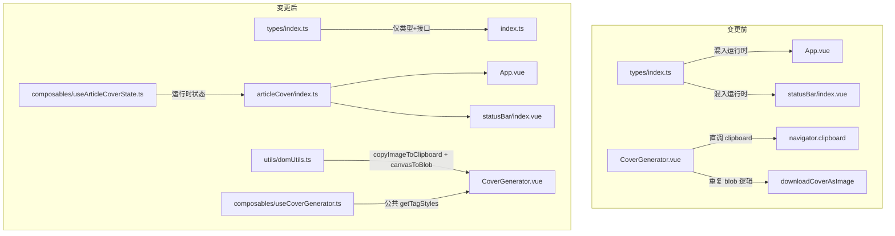

## 需求概述

对 `src/features/articleCover` 模块进行代码审查与重构，修复 CLAUDE.md 编码规范违规项，消除冗余代码，实施性能优化，修正代码质量问题，同时确保不改变任何现有功能逻辑和外部调用方行为。

## 核心目标

1. **合规性**：修复 types/index.ts 混入运行时逻辑的违规，将图片剪贴板操作统一到 `@/utils/domUtils`
2. **冗余消除**：合并 copyCoverAsImage/downloadCoverAsImage 重复的 canvas→Blob 逻辑，抽取 STYLE_DECOR_CSS 中 5 个风格高度重复的 .tag 样式，合并 SCSS 中 .style-btn/.size-preset-btn 的重复 active/hover 模式
3. **性能优化**：缓存 buildCoverHtml 中的不变常量，分离文字类变化（debounce）与尺寸/风格变化（即时生成）的 watch 逻辑
4. **质量修正**：移除孤立注释，修复 openFullscreen 的 Blob URL 内存泄漏

## 技术方案

### 文件变更范围

7 个文件涉及变更：4 个修改、3 个新增。

### 实现策略

**遵循项目现有架构模式**：运行时状态分离到 `composables/` 目录（参照项目中其他 feature 的实践），工具函数收敛到 `@/utils/domUtils.ts`（遵循统一入口原则），SCSS 重复模式抽取为 `@mixin`。

### 架构设计



### 数据流

```
外部调用方 (App.vue / statusBar)
  ↓ import { showArticleCover, articleCoverVisible, ... } from "@/features/articleCover"
articleCover/index.ts
  ↓ 重导出
composables/useArticleCoverState.ts (新)
  ↓ ref + 函数
types/index.ts (仅类型定义)
```

### 实施细节

#### 1. 新增 `composables/useArticleCoverState.ts`

- 从 `types/index.ts` 迁移 3 个 ref + 2 个函数到此文件
- 导出 `articleCoverVisible / articleCoverInitialTitle / articleCoverInitialKeywords / showArticleCover / hideArticleCover`
- `types/index.ts` 保留所有接口和类型定义（纯类型文件）

#### 2. 调整重导出链

- `articleCover/index.ts`: 将从 `"./types"` 重导出改为从 `"./composables/useArticleCoverState"` 重导出运行时符号 + 从 `"./types"` 重导出类型
- `features/index.ts` 无需修改（它从 `"./articleCover"` 导入，中间层 index.ts 已处理）

#### 3. 新增 `@/utils/domUtils.ts` 工具函数

- **`canvasToBlob(canvas, type?, quality?)`**: 封装 `canvas.toBlob → Promise<Blob>`，消除 3 处重复
- **`copyImageToClipboard(blob)`**: 封装 `navigator.clipboard.write([ClipboardItem])` + 错误处理，返回 `boolean`
- CoverGenerator.vue 中 `captureCoverCanvas` + 导出函数使用新工具函数

#### 4. 抽取 STYLE_DECOR_CSS 公共 .tag 样式

- 每个风格的 `(c: StyleColors) => string` 闭包中，提取公共 `.tag` 基础样式为独立函数 `getBaseTagStyles(colorOverride?: boolean)`
- 各风格仅定义差异化的 `.tag` 变体规则，基础规则由公共函数生成
- 预计减少约 25 行重复代码

#### 5. SCSS 重构

- 抽取 `%btn-interactive-base` placeholder 或 `@mixin btn-interactive` 供 `.style-btn` 和 `.size-preset-btn` 共享 active/hover 模式
- 减少约 15 行重复 SCSS

#### 6. 性能优化

- `buildCoverHtml` 中 `fontFamily` 提取为模块级常量 `const COVER_FONT_FAMILY = '...'`
- 分离 watch：`[title, category, keywords]` 一组 200ms debounce；`[styleId, width, height]` 一组即时生成（但需 title 非空）

#### 7. 质量问题修复

- 删除第 558 行孤立 `// 关闭` 注释
- `openFullscreen` 使用 `URL.revokeObjectURL` 延迟释放

### 关键注意事项

- **向后兼容**：所有外部引用（App.vue, statusBar/index.vue, features/index.ts）通过 `articleCover/index.ts` 间接导入，重导出路径变更对外部透明
- **Blast Radius**：仅改动 articleCover 模块 + domUtils.ts 新增函数，不影响其他 feature
- **类型安全**：types/index.ts 的 `CoverGenerationConfig` 等接口保持不变，确保 Compiler 零错误

## Agent Extensions

### SubAgent

- **code-explorer**
- 用途：在实现前验证所有引用方（App.vue、statusBar/index.vue、features/index.ts）的导入路径是否正确衔接，确认不影响外部调用链
- 预期成果：确认 3 处外部引用均通过 `features/articleCover/index.ts` 间接导入，重导出路径变更对外部透明