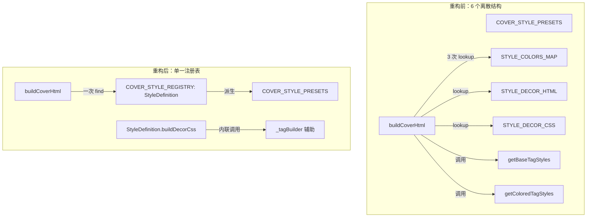

## 需求概述

将封面风格系统中 6 个离散结构统一为 `StyleDefinition` 注册表，每新增风格只需在注册表中添加一条配置，标签样式逻辑内联到各风格的 builder 函数中，消除 magic string 松散耦合。

## 核心变更

- 在 `types/index.ts` 中新增 `StyleDefinition` 接口
- 在 `useCoverGenerator.ts` 中将 6 个离散结构合并为单一的 `COVER_STYLE_REGISTRY: StyleDefinition[]`
- `COVER_STYLE_PRESETS` 从注册表派生（`registry.map(r => ({ id, label, description })`）
- `getBaseTagStyles`/`getColoredTagStyles` 逻辑内联为私有辅助函数，每个风格在其 `buildDecorCss` 中调用
- `buildCoverHtml` 直接查找注册表而非多步 lookup
- `CoverGenerator.vue` 无需修改（`COVER_STYLE_PRESETS` 接口不变）

## 技术方案

### 目标架构



### 核心接口设计

```typescript
// types/index.ts 新增
export interface StyleDefinition {
  id: string
  label: string
  description: string
  colors: StyleColors
  decorHtml: string
  /** 构建完整装饰 CSS（含标签样式），调用方传入 this.colors */
  buildDecorCss(c: StyleColors): string
}
```

### 注册表设计

`COVER_STYLE_REGISTRY` 是一个 `StyleDefinition[]`，顺序即显示顺序。`COVER_STYLE_PRESETS` 从中派生：

```typescript
export const COVER_STYLE_PRESETS: CoverStylePreset[] = COVER_STYLE_REGISTRY.map(s => ({
  id: s.id, label: s.label, description: s.description,
}))
```

### 标签样式内联策略

每个 `buildDecorCss(c)` 内部通过私有辅助函数 `_tag(mode, c)` 生成标签 CSS。该辅助函数取代 `getBaseTagStyles` + `getColoredTagStyles`，接收 mode 字符串和 colors 对象：

- `minimal`/`chinese`：返回透明背景 + 边框变体
- `tech`：返回发光 Box shadow 变体
- `drawio`：返回左边框颜色变体
- `magazine`：返回底部边框变体

### buildCoverHtml 简化

```typescript
// 前：3 次 Record lookup
const colors = getStyleColors(config.styleId)
const decorCss = STYLE_DECOR_CSS[config.styleId]?.(c) ?? STYLE_DECOR_CSS.minimal(c)
const decorHtml = STYLE_DECOR_HTML[config.styleId] ?? ""

// 后：1 次 find + 直接取值
const style = COVER_STYLE_REGISTRY.find(s => s.id === config.styleId) ?? COVER_STYLE_REGISTRY[0]
const c = style.colors
const decorCss = style.buildDecorCss(c)
const decorHtml = style.decorHtml
```

### 文件变更清单

| 文件 | 操作 | 变更量 |
| --- | --- | --- |
| `types/index.ts` | 新增 `StyleDefinition` 接口 + `StyleColors` 接口 | +15 行 |
| `composables/useCoverGenerator.ts` | 重构：6 离散结构 → 1 注册表 + 派生 PRESETS | ~190 行重组 |
| `components/CoverGenerator.vue` | 无变更 | 0 |


### 构建验证

- `pnpm vite build` 零错误
- 运行时 CSS 输出逐字符对比不变（标签样式、装饰元素完全一致）