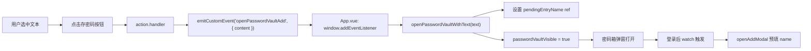

## 用户需求

浮动工具栏新增"存密码"按钮，用户选中文本后点击按钮，一键弹出密码箱并预填名称字段。跨组件联动必须解耦。

## 产品概述

在思源笔记浮动工具栏中增加"保存密码"操作按钮，让用户可以在任意文档中选中账号/密码等文本后，一键调出密码箱并以选中文本预填名称，快速完成密码条目保存。

## 核心功能

- 浮动工具栏新增"存密码"按钮，图标为锁形 SVG
- 选中文本后点击按钮，通过事件总线发送携带选中内容的 `openPasswordVaultAdd` 事件
- 密码箱模块暴露公开 API：接收预设文本，打开弹窗并自动填充添加表单名称字段
- 遵循项目已有解耦模式：floatingToolbar → emitCustomEvent → App.vue → passwordVault API

## 技术方案

### 解耦架构

遵循项目现有的对话框型 action 标准模式（与 `qrcode`/`pronunciation` 完全一致）：

### 关键设计决策

1. **复用 `createDialogAction` 工厂**：action 创建与 qrcode/pronunciation 完全一致，无需自定义 handler
2. **事件名 `openPasswordVaultAdd`**：与 `openPasswordVault` 区分，后者仅打开弹窗，前者携带预设数据
3. **pendingEntryName 模式**：通过模块级 `ref` 传递外部数据，避免修改 Vue 组件的 props 接口，组件内部 `watch` 自动响应
4. **登录状态处理**：若未登录，pendingEntryName 保留，登录后 `watch(isLoggedIn)` 检测到 pendingEntryName 有值时自动打开添加表单

### 涉及文件

| 文件 | 操作 | 说明 |
| --- | --- | --- |
| `src/features/floatingToolbar/core/actions/passwordVault.ts` | NEW | 存密码 action 工厂函数 |
| `src/features/floatingToolbar/core/actions/index.ts` | MODIFY | 导出新 action |
| `src/features/floatingToolbar/index.ts` | MODIFY | 注册新 action（enablePasswordVault 条件） |
| `src/features/passwordVault/index.ts` | MODIFY | 新增 `pendingEntryName` + `openPasswordVaultWithText()` |
| `src/features/passwordVault/index.vue` | MODIFY | watch pendingEntryName，自动预填表单 |
| `src/features/index.ts` | MODIFY | 导出新符号 `openPasswordVaultWithText` |
| `src/App.vue` | MODIFY | 监听 `openPasswordVaultAdd` 事件 |

### 性能与可靠性

- `emitCustomEvent` 使用 `useMicrotask: true`，不阻塞当前 UI 线程
- `pendingEntryName` 在预填后立即清空，避免重复触发
- 事件监听在 `onMounted` 中注册，不产生重复订阅