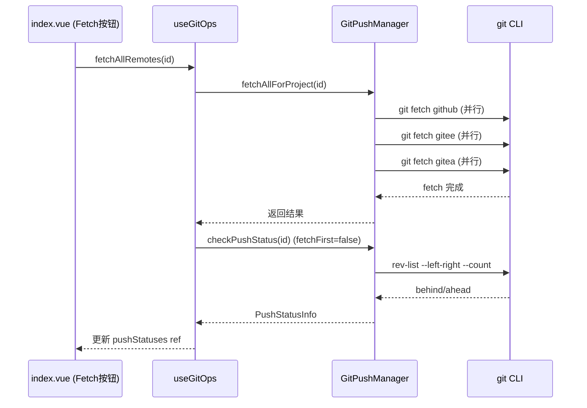

## 产品概述

为 gitPush 模块增强 git fetch 能力，解决跨电脑协作时远程跟踪分支过期导致 `↓N` 状态永远为 0 的问题。

## 核心功能

- **方案 A — 状态检查前自动 fetch**：手动刷新时（卡片点击、刷新按钮），`checkPushStatus()` 先执行 `git fetch` 更新远程跟踪分支，再比较 behind/ahead，确保差异判断准确
- **方案 B — 独立 Fetch 按钮**：在拉取操作区新增「Fetch」按钮，点击后 fetch 全部已配置远程（不合并代码），仅更新跟踪分支并刷新状态徽章
- **智能策略**：静默自动刷新和首屏加载不触发 fetch，避免不必要的网络开销；推送/拉取操作后也不额外 fetch（操作本身已更新）

## 技术栈

- TypeScript + Vue 3（现有项目技术栈）
- 底层 git 命令：`git fetch <remote>`（仅更新远程跟踪分支，不触达工作区）

## 实现方案

### 整体策略

在 `GitPushManager` 中新增 `fetchRemote()` 私有方法和 `fetchAllForProject()` 公开方法，修改 `checkPushStatus()` 的 opts 增加 `fetchFirst` 选项。UI 层通过 `useGitOps` composable 透传参数，`index.vue` 中手动刷新路径传 `true`，静默刷新传 `false`（默认）。

### 核心调用链

```
方案 A（手动刷新）：
handleRefresh(id) → loadPushStatus(id, { fetchFirst: true })
→ checkPushStatus(id, { fetchFirst: true })
→ fetchAllForProject(id) → 并行 git fetch 各远程
→ git rev-list --left-right --count → behind/ahead 准确

方案 B（Fetch 按钮）：
fetchAllRemotes(id) [useGitOps] → manager.fetchAllForProject(id)
→ [并行] git fetch github + git fetch gitee + ...
→ loadPushStatus(id) → 刷新状态徽章
```

### 关键技术决策

1. **fetch 放在 checkPushStatus 内部而非外部**：避免重复代码，所有需要 fetch 的路径统一走同一个方法
2. **fetchFirst 默认 false**：静默刷新/首屏不 fetch，仅手动操作 fetch，控制网络开销
3. **fetch 并行执行**：对多个远程并行 `git fetch`，利用 Promise.all，比串行快 2-4 倍
4. **不改变 `tryRemoteOp` 中的 pull 逻辑**：`git pull --ff-only` 已内置 fetch，无需重复

### 性能考量

- `git fetch` 网络耗时通常 0.5-3 秒/远程，并行执行可将总耗时控制在 3 秒内
- 静默刷新无额外开销（fetchFirst 默认 false）
- 首屏加载不受影响

## 架构设计



## 目录结构

```
src/features/gitPush/
├── GitPushManager.ts              # [MODIFY] 新增 fetchRemote/fetchAllForProject 方法；checkPushStatus opts 扩展 fetchFirst 选项
├── composables/
│   └── useGitOps.ts               # [MODIFY] loadPushStatus 透传 fetchFirst；新增 fetchAllRemotes action
├── index.vue                      # [MODIFY] 拉取区新增 Fetch 按钮；handleRefresh 传 fetchFirst=true；引入 fetchAllRemotes
├── styles/
│   └── index.scss                 # [MODIFY] 新增 .gp-fetch-loading 等 Fetch 按钮样式（可选，复用现有 .gp-spin）
├── types/
│   └── index.ts                   # [MODIFY] PlatformKey 类型已有，无需新增
└── i18n/
    ├── zh_CN/gitPush.json         # [MODIFY] 新增 fetch/fetchAll/fetching 键
    └── en_US/gitPush.json         # [MODIFY] 新增 fetch/fetchAll/fetching 键
```

## 关键代码结构

### GitPushManager 新增方法签名

```ts
// 新增：fetch 单个远程
private async fetchRemote(cwd: string, remoteName: string): Promise<void>

// 新增：fetch 项目所有已配置远程（并行）
async fetchAllForProject(id: string): Promise<{ fetched: string[]; errors: string[] }>

// 修改：opts 增加 fetchFirst
async checkPushStatus(id: string, opts?: { branch?: string; fetchFirst?: boolean }): Promise<PushStatusInfo>
```

### useGitOps 新增 action

```ts
// 新增：Fetch 所有远程 + 刷新状态
async function fetchAllRemotes(id: string): Promise<void>

// 修改：opts 增加 fetchFirst 透传
async function loadPushStatus(id: string, opts?: { branch?: string; fetchFirst?: boolean })
```

## Agent Extensions

### Skill

- **codex-ui-style-guide**
- 用途：确保新增的 Fetch 按钮样式符合项目 Codex UI 规范（vp-btn 组件模式、间距、过渡动画）
- 预期结果：Fetch 按钮与现有拉取/推送按钮视觉风格一致，复用 `.vp-btn--ghost`、`.gp-action-btn` 等已有 class