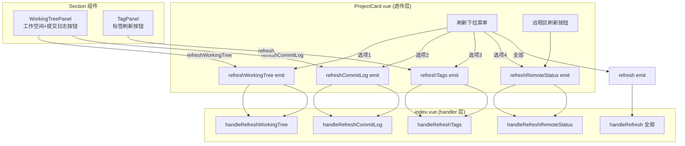

## 产品概述

将 gitPush 模块中项目卡片原有的"一键刷新全部"按钮拆分为 4 个独立的细粒度刷新入口，让用户可以按需单独刷新某一项数据，避免每次都全量刷新 6 项操作造成的等待。

## 核心功能

- **原刷新按钮改造**：保留顶部刷新按钮，点击后展开下拉菜单，含「刷新工作空间」「刷新提交日志」「刷新标签」「刷新远程状态」4 个细分选项 + 「全部刷新」选项
- **各 Section 就地刷新按钮**：在远程状态区、工作空间面板摘要条、提交历史区、标签面板头部各自增加独立的刷新小按钮，点击仅刷新该 Section 对应数据
- **4 项独立刷新操作**：
- 工作空间 → `loadWorkingTree(id)`（含 branch 获取）
- 提交日志 → `loadCommitLog(id)`
- 标签 → `loadTags(id)`
- 远程状态 → `refreshRemotes(id)` + `loadPushStatus(id, { fetchFirst: true, branch })`，与原 handleRefresh 远程部分一致
- 各刷新按钮有独立的 loading 旋转动画反馈，互不阻塞

## 技术栈

- 框架：Vue 3 + TypeScript（现有项目，无新增依赖）
- 状态管理：composables 模式（useGitOps / useCommitLog / useGitTagsConflicts）
- 样式：SCSS 分离到 styles/ 目录（遵循 Codex UI 规范）
- i18n：按功能分片，zh_CN/en_US 各新增翻译键

## 实现方案

### 整体策略

双入口设计：顶部下拉菜单（集中入口，复用现有 IDE 菜单的 popover 模式）+ 各 Section 内部独立按钮（就地入口）。两套入口复用同一套 handler 函数，避免逻辑重复。

### 关键技术决策

1. **新增 2 个 loading 状态**：`workingTreeLoading` 和 `remoteStatusLoading`（均为 `Record<string, boolean>`）。`commitLogLoading` 和 `tagLoading` 已存在可直接复用。不新增 ref 而是复用现有 refreshing 字符串，因为各 Section 可同时刷新不同项，需要独立布尔状态。
2. **handler 函数集中放 index.vue**：4 个 handler（`handleRefreshWorkingTree` / `handleRefreshCommitLog` / `handleRefreshTags` / `handleRefreshRemoteStatus`）+ 保留原 `handleRefresh` 作为"全部刷新"。工作空间和远程状态需要先获取 branch（`manager.getBranch(cwd)`），参考 handleRefresh 第 792-800 行的模式。
3. **下拉菜单复用 IDE 菜单模式**：ProjectCard 已有 `.gp-ide-wrap` + `.gp-ide-popover` 模式（openIdeMenu Set 控制），新下拉菜单用独立的 `openRefreshMenu: Set<string>` ref 控制，复用 closeIdeMenuOnOutside 的点击外部关闭逻辑（扩展判断 `.gp-refresh-wrap`）。
4. **事件透传链路**：各 Section 内部按钮 → emit 事件 → ProjectCard 透传 → index.vue handler。WorkingTreePanel 新增 `refreshWorkingTree` 和 `refreshCommitLog` 两个 emit；TagPanel 新增 `refresh` emit；ProjectCard 远程区直接 emit `refreshRemoteStatus`。

### 性能考量

- 单项刷新避免了 6 项并行 git 命令，减少 git 信号量竞争
- 各 Section 独立 loading 状态确保 UI 不互相阻塞
- 工作空间刷新用 `skipRefresh=false`（执行 update-index --refresh 保证准确性），与原 handleRefresh 一致

## 实现细节

- **branch 获取**：`handleRefreshWorkingTree` 和 `handleRefreshRemoteStatus` 内部先 `const branch = await manager.getBranch(resolveValidPath(project))`，再传给 loadWorkingTree / loadPushStatus，参考现有 handleRefresh 模式
- **下拉菜单防抖**：复用现有 `runBatchWithProgress` 包装单项刷新，或直接 try/finally + loading 状态控制（单项刷新无需进度条，用 loading ref 即可）
- **点击外部关闭**：扩展 index.vue 的 `closeIdeMenuOnOutside` 函数，同时检测 `.gp-refresh-wrap` 区域，或新增独立监听。推荐扩展现有函数减少事件监听器数量
- **SCSS 分离**：新增样式写入 `src/features/gitPush/components/styles/ProjectCard.scss`（若已有则追加）和对应 Section 组件的 SCSS 文件；下拉菜单样式参考 `.gp-ide-popover`
- **文件头注释**：所有修改的 .vue 文件保持顶部注释，新增文件添加 `// 文件功能说明`

## 架构设计



## 目录结构

```
src/features/gitPush/
├── index.vue                              # [MODIFY] 新增 4 个 handler + 2 个 loading ref + 扩展 closeIdeMenuOnOutside + 新增 props/events 传递
├── components/
│   ├── ProjectCard.vue                    # [MODIFY] 原刷新按钮改下拉菜单 + 远程状态区增加刷新按钮 + 新增 props(workingTreeLoading/remoteStatusLoading) + 新增 emits(4个细分refresh) + 透传 Section 事件
│   ├── WorkingTreePanel.vue               # [MODIFY] 摘要条增加工作空间刷新按钮 + 提交历史区增加提交日志刷新按钮 + 新增 emits(refreshWorkingTree/refreshCommitLog)
│   └── TagPanel.vue                       # [MODIFY] 头部增加标签刷新按钮 + 新增 emit(refresh)
├── components/styles/
│   ├── ProjectCard.scss                   # [MODIFY] 追加 .gp-refresh-wrap/.gp-refresh-popover 下拉菜单样式 + 远程区刷新按钮样式
│   ├── WorkingTreePanel.scss              # [MODIFY] 追加摘要条/提交历史区刷新按钮样式
│   └── TagPanel.scss                      # [MODIFY] 追加标签刷新按钮样式
├── composables/
│   └── useGitOps.ts                       # [无改动] 现有 loadWorkingTree/loadPushStatus/loadCommitLog 已满足需求
src/i18n/
├── zh_CN/gitPush.json                     # [MODIFY] 新增 refreshWorkingTree/refreshCommitLog/refreshTags/refreshRemoteStatus/refreshAll 等翻译键
└── en_US/gitPush.json                     # [MODIFY] 对应英文翻译
```

## 关键代码结构

```typescript
// index.vue 新增的 loading 状态与 handler 签名
const workingTreeLoading = ref<Record<string, boolean>>({})
const remoteStatusLoading = ref<Record<string, boolean>>({})
const openRefreshMenu = ref(new Set<string>())

async function handleRefreshWorkingTree(id: string): Promise<void>
async function handleRefreshCommitLog(id: string): Promise<void>
async function handleRefreshTags(id: string): Promise<void>
async function handleRefreshRemoteStatus(id: string): Promise<void>
// handleRefresh(id) 保留为"全部刷新"

// ProjectCard.vue 新增 emits
"refreshWorkingTree": [id: string]
"refreshCommitLog": [id: string]
"refreshTags": [id: string]
"refreshRemoteStatus": [id: string]

// WorkingTreePanel.vue 新增 emits
"refreshWorkingTree": []
"refreshCommitLog": []

// TagPanel.vue 新增 emit
"refresh": []
```

## Agent Extensions

### SubAgent

- **code-explorer**
- Purpose: 在实现阶段深入探索 BranchCommitList 组件结构、SCSS 文件现有内容、en_US i18n 文件，确保事件透传和样式追加的精确性
- Expected outcome: 确认 BranchCommitList 的 props/emit 接口、各 SCSS 文件的现有类名避免冲突、en_US 翻译键完整对齐