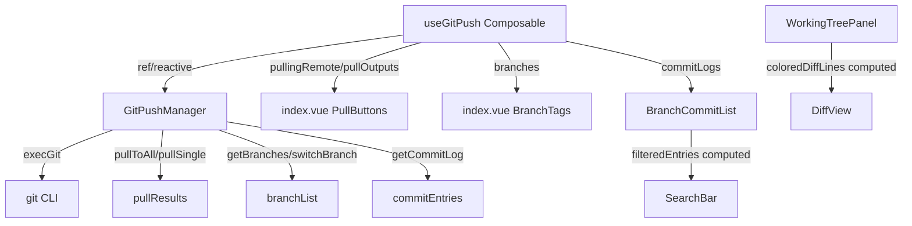

## 概述

在 gitPush 模块现有重构基础上，新增 4 个功能：Pull 拉取操作、Diff 行级着色视图、分支切换面板、提交历史搜索过滤。全部遵循现有 Manager-Composable-Vue 三层架构和 Codex 风格规范。

## 功能清单

### 1. Pull 拉取操作

- Pull Single：从 GitHub/Gitee/Gitea 单个远程 `git pull`
- Pull All：依次拉取全部已配置远程
- 按钮布局与 Push 按钮组对称，位于推送按钮上方
- 输出格式复用 `formatPullOutput()`（与 `formatPushOutput` 同模式）
- 拉取后自动刷新推送状态

### 2. Diff 行级着色增强

- 解析 `git diff` 输出，按行首字符分类渲染
- 新增行（+ 开头）：浅绿背景 `#e6ffec`
- 删除行（- 开头）：浅红背景 `#ffebe9`
- Hunk 头（@@ 开头）：蓝色文字 `#0969da`
- 上下文行：降低透明度 `opacity: 0.6`
- 纯 CSS 方案，无需第三方语法高亮库

### 3. 分支切换面板

- 显示所有本地分支列表（`git branch`）
- 当前分支高亮（主题色 + 标记）
- 点击分支切换（`git checkout`），弹确认提示
- 切换后自动刷新工作区状态 + 推送状态 + 提交日志
- 集成到卡片顶部区域，紧跟路径行

### 4. 提交搜索过滤

- 在 BranchCommitList 顶部添加搜索栏
- 支持关键词搜索（消息文本模糊匹配）
- 支持作者搜索
- 前端过滤，无需额外 git 命令
- 搜索结果高亮匹配文本

## 技术栈

- 前端：Vue 3 + TypeScript + SCSS
- Git 命令：`git pull`、`git branch`、`git checkout`、`git log`（扩展现有 `execGit`）
- 搜索：前端 `Array.filter` 实现，无额外依赖

## 实现方案

### Pull 操作设计

**策略**：镜像 Push 模式。Manager 层新增 `pullToAll`/`pullSingle`，Composable 层新增 `pullingRemote`/`pullOutputs` refs + `formatPullOutput` 私有函数。`index.vue` 在推送按钮组上方新增对称的拉取按钮组，绑定 `pullingRemote` 控制 loading 和 disabled 状态。

**性能考虑**：`git pull` 是网络密集型操作（已有 30s 超时），且会阻塞其他 git 操作。`pullingRemote` ref 锁定期间禁用推送按钮，避免并发冲突。

**pullToAll 实现**：与 `pushToAll` 完全对称——遍历 `githubRemote`/`giteeRemote`/`giteaRemote`，对每个已配置远程执行 `git pull {remote}`。`pullSingle` 同理。

### Diff 着色方案

**策略**：不改变数据层——`getFileDiff` 返回的原始 diff 文本不变。在 `WorkingTreePanel.vue` 模板层新增 `coloredDiffLines` computed，将 `activeDiffText` 按 `\n` 分割，逐行判定首字符：

```typescript
type DiffLineType = "add" | "del" | "hunk" | "ctx"
interface DiffLine { text: string, type: DiffLineType }

function classifyDiffLine(line: string): DiffLineType {
  if (line.startsWith("+") && !line.startsWith("+++")) return "add"
  if (line.startsWith("-") && !line.startsWith("---")) return "del"
  if (line.startsWith("@@")) return "hunk"
  return "ctx"
}
```

每行渲染为 `<div class="wt-diff-line wt-dl-{type}"><span class="wt-dl-sign">{sign}</span>{content}</span></div>`，前置符号列单独着色。

### 分支切换设计

**策略**：新增 `getBranches()`（`git branch --format="%(refname:short)%00%(HEAD)"`）和 `switchBranch()`（`git checkout {branch}`）。Composable 层新增 `branches` ref + `loadBranches`/`switchBranch` 函数。UI 集成到项目卡片顶部（路径行下方），以小标签形式横向排列，当前分支用主题色高亮。

**安全考虑**：切换分支前检查是否有未提交变更——若 `hasChanges=true` 则弹出 `confirm`（"当前有未提交的更改，切换分支将丢失未提交内容，是否继续？"）。

### 提交搜索设计

**策略**：在 `BranchCommitList.vue` 内部新增 `searchKeyword`/`searchAuthor` refs + `filteredEntries` computed。前端过滤零延迟。

```typescript
const filteredEntries = computed(() => {
  let list = props.entries
  if (searchKeyword.value) {
    const kw = searchKeyword.value.toLowerCase()
    list = list.filter((e) => e.message.toLowerCase().includes(kw))
  }
  if (searchAuthor.value) {
    const au = searchAuthor.value.toLowerCase()
    list = list.filter((e) => e.author.toLowerCase().includes(au))
  }
  return list
})
```

## 架构设计

### 数据流



### 目录结构

```
src/features/gitPush/
├── types/
│   ├── index.ts        # [MODIFY] +pullToAll/pullSingle/getBranches/switchBranch/searchCommitLog
│   └── storage.ts      # [MODIFY] +BranchInfo 接口
├── composables/
│   └── useGitPush.ts   # [MODIFY] +pullingRemote/pullOutputs/branches refs + loadBranches/switchBranch/pullSingle/pullToAll
├── index.vue           # [MODIFY] +Pull 按钮组 + 分支标签行 + pullOutputs
├── components/
│   ├── WorkingTreePanel.vue  # [MODIFY] diff 着色改造
│   └── BranchCommitList.vue  # [MODIFY] +搜索栏
└── styles/
    └── _mixins.scss    # [MODIFY] 可选：+diff-line 通用样式
```

## 实现要点

### 执行细节

- **pullToAll/pullSingle**：复用 `pushToAll` 返回类型结构 `{ ok: boolean; stdout: string; stderr: string }`，三平台结果一致
- **formatPullOutput**：与 `formatPushOutput` 函数签名相同，但输出标签用"拉取成功/失败"
- **分支切换安全**：`switchBranch` 在 Manager 层先 `git status --porcelain` 检测，有变更时抛异常让 Composable 层处理确认交互
- **Diff 性能**：大 diff（>500 行）时 `coloredDiffLines` computed 仅重构一次，Vue 响应式追踪数组索引变化
- **搜索性能**：`filteredEntries` 是纯 computed，提交记录通常 <100 条，无性能问题
- **日志**：Pull/Checkout 操作复用 `[gitPush:execGit]` 现有日志前缀

### 规避回归

- Pull 按钮与 Push 按钮互斥：`pullingRemote` 非空时 Push 按钮禁用，反之亦然
- Diff 着色不改变 `activeDiffText` 原始格式，仅影响模板渲染
- 分支切换后的刷新顺序：`loadWorkingTree` → `loadPushStatus` → `loadCommitLog`（避免旧数据覆盖）

## Agent Extensions

### SubAgent

- **code-explorer**
- 用途：实现前精确锚定 diff 渲染和按钮布局的精确行号，确认 Pull UI 的最佳插入位置
- 预期结果：获得 WorkingTreePanel.vue 中 `<pre class="wt-diff-content">` 的精确行号和上下文、index.vue 中推送按钮组的精确范围、BranchCommitList.vue 模板结构
