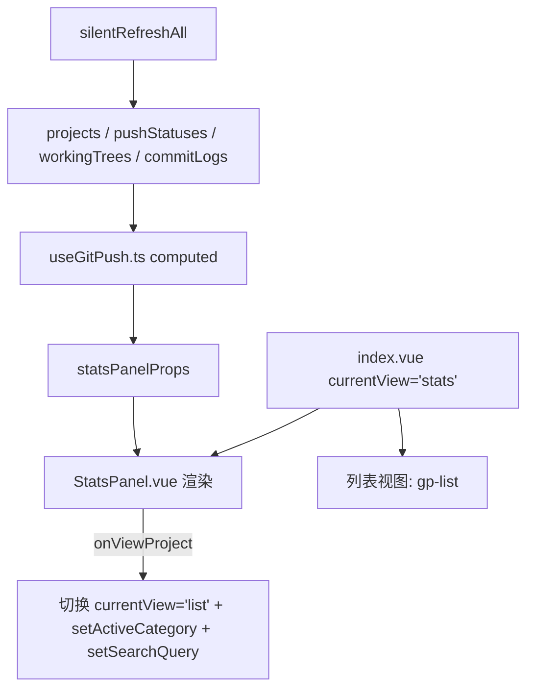

## 用户需求

为 gitPush 模块新增统计视图功能。

## 核心功能

1. **顶部项目总数**：在标题栏区域展示项目总数 badge，随数据动态更新
2. **视图切换**：头部新增「列表」/「统计」切换按钮，点击在两个视图间无缝切换
3. **统计面板**：展示以下统计维度

- 总览卡片：项目总数、分类数、有远程的项目数
- 远程覆盖率：GitHub / Gitee / Gitea 分别有多少项目配置，多远程项目占比
- 推送状态汇总：ahead / behind / synced / 未配置的分类统计
- 未及时推送列表：needsPush=true 的项目清单，含具体 ahead 数量
- 未提交变更统计：有未提交文件的项目数及具体列表

4. **交互联动**：统计页面的未推送项目列表支持点击跳转到列表视图并自动过滤

## 技术方案

### 实现策略

遵循现有项目架构模式：在 `index.vue` 中新增 `currentView` 状态变量控制视图切换，新增 `StatsPanel.vue` 纯展示组件，统计计算逻辑以 `computed` 方式写入 `useGitPush.ts`，样式新建 `_stats.scss` partial 文件。

### 关键设计决策

- **零额外请求**：统计页完全基于 `projects`、`pushStatuses`、`workingTrees`、`commitLogs` 四个已有响应式数据做 computed 派生计算，不新增 git 子进程调用
- **视图共存共享数据**：列表视图和统计视图共享同一份响应式状态，`silentRefreshAll()` 刷新后两视图自动同步更新
- **组件解耦**：StatsPanel 通过 props 接收统计数据透传，不做数据请求，保持纯展示职责
- **遵循现有 conventions**：使用 gp- 前缀 CSS 类名、$vp-mono 等宽字体变量、BEM 命名风格、`useGitPush` composable 模式

### 性能考量

- 统计计算全部为 computed，仅在被依赖数据变化时重新计算
- 统计页面的项目列表渲染量等于项目总数，与列表视图相当，无额外渲染压力
- `gp-spin` 旋转动画复用现有 `_shared.scss`

### 目录结构

```
src/features/gitPush/
├── index.vue                           # [修改] 新增 currentView 状态、视图切换按钮、项目总数 badge、条件渲染 StatsPanel
├── components/
│   └── StatsPanel.vue                  # [新增] 统计面板纯展示组件
├── composables/
│   └── useGitPush.ts                  # [修改] 新增 stats 相关 computed 导出
├── styles/
│   └── _stats.scss                     # [新增] 统计面板专属样式
```

### 关键数据结构

StatsPanel 接收的 Props 接口：

```typescript
interface StatsPanelProps {
  totalProjects: number // 项目总数
  categoryCount: number // 分类数量
  projectsWithRemote: number // 有远程的项目数
  remoteCoverage: { // 远程覆盖率
    github: number // 配置 GitHub 的项目数
    gitee: number // 配置 Gitee 的项目数
    gitea: number // 配置 Gitea 的项目数
    multi: number // 同时有 2+ 远程的项目数
  }
  pushSummary: { // 推送状态汇总
    ahead: number // 需要推送的项目数
    behind: number // 落后于远程的项目数
    synced: number // 已同步的项目数
    noRemote: number // 无远程的项目数
  }
  unpushedProjects: { id: string, name: string, categoryName: string, remotes: { key: string, ahead: number }[] }[] // 未及时推送列表
  uncommittedProjects: { id: string, name: string, categoryName: string, staged: number, unstaged: number, untracked: number }[] // 未提交变更列表
  recentCommits: { projectId: string, projectName: string, hash: string, message: string, date: string }[] // 最近提交摘要
  onViewProject: (projectId: string) => void // 点击项目跳转回调
}
```

### 数据流


