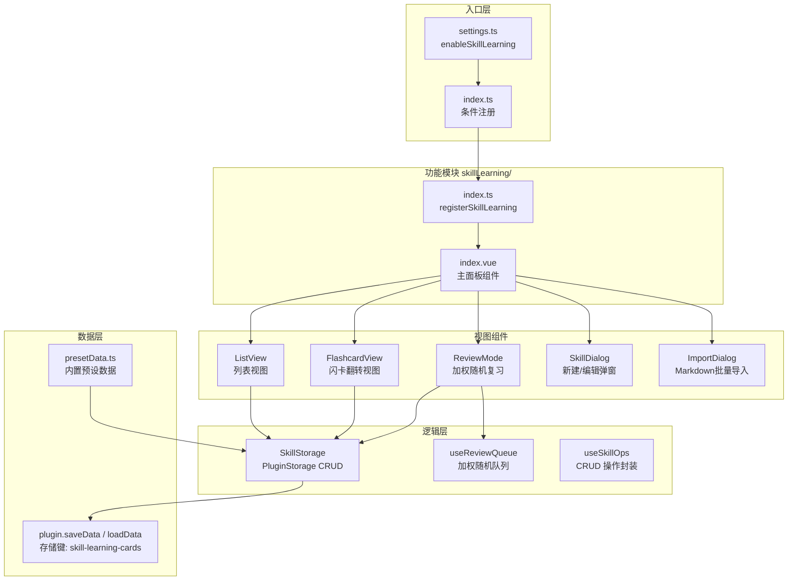

## 产品概述

"技能学习"是一个代码片段练习库功能，以闪卡式记忆为核心体验，帮助用户通过主动回忆（Active Recall）和加权间隔复习来掌握 C#、JavaScript、TypeScript、Vue 等编程语言的语法、API、设计模式等知识点。功能以 Dock 面板形式常驻思源笔记右侧边栏，随时打开练习。

## 核心功能

### 代码片段闪卡管理

- 每张卡片包含：正面（题目/概念描述）、背面（答案/代码片段）、编程语言、分类标签、难度等级
- 支持新建、编辑、删除卡片，标题唯一性校验
- 按语言（C#/JS/TS/Vue）、分类、难度三个维度筛选

### 三种视图模式

- **列表视图**：网格展示所有卡片，显示标题、语言徽章、难度徽章、练习次数，支持分页和搜索
- **闪卡视图**：单张大卡片，正面显示题目，点击翻转显示答案和代码片段（带语法高亮区域），支持翻页和随机
- **复习模式**：加权随机队列（练习次数越少出现概率越高），每次练习后可自评"记得/模糊/忘记"，自动更新练习次数

### 内容导入

- **Markdown 批量导入**：粘贴或输入 Markdown 文本，自动解析 `## 标题` 为卡片正面，代码块为背面，语言标签自动映射
- **内置预设框架**：首次使用时自动生成 C#/JS/TS/Vue 四类入门示例卡片，含基础语法、常用 API、设计模式等知识点
- **手动创建**：弹窗表单录入，支持代码块粘贴和多行编辑

### 辅助能力

- 搜索过滤：根据标题、内容、标签关键词实时过滤卡片列表
- 统计概览：总卡片数、已练习比例、各语言分布、练习排行榜

## 技术栈

- 框架：Vue 3 Composition API + TypeScript
- 样式：SCSS（Codex 设计语言：等宽字体、大写标签、边框卡片、focus 发光）
- 图标：Iconify (mdi)，思源内置图标
- 存储：PluginStorage（封装 plugin.saveData/loadData）
- Dock 注册：createVueDockApp 工具函数
- 平台：思源笔记插件 API（支持 Electron 桌面端）

## 实现策略

### 架构思路

完全复用项目中成熟的 Dock 面板 + 闪卡复习模式。参考 `rssReader` 的最简 Dock 注册模式（`createVueDockApp` 一行创建），参考 `flashcardReading` 的数据模型（PluginStorage + CRUD + 唯一性校验）和加权随机队列算法（`computeWeights` → `weightedRandomIndex` → `buildQueue`），另辟独立模块避免耦合。

### 数据模型设计

卡片模型在 `Flashcard` 基础上扩展语言和难度维度：

- `id: string` — 唯一标识（`skill-${timestamp}`）
- `title: string` — 正面题目/概念描述
- `answer: string` — 背面答案说明
- `codeSnippet: string` — 背面代码片段（可选）
- `language: 'csharp' | 'javascript' | 'typescript' | 'vue' | 'other'` — 编程语言
- `category: string` — 分类标签（如"基础语法"、"异步编程"、"设计模式"）
- `difficulty: 'beginner' | 'intermediate' | 'advanced'` — 难度等级
- `practiceCount: number` — 练习次数（加权复习的依据）
- `tags: string[]` — 自定义标签
- `createdAt / updatedAt: number` — 时间戳

### 加权复习算法

直接复用 `flashcardReading/composables/useTypingQueue.ts` 的核心逻辑：

1. `computeWeights(cards)`: 练习次数越少权重越高（`1 + maxCount - practiceCount`）
2. `weightedRandomIndex(cards)`: 按权重随机选择下一张卡片
3. `buildQueue(cards)`: 生成完整加权随机队列，支持 previous/next/rebuild

### Markdown 导入解析规则

按 freeCodeCamp 课程风格，约定 Markdown 格式：

```
## 什么是闭包？
闭包是指函数能够访问其外部作用域变量的能力。

​```javascript
function outer() {
  const x = 10;
  return function inner() {
    console.log(x);
  };
}
​```
```

解析逻辑：`## 标题` → title，代码块 ` ```language ``` ` → codeSnippet + language 自动映射，其余文本 → answer。

### 性能考量

- 存储层：所有卡片一次性加载到内存（预期数百到数千张），筛选/搜索使用 computed 派生，无需重复读取 storage
- 视图切换：使用 `v-if` + `KeepAlive` 避免重复渲染，复习队列缓存避免频繁 rebuild
- 批量导入：单次解析 + 批量写入存储，避免逐条 I/O

## 架构设计



## 目录结构

```
src/features/skillLearning/
├── index.ts                        # [NEW] 入口：registerSkillLearning(plugin)，使用 createVueDockApp 注册 Dock
├── index.vue                       # [NEW] 主面板组件：视图切换（list/flashcard/review），Props: { i18n, plugin }
├── types/
│   ├── index.ts                    # [NEW] 类型定义：SkillCard, CreateSkillDTO, ViewMode, Language, Difficulty, I18n
│   └── storage.ts                  # [NEW] SkillStorage 类，封装 PluginStorage，键 "skill-learning-cards"，含 getAll/create/update/delete/incrementCount 方法
├── composables/
│   ├── useSkillStorage.ts          # [NEW] 存储操作 composable，封装 SkillStorage 为 ref 响应式
│   ├── useReviewQueue.ts           # [NEW] 加权随机复习队列，复用 useTypingQueue 核心算法
│   └── useI18n.ts                  # [NEW] i18n composable
├── components/
│   ├── SkillListView.vue           # [NEW] 列表视图：网格卡片、分页、搜索、语言/难度/分类筛选
│   ├── FlashcardView.vue           # [NEW] 闪卡视图：单卡正面/背面翻转动画、上一张/下一张/随机导航、代码语法高亮区域
│   ├── ReviewMode.vue              # [NEW] 复习模式：加权随机出题、翻转查看答案、自评按钮（记得/模糊/忘记）、进度条
│   ├── SkillDialog.vue             # [NEW] 新建/编辑弹窗，含语言选择器、难度选择器、代码编辑器输入
│   ├── ImportDialog.vue            # [NEW] Markdown 批量导入弹窗，文本区域输入 + 实时预览解析结果
│   ├── CategoryFilter.vue          # [NEW] 分类+语言+难度联合筛选组件
│   └── DifficultyBadge.vue         # [NEW] 难度徽章组件（绿色初级/蓝色中级/紫色高级）
├── data/
│   └── presetData.ts               # [NEW] 内置预设卡片数据：C#/JS/TS/Vue 各 5 张入门示例卡片
└── styles/
    └── index.scss                  # [NEW] 所有 SCSS 样式，遵循 Codex 设计语言

src/config/
├── settings.ts                     # [MODIFY] 添加 enableSkillLearning: boolean，默认 true
├── icons.ts                        # [MODIFY] FEATURE_ICONS 添加 skillLearning
├── features/config.ts              # [MODIFY] FEATURE_CONFIG 添加 { id: "skillLearning", defaultTitle: "技能学习", ... }
└── features/index.ts               # [MODIFY] _Registered 类型添加 "skillLearning"，导出 registerSkillLearning

src/i18n/
├── zh_CN/
│   ├── zh_CN.json                  # [MODIFY] 添加 skillLearning 翻译条目
│   └── skillLearning.json          # [NEW] 完整中文翻译文件
└── en_US/
    ├── en_US.json                  # [MODIFY] 添加 skillLearning 翻译条目
    └── skillLearning.json          # [NEW] 完整英文翻译文件

src/
└── index.ts                        # [MODIFY] 导入 registerSkillLearning + 条件注册 if (s.enableSkillLearning)
```

## 设计风格

采用 **Codex 设计语言**（项目已有设计体系），结合暗色终端美学与闪卡学习交互。整体风格：等宽字体 + 大写标签 + 细边框卡片 + 聚焦发光效果。

## 主面板布局

Dock 面板宽度 420px，顶部为标题栏（图标+标题+操作按钮），中部可切换三个标签页（列表/闪卡/复习），底部为统计摘要栏。

## 闪卡翻转交互

卡片正面为白色/浅灰背景，居中显示题目文字（大号等宽字体），底部显示语言徽章和难度徽章。点击卡片触发 3D 翻转动画（`transform: rotateY(180deg)`，600ms ease），背面显示答案文本和代码块（深色背景 + 语法高亮色），底部为"记得/模糊/忘记"三按钮。

## 列表视图

网格布局（2 列），每张卡片小卡片样式：顶部标题（截断 2 行），底部行显示语言彩色圆点 + 分类标签 + 练习次数（等宽数字）。顶部搜索栏支持实时过滤。

## 复习模式

顶部进度条（已完成/总数），中央大卡片（与闪卡视图一致），底部三按钮（绿色"记得"+1 分、黄色"模糊"+0.5 分、红色"忘记"跳过）。每次操作自动更新队列权重。

## 颜色系统

- 语言色：C# 紫 #a855f7、JS 黄 #f59e0b、TS 蓝 #3b82f6、Vue 绿 #10b981
- 难度色：初级绿 #22c55e、中级蓝 #3b82f6、高级紫 #a855f7
- 复习按钮：记得 #22c55e、模糊 #eab308、忘记 #ef4444
