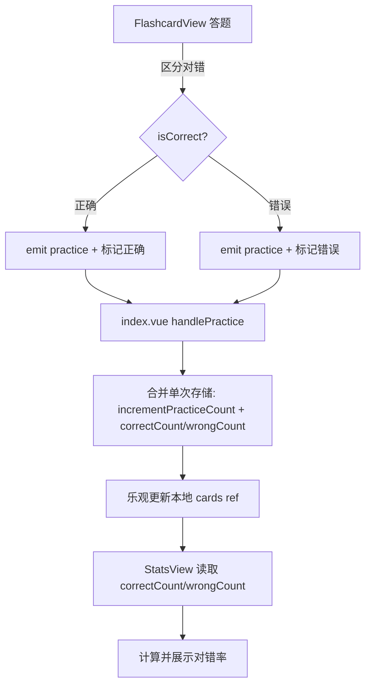

## 用户需求

审查 `src/features/skillLearning/` 模块全部代码，在统计页面新增闪卡学习对错率展示，识别并合并冗余 TS/SCSS 代码，评估并实施性能优化，在不影响现有功能逻辑的前提下进行代码重构，确保符合项目 CLAUDE.md/CODEBUDDY.md 编码规范。

## 产品概述

思源笔记插件的"技能学习"功能模块，支持技术卡片管理、闪卡答题、间隔复习和统计分析。本次优化聚焦于代码质量提升、性能改进和统计能力增强。

## 核心功能（本次变更）

- **统计页新增闪卡对错率**：`StatsView` 展示每张卡片的正确/错误次数及正确率，并以进度条和环形图视觉化呈现
- **闪卡答题区分对错**：`FlashcardView` 答题时区分正确和错误，分别计入 `correctCount`/`wrongCount`
- **SCSS 合并**：提取 `_shared.scss` 消除 4 处 `&__empty`、语言颜色、进度条、代码块的重复样式
- **TS 合并**：提取 `useFilteredCards` composable 消除 `filteredCards`/`languageList`/`categoryList` 重复
- **移除死代码**：删除 `SkillStorage` 中未使用的 `getLanguages()`/`getCategories()`/`isTitleUnique()`
- **性能优化**：`handleRate()` 合并为单次存储操作；`createCard`/`updateCard`/`deleteCard` 改用乐观更新避免全量重载
- **规范修复**：`1.5rem` 改为 `$font-size-2xl` 变量，清理多余空行

## 技术栈

- 前端框架：Vue 3 Composition API + TypeScript
- 样式：SCSS（BEM 命名 + Codex UI 设计 Token）
- 存储：PluginStorage（思源插件存储 API）
- 构建：Vite library 模式

## 实现方法

### 策略总览

遵循项目现有的"功能模块化 + 统一入口 + 设计 Token"架构原则，采用渐进式重构：

1. **类型层**：在 `SkillCard` 接口新增 `correctCount`/`wrongCount` 字段
2. **数据层**：合并 `handleRate()` 中的双存储调用为一次原子写入，`createCard`/`updateCard`/`deleteCard` 改用乐观更新
3. **视图层**：`FlashcardView` 区分对错 emit，`StatsView` 新增对错率展示
4. **样式层**：提取 `_shared.scss` 消除 4 处重复样式
5. **逻辑层**：提取 `useFilteredCards` composable，移除死代码

### 关键性能决策

- **乐观更新 vs 全量重载**：`createCard`/`updateCard`/`deleteCard` 成功后直接操作 `cards` ref 数组，避免 `loadCards()` 全量重载。收益：操作后视图更新从 O(n) 全量读取降至 O(1) 本地操作。
- **合并存储调用**：`handleRate()` 将 `updateReviewData` + `incrementPracticeCount` 两次 `getAllCards()` 合并为一次，减少 50% 的存储 I/O。
- **composable 提取**：`useFilteredCards` 抽取共用的筛选逻辑，减少 `SkillListView` 和 `FlashcardView` 中约 40 行重复代码。

### 实现注意事项

- **向后兼容**：`SkillCard` 新增 `correctCount`/`wrongCount` 默认为 `undefined`（可选字段），旧数据自动兼容
- **SCSS 共享文件**：`_shared.scss` 使用 `@use` 导入避免重复编译，遵循项目 SCSS 分离规范
- **死代码移除**：`isTitleUnique()` 被 `createCard` 内部调用 → 经确认 `SkillDialog` 不依赖此方法，仅存储层内部校验标题唯一性，`getLanguages()`/`getCategories()` 确实未被任何组件使用
- **日志**：遵循项目惯例使用 `console.log`，不输出敏感数据

## 架构设计

### 数据流变更



### 模块结构（变更部分）

```
src/features/skillLearning/
├── types/index.ts              # [MODIFY] SkillCard 新增 correctCount/wrongCount
├── types/storage.ts            # [MODIFY] 合并方法，移除死代码
├── composables/
│   ├── useSkillStorage.ts      # [MODIFY] 乐观更新 + 合并存储调用
│   ├── useFilteredCards.ts     # [NEW] 提取共用筛选逻辑
│   └── useLangLabel.ts         # [MODIFY] 提取语言颜色映射
├── index.vue                   # [MODIFY] handleRate 合并优化
├── components/
│   ├── StatsView.vue           # [MODIFY] 新增对错率展示
│   ├── FlashcardView.vue       # [MODIFY] 区分对错 emit
│   └── SkillListView.vue       # [MODIFY] 使用 useFilteredCards
├── styles/
│   ├── _shared.scss            # [NEW] 提取共用 SCSS
│   ├── StatsView.scss          # [MODIFY] 修复 rem + 新增对错率样式
│   ├── FlashcardView.scss      # [MODIFY] 移除冗余样式
│   ├── ReviewView.scss         # [MODIFY] 移除冗余样式
│   └── SkillListView.scss      # [MODIFY] 移除冗余样式
├── i18n/
│   ├── zh_CN/skillLearning.json # [MODIFY] 新增翻译键
│   └── en_US/skillLearning.json # [MODIFY] 新增翻译键
```

## 关键代码结构

### SkillCard 类型扩展

```typescript
export interface SkillCard {
  // ... 现有字段保持不变
  correctCount?: number // 新增：闪卡答题正确次数
  wrongCount?: number // 新增：闪卡答题错误次数
}
```

### useFilteredCards Composable 签名

```typescript
export function useFilteredCards(cardsRef: Ref<SkillCard[]>) {
  const searchQuery = ref("")
  const selectedLanguage = ref("")
  const selectedCategory = ref("")
  const selectedDifficulty = ref("")
  const page = ref(1)
  const pageSize = 10

  const languageList: ComputedRef<string[]>
  const categoryList: ComputedRef<string[]>
  const filteredCards: ComputedRef<SkillCard[]>
  const totalPages: ComputedRef<number>
  const paginated: ComputedRef<boolean>
  const paginatedCards: ComputedRef<SkillCard[]>

  return {
    searchQuery,
    selectedLanguage,
    selectedCategory,
    selectedDifficulty,
    page,
    languageList,
    categoryList,
    filteredCards,
    totalPages,
    paginated,
    paginatedCards,
  }
}
```

### 合并存储方法签名

```typescript
// storage.ts - 合并为单次存储操作
async function updatePracticeAndReviewData(
  id: string,
  reviewData: ReviewData,
  isCorrect?: boolean,
): Promise<boolean>
```
