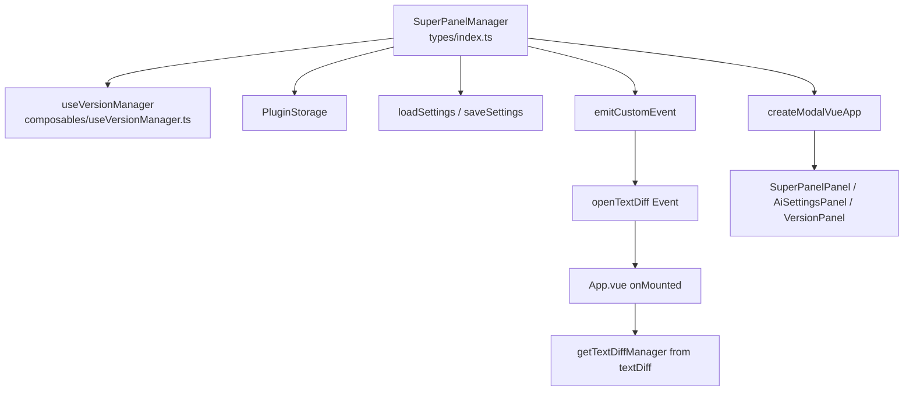

## 产品概述

根据 CLAUDE.md 规范对 `src/features/superPanel` 功能模块进行全面审查后，修复发现的所有违规问题。该功能是思源笔记插件的统一功能入口面板，以列表布局展示所有已启用功能，支持搜索、状态标记、版本管理、AI 配置等操作。

## 核心修复范围

- **跨功能导入违规**：将 `textDiff` 的直接导入改为事件总线 + App.vue 调度模式
- **全局样式违规**：将 `@use './styles/index.scss'` 改为 `@use "@/index.scss" as *;`
- **box-shadow 违规**：将 4 处 focus 样式中的 `box-shadow` 替换为边框实现
- **Manager 类重构**：将版本管理逻辑从 `types/index.ts` 提取到独立模块
- **Settings 访问规范化**：用 `loadSettings/saveSettings` 替代 `(plugin as any).settings`
- **死代码清理**：移除无外部引用的 `__superPanel` 全局变量挂载
- **Token 统一**：将 `feature-card.scss` 中的硬编码尺寸替换为设计 Token

## 技术方案

### 1. 跨功能导入修复（事件总线模式）

**当前违规代码** (`types/index.ts:16`)：

```typescript
import { getTextDiffManager } from "@/features/textDiff"
// ...
if (action === "openTextDiff") {
  getTextDiffManager()?.toggle()
  this.close()

}
```

**修复方案**：

- 从 `types/index.ts` 移除 `textDiff` 导入和特殊分支处理
- 在 `ACTION_EVENT_MAP` 中添加 `openTextDiff: { event: "openTextDiff" }`
- `handleFeatureAction` 统一走 `emitCustomEvent` 路径
- 在 `App.vue` 的 `onMounted` 中添加 `window.addEventListener("openTextDiff", ...)` 监听，调用 `getTextDiffManager()?.toggle()`

**符合规范**：App.vue 是 CLAUDE.md 明确允许的唯一可同时导入多个 feature 的文件（CLAUDE.md 第 78 行）。

### 2. 全局样式修复

将 `index.vue:268` 的 `<style lang="scss">` 块从：

```
@use './styles/index.scss';
```

改为：

```
@use "@/index.scss" as *;
```

确保所有组件样式通过全局入口 `src/_variables.scss` 的 Token 系统统一管理。

### 3. box-shadow 替换为边框

将 4 处 focus 样式从 `box-shadow` 改为 `border` 实现：

- 将各元素的默认 `border` 从 `1px` 提升为 `2px transparent`，focus 时改为 `2px solid var(--b3-theme-primary)`，避免布局抖动
- `.setting-input` / `.setting-select` / `.vp-input` / `.search-input-wrapper` 统一处理

### 4. Manager 类拆分

将 `types/index.ts` 中的版本管理逻辑（约 70 行：`loadVersions` / `saveVersions` / `getStoragePath` / `addVersion` / `updateVersion` / `deleteVersion` / `refreshVersionModal` / `openVersions` / `closeVersions`）提取到新文件：

- `src/features/superPanel/composables/useVersionManager.ts`

SuperPanelManager 通过组合使用 `useVersionManager`，保持接口不变。

### 5. Settings 访问规范化

修复 `SuperPanelManager` 中的 settings 读写：

- `open()` 方法中：用 `const settings = await loadSettings(this.plugin)` 替代 `(this.plugin as any).settings`
- `_updatePluginSettings()` 中：用 `await saveSettings(this.plugin, newSettings)` 替代 `pluginSample.updateSettings(newSettings)`
- `handleToggleFeature` / `handleStatusFeature` 等使用 `loadSettings` 读取当前值后合并

### 6. 死代码清理与 Token 统一

- 移除 `index.ts:13` 的 `(plugin as any).__superPanel = manager`（经搜索无外部引用）
- `feature-card.scss` 中 15 处硬编码尺寸替换为设计 Token

## 架构设计



## 文件变更清单

```
src/features/superPanel/
├── types/index.ts              # [MODIFY] 移除跨功能导入、拆分版本管理、settings规范化
├── index.vue                   # [MODIFY] 全局样式入口替换
├── index.ts                    # [MODIFY] 移除 __superPanel 全局变量
├── composables/
│   └── useVersionManager.ts   # [NEW] 提取版本管理逻辑（loadVersions/saveVersions/addVersion/updateVersion/deleteVersion）
├── styles/
│   ├── index.scss             # [MODIFY] 4处box-shadow替换为border实现
│   └── feature-card.scss      # [MODIFY] 15处硬编码尺寸替换为设计Token
src/
└── App.vue                    # [MODIFY] 新增openTextDiff事件监听
```

## Agent Extensions

### Skill

- **universal-arch-skill**
- Purpose: 在修改前对 textDiff 和 superPanel 的 public API 契约进行架构校验，确保修复方案符合「Feature 间零直接导入」规则
- Expected outcome: 确认 textDiff 的 public API 接口稳定性，验证事件调度模式与现有 App.vue 模式一致
