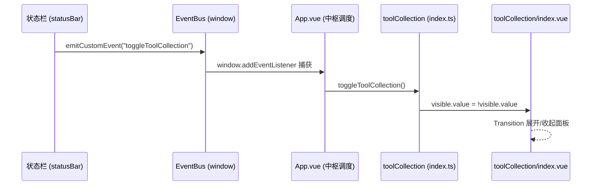

## 产品概述

创建"工具合集"功能模块，提供一个可从底部状态栏触发展开的工具面板，内部使用 Tab 标签页切换不同工具。首个集成的工具为 Base64 图片转换器（从现有 `base64Image` 功能迁移而来），后续可持续添加更多工具页面。

## 核心功能

- **底部面板展开**：点击状态栏中的工具合集图标，从底部向上滑入展开面板，再次点击或点击遮罩层关闭
- **Tab 标签页切换**：面板顶部显示工具 Tab，点击切换不同工具页面，当前支持 Base64 图片转换器
- **Base64 图片转换器**：保持原有的四种模式（图片转 Base64 / Base64 转图片 / URL 转 Base64 / 二维码生成），完整迁移所有子组件和功能逻辑
- **模块化工具架构**：每个工具独立目录（`tools/<toolName>/`），包含自身的组件、样式，可独立开发后注册到工具合集中

## 技术栈

- 前端框架：Vue 3 + TypeScript（与项目一致）
- 样式方案：SCSS（`@use` 导入，Codex UI 风格，复用全局 `_variables.scss` Token）
- 事件通信：`emitCustomEvent`（统一事件总线）+ `App.vue` 中枢调度
- 图标系统：Iconify（Phosphor/MDI，已预加载）

## 实现方案

### 总体策略

采用**自定义底部抽屉面板**模式（非 `createModalVueApp`，因为其定位为居中弹窗，不符合底部展开需求）。面板直接挂载到 `document.body`，使用 `position: fixed` 定位在底部，通过 Vue `<Transition>` 实现从底部滑入/滑出的动画效果。

### 架构设计



### 模块结构

```
src/features/toolCollection/
├── index.ts                          # register + 公开 API (toggle/open/close)
├── index.vue                         # 主面板：遮罩层 + 底部抽屉 + Tab 切换
├── types/
│   └── index.ts                      # ToolDefinition 接口 + 工具注册表
├── styles/
│   └── index.scss                    # 主面板样式（底部弹出、Tab 栏、遮罩层）
└── tools/
    └── base64Image/                  # Base64 图片转换工具模块
        ├── index.vue                 # 工具页面（迁移自 base64Image/index.vue）
        ├── components/               # 7 个子组件（迁移自原 base64Image/components/）
        │   ├── CopyDropdown.vue
        │   ├── FilterSettings.vue
        │   ├── PanelHeader.vue
        │   ├── QrcodeGenerator.vue
        │   ├── StatsSection.vue
        │   ├── UploadArea.vue
        │   └── WatermarkSettings.vue
        └── styles/
            └── index.scss            # 工具样式（迁移自原 base64Image/styles/index.scss）
```

### 数据流

1. **开关触发**：状态栏 `FEATURES` 数组新增 `toolCollection` 条目，`action` 调用 `emitCustomEvent("toggleToolCollection")`
2. **中枢调度**：`App.vue` 在 `onMounted` 中监听 `toggleToolCollection` 事件，调用 `toolCollection/index.ts` 导出的 `toggleToolCollection()`
3. **面板控制**：`index.ts` 维护模块级 `toolCollectionVisible` ref 和 `toggleToolCollection()` 函数，通过 Vue 的 `ref` 响应式控制面板显隐
4. **Tab 切换**：`index.vue` 内部使用 `currentTool` ref 控制当前激活的工具页面，通过 `:is` 动态组件或 `v-if` 渲染对应工具组件
5. **工具 i18n**：每个工具页面接收 `plugin.i18n`，base64Image 工具复用原有的 `base64Image.*` 翻译键

### 关键决策

| 决策 | 选择 | 理由 |
| --- | --- | --- |
| 面板模式 | 自定义底部抽屉（非 Modal） | `createModalVueApp` 居中定位，不符合"从底部往上展开"需求 |
| 原 base64Image 功能 | 移至 `_ConfigOnly` 白名单 | 不再独立注册 Dock 面板，保留 i18n 键供工具页面使用 |
| Tab 注册 | 静态 import（非动态加载） | 工具数量可控，静态导入构建时可做 tree-shaking，且避免运行时异步加载复杂性 |
| 事件通信 | `emitCustomEvent` + App.vue 路由 | 严格遵循项目"跨功能禁止直接导入"规则 |
| 组件迁移 | 完整复制子组件到新目录 | 避免 toolCollection 跨目录引用 base64Image，保持模块独立可启停 |


### 实现细节

- **面板高度**：默认占屏幕 60%（`max-height: 60vh`），内容超出时内部滚动
- **遮罩层**：半透明黑色遮罩，点击关闭面板，不阻止下方页面交互（面板未展开时 pointer-events: none）
- **动画**：使用 Vue `<Transition name="slide-up">`，`transform: translateY(100%) → translateY(0)`，持续时间 0.3s cubic-bezier
- **子组件样式引用**：迁移后的子组件 `@use` 路径需从 `../styles/index.scss` 调整为 `./styles/index.scss`（相对于 tools/base64Image/ 目录）
- **base64Image 的 `index.ts`**：改为导出空函数 `export function registerBase64Image() {}`，保留函数签名以维持 `features/index.ts` 中的导出不报错

## 目录结构

```
src/features/toolCollection/
├── types/
│   └── index.ts                    # [NEW] ToolDefinition 接口：定义工具的 id/icon/title/component 元数据；工具注册表数组
├── index.ts                        # [NEW] 模块入口：导出 toggleToolCollection()、toolCollectionVisible ref；registerToolCollection() 创建并挂载 Vue 应用到 body
├── index.vue                       # [NEW] 主面板组件：遮罩层 + 底部抽屉容器 + Tab 标签栏 + 工具内容区 + Transition 动画；管理 currentTool 状态
├── styles/
│   └── index.scss                  # [NEW] 主面板样式：.tool-collection-overlay 遮罩层、.tool-collection-panel 底部抽屉 fixed 定位、.tool-collection-tabs Tab 栏、slide-up 动画 keyframes
└── tools/
    └── base64Image/
        ├── index.vue               # [NEW] 迁移自 src/features/base64Image/index.vue：完整保留模板/脚本逻辑，调整 props 接收 plugin 实例以访问 i18n
        ├── components/
        │   ├── CopyDropdown.vue    # [NEW] 迁移自 base64Image/components/CopyDropdown.vue
        │   ├── FilterSettings.vue  # [NEW] 迁移自 base64Image/components/FilterSettings.vue
        │   ├── PanelHeader.vue     # [NEW] 迁移自 base64Image/components/PanelHeader.vue
        │   ├── QrcodeGenerator.vue # [NEW] 迁移自 base64Image/components/QrcodeGenerator.vue
        │   ├── StatsSection.vue    # [NEW] 迁移自 base64Image/components/StatsSection.vue
        │   ├── UploadArea.vue      # [NEW] 迁移自 base64Image/components/UploadArea.vue
        │   └── WatermarkSettings.vue # [NEW] 迁移自 base64Image/components/WatermarkSettings.vue
        └── styles/
            └── index.scss          # [NEW] 迁移自 base64Image/styles/index.scss：保持全部样式规则，供子组件 @use 导入

# --- 修改的文件 ---
src/features/base64Image/
└── index.ts                        # [MODIFY] registerBase64Image(plugin) 函数体改为空操作 {}，保留导出签名

src/features/
├── index.ts                        # [MODIFY] 新增 registerToolCollection 导出行 + 将 base64Image 从 _Registered 移至 _ConfigOnly + 新增 toolCollection 到 _Registered
└── config.ts                       # [MODIFY] FEATURE_CONFIG 数组新增 toolCollection 条目

src/
├── index.ts                        # [MODIFY] registerFeatures() 中添加 if (s.enableToolCollection) registerToolCollection(this)
├── config/
│   ├── settings.ts                 # [MODIFY] PluginSettings 接口新增 enableToolCollection: boolean + DEFAULT_SETTINGS 默认值 true
│   └── icons.ts                    # [MODIFY] FEATURE_ICONS 新增 toolCollection 条目 { icon: "mdi:toolbox-outline", color: "#6366f1" }
├── features/statusBar/
│   └── index.vue                   # [MODIFY] FEATURES 数组新增 toolCollection 条目（含 shortcut 和 action）
└── App.vue                         # [MODIFY] onMounted 中监听 "toggleToolCollection" 事件，调用 toolCollection 的 toggleToolCollection()

src/i18n/
├── zh_CN/
│   └── toolCollection.json         # [NEW] 中文翻译：面板标题、Tab 标签、开关设置等
└── en_US/
    └── toolCollection.json         # [NEW] 英文翻译：panel title, tab labels, toggle settings
```

## Agent Extensions

### SubAgent

- **code-explorer**
- Purpose: 在创建计划前探索 base64Image 模块的完整结构（所有子组件、样式文件、i18n 键、依赖关系），确保迁移不遗漏任何文件
- Expected outcome: 确认所有需要迁移的文件路径、各子组件样式依赖关系、i18n 键列表，生成完整的迁移清单

### Skill

- **universal-arch-skill**
- Purpose: 验证新建的 toolCollection 功能模块是否符合项目架构规范（8 步注册完整性、SCSS 分离、统一入口点、跨功能通信规则）
- Expected outcome: 输出架构合规检查报告，确保新模块结构与现有功能模块保持一致
