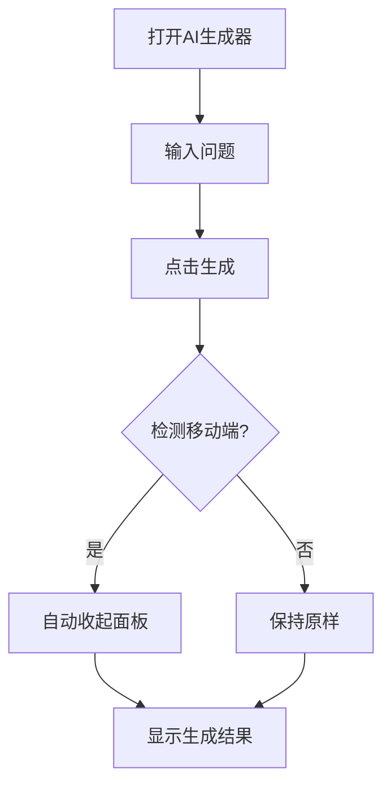
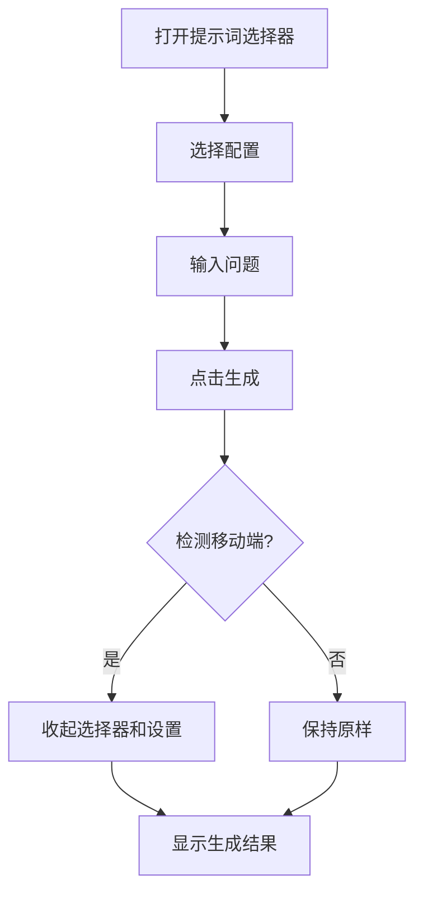
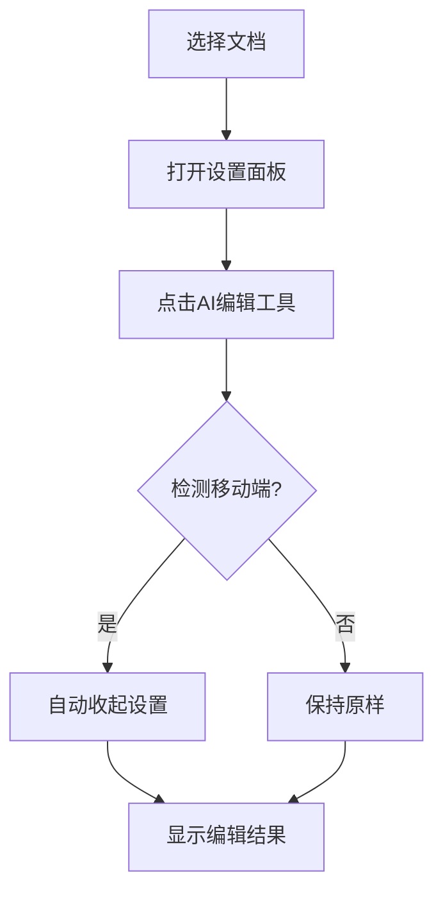

# 移动端自动收起功能 - 演示说明

## 快速演示

### 场景1：普通问答

**操作步骤**：
```
1. 打开AI内容生成器（移动端）
2. 点击"选择提示词"按钮
3. 选择一个提示词配置
4. 输入问题："请介绍Vue 3的新特性"
5. 点击"生成"按钮
```

**预期效果**：
```
✅ 提示词选择器立即收起
✅ 设置面板（如果展开）立即收起
✅ 生成内容直接显示在视野中
✅ 无需手动滚动
```

### 场景2：文档编辑

**操作步骤**：
```
1. 切换到"编辑模式"
2. 选择一个文档
3. 点击"对话设置"查看配置
4. 点击"润色"按钮
```

**预期效果**：
```
✅ 设置面板立即收起
✅ 编辑结果直接显示
✅ 可以立即看到优化效果
```

### 场景3：智能分析

**操作步骤**：
```
1. 编辑模式下选择文档
2. 打开设置面板调整参数
3. 点击"智能分析"按钮
```

**预期效果**：
```
✅ 设置面板立即收起
✅ AI分析建议直接显示
✅ 建议面板清晰可见
```

## 对比演示

### 优化前 ❌

```
┌─────────────────────┐
│ 🤖 AI信息生成       │
│ [编辑] [设置]       │
├─────────────────────┤
│ 💬 对话设置         │
│ [系统提示词...]     │
│ [创造性: 0.7]       │
│ [最大长度: 10000]   │
│ ...                 │
├─────────────────────┤
│ 📋 选择提示词       │
│ [提示词列表...]     │
│ ...                 │
├─────────────────────┤
│ [输入框]            │
│ [生成按钮]          │
├─────────────────────┤
│                     │
│ 👇 需要向下滚动     │
│                     │
├─────────────────────┤
│ 📝 生成内容         │
│ (在屏幕下方)        │
└─────────────────────┘
```

### 优化后 ✅

```
┌─────────────────────┐
│ 🤖 AI信息生成       │
│ [编辑] [设置]       │
├─────────────────────┤
│ [输入框]            │
│ [生成按钮]          │
├─────────────────────┤
│ 📝 生成内容         │
│ ✨ 直接可见！       │
│                     │
│ 正在生成中...       │
│                     │
│ (面板已自动收起)    │
└─────────────────────┘
```

## 交互流程图

### 流程1：首次使用



### 流程2：使用提示词



### 流程3：AI编辑



## 视觉效果

### 动画效果（建议）

```
收起动画：
- 持续时间: 200ms
- 缓动函数: ease-out
- 效果: 向上滑出

展开动画：
- 持续时间: 200ms
- 缓动函数: ease-in
- 效果: 向下滑入
```

### 当前实现

```
收起效果：
- 持续时间: 即时
- 效果: 直接隐藏
- 优点: 响应快速
```

## 用户反馈收集

### 问卷问题

1. **易用性**
   - 自动收起功能是否方便？
   - 评分: ⭐⭐⭐⭐⭐

2. **可见性**
   - 生成结果是否更容易看到？
   - 评分: ⭐⭐⭐⭐⭐

3. **控制感**
   - 是否希望手动控制收起？
   - 选项: 是 / 否 / 无所谓

4. **改进建议**
   - 您希望如何改进这个功能？
   - 文本输入框

### 预期反馈

**正面反馈**：
- ✅ "太方便了，不用滚动了"
- ✅ "生成速度感觉更快了"
- ✅ "移动端体验好多了"

**改进建议**：
- 💡 "希望有个开关可以关闭"
- 💡 "能不能加个动画效果"
- 💡 "横屏时不需要收起"

## 技术细节

### 检测逻辑

```typescript
// 双重检测机制
const checkIsMobile = () => {
  // 方法1: 检测思源笔记环境
  const isSiyuanMobile = document.body.classList.contains('body--mobile');
  
  // 方法2: 检测屏幕宽度
  const isSmallScreen = window.innerWidth <= 768;
  
  // 任一条件满足即为移动端
  isMobile.value = isSiyuanMobile || isSmallScreen;
};
```

### 触发时机

```typescript
// 在生成操作前立即执行
const handleGenerate = async () => {
  // ... 验证输入 ...
  
  // 🎯 关键点：在生成前收起
  if (isMobile.value) {
    showSettings.value = false;
    showPromptSelector.value = false;
  }
  
  // ... 开始生成 ...
};
```

### 状态管理

```typescript
// 响应式状态
const showSettings = ref(false);        // 设置面板状态
const showPromptSelector = ref(false);  // 提示词选择器状态
const isMobile = ref(false);            // 移动端标识

// 自动收起 = 修改状态为 false
```

## 测试用例

### 用例1：基础收起
```
前置条件: 移动端，设置面板展开
操作: 点击生成按钮
预期: 设置面板收起
```

### 用例2：多面板收起
```
前置条件: 移动端，设置面板和提示词选择器都展开
操作: 点击生成按钮
预期: 两个面板都收起
```

### 用例3：桌面端不触发
```
前置条件: 桌面端，设置面板展开
操作: 点击生成按钮
预期: 设置面板保持展开
```

### 用例4：重新打开
```
前置条件: 移动端，面板已自动收起
操作: 点击设置按钮
预期: 设置面板重新展开
```

### 用例5：AI编辑工具
```
前置条件: 移动端编辑模式，设置面板展开
操作: 点击"润色"按钮
预期: 设置面板收起
```

## 常见问题

### Q1: 为什么要自动收起？
**A**: 移动端屏幕空间有限，自动收起可以让用户立即看到生成结果，无需手动滚动。

### Q2: 桌面端会受影响吗？
**A**: 不会。自动收起功能仅在移动端触发，桌面端行为完全不变。

### Q3: 如果我想看着设置生成怎么办？
**A**: 生成完成后，可以点击顶部的"设置"按钮重新打开设置面板。

### Q4: 横屏时也会收起吗？
**A**: 取决于屏幕宽度。如果宽度 ≤768px，会触发收起；否则不会。

### Q5: 能不能关闭这个功能？
**A**: 当前版本暂不支持。如果有需求，可以在后续版本添加开关。

## 演示视频脚本

### 脚本1：普通生成（30秒）

```
[画面] 打开AI生成器
[旁白] "在移动端使用AI生成器时..."

[画面] 展开提示词选择器
[旁白] "选择一个提示词配置..."

[画面] 输入问题
[旁白] "输入您的问题..."

[画面] 点击生成按钮
[旁白] "点击生成..."

[画面] 面板自动收起，显示生成结果
[旁白] "面板自动收起，结果直接呈现！"

[画面] 展示完整的生成内容
[旁白] "无需滚动，一目了然！"
```

### 脚本2：对比演示（45秒）

```
[画面分屏] 左侧：优化前 | 右侧：优化后

[旁白] "让我们对比一下优化前后的体验..."

[左侧] 点击生成，面板保持展开，需要滚动
[右侧] 点击生成，面板自动收起，直接显示

[旁白] "优化前需要手动滚动..."
[旁白] "优化后自动收起，立即可见！"

[画面] 突出显示"节省1步操作"
[旁白] "节省操作步骤，提升使用体验！"
```

## 总结

移动端自动收起功能通过智能的交互设计，显著提升了用户体验。用户无需手动滚动即可看到生成结果，操作更流畅，体验更友好。这是一个简单但有效的优化，体现了"以用户为中心"的设计理念。

---

**演示准备**: ✅ 完成
**测试设备**: 📱 iPhone, Android, iPad
**反馈渠道**: 💬 GitHub Issues, 用户调研
