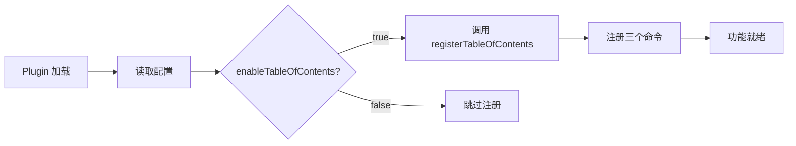

# TableOfContents 功能研究报告

> 研究日期: 2026-01-23
> 功能位置: `src/features/tableOfContents/`
> 参考项目: https://github.com/TinkMingKing/siyuan-plugins-index

---

## 目录

1. [功能概述](#功能概述)
2. [技术架构](#技术架构)
3. [核心代码分析](#核心代码分析)
4. [实现细节](#实现细节)
5. [使用方法](#使用方法)
6. [技术要点总结](#技术要点总结)

---

## 功能概述

### 功能描述

TableOfContents（目录索引）是一个用于思源笔记的插件功能，提供以下三种核心能力：

1. **插入索引** - 生成当前文档的直接子文档列表（使用 Markdown 链接）
2. **插入子文档引用列表** - 使用思源引用块语法 `((id "name"))` 生成子文档列表
3. **插入子文档及其大纲** - 生成子文档列表及每个子文档的标题层级大纲

### 功能特点

- **智能更新**：自动检测文档中是否已存在同类型索引，存在则更新，不存在则插入
- **精确光标定位**：使用三种方法获取当前光标所在块，确保操作准确
- **SQL 查询优化**：使用 SQL JOIN 查询提高索引块查找性能
- **安全性**：SQL 查询使用防注入转义函数
- **用户友好**：提供清晰的成功/失败提示信息

### 快捷键

| 功能 | 快捷键 | 说明 |
|------|--------|------|
| 插入索引 | `Ctrl + Alt + I` | 生成子文档 Markdown 链接列表 |
| 插入子文档及大纲 | `Ctrl + Alt + O` | 生成子文档引用 + 标题大纲 |
| 插入子文档引用 | `Ctrl + Alt + R` | 生成子文档引用块列表 |

---

## 技术架构

### 文件结构

```
src/features/tableOfContents/
└── index.ts    # 完整功能实现（单个文件，约 410 行）
```

### 依赖关系

```
tableOfContents (功能模块)
├── siyuan (插件 API)
│   ├── Plugin - 插件基类
│   ├── showMessage - 消息提示
│   └── addCommand - 命令注册
└── @/api (封装的 API 调用)
    ├── getBlockByID - 通过 ID 获取块
    ├── getBlockKramdown - 获取块的 Kramdown 内容
    ├── insertBlock - 插入新块
    ├── updateBlock - 更新块内容
    ├── setBlockAttrs - 设置块属性
    └── sql - 执行 SQL 查询
```

### 模块导出

```typescript
// src/features/index.ts
export { registerTableOfContents } from './tableOfContents'
```

### 注册流程



---

## 核心代码分析

### 1. 功能注册入口

**文件位置**: `src/features/tableOfContents/index.ts` (第 11-14 行)

```typescript
export function registerTableOfContents(plugin: Plugin) {
  // 注册快捷键命令
  registerCommands(plugin)
}
```

**说明**:
- 这是模块的唯一导出函数
- 在 `src/index.ts` 中被调用（第 113 行）
- 根据 `plugin.settings.enableTableOfContents` 条件性注册

### 2. 命令注册

**文件位置**: `src/features/tableOfContents/index.ts` (第 19-46 行)

```typescript
function registerCommands(plugin: Plugin) {
  // CTRL + ALT + I: 插入索引
  plugin.addCommand({
    langKey: 'insertIndex',
    hotkey: '⌃⌥I',
    callback: () => {
      insertIndex(plugin)
    },
  })

  // CTRL + ALT + O: 插入子文档及其大纲
  plugin.addCommand({
    langKey: 'insertSubDocsWithOutline',
    hotkey: '⌃⌥O',
    callback: () => {
      insertSubDocsWithOutline(plugin)
    },
  })

  // CTRL + ALT + R: 插入子文档引用列表
  plugin.addCommand({
    langKey: 'insertSubDocsRef',
    hotkey: '⌃⌥R',
    callback: () => {
      insertSubDocsRef(plugin)
    },
  })
}
```

**技术要点**:
- `langKey`: 国际化键名，对应 `i18n/zh_CN.json` 中的翻译
- `hotkey`: 使用思源的热键格式（⌃=Ctrl, ⌥=Alt, ⇧=Shift, ⌘=Cmd）
- `callback`: 箭头函数保持 `this` 上下文

### 3. 光标定位核心算法

**文件位置**: `src/features/tableOfContents/index.ts` (第 51-86 行)

```typescript
function getCurrentBlockId(): string | null {
  // 方法1: 获取当前选中的块
  const selectedBlock = document.querySelector('.protyle-wysiwyg--select')
  if (selectedBlock) {
    return selectedBlock.getAttribute('data-node-id')
  }

  // 方法2: 获取光标所在的块（聚焦的块）
  const focusedBlock = document.querySelector('.protyle-wysiwyg [data-node-id].protyle-wysiwyg--focus')
  if (focusedBlock) {
    return focusedBlock.getAttribute('data-node-id')
  }

  // 方法3: 通过 window.getSelection() 精确获取光标位置
  const selection = window.getSelection()
  if (selection && selection.rangeCount > 0) {
    const range = selection.getRangeAt(0)
    let node: Node | null = range.startContainer

    // 向上查找直到找到带有 data-node-id 和 data-type 的元素
    while (node) {
      if (node instanceof Element) {
        const nodeId = node.getAttribute('data-node-id')
        const dataType = node.getAttribute('data-type')

        // 必须同时有 data-node-id 和 data-type 才是有效的块
        if (nodeId && dataType) {
          return nodeId
        }
      }
      node = node.parentNode
    }
  }

  return null
}
```

**算法说明**:

1. **三层降级策略**:
   - 优先使用选中状态类名 `.protyle-wysiwyg--select`
   - 其次使用聚焦状态类名 `.protyle-wysiwyg--focus`
   - 最后使用 DOM 遍历

2. **关键验证**:
   - 必须同时存在 `data-node-id` 和 `data-type` 属性
   - 确保找到的是真正的块元素

3. **DOM 遍历**:
   - 从光标位置向上遍历 DOM 树
   - 查找第一个满足条件的块元素

### 4. 文档 ID 获取

**文件位置**: `src/features/tableOfContents/index.ts` (第 91-126 行)

```typescript
// 通过块ID获取其所属的文档ID
async function getDocIdByBlockId(blockId: string): Promise<string | null> {
  try {
    const block = await api.getBlockByID(blockId)
    return block?.root_id || null
  } catch (error) {
    console.error('获取文档ID失败:', error)
    return null
  }
}

// 获取当前文档ID（优先使用光标所在文档）
async function getCurrentDocId(): Promise<string | null> {
  // 优先方案：通过光标所在的块获取文档ID
  const currentBlockId = getCurrentBlockId()
  if (currentBlockId) {
    const docId = await getDocIdByBlockId(currentBlockId)
    if (docId) {
      return docId
    }
  }

  // 备用方案：使用激活窗口的文档
  const protyle = getActiveProtyle()
  const docId = protyle?.querySelector('.protyle-background')?.getAttribute('data-node-id')
  return docId || null
}
```

**设计亮点**:
- 双重保障机制：优先精确光标位置，降级到激活窗口
- 错误处理：使用 try-catch 和空值合并
- 类型安全：使用 TypeScript 类型标注

### 5. 内容插入与更新逻辑

**文件位置**: `src/features/tableOfContents/index.ts` (第 132-191 行)

```typescript
async function insertContent(plugin: Plugin, content: string, indexType: string) {
  try {
    // 1. 获取当前光标所在的块ID
    const currentBlockId = getCurrentBlockId()
    if (!currentBlockId) {
      showMessage('请先将光标放在文档中的某个块上', 3000, 'error')
      return
    }

    // 2. 通过块ID获取文档ID
    const docId = await getDocIdByBlockId(currentBlockId)
    if (!docId) {
      showMessage('无法获取当前文档信息', 3000, 'error')
      return
    }

    // 3. 查找整个文档中是否存在同类型的索引块
    const existingIndexBlock = await findExistingIndexBlock(docId, indexType)

    if (existingIndexBlock) {
      // 4a. 已存在：比较内容是否变化
      const existingContent = await api.getBlockKramdown(existingIndexBlock.id)
      const existingMarkdown = existingContent?.kramdown || ''

      // 规范化内容进行比较
      const normalizedExisting = existingMarkdown.replace(/\r\n/g, '\n').trim()
      const normalizedNew = content.replace(/\r\n/g, '\n').trim()

      if (normalizedExisting === normalizedNew) {
        showMessage('内容无变化,无需更新', 2000, 'info')
        return
      }

      // 4b. 内容有变化,更新块
      await api.updateBlock('markdown', content, existingIndexBlock.id)
      showMessage('索引已更新', 2000, 'info')
    } else {
      // 5. 不存在：插入新内容
      const result = await api.insertBlock('markdown', content, undefined, currentBlockId, undefined)

      // 6. 为新插入的块添加自定义属性标记
      if (result && result.length > 0 && result[0].doOperations) {
        const newBlockId = result[0].doOperations[0]?.id
        if (newBlockId) {
          await api.setBlockAttrs(newBlockId, {
            'custom-toc-type': indexType,
            'custom-toc-generated': 'true',
          })
        }
      }

      showMessage(plugin.i18n.insertSuccess, 2000, 'info')
    }
  } catch (error) {
    console.error('插入内容失败:', error)
    const errorMsg = error?.message || String(error)
    showMessage(plugin.i18n.insertFailed + errorMsg, 3000, 'error')
  }
}
```

**核心逻辑**:

1. **智能检测**：查找文档中是否已存在同类型的索引
2. **内容规范化**：统一换行符（\r\n → \n）并去除首尾空白
3. **差异化更新**：内容相同则跳过，不同则更新
4. **属性标记**：为生成的块添加自定义属性，便于后续识别

### 6. SQL 查询优化

**文件位置**: `src/features/tableOfContents/index.ts` (第 198-226 行)

```typescript
// 查找整个文档中该类型的索引块
async function findExistingIndexBlock(docId: string, indexType: string): Promise<any> {
  try {
    // 使用SQL直接查询带有自定义属性的块
    const blocks = await api.sql(`
      SELECT DISTINCT b.id, b.type
      FROM blocks b
      JOIN attributes a1 ON b.id = a1.block_id AND a1.name = 'custom-toc-type' AND a1.value = '${escapeSqlString(indexType)}'
      JOIN attributes a2 ON b.id = a2.block_id AND a2.name = 'custom-toc-generated' AND a2.value = 'true'
      WHERE b.root_id = '${escapeSqlString(docId)}'
      ORDER BY b.sort ASC
      LIMIT 1
    `)

    return blocks && blocks.length > 0 ? blocks[0] : null
  } catch (error) {
    console.error('查找索引块失败:', error)
    return null
  }
}

// SQL 转义函数，防止注入
function escapeSqlString(str: string): string {
  if (!str) return ''
  return str.replace(/'/g, "''")
}
```

**技术亮点**:

1. **JOIN 查询**：一次性关联多个属性表，避免循环 API 调用
2. **索引标记**：使用自定义属性区分不同类型的索引
   - `custom-toc-type`: 索引类型（index/subdocs-ref/subdocs-outline）
   - `custom-toc-generated`: 标记为自动生成
3. **安全性**：SQL 转义函数防止注入攻击

### 7. 子文档查询

**文件位置**: `src/features/tableOfContents/index.ts` (第 232-279 行)

```typescript
async function insertIndex(plugin: Plugin) {
  try {
    const docId = await getCurrentDocId()
    if (!docId) {
      showMessage(plugin.i18n.noActiveDocument, 3000, 'error')
      return
    }

    // 获取当前文档信息
    const currentDoc = await api.getBlockByID(docId)
    if (!currentDoc || !currentDoc.box || !currentDoc.hpath) {
      showMessage('无法获取当前文档信息', 3000, 'error')
      return
    }

    // 使用hpath查询子文档（人类可读路径）
    const subDocs = await api.sql(`
      SELECT id, content, hpath
      FROM blocks
      WHERE box = '${escapeSqlString(currentDoc.box)}'
      AND type = 'd'
      AND hpath LIKE '${escapeSqlString(currentDoc.hpath)}/%'
      AND hpath NOT LIKE '${escapeSqlString(currentDoc.hpath)}/%/%'
      ORDER BY hpath ASC
    `)

    if (!subDocs || subDocs.length === 0) {
      showMessage(plugin.i18n.noSubDocuments, 3000, 'info')
      return
    }

    // 生成索引内容
    let indexContent = '## 📑 子文档索引\n\n'

    for (let i = 0; i < subDocs.length; i++) {
      const subDoc = subDocs[i]
      const docName = subDoc.content.replace(/<[^>]*>/g, '')
      const index = String(i + 1).padStart(2, '0')
      indexContent += `${index}. [${docName}](siyuan://blocks/${subDoc.id})\n`
    }

    await insertContent(plugin, indexContent, 'index')
  } catch (error) {
    console.error('插入索引失败:', error)
    const errorMsg = error?.message || String(error)
    showMessage(plugin.i18n.insertFailed + errorMsg, 3000, 'error')
  }
}
```

**关键 SQL 条件**:

| 条件 | 说明 |
|------|------|
| `box = '笔记本ID'` | 限定在同一个笔记本内 |
| `type = 'd'` | 只查询文档类型（d = document） |
| `hpath LIKE '当前路径/%'` | 匹配子文档路径 |
| `hpath NOT LIKE '当前路径/%/%'` | 排除孙子文档，只获取直接子文档 |
| `ORDER BY hpath ASC` | 按路径排序 |

---

## 实现细节

### 1. 三种索引类型的实现差异

#### 类型 1: 插入索引（Markdown 链接）

```markdown
## 📑 子文档索引

01. [文档一](siyuan://blocks/20240101-abcdef)
02. [文档二](siyuan://blocks/20240102-ghijkl)
```

- **语法**: Markdown 标准链接语法
- **用途**: 导出为 Markdown/PDF 时保持可点击
- **索引类型**: `'index'`

#### 类型 2: 子文档引用列表

```markdown
## 🔗 子文档引用

01. ((20240101-abcdef "文档一"))
02. ((20240102-ghijkl "文档二"))
```

- **语法**: 思源引用块语法 `((id "锚文本"))`
- **用途**: 支持双向链接和反查
- **索引类型**: `'subdocs-ref'`

#### 类型 3: 子文档及大纲

```markdown
## 📋 子文档大纲

### 📄 ((20240101-abcdef "文档一"))

- ((20240101-head1 "标题1"))
  - ((20240101-head2 "子标题"))
  - ((20240101-head3 "另一个子标题"))

### 📄 ((20240102-ghijkl "文档二"))

- ((20240201-head1 "标题A"))
  - ((20240201-head2 "子标题A"))
```

- **语法**: 引用块 + 列表缩进
- **层级**: 根据标题级别（h1-h6）自动缩进
- **索引类型**: `'subdocs-outline'`

### 2. 标题层级缩进算法

**文件位置**: `src/features/tableOfContents/index.ts` (第 389-396 行)

```typescript
for (const heading of headings) {
  const level = Number.parseInt(heading.subtype.replace('h', ''))
  const indent = '  '.repeat(level - 1)
  const headingContent = heading.content.replace(/<[^>]*>/g, '')
  content += `${indent}- ((${heading.id} "${headingContent}"))\n`
}
```

**算法说明**:

| 标题级别 | subtype | level 计算 | 缩进结果 |
|---------|---------|-----------|---------|
| H1 | `h1` | `parseInt('h1'.replace('h', ''))` = 1 | `''` (无缩进) |
| H2 | `h2` | 2 | `'  '` (2 空格) |
| H3 | `h3` | 3 | `'    '` (4 空格) |
| H4 | `h4` | 4 | `'      '` (6 空格) |

### 3. 内容规范化处理

```typescript
// 统一换行符
const normalizedExisting = existingMarkdown.replace(/\r\n/g, '\n').trim()
const normalizedNew = content.replace(/\r\n/g, '\n').trim()
```

**原因**:
- Windows 使用 `\r\n` (CRLF)
- Unix/Linux 使用 `\n` (LF)
- Markdown 规范化后才能正确比较

### 4. HTML 标签清理

```typescript
const docName = subDoc.content.replace(/<[^>]*>/g, '')
const headingContent = heading.content.replace(/<[^>]*>/g, '')
```

**说明**:
- 思源存储的内容可能包含 HTML 标签
- 使用正则 `/[[^>]*>/g` 移除所有 HTML 标签
- 保留纯文本内容用于显示

---

## 使用方法

### 启用功能

1. 打开思源笔记设置
2. 进入插件设置
3. 找到"目录索引"功能
4. 确保开关已启用（默认启用）
5. 重启插件或思源笔记

### 使用快捷键

#### 插入子文档索引

1. 打开一个包含子文档的父文档
2. 将光标放在任意位置
3. 按 `Ctrl + Alt + I`
4. 自动生成子文档列表

#### 插入子文档引用

1. 打开一个包含子文档的父文档
2. 将光标放在任意位置
3. 按 `Ctrl + Alt + R`
4. 生成引用块列表

#### 插入子文档及大纲

1. 打开一个包含子文档的父文档
2. 将光标放在任意位置
3. 按 `Ctrl + Alt + O`
4. 生成完整的大纲结构

### 更新索引

- **自动更新**: 再次执行相同快捷键，索引会自动更新
- **智能检测**: 如果内容无变化，会提示"内容无变化,无需更新"
- **保留位置**: 更新操作保持原有块的位置和属性

### 删除索引

手动删除生成的索引块即可。下次执行命令会重新创建。

---

## 技术要点总结

### 1. 核心技术栈

| 技术 | 用途 |
|------|------|
| TypeScript | 类型安全的开发 |
| 思源 API | 块操作、SQL 查询 |
| DOM API | 光标位置获取 |
| SQL | 高效数据查询 |

### 2. 设计模式

#### 命令模式
```typescript
plugin.addCommand({
  langKey: '...',
  hotkey: '...',
  callback: () => { /* 执行逻辑 */ },
})
```

#### 策略模式
三种不同的索引生成策略：
- `insertIndex()` - Markdown 链接策略
- `insertSubDocsRef()` - 引用块策略
- `insertSubDocsWithOutline()` - 大纲策略

#### 单一职责原则
每个函数只负责一个明确的功能：
- `getCurrentBlockId()` - 获取块 ID
- `getDocIdByBlockId()` - 获取文档 ID
- `findExistingIndexBlock()` - 查找索引块
- `insertContent()` - 插入/更新内容

### 3. 性能优化

1. **SQL JOIN 查询**：一次查询获取所需数据，避免多次 API 调用
2. **内容缓存比较**：规范化后比较，避免不必要的更新
3. **LIMIT 1**：查找索引块时只返回第一个结果

### 4. 错误处理

```typescript
try {
  // 业务逻辑
} catch (error) {
  console.error('操作失败:', error)
  const errorMsg = error?.message || String(error)
  showMessage(`操作失败: ${errorMsg}`, 3000, 'error')
}
```

### 5. 用户体验优化

| 优化点 | 实现 |
|--------|------|
| 多语言支持 | `plugin.i18n.key` |
| 操作反馈 | `showMessage()` 提示 |
| 智能更新 | 内容比较避免重复操作 |
| 精确定位 | 三种方法获取光标位置 |

### 6. 可扩展性

```typescript
// 添加新的索引类型
async function insertCustomIndex(plugin: Plugin) {
  // 1. 获取文档信息
  const docId = await getCurrentDocId()

  // 2. 查询数据
  const data = await api.sql(`...`)

  // 3. 生成内容
  const content = '## 新索引\n\n'

  // 4. 插入/更新
  await insertContent(plugin, content, 'custom-type')
}
```

---

## 参考资源

### 相关文档

- [思源笔记 API 文档](https://github.com/siyuan-note/siyuan/blob/master/API_zh_CN.md)
- [思源笔记 SQL 查询](https://github.com/siyuan-note/siyuan/blob/master/API_zh_CN.md#%E6%89%A7%E8%A1%8Csql)
- [原始参考项目](https://github.com/TinkMingKing/siyuan-plugins-index)

### 项目文件

| 文件 | 说明 |
|------|------|
| `src/features/tableOfContents/index.ts` | 完整功能实现 |
| `src/api.ts` | API 封装 |
| `src/i18n/zh_CN.json` | 中文翻译 |
| `src/i18n/en_US.json` | 英文翻译 |
| `src/config/settings.ts` | 配置管理 |

---

## 结论

TableOfContents 功能展示了思源笔记插件开发的最佳实践：

1. **清晰的模块化设计**：单一文件实现完整功能
2. **健壮的错误处理**：完善的异常捕获和用户提示
3. **性能优化**：SQL JOIN 查询和智能更新机制
4. **用户友好**：快捷键操作、智能检测、多语言支持
5. **可维护性**：代码结构清晰，易于扩展新功能

该功能为文档管理提供了强大的自动化能力，特别适合处理大型文档库和层级结构复杂的知识库。
